$~$

The overall purpose of this project is to identify if there are predilections for certain germline p53 mutations in certain tissues due to similar developmental origins, which can then potentially influence specific epigenomic landscapes in these tissues. As germline p53 mutations would be present in all cells from conception, they would be carried through all developmental tissues and their organ derivatives, and thus could shape the unique epigenetics specific to tissues. Consequently, these enrichments of mutations could favor carcinogenesis in specific tissues.

$~$

# **Code Setup** {#codesetup}

$~$

This code applies to all code chunks in this document, like ensuring the figures in this HTML will be centered and fullsize, saving all figures to the computer as high-resolution SVG files, and removing comment marks in outputted text.

$~$


``` r
# define file paths for inputs and places to save figures and tables
overall_path <- c("")
fig_path <- paste0(overall_path, "figures/")
table_path <- paste0(overall_path, "tables/")
input_path <- paste0(overall_path, "inputs/")
analogous_somatic_path <- c("../p53-somatic-mut-spectrum-cbioportal_files/tables/")

knitr::opts_chunk$set(fig.align = "center",
                      comment = "",
                      dev = "svg",
                      dpi = 600,
                      out.width = "100%",
                      out.height = "100%",
                      fig.path = fig_path)
```

$~$

# **Libraries Used and Functions** {#librariesandfx}

$~$

This code calls all the packages used in this document's analysis, and sets a seed for reproducibility. I also introduce a function to add significance stars to p-values generated by summary tables later on.

$~$


``` r
#load (and install if needed) pacman and use it to load important packages
if (!require("pacman", quietly = TRUE)) install.packages("pacman"); library(pacman)
pacman::p_load(BiocManager, stringr, dplyr, tidyverse, ggplot2, kableExtra, knitr, devtools, rmarkdown, readr, readxl, patchwork, data.table, scales, grid, gridExtra, condformat, cowplot, janitor, pivottabler, reshape2, tibble, gtools, ggpubr, ggrepel, RColorBrewer, ComplexHeatmap, bookdown, ggalluvial, gt, gtsummary, webshot2, dendextend, factoextra, NbClust, fpc, cluster, fossil, nnet, MASS, survminer, survival, ggh4x, corrplot, ggstats, car, caret, venn)

#update all loaded packages
#pacman::p_update() 

#set seed for reproducibility
set.seed(1212)

# create function to show significance stars in gt summary tables 
pvalue_with_stars <- function(x) {
  dplyr::case_when(
    x < 0.001 ~ paste0(style_pvalue(x, digits = 3), " (***)"),
    x < 0.01 ~ paste0(style_pvalue(x, digits = 3), " (**)"),
    x < 0.05 ~ paste0(style_pvalue(x, digits = 3), " (*)"),
    TRUE ~ style_pvalue(x, digits = 3)
  )
}

# create function to pivot wider multinomial gt summary tables
multinom_pivot_wider <- function(x) {
  # check inputs match expectatations
  if (!inherits(x, "tbl_regression") || !inherits(x$model_obj, "multinom")) {
    stop("`x=` must be class 'tbl_regression' summary of a `nnet::multinom()` model.")
  }
  
  # create tibble of results
  df <- tibble::tibble(outcome_level = unique(x$table_body$groupname_col))
  df$tbl <- 
    purrr::map(
      df$outcome_level,
      function(lvl) {
        gtsummary::modify_table_body(
          x, 
          ~dplyr::filter(.x, .data$groupname_col %in% lvl) %>%
            dplyr::ungroup() %>%
            dplyr::select(-.data$groupname_col)
        )
      }
    )
  
  tbl_merge(df$tbl, tab_spanner = paste0("**", df$outcome_level, "**"))
}

# create function to put n numbers and other stats above plots
stat_box_data <- function(y) {
  return( 
    data.frame(
      y = 1.35 + 1.1 * max(y), 
      label = paste('n =', length(y), '\n'
                    #,
                    #'mean =', round(mean(y), 2), "\n"
                    ,
                    "median =", round(median(y), 2), "\n"
                    )
    )
  )
}
```

$~$

# **Input Data** {#inputdata}

$~$

First I downloaded the entire germline variant dataset from the TP53 Database [@tp53database2022], downloaded from this site: <https://tp53.cancer.gov/view_data?bq_view_name=GermlineDownload>. To get to this page, go to <https://tp53.cancer.gov/> --\> Germline Variants --\> Data Downloads Germline Variants --\> TP53 germline variants and family history (data file) --\> click Preview icon to get to filterable data table --\> download entire table without any filters.

$~$

I also took p53 mutations described in Figure 7J of @chen2021 as being transcriptionally rescued after the administration of arsenic trioxide (ATO) i.e. all mutations with more than 2-fold change of transcriptional activity (upper right and lower right quadrants). ATO has been proposed as a possible therapeutic agent for Li-Fraumeni Syndrome where short doses could prevent cancer incidence [@Pantziarka2022]. So it would be good to track which mutations in the TP53 database germline mutant dataset could potentially be rescued by this agent.

$~$

I also downloaded information for all p53 mutants tested for ATO rescue from <http://www.rescuep53.net/explore.html> and took Supplementary Table S6 from @song2023. The site was created from the results of this paper and Supplementary Table S6 specifically lists which mutations are type 1, 2a (both of which had notable ATO-mediated rescue), 2b, or 3 mutants (either less effectively rescued or not rescued at all after ATO). To get mutations from the website, I went to <http://www.rescuep53.net/explore.html>, changed the upper left dropdown to show all 800 mutations, and manually copied and pasted all the columns' information into an Excel file, which I have then read in below.

$~$

I also took p53 mutations described in Figure 5C of @tang2022 as being transcriptionally rescued after the administration of potassium antimony tartrate (PAT).

$~$

In this code, I have then read in the entire downloaded file as a dataframe, removed any duplicated rows (which were none), and have just displayed the first six rows of the table to get a preview of the data.

$~$


``` r
#read in entire p53 germline variant data downloaded from TP53 database
origdatabase <- read.csv(paste0(input_path,
                                "GermlineDownload_r20 ALL.csv"), 
                         sep = ",",
                         header = TRUE) %>%
  remove_rownames()

#only keep distinct rows of inputted data (nothing should change in dataframe)
origdbdistinct <- origdatabase %>% 
  distinct()

#just showing first 6 lines of inputted data
kbl(head(origdbdistinct), 
    row.names = TRUE) %>% 
  kable_styling(bootstrap_options = c("striped", 
                                      "responsive", 
                                      "condensed", 
                                      "hover"), 
                fixed_thead = TRUE) %>%
  scroll_box(width = "100%", 
             height = "540px")

# for ATO rescue papers, read in files or mutations manually

# upper right and lower right quadrants of fig 7J in chen 2021 cancer cell paper
orig_mut_rescue_ATO_chen_2021 <- c("R175H",
                                   "M237I",
                                   "V272M",
                                   "R282W",
                                   "E285K",
                                   "G245S",
                                   "Y234C",
                                   "I195T",
                                   "R158H")

# def non-rescuable double-negative bottom left quadrant of fig 7J in chen 2021 cancer cell paper
orig_mut_not_rescue_ATO_chen_2021 <- c("G245D",
                                       "R248Q",
                                       "Y220C",
                                       "R273L",
                                       "R248L",
                                       "Y205C",
                                       "R273H",
                                       "R273C",
                                       "V157F")

# check which sheets of excel files for song 2023 STM info have ATO information to read in
excel_sheets(paste0(input_path, 
                    "rescuep53.net all 800 p53 muts after ATO tx 10.22.23.xlsx"))
excel_sheets(paste0(input_path, 
                    "abn9155_Tables_S1_to_S8.xlsx"))

# read in info
orig_mut_rescue_ATO_website_song_2023 <- read_excel(paste0(input_path, 
                                                           "rescuep53.net all 800 p53 muts after ATO tx 10.22.23.xlsx"),
                                                    sheet = "Sheet1",
                                                    trim_ws = TRUE) %>%
  remove_empty(which = "cols") %>%
  drop_na(MUTANT) %>%
  distinct()

orig_mut_rescue_ATO_suppl_song_2023 <- read_excel(paste0(input_path,
                                                         "abn9155_Tables_S1_to_S8.xlsx"),
                                                  sheet = "S6 Mutation classification",
                                                  trim_ws = TRUE,
                                                  skip = 3) %>%
  remove_empty(which = "cols") %>%
  clean_names() %>%
  dplyr::rename(mut_classification = `x35`) %>%
  distinct()

# figure 5C of PAT tang 2022 cell reports paper
mut_rescue_PAT <- c("Q136P",
                    "Y234H",
                    "V272M",
                    "F270V",
                    "P278A",
                    "R213L",
                    "Y126H",
                    "T253N",
                    "T253I",
                    "R158L",
                    "Q136E",
                    "P142F",
                    "A129D",
                    "L194R",
                    "R110P",
                    "V172G",
                    "C176F",
                    "I254N",
                    "K305R",
                    "E285D",
                    "T155P",
                    "H296D",
                    "E258G",
                    "G279V",
                    "T211A",
                    "R213P",
                    "C229Y",
                    "I232F",
                    "E294K",
                    "P152R",
                    "R196P",
                    "M160T",
                    "N131S",
                    "N131H",
                    "K139N",
                    "L330H",
                    "Y220N",
                    "E298Q",
                    "D148E",
                    "L264R",
                    "E224D",
                    "H168P",
                    "N263H",
                    "K320N",
                    "S227C",
                    "E286D",
                    "K292T",
                    "V203A",
                    "M237R",
                    "F212L",
                    "K132Q",
                    "Y236S",
                    "Y126S",
                    "Q136H",
                    "E221A",
                    "I232S",
                    "Y163H",
                    "P190T",
                    "C182Y",
                    "P142L",
                    "Y163S",
                    "V218E",
                    "I195S",
                    "V272A",
                    "S106R")
```

$~$

The full germline variant dataset downloaded from the TP53 database, and following the retention of distinct data, has 4,455 entries.

$~$

# **Cleaning Input Data** {#cleaningdata}

$~$

Next, I cleaned the data by removing entries with nondescript cancers, clarifying mutations without specific residues, improving mutation formatting, only keeping entries of confirmed germline carriers, removing a mutation documented as a founder effect, collapsing similar category cancers into one cancer type, compiling ages at diagnosis or follow-up into age strata, and removing mutations which have no ages or sexes listed. I am considering the short topology column for cancers because not every cancer has good detailed annotations for specific cancer types. However, for adrenal gland and bone cancers, they are primarily comprised of 1 morphology each, so I am using that morphology for subsequent calculations. I then saved this cleaned data (along with a slight modification to include certain morphologies) as its own CSV file which can be read into R again or used on its own at any time. Moreover, I split the data into patients with either 1 cancer or multiple cancers to do individual analyses, and saved them as separate CSV files.

$~$


``` r
#remove data with unknown site or other sites short topology for cancer
origdbcleaned <- origdbdistinct %>% 
  filter(!Short_topo %in% c("OTHER SITES", 
                            "UNKNOWN SITE")) %>%
  remove_rownames()

#concatenate codon number and mutation type to "p.?" mutations which have unspecified residues and rename intronic/splice mutations as such
origdbcleaned <- origdbcleaned %>% 
  mutate(ProtDescription = ifelse(ProtDescription %in% c("p.?"),
                                  paste(ProtDescription, 
                                        Codon_number, 
                                        Effect,
                                        sep = "-"), 
                                  ProtDescription)) %>%
  mutate(ProtDescription = gsub("\\?-0-splice|\\?-0-intronic",
                                "Intronic",
                                ProtDescription)) %>% 
  remove_rownames()

#remove "p." prefix from all mutations to clean up visually
origdbcleaned$ProtDescription <- substring(origdbcleaned$ProtDescription, 3) 

#only keep data of confirmed germline carriers
origdbcleaned <- origdbcleaned %>% 
  filter(Germline_carrier == "Confirmed") %>%
  remove_rownames()

#remove R337H data - Brazilian founder effect often removed from published papers' analyses
origdbcleaned <- origdbcleaned %>% 
  filter(ProtDescription != "R337H") %>%
  remove_rownames()

#combine BONES (other) and BONES (limbs) short topologies into 1 BONES short topology, and COLON and RECTUM, NOS short topologies into 1 COLORECTUM short topology
origdbcleaned <- origdbcleaned %>%
  mutate(Short_topo = ifelse(Short_topo %in% c('BONES (other)',
                                               'BONES (limbs)'), 
                             'BONES', 
                             Short_topo)) %>%
  mutate(Short_topo = ifelse(Short_topo %in% c("COLON",
                                               "RECTUM",
                                               "COLORECTUM, NOS"),
                             "COLORECTUM",
                             Short_topo))

#duplicate age at diagnosis column so that can add age at follow-up without disturbing original column, rearrange column order for ease in viewing, and wherever no age at diagnosis, add age at follow-up instead if it's present
origdbcleaned$Age_dx_follow <- origdbcleaned$Age_at_diagnosis
origdbcleaned <- origdbcleaned %>% 
  relocate(Age_at_diagnosis, 
           Age_dx_follow,
           .after = Age) %>%
  mutate(Age_dx_follow = ifelse(is.na(origdbcleaned$Age_dx_follow),
                                Age,
                                Age_dx_follow))

#add age stratum column ~ every 10 yrs of pts, to have at least 100 entries per stratum
origdbcleaned <- origdbcleaned %>%
  transform(Age_stratum = ifelse(Age_dx_follow <= 9,
                                 "0-9",
                                 "notyet")) %>%
  transform(Age_stratum = ifelse(Age_dx_follow >= 10 & Age_dx_follow <= 19,
                                 "10-19",
                                 Age_stratum)) %>%
  transform(Age_stratum = ifelse(Age_dx_follow >= 20 & Age_dx_follow <= 29,
                                 "20-29",
                                 Age_stratum)) %>%
  transform(Age_stratum = ifelse(Age_dx_follow >= 30 & Age_dx_follow <= 39,
                                 "30-39",
                                 Age_stratum)) %>%
  transform(Age_stratum = ifelse(Age_dx_follow >= 40,
                                 "40 and up",
                                 Age_stratum)) %>% 
  relocate(Age_stratum,
           .after = Age_dx_follow) %>% 
  drop_na(Age_stratum) %>%
  drop_na(Sex) %>% 
  distinct()

# identify pts with multiple distinct mutations and remove them, so that only have pts with 1 mut each
pts_dup_muts <- origdbcleaned %>% 
  dplyr::select(c(ProtDescription, 
                  Individual_code)) %>% 
  group_by(Individual_code) %>% 
  filter(n() > 1) %>% # first get all pts with multiple entries regardless of muts
  distinct() %>% # only keep pts with multiple entries and multiple distinct muts
  group_by(Individual_code) %>% 
  filter(n() > 1) %>% # get all pts with multiple distinct muts
  arrange(Individual_code) %>%
  pull(Individual_code) %>%
  unique()

origdbcleaned <- origdbcleaned %>%
  subset(!(Individual_code %in% pts_dup_muts)) %>%
  distinct()

# CHECK WHICH ADRENAL CANCERS ARE THERE WHICH ARE HIGHEST IN 0-9YO, ARE THEY ACC? - yes mostly ACC
# CHECK WHICH BRAIN CANCERS ARE THERE WHICH ARE HIGHEST IN 0-9YO - many types, quite a few of choroid plexus carcinoma and medulloblastoma
# CONSULT LITERATURE TO SEE IF THESE ABOVE ADRENAL AND BRAIN CANCER TYPES ARE THE MOST COMMON IN 0-9

# need to specify short topology as more detailed cancers so that results are a little more informative, 
# we already know from literature that the most common LFS tumors are bones, brain, breast, adrenal, soft tissues, 
# after looking through the data, choosing to rename adrenal and bones because most adrenal tumors are ACC and most bone tumors are osteosarcomas, 
# can make piecharts of non adrenal and bones cancers breakdown, 
# so can use express morphologies for adrenal and bones for pivot tables and subsequent calculations
# change short topologies to have express morphologies of adrenal and bones, otherwise retain original short topologies
breakdown <- origdbcleaned %>% 
  transform(Short_topo = ifelse(Short_topo %in% c("ADRENAL GLAND",
                                                  "BONES"),
                                Morphology,
                                Short_topo)) %>% 
  remove_rownames()

# to clean up formatting in short topology and morphology columns, remove NOS (not otherwise specified) and (C#._) characters
breakdown$Short_topo <- gsub(", NOS",
                             "", 
                             breakdown$Short_topo)
breakdown$Short_topo <- gsub("\\(C.*", 
                             "", 
                             breakdown$Short_topo)
breakdown$Morphology <- gsub(", NOS",
                             "", 
                             breakdown$Morphology)
breakdown$Morphology <- gsub("\\(C.*", 
                             "", 
                             breakdown$Morphology)

# combine similarly named morphologies together to collapse down and remove whitespace at beginning and end of words
breakdown <- breakdown %>% 
  transform(Morphology = ifelse(Morphology %in% c("Carcinoma"),
                                "Cancer",
                                Morphology)) %>% 
  transform(Morphology = ifelse(Morphology %in% c("Infiltrating ductular carcinoma "),
                                "Infiltrating duct carcinoma ",
                                Morphology)) %>% 
  mutate_if(is.character, 
            trimws) %>% 
  distinct() %>% 
  remove_rownames()

# num total families in dataset
n_distinct(breakdown$Family_code) # 960

# find patients which have multiple cancers for individual analyses
# remove patients which didn't have cancer at follow-up and with no age of diagnosis
origdbdefcancer <- breakdown %>% 
  subset(Unaffected == "false") %>% 
  drop_na(Age_at_diagnosis) %>% 
  distinct()

# find patients listed once or multiple times, subset data to such patients, and compare if equivalent
ptswithcancer <- origdbdefcancer %>% 
  count(Individual_code, 
        Age_at_diagnosis, 
        Short_topo, 
        Morphology, 
        sort = TRUE) %>% 
  distinct() %>% 
  remove_rownames()
ptswithcancer <- ptswithcancer %>% 
  count(Individual_code,
        sort = TRUE) %>% 
  distinct() %>% 
  remove_rownames()

solepts <- ptswithcancer %>% 
  subset(n == 1) %>% 
  remove_rownames()
solepts <- solepts[order(-solepts$n),] %>% 
  remove_rownames()
origdbsolecancer <- origdbdefcancer %>% 
  subset(origdbdefcancer$Individual_code %in% solepts$Individual_code) %>% 
  distinct()
all(origdbsolecancer$Individual_code %in% solepts$Individual_code) # should be TRUE in console

multpts <- ptswithcancer %>% 
  subset(n > 1) %>% 
  remove_rownames()
multpts <- multpts[order(-multpts$n),] %>% 
  remove_rownames()
origdbmultcancer <- origdbdefcancer %>% 
  subset(origdbdefcancer$Individual_code %in% multpts$Individual_code) %>% 
  distinct()
all(origdbmultcancer$Individual_code %in% multpts$Individual_code) # should be TRUE in console

# add cancer freq status to breakdown which also has no cancer pts
breakdown <- breakdown %>% 
  mutate(cancer_freq_pt_type = dplyr::case_when(Individual_code %in% solepts$Individual_code ~ "sole",
                                                Individual_code %in% multpts$Individual_code ~ "multiple",
                                                Unaffected == "true" ~ "none",
                                                TRUE ~ "notyet"))

# #save cleaned, breakdown, def, multiple, and sole cancer data as CSV
write_csv(origdbcleaned,
          file = paste0(table_path, "origdbcleaned_germline.csv"))
write_csv(breakdown,
          file = paste0(table_path, "breakdown_germline.csv"))
write_csv(origdbdefcancer,
          file = paste0(table_path, "origdbdefcancer_germline.csv"))
write_csv(origdbsolecancer,
          file = paste0(table_path, "origdbsolecancer_germline.csv"))
write_csv(origdbmultcancer,
          file = paste0(table_path, "origdbmultcancer_germline.csv"))

# cleaning up ATO rescue muts files
# vector from cancer cell 2021 paper doesn't need cleaning
cleaned_mut_rescue_ATO_chen_2021 <- orig_mut_rescue_ATO_chen_2021

cleaned_mut_not_rescue_ATO_chen_2021 <- orig_mut_not_rescue_ATO_chen_2021

# don't really need to clean suppl table either since it only has a few cols of interest which are fine as is
cleaned_mut_rescue_ATO_suppl_song_2023 <- orig_mut_rescue_ATO_suppl_song_2023

# remove other characters in mutant col of website data and left-join with classification from suppl table 
cleaned_mut_rescue_ATO_website_song_2023 <- orig_mut_rescue_ATO_website_song_2023 %>%
  transform(MUTANT = gsub(" \\(.*",
                          "",
                          MUTANT)) %>%
  transform(MUTANT = gsub("p.",
                          "",
                          MUTANT)) %>%
  left_join(.,
            cleaned_mut_rescue_ATO_suppl_song_2023 %>%
              dplyr::select(c(protein_change,
                              mut_classification)),
            by = c("MUTANT" = "protein_change")) %>%
  relocate(mut_classification,
           .after = Summary) %>%
  clean_names()

# compile all muts that can be rescued by ATO, which if present in datasets can be annotated on heatmaps
mut_rescued <- c(cleaned_mut_rescue_ATO_chen_2021,
                 cleaned_mut_rescue_ATO_website_song_2023 %>%
                   subset(transcription_activity_rescuable_by_ato == "Rescuable" & mut_classification %in% c("1",
                                                                                                             "2a")) %>% 
                   pull(mutant)
                 # ,
                 # cleaned_mut_rescue_ATO_suppl_song_2023 %>%
                 #   subset(mut_classification %in% c("1",
                 #                                    "2a")) %>%
                 #   pull(protein_change)
) %>%
  trimws() %>%
  na.omit() %>%
  unique()

# put together ATO muts that are definitely non-rescuable, removing any that happen to be in rescued list
# setdiff(x, y) returns the elements of x that are not in y but asymmetric difference, so setdiff(y, x) gives what elements of y are not in x and could be different answer
mut_not_rescued <- setdiff(c(cleaned_mut_not_rescue_ATO_chen_2021,
                             cleaned_mut_rescue_ATO_website_song_2023 %>%
                               subset(mut_classification %in% c("3")) %>% 
                               pull(mutant)),
                           mut_rescued)

# save rescued mut list to use for somatic analyses too
saveRDS(mut_rescued,
        file = paste0(table_path, 
                      "mut_rescued.rds"))

saveRDS(mut_rescue_PAT,
        file = paste0(table_path, 
                      "mut_rescue_PAT.rds"))

saveRDS(mut_not_rescued,
        file = paste0(table_path, 
                      "mut_not_rescued.rds"))

# output rescued mut list as a csv too
write.csv(mut_rescued %>% parse_number() %>% abs() %>% sort(),
          file = paste0(table_path,
                        "mut_rescued.csv"),
          row.names = FALSE)

write.csv(mut_rescue_PAT %>% parse_number() %>% abs() %>% sort(),
          file = paste0(table_path,
                        "mut_rescue_PAT.csv"),
          row.names = FALSE)

write.csv(mut_not_rescued %>% parse_number() %>% abs() %>% sort(),
          file = paste0(table_path,
                        "mut_not_rescued.csv"),
          row.names = FALSE)
```

$~$

After cleaning the data as above, we are left with 2,080 entries from 1,399 individuals from 960 families. Of these 2,080 entries, 1,936 are in patients with cancer (which are 1,255 individuals), while 144 entries are in patients with no cancer at the time of follow-up (which are 144 individuals). Moreover, of these 2,080 entries,

-   523 are in patients with the strict clinical definition of Li-Fraumeni syndrome,

-   366 are in patients with Li-Fraumeni like for the extended clinical definition of Li-Fraumeni,

-   244 are in patients with a family history of cancer which does not fulfill LFS or any of the LFL definitions,

-   170 are in patients with no family history of cancer,

-   78 are in patients with "other" class,

-   434 are in patients classified as TP53_Chompret, and

-   265 are in patients with NA class.

$~$

Furthermore, there are 1,057 entries from 413 individuals with multiple cancers from 374 families. Moreover, of these 1,057 entries,

-   281 are in patients with the strict clinical definition of Li-Fraumeni syndrome,

-   184 are in patients with Li-Fraumeni like for the extended clinical definition of Li-Fraumeni,

-   90 are in patients with a family history of cancer which does not fulfill LFS or any of the LFL definitions,

-   94 are in patients with no family history of cancer,

-   36 are in patients with "other" class,

-   270 are in patients classified as TP53_Chompret, and

-   102 are in patients with NA class.

$~$

On the other hand, there are 878 entries from 842 individuals with only 1 cancer from 661 families. Moreover, of these 878 entries,

-   220 are in patients with the strict clinical definition of Li-Fraumeni syndrome,

-   145 are in patients with Li-Fraumeni like for the extended clinical definition of Li-Fraumeni,

-   127 are in patients with a family history of cancer which does not fulfill LFS or any of the LFL definitions,

-   69 are in patients with no family history of cancer,

-   42 are in patients with "other" class,

-   132 are in patients classified as TP53_Chompret, and

-   143 are in patients with NA class.

$~$

# **Select Cancers with Sufficient Data** {#selectcancers}

$~$

Next, I organized cancers by descending tumor ID count and identified cancers with at 100 (or 50, in multiple or sole cancer datasets) distinct tumor IDs which would be used for subsequent analysis, and saved this list of top cancers to a CSV file and as an SVG. This cutoff of 100 (or 50) was chosen to ensure a large enough sample size to confirm any trends in mutations seen later on as meaningful.

$~$


``` r
#count number of distinct mutated tumor IDs by short topology and sort descending
origdbcancersunique <- origdbdefcancer %>%
  group_by(Short_topo) %>%
  summarise(count = n_distinct(Tumor_ID))
origdbcancersunique <- origdbcancersunique[order(-origdbcancersunique$count),] %>%
  remove_rownames()

origdbmultcancersunique <- origdbmultcancer %>%
  group_by(Short_topo) %>%
  summarise(count = n_distinct(Tumor_ID))
origdbmultcancersunique <- origdbmultcancersunique[order(-origdbmultcancersunique$count),] %>%
  remove_rownames()

origdbsolecancersunique <- origdbsolecancer %>%
  group_by(Short_topo) %>%
  summarise(count = n_distinct(Tumor_ID))
origdbsolecancersunique <- origdbsolecancersunique[order(-origdbsolecancersunique$count),] %>%
  remove_rownames()

#keep only short topologies with at least 100 unique mutated tumor IDs and sort descending; likewise for mult and sole cancers but keep with at least 50
origdbcancersover100 <- origdbcancersunique %>%
  subset(count >= 100)
origdbcancersover100 <- origdbcancersover100[order(-origdbcancersover100$count),] %>%
  remove_rownames()

origdbmultcancersover100 <- origdbmultcancersunique %>%
  subset(count >= 50)
origdbmultcancersover100 <- origdbmultcancersover100[order(-origdbmultcancersover100$count),] %>%
  remove_rownames()

origdbsolecancersover100 <- origdbsolecancersunique %>%
  subset(count >= 50)
origdbsolecancersover100 <- origdbsolecancersover100[order(-origdbsolecancersover100$count),] %>%
  remove_rownames()

# define core LFS cancers
core_LFS_tumors <- origdbcancersover100$Short_topo

#add total row at bottom of short topologies with at least 100 unique mutated tumor IDs
origdbcancersover100withtotal <- origdbcancersover100 %>%
  adorn_totals() %>%
  remove_rownames()

origdbmultcancersover100withtotal <- origdbmultcancersover100 %>%
  adorn_totals() %>%
  remove_rownames()

origdbsolecancersover100withtotal <- origdbsolecancersover100 %>%
  adorn_totals() %>%
  remove_rownames()
# 
# #save 100 unique mutated tumor IDs topologies as SVG and CSV
write_csv(origdbcancersover100withtotal,
          file = paste0(table_path, "origdbcancersover100withtotal_germline.csv"))
write_csv(origdbmultcancersover100withtotal,
          file = paste0(table_path, "origdbmultcancersover100withtotal_germline.csv"))
write_csv(origdbsolecancersover100withtotal,
          file = paste0(table_path, "origdbsolecancersover100withtotal_germline.csv"))
# 
# #graph 100 unique mutated tumor IDs topologies as plot
# origdbcancersover100grid <- tableGrob(origdbcancersover100withtotal, 
#                                       rows = NULL, 
#                                       theme = ttheme_default(base_size = 10, 
#                                                              core = list(padding = unit(c(2, 2), "mm"))
#                                       )) 
# origdbcancersgrid <- grid.arrange(origdbcancersover100grid,
#                                   top = textGrob("Distinct samples in all individuals",
#                                                  hjust = 0.485,
#                                                  gp = gpar(fontface = "bold"))) 
```

$~$


$~$


$~$


$~$

In addition to this list of top 5 cancers, there are 144 individuals with no cancer at the time of follow-up who cumulatively have 144 entries of mutations.

$~$

# **Create Cancer Sequence Table of Individuals with Multiple Cancers** {#cancersequence .hidden .unlisted .unnumbered}

$~$

Since there are 413 patients with at least 2 cancers in their lifetime, I created a cancer sequence table for these patients, similar to Table 2 in @Hisada1998. Thus, I identified the distinct cancers (figuratively collapsing down cancers with duplicate tumor IDs or distinct tumor IDs but same age of diagnosis, same short topology, and same morphology) for each Individual throughout their life and compiled them into a dataframe. I will use this table to make a color-coded map of patients and their cancer landscape over time, as well as stacked barcharts of the proportions of cancers at each incidence (e.g. of all first cancers, what proportion is breast vs. soft tissue vs. other tissue).

$~$


$~$


$~$


$~$

# **Narrow Data to Selected Cancers** {#subsetdata}

$~$


$~$

$~$


``` r
# make subset of data with topologies with at least 100 unique mutated tumor IDs and those without cancer
# origdbjustcancersover100 <- origdbdefcancer %>%
#   # breakdown %>% 
#   # subset(breakdown$Short_topo %in% origdbcancersover100$Short_topo | Unaffected == "true") %>% 
#   distinct() %>% 
#   remove_rownames()

# make subset of mult & sole cancer data with topologies with at least 50 unique mutated tumor IDs, not changing object names 
origdbjustmultcancersover100 <- origdbmultcancer %>% 
  # subset(origdbmultcancer$Short_topo %in% origdbmultcancersover100$Short_topo) %>% 
  subset(cancer_incidence == 1) %>% # just keep 1st cancers to avoid recur/mets b/c not known if primary
  distinct() %>% 
  remove_rownames()

origdbjustsolecancersover100 <- origdbsolecancer %>% 
  # subset(origdbsolecancer$Short_topo %in% origdbsolecancersover100$Short_topo) %>% 
  distinct() %>% 
  remove_rownames()

# num families in sole, mult, none cohorts
n_distinct(origdbjustsolecancersover100$Family_code) # 661
n_distinct(origdbjustmultcancersover100$Family_code) # 374
breakdown %>% subset(Unaffected == "true") %>% pull(Family_code) %>% n_distinct() # 97

# #check that cancers in new subset of data are only those with at least 100 (or 50) unique mutated tumor IDs
# all(origdbjustcancersover100$Short_topo %in% origdbcancersover100$Short_topo | origdbjustcancersover100$Short_topo == '') #should be TRUE in console 
# all(origdbjustmultcancersover100$Short_topo %in% origdbmultcancersover100$Short_topo) #should be TRUE in console
# all(origdbjustsolecancersover100$Short_topo %in% origdbsolecancersover100$Short_topo) #should be TRUE in console
# 
# #identify which of 100 (or 50) unique mutated tumor IDs cancers don't have p53 mutations and will not be included in pivot tables (should be 0 because by definition everything assessed is already mutated!)
# origdbcancersover100$Short_topo[!origdbcancersover100$Short_topo %in% origdbjustcancersover100$Short_topo]
# origdbmultcancersover100$Short_topo[!origdbmultcancersover100$Short_topo %in% origdbjustmultcancersover100$Short_topo]
# origdbsolecancersover100$Short_topo[!origdbsolecancersover100$Short_topo %in% origdbjustsolecancersover100$Short_topo]
# 

# to ensure other cancers are counted as own category for mut types, add column calling them other to df
origdbjustmultcancersover100 <- origdbjustmultcancersover100 %>% 
  transform(Cancer_Label = ifelse(Short_topo %in% origdbcancersover100$Short_topo,
                                  Short_topo, 
                                  "OTHER"))

origdbjustsolecancersover100 <- origdbjustsolecancersover100 %>% 
  transform(Cancer_Label = ifelse(Short_topo %in% origdbcancersover100$Short_topo,
                                  Short_topo, 
                                  "OTHER"))

breakdown <- breakdown %>% 
  transform(Cancer_Label = ifelse(Short_topo %in% origdbcancersover100$Short_topo,
                                  Short_topo, 
                                  "OTHER"))


# add domain definitions to origdb df because will search pts by domain later on
# origdbdefcancer_domains <- origdbdefcancer %>% 
#   transform(Domain = ifelse(Codon_number >= 1 & Codon_number <= 39, 
#                             "TAD1", 
#                             "notyet")) %>% 
#   transform(Domain = ifelse(Codon_number >= 40 & Codon_number <= 61, 
#                             "TAD2", 
#                             Domain)) %>% 
#   transform(Domain = ifelse(Codon_number >= 62 & Codon_number <= 93, 
#                             "PRD", 
#                             Domain)) %>% 
#   transform(Domain = ifelse(Codon_number >= 94 & Codon_number <= 289, 
#                             "DBD", 
#                             Domain)) %>% 
#   transform(Domain = ifelse(Codon_number >= 112 & Codon_number <= 124, 
#                             "DBD L1 loop", 
#                             Domain)) %>% 
#   transform(Domain = ifelse(Codon_number >= 163 & Codon_number <= 195, 
#                             "DBD L2 loop", 
#                             Domain)) %>% 
#   transform(Domain = ifelse(Codon_number >= 236 & Codon_number <= 251, 
#                             "DBD L3 loop", 
#                             Domain)) %>% 
#   transform(Domain = ifelse(Codon_number >= 290 & Codon_number <= 324, 
#                             "HD", 
#                             Domain)) %>% 
#   transform(Domain = ifelse(Codon_number >= 325 & Codon_number <= 356, 
#                             "OD", 
#                             Domain)) %>% 
#   transform(Domain = ifelse(Codon_number >= 357, 
#                             "CTD", 
#                             Domain)) %>% 
#   transform(Domain = ifelse(Codon_number < 1, 
#                             "NA", 
#                             Domain))

origdbmultcancer_domains <- origdbmultcancer %>% 
  transform(Domain = ifelse(Codon_number >= 1 & Codon_number <= 39, 
                            "TAD1", 
                            "notyet")) %>% 
  transform(Domain = ifelse(Codon_number >= 40 & Codon_number <= 61, 
                            "TAD2", 
                            Domain)) %>% 
  transform(Domain = ifelse(Codon_number >= 62 & Codon_number <= 93, 
                            "PRD", 
                            Domain)) %>% 
  transform(Domain = ifelse(Codon_number >= 94 & Codon_number <= 289, 
                            "DBD", 
                            Domain)) %>% 
  transform(Domain = ifelse(Codon_number >= 112 & Codon_number <= 124, 
                            "DBD L1 loop", 
                            Domain)) %>% 
  transform(Domain = ifelse(Codon_number >= 163 & Codon_number <= 195, 
                            "DBD L2 loop", 
                            Domain)) %>% 
  transform(Domain = ifelse(Codon_number >= 236 & Codon_number <= 251, 
                            "DBD L3 loop", 
                            Domain)) %>% 
  transform(Domain = ifelse(Codon_number >= 290 & Codon_number <= 324, 
                            "HD", 
                            Domain)) %>% 
  transform(Domain = ifelse(Codon_number >= 325 & Codon_number <= 356, 
                            "OD", 
                            Domain)) %>% 
  transform(Domain = ifelse(Codon_number >= 357, 
                            "CTD", 
                            Domain)) %>% 
  transform(Domain = ifelse(Codon_number < 1, 
                            "NA", 
                            Domain)) %>%
  transform(Rescuable = ifelse(ProtDescription %in% mut_rescued,
                             "Rescuable by ATO",
                             "Not documented"))

origdbsolecancer_domains <- origdbsolecancer %>% 
  transform(Domain = ifelse(Codon_number >= 1 & Codon_number <= 39, 
                            "TAD1", 
                            "notyet")) %>% 
  transform(Domain = ifelse(Codon_number >= 40 & Codon_number <= 61, 
                            "TAD2", 
                            Domain)) %>% 
  transform(Domain = ifelse(Codon_number >= 62 & Codon_number <= 93, 
                            "PRD", 
                            Domain)) %>% 
  transform(Domain = ifelse(Codon_number >= 94 & Codon_number <= 289, 
                            "DBD", 
                            Domain)) %>% 
  transform(Domain = ifelse(Codon_number >= 112 & Codon_number <= 124, 
                            "DBD L1 loop", 
                            Domain)) %>% 
  transform(Domain = ifelse(Codon_number >= 163 & Codon_number <= 195, 
                            "DBD L2 loop", 
                            Domain)) %>% 
  transform(Domain = ifelse(Codon_number >= 236 & Codon_number <= 251, 
                            "DBD L3 loop", 
                            Domain)) %>% 
  transform(Domain = ifelse(Codon_number >= 290 & Codon_number <= 324, 
                            "HD", 
                            Domain)) %>% 
  transform(Domain = ifelse(Codon_number >= 325 & Codon_number <= 356, 
                            "OD", 
                            Domain)) %>% 
  transform(Domain = ifelse(Codon_number >= 357, 
                            "CTD", 
                            Domain)) %>% 
  transform(Domain = ifelse(Codon_number < 1, 
                            "NA", 
                            Domain)) %>%
  transform(Rescuable = ifelse(ProtDescription %in% mut_rescued,
                             "Rescuable by ATO",
                             "Not documented"))

origdbjustmultcancersover100 <- origdbjustmultcancersover100 %>% 
  transform(Domain = ifelse(Codon_number >= 1 & Codon_number <= 39, 
                            "TAD1", 
                            "notyet")) %>% 
  transform(Domain = ifelse(Codon_number >= 40 & Codon_number <= 61, 
                            "TAD2", 
                            Domain)) %>% 
  transform(Domain = ifelse(Codon_number >= 62 & Codon_number <= 93, 
                            "PRD", 
                            Domain)) %>% 
  transform(Domain = ifelse(Codon_number >= 94 & Codon_number <= 289, 
                            "DBD", 
                            Domain)) %>% 
  transform(Domain = ifelse(Codon_number >= 112 & Codon_number <= 124, 
                            "DBD L1 loop", 
                            Domain)) %>% 
  transform(Domain = ifelse(Codon_number >= 163 & Codon_number <= 195, 
                            "DBD L2 loop", 
                            Domain)) %>% 
  transform(Domain = ifelse(Codon_number >= 236 & Codon_number <= 251, 
                            "DBD L3 loop", 
                            Domain)) %>% 
  transform(Domain = ifelse(Codon_number >= 290 & Codon_number <= 324, 
                            "HD", 
                            Domain)) %>% 
  transform(Domain = ifelse(Codon_number >= 325 & Codon_number <= 356, 
                            "OD", 
                            Domain)) %>% 
  transform(Domain = ifelse(Codon_number >= 357, 
                            "CTD", 
                            Domain)) %>% 
  transform(Domain = ifelse(Codon_number < 1, 
                            "NA", 
                            Domain)) %>%
  transform(Rescuable = ifelse(ProtDescription %in% mut_rescued,
                             "Rescuable by ATO",
                             "Not documented"))

origdbjustsolecancersover100 <- origdbjustsolecancersover100 %>% 
  transform(Domain = ifelse(Codon_number >= 1 & Codon_number <= 39, 
                            "TAD1", 
                            "notyet")) %>% 
  transform(Domain = ifelse(Codon_number >= 40 & Codon_number <= 61, 
                            "TAD2", 
                            Domain)) %>% 
  transform(Domain = ifelse(Codon_number >= 62 & Codon_number <= 93, 
                            "PRD", 
                            Domain)) %>% 
  transform(Domain = ifelse(Codon_number >= 94 & Codon_number <= 289, 
                            "DBD", 
                            Domain)) %>% 
  transform(Domain = ifelse(Codon_number >= 112 & Codon_number <= 124, 
                            "DBD L1 loop", 
                            Domain)) %>% 
  transform(Domain = ifelse(Codon_number >= 163 & Codon_number <= 195, 
                            "DBD L2 loop", 
                            Domain)) %>% 
  transform(Domain = ifelse(Codon_number >= 236 & Codon_number <= 251, 
                            "DBD L3 loop", 
                            Domain)) %>% 
  transform(Domain = ifelse(Codon_number >= 290 & Codon_number <= 324, 
                            "HD", 
                            Domain)) %>% 
  transform(Domain = ifelse(Codon_number >= 325 & Codon_number <= 356, 
                            "OD", 
                            Domain)) %>% 
  transform(Domain = ifelse(Codon_number >= 357, 
                            "CTD", 
                            Domain)) %>% 
  transform(Domain = ifelse(Codon_number < 1, 
                            "NA", 
                            Domain)) %>%
  transform(Rescuable = ifelse(ProtDescription %in% mut_rescued,
                             "Rescuable by ATO",
                             "Not documented"))

breakdown <- breakdown %>% 
  transform(Domain = ifelse(Codon_number >= 1 & Codon_number <= 39, 
                            "TAD1", 
                            "notyet")) %>% 
  transform(Domain = ifelse(Codon_number >= 40 & Codon_number <= 61, 
                            "TAD2", 
                            Domain)) %>% 
  transform(Domain = ifelse(Codon_number >= 62 & Codon_number <= 93, 
                            "PRD", 
                            Domain)) %>% 
  transform(Domain = ifelse(Codon_number >= 94 & Codon_number <= 289, 
                            "DBD", 
                            Domain)) %>% 
  transform(Domain = ifelse(Codon_number >= 112 & Codon_number <= 124, 
                            "DBD L1 loop", 
                            Domain)) %>% 
  transform(Domain = ifelse(Codon_number >= 163 & Codon_number <= 195, 
                            "DBD L2 loop", 
                            Domain)) %>% 
  transform(Domain = ifelse(Codon_number >= 236 & Codon_number <= 251, 
                            "DBD L3 loop", 
                            Domain)) %>% 
  transform(Domain = ifelse(Codon_number >= 290 & Codon_number <= 324, 
                            "HD", 
                            Domain)) %>% 
  transform(Domain = ifelse(Codon_number >= 325 & Codon_number <= 356, 
                            "OD", 
                            Domain)) %>% 
  transform(Domain = ifelse(Codon_number >= 357, 
                            "CTD", 
                            Domain)) %>% 
  transform(Domain = ifelse(Codon_number < 1, 
                            "NA", 
                            Domain)) %>%
  transform(Rescuable = ifelse(ProtDescription %in% mut_rescued,
                             "Rescuable by ATO",
                             "Not documented"))

# #save narrowed data as CSV and rds objects
# write_csv(origdbjustcancersover100,
#           file = paste0(table_path, "origdbjustcancersover100.csv"))
write_csv(origdbjustmultcancersover100,
          file = paste0(table_path, 
                        "origdbjustmultcancersover100.csv"))
write_csv(origdbjustsolecancersover100,
          file = paste0(table_path, 
                        "origdbjustsolecancersover100.csv"))
write_csv(breakdown,
          file = paste0(table_path, "breakdown_germline.csv"))

# saveRDS(origdbjustcancersover100,
#           file = paste0(table_path, "origdbjustcancersover100.rds"))
saveRDS(origdbjustmultcancersover100,
          file = paste0(table_path, 
                        "origdbjustmultcancersover100.rds"))
saveRDS(origdbjustsolecancersover100,
          file = paste0(table_path, 
                        "origdbjustsolecancersover100.rds"))
saveRDS(breakdown,
          file = paste0(table_path, "breakdown.rds"))

# find top hotspots actually in dataset to color grid by and see if hotspots actually in a given cancer
top_muts_origdbdefcancer <- full_join(origdbjustmultcancersover100, 
                                      origdbjustsolecancersover100) %>% 
  group_by(ProtDescription) %>% 
  summarise(n = n_distinct(Individual_code)) %>% 
  arrange(-n) %>% 
  filter(!(grepl("\\?",
                 ProtDescription))) %>% # removes splices, indels, anything without specific residue
  head(10) %>% 
  dplyr::rename(Mutant_Residue = ProtDescription,
                Num_Indiv = n)

top_muts_origdbdefcancer_vector <- top_muts_origdbdefcancer %>% 
  pull(Mutant_Residue) %>% 
  trimws() 

top_muts_origdbmultcancer <- origdbjustmultcancersover100 %>% 
  group_by(ProtDescription) %>% 
  summarise(n = n_distinct(Individual_code)) %>% 
  arrange(-n) %>% 
  filter(!(grepl("\\?",
                 ProtDescription))) %>% # removes splices, indels, anything without specific residue
  head(10) %>% 
  dplyr::rename(Mutant_Residue = ProtDescription,
                Num_Indiv = n)

top_muts_origdbmultcancer_vector <- top_muts_origdbmultcancer %>% 
  pull(Mutant_Residue) %>% 
  trimws() 

top_muts_origdbsolecancer <- origdbjustsolecancersover100 %>% 
  group_by(ProtDescription) %>% 
  summarise(n = n_distinct(Individual_code)) %>% 
  arrange(-n) %>% 
  filter(!(grepl("\\?",
                 ProtDescription))) %>% # removes splices, indels, anything without specific residue
  head(10) %>% 
  dplyr::rename(Mutant_Residue = ProtDescription,
                Num_Indiv = n)

top_muts_origdbsolecancer_vector <- top_muts_origdbsolecancer %>% 
  pull(Mutant_Residue) %>% 
  trimws()
```

$~$


$~$

$~$

Furthermore, there are 421 entries (421 distinct tumor samples) from 413 individuals with multiple cancers from 374 families. Moreover, of these 421 entries,

-   111 are in patients with the strict clinical definition of Li-Fraumeni syndrome,

-   72 are in patients with Li-Fraumeni like for the extended clinical definition of Li-Fraumeni,

-   38 are in patients with a family history of cancer which does not fulfill LFS or any of the LFL definitions,

-   36 are in patients with no family history of cancer,

-   18 are in patients with "other" class,

-   103 are in patients classified as TP53_Chompret, and

-   43 are in patients with NA class.

$~$

On the other hand, there are 878 entries (878 distinct tumor samples) from 842 individuals with 1 cancer from 661 families. Moreover, of these 878 entries,

-   220 are in patients with the strict clinical definition of Li-Fraumeni syndrome,

-   145 are in patients with Li-Fraumeni like for the extended clinical definition of Li-Fraumeni,

-   127 are in patients with a family history of cancer which does not fulfill LFS or any of the LFL definitions,

-   69 are in patients with no family history of cancer,

-   42 are in patients with "other" class,

-   132 are in patients classified as TP53_Chompret, and

-   143 are in patients with NA class.

$~$

# **Create Pivot Tables of Mutation Types and Codons** {#pivottables}

$~$

Now the data, which only includes cancers with at least 100 distinct tumor IDs and anyone without cancer or with no age or sex listed, can be used for data analysis. I created pivot tables of the number of mutation categories and mutated codons per cancer, age stratum, and sex, converted them to dataframes and saved them as CSV files, and have previewed the tables as output below. For the datasets of multiple and sole cancers, as well as a breakdown of cancer types within short topologies, I have counted the number of distinct tumor samples. However, for the full dataset, which also includes patients without cancer, I have to count the number of mutations instead of distinct tumor samples, as the numbers wouldn't properly reflect patients without cancer.

$~$


``` r
# pivot table of cancers by tumor ID, regardless of whether in sole or multiple, to see how many events overall
origdbcancersuniquepivot <- PivotTable$new()
origdbcancersuniquepivot$addData(origdbdefcancer)
origdbcancersuniquepivot$addRowDataGroups("Short_topo")
origdbcancersuniquepivot$defineCalculation(calculationName = "Count of cancers",
                                     summariseExpression = "n_distinct(Tumor_ID)")
origdbcancersuniquepivot$sortColumnDataGroups(levelNumber = 1,
                                        orderBy = "calculation",
                                        sortOrder = "desc")
origdbcancersuniquepivot$sortRowDataGroups(levelNumber = 1,
                                     orderBy = "calculation",
                                     sortOrder = "desc")
origdbcancersuniquepivot$evaluatePivot() #doing this instead of renderPivot() which takes too long as it shows an actual pivot table, but we need this as a dataframe anyways for calculations later so we don't need to print a pivot table

#create individual pivot tables of cancers by mutation type or position
# origdbmuttypepivot <- PivotTable$new()
# origdbmuttypepivot$addData(origdbjustcancersover100)
# origdbmuttypepivot$addRowDataGroups("Short_topo")
# origdbmuttypepivot$addColumnDataGroups("Effect")
# origdbmuttypepivot$defineCalculation(calculationName = "Count of mutations", 
#                                      summariseExpression = "n()")
# origdbmuttypepivot$sortColumnDataGroups(levelNumber = 1, 
#                                         orderBy = "calculation", 
#                                         sortOrder = "desc")
# origdbmuttypepivot$sortRowDataGroups(levelNumber = 1, 
#                                      orderBy = "calculation", 
#                                      sortOrder = "desc")
# origdbmuttypepivot$evaluatePivot() #doing this instead of renderPivot() which takes too long as it shows an actual pivot table, but we need this as a dataframe anyways for calculations later so we don't need to print a pivot table
# 
# origdbmutpospivot <- PivotTable$new()
# origdbmutpospivot$addData(origdbjustcancersover100)
# origdbmutpospivot$addRowDataGroups("Short_topo")
# origdbmutpospivot$addColumnDataGroups("ProtDescription") 
# origdbmutpospivot$defineCalculation(calculationName = "Count of mutations", 
#                                     summariseExpression = "n()")
# origdbmutpospivot$sortColumnDataGroups(levelNumber = 1, 
#                                        orderBy = "calculation", 
#                                        sortOrder = "desc")
# origdbmutpospivot$sortRowDataGroups(levelNumber = 1, 
#                                     orderBy = "calculation", 
#                                     sortOrder = "desc")
# origdbmutpospivot$evaluatePivot() #doing this instead of renderPivot() which takes too long as it shows an actual pivot table, but we need this as a dataframe anyways for calculations later so we don't need to print a pivot table
# 
# #creating pivot tables of age vs tissue, age vs mut type, age vs mut pos
# origdbagetissue <- PivotTable$new()
# origdbagetissue$addData(origdbjustcancersover100)
# origdbagetissue$addRowDataGroups("Age_stratum")
# origdbagetissue$addColumnDataGroups("Short_topo") 
# origdbagetissue$defineCalculation(calculationName = "Count of cancers", 
#                                   summariseExpression = "n()")
# origdbagetissue$sortColumnDataGroups(levelNumber = 1, 
#                                      orderBy = "calculation", 
#                                      sortOrder = "desc")
# origdbagetissue$sortRowDataGroups(levelNumber = 1, 
#                                   orderBy = "calculation", 
#                                   sortOrder = "desc")
# origdbagetissue$evaluatePivot() #doing this instead of renderPivot() which takes too long as it shows an actual pivot table, but we need this as a dataframe anyways for calculations later so we don't need to print a pivot table

# origdbagetype <- PivotTable$new()
# origdbagetype$addData(origdbjustcancersover100)
# origdbagetype$addRowDataGroups("Age_stratum")
# origdbagetype$addColumnDataGroups("Effect") 
# origdbagetype$defineCalculation(calculationName = "Count of mutations", 
#                                 summariseExpression = "n()")
# origdbagetype$sortColumnDataGroups(levelNumber = 1, 
#                                    orderBy = "calculation", 
#                                    sortOrder = "desc")
# origdbagetype$sortRowDataGroups(levelNumber = 1, 
#                                 orderBy = "calculation", 
#                                 sortOrder = "desc")
# origdbagetype$evaluatePivot() #doing this instead of renderPivot() which takes too long as it shows an actual pivot table, but we need this as a dataframe anyways for calculations later so we don't need to print a pivot table
# 
# origdbagepos <- PivotTable$new()
# origdbagepos$addData(origdbjustcancersover100)
# origdbagepos$addRowDataGroups("Age_stratum")
# origdbagepos$addColumnDataGroups("ProtDescription") 
# origdbagepos$defineCalculation(calculationName = "Count of mutations", 
#                                summariseExpression = "n()")
# origdbagepos$sortColumnDataGroups(levelNumber = 1, 
#                                   orderBy = "calculation", 
#                                   sortOrder = "desc")
# origdbagepos$sortRowDataGroups(levelNumber = 1, 
#                                orderBy = "calculation", 
#                                sortOrder = "desc")
# origdbagepos$evaluatePivot() #doing this instead of renderPivot() which takes too long as it shows an actual pivot table, but we need this as a dataframe anyways for calculations later so we don't need to print a pivot table
# 
# #creating pivot tables of sex vs tissue, sex vs mut type, sex vs mut pos
# origdbsextissue <- PivotTable$new()
# origdbsextissue$addData(origdbjustcancersover100)
# origdbsextissue$addRowDataGroups("Sex")
# origdbsextissue$addColumnDataGroups("Short_topo") 
# origdbsextissue$defineCalculation(calculationName = "Count of cancers", 
#                                   summariseExpression = "n()")
# origdbsextissue$sortColumnDataGroups(levelNumber = 1, 
#                                      orderBy = "calculation", 
#                                      sortOrder = "desc")
# origdbsextissue$sortRowDataGroups(levelNumber = 1, 
#                                   orderBy = "calculation", 
#                                   sortOrder = "desc")
# origdbsextissue$evaluatePivot() #doing this instead of renderPivot() which takes too long as it shows an actual pivot table, but we need this as a dataframe anyways for calculations later so we don't need to print a pivot table

# origdbsextype <- PivotTable$new()
# origdbsextype$addData(origdbjustcancersover100)
# origdbsextype$addRowDataGroups("Sex")
# origdbsextype$addColumnDataGroups("Effect") 
# origdbsextype$defineCalculation(calculationName = "Count of mutations", 
#                                 summariseExpression = "n()")
# origdbsextype$sortColumnDataGroups(levelNumber = 1, 
#                                    orderBy = "calculation", 
#                                    sortOrder = "desc")
# origdbsextype$sortRowDataGroups(levelNumber = 1, 
#                                 orderBy = "calculation", 
#                                 sortOrder = "desc")
# origdbsextype$evaluatePivot() #doing this instead of renderPivot() which takes too long as it shows an actual pivot table, but we need this as a dataframe anyways for calculations later so we don't need to print a pivot table
# 
# origdbsexpos <- PivotTable$new()
# origdbsexpos$addData(origdbjustcancersover100)
# origdbsexpos$addRowDataGroups("Sex")
# origdbsexpos$addColumnDataGroups("ProtDescription") 
# origdbsexpos$defineCalculation(calculationName = "Count of mutations", 
#                                summariseExpression = "n()")
# origdbsexpos$sortColumnDataGroups(levelNumber = 1, 
#                                   orderBy = "calculation", 
#                                   sortOrder = "desc")
# origdbsexpos$sortRowDataGroups(levelNumber = 1, 
#                                orderBy = "calculation", 
#                                sortOrder = "desc")
# origdbsexpos$evaluatePivot() #doing this instead of renderPivot() which takes too long as it shows an actual pivot table, but we need this as a dataframe anyways for calculations later so we don't need to print a pivot table

# make pivot tables for sole and mult cancers as normal for mut types and pos, and heatmaps and alluvials
multcancertype <- PivotTable$new()
multcancertype$addData(origdbjustmultcancersover100)
multcancertype$addRowDataGroups("Cancer_Label")
multcancertype$addColumnDataGroups("Effect") 
multcancertype$defineCalculation(calculationName = "Count of distinct patients", 
                                 summariseExpression = "n_distinct(Individual_code)")
multcancertype$sortColumnDataGroups(levelNumber = 1, 
                                    orderBy = "calculation", 
                                    sortOrder = "desc")
multcancertype$sortRowDataGroups(levelNumber = 1, 
                                 orderBy = "calculation", 
                                 sortOrder = "desc")
multcancertype$evaluatePivot() #doing this instead of renderPivot() which takes too long as it shows an actual pivot table, but we need this as a dataframe anyways for calculations later so we don't need to print a pivot table

multcancerpos <- PivotTable$new()
multcancerpos$addData(origdbjustmultcancersover100)
multcancerpos$addRowDataGroups("Short_topo")
multcancerpos$addColumnDataGroups("ProtDescription") 
multcancerpos$defineCalculation(calculationName = "Count of distinct patients", 
                                summariseExpression = "n_distinct(Individual_code)")
multcancerpos$sortColumnDataGroups(levelNumber = 1, 
                                   orderBy = "calculation", 
                                   sortOrder = "desc")
multcancerpos$sortRowDataGroups(levelNumber = 1, 
                                orderBy = "calculation", 
                                sortOrder = "desc")
multcancerpos$evaluatePivot() #doing this instead of renderPivot() which takes too long as it shows an actual pivot table, but we need this as a dataframe anyways for calculations later so we don't need to print a pivot table

multcancerage <- PivotTable$new()
multcancerage$addData(origdbjustmultcancersover100)
multcancerage$addRowDataGroups("Age_stratum")
multcancerage$addColumnDataGroups("Cancer_Label") 
multcancerage$defineCalculation(calculationName = "Count of distinct patients", 
                                summariseExpression = "n_distinct(Individual_code)")
multcancerage$sortColumnDataGroups(levelNumber = 1, 
                                   orderBy = "calculation", 
                                   sortOrder = "desc")
multcancerage$sortRowDataGroups(levelNumber = 1, 
                                orderBy = "calculation", 
                                sortOrder = "desc")
multcancerage$evaluatePivot() #doing this instead of renderPivot() which takes too long as it shows an actual pivot table, but we need this as a dataframe anyways for calculations later so we don't need to print a pivot table

multcanceragetype <- PivotTable$new()
multcanceragetype$addData(origdbjustmultcancersover100)
multcanceragetype$addRowDataGroups("Age_stratum")
multcanceragetype$addColumnDataGroups("Effect") 
multcanceragetype$defineCalculation(calculationName = "Count of distinct patients", 
                                    summariseExpression = "n_distinct(Individual_code)")
multcanceragetype$sortColumnDataGroups(levelNumber = 1, 
                                       orderBy = "calculation", 
                                       sortOrder = "desc")
multcanceragetype$sortRowDataGroups(levelNumber = 1, 
                                    orderBy = "calculation", 
                                    sortOrder = "desc")
multcanceragetype$evaluatePivot() #doing this instead of renderPivot() which takes too long as it shows an actual pivot table, but we need this as a dataframe anyways for calculations later so we don't need to print a pivot table

multcanceragepos <- PivotTable$new()
multcanceragepos$addData(origdbjustmultcancersover100)
multcanceragepos$addRowDataGroups("Age_stratum")
multcanceragepos$addColumnDataGroups("ProtDescription") 
multcanceragepos$defineCalculation(calculationName = "Count of distinct patients", 
                                   summariseExpression = "n_distinct(Individual_code)")
multcanceragepos$sortColumnDataGroups(levelNumber = 1, 
                                      orderBy = "calculation", 
                                      sortOrder = "desc")
multcanceragepos$sortRowDataGroups(levelNumber = 1, 
                                   orderBy = "calculation", 
                                   sortOrder = "desc")
multcanceragepos$evaluatePivot() #doing this instead of renderPivot() which takes too long as it shows an actual pivot table, but we need this as a dataframe anyways for calculations later so we don't need to print a pivot table

multcancersex <- PivotTable$new()
multcancersex$addData(origdbjustmultcancersover100)
multcancersex$addRowDataGroups("Sex")
multcancersex$addColumnDataGroups("Cancer_Label") 
multcancersex$defineCalculation(calculationName = "Count of distinct patients", 
                                summariseExpression = "n_distinct(Individual_code)")
multcancersex$sortColumnDataGroups(levelNumber = 1, 
                                   orderBy = "calculation", 
                                   sortOrder = "desc")
multcancersex$sortRowDataGroups(levelNumber = 1, 
                                orderBy = "calculation", 
                                sortOrder = "desc")
multcancersex$evaluatePivot() #doing this instead of renderPivot() which takes too long as it shows an actual pivot table, but we need this as a dataframe anyways for calculations later so we don't need to print a pivot table

multcancersextype <- PivotTable$new()
multcancersextype$addData(origdbjustmultcancersover100)
multcancersextype$addRowDataGroups("Sex")
multcancersextype$addColumnDataGroups("Effect") 
multcancersextype$defineCalculation(calculationName = "Count of distinct patients", 
                                    summariseExpression = "n_distinct(Individual_code)")
multcancersextype$sortColumnDataGroups(levelNumber = 1, 
                                       orderBy = "calculation", 
                                       sortOrder = "desc")
multcancersextype$sortRowDataGroups(levelNumber = 1, 
                                    orderBy = "calculation", 
                                    sortOrder = "desc")
multcancersextype$evaluatePivot() #doing this instead of renderPivot() which takes too long as it shows an actual pivot table, but we need this as a dataframe anyways for calculations later so we don't need to print a pivot table

multcancersexpos <- PivotTable$new()
multcancersexpos$addData(origdbjustmultcancersover100)
multcancersexpos$addRowDataGroups("Sex")
multcancersexpos$addColumnDataGroups("ProtDescription") 
multcancersexpos$defineCalculation(calculationName = "Count of distinct patients", 
                                   summariseExpression = "n_distinct(Individual_code)")
multcancersexpos$sortColumnDataGroups(levelNumber = 1, 
                                      orderBy = "calculation", 
                                      sortOrder = "desc")
multcancersexpos$sortRowDataGroups(levelNumber = 1, 
                                   orderBy = "calculation", 
                                   sortOrder = "desc")
multcancersexpos$evaluatePivot() #doing this instead of renderPivot() which takes too long as it shows an actual pivot table, but we need this as a dataframe anyways for calculations later so we don't need to print a pivot table

solecancertype <- PivotTable$new()
solecancertype$addData(origdbjustsolecancersover100)
solecancertype$addRowDataGroups("Cancer_Label")
solecancertype$addColumnDataGroups("Effect") 
solecancertype$defineCalculation(calculationName = "Count of distinct patients", 
                                 summariseExpression = "n_distinct(Individual_code)")
solecancertype$sortColumnDataGroups(levelNumber = 1, 
                                    orderBy = "calculation", 
                                    sortOrder = "desc")
solecancertype$sortRowDataGroups(levelNumber = 1, 
                                 orderBy = "calculation", 
                                 sortOrder = "desc")
solecancertype$evaluatePivot() #doing this instead of renderPivot() which takes too long as it shows an actual pivot table, but we need this as a dataframe anyways for calculations later so we don't need to print a pivot table

solecancerpos <- PivotTable$new()
solecancerpos$addData(origdbjustsolecancersover100)
solecancerpos$addRowDataGroups("Short_topo")
solecancerpos$addColumnDataGroups("ProtDescription") 
solecancerpos$defineCalculation(calculationName = "Count of distinct patients", 
                                summariseExpression = "n_distinct(Individual_code)")
solecancerpos$sortColumnDataGroups(levelNumber = 1, 
                                   orderBy = "calculation", 
                                   sortOrder = "desc")
solecancerpos$sortRowDataGroups(levelNumber = 1, 
                                orderBy = "calculation", 
                                sortOrder = "desc")
solecancerpos$evaluatePivot() #doing this instead of renderPivot() which takes too long as it shows an actual pivot table, but we need this as a dataframe anyways for calculations later so we don't need to print a pivot table

solecancerage <- PivotTable$new()
solecancerage$addData(origdbjustsolecancersover100)
solecancerage$addRowDataGroups("Age_stratum")
solecancerage$addColumnDataGroups("Cancer_Label") 
solecancerage$defineCalculation(calculationName = "Count of distinct patients", 
                                summariseExpression = "n_distinct(Individual_code)")
solecancerage$sortColumnDataGroups(levelNumber = 1, 
                                   orderBy = "calculation", 
                                   sortOrder = "desc")
solecancerage$sortRowDataGroups(levelNumber = 1, 
                                orderBy = "calculation", 
                                sortOrder = "desc")
solecancerage$evaluatePivot() #doing this instead of renderPivot() which takes too long as it shows an actual pivot table, but we need this as a dataframe anyways for calculations later so we don't need to print a pivot table

solecanceragetype <- PivotTable$new()
solecanceragetype$addData(origdbjustsolecancersover100)
solecanceragetype$addRowDataGroups("Age_stratum")
solecanceragetype$addColumnDataGroups("Effect") 
solecanceragetype$defineCalculation(calculationName = "Count of distinct patients", 
                                    summariseExpression = "n_distinct(Individual_code)")
solecanceragetype$sortColumnDataGroups(levelNumber = 1, 
                                       orderBy = "calculation", 
                                       sortOrder = "desc")
solecanceragetype$sortRowDataGroups(levelNumber = 1, 
                                    orderBy = "calculation", 
                                    sortOrder = "desc")
solecanceragetype$evaluatePivot() #doing this instead of renderPivot() which takes too long as it shows an actual pivot table, but we need this as a dataframe anyways for calculations later so we don't need to print a pivot table

solecanceragepos <- PivotTable$new()
solecanceragepos$addData(origdbjustsolecancersover100)
solecanceragepos$addRowDataGroups("Age_stratum")
solecanceragepos$addColumnDataGroups("ProtDescription") 
solecanceragepos$defineCalculation(calculationName = "Count of distinct patients", 
                                   summariseExpression = "n_distinct(Individual_code)")
solecanceragepos$sortColumnDataGroups(levelNumber = 1, 
                                      orderBy = "calculation", 
                                      sortOrder = "desc")
solecanceragepos$sortRowDataGroups(levelNumber = 1, 
                                   orderBy = "calculation", 
                                   sortOrder = "desc")
solecanceragepos$evaluatePivot() #doing this instead of renderPivot() which takes too long as it shows an actual pivot table, but we need this as a dataframe anyways for calculations later so we don't need to print a pivot table

solecancersex <- PivotTable$new()
solecancersex$addData(origdbjustsolecancersover100)
solecancersex$addRowDataGroups("Sex")
solecancersex$addColumnDataGroups("Cancer_Label") 
solecancersex$defineCalculation(calculationName = "Count of distinct patients", 
                                summariseExpression = "n_distinct(Individual_code)")
solecancersex$sortColumnDataGroups(levelNumber = 1, 
                                   orderBy = "calculation", 
                                   sortOrder = "desc")
solecancersex$sortRowDataGroups(levelNumber = 1, 
                                orderBy = "calculation", 
                                sortOrder = "desc")
solecancersex$evaluatePivot() #doing this instead of renderPivot() which takes too long as it shows an actual pivot table, but we need this as a dataframe anyways for calculations later so we don't need to print a pivot table

solecancersextype <- PivotTable$new()
solecancersextype$addData(origdbjustsolecancersover100)
solecancersextype$addRowDataGroups("Sex")
solecancersextype$addColumnDataGroups("Effect") 
solecancersextype$defineCalculation(calculationName = "Count of distinct patients", 
                                    summariseExpression = "n_distinct(Individual_code)")
solecancersextype$sortColumnDataGroups(levelNumber = 1, 
                                       orderBy = "calculation", 
                                       sortOrder = "desc")
solecancersextype$sortRowDataGroups(levelNumber = 1, 
                                    orderBy = "calculation", 
                                    sortOrder = "desc")
solecancersextype$evaluatePivot() #doing this instead of renderPivot() which takes too long as it shows an actual pivot table, but we need this as a dataframe anyways for calculations later so we don't need to print a pivot table

solecancersexpos <- PivotTable$new()
solecancersexpos$addData(origdbjustsolecancersover100)
solecancersexpos$addRowDataGroups("Sex")
solecancersexpos$addColumnDataGroups("ProtDescription") 
solecancersexpos$defineCalculation(calculationName = "Count of distinct patients", 
                                   summariseExpression = "n_distinct(Individual_code)")
solecancersexpos$sortColumnDataGroups(levelNumber = 1, 
                                      orderBy = "calculation", 
                                      sortOrder = "desc")
solecancersexpos$sortRowDataGroups(levelNumber = 1, 
                                   orderBy = "calculation", 
                                   sortOrder = "desc")
solecancersexpos$evaluatePivot() #doing this instead of renderPivot() which takes too long as it shows an actual pivot table, but we need this as a dataframe anyways for calculations later so we don't need to print a pivot table

# creating pivot table of sample breakdown per cancer in full, mult, and sole datasets
# breakdownpivot <- PivotTable$new()
# breakdownpivot$addData(origdbjustcancersover100)
# breakdownpivot$addRowDataGroups("Short_topo")
# breakdownpivot$addColumnDataGroups("Morphology")
# breakdownpivot$defineCalculation(calculationName = "Count of distinct tumor samples", 
#                                  summariseExpression = "n_distinct(Tumor_ID)")
# breakdownpivot$sortColumnDataGroups(levelNumber = 1, 
#                                     orderBy = "calculation", 
#                                     sortOrder = "desc")
# breakdownpivot$sortRowDataGroups(levelNumber = 1, 
#                                  orderBy = "calculation", 
#                                  sortOrder = "desc")
# breakdownpivot$evaluatePivot() #doing this instead of renderPivot() which takes too long as it shows an actual pivot table, but we need this as a dataframe anyways for calculations later so we don't need to print a pivot table
# 
# breakdownmultpivot <- PivotTable$new()
# breakdownmultpivot$addData(origdbjustmultcancersover100)
# breakdownmultpivot$addRowDataGroups("Short_topo")
# breakdownmultpivot$addColumnDataGroups("Morphology")
# breakdownmultpivot$defineCalculation(calculationName = "Count of distinct tumor samples", 
#                                      summariseExpression = "n_distinct(Tumor_ID)")
# breakdownmultpivot$sortColumnDataGroups(levelNumber = 1, 
#                                         orderBy = "calculation", 
#                                         sortOrder = "desc")
# breakdownmultpivot$sortRowDataGroups(levelNumber = 1, 
#                                      orderBy = "calculation", 
#                                      sortOrder = "desc")
# breakdownmultpivot$evaluatePivot() #doing this instead of renderPivot() which takes too long as it shows an actual pivot table, but we need this as a dataframe anyways for calculations later so we don't need to print a pivot table
# 
# breakdownsolepivot <- PivotTable$new()
# breakdownsolepivot$addData(origdbjustsolecancersover100)
# breakdownsolepivot$addRowDataGroups("Short_topo")
# breakdownsolepivot$addColumnDataGroups("Morphology")
# breakdownsolepivot$defineCalculation(calculationName = "Count of distinct tumor samples", 
#                                      summariseExpression = "n_distinct(Tumor_ID)")
# breakdownsolepivot$sortColumnDataGroups(levelNumber = 1, 
#                                         orderBy = "calculation", 
#                                         sortOrder = "desc")
# breakdownsolepivot$sortRowDataGroups(levelNumber = 1, 
#                                      orderBy = "calculation", 
#                                      sortOrder = "desc")
# breakdownsolepivot$evaluatePivot() #doing this instead of renderPivot() which takes too long as it shows an actual pivot table, but we need this as a dataframe anyways for calculations later so we don't need to print a pivot table

# make pivot tables of other cancers
solecancertypeother <- PivotTable$new()
solecancertypeother$addData(origdbjustsolecancersover100 %>% subset(Cancer_Label == "OTHER"))
solecancertypeother$addRowDataGroups("Short_topo")
solecancertypeother$addColumnDataGroups("Effect") 
solecancertypeother$defineCalculation(calculationName = "Count of distinct patients", 
                                      summariseExpression = "n_distinct(Individual_code)")
solecancertypeother$sortColumnDataGroups(levelNumber = 1, 
                                         orderBy = "calculation", 
                                         sortOrder = "desc")
solecancertypeother$sortRowDataGroups(levelNumber = 1, 
                                      orderBy = "calculation", 
                                      sortOrder = "desc")
solecancertypeother$evaluatePivot() #doing this instead of renderPivot() which takes too long as it shows an actual pivot table, but we need this as a dataframe anyways for calculations later so we don't need to print a pivot table

solecancerageother <- PivotTable$new()
solecancerageother$addData(origdbjustsolecancersover100 %>% subset(Cancer_Label == "OTHER"))
solecancerageother$addRowDataGroups("Short_topo")
solecancerageother$addColumnDataGroups("Age_stratum") 
solecancerageother$defineCalculation(calculationName = "Count of distinct patients", 
                                     summariseExpression = "n_distinct(Individual_code)")
solecancerageother$sortColumnDataGroups(levelNumber = 1, 
                                        orderBy = "calculation", 
                                        sortOrder = "desc")
solecancerageother$sortRowDataGroups(levelNumber = 1, 
                                     orderBy = "calculation", 
                                     sortOrder = "desc")
solecancerageother$evaluatePivot() #doing this instead of renderPivot() which takes too long as it shows an actual pivot table, but we need this as a dataframe anyways for calculations later so we don't need to print a pivot table

solecancersexother <- PivotTable$new()
solecancersexother$addData(origdbjustsolecancersover100 %>% subset(Cancer_Label == "OTHER"))
solecancersexother$addRowDataGroups("Short_topo")
solecancersexother$addColumnDataGroups("Sex") 
solecancersexother$defineCalculation(calculationName = "Count of distinct patients", 
                                     summariseExpression = "n_distinct(Individual_code)")
solecancersexother$sortColumnDataGroups(levelNumber = 1, 
                                        orderBy = "calculation", 
                                        sortOrder = "desc")
solecancersexother$sortRowDataGroups(levelNumber = 1, 
                                     orderBy = "calculation", 
                                     sortOrder = "desc")
solecancersexother$evaluatePivot() #doing this instead of renderPivot() which takes too long as it shows an actual pivot table, but we need this as a dataframe anyways for calculations later so we don't need to print a pivot table

solecancerposother <- PivotTable$new()
solecancerposother$addData(origdbjustsolecancersover100 %>% subset(Cancer_Label == "OTHER"))
solecancerposother$addRowDataGroups("Short_topo")
solecancerposother$addColumnDataGroups("ProtDescription") 
solecancerposother$defineCalculation(calculationName = "Count of distinct patients", 
                                     summariseExpression = "n_distinct(Individual_code)")
solecancerposother$sortColumnDataGroups(levelNumber = 1, 
                                        orderBy = "calculation", 
                                        sortOrder = "desc")
solecancerposother$sortRowDataGroups(levelNumber = 1, 
                                     orderBy = "calculation", 
                                     sortOrder = "desc")
solecancerposother$evaluatePivot() #doing this instead of renderPivot() which takes too long as it shows an actual pivot table, but we need this as a dataframe anyways for calculations later so we don't need to print a pivot table

# make pivots of how many LFS, LFL, chompret, etc and type of inheritance across cancers
solecancerclass <- PivotTable$new()
solecancerclass$addData(origdbjustsolecancersover100)
solecancerclass$addRowDataGroups("Cancer_Label")
solecancerclass$addColumnDataGroups("Class") 
solecancerclass$defineCalculation(calculationName = "Count of distinct patients", 
                                  summariseExpression = "n_distinct(Individual_code)")
solecancerclass$sortColumnDataGroups(levelNumber = 1, 
                                     orderBy = "calculation", 
                                     sortOrder = "desc")
solecancerclass$sortRowDataGroups(levelNumber = 1, 
                                  orderBy = "calculation", 
                                  sortOrder = "desc")
solecancerclass$evaluatePivot() #doing this instead of renderPivot() which takes too long as it shows an actual pivot table, but we need this as a dataframe anyways for calculations later so we don't need to print a pivot table

solecancerinheri <- PivotTable$new()
solecancerinheri$addData(origdbjustsolecancersover100)
solecancerinheri$addRowDataGroups("Cancer_Label")
solecancerinheri$addColumnDataGroups("Mode_of_inheritance") 
solecancerinheri$defineCalculation(calculationName = "Count of distinct patients", 
                                   summariseExpression = "n_distinct(Individual_code)")
solecancerinheri$sortColumnDataGroups(levelNumber = 1, 
                                      orderBy = "calculation", 
                                      sortOrder = "desc")
solecancerinheri$sortRowDataGroups(levelNumber = 1, 
                                   orderBy = "calculation", 
                                   sortOrder = "desc")
solecancerinheri$evaluatePivot() #doing this instead of renderPivot() which takes too long as it shows an actual pivot table, but we need this as a dataframe anyways for calculations later so we don't need to print a pivot table

solecancerclassother <- PivotTable$new()
solecancerclassother$addData(origdbjustsolecancersover100 %>% subset(Cancer_Label == "OTHER"))
solecancerclassother$addRowDataGroups("Short_topo")
solecancerclassother$addColumnDataGroups("Class") 
solecancerclassother$defineCalculation(calculationName = "Count of distinct patients", 
                                       summariseExpression = "n_distinct(Individual_code)")
solecancerclassother$sortColumnDataGroups(levelNumber = 1, 
                                          orderBy = "calculation", 
                                          sortOrder = "desc")
solecancerclassother$sortRowDataGroups(levelNumber = 1, 
                                       orderBy = "calculation", 
                                       sortOrder = "desc")
solecancerclassother$evaluatePivot() #doing this instead of renderPivot() which takes too long as it shows an actual pivot table, but we need this as a dataframe anyways for calculations later so we don't need to print a pivot table

solecancerinheriother <- PivotTable$new()
solecancerinheriother$addData(origdbjustsolecancersover100 %>% subset(Cancer_Label == "OTHER"))
solecancerinheriother$addRowDataGroups("Short_topo")
solecancerinheriother$addColumnDataGroups("Mode_of_inheritance") 
solecancerinheriother$defineCalculation(calculationName = "Count of distinct patients", 
                                        summariseExpression = "n_distinct(Individual_code)")
solecancerinheriother$sortColumnDataGroups(levelNumber = 1, 
                                           orderBy = "calculation", 
                                           sortOrder = "desc")
solecancerinheriother$sortRowDataGroups(levelNumber = 1, 
                                        orderBy = "calculation", 
                                        sortOrder = "desc")
solecancerinheriother$evaluatePivot() #doing this instead of renderPivot() which takes too long as it shows an actual pivot table, but we need this as a dataframe anyways for calculations later so we don't need to print a pivot table

# make pivot of overall codon frequency in sole pts
solecodon <- PivotTable$new()
solecodon$addData(origdbjustsolecancersover100)
solecodon$addRowDataGroups("Codon_number")
solecodon$defineCalculation(calculationName = "Count of distinct patients", 
                            summariseExpression = "n_distinct(Individual_code)")
solecodon$sortColumnDataGroups(levelNumber = 1, 
                               orderBy = "calculation", 
                               sortOrder = "desc")
solecodon$sortRowDataGroups(levelNumber = 1, 
                            orderBy = "calculation", 
                            sortOrder = "desc")
solecodon$evaluatePivot() #doing this instead of renderPivot() which takes too long as it shows an actual pivot table, but we need this as a dataframe anyways for calculations later so we don't need to print a pivot table

# make pivot of overall codon frequency in mult pts
multcodon <- PivotTable$new()
multcodon$addData(origdbjustmultcancersover100)
multcodon$addRowDataGroups("Codon_number")
multcodon$defineCalculation(calculationName = "Count of distinct patients", 
                            summariseExpression = "n_distinct(Individual_code)")
multcodon$sortColumnDataGroups(levelNumber = 1, 
                               orderBy = "calculation", 
                               sortOrder = "desc")
multcodon$sortRowDataGroups(levelNumber = 1, 
                            orderBy = "calculation", 
                            sortOrder = "desc")
multcodon$evaluatePivot() #doing this instead of renderPivot() which takes too long as it shows an actual pivot table, but we need this as a dataframe anyways for calculations later so we don't need to print a pivot table

# make pivot of overall codon frequency in all with cancer
defcancercodon <- PivotTable$new()
defcancercodon$addData(origdbdefcancer)
defcancercodon$addRowDataGroups("Codon_number")
defcancercodon$defineCalculation(calculationName = "Count of distinct patients", 
                            summariseExpression = "n_distinct(Individual_code)")
defcancercodon$sortColumnDataGroups(levelNumber = 1, 
                               orderBy = "calculation", 
                               sortOrder = "desc")
defcancercodon$sortRowDataGroups(levelNumber = 1, 
                            orderBy = "calculation", 
                            sortOrder = "desc")
defcancercodon$evaluatePivot() #doing this instead of renderPivot() which takes too long as it shows an actual pivot table, but we need this as a dataframe anyways for calculations later so we don't need to print a pivot table

# make pivot of overall codon frequency in all germline regardless of whether cancer present
breakdowncodon <- PivotTable$new()
breakdowncodon$addData(breakdown)
breakdowncodon$addRowDataGroups("Codon_number")
breakdowncodon$defineCalculation(calculationName = "Count of distinct patients", 
                            summariseExpression = "n_distinct(Individual_code)")
breakdowncodon$sortColumnDataGroups(levelNumber = 1, 
                               orderBy = "calculation", 
                               sortOrder = "desc")
breakdowncodon$sortRowDataGroups(levelNumber = 1, 
                            orderBy = "calculation", 
                            sortOrder = "desc")
breakdowncodon$evaluatePivot() #doing this instead of renderPivot() which takes too long as it shows an actual pivot table, but we need this as a dataframe anyways for calculations later so we don't need to print a pivot table

#make pivot tables as dataframes for further calculations
defcancersuniquepivot <- origdbcancersuniquepivot$asDataFrame(rowGroupsAsColumns = TRUE) %>% 
   remove_rownames()

# origdbpivottype <- origdbmuttypepivot$asDataFrame(rowGroupsAsColumns = TRUE) %>% 
#   remove_rownames()
# origdbpivotpos <- origdbmutpospivot$asDataFrame(rowGroupsAsColumns = TRUE) %>% 
#   remove_rownames()
# origdbpivotage <- origdbagetissue$asDataFrame(rowGroupsAsColumns = TRUE) %>% 
#   remove_rownames()
# origdbpivotage_type <- origdbagetype$asDataFrame(rowGroupsAsColumns = TRUE) %>% 
#   remove_rownames()
# origdbpivotage_pos <- origdbagepos$asDataFrame(rowGroupsAsColumns = TRUE) %>% 
#   remove_rownames()
# origdbpivotsex <- origdbsextissue$asDataFrame(rowGroupsAsColumns = TRUE) %>% 
#   remove_rownames()
# origdbpivotsex_type <- origdbsextype$asDataFrame(rowGroupsAsColumns = TRUE) %>% 
#   remove_rownames()
# origdbpivotsex_pos <- origdbsexpos$asDataFrame(rowGroupsAsColumns = TRUE) %>% 
#   remove_rownames()

multcancerpivottype <- multcancertype$asDataFrame(rowGroupsAsColumns = TRUE) %>% 
  dplyr::rename(Short_topo = Cancer_Label) %>%
  remove_rownames()
multcancerpivotpos <- multcancerpos$asDataFrame(rowGroupsAsColumns = TRUE) %>% 
  remove_rownames()
multcancerpivotage <- multcancerage$asDataFrame(rowGroupsAsColumns = TRUE) %>% 
  remove_rownames()
multcancerpivotage_type <- multcanceragetype$asDataFrame(rowGroupsAsColumns = TRUE) %>% 
  remove_rownames()
multcancerpivotage_pos <- multcanceragepos$asDataFrame(rowGroupsAsColumns = TRUE) %>% 
  remove_rownames()
multcancerpivotsex <- multcancersex$asDataFrame(rowGroupsAsColumns = TRUE) %>% 
  remove_rownames()
multcancerpivotsex_type <- multcancersextype$asDataFrame(rowGroupsAsColumns = TRUE) %>% 
  remove_rownames()
multcancerpivotsex_pos <- multcancersexpos$asDataFrame(rowGroupsAsColumns = TRUE) %>% 
  remove_rownames()

solecancerpivottype <- solecancertype$asDataFrame(rowGroupsAsColumns = TRUE) %>% 
  dplyr::rename(Short_topo = Cancer_Label) %>%
  remove_rownames()
solecancerpivotpos <- solecancerpos$asDataFrame(rowGroupsAsColumns = TRUE) %>% 
  remove_rownames()
solecancerpivotage <- solecancerage$asDataFrame(rowGroupsAsColumns = TRUE) %>% 
  remove_rownames()
solecancerpivotage_type <- solecanceragetype$asDataFrame(rowGroupsAsColumns = TRUE) %>% 
  remove_rownames()
solecancerpivotage_pos <- solecanceragepos$asDataFrame(rowGroupsAsColumns = TRUE) %>% 
  remove_rownames()
solecancerpivotsex <- solecancersex$asDataFrame(rowGroupsAsColumns = TRUE) %>% 
  remove_rownames()
solecancerpivotsex_type <- solecancersextype$asDataFrame(rowGroupsAsColumns = TRUE) %>% 
  remove_rownames()
solecancerpivotsex_pos <- solecancersexpos$asDataFrame(rowGroupsAsColumns = TRUE) %>% 
  remove_rownames()

soleotherpivottype <- solecancertypeother$asDataFrame(rowGroupsAsColumns = TRUE) %>% 
  remove_rownames()
soleotherpivotage <- solecancerageother$asDataFrame(rowGroupsAsColumns = TRUE) %>% 
  remove_rownames()
soleotherpivotsex <- solecancersexother$asDataFrame(rowGroupsAsColumns = TRUE) %>% 
  remove_rownames()
soleotherpivotpos <- solecancerposother$asDataFrame(rowGroupsAsColumns = TRUE) %>% 
  remove_rownames()

solecancerpivotclass <- solecancerclass$asDataFrame(rowGroupsAsColumns = TRUE) %>% 
  remove_rownames()
solecancerpivotinheri <- solecancerinheri$asDataFrame(rowGroupsAsColumns = TRUE) %>% 
  remove_rownames()
soleotherpivotclass <- solecancerclassother$asDataFrame(rowGroupsAsColumns = TRUE) %>% 
  remove_rownames()
soleotherpivotinheri <- solecancerinheriother$asDataFrame(rowGroupsAsColumns = TRUE) %>% 
  remove_rownames()

solepivotcodon <- solecodon$asDataFrame(rowGroupsAsColumns = TRUE) %>% 
  remove_rownames()
multpivotcodon <- multcodon$asDataFrame(rowGroupsAsColumns = TRUE) %>% 
  remove_rownames()
defcancerpivotcodon <- defcancercodon$asDataFrame(rowGroupsAsColumns = TRUE) %>% 
  remove_rownames()
breakdownpivotcodon <- breakdowncodon$asDataFrame(rowGroupsAsColumns = TRUE) %>% 
  remove_rownames()

# breakdownpivot_detailedcancer <- breakdownpivot$asDataFrame(rowGroupsAsColumns = TRUE) %>% 
#   remove_rownames()
# breakdownmultpivot_detailedcancer <- breakdownmultpivot$asDataFrame(rowGroupsAsColumns = TRUE) %>% 
#   remove_rownames()
# breakdownsolepivot_detailedcancer <- breakdownsolepivot$asDataFrame(rowGroupsAsColumns = TRUE) %>% 
#   remove_rownames()

#save dataframes as CSV
# write_csv(origdbpivottype, 
#           file = paste0(table_path, "origdbpivottype_germline.csv"))
# write_csv(origdbpivotpos, 
#           file = paste0(table_path, "origdbpivotpos_germline.csv"))
# write_csv(origdbpivotage, 
#           file = paste0(table_path, "origdbpivotage_germline.csv"))
# write_csv(origdbpivotage_type, 
#           file = paste0(table_path, "origdbpivotage_type_germline.csv"))
# write_csv(origdbpivotage_pos, 
#           file = paste0(table_path, "origdbpivotage_pos_germline.csv"))
# write_csv(origdbpivotsex, 
#           file = paste0(table_path, "origdbpivotsex_germline.csv"))
# write_csv(origdbpivotsex_type, 
#           file = paste0(table_path, "origdbpivotsex_type_germline.csv"))
# write_csv(origdbpivotsex_pos, 
#           file = paste0(table_path, "origdbpivotsex_pos_germline.csv"))
# 
write_csv(multcancerpivottype,
          file = paste0(table_path, "multcancerpivottype_germline.csv"))
write_csv(multcancerpivotpos,
          file = paste0(table_path, "multcancerpivotpos_germline.csv"))
write_csv(multcancerpivotage,
          file = paste0(table_path, "multcancerpivotage_germline.csv"))
write_csv(multcancerpivotage_type,
          file = paste0(table_path, "multcancerpivotage_type_germline.csv"))
write_csv(multcancerpivotage_pos,
          file = paste0(table_path, "multcancerpivotage_pos_germline.csv"))
write_csv(multcancerpivotsex,
          file = paste0(table_path, "multcancerpivotsex_germline.csv"))
write_csv(multcancerpivotsex_type,
          file = paste0(table_path, "multcancerpivotsex_type_germline.csv"))
write_csv(multcancerpivotsex_pos,
          file = paste0(table_path, "multcancerpivotsex_pos_germline.csv"))

write_csv(solecancerpivottype,
          file = paste0(table_path, "solecancerpivottype_germline.csv"))
write_csv(solecancerpivotpos,
          file = paste0(table_path, "solecancerpivotpos_germline.csv"))
write_csv(solecancerpivotage,
          file = paste0(table_path, "solecancerpivotage_germline.csv"))
write_csv(solecancerpivotage_type,
          file = paste0(table_path, "solecancerpivotage_type_germline.csv"))
write_csv(solecancerpivotage_pos,
          file = paste0(table_path, "solecancerpivotage_pos_germline.csv"))
write_csv(solecancerpivotsex,
          file = paste0(table_path, "solecancerpivotsex_germline.csv"))
write_csv(solecancerpivotsex_type,
          file = paste0(table_path, "solecancerpivotsex_type_germline.csv"))
write_csv(solecancerpivotsex_pos,
          file = paste0(table_path, "solecancerpivotsex_pos_germline.csv"))

# write_csv(breakdownpivot_detailedcancer,
#           file = paste0(table_path, "breakdownpivot_detailedcancer_germline.csv"))
# write_csv(breakdownmultpivot_detailedcancer,
#           file = paste0(table_path, "breakdownmultpivot_detailedcancer_germline.csv"))
# write_csv(breakdownsolepivot_detailedcancer,
#           file = paste0(table_path, "breakdownsolepivot_detailedcancer_germline.csv"))
```

$~$


``` r
demog_df <- origdbjustsolecancersover100 %>%
  dplyr::select(c(Individual_code,
                  Cancer_Label,
                  Age_stratum,
                  Sex,
                  Region,
                  Class,
                  Mode_of_inheritance,
                  Dead
                  # ,
                  # Domain,
                  # Residue_function,
                  # Effect,
                  # DNE_LOFclass,
                  # SIFTClass,
                  # TransactivationClass
  )) %>%
  dplyr::rename(Inheritance = Mode_of_inheritance) %>%
  mutate(Inheritance = dplyr::case_when(Inheritance == "M" ~ "Maternal",
                                        Inheritance == "P" ~ "Paternal",
                                        Inheritance == "de novo" ~ "De novo",
                                        Inheritance == "de novo, mosaic" ~ "De novo, mosaic",
                                        Inheritance == "NA" ~ "Not listed",
                                        TRUE ~ Inheritance)) %>%
  mutate(Class = gsub("TP53_",
                      "",
                      Class)) %>%
  mutate(Class = dplyr::case_when(Class == "FH" ~ "Family history of cancer",
                                  Class == "noFH" ~ "No family history of cancer",
                                  Class == "NA" ~ "Not listed",
                                  TRUE ~ Class))  %>%
  mutate(Sex = dplyr::case_when(Sex == "M" ~ "Male",
                                Sex == "F" ~ "Female",
                                TRUE ~ Sex)) %>%
  mutate(Cancer_Label = factor(Cancer_Label,
                               levels = c(sort(unique(core_LFS_tumors)),
                                          "OTHER")
  )) %>%
  dplyr::rename(Case = Class,
                `Age stratum of diagnosis` = Age_stratum) %>%
  distinct() 

t <- tbl_summary(demog_df %>%
                   dplyr::select(-c(Individual_code)),
                 by = Cancer_Label,
                 sort = list(everything() ~ "frequency",
                             `Age stratum of diagnosis` ~ "alphanumeric"),
                 missing_text = "Not indicated") %>% 
  bold_labels() %>%
  add_stat_label() %>%
  as_gt()
t
```

```{=html}
<div id="jillwfmcyn" style="padding-left:0px;padding-right:0px;padding-top:10px;padding-bottom:10px;overflow-x:auto;overflow-y:auto;width:auto;height:auto;">
<style>#jillwfmcyn table {
  font-family: system-ui, 'Segoe UI', Roboto, Helvetica, Arial, sans-serif, 'Apple Color Emoji', 'Segoe UI Emoji', 'Segoe UI Symbol', 'Noto Color Emoji';
  -webkit-font-smoothing: antialiased;
  -moz-osx-font-smoothing: grayscale;
}

#jillwfmcyn thead, #jillwfmcyn tbody, #jillwfmcyn tfoot, #jillwfmcyn tr, #jillwfmcyn td, #jillwfmcyn th {
  border-style: none;
}

#jillwfmcyn p {
  margin: 0;
  padding: 0;
}

#jillwfmcyn .gt_table {
  display: table;
  border-collapse: collapse;
  line-height: normal;
  margin-left: auto;
  margin-right: auto;
  color: #333333;
  font-size: 16px;
  font-weight: normal;
  font-style: normal;
  background-color: #FFFFFF;
  width: auto;
  border-top-style: solid;
  border-top-width: 2px;
  border-top-color: #A8A8A8;
  border-right-style: none;
  border-right-width: 2px;
  border-right-color: #D3D3D3;
  border-bottom-style: solid;
  border-bottom-width: 2px;
  border-bottom-color: #A8A8A8;
  border-left-style: none;
  border-left-width: 2px;
  border-left-color: #D3D3D3;
}

#jillwfmcyn .gt_caption {
  padding-top: 4px;
  padding-bottom: 4px;
}

#jillwfmcyn .gt_title {
  color: #333333;
  font-size: 125%;
  font-weight: initial;
  padding-top: 4px;
  padding-bottom: 4px;
  padding-left: 5px;
  padding-right: 5px;
  border-bottom-color: #FFFFFF;
  border-bottom-width: 0;
}

#jillwfmcyn .gt_subtitle {
  color: #333333;
  font-size: 85%;
  font-weight: initial;
  padding-top: 3px;
  padding-bottom: 5px;
  padding-left: 5px;
  padding-right: 5px;
  border-top-color: #FFFFFF;
  border-top-width: 0;
}

#jillwfmcyn .gt_heading {
  background-color: #FFFFFF;
  text-align: center;
  border-bottom-color: #FFFFFF;
  border-left-style: none;
  border-left-width: 1px;
  border-left-color: #D3D3D3;
  border-right-style: none;
  border-right-width: 1px;
  border-right-color: #D3D3D3;
}

#jillwfmcyn .gt_bottom_border {
  border-bottom-style: solid;
  border-bottom-width: 2px;
  border-bottom-color: #D3D3D3;
}

#jillwfmcyn .gt_col_headings {
  border-top-style: solid;
  border-top-width: 2px;
  border-top-color: #D3D3D3;
  border-bottom-style: solid;
  border-bottom-width: 2px;
  border-bottom-color: #D3D3D3;
  border-left-style: none;
  border-left-width: 1px;
  border-left-color: #D3D3D3;
  border-right-style: none;
  border-right-width: 1px;
  border-right-color: #D3D3D3;
}

#jillwfmcyn .gt_col_heading {
  color: #333333;
  background-color: #FFFFFF;
  font-size: 100%;
  font-weight: normal;
  text-transform: inherit;
  border-left-style: none;
  border-left-width: 1px;
  border-left-color: #D3D3D3;
  border-right-style: none;
  border-right-width: 1px;
  border-right-color: #D3D3D3;
  vertical-align: bottom;
  padding-top: 5px;
  padding-bottom: 6px;
  padding-left: 5px;
  padding-right: 5px;
  overflow-x: hidden;
}

#jillwfmcyn .gt_column_spanner_outer {
  color: #333333;
  background-color: #FFFFFF;
  font-size: 100%;
  font-weight: normal;
  text-transform: inherit;
  padding-top: 0;
  padding-bottom: 0;
  padding-left: 4px;
  padding-right: 4px;
}

#jillwfmcyn .gt_column_spanner_outer:first-child {
  padding-left: 0;
}

#jillwfmcyn .gt_column_spanner_outer:last-child {
  padding-right: 0;
}

#jillwfmcyn .gt_column_spanner {
  border-bottom-style: solid;
  border-bottom-width: 2px;
  border-bottom-color: #D3D3D3;
  vertical-align: bottom;
  padding-top: 5px;
  padding-bottom: 5px;
  overflow-x: hidden;
  display: inline-block;
  width: 100%;
}

#jillwfmcyn .gt_spanner_row {
  border-bottom-style: hidden;
}

#jillwfmcyn .gt_group_heading {
  padding-top: 8px;
  padding-bottom: 8px;
  padding-left: 5px;
  padding-right: 5px;
  color: #333333;
  background-color: #FFFFFF;
  font-size: 100%;
  font-weight: initial;
  text-transform: inherit;
  border-top-style: solid;
  border-top-width: 2px;
  border-top-color: #D3D3D3;
  border-bottom-style: solid;
  border-bottom-width: 2px;
  border-bottom-color: #D3D3D3;
  border-left-style: none;
  border-left-width: 1px;
  border-left-color: #D3D3D3;
  border-right-style: none;
  border-right-width: 1px;
  border-right-color: #D3D3D3;
  vertical-align: middle;
  text-align: left;
}

#jillwfmcyn .gt_empty_group_heading {
  padding: 0.5px;
  color: #333333;
  background-color: #FFFFFF;
  font-size: 100%;
  font-weight: initial;
  border-top-style: solid;
  border-top-width: 2px;
  border-top-color: #D3D3D3;
  border-bottom-style: solid;
  border-bottom-width: 2px;
  border-bottom-color: #D3D3D3;
  vertical-align: middle;
}

#jillwfmcyn .gt_from_md > :first-child {
  margin-top: 0;
}

#jillwfmcyn .gt_from_md > :last-child {
  margin-bottom: 0;
}

#jillwfmcyn .gt_row {
  padding-top: 8px;
  padding-bottom: 8px;
  padding-left: 5px;
  padding-right: 5px;
  margin: 10px;
  border-top-style: solid;
  border-top-width: 1px;
  border-top-color: #D3D3D3;
  border-left-style: none;
  border-left-width: 1px;
  border-left-color: #D3D3D3;
  border-right-style: none;
  border-right-width: 1px;
  border-right-color: #D3D3D3;
  vertical-align: middle;
  overflow-x: hidden;
}

#jillwfmcyn .gt_stub {
  color: #333333;
  background-color: #FFFFFF;
  font-size: 100%;
  font-weight: initial;
  text-transform: inherit;
  border-right-style: solid;
  border-right-width: 2px;
  border-right-color: #D3D3D3;
  padding-left: 5px;
  padding-right: 5px;
}

#jillwfmcyn .gt_stub_row_group {
  color: #333333;
  background-color: #FFFFFF;
  font-size: 100%;
  font-weight: initial;
  text-transform: inherit;
  border-right-style: solid;
  border-right-width: 2px;
  border-right-color: #D3D3D3;
  padding-left: 5px;
  padding-right: 5px;
  vertical-align: top;
}

#jillwfmcyn .gt_row_group_first td {
  border-top-width: 2px;
}

#jillwfmcyn .gt_row_group_first th {
  border-top-width: 2px;
}

#jillwfmcyn .gt_summary_row {
  color: #333333;
  background-color: #FFFFFF;
  text-transform: inherit;
  padding-top: 8px;
  padding-bottom: 8px;
  padding-left: 5px;
  padding-right: 5px;
}

#jillwfmcyn .gt_first_summary_row {
  border-top-style: solid;
  border-top-color: #D3D3D3;
}

#jillwfmcyn .gt_first_summary_row.thick {
  border-top-width: 2px;
}

#jillwfmcyn .gt_last_summary_row {
  padding-top: 8px;
  padding-bottom: 8px;
  padding-left: 5px;
  padding-right: 5px;
  border-bottom-style: solid;
  border-bottom-width: 2px;
  border-bottom-color: #D3D3D3;
}

#jillwfmcyn .gt_grand_summary_row {
  color: #333333;
  background-color: #FFFFFF;
  text-transform: inherit;
  padding-top: 8px;
  padding-bottom: 8px;
  padding-left: 5px;
  padding-right: 5px;
}

#jillwfmcyn .gt_first_grand_summary_row {
  padding-top: 8px;
  padding-bottom: 8px;
  padding-left: 5px;
  padding-right: 5px;
  border-top-style: double;
  border-top-width: 6px;
  border-top-color: #D3D3D3;
}

#jillwfmcyn .gt_last_grand_summary_row_top {
  padding-top: 8px;
  padding-bottom: 8px;
  padding-left: 5px;
  padding-right: 5px;
  border-bottom-style: double;
  border-bottom-width: 6px;
  border-bottom-color: #D3D3D3;
}

#jillwfmcyn .gt_striped {
  background-color: rgba(128, 128, 128, 0.05);
}

#jillwfmcyn .gt_table_body {
  border-top-style: solid;
  border-top-width: 2px;
  border-top-color: #D3D3D3;
  border-bottom-style: solid;
  border-bottom-width: 2px;
  border-bottom-color: #D3D3D3;
}

#jillwfmcyn .gt_footnotes {
  color: #333333;
  background-color: #FFFFFF;
  border-bottom-style: none;
  border-bottom-width: 2px;
  border-bottom-color: #D3D3D3;
  border-left-style: none;
  border-left-width: 2px;
  border-left-color: #D3D3D3;
  border-right-style: none;
  border-right-width: 2px;
  border-right-color: #D3D3D3;
}

#jillwfmcyn .gt_footnote {
  margin: 0px;
  font-size: 90%;
  padding-top: 4px;
  padding-bottom: 4px;
  padding-left: 5px;
  padding-right: 5px;
}

#jillwfmcyn .gt_sourcenotes {
  color: #333333;
  background-color: #FFFFFF;
  border-bottom-style: none;
  border-bottom-width: 2px;
  border-bottom-color: #D3D3D3;
  border-left-style: none;
  border-left-width: 2px;
  border-left-color: #D3D3D3;
  border-right-style: none;
  border-right-width: 2px;
  border-right-color: #D3D3D3;
}

#jillwfmcyn .gt_sourcenote {
  font-size: 90%;
  padding-top: 4px;
  padding-bottom: 4px;
  padding-left: 5px;
  padding-right: 5px;
}

#jillwfmcyn .gt_left {
  text-align: left;
}

#jillwfmcyn .gt_center {
  text-align: center;
}

#jillwfmcyn .gt_right {
  text-align: right;
  font-variant-numeric: tabular-nums;
}

#jillwfmcyn .gt_font_normal {
  font-weight: normal;
}

#jillwfmcyn .gt_font_bold {
  font-weight: bold;
}

#jillwfmcyn .gt_font_italic {
  font-style: italic;
}

#jillwfmcyn .gt_super {
  font-size: 65%;
}

#jillwfmcyn .gt_footnote_marks {
  font-size: 75%;
  vertical-align: 0.4em;
  position: initial;
}

#jillwfmcyn .gt_asterisk {
  font-size: 100%;
  vertical-align: 0;
}

#jillwfmcyn .gt_indent_1 {
  text-indent: 5px;
}

#jillwfmcyn .gt_indent_2 {
  text-indent: 10px;
}

#jillwfmcyn .gt_indent_3 {
  text-indent: 15px;
}

#jillwfmcyn .gt_indent_4 {
  text-indent: 20px;
}

#jillwfmcyn .gt_indent_5 {
  text-indent: 25px;
}

#jillwfmcyn .katex-display {
  display: inline-flex !important;
  margin-bottom: 0.75em !important;
}

#jillwfmcyn div.Reactable > div.rt-table > div.rt-thead > div.rt-tr.rt-tr-group-header > div.rt-th-group:after {
  height: 0px !important;
}
</style>
<table class="gt_table" data-quarto-disable-processing="false" data-quarto-bootstrap="false">
  <thead>
    <tr class="gt_col_headings">
      <th class="gt_col_heading gt_columns_bottom_border gt_left" rowspan="1" colspan="1" scope="col" id="label"><span class='gt_from_md'><strong>Characteristic</strong></span></th>
      <th class="gt_col_heading gt_columns_bottom_border gt_center" rowspan="1" colspan="1" scope="col" id="stat_1"><span class='gt_from_md'><strong>Adrenal cortical carcinoma</strong><br />
N = 81</span></th>
      <th class="gt_col_heading gt_columns_bottom_border gt_center" rowspan="1" colspan="1" scope="col" id="stat_2"><span class='gt_from_md'><strong>BRAIN</strong><br />
N = 147</span></th>
      <th class="gt_col_heading gt_columns_bottom_border gt_center" rowspan="1" colspan="1" scope="col" id="stat_3"><span class='gt_from_md'><strong>BREAST</strong><br />
N = 294</span></th>
      <th class="gt_col_heading gt_columns_bottom_border gt_center" rowspan="1" colspan="1" scope="col" id="stat_4"><span class='gt_from_md'><strong>Osteosarcoma</strong><br />
N = 48</span></th>
      <th class="gt_col_heading gt_columns_bottom_border gt_center" rowspan="1" colspan="1" scope="col" id="stat_5"><span class='gt_from_md'><strong>SOFT TISSUES</strong><br />
N = 103</span></th>
      <th class="gt_col_heading gt_columns_bottom_border gt_center" rowspan="1" colspan="1" scope="col" id="stat_6"><span class='gt_from_md'><strong>OTHER</strong><br />
N = 169</span></th>
    </tr>
  </thead>
  <tbody class="gt_table_body">
    <tr><td headers="label" class="gt_row gt_left" style="font-weight: bold;">Age stratum of diagnosis, n (%)</td>
<td headers="stat_1" class="gt_row gt_center"><br /></td>
<td headers="stat_2" class="gt_row gt_center"><br /></td>
<td headers="stat_3" class="gt_row gt_center"><br /></td>
<td headers="stat_4" class="gt_row gt_center"><br /></td>
<td headers="stat_5" class="gt_row gt_center"><br /></td>
<td headers="stat_6" class="gt_row gt_center"><br /></td></tr>
    <tr><td headers="label" class="gt_row gt_left">    0-9</td>
<td headers="stat_1" class="gt_row gt_center">63 (78%)</td>
<td headers="stat_2" class="gt_row gt_center">71 (48%)</td>
<td headers="stat_3" class="gt_row gt_center">0 (0%)</td>
<td headers="stat_4" class="gt_row gt_center">4 (8.3%)</td>
<td headers="stat_5" class="gt_row gt_center">46 (45%)</td>
<td headers="stat_6" class="gt_row gt_center">17 (10%)</td></tr>
    <tr><td headers="label" class="gt_row gt_left">    10-19</td>
<td headers="stat_1" class="gt_row gt_center">11 (14%)</td>
<td headers="stat_2" class="gt_row gt_center">30 (20%)</td>
<td headers="stat_3" class="gt_row gt_center">4 (1.4%)</td>
<td headers="stat_4" class="gt_row gt_center">35 (73%)</td>
<td headers="stat_5" class="gt_row gt_center">15 (15%)</td>
<td headers="stat_6" class="gt_row gt_center">26 (15%)</td></tr>
    <tr><td headers="label" class="gt_row gt_left">    20-29</td>
<td headers="stat_1" class="gt_row gt_center">4 (4.9%)</td>
<td headers="stat_2" class="gt_row gt_center">19 (13%)</td>
<td headers="stat_3" class="gt_row gt_center">98 (33%)</td>
<td headers="stat_4" class="gt_row gt_center">6 (13%)</td>
<td headers="stat_5" class="gt_row gt_center">13 (13%)</td>
<td headers="stat_6" class="gt_row gt_center">20 (12%)</td></tr>
    <tr><td headers="label" class="gt_row gt_left">    30-39</td>
<td headers="stat_1" class="gt_row gt_center">3 (3.7%)</td>
<td headers="stat_2" class="gt_row gt_center">14 (9.5%)</td>
<td headers="stat_3" class="gt_row gt_center">113 (38%)</td>
<td headers="stat_4" class="gt_row gt_center">1 (2.1%)</td>
<td headers="stat_5" class="gt_row gt_center">8 (7.8%)</td>
<td headers="stat_6" class="gt_row gt_center">30 (18%)</td></tr>
    <tr><td headers="label" class="gt_row gt_left">    40 and up</td>
<td headers="stat_1" class="gt_row gt_center">0 (0%)</td>
<td headers="stat_2" class="gt_row gt_center">13 (8.8%)</td>
<td headers="stat_3" class="gt_row gt_center">79 (27%)</td>
<td headers="stat_4" class="gt_row gt_center">2 (4.2%)</td>
<td headers="stat_5" class="gt_row gt_center">21 (20%)</td>
<td headers="stat_6" class="gt_row gt_center">76 (45%)</td></tr>
    <tr><td headers="label" class="gt_row gt_left" style="font-weight: bold;">Sex, n (%)</td>
<td headers="stat_1" class="gt_row gt_center"><br /></td>
<td headers="stat_2" class="gt_row gt_center"><br /></td>
<td headers="stat_3" class="gt_row gt_center"><br /></td>
<td headers="stat_4" class="gt_row gt_center"><br /></td>
<td headers="stat_5" class="gt_row gt_center"><br /></td>
<td headers="stat_6" class="gt_row gt_center"><br /></td></tr>
    <tr><td headers="label" class="gt_row gt_left">    Female</td>
<td headers="stat_1" class="gt_row gt_center">57 (70%)</td>
<td headers="stat_2" class="gt_row gt_center">53 (36%)</td>
<td headers="stat_3" class="gt_row gt_center">294 (100%)</td>
<td headers="stat_4" class="gt_row gt_center">18 (38%)</td>
<td headers="stat_5" class="gt_row gt_center">47 (46%)</td>
<td headers="stat_6" class="gt_row gt_center">79 (47%)</td></tr>
    <tr><td headers="label" class="gt_row gt_left">    Male</td>
<td headers="stat_1" class="gt_row gt_center">24 (30%)</td>
<td headers="stat_2" class="gt_row gt_center">94 (64%)</td>
<td headers="stat_3" class="gt_row gt_center">0 (0%)</td>
<td headers="stat_4" class="gt_row gt_center">30 (63%)</td>
<td headers="stat_5" class="gt_row gt_center">56 (54%)</td>
<td headers="stat_6" class="gt_row gt_center">90 (53%)</td></tr>
    <tr><td headers="label" class="gt_row gt_left" style="font-weight: bold;">Region, n (%)</td>
<td headers="stat_1" class="gt_row gt_center"><br /></td>
<td headers="stat_2" class="gt_row gt_center"><br /></td>
<td headers="stat_3" class="gt_row gt_center"><br /></td>
<td headers="stat_4" class="gt_row gt_center"><br /></td>
<td headers="stat_5" class="gt_row gt_center"><br /></td>
<td headers="stat_6" class="gt_row gt_center"><br /></td></tr>
    <tr><td headers="label" class="gt_row gt_left">    Europe</td>
<td headers="stat_1" class="gt_row gt_center">32 (40%)</td>
<td headers="stat_2" class="gt_row gt_center">56 (44%)</td>
<td headers="stat_3" class="gt_row gt_center">115 (39%)</td>
<td headers="stat_4" class="gt_row gt_center">15 (31%)</td>
<td headers="stat_5" class="gt_row gt_center">35 (35%)</td>
<td headers="stat_6" class="gt_row gt_center">57 (35%)</td></tr>
    <tr><td headers="label" class="gt_row gt_left">    Americas</td>
<td headers="stat_1" class="gt_row gt_center">34 (42%)</td>
<td headers="stat_2" class="gt_row gt_center">54 (43%)</td>
<td headers="stat_3" class="gt_row gt_center">79 (27%)</td>
<td headers="stat_4" class="gt_row gt_center">10 (21%)</td>
<td headers="stat_5" class="gt_row gt_center">32 (32%)</td>
<td headers="stat_6" class="gt_row gt_center">51 (32%)</td></tr>
    <tr><td headers="label" class="gt_row gt_left">    Asia</td>
<td headers="stat_1" class="gt_row gt_center">13 (16%)</td>
<td headers="stat_2" class="gt_row gt_center">16 (13%)</td>
<td headers="stat_3" class="gt_row gt_center">78 (27%)</td>
<td headers="stat_4" class="gt_row gt_center">17 (35%)</td>
<td headers="stat_5" class="gt_row gt_center">21 (21%)</td>
<td headers="stat_6" class="gt_row gt_center">39 (24%)</td></tr>
    <tr><td headers="label" class="gt_row gt_left">    Western Pacific</td>
<td headers="stat_1" class="gt_row gt_center">1 (1.2%)</td>
<td headers="stat_2" class="gt_row gt_center">0 (0%)</td>
<td headers="stat_3" class="gt_row gt_center">11 (3.8%)</td>
<td headers="stat_4" class="gt_row gt_center">0 (0%)</td>
<td headers="stat_5" class="gt_row gt_center">12 (12%)</td>
<td headers="stat_6" class="gt_row gt_center">7 (4.3%)</td></tr>
    <tr><td headers="label" class="gt_row gt_left">    More developed regions,NOS</td>
<td headers="stat_1" class="gt_row gt_center">0 (0%)</td>
<td headers="stat_2" class="gt_row gt_center">0 (0%)</td>
<td headers="stat_3" class="gt_row gt_center">1 (0.3%)</td>
<td headers="stat_4" class="gt_row gt_center">5 (10%)</td>
<td headers="stat_5" class="gt_row gt_center">0 (0%)</td>
<td headers="stat_6" class="gt_row gt_center">7 (4.3%)</td></tr>
    <tr><td headers="label" class="gt_row gt_left">    Africa</td>
<td headers="stat_1" class="gt_row gt_center">1 (1.2%)</td>
<td headers="stat_2" class="gt_row gt_center">0 (0%)</td>
<td headers="stat_3" class="gt_row gt_center">8 (2.7%)</td>
<td headers="stat_4" class="gt_row gt_center">1 (2.1%)</td>
<td headers="stat_5" class="gt_row gt_center">0 (0%)</td>
<td headers="stat_6" class="gt_row gt_center">0 (0%)</td></tr>
    <tr><td headers="label" class="gt_row gt_left">    Not indicated</td>
<td headers="stat_1" class="gt_row gt_center">0</td>
<td headers="stat_2" class="gt_row gt_center">21</td>
<td headers="stat_3" class="gt_row gt_center">2</td>
<td headers="stat_4" class="gt_row gt_center">0</td>
<td headers="stat_5" class="gt_row gt_center">3</td>
<td headers="stat_6" class="gt_row gt_center">8</td></tr>
    <tr><td headers="label" class="gt_row gt_left" style="font-weight: bold;">Case, n (%)</td>
<td headers="stat_1" class="gt_row gt_center"><br /></td>
<td headers="stat_2" class="gt_row gt_center"><br /></td>
<td headers="stat_3" class="gt_row gt_center"><br /></td>
<td headers="stat_4" class="gt_row gt_center"><br /></td>
<td headers="stat_5" class="gt_row gt_center"><br /></td>
<td headers="stat_6" class="gt_row gt_center"><br /></td></tr>
    <tr><td headers="label" class="gt_row gt_left">    LFS</td>
<td headers="stat_1" class="gt_row gt_center">9 (17%)</td>
<td headers="stat_2" class="gt_row gt_center">32 (29%)</td>
<td headers="stat_3" class="gt_row gt_center">61 (23%)</td>
<td headers="stat_4" class="gt_row gt_center">25 (58%)</td>
<td headers="stat_5" class="gt_row gt_center">46 (50%)</td>
<td headers="stat_6" class="gt_row gt_center">39 (28%)</td></tr>
    <tr><td headers="label" class="gt_row gt_left">    LFL</td>
<td headers="stat_1" class="gt_row gt_center">11 (21%)</td>
<td headers="stat_2" class="gt_row gt_center">32 (29%)</td>
<td headers="stat_3" class="gt_row gt_center">46 (17%)</td>
<td headers="stat_4" class="gt_row gt_center">10 (23%)</td>
<td headers="stat_5" class="gt_row gt_center">10 (11%)</td>
<td headers="stat_6" class="gt_row gt_center">30 (22%)</td></tr>
    <tr><td headers="label" class="gt_row gt_left">    Chompret</td>
<td headers="stat_1" class="gt_row gt_center">19 (37%)</td>
<td headers="stat_2" class="gt_row gt_center">27 (25%)</td>
<td headers="stat_3" class="gt_row gt_center">47 (18%)</td>
<td headers="stat_4" class="gt_row gt_center">2 (4.7%)</td>
<td headers="stat_5" class="gt_row gt_center">12 (13%)</td>
<td headers="stat_6" class="gt_row gt_center">17 (12%)</td></tr>
    <tr><td headers="label" class="gt_row gt_left">    Family history of cancer</td>
<td headers="stat_1" class="gt_row gt_center">7 (13%)</td>
<td headers="stat_2" class="gt_row gt_center">12 (11%)</td>
<td headers="stat_3" class="gt_row gt_center">56 (21%)</td>
<td headers="stat_4" class="gt_row gt_center">6 (14%)</td>
<td headers="stat_5" class="gt_row gt_center">7 (7.6%)</td>
<td headers="stat_6" class="gt_row gt_center">32 (23%)</td></tr>
    <tr><td headers="label" class="gt_row gt_left">    No family history of cancer</td>
<td headers="stat_1" class="gt_row gt_center">6 (12%)</td>
<td headers="stat_2" class="gt_row gt_center">6 (5.5%)</td>
<td headers="stat_3" class="gt_row gt_center">21 (7.9%)</td>
<td headers="stat_4" class="gt_row gt_center">0 (0%)</td>
<td headers="stat_5" class="gt_row gt_center">17 (18%)</td>
<td headers="stat_6" class="gt_row gt_center">16 (12%)</td></tr>
    <tr><td headers="label" class="gt_row gt_left">    Other</td>
<td headers="stat_1" class="gt_row gt_center">0 (0%)</td>
<td headers="stat_2" class="gt_row gt_center">0 (0%)</td>
<td headers="stat_3" class="gt_row gt_center">36 (13%)</td>
<td headers="stat_4" class="gt_row gt_center">0 (0%)</td>
<td headers="stat_5" class="gt_row gt_center">0 (0%)</td>
<td headers="stat_6" class="gt_row gt_center">4 (2.9%)</td></tr>
    <tr><td headers="label" class="gt_row gt_left">    Not indicated</td>
<td headers="stat_1" class="gt_row gt_center">29</td>
<td headers="stat_2" class="gt_row gt_center">38</td>
<td headers="stat_3" class="gt_row gt_center">27</td>
<td headers="stat_4" class="gt_row gt_center">5</td>
<td headers="stat_5" class="gt_row gt_center">11</td>
<td headers="stat_6" class="gt_row gt_center">31</td></tr>
    <tr><td headers="label" class="gt_row gt_left" style="font-weight: bold;">Inheritance, n (%)</td>
<td headers="stat_1" class="gt_row gt_center"><br /></td>
<td headers="stat_2" class="gt_row gt_center"><br /></td>
<td headers="stat_3" class="gt_row gt_center"><br /></td>
<td headers="stat_4" class="gt_row gt_center"><br /></td>
<td headers="stat_5" class="gt_row gt_center"><br /></td>
<td headers="stat_6" class="gt_row gt_center"><br /></td></tr>
    <tr><td headers="label" class="gt_row gt_left">    Maternal</td>
<td headers="stat_1" class="gt_row gt_center">11 (35%)</td>
<td headers="stat_2" class="gt_row gt_center">32 (50%)</td>
<td headers="stat_3" class="gt_row gt_center">23 (44%)</td>
<td headers="stat_4" class="gt_row gt_center">5 (38%)</td>
<td headers="stat_5" class="gt_row gt_center">14 (38%)</td>
<td headers="stat_6" class="gt_row gt_center">26 (53%)</td></tr>
    <tr><td headers="label" class="gt_row gt_left">    Paternal</td>
<td headers="stat_1" class="gt_row gt_center">11 (35%)</td>
<td headers="stat_2" class="gt_row gt_center">21 (33%)</td>
<td headers="stat_3" class="gt_row gt_center">18 (35%)</td>
<td headers="stat_4" class="gt_row gt_center">7 (54%)</td>
<td headers="stat_5" class="gt_row gt_center">22 (59%)</td>
<td headers="stat_6" class="gt_row gt_center">19 (39%)</td></tr>
    <tr><td headers="label" class="gt_row gt_left">    De novo</td>
<td headers="stat_1" class="gt_row gt_center">6 (19%)</td>
<td headers="stat_2" class="gt_row gt_center">8 (13%)</td>
<td headers="stat_3" class="gt_row gt_center">11 (21%)</td>
<td headers="stat_4" class="gt_row gt_center">1 (7.7%)</td>
<td headers="stat_5" class="gt_row gt_center">1 (2.7%)</td>
<td headers="stat_6" class="gt_row gt_center">3 (6.1%)</td></tr>
    <tr><td headers="label" class="gt_row gt_left">    De novo, mosaic</td>
<td headers="stat_1" class="gt_row gt_center">3 (9.7%)</td>
<td headers="stat_2" class="gt_row gt_center">3 (4.7%)</td>
<td headers="stat_3" class="gt_row gt_center">0 (0%)</td>
<td headers="stat_4" class="gt_row gt_center">0 (0%)</td>
<td headers="stat_5" class="gt_row gt_center">0 (0%)</td>
<td headers="stat_6" class="gt_row gt_center">1 (2.0%)</td></tr>
    <tr><td headers="label" class="gt_row gt_left">    Not indicated</td>
<td headers="stat_1" class="gt_row gt_center">50</td>
<td headers="stat_2" class="gt_row gt_center">83</td>
<td headers="stat_3" class="gt_row gt_center">242</td>
<td headers="stat_4" class="gt_row gt_center">35</td>
<td headers="stat_5" class="gt_row gt_center">66</td>
<td headers="stat_6" class="gt_row gt_center">120</td></tr>
    <tr><td headers="label" class="gt_row gt_left" style="font-weight: bold;">Dead, n (%)</td>
<td headers="stat_1" class="gt_row gt_center"><br /></td>
<td headers="stat_2" class="gt_row gt_center"><br /></td>
<td headers="stat_3" class="gt_row gt_center"><br /></td>
<td headers="stat_4" class="gt_row gt_center"><br /></td>
<td headers="stat_5" class="gt_row gt_center"><br /></td>
<td headers="stat_6" class="gt_row gt_center"><br /></td></tr>
    <tr><td headers="label" class="gt_row gt_left">    false</td>
<td headers="stat_1" class="gt_row gt_center">62 (77%)</td>
<td headers="stat_2" class="gt_row gt_center">86 (59%)</td>
<td headers="stat_3" class="gt_row gt_center">237 (81%)</td>
<td headers="stat_4" class="gt_row gt_center">26 (54%)</td>
<td headers="stat_5" class="gt_row gt_center">80 (78%)</td>
<td headers="stat_6" class="gt_row gt_center">119 (70%)</td></tr>
    <tr><td headers="label" class="gt_row gt_left">    true</td>
<td headers="stat_1" class="gt_row gt_center">19 (23%)</td>
<td headers="stat_2" class="gt_row gt_center">61 (41%)</td>
<td headers="stat_3" class="gt_row gt_center">57 (19%)</td>
<td headers="stat_4" class="gt_row gt_center">22 (46%)</td>
<td headers="stat_5" class="gt_row gt_center">23 (22%)</td>
<td headers="stat_6" class="gt_row gt_center">50 (30%)</td></tr>
  </tbody>
  
  
</table>
</div>
```

$~$


``` r
gt::gtsave(t, 
           file = paste0(fig_path, 
                         "sole-demog.png"),
           vwidth = 1800,
           expand = c(20,30,20,20))
```

$~$


``` r
demog_df <- origdbjustmultcancersover100 %>%
  dplyr::select(c(Individual_code,
                  #Cancer_Label,
                  Age_stratum,
                  Sex,
                  Region,
                  Class,
                  Mode_of_inheritance,
                  Dead
                  # ,
                  # Domain,
                  # Residue_function,
                  # Effect,
                  # DNE_LOFclass,
                  # SIFTClass,
                  # TransactivationClass
  )) %>%
  dplyr::rename(Inheritance = Mode_of_inheritance) %>%
  mutate(Inheritance = dplyr::case_when(Inheritance == "M" ~ "Maternal",
                                        Inheritance == "P" ~ "Paternal",
                                        Inheritance == "de novo" ~ "De novo",
                                        Inheritance == "de novo, mosaic" ~ "De novo, mosaic",
                                        Inheritance == "NA" ~ "Not listed",
                                        Inheritance == "M&P" ~ "Maternal and paternal",
                                        TRUE ~ Inheritance)) %>%
  mutate(Class = gsub("TP53_",
                      "",
                      Class)) %>%
  mutate(Class = dplyr::case_when(Class == "FH" ~ "Family history of cancer",
                                  Class == "noFH" ~ "No family history of cancer",
                                  Class == "NA" ~ "Not listed",
                                  TRUE ~ Class))  %>%
  mutate(Sex = dplyr::case_when(Sex == "M" ~ "Male",
                                Sex == "F" ~ "Female",
                                TRUE ~ Sex)) %>%
  # mutate(Cancer_Label = factor(Cancer_Label,
  #                              levels = c(sort(unique(core_LFS_tumors)),
  #                                         "OTHER")
  # )) %>%
  dplyr::rename(Case = Class,
                `Age stratum of diagnosis` = Age_stratum) %>%
  distinct() 

t <- tbl_summary(demog_df %>%
                   dplyr::select(-c(Individual_code)),
                 by = Sex,
                 sort = list(everything() ~ "frequency",
                             `Age stratum of diagnosis` ~ "alphanumeric"),
                 missing_text = "Not indicated") %>% 
  bold_labels() %>%
  add_stat_label() %>%
  as_gt()
t
```

```{=html}
<div id="uhfcrgqvib" style="padding-left:0px;padding-right:0px;padding-top:10px;padding-bottom:10px;overflow-x:auto;overflow-y:auto;width:auto;height:auto;">
<style>#uhfcrgqvib table {
  font-family: system-ui, 'Segoe UI', Roboto, Helvetica, Arial, sans-serif, 'Apple Color Emoji', 'Segoe UI Emoji', 'Segoe UI Symbol', 'Noto Color Emoji';
  -webkit-font-smoothing: antialiased;
  -moz-osx-font-smoothing: grayscale;
}

#uhfcrgqvib thead, #uhfcrgqvib tbody, #uhfcrgqvib tfoot, #uhfcrgqvib tr, #uhfcrgqvib td, #uhfcrgqvib th {
  border-style: none;
}

#uhfcrgqvib p {
  margin: 0;
  padding: 0;
}

#uhfcrgqvib .gt_table {
  display: table;
  border-collapse: collapse;
  line-height: normal;
  margin-left: auto;
  margin-right: auto;
  color: #333333;
  font-size: 16px;
  font-weight: normal;
  font-style: normal;
  background-color: #FFFFFF;
  width: auto;
  border-top-style: solid;
  border-top-width: 2px;
  border-top-color: #A8A8A8;
  border-right-style: none;
  border-right-width: 2px;
  border-right-color: #D3D3D3;
  border-bottom-style: solid;
  border-bottom-width: 2px;
  border-bottom-color: #A8A8A8;
  border-left-style: none;
  border-left-width: 2px;
  border-left-color: #D3D3D3;
}

#uhfcrgqvib .gt_caption {
  padding-top: 4px;
  padding-bottom: 4px;
}

#uhfcrgqvib .gt_title {
  color: #333333;
  font-size: 125%;
  font-weight: initial;
  padding-top: 4px;
  padding-bottom: 4px;
  padding-left: 5px;
  padding-right: 5px;
  border-bottom-color: #FFFFFF;
  border-bottom-width: 0;
}

#uhfcrgqvib .gt_subtitle {
  color: #333333;
  font-size: 85%;
  font-weight: initial;
  padding-top: 3px;
  padding-bottom: 5px;
  padding-left: 5px;
  padding-right: 5px;
  border-top-color: #FFFFFF;
  border-top-width: 0;
}

#uhfcrgqvib .gt_heading {
  background-color: #FFFFFF;
  text-align: center;
  border-bottom-color: #FFFFFF;
  border-left-style: none;
  border-left-width: 1px;
  border-left-color: #D3D3D3;
  border-right-style: none;
  border-right-width: 1px;
  border-right-color: #D3D3D3;
}

#uhfcrgqvib .gt_bottom_border {
  border-bottom-style: solid;
  border-bottom-width: 2px;
  border-bottom-color: #D3D3D3;
}

#uhfcrgqvib .gt_col_headings {
  border-top-style: solid;
  border-top-width: 2px;
  border-top-color: #D3D3D3;
  border-bottom-style: solid;
  border-bottom-width: 2px;
  border-bottom-color: #D3D3D3;
  border-left-style: none;
  border-left-width: 1px;
  border-left-color: #D3D3D3;
  border-right-style: none;
  border-right-width: 1px;
  border-right-color: #D3D3D3;
}

#uhfcrgqvib .gt_col_heading {
  color: #333333;
  background-color: #FFFFFF;
  font-size: 100%;
  font-weight: normal;
  text-transform: inherit;
  border-left-style: none;
  border-left-width: 1px;
  border-left-color: #D3D3D3;
  border-right-style: none;
  border-right-width: 1px;
  border-right-color: #D3D3D3;
  vertical-align: bottom;
  padding-top: 5px;
  padding-bottom: 6px;
  padding-left: 5px;
  padding-right: 5px;
  overflow-x: hidden;
}

#uhfcrgqvib .gt_column_spanner_outer {
  color: #333333;
  background-color: #FFFFFF;
  font-size: 100%;
  font-weight: normal;
  text-transform: inherit;
  padding-top: 0;
  padding-bottom: 0;
  padding-left: 4px;
  padding-right: 4px;
}

#uhfcrgqvib .gt_column_spanner_outer:first-child {
  padding-left: 0;
}

#uhfcrgqvib .gt_column_spanner_outer:last-child {
  padding-right: 0;
}

#uhfcrgqvib .gt_column_spanner {
  border-bottom-style: solid;
  border-bottom-width: 2px;
  border-bottom-color: #D3D3D3;
  vertical-align: bottom;
  padding-top: 5px;
  padding-bottom: 5px;
  overflow-x: hidden;
  display: inline-block;
  width: 100%;
}

#uhfcrgqvib .gt_spanner_row {
  border-bottom-style: hidden;
}

#uhfcrgqvib .gt_group_heading {
  padding-top: 8px;
  padding-bottom: 8px;
  padding-left: 5px;
  padding-right: 5px;
  color: #333333;
  background-color: #FFFFFF;
  font-size: 100%;
  font-weight: initial;
  text-transform: inherit;
  border-top-style: solid;
  border-top-width: 2px;
  border-top-color: #D3D3D3;
  border-bottom-style: solid;
  border-bottom-width: 2px;
  border-bottom-color: #D3D3D3;
  border-left-style: none;
  border-left-width: 1px;
  border-left-color: #D3D3D3;
  border-right-style: none;
  border-right-width: 1px;
  border-right-color: #D3D3D3;
  vertical-align: middle;
  text-align: left;
}

#uhfcrgqvib .gt_empty_group_heading {
  padding: 0.5px;
  color: #333333;
  background-color: #FFFFFF;
  font-size: 100%;
  font-weight: initial;
  border-top-style: solid;
  border-top-width: 2px;
  border-top-color: #D3D3D3;
  border-bottom-style: solid;
  border-bottom-width: 2px;
  border-bottom-color: #D3D3D3;
  vertical-align: middle;
}

#uhfcrgqvib .gt_from_md > :first-child {
  margin-top: 0;
}

#uhfcrgqvib .gt_from_md > :last-child {
  margin-bottom: 0;
}

#uhfcrgqvib .gt_row {
  padding-top: 8px;
  padding-bottom: 8px;
  padding-left: 5px;
  padding-right: 5px;
  margin: 10px;
  border-top-style: solid;
  border-top-width: 1px;
  border-top-color: #D3D3D3;
  border-left-style: none;
  border-left-width: 1px;
  border-left-color: #D3D3D3;
  border-right-style: none;
  border-right-width: 1px;
  border-right-color: #D3D3D3;
  vertical-align: middle;
  overflow-x: hidden;
}

#uhfcrgqvib .gt_stub {
  color: #333333;
  background-color: #FFFFFF;
  font-size: 100%;
  font-weight: initial;
  text-transform: inherit;
  border-right-style: solid;
  border-right-width: 2px;
  border-right-color: #D3D3D3;
  padding-left: 5px;
  padding-right: 5px;
}

#uhfcrgqvib .gt_stub_row_group {
  color: #333333;
  background-color: #FFFFFF;
  font-size: 100%;
  font-weight: initial;
  text-transform: inherit;
  border-right-style: solid;
  border-right-width: 2px;
  border-right-color: #D3D3D3;
  padding-left: 5px;
  padding-right: 5px;
  vertical-align: top;
}

#uhfcrgqvib .gt_row_group_first td {
  border-top-width: 2px;
}

#uhfcrgqvib .gt_row_group_first th {
  border-top-width: 2px;
}

#uhfcrgqvib .gt_summary_row {
  color: #333333;
  background-color: #FFFFFF;
  text-transform: inherit;
  padding-top: 8px;
  padding-bottom: 8px;
  padding-left: 5px;
  padding-right: 5px;
}

#uhfcrgqvib .gt_first_summary_row {
  border-top-style: solid;
  border-top-color: #D3D3D3;
}

#uhfcrgqvib .gt_first_summary_row.thick {
  border-top-width: 2px;
}

#uhfcrgqvib .gt_last_summary_row {
  padding-top: 8px;
  padding-bottom: 8px;
  padding-left: 5px;
  padding-right: 5px;
  border-bottom-style: solid;
  border-bottom-width: 2px;
  border-bottom-color: #D3D3D3;
}

#uhfcrgqvib .gt_grand_summary_row {
  color: #333333;
  background-color: #FFFFFF;
  text-transform: inherit;
  padding-top: 8px;
  padding-bottom: 8px;
  padding-left: 5px;
  padding-right: 5px;
}

#uhfcrgqvib .gt_first_grand_summary_row {
  padding-top: 8px;
  padding-bottom: 8px;
  padding-left: 5px;
  padding-right: 5px;
  border-top-style: double;
  border-top-width: 6px;
  border-top-color: #D3D3D3;
}

#uhfcrgqvib .gt_last_grand_summary_row_top {
  padding-top: 8px;
  padding-bottom: 8px;
  padding-left: 5px;
  padding-right: 5px;
  border-bottom-style: double;
  border-bottom-width: 6px;
  border-bottom-color: #D3D3D3;
}

#uhfcrgqvib .gt_striped {
  background-color: rgba(128, 128, 128, 0.05);
}

#uhfcrgqvib .gt_table_body {
  border-top-style: solid;
  border-top-width: 2px;
  border-top-color: #D3D3D3;
  border-bottom-style: solid;
  border-bottom-width: 2px;
  border-bottom-color: #D3D3D3;
}

#uhfcrgqvib .gt_footnotes {
  color: #333333;
  background-color: #FFFFFF;
  border-bottom-style: none;
  border-bottom-width: 2px;
  border-bottom-color: #D3D3D3;
  border-left-style: none;
  border-left-width: 2px;
  border-left-color: #D3D3D3;
  border-right-style: none;
  border-right-width: 2px;
  border-right-color: #D3D3D3;
}

#uhfcrgqvib .gt_footnote {
  margin: 0px;
  font-size: 90%;
  padding-top: 4px;
  padding-bottom: 4px;
  padding-left: 5px;
  padding-right: 5px;
}

#uhfcrgqvib .gt_sourcenotes {
  color: #333333;
  background-color: #FFFFFF;
  border-bottom-style: none;
  border-bottom-width: 2px;
  border-bottom-color: #D3D3D3;
  border-left-style: none;
  border-left-width: 2px;
  border-left-color: #D3D3D3;
  border-right-style: none;
  border-right-width: 2px;
  border-right-color: #D3D3D3;
}

#uhfcrgqvib .gt_sourcenote {
  font-size: 90%;
  padding-top: 4px;
  padding-bottom: 4px;
  padding-left: 5px;
  padding-right: 5px;
}

#uhfcrgqvib .gt_left {
  text-align: left;
}

#uhfcrgqvib .gt_center {
  text-align: center;
}

#uhfcrgqvib .gt_right {
  text-align: right;
  font-variant-numeric: tabular-nums;
}

#uhfcrgqvib .gt_font_normal {
  font-weight: normal;
}

#uhfcrgqvib .gt_font_bold {
  font-weight: bold;
}

#uhfcrgqvib .gt_font_italic {
  font-style: italic;
}

#uhfcrgqvib .gt_super {
  font-size: 65%;
}

#uhfcrgqvib .gt_footnote_marks {
  font-size: 75%;
  vertical-align: 0.4em;
  position: initial;
}

#uhfcrgqvib .gt_asterisk {
  font-size: 100%;
  vertical-align: 0;
}

#uhfcrgqvib .gt_indent_1 {
  text-indent: 5px;
}

#uhfcrgqvib .gt_indent_2 {
  text-indent: 10px;
}

#uhfcrgqvib .gt_indent_3 {
  text-indent: 15px;
}

#uhfcrgqvib .gt_indent_4 {
  text-indent: 20px;
}

#uhfcrgqvib .gt_indent_5 {
  text-indent: 25px;
}

#uhfcrgqvib .katex-display {
  display: inline-flex !important;
  margin-bottom: 0.75em !important;
}

#uhfcrgqvib div.Reactable > div.rt-table > div.rt-thead > div.rt-tr.rt-tr-group-header > div.rt-th-group:after {
  height: 0px !important;
}
</style>
<table class="gt_table" data-quarto-disable-processing="false" data-quarto-bootstrap="false">
  <thead>
    <tr class="gt_col_headings">
      <th class="gt_col_heading gt_columns_bottom_border gt_left" rowspan="1" colspan="1" scope="col" id="label"><span class='gt_from_md'><strong>Characteristic</strong></span></th>
      <th class="gt_col_heading gt_columns_bottom_border gt_center" rowspan="1" colspan="1" scope="col" id="stat_1"><span class='gt_from_md'><strong>Female</strong><br />
N = 299</span></th>
      <th class="gt_col_heading gt_columns_bottom_border gt_center" rowspan="1" colspan="1" scope="col" id="stat_2"><span class='gt_from_md'><strong>Male</strong><br />
N = 114</span></th>
    </tr>
  </thead>
  <tbody class="gt_table_body">
    <tr><td headers="label" class="gt_row gt_left" style="font-weight: bold;">Age stratum of diagnosis, n (%)</td>
<td headers="stat_1" class="gt_row gt_center"><br /></td>
<td headers="stat_2" class="gt_row gt_center"><br /></td></tr>
    <tr><td headers="label" class="gt_row gt_left">    0-9</td>
<td headers="stat_1" class="gt_row gt_center">61 (20%)</td>
<td headers="stat_2" class="gt_row gt_center">53 (46%)</td></tr>
    <tr><td headers="label" class="gt_row gt_left">    10-19</td>
<td headers="stat_1" class="gt_row gt_center">42 (14%)</td>
<td headers="stat_2" class="gt_row gt_center">15 (13%)</td></tr>
    <tr><td headers="label" class="gt_row gt_left">    20-29</td>
<td headers="stat_1" class="gt_row gt_center">87 (29%)</td>
<td headers="stat_2" class="gt_row gt_center">13 (11%)</td></tr>
    <tr><td headers="label" class="gt_row gt_left">    30-39</td>
<td headers="stat_1" class="gt_row gt_center">61 (20%)</td>
<td headers="stat_2" class="gt_row gt_center">15 (13%)</td></tr>
    <tr><td headers="label" class="gt_row gt_left">    40 and up</td>
<td headers="stat_1" class="gt_row gt_center">48 (16%)</td>
<td headers="stat_2" class="gt_row gt_center">18 (16%)</td></tr>
    <tr><td headers="label" class="gt_row gt_left" style="font-weight: bold;">Region, n (%)</td>
<td headers="stat_1" class="gt_row gt_center"><br /></td>
<td headers="stat_2" class="gt_row gt_center"><br /></td></tr>
    <tr><td headers="label" class="gt_row gt_left">    Europe</td>
<td headers="stat_1" class="gt_row gt_center">132 (44%)</td>
<td headers="stat_2" class="gt_row gt_center">48 (42%)</td></tr>
    <tr><td headers="label" class="gt_row gt_left">    Americas</td>
<td headers="stat_1" class="gt_row gt_center">81 (27%)</td>
<td headers="stat_2" class="gt_row gt_center">39 (34%)</td></tr>
    <tr><td headers="label" class="gt_row gt_left">    Asia</td>
<td headers="stat_1" class="gt_row gt_center">66 (22%)</td>
<td headers="stat_2" class="gt_row gt_center">20 (18%)</td></tr>
    <tr><td headers="label" class="gt_row gt_left">    Western Pacific</td>
<td headers="stat_1" class="gt_row gt_center">16 (5.4%)</td>
<td headers="stat_2" class="gt_row gt_center">5 (4.4%)</td></tr>
    <tr><td headers="label" class="gt_row gt_left">    More developed regions,NOS</td>
<td headers="stat_1" class="gt_row gt_center">3 (1.0%)</td>
<td headers="stat_2" class="gt_row gt_center">1 (0.9%)</td></tr>
    <tr><td headers="label" class="gt_row gt_left">    Africa</td>
<td headers="stat_1" class="gt_row gt_center">0 (0%)</td>
<td headers="stat_2" class="gt_row gt_center">1 (0.9%)</td></tr>
    <tr><td headers="label" class="gt_row gt_left">    Not indicated</td>
<td headers="stat_1" class="gt_row gt_center">1</td>
<td headers="stat_2" class="gt_row gt_center">0</td></tr>
    <tr><td headers="label" class="gt_row gt_left" style="font-weight: bold;">Case, n (%)</td>
<td headers="stat_1" class="gt_row gt_center"><br /></td>
<td headers="stat_2" class="gt_row gt_center"><br /></td></tr>
    <tr><td headers="label" class="gt_row gt_left">    LFS</td>
<td headers="stat_1" class="gt_row gt_center">70 (26%)</td>
<td headers="stat_2" class="gt_row gt_center">40 (40%)</td></tr>
    <tr><td headers="label" class="gt_row gt_left">    Chompret</td>
<td headers="stat_1" class="gt_row gt_center">73 (27%)</td>
<td headers="stat_2" class="gt_row gt_center">28 (28%)</td></tr>
    <tr><td headers="label" class="gt_row gt_left">    LFL</td>
<td headers="stat_1" class="gt_row gt_center">60 (22%)</td>
<td headers="stat_2" class="gt_row gt_center">12 (12%)</td></tr>
    <tr><td headers="label" class="gt_row gt_left">    Family history of cancer</td>
<td headers="stat_1" class="gt_row gt_center">31 (11%)</td>
<td headers="stat_2" class="gt_row gt_center">6 (6.1%)</td></tr>
    <tr><td headers="label" class="gt_row gt_left">    No family history of cancer</td>
<td headers="stat_1" class="gt_row gt_center">23 (8.5%)</td>
<td headers="stat_2" class="gt_row gt_center">12 (12%)</td></tr>
    <tr><td headers="label" class="gt_row gt_left">    Other</td>
<td headers="stat_1" class="gt_row gt_center">15 (5.5%)</td>
<td headers="stat_2" class="gt_row gt_center">1 (1.0%)</td></tr>
    <tr><td headers="label" class="gt_row gt_left">    Not indicated</td>
<td headers="stat_1" class="gt_row gt_center">27</td>
<td headers="stat_2" class="gt_row gt_center">15</td></tr>
    <tr><td headers="label" class="gt_row gt_left" style="font-weight: bold;">Inheritance, n (%)</td>
<td headers="stat_1" class="gt_row gt_center"><br /></td>
<td headers="stat_2" class="gt_row gt_center"><br /></td></tr>
    <tr><td headers="label" class="gt_row gt_left">    Maternal</td>
<td headers="stat_1" class="gt_row gt_center">33 (42%)</td>
<td headers="stat_2" class="gt_row gt_center">12 (27%)</td></tr>
    <tr><td headers="label" class="gt_row gt_left">    De novo</td>
<td headers="stat_1" class="gt_row gt_center">27 (35%)</td>
<td headers="stat_2" class="gt_row gt_center">16 (36%)</td></tr>
    <tr><td headers="label" class="gt_row gt_left">    Paternal</td>
<td headers="stat_1" class="gt_row gt_center">16 (21%)</td>
<td headers="stat_2" class="gt_row gt_center">16 (36%)</td></tr>
    <tr><td headers="label" class="gt_row gt_left">    De novo, mosaic</td>
<td headers="stat_1" class="gt_row gt_center">2 (2.6%)</td>
<td headers="stat_2" class="gt_row gt_center">0 (0%)</td></tr>
    <tr><td headers="label" class="gt_row gt_left">    Maternal and paternal</td>
<td headers="stat_1" class="gt_row gt_center">0 (0%)</td>
<td headers="stat_2" class="gt_row gt_center">1 (2.2%)</td></tr>
    <tr><td headers="label" class="gt_row gt_left">    Not indicated</td>
<td headers="stat_1" class="gt_row gt_center">221</td>
<td headers="stat_2" class="gt_row gt_center">69</td></tr>
    <tr><td headers="label" class="gt_row gt_left" style="font-weight: bold;">Dead, n (%)</td>
<td headers="stat_1" class="gt_row gt_center"><br /></td>
<td headers="stat_2" class="gt_row gt_center"><br /></td></tr>
    <tr><td headers="label" class="gt_row gt_left">    false</td>
<td headers="stat_1" class="gt_row gt_center">224 (75%)</td>
<td headers="stat_2" class="gt_row gt_center">76 (67%)</td></tr>
    <tr><td headers="label" class="gt_row gt_left">    true</td>
<td headers="stat_1" class="gt_row gt_center">75 (25%)</td>
<td headers="stat_2" class="gt_row gt_center">38 (33%)</td></tr>
  </tbody>
  
  
</table>
</div>
```

$~$


``` r
gt::gtsave(t, 
           file = paste0(fig_path, 
                         "mult-demog.png"),
           vwidth = 1800,
           expand = c(20,30,20,20))
```

$~$


``` r
demog_df <- breakdown %>%
  subset(Unaffected == "true") %>%
  dplyr::select(c(Individual_code,
                  #Cancer_Label,
                  Age_stratum,
                  Sex,
                  Region,
                  Class,
                  Mode_of_inheritance,
                  Dead
                  # ,
                  # Domain,
                  # Residue_function,
                  # Effect,
                  # DNE_LOFclass,
                  # SIFTClass,
                  # TransactivationClass
  )) %>%
  dplyr::rename(Inheritance = Mode_of_inheritance) %>%
  mutate(Inheritance = dplyr::case_when(Inheritance == "M" ~ "Maternal",
                                        Inheritance == "P" ~ "Paternal",
                                        Inheritance == "de novo" ~ "De novo",
                                        Inheritance == "de novo, mosaic" ~ "De novo, mosaic",
                                        Inheritance == "NA" ~ "Not listed",
                                        Inheritance == "M&P" ~ "Maternal and paternal",
                                        TRUE ~ Inheritance)) %>%
  mutate(Class = gsub("TP53_",
                      "",
                      Class)) %>%
  mutate(Class = dplyr::case_when(Class == "FH" ~ "Family history of cancer",
                                  Class == "noFH" ~ "No family history of cancer",
                                  Class == "NA" ~ "Not listed",
                                  TRUE ~ Class))  %>%
  mutate(Sex = dplyr::case_when(Sex == "M" ~ "Male",
                                Sex == "F" ~ "Female",
                                TRUE ~ Sex)) %>%
  # mutate(Cancer_Label = factor(Cancer_Label,
  #                              levels = c(sort(unique(core_LFS_tumors)),
  #                                         "OTHER")
  # )) %>%
  dplyr::rename(Case = Class,
                `Age stratum of last follow-up` = Age_stratum
                ) %>%
  distinct() 

t <- tbl_summary(demog_df %>%
                   dplyr::select(-c(Individual_code)),
                 by = Sex,
                 sort = list(everything() ~ "frequency",
                             `Age stratum of last follow-up` ~ "alphanumeric"
                             ),
                 missing_text = "Not indicated") %>% 
  bold_labels() %>%
  add_stat_label() %>%
  as_gt()
t
```

```{=html}
<div id="aepchocjlv" style="padding-left:0px;padding-right:0px;padding-top:10px;padding-bottom:10px;overflow-x:auto;overflow-y:auto;width:auto;height:auto;">
<style>#aepchocjlv table {
  font-family: system-ui, 'Segoe UI', Roboto, Helvetica, Arial, sans-serif, 'Apple Color Emoji', 'Segoe UI Emoji', 'Segoe UI Symbol', 'Noto Color Emoji';
  -webkit-font-smoothing: antialiased;
  -moz-osx-font-smoothing: grayscale;
}

#aepchocjlv thead, #aepchocjlv tbody, #aepchocjlv tfoot, #aepchocjlv tr, #aepchocjlv td, #aepchocjlv th {
  border-style: none;
}

#aepchocjlv p {
  margin: 0;
  padding: 0;
}

#aepchocjlv .gt_table {
  display: table;
  border-collapse: collapse;
  line-height: normal;
  margin-left: auto;
  margin-right: auto;
  color: #333333;
  font-size: 16px;
  font-weight: normal;
  font-style: normal;
  background-color: #FFFFFF;
  width: auto;
  border-top-style: solid;
  border-top-width: 2px;
  border-top-color: #A8A8A8;
  border-right-style: none;
  border-right-width: 2px;
  border-right-color: #D3D3D3;
  border-bottom-style: solid;
  border-bottom-width: 2px;
  border-bottom-color: #A8A8A8;
  border-left-style: none;
  border-left-width: 2px;
  border-left-color: #D3D3D3;
}

#aepchocjlv .gt_caption {
  padding-top: 4px;
  padding-bottom: 4px;
}

#aepchocjlv .gt_title {
  color: #333333;
  font-size: 125%;
  font-weight: initial;
  padding-top: 4px;
  padding-bottom: 4px;
  padding-left: 5px;
  padding-right: 5px;
  border-bottom-color: #FFFFFF;
  border-bottom-width: 0;
}

#aepchocjlv .gt_subtitle {
  color: #333333;
  font-size: 85%;
  font-weight: initial;
  padding-top: 3px;
  padding-bottom: 5px;
  padding-left: 5px;
  padding-right: 5px;
  border-top-color: #FFFFFF;
  border-top-width: 0;
}

#aepchocjlv .gt_heading {
  background-color: #FFFFFF;
  text-align: center;
  border-bottom-color: #FFFFFF;
  border-left-style: none;
  border-left-width: 1px;
  border-left-color: #D3D3D3;
  border-right-style: none;
  border-right-width: 1px;
  border-right-color: #D3D3D3;
}

#aepchocjlv .gt_bottom_border {
  border-bottom-style: solid;
  border-bottom-width: 2px;
  border-bottom-color: #D3D3D3;
}

#aepchocjlv .gt_col_headings {
  border-top-style: solid;
  border-top-width: 2px;
  border-top-color: #D3D3D3;
  border-bottom-style: solid;
  border-bottom-width: 2px;
  border-bottom-color: #D3D3D3;
  border-left-style: none;
  border-left-width: 1px;
  border-left-color: #D3D3D3;
  border-right-style: none;
  border-right-width: 1px;
  border-right-color: #D3D3D3;
}

#aepchocjlv .gt_col_heading {
  color: #333333;
  background-color: #FFFFFF;
  font-size: 100%;
  font-weight: normal;
  text-transform: inherit;
  border-left-style: none;
  border-left-width: 1px;
  border-left-color: #D3D3D3;
  border-right-style: none;
  border-right-width: 1px;
  border-right-color: #D3D3D3;
  vertical-align: bottom;
  padding-top: 5px;
  padding-bottom: 6px;
  padding-left: 5px;
  padding-right: 5px;
  overflow-x: hidden;
}

#aepchocjlv .gt_column_spanner_outer {
  color: #333333;
  background-color: #FFFFFF;
  font-size: 100%;
  font-weight: normal;
  text-transform: inherit;
  padding-top: 0;
  padding-bottom: 0;
  padding-left: 4px;
  padding-right: 4px;
}

#aepchocjlv .gt_column_spanner_outer:first-child {
  padding-left: 0;
}

#aepchocjlv .gt_column_spanner_outer:last-child {
  padding-right: 0;
}

#aepchocjlv .gt_column_spanner {
  border-bottom-style: solid;
  border-bottom-width: 2px;
  border-bottom-color: #D3D3D3;
  vertical-align: bottom;
  padding-top: 5px;
  padding-bottom: 5px;
  overflow-x: hidden;
  display: inline-block;
  width: 100%;
}

#aepchocjlv .gt_spanner_row {
  border-bottom-style: hidden;
}

#aepchocjlv .gt_group_heading {
  padding-top: 8px;
  padding-bottom: 8px;
  padding-left: 5px;
  padding-right: 5px;
  color: #333333;
  background-color: #FFFFFF;
  font-size: 100%;
  font-weight: initial;
  text-transform: inherit;
  border-top-style: solid;
  border-top-width: 2px;
  border-top-color: #D3D3D3;
  border-bottom-style: solid;
  border-bottom-width: 2px;
  border-bottom-color: #D3D3D3;
  border-left-style: none;
  border-left-width: 1px;
  border-left-color: #D3D3D3;
  border-right-style: none;
  border-right-width: 1px;
  border-right-color: #D3D3D3;
  vertical-align: middle;
  text-align: left;
}

#aepchocjlv .gt_empty_group_heading {
  padding: 0.5px;
  color: #333333;
  background-color: #FFFFFF;
  font-size: 100%;
  font-weight: initial;
  border-top-style: solid;
  border-top-width: 2px;
  border-top-color: #D3D3D3;
  border-bottom-style: solid;
  border-bottom-width: 2px;
  border-bottom-color: #D3D3D3;
  vertical-align: middle;
}

#aepchocjlv .gt_from_md > :first-child {
  margin-top: 0;
}

#aepchocjlv .gt_from_md > :last-child {
  margin-bottom: 0;
}

#aepchocjlv .gt_row {
  padding-top: 8px;
  padding-bottom: 8px;
  padding-left: 5px;
  padding-right: 5px;
  margin: 10px;
  border-top-style: solid;
  border-top-width: 1px;
  border-top-color: #D3D3D3;
  border-left-style: none;
  border-left-width: 1px;
  border-left-color: #D3D3D3;
  border-right-style: none;
  border-right-width: 1px;
  border-right-color: #D3D3D3;
  vertical-align: middle;
  overflow-x: hidden;
}

#aepchocjlv .gt_stub {
  color: #333333;
  background-color: #FFFFFF;
  font-size: 100%;
  font-weight: initial;
  text-transform: inherit;
  border-right-style: solid;
  border-right-width: 2px;
  border-right-color: #D3D3D3;
  padding-left: 5px;
  padding-right: 5px;
}

#aepchocjlv .gt_stub_row_group {
  color: #333333;
  background-color: #FFFFFF;
  font-size: 100%;
  font-weight: initial;
  text-transform: inherit;
  border-right-style: solid;
  border-right-width: 2px;
  border-right-color: #D3D3D3;
  padding-left: 5px;
  padding-right: 5px;
  vertical-align: top;
}

#aepchocjlv .gt_row_group_first td {
  border-top-width: 2px;
}

#aepchocjlv .gt_row_group_first th {
  border-top-width: 2px;
}

#aepchocjlv .gt_summary_row {
  color: #333333;
  background-color: #FFFFFF;
  text-transform: inherit;
  padding-top: 8px;
  padding-bottom: 8px;
  padding-left: 5px;
  padding-right: 5px;
}

#aepchocjlv .gt_first_summary_row {
  border-top-style: solid;
  border-top-color: #D3D3D3;
}

#aepchocjlv .gt_first_summary_row.thick {
  border-top-width: 2px;
}

#aepchocjlv .gt_last_summary_row {
  padding-top: 8px;
  padding-bottom: 8px;
  padding-left: 5px;
  padding-right: 5px;
  border-bottom-style: solid;
  border-bottom-width: 2px;
  border-bottom-color: #D3D3D3;
}

#aepchocjlv .gt_grand_summary_row {
  color: #333333;
  background-color: #FFFFFF;
  text-transform: inherit;
  padding-top: 8px;
  padding-bottom: 8px;
  padding-left: 5px;
  padding-right: 5px;
}

#aepchocjlv .gt_first_grand_summary_row {
  padding-top: 8px;
  padding-bottom: 8px;
  padding-left: 5px;
  padding-right: 5px;
  border-top-style: double;
  border-top-width: 6px;
  border-top-color: #D3D3D3;
}

#aepchocjlv .gt_last_grand_summary_row_top {
  padding-top: 8px;
  padding-bottom: 8px;
  padding-left: 5px;
  padding-right: 5px;
  border-bottom-style: double;
  border-bottom-width: 6px;
  border-bottom-color: #D3D3D3;
}

#aepchocjlv .gt_striped {
  background-color: rgba(128, 128, 128, 0.05);
}

#aepchocjlv .gt_table_body {
  border-top-style: solid;
  border-top-width: 2px;
  border-top-color: #D3D3D3;
  border-bottom-style: solid;
  border-bottom-width: 2px;
  border-bottom-color: #D3D3D3;
}

#aepchocjlv .gt_footnotes {
  color: #333333;
  background-color: #FFFFFF;
  border-bottom-style: none;
  border-bottom-width: 2px;
  border-bottom-color: #D3D3D3;
  border-left-style: none;
  border-left-width: 2px;
  border-left-color: #D3D3D3;
  border-right-style: none;
  border-right-width: 2px;
  border-right-color: #D3D3D3;
}

#aepchocjlv .gt_footnote {
  margin: 0px;
  font-size: 90%;
  padding-top: 4px;
  padding-bottom: 4px;
  padding-left: 5px;
  padding-right: 5px;
}

#aepchocjlv .gt_sourcenotes {
  color: #333333;
  background-color: #FFFFFF;
  border-bottom-style: none;
  border-bottom-width: 2px;
  border-bottom-color: #D3D3D3;
  border-left-style: none;
  border-left-width: 2px;
  border-left-color: #D3D3D3;
  border-right-style: none;
  border-right-width: 2px;
  border-right-color: #D3D3D3;
}

#aepchocjlv .gt_sourcenote {
  font-size: 90%;
  padding-top: 4px;
  padding-bottom: 4px;
  padding-left: 5px;
  padding-right: 5px;
}

#aepchocjlv .gt_left {
  text-align: left;
}

#aepchocjlv .gt_center {
  text-align: center;
}

#aepchocjlv .gt_right {
  text-align: right;
  font-variant-numeric: tabular-nums;
}

#aepchocjlv .gt_font_normal {
  font-weight: normal;
}

#aepchocjlv .gt_font_bold {
  font-weight: bold;
}

#aepchocjlv .gt_font_italic {
  font-style: italic;
}

#aepchocjlv .gt_super {
  font-size: 65%;
}

#aepchocjlv .gt_footnote_marks {
  font-size: 75%;
  vertical-align: 0.4em;
  position: initial;
}

#aepchocjlv .gt_asterisk {
  font-size: 100%;
  vertical-align: 0;
}

#aepchocjlv .gt_indent_1 {
  text-indent: 5px;
}

#aepchocjlv .gt_indent_2 {
  text-indent: 10px;
}

#aepchocjlv .gt_indent_3 {
  text-indent: 15px;
}

#aepchocjlv .gt_indent_4 {
  text-indent: 20px;
}

#aepchocjlv .gt_indent_5 {
  text-indent: 25px;
}

#aepchocjlv .katex-display {
  display: inline-flex !important;
  margin-bottom: 0.75em !important;
}

#aepchocjlv div.Reactable > div.rt-table > div.rt-thead > div.rt-tr.rt-tr-group-header > div.rt-th-group:after {
  height: 0px !important;
}
</style>
<table class="gt_table" data-quarto-disable-processing="false" data-quarto-bootstrap="false">
  <thead>
    <tr class="gt_col_headings">
      <th class="gt_col_heading gt_columns_bottom_border gt_left" rowspan="1" colspan="1" scope="col" id="label"><span class='gt_from_md'><strong>Characteristic</strong></span></th>
      <th class="gt_col_heading gt_columns_bottom_border gt_center" rowspan="1" colspan="1" scope="col" id="stat_1"><span class='gt_from_md'><strong>Female</strong><br />
N = 67</span></th>
      <th class="gt_col_heading gt_columns_bottom_border gt_center" rowspan="1" colspan="1" scope="col" id="stat_2"><span class='gt_from_md'><strong>Male</strong><br />
N = 77</span></th>
    </tr>
  </thead>
  <tbody class="gt_table_body">
    <tr><td headers="label" class="gt_row gt_left" style="font-weight: bold;">Age stratum of last follow-up, n (%)</td>
<td headers="stat_1" class="gt_row gt_center"><br /></td>
<td headers="stat_2" class="gt_row gt_center"><br /></td></tr>
    <tr><td headers="label" class="gt_row gt_left">    0-9</td>
<td headers="stat_1" class="gt_row gt_center">14 (21%)</td>
<td headers="stat_2" class="gt_row gt_center">11 (14%)</td></tr>
    <tr><td headers="label" class="gt_row gt_left">    10-19</td>
<td headers="stat_1" class="gt_row gt_center">12 (18%)</td>
<td headers="stat_2" class="gt_row gt_center">10 (13%)</td></tr>
    <tr><td headers="label" class="gt_row gt_left">    20-29</td>
<td headers="stat_1" class="gt_row gt_center">15 (22%)</td>
<td headers="stat_2" class="gt_row gt_center">18 (23%)</td></tr>
    <tr><td headers="label" class="gt_row gt_left">    30-39</td>
<td headers="stat_1" class="gt_row gt_center">15 (22%)</td>
<td headers="stat_2" class="gt_row gt_center">17 (22%)</td></tr>
    <tr><td headers="label" class="gt_row gt_left">    40 and up</td>
<td headers="stat_1" class="gt_row gt_center">11 (16%)</td>
<td headers="stat_2" class="gt_row gt_center">21 (27%)</td></tr>
    <tr><td headers="label" class="gt_row gt_left" style="font-weight: bold;">Region, n (%)</td>
<td headers="stat_1" class="gt_row gt_center"><br /></td>
<td headers="stat_2" class="gt_row gt_center"><br /></td></tr>
    <tr><td headers="label" class="gt_row gt_left">    Europe</td>
<td headers="stat_1" class="gt_row gt_center">29 (43%)</td>
<td headers="stat_2" class="gt_row gt_center">34 (44%)</td></tr>
    <tr><td headers="label" class="gt_row gt_left">    Asia</td>
<td headers="stat_1" class="gt_row gt_center">18 (27%)</td>
<td headers="stat_2" class="gt_row gt_center">24 (31%)</td></tr>
    <tr><td headers="label" class="gt_row gt_left">    Americas</td>
<td headers="stat_1" class="gt_row gt_center">14 (21%)</td>
<td headers="stat_2" class="gt_row gt_center">15 (19%)</td></tr>
    <tr><td headers="label" class="gt_row gt_left">    Western Pacific</td>
<td headers="stat_1" class="gt_row gt_center">5 (7.5%)</td>
<td headers="stat_2" class="gt_row gt_center">2 (2.6%)</td></tr>
    <tr><td headers="label" class="gt_row gt_left">    More developed regions,NOS</td>
<td headers="stat_1" class="gt_row gt_center">1 (1.5%)</td>
<td headers="stat_2" class="gt_row gt_center">2 (2.6%)</td></tr>
    <tr><td headers="label" class="gt_row gt_left" style="font-weight: bold;">Case, n (%)</td>
<td headers="stat_1" class="gt_row gt_center"><br /></td>
<td headers="stat_2" class="gt_row gt_center"><br /></td></tr>
    <tr><td headers="label" class="gt_row gt_left">    LFL</td>
<td headers="stat_1" class="gt_row gt_center">17 (31%)</td>
<td headers="stat_2" class="gt_row gt_center">20 (29%)</td></tr>
    <tr><td headers="label" class="gt_row gt_left">    Chompret</td>
<td headers="stat_1" class="gt_row gt_center">13 (24%)</td>
<td headers="stat_2" class="gt_row gt_center">19 (27%)</td></tr>
    <tr><td headers="label" class="gt_row gt_left">    Family history of cancer</td>
<td headers="stat_1" class="gt_row gt_center">14 (26%)</td>
<td headers="stat_2" class="gt_row gt_center">13 (19%)</td></tr>
    <tr><td headers="label" class="gt_row gt_left">    LFS</td>
<td headers="stat_1" class="gt_row gt_center">8 (15%)</td>
<td headers="stat_2" class="gt_row gt_center">13 (19%)</td></tr>
    <tr><td headers="label" class="gt_row gt_left">    No family history of cancer</td>
<td headers="stat_1" class="gt_row gt_center">2 (3.7%)</td>
<td headers="stat_2" class="gt_row gt_center">5 (7.1%)</td></tr>
    <tr><td headers="label" class="gt_row gt_left">    Not indicated</td>
<td headers="stat_1" class="gt_row gt_center">13</td>
<td headers="stat_2" class="gt_row gt_center">7</td></tr>
    <tr><td headers="label" class="gt_row gt_left" style="font-weight: bold;">Inheritance, n (%)</td>
<td headers="stat_1" class="gt_row gt_center"><br /></td>
<td headers="stat_2" class="gt_row gt_center"><br /></td></tr>
    <tr><td headers="label" class="gt_row gt_left">    Maternal</td>
<td headers="stat_1" class="gt_row gt_center">23 (64%)</td>
<td headers="stat_2" class="gt_row gt_center">20 (53%)</td></tr>
    <tr><td headers="label" class="gt_row gt_left">    Paternal</td>
<td headers="stat_1" class="gt_row gt_center">12 (33%)</td>
<td headers="stat_2" class="gt_row gt_center">12 (32%)</td></tr>
    <tr><td headers="label" class="gt_row gt_left">    De novo</td>
<td headers="stat_1" class="gt_row gt_center">1 (2.8%)</td>
<td headers="stat_2" class="gt_row gt_center">5 (13%)</td></tr>
    <tr><td headers="label" class="gt_row gt_left">    De novo, mosaic</td>
<td headers="stat_1" class="gt_row gt_center">0 (0%)</td>
<td headers="stat_2" class="gt_row gt_center">1 (2.6%)</td></tr>
    <tr><td headers="label" class="gt_row gt_left">    Not indicated</td>
<td headers="stat_1" class="gt_row gt_center">31</td>
<td headers="stat_2" class="gt_row gt_center">39</td></tr>
    <tr><td headers="label" class="gt_row gt_left" style="font-weight: bold;">Dead, n (%)</td>
<td headers="stat_1" class="gt_row gt_center"><br /></td>
<td headers="stat_2" class="gt_row gt_center"><br /></td></tr>
    <tr><td headers="label" class="gt_row gt_left">    false</td>
<td headers="stat_1" class="gt_row gt_center">63 (94%)</td>
<td headers="stat_2" class="gt_row gt_center">72 (94%)</td></tr>
    <tr><td headers="label" class="gt_row gt_left">    true</td>
<td headers="stat_1" class="gt_row gt_center">4 (6.0%)</td>
<td headers="stat_2" class="gt_row gt_center">5 (6.5%)</td></tr>
  </tbody>
  
  
</table>
</div>
```

$~$


``` r
gt::gtsave(t, 
           file = paste0(fig_path, 
                         "none-demog.png"),
           vwidth = 1800,
           expand = c(20,30,20,20))
```

$~$


$~$


$~$


$~$


$~$


$~$


$~$


$~$


$~$


$~$


$~$


$~$


$~$


$~$


$~$


$~$


$~$


$~$


$~$


$~$


$~$


$~$


$~$


$~$


$~$


$~$


$~$


$~$

# **Calculating Proportions of Mutation Types and Positions** {#calcproportions}

$~$

Now that I have the counts of mutation types or positions per cancer, age, and sex, I calculated the proportions across all cancers, ages, and sexes for each dataset, i.e. the number of mutations divided by the total number of mutations. I also saved these calculated results as CSV files, expressly labeled entries from patients without cancer or with no ages listed as such (so that figures are appropriately labeled), and subsetted the datasets to only include mutated codons with at least a 1% proportion as well as removing mutations with no ages listed (since our analysis is expressly concerned with listed ages and mutations in age brackets). As the saved CSV files do not have this 1% threshold or non-cancer/non-age labeling, they can be edited later on as needed for other types of analysis. I have displayed a preview of the datasets below.

A 1% proportion threshold was chosen to select for mutations present at relatively substantial levels, as including all mutated residues would lead to an illegible heatmap with hundreds of columns of alterations. Subsequent analysis can indeed include all mutated residues if desired, or impose a different percent threshold, simply by changing the code below and the input data for clustered heatmap generation towards the end. Of note, only the specific mutated codon datasets were subsetted at a 1% proportion threshold; the mutation category datasets have not undergone any threshold cutoff.

$~$


``` r
#remove bottom total row from dataframes so that it doesn't interfere with things later and fix colnames which are having punctuation added due to R naming practices
# origdbpivottypenobottom <- origdbpivottype %>% 
#   subset(Short_topo != "Total") %>% 
#   remove_rownames()
# origdbpivotposnobottom <- origdbpivotpos %>% 
#   subset(Short_topo != "Total") %>% 
#   remove_rownames()
# origdbpivotagenobottom <- origdbpivotage %>% 
#   subset(Age_stratum != "Total") %>% 
#   remove_rownames()
# origdbpivotage_typenobottom <- origdbpivotage_type %>% 
#   subset(Age_stratum != "Total") %>% 
#   remove_rownames()
# origdbpivotage_posnobottom <- origdbpivotage_pos %>% 
#   subset(Age_stratum != "Total") %>% 
#   remove_rownames()
# origdbpivotsexnobottom <- origdbpivotsex %>% 
#   subset(Sex != "Total") %>% 
#   remove_rownames()
# origdbpivotsex_typenobottom <- origdbpivotsex_type %>% 
#   subset(Sex != "Total") %>% 
#   remove_rownames()
# origdbpivotsex_posnobottom <- origdbpivotsex_pos %>% 
#   subset(Sex != "Total") %>% 
#   remove_rownames()

defcancersuniquepivot_calc <- defcancersuniquepivot %>% 
  dplyr::rename(Total = `Count of cancers`) %>% 
  transform(Short_topo = paste0(Short_topo,
                                " (",
                                format(Total, 
                                      big.mark = ",", 
                                      trim = TRUE),
                                " events)")) %>%
  transform(Short_topo = ifelse(Total == 1,
                                gsub("events",
                                     "event",
                                     Short_topo),
                                Short_topo)) %>% 
  mutate(prop = Total/last(Total)) %>% 
  remove_rownames()

multcancerpivottypenobottom <- multcancerpivottype %>% 
  subset(Short_topo != "Total") %>% 
  transform(Short_topo = paste0(Short_topo,
                                " (",
                                Total,
                                " individuals)")) %>%
  transform(Short_topo = ifelse(Total == 1,
                                gsub("individuals",
                                     "individual",
                                     Short_topo),
                                Short_topo)) %>%
  remove_rownames()

colnames(multcancerpivottypenobottom) <- colnames(multcancerpivottype)

multcancerpivotposnobottom <- multcancerpivotpos %>% 
  subset(Short_topo != "Total") %>% 
  transform(Short_topo = paste0(Short_topo,
                                " (",
                                Total,
                                " individuals)")) %>% 
  transform(Short_topo = ifelse(Total == 1,
                                gsub("individuals", 
                                     "individual",
                                     Short_topo),
                                Short_topo)) %>% 
  remove_rownames()

colnames(multcancerpivotposnobottom) <- colnames(multcancerpivotpos)

multcancerpivotagenobottom <- multcancerpivotage %>% 
  subset(Age_stratum != "Total") %>% 
  transform(Age_stratum = paste0(Age_stratum,
                                 " (",
                                 Total,
                                 " individuals)")) %>% 
  transform(Age_stratum = ifelse(Total == 1,
                                 gsub("individuals", 
                                      "individual",
                                      Age_stratum),
                                 Age_stratum)) %>% 
  remove_rownames()

colnames(multcancerpivotagenobottom) <- colnames(multcancerpivotage)

multcancerpivotage_typenobottom <- multcancerpivotage_type %>% 
  subset(Age_stratum != "Total") %>% 
  transform(Age_stratum = paste0(Age_stratum,
                                 " (",
                                 Total,
                                 " individuals)")) %>% 
  transform(Age_stratum = ifelse(Total == 1,
                                 gsub("individuals", 
                                      "individual",
                                      Age_stratum),
                                 Age_stratum)) %>% 
  remove_rownames()

colnames(multcancerpivotage_typenobottom) <- colnames(multcancerpivotage_type)

multcancerpivotage_posnobottom <- multcancerpivotage_pos %>% 
  subset(Age_stratum != "Total") %>% 
  transform(Age_stratum = paste0(Age_stratum,
                                 " (",
                                 Total,
                                 " individuals)")) %>% 
  transform(Age_stratum = ifelse(Total == 1,
                                 gsub("individuals", 
                                      "individual",
                                      Age_stratum),
                                 Age_stratum)) %>% 
  remove_rownames()

colnames(multcancerpivotage_posnobottom) <- colnames(multcancerpivotage_pos)

multcancerpivotsexnobottom <- multcancerpivotsex %>% 
  subset(Sex != "Total") %>% 
  transform(Sex = ifelse(Sex == "F",
                         "Female",
                         as.character(Sex))) %>%
  transform(Sex = ifelse(Sex == "M",
                         "Male",
                         Sex)) %>%
  transform(Sex = paste0(Sex,
                         " (",
                         Total,
                         " individuals)")) %>% 
  transform(Sex = ifelse(Total == 1,
                         gsub("individuals", 
                              "individual",
                              Sex),
                         Sex)) %>% 
  remove_rownames()

colnames(multcancerpivotsexnobottom) <- colnames(multcancerpivotsex)

multcancerpivotsex_typenobottom <- multcancerpivotsex_type %>% 
  subset(Sex != "Total") %>% 
  transform(Sex = ifelse(Sex == "F",
                         "Female",
                         as.character(Sex))) %>%
  transform(Sex = ifelse(Sex == "M",
                         "Male",
                         Sex)) %>%
  transform(Sex = paste0(Sex,
                         " (",
                         Total,
                         " individuals)")) %>% 
  transform(Sex = ifelse(Total == 1,
                         gsub("individuals", 
                              "individual",
                              Sex),
                         Sex)) %>% 
  remove_rownames()

colnames(multcancerpivotsex_typenobottom) <- colnames(multcancerpivotsex_type)

multcancerpivotsex_posnobottom <- multcancerpivotsex_pos %>% 
  subset(Sex != "Total") %>% 
  transform(Sex = ifelse(Sex == "F",
                         "Female",
                         as.character(Sex))) %>%
  transform(Sex = ifelse(Sex == "M",
                         "Male",
                         Sex)) %>%
  transform(Sex = paste0(Sex,
                         " (",
                         Total,
                         " individuals)")) %>% 
  transform(Sex = ifelse(Total == 1,
                         gsub("individuals", 
                              "individual",
                              Sex),
                         Sex)) %>% 
  remove_rownames()

colnames(multcancerpivotsex_posnobottom) <- colnames(multcancerpivotsex_pos)

solecancerpivottypenobottom <- solecancerpivottype %>% 
  subset(Short_topo != "Total") %>% 
  transform(Short_topo = paste0(Short_topo,
                                " (",
                                Total,
                                " individuals)")) %>% 
  transform(Short_topo = ifelse(Total == 1,
                                gsub("individuals", 
                                     "individual",
                                     Short_topo),
                                Short_topo)) %>% 
  remove_rownames()

colnames(solecancerpivottypenobottom) <- colnames(solecancerpivottype)

solecancerpivotposnobottom <- solecancerpivotpos %>% 
  subset(Short_topo != "Total") %>% 
  transform(Short_topo = paste0(Short_topo,
                                " (",
                                Total,
                                " individuals)")) %>% 
  transform(Short_topo = ifelse(Total == 1,
                                gsub("individuals", 
                                     "individual",
                                     Short_topo),
                                Short_topo)) %>% 
  remove_rownames()

colnames(solecancerpivotposnobottom) <- colnames(solecancerpivotpos)

solecancerpivotagenobottom <- solecancerpivotage %>% 
  subset(Age_stratum != "Total") %>% 
  transform(Age_stratum = paste0(Age_stratum,
                                 " (",
                                 Total,
                                 " individuals)")) %>% 
  transform(Age_stratum = ifelse(Total == 1,
                                 gsub("individuals", 
                                      "individual",
                                      Age_stratum),
                                 Age_stratum)) %>% 
  remove_rownames()

colnames(solecancerpivotagenobottom) <- colnames(solecancerpivotage)

solecancerpivotage_typenobottom <- solecancerpivotage_type %>% 
  subset(Age_stratum != "Total") %>% 
  transform(Age_stratum = paste0(Age_stratum,
                                 " (",
                                 Total,
                                 " individuals)")) %>% 
  transform(Age_stratum = ifelse(Total == 1,
                                 gsub("individuals", 
                                      "individual",
                                      Age_stratum),
                                 Age_stratum)) %>% 
  remove_rownames()

colnames(solecancerpivotage_typenobottom) <- colnames(solecancerpivotage_type)

solecancerpivotage_posnobottom <- solecancerpivotage_pos %>% 
  subset(Age_stratum != "Total") %>% 
  transform(Age_stratum = paste0(Age_stratum,
                                 " (",
                                 Total,
                                 " individuals)")) %>% 
  transform(Age_stratum = ifelse(Total == 1,
                                 gsub("individuals", 
                                      "individual",
                                      Age_stratum),
                                 Age_stratum)) %>% 
  remove_rownames()

colnames(solecancerpivotage_posnobottom) <- colnames(solecancerpivotage_pos)

solecancerpivotsexnobottom <- solecancerpivotsex %>% 
  subset(Sex != "Total") %>% 
  transform(Sex = ifelse(Sex == "F",
                         "Female",
                         as.character(Sex))) %>%
  transform(Sex = ifelse(Sex == "M",
                         "Male",
                         Sex)) %>%
  transform(Sex = paste0(Sex,
                         " (",
                         Total,
                         " individuals)")) %>% 
  transform(Sex = ifelse(Total == 1,
                         gsub("individuals", 
                              "individual",
                              Sex),
                         Sex)) %>% 
  remove_rownames()

colnames(solecancerpivotsexnobottom) <- colnames(solecancerpivotsex)

solecancerpivotsex_typenobottom <- solecancerpivotsex_type %>% 
  subset(Sex != "Total") %>% 
  transform(Sex = ifelse(Sex == "F",
                         "Female",
                         as.character(Sex))) %>%
  transform(Sex = ifelse(Sex == "M",
                         "Male",
                         Sex)) %>%
  transform(Sex = paste0(Sex,
                         " (",
                         Total,
                         " individuals)")) %>% 
  transform(Sex = ifelse(Total == 1,
                         gsub("individuals", 
                              "individual",
                              Sex),
                         Sex)) %>% 
  remove_rownames()

colnames(solecancerpivotsex_typenobottom) <- colnames(solecancerpivotsex_type)

solecancerpivotsex_posnobottom <- solecancerpivotsex_pos %>% 
  subset(Sex != "Total") %>% 
  transform(Sex = ifelse(Sex == "F",
                         "Female",
                         as.character(Sex))) %>%
  transform(Sex = ifelse(Sex == "M",
                         "Male",
                         Sex)) %>%
  transform(Sex = paste0(Sex,
                         " (",
                         Total,
                         " individuals)")) %>% 
  transform(Sex = ifelse(Total == 1,
                         gsub("individuals", 
                              "individual",
                              Sex),
                         Sex)) %>% 
  remove_rownames()

colnames(solecancerpivotsex_posnobottom) <- colnames(solecancerpivotsex_pos)

solecancerpivotclassnobottom <- solecancerpivotclass %>% 
  subset(Cancer_Label != "Total") %>% 
  mutate(Cancer_Label = paste0(Cancer_Label,
                               " (",
                               Total,
                               " individuals)")) %>% 
  mutate(Cancer_Label = ifelse(Total == 1,
                               gsub("individuals", 
                                    "individual",
                                    Cancer_Label),
                               Cancer_Label)) %>% 
  remove_rownames()

solecancerpivotinherinobottom <- solecancerpivotinheri %>% 
  subset(Cancer_Label != "Total") %>% 
  mutate(Cancer_Label = paste0(Cancer_Label,
                               " (",
                               Total,
                               " individuals)")) %>% 
  mutate(Cancer_Label = ifelse(Total == 1,
                               gsub("individuals", 
                                    "individual",
                                    Cancer_Label),
                               Cancer_Label)) %>% 
  remove_rownames()

# breakdownpivot_detailedcancer_nobottom <- breakdownpivot_detailedcancer %>% 
#   subset(Short_topo != "Total") %>% 
#   remove_rownames()
# breakdownmultpivot_detailedcancer_nobottom <- breakdownmultpivot_detailedcancer %>% 
#   subset(Short_topo != "Total") %>% 
#   remove_rownames()
# breakdownsolepivot_detailedcancer_nobottom <- breakdownsolepivot_detailedcancer %>% 
#   subset(Short_topo != "Total") %>% 
#   remove_rownames()

#subset dataframes to cancers and age strata with at least 100 mutations (should not cause any changes as all are over 100 mutations anyways); doing 50 muts and above for mult and solo cancer to retain key data, not changing object names
# origdbpivottypenobottom100muts <- origdbpivottypenobottom %>% 
#   subset(Total >= 100) %>% 
#   remove_rownames()
# origdbpivotposnobottom100muts <- origdbpivotposnobottom %>% 
#   subset(Total >= 100) %>% 
#   remove_rownames()
# origdbpivotagenobottom100muts <- origdbpivotagenobottom %>% 
#   subset(Total >= 100) %>% 
#   remove_rownames()
# origdbpivotage_typenobottom100muts <- origdbpivotage_typenobottom %>% 
#   subset(Total >= 100) %>% 
#   remove_rownames() 
# origdbpivotage_posnobottom100muts <- origdbpivotage_posnobottom %>% 
#   subset(Total >= 100) %>% 
#   remove_rownames() 
# origdbpivotsexnobottom100muts <- origdbpivotsexnobottom %>% 
#   subset(Total >= 100) %>% 
#   remove_rownames()
# origdbpivotsex_typenobottom100muts <- origdbpivotsex_typenobottom %>% 
#   subset(Total >= 100) %>% 
#   remove_rownames() 
# origdbpivotsex_posnobottom100muts <- origdbpivotsex_posnobottom %>% 
#   subset(Total >= 100) %>% 
#   remove_rownames() 

multcancerpivottypenobottom100muts <- multcancerpivottypenobottom %>% 
  subset(Total >= 30) %>% # should not change anything now that defined as OTHER
  remove_rownames()
multcancerpivotposnobottom100muts <- multcancerpivotposnobottom %>% 
  #  subset(Total >= 50) %>% 
  remove_rownames()
multcancerpivotagenobottom100muts <- multcancerpivotagenobottom %>% 
  #  subset(Total >= 100) %>% 
  remove_rownames()
multcancerpivotage_typenobottom100muts <- multcancerpivotage_typenobottom %>% 
  #  subset(Total >= 100) %>% 
  remove_rownames() 
multcancerpivotage_posnobottom100muts <- multcancerpivotage_posnobottom %>% 
  #  subset(Total >= 100) %>% 
  remove_rownames()
multcancerpivotsexnobottom100muts <- multcancerpivotsexnobottom %>% 
  #  subset(Total >= 100) %>% 
  remove_rownames()
multcancerpivotsex_typenobottom100muts <- multcancerpivotsex_typenobottom %>% 
  #  subset(Total >= 100) %>% 
  remove_rownames() 
multcancerpivotsex_posnobottom100muts <- multcancerpivotsex_posnobottom %>% 
  #  subset(Total >= 100) %>% 
  remove_rownames()

solecancerpivottypenobottom100muts <- solecancerpivottypenobottom %>% 
  subset(Total >= 40) %>% # should not change anything now that defined as OTHER
  remove_rownames()
solecancerpivotposnobottom100muts <- solecancerpivotposnobottom %>% 
  #  subset(Total >= 50) %>% 
  remove_rownames()
solecancerpivotagenobottom100muts <- solecancerpivotagenobottom %>% 
  #  subset(Total >= 100) %>% 
  remove_rownames()
solecancerpivotage_typenobottom100muts <- solecancerpivotage_typenobottom %>% 
  #  subset(Total >= 100) %>% 
  remove_rownames() 
solecancerpivotage_posnobottom100muts <- solecancerpivotage_posnobottom %>% 
  #  subset(Total >= 100) %>% 
  remove_rownames()
solecancerpivotsexnobottom100muts <- solecancerpivotsexnobottom %>% 
  #  subset(Total >= 100) %>% 
  remove_rownames()
solecancerpivotsex_typenobottom100muts <- solecancerpivotsex_typenobottom %>% 
  #  subset(Total >= 100) %>% 
  remove_rownames() 
solecancerpivotsex_posnobottom100muts <- solecancerpivotsex_posnobottom %>% 
  #  subset(Total >= 100) %>% 
  remove_rownames()

solecancerpivotclassnobottom100muts <- solecancerpivotclassnobottom %>% 
  subset(Total >= 40) %>% 
  remove_rownames()
solecancerpivotinherinobottom100muts <- solecancerpivotinherinobottom %>% 
  subset(Total >= 40) %>% 
  remove_rownames()

# breakdownpivot_detailedcancer_over100 <- breakdownpivot_detailedcancer_nobottom %>% 
#   subset(Total >= 100) %>% 
#   remove_rownames()
# breakdownmultpivot_detailedcancer_over100 <- breakdownmultpivot_detailedcancer_nobottom %>% 
#   subset(Total >= 50) %>% 
#   remove_rownames()
# breakdownsolepivot_detailedcancer_over100 <- breakdownsolepivot_detailedcancer_nobottom %>% 
#   subset(Total >= 50) %>% 
#   remove_rownames()

#cannot have blank column name for dfs so write in No cancer at follow-up
# colnames(origdbpivotagenobottom100muts) # to check column names and see which column needs to be renamed
# colnames(origdbpivotagenobottom100muts)[6] <- 'No cancer at follow-up'
# 
# colnames(origdbpivotsexnobottom100muts) # to check column names and see which column needs to be renamed
# colnames(origdbpivotsexnobottom100muts)[6] <- 'No cancer at follow-up'
# 
# colnames(breakdownpivot_detailedcancer_over100) # to check column names and see which column needs to be renamed
# colnames(breakdownpivot_detailedcancer_over100)[42] <- 'No cancer at follow-up'

#divide each column in dataframes by total number of mutations to get proportions
# origdbpivottypenobottom100muts <- origdbpivottypenobottom100muts %>%
#   mutate_at(vars(2:Total), 
#             .funs = ~./Total) %>% 
#   remove_rownames()
# origdbpivotposnobottom100muts <- origdbpivotposnobottom100muts %>%
#   mutate_at(vars(2:Total), 
#             .funs = ~./Total) %>% 
#   remove_rownames()
# origdbpivotagenobottom100muts <- origdbpivotagenobottom100muts %>%
#   mutate_at(vars(2:Total), 
#             .funs = ~./Total) %>% 
#   remove_rownames()
# origdbpivotage_typenobottom100muts <- origdbpivotage_typenobottom100muts %>%
#   mutate_at(vars(2:Total), 
#             .funs = ~./Total) %>% 
#   remove_rownames()
# origdbpivotage_posnobottom100muts <- origdbpivotage_posnobottom100muts %>%
#   mutate_at(vars(2:Total), 
#             .funs = ~./Total) %>% 
#   remove_rownames()
# origdbpivotsexnobottom100muts <- origdbpivotsexnobottom100muts %>%
#   mutate_at(vars(2:Total), 
#             .funs = ~./Total) %>% 
#   remove_rownames()
# origdbpivotsex_typenobottom100muts <- origdbpivotsex_typenobottom100muts %>%
#   mutate_at(vars(2:Total), 
#             .funs = ~./Total) %>% 
#   remove_rownames()
# origdbpivotsex_posnobottom100muts <- origdbpivotsex_posnobottom100muts %>%
#   mutate_at(vars(2:Total), 
#             .funs = ~./Total) %>% 
#   remove_rownames()

multcancerpivottypenobottom100muts <- multcancerpivottypenobottom100muts %>%
  mutate_at(vars(2:Total), 
            .funs = ~./Total) %>% 
  remove_rownames()
multcancerpivotposnobottom100muts <- multcancerpivotposnobottom100muts %>%
  mutate_at(vars(2:Total), 
            .funs = ~./Total) %>% 
  remove_rownames()
multcancerpivotagenobottom100muts <- multcancerpivotagenobottom100muts %>%
  mutate_at(vars(2:Total), 
            .funs = ~./Total) %>% 
  remove_rownames()
multcancerpivotage_typenobottom100muts <- multcancerpivotage_typenobottom100muts %>%
  mutate_at(vars(2:Total), 
            .funs = ~./Total) %>% 
  remove_rownames()
multcancerpivotage_posnobottom100muts <- multcancerpivotage_posnobottom100muts %>%
  mutate_at(vars(2:Total), 
            .funs = ~./Total) %>% 
  remove_rownames()
multcancerpivotsexnobottom100muts <- multcancerpivotsexnobottom100muts %>%
  mutate_at(vars(2:Total), 
            .funs = ~./Total) %>% 
  remove_rownames()
multcancerpivotsex_typenobottom100muts <- multcancerpivotsex_typenobottom100muts %>%
  mutate_at(vars(2:Total), 
            .funs = ~./Total) %>% 
  remove_rownames()
multcancerpivotsex_posnobottom100muts <- multcancerpivotsex_posnobottom100muts %>%
  mutate_at(vars(2:Total), 
            .funs = ~./Total) %>% 
  remove_rownames()

solecancerpivottypenobottom100muts <- solecancerpivottypenobottom100muts %>%
  mutate_at(vars(2:Total), 
            .funs = ~./Total) %>% 
  remove_rownames()
solecancerpivotposnobottom100muts <- solecancerpivotposnobottom100muts %>%
  mutate_at(vars(2:Total), 
            .funs = ~./Total) %>% 
  remove_rownames()
solecancerpivotagenobottom100muts <- solecancerpivotagenobottom100muts %>%
  mutate_at(vars(2:Total), 
            .funs = ~./Total) %>% 
  remove_rownames()
solecancerpivotage_typenobottom100muts <- solecancerpivotage_typenobottom100muts %>%
  mutate_at(vars(2:Total), 
            .funs = ~./Total) %>% 
  remove_rownames()
solecancerpivotage_posnobottom100muts <- solecancerpivotage_posnobottom100muts %>%
  mutate_at(vars(2:Total), 
            .funs = ~./Total) %>% 
  remove_rownames()
solecancerpivotsexnobottom100muts <- solecancerpivotsexnobottom100muts %>%
  mutate_at(vars(2:Total), 
            .funs = ~./Total) %>% 
  remove_rownames()
solecancerpivotsex_typenobottom100muts <- solecancerpivotsex_typenobottom100muts %>%
  mutate_at(vars(2:Total), 
            .funs = ~./Total) %>% 
  remove_rownames()
solecancerpivotsex_posnobottom100muts <- solecancerpivotsex_posnobottom100muts %>%
  mutate_at(vars(2:Total), 
            .funs = ~./Total) %>% 
  remove_rownames()

solecancerpivotclassnobottom100muts <- solecancerpivotclassnobottom100muts %>%
  mutate_at(vars(2:Total), 
            .funs = ~./Total) %>% 
  remove_rownames()
solecancerpivotinherinobottom100muts <- solecancerpivotinherinobottom100muts %>%
  mutate_at(vars(2:Total), 
            .funs = ~./Total) %>% 
  remove_rownames()

# breakdownpivot_detailedcancer_over100 <- breakdownpivot_detailedcancer_over100 %>% 
#   mutate_at(vars(2:Total), 
#             .funs = ~./Total) %>% 
#   remove_rownames()
# breakdownmultpivot_detailedcancer_over100 <- breakdownmultpivot_detailedcancer_over100 %>% 
#   mutate_at(vars(2:Total), 
#             .funs = ~./Total) %>% 
#   remove_rownames()
# breakdownsolepivot_detailedcancer_over100 <- breakdownsolepivot_detailedcancer_over100 %>% 
#   mutate_at(vars(2:Total), 
#             .funs = ~./Total) %>% 
#   remove_rownames()

#save calculated dataframes as CSV - blank cancer row or column is no cancer at follow up, blank age is no age listed 
# write_csv(origdbpivottypenobottom100muts, 
#           file = paste0(table_path, "origdbpivottype100mutscalc_germline.csv"))
# write_csv(origdbpivotposnobottom100muts, 
#           file = paste0(table_path, "origdbpivotpos100mutscalc_germline.csv"))
# write_csv(origdbpivotagenobottom100muts, 
#           file = paste0(table_path, "origdbpivotage100mutscalc_germline.csv"))
# write_csv(origdbpivotage_typenobottom100muts, 
#           file = paste0(table_path, "origdbpivotage_type100mutscalc_germline.csv"))
# write_csv(origdbpivotage_posnobottom100muts, 
#           file = paste0(table_path, "origdbpivotage_pos100mutscalc_germline.csv"))
# write_csv(origdbpivotsexnobottom100muts, 
#           file = paste0(table_path, "origdbpivotsex100mutscalc_germline.csv"))
# write_csv(origdbpivotsex_typenobottom100muts, 
#           file = paste0(table_path, "origdbpivotsex_type100mutscalc_germline.csv"))
# write_csv(origdbpivotsex_posnobottom100muts, 
#           file = paste0(table_path, "origdbpivotsex_pos100mutscalc_germline.csv"))
# 
write_csv(multcancerpivottypenobottom100muts,
          file = paste0(table_path, "multcancerpivottype100mutscalc_germline.csv"))
write_csv(multcancerpivotposnobottom100muts,
          file = paste0(table_path, "multcancerpivotpos100mutscalc_germline.csv"))
write_csv(multcancerpivotagenobottom100muts,
          file = paste0(table_path, "multcancerpivotage100mutscalc_germline.csv"))
write_csv(multcancerpivotage_typenobottom100muts,
          file = paste0(table_path, "multcancerpivotage_type100mutscalc_germline.csv"))
write_csv(multcancerpivotage_posnobottom100muts,
          file = paste0(table_path, "multcancerpivotage_pos100mutscalc_germline.csv"))
write_csv(multcancerpivotsexnobottom100muts,
          file = paste0(table_path, "multcancerpivotsex100mutscalc_germline.csv"))
write_csv(multcancerpivotsex_typenobottom100muts,
          file = paste0(table_path, "multcancerpivotsex_type100mutscalc_germline.csv"))
write_csv(multcancerpivotsex_posnobottom100muts,
          file = paste0(table_path, "multcancerpivotsex_pos100mutscalc_germline.csv"))

write_csv(solecancerpivottypenobottom100muts,
          file = paste0(table_path, "solecancerpivottype100mutscalc_germline.csv"))
write_csv(solecancerpivotposnobottom100muts,
          file = paste0(table_path, "solecancerpivotpos100mutscalc_germline.csv"))
write_csv(solecancerpivotagenobottom100muts,
          file = paste0(table_path, "solecancerpivotage100mutscalc_germline.csv"))
write_csv(solecancerpivotage_typenobottom100muts,
          file = paste0(table_path, "solecancerpivotage_type100mutscalc_germline.csv"))
write_csv(solecancerpivotage_posnobottom100muts,
          file = paste0(table_path, "solecancerpivotage_pos100mutscalc_germline.csv"))
write_csv(solecancerpivotsexnobottom100muts,
          file = paste0(table_path, "solecancerpivotsex100mutscalc_germline.csv"))
write_csv(solecancerpivotsex_typenobottom100muts,
          file = paste0(table_path, "solecancerpivotsex_type100mutscalc_germline.csv"))
write_csv(solecancerpivotsex_posnobottom100muts,
          file = paste0(table_path, "solecancerpivotsex_pos100mutscalc_germline.csv"))

# write_csv(breakdownpivot_detailedcancer_over100,
#           file = paste0(table_path, "breakdownpivot_100mutscalc_germline.csv"))
# write_csv(breakdownmultpivot_detailedcancer_over100,
#           file = paste0(table_path, "breakdownmultpivot_100mutscalc_germline.csv"))
# write_csv(breakdownsolepivot_detailedcancer_over100,
#           file = paste0(table_path, "breakdownsolepivot_100mutscalc_germline.csv"))

#remove total column so it's not included in heatmaps
# origdbpivottypenobottom100muts <- origdbpivottypenobottom100muts %>% 
#   subset(select = -c(Total)) %>% 
#   remove_rownames()
# origdbpivotposnobottom100muts <- origdbpivotposnobottom100muts %>% 
#   subset(select = -c(Total)) %>% 
#   remove_rownames()
# origdbpivotagenobottom100muts <- origdbpivotagenobottom100muts %>% 
#   subset(select = -c(Total)) %>% 
#   remove_rownames()
# origdbpivotage_typenobottom100muts <- origdbpivotage_typenobottom100muts %>% 
#   subset(select = -c(Total)) %>% 
#   remove_rownames()
# origdbpivotage_posnobottom100muts <- origdbpivotage_posnobottom100muts %>% 
#   subset(select = -c(Total)) %>% 
#   remove_rownames()
# origdbpivotsexnobottom100muts <- origdbpivotsexnobottom100muts %>% 
#   subset(select = -c(Total)) %>% 
#   remove_rownames()
# origdbpivotsex_typenobottom100muts <- origdbpivotsex_typenobottom100muts %>% 
#   subset(select = -c(Total)) %>% 
#   remove_rownames()
# origdbpivotsex_posnobottom100muts <- origdbpivotsex_posnobottom100muts %>% 
#   subset(select = -c(Total)) %>% 
#   remove_rownames()

multcancerpivottypenobottom100muts <- multcancerpivottypenobottom100muts %>% 
  subset(select = -c(Total)) %>% 
  remove_rownames()
multcancerpivotposnobottom100muts <- multcancerpivotposnobottom100muts %>% 
  subset(select = -c(Total)) %>% 
  remove_rownames()
multcancerpivotagenobottom100muts <- multcancerpivotagenobottom100muts %>% 
  subset(select = -c(Total)) %>% 
  remove_rownames()
multcancerpivotage_typenobottom100muts <- multcancerpivotage_typenobottom100muts %>% 
  subset(select = -c(Total)) %>% 
  remove_rownames()
multcancerpivotage_posnobottom100muts <- multcancerpivotage_posnobottom100muts %>% 
  subset(select = -c(Total)) %>% 
  remove_rownames()
multcancerpivotsexnobottom100muts <- multcancerpivotsexnobottom100muts %>% 
  subset(select = -c(Total)) %>% 
  remove_rownames()
multcancerpivotsex_typenobottom100muts <- multcancerpivotsex_typenobottom100muts %>% 
  subset(select = -c(Total)) %>% 
  remove_rownames()
multcancerpivotsex_posnobottom100muts <- multcancerpivotsex_posnobottom100muts %>% 
  subset(select = -c(Total)) %>% 
  remove_rownames()

solecancerpivottypenobottom100muts <- solecancerpivottypenobottom100muts %>% 
  subset(select = -c(Total)) %>% 
  remove_rownames()
solecancerpivotposnobottom100muts <- solecancerpivotposnobottom100muts %>% 
  subset(select = -c(Total)) %>% 
  remove_rownames()
solecancerpivotagenobottom100muts <- solecancerpivotagenobottom100muts %>% 
  subset(select = -c(Total)) %>% 
  remove_rownames()
solecancerpivotage_typenobottom100muts <- solecancerpivotage_typenobottom100muts %>% 
  subset(select = -c(Total)) %>% 
  remove_rownames()
solecancerpivotage_posnobottom100muts <- solecancerpivotage_posnobottom100muts %>% 
  subset(select = -c(Total)) %>% 
  remove_rownames()
solecancerpivotsexnobottom100muts <- solecancerpivotsexnobottom100muts %>% 
  subset(select = -c(Total)) %>% 
  remove_rownames()
solecancerpivotsex_typenobottom100muts <- solecancerpivotsex_typenobottom100muts %>% 
  subset(select = -c(Total)) %>% 
  remove_rownames()
solecancerpivotsex_posnobottom100muts <- solecancerpivotsex_posnobottom100muts %>% 
  subset(select = -c(Total)) %>% 
  remove_rownames()

solecancerpivotclassnobottom100muts <- solecancerpivotclassnobottom100muts %>% 
  subset(select = -c(Total)) %>% 
  remove_rownames()
solecancerpivotinherinobottom100muts <- solecancerpivotinherinobottom100muts %>% 
  subset(select = -c(Total)) %>% 
  remove_rownames()

# breakdownpivot_detailedcancer_over100 <- breakdownpivot_detailedcancer_over100 %>% 
#   subset(select = -c(Total)) %>% 
#   remove_rownames()
# breakdownmultpivot_detailedcancer_over100 <- breakdownmultpivot_detailedcancer_over100 %>% 
#   subset(select = -c(Total)) %>% 
#   remove_rownames()
# breakdownsolepivot_detailedcancer_over100 <- breakdownsolepivot_detailedcancer_over100 %>% 
#   subset(select = -c(Total)) %>% 
#   remove_rownames()

#melt dataframes and rename columns (not doing ggplot2 heatmap which requires melted data but easier to work with melted dataframes as can impose threshold cutoffs easier later on if needed, and need to melt for ggplot2 stacked barchart anyways)
# origdbpivottype_melted <- reshape2::melt(origdbpivottypenobottom100muts) %>% 
#   dplyr::rename(Mutation = variable, 
#                 Cancer = Short_topo, 
#                 Proportion = value)
# origdbpivotpos_melted <- reshape2::melt(origdbpivotposnobottom100muts) %>% 
#   dplyr::rename(Mutation = variable, 
#                 Cancer = Short_topo, 
#                 Proportion = value) 
# origdbpivotage_melted <- reshape2::melt(origdbpivotagenobottom100muts) %>% 
#   dplyr::rename(Cancer = variable, 
#                 Age = Age_stratum, 
#                 Proportion = value) 
# origdbpivotage_type_melted <- reshape2::melt(origdbpivotage_typenobottom100muts) %>% 
#   dplyr::rename(Mutation = variable, 
#                 Age = Age_stratum, 
#                 Proportion = value) 
# origdbpivotage_pos_melted <- reshape2::melt(origdbpivotage_posnobottom100muts) %>% 
#   dplyr::rename(Mutation = variable, 
#                 Age = Age_stratum, 
#                 Proportion = value)
# origdbpivotsex_melted <- reshape2::melt(origdbpivotsexnobottom100muts) %>% 
#   dplyr::rename(Cancer = variable, 
#                 Proportion = value) 
# origdbpivotsex_type_melted <- reshape2::melt(origdbpivotsex_typenobottom100muts) %>% 
#   dplyr::rename(Mutation = variable, 
#                 Proportion = value) 
# origdbpivotsex_pos_melted <- reshape2::melt(origdbpivotsex_posnobottom100muts) %>% 
#   dplyr::rename(Mutation = variable, 
#                 Proportion = value)

multcancerpivottype_melted <- reshape2::melt(multcancerpivottypenobottom100muts) %>% 
  dplyr::rename(Mutation = variable, 
                Cancer = Short_topo, 
                Proportion = value)
multcancerpivotpos_melted <- reshape2::melt(multcancerpivotposnobottom100muts) %>% 
  dplyr::rename(Mutation = variable, 
                Cancer = Short_topo, 
                Proportion = value) 
multcancerpivotage_melted <- reshape2::melt(multcancerpivotagenobottom100muts) %>% 
  dplyr::rename(Cancer = variable, 
                Age = Age_stratum, 
                Proportion = value) 
multcancerpivotage_type_melted <- reshape2::melt(multcancerpivotage_typenobottom100muts) %>% 
  dplyr::rename(Mutation = variable, 
                Age = Age_stratum, 
                Proportion = value) 
multcancerpivotage_pos_melted <- reshape2::melt(multcancerpivotage_posnobottom100muts) %>% 
  dplyr::rename(Mutation = variable, 
                Age = Age_stratum, 
                Proportion = value)
multcancerpivotsex_melted <- reshape2::melt(multcancerpivotsexnobottom100muts) %>% 
  dplyr::rename(Cancer = variable, 
                Proportion = value) 
multcancerpivotsex_type_melted <- reshape2::melt(multcancerpivotsex_typenobottom100muts) %>% 
  dplyr::rename(Mutation = variable, 
                Proportion = value) 
multcancerpivotsex_pos_melted <- reshape2::melt(multcancerpivotsex_posnobottom100muts) %>% 
  dplyr::rename(Mutation = variable, 
                Proportion = value)

solecancerpivottype_melted <- reshape2::melt(solecancerpivottypenobottom100muts) %>% 
  dplyr::rename(Mutation = variable, 
                Cancer = Short_topo, 
                Proportion = value)
solecancerpivotpos_melted <- reshape2::melt(solecancerpivotposnobottom100muts) %>% 
  dplyr::rename(Mutation = variable, 
                Cancer = Short_topo, 
                Proportion = value) 
solecancerpivotage_melted <- reshape2::melt(solecancerpivotagenobottom100muts) %>% 
  dplyr::rename(Cancer = variable, 
                Age = Age_stratum, 
                Proportion = value) 
solecancerpivotage_type_melted <- reshape2::melt(solecancerpivotage_typenobottom100muts) %>% 
  dplyr::rename(Mutation = variable, 
                Age = Age_stratum, 
                Proportion = value) 
solecancerpivotage_pos_melted <- reshape2::melt(solecancerpivotage_posnobottom100muts) %>% 
  dplyr::rename(Mutation = variable, 
                Age = Age_stratum, 
                Proportion = value)
solecancerpivotsex_melted <- reshape2::melt(solecancerpivotsexnobottom100muts) %>% 
  dplyr::rename(Cancer = variable, 
                Proportion = value) 
solecancerpivotsex_type_melted <- reshape2::melt(solecancerpivotsex_typenobottom100muts) %>% 
  dplyr::rename(Mutation = variable, 
                Proportion = value) 
solecancerpivotsex_pos_melted <- reshape2::melt(solecancerpivotsex_posnobottom100muts) %>% 
  dplyr::rename(Mutation = variable, 
                Proportion = value)

solecancerpivotclass_melted <- reshape2::melt(solecancerpivotclassnobottom100muts) %>% 
  dplyr::rename(Class = variable, 
                Cancer = Cancer_Label, 
                Proportion = value)
solecancerpivotinheri_melted <- reshape2::melt(solecancerpivotinherinobottom100muts) %>% 
  dplyr::rename(Inheritance = variable, 
                Cancer = Cancer_Label, 
                Proportion = value)

# breakdown_melted <- reshape2::melt(breakdownpivot_detailedcancer_over100) %>% 
#   drop_na() %>% 
#   dplyr::rename(Cancer = variable,
#                 Proportion = value) %>% 
#   remove_rownames() 
# breakdownmult_melted <- reshape2::melt(breakdownmultpivot_detailedcancer_over100) %>% 
#   drop_na() %>% 
#   dplyr::rename(Cancer = variable,
#                 Proportion = value) %>% 
#   remove_rownames() 
# breakdownsole_melted <- reshape2::melt(breakdownsolepivot_detailedcancer_over100) %>% 
#   drop_na() %>% 
#   dplyr::rename(Cancer = variable,
#                 Proportion = value) %>% 
#   remove_rownames() 

# call non-cancers of interest as OTHER so that barcharts just show top 5 and OTHER, and only keep core tissues and other tissues with developmental genes
multcancerpivottype_melted <- multcancerpivottype_melted %>%
  transform(Cancer_Label = Cancer)

multcancerpivotpos_melted <- multcancerpivotpos_melted %>%
  transform(Cancer_temp = gsub(" \\(.*", 
                               "", 
                               Cancer)) %>%
  subset(Cancer_temp %in% c(origdbcancersover100$Short_topo
                            # ,
                            # "LIVER",
                            # "LUNG",
                            # "KIDNEY",
                            # "PANCREAS"
  )) %>%
  dplyr::select(-Cancer_temp) %>%
  remove_rownames()

multcancerpivotage_melted <- multcancerpivotage_melted %>%
  transform(Cancer_Label = ifelse(as.character(Cancer) %in% origdbcancersover100$Short_topo,
                                  as.character(Cancer),
                                  "OTHER"))

multcancerpivotsex_melted <- multcancerpivotsex_melted %>%
  transform(Cancer_Label = ifelse(as.character(Cancer) %in% origdbcancersover100$Short_topo,
                                  as.character(Cancer),
                                  "OTHER"))

solecancerpivottype_melted <- solecancerpivottype_melted %>%
  transform(Cancer_Label = Cancer)

solecancerpivotpos_melted <- solecancerpivotpos_melted %>%
  transform(Cancer_temp = gsub(" \\(.*", 
                               "", 
                               Cancer)) %>%
  subset(Cancer_temp %in% c(origdbcancersover100$Short_topo
                            # ,
                            # "LIVER",
                            # "LUNG",
                            # "KIDNEY",
                            # "PANCREAS"
  )) %>%
  dplyr::select(-Cancer_temp) %>%
  remove_rownames()

solecancerpivotage_melted <- solecancerpivotage_melted %>%
  transform(Cancer_Label = ifelse(as.character(Cancer) %in% origdbcancersover100$Short_topo,
                                  as.character(Cancer),
                                  "OTHER"))

solecancerpivotsex_melted <- solecancerpivotsex_melted %>%
  transform(Cancer_Label = ifelse(as.character(Cancer) %in% origdbcancersover100$Short_topo,
                                  as.character(Cancer),
                                  "OTHER"))

solecancerpivotclass_melted <- solecancerpivotclass_melted %>%
  mutate(Cancer_Label = Cancer) %>%
  mutate(Class = gsub("TP53_",
                      "",
                      Class)) %>%
  mutate(Class = dplyr::case_when(Class == "FH" ~ "Family history of cancer",
                                  Class == "noFH" ~ "No family history of cancer",
                                  Class == "NA" ~ "Not listed",
                                  TRUE ~ Class))
solecancerpivotinheri_melted <- solecancerpivotinheri_melted %>%
  mutate(Cancer_Label = Cancer) %>%
  mutate(Inheritance = dplyr::case_when(Inheritance == "M" ~ "Maternal",
                                        Inheritance == "P" ~ "Paternal",
                                        Inheritance == "de novo" ~ "De novo",
                                        Inheritance == "de novo, mosaic" ~ "De novo, mosaic",
                                        Inheritance == "NA" ~ "Not listed",
                                        TRUE ~ Inheritance))

#although all muts with no age of dx or follow-up should have been removed already, just doing following few sections as a precaution (should not change any dataframes)
#say "No cancer at follow-up" for all no cancer rows which are otherwise empty; likewise rename NA text rows in age pivot tables to "No age listed"
# origdbpivottype_melted$Cancer[origdbpivottype_melted$Cancer == ''] <- 'No cancer at follow-up'
# origdbpivotpos_melted$Cancer[origdbpivotpos_melted$Cancer == ''] <- 'No cancer at follow-up'
# origdbpivotage_melted$Age[origdbpivotage_melted$Age == 'NA'] <- 'No age listed'
# origdbpivotage_type_melted$Age[origdbpivotage_type_melted$Age == 'NA'] <- 'No age listed'
# origdbpivotage_pos_melted$Age[origdbpivotage_pos_melted$Age == 'NA'] <- 'No age listed'

#remove mutations with no age listed since analysis is specifically looking for age-associated mutations
# origdbpivotage_melted <- origdbpivotage_melted %>% 
#   subset(Age != 'No age listed')
# origdbpivotage_type_melted <- origdbpivotage_type_melted %>% 
#   subset(Age != 'No age listed')
# origdbpivotage_pos_melted <- origdbpivotage_pos_melted %>% 
#   subset(Age != 'No age listed')

#remove mutated codons with less than 1% proportion in total mutations (not needed for mutation types)
# origdbpivotpos_melted_over0.01 <- origdbpivotpos_melted %>% 
#   subset(Proportion >= 0.01) %>%
#   remove_rownames()
# origdbpivotage_pos_melted_over0.01 <- origdbpivotage_pos_melted %>% 
#   subset(Proportion >= 0.01) %>%
#   remove_rownames()
# origdbpivotsex_pos_melted_over0.01 <- origdbpivotsex_pos_melted %>% 
#   subset(Proportion >= 0.01) %>%
#   remove_rownames()

multcancerpivotpos_melted_over0.01 <- multcancerpivotpos_melted %>% 
  subset(Mutation %in% (multcancerpivotpos_melted %>%
                          subset(Proportion >= 0.01) %>%
                          pull(Mutation) %>%
                          unique() %>%
                          as.vector())) %>%
  remove_rownames()
multcancerpivotage_pos_melted_over0.01 <- multcancerpivotage_pos_melted %>% 
  subset(Mutation %in% (multcancerpivotage_pos_melted %>%
                          subset(Proportion >= 0.01) %>%
                          pull(Mutation) %>%
                          unique() %>%
                          as.vector())) %>%
  remove_rownames()
multcancerpivotsex_pos_melted_over0.01 <- multcancerpivotsex_pos_melted %>% 
  subset(Mutation %in% (multcancerpivotsex_pos_melted %>%
                          subset(Proportion >= 0.01) %>%
                          pull(Mutation) %>%
                          unique() %>%
                          as.vector())) %>%
  remove_rownames()

solecancerpivotpos_melted_over0.01 <- solecancerpivotpos_melted %>% 
  subset(Mutation %in% (solecancerpivotpos_melted %>%
                          subset(Proportion >= 0.01) %>%
                          pull(Mutation) %>%
                          unique() %>%
                          as.vector())) %>%
  remove_rownames()
solecancerpivotage_pos_melted_over0.01 <- solecancerpivotage_pos_melted %>% 
  subset(Mutation %in% (solecancerpivotage_pos_melted %>%
                          subset(Proportion >= 0.01) %>%
                          pull(Mutation) %>%
                          unique() %>%
                          as.vector())) %>%
  remove_rownames()
solecancerpivotsex_pos_melted_over0.01 <- solecancerpivotsex_pos_melted %>% 
  subset(Mutation %in% (solecancerpivotsex_pos_melted %>%
                          subset(Proportion >= 0.01) %>%
                          pull(Mutation) %>%
                          unique() %>%
                          as.vector())) %>%
  remove_rownames()

# calling seldom present cancers other so that piechart labeling is reduced later on, and creating percent labels for piechart
# breakdown_melted$Cancer <- as.character(breakdown_melted$Cancer)
# breakdown_melted$Cancer[breakdown_melted$Proportion < 0.02] <- "Other"
# breakdown_melted <- breakdown_melted %>% 
#   arrange(Short_topo, 
#           -Proportion) %>% 
#   transform(PercentLabel = paste0(round(Proportion * 100, 
#                                         digits = 1), 
#                                   "%")) %>% 
#   remove_rownames()
# 
# breakdownmult_melted$Cancer <- as.character(breakdownmult_melted$Cancer)
# breakdownmult_melted$Cancer[breakdownmult_melted$Proportion < 0.02] <- "Other"
# breakdownmult_melted <- breakdownmult_melted %>% 
#   arrange(Short_topo, 
#           -Proportion) %>% 
#   transform(PercentLabel = paste0(round(Proportion * 100, 
#                                         digits = 1), 
#                                   "%")) %>% 
#   remove_rownames()
# 
# breakdownsole_melted$Cancer <- as.character(breakdownsole_melted$Cancer)
# breakdownsole_melted$Cancer[breakdownsole_melted$Proportion < 0.02] <- "Other"
# breakdownsole_melted <- breakdownsole_melted %>% 
#   arrange(Short_topo, 
#           -Proportion) %>% 
#   transform(PercentLabel = paste0(round(Proportion * 100, 
#                                         digits = 1), 
#                                   "%")) %>% 
#   remove_rownames()

# A347 and G245 prop per cancer for devel chapter context
solecancerpivotposnobottom100muts[,c("Short_topo", colnames(solecancerpivotposnobottom100muts)[str_detect(colnames(solecancerpivotposnobottom100muts), "G245|A347")] %>% sort())] %>% 
  filter(!if_all(2:ncol(.), 
                 is.na)) # remove rows where all muts are NA
```

<div class="kable-table">

|Short_topo                                  |     A347D|     G245C|     G245S|     G245V|
|:-------------------------------------------|---------:|---------:|---------:|---------:|
|BREAST (294 individuals)                    | 0.0034014|        NA| 0.0544218| 0.0034014|
|BRAIN (147 individuals)                     | 0.0136054|        NA| 0.0272109|        NA|
|SOFT TISSUES (103 individuals)              | 0.0097087|        NA| 0.0194175|        NA|
|Adrenal cortical carcinoma (81 individuals) |        NA|        NA| 0.0123457|        NA|
|Osteosarcoma (48 individuals)               |        NA| 0.0208333| 0.0416667|        NA|
|HEMATOP. SYSTEM (27 individuals)            |        NA|        NA| 0.0740741|        NA|
|COLORECTUM (21 individuals)                 |        NA|        NA| 0.0476190|        NA|
|LUNG (19 individuals)                       | 0.0526316|        NA| 0.0526316|        NA|
|OVARY (14 individuals)                      | 0.0714286|        NA|        NA|        NA|

</div>

``` r
# A347 and G245 prop overall in sole for devel chapter context
solecancerpivotpos %>% 
  subset(Short_topo == "Total") %>%
  remove_rownames() %>% 
  column_to_rownames("Short_topo") %>% 
  t() %>% 
  as.data.frame() %>% 
  rownames_to_column("Mutation") %>%
  mutate(Prop = Total/last(Total)) %>% 
  filter(str_detect(Mutation, "G245|A347") | Mutation == "Total")
```

<div class="kable-table">

|Mutation | Total|      Prop|
|:--------|-----:|---------:|
|G245S    |    29| 0.0344418|
|A347D    |     6| 0.0071259|
|G245C    |     1| 0.0011876|
|G245V    |     1| 0.0011876|
|Total    |   842| 1.0000000|

</div>

$~$


``` r
# vectors for pie chart of how most muts are chosen anyways for heatmap
prop <- n_distinct(solecancerpivotpos_melted_over0.01 %>% 
                     drop_na(Proportion) %>% 
                     pull(Mutation) %>%
                     as.vector()) / n_distinct(solecancerpivotpos_melted %>% 
                                                 drop_na(Proportion) %>% 
                                                 pull(Mutation) %>%
                                                 as.vector())
vec <- c(prop,
         1 - prop)
raw <- c(n_distinct(solecancerpivotpos_melted_over0.01 %>% 
                      drop_na(Proportion) %>% 
                      pull(Mutation) %>%
                      as.vector()),
         n_distinct(setdiff(unique(solecancerpivotpos_melted %>% 
                                     drop_na(Proportion) %>% 
                                     pull(Mutation) %>%
                                     as.vector()),
                            unique(solecancerpivotpos_melted_over0.01 %>% 
                                     drop_na(Proportion) %>% 
                                     pull(Mutation) %>%
                                     as.vector()))))

# make prevalence waterfall plots (base R barplots + abline at 1%) of all muts in solecancer to justify why 1% chosen for cutting off
barplot(height = sort(as.numeric(solecancerpivotpos_melted$Proportion) %>% na.omit(),
                      decreasing = TRUE),
        xaxs = "i", # remove space between left side of bars and y axis
        ylab = "Proportion of distinct individuals with cancer", 
        xlab = "p53 mutation",
        main = "Prevalence of p53 Mutations in Distinct Individuals with Cancer",
        font.lab = 2,
        ylim = c(0, plyr::round_any(max(solecancerpivotpos_melted$Proportion,
                                        na.rm = TRUE),
                                    0.1,
                                    f = ceiling)),
        col = ifelse((solecancerpivotpos_melted %>% 
                        #drop_na(Proportion) %>% 
                        pull(Mutation) %>%
                        as.vector()) %in% (solecancerpivotpos_melted_over0.01 %>% 
                                             #drop_na(Proportion) %>% 
                                             pull(Mutation) %>%
                                             as.vector()),
                     "black",
                     "grey"),
        las = 1,
        space = 0,
        border = NA)
abline(h = 0.01,
       col = "red",
       lty = 2,
       lwd = 2)
legend("right",
       legend = c("Subset", 
                  "Other"),
       col = c("black", 
               "gray"),
       bty = "n", # no border around legend
       pch = 15, # filled square shape
       pt.cex = 1.75) # increase shape size in legend
```

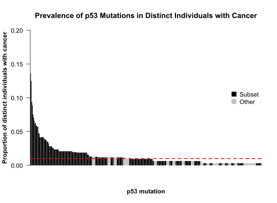

``` r
# pie chart
pie(vec,
    main = "Prevalence of p53 Mutations in Distinct Individuals with Cancer",
    labels = paste0(plyr::round_any(vec * 100,
                                    0.1),
                    "% (",
                    format(raw, 
                           big.mark = ",", 
                           trim = TRUE),
                    " mutations)"),
    col = c("black", "grey"),
    border = NA,
    clockwise = TRUE)
```

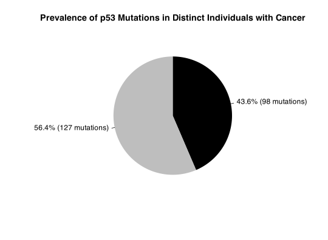

$~$


``` r
# vectors for pie chart of how most muts are chosen anyways for heatmap
prop <- n_distinct(solecancerpivotage_pos_melted_over0.01$Mutation) / n_distinct(solecancerpivotage_pos_melted$Mutation)
vec <- c(prop,
         1 - prop)
raw <- c(n_distinct(solecancerpivotage_pos_melted_over0.01$Mutation),
         n_distinct(setdiff(unique(solecancerpivotage_pos_melted$Mutation),
                            unique(solecancerpivotage_pos_melted_over0.01$Mutation))))

# make prevalence waterfall plots (base R barplots + abline at 1%) of all muts in solecancer to justify why 1% chosen for cutting off
barplot(height = sort(as.numeric(solecancerpivotage_pos_melted$Proportion %>% replace_na(., 0)),
                      decreasing = TRUE),
        xaxs = "i", # remove space between left side of bars and y axis
        ylab = "Proportion of distinct individuals with cancer", 
        xlab = "p53 mutation",
        main = "Prevalence of p53 Mutations in Distinct Individuals with Cancer",
        ylim = c(0, plyr::round_any(max(solecancerpivotage_pos_melted$Proportion, 
                                        na.rm = TRUE), 
                                    0.1, 
                                    f = ceiling)),
        font.lab = 2,
        col = ifelse(solecancerpivotage_pos_melted$Mutation %in% solecancerpivotage_pos_melted_over0.01$Mutation,
                     "black",
                     "grey"),
        las = 1,
        space = 0,
        border = NA)
abline(h = 0.01,
       col = "red",
       lty = 2,
       lwd = 2)
legend("right",
       legend = c("Subset", 
                  "Other"),
       col = c("black", 
               "gray"),
       bty = "n", # no border around legend
       pch = 15, # filled square shape
       pt.cex = 1.75) # increase shape size in legend
```

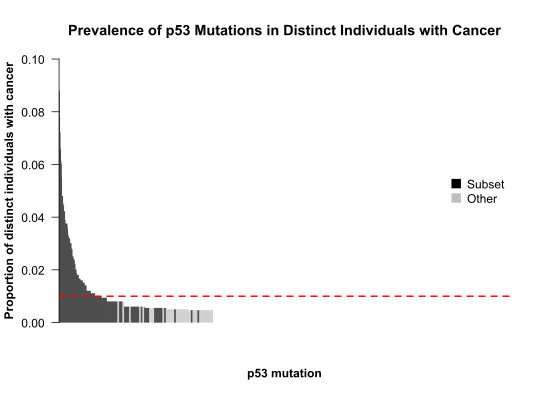

``` r
# pie chart
pie(vec,
    main = "Prevalence of p53 Mutations in Distinct Individuals with Cancer",
    labels = paste0(plyr::round_any(vec * 100,
                                    0.1),
                    "% (",
                    format(raw, 
                           big.mark = ",", 
                           trim = TRUE),
                    " mutations)"),
    col = c("black", "grey"),
    border = NA,
    clockwise = TRUE)
```

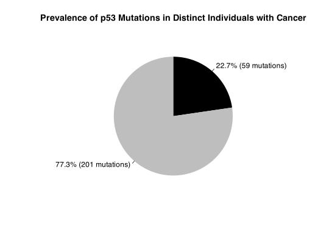

$~$


``` r
# vectors for pie chart of how most muts are chosen anyways for heatmap
prop <- n_distinct(solecancerpivotsex_pos_melted_over0.01$Mutation) / n_distinct(solecancerpivotsex_pos_melted$Mutation)
vec <- c(prop,
         1 - prop)
raw <- c(n_distinct(solecancerpivotsex_pos_melted_over0.01$Mutation),
         n_distinct(setdiff(unique(solecancerpivotsex_pos_melted$Mutation),
                            unique(solecancerpivotsex_pos_melted_over0.01$Mutation))))

# make prevalence waterfall plots (base R barplots + abline at 1%) of all muts in solecancer to justify why 1% chosen for cutting off
barplot(height = sort(as.numeric(solecancerpivotsex_pos_melted$Proportion %>% replace_na(., 0)),
                      decreasing = TRUE),
        xaxs = "i", # remove space between left side of bars and y axis
        ylab = "Proportion of distinct individuals with cancer", 
        xlab = "p53 mutation",
        main = "Prevalence of p53 Mutations in Distinct Individuals with Cancer",
        ylim = c(0, plyr::round_any(max(solecancerpivotsex_pos_melted$Proportion, 
                                        na.rm = TRUE), 
                                    0.01, 
                                    f = ceiling)),
        font.lab = 2,
        col = ifelse(solecancerpivotsex_pos_melted$Mutation %in% solecancerpivotsex_pos_melted_over0.01$Mutation,
                     "black",
                     "grey"),
        las = 1,
        space = 0,
        border = NA)
abline(h = 0.01,
       col = "red",
       lty = 2,
       lwd = 2)
legend("right",
       legend = c("Subset", 
                  "Other"),
       col = c("black", 
               "gray"),
       bty = "n", # no border around legend
       pch = 15, # filled square shape
       pt.cex = 1.75) # increase shape size in legend
```

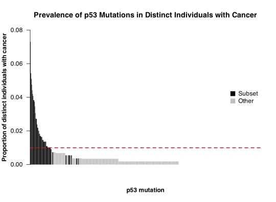

``` r
# pie chart
pie(vec,
    main = "Prevalence of p53 Mutations in Distinct Individuals with Cancer",
    labels = paste0(plyr::round_any(vec * 100,
                                    0.1),
                    "% (",
                    format(raw, 
                           big.mark = ",", 
                           trim = TRUE),
                    " mutations)"),
    col = c("black", "grey"),
    border = NA,
    clockwise = TRUE)
```

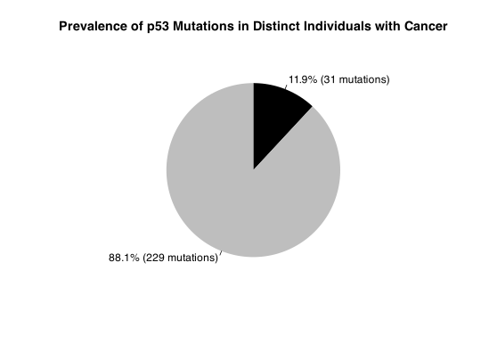

$~$


``` r
# just get total pts per mut out of all sole
bar_df <- solecancerpivotpos %>% 
  subset(Short_topo == "Total") %>% 
  remove_rownames() %>% 
  column_to_rownames("Short_topo") %>% 
  t() %>% 
  as.data.frame() %>% 
  rownames_to_column("Mutation") %>% 
  mutate(Prop = Total/last(Total)) %>% 
  mutate(Proportion = plyr::round_any(Prop * 100,
                                      0.01)) %>% 
  subset(Mutation != "Total")

prop <- n_distinct(solecancerpivotpos_melted_over0.01 %>% 
                     drop_na(Proportion) %>% 
                     pull(Mutation) %>%
                     as.vector()) / n_distinct(origdbjustsolecancersover100$ProtDescription)
vec <- c(prop,
         1 - prop)
raw <- c(n_distinct(solecancerpivotpos_melted_over0.01 %>% 
                      drop_na(Proportion) %>% 
                      pull(Mutation) %>%
                      as.vector()),
         n_distinct(setdiff(unique(origdbjustsolecancersover100$ProtDescription),
                            unique(solecancerpivotpos_melted_over0.01 %>% 
                                     drop_na(Proportion) %>% 
                                     pull(Mutation) %>%
                                     as.vector()))))

barplot(height = sort(as.numeric(bar_df$Prop),
                      decreasing = TRUE),
        xaxs = "i", # remove space between left side of bars and y axis
        ylab = "Proportion of distinct individuals with cancer", 
        xlab = "p53 mutation",
        main = "Prevalence of p53 Mutations in Distinct Individuals with Cancer",
        ylim = c(0, plyr::round_any(max(bar_df$Prop, 
                                        na.rm = TRUE), 
                                    0.01, 
                                    f = ceiling)),
        font.lab = 2,
        col = ifelse(bar_df$Mutation %in% (solecancerpivotpos_melted_over0.01 %>% 
                                             drop_na(Proportion) %>% 
                                             pull(Mutation) %>%
                                             as.vector()),
                     "black",
                     "grey"),
        las = 1,
        space = 0,
        border = NA)
legend("right",
       legend = c("Subset", 
                  "Other"),
       col = c("black", 
               "gray"),
       bty = "n", # no border around legend
       pch = 15, # filled square shape
       pt.cex = 1.75) # increase shape size in legend
```

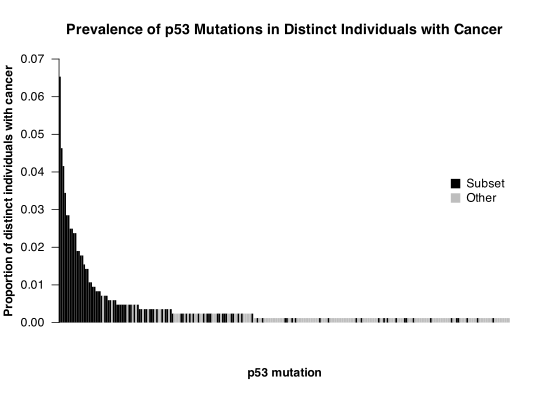

``` r
# pie chart
pie(vec,
    main = "Prevalence of p53 Mutations in Distinct Individuals with Cancer",
    labels = paste0(plyr::round_any(vec * 100,
                                    0.1),
                    "% (",
                    format(raw, 
                           big.mark = ",", 
                           trim = TRUE),
                    " mutations)"),
    col = c("black", "grey"),
    border = NA,
    clockwise = TRUE)
```

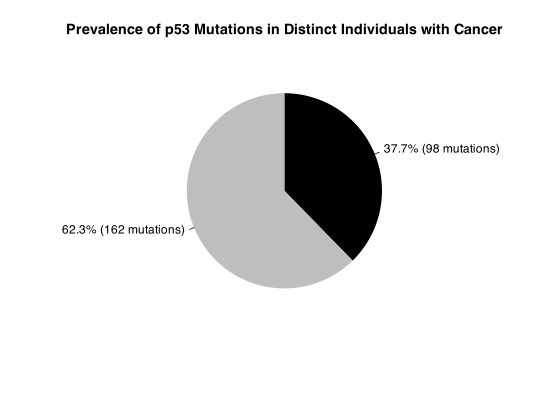

$~$


``` r
sole_overall_mut_prevalence_top_gridprep <- condformat(bar_df %>% 
                                                         dplyr::select(c(Mutation,
                                                                         Proportion)) %>% 
                                                         subset(Proportion >= 1)) %>%
  theme_grob(rows = NULL, # colnames are not removing with cols = NULL
             theme = ttheme_default(base_size = 10,
                                    core = list(padding = unit(c(15, 4), "mm")))) %>%
  condformat2grob(draw = FALSE)

sole_overall_mut_prevalence_top_grid <- grid.arrange(sole_overall_mut_prevalence_top_gridprep,
                                                     top = textGrob("Proportion of Germline p53 Mutations \nAcross Individuals with Cancer",
                                                                    hjust = 0.5,
                                                                    gp = gpar(fontface = "bold"))) 
```

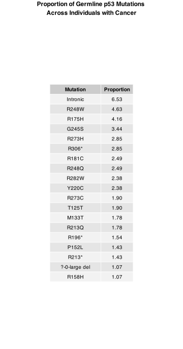

$~$


``` r
# divide down to calc prop of muts in all sole pts, add as new col and mult by 100, remove codon 0 which is intronic muts throughout p53, remove total row, and sort by increasing codon
codon_barplot_df <- solepivotcodon %>%
  mutate(Prop = `Count of distinct patients`/last(`Count of distinct patients`)) %>%
  dplyr::rename(Count_of_distinct_patients = `Count of distinct patients`) %>%
  mutate(Prop_Label = plyr::round_any(Prop * 100,
                                      0.1)) %>%
  subset(!(Codon_number %in% c("0",
                               "Total"))) %>%
  mutate_at("Codon_number",
            as.numeric) %>%
  arrange(Codon_number)

# because not all codons mutated need to add in missing codons as 0 pts and 0 prop
missing_codons <- data.frame(Codon_number = setdiff(1:393, # since p53 has 393 codons
                                                    codon_barplot_df$Codon_number),
                             Count_of_distinct_patients = 0,
                             Prop = 0,
                             Prop_Label = 0)

# add missing codons to df
codon_barplot_df <- full_join(codon_barplot_df,
                              missing_codons) %>%
  arrange(Codon_number)

# barplot, adding codon numbers at intervals and label numbers of codons >= 1.5%
barplot(height = codon_barplot_df$Prop,
        xaxs = "i", # remove space between left side of bars and y axis
        ylab = "Proportion of distinct individuals with cancer", 
        xlab = "Codon",
        main = "Prevalence of p53 Mutations in Distinct Individuals with Cancer",
        #axis.lty = 1,
        #names.arg = codon_barplot_df$Codon_number,
        ylim = c(0, plyr::round_any(max(codon_barplot_df$Prop, 
                                        na.rm = TRUE), 
                                    0.1, 
                                    f = ceiling)),
        font.lab = 2,
        col = dplyr::case_when(codon_barplot_df$Prop >= 0.02 & codon_barplot_df$Codon_number %in% c(175,
                                                                                                    213, 
                                                                                                    245, 
                                                                                                    248, 
                                                                                                    273, 
                                                                                                    282) ~ "purple", 
                               codon_barplot_df$Prop >= 0.02 ~ "red",
                               TRUE ~ "gray"),
        las = 1,
        space = 0,
        border = NA)
axis(side = 1,
     at = c(1, 
            seq(50,
                350, 
                50),
            393))
text(codon_barplot_df$Codon_number[codon_barplot_df$Prop >= 0.015], # x location 
     codon_barplot_df$Prop[codon_barplot_df$Prop >= 0.015], # y location
     codon_barplot_df$Codon_number[codon_barplot_df$Prop >= 0.015], # label to put
     cex = 1, # standard font size
     pos = 3) # text above (x,y) coordinates where it's placed
text(80,
     plyr::round_any(max(codon_barplot_df$Prop, 
                         na.rm = TRUE), 
                     0.1, 
                     f = ceiling) * 0.95,
     paste0("Germline (",
            format(last(solepivotcodon$`Count of distinct patients`), 
                   big.mark = ",", 
                   trim = TRUE),
            " individuals)"),
     cex = 1.5) # increase font size
legend("topright",
       legend = c("≥ 2%",
                  "≥ 2% in somatic too",
                  "Other"),
       col = c("red", 
               "purple", 
               "gray"),
       bty = "n", # no border around legend
       pch = 15, # filled square shape
       pt.cex = 1.75) # increase shape size in legend
```

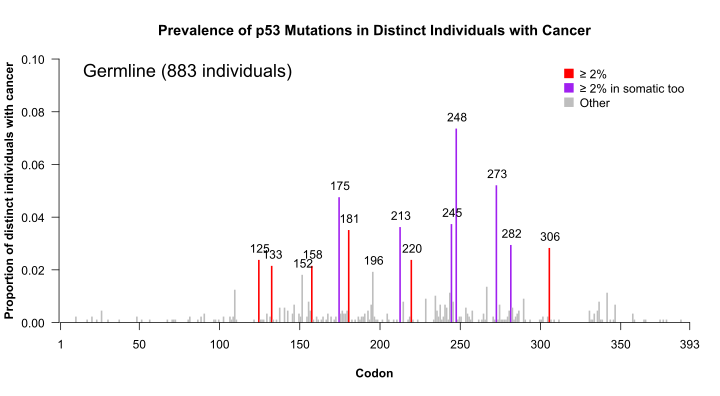

$~$


``` r
# divide down to calc prop of muts in all mult pts, add as new col and mult by 100, remove codon 0 which is intronic muts throughout p53, remove total row, and sort by increasing codon
codon_barplot_df <- multpivotcodon %>%
  mutate(Prop = `Count of distinct patients`/last(`Count of distinct patients`)) %>%
  dplyr::rename(Count_of_distinct_patients = `Count of distinct patients`) %>%
  mutate(Prop_Label = plyr::round_any(Prop * 100,
                                      0.1)) %>%
  subset(!(Codon_number %in% c("0",
                               "Total"))) %>%
  mutate_at("Codon_number",
            as.numeric) %>%
  arrange(Codon_number)

# because not all codons mutated need to add in missing codons as 0 pts and 0 prop
missing_codons <- data.frame(Codon_number = setdiff(1:393, # since p53 has 393 codons
                                                    codon_barplot_df$Codon_number),
                             Count_of_distinct_patients = 0,
                             Prop = 0,
                             Prop_Label = 0)

# add missing codons to df
codon_barplot_df <- full_join(codon_barplot_df,
                              missing_codons) %>%
  arrange(Codon_number)

# barplot, adding codon numbers at intervals and label numbers of codons >= 1.5%
barplot(height = codon_barplot_df$Prop,
        xaxs = "i", # remove space between left side of bars and y axis
        ylab = "Proportion of distinct individuals with cancer", 
        xlab = "Codon",
        main = "Prevalence of p53 Mutations in Distinct Individuals with Cancer",
        #axis.lty = 1,
        #names.arg = codon_barplot_df$Codon_number,
        ylim = c(0, plyr::round_any(max(codon_barplot_df$Prop, 
                                        na.rm = TRUE), 
                                    0.1, 
                                    f = ceiling)),
        font.lab = 2,
        col = dplyr::case_when(codon_barplot_df$Prop >= 0.02 & codon_barplot_df$Codon_number %in% c(175,
                                                                                                    213, 
                                                                                                    245, 
                                                                                                    248, 
                                                                                                    273, 
                                                                                                    282) ~ "purple", 
                               codon_barplot_df$Prop >= 0.02 ~ "red",
                               TRUE ~ "gray"),
        las = 1,
        space = 0,
        border = NA)
axis(side = 1,
     at = c(1, 
            seq(50,
                350, 
                50),
            393))
text(codon_barplot_df$Codon_number[codon_barplot_df$Prop >= 0.015], # x location 
     codon_barplot_df$Prop[codon_barplot_df$Prop >= 0.015], # y location
     codon_barplot_df$Codon_number[codon_barplot_df$Prop >= 0.015], # label to put
     cex = 1, # standard font size
     pos = 3) # text above (x,y) coordinates where it's placed
text(80,
     plyr::round_any(max(codon_barplot_df$Prop, 
                         na.rm = TRUE), 
                     0.1, 
                     f = ceiling) * 0.95,
     paste0("Germline (",
            format(last(multpivotcodon$`Count of distinct patients`), 
                   big.mark = ",", 
                   trim = TRUE),
            " individuals)"),
     cex = 1.5) # increase font size
legend("topright",
       legend = c("≥ 2%",
                  "≥ 2% in somatic too",
                  "Other"),
       col = c("red", 
               "purple", 
               "gray"),
       bty = "n", # no border around legend
       pch = 15, # filled square shape
       pt.cex = 1.75) # increase shape size in legend
```

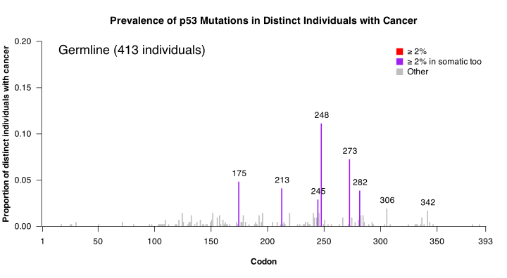

$~$


``` r
# divide down to calc prop of muts in all pts with cancer, add as new col and mult by 100, remove codon 0 which is intronic muts throughout p53, remove total row, and sort by increasing codon
codon_barplot_df <- defcancerpivotcodon %>%
  mutate(Prop = `Count of distinct patients`/last(`Count of distinct patients`)) %>%
  dplyr::rename(Count_of_distinct_patients = `Count of distinct patients`) %>%
  mutate(Prop_Label = plyr::round_any(Prop * 100,
                                      0.1)) %>%
  subset(!(Codon_number %in% c("0",
                               "Total"))) %>%
  mutate_at("Codon_number",
            as.numeric) %>%
  arrange(Codon_number)

# because not all codons mutated need to add in missing codons as 0 pts and 0 prop
missing_codons <- data.frame(Codon_number = setdiff(1:393, # since p53 has 393 codons
                                                    codon_barplot_df$Codon_number),
                             Count_of_distinct_patients = 0,
                             Prop = 0,
                             Prop_Label = 0)

# add missing codons to df
codon_barplot_df <- full_join(codon_barplot_df,
                              missing_codons) %>%
  arrange(Codon_number)

# barplot, adding codon numbers at intervals and label numbers of codons >= 1.5%
barplot(height = codon_barplot_df$Prop,
        xaxs = "i", # remove space between left side of bars and y axis
        ylab = "Proportion of distinct individuals with cancer", 
        xlab = "Codon",
        main = "Prevalence of p53 Mutations in Distinct Individuals with Cancer",
        #axis.lty = 1,
        #names.arg = codon_barplot_df$Codon_number,
        ylim = c(0, plyr::round_any(max(codon_barplot_df$Prop, 
                                        na.rm = TRUE), 
                                    0.1, 
                                    f = ceiling)),
        font.lab = 2,
        col = dplyr::case_when(codon_barplot_df$Prop >= 0.02 & codon_barplot_df$Codon_number %in% c(175,
                                                                                                    213, 
                                                                                                    245, 
                                                                                                    248, 
                                                                                                    273, 
                                                                                                    282) ~ "purple", 
                               codon_barplot_df$Prop >= 0.02 ~ "red",
                               TRUE ~ "gray"),
        las = 1,
        space = 0,
        border = NA)
axis(side = 1,
     at = c(1, 
            seq(50,
                350, 
                50),
            393))
text(codon_barplot_df$Codon_number[codon_barplot_df$Prop >= 0.015], # x location 
     codon_barplot_df$Prop[codon_barplot_df$Prop >= 0.015], # y location
     codon_barplot_df$Codon_number[codon_barplot_df$Prop >= 0.015], # label to put
     cex = 1, # standard font size
     pos = 3) # text above (x,y) coordinates where it's placed
text(80,
     plyr::round_any(max(codon_barplot_df$Prop, 
                         na.rm = TRUE), 
                     0.1, 
                     f = ceiling) * 0.95,
     paste0("Germline (",
            format(last(defcancerpivotcodon$`Count of distinct patients`), 
                   big.mark = ",", 
                   trim = TRUE),
            " individuals)"),
     cex = 1.5) # increase font size
legend("topright",
       legend = c("≥ 2%",
                  "≥ 2% in somatic too",
                  "Other"),
       col = c("red", 
               "purple", 
               "gray"),
       bty = "n", # no border around legend
       pch = 15, # filled square shape
       pt.cex = 1.75) # increase shape size in legend
```

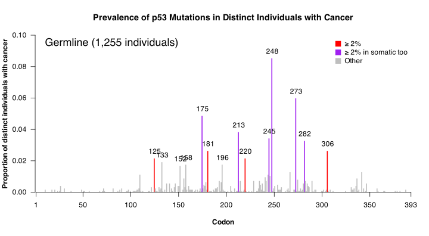

$~$


``` r
# divide down to calc prop of muts in all germline pts regardless of whether they have cancer, add as new col and mult by 100, remove codon 0 which is intronic muts throughout p53, remove total row, and sort by increasing codon
codon_barplot_df <- breakdownpivotcodon %>%
  mutate(Prop = `Count of distinct patients`/last(`Count of distinct patients`)) %>%
  dplyr::rename(Count_of_distinct_patients = `Count of distinct patients`) %>%
  mutate(Prop_Label = plyr::round_any(Prop * 100,
                                      0.1)) %>%
  subset(!(Codon_number %in% c("0",
                               "Total"))) %>%
  mutate_at("Codon_number",
            as.numeric) %>%
  arrange(Codon_number)

# because not all codons mutated need to add in missing codons as 0 pts and 0 prop
missing_codons <- data.frame(Codon_number = setdiff(1:393, # since p53 has 393 codons
                                                    codon_barplot_df$Codon_number),
                             Count_of_distinct_patients = 0,
                             Prop = 0,
                             Prop_Label = 0)

# add missing codons to df
codon_barplot_df <- full_join(codon_barplot_df,
                              missing_codons) %>%
  arrange(Codon_number)

# barplot, adding codon numbers at intervals and label numbers of codons >= 1.5%
barplot(height = codon_barplot_df$Prop,
        xaxs = "i", # remove space between left side of bars and y axis
        ylab = "Proportion of distinct individuals", 
        xlab = "Codon",
        main = "Prevalence of p53 Mutations in Distinct Individuals",
        #axis.lty = 1,
        #names.arg = codon_barplot_df$Codon_number,
        ylim = c(0, plyr::round_any(max(codon_barplot_df$Prop, 
                                        na.rm = TRUE), 
                                    0.1, 
                                    f = ceiling)),
        font.lab = 2,
        col = dplyr::case_when(codon_barplot_df$Prop >= 0.02 & codon_barplot_df$Codon_number %in% c(175,
                                                                                                    213, 
                                                                                                    245, 
                                                                                                    248, 
                                                                                                    273, 
                                                                                                    282) ~ "purple", 
                               codon_barplot_df$Prop >= 0.02 ~ "red",
                               TRUE ~ "gray"),
        las = 1,
        space = 0,
        border = NA)
axis(side = 1,
     at = c(1, 
            seq(50,
                350, 
                50),
            393))
text(codon_barplot_df$Codon_number[codon_barplot_df$Prop >= 0.015], # x location 
     codon_barplot_df$Prop[codon_barplot_df$Prop >= 0.015], # y location
     codon_barplot_df$Codon_number[codon_barplot_df$Prop >= 0.015], # label to put
     cex = 1, # standard font size
     pos = 3) # text above (x,y) coordinates where it's placed
text(80,
     plyr::round_any(max(codon_barplot_df$Prop, 
                         na.rm = TRUE), 
                     0.1, 
                     f = ceiling) * 0.95,
     paste0("Germline (",
            format(last(breakdownpivotcodon$`Count of distinct patients`), 
                   big.mark = ",", 
                   trim = TRUE),
            " individuals)"),
     cex = 1.5) # increase font size
legend("topright",
       legend = c("≥ 2%",
                  "≥ 2% in somatic too",
                  "Other"),
       col = c("red", 
               "purple", 
               "gray"),
       bty = "n", # no border around legend
       pch = 15, # filled square shape
       pt.cex = 1.75) # increase shape size in legend
```

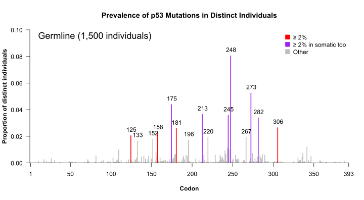

$~$


$~$


$~$


$~$


$~$


$~$


$~$


$~$


$~$


$~$


$~$


$~$


$~$


$~$


$~$


$~$


$~$


$~$


$~$


$~$


$~$


$~$


$~$


$~$


$~$


$~$


$~$


$~$


$~$

$~$

Furthermore, with this 1% proportion cutoff, there are 103 distinct alterations across the 4 cancers in patients with 2 or more cancers. This cutoff marks a substantial reduction in datapoints to facilitate clustered heatmap generation, as the full dataset before the 1% proportion cutoff has 173 distinct alterations across the 4 cancers.

$~$

On the other hand, with this 1% proportion cutoff, there are 98 distinct alterations across the 5 cancers in patients with 1 cancer. This cutoff marks a substantial reduction in datapoints to facilitate clustered heatmap generation, as the full dataset before the 1% proportion cutoff has 260 distinct alterations across the 5 cancers.

$~$


$~$

$~$

When age is considered, after the 1% proportion cutoff, there are 141 distinct alterations in patients with 2 or more cancers across the 5 age strata. This cutoff again marks a substantial reduction in datapoints to facilitate clustered heatmap generation, as the full dataset before the 1% proportion cutoff has 173 distinct alterations across the 5 age strata.

$~$

When age is considered, after the 1% proportion cutoff, there are 59 distinct alterations in patients with 1 cancer across the 5 age strata. This cutoff again marks a substantial reduction in datapoints to facilitate clustered heatmap generation, as the full dataset before the 1% proportion cutoff has 260 distinct alterations across the 5 age strata.

$~$


$~$

$~$

When sex is considered, after the 1% proportion cutoff, there are 32 distinct alterations in patients with 2 or more cancers. This cutoff again marks a substantial reduction in datapoints to facilitate clustered heatmap generation, as the full dataset before the 1% proportion cutoff has 173 distinct alterations.

$~$

When sex is considered, after the 1% proportion cutoff, there are 31 distinct alterations in patients with 1 cancer. This cutoff again marks a substantial reduction in datapoints to facilitate clustered heatmap generation, as the full dataset before the 1% proportion cutoff has 260 distinct alterations.

$~$

# **Creating Annotations for Heatmaps** {#annotations}

$~$

Next, I have to prepare annotations for the clustered heatmaps I plan to create for these proportions. Here I am preparing to have mutated codons ordered numerically and by p53 domain. Although the domains were partially annotated in the original dataset, for consistency and complete information I have defined the p53 domains as per a few previously published papers [@joruiz2020; @cho1994]. Moreover, I am assigning germ layers to cancers to make it an annotation as well. I also formatted the annotations object to have cancers/no cancer and mutated positions as rownames as this setup is required for the ComplexHeatmap package I will be using.

$~$


``` r
#first creating annotations for codons by p53 domain and residue function
#create new dataframe of positions with 1% proportion and keep distinct positions
# origdbpos_totalmuts <- data.frame(origdbpivotpos_melted_over0.01$Mutation, 
#                                   stringsAsFactors = FALSE) %>% 
#   dplyr::rename(Mutation = origdbpivotpos_melted_over0.01.Mutation) %>% 
#   distinct() %>% 
#   remove_rownames()
# 
# origdbpos_totalmuts_age <- data.frame(origdbpivotage_pos_melted_over0.01$Mutation,
#                                       stringsAsFactors = FALSE) %>% 
#   dplyr::rename(Mutation = origdbpivotage_pos_melted_over0.01.Mutation) %>% 
#   distinct() %>% 
#   remove_rownames()
# 
# origdbpos_totalmuts_sex <- data.frame(origdbpivotsex_pos_melted_over0.01$Mutation,
#                                       stringsAsFactors = FALSE) %>% 
#   dplyr::rename(Mutation = origdbpivotsex_pos_melted_over0.01.Mutation) %>% 
#   distinct() %>% 
#   remove_rownames()

multcancerpos_totalmuts <- data.frame(multcancerpivotpos_melted_over0.01$Mutation, 
                                      stringsAsFactors = FALSE) %>% 
  dplyr::rename(Mutation = multcancerpivotpos_melted_over0.01.Mutation) %>% 
  distinct() %>% 
  remove_rownames()

multcancerpos_totalmuts_age <- data.frame(multcancerpivotage_pos_melted_over0.01$Mutation,
                                          stringsAsFactors = FALSE) %>% 
  dplyr::rename(Mutation = multcancerpivotage_pos_melted_over0.01.Mutation) %>% 
  distinct() %>% 
  remove_rownames()

multcancerpos_totalmuts_sex <- data.frame(multcancerpivotsex_pos_melted_over0.01$Mutation,
                                          stringsAsFactors = FALSE) %>% 
  dplyr::rename(Mutation = multcancerpivotsex_pos_melted_over0.01.Mutation) %>% 
  distinct() %>% 
  remove_rownames()

solecancerpos_totalmuts <- data.frame(solecancerpivotpos_melted_over0.01$Mutation, 
                                      stringsAsFactors = FALSE) %>% 
  dplyr::rename(Mutation = solecancerpivotpos_melted_over0.01.Mutation) %>% 
  distinct() %>% 
  remove_rownames()

solecancerpos_totalmuts_age <- data.frame(solecancerpivotage_pos_melted_over0.01$Mutation,
                                          stringsAsFactors = FALSE) %>% 
  dplyr::rename(Mutation = solecancerpivotage_pos_melted_over0.01.Mutation) %>% 
  distinct() %>% 
  remove_rownames()

solecancerpos_totalmuts_sex <- data.frame(solecancerpivotsex_pos_melted_over0.01$Mutation,
                                          stringsAsFactors = FALSE) %>% 
  dplyr::rename(Mutation = solecancerpivotsex_pos_melted_over0.01.Mutation) %>% 
  distinct() %>% 
  remove_rownames()

#extract columns of position, codon, domain, buried or not in protein from original data and only keep completely distinct rows of information
# origdbmutinfo <- origdbjustcancersover100 %>% 
#   subset(select = c("Codon_number", 
#                     "ProtDescription", 
#                     "Domain_function", 
#                     "Residue_function", 
#                     "Effect")) %>% 
#   distinct() %>% 
#   remove_rownames()

multcancermutinfo <- origdbjustmultcancersover100 %>% 
  subset(select = c("Codon_number", 
                    "ProtDescription", 
                    "Domain_function", 
                    "Residue_function", 
                    "Effect",
                    "SIFTClass",
                    "DNE_LOFclass")) %>% 
  distinct() %>% 
  remove_rownames()

solecancermutinfo <- origdbjustsolecancersover100 %>% 
  subset(select = c("Codon_number", 
                    "ProtDescription", 
                    "Domain_function", 
                    "Residue_function", 
                    "Effect",
                    "SIFTClass",
                    "DNE_LOFclass")) %>% 
  distinct() %>% 
  remove_rownames()

#only keep mutations that are in the 1% proportion lists of each df
# origdbmutinfo_age <- origdbmutinfo %>% 
#   subset(origdbmutinfo$ProtDescription %in% origdbpos_totalmuts_age$Mutation) %>% 
#   remove_rownames()
# origdbmutinfo_sex <- origdbmutinfo %>% 
#   subset(origdbmutinfo$ProtDescription %in% origdbpos_totalmuts_sex$Mutation) %>% 
#   remove_rownames()
# origdbmutinfo <- origdbmutinfo %>% 
#   subset(origdbmutinfo$ProtDescription %in% origdbpos_totalmuts$Mutation) %>% 
#   remove_rownames()

multcancermutinfo_age <- multcancermutinfo %>% 
  subset(multcancermutinfo$ProtDescription %in% multcancerpos_totalmuts_age$Mutation) %>% 
  remove_rownames()
multcancermutinfo_sex <- multcancermutinfo %>% 
  subset(multcancermutinfo$ProtDescription %in% multcancerpos_totalmuts_sex$Mutation) %>% 
  remove_rownames()
multcancermutinfo <- multcancermutinfo %>% 
  subset(multcancermutinfo$ProtDescription %in% multcancerpos_totalmuts$Mutation) %>% 
  remove_rownames()

solecancermutinfo_age <- solecancermutinfo %>% 
  subset(solecancermutinfo$ProtDescription %in% solecancerpos_totalmuts_age$Mutation) %>% 
  remove_rownames()
solecancermutinfo_sex <- solecancermutinfo %>% 
  subset(solecancermutinfo$ProtDescription %in% solecancerpos_totalmuts_sex$Mutation) %>% 
  remove_rownames()
solecancermutinfo <- solecancermutinfo %>% 
  subset(solecancermutinfo$ProtDescription %in% solecancerpos_totalmuts$Mutation) %>% 
  remove_rownames()

#check that all mutations in new subset of data are only those with at least 1% proportion
# all(origdbmutinfo$ProtDescription %in% origdbpos_totalmuts$Mutation) #should be TRUE in console
# all(origdbmutinfo_age$ProtDescription %in% origdbpos_totalmuts_age$Mutation) #should be TRUE in console
# all(origdbmutinfo_sex$ProtDescription %in% origdbpos_totalmuts_sex$Mutation) #should be TRUE in console

all(multcancermutinfo$ProtDescription %in% multcancerpos_totalmuts$Mutation) #should be TRUE in console
all(multcancermutinfo_age$ProtDescription %in% multcancerpos_totalmuts_age$Mutation) #should be TRUE in console
all(multcancermutinfo_sex$ProtDescription %in% multcancerpos_totalmuts_sex$Mutation) #should be TRUE in console

all(solecancermutinfo$ProtDescription %in% solecancerpos_totalmuts$Mutation) #should be TRUE in console
all(solecancermutinfo_age$ProtDescription %in% solecancerpos_totalmuts_age$Mutation) #should be TRUE in console
all(solecancermutinfo_sex$ProtDescription %in% solecancerpos_totalmuts_sex$Mutation) #should be TRUE in console


#make new column for domain annotations consistent with somatic p53 mutation analysis (domain positions defined per Joruiz et al. Cancers (Basel) 2020 doi: 10.3390/cancers12113422 Figure 1; DBD loops defined per Cho et al. Science 1994 doi: 10.1126/science.8023157)
# origdbmutinfo <- origdbmutinfo %>% 
#   transform(Domain = ifelse(Codon_number >= 1 & Codon_number <= 39, 
#                             "TAD1", 
#                             "notyet")) %>% 
#   transform(Domain = ifelse(Codon_number >= 40 & Codon_number <= 61, 
#                             "TAD2", 
#                             Domain)) %>% 
#   transform(Domain = ifelse(Codon_number >= 62 & Codon_number <= 93, 
#                             "PRD", 
#                             Domain)) %>% 
#   transform(Domain = ifelse(Codon_number >= 94 & Codon_number <= 289, 
#                             "DBD", 
#                             Domain)) %>% 
#   transform(Domain = ifelse(Codon_number >= 112 & Codon_number <= 124, 
#                             "DBD L1 loop", 
#                             Domain)) %>% 
#   transform(Domain = ifelse(Codon_number >= 163 & Codon_number <= 195, 
#                             "DBD L2 loop", 
#                             Domain)) %>% 
#   transform(Domain = ifelse(Codon_number >= 236 & Codon_number <= 251, 
#                             "DBD L3 loop", 
#                             Domain)) %>% 
#   transform(Domain = ifelse(Codon_number >= 290 & Codon_number <= 324, 
#                             "HD", 
#                             Domain)) %>% 
#   transform(Domain = ifelse(Codon_number >= 325 & Codon_number <= 356, 
#                             "OD", 
#                             Domain)) %>% 
#   transform(Domain = ifelse(Codon_number >= 357, 
#                             "CTD", 
#                             Domain)) %>% 
#   transform(Domain = ifelse(Codon_number < 1, 
#                             "NA", 
#                             Domain))

# origdbmutinfo_age <- origdbmutinfo_age %>% 
#   transform(Domain = ifelse(Codon_number >= 1 & Codon_number <= 39, 
#                             "TAD1", 
#                             "notyet")) %>% 
#   transform(Domain = ifelse(Codon_number >= 40 & Codon_number <= 61, 
#                             "TAD2", 
#                             Domain)) %>% 
#   transform(Domain = ifelse(Codon_number >= 62 & Codon_number <= 93, 
#                             "PRD", 
#                             Domain)) %>% 
#   transform(Domain = ifelse(Codon_number >= 94 & Codon_number <= 289, 
#                             "DBD", 
#                             Domain)) %>% 
#   transform(Domain = ifelse(Codon_number >= 112 & Codon_number <= 124, 
#                             "DBD L1 loop", 
#                             Domain)) %>% 
#   transform(Domain = ifelse(Codon_number >= 163 & Codon_number <= 195, 
#                             "DBD L2 loop", 
#                             Domain)) %>% 
#   transform(Domain = ifelse(Codon_number >= 236 & Codon_number <= 251, 
#                             "DBD L3 loop", 
#                             Domain)) %>% 
#   transform(Domain = ifelse(Codon_number >= 290 & Codon_number <= 324, 
#                             "HD", 
#                             Domain)) %>% 
#   transform(Domain = ifelse(Codon_number >= 325 & Codon_number <= 356, 
#                             "OD", 
#                             Domain)) %>% 
#   transform(Domain = ifelse(Codon_number >= 357, 
#                             "CTD", 
#                             Domain)) %>% 
#   transform(Domain = ifelse(Codon_number < 1, 
#                             "NA", 
#                             Domain))

# origdbmutinfo_sex <- origdbmutinfo_sex %>% 
#   transform(Domain = ifelse(Codon_number >= 1 & Codon_number <= 39, 
#                             "TAD1", 
#                             "notyet")) %>% 
#   transform(Domain = ifelse(Codon_number >= 40 & Codon_number <= 61, 
#                             "TAD2", 
#                             Domain)) %>% 
#   transform(Domain = ifelse(Codon_number >= 62 & Codon_number <= 93, 
#                             "PRD", 
#                             Domain)) %>% 
#   transform(Domain = ifelse(Codon_number >= 94 & Codon_number <= 289, 
#                             "DBD", 
#                             Domain)) %>% 
#   transform(Domain = ifelse(Codon_number >= 112 & Codon_number <= 124, 
#                             "DBD L1 loop", 
#                             Domain)) %>% 
#   transform(Domain = ifelse(Codon_number >= 163 & Codon_number <= 195, 
#                             "DBD L2 loop", 
#                             Domain)) %>% 
#   transform(Domain = ifelse(Codon_number >= 236 & Codon_number <= 251, 
#                             "DBD L3 loop", 
#                             Domain)) %>% 
#   transform(Domain = ifelse(Codon_number >= 290 & Codon_number <= 324, 
#                             "HD", 
#                             Domain)) %>% 
#   transform(Domain = ifelse(Codon_number >= 325 & Codon_number <= 356, 
#                             "OD", 
#                             Domain)) %>% 
#   transform(Domain = ifelse(Codon_number >= 357, 
#                             "CTD", 
#                             Domain)) %>% 
#   transform(Domain = ifelse(Codon_number < 1, 
#                             "NA", 
#                             Domain))

multcancermutinfo <- multcancermutinfo %>% 
  transform(Domain = ifelse(Codon_number >= 1 & Codon_number <= 39, 
                            "TAD1", 
                            "notyet")) %>% 
  transform(Domain = ifelse(Codon_number >= 40 & Codon_number <= 61, 
                            "TAD2", 
                            Domain)) %>% 
  transform(Domain = ifelse(Codon_number >= 62 & Codon_number <= 93, 
                            "PRD", 
                            Domain)) %>% 
  transform(Domain = ifelse(Codon_number >= 94 & Codon_number <= 289, 
                            "DBD", 
                            Domain)) %>% 
  transform(Domain = ifelse(Codon_number >= 112 & Codon_number <= 124, 
                            "DBD L1 loop", 
                            Domain)) %>% 
  transform(Domain = ifelse(Codon_number >= 163 & Codon_number <= 195, 
                            "DBD L2 loop", 
                            Domain)) %>% 
  transform(Domain = ifelse(Codon_number >= 236 & Codon_number <= 251, 
                            "DBD L3 loop", 
                            Domain)) %>% 
  transform(Domain = ifelse(Codon_number >= 290 & Codon_number <= 324, 
                            "HD", 
                            Domain)) %>% 
  transform(Domain = ifelse(Codon_number >= 325 & Codon_number <= 356, 
                            "OD", 
                            Domain)) %>% 
  transform(Domain = ifelse(Codon_number >= 357, 
                            "CTD", 
                            Domain)) %>% 
  transform(Domain = ifelse(Codon_number < 1, 
                            "NA", 
                            Domain)) %>%
  transform(Rescuable = ifelse(ProtDescription %in% mut_rescued,
                             "Rescuable by ATO",
                             "Not documented"))

multcancermutinfo_age <- multcancermutinfo_age %>% 
  transform(Domain = ifelse(Codon_number >= 1 & Codon_number <= 39, 
                            "TAD1", 
                            "notyet")) %>% 
  transform(Domain = ifelse(Codon_number >= 40 & Codon_number <= 61, 
                            "TAD2", 
                            Domain)) %>% 
  transform(Domain = ifelse(Codon_number >= 62 & Codon_number <= 93, 
                            "PRD", 
                            Domain)) %>% 
  transform(Domain = ifelse(Codon_number >= 94 & Codon_number <= 289, 
                            "DBD", 
                            Domain)) %>% 
  transform(Domain = ifelse(Codon_number >= 112 & Codon_number <= 124, 
                            "DBD L1 loop", 
                            Domain)) %>% 
  transform(Domain = ifelse(Codon_number >= 163 & Codon_number <= 195, 
                            "DBD L2 loop", 
                            Domain)) %>% 
  transform(Domain = ifelse(Codon_number >= 236 & Codon_number <= 251, 
                            "DBD L3 loop", 
                            Domain)) %>% 
  transform(Domain = ifelse(Codon_number >= 290 & Codon_number <= 324, 
                            "HD", 
                            Domain)) %>% 
  transform(Domain = ifelse(Codon_number >= 325 & Codon_number <= 356, 
                            "OD", 
                            Domain)) %>% 
  transform(Domain = ifelse(Codon_number >= 357, 
                            "CTD", 
                            Domain)) %>% 
  transform(Domain = ifelse(Codon_number < 1, 
                            "NA", 
                            Domain)) %>%
  transform(Rescuable = ifelse(ProtDescription %in% mut_rescued,
                             "Rescuable by ATO",
                             "Not documented"))

multcancermutinfo_sex <- multcancermutinfo_sex %>% 
  transform(Domain = ifelse(Codon_number >= 1 & Codon_number <= 39, 
                            "TAD1", 
                            "notyet")) %>% 
  transform(Domain = ifelse(Codon_number >= 40 & Codon_number <= 61, 
                            "TAD2", 
                            Domain)) %>% 
  transform(Domain = ifelse(Codon_number >= 62 & Codon_number <= 93, 
                            "PRD", 
                            Domain)) %>% 
  transform(Domain = ifelse(Codon_number >= 94 & Codon_number <= 289, 
                            "DBD", 
                            Domain)) %>% 
  transform(Domain = ifelse(Codon_number >= 112 & Codon_number <= 124, 
                            "DBD L1 loop", 
                            Domain)) %>% 
  transform(Domain = ifelse(Codon_number >= 163 & Codon_number <= 195, 
                            "DBD L2 loop", 
                            Domain)) %>% 
  transform(Domain = ifelse(Codon_number >= 236 & Codon_number <= 251, 
                            "DBD L3 loop", 
                            Domain)) %>% 
  transform(Domain = ifelse(Codon_number >= 290 & Codon_number <= 324, 
                            "HD", 
                            Domain)) %>% 
  transform(Domain = ifelse(Codon_number >= 325 & Codon_number <= 356, 
                            "OD", 
                            Domain)) %>% 
  transform(Domain = ifelse(Codon_number >= 357, 
                            "CTD", 
                            Domain)) %>% 
  transform(Domain = ifelse(Codon_number < 1, 
                            "NA", 
                            Domain)) %>%
  transform(Rescuable = ifelse(ProtDescription %in% mut_rescued,
                             "Rescuable by ATO",
                             "Not documented"))

solecancermutinfo <- solecancermutinfo %>% 
  transform(Domain = ifelse(Codon_number >= 1 & Codon_number <= 39, 
                            "TAD1", 
                            "notyet")) %>% 
  transform(Domain = ifelse(Codon_number >= 40 & Codon_number <= 61, 
                            "TAD2", 
                            Domain)) %>% 
  transform(Domain = ifelse(Codon_number >= 62 & Codon_number <= 93, 
                            "PRD", 
                            Domain)) %>% 
  transform(Domain = ifelse(Codon_number >= 94 & Codon_number <= 289, 
                            "DBD", 
                            Domain)) %>% 
  transform(Domain = ifelse(Codon_number >= 112 & Codon_number <= 124, 
                            "DBD L1 loop", 
                            Domain)) %>% 
  transform(Domain = ifelse(Codon_number >= 163 & Codon_number <= 195, 
                            "DBD L2 loop", 
                            Domain)) %>% 
  transform(Domain = ifelse(Codon_number >= 236 & Codon_number <= 251, 
                            "DBD L3 loop", 
                            Domain)) %>% 
  transform(Domain = ifelse(Codon_number >= 290 & Codon_number <= 324, 
                            "HD", 
                            Domain)) %>% 
  transform(Domain = ifelse(Codon_number >= 325 & Codon_number <= 356, 
                            "OD", 
                            Domain)) %>% 
  transform(Domain = ifelse(Codon_number >= 357, 
                            "CTD", 
                            Domain)) %>% 
  transform(Domain = ifelse(Codon_number < 1, 
                            "NA", 
                            Domain)) %>%
  transform(Rescuable = ifelse(ProtDescription %in% mut_rescued,
                             "Rescuable by ATO",
                             "Not documented"))

solecancermutinfo_age <- solecancermutinfo_age %>% 
  transform(Domain = ifelse(Codon_number >= 1 & Codon_number <= 39, 
                            "TAD1", 
                            "notyet")) %>% 
  transform(Domain = ifelse(Codon_number >= 40 & Codon_number <= 61, 
                            "TAD2", 
                            Domain)) %>% 
  transform(Domain = ifelse(Codon_number >= 62 & Codon_number <= 93, 
                            "PRD", 
                            Domain)) %>% 
  transform(Domain = ifelse(Codon_number >= 94 & Codon_number <= 289, 
                            "DBD", 
                            Domain)) %>% 
  transform(Domain = ifelse(Codon_number >= 112 & Codon_number <= 124, 
                            "DBD L1 loop", 
                            Domain)) %>% 
  transform(Domain = ifelse(Codon_number >= 163 & Codon_number <= 195, 
                            "DBD L2 loop", 
                            Domain)) %>% 
  transform(Domain = ifelse(Codon_number >= 236 & Codon_number <= 251, 
                            "DBD L3 loop", 
                            Domain)) %>% 
  transform(Domain = ifelse(Codon_number >= 290 & Codon_number <= 324, 
                            "HD", 
                            Domain)) %>% 
  transform(Domain = ifelse(Codon_number >= 325 & Codon_number <= 356, 
                            "OD", 
                            Domain)) %>% 
  transform(Domain = ifelse(Codon_number >= 357, 
                            "CTD", 
                            Domain)) %>% 
  transform(Domain = ifelse(Codon_number < 1, 
                            "NA", 
                            Domain)) %>%
  transform(Rescuable = ifelse(ProtDescription %in% mut_rescued,
                             "Rescuable by ATO",
                             "Not documented"))

solecancermutinfo_sex <- solecancermutinfo_sex %>% 
  transform(Domain = ifelse(Codon_number >= 1 & Codon_number <= 39, 
                            "TAD1", 
                            "notyet")) %>% 
  transform(Domain = ifelse(Codon_number >= 40 & Codon_number <= 61, 
                            "TAD2", 
                            Domain)) %>% 
  transform(Domain = ifelse(Codon_number >= 62 & Codon_number <= 93, 
                            "PRD", 
                            Domain)) %>% 
  transform(Domain = ifelse(Codon_number >= 94 & Codon_number <= 289, 
                            "DBD", 
                            Domain)) %>% 
  transform(Domain = ifelse(Codon_number >= 112 & Codon_number <= 124, 
                            "DBD L1 loop", 
                            Domain)) %>% 
  transform(Domain = ifelse(Codon_number >= 163 & Codon_number <= 195, 
                            "DBD L2 loop", 
                            Domain)) %>% 
  transform(Domain = ifelse(Codon_number >= 236 & Codon_number <= 251, 
                            "DBD L3 loop", 
                            Domain)) %>% 
  transform(Domain = ifelse(Codon_number >= 290 & Codon_number <= 324, 
                            "HD", 
                            Domain)) %>% 
  transform(Domain = ifelse(Codon_number >= 325 & Codon_number <= 356, 
                            "OD", 
                            Domain)) %>% 
  transform(Domain = ifelse(Codon_number >= 357, 
                            "CTD", 
                            Domain)) %>% 
  transform(Domain = ifelse(Codon_number < 1, 
                            "NA", 
                            Domain)) %>%
  transform(Rescuable = ifelse(ProtDescription %in% mut_rescued,
                             "Rescuable by ATO",
                             "Not documented"))

#sort position dataframe by ascending codon
# origdbmutinfo <- origdbmutinfo[order(origdbmutinfo$Codon_number),] %>% 
#   remove_rownames()
# origdbmutinfo_age <- origdbmutinfo_age[order(origdbmutinfo_age$Codon_number),] %>% 
#   remove_rownames()
# origdbmutinfo_sex <- origdbmutinfo_sex[order(origdbmutinfo_sex$Codon_number),] %>% 
#   remove_rownames()

multcancermutinfo <- multcancermutinfo[order(multcancermutinfo$Codon_number),] %>% 
  dplyr::select(-c(Effect)) %>% 
  distinct() %>% 
  remove_rownames()
multcancermutinfo_age <- multcancermutinfo_age[order(multcancermutinfo_age$Codon_number),] %>% 
  dplyr::select(-c(Effect)) %>% 
  distinct() %>% 
  remove_rownames()
multcancermutinfo_sex <- multcancermutinfo_sex[order(multcancermutinfo_sex$Codon_number),] %>% 
  dplyr::select(-c(Effect)) %>% 
  distinct() %>% 
  remove_rownames()

solecancermutinfo <- solecancermutinfo[order(solecancermutinfo$Codon_number),] %>% 
  dplyr::select(-c(Effect)) %>% 
  distinct() %>% 
  remove_rownames()
solecancermutinfo_age <- solecancermutinfo_age[order(solecancermutinfo_age$Codon_number),] %>% 
  dplyr::select(-c(Effect)) %>% 
  distinct() %>% 
  remove_rownames()
solecancermutinfo_sex <- solecancermutinfo_sex[order(solecancermutinfo_sex$Codon_number),] %>% 
  dplyr::select(-c(Effect)) %>% 
  distinct() %>% 
  remove_rownames()

#need rownames to be things to match for annotation in complexheatmap, so add positions to rownames
# rownames(origdbmutinfo) <- origdbmutinfo$ProtDescription
# rownames(origdbmutinfo_age) <- origdbmutinfo_age$ProtDescription
# rownames(origdbmutinfo_sex) <- origdbmutinfo_sex$ProtDescription

rownames(multcancermutinfo) <- multcancermutinfo$ProtDescription
rownames(multcancermutinfo_age) <- multcancermutinfo_age$ProtDescription
rownames(multcancermutinfo_sex) <- multcancermutinfo_sex$ProtDescription

rownames(solecancermutinfo) <- solecancermutinfo$ProtDescription
rownames(solecancermutinfo_age) <- solecancermutinfo_age$ProtDescription
rownames(solecancermutinfo_sex) <- solecancermutinfo_sex$ProtDescription

#as some annotations are NA and will not show up in heatmap annotations, need to actually write cells as NA text
# origdbmutinfo <- origdbmutinfo %>% 
#   replace_na(list(Domain = 'NA', 
#                   Residue_function = 'NA'))
# origdbmutinfo_age <- origdbmutinfo_age %>% 
#   replace_na(list(Domain = 'NA', 
#                   Residue_function = 'NA'))
# origdbmutinfo_sex <- origdbmutinfo_sex %>% 
#   replace_na(list(Domain = 'NA', 
#                   Residue_function = 'NA'))

multcancermutinfo <- multcancermutinfo %>% 
  replace_na(list(Domain = 'NA', 
                  Residue_function = 'NA',
                  SIFTClass = 'NA',
                  DNE_LOFclass = 'NA'))
multcancermutinfo_age <- multcancermutinfo_age %>% 
  replace_na(list(Domain = 'NA', 
                  Residue_function = 'NA',
                  SIFTClass = 'NA',
                  DNE_LOFclass = 'NA'))
multcancermutinfo_sex <- multcancermutinfo_sex %>% 
  replace_na(list(Domain = 'NA', 
                  Residue_function = 'NA',
                  SIFTClass = 'NA',
                  DNE_LOFclass = 'NA'))

solecancermutinfo <- solecancermutinfo %>% 
  replace_na(list(Domain = 'NA', 
                  Residue_function = 'NA',
                  SIFTClass = 'NA',
                  DNE_LOFclass = 'NA'))
solecancermutinfo_age <- solecancermutinfo_age %>% 
  replace_na(list(Domain = 'NA', 
                  Residue_function = 'NA',
                  SIFTClass = 'NA',
                  DNE_LOFclass = 'NA'))
solecancermutinfo_sex <- solecancermutinfo_sex %>% 
  replace_na(list(Domain = 'NA', 
                  Residue_function = 'NA',
                  SIFTClass = 'NA',
                  DNE_LOFclass = 'NA'))

#rearrange order of columns for annotations so that columns actually used are together
# origdbmutinfo <- origdbmutinfo %>%
#   relocate(Domain, 
#            Residue_function, 
#            .after = Effect)
# origdbmutinfo_age <- origdbmutinfo_age %>%
#   relocate(Domain, 
#            Residue_function, 
#            .after = Effect)
# origdbmutinfo_sex <- origdbmutinfo_sex %>%
#   relocate(Domain, 
#            Residue_function, 
#            .after = Effect)

multcancermutinfo <- multcancermutinfo %>%
  relocate(Domain, 
           Residue_function,
           SIFTClass,
           DNE_LOFclass,
           .after = ProtDescription)
multcancermutinfo_age <- multcancermutinfo_age %>%
  relocate(Domain, 
           Residue_function, 
           SIFTClass,
           DNE_LOFclass,
           .after = ProtDescription)
multcancermutinfo_sex <- multcancermutinfo_sex %>%
  relocate(Domain, 
           Residue_function,
           SIFTClass,
           DNE_LOFclass, 
           .after = ProtDescription)

solecancermutinfo <- solecancermutinfo %>%
  relocate(Domain, 
           Residue_function,
           SIFTClass,
           DNE_LOFclass, 
           .after = ProtDescription)
solecancermutinfo_age <- solecancermutinfo_age %>%
  relocate(Domain, 
           Residue_function, 
           SIFTClass,
           DNE_LOFclass,
           .after = ProtDescription)
solecancermutinfo_sex <- solecancermutinfo_sex %>%
  relocate(Domain, 
           Residue_function, 
           SIFTClass,
           DNE_LOFclass,
           .after = ProtDescription)

#now similarly creating annotations for cancer tissues by germ layer (same for age and mutation dfs)
#create new dataframe of cancers which are used in heatmap and keep distinct cancers 
# origdbcancersinfo <- data.frame(origdbpivotpos_melted_over0.01$Cancer, 
#                                 stringsAsFactors = FALSE) %>% 
#   dplyr::rename(Cancer = origdbpivotpos_melted_over0.01.Cancer) %>% 
#   distinct() %>% 
#   remove_rownames()

multcancersinfo <- data.frame(multcancerpivotpos_melted_over0.01$Cancer, 
                              stringsAsFactors = FALSE) %>% 
  dplyr::rename(Cancer = multcancerpivotpos_melted_over0.01.Cancer) %>% 
  distinct() %>% 
  remove_rownames()

solecancersinfo <- data.frame(solecancerpivotpos_melted_over0.01$Cancer, 
                              stringsAsFactors = FALSE) %>% 
  dplyr::rename(Cancer = solecancerpivotpos_melted_over0.01.Cancer) %>% 
  distinct() %>% 
  remove_rownames()

#confirm that age and mutation dfs have same cancers
# table(sort(unique(origdbpivotpos_melted_over0.01$Cancer)) == sort(levels(origdbpivotage_melted$Cancer))) # should be all 6 TRUE in console 
# table(sort(unique(origdbpivotpos_melted_over0.01$Cancer)) == sort(levels(origdbpivotsex_melted$Cancer))) # should be all 6 TRUE in console 

# table(sort(unique(multcancerpivotpos_melted_over0.01$Cancer)) == sort(levels(multcancerpivotage_melted$Cancer))) # should be all 4 TRUE in console
# table(sort(unique(multcancerpivotpos_melted_over0.01$Cancer)) == sort(levels(multcancerpivotsex_melted$Cancer))) # should be all 4 TRUE in console
# 
# table(sort(unique(solecancerpivotpos_melted_over0.01$Cancer)) == sort(levels(solecancerpivotage_melted$Cancer))) # should be all 5 TRUE in console
# table(sort(unique(solecancerpivotpos_melted_over0.01$Cancer)) == sort(levels(solecancerpivotsex_melted$Cancer))) # should be all 5 TRUE in console

#add germ layer to dataframe of cancer 
# origdbcancersinfo <- origdbcancersinfo %>% 
#   transform(Germ_Layer = ifelse(Cancer %in% c("SOFT TISSUES", "Osteosarcoma", "Adrenal cortical carcinoma"), 
#                                 "Mesoderm", 
#                                 "notyet")) %>% 
#   transform(Germ_Layer = ifelse(Cancer %in% c("No cancer at follow-up"), 
#                                 "NA", 
#                                 Germ_Layer)) %>% 
#   transform(Germ_Layer = ifelse(Cancer %in% c("BREAST", "BRAIN"), 
#                                 "Ectoderm", 
#                                 Germ_Layer))

multcancersinfo <- multcancersinfo %>% 
  transform(Cancer_temp = gsub(" \\(.*",
                               "",
                               Cancer)) %>%
  transform(Germ_Layer = ifelse(Cancer_temp %in% c("SOFT TISSUES", 
                                                   "Osteosarcoma", 
                                                   "Adrenal cortical carcinoma",
                                                   "KIDNEY"), 
                                "Mesoderm", 
                                "notyet")) %>% 
  transform(Germ_Layer = ifelse(Cancer_temp %in% c("BREAST",
                                                   "BRAIN"), 
                                "Ectoderm", 
                                Germ_Layer)) %>% 
  transform(Germ_Layer = ifelse(Cancer_temp %in% c("LUNG",
                                                   "LIVER",
                                                   "PANCREAS"), 
                                "Endoderm", 
                                Germ_Layer)) %>%
  # transform(LFS_Tumor = ifelse(Cancer_temp %in% origdbcancersover100$Short_topo,
  #                              "Core tumor in LFS",
  #                              "Other tumor")) %>%
  dplyr::select(-Cancer_temp)

solecancersinfo <- solecancersinfo %>% 
  transform(Cancer_temp = gsub(" \\(.*",
                               "",
                               Cancer)) %>%
  transform(Germ_Layer = ifelse(Cancer_temp %in% c("SOFT TISSUES",
                                                   "Osteosarcoma",
                                                   "Adrenal cortical carcinoma",
                                                   "KIDNEY"), 
                                "Mesoderm", 
                                "notyet")) %>% 
  transform(Germ_Layer = ifelse(Cancer_temp %in% c("BREAST",
                                                   "BRAIN"), 
                                "Ectoderm", 
                                Germ_Layer)) %>% 
  transform(Germ_Layer = ifelse(Cancer_temp %in% c("LUNG",
                                                   "LIVER",
                                                   "PANCREAS"), 
                                "Endoderm", 
                                Germ_Layer)) %>%
  # transform(LFS_Tumor = ifelse(Cancer_temp %in% origdbcancersover100$Short_topo,
  #                              "Core tumor in LFS",
  #                              "Other tumor")) %>%
  dplyr::select(-Cancer_temp)

#sort dataframe of cancer by alphabetical germ layer and then by alphabetical cancer
# origdbcancersinfo <- origdbcancersinfo[with(origdbcancersinfo, 
#                                             order(Germ_Layer, 
#                                                   Cancer)), ] %>% 
#   remove_rownames()

multcancersinfo <- multcancersinfo[with(multcancersinfo, 
                                        order(Germ_Layer, 
                                              Cancer)), ] %>% 
  remove_rownames()

solecancersinfo <- solecancersinfo[with(solecancersinfo, 
                                        order(Germ_Layer, 
                                              Cancer)), ] %>% 
  remove_rownames()

#need rownames to be things to match for annotation in complexheatmap, so add cancers to rownames
# rownames(origdbcancersinfo) <- origdbcancersinfo$Cancer
rownames(multcancersinfo) <- multcancersinfo$Cancer
rownames(solecancersinfo) <- solecancersinfo$Cancer
```

$~$


$~$


$~$


$~$


$~$


``` r
#showing codon annotations in mult cancer; Domain and Residue_function columns will be used in annotating heatmaps
kbl(multcancermutinfo, 
    row.names = TRUE) %>% 
  kable_styling(bootstrap_options = c("striped", 
                                      "responsive", 
                                      "condensed", 
                                      "hover"), 
                fixed_thead = TRUE) %>%
  scroll_box(width = "100%", 
             height = "300px")
```

<div style="border: 1px solid #ddd; padding: 0px; overflow-y: scroll; height:300px; overflow-x: scroll; width:100%; "><table class="table table-striped table-responsive table-condensed table-hover" style="margin-left: auto; margin-right: auto;">
 <thead>
  <tr>
   <th style="text-align:left;position: sticky; top:0; background-color: #FFFFFF;position: sticky; top:0; background-color: #FFFFFF;">   </th>
   <th style="text-align:right;position: sticky; top:0; background-color: #FFFFFF;position: sticky; top:0; background-color: #FFFFFF;"> Codon_number </th>
   <th style="text-align:left;position: sticky; top:0; background-color: #FFFFFF;position: sticky; top:0; background-color: #FFFFFF;"> ProtDescription </th>
   <th style="text-align:left;position: sticky; top:0; background-color: #FFFFFF;position: sticky; top:0; background-color: #FFFFFF;"> Domain </th>
   <th style="text-align:left;position: sticky; top:0; background-color: #FFFFFF;position: sticky; top:0; background-color: #FFFFFF;"> Residue_function </th>
   <th style="text-align:left;position: sticky; top:0; background-color: #FFFFFF;position: sticky; top:0; background-color: #FFFFFF;"> SIFTClass </th>
   <th style="text-align:left;position: sticky; top:0; background-color: #FFFFFF;position: sticky; top:0; background-color: #FFFFFF;"> DNE_LOFclass </th>
   <th style="text-align:left;position: sticky; top:0; background-color: #FFFFFF;position: sticky; top:0; background-color: #FFFFFF;"> Domain_function </th>
   <th style="text-align:left;position: sticky; top:0; background-color: #FFFFFF;position: sticky; top:0; background-color: #FFFFFF;"> Rescuable </th>
  </tr>
 </thead>
<tbody>
  <tr>
   <td style="text-align:left;"> ?-0-large del </td>
   <td style="text-align:right;"> 0 </td>
   <td style="text-align:left;"> ?-0-large del </td>
   <td style="text-align:left;"> NA </td>
   <td style="text-align:left;"> NA </td>
   <td style="text-align:left;"> NA </td>
   <td style="text-align:left;"> NA </td>
   <td style="text-align:left;"> NA </td>
   <td style="text-align:left;"> Not documented </td>
  </tr>
  <tr>
   <td style="text-align:left;"> ?-0-FS </td>
   <td style="text-align:right;"> 0 </td>
   <td style="text-align:left;"> ?-0-FS </td>
   <td style="text-align:left;"> NA </td>
   <td style="text-align:left;"> NA </td>
   <td style="text-align:left;"> NA </td>
   <td style="text-align:left;"> NA </td>
   <td style="text-align:left;"> NA </td>
   <td style="text-align:left;"> Not documented </td>
  </tr>
  <tr>
   <td style="text-align:left;"> Intronic </td>
   <td style="text-align:right;"> 0 </td>
   <td style="text-align:left;"> Intronic </td>
   <td style="text-align:left;"> NA </td>
   <td style="text-align:left;"> NA </td>
   <td style="text-align:left;"> NA </td>
   <td style="text-align:left;"> NA </td>
   <td style="text-align:left;"> NA </td>
   <td style="text-align:left;"> Not documented </td>
  </tr>
  <tr>
   <td style="text-align:left;"> ?-0-NA </td>
   <td style="text-align:right;"> 0 </td>
   <td style="text-align:left;"> ?-0-NA </td>
   <td style="text-align:left;"> NA </td>
   <td style="text-align:left;"> NA </td>
   <td style="text-align:left;"> NA </td>
   <td style="text-align:left;"> NA </td>
   <td style="text-align:left;"> NA </td>
   <td style="text-align:left;"> Not documented </td>
  </tr>
  <tr>
   <td style="text-align:left;"> T18fs </td>
   <td style="text-align:right;"> 18 </td>
   <td style="text-align:left;"> T18fs </td>
   <td style="text-align:left;"> TAD1 </td>
   <td style="text-align:left;"> Phosphorylation site </td>
   <td style="text-align:left;"> NA </td>
   <td style="text-align:left;"> NA </td>
   <td style="text-align:left;"> Transactivation TAD1/NES </td>
   <td style="text-align:left;"> Not documented </td>
  </tr>
  <tr>
   <td style="text-align:left;"> ?-72-FS </td>
   <td style="text-align:right;"> 72 </td>
   <td style="text-align:left;"> ?-72-FS </td>
   <td style="text-align:left;"> PRD </td>
   <td style="text-align:left;"> NA </td>
   <td style="text-align:left;"> NA </td>
   <td style="text-align:left;"> NA </td>
   <td style="text-align:left;"> SH3-like/Pro-rich </td>
   <td style="text-align:left;"> Not documented </td>
  </tr>
  <tr>
   <td style="text-align:left;"> Q104* </td>
   <td style="text-align:right;"> 104 </td>
   <td style="text-align:left;"> Q104* </td>
   <td style="text-align:left;"> DBD </td>
   <td style="text-align:left;"> Exposed </td>
   <td style="text-align:left;"> NA </td>
   <td style="text-align:left;"> notDNE_LOF </td>
   <td style="text-align:left;"> DNA binding </td>
   <td style="text-align:left;"> Not documented </td>
  </tr>
  <tr>
   <td style="text-align:left;"> S106R </td>
   <td style="text-align:right;"> 106 </td>
   <td style="text-align:left;"> S106R </td>
   <td style="text-align:left;"> DBD </td>
   <td style="text-align:left;"> Exposed </td>
   <td style="text-align:left;"> Tolerated </td>
   <td style="text-align:left;"> notDNE_notLOF </td>
   <td style="text-align:left;"> DNA binding </td>
   <td style="text-align:left;"> Not documented </td>
  </tr>
  <tr>
   <td style="text-align:left;"> G108_L111delinsIQ </td>
   <td style="text-align:right;"> 108 </td>
   <td style="text-align:left;"> G108_L111delinsIQ </td>
   <td style="text-align:left;"> DBD </td>
   <td style="text-align:left;"> Buried </td>
   <td style="text-align:left;"> NA </td>
   <td style="text-align:left;"> NA </td>
   <td style="text-align:left;"> DNA binding </td>
   <td style="text-align:left;"> Not documented </td>
  </tr>
  <tr>
   <td style="text-align:left;"> F109S </td>
   <td style="text-align:right;"> 109 </td>
   <td style="text-align:left;"> F109S </td>
   <td style="text-align:left;"> DBD </td>
   <td style="text-align:left;"> Buried </td>
   <td style="text-align:left;"> Damaging </td>
   <td style="text-align:left;"> DNE_LOF </td>
   <td style="text-align:left;"> DNA binding </td>
   <td style="text-align:left;"> Not documented </td>
  </tr>
  <tr>
   <td style="text-align:left;"> R110P </td>
   <td style="text-align:right;"> 110 </td>
   <td style="text-align:left;"> R110P </td>
   <td style="text-align:left;"> DBD </td>
   <td style="text-align:left;"> Partially exposed </td>
   <td style="text-align:left;"> Damaging </td>
   <td style="text-align:left;"> DNE_LOF </td>
   <td style="text-align:left;"> DNA binding </td>
   <td style="text-align:left;"> Not documented </td>
  </tr>
  <tr>
   <td style="text-align:left;"> ?-113-other </td>
   <td style="text-align:right;"> 113 </td>
   <td style="text-align:left;"> ?-113-other </td>
   <td style="text-align:left;"> DBD L1 loop </td>
   <td style="text-align:left;"> Buried </td>
   <td style="text-align:left;"> NA </td>
   <td style="text-align:left;"> NA </td>
   <td style="text-align:left;"> DNA binding </td>
   <td style="text-align:left;"> Not documented </td>
  </tr>
  <tr>
   <td style="text-align:left;"> A119G </td>
   <td style="text-align:right;"> 119 </td>
   <td style="text-align:left;"> A119G </td>
   <td style="text-align:left;"> DBD L1 loop </td>
   <td style="text-align:left;"> DNA binding </td>
   <td style="text-align:left;"> Damaging </td>
   <td style="text-align:left;"> notDNE_notLOF </td>
   <td style="text-align:left;"> DNA binding </td>
   <td style="text-align:left;"> Not documented </td>
  </tr>
  <tr>
   <td style="text-align:left;"> K120* </td>
   <td style="text-align:right;"> 120 </td>
   <td style="text-align:left;"> K120* </td>
   <td style="text-align:left;"> DBD L1 loop </td>
   <td style="text-align:left;"> Acetylation/Ubiquitination site </td>
   <td style="text-align:left;"> NA </td>
   <td style="text-align:left;"> notDNE_notLOF </td>
   <td style="text-align:left;"> DNA binding </td>
   <td style="text-align:left;"> Not documented </td>
  </tr>
  <tr>
   <td style="text-align:left;"> V122fs </td>
   <td style="text-align:right;"> 122 </td>
   <td style="text-align:left;"> V122fs </td>
   <td style="text-align:left;"> DBD L1 loop </td>
   <td style="text-align:left;"> Buried </td>
   <td style="text-align:left;"> NA </td>
   <td style="text-align:left;"> NA </td>
   <td style="text-align:left;"> DNA binding </td>
   <td style="text-align:left;"> Not documented </td>
  </tr>
  <tr>
   <td style="text-align:left;"> T125T </td>
   <td style="text-align:right;"> 125 </td>
   <td style="text-align:left;"> T125T </td>
   <td style="text-align:left;"> DBD </td>
   <td style="text-align:left;"> Buried </td>
   <td style="text-align:left;"> Tolerated </td>
   <td style="text-align:left;"> notDNE_notLOF </td>
   <td style="text-align:left;"> DNA binding </td>
   <td style="text-align:left;"> Not documented </td>
  </tr>
  <tr>
   <td style="text-align:left;"> K132Q </td>
   <td style="text-align:right;"> 132 </td>
   <td style="text-align:left;"> K132Q </td>
   <td style="text-align:left;"> DBD </td>
   <td style="text-align:left;"> Ubiquitination site </td>
   <td style="text-align:left;"> Damaging </td>
   <td style="text-align:left;"> DNE_LOF </td>
   <td style="text-align:left;"> DNA binding </td>
   <td style="text-align:left;"> Not documented </td>
  </tr>
  <tr>
   <td style="text-align:left;"> K132E </td>
   <td style="text-align:right;"> 132 </td>
   <td style="text-align:left;"> K132E </td>
   <td style="text-align:left;"> DBD </td>
   <td style="text-align:left;"> Ubiquitination site </td>
   <td style="text-align:left;"> Damaging </td>
   <td style="text-align:left;"> DNE_LOF </td>
   <td style="text-align:left;"> DNA binding </td>
   <td style="text-align:left;"> Not documented </td>
  </tr>
  <tr>
   <td style="text-align:left;"> M133R </td>
   <td style="text-align:right;"> 133 </td>
   <td style="text-align:left;"> M133R </td>
   <td style="text-align:left;"> DBD </td>
   <td style="text-align:left;"> Buried </td>
   <td style="text-align:left;"> Damaging </td>
   <td style="text-align:left;"> DNE_LOF </td>
   <td style="text-align:left;"> DNA binding </td>
   <td style="text-align:left;"> Not documented </td>
  </tr>
  <tr>
   <td style="text-align:left;"> M133T </td>
   <td style="text-align:right;"> 133 </td>
   <td style="text-align:left;"> M133T </td>
   <td style="text-align:left;"> DBD </td>
   <td style="text-align:left;"> Buried </td>
   <td style="text-align:left;"> Damaging </td>
   <td style="text-align:left;"> DNE_LOF </td>
   <td style="text-align:left;"> DNA binding </td>
   <td style="text-align:left;"> Rescuable by ATO </td>
  </tr>
  <tr>
   <td style="text-align:left;"> Q136* </td>
   <td style="text-align:right;"> 136 </td>
   <td style="text-align:left;"> Q136* </td>
   <td style="text-align:left;"> DBD </td>
   <td style="text-align:left;"> Buried </td>
   <td style="text-align:left;"> NA </td>
   <td style="text-align:left;"> notDNE_notLOF </td>
   <td style="text-align:left;"> DNA binding </td>
   <td style="text-align:left;"> Not documented </td>
  </tr>
  <tr>
   <td style="text-align:left;"> A138P </td>
   <td style="text-align:right;"> 138 </td>
   <td style="text-align:left;"> A138P </td>
   <td style="text-align:left;"> DBD </td>
   <td style="text-align:left;"> Partially exposed </td>
   <td style="text-align:left;"> Damaging </td>
   <td style="text-align:left;"> DNE_LOF </td>
   <td style="text-align:left;"> DNA binding </td>
   <td style="text-align:left;"> Not documented </td>
  </tr>
  <tr>
   <td style="text-align:left;"> C141Y </td>
   <td style="text-align:right;"> 141 </td>
   <td style="text-align:left;"> C141Y </td>
   <td style="text-align:left;"> DBD </td>
   <td style="text-align:left;"> S-glutathionylation site </td>
   <td style="text-align:left;"> Damaging </td>
   <td style="text-align:left;"> DNE_LOF </td>
   <td style="text-align:left;"> DNA binding </td>
   <td style="text-align:left;"> Not documented </td>
  </tr>
  <tr>
   <td style="text-align:left;"> Q144L </td>
   <td style="text-align:right;"> 144 </td>
   <td style="text-align:left;"> Q144L </td>
   <td style="text-align:left;"> DBD </td>
   <td style="text-align:left;"> Buried </td>
   <td style="text-align:left;"> Tolerated </td>
   <td style="text-align:left;"> notDNE_notLOF </td>
   <td style="text-align:left;"> DNA binding </td>
   <td style="text-align:left;"> Not documented </td>
  </tr>
  <tr>
   <td style="text-align:left;"> T150fs </td>
   <td style="text-align:right;"> 150 </td>
   <td style="text-align:left;"> T150fs </td>
   <td style="text-align:left;"> DBD </td>
   <td style="text-align:left;"> Phosphorylation site </td>
   <td style="text-align:left;"> NA </td>
   <td style="text-align:left;"> NA </td>
   <td style="text-align:left;"> DNA binding </td>
   <td style="text-align:left;"> Not documented </td>
  </tr>
  <tr>
   <td style="text-align:left;"> P151S </td>
   <td style="text-align:right;"> 151 </td>
   <td style="text-align:left;"> P151S </td>
   <td style="text-align:left;"> DBD </td>
   <td style="text-align:left;"> Buried </td>
   <td style="text-align:left;"> Damaging </td>
   <td style="text-align:left;"> DNE_LOF </td>
   <td style="text-align:left;"> DNA binding </td>
   <td style="text-align:left;"> Not documented </td>
  </tr>
  <tr>
   <td style="text-align:left;"> P152L </td>
   <td style="text-align:right;"> 152 </td>
   <td style="text-align:left;"> P152L </td>
   <td style="text-align:left;"> DBD </td>
   <td style="text-align:left;"> Partially exposed </td>
   <td style="text-align:left;"> Damaging </td>
   <td style="text-align:left;"> DNE_LOF </td>
   <td style="text-align:left;"> DNA binding </td>
   <td style="text-align:left;"> Rescuable by ATO </td>
  </tr>
  <tr>
   <td style="text-align:left;"> R156H </td>
   <td style="text-align:right;"> 156 </td>
   <td style="text-align:left;"> R156H </td>
   <td style="text-align:left;"> DBD </td>
   <td style="text-align:left;"> Partially exposed </td>
   <td style="text-align:left;"> Damaging </td>
   <td style="text-align:left;"> unclass. </td>
   <td style="text-align:left;"> DNA binding </td>
   <td style="text-align:left;"> Not documented </td>
  </tr>
  <tr>
   <td style="text-align:left;"> R158H </td>
   <td style="text-align:right;"> 158 </td>
   <td style="text-align:left;"> R158H </td>
   <td style="text-align:left;"> DBD </td>
   <td style="text-align:left;"> Buried </td>
   <td style="text-align:left;"> Damaging </td>
   <td style="text-align:left;"> DNE_LOF </td>
   <td style="text-align:left;"> DNA binding </td>
   <td style="text-align:left;"> Rescuable by ATO </td>
  </tr>
  <tr>
   <td style="text-align:left;"> A159D </td>
   <td style="text-align:right;"> 159 </td>
   <td style="text-align:left;"> A159D </td>
   <td style="text-align:left;"> DBD </td>
   <td style="text-align:left;"> Buried </td>
   <td style="text-align:left;"> Damaging </td>
   <td style="text-align:left;"> notDNE_notLOF </td>
   <td style="text-align:left;"> DNA binding </td>
   <td style="text-align:left;"> Not documented </td>
  </tr>
  <tr>
   <td style="text-align:left;"> A161T </td>
   <td style="text-align:right;"> 161 </td>
   <td style="text-align:left;"> A161T </td>
   <td style="text-align:left;"> DBD </td>
   <td style="text-align:left;"> Buried </td>
   <td style="text-align:left;"> Damaging </td>
   <td style="text-align:left;"> DNE_LOF </td>
   <td style="text-align:left;"> DNA binding </td>
   <td style="text-align:left;"> Not documented </td>
  </tr>
  <tr>
   <td style="text-align:left;"> ?-161-FS </td>
   <td style="text-align:right;"> 161 </td>
   <td style="text-align:left;"> ?-161-FS </td>
   <td style="text-align:left;"> DBD </td>
   <td style="text-align:left;"> Buried </td>
   <td style="text-align:left;"> NA </td>
   <td style="text-align:left;"> NA </td>
   <td style="text-align:left;"> DNA binding </td>
   <td style="text-align:left;"> Not documented </td>
  </tr>
  <tr>
   <td style="text-align:left;"> I162F </td>
   <td style="text-align:right;"> 162 </td>
   <td style="text-align:left;"> I162F </td>
   <td style="text-align:left;"> DBD </td>
   <td style="text-align:left;"> Buried </td>
   <td style="text-align:left;"> Damaging </td>
   <td style="text-align:left;"> DNE_LOF </td>
   <td style="text-align:left;"> DNA binding </td>
   <td style="text-align:left;"> Not documented </td>
  </tr>
  <tr>
   <td style="text-align:left;"> Y163C </td>
   <td style="text-align:right;"> 163 </td>
   <td style="text-align:left;"> Y163C </td>
   <td style="text-align:left;"> DBD L2 loop </td>
   <td style="text-align:left;"> Buried </td>
   <td style="text-align:left;"> Damaging </td>
   <td style="text-align:left;"> DNE_LOF </td>
   <td style="text-align:left;"> DNA binding </td>
   <td style="text-align:left;"> Not documented </td>
  </tr>
  <tr>
   <td style="text-align:left;"> V173A </td>
   <td style="text-align:right;"> 173 </td>
   <td style="text-align:left;"> V173A </td>
   <td style="text-align:left;"> DBD L2 loop </td>
   <td style="text-align:left;"> Buried </td>
   <td style="text-align:left;"> Damaging </td>
   <td style="text-align:left;"> DNE_LOF </td>
   <td style="text-align:left;"> DNA binding </td>
   <td style="text-align:left;"> Not documented </td>
  </tr>
  <tr>
   <td style="text-align:left;"> V173M </td>
   <td style="text-align:right;"> 173 </td>
   <td style="text-align:left;"> V173M </td>
   <td style="text-align:left;"> DBD L2 loop </td>
   <td style="text-align:left;"> Buried </td>
   <td style="text-align:left;"> Damaging </td>
   <td style="text-align:left;"> DNE_LOF </td>
   <td style="text-align:left;"> DNA binding </td>
   <td style="text-align:left;"> Not documented </td>
  </tr>
  <tr>
   <td style="text-align:left;"> R175H </td>
   <td style="text-align:right;"> 175 </td>
   <td style="text-align:left;"> R175H </td>
   <td style="text-align:left;"> DBD L2 loop </td>
   <td style="text-align:left;"> Buried </td>
   <td style="text-align:left;"> Damaging </td>
   <td style="text-align:left;"> DNE_LOF </td>
   <td style="text-align:left;"> DNA binding </td>
   <td style="text-align:left;"> Rescuable by ATO </td>
  </tr>
  <tr>
   <td style="text-align:left;"> R175G </td>
   <td style="text-align:right;"> 175 </td>
   <td style="text-align:left;"> R175G </td>
   <td style="text-align:left;"> DBD L2 loop </td>
   <td style="text-align:left;"> Buried </td>
   <td style="text-align:left;"> Damaging </td>
   <td style="text-align:left;"> DNE_LOF </td>
   <td style="text-align:left;"> DNA binding </td>
   <td style="text-align:left;"> Not documented </td>
  </tr>
  <tr>
   <td style="text-align:left;"> P177R </td>
   <td style="text-align:right;"> 177 </td>
   <td style="text-align:left;"> P177R </td>
   <td style="text-align:left;"> DBD L2 loop </td>
   <td style="text-align:left;"> Exposed </td>
   <td style="text-align:left;"> Damaging </td>
   <td style="text-align:left;"> DNE_LOF </td>
   <td style="text-align:left;"> DNA binding </td>
   <td style="text-align:left;"> Not documented </td>
  </tr>
  <tr>
   <td style="text-align:left;"> H178D </td>
   <td style="text-align:right;"> 178 </td>
   <td style="text-align:left;"> H178D </td>
   <td style="text-align:left;"> DBD L2 loop </td>
   <td style="text-align:left;"> Exposed </td>
   <td style="text-align:left;"> Damaging </td>
   <td style="text-align:left;"> DNE_LOF </td>
   <td style="text-align:left;"> DNA binding </td>
   <td style="text-align:left;"> Not documented </td>
  </tr>
  <tr>
   <td style="text-align:left;"> H179Y </td>
   <td style="text-align:right;"> 179 </td>
   <td style="text-align:left;"> H179Y </td>
   <td style="text-align:left;"> DBD L2 loop </td>
   <td style="text-align:left;"> Zn binding </td>
   <td style="text-align:left;"> Damaging </td>
   <td style="text-align:left;"> DNE_LOF </td>
   <td style="text-align:left;"> DNA binding </td>
   <td style="text-align:left;"> Not documented </td>
  </tr>
  <tr>
   <td style="text-align:left;"> D184fs </td>
   <td style="text-align:right;"> 184 </td>
   <td style="text-align:left;"> D184fs </td>
   <td style="text-align:left;"> DBD L2 loop </td>
   <td style="text-align:left;"> Exposed </td>
   <td style="text-align:left;"> NA </td>
   <td style="text-align:left;"> NA </td>
   <td style="text-align:left;"> DNA binding </td>
   <td style="text-align:left;"> Not documented </td>
  </tr>
  <tr>
   <td style="text-align:left;"> P190L </td>
   <td style="text-align:right;"> 190 </td>
   <td style="text-align:left;"> P190L </td>
   <td style="text-align:left;"> DBD L2 loop </td>
   <td style="text-align:left;"> Partially exposed </td>
   <td style="text-align:left;"> Damaging </td>
   <td style="text-align:left;"> DNE_LOF </td>
   <td style="text-align:left;"> DNA binding </td>
   <td style="text-align:left;"> Not documented </td>
  </tr>
  <tr>
   <td style="text-align:left;"> H193R </td>
   <td style="text-align:right;"> 193 </td>
   <td style="text-align:left;"> H193R </td>
   <td style="text-align:left;"> DBD L2 loop </td>
   <td style="text-align:left;"> Buried </td>
   <td style="text-align:left;"> Damaging </td>
   <td style="text-align:left;"> DNE_LOF </td>
   <td style="text-align:left;"> DNA binding </td>
   <td style="text-align:left;"> Not documented </td>
  </tr>
  <tr>
   <td style="text-align:left;"> H193P </td>
   <td style="text-align:right;"> 193 </td>
   <td style="text-align:left;"> H193P </td>
   <td style="text-align:left;"> DBD L2 loop </td>
   <td style="text-align:left;"> Buried </td>
   <td style="text-align:left;"> Damaging </td>
   <td style="text-align:left;"> DNE_LOF </td>
   <td style="text-align:left;"> DNA binding </td>
   <td style="text-align:left;"> Not documented </td>
  </tr>
  <tr>
   <td style="text-align:left;"> H193D </td>
   <td style="text-align:right;"> 193 </td>
   <td style="text-align:left;"> H193D </td>
   <td style="text-align:left;"> DBD L2 loop </td>
   <td style="text-align:left;"> Buried </td>
   <td style="text-align:left;"> Damaging </td>
   <td style="text-align:left;"> DNE_LOF </td>
   <td style="text-align:left;"> DNA binding </td>
   <td style="text-align:left;"> Not documented </td>
  </tr>
  <tr>
   <td style="text-align:left;"> I195T </td>
   <td style="text-align:right;"> 195 </td>
   <td style="text-align:left;"> I195T </td>
   <td style="text-align:left;"> DBD L2 loop </td>
   <td style="text-align:left;"> Buried </td>
   <td style="text-align:left;"> Damaging </td>
   <td style="text-align:left;"> DNE_LOF </td>
   <td style="text-align:left;"> DNA binding </td>
   <td style="text-align:left;"> Rescuable by ATO </td>
  </tr>
  <tr>
   <td style="text-align:left;"> R196* </td>
   <td style="text-align:right;"> 196 </td>
   <td style="text-align:left;"> R196* </td>
   <td style="text-align:left;"> DBD </td>
   <td style="text-align:left;"> Buried </td>
   <td style="text-align:left;"> NA </td>
   <td style="text-align:left;"> notDNE_LOF </td>
   <td style="text-align:left;"> DNA binding </td>
   <td style="text-align:left;"> Not documented </td>
  </tr>
  <tr>
   <td style="text-align:left;"> R196P </td>
   <td style="text-align:right;"> 196 </td>
   <td style="text-align:left;"> R196P </td>
   <td style="text-align:left;"> DBD </td>
   <td style="text-align:left;"> Buried </td>
   <td style="text-align:left;"> Damaging </td>
   <td style="text-align:left;"> DNE_LOF </td>
   <td style="text-align:left;"> DNA binding </td>
   <td style="text-align:left;"> Not documented </td>
  </tr>
  <tr>
   <td style="text-align:left;"> R209fs </td>
   <td style="text-align:right;"> 209 </td>
   <td style="text-align:left;"> R209fs </td>
   <td style="text-align:left;"> DBD </td>
   <td style="text-align:left;"> Exposed </td>
   <td style="text-align:left;"> NA </td>
   <td style="text-align:left;"> NA </td>
   <td style="text-align:left;"> DNA binding </td>
   <td style="text-align:left;"> Not documented </td>
  </tr>
  <tr>
   <td style="text-align:left;"> R213Q </td>
   <td style="text-align:right;"> 213 </td>
   <td style="text-align:left;"> R213Q </td>
   <td style="text-align:left;"> DBD </td>
   <td style="text-align:left;"> Buried </td>
   <td style="text-align:left;"> Damaging </td>
   <td style="text-align:left;"> DNE_LOF </td>
   <td style="text-align:left;"> DNA binding </td>
   <td style="text-align:left;"> Not documented </td>
  </tr>
  <tr>
   <td style="text-align:left;"> R213* </td>
   <td style="text-align:right;"> 213 </td>
   <td style="text-align:left;"> R213* </td>
   <td style="text-align:left;"> DBD </td>
   <td style="text-align:left;"> Buried </td>
   <td style="text-align:left;"> NA </td>
   <td style="text-align:left;"> notDNE_LOF </td>
   <td style="text-align:left;"> DNA binding </td>
   <td style="text-align:left;"> Not documented </td>
  </tr>
  <tr>
   <td style="text-align:left;"> R213P </td>
   <td style="text-align:right;"> 213 </td>
   <td style="text-align:left;"> R213P </td>
   <td style="text-align:left;"> DBD </td>
   <td style="text-align:left;"> Buried </td>
   <td style="text-align:left;"> Damaging </td>
   <td style="text-align:left;"> DNE_LOF </td>
   <td style="text-align:left;"> DNA binding </td>
   <td style="text-align:left;"> Not documented </td>
  </tr>
  <tr>
   <td style="text-align:left;"> S215fs </td>
   <td style="text-align:right;"> 215 </td>
   <td style="text-align:left;"> S215fs </td>
   <td style="text-align:left;"> DBD </td>
   <td style="text-align:left;"> Phosphorylation site </td>
   <td style="text-align:left;"> NA </td>
   <td style="text-align:left;"> NA </td>
   <td style="text-align:left;"> DNA binding </td>
   <td style="text-align:left;"> Not documented </td>
  </tr>
  <tr>
   <td style="text-align:left;"> V216M </td>
   <td style="text-align:right;"> 216 </td>
   <td style="text-align:left;"> V216M </td>
   <td style="text-align:left;"> DBD </td>
   <td style="text-align:left;"> Buried </td>
   <td style="text-align:left;"> Damaging </td>
   <td style="text-align:left;"> DNE_LOF </td>
   <td style="text-align:left;"> DNA binding </td>
   <td style="text-align:left;"> Not documented </td>
  </tr>
  <tr>
   <td style="text-align:left;"> Y220C </td>
   <td style="text-align:right;"> 220 </td>
   <td style="text-align:left;"> Y220C </td>
   <td style="text-align:left;"> DBD </td>
   <td style="text-align:left;"> Buried </td>
   <td style="text-align:left;"> Damaging </td>
   <td style="text-align:left;"> DNE_LOF </td>
   <td style="text-align:left;"> DNA binding </td>
   <td style="text-align:left;"> Not documented </td>
  </tr>
  <tr>
   <td style="text-align:left;"> H233D </td>
   <td style="text-align:right;"> 233 </td>
   <td style="text-align:left;"> H233D </td>
   <td style="text-align:left;"> DBD </td>
   <td style="text-align:left;"> Partially exposed </td>
   <td style="text-align:left;"> Damaging </td>
   <td style="text-align:left;"> DNE_LOF </td>
   <td style="text-align:left;"> DNA binding </td>
   <td style="text-align:left;"> Not documented </td>
  </tr>
  <tr>
   <td style="text-align:left;"> Y236del </td>
   <td style="text-align:right;"> 236 </td>
   <td style="text-align:left;"> Y236del </td>
   <td style="text-align:left;"> DBD L3 loop </td>
   <td style="text-align:left;"> Buried </td>
   <td style="text-align:left;"> NA </td>
   <td style="text-align:left;"> NA </td>
   <td style="text-align:left;"> DNA binding </td>
   <td style="text-align:left;"> Not documented </td>
  </tr>
  <tr>
   <td style="text-align:left;"> C238G </td>
   <td style="text-align:right;"> 238 </td>
   <td style="text-align:left;"> C238G </td>
   <td style="text-align:left;"> DBD L3 loop </td>
   <td style="text-align:left;"> Zn binding </td>
   <td style="text-align:left;"> Damaging </td>
   <td style="text-align:left;"> DNE_LOF </td>
   <td style="text-align:left;"> DNA binding </td>
   <td style="text-align:left;"> Not documented </td>
  </tr>
  <tr>
   <td style="text-align:left;"> S241T </td>
   <td style="text-align:right;"> 241 </td>
   <td style="text-align:left;"> S241T </td>
   <td style="text-align:left;"> DBD L3 loop </td>
   <td style="text-align:left;"> DNA binding </td>
   <td style="text-align:left;"> Damaging </td>
   <td style="text-align:left;"> DNE_LOF </td>
   <td style="text-align:left;"> DNA binding </td>
   <td style="text-align:left;"> Not documented </td>
  </tr>
  <tr>
   <td style="text-align:left;"> S241F </td>
   <td style="text-align:right;"> 241 </td>
   <td style="text-align:left;"> S241F </td>
   <td style="text-align:left;"> DBD L3 loop </td>
   <td style="text-align:left;"> DNA binding </td>
   <td style="text-align:left;"> Damaging </td>
   <td style="text-align:left;"> DNE_LOF </td>
   <td style="text-align:left;"> DNA binding </td>
   <td style="text-align:left;"> Not documented </td>
  </tr>
  <tr>
   <td style="text-align:left;"> S241Y </td>
   <td style="text-align:right;"> 241 </td>
   <td style="text-align:left;"> S241Y </td>
   <td style="text-align:left;"> DBD L3 loop </td>
   <td style="text-align:left;"> DNA binding </td>
   <td style="text-align:left;"> Damaging </td>
   <td style="text-align:left;"> unclass. </td>
   <td style="text-align:left;"> DNA binding </td>
   <td style="text-align:left;"> Not documented </td>
  </tr>
  <tr>
   <td style="text-align:left;"> C242Y </td>
   <td style="text-align:right;"> 242 </td>
   <td style="text-align:left;"> C242Y </td>
   <td style="text-align:left;"> DBD L3 loop </td>
   <td style="text-align:left;"> Zn binding </td>
   <td style="text-align:left;"> Damaging </td>
   <td style="text-align:left;"> DNE_LOF </td>
   <td style="text-align:left;"> DNA binding </td>
   <td style="text-align:left;"> Not documented </td>
  </tr>
  <tr>
   <td style="text-align:left;"> G244V </td>
   <td style="text-align:right;"> 244 </td>
   <td style="text-align:left;"> G244V </td>
   <td style="text-align:left;"> DBD L3 loop </td>
   <td style="text-align:left;"> Exposed </td>
   <td style="text-align:left;"> Damaging </td>
   <td style="text-align:left;"> DNE_LOF </td>
   <td style="text-align:left;"> DNA binding </td>
   <td style="text-align:left;"> Not documented </td>
  </tr>
  <tr>
   <td style="text-align:left;"> G244D </td>
   <td style="text-align:right;"> 244 </td>
   <td style="text-align:left;"> G244D </td>
   <td style="text-align:left;"> DBD L3 loop </td>
   <td style="text-align:left;"> Exposed </td>
   <td style="text-align:left;"> Damaging </td>
   <td style="text-align:left;"> DNE_LOF </td>
   <td style="text-align:left;"> DNA binding </td>
   <td style="text-align:left;"> Not documented </td>
  </tr>
  <tr>
   <td style="text-align:left;"> G245S </td>
   <td style="text-align:right;"> 245 </td>
   <td style="text-align:left;"> G245S </td>
   <td style="text-align:left;"> DBD L3 loop </td>
   <td style="text-align:left;"> Buried </td>
   <td style="text-align:left;"> Damaging </td>
   <td style="text-align:left;"> DNE_LOF </td>
   <td style="text-align:left;"> DNA binding </td>
   <td style="text-align:left;"> Rescuable by ATO </td>
  </tr>
  <tr>
   <td style="text-align:left;"> G245V </td>
   <td style="text-align:right;"> 245 </td>
   <td style="text-align:left;"> G245V </td>
   <td style="text-align:left;"> DBD L3 loop </td>
   <td style="text-align:left;"> Buried </td>
   <td style="text-align:left;"> Damaging </td>
   <td style="text-align:left;"> DNE_LOF </td>
   <td style="text-align:left;"> DNA binding </td>
   <td style="text-align:left;"> Not documented </td>
  </tr>
  <tr>
   <td style="text-align:left;"> M246V </td>
   <td style="text-align:right;"> 246 </td>
   <td style="text-align:left;"> M246V </td>
   <td style="text-align:left;"> DBD L3 loop </td>
   <td style="text-align:left;"> Buried </td>
   <td style="text-align:left;"> Damaging </td>
   <td style="text-align:left;"> DNE_LOF </td>
   <td style="text-align:left;"> DNA binding </td>
   <td style="text-align:left;"> Not documented </td>
  </tr>
  <tr>
   <td style="text-align:left;"> R248W </td>
   <td style="text-align:right;"> 248 </td>
   <td style="text-align:left;"> R248W </td>
   <td style="text-align:left;"> DBD L3 loop </td>
   <td style="text-align:left;"> DNA binding </td>
   <td style="text-align:left;"> Damaging </td>
   <td style="text-align:left;"> DNE_LOF </td>
   <td style="text-align:left;"> DNA binding </td>
   <td style="text-align:left;"> Not documented </td>
  </tr>
  <tr>
   <td style="text-align:left;"> R248Q </td>
   <td style="text-align:right;"> 248 </td>
   <td style="text-align:left;"> R248Q </td>
   <td style="text-align:left;"> DBD L3 loop </td>
   <td style="text-align:left;"> DNA binding </td>
   <td style="text-align:left;"> Damaging </td>
   <td style="text-align:left;"> DNE_LOF </td>
   <td style="text-align:left;"> DNA binding </td>
   <td style="text-align:left;"> Not documented </td>
  </tr>
  <tr>
   <td style="text-align:left;"> P250fs </td>
   <td style="text-align:right;"> 250 </td>
   <td style="text-align:left;"> P250fs </td>
   <td style="text-align:left;"> DBD L3 loop </td>
   <td style="text-align:left;"> Partially exposed </td>
   <td style="text-align:left;"> NA </td>
   <td style="text-align:left;"> NA </td>
   <td style="text-align:left;"> DNA binding </td>
   <td style="text-align:left;"> Not documented </td>
  </tr>
  <tr>
   <td style="text-align:left;"> L257Q </td>
   <td style="text-align:right;"> 257 </td>
   <td style="text-align:left;"> L257Q </td>
   <td style="text-align:left;"> DBD </td>
   <td style="text-align:left;"> Buried </td>
   <td style="text-align:left;"> Damaging </td>
   <td style="text-align:left;"> DNE_LOF </td>
   <td style="text-align:left;"> DNA binding </td>
   <td style="text-align:left;"> Not documented </td>
  </tr>
  <tr>
   <td style="text-align:left;"> L264fs </td>
   <td style="text-align:right;"> 264 </td>
   <td style="text-align:left;"> L264fs </td>
   <td style="text-align:left;"> DBD </td>
   <td style="text-align:left;"> Partially exposed </td>
   <td style="text-align:left;"> NA </td>
   <td style="text-align:left;"> NA </td>
   <td style="text-align:left;"> DNA binding </td>
   <td style="text-align:left;"> Not documented </td>
  </tr>
  <tr>
   <td style="text-align:left;"> ?-267-FS </td>
   <td style="text-align:right;"> 267 </td>
   <td style="text-align:left;"> ?-267-FS </td>
   <td style="text-align:left;"> DBD </td>
   <td style="text-align:left;"> Buried </td>
   <td style="text-align:left;"> NA </td>
   <td style="text-align:left;"> NA </td>
   <td style="text-align:left;"> DNA binding </td>
   <td style="text-align:left;"> Not documented </td>
  </tr>
  <tr>
   <td style="text-align:left;"> V272M </td>
   <td style="text-align:right;"> 272 </td>
   <td style="text-align:left;"> V272M </td>
   <td style="text-align:left;"> DBD </td>
   <td style="text-align:left;"> Buried </td>
   <td style="text-align:left;"> Damaging </td>
   <td style="text-align:left;"> DNE_LOF </td>
   <td style="text-align:left;"> DNA binding </td>
   <td style="text-align:left;"> Rescuable by ATO </td>
  </tr>
  <tr>
   <td style="text-align:left;"> R273H </td>
   <td style="text-align:right;"> 273 </td>
   <td style="text-align:left;"> R273H </td>
   <td style="text-align:left;"> DBD </td>
   <td style="text-align:left;"> DNA binding </td>
   <td style="text-align:left;"> Damaging </td>
   <td style="text-align:left;"> DNE_LOF </td>
   <td style="text-align:left;"> DNA binding </td>
   <td style="text-align:left;"> Not documented </td>
  </tr>
  <tr>
   <td style="text-align:left;"> R273C </td>
   <td style="text-align:right;"> 273 </td>
   <td style="text-align:left;"> R273C </td>
   <td style="text-align:left;"> DBD </td>
   <td style="text-align:left;"> DNA binding </td>
   <td style="text-align:left;"> Damaging </td>
   <td style="text-align:left;"> DNE_LOF </td>
   <td style="text-align:left;"> DNA binding </td>
   <td style="text-align:left;"> Not documented </td>
  </tr>
  <tr>
   <td style="text-align:left;"> R273L </td>
   <td style="text-align:right;"> 273 </td>
   <td style="text-align:left;"> R273L </td>
   <td style="text-align:left;"> DBD </td>
   <td style="text-align:left;"> DNA binding </td>
   <td style="text-align:left;"> Damaging </td>
   <td style="text-align:left;"> DNE_LOF </td>
   <td style="text-align:left;"> DNA binding </td>
   <td style="text-align:left;"> Not documented </td>
  </tr>
  <tr>
   <td style="text-align:left;"> R273S </td>
   <td style="text-align:right;"> 273 </td>
   <td style="text-align:left;"> R273S </td>
   <td style="text-align:left;"> DBD </td>
   <td style="text-align:left;"> DNA binding </td>
   <td style="text-align:left;"> Damaging </td>
   <td style="text-align:left;"> DNE_LOF </td>
   <td style="text-align:left;"> DNA binding </td>
   <td style="text-align:left;"> Not documented </td>
  </tr>
  <tr>
   <td style="text-align:left;"> C275F </td>
   <td style="text-align:right;"> 275 </td>
   <td style="text-align:left;"> C275F </td>
   <td style="text-align:left;"> DBD </td>
   <td style="text-align:left;"> DNA binding </td>
   <td style="text-align:left;"> Damaging </td>
   <td style="text-align:left;"> DNE_LOF </td>
   <td style="text-align:left;"> DNA binding </td>
   <td style="text-align:left;"> Not documented </td>
  </tr>
  <tr>
   <td style="text-align:left;"> C275* </td>
   <td style="text-align:right;"> 275 </td>
   <td style="text-align:left;"> C275* </td>
   <td style="text-align:left;"> DBD </td>
   <td style="text-align:left;"> DNA binding </td>
   <td style="text-align:left;"> NA </td>
   <td style="text-align:left;"> notDNE_LOF </td>
   <td style="text-align:left;"> DNA binding </td>
   <td style="text-align:left;"> Not documented </td>
  </tr>
  <tr>
   <td style="text-align:left;"> C275Y </td>
   <td style="text-align:right;"> 275 </td>
   <td style="text-align:left;"> C275Y </td>
   <td style="text-align:left;"> DBD </td>
   <td style="text-align:left;"> DNA binding </td>
   <td style="text-align:left;"> Damaging </td>
   <td style="text-align:left;"> DNE_LOF </td>
   <td style="text-align:left;"> DNA binding </td>
   <td style="text-align:left;"> Not documented </td>
  </tr>
  <tr>
   <td style="text-align:left;"> P278L </td>
   <td style="text-align:right;"> 278 </td>
   <td style="text-align:left;"> P278L </td>
   <td style="text-align:left;"> DBD </td>
   <td style="text-align:left;"> Buried </td>
   <td style="text-align:left;"> Damaging </td>
   <td style="text-align:left;"> DNE_LOF </td>
   <td style="text-align:left;"> DNA binding </td>
   <td style="text-align:left;"> Not documented </td>
  </tr>
  <tr>
   <td style="text-align:left;"> D281Y </td>
   <td style="text-align:right;"> 281 </td>
   <td style="text-align:left;"> D281Y </td>
   <td style="text-align:left;"> DBD </td>
   <td style="text-align:left;"> Buried </td>
   <td style="text-align:left;"> Damaging </td>
   <td style="text-align:left;"> DNE_LOF </td>
   <td style="text-align:left;"> DNA binding </td>
   <td style="text-align:left;"> Not documented </td>
  </tr>
  <tr>
   <td style="text-align:left;"> D281V </td>
   <td style="text-align:right;"> 281 </td>
   <td style="text-align:left;"> D281V </td>
   <td style="text-align:left;"> DBD </td>
   <td style="text-align:left;"> Buried </td>
   <td style="text-align:left;"> Damaging </td>
   <td style="text-align:left;"> notDNE_LOF </td>
   <td style="text-align:left;"> DNA binding </td>
   <td style="text-align:left;"> Not documented </td>
  </tr>
  <tr>
   <td style="text-align:left;"> R282W </td>
   <td style="text-align:right;"> 282 </td>
   <td style="text-align:left;"> R282W </td>
   <td style="text-align:left;"> DBD </td>
   <td style="text-align:left;"> Buried </td>
   <td style="text-align:left;"> Damaging </td>
   <td style="text-align:left;"> DNE_LOF </td>
   <td style="text-align:left;"> DNA binding </td>
   <td style="text-align:left;"> Rescuable by ATO </td>
  </tr>
  <tr>
   <td style="text-align:left;"> ?-282-FS </td>
   <td style="text-align:right;"> 282 </td>
   <td style="text-align:left;"> ?-282-FS </td>
   <td style="text-align:left;"> DBD </td>
   <td style="text-align:left;"> Buried </td>
   <td style="text-align:left;"> NA </td>
   <td style="text-align:left;"> NA </td>
   <td style="text-align:left;"> DNA binding </td>
   <td style="text-align:left;"> Not documented </td>
  </tr>
  <tr>
   <td style="text-align:left;"> R282P </td>
   <td style="text-align:right;"> 282 </td>
   <td style="text-align:left;"> R282P </td>
   <td style="text-align:left;"> DBD </td>
   <td style="text-align:left;"> Buried </td>
   <td style="text-align:left;"> Damaging </td>
   <td style="text-align:left;"> DNE_LOF </td>
   <td style="text-align:left;"> DNA binding </td>
   <td style="text-align:left;"> Not documented </td>
  </tr>
  <tr>
   <td style="text-align:left;"> R283C </td>
   <td style="text-align:right;"> 283 </td>
   <td style="text-align:left;"> R283C </td>
   <td style="text-align:left;"> DBD </td>
   <td style="text-align:left;"> DNA binding </td>
   <td style="text-align:left;"> Damaging </td>
   <td style="text-align:left;"> notDNE_notLOF </td>
   <td style="text-align:left;"> DNA binding </td>
   <td style="text-align:left;"> Not documented </td>
  </tr>
  <tr>
   <td style="text-align:left;"> R283H </td>
   <td style="text-align:right;"> 283 </td>
   <td style="text-align:left;"> R283H </td>
   <td style="text-align:left;"> DBD </td>
   <td style="text-align:left;"> DNA binding </td>
   <td style="text-align:left;"> Damaging </td>
   <td style="text-align:left;"> notDNE_notLOF </td>
   <td style="text-align:left;"> DNA binding </td>
   <td style="text-align:left;"> Not documented </td>
  </tr>
  <tr>
   <td style="text-align:left;"> E285K </td>
   <td style="text-align:right;"> 285 </td>
   <td style="text-align:left;"> E285K </td>
   <td style="text-align:left;"> DBD </td>
   <td style="text-align:left;"> Partially exposed </td>
   <td style="text-align:left;"> Damaging </td>
   <td style="text-align:left;"> DNE_LOF </td>
   <td style="text-align:left;"> DNA binding </td>
   <td style="text-align:left;"> Rescuable by ATO </td>
  </tr>
  <tr>
   <td style="text-align:left;"> E285V </td>
   <td style="text-align:right;"> 285 </td>
   <td style="text-align:left;"> E285V </td>
   <td style="text-align:left;"> DBD </td>
   <td style="text-align:left;"> Partially exposed </td>
   <td style="text-align:left;"> Damaging </td>
   <td style="text-align:left;"> DNE_LOF </td>
   <td style="text-align:left;"> DNA binding </td>
   <td style="text-align:left;"> Not documented </td>
  </tr>
  <tr>
   <td style="text-align:left;"> E285Q </td>
   <td style="text-align:right;"> 285 </td>
   <td style="text-align:left;"> E285Q </td>
   <td style="text-align:left;"> DBD </td>
   <td style="text-align:left;"> Partially exposed </td>
   <td style="text-align:left;"> Damaging </td>
   <td style="text-align:left;"> notDNE_notLOF </td>
   <td style="text-align:left;"> DNA binding </td>
   <td style="text-align:left;"> Not documented </td>
  </tr>
  <tr>
   <td style="text-align:left;"> E286K </td>
   <td style="text-align:right;"> 286 </td>
   <td style="text-align:left;"> E286K </td>
   <td style="text-align:left;"> DBD </td>
   <td style="text-align:left;"> Partially exposed </td>
   <td style="text-align:left;"> Damaging </td>
   <td style="text-align:left;"> DNE_LOF </td>
   <td style="text-align:left;"> DNA binding </td>
   <td style="text-align:left;"> Not documented </td>
  </tr>
  <tr>
   <td style="text-align:left;"> R290L </td>
   <td style="text-align:right;"> 290 </td>
   <td style="text-align:left;"> R290L </td>
   <td style="text-align:left;"> HD </td>
   <td style="text-align:left;"> NA </td>
   <td style="text-align:left;"> Damaging </td>
   <td style="text-align:left;"> notDNE_notLOF </td>
   <td style="text-align:left;"> DNA binding </td>
   <td style="text-align:left;"> Not documented </td>
  </tr>
  <tr>
   <td style="text-align:left;"> G293W </td>
   <td style="text-align:right;"> 293 </td>
   <td style="text-align:left;"> G293W </td>
   <td style="text-align:left;"> HD </td>
   <td style="text-align:left;"> NA </td>
   <td style="text-align:left;"> Damaging </td>
   <td style="text-align:left;"> notDNE_notLOF </td>
   <td style="text-align:left;"> NA </td>
   <td style="text-align:left;"> Not documented </td>
  </tr>
  <tr>
   <td style="text-align:left;"> R306* </td>
   <td style="text-align:right;"> 306 </td>
   <td style="text-align:left;"> R306* </td>
   <td style="text-align:left;"> HD </td>
   <td style="text-align:left;"> NA </td>
   <td style="text-align:left;"> NA </td>
   <td style="text-align:left;"> notDNE_LOF </td>
   <td style="text-align:left;"> NA </td>
   <td style="text-align:left;"> Not documented </td>
  </tr>
  <tr>
   <td style="text-align:left;"> ?-332-large del </td>
   <td style="text-align:right;"> 332 </td>
   <td style="text-align:left;"> ?-332-large del </td>
   <td style="text-align:left;"> OD </td>
   <td style="text-align:left;"> Tetramerisation </td>
   <td style="text-align:left;"> NA </td>
   <td style="text-align:left;"> NA </td>
   <td style="text-align:left;"> Tetramerisation </td>
   <td style="text-align:left;"> Not documented </td>
  </tr>
  <tr>
   <td style="text-align:left;"> E336* </td>
   <td style="text-align:right;"> 336 </td>
   <td style="text-align:left;"> E336* </td>
   <td style="text-align:left;"> OD </td>
   <td style="text-align:left;"> NA </td>
   <td style="text-align:left;"> NA </td>
   <td style="text-align:left;"> notDNE_LOF </td>
   <td style="text-align:left;"> Tetramerisation </td>
   <td style="text-align:left;"> Not documented </td>
  </tr>
  <tr>
   <td style="text-align:left;"> R337C </td>
   <td style="text-align:right;"> 337 </td>
   <td style="text-align:left;"> R337C </td>
   <td style="text-align:left;"> OD </td>
   <td style="text-align:left;"> Tetramerisation/Methylation site </td>
   <td style="text-align:left;"> Damaging </td>
   <td style="text-align:left;"> notDNE_LOF </td>
   <td style="text-align:left;"> Tetramerisation </td>
   <td style="text-align:left;"> Not documented </td>
  </tr>
  <tr>
   <td style="text-align:left;"> R342P </td>
   <td style="text-align:right;"> 342 </td>
   <td style="text-align:left;"> R342P </td>
   <td style="text-align:left;"> OD </td>
   <td style="text-align:left;"> NA </td>
   <td style="text-align:left;"> Tolerated </td>
   <td style="text-align:left;"> notDNE_LOF </td>
   <td style="text-align:left;"> Tetramerisation/NES </td>
   <td style="text-align:left;"> Not documented </td>
  </tr>
  <tr>
   <td style="text-align:left;"> R342* </td>
   <td style="text-align:right;"> 342 </td>
   <td style="text-align:left;"> R342* </td>
   <td style="text-align:left;"> OD </td>
   <td style="text-align:left;"> NA </td>
   <td style="text-align:left;"> NA </td>
   <td style="text-align:left;"> notDNE_LOF </td>
   <td style="text-align:left;"> Tetramerisation/NES </td>
   <td style="text-align:left;"> Not documented </td>
  </tr>
  <tr>
   <td style="text-align:left;"> L344P </td>
   <td style="text-align:right;"> 344 </td>
   <td style="text-align:left;"> L344P </td>
   <td style="text-align:left;"> OD </td>
   <td style="text-align:left;"> Tetramerisation </td>
   <td style="text-align:left;"> Damaging </td>
   <td style="text-align:left;"> notDNE_LOF </td>
   <td style="text-align:left;"> Tetramerisation/NES </td>
   <td style="text-align:left;"> Not documented </td>
  </tr>
</tbody>
</table></div>

$~$


$~$


$~$


$~$


$~$


$~$


$~$


$~$


``` r
# all 800 muts tested in ATO (encompasses both papers) with rescued muts in heatmap annotations highlighted
mut_rescued_table_gridprep <- condformat(cleaned_mut_rescue_ATO_website_song_2023 %>% 
                                           arrange(parse_number(mutant)) %>% 
                                           pull(mutant) %>%
                                           trimws() %>%
                                           na.omit() %>%
                                           unique() %>%
                                           matrix(ncol = 16,
                                                  byrow = TRUE)) %>%
  rule_text_color(`V1`,
                  ifelse(`V1` %in% mut_rescued,
                         "red",
                         "")) %>%
  rule_text_bold(`V1`,
                 expression = `V1` %in% mut_rescued) %>%
  rule_text_color(`V2`,
                  ifelse(`V2` %in% mut_rescued,
                         "red",
                         "")) %>%
  rule_text_bold(`V2`,
                 expression = `V2` %in% mut_rescued) %>%
  rule_text_color(`V3`,
                  ifelse(`V3` %in% mut_rescued,
                         "red",
                         "")) %>%
  rule_text_bold(`V3`,
                 expression = `V3` %in% mut_rescued) %>%
  rule_text_color(`V4`,
                  ifelse(`V4` %in% mut_rescued,
                         "red",
                         "")) %>%
  rule_text_bold(`V4`,
                 expression = `V4` %in% mut_rescued) %>%
  rule_text_color(`V5`,
                  ifelse(`V5` %in% mut_rescued,
                         "red",
                         "")) %>%
  rule_text_bold(`V5`,
                 expression = `V5` %in% mut_rescued) %>%
  rule_text_color(`V6`,
                  ifelse(`V6` %in% mut_rescued,
                         "red",
                         "")) %>%
  rule_text_bold(`V6`,
                 expression = `V6` %in% mut_rescued) %>%
  rule_text_color(`V7`,
                  ifelse(`V7` %in% mut_rescued,
                         "red",
                         "")) %>%
  rule_text_bold(`V7`,
                 expression = `V7` %in% mut_rescued) %>%
  rule_text_color(`V8`,
                  ifelse(`V8` %in% mut_rescued,
                         "red",
                         "")) %>%
  rule_text_bold(`V8`,
                 expression = `V8` %in% mut_rescued) %>%
  rule_text_color(`V9`,
                  ifelse(`V9` %in% mut_rescued,
                         "red",
                         "")) %>%
  rule_text_bold(`V9`,
                 expression = `V9` %in% mut_rescued) %>%
  rule_text_color(`V10`,
                  ifelse(`V10` %in% mut_rescued,
                         "red",
                         "")) %>%
  rule_text_bold(`V10`,
                 expression = `V10` %in% mut_rescued) %>%
  rule_text_color(`V11`,
                  ifelse(`V11` %in% mut_rescued,
                         "red",
                         "")) %>%
  rule_text_bold(`V11`,
                 expression = `V11` %in% mut_rescued) %>%
  rule_text_color(`V12`,
                  ifelse(`V12` %in% mut_rescued,
                         "red",
                         "")) %>%
  rule_text_bold(`V12`,
                 expression = `V12` %in% mut_rescued) %>%
  rule_text_color(`V13`,
                  ifelse(`V13` %in% mut_rescued,
                         "red",
                         "")) %>%
  rule_text_bold(`V13`,
                 expression = `V13` %in% mut_rescued) %>%
  rule_text_color(`V14`,
                  ifelse(`V14` %in% mut_rescued,
                         "red",
                         "")) %>%
  rule_text_bold(`V14`,
                 expression = `V14` %in% mut_rescued) %>%
  rule_text_color(`V15`,
                  ifelse(`V15` %in% mut_rescued,
                         "red",
                         "")) %>%
  rule_text_bold(`V15`,
                 expression = `V15` %in% mut_rescued) %>%
  rule_text_color(`V16`,
                  ifelse(`V16` %in% mut_rescued,
                         "red",
                         "")) %>%
  rule_text_bold(`V16`,
                 expression = `V16` %in% mut_rescued) %>%
  theme_grob(rows = NULL, # colnames are not removing with cols = NULL
             theme = ttheme_minimal(base_size = 10,
                                    core = list(padding = unit(c(7, 4), "mm")))) %>%
  condformat2grob(draw = FALSE)
```

```
Warning: The `x` argument of `as_tibble.matrix()` must have unique column names if
`.name_repair` is omitted as of tibble 2.0.0.
ℹ Using compatibility `.name_repair`.
ℹ The deprecated feature was likely used in the condformat package.
  Please report the issue at <https://github.com/zeehio/condformat/issues>.
This warning is displayed once every 8 hours.
Call `lifecycle::last_lifecycle_warnings()` to see where this warning was
generated.
```

``` r
mut_rescued_table_grid <- grid.arrange(mut_rescued_table_gridprep,
                                       top = textGrob("p53 Mutations Tested for Rescue by ATO",
                                                      hjust = 0.5,
                                                      gp = gpar(fontface = "bold"))) 
```

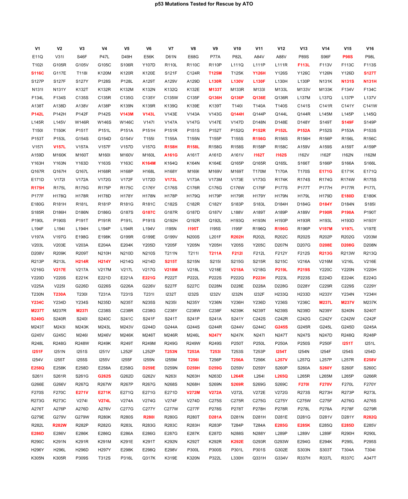

$~$


``` r
# all 800 muts tested in ATO (encompasses both papers)
mut_rescued_table_bw_gridprep <- condformat(cleaned_mut_rescue_ATO_website_song_2023 %>% 
                                           arrange(parse_number(mutant)) %>% 
                                           pull(mutant) %>%
                                           trimws() %>%
                                           na.omit() %>%
                                           unique() %>%
                                           matrix(ncol = 20,
                                                  byrow = TRUE)) %>%
  theme_grob(rows = NULL, # colnames are not removing with cols = NULL
             theme = ttheme_minimal(base_size = 10,
                                    core = list(padding = unit(c(7, 4), "mm")))) %>%
  condformat2grob(draw = FALSE)

mut_rescued_table_bw_grid <- grid.arrange(mut_rescued_table_bw_gridprep,
                                       top = textGrob("p53 Mutations Tested for Rescue by ATO",
                                                      hjust = 0.5,
                                                      gp = gpar(fontface = "bold"))) 
```

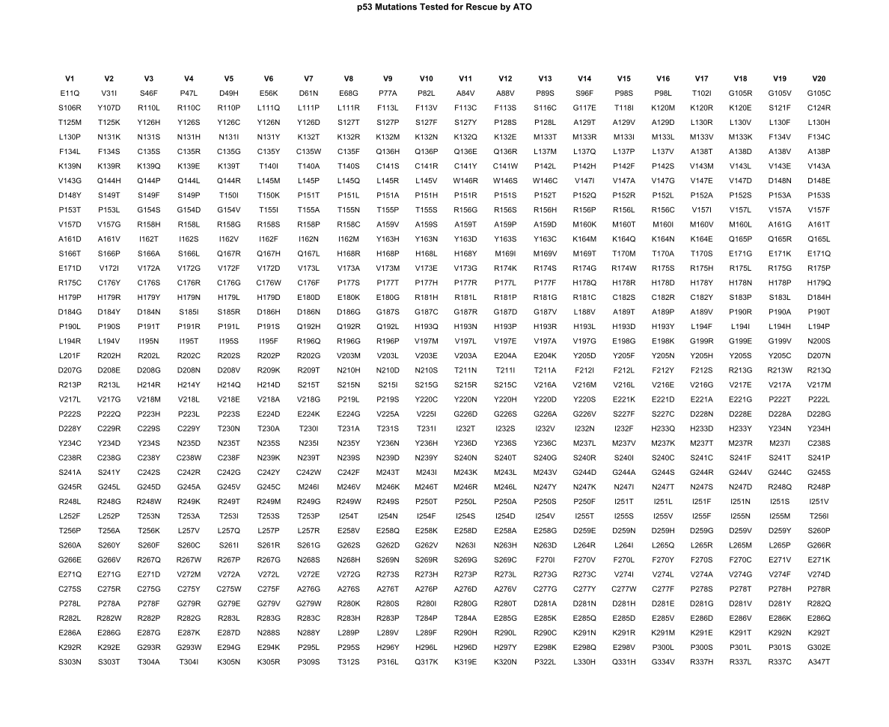

$~$


``` r
# all 103 muts well rescued by ATO used in analyses
mut_well_rescued_gridprep <- condformat(mut_rescued[order(parse_number(mut_rescued))] %>%
                                           trimws() %>%
                                           na.omit() %>%
                                           unique() %>%
                                           matrix(ncol = 10,
                                                  byrow = TRUE)) %>%
  theme_grob(rows = NULL, # colnames are not removing with cols = NULL
             theme = ttheme_minimal(base_size = 10,
                                    core = list(padding = unit(c(7, 4), "mm")))) %>%
  condformat2grob(draw = FALSE)

mut_well_rescued_grid <- grid.arrange(mut_well_rescued_gridprep,
                                       top = textGrob("p53 Mutations Well Rescued by ATO",
                                                      hjust = 0.5,
                                                      gp = gpar(fontface = "bold"))) 
```

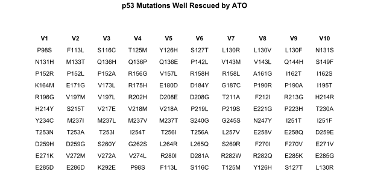

$~$


``` r
# all 65 PAT-rescuable muts used in analyses
mut_rescue_PAT_gridprep <- condformat(mut_rescue_PAT[order(parse_number(mut_rescue_PAT))] %>%
                                           trimws() %>%
                                           na.omit() %>%
                                           unique() %>%
                                           matrix(ncol = 10,
                                                  byrow = TRUE)) %>%
  theme_grob(rows = NULL, # colnames are not removing with cols = NULL
             theme = ttheme_minimal(base_size = 10,
                                    core = list(padding = unit(c(7, 4), "mm")))) %>%
  condformat2grob(draw = FALSE)

mut_rescue_PAT_grid <- grid.arrange(mut_rescue_PAT_gridprep,
                                       top = textGrob("p53 Mutations Rescued by PAT",
                                                      hjust = 0.5,
                                                      gp = gpar(fontface = "bold"))) 
```

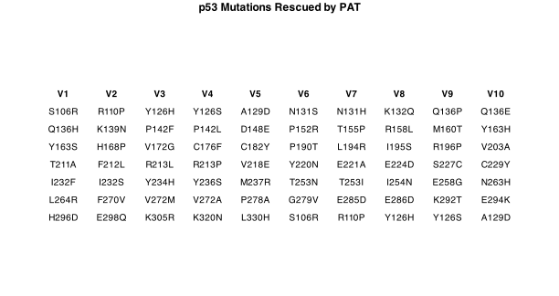

$~$


``` r
mut_rescue_ATO_PAT_intersect_gridprep <- condformat(
  intersect(mut_rescued, 
            mut_rescue_PAT)[order(parse_number(intersect(mut_rescued, 
                                                         mut_rescue_PAT)))] %>%
    trimws() %>%
    na.omit() %>%
    unique() %>%
    matrix(ncol = 6,
           byrow = TRUE)) %>%
  theme_grob(rows = NULL, # colnames are not removing with cols = NULL
             theme = ttheme_minimal(base_size = 10,
                                    core = list(padding = unit(c(7, 4), "mm")))) %>%
  condformat2grob(draw = FALSE)

mut_rescue_ATO_PAT_intersect_grid <- grid.arrange(mut_rescue_ATO_PAT_intersect_gridprep,
                                       top = textGrob("p53 Mutations Rescued by both ATO and PAT",
                                                      hjust = 0.5,
                                                      gp = gpar(fontface = "bold"))) 
```

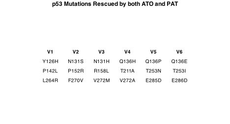

$~$


``` r
# all 413 tested and confirmed non-ATO-rescuable muts used in analyses
mut_not_rescued_gridprep <- condformat(mut_not_rescued[order(parse_number(mut_not_rescued))] %>%
                                           trimws() %>%
                                           na.omit() %>%
                                           unique() %>%
                                           matrix(ncol = 12,
                                                  byrow = TRUE)) %>%
  theme_grob(rows = NULL, # colnames are not removing with cols = NULL
             theme = ttheme_minimal(base_size = 10,
                                    core = list(padding = unit(c(7, 4), "mm")))) %>%
  condformat2grob(draw = FALSE)

mut_not_rescued_grid <- grid.arrange(mut_not_rescued_gridprep,
                                       top = textGrob("p53 Mutations Tested and Confirmed Not Rescued by ATO",
                                                      hjust = 0.5,
                                                      gp = gpar(fontface = "bold"))) 
```

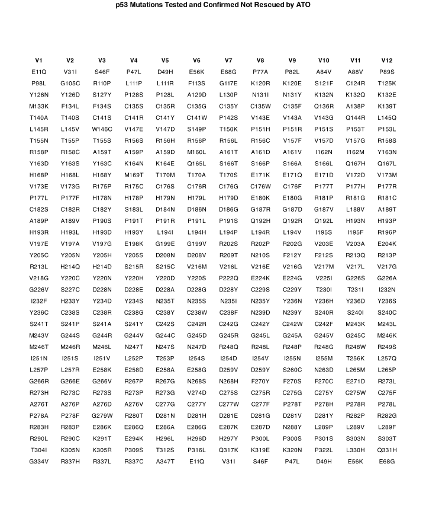

$~$

# **Formatting Data for Heatmaps** {#heatmapdata}

$~$


``` r
#convert melted dataframe to matrix for complexheatmap, filling anything below 0.01 as 0 although not 0 in reality, just placeholder to not have errors in making heatmap later on
# origdbtype_matrix <- origdbpivottype_melted %>% 
#   reshape2::acast(Cancer ~ Mutation, 
#                   value.var = 'Proportion', 
#                   fill = '0')
# class(origdbtype_matrix) <- "numeric"
# 
# origdbpos_matrix <- origdbpivotpos_melted_over0.01 %>% 
#   reshape2::acast(Cancer ~ Mutation, 
#                   value.var = 'Proportion', 
#                   fill = '0')
# class(origdbpos_matrix) <- "numeric"
# 
# origdbage_matrix <- origdbpivotage_melted %>% 
#   reshape2::acast(Age ~ Cancer, 
#                   value.var = 'Proportion', 
#                   fill = '0')
# class(origdbage_matrix) <- "numeric"
# 
# origdbage_type_matrix <- origdbpivotage_type_melted %>% 
#   reshape2::acast(Age ~ Mutation, 
#                   value.var = 'Proportion', 
#                   fill = '0')
# class(origdbage_type_matrix) <- "numeric"
# 
# origdbage_pos_matrix <- origdbpivotage_pos_melted_over0.01 %>% 
#   reshape2::acast(Age ~ Mutation, 
#                   value.var = 'Proportion', 
#                   fill = '0')
# class(origdbage_pos_matrix) <- "numeric"
# 
# origdbsex_matrix <- origdbpivotsex_melted %>% 
#   reshape2::acast(Sex ~ Cancer, 
#                   value.var = 'Proportion', 
#                   fill = '0')
# class(origdbsex_matrix) <- "numeric"
# 
# origdbsex_type_matrix <- origdbpivotsex_type_melted %>% 
#   reshape2::acast(Sex ~ Mutation, 
#                   value.var = 'Proportion', 
#                   fill = '0')
# class(origdbsex_type_matrix) <- "numeric"
# 
# origdbsex_pos_matrix <- origdbpivotsex_pos_melted_over0.01 %>% 
#   reshape2::acast(Sex ~ Mutation, 
#                   value.var = 'Proportion', 
#                   fill = '0')
# class(origdbsex_pos_matrix) <- "numeric"

# multcancertype_matrix <- multcancerpivottype_melted %>% 
#   reshape2::acast(Cancer ~ Mutation, 
#                   value.var = 'Proportion', 
#                   fill = '0')
# class(multcancertype_matrix) <- "numeric"

multcancerpos_matrix <- multcancerpivotpos_melted_over0.01 %>% 
  reshape2::acast(Cancer ~ Mutation, 
                  value.var = 'Proportion', 
                  fill = '0')
class(multcancerpos_matrix) <- "numeric"

# multcancerage_matrix <- multcancerpivotage_melted %>% 
#   reshape2::acast(Age ~ Cancer, 
#                   value.var = 'Proportion', 
#                   fill = '0')
# class(multcancerage_matrix) <- "numeric"
# 
# multcancerage_type_matrix <- multcancerpivotage_type_melted %>% 
#   reshape2::acast(Age ~ Mutation, 
#                   value.var = 'Proportion', 
#                   fill = '0')
# class(multcancerage_type_matrix) <- "numeric"

multcancerage_pos_matrix <- multcancerpivotage_pos_melted_over0.01 %>% 
  reshape2::acast(Age ~ Mutation, 
                  value.var = 'Proportion', 
                  fill = '0')
class(multcancerage_pos_matrix) <- "numeric"

# multcancersex_matrix <- multcancerpivotsex_melted %>% 
#   reshape2::acast(Sex ~ Cancer, 
#                   value.var = 'Proportion', 
#                   fill = '0')
# class(multcancersex_matrix) <- "numeric"
# 
# multcancersex_type_matrix <- multcancerpivotsex_type_melted %>% 
#   reshape2::acast(Sex ~ Mutation, 
#                   value.var = 'Proportion', 
#                   fill = '0')
# class(multcancersex_type_matrix) <- "numeric"

multcancersex_pos_matrix <- multcancerpivotsex_pos_melted_over0.01 %>% 
  reshape2::acast(Sex ~ Mutation, 
                  value.var = 'Proportion', 
                  fill = '0')
class(multcancersex_pos_matrix) <- "numeric"

# solecancertype_matrix <- solecancerpivottype_melted %>% 
#   reshape2::acast(Cancer ~ Mutation, 
#                   value.var = 'Proportion', 
#                   fill = '0')
# class(solecancertype_matrix) <- "numeric"

solecancerpos_matrix <- solecancerpivotpos_melted_over0.01 %>% 
  reshape2::acast(Cancer ~ Mutation, 
                  value.var = 'Proportion', 
                  fill = '0')
class(solecancerpos_matrix) <- "numeric"

# solecancerage_matrix <- solecancerpivotage_melted %>% 
#   reshape2::acast(Age ~ Cancer, 
#                   value.var = 'Proportion', 
#                   fill = '0')
# class(solecancerage_matrix) <- "numeric"
# 
# solecancerage_type_matrix <- solecancerpivotage_type_melted %>% 
#   reshape2::acast(Age ~ Mutation, 
#                   value.var = 'Proportion', 
#                   fill = '0')
# class(solecancerage_type_matrix) <- "numeric"

solecancerage_pos_matrix <- solecancerpivotage_pos_melted_over0.01 %>% 
  reshape2::acast(Age ~ Mutation, 
                  value.var = 'Proportion', 
                  fill = '0')
class(solecancerage_pos_matrix) <- "numeric"

# solecancersex_matrix <- solecancerpivotsex_melted %>% 
#   reshape2::acast(Sex ~ Cancer, 
#                   value.var = 'Proportion', 
#                   fill = '0')
# class(solecancersex_matrix) <- "numeric"
# 
# solecancersex_type_matrix <- solecancerpivotsex_type_melted %>% 
#   reshape2::acast(Sex ~ Mutation, 
#                   value.var = 'Proportion', 
#                   fill = '0')
# class(solecancersex_type_matrix) <- "numeric"

solecancersex_pos_matrix <- solecancerpivotsex_pos_melted_over0.01 %>% 
  reshape2::acast(Sex ~ Mutation, 
                  value.var = 'Proportion', 
                  fill = '0')
class(solecancersex_pos_matrix) <- "numeric"

#set up annotation dataframe to just have columns used for annotation, otherwise all columns used for annotation in heatmap
# origdbmutinfo_annotate <- origdbmutinfo %>% 
#   dplyr::select(-c(Codon_number, 
#                    ProtDescription, 
#                    Domain_function, 
#                    Effect))
# origdbmutinfo_annotate_age <- origdbmutinfo_age %>% 
#   dplyr::select(-c(Codon_number, 
#                    ProtDescription, 
#                    Domain_function, 
#                    Effect))
# origdbmutinfo_annotate_sex <- origdbmutinfo_sex %>% 
#   dplyr::select(-c(Codon_number, 
#                    ProtDescription, 
#                    Domain_function, 
#                    Effect))
# origdbcancersinfo_annotate <- origdbcancersinfo %>% 
#   dplyr::select(-Cancer)

multcancermutinfo_annotate <- multcancermutinfo %>% 
  dplyr::select(-c(Codon_number, 
                   ProtDescription, 
                   Domain_function))
multcancermutinfo_annotate_age <- multcancermutinfo_age %>% 
  dplyr::select(-c(Codon_number, 
                   ProtDescription, 
                   Domain_function))
multcancermutinfo_annotate_sex <- multcancermutinfo_sex %>% 
  dplyr::select(-c(Codon_number, 
                   ProtDescription, 
                   Domain_function))
multcancersinfo_annotate <- multcancersinfo %>% 
  dplyr::select(-Cancer)

solecancermutinfo_annotate <- solecancermutinfo %>% 
  dplyr::select(-c(Codon_number, 
                   ProtDescription, 
                   Domain_function))
solecancermutinfo_annotate_age <- solecancermutinfo_age %>% 
  dplyr::select(-c(Codon_number, 
                   ProtDescription, 
                   Domain_function))
solecancermutinfo_annotate_sex <- solecancermutinfo_sex %>% 
  dplyr::select(-c(Codon_number, 
                   ProtDescription, 
                   Domain_function))
solecancersinfo_annotate <- solecancersinfo %>% 
  dplyr::select(-Cancer)

# collapse different iterations of ADP-ribosylation, e.g. site and site not written, into 1 version
solecancermutinfo_annotate_age <- solecancermutinfo_annotate_age %>%
  transform(Residue_function = ifelse(Residue_function %in% c("ADP-ribosylation",
                                                              "ADP-ribosylation site"),
                                      "ADP-ribosylation site",
                                      Residue_function))

#order domain by p53 domain as a factor and buried/exposed as factor so that they are maintained in legend too
# unique(origdbmutinfo_annotate$Domain) #to find list of domains in order to use as factors
# origdbmutinfo_annotate$Domain <- factor(origdbmutinfo_annotate$Domain, 
#                                         levels = c("TAD1",
#                                                    "PRD", 
#                                                    "DBD", 
#                                                    "DBD L1 loop", 
#                                                    "DBD L2 loop", 
#                                                    "DBD L3 loop", 
#                                                    "HD", 
#                                                    "OD", 
#                                                    "NA"))
# 
# sort(as.vector(unique(origdbmutinfo_annotate$Residue_function))) #to find list of residue functions in order to use as factors
# origdbmutinfo_annotate$Residue_function <- factor(origdbmutinfo_annotate$Residue_function, 
#                                                   levels = c("Buried", 
#                                                              "DNA binding", 
#                                                              "Exposed", 
#                                                              "Partially exposed", 
#                                                              "Phosphorylation site", 
#                                                              "S-glutathionylation site", 
#                                                              "Tetramerisation", 
#                                                              "Tetramerisation/Methylation site", 
#                                                              "Zn binding", 
#                                                              "NA"))
# 
# unique(origdbmutinfo_annotate_age$Domain) #to find list of domains in order to use as factors
# origdbmutinfo_annotate_age$Domain <- factor(origdbmutinfo_annotate_age$Domain, 
#                                             levels = c("PRD", 
#                                                        "DBD",  
#                                                        "DBD L2 loop", 
#                                                        "DBD L3 loop", 
#                                                        "HD", 
#                                                        "OD",
#                                                        "CTD",
#                                                        "NA"))
# 
# sort(as.vector(unique(origdbmutinfo_annotate_age$Residue_function))) #to find list of residue functions in order to use as factors
# origdbmutinfo_annotate_age$Residue_function <- factor(origdbmutinfo_annotate_age$Residue_function, 
#                                                       levels = c("Buried", 
#                                                                  "DNA binding", 
#                                                                  "Exposed", 
#                                                                  "Partially exposed", 
#                                                                  "Phosphorylation site", 
#                                                                  "S-glutathionylation site", 
#                                                                  "Tetramerisation/Methylation site", 
#                                                                  "Zn binding", 
#                                                                  "NA"))

# unique(origdbmutinfo_annotate_sex$Domain) #to find list of domains in order to use as factors
# origdbmutinfo_annotate_sex$Domain <- factor(origdbmutinfo_annotate_sex$Domain, 
#                                             levels = c("PRD", 
#                                                        "DBD",  
#                                                        "DBD L2 loop", 
#                                                        "DBD L3 loop", 
#                                                        "HD", 
#                                                        "OD",
#                                                        "NA"))
# 
# sort(as.vector(unique(origdbmutinfo_annotate_sex$Residue_function))) #to find list of residue functions in order to use as factors
# origdbmutinfo_annotate_sex$Residue_function <- factor(origdbmutinfo_annotate_sex$Residue_function, 
#                                                       levels = c("Buried", 
#                                                                  "DNA binding", 
#                                                                  "Exposed", 
#                                                                  "Partially exposed", 
#                                                                  "Phosphorylation site", 
#                                                                  "S-glutathionylation site", 
#                                                                  "Zn binding", 
#                                                                  "NA"))

unique(multcancermutinfo_annotate$Domain) #to find list of domains in order to use as factors
multcancermutinfo_annotate$Domain <- factor(multcancermutinfo_annotate$Domain, 
                                            levels = c("TAD1",
                                                       "PRD", 
                                                       "DBD", 
                                                       "DBD L1 loop", 
                                                       "DBD L2 loop", 
                                                       "DBD L3 loop", 
                                                       "HD", 
                                                       "OD", 
                                                       "NA"))

sort(as.vector(unique(multcancermutinfo_annotate$Residue_function))) #to find list of residue functions in order to use as factors
multcancermutinfo_annotate$Residue_function <- factor(multcancermutinfo_annotate$Residue_function, 
                                                      levels = c("Acetylation/Ubiquitination site",
                                                                 "Buried", 
                                                                 "DNA binding", 
                                                                 "Exposed", 
                                                                 "Partially exposed", 
                                                                 "Phosphorylation site", 
                                                                 "S-glutathionylation site", 
                                                                 "Tetramerisation", 
                                                                 "Tetramerisation/Methylation site", 
                                                                 "Ubiquitination site",
                                                                 "Zn binding", 
                                                                 "NA"))

multcancermutinfo_annotate$Rescuable <- factor(multcancermutinfo_annotate$Rescuable, 
                                             levels = sort(as.vector(unique(multcancermutinfo_annotate$Rescuable)),
                                                           decreasing = TRUE))

multcancermutinfo_annotate$SIFTClass <- factor(multcancermutinfo_annotate$SIFTClass, 
                                               levels = c("Damaging",
                                                          "Tolerated",
                                                          "NA"))

multcancermutinfo_annotate$DNE_LOFclass <- factor(multcancermutinfo_annotate$DNE_LOFclass,
                                                  levels = c("DNE_LOF",
                                                             "notDNE_LOF",
                                                             "notDNE_notLOF",
                                                             "unclass.",
                                                             "NA"))


unique(multcancermutinfo_annotate_age$Domain) #to find list of domains in order to use as factors
multcancermutinfo_annotate_age$Domain <- factor(multcancermutinfo_annotate_age$Domain, 
                                                levels = c("TAD1",
                                                           "TAD2",
                                                           "PRD", 
                                                           "DBD",
                                                           "DBD L1 loop",
                                                           "DBD L2 loop", 
                                                           "DBD L3 loop", 
                                                           "HD", 
                                                           "OD",
                                                           "CTD",
                                                           "NA"))

sort(as.vector(unique(multcancermutinfo_annotate_age$Residue_function))) #to find list of residue functions in order to use as factors
multcancermutinfo_annotate_age$Residue_function <- factor(multcancermutinfo_annotate_age$Residue_function, 
                                                          levels = c("Acetylation/Methylation/Ubiquitination site",
                                                                     "Acetylation/Ubiquitination site",
                                                                     "Buried", 
                                                                     "DNA binding", 
                                                                     "Exposed", 
                                                                     "Methylation site",
                                                                     "Partially exposed", 
                                                                     "Phosphorylation site", 
                                                                     "S-glutathionylation site", 
                                                                     "Tetramerisation", 
                                                                     "Tetramerisation/Methylation site", 
                                                                     "Zn binding", 
                                                                     "NA"))

multcancermutinfo_annotate_age$Rescuable <- factor(multcancermutinfo_annotate_age$Rescuable, 
                                                 levels = sort(as.vector(unique(multcancermutinfo_annotate_age$Rescuable)),
                                                               decreasing = TRUE))

multcancermutinfo_annotate_age$SIFTClass <- factor(multcancermutinfo_annotate_age$SIFTClass, 
                                                   levels = c("Damaging",
                                                              "Tolerated",
                                                              "NA"))

multcancermutinfo_annotate_age$DNE_LOFclass <- factor(multcancermutinfo_annotate_age$DNE_LOFclass,
                                                      levels = c("DNE_LOF",
                                                                 "notDNE_LOF",
                                                                 "notDNE_notLOF",
                                                                 "unclass.",
                                                                 "NA"))

unique(multcancermutinfo_annotate_sex$Domain) #to find list of domains in order to use as factors
multcancermutinfo_annotate_sex$Domain <- factor(multcancermutinfo_annotate_sex$Domain, 
                                                levels = c("PRD", 
                                                           "DBD",
                                                           "DBD L2 loop", 
                                                           "DBD L3 loop", 
                                                           "HD", 
                                                           "OD",
                                                           "NA"))

sort(as.vector(unique(multcancermutinfo_annotate_sex$Residue_function))) #to find list of residue functions in order to use as factors
multcancermutinfo_annotate_sex$Residue_function <- factor(multcancermutinfo_annotate_sex$Residue_function, 
                                                          levels = c("Buried", 
                                                                     "DNA binding", 
                                                                     "Exposed", 
                                                                     "Partially exposed", 
                                                                     "Phosphorylation site", 
                                                                     "S-glutathionylation site",
                                                                     "Zn binding", 
                                                                     "NA"))

multcancermutinfo_annotate_sex$Rescuable <- factor(multcancermutinfo_annotate_sex$Rescuable, 
                                                 levels = sort(as.vector(unique(multcancermutinfo_annotate_sex$Rescuable)),
                                                               decreasing = TRUE))

multcancermutinfo_annotate_sex$SIFTClass <- factor(multcancermutinfo_annotate_sex$SIFTClass, 
                                                   levels = c("Damaging",
                                                              "Tolerated",
                                                              "NA"))

multcancermutinfo_annotate_sex$DNE_LOFclass <- factor(multcancermutinfo_annotate_sex$DNE_LOFclass,
                                                      levels = c("DNE_LOF",
                                                                 "notDNE_LOF",
                                                                 "notDNE_notLOF",
                                                                 "unclass.",
                                                                 "NA"))

unique(solecancermutinfo_annotate$Domain) #to find list of domains in order to use as factors
solecancermutinfo_annotate$Domain <- factor(solecancermutinfo_annotate$Domain, 
                                            levels = c(#"TAD2", 
                                              "PRD", 
                                              "DBD", 
                                              "DBD L2 loop", 
                                              "DBD L3 loop", 
                                              "HD", 
                                              "OD",
                                              "CTD",
                                              "NA"))

sort(as.vector(unique(solecancermutinfo_annotate$Residue_function))) #to find list of residue functions in order to use as factors
solecancermutinfo_annotate$Residue_function <- factor(solecancermutinfo_annotate$Residue_function, 
                                                      levels = c("Acetylation/Ubiquitination site",
                                                                 "Buried", 
                                                                 "DNA binding", 
                                                                 "Exposed", 
                                                                 #"Methylation site",
                                                                 "Partially exposed", 
                                                                 "Phosphorylation site", 
                                                                 "S-glutathionylation site", 
                                                                 "Tetramerisation", 
                                                                 "Tetramerisation/Methylation site", 
                                                                 "Zn binding", 
                                                                 "NA"))

solecancermutinfo_annotate$Rescuable <- factor(solecancermutinfo_annotate$Rescuable, 
                                             levels = sort(as.vector(unique(solecancermutinfo_annotate$Rescuable)),
                                                           decreasing = TRUE))

solecancermutinfo_annotate$SIFTClass <- factor(solecancermutinfo_annotate$SIFTClass, 
                                               levels = c("Damaging",
                                                          "Tolerated",
                                                          "NA"))

solecancermutinfo_annotate$DNE_LOFclass <- factor(solecancermutinfo_annotate$DNE_LOFclass,
                                                  levels = c("DNE_LOF",
                                                             "notDNE_LOF",
                                                             "notDNE_notLOF",
                                                             "unclass.",
                                                             "NA"))

unique(solecancermutinfo_annotate_age$Domain) #to find list of domains in order to use as factors
solecancermutinfo_annotate_age$Domain <- factor(solecancermutinfo_annotate_age$Domain, 
                                                levels = c("TAD1",
                                                           "PRD", 
                                                           "DBD",
                                                           "DBD L2 loop", 
                                                           "DBD L3 loop", 
                                                           "HD", 
                                                           "OD",
                                                           "NA"))

sort(as.vector(unique(solecancermutinfo_annotate_age$Residue_function))) #to find list of residue functions in order to use as factors
solecancermutinfo_annotate_age$Residue_function <- factor(solecancermutinfo_annotate_age$Residue_function, 
                                                          levels = c("ADP-ribosylation site",
                                                                     "Buried", 
                                                                     "DNA binding", 
                                                                     "Exposed", 
                                                                     "Partially exposed", 
                                                                     "Phosphorylation site", 
                                                                     "Tetramerisation/Methylation site", 
                                                                     "Zn binding",
                                                                     "NA"))

solecancermutinfo_annotate_age$Rescuable <- factor(solecancermutinfo_annotate_age$Rescuable, 
                                                 levels = sort(as.vector(unique(solecancermutinfo_annotate_age$Rescuable)),
                                                               decreasing = TRUE))

solecancermutinfo_annotate_age$SIFTClass <- factor(solecancermutinfo_annotate_age$SIFTClass, 
                                                   levels = c("Damaging",
                                                              "Tolerated",
                                                              "NA"))

solecancermutinfo_annotate_age$DNE_LOFclass <- factor(solecancermutinfo_annotate_age$DNE_LOFclass,
                                                      levels = c("DNE_LOF",
                                                                 "notDNE_LOF",
                                                                 "notDNE_notLOF",
                                                                 "unclass.",
                                                                 "NA"))

unique(solecancermutinfo_annotate_sex$Domain) #to find list of domains in order to use as factors
solecancermutinfo_annotate_sex$Domain <- factor(solecancermutinfo_annotate_sex$Domain, 
                                                levels = c("DBD",
                                                           "DBD L2 loop", 
                                                           "DBD L3 loop", 
                                                           "HD", 
                                                           "OD",
                                                           "NA"))

sort(as.vector(unique(solecancermutinfo_annotate_sex$Residue_function))) #to find list of residue functions in order to use as factors
solecancermutinfo_annotate_sex$Residue_function <- factor(solecancermutinfo_annotate_sex$Residue_function, 
                                                          levels = c("Buried", 
                                                                     "DNA binding", 
                                                                     "Exposed", 
                                                                     "Partially exposed", 
                                                                     "Tetramerisation/Methylation site", 
                                                                     "NA"))

solecancermutinfo_annotate_sex$Rescuable <- factor(solecancermutinfo_annotate_sex$Rescuable, 
                                                 levels = sort(as.vector(unique(solecancermutinfo_annotate_sex$Rescuable)),
                                                               decreasing = TRUE))

solecancermutinfo_annotate_sex$SIFTClass <- factor(solecancermutinfo_annotate_sex$SIFTClass, 
                                                   levels = c("Damaging",
                                                              "Tolerated",
                                                              "NA"))

solecancermutinfo_annotate_sex$DNE_LOFclass <- factor(solecancermutinfo_annotate_sex$DNE_LOFclass,
                                                      levels = c("DNE_LOF",
                                                                 "notDNE_LOF",
                                                                 "notDNE_notLOF",
                                                                 "unclass.",
                                                                 "NA"))

#show all color-blind friendly palettes in RColorBrewer
display.brewer.all(colorblindFriendly = TRUE)
```

``` r
#create color range for proportions on complexheatmap
origdb_color <- colorRampPalette((c("white", "red")))(50)

#need to extend color-blind palette colors because not enough colors for all annotations in the chosen palette
longercolorSet2 <- colorRampPalette(brewer.pal(8, "Set2"))(length(unique(multcancermutinfo_annotate$Domain)))
longercolorSet2_2 <- colorRampPalette(brewer.pal(8, "Set2"))(length(unique(multcancermutinfo_annotate_age$Domain)))

#assign color hex codes to annotations 
# annotationcolororigdb <- list(Domain = longercolorSet2, 
#                               Residue_function = RColorBrewer::brewer.pal(n = 10, name = "Paired"),
#                               Germ_Layer = RColorBrewer::brewer.pal(n = 3, name = "Dark2"))
# annotationcolornamedorigdb <- list(
#   Domain = c(TAD1 = "darkgray",
#              PRD = "#E78AC3", 
#              DBD = "#FFD92F",
#              `DBD L1 loop` = "#FC8D62", 
#              `DBD L2 loop` = "#8DA0CB", 
#              `DBD L3 loop` = "brown",
#              HD = "#A6D854", 
#              OD = "#D3D3D3",
#              `NA` = "black"), 
#   Residue_function = c(Buried = "#FF10F0", 
#                        `DNA binding` = "#6A3D9A", 
#                        Exposed = "#1F78B4", 
#                        `Partially exposed` = "#A6CEE3", 
#                        `Phosphorylation site` = "#33A02C", 
#                        `S-glutathionylation site` = "#B2DF8A", 
#                        Tetramerisation = "#8B8000", 
#                        `Tetramerisation/Methylation site` = "#FF7F00", 
#                        `Zn binding` = "#E30B5C", 
#                        `NA` = "#5A5A5A"),
#   Germ_Layer = c(Ectoderm = "#7570B3",
#                  Mesoderm = "#1B9E77",
#                  `NA` = "#D95F02"))
# 
# annotationcolororigdb_age <- list(Domain = RColorBrewer::brewer.pal(n = 8, name = "Set2"), 
#                                   Residue_function = RColorBrewer::brewer.pal(n = 9, name = "Paired"),
#                                   Germ_Layer = RColorBrewer::brewer.pal(n = 3, name = "Dark2"))
# annotationcolornamedorigdb_age <- list(
#   Domain = c(PRD = "#E78AC3", 
#              DBD = "#FFD92F",
#              `DBD L2 loop` = "#8DA0CB", 
#              `DBD L3 loop` = "brown",
#              HD = "#A6D854", 
#              OD = "#D3D3D3",
#              CTD = "red",
#              `NA` = "black"), 
#   Residue_function = c(Buried = "#FF10F0", 
#                        `DNA binding` = "#6A3D9A", 
#                        Exposed = "#1F78B4", 
#                        `Partially exposed` = "#A6CEE3", 
#                        `Phosphorylation site` = "#33A02C", 
#                        `S-glutathionylation site` = "#B2DF8A", 
#                        `Tetramerisation/Methylation site` = "#FF7F00", 
#                        `Zn binding` = "#E30B5C", 
#                        `NA` = "#5A5A5A"),
#   Germ_Layer = c(Ectoderm = "#7570B3",
#                  Mesoderm = "#1B9E77",
#                  `NA` = "#D95F02"))

# annotationcolororigdb_sex <- list(Domain = RColorBrewer::brewer.pal(n = 7, name = "Set2"), 
#                                   Residue_function = RColorBrewer::brewer.pal(n = 8, name = "Paired"),
#                                   Germ_Layer = RColorBrewer::brewer.pal(n = 3, name = "Dark2"))
# annotationcolornamedorigdb_sex <- list(
#   Domain = c(PRD = "#E78AC3", 
#              DBD = "#FFD92F",
#              `DBD L2 loop` = "#8DA0CB", 
#              `DBD L3 loop` = "brown",
#              HD = "#A6D854", 
#              OD = "#D3D3D3",
#              `NA` = "black"), 
#   Residue_function = c(Buried = "#FF10F0", 
#                        `DNA binding` = "#6A3D9A", 
#                        Exposed = "#1F78B4", 
#                        `Partially exposed` = "#A6CEE3", 
#                        `Phosphorylation site` = "#33A02C", 
#                        `S-glutathionylation site` = "#B2DF8A", 
#                        `Zn binding` = "#E30B5C", 
#                        `NA` = "#5A5A5A"),
#   Germ_Layer = c(Ectoderm = "#7570B3",
#                  Mesoderm = "#1B9E77",
#                  `NA` = "#D95F02"))

# annotationcolormultcancer <- list(Domain = longercolorSet2, 
#                                   Residue_function = RColorBrewer::brewer.pal(n = 12, name = "Paired"),
#                                   Germ_Layer = RColorBrewer::brewer.pal(n = 3, name = "Dark2"),
#                                   LFS_Tumor = c("#56B4E9", "#999999"),
#                                   Rescuable = c("forestgreen", "ivory2"),
#                                   SIFTClass = c("hotpink3", "aliceblue", "dimgray"),
#                                   DNE_LOFclass = c("maroon", "sienna1", "slategray1", "linen", "darkslategray"))
annotationcolornamedmultcancer <- list(
  Domain = c(TAD1 = "darkgray",
             PRD = "#E78AC3", 
             DBD = "#FFD92F",
             `DBD L1 loop` = "#FC8D62", 
             `DBD L2 loop` = "#8DA0CB", 
             `DBD L3 loop` = "brown",
             HD = "#A6D854", 
             OD = "#D3D3D3",
             `NA` = "black"), 
  Residue_function = c(`Acetylation/Ubiquitination site` = "aquamarine",
                       Buried = "#FF10F0", 
                       `DNA binding` = "#6A3D9A", 
                       Exposed = "#1F78B4", 
                       `Partially exposed` = "#A6CEE3", 
                       `Phosphorylation site` = "#33A02C", 
                       `S-glutathionylation site` = "#B2DF8A", 
                       Tetramerisation = "#8B8000", 
                       `Tetramerisation/Methylation site` = "#FF7F00", 
                       `Ubiquitination site` = "lightpink",
                       `Zn binding` = "#E30B5C", 
                       `NA` = "#5A5A5A"),
  Germ_Layer = c(Ectoderm = "#7570B3",
                 Mesoderm = "#1B9E77",
                 Endoderm = "#D95F02"),
  # LFS_Tumor = c(`Core tumor in LFS` = "#56B4E9",
  #               `Other tumor` = "#999999"),
  Rescuable = c(`Rescuable by ATO` = "forestgreen",
              `Not documented` = "ivory2"),
  SIFTClass = c(`Damaging` = "hotpink3", 
                `Tolerated` = "aliceblue",
                `NA` = "dimgray"),
  DNE_LOFclass = c(`DNE_LOF` = "maroon",    
                   `notDNE_LOF` = "sienna1",
                   `notDNE_notLOF` = "slategray1",
                   `unclass.` = "linen",
                   `NA` = "darkslategray"))

# annotationcolormultcancer_age <- list(Domain = longercolorSet2_2, 
#                                       Residue_function = RColorBrewer::brewer.pal(n = 12, name = "Paired"),
#                                       Germ_Layer = RColorBrewer::brewer.pal(n = 3, name = "Dark2"),
#                                       LFS_Tumor = c("#56B4E9", "#999999"),
#                                       Rescuable = c("forestgreen", "ivory2"),
#                                       SIFTClass = c("hotpink3", "aliceblue", "dimgray"),
#                                       DNE_LOFclass = c("maroon", "sienna1", "slategray1", "linen", "darkslategray"))
annotationcolornamedmultcancer_age <- list(
  Domain = c(TAD1 = "darkgray",
             TAD2 = "aquamarine",
             PRD = "#E78AC3", 
             DBD = "#FFD92F",
             `DBD L1 loop` = "#FC8D62", 
             `DBD L2 loop` = "#8DA0CB", 
             `DBD L3 loop` = "brown",
             HD = "#A6D854", 
             OD = "#D3D3D3",
             CTD = "red",
             `NA` = "black"), 
  Residue_function = c(`Acetylation/Methylation/Ubiquitination site` = "lavender",
                       `Acetylation/Ubiquitination site` = "hotpink",
                       Buried = "#FF10F0", 
                       `DNA binding` = "#6A3D9A", 
                       Exposed = "#1F78B4", 
                       `Methylation site` = "lightpink",
                       `Partially exposed` = "#A6CEE3", 
                       `Phosphorylation site` = "#33A02C", 
                       `S-glutathionylation site` = "#B2DF8A", 
                       Tetramerisation = "#8B8000", 
                       `Tetramerisation/Methylation site` = "#FF7F00", 
                       `Zn binding` = "#E30B5C", 
                       `NA` = "#5A5A5A"),
  Germ_Layer = c(Ectoderm = "#7570B3",
                 Mesoderm = "#1B9E77",
                 Endoderm = "#D95F02"),
  # LFS_Tumor = c(`Core tumor in LFS` = "#56B4E9",
  #               `Other tumor` = "#999999"),
  Rescuable = c(`Rescuable by ATO` = "forestgreen",
              `Not documented` = "ivory2"),
  SIFTClass = c(`Damaging` = "hotpink3", 
                `Tolerated` = "aliceblue",
                `NA` = "dimgray"),
  DNE_LOFclass = c(`DNE_LOF` = "maroon",    
                   `notDNE_LOF` = "sienna1",
                   `notDNE_notLOF` = "slategray1",
                   `unclass.` = "linen",
                   `NA` = "darkslategray"))

# annotationcolormultcancer_sex <- list(Domain = RColorBrewer::brewer.pal(n = 7, name = "Set2"), 
#                                       Residue_function = RColorBrewer::brewer.pal(n = 8, name = "Paired"),
#                                       Germ_Layer = RColorBrewer::brewer.pal(n = 3, name = "Dark2"),
#                                       LFS_Tumor = c("#56B4E9", "#999999"),
#                                       Rescuable = c("forestgreen", "ivory2"),
#                                       SIFTClass = c("hotpink3", "aliceblue", "dimgray"),
#                                       DNE_LOFclass = c("maroon", "sienna1", "slategray1", "linen", "darkslategray"))
annotationcolornamedmultcancer_sex <- list(
  Domain = c(PRD = "#E78AC3", 
             DBD = "#FFD92F",
             `DBD L2 loop` = "#8DA0CB", 
             `DBD L3 loop` = "brown",
             HD = "#A6D854", 
             OD = "#D3D3D3",
             `NA` = "black"), 
  Residue_function = c(Buried = "#FF10F0", 
                       `DNA binding` = "#6A3D9A", 
                       Exposed = "#1F78B4", 
                       `Partially exposed` = "#A6CEE3", 
                       `Phosphorylation site` = "#33A02C", 
                       `S-glutathionylation site` = "#B2DF8A", 
                       `Zn binding` = "#E30B5C", 
                       `NA` = "#5A5A5A"),
  Germ_Layer = c(Ectoderm = "#7570B3",
                 Mesoderm = "#1B9E77",
                 Endoderm = "#D95F02"),
  # LFS_Tumor = c(`Core tumor in LFS` = "#56B4E9",
  #               `Other tumor` = "#999999"),
  Rescuable = c(`Rescuable by ATO` = "forestgreen",
              `Not documented` = "ivory2"),
  SIFTClass = c(`Damaging` = "hotpink3", 
                `Tolerated` = "aliceblue",
                `NA` = "dimgray"),
  DNE_LOFclass = c(`DNE_LOF` = "maroon",    
                   `notDNE_LOF` = "sienna1",
                   `notDNE_notLOF` = "slategray1",
                   `unclass.` = "linen",
                   `NA` = "darkslategray"))

# annotationcolorsolecancer <- list(Domain = RColorBrewer::brewer.pal(n = 8, name = "Set2"), 
#                                   Residue_function = RColorBrewer::brewer.pal(n = 12, name = "Paired"),
#                                   Germ_Layer = RColorBrewer::brewer.pal(n = 3, name = "Dark2"),
#                                   LFS_Tumor = c("#56B4E9", "#999999"),
#                                   Rescuable = c("forestgreen", "ivory2"),
#                                   SIFTClass = c("hotpink3", "aliceblue", "dimgray"),
#                                   DNE_LOFclass = c("maroon", "sienna1", "slategray1", "linen", "darkslategray"))
annotationcolornamedsolecancer <- list(
  Domain = c(#TAD2 = "aquamarine",
    PRD = "#E78AC3", 
    DBD = "#FFD92F",
    `DBD L2 loop` = "#8DA0CB", 
    `DBD L3 loop` = "brown",
    HD = "#A6D854", 
    OD = "#D3D3D3",
    CTD = "red",
    `NA` = "black"), 
  Residue_function = c(`Acetylation/Ubiquitination site` = "lightpink",
                       Buried = "#FF10F0", 
                       `DNA binding` = "#6A3D9A", 
                       Exposed = "#1F78B4",
                       #`Methylation site` = "lavender",
                       `Partially exposed` = "#A6CEE3", 
                       `Phosphorylation site` = "#33A02C", 
                       `S-glutathionylation site` = "#B2DF8A", 
                       Tetramerisation = "#8B8000", 
                       `Tetramerisation/Methylation site` = "#FF7F00", 
                       `Zn binding` = "#E30B5C", 
                       `NA` = "#5A5A5A"),
  Germ_Layer = c(Ectoderm = "#7570B3",
                 Mesoderm = "#1B9E77",
                 Endoderm = "#D95F02"),
  # LFS_Tumor = c(`Core tumor in LFS` = "#56B4E9",
  #               `Other tumor` = "#999999"),
  Rescuable = c(`Rescuable by ATO` = "forestgreen",
              `Not documented` = "ivory2"),
  SIFTClass = c(`Damaging` = "hotpink3", 
                `Tolerated` = "aliceblue",
                `NA` = "dimgray"),
  DNE_LOFclass = c(`DNE_LOF` = "maroon",    
                   `notDNE_LOF` = "sienna1",
                   `notDNE_notLOF` = "slategray1",
                   `unclass.` = "linen",
                   `NA` = "darkslategray"))

# annotationcolorsolecancer_age <- list(Domain = RColorBrewer::brewer.pal(n = 8, name = "Set2"), 
#                                       Residue_function = RColorBrewer::brewer.pal(n = 9, name = "Paired"),
#                                       Germ_Layer = RColorBrewer::brewer.pal(n = 3, name = "Dark2"),
#                                       LFS_Tumor = c("#56B4E9", "#999999"),
#                                       Rescuable = c("forestgreen", "ivory2"),
#                                       SIFTClass = c("hotpink3", "aliceblue", "dimgray"),
#                                       DNE_LOFclass = c("maroon", "sienna1", "slategray1", "linen", "darkslategray"))
annotationcolornamedsolecancer_age <- list(
  Domain = c(TAD1 = "darkgray",
             PRD = "#E78AC3", 
             DBD = "#FFD92F",
             `DBD L2 loop` = "#8DA0CB", 
             `DBD L3 loop` = "brown",
             HD = "#A6D854", 
             OD = "#D3D3D3", 
             `NA` = "black"), 
  Residue_function = c(`ADP-ribosylation site` = "lightpink",
                       Buried = "#FF10F0", 
                       `DNA binding` = "#6A3D9A", 
                       Exposed = "#1F78B4", 
                       `Partially exposed` = "#A6CEE3", 
                       `Phosphorylation site` = "#33A02C", 
                       `Tetramerisation/Methylation site` = "#FF7F00", 
                       `Zn binding` = "#E30B5C",
                       `NA` = "#5A5A5A"),
  Germ_Layer = c(Ectoderm = "#7570B3",
                 Mesoderm = "#1B9E77",
                 Endoderm = "#D95F02"),
  # LFS_Tumor = c(`Core tumor in LFS` = "#56B4E9",
  #               `Other tumor` = "#999999"),
  Rescuable = c(`Rescuable by ATO` = "forestgreen",
              `Not documented` = "ivory2"),
  SIFTClass = c(`Damaging` = "hotpink3", 
                `Tolerated` = "aliceblue",
                `NA` = "dimgray"),
  DNE_LOFclass = c(`DNE_LOF` = "maroon",    
                   `notDNE_LOF` = "sienna1",
                   `notDNE_notLOF` = "slategray1",
                   `unclass.` = "linen",
                   `NA` = "darkslategray"))

# annotationcolorsolecancer_sex <- list(Domain = RColorBrewer::brewer.pal(n = 6, name = "Set2"), 
#                                       Residue_function = RColorBrewer::brewer.pal(n = 6, name = "Paired"),
#                                       Germ_Layer = RColorBrewer::brewer.pal(n = 3, name = "Dark2"),
#                                       LFS_Tumor = c("#56B4E9", "#999999"),
#                                       Rescuable = c("forestgreen", "ivory2"),
#                                       SIFTClass = c("hotpink3", "aliceblue", "dimgray"),
#                                       DNE_LOFclass = c("maroon", "sienna1", "slategray1", "linen", "darkslategray"))
annotationcolornamedsolecancer_sex <- list(
  Domain = c(DBD = "#FFD92F",
             `DBD L2 loop` = "#8DA0CB", 
             `DBD L3 loop` = "brown",
             HD = "#A6D854", 
             OD = "#D3D3D3", 
             `NA` = "black"), 
  Residue_function = c(Buried = "#FF10F0", 
                       `DNA binding` = "#6A3D9A", 
                       Exposed = "#1F78B4", 
                       `Partially exposed` = "#A6CEE3", 
                       `Tetramerisation/Methylation site` = "#FF7F00", 
                       `NA` = "#5A5A5A"),
  Germ_Layer = c(Ectoderm = "#7570B3",
                 Mesoderm = "#1B9E77",
                 Endoderm = "#D95F02"),
  # LFS_Tumor = c(`Core tumor in LFS` = "#56B4E9",
  #               `Other tumor` = "#999999"),
  Rescuable = c(`Rescuable by ATO` = "forestgreen",
              `Not documented` = "ivory2"),
  SIFTClass = c(`Damaging` = "hotpink3", 
                `Tolerated` = "aliceblue",
                `NA` = "dimgray"),
  DNE_LOFclass = c(`DNE_LOF` = "maroon",    
                   `notDNE_LOF` = "sienna1",
                   `notDNE_notLOF` = "slategray1",
                   `unclass.` = "linen",
                   `NA` = "darkslategray"))

#order matrix based on (codon order and) cancer annotation order so that heatmap organized by (ascending codon and) annotation order of cancer
# origdbtype_matrix_ordered <- origdbtype_matrix[rownames(origdbcancersinfo_annotate), ]
# origdbpos_matrix_ordered <- origdbpos_matrix[rownames(origdbcancersinfo_annotate),rownames(origdbmutinfo_annotate)]
# origdbage_matrix_ordered <- origdbage_matrix[,rownames(origdbcancersinfo_annotate)]
# origdbage_pos_matrix_ordered <- origdbage_pos_matrix[,rownames(origdbmutinfo_annotate_age)]
# origdbsex_matrix_ordered <- origdbsex_matrix[,rownames(origdbcancersinfo_annotate)]
# origdbsex_pos_matrix_ordered <- origdbsex_pos_matrix[,rownames(origdbmutinfo_annotate_sex)]

# multcancertype_matrix_ordered <- multcancertype_matrix[rownames(multcancersinfo_annotate)[rownames(multcancersinfo_annotate) %in% rownames(multcancertype_matrix)], ]
multcancerpos_matrix_ordered <- multcancerpos_matrix[rownames(multcancersinfo_annotate),rownames(multcancermutinfo_annotate)]
# multcancerage_matrix_ordered <- multcancerage_matrix[,rownames(multcancersinfo_annotate)]
multcancerage_pos_matrix_ordered <- multcancerage_pos_matrix[,rownames(multcancermutinfo_annotate_age)]
# multcancersex_matrix_ordered <- multcancersex_matrix[,rownames(multcancersinfo_annotate)]
multcancersex_pos_matrix_ordered <- multcancersex_pos_matrix[,rownames(multcancermutinfo_annotate_sex)]

# solecancertype_matrix_ordered <- solecancertype_matrix[rownames(solecancersinfo_annotate)[rownames(solecancersinfo_annotate) %in% rownames(solecancertype_matrix)], ]
solecancerpos_matrix_ordered <- solecancerpos_matrix[rownames(solecancersinfo_annotate),rownames(solecancermutinfo_annotate)]
# solecancerage_matrix_ordered <- solecancerage_matrix[,rownames(solecancersinfo_annotate)]
solecancerage_pos_matrix_ordered <- solecancerage_pos_matrix[,rownames(solecancermutinfo_annotate_age)]
# solecancersex_matrix_ordered <- solecancersex_matrix[,rownames(solecancersinfo_annotate)]
solecancersex_pos_matrix_ordered <- solecancersex_pos_matrix[,rownames(solecancermutinfo_annotate_sex)]

#need to recreate annotations as annotation class for complexheatmap
# column_ha_origdb <- ComplexHeatmap::columnAnnotation(df = origdbmutinfo_annotate, 
#                                                      col = annotationcolornamedorigdb, 
#                                                      annotation_label = c("Domain", "Feature"), 
#                                                      na_col = "white", 
#                                                      show_annotation_name = TRUE)
# row_ha_origdb <- ComplexHeatmap::rowAnnotation(df = origdbcancersinfo_annotate, 
#                                                col = annotationcolornamedorigdb, 
#                                                annotation_label = "Germ Layer", 
#                                                na_col = "white", 
#                                                show_annotation_name = TRUE)
# column_ha_age_cancer <- ComplexHeatmap::columnAnnotation(df = origdbcancersinfo_annotate, 
#                                                          col = annotationcolornamedorigdb_age, 
#                                                          annotation_label = "Germ Layer", 
#                                                          na_col = "white", 
#                                                          show_annotation_name = TRUE)
# column_ha_age_pos <- ComplexHeatmap::columnAnnotation(df = origdbmutinfo_annotate_age, 
#                                                       col = annotationcolornamedorigdb_age, 
#                                                       annotation_label = c("Domain", "Feature"), 
#                                                       na_col = "white", 
#                                                       show_annotation_name = TRUE)  
# column_ha_sex_cancer <- ComplexHeatmap::columnAnnotation(df = origdbcancersinfo_annotate, 
#                                                          col = annotationcolornamedorigdb_sex, 
#                                                          annotation_label = "Germ Layer", 
#                                                          na_col = "white", 
#                                                          show_annotation_name = TRUE)
# column_ha_sex_pos <- ComplexHeatmap::columnAnnotation(df = origdbmutinfo_annotate_sex, 
#                                                       col = annotationcolornamedorigdb_sex, 
#                                                       annotation_label = c("Domain", "Feature"), 
#                                                       na_col = "white", 
#                                                       show_annotation_name = TRUE)

column_ha_mult <- ComplexHeatmap::columnAnnotation(df = multcancermutinfo_annotate, 
                                                   col = annotationcolornamedmultcancer, 
                                                   annotation_label = c("Domain", "Feature", "SIFT", "DNE", "Rescuable"), 
                                                   na_col = "white", 
                                                   show_annotation_name = TRUE, 
                                                   annotation_name_side = c("left", "left", "left", "left", "left"), 
                                                   annotation_name_gp = gpar(fontsize = 10,
                                                                             fontface = "bold"),
                                                   annotation_legend_param = list(Domain = list(direction = "horizontal",
                                                                                                ncol = 2),
                                                                                  Residue_function = list(direction = "horizontal",
                                                                                                          ncol = 2),
                                                                                  
                                                                                  DNE_LOFclass = list(direction = "horizontal",
                                                                                                      ncol = 2)))
row_ha_mult <- ComplexHeatmap::rowAnnotation(df = multcancersinfo_annotate, 
                                             col = annotationcolornamedmultcancer, 
                                             annotation_label = c("Germ Layer"
                                                                  #, "LFS Tumor"
                                             ),
                                             na_col = "white", 
                                             show_annotation_name = TRUE, 
                                             annotation_name_gp = gpar(fontsize = 10,
                                                                       fontface = "bold"))
column_ha_age_mult <- ComplexHeatmap::columnAnnotation(df = multcancersinfo_annotate, 
                                                       col = annotationcolornamedmultcancer_age, 
                                                       annotation_label = c("Germ Layer"
                                                                            #, "LFS Tumor"
                                                       ), 
                                                       na_col = "white", 
                                                       show_annotation_name = TRUE, 
                                                       annotation_name_gp = gpar(fontsize = 10,
                                                                                 fontface = "bold"))
column_ha_age_pos_mult <- ComplexHeatmap::columnAnnotation(df = multcancermutinfo_annotate_age, 
                                                           col = annotationcolornamedmultcancer_age, 
                                                           annotation_label = c("Domain", "Feature", "SIFT", "DNE", "Rescuable"), 
                                                           na_col = "white", 
                                                           show_annotation_name = TRUE, 
                                                           annotation_name_side = c("left", "left", "left", "left", "left"), 
                                                           annotation_name_gp = gpar(fontsize = 10,
                                                                                     fontface = "bold"),
                                                           annotation_legend_param = list(Domain = list(direction = "horizontal",
                                                                                                        ncol = 2),
                                                                                          Residue_function = list(direction = "horizontal",
                                                                                                                  ncol = 2),
                                                                                          
                                                                                          DNE_LOFclass = list(direction = "horizontal",
                                                                                                              ncol = 2)))
column_ha_sex_mult <- ComplexHeatmap::columnAnnotation(df = multcancersinfo_annotate, 
                                                       col = annotationcolornamedmultcancer_sex, 
                                                       annotation_label = c("Germ Layer"
                                                                            #, "LFS Tumor"
                                                       ), 
                                                       na_col = "white", 
                                                       show_annotation_name = TRUE, 
                                                       annotation_name_gp = gpar(fontsize = 10,
                                                                                 fontface = "bold"))
column_ha_sex_pos_mult <- ComplexHeatmap::columnAnnotation(df = multcancermutinfo_annotate_sex, 
                                                           col = annotationcolornamedmultcancer_sex, 
                                                           annotation_label = c("Domain", "Feature", "SIFT", "DNE", "Rescuable"), 
                                                           na_col = "white", 
                                                           show_annotation_name = TRUE, 
                                                           annotation_name_side = c("left", "left", "left", "left", "left"), 
                                                           annotation_name_gp = gpar(fontsize = 10,
                                                                                     fontface = "bold"))

column_ha_sole <- ComplexHeatmap::columnAnnotation(df = solecancermutinfo_annotate, 
                                                   col = annotationcolornamedsolecancer, 
                                                   annotation_label = c("Domain", "Feature", "SIFT", "DNE", "Rescuable"), 
                                                   na_col = "white", 
                                                   show_annotation_name = TRUE, 
                                                   annotation_name_side = c("left", "left", "left", "left", "left"), 
                                                   annotation_name_gp = gpar(fontsize = 10,
                                                                             fontface = "bold"),
                                                   annotation_legend_param = list(Domain = list(direction = "horizontal",
                                                                                                ncol = 2),
                                                                                  Residue_function = list(direction = "horizontal",
                                                                                                          ncol = 2),
                                                                                  
                                                                                  DNE_LOFclass = list(direction = "horizontal",
                                                                                                      ncol = 2)))
row_ha_sole <- ComplexHeatmap::rowAnnotation(df = solecancersinfo_annotate, 
                                             col = annotationcolornamedsolecancer, 
                                             annotation_label = c("Germ Layer"
                                                                  #, "LFS Tumor"
                                             ), 
                                             na_col = "white", 
                                             show_annotation_name = TRUE, 
                                             annotation_name_gp = gpar(fontsize = 10,
                                                                       fontface = "bold"))
column_ha_age_sole <- ComplexHeatmap::columnAnnotation(df = solecancersinfo_annotate, 
                                                       col = annotationcolornamedsolecancer_age, 
                                                       annotation_label = c("Germ Layer"
                                                                            #, "LFS Tumor"
                                                       ), 
                                                       na_col = "white", 
                                                       show_annotation_name = TRUE, 
                                                       annotation_name_gp = gpar(fontsize = 10,
                                                                                 fontface = "bold"))
column_ha_age_pos_sole <- ComplexHeatmap::columnAnnotation(df = solecancermutinfo_annotate_age, 
                                                           col = annotationcolornamedsolecancer_age, 
                                                           annotation_label = c("Domain", "Feature", "SIFT", "DNE", "Rescuable"), 
                                                           na_col = "white", 
                                                           show_annotation_name = TRUE, 
                                                           annotation_name_side = c("left", "left", "left", "left", "left"), 
                                                           annotation_name_gp = gpar(fontsize = 10,
                                                                                     fontface = "bold"),
                                                           annotation_legend_param = list(Domain = list(direction = "horizontal",
                                                                                                        ncol = 2),
                                                                                          Residue_function = list(direction = "horizontal",
                                                                                                                  ncol = 2),
                                                                                          
                                                                                          DNE_LOFclass = list(direction = "horizontal",
                                                                                                              ncol = 2)))
column_ha_sex_sole <- ComplexHeatmap::columnAnnotation(df = solecancersinfo_annotate, 
                                                       col = annotationcolornamedsolecancer_sex, 
                                                       annotation_label = c("Germ Layer"
                                                                            #, "LFS Tumor"
                                                       ), 
                                                       na_col = "white", 
                                                       show_annotation_name = TRUE, 
                                                       annotation_name_gp = gpar(fontsize = 10,
                                                                                 fontface = "bold"))
column_ha_sex_pos_sole <- ComplexHeatmap::columnAnnotation(df = solecancermutinfo_annotate_sex, 
                                                           col = annotationcolornamedsolecancer_sex, 
                                                           annotation_label = c("Domain", "Feature", "SIFT", "DNE", "Rescuable"), 
                                                           na_col = "white", 
                                                           show_annotation_name = TRUE, 
                                                           annotation_name_side = c("left", "left", "left", "left", "left"), 
                                                           annotation_name_gp = gpar(fontsize = 10,
                                                                                     fontface = "bold"))
```

$~$

# **Formatting Data for Alluvial Plots** {#alluvialdata .hidden .unlisted .unnumbered}

$~$


$~$


$~$


$~$


$~$


$~$


$~$


$~$


$~$


$~$


$~$


``` r
# show data that will be used for alluvial plots in mult cancer
kbl(alluvial_sex_mult, 
    row.names = TRUE) %>% 
  kable_styling(bootstrap_options = c("striped", 
                                      "responsive", 
                                      "condensed", 
                                      "hover"), 
                fixed_thead = TRUE) %>%
  scroll_box(width = "100%", 
             height = "300px")
```

$~$


$~$


$~$


$~$


$~$


$~$


$~$


$~$

# **Formatting Data for Cancer Sequence Figures** {#cancerseqplotprod .hidden .unlisted .unnumbered}

$~$


``` r
# preparing for stacked barchart of distribution of cancers in each incidence of cancer
#make table of how many times a cancer was present as first, second, third, etc. cancer
cancerspertime <- cancersperpt %>% 
  count(Short_topo, 
        cancer_incidence)
cancerspertime <- cancerspertime[order(-cancerspertime$n),] 
cancerspertime <- cancerspertime[gtools::mixedorder(cancerspertime$cancer_incidence),] %>% 
  remove_rownames()
cancerspertime_pivot <- pivot_wider(cancerspertime,
                                    names_from = cancer_incidence,
                                    values_from = n) %>% 
  adorn_totals(where = c("col")) 
cancerspertime_pivot <- cancerspertime_pivot[order(-cancerspertime_pivot$Total),] %>% 
  adorn_totals(where = c("row")) %>%  
  remove_rownames()

#selecting cancers in at least 50 patients and assigning germ layers (although cannot color by germ layers if not all cancers are assigned germ layers, just pre-emptive labeling)
geomtilecancers <- cancerspertime_pivot %>% 
  head(5) %>% # get top 5 cancers to also capture ACC
  #subset(Short_topo != "Total" & Total >= 50) %>% 
  dplyr::select(Short_topo) %>% 
  distinct() %>% 
  transform(Germ_Layer = ifelse(Short_topo %in% c("SOFT TISSUES", "Osteosarcoma", "Adrenal cortical carcinoma"), 
                                "Mesoderm", 
                                "notyet")) %>% 
  transform(Germ_Layer = ifelse(Short_topo %in% c("BREAST", "BRAIN"), 
                                "Ectoderm", 
                                Germ_Layer)) %>% 
  remove_rownames()

# do cancers divided by time (first 3 cancers have adequate pt number), so divide vertically instead of horizontally
# remove total column and only keep columns with at least 100 pts
cancerspertime_nototalcol <- cancerspertime_pivot %>% 
  dplyr::select(!Total) %>% 
  select_if(~ any(. >= 100)) %>% 
  remove_rownames()

# divide cancers by time i.e. vertically, but have to create temp df for division because numbers, and then join cancers
tempcol <- cancerspertime_nototalcol[,2:ncol(cancerspertime_nototalcol)]
tempcol <- tempcol/c(tempcol[nrow(tempcol),])
cancerspertime_nototalcol_calc_nobottom <- cancerspertime_nototalcol %>% 
  dplyr::select(Short_topo) %>% 
  cbind(tempcol) %>% 
  subset(Short_topo != "Total") %>% 
  remove_rownames()

# melt for stacked barchart
cancerspertime_melted <- reshape2::melt(cancerspertime_nototalcol_calc_nobottom) %>% 
  dplyr::rename(Tissue = Short_topo,
                Sequence = variable,
                Proportion = value)
cancerspertime_melted$Tissue_modif <- cancerspertime_melted$Tissue 
cancerspertime_melted <- cancerspertime_melted %>% 
  transform(Tissue_modif = ifelse(!(Tissue_modif %in% geomtilecancers$Short_topo),
                                  "OTHER",
                                  Tissue_modif))

# make color-coded version of cancers per pt pivot table via ggplot2 and geom_tile
cancersperpt$cancer_incidence <- factor(cancersperpt$cancer_incidence,
                                        levels = rev(unique(cancersperpt$cancer_incidence)))
cancersperpt$Individual_code <- factor(cancersperpt$Individual_code,
                                       levels = unique(cancersperpt_pivot$Individual_code))

# for less frequent cancers, calling them other and not assigning germ layer
cancersperpt$Short_topo_modif <- cancersperpt$Short_topo
cancersperpt <- cancersperpt %>% 
  transform(Short_topo_modif = ifelse(!(Short_topo_modif %in% geomtilecancers$Short_topo),
                                      "OTHER",
                                      Short_topo_modif)) %>% 
  remove_rownames()
cancersperpt <- full_join(cancersperpt, 
                          geomtilecancers, 
                          by = "Short_topo") %>% 
  transform(Germ_Layer = ifelse(is.na(Germ_Layer),
                                "Not set",
                                Germ_Layer)) %>% 
  remove_rownames()

#assigning colors to tissues and germ layers to potentially use to color the map
# annotationcolorgeomtile <- list(Tissue = RColorBrewer::brewer.pal(n = 6, name = "Paired"),
#                                 Germ_Layer = RColorBrewer::brewer.pal(n = 3, name = "Dark2"))
annotationcolornamedgeomtile <- list(
  Tissue = c(`Adrenal cortical carcinoma` = "#CC79A7",
             BRAIN = "#E69F00", 
             BREAST = "#009E73", 
             Osteosarcoma = "#56B4E9", 
             `SOFT TISSUES` = "#999999",
             OTHER = "#000000"),
  Germ_Layer = c(Ectoderm = "#7570B3",
                 Mesoderm = "limegreen",
                 `Not set` = "lightgray"))
```

$~$


$~$


$~$


$~$

# **Formatting Data for Cancer Breakdown Piecharts** {#breakdownpiechartsprod .hidden .unlisted .unnumbered}

$~$


$~$


$~$


$~$


$~$


$~$


$~$


$~$


$~$


$~$


$~$

# **Get RSIDs of mutations** {#rsIDs .hidden .unlisted .unnumbered}

$~$


$~$

# **Contingency Tables for Chi Squared Tests and Statistical Significance** {#chisquares .hidden .unlisted .unnumbered}

$~$

As an initial foray into statistical significance, I'm creating contingency tables for chi square tests on various relationships. These contingency tables are using patients from the full datasets before they are subsetted for the top cancers, to include all patients accurately.

$~$


$~$


$~$


$~$


$~$


$~$


$~$


$~$


$~$


$~$


$~$


$~$


$~$


$~$


$~$


$~$


$~$


$~$


$~$


$~$


$~$


$~$


$~$


$~$


$~$


$~$


$~$


$~$


$~$


$~$


$~$


$~$


$~$


$~$


$~$


$~$


$~$


$~$


$~$


$~$


$~$


$~$


$~$


$~$


$~$


$~$


$~$


$~$


$~$


$~$


$~$


$~$


$~$


$~$


$~$


$~$


$~$


$~$


$~$


$~$


$~$


$~$


$~$


$~$


$~$


$~$


$~$

# **Cancer Spectra of Individuals with Coding and Only Noncoding Germline p53 Mutations** {#codingvsnoncoding .hidden .unlisted .unnumbered}

$~$


$~$

$~$


$~$


$~$


$~$


$~$


$~$


$~$


$~$


$~$


$~$


$~$


$~$


$~$


$~$


$~$


$~$


$~$


$~$


$~$


$~$


$~$


$~$


$~$


$~$


$~$


$~$


$~$


$~$


$~$


$~$


$~$


$~$


$~$


$~$


$~$


$~$


$~$


$~$


$~$


$~$


$~$


$~$


$~$


$~$


$~$


$~$


$~$


$~$


$~$


$~$


$~$


$~$


$~$


$~$


$~$


$~$


$~$


$~$


$~$


$~$


$~$


$~$


$~$


$~$


$~$


$~$


$~$


$~$


$~$


$~$


$~$


$~$


$~$


$~$


$~$


$~$

# **Cancer Spectra of Individuals with One Cancer 0-19 yo** {#cancerspectrasole0-19yo .hidden .unlisted .unnumbered}

$~$


$~$


$~$


$~$


$~$


$~$


$~$


$~$


$~$


$~$


$~$


$~$


$~$


$~$


$~$

# **Analyses of All Individuals with Adrenal Cortical Carcinoma** {#allACCpts}

$~$

$~$


``` r
# subset dataset of all sole and first mult to just ACC
origdb_allACC_mult_pts <- origdbjustmultcancersover100 %>% 
  subset(Short_topo == "Adrenal cortical carcinoma") %>% 
  distinct() %>% 
  remove_rownames()

origdb_allACC_sole_pts <- origdbjustsolecancersover100 %>% 
  subset(Short_topo == "Adrenal cortical carcinoma") %>% 
  distinct() %>% 
  remove_rownames()

# create pivot of number of female and male pts with ACC in each age stratum of diagnosis, replace any NA with 0, add total number of pts in each age stratum to new column pasted with ages, and make anything with 1 individual singular indication of patients
ACC_mult_agestrata_sex <- PivotTable$new()
ACC_mult_agestrata_sex$addData(origdb_allACC_mult_pts)
ACC_mult_agestrata_sex$addRowDataGroups("Age_stratum")
ACC_mult_agestrata_sex$addColumnDataGroups("Sex") 
ACC_mult_agestrata_sex$defineCalculation(calculationName = "Count of distinct patients", 
                                         summariseExpression = "n_distinct(Individual_code)")
ACC_mult_agestrata_sex$sortColumnDataGroups(levelNumber = 1, 
                                            orderBy = "calculation", 
                                            sortOrder = "desc")
ACC_mult_agestrata_sex$sortRowDataGroups(levelNumber = 1, 
                                         orderBy = "calculation", 
                                         sortOrder = "desc")
ACC_mult_agestrata_sex$evaluatePivot() #doing this instead of renderPivot() which takes too long as it shows an actual pivot table, but we need this as a dataframe anyways for calculations later so we don't need to print a pivot table
ACC_mult_agestrata_sex_pivot <- ACC_mult_agestrata_sex$asDataFrame(rowGroupsAsColumns = TRUE) %>% 
  mutate(across(everything(),
                ~ replace_na(.,
                             0))) %>%
  transform(Age = paste0(Age_stratum,
                         " (", 
                         Total,
                         " individuals)")) %>% 
  transform(Age = ifelse(Total == 1,
                         gsub("individuals", 
                              "individual",
                              Age),
                         Age)) %>% 
  remove_rownames()

ACC_sole_agestrata_sex <- PivotTable$new()
ACC_sole_agestrata_sex$addData(origdb_allACC_sole_pts)
ACC_sole_agestrata_sex$addRowDataGroups("Age_stratum")
ACC_sole_agestrata_sex$addColumnDataGroups("Sex") 
ACC_sole_agestrata_sex$defineCalculation(calculationName = "Count of distinct patients", 
                                         summariseExpression = "n_distinct(Individual_code)")
ACC_sole_agestrata_sex$sortColumnDataGroups(levelNumber = 1, 
                                            orderBy = "calculation", 
                                            sortOrder = "desc")
ACC_sole_agestrata_sex$sortRowDataGroups(levelNumber = 1, 
                                         orderBy = "calculation", 
                                         sortOrder = "desc")
ACC_sole_agestrata_sex$evaluatePivot() #doing this instead of renderPivot() which takes too long as it shows an actual pivot table, but we need this as a dataframe anyways for calculations later so we don't need to print a pivot table
ACC_sole_agestrata_sex_pivot <- ACC_sole_agestrata_sex$asDataFrame(rowGroupsAsColumns = TRUE) %>% 
  mutate(across(everything(),
                ~ replace_na(.,
                             0))) %>%
  transform(Age = paste0(Age_stratum,
                         " (", 
                         Total,
                         " individuals)")) %>% 
  transform(Age = ifelse(Total == 1,
                         gsub("individuals", 
                              "individual",
                              Age),
                         Age)) %>% 
  remove_rownames()

# create pivot of number of mut type pts with ACC in each age stratum of diagnosis, replace any NA with 0, add total number of pts in each age stratum to new column pasted with ages, and make anything with 1 Individual singular indication of patients
ACC_mult_agestrata_type <- PivotTable$new()
ACC_mult_agestrata_type$addData(origdb_allACC_mult_pts)
ACC_mult_agestrata_type$addRowDataGroups("Age_stratum")
ACC_mult_agestrata_type$addColumnDataGroups("Effect") 
ACC_mult_agestrata_type$defineCalculation(calculationName = "Count of distinct patients", 
                                          summariseExpression = "n_distinct(Individual_code)")
ACC_mult_agestrata_type$sortColumnDataGroups(levelNumber = 1, 
                                             orderBy = "calculation", 
                                             sortOrder = "desc")
ACC_mult_agestrata_type$sortRowDataGroups(levelNumber = 1, 
                                          orderBy = "calculation", 
                                          sortOrder = "desc")
ACC_mult_agestrata_type$evaluatePivot() #doing this instead of renderPivot() which takes too long as it shows an actual pivot table, but we need this as a dataframe anyways for calculations later so we don't need to print a pivot table
ACC_mult_agestrata_type_pivot <- ACC_mult_agestrata_type$asDataFrame(rowGroupsAsColumns = TRUE) %>% 
  mutate(across(everything(),
                ~ replace_na(.,
                             0))) %>%
  transform(Age = paste0(Age_stratum,
                         " (", 
                         Total,
                         " individuals)")) %>% 
  transform(Age = ifelse(Total == 1,
                         gsub("individuals", 
                              "individual",
                              Age),
                         Age)) %>% 
  remove_rownames() 

ACC_sole_agestrata_type <- PivotTable$new()
ACC_sole_agestrata_type$addData(origdb_allACC_sole_pts)
ACC_sole_agestrata_type$addRowDataGroups("Age_stratum")
ACC_sole_agestrata_type$addColumnDataGroups("Effect") 
ACC_sole_agestrata_type$defineCalculation(calculationName = "Count of distinct patients", 
                                          summariseExpression = "n_distinct(Individual_code)")
ACC_sole_agestrata_type$sortColumnDataGroups(levelNumber = 1, 
                                             orderBy = "calculation", 
                                             sortOrder = "desc")
ACC_sole_agestrata_type$sortRowDataGroups(levelNumber = 1, 
                                          orderBy = "calculation", 
                                          sortOrder = "desc")
ACC_sole_agestrata_type$evaluatePivot() #doing this instead of renderPivot() which takes too long as it shows an actual pivot table, but we need this as a dataframe anyways for calculations later so we don't need to print a pivot table
ACC_sole_agestrata_type_pivot <- ACC_sole_agestrata_type$asDataFrame(rowGroupsAsColumns = TRUE) %>% 
  mutate(across(everything(),
                ~ replace_na(.,
                             0))) %>%
  transform(Age = paste0(Age_stratum,
                         " (", 
                         Total,
                         " individuals)")) %>% 
  transform(Age = ifelse(Total == 1,
                         gsub("individuals", 
                              "individual",
                              Age),
                         Age)) %>% 
  remove_rownames()

# create pivot of number of female and male pts with ACC in each mutation category, replace any NA with 0, add row and column totals
ACC_mult_sex_type <- PivotTable$new()
ACC_mult_sex_type$addData(origdb_allACC_mult_pts)
ACC_mult_sex_type$addRowDataGroups("Effect")
ACC_mult_sex_type$addColumnDataGroups("Sex") 
ACC_mult_sex_type$defineCalculation(calculationName = "Count of distinct patients", 
                                    summariseExpression = "n_distinct(Individual_code)")
ACC_mult_sex_type$sortColumnDataGroups(levelNumber = 1, 
                                       orderBy = "calculation", 
                                       sortOrder = "desc")
ACC_mult_sex_type$sortRowDataGroups(levelNumber = 1, 
                                    orderBy = "calculation", 
                                    sortOrder = "desc")
ACC_mult_sex_type$evaluatePivot() #doing this instead of renderPivot() which takes too long as it shows an actual pivot table, but we need this as a dataframe anyways for calculations later so we don't need to print a pivot table
ACC_mult_sex_type_pivot <- ACC_mult_sex_type$asDataFrame(rowGroupsAsColumns = TRUE) %>% 
  mutate(across(everything(),
                ~ replace_na(.,
                             0))) %>% 
  remove_rownames()

ACC_sole_sex_type <- PivotTable$new()
ACC_sole_sex_type$addData(origdb_allACC_sole_pts)
ACC_sole_sex_type$addRowDataGroups("Effect")
ACC_sole_sex_type$addColumnDataGroups("Sex") 
ACC_sole_sex_type$defineCalculation(calculationName = "Count of distinct patients", 
                                    summariseExpression = "n_distinct(Individual_code)")
ACC_sole_sex_type$sortColumnDataGroups(levelNumber = 1, 
                                       orderBy = "calculation", 
                                       sortOrder = "desc")
ACC_sole_sex_type$sortRowDataGroups(levelNumber = 1, 
                                    orderBy = "calculation", 
                                    sortOrder = "desc")
ACC_sole_sex_type$evaluatePivot() #doing this instead of renderPivot() which takes too long as it shows an actual pivot table, but we need this as a dataframe anyways for calculations later so we don't need to print a pivot table
ACC_sole_sex_type_pivot <- ACC_sole_sex_type$asDataFrame(rowGroupsAsColumns = TRUE) %>% 
  mutate(across(everything(),
                ~ replace_na(.,
                             0))) %>% 
  remove_rownames()

# divide number of female and male pts by total number of pts per age stratum
ACC_mult_agestrata_sex_pivot_calc <- ACC_mult_agestrata_sex_pivot %>% 
  mutate_at(vars(2:Total), 
            .funs = ~./Total) %>% 
  dplyr::rename(Female = `F`,
                Male = M) 

ACC_sole_agestrata_sex_pivot_calc <- ACC_sole_agestrata_sex_pivot %>% 
  mutate_at(vars(2:Total), 
            .funs = ~./Total) %>% 
  dplyr::rename(Female = `F`,
                Male = M) 

# divide number of mut type pts by total number of pts per age stratum
ACC_mult_agestrata_type_pivot_calc <- ACC_mult_agestrata_type_pivot %>% 
  mutate_at(vars(2:Total), 
            .funs = ~./Total)

ACC_sole_agestrata_type_pivot_calc <- ACC_sole_agestrata_type_pivot %>% 
  mutate_at(vars(2:Total), 
            .funs = ~./Total)

# divide vertically down sex columns to calc proportions of each mut type in each sex, add number of total female and male pts to colnames
ACC_mult_sex_type_pivot_calc <- ACC_mult_sex_type_pivot %>% 
  dplyr::select(-Total) %>% 
  transform(Female = `F`/as.numeric(ACC_mult_sex_type_pivot[nrow(ACC_mult_sex_type_pivot), "F"])) %>% 
  transform(Male = `M`/as.numeric(ACC_mult_sex_type_pivot[nrow(ACC_mult_sex_type_pivot), "M"])) 

names(ACC_mult_sex_type_pivot_calc) <- ifelse(names(ACC_mult_sex_type_pivot_calc) %in% c("Female"),
                                              paste0("Female (",
                                                     as.numeric(ACC_mult_sex_type_pivot[nrow(ACC_mult_sex_type_pivot),
                                                                                        "F"]),
                                                     " individuals)"),
                                              names(ACC_mult_sex_type_pivot_calc))

names(ACC_mult_sex_type_pivot_calc) <- ifelse(names(ACC_mult_sex_type_pivot_calc) %in% c("Male"),
                                              paste0("Male (",
                                                     as.numeric(ACC_mult_sex_type_pivot[nrow(ACC_mult_sex_type_pivot),
                                                                                        "M"]),
                                                     " individuals)"),
                                              names(ACC_mult_sex_type_pivot_calc))

ACC_sole_sex_type_pivot_calc <- ACC_sole_sex_type_pivot %>% 
  dplyr::select(-Total) %>% 
  transform(Female = `F`/as.numeric(ACC_sole_sex_type_pivot[nrow(ACC_sole_sex_type_pivot), "F"])) %>% 
  transform(Male = `M`/as.numeric(ACC_sole_sex_type_pivot[nrow(ACC_sole_sex_type_pivot), "M"])) 

names(ACC_sole_sex_type_pivot_calc) <- ifelse(names(ACC_sole_sex_type_pivot_calc) %in% c("Female"),
                                              paste0("Female (",
                                                     as.numeric(ACC_sole_sex_type_pivot[nrow(ACC_sole_sex_type_pivot),
                                                                                        "F"]),
                                                     " individuals)"),
                                              names(ACC_sole_sex_type_pivot_calc))

names(ACC_sole_sex_type_pivot_calc) <- ifelse(names(ACC_sole_sex_type_pivot_calc) %in% c("Male"),
                                              paste0("Male (",
                                                     as.numeric(ACC_sole_sex_type_pivot[nrow(ACC_sole_sex_type_pivot),
                                                                                        "M"]),
                                                     " individuals)"),
                                              names(ACC_sole_sex_type_pivot_calc))

# remove total row and column and age column which doesn't have indication of number of total patients, melt pivot for ggplot and rename columns to be more sensible
ACC_mult_agestrata_sex_pivot_melted <- ACC_mult_agestrata_sex_pivot_calc %>% 
  dplyr::select(-Total) %>% 
  subset(Age_stratum != "Total") %>% 
  dplyr::select(-Age_stratum) %>% 
  reshape2::melt() %>% 
  dplyr::rename(Sex = variable,
                Proportion = value)

ACC_sole_agestrata_sex_pivot_melted <- ACC_sole_agestrata_sex_pivot_calc %>% 
  dplyr::select(-Total) %>% 
  subset(Age_stratum != "Total") %>% 
  dplyr::select(-Age_stratum) %>% 
  reshape2::melt() %>% 
  dplyr::rename(Sex = variable,
                Proportion = value)

# remove total row and column and age column which doesn't have indication of number of total patients, melt pivot for ggplot and rename columns to be more sensible, make category column as factor with decreasing proportions and other at end
ACC_mult_agestrata_type_pivot_melted <- ACC_mult_agestrata_type_pivot_calc %>% 
  dplyr::select(-Total) %>% 
  subset(Age_stratum != "Total") %>% 
  dplyr::select(-Age_stratum) %>% 
  reshape2::melt() %>% 
  dplyr::rename(Effect = variable,
                Proportion = value)

ACC_mult_agestrata_type_pivot_melted$Effect <- factor(ACC_mult_agestrata_type_pivot_melted$Effect,
                                                      levels = c(levels(ACC_mult_agestrata_type_pivot_melted$Effect)[!(levels(ACC_mult_agestrata_type_pivot_melted$Effect) == "other")],
                                                                 "other"))

ACC_sole_agestrata_type_pivot_melted <- ACC_sole_agestrata_type_pivot_calc %>% 
  dplyr::select(-Total) %>% 
  subset(Age_stratum != "Total") %>% 
  dplyr::select(-Age_stratum) %>% 
  reshape2::melt() %>% 
  dplyr::rename(Effect = variable,
                Proportion = value)

ACC_sole_agestrata_type_pivot_melted$Effect <- gsub("\\.",
                                                    " ",
                                                    ACC_sole_agestrata_type_pivot_melted$Effect)

ACC_sole_agestrata_type_pivot_melted$Effect <- factor(ACC_sole_agestrata_type_pivot_melted$Effect,
                                                      levels = c(unique(ACC_sole_agestrata_type_pivot_melted$Effect)[!(unique(ACC_sole_agestrata_type_pivot_melted$Effect) == "other")],
                                                                 "other"))

# remove total row and sex columns which don't have number of total patients, melt pivot for ggplot and rename columns to be more sensible, make category column as factor with decreasing proportions and other at end
ACC_mult_sex_type_pivot_melted <- ACC_mult_sex_type_pivot_calc %>% 
  subset(Effect != "Total") %>% 
  dplyr::select(-c(`F`,
                   M)) %>% 
  reshape2::melt() %>% 
  dplyr::rename(Sex = variable,
                Proportion = value) %>% 
  arrange(-Proportion)

ACC_mult_sex_type_pivot_melted$Effect <- factor(ACC_mult_sex_type_pivot_melted$Effect,
                                                levels = c(unique(ACC_mult_sex_type_pivot_melted$Effect)[!(unique(ACC_mult_sex_type_pivot_melted$Effect) == "other")],
                                                           "other"))

ACC_sole_sex_type_pivot_melted <- ACC_sole_sex_type_pivot_calc %>% 
  subset(Effect != "Total") %>% 
  dplyr::select(-c(`F`,
                   M)) %>% 
  reshape2::melt() %>% 
  dplyr::rename(Sex = variable,
                Proportion = value) %>% 
  arrange(-Proportion)

ACC_sole_sex_type_pivot_melted$Effect <- factor(ACC_sole_sex_type_pivot_melted$Effect,
                                                levels = c(unique(ACC_sole_sex_type_pivot_melted$Effect)[!(unique(ACC_sole_sex_type_pivot_melted$Effect) == "other")],
                                                           "other"))

# create pivot of mutated residues vs sex in all ACC patients, replace NA with 0, arrange by increasing codon number, add row and column totals
ACC_mult_sex_pos <- PivotTable$new()
ACC_mult_sex_pos$addData(origdb_allACC_mult_pts)
ACC_mult_sex_pos$addRowDataGroups("ProtDescription")
ACC_mult_sex_pos$addColumnDataGroups("Sex") 
ACC_mult_sex_pos$defineCalculation(calculationName = "Count of distinct patients", 
                                   summariseExpression = "n_distinct(Individual_code)")
ACC_mult_sex_pos$sortColumnDataGroups(levelNumber = 1, 
                                      orderBy = "calculation", 
                                      sortOrder = "desc")
ACC_mult_sex_pos$sortRowDataGroups(levelNumber = 1, 
                                   orderBy = "calculation", 
                                   sortOrder = "desc")
ACC_mult_sex_pos$evaluatePivot() #doing this instead of renderPivot() which takes too long as it shows an actual pivot table, but we need this as a dataframe anyways for calculations later so we don't need to print a pivot table
ACC_mult_sex_pos_pivot <- ACC_mult_sex_pos$asDataFrame(rowGroupsAsColumns = TRUE) %>% 
  mutate(across(everything(),
                ~ replace_na(.,
                             0))) %>% 
  arrange(abs(parse_number(ProtDescription))) %>% # arrange muts by increasing codon number
  dplyr::rename(Num_Individuals = Total,
                Mutation = ProtDescription,
                Female = `F`,
                Male = M) %>%
  remove_rownames()

ACC_sole_sex_pos <- PivotTable$new()
ACC_sole_sex_pos$addData(origdb_allACC_sole_pts)
ACC_sole_sex_pos$addRowDataGroups("ProtDescription")
ACC_sole_sex_pos$addColumnDataGroups("Sex") 
ACC_sole_sex_pos$defineCalculation(calculationName = "Count of distinct patients", 
                                   summariseExpression = "n_distinct(Individual_code)")
ACC_sole_sex_pos$sortColumnDataGroups(levelNumber = 1, 
                                      orderBy = "calculation", 
                                      sortOrder = "desc")
ACC_sole_sex_pos$sortRowDataGroups(levelNumber = 1, 
                                   orderBy = "calculation", 
                                   sortOrder = "desc")
ACC_sole_sex_pos$evaluatePivot() #doing this instead of renderPivot() which takes too long as it shows an actual pivot table, but we need this as a dataframe anyways for calculations later so we don't need to print a pivot table
ACC_sole_sex_pos_pivot <- ACC_sole_sex_pos$asDataFrame(rowGroupsAsColumns = TRUE) %>% 
  mutate(across(everything(),
                ~ replace_na(.,
                             0))) %>% 
  arrange(abs(parse_number(ProtDescription))) %>% # arrange muts by increasing codon number
  dplyr::rename(Num_Individuals = Total,
                Mutation = ProtDescription,
                Female = `F`,
                Male = M) %>%
  remove_rownames()

# create pivot of mutated residues vs age strata of dx in all ACC patients, replace NA with 0, arrange by increasing codon number, add row and column totals
ACC_mult_agestrata_pos <- PivotTable$new()
ACC_mult_agestrata_pos$addData(origdb_allACC_mult_pts)
ACC_mult_agestrata_pos$addRowDataGroups("ProtDescription")
ACC_mult_agestrata_pos$addColumnDataGroups("Age_stratum") 
ACC_mult_agestrata_pos$defineCalculation(calculationName = "Count of distinct patients", 
                                         summariseExpression = "n_distinct(Individual_code)")
ACC_mult_agestrata_pos$sortColumnDataGroups(levelNumber = 1, 
                                            orderBy = "calculation", 
                                            sortOrder = "desc")
ACC_mult_agestrata_pos$sortRowDataGroups(levelNumber = 1, 
                                         orderBy = "calculation", 
                                         sortOrder = "desc")
ACC_mult_agestrata_pos$evaluatePivot() #doing this instead of renderPivot() which takes too long as it shows an actual pivot table, but we need this as a dataframe anyways for calculations later so we don't need to print a pivot table
ACC_mult_agestrata_pos_pivot <- ACC_mult_agestrata_pos$asDataFrame(rowGroupsAsColumns = TRUE) %>% 
  mutate(across(everything(),
                ~ replace_na(.,
                             0))) %>% 
  arrange(abs(parse_number(ProtDescription))) %>% # arrange muts by increasing codon number
  dplyr::rename(Num_Individuals = Total,
                Mutation = ProtDescription) %>%
  remove_rownames()

ACC_sole_agestrata_pos <- PivotTable$new()
ACC_sole_agestrata_pos$addData(origdb_allACC_sole_pts)
ACC_sole_agestrata_pos$addRowDataGroups("ProtDescription")
ACC_sole_agestrata_pos$addColumnDataGroups("Age_stratum") 
ACC_sole_agestrata_pos$defineCalculation(calculationName = "Count of distinct patients", 
                                         summariseExpression = "n_distinct(Individual_code)")
ACC_sole_agestrata_pos$sortColumnDataGroups(levelNumber = 1, 
                                            orderBy = "calculation", 
                                            sortOrder = "desc")
ACC_sole_agestrata_pos$sortRowDataGroups(levelNumber = 1, 
                                         orderBy = "calculation", 
                                         sortOrder = "desc")
ACC_sole_agestrata_pos$evaluatePivot() #doing this instead of renderPivot() which takes too long as it shows an actual pivot table, but we need this as a dataframe anyways for calculations later so we don't need to print a pivot table
ACC_sole_agestrata_pos_pivot <- ACC_sole_agestrata_pos$asDataFrame(rowGroupsAsColumns = TRUE) %>% 
  mutate(across(everything(),
                ~ replace_na(.,
                             0))) %>% 
  arrange(abs(parse_number(ProtDescription))) %>% # arrange muts by increasing codon number
  dplyr::rename(Num_Individuals = Total,
                Mutation = ProtDescription) %>%
  remove_rownames()

# pull out damage info from stock ACC data
origdb_allACC_mult_pts_damageinfo <- origdb_allACC_mult_pts %>% 
  dplyr::select(c(ProtDescription, # first few cols are mut info, then agvgdc onwards are damage info
                  AGVGDClass,
                  BayesDel,
                  REVEL,
                  SIFTClass,
                  Polyphen2,
                  TransactivationClass,
                  DNE_LOFclass,
                  DNEclass)) %>% 
  arrange(abs(parse_number(ProtDescription))) %>% 
  distinct() %>% 
  remove_rownames()

origdb_allACC_sole_pts_damageinfo <- origdb_allACC_sole_pts %>% 
  dplyr::select(c(ProtDescription, # first few cols are mut info, then agvgdc onwards are damage info
                  AGVGDClass,
                  BayesDel,
                  REVEL,
                  SIFTClass,
                  Polyphen2,
                  TransactivationClass,
                  DNE_LOFclass,
                  DNEclass)) %>% 
  arrange(abs(parse_number(ProtDescription))) %>% 
  distinct() %>% 
  remove_rownames()

# add damage info to pivot of mut residues in sexes and replace NAs with blanks so that can plot as grid
ACC_mult_sex_pos_pivot_damage <- left_join(ACC_mult_sex_pos_pivot,
                                           origdb_allACC_mult_pts_damageinfo,
                                           by = c("Mutation" = "ProtDescription")) %>% 
  mutate(across(2:ncol(.),
                ~ str_replace(.,
                              "NA",
                              ""))) %>%
  mutate(across(where(is.character),
                ~ replace_na(.,
                             "")))

ACC_sole_sex_pos_pivot_damage <- left_join(ACC_sole_sex_pos_pivot,
                                           origdb_allACC_sole_pts_damageinfo,
                                           by = c("Mutation" = "ProtDescription")) %>% 
  mutate(across(2:ncol(.),
                ~ str_replace(.,
                              "NA",
                              ""))) %>%
  mutate(across(where(is.character),
                ~ replace_na(.,
                             "")))

# add damage info to pivot of mut residues in age strata, replace NAs with blanks so that can plot as grid
ACC_mult_agestrata_pos_pivot_damage <- left_join(ACC_mult_agestrata_pos_pivot,
                                                 origdb_allACC_mult_pts_damageinfo,
                                                 by = c("Mutation" = "ProtDescription")) %>% 
  mutate(across(2:ncol(.),
                ~ str_replace(.,
                              "NA",
                              ""))) %>%
  mutate(across(where(is.character),
                ~ replace_na(.,
                             "")))

ACC_sole_agestrata_pos_pivot_damage <- left_join(ACC_sole_agestrata_pos_pivot,
                                                 origdb_allACC_sole_pts_damageinfo,
                                                 by = c("Mutation" = "ProtDescription")) %>% 
  mutate(across(2:ncol(.),
                ~ str_replace(.,
                              "NA",
                              ""))) %>%
  mutate(across(where(is.character),
                ~ replace_na(.,
                             "")))

# divide vertically down age pos and sex pos columns and subset to just residues shown in heatmaps i.e. >= 1%, rename cols for agestrata calc dfs because R changes them per naming conventions
ACC_mult_sex_pos_pivot_calc <- ACC_mult_sex_pos_pivot_damage %>%
  transform(`F` = as.numeric(Female)/as.numeric(ACC_mult_sex_pos_pivot_damage[nrow(ACC_mult_sex_pos_pivot_damage), "Female"])) %>%
  transform(`M` = as.numeric(Male)/as.numeric(ACC_mult_sex_pos_pivot_damage[nrow(ACC_mult_sex_pos_pivot_damage), "Male"])) %>%
  dplyr::select(c(Mutation,
                  `F`,
                  `M`)) %>%
  subset(Mutation %in% unique(as.vector(multcancerpivotpos_melted_over0.01$Mutation)))

ACC_sole_sex_pos_pivot_calc <- ACC_sole_sex_pos_pivot_damage %>%
  transform(`F` = as.numeric(Female)/as.numeric(ACC_sole_sex_pos_pivot_damage[nrow(ACC_sole_sex_pos_pivot_damage), "Female"])) %>%
  transform(`M` = as.numeric(Male)/as.numeric(ACC_sole_sex_pos_pivot_damage[nrow(ACC_sole_sex_pos_pivot_damage), "Male"])) %>%
  dplyr::select(c(Mutation,
                  `F`,
                  `M`)) %>%
  subset(Mutation %in% unique(as.vector(solecancerpivotpos_melted_over0.01$Mutation)))

ACC_mult_agestrata_pos_pivot_calc <- ACC_mult_agestrata_pos_pivot_damage %>%
  transform(`0 - 9` = as.numeric(ACC_mult_agestrata_pos_pivot_damage[,2])/as.numeric(ACC_mult_agestrata_pos_pivot_damage[nrow(ACC_mult_agestrata_pos_pivot_damage), 
                                                                                                                         colnames(ACC_mult_agestrata_pos_pivot_damage)[2]])) %>%
  transform(`10 - 19` = as.numeric(as.numeric(ACC_mult_agestrata_pos_pivot_damage[,3]))/as.numeric(ACC_mult_agestrata_pos_pivot_damage[nrow(ACC_mult_agestrata_pos_pivot_damage),
                                                                                                                                       colnames(ACC_mult_agestrata_pos_pivot_damage)[3]])) %>%
  transform(`20 - 29` = as.numeric(as.numeric(ACC_mult_agestrata_pos_pivot_damage[,4]))/as.numeric(ACC_mult_agestrata_pos_pivot_damage[nrow(ACC_mult_agestrata_pos_pivot_damage),
                                                                                                                                       colnames(ACC_mult_agestrata_pos_pivot_damage)[4]])) %>%
  dplyr::select(c(Mutation,
                  tail(names(.),
                       3))) %>%
  subset(Mutation %in% unique(as.vector(multcancerpivotpos_melted_over0.01$Mutation))) 

colnames(ACC_mult_agestrata_pos_pivot_calc) <- colnames(ACC_mult_agestrata_pos_pivot_damage)[1:4]

ACC_sole_agestrata_pos_pivot_calc <- ACC_sole_agestrata_pos_pivot_damage %>%
  transform(`0 - 9` = as.numeric(ACC_sole_agestrata_pos_pivot_damage[,2])/as.numeric(ACC_sole_agestrata_pos_pivot_damage[nrow(ACC_sole_agestrata_pos_pivot_damage), 
                                                                                                                         colnames(ACC_sole_agestrata_pos_pivot_damage)[2]])) %>%
  transform(`10 - 19` = as.numeric(as.numeric(ACC_sole_agestrata_pos_pivot_damage[,3]))/as.numeric(ACC_sole_agestrata_pos_pivot_damage[nrow(ACC_sole_agestrata_pos_pivot_damage),
                                                                                                                                       colnames(ACC_sole_agestrata_pos_pivot_damage)[3]])) %>%
  transform(`20 - 29` = as.numeric(as.numeric(ACC_sole_agestrata_pos_pivot_damage[,4]))/as.numeric(ACC_sole_agestrata_pos_pivot_damage[nrow(ACC_sole_agestrata_pos_pivot_damage),
                                                                                                                                       colnames(ACC_sole_agestrata_pos_pivot_damage)[4]])) %>%
  transform(`30 - 39` = as.numeric(as.numeric(ACC_sole_agestrata_pos_pivot_damage[,5]))/as.numeric(ACC_sole_agestrata_pos_pivot_damage[nrow(ACC_sole_agestrata_pos_pivot_damage),
                                                                                                                                       colnames(ACC_sole_agestrata_pos_pivot_damage)[5]])) %>%
  dplyr::select(c(Mutation,
                  tail(names(.),
                       4))) %>%
  subset(Mutation %in% unique(as.vector(solecancerpivotpos_melted_over0.01$Mutation))) 

colnames(ACC_sole_agestrata_pos_pivot_calc) <- colnames(ACC_sole_agestrata_pos_pivot_damage)[1:5]

# melt pos pivot tables and add number of individuals to sex or age strata listed, already do >= 1% proportion 
ACC_mult_sex_pos_pivot_melted <- reshape2::melt(ACC_mult_sex_pos_pivot_calc) %>%
  dplyr::rename(Sex = variable,
                Proportion = value) %>%
  arrange(-Proportion) %>%
  transform(Sex = ifelse(Sex == "F",
                         paste0("Female (",
                                as.numeric(ACC_mult_sex_pos_pivot_damage[nrow(ACC_mult_sex_pos_pivot_damage), "Female"]),
                                " individuals)"),
                         as.character(Sex))) %>%
  transform(Sex = ifelse(Sex == "M",
                         paste0("Male (",
                                as.numeric(ACC_mult_sex_pos_pivot_damage[nrow(ACC_mult_sex_pos_pivot_damage), "Male"]),
                                " individuals)"),
                         Sex)) %>%
  transform(Sex = ifelse(grepl("\\(1 ", 
                               Sex),
                         gsub("individuals", 
                              "individual",
                              Sex),
                         Sex)) %>%
  subset(Mutation %in% (reshape2::melt(ACC_mult_sex_pos_pivot_calc) %>%
                          dplyr::rename(Sex = variable,
                                        Proportion = value) %>%
                          arrange(-Proportion) %>%
                          subset(Proportion >= 0.01) %>%
                          pull(Mutation) %>%
                          unique() %>%
                          as.vector())) %>%
  remove_rownames()

ACC_sole_sex_pos_pivot_melted <- reshape2::melt(ACC_sole_sex_pos_pivot_calc) %>%
  dplyr::rename(Sex = variable,
                Proportion = value) %>%
  arrange(-Proportion) %>%
  transform(Sex = ifelse(Sex == "F",
                         paste0("Female (",
                                as.numeric(ACC_sole_sex_pos_pivot_damage[nrow(ACC_sole_sex_pos_pivot_damage), "Female"]),
                                " individuals)"),
                         as.character(Sex))) %>%
  transform(Sex = ifelse(Sex == "M",
                         paste0("Male (",
                                as.numeric(ACC_sole_sex_pos_pivot_damage[nrow(ACC_sole_sex_pos_pivot_damage), "Male"]),
                                " individuals)"),
                         Sex)) %>%
  transform(Sex = ifelse(grepl("\\(1 ", 
                               Sex),
                         gsub("individuals", 
                              "individual",
                              Sex),
                         Sex)) %>%
  subset(Mutation %in% (reshape2::melt(ACC_sole_sex_pos_pivot_calc) %>%
                          dplyr::rename(Sex = variable,
                                        Proportion = value) %>%
                          arrange(-Proportion) %>%
                          subset(Proportion >= 0.01) %>%
                          pull(Mutation) %>%
                          unique() %>%
                          as.vector())) %>%
  remove_rownames()

ACC_mult_agestrata_pos_pivot_melted <- reshape2::melt(ACC_mult_agestrata_pos_pivot_calc) %>%
  dplyr::rename(Age = variable,
                Proportion = value) %>%
  arrange(-Proportion) %>%
  transform(Age = ifelse(Age == "0-9",
                         paste0("0-9 (",
                                as.numeric(ACC_mult_agestrata_pos_pivot_damage[nrow(ACC_mult_agestrata_pos_pivot_damage), "0-9"]),
                                " individuals)"),
                         as.character(Age))) %>%
  transform(Age = ifelse(Age == "10-19",
                         paste0("10-19 (",
                                as.numeric(ACC_mult_agestrata_pos_pivot_damage[nrow(ACC_mult_agestrata_pos_pivot_damage), "10-19"]),
                                " individuals)"),
                         Age)) %>%
  transform(Age = ifelse(Age == "20-29",
                         paste0("20-29 (",
                                as.numeric(ACC_mult_agestrata_pos_pivot_damage[nrow(ACC_mult_agestrata_pos_pivot_damage), "20-29"]),
                                " individuals)"),
                         Age)) %>%
  transform(Age = ifelse(grepl("\\(1 ", 
                               Age),
                         gsub("individuals", 
                              "individual",
                              Age),
                         Age)) %>%
  subset(Mutation %in% (reshape2::melt(ACC_mult_agestrata_pos_pivot_calc) %>%
                          dplyr::rename(Age = variable,
                                        Proportion = value) %>%
                          arrange(-Proportion) %>%
                          subset(Proportion >= 0.01) %>%
                          pull(Mutation) %>%
                          unique() %>%
                          as.vector())) %>%
  remove_rownames() 

ACC_sole_agestrata_pos_pivot_melted <- reshape2::melt(ACC_sole_agestrata_pos_pivot_calc) %>%
  dplyr::rename(Age = variable,
                Proportion = value) %>%
  arrange(-Proportion) %>%
  transform(Age = ifelse(Age == "0-9",
                         paste0("0-9 (",
                                as.numeric(ACC_sole_agestrata_pos_pivot_damage[nrow(ACC_sole_agestrata_pos_pivot_damage), "0-9"]),
                                " individuals)"),
                         as.character(Age))) %>%
  transform(Age = ifelse(Age == "10-19",
                         paste0("10-19 (",
                                as.numeric(ACC_sole_agestrata_pos_pivot_damage[nrow(ACC_sole_agestrata_pos_pivot_damage), "10-19"]),
                                " individuals)"),
                         Age)) %>%
  transform(Age = ifelse(Age == "20-29",
                         paste0("20-29 (",
                                as.numeric(ACC_sole_agestrata_pos_pivot_damage[nrow(ACC_sole_agestrata_pos_pivot_damage), "20-29"]),
                                " individuals)"),
                         Age)) %>%
  transform(Age = ifelse(Age == "30-39",
                         paste0("30-39 (",
                                as.numeric(ACC_sole_agestrata_pos_pivot_damage[nrow(ACC_sole_agestrata_pos_pivot_damage), "30-39"]),
                                " individuals)"),
                         Age)) %>%
  transform(Age = ifelse(grepl("\\(1 ", 
                               Age),
                         gsub("individuals", 
                              "individual",
                              Age),
                         Age)) %>%
  subset(Mutation %in% (reshape2::melt(ACC_sole_agestrata_pos_pivot_calc) %>%
                          dplyr::rename(Age = variable,
                                        Proportion = value) %>%
                          arrange(-Proportion) %>%
                          subset(Proportion >= 0.01) %>%
                          pull(Mutation) %>%
                          unique() %>%
                          as.vector())) %>%
  remove_rownames() 

# known that R337H associated with ACC, so just do that as aside in this ACC case, not for whole analysis!
# ASIDE_R337H_ACC <- origdbdistinct %>% 
#   subset(Germline_carrier == "Confirmed") %>% 
#   filter(ProtDescription == "p.R337H") %>%
#   subset(Morphology == "Adrenal cortical carcinoma (C74.0)") %>% 
#   drop_na(c(Sex,
#             Age_at_diagnosis)) %>%
#   distinct() %>% 
#   remove_rownames()
# 
# # just make table of num male and female pts across ages of dx in R337H
# ASIDE_R337H_ACC_ages_sex_pivot <- ASIDE_R337H_ACC %>% 
#   group_by(Sex,
#            Age_at_diagnosis) %>% 
#   summarise(n = n_distinct(Individual_code)) %>% 
#   pivot_wider(names_from = Sex,
#               values_from = n) %>% 
#   mutate(across(everything(),
#                 ~ replace_na(.,
#                              0))) %>% 
#   arrange(as.numeric(Age_at_diagnosis)) %>% 
#   adorn_totals(where = c("row", 
#                          "col")) %>% 
#   dplyr::rename(Female = `F`,
#                 Male = M,
#                 Num_Individuals = Total,
#                 Age = Age_at_diagnosis)
```

$~$


``` r
# vectors for pie chart of how most muts are chosen anyways for heatmap
prop <- n_distinct(ACC_sole_agestrata_pos_pivot_melted$Mutation) / n_distinct(ACC_sole_agestrata_pos_pivot$Mutation[ACC_sole_agestrata_pos_pivot$Mutation != "Total"])
vec <- c(prop,
         1 - prop)
raw <- c(n_distinct(ACC_sole_agestrata_pos_pivot_melted$Mutation),
         n_distinct(setdiff(unique(ACC_sole_agestrata_pos_pivot$Mutation[ACC_sole_agestrata_pos_pivot$Mutation != "Total"]),
                            unique(ACC_sole_agestrata_pos_pivot_melted$Mutation))))

# make prevalence waterfall plots (base R barplots + abline at 1%) of all muts in ACC to justify why 1% chosen for cutting off
barplot(height = sort(as.numeric(ACC_sole_agestrata_pos_pivot %>% 
                                   dplyr::select(-c(Num_Individuals)) %>% # divide down
                                   mutate(across(where(is.numeric), 
                                                 ~ .x/last(.x))) %>% 
                                   subset(Mutation != "Total") %>% 
                                   reshape2::melt() %>% 
                                   pull(value) %>% replace_na(., 0)),
                      decreasing = TRUE),
        xaxs = "i", # remove space between left side of bars and y axis
        ylab = "Proportion of distinct individuals with cancer", 
        xlab = "p53 mutation",
        main = "Prevalence of p53 Mutations in Distinct Individuals with Cancer",
        ylim = c(0, plyr::round_any(max(ACC_sole_agestrata_pos_pivot %>% 
                                          dplyr::select(-c(Num_Individuals)) %>% # divide down
                                          mutate(across(where(is.numeric), 
                                                        ~ .x/last(.x))) %>% 
                                          subset(Mutation != "Total") %>% 
                                          reshape2::melt() %>% 
                                          pull(value),
                                        na.rm = TRUE),
                                    0.1,
                                    f = ceiling)),
        col = ifelse(ACC_sole_agestrata_pos_pivot$Mutation[ACC_sole_agestrata_pos_pivot$Mutation != "Total"] %in% ACC_sole_agestrata_pos_pivot_melted$Mutation,
                     "black",
                     "grey"),
        font.lab = 2,
        las = 1,
        space = 0,
        border = NA)
abline(h = 0.01,
       col = "red",
       lty = 2,
       lwd = 2)
legend("right",
       legend = c("Subset", 
                  "Other"),
       col = c("black", 
               "gray"),
       bty = "n", # no border around legend
       pch = 15, # filled square shape
       pt.cex = 1.75) # increase shape size in legend
```

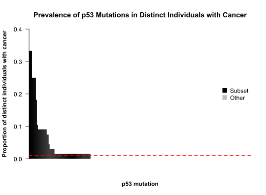

``` r
# pie chart
pie(vec,
    main = "Prevalence of p53 Mutations in Distinct Individuals with Cancer",
    labels = paste0(plyr::round_any(vec * 100,
                                    0.1),
                    "% (",
                    format(raw, 
                           big.mark = ",", 
                           trim = TRUE),
                    " mutations)"),
    col = c("black", "grey"),
    border = NA,
    clockwise = TRUE)
```

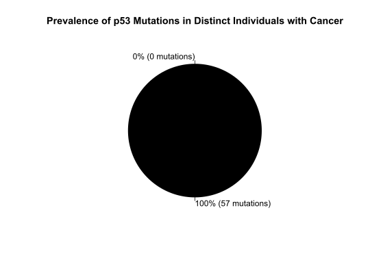

$~$


``` r
# vectors for pie chart of how most muts are chosen anyways for heatmap
prop <- n_distinct(ACC_sole_sex_pos_pivot_melted$Mutation) / n_distinct(ACC_sole_sex_pos_pivot$Mutation[ACC_sole_sex_pos_pivot$Mutation != "Total"])
vec <- c(prop,
         1 - prop)
raw <- c(n_distinct(ACC_sole_sex_pos_pivot_melted$Mutation),
         n_distinct(setdiff(unique(ACC_sole_sex_pos_pivot$Mutation[ACC_sole_sex_pos_pivot$Mutation != "Total"]),
                            unique(ACC_sole_sex_pos_pivot_melted$Mutation))))

# make prevalence waterfall plots (base R barplots + abline at 1%) of all muts in ACC to justify why 1% chosen for cutting off
barplot(height = sort(as.numeric(ACC_sole_sex_pos_pivot %>% 
                                   dplyr::select(-c(Num_Individuals)) %>% # divide down
                                   mutate(across(where(is.numeric), 
                                                 ~ .x/last(.x))) %>% 
                                   subset(Mutation != "Total") %>% 
                                   reshape2::melt() %>% 
                                   pull(value) %>% replace_na(., 0)),
                      decreasing = TRUE),
        xaxs = "i", # remove space between left side of bars and y axis
        ylab = "Proportion of distinct individuals with cancer", 
        xlab = "p53 mutation",
        main = "Prevalence of p53 Mutations in Distinct Individuals with Cancer",
        ylim = c(0, plyr::round_any(max(ACC_sole_sex_pos_pivot %>% 
                                          dplyr::select(-c(Num_Individuals)) %>% # divide down
                                          mutate(across(where(is.numeric), 
                                                        ~ .x/last(.x))) %>% 
                                          subset(Mutation != "Total") %>% 
                                          reshape2::melt() %>% 
                                          pull(value),
                                        na.rm = TRUE),
                                    0.1,
                                    f = ceiling)),
        col = ifelse(ACC_sole_sex_pos_pivot$Mutation[ACC_sole_sex_pos_pivot$Mutation != "Total"] %in% ACC_sole_sex_pos_pivot_melted$Mutation,
                     "black",
                     "grey"),
        font.lab = 2,
        las = 1,
        space = 0,
        border = NA)
abline(h = 0.01,
       col = "red",
       lty = 2,
       lwd = 2)
legend("right",
       legend = c("Subset", 
                  "Other"),
       col = c("black", 
               "gray"),
       bty = "n", # no border around legend
       pch = 15, # filled square shape
       pt.cex = 1.75) # increase shape size in legend
```

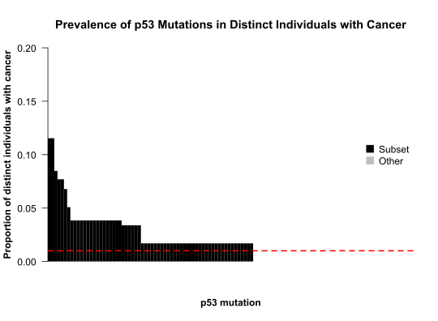

``` r
# pie chart
pie(vec,
    main = "Prevalence of p53 Mutations in Distinct Individuals with Cancer",
    labels = paste0(plyr::round_any(vec * 100,
                                    0.1),
                    "% (",
                    format(raw, 
                           big.mark = ",", 
                           trim = TRUE),
                    " mutations)"),
    col = c("black", "grey"),
    border = NA,
    clockwise = TRUE)
```


$~$


``` r
# create colorful grid table of mutated residues across sexes in pts with ACC
# ACC_sex_pos_pivot_damage_gridprep <- condformat(ACC_sex_pos_pivot_damage) %>% 
#   rule_text_color(1:Num_Individuals,
#                   ifelse(abs(parse_number(Mutation)) >= 1 & abs(parse_number(Mutation)) <= 61, # both TADs
#                          "#CC79A7",
#                          "")) %>% 
#   rule_text_color(1:Num_Individuals,
#                   ifelse(abs(parse_number(Mutation)) >= 62 & abs(parse_number(Mutation)) <= 93, # PRD
#                          "yellow4",
#                          "")) %>%
#   rule_text_color(1:Num_Individuals,
#                   ifelse(abs(parse_number(Mutation)) >= 94 & abs(parse_number(Mutation)) <= 289, # DBD
#                          "#0072B2",
#                          "")) %>%
#   rule_text_color(1:Num_Individuals,
#                   ifelse(abs(parse_number(Mutation)) >= 112 & abs(parse_number(Mutation)) <= 124, # L1
#                          "hotpink", 
#                          "")) %>% 
#   rule_text_color(1:Num_Individuals,
#                   ifelse(abs(parse_number(Mutation)) >= 163 & abs(parse_number(Mutation)) <= 195, # L2
#                          "brown", 
#                          "")) %>% 
#   rule_text_color(1:Num_Individuals,
#                   ifelse(abs(parse_number(Mutation)) >= 236 & abs(parse_number(Mutation)) <= 251, # L3
#                          "purple", 
#                          "")) %>% 
#   rule_text_color(1:Num_Individuals,
#                   ifelse(abs(parse_number(Mutation)) >= 290 & abs(parse_number(Mutation)) <= 324, # HD
#                          "#009E73",
#                          ""))  %>% 
#   rule_text_color(1:Num_Individuals,
#                   ifelse(abs(parse_number(Mutation)) >= 325 & abs(parse_number(Mutation)) <= 356, # OD; CTD is black
#                          "#D55E00",
#                          "")) %>% 
#   rule_text_color(1,
#                   ifelse(Mutation %in% top_muts_origdbdefcancer_vector,
#                          "red",
#                          "")) %>%
#   rule_text_color(Num_Individuals,
#                   ifelse(as.numeric(Num_Individuals) > 3 & as.numeric(Num_Individuals) < n_distinct(origdb_allACCpts$Individual_code),
#                          "red",
#                          "")) %>%
#   rule_text_bold(1,
#                  expression = Mutation %in% top_muts_origdbdefcancer_vector) %>%
#   rule_text_bold(Num_Individuals,
#                  expression = as.numeric(Num_Individuals) > 3 & as.numeric(Num_Individuals) < n_distinct(origdb_allACCpts$Individual_code)) %>%
#   rule_text_color(AGVGDClass,
#                   ifelse(AGVGDClass %in% c("C65", 
#                                            "C55"), 
#                          "red",
#                          "")) %>% 
#   rule_text_color(BayesDel,
#                   ifelse(as.numeric(BayesDel) >= 0.16, 
#                          "red",
#                          "")) %>% 
#   rule_text_color(REVEL,
#                   ifelse(as.numeric(REVEL) >= 0.5, 
#                          "red",
#                          "")) %>% 
#   rule_text_color(SIFTClass,
#                   ifelse(SIFTClass %in% c("Damaging"), 
#                          "red",
#                          "")) %>% 
#   rule_text_color(Polyphen2,
#                   ifelse(Polyphen2 %in% c("D"), 
#                          "red",
#                          "")) %>% 
#   rule_text_color(TransactivationClass,
#                   ifelse(TransactivationClass %in% c("non-functional"), 
#                          "red",
#                          "")) %>% 
#   rule_text_color(DNE_LOFclass,
#                   ifelse(DNE_LOFclass %in% c("DNE_LOF",
#                                              "notDNE_LOF"), 
#                          "red",
#                          "")) %>% 
#   rule_text_color(DNEclass,
#                   ifelse(DNEclass %in% c("Yes"), 
#                          "red",
#                          "")) %>% 
#   # rule_text_color(StructureFunctionClass,
#   #                 ifelse(StructureFunctionClass %in% c("non-functional"), 
#   #                         "red",
#   #                         "")) %>% 
#   theme_grob(rows = NULL,
#              theme = ttheme_default(base_size = 10,
#                                     core = list(padding = unit(c(2, 2), "mm")))) %>%
#   condformat2grob(draw = FALSE)
# 
# ACC_sex_pos_pivot_damage_grid <- grid.arrange(ACC_sex_pos_pivot_damage_gridprep,
#                                               top = textGrob("Mutated Residues and Functional Effects by Sex in Individuals with Adrenocortical Carcinoma and Germline p53 Mutations",
#                                                              hjust = 0.5,
#                                                              gp = gpar(fontface = "bold")))
```

$~$


``` r
# create colorful grid table of mutated residues across age strata in pts with ACC
# ACC_agestrata_pos_pivot_damage_gridprep <- condformat(ACC_agestrata_pos_pivot_damage) %>% 
#   rule_text_color(1:Num_Individuals,
#                   ifelse(abs(parse_number(Mutation)) >= 1 & abs(parse_number(Mutation)) <= 61, # both TADs
#                          "#CC79A7",
#                          "")) %>% 
#   rule_text_color(1:Num_Individuals,
#                   ifelse(abs(parse_number(Mutation)) >= 62 & abs(parse_number(Mutation)) <= 93, # PRD
#                          "yellow4",
#                          "")) %>%
#   rule_text_color(1:Num_Individuals,
#                   ifelse(abs(parse_number(Mutation)) >= 94 & abs(parse_number(Mutation)) <= 289, # DBD
#                          "#0072B2",
#                          "")) %>%
#   rule_text_color(1:Num_Individuals,
#                   ifelse(abs(parse_number(Mutation)) >= 112 & abs(parse_number(Mutation)) <= 124, # L1
#                          "hotpink", 
#                          "")) %>% 
#   rule_text_color(1:Num_Individuals,
#                   ifelse(abs(parse_number(Mutation)) >= 163 & abs(parse_number(Mutation)) <= 195, # L2
#                          "brown", 
#                          "")) %>% 
#   rule_text_color(1:Num_Individuals,
#                   ifelse(abs(parse_number(Mutation)) >= 236 & abs(parse_number(Mutation)) <= 251, # L3
#                          "purple", 
#                          "")) %>% 
#   rule_text_color(1:Num_Individuals,
#                   ifelse(abs(parse_number(Mutation)) >= 290 & abs(parse_number(Mutation)) <= 324, # HD
#                          "#009E73",
#                          ""))  %>% 
#   rule_text_color(1:Num_Individuals,
#                   ifelse(abs(parse_number(Mutation)) >= 325 & abs(parse_number(Mutation)) <= 356, # OD; CTD is black
#                          "#D55E00",
#                          "")) %>% 
#   rule_text_color(1,
#                   ifelse(Mutation %in% top_muts_origdbdefcancer_vector,
#                          "red",
#                          "")) %>%
#   rule_text_color(Num_Individuals,
#                   ifelse(as.numeric(Num_Individuals) > 3 & as.numeric(Num_Individuals) < n_distinct(origdb_allACCpts$Individual_code),
#                          "red",
#                          "")) %>%
#   rule_text_bold(1,
#                  expression = Mutation %in% top_muts_origdbdefcancer_vector) %>%
#   rule_text_bold(Num_Individuals,
#                  expression = as.numeric(Num_Individuals) > 3 & as.numeric(Num_Individuals) < n_distinct(origdb_allACCpts$Individual_code)) %>%
#   rule_text_color(AGVGDClass,
#                   ifelse(AGVGDClass %in% c("C65", 
#                                            "C55"), 
#                          "red",
#                          "")) %>% 
#   rule_text_color(BayesDel,
#                   ifelse(as.numeric(BayesDel) >= 0.16, 
#                          "red",
#                          "")) %>% 
#   rule_text_color(REVEL,
#                   ifelse(as.numeric(REVEL) >= 0.5, 
#                          "red",
#                          "")) %>% 
#   rule_text_color(SIFTClass,
#                   ifelse(SIFTClass %in% c("Damaging"), 
#                          "red",
#                          "")) %>% 
#   rule_text_color(Polyphen2,
#                   ifelse(Polyphen2 %in% c("D"), 
#                          "red",
#                          "")) %>% 
#   rule_text_color(TransactivationClass,
#                   ifelse(TransactivationClass %in% c("non-functional"), 
#                          "red",
#                          "")) %>% 
#   rule_text_color(DNE_LOFclass,
#                   ifelse(DNE_LOFclass %in% c("DNE_LOF",
#                                              "notDNE_LOF"), 
#                          "red",
#                          "")) %>% 
#   rule_text_color(DNEclass,
#                   ifelse(DNEclass %in% c("Yes"), 
#                          "red",
#                          "")) %>% 
#   # rule_text_color(StructureFunctionClass,
#   #                 ifelse(StructureFunctionClass %in% c("non-functional"), 
#   #                         "red",
#   #                         "")) %>% 
#   theme_grob(rows = NULL,
#              theme = ttheme_default(base_size = 10,
#                                     core = list(padding = unit(c(2, 2), "mm")))) %>%
#   condformat2grob(draw = FALSE)
# 
# ACC_agestrata_pos_pivot_damage_grid <- grid.arrange(ACC_agestrata_pos_pivot_damage_gridprep,
#                                                     top = textGrob("Mutated Residues and Functional Effects by Age of Diagnosis in Individuals with Adrenocortical Carcinoma and Germline p53 Mutations",
#                                                                    hjust = 0.5,
#                                                                    gp = gpar(fontface = "bold")))
```

$~$


``` r
# ASIDE_R337H_ACC_ages_sex_gridprep <- tableGrob(ASIDE_R337H_ACC_ages_sex_pivot,
#                                                rows = NULL,
#                                                theme = ttheme_default(base_size = 10,
#                                                                       core = list(padding = unit(c(2, 2), "mm"))))
# 
# ASIDE_R337H_ACC_ages_sex_grid <- grid.arrange(ASIDE_R337H_ACC_ages_sex_gridprep,
#                                               top = textGrob("Age of Diagnosis vs. Sex in \nIndividuals with Adrenocortical Carcinoma \nand Germline p53 R337H",
#                                                              hjust = 0.5,
#                                                              gp = gpar(fontface = "bold")))
```

$~$

# **Analyses of All Individuals with Brain Cancers** {#allbrainpts}

$~$

$~$


``` r
# subset dataset of all sole and first mult to just brain
origdb_allbrain_mult_pts <- origdbjustmultcancersover100 %>% 
  subset(Short_topo == "BRAIN") %>% 
  distinct() %>% 
  remove_rownames()

origdb_allbrain_sole_pts <- origdbjustsolecancersover100 %>% 
  subset(Short_topo == "BRAIN") %>% 
  distinct() %>% 
  remove_rownames()

# create pivot of number of female and male pts with brain in each age stratum of diagnosis, replace any NA with 0, add total number of pts in each age stratum to new column pasted with ages, and make anything with 1 individual singular indication of patients
brain_mult_agestrata_sex <- PivotTable$new()
brain_mult_agestrata_sex$addData(origdb_allbrain_mult_pts)
brain_mult_agestrata_sex$addRowDataGroups("Age_stratum")
brain_mult_agestrata_sex$addColumnDataGroups("Sex") 
brain_mult_agestrata_sex$defineCalculation(calculationName = "Count of distinct patients", 
                                           summariseExpression = "n_distinct(Individual_code)")
brain_mult_agestrata_sex$sortColumnDataGroups(levelNumber = 1, 
                                              orderBy = "calculation", 
                                              sortOrder = "desc")
brain_mult_agestrata_sex$sortRowDataGroups(levelNumber = 1, 
                                           orderBy = "calculation", 
                                           sortOrder = "desc")
brain_mult_agestrata_sex$evaluatePivot() #doing this instead of renderPivot() which takes too long as it shows an actual pivot table, but we need this as a dataframe anyways for calculations later so we don't need to print a pivot table
brain_mult_agestrata_sex_pivot <- brain_mult_agestrata_sex$asDataFrame(rowGroupsAsColumns = TRUE) %>% 
  mutate(across(everything(),
                ~ replace_na(.,
                             0))) %>%
  transform(Age = paste0(Age_stratum,
                         " (", 
                         Total,
                         " individuals)")) %>% 
  transform(Age = ifelse(Total == 1,
                         gsub("individuals", 
                              "individual",
                              Age),
                         Age)) %>% 
  remove_rownames()

brain_sole_agestrata_sex <- PivotTable$new()
brain_sole_agestrata_sex$addData(origdb_allbrain_sole_pts)
brain_sole_agestrata_sex$addRowDataGroups("Age_stratum")
brain_sole_agestrata_sex$addColumnDataGroups("Sex") 
brain_sole_agestrata_sex$defineCalculation(calculationName = "Count of distinct patients", 
                                           summariseExpression = "n_distinct(Individual_code)")
brain_sole_agestrata_sex$sortColumnDataGroups(levelNumber = 1, 
                                              orderBy = "calculation", 
                                              sortOrder = "desc")
brain_sole_agestrata_sex$sortRowDataGroups(levelNumber = 1, 
                                           orderBy = "calculation", 
                                           sortOrder = "desc")
brain_sole_agestrata_sex$evaluatePivot() #doing this instead of renderPivot() which takes too long as it shows an actual pivot table, but we need this as a dataframe anyways for calculations later so we don't need to print a pivot table
brain_sole_agestrata_sex_pivot <- brain_sole_agestrata_sex$asDataFrame(rowGroupsAsColumns = TRUE) %>% 
  mutate(across(everything(),
                ~ replace_na(.,
                             0))) %>%
  transform(Age = paste0(Age_stratum,
                         " (", 
                         Total,
                         " individuals)")) %>% 
  transform(Age = ifelse(Total == 1,
                         gsub("individuals", 
                              "individual",
                              Age),
                         Age)) %>% 
  remove_rownames()

# create pivot of number of mut type pts with brain in each age stratum of diagnosis, replace any NA with 0, add total number of pts in each age stratum to new column pasted with ages, and make anything with 1 Individual singular indication of patients
brain_mult_agestrata_type <- PivotTable$new()
brain_mult_agestrata_type$addData(origdb_allbrain_mult_pts)
brain_mult_agestrata_type$addRowDataGroups("Age_stratum")
brain_mult_agestrata_type$addColumnDataGroups("Effect") 
brain_mult_agestrata_type$defineCalculation(calculationName = "Count of distinct patients", 
                                            summariseExpression = "n_distinct(Individual_code)")
brain_mult_agestrata_type$sortColumnDataGroups(levelNumber = 1, 
                                               orderBy = "calculation", 
                                               sortOrder = "desc")
brain_mult_agestrata_type$sortRowDataGroups(levelNumber = 1, 
                                            orderBy = "calculation", 
                                            sortOrder = "desc")
brain_mult_agestrata_type$evaluatePivot() #doing this instead of renderPivot() which takes too long as it shows an actual pivot table, but we need this as a dataframe anyways for calculations later so we don't need to print a pivot table
brain_mult_agestrata_type_pivot <- brain_mult_agestrata_type$asDataFrame(rowGroupsAsColumns = TRUE) %>% 
  mutate(across(everything(),
                ~ replace_na(.,
                             0))) %>%
  transform(Age = paste0(Age_stratum,
                         " (", 
                         Total,
                         " individuals)")) %>% 
  transform(Age = ifelse(Total == 1,
                         gsub("individuals", 
                              "individual",
                              Age),
                         Age)) %>% 
  remove_rownames() 

brain_sole_agestrata_type <- PivotTable$new()
brain_sole_agestrata_type$addData(origdb_allbrain_sole_pts)
brain_sole_agestrata_type$addRowDataGroups("Age_stratum")
brain_sole_agestrata_type$addColumnDataGroups("Effect") 
brain_sole_agestrata_type$defineCalculation(calculationName = "Count of distinct patients", 
                                            summariseExpression = "n_distinct(Individual_code)")
brain_sole_agestrata_type$sortColumnDataGroups(levelNumber = 1, 
                                               orderBy = "calculation", 
                                               sortOrder = "desc")
brain_sole_agestrata_type$sortRowDataGroups(levelNumber = 1, 
                                            orderBy = "calculation", 
                                            sortOrder = "desc")
brain_sole_agestrata_type$evaluatePivot() #doing this instead of renderPivot() which takes too long as it shows an actual pivot table, but we need this as a dataframe anyways for calculations later so we don't need to print a pivot table
brain_sole_agestrata_type_pivot <- brain_sole_agestrata_type$asDataFrame(rowGroupsAsColumns = TRUE) %>% 
  mutate(across(everything(),
                ~ replace_na(.,
                             0))) %>%
  transform(Age = paste0(Age_stratum,
                         " (", 
                         Total,
                         " individuals)")) %>% 
  transform(Age = ifelse(Total == 1,
                         gsub("individuals", 
                              "individual",
                              Age),
                         Age)) %>% 
  remove_rownames()

# create pivot of number of female and male pts with brain in each mutation category, replace any NA with 0, add row and column totals
brain_mult_sex_type <- PivotTable$new()
brain_mult_sex_type$addData(origdb_allbrain_mult_pts)
brain_mult_sex_type$addRowDataGroups("Effect")
brain_mult_sex_type$addColumnDataGroups("Sex") 
brain_mult_sex_type$defineCalculation(calculationName = "Count of distinct patients", 
                                      summariseExpression = "n_distinct(Individual_code)")
brain_mult_sex_type$sortColumnDataGroups(levelNumber = 1, 
                                         orderBy = "calculation", 
                                         sortOrder = "desc")
brain_mult_sex_type$sortRowDataGroups(levelNumber = 1, 
                                      orderBy = "calculation", 
                                      sortOrder = "desc")
brain_mult_sex_type$evaluatePivot() #doing this instead of renderPivot() which takes too long as it shows an actual pivot table, but we need this as a dataframe anyways for calculations later so we don't need to print a pivot table
brain_mult_sex_type_pivot <- brain_mult_sex_type$asDataFrame(rowGroupsAsColumns = TRUE) %>% 
  mutate(across(everything(),
                ~ replace_na(.,
                             0))) %>% 
  remove_rownames()

brain_sole_sex_type <- PivotTable$new()
brain_sole_sex_type$addData(origdb_allbrain_sole_pts)
brain_sole_sex_type$addRowDataGroups("Effect")
brain_sole_sex_type$addColumnDataGroups("Sex") 
brain_sole_sex_type$defineCalculation(calculationName = "Count of distinct patients", 
                                      summariseExpression = "n_distinct(Individual_code)")
brain_sole_sex_type$sortColumnDataGroups(levelNumber = 1, 
                                         orderBy = "calculation", 
                                         sortOrder = "desc")
brain_sole_sex_type$sortRowDataGroups(levelNumber = 1, 
                                      orderBy = "calculation", 
                                      sortOrder = "desc")
brain_sole_sex_type$evaluatePivot() #doing this instead of renderPivot() which takes too long as it shows an actual pivot table, but we need this as a dataframe anyways for calculations later so we don't need to print a pivot table
brain_sole_sex_type_pivot <- brain_sole_sex_type$asDataFrame(rowGroupsAsColumns = TRUE) %>% 
  mutate(across(everything(),
                ~ replace_na(.,
                             0))) %>% 
  remove_rownames()

# divide number of female and male pts by total number of pts per age stratum
brain_mult_agestrata_sex_pivot_calc <- brain_mult_agestrata_sex_pivot %>% 
  mutate_at(vars(2:Total), 
            .funs = ~./Total) %>% 
  dplyr::rename(Female = `F`,
                Male = M) 

brain_sole_agestrata_sex_pivot_calc <- brain_sole_agestrata_sex_pivot %>% 
  mutate_at(vars(2:Total), 
            .funs = ~./Total) %>% 
  dplyr::rename(Female = `F`,
                Male = M) 

# divide number of mut type pts by total number of pts per age stratum
brain_mult_agestrata_type_pivot_calc <- brain_mult_agestrata_type_pivot %>% 
  mutate_at(vars(2:Total), 
            .funs = ~./Total)

brain_sole_agestrata_type_pivot_calc <- brain_sole_agestrata_type_pivot %>% 
  mutate_at(vars(2:Total), 
            .funs = ~./Total)

# divide vertically down sex columns to calc proportions of each mut type in each sex, add number of total female and male pts to colnames
brain_mult_sex_type_pivot_calc <- brain_mult_sex_type_pivot %>% 
  dplyr::select(-Total) %>% 
  transform(Female = `F`/as.numeric(brain_mult_sex_type_pivot[nrow(brain_mult_sex_type_pivot), "F"])) %>% 
  transform(Male = `M`/as.numeric(brain_mult_sex_type_pivot[nrow(brain_mult_sex_type_pivot), "M"])) 

names(brain_mult_sex_type_pivot_calc) <- ifelse(names(brain_mult_sex_type_pivot_calc) %in% c("Female"),
                                                paste0("Female (",
                                                       as.numeric(brain_mult_sex_type_pivot[nrow(brain_mult_sex_type_pivot),
                                                                                            "F"]),
                                                       " individuals)"),
                                                names(brain_mult_sex_type_pivot_calc))

names(brain_mult_sex_type_pivot_calc) <- ifelse(names(brain_mult_sex_type_pivot_calc) %in% c("Male"),
                                                paste0("Male (",
                                                       as.numeric(brain_mult_sex_type_pivot[nrow(brain_mult_sex_type_pivot),
                                                                                            "M"]),
                                                       " individuals)"),
                                                names(brain_mult_sex_type_pivot_calc))

brain_sole_sex_type_pivot_calc <- brain_sole_sex_type_pivot %>% 
  dplyr::select(-Total) %>% 
  transform(Female = `F`/as.numeric(brain_sole_sex_type_pivot[nrow(brain_sole_sex_type_pivot), "F"])) %>% 
  transform(Male = `M`/as.numeric(brain_sole_sex_type_pivot[nrow(brain_sole_sex_type_pivot), "M"])) 

names(brain_sole_sex_type_pivot_calc) <- ifelse(names(brain_sole_sex_type_pivot_calc) %in% c("Female"),
                                                paste0("Female (",
                                                       as.numeric(brain_sole_sex_type_pivot[nrow(brain_sole_sex_type_pivot),
                                                                                            "F"]),
                                                       " individuals)"),
                                                names(brain_sole_sex_type_pivot_calc))

names(brain_sole_sex_type_pivot_calc) <- ifelse(names(brain_sole_sex_type_pivot_calc) %in% c("Male"),
                                                paste0("Male (",
                                                       as.numeric(brain_sole_sex_type_pivot[nrow(brain_sole_sex_type_pivot),
                                                                                            "M"]),
                                                       " individuals)"),
                                                names(brain_sole_sex_type_pivot_calc))

# remove total row and column and age column which doesn't have indication of number of total patients, melt pivot for ggplot and rename columns to be more sensible
brain_mult_agestrata_sex_pivot_melted <- brain_mult_agestrata_sex_pivot_calc %>% 
  dplyr::select(-Total) %>% 
  subset(Age_stratum != "Total") %>% 
  dplyr::select(-Age_stratum) %>% 
  reshape2::melt() %>% 
  dplyr::rename(Sex = variable,
                Proportion = value)

brain_sole_agestrata_sex_pivot_melted <- brain_sole_agestrata_sex_pivot_calc %>% 
  dplyr::select(-Total) %>% 
  subset(Age_stratum != "Total") %>% 
  dplyr::select(-Age_stratum) %>% 
  reshape2::melt() %>% 
  dplyr::rename(Sex = variable,
                Proportion = value)

# remove total row and column and age column which doesn't have indication of number of total patients, melt pivot for ggplot and rename columns to be more sensible, make category column as factor with decreasing proportions and other at end
brain_mult_agestrata_type_pivot_melted <- brain_mult_agestrata_type_pivot_calc %>% 
  dplyr::select(-Total) %>% 
  subset(Age_stratum != "Total") %>% 
  dplyr::select(-Age_stratum) %>% 
  reshape2::melt() %>% 
  dplyr::rename(Effect = variable,
                Proportion = value)

brain_mult_agestrata_type_pivot_melted$Effect <- factor(brain_mult_agestrata_type_pivot_melted$Effect,
                                                        levels = c(levels(brain_mult_agestrata_type_pivot_melted$Effect)[!(levels(brain_mult_agestrata_type_pivot_melted$Effect) == "other")],
                                                                   "other"))

brain_sole_agestrata_type_pivot_melted <- brain_sole_agestrata_type_pivot_calc %>% 
  dplyr::select(-Total) %>% 
  subset(Age_stratum != "Total") %>% 
  dplyr::select(-Age_stratum) %>% 
  reshape2::melt() %>% 
  dplyr::rename(Effect = variable,
                Proportion = value) 

brain_sole_agestrata_type_pivot_melted$Effect <- gsub("\\.", 
                                                      " ",
                                                      brain_sole_agestrata_type_pivot_melted$Effect)

brain_sole_agestrata_type_pivot_melted$Effect <- factor(brain_sole_agestrata_type_pivot_melted$Effect,
                                                        levels = c(unique(brain_sole_agestrata_type_pivot_melted$Effect)[!(unique(brain_sole_agestrata_type_pivot_melted$Effect) == "other")],
                                                                   "other"))

# remove total row and sex columns which don't have number of total patients, melt pivot for ggplot and rename columns to be more sensible, make category column as factor with decreasing proportions and other at end
brain_mult_sex_type_pivot_melted <- brain_mult_sex_type_pivot_calc %>% 
  subset(Effect != "Total") %>% 
  dplyr::select(-c(`F`,
                   M)) %>% 
  reshape2::melt() %>% 
  dplyr::rename(Sex = variable,
                Proportion = value) %>% 
  arrange(-Proportion)

brain_mult_sex_type_pivot_melted$Effect <- factor(brain_mult_sex_type_pivot_melted$Effect,
                                                  levels = c(unique(brain_mult_sex_type_pivot_melted$Effect)[!(unique(brain_mult_sex_type_pivot_melted$Effect) == "other")],
                                                             "other"))

brain_sole_sex_type_pivot_melted <- brain_sole_sex_type_pivot_calc %>% 
  subset(Effect != "Total") %>% 
  dplyr::select(-c(`F`,
                   M)) %>% 
  reshape2::melt() %>% 
  dplyr::rename(Sex = variable,
                Proportion = value) %>% 
  arrange(-Proportion)

brain_sole_sex_type_pivot_melted$Effect <- factor(brain_sole_sex_type_pivot_melted$Effect,
                                                  levels = c(unique(brain_sole_sex_type_pivot_melted$Effect)[!(unique(brain_sole_sex_type_pivot_melted$Effect) == "other")],
                                                             "other"))

# create pivot of mutated residues vs sex in all brain patients, replace NA with 0, arrange by increasing codon number, add row and column totals
brain_mult_sex_pos <- PivotTable$new()
brain_mult_sex_pos$addData(origdb_allbrain_mult_pts)
brain_mult_sex_pos$addRowDataGroups("ProtDescription")
brain_mult_sex_pos$addColumnDataGroups("Sex") 
brain_mult_sex_pos$defineCalculation(calculationName = "Count of distinct patients", 
                                     summariseExpression = "n_distinct(Individual_code)")
brain_mult_sex_pos$sortColumnDataGroups(levelNumber = 1, 
                                        orderBy = "calculation", 
                                        sortOrder = "desc")
brain_mult_sex_pos$sortRowDataGroups(levelNumber = 1, 
                                     orderBy = "calculation", 
                                     sortOrder = "desc")
brain_mult_sex_pos$evaluatePivot() #doing this instead of renderPivot() which takes too long as it shows an actual pivot table, but we need this as a dataframe anyways for calculations later so we don't need to print a pivot table
brain_mult_sex_pos_pivot <- brain_mult_sex_pos$asDataFrame(rowGroupsAsColumns = TRUE) %>% 
  mutate(across(everything(),
                ~ replace_na(.,
                             0))) %>% 
  arrange(abs(parse_number(ProtDescription))) %>% # arrange muts by increasing codon number
  dplyr::rename(Num_Individuals = Total,
                Mutation = ProtDescription,
                Female = `F`,
                Male = M) %>%
  remove_rownames()

brain_sole_sex_pos <- PivotTable$new()
brain_sole_sex_pos$addData(origdb_allbrain_sole_pts)
brain_sole_sex_pos$addRowDataGroups("ProtDescription")
brain_sole_sex_pos$addColumnDataGroups("Sex") 
brain_sole_sex_pos$defineCalculation(calculationName = "Count of distinct patients", 
                                     summariseExpression = "n_distinct(Individual_code)")
brain_sole_sex_pos$sortColumnDataGroups(levelNumber = 1, 
                                        orderBy = "calculation", 
                                        sortOrder = "desc")
brain_sole_sex_pos$sortRowDataGroups(levelNumber = 1, 
                                     orderBy = "calculation", 
                                     sortOrder = "desc")
brain_sole_sex_pos$evaluatePivot() #doing this instead of renderPivot() which takes too long as it shows an actual pivot table, but we need this as a dataframe anyways for calculations later so we don't need to print a pivot table
brain_sole_sex_pos_pivot <- brain_sole_sex_pos$asDataFrame(rowGroupsAsColumns = TRUE) %>% 
  mutate(across(everything(),
                ~ replace_na(.,
                             0))) %>% 
  arrange(abs(parse_number(ProtDescription))) %>% # arrange muts by increasing codon number
  dplyr::rename(Num_Individuals = Total,
                Mutation = ProtDescription,
                Female = `F`,
                Male = M) %>%
  remove_rownames()

# create pivot of mutated residues vs age strata of dx in all brain patients, replace NA with 0, arrange by increasing codon number, add row and column totals
brain_mult_agestrata_pos <- PivotTable$new()
brain_mult_agestrata_pos$addData(origdb_allbrain_mult_pts)
brain_mult_agestrata_pos$addRowDataGroups("ProtDescription")
brain_mult_agestrata_pos$addColumnDataGroups("Age_stratum") 
brain_mult_agestrata_pos$defineCalculation(calculationName = "Count of distinct patients", 
                                           summariseExpression = "n_distinct(Individual_code)")
brain_mult_agestrata_pos$sortColumnDataGroups(levelNumber = 1, 
                                              orderBy = "calculation", 
                                              sortOrder = "desc")
brain_mult_agestrata_pos$sortRowDataGroups(levelNumber = 1, 
                                           orderBy = "calculation", 
                                           sortOrder = "desc")
brain_mult_agestrata_pos$evaluatePivot() #doing this instead of renderPivot() which takes too long as it shows an actual pivot table, but we need this as a dataframe anyways for calculations later so we don't need to print a pivot table
brain_mult_agestrata_pos_pivot <- brain_mult_agestrata_pos$asDataFrame(rowGroupsAsColumns = TRUE) %>% 
  mutate(across(everything(),
                ~ replace_na(.,
                             0))) %>% 
  arrange(abs(parse_number(ProtDescription))) %>% # arrange muts by increasing codon number
  dplyr::rename(Num_Individuals = Total,
                Mutation = ProtDescription) %>%
  remove_rownames()

brain_sole_agestrata_pos <- PivotTable$new()
brain_sole_agestrata_pos$addData(origdb_allbrain_sole_pts)
brain_sole_agestrata_pos$addRowDataGroups("ProtDescription")
brain_sole_agestrata_pos$addColumnDataGroups("Age_stratum") 
brain_sole_agestrata_pos$defineCalculation(calculationName = "Count of distinct patients", 
                                           summariseExpression = "n_distinct(Individual_code)")
brain_sole_agestrata_pos$sortColumnDataGroups(levelNumber = 1, 
                                              orderBy = "calculation", 
                                              sortOrder = "desc")
brain_sole_agestrata_pos$sortRowDataGroups(levelNumber = 1, 
                                           orderBy = "calculation", 
                                           sortOrder = "desc")
brain_sole_agestrata_pos$evaluatePivot() #doing this instead of renderPivot() which takes too long as it shows an actual pivot table, but we need this as a dataframe anyways for calculations later so we don't need to print a pivot table
brain_sole_agestrata_pos_pivot <- brain_sole_agestrata_pos$asDataFrame(rowGroupsAsColumns = TRUE) %>% 
  mutate(across(everything(),
                ~ replace_na(.,
                             0))) %>% 
  arrange(abs(parse_number(ProtDescription))) %>% # arrange muts by increasing codon number
  dplyr::rename(Num_Individuals = Total,
                Mutation = ProtDescription) %>%
  remove_rownames()

# pull out damage info from stock brain data
origdb_allbrain_mult_pts_damageinfo <- origdb_allbrain_mult_pts %>% 
  dplyr::select(c(ProtDescription, # first few cols are mut info, then agvgdc onwards are damage info
                  AGVGDClass,
                  BayesDel,
                  REVEL,
                  SIFTClass,
                  Polyphen2,
                  TransactivationClass,
                  DNE_LOFclass,
                  DNEclass)) %>% 
  arrange(abs(parse_number(ProtDescription))) %>% 
  distinct() %>% 
  remove_rownames()

origdb_allbrain_sole_pts_damageinfo <- origdb_allbrain_sole_pts %>% 
  dplyr::select(c(ProtDescription, # first few cols are mut info, then agvgdc onwards are damage info
                  AGVGDClass,
                  BayesDel,
                  REVEL,
                  SIFTClass,
                  Polyphen2,
                  TransactivationClass,
                  DNE_LOFclass,
                  DNEclass)) %>% 
  arrange(abs(parse_number(ProtDescription))) %>% 
  distinct() %>% 
  remove_rownames()

# add damage info to pivot of mut residues in sexes and replace NAs with blanks so that can plot as grid
brain_mult_sex_pos_pivot_damage <- left_join(brain_mult_sex_pos_pivot,
                                             origdb_allbrain_mult_pts_damageinfo,
                                             by = c("Mutation" = "ProtDescription")) %>% 
  mutate(across(2:ncol(.),
                ~ str_replace(.,
                              "NA",
                              ""))) %>%
  mutate(across(where(is.character),
                ~ replace_na(.,
                             "")))

brain_sole_sex_pos_pivot_damage <- left_join(brain_sole_sex_pos_pivot,
                                             origdb_allbrain_sole_pts_damageinfo,
                                             by = c("Mutation" = "ProtDescription")) %>% 
  mutate(across(2:ncol(.),
                ~ str_replace(.,
                              "NA",
                              ""))) %>%
  mutate(across(where(is.character),
                ~ replace_na(.,
                             "")))

# add damage info to pivot of mut residues in age strata, replace NAs with blanks so that can plot as grid
brain_mult_agestrata_pos_pivot_damage <- left_join(brain_mult_agestrata_pos_pivot,
                                                   origdb_allbrain_mult_pts_damageinfo,
                                                   by = c("Mutation" = "ProtDescription")) %>% 
  mutate(across(2:ncol(.),
                ~ str_replace(.,
                              "NA",
                              ""))) %>%
  mutate(across(where(is.character),
                ~ replace_na(.,
                             "")))

brain_sole_agestrata_pos_pivot_damage <- left_join(brain_sole_agestrata_pos_pivot,
                                                   origdb_allbrain_sole_pts_damageinfo,
                                                   by = c("Mutation" = "ProtDescription")) %>% 
  mutate(across(2:ncol(.),
                ~ str_replace(.,
                              "NA",
                              ""))) %>%
  mutate(across(where(is.character),
                ~ replace_na(.,
                             "")))

# divide vertically down age pos and sex pos columns and subset to just residues shown in heatmaps i.e. >= 1%, rename cols for agestrata calc dfs because R changes them per naming conventions
brain_mult_sex_pos_pivot_calc <- brain_mult_sex_pos_pivot_damage %>%
  transform(`F` = as.numeric(Female)/as.numeric(brain_mult_sex_pos_pivot_damage[nrow(brain_mult_sex_pos_pivot_damage), "Female"])) %>%
  transform(`M` = as.numeric(Male)/as.numeric(brain_mult_sex_pos_pivot_damage[nrow(brain_mult_sex_pos_pivot_damage), "Male"])) %>%
  dplyr::select(c(Mutation,
                  `F`,
                  `M`)) %>%
  subset(Mutation %in% unique(as.vector(multcancerpivotpos_melted_over0.01$Mutation)))

brain_sole_sex_pos_pivot_calc <- brain_sole_sex_pos_pivot_damage %>%
  transform(`F` = as.numeric(Female)/as.numeric(brain_sole_sex_pos_pivot_damage[nrow(brain_sole_sex_pos_pivot_damage), "Female"])) %>%
  transform(`M` = as.numeric(Male)/as.numeric(brain_sole_sex_pos_pivot_damage[nrow(brain_sole_sex_pos_pivot_damage), "Male"])) %>%
  dplyr::select(c(Mutation,
                  `F`,
                  `M`)) %>%
  subset(Mutation %in% unique(as.vector(solecancerpivotpos_melted_over0.01$Mutation)))

brain_mult_agestrata_pos_pivot_calc <- brain_mult_agestrata_pos_pivot_damage %>%
  transform(`0 - 9` = as.numeric(brain_mult_agestrata_pos_pivot_damage[,2])/as.numeric(brain_mult_agestrata_pos_pivot_damage[nrow(brain_mult_agestrata_pos_pivot_damage), 
                                                                                                                             colnames(brain_mult_agestrata_pos_pivot_damage)[2]])) %>%
  transform(`20 - 29` = as.numeric(as.numeric(brain_mult_agestrata_pos_pivot_damage[,3]))/as.numeric(brain_mult_agestrata_pos_pivot_damage[nrow(brain_mult_agestrata_pos_pivot_damage),
                                                                                                                                           colnames(brain_mult_agestrata_pos_pivot_damage)[3]])) %>% # out of order is correct!
  transform(`10 - 19` = as.numeric(as.numeric(brain_mult_agestrata_pos_pivot_damage[,4]))/as.numeric(brain_mult_agestrata_pos_pivot_damage[nrow(brain_mult_agestrata_pos_pivot_damage),
                                                                                                                                           colnames(brain_mult_agestrata_pos_pivot_damage)[4]])) %>% # out of order is correct!
  transform(`30 - 39` = as.numeric(as.numeric(brain_mult_agestrata_pos_pivot_damage[,5]))/as.numeric(brain_mult_agestrata_pos_pivot_damage[nrow(brain_mult_agestrata_pos_pivot_damage),
                                                                                                                                           colnames(brain_mult_agestrata_pos_pivot_damage)[5]])) %>%
  transform(`40 and up` = as.numeric(as.numeric(brain_mult_agestrata_pos_pivot_damage[,6]))/as.numeric(brain_mult_agestrata_pos_pivot_damage[nrow(brain_mult_agestrata_pos_pivot_damage),
                                                                                                                                             colnames(brain_mult_agestrata_pos_pivot_damage)[6]])) %>%
  dplyr::select(c(Mutation,
                  tail(names(.),
                       5))) %>%
  subset(Mutation %in% unique(as.vector(multcancerpivotpos_melted_over0.01$Mutation))) 

colnames(brain_mult_agestrata_pos_pivot_calc) <- colnames(brain_mult_agestrata_pos_pivot_damage)[1:6]

brain_sole_agestrata_pos_pivot_calc <- brain_sole_agestrata_pos_pivot_damage %>%
  transform(`0 - 9` = as.numeric(brain_sole_agestrata_pos_pivot_damage[,2])/as.numeric(brain_sole_agestrata_pos_pivot_damage[nrow(brain_sole_agestrata_pos_pivot_damage), 
                                                                                                                             colnames(brain_sole_agestrata_pos_pivot_damage)[2]])) %>%
  transform(`10 - 19` = as.numeric(as.numeric(brain_sole_agestrata_pos_pivot_damage[,3]))/as.numeric(brain_sole_agestrata_pos_pivot_damage[nrow(brain_sole_agestrata_pos_pivot_damage),
                                                                                                                                           colnames(brain_sole_agestrata_pos_pivot_damage)[3]])) %>%
  transform(`20 - 29` = as.numeric(as.numeric(brain_sole_agestrata_pos_pivot_damage[,4]))/as.numeric(brain_sole_agestrata_pos_pivot_damage[nrow(brain_sole_agestrata_pos_pivot_damage),
                                                                                                                                           colnames(brain_sole_agestrata_pos_pivot_damage)[4]])) %>%
  transform(`30 - 39` = as.numeric(as.numeric(brain_sole_agestrata_pos_pivot_damage[,5]))/as.numeric(brain_sole_agestrata_pos_pivot_damage[nrow(brain_sole_agestrata_pos_pivot_damage),
                                                                                                                                           colnames(brain_sole_agestrata_pos_pivot_damage)[5]])) %>%
  transform(`40 and up` = as.numeric(as.numeric(brain_sole_agestrata_pos_pivot_damage[,6]))/as.numeric(brain_sole_agestrata_pos_pivot_damage[nrow(brain_sole_agestrata_pos_pivot_damage),
                                                                                                                                             colnames(brain_sole_agestrata_pos_pivot_damage)[6]])) %>%
  dplyr::select(c(Mutation,
                  tail(names(.),
                       5))) %>%
  subset(Mutation %in% unique(as.vector(solecancerpivotpos_melted_over0.01$Mutation))) 

colnames(brain_sole_agestrata_pos_pivot_calc) <- colnames(brain_sole_agestrata_pos_pivot_damage)[1:6]

# melt pos pivot tables and add number of individuals to sex or age strata listed, already do >= 1% proportion 
brain_mult_sex_pos_pivot_melted <- reshape2::melt(brain_mult_sex_pos_pivot_calc) %>%
  dplyr::rename(Sex = variable,
                Proportion = value) %>%
  arrange(-Proportion) %>%
  transform(Sex = ifelse(Sex == "F",
                         paste0("Female (",
                                as.numeric(brain_mult_sex_pos_pivot_damage[nrow(brain_mult_sex_pos_pivot_damage), "Female"]),
                                " individuals)"),
                         as.character(Sex))) %>%
  transform(Sex = ifelse(Sex == "M",
                         paste0("Male (",
                                as.numeric(brain_mult_sex_pos_pivot_damage[nrow(brain_mult_sex_pos_pivot_damage), "Male"]),
                                " individuals)"),
                         Sex)) %>%
  transform(Sex = ifelse(grepl("\\(1 ", 
                               Sex),
                         gsub("individuals", 
                              "individual",
                              Sex),
                         Sex)) %>%
  subset(Mutation %in% (reshape2::melt(brain_mult_sex_pos_pivot_calc) %>%
                          dplyr::rename(Sex = variable,
                                        Proportion = value) %>%
                          arrange(-Proportion) %>%
                          subset(Proportion >= 0.01) %>%
                          pull(Mutation) %>%
                          unique() %>%
                          as.vector())) %>%
  remove_rownames()

brain_sole_sex_pos_pivot_melted <- reshape2::melt(brain_sole_sex_pos_pivot_calc) %>%
  dplyr::rename(Sex = variable,
                Proportion = value) %>%
  arrange(-Proportion) %>%
  transform(Sex = ifelse(Sex == "F",
                         paste0("Female (",
                                as.numeric(brain_sole_sex_pos_pivot_damage[nrow(brain_sole_sex_pos_pivot_damage), "Female"]),
                                " individuals)"),
                         as.character(Sex))) %>%
  transform(Sex = ifelse(Sex == "M",
                         paste0("Male (",
                                as.numeric(brain_sole_sex_pos_pivot_damage[nrow(brain_sole_sex_pos_pivot_damage), "Male"]),
                                " individuals)"),
                         Sex)) %>%
  transform(Sex = ifelse(grepl("\\(1 ", 
                               Sex),
                         gsub("individuals", 
                              "individual",
                              Sex),
                         Sex)) %>%
  subset(Mutation %in% (reshape2::melt(brain_sole_sex_pos_pivot_calc) %>%
                          dplyr::rename(Sex = variable,
                                        Proportion = value) %>%
                          arrange(-Proportion) %>%
                          subset(Proportion >= 0.01) %>%
                          pull(Mutation) %>%
                          unique() %>%
                          as.vector())) %>%
  remove_rownames()

brain_mult_agestrata_pos_pivot_melted <- reshape2::melt(brain_mult_agestrata_pos_pivot_calc) %>%
  dplyr::rename(Age = variable,
                Proportion = value) %>%
  arrange(-Proportion) %>%
  transform(Age = ifelse(Age == "0-9",
                         paste0("0-9 (",
                                as.numeric(brain_mult_agestrata_pos_pivot_damage[nrow(brain_mult_agestrata_pos_pivot_damage), "0-9"]),
                                " individuals)"),
                         as.character(Age))) %>%
  transform(Age = ifelse(Age == "10-19",
                         paste0("10-19 (",
                                as.numeric(brain_mult_agestrata_pos_pivot_damage[nrow(brain_mult_agestrata_pos_pivot_damage), "10-19"]),
                                " individuals)"),
                         Age)) %>%
  transform(Age = ifelse(Age == "20-29",
                         paste0("20-29 (",
                                as.numeric(brain_mult_agestrata_pos_pivot_damage[nrow(brain_mult_agestrata_pos_pivot_damage), "20-29"]),
                                " individuals)"),
                         Age)) %>%
  transform(Age = ifelse(Age == "30-39",
                         paste0("30-39 (",
                                as.numeric(brain_mult_agestrata_pos_pivot_damage[nrow(brain_mult_agestrata_pos_pivot_damage), "30-39"]),
                                " individuals)"),
                         Age)) %>%
  transform(Age = ifelse(Age == "40 and up",
                         paste0("40 and up (",
                                as.numeric(brain_mult_agestrata_pos_pivot_damage[nrow(brain_mult_agestrata_pos_pivot_damage), "40 and up"]),
                                " individuals)"),
                         Age)) %>%
  transform(Age = ifelse(grepl("\\(1 ", 
                               Age),
                         gsub("individuals", 
                              "individual",
                              Age),
                         Age)) %>%
  subset(Mutation %in% (reshape2::melt(brain_mult_agestrata_pos_pivot_calc) %>%
                          dplyr::rename(Age = variable,
                                        Proportion = value) %>%
                          arrange(-Proportion) %>%
                          subset(Proportion >= 0.01) %>%
                          pull(Mutation) %>%
                          unique() %>%
                          as.vector())) %>%
  remove_rownames() 

brain_sole_agestrata_pos_pivot_melted <- reshape2::melt(brain_sole_agestrata_pos_pivot_calc) %>%
  dplyr::rename(Age = variable,
                Proportion = value) %>%
  arrange(-Proportion) %>%
  transform(Age = ifelse(Age == "0-9",
                         paste0("0-9 (",
                                as.numeric(brain_sole_agestrata_pos_pivot_damage[nrow(brain_sole_agestrata_pos_pivot_damage), "0-9"]),
                                " individuals)"),
                         as.character(Age))) %>%
  transform(Age = ifelse(Age == "10-19",
                         paste0("10-19 (",
                                as.numeric(brain_sole_agestrata_pos_pivot_damage[nrow(brain_sole_agestrata_pos_pivot_damage), "10-19"]),
                                " individuals)"),
                         Age)) %>%
  transform(Age = ifelse(Age == "20-29",
                         paste0("20-29 (",
                                as.numeric(brain_sole_agestrata_pos_pivot_damage[nrow(brain_sole_agestrata_pos_pivot_damage), "20-29"]),
                                " individuals)"),
                         Age)) %>%
  transform(Age = ifelse(Age == "30-39",
                         paste0("30-39 (",
                                as.numeric(brain_sole_agestrata_pos_pivot_damage[nrow(brain_sole_agestrata_pos_pivot_damage), "30-39"]),
                                " individuals)"),
                         Age)) %>%
  transform(Age = ifelse(Age == "40 and up",
                         paste0("40 and up (",
                                as.numeric(brain_sole_agestrata_pos_pivot_damage[nrow(brain_sole_agestrata_pos_pivot_damage), "40 and up"]),
                                " individuals)"),
                         Age)) %>%
  transform(Age = ifelse(grepl("\\(1 ", 
                               Age),
                         gsub("individuals", 
                              "individual",
                              Age),
                         Age)) %>%
  subset(Mutation %in% (reshape2::melt(brain_sole_agestrata_pos_pivot_calc) %>%
                          dplyr::rename(Age = variable,
                                        Proportion = value) %>%
                          arrange(-Proportion) %>%
                          subset(Proportion >= 0.01) %>%
                          pull(Mutation) %>%
                          unique() %>%
                          as.vector())) %>%
  remove_rownames() 

# R337H is high germline mut, so just do that as aside in this brain case, not for whole analysis!
# ASIDE_R337H_brain <- origdbdistinct %>% 
#   subset(Germline_carrier == "Confirmed") %>% 
#   filter(ProtDescription == "p.R337H") %>%
#   subset(Short_topo == "BRAIN") %>% 
#   drop_na(c(Sex,
#             Age_at_diagnosis)) %>%
#   distinct() %>% 
#   remove_rownames()
# 
# # just make table of num male and female pts across ages of dx in R337H
# ASIDE_R337H_brain_ages_sex_pivot <- ASIDE_R337H_brain %>% 
#   group_by(Sex,
#            Age_at_diagnosis) %>% 
#   summarise(n = n_distinct(Individual_code)) %>% 
#   pivot_wider(names_from = Sex,
#               values_from = n) %>% 
#   mutate(across(everything(),
#                 ~ replace_na(.,
#                              0))) %>% 
#   arrange(as.numeric(Age_at_diagnosis)) %>% 
#   adorn_totals(where = c("row", 
#                          "col")) %>% # ground truth of 16 distinct pts
#   dplyr::rename(Female = `F`,
#                 Male = M,
#                 Num_Individuals = Total,
#                 Age = Age_at_diagnosis)
```

$~$


``` r
# vectors for pie chart of how most muts are chosen anyways for heatmap
prop <- n_distinct(brain_sole_agestrata_pos_pivot_melted$Mutation) / n_distinct(brain_sole_agestrata_pos_pivot$Mutation[brain_sole_agestrata_pos_pivot$Mutation != "Total"])
vec <- c(prop,
         1 - prop)
raw <- c(n_distinct(brain_sole_agestrata_pos_pivot_melted$Mutation),
         n_distinct(setdiff(unique(brain_sole_agestrata_pos_pivot$Mutation[brain_sole_agestrata_pos_pivot$Mutation != "Total"]),
                            unique(brain_sole_agestrata_pos_pivot_melted$Mutation))))

# make prevalence waterfall plots (base R barplots + abline at 1%) of all muts in brain to justify why 1% chosen for cutting off
barplot(height = sort(as.numeric(brain_sole_agestrata_pos_pivot %>% 
                                   dplyr::select(-c(Num_Individuals)) %>% # divide down
                                   mutate(across(where(is.numeric), 
                                                 ~ .x/last(.x))) %>% 
                                   subset(Mutation != "Total") %>% 
                                   reshape2::melt() %>% 
                                   pull(value) %>% replace_na(., 0)),
                      decreasing = TRUE),
        xaxs = "i", # remove space between left side of bars and y axis
        ylab = "Proportion of distinct individuals with cancer", 
        xlab = "p53 mutation",
        main = "Prevalence of p53 Mutations in Distinct Individuals with Cancer",
        ylim = c(0, plyr::round_any(max(brain_sole_agestrata_pos_pivot %>% 
                                          dplyr::select(-c(Num_Individuals)) %>% # divide down
                                          mutate(across(where(is.numeric), 
                                                        ~ .x/last(.x))) %>% 
                                          subset(Mutation != "Total") %>% 
                                          reshape2::melt() %>% 
                                          pull(value),
                                        na.rm = TRUE),
                                    0.1,
                                    f = ceiling)),
        col = ifelse(brain_sole_agestrata_pos_pivot$Mutation[brain_sole_agestrata_pos_pivot$Mutation != "Total"] %in% brain_sole_agestrata_pos_pivot_melted$Mutation,
                     "black",
                     "grey"),
        font.lab = 2,
        las = 1,
        space = 0,
        border = NA)
abline(h = 0.01,
       col = "red",
       lty = 2,
       lwd = 2)
legend("right",
       legend = c("Subset", 
                  "Other"),
       col = c("black", 
               "gray"),
       bty = "n", # no border around legend
       pch = 15, # filled square shape
       pt.cex = 1.75) # increase shape size in legend
```

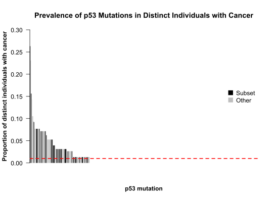

``` r
# pie chart
pie(vec,
    main = "Prevalence of p53 Mutations in Distinct Individuals with Cancer",
    labels = paste0(plyr::round_any(vec * 100,
                                    0.1),
                    "% (",
                    format(raw, 
                           big.mark = ",", 
                           trim = TRUE),
                    " mutations)"),
    col = c("black", "grey"),
    border = NA,
    clockwise = TRUE)
```

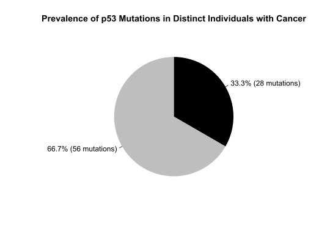

$~$


``` r
# vectors for pie chart of how most muts are chosen anyways for heatmap
prop <- n_distinct(brain_sole_sex_pos_pivot_melted$Mutation) / n_distinct(brain_sole_sex_pos_pivot$Mutation[brain_sole_sex_pos_pivot$Mutation != "Total"])
vec <- c(prop,
         1 - prop)
raw <- c(n_distinct(brain_sole_sex_pos_pivot_melted$Mutation),
         n_distinct(setdiff(unique(brain_sole_sex_pos_pivot$Mutation[brain_sole_sex_pos_pivot$Mutation != "Total"]),
                            unique(brain_sole_sex_pos_pivot_melted$Mutation))))

# make prevalence waterfall plots (base R barplots + abline at 1%) of all muts in brain to justify why 1% chosen for cutting off
barplot(height = sort(as.numeric(brain_sole_sex_pos_pivot %>% 
                                   dplyr::select(-c(Num_Individuals)) %>% # divide down
                                   mutate(across(where(is.numeric), 
                                                 ~ .x/last(.x))) %>% 
                                   subset(Mutation != "Total") %>% 
                                   reshape2::melt() %>% 
                                   pull(value) %>% replace_na(., 0)),
                      decreasing = TRUE),
        xaxs = "i", # remove space between left side of bars and y axis
        ylab = "Proportion of distinct individuals with cancer", 
        xlab = "p53 mutation",
        main = "Prevalence of p53 Mutations in Distinct Individuals with Cancer",
        ylim = c(0, plyr::round_any(max(brain_sole_sex_pos_pivot %>% 
                                          dplyr::select(-c(Num_Individuals)) %>% # divide down
                                          mutate(across(where(is.numeric), 
                                                        ~ .x/last(.x))) %>% 
                                          subset(Mutation != "Total") %>% 
                                          reshape2::melt() %>% 
                                          pull(value),
                                        na.rm = TRUE),
                                    0.1,
                                    f = ceiling)),
        col = ifelse(brain_sole_sex_pos_pivot$Mutation[brain_sole_sex_pos_pivot$Mutation != "Total"] %in% brain_sole_sex_pos_pivot_melted$Mutation,
                     "black",
                     "grey"),
        font.lab = 2,
        las = 1,
        space = 0,
        border = NA)
abline(h = 0.01,
       col = "red",
       lty = 2,
       lwd = 2)
legend("right",
       legend = c("Subset", 
                  "Other"),
       col = c("black", 
               "gray"),
       bty = "n", # no border around legend
       pch = 15, # filled square shape
       pt.cex = 1.75) # increase shape size in legend
```

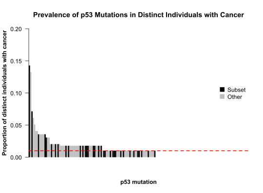

``` r
# pie chart
pie(vec,
    main = "Prevalence of p53 Mutations in Distinct Individuals with Cancer",
    labels = paste0(plyr::round_any(vec * 100,
                                    0.1),
                    "% (",
                    format(raw, 
                           big.mark = ",", 
                           trim = TRUE),
                    " mutations)"),
    col = c("black", "grey"),
    border = NA,
    clockwise = TRUE)
```

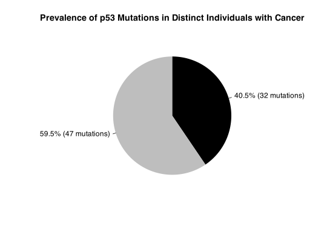

$~$


``` r
# create colorful grid table of mutated residues across sexes in pts with brain
# brain_sex_pos_pivot_damage_gridprep <- condformat(brain_sex_pos_pivot_damage) %>% 
#   rule_text_color(1:Num_Individuals,
#                   ifelse(abs(parse_number(Mutation)) >= 1 & abs(parse_number(Mutation)) <= 61, # both TADs
#                          "#CC79A7",
#                          "")) %>% 
#   rule_text_color(1:Num_Individuals,
#                   ifelse(abs(parse_number(Mutation)) >= 62 & abs(parse_number(Mutation)) <= 93, # PRD
#                          "yellow4",
#                          "")) %>%
#   rule_text_color(1:Num_Individuals,
#                   ifelse(abs(parse_number(Mutation)) >= 94 & abs(parse_number(Mutation)) <= 289, # DBD
#                          "#0072B2",
#                          "")) %>%
#   rule_text_color(1:Num_Individuals,
#                   ifelse(abs(parse_number(Mutation)) >= 112 & abs(parse_number(Mutation)) <= 124, # L1
#                          "hotpink", 
#                          "")) %>% 
#   rule_text_color(1:Num_Individuals,
#                   ifelse(abs(parse_number(Mutation)) >= 163 & abs(parse_number(Mutation)) <= 195, # L2
#                          "brown", 
#                          "")) %>% 
#   rule_text_color(1:Num_Individuals,
#                   ifelse(abs(parse_number(Mutation)) >= 236 & abs(parse_number(Mutation)) <= 251, # L3
#                          "purple", 
#                          "")) %>% 
#   rule_text_color(1:Num_Individuals,
#                   ifelse(abs(parse_number(Mutation)) >= 290 & abs(parse_number(Mutation)) <= 324, # HD
#                          "#009E73",
#                          ""))  %>% 
#   rule_text_color(1:Num_Individuals,
#                   ifelse(abs(parse_number(Mutation)) >= 325 & abs(parse_number(Mutation)) <= 356, # OD; CTD is black
#                          "#D55E00",
#                          "")) %>% 
#   rule_text_color(1,
#                   ifelse(Mutation %in% top_muts_origdbdefcancer_vector,
#                          "red",
#                          "")) %>%
#   rule_text_color(Num_Individuals,
#                   ifelse(as.numeric(Num_Individuals) > 3 & as.numeric(Num_Individuals) < n_distinct(origdb_allbrainpts$Individual_code),
#                          "red",
#                          "")) %>%
#   rule_text_bold(1,
#                  expression = Mutation %in% top_muts_origdbdefcancer_vector) %>%
#   rule_text_bold(Num_Individuals,
#                  expression = as.numeric(Num_Individuals) > 3 & as.numeric(Num_Individuals) < n_distinct(origdb_allbrainpts$Individual_code)) %>%
#   rule_text_color(AGVGDClass,
#                   ifelse(AGVGDClass %in% c("C65", 
#                                            "C55"), 
#                          "red",
#                          "")) %>% 
#   rule_text_color(BayesDel,
#                   ifelse(as.numeric(BayesDel) >= 0.16, 
#                          "red",
#                          "")) %>% 
#   rule_text_color(REVEL,
#                   ifelse(as.numeric(REVEL) >= 0.5, 
#                          "red",
#                          "")) %>% 
#   rule_text_color(SIFTClass,
#                   ifelse(SIFTClass %in% c("Damaging"), 
#                          "red",
#                          "")) %>% 
#   rule_text_color(Polyphen2,
#                   ifelse(Polyphen2 %in% c("D"), 
#                          "red",
#                          "")) %>% 
#   rule_text_color(TransactivationClass,
#                   ifelse(TransactivationClass %in% c("non-functional"), 
#                          "red",
#                          "")) %>% 
#   rule_text_color(DNE_LOFclass,
#                   ifelse(DNE_LOFclass %in% c("DNE_LOF",
#                                              "notDNE_LOF"), 
#                          "red",
#                          "")) %>% 
#   rule_text_color(DNEclass,
#                   ifelse(DNEclass %in% c("Yes"), 
#                          "red",
#                          "")) %>% 
#   # rule_text_color(StructureFunctionClass,
#   #                 ifelse(StructureFunctionClass %in% c("non-functional"), 
#   #                         "red",
#   #                         "")) %>% 
#   theme_grob(rows = NULL,
#              theme = ttheme_default(base_size = 10,
#                                     core = list(padding = unit(c(2, 2), "mm")))) %>%
#   condformat2grob(draw = FALSE)
# 
# brain_sex_pos_pivot_damage_grid <- grid.arrange(brain_sex_pos_pivot_damage_gridprep,
#                                                 top = textGrob("Mutated Residues and Functional Effects by Sex in Individuals with Brain Cancers and Germline p53 Mutations",
#                                                                hjust = 0.5,
#                                                                gp = gpar(fontface = "bold")))
```

$~$


``` r
# create colorful grid table of mutated residues across age strata in pts with brain
# brain_agestrata_pos_pivot_damage_gridprep <- condformat(brain_agestrata_pos_pivot_damage) %>% 
#   rule_text_color(1:Num_Individuals,
#                   ifelse(abs(parse_number(Mutation)) >= 1 & abs(parse_number(Mutation)) <= 61, # both TADs
#                          "#CC79A7",
#                          "")) %>% 
#   rule_text_color(1:Num_Individuals,
#                   ifelse(abs(parse_number(Mutation)) >= 62 & abs(parse_number(Mutation)) <= 93, # PRD
#                          "yellow4",
#                          "")) %>%
#   rule_text_color(1:Num_Individuals,
#                   ifelse(abs(parse_number(Mutation)) >= 94 & abs(parse_number(Mutation)) <= 289, # DBD
#                          "#0072B2",
#                          "")) %>%
#   rule_text_color(1:Num_Individuals,
#                   ifelse(abs(parse_number(Mutation)) >= 112 & abs(parse_number(Mutation)) <= 124, # L1
#                          "hotpink", 
#                          "")) %>% 
#   rule_text_color(1:Num_Individuals,
#                   ifelse(abs(parse_number(Mutation)) >= 163 & abs(parse_number(Mutation)) <= 195, # L2
#                          "brown", 
#                          "")) %>% 
#   rule_text_color(1:Num_Individuals,
#                   ifelse(abs(parse_number(Mutation)) >= 236 & abs(parse_number(Mutation)) <= 251, # L3
#                          "purple", 
#                          "")) %>% 
#   rule_text_color(1:Num_Individuals,
#                   ifelse(abs(parse_number(Mutation)) >= 290 & abs(parse_number(Mutation)) <= 324, # HD
#                          "#009E73",
#                          ""))  %>% 
#   rule_text_color(1:Num_Individuals,
#                   ifelse(abs(parse_number(Mutation)) >= 325 & abs(parse_number(Mutation)) <= 356, # OD; CTD is black
#                          "#D55E00",
#                          "")) %>% 
#   rule_text_color(1,
#                   ifelse(Mutation %in% top_muts_origdbdefcancer_vector,
#                          "red",
#                          "")) %>%
#   rule_text_color(Num_Individuals,
#                   ifelse(as.numeric(Num_Individuals) > 3 & as.numeric(Num_Individuals) < n_distinct(origdb_allbrainpts$Individual_code),
#                          "red",
#                          "")) %>%
#   rule_text_bold(1,
#                  expression = Mutation %in% top_muts_origdbdefcancer_vector) %>%
#   rule_text_bold(Num_Individuals,
#                  expression = as.numeric(Num_Individuals) > 3 & as.numeric(Num_Individuals) < n_distinct(origdb_allbrainpts$Individual_code)) %>%
#   rule_text_color(AGVGDClass,
#                   ifelse(AGVGDClass %in% c("C65", 
#                                            "C55"), 
#                          "red",
#                          "")) %>% 
#   rule_text_color(BayesDel,
#                   ifelse(as.numeric(BayesDel) >= 0.16, 
#                          "red",
#                          "")) %>% 
#   rule_text_color(REVEL,
#                   ifelse(as.numeric(REVEL) >= 0.5, 
#                          "red",
#                          "")) %>% 
#   rule_text_color(SIFTClass,
#                   ifelse(SIFTClass %in% c("Damaging"), 
#                          "red",
#                          "")) %>% 
#   rule_text_color(Polyphen2,
#                   ifelse(Polyphen2 %in% c("D"), 
#                          "red",
#                          "")) %>% 
#   rule_text_color(TransactivationClass,
#                   ifelse(TransactivationClass %in% c("non-functional"), 
#                          "red",
#                          "")) %>% 
#   rule_text_color(DNE_LOFclass,
#                   ifelse(DNE_LOFclass %in% c("DNE_LOF",
#                                              "notDNE_LOF"), 
#                          "red",
#                          "")) %>% 
#   rule_text_color(DNEclass,
#                   ifelse(DNEclass %in% c("Yes"), 
#                          "red",
#                          "")) %>% 
#   # rule_text_color(StructureFunctionClass,
#   #                 ifelse(StructureFunctionClass %in% c("non-functional"), 
#   #                         "red",
#   #                         "")) %>% 
#   theme_grob(rows = NULL,
#              theme = ttheme_default(base_size = 10,
#                                     core = list(padding = unit(c(2, 2), "mm")))) %>%
#   condformat2grob(draw = FALSE)
# 
# brain_agestrata_pos_pivot_damage_grid <- grid.arrange(brain_agestrata_pos_pivot_damage_gridprep,
#                                                       top = textGrob("Mutated Residues and Functional Effects by Age of Diagnosis in Individuals with Brain Cancers and Germline p53 Mutations",
#                                                                      hjust = 0.5,
#                                                                      gp = gpar(fontface = "bold")))
```

$~$


``` r
# ASIDE_R337H_brain_ages_sex_gridprep <- tableGrob(ASIDE_R337H_brain_ages_sex_pivot,
#                                                  rows = NULL,
#                                                  theme = ttheme_default(base_size = 10,
#                                                                         core = list(padding = unit(c(2, 2), "mm"))))
# 
# ASIDE_R337H_brain_ages_sex_grid <- grid.arrange(ASIDE_R337H_brain_ages_sex_gridprep,
#                                                 top = textGrob("Age of Diagnosis vs. Sex in \nIndividuals with Brain Cancers \nand Germline p53 R337H",
#                                                                hjust = 0.5,
#                                                                gp = gpar(fontface = "bold")))
```

$~$

# **Analyses of All Individuals with Osteosarcoma** {#allosteosarcomapts}

$~$

$~$


``` r
# subset dataset of all sole and first mult to just osteosarcoma
origdb_allosteosarcoma_mult_pts <- origdbjustmultcancersover100 %>% 
  subset(Short_topo == "Osteosarcoma") %>% 
  distinct() %>% 
  remove_rownames()

origdb_allosteosarcoma_sole_pts <- origdbjustsolecancersover100 %>% 
  subset(Short_topo == "Osteosarcoma") %>% 
  distinct() %>% 
  remove_rownames()

# create pivot of number of female and male pts with osteosarcoma in each age stratum of diagnosis, replace any NA with 0, add total number of pts in each age stratum to new column pasted with ages, and make anything with 1 individual singular indication of patients
osteosarcoma_mult_agestrata_sex <- PivotTable$new()
osteosarcoma_mult_agestrata_sex$addData(origdb_allosteosarcoma_mult_pts)
osteosarcoma_mult_agestrata_sex$addRowDataGroups("Age_stratum")
osteosarcoma_mult_agestrata_sex$addColumnDataGroups("Sex") 
osteosarcoma_mult_agestrata_sex$defineCalculation(calculationName = "Count of distinct patients", 
                                                  summariseExpression = "n_distinct(Individual_code)")
osteosarcoma_mult_agestrata_sex$sortColumnDataGroups(levelNumber = 1, 
                                                     orderBy = "calculation", 
                                                     sortOrder = "desc")
osteosarcoma_mult_agestrata_sex$sortRowDataGroups(levelNumber = 1, 
                                                  orderBy = "calculation", 
                                                  sortOrder = "desc")
osteosarcoma_mult_agestrata_sex$evaluatePivot() #doing this instead of renderPivot() which takes too long as it shows an actual pivot table, but we need this as a dataframe anyways for calculations later so we don't need to print a pivot table
osteosarcoma_mult_agestrata_sex_pivot <- osteosarcoma_mult_agestrata_sex$asDataFrame(rowGroupsAsColumns = TRUE) %>% 
  mutate(across(everything(),
                ~ replace_na(.,
                             0))) %>%
  transform(Age = paste0(Age_stratum,
                         " (", 
                         Total,
                         " individuals)")) %>% 
  transform(Age = ifelse(Total == 1,
                         gsub("individuals", 
                              "individual",
                              Age),
                         Age)) %>% 
  remove_rownames()

osteosarcoma_sole_agestrata_sex <- PivotTable$new()
osteosarcoma_sole_agestrata_sex$addData(origdb_allosteosarcoma_sole_pts)
osteosarcoma_sole_agestrata_sex$addRowDataGroups("Age_stratum")
osteosarcoma_sole_agestrata_sex$addColumnDataGroups("Sex") 
osteosarcoma_sole_agestrata_sex$defineCalculation(calculationName = "Count of distinct patients", 
                                                  summariseExpression = "n_distinct(Individual_code)")
osteosarcoma_sole_agestrata_sex$sortColumnDataGroups(levelNumber = 1, 
                                                     orderBy = "calculation", 
                                                     sortOrder = "desc")
osteosarcoma_sole_agestrata_sex$sortRowDataGroups(levelNumber = 1, 
                                                  orderBy = "calculation", 
                                                  sortOrder = "desc")
osteosarcoma_sole_agestrata_sex$evaluatePivot() #doing this instead of renderPivot() which takes too long as it shows an actual pivot table, but we need this as a dataframe anyways for calculations later so we don't need to print a pivot table
osteosarcoma_sole_agestrata_sex_pivot <- osteosarcoma_sole_agestrata_sex$asDataFrame(rowGroupsAsColumns = TRUE) %>% 
  mutate(across(everything(),
                ~ replace_na(.,
                             0))) %>%
  transform(Age = paste0(Age_stratum,
                         " (", 
                         Total,
                         " individuals)")) %>% 
  transform(Age = ifelse(Total == 1,
                         gsub("individuals", 
                              "individual",
                              Age),
                         Age)) %>% 
  remove_rownames()

# create pivot of number of mut type pts with osteosarcoma in each age stratum of diagnosis, replace any NA with 0, add total number of pts in each age stratum to new column pasted with ages, and make anything with 1 Individual singular indication of patients
osteosarcoma_mult_agestrata_type <- PivotTable$new()
osteosarcoma_mult_agestrata_type$addData(origdb_allosteosarcoma_mult_pts)
osteosarcoma_mult_agestrata_type$addRowDataGroups("Age_stratum")
osteosarcoma_mult_agestrata_type$addColumnDataGroups("Effect") 
osteosarcoma_mult_agestrata_type$defineCalculation(calculationName = "Count of distinct patients", 
                                                   summariseExpression = "n_distinct(Individual_code)")
osteosarcoma_mult_agestrata_type$sortColumnDataGroups(levelNumber = 1, 
                                                      orderBy = "calculation", 
                                                      sortOrder = "desc")
osteosarcoma_mult_agestrata_type$sortRowDataGroups(levelNumber = 1, 
                                                   orderBy = "calculation", 
                                                   sortOrder = "desc")
osteosarcoma_mult_agestrata_type$evaluatePivot() #doing this instead of renderPivot() which takes too long as it shows an actual pivot table, but we need this as a dataframe anyways for calculations later so we don't need to print a pivot table
osteosarcoma_mult_agestrata_type_pivot <- osteosarcoma_mult_agestrata_type$asDataFrame(rowGroupsAsColumns = TRUE) %>% 
  mutate(across(everything(),
                ~ replace_na(.,
                             0))) %>%
  transform(Age = paste0(Age_stratum,
                         " (", 
                         Total,
                         " individuals)")) %>% 
  transform(Age = ifelse(Total == 1,
                         gsub("individuals", 
                              "individual",
                              Age),
                         Age)) %>% 
  remove_rownames() 

osteosarcoma_sole_agestrata_type <- PivotTable$new()
osteosarcoma_sole_agestrata_type$addData(origdb_allosteosarcoma_sole_pts)
osteosarcoma_sole_agestrata_type$addRowDataGroups("Age_stratum")
osteosarcoma_sole_agestrata_type$addColumnDataGroups("Effect") 
osteosarcoma_sole_agestrata_type$defineCalculation(calculationName = "Count of distinct patients", 
                                                   summariseExpression = "n_distinct(Individual_code)")
osteosarcoma_sole_agestrata_type$sortColumnDataGroups(levelNumber = 1, 
                                                      orderBy = "calculation", 
                                                      sortOrder = "desc")
osteosarcoma_sole_agestrata_type$sortRowDataGroups(levelNumber = 1, 
                                                   orderBy = "calculation", 
                                                   sortOrder = "desc")
osteosarcoma_sole_agestrata_type$evaluatePivot() #doing this instead of renderPivot() which takes too long as it shows an actual pivot table, but we need this as a dataframe anyways for calculations later so we don't need to print a pivot table
osteosarcoma_sole_agestrata_type_pivot <- osteosarcoma_sole_agestrata_type$asDataFrame(rowGroupsAsColumns = TRUE) %>% 
  mutate(across(everything(),
                ~ replace_na(.,
                             0))) %>%
  transform(Age = paste0(Age_stratum,
                         " (", 
                         Total,
                         " individuals)")) %>% 
  transform(Age = ifelse(Total == 1,
                         gsub("individuals", 
                              "individual",
                              Age),
                         Age)) %>% 
  remove_rownames()

# create pivot of number of female and male pts with osteosarcoma in each mutation category, replace any NA with 0, add row and column totals
osteosarcoma_mult_sex_type <- PivotTable$new()
osteosarcoma_mult_sex_type$addData(origdb_allosteosarcoma_mult_pts)
osteosarcoma_mult_sex_type$addRowDataGroups("Effect")
osteosarcoma_mult_sex_type$addColumnDataGroups("Sex") 
osteosarcoma_mult_sex_type$defineCalculation(calculationName = "Count of distinct patients", 
                                             summariseExpression = "n_distinct(Individual_code)")
osteosarcoma_mult_sex_type$sortColumnDataGroups(levelNumber = 1, 
                                                orderBy = "calculation", 
                                                sortOrder = "desc")
osteosarcoma_mult_sex_type$sortRowDataGroups(levelNumber = 1, 
                                             orderBy = "calculation", 
                                             sortOrder = "desc")
osteosarcoma_mult_sex_type$evaluatePivot() #doing this instead of renderPivot() which takes too long as it shows an actual pivot table, but we need this as a dataframe anyways for calculations later so we don't need to print a pivot table
osteosarcoma_mult_sex_type_pivot <- osteosarcoma_mult_sex_type$asDataFrame(rowGroupsAsColumns = TRUE) %>% 
  mutate(across(everything(),
                ~ replace_na(.,
                             0))) %>% 
  remove_rownames()

osteosarcoma_sole_sex_type <- PivotTable$new()
osteosarcoma_sole_sex_type$addData(origdb_allosteosarcoma_sole_pts)
osteosarcoma_sole_sex_type$addRowDataGroups("Effect")
osteosarcoma_sole_sex_type$addColumnDataGroups("Sex") 
osteosarcoma_sole_sex_type$defineCalculation(calculationName = "Count of distinct patients", 
                                             summariseExpression = "n_distinct(Individual_code)")
osteosarcoma_sole_sex_type$sortColumnDataGroups(levelNumber = 1, 
                                                orderBy = "calculation", 
                                                sortOrder = "desc")
osteosarcoma_sole_sex_type$sortRowDataGroups(levelNumber = 1, 
                                             orderBy = "calculation", 
                                             sortOrder = "desc")
osteosarcoma_sole_sex_type$evaluatePivot() #doing this instead of renderPivot() which takes too long as it shows an actual pivot table, but we need this as a dataframe anyways for calculations later so we don't need to print a pivot table
osteosarcoma_sole_sex_type_pivot <- osteosarcoma_sole_sex_type$asDataFrame(rowGroupsAsColumns = TRUE) %>% 
  mutate(across(everything(),
                ~ replace_na(.,
                             0))) %>% 
  remove_rownames()

# divide number of female and male pts by total number of pts per age stratum
osteosarcoma_mult_agestrata_sex_pivot_calc <- osteosarcoma_mult_agestrata_sex_pivot %>% 
  mutate_at(vars(2:Total), 
            .funs = ~./Total) %>% 
  dplyr::rename(Female = `F`,
                Male = M) 

osteosarcoma_sole_agestrata_sex_pivot_calc <- osteosarcoma_sole_agestrata_sex_pivot %>% 
  mutate_at(vars(2:Total), 
            .funs = ~./Total) %>% 
  dplyr::rename(Female = `F`,
                Male = M) 

# divide number of mut type pts by total number of pts per age stratum
osteosarcoma_mult_agestrata_type_pivot_calc <- osteosarcoma_mult_agestrata_type_pivot %>% 
  mutate_at(vars(2:Total), 
            .funs = ~./Total)

osteosarcoma_sole_agestrata_type_pivot_calc <- osteosarcoma_sole_agestrata_type_pivot %>% 
  mutate_at(vars(2:Total), 
            .funs = ~./Total)

# divide vertically down sex columns to calc proportions of each mut type in each sex, add number of total female and male pts to colnames
osteosarcoma_mult_sex_type_pivot_calc <- osteosarcoma_mult_sex_type_pivot %>% 
  dplyr::select(-Total) %>% 
  transform(Female = `F`/as.numeric(osteosarcoma_mult_sex_type_pivot[nrow(osteosarcoma_mult_sex_type_pivot), "F"])) %>% 
  transform(Male = `M`/as.numeric(osteosarcoma_mult_sex_type_pivot[nrow(osteosarcoma_mult_sex_type_pivot), "M"])) 

names(osteosarcoma_mult_sex_type_pivot_calc) <- ifelse(names(osteosarcoma_mult_sex_type_pivot_calc) %in% c("Female"),
                                                       paste0("Female (",
                                                              as.numeric(osteosarcoma_mult_sex_type_pivot[nrow(osteosarcoma_mult_sex_type_pivot),
                                                                                                          "F"]),
                                                              " individuals)"),
                                                       names(osteosarcoma_mult_sex_type_pivot_calc))

names(osteosarcoma_mult_sex_type_pivot_calc) <- ifelse(names(osteosarcoma_mult_sex_type_pivot_calc) %in% c("Male"),
                                                       paste0("Male (",
                                                              as.numeric(osteosarcoma_mult_sex_type_pivot[nrow(osteosarcoma_mult_sex_type_pivot),
                                                                                                          "M"]),
                                                              " individuals)"),
                                                       names(osteosarcoma_mult_sex_type_pivot_calc))

osteosarcoma_sole_sex_type_pivot_calc <- osteosarcoma_sole_sex_type_pivot %>% 
  dplyr::select(-Total) %>% 
  transform(Female = `F`/as.numeric(osteosarcoma_sole_sex_type_pivot[nrow(osteosarcoma_sole_sex_type_pivot), "F"])) %>% 
  transform(Male = `M`/as.numeric(osteosarcoma_sole_sex_type_pivot[nrow(osteosarcoma_sole_sex_type_pivot), "M"])) 

names(osteosarcoma_sole_sex_type_pivot_calc) <- ifelse(names(osteosarcoma_sole_sex_type_pivot_calc) %in% c("Female"),
                                                       paste0("Female (",
                                                              as.numeric(osteosarcoma_sole_sex_type_pivot[nrow(osteosarcoma_sole_sex_type_pivot),
                                                                                                          "F"]),
                                                              " individuals)"),
                                                       names(osteosarcoma_sole_sex_type_pivot_calc))

names(osteosarcoma_sole_sex_type_pivot_calc) <- ifelse(names(osteosarcoma_sole_sex_type_pivot_calc) %in% c("Male"),
                                                       paste0("Male (",
                                                              as.numeric(osteosarcoma_sole_sex_type_pivot[nrow(osteosarcoma_sole_sex_type_pivot),
                                                                                                          "M"]),
                                                              " individuals)"),
                                                       names(osteosarcoma_sole_sex_type_pivot_calc))

# remove total row and column and age column which doesn't have indication of number of total patients, melt pivot for ggplot and rename columns to be more sensible
osteosarcoma_mult_agestrata_sex_pivot_melted <- osteosarcoma_mult_agestrata_sex_pivot_calc %>% 
  dplyr::select(-Total) %>% 
  subset(Age_stratum != "Total") %>% 
  dplyr::select(-Age_stratum) %>% 
  reshape2::melt() %>% 
  dplyr::rename(Sex = variable,
                Proportion = value)

osteosarcoma_sole_agestrata_sex_pivot_melted <- osteosarcoma_sole_agestrata_sex_pivot_calc %>% 
  dplyr::select(-Total) %>% 
  subset(Age_stratum != "Total") %>% 
  dplyr::select(-Age_stratum) %>% 
  reshape2::melt() %>% 
  dplyr::rename(Sex = variable,
                Proportion = value)

# remove total row and column and age column which doesn't have indication of number of total patients, melt pivot for ggplot and rename columns to be more sensible, make category column as factor with decreasing proportions and other at end
osteosarcoma_mult_agestrata_type_pivot_melted <- osteosarcoma_mult_agestrata_type_pivot_calc %>% 
  dplyr::select(-Total) %>% 
  subset(Age_stratum != "Total") %>% 
  dplyr::select(-Age_stratum) %>% 
  reshape2::melt() %>% 
  dplyr::rename(Effect = variable,
                Proportion = value)

osteosarcoma_mult_agestrata_type_pivot_melted$Effect <- gsub("\\.",
                                                             " ",
                                                             osteosarcoma_mult_agestrata_type_pivot_melted$Effect) %>%
  trimws()

osteosarcoma_mult_agestrata_type_pivot_melted$Effect <- factor(osteosarcoma_mult_agestrata_type_pivot_melted$Effect,
                                                               levels = c(unique(osteosarcoma_mult_agestrata_type_pivot_melted$Effect)[!(unique(osteosarcoma_mult_agestrata_type_pivot_melted$Effect) == "other")],
                                                                          "other"))

osteosarcoma_sole_agestrata_type_pivot_melted <- osteosarcoma_sole_agestrata_type_pivot_calc %>% 
  dplyr::select(-Total) %>% 
  subset(Age_stratum != "Total") %>% 
  dplyr::select(-Age_stratum) %>% 
  reshape2::melt() %>% 
  dplyr::rename(Effect = variable,
                Proportion = value)

osteosarcoma_sole_agestrata_type_pivot_melted$Effect <- gsub("\\.",
                                                             " ",
                                                             osteosarcoma_sole_agestrata_type_pivot_melted$Effect) %>%
  trimws()

osteosarcoma_sole_agestrata_type_pivot_melted$Effect <- factor(osteosarcoma_sole_agestrata_type_pivot_melted$Effect,
                                                               levels = c(unique(osteosarcoma_sole_agestrata_type_pivot_melted$Effect)[!(unique(osteosarcoma_sole_agestrata_type_pivot_melted$Effect) == "other")],
                                                                          "other"))

# remove total row and sex columns which don't have number of total patients, melt pivot for ggplot and rename columns to be more sensible, make category column as factor with decreasing proportions and other at end
osteosarcoma_mult_sex_type_pivot_melted <- osteosarcoma_mult_sex_type_pivot_calc %>% 
  subset(Effect != "Total") %>% 
  dplyr::select(-c(`F`,
                   M)) %>% 
  reshape2::melt() %>% 
  dplyr::rename(Sex = variable,
                Proportion = value) %>% 
  arrange(-Proportion)

osteosarcoma_mult_sex_type_pivot_melted$Effect <- factor(osteosarcoma_mult_sex_type_pivot_melted$Effect,
                                                         levels = c(unique(osteosarcoma_mult_sex_type_pivot_melted$Effect)[!(unique(osteosarcoma_mult_sex_type_pivot_melted$Effect) == "other")],
                                                                    "other"))

osteosarcoma_sole_sex_type_pivot_melted <- osteosarcoma_sole_sex_type_pivot_calc %>% 
  subset(Effect != "Total") %>% 
  dplyr::select(-c(`F`,
                   M)) %>% 
  reshape2::melt() %>% 
  dplyr::rename(Sex = variable,
                Proportion = value) %>% 
  arrange(-Proportion)

osteosarcoma_sole_sex_type_pivot_melted$Effect <- factor(osteosarcoma_sole_sex_type_pivot_melted$Effect,
                                                         levels = c(unique(osteosarcoma_sole_sex_type_pivot_melted$Effect)[!(unique(osteosarcoma_sole_sex_type_pivot_melted$Effect) == "other")],
                                                                    "other"))

# create pivot of mutated residues vs sex in all osteosarcoma patients, replace NA with 0, arrange by increasing codon number, add row and column totals
osteosarcoma_mult_sex_pos <- PivotTable$new()
osteosarcoma_mult_sex_pos$addData(origdb_allosteosarcoma_mult_pts)
osteosarcoma_mult_sex_pos$addRowDataGroups("ProtDescription")
osteosarcoma_mult_sex_pos$addColumnDataGroups("Sex") 
osteosarcoma_mult_sex_pos$defineCalculation(calculationName = "Count of distinct patients", 
                                            summariseExpression = "n_distinct(Individual_code)")
osteosarcoma_mult_sex_pos$sortColumnDataGroups(levelNumber = 1, 
                                               orderBy = "calculation", 
                                               sortOrder = "desc")
osteosarcoma_mult_sex_pos$sortRowDataGroups(levelNumber = 1, 
                                            orderBy = "calculation", 
                                            sortOrder = "desc")
osteosarcoma_mult_sex_pos$evaluatePivot() #doing this instead of renderPivot() which takes too long as it shows an actual pivot table, but we need this as a dataframe anyways for calculations later so we don't need to print a pivot table
osteosarcoma_mult_sex_pos_pivot <- osteosarcoma_mult_sex_pos$asDataFrame(rowGroupsAsColumns = TRUE) %>% 
  mutate(across(everything(),
                ~ replace_na(.,
                             0))) %>% 
  arrange(abs(parse_number(ProtDescription))) %>% # arrange muts by increasing codon number
  dplyr::rename(Num_Individuals = Total,
                Mutation = ProtDescription,
                Female = `F`,
                Male = M) %>%
  remove_rownames()

osteosarcoma_sole_sex_pos <- PivotTable$new()
osteosarcoma_sole_sex_pos$addData(origdb_allosteosarcoma_sole_pts)
osteosarcoma_sole_sex_pos$addRowDataGroups("ProtDescription")
osteosarcoma_sole_sex_pos$addColumnDataGroups("Sex") 
osteosarcoma_sole_sex_pos$defineCalculation(calculationName = "Count of distinct patients", 
                                            summariseExpression = "n_distinct(Individual_code)")
osteosarcoma_sole_sex_pos$sortColumnDataGroups(levelNumber = 1, 
                                               orderBy = "calculation", 
                                               sortOrder = "desc")
osteosarcoma_sole_sex_pos$sortRowDataGroups(levelNumber = 1, 
                                            orderBy = "calculation", 
                                            sortOrder = "desc")
osteosarcoma_sole_sex_pos$evaluatePivot() #doing this instead of renderPivot() which takes too long as it shows an actual pivot table, but we need this as a dataframe anyways for calculations later so we don't need to print a pivot table
osteosarcoma_sole_sex_pos_pivot <- osteosarcoma_sole_sex_pos$asDataFrame(rowGroupsAsColumns = TRUE) %>% 
  mutate(across(everything(),
                ~ replace_na(.,
                             0))) %>% 
  arrange(abs(parse_number(ProtDescription))) %>% # arrange muts by increasing codon number
  dplyr::rename(Num_Individuals = Total,
                Mutation = ProtDescription,
                Female = `F`,
                Male = M) %>%
  remove_rownames()

# create pivot of mutated residues vs age strata of dx in all osteosarcoma patients, replace NA with 0, arrange by increasing codon number, add row and column totals
osteosarcoma_mult_agestrata_pos <- PivotTable$new()
osteosarcoma_mult_agestrata_pos$addData(origdb_allosteosarcoma_mult_pts)
osteosarcoma_mult_agestrata_pos$addRowDataGroups("ProtDescription")
osteosarcoma_mult_agestrata_pos$addColumnDataGroups("Age_stratum") 
osteosarcoma_mult_agestrata_pos$defineCalculation(calculationName = "Count of distinct patients", 
                                                  summariseExpression = "n_distinct(Individual_code)")
osteosarcoma_mult_agestrata_pos$sortColumnDataGroups(levelNumber = 1, 
                                                     orderBy = "calculation", 
                                                     sortOrder = "desc")
osteosarcoma_mult_agestrata_pos$sortRowDataGroups(levelNumber = 1, 
                                                  orderBy = "calculation", 
                                                  sortOrder = "desc")
osteosarcoma_mult_agestrata_pos$evaluatePivot() #doing this instead of renderPivot() which takes too long as it shows an actual pivot table, but we need this as a dataframe anyways for calculations later so we don't need to print a pivot table
osteosarcoma_mult_agestrata_pos_pivot <- osteosarcoma_mult_agestrata_pos$asDataFrame(rowGroupsAsColumns = TRUE) %>% 
  mutate(across(everything(),
                ~ replace_na(.,
                             0))) %>% 
  arrange(abs(parse_number(ProtDescription))) %>% # arrange muts by increasing codon number
  dplyr::rename(Num_Individuals = Total,
                Mutation = ProtDescription) %>%
  remove_rownames()

osteosarcoma_sole_agestrata_pos <- PivotTable$new()
osteosarcoma_sole_agestrata_pos$addData(origdb_allosteosarcoma_sole_pts)
osteosarcoma_sole_agestrata_pos$addRowDataGroups("ProtDescription")
osteosarcoma_sole_agestrata_pos$addColumnDataGroups("Age_stratum") 
osteosarcoma_sole_agestrata_pos$defineCalculation(calculationName = "Count of distinct patients", 
                                                  summariseExpression = "n_distinct(Individual_code)")
osteosarcoma_sole_agestrata_pos$sortColumnDataGroups(levelNumber = 1, 
                                                     orderBy = "calculation", 
                                                     sortOrder = "desc")
osteosarcoma_sole_agestrata_pos$sortRowDataGroups(levelNumber = 1, 
                                                  orderBy = "calculation", 
                                                  sortOrder = "desc")
osteosarcoma_sole_agestrata_pos$evaluatePivot() #doing this instead of renderPivot() which takes too long as it shows an actual pivot table, but we need this as a dataframe anyways for calculations later so we don't need to print a pivot table
osteosarcoma_sole_agestrata_pos_pivot <- osteosarcoma_sole_agestrata_pos$asDataFrame(rowGroupsAsColumns = TRUE) %>% 
  mutate(across(everything(),
                ~ replace_na(.,
                             0))) %>% 
  arrange(abs(parse_number(ProtDescription))) %>% # arrange muts by increasing codon number
  dplyr::rename(Num_Individuals = Total,
                Mutation = ProtDescription) %>%
  remove_rownames()

# pull out damage info from stock osteosarcoma data
origdb_allosteosarcoma_mult_pts_damageinfo <- origdb_allosteosarcoma_mult_pts %>% 
  dplyr::select(c(ProtDescription, # first few cols are mut info, then agvgdc onwards are damage info
                  AGVGDClass,
                  BayesDel,
                  REVEL,
                  SIFTClass,
                  Polyphen2,
                  TransactivationClass,
                  DNE_LOFclass,
                  DNEclass)) %>% 
  arrange(abs(parse_number(ProtDescription))) %>% 
  distinct() %>% 
  remove_rownames()

origdb_allosteosarcoma_sole_pts_damageinfo <- origdb_allosteosarcoma_sole_pts %>% 
  dplyr::select(c(ProtDescription, # first few cols are mut info, then agvgdc onwards are damage info
                  AGVGDClass,
                  BayesDel,
                  REVEL,
                  SIFTClass,
                  Polyphen2,
                  TransactivationClass,
                  DNE_LOFclass,
                  DNEclass)) %>% 
  arrange(abs(parse_number(ProtDescription))) %>% 
  distinct() %>% 
  remove_rownames()

# add damage info to pivot of mut residues in sexes and replace NAs with blanks so that can plot as grid
osteosarcoma_mult_sex_pos_pivot_damage <- left_join(osteosarcoma_mult_sex_pos_pivot,
                                                    origdb_allosteosarcoma_mult_pts_damageinfo,
                                                    by = c("Mutation" = "ProtDescription")) %>% 
  mutate(across(2:ncol(.),
                ~ str_replace(.,
                              "NA",
                              ""))) %>%
  mutate(across(where(is.character),
                ~ replace_na(.,
                             "")))

osteosarcoma_sole_sex_pos_pivot_damage <- left_join(osteosarcoma_sole_sex_pos_pivot,
                                                    origdb_allosteosarcoma_sole_pts_damageinfo,
                                                    by = c("Mutation" = "ProtDescription")) %>% 
  mutate(across(2:ncol(.),
                ~ str_replace(.,
                              "NA",
                              ""))) %>%
  mutate(across(where(is.character),
                ~ replace_na(.,
                             "")))

# add damage info to pivot of mut residues in age strata, replace NAs with blanks so that can plot as grid
osteosarcoma_mult_agestrata_pos_pivot_damage <- left_join(osteosarcoma_mult_agestrata_pos_pivot,
                                                          origdb_allosteosarcoma_mult_pts_damageinfo,
                                                          by = c("Mutation" = "ProtDescription")) %>% 
  mutate(across(2:ncol(.),
                ~ str_replace(.,
                              "NA",
                              ""))) %>%
  mutate(across(where(is.character),
                ~ replace_na(.,
                             "")))

osteosarcoma_sole_agestrata_pos_pivot_damage <- left_join(osteosarcoma_sole_agestrata_pos_pivot,
                                                          origdb_allosteosarcoma_sole_pts_damageinfo,
                                                          by = c("Mutation" = "ProtDescription")) %>% 
  mutate(across(2:ncol(.),
                ~ str_replace(.,
                              "NA",
                              ""))) %>%
  mutate(across(where(is.character),
                ~ replace_na(.,
                             "")))

# divide vertically down age pos and sex pos columns and subset to just residues shown in heatmaps i.e. >= 1%, rename cols for agestrata calc dfs because R changes them per naming conventions
osteosarcoma_mult_sex_pos_pivot_calc <- osteosarcoma_mult_sex_pos_pivot_damage %>%
  transform(`F` = as.numeric(Female)/as.numeric(osteosarcoma_mult_sex_pos_pivot_damage[nrow(osteosarcoma_mult_sex_pos_pivot_damage), "Female"])) %>%
  transform(`M` = as.numeric(Male)/as.numeric(osteosarcoma_mult_sex_pos_pivot_damage[nrow(osteosarcoma_mult_sex_pos_pivot_damage), "Male"])) %>%
  dplyr::select(c(Mutation,
                  `F`,
                  `M`)) %>%
  subset(Mutation %in% unique(as.vector(multcancerpivotpos_melted_over0.01$Mutation)))

osteosarcoma_sole_sex_pos_pivot_calc <- osteosarcoma_sole_sex_pos_pivot_damage %>%
  transform(`F` = as.numeric(Female)/as.numeric(osteosarcoma_sole_sex_pos_pivot_damage[nrow(osteosarcoma_sole_sex_pos_pivot_damage), "Female"])) %>%
  transform(`M` = as.numeric(Male)/as.numeric(osteosarcoma_sole_sex_pos_pivot_damage[nrow(osteosarcoma_sole_sex_pos_pivot_damage), "Male"])) %>%
  dplyr::select(c(Mutation,
                  `F`,
                  `M`)) %>%
  subset(Mutation %in% unique(as.vector(solecancerpivotpos_melted_over0.01$Mutation)))

osteosarcoma_mult_agestrata_pos_pivot_calc <- osteosarcoma_mult_agestrata_pos_pivot_damage %>%
  transform(`10 - 19` = as.numeric(osteosarcoma_mult_agestrata_pos_pivot_damage[,2])/as.numeric(osteosarcoma_mult_agestrata_pos_pivot_damage[nrow(osteosarcoma_mult_agestrata_pos_pivot_damage), 
                                                                                                                                             colnames(osteosarcoma_mult_agestrata_pos_pivot_damage)[2]])) %>% # out of order is correct!
  transform(`0 - 9` = as.numeric(as.numeric(osteosarcoma_mult_agestrata_pos_pivot_damage[,3]))/as.numeric(osteosarcoma_mult_agestrata_pos_pivot_damage[nrow(osteosarcoma_mult_agestrata_pos_pivot_damage),
                                                                                                                                                       colnames(osteosarcoma_mult_agestrata_pos_pivot_damage)[3]])) %>% # out of order correct!
  transform(`20 - 29` = as.numeric(as.numeric(osteosarcoma_mult_agestrata_pos_pivot_damage[,4]))/as.numeric(osteosarcoma_mult_agestrata_pos_pivot_damage[nrow(osteosarcoma_mult_agestrata_pos_pivot_damage),
                                                                                                                                                         colnames(osteosarcoma_mult_agestrata_pos_pivot_damage)[4]])) %>%
  transform(`30 - 39` = as.numeric(as.numeric(osteosarcoma_mult_agestrata_pos_pivot_damage[,5]))/as.numeric(osteosarcoma_mult_agestrata_pos_pivot_damage[nrow(osteosarcoma_mult_agestrata_pos_pivot_damage),
                                                                                                                                                         colnames(osteosarcoma_mult_agestrata_pos_pivot_damage)[5]])) %>%
  transform(`40 and up` = as.numeric(as.numeric(osteosarcoma_mult_agestrata_pos_pivot_damage[,6]))/as.numeric(osteosarcoma_mult_agestrata_pos_pivot_damage[nrow(osteosarcoma_mult_agestrata_pos_pivot_damage),
                                                                                                                                                           colnames(osteosarcoma_mult_agestrata_pos_pivot_damage)[6]])) %>%
  dplyr::select(c(Mutation,
                  tail(names(.),
                       5))) %>%
  subset(Mutation %in% unique(as.vector(multcancerpivotpos_melted_over0.01$Mutation))) 

colnames(osteosarcoma_mult_agestrata_pos_pivot_calc) <- colnames(osteosarcoma_mult_agestrata_pos_pivot_damage)[1:6]

osteosarcoma_sole_agestrata_pos_pivot_calc <- osteosarcoma_sole_agestrata_pos_pivot_damage %>%
  transform(`10 - 19` = as.numeric(osteosarcoma_sole_agestrata_pos_pivot_damage[,2])/as.numeric(osteosarcoma_sole_agestrata_pos_pivot_damage[nrow(osteosarcoma_sole_agestrata_pos_pivot_damage), 
                                                                                                                                             colnames(osteosarcoma_sole_agestrata_pos_pivot_damage)[2]])) %>% # out of order is correct!
  transform(`20 - 29` = as.numeric(as.numeric(osteosarcoma_sole_agestrata_pos_pivot_damage[,3]))/as.numeric(osteosarcoma_sole_agestrata_pos_pivot_damage[nrow(osteosarcoma_sole_agestrata_pos_pivot_damage),
                                                                                                                                                         colnames(osteosarcoma_sole_agestrata_pos_pivot_damage)[3]])) %>% # out of order correct!
  transform(`0 - 9` = as.numeric(as.numeric(osteosarcoma_sole_agestrata_pos_pivot_damage[,4]))/as.numeric(osteosarcoma_sole_agestrata_pos_pivot_damage[nrow(osteosarcoma_sole_agestrata_pos_pivot_damage),
                                                                                                                                                       colnames(osteosarcoma_sole_agestrata_pos_pivot_damage)[4]])) %>% # out of order correct!
  transform(`40 and up` = as.numeric(as.numeric(osteosarcoma_sole_agestrata_pos_pivot_damage[,5]))/as.numeric(osteosarcoma_sole_agestrata_pos_pivot_damage[nrow(osteosarcoma_sole_agestrata_pos_pivot_damage),
                                                                                                                                                           colnames(osteosarcoma_sole_agestrata_pos_pivot_damage)[5]])) %>% # out of order correct!
  transform(`30 - 39` = as.numeric(as.numeric(osteosarcoma_sole_agestrata_pos_pivot_damage[,6]))/as.numeric(osteosarcoma_sole_agestrata_pos_pivot_damage[nrow(osteosarcoma_sole_agestrata_pos_pivot_damage),
                                                                                                                                                         colnames(osteosarcoma_sole_agestrata_pos_pivot_damage)[6]])) %>% # out of order correct!
  dplyr::select(c(Mutation,
                  tail(names(.),
                       5))) %>%
  subset(Mutation %in% unique(as.vector(solecancerpivotpos_melted_over0.01$Mutation))) 

colnames(osteosarcoma_sole_agestrata_pos_pivot_calc) <- colnames(osteosarcoma_sole_agestrata_pos_pivot_damage)[1:6]

# melt pos pivot tables and add number of individuals to sex or age strata listed, already do >= 1% proportion 
osteosarcoma_mult_sex_pos_pivot_melted <- reshape2::melt(osteosarcoma_mult_sex_pos_pivot_calc) %>%
  dplyr::rename(Sex = variable,
                Proportion = value) %>%
  arrange(-Proportion) %>%
  transform(Sex = ifelse(Sex == "F",
                         paste0("Female (",
                                as.numeric(osteosarcoma_mult_sex_pos_pivot_damage[nrow(osteosarcoma_mult_sex_pos_pivot_damage), "Female"]),
                                " individuals)"),
                         as.character(Sex))) %>%
  transform(Sex = ifelse(Sex == "M",
                         paste0("Male (",
                                as.numeric(osteosarcoma_mult_sex_pos_pivot_damage[nrow(osteosarcoma_mult_sex_pos_pivot_damage), "Male"]),
                                " individuals)"),
                         Sex)) %>%
  transform(Sex = ifelse(grepl("\\(1 ", 
                               Sex),
                         gsub("individuals", 
                              "individual",
                              Sex),
                         Sex)) %>%
  subset(Mutation %in% (reshape2::melt(osteosarcoma_mult_sex_pos_pivot_calc) %>%
                          dplyr::rename(Sex = variable,
                                        Proportion = value) %>%
                          arrange(-Proportion) %>%
                          subset(Proportion >= 0.01) %>%
                          pull(Mutation) %>%
                          unique() %>%
                          as.vector())) %>%
  remove_rownames()

osteosarcoma_sole_sex_pos_pivot_melted <- reshape2::melt(osteosarcoma_sole_sex_pos_pivot_calc) %>%
  dplyr::rename(Sex = variable,
                Proportion = value) %>%
  arrange(-Proportion) %>%
  transform(Sex = ifelse(Sex == "F",
                         paste0("Female (",
                                as.numeric(osteosarcoma_sole_sex_pos_pivot_damage[nrow(osteosarcoma_sole_sex_pos_pivot_damage), "Female"]),
                                " individuals)"),
                         as.character(Sex))) %>%
  transform(Sex = ifelse(Sex == "M",
                         paste0("Male (",
                                as.numeric(osteosarcoma_sole_sex_pos_pivot_damage[nrow(osteosarcoma_sole_sex_pos_pivot_damage), "Male"]),
                                " individuals)"),
                         Sex)) %>%
  transform(Sex = ifelse(grepl("\\(1 ", 
                               Sex),
                         gsub("individuals", 
                              "individual",
                              Sex),
                         Sex)) %>%
  subset(Mutation %in% (reshape2::melt(osteosarcoma_sole_sex_pos_pivot_calc) %>%
                          dplyr::rename(Sex = variable,
                                        Proportion = value) %>%
                          arrange(-Proportion) %>%
                          subset(Proportion >= 0.01) %>%
                          pull(Mutation) %>%
                          unique() %>%
                          as.vector())) %>%
  remove_rownames()

osteosarcoma_mult_agestrata_pos_pivot_melted <- reshape2::melt(osteosarcoma_mult_agestrata_pos_pivot_calc) %>%
  dplyr::rename(Age = variable,
                Proportion = value) %>%
  arrange(-Proportion) %>%
  transform(Age = ifelse(Age == "0-9",
                         paste0("0-9 (",
                                as.numeric(osteosarcoma_mult_agestrata_pos_pivot_damage[nrow(osteosarcoma_mult_agestrata_pos_pivot_damage), "0-9"]),
                                " individuals)"),
                         as.character(Age))) %>%
  transform(Age = ifelse(Age == "10-19",
                         paste0("10-19 (",
                                as.numeric(osteosarcoma_mult_agestrata_pos_pivot_damage[nrow(osteosarcoma_mult_agestrata_pos_pivot_damage), "10-19"]),
                                " individuals)"),
                         Age)) %>%
  transform(Age = ifelse(Age == "20-29",
                         paste0("20-29 (",
                                as.numeric(osteosarcoma_mult_agestrata_pos_pivot_damage[nrow(osteosarcoma_mult_agestrata_pos_pivot_damage), "20-29"]),
                                " individuals)"),
                         Age)) %>%
  transform(Age = ifelse(Age == "30-39",
                         paste0("30-39 (",
                                as.numeric(osteosarcoma_mult_agestrata_pos_pivot_damage[nrow(osteosarcoma_mult_agestrata_pos_pivot_damage), "30-39"]),
                                " individuals)"),
                         Age)) %>%
  transform(Age = ifelse(Age == "40 and up",
                         paste0("40 and up (",
                                as.numeric(osteosarcoma_mult_agestrata_pos_pivot_damage[nrow(osteosarcoma_mult_agestrata_pos_pivot_damage), "40 and up"]),
                                " individuals)"),
                         Age)) %>%
  transform(Age = ifelse(grepl("\\(1 ", 
                               Age),
                         gsub("individuals", 
                              "individual",
                              Age),
                         Age)) %>%
  subset(Mutation %in% (reshape2::melt(osteosarcoma_mult_agestrata_pos_pivot_calc) %>%
                          dplyr::rename(Age = variable,
                                        Proportion = value) %>%
                          arrange(-Proportion) %>%
                          subset(Proportion >= 0.01) %>%
                          pull(Mutation) %>%
                          unique() %>%
                          as.vector())) %>%
  remove_rownames() 

osteosarcoma_sole_agestrata_pos_pivot_melted <- reshape2::melt(osteosarcoma_sole_agestrata_pos_pivot_calc) %>%
  dplyr::rename(Age = variable,
                Proportion = value) %>%
  arrange(-Proportion) %>%
  transform(Age = ifelse(Age == "0-9",
                         paste0("0-9 (",
                                as.numeric(osteosarcoma_sole_agestrata_pos_pivot_damage[nrow(osteosarcoma_sole_agestrata_pos_pivot_damage), "0-9"]),
                                " individuals)"),
                         as.character(Age))) %>%
  transform(Age = ifelse(Age == "10-19",
                         paste0("10-19 (",
                                as.numeric(osteosarcoma_sole_agestrata_pos_pivot_damage[nrow(osteosarcoma_sole_agestrata_pos_pivot_damage), "10-19"]),
                                " individuals)"),
                         Age)) %>%
  transform(Age = ifelse(Age == "20-29",
                         paste0("20-29 (",
                                as.numeric(osteosarcoma_sole_agestrata_pos_pivot_damage[nrow(osteosarcoma_sole_agestrata_pos_pivot_damage), "20-29"]),
                                " individuals)"),
                         Age)) %>%
  transform(Age = ifelse(Age == "30-39",
                         paste0("30-39 (",
                                as.numeric(osteosarcoma_sole_agestrata_pos_pivot_damage[nrow(osteosarcoma_sole_agestrata_pos_pivot_damage), "30-39"]),
                                " individuals)"),
                         Age)) %>%
  transform(Age = ifelse(Age == "40 and up",
                         paste0("40 and up (",
                                as.numeric(osteosarcoma_sole_agestrata_pos_pivot_damage[nrow(osteosarcoma_sole_agestrata_pos_pivot_damage), "40 and up"]),
                                " individuals)"),
                         Age)) %>%
  transform(Age = ifelse(grepl("\\(1 ", 
                               Age),
                         gsub("individuals", 
                              "individual",
                              Age),
                         Age)) %>%
  subset(Mutation %in% (reshape2::melt(osteosarcoma_sole_agestrata_pos_pivot_calc) %>%
                          dplyr::rename(Age = variable,
                                        Proportion = value) %>%
                          arrange(-Proportion) %>%
                          subset(Proportion >= 0.01) %>%
                          pull(Mutation) %>%
                          unique() %>%
                          as.vector())) %>%
  remove_rownames() 
```

$~$


``` r
# vectors for pie chart of how most muts are chosen anyways for heatmap
prop <- n_distinct(osteosarcoma_sole_agestrata_pos_pivot_melted$Mutation) / n_distinct(osteosarcoma_sole_agestrata_pos_pivot$Mutation[osteosarcoma_sole_agestrata_pos_pivot$Mutation != "Total"])
vec <- c(prop,
         1 - prop)
raw <- c(n_distinct(osteosarcoma_sole_agestrata_pos_pivot_melted$Mutation),
         n_distinct(setdiff(unique(osteosarcoma_sole_agestrata_pos_pivot$Mutation[osteosarcoma_sole_agestrata_pos_pivot$Mutation != "Total"]),
                            unique(osteosarcoma_sole_agestrata_pos_pivot_melted$Mutation))))

# make prevalence waterfall plots (base R barplots + abline at 1%) of all muts in osteosarcoma to justify why 1% chosen for cutting off
barplot(height = sort(as.numeric(osteosarcoma_sole_agestrata_pos_pivot %>% 
                                   dplyr::select(-c(Num_Individuals)) %>% # divide down
                                   mutate(across(where(is.numeric), 
                                                 ~ .x/last(.x))) %>% 
                                   subset(Mutation != "Total") %>% 
                                   reshape2::melt() %>% 
                                   pull(value) %>% replace_na(., 0)),
                      decreasing = TRUE),
        xaxs = "i", # remove space between left side of bars and y axis
        ylab = "Proportion of distinct individuals with cancer", 
        xlab = "p53 mutation",
        main = "Prevalence of p53 Mutations in Distinct Individuals with Cancer",
        ylim = c(0, plyr::round_any(max(osteosarcoma_sole_agestrata_pos_pivot %>% 
                                          dplyr::select(-c(Num_Individuals)) %>% # divide down
                                          mutate(across(where(is.numeric), 
                                                        ~ .x/last(.x))) %>% 
                                          subset(Mutation != "Total") %>% 
                                          reshape2::melt() %>% 
                                          pull(value),
                                        na.rm = TRUE),
                                    0.1,
                                    f = ceiling)),
        col = ifelse(osteosarcoma_sole_agestrata_pos_pivot$Mutation[osteosarcoma_sole_agestrata_pos_pivot$Mutation != "Total"] %in% osteosarcoma_sole_agestrata_pos_pivot_melted$Mutation,
                     "black",
                     "grey"),
        font.lab = 2,
        las = 1,
        space = 0,
        border = NA)
abline(h = 0.01,
       col = "red",
       lty = 2,
       lwd = 2)
legend("right",
       legend = c("Subset", 
                  "Other"),
       col = c("black", 
               "gray"),
       bty = "n", # no border around legend
       pch = 15, # filled square shape
       pt.cex = 1.75) # increase shape size in legend
```

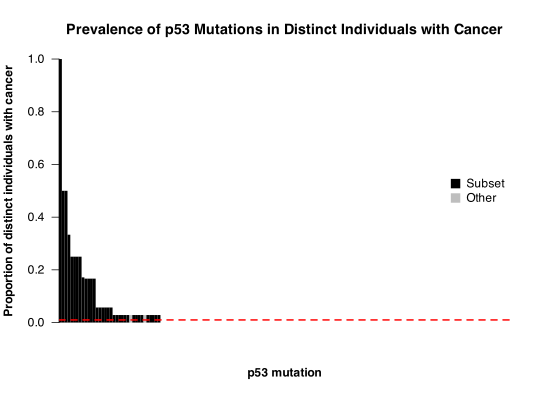

``` r
# pie chart
pie(vec,
    main = "Prevalence of p53 Mutations in Distinct Individuals with Cancer",
    labels = paste0(plyr::round_any(vec * 100,
                                    0.1),
                    "% (",
                    format(raw, 
                           big.mark = ",", 
                           trim = TRUE),
                    " mutations)"),
    col = c("black", "grey"),
    border = NA,
    clockwise = TRUE)
```

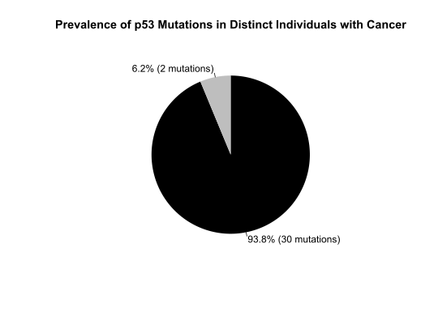

$~$


``` r
# vectors for pie chart of how most muts are chosen anyways for heatmap
prop <- n_distinct(osteosarcoma_sole_sex_pos_pivot_melted$Mutation) / n_distinct(osteosarcoma_sole_sex_pos_pivot$Mutation[osteosarcoma_sole_sex_pos_pivot$Mutation != "Total"])
vec <- c(prop,
         1 - prop)
raw <- c(n_distinct(osteosarcoma_sole_sex_pos_pivot_melted$Mutation),
         n_distinct(setdiff(unique(osteosarcoma_sole_sex_pos_pivot$Mutation[osteosarcoma_sole_sex_pos_pivot$Mutation != "Total"]),
                            unique(osteosarcoma_sole_sex_pos_pivot_melted$Mutation))))

# make prevalence waterfall plots (base R barplots + abline at 1%) of all muts in osteosarcoma to justify why 1% chosen for cutting off
barplot(height = sort(as.numeric(osteosarcoma_sole_sex_pos_pivot %>% 
                                   dplyr::select(-c(Num_Individuals)) %>% # divide down
                                   mutate(across(where(is.numeric), 
                                                 ~ .x/last(.x))) %>% 
                                   subset(Mutation != "Total") %>% 
                                   reshape2::melt() %>% 
                                   pull(value) %>% replace_na(., 0)),
                      decreasing = TRUE),
        xaxs = "i", # remove space between left side of bars and y axis
        ylab = "Proportion of distinct individuals with cancer", 
        xlab = "p53 mutation",
        main = "Prevalence of p53 Mutations in Distinct Individuals with Cancer",
        ylim = c(0, plyr::round_any(max(osteosarcoma_sole_sex_pos_pivot %>% 
                                          dplyr::select(-c(Num_Individuals)) %>% # divide down
                                          mutate(across(where(is.numeric), 
                                                        ~ .x/last(.x))) %>% 
                                          subset(Mutation != "Total") %>% 
                                          reshape2::melt() %>% 
                                          pull(value),
                                        na.rm = TRUE),
                                    0.1,
                                    f = ceiling)),
        col = ifelse(osteosarcoma_sole_sex_pos_pivot$Mutation[osteosarcoma_sole_sex_pos_pivot$Mutation != "Total"] %in% osteosarcoma_sole_sex_pos_pivot_melted$Mutation,
                     "black",
                     "grey"),
        font.lab = 2,
        las = 1,
        space = 0,
        border = NA)
abline(h = 0.01,
       col = "red",
       lty = 2,
       lwd = 2)
legend("right",
       legend = c("Subset", 
                  "Other"),
       col = c("black", 
               "gray"),
       bty = "n", # no border around legend
       pch = 15, # filled square shape
       pt.cex = 1.75) # increase shape size in legend
```

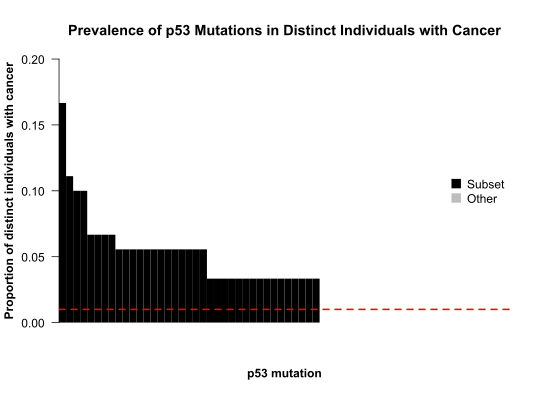

``` r
# pie chart
pie(vec,
    main = "Prevalence of p53 Mutations in Distinct Individuals with Cancer",
    labels = paste0(plyr::round_any(vec * 100,
                                    0.1),
                    "% (",
                    format(raw, 
                           big.mark = ",", 
                           trim = TRUE),
                    " mutations)"),
    col = c("black", "grey"),
    border = NA,
    clockwise = TRUE)
```


$~$


``` r
# create colorful grid table of mutated residues across sexes in pts with osteosarcoma
# osteosarcoma_sex_pos_pivot_damage_gridprep <- condformat(osteosarcoma_sex_pos_pivot_damage) %>% 
#   rule_text_color(1:Num_Individuals,
#                   ifelse(abs(parse_number(Mutation)) >= 1 & abs(parse_number(Mutation)) <= 61, # both TADs
#                          "#CC79A7",
#                          "")) %>% 
#   rule_text_color(1:Num_Individuals,
#                   ifelse(abs(parse_number(Mutation)) >= 62 & abs(parse_number(Mutation)) <= 93, # PRD
#                          "yellow4",
#                          "")) %>%
#   rule_text_color(1:Num_Individuals,
#                   ifelse(abs(parse_number(Mutation)) >= 94 & abs(parse_number(Mutation)) <= 289, # DBD
#                          "#0072B2",
#                          "")) %>%
#   rule_text_color(1:Num_Individuals,
#                   ifelse(abs(parse_number(Mutation)) >= 112 & abs(parse_number(Mutation)) <= 124, # L1
#                          "hotpink", 
#                          "")) %>% 
#   rule_text_color(1:Num_Individuals,
#                   ifelse(abs(parse_number(Mutation)) >= 163 & abs(parse_number(Mutation)) <= 195, # L2
#                          "brown", 
#                          "")) %>% 
#   rule_text_color(1:Num_Individuals,
#                   ifelse(abs(parse_number(Mutation)) >= 236 & abs(parse_number(Mutation)) <= 251, # L3
#                          "purple", 
#                          "")) %>% 
#   rule_text_color(1:Num_Individuals,
#                   ifelse(abs(parse_number(Mutation)) >= 290 & abs(parse_number(Mutation)) <= 324, # HD
#                          "#009E73",
#                          ""))  %>% 
#   rule_text_color(1:Num_Individuals,
#                   ifelse(abs(parse_number(Mutation)) >= 325 & abs(parse_number(Mutation)) <= 356, # OD; CTD is black
#                          "#D55E00",
#                          "")) %>% 
#   rule_text_color(1,
#                   ifelse(Mutation %in% top_muts_origdbdefcancer_vector,
#                          "red",
#                          "")) %>%
#   rule_text_color(Num_Individuals,
#                   ifelse(as.numeric(Num_Individuals) > 3 & as.numeric(Num_Individuals) < n_distinct(origdb_allosteosarcomapts$Individual_code),
#                          "red",
#                          "")) %>%
#   rule_text_bold(1,
#                  expression = Mutation %in% top_muts_origdbdefcancer_vector) %>%
#   rule_text_bold(Num_Individuals,
#                  expression = as.numeric(Num_Individuals) > 3 & as.numeric(Num_Individuals) < n_distinct(origdb_allosteosarcomapts$Individual_code)) %>%
#   rule_text_color(AGVGDClass,
#                   ifelse(AGVGDClass %in% c("C65", 
#                                            "C55"), 
#                          "red",
#                          "")) %>% 
#   rule_text_color(BayesDel,
#                   ifelse(as.numeric(BayesDel) >= 0.16, 
#                          "red",
#                          "")) %>% 
#   rule_text_color(REVEL,
#                   ifelse(as.numeric(REVEL) >= 0.5, 
#                          "red",
#                          "")) %>% 
#   rule_text_color(SIFTClass,
#                   ifelse(SIFTClass %in% c("Damaging"), 
#                          "red",
#                          "")) %>% 
#   rule_text_color(Polyphen2,
#                   ifelse(Polyphen2 %in% c("D"), 
#                          "red",
#                          "")) %>% 
#   rule_text_color(TransactivationClass,
#                   ifelse(TransactivationClass %in% c("non-functional"), 
#                          "red",
#                          "")) %>% 
#   rule_text_color(DNE_LOFclass,
#                   ifelse(DNE_LOFclass %in% c("DNE_LOF",
#                                              "notDNE_LOF"), 
#                          "red",
#                          "")) %>% 
#   rule_text_color(DNEclass,
#                   ifelse(DNEclass %in% c("Yes"), 
#                          "red",
#                          "")) %>% 
#   # rule_text_color(StructureFunctionClass,
#   #                 ifelse(StructureFunctionClass %in% c("non-functional"), 
#   #                         "red",
#   #                         "")) %>% 
#   theme_grob(rows = NULL,
#              theme = ttheme_default(base_size = 10,
#                                     core = list(padding = unit(c(2, 2), "mm")))) %>%
#   condformat2grob(draw = FALSE)
# 
# osteosarcoma_sex_pos_pivot_damage_grid <- grid.arrange(osteosarcoma_sex_pos_pivot_damage_gridprep,
#                                                        top = textGrob("Mutated Residues and Functional Effects by Sex in Individuals with Osteosarcoma and Germline p53 Mutations",
#                                                                       hjust = 0.5,
#                                                                       gp = gpar(fontface = "bold")))
```

$~$


``` r
# create colorful grid table of mutated residues across age strata in pts with osteosarcoma
# osteosarcoma_agestrata_pos_pivot_damage_gridprep <- condformat(osteosarcoma_agestrata_pos_pivot_damage) %>% 
#   rule_text_color(1:Num_Individuals,
#                   ifelse(abs(parse_number(Mutation)) >= 1 & abs(parse_number(Mutation)) <= 61, # both TADs
#                          "#CC79A7",
#                          "")) %>% 
#   rule_text_color(1:Num_Individuals,
#                   ifelse(abs(parse_number(Mutation)) >= 62 & abs(parse_number(Mutation)) <= 93, # PRD
#                          "yellow4",
#                          "")) %>%
#   rule_text_color(1:Num_Individuals,
#                   ifelse(abs(parse_number(Mutation)) >= 94 & abs(parse_number(Mutation)) <= 289, # DBD
#                          "#0072B2",
#                          "")) %>%
#   rule_text_color(1:Num_Individuals,
#                   ifelse(abs(parse_number(Mutation)) >= 112 & abs(parse_number(Mutation)) <= 124, # L1
#                          "hotpink", 
#                          "")) %>% 
#   rule_text_color(1:Num_Individuals,
#                   ifelse(abs(parse_number(Mutation)) >= 163 & abs(parse_number(Mutation)) <= 195, # L2
#                          "brown", 
#                          "")) %>% 
#   rule_text_color(1:Num_Individuals,
#                   ifelse(abs(parse_number(Mutation)) >= 236 & abs(parse_number(Mutation)) <= 251, # L3
#                          "purple", 
#                          "")) %>% 
#   rule_text_color(1:Num_Individuals,
#                   ifelse(abs(parse_number(Mutation)) >= 290 & abs(parse_number(Mutation)) <= 324, # HD
#                          "#009E73",
#                          ""))  %>% 
#   rule_text_color(1:Num_Individuals,
#                   ifelse(abs(parse_number(Mutation)) >= 325 & abs(parse_number(Mutation)) <= 356, # OD; CTD is black
#                          "#D55E00",
#                          "")) %>% 
#   rule_text_color(1,
#                   ifelse(Mutation %in% top_muts_origdbdefcancer_vector,
#                          "red",
#                          "")) %>%
#   rule_text_color(Num_Individuals,
#                   ifelse(as.numeric(Num_Individuals) > 3 & as.numeric(Num_Individuals) < n_distinct(origdb_allosteosarcomapts$Individual_code),
#                          "red",
#                          "")) %>%
#   rule_text_bold(1,
#                  expression = Mutation %in% top_muts_origdbdefcancer_vector) %>%
#   rule_text_bold(Num_Individuals,
#                  expression = as.numeric(Num_Individuals) > 3 & as.numeric(Num_Individuals) < n_distinct(origdb_allosteosarcomapts$Individual_code)) %>%
#   rule_text_color(AGVGDClass,
#                   ifelse(AGVGDClass %in% c("C65", 
#                                            "C55"), 
#                          "red",
#                          "")) %>% 
#   rule_text_color(BayesDel,
#                   ifelse(as.numeric(BayesDel) >= 0.16, 
#                          "red",
#                          "")) %>% 
#   rule_text_color(REVEL,
#                   ifelse(as.numeric(REVEL) >= 0.5, 
#                          "red",
#                          "")) %>% 
#   rule_text_color(SIFTClass,
#                   ifelse(SIFTClass %in% c("Damaging"), 
#                          "red",
#                          "")) %>% 
#   rule_text_color(Polyphen2,
#                   ifelse(Polyphen2 %in% c("D"), 
#                          "red",
#                          "")) %>% 
#   rule_text_color(TransactivationClass,
#                   ifelse(TransactivationClass %in% c("non-functional"), 
#                          "red",
#                          "")) %>% 
#   rule_text_color(DNE_LOFclass,
#                   ifelse(DNE_LOFclass %in% c("DNE_LOF",
#                                              "notDNE_LOF"), 
#                          "red",
#                          "")) %>% 
#   rule_text_color(DNEclass,
#                   ifelse(DNEclass %in% c("Yes"), 
#                          "red",
#                          "")) %>% 
#   # rule_text_color(StructureFunctionClass,
#   #                 ifelse(StructureFunctionClass %in% c("non-functional"), 
#   #                         "red",
#   #                         "")) %>% 
#   theme_grob(rows = NULL,
#              theme = ttheme_default(base_size = 10,
#                                     core = list(padding = unit(c(2, 2), "mm")))) %>%
#   condformat2grob(draw = FALSE)
# 
# osteosarcoma_agestrata_pos_pivot_damage_grid <- grid.arrange(osteosarcoma_agestrata_pos_pivot_damage_gridprep,
#                                                              top = textGrob("Mutated Residues and Functional Effects by Age of Diagnosis in Individuals with Osteosarcoma and Germline p53 Mutations",
#                                                                             hjust = 0.5,
#                                                                             gp = gpar(fontface = "bold")))
```

$~$

# **Analyses of All Individuals with Soft Tissue Cancers** {#allsofttissuespts}

$~$

$~$


``` r
# subset dataset of all sole and first mult to just soft tissues
origdb_allsofttissues_mult_pts <- origdbjustmultcancersover100 %>% 
  subset(Short_topo == "SOFT TISSUES") %>% 
  distinct() %>% 
  remove_rownames()

origdb_allsofttissues_sole_pts <- origdbjustsolecancersover100 %>% 
  subset(Short_topo == "SOFT TISSUES") %>% 
  distinct() %>% 
  remove_rownames()

# create pivot of number of female and male pts with softtissues in each age stratum of diagnosis, replace any NA with 0, add total number of pts in each age stratum to new column pasted with ages, and make anything with 1 individual singular indication of patients
softtissues_mult_agestrata_sex <- PivotTable$new()
softtissues_mult_agestrata_sex$addData(origdb_allsofttissues_mult_pts)
softtissues_mult_agestrata_sex$addRowDataGroups("Age_stratum")
softtissues_mult_agestrata_sex$addColumnDataGroups("Sex") 
softtissues_mult_agestrata_sex$defineCalculation(calculationName = "Count of distinct patients", 
                                                 summariseExpression = "n_distinct(Individual_code)")
softtissues_mult_agestrata_sex$sortColumnDataGroups(levelNumber = 1, 
                                                    orderBy = "calculation", 
                                                    sortOrder = "desc")
softtissues_mult_agestrata_sex$sortRowDataGroups(levelNumber = 1, 
                                                 orderBy = "calculation", 
                                                 sortOrder = "desc")
softtissues_mult_agestrata_sex$evaluatePivot() #doing this instead of renderPivot() which takes too long as it shows an actual pivot table, but we need this as a dataframe anyways for calculations later so we don't need to print a pivot table
softtissues_mult_agestrata_sex_pivot <- softtissues_mult_agestrata_sex$asDataFrame(rowGroupsAsColumns = TRUE) %>% 
  mutate(across(everything(),
                ~ replace_na(.,
                             0))) %>%
  transform(Age = paste0(Age_stratum,
                         " (", 
                         Total,
                         " individuals)")) %>% 
  transform(Age = ifelse(Total == 1,
                         gsub("individuals", 
                              "individual",
                              Age),
                         Age)) %>% 
  remove_rownames()

softtissues_sole_agestrata_sex <- PivotTable$new()
softtissues_sole_agestrata_sex$addData(origdb_allsofttissues_sole_pts)
softtissues_sole_agestrata_sex$addRowDataGroups("Age_stratum")
softtissues_sole_agestrata_sex$addColumnDataGroups("Sex") 
softtissues_sole_agestrata_sex$defineCalculation(calculationName = "Count of distinct patients", 
                                                 summariseExpression = "n_distinct(Individual_code)")
softtissues_sole_agestrata_sex$sortColumnDataGroups(levelNumber = 1, 
                                                    orderBy = "calculation", 
                                                    sortOrder = "desc")
softtissues_sole_agestrata_sex$sortRowDataGroups(levelNumber = 1, 
                                                 orderBy = "calculation", 
                                                 sortOrder = "desc")
softtissues_sole_agestrata_sex$evaluatePivot() #doing this instead of renderPivot() which takes too long as it shows an actual pivot table, but we need this as a dataframe anyways for calculations later so we don't need to print a pivot table
softtissues_sole_agestrata_sex_pivot <- softtissues_sole_agestrata_sex$asDataFrame(rowGroupsAsColumns = TRUE) %>% 
  mutate(across(everything(),
                ~ replace_na(.,
                             0))) %>%
  transform(Age = paste0(Age_stratum,
                         " (", 
                         Total,
                         " individuals)")) %>% 
  transform(Age = ifelse(Total == 1,
                         gsub("individuals", 
                              "individual",
                              Age),
                         Age)) %>% 
  remove_rownames()

# create pivot of number of mut type pts with softtissues in each age stratum of diagnosis, replace any NA with 0, add total number of pts in each age stratum to new column pasted with ages, and make anything with 1 Individual singular indication of patients
softtissues_mult_agestrata_type <- PivotTable$new()
softtissues_mult_agestrata_type$addData(origdb_allsofttissues_mult_pts)
softtissues_mult_agestrata_type$addRowDataGroups("Age_stratum")
softtissues_mult_agestrata_type$addColumnDataGroups("Effect") 
softtissues_mult_agestrata_type$defineCalculation(calculationName = "Count of distinct patients", 
                                                  summariseExpression = "n_distinct(Individual_code)")
softtissues_mult_agestrata_type$sortColumnDataGroups(levelNumber = 1, 
                                                     orderBy = "calculation", 
                                                     sortOrder = "desc")
softtissues_mult_agestrata_type$sortRowDataGroups(levelNumber = 1, 
                                                  orderBy = "calculation", 
                                                  sortOrder = "desc")
softtissues_mult_agestrata_type$evaluatePivot() #doing this instead of renderPivot() which takes too long as it shows an actual pivot table, but we need this as a dataframe anyways for calculations later so we don't need to print a pivot table
softtissues_mult_agestrata_type_pivot <- softtissues_mult_agestrata_type$asDataFrame(rowGroupsAsColumns = TRUE) %>% 
  mutate(across(everything(),
                ~ replace_na(.,
                             0))) %>%
  transform(Age = paste0(Age_stratum,
                         " (", 
                         Total,
                         " individuals)")) %>% 
  transform(Age = ifelse(Total == 1,
                         gsub("individuals", 
                              "individual",
                              Age),
                         Age)) %>% 
  remove_rownames() 

softtissues_sole_agestrata_type <- PivotTable$new()
softtissues_sole_agestrata_type$addData(origdb_allsofttissues_sole_pts)
softtissues_sole_agestrata_type$addRowDataGroups("Age_stratum")
softtissues_sole_agestrata_type$addColumnDataGroups("Effect") 
softtissues_sole_agestrata_type$defineCalculation(calculationName = "Count of distinct patients", 
                                                  summariseExpression = "n_distinct(Individual_code)")
softtissues_sole_agestrata_type$sortColumnDataGroups(levelNumber = 1, 
                                                     orderBy = "calculation", 
                                                     sortOrder = "desc")
softtissues_sole_agestrata_type$sortRowDataGroups(levelNumber = 1, 
                                                  orderBy = "calculation", 
                                                  sortOrder = "desc")
softtissues_sole_agestrata_type$evaluatePivot() #doing this instead of renderPivot() which takes too long as it shows an actual pivot table, but we need this as a dataframe anyways for calculations later so we don't need to print a pivot table
softtissues_sole_agestrata_type_pivot <- softtissues_sole_agestrata_type$asDataFrame(rowGroupsAsColumns = TRUE) %>% 
  mutate(across(everything(),
                ~ replace_na(.,
                             0))) %>%
  transform(Age = paste0(Age_stratum,
                         " (", 
                         Total,
                         " individuals)")) %>% 
  transform(Age = ifelse(Total == 1,
                         gsub("individuals", 
                              "individual",
                              Age),
                         Age)) %>% 
  remove_rownames()

# create pivot of number of female and male pts with softtissues in each mutation category, replace any NA with 0, add row and column totals
softtissues_mult_sex_type <- PivotTable$new()
softtissues_mult_sex_type$addData(origdb_allsofttissues_mult_pts)
softtissues_mult_sex_type$addRowDataGroups("Effect")
softtissues_mult_sex_type$addColumnDataGroups("Sex") 
softtissues_mult_sex_type$defineCalculation(calculationName = "Count of distinct patients", 
                                            summariseExpression = "n_distinct(Individual_code)")
softtissues_mult_sex_type$sortColumnDataGroups(levelNumber = 1, 
                                               orderBy = "calculation", 
                                               sortOrder = "desc")
softtissues_mult_sex_type$sortRowDataGroups(levelNumber = 1, 
                                            orderBy = "calculation", 
                                            sortOrder = "desc")
softtissues_mult_sex_type$evaluatePivot() #doing this instead of renderPivot() which takes too long as it shows an actual pivot table, but we need this as a dataframe anyways for calculations later so we don't need to print a pivot table
softtissues_mult_sex_type_pivot <- softtissues_mult_sex_type$asDataFrame(rowGroupsAsColumns = TRUE) %>% 
  mutate(across(everything(),
                ~ replace_na(.,
                             0))) %>% 
  remove_rownames()

softtissues_sole_sex_type <- PivotTable$new()
softtissues_sole_sex_type$addData(origdb_allsofttissues_sole_pts)
softtissues_sole_sex_type$addRowDataGroups("Effect")
softtissues_sole_sex_type$addColumnDataGroups("Sex") 
softtissues_sole_sex_type$defineCalculation(calculationName = "Count of distinct patients", 
                                            summariseExpression = "n_distinct(Individual_code)")
softtissues_sole_sex_type$sortColumnDataGroups(levelNumber = 1, 
                                               orderBy = "calculation", 
                                               sortOrder = "desc")
softtissues_sole_sex_type$sortRowDataGroups(levelNumber = 1, 
                                            orderBy = "calculation", 
                                            sortOrder = "desc")
softtissues_sole_sex_type$evaluatePivot() #doing this instead of renderPivot() which takes too long as it shows an actual pivot table, but we need this as a dataframe anyways for calculations later so we don't need to print a pivot table
softtissues_sole_sex_type_pivot <- softtissues_sole_sex_type$asDataFrame(rowGroupsAsColumns = TRUE) %>% 
  mutate(across(everything(),
                ~ replace_na(.,
                             0))) %>% 
  remove_rownames()

# divide number of female and male pts by total number of pts per age stratum
softtissues_mult_agestrata_sex_pivot_calc <- softtissues_mult_agestrata_sex_pivot %>% 
  mutate_at(vars(2:Total), 
            .funs = ~./Total) %>% 
  dplyr::rename(Female = `F`,
                Male = M) 

softtissues_sole_agestrata_sex_pivot_calc <- softtissues_sole_agestrata_sex_pivot %>% 
  mutate_at(vars(2:Total), 
            .funs = ~./Total) %>% 
  dplyr::rename(Female = `F`,
                Male = M) 

# divide number of mut type pts by total number of pts per age stratum
softtissues_mult_agestrata_type_pivot_calc <- softtissues_mult_agestrata_type_pivot %>% 
  mutate_at(vars(2:Total), 
            .funs = ~./Total)

softtissues_sole_agestrata_type_pivot_calc <- softtissues_sole_agestrata_type_pivot %>% 
  mutate_at(vars(2:Total), 
            .funs = ~./Total)

# divide vertically down sex columns to calc proportions of each mut type in each sex, add number of total female and male pts to colnames
softtissues_mult_sex_type_pivot_calc <- softtissues_mult_sex_type_pivot %>% 
  dplyr::select(-Total) %>% 
  transform(Female = `F`/as.numeric(softtissues_mult_sex_type_pivot[nrow(softtissues_mult_sex_type_pivot), "F"])) %>% 
  transform(Male = `M`/as.numeric(softtissues_mult_sex_type_pivot[nrow(softtissues_mult_sex_type_pivot), "M"])) 

names(softtissues_mult_sex_type_pivot_calc) <- ifelse(names(softtissues_mult_sex_type_pivot_calc) %in% c("Female"),
                                                      paste0("Female (",
                                                             as.numeric(softtissues_mult_sex_type_pivot[nrow(softtissues_mult_sex_type_pivot),
                                                                                                        "F"]),
                                                             " individuals)"),
                                                      names(softtissues_mult_sex_type_pivot_calc))

names(softtissues_mult_sex_type_pivot_calc) <- ifelse(names(softtissues_mult_sex_type_pivot_calc) %in% c("Male"),
                                                      paste0("Male (",
                                                             as.numeric(softtissues_mult_sex_type_pivot[nrow(softtissues_mult_sex_type_pivot),
                                                                                                        "M"]),
                                                             " individuals)"),
                                                      names(softtissues_mult_sex_type_pivot_calc))

softtissues_sole_sex_type_pivot_calc <- softtissues_sole_sex_type_pivot %>% 
  dplyr::select(-Total) %>% 
  transform(Female = `F`/as.numeric(softtissues_sole_sex_type_pivot[nrow(softtissues_sole_sex_type_pivot), "F"])) %>% 
  transform(Male = `M`/as.numeric(softtissues_sole_sex_type_pivot[nrow(softtissues_sole_sex_type_pivot), "M"])) 

names(softtissues_sole_sex_type_pivot_calc) <- ifelse(names(softtissues_sole_sex_type_pivot_calc) %in% c("Female"),
                                                      paste0("Female (",
                                                             as.numeric(softtissues_sole_sex_type_pivot[nrow(softtissues_sole_sex_type_pivot),
                                                                                                        "F"]),
                                                             " individuals)"),
                                                      names(softtissues_sole_sex_type_pivot_calc))

names(softtissues_sole_sex_type_pivot_calc) <- ifelse(names(softtissues_sole_sex_type_pivot_calc) %in% c("Male"),
                                                      paste0("Male (",
                                                             as.numeric(softtissues_sole_sex_type_pivot[nrow(softtissues_sole_sex_type_pivot),
                                                                                                        "M"]),
                                                             " individuals)"),
                                                      names(softtissues_sole_sex_type_pivot_calc))

# remove total row and column and age column which doesn't have indication of number of total patients, melt pivot for ggplot and rename columns to be more sensible
softtissues_mult_agestrata_sex_pivot_melted <- softtissues_mult_agestrata_sex_pivot_calc %>% 
  dplyr::select(-Total) %>% 
  subset(Age_stratum != "Total") %>% 
  dplyr::select(-Age_stratum) %>% 
  reshape2::melt() %>% 
  dplyr::rename(Sex = variable,
                Proportion = value)

softtissues_sole_agestrata_sex_pivot_melted <- softtissues_sole_agestrata_sex_pivot_calc %>% 
  dplyr::select(-Total) %>% 
  subset(Age_stratum != "Total") %>% 
  dplyr::select(-Age_stratum) %>% 
  reshape2::melt() %>% 
  dplyr::rename(Sex = variable,
                Proportion = value)

# remove total row and column and age column which doesn't have indication of number of total patients, melt pivot for ggplot and rename columns to be more sensible, make category column as factor with decreasing proportions and other at end
softtissues_mult_agestrata_type_pivot_melted <- softtissues_mult_agestrata_type_pivot_calc %>% 
  dplyr::select(-Total) %>% 
  subset(Age_stratum != "Total") %>% 
  dplyr::select(-Age_stratum) %>% 
  reshape2::melt() %>% 
  dplyr::rename(Effect = variable,
                Proportion = value)

softtissues_mult_agestrata_type_pivot_melted$Effect <- gsub("\\.",
                                                            " ",
                                                            softtissues_mult_agestrata_type_pivot_melted$Effect) %>% 
  trimws()

softtissues_mult_agestrata_type_pivot_melted$Effect <- factor(softtissues_mult_agestrata_type_pivot_melted$Effect,
                                                              levels = c(unique(softtissues_mult_agestrata_type_pivot_melted$Effect)[!(unique(softtissues_mult_agestrata_type_pivot_melted$Effect) == "other")],
                                                                         "other"))

softtissues_sole_agestrata_type_pivot_melted <- softtissues_sole_agestrata_type_pivot_calc %>% 
  dplyr::select(-Total) %>% 
  subset(Age_stratum != "Total") %>% 
  dplyr::select(-Age_stratum) %>% 
  reshape2::melt() %>% 
  dplyr::rename(Effect = variable,
                Proportion = value)

softtissues_sole_agestrata_type_pivot_melted$Effect <- gsub("\\.",
                                                            " ",
                                                            softtissues_sole_agestrata_type_pivot_melted$Effect) %>%
  trimws()

softtissues_sole_agestrata_type_pivot_melted$Effect <- factor(softtissues_sole_agestrata_type_pivot_melted$Effect,
                                                              levels = c(unique(softtissues_sole_agestrata_type_pivot_melted$Effect)[!(unique(softtissues_sole_agestrata_type_pivot_melted$Effect) == "other")],
                                                                         "other"))

# remove total row and sex columns which don't have number of total patients, melt pivot for ggplot and rename columns to be more sensible, make category column as factor with decreasing proportions and other at end
softtissues_mult_sex_type_pivot_melted <- softtissues_mult_sex_type_pivot_calc %>% 
  subset(Effect != "Total") %>% 
  dplyr::select(-c(`F`,
                   M)) %>% 
  reshape2::melt() %>% 
  dplyr::rename(Sex = variable,
                Proportion = value) %>% 
  arrange(-Proportion)

softtissues_mult_sex_type_pivot_melted$Effect <- factor(softtissues_mult_sex_type_pivot_melted$Effect,
                                                        levels = c(unique(softtissues_mult_sex_type_pivot_melted$Effect)[!(unique(softtissues_mult_sex_type_pivot_melted$Effect) == "other")],
                                                                   "other"))

softtissues_sole_sex_type_pivot_melted <- softtissues_sole_sex_type_pivot_calc %>% 
  subset(Effect != "Total") %>% 
  dplyr::select(-c(`F`,
                   M)) %>% 
  reshape2::melt() %>% 
  dplyr::rename(Sex = variable,
                Proportion = value) %>% 
  arrange(-Proportion)

softtissues_sole_sex_type_pivot_melted$Effect <- factor(softtissues_sole_sex_type_pivot_melted$Effect,
                                                        levels = c(unique(softtissues_sole_sex_type_pivot_melted$Effect)[!(unique(softtissues_sole_sex_type_pivot_melted$Effect) == "other")],
                                                                   "other"))

# create pivot of mutated residues vs sex in all softtissues patients, replace NA with 0, arrange by increasing codon number, add row and column totals
softtissues_mult_sex_pos <- PivotTable$new()
softtissues_mult_sex_pos$addData(origdb_allsofttissues_mult_pts)
softtissues_mult_sex_pos$addRowDataGroups("ProtDescription")
softtissues_mult_sex_pos$addColumnDataGroups("Sex") 
softtissues_mult_sex_pos$defineCalculation(calculationName = "Count of distinct patients", 
                                           summariseExpression = "n_distinct(Individual_code)")
softtissues_mult_sex_pos$sortColumnDataGroups(levelNumber = 1, 
                                              orderBy = "calculation", 
                                              sortOrder = "desc")
softtissues_mult_sex_pos$sortRowDataGroups(levelNumber = 1, 
                                           orderBy = "calculation", 
                                           sortOrder = "desc")
softtissues_mult_sex_pos$evaluatePivot() #doing this instead of renderPivot() which takes too long as it shows an actual pivot table, but we need this as a dataframe anyways for calculations later so we don't need to print a pivot table
softtissues_mult_sex_pos_pivot <- softtissues_mult_sex_pos$asDataFrame(rowGroupsAsColumns = TRUE) %>% 
  mutate(across(everything(),
                ~ replace_na(.,
                             0))) %>% 
  arrange(abs(parse_number(ProtDescription))) %>% # arrange muts by increasing codon number
  dplyr::rename(Num_Individuals = Total,
                Mutation = ProtDescription,
                Female = `F`,
                Male = M) %>%
  remove_rownames()

softtissues_sole_sex_pos <- PivotTable$new()
softtissues_sole_sex_pos$addData(origdb_allsofttissues_sole_pts)
softtissues_sole_sex_pos$addRowDataGroups("ProtDescription")
softtissues_sole_sex_pos$addColumnDataGroups("Sex") 
softtissues_sole_sex_pos$defineCalculation(calculationName = "Count of distinct patients", 
                                           summariseExpression = "n_distinct(Individual_code)")
softtissues_sole_sex_pos$sortColumnDataGroups(levelNumber = 1, 
                                              orderBy = "calculation", 
                                              sortOrder = "desc")
softtissues_sole_sex_pos$sortRowDataGroups(levelNumber = 1, 
                                           orderBy = "calculation", 
                                           sortOrder = "desc")
softtissues_sole_sex_pos$evaluatePivot() #doing this instead of renderPivot() which takes too long as it shows an actual pivot table, but we need this as a dataframe anyways for calculations later so we don't need to print a pivot table
softtissues_sole_sex_pos_pivot <- softtissues_sole_sex_pos$asDataFrame(rowGroupsAsColumns = TRUE) %>% 
  mutate(across(everything(),
                ~ replace_na(.,
                             0))) %>% 
  arrange(abs(parse_number(ProtDescription))) %>% # arrange muts by increasing codon number
  dplyr::rename(Num_Individuals = Total,
                Mutation = ProtDescription,
                Female = `F`,
                Male = M) %>%
  remove_rownames()

# create pivot of mutated residues vs age strata of dx in all softtissues patients, replace NA with 0, arrange by increasing codon number, add row and column totals
softtissues_mult_agestrata_pos <- PivotTable$new()
softtissues_mult_agestrata_pos$addData(origdb_allsofttissues_mult_pts)
softtissues_mult_agestrata_pos$addRowDataGroups("ProtDescription")
softtissues_mult_agestrata_pos$addColumnDataGroups("Age_stratum") 
softtissues_mult_agestrata_pos$defineCalculation(calculationName = "Count of distinct patients", 
                                                 summariseExpression = "n_distinct(Individual_code)")
softtissues_mult_agestrata_pos$sortColumnDataGroups(levelNumber = 1, 
                                                    orderBy = "calculation", 
                                                    sortOrder = "desc")
softtissues_mult_agestrata_pos$sortRowDataGroups(levelNumber = 1, 
                                                 orderBy = "calculation", 
                                                 sortOrder = "desc")
softtissues_mult_agestrata_pos$evaluatePivot() #doing this instead of renderPivot() which takes too long as it shows an actual pivot table, but we need this as a dataframe anyways for calculations later so we don't need to print a pivot table
softtissues_mult_agestrata_pos_pivot <- softtissues_mult_agestrata_pos$asDataFrame(rowGroupsAsColumns = TRUE) %>% 
  mutate(across(everything(),
                ~ replace_na(.,
                             0))) %>% 
  arrange(abs(parse_number(ProtDescription))) %>% # arrange muts by increasing codon number
  dplyr::rename(Num_Individuals = Total,
                Mutation = ProtDescription) %>%
  remove_rownames()

softtissues_sole_agestrata_pos <- PivotTable$new()
softtissues_sole_agestrata_pos$addData(origdb_allsofttissues_sole_pts)
softtissues_sole_agestrata_pos$addRowDataGroups("ProtDescription")
softtissues_sole_agestrata_pos$addColumnDataGroups("Age_stratum") 
softtissues_sole_agestrata_pos$defineCalculation(calculationName = "Count of distinct patients", 
                                                 summariseExpression = "n_distinct(Individual_code)")
softtissues_sole_agestrata_pos$sortColumnDataGroups(levelNumber = 1, 
                                                    orderBy = "calculation", 
                                                    sortOrder = "desc")
softtissues_sole_agestrata_pos$sortRowDataGroups(levelNumber = 1, 
                                                 orderBy = "calculation", 
                                                 sortOrder = "desc")
softtissues_sole_agestrata_pos$evaluatePivot() #doing this instead of renderPivot() which takes too long as it shows an actual pivot table, but we need this as a dataframe anyways for calculations later so we don't need to print a pivot table
softtissues_sole_agestrata_pos_pivot <- softtissues_sole_agestrata_pos$asDataFrame(rowGroupsAsColumns = TRUE) %>% 
  mutate(across(everything(),
                ~ replace_na(.,
                             0))) %>% 
  arrange(abs(parse_number(ProtDescription))) %>% # arrange muts by increasing codon number
  dplyr::rename(Num_Individuals = Total,
                Mutation = ProtDescription) %>%
  remove_rownames()

# pull out damage info from stock softtissues data
origdb_allsofttissues_mult_pts_damageinfo <- origdb_allsofttissues_mult_pts %>% 
  dplyr::select(c(ProtDescription, # first few cols are mut info, then agvgdc onwards are damage info
                  AGVGDClass,
                  BayesDel,
                  REVEL,
                  SIFTClass,
                  Polyphen2,
                  TransactivationClass,
                  DNE_LOFclass,
                  DNEclass)) %>% 
  arrange(abs(parse_number(ProtDescription))) %>% 
  distinct() %>% 
  remove_rownames()

origdb_allsofttissues_sole_pts_damageinfo <- origdb_allsofttissues_sole_pts %>% 
  dplyr::select(c(ProtDescription, # first few cols are mut info, then agvgdc onwards are damage info
                  AGVGDClass,
                  BayesDel,
                  REVEL,
                  SIFTClass,
                  Polyphen2,
                  TransactivationClass,
                  DNE_LOFclass,
                  DNEclass)) %>% 
  arrange(abs(parse_number(ProtDescription))) %>% 
  distinct() %>% 
  remove_rownames()

# add damage info to pivot of mut residues in sexes and replace NAs with blanks so that can plot as grid
softtissues_mult_sex_pos_pivot_damage <- left_join(softtissues_mult_sex_pos_pivot,
                                                   origdb_allsofttissues_mult_pts_damageinfo,
                                                   by = c("Mutation" = "ProtDescription")) %>% 
  mutate(across(2:ncol(.),
                ~ str_replace(.,
                              "NA",
                              ""))) %>%
  mutate(across(where(is.character),
                ~ replace_na(.,
                             "")))

softtissues_sole_sex_pos_pivot_damage <- left_join(softtissues_sole_sex_pos_pivot,
                                                   origdb_allsofttissues_sole_pts_damageinfo,
                                                   by = c("Mutation" = "ProtDescription")) %>% 
  mutate(across(2:ncol(.),
                ~ str_replace(.,
                              "NA",
                              ""))) %>%
  mutate(across(where(is.character),
                ~ replace_na(.,
                             "")))

# add damage info to pivot of mut residues in age strata, replace NAs with blanks so that can plot as grid
softtissues_mult_agestrata_pos_pivot_damage <- left_join(softtissues_mult_agestrata_pos_pivot,
                                                         origdb_allsofttissues_mult_pts_damageinfo,
                                                         by = c("Mutation" = "ProtDescription")) %>% 
  mutate(across(2:ncol(.),
                ~ str_replace(.,
                              "NA",
                              ""))) %>%
  mutate(across(where(is.character),
                ~ replace_na(.,
                             "")))

softtissues_sole_agestrata_pos_pivot_damage <- left_join(softtissues_sole_agestrata_pos_pivot,
                                                         origdb_allsofttissues_sole_pts_damageinfo,
                                                         by = c("Mutation" = "ProtDescription")) %>% 
  mutate(across(2:ncol(.),
                ~ str_replace(.,
                              "NA",
                              ""))) %>%
  mutate(across(where(is.character),
                ~ replace_na(.,
                             "")))

# divide vertically down age pos and sex pos columns and subset to just residues shown in heatmaps i.e. >= 1%, rename cols for agestrata calc dfs because R changes them per naming conventions
softtissues_mult_sex_pos_pivot_calc <- softtissues_mult_sex_pos_pivot_damage %>%
  transform(`F` = as.numeric(Female)/as.numeric(softtissues_mult_sex_pos_pivot_damage[nrow(softtissues_mult_sex_pos_pivot_damage), "Female"])) %>%
  transform(`M` = as.numeric(Male)/as.numeric(softtissues_mult_sex_pos_pivot_damage[nrow(softtissues_mult_sex_pos_pivot_damage), "Male"])) %>%
  dplyr::select(c(Mutation,
                  `F`,
                  `M`)) %>%
  subset(Mutation %in% unique(as.vector(multcancerpivotpos_melted_over0.01$Mutation)))

softtissues_sole_sex_pos_pivot_calc <- softtissues_sole_sex_pos_pivot_damage %>%
  transform(`F` = as.numeric(Female)/as.numeric(softtissues_sole_sex_pos_pivot_damage[nrow(softtissues_sole_sex_pos_pivot_damage), "Female"])) %>%
  transform(`M` = as.numeric(Male)/as.numeric(softtissues_sole_sex_pos_pivot_damage[nrow(softtissues_sole_sex_pos_pivot_damage), "Male"])) %>%
  dplyr::select(c(Mutation,
                  `F`,
                  `M`)) %>%
  subset(Mutation %in% unique(as.vector(solecancerpivotpos_melted_over0.01$Mutation)))

softtissues_mult_agestrata_pos_pivot_calc <- softtissues_mult_agestrata_pos_pivot_damage %>%
  transform(`0 - 9` = as.numeric(softtissues_mult_agestrata_pos_pivot_damage[,2])/as.numeric(softtissues_mult_agestrata_pos_pivot_damage[nrow(softtissues_mult_agestrata_pos_pivot_damage), 
                                                                                                                                         colnames(softtissues_mult_agestrata_pos_pivot_damage)[2]])) %>%
  transform(`40 and up` = as.numeric(as.numeric(softtissues_mult_agestrata_pos_pivot_damage[,3]))/as.numeric(softtissues_mult_agestrata_pos_pivot_damage[nrow(softtissues_mult_agestrata_pos_pivot_damage),
                                                                                                                                                         colnames(softtissues_mult_agestrata_pos_pivot_damage)[3]])) %>% # out of order correct!
  transform(`30 - 39` = as.numeric(as.numeric(softtissues_mult_agestrata_pos_pivot_damage[,4]))/as.numeric(softtissues_mult_agestrata_pos_pivot_damage[nrow(softtissues_mult_agestrata_pos_pivot_damage),
                                                                                                                                                       colnames(softtissues_mult_agestrata_pos_pivot_damage)[4]])) %>% # out of order correct!
  transform(`20 - 29` = as.numeric(as.numeric(softtissues_mult_agestrata_pos_pivot_damage[,5]))/as.numeric(softtissues_mult_agestrata_pos_pivot_damage[nrow(softtissues_mult_agestrata_pos_pivot_damage),
                                                                                                                                                       colnames(softtissues_mult_agestrata_pos_pivot_damage)[5]])) %>% # out of order correct!
  transform(`10 - 19` = as.numeric(as.numeric(softtissues_mult_agestrata_pos_pivot_damage[,6]))/as.numeric(softtissues_mult_agestrata_pos_pivot_damage[nrow(softtissues_mult_agestrata_pos_pivot_damage),
                                                                                                                                                       colnames(softtissues_mult_agestrata_pos_pivot_damage)[6]])) %>% # out of order correct!
  dplyr::select(c(Mutation,
                  tail(names(.),
                       5))) %>%
  subset(Mutation %in% unique(as.vector(multcancerpivotpos_melted_over0.01$Mutation))) 

colnames(softtissues_mult_agestrata_pos_pivot_calc) <- colnames(softtissues_mult_agestrata_pos_pivot_damage)[1:6]

softtissues_sole_agestrata_pos_pivot_calc <- softtissues_sole_agestrata_pos_pivot_damage %>%
  transform(`0 - 9` = as.numeric(softtissues_sole_agestrata_pos_pivot_damage[,2])/as.numeric(softtissues_sole_agestrata_pos_pivot_damage[nrow(softtissues_sole_agestrata_pos_pivot_damage), 
                                                                                                                                         colnames(softtissues_sole_agestrata_pos_pivot_damage)[2]])) %>%
  transform(`40 and up` = as.numeric(as.numeric(softtissues_sole_agestrata_pos_pivot_damage[,3]))/as.numeric(softtissues_sole_agestrata_pos_pivot_damage[nrow(softtissues_sole_agestrata_pos_pivot_damage),
                                                                                                                                                         colnames(softtissues_sole_agestrata_pos_pivot_damage)[3]])) %>% # out of order correct!
  transform(`10 - 19` = as.numeric(as.numeric(softtissues_sole_agestrata_pos_pivot_damage[,4]))/as.numeric(softtissues_sole_agestrata_pos_pivot_damage[nrow(softtissues_sole_agestrata_pos_pivot_damage),
                                                                                                                                                       colnames(softtissues_sole_agestrata_pos_pivot_damage)[4]])) %>% # out of order correct!
  transform(`20 - 29` = as.numeric(as.numeric(softtissues_sole_agestrata_pos_pivot_damage[,5]))/as.numeric(softtissues_sole_agestrata_pos_pivot_damage[nrow(softtissues_sole_agestrata_pos_pivot_damage),
                                                                                                                                                       colnames(softtissues_sole_agestrata_pos_pivot_damage)[5]])) %>% # out of order correct!
  transform(`30 - 39` = as.numeric(as.numeric(softtissues_sole_agestrata_pos_pivot_damage[,6]))/as.numeric(softtissues_sole_agestrata_pos_pivot_damage[nrow(softtissues_sole_agestrata_pos_pivot_damage),
                                                                                                                                                       colnames(softtissues_sole_agestrata_pos_pivot_damage)[6]])) %>% # out of order correct!
  dplyr::select(c(Mutation,
                  tail(names(.),
                       5))) %>%
  subset(Mutation %in% unique(as.vector(solecancerpivotpos_melted_over0.01$Mutation))) 

colnames(softtissues_sole_agestrata_pos_pivot_calc) <- colnames(softtissues_sole_agestrata_pos_pivot_damage)[1:6]

# melt pos pivot tables and add number of individuals to sex or age strata listed, already do >= 1% proportion 
softtissues_mult_sex_pos_pivot_melted <- reshape2::melt(softtissues_mult_sex_pos_pivot_calc) %>%
  dplyr::rename(Sex = variable,
                Proportion = value) %>%
  arrange(-Proportion) %>%
  transform(Sex = ifelse(Sex == "F",
                         paste0("Female (",
                                as.numeric(softtissues_mult_sex_pos_pivot_damage[nrow(softtissues_mult_sex_pos_pivot_damage), "Female"]),
                                " individuals)"),
                         as.character(Sex))) %>%
  transform(Sex = ifelse(Sex == "M",
                         paste0("Male (",
                                as.numeric(softtissues_mult_sex_pos_pivot_damage[nrow(softtissues_mult_sex_pos_pivot_damage), "Male"]),
                                " individuals)"),
                         Sex)) %>%
  transform(Sex = ifelse(grepl("\\(1 ", 
                               Sex),
                         gsub("individuals", 
                              "individual",
                              Sex),
                         Sex)) %>%
  subset(Mutation %in% (reshape2::melt(softtissues_mult_sex_pos_pivot_calc) %>%
                          dplyr::rename(Sex = variable,
                                        Proportion = value) %>%
                          arrange(-Proportion) %>%
                          subset(Proportion >= 0.01) %>%
                          pull(Mutation) %>%
                          unique() %>%
                          as.vector())) %>%
  remove_rownames()

softtissues_sole_sex_pos_pivot_melted <- reshape2::melt(softtissues_sole_sex_pos_pivot_calc) %>%
  dplyr::rename(Sex = variable,
                Proportion = value) %>%
  arrange(-Proportion) %>%
  transform(Sex = ifelse(Sex == "F",
                         paste0("Female (",
                                as.numeric(softtissues_sole_sex_pos_pivot_damage[nrow(softtissues_sole_sex_pos_pivot_damage), "Female"]),
                                " individuals)"),
                         as.character(Sex))) %>%
  transform(Sex = ifelse(Sex == "M",
                         paste0("Male (",
                                as.numeric(softtissues_sole_sex_pos_pivot_damage[nrow(softtissues_sole_sex_pos_pivot_damage), "Male"]),
                                " individuals)"),
                         Sex)) %>%
  transform(Sex = ifelse(grepl("\\(1 ", 
                               Sex),
                         gsub("individuals", 
                              "individual",
                              Sex),
                         Sex)) %>%
  subset(Mutation %in% (reshape2::melt(softtissues_sole_sex_pos_pivot_calc) %>%
                          dplyr::rename(Sex = variable,
                                        Proportion = value) %>%
                          arrange(-Proportion) %>%
                          subset(Proportion >= 0.01) %>%
                          pull(Mutation) %>%
                          unique() %>%
                          as.vector())) %>%
  remove_rownames()

softtissues_mult_agestrata_pos_pivot_melted <- reshape2::melt(softtissues_mult_agestrata_pos_pivot_calc) %>%
  dplyr::rename(Age = variable,
                Proportion = value) %>%
  arrange(-Proportion) %>%
  transform(Age = ifelse(Age == "0-9",
                         paste0("0-9 (",
                                as.numeric(softtissues_mult_agestrata_pos_pivot_damage[nrow(softtissues_mult_agestrata_pos_pivot_damage), "0-9"]),
                                " individuals)"),
                         as.character(Age))) %>%
  transform(Age = ifelse(Age == "10-19",
                         paste0("10-19 (",
                                as.numeric(softtissues_mult_agestrata_pos_pivot_damage[nrow(softtissues_mult_agestrata_pos_pivot_damage), "10-19"]),
                                " individuals)"),
                         Age)) %>%
  transform(Age = ifelse(Age == "20-29",
                         paste0("20-29 (",
                                as.numeric(softtissues_mult_agestrata_pos_pivot_damage[nrow(softtissues_mult_agestrata_pos_pivot_damage), "20-29"]),
                                " individuals)"),
                         Age)) %>%
  transform(Age = ifelse(Age == "30-39",
                         paste0("30-39 (",
                                as.numeric(softtissues_mult_agestrata_pos_pivot_damage[nrow(softtissues_mult_agestrata_pos_pivot_damage), "30-39"]),
                                " individuals)"),
                         Age)) %>%
  transform(Age = ifelse(Age == "40 and up",
                         paste0("40 and up (",
                                as.numeric(softtissues_mult_agestrata_pos_pivot_damage[nrow(softtissues_mult_agestrata_pos_pivot_damage), "40 and up"]),
                                " individuals)"),
                         Age)) %>%
  transform(Age = ifelse(grepl("\\(1 ", 
                               Age),
                         gsub("individuals", 
                              "individual",
                              Age),
                         Age)) %>%
  subset(Mutation %in% (reshape2::melt(softtissues_mult_agestrata_pos_pivot_calc) %>%
                          dplyr::rename(Age = variable,
                                        Proportion = value) %>%
                          arrange(-Proportion) %>%
                          subset(Proportion >= 0.01) %>%
                          pull(Mutation) %>%
                          unique() %>%
                          as.vector())) %>%
  remove_rownames() 

softtissues_sole_agestrata_pos_pivot_melted <- reshape2::melt(softtissues_sole_agestrata_pos_pivot_calc) %>%
  dplyr::rename(Age = variable,
                Proportion = value) %>%
  arrange(-Proportion) %>%
  transform(Age = ifelse(Age == "0-9",
                         paste0("0-9 (",
                                as.numeric(softtissues_sole_agestrata_pos_pivot_damage[nrow(softtissues_sole_agestrata_pos_pivot_damage), "0-9"]),
                                " individuals)"),
                         as.character(Age))) %>%
  transform(Age = ifelse(Age == "10-19",
                         paste0("10-19 (",
                                as.numeric(softtissues_sole_agestrata_pos_pivot_damage[nrow(softtissues_sole_agestrata_pos_pivot_damage), "10-19"]),
                                " individuals)"),
                         Age)) %>%
  transform(Age = ifelse(Age == "20-29",
                         paste0("20-29 (",
                                as.numeric(softtissues_sole_agestrata_pos_pivot_damage[nrow(softtissues_sole_agestrata_pos_pivot_damage), "20-29"]),
                                " individuals)"),
                         Age)) %>%
  transform(Age = ifelse(Age == "30-39",
                         paste0("30-39 (",
                                as.numeric(softtissues_sole_agestrata_pos_pivot_damage[nrow(softtissues_sole_agestrata_pos_pivot_damage), "30-39"]),
                                " individuals)"),
                         Age)) %>%
  transform(Age = ifelse(Age == "40 and up",
                         paste0("40 and up (",
                                as.numeric(softtissues_sole_agestrata_pos_pivot_damage[nrow(softtissues_sole_agestrata_pos_pivot_damage), "40 and up"]),
                                " individuals)"),
                         Age)) %>%
  transform(Age = ifelse(grepl("\\(1 ", 
                               Age),
                         gsub("individuals", 
                              "individual",
                              Age),
                         Age)) %>%
  subset(Mutation %in% (reshape2::melt(softtissues_sole_agestrata_pos_pivot_calc) %>%
                          dplyr::rename(Age = variable,
                                        Proportion = value) %>%
                          arrange(-Proportion) %>%
                          subset(Proportion >= 0.01) %>%
                          pull(Mutation) %>%
                          unique() %>%
                          as.vector())) %>%
  remove_rownames() 

# # R337H is high germline mut, just do that as aside in this soft tissues case, not for whole analysis!
# ASIDE_R337H_softtissues <- origdbdistinct %>% 
#   subset(Germline_carrier == "Confirmed") %>% 
#   filter(ProtDescription == "p.R337H") %>%
#   subset(Short_topo == "SOFT TISSUES") %>% 
#   drop_na(c(Sex,
#             Age_at_diagnosis)) %>%
#   distinct() %>% 
#   remove_rownames()
# 
# # just make table of num male and female pts across ages of dx in R337H
# ASIDE_R337H_softtissues_ages_sex_pivot <- ASIDE_R337H_softtissues %>% 
#   group_by(Sex,
#            Age_at_diagnosis) %>% 
#   summarise(n = n_distinct(Individual_code)) %>% 
#   pivot_wider(names_from = Sex,
#               values_from = n) %>% 
#   mutate(across(everything(),
#                 ~ replace_na(.,
#                              0))) %>% 
#   arrange(as.numeric(Age_at_diagnosis)) %>% 
#   adorn_totals(where = c("row", 
#                          "col")) %>% # ground truth of 2 distinct pts
#   dplyr::rename(Female = `F`,
#                 # Male = M,
#                 Num_Individuals = Total,
#                 Age = Age_at_diagnosis)
```

$~$


``` r
# vectors for pie chart of how most muts are chosen anyways for heatmap
prop <- n_distinct(softtissues_sole_agestrata_pos_pivot_melted$Mutation) / n_distinct(softtissues_sole_agestrata_pos_pivot$Mutation[softtissues_sole_agestrata_pos_pivot$Mutation != "Total"])
vec <- c(prop,
         1 - prop)
raw <- c(n_distinct(softtissues_sole_agestrata_pos_pivot_melted$Mutation),
         n_distinct(setdiff(unique(softtissues_sole_agestrata_pos_pivot$Mutation[softtissues_sole_agestrata_pos_pivot$Mutation != "Total"]),
                            unique(softtissues_sole_agestrata_pos_pivot_melted$Mutation))))

# make prevalence waterfall plots (base R barplots + abline at 1%) of all muts in soft tissues to justify why 1% chosen for cutting off
barplot(height = sort(as.numeric(softtissues_sole_agestrata_pos_pivot %>% 
                                   dplyr::select(-c(Num_Individuals)) %>% # divide down
                                   mutate(across(where(is.numeric), 
                                                 ~ .x/last(.x))) %>% 
                                   subset(Mutation != "Total") %>% 
                                   reshape2::melt() %>% 
                                   pull(value) %>% replace_na(., 0)),
                      decreasing = TRUE),
        xaxs = "i", # remove space between left side of bars and y axis
        ylab = "Proportion of distinct individuals with cancer", 
        xlab = "p53 mutation",
        main = "Prevalence of p53 Mutations in Distinct Individuals with Cancer",
        ylim = c(0, plyr::round_any(max(softtissues_sole_agestrata_pos_pivot %>% 
                                          dplyr::select(-c(Num_Individuals)) %>% # divide down
                                          mutate(across(where(is.numeric), 
                                                        ~ .x/last(.x))) %>% 
                                          subset(Mutation != "Total") %>% 
                                          reshape2::melt() %>% 
                                          pull(value),
                                        na.rm = TRUE),
                                    0.1,
                                    f = ceiling)),
        col = ifelse(softtissues_sole_agestrata_pos_pivot$Mutation[softtissues_sole_agestrata_pos_pivot$Mutation != "Total"] %in% softtissues_sole_agestrata_pos_pivot_melted$Mutation,
                     "black",
                     "grey"),
        font.lab = 2,
        las = 1,
        space = 0,
        border = NA)
abline(h = 0.01,
       col = "red",
       lty = 2,
       lwd = 2)
legend("right",
       legend = c("Subset", 
                  "Other"),
       col = c("black", 
               "gray"),
       bty = "n", # no border around legend
       pch = 15, # filled square shape
       pt.cex = 1.75) # increase shape size in legend
```

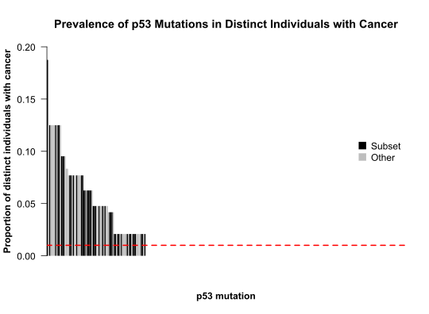

``` r
# pie chart
pie(vec,
    main = "Prevalence of p53 Mutations in Distinct Individuals with Cancer",
    labels = paste0(plyr::round_any(vec * 100,
                                    0.1),
                    "% (",
                    format(raw, 
                           big.mark = ",", 
                           trim = TRUE),
                    " mutations)"),
    col = c("black", "grey"),
    border = NA,
    clockwise = TRUE)
```

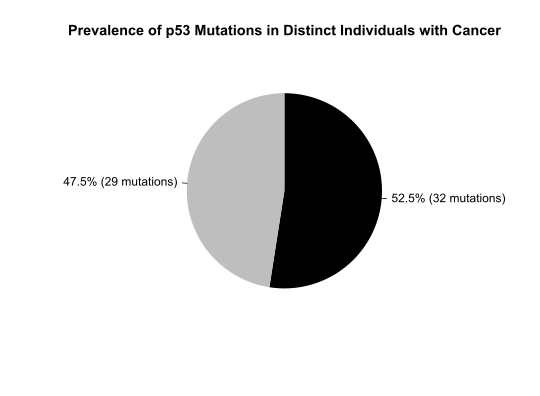

$~$


``` r
# vectors for pie chart of how most muts are chosen anyways for heatmap
prop <- n_distinct(softtissues_sole_sex_pos_pivot_melted$Mutation) / n_distinct(softtissues_sole_sex_pos_pivot$Mutation[softtissues_sole_sex_pos_pivot$Mutation != "Total"])
vec <- c(prop,
         1 - prop)
raw <- c(n_distinct(softtissues_sole_sex_pos_pivot_melted$Mutation),
         n_distinct(setdiff(unique(softtissues_sole_sex_pos_pivot$Mutation[softtissues_sole_sex_pos_pivot$Mutation != "Total"]),
                            unique(softtissues_sole_sex_pos_pivot_melted$Mutation))))

# make prevalence waterfall plots (base R barplots + abline at 1%) of all muts in soft tissues to justify why 1% chosen for cutting off
barplot(height = sort(as.numeric(softtissues_sole_sex_pos_pivot %>% 
                                   dplyr::select(-c(Num_Individuals)) %>% # divide down
                                   mutate(across(where(is.numeric), 
                                                 ~ .x/last(.x))) %>% 
                                   subset(Mutation != "Total") %>% 
                                   reshape2::melt() %>% 
                                   pull(value) %>% replace_na(., 0)),
                      decreasing = TRUE),
        xaxs = "i", # remove space between left side of bars and y axis
        ylab = "Proportion of distinct individuals with cancer", 
        xlab = "p53 mutation",
        main = "Prevalence of p53 Mutations in Distinct Individuals with Cancer",
        ylim = c(0, plyr::round_any(max(softtissues_sole_sex_pos_pivot %>% 
                                          dplyr::select(-c(Num_Individuals)) %>% # divide down
                                          mutate(across(where(is.numeric), 
                                                        ~ .x/last(.x))) %>% 
                                          subset(Mutation != "Total") %>% 
                                          reshape2::melt() %>% 
                                          pull(value),
                                        na.rm = TRUE),
                                    0.1,
                                    f = ceiling)),
        col = ifelse(softtissues_sole_sex_pos_pivot$Mutation[softtissues_sole_sex_pos_pivot$Mutation != "Total"] %in% softtissues_sole_sex_pos_pivot_melted$Mutation,
                     "black",
                     "grey"),
        font.lab = 2,
        las = 1,
        space = 0,
        border = NA)
abline(h = 0.01,
       col = "red",
       lty = 2,
       lwd = 2)
legend("right",
       legend = c("Subset", 
                  "Other"),
       col = c("black", 
               "gray"),
       bty = "n", # no border around legend
       pch = 15, # filled square shape
       pt.cex = 1.75) # increase shape size in legend
```

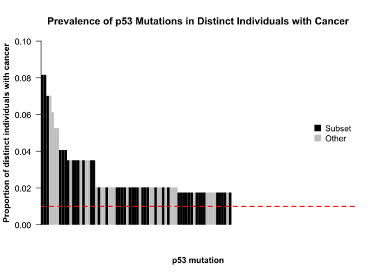

``` r
# pie chart
pie(vec,
    main = "Prevalence of p53 Mutations in Distinct Individuals with Cancer",
    labels = paste0(plyr::round_any(vec * 100,
                                    0.1),
                    "% (",
                    format(raw, 
                           big.mark = ",", 
                           trim = TRUE),
                    " mutations)"),
    col = c("black", "grey"),
    border = NA,
    clockwise = TRUE)
```

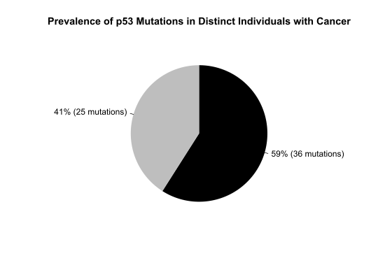

$~$


``` r
# create colorful grid table of mutated residues across sexes in pts with soft tissues
# softtissues_sex_pos_pivot_damage_gridprep <- condformat(softtissues_sex_pos_pivot_damage) %>% 
#   rule_text_color(1:Num_Individuals,
#                   ifelse(abs(parse_number(Mutation)) >= 1 & abs(parse_number(Mutation)) <= 61, # both TADs
#                          "#CC79A7",
#                          "")) %>% 
#   rule_text_color(1:Num_Individuals,
#                   ifelse(abs(parse_number(Mutation)) >= 62 & abs(parse_number(Mutation)) <= 93, # PRD
#                          "yellow4",
#                          "")) %>%
#   rule_text_color(1:Num_Individuals,
#                   ifelse(abs(parse_number(Mutation)) >= 94 & abs(parse_number(Mutation)) <= 289, # DBD
#                          "#0072B2",
#                          "")) %>%
#   rule_text_color(1:Num_Individuals,
#                   ifelse(abs(parse_number(Mutation)) >= 112 & abs(parse_number(Mutation)) <= 124, # L1
#                          "hotpink", 
#                          "")) %>% 
#   rule_text_color(1:Num_Individuals,
#                   ifelse(abs(parse_number(Mutation)) >= 163 & abs(parse_number(Mutation)) <= 195, # L2
#                          "brown", 
#                          "")) %>% 
#   rule_text_color(1:Num_Individuals,
#                   ifelse(abs(parse_number(Mutation)) >= 236 & abs(parse_number(Mutation)) <= 251, # L3
#                          "purple", 
#                          "")) %>% 
#   rule_text_color(1:Num_Individuals,
#                   ifelse(abs(parse_number(Mutation)) >= 290 & abs(parse_number(Mutation)) <= 324, # HD
#                          "#009E73",
#                          ""))  %>% 
#   rule_text_color(1:Num_Individuals,
#                   ifelse(abs(parse_number(Mutation)) >= 325 & abs(parse_number(Mutation)) <= 356, # OD; CTD is black
#                          "#D55E00",
#                          "")) %>% 
#   rule_text_color(1,
#                   ifelse(Mutation %in% top_muts_origdbdefcancer_vector,
#                          "red",
#                          "")) %>%
#   rule_text_color(Num_Individuals,
#                   ifelse(as.numeric(Num_Individuals) > 3 & as.numeric(Num_Individuals) < n_distinct(origdb_allsofttissuespts$Individual_code),
#                          "red",
#                          "")) %>%
#   rule_text_bold(1,
#                  expression = Mutation %in% top_muts_origdbdefcancer_vector) %>%
#   rule_text_bold(Num_Individuals,
#                  expression = as.numeric(Num_Individuals) > 3 & as.numeric(Num_Individuals) < n_distinct(origdb_allsofttissuespts$Individual_code)) %>%
#   rule_text_color(AGVGDClass,
#                   ifelse(AGVGDClass %in% c("C65", 
#                                            "C55"), 
#                          "red",
#                          "")) %>% 
#   rule_text_color(BayesDel,
#                   ifelse(as.numeric(BayesDel) >= 0.16, 
#                          "red",
#                          "")) %>% 
#   rule_text_color(REVEL,
#                   ifelse(as.numeric(REVEL) >= 0.5, 
#                          "red",
#                          "")) %>% 
#   rule_text_color(SIFTClass,
#                   ifelse(SIFTClass %in% c("Damaging"), 
#                          "red",
#                          "")) %>% 
#   rule_text_color(Polyphen2,
#                   ifelse(Polyphen2 %in% c("D"), 
#                          "red",
#                          "")) %>% 
#   rule_text_color(TransactivationClass,
#                   ifelse(TransactivationClass %in% c("non-functional"), 
#                          "red",
#                          "")) %>% 
#   rule_text_color(DNE_LOFclass,
#                   ifelse(DNE_LOFclass %in% c("DNE_LOF",
#                                              "notDNE_LOF"), 
#                          "red",
#                          "")) %>% 
#   rule_text_color(DNEclass,
#                   ifelse(DNEclass %in% c("Yes"), 
#                          "red",
#                          "")) %>% 
#   # rule_text_color(StructureFunctionClass,
#   #                 ifelse(StructureFunctionClass %in% c("non-functional"), 
#   #                         "red",
#   #                         "")) %>% 
#   theme_grob(rows = NULL,
#              theme = ttheme_default(base_size = 10,
#                                     core = list(padding = unit(c(2, 2), "mm")))) %>%
#   condformat2grob(draw = FALSE)
# 
# softtissues_sex_pos_pivot_damage_grid <- grid.arrange(softtissues_sex_pos_pivot_damage_gridprep,
#                                                       top = textGrob("Mutated Residues and Functional Effects by Sex in Individuals with Soft Tissue Cancers and Germline p53 Mutations",
#                                                                      hjust = 0.5,
#                                                                      gp = gpar(fontface = "bold")))
```

$~$


``` r
# create colorful grid table of mutated residues across age strata in pts with soft tissues
# softtissues_agestrata_pos_pivot_damage_gridprep <- condformat(softtissues_agestrata_pos_pivot_damage) %>% 
#   rule_text_color(1:Num_Individuals,
#                   ifelse(abs(parse_number(Mutation)) >= 1 & abs(parse_number(Mutation)) <= 61, # both TADs
#                          "#CC79A7",
#                          "")) %>% 
#   rule_text_color(1:Num_Individuals,
#                   ifelse(abs(parse_number(Mutation)) >= 62 & abs(parse_number(Mutation)) <= 93, # PRD
#                          "yellow4",
#                          "")) %>%
#   rule_text_color(1:Num_Individuals,
#                   ifelse(abs(parse_number(Mutation)) >= 94 & abs(parse_number(Mutation)) <= 289, # DBD
#                          "#0072B2",
#                          "")) %>%
#   rule_text_color(1:Num_Individuals,
#                   ifelse(abs(parse_number(Mutation)) >= 112 & abs(parse_number(Mutation)) <= 124, # L1
#                          "hotpink", 
#                          "")) %>% 
#   rule_text_color(1:Num_Individuals,
#                   ifelse(abs(parse_number(Mutation)) >= 163 & abs(parse_number(Mutation)) <= 195, # L2
#                          "brown", 
#                          "")) %>% 
#   rule_text_color(1:Num_Individuals,
#                   ifelse(abs(parse_number(Mutation)) >= 236 & abs(parse_number(Mutation)) <= 251, # L3
#                          "purple", 
#                          "")) %>% 
#   rule_text_color(1:Num_Individuals,
#                   ifelse(abs(parse_number(Mutation)) >= 290 & abs(parse_number(Mutation)) <= 324, # HD
#                          "#009E73",
#                          ""))  %>% 
#   rule_text_color(1:Num_Individuals,
#                   ifelse(abs(parse_number(Mutation)) >= 325 & abs(parse_number(Mutation)) <= 356, # OD; CTD is black
#                          "#D55E00",
#                          "")) %>% 
#   rule_text_color(1,
#                   ifelse(Mutation %in% top_muts_origdbdefcancer_vector,
#                          "red",
#                          "")) %>%
#   rule_text_color(Num_Individuals,
#                   ifelse(as.numeric(Num_Individuals) > 3 & as.numeric(Num_Individuals) < n_distinct(origdb_allsofttissuespts$Individual_code),
#                          "red",
#                          "")) %>%
#   rule_text_bold(1,
#                  expression = Mutation %in% top_muts_origdbdefcancer_vector) %>%
#   rule_text_bold(Num_Individuals,
#                  expression = as.numeric(Num_Individuals) > 3 & as.numeric(Num_Individuals) < n_distinct(origdb_allsofttissuespts$Individual_code)) %>%
#   rule_text_color(AGVGDClass,
#                   ifelse(AGVGDClass %in% c("C65", 
#                                            "C55"), 
#                          "red",
#                          "")) %>% 
#   rule_text_color(BayesDel,
#                   ifelse(as.numeric(BayesDel) >= 0.16, 
#                          "red",
#                          "")) %>% 
#   rule_text_color(REVEL,
#                   ifelse(as.numeric(REVEL) >= 0.5, 
#                          "red",
#                          "")) %>% 
#   rule_text_color(SIFTClass,
#                   ifelse(SIFTClass %in% c("Damaging"), 
#                          "red",
#                          "")) %>% 
#   rule_text_color(Polyphen2,
#                   ifelse(Polyphen2 %in% c("D"), 
#                          "red",
#                          "")) %>% 
#   rule_text_color(TransactivationClass,
#                   ifelse(TransactivationClass %in% c("non-functional"), 
#                          "red",
#                          "")) %>% 
#   rule_text_color(DNE_LOFclass,
#                   ifelse(DNE_LOFclass %in% c("DNE_LOF",
#                                              "notDNE_LOF"), 
#                          "red",
#                          "")) %>% 
#   rule_text_color(DNEclass,
#                   ifelse(DNEclass %in% c("Yes"), 
#                          "red",
#                          "")) %>% 
#   # rule_text_color(StructureFunctionClass,
#   #                 ifelse(StructureFunctionClass %in% c("non-functional"), 
#   #                         "red",
#   #                         "")) %>% 
#   theme_grob(rows = NULL,
#              theme = ttheme_default(base_size = 10,
#                                     core = list(padding = unit(c(2, 2), "mm")))) %>%
#   condformat2grob(draw = FALSE)
# 
# softtissues_agestrata_pos_pivot_damage_grid <- grid.arrange(softtissues_agestrata_pos_pivot_damage_gridprep,
#                                                             top = textGrob("Mutated Residues and Functional Effects by Age of Diagnosis in Individuals with Soft Tissue Cancers and Germline p53 Mutations",
#                                                                            hjust = 0.5,
#                                                                            gp = gpar(fontface = "bold")))
```

$~$


``` r
# ASIDE_R337H_softtissues_ages_sex_gridprep <- tableGrob(ASIDE_R337H_softtissues_ages_sex_pivot,
#                                                        rows = NULL,
#                                                        theme = ttheme_default(base_size = 10,
#                                                                               core = list(padding = unit(c(2, 2), "mm"))))
# 
# ASIDE_R337H_softtissues_ages_sex_grid <- grid.arrange(ASIDE_R337H_softtissues_ages_sex_gridprep,
#                                                       top = textGrob("Age of Diagnosis vs. Sex in \nIndividuals with Soft Tissue Cancers \nand Germline p53 R337H",
#                                                                      hjust = 0.5,
#                                                                      gp = gpar(fontface = "bold")))
```

$~$

# **Table Outputs for Other Cancers** {#othertables}

$~$

$~$


``` r
mut_rescued_hematological_gridprep <- condformat(origdbjustsolecancersover100 %>% 
                                                   subset(Short_topo == "HEMATOP. SYSTEM") %>%
                                                   mutate(Sex = dplyr::case_when(Sex == "M" ~ "Male",
                                                                                 Sex == "F" ~ "Female",
                                                                                 TRUE ~ Sex)) %>% 
                                                   dplyr::select(c(Short_topo,
                                                                   Morphology,
                                                                   #Population, 
                                                                   #Region,
                                                                   Sex,
                                                                   Age_stratum,
                                                                   Effect,
                                                                   ProtDescription,
                                                                   Domain,
                                                                   Residue_function,
                                                                   SIFTClass,
                                                                   DNE_LOFclass)) %>% 
                                                   arrange(abs(parse_number(ProtDescription))) %>% 
                                                   arrange(Morphology) %>% 
                                                   # mutate(ProtDescription = gsub("\\?-0-splice",
                                                   #                               "Intronic",
                                                   #                               ProtDescription)) %>% 
                                                   # mutate(ProtDescription = gsub("\\?",
                                                   #                               "",
                                                   #                               ProtDescription)) %>%
                                                   mutate(across(everything(), 
                                                                 ~ replace(., 
                                                                           . %in% c("NA", NA),
                                                                           ""))) %>% 
                                                   dplyr::rename(System = Short_topo,
                                                                 Cancer = Morphology,
                                                                 `Age stratum` = Age_stratum,
                                                                 Type = Effect,
                                                                 Mutation = ProtDescription,
                                                                 `Feature` = Residue_function,
                                                                 `SIFT` = SIFTClass,
                                                                 `DNE` = DNE_LOFclass) %>% 
                                                   remove_rownames()) %>% 
  rule_text_color(Mutation,
                  ifelse(Mutation %in% mut_rescued,
                         "red",
                         "")) %>%
  rule_text_bold(Mutation,
                 expression = Mutation %in% mut_rescued) %>%
  theme_grob(rows = NULL, 
             theme = ttheme_default(base_size = 10,
                                    core = list(padding = unit(c(15, 4), "mm")))) %>%
  condformat2grob(draw = FALSE)

mut_rescued_hematological_grid <- grid.arrange(mut_rescued_hematological_gridprep,
                                               top = textGrob("Individuals with Hematological Cancers and Germline TP53 Mutations",
                                                              hjust = 0.5,
                                                              gp = gpar(fontface = "bold"))) 
```

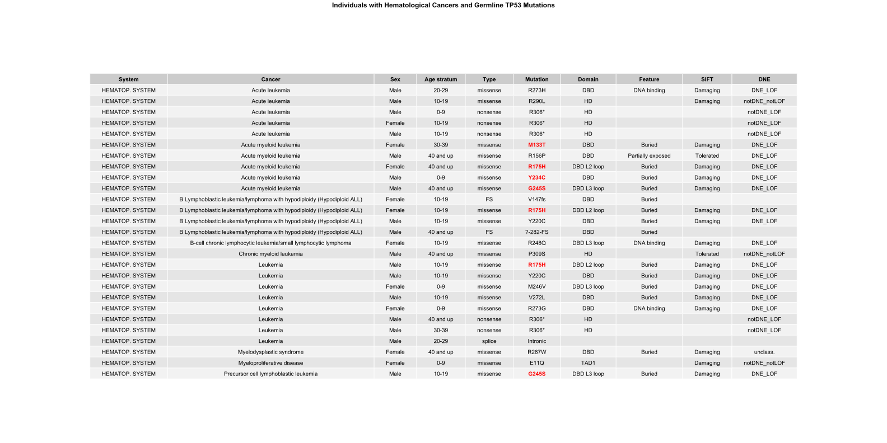

$~$


``` r
soleotherpivotage_gridprep <- condformat(soleotherpivotage %>%
                                           mutate(across(everything(), 
                                                         ~ replace(., 
                                                                   . %in% c("NA", NA),
                                                                   ""))) %>%
                                           relocate(colnames(.)[c(6,4,5,3,2)], # make ages ascending 
                                                    .after = Short_topo) %>%
                                           dplyr::rename(System = Short_topo) %>%
                                           remove_rownames()) %>%
  rule_text_bold(Total,
                 expression = Total > 0) %>%
  # rule_fill_discrete(Total,
  #                    expression = Total > 0,
  #                    colours = c("TRUE" = "grey80")) %>% # also adds unremovable black borders
  theme_grob(rows = NULL, 
             theme = ttheme_default(base_size = 10,
                                    core = list(padding = unit(c(15, 4), "mm"),
                                                fg_params = list(fontface = c(rep("plain", 
                                                                                  nrow(soleotherpivotage) - 1), 
                                                                              "bold")),
                                                bg_params = list(fill = c(rep(c("grey95", "grey90"),
                                                                              length.out = (nrow(soleotherpivotage) - 1)),
                                                                          "grey80")))
             )) %>%
  condformat2grob(draw = FALSE)

soleotherpivotage_grid <- grid.arrange(soleotherpivotage_gridprep,
                                       top = textGrob("Ages of Cancer Diagnoses for Individuals with Less Prevalent Cancers and Germline TP53 Mutations",
                                                      hjust = 0.5,
                                                      gp = gpar(fontface = "bold")))
```

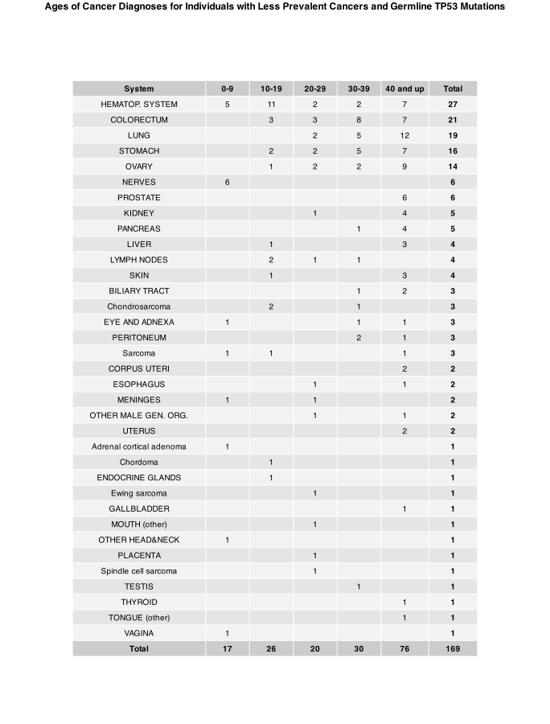

$~$


``` r
soleotherpivotsex_gridprep <- condformat(soleotherpivotsex %>%
                                           mutate(across(everything(), 
                                                         ~ replace(., 
                                                                   . %in% c("NA", NA),
                                                                   ""))) %>%
                                           dplyr::rename(System = Short_topo,
                                                         Female = `F`,
                                                         Male = `M`) %>%
                                           remove_rownames()) %>%
  rule_text_bold(Total,
                 expression = Total > 0) %>%
  # rule_fill_discrete(Total,
  #                    expression = Total > 0,
  #                    colours = c("TRUE" = "grey80")) %>% # also adds unremovable black borders
  theme_grob(rows = NULL, 
             theme = ttheme_default(base_size = 10,
                                    core = list(padding = unit(c(15, 4), "mm"),
                                                fg_params = list(fontface = c(rep("plain", 
                                                                                  nrow(soleotherpivotsex) - 1), 
                                                                              "bold")),
                                                bg_params = list(fill = c(rep(c("grey95", "grey90"),
                                                                              length.out = (nrow(soleotherpivotsex) - 1)),
                                                                          "grey80")))
             )) %>%
  condformat2grob(draw = FALSE)

soleotherpivotsex_grid <- grid.arrange(soleotherpivotsex_gridprep,
                                       top = textGrob("Sexes of Individuals with Less Prevalent Cancers and Germline TP53 Mutations",
                                                      hjust = 0.5,
                                                      gp = gpar(fontface = "bold")))
```

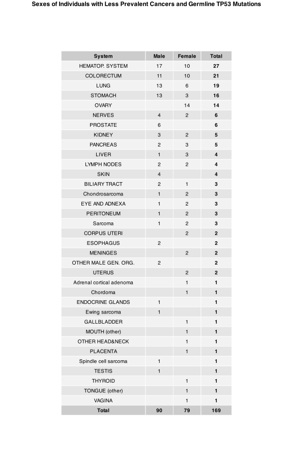

$~$


``` r
soleotherpivottype_gridprep <- condformat(soleotherpivottype %>%
                                            mutate(across(everything(), 
                                                          ~ replace(., 
                                                                    . %in% c("NA", NA),
                                                                    ""))) %>%
                                            dplyr::rename(System = Short_topo) %>%
                                            remove_rownames()) %>%
  rule_text_bold(Total,
                 expression = Total > 0) %>%
  # rule_fill_discrete(Total,
  #                    expression = Total > 0,
  #                    colours = c("TRUE" = "grey80")) %>% # also adds unremovable black borders
  theme_grob(rows = NULL, 
             theme = ttheme_default(base_size = 10,
                                    core = list(padding = unit(c(15, 4), "mm"),
                                                fg_params = list(fontface = c(rep("plain", 
                                                                                  nrow(soleotherpivottype) - 1), 
                                                                              "bold")),
                                                bg_params = list(fill = c(rep(c("grey95", "grey90"),
                                                                              length.out = (nrow(soleotherpivottype) - 1)),
                                                                          "grey80")))
             )) %>%
  condformat2grob(draw = FALSE)

soleotherpivottype_grid <- grid.arrange(soleotherpivottype_gridprep,
                                        top = textGrob("Mutation Types of Individuals with Less Prevalent Cancers and Germline TP53 Mutations",
                                                       hjust = 0.5,
                                                       gp = gpar(fontface = "bold")))
```

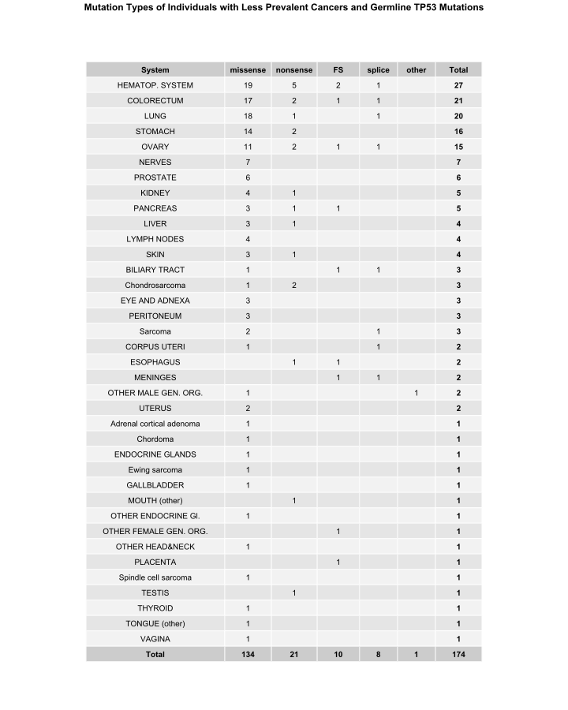

$~$


``` r
soleotherpivotpos_gridprep <- condformat(soleotherpivotpos %>%
                                           mutate(across(everything(), 
                                                         ~ replace(., 
                                                                   . %in% c("NA", NA),
                                                                   ""))) %>%
                                           dplyr::rename(System = Short_topo) %>%
                                           remove_rownames()) %>%
  rule_text_bold(Total,
                 expression = Total > 0) %>%
  # rule_fill_discrete(Total,
  #                    expression = Total > 0,
  #                    colours = c("TRUE" = "grey80")) %>% # also adds unremovable black borders
  theme_grob(rows = NULL, 
             theme = ttheme_default(base_size = 10,
                                    core = list(padding = unit(c(15, 4), "mm"),
                                                fg_params = list(fontface = c(rep("plain", 
                                                                                  nrow(soleotherpivotpos) - 1), 
                                                                              "bold")),
                                                bg_params = list(fill = c(rep(c("grey95", "grey90"),
                                                                              length.out = (nrow(soleotherpivotpos) - 1)),
                                                                          "grey80")))
             )) %>%
  condformat2grob(draw = FALSE)

soleotherpivotpos_grid <- grid.arrange(soleotherpivotpos_gridprep,
                                       top = textGrob("Mutations of Individuals with Less Prevalent Cancers and Germline TP53 Mutations",
                                                      hjust = 0.5,
                                                      gp = gpar(fontface = "bold")))
```


$~$


``` r
soleotherpivotclass_gridprep <- condformat(soleotherpivotclass %>%
                                             mutate(across(everything(), 
                                                           ~ replace(., 
                                                                     . %in% c("NA", NA),
                                                                     ""))) %>%
                                             dplyr::rename(System = Short_topo,
                                                           Chompret = TP53_Chompret,
                                                           `Family history of cancer` = FH,
                                                           `No family history of cancer` = noFH) %>%
                                             relocate(c(5,6,3,7,8,4),
                                                      .before = last_col()) %>%
                                             remove_rownames()) %>%
  rule_text_bold(Total,
                 expression = Total > 0) %>%
  # rule_fill_discrete(Total,
  #                    expression = Total > 0,
  #                    colours = c("TRUE" = "grey80")) %>% # also adds unremovable black borders
  theme_grob(rows = NULL, 
             theme = ttheme_default(base_size = 10,
                                    core = list(padding = unit(c(15, 4), "mm"),
                                                fg_params = list(fontface = c(rep("plain", 
                                                                                  nrow(soleotherpivotclass) - 1), 
                                                                              "bold")),
                                                bg_params = list(fill = c(rep(c("grey95", "grey90"),
                                                                              length.out = (nrow(soleotherpivotclass) - 1)),
                                                                          "grey80")))
             )) %>%
  condformat2grob(draw = FALSE)

soleotherpivotclass_grid <- grid.arrange(soleotherpivotclass_gridprep,
                                         top = textGrob("Cases of Individuals with Less Prevalent Cancers and Germline TP53 Mutations",
                                                        hjust = 0.5,
                                                        gp = gpar(fontface = "bold")))
```

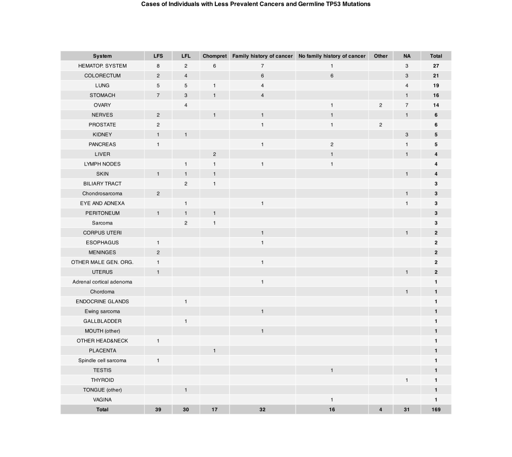

$~$


``` r
soleotherpivotinheri_gridprep <- condformat(soleotherpivotinheri %>%
                                              mutate(across(everything(), 
                                                            ~ replace(., 
                                                                      . %in% c("NA", NA),
                                                                      ""))) %>%
                                              dplyr::rename(System = Short_topo,
                                                            `Maternal` = M,
                                                            `Paternal` = P,
                                                            `De novo` = `de novo`,
                                                            `De novo, mosaic` = `de novo, mosaic`,
                                                            `Not listed` = `NA`) %>%
                                              relocate(`Not listed`,
                                                       .before = Total) %>%
                                              remove_rownames()) %>%
  rule_text_bold(Total,
                 expression = Total > 0) %>%
  # rule_fill_discrete(Total,
  #                    expression = Total > 0,
  #                    colours = c("TRUE" = "grey80")) %>% # also adds unremovable black borders
  theme_grob(rows = NULL, 
             theme = ttheme_default(base_size = 10,
                                    core = list(padding = unit(c(15, 4), "mm"),
                                                fg_params = list(fontface = c(rep("plain", 
                                                                                  nrow(soleotherpivotinheri) - 1), 
                                                                              "bold")),
                                                bg_params = list(fill = c(rep(c("grey95", "grey90"),
                                                                              length.out = (nrow(soleotherpivotinheri) - 1)),
                                                                          "grey80")))
             )) %>%
  condformat2grob(draw = FALSE)

soleotherpivotinheri_grid <- grid.arrange(soleotherpivotinheri_gridprep,
                                          top = textGrob("Inheritance Patterns of Individuals with Less Prevalent Cancers and Germline TP53 Mutations",
                                                         hjust = 0.5,
                                                         gp = gpar(fontface = "bold")))
```

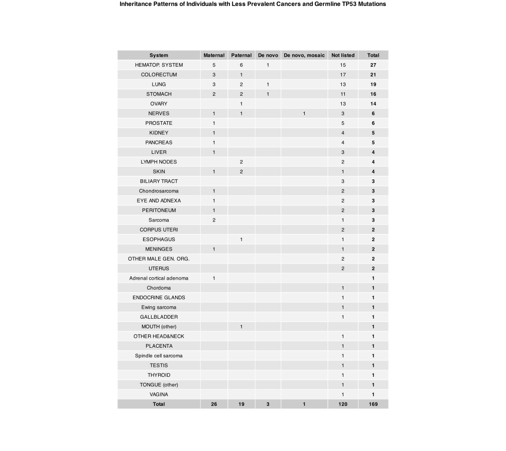

$~$


``` r
soleotherpivotpos_gridprep <- condformat(solecancerpivotpos %>% 
                                           subset(Total < 40) %>%
                                           dplyr::select(Short_topo,
                                                         any_of(mut_rescued), # get ATO muts
                                                         `Intronic`, # splicing muts found later on
                                                         T125T, 
                                                         M133R,
                                                         G187R,
                                                         E224D,
                                                         Y126_K132del
                                                         #, 
                                                         #Total
                                           ) %>%
                                           filter(!if_all(.cols = c(2:ncol(.)), 
                                                          .fns = is.na)) %>% # remove rows with all NAs
                                           remove_empty("cols") %>%
                                           mutate(across(everything(), 
                                                         ~ replace(., 
                                                                   . %in% c("NA", NA),
                                                                   ""))) %>%
                                           dplyr::rename(System = Short_topo
                                                         #,
                                                         #Intronic = `?-0-splice`
                                           ) %>%
                                           remove_rownames()) %>%
  # rule_text_bold(Total,
  #                expression = Total > 0) %>%
  # rule_fill_discrete(Total,
  #                    expression = Total > 0,
  #                    colours = c("TRUE" = "grey80")) %>% # also adds unremovable black borders
  theme_grob(rows = NULL, 
             theme = ttheme_default(base_size = 10,
                                    core = list(padding = unit(c(15, 4), "mm")
                                                #,
                                                # fg_params = list(fontface = c(rep("plain", 
                                                #                                   nrow(solecancerpivotpos %>% subset(Total < 40)) - 1), 
                                                #                               "bold"))
                                                #                                         ,
                                                # bg_params = list(fill = c(rep(c("grey95", "grey90"),
                                                #                             length.out = (nrow(solecancerpivotpos %>% subset(Total < 40)) - 1)),
                                                #                  "grey80")))
                                    ))) %>%
  condformat2grob(draw = FALSE)

soleotherpivotpos_grid <- grid.arrange(soleotherpivotpos_gridprep,
                                       top = textGrob("Selected Mutations of Individuals with Less Prevalent Cancers and Germline TP53 Mutations",
                                                      hjust = 0.5,
                                                      gp = gpar(fontface = "bold")))
```

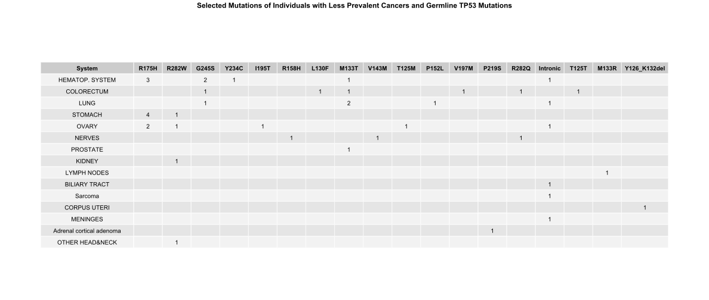

$~$

# **Contingency Tables of Top Tissues vs Others and Mutations** {#contingencycoretissues .hidden .unlisted .unnumbered}

$~$


$~$


$~$


$~$


$~$


$~$


$~$


``` r
# boxplot as before but now with stats, now directionality with core first greater than other first
# boxplot_mean_composition_mult_stats_direction <- boxplot_mean_composition_mult +
#   stat_compare_means(method = "wilcox.test",
#                      paired = FALSE,
#                      vjust = -1,
#                      method.args = list(alternative = "greater"))
# boxplot_mean_composition_mult_stats_direction
```

$~$


$~$


$~$


$~$


$~$


$~$


$~$


$~$


$~$


$~$


$~$


$~$


$~$


$~$


$~$


$~$


$~$


$~$


$~$


$~$


$~$


$~$


$~$


$~$


$~$


$~$


$~$

# **Drawing Cancer Breakdown Stacked Barcharts** {#breakdownbarcharts .hidden .unlisted .unnumbered}

$~$

Now that the samples per cancers data has been set up in a table, I can create stacked barcharts of the breakdown of cancers in the tissue types which require this breakdown, i.e. breast, brain, and soft tissues. As they did not have enough specific detailed cancer types, a breakdown would give a representation of the cancers used in the above calculations and subsequent plots.

$~$


$~$


$~$


$~$


$~$


$~$


$~$


$~$


$~$


$~$


$~$


$~$


$~$


$~$


$~$


$~$

# **Drawing Color-Coded Cancer Sequence Map** {#colorcodedmap .hidden .unlisted .unnumbered}

$~$

Now that the cancers per Individual data has been set up in a table and has properly formatted annotation colors, I can create a visual representation of the sequence of cancers in the 413 patients with at least 2 cancers. Here I have set it up as patients as columns and cancer incidence as rows.

$~$


$~$


$~$


$~$

# **Drawing 100% Stacked Barcharts** {#barcharts}

$~$

Now that proportions have been calculated, I can visualize them with a few types of plots. Here, I have created 100% stacked barcharts of mutation categories across the 5 cancers or in those without cancer, ages, and sexes, and have saved the plots as SVG files.

$~$


$~$


$~$


$~$


$~$


$~$


$~$


$~$


$~$


$~$


$~$


$~$


$~$


``` r
#sort cancers by lowest to highest missense mutation or breast proportion for stacked barchart
solecancerbarchartorder = solecancerpivottype_melted[solecancerpivottype_melted$Mutation == 'missense',]
solecancerpivottype_melted$Cancer_Label = factor(solecancerpivottype_melted$Cancer_Label, 
                                                 levels = solecancerbarchartorder$Cancer_Label[order(solecancerbarchartorder$Proportion)])

solecancerbarchartorder_age = solecancerpivotage_type_melted[solecancerpivotage_type_melted$Mutation == 'missense',]
solecancerpivotage_type_melted$Age = factor(solecancerpivotage_type_melted$Age, 
                                            levels = solecancerbarchartorder_age$Age[order(solecancerbarchartorder_age$Proportion)])

# solecancerbarchartorder_age_tissue = solecancerpivotage_melted[solecancerpivotage_melted$Cancer_Label == 'BREAST',]
# solecancerpivotage_melted$Age = factor(solecancerpivotage_melted$Age, 
#                                        levels = solecancerbarchartorder_age_tissue$Age[order(solecancerbarchartorder_age_tissue$Proportion)])

solecancerpivotage_melted$Cancer_Label <- factor(solecancerpivotage_melted$Cancer_Label,
                                                 levels = as.character(c((sort(unique(solecancerpivotage_melted$Cancer_Label)))[(sort(unique(solecancerpivotage_melted$Cancer_Label))) != "OTHER"], 
                                                                         "OTHER")))

solecancerbarchartorder_sex = solecancerpivotsex_type_melted[solecancerpivotsex_type_melted$Mutation == 'missense',]
solecancerpivotsex_type_melted$Sex = factor(solecancerpivotsex_type_melted$Sex, 
                                            levels = solecancerbarchartorder_sex$Sex[order(solecancerbarchartorder_sex$Proportion)])

# solecancerbarchartorder_sex_tissue = solecancerpivotsex_melted[solecancerpivotsex_melted$Cancer_Label == 'BREAST',]
# solecancerpivotsex_melted$Sex = factor(solecancerpivotsex_melted$Sex, 
#                                        levels = solecancerbarchartorder_sex_tissue$Sex[order(solecancerbarchartorder_sex_tissue$Proportion)])

solecancerpivotsex_melted$Cancer_Label <- factor(solecancerpivotsex_melted$Cancer_Label,
                                                 levels = as.character(c((sort(unique(solecancerpivotsex_melted$Cancer_Label)))[(sort(unique(solecancerpivotsex_melted$Cancer_Label))) != "OTHER"], 
                                                                         "OTHER")))

# make 100% stacked barchart with ggplot2 with reversed missense order i.e. highest to lowest
solecancer_ggplotstackedbarchart <- ggplot(solecancerpivottype_melted %>%
                                             subset(!str_detect(Cancer_Label,
                                                                "OTHER")), 
                                           aes(x = Cancer_Label, 
                                               y = Proportion, 
                                               fill = Mutation)) + 
  geom_bar(position = "fill", 
           stat = "identity") + 
  ggtitle("Mutation Types vs. Cancers of \nIndividuals with One Cancer \nand Germline p53 Mutations") + # distinct individuals/ \n# total distinct individuals
  xlab("Cancer") +
  ylab("Proportion of distinct individuals") +
  scale_y_continuous(labels = scales::percent_format(), 
                     expand = c(0,0), 
                     breaks = scales::pretty_breaks(n = 6)) +
  scale_x_discrete(limits = rev(levels(solecancerpivottype_melted$Cancer_Label)[!str_detect(levels(solecancerpivottype_melted$Cancer_Label), 
                                                                                            "OTHER")]), 
                   expand = c(0,0)) +
  scale_fill_manual(values = c("#009E73",
                               "#000000",
                               "#0072B2",
                               "#CC79A7",
                               "#999999",
                               "#E69F00",
                               "lightgray",
                               "#56B4E9",
                               "#D55E00",
                               "#F0E442")) +   
  theme_classic() + 
  theme(axis.text.x = element_text(angle = 45, 
                                   hjust = 1, 
                                   vjust = 1), 
        axis.text = element_text(color = "black",
                                 size = 12), 
        axis.title = element_text(color = "black",
                                  face = "bold",
                                  size = 14),
        axis.title.x = element_text(margin = unit(c(5,0,0,0), units = "mm")),
        axis.title.y = element_text(margin = unit(c(0,5,0,0), units = "mm")),
        plot.title = element_text(hjust = 0.5,
                                  face = "bold",
                                  color = "black",
                                  size = 16,
                                  margin = margin(0,0,5,0, "mm")),
        # plot.title.position = "plot",
        legend.text = element_text(color = "black",
                                   size = 12),
        legend.title = element_text(color = "black",
                                    face = "bold",
                                    size = 14),
        plot.margin = margin(0,0,0,8, "mm"))
solecancer_ggplotstackedbarchart
```

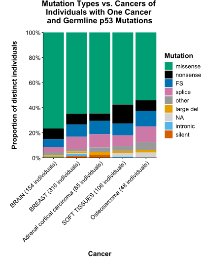

$~$


``` r
# make 100% stacked barchart with ggplot2 with reversed missense order i.e. highest to lowest
solecancer_ggplotstackedbarchart_age <- ggplot(solecancerpivotage_type_melted, 
                                               aes(x = Age, 
                                                   y = Proportion, 
                                                   fill = Mutation)) + 
  geom_bar(position = "fill", 
           stat = "identity") + 
  ggtitle("Mutation Types vs. Age at Diagnosis \nof Individuals with One Cancer \nand Germline p53 Mutations") + # distinct individuals/ \n# total distinct individuals
  xlab("Age when diagnosed (years)") +
  ylab("Proportion of distinct individuals") +
  scale_y_continuous(labels = scales::percent_format(), 
                     expand = c(0,0), 
                     breaks = scales::pretty_breaks(n = 6)) +
  scale_x_discrete(limits = rev(levels(solecancerpivotage_type_melted$Age)), 
                   expand = c(0,0)) +
  scale_fill_manual(values = c("#009E73",
                               "#000000",
                               "#0072B2",
                               "#CC79A7",
                               "#999999",
                               "#E69F00",
                               "lightgray",
                               "#56B4E9",
                               "#D55E00",
                               "#F0E442")) + 
  theme_classic() + 
  theme(axis.text.x = element_text(angle = 45, 
                                   hjust = 1, 
                                   vjust = 1), 
        axis.text = element_text(color = "black",
                                 size = 12), 
        axis.title = element_text(color = "black",
                                  face = "bold",
                                  size = 14),
        axis.title.x = element_text(margin = unit(c(5,0,0,0), units = "mm")),
        axis.title.y = element_text(margin = unit(c(0,5,0,0), units = "mm")),
        plot.title = element_text(hjust = 0.5,
                                  face = "bold",
                                  color = "black",
                                  size = 16,
                                  margin = margin(0,0,5,0, "mm")),
        # plot.title.position = "plot",
        legend.text = element_text(color = "black",
                                   size = 12),
        legend.title = element_text(color = "black",
                                    face = "bold",
                                    size = 14),
        plot.margin = margin(0,0,0,12, "mm"))
solecancer_ggplotstackedbarchart_age
```

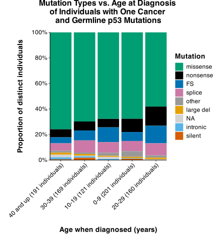

$~$


``` r
# make 100% stacked barchart with ggplot2 with reversed missense order i.e. highest to lowest
solecancer_ggplotstackedbarchart_sex <- ggplot(solecancerpivotsex_type_melted, 
                                               aes(x = Sex, 
                                                   y = Proportion, 
                                                   fill = Mutation)) + 
  geom_bar(position = "fill", 
           stat = "identity") + 
  ggtitle("Mutation Types vs. Sex of \nIndividuals with One Cancer \nand Germline p53 Mutations") + # distinct individuals/ \n# total distinct individuals
  ylab("Proportion of distinct individuals") +
  scale_y_continuous(labels = scales::percent_format(), 
                     expand = c(0,0), 
                     breaks = scales::pretty_breaks(n = 6)) +
  scale_x_discrete(limits = rev(levels(solecancerpivotsex_type_melted$Sex)), 
                   expand = c(0,0)) +
  scale_fill_manual(values = c("#009E73",
                               "#000000",
                               "#0072B2",
                               "#CC79A7",
                               "#999999",
                               "#E69F00",
                               "lightgray",
                               "#56B4E9",
                               "#D55E00",
                               "#F0E442")) + 
  theme_classic() + 
  theme(axis.text.x = element_text(angle = 45, 
                                   hjust = 1, 
                                   vjust = 1), 
        axis.text = element_text(color = "black",
                                 size = 12), 
        axis.title = element_text(color = "black",
                                  face = "bold",
                                  size = 14),
        axis.title.x = element_text(margin = unit(c(5,0,0,0), units = "mm")),
        axis.title.y = element_text(margin = unit(c(0,5,0,0), units = "mm")),
        plot.title = element_text(hjust = 0.5,
                                  face = "bold",
                                  color = "black",
                                  size = 16,
                                  margin = margin(0,0,5,0, "mm")),
        # plot.title.position = "plot",
        legend.text = element_text(color = "black",
                                   size = 12),
        legend.title = element_text(color = "black",
                                    face = "bold",
                                    size = 14))
solecancer_ggplotstackedbarchart_sex
```

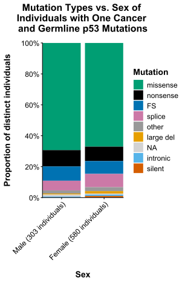

$~$


``` r
solecancer_ggplotstackedbarchart_age_tissue <- ggplot(solecancerpivotage_melted, 
                                                      aes(x = Age, 
                                                          y = Proportion, 
                                                          fill = Cancer_Label)) + 
  geom_bar(position = "fill", 
           stat = "identity") + 
  ggtitle("Cancers vs. Age at Diagnosis \nof Individuals with One Cancer \nand Germline p53 Mutations") + # distinct individuals/ \n# total distinct individuals
  xlab("Age when diagnosed (years)") +
  ylab("Proportion of distinct individuals") +
  labs(fill = "Cancer") +
  scale_y_continuous(labels = scales::percent_format(), 
                     expand = c(0,0), 
                     breaks = scales::pretty_breaks(n = 6)) +
  scale_x_discrete(
    # limits = rev(levels(solecancerpivotage_melted$Age)), 
    expand = c(0,0)) +
  scale_fill_manual(values = c("#CC79A7",
                               "#E69F00",
                               "#009E73",
                               "#56B4E9",
                               "#999999",
                               "#000000"
                               #,
                               #"#F0E442",
                               #"#0072B2",
                               #"#D55E00"
  )) +
  theme_classic() + 
  theme(axis.text.x = element_text(angle = 45, 
                                   hjust = 1, 
                                   vjust = 1), 
        axis.text = element_text(color = "black",
                                 size = 12), 
        axis.title = element_text(color = "black",
                                  face = "bold",
                                  size = 14),
        axis.title.x = element_text(margin = unit(c(5,0,0,0), units = "mm")),
        axis.title.y = element_text(margin = unit(c(0,5,0,0), units = "mm")),
        plot.title = element_text(hjust = 0.5,
                                  face = "bold",
                                  color = "black",
                                  size = 16,
                                  margin = margin(0,0,5,0, "mm")),
        # plot.title.position = "plot",
        legend.text = element_text(color = "black",
                                   size = 12),
        legend.title = element_text(color = "black",
                                    face = "bold",
                                    size = 14))
solecancer_ggplotstackedbarchart_age_tissue
```

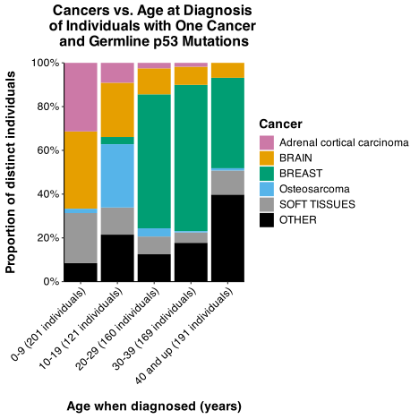

$~$


``` r
# to minimize above crowding, make faceted barchart of age vs number of pts per cancer
barchart_facet_age_tissue_sole <- ggplot(solecancerpivotage %>%
                                           subset(Age_stratum != "Total") %>%
                                           mutate(Age_stratum = paste0(Age_stratum,
                                                                       " (",
                                                                       format(Total, 
                                                                              big.mark = ",", 
                                                                              trim = TRUE),
                                                                       " individuals)")) %>%
                                           dplyr::select(-c(Total
                                                            #,
                                                            #OTHER
                                           )) %>% 
                                           mutate(across(everything(), 
                                                         ~ replace_na(.x, 0))) %>%
                                           reshape2::melt() %>% 
                                           dplyr::rename(Age = Age_stratum,
                                                         Cancer = variable, 
                                                         Num_Distinct_Pts = value),
                                         aes(x = factor(Cancer,
                                                        levels = 
                                                          c(
                                                            sort(unique(colnames(solecancerpivotage %>% 
                                                                                   dplyr::select(-c(
                                                                                     OTHER,
                                                                                     Total, 
                                                                                     Age_stratum)))))
                                                            ,
                                                            "OTHER")
                                         ),
                                         y = Num_Distinct_Pts,
                                         fill = factor(Cancer,
                                                       levels = 
                                                         c(
                                                           sort(unique(colnames(solecancerpivotage %>% 
                                                                                  dplyr::select(-c(
                                                                                    OTHER,
                                                                                    Total, 
                                                                                    Age_stratum)))))
                                                           ,
                                                           "OTHER")
                                         ))) + 
  geom_bar(stat = "identity", 
           position = position_dodge2()) + # to keep some space b/t barcharts in same mut
  geom_text(aes(label = Num_Distinct_Pts,
                vjust = -1),
            color = "black",
            fontface = "bold",
            size = 3.5,
            alpha = 0.5) + # add num pts above each bar
  ggtitle("Cancers vs. Ages of Cancer Diagnoses in Individuals with Germline p53 Mutations") +
  xlab("Cancer") +
  ylab("Number of distinct individuals") +
  labs(fill = "Cancer") +
  facet_wrap2(. ~ Age,
              #strip.position = "right",
              #labeller = labeller(groupwrap = label_wrap_gen(10)), # wrap labels on right based on characters
              ncol = 3,
              axes = "all", # show internal axes but without x labels
              remove_labels = "x") + # show internal axes but without x labels
  guides(fill = guide_legend(ncol = 1)) + 
  scale_y_continuous(expand = c(0,0)
                     #,
                     #n.breaks = 7
  ) +
  scale_x_discrete(expand = c(0, 0)) +
  coord_cartesian(ylim = c(0, (solecancerpivotage %>%
                                 subset(Age_stratum != "Total") %>%
                                 dplyr::select(-c(Total
                                                  #,
                                                  #OTHER
                                 )) %>%
                                 reshape2::melt() %>%
                                 pull(value) %>%
                                 na.omit() %>%
                                 max() %>%
                                 plyr::round_any(50,
                                                 ceiling)))) +
  scale_fill_manual(values = c("#CC79A7",
                               "#E69F00",
                               "#009E73",
                               "#56B4E9",
                               "#999999"
                               ,
                               "#000000"
                               #,
                               #"#F0E442",
                               #"#0072B2",
                               #"#D55E00"
  )) +
  theme_classic() +
  theme(axis.text.x = element_text(angle = 45, 
                                   hjust = 1, 
                                   vjust = 1), 
        axis.text = element_text(color = "black",
                                 size = 12), 
        axis.title = element_text(color = "black",
                                  face = "bold",
                                  size = 14),
        axis.title.x = element_text(margin = unit(c(10,0,0,0), units = "mm")),
        axis.title.y = element_text(margin = unit(c(0,10,0,0), units = "mm")),
        plot.title = element_text(hjust = 0.5,
                                  face = "bold",
                                  color = "black",
                                  size = 16,
                                  margin = margin(0,0,10,0, "mm")),
        legend.text = element_text(color = "black",
                                   size = 12),
        legend.title = element_text(color = "black",
                                    face = "bold",
                                    size = 14),
        legend.box.spacing = margin(30), # increase space between legend and plot
        legend.position = c(0.97, 0.1), # make legend occupy bottom right empty space
        legend.justification = c(0.97, 0), # make legend occupy bottom right empty space
        strip.background = element_blank(),
        strip.text = element_text(color = "black",
                                  size = 14,
                                  face = "bold",
                                  margin = margin(0,0,5,0, "mm")),
        panel.spacing.y = unit(-4, "lines"),
        panel.spacing.x = unit(2.8, "lines"),
        plot.margin = margin(0,2,0,10, unit = "mm"))
barchart_facet_age_tissue_sole
```

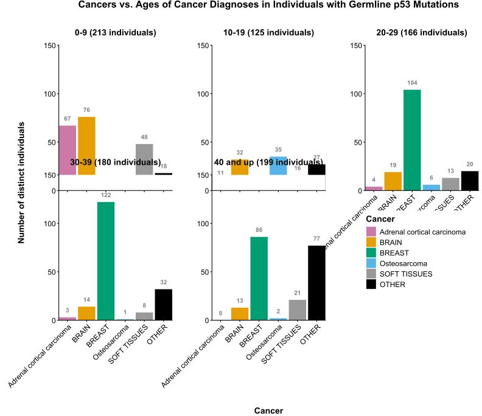

$~$


``` r
solecancer_ggplotstackedbarchart_sex_tissue <- ggplot(solecancerpivotsex_melted, 
                                                      aes(x = Sex, 
                                                          y = Proportion, 
                                                          fill = Cancer_Label)) + 
  geom_bar(position = "fill", 
           stat = "identity") + 
  ggtitle("Cancers vs. Sex of \nIndividuals with One Cancer \nand Germline p53 Mutations") + # distinct individuals/ \n# total distinct individuals
  ylab("Proportion of distinct individuals") +
  labs(fill = "Cancer") +
  scale_y_continuous(labels = scales::percent_format(), 
                     expand = c(0,0), 
                     breaks = scales::pretty_breaks(n = 6)) +
  scale_x_discrete(
    # limits = rev(levels(solecancerpivotsex_melted$Sex)), 
    expand = c(0,0)) +
  scale_fill_manual(values = c("#CC79A7",
                               "#E69F00",
                               "#009E73",
                               "#56B4E9",
                               "#999999",
                               "#000000"
                               #,
                               #"#F0E442",
                               #"#0072B2",
                               #"#D55E00"
  )) +
  theme_classic() + 
  theme(axis.text.x = element_text(angle = 45, 
                                   hjust = 1, 
                                   vjust = 1), 
        axis.text = element_text(color = "black",
                                 size = 12), 
        axis.title = element_text(color = "black",
                                  face = "bold",
                                  size = 14),
        axis.title.x = element_text(margin = unit(c(5,0,0,0), units = "mm")),
        axis.title.y = element_text(margin = unit(c(0,5,0,0), units = "mm")),
        plot.title = element_text(hjust = 0.5,
                                  face = "bold",
                                  color = "black",
                                  size = 16,
                                  margin = margin(0,0,5,0, "mm")),
        # plot.title.position = "plot",
        legend.text = element_text(color = "black",
                                   size = 12),
        legend.title = element_text(color = "black",
                                    face = "bold",
                                    size = 14))
solecancer_ggplotstackedbarchart_sex_tissue
```

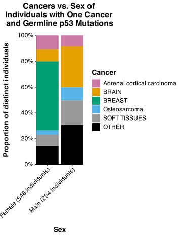

$~$


``` r
# to minimize above crowding, make faceted barchart of sex vs number of pts per cancer
barchart_facet_sex_tissue_sole <- ggplot(solecancerpivotsex %>%
                                           subset(Sex != "Total") %>%
                                           mutate(Sex = dplyr::case_when(Sex == "F" ~ "Female",
                                                                         Sex == "M" ~ "Male",
                                                                         TRUE ~ "notyet")) %>%
                                           mutate(Sex = paste0(Sex,
                                                               " (",
                                                               format(Total, 
                                                                      big.mark = ",", 
                                                                      trim = TRUE),
                                                               " individuals)")) %>%
                                           dplyr::select(-c(Total
                                                            #,
                                                            #OTHER
                                           )) %>% 
                                           mutate(across(everything(), 
                                                         ~ replace_na(.x, 0))) %>%
                                           reshape2::melt() %>% 
                                           dplyr::rename(Cancer = variable, 
                                                         Num_Distinct_Pts = value),
                                         aes(x = factor(Cancer,
                                                        levels = 
                                                          c(
                                                            sort(unique(colnames(solecancerpivotsex %>% 
                                                                                   dplyr::select(-c(
                                                                                     OTHER,
                                                                                     Total, 
                                                                                     Sex)))))
                                                            ,
                                                            "OTHER")
                                         ),
                                         y = Num_Distinct_Pts,
                                         fill = factor(Cancer,
                                                       levels = 
                                                         c(
                                                           sort(unique(colnames(solecancerpivotsex %>% 
                                                                                  dplyr::select(-c(
                                                                                    OTHER,
                                                                                    Total, 
                                                                                    Sex)))))
                                                           ,
                                                           "OTHER")
                                         ))) + 
  geom_bar(stat = "identity", 
           position = position_dodge2()) + # to keep some space b/t barcharts in same mut
  geom_text(aes(label = Num_Distinct_Pts,
                vjust = -1),
            color = "black",
            fontface = "bold",
            size = 3.5,
            alpha = 0.5) + # add num pts above each bar
  ggtitle("Cancers vs. Sex in Individuals with Germline p53 Mutations") +
  xlab("Cancer") +
  ylab("Number of distinct individuals") +
  labs(fill = "Cancer") +
  facet_wrap2(. ~ Sex,
              #strip.position = "right",
              #labeller = labeller(groupwrap = label_wrap_gen(10)), # wrap labels on right based on characters
              ncol = 2,
              axes = "all", # show internal axes but without x labels
              remove_labels = "x") + # show internal axes but without x labels
  guides(fill = guide_legend(ncol = 1)) + 
  scale_y_continuous(expand = c(0,0)
                     #,
                     #n.breaks = 7
  ) +
  scale_x_discrete(expand = c(0, 0)) +
  coord_cartesian(ylim = c(0, (solecancerpivotsex %>%
                                 subset(Sex != "Total") %>%
                                 dplyr::select(-c(Total
                                                  #,
                                                  #OTHER
                                 )) %>%
                                 reshape2::melt() %>%
                                 pull(value) %>%
                                 na.omit() %>%
                                 max() %>%
                                 plyr::round_any(400,
                                                 ceiling)))) +
  scale_fill_manual(values = c("#CC79A7",
                               "#E69F00",
                               "#009E73",
                               "#56B4E9",
                               "#999999"
                               ,
                               "#000000"
                               #,
                               #"#F0E442",
                               #"#0072B2",
                               #"#D55E00"
  )) +
  theme_classic() +
  theme(axis.text.x = element_text(angle = 45, 
                                   hjust = 1, 
                                   vjust = 1), 
        axis.text = element_text(color = "black",
                                 size = 12), 
        axis.title = element_text(color = "black",
                                  face = "bold",
                                  size = 14),
        axis.title.x = element_text(margin = unit(c(10,0,0,0), units = "mm")),
        axis.title.y = element_text(margin = unit(c(0,10,0,0), units = "mm")),
        plot.title = element_text(hjust = 0.5,
                                  face = "bold",
                                  color = "black",
                                  size = 16,
                                  margin = margin(0,0,10,0, "mm")),
        legend.text = element_text(color = "black",
                                   size = 12),
        legend.title = element_text(color = "black",
                                    face = "bold",
                                    size = 14),
        legend.box.spacing = margin(30), # increase space between legend and plot
        strip.background = element_blank(),
        strip.text = element_text(color = "black",
                                  size = 14,
                                  face = "bold",
                                  margin = margin(0,0,5,0, "mm")),
        panel.spacing.y = unit(-4, "lines"),
        panel.spacing.x = unit(4, "lines"),
        plot.margin = margin(0,2,0,10, unit = "mm"))
barchart_facet_sex_tissue_sole
```

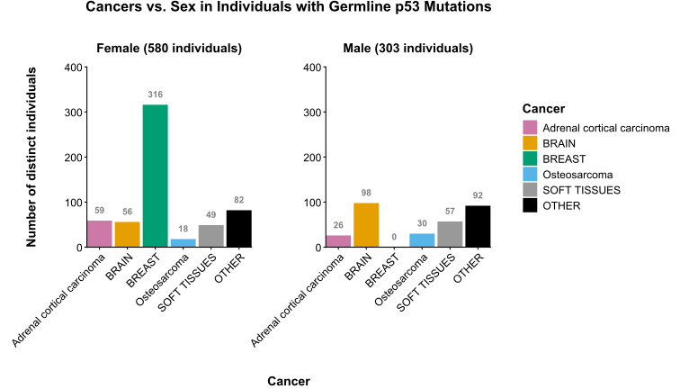

$~$


``` r
stackedbarchart_class_sole <- ggplot(solecancerpivotclass_melted %>%
                                       subset(!str_detect(Cancer_Label,
                                                          "OTHER")), 
                                     aes(x = factor(Cancer_Label,
                                                    levels = solecancerpivotclass_melted %>%
                                                      subset(!str_detect(Cancer_Label,
                                                                         "OTHER")) %>%
                                                      filter(Class == "LFS") %>%
                                                      arrange(-Proportion) %>%
                                                      pull(Cancer_Label) %>%
                                                      unique()), 
                                         y = Proportion, 
                                         fill = factor(Class,
                                                       levels = c('LFS',
                                                                  'LFL',
                                                                  'Chompret',
                                                                  'Family history of cancer',
                                                                  'No family history of cancer',
                                                                  'Other',
                                                                  'Not listed')))) + 
  geom_bar(position = "fill", 
           stat = "identity") + 
  ggtitle("Cases vs. Cancers of \nIndividuals with One Cancer \nand Germline p53 Mutations") + # distinct individuals/ \n# total distinct individuals
  xlab("Cancer") +
  ylab("Proportion of distinct individuals") +
  labs(fill = "Case") +
  scale_y_continuous(labels = scales::percent_format(), 
                     expand = c(0,0), 
                     breaks = scales::pretty_breaks(n = 6)) +
  scale_x_discrete(
    # limits = rev(levels(solecancerpivotclass_melted$Cancer_Label)[!str_detect(levels(solecancerpivotclass_melted$Cancer_Label), 
    #                                                                                         "OTHER")]), 
    expand = c(0,0)) +
  scale_fill_manual(values = c("#0072B2",
                               "#56B4E9",
                               "#D55E00",
                               "#009E73",
                               "#E69F00",
                               "lightgray",
                               "#000000",
                               "#999999",
                               "#F0E442",
                               "#CC79A7")) +   
  theme_classic() + 
  theme(axis.text.x = element_text(angle = 45, 
                                   hjust = 1, 
                                   vjust = 1), 
        axis.text = element_text(color = "black",
                                 size = 12), 
        axis.title = element_text(color = "black",
                                  face = "bold",
                                  size = 14),
        axis.title.x = element_text(margin = unit(c(10,0,0,0), units = "mm")),
        axis.title.y = element_text(margin = unit(c(0,10,0,0), units = "mm")),
        plot.title = element_text(hjust = 0.5,
                                  face = "bold",
                                  color = "black",
                                  size = 16,
                                  margin = margin(0,0,10,0, "mm")),
        # plot.title.position = "plot",
        legend.text = element_text(color = "black",
                                   size = 12),
        legend.title = element_text(color = "black",
                                    face = "bold",
                                    size = 14),
        plot.margin = margin(0,0,0,20, "mm"))
stackedbarchart_class_sole
```

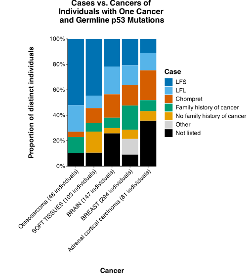

$~$


``` r
barchart_facet_class_sole <- ggplot(solecancerpivotclass %>% 
                                      column_to_rownames("Cancer_Label") %>%
                                      dplyr::rename(`Family history of cancer` = FH,
                                                    `No family history of cancer` = noFH,
                                                    `Not listed` = `NA`,
                                                    Chompret = TP53_Chompret) %>%
                                      t() %>%
                                      as.data.frame() %>% 
                                      rownames_to_column("Class") %>%
                                      subset(Class != "Total") %>%
                                      mutate(Class = paste0(Class,
                                                            " (",
                                                            format(Total, 
                                                                   big.mark = ",", 
                                                                   trim = TRUE),
                                                            " individuals)")) %>%
                                      mutate(Class_temp = gsub(" \\(.*", 
                                                               "",
                                                               Class)) %>%
                                      mutate(Class_temp = factor(Class_temp,
                                                                 levels = c('LFS',
                                                                            'LFL',
                                                                            'Chompret',
                                                                            'Family history of cancer',
                                                                            'No family history of cancer',
                                                                            'Other',
                                                                            'Not listed'))) %>%
                                      dplyr::select(-c(Total
                                                       #,
                                                       #OTHER
                                      )) %>% 
                                      mutate(across(everything(), 
                                                    ~ replace_na(.x, 0))) %>%
                                      reshape2::melt() %>% 
                                      dplyr::rename(Cancer = variable, 
                                                    Num_Distinct_Pts = value),
                                    aes(x = factor(Cancer,
                                                   levels = 
                                                     c(
                                                       sort(unique(solecancerpivotclass %>%
                                                                     subset(!str_detect(Cancer_Label,
                                                                                        "OTHER|Total")) %>% 
                                                                     pull(Cancer_Label)))
                                                       ,
                                                       "OTHER")
                                    ),
                                    y = Num_Distinct_Pts,
                                    fill = factor(Cancer,
                                                  levels = 
                                                    c(
                                                      sort(unique(solecancerpivotclass %>%
                                                                    subset(!str_detect(Cancer_Label,
                                                                                       "OTHER|Total")) %>% 
                                                                    pull(Cancer_Label)))
                                                      ,
                                                      "OTHER")
                                    ))) + 
  geom_bar(stat = "identity", 
           position = position_dodge2()) + # to keep some space b/t barcharts in same mut
  geom_text(aes(label = Num_Distinct_Pts,
                vjust = -1),
            color = "black",
            fontface = "bold",
            size = 3.5,
            alpha = 0.5) + # add num pts above each bar
  ggtitle("Cancers vs. Cases in Individuals with Germline p53 Mutations") +
  xlab("Cancer") +
  ylab("Number of distinct individuals") +
  labs(fill = "Cancer") +
  facet_wrap2(. ~ factor(Class,
                         levels = (solecancerpivotclass %>% 
                                     column_to_rownames("Cancer_Label") %>%
                                     dplyr::rename(`Family history of cancer` = FH,
                                                   `No family history of cancer` = noFH,
                                                   `Not listed` = `NA`,
                                                   Chompret = TP53_Chompret) %>%
                                     t() %>%
                                     as.data.frame() %>% 
                                     rownames_to_column("Class") %>%
                                     subset(Class != "Total") %>%
                                     mutate(Class = paste0(Class,
                                                           " (",
                                                           format(Total, 
                                                                  big.mark = ",", 
                                                                  trim = TRUE),
                                                           " individuals)")) %>%
                                     mutate(Class_temp = gsub(" \\(.*", 
                                                              "",
                                                              Class)) %>%
                                     mutate(Class_temp = factor(Class_temp,
                                                                levels = c('LFS',
                                                                           'LFL',
                                                                           'Chompret',
                                                                           'Family history of cancer',
                                                                           'No family history of cancer',
                                                                           'Other',
                                                                           'Not listed'))) %>% 
                                     arrange(Class_temp) %>% 
                                     pull(Class) %>% 
                                     unique())),
              #strip.position = "right",
              labeller = label_wrap_gen(), # wrap labels on right based on characters
              ncol = 4,
              axes = "all", # show internal axes but without x labels
              remove_labels = "x") + # show internal axes but without x labels
  guides(fill = guide_legend(ncol = 1)) + 
  scale_y_continuous(expand = c(0,0)
                     #,
                     #n.breaks = 7
  ) +
  scale_x_discrete(expand = c(0, 0)) +
  coord_cartesian(ylim = c(0, (solecancerpivotclass %>% 
                                 subset(Cancer_Label != "Total") %>%
                                 dplyr::select(c(-Total)) %>% 
                                 column_to_rownames("Cancer_Label") %>% 
                                 max(na.rm = TRUE) %>%
                                 plyr::round_any(20,
                                                 ceiling)) * 1.00001)) +
  scale_fill_manual(values = c("#CC79A7",
                               "#E69F00",
                               "#009E73",
                               "#56B4E9",
                               "#999999"
                               ,
                               "#000000"
                               #,
                               #"#F0E442",
                               #"#0072B2",
                               #"#D55E00"
  )) +
  theme_classic() +
  theme(axis.text.x = element_text(angle = 45, 
                                   hjust = 1, 
                                   vjust = 1), 
        axis.text = element_text(color = "black",
                                 size = 12), 
        axis.title = element_text(color = "black",
                                  face = "bold",
                                  size = 14),
        axis.title.x = element_text(margin = unit(c(10,0,0,0), units = "mm")),
        axis.title.y = element_text(margin = unit(c(0,10,0,0), units = "mm")),
        plot.title = element_text(hjust = 0.5,
                                  face = "bold",
                                  color = "black",
                                  size = 16,
                                  margin = margin(0,0,10,0, "mm")),
        legend.text = element_text(color = "black",
                                   size = 12),
        legend.title = element_text(color = "black",
                                    face = "bold",
                                    size = 14),
        legend.box.spacing = margin(30), # increase space between legend and plot
        legend.position = c(0.97, 0.1), # make legend occupy bottom right empty space
        legend.justification = c(0.97, 0), # make legend occupy bottom right empty space
        strip.background = element_blank(),
        strip.text = element_text(color = "black",
                                  size = 14,
                                  face = "bold",
                                  margin = margin(0,0,5,0, "mm")),
        panel.spacing.y = unit(-4, "lines"),
        panel.spacing.x = unit(4, "lines"),
        plot.margin = margin(0,2,0,12, unit = "mm"))
barchart_facet_class_sole
```

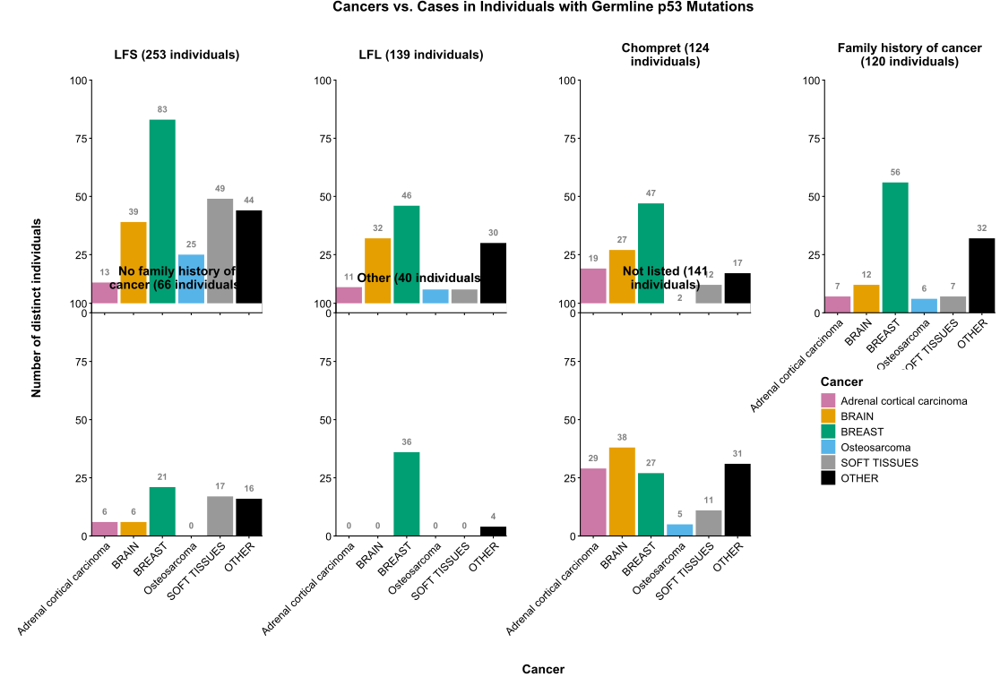

$~$


``` r
stackedbarchart_inheri_sole <- ggplot(solecancerpivotinheri_melted %>%
                                        subset(!str_detect(Cancer_Label,
                                                           "OTHER")), 
                                      aes(x = factor(Cancer_Label,
                                                     levels = (solecancerpivotinheri_melted %>%
                                                                 subset(!str_detect(Cancer_Label,
                                                                                    "OTHER")) %>%
                                                                 filter(Inheritance == "Not listed") %>%
                                                                 arrange(Proportion) %>%
                                                                 pull(Cancer_Label) %>%
                                                                 unique())), 
                                          y = Proportion, 
                                          fill = factor(Inheritance,
                                                        levels = c('Maternal',
                                                                   'Paternal',
                                                                   'De novo',
                                                                   'De novo, mosaic',
                                                                   'Not listed')))) + 
  geom_bar(position = "fill", 
           stat = "identity") + 
  ggtitle("Inheritance vs. Cancers of \nIndividuals with One Cancer \nand Germline p53 Mutations") + # distinct individuals/ \n# total distinct individuals
  xlab("Cancer") +
  ylab("Proportion of distinct individuals") +
  labs(fill = "Inheritance") +
  scale_y_continuous(labels = scales::percent_format(), 
                     expand = c(0,0), 
                     breaks = scales::pretty_breaks(n = 6)) +
  scale_x_discrete(
    # limits = rev(levels(solecancerpivotinheri_melted$Cancer_Label)[!str_detect(levels(solecancerpivotinheri_melted$Cancer_Label), 
    #                                                                                         "OTHER")]), 
    expand = c(0,0)) +
  scale_fill_manual(values = c("#CC79A7",
                               "#0072B2",
                               "#009E73",
                               "#D55E00",
                               "#000000",
                               "#56B4E9",
                               "#E69F00",
                               "lightgray",
                               "#999999",
                               "#F0E442")) +   
  theme_classic() + 
  theme(axis.text.x = element_text(angle = 45, 
                                   hjust = 1, 
                                   vjust = 1), 
        axis.text = element_text(color = "black",
                                 size = 12), 
        axis.title = element_text(color = "black",
                                  face = "bold",
                                  size = 14),
        axis.title.x = element_text(margin = unit(c(10,0,0,0), units = "mm")),
        axis.title.y = element_text(margin = unit(c(0,10,0,0), units = "mm")),
        plot.title = element_text(hjust = 0.5,
                                  face = "bold",
                                  color = "black",
                                  size = 16,
                                  margin = margin(0,0,10,0, "mm")),
        # plot.title.position = "plot",
        legend.text = element_text(color = "black",
                                   size = 12),
        legend.title = element_text(color = "black",
                                    face = "bold",
                                    size = 14),
        plot.margin = margin(0,0,0,20, "mm"))
stackedbarchart_inheri_sole
```

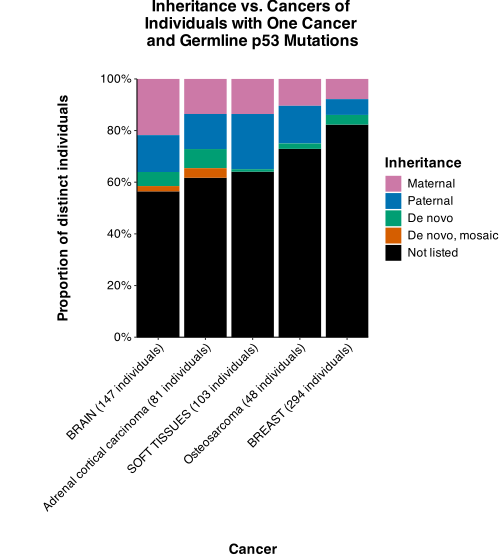

$~$


``` r
barchart_facet_inheri_sole <- ggplot(solecancerpivotinheri %>% 
                                       column_to_rownames("Cancer_Label") %>%
                                       dplyr::rename(`Maternal` = M,
                                                     `Paternal` = P,
                                                     `De novo` = `de novo`,
                                                     `De novo, mosaic` = `de novo, mosaic`,
                                                     `Not listed` = `NA`) %>%
                                       t() %>%
                                       as.data.frame() %>% 
                                       rownames_to_column("Inheritance") %>%
                                       subset(Inheritance != "Total") %>%
                                       mutate(Inheritance = paste0(Inheritance,
                                                                   " (",
                                                                   format(Total, 
                                                                          big.mark = ",", 
                                                                          trim = TRUE),
                                                                   " individuals)")) %>%
                                       mutate(Inheritance_temp = gsub(" \\(.*", 
                                                                      "",
                                                                      Inheritance)) %>%
                                       mutate(Inheritance_temp = factor(Inheritance_temp,
                                                                        levels = c('Maternal',
                                                                                   'Paternal',
                                                                                   'De novo',
                                                                                   'De novo, mosaic',
                                                                                   'Not listed'))) %>%
                                       dplyr::select(-c(Total
                                                        #,
                                                        #OTHER
                                       )) %>% 
                                       mutate(across(everything(), 
                                                     ~ replace_na(.x, 0))) %>%
                                       reshape2::melt() %>% 
                                       dplyr::rename(Cancer = variable, 
                                                     Num_Distinct_Pts = value),
                                     aes(x = factor(Cancer,
                                                    levels = 
                                                      c(
                                                        sort(unique(solecancerpivotinheri %>%
                                                                      subset(!str_detect(Cancer_Label,
                                                                                         "OTHER|Total")) %>% 
                                                                      pull(Cancer_Label)))
                                                        ,
                                                        "OTHER")
                                     ),
                                     y = Num_Distinct_Pts,
                                     fill = factor(Cancer,
                                                   levels = 
                                                     c(
                                                       sort(unique(solecancerpivotinheri %>%
                                                                     subset(!str_detect(Cancer_Label,
                                                                                        "OTHER|Total")) %>% 
                                                                     pull(Cancer_Label)))
                                                       ,
                                                       "OTHER")
                                     ))) + 
  geom_bar(stat = "identity", 
           position = position_dodge2()) + # to keep some space b/t barcharts in same mut
  geom_text(aes(label = Num_Distinct_Pts,
                vjust = -1),
            color = "black",
            fontface = "bold",
            size = 3.5,
            alpha = 0.5) + # add num pts above each bar
  ggtitle("Cancers vs. Inheritances in Individuals with Germline p53 Mutations") +
  xlab("Cancer") +
  ylab("Number of distinct individuals") +
  labs(fill = "Cancer") +
  facet_wrap2(. ~ factor(Inheritance,
                         levels = (solecancerpivotinheri %>% 
                                     column_to_rownames("Cancer_Label") %>%
                                     dplyr::rename(`Maternal` = M,
                                                   `Paternal` = P,
                                                   `De novo` = `de novo`,
                                                   `De novo, mosaic` = `de novo, mosaic`,
                                                   `Not listed` = `NA`) %>%
                                     t() %>%
                                     as.data.frame() %>% 
                                     rownames_to_column("Inheritance") %>%
                                     subset(Inheritance != "Total") %>%
                                     mutate(Inheritance = paste0(Inheritance,
                                                                 " (",
                                                                 format(Total, 
                                                                        big.mark = ",", 
                                                                        trim = TRUE),
                                                                 " individuals)")) %>%
                                     mutate(Inheritance_temp = gsub(" \\(.*", 
                                                                    "",
                                                                    Inheritance)) %>%
                                     mutate(Inheritance_temp = factor(Inheritance_temp,
                                                                      levels = c('Maternal',
                                                                                 'Paternal',
                                                                                 'De novo',
                                                                                 'De novo, mosaic',
                                                                                 'Not listed'))) %>% 
                                     arrange(Inheritance_temp) %>% 
                                     pull(Inheritance) %>% 
                                     unique())),
              #strip.position = "right",
              labeller = label_wrap_gen(), # wrap labels on right based on characters
              ncol = 3,
              axes = "all", # show internal axes but without x labels
              remove_labels = "x") + # show internal axes but without x labels
  guides(fill = guide_legend(ncol = 1)) + 
  scale_y_continuous(expand = c(0,0)
                     #,
                     #n.breaks = 7
  ) +
  scale_x_discrete(expand = c(0, 0)) +
  coord_cartesian(ylim = c(0, (solecancerpivotinheri %>% 
                                 subset(Cancer_Label != "Total") %>%
                                 dplyr::select(c(-Total)) %>% 
                                 column_to_rownames("Cancer_Label") %>% 
                                 max(na.rm = TRUE) %>%
                                 plyr::round_any(100,
                                                 ceiling)) * 1.00001)) +
  scale_fill_manual(values = c("#CC79A7",
                               "#E69F00",
                               "#009E73",
                               "#56B4E9",
                               "#999999"
                               ,
                               "#000000"
                               #,
                               #"#F0E442",
                               #"#0072B2",
                               #"#D55E00"
  )) +
  theme_classic() +
  theme(axis.text.x = element_text(angle = 45, 
                                   hjust = 1, 
                                   vjust = 1), 
        axis.text = element_text(color = "black",
                                 size = 12), 
        axis.title = element_text(color = "black",
                                  face = "bold",
                                  size = 14),
        axis.title.x = element_text(margin = unit(c(10,0,0,0), units = "mm")),
        axis.title.y = element_text(margin = unit(c(0,10,0,0), units = "mm")),
        plot.title = element_text(hjust = 0.5,
                                  face = "bold",
                                  color = "black",
                                  size = 16,
                                  margin = margin(0,0,10,0, "mm")),
        legend.text = element_text(color = "black",
                                   size = 12),
        legend.title = element_text(color = "black",
                                    face = "bold",
                                    size = 14),
        legend.box.spacing = margin(30), # increase space between legend and plot
        legend.position = c(0.97, 0.1), # make legend occupy bottom right empty space
        legend.justification = c(0.97, 0), # make legend occupy bottom right empty space
        strip.background = element_blank(),
        strip.text = element_text(color = "black",
                                  size = 14,
                                  face = "bold",
                                  margin = margin(0,0,5,0, "mm")),
        panel.spacing.y = unit(-4, "lines"),
        panel.spacing.x = unit(3, "lines"),
        plot.margin = margin(0,2,0,12, unit = "mm"))
barchart_facet_inheri_sole
```


$~$


``` r
# stackedbarchart_sole_all <- plot_grid(NULL,
#                                       solecancer_ggplotstackedbarchart,
#                                       solecancer_ggplotstackedbarchart_age,
#                                       NULL,
#                                       NULL,
#                                       NULL,
#                                       solecancer_ggplotstackedbarchart_age_tissue,
#                                       solecancer_ggplotstackedbarchart_sex_tissue,
#                                       solecancer_ggplotstackedbarchart_sex,
#                                       ncol = 3,
#                                       nrow = 3,
#                                       align = "v",
#                                       axis = "r",
#                                       labels = c(paste0("Sole cancers (",
#                                                         format(n_distinct(origdbjustsolecancersover100$Individual_code), 
#                                                                big.mark = ",", 
#                                                                trim = TRUE),
#                                                         " individuals)"),
#                                                  "", "", "", "", ""),
#                                       label_y = 0.6,
#                                       label_x = -0.05,
#                                       rel_heights = c(1,0.1,1))
# stackedbarchart_sole_all
```

$~$


``` r
# sort by highest to lowest tissue proportion which is breast
cancerspertimeorder <- cancerspertime_melted[cancerspertime_melted$Tissue_modif == 'BREAST',]
cancerspertime_melted$Sequence <- factor(cancerspertime_melted$Sequence, 
                                         levels = cancerspertimeorder$Sequence[order(cancerspertimeorder$Proportion)])
cancerspertime_melted$Tissue_modif <- factor(cancerspertime_melted$Tissue_modif,
                                             levels = rev(unique(cancerspertime_melted$Tissue_modif)))

# make 100% stacked barchart with ggplot2 with reversed tissue order i.e. highest to lowest
cancerseqbarchart <- ggplot(cancerspertime_melted, 
                            aes(x = Sequence, 
                                y = Proportion, 
                                fill = Tissue_modif)) + 
  geom_bar(position = "fill", 
           stat = "identity") + 
  ggtitle("# cancers/# pts") + 
  guides(fill = guide_legend(title = "Tissue",
                             reverse = TRUE)) +
  scale_y_continuous(labels = scales::percent_format(), 
                     expand = c(0,0), 
                     breaks = scales::pretty_breaks(n = 6)) +
  scale_x_discrete(limits = rev(levels(cancerspertime_melted$Sequence)), 
                   expand = c(0,0)) +
  theme_classic() + 
  theme(axis.text.x = element_text(angle = 45,
                                   hjust = 1,
                                   vjust = 1), 
        axis.text = element_text(color = "black",
                                 size = 12), 
        axis.title = element_text(color = "black",
                                  face = "bold",
                                  size = 14),
        axis.title.x = element_text(margin = unit(c(5, 0, 0, 0), "mm")),
        axis.title.y = element_text(margin = unit(c(0, 5, 0, 0), "mm")),
        plot.title = element_text(hjust = 0.5,
                                  face = "bold",
                                  color = "black",
                                  size = 16,
                                  margin = margin(0,0,5,0, "mm")),
        plot.title.position = "plot",
        legend.text = element_text(color = "black",
                                   size = 12),
        legend.title = element_text(color = "black",
                                    face = "bold",
                                    size = 14)) 
cancerseqbarchart
```


$~$


$~$


``` r
# make stacked barchart of dx age groups vs sex in all sole pts with ACC 
ACC_sole_agestrata_sex_barchart <- ggplot(ACC_sole_agestrata_sex_pivot_melted,
                                          aes(x = Age,
                                              y = Proportion,
                                              fill = Sex)) +
  geom_bar(position = "fill",
           stat = "identity") +
  # facet_grid(. ~ Age_stratum,
  #            scales = "free") +
  ggtitle("Age Strata of Diagnosis vs. Sex in \n Individuals with Adrenocortical Carcinoma \nand Germline p53 Mutations") +
  xlab("Age when diagnosed (years)") +
  ylab("Proportion of distinct individuals") +
  scale_y_continuous(labels = scales::percent_format(),
                     expand = c(0,0),
                     breaks = scales::pretty_breaks(n = 6)) +
  scale_x_discrete(expand = c(0,0)) +
  theme_classic() +
  theme(axis.text.x = element_text(angle = 45,
                                   hjust = 1,
                                   vjust = 1),
        axis.text = element_text(color = "black",
                                 size = 12),
        axis.title = element_text(color = "black",
                                  face = "bold",
                                  size = 14),
        axis.title.x = element_text(margin = margin(5,0,0,0,"mm")),
        axis.title.y = element_text(margin = margin(0,5,0,0,"mm")),
        plot.title = element_text(hjust = 0.5,
                                  face = "bold",
                                  color = "black",
                                  size = 16,
                                  margin = margin(0,0,5,0, "mm")),
        # plot.title.position = "plot",
        plot.margin = margin(0,0,0,4, "mm"),
        legend.text = element_text(color = "black",
                                   size = 12),
        legend.title = element_text(color = "black",
                                    face = "bold",
                                    size = 14),
        # strip.background = element_blank(),
        # strip.text = element_text(color = "black",
        #                           size = 11),
        # panel.spacing.x = unit(1.5, "lines")
  )
ACC_sole_agestrata_sex_barchart
```


$~$


$~$


``` r
# make stacked barchart of dx age groups vs mut type in all sole pts with ACC
ACC_sole_agestrata_type_barchart <- ggplot(ACC_sole_agestrata_type_pivot_melted,
                                           aes(x = Age,
                                               y = Proportion,
                                               fill = Effect)) +
  geom_bar(position = "fill", 
           stat = "identity") + 
  # facet_grid(. ~ Age_stratum,
  #            scales = "free") +
  ggtitle("Age Strata of Diagnosis vs. Mutation Types in \n Individuals with Adrenocortical Carcinoma \nand Germline p53 Mutations") + 
  xlab("Age when diagnosed (years)") +
  ylab("Proportion of distinct individuals") +
  scale_y_continuous(labels = scales::percent_format(), 
                     expand = c(0,0), 
                     breaks = scales::pretty_breaks(n = 6)) +
  scale_x_discrete(expand = c(0,0)) +
  theme_classic() + 
  theme(axis.text.x = element_text(angle = 45, 
                                   hjust = 1, 
                                   vjust = 1), 
        axis.text = element_text(color = "black",
                                 size = 12), 
        axis.title = element_text(color = "black",
                                  face = "bold",
                                  size = 14),
        axis.title.x = element_text(margin = margin(5,0,0,0,"mm")),
        axis.title.y = element_text(margin = margin(0,5,0,0,"mm")),
        plot.title = element_text(hjust = 0.5,
                                  face = "bold",
                                  color = "black",
                                  size = 16,
                                  margin = margin(0,0,5,0, "mm")),
        # plot.title.position = "plot",
        plot.margin = margin(0,0,0,4, "mm"),
        legend.text = element_text(color = "black",
                                   size = 12),
        legend.title = element_text(color = "black",
                                    face = "bold",
                                    size = 14),
        # strip.background = element_blank(),
        # strip.text = element_text(color = "black",
        #                           size = 11),
        # panel.spacing.x = unit(1.5, "lines")
  )
ACC_sole_agestrata_type_barchart
```


$~$


$~$


``` r
# make stacked barchart of mutation types vs sex in all sole pts with ACC
ACC_sole_sex_type_barchart <- ggplot(ACC_sole_sex_type_pivot_melted,
                                     aes(x = Sex,
                                         y = Proportion,
                                         fill = Effect)) +
  geom_bar(position = "fill", 
           stat = "identity") + 
  # facet_grid(. ~ Age_stratum,
  #            scales = "free") +
  ggtitle("Mutation Types vs. Sex in \n Individuals with Adrenocortical \nCarcinoma and Germline \np53 Mutations") + 
  ylab("Proportion of distinct individuals") +
  scale_y_continuous(labels = scales::percent_format(), 
                     expand = c(0,0), 
                     breaks = scales::pretty_breaks(n = 6)) +
  scale_x_discrete(expand = c(0,0)) +
  theme_classic() + 
  theme(axis.text.x = element_text(angle = 45, 
                                   hjust = 1, 
                                   vjust = 1), 
        axis.text = element_text(color = "black",
                                 size = 12), 
        axis.title = element_text(color = "black",
                                  face = "bold",
                                  size = 14),
        axis.title.x = element_text(margin = margin(5,0,0,0,"mm")),
        axis.title.y = element_text(margin = margin(0,5,0,0,"mm")),
        plot.title = element_text(hjust = 0.5,
                                  face = "bold",
                                  color = "black",
                                  size = 16,
                                  margin = margin(0,0,5,0, "mm")),
        # plot.title.position = "plot",
        plot.margin = margin(0,0,0,4, "mm"),
        legend.text = element_text(color = "black",
                                   size = 12),
        legend.title = element_text(color = "black",
                                    face = "bold",
                                    size = 14),
        # strip.background = element_blank(),
        # strip.text = element_text(color = "black",
        #                           size = 11),
        # panel.spacing.x = unit(1.5, "lines")
  )
ACC_sole_sex_type_barchart
```


$~$


$~$


``` r
# make stacked barchart of dx age groups vs sex in all sole pts with brain 
brain_sole_agestrata_sex_barchart <- ggplot(brain_sole_agestrata_sex_pivot_melted,
                                            aes(x = Age,
                                                y = Proportion,
                                                fill = factor(Sex,
                                                              levels = c("Female", 
                                                                         "Male")))) +
  geom_bar(position = "fill",
           stat = "identity") +
  # facet_grid(. ~ Age_stratum,
  #            scales = "free") +
  ggtitle("Age Strata of Diagnosis vs. Sex in \n Individuals with Brain Cancers \nand Germline p53 Mutations") +
  labs(fill = "Sex") +
  xlab("Age when diagnosed (years)") +
  ylab("Proportion of distinct individuals") +
  scale_y_continuous(labels = scales::percent_format(),
                     expand = c(0,0),
                     breaks = scales::pretty_breaks(n = 6)) +
  scale_x_discrete(expand = c(0,0)) +
  theme_classic() +
  theme(axis.text.x = element_text(angle = 45,
                                   hjust = 1,
                                   vjust = 1),
        axis.text = element_text(color = "black",
                                 size = 12),
        axis.title = element_text(color = "black",
                                  face = "bold",
                                  size = 14),
        axis.title.x = element_text(margin = margin(5,0,0,0,"mm")),
        axis.title.y = element_text(margin = margin(0,5,0,0,"mm")),
        plot.title = element_text(hjust = 0.5,
                                  face = "bold",
                                  color = "black",
                                  size = 16,
                                  margin = margin(0,0,5,0, "mm")),
        # plot.title.position = "plot",
        plot.margin = margin(0,0,0,4, "mm"),
        legend.text = element_text(color = "black",
                                   size = 12),
        legend.title = element_text(color = "black",
                                    face = "bold",
                                    size = 14),
        # strip.background = element_blank(),
        # strip.text = element_text(color = "black",
        #                           size = 11),
        # panel.spacing.x = unit(1.5, "lines")
  )
brain_sole_agestrata_sex_barchart
```


$~$


$~$


``` r
# make stacked barchart of dx age groups vs mut type in all sole pts with brain
brain_sole_agestrata_type_barchart <- ggplot(brain_sole_agestrata_type_pivot_melted,
                                             aes(x = Age,
                                                 y = Proportion,
                                                 fill = Effect)) +
  geom_bar(position = "fill", 
           stat = "identity") + 
  # facet_grid(. ~ Age_stratum,
  #            scales = "free") +
  ggtitle("Age Strata of Diagnosis vs. Mutation Types in \n Individuals with Brain Cancers \nand Germline p53 Mutations") + 
  xlab("Age when diagnosed (years)") +
  ylab("Proportion of distinct individuals") +
  scale_y_continuous(labels = scales::percent_format(), 
                     expand = c(0,0), 
                     breaks = scales::pretty_breaks(n = 6)) +
  scale_x_discrete(expand = c(0,0)) +
  theme_classic() + 
  theme(axis.text.x = element_text(angle = 45, 
                                   hjust = 1, 
                                   vjust = 1), 
        axis.text = element_text(color = "black",
                                 size = 12), 
        axis.title = element_text(color = "black",
                                  face = "bold",
                                  size = 14),
        axis.title.x = element_text(margin = margin(5,0,0,0,"mm")),
        axis.title.y = element_text(margin = margin(0,5,0,0,"mm")),
        plot.title = element_text(hjust = 0.5,
                                  face = "bold",
                                  color = "black",
                                  size = 16,
                                  margin = margin(0,0,5,0, "mm")),
        # plot.title.position = "plot",
        plot.margin = margin(0,0,0,4, "mm"),
        legend.text = element_text(color = "black",
                                   size = 12),
        legend.title = element_text(color = "black",
                                    face = "bold",
                                    size = 14),
        # strip.background = element_blank(),
        # strip.text = element_text(color = "black",
        #                           size = 11),
        # panel.spacing.x = unit(1.5, "lines")
  )
brain_sole_agestrata_type_barchart
```


$~$


$~$


``` r
# make stacked barchart of mutation types vs sex in all sole pts with brain
brain_sole_sex_type_barchart <- ggplot(brain_sole_sex_type_pivot_melted,
                                       aes(x = Sex,
                                           y = Proportion,
                                           fill = Effect)) +
  geom_bar(position = "fill", 
           stat = "identity") + 
  # facet_grid(. ~ Age_stratum,
  #            scales = "free") +
  ggtitle("Mutation Types vs. Sex in \n Individuals with Brain Cancers \nand Germline p53 Mutations") + 
  ylab("Proportion of distinct individuals") +
  scale_y_continuous(labels = scales::percent_format(), 
                     expand = c(0,0), 
                     breaks = scales::pretty_breaks(n = 6)) +
  scale_x_discrete(expand = c(0,0)) +
  theme_classic() + 
  theme(axis.text.x = element_text(angle = 45, 
                                   hjust = 1, 
                                   vjust = 1), 
        axis.text = element_text(color = "black",
                                 size = 12), 
        axis.title = element_text(color = "black",
                                  face = "bold",
                                  size = 14),
        axis.title.x = element_text(margin = margin(5,0,0,0,"mm")),
        axis.title.y = element_text(margin = margin(0,5,0,0,"mm")),
        plot.title = element_text(hjust = 0.5,
                                  face = "bold",
                                  color = "black",
                                  size = 16,
                                  margin = margin(0,0,5,0, "mm")),
        # plot.title.position = "plot",
        plot.margin = margin(0,0,0,4, "mm"),
        legend.text = element_text(color = "black",
                                   size = 12),
        legend.title = element_text(color = "black",
                                    face = "bold",
                                    size = 14),
        # strip.background = element_blank(),
        # strip.text = element_text(color = "black",
        #                           size = 11),
        # panel.spacing.x = unit(1.5, "lines")
  )
brain_sole_sex_type_barchart
```


$~$


$~$


``` r
# make stacked barchart of dx age groups vs sex in all sole pts with osteosarcoma 
osteosarcoma_sole_agestrata_sex_barchart <- ggplot(osteosarcoma_sole_agestrata_sex_pivot_melted,
                                                   aes(x = Age,
                                                       y = Proportion,
                                                       fill = factor(Sex,
                                                                     levels = c("Female", 
                                                                                "Male")))) +
  geom_bar(position = "fill",
           stat = "identity") +
  # facet_grid(. ~ Age_stratum,
  #            scales = "free") +
  ggtitle("Age Strata of Diagnosis vs. Sex in \n Individuals with Osteosarcoma \nand Germline p53 Mutations") +
  xlab("Age when diagnosed (years)") +
  ylab("Proportion of distinct individuals") +
  labs(fill = "Sex") +
  scale_y_continuous(labels = scales::percent_format(),
                     expand = c(0,0),
                     breaks = scales::pretty_breaks(n = 6)) +
  scale_x_discrete(expand = c(0,0)) +
  theme_classic() +
  theme(axis.text.x = element_text(angle = 45,
                                   hjust = 1,
                                   vjust = 1),
        axis.text = element_text(color = "black",
                                 size = 12),
        axis.title = element_text(color = "black",
                                  face = "bold",
                                  size = 14),
        axis.title.x = element_text(margin = margin(5,0,0,0,"mm")),
        axis.title.y = element_text(margin = margin(0,5,0,0,"mm")),
        plot.title = element_text(hjust = 0.5,
                                  face = "bold",
                                  color = "black",
                                  size = 16,
                                  margin = margin(0,0,5,0, "mm")),
        # plot.title.position = "plot",
        plot.margin = margin(0,0,0,4, "mm"),
        legend.text = element_text(color = "black",
                                   size = 12),
        legend.title = element_text(color = "black",
                                    face = "bold",
                                    size = 14),
        # strip.background = element_blank(),
        # strip.text = element_text(color = "black",
        #                           size = 11),
        # panel.spacing.x = unit(1.5, "lines")
  )
osteosarcoma_sole_agestrata_sex_barchart
```


$~$


$~$


``` r
# make stacked barchart of dx age groups vs mut type in all sole pts with osteosarcoma
osteosarcoma_sole_agestrata_type_barchart <- ggplot(osteosarcoma_sole_agestrata_type_pivot_melted,
                                                    aes(x = Age,
                                                        y = Proportion,
                                                        fill = Effect)) +
  geom_bar(position = "fill", 
           stat = "identity") + 
  # facet_grid(. ~ Age_stratum,
  #            scales = "free") +
  ggtitle("Age Strata of Diagnosis vs. Mutation Types in \n Individuals with Osteosarcoma \nand Germline p53 Mutations") + 
  xlab("Age when diagnosed (years)") +
  ylab("Proportion of distinct individuals") +
  scale_y_continuous(labels = scales::percent_format(), 
                     expand = c(0,0), 
                     breaks = scales::pretty_breaks(n = 6)) +
  scale_x_discrete(expand = c(0,0)) +
  theme_classic() + 
  theme(axis.text.x = element_text(angle = 45, 
                                   hjust = 1, 
                                   vjust = 1), 
        axis.text = element_text(color = "black",
                                 size = 12), 
        axis.title = element_text(color = "black",
                                  face = "bold",
                                  size = 14),
        axis.title.x = element_text(margin = margin(5,0,0,0,"mm")),
        axis.title.y = element_text(margin = margin(0,5,0,0,"mm")),
        plot.title = element_text(hjust = 0.5,
                                  face = "bold",
                                  color = "black",
                                  size = 16,
                                  margin = margin(0,0,5,0, "mm")),
        # plot.title.position = "plot",
        plot.margin = margin(0,0,0,4, "mm"),
        legend.text = element_text(color = "black",
                                   size = 12),
        legend.title = element_text(color = "black",
                                    face = "bold",
                                    size = 14),
        # strip.background = element_blank(),
        # strip.text = element_text(color = "black",
        #                           size = 11),
        # panel.spacing.x = unit(1.5, "lines")
  )
osteosarcoma_sole_agestrata_type_barchart
```


$~$


$~$


``` r
# make stacked barchart of mutation types vs sex in all sole pts with osteosarcoma
osteosarcoma_sole_sex_type_barchart <- ggplot(osteosarcoma_sole_sex_type_pivot_melted,
                                              aes(x = Sex,
                                                  y = Proportion,
                                                  fill = Effect)) +
  geom_bar(position = "fill", 
           stat = "identity") + 
  # facet_grid(. ~ Age_stratum,
  #            scales = "free") +
  ggtitle("Mutation Types vs. Sex in \n Individuals with Osteosarcoma \nand Germline p53 Mutations") + 
  ylab("Proportion of distinct individuals") +
  scale_y_continuous(labels = scales::percent_format(), 
                     expand = c(0,0), 
                     breaks = scales::pretty_breaks(n = 6)) +
  scale_x_discrete(expand = c(0,0)) +
  theme_classic() + 
  theme(axis.text.x = element_text(angle = 45, 
                                   hjust = 1, 
                                   vjust = 1), 
        axis.text = element_text(color = "black",
                                 size = 12), 
        axis.title = element_text(color = "black",
                                  face = "bold",
                                  size = 14),
        axis.title.x = element_text(margin = margin(5,0,0,0,"mm")),
        axis.title.y = element_text(margin = margin(0,5,0,0,"mm")),
        plot.title = element_text(hjust = 0.5,
                                  face = "bold",
                                  color = "black",
                                  size = 16,
                                  margin = margin(0,0,5,0, "mm")),
        # plot.title.position = "plot",
        plot.margin = margin(0,0,0,4, "mm"),
        legend.text = element_text(color = "black",
                                   size = 12),
        legend.title = element_text(color = "black",
                                    face = "bold",
                                    size = 14),
        # strip.background = element_blank(),
        # strip.text = element_text(color = "black",
        #                           size = 11),
        # panel.spacing.x = unit(1.5, "lines")
  )
osteosarcoma_sole_sex_type_barchart
```


$~$


$~$


``` r
# make stacked barchart of dx age groups vs sex in all sole pts with soft tissues 
softtissues_sole_agestrata_sex_barchart <- ggplot(softtissues_sole_agestrata_sex_pivot_melted,
                                                  aes(x = Age,
                                                      y = Proportion,
                                                      fill = factor(Sex,
                                                                    levels = c("Female", 
                                                                               "Male")))) +
  geom_bar(position = "fill",
           stat = "identity") +
  # facet_grid(. ~ Age_stratum,
  #            scales = "free") +
  ggtitle("Age Strata of Diagnosis vs. Sex in \n Individuals with Soft Tissues Cancers \nand Germline p53 Mutations") +
  xlab("Age when diagnosed (years)") +
  ylab("Proportion of distinct individuals") +
  labs(fill = "Sex") +
  scale_y_continuous(labels = scales::percent_format(),
                     expand = c(0,0),
                     breaks = scales::pretty_breaks(n = 6)) +
  scale_x_discrete(expand = c(0,0)) +
  theme_classic() +
  theme(axis.text.x = element_text(angle = 45,
                                   hjust = 1,
                                   vjust = 1),
        axis.text = element_text(color = "black",
                                 size = 12),
        axis.title = element_text(color = "black",
                                  face = "bold",
                                  size = 14),
        axis.title.x = element_text(margin = margin(5,0,0,0,"mm")),
        axis.title.y = element_text(margin = margin(0,5,0,0,"mm")),
        plot.title = element_text(hjust = 0.5,
                                  face = "bold",
                                  color = "black",
                                  size = 16,
                                  margin = margin(0,0,5,0, "mm")),
        # plot.title.position = "plot",
        plot.margin = margin(0,0,0,4, "mm"),
        legend.text = element_text(color = "black",
                                   size = 12),
        legend.title = element_text(color = "black",
                                    face = "bold",
                                    size = 14),
        # strip.background = element_blank(),
        # strip.text = element_text(color = "black",
        #                           size = 11),
        # panel.spacing.x = unit(1.5, "lines")
  )
softtissues_sole_agestrata_sex_barchart
```


$~$


$~$


``` r
# make stacked barchart of dx age groups vs mut type in all sole pts with soft tissues
softtissues_sole_agestrata_type_barchart <- ggplot(softtissues_sole_agestrata_type_pivot_melted,
                                                   aes(x = Age,
                                                       y = Proportion,
                                                       fill = Effect)) +
  geom_bar(position = "fill", 
           stat = "identity") + 
  # facet_grid(. ~ Age_stratum,
  #            scales = "free") +
  ggtitle("Age Strata of Diagnosis vs. Mutation Types in \n Individuals with Soft Tissues Cancers \nand Germline p53 Mutations") + 
  xlab("Age when diagnosed (years)") +
  ylab("Proportion of distinct individuals") +
  scale_y_continuous(labels = scales::percent_format(), 
                     expand = c(0,0), 
                     breaks = scales::pretty_breaks(n = 6)) +
  scale_x_discrete(expand = c(0,0)) +
  theme_classic() + 
  theme(axis.text.x = element_text(angle = 45, 
                                   hjust = 1, 
                                   vjust = 1), 
        axis.text = element_text(color = "black",
                                 size = 12), 
        axis.title = element_text(color = "black",
                                  face = "bold",
                                  size = 14),
        axis.title.x = element_text(margin = margin(5,0,0,0,"mm")),
        axis.title.y = element_text(margin = margin(0,5,0,0,"mm")),
        plot.title = element_text(hjust = 0.5,
                                  face = "bold",
                                  color = "black",
                                  size = 16,
                                  margin = margin(0,0,5,0, "mm")),
        # plot.title.position = "plot",
        plot.margin = margin(0,0,0,4, "mm"),
        legend.text = element_text(color = "black",
                                   size = 12),
        legend.title = element_text(color = "black",
                                    face = "bold",
                                    size = 14),
        # strip.background = element_blank(),
        # strip.text = element_text(color = "black",
        #                           size = 11),
        # panel.spacing.x = unit(1.5, "lines")
  )
softtissues_sole_agestrata_type_barchart
```


$~$


$~$


``` r
# make stacked barchart of mutation types vs sex in all sole pts with soft tissues
softtissues_sole_sex_type_barchart <- ggplot(softtissues_sole_sex_type_pivot_melted,
                                             aes(x = Sex,
                                                 y = Proportion,
                                                 fill = Effect)) +
  geom_bar(position = "fill", 
           stat = "identity") + 
  # facet_grid(. ~ Age_stratum,
  #            scales = "free") +
  ggtitle("Mutation Types vs. Sex in \n Individuals with Soft Tissues Cancers \nand Germline p53 Mutations") + 
  ylab("Proportion of distinct individuals") +
  scale_y_continuous(labels = scales::percent_format(), 
                     expand = c(0,0), 
                     breaks = scales::pretty_breaks(n = 6)) +
  scale_x_discrete(expand = c(0,0)) +
  theme_classic() + 
  theme(axis.text.x = element_text(angle = 45, 
                                   hjust = 1, 
                                   vjust = 1), 
        axis.text = element_text(color = "black",
                                 size = 12), 
        axis.title = element_text(color = "black",
                                  face = "bold",
                                  size = 14),
        axis.title.x = element_text(margin = margin(5,0,0,0,"mm")),
        axis.title.y = element_text(margin = margin(0,5,0,0,"mm")),
        plot.title = element_text(hjust = 0.5,
                                  face = "bold",
                                  color = "black",
                                  size = 16,
                                  margin = margin(0,0,5,0, "mm")),
        # plot.title.position = "plot",
        plot.margin = margin(0,0,0,4, "mm"),
        legend.text = element_text(color = "black",
                                   size = 12),
        legend.title = element_text(color = "black",
                                    face = "bold",
                                    size = 14),
        # strip.background = element_blank(),
        # strip.text = element_text(color = "black",
        #                           size = 11),
        # panel.spacing.x = unit(1.5, "lines")
  )
softtissues_sole_sex_type_barchart
```


$~$

Although I have drawn typical stacked barcharts above, I can also draw horizontal stacked barcharts as below:

$~$


$~$


$~$


$~$


$~$


$~$


$~$


$~$


$~$


$~$


$~$


$~$


$~$


$~$


$~$


$~$


$~$

# **Drawing Plots to Justify Cutoffs** {#justifyplots}

$~$

$~$


``` r
# proportion of how 40+ pts cutoff captures most pts with p53 muts
solepropor_over40muts <- (solecancerpivottype %>%
                            subset(Short_topo %in% origdbcancersover100$Short_topo) %>%
                            pull(Total) %>%
                            sum()) / n_distinct(origdbsolecancer$Individual_code)

zed <- origdbsolecancer %>%
  group_by(Short_topo) %>%
  summarise(n = n_distinct(Individual_code)) %>%
  arrange(-n)

vec <- c(solepropor_over40muts,
         1 - solepropor_over40muts)

raw <- c(solecancerpivottype %>%
           subset(Short_topo %in% origdbcancersover100$Short_topo) %>%
           pull(Total) %>%
           sum(),
         solecancerpivottype %>%
           subset(Short_topo == "OTHER") %>%
           pull(Total))

barplot(height = sort(as.numeric(zed$n),
                      decreasing = TRUE),
        xaxs = "i", # remove space between left side of bars and y axis
        ylab = "Number of distinct individuals", 
        xlab = "Cancer",
        main = "Prevalence of Distinct Individuals with p53-Mutant Cancers",
        ylim = c(0, plyr::round_any(max(as.numeric(zed$n)),
                                    10, 
                                    f = ceiling)),
        col = ifelse(zed$Short_topo %in% origdbcancersover100$Short_topo,
                     "black",
                     "grey"),
        font.lab = 2,
        las = 1,
        space = 0,
        border = NA) 
abline(h = 40,
       col = "red",
       lty = 2,
       lwd = 2)
legend("right",
       legend = c("Subset", 
                  "Other"),
       col = c("black", 
               "gray"),
       bty = "n", # no border around legend
       pch = 15, # filled square shape
       pt.cex = 1.75) # increase shape size in legend
```


``` r
pie(vec,
    main = "Prevalence of Distinct Individuals with p53-Mutant Cancers",
    labels = paste0(plyr::round_any(vec * 100,
                                    0.1),
                    "% (",
                    format(raw, 
                           big.mark = ",", 
                           trim = TRUE),
                    " individuals)"),
    col = c("black", "grey"),
    border = NA,
    clockwise = TRUE)
```


$~$


``` r
# make df of prevalence of cancers in entire sole dataset
df_prev <- zed %>%
  adorn_totals() %>%
  mutate(prop = n/last(n)) %>% 
  subset(Short_topo != "Total") %>% 
  dplyr::rename(Cancer = Short_topo) %>% 
  mutate(Cancer_Label = paste0(Cancer,
                               " (",
                               format(n, 
                                      big.mark = ",", 
                                      trim = TRUE),
                               " individuals)")) %>% 
  mutate(Cancer_Label = ifelse(n == 1,
                               gsub("individuals",
                                    "individual",
                                    Cancer_Label),
                               Cancer_Label)) %>% 
  mutate(coloring = ifelse(Cancer %in% core_LFS_tumors,
                           "subset",
                           "cancer"))

# make barchart
justify_sole_cancer_prevalence_barchart <- ggplot(df_prev,
                                                  aes(x = factor(Cancer_Label,
                                                                 levels = unique(df_prev$Cancer_Label)),
                                                      y = prop,
                                                      fill = relevel(as.factor(coloring),
                                                                     ref = "subset"))) + 
  geom_bar(position = position_dodge2(), 
           stat = "identity") + 
  ggtitle("Proportion of Cancers in Individuals with Germline Mutations in TP53") + 
  xlab("Cancer") +
  ylab("Proportion of distinct individuals") +
  labs(fill = "Type") +
  scale_y_continuous(labels = scales::percent_format(), 
                     expand = c(0,0), 
                     breaks = scales::pretty_breaks(n = 5),
                     limits = c(0, plyr::round_any(max(df_prev$prop),
                                                   0.1,
                                                   f = ceiling) * 1.0000001)) +
  scale_x_discrete(expand = c(0,0)) +
  scale_fill_manual(values = c("#0072B2",
                               "skyblue")) +
  theme_classic() + 
  theme(axis.text.x = element_text(angle = 45, 
                                   hjust = 1, 
                                   vjust = 1), 
        axis.text = element_text(color = "black",
                                 size = 12), 
        axis.title = element_text(color = "black",
                                  face = "bold",
                                  size = 14),
        axis.title.x = element_text(margin = unit(c(10,0,0,0), units = "mm")),
        axis.title.y = element_text(margin = unit(c(0,10,0,0), units = "mm")),
        plot.title = element_text(hjust = 0.5,
                                  face = "bold",
                                  color = "black",
                                  size = 16,
                                  margin = margin(0,0,10,0, "mm")),
        legend.text = element_text(color = "black",
                                   size = 12),
        legend.title = element_text(color = "black",
                                    face = "bold",
                                    size = 14),
        plot.margin = margin(0,0,0,20, "mm"))
justify_sole_cancer_prevalence_barchart
```


$~$


``` r
# make horiz stacked barchart
justify_sole_cancer_prevalence_barchart_horiz <- ggplot(df_prev,
                                                        aes(x = factor(Cancer_Label,
                                                                       levels = unique(df_prev$Cancer_Label)),
                                                            y = prop,
                                                            fill = relevel(as.factor(coloring),
                                                                           ref = "subset"))) + 
  geom_bar(position = position_dodge2(),
           stat = "identity") +
  geom_text(aes(label = paste0(plyr::round_any(prop * 100,
                                               0.1
                                               #,
                                               #f = ceiling
  ),
  "%")),
  position = position_dodge2(),
  color = "black",
  size = 4.5,
  fontface = "bold",
  alpha = 0.5, # level of transparency (lower is more transparent)
  vjust = 0.5,
  hjust = -0.25) +
  ggtitle("Proportion of Cancers in Individuals with Germline Mutations in TP53") + 
  xlab("Cancer") +
  ylab("Proportion of distinct individuals") +
  labs(fill = "Type") +
  scale_y_continuous(labels = scales::percent_format(), 
                     expand = c(0,0), 
                     breaks = scales::pretty_breaks(n = 5),
                     position = "right") +
  scale_x_discrete(expand = c(0,0),
                   limits = rev) +
  scale_fill_manual(values = c("#0072B2",
                               "skyblue")) +
  theme_classic() + 
  coord_flip(ylim = c(0, plyr::round_any(max(df_prev$prop),
                                         0.1,
                                         f = ceiling) * 1.0000001)) + # calls coord_cartesian to set axis limits to zoom in on percentages
  theme(axis.text.x = element_text(angle = 0, 
                                   hjust = 0.5), 
        axis.text = element_text(color = "black",
                                 size = 12), 
        axis.title = element_text(color = "black",
                                  face = "bold",
                                  size = 14),
        axis.title.x.top = element_text(margin = unit(c(0,0,10,0), units = "mm")),
        axis.title.y = element_text(margin = unit(c(0,10,0,0), units = "mm")),
        plot.title = element_text(hjust = 0.5,
                                  face = "bold",
                                  color = "black",
                                  size = 16,
                                  margin = margin(0,0,10,0, "mm")),
        legend.box.spacing = margin(30),
        legend.justification = "top", # put legend in top right of plot
        legend.text = element_text(color = "black",
                                   size = 12),
        legend.title = element_text(color = "black",
                                    face = "bold",
                                    size = 14),
        axis.text.y = element_text(vjust = 0.5))
justify_sole_cancer_prevalence_barchart_horiz
```


$~$


``` r
# make df for graph
df_prev <- defcancersuniquepivot_calc %>% 
  subset(!str_detect(Short_topo, 
                     "Total")) %>% 
  dplyr::rename(Cancer_Label = Short_topo) %>% 
  mutate(Cancer = gsub(" \\(.*",
                       "",
                       Cancer_Label)) %>% 
  mutate(coloring = ifelse(Cancer %in% core_LFS_tumors,
                           "subset",
                           "cancer"))

# make horiz stacked barchart
cancer_prevalence_barchart_horiz <- ggplot(df_prev,
                                                        aes(x = factor(Cancer_Label,
                                                                       levels = unique(df_prev$Cancer_Label)),
                                                            y = prop,
                                                            fill = relevel(as.factor(coloring),
                                                                           ref = "subset"))) + 
  geom_bar(position = position_dodge2(),
           stat = "identity") +
  geom_text(aes(label = paste0(plyr::round_any(prop * 100,
                                               0.1
                                               #,
                                               #f = ceiling
  ),
  "%")),
  position = position_dodge2(),
  color = "black",
  size = 4.5,
  fontface = "bold",
  alpha = 0.5, # level of transparency (lower is more transparent)
  vjust = 0.5,
  hjust = -0.25) +
  ggtitle("Proportion of Cancers in Individuals with Germline Mutations in TP53") + 
  xlab("Cancer") +
  ylab("Proportion of distinct events") +
  labs(fill = "Type") +
  scale_y_continuous(labels = scales::percent_format(), 
                     expand = c(0,0), 
                     breaks = scales::pretty_breaks(n = 5),
                     position = "right") +
  scale_x_discrete(expand = c(0,0),
                   limits = rev) +
  scale_fill_manual(values = c("#0072B2",
                               "skyblue")) +
  theme_classic() + 
  coord_flip(ylim = c(0, plyr::round_any(max(df_prev$prop),
                                         0.1,
                                         f = ceiling) * 1.0000001)) + # calls coord_cartesian to set axis limits to zoom in on percentages
  theme(axis.text.x = element_text(angle = 0, 
                                   hjust = 0.5), 
        axis.text = element_text(color = "black",
                                 size = 12), 
        axis.title = element_text(color = "black",
                                  face = "bold",
                                  size = 14),
        axis.title.x.top = element_text(margin = unit(c(0,0,10,0), units = "mm")),
        axis.title.y = element_text(margin = unit(c(0,10,0,0), units = "mm")),
        plot.title = element_text(hjust = 0.5,
                                  face = "bold",
                                  color = "black",
                                  size = 16,
                                  margin = margin(0,0,10,0, "mm")),
        legend.box.spacing = margin(30),
        legend.justification = "top", # put legend in top right of plot
        legend.text = element_text(color = "black",
                                   size = 12),
        legend.title = element_text(color = "black",
                                    face = "bold",
                                    size = 14),
        axis.text.y = element_text(vjust = 0.5))
cancer_prevalence_barchart_horiz
```


$~$

# **Drawing Clustered Heatmaps** {#heatmaps}

$~$

Next, I drew clustered heatmaps for mutation types and positions vs. cancers or no cancer, ages, or sexes. In all cases I have at least clustered cancers and ages, while I have also clustered mutation categories when depicted. I have not clustered mutated positions to preserve numeric order and p53 domains, and they would cluster at hotspots first anyways followed by more dispersed arrangements.

$~$


$~$


$~$


$~$


$~$


$~$


$~$


$~$


$~$


$~$


$~$


$~$


$~$


$~$


$~$


$~$


$~$


$~$


``` r
# x <- scale(x) # scale and center columns
# x <- t(scale(t(x))) # scale and center rows

complexhm_solecancerpos <- ComplexHeatmap::Heatmap(t(scale(t(solecancerpos_matrix_ordered))),
                                                   # solecancerpos_matrix_ordered,
                                                   # col = origdb_color,
                                                   col = circlize::colorRamp2(c(plyr::round_any(min(t(scale(t(solecancerpos_matrix_ordered))), na.rm = TRUE), 0.1, f = floor),
                                                                                0,
                                                                                plyr::round_any(max(t(scale(t(solecancerpos_matrix_ordered))), na.rm = TRUE), 0.1, f = ceiling)),
                                                                              c("lavender", 
                                                                                "white",
                                                                                "red")),
                                                   name = "Row Z-Score",
                                                   # name = "Proportion",
                                                   na_col = "white",
                                                   row_names_side = "left",
                                                   column_names_side = "top",
                                                   row_dend_side = "left",
                                                   column_dend_side = "top",
                                                   clustering_distance_rows = "euclidean",
                                                   clustering_method_rows = "complete",
                                                   clustering_distance_columns = "euclidean",
                                                   clustering_method_columns = "complete",
                                                   # cluster_columns = FALSE,
                                                   column_title = "# distinct individuals/# total distinct individuals, ≥ 1% proportion",
                                                   column_title_side = "top",
                                                   column_title_gp = gpar(fontface = "bold"),
                                                   row_names_gp = gpar(fontsize = 10),
                                                   row_names_max_width = max_text_width(rownames(solecancerpos_matrix_ordered), 
                                                                                        gp = gpar(fontsize = 10)),
                                                   column_names_gp = gpar(fontsize = 10),
                                                   top_annotation = column_ha_sole,
                                                   left_annotation = row_ha_sole,
                                                   heatmap_legend_param = list(at = c( plyr::round_any(min(t(scale(t(solecancerpos_matrix_ordered))), na.rm = TRUE), 0.1, f = floor),
                                                                                       0,
                                                                                       plyr::round_any(max(t(scale(t(solecancerpos_matrix_ordered))), na.rm = TRUE), 0.1, f = ceiling)))
)
draw(complexhm_solecancerpos,
     heatmap_legend_side = "bottom",
     annotation_legend_side = "bottom",
     legend_grouping = "original",
     merge_legend = TRUE)
```


$~$


$~$


$~$


$~$


$~$


$~$


$~$


$~$


$~$


$~$


$~$


$~$


$~$


$~$


$~$


$~$


$~$


$~$


$~$


$~$


$~$


$~$


$~$

# **Multivariate Analyses and Generalized Linear Models (GLMs)** {#multivariate}

$~$


$~$


$~$


$~$


$~$


$~$


$~$


$~$


$~$


``` r
# visualize best number of clusters for hierarchical clustering (hcut) or kmeans via silhouette plots and peak of silhouette plots (max avg silhouette width) is best cluster number
silhouette_solecancerpos <- fviz_nbclust(scale(t(solecancerpos_matrix_ordered)), 
                                         hcut, 
                                         method = "silhouette", 
                                         k.max = 20) +
  scale_y_continuous(limits = c(0, 1),
                     n.breaks = 6,
                     expand = c(0.015, 0.015)) +
  scale_x_discrete(expand = c(0.015, 0.015)) +
  theme(axis.text = element_text(color = "black",
                                 size = 12),
        axis.title.x = element_text(margin = unit(c(5,0,0,0), "mm")),
        axis.title.y = element_text(margin = unit(c(0,5,0,0), "mm")),
        axis.title = element_text(face = "bold",
                                  color = "black",
                                  size = 14),
        plot.title = element_text(hjust = 0.5,
                                  face = "bold",
                                  color = "black",
                                  size = 16))
silhouette_solecancerpos
```


$~$


$~$


$~$


``` r
# see if age, sex, cancer, or other variables could explain different mutational profiles seen in heatmaps
# to do this, need multivariate analysis incorporating these variables into GLM to see what is independently associated with mutations

# first need hierarchical clustering of mutations scaled data in heatmap to identify clusters
ACC_sole_agestrata_pos_hclust <- stats::hclust(dist(scale(t(ACC_sole_agestrata_pos_matrix_ordered)), # for muts as rows
                                                    method = "euclidean"),
                                               method = "complete")
plot(as.dendrogram(ACC_sole_agestrata_pos_hclust),
     ylim = c(0, plyr::round_any(max(ACC_sole_agestrata_pos_hclust$height), 1, f = ceiling)))
height_to_cut <- 3.5
abline(h = height_to_cut,
       col = "red",
       lty = 2,
       lwd = 2)
```


``` r
ACC_sole_agestrata_pos_clusters <- stats::cutree(ACC_sole_agestrata_pos_hclust, 
                                                 h = height_to_cut) # height to cut at for the clusters you visually think are best, if want to define number of clusters do k = # but bear in mind this is based on the clusters achieved from uniform height, not what you think the end result clusters are at the bottom

# color code clusters and add cluster group numbers to dendrogram
clust_cutree <- dendextend:::cutree(as.dendrogram(ACC_sole_agestrata_pos_hclust), 
                                    k = max(ACC_sole_agestrata_pos_clusters), 
                                    order_clusters_as_data = FALSE)
idx <- order(names(clust_cutree))
clust_cutree <- clust_cutree[idx]
df_merge <- merge(ACC_sole_agestrata_pos_clusters,
                  clust_cutree,
                  by = 'row.names')
df_merge_sorted <- df_merge[order(df_merge$y),]
lbls <- unique(df_merge_sorted$x)
plot(dendextend::color_branches(as.dendrogram(ACC_sole_agestrata_pos_hclust) %>% 
                                  dendextend::set("labels_cex", 
                                                  1.1) %>%
                                  dendextend::set("labels_col",
                                                  k = length(lbls)) %>%
                                  dendextend::set("branches_lwd",
                                                  2), 
                                k = max(ACC_sole_agestrata_pos_clusters), 
                                groupLabels = lbls,
                                cex = 10),
     ylim = c(0, plyr::round_any(max(ACC_sole_agestrata_pos_hclust$height), 1, f = ceiling)))
```


``` r
ACC_sole_sex_pos_hclust <- stats::hclust(dist(scale(t(ACC_sole_sex_pos_matrix_ordered)), # for muts as rows
                                              method = "euclidean"),
                                         method = "complete")
plot(as.dendrogram(ACC_sole_sex_pos_hclust),
     ylim = c(0, plyr::round_any(max(ACC_sole_sex_pos_hclust$height), 1, f = ceiling)))
height_to_cut <- 3.4
abline(h = height_to_cut,
       col = "red",
       lty = 2,
       lwd = 2)
```


``` r
ACC_sole_sex_pos_clusters <- stats::cutree(ACC_sole_sex_pos_hclust, 
                                           h = height_to_cut) # height to cut at for the clusters you visually think are best, if want to define number of clusters do k = # but bear in mind this is based on the clusters achieved from uniform height, not what you think the end result clusters are at the bottom

# color code clusters and add cluster group numbers to dendrogram
clust_cutree <- dendextend:::cutree(as.dendrogram(ACC_sole_sex_pos_hclust), 
                                    k = max(ACC_sole_sex_pos_clusters), 
                                    order_clusters_as_data = FALSE)
idx <- order(names(clust_cutree))
clust_cutree <- clust_cutree[idx]
df_merge <- merge(ACC_sole_sex_pos_clusters,
                  clust_cutree,
                  by = 'row.names')
df_merge_sorted <- df_merge[order(df_merge$y),]
lbls <- unique(df_merge_sorted$x)
plot(dendextend::color_branches(as.dendrogram(ACC_sole_sex_pos_hclust) %>% 
                                  dendextend::set("labels_cex", 
                                                  1.1) %>%
                                  dendextend::set("labels_col",
                                                  k = length(lbls)) %>%
                                  dendextend::set("branches_lwd",
                                                  2), 
                                k = max(ACC_sole_sex_pos_clusters), 
                                groupLabels = lbls,
                                cex = 10),
     ylim = c(0, plyr::round_any(max(ACC_sole_sex_pos_hclust$height), 1, f = ceiling)))
```


``` r
osteosarcoma_sole_agestrata_pos_hclust <- stats::hclust(dist(scale(t(osteosarcoma_sole_agestrata_pos_matrix_ordered)), # for muts as rows
                                                             method = "euclidean"),
                                                        method = "complete")
plot(as.dendrogram(osteosarcoma_sole_agestrata_pos_hclust),
     ylim = c(0, plyr::round_any(max(osteosarcoma_sole_agestrata_pos_hclust$height), 1, f = ceiling)))
height_to_cut <- 3.2
abline(h = height_to_cut,
       col = "red",
       lty = 2,
       lwd = 2)
```


``` r
osteosarcoma_sole_agestrata_pos_clusters <- stats::cutree(osteosarcoma_sole_agestrata_pos_hclust, 
                                                          h = height_to_cut) # height to cut at for the clusters you visually think are best, if want to define number of clusters do k = # but bear in mind this is based on the clusters achieved from uniform height, not what you think the end result clusters are at the bottom

# color code clusters and add cluster group numbers to dendrogram
clust_cutree <- dendextend:::cutree(as.dendrogram(osteosarcoma_sole_agestrata_pos_hclust), 
                                    k = max(osteosarcoma_sole_agestrata_pos_clusters), 
                                    order_clusters_as_data = FALSE)
idx <- order(names(clust_cutree))
clust_cutree <- clust_cutree[idx]
df_merge <- merge(osteosarcoma_sole_agestrata_pos_clusters,
                  clust_cutree,
                  by = 'row.names')
df_merge_sorted <- df_merge[order(df_merge$y),]
lbls <- unique(df_merge_sorted$x)
plot(dendextend::color_branches(as.dendrogram(osteosarcoma_sole_agestrata_pos_hclust) %>% 
                                  dendextend::set("labels_cex", 
                                                  1.1) %>%
                                  dendextend::set("labels_col",
                                                  k = length(lbls)) %>%
                                  dendextend::set("branches_lwd",
                                                  2),  
                                k = max(osteosarcoma_sole_agestrata_pos_clusters), 
                                groupLabels = lbls,
                                cex = 10),
     ylim = c(0, plyr::round_any(max(osteosarcoma_sole_agestrata_pos_hclust$height), 1, f = ceiling)))
```


``` r
osteosarcoma_sole_sex_pos_hclust <- stats::hclust(dist(scale(t(osteosarcoma_sole_sex_pos_matrix_ordered)), # for muts as rows
                                                       method = "euclidean"),
                                                  method = "complete")
plot(as.dendrogram(osteosarcoma_sole_sex_pos_hclust),
     ylim = c(0, plyr::round_any(max(osteosarcoma_sole_sex_pos_hclust$height), 1, f = ceiling)))
height_to_cut <- 0.4
abline(h = height_to_cut,
       col = "red",
       lty = 2,
       lwd = 2)
```


``` r
osteosarcoma_sole_sex_pos_clusters <- stats::cutree(osteosarcoma_sole_sex_pos_hclust, 
                                                    h = height_to_cut) # height to cut at for the clusters you visually think are best, if want to define number of clusters do k = # but bear in mind this is based on the clusters achieved from uniform height, not what you think the end result clusters are at the bottom

# color code clusters and add cluster group numbers to dendrogram
clust_cutree <- dendextend:::cutree(as.dendrogram(osteosarcoma_sole_sex_pos_hclust), 
                                    k = max(osteosarcoma_sole_sex_pos_clusters), 
                                    order_clusters_as_data = FALSE)
idx <- order(names(clust_cutree))
clust_cutree <- clust_cutree[idx]
df_merge <- merge(osteosarcoma_sole_sex_pos_clusters,
                  clust_cutree,
                  by = 'row.names')
df_merge_sorted <- df_merge[order(df_merge$y),]
lbls <- unique(df_merge_sorted$x)
plot(dendextend::color_branches(as.dendrogram(osteosarcoma_sole_sex_pos_hclust) %>% 
                                  dendextend::set("labels_cex", 
                                                  1.1) %>%
                                  dendextend::set("labels_col",
                                                  k = length(lbls)) %>%
                                  dendextend::set("branches_lwd",
                                                  2),  
                                k = max(osteosarcoma_sole_sex_pos_clusters), 
                                groupLabels = lbls,
                                cex = 10),
     ylim = c(0, plyr::round_any(max(osteosarcoma_sole_sex_pos_hclust$height), 1, f = ceiling)))
```


``` r
brain_sole_agestrata_pos_hclust <- stats::hclust(dist(scale(t(brain_sole_agestrata_pos_matrix_ordered)), # for muts as rows
                                                      method = "euclidean"),
                                                 method = "complete")
plot(as.dendrogram(brain_sole_agestrata_pos_hclust),
     ylim = c(0, plyr::round_any(max(brain_sole_agestrata_pos_hclust$height), 1, f = ceiling)))
height_to_cut <- 7
abline(h = height_to_cut,
       col = "red",
       lty = 2,
       lwd = 2)
```


``` r
brain_sole_agestrata_pos_clusters <- stats::cutree(brain_sole_agestrata_pos_hclust, 
                                                   h = height_to_cut) # height to cut at for the clusters you visually think are best, if want to define number of clusters do k = # but bear in mind this is based on the clusters achieved from uniform height, not what you think the end result clusters are at the bottom

# color code clusters and add cluster group numbers to dendrogram
clust_cutree <- dendextend:::cutree(as.dendrogram(brain_sole_agestrata_pos_hclust), 
                                    k = max(brain_sole_agestrata_pos_clusters), 
                                    order_clusters_as_data = FALSE)
idx <- order(names(clust_cutree))
clust_cutree <- clust_cutree[idx]
df_merge <- merge(brain_sole_agestrata_pos_clusters,
                  clust_cutree,
                  by = 'row.names')
df_merge_sorted <- df_merge[order(df_merge$y),]
lbls <- unique(df_merge_sorted$x)
plot(dendextend::color_branches(as.dendrogram(brain_sole_agestrata_pos_hclust) %>% 
                                  dendextend::set("labels_cex", 
                                                  1.1) %>%
                                  dendextend::set("labels_col",
                                                  k = length(lbls)) %>%
                                  dendextend::set("branches_lwd",
                                                  2),  
                                k = max(brain_sole_agestrata_pos_clusters), 
                                groupLabels = lbls,
                                cex = 10),
     ylim = c(0, plyr::round_any(max(brain_sole_agestrata_pos_hclust$height), 1, f = ceiling)))
```


``` r
brain_sole_sex_pos_hclust <- stats::hclust(dist(scale(t(brain_sole_sex_pos_matrix_ordered)), # for muts as rows
                                                method = "euclidean"),
                                           method = "complete")
plot(as.dendrogram(brain_sole_sex_pos_hclust),
     ylim = c(0, plyr::round_any(max(brain_sole_sex_pos_hclust$height), 1, f = ceiling)))
height_to_cut <- 4
abline(h = height_to_cut,
       col = "red",
       lty = 2,
       lwd = 2)
```


``` r
brain_sole_sex_pos_clusters <- stats::cutree(brain_sole_sex_pos_hclust, 
                                             h = height_to_cut) # height to cut at for the clusters you visually think are best, if want to define number of clusters do k = # but bear in mind this is based on the clusters achieved from uniform height, not what you think the end result clusters are at the bottom

# color code clusters and add cluster group numbers to dendrogram
clust_cutree <- dendextend:::cutree(as.dendrogram(brain_sole_sex_pos_hclust), 
                                    k = max(brain_sole_sex_pos_clusters), 
                                    order_clusters_as_data = FALSE)
idx <- order(names(clust_cutree))
clust_cutree <- clust_cutree[idx]
df_merge <- merge(brain_sole_sex_pos_clusters,
                  clust_cutree,
                  by = 'row.names')
df_merge_sorted <- df_merge[order(df_merge$y),]
lbls <- unique(df_merge_sorted$x)
plot(dendextend::color_branches(as.dendrogram(brain_sole_sex_pos_hclust) %>% 
                                  dendextend::set("labels_cex", 
                                                  1.1) %>%
                                  dendextend::set("labels_col",
                                                  k = length(lbls)) %>%
                                  dendextend::set("branches_lwd",
                                                  2),  
                                k = max(brain_sole_sex_pos_clusters), 
                                groupLabels = lbls,
                                cex = 10),
     ylim = c(0, plyr::round_any(max(brain_sole_sex_pos_hclust$height), 1, f = ceiling)))
```


``` r
softtissues_sole_agestrata_pos_hclust <- stats::hclust(dist(scale(t(softtissues_sole_agestrata_pos_matrix_ordered)), # for muts as rows
                                                            method = "euclidean"),
                                                       method = "complete")
plot(as.dendrogram(softtissues_sole_agestrata_pos_hclust),
     ylim = c(0, plyr::round_any(max(softtissues_sole_agestrata_pos_hclust$height), 1, f = ceiling)))
height_to_cut <- 1.73
abline(h = height_to_cut,
       col = "red",
       lty = 2,
       lwd = 2)
```


``` r
softtissues_sole_agestrata_pos_clusters <- stats::cutree(softtissues_sole_agestrata_pos_hclust, 
                                                         h = height_to_cut) # height to cut at for the clusters you visually think are best, if want to define number of clusters do k = # but bear in mind this is based on the clusters achieved from uniform height, not what you think the end result clusters are at the bottom

# color code clusters and add cluster group numbers to dendrogram
clust_cutree <- dendextend:::cutree(as.dendrogram(softtissues_sole_agestrata_pos_hclust), 
                                    k = max(softtissues_sole_agestrata_pos_clusters), 
                                    order_clusters_as_data = FALSE)
idx <- order(names(clust_cutree))
clust_cutree <- clust_cutree[idx]
df_merge <- merge(softtissues_sole_agestrata_pos_clusters,
                  clust_cutree,
                  by = 'row.names')
df_merge_sorted <- df_merge[order(df_merge$y),]
lbls <- unique(df_merge_sorted$x)
plot(dendextend::color_branches(as.dendrogram(softtissues_sole_agestrata_pos_hclust) %>% 
                                  dendextend::set("labels_cex", 
                                                  1.1) %>%
                                  dendextend::set("labels_col",
                                                  k = length(lbls)) %>%
                                  dendextend::set("branches_lwd",
                                                  2),  
                                k = max(softtissues_sole_agestrata_pos_clusters), 
                                groupLabels = lbls,
                                cex = 10),
     ylim = c(0, plyr::round_any(max(softtissues_sole_agestrata_pos_hclust$height), 1, f = ceiling)))
```


``` r
softtissues_sole_sex_pos_hclust <- stats::hclust(dist(scale(t(softtissues_sole_sex_pos_matrix_ordered)), # for muts as rows
                                                      method = "euclidean"),
                                                 method = "complete")
plot(as.dendrogram(softtissues_sole_sex_pos_hclust),
     ylim = c(0, plyr::round_any(max(softtissues_sole_sex_pos_hclust$height), 1, f = ceiling)))
height_to_cut <- 1
abline(h = height_to_cut,
       col = "red",
       lty = 2,
       lwd = 2)
```


``` r
softtissues_sole_sex_pos_clusters <- stats::cutree(softtissues_sole_sex_pos_hclust, 
                                                   h = height_to_cut) # height to cut at for the clusters you visually think are best, if want to define number of clusters do k = # but bear in mind this is based on the clusters achieved from uniform height, not what you think the end result clusters are at the bottom

# color code clusters and add cluster group numbers to dendrogram
clust_cutree <- dendextend:::cutree(as.dendrogram(softtissues_sole_sex_pos_hclust), 
                                    k = max(softtissues_sole_sex_pos_clusters), 
                                    order_clusters_as_data = FALSE)
idx <- order(names(clust_cutree))
clust_cutree <- clust_cutree[idx]
df_merge <- merge(softtissues_sole_sex_pos_clusters,
                  clust_cutree,
                  by = 'row.names')
df_merge_sorted <- df_merge[order(df_merge$y),]
lbls <- unique(df_merge_sorted$x)
plot(dendextend::color_branches(as.dendrogram(softtissues_sole_sex_pos_hclust) %>% 
                                  dendextend::set("labels_cex", 
                                                  1.1) %>%
                                  dendextend::set("labels_col",
                                                  k = length(lbls)) %>%
                                  dendextend::set("branches_lwd",
                                                  2),  
                                k = max(softtissues_sole_sex_pos_clusters), 
                                groupLabels = lbls,
                                cex = 10),
     ylim = c(0, plyr::round_any(max(softtissues_sole_sex_pos_hclust$height), 1, f = ceiling)))
```


``` r
solecancerpos_hclust <- stats::hclust(dist(scale(t(solecancerpos_matrix_ordered)), # for muts as rows
                                           method = "euclidean"),
                                      method = "complete")
plot(as.dendrogram(solecancerpos_hclust),
     ylim = c(0, plyr::round_any(max(solecancerpos_hclust$height), 1, f = ceiling)))
height_to_cut <- 6.2
abline(h = height_to_cut,
       col = "red",
       lty = 2,
       lwd = 2)
```


``` r
solecancerpos_clusters <- stats::cutree(solecancerpos_hclust, 
                                        h = height_to_cut) # height to cut at for the clusters you visually think are best, if want to define number of clusters do k = # but bear in mind this is based on the clusters achieved from uniform height, not what you think the end result clusters are at the bottom

# color code clusters and add cluster group numbers to dendrogram
clust_cutree <- dendextend:::cutree(as.dendrogram(solecancerpos_hclust), 
                                    k = max(solecancerpos_clusters), 
                                    order_clusters_as_data = FALSE)
idx <- order(names(clust_cutree))
clust_cutree <- clust_cutree[idx]
df_merge <- merge(solecancerpos_clusters,
                  clust_cutree,
                  by = 'row.names')
df_merge_sorted <- df_merge[order(df_merge$y),]
lbls <- unique(df_merge_sorted$x)
plot(dendextend::color_branches(as.dendrogram(solecancerpos_hclust) %>% 
                                  dendextend::set("labels_cex", 
                                                  1.1) %>%
                                  dendextend::set("labels_col",
                                                  k = length(lbls)) %>%
                                  dendextend::set("branches_lwd",
                                                  2),  
                                k = max(solecancerpos_clusters), 
                                groupLabels = lbls,
                                cex = 10),
     ylim = c(0, plyr::round_any(max(solecancerpos_hclust$height), 1, f = ceiling)))
```


``` r
solecancerage_pos_hclust <- stats::hclust(dist(scale(t(solecancerage_pos_matrix_ordered)), # for muts as rows
                                               method = "euclidean"),
                                          method = "complete")
plot(as.dendrogram(solecancerage_pos_hclust),
     ylim = c(0, plyr::round_any(max(solecancerage_pos_hclust$height), 10, f = ceiling)))
height_to_cut <- 6.4
abline(h = height_to_cut,
       col = "red",
       lty = 2,
       lwd = 2)
```


``` r
solecancerage_pos_clusters <- stats::cutree(solecancerage_pos_hclust, 
                                            h = height_to_cut) # height to cut at for the clusters you visually think are best, if want to define number of clusters do k = # but bear in mind this is based on the clusters achieved from uniform height, not what you think the end result clusters are at the bottom

# color code clusters and add cluster group numbers to dendrogram
clust_cutree <- dendextend:::cutree(as.dendrogram(solecancerage_pos_hclust), 
                                    k = max(solecancerage_pos_clusters), 
                                    order_clusters_as_data = FALSE)
idx <- order(names(clust_cutree))
clust_cutree <- clust_cutree[idx]
df_merge <- merge(solecancerage_pos_clusters,
                  clust_cutree,
                  by = 'row.names')
df_merge_sorted <- df_merge[order(df_merge$y),]
lbls <- unique(df_merge_sorted$x)
plot(dendextend::color_branches(as.dendrogram(solecancerage_pos_hclust) %>% 
                                  dendextend::set("labels_cex", 
                                                  1.1) %>%
                                  dendextend::set("labels_col",
                                                  k = length(lbls)) %>%
                                  dendextend::set("branches_lwd",
                                                  2),  
                                k = max(solecancerage_pos_clusters), 
                                groupLabels = lbls,
                                cex = 10),
     ylim = c(0, plyr::round_any(max(solecancerage_pos_hclust$height), 10, f = ceiling)))
```


``` r
solecancersex_pos_hclust <- stats::hclust(dist(scale(t(solecancersex_pos_matrix_ordered)), # for muts as rows
                                               method = "euclidean"),
                                          method = "complete")
plot(as.dendrogram(solecancersex_pos_hclust),
     ylim = c(0, plyr::round_any(max(solecancersex_pos_hclust$height), 1, f = ceiling)))
height_to_cut <- 4.5
abline(h = height_to_cut,
       col = "red",
       lty = 2,
       lwd = 2)
```


``` r
solecancersex_pos_clusters <- stats::cutree(solecancersex_pos_hclust, 
                                            h = height_to_cut) # height to cut at for the clusters you visually think are best, if want to define number of clusters do k = # but bear in mind this is based on the clusters achieved from uniform height, not what you think the end result clusters are at the bottom

# color code clusters and add cluster group numbers to dendrogram
clust_cutree <- dendextend:::cutree(as.dendrogram(solecancersex_pos_hclust), 
                                    k = max(solecancersex_pos_clusters), 
                                    order_clusters_as_data = FALSE)
idx <- order(names(clust_cutree))
clust_cutree <- clust_cutree[idx]
df_merge <- merge(solecancersex_pos_clusters,
                  clust_cutree,
                  by = 'row.names')
df_merge_sorted <- df_merge[order(df_merge$y),]
lbls <- unique(df_merge_sorted$x)
plot(dendextend::color_branches(as.dendrogram(solecancersex_pos_hclust) %>% 
                                  dendextend::set("labels_cex", 
                                                  1.1) %>%
                                  dendextend::set("labels_col",
                                                  k = length(lbls)) %>%
                                  dendextend::set("branches_lwd",
                                                  2),  
                                k = max(solecancersex_pos_clusters), 
                                groupLabels = lbls,
                                cex = 10),
     ylim = c(0, plyr::round_any(max(solecancersex_pos_hclust$height), 1, f = ceiling)))
```


``` r
# check that all muts in orig df are accounted for in heatmap matrix that led to clustering, because if not then won't have cluster information for those individuals
ncol(ACC_sole_agestrata_pos_matrix_ordered) == n_distinct(origdb_allACC_sole_pts$ProtDescription)
ncol(ACC_sole_sex_pos_matrix_ordered) == n_distinct(origdb_allACC_sole_pts$ProtDescription)

ncol(osteosarcoma_sole_agestrata_pos_matrix_ordered) == n_distinct(origdb_allosteosarcoma_sole_pts$ProtDescription) # not true
ncol(osteosarcoma_sole_sex_pos_matrix_ordered) == n_distinct(origdb_allosteosarcoma_sole_pts$ProtDescription) # not true

ncol(brain_sole_agestrata_pos_matrix_ordered) == n_distinct(origdb_allbrain_sole_pts$ProtDescription) # not true
ncol(brain_sole_sex_pos_matrix_ordered) == n_distinct(origdb_allbrain_sole_pts$ProtDescription) # not true

ncol(softtissues_sole_agestrata_pos_matrix_ordered) == n_distinct(origdb_allsofttissues_sole_pts$ProtDescription) # not true
ncol(softtissues_sole_sex_pos_matrix_ordered) == n_distinct(origdb_allsofttissues_sole_pts$ProtDescription) # not true

ncol(solecancerpos_matrix_ordered) == n_distinct(origdbjustsolecancersover100$ProtDescription) # not true
ncol(solecancerage_pos_matrix_ordered) == n_distinct(origdbjustsolecancersover100$ProtDescription) # not true
ncol(solecancersex_pos_matrix_ordered) == n_distinct(origdbjustsolecancersover100$ProtDescription) # not true


# add cluster numbers to orig df
origdb_allACC_sole_pts_forGLM <- left_join(origdb_allACC_sole_pts,
                                           scale(t(ACC_sole_agestrata_pos_matrix_ordered)) %>% 
                                             as.data.frame() %>%
                                             rownames_to_column("ProtDescription") %>%
                                             dplyr::select(c(ProtDescription)) %>%
                                             add_column(ACC_sole_agestrata_pos_clusters) %>%
                                             dplyr::rename(Age_vs_mut_cluster = ACC_sole_agestrata_pos_clusters),
                                           by = "ProtDescription")

origdb_allACC_sole_pts_forGLM <- left_join(origdb_allACC_sole_pts_forGLM,
                                           scale(t(ACC_sole_sex_pos_matrix_ordered)) %>% 
                                             as.data.frame() %>%
                                             rownames_to_column("ProtDescription") %>%
                                             dplyr::select(c(ProtDescription)) %>%
                                             add_column(ACC_sole_sex_pos_clusters) %>%
                                             dplyr::rename(Sex_vs_mut_cluster = ACC_sole_sex_pos_clusters),
                                           by = "ProtDescription")


origdb_allosteosarcoma_sole_pts_forGLM <- left_join(origdb_allosteosarcoma_sole_pts,
                                                    scale(t(osteosarcoma_sole_agestrata_pos_matrix_ordered)) %>% 
                                                      as.data.frame() %>%
                                                      rownames_to_column("ProtDescription") %>%
                                                      dplyr::select(c(ProtDescription)) %>%
                                                      add_column(osteosarcoma_sole_agestrata_pos_clusters) %>%
                                                      dplyr::rename(Age_vs_mut_cluster = osteosarcoma_sole_agestrata_pos_clusters),
                                                    by = "ProtDescription")

origdb_allosteosarcoma_sole_pts_forGLM <- left_join(origdb_allosteosarcoma_sole_pts_forGLM,
                                                    scale(t(osteosarcoma_sole_sex_pos_matrix_ordered)) %>% 
                                                      as.data.frame() %>%
                                                      rownames_to_column("ProtDescription") %>%
                                                      dplyr::select(c(ProtDescription)) %>%
                                                      add_column(osteosarcoma_sole_sex_pos_clusters) %>%
                                                      dplyr::rename(Sex_vs_mut_cluster = osteosarcoma_sole_sex_pos_clusters),
                                                    by = "ProtDescription")


origdb_allbrain_sole_pts_forGLM <- left_join(origdb_allbrain_sole_pts,
                                             scale(t(brain_sole_agestrata_pos_matrix_ordered)) %>% 
                                               as.data.frame() %>%
                                               rownames_to_column("ProtDescription") %>%
                                               dplyr::select(c(ProtDescription)) %>%
                                               add_column(brain_sole_agestrata_pos_clusters) %>%
                                               dplyr::rename(Age_vs_mut_cluster = brain_sole_agestrata_pos_clusters),
                                             by = "ProtDescription")

origdb_allbrain_sole_pts_forGLM <- left_join(origdb_allbrain_sole_pts_forGLM,
                                             scale(t(brain_sole_sex_pos_matrix_ordered)) %>% 
                                               as.data.frame() %>%
                                               rownames_to_column("ProtDescription") %>%
                                               dplyr::select(c(ProtDescription)) %>%
                                               add_column(brain_sole_sex_pos_clusters) %>%
                                               dplyr::rename(Sex_vs_mut_cluster = brain_sole_sex_pos_clusters),
                                             by = "ProtDescription")


origdb_allsofttissues_sole_pts_forGLM <- left_join(origdb_allsofttissues_sole_pts,
                                                   scale(t(softtissues_sole_agestrata_pos_matrix_ordered)) %>% 
                                                     as.data.frame() %>%
                                                     rownames_to_column("ProtDescription") %>%
                                                     dplyr::select(c(ProtDescription)) %>%
                                                     add_column(softtissues_sole_agestrata_pos_clusters) %>%
                                                     dplyr::rename(Age_vs_mut_cluster = softtissues_sole_agestrata_pos_clusters),
                                                   by = "ProtDescription")

origdb_allsofttissues_sole_pts_forGLM <- left_join(origdb_allsofttissues_sole_pts_forGLM,
                                                   scale(t(softtissues_sole_sex_pos_matrix_ordered)) %>% 
                                                     as.data.frame() %>%
                                                     rownames_to_column("ProtDescription") %>%
                                                     dplyr::select(c(ProtDescription)) %>%
                                                     add_column(softtissues_sole_sex_pos_clusters) %>%
                                                     dplyr::rename(Sex_vs_mut_cluster = softtissues_sole_sex_pos_clusters),
                                                   by = "ProtDescription")


origdbjustsolecancersover100_forGLM <- left_join(origdbjustsolecancersover100,
                                                 scale(t(solecancerpos_matrix_ordered)) %>% 
                                                   as.data.frame() %>%
                                                   rownames_to_column("ProtDescription") %>%
                                                   dplyr::select(c(ProtDescription)) %>%
                                                   add_column(solecancerpos_clusters) %>%
                                                   dplyr::rename(Cancer_vs_mut_cluster = solecancerpos_clusters),
                                                 by = "ProtDescription")

origdbjustsolecancersover100_forGLM <- left_join(origdbjustsolecancersover100_forGLM,
                                                 scale(t(solecancerage_pos_matrix_ordered)) %>% 
                                                   as.data.frame() %>%
                                                   rownames_to_column("ProtDescription") %>%
                                                   dplyr::select(c(ProtDescription)) %>%
                                                   add_column(solecancerage_pos_clusters) %>%
                                                   dplyr::rename(Age_vs_mut_cluster = solecancerage_pos_clusters),
                                                 by = "ProtDescription")

origdbjustsolecancersover100_forGLM <- left_join(origdbjustsolecancersover100_forGLM,
                                                 scale(t(solecancersex_pos_matrix_ordered)) %>% 
                                                   as.data.frame() %>%
                                                   rownames_to_column("ProtDescription") %>%
                                                   dplyr::select(c(ProtDescription)) %>%
                                                   add_column(solecancersex_pos_clusters) %>%
                                                   dplyr::rename(Sex_vs_mut_cluster = solecancersex_pos_clusters),
                                                 by = "ProtDescription")


# for binomial glm convert all categorical variables to factors and binarize dependent response variable, and make reference level the opposite of what you want to predict so that is the baseline to compare regression on 
origdb_allACC_sole_pts_forGLM <- origdb_allACC_sole_pts_forGLM %>%
  transform(Age_stratum_binary = ifelse(Age_stratum %in% c("0-9"),
                                        "Younger than 10",
                                        "10 and up")) %>%
  mutate_at(c('Age_vs_mut_cluster',
              'Sex_vs_mut_cluster',
              'Age_stratum',
              'Age_stratum_binary',
              'Sex',
              'Population',
              'Region',
              'Family_code',
              'SIFTClass',
              'DNE_LOFclass',
              'Effect',
              'Domain',
              'ExonIntron',
              'CpG_site',
              'Splice_site',
              'Residue_function',
              'Rescuable'), 
            as.factor)

origdb_allACC_sole_pts_forGLM$Age_vs_mut_cluster <- relevel(origdb_allACC_sole_pts_forGLM$Age_vs_mut_cluster, 
                                                            ref = "1")
origdb_allACC_sole_pts_forGLM$Sex_vs_mut_cluster <- relevel(origdb_allACC_sole_pts_forGLM$Sex_vs_mut_cluster, 
                                                            ref = "1")
origdb_allACC_sole_pts_forGLM$Age_stratum <- relevel(origdb_allACC_sole_pts_forGLM$Age_stratum, 
                                                     ref = "30-39")
origdb_allACC_sole_pts_forGLM$Age_stratum_binary <- relevel(origdb_allACC_sole_pts_forGLM$Age_stratum_binary, 
                                                            ref = "10 and up")
origdb_allACC_sole_pts_forGLM$Sex <- relevel(origdb_allACC_sole_pts_forGLM$Sex, 
                                             ref = "M")
origdb_allACC_sole_pts_forGLM$Population <- relevel(origdb_allACC_sole_pts_forGLM$Population, 
                                                    ref = "Southern Africa")
origdb_allACC_sole_pts_forGLM$Region <- relevel(origdb_allACC_sole_pts_forGLM$Region, 
                                                ref = "Africa")
origdb_allACC_sole_pts_forGLM$Family_code <- relevel(origdb_allACC_sole_pts_forGLM$Family_code,
                                                     ref = origdb_allACC_sole_pts_forGLM %>%
                                                       count(Family_code) %>% 
                                                       arrange(-n) %>% 
                                                       tail(1) %>% # get least frequent family count
                                                       pull(Family_code) %>% 
                                                       as.vector())
origdb_allACC_sole_pts_forGLM$SIFTClass <- relevel(origdb_allACC_sole_pts_forGLM$SIFTClass,
                                                   ref = "Tolerated")
origdb_allACC_sole_pts_forGLM$DNE_LOFclass <- relevel(origdb_allACC_sole_pts_forGLM$DNE_LOFclass,
                                                      ref = "unclass.")
origdb_allACC_sole_pts_forGLM$Effect <- relevel(origdb_allACC_sole_pts_forGLM$Effect,
                                                ref = "other")
origdb_allACC_sole_pts_forGLM$Domain <- relevel(origdb_allACC_sole_pts_forGLM$Domain,
                                                ref = "NA")
origdb_allACC_sole_pts_forGLM$ExonIntron <- relevel(origdb_allACC_sole_pts_forGLM$ExonIntron,
                                                    ref = "e4-exon")
origdb_allACC_sole_pts_forGLM$CpG_site <- relevel(origdb_allACC_sole_pts_forGLM$CpG_site,
                                                  ref = "no")
origdb_allACC_sole_pts_forGLM$Splice_site <- relevel(origdb_allACC_sole_pts_forGLM$Splice_site,
                                                     ref = "no")
origdb_allACC_sole_pts_forGLM$Residue_function <- relevel(origdb_allACC_sole_pts_forGLM$Residue_function,
                                                          ref = "Exposed")
origdb_allACC_sole_pts_forGLM$Rescuable <- relevel(origdb_allACC_sole_pts_forGLM$Rescuable,
                                                 ref = "Not documented")


origdb_allosteosarcoma_sole_pts_forGLM <- origdb_allosteosarcoma_sole_pts_forGLM %>%
  transform(Age_stratum_binary = ifelse(Age_stratum %in% c("0-9"),
                                        "Younger than 10",
                                        "10 and up")) %>%
  mutate_at(c('Age_vs_mut_cluster',
              'Sex_vs_mut_cluster',
              'Age_stratum',
              'Age_stratum_binary',
              'Sex',
              'Population',
              'Region',
              'Family_code',
              'SIFTClass',
              'DNE_LOFclass',
              'Effect',
              'Domain',
              'ExonIntron',
              'CpG_site',
              'Splice_site',
              'Residue_function',
              'Rescuable'), 
            as.factor)

origdb_allosteosarcoma_sole_pts_forGLM$Age_vs_mut_cluster <- relevel(origdb_allosteosarcoma_sole_pts_forGLM$Age_vs_mut_cluster, 
                                                                     ref = "2")
origdb_allosteosarcoma_sole_pts_forGLM$Sex_vs_mut_cluster <- relevel(origdb_allosteosarcoma_sole_pts_forGLM$Sex_vs_mut_cluster, 
                                                                     ref = "3")
origdb_allosteosarcoma_sole_pts_forGLM$Age_stratum <- relevel(origdb_allosteosarcoma_sole_pts_forGLM$Age_stratum, 
                                                              ref = "30-39")
origdb_allosteosarcoma_sole_pts_forGLM$Age_stratum_binary <- relevel(origdb_allosteosarcoma_sole_pts_forGLM$Age_stratum_binary, 
                                                                     ref = "10 and up")
origdb_allosteosarcoma_sole_pts_forGLM$Sex <- relevel(origdb_allosteosarcoma_sole_pts_forGLM$Sex, 
                                                      ref = "F")
origdb_allosteosarcoma_sole_pts_forGLM$Population <- relevel(origdb_allosteosarcoma_sole_pts_forGLM$Population, 
                                                             ref = "Northern Africa")
origdb_allosteosarcoma_sole_pts_forGLM$Region <- relevel(origdb_allosteosarcoma_sole_pts_forGLM$Region, 
                                                         ref = "Africa")
origdb_allosteosarcoma_sole_pts_forGLM$Family_code <- relevel(origdb_allosteosarcoma_sole_pts_forGLM$Family_code,
                                                              ref = origdb_allosteosarcoma_sole_pts_forGLM %>%
                                                                count(Family_code) %>% 
                                                                arrange(-n) %>% 
                                                                tail(1) %>% # get least frequent family count
                                                                pull(Family_code) %>% 
                                                                as.vector())
origdb_allosteosarcoma_sole_pts_forGLM$SIFTClass <- relevel(origdb_allosteosarcoma_sole_pts_forGLM$SIFTClass,
                                                            ref = "Tolerated")
origdb_allosteosarcoma_sole_pts_forGLM$DNE_LOFclass <- relevel(origdb_allosteosarcoma_sole_pts_forGLM$DNE_LOFclass,
                                                               ref = "unclass.")
origdb_allosteosarcoma_sole_pts_forGLM$Effect <- relevel(origdb_allosteosarcoma_sole_pts_forGLM$Effect,
                                                         ref = "other")
origdb_allosteosarcoma_sole_pts_forGLM$Domain <- relevel(origdb_allosteosarcoma_sole_pts_forGLM$Domain,
                                                         ref = "NA")
origdb_allosteosarcoma_sole_pts_forGLM$ExonIntron <- relevel(origdb_allosteosarcoma_sole_pts_forGLM$ExonIntron,
                                                             ref = "5'UTR")
origdb_allosteosarcoma_sole_pts_forGLM$CpG_site <- relevel(origdb_allosteosarcoma_sole_pts_forGLM$CpG_site,
                                                           ref = "no")
origdb_allosteosarcoma_sole_pts_forGLM$Splice_site <- relevel(origdb_allosteosarcoma_sole_pts_forGLM$Splice_site,
                                                              ref = "no")
origdb_allosteosarcoma_sole_pts_forGLM$Residue_function <- relevel(origdb_allosteosarcoma_sole_pts_forGLM$Residue_function,
                                                                   ref = "Exposed")
origdb_allosteosarcoma_sole_pts_forGLM$Rescuable <- relevel(origdb_allosteosarcoma_sole_pts_forGLM$Rescuable,
                                                          ref = "Not documented")


origdb_allbrain_sole_pts_forGLM <- origdb_allbrain_sole_pts_forGLM %>%
  transform(Age_stratum_binary = ifelse(Age_stratum %in% c("0-9"),
                                        "Younger than 10",
                                        "10 and up")) %>%
  mutate_at(c('Age_vs_mut_cluster',
              'Sex_vs_mut_cluster',
              'Age_stratum',
              'Age_stratum_binary',
              'Sex',
              'Population',
              'Region',
              'Family_code',
              'SIFTClass',
              'DNE_LOFclass',
              'Effect',
              'Domain',
              'ExonIntron',
              'CpG_site',
              'Splice_site',
              'Residue_function',
              'Rescuable'), 
            as.factor)

origdb_allbrain_sole_pts_forGLM$Age_vs_mut_cluster <- relevel(origdb_allbrain_sole_pts_forGLM$Age_vs_mut_cluster, 
                                                              ref = "1")
origdb_allbrain_sole_pts_forGLM$Sex_vs_mut_cluster <- relevel(origdb_allbrain_sole_pts_forGLM$Sex_vs_mut_cluster, 
                                                              ref = "1")
origdb_allbrain_sole_pts_forGLM$Age_stratum <- relevel(origdb_allbrain_sole_pts_forGLM$Age_stratum, 
                                                       ref = "30-39")
origdb_allbrain_sole_pts_forGLM$Age_stratum_binary <- relevel(origdb_allbrain_sole_pts_forGLM$Age_stratum_binary, 
                                                              ref = "10 and up")
origdb_allbrain_sole_pts_forGLM$Sex <- relevel(origdb_allbrain_sole_pts_forGLM$Sex, 
                                               ref = "F")
origdb_allbrain_sole_pts_forGLM$Population <- relevel(origdb_allbrain_sole_pts_forGLM$Population, 
                                                      ref = "South Eastern Asia")
origdb_allbrain_sole_pts_forGLM$Region <- relevel(origdb_allbrain_sole_pts_forGLM$Region, 
                                                  ref = "Asia")
origdb_allbrain_sole_pts_forGLM$Family_code <- relevel(origdb_allbrain_sole_pts_forGLM$Family_code,
                                                       ref = origdb_allbrain_sole_pts_forGLM %>%
                                                         count(Family_code) %>% 
                                                         arrange(-n) %>% 
                                                         tail(1) %>% # get least frequent family count
                                                         pull(Family_code) %>% 
                                                         as.vector())
origdb_allbrain_sole_pts_forGLM$SIFTClass <- relevel(origdb_allbrain_sole_pts_forGLM$SIFTClass,
                                                     ref = "Tolerated")
origdb_allbrain_sole_pts_forGLM$DNE_LOFclass <- relevel(origdb_allbrain_sole_pts_forGLM$DNE_LOFclass,
                                                        ref = "unclass.")
origdb_allbrain_sole_pts_forGLM$Effect <- relevel(origdb_allbrain_sole_pts_forGLM$Effect,
                                                  ref = "other")
origdb_allbrain_sole_pts_forGLM$Domain <- relevel(origdb_allbrain_sole_pts_forGLM$Domain,
                                                  ref = "NA")
origdb_allbrain_sole_pts_forGLM$ExonIntron <- relevel(origdb_allbrain_sole_pts_forGLM$ExonIntron,
                                                      ref = "e1-exon")
origdb_allbrain_sole_pts_forGLM$CpG_site <- relevel(origdb_allbrain_sole_pts_forGLM$CpG_site,
                                                    ref = "no")
origdb_allbrain_sole_pts_forGLM$Splice_site <- relevel(origdb_allbrain_sole_pts_forGLM$Splice_site,
                                                       ref = "no")
origdb_allbrain_sole_pts_forGLM$Residue_function <- relevel(origdb_allbrain_sole_pts_forGLM$Residue_function,
                                                            ref = "Exposed")
origdb_allbrain_sole_pts_forGLM$Rescuable <- relevel(origdb_allbrain_sole_pts_forGLM$Rescuable,
                                                   ref = "Not documented")


origdb_allsofttissues_sole_pts_forGLM <- origdb_allsofttissues_sole_pts_forGLM %>%
  transform(Age_stratum_binary = ifelse(Age_stratum %in% c("0-9"),
                                        "Younger than 10",
                                        "10 and up")) %>%
  mutate_at(c('Age_vs_mut_cluster',
              'Sex_vs_mut_cluster',
              'Age_stratum',
              'Age_stratum_binary',
              'Sex',
              'Population',
              'Region',
              'Family_code',
              'SIFTClass',
              'DNE_LOFclass',
              'Effect',
              'Domain',
              'ExonIntron',
              'CpG_site',
              'Splice_site',
              'Residue_function',
              'Rescuable'), 
            as.factor)

origdb_allsofttissues_sole_pts_forGLM$Age_vs_mut_cluster <- relevel(origdb_allsofttissues_sole_pts_forGLM$Age_vs_mut_cluster, 
                                                                    ref = "2")
origdb_allsofttissues_sole_pts_forGLM$Sex_vs_mut_cluster <- relevel(origdb_allsofttissues_sole_pts_forGLM$Sex_vs_mut_cluster, 
                                                                    ref = "5")
origdb_allsofttissues_sole_pts_forGLM$Age_stratum <- relevel(origdb_allsofttissues_sole_pts_forGLM$Age_stratum, 
                                                             ref = "30-39")
origdb_allsofttissues_sole_pts_forGLM$Age_stratum_binary <- relevel(origdb_allsofttissues_sole_pts_forGLM$Age_stratum_binary, 
                                                                    ref = "10 and up")
origdb_allsofttissues_sole_pts_forGLM$Sex <- relevel(origdb_allsofttissues_sole_pts_forGLM$Sex, 
                                                     ref = "F")
origdb_allsofttissues_sole_pts_forGLM$Population <- relevel(origdb_allsofttissues_sole_pts_forGLM$Population, 
                                                            ref = "Western Asia")
origdb_allsofttissues_sole_pts_forGLM$Region <- relevel(origdb_allsofttissues_sole_pts_forGLM$Region, 
                                                        ref = "Asia")
origdb_allsofttissues_sole_pts_forGLM$Family_code <- relevel(origdb_allsofttissues_sole_pts_forGLM$Family_code,
                                                             ref = origdb_allsofttissues_sole_pts_forGLM %>%
                                                               count(Family_code) %>% 
                                                               arrange(-n) %>% 
                                                               tail(1) %>% # get least frequent family count
                                                               pull(Family_code) %>% 
                                                               as.vector())
origdb_allsofttissues_sole_pts_forGLM$SIFTClass <- relevel(origdb_allsofttissues_sole_pts_forGLM$SIFTClass,
                                                           ref = "Tolerated")
origdb_allsofttissues_sole_pts_forGLM$DNE_LOFclass <- relevel(origdb_allsofttissues_sole_pts_forGLM$DNE_LOFclass,
                                                              ref = "unclass.")
origdb_allsofttissues_sole_pts_forGLM$Effect <- relevel(origdb_allsofttissues_sole_pts_forGLM$Effect,
                                                        ref = "other")
origdb_allsofttissues_sole_pts_forGLM$Domain <- relevel(origdb_allsofttissues_sole_pts_forGLM$Domain,
                                                        ref = "NA")
origdb_allsofttissues_sole_pts_forGLM$ExonIntron <- relevel(origdb_allsofttissues_sole_pts_forGLM$ExonIntron,
                                                            ref = "e5-exon")
origdb_allsofttissues_sole_pts_forGLM$CpG_site <- relevel(origdb_allsofttissues_sole_pts_forGLM$CpG_site,
                                                          ref = "no")
origdb_allsofttissues_sole_pts_forGLM$Splice_site <- relevel(origdb_allsofttissues_sole_pts_forGLM$Splice_site,
                                                             ref = "no")
origdb_allsofttissues_sole_pts_forGLM$Residue_function <- relevel(origdb_allsofttissues_sole_pts_forGLM$Residue_function,
                                                                  ref = "Exposed")
origdb_allsofttissues_sole_pts_forGLM$Rescuable <- relevel(origdb_allsofttissues_sole_pts_forGLM$Rescuable,
                                                         ref = "Not documented")


origdbjustsolecancersover100_forGLM <- origdbjustsolecancersover100_forGLM %>%
  transform(Age_stratum_binary = ifelse(Age_stratum %in% c("0-9",
                                                           "10-19"),
                                        "Younger than 20",
                                        "20 and up")) %>%
  transform(Cancer_Label_binary = ifelse(Cancer_Label %in% c("OTHER"),
                                         "OTHER",
                                         "CORE")) %>%
  transform(Effect_binary = ifelse(Effect %in% c("missense"),
                                   "missense",
                                   "OTHER")) %>%
  mutate_at(c('Age_vs_mut_cluster',
              'Sex_vs_mut_cluster',
              'Cancer_vs_mut_cluster',
              'Age_stratum',
              'Age_stratum_binary',
              'Effect',
              'Effect_binary',
              'Sex',
              'Short_topo',
              'Cancer_Label',
              'Cancer_Label_binary',
              'Population',
              'Region',
              'Family_code',
              'TransactivationClass',
              'SIFTClass',
              'DNE_LOFclass',
              'Domain',
              'ExonIntron',
              'CpG_site',
              'Splice_site',
              'Residue_function',
              'Rescuable'), 
            as.factor)


origdbjustsolecancersover100_forGLM$Age_vs_mut_cluster <- relevel(origdbjustsolecancersover100_forGLM$Age_vs_mut_cluster, 
                                                                  ref = "2")
origdbjustsolecancersover100_forGLM$Sex_vs_mut_cluster <- relevel(origdbjustsolecancersover100_forGLM$Sex_vs_mut_cluster, 
                                                                  ref = "2")
origdbjustsolecancersover100_forGLM$Cancer_vs_mut_cluster <- relevel(origdbjustsolecancersover100_forGLM$Cancer_vs_mut_cluster, 
                                                                     ref = "1")
origdbjustsolecancersover100_forGLM$Age_stratum <- relevel(origdbjustsolecancersover100_forGLM$Age_stratum, 
                                                           ref = "40 and up")
origdbjustsolecancersover100_forGLM$Age_stratum_binary <- relevel(origdbjustsolecancersover100_forGLM$Age_stratum_binary, 
                                                                  ref = "20 and up")
origdbjustsolecancersover100_forGLM$Effect <- relevel(origdbjustsolecancersover100_forGLM$Effect, 
                                                      ref = "other")
origdbjustsolecancersover100_forGLM$Effect_binary <- relevel(origdbjustsolecancersover100_forGLM$Effect_binary, 
                                                             ref = "OTHER")
origdbjustsolecancersover100_forGLM$Sex <- relevel(origdbjustsolecancersover100_forGLM$Sex, 
                                                   ref = "M")
origdbjustsolecancersover100_forGLM$Short_topo <- relevel(origdbjustsolecancersover100_forGLM$Short_topo, 
                                                          ref = "LUNG")
origdbjustsolecancersover100_forGLM$Cancer_Label <- relevel(origdbjustsolecancersover100_forGLM$Cancer_Label, 
                                                            ref = "OTHER")
origdbjustsolecancersover100_forGLM$Cancer_Label_binary <- relevel(origdbjustsolecancersover100_forGLM$Cancer_Label_binary, 
                                                                   ref = "OTHER")
origdbjustsolecancersover100_forGLM$Population <- relevel(origdbjustsolecancersover100_forGLM$Population, 
                                                          ref = "More developed regions,NOS")
origdbjustsolecancersover100_forGLM$Region <- relevel(origdbjustsolecancersover100_forGLM$Region, 
                                                      ref = "More developed regions,NOS")
origdbjustsolecancersover100_forGLM$Family_code <- relevel(origdbjustsolecancersover100_forGLM$Family_code,
                                                           ref = origdbjustsolecancersover100_forGLM %>%
                                                             count(Family_code) %>% 
                                                             arrange(-n) %>% 
                                                             tail(1) %>% # get least frequent family count
                                                             pull(Family_code) %>% 
                                                             as.vector())
origdbjustsolecancersover100_forGLM$TransactivationClass <- relevel(origdbjustsolecancersover100_forGLM$TransactivationClass,
                                                         ref = "non-functional")
origdbjustsolecancersover100_forGLM$SIFTClass <- relevel(origdbjustsolecancersover100_forGLM$SIFTClass,
                                                         ref = "Tolerated")
origdbjustsolecancersover100_forGLM$DNE_LOFclass <- relevel(origdbjustsolecancersover100_forGLM$DNE_LOFclass,
                                                            ref = "unclass.")
origdbjustsolecancersover100_forGLM$Domain <- relevel(origdbjustsolecancersover100_forGLM$Domain,
                                                      ref = "NA")
origdbjustsolecancersover100_forGLM$ExonIntron <- relevel(origdbjustsolecancersover100_forGLM$ExonIntron,
                                                          ref = "5'UTR")
origdbjustsolecancersover100_forGLM$CpG_site <- relevel(origdbjustsolecancersover100_forGLM$CpG_site,
                                                        ref = "no")
origdbjustsolecancersover100_forGLM$Splice_site <- relevel(origdbjustsolecancersover100_forGLM$Splice_site,
                                                           ref = "no")
origdbjustsolecancersover100_forGLM$Residue_function <- relevel(origdbjustsolecancersover100_forGLM$Residue_function,
                                                                ref = "Exposed")
origdbjustsolecancersover100_forGLM$Rescuable <- relevel(origdbjustsolecancersover100_forGLM$Rescuable,
                                                       ref = "Not documented")


# run multinomial logistic regression testing if clusters predicted by age, sex, region
# ACC_sole_agestrata_pos_lm <- glm(formula = Age_stratum_binary ~ Sex + Age_vs_mut_cluster,
#                                  data = origdb_allACC_sole_pts_forGLM, 
#                                  family = binomial(link = "logit"))
# summary(ACC_sole_agestrata_pos_lm)

# ACC_sole_sex_pos_lm <- glm(formula = Sex ~ Age_stratum + Sex_vs_mut_cluster,
#                                  data = origdb_allACC_sole_pts_forGLM, 
#                                  family = binomial(link = "logit"))
# summary(ACC_sole_sex_pos_lm)

ACC_sole_agestrata_pos_lm <- nnet::multinom(formula = Age_vs_mut_cluster ~ Age_stratum + Sex + Population + Region + SIFTClass + DNE_LOFclass + Effect + Domain + Residue_function + Rescuable,
                                            data = origdb_allACC_sole_pts_forGLM %>%
                                              drop_na(Age_vs_mut_cluster,
                                                      Age_stratum,
                                                      Sex,
                                                      Population,
                                                      Region,
                                                      SIFTClass,
                                                      DNE_LOFclass,
                                                      Effect,
                                                      Domain,
                                                      Residue_function,
                                                      Rescuable)
)
summary(ACC_sole_agestrata_pos_lm)
MASS::dropterm(ACC_sole_agestrata_pos_lm, 
               trace = FALSE, 
               test = "Chisq")

ACC_sole_sex_pos_lm <- nnet::multinom(formula = Sex_vs_mut_cluster ~ Age_stratum + Sex + Population + Region + SIFTClass + DNE_LOFclass + Effect + Domain + Residue_function + Rescuable,
                                      data = origdb_allACC_sole_pts_forGLM %>%
                                        drop_na(Sex_vs_mut_cluster,
                                                Age_stratum,
                                                Sex,
                                                Population,
                                                Region,
                                                SIFTClass,
                                                DNE_LOFclass,
                                                Effect,
                                                Domain,
                                                Residue_function,
                                                Rescuable)
)
summary(ACC_sole_sex_pos_lm)
MASS::dropterm(ACC_sole_sex_pos_lm, 
               trace = FALSE, 
               test = "Chisq")


# osteosarcoma_sole_agestrata_pos_lm <- glm(formula = Age_stratum_binary ~ Sex + Age_vs_mut_cluster,
#                                           data = origdb_allosteosarcoma_sole_pts_forGLM %>% drop_na(Age_vs_mut_cluster), 
#                                           family = binomial(link = "logit"))
# summary(osteosarcoma_sole_agestrata_pos_lm)

# osteosarcoma_sole_sex_pos_lm <- glm(formula = Sex ~ Age_stratum + Sex_vs_mut_cluster,
#                                  data = origdb_allosteosarcoma_sole_pts_forGLM %>% drop_na(Sex_vs_mut_cluster), 
#                                  family = binomial(link = "logit"))
# summary(osteosarcoma_sole_sex_pos_lm)

osteosarcoma_sole_agestrata_pos_lm <- nnet::multinom(formula = Age_vs_mut_cluster ~ Age_stratum + Sex + Population + Region + SIFTClass + DNE_LOFclass + Effect + Domain + Residue_function + Rescuable,
                                                     data = origdb_allosteosarcoma_sole_pts_forGLM %>%
                                                       drop_na(Age_vs_mut_cluster,
                                                               Age_stratum,
                                                               Sex,
                                                               Population,
                                                               Region,
                                                               SIFTClass,
                                                               DNE_LOFclass,
                                                               Effect,
                                                               Domain,
                                                               Residue_function,
                                                               Rescuable)
)
summary(osteosarcoma_sole_agestrata_pos_lm)
MASS::dropterm(osteosarcoma_sole_agestrata_pos_lm, 
               trace = FALSE, 
               test = "Chisq")

osteosarcoma_sole_sex_pos_lm <- nnet::multinom(formula = Sex_vs_mut_cluster ~ Age_stratum + Sex + Population + Region + SIFTClass + DNE_LOFclass + Effect + Domain + Residue_function + Rescuable,
                                               data = origdb_allosteosarcoma_sole_pts_forGLM %>%
                                                 drop_na(Sex_vs_mut_cluster,
                                                         Age_stratum,
                                                         Sex,
                                                         Population,
                                                         Region,
                                                         SIFTClass,
                                                         DNE_LOFclass,
                                                         Effect,
                                                         Domain,
                                                         Residue_function,
                                                         Rescuable)
)
summary(osteosarcoma_sole_sex_pos_lm)
MASS::dropterm(osteosarcoma_sole_sex_pos_lm, 
               trace = FALSE, 
               test = "Chisq")


# brain_sole_agestrata_pos_lm <- glm(formula = Age_stratum_binary ~ Sex + Age_vs_mut_cluster,
#                                    data = origdb_allbrain_sole_pts_forGLM %>% drop_na(Age_vs_mut_cluster), 
#                                    family = binomial(link = "logit"))
# summary(brain_sole_agestrata_pos_lm)

# brain_sole_sex_pos_lm <- glm(formula = Sex ~ Age_stratum + Sex_vs_mut_cluster,
#                                  data = origdb_allbrain_sole_pts_forGLM %>% drop_na(Sex_vs_mut_cluster), 
#                                  family = binomial(link = "logit"))
# summary(brain_sole_sex_pos_lm)

brain_sole_agestrata_pos_lm <- nnet::multinom(formula = Age_vs_mut_cluster ~ Age_stratum + Sex + Population + Region + SIFTClass + DNE_LOFclass + Effect + Domain + Residue_function + Rescuable,
                                              data = origdb_allbrain_sole_pts_forGLM %>%
                                                drop_na(Age_vs_mut_cluster,
                                                        Age_stratum,
                                                        Sex,
                                                        Population,
                                                        Region,
                                                        SIFTClass,
                                                        DNE_LOFclass,
                                                        Effect,
                                                        Domain,
                                                        Residue_function,
                                                        Rescuable)
)
summary(brain_sole_agestrata_pos_lm)
MASS::dropterm(brain_sole_agestrata_pos_lm, 
               trace = FALSE, 
               test = "Chisq")

brain_sole_sex_pos_lm <- nnet::multinom(formula = Sex_vs_mut_cluster ~ Age_stratum + Sex + Population + Region + SIFTClass + DNE_LOFclass + Effect + Domain + Residue_function + Rescuable,
                                        data = origdb_allbrain_sole_pts_forGLM %>%
                                          drop_na(Sex_vs_mut_cluster,
                                                  Age_stratum,
                                                  Sex,
                                                  Population,
                                                  Region,
                                                  SIFTClass,
                                                  DNE_LOFclass,
                                                  Effect,
                                                  Domain,
                                                  Residue_function,
                                                  Rescuable)
)
summary(brain_sole_sex_pos_lm)
MASS::dropterm(brain_sole_sex_pos_lm, 
               trace = FALSE, 
               test = "Chisq")


# softtissues_sole_agestrata_pos_lm <- glm(formula = Age_stratum_binary ~ Sex + Age_vs_mut_cluster,
#                                          data = origdb_allsofttissues_sole_pts_forGLM %>% drop_na(Age_vs_mut_cluster), 
#                                          family = binomial(link = "logit"))
# summary(softtissues_sole_agestrata_pos_lm)

# softtissues_sole_sex_pos_lm <- glm(formula = Sex ~ Age_stratum + Sex_vs_mut_cluster,
#                                  data = origdb_allsofttissues_sole_pts_forGLM %>% drop_na(Sex_vs_mut_cluster), 
#                                  family = binomial(link = "logit"))
# summary(softtissues_sole_sex_pos_lm)

softtissues_sole_agestrata_pos_lm <- nnet::multinom(formula = Age_vs_mut_cluster ~ Age_stratum + Sex + Population + Region + SIFTClass + DNE_LOFclass + Effect + Domain + Residue_function + Rescuable,
                                                    data = origdb_allsofttissues_sole_pts_forGLM %>% 
                                                      drop_na(Age_vs_mut_cluster,
                                                              Age_stratum,
                                                              Sex,
                                                              Population,
                                                              Region,
                                                              SIFTClass,
                                                              DNE_LOFclass,
                                                              Effect,
                                                              Domain,
                                                              Residue_function,
                                                              Rescuable)
)
summary(softtissues_sole_agestrata_pos_lm)
MASS::dropterm(softtissues_sole_agestrata_pos_lm, 
               trace = FALSE, 
               test = "Chisq")

softtissues_sole_sex_pos_lm <- nnet::multinom(formula = Sex_vs_mut_cluster ~ Age_stratum + Sex + Population + Region + SIFTClass + DNE_LOFclass + Effect + Domain + Residue_function + Rescuable,
                                              data = origdb_allsofttissues_sole_pts_forGLM %>% 
                                                drop_na(Sex_vs_mut_cluster,
                                                        Age_stratum,
                                                        Sex,
                                                        Population,
                                                        Region,
                                                        SIFTClass,
                                                        DNE_LOFclass,
                                                        Effect,
                                                        Domain,
                                                        Residue_function,
                                                        Rescuable)
)
summary(softtissues_sole_sex_pos_lm)
MASS::dropterm(softtissues_sole_sex_pos_lm, 
               trace = FALSE, 
               test = "Chisq")


# multinomial regression for barcharts with dependent as mut type and predictors as sex, age, cancer, region
# solecancer_sex_lm <- glm(formula = Sex ~ Age_stratum + Cancer_Label + Effect,
#                                  data = origdbjustsolecancersover100_forGLM, 
#                                  family = binomial(link = "logit"))
# summary(solecancer_sex_lm)
# 
# solecancer_sex_binary_lm <- glm(formula = Sex ~ Age_stratum_binary + Cancer_Label_binary + Effect_binary,
#                                  data = origdbjustsolecancersover100_forGLM, 
#                                  family = binomial(link = "logit"))
# summary(solecancer_sex_binary_lm)

# solecancer_age_lm <- glm(formula = Age_stratum_binary ~ Sex + Cancer_Label + Effect,
#                          data = origdbjustsolecancersover100_forGLM, 
#                          family = binomial(link = "logit"))
# summary(solecancer_age_lm)
# 
# solecancer_age_binary_lm <- glm(formula = Age_stratum_binary ~ Sex + Cancer_Label_binary + Effect_binary,
#                                 data = origdbjustsolecancersover100_forGLM, 
#                                 family = binomial(link = "logit"))
# summary(solecancer_age_binary_lm)
# 
# 
# solecancer_cancer_lm <- glm(formula = Cancer_Label_binary ~ Sex + Age_stratum + Effect,
#                             data = origdbjustsolecancersover100_forGLM, 
#                             family = binomial(link = "logit"))
# summary(solecancer_cancer_lm)
# 
# solecancer_cancer_binary_lm <- glm(formula = Cancer_Label_binary ~ Sex + Age_stratum_binary + Effect_binary,
#                                    data = origdbjustsolecancersover100_forGLM, 
#                                    family = binomial(link = "logit"))
# summary(solecancer_cancer_binary_lm)

# solecancer_type_lm <- glm(formula = Effect_binary ~ Sex + Age_stratum + Cancer_Label,
#                                  data = origdbjustsolecancersover100_forGLM, 
#                                  family = binomial(link = "logit"))
# summary(solecancer_type_lm)
# 
# solecancer_type_binary_lm <- glm(formula = Effect_binary ~ Sex + Age_stratum_binary + Cancer_Label_binary,
#                                  data = origdbjustsolecancersover100_forGLM, 
#                                  family = binomial(link = "logit"))
# summary(solecancer_type_binary_lm)

solecancer_type_lm <- nnet::multinom(formula = Effect ~ Sex + Age_stratum + Cancer_Label + Population + Region + SIFTClass + DNE_LOFclass + Domain + Residue_function + Rescuable,
                                     data = origdbjustsolecancersover100_forGLM %>% 
                                       drop_na(Effect,
                                               Sex,
                                               Age_stratum,
                                               Cancer_Label,
                                               Population,
                                               Region,
                                               SIFTClass,
                                               DNE_LOFclass,
                                               Domain,
                                               Residue_function,
                                               Rescuable)
)
summary(solecancer_type_lm)
MASS::dropterm(solecancer_type_lm, 
               trace = FALSE, 
               test = "Chisq")


# multinomial regression on heatmaps testing if clusters based on age, sex, cancer 
# solecancer_sex_pos_lm <- glm(formula = Sex ~ Age_stratum + Cancer_Label + Sex_vs_mut_cluster,
#                                  data = origdbjustsolecancersover100_forGLM %>% drop_na(Sex_vs_mut_cluster),
#                                  family = binomial(link = "logit"))
# summary(solecancer_sex_pos_lm)
# 
# solecancer_sex_binary_pos_lm <- glm(formula = Sex ~ Age_stratum_binary + Cancer_Label_binary + Sex_vs_mut_cluster,
#                                  data = origdbjustsolecancersover100_forGLM %>% drop_na(Sex_vs_mut_cluster), 
#                                  family = binomial(link = "logit"))
# summary(solecancer_sex_binary_pos_lm)

# solecancer_age_pos_lm <- glm(formula = Age_stratum_binary ~ Sex + Cancer_Label + Age_vs_mut_cluster,
#                              data = origdbjustsolecancersover100_forGLM %>% drop_na(Age_vs_mut_cluster), 
#                              family = binomial(link = "logit"))
# summary(solecancer_age_pos_lm)

# solecancer_age_binary_pos_lm <- glm(formula = Age_stratum_binary ~ Sex + Cancer_Label_binary + Age_vs_mut_cluster,
#                                     data = origdbjustsolecancersover100_forGLM %>% drop_na(Age_vs_mut_cluster), 
#                                     family = binomial(link = "logit"))
# summary(solecancer_age_binary_pos_lm)

# solecancer_cancer_pos_lm <- glm(formula = Cancer_Label_binary ~ Sex + Age_stratum + Cancer_vs_mut_cluster,
#                                 data = origdbjustsolecancersover100_forGLM %>% drop_na(Cancer_vs_mut_cluster), 
#                                 family = binomial(link = "logit"))
# summary(solecancer_cancer_pos_lm)

# solecancer_cancer_binary_pos_lm <- glm(formula = Cancer_Label_binary ~ Sex + Age_stratum_binary + Cancer_vs_mut_cluster,
#                                        data = origdbjustsolecancersover100_forGLM %>% drop_na(Cancer_vs_mut_cluster), 
#                                        family = binomial(link = "logit"))
# summary(solecancer_cancer_binary_pos_lm)


solecancer_sex_pos_lm <- nnet::multinom(formula = Sex_vs_mut_cluster ~ Sex + Age_stratum + Cancer_Label + Population + Region + SIFTClass + DNE_LOFclass + Effect + Domain + Residue_function + Rescuable,
                                        data = origdbjustsolecancersover100_forGLM %>% 
                                          drop_na(Sex_vs_mut_cluster,
                                                  Sex,
                                                  Age_stratum,
                                                  Cancer_Label,
                                                  Population,
                                                  Region,
                                                  SIFTClass,
                                                  DNE_LOFclass,
                                                  Effect,
                                                  Domain,
                                                  Residue_function,
                                                  Rescuable)
)
summary(solecancer_sex_pos_lm)
MASS::dropterm(solecancer_sex_pos_lm, 
               trace = FALSE, 
               test = "Chisq")

solecancer_age_pos_lm <- nnet::multinom(formula = Age_vs_mut_cluster ~ Sex + Age_stratum + Cancer_Label + Population + Region + SIFTClass + DNE_LOFclass + Effect + Domain + Residue_function + Rescuable,
                                        data = origdbjustsolecancersover100_forGLM %>% 
                                          drop_na(Age_vs_mut_cluster,
                                                  Sex,
                                                  Age_stratum,
                                                  Cancer_Label,
                                                  Population,
                                                  Region,
                                                  SIFTClass,
                                                  DNE_LOFclass,
                                                  Effect,
                                                  Domain,
                                                  Residue_function,
                                                  Rescuable)
)
summary(solecancer_age_pos_lm)
MASS::dropterm(solecancer_age_pos_lm, 
               trace = FALSE, 
               test = "Chisq")

solecancer_cancer_pos_lm <- nnet::multinom(formula = Cancer_vs_mut_cluster ~ Sex + Age_stratum + Cancer_Label + Population + Region +
                                             SIFTClass + TransactivationClass +
                                             #DNE_LOFclass + 
                                             Effect + 
                                             Domain + 
                                             #Residue_function +
                                             Rescuable,
                                           data = origdbjustsolecancersover100_forGLM %>% 
                                             drop_na(Cancer_vs_mut_cluster,
                                                     Sex,
                                                     Age_stratum,
                                                     Cancer_Label,
                                                     Population,
                                                     Region,
                                                     SIFTClass,
                                                     TransactivationClass,
                                                     # DNE_LOFclass,
                                                     Effect,
                                                     Domain,
                                                     #Residue_function,
                                                     Rescuable)
)
summary(solecancer_cancer_pos_lm)
MASS::dropterm(solecancer_cancer_pos_lm, 
               trace = FALSE, 
               test = "Chisq")

# calc all possible hierarchical clustering for 1:ideal hclust number of clusters from silhouette plot
ACC_sole_agestrata_pos_clusters_all <- stats::cutree(ACC_sole_agestrata_pos_hclust, 
                                                     k = 1:as.numeric(silhouette_ACC_sole_agestrata_pos$data$clusters[which.max(silhouette_ACC_sole_agestrata_pos$data$y)])) 

ACC_sole_sex_pos_clusters_all <- stats::cutree(ACC_sole_sex_pos_hclust, 
                                               k = 1:as.numeric(silhouette_ACC_sole_sex_pos$data$clusters[which.max(silhouette_ACC_sole_sex_pos$data$y)]))

osteosarcoma_sole_agestrata_pos_clusters_all <- stats::cutree(osteosarcoma_sole_agestrata_pos_hclust, 
                                                              k = 1:as.numeric(silhouette_osteosarcoma_sole_agestrata_pos$data$clusters[which.max(silhouette_osteosarcoma_sole_agestrata_pos$data$y)])) 

osteosarcoma_sole_sex_pos_clusters_all <- stats::cutree(osteosarcoma_sole_sex_pos_hclust, 
                                                        k = 1:as.numeric(silhouette_osteosarcoma_sole_sex_pos$data$clusters[which.max(silhouette_osteosarcoma_sole_sex_pos$data$y)]))

brain_sole_agestrata_pos_clusters_all <- stats::cutree(brain_sole_agestrata_pos_hclust, 
                                                       k = 1:as.numeric(silhouette_brain_sole_agestrata_pos$data$clusters[which.max(silhouette_brain_sole_agestrata_pos$data$y)])) 

brain_sole_sex_pos_clusters_all <- stats::cutree(brain_sole_sex_pos_hclust, 
                                                 k = 1:as.numeric(silhouette_brain_sole_sex_pos$data$clusters[which.max(silhouette_brain_sole_sex_pos$data$y)]))

softtissues_sole_agestrata_pos_clusters_all <- stats::cutree(softtissues_sole_agestrata_pos_hclust, 
                                                             k = 1:as.numeric(silhouette_softtissues_sole_agestrata_pos$data$clusters[which.max(silhouette_softtissues_sole_agestrata_pos$data$y)])) 

softtissues_sole_sex_pos_clusters_all <- stats::cutree(softtissues_sole_sex_pos_hclust, 
                                                       k = 1:as.numeric(silhouette_softtissues_sole_sex_pos$data$clusters[which.max(silhouette_softtissues_sole_sex_pos$data$y)]))

solecancerpos_clusters_all <- stats::cutree(solecancerpos_hclust, 
                                            k = 1:5 # 5 close enough to ideal
                                            #as.numeric(silhouette_solecancerpos$data$clusters[which.max(silhouette_solecancerpos$data$y)])
) 

solecancerage_pos_clusters_all <- stats::cutree(solecancerage_pos_hclust, 
                                                k = 1:as.numeric(silhouette_solecancerage_pos$data$clusters[which.max(silhouette_solecancerage_pos$data$y)])) 

solecancersex_pos_clusters_all <- stats::cutree(solecancersex_pos_hclust, 
                                                k = 1:as.numeric(silhouette_solecancersex_pos$data$clusters[which.max(silhouette_solecancersex_pos$data$y)])) 
```

$~$


$~$


$~$


$~$


$~$


$~$


$~$


$~$


$~$


``` r
# # visualize hierarchical clusters overlapping
# fvizcluster_solecancerpos <- fviz_cluster(list(data = scale(t(solecancerpos_matrix_ordered)),
#                                                cluster = solecancerpos_clusters), 
#                                           geom = c("point", 
#                                                    "text"), 
#                                           ellipse.type = "convex",
#                                           repel = TRUE) +
#   theme_classic() +
#          labs(col = "Cluster",
#               fill = "Cluster",
#               shape = "Cluster") +
#   scale_y_continuous(expand = c(0.015, 0.015)) +
#   scale_x_continuous(expand = c(0.015, 0.015)) +
#   theme(axis.text = element_text(color = "black",
#                                  size = 12),
#         axis.title.x = element_text(margin = unit(c(5,0,0,0), "mm")),
#         axis.title.y = element_text(margin = unit(c(0,5,0,0), "mm")),
#         axis.title = element_text(face = "bold",
#                                   color = "black",
#                                   size = 14),
#         legend.title = element_text(face = "bold",
#                                     color = "black",
#                                     size = 14),
#         legend.text = element_text(color = "black",
#                                    size = 12),
#         plot.title = element_text(hjust = 0.5,
#                                   face = "bold",
#                                   color = "black",
#                                   size = 16))
# fvizcluster_solecancerpos

# visualize hierarchical clusters overlapping for all clusters
lapply(1:ncol(solecancerpos_clusters_all),
       FUN = function(x) fviz_cluster(list(data = scale(t(solecancerpos_matrix_ordered)),
                                           cluster = solecancerpos_clusters_all[, x]), 
                                      geom = c("point", 
                                               "text"), 
                                      ellipse.type = "convex",
                                      repel = TRUE) +
         theme_classic() +
         labs(col = "Cluster",
              fill = "Cluster",
              shape = "Cluster") +
         scale_y_continuous(expand = c(0.015, 0.015)) +
         scale_x_continuous(expand = c(0.015, 0.015)) +
         theme(axis.text = element_text(color = "black",
                                        size = 12),
               axis.title.x = element_text(margin = unit(c(5,0,0,0), "mm")),
               axis.title.y = element_text(margin = unit(c(0,5,0,0), "mm")),
               axis.title = element_text(face = "bold",
                                         color = "black",
                                         size = 14),
               legend.title = element_text(face = "bold",
                                           color = "black",
                                           size = 14),
               legend.text = element_text(color = "black",
                                          size = 12),
               plot.title = element_text(hjust = 0.5,
                                         face = "bold",
                                         color = "black",
                                         size = 16)))
```


$~$


$~$


$~$


$~$


$~$


$~$


$~$


$~$


$~$


$~$


$~$


``` r
# # plot jaccard similarity to assess cluster stability
# bootres <- clusterboot(scale(t(solecancerpos_matrix_ordered)), 
#                        clustermethod = hclustCBI,
#                        scaling = FALSE, # data already provided as scaled so don't need to rescale
#                        method = "complete", 
#                        k = max(solecancerpos_clusters), 
#                        seed = 1212,
#                        count = FALSE)
# 
# barplot(bootres$bootmean, 
#         ylim = c(0, 1),
#         names.arg = c(1:max(solecancerpos_clusters)),
#         main = "Cluster stability",
#         xlab = "Cluster", 
#         ylab = "Jaccard similarity",
#         col = ifelse(bootres$bootmean < 0.6, # Jaccard < 0.6 is unstable cluster, shouldn't be trusted
#                      "red",
#                      "gray"),
#         font.lab = 2,
#         las = 1)
# # abline(h = 0.6,
# #        col = "red",
# #        lty = 2,
# #        lwd = 2)
# abline(h = 0.75, # Jaccard >= 0.75 is valid and stable cluster
#        col = "forestgreen",
#        lty = 2,
#        lwd = 2)

# calc jaccard similarity for all 1:ideal clusters' stabilities
bootres_all <- lapply(1:5 # 5 close enough to ideal
                      #as.numeric(silhouette_solecancerpos$data$clusters[which.max(silhouette_solecancerpos$data$y)])
                      ,
                      FUN = function(x) clusterboot(scale(t(solecancerpos_matrix_ordered)), 
                                                    clustermethod = hclustCBI,
                                                    scaling = FALSE, # data already provided as scaled so don't need to rescale
                                                    method = "complete", 
                                                    k = x, 
                                                    seed = 1212,
                                                    count = FALSE))

# plot all cluster numbers' jaccard barplots with lines indicating stable clusters
lapply(1:length(bootres_all),
       FUN = function(x) {barplot(bootres_all[[x]][["bootmean"]], 
                                  xaxs = "i", # remove space between left side of bars and y axis
                                  ylim = c(0, 1),
                                  names.arg = c(1:x),
                                  main = "Cluster stability",
                                  xlab = "Cluster", 
                                  ylab = "Jaccard similarity",
                                  col = ifelse(bootres_all[[x]][["bootmean"]] < 0.6, # Jaccard < 0.6 is unstable cluster, shouldn't be trusted
                                               "red",
                                               "gray"),
                                  font.lab = 2,
                                  las = 1)
         abline(h = 0.75, # Jaccard >= 0.75 is valid and stable cluster
                col = "forestgreen",
                lty = 2,
                lwd = 2)})
```


$~$


$~$


$~$


$~$


$~$


$~$


$~$


$~$


$~$


$~$


$~$


``` r
silhouette_bar_solecancerpos <- fviz_silhouette(silhouette(solecancerpos_clusters, 
                                                           dist = dist(scale(t(solecancerpos_matrix_ordered)), # for muts as rows
                                                                       method = "euclidean"))) +
  theme_classic() + 
  labs(col = "Cluster",
       fill = "Cluster") +
  scale_y_continuous(limits = c(-1, 1),
                     n.breaks = 11,
                     expand = c(0, 0)) +
  scale_x_discrete(expand = c(0, 0)) +
  theme(axis.text = element_text(color = "black",
                                 size = 12),
        axis.title.x = element_text(margin = unit(c(5,0,0,0), "mm")),
        axis.title.y = element_text(margin = unit(c(0,5,0,0), "mm")),
        axis.text.x = element_blank(),
        axis.ticks.x = element_blank(),
        axis.title = element_text(face = "bold",
                                  color = "black",
                                  size = 14),
        legend.title = element_text(face = "bold",
                                    color = "black",
                                    size = 14),
        legend.text = element_text(color = "black",
                                   size = 12),
        plot.title = element_text(hjust = 0.5,
                                  face = "bold",
                                  color = "black",
                                  size = 16,
                                  margin = unit(c(0,0,5,0), "mm")))
silhouette_bar_solecancerpos$layers[[2]]$aes_params$colour <- "black"
silhouette_bar_solecancerpos
```


$~$


$~$


$~$


$~$


$~$


$~$


$~$


$~$


$~$


$~$


$~$


``` r
# # fviz_nbclust(scale(t(solecancerpos_matrix_ordered)),
# #              kmeans,
# #              method = "silhouette",
# #              k.max = 11)
#  
# calc k-means clustering as alternative to hierarchical clustering
set.seed(1212)
solecancerpos_kmeansclust <- stats::kmeans(scale(t(solecancerpos_matrix_ordered)),
                                           centers = max(solecancerpos_clusters), # num of clusters, same as hierarchical clustering here
                                           nstart = 50)
# 
# # compare whether things clustered together even if cluster labels are different, hierarchical cluster is rows and kmeans is columns, so order kmeans columns by max hierarchical cluster so that diagonal is the maximal matching, since cluster labels won't be the same but which muts go into which clusters should be similar and maximized in diagonal
# consensus_hclust_kmeans_solecancerpos <- 
# as.data.frame.matrix(table(solecancerpos_clusters, 
#       solecancerpos_kmeansclust$cluster)[, replace(max.col(table(solecancerpos_clusters,
#                       solecancerpos_kmeansclust$cluster), 
#                 "first"), duplicated(max.col(table(solecancerpos_clusters,
#                                                    solecancerpos_kmeansclust$cluster), 
#                                              "first")), setdiff(1:max(solecancerpos_clusters), max.col(table(solecancerpos_clusters,
#                                                                                                                                solecancerpos_kmeansclust$cluster), 
#                                                                                                                          "first")))]) %>% 
#   transform(Total = rowSums(.))
# 
# names(consensus_hclust_kmeans_solecancerpos) <- gsub("X",
#                                                               "",
#                                                               names(consensus_hclust_kmeans_solecancerpos))
# 
# # divide across for fraction of hierarchical that matched in kmeans, should be 1 if perfect match
# consensus_hclust_kmeans_solecancerpos_calc <- consensus_hclust_kmeans_solecancerpos %>% 
#   mutate_at(vars(1:Total),
#             .funs = ~./Total) %>% 
#   dplyr::select(-Total)
# 
# # plot kmeans clusters overlap
# fvizclusteroverlap_solecancerpos_kmeans <- fviz_cluster(solecancerpos_kmeansclust,
#              data = scale(t(solecancerpos_matrix_ordered)), 
#              geom = c("point", 
#                       "text"), 
#              ellipse.type = "convex",
#              repel = TRUE) +
#   theme_classic() +  
#   labs(col = "Cluster",
#        fill = "Cluster",
#        shape = "Cluster") +
#   scale_y_continuous(expand = c(0.015, 0.015)) +
#   scale_x_continuous(expand = c(0.015, 0.015)) +
#   theme(axis.text = element_text(color = "black",
#                                  size = 12),
#         axis.title.x = element_text(margin = unit(c(5,0,0,0), "mm")),
#         axis.title.y = element_text(margin = unit(c(0,5,0,0), "mm")),
#         axis.title = element_text(face = "bold",
#                                   color = "black",
#                                   size = 14),
#         legend.title = element_text(face = "bold",
#                                     color = "black",
#                                     size = 14),
#         legend.text = element_text(color = "black",
#                                    size = 12),
#         plot.title = element_text(hjust = 0.5,
#                                   face = "bold",
#                                   color = "black",
#                                   size = 16))
# fvizclusteroverlap_solecancerpos_kmeans

# calc k-means clustering as alternative to hierarchical clustering
# calc kmeans clustering for 1:ideal hclust number of clusters from silhouette plot
set.seed(1212)
solecancerpos_kmeansclust_all <- lapply(X = 1:5 # 5 close enough to ideal
                                        #as.numeric(silhouette_solecancerpos$data$clusters[which.max(silhouette_solecancerpos$data$y)])
                                        , # ideal cluster number with max avg silhouette width (where the dashed line is on plot)
                                        FUN = function(x) {set.seed(1212)
                                          stats::kmeans(scale(t(solecancerpos_matrix_ordered)),
                                                        centers = x, # num of clusters, 1:ideal
                                                        nstart = 50)})

# compare whether things clustered together even if cluster labels are different, hierarchical cluster is rows and kmeans is columns, so order kmeans columns by max hierarchical cluster so that diagonal is the maximal matching, since cluster labels won't be the same but which muts go into which clusters should be similar and maximized in diagonal
# do across all kmeans and hclust calculated; first make matrix of hclust vs kmeans, get way to reorder cols to make diagonal maximum, reorder matrices per these cols, add rowsums total at ends of matrices, convert each matrix to df, rename 1x1 df because of how R named it
consensus_hclust_kmeans_solecancerpos_all_prep <- 
  lapply(1:length(solecancerpos_kmeansclust_all),
         FUN = function(x) table(solecancerpos_clusters_all[, x], 
                                 solecancerpos_kmeansclust_all[[x]][["cluster"]]))

col_reordering <-
  lapply(1:length(consensus_hclust_kmeans_solecancerpos_all_prep),
         FUN = function(x) replace(max.col(consensus_hclust_kmeans_solecancerpos_all_prep[[x]], 
                                           "first"), 
                                   duplicated(max.col(consensus_hclust_kmeans_solecancerpos_all_prep[[x]], 
                                                      "first")), 
                                   setdiff(1:ncol(consensus_hclust_kmeans_solecancerpos_all_prep[[x]]), 
                                           max.col(consensus_hclust_kmeans_solecancerpos_all_prep[[x]], 
                                                   "first"))))

consensus_hclust_kmeans_solecancerpos_all_prep <- 
  lapply(1:length(consensus_hclust_kmeans_solecancerpos_all_prep),
         FUN = function(x) (consensus_hclust_kmeans_solecancerpos_all_prep[[x]])[,col_reordering[[x]]])

consensus_hclust_kmeans_solecancerpos_all_prep <- 
  lapply(rapply(list(cbind(consensus_hclust_kmeans_solecancerpos_all_prep[[1]],
                           Total = consensus_hclust_kmeans_solecancerpos_all_prep[[1]]),
                     lapply(2:length(consensus_hclust_kmeans_solecancerpos_all_prep), 
                            FUN = function(x) cbind(consensus_hclust_kmeans_solecancerpos_all_prep[[x]],
                                                    Total = rowSums(consensus_hclust_kmeans_solecancerpos_all_prep[[x]])))), 
                enquote, 
                how = "unlist"), 
         eval)

consensus_hclust_kmeans_solecancerpos_all <- 
  lapply(1:length(consensus_hclust_kmeans_solecancerpos_all_prep),
         FUN = function(x) as.data.frame(consensus_hclust_kmeans_solecancerpos_all_prep[[x]]))

names(consensus_hclust_kmeans_solecancerpos_all[[1]]) <- gsub("V",
                                                              "",
                                                              names(consensus_hclust_kmeans_solecancerpos_all[[1]])) 

# divide across for fraction of hierarchical that matched in kmeans, should be 1 if perfect match
# do for all dfs made
consensus_hclust_kmeans_solecancerpos_all_calc <- 
  lapply(1:length(consensus_hclust_kmeans_solecancerpos_all),
         FUN = function(x) consensus_hclust_kmeans_solecancerpos_all[[x]] %>% 
           mutate_at(vars(1:Total),
                     .funs = ~./Total) %>% 
           dplyr::select(-Total))

# calculate rand indices and adjusted rand indices across all dfs for clustering similarity for barplots
solecancerpos_all_rand_index <- unlist(lapply(1:length(consensus_hclust_kmeans_solecancerpos_all),
                                              FUN = function(x) fossil::rand.index(solecancerpos_clusters_all[, x], 
                                                                                   solecancerpos_kmeansclust_all[[x]][["cluster"]])))

solecancerpos_all_adj_rand_index <- unlist(lapply(1:length(consensus_hclust_kmeans_solecancerpos_all),
                                                  FUN = function(x) fossil::adj.rand.index(solecancerpos_clusters_all[, x], 
                                                                                           solecancerpos_kmeansclust_all[[x]][["cluster"]])))

# plot kmeans clusters overlap for all possible clusters
lapply(1:length(solecancerpos_kmeansclust_all),
       FUN = function(x) fviz_cluster(solecancerpos_kmeansclust_all[[x]],
                                      data = scale(t(solecancerpos_matrix_ordered)), 
                                      geom = c("point", 
                                               "text"), 
                                      ellipse.type = "convex",
                                      repel = TRUE) +
         theme_classic() +
         labs(col = "Cluster",
              fill = "Cluster",
              shape = "Cluster") +
         scale_y_continuous(expand = c(0.015, 0.015)) +
         scale_x_continuous(expand = c(0.015, 0.015)) +
         theme(axis.text = element_text(color = "black",
                                        size = 12),
               axis.title.x = element_text(margin = unit(c(5,0,0,0), "mm")),
               axis.title.y = element_text(margin = unit(c(0,5,0,0), "mm")),
               axis.title = element_text(face = "bold",
                                         color = "black",
                                         size = 14),
               legend.title = element_text(face = "bold",
                                           color = "black",
                                           size = 14),
               legend.text = element_text(color = "black",
                                          size = 12),
               plot.title = element_text(hjust = 0.5,
                                         face = "bold",
                                         color = "black",
                                         size = 16)))
```


$~$


$~$


$~$


$~$


$~$


$~$


$~$


$~$


$~$


$~$


$~$


``` r
# plot jaccard similarity to assess cluster stability
set.seed(1212)
bootres <- clusterboot(scale(t(solecancerpos_matrix_ordered)), 
                       clustermethod = kmeansCBI,
                       scaling = FALSE, # data already provided as scaled so don't need to rescale
                       krange = max(solecancerpos_clusters), 
                       runs = 50,
                       iter.max = 10,
                       scaledata = FALSE,
                       seed = 1212,
                       count = FALSE)

barplot(bootres$bootmean, 
        xaxs = "i", # remove space between left side of bars and y axis
        ylim = c(0, 1),
        names.arg = c(1:max(solecancerpos_clusters)),
        main = "Cluster stability",
        xlab = "Cluster", 
        ylab = "Jaccard similarity",
        col = ifelse(bootres$bootmean < 0.6, # Jaccard < 0.6 is unstable cluster, shouldn't be trusted
                     "red",
                     "gray"),
        font.lab = 2,
        las = 1)
# abline(h = 0.6,
#        col = "red",
#        lty = 2,
#        lwd = 2)
abline(h = 0.75, # Jaccard >= 0.75 is valid and stable cluster
       col = "forestgreen",
       lty = 2,
       lwd = 2)
```

$~$


$~$


$~$


$~$


$~$


$~$


$~$


$~$


$~$


$~$


$~$


``` r
silhouette_bar_kmeans_solecancerpos <- fviz_silhouette(silhouette(solecancerpos_kmeansclust$cluster, 
                                                                  dist = dist(scale(t(solecancerpos_matrix_ordered)), # for muts as rows
                                                                              method = "euclidean"))) +
  theme_classic() + 
  labs(col = "Cluster",
       fill = "Cluster") +
  scale_y_continuous(limits = c(-1, 1),
                     n.breaks = 11,
                     expand = c(0, 0)) +
  scale_x_discrete(expand = c(0, 0)) +
  theme(axis.text = element_text(color = "black",
                                 size = 12),
        axis.title.x = element_text(margin = unit(c(5,0,0,0), "mm")),
        axis.title.y = element_text(margin = unit(c(0,5,0,0), "mm")),
        axis.text.x = element_blank(),
        axis.ticks.x = element_blank(),
        axis.title = element_text(face = "bold",
                                  color = "black",
                                  size = 14),
        legend.title = element_text(face = "bold",
                                    color = "black",
                                    size = 14),
        legend.text = element_text(color = "black",
                                   size = 12),
        plot.title = element_text(hjust = 0.5,
                                  face = "bold",
                                  color = "black",
                                  size = 16,
                                  margin = unit(c(0,0,5,0), "mm")))
silhouette_bar_kmeans_solecancerpos$layers[[2]]$aes_params$colour <- "black"
silhouette_bar_kmeans_solecancerpos
```


$~$


$~$


$~$


$~$


$~$


$~$


$~$


$~$


$~$


$~$


$~$


``` r
# # convert consensus of hierarchical and kmeans clustering to numeric matrix and make complexheatmap
# complexhm_consensus_hclust_kmeans_solecancerpos <- 
# ComplexHeatmap::Heatmap(consensus_hclust_kmeans_solecancerpos_calc %>% 
#                           as.matrix(),
#                         col = origdb_color,
#                         name = "Proportion",
#                         na_col = "white",
#                         row_names_side = "left",
#                         column_names_side = "top",
#                         row_dend_side = "left",
#                         column_dend_side = "top",
#                         clustering_distance_rows = "euclidean",
#                         clustering_method_rows = "complete",
#                         clustering_distance_columns = "euclidean",
#                         clustering_method_columns = "complete",
#                         cluster_columns = FALSE,
#                         cluster_rows = FALSE,
#                         column_title = "K-means Clusters",
#                         column_title_side = "top",
#                         row_title = "Hierarchical Clusters",
#                         row_title_side = "left",
#                         column_title_gp = gpar(fontface = "bold"),
#                         row_title_gp = gpar(fontface = "bold"),
#                         column_names_rot = 0,
#                         row_names_gp = gpar(fontsize = 10),
#                         column_names_gp = gpar(fontsize = 10)
# ) 
# draw(complexhm_consensus_hclust_kmeans_solecancerpos,
#      column_title = "Proportion of \nHierarchical Clustering \nMatched to \nK-means Clustering",
#        column_title_gp = gpar(fontface = "bold",
#                               fontsize = 15))

# draw complexheatmap of all 2+ cluster crosses b/t hclust and kmeans, because 1x1 cluster won't draw
lapply(2:length(consensus_hclust_kmeans_solecancerpos_all_calc),
       FUN = function(x) ComplexHeatmap::Heatmap(consensus_hclust_kmeans_solecancerpos_all_calc[[x]] %>% 
                                                   as.matrix(),
                                                 col = origdb_color,
                                                 name = "Proportion",
                                                 na_col = "white",
                                                 row_names_side = "left",
                                                 column_names_side = "top",
                                                 row_dend_side = "left",
                                                 column_dend_side = "top",
                                                 clustering_distance_rows = "euclidean",
                                                 clustering_method_rows = "complete",
                                                 clustering_distance_columns = "euclidean",
                                                 clustering_method_columns = "complete",
                                                 cluster_columns = FALSE,
                                                 cluster_rows = FALSE,
                                                 column_title = "K-means Clusters",
                                                 column_title_side = "top",
                                                 row_title = "Hierarchical Clusters",
                                                 row_title_side = "left",
                                                 column_title_gp = gpar(fontface = "bold"),
                                                 row_title_gp = gpar(fontface = "bold"),
                                                 column_names_rot = 0,
                                                 column_names_centered = TRUE,
                                                 row_names_gp = gpar(fontsize = 10),
                                                 column_names_gp = gpar(fontsize = 10)
       )
) # adding title makes maps generate in duplicate for some reason so will not add one
```


$~$


$~$


$~$


$~$


$~$


$~$


$~$


$~$


$~$


$~$


$~$


``` r
barplot(solecancerpos_all_rand_index,
        xaxs = "i", # remove space between left side of bars and y axis 
        ylim = c(0, 1),
        names.arg = c(1:length(solecancerpos_all_rand_index)),
        main = "Similarity of Hierarchical Clustering \nand K-means Clustering",
        xlab = "Number of clusters", 
        ylab = "Rand Index",
        font.lab = 2,
        las = 1)
```


$~$


$~$


$~$


$~$


$~$


$~$


$~$


$~$


$~$


$~$


$~$


``` r
barplot(solecancerpos_all_adj_rand_index[-1], # cluster of 1 gives NaN so excluded here
        xaxs = "i", # remove space between left side of bars and y axis 
        ylim = c(0, 1),
        names.arg = c(2:length(solecancerpos_all_adj_rand_index)), # showing cluster 2 onwards
        main = "Similarity of Hierarchical Clustering \nand K-means Clustering",
        xlab = "Number of clusters", 
        ylab = "Adjusted Rand Index",
        font.lab = 2,
        las = 1)
```


$~$


$~$


$~$


$~$


$~$


$~$


$~$


$~$


$~$


$~$


$~$


$~$


$~$


$~$


$~$


$~$


$~$


$~$


$~$


$~$


$~$


$~$


$~$


$~$


$~$


$~$


$~$


$~$


$~$


$~$


``` r
t <- MASS::dropterm(solecancer_cancer_pos_lm, 
                    trace = FALSE, 
                    test = "Chisq") %>%
  as.data.frame() %>%
  drop_na() %>%
  dplyr::select(-c(Df,
                   AIC,
                   LRT)) %>% 
  rownames_to_column("Characteristic") %>%
  arrange(`Pr(Chi)`) %>%
  transform(sig = dplyr::case_when(`Pr(Chi)` < 0.001 ~ paste0("***"),
                                   `Pr(Chi)` < 0.01 ~ paste0("**"),
                                   `Pr(Chi)` < 0.05 ~ paste0("*"),
                                   `Pr(Chi)` >= 0.05 ~ paste0("NS"))) %>%
  transform(Characteristic = dplyr::case_when(Characteristic == "Effect" ~ "Type",
                                              Characteristic == "Residue_function" ~ "Feature",
                                              Characteristic == "SIFTClass" ~ "SIFT",
                                              # Characteristic == "DNE_LOFclass" ~ "DNE",
                                              Characteristic == "TransactivationClass" ~ "Transactivation",
                                              Characteristic %in% c("Short_topo",
                                                                    "Cancer_Label") ~ "Cancer",
                                              TRUE ~ Characteristic)) %>% 
  transform(Characteristic = ifelse(grepl("_",
                                          Characteristic),
                                    gsub("_",
                                         " ",
                                         Characteristic),
                                    Characteristic)) %>%
  dplyr::rename(`p-val` = `Pr(Chi)`) %>%
  gt() %>% 
  tab_style(style = cell_text(weight = "bold"),
            locations = cells_column_labels())
```

```
# weights:  162 (106 variable)
initial  value 471.304672 
iter  10 value 74.945959
iter  20 value 52.049115
iter  30 value 50.068916
iter  40 value 49.964917
iter  50 value 49.961207
final  value 49.961096 
converged
```

```
# weights:  153 (100 variable)
initial  value 471.304672 
iter  10 value 76.206434
iter  20 value 57.141404
iter  30 value 55.986947
iter  40 value 55.955368
iter  50 value 55.955106
iter  50 value 55.955106
iter  50 value 55.955106
final  value 55.955106 
converged
```

```
# weights:  150 (98 variable)
initial  value 471.304672 
iter  10 value 82.664073
iter  20 value 66.555298
iter  30 value 65.455136
iter  40 value 65.449485
final  value 65.449469 
converged
```

```
# weights:  117 (76 variable)
initial  value 471.304672 
iter  10 value 76.993755
iter  20 value 59.684897
iter  30 value 58.874225
iter  40 value 58.825622
iter  50 value 58.815149
iter  60 value 58.814793
final  value 58.814789 
converged
```

```
# weights:  150 (98 variable)
initial  value 471.304672 
iter  10 value 67.887275
iter  20 value 50.196544
iter  30 value 48.598604
iter  40 value 48.487446
iter  50 value 48.451535
iter  60 value 48.449562
final  value 48.449557 
converged
```

```
# weights:  162 (106 variable)
initial  value 471.304672 
iter  10 value 79.256103
iter  20 value 51.073370
iter  30 value 48.689204
iter  40 value 48.495681
iter  50 value 48.450929
iter  60 value 48.449565
final  value 48.449557 
converged
```

```
# weights:  156 (102 variable)
initial  value 471.304672 
iter  10 value 70.946299
iter  20 value 50.796925
iter  30 value 48.613771
iter  40 value 48.490815
iter  50 value 48.450014
iter  60 value 48.449558
final  value 48.449557 
converged
```

```
# weights:  144 (94 variable)
initial  value 471.304672 
iter  10 value 82.555467
iter  20 value 51.378447
iter  30 value 48.708318
iter  40 value 48.458956
iter  50 value 48.450181
iter  60 value 48.449559
final  value 48.449557 
converged
```

```
# weights:  135 (88 variable)
initial  value 471.304672 
iter  10 value 115.917948
iter  20 value 105.408160
iter  30 value 103.116998
iter  40 value 103.052161
iter  50 value 103.050290
final  value 103.050286 
converged
```

```
# weights:  162 (106 variable)
initial  value 471.304672 
iter  10 value 92.240424
iter  20 value 78.224976
iter  30 value 76.551519
iter  40 value 76.489846
iter  50 value 76.488561
final  value 76.488496 
converged
```

``` r
t
```

```{=html}
<div id="cwqcjcsavb" style="padding-left:0px;padding-right:0px;padding-top:10px;padding-bottom:10px;overflow-x:auto;overflow-y:auto;width:auto;height:auto;">
<style>#cwqcjcsavb table {
  font-family: system-ui, 'Segoe UI', Roboto, Helvetica, Arial, sans-serif, 'Apple Color Emoji', 'Segoe UI Emoji', 'Segoe UI Symbol', 'Noto Color Emoji';
  -webkit-font-smoothing: antialiased;
  -moz-osx-font-smoothing: grayscale;
}

#cwqcjcsavb thead, #cwqcjcsavb tbody, #cwqcjcsavb tfoot, #cwqcjcsavb tr, #cwqcjcsavb td, #cwqcjcsavb th {
  border-style: none;
}

#cwqcjcsavb p {
  margin: 0;
  padding: 0;
}

#cwqcjcsavb .gt_table {
  display: table;
  border-collapse: collapse;
  line-height: normal;
  margin-left: auto;
  margin-right: auto;
  color: #333333;
  font-size: 16px;
  font-weight: normal;
  font-style: normal;
  background-color: #FFFFFF;
  width: auto;
  border-top-style: solid;
  border-top-width: 2px;
  border-top-color: #A8A8A8;
  border-right-style: none;
  border-right-width: 2px;
  border-right-color: #D3D3D3;
  border-bottom-style: solid;
  border-bottom-width: 2px;
  border-bottom-color: #A8A8A8;
  border-left-style: none;
  border-left-width: 2px;
  border-left-color: #D3D3D3;
}

#cwqcjcsavb .gt_caption {
  padding-top: 4px;
  padding-bottom: 4px;
}

#cwqcjcsavb .gt_title {
  color: #333333;
  font-size: 125%;
  font-weight: initial;
  padding-top: 4px;
  padding-bottom: 4px;
  padding-left: 5px;
  padding-right: 5px;
  border-bottom-color: #FFFFFF;
  border-bottom-width: 0;
}

#cwqcjcsavb .gt_subtitle {
  color: #333333;
  font-size: 85%;
  font-weight: initial;
  padding-top: 3px;
  padding-bottom: 5px;
  padding-left: 5px;
  padding-right: 5px;
  border-top-color: #FFFFFF;
  border-top-width: 0;
}

#cwqcjcsavb .gt_heading {
  background-color: #FFFFFF;
  text-align: center;
  border-bottom-color: #FFFFFF;
  border-left-style: none;
  border-left-width: 1px;
  border-left-color: #D3D3D3;
  border-right-style: none;
  border-right-width: 1px;
  border-right-color: #D3D3D3;
}

#cwqcjcsavb .gt_bottom_border {
  border-bottom-style: solid;
  border-bottom-width: 2px;
  border-bottom-color: #D3D3D3;
}

#cwqcjcsavb .gt_col_headings {
  border-top-style: solid;
  border-top-width: 2px;
  border-top-color: #D3D3D3;
  border-bottom-style: solid;
  border-bottom-width: 2px;
  border-bottom-color: #D3D3D3;
  border-left-style: none;
  border-left-width: 1px;
  border-left-color: #D3D3D3;
  border-right-style: none;
  border-right-width: 1px;
  border-right-color: #D3D3D3;
}

#cwqcjcsavb .gt_col_heading {
  color: #333333;
  background-color: #FFFFFF;
  font-size: 100%;
  font-weight: normal;
  text-transform: inherit;
  border-left-style: none;
  border-left-width: 1px;
  border-left-color: #D3D3D3;
  border-right-style: none;
  border-right-width: 1px;
  border-right-color: #D3D3D3;
  vertical-align: bottom;
  padding-top: 5px;
  padding-bottom: 6px;
  padding-left: 5px;
  padding-right: 5px;
  overflow-x: hidden;
}

#cwqcjcsavb .gt_column_spanner_outer {
  color: #333333;
  background-color: #FFFFFF;
  font-size: 100%;
  font-weight: normal;
  text-transform: inherit;
  padding-top: 0;
  padding-bottom: 0;
  padding-left: 4px;
  padding-right: 4px;
}

#cwqcjcsavb .gt_column_spanner_outer:first-child {
  padding-left: 0;
}

#cwqcjcsavb .gt_column_spanner_outer:last-child {
  padding-right: 0;
}

#cwqcjcsavb .gt_column_spanner {
  border-bottom-style: solid;
  border-bottom-width: 2px;
  border-bottom-color: #D3D3D3;
  vertical-align: bottom;
  padding-top: 5px;
  padding-bottom: 5px;
  overflow-x: hidden;
  display: inline-block;
  width: 100%;
}

#cwqcjcsavb .gt_spanner_row {
  border-bottom-style: hidden;
}

#cwqcjcsavb .gt_group_heading {
  padding-top: 8px;
  padding-bottom: 8px;
  padding-left: 5px;
  padding-right: 5px;
  color: #333333;
  background-color: #FFFFFF;
  font-size: 100%;
  font-weight: initial;
  text-transform: inherit;
  border-top-style: solid;
  border-top-width: 2px;
  border-top-color: #D3D3D3;
  border-bottom-style: solid;
  border-bottom-width: 2px;
  border-bottom-color: #D3D3D3;
  border-left-style: none;
  border-left-width: 1px;
  border-left-color: #D3D3D3;
  border-right-style: none;
  border-right-width: 1px;
  border-right-color: #D3D3D3;
  vertical-align: middle;
  text-align: left;
}

#cwqcjcsavb .gt_empty_group_heading {
  padding: 0.5px;
  color: #333333;
  background-color: #FFFFFF;
  font-size: 100%;
  font-weight: initial;
  border-top-style: solid;
  border-top-width: 2px;
  border-top-color: #D3D3D3;
  border-bottom-style: solid;
  border-bottom-width: 2px;
  border-bottom-color: #D3D3D3;
  vertical-align: middle;
}

#cwqcjcsavb .gt_from_md > :first-child {
  margin-top: 0;
}

#cwqcjcsavb .gt_from_md > :last-child {
  margin-bottom: 0;
}

#cwqcjcsavb .gt_row {
  padding-top: 8px;
  padding-bottom: 8px;
  padding-left: 5px;
  padding-right: 5px;
  margin: 10px;
  border-top-style: solid;
  border-top-width: 1px;
  border-top-color: #D3D3D3;
  border-left-style: none;
  border-left-width: 1px;
  border-left-color: #D3D3D3;
  border-right-style: none;
  border-right-width: 1px;
  border-right-color: #D3D3D3;
  vertical-align: middle;
  overflow-x: hidden;
}

#cwqcjcsavb .gt_stub {
  color: #333333;
  background-color: #FFFFFF;
  font-size: 100%;
  font-weight: initial;
  text-transform: inherit;
  border-right-style: solid;
  border-right-width: 2px;
  border-right-color: #D3D3D3;
  padding-left: 5px;
  padding-right: 5px;
}

#cwqcjcsavb .gt_stub_row_group {
  color: #333333;
  background-color: #FFFFFF;
  font-size: 100%;
  font-weight: initial;
  text-transform: inherit;
  border-right-style: solid;
  border-right-width: 2px;
  border-right-color: #D3D3D3;
  padding-left: 5px;
  padding-right: 5px;
  vertical-align: top;
}

#cwqcjcsavb .gt_row_group_first td {
  border-top-width: 2px;
}

#cwqcjcsavb .gt_row_group_first th {
  border-top-width: 2px;
}

#cwqcjcsavb .gt_summary_row {
  color: #333333;
  background-color: #FFFFFF;
  text-transform: inherit;
  padding-top: 8px;
  padding-bottom: 8px;
  padding-left: 5px;
  padding-right: 5px;
}

#cwqcjcsavb .gt_first_summary_row {
  border-top-style: solid;
  border-top-color: #D3D3D3;
}

#cwqcjcsavb .gt_first_summary_row.thick {
  border-top-width: 2px;
}

#cwqcjcsavb .gt_last_summary_row {
  padding-top: 8px;
  padding-bottom: 8px;
  padding-left: 5px;
  padding-right: 5px;
  border-bottom-style: solid;
  border-bottom-width: 2px;
  border-bottom-color: #D3D3D3;
}

#cwqcjcsavb .gt_grand_summary_row {
  color: #333333;
  background-color: #FFFFFF;
  text-transform: inherit;
  padding-top: 8px;
  padding-bottom: 8px;
  padding-left: 5px;
  padding-right: 5px;
}

#cwqcjcsavb .gt_first_grand_summary_row {
  padding-top: 8px;
  padding-bottom: 8px;
  padding-left: 5px;
  padding-right: 5px;
  border-top-style: double;
  border-top-width: 6px;
  border-top-color: #D3D3D3;
}

#cwqcjcsavb .gt_last_grand_summary_row_top {
  padding-top: 8px;
  padding-bottom: 8px;
  padding-left: 5px;
  padding-right: 5px;
  border-bottom-style: double;
  border-bottom-width: 6px;
  border-bottom-color: #D3D3D3;
}

#cwqcjcsavb .gt_striped {
  background-color: rgba(128, 128, 128, 0.05);
}

#cwqcjcsavb .gt_table_body {
  border-top-style: solid;
  border-top-width: 2px;
  border-top-color: #D3D3D3;
  border-bottom-style: solid;
  border-bottom-width: 2px;
  border-bottom-color: #D3D3D3;
}

#cwqcjcsavb .gt_footnotes {
  color: #333333;
  background-color: #FFFFFF;
  border-bottom-style: none;
  border-bottom-width: 2px;
  border-bottom-color: #D3D3D3;
  border-left-style: none;
  border-left-width: 2px;
  border-left-color: #D3D3D3;
  border-right-style: none;
  border-right-width: 2px;
  border-right-color: #D3D3D3;
}

#cwqcjcsavb .gt_footnote {
  margin: 0px;
  font-size: 90%;
  padding-top: 4px;
  padding-bottom: 4px;
  padding-left: 5px;
  padding-right: 5px;
}

#cwqcjcsavb .gt_sourcenotes {
  color: #333333;
  background-color: #FFFFFF;
  border-bottom-style: none;
  border-bottom-width: 2px;
  border-bottom-color: #D3D3D3;
  border-left-style: none;
  border-left-width: 2px;
  border-left-color: #D3D3D3;
  border-right-style: none;
  border-right-width: 2px;
  border-right-color: #D3D3D3;
}

#cwqcjcsavb .gt_sourcenote {
  font-size: 90%;
  padding-top: 4px;
  padding-bottom: 4px;
  padding-left: 5px;
  padding-right: 5px;
}

#cwqcjcsavb .gt_left {
  text-align: left;
}

#cwqcjcsavb .gt_center {
  text-align: center;
}

#cwqcjcsavb .gt_right {
  text-align: right;
  font-variant-numeric: tabular-nums;
}

#cwqcjcsavb .gt_font_normal {
  font-weight: normal;
}

#cwqcjcsavb .gt_font_bold {
  font-weight: bold;
}

#cwqcjcsavb .gt_font_italic {
  font-style: italic;
}

#cwqcjcsavb .gt_super {
  font-size: 65%;
}

#cwqcjcsavb .gt_footnote_marks {
  font-size: 75%;
  vertical-align: 0.4em;
  position: initial;
}

#cwqcjcsavb .gt_asterisk {
  font-size: 100%;
  vertical-align: 0;
}

#cwqcjcsavb .gt_indent_1 {
  text-indent: 5px;
}

#cwqcjcsavb .gt_indent_2 {
  text-indent: 10px;
}

#cwqcjcsavb .gt_indent_3 {
  text-indent: 15px;
}

#cwqcjcsavb .gt_indent_4 {
  text-indent: 20px;
}

#cwqcjcsavb .gt_indent_5 {
  text-indent: 25px;
}

#cwqcjcsavb .katex-display {
  display: inline-flex !important;
  margin-bottom: 0.75em !important;
}

#cwqcjcsavb div.Reactable > div.rt-table > div.rt-thead > div.rt-tr.rt-tr-group-header > div.rt-th-group:after {
  height: 0px !important;
}
</style>
<table class="gt_table" data-quarto-disable-processing="false" data-quarto-bootstrap="false">
  <thead>
    <tr class="gt_col_headings">
      <th class="gt_col_heading gt_columns_bottom_border gt_left" rowspan="1" colspan="1" style="font-weight: bold;" scope="col" id="Characteristic">Characteristic</th>
      <th class="gt_col_heading gt_columns_bottom_border gt_right" rowspan="1" colspan="1" style="font-weight: bold;" scope="col" id="p-val">p-val</th>
      <th class="gt_col_heading gt_columns_bottom_border gt_left" rowspan="1" colspan="1" style="font-weight: bold;" scope="col" id="sig">sig</th>
    </tr>
  </thead>
  <tbody class="gt_table_body">
    <tr><td headers="Characteristic" class="gt_row gt_left">Domain</td>
<td headers="p-val" class="gt_row gt_right">5.555475e-20</td>
<td headers="sig" class="gt_row gt_left">***</td></tr>
    <tr><td headers="Characteristic" class="gt_row gt_left">Rescuable</td>
<td headers="p-val" class="gt_row gt_right">6.650336e-13</td>
<td headers="sig" class="gt_row gt_left">***</td></tr>
    <tr><td headers="Characteristic" class="gt_row gt_left">Cancer</td>
<td headers="p-val" class="gt_row gt_right">1.847108e-04</td>
<td headers="sig" class="gt_row gt_left">***</td></tr>
    <tr><td headers="Characteristic" class="gt_row gt_left">Age stratum</td>
<td headers="p-val" class="gt_row gt_right">5.893002e-02</td>
<td headers="sig" class="gt_row gt_left">NS</td></tr>
    <tr><td headers="Characteristic" class="gt_row gt_left">Sex</td>
<td headers="p-val" class="gt_row gt_right">2.205702e-01</td>
<td headers="sig" class="gt_row gt_left">NS</td></tr>
    <tr><td headers="Characteristic" class="gt_row gt_left">Population</td>
<td headers="p-val" class="gt_row gt_right">4.131471e-01</td>
<td headers="sig" class="gt_row gt_left">NS</td></tr>
    <tr><td headers="Characteristic" class="gt_row gt_left">SIFT</td>
<td headers="p-val" class="gt_row gt_right">1.000000e+00</td>
<td headers="sig" class="gt_row gt_left">NS</td></tr>
    <tr><td headers="Characteristic" class="gt_row gt_left">Transactivation</td>
<td headers="p-val" class="gt_row gt_right">1.000000e+00</td>
<td headers="sig" class="gt_row gt_left">NS</td></tr>
    <tr><td headers="Characteristic" class="gt_row gt_left">Type</td>
<td headers="p-val" class="gt_row gt_right">1.000000e+00</td>
<td headers="sig" class="gt_row gt_left">NS</td></tr>
  </tbody>
  
  
</table>
</div>
```

$~$


``` r
gt::gtsave(t, 
           file = paste0(fig_path, 
                         "solecancer-cancer-pos-lm-multinomial.png"))
```

$~$


``` r
ggstats::ggcoef_multinom(solecancer_cancer_pos_lm, 
                         type = "faceted") +
  scale_color_manual(values = c("#000000",
                                "#E69F00",
                                "#009E73",
                                "slategray",
                                "#D55E00",
                                "#CC79A7",
                                "brown",
                                "#0072B2",
                                "purple3",
                                "lightcoral"),
                     guide = "none") +
  theme(axis.text.x = element_text(angle = 45,
                                   hjust = 1),
        axis.text = element_text(color = "black"))
```


$~$


``` r
ggstats::ggcoef_multinom(solecancer_cancer_pos_lm, 
                         type = "table") +
  scale_color_manual(values = c("#000000",
                                "#E69F00",
                                "#009E73",
                                "slategray",
                                "#D55E00",
                                "#CC79A7",
                                "brown",
                                "#0072B2"),
                     guide = "none") +
  theme(axis.text.x = element_text(angle = 45,
                                   hjust = 1),
        axis.text = element_text(color = "black"))
```


$~$


$~$

# **Identifying Mutations Affecting Splicing** {#splicing}

$~$

$~$


``` r
# indicate whether patients have splicing and isoform positions affected
origdbjustsolecancersover100_forsplice <- origdbjustsolecancersover100 %>% 
  transform(Isoform = ifelse(Effect %in% c("splice", "intronic") | Codon_number %in% (c(40, 133, 160)),
                             "yes",
                             "no")) %>% 
  transform(Isoform = ifelse(is.na(Isoform),
                             "no",
                             Isoform))

origdbjustmultcancersover100_forsplice <- origdbjustmultcancersover100 %>% 
  transform(Isoform = ifelse(Effect %in% c("splice", "intronic") | Codon_number %in% (c(40, 133, 160)),
                             "yes",
                             "no")) %>% 
  transform(Isoform = ifelse(is.na(Isoform),
                             "no",
                             Isoform))

origdbdefcancer_forsplice <- origdbdefcancer %>% 
  transform(Isoform = ifelse(Effect %in% c("splice", "intronic") | Codon_number %in% (c(40, 133, 160)),
                             "yes",
                             "no")) %>% 
  transform(Isoform = ifelse(is.na(Isoform),
                             "no",
                             Isoform))

breakdown_forsplice <- breakdown %>% 
  transform(Isoform = ifelse(Effect %in% c("splice", "intronic") | Codon_number %in% (c(40, 133, 160)),
                             "yes",
                             "no")) %>% 
  transform(Isoform = ifelse(is.na(Isoform),
                             "no",
                             Isoform))

# rename values in exon and intron column to follow typical intron # syntax instead of #-intron
origdbjustsolecancersover100_forsplice$ExonIntron <- str_replace(origdbjustsolecancersover100_forsplice$ExonIntron,
                                                                 "^(\\d+-)([a-z]+)", 
                                                                 "\\2 \\1") %>% # put any numbers and dash at front to back of string with space
  gsub("-", 
       "", 
       .)

origdbjustmultcancersover100_forsplice$ExonIntron <- str_replace(origdbjustmultcancersover100_forsplice$ExonIntron,
                                                                 "^(\\d+-)([a-z]+)", 
                                                                 "\\2 \\1") %>% # put any numbers and dash at front to back of string with space
  gsub("-", 
       "", 
       .)

origdbdefcancer_forsplice$ExonIntron <- str_replace(origdbdefcancer_forsplice$ExonIntron,
                                                    "^(\\d+-)([a-z]+)", 
                                                    "\\2 \\1") %>% # put any numbers and dash at front to back of string with space
  gsub("-", 
       "", 
       .)

# "i" or "e" in front means mut w/i indicated intron or exon but no info on precise location, so  need to add e#exon and i#intron to each exon or intron counts too, particularly for sole pts
origdbjustsolecancersover100_forsplice$ExonIntron <- str_replace(origdbjustsolecancersover100_forsplice$ExonIntron,
                                                                 "^e([0-9]+)exon", 
                                                                 "exon \\1")

origdbjustsolecancersover100_forsplice$ExonIntron <- str_replace(origdbjustsolecancersover100_forsplice$ExonIntron,
                                                                 "^i([0-9]+)intron", 
                                                                 "intron \\1") # no i#introns in dataset but just for completeness

# make pivot tables for specific splice and other positions proportions across pts
solespliceperpos <- PivotTable$new()
solespliceperpos$addData(origdbjustsolecancersover100_forsplice)
solespliceperpos$addRowDataGroups("Isoform") 
solespliceperpos$addRowDataGroups("ProtDescription", addTotal = FALSE) # don't keep overall totals
solespliceperpos$defineCalculation(calculationName = "Count of distinct individuals",
                                   summariseExpression = "n_distinct(Individual_code)")
solespliceperpos$sortRowDataGroups(levelNumber = 2,
                                   orderBy = "calculation",
                                   sortOrder = "desc")
solespliceperpos$evaluatePivot() #doing this instead of renderPivot() which takes too long as it shows an actual pivot table, but we need this as a dataframe anyways for calculations later so we don't need to print a pivot table

multspliceperpos <- PivotTable$new()
multspliceperpos$addData(origdbjustmultcancersover100_forsplice)
multspliceperpos$addRowDataGroups("Isoform") 
multspliceperpos$addRowDataGroups("ProtDescription", addTotal = FALSE) # don't keep overall totals
multspliceperpos$defineCalculation(calculationName = "Count of distinct individuals",
                                   summariseExpression = "n_distinct(Individual_code)")
multspliceperpos$sortRowDataGroups(levelNumber = 2,
                                   orderBy = "calculation",
                                   sortOrder = "desc")
multspliceperpos$evaluatePivot() #doing this instead of renderPivot() which takes too long as it shows an actual pivot table, but we need this as a dataframe anyways for calculations later so we don't need to print a pivot table

nonespliceperpos <- PivotTable$new()
nonespliceperpos$addData(breakdown_forsplice %>% subset(Unaffected == "true"))
nonespliceperpos$addRowDataGroups("Isoform") 
nonespliceperpos$addRowDataGroups("ProtDescription", addTotal = FALSE) # don't keep overall totals
nonespliceperpos$defineCalculation(calculationName = "Count of distinct individuals",
                                   summariseExpression = "n_distinct(Individual_code)")
nonespliceperpos$sortRowDataGroups(levelNumber = 2,
                                   orderBy = "calculation",
                                   sortOrder = "desc")
nonespliceperpos$evaluatePivot() #doing this instead of renderPivot() which takes too long as it shows an actual pivot table, but we need this as a dataframe anyways for calculations later so we don't need to print a pivot table

defspliceperpos <- PivotTable$new()
defspliceperpos$addData(origdbdefcancer_forsplice)
defspliceperpos$addRowDataGroups("Isoform") 
defspliceperpos$addRowDataGroups("ProtDescription", addTotal = FALSE) # don't keep overall totals
defspliceperpos$defineCalculation(calculationName = "Count of distinct individuals",
                                  summariseExpression = "n_distinct(Individual_code)")
defspliceperpos$sortRowDataGroups(levelNumber = 2,
                                  orderBy = "calculation",
                                  sortOrder = "desc")
defspliceperpos$evaluatePivot() #doing this instead of renderPivot() which takes too long as it shows an actual pivot table, but we need this as a dataframe anyways for calculations later so we don't need to print a pivot table

solesplicepercancerpos <- PivotTable$new()
solesplicepercancerpos$addData(origdbjustsolecancersover100_forsplice)
solesplicepercancerpos$addRowDataGroups("Isoform") 
solesplicepercancerpos$addRowDataGroups("ProtDescription", addTotal = FALSE) # don't keep overall totals
solesplicepercancerpos$addColumnDataGroups("Cancer_Label")
solesplicepercancerpos$defineCalculation(calculationName = "Count of distinct individuals",
                                         summariseExpression = "n_distinct(Individual_code)")
solesplicepercancerpos$sortRowDataGroups(levelNumber = 2,
                                         orderBy = "calculation",
                                         sortOrder = "desc")
solesplicepercancerpos$sortColumnDataGroups(levelNumber = 1,
                                            orderBy = "calculation",
                                            sortOrder = "desc")
solesplicepercancerpos$evaluatePivot() #doing this instead of renderPivot() which takes too long as it shows an actual pivot table, but we need this as a dataframe anyways for calculations later so we don't need to print a pivot table

solespliceintron_overall <- PivotTable$new()
solespliceintron_overall$addData(origdbjustsolecancersover100_forsplice)
solespliceintron_overall$addRowDataGroups("ExonIntron") 
solespliceintron_overall$defineCalculation(calculationName = "Count of distinct individuals",
                                         summariseExpression = "n_distinct(Individual_code)")
solespliceintron_overall$sortRowDataGroups(levelNumber = 1,
                                         orderBy = "calculation",
                                         sortOrder = "desc")
solespliceintron_overall$evaluatePivot() #doing this instead of renderPivot() which takes too long as it shows an actual pivot table, but we need this as a dataframe anyways for calculations later so we don't need to print a pivot table

solespliceconsensus_overall <- PivotTable$new()
solespliceconsensus_overall$addData(origdbjustsolecancersover100_forsplice)
solespliceconsensus_overall$addRowDataGroups("ExonIntron") 
solespliceconsensus_overall$addRowDataGroups("Splice_site", addTotal = FALSE) # don't keep overall totals
solespliceconsensus_overall$defineCalculation(calculationName = "Count of distinct individuals",
                                         summariseExpression = "n_distinct(Individual_code)")
solespliceconsensus_overall$sortRowDataGroups(levelNumber = 2,
                                              orderBy = "calculation",
                                              sortOrder = "desc")
solespliceconsensus_overall$evaluatePivot() #doing this instead of renderPivot() which takes too long as it shows an actual pivot table, but we need this as a dataframe anyways for calculations later so we don't need to print a pivot table

# convert pivot tables to dfs
solespliceperpos_pivot <- solespliceperpos$asDataFrame(rowGroupsAsColumns = TRUE) %>% 
  mutate(across(everything(),
                ~ replace_na(.,
                             0))) %>% 
  dplyr::rename(Total = `Count of distinct individuals`) %>%
  remove_rownames()

multspliceperpos_pivot <- multspliceperpos$asDataFrame(rowGroupsAsColumns = TRUE) %>% 
  mutate(across(everything(),
                ~ replace_na(.,
                             0))) %>% 
  dplyr::rename(Total = `Count of distinct individuals`) %>%
  remove_rownames()

nonespliceperpos_pivot <- nonespliceperpos$asDataFrame(rowGroupsAsColumns = TRUE) %>% 
  mutate(across(everything(),
                ~ replace_na(.,
                             0))) %>% 
  dplyr::rename(Total = `Count of distinct individuals`) %>%
  remove_rownames()

defspliceperpos_pivot <- defspliceperpos$asDataFrame(rowGroupsAsColumns = TRUE) %>% 
  mutate(across(everything(),
                ~ replace_na(.,
                             0))) %>% 
  dplyr::rename(Total = `Count of distinct individuals`) %>%
  remove_rownames()

solesplicepercancerpos_pivot <- solesplicepercancerpos$asDataFrame(rowGroupsAsColumns = TRUE) %>% 
  mutate(across(everything(),
                ~ replace_na(.,
                             0))) %>% 
  remove_rownames()

solespliceintron_overall_pivot <- solespliceintron_overall$asDataFrame(rowGroupsAsColumns = TRUE) %>% 
  mutate(across(everything(),
                ~ replace_na(.,
                             0))) %>% 
  remove_rownames()

solespliceconsensus_overall_pivot <- solespliceconsensus_overall$asDataFrame(rowGroupsAsColumns = TRUE) %>% 
  mutate(across(everything(),
                ~ replace_na(.,
                             0))) %>% 
  remove_rownames()

# calculate proportions of pts with isoforms by dividing down, remove total row and column, add pt numbers
solespliceperpos_pivot_calc <- solespliceperpos_pivot %>%
  transform(Calc = Total/as.numeric(solespliceperpos_pivot[nrow(solespliceperpos_pivot), "Total"])) %>% 
  transform(Patient = paste0("One cancer (",
                             as.numeric(solespliceperpos_pivot[nrow(solespliceperpos_pivot), "Total"]),
                             " individuals)")) %>%
  transform(Label = ifelse(Isoform == "yes",
                           ProtDescription,
                           "Other")) %>%
  subset(Isoform != "Total") %>%
  dplyr::select(-Total)

multspliceperpos_pivot_calc <- multspliceperpos_pivot %>%
  transform(Calc = Total/as.numeric(multspliceperpos_pivot[nrow(multspliceperpos_pivot), "Total"])) %>% 
  transform(Patient = paste0("Multiple cancers (",
                             as.numeric(multspliceperpos_pivot[nrow(multspliceperpos_pivot), "Total"]),
                             " individuals)")) %>%
  transform(Label = ifelse(Isoform == "yes",
                           ProtDescription,
                           "Other")) %>%
  subset(Isoform != "Total") %>%
  dplyr::select(-Total)

nonespliceperpos_pivot_calc <- nonespliceperpos_pivot %>%
  transform(Calc = Total/as.numeric(nonespliceperpos_pivot[nrow(nonespliceperpos_pivot), "Total"])) %>% 
  transform(Patient = paste0("No cancer (",
                             as.numeric(nonespliceperpos_pivot[nrow(nonespliceperpos_pivot), "Total"]),
                             " individuals)")) %>%
  transform(Label = ifelse(Isoform == "yes",
                           ProtDescription,
                           "Other")) %>%
  subset(Isoform != "Total") %>%
  dplyr::select(-Total)

defspliceperpos_pivot_calc <- defspliceperpos_pivot %>%
  transform(Calc = Total/as.numeric(defspliceperpos_pivot[nrow(defspliceperpos_pivot), "Total"])) %>% 
  transform(Patient = paste0("All with cancer (",
                             format(as.numeric(defspliceperpos_pivot[nrow(defspliceperpos_pivot), "Total"]), 
                                    big.mark = ",", 
                                    trim = TRUE),
                             " individuals)")) %>%
  transform(Label = ifelse(Isoform == "yes",
                           ProtDescription,
                           "Other")) %>%
  subset(Isoform != "Total") %>%
  dplyr::select(-Total)

solesplicepercancerpos_pivot_calc <- solesplicepercancerpos_pivot %>% # add num pts to cancer colnames
  rename_at(vars(3:(ncol(.) - 1)),
            ~ paste0(.,
                     " (",
                     solesplicepercancerpos_pivot[nrow(solesplicepercancerpos_pivot), .],
                     " individuals)")) %>% # divide down each col by last value i.e. total pts
  mutate(across(where(is.numeric),
                ~ .x/last(.x))) %>% 
  mutate(Label = ifelse(Isoform == "yes",
                        ProtDescription,
                        "Other")) %>%
  subset(Isoform != "Total") %>%
  dplyr::select(-Total)

solesplicepercancerpos_pivot_melted <- solesplicepercancerpos_pivot_calc %>% 
  reshape2::melt() %>% 
  dplyr::rename(Cancer = variable,
                Proportion = value)

# just making table of top introns mutated so just need to divide down
solespliceintron_overall_pivot_calc <- solespliceintron_overall_pivot %>% 
  mutate(across(where(is.numeric),
                ~ .x/last(.x)))

solespliceconsensus_overall_pivot_calc <- solespliceconsensus_overall_pivot %>% 
  mutate(across(where(is.numeric),
                ~ .x/last(.x)))

# make pivot tables to evaluate frequencies of splice alterations across sex, cancers, age, SD/SA, etc.
splicepivotdf <- origdbjustsolecancersover100_forsplice %>% 
  subset(Isoform == "yes")

solespliceintronsex <- PivotTable$new()
solespliceintronsex$addData(splicepivotdf)
solespliceintronsex$addRowDataGroups("ExonIntron")
solespliceintronsex$addColumnDataGroups("Sex")
solespliceintronsex$defineCalculation(calculationName = "Count of distinct individuals",
                                      summariseExpression = "n_distinct(Individual_code)")
solespliceintronsex$sortColumnDataGroups(levelNumber = 1,
                                         orderBy = "calculation",
                                         sortOrder = "desc")
solespliceintronsex$sortRowDataGroups(levelNumber = 1,
                                      orderBy = "calculation",
                                      sortOrder = "desc")
solespliceintronsex$evaluatePivot() #doing this instead of renderPivot() which takes too long as it shows an actual pivot table, but we need this as a dataframe anyways for calculations later so we don't need to print a pivot table

solesplicepossex <- PivotTable$new()
solesplicepossex$addData(splicepivotdf)
solesplicepossex$addRowDataGroups("ProtDescription")
solesplicepossex$addColumnDataGroups("Sex")
solesplicepossex$defineCalculation(calculationName = "Count of distinct individuals",
                                   summariseExpression = "n_distinct(Individual_code)")
solesplicepossex$sortColumnDataGroups(levelNumber = 1,
                                      orderBy = "calculation",
                                      sortOrder = "desc")
solesplicepossex$sortRowDataGroups(levelNumber = 1,
                                   orderBy = "calculation",
                                   sortOrder = "desc")
solesplicepossex$evaluatePivot() #doing this instead of renderPivot() which takes too long as it shows an actual pivot table, but we need this as a dataframe anyways for calculations later so we don't need to print a pivot table

solespliceintronage <- PivotTable$new()
solespliceintronage$addData(splicepivotdf)
solespliceintronage$addRowDataGroups("ExonIntron")
solespliceintronage$addColumnDataGroups("Age_stratum")
solespliceintronage$defineCalculation(calculationName = "Count of distinct individuals",
                                      summariseExpression = "n_distinct(Individual_code)")
solespliceintronage$sortColumnDataGroups(levelNumber = 1,
                                         orderBy = "calculation",
                                         sortOrder = "desc")
solespliceintronage$sortRowDataGroups(levelNumber = 1,
                                      orderBy = "calculation",
                                      sortOrder = "desc")
solespliceintronage$evaluatePivot() #doing this instead of renderPivot() which takes too long as it shows an actual pivot table, but we need this as a dataframe anyways for calculations later so we don't need to print a pivot table

solespliceposage <- PivotTable$new()
solespliceposage$addData(splicepivotdf)
solespliceposage$addRowDataGroups("ProtDescription")
solespliceposage$addColumnDataGroups("Age_stratum")
solespliceposage$defineCalculation(calculationName = "Count of distinct individuals",
                                   summariseExpression = "n_distinct(Individual_code)")
solespliceposage$sortColumnDataGroups(levelNumber = 1,
                                      orderBy = "calculation",
                                      sortOrder = "desc")
solespliceposage$sortRowDataGroups(levelNumber = 1,
                                   orderBy = "calculation",
                                   sortOrder = "desc")
solespliceposage$evaluatePivot() #doing this instead of renderPivot() which takes too long as it shows an actual pivot table, but we need this as a dataframe anyways for calculations later so we don't need to print a pivot table

solespliceintron <- PivotTable$new()
solespliceintron$addData(splicepivotdf)
solespliceintron$addRowDataGroups("ExonIntron")
solespliceintron$addColumnDataGroups("Cancer_Label")
solespliceintron$defineCalculation(calculationName = "Count of distinct individuals",
                                   summariseExpression = "n_distinct(Individual_code)")
solespliceintron$sortColumnDataGroups(levelNumber = 1,
                                      orderBy = "calculation",
                                      sortOrder = "desc")
solespliceintron$sortRowDataGroups(levelNumber = 1,
                                   orderBy = "calculation",
                                   sortOrder = "desc")
solespliceintron$evaluatePivot() #doing this instead of renderPivot() which takes too long as it shows an actual pivot table, but we need this as a dataframe anyways for calculations later so we don't need to print a pivot table

solesplicepos <- PivotTable$new()
solesplicepos$addData(splicepivotdf)
solesplicepos$addRowDataGroups("ProtDescription")
solesplicepos$addColumnDataGroups("Cancer_Label")
solesplicepos$defineCalculation(calculationName = "Count of distinct individuals",
                                summariseExpression = "n_distinct(Individual_code)")
solesplicepos$sortColumnDataGroups(levelNumber = 1,
                                   orderBy = "calculation",
                                   sortOrder = "desc")
solesplicepos$sortRowDataGroups(levelNumber = 1,
                                orderBy = "calculation",
                                sortOrder = "desc")
solesplicepos$evaluatePivot() #doing this instead of renderPivot() which takes too long as it shows an actual pivot table, but we need this as a dataframe anyways for calculations later so we don't need to print a pivot table

solespliceintronsite <- PivotTable$new()
solespliceintronsite$addData(splicepivotdf)
solespliceintronsite$addRowDataGroups("ExonIntron")
solespliceintronsite$addColumnDataGroups("Splice_site")
solespliceintronsite$defineCalculation(calculationName = "Count of distinct individuals",
                                       summariseExpression = "n_distinct(Individual_code)")
solespliceintronsite$sortColumnDataGroups(levelNumber = 1,
                                          orderBy = "calculation",
                                          sortOrder = "desc")
solespliceintronsite$sortRowDataGroups(levelNumber = 1,
                                       orderBy = "calculation",
                                       sortOrder = "desc")
solespliceintronsite$evaluatePivot() #doing this instead of renderPivot() which takes too long as it shows an actual pivot table, but we need this as a dataframe anyways for calculations later so we don't need to print a pivot table

solesplicepossite <- PivotTable$new()
solesplicepossite$addData(splicepivotdf)
solesplicepossite$addRowDataGroups("ProtDescription")
solesplicepossite$addColumnDataGroups("Splice_site")
solesplicepossite$defineCalculation(calculationName = "Count of distinct individuals",
                                    summariseExpression = "n_distinct(Individual_code)")
solesplicepossite$sortColumnDataGroups(levelNumber = 1,
                                       orderBy = "calculation",
                                       sortOrder = "desc")
solesplicepossite$sortRowDataGroups(levelNumber = 1,
                                    orderBy = "calculation",
                                    sortOrder = "desc")
solesplicepossite$evaluatePivot() #doing this instead of renderPivot() which takes too long as it shows an actual pivot table, but we need this as a dataframe anyways for calculations later so we don't need to print a pivot table

# convert pivot tables to dataframes
solespliceintronsex_pivot <- solespliceintronsex$asDataFrame(rowGroupsAsColumns = TRUE) %>% 
  mutate(across(everything(),
                ~ replace_na(.,
                             0))) %>% 
  arrange(abs(parse_number(ExonIntron))) %>% # arrange muts by increasing exon number
  transform(ExonIntron = paste0(ExonIntron,
                                " (",
                                Total,
                                " individuals)")) %>% 
  transform(ExonIntron = ifelse(Total == 1,
                                gsub("individuals",
                                     "individual",
                                     ExonIntron),
                                ExonIntron)) %>% 
  remove_rownames()

solesplicepossex_pivot <- solesplicepossex$asDataFrame(rowGroupsAsColumns = TRUE) %>% 
  mutate(across(everything(),
                ~ replace_na(.,
                             0))) %>% 
  arrange(abs(parse_number(ProtDescription))) %>% # arrange muts by increasing exon number
  transform(ProtDescription = paste0(ProtDescription,
                                     " (",
                                     Total,
                                     " individuals)")) %>% 
  transform(ProtDescription = ifelse(Total == 1,
                                     gsub("individuals",
                                          "individual",
                                          ProtDescription),
                                     ProtDescription)) %>% 
  remove_rownames()

solespliceintronage_pivot <- solespliceintronage$asDataFrame(rowGroupsAsColumns = TRUE) %>% 
  mutate(across(everything(),
                ~ replace_na(.,
                             0))) %>% 
  arrange(abs(parse_number(ExonIntron))) %>% # arrange muts by increasing exon number
  transform(ExonIntron = paste0(ExonIntron,
                                " (",
                                Total,
                                " individuals)")) %>% 
  transform(ExonIntron = ifelse(Total == 1,
                                gsub("individuals",
                                     "individual",
                                     ExonIntron),
                                ExonIntron)) %>% 
  remove_rownames()

solespliceposage_pivot <- solespliceposage$asDataFrame(rowGroupsAsColumns = TRUE) %>% 
  mutate(across(everything(),
                ~ replace_na(.,
                             0))) %>% 
  arrange(abs(parse_number(ProtDescription))) %>% # arrange muts by increasing exon number
  transform(ProtDescription = paste0(ProtDescription,
                                     " (",
                                     Total,
                                     " individuals)")) %>% 
  transform(ProtDescription = ifelse(Total == 1,
                                     gsub("individuals",
                                          "individual",
                                          ProtDescription),
                                     ProtDescription)) %>% 
  remove_rownames()

solespliceintron_pivot <- solespliceintron$asDataFrame(rowGroupsAsColumns = TRUE) %>% 
  mutate(across(everything(),
                ~ replace_na(.,
                             0))) %>% 
  arrange(abs(parse_number(ExonIntron))) %>% # arrange muts by increasing exon number
  transform(ExonIntron = paste0(ExonIntron,
                                " (",
                                Total,
                                " individuals)")) %>% 
  transform(ExonIntron = ifelse(Total == 1,
                                gsub("individuals",
                                     "individual",
                                     ExonIntron),
                                ExonIntron)) %>% 
  remove_rownames()

solesplicepos_pivot <- solesplicepos$asDataFrame(rowGroupsAsColumns = TRUE) %>% 
  mutate(across(everything(),
                ~ replace_na(.,
                             0))) %>% 
  arrange(abs(parse_number(ProtDescription))) %>% # arrange muts by increasing exon number
  transform(ProtDescription = paste0(ProtDescription,
                                     " (",
                                     Total,
                                     " individuals)")) %>% 
  transform(ProtDescription = ifelse(Total == 1,
                                     gsub("individuals",
                                          "individual",
                                          ProtDescription),
                                     ProtDescription)) %>% 
  remove_rownames()

solespliceintronsite_pivot <- solespliceintronsite$asDataFrame(rowGroupsAsColumns = TRUE) %>% 
  mutate(across(everything(),
                ~ replace_na(.,
                             0))) %>% 
  arrange(abs(parse_number(ExonIntron))) %>% # arrange muts by increasing exon number
  transform(ExonIntron = paste0(ExonIntron,
                                " (",
                                Total,
                                " individuals)")) %>% 
  transform(ExonIntron = ifelse(Total == 1,
                                gsub("individuals",
                                     "individual",
                                     ExonIntron),
                                ExonIntron)) %>% 
  remove_rownames()

solesplicepossite_pivot <- solesplicepossite$asDataFrame(rowGroupsAsColumns = TRUE) %>% 
  mutate(across(everything(),
                ~ replace_na(.,
                             0))) %>% 
  arrange(abs(parse_number(ProtDescription))) %>% # arrange muts by increasing exon number
  transform(ProtDescription = paste0(ProtDescription,
                                     " (",
                                     Total,
                                     " individuals)")) %>% 
  transform(ProtDescription = ifelse(Total == 1,
                                     gsub("individuals",
                                          "individual",
                                          ProtDescription),
                                     ProtDescription)) %>% 
  remove_rownames()

# divide across by total number and remove total row at bottom
solespliceintronsex_pivot_calc <- solespliceintronsex_pivot %>%
  mutate_at(vars(2:Total),
            .funs = ~./Total) %>% 
  filter(!str_detect(ExonIntron,
                     'Total')) %>% 
  dplyr::select(-Total)

solesplicepossex_pivot_calc <- solesplicepossex_pivot %>%
  mutate_at(vars(2:Total),
            .funs = ~./Total) %>% 
  filter(!str_detect(ProtDescription,
                     'Total')) %>% 
  dplyr::select(-Total)

solespliceintronage_pivot_calc <- solespliceintronage_pivot %>%
  mutate_at(vars(2:Total),
            .funs = ~./Total) %>% 
  filter(!str_detect(ExonIntron,
                     'Total')) %>% 
  dplyr::select(-Total)

solespliceposage_pivot_calc <- solespliceposage_pivot %>%
  mutate_at(vars(2:Total),
            .funs = ~./Total) %>% 
  filter(!str_detect(ProtDescription,
                     'Total')) %>% 
  dplyr::select(-Total)

solespliceintron_pivot_calc <- solespliceintron_pivot %>%
  mutate_at(vars(2:Total),
            .funs = ~./Total) %>% 
  filter(!str_detect(ExonIntron,
                     'Total')) %>% 
  dplyr::select(-Total)

solesplicepos_pivot_calc <- solesplicepos_pivot %>%
  mutate_at(vars(2:Total),
            .funs = ~./Total) %>% 
  filter(!str_detect(ProtDescription,
                     'Total')) %>% 
  dplyr::select(-Total)

solespliceintronsite_pivot_calc <- solespliceintronsite_pivot %>%
  mutate_at(vars(2:Total),
            .funs = ~./Total) %>% 
  filter(!str_detect(ExonIntron,
                     'Total')) %>% 
  dplyr::select(-Total)

solesplicepossite_pivot_calc <- solesplicepossite_pivot %>%
  mutate_at(vars(2:Total),
            .funs = ~./Total) %>% 
  filter(!str_detect(ProtDescription,
                     'Total')) %>% 
  dplyr::select(-Total)


# melt calc dataframes to use for stacked barcharts
solespliceintronsex_pivot_melted <- solespliceintronsex_pivot_calc %>% 
  reshape2::melt() %>% 
  dplyr::rename(Sex = variable,
                Proportion = value)

solesplicepossex_pivot_melted <- solesplicepossex_pivot_calc %>% 
  reshape2::melt() %>% 
  dplyr::rename(Sex = variable,
                Proportion = value)

solespliceintronage_pivot_melted <- solespliceintronage_pivot_calc %>% 
  reshape2::melt() %>% 
  dplyr::rename(Age = variable,
                Proportion = value)

solespliceposage_pivot_melted <- solespliceposage_pivot_calc %>% 
  reshape2::melt() %>% 
  dplyr::rename(Age = variable,
                Proportion = value)

solespliceintron_pivot_melted <- solespliceintron_pivot_calc %>% 
  reshape2::melt() %>% 
  dplyr::rename(Cancer = variable,
                Proportion = value)

solesplicepos_pivot_melted <- solesplicepos_pivot_calc %>% 
  reshape2::melt() %>% 
  dplyr::rename(Cancer = variable,
                Proportion = value)

solespliceintronsite_pivot_melted <- solespliceintronsite_pivot_calc %>% 
  reshape2::melt() %>% 
  dplyr::rename(Site = variable,
                Proportion = value)

solesplicepossite_pivot_melted <- solesplicepossite_pivot_calc %>% 
  reshape2::melt() %>% 
  dplyr::rename(Site = variable,
                Proportion = value)

# fix naming of age strata
solespliceposage_pivot_melted <- solespliceposage_pivot_melted %>% 
  transform(Age = gsub("X",
                       "",
                       Age)) %>% 
  transform(Age = gsub("\\.and\\.",
                       " and ",
                       Age)) %>% 
  transform(Age = gsub("\\.",
                       "-",
                       Age))

solespliceintronage_pivot_melted <- solespliceintronage_pivot_melted %>% 
  transform(Age = gsub("X",
                       "",
                       Age)) %>% 
  transform(Age = gsub("\\.and\\.",
                       " and ",
                       Age)) %>% 
  transform(Age = gsub("\\.",
                       "-",
                       Age))

# fix cancer naming and transform as factor for stacked barcharts
solespliceintron_pivot_melted <- solespliceintron_pivot_melted %>% 
  transform(Cancer = gsub("\\.",
                          " ",
                          Cancer))

solespliceintron_pivot_melted$Cancer <- factor(solespliceintron_pivot_melted$Cancer,
                                               levels = c(sort(unique(solespliceintron_pivot_melted$Cancer))[sort(unique(solespliceintron_pivot_melted$Cancer)) != "OTHER"], 
                                                          "OTHER"))

solesplicepos_pivot_melted <- solesplicepos_pivot_melted %>% 
  transform(Cancer = gsub("\\.",
                          " ",
                          Cancer))

solesplicepos_pivot_melted$Cancer <- factor(solesplicepos_pivot_melted$Cancer,
                                            levels = c(sort(unique(solesplicepos_pivot_melted$Cancer))[sort(unique(solesplicepos_pivot_melted$Cancer)) != "OTHER"], 
                                                       "OTHER"))

# fix splice site naming and transform as factor for stacked barchart
solesplicepossite_pivot_melted <- solesplicepossite_pivot_melted %>% 
  # transform(Site = gsub("consensus\\.",
  #                       "",
  #                       Site)) %>%
  transform(Site = dplyr::case_when(Site == "consensus.SD" ~ "Consensus splice donor",
                                    Site == "consensus.SA" ~ "Consensus splice acceptor",
                                    Site == "no" ~ "Neither",
                                    TRUE ~ "notyet"))

solesplicepossite_pivot_melted$Site <- factor(solesplicepossite_pivot_melted$Site,
                                              levels = sort(unique(solesplicepossite_pivot_melted$Site),
                                                            decreasing = TRUE))


solespliceintronsite_pivot_melted <- solespliceintronsite_pivot_melted %>% 
  # transform(Site = gsub("consensus\\.",
  #                       "",
  #                       Site)) %>%
  transform(Site = dplyr::case_when(Site == "consensus.SD" ~ "Consensus splice donor",
                                    Site == "consensus.SA" ~ "Consensus splice acceptor",
                                    Site == "no" ~ "Neither",
                                    TRUE ~ "notyet"))

solespliceintronsite_pivot_melted$Site <- factor(solespliceintronsite_pivot_melted$Site,
                                                 levels = sort(unique(solespliceintronsite_pivot_melted$Site),
                                                               decreasing = TRUE))


# make muts and exons/introns as factors for stacked barchart
solespliceintronsex_pivot_melted$ExonIntron <- factor(solespliceintronsex_pivot_melted$ExonIntron,
                                                      levels = unique(solespliceintronsex_pivot_melted$ExonIntron))

solesplicepossex_pivot_melted$ProtDescription <- factor(solesplicepossex_pivot_melted$ProtDescription,
                                                        levels = unique(solesplicepossex_pivot_melted$ProtDescription))

solespliceintronage_pivot_melted$ExonIntron <- factor(solespliceintronage_pivot_melted$ExonIntron,
                                                      levels = unique(solespliceintronage_pivot_melted$ExonIntron))

solespliceposage_pivot_melted$ProtDescription <- factor(solespliceposage_pivot_melted$ProtDescription,
                                                        levels = unique(solespliceposage_pivot_melted$ProtDescription))

solespliceintron_pivot_melted$ExonIntron <- factor(solespliceintron_pivot_melted$ExonIntron,
                                                   levels = unique(solespliceintron_pivot_melted$ExonIntron))

solesplicepos_pivot_melted$ProtDescription <- factor(solesplicepos_pivot_melted$ProtDescription,
                                                     levels = unique(solesplicepos_pivot_melted$ProtDescription))

solespliceintronsite_pivot_melted$ExonIntron <- factor(solespliceintronsite_pivot_melted$ExonIntron,
                                                       levels = unique(solespliceintronsite_pivot_melted$ExonIntron))

solesplicepossite_pivot_melted$ProtDescription <- factor(solesplicepossite_pivot_melted$ProtDescription,
                                                         levels = unique(solesplicepossite_pivot_melted$ProtDescription))

# make df for chi square tests and plots
splicechisq_df <- origdbjustsolecancersover100_forsplice %>% 
  dplyr::select(c(Individual_code,
                  Age_at_diagnosis,
                  Age_stratum,
                  Isoform,
                  Sex,
                  Cancer_Label, TransactivationClass, SIFTClass, DNE_LOFclass, BayesDel, REVEL, Polyphen2, AGVGDClass, DNEclass, Region, Population,
                  Dead)) %>% 
  distinct() %>% # remove pts with mult muts where one has splice 
  subset(!(Individual_code %in% (origdbjustsolecancersover100_forsplice %>% 
                                   dplyr::select(c(Individual_code,
                                                   Age_at_diagnosis,
                                                   Age_stratum,
                                                   Isoform,
                                                   Sex,
                                                   Cancer_Label, TransactivationClass, SIFTClass, DNE_LOFclass, BayesDel, REVEL, Polyphen2, AGVGDClass, DNEclass, Region, Population,
                                                   Dead)) %>% 
                                   distinct() %>% 
                                   count(Individual_code) %>% 
                                   subset(n > 1) %>% 
                                   pull(Individual_code))))

splicechisq_df_mult <- origdbjustmultcancersover100_forsplice %>% 
  dplyr::select(c(Individual_code,
                  Age_at_diagnosis,
                  Age_stratum,
                  Isoform,
                  Sex,
                  Cancer_Label, TransactivationClass, SIFTClass, DNE_LOFclass, BayesDel, REVEL, Polyphen2, AGVGDClass, DNEclass, Region, Population,
                  Dead)) %>% 
  distinct() %>% # remove pts with mult muts where one has splice 
  subset(!(Individual_code %in% (origdbjustmultcancersover100_forsplice %>% 
                                   dplyr::select(c(Individual_code,
                                                   Age_at_diagnosis,
                                                   Age_stratum,
                                                   Isoform,
                                                   Sex,
                                                   Cancer_Label, TransactivationClass, SIFTClass, DNE_LOFclass, BayesDel, REVEL, Polyphen2, AGVGDClass, DNEclass, Region, Population,
                                                   Dead)) %>% 
                                   distinct() %>% 
                                   count(Individual_code) %>% 
                                   subset(n > 1) %>% 
                                   pull(Individual_code))))

splicechisq_df_nocancer <- breakdown_forsplice %>% subset(Unaffected == "true") %>% 
  dplyr::select(c(Individual_code,
                  Age,
                  Age_stratum,
                  Isoform,
                  Sex,
                  Cancer_Label, TransactivationClass, SIFTClass, DNE_LOFclass, BayesDel, REVEL, Polyphen2, AGVGDClass, DNEclass, Region, Population,
                  Dead)) %>% 
  distinct() %>% # remove pts with mult muts where one has splice 
  subset(!(Individual_code %in% (breakdown_forsplice %>% subset(Unaffected == "true") %>% 
                                   dplyr::select(c(Individual_code,
                                                   Age,
                                                   Age_stratum,
                                                   Isoform,
                                                   Sex,
                                                   Cancer_Label, TransactivationClass, SIFTClass, DNE_LOFclass, BayesDel, REVEL, Polyphen2, AGVGDClass, DNEclass, Region, Population,
                                                   Dead)) %>% 
                                   distinct() %>% 
                                   count(Individual_code) %>% 
                                   subset(n > 1) %>% 
                                   pull(Individual_code))))

# merge with sole for plots
splicechisq_df_sole_mult_none <- Reduce(full_join, 
                                     list((splicechisq_df %>% dplyr::rename(Age = Age_at_diagnosis) %>% 
                                             mutate(type = "sole")),
                                          (splicechisq_df_mult %>% dplyr::rename(Age = Age_at_diagnosis) %>% 
                                             mutate(type = "multiple")),
                                          (splicechisq_df_nocancer %>% 
                                             mutate(type = "none"))))

# pivot of which positions affected, SD or SA, and how many people by sex and cancer and make grid


# ensuring pts with both splice and other muts all count as yes for isoform alterations
origdbjustsolecancersover100_forsplice <- origdbjustsolecancersover100_forsplice %>%
  transform(Isoform = ifelse(Individual_code %in% intersect(origdbjustsolecancersover100_forsplice %>%
                                                              subset(Isoform == "yes") %>%
                                                              pull(Individual_code), 
                                                            origdbjustsolecancersover100_forsplice %>%
                                                              subset(Isoform == "no") %>%
                                                              pull(Individual_code)),
                             "yes",
                             Isoform))

origdbjustmultcancersover100_forsplice <- origdbjustmultcancersover100_forsplice %>%
  transform(Isoform = ifelse(Individual_code %in% intersect(origdbjustmultcancersover100_forsplice %>%
                                                              subset(Isoform == "yes") %>%
                                                              pull(Individual_code), 
                                                            origdbjustmultcancersover100_forsplice %>%
                                                              subset(Isoform == "no") %>%
                                                              pull(Individual_code)),
                             "yes",
                             Isoform))

origdbdefcancer_forsplice <- origdbdefcancer_forsplice %>%
  transform(Isoform = ifelse(Individual_code %in% intersect(origdbdefcancer_forsplice %>%
                                                              subset(Isoform == "yes") %>%
                                                              pull(Individual_code), 
                                                            origdbdefcancer_forsplice %>%
                                                              subset(Isoform == "no") %>%
                                                              pull(Individual_code)),
                             "yes",
                             Isoform))

breakdown_forsplice <- breakdown_forsplice %>%
  transform(Isoform = ifelse(Individual_code %in% intersect(breakdown_forsplice %>%
                                                              subset(Isoform == "yes") %>%
                                                              pull(Individual_code), 
                                                            breakdown_forsplice %>%
                                                              subset(Isoform == "no") %>%
                                                              pull(Individual_code)),
                             "yes",
                             Isoform))

# need overall counts of splicing muts in each dataset
solesplice <- PivotTable$new()
solesplice$addData(origdbjustsolecancersover100_forsplice)
solesplice$addRowDataGroups("Isoform")
solesplice$defineCalculation(calculationName = "Count of distinct individuals",
                             summariseExpression = "n_distinct(Individual_code)")
solesplice$sortRowDataGroups(levelNumber = 1,
                             orderBy = "calculation",
                             sortOrder = "desc")
solesplice$evaluatePivot() #doing this instead of renderPivot() which takes too long as it shows an actual pivot table, but we need this as a dataframe anyways for calculations later so we don't need to print a pivot table

multsplice <- PivotTable$new()
multsplice$addData(origdbjustmultcancersover100_forsplice)
multsplice$addRowDataGroups("Isoform")
multsplice$defineCalculation(calculationName = "Count of distinct individuals",
                             summariseExpression = "n_distinct(Individual_code)")
multsplice$sortRowDataGroups(levelNumber = 1,
                             orderBy = "calculation",
                             sortOrder = "desc")
multsplice$evaluatePivot() #doing this instead of renderPivot() which takes too long as it shows an actual pivot table, but we need this as a dataframe anyways for calculations later so we don't need to print a pivot table

nonesplice <- PivotTable$new()
nonesplice$addData(breakdown_forsplice %>% subset(Unaffected == "true"))
nonesplice$addRowDataGroups("Isoform")
nonesplice$defineCalculation(calculationName = "Count of distinct individuals",
                             summariseExpression = "n_distinct(Individual_code)")
nonesplice$sortRowDataGroups(levelNumber = 1,
                             orderBy = "calculation",
                             sortOrder = "desc")
nonesplice$evaluatePivot() #doing this instead of renderPivot() which takes too long as it shows an actual pivot table, but we need this as a dataframe anyways for calculations later so we don't need to print a pivot table

defsplice <- PivotTable$new()
defsplice$addData(origdbdefcancer_forsplice)
defsplice$addRowDataGroups("Isoform")
defsplice$defineCalculation(calculationName = "Count of distinct individuals",
                            summariseExpression = "n_distinct(Individual_code)")
defsplice$sortRowDataGroups(levelNumber = 1,
                            orderBy = "calculation",
                            sortOrder = "desc")
defsplice$evaluatePivot() #doing this instead of renderPivot() which takes too long as it shows an actual pivot table, but we need this as a dataframe anyways for calculations later so we don't need to print a pivot table

solesplicepercancer <- PivotTable$new()
solesplicepercancer$addData(origdbjustsolecancersover100_forsplice)
solesplicepercancer$addRowDataGroups("Isoform")
solesplicepercancer$addColumnDataGroups("Cancer_Label")
solesplicepercancer$defineCalculation(calculationName = "Count of distinct individuals",
                                      summariseExpression = "n_distinct(Individual_code)")
solesplicepercancer$sortRowDataGroups(levelNumber = 1,
                                      orderBy = "calculation",
                                      sortOrder = "desc")
solesplicepercancer$sortColumnDataGroups(levelNumber = 1,
                                         orderBy = "calculation",
                                         sortOrder = "desc")
solesplicepercancer$evaluatePivot() #doing this instead of renderPivot() which takes too long as it shows an actual pivot table, but we need this as a dataframe anyways for calculations later so we don't need to print a pivot table

# convert pivot tables to dfs
solesplice_pivot <- solesplice$asDataFrame(rowGroupsAsColumns = TRUE) %>% 
  mutate(across(everything(),
                ~ replace_na(.,
                             0))) %>% 
  dplyr::rename(Total = `Count of distinct individuals`) %>%
  remove_rownames()

multsplice_pivot <- multsplice$asDataFrame(rowGroupsAsColumns = TRUE) %>% 
  mutate(across(everything(),
                ~ replace_na(.,
                             0))) %>% 
  dplyr::rename(Total = `Count of distinct individuals`) %>%
  remove_rownames()

nonesplice_pivot <- nonesplice$asDataFrame(rowGroupsAsColumns = TRUE) %>% 
  mutate(across(everything(),
                ~ replace_na(.,
                             0))) %>% 
  dplyr::rename(Total = `Count of distinct individuals`) %>%
  remove_rownames()

defsplice_pivot <- defsplice$asDataFrame(rowGroupsAsColumns = TRUE) %>% 
  mutate(across(everything(),
                ~ replace_na(.,
                             0))) %>% 
  dplyr::rename(Total = `Count of distinct individuals`) %>%
  remove_rownames()

solesplicepercancer_pivot <- solesplicepercancer$asDataFrame(rowGroupsAsColumns = TRUE) %>% 
  mutate(across(everything(),
                ~ replace_na(.,
                             0))) %>% 
  remove_rownames()

# calculate proportions of pts with isoforms by dividing down, remove total row and column, add pt numbers
solesplice_pivot_calc <- solesplice_pivot %>%
  transform(Calc = Total/as.numeric(solesplice_pivot[nrow(solesplice_pivot), "Total"])) %>% 
  transform(Patient = paste0("One cancer (",
                             as.numeric(solesplice_pivot[nrow(solesplice_pivot), "Total"]),
                             " individuals)")) %>%
  subset(Isoform != "Total") %>%
  dplyr::select(-Total) 

multsplice_pivot_calc <- multsplice_pivot %>%
  transform(Calc = Total/as.numeric(multsplice_pivot[nrow(multsplice_pivot), "Total"])) %>% 
  transform(Patient = paste0("Multiple cancers (",
                             as.numeric(multsplice_pivot[nrow(multsplice_pivot), "Total"]),
                             " individuals)")) %>%
  subset(Isoform != "Total") %>%
  dplyr::select(-Total) 

nonesplice_pivot_calc <- nonesplice_pivot %>%
  transform(Calc = Total/as.numeric(nonesplice_pivot[nrow(nonesplice_pivot), "Total"])) %>% 
  transform(Patient = paste0("No cancer (",
                             as.numeric(nonesplice_pivot[nrow(nonesplice_pivot), "Total"]),
                             " individuals)")) %>%
  subset(Isoform != "Total") %>%
  dplyr::select(-Total)

defsplice_pivot_calc <- defsplice_pivot %>%
  transform(Calc = Total/as.numeric(defsplice_pivot[nrow(defsplice_pivot), "Total"])) %>% 
  transform(Patient = paste0("All with cancer (",
                             format(as.numeric(defsplice_pivot[nrow(defsplice_pivot), "Total"]), 
                                    big.mark = ",", 
                                    trim = TRUE),
                             " individuals)")) %>%
  subset(Isoform != "Total") %>%
  dplyr::select(-Total) 

solesplicepercancer_pivot_calc <- solesplicepercancer_pivot %>% # add num pts to cancer colnames
  rename_at(vars(2:(ncol(.) - 1)),
            ~ paste0(.,
                     " (",
                     solesplicepercancer_pivot[nrow(solesplicepercancer_pivot), .],
                     " individuals)")) %>% # divide down each col by last value i.e. total pts
  mutate(across(where(is.numeric),
                ~ .x/last(.x))) %>% 
  subset(Isoform != "Total") %>%
  dplyr::select(-Total) 

solesplicepercancer_pivot_melted <- solesplicepercancer_pivot_calc %>% 
  reshape2::melt() %>% 
  dplyr::rename(Cancer = variable,
                Proportion = value)

# rbind because same columns to make df for stacked barchart
pt_splice_df_ggplot <- do.call(rbind, 
                               list(solesplice_pivot_calc, 
                                    multsplice_pivot_calc, 
                                    defsplice_pivot_calc))

pt_none_splice_df_ggplot <- do.call(rbind, 
                               list(solesplice_pivot_calc, 
                                    multsplice_pivot_calc, 
                                    nonesplice_pivot_calc))

pt_spliceperpos_df_ggplot <- do.call(rbind,
                                     list(solespliceperpos_pivot_calc,
                                          multspliceperpos_pivot_calc,
                                          defspliceperpos_pivot_calc))

pt_none_spliceperpos_df_ggplot <- do.call(rbind,
                                     list(solespliceperpos_pivot_calc,
                                          multspliceperpos_pivot_calc,
                                          nonespliceperpos_pivot_calc))

# prepare contingency table of splicing sole, mult, all for chi square tests
pt_splice_df_contingency <- Reduce(full_join,
                                   list(solesplice_pivot %>%
                                          dplyr::rename(`Sole` = Total),
                                        multsplice_pivot %>%
                                          dplyr::rename(`Multiple` = Total),
                                        defsplice_pivot %>%
                                          dplyr::rename(`All` = Total)))

pt_none_splice_df_contingency <- Reduce(full_join,
                                   list(solesplice_pivot %>%
                                          dplyr::rename(`Sole` = Total),
                                        multsplice_pivot %>%
                                          dplyr::rename(`Multiple` = Total),
                                        nonesplice_pivot %>%
                                          dplyr::rename(`None` = Total)))

# read in analogous somatic pos pivot calc dfs
p53mutsspliceperpos_pivot_calc <- readRDS(paste0(analogous_somatic_path, "p53mutsspliceperpos_pivot_calc.rds"))

p53mutssplicepercancerpos_matchgermline_melted <- readRDS(paste0(analogous_somatic_path, "p53mutssplicepercancerpos_matchgermline_melted.rds"))

p53mutssplicepercancer_matchgermline_melted <- readRDS(paste0(analogous_somatic_path, "p53mutssplicepercancer_matchgermline_melted.rds"))

# combine with germline dfs for faceted barchart with both datasets on same plot
# identical(colnames(solesplicepercancerpos_pivot_melted),
#           colnames(p53mutssplicepercancerpos_matchgermline_melted)) # should be TRUE

germ_som_cancers_same_splice_ggplot <- rbind(solesplicepercancerpos_pivot_melted %>% 
                                               mutate(Dataset = "germline sole") %>%
                                               mutate(Tissue = gsub(" \\(.*", 
                                                                    "", 
                                                                    Cancer) %>% # caps 1st let
                                                        str_to_sentence()), 
                                             p53mutssplicepercancerpos_matchgermline_melted %>% 
                                               mutate(Dataset = "somatic") %>%
                                               mutate(Tissue = gsub(" \\(.*", 
                                                                    "", 
                                                                    Cancer) %>% # caps 1st let
                                                        str_to_sentence()) %>% 
                                               dplyr::rename(ProtDescription = protchange_collapseintronic)
) %>% 
  mutate(Tissue = dplyr::case_when(Tissue %in% c("Adrenal cortical carcinoma",
                                                 "Adrenocortical carcinoma") ~ "Adrenocortical carcinoma",
                                   Tissue == "Breast, any" ~ "Breast", 
                                   Tissue == "Brain, any" ~ "Brain", 
                                   Tissue %in% c("Soft tissue sarcoma",
                                                 "Soft tissues") ~ "Soft tissues", 
                                   TRUE ~ Tissue))

germ_som_cancers_overall_same_splice_ggplot <- rbind(solesplicepercancer_pivot_melted %>% 
                                               mutate(Dataset = "germline sole") %>%
                                               mutate(Tissue = gsub(" \\(.*", 
                                                                    "", 
                                                                    Cancer) %>% # caps 1st let
                                                        str_to_sentence()), 
                                             p53mutssplicepercancer_matchgermline_melted %>% 
                                               mutate(Dataset = "somatic") %>%
                                               mutate(Tissue = gsub(" \\(.*", 
                                                                    "", 
                                                                    Cancer) %>% # caps 1st let
                                                        str_to_sentence())) %>% 
  mutate(Tissue = dplyr::case_when(Tissue %in% c("Adrenal cortical carcinoma",
                                                 "Adrenocortical carcinoma") ~ "Adrenocortical carcinoma",
                                   Tissue == "Breast, any" ~ "Breast", 
                                   Tissue == "Brain, any" ~ "Brain", 
                                   Tissue %in% c("Soft tissue sarcoma",
                                                 "Soft tissues") ~ "Soft tissues", 
                                   TRUE ~ Tissue))

# identical(colnames(solespliceperpos_pivot_calc),
#           colnames(p53mutsspliceperpos_pivot_calc)) # should be TRUE

germ_som_same_splice_ggplot <- rbind(solespliceperpos_pivot_calc %>% 
                                       mutate(Dataset = "germline sole"),
                                     p53mutsspliceperpos_pivot_calc %>% 
                                       mutate(Dataset = "somatic") %>% 
                                       dplyr::rename(ProtDescription = protchange_collapseintronic)
)

# prepare contingency table to compare germline vs somatic
# pull out muts of interest and pivot wider/transpose so that muts are cols 
contingency_germ_som_splice <- solespliceperpos_pivot %>% 
  subset(ProtDescription %in% c("T125T",
                                "M133T",
                                "M133R")) %>% 
  dplyr::select(c(ProtDescription,
                  Total)) %>% 
  mutate(Patient = "Germline sole") %>% 
  pivot_wider(names_from = ProtDescription,
              values_from = Total) %>% 
  remove_rownames()

contingency_germ_som_cancers_splice <- solesplicepercancerpos_pivot %>% 
  subset(Isoform == "yes" & ProtDescription %in% c("T125T",
                                                   "M133T",
                                                   "M133R")) %>% 
  dplyr::select(-c(Isoform,
                   Total,
                   OTHER)) %>% 
  remove_rownames() %>% 
  column_to_rownames("ProtDescription") %>%
  t() %>%
  as.data.frame() %>% 
  rownames_to_column("Cancer") %>% 
  mutate(Cancer = paste0(Cancer,
                         "_germline sole"))

contingency_germ_som_cancers_overall_splice <- solesplicepercancer_pivot %>% 
  dplyr::select(-c(Total,
                   OTHER)) %>% 
  remove_rownames() %>% 
  column_to_rownames("Isoform") %>%
  t() %>%
  as.data.frame() %>% 
  rownames_to_column("Cancer") %>% 
  mutate(Cancer = paste0(Cancer,
                         "_germline sole"))

# for overall % vs % splice prevalence in germ and som need to merge raw counts for prop test
contingency_germ_som_overallraw_splice <- solesplicepercancer_pivot %>% 
  dplyr::select(c(Isoform, 
                  Total)) %>% 
  dplyr::rename(Germline = Total)

# add new cols with subtractions of pts/cancers with muts from total
# add new cols as placeholders
contingency_germ_som_splice[c(paste0(colnames(contingency_germ_som_splice)[-1],
                                     "_Not"))] <- NA 

contingency_germ_som_cancers_splice[c(paste0(colnames(contingency_germ_som_cancers_splice)[-1],
                                             "_Not"))] <- NA 

# reorder cols such that pt/cancer is first and not muts immediately follow respective muts
contingency_germ_som_splice <- contingency_germ_som_splice[,sort(names(contingency_germ_som_splice))] %>% 
  relocate(Patient)

contingency_germ_som_cancers_splice <- 
  contingency_germ_som_cancers_splice[,sort(names(contingency_germ_som_cancers_splice))] %>% 
  relocate(Cancer)

# subtract final pt/cancer tally from each mut in its own vector, add to df and collapse rows to remove NAs, thus line up NAs where new subtracted values only go into other mut cols
contingency_germ_som_splice <- rbind(contingency_germ_som_splice,
                                     c(NA, (last(solespliceperpos_pivot$Total) - contingency_germ_som_splice[1,] %>% as.numeric()) %>% head(-1))) %>% 
  summarise(across(everything(),
                   ~ na.omit(.x))) %>% 
  mutate(Total = last(solespliceperpos_pivot$Total))

# because need to subtract total minus each previous column, make intermediate df with all total pt numbers per cancer and subtract total from previous column to col of interest
blah <- left_join(contingency_germ_som_cancers_splice,
                  solesplicepercancerpos_pivot %>% # get total number of pts with each cancer
                    dplyr::select(-c(Isoform,
                                     Total,
                                     OTHER)) %>% 
                    last() %>% 
                    mutate(ProtDescription = "Total") %>%
                    remove_rownames() %>% 
                    column_to_rownames("ProtDescription") %>% 
                    t() %>% 
                    as.data.frame() %>% 
                    rownames_to_column("Cancer") %>% 
                    mutate(Cancer = paste0(Cancer,
                                           "_germline sole")),
                  by = "Cancer")

# define columns to be subtracted
columns_to_subtract <- colnames(blah)[grepl("_Not",
                                            colnames(blah))]

# subtract cols
blah[, columns_to_subtract] <- lapply(columns_to_subtract, 
                                      function(col) {
                                        index <- match(col, 
                                                       names(blah)) # index of current col
                                        blah[, "Total"] - blah[, index - 1] # total - prev col
                                      })

contingency_germ_som_cancers_splice <- blah

# read in analogous somatic data
contingency_som_germ_splice <- readRDS(paste0(analogous_somatic_path, "contingency_som_germ_splice.rds"))

contingency_som_germ_cancers_splice <- readRDS(paste0(analogous_somatic_path, "contingency_som_germ_cancers_splice.rds"))

contingency_som_germ_cancers_overall_splice <- readRDS(paste0(analogous_somatic_path, "contingency_som_germ_cancers_overall_splice.rds"))

contingency_som_germ_overallraw_splice <- readRDS(paste0(analogous_somatic_path,
                                                      "contingency_som_germ_overallraw_splice.rds"))

som_overall_splice <- readRDS(paste0(analogous_somatic_path,
                                  "som_overall_splice.rds")) %>% 
  dplyr::rename(Label = label)

splicedf_matchgermline_somatic <- readRDS(paste0(analogous_somatic_path,
                                              "splicedf_matchgermline_somatic.rds"))

splicechisq_df_somatic <- readRDS(paste0(analogous_somatic_path,
                                              "splicechisq_df_somatic.rds"))

# combine with germline df and arrange in alphabetical order for cancers after checking colnames are the same so that rbind is possible
identical(colnames(contingency_germ_som_splice),
          colnames(contingency_som_germ_splice)) # should be TRUE
```

```
[1] TRUE
```

``` r
identical(colnames(contingency_germ_som_cancers_splice),
          colnames(contingency_som_germ_cancers_splice)) # should be TRUE
```

```
[1] TRUE
```

``` r
identical(colnames(contingency_germ_som_cancers_overall_splice),
          colnames(contingency_som_germ_cancers_overall_splice)) # should be TRUE
```

```
[1] TRUE
```

``` r
contingency_germ_som_splice <- rbind(contingency_germ_som_splice,
                                     contingency_som_germ_splice) %>% 
  arrange(Patient) %>% 
  na.omit()

contingency_germ_som_cancers_splice <- rbind(contingency_germ_som_cancers_splice,
                                             contingency_som_germ_cancers_splice) %>% 
  arrange(tolower(Cancer))

contingency_germ_som_cancers_overall_splice <- rbind(contingency_germ_som_cancers_overall_splice,
                                                     contingency_som_germ_cancers_overall_splice) %>% 
  arrange(tolower(Cancer))

contingency_germ_som_overallraw_splice <- left_join(contingency_germ_som_overallraw_splice,
                                                 contingency_som_germ_overallraw_splice,
                                                 by = "Isoform")

# then remove splice equaling Total, transpose with yes first then no, prop.test
(contingency_germ_som_overallraw_splice %>% 
    subset(Isoform != "Total") %>% 
    remove_rownames() %>% 
    column_to_rownames("Isoform") %>% 
    t())[,c(2,1)] %>% 
  stats::prop.test(., 
                   alternative = "two.sided",
                   correct = TRUE)
```

```

	2-sample test for equality of proportions with continuity correction

data:  .
X-squared = 8.7721, df = 1, p-value = 0.003059
alternative hypothesis: two.sided
95 percent confidence interval:
 0.007382104 0.052238127
sample estimates:
    prop 1     prop 2 
0.11163895 0.08182884 
```

``` r
# add pt/cancer types to rownames for more detailed chisq matrices later on
rownames(contingency_germ_som_splice) <- contingency_germ_som_splice$Patient

rownames(contingency_germ_som_cancers_splice) <- contingency_germ_som_cancers_splice$Cancer  

rownames(contingency_germ_som_cancers_overall_splice) <- contingency_germ_som_cancers_overall_splice$Cancer 

# prepare dfs to compare splice germ and som mutant damage within each of top 5 cancers
splicechisq_df_germline <- splicechisq_df

splicechisq_df_germline_only_yes <- splicechisq_df_germline %>% 
  subset(Isoform == "yes")

splicechisq_df_somatic_only_yes <- splicechisq_df_somatic %>% 
  subset(Isoform == "yes")

splicedf_matchsomatic_germline <- splicechisq_df %>% 
  subset(!str_detect(Cancer_Label, 
                     "OTHER")) %>% 
  mutate(Dataset = "germline sole")

splicedf_matchsomatic_germline_only_yes <- splicedf_matchsomatic_germline %>% 
  subset(Isoform == "yes")

splicedf_matchgermline_somatic_only_yes <- splicedf_matchgermline_somatic %>% 
  subset(Isoform == "yes")

# regressions to see if splice status and other factors affect age of dx, cancer freq, survival, and if other factors affect splice status 


# make ref level opposite of what u want to predict so that's baseline to compare regression on 

origdbjustsolecancersover100_forsplice <- origdbjustsolecancersover100_forsplice %>%
  mutate_at(c('Age_stratum',
              'Effect',
              'Sex',
              'Short_topo',
              'Cancer_Label',
              'Population',
              'Region',
              'Family_code',
              'SIFTClass',
              'DNE_LOFclass',
              'Domain',
              'ExonIntron',
              'CpG_site',
              'Splice_site',
              'Residue_function',
              'Rescuable',
              'Dead',
              'Isoform'), 
            as.factor)

breakdown_forsplice <- breakdown_forsplice %>%
  mutate_at(c('Age_stratum',
              'Effect',
              'Sex',
              'Short_topo',
              'Cancer_Label',
              'Population',
              'Region',
              'Family_code',
              'SIFTClass',
              'DNE_LOFclass',
              'Domain',
              'ExonIntron',
              'CpG_site',
              'Splice_site',
              'Residue_function',
              'Rescuable',
              'cancer_freq_pt_type',
              'Dead',
              'Isoform'), 
            as.factor)


origdbjustsolecancersover100_forsplice$Age_stratum <- relevel(origdbjustsolecancersover100_forsplice$Age_stratum, 
                                                           ref = "40 and up")
origdbjustsolecancersover100_forsplice$Effect <- relevel(origdbjustsolecancersover100_forsplice$Effect, 
                                                      ref = "other")
origdbjustsolecancersover100_forsplice$Sex <- relevel(origdbjustsolecancersover100_forsplice$Sex, 
                                                   ref = "M")
origdbjustsolecancersover100_forsplice$Short_topo <- relevel(origdbjustsolecancersover100_forsplice$Short_topo, 
                                                          ref = "LUNG")
origdbjustsolecancersover100_forsplice$Cancer_Label <- relevel(origdbjustsolecancersover100_forsplice$Cancer_Label, 
                                                            ref = "OTHER")
origdbjustsolecancersover100_forsplice$Population <- relevel(origdbjustsolecancersover100_forsplice$Population, 
                                                          ref = "More developed regions,NOS")
origdbjustsolecancersover100_forsplice$Region <- relevel(origdbjustsolecancersover100_forsplice$Region, 
                                                      ref = "More developed regions,NOS")
origdbjustsolecancersover100_forsplice$Family_code <- relevel(origdbjustsolecancersover100_forsplice$Family_code,
                                                           ref = origdbjustsolecancersover100_forsplice %>%
                                                             count(Family_code) %>% 
                                                             arrange(-n) %>% 
                                                             tail(1) %>% # get least frequent family count
                                                             pull(Family_code) %>% 
                                                             as.vector())
origdbjustsolecancersover100_forsplice$SIFTClass <- relevel(origdbjustsolecancersover100_forsplice$SIFTClass,
                                                         ref = "Tolerated")
origdbjustsolecancersover100_forsplice$DNE_LOFclass <- relevel(origdbjustsolecancersover100_forsplice$DNE_LOFclass,
                                                            ref = "unclass.")
origdbjustsolecancersover100_forsplice$Domain <- relevel(origdbjustsolecancersover100_forsplice$Domain,
                                                      ref = "NA")
origdbjustsolecancersover100_forsplice$ExonIntron <- relevel(origdbjustsolecancersover100_forsplice$ExonIntron,
                                                          ref = "5'UTR")
origdbjustsolecancersover100_forsplice$CpG_site <- relevel(origdbjustsolecancersover100_forsplice$CpG_site,
                                                        ref = "no")
origdbjustsolecancersover100_forsplice$Splice_site <- relevel(origdbjustsolecancersover100_forsplice$Splice_site,
                                                           ref = "no")
origdbjustsolecancersover100_forsplice$Residue_function <- relevel(origdbjustsolecancersover100_forsplice$Residue_function,
                                                                ref = "Exposed")
origdbjustsolecancersover100_forsplice$Rescuable <- relevel(origdbjustsolecancersover100_forsplice$Rescuable,
                                                       ref = "Not documented")
origdbjustsolecancersover100_forsplice$Isoform <- relevel(origdbjustsolecancersover100_forsplice$Isoform,
                                                       ref = "no")
origdbjustsolecancersover100_forsplice$Dead <- relevel(origdbjustsolecancersover100_forsplice$Dead,
                                                       ref = "false")


breakdown_forsplice$Age_stratum <- relevel(breakdown_forsplice$Age_stratum, 
                                                           ref = "40 and up")
breakdown_forsplice$Effect <- relevel(breakdown_forsplice$Effect, 
                                                      ref = "other")
breakdown_forsplice$Sex <- relevel(breakdown_forsplice$Sex, 
                                                   ref = "M")
breakdown_forsplice$Short_topo <- relevel(breakdown_forsplice$Short_topo, 
                                                          ref = "LUNG")
breakdown_forsplice$Cancer_Label <- relevel(breakdown_forsplice$Cancer_Label, 
                                                            ref = "OTHER")
breakdown_forsplice$Population <- relevel(breakdown_forsplice$Population, 
                                                          ref = "More developed regions,NOS")
breakdown_forsplice$Region <- relevel(breakdown_forsplice$Region, 
                                                      ref = "More developed regions,NOS")
breakdown_forsplice$Family_code <- relevel(breakdown_forsplice$Family_code,
                                                           ref = breakdown_forsplice %>%
                                                             count(Family_code) %>% 
                                                             arrange(-n) %>% 
                                                             tail(1) %>% # get least frequent family count
                                                             pull(Family_code) %>% 
                                                             as.vector())
breakdown_forsplice$SIFTClass <- relevel(breakdown_forsplice$SIFTClass,
                                                         ref = "Tolerated")
breakdown_forsplice$DNE_LOFclass <- relevel(breakdown_forsplice$DNE_LOFclass,
                                                            ref = "unclass.")
breakdown_forsplice$Domain <- relevel(breakdown_forsplice$Domain,
                                                      ref = "NA")
breakdown_forsplice$ExonIntron <- relevel(breakdown_forsplice$ExonIntron,
                                                          ref = "5'UTR")
breakdown_forsplice$CpG_site <- relevel(breakdown_forsplice$CpG_site,
                                                        ref = "no")
breakdown_forsplice$Splice_site <- relevel(breakdown_forsplice$Splice_site,
                                                           ref = "no")
breakdown_forsplice$Residue_function <- relevel(breakdown_forsplice$Residue_function,
                                                                ref = "Exposed")
breakdown_forsplice$Rescuable <- relevel(breakdown_forsplice$Rescuable,
                                                       ref = "Not documented")
breakdown_forsplice$Isoform <- relevel(breakdown_forsplice$Isoform,
                                                       ref = "no")
breakdown_forsplice$cancer_freq_pt_type <- relevel(breakdown_forsplice$cancer_freq_pt_type,
                                                       ref = "none")
breakdown_forsplice$Dead <- relevel(breakdown_forsplice$Dead,
                                    ref = "false")


# multinomial regressions
solecancer_age_splice_lm <- nnet::multinom(formula = Age_stratum ~ Isoform + 
                                             #Sex + 
                                             #Cancer_Label + 
                                             #Population + Region + 
                                             SIFTClass + DNE_LOFclass + Effect + Domain + Residue_function,
                                           data = origdbjustsolecancersover100_forsplice %>% 
                                             drop_na(Age_stratum,
                                                     #Sex,
                                                     Isoform,
                                                     #Cancer_Label,
                                                     #Population,
                                                     #Region,
                                                     SIFTClass,
                                                     DNE_LOFclass,
                                                     Effect,
                                                     Domain,
                                                     Residue_function)
)
```

```
# weights:  190 (148 variable)
initial  value 922.207924 
iter  10 value 873.502004
iter  20 value 848.558067
iter  30 value 842.567691
iter  40 value 840.778096
iter  50 value 840.528277
iter  60 value 840.514681
final  value 840.514505 
converged
```

``` r
summary(solecancer_age_splice_lm)
```

```
Call:
nnet::multinom(formula = Age_stratum ~ Isoform + SIFTClass + 
    DNE_LOFclass + Effect + Domain + Residue_function, data = origdbjustsolecancersover100_forsplice %>% 
    drop_na(Age_stratum, Isoform, SIFTClass, DNE_LOFclass, Effect, 
        Domain, Residue_function))

Coefficients:
      (Intercept) Isoformyes SIFTClassDamaging DNE_LOFclassDNE_LOF
0-9     -4.976555 -1.5841723         0.7537517           0.4993669
10-19   -6.563544 -1.4915723        -1.4787754           0.7529972
20-29   -2.371447 -0.4120623         0.1992061           0.1984753
30-39   -5.115350  0.3793961        -0.1914839          -0.1765152
      DNE_LOFclassnotDNE_LOF DNE_LOFclassnotDNE_notLOF EffectFS Effectintronic
0-9               -1.3136927                -0.6326791        0              0
10-19              0.6383535                -2.1273691        0              0
20-29            -21.4769057                -1.0977692        0              0
30-39            -22.4510041                -1.3394693        0              0
      Effectlarge del Effectmissense Effectnonsense Effectsilent Effectsplice
0-9                 0      -3.788089              0    -2.032784    0.8443183
10-19               0       4.714436              0    -8.223018   -3.0549624
20-29               0       5.618744              0   -16.286405    8.2962136
30-39               0       5.230393              0   -17.423696    7.0779532
       DomainCTD  DomainDBD DomainDBD L1 loop DomainDBD L2 loop
0-9   -0.5684465  7.4014175                 0         7.0013693
10-19 -4.6431281  1.9363087                 0         2.3210490
20-29 23.1880150 -4.1907634                 0        -3.7059975
30-39 -5.3972144 -0.1226191                 0         0.5043751
      DomainDBD L3 loop   DomainHD   DomainOD DomainPRD DomainTAD1 DomainTAD2
0-9           7.8422442 -27.227971  0.5748317         0          0          0
10-19         2.3469130  -2.164220 -6.3604672         0          0          0
20-29        -3.2243479  -9.150057 -5.2882963         0          0          0
30-39         0.5546574   1.780909 -2.4354582         0          0          0
      Residue_functionAcetylation site
0-9                         -1.3525200
10-19                       -0.4868955
20-29                       -2.3038073
30-39                       21.1957637
      Residue_functionAcetylation/Ubiquitination site
0-9                                                 0
10-19                                               0
20-29                                               0
30-39                                               0
      Residue_functionADP-ribosylation Residue_functionADP-ribosylation site
0-9                        -26.7621665                                     0
10-19                      -25.2483663                                     0
20-29                      -26.7092806                                     0
30-39                       -0.7232268                                     0
      Residue_functionBuried Residue_functionDNA binding
0-9               0.44178581                   0.6318573
10-19             0.18419916                   1.1021096
20-29             0.11058791                   0.7348306
30-39            -0.00384644                   0.6883503
      Residue_functionMethylation site Residue_functionPartially exposed
0-9                         -16.583559                        1.29054359
10-19                        -2.543651                        0.47478138
20-29                       -16.348676                        0.05302259
30-39                       -15.923221                        1.13094489
      Residue_functionPhosphorylation site
0-9                            -14.2577654
10-19                            1.4054346
20-29                            1.0574980
30-39                            0.5752594
      Residue_functionS-glutathionylation site Residue_functionTetramerisation
0-9                                   17.82003                        8.409839
10-19                                 18.34829                      -12.865752
20-29                                 18.25564                      -12.950474
30-39                                 18.08546                      -12.167264
      Residue_functionTetramerisation/Methylation site
0-9                                           8.748551
10-19                                         9.048936
20-29                                        24.010854
30-39                                        25.655027
      Residue_functionUbiquitination site Residue_functionZn binding
0-9                              15.55922                 -0.2803262
10-19                            -8.31268                 -0.2338548
20-29                           -12.26650                 -0.7634319
30-39                           -23.25140                 -1.9069242

Std. Errors:
      (Intercept) Isoformyes SIFTClassDamaging DNE_LOFclassDNE_LOF
0-9     0.6558838  0.8320146         0.6871005           0.5114270
10-19  54.3546958  1.1022805         0.7778149           0.6295922
20-29   0.6104267  0.7383886         0.7726632           0.5530948
30-39   0.5138339  0.5914512         0.6030017           0.4783956
      DNE_LOFclassnotDNE_LOF DNE_LOFclassnotDNE_notLOF     EffectFS
0-9                1.3935685                 0.6405496          NaN
10-19              1.1583390                 0.9221133 1.930851e-11
20-29              0.4109687                 0.7132602          NaN
30-39              0.4026213                 0.5898647 0.000000e+00
      Effectintronic Effectlarge del Effectmissense Effectnonsense Effectsilent
0-9     1.403365e-08             NaN      0.6834158    1.85014e-09 1.168892e+00
10-19            NaN    4.452551e-11     69.9104507    6.06616e-11 8.403197e-01
20-29   1.355777e-28    2.208560e-28      0.6016535            NaN 2.001063e-09
30-39   0.000000e+00    0.000000e+00      0.4968966    0.00000e+00 1.778102e-09
      Effectsplice    DomainCTD  DomainDBD DomainDBD L1 loop DomainDBD L2 loop
0-9      0.9588960          NaN  0.3840683      4.521284e-09         0.3822979
10-19  123.4213388 9.904692e-10 15.5626727               NaN        15.5629351
20-29    0.8233695 8.960826e-10  0.3555191               NaN         0.3572419
30-39    0.7125202          NaN  0.3248260      0.000000e+00         0.3198467
      DomainDBD L3 loop     DomainHD  DomainOD    DomainPRD DomainTAD1
0-9           0.4078790 1.782462e-08 0.8349350 5.237231e-09        NaN
10-19        15.5634658 4.508756e-02 7.7644246 4.902898e-12        NaN
20-29         0.3698175 5.348392e-08 0.4109688 0.000000e+00          0
30-39         0.3580915 4.294681e-08 0.4026214 0.000000e+00          0
        DomainTAD2 Residue_functionAcetylation site
0-9   9.392086e-09                     1.088316e-08
10-19          NaN                     4.871656e-08
20-29 0.000000e+00                     3.695016e-14
30-39 0.000000e+00                     4.415578e-08
      Residue_functionAcetylation/Ubiquitination site
0-9                                               NaN
10-19                                             NaN
20-29                                               0
30-39                                               0
      Residue_functionADP-ribosylation Residue_functionADP-ribosylation site
0-9                       5.732360e-09                          5.260459e-09
10-19                     5.722144e-10                                   NaN
20-29                     4.714409e-11                          0.000000e+00
30-39                     1.299125e+00                          0.000000e+00
      Residue_functionBuried Residue_functionDNA binding
0-9                0.5779614                   0.6596117
10-19              0.6913287                   0.7657956
20-29              0.5771697                   0.6632537
30-39              0.5303558                   0.6315794
      Residue_functionMethylation site Residue_functionPartially exposed
0-9                                NaN                         0.7206647
10-19                     1.103441e-01                         0.8925622
20-29                     3.432697e-08                         0.8436005
30-39                     2.189601e-08                         0.6812848
      Residue_functionPhosphorylation site
0-9                           2.007193e-06
10-19                         1.606683e+00
20-29                         1.578878e+00
30-39                         1.546511e+00
      Residue_functionS-glutathionylation site Residue_functionTetramerisation
0-9                                  0.9601931                    1.065810e+00
10-19                                0.9962610                    3.470834e-05
20-29                                0.9616134                    4.091868e-07
30-39                                0.9490622                    3.734742e-07
      Residue_functionTetramerisation/Methylation site
0-9                                          1.2129340
10-19                                        7.8742336
20-29                                        0.4109687
30-39                                        0.4026213
      Residue_functionUbiquitination site Residue_functionZn binding
0-9                          1.892137e-06                  0.8765733
10-19                        4.508753e-02                  0.9803921
20-29                        5.348358e-08                  0.9130619
30-39                        1.211386e-09                  1.2049026

Residual Deviance: 1681.029 
AIC: 1873.029 
```

``` r
MASS::dropterm(solecancer_age_splice_lm, 
               trace = FALSE, 
               test = "Chisq")
```

```
# weights:  185 (144 variable)
initial  value 922.207924 
iter  10 value 872.091293
iter  20 value 852.291753
iter  30 value 847.088467
iter  40 value 845.310779
iter  50 value 845.171396
iter  60 value 845.164915
final  value 845.164867 
converged
# weights:  185 (144 variable)
initial  value 922.207924 
iter  10 value 872.276486
iter  20 value 850.886509
iter  30 value 845.759884
iter  40 value 844.271261
iter  50 value 844.111906
iter  60 value 844.102459
final  value 844.102351 
converged
# weights:  175 (136 variable)
initial  value 922.207924 
iter  10 value 880.696800
iter  20 value 860.627663
iter  30 value 855.670649
iter  40 value 854.700865
iter  50 value 854.631549
final  value 854.630733 
converged
# weights:  155 (120 variable)
initial  value 922.207924 
iter  10 value 876.021080
iter  20 value 857.991120
iter  30 value 852.511630
iter  40 value 851.038011
iter  50 value 850.901817
iter  60 value 850.896071
final  value 850.896014 
converged
# weights:  140 (108 variable)
initial  value 922.207924 
iter  10 value 876.528760
iter  20 value 854.079309
iter  30 value 850.295656
iter  40 value 849.604732
iter  50 value 849.535274
final  value 849.533920 
converged
# weights:  120 (92 variable)
initial  value 922.207924 
iter  10 value 884.445309
iter  20 value 866.699997
iter  30 value 865.444777
iter  40 value 865.210343
iter  50 value 865.202236
final  value 865.202211 
converged
```

<div class="kable-table">

|                 | Df|      AIC|       LRT|   Pr(Chi)|
|:----------------|--:|--------:|---------:|---------:|
|<none>           | NA| 1873.029|        NA|        NA|
|Isoform          |  4| 1874.330|  9.300723| 0.0540070|
|SIFTClass        |  4| 1872.205|  7.175691| 0.1268900|
|DNE_LOFclass     | 12| 1877.261| 28.232456| 0.0051147|
|Effect           |  8| 1877.792| 20.763017| 0.0078043|
|Domain           | 16| 1859.068| 18.038829| 0.3216281|
|Residue_function | 44| 1834.404| 49.375411| 0.2670800|

</div>

``` r
cancer_freq_splice_lm <- nnet::multinom(formula = cancer_freq_pt_type ~ Isoform + 
                                          #Sex + 
                                          #Age_stratum + 
                                          #Cancer_Label + 
                                          #Population + Region + 
                                          #SIFTClass + DNE_LOFclass +
                                          Effect + Domain 
                                        #+ Residue_function
                                        ,
                                           data = breakdown_forsplice %>% 
                                             drop_na(cancer_freq_pt_type,
                                                     #Sex,
                                                     Isoform,
                                                     #Age_stratum,
                                                     #Cancer_Label,
                                                     #Population,
                                                     #Region,
                                                     #SIFTClass,
                                                     #DNE_LOFclass,
                                                     Effect,
                                                     Domain
                                                     #,
                                                     #Residue_function
                                                     ) %>% # for 1 entry per pt since mult pts have multiple entries
                                          dplyr::select(c(Individual_code,
                                                          cancer_freq_pt_type,
                                                          #Sex,
                                                          Isoform,
                                                          #Age_stratum,
                                                          #Cancer_Label,
                                                          #Population,
                                                          #Region,
                                                          #SIFTClass,
                                                          #DNE_LOFclass,
                                                          Effect,
                                                          Domain
                                                          #,
                                                          #Residue_function
                                          )) %>% 
                                          distinct()
)
```

```
# weights:  60 (38 variable)
initial  value 1524.873857 
iter  10 value 1239.806819
iter  20 value 1228.112269
iter  30 value 1227.269246
iter  40 value 1227.150957
iter  50 value 1227.142801
final  value 1227.142776 
converged
```

``` r
summary(cancer_freq_splice_lm)
```

```
Call:
nnet::multinom(formula = cancer_freq_pt_type ~ Isoform + Effect + 
    Domain, data = breakdown_forsplice %>% drop_na(cancer_freq_pt_type, 
    Isoform, Effect, Domain) %>% dplyr::select(c(Individual_code, 
    cancer_freq_pt_type, Isoform, Effect, Domain)) %>% distinct())

Coefficients:
         (Intercept) Isoformyes EffectFS Effectintronic Effectlarge del
multiple    0.767434   0.592854 1.301641      -1.360397       0.2914978
sole        1.643973   1.211830 0.536692      -1.603160      -0.3988446
         Effectmissense Effectnonsense Effectsilent Effectsplice  DomainCTD
multiple      1.1960855       1.168381     16.35542   -0.1976977 -1.9955223
sole          0.4551405       0.291316     16.75865   -1.0959852 -0.6195609
          DomainDBD DomainDBD L1 loop DomainDBD L2 loop DomainDBD L3 loop
multiple -0.9465699        -0.4399877        -0.8023920       -0.37772272
sole     -0.3661284        -2.5879112        -0.1119961       -0.05596773
            DomainHD   DomainOD DomainPRD DomainTAD1 DomainTAD2
multiple -1.11112409 -0.7772701 -2.858790 -1.1643609   9.635134
sole     -0.01715537 -0.3429629 -1.577688 -0.5066496  10.918658

Std. Errors:
         (Intercept) Isoformyes  EffectFS Effectintronic Effectlarge del
multiple   0.7928361   1.107340 0.6808236       1.687158       1.0089126
sole       0.6909718   1.036932 0.5924105       1.479447       0.9191893
         Effectmissense Effectnonsense Effectsilent Effectsplice DomainCTD
multiple      0.6115322      0.6791493    0.5963124     1.342612 1.1835578
sole          0.5144997      0.5850909    0.5963124     1.223445 0.9649379
         DomainDBD DomainDBD L1 loop DomainDBD L2 loop DomainDBD L3 loop
multiple 0.6232552          1.063240         0.6901039         0.6835830
sole     0.5537468          1.358971         0.6190828         0.6163489
          DomainHD  DomainOD DomainPRD DomainTAD1 DomainTAD2
multiple 0.8170689 0.7466521 0.9420350  1.0620503  0.6000056
sole     0.7304012 0.6755558 0.7462343  0.9690834  0.6000102

Residual Deviance: 2454.286 
AIC: 2530.286 
```

``` r
MASS::dropterm(cancer_freq_splice_lm, 
               trace = FALSE, 
               test = "Chisq")
```

```
# weights:  57 (36 variable)
initial  value 1524.873857 
iter  10 value 1240.287360
iter  20 value 1229.500572
iter  30 value 1228.806549
iter  40 value 1228.662743
final  value 1228.659609 
converged
# weights:  39 (24 variable)
initial  value 1524.873857 
iter  10 value 1240.342570
iter  20 value 1233.196923
iter  30 value 1233.047853
final  value 1233.045075 
converged
# weights:  30 (18 variable)
initial  value 1524.873857 
iter  10 value 1246.634153
iter  20 value 1244.072003
iter  30 value 1244.021542
final  value 1244.021172 
converged
```

<div class="kable-table">

|        | Df|      AIC|       LRT|   Pr(Chi)|
|:-------|--:|--------:|---------:|---------:|
|<none>  | NA| 2530.286|        NA|        NA|
|Isoform |  2| 2529.319|  3.033664| 0.2194058|
|Effect  | 14| 2514.090| 11.804598| 0.6219916|
|Domain  | 20| 2524.042| 33.756791| 0.0278177|

</div>

``` r
solecancer_survival_splice_lm <- nnet::multinom(formula = Dead ~ Sex + Isoform + Age_stratum + Cancer_Label + Population + Region + SIFTClass + DNE_LOFclass + Effect + Domain + Residue_function,
                                           data = origdbjustsolecancersover100_forsplice %>% 
                                             drop_na(Dead,
                                                     Sex,
                                                     Isoform,
                                                     Age_stratum,
                                                     Cancer_Label,
                                                     Population,
                                                     Region,
                                                     SIFTClass,
                                                     DNE_LOFclass,
                                                     Effect,
                                                     Domain,
                                                     Residue_function)
)
```

```
# weights:  69 (68 variable)
initial  value 381.924096 
iter  10 value 247.002179
iter  20 value 232.779309
iter  30 value 231.616487
iter  40 value 231.346876
iter  50 value 231.318319
iter  60 value 231.315852
final  value 231.315836 
converged
```

``` r
summary(solecancer_survival_splice_lm)
```

```
Call:
nnet::multinom(formula = Dead ~ Sex + Isoform + Age_stratum + 
    Cancer_Label + Population + Region + SIFTClass + DNE_LOFclass + 
    Effect + Domain + Residue_function, data = origdbjustsolecancersover100_forsplice %>% 
    drop_na(Dead, Sex, Isoform, Age_stratum, Cancer_Label, Population, 
        Region, SIFTClass, DNE_LOFclass, Effect, Domain, Residue_function))

Coefficients:
                                                       Values    Std. Err.
(Intercept)                                      -17.60765123 1.059831e+00
SexF                                              -0.51995623 2.908246e-01
Isoformyes                                        45.02788213 5.602810e-01
Age_stratum0-9                                     0.42022851 4.149221e-01
Age_stratum10-19                                  -0.52396633 4.891491e-01
Age_stratum20-29                                  -0.19914865 4.168750e-01
Age_stratum30-39                                   0.11798536 3.825737e-01
Cancer_LabelAdrenal cortical carcinoma            -0.99281053 5.328080e-01
Cancer_LabelBRAIN                                  0.40170629 3.875365e-01
Cancer_LabelBREAST                                -0.43779413 4.044911e-01
Cancer_LabelOsteosarcoma                           2.63487557 7.548166e-01
Cancer_LabelSOFT TISSUES                          -0.67233555 4.938192e-01
PopulationAustralia/New Zealand                   -0.68345579 5.545899e-01
PopulationCaribbean                                0.00000000 4.266181e-15
PopulationCentral America                        -29.71079883 7.780408e-15
PopulationEastern Asia                             1.51677594 5.967026e-01
PopulationEastern Europe                          -9.13185839 6.233156e-01
PopulationEurope, NOS                             41.19238690 4.388141e-15
PopulationNorthern Africa                         11.18977195 1.283678e+00
PopulationNorthern America                        10.33019942 5.796292e-01
PopulationNorthern Europe                         -7.33503439 3.366061e-01
PopulationSouth America                            7.97484831 9.747606e-01
PopulationSouth Central Asia                      -3.12068654 1.043252e+00
PopulationSouth Eastern Asia                      -0.63973220 9.256899e-01
PopulationSouthern Africa                        -24.45679811 2.365314e-15
PopulationSouthern Europe                         -8.09110551 4.429493e-01
PopulationWestern Asia                             0.46265161 8.573499e-01
PopulationWestern Europe                          -8.62381902 3.209585e-01
RegionAfrica                                     -13.26702616 1.283678e+00
RegionAmericas                                   -11.40575110 7.422347e-01
RegionAsia                                        -1.78099118 8.041656e-01
RegionEurope                                       8.01056960 7.212661e-01
RegionWestern Pacific                             -0.68345579 5.545899e-01
SIFTClassDamaging                                 -0.16909567 5.947231e-01
DNE_LOFclassDNE_LOF                               -0.02024116 4.925297e-01
DNE_LOFclassnotDNE_LOF                            -0.89694013 1.221831e+00
DNE_LOFclassnotDNE_notLOF                          0.07269636 6.412239e-01
EffectFS                                           0.00000000 2.910986e-16
Effectintronic                                     0.00000000          NaN
Effectlarge del                                    0.00000000          NaN
Effectmissense                                     8.07502469 1.004487e+00
Effectnonsense                                     0.00000000 0.000000e+00
Effectsilent                                      10.47403748 2.056896e+00
Effectsplice                                     -36.15671340 5.602810e-01
DomainCTD                                        -66.33488118 0.000000e+00
DomainDBD                                          7.55453822 4.577891e-01
DomainDBD L1 loop                                  0.00000000 0.000000e+00
DomainDBD L2 loop                                  7.63727311 4.577473e-01
DomainDBD L3 loop                                  7.65945673 4.579830e-01
DomainHD                                          17.93449155 8.850141e-06
DomainOD                                           7.94147034 8.656196e-01
DomainPRD                                          0.00000000 0.000000e+00
DomainTAD1                                         0.00000000 0.000000e+00
DomainTAD2                                         0.00000000 0.000000e+00
Residue_functionAcetylation site                  33.66422116 0.000000e+00
Residue_functionAcetylation/Ubiquitination site    0.00000000 0.000000e+00
Residue_functionADP-ribosylation                   5.65870565 2.142989e+00
Residue_functionADP-ribosylation site              0.00000000 0.000000e+00
Residue_functionBuried                             2.27576784 8.284912e-01
Residue_functionDNA binding                        2.16391296 8.656062e-01
Residue_functionMethylation site                   0.00000000 0.000000e+00
Residue_functionPartially exposed                  2.44741790 9.260071e-01
Residue_functionPhosphorylation site               2.28969228 1.496255e+00
Residue_functionS-glutathionylation site           2.00880983 2.247959e+00
Residue_functionTetramerisation                    3.69239282 1.250055e+00
Residue_functionTetramerisation/Methylation site   4.24907752 1.106530e+00
Residue_functionUbiquitination site              -15.72972960 8.850141e-06
Residue_functionZn binding                         3.79797403 1.020062e+00

Residual Deviance: 462.6317 
AIC: 556.6317 
```

``` r
MASS::dropterm(solecancer_survival_splice_lm, 
               trace = FALSE, 
               test = "Chisq")
```

```
# weights:  68 (67 variable)
initial  value 381.924096 
iter  10 value 249.349777
iter  20 value 234.264656
iter  30 value 233.224701
iter  40 value 232.956292
iter  50 value 232.933812
iter  60 value 232.932347
final  value 232.932336 
converged
# weights:  68 (67 variable)
initial  value 381.924096 
iter  10 value 265.156868
iter  20 value 256.224688
iter  30 value 255.350426
iter  40 value 255.182786
iter  50 value 255.167077
iter  60 value 255.165614
final  value 255.165607 
converged
# weights:  65 (64 variable)
initial  value 381.924096 
iter  10 value 248.719125
iter  20 value 234.942478
iter  30 value 234.211408
iter  40 value 234.040270
iter  50 value 234.030144
final  value 234.029957 
converged
# weights:  64 (63 variable)
initial  value 381.924096 
iter  10 value 259.186106
iter  20 value 247.085664
iter  30 value 245.938629
iter  40 value 245.702084
iter  50 value 245.692688
final  value 245.692626 
converged
# weights:  53 (52 variable)
initial  value 381.924096 
iter  10 value 263.552119
iter  20 value 253.320476
iter  30 value 252.512628
iter  40 value 252.392843
iter  50 value 252.390963
final  value 252.390954 
converged
# weights:  64 (63 variable)
initial  value 381.924096 
iter  10 value 243.873746
iter  20 value 232.448539
iter  30 value 231.520968
iter  40 value 231.345949
iter  50 value 231.317456
iter  60 value 231.315859
final  value 231.315836 
converged
# weights:  68 (67 variable)
initial  value 381.924096 
iter  10 value 247.018227
iter  20 value 232.879128
iter  30 value 231.663343
iter  40 value 231.381354
iter  50 value 231.357604
iter  60 value 231.356016
final  value 231.356004 
converged
# weights:  66 (65 variable)
initial  value 381.924096 
iter  10 value 248.806855
iter  20 value 233.251313
iter  30 value 231.878163
iter  40 value 231.667425
iter  50 value 231.653689
iter  60 value 231.652800
iter  60 value 231.652798
iter  60 value 231.652798
final  value 231.652798 
converged
# weights:  62 (61 variable)
initial  value 381.924096 
iter  10 value 252.192479
iter  20 value 241.070564
iter  30 value 240.148151
iter  40 value 239.957654
iter  50 value 239.940618
final  value 239.939805 
converged
# weights:  59 (58 variable)
initial  value 381.924096 
iter  10 value 245.326590
iter  20 value 232.874361
iter  30 value 232.058471
iter  40 value 231.876171
iter  50 value 231.868000
iter  60 value 231.867736
final  value 231.867612 
converged
# weights:  55 (54 variable)
initial  value 381.924096 
iter  10 value 252.722647
iter  20 value 243.277393
iter  30 value 242.577448
iter  40 value 242.447015
iter  50 value 242.445898
final  value 242.445893 
converged
```

<div class="kable-table">

|                 | Df|      AIC|        LRT|   Pr(Chi)|
|:----------------|--:|--------:|----------:|---------:|
|<none>           | NA| 556.6317|         NA|        NA|
|Sex              |  1| 557.8647|  3.2329999| 0.0721684|
|Isoform          |  1| 602.3312| 47.6995411| 0.0000000|
|Age_stratum      |  4| 554.0599|  5.4282408| 0.2461095|
|Cancer_Label     |  5| 575.3853| 28.7535804| 0.0000259|
|Population       | 10| 578.7819| 42.1502358| 0.0000071|
|Region           |  0| 556.6317|  0.0000000|        NA|
|SIFTClass        |  1| 554.7120|  0.0803366| 0.7768418|
|DNE_LOFclass     |  3| 551.3056|  0.6739227| 0.8793198|
|Effect           |  2| 569.8796| 17.2479386| 0.0001797|
|Domain           |  3| 551.7352|  1.1035520| 0.7762167|
|Residue_function |  9| 560.8918| 22.2601138| 0.0080902|

</div>

``` r
solecancer_splice_lm <- nnet::multinom(formula = Isoform ~ Sex + Age_stratum + Cancer_Label + 
                                         #Population + 
                                         Region 
                                      # + SIFTClass + DNE_LOFclass + 
                                         #Effect + 
                                       #  Domain + Residue_function
                                       ,
                                           data = origdbjustsolecancersover100_forsplice %>% 
                                             drop_na(Isoform,
                                                     Sex,
                                                     Age_stratum,
                                                     Cancer_Label,
                                                     #Population,
                                                     Region
                                                     #,
                                                     #SIFTClass,
                                                     #DNE_LOFclass,
                                                     #Effect,
                                                     #Domain,
                                                     #Residue_function
                                                     )
)
```

```
# weights:  17 (16 variable)
initial  value 585.016220 
iter  10 value 297.533600
iter  20 value 281.888204
iter  30 value 281.404617
final  value 281.402635 
converged
```

``` r
summary(solecancer_splice_lm)
```

```
Call:
nnet::multinom(formula = Isoform ~ Sex + Age_stratum + Cancer_Label + 
    Region, data = origdbjustsolecancersover100_forsplice %>% 
    drop_na(Isoform, Sex, Age_stratum, Cancer_Label, Region))

Coefficients:
                                             Values  Std. Err.
(Intercept)                            -11.86632871 88.3757696
SexF                                    -0.35820773  0.3216973
Age_stratum0-9                           0.07873764  0.4598067
Age_stratum10-19                         0.19486334  0.4670142
Age_stratum20-29                        -0.06615831  0.3600895
Age_stratum30-39                         0.28827821  0.3387706
Cancer_LabelAdrenal cortical carcinoma   0.36554183  0.5564244
Cancer_LabelBRAIN                       -0.23589500  0.4840778
Cancer_LabelBREAST                       0.92181984  0.4158943
Cancer_LabelOsteosarcoma                 0.56952838  0.5851276
Cancer_LabelSOFT TISSUES                 0.34310577  0.4600245
RegionAfrica                            10.44309314 88.3782090
RegionAmericas                          10.05051330 88.3754180
RegionAsia                               9.23855358 88.3755407
RegionEurope                             8.85290054 88.3755420
RegionWestern Pacific                   10.19904573 88.3764553

Residual Deviance: 562.8053 
AIC: 594.8053 
```

``` r
MASS::dropterm(solecancer_splice_lm, 
               trace = FALSE, 
               test = "Chisq")
```

```
# weights:  16 (15 variable)
initial  value 585.016220 
iter  10 value 287.792278
iter  20 value 282.493710
iter  30 value 282.033697
final  value 282.032271 
converged
# weights:  13 (12 variable)
initial  value 585.016220 
iter  10 value 298.051953
iter  20 value 282.477040
iter  30 value 282.131069
iter  40 value 282.130751
iter  50 value 282.125821
final  value 282.125813 
converged
# weights:  12 (11 variable)
initial  value 585.016220 
iter  10 value 295.951600
iter  20 value 285.813806
iter  30 value 285.704148
iter  40 value 285.699136
final  value 285.695423 
converged
# weights:  12 (11 variable)
initial  value 585.016220 
iter  10 value 304.202592
iter  20 value 295.298925
final  value 295.298866 
converged
```

<div class="kable-table">

|             | Df|      AIC|       LRT|   Pr(Chi)|
|:------------|--:|--------:|---------:|---------:|
|<none>       | NA| 594.8053|        NA|        NA|
|Sex          |  1| 594.0645|  1.259271| 0.2617891|
|Age_stratum  |  4| 588.2516|  1.446355| 0.8360995|
|Cancer_Label |  5| 593.3908|  8.585576| 0.1267804|
|Region       |  5| 612.5977| 27.792463| 0.0000400|

</div>

``` r
# pairwise prop test to confirm if percent of splice muts overall in cancers and total differ, so need to make matrix of 2 cols, first is success and second is failures i.e. yes and no, and then send to function, don't need multiple hypothesis correction with p adjustment because these are independent tests made
(solesplicepercancer_pivot %>% 
    dplyr::select(-c(OTHER)) %>% 
    subset(Isoform != "Total") %>% 
    remove_rownames() %>% 
    column_to_rownames("Isoform") %>% 
    t())[,c(2,1)] %>% 
  stats::pairwise.prop.test(., 
                            p.adjust.method = "none")
```

```

	Pairwise comparisons using Pairwise comparison of proportions 

data:  . 

                           BREAST BRAIN SOFT TISSUES Adrenal cortical carcinoma
BRAIN                      0.011  -     -            -                         
SOFT TISSUES               0.505  0.187 -            -                         
Adrenal cortical carcinoma 0.483  0.280 1.000        -                         
Osteosarcoma               0.820  0.259 1.000        1.000                     
Total                      0.106  0.089 1.000        1.000                     
                           Osteosarcoma
BRAIN                      -           
SOFT TISSUES               -           
Adrenal cortical carcinoma -           
Osteosarcoma               -           
Total                      0.960       

P value adjustment method: none 
```

``` r
(solesplicepercancer_pivot %>% 
    dplyr::select(-c(OTHER)) %>% 
    subset(Isoform != "Total") %>% 
    remove_rownames() %>% 
    column_to_rownames("Isoform") %>% 
    t())[,c(2,1)] %>% 
  stats::pairwise.prop.test(., 
                            p.adjust.method = "BH")
```

```

	Pairwise comparisons using Pairwise comparison of proportions 

data:  . 

                           BREAST BRAIN SOFT TISSUES Adrenal cortical carcinoma
BRAIN                      0.17   -     -            -                         
SOFT TISSUES               0.95   0.70  -            -                         
Adrenal cortical carcinoma 0.95   0.70  1.00         -                         
Osteosarcoma               1.00   0.70  1.00         1.00                      
Total                      0.53   0.53  1.00         1.00                      
                           Osteosarcoma
BRAIN                      -           
SOFT TISSUES               -           
Adrenal cortical carcinoma -           
Osteosarcoma               -           
Total                      1.00        

P value adjustment method: BH 
```

``` r
# can also do general prop test to see overall if difference in percentages, not significant 
(solesplicepercancer_pivot %>% 
    dplyr::select(-c(OTHER,
                     Total)) %>% 
    subset(Isoform != "Total") %>% 
    remove_rownames() %>% 
    column_to_rownames("Isoform") %>% 
    t())[,c(2,1)] %>% 
  stats::prop.test(., 
                   alternative = "two.sided",
                   correct = TRUE)
```

```

	5-sample test for equality of proportions without continuity correction

data:  .
X-squared = 7.394, df = 4, p-value = 0.1165
alternative hypothesis: two.sided
sample estimates:
    prop 1     prop 2     prop 3     prop 4     prop 5 
0.14965986 0.06122449 0.11650485 0.11111111 0.12500000 
```

``` r
(solesplicepercancer_pivot %>% 
    dplyr::select(-c(OTHER)) %>% 
    subset(Isoform != "Total") %>% 
    remove_rownames() %>% 
    column_to_rownames("Isoform") %>% 
    t())[,c(2,1)] %>% 
  stats::prop.test(., 
                   alternative = "two.sided",
                   correct = TRUE)
```

```

	6-sample test for equality of proportions without continuity correction

data:  .
X-squared = 7.8105, df = 5, p-value = 0.167
alternative hypothesis: two.sided
sample estimates:
    prop 1     prop 2     prop 3     prop 4     prop 5     prop 6 
0.14965986 0.06122449 0.11650485 0.11111111 0.12500000 0.11163895 
```

``` r
# to clean up pairwise prop tests visually if total not needed
(solesplicepercancer_pivot %>% 
    dplyr::select(-c(OTHER,
                     Total)) %>% 
    subset(Isoform != "Total") %>% 
    remove_rownames() %>% 
    column_to_rownames("Isoform") %>% 
    t())[,c(2,1)] %>% 
  stats::pairwise.prop.test(., 
                            p.adjust.method = "none")
```

```

	Pairwise comparisons using Pairwise comparison of proportions 

data:  . 

                           BREAST BRAIN SOFT TISSUES Adrenal cortical carcinoma
BRAIN                      0.011  -     -            -                         
SOFT TISSUES               0.505  0.187 -            -                         
Adrenal cortical carcinoma 0.483  0.280 1.000        -                         
Osteosarcoma               0.820  0.259 1.000        1.000                     

P value adjustment method: none 
```

``` r
(solesplicepercancer_pivot %>% 
    dplyr::select(-c(OTHER,
                     Total)) %>% 
    subset(Isoform != "Total") %>% 
    remove_rownames() %>% 
    column_to_rownames("Isoform") %>% 
    t())[,c(2,1)] %>% 
  stats::pairwise.prop.test(., 
                            p.adjust.method = "BH")
```

```

	Pairwise comparisons using Pairwise comparison of proportions 

data:  . 

                           BREAST BRAIN SOFT TISSUES Adrenal cortical carcinoma
BRAIN                      0.11   -     -            -                         
SOFT TISSUES               0.84   0.70  -            -                         
Adrenal cortical carcinoma 0.84   0.70  1.00         -                         
Osteosarcoma               1.00   0.70  1.00         1.00                      

P value adjustment method: BH 
```

``` r
# get num of pts for specific nucleotide changes for T125T, M133T, M133R, and key introns
origdbjustsolecancersover100_forsplice %>% 
  subset(ProtDescription == "T125T") %>% 
  pull(c_description) %>% 
  table()
```

```
.
c.375G>A c.375G>C c.375G>T 
      13        2        1 
```

``` r
origdbjustsolecancersover100_forsplice %>% 
  subset(ProtDescription == "M133T") %>% 
  pull(c_description) %>% 
  table()
```

```
.
c.398T>C 
      15 
```

``` r
origdbjustsolecancersover100_forsplice %>% 
  subset(ProtDescription == "M133R") %>% 
  pull(c_description) %>% 
  table()
```

```
.
c.398T>G 
       5 
```

``` r
origdbjustsolecancersover100_forsplice %>% 
  subset(ExonIntron == "intron 4") %>% 
  pull(c_description) %>% 
  table()
```

```
.
c.375+1_375+2insN        c.375+1G>A        c.375+2T>C        c.376-1G>A 
                1                 2                 1                 1 
c.376-2_376-1insN        c.376-2A>G 
                1                 1 
```

``` r
origdbjustsolecancersover100_forsplice %>% 
  subset(ExonIntron == "intron 9") %>% 
  pull(c_description) %>% 
  table()
```

```
.
           c.993+1del          c.993+307C>G c.993+851_1100+280del 
                    4                     1                     5 
           c.994-1G>C 
                    2 
```

$~$


``` r
top_splice_sole_gridprep <- condformat(pt_spliceperpos_df_ggplot %>%
                                      filter(str_detect(Patient, 
                                                        "One") & Isoform == "yes") %>% 
                                      left_join(., 
                                                solespliceperpos_pivot %>% 
                                                  dplyr::select(c(ProtDescription, 
                                                                  Total)), 
                                                by = "ProtDescription") %>% 
                                      arrange(-Calc) %>%
                                      head(10) %>%
                                      mutate(Proportion = plyr::round_any(Calc * 100,
                                                                          0.01)) %>%
                                      dplyr::select(c(Label,
                                                      Proportion,
                                                      Total)) %>%
                                      dplyr::rename(Mutation = Label,
                                                    Percent = Proportion,
                                                    Patients = Total)) %>% 
  theme_grob(rows = NULL, 
             theme = ttheme_default(base_size = 10,
                                    core = list(padding = unit(c(15, 4), "mm")))) %>%
  condformat2grob(draw = FALSE)

top_splice_sole_grid <- grid.arrange(top_splice_sole_gridprep,
                                  top = textGrob("Prevalence of Top Splice Mutations Across \nIndividuals with One Germline p53-Mutant Cancer",
                                                 hjust = 0.5,
                                                 gp = gpar(fontface = "bold")))
```


$~$


``` r
top_intron_sole_gridprep <- condformat(solespliceintron_overall_pivot_calc %>% 
                                         filter(str_detect(ExonIntron, 
                                                           "intron")) %>% 
                                         left_join(.,
                                                   solespliceintron_overall_pivot %>% 
                                                     dplyr::select(c(ExonIntron, 
                                                                     `Count of distinct individuals`)) %>%
                                                     dplyr::rename(Total = `Count of distinct individuals`),
                                                   by = "ExonIntron") %>% 
                                      arrange(-`Count of distinct individuals`) %>%
                                      head(10) %>%
                                      mutate(Proportion = plyr::round_any(`Count of distinct individuals` * 100,
                                                                          0.01)) %>%
                                        mutate(ExonIntron = str_to_title(ExonIntron)) %>% 
                                      dplyr::select(c(ExonIntron,
                                                      Proportion,
                                                      Total)) %>%
                                      dplyr::rename(Intron = ExonIntron,
                                                    Percent = Proportion,
                                                    Patients = Total)) %>% 
  theme_grob(rows = NULL, 
             theme = ttheme_default(base_size = 10,
                                    core = list(padding = unit(c(15, 4), "mm")))) %>%
  condformat2grob(draw = FALSE)

top_intron_sole_grid <- grid.arrange(top_intron_sole_gridprep,
                                  top = textGrob("Prevalence of Top Introns Mutated Across \nIndividuals with One Germline p53-Mutant Cancer",
                                                 hjust = 0.5,
                                                 gp = gpar(fontface = "bold")))
```


$~$


``` r
# in stats::prop.test(), x can equal a vector of successes (i.e., total number of yes) and n can equal a vector of trials (i.e., total number of cases)

# compare intronic overall between germline and somatic
stats::prop.test(x = c(55, 875), n = c(842, 12793), 
                   alternative = "two.sided",
                   correct = TRUE)
```

```

	2-sample test for equality of proportions with continuity correction

data:  c(55, 875) out of c(842, 12793)
X-squared = 0.0742, df = 1, p-value = 0.7853
alternative hypothesis: two.sided
95 percent confidence interval:
 -0.02096242  0.01481019
sample estimates:
    prop 1     prop 2 
0.06532067 0.06839678 
```

``` r
# compare intron 4 between germline and somatic
stats::prop.test(x = c(7, 208), n = c(842, 12793), 
                   alternative = "two.sided",
                   correct = TRUE)
```

```

	2-sample test for equality of proportions with continuity correction

data:  c(7, 208) out of c(842, 12793)
X-squared = 2.7219, df = 1, p-value = 0.09898
alternative hypothesis: two.sided
95 percent confidence interval:
 -0.0150910456 -0.0007996592
sample estimates:
     prop 1      prop 2 
0.008313539 0.016258892 
```

``` r
# compare intron 5 between germline and somatic
stats::prop.test(x = c(8, 139), n = c(842, 12793), 
                   alternative = "two.sided",
                   correct = TRUE)
```

```

	2-sample test for equality of proportions with continuity correction

data:  c(8, 139) out of c(842, 12793)
X-squared = 0.039607, df = 1, p-value = 0.8423
alternative hypothesis: two.sided
95 percent confidence interval:
 -0.008791345  0.006063086
sample estimates:
     prop 1      prop 2 
0.009501188 0.010865317 
```

``` r
# compare intron 6 between germline and somatic
stats::prop.test(x = c(12, 144), n = c(842, 12793), 
                   alternative = "two.sided",
                   correct = TRUE)
```

```

	2-sample test for equality of proportions with continuity correction

data:  c(12, 144) out of c(842, 12793)
X-squared = 0.38992, df = 1, p-value = 0.5323
alternative hypothesis: two.sided
95 percent confidence interval:
 -0.005849238  0.011840489
sample estimates:
    prop 1     prop 2 
0.01425178 0.01125616 
```

``` r
# compare intron 9 between germline and somatic
stats::prop.test(x = c(11, 132), n = c(842, 12793), 
                   alternative = "two.sided",
                   correct = TRUE)
```

```

	2-sample test for equality of proportions with continuity correction

data:  c(11, 132) out of c(842, 12793)
X-squared = 0.33991, df = 1, p-value = 0.5599
alternative hypothesis: two.sided
95 percent confidence interval:
 -0.005753951  0.011245932
sample estimates:
    prop 1     prop 2 
0.01306413 0.01031814 
```

``` r
# compare intron 6 consensus SD between germline and somatic
stats::prop.test(x = c(7, 61), n = c(842, 12793), 
                   alternative = "two.sided",
                   correct = TRUE)
```

```

	2-sample test for equality of proportions with continuity correction

data:  c(7, 61) out of c(842, 12793)
X-squared = 1.3504, df = 1, p-value = 0.2452
alternative hypothesis: two.sided
95 percent confidence interval:
 -0.003335683  0.010426297
sample estimates:
     prop 1      prop 2 
0.008313539 0.004768233 
```

``` r
# compare intron 8 consensus SD between germline and somatic
stats::prop.test(x = c(6, 51), n = c(842, 12793), 
                   alternative = "two.sided",
                   correct = TRUE)
```

```

	2-sample test for equality of proportions with continuity correction

data:  c(6, 51) out of c(842, 12793)
X-squared = 1.1922, df = 1, p-value = 0.2749
alternative hypothesis: two.sided
95 percent confidence interval:
 -0.003278994  0.009557666
sample estimates:
     prop 1      prop 2 
0.007125891 0.003986555 
```

``` r
# compare intron 5 consensus SA between germline and somatic
stats::prop.test(x = c(5, 54), n = c(842, 12793), 
                   alternative = "two.sided",
                   correct = TRUE)
```

```

	2-sample test for equality of proportions with continuity correction

data:  c(5, 54) out of c(842, 12793)
X-squared = 0.21557, df = 1, p-value = 0.6424
alternative hypothesis: two.sided
95 percent confidence interval:
 -0.004225463  0.007659830
sample estimates:
     prop 1      prop 2 
0.005938242 0.004221058 
```

``` r
# compare breast and brain cancer cohort compositions between germline and somatic
stats::prop.test(x = c(294+147, 1355+201+210+197), n = c(842, 12793), 
                   alternative = "two.sided",
                   correct = TRUE)
```

```

	2-sample test for equality of proportions with continuity correction

data:  c(294 + 147, 1355 + 201 + 210 + 197) out of c(842, 12793)
X-squared = 743.41, df = 1, p-value < 2.2e-16
alternative hypothesis: two.sided
95 percent confidence interval:
 0.3353692 0.4052501
sample estimates:
   prop 1    prop 2 
0.5237530 0.1534433 
```

``` r
# compare lung, colorectal, pancreatic, and gastric cancer cohort compositions between germline and somatic
stats::prop.test(x = c(19+21+5+16, 2104+287+1543+892+767), n = c(842, 12793), 
                   alternative = "two.sided",
                   correct = TRUE)
```

```

	2-sample test for equality of proportions with continuity correction

data:  c(19 + 21 + 5 + 16, 2104 + 287 + 1543 + 892 + 767) out of c(842, 12793)
X-squared = 431.52, df = 1, p-value < 2.2e-16
alternative hypothesis: two.sided
95 percent confidence interval:
 -0.3848840 -0.3446073
sample estimates:
    prop 1     prop 2 
0.07244656 0.43719221 
```

$~$


``` r
top_consensus_sd_sa_sole_gridprep <- condformat(solespliceconsensus_overall_pivot_calc %>% 
                                                  mutate(Label = paste0(str_to_title(ExonIntron), 
                                                                        ", ",
                                                                        Splice_site)) %>% 
                                                  filter(str_detect(Splice_site, 
                                                                    "consensus")) %>% 
                                                  left_join(.,
                                                            solespliceconsensus_overall_pivot %>% 
                                                              mutate(Label = paste0(str_to_title(ExonIntron), 
                                                                                    ", ",
                                                                                    Splice_site)) %>% 
                                                              dplyr::select(c(Label, 
                                                                              `Count of distinct individuals`)) %>%
                                                              dplyr::rename(Total = `Count of distinct individuals`),
                                                            by = "Label") %>% 
                                                  arrange(-`Count of distinct individuals`) %>%
                                                  head(10) %>%
                                                  mutate(Proportion = plyr::round_any(`Count of distinct individuals` * 100,
                                                                                      0.01)) %>%
                                                  dplyr::select(c(Label,
                                                                  Proportion,
                                                                  Total)) %>%
                                                  dplyr::rename(Location = Label,
                                                                Percent = Proportion,
                                                                Patients = Total)) %>% 
  theme_grob(rows = NULL, 
             theme = ttheme_default(base_size = 10,
                                    core = list(padding = unit(c(15, 4), "mm")))) %>%
  condformat2grob(draw = FALSE)

top_consensus_sd_sa_sole_grid <- grid.arrange(top_consensus_sd_sa_sole_gridprep,
                                              top = textGrob("Prevalence of Top Consensus SD/SA Mutated Across \nIndividuals with One Germline p53-Mutant Cancer",
                                                             hjust = 0.5,
                                                             gp = gpar(fontface = "bold")))
```


$~$


``` r
t <- MASS::dropterm(solecancer_age_splice_lm, 
               trace = FALSE, 
               test = "Chisq") %>%
  as.data.frame() %>%
  drop_na() %>%
  rownames_to_column("Characteristic") %>%
  arrange(`Pr(Chi)`) %>%
  transform(Sig = dplyr::case_when(`Pr(Chi)` < 0.001 ~ paste0("***"),
                                   `Pr(Chi)` < 0.01 ~ paste0("**"),
                                   `Pr(Chi)` < 0.05 ~ paste0("*"),
                                   `Pr(Chi)` >= 0.05 ~ paste0("NS"))) %>%
  transform(Characteristic = dplyr::case_when(Characteristic == "Effect" ~ "Type",
                                              Characteristic == "Residue_function" ~ "Feature",
                                              Characteristic == "SIFTClass" ~ "SIFT",
                                              Characteristic == "DNE_LOFclass" ~ "DNE",
                                              Characteristic %in% c("Short_topo",
                                                                    "Cancer_Label") ~ "Cancer",
                                              TRUE ~ Characteristic)) %>% 
  transform(Characteristic = ifelse(grepl("_",
                                          Characteristic),
                                    gsub("_",
                                         " ",
                                         Characteristic),
                                    Characteristic)) %>%
  #dplyr::rename(`Pr(Chi)` = `Pr.Chi.`) %>%
  gt() %>% 
  tab_style(style = cell_text(weight = "bold"),
            locations = cells_column_labels())
```

```
# weights:  185 (144 variable)
initial  value 922.207924 
iter  10 value 872.091293
iter  20 value 852.291753
iter  30 value 847.088467
iter  40 value 845.310779
iter  50 value 845.171396
iter  60 value 845.164915
final  value 845.164867 
converged
# weights:  185 (144 variable)
initial  value 922.207924 
iter  10 value 872.276486
iter  20 value 850.886509
iter  30 value 845.759884
iter  40 value 844.271261
iter  50 value 844.111906
iter  60 value 844.102459
final  value 844.102351 
converged
# weights:  175 (136 variable)
initial  value 922.207924 
iter  10 value 880.696800
iter  20 value 860.627663
iter  30 value 855.670649
iter  40 value 854.700865
iter  50 value 854.631549
final  value 854.630733 
converged
# weights:  155 (120 variable)
initial  value 922.207924 
iter  10 value 876.021080
iter  20 value 857.991120
iter  30 value 852.511630
iter  40 value 851.038011
iter  50 value 850.901817
iter  60 value 850.896071
final  value 850.896014 
converged
# weights:  140 (108 variable)
initial  value 922.207924 
iter  10 value 876.528760
iter  20 value 854.079309
iter  30 value 850.295656
iter  40 value 849.604732
iter  50 value 849.535274
final  value 849.533920 
converged
# weights:  120 (92 variable)
initial  value 922.207924 
iter  10 value 884.445309
iter  20 value 866.699997
iter  30 value 865.444777
iter  40 value 865.210343
iter  50 value 865.202236
final  value 865.202211 
converged
```

``` r
t
```

```{=html}
<div id="rblxqajcyz" style="padding-left:0px;padding-right:0px;padding-top:10px;padding-bottom:10px;overflow-x:auto;overflow-y:auto;width:auto;height:auto;">
<style>#rblxqajcyz table {
  font-family: system-ui, 'Segoe UI', Roboto, Helvetica, Arial, sans-serif, 'Apple Color Emoji', 'Segoe UI Emoji', 'Segoe UI Symbol', 'Noto Color Emoji';
  -webkit-font-smoothing: antialiased;
  -moz-osx-font-smoothing: grayscale;
}

#rblxqajcyz thead, #rblxqajcyz tbody, #rblxqajcyz tfoot, #rblxqajcyz tr, #rblxqajcyz td, #rblxqajcyz th {
  border-style: none;
}

#rblxqajcyz p {
  margin: 0;
  padding: 0;
}

#rblxqajcyz .gt_table {
  display: table;
  border-collapse: collapse;
  line-height: normal;
  margin-left: auto;
  margin-right: auto;
  color: #333333;
  font-size: 16px;
  font-weight: normal;
  font-style: normal;
  background-color: #FFFFFF;
  width: auto;
  border-top-style: solid;
  border-top-width: 2px;
  border-top-color: #A8A8A8;
  border-right-style: none;
  border-right-width: 2px;
  border-right-color: #D3D3D3;
  border-bottom-style: solid;
  border-bottom-width: 2px;
  border-bottom-color: #A8A8A8;
  border-left-style: none;
  border-left-width: 2px;
  border-left-color: #D3D3D3;
}

#rblxqajcyz .gt_caption {
  padding-top: 4px;
  padding-bottom: 4px;
}

#rblxqajcyz .gt_title {
  color: #333333;
  font-size: 125%;
  font-weight: initial;
  padding-top: 4px;
  padding-bottom: 4px;
  padding-left: 5px;
  padding-right: 5px;
  border-bottom-color: #FFFFFF;
  border-bottom-width: 0;
}

#rblxqajcyz .gt_subtitle {
  color: #333333;
  font-size: 85%;
  font-weight: initial;
  padding-top: 3px;
  padding-bottom: 5px;
  padding-left: 5px;
  padding-right: 5px;
  border-top-color: #FFFFFF;
  border-top-width: 0;
}

#rblxqajcyz .gt_heading {
  background-color: #FFFFFF;
  text-align: center;
  border-bottom-color: #FFFFFF;
  border-left-style: none;
  border-left-width: 1px;
  border-left-color: #D3D3D3;
  border-right-style: none;
  border-right-width: 1px;
  border-right-color: #D3D3D3;
}

#rblxqajcyz .gt_bottom_border {
  border-bottom-style: solid;
  border-bottom-width: 2px;
  border-bottom-color: #D3D3D3;
}

#rblxqajcyz .gt_col_headings {
  border-top-style: solid;
  border-top-width: 2px;
  border-top-color: #D3D3D3;
  border-bottom-style: solid;
  border-bottom-width: 2px;
  border-bottom-color: #D3D3D3;
  border-left-style: none;
  border-left-width: 1px;
  border-left-color: #D3D3D3;
  border-right-style: none;
  border-right-width: 1px;
  border-right-color: #D3D3D3;
}

#rblxqajcyz .gt_col_heading {
  color: #333333;
  background-color: #FFFFFF;
  font-size: 100%;
  font-weight: normal;
  text-transform: inherit;
  border-left-style: none;
  border-left-width: 1px;
  border-left-color: #D3D3D3;
  border-right-style: none;
  border-right-width: 1px;
  border-right-color: #D3D3D3;
  vertical-align: bottom;
  padding-top: 5px;
  padding-bottom: 6px;
  padding-left: 5px;
  padding-right: 5px;
  overflow-x: hidden;
}

#rblxqajcyz .gt_column_spanner_outer {
  color: #333333;
  background-color: #FFFFFF;
  font-size: 100%;
  font-weight: normal;
  text-transform: inherit;
  padding-top: 0;
  padding-bottom: 0;
  padding-left: 4px;
  padding-right: 4px;
}

#rblxqajcyz .gt_column_spanner_outer:first-child {
  padding-left: 0;
}

#rblxqajcyz .gt_column_spanner_outer:last-child {
  padding-right: 0;
}

#rblxqajcyz .gt_column_spanner {
  border-bottom-style: solid;
  border-bottom-width: 2px;
  border-bottom-color: #D3D3D3;
  vertical-align: bottom;
  padding-top: 5px;
  padding-bottom: 5px;
  overflow-x: hidden;
  display: inline-block;
  width: 100%;
}

#rblxqajcyz .gt_spanner_row {
  border-bottom-style: hidden;
}

#rblxqajcyz .gt_group_heading {
  padding-top: 8px;
  padding-bottom: 8px;
  padding-left: 5px;
  padding-right: 5px;
  color: #333333;
  background-color: #FFFFFF;
  font-size: 100%;
  font-weight: initial;
  text-transform: inherit;
  border-top-style: solid;
  border-top-width: 2px;
  border-top-color: #D3D3D3;
  border-bottom-style: solid;
  border-bottom-width: 2px;
  border-bottom-color: #D3D3D3;
  border-left-style: none;
  border-left-width: 1px;
  border-left-color: #D3D3D3;
  border-right-style: none;
  border-right-width: 1px;
  border-right-color: #D3D3D3;
  vertical-align: middle;
  text-align: left;
}

#rblxqajcyz .gt_empty_group_heading {
  padding: 0.5px;
  color: #333333;
  background-color: #FFFFFF;
  font-size: 100%;
  font-weight: initial;
  border-top-style: solid;
  border-top-width: 2px;
  border-top-color: #D3D3D3;
  border-bottom-style: solid;
  border-bottom-width: 2px;
  border-bottom-color: #D3D3D3;
  vertical-align: middle;
}

#rblxqajcyz .gt_from_md > :first-child {
  margin-top: 0;
}

#rblxqajcyz .gt_from_md > :last-child {
  margin-bottom: 0;
}

#rblxqajcyz .gt_row {
  padding-top: 8px;
  padding-bottom: 8px;
  padding-left: 5px;
  padding-right: 5px;
  margin: 10px;
  border-top-style: solid;
  border-top-width: 1px;
  border-top-color: #D3D3D3;
  border-left-style: none;
  border-left-width: 1px;
  border-left-color: #D3D3D3;
  border-right-style: none;
  border-right-width: 1px;
  border-right-color: #D3D3D3;
  vertical-align: middle;
  overflow-x: hidden;
}

#rblxqajcyz .gt_stub {
  color: #333333;
  background-color: #FFFFFF;
  font-size: 100%;
  font-weight: initial;
  text-transform: inherit;
  border-right-style: solid;
  border-right-width: 2px;
  border-right-color: #D3D3D3;
  padding-left: 5px;
  padding-right: 5px;
}

#rblxqajcyz .gt_stub_row_group {
  color: #333333;
  background-color: #FFFFFF;
  font-size: 100%;
  font-weight: initial;
  text-transform: inherit;
  border-right-style: solid;
  border-right-width: 2px;
  border-right-color: #D3D3D3;
  padding-left: 5px;
  padding-right: 5px;
  vertical-align: top;
}

#rblxqajcyz .gt_row_group_first td {
  border-top-width: 2px;
}

#rblxqajcyz .gt_row_group_first th {
  border-top-width: 2px;
}

#rblxqajcyz .gt_summary_row {
  color: #333333;
  background-color: #FFFFFF;
  text-transform: inherit;
  padding-top: 8px;
  padding-bottom: 8px;
  padding-left: 5px;
  padding-right: 5px;
}

#rblxqajcyz .gt_first_summary_row {
  border-top-style: solid;
  border-top-color: #D3D3D3;
}

#rblxqajcyz .gt_first_summary_row.thick {
  border-top-width: 2px;
}

#rblxqajcyz .gt_last_summary_row {
  padding-top: 8px;
  padding-bottom: 8px;
  padding-left: 5px;
  padding-right: 5px;
  border-bottom-style: solid;
  border-bottom-width: 2px;
  border-bottom-color: #D3D3D3;
}

#rblxqajcyz .gt_grand_summary_row {
  color: #333333;
  background-color: #FFFFFF;
  text-transform: inherit;
  padding-top: 8px;
  padding-bottom: 8px;
  padding-left: 5px;
  padding-right: 5px;
}

#rblxqajcyz .gt_first_grand_summary_row {
  padding-top: 8px;
  padding-bottom: 8px;
  padding-left: 5px;
  padding-right: 5px;
  border-top-style: double;
  border-top-width: 6px;
  border-top-color: #D3D3D3;
}

#rblxqajcyz .gt_last_grand_summary_row_top {
  padding-top: 8px;
  padding-bottom: 8px;
  padding-left: 5px;
  padding-right: 5px;
  border-bottom-style: double;
  border-bottom-width: 6px;
  border-bottom-color: #D3D3D3;
}

#rblxqajcyz .gt_striped {
  background-color: rgba(128, 128, 128, 0.05);
}

#rblxqajcyz .gt_table_body {
  border-top-style: solid;
  border-top-width: 2px;
  border-top-color: #D3D3D3;
  border-bottom-style: solid;
  border-bottom-width: 2px;
  border-bottom-color: #D3D3D3;
}

#rblxqajcyz .gt_footnotes {
  color: #333333;
  background-color: #FFFFFF;
  border-bottom-style: none;
  border-bottom-width: 2px;
  border-bottom-color: #D3D3D3;
  border-left-style: none;
  border-left-width: 2px;
  border-left-color: #D3D3D3;
  border-right-style: none;
  border-right-width: 2px;
  border-right-color: #D3D3D3;
}

#rblxqajcyz .gt_footnote {
  margin: 0px;
  font-size: 90%;
  padding-top: 4px;
  padding-bottom: 4px;
  padding-left: 5px;
  padding-right: 5px;
}

#rblxqajcyz .gt_sourcenotes {
  color: #333333;
  background-color: #FFFFFF;
  border-bottom-style: none;
  border-bottom-width: 2px;
  border-bottom-color: #D3D3D3;
  border-left-style: none;
  border-left-width: 2px;
  border-left-color: #D3D3D3;
  border-right-style: none;
  border-right-width: 2px;
  border-right-color: #D3D3D3;
}

#rblxqajcyz .gt_sourcenote {
  font-size: 90%;
  padding-top: 4px;
  padding-bottom: 4px;
  padding-left: 5px;
  padding-right: 5px;
}

#rblxqajcyz .gt_left {
  text-align: left;
}

#rblxqajcyz .gt_center {
  text-align: center;
}

#rblxqajcyz .gt_right {
  text-align: right;
  font-variant-numeric: tabular-nums;
}

#rblxqajcyz .gt_font_normal {
  font-weight: normal;
}

#rblxqajcyz .gt_font_bold {
  font-weight: bold;
}

#rblxqajcyz .gt_font_italic {
  font-style: italic;
}

#rblxqajcyz .gt_super {
  font-size: 65%;
}

#rblxqajcyz .gt_footnote_marks {
  font-size: 75%;
  vertical-align: 0.4em;
  position: initial;
}

#rblxqajcyz .gt_asterisk {
  font-size: 100%;
  vertical-align: 0;
}

#rblxqajcyz .gt_indent_1 {
  text-indent: 5px;
}

#rblxqajcyz .gt_indent_2 {
  text-indent: 10px;
}

#rblxqajcyz .gt_indent_3 {
  text-indent: 15px;
}

#rblxqajcyz .gt_indent_4 {
  text-indent: 20px;
}

#rblxqajcyz .gt_indent_5 {
  text-indent: 25px;
}

#rblxqajcyz .katex-display {
  display: inline-flex !important;
  margin-bottom: 0.75em !important;
}

#rblxqajcyz div.Reactable > div.rt-table > div.rt-thead > div.rt-tr.rt-tr-group-header > div.rt-th-group:after {
  height: 0px !important;
}
</style>
<table class="gt_table" data-quarto-disable-processing="false" data-quarto-bootstrap="false">
  <thead>
    <tr class="gt_col_headings">
      <th class="gt_col_heading gt_columns_bottom_border gt_left" rowspan="1" colspan="1" style="font-weight: bold;" scope="col" id="Characteristic">Characteristic</th>
      <th class="gt_col_heading gt_columns_bottom_border gt_right" rowspan="1" colspan="1" style="font-weight: bold;" scope="col" id="Df">Df</th>
      <th class="gt_col_heading gt_columns_bottom_border gt_right" rowspan="1" colspan="1" style="font-weight: bold;" scope="col" id="AIC">AIC</th>
      <th class="gt_col_heading gt_columns_bottom_border gt_right" rowspan="1" colspan="1" style="font-weight: bold;" scope="col" id="LRT">LRT</th>
      <th class="gt_col_heading gt_columns_bottom_border gt_right" rowspan="1" colspan="1" style="font-weight: bold;" scope="col" id="Pr(Chi)">Pr(Chi)</th>
      <th class="gt_col_heading gt_columns_bottom_border gt_left" rowspan="1" colspan="1" style="font-weight: bold;" scope="col" id="Sig">Sig</th>
    </tr>
  </thead>
  <tbody class="gt_table_body">
    <tr><td headers="Characteristic" class="gt_row gt_left">DNE</td>
<td headers="Df" class="gt_row gt_right">12</td>
<td headers="AIC" class="gt_row gt_right">1877.261</td>
<td headers="LRT" class="gt_row gt_right">28.232456</td>
<td headers="Pr(Chi)" class="gt_row gt_right">0.005114702</td>
<td headers="Sig" class="gt_row gt_left">**</td></tr>
    <tr><td headers="Characteristic" class="gt_row gt_left">Type</td>
<td headers="Df" class="gt_row gt_right">8</td>
<td headers="AIC" class="gt_row gt_right">1877.792</td>
<td headers="LRT" class="gt_row gt_right">20.763017</td>
<td headers="Pr(Chi)" class="gt_row gt_right">0.007804317</td>
<td headers="Sig" class="gt_row gt_left">**</td></tr>
    <tr><td headers="Characteristic" class="gt_row gt_left">Isoform</td>
<td headers="Df" class="gt_row gt_right">4</td>
<td headers="AIC" class="gt_row gt_right">1874.330</td>
<td headers="LRT" class="gt_row gt_right">9.300723</td>
<td headers="Pr(Chi)" class="gt_row gt_right">0.054006972</td>
<td headers="Sig" class="gt_row gt_left">NS</td></tr>
    <tr><td headers="Characteristic" class="gt_row gt_left">SIFT</td>
<td headers="Df" class="gt_row gt_right">4</td>
<td headers="AIC" class="gt_row gt_right">1872.205</td>
<td headers="LRT" class="gt_row gt_right">7.175691</td>
<td headers="Pr(Chi)" class="gt_row gt_right">0.126889986</td>
<td headers="Sig" class="gt_row gt_left">NS</td></tr>
    <tr><td headers="Characteristic" class="gt_row gt_left">Feature</td>
<td headers="Df" class="gt_row gt_right">44</td>
<td headers="AIC" class="gt_row gt_right">1834.404</td>
<td headers="LRT" class="gt_row gt_right">49.375411</td>
<td headers="Pr(Chi)" class="gt_row gt_right">0.267079987</td>
<td headers="Sig" class="gt_row gt_left">NS</td></tr>
    <tr><td headers="Characteristic" class="gt_row gt_left">Domain</td>
<td headers="Df" class="gt_row gt_right">16</td>
<td headers="AIC" class="gt_row gt_right">1859.068</td>
<td headers="LRT" class="gt_row gt_right">18.038829</td>
<td headers="Pr(Chi)" class="gt_row gt_right">0.321628100</td>
<td headers="Sig" class="gt_row gt_left">NS</td></tr>
  </tbody>
  
  
</table>
</div>
```

$~$


``` r
gt::gtsave(t, 
           file = paste0(fig_path, 
           "solecancer-age-splice-lm-multinomial.png"))
```

$~$


``` r
t <- MASS::dropterm(cancer_freq_splice_lm, 
               trace = FALSE, 
               test = "Chisq") %>%
  as.data.frame() %>%
  drop_na() %>%
  rownames_to_column("Characteristic") %>%
  arrange(`Pr(Chi)`) %>%
  transform(Sig = dplyr::case_when(`Pr(Chi)` < 0.001 ~ paste0("***"),
                                   `Pr(Chi)` < 0.01 ~ paste0("**"),
                                   `Pr(Chi)` < 0.05 ~ paste0("*"),
                                   `Pr(Chi)` >= 0.05 ~ paste0("NS"))) %>%
  transform(Characteristic = dplyr::case_when(Characteristic == "Effect" ~ "Type",
                                              Characteristic == "Residue_function" ~ "Feature",
                                              Characteristic == "SIFTClass" ~ "SIFT",
                                              Characteristic == "DNE_LOFclass" ~ "DNE",
                                              Characteristic %in% c("Short_topo",
                                                                    "Cancer_Label") ~ "Cancer",
                                              TRUE ~ Characteristic)) %>% 
  transform(Characteristic = ifelse(grepl("_",
                                          Characteristic),
                                    gsub("_",
                                         " ",
                                         Characteristic),
                                    Characteristic)) %>%
  #dplyr::rename(`Pr(Chi)` = `Pr.Chi.`) %>%
  gt() %>% 
  tab_style(style = cell_text(weight = "bold"),
            locations = cells_column_labels())
```

```
# weights:  57 (36 variable)
initial  value 1524.873857 
iter  10 value 1240.287360
iter  20 value 1229.500572
iter  30 value 1228.806549
iter  40 value 1228.662743
final  value 1228.659609 
converged
# weights:  39 (24 variable)
initial  value 1524.873857 
iter  10 value 1240.342570
iter  20 value 1233.196923
iter  30 value 1233.047853
final  value 1233.045075 
converged
# weights:  30 (18 variable)
initial  value 1524.873857 
iter  10 value 1246.634153
iter  20 value 1244.072003
iter  30 value 1244.021542
final  value 1244.021172 
converged
```

``` r
t
```

```{=html}
<div id="chocjlvdub" style="padding-left:0px;padding-right:0px;padding-top:10px;padding-bottom:10px;overflow-x:auto;overflow-y:auto;width:auto;height:auto;">
<style>#chocjlvdub table {
  font-family: system-ui, 'Segoe UI', Roboto, Helvetica, Arial, sans-serif, 'Apple Color Emoji', 'Segoe UI Emoji', 'Segoe UI Symbol', 'Noto Color Emoji';
  -webkit-font-smoothing: antialiased;
  -moz-osx-font-smoothing: grayscale;
}

#chocjlvdub thead, #chocjlvdub tbody, #chocjlvdub tfoot, #chocjlvdub tr, #chocjlvdub td, #chocjlvdub th {
  border-style: none;
}

#chocjlvdub p {
  margin: 0;
  padding: 0;
}

#chocjlvdub .gt_table {
  display: table;
  border-collapse: collapse;
  line-height: normal;
  margin-left: auto;
  margin-right: auto;
  color: #333333;
  font-size: 16px;
  font-weight: normal;
  font-style: normal;
  background-color: #FFFFFF;
  width: auto;
  border-top-style: solid;
  border-top-width: 2px;
  border-top-color: #A8A8A8;
  border-right-style: none;
  border-right-width: 2px;
  border-right-color: #D3D3D3;
  border-bottom-style: solid;
  border-bottom-width: 2px;
  border-bottom-color: #A8A8A8;
  border-left-style: none;
  border-left-width: 2px;
  border-left-color: #D3D3D3;
}

#chocjlvdub .gt_caption {
  padding-top: 4px;
  padding-bottom: 4px;
}

#chocjlvdub .gt_title {
  color: #333333;
  font-size: 125%;
  font-weight: initial;
  padding-top: 4px;
  padding-bottom: 4px;
  padding-left: 5px;
  padding-right: 5px;
  border-bottom-color: #FFFFFF;
  border-bottom-width: 0;
}

#chocjlvdub .gt_subtitle {
  color: #333333;
  font-size: 85%;
  font-weight: initial;
  padding-top: 3px;
  padding-bottom: 5px;
  padding-left: 5px;
  padding-right: 5px;
  border-top-color: #FFFFFF;
  border-top-width: 0;
}

#chocjlvdub .gt_heading {
  background-color: #FFFFFF;
  text-align: center;
  border-bottom-color: #FFFFFF;
  border-left-style: none;
  border-left-width: 1px;
  border-left-color: #D3D3D3;
  border-right-style: none;
  border-right-width: 1px;
  border-right-color: #D3D3D3;
}

#chocjlvdub .gt_bottom_border {
  border-bottom-style: solid;
  border-bottom-width: 2px;
  border-bottom-color: #D3D3D3;
}

#chocjlvdub .gt_col_headings {
  border-top-style: solid;
  border-top-width: 2px;
  border-top-color: #D3D3D3;
  border-bottom-style: solid;
  border-bottom-width: 2px;
  border-bottom-color: #D3D3D3;
  border-left-style: none;
  border-left-width: 1px;
  border-left-color: #D3D3D3;
  border-right-style: none;
  border-right-width: 1px;
  border-right-color: #D3D3D3;
}

#chocjlvdub .gt_col_heading {
  color: #333333;
  background-color: #FFFFFF;
  font-size: 100%;
  font-weight: normal;
  text-transform: inherit;
  border-left-style: none;
  border-left-width: 1px;
  border-left-color: #D3D3D3;
  border-right-style: none;
  border-right-width: 1px;
  border-right-color: #D3D3D3;
  vertical-align: bottom;
  padding-top: 5px;
  padding-bottom: 6px;
  padding-left: 5px;
  padding-right: 5px;
  overflow-x: hidden;
}

#chocjlvdub .gt_column_spanner_outer {
  color: #333333;
  background-color: #FFFFFF;
  font-size: 100%;
  font-weight: normal;
  text-transform: inherit;
  padding-top: 0;
  padding-bottom: 0;
  padding-left: 4px;
  padding-right: 4px;
}

#chocjlvdub .gt_column_spanner_outer:first-child {
  padding-left: 0;
}

#chocjlvdub .gt_column_spanner_outer:last-child {
  padding-right: 0;
}

#chocjlvdub .gt_column_spanner {
  border-bottom-style: solid;
  border-bottom-width: 2px;
  border-bottom-color: #D3D3D3;
  vertical-align: bottom;
  padding-top: 5px;
  padding-bottom: 5px;
  overflow-x: hidden;
  display: inline-block;
  width: 100%;
}

#chocjlvdub .gt_spanner_row {
  border-bottom-style: hidden;
}

#chocjlvdub .gt_group_heading {
  padding-top: 8px;
  padding-bottom: 8px;
  padding-left: 5px;
  padding-right: 5px;
  color: #333333;
  background-color: #FFFFFF;
  font-size: 100%;
  font-weight: initial;
  text-transform: inherit;
  border-top-style: solid;
  border-top-width: 2px;
  border-top-color: #D3D3D3;
  border-bottom-style: solid;
  border-bottom-width: 2px;
  border-bottom-color: #D3D3D3;
  border-left-style: none;
  border-left-width: 1px;
  border-left-color: #D3D3D3;
  border-right-style: none;
  border-right-width: 1px;
  border-right-color: #D3D3D3;
  vertical-align: middle;
  text-align: left;
}

#chocjlvdub .gt_empty_group_heading {
  padding: 0.5px;
  color: #333333;
  background-color: #FFFFFF;
  font-size: 100%;
  font-weight: initial;
  border-top-style: solid;
  border-top-width: 2px;
  border-top-color: #D3D3D3;
  border-bottom-style: solid;
  border-bottom-width: 2px;
  border-bottom-color: #D3D3D3;
  vertical-align: middle;
}

#chocjlvdub .gt_from_md > :first-child {
  margin-top: 0;
}

#chocjlvdub .gt_from_md > :last-child {
  margin-bottom: 0;
}

#chocjlvdub .gt_row {
  padding-top: 8px;
  padding-bottom: 8px;
  padding-left: 5px;
  padding-right: 5px;
  margin: 10px;
  border-top-style: solid;
  border-top-width: 1px;
  border-top-color: #D3D3D3;
  border-left-style: none;
  border-left-width: 1px;
  border-left-color: #D3D3D3;
  border-right-style: none;
  border-right-width: 1px;
  border-right-color: #D3D3D3;
  vertical-align: middle;
  overflow-x: hidden;
}

#chocjlvdub .gt_stub {
  color: #333333;
  background-color: #FFFFFF;
  font-size: 100%;
  font-weight: initial;
  text-transform: inherit;
  border-right-style: solid;
  border-right-width: 2px;
  border-right-color: #D3D3D3;
  padding-left: 5px;
  padding-right: 5px;
}

#chocjlvdub .gt_stub_row_group {
  color: #333333;
  background-color: #FFFFFF;
  font-size: 100%;
  font-weight: initial;
  text-transform: inherit;
  border-right-style: solid;
  border-right-width: 2px;
  border-right-color: #D3D3D3;
  padding-left: 5px;
  padding-right: 5px;
  vertical-align: top;
}

#chocjlvdub .gt_row_group_first td {
  border-top-width: 2px;
}

#chocjlvdub .gt_row_group_first th {
  border-top-width: 2px;
}

#chocjlvdub .gt_summary_row {
  color: #333333;
  background-color: #FFFFFF;
  text-transform: inherit;
  padding-top: 8px;
  padding-bottom: 8px;
  padding-left: 5px;
  padding-right: 5px;
}

#chocjlvdub .gt_first_summary_row {
  border-top-style: solid;
  border-top-color: #D3D3D3;
}

#chocjlvdub .gt_first_summary_row.thick {
  border-top-width: 2px;
}

#chocjlvdub .gt_last_summary_row {
  padding-top: 8px;
  padding-bottom: 8px;
  padding-left: 5px;
  padding-right: 5px;
  border-bottom-style: solid;
  border-bottom-width: 2px;
  border-bottom-color: #D3D3D3;
}

#chocjlvdub .gt_grand_summary_row {
  color: #333333;
  background-color: #FFFFFF;
  text-transform: inherit;
  padding-top: 8px;
  padding-bottom: 8px;
  padding-left: 5px;
  padding-right: 5px;
}

#chocjlvdub .gt_first_grand_summary_row {
  padding-top: 8px;
  padding-bottom: 8px;
  padding-left: 5px;
  padding-right: 5px;
  border-top-style: double;
  border-top-width: 6px;
  border-top-color: #D3D3D3;
}

#chocjlvdub .gt_last_grand_summary_row_top {
  padding-top: 8px;
  padding-bottom: 8px;
  padding-left: 5px;
  padding-right: 5px;
  border-bottom-style: double;
  border-bottom-width: 6px;
  border-bottom-color: #D3D3D3;
}

#chocjlvdub .gt_striped {
  background-color: rgba(128, 128, 128, 0.05);
}

#chocjlvdub .gt_table_body {
  border-top-style: solid;
  border-top-width: 2px;
  border-top-color: #D3D3D3;
  border-bottom-style: solid;
  border-bottom-width: 2px;
  border-bottom-color: #D3D3D3;
}

#chocjlvdub .gt_footnotes {
  color: #333333;
  background-color: #FFFFFF;
  border-bottom-style: none;
  border-bottom-width: 2px;
  border-bottom-color: #D3D3D3;
  border-left-style: none;
  border-left-width: 2px;
  border-left-color: #D3D3D3;
  border-right-style: none;
  border-right-width: 2px;
  border-right-color: #D3D3D3;
}

#chocjlvdub .gt_footnote {
  margin: 0px;
  font-size: 90%;
  padding-top: 4px;
  padding-bottom: 4px;
  padding-left: 5px;
  padding-right: 5px;
}

#chocjlvdub .gt_sourcenotes {
  color: #333333;
  background-color: #FFFFFF;
  border-bottom-style: none;
  border-bottom-width: 2px;
  border-bottom-color: #D3D3D3;
  border-left-style: none;
  border-left-width: 2px;
  border-left-color: #D3D3D3;
  border-right-style: none;
  border-right-width: 2px;
  border-right-color: #D3D3D3;
}

#chocjlvdub .gt_sourcenote {
  font-size: 90%;
  padding-top: 4px;
  padding-bottom: 4px;
  padding-left: 5px;
  padding-right: 5px;
}

#chocjlvdub .gt_left {
  text-align: left;
}

#chocjlvdub .gt_center {
  text-align: center;
}

#chocjlvdub .gt_right {
  text-align: right;
  font-variant-numeric: tabular-nums;
}

#chocjlvdub .gt_font_normal {
  font-weight: normal;
}

#chocjlvdub .gt_font_bold {
  font-weight: bold;
}

#chocjlvdub .gt_font_italic {
  font-style: italic;
}

#chocjlvdub .gt_super {
  font-size: 65%;
}

#chocjlvdub .gt_footnote_marks {
  font-size: 75%;
  vertical-align: 0.4em;
  position: initial;
}

#chocjlvdub .gt_asterisk {
  font-size: 100%;
  vertical-align: 0;
}

#chocjlvdub .gt_indent_1 {
  text-indent: 5px;
}

#chocjlvdub .gt_indent_2 {
  text-indent: 10px;
}

#chocjlvdub .gt_indent_3 {
  text-indent: 15px;
}

#chocjlvdub .gt_indent_4 {
  text-indent: 20px;
}

#chocjlvdub .gt_indent_5 {
  text-indent: 25px;
}

#chocjlvdub .katex-display {
  display: inline-flex !important;
  margin-bottom: 0.75em !important;
}

#chocjlvdub div.Reactable > div.rt-table > div.rt-thead > div.rt-tr.rt-tr-group-header > div.rt-th-group:after {
  height: 0px !important;
}
</style>
<table class="gt_table" data-quarto-disable-processing="false" data-quarto-bootstrap="false">
  <thead>
    <tr class="gt_col_headings">
      <th class="gt_col_heading gt_columns_bottom_border gt_left" rowspan="1" colspan="1" style="font-weight: bold;" scope="col" id="Characteristic">Characteristic</th>
      <th class="gt_col_heading gt_columns_bottom_border gt_right" rowspan="1" colspan="1" style="font-weight: bold;" scope="col" id="Df">Df</th>
      <th class="gt_col_heading gt_columns_bottom_border gt_right" rowspan="1" colspan="1" style="font-weight: bold;" scope="col" id="AIC">AIC</th>
      <th class="gt_col_heading gt_columns_bottom_border gt_right" rowspan="1" colspan="1" style="font-weight: bold;" scope="col" id="LRT">LRT</th>
      <th class="gt_col_heading gt_columns_bottom_border gt_right" rowspan="1" colspan="1" style="font-weight: bold;" scope="col" id="Pr(Chi)">Pr(Chi)</th>
      <th class="gt_col_heading gt_columns_bottom_border gt_left" rowspan="1" colspan="1" style="font-weight: bold;" scope="col" id="Sig">Sig</th>
    </tr>
  </thead>
  <tbody class="gt_table_body">
    <tr><td headers="Characteristic" class="gt_row gt_left">Domain</td>
<td headers="Df" class="gt_row gt_right">20</td>
<td headers="AIC" class="gt_row gt_right">2524.042</td>
<td headers="LRT" class="gt_row gt_right">33.756791</td>
<td headers="Pr(Chi)" class="gt_row gt_right">0.02781775</td>
<td headers="Sig" class="gt_row gt_left">*</td></tr>
    <tr><td headers="Characteristic" class="gt_row gt_left">Isoform</td>
<td headers="Df" class="gt_row gt_right">2</td>
<td headers="AIC" class="gt_row gt_right">2529.319</td>
<td headers="LRT" class="gt_row gt_right">3.033664</td>
<td headers="Pr(Chi)" class="gt_row gt_right">0.21940583</td>
<td headers="Sig" class="gt_row gt_left">NS</td></tr>
    <tr><td headers="Characteristic" class="gt_row gt_left">Type</td>
<td headers="Df" class="gt_row gt_right">14</td>
<td headers="AIC" class="gt_row gt_right">2514.090</td>
<td headers="LRT" class="gt_row gt_right">11.804598</td>
<td headers="Pr(Chi)" class="gt_row gt_right">0.62199162</td>
<td headers="Sig" class="gt_row gt_left">NS</td></tr>
  </tbody>
  
  
</table>
</div>
```

$~$


``` r
gt::gtsave(t, 
           file = paste0(fig_path, 
           "cancer-freq-splice-lm-multinomial.png"))
```

$~$


``` r
t <- MASS::dropterm(solecancer_survival_splice_lm, 
               trace = FALSE, 
               test = "Chisq") %>%
  as.data.frame() %>%
  drop_na() %>%
  rownames_to_column("Characteristic") %>%
  arrange(`Pr(Chi)`) %>%
  transform(Sig = dplyr::case_when(`Pr(Chi)` < 0.001 ~ paste0("***"),
                                   `Pr(Chi)` < 0.01 ~ paste0("**"),
                                   `Pr(Chi)` < 0.05 ~ paste0("*"),
                                   `Pr(Chi)` >= 0.05 ~ paste0("NS"))) %>%
  transform(Characteristic = dplyr::case_when(Characteristic == "Effect" ~ "Type",
                                              Characteristic == "Residue_function" ~ "Feature",
                                              Characteristic == "SIFTClass" ~ "SIFT",
                                              Characteristic == "DNE_LOFclass" ~ "DNE",
                                              Characteristic %in% c("Short_topo",
                                                                    "Cancer_Label") ~ "Cancer",
                                              TRUE ~ Characteristic)) %>% 
  transform(Characteristic = ifelse(grepl("_",
                                          Characteristic),
                                    gsub("_",
                                         " ",
                                         Characteristic),
                                    Characteristic)) %>%
  #dplyr::rename(`Pr(Chi)` = `Pr.Chi.`) %>%
  gt() %>% 
  tab_style(style = cell_text(weight = "bold"),
            locations = cells_column_labels())
```

```
# weights:  68 (67 variable)
initial  value 381.924096 
iter  10 value 249.349777
iter  20 value 234.264656
iter  30 value 233.224701
iter  40 value 232.956292
iter  50 value 232.933812
iter  60 value 232.932347
final  value 232.932336 
converged
# weights:  68 (67 variable)
initial  value 381.924096 
iter  10 value 265.156868
iter  20 value 256.224688
iter  30 value 255.350426
iter  40 value 255.182786
iter  50 value 255.167077
iter  60 value 255.165614
final  value 255.165607 
converged
# weights:  65 (64 variable)
initial  value 381.924096 
iter  10 value 248.719125
iter  20 value 234.942478
iter  30 value 234.211408
iter  40 value 234.040270
iter  50 value 234.030144
final  value 234.029957 
converged
# weights:  64 (63 variable)
initial  value 381.924096 
iter  10 value 259.186106
iter  20 value 247.085664
iter  30 value 245.938629
iter  40 value 245.702084
iter  50 value 245.692688
final  value 245.692626 
converged
# weights:  53 (52 variable)
initial  value 381.924096 
iter  10 value 263.552119
iter  20 value 253.320476
iter  30 value 252.512628
iter  40 value 252.392843
iter  50 value 252.390963
final  value 252.390954 
converged
# weights:  64 (63 variable)
initial  value 381.924096 
iter  10 value 243.873746
iter  20 value 232.448539
iter  30 value 231.520968
iter  40 value 231.345949
iter  50 value 231.317456
iter  60 value 231.315859
final  value 231.315836 
converged
# weights:  68 (67 variable)
initial  value 381.924096 
iter  10 value 247.018227
iter  20 value 232.879128
iter  30 value 231.663343
iter  40 value 231.381354
iter  50 value 231.357604
iter  60 value 231.356016
final  value 231.356004 
converged
# weights:  66 (65 variable)
initial  value 381.924096 
iter  10 value 248.806855
iter  20 value 233.251313
iter  30 value 231.878163
iter  40 value 231.667425
iter  50 value 231.653689
iter  60 value 231.652800
iter  60 value 231.652798
iter  60 value 231.652798
final  value 231.652798 
converged
# weights:  62 (61 variable)
initial  value 381.924096 
iter  10 value 252.192479
iter  20 value 241.070564
iter  30 value 240.148151
iter  40 value 239.957654
iter  50 value 239.940618
final  value 239.939805 
converged
# weights:  59 (58 variable)
initial  value 381.924096 
iter  10 value 245.326590
iter  20 value 232.874361
iter  30 value 232.058471
iter  40 value 231.876171
iter  50 value 231.868000
iter  60 value 231.867736
final  value 231.867612 
converged
# weights:  55 (54 variable)
initial  value 381.924096 
iter  10 value 252.722647
iter  20 value 243.277393
iter  30 value 242.577448
iter  40 value 242.447015
iter  50 value 242.445898
final  value 242.445893 
converged
```

``` r
t
```

```{=html}
<div id="cobhhpptyq" style="padding-left:0px;padding-right:0px;padding-top:10px;padding-bottom:10px;overflow-x:auto;overflow-y:auto;width:auto;height:auto;">
<style>#cobhhpptyq table {
  font-family: system-ui, 'Segoe UI', Roboto, Helvetica, Arial, sans-serif, 'Apple Color Emoji', 'Segoe UI Emoji', 'Segoe UI Symbol', 'Noto Color Emoji';
  -webkit-font-smoothing: antialiased;
  -moz-osx-font-smoothing: grayscale;
}

#cobhhpptyq thead, #cobhhpptyq tbody, #cobhhpptyq tfoot, #cobhhpptyq tr, #cobhhpptyq td, #cobhhpptyq th {
  border-style: none;
}

#cobhhpptyq p {
  margin: 0;
  padding: 0;
}

#cobhhpptyq .gt_table {
  display: table;
  border-collapse: collapse;
  line-height: normal;
  margin-left: auto;
  margin-right: auto;
  color: #333333;
  font-size: 16px;
  font-weight: normal;
  font-style: normal;
  background-color: #FFFFFF;
  width: auto;
  border-top-style: solid;
  border-top-width: 2px;
  border-top-color: #A8A8A8;
  border-right-style: none;
  border-right-width: 2px;
  border-right-color: #D3D3D3;
  border-bottom-style: solid;
  border-bottom-width: 2px;
  border-bottom-color: #A8A8A8;
  border-left-style: none;
  border-left-width: 2px;
  border-left-color: #D3D3D3;
}

#cobhhpptyq .gt_caption {
  padding-top: 4px;
  padding-bottom: 4px;
}

#cobhhpptyq .gt_title {
  color: #333333;
  font-size: 125%;
  font-weight: initial;
  padding-top: 4px;
  padding-bottom: 4px;
  padding-left: 5px;
  padding-right: 5px;
  border-bottom-color: #FFFFFF;
  border-bottom-width: 0;
}

#cobhhpptyq .gt_subtitle {
  color: #333333;
  font-size: 85%;
  font-weight: initial;
  padding-top: 3px;
  padding-bottom: 5px;
  padding-left: 5px;
  padding-right: 5px;
  border-top-color: #FFFFFF;
  border-top-width: 0;
}

#cobhhpptyq .gt_heading {
  background-color: #FFFFFF;
  text-align: center;
  border-bottom-color: #FFFFFF;
  border-left-style: none;
  border-left-width: 1px;
  border-left-color: #D3D3D3;
  border-right-style: none;
  border-right-width: 1px;
  border-right-color: #D3D3D3;
}

#cobhhpptyq .gt_bottom_border {
  border-bottom-style: solid;
  border-bottom-width: 2px;
  border-bottom-color: #D3D3D3;
}

#cobhhpptyq .gt_col_headings {
  border-top-style: solid;
  border-top-width: 2px;
  border-top-color: #D3D3D3;
  border-bottom-style: solid;
  border-bottom-width: 2px;
  border-bottom-color: #D3D3D3;
  border-left-style: none;
  border-left-width: 1px;
  border-left-color: #D3D3D3;
  border-right-style: none;
  border-right-width: 1px;
  border-right-color: #D3D3D3;
}

#cobhhpptyq .gt_col_heading {
  color: #333333;
  background-color: #FFFFFF;
  font-size: 100%;
  font-weight: normal;
  text-transform: inherit;
  border-left-style: none;
  border-left-width: 1px;
  border-left-color: #D3D3D3;
  border-right-style: none;
  border-right-width: 1px;
  border-right-color: #D3D3D3;
  vertical-align: bottom;
  padding-top: 5px;
  padding-bottom: 6px;
  padding-left: 5px;
  padding-right: 5px;
  overflow-x: hidden;
}

#cobhhpptyq .gt_column_spanner_outer {
  color: #333333;
  background-color: #FFFFFF;
  font-size: 100%;
  font-weight: normal;
  text-transform: inherit;
  padding-top: 0;
  padding-bottom: 0;
  padding-left: 4px;
  padding-right: 4px;
}

#cobhhpptyq .gt_column_spanner_outer:first-child {
  padding-left: 0;
}

#cobhhpptyq .gt_column_spanner_outer:last-child {
  padding-right: 0;
}

#cobhhpptyq .gt_column_spanner {
  border-bottom-style: solid;
  border-bottom-width: 2px;
  border-bottom-color: #D3D3D3;
  vertical-align: bottom;
  padding-top: 5px;
  padding-bottom: 5px;
  overflow-x: hidden;
  display: inline-block;
  width: 100%;
}

#cobhhpptyq .gt_spanner_row {
  border-bottom-style: hidden;
}

#cobhhpptyq .gt_group_heading {
  padding-top: 8px;
  padding-bottom: 8px;
  padding-left: 5px;
  padding-right: 5px;
  color: #333333;
  background-color: #FFFFFF;
  font-size: 100%;
  font-weight: initial;
  text-transform: inherit;
  border-top-style: solid;
  border-top-width: 2px;
  border-top-color: #D3D3D3;
  border-bottom-style: solid;
  border-bottom-width: 2px;
  border-bottom-color: #D3D3D3;
  border-left-style: none;
  border-left-width: 1px;
  border-left-color: #D3D3D3;
  border-right-style: none;
  border-right-width: 1px;
  border-right-color: #D3D3D3;
  vertical-align: middle;
  text-align: left;
}

#cobhhpptyq .gt_empty_group_heading {
  padding: 0.5px;
  color: #333333;
  background-color: #FFFFFF;
  font-size: 100%;
  font-weight: initial;
  border-top-style: solid;
  border-top-width: 2px;
  border-top-color: #D3D3D3;
  border-bottom-style: solid;
  border-bottom-width: 2px;
  border-bottom-color: #D3D3D3;
  vertical-align: middle;
}

#cobhhpptyq .gt_from_md > :first-child {
  margin-top: 0;
}

#cobhhpptyq .gt_from_md > :last-child {
  margin-bottom: 0;
}

#cobhhpptyq .gt_row {
  padding-top: 8px;
  padding-bottom: 8px;
  padding-left: 5px;
  padding-right: 5px;
  margin: 10px;
  border-top-style: solid;
  border-top-width: 1px;
  border-top-color: #D3D3D3;
  border-left-style: none;
  border-left-width: 1px;
  border-left-color: #D3D3D3;
  border-right-style: none;
  border-right-width: 1px;
  border-right-color: #D3D3D3;
  vertical-align: middle;
  overflow-x: hidden;
}

#cobhhpptyq .gt_stub {
  color: #333333;
  background-color: #FFFFFF;
  font-size: 100%;
  font-weight: initial;
  text-transform: inherit;
  border-right-style: solid;
  border-right-width: 2px;
  border-right-color: #D3D3D3;
  padding-left: 5px;
  padding-right: 5px;
}

#cobhhpptyq .gt_stub_row_group {
  color: #333333;
  background-color: #FFFFFF;
  font-size: 100%;
  font-weight: initial;
  text-transform: inherit;
  border-right-style: solid;
  border-right-width: 2px;
  border-right-color: #D3D3D3;
  padding-left: 5px;
  padding-right: 5px;
  vertical-align: top;
}

#cobhhpptyq .gt_row_group_first td {
  border-top-width: 2px;
}

#cobhhpptyq .gt_row_group_first th {
  border-top-width: 2px;
}

#cobhhpptyq .gt_summary_row {
  color: #333333;
  background-color: #FFFFFF;
  text-transform: inherit;
  padding-top: 8px;
  padding-bottom: 8px;
  padding-left: 5px;
  padding-right: 5px;
}

#cobhhpptyq .gt_first_summary_row {
  border-top-style: solid;
  border-top-color: #D3D3D3;
}

#cobhhpptyq .gt_first_summary_row.thick {
  border-top-width: 2px;
}

#cobhhpptyq .gt_last_summary_row {
  padding-top: 8px;
  padding-bottom: 8px;
  padding-left: 5px;
  padding-right: 5px;
  border-bottom-style: solid;
  border-bottom-width: 2px;
  border-bottom-color: #D3D3D3;
}

#cobhhpptyq .gt_grand_summary_row {
  color: #333333;
  background-color: #FFFFFF;
  text-transform: inherit;
  padding-top: 8px;
  padding-bottom: 8px;
  padding-left: 5px;
  padding-right: 5px;
}

#cobhhpptyq .gt_first_grand_summary_row {
  padding-top: 8px;
  padding-bottom: 8px;
  padding-left: 5px;
  padding-right: 5px;
  border-top-style: double;
  border-top-width: 6px;
  border-top-color: #D3D3D3;
}

#cobhhpptyq .gt_last_grand_summary_row_top {
  padding-top: 8px;
  padding-bottom: 8px;
  padding-left: 5px;
  padding-right: 5px;
  border-bottom-style: double;
  border-bottom-width: 6px;
  border-bottom-color: #D3D3D3;
}

#cobhhpptyq .gt_striped {
  background-color: rgba(128, 128, 128, 0.05);
}

#cobhhpptyq .gt_table_body {
  border-top-style: solid;
  border-top-width: 2px;
  border-top-color: #D3D3D3;
  border-bottom-style: solid;
  border-bottom-width: 2px;
  border-bottom-color: #D3D3D3;
}

#cobhhpptyq .gt_footnotes {
  color: #333333;
  background-color: #FFFFFF;
  border-bottom-style: none;
  border-bottom-width: 2px;
  border-bottom-color: #D3D3D3;
  border-left-style: none;
  border-left-width: 2px;
  border-left-color: #D3D3D3;
  border-right-style: none;
  border-right-width: 2px;
  border-right-color: #D3D3D3;
}

#cobhhpptyq .gt_footnote {
  margin: 0px;
  font-size: 90%;
  padding-top: 4px;
  padding-bottom: 4px;
  padding-left: 5px;
  padding-right: 5px;
}

#cobhhpptyq .gt_sourcenotes {
  color: #333333;
  background-color: #FFFFFF;
  border-bottom-style: none;
  border-bottom-width: 2px;
  border-bottom-color: #D3D3D3;
  border-left-style: none;
  border-left-width: 2px;
  border-left-color: #D3D3D3;
  border-right-style: none;
  border-right-width: 2px;
  border-right-color: #D3D3D3;
}

#cobhhpptyq .gt_sourcenote {
  font-size: 90%;
  padding-top: 4px;
  padding-bottom: 4px;
  padding-left: 5px;
  padding-right: 5px;
}

#cobhhpptyq .gt_left {
  text-align: left;
}

#cobhhpptyq .gt_center {
  text-align: center;
}

#cobhhpptyq .gt_right {
  text-align: right;
  font-variant-numeric: tabular-nums;
}

#cobhhpptyq .gt_font_normal {
  font-weight: normal;
}

#cobhhpptyq .gt_font_bold {
  font-weight: bold;
}

#cobhhpptyq .gt_font_italic {
  font-style: italic;
}

#cobhhpptyq .gt_super {
  font-size: 65%;
}

#cobhhpptyq .gt_footnote_marks {
  font-size: 75%;
  vertical-align: 0.4em;
  position: initial;
}

#cobhhpptyq .gt_asterisk {
  font-size: 100%;
  vertical-align: 0;
}

#cobhhpptyq .gt_indent_1 {
  text-indent: 5px;
}

#cobhhpptyq .gt_indent_2 {
  text-indent: 10px;
}

#cobhhpptyq .gt_indent_3 {
  text-indent: 15px;
}

#cobhhpptyq .gt_indent_4 {
  text-indent: 20px;
}

#cobhhpptyq .gt_indent_5 {
  text-indent: 25px;
}

#cobhhpptyq .katex-display {
  display: inline-flex !important;
  margin-bottom: 0.75em !important;
}

#cobhhpptyq div.Reactable > div.rt-table > div.rt-thead > div.rt-tr.rt-tr-group-header > div.rt-th-group:after {
  height: 0px !important;
}
</style>
<table class="gt_table" data-quarto-disable-processing="false" data-quarto-bootstrap="false">
  <thead>
    <tr class="gt_col_headings">
      <th class="gt_col_heading gt_columns_bottom_border gt_left" rowspan="1" colspan="1" style="font-weight: bold;" scope="col" id="Characteristic">Characteristic</th>
      <th class="gt_col_heading gt_columns_bottom_border gt_right" rowspan="1" colspan="1" style="font-weight: bold;" scope="col" id="Df">Df</th>
      <th class="gt_col_heading gt_columns_bottom_border gt_right" rowspan="1" colspan="1" style="font-weight: bold;" scope="col" id="AIC">AIC</th>
      <th class="gt_col_heading gt_columns_bottom_border gt_right" rowspan="1" colspan="1" style="font-weight: bold;" scope="col" id="LRT">LRT</th>
      <th class="gt_col_heading gt_columns_bottom_border gt_right" rowspan="1" colspan="1" style="font-weight: bold;" scope="col" id="Pr(Chi)">Pr(Chi)</th>
      <th class="gt_col_heading gt_columns_bottom_border gt_left" rowspan="1" colspan="1" style="font-weight: bold;" scope="col" id="Sig">Sig</th>
    </tr>
  </thead>
  <tbody class="gt_table_body">
    <tr><td headers="Characteristic" class="gt_row gt_left">Isoform</td>
<td headers="Df" class="gt_row gt_right">1</td>
<td headers="AIC" class="gt_row gt_right">602.3312</td>
<td headers="LRT" class="gt_row gt_right">47.69954111</td>
<td headers="Pr(Chi)" class="gt_row gt_right">4.968079e-12</td>
<td headers="Sig" class="gt_row gt_left">***</td></tr>
    <tr><td headers="Characteristic" class="gt_row gt_left">Population</td>
<td headers="Df" class="gt_row gt_right">10</td>
<td headers="AIC" class="gt_row gt_right">578.7819</td>
<td headers="LRT" class="gt_row gt_right">42.15023576</td>
<td headers="Pr(Chi)" class="gt_row gt_right">7.050879e-06</td>
<td headers="Sig" class="gt_row gt_left">***</td></tr>
    <tr><td headers="Characteristic" class="gt_row gt_left">Cancer</td>
<td headers="Df" class="gt_row gt_right">5</td>
<td headers="AIC" class="gt_row gt_right">575.3853</td>
<td headers="LRT" class="gt_row gt_right">28.75358039</td>
<td headers="Pr(Chi)" class="gt_row gt_right">2.591651e-05</td>
<td headers="Sig" class="gt_row gt_left">***</td></tr>
    <tr><td headers="Characteristic" class="gt_row gt_left">Type</td>
<td headers="Df" class="gt_row gt_right">2</td>
<td headers="AIC" class="gt_row gt_right">569.8796</td>
<td headers="LRT" class="gt_row gt_right">17.24793863</td>
<td headers="Pr(Chi)" class="gt_row gt_right">1.797454e-04</td>
<td headers="Sig" class="gt_row gt_left">***</td></tr>
    <tr><td headers="Characteristic" class="gt_row gt_left">Feature</td>
<td headers="Df" class="gt_row gt_right">9</td>
<td headers="AIC" class="gt_row gt_right">560.8918</td>
<td headers="LRT" class="gt_row gt_right">22.26011380</td>
<td headers="Pr(Chi)" class="gt_row gt_right">8.090160e-03</td>
<td headers="Sig" class="gt_row gt_left">**</td></tr>
    <tr><td headers="Characteristic" class="gt_row gt_left">Sex</td>
<td headers="Df" class="gt_row gt_right">1</td>
<td headers="AIC" class="gt_row gt_right">557.8647</td>
<td headers="LRT" class="gt_row gt_right">3.23299987</td>
<td headers="Pr(Chi)" class="gt_row gt_right">7.216838e-02</td>
<td headers="Sig" class="gt_row gt_left">NS</td></tr>
    <tr><td headers="Characteristic" class="gt_row gt_left">Age stratum</td>
<td headers="Df" class="gt_row gt_right">4</td>
<td headers="AIC" class="gt_row gt_right">554.0599</td>
<td headers="LRT" class="gt_row gt_right">5.42824081</td>
<td headers="Pr(Chi)" class="gt_row gt_right">2.461095e-01</td>
<td headers="Sig" class="gt_row gt_left">NS</td></tr>
    <tr><td headers="Characteristic" class="gt_row gt_left">Domain</td>
<td headers="Df" class="gt_row gt_right">3</td>
<td headers="AIC" class="gt_row gt_right">551.7352</td>
<td headers="LRT" class="gt_row gt_right">1.10355197</td>
<td headers="Pr(Chi)" class="gt_row gt_right">7.762167e-01</td>
<td headers="Sig" class="gt_row gt_left">NS</td></tr>
    <tr><td headers="Characteristic" class="gt_row gt_left">SIFT</td>
<td headers="Df" class="gt_row gt_right">1</td>
<td headers="AIC" class="gt_row gt_right">554.7120</td>
<td headers="LRT" class="gt_row gt_right">0.08033658</td>
<td headers="Pr(Chi)" class="gt_row gt_right">7.768418e-01</td>
<td headers="Sig" class="gt_row gt_left">NS</td></tr>
    <tr><td headers="Characteristic" class="gt_row gt_left">DNE</td>
<td headers="Df" class="gt_row gt_right">3</td>
<td headers="AIC" class="gt_row gt_right">551.3056</td>
<td headers="LRT" class="gt_row gt_right">0.67392265</td>
<td headers="Pr(Chi)" class="gt_row gt_right">8.793198e-01</td>
<td headers="Sig" class="gt_row gt_left">NS</td></tr>
  </tbody>
  
  
</table>
</div>
```

$~$


``` r
gt::gtsave(t, 
           file = paste0(fig_path, 
           "solecancer-survival-splice-lm-multinomial.png"))
```

$~$


``` r
t <- MASS::dropterm(solecancer_splice_lm, 
               trace = FALSE, 
               test = "Chisq") %>%
  as.data.frame() %>%
  drop_na() %>%
  rownames_to_column("Characteristic") %>%
  arrange(`Pr(Chi)`) %>%
  transform(Sig = dplyr::case_when(`Pr(Chi)` < 0.001 ~ paste0("***"),
                                   `Pr(Chi)` < 0.01 ~ paste0("**"),
                                   `Pr(Chi)` < 0.05 ~ paste0("*"),
                                   `Pr(Chi)` >= 0.05 ~ paste0("NS"))) %>%
  transform(Characteristic = dplyr::case_when(Characteristic == "Effect" ~ "Type",
                                              Characteristic == "Residue_function" ~ "Feature",
                                              Characteristic == "SIFTClass" ~ "SIFT",
                                              Characteristic == "DNE_LOFclass" ~ "DNE",
                                              Characteristic %in% c("Short_topo",
                                                                    "Cancer_Label") ~ "Cancer",
                                              TRUE ~ Characteristic)) %>% 
  transform(Characteristic = ifelse(grepl("_",
                                          Characteristic),
                                    gsub("_",
                                         " ",
                                         Characteristic),
                                    Characteristic)) %>%
  #dplyr::rename(`Pr(Chi)` = `Pr.Chi.`) %>%
  gt() %>% 
  tab_style(style = cell_text(weight = "bold"),
            locations = cells_column_labels())
```

```
# weights:  16 (15 variable)
initial  value 585.016220 
iter  10 value 287.792278
iter  20 value 282.493710
iter  30 value 282.033697
final  value 282.032271 
converged
# weights:  13 (12 variable)
initial  value 585.016220 
iter  10 value 298.051953
iter  20 value 282.477040
iter  30 value 282.131069
iter  40 value 282.130751
iter  50 value 282.125821
final  value 282.125813 
converged
# weights:  12 (11 variable)
initial  value 585.016220 
iter  10 value 295.951600
iter  20 value 285.813806
iter  30 value 285.704148
iter  40 value 285.699136
final  value 285.695423 
converged
# weights:  12 (11 variable)
initial  value 585.016220 
iter  10 value 304.202592
iter  20 value 295.298925
final  value 295.298866 
converged
```

``` r
t
```

```{=html}
<div id="iigjyojhji" style="padding-left:0px;padding-right:0px;padding-top:10px;padding-bottom:10px;overflow-x:auto;overflow-y:auto;width:auto;height:auto;">
<style>#iigjyojhji table {
  font-family: system-ui, 'Segoe UI', Roboto, Helvetica, Arial, sans-serif, 'Apple Color Emoji', 'Segoe UI Emoji', 'Segoe UI Symbol', 'Noto Color Emoji';
  -webkit-font-smoothing: antialiased;
  -moz-osx-font-smoothing: grayscale;
}

#iigjyojhji thead, #iigjyojhji tbody, #iigjyojhji tfoot, #iigjyojhji tr, #iigjyojhji td, #iigjyojhji th {
  border-style: none;
}

#iigjyojhji p {
  margin: 0;
  padding: 0;
}

#iigjyojhji .gt_table {
  display: table;
  border-collapse: collapse;
  line-height: normal;
  margin-left: auto;
  margin-right: auto;
  color: #333333;
  font-size: 16px;
  font-weight: normal;
  font-style: normal;
  background-color: #FFFFFF;
  width: auto;
  border-top-style: solid;
  border-top-width: 2px;
  border-top-color: #A8A8A8;
  border-right-style: none;
  border-right-width: 2px;
  border-right-color: #D3D3D3;
  border-bottom-style: solid;
  border-bottom-width: 2px;
  border-bottom-color: #A8A8A8;
  border-left-style: none;
  border-left-width: 2px;
  border-left-color: #D3D3D3;
}

#iigjyojhji .gt_caption {
  padding-top: 4px;
  padding-bottom: 4px;
}

#iigjyojhji .gt_title {
  color: #333333;
  font-size: 125%;
  font-weight: initial;
  padding-top: 4px;
  padding-bottom: 4px;
  padding-left: 5px;
  padding-right: 5px;
  border-bottom-color: #FFFFFF;
  border-bottom-width: 0;
}

#iigjyojhji .gt_subtitle {
  color: #333333;
  font-size: 85%;
  font-weight: initial;
  padding-top: 3px;
  padding-bottom: 5px;
  padding-left: 5px;
  padding-right: 5px;
  border-top-color: #FFFFFF;
  border-top-width: 0;
}

#iigjyojhji .gt_heading {
  background-color: #FFFFFF;
  text-align: center;
  border-bottom-color: #FFFFFF;
  border-left-style: none;
  border-left-width: 1px;
  border-left-color: #D3D3D3;
  border-right-style: none;
  border-right-width: 1px;
  border-right-color: #D3D3D3;
}

#iigjyojhji .gt_bottom_border {
  border-bottom-style: solid;
  border-bottom-width: 2px;
  border-bottom-color: #D3D3D3;
}

#iigjyojhji .gt_col_headings {
  border-top-style: solid;
  border-top-width: 2px;
  border-top-color: #D3D3D3;
  border-bottom-style: solid;
  border-bottom-width: 2px;
  border-bottom-color: #D3D3D3;
  border-left-style: none;
  border-left-width: 1px;
  border-left-color: #D3D3D3;
  border-right-style: none;
  border-right-width: 1px;
  border-right-color: #D3D3D3;
}

#iigjyojhji .gt_col_heading {
  color: #333333;
  background-color: #FFFFFF;
  font-size: 100%;
  font-weight: normal;
  text-transform: inherit;
  border-left-style: none;
  border-left-width: 1px;
  border-left-color: #D3D3D3;
  border-right-style: none;
  border-right-width: 1px;
  border-right-color: #D3D3D3;
  vertical-align: bottom;
  padding-top: 5px;
  padding-bottom: 6px;
  padding-left: 5px;
  padding-right: 5px;
  overflow-x: hidden;
}

#iigjyojhji .gt_column_spanner_outer {
  color: #333333;
  background-color: #FFFFFF;
  font-size: 100%;
  font-weight: normal;
  text-transform: inherit;
  padding-top: 0;
  padding-bottom: 0;
  padding-left: 4px;
  padding-right: 4px;
}

#iigjyojhji .gt_column_spanner_outer:first-child {
  padding-left: 0;
}

#iigjyojhji .gt_column_spanner_outer:last-child {
  padding-right: 0;
}

#iigjyojhji .gt_column_spanner {
  border-bottom-style: solid;
  border-bottom-width: 2px;
  border-bottom-color: #D3D3D3;
  vertical-align: bottom;
  padding-top: 5px;
  padding-bottom: 5px;
  overflow-x: hidden;
  display: inline-block;
  width: 100%;
}

#iigjyojhji .gt_spanner_row {
  border-bottom-style: hidden;
}

#iigjyojhji .gt_group_heading {
  padding-top: 8px;
  padding-bottom: 8px;
  padding-left: 5px;
  padding-right: 5px;
  color: #333333;
  background-color: #FFFFFF;
  font-size: 100%;
  font-weight: initial;
  text-transform: inherit;
  border-top-style: solid;
  border-top-width: 2px;
  border-top-color: #D3D3D3;
  border-bottom-style: solid;
  border-bottom-width: 2px;
  border-bottom-color: #D3D3D3;
  border-left-style: none;
  border-left-width: 1px;
  border-left-color: #D3D3D3;
  border-right-style: none;
  border-right-width: 1px;
  border-right-color: #D3D3D3;
  vertical-align: middle;
  text-align: left;
}

#iigjyojhji .gt_empty_group_heading {
  padding: 0.5px;
  color: #333333;
  background-color: #FFFFFF;
  font-size: 100%;
  font-weight: initial;
  border-top-style: solid;
  border-top-width: 2px;
  border-top-color: #D3D3D3;
  border-bottom-style: solid;
  border-bottom-width: 2px;
  border-bottom-color: #D3D3D3;
  vertical-align: middle;
}

#iigjyojhji .gt_from_md > :first-child {
  margin-top: 0;
}

#iigjyojhji .gt_from_md > :last-child {
  margin-bottom: 0;
}

#iigjyojhji .gt_row {
  padding-top: 8px;
  padding-bottom: 8px;
  padding-left: 5px;
  padding-right: 5px;
  margin: 10px;
  border-top-style: solid;
  border-top-width: 1px;
  border-top-color: #D3D3D3;
  border-left-style: none;
  border-left-width: 1px;
  border-left-color: #D3D3D3;
  border-right-style: none;
  border-right-width: 1px;
  border-right-color: #D3D3D3;
  vertical-align: middle;
  overflow-x: hidden;
}

#iigjyojhji .gt_stub {
  color: #333333;
  background-color: #FFFFFF;
  font-size: 100%;
  font-weight: initial;
  text-transform: inherit;
  border-right-style: solid;
  border-right-width: 2px;
  border-right-color: #D3D3D3;
  padding-left: 5px;
  padding-right: 5px;
}

#iigjyojhji .gt_stub_row_group {
  color: #333333;
  background-color: #FFFFFF;
  font-size: 100%;
  font-weight: initial;
  text-transform: inherit;
  border-right-style: solid;
  border-right-width: 2px;
  border-right-color: #D3D3D3;
  padding-left: 5px;
  padding-right: 5px;
  vertical-align: top;
}

#iigjyojhji .gt_row_group_first td {
  border-top-width: 2px;
}

#iigjyojhji .gt_row_group_first th {
  border-top-width: 2px;
}

#iigjyojhji .gt_summary_row {
  color: #333333;
  background-color: #FFFFFF;
  text-transform: inherit;
  padding-top: 8px;
  padding-bottom: 8px;
  padding-left: 5px;
  padding-right: 5px;
}

#iigjyojhji .gt_first_summary_row {
  border-top-style: solid;
  border-top-color: #D3D3D3;
}

#iigjyojhji .gt_first_summary_row.thick {
  border-top-width: 2px;
}

#iigjyojhji .gt_last_summary_row {
  padding-top: 8px;
  padding-bottom: 8px;
  padding-left: 5px;
  padding-right: 5px;
  border-bottom-style: solid;
  border-bottom-width: 2px;
  border-bottom-color: #D3D3D3;
}

#iigjyojhji .gt_grand_summary_row {
  color: #333333;
  background-color: #FFFFFF;
  text-transform: inherit;
  padding-top: 8px;
  padding-bottom: 8px;
  padding-left: 5px;
  padding-right: 5px;
}

#iigjyojhji .gt_first_grand_summary_row {
  padding-top: 8px;
  padding-bottom: 8px;
  padding-left: 5px;
  padding-right: 5px;
  border-top-style: double;
  border-top-width: 6px;
  border-top-color: #D3D3D3;
}

#iigjyojhji .gt_last_grand_summary_row_top {
  padding-top: 8px;
  padding-bottom: 8px;
  padding-left: 5px;
  padding-right: 5px;
  border-bottom-style: double;
  border-bottom-width: 6px;
  border-bottom-color: #D3D3D3;
}

#iigjyojhji .gt_striped {
  background-color: rgba(128, 128, 128, 0.05);
}

#iigjyojhji .gt_table_body {
  border-top-style: solid;
  border-top-width: 2px;
  border-top-color: #D3D3D3;
  border-bottom-style: solid;
  border-bottom-width: 2px;
  border-bottom-color: #D3D3D3;
}

#iigjyojhji .gt_footnotes {
  color: #333333;
  background-color: #FFFFFF;
  border-bottom-style: none;
  border-bottom-width: 2px;
  border-bottom-color: #D3D3D3;
  border-left-style: none;
  border-left-width: 2px;
  border-left-color: #D3D3D3;
  border-right-style: none;
  border-right-width: 2px;
  border-right-color: #D3D3D3;
}

#iigjyojhji .gt_footnote {
  margin: 0px;
  font-size: 90%;
  padding-top: 4px;
  padding-bottom: 4px;
  padding-left: 5px;
  padding-right: 5px;
}

#iigjyojhji .gt_sourcenotes {
  color: #333333;
  background-color: #FFFFFF;
  border-bottom-style: none;
  border-bottom-width: 2px;
  border-bottom-color: #D3D3D3;
  border-left-style: none;
  border-left-width: 2px;
  border-left-color: #D3D3D3;
  border-right-style: none;
  border-right-width: 2px;
  border-right-color: #D3D3D3;
}

#iigjyojhji .gt_sourcenote {
  font-size: 90%;
  padding-top: 4px;
  padding-bottom: 4px;
  padding-left: 5px;
  padding-right: 5px;
}

#iigjyojhji .gt_left {
  text-align: left;
}

#iigjyojhji .gt_center {
  text-align: center;
}

#iigjyojhji .gt_right {
  text-align: right;
  font-variant-numeric: tabular-nums;
}

#iigjyojhji .gt_font_normal {
  font-weight: normal;
}

#iigjyojhji .gt_font_bold {
  font-weight: bold;
}

#iigjyojhji .gt_font_italic {
  font-style: italic;
}

#iigjyojhji .gt_super {
  font-size: 65%;
}

#iigjyojhji .gt_footnote_marks {
  font-size: 75%;
  vertical-align: 0.4em;
  position: initial;
}

#iigjyojhji .gt_asterisk {
  font-size: 100%;
  vertical-align: 0;
}

#iigjyojhji .gt_indent_1 {
  text-indent: 5px;
}

#iigjyojhji .gt_indent_2 {
  text-indent: 10px;
}

#iigjyojhji .gt_indent_3 {
  text-indent: 15px;
}

#iigjyojhji .gt_indent_4 {
  text-indent: 20px;
}

#iigjyojhji .gt_indent_5 {
  text-indent: 25px;
}

#iigjyojhji .katex-display {
  display: inline-flex !important;
  margin-bottom: 0.75em !important;
}

#iigjyojhji div.Reactable > div.rt-table > div.rt-thead > div.rt-tr.rt-tr-group-header > div.rt-th-group:after {
  height: 0px !important;
}
</style>
<table class="gt_table" data-quarto-disable-processing="false" data-quarto-bootstrap="false">
  <thead>
    <tr class="gt_col_headings">
      <th class="gt_col_heading gt_columns_bottom_border gt_left" rowspan="1" colspan="1" style="font-weight: bold;" scope="col" id="Characteristic">Characteristic</th>
      <th class="gt_col_heading gt_columns_bottom_border gt_right" rowspan="1" colspan="1" style="font-weight: bold;" scope="col" id="Df">Df</th>
      <th class="gt_col_heading gt_columns_bottom_border gt_right" rowspan="1" colspan="1" style="font-weight: bold;" scope="col" id="AIC">AIC</th>
      <th class="gt_col_heading gt_columns_bottom_border gt_right" rowspan="1" colspan="1" style="font-weight: bold;" scope="col" id="LRT">LRT</th>
      <th class="gt_col_heading gt_columns_bottom_border gt_right" rowspan="1" colspan="1" style="font-weight: bold;" scope="col" id="Pr(Chi)">Pr(Chi)</th>
      <th class="gt_col_heading gt_columns_bottom_border gt_left" rowspan="1" colspan="1" style="font-weight: bold;" scope="col" id="Sig">Sig</th>
    </tr>
  </thead>
  <tbody class="gt_table_body">
    <tr><td headers="Characteristic" class="gt_row gt_left">Region</td>
<td headers="Df" class="gt_row gt_right">5</td>
<td headers="AIC" class="gt_row gt_right">612.5977</td>
<td headers="LRT" class="gt_row gt_right">27.792463</td>
<td headers="Pr(Chi)" class="gt_row gt_right">3.996137e-05</td>
<td headers="Sig" class="gt_row gt_left">***</td></tr>
    <tr><td headers="Characteristic" class="gt_row gt_left">Cancer</td>
<td headers="Df" class="gt_row gt_right">5</td>
<td headers="AIC" class="gt_row gt_right">593.3908</td>
<td headers="LRT" class="gt_row gt_right">8.585576</td>
<td headers="Pr(Chi)" class="gt_row gt_right">1.267804e-01</td>
<td headers="Sig" class="gt_row gt_left">NS</td></tr>
    <tr><td headers="Characteristic" class="gt_row gt_left">Sex</td>
<td headers="Df" class="gt_row gt_right">1</td>
<td headers="AIC" class="gt_row gt_right">594.0645</td>
<td headers="LRT" class="gt_row gt_right">1.259271</td>
<td headers="Pr(Chi)" class="gt_row gt_right">2.617891e-01</td>
<td headers="Sig" class="gt_row gt_left">NS</td></tr>
    <tr><td headers="Characteristic" class="gt_row gt_left">Age stratum</td>
<td headers="Df" class="gt_row gt_right">4</td>
<td headers="AIC" class="gt_row gt_right">588.2516</td>
<td headers="LRT" class="gt_row gt_right">1.446355</td>
<td headers="Pr(Chi)" class="gt_row gt_right">8.360995e-01</td>
<td headers="Sig" class="gt_row gt_left">NS</td></tr>
  </tbody>
  
  
</table>
</div>
```

$~$


``` r
gt::gtsave(t, 
           file = paste0(fig_path, 
           "solecancer-splice-lm-multinomial.png"))
```

$~$


``` r
ggstats::ggcoef_multinom(solecancer_splice_lm, 
                         type = "table",
                         y.level_label = c("1" = "yes"))
```


$~$


``` r
barchart_pts_splice_none <- ggplot(pt_none_splice_df_ggplot %>% 
                                  subset(Isoform == "yes"),
                                aes(x = factor(Patient,
                                               levels = sort(unique(pt_none_splice_df_ggplot$Patient),
                                                             decreasing = TRUE)[order(c(2,1,3))]), # none, sole, mult
                                    y = Calc, 
                                    fill = factor(Patient,
                                                  levels = sort(unique(pt_none_splice_df_ggplot$Patient),
                                                                decreasing = TRUE)[order(c(2,1,3))]))) +
  geom_bar(stat = "identity") +   
  geom_text(aes(label = paste0(plyr::round_any(Calc * 100, 
                                               0.1),
                               "%")),
            color = "black",
            size = 3.5,
            fontface = "bold",
            alpha = 0.75, # level of transparency (lower is more transparent)
            vjust = -0.5,
            hjust = 0.5) +
  geom_text(aes(label = c(solesplice_pivot %>% subset(Isoform == "yes") %>% pull(Total),
                          multsplice_pivot %>% subset(Isoform == "yes") %>% pull(Total),
                          nonesplice_pivot %>% subset(Isoform == "yes") %>% pull(Total)
                          ) # original order in dataframe
                ),
            color = "white",
            size = 4,
            fontface = "bold",
            alpha = 0.75, # level of transparency (lower is more transparent)
            y = 0.005,
            hjust = 0.5) + 
  ggtitle("Proportion of Germline Mutations \nin TP53 Affecting Splicing in Individuals") + 
  xlab("Patient type") +
  ylab("Proportion of distinct individuals") +
  labs(fill = "Patient type") +
  scale_y_continuous(labels = scales::percent_format(), 
                     expand = c(0,0), 
                     breaks = scales::pretty_breaks(n = 6),
                     limits = c(0, plyr::round_any(pt_none_splice_df_ggplot %>% 
                                                     subset(Isoform == "yes") %>%
                                                     pull(Calc) %>%
                                                     max(),
                                                   0.12,
                                                   ceiling) * 1.0000001)) +
  scale_x_discrete(expand = c(0,0)) +
  scale_fill_manual(values = c("darkgray",
                               "#0072B2",
                               "#D55E00")) +
  theme_classic() + 
  theme(axis.text.x = element_text(angle = 45, 
                                   hjust = 1, 
                                   vjust = 1), 
        axis.text = element_text(color = "black",
                                 size = 12), 
        axis.title = element_text(color = "black",
                                  face = "bold",
                                  size = 14),
        axis.title.x = element_text(margin = unit(c(10,0,0,0), units = "mm")),
        axis.title.y = element_text(margin = unit(c(0,10,0,0), units = "mm")),
        plot.title = element_text(hjust = 0.5,
                                  face = "bold",
                                  color = "black",
                                  size = 16,
                                  margin = margin(0,0,10,0, "mm")),
        legend.text = element_text(color = "black",
                                   size = 12),
        legend.title = element_text(color = "black",
                                    face = "bold",
                                    size = 14),
        plot.margin = margin(0,0,0,20, "mm"))
barchart_pts_splice_none
```


$~$


``` r
barchart_facet_pts_keysplicepos_none <- ggplot(pt_none_spliceperpos_df_ggplot %>% 
                                  subset(Isoform == "yes" & Label %in% c("T125T", 
                                                                             "M133T", 
                                                                             "M133R")),
                                aes(x = factor(Patient,
                                               levels = sort(unique(pt_none_spliceperpos_df_ggplot$Patient),
                                                             decreasing = TRUE)[order(c(2,1,3))]), # none, sole, mult
                                    y = Calc, 
                                    fill = factor(Patient,
                                                  levels = sort(unique(pt_none_spliceperpos_df_ggplot$Patient),
                                                                decreasing = TRUE)[order(c(2,1,3))]))) +
  geom_bar(stat = "identity", 
           position = position_dodge2()) + # to keep some space b/t barcharts in same mut
  geom_text(aes(label = paste0(plyr::round_any(Calc * 100, 
                                               0.1),
                               "%")),
            color = "black",
            size = 3.5,
            fontface = "bold",
            alpha = 0.75, # level of transparency (lower is more transparent)
            vjust = -0.5,
            hjust = 0.5) +
  xlab("Patient type") +
  ylab("Proportion of distinct individuals") +
  labs(fill = "Patient type") + 
  ggtitle("Proportion of Germline Mutations in TP53 Affecting Splicing in Individuals with Cancer") + 
  facet_wrap2(. ~ factor(Label,
                         levels = c("T125T", 
                                    "M133T", 
                                    "M133R")),
              drop = FALSE, # ensure muts not in dataset still shown as blanks
              axes = "y") + # show all inner y axes labels too
  scale_y_continuous(labels = scales::percent_format(), 
                     expand = c(0,0), 
                     breaks = scales::pretty_breaks(n = 5), 
                     limits = c(0, ((pt_none_spliceperpos_df_ggplot %>% 
                                       subset(Isoform == "yes" & Label %in% c("T125T", 
                                                                              "M133T", 
                                                                              "M133R")) %>% 
                                       pull(Calc) %>% 
                                       max() %>% 
                                       plyr::round_any(0.02,
                                                       f = ceiling)) * 1.00001))) + 
  scale_x_discrete(
    #limits = rev, 
    expand = c(0,0),
    drop = FALSE) + # ensure muts not in dataset are still shown as blanks
  scale_fill_manual(values = c("darkgray",
                               "#0072B2",
                               "#D55E00")) +
  theme_classic() + 
  theme(axis.text.x = element_text(angle = 45, 
                                   hjust = 1, 
                                   vjust = 1), 
        axis.text = element_text(color = "black",
                                 size = 12), 
        axis.title = element_text(color = "black",
                                  face = "bold",
                                  size = 14),
        axis.title.x = element_text(margin = unit(c(10,0,0,0), units = "mm")),
        axis.title.y = element_text(margin = unit(c(0,10,0,0), units = "mm")),
        plot.title = element_text(hjust = 0.5,
                                  face = "bold",
                                  color = "black",
                                  size = 16,
                                  margin = margin(0,0,10,0, "mm")),
        legend.text = element_text(color = "black",
                                   size = 12),
        legend.title = element_text(color = "black",
                                    face = "bold",
                                    size = 14),
        legend.box.spacing = margin(30), # increase space between legend and plot
        legend.justification = "top", # put legend in top right of plot
        #legend.position = c(,), # c(0,0) bottom left, c(1,1) top-right within plot
        strip.background = element_blank(),
        strip.text = element_text(color = "black",
                                  size = 14,
                                  face = "bold",
                                  margin = margin(10,0,10,0, "mm")),
        panel.spacing.x = unit(5, "lines"),
        panel.spacing.y = unit(-7, "lines"),
        plot.margin = margin(0,0,0,20, unit = "mm"))
barchart_facet_pts_keysplicepos_none
```


$~$


``` r
stackedbarchart_pts_splice <- ggplot(pt_splice_df_ggplot, 
                                     aes(x = factor(Patient,
                                                    levels = sort(unique(pt_splice_df_ggplot$Patient),
                                                                  decreasing = TRUE)[order(c(2,3,1))]), 
                                         y = Calc, 
                                         fill = relevel(as.factor(Isoform),
                                                        ref = "yes"))) + 
  geom_bar(position = "fill", 
           stat = "identity") + 
  ggtitle("Proportion of Germline Mutations Affecting \nTP53 Splicing in Individuals with Cancer") + 
  xlab("Patient type") +
  ylab("Proportion of distinct individuals") +
  labs(fill = "Splicing affected") +
  scale_y_continuous(labels = scales::percent_format(), 
                     expand = c(0,0), 
                     breaks = scales::pretty_breaks(n = 6)) +
  scale_x_discrete(expand = c(0,0)) +
  scale_fill_manual(values = c("#0072B2",
                               "lightgray")) +
  theme_classic() + 
  theme(axis.text.x = element_text(angle = 45, 
                                   hjust = 1, 
                                   vjust = 1), 
        axis.text = element_text(color = "black",
                                 size = 12), 
        axis.title = element_text(color = "black",
                                  face = "bold",
                                  size = 14),
        axis.title.x = element_text(margin = unit(c(5,0,0,0), units = "mm")),
        axis.title.y = element_text(margin = unit(c(0,5,0,0), units = "mm")),
        plot.title = element_text(hjust = 0.5,
                                  face = "bold",
                                  color = "black",
                                  size = 16,
                                  margin = margin(0,0,5,0, "mm")),
        legend.text = element_text(color = "black",
                                   size = 12),
        legend.title = element_text(color = "black",
                                    face = "bold",
                                    size = 14),
        plot.margin = margin(0,0,0,20, "mm"))
stackedbarchart_pts_splice
```


$~$


``` r
# because multiple germline muts in pts, just in case percents != 100%, shrink other muts to fit expected %
to_fit_mult <- 1 - (sum(pt_spliceperpos_df_ggplot %>%
                          subset(Isoform == "yes" & grepl("Multiple", 
                                                          Patient)) %>%
                          pull(Calc)))

to_fit_all <- 1 - (sum(pt_spliceperpos_df_ggplot %>%
                         subset(Isoform == "yes" & grepl("All", 
                                                         Patient)) %>%
                         pull(Calc)))

to_fit_sole <- 1 - (sum(pt_spliceperpos_df_ggplot %>%
                          subset(Isoform == "yes" & grepl("One", 
                                                          Patient)) %>%
                          pull(Calc)))

# # rename ?-0-splice to intronic to be clearer
# pt_spliceperpos_df_ggplot <- pt_spliceperpos_df_ggplot %>% 
#   mutate(Label = gsub("\\?-0-splice",
#                       "Intronic",
#                       Label)) %>% 
#   mutate(Label = gsub("\\?",
#                       "",
#                       Label))

# plot zoomed in stacked barchart with adjusted %
stackedbarchart_pts_spliceperpos <- ggplot(pt_spliceperpos_df_ggplot %>%
                                             mutate(Calc_label = Calc) %>%
                                             mutate(Calc_label = dplyr::case_when(Isoform == "no" & grepl("Multiple", 
                                                                                                          Patient) ~ to_fit_mult/nrow(pt_spliceperpos_df_ggplot %>%
                                                                                                                                        subset(Isoform == "no" & grepl("Multiple", 
                                                                                                                                                                       Patient))),
                                                                                  Isoform == "no" & grepl("All", 
                                                                                                          Patient) ~ to_fit_all/nrow(pt_spliceperpos_df_ggplot %>%
                                                                                                                                       subset(Isoform == "no" & grepl("All", 
                                                                                                                                                                      Patient))),
                                                                                  Isoform == "no" & grepl("One", 
                                                                                                          Patient) ~ to_fit_sole/nrow(pt_spliceperpos_df_ggplot %>%
                                                                                                                                        subset(Isoform == "no" & grepl("One", 
                                                                                                                                                                       Patient))),
                                                                                  TRUE ~ Calc_label)), 
                                           aes(x = factor(Patient,
                                                          levels = sort(unique(pt_spliceperpos_df_ggplot$Patient),
                                                                        decreasing = TRUE)[order(c(2,3,1))]), 
                                               y = Calc_label, 
                                               fill = factor(Label,
                                                             levels = c((pt_spliceperpos_df_ggplot %>%
                                                                           arrange(-Calc) %>%
                                                                           pull(Label) %>%
                                                                           unique())[(pt_spliceperpos_df_ggplot %>% 
                                                                                        arrange(-Calc) %>%
                                                                                        pull(Label) %>%
                                                                                        unique()) != "Other"], 
                                                                        "Other")))) + 
  geom_bar(position = "fill", 
           stat = "identity") + 
  ggtitle("Proportion of Germline Mutations Affecting \nTP53 Splicing in Individuals with Cancer") + 
  xlab("Patient type") +
  ylab("Proportion of distinct individuals") +
  labs(fill = "Mutation") +
  scale_y_continuous(labels = scales::percent_format(), 
                     expand = c(0,0), 
                     breaks = scales::pretty_breaks(n = 6)) +
  scale_x_discrete(expand = c(0,0)) +
  coord_cartesian(ylim = c((plyr::round_any(min(pt_splice_df_ggplot %>% 
                                                  subset(Isoform == "no") %>%
                                                  pull(Calc)), 
                                            0.02, 
                                            f = floor)), 1.0000001), # set axis limits in coord_cartesian to zoom in on percentages
                  expand = FALSE) + 
  scale_fill_manual(values = c("#000000",
                               "#0072B2",
                               "#D55E00",
                               "#009E73",
                               "#E69F00",
                               "#56B4E9",
                               "#CC79A7",
                               #"#F0E442",
                               "lightgray")) +
  theme_classic() + 
  theme(axis.text.x = element_text(angle = 45, 
                                   hjust = 1, 
                                   vjust = 1), 
        axis.text = element_text(color = "black",
                                 size = 12), 
        axis.title = element_text(color = "black",
                                  face = "bold",
                                  size = 14),
        axis.title.x = element_text(margin = unit(c(5,0,0,0), units = "mm")),
        axis.title.y = element_text(margin = unit(c(0,5,0,0), units = "mm")),
        plot.title = element_text(hjust = 0.5,
                                  face = "bold",
                                  color = "black",
                                  size = 16,
                                  margin = margin(0,0,5,0, "mm")),
        legend.text = element_text(color = "black",
                                   size = 12),
        legend.title = element_text(color = "black",
                                    face = "bold",
                                    size = 14),
        plot.margin = margin(0,0,0,20, "mm"))
stackedbarchart_pts_spliceperpos
```


$~$


``` r
# to simplify above plot, make facet barchart on muts of interest i.e. T125T, M133T, M133R
barchart_pts_keysplicepos <- ggplot(pt_spliceperpos_df_ggplot %>% 
                                      subset(Isoform == "yes" & Label %in% c("T125T", 
                                                                             "M133T", 
                                                                             "M133R")), 
                                    aes(x = factor(Patient,
                                                   levels = sort(unique(pt_spliceperpos_df_ggplot$Patient))[c(1,3,2)]), 
                                        y = Calc, 
                                        fill = factor(Patient,
                                                      levels = sort(unique(pt_spliceperpos_df_ggplot$Patient))[c(1,3,2)]))) + 
  geom_bar(stat = "identity", 
           position = position_dodge2()) + # to keep some space b/t barcharts in same mut
  geom_text(aes(label = paste0(plyr::round_any(Calc * 100, 
                                               0.1),
                               "%")),
            color = "black",
            size = 3.5,
            fontface = "bold",
            alpha = 0.75, # level of transparency (lower is more transparent)
            vjust = -0.5,
            hjust = 0.5) +
  xlab("Patient type") +
  ylab("Proportion of distinct individuals") +
  labs(fill = "Patient type") + 
  ggtitle("Proportion of Germline Mutations Affecting TP53 Splicing in Individuals with Cancer") +
  facet_wrap2(. ~ factor(Label,
                         levels = c("T125T", 
                                    "M133T", 
                                    "M133R")),
              drop = FALSE, # ensure muts not in dataset still shown as blanks
              axes = "y") + # show all inner y axes labels too
  scale_y_continuous(labels = scales::percent_format(), 
                     expand = c(0,0), 
                     breaks = scales::pretty_breaks(n = 6), 
                     limits = c(0, ((pt_spliceperpos_df_ggplot %>% 
                                       subset(Isoform == "yes" & Label %in% c("T125T", 
                                                                              "M133T", 
                                                                              "M133R")) %>% 
                                       pull(Calc) %>% 
                                       max() %>% 
                                       plyr::round_any(0.01,
                                                       f = ceiling)) * 1.00001))) + 
  scale_x_discrete(
    #limits = rev, 
    expand = c(0,0)) + 
  scale_fill_manual(values = c("#D55E00",
                               "#0072B2",
                               "#009E73"
                               #,"#E69F00",
                               #"#56B4E9",
                               #"#CC79A7"
  )) +
  theme_classic() + 
  theme(axis.text.x = element_text(angle = 45, 
                                   hjust = 1, 
                                   vjust = 1), 
        axis.text = element_text(color = "black",
                                 size = 12), 
        axis.title = element_text(color = "black",
                                  face = "bold",
                                  size = 14),
        axis.title.x = element_text(margin = unit(c(10,0,0,0), units = "mm")),
        axis.title.y = element_text(margin = unit(c(0,10,0,0), units = "mm")),
        plot.title = element_text(hjust = 0.5,
                                  face = "bold",
                                  color = "black",
                                  size = 16,
                                  margin = margin(0,0,10,0, "mm")),
        legend.text = element_text(color = "black",
                                   size = 12),
        legend.title = element_text(color = "black",
                                    face = "bold",
                                    size = 14),
        legend.justification = "top", # put legend in top right of plot
        #legend.position = c(,), # c(0,0) bottom left, c(1,1) top-right within plot
        strip.background = element_blank(),
        strip.text = element_text(color = "black",
                                  size = 14,
                                  face = "bold",
                                  margin = margin(0,0,10,0, "mm")),
        panel.spacing.x = unit(3, "lines"),
        plot.margin = margin(0,0,0,20, unit = "mm"))
barchart_pts_keysplicepos
```


$~$


``` r
# to simplify above plot, make facet barchart on muts of interest i.e. T125T, M133T, M133R
barchart_pts_keysplicepos_germ_som_same <- ggplot(
  germ_som_same_splice_ggplot %>% 
    mutate(temp = (Patient %>% 
                     str_extract_all("\\([^()]+\\)") %>% # extract all text w/i parentheses
                     unlist %>% 
                     unname())) %>% 
    mutate(Dataset = paste0(Dataset,
                            " ",
                            temp)) %>% 
    mutate(Label = ifelse(Label == "T125=",
                          "T125T",
                          Label)) %>% 
    subset(Isoform == "yes" & Label %in% c("T125T", 
                                           "M133T", 
                                           "M133R")), 
  aes(x = factor(Dataset,
                 levels = germ_som_same_splice_ggplot %>% 
                   mutate(temp = (Patient %>% 
                                    str_extract_all("\\([^()]+\\)") %>% # extract all text w/i parentheses
                                    unlist %>% 
                                    unname())) %>% 
                   mutate(Dataset = paste0(Dataset,
                                           " ",
                                           temp)) %>% 
                   pull(Dataset) %>%
                   unique() %>% 
                   sort()
  ), 
  y = Calc, 
  fill = factor(Dataset,
                levels = germ_som_same_splice_ggplot %>% 
                  mutate(temp = (Patient %>% 
                                   str_extract_all("\\([^()]+\\)") %>% # extract all text w/i parentheses
                                   unlist %>% 
                                   unname())) %>% 
                  mutate(Dataset = paste0(Dataset,
                                          " ",
                                          temp)) %>% 
                  pull(Dataset) %>%
                  unique() %>% 
                  sort()
  )
  )) + 
  geom_bar(stat = "identity", 
           position = position_dodge2()) + # to keep some space b/t barcharts in same mut
  geom_text(aes(label = paste0(plyr::round_any(Calc * 100, 
                                               0.01),
                               "%")),
            color = "black",
            size = 3.5,
            fontface = "bold",
            alpha = 0.75, # level of transparency (lower is more transparent)
            vjust = -0.5,
            hjust = 0.5) +
  xlab("Dataset") +
  ylab("Proportion of distinct individuals") +
  labs(fill = "Dataset") + 
  ggtitle("Proportion of Germline vs Somatic Mutations \nAffecting TP53 Splicing in Individuals with Cancer") +
  facet_wrap2(. ~ factor(Label,
                         levels = c("T125T", 
                                    "M133T", 
                                    "M133R")),
              drop = FALSE, # ensure muts not in dataset still shown as blanks
              axes = "y") + # show all inner y axes labels too
  scale_y_continuous(labels = scales::percent_format(), 
                     expand = c(0,0), 
                     breaks = scales::pretty_breaks(n = 5), 
                     limits = c(0, ((germ_som_same_splice_ggplot %>% 
                                       subset(Isoform == "yes" & Label %in% c("T125T", 
                                                                              "M133T", 
                                                                              "M133R")) %>% 
                                       pull(Calc) %>% 
                                       max() %>% 
                                       plyr::round_any(0.04,
                                                       f = ceiling)) * 1.00001))) + 
  scale_x_discrete(
    #limits = rev, 
    expand = c(0,0)) + 
  scale_fill_manual(values = c("#0072B2",
                               "#D55E00"
                               #,
                               #"#009E73"
                               #,"#E69F00",
                               #"#56B4E9",
                               #"#CC79A7"
  )) +
  theme_classic() + 
  theme(axis.text.x = element_text(angle = 45, 
                                   hjust = 1, 
                                   vjust = 1), 
        axis.text = element_text(color = "black",
                                 size = 12), 
        axis.title = element_text(color = "black",
                                  face = "bold",
                                  size = 14),
        axis.title.x = element_text(margin = unit(c(10,0,0,0), units = "mm")),
        axis.title.y = element_text(margin = unit(c(0,10,0,0), units = "mm")),
        plot.title = element_text(hjust = 0.5,
                                  face = "bold",
                                  color = "black",
                                  size = 16,
                                  margin = margin(0,0,10,0, "mm")),
        legend.text = element_text(color = "black",
                                   size = 12),
        legend.title = element_text(color = "black",
                                    face = "bold",
                                    size = 14),
        legend.justification = "top", # put legend in top right of plot
        #legend.position = c(,), # c(0,0) bottom left, c(1,1) top-right within plot
        strip.background = element_blank(),
        strip.text = element_text(color = "black",
                                  size = 14,
                                  face = "bold",
                                  margin = margin(0,0,10,0, "mm")),
        panel.spacing.x = unit(4.5, "lines"),
        plot.margin = margin(0,0,0,20, unit = "mm"))
barchart_pts_keysplicepos_germ_som_same
```


$~$


``` r
stackedbarchart_pts_splice_cancers <- ggplot(solesplicepercancer_pivot_melted %>% 
                                               subset(!str_detect(Cancer, "OTHER")),
                                             aes(x = factor(Cancer,
                                                            levels = solesplicepercancer_pivot_melted %>% 
                                                              subset(!str_detect(Cancer, "OTHER")) %>% 
                                                              subset(Isoform == "yes") %>%
                                                              arrange(-Proportion) %>% 
                                                              pull(Cancer) %>% 
                                                              unique() %>% 
                                                              as.vector()),
                                                 y = Proportion,
                                                 fill = relevel(as.factor(Isoform),
                                                                ref = "yes"))) + 
  geom_bar(position = "fill", 
           stat = "identity") + 
  ggtitle("Proportion of Germline Mutations Affecting \nTP53 Splicing in Individuals with Cancer") + 
  xlab("Cancer") +
  ylab("Proportion of distinct individuals") +
  labs(fill = "Splicing affected") +
  scale_y_continuous(labels = scales::percent_format(), 
                     expand = c(0,0), 
                     breaks = scales::pretty_breaks(n = 6)) +
  scale_x_discrete(expand = c(0,0)) +
  scale_fill_manual(values = c("#0072B2",
                               "lightgray")) +
  theme_classic() + 
  theme(axis.text.x = element_text(angle = 45, 
                                   hjust = 1, 
                                   vjust = 1), 
        axis.text = element_text(color = "black",
                                 size = 12), 
        axis.title = element_text(color = "black",
                                  face = "bold",
                                  size = 14),
        axis.title.x = element_text(margin = unit(c(5,0,0,0), units = "mm")),
        axis.title.y = element_text(margin = unit(c(0,5,0,0), units = "mm")),
        plot.title = element_text(hjust = 0.5,
                                  face = "bold",
                                  color = "black",
                                  size = 16,
                                  margin = margin(0,0,10,0, "mm")),
        legend.text = element_text(color = "black",
                                   size = 12),
        legend.title = element_text(color = "black",
                                    face = "bold",
                                    size = 14),
        plot.margin = margin(0,0,0,20, "mm"))
stackedbarchart_pts_splice_cancers
```


$~$


``` r
# add total to df
df_total_ggplot <- solesplicepercancer_pivot %>% # add num pts to cancer colnames
  rename_at(vars(2:(ncol(.) 
                    #- 1
  )),
  ~ paste0(.,
           " (",
           solesplicepercancer_pivot[nrow(solesplicepercancer_pivot), .],
           " individuals)")) %>% # divide down each col by last value i.e. total pts
  mutate(across(where(is.numeric),
                ~ .x/last(.x))) %>% 
  subset(Isoform != "Total") %>%
  #dplyr::select(-Total) %>% 
  reshape2::melt() %>% 
  dplyr::rename(Cancer = variable,
                Proportion = value) %>%
  mutate(Label = ifelse(str_detect(Cancer, "Total") & Isoform == "yes",
                        "yes; total",
                        Isoform))

# make stacked barchart
stackedbarchart_pts_splice_cancers_total <- ggplot(df_total_ggplot %>% 
                                                     subset(!str_detect(Cancer, "OTHER")),
                                                   aes(x = factor(Cancer,
                                                                  levels = df_total_ggplot %>% 
                                                                    subset(!str_detect(Cancer, "OTHER")) %>% 
                                                                    subset(Isoform == "yes") %>%
                                                                    arrange(-Proportion) %>% 
                                                                    pull(Cancer) %>% 
                                                                    unique() %>% 
                                                                    as.vector()),
                                                       y = Proportion,
                                                       fill = factor(Label,
                                                                     levels = c("yes",
                                                                                "yes; total",
                                                                                "no")))) + 
  geom_bar(position = "fill", 
           stat = "identity") + 
  ggtitle("Proportion of Germline Mutations Affecting \nTP53 Splicing in Individuals with Cancer") + 
  xlab("Cancer") +
  ylab("Proportion of distinct individuals") +
  labs(fill = "Splicing affected") +
  scale_y_continuous(labels = scales::percent_format(), 
                     expand = c(0,0), 
                     breaks = scales::pretty_breaks(n = 6)) +
  scale_x_discrete(expand = c(0,0)) +
  scale_fill_manual(values = c("#0072B2",
                               "black",
                               "lightgray")) +
  theme_classic() + 
  theme(axis.text.x = element_text(angle = 45, 
                                   hjust = 1, 
                                   vjust = 1), 
        axis.text = element_text(color = "black",
                                 size = 12), 
        axis.title = element_text(color = "black",
                                  face = "bold",
                                  size = 14),
        axis.title.x = element_text(margin = unit(c(5,0,0,0), units = "mm")),
        axis.title.y = element_text(margin = unit(c(0,5,0,0), units = "mm")),
        plot.title = element_text(hjust = 0.5,
                                  face = "bold",
                                  color = "black",
                                  size = 16,
                                  margin = margin(0,0,10,0, "mm")),
        legend.text = element_text(color = "black",
                                   size = 12),
        legend.title = element_text(color = "black",
                                    face = "bold",
                                    size = 14),
        plot.margin = margin(0,0,0,20, "mm"))
stackedbarchart_pts_splice_cancers_total
```


$~$


``` r
stackedbarchart_pts_splice_cancers_horiz_total <- ggplot(df_total_ggplot %>% 
                                                           subset(!str_detect(Cancer, "OTHER")),
                                                         aes(x = factor(Cancer,
                                                                        levels = df_total_ggplot %>% 
                                                                          subset(!str_detect(Cancer, "OTHER")) %>% 
                                                                          subset(Isoform == "yes") %>%
                                                                          arrange(-Proportion) %>% 
                                                                          pull(Cancer) %>% 
                                                                          unique() %>% 
                                                                          as.vector()),
                                                             y = Proportion,
                                                             fill = factor(Label,
                                                                           levels = c("yes",
                                                                                      "yes; total",
                                                                                      "no")))) + 
  geom_bar(position = position_fill(reverse = TRUE),
           stat = "identity") +
  geom_text(aes(label = paste0(plyr::round_any(Proportion * 100,
                                               0.1
                                               #,
                                               #f = ceiling
  ),
  "%")),
  position = position_fill(reverse = TRUE),
  color = "black",
  size = 4.5,
  fontface = "bold",
  alpha = 0.5, # level of transparency (lower is more transparent)
  vjust = 0.5,
  hjust = -0.25) +
  ggtitle("Proportion of Germline Mutations Affecting \nTP53 Splicing in Individuals with Cancer") + 
  xlab("Cancer") +
  ylab("Proportion of distinct individuals") +
  labs(fill = "Splicing affected") +
  scale_y_continuous(labels = scales::percent_format(), 
                     expand = c(0,0), 
                     breaks = scales::pretty_breaks(n = 5),
                     position = "right") +
  scale_x_discrete(expand = c(0,0),
                   limits = rev) +
  scale_fill_manual(values = c("#0072B2",
                               "black",
                               "lightgray")) +
  theme_classic() + 
  coord_flip(ylim = c(0, ((df_total_ggplot %>% 
                             subset(!str_detect(Cancer, "OTHER")) %>% 
                             subset(Isoform == "yes") %>%
                             pull(Proportion) %>%
                             max() %>%
                             plyr::round_any(0.1,
                                             f = ceiling)) * 1.000001)
                      #0.200000001
  )) + # calls coord_cartesian to set axis limits to zoom in on percentages
  theme(axis.text.x = element_text(angle = 0, 
                                   hjust = 0.5), 
        axis.text = element_text(color = "black",
                                 size = 12), 
        axis.title = element_text(color = "black",
                                  face = "bold",
                                  size = 14),
        axis.title.x.top = element_text(margin = unit(c(0,0,10,0), units = "mm")),
        axis.title.y = element_text(margin = unit(c(0,10,0,0), units = "mm")),
        plot.title = element_text(hjust = 0.5,
                                  face = "bold",
                                  color = "black",
                                  size = 16,
                                  margin = margin(0,0,10,0, "mm")),
        legend.text = element_text(color = "black",
                                   size = 12),
        legend.title = element_text(color = "black",
                                    face = "bold",
                                    size = 14),
        axis.text.y = element_text(vjust = 0.5))
stackedbarchart_pts_splice_cancers_horiz_total
```


$~$


``` r
germ_overall_splice <- df_total_ggplot %>% 
  subset(Label == "yes; total") %>% 
  mutate(Type = gsub("Total",
                     "germline sole",
                     Cancer))

identical(colnames(germ_overall_splice),
          colnames(som_overall_splice)) # should be TRUE
```

```
[1] TRUE
```

``` r
# now that cols are confirmed as identical, can rbind to make df used for barchart
plot_df_germ_som_overall_splice <- rbind(germ_overall_splice,
                                      som_overall_splice)

# barchart of germ vs som overall splice props
barchart_germ_som_overall_splice <- ggplot(plot_df_germ_som_overall_splice,
                                        aes(x = Type,
                                            y = Proportion,
                                            fill = Type)) + 
  geom_bar(stat = "identity") + 
  geom_text(aes(label = paste0(plyr::round_any(Proportion * 100, 
                                               0.1),
                               "%")),
            color = "black",
            size = 3.5,
            fontface = "bold",
            alpha = 0.75, # level of transparency (lower is more transparent)
            vjust = -0.5,
            hjust = 0.5) +
  xlab("Dataset") +
  ylab("Proportion of distinct individuals") +
  labs(fill = "Dataset") + 
  ggtitle("Proportion of Splice Mutations \nin TP53 in Individuals with Cancer") + 
  scale_y_continuous(labels = scales::percent_format(), 
                     expand = c(0,0), 
                     breaks = scales::pretty_breaks(n = 5), 
                     limits = c(0, ((plot_df_germ_som_overall_splice %>% 
                                       pull(Proportion) %>% 
                                       max() %>% 
                                       plyr::round_any(0.05, 
                                                       f = ceiling)) * 1.000001))) +
  scale_x_discrete(
    #limits = rev, 
    expand = c(0,0)) + 
  scale_fill_manual(values = c("#0072B2",
                               "#D55E00")) +
  theme_classic() + 
  theme(axis.text.x = element_text(angle = 45, 
                                   hjust = 1, 
                                   vjust = 1), 
        axis.text = element_text(color = "black",
                                 size = 12), 
        axis.title = element_text(color = "black",
                                  face = "bold",
                                  size = 14),
        axis.title.x = element_text(margin = unit(c(10,0,0,0), units = "mm")),
        axis.title.y = element_text(margin = unit(c(0,10,0,0), units = "mm")),
        plot.title = element_text(hjust = 0.5,
                                  face = "bold",
                                  color = "black",
                                  size = 16,
                                  margin = margin(0,0,10,0, "mm")),
        legend.text = element_text(color = "black",
                                   size = 12),
        legend.title = element_text(color = "black",
                                    face = "bold",
                                    size = 14),
        legend.box.spacing = margin(30), # increase space between legend and plot
        legend.justification = "top", # put legend in top right of plot
        #legend.position = c(,), # c(0,0) bottom left, c(1,1) top-right within plot
        plot.margin = margin(0,0,0,20, unit = "mm"))
barchart_germ_som_overall_splice
```


$~$


``` r
stackedbarchart_pts_splice_cancers_horiz <- ggplot(solesplicepercancer_pivot_melted %>% 
                                                     subset(!str_detect(Cancer, "OTHER")),
                                                   aes(x = factor(Cancer,
                                                                  levels = solesplicepercancer_pivot_melted %>% 
                                                                    subset(!str_detect(Cancer, "OTHER")) %>% 
                                                                    subset(Isoform == "yes") %>%
                                                                    arrange(-Proportion) %>% 
                                                                    pull(Cancer) %>% 
                                                                    unique() %>% 
                                                                    as.vector()),
                                                       y = Proportion,
                                                       fill = relevel(as.factor(Isoform),
                                                                      ref = "yes"))) +
  geom_bar(position = position_fill(reverse = TRUE),
           stat = "identity") +
  geom_text(aes(label = paste0(plyr::round_any(Proportion * 100,
                                               0.1
                                               #,
                                               #f = ceiling
  ),
  "%")),
  position = position_fill(reverse = TRUE),
  color = "black",
  size = 4.5,
  fontface = "bold",
  alpha = 0.5, # level of transparency (lower is more transparent)
  vjust = 0.5,
  hjust = -0.25) +
  ggtitle("Proportion of Germline Mutations Affecting \nTP53 Splicing in Individuals with Cancer") + 
  xlab("Cancer") +
  ylab("Proportion of distinct individuals") +
  labs(fill = "Splicing affected") +
  scale_y_continuous(labels = scales::percent_format(), 
                     expand = c(0,0), 
                     breaks = scales::pretty_breaks(n = 5),
                     position = "right") +
  scale_x_discrete(expand = c(0,0),
                   limits = rev) +
  scale_fill_manual(values = c("#0072B2",
                               "lightgray")) +
  theme_classic() + 
  coord_flip(ylim = c(0, ((solesplicepercancer_pivot_melted %>% 
                             subset(!str_detect(Cancer, "OTHER")) %>% 
                             subset(Isoform == "yes") %>%
                             pull(Proportion) %>%
                             max() %>%
                             plyr::round_any(0.1,
                                             f = ceiling)) * 1.000001)
                      #0.200000001
  )) + # calls coord_cartesian to set axis limits to zoom in on percentages
  theme(axis.text.x = element_text(angle = 0, 
                                   hjust = 0.5), 
        axis.text = element_text(color = "black",
                                 size = 12), 
        axis.title = element_text(color = "black",
                                  face = "bold",
                                  size = 14),
        axis.title.x.top = element_text(margin = unit(c(0,0,10,0), units = "mm")),
        axis.title.y = element_text(margin = unit(c(0,10,0,0), units = "mm")),
        plot.title = element_text(hjust = 0.5,
                                  face = "bold",
                                  color = "black",
                                  size = 16,
                                  margin = margin(0,0,10,0, "mm")),
        legend.text = element_text(color = "black",
                                   size = 12),
        legend.title = element_text(color = "black",
                                    face = "bold",
                                    size = 14),
        axis.text.y = element_text(vjust = 0.5))
stackedbarchart_pts_splice_cancers_horiz
```


$~$


``` r
# because multiple germline muts in pts, just in case percents != 100%, shrink other muts to fit expected %
to_fit <- solesplicepercancer_pivot_melted %>%
  subset(Isoform == "no")

# get how many cancers to account for
length(to_fit$Cancer) # 6 here so not too bad with case_when()

# # rename ?-0-splice to intronic to be clearer
# solesplicepercancerpos_pivot_melted <- solesplicepercancerpos_pivot_melted %>% 
#   mutate(Label = gsub("\\?-0-splice",
#                       "Intronic",
#                       Label)) %>% 
#   mutate(Label = gsub("\\?",
#                       "",
#                       Label))

# plot zoomed in stacked barchart
stackedbarchart_pts_splice_cancers_pos <- ggplot(solesplicepercancerpos_pivot_melted %>% 
                                                   mutate(Proportion_label = Proportion) %>% 
                                                   mutate(Proportion_label = dplyr::case_when(Isoform == "no" & Cancer == as.character(to_fit$Cancer[1]) ~ to_fit$Proportion[1]/nrow(solesplicepercancerpos_pivot_melted %>%
                                                                                                                                                                                       subset(Isoform == "no" & Cancer == as.character(to_fit$Cancer[1]))),
                                                                                              Isoform == "no" & Cancer == as.character(to_fit$Cancer[2]) ~ to_fit$Proportion[2]/nrow(solesplicepercancerpos_pivot_melted %>%
                                                                                                                                                                                       subset(Isoform == "no" & Cancer == as.character(to_fit$Cancer[2]))),
                                                                                              Isoform == "no" & Cancer == as.character(to_fit$Cancer[3]) ~ to_fit$Proportion[3]/nrow(solesplicepercancerpos_pivot_melted %>%
                                                                                                                                                                                       subset(Isoform == "no" & Cancer == as.character(to_fit$Cancer[3]))),
                                                                                              Isoform == "no" & Cancer == as.character(to_fit$Cancer[4]) ~ to_fit$Proportion[4]/nrow(solesplicepercancerpos_pivot_melted %>%
                                                                                                                                                                                       subset(Isoform == "no" & Cancer == as.character(to_fit$Cancer[4]))),
                                                                                              Isoform == "no" & Cancer == as.character(to_fit$Cancer[5]) ~ to_fit$Proportion[5]/nrow(solesplicepercancerpos_pivot_melted %>%
                                                                                                                                                                                       subset(Isoform == "no" & Cancer == as.character(to_fit$Cancer[5]))),
                                                                                              Isoform == "no" & Cancer == as.character(to_fit$Cancer[6]) ~ to_fit$Proportion[6]/nrow(solesplicepercancerpos_pivot_melted %>%
                                                                                                                                                                                       subset(Isoform == "no" & Cancer == as.character(to_fit$Cancer[6]))),
                                                                                              TRUE ~ Proportion_label)), 
                                                 aes(x = factor(Cancer,
                                                                levels = solesplicepercancer_pivot_melted %>% 
                                                                  subset(Isoform == "yes") %>%
                                                                  arrange(-Proportion) %>% 
                                                                  pull(Cancer) %>% 
                                                                  unique() %>% 
                                                                  as.vector()), 
                                                     y = Proportion_label, 
                                                     fill = factor(Label,
                                                                   levels = c((solesplicepercancerpos_pivot_melted %>%
                                                                                 arrange(-Proportion) %>%
                                                                                 pull(Label) %>%
                                                                                 unique())[(solesplicepercancerpos_pivot_melted %>% 
                                                                                              arrange(-Proportion) %>%
                                                                                              pull(Label) %>%
                                                                                              unique()) != "Other"], 
                                                                              "Other")))) + 
  geom_bar(position = "fill", 
           stat = "identity") + 
  ggtitle("Proportion of Germline Mutations Affecting \nTP53 Splicing in Individuals with Cancer") + 
  xlab("Cancer") +
  ylab("Proportion of distinct individuals") +
  labs(fill = "Mutation") +
  scale_y_continuous(labels = scales::percent_format(), 
                     expand = c(0,0), 
                     breaks = scales::pretty_breaks(n = 6)) +
  scale_x_discrete(expand = c(0,0)) +
  coord_cartesian(ylim = c((plyr::round_any(min(to_fit$Proportion), 
                                            0.02, 
                                            f = floor)), 1.0000001), # set axis limits in coord_cartesian to zoom in on percentages
                  expand = FALSE) + 
  scale_fill_manual(values = c("#000000",
                               "#0072B2",
                               "#D55E00",
                               "#009E73",
                               "#E69F00",
                               "#56B4E9",
                               "#CC79A7",
                               #"#F0E442",
                               "lightgray")) +
  theme_classic() + 
  theme(axis.text.x = element_text(angle = 45, 
                                   hjust = 1, 
                                   vjust = 1), 
        axis.text = element_text(color = "black",
                                 size = 12), 
        axis.title = element_text(color = "black",
                                  face = "bold",
                                  size = 14),
        axis.title.x = element_text(margin = unit(c(5,0,0,0), units = "mm")),
        axis.title.y = element_text(margin = unit(c(0,5,0,0), units = "mm")),
        plot.title = element_text(hjust = 0.5,
                                  face = "bold",
                                  color = "black",
                                  size = 16,
                                  margin = margin(0,0,10,0, "mm")),
        legend.text = element_text(color = "black",
                                   size = 12),
        legend.title = element_text(color = "black",
                                    face = "bold",
                                    size = 14),
        plot.margin = margin(0,0,0,20, "mm"))
stackedbarchart_pts_splice_cancers_pos
```


$~$


``` r
# because multiple germline muts in pts, just in case percents != 100%, shrink other muts to fit expected %
to_fit <- solesplicepercancer_pivot_melted %>%
  subset(Isoform == "no")

# get how many cancers to account for
length(to_fit$Cancer) # 6 here so not too bad with case_when()

# # rename ?-0-splice to intronic to be clearer
# solesplicepercancerpos_pivot_melted <- solesplicepercancerpos_pivot_melted %>% 
#   mutate(Label = gsub("\\?-0-splice",
#                       "Intronic",
#                       Label)) %>% 
#   mutate(Label = gsub("\\?",
#                       "",
#                       Label))

# plot horiz barchart
stackedbarchart_pts_splice_cancers_pos_horiz <- ggplot(solesplicepercancerpos_pivot_melted %>% 
                                                         mutate(Proportion_label = Proportion) %>% 
                                                         mutate(Proportion_label = dplyr::case_when(Isoform == "no" & Cancer == as.character(to_fit$Cancer[1]) ~ to_fit$Proportion[1]/nrow(solesplicepercancerpos_pivot_melted %>%
                                                                                                                                                                                             subset(Isoform == "no" & Cancer == as.character(to_fit$Cancer[1]))),
                                                                                                    Isoform == "no" & Cancer == as.character(to_fit$Cancer[2]) ~ to_fit$Proportion[2]/nrow(solesplicepercancerpos_pivot_melted %>%
                                                                                                                                                                                             subset(Isoform == "no" & Cancer == as.character(to_fit$Cancer[2]))),
                                                                                                    Isoform == "no" & Cancer == as.character(to_fit$Cancer[3]) ~ to_fit$Proportion[3]/nrow(solesplicepercancerpos_pivot_melted %>%
                                                                                                                                                                                             subset(Isoform == "no" & Cancer == as.character(to_fit$Cancer[3]))),
                                                                                                    Isoform == "no" & Cancer == as.character(to_fit$Cancer[4]) ~ to_fit$Proportion[4]/nrow(solesplicepercancerpos_pivot_melted %>%
                                                                                                                                                                                             subset(Isoform == "no" & Cancer == as.character(to_fit$Cancer[4]))),
                                                                                                    Isoform == "no" & Cancer == as.character(to_fit$Cancer[5]) ~ to_fit$Proportion[5]/nrow(solesplicepercancerpos_pivot_melted %>%
                                                                                                                                                                                             subset(Isoform == "no" & Cancer == as.character(to_fit$Cancer[5]))),
                                                                                                    Isoform == "no" & Cancer == as.character(to_fit$Cancer[6]) ~ to_fit$Proportion[6]/nrow(solesplicepercancerpos_pivot_melted %>%
                                                                                                                                                                                             subset(Isoform == "no" & Cancer == as.character(to_fit$Cancer[6]))),
                                                                                                    TRUE ~ Proportion_label)), 
                                                       aes(x = factor(Cancer,
                                                                      levels = solesplicepercancer_pivot_melted %>% 
                                                                        subset(Isoform == "yes") %>%
                                                                        arrange(-Proportion) %>% 
                                                                        pull(Cancer) %>% 
                                                                        unique() %>% 
                                                                        as.vector()), 
                                                           y = Proportion_label, 
                                                           fill = factor(Label,
                                                                         levels = c((solesplicepercancerpos_pivot_melted %>%
                                                                                       arrange(-Proportion) %>%
                                                                                       pull(Label) %>%
                                                                                       unique())[(solesplicepercancerpos_pivot_melted %>% 
                                                                                                    arrange(-Proportion) %>%
                                                                                                    pull(Label) %>%
                                                                                                    unique()) != "Other"], 
                                                                                    "Other")))) + 
  geom_bar(position = position_fill(reverse = TRUE), 
           stat = "identity") + 
  ggtitle("Proportion of Germline Mutations Affecting \nTP53 Splicing in Individuals with Cancer") + 
  xlab("Cancer") +
  ylab("Proportion of distinct individuals") +
  labs(fill = "Mutation") +
  scale_y_continuous(labels = scales::percent_format(), 
                     expand = c(0,0), 
                     breaks = scales::pretty_breaks(n = 5),
                     position = "right") +
  scale_x_discrete(expand = c(0,0),
                   limits = rev) +
  scale_fill_manual(values = c("#000000",
                               "#0072B2",
                               "#D55E00",
                               "#009E73",
                               "#E69F00",
                               "#56B4E9",
                               "#CC79A7",
                               #"#F0E442",
                               "lightgray")) +
  theme_classic() + 
  coord_flip(ylim = c(0, ((solesplicepercancer_pivot_melted %>% 
                             subset(Isoform == "yes") %>%
                             pull(Proportion) %>%
                             max() %>%
                             plyr::round_any(0.05,
                                             f = ceiling)) * 1.000001) 
                      # 0.1500000001
  )) + # calls coord_cartesian to set axis limits to zoom in on percentages
  theme(axis.text.x = element_text(angle = 0, 
                                   hjust = 0.5), 
        axis.text = element_text(color = "black",
                                 size = 12), 
        axis.title = element_text(color = "black",
                                  face = "bold",
                                  size = 14),
        axis.title.x.top = element_text(margin = unit(c(0,0,10,0), units = "mm")),
        axis.title.y = element_text(margin = unit(c(0,10,0,0), units = "mm")),
        plot.title = element_text(hjust = 0.5,
                                  face = "bold",
                                  color = "black",
                                  size = 16,
                                  margin = margin(0,0,10,0, "mm")),
        legend.text = element_text(color = "black",
                                   size = 12),
        legend.title = element_text(color = "black",
                                    face = "bold",
                                    size = 14),
        axis.text.y = element_text(vjust = 0.5))
stackedbarchart_pts_splice_cancers_pos_horiz
```


$~$


``` r
# to simplify above plot, make facet barchart on muts of interest i.e. T125T, M133T, M133R
barchart_pts_keysplicepos_cancers <- ggplot(solesplicepercancerpos_pivot_melted %>% 
                                              subset(!str_detect(Cancer, "OTHER")) %>%
                                              subset(Isoform == "yes" & Label %in% c("T125T", 
                                                                                     "M133T", 
                                                                                     "M133R")), 
                                            aes(x = factor(Cancer,
                                                           levels = c(sort(unique(as.vector(solesplicepercancerpos_pivot_melted$Cancer)))[!str_detect(sort(unique(as.vector(solesplicepercancerpos_pivot_melted$Cancer))), 
                                                                                                                                                      "OTHER")])),
                                                # factor(Cancer,
                                                #          levels = c(sort(unique(as.vector(solesplicepercancerpos_pivot_melted$Cancer)))[!str_detect(sort(unique(as.vector(solesplicepercancerpos_pivot_melted$Cancer))), 
                                                #                                                                                                     "OTHER")], sort(unique(as.vector(solesplicepercancerpos_pivot_melted$Cancer)))[str_detect(sort(unique(as.vector(solesplicepercancerpos_pivot_melted$Cancer))), 
                                                #                                                                                                                                                                                               "OTHER")])), 
                                                y = Proportion, 
                                                fill = factor(Cancer,
                                                              levels = c(sort(unique(as.vector(solesplicepercancerpos_pivot_melted$Cancer)))[!str_detect(sort(unique(as.vector(solesplicepercancerpos_pivot_melted$Cancer))), 
                                                                                                                                                         "OTHER")]))
                                                # factor(Cancer,
                                                #             levels = c(sort(unique(as.vector(solesplicepercancerpos_pivot_melted$Cancer)))[!str_detect(sort(unique(as.vector(solesplicepercancerpos_pivot_melted$Cancer))),
                                                #                                                                                                        "OTHER")], sort(unique(as.vector(solesplicepercancerpos_pivot_melted$Cancer)))[str_detect(sort(unique(as.vector(solesplicepercancerpos_pivot_melted$Cancer))), 
                                                #                                                                                                                                                                                                  "OTHER")]))
                                            )) + 
  geom_bar(stat = "identity", 
           position = position_dodge2()) + # to keep some space b/t barcharts in same mut
  geom_text(aes(label = paste0(plyr::round_any(Proportion * 100, 
                                               0.1),
                               "%")),
            color = "black",
            size = 3.5,
            fontface = "bold",
            alpha = 0.75, # level of transparency (lower is more transparent)
            vjust = -0.5,
            hjust = 0.5) +
  xlab("Cancer") +
  ylab("Proportion of distinct individuals") +
  labs(fill = "Cancer") + 
  ggtitle("Proportion of Germline Mutations Affecting TP53 Splicing in Individuals with Cancer") +
  facet_wrap2(. ~ factor(Label,
                         levels = c("T125T", 
                                    "M133T", 
                                    "M133R")),
              drop = FALSE, # ensure muts not in dataset still shown as blanks
              axes = "y") + # show all inner y axes labels too
  scale_y_continuous(labels = scales::percent_format(), 
                     expand = c(0,0), 
                     breaks = scales::pretty_breaks(n = 5), 
                     limits = c(0, ((solesplicepercancerpos_pivot_melted %>% 
                                       subset(Isoform == "yes" & Label %in% c("T125T", 
                                                                              "M133T", 
                                                                              "M133R")) %>%
                                       pull(Proportion) %>% 
                                       max() %>% 
                                       plyr::round_any(0.01, 
                                                       f = ceiling)) * 1.00001))) + 
  scale_x_discrete(
    #limits = rev, 
    expand = c(0,0)) + 
  scale_fill_manual(values = c("#CC79A7",
                               "#E69F00",
                               "#009E73",
                               "#56B4E9",
                               "#999999",
                               "#000000"
                               #,
                               #"#F0E442",
                               #"#0072B2",
                               #"#D55E00"
  )) +
  theme_classic() + 
  theme(axis.text.x = element_text(angle = 45, 
                                   hjust = 1, 
                                   vjust = 1), 
        axis.text = element_text(color = "black",
                                 size = 12), 
        axis.title = element_text(color = "black",
                                  face = "bold",
                                  size = 14),
        axis.title.x = element_text(margin = unit(c(10,0,0,0), units = "mm")),
        axis.title.y = element_text(margin = unit(c(0,10,0,0), units = "mm")),
        plot.title = element_text(hjust = 0.5,
                                  face = "bold",
                                  color = "black",
                                  size = 16,
                                  margin = margin(0,0,10,0, "mm")),
        legend.text = element_text(color = "black",
                                   size = 12),
        legend.title = element_text(color = "black",
                                    face = "bold",
                                    size = 14),
        legend.justification = "top", # put legend in top right of plot
        #legend.position = c(,), # c(0,0) bottom left, c(1,1) top-right within plot
        strip.background = element_blank(),
        strip.text = element_text(color = "black",
                                  size = 14,
                                  face = "bold",
                                  margin = margin(0,0,10,0, "mm")),
        panel.spacing.x = unit(5, "lines"),
        plot.margin = margin(0,0,0,32, unit = "mm"))
barchart_pts_keysplicepos_cancers
```


$~$


``` r
# to simplify above plot, make facet barchart on muts of interest i.e. T125T, M133T, M133R
barchart_pts_keysplicepos_cancers_germ_som_same <- ggplot(
  germ_som_cancers_same_splice_ggplot %>% 
    mutate(Label = ifelse(Label == "T125=",
                          "T125T",
                          Label)) %>%
    subset(!str_detect(Cancer, "OTHER|Other")) %>%
    subset(Isoform == "yes" & Label %in% c("T125T", 
                                           "M133T", 
                                           "M133R")), 
  aes(x = factor(Dataset,
                 levels = 
                   c(sort(unique(as.vector(germ_som_cancers_same_splice_ggplot$Dataset)))[!str_detect(sort(unique(as.vector(germ_som_cancers_same_splice_ggplot$Dataset))), 
                                                                                                      "OTHER|Other")]))
      ,
      y = Proportion, 
      fill = factor(Dataset,
                    levels = 
                      c(sort(unique(as.vector(germ_som_cancers_same_splice_ggplot$Dataset)))[!str_detect(sort(unique(as.vector(germ_som_cancers_same_splice_ggplot$Dataset))), 
                                                                                                         "OTHER|Other")])
      )
  )) + 
  geom_bar(stat = "identity", 
           position = position_dodge2()) + # to keep some space b/t barcharts in same mut
  geom_text(aes(label = paste0(plyr::round_any(Proportion * 100, 
                                               0.1),
                               "%")),
            color = "black",
            size = 3.5,
            fontface = "bold",
            alpha = 0.75, # level of transparency (lower is more transparent)
            vjust = -0.5,
            hjust = 0.5) +
  xlab("Dataset") +
  ylab("Proportion of distinct individuals") +
  labs(fill = "Dataset") + 
  ggtitle("Proportion of Germline vs Somatic Mutations \nAffecting TP53 Splicing in Individuals with Cancer") +
  facet_grid2(Tissue ~ factor(Label,
                              levels = c("T125T", 
                                         "M133T", 
                                         "M133R")),
              drop = FALSE, # ensure muts not in dataset still shown as blanks
              axes = "all", # show internal axes but without x labels
              remove_labels = "x", # show internal axes but without x labels
              #axes = "y"
  ) + # show all inner y axes labels too
  scale_y_continuous(labels = scales::percent_format(), 
                     expand = c(0,0), 
                     breaks = scales::pretty_breaks(n = 5), 
                     limits = c(0, ((germ_som_cancers_same_splice_ggplot %>% 
                                       subset(Isoform == "yes" & Label %in% c("T125T", 
                                                                              "M133T", 
                                                                              "M133R")) %>%
                                       pull(Proportion) %>% 
                                       max() %>% 
                                       plyr::round_any(0.04, 
                                                       f = ceiling)) * 1.00001))) + 
  scale_x_discrete(
    #limits = rev, 
    expand = c(0,0)) + 
  scale_fill_manual(values = c("#0072B2",
                               "#D55E00"
                               #,
                               # "#CC79A7",
                               #                            "#E69F00",
                               #                            "#009E73",
                               #                            "#56B4E9",
                               #                            "#999999",
                               #"#000000"
                               #,
                               #"#F0E442",
                               #"#0072B2",
                               #"#D55E00"
  )) +
  theme_classic() + 
  theme(axis.text.x = element_text(angle = 45, 
                                   hjust = 1, 
                                   vjust = 1), 
        axis.text = element_text(color = "black",
                                 size = 12), 
        axis.title = element_text(color = "black",
                                  face = "bold",
                                  size = 14),
        axis.title.x = element_text(margin = unit(c(10,0,0,0), units = "mm")),
        axis.title.y = element_text(margin = unit(c(0,10,0,0), units = "mm")),
        plot.title = element_text(hjust = 0.5,
                                  face = "bold",
                                  color = "black",
                                  size = 16,
                                  margin = margin(0,0,10,0, "mm")),
        legend.text = element_text(color = "black",
                                   size = 12),
        legend.title = element_text(color = "black",
                                    face = "bold",
                                    size = 14),
        legend.box.spacing = margin(30),
        legend.justification = "top", # put legend in top right of plot
        #legend.position = c(,), # c(0,0) bottom left, c(1,1) top-right within plot
        strip.background = element_blank(),
        strip.text = element_text(color = "black",
                                  size = 14,
                                  face = "bold",
                                  margin = margin(10,10,10,10, "mm")),
        panel.spacing.x = unit(5, "lines"),
        panel.spacing.y = unit(1, "lines"),
        plot.margin = margin(0,0,0,32, unit = "mm"))
barchart_pts_keysplicepos_cancers_germ_som_same
```


$~$


``` r
barchart_facet_pts_splice_cancers_overall_germ_som_same <- ggplot(
  germ_som_cancers_overall_same_splice_ggplot %>% 
           subset(Isoform == "yes" & Tissue != "Other"), 
       aes(x = Dataset, 
           y = Proportion,
           fill = Dataset)) + 
    geom_bar(stat = "identity", 
             position = position_dodge2()) + # to keep some space b/t barcharts in same mut
    geom_text(aes(label = paste0(plyr::round_any(Proportion * 100, 
                                                 0.1),
                                 "%")),
              color = "black",
              size = 3.5,
              fontface = "bold",
              alpha = 0.75, # level of transparency (lower is more transparent)
              vjust = -0.5,
              hjust = 0.5) +
    xlab("Dataset") +
    ylab("Proportion of distinct individuals") +
    labs(fill = "Dataset") + 
    ggtitle("Proportion of Isoform-Altering \nMutations in TP53 in \nIndividuals with Cancer") + # different facet_wrap function which allows conditional strip i.e. facet formatting
    facet_wrap2(~ Tissue, strip.position = "right",
                ncol = 2, #labeller = labeller(groupwrap = label_wrap_gen(10)),
    axes = "all", # show internal axes but without x labels
    remove_labels = "x", # show internal axes but without x labels
    drop = FALSE) + # ensure muts not in dataset still shown as blanks
    scale_y_continuous(labels = scales::percent_format(), 
                       expand = c(0,0), 
                       breaks = scales::pretty_breaks(n = 7), 
                       limits = c(0, ((germ_som_cancers_overall_same_splice_ggplot %>% 
                                           subset(Isoform == "yes" & Tissue != "Other")) %>% 
                                           pull(Proportion) %>% 
                                           max() %>%
                                           plyr::round_any(0.10, 
                                                           f = ceiling)) * 1.000001)) +
    scale_x_discrete(
        #limits = rev, 
        expand = c(0,0),
        drop = FALSE) + # ensure muts not in dataset are still shown as blanks
    scale_fill_manual(values = c("#0072B2",
                                 "#D55E00")) +
    theme_classic() + 
    theme(axis.text.x = element_text(angle = 45, 
                                     hjust = 1, 
                                     vjust = 1), 
          axis.text = element_text(color = "black",
                                   size = 12), 
          axis.title = element_text(color = "black",
                                    face = "bold",
                                    size = 14),
          axis.title.x = element_text(margin = unit(c(10,0,0,0), units = "mm")),
          axis.title.y = element_text(margin = unit(c(0,10,0,0), units = "mm")),
          plot.title = element_text(hjust = 0.5,
                                    face = "bold",
                                    color = "black",
                                    size = 16,
                                    margin = margin(0,0,10,0, "mm")),
          legend.text = element_text(color = "black",
                                     size = 12),
          legend.title = element_text(color = "black",
                                      face = "bold",
                                      size = 14),
          legend.box.spacing = margin(30), # increase space between legend and plot
          legend.justification = "top", # put legend in top right of plot
          #legend.position = c(,), # c(0,0) bottom left, c(1,1) top-right within plot
          strip.background = element_blank(),
          strip.text = element_text(color = "black",
                                    size = 14,
                                    face = "bold",
                                    margin = margin(10,10,10,10, "mm")),
          panel.spacing.x = unit(5, "lines"),
          #panel.spacing.y = unit(-10, "lines"),
          plot.margin = margin(0,0,0,35, unit = "mm"))
barchart_facet_pts_splice_cancers_overall_germ_som_same
```


$~$


``` r
# draw stacked barchart of splicing alterations
solespliceintronsex_barchart <- ggplot(solespliceintronsex_pivot_melted,
                                       aes(x = ExonIntron,
                                           y = Proportion,
                                           fill = Sex)) +
  geom_bar(position = "fill", 
           stat = "identity") + 
  ggtitle("Exon/Intron Distribution of Individuals \nwith Mutations Affecting Splicing") +
  xlab("Exon/Intron") +
  ylab("Proportion of distinct individuals") +
  scale_y_continuous(labels = scales::percent_format(), 
                     expand = c(0,0), 
                     breaks = scales::pretty_breaks(n = 6)) +
  scale_x_discrete(expand = c(0,0)) +
  theme_classic() + 
  theme(axis.text.x = element_text(angle = 45, 
                                   hjust = 1, 
                                   vjust = 1), 
        axis.text = element_text(color = "black",
                                 size = 12), 
        axis.title = element_text(color = "black",
                                  face = "bold",
                                  size = 14),
        axis.title.x = element_text(margin = unit(c(5,0,0,0), units = "mm")),
        axis.title.y = element_text(margin = unit(c(0,5,0,0), units = "mm")),
        plot.title = element_text(hjust = 0.5,
                                  face = "bold",
                                  color = "black",
                                  size = 16,
                                  margin = margin(0,0,5,0, "mm")),
        # plot.title.position = "plot",
        legend.text = element_text(color = "black",
                                   size = 12),
        legend.title = element_text(color = "black",
                                    face = "bold",
                                    size = 14),
        plot.margin = margin(0,0,0,15, "mm"))
solespliceintronsex_barchart
```


$~$


``` r
# # rename ?-0-splice to intronic to be clearer
# solesplicepossex_pivot_melted <- solesplicepossex_pivot_melted %>% 
#   mutate(ProtDescription = gsub("\\?-0-splice",
#                                 "Intronic",
#                                 ProtDescription)) %>% 
#   mutate(ProtDescription = gsub("\\?",
#                                 "",
#                                 ProtDescription)) 

# draw stacked barchart of splicing alterations
solesplicepossex_barchart <- ggplot(solesplicepossex_pivot_melted,
                                    aes(x = factor(ProtDescription,
                                                   levels = unique(solesplicepossex_pivot_melted$ProtDescription)),
                                        y = Proportion,
                                        fill = Sex)) +
  geom_bar(position = "fill", 
           stat = "identity") + 
  ggtitle("Mutation Distribution of Individuals \nwith Mutations Affecting Splicing") +
  xlab("Mutation") +
  ylab("Proportion of distinct individuals") +
  scale_y_continuous(labels = scales::percent_format(), 
                     expand = c(0,0), 
                     breaks = scales::pretty_breaks(n = 6)) +
  scale_x_discrete(expand = c(0,0)) +
  theme_classic() + 
  theme(axis.text.x = element_text(angle = 45, 
                                   hjust = 1, 
                                   vjust = 1), 
        axis.text = element_text(color = "black",
                                 size = 12), 
        axis.title = element_text(color = "black",
                                  face = "bold",
                                  size = 14),
        axis.title.x = element_text(margin = unit(c(5,0,0,0), units = "mm")),
        axis.title.y = element_text(margin = unit(c(0,5,0,0), units = "mm")),
        plot.title = element_text(hjust = 0.5,
                                  face = "bold",
                                  color = "black",
                                  size = 16,
                                  margin = margin(0,0,5,0, "mm")),
        # plot.title.position = "plot",
        legend.text = element_text(color = "black",
                                   size = 12),
        legend.title = element_text(color = "black",
                                    face = "bold",
                                    size = 14),
        plot.margin = margin(0,0,0,15, "mm"))
solesplicepossex_barchart
```


$~$


``` r
# draw stacked barchart of splicing alterations
solespliceintronage_barchart <- ggplot(solespliceintronage_pivot_melted,
                                       aes(x = ExonIntron,
                                           y = Proportion,
                                           fill = Age)) +
  geom_bar(position = "fill", 
           stat = "identity") + 
  ggtitle("Exon/Intron Distribution of Individuals \nwith Mutations Affecting Splicing") +
  xlab("Exon/Intron") +
  ylab("Proportion of distinct individuals") +
  scale_y_continuous(labels = scales::percent_format(), 
                     expand = c(0,0), 
                     breaks = scales::pretty_breaks(n = 6)) +
  scale_x_discrete(expand = c(0,0)) +
  theme_classic() + 
  theme(axis.text.x = element_text(angle = 45, 
                                   hjust = 1, 
                                   vjust = 1), 
        axis.text = element_text(color = "black",
                                 size = 12), 
        axis.title = element_text(color = "black",
                                  face = "bold",
                                  size = 14),
        axis.title.x = element_text(margin = unit(c(5,0,0,0), units = "mm")),
        axis.title.y = element_text(margin = unit(c(0,5,0,0), units = "mm")),
        plot.title = element_text(hjust = 0.5,
                                  face = "bold",
                                  color = "black",
                                  size = 16,
                                  margin = margin(0,0,5,0, "mm")),
        # plot.title.position = "plot",
        legend.text = element_text(color = "black",
                                   size = 12),
        legend.title = element_text(color = "black",
                                    face = "bold",
                                    size = 14),
        plot.margin = margin(0,0,0,15, "mm"))
solespliceintronage_barchart
```


$~$


``` r
# # rename ?-0-splice to intronic to be clearer
# solespliceposage_pivot_melted <- solespliceposage_pivot_melted %>% 
#   mutate(ProtDescription = gsub("\\?-0-splice",
#                                 "Intronic",
#                                 ProtDescription)) %>% 
#   mutate(ProtDescription = gsub("\\?",
#                                 "",
#                                 ProtDescription))

# draw stacked barchart of splicing alterations
solespliceposage_barchart <- ggplot(solespliceposage_pivot_melted,
                                    aes(x = factor(ProtDescription,
                                                   levels = unique(solespliceposage_pivot_melted$ProtDescription)),
                                        y = Proportion,
                                        fill = Age)) +
  geom_bar(position = "fill", 
           stat = "identity") + 
  ggtitle("Mutation Distribution of Individuals \nwith Mutations Affecting Splicing") +
  xlab("Mutation") +
  ylab("Proportion of distinct individuals") +
  scale_y_continuous(labels = scales::percent_format(), 
                     expand = c(0,0), 
                     breaks = scales::pretty_breaks(n = 6)) +
  scale_x_discrete(expand = c(0,0)) +
  theme_classic() + 
  theme(axis.text.x = element_text(angle = 45, 
                                   hjust = 1, 
                                   vjust = 1), 
        axis.text = element_text(color = "black",
                                 size = 12), 
        axis.title = element_text(color = "black",
                                  face = "bold",
                                  size = 14),
        axis.title.x = element_text(margin = unit(c(5,0,0,0), units = "mm")),
        axis.title.y = element_text(margin = unit(c(0,5,0,0), units = "mm")),
        plot.title = element_text(hjust = 0.5,
                                  face = "bold",
                                  color = "black",
                                  size = 16,
                                  margin = margin(0,0,5,0, "mm")),
        # plot.title.position = "plot",
        legend.text = element_text(color = "black",
                                   size = 12),
        legend.title = element_text(color = "black",
                                    face = "bold",
                                    size = 14),
        plot.margin = margin(0,0,0,15, "mm"))
solespliceposage_barchart
```


$~$


``` r
# draw stacked barchart of splicing alterations
solespliceintron_barchart <- ggplot(solespliceintron_pivot_melted,
                                    aes(x = ExonIntron,
                                        y = Proportion,
                                        fill = Cancer)) +
  geom_bar(position = "fill", 
           stat = "identity") + 
  ggtitle("Exon/Intron Distribution of Individuals \nwith Mutations Affecting Splicing") +
  xlab("Exon/Intron") +
  ylab("Proportion of distinct individuals") +
  scale_y_continuous(labels = scales::percent_format(), 
                     expand = c(0,0), 
                     breaks = scales::pretty_breaks(n = 6)) +
  scale_x_discrete(expand = c(0,0)) +
  theme_classic() + 
  theme(axis.text.x = element_text(angle = 45, 
                                   hjust = 1, 
                                   vjust = 1), 
        axis.text = element_text(color = "black",
                                 size = 12), 
        axis.title = element_text(color = "black",
                                  face = "bold",
                                  size = 14),
        axis.title.x = element_text(margin = unit(c(5,0,0,0), units = "mm")),
        axis.title.y = element_text(margin = unit(c(0,5,0,0), units = "mm")),
        plot.title = element_text(hjust = 0.5,
                                  face = "bold",
                                  color = "black",
                                  size = 16,
                                  margin = margin(0,0,5,0, "mm")),
        # plot.title.position = "plot",
        legend.text = element_text(color = "black",
                                   size = 12),
        legend.title = element_text(color = "black",
                                    face = "bold",
                                    size = 14),
        plot.margin = margin(0,0,0,15, "mm"))
solespliceintron_barchart
```


$~$


``` r
# # rename ?-0-splice to intronic to be clearer
# solesplicepos_pivot_melted <- solesplicepos_pivot_melted %>% 
#   mutate(ProtDescription = gsub("\\?-0-splice",
#                                 "Intronic",
#                                 ProtDescription)) %>% 
#   mutate(ProtDescription = gsub("\\?",
#                                 "",
#                                 ProtDescription))

# draw stacked barchart of splicing alterations
solesplicepos_barchart <- ggplot(solesplicepos_pivot_melted,
                                 aes(x = factor(ProtDescription,
                                                levels = unique(solesplicepos_pivot_melted$ProtDescription)),
                                     y = Proportion,
                                     fill = Cancer)) +
  geom_bar(position = "fill", 
           stat = "identity") + 
  ggtitle("Mutation Distribution of Individuals \nwith Mutations Affecting Splicing") +
  xlab("Mutation") +
  ylab("Proportion of distinct individuals") +
  scale_y_continuous(labels = scales::percent_format(), 
                     expand = c(0,0), 
                     breaks = scales::pretty_breaks(n = 6)) +
  scale_x_discrete(expand = c(0,0)) +
  theme_classic() + 
  theme(axis.text.x = element_text(angle = 45, 
                                   hjust = 1, 
                                   vjust = 1), 
        axis.text = element_text(color = "black",
                                 size = 12), 
        axis.title = element_text(color = "black",
                                  face = "bold",
                                  size = 14),
        axis.title.x = element_text(margin = unit(c(5,0,0,0), units = "mm")),
        axis.title.y = element_text(margin = unit(c(0,5,0,0), units = "mm")),
        plot.title = element_text(hjust = 0.5,
                                  face = "bold",
                                  color = "black",
                                  size = 16,
                                  margin = margin(0,0,5,0, "mm")),
        # plot.title.position = "plot",
        legend.text = element_text(color = "black",
                                   size = 12),
        legend.title = element_text(color = "black",
                                    face = "bold",
                                    size = 14),
        plot.margin = margin(0,0,0,15, "mm"))
solesplicepos_barchart
```


$~$


``` r
# draw stacked barchart of splicing alterations
solespliceintronsite_barchart <- ggplot(solespliceintronsite_pivot_melted,
                                        aes(x = ExonIntron,
                                            y = Proportion,
                                            fill = Site)) +
  geom_bar(position = "fill", 
           stat = "identity") + 
  ggtitle("Exon/Intron Distribution of Individuals \nwith Mutations Affecting Splicing") +
  xlab("Exon/Intron") +
  ylab("Proportion of distinct individuals") +
  scale_y_continuous(labels = scales::percent_format(), 
                     expand = c(0,0), 
                     breaks = scales::pretty_breaks(n = 6)) +
  scale_x_discrete(expand = c(0,0)) +
  theme_classic() + 
  theme(axis.text.x = element_text(angle = 45, 
                                   hjust = 1, 
                                   vjust = 1), 
        axis.text = element_text(color = "black",
                                 size = 12), 
        axis.title = element_text(color = "black",
                                  face = "bold",
                                  size = 14),
        axis.title.x = element_text(margin = unit(c(5,0,0,0), units = "mm")),
        axis.title.y = element_text(margin = unit(c(0,5,0,0), units = "mm")),
        plot.title = element_text(hjust = 0.5,
                                  face = "bold",
                                  color = "black",
                                  size = 16,
                                  margin = margin(0,0,5,0, "mm")),
        # plot.title.position = "plot",
        legend.text = element_text(color = "black",
                                   size = 12),
        legend.title = element_text(color = "black",
                                    face = "bold",
                                    size = 14),
        plot.margin = margin(0,0,0,15, "mm"))
solespliceintronsite_barchart
```


$~$


``` r
# # rename ?-0-splice to intronic to be clearer
# solesplicepossite_pivot_melted <- solesplicepossite_pivot_melted %>% 
#   mutate(ProtDescription = gsub("\\?-0-splice",
#                                 "Intronic",
#                                 ProtDescription)) %>% 
#   mutate(ProtDescription = gsub("\\?",
#                                 "",
#                                 ProtDescription))

# draw stacked barchart of splicing alterations
solesplicepossite_barchart <- ggplot(solesplicepossite_pivot_melted,
                                     aes(x = factor(ProtDescription,
                                                    levels = unique(solesplicepossite_pivot_melted$ProtDescription)),
                                         y = Proportion,
                                         fill = factor(Site,
                                                       levels = sort(as.vector(unique(solesplicepossite_pivot_melted$Site)))))) +
  geom_bar(position = "fill", 
           stat = "identity") + 
  ggtitle("Mutation Distribution of Individuals \nwith Mutations Affecting Splicing") +
  xlab("Mutation") +
  ylab("Proportion of distinct individuals") +
  labs(fill = "Site") +
  scale_y_continuous(labels = scales::percent_format(), 
                     expand = c(0,0), 
                     breaks = scales::pretty_breaks(n = 6)) +
  scale_x_discrete(expand = c(0,0)) +
  theme_classic() + 
  theme(axis.text.x = element_text(angle = 45, 
                                   hjust = 1, 
                                   vjust = 1), 
        axis.text = element_text(color = "black",
                                 size = 12), 
        axis.title = element_text(color = "black",
                                  face = "bold",
                                  size = 14),
        axis.title.x = element_text(margin = unit(c(5,0,0,0), units = "mm")),
        axis.title.y = element_text(margin = unit(c(0,5,0,0), units = "mm")),
        plot.title = element_text(hjust = 0.5,
                                  face = "bold",
                                  color = "black",
                                  size = 16,
                                  margin = margin(0,0,5,0, "mm")),
        # plot.title.position = "plot",
        legend.text = element_text(color = "black",
                                   size = 12),
        legend.title = element_text(color = "black",
                                    face = "bold",
                                    size = 14),
        plot.margin = margin(0,0,0,15, "mm"))
solesplicepossite_barchart
```


$~$


``` r
# boxplot of whether splicing affects ages of dx
sole_splice_age_boxplot <- ggplot(
  # origdbjustsolecancersover100_forsplice %>% 
  #                                   dplyr::select(c(Individual_code,
  #                                                   Age_at_diagnosis,
  #                                                   Isoform,
  #                                                   Sex,
  #                                                   Cancer_Label)) %>% 
  #                                   distinct() %>% # remove pts with mult muts where one has splice 
  #                                   subset(!(Individual_code %in% (origdbjustsolecancersover100_forsplice %>% 
  #                                              dplyr::select(c(Individual_code,
  #                                                              Age_at_diagnosis,
  #                                                              Isoform,
  #                                                              Sex,
  #                                                              Cancer_Label)) %>% 
  #                                              distinct() %>% 
  #                                              count(Individual_code) %>% 
  #                                              subset(n > 1) %>% 
  #                                              pull(Individual_code))))
  splicechisq_df %>% 
    subset(!str_detect(Cancer_Label, 
                       "OTHER")),
  aes(y = Age_at_diagnosis,
      x = relevel(as.factor(Isoform), 
                  ref = "yes"))) + 
  stat_boxplot(geom = "errorbar", # to put bars at end of IQRs
               width = 0.4) +
  geom_boxplot(outlier.shape = NA) +
  stat_compare_means(method = "wilcox.test",
                     paired = FALSE,
                     hjust = -0.25) +
  geom_jitter(aes(color = Cancer_Label,
                  shape = Sex),
              width = 0.3,
              height = 0,
              alpha = 0.5,
              size = 2) + 
  scale_color_manual(values = c("maroon","#D55E00","#009E73","#0072B2","darkgray"
                                #,
                                #"purple"
                                #"black"
  ),
  name = "Cancer") + 
  scale_y_continuous(n.breaks = 7,
                     limits = c(0, 100)) +
  ylab("Age when diagnosed (years)") +
  xlab("Mutation affecting splicing") +
  ggtitle("Ages of diagnosis in Individuals \nwith Mutations Affecting Splicing") + 
  theme_classic() +
  theme(axis.text = element_text(color = "black",
                                 size = 12),
        axis.title = element_text(color = "black",
                                  size = 14,
                                  face = "bold"),
        axis.title.x = element_text(margin = unit(c(5,0,0,0), "mm")),
        axis.title.y = element_text(margin = unit(c(0,5,0,0), "mm")),
        legend.title = element_text(color = "black",
                                    size = 14,
                                    face = "bold"),
        legend.text = element_text(color = "black",
                                   size = 12),
        plot.title = element_text(color = "black",
                                  size = 16,
                                  face = "bold",
                                  margin = unit(c(0,0,5,0), "mm"),
                                  hjust = 0.5))
sole_splice_age_boxplot
```


$~$


``` r
# boxplot of whether splicing affects ages of dx
sole_splice_age_ACC_boxplot <- ggplot(
  # origdbjustsolecancersover100_forsplice %>% 
  #                                   dplyr::select(c(Individual_code,
  #                                                   Age_at_diagnosis,
  #                                                   Isoform,
  #                                                   Sex,
  #                                                   Cancer_Label)) %>% 
  #                                   distinct() %>% # remove pts with mult muts where one has splice 
  #                                   subset(!(Individual_code %in% (origdbjustsolecancersover100_forsplice %>% 
  #                                              dplyr::select(c(Individual_code,
  #                                                              Age_at_diagnosis,
  #                                                              Isoform,
  #                                                              Sex,
  #                                                              Cancer_Label)) %>% 
  #                                              distinct() %>% 
  #                                              count(Individual_code) %>% 
  #                                              subset(n > 1) %>% 
  #                                              pull(Individual_code)))) 
  splicechisq_df %>% 
    subset(Cancer_Label == "Adrenal cortical carcinoma"),
  aes(y = Age_at_diagnosis,
      x = relevel(as.factor(Isoform), 
                  ref = "yes"))) + 
  stat_boxplot(geom = "errorbar", # to put bars at end of IQRs
               width = 0.4) +
  geom_boxplot(outlier.shape = NA) +
  stat_compare_means(method = "wilcox.test",
                     paired = FALSE,
                     hjust = -0.1) +
  geom_jitter(aes(color = Sex),
              width = 0.3,
              height = 0,
              alpha = 0.5,
              size = 2) + 
  scale_y_continuous(n.breaks = 7,
                     limits = c(0, 100)) +
  ylab("Age when diagnosed (years)") +
  xlab("Mutation affecting splicing") +
  ggtitle("Ages of diagnosis \nin Individuals with \nMutations Affecting Splicing \nand ACC") + 
  theme_classic() +
  theme(axis.text = element_text(color = "black",
                                 size = 12),
        axis.title = element_text(color = "black",
                                  size = 14,
                                  face = "bold"),
        axis.title.x = element_text(margin = unit(c(5,0,0,0), "mm")),
        axis.title.y = element_text(margin = unit(c(0,5,0,0), "mm")),
        legend.title = element_text(color = "black",
                                    size = 14,
                                    face = "bold"),
        legend.text = element_text(color = "black",
                                   size = 12),
        plot.title = element_text(color = "black",
                                  size = 16,
                                  face = "bold",
                                  margin = unit(c(0,0,5,0), "mm"),
                                  hjust = 0.5))
sole_splice_age_ACC_boxplot
```


$~$


``` r
# boxplot of whether splicing affects ages of dx
sole_splice_age_brain_boxplot <- ggplot(
  # origdbjustsolecancersover100_forsplice %>% 
  #                                   dplyr::select(c(Individual_code,
  #                                                   Age_at_diagnosis,
  #                                                   Isoform,
  #                                                   Sex,
  #                                                   Cancer_Label)) %>% 
  #                                   distinct() %>% # remove pts with mult muts where one has splice 
  #                                   subset(!(Individual_code %in% (origdbjustsolecancersover100_forsplice %>% 
  #                                              dplyr::select(c(Individual_code,
  #                                                              Age_at_diagnosis,
  #                                                              Isoform,
  #                                                              Sex,
  #                                                              Cancer_Label)) %>% 
  #                                              distinct() %>% 
  #                                              count(Individual_code) %>% 
  #                                              subset(n > 1) %>% 
  #                                              pull(Individual_code)))) 
  splicechisq_df %>% 
    subset(Cancer_Label == "BRAIN"),
  aes(y = Age_at_diagnosis,
      x = relevel(as.factor(Isoform), 
                  ref = "yes"))) + 
  stat_boxplot(geom = "errorbar", # to put bars at end of IQRs
               width = 0.4) +
  geom_boxplot(outlier.shape = NA) +
  stat_compare_means(method = "wilcox.test",
                     paired = FALSE,
                     hjust = -0.1) +
  geom_jitter(aes(color = Sex),
              width = 0.3,
              height = 0,
              alpha = 0.5,
              size = 2) + 
  scale_y_continuous(n.breaks = 7,
                     limits = c(0, 100)) +
  ylab("Age when diagnosed (years)") +
  xlab("Mutation affecting splicing") +
  ggtitle("Ages of diagnosis \nin Individuals with \nMutations Affecting Splicing \nand Brain Tumors") + 
  theme_classic() +
  theme(axis.text = element_text(color = "black",
                                 size = 12),
        axis.title = element_text(color = "black",
                                  size = 14,
                                  face = "bold"),
        axis.title.x = element_text(margin = unit(c(5,0,0,0), "mm")),
        axis.title.y = element_text(margin = unit(c(0,5,0,0), "mm")),
        legend.title = element_text(color = "black",
                                    size = 14,
                                    face = "bold"),
        legend.text = element_text(color = "black",
                                   size = 12),
        plot.title = element_text(color = "black",
                                  size = 16,
                                  face = "bold",
                                  margin = unit(c(0,0,5,0), "mm"),
                                  hjust = 0.5))
sole_splice_age_brain_boxplot
```


$~$


``` r
# boxplot of whether splicing affects ages of dx
sole_splice_age_breast_boxplot <- ggplot(
  # origdbjustsolecancersover100_forsplice %>% 
  #                                   dplyr::select(c(Individual_code,
  #                                                   Age_at_diagnosis,
  #                                                   Isoform,
  #                                                   Sex,
  #                                                   Cancer_Label)) %>% 
  #                                   distinct() %>% # remove pts with mult muts where one has splice 
  #                                   subset(!(Individual_code %in% (origdbjustsolecancersover100_forsplice %>% 
  #                                              dplyr::select(c(Individual_code,
  #                                                              Age_at_diagnosis,
  #                                                              Isoform,
  #                                                              Sex,
  #                                                              Cancer_Label)) %>% 
  #                                              distinct() %>% 
  #                                              count(Individual_code) %>% 
  #                                              subset(n > 1) %>% 
  #                                              pull(Individual_code)))) 
  splicechisq_df %>% 
    subset(Cancer_Label == "BREAST"),
  aes(y = Age_at_diagnosis,
      x = relevel(as.factor(Isoform), 
                  ref = "yes"))) + 
  stat_boxplot(geom = "errorbar", # to put bars at end of IQRs
               width = 0.4) +
  geom_boxplot(outlier.shape = NA) +
  stat_compare_means(method = "wilcox.test",
                     paired = FALSE,
                     hjust = -0.1) +
  geom_jitter(aes(color = Sex),
              width = 0.3,
              height = 0,
              alpha = 0.5,
              size = 2) + 
  scale_y_continuous(n.breaks = 7,
                     limits = c(0, 100)) +
  ylab("Age when diagnosed (years)") +
  xlab("Mutation affecting splicing") +
  ggtitle("Ages of diagnosis \nin Individuals with \nMutations Affecting Splicing \nand Breast Tumors") + 
  theme_classic() +
  theme(axis.text = element_text(color = "black",
                                 size = 12),
        axis.title = element_text(color = "black",
                                  size = 14,
                                  face = "bold"),
        axis.title.x = element_text(margin = unit(c(5,0,0,0), "mm")),
        axis.title.y = element_text(margin = unit(c(0,5,0,0), "mm")),
        legend.title = element_text(color = "black",
                                    size = 14,
                                    face = "bold"),
        legend.text = element_text(color = "black",
                                   size = 12),
        plot.title = element_text(color = "black",
                                  size = 16,
                                  face = "bold",
                                  margin = unit(c(0,0,5,0), "mm"),
                                  hjust = 0.5))
sole_splice_age_breast_boxplot
```


$~$


``` r
# boxplot of whether splicing affects ages of dx
sole_splice_age_osteosarcoma_boxplot <- ggplot(
  # origdbjustsolecancersover100_forsplice %>% 
  #                                   dplyr::select(c(Individual_code,
  #                                                   Age_at_diagnosis,
  #                                                   Isoform,
  #                                                   Sex,
  #                                                   Cancer_Label)) %>% 
  #                                   distinct() %>% # remove pts with mult muts where one has splice 
  #                                   subset(!(Individual_code %in% (origdbjustsolecancersover100_forsplice %>% 
  #                                              dplyr::select(c(Individual_code,
  #                                                              Age_at_diagnosis,
  #                                                              Isoform,
  #                                                              Sex,
  #                                                              Cancer_Label)) %>% 
  #                                              distinct() %>% 
  #                                              count(Individual_code) %>% 
  #                                              subset(n > 1) %>% 
  #                                              pull(Individual_code)))) 
  splicechisq_df %>% 
    subset(Cancer_Label == "Osteosarcoma"),
  aes(y = Age_at_diagnosis,
      x = relevel(as.factor(Isoform), 
                  ref = "yes"))) + 
  stat_boxplot(geom = "errorbar", # to put bars at end of IQRs
               width = 0.4) +
  geom_boxplot(outlier.shape = NA) +
  stat_compare_means(method = "wilcox.test",
                     paired = FALSE,
                     hjust = -0.1) +
  geom_jitter(aes(color = Sex),
              width = 0.3,
              height = 0,
              alpha = 0.5,
              size = 2) + 
  scale_y_continuous(n.breaks = 7,
                     limits = c(0, 100)) +
  ylab("Age when diagnosed (years)") +
  xlab("Mutation affecting splicing") +
  ggtitle("Ages of diagnosis \nin Individuals with \nMutations Affecting Splicing \nand Osteosarcoma") + 
  theme_classic() +
  theme(axis.text = element_text(color = "black",
                                 size = 12),
        axis.title = element_text(color = "black",
                                  size = 14,
                                  face = "bold"),
        axis.title.x = element_text(margin = unit(c(5,0,0,0), "mm")),
        axis.title.y = element_text(margin = unit(c(0,5,0,0), "mm")),
        legend.title = element_text(color = "black",
                                    size = 14,
                                    face = "bold"),
        legend.text = element_text(color = "black",
                                   size = 12),
        plot.title = element_text(color = "black",
                                  size = 16,
                                  face = "bold",
                                  margin = unit(c(0,0,5,0), "mm"),
                                  hjust = 0.5))
sole_splice_age_osteosarcoma_boxplot
```


$~$


``` r
# boxplot of whether splicing affects ages of dx
sole_splice_age_softtissues_boxplot <- ggplot(
  # origdbjustsolecancersover100_forsplice %>% 
  #                                   dplyr::select(c(Individual_code,
  #                                                   Age_at_diagnosis,
  #                                                   Isoform,
  #                                                   Sex,
  #                                                   Cancer_Label)) %>% 
  #                                   distinct() %>% # remove pts with mult muts where one has splice 
  #                                   subset(!(Individual_code %in% (origdbjustsolecancersover100_forsplice %>% 
  #                                              dplyr::select(c(Individual_code,
  #                                                              Age_at_diagnosis,
  #                                                              Isoform,
  #                                                              Sex,
  #                                                              Cancer_Label)) %>% 
  #                                              distinct() %>% 
  #                                              count(Individual_code) %>% 
  #                                              subset(n > 1) %>% 
  #                                              pull(Individual_code)))) 
  splicechisq_df %>% 
    subset(Cancer_Label == "SOFT TISSUES"),
  aes(y = Age_at_diagnosis,
      x = relevel(as.factor(Isoform), 
                  ref = "yes"))) + 
  stat_boxplot(geom = "errorbar", # to put bars at end of IQRs
               width = 0.4) +
  geom_boxplot(outlier.shape = NA) +
  stat_compare_means(method = "wilcox.test",
                     paired = FALSE,
                     hjust = -0.1) +
  geom_jitter(aes(color = Sex),
              width = 0.3,
              height = 0,
              alpha = 0.5,
              size = 2) + 
  scale_y_continuous(n.breaks = 7,
                     limits = c(0, 100)) +
  ylab("Age when diagnosed (years)") +
  xlab("Mutation affecting splicing") +
  ggtitle("Ages of diagnosis \nin Individuals with \nMutations Affecting Splicing \nand Soft Tissue Tumors") + 
  theme_classic() +
  theme(axis.text = element_text(color = "black",
                                 size = 12),
        axis.title = element_text(color = "black",
                                  size = 14,
                                  face = "bold"),
        axis.title.x = element_text(margin = unit(c(5,0,0,0), "mm")),
        axis.title.y = element_text(margin = unit(c(0,5,0,0), "mm")),
        legend.title = element_text(color = "black",
                                    size = 14,
                                    face = "bold"),
        legend.text = element_text(color = "black",
                                   size = 12),
        plot.title = element_text(color = "black",
                                  size = 16,
                                  face = "bold",
                                  margin = unit(c(0,0,5,0), "mm"),
                                  hjust = 0.5))
sole_splice_age_softtissues_boxplot
```


$~$


``` r
# boxplot of whether splicing affects ages of dx
sole_splice_age_other_boxplot <- ggplot(
  # origdbjustsolecancersover100_forsplice %>% 
  #                                   dplyr::select(c(Individual_code,
  #                                                   Age_at_diagnosis,
  #                                                   Isoform,
  #                                                   Sex,
  #                                                   Cancer_Label)) %>% 
  #                                   distinct() %>% # remove pts with mult muts where one has splice 
  #                                   subset(!(Individual_code %in% (origdbjustsolecancersover100_forsplice %>% 
  #                                              dplyr::select(c(Individual_code,
  #                                                              Age_at_diagnosis,
  #                                                              Isoform,
  #                                                              Sex,
  #                                                              Cancer_Label)) %>% 
  #                                              distinct() %>% 
  #                                              count(Individual_code) %>% 
  #                                              subset(n > 1) %>% 
  #                                              pull(Individual_code)))) 
  splicechisq_df %>% 
    subset(Cancer_Label == "OTHER"),
  aes(y = Age_at_diagnosis,
      x = relevel(as.factor(Isoform), 
                  ref = "yes"))) + 
  stat_boxplot(geom = "errorbar", # to put bars at end of IQRs
               width = 0.4) +
  geom_boxplot(outlier.shape = NA) +
  stat_compare_means(method = "wilcox.test",
                     paired = FALSE,
                     hjust = -0.1) +
  geom_jitter(aes(color = Sex),
              width = 0.3,
              height = 0,
              alpha = 0.5,
              size = 2) + 
  scale_y_continuous(n.breaks = 7,
                     limits = c(0, 100)) +
  ylab("Age when diagnosed (years)") +
  xlab("Mutation affecting splicing") +
  ggtitle("Ages of diagnosis \nin Individuals with \nMutations Affecting Splicing \nand Other Tumors") + 
  theme_classic() +
  theme(axis.text = element_text(color = "black",
                                 size = 12),
        axis.title = element_text(color = "black",
                                  size = 14,
                                  face = "bold"),
        axis.title.x = element_text(margin = unit(c(5,0,0,0), "mm")),
        axis.title.y = element_text(margin = unit(c(0,5,0,0), "mm")),
        legend.title = element_text(color = "black",
                                    size = 14,
                                    face = "bold"),
        legend.text = element_text(color = "black",
                                   size = 12),
        plot.title = element_text(color = "black",
                                  size = 16,
                                  face = "bold",
                                  margin = unit(c(0,0,5,0), "mm"),
                                  hjust = 0.5))
sole_splice_age_other_boxplot
```


$~$


``` r
top_splice_sole_damaging_gridprep <- condformat(origdbjustsolecancersover100_forsplice %>% 
                                               subset(ProtDescription %in% c("M133T",
                                                                             "M133R",
                                                                             "T125T")) %>%
                                               dplyr::select(c(ProtDescription, 
                                                               TransactivationClass,
                                                               SIFTClass,
                                                               DNE_LOFclass, 
                                                               BayesDel,
                                                               REVEL, 
                                                               Polyphen2,
                                                               AGVGDClass, 
                                                               DNEclass)) %>% 
                   mutate(Polyphen2 = dplyr::case_when(Polyphen2 == "D" ~ "Probably damaging",
                                                       Polyphen2 == "P" ~ "Possibly damaging",
                                                       Polyphen2 == "B" ~ "Benign",
                                                       TRUE ~ Polyphen2)) %>% 
                                               dplyr::rename(Mutation = ProtDescription, 
                                                             `Transactivation Class` = TransactivationClass,
                                                             `SIFT Class` = SIFTClass, 
                                                             `DNE_LOF Class` = DNE_LOFclass, 
                                                             PolyPhen2 = Polyphen2,
                                                             `Align-GVGD Class` = AGVGDClass, 
                                                             DNE = DNEclass) %>%
                                               arrange(abs(parse_number(Mutation))) %>%
                                               replace(is.na(.),
                                                       "") %>% 
                                               distinct()) %>% 
  theme_grob(rows = NULL, 
             theme = ttheme_default(base_size = 10,
                                    core = list(padding = unit(c(15, 4), "mm")))) %>%
  condformat2grob(draw = FALSE)

top_splice_sole_damaging_grid <- grid.arrange(top_splice_sole_damaging_gridprep,
                                  top = textGrob("Selected p53 Mutants Tests or Predictions of Damaging Function",
                                                 hjust = 0.5,
                                                 gp = gpar(fontface = "bold")))
```


$~$


``` r
# chi square tests for associations between splicing alterations and sex, cancer, age strata, or pts in general
stats::chisq.test(as.matrix(table(splicechisq_df$Sex, 
                                  splicechisq_df$Isoform)))
```

```

	Pearson's Chi-squared test with Yates' continuity correction

data:  as.matrix(table(splicechisq_df$Sex, splicechisq_df$Isoform))
X-squared = 0.58149, df = 1, p-value = 0.4457
```

``` r
stats::chisq.test(as.matrix(table(splicechisq_df$Cancer_Label, 
                                  splicechisq_df$Isoform)))
```

```

	Pearson's Chi-squared test

data:  as.matrix(table(splicechisq_df$Cancer_Label, splicechisq_df$Isoform))
X-squared = 9.5771, df = 5, p-value = 0.08814
```

``` r
stats::chisq.test(as.matrix(table(splicechisq_df$Age_stratum, 
                                  splicechisq_df$Isoform)))
```

```

	Pearson's Chi-squared test

data:  as.matrix(table(splicechisq_df$Age_stratum, splicechisq_df$Isoform))
X-squared = 3.1208, df = 4, p-value = 0.5378
```

``` r
stats::chisq.test(as.matrix(table(splicechisq_df$Dead, 
                                  splicechisq_df$Isoform)))
```

```

	Pearson's Chi-squared test with Yates' continuity correction

data:  as.matrix(table(splicechisq_df$Dead, splicechisq_df$Isoform))
X-squared = 12.787, df = 1, p-value = 0.000349
```

``` r
stats::chisq.test(as.matrix(table(splicechisq_df$AGVGDClass, 
                                  splicechisq_df$Isoform)))
```

```
Warning in stats::chisq.test(as.matrix(table(splicechisq_df$AGVGDClass, :
Chi-squared approximation may be incorrect
```

```

	Pearson's Chi-squared test

data:  as.matrix(table(splicechisq_df$AGVGDClass, splicechisq_df$Isoform))
X-squared = 297.37, df = 6, p-value < 2.2e-16
```

``` r
stats::chisq.test(as.matrix(table(splicechisq_df$BayesDel, 
                                  splicechisq_df$Isoform)))
```

```
Warning in stats::chisq.test(as.matrix(table(splicechisq_df$BayesDel,
splicechisq_df$Isoform))): Chi-squared approximation may be incorrect
```

```

	Pearson's Chi-squared test

data:  as.matrix(table(splicechisq_df$BayesDel, splicechisq_df$Isoform))
X-squared = 577, df = 159, p-value < 2.2e-16
```

``` r
stats::chisq.test(as.matrix(table(splicechisq_df$REVEL, 
                                  splicechisq_df$Isoform)))
```

```
Warning in stats::chisq.test(as.matrix(table(splicechisq_df$REVEL,
splicechisq_df$Isoform))): Chi-squared approximation may be incorrect
```

```

	Pearson's Chi-squared test

data:  as.matrix(table(splicechisq_df$REVEL, splicechisq_df$Isoform))
X-squared = 528.88, df = 132, p-value < 2.2e-16
```

``` r
stats::chisq.test(as.matrix(table(splicechisq_df$SIFTClass, 
                                  splicechisq_df$Isoform)))
```

```
Warning in stats::chisq.test(as.matrix(table(splicechisq_df$SIFTClass,
splicechisq_df$Isoform))): Chi-squared approximation may be incorrect
```

```

	Pearson's Chi-squared test with Yates' continuity correction

data:  as.matrix(table(splicechisq_df$SIFTClass, splicechisq_df$Isoform))
X-squared = 31.017, df = 1, p-value = 2.558e-08
```

``` r
stats::chisq.test(as.matrix(table(splicechisq_df$Polyphen2, 
                                  splicechisq_df$Isoform)))
```

```
Warning in stats::chisq.test(as.matrix(table(splicechisq_df$Polyphen2,
splicechisq_df$Isoform))): Chi-squared approximation may be incorrect
```

```

	Pearson's Chi-squared test

data:  as.matrix(table(splicechisq_df$Polyphen2, splicechisq_df$Isoform))
X-squared = 202, df = 2, p-value < 2.2e-16
```

``` r
stats::chisq.test(as.matrix(table(splicechisq_df$TransactivationClass, 
                                  splicechisq_df$Isoform)))
```

```
Warning in
stats::chisq.test(as.matrix(table(splicechisq_df$TransactivationClass, :
Chi-squared approximation may be incorrect
```

```

	Pearson's Chi-squared test

data:  as.matrix(table(splicechisq_df$TransactivationClass, splicechisq_df$Isoform))
X-squared = 4.9918, df = 3, p-value = 0.1724
```

``` r
stats::chisq.test(as.matrix(table(splicechisq_df$DNE_LOFclass, 
                                  splicechisq_df$Isoform)))
```

```
Warning in stats::chisq.test(as.matrix(table(splicechisq_df$DNE_LOFclass, :
Chi-squared approximation may be incorrect
```

```

	Pearson's Chi-squared test

data:  as.matrix(table(splicechisq_df$DNE_LOFclass, splicechisq_df$Isoform))
X-squared = 26.859, df = 3, p-value = 6.302e-06
```

``` r
stats::chisq.test(as.matrix(table(splicechisq_df$DNEclass, 
                                  splicechisq_df$Isoform)))
```

```
Warning in stats::chisq.test(as.matrix(table(splicechisq_df$DNEclass,
splicechisq_df$Isoform))): Chi-squared approximation may be incorrect
```

```

	Pearson's Chi-squared test

data:  as.matrix(table(splicechisq_df$DNEclass, splicechisq_df$Isoform))
X-squared = 64.633, df = 2, p-value = 9.228e-15
```

``` r
stats::chisq.test(as.matrix(pt_splice_df_contingency[1:2,2:3]))
```

```

	Pearson's Chi-squared test with Yates' continuity correction

data:  as.matrix(pt_splice_df_contingency[1:2, 2:3])
X-squared = 0.48966, df = 1, p-value = 0.4841
```

$~$


``` r
t <- tbl_summary(splicechisq_df %>% 
                   subset(!str_detect(Cancer_Label,
                                      "OTHER")) %>%
                   mutate(TransactivationClass = factor(TransactivationClass, 
                                                        levels = c("non-functional",
                                                                   "partially functional",
                                                                   "functional",
                                                                   "supertrans"))) %>% 
                   mutate(Cancer_Label = as.character(Cancer_Label)) %>% 
                   dplyr::select(c(Isoform,
                                   TransactivationClass)), 
                 by = Isoform,
                 label = list(TransactivationClass ~ "Transactivation Class")
                 #,
                 #sort = list(everything() ~ "frequency")
                 ) %>% 
  add_p(test.args = all_tests("fisher.test") ~ list(workspace = 2e9),
        pvalue_fun = pvalue_with_stars) %>% 
  add_stat_label() %>% 
  bold_labels() %>%
  as_gt()
t
```

```{=html}
<div id="cnarhibkcf" style="padding-left:0px;padding-right:0px;padding-top:10px;padding-bottom:10px;overflow-x:auto;overflow-y:auto;width:auto;height:auto;">
<style>#cnarhibkcf table {
  font-family: system-ui, 'Segoe UI', Roboto, Helvetica, Arial, sans-serif, 'Apple Color Emoji', 'Segoe UI Emoji', 'Segoe UI Symbol', 'Noto Color Emoji';
  -webkit-font-smoothing: antialiased;
  -moz-osx-font-smoothing: grayscale;
}

#cnarhibkcf thead, #cnarhibkcf tbody, #cnarhibkcf tfoot, #cnarhibkcf tr, #cnarhibkcf td, #cnarhibkcf th {
  border-style: none;
}

#cnarhibkcf p {
  margin: 0;
  padding: 0;
}

#cnarhibkcf .gt_table {
  display: table;
  border-collapse: collapse;
  line-height: normal;
  margin-left: auto;
  margin-right: auto;
  color: #333333;
  font-size: 16px;
  font-weight: normal;
  font-style: normal;
  background-color: #FFFFFF;
  width: auto;
  border-top-style: solid;
  border-top-width: 2px;
  border-top-color: #A8A8A8;
  border-right-style: none;
  border-right-width: 2px;
  border-right-color: #D3D3D3;
  border-bottom-style: solid;
  border-bottom-width: 2px;
  border-bottom-color: #A8A8A8;
  border-left-style: none;
  border-left-width: 2px;
  border-left-color: #D3D3D3;
}

#cnarhibkcf .gt_caption {
  padding-top: 4px;
  padding-bottom: 4px;
}

#cnarhibkcf .gt_title {
  color: #333333;
  font-size: 125%;
  font-weight: initial;
  padding-top: 4px;
  padding-bottom: 4px;
  padding-left: 5px;
  padding-right: 5px;
  border-bottom-color: #FFFFFF;
  border-bottom-width: 0;
}

#cnarhibkcf .gt_subtitle {
  color: #333333;
  font-size: 85%;
  font-weight: initial;
  padding-top: 3px;
  padding-bottom: 5px;
  padding-left: 5px;
  padding-right: 5px;
  border-top-color: #FFFFFF;
  border-top-width: 0;
}

#cnarhibkcf .gt_heading {
  background-color: #FFFFFF;
  text-align: center;
  border-bottom-color: #FFFFFF;
  border-left-style: none;
  border-left-width: 1px;
  border-left-color: #D3D3D3;
  border-right-style: none;
  border-right-width: 1px;
  border-right-color: #D3D3D3;
}

#cnarhibkcf .gt_bottom_border {
  border-bottom-style: solid;
  border-bottom-width: 2px;
  border-bottom-color: #D3D3D3;
}

#cnarhibkcf .gt_col_headings {
  border-top-style: solid;
  border-top-width: 2px;
  border-top-color: #D3D3D3;
  border-bottom-style: solid;
  border-bottom-width: 2px;
  border-bottom-color: #D3D3D3;
  border-left-style: none;
  border-left-width: 1px;
  border-left-color: #D3D3D3;
  border-right-style: none;
  border-right-width: 1px;
  border-right-color: #D3D3D3;
}

#cnarhibkcf .gt_col_heading {
  color: #333333;
  background-color: #FFFFFF;
  font-size: 100%;
  font-weight: normal;
  text-transform: inherit;
  border-left-style: none;
  border-left-width: 1px;
  border-left-color: #D3D3D3;
  border-right-style: none;
  border-right-width: 1px;
  border-right-color: #D3D3D3;
  vertical-align: bottom;
  padding-top: 5px;
  padding-bottom: 6px;
  padding-left: 5px;
  padding-right: 5px;
  overflow-x: hidden;
}

#cnarhibkcf .gt_column_spanner_outer {
  color: #333333;
  background-color: #FFFFFF;
  font-size: 100%;
  font-weight: normal;
  text-transform: inherit;
  padding-top: 0;
  padding-bottom: 0;
  padding-left: 4px;
  padding-right: 4px;
}

#cnarhibkcf .gt_column_spanner_outer:first-child {
  padding-left: 0;
}

#cnarhibkcf .gt_column_spanner_outer:last-child {
  padding-right: 0;
}

#cnarhibkcf .gt_column_spanner {
  border-bottom-style: solid;
  border-bottom-width: 2px;
  border-bottom-color: #D3D3D3;
  vertical-align: bottom;
  padding-top: 5px;
  padding-bottom: 5px;
  overflow-x: hidden;
  display: inline-block;
  width: 100%;
}

#cnarhibkcf .gt_spanner_row {
  border-bottom-style: hidden;
}

#cnarhibkcf .gt_group_heading {
  padding-top: 8px;
  padding-bottom: 8px;
  padding-left: 5px;
  padding-right: 5px;
  color: #333333;
  background-color: #FFFFFF;
  font-size: 100%;
  font-weight: initial;
  text-transform: inherit;
  border-top-style: solid;
  border-top-width: 2px;
  border-top-color: #D3D3D3;
  border-bottom-style: solid;
  border-bottom-width: 2px;
  border-bottom-color: #D3D3D3;
  border-left-style: none;
  border-left-width: 1px;
  border-left-color: #D3D3D3;
  border-right-style: none;
  border-right-width: 1px;
  border-right-color: #D3D3D3;
  vertical-align: middle;
  text-align: left;
}

#cnarhibkcf .gt_empty_group_heading {
  padding: 0.5px;
  color: #333333;
  background-color: #FFFFFF;
  font-size: 100%;
  font-weight: initial;
  border-top-style: solid;
  border-top-width: 2px;
  border-top-color: #D3D3D3;
  border-bottom-style: solid;
  border-bottom-width: 2px;
  border-bottom-color: #D3D3D3;
  vertical-align: middle;
}

#cnarhibkcf .gt_from_md > :first-child {
  margin-top: 0;
}

#cnarhibkcf .gt_from_md > :last-child {
  margin-bottom: 0;
}

#cnarhibkcf .gt_row {
  padding-top: 8px;
  padding-bottom: 8px;
  padding-left: 5px;
  padding-right: 5px;
  margin: 10px;
  border-top-style: solid;
  border-top-width: 1px;
  border-top-color: #D3D3D3;
  border-left-style: none;
  border-left-width: 1px;
  border-left-color: #D3D3D3;
  border-right-style: none;
  border-right-width: 1px;
  border-right-color: #D3D3D3;
  vertical-align: middle;
  overflow-x: hidden;
}

#cnarhibkcf .gt_stub {
  color: #333333;
  background-color: #FFFFFF;
  font-size: 100%;
  font-weight: initial;
  text-transform: inherit;
  border-right-style: solid;
  border-right-width: 2px;
  border-right-color: #D3D3D3;
  padding-left: 5px;
  padding-right: 5px;
}

#cnarhibkcf .gt_stub_row_group {
  color: #333333;
  background-color: #FFFFFF;
  font-size: 100%;
  font-weight: initial;
  text-transform: inherit;
  border-right-style: solid;
  border-right-width: 2px;
  border-right-color: #D3D3D3;
  padding-left: 5px;
  padding-right: 5px;
  vertical-align: top;
}

#cnarhibkcf .gt_row_group_first td {
  border-top-width: 2px;
}

#cnarhibkcf .gt_row_group_first th {
  border-top-width: 2px;
}

#cnarhibkcf .gt_summary_row {
  color: #333333;
  background-color: #FFFFFF;
  text-transform: inherit;
  padding-top: 8px;
  padding-bottom: 8px;
  padding-left: 5px;
  padding-right: 5px;
}

#cnarhibkcf .gt_first_summary_row {
  border-top-style: solid;
  border-top-color: #D3D3D3;
}

#cnarhibkcf .gt_first_summary_row.thick {
  border-top-width: 2px;
}

#cnarhibkcf .gt_last_summary_row {
  padding-top: 8px;
  padding-bottom: 8px;
  padding-left: 5px;
  padding-right: 5px;
  border-bottom-style: solid;
  border-bottom-width: 2px;
  border-bottom-color: #D3D3D3;
}

#cnarhibkcf .gt_grand_summary_row {
  color: #333333;
  background-color: #FFFFFF;
  text-transform: inherit;
  padding-top: 8px;
  padding-bottom: 8px;
  padding-left: 5px;
  padding-right: 5px;
}

#cnarhibkcf .gt_first_grand_summary_row {
  padding-top: 8px;
  padding-bottom: 8px;
  padding-left: 5px;
  padding-right: 5px;
  border-top-style: double;
  border-top-width: 6px;
  border-top-color: #D3D3D3;
}

#cnarhibkcf .gt_last_grand_summary_row_top {
  padding-top: 8px;
  padding-bottom: 8px;
  padding-left: 5px;
  padding-right: 5px;
  border-bottom-style: double;
  border-bottom-width: 6px;
  border-bottom-color: #D3D3D3;
}

#cnarhibkcf .gt_striped {
  background-color: rgba(128, 128, 128, 0.05);
}

#cnarhibkcf .gt_table_body {
  border-top-style: solid;
  border-top-width: 2px;
  border-top-color: #D3D3D3;
  border-bottom-style: solid;
  border-bottom-width: 2px;
  border-bottom-color: #D3D3D3;
}

#cnarhibkcf .gt_footnotes {
  color: #333333;
  background-color: #FFFFFF;
  border-bottom-style: none;
  border-bottom-width: 2px;
  border-bottom-color: #D3D3D3;
  border-left-style: none;
  border-left-width: 2px;
  border-left-color: #D3D3D3;
  border-right-style: none;
  border-right-width: 2px;
  border-right-color: #D3D3D3;
}

#cnarhibkcf .gt_footnote {
  margin: 0px;
  font-size: 90%;
  padding-top: 4px;
  padding-bottom: 4px;
  padding-left: 5px;
  padding-right: 5px;
}

#cnarhibkcf .gt_sourcenotes {
  color: #333333;
  background-color: #FFFFFF;
  border-bottom-style: none;
  border-bottom-width: 2px;
  border-bottom-color: #D3D3D3;
  border-left-style: none;
  border-left-width: 2px;
  border-left-color: #D3D3D3;
  border-right-style: none;
  border-right-width: 2px;
  border-right-color: #D3D3D3;
}

#cnarhibkcf .gt_sourcenote {
  font-size: 90%;
  padding-top: 4px;
  padding-bottom: 4px;
  padding-left: 5px;
  padding-right: 5px;
}

#cnarhibkcf .gt_left {
  text-align: left;
}

#cnarhibkcf .gt_center {
  text-align: center;
}

#cnarhibkcf .gt_right {
  text-align: right;
  font-variant-numeric: tabular-nums;
}

#cnarhibkcf .gt_font_normal {
  font-weight: normal;
}

#cnarhibkcf .gt_font_bold {
  font-weight: bold;
}

#cnarhibkcf .gt_font_italic {
  font-style: italic;
}

#cnarhibkcf .gt_super {
  font-size: 65%;
}

#cnarhibkcf .gt_footnote_marks {
  font-size: 75%;
  vertical-align: 0.4em;
  position: initial;
}

#cnarhibkcf .gt_asterisk {
  font-size: 100%;
  vertical-align: 0;
}

#cnarhibkcf .gt_indent_1 {
  text-indent: 5px;
}

#cnarhibkcf .gt_indent_2 {
  text-indent: 10px;
}

#cnarhibkcf .gt_indent_3 {
  text-indent: 15px;
}

#cnarhibkcf .gt_indent_4 {
  text-indent: 20px;
}

#cnarhibkcf .gt_indent_5 {
  text-indent: 25px;
}

#cnarhibkcf .katex-display {
  display: inline-flex !important;
  margin-bottom: 0.75em !important;
}

#cnarhibkcf div.Reactable > div.rt-table > div.rt-thead > div.rt-tr.rt-tr-group-header > div.rt-th-group:after {
  height: 0px !important;
}
</style>
<table class="gt_table" data-quarto-disable-processing="false" data-quarto-bootstrap="false">
  <thead>
    <tr class="gt_col_headings">
      <th class="gt_col_heading gt_columns_bottom_border gt_left" rowspan="1" colspan="1" scope="col" id="label"><span class='gt_from_md'><strong>Characteristic</strong></span></th>
      <th class="gt_col_heading gt_columns_bottom_border gt_center" rowspan="1" colspan="1" scope="col" id="stat_1"><span class='gt_from_md'><strong>no</strong><br />
N = 593</span></th>
      <th class="gt_col_heading gt_columns_bottom_border gt_center" rowspan="1" colspan="1" scope="col" id="stat_2"><span class='gt_from_md'><strong>yes</strong><br />
N = 80</span></th>
      <th class="gt_col_heading gt_columns_bottom_border gt_center" rowspan="1" colspan="1" scope="col" id="p.value"><span class='gt_from_md'><strong>p-value</strong></span></th>
    </tr>
  </thead>
  <tbody class="gt_table_body">
    <tr><td headers="label" class="gt_row gt_left" style="font-weight: bold;">Transactivation Class, n (%)</td>
<td headers="stat_1" class="gt_row gt_center"><br /></td>
<td headers="stat_2" class="gt_row gt_center"><br /></td>
<td headers="p.value" class="gt_row gt_center"><br /></td></tr>
    <tr><td headers="label" class="gt_row gt_left">    non-functional</td>
<td headers="stat_1" class="gt_row gt_center">344 (80%)</td>
<td headers="stat_2" class="gt_row gt_center">13 (81%)</td>
<td headers="p.value" class="gt_row gt_center"><br /></td></tr>
    <tr><td headers="label" class="gt_row gt_left">    partially functional</td>
<td headers="stat_1" class="gt_row gt_center">62 (14%)</td>
<td headers="stat_2" class="gt_row gt_center">0 (0%)</td>
<td headers="p.value" class="gt_row gt_center"><br /></td></tr>
    <tr><td headers="label" class="gt_row gt_left">    functional</td>
<td headers="stat_1" class="gt_row gt_center">21 (4.9%)</td>
<td headers="stat_2" class="gt_row gt_center">3 (19%)</td>
<td headers="p.value" class="gt_row gt_center"><br /></td></tr>
    <tr><td headers="label" class="gt_row gt_left">    supertrans</td>
<td headers="stat_1" class="gt_row gt_center">4 (0.9%)</td>
<td headers="stat_2" class="gt_row gt_center">0 (0%)</td>
<td headers="p.value" class="gt_row gt_center"><br /></td></tr>
    <tr><td headers="label" class="gt_row gt_left">    Unknown</td>
<td headers="stat_1" class="gt_row gt_center">162</td>
<td headers="stat_2" class="gt_row gt_center">64</td>
<td headers="p.value" class="gt_row gt_center"><br /></td></tr>
  </tbody>
  
  
</table>
</div>
```

$~$


``` r
gt::gtsave(t, 
           file = paste0(fig_path, 
                         "sole-splice-vs-transact.png"))
```

$~$


``` r
t <- tbl_summary(splicechisq_df %>% 
                   subset(!str_detect(Cancer_Label,
                                      "OTHER")) %>%
                   mutate(Cancer_Label = as.character(Cancer_Label)) %>% 
                   dplyr::select(c(Isoform,
                                   SIFTClass)), 
                 by = Isoform,
                 label = list(SIFTClass ~ "SIFT Class")
                 #,
                 #sort = list(everything() ~ "frequency")
                 ) %>% 
  add_p(test.args = all_tests("fisher.test") ~ list(workspace = 2e9),
        pvalue_fun = pvalue_with_stars) %>% 
  add_stat_label() %>% 
  bold_labels() %>%
  as_gt()
t
```

```{=html}
<div id="tpkgbyjago" style="padding-left:0px;padding-right:0px;padding-top:10px;padding-bottom:10px;overflow-x:auto;overflow-y:auto;width:auto;height:auto;">
<style>#tpkgbyjago table {
  font-family: system-ui, 'Segoe UI', Roboto, Helvetica, Arial, sans-serif, 'Apple Color Emoji', 'Segoe UI Emoji', 'Segoe UI Symbol', 'Noto Color Emoji';
  -webkit-font-smoothing: antialiased;
  -moz-osx-font-smoothing: grayscale;
}

#tpkgbyjago thead, #tpkgbyjago tbody, #tpkgbyjago tfoot, #tpkgbyjago tr, #tpkgbyjago td, #tpkgbyjago th {
  border-style: none;
}

#tpkgbyjago p {
  margin: 0;
  padding: 0;
}

#tpkgbyjago .gt_table {
  display: table;
  border-collapse: collapse;
  line-height: normal;
  margin-left: auto;
  margin-right: auto;
  color: #333333;
  font-size: 16px;
  font-weight: normal;
  font-style: normal;
  background-color: #FFFFFF;
  width: auto;
  border-top-style: solid;
  border-top-width: 2px;
  border-top-color: #A8A8A8;
  border-right-style: none;
  border-right-width: 2px;
  border-right-color: #D3D3D3;
  border-bottom-style: solid;
  border-bottom-width: 2px;
  border-bottom-color: #A8A8A8;
  border-left-style: none;
  border-left-width: 2px;
  border-left-color: #D3D3D3;
}

#tpkgbyjago .gt_caption {
  padding-top: 4px;
  padding-bottom: 4px;
}

#tpkgbyjago .gt_title {
  color: #333333;
  font-size: 125%;
  font-weight: initial;
  padding-top: 4px;
  padding-bottom: 4px;
  padding-left: 5px;
  padding-right: 5px;
  border-bottom-color: #FFFFFF;
  border-bottom-width: 0;
}

#tpkgbyjago .gt_subtitle {
  color: #333333;
  font-size: 85%;
  font-weight: initial;
  padding-top: 3px;
  padding-bottom: 5px;
  padding-left: 5px;
  padding-right: 5px;
  border-top-color: #FFFFFF;
  border-top-width: 0;
}

#tpkgbyjago .gt_heading {
  background-color: #FFFFFF;
  text-align: center;
  border-bottom-color: #FFFFFF;
  border-left-style: none;
  border-left-width: 1px;
  border-left-color: #D3D3D3;
  border-right-style: none;
  border-right-width: 1px;
  border-right-color: #D3D3D3;
}

#tpkgbyjago .gt_bottom_border {
  border-bottom-style: solid;
  border-bottom-width: 2px;
  border-bottom-color: #D3D3D3;
}

#tpkgbyjago .gt_col_headings {
  border-top-style: solid;
  border-top-width: 2px;
  border-top-color: #D3D3D3;
  border-bottom-style: solid;
  border-bottom-width: 2px;
  border-bottom-color: #D3D3D3;
  border-left-style: none;
  border-left-width: 1px;
  border-left-color: #D3D3D3;
  border-right-style: none;
  border-right-width: 1px;
  border-right-color: #D3D3D3;
}

#tpkgbyjago .gt_col_heading {
  color: #333333;
  background-color: #FFFFFF;
  font-size: 100%;
  font-weight: normal;
  text-transform: inherit;
  border-left-style: none;
  border-left-width: 1px;
  border-left-color: #D3D3D3;
  border-right-style: none;
  border-right-width: 1px;
  border-right-color: #D3D3D3;
  vertical-align: bottom;
  padding-top: 5px;
  padding-bottom: 6px;
  padding-left: 5px;
  padding-right: 5px;
  overflow-x: hidden;
}

#tpkgbyjago .gt_column_spanner_outer {
  color: #333333;
  background-color: #FFFFFF;
  font-size: 100%;
  font-weight: normal;
  text-transform: inherit;
  padding-top: 0;
  padding-bottom: 0;
  padding-left: 4px;
  padding-right: 4px;
}

#tpkgbyjago .gt_column_spanner_outer:first-child {
  padding-left: 0;
}

#tpkgbyjago .gt_column_spanner_outer:last-child {
  padding-right: 0;
}

#tpkgbyjago .gt_column_spanner {
  border-bottom-style: solid;
  border-bottom-width: 2px;
  border-bottom-color: #D3D3D3;
  vertical-align: bottom;
  padding-top: 5px;
  padding-bottom: 5px;
  overflow-x: hidden;
  display: inline-block;
  width: 100%;
}

#tpkgbyjago .gt_spanner_row {
  border-bottom-style: hidden;
}

#tpkgbyjago .gt_group_heading {
  padding-top: 8px;
  padding-bottom: 8px;
  padding-left: 5px;
  padding-right: 5px;
  color: #333333;
  background-color: #FFFFFF;
  font-size: 100%;
  font-weight: initial;
  text-transform: inherit;
  border-top-style: solid;
  border-top-width: 2px;
  border-top-color: #D3D3D3;
  border-bottom-style: solid;
  border-bottom-width: 2px;
  border-bottom-color: #D3D3D3;
  border-left-style: none;
  border-left-width: 1px;
  border-left-color: #D3D3D3;
  border-right-style: none;
  border-right-width: 1px;
  border-right-color: #D3D3D3;
  vertical-align: middle;
  text-align: left;
}

#tpkgbyjago .gt_empty_group_heading {
  padding: 0.5px;
  color: #333333;
  background-color: #FFFFFF;
  font-size: 100%;
  font-weight: initial;
  border-top-style: solid;
  border-top-width: 2px;
  border-top-color: #D3D3D3;
  border-bottom-style: solid;
  border-bottom-width: 2px;
  border-bottom-color: #D3D3D3;
  vertical-align: middle;
}

#tpkgbyjago .gt_from_md > :first-child {
  margin-top: 0;
}

#tpkgbyjago .gt_from_md > :last-child {
  margin-bottom: 0;
}

#tpkgbyjago .gt_row {
  padding-top: 8px;
  padding-bottom: 8px;
  padding-left: 5px;
  padding-right: 5px;
  margin: 10px;
  border-top-style: solid;
  border-top-width: 1px;
  border-top-color: #D3D3D3;
  border-left-style: none;
  border-left-width: 1px;
  border-left-color: #D3D3D3;
  border-right-style: none;
  border-right-width: 1px;
  border-right-color: #D3D3D3;
  vertical-align: middle;
  overflow-x: hidden;
}

#tpkgbyjago .gt_stub {
  color: #333333;
  background-color: #FFFFFF;
  font-size: 100%;
  font-weight: initial;
  text-transform: inherit;
  border-right-style: solid;
  border-right-width: 2px;
  border-right-color: #D3D3D3;
  padding-left: 5px;
  padding-right: 5px;
}

#tpkgbyjago .gt_stub_row_group {
  color: #333333;
  background-color: #FFFFFF;
  font-size: 100%;
  font-weight: initial;
  text-transform: inherit;
  border-right-style: solid;
  border-right-width: 2px;
  border-right-color: #D3D3D3;
  padding-left: 5px;
  padding-right: 5px;
  vertical-align: top;
}

#tpkgbyjago .gt_row_group_first td {
  border-top-width: 2px;
}

#tpkgbyjago .gt_row_group_first th {
  border-top-width: 2px;
}

#tpkgbyjago .gt_summary_row {
  color: #333333;
  background-color: #FFFFFF;
  text-transform: inherit;
  padding-top: 8px;
  padding-bottom: 8px;
  padding-left: 5px;
  padding-right: 5px;
}

#tpkgbyjago .gt_first_summary_row {
  border-top-style: solid;
  border-top-color: #D3D3D3;
}

#tpkgbyjago .gt_first_summary_row.thick {
  border-top-width: 2px;
}

#tpkgbyjago .gt_last_summary_row {
  padding-top: 8px;
  padding-bottom: 8px;
  padding-left: 5px;
  padding-right: 5px;
  border-bottom-style: solid;
  border-bottom-width: 2px;
  border-bottom-color: #D3D3D3;
}

#tpkgbyjago .gt_grand_summary_row {
  color: #333333;
  background-color: #FFFFFF;
  text-transform: inherit;
  padding-top: 8px;
  padding-bottom: 8px;
  padding-left: 5px;
  padding-right: 5px;
}

#tpkgbyjago .gt_first_grand_summary_row {
  padding-top: 8px;
  padding-bottom: 8px;
  padding-left: 5px;
  padding-right: 5px;
  border-top-style: double;
  border-top-width: 6px;
  border-top-color: #D3D3D3;
}

#tpkgbyjago .gt_last_grand_summary_row_top {
  padding-top: 8px;
  padding-bottom: 8px;
  padding-left: 5px;
  padding-right: 5px;
  border-bottom-style: double;
  border-bottom-width: 6px;
  border-bottom-color: #D3D3D3;
}

#tpkgbyjago .gt_striped {
  background-color: rgba(128, 128, 128, 0.05);
}

#tpkgbyjago .gt_table_body {
  border-top-style: solid;
  border-top-width: 2px;
  border-top-color: #D3D3D3;
  border-bottom-style: solid;
  border-bottom-width: 2px;
  border-bottom-color: #D3D3D3;
}

#tpkgbyjago .gt_footnotes {
  color: #333333;
  background-color: #FFFFFF;
  border-bottom-style: none;
  border-bottom-width: 2px;
  border-bottom-color: #D3D3D3;
  border-left-style: none;
  border-left-width: 2px;
  border-left-color: #D3D3D3;
  border-right-style: none;
  border-right-width: 2px;
  border-right-color: #D3D3D3;
}

#tpkgbyjago .gt_footnote {
  margin: 0px;
  font-size: 90%;
  padding-top: 4px;
  padding-bottom: 4px;
  padding-left: 5px;
  padding-right: 5px;
}

#tpkgbyjago .gt_sourcenotes {
  color: #333333;
  background-color: #FFFFFF;
  border-bottom-style: none;
  border-bottom-width: 2px;
  border-bottom-color: #D3D3D3;
  border-left-style: none;
  border-left-width: 2px;
  border-left-color: #D3D3D3;
  border-right-style: none;
  border-right-width: 2px;
  border-right-color: #D3D3D3;
}

#tpkgbyjago .gt_sourcenote {
  font-size: 90%;
  padding-top: 4px;
  padding-bottom: 4px;
  padding-left: 5px;
  padding-right: 5px;
}

#tpkgbyjago .gt_left {
  text-align: left;
}

#tpkgbyjago .gt_center {
  text-align: center;
}

#tpkgbyjago .gt_right {
  text-align: right;
  font-variant-numeric: tabular-nums;
}

#tpkgbyjago .gt_font_normal {
  font-weight: normal;
}

#tpkgbyjago .gt_font_bold {
  font-weight: bold;
}

#tpkgbyjago .gt_font_italic {
  font-style: italic;
}

#tpkgbyjago .gt_super {
  font-size: 65%;
}

#tpkgbyjago .gt_footnote_marks {
  font-size: 75%;
  vertical-align: 0.4em;
  position: initial;
}

#tpkgbyjago .gt_asterisk {
  font-size: 100%;
  vertical-align: 0;
}

#tpkgbyjago .gt_indent_1 {
  text-indent: 5px;
}

#tpkgbyjago .gt_indent_2 {
  text-indent: 10px;
}

#tpkgbyjago .gt_indent_3 {
  text-indent: 15px;
}

#tpkgbyjago .gt_indent_4 {
  text-indent: 20px;
}

#tpkgbyjago .gt_indent_5 {
  text-indent: 25px;
}

#tpkgbyjago .katex-display {
  display: inline-flex !important;
  margin-bottom: 0.75em !important;
}

#tpkgbyjago div.Reactable > div.rt-table > div.rt-thead > div.rt-tr.rt-tr-group-header > div.rt-th-group:after {
  height: 0px !important;
}
</style>
<table class="gt_table" data-quarto-disable-processing="false" data-quarto-bootstrap="false">
  <thead>
    <tr class="gt_col_headings">
      <th class="gt_col_heading gt_columns_bottom_border gt_left" rowspan="1" colspan="1" scope="col" id="label"><span class='gt_from_md'><strong>Characteristic</strong></span></th>
      <th class="gt_col_heading gt_columns_bottom_border gt_center" rowspan="1" colspan="1" scope="col" id="stat_1"><span class='gt_from_md'><strong>no</strong><br />
N = 593</span></th>
      <th class="gt_col_heading gt_columns_bottom_border gt_center" rowspan="1" colspan="1" scope="col" id="stat_2"><span class='gt_from_md'><strong>yes</strong><br />
N = 80</span></th>
      <th class="gt_col_heading gt_columns_bottom_border gt_center" rowspan="1" colspan="1" scope="col" id="p.value"><span class='gt_from_md'><strong>p-value</strong></span></th>
    </tr>
  </thead>
  <tbody class="gt_table_body">
    <tr><td headers="label" class="gt_row gt_left" style="font-weight: bold;">SIFT Class, n (%)</td>
<td headers="stat_1" class="gt_row gt_center"><br /></td>
<td headers="stat_2" class="gt_row gt_center"><br /></td>
<td headers="p.value" class="gt_row gt_center"><br /></td></tr>
    <tr><td headers="label" class="gt_row gt_left">    Damaging</td>
<td headers="stat_1" class="gt_row gt_center">397 (91%)</td>
<td headers="stat_2" class="gt_row gt_center">16 (52%)</td>
<td headers="p.value" class="gt_row gt_center"><br /></td></tr>
    <tr><td headers="label" class="gt_row gt_left">    Tolerated</td>
<td headers="stat_1" class="gt_row gt_center">40 (9.2%)</td>
<td headers="stat_2" class="gt_row gt_center">15 (48%)</td>
<td headers="p.value" class="gt_row gt_center"><br /></td></tr>
    <tr><td headers="label" class="gt_row gt_left">    Unknown</td>
<td headers="stat_1" class="gt_row gt_center">156</td>
<td headers="stat_2" class="gt_row gt_center">49</td>
<td headers="p.value" class="gt_row gt_center"><br /></td></tr>
  </tbody>
  
  
</table>
</div>
```

$~$


``` r
gt::gtsave(t, 
           file = paste0(fig_path, 
                         "sole-splice-vs-SIFT.png"))
```

$~$


``` r
t <- tbl_summary(splicechisq_df %>% 
                   subset(!str_detect(Cancer_Label,
                                      "OTHER")) %>%
                   mutate(Cancer_Label = as.character(Cancer_Label)) %>% 
                   dplyr::select(c(Isoform,
                                   DNE_LOFclass)), 
                 by = Isoform,
                 label = list(DNE_LOFclass ~ "DNE/LOF Class")
                 #,
                 #sort = list(everything() ~ "frequency")
                 ) %>% 
  add_p(test.args = all_tests("fisher.test") ~ list(workspace = 2e9),
        pvalue_fun = pvalue_with_stars) %>% 
  add_stat_label() %>% 
  bold_labels() %>%
  as_gt()
t
```

```{=html}
<div id="vdmetqdzjt" style="padding-left:0px;padding-right:0px;padding-top:10px;padding-bottom:10px;overflow-x:auto;overflow-y:auto;width:auto;height:auto;">
<style>#vdmetqdzjt table {
  font-family: system-ui, 'Segoe UI', Roboto, Helvetica, Arial, sans-serif, 'Apple Color Emoji', 'Segoe UI Emoji', 'Segoe UI Symbol', 'Noto Color Emoji';
  -webkit-font-smoothing: antialiased;
  -moz-osx-font-smoothing: grayscale;
}

#vdmetqdzjt thead, #vdmetqdzjt tbody, #vdmetqdzjt tfoot, #vdmetqdzjt tr, #vdmetqdzjt td, #vdmetqdzjt th {
  border-style: none;
}

#vdmetqdzjt p {
  margin: 0;
  padding: 0;
}

#vdmetqdzjt .gt_table {
  display: table;
  border-collapse: collapse;
  line-height: normal;
  margin-left: auto;
  margin-right: auto;
  color: #333333;
  font-size: 16px;
  font-weight: normal;
  font-style: normal;
  background-color: #FFFFFF;
  width: auto;
  border-top-style: solid;
  border-top-width: 2px;
  border-top-color: #A8A8A8;
  border-right-style: none;
  border-right-width: 2px;
  border-right-color: #D3D3D3;
  border-bottom-style: solid;
  border-bottom-width: 2px;
  border-bottom-color: #A8A8A8;
  border-left-style: none;
  border-left-width: 2px;
  border-left-color: #D3D3D3;
}

#vdmetqdzjt .gt_caption {
  padding-top: 4px;
  padding-bottom: 4px;
}

#vdmetqdzjt .gt_title {
  color: #333333;
  font-size: 125%;
  font-weight: initial;
  padding-top: 4px;
  padding-bottom: 4px;
  padding-left: 5px;
  padding-right: 5px;
  border-bottom-color: #FFFFFF;
  border-bottom-width: 0;
}

#vdmetqdzjt .gt_subtitle {
  color: #333333;
  font-size: 85%;
  font-weight: initial;
  padding-top: 3px;
  padding-bottom: 5px;
  padding-left: 5px;
  padding-right: 5px;
  border-top-color: #FFFFFF;
  border-top-width: 0;
}

#vdmetqdzjt .gt_heading {
  background-color: #FFFFFF;
  text-align: center;
  border-bottom-color: #FFFFFF;
  border-left-style: none;
  border-left-width: 1px;
  border-left-color: #D3D3D3;
  border-right-style: none;
  border-right-width: 1px;
  border-right-color: #D3D3D3;
}

#vdmetqdzjt .gt_bottom_border {
  border-bottom-style: solid;
  border-bottom-width: 2px;
  border-bottom-color: #D3D3D3;
}

#vdmetqdzjt .gt_col_headings {
  border-top-style: solid;
  border-top-width: 2px;
  border-top-color: #D3D3D3;
  border-bottom-style: solid;
  border-bottom-width: 2px;
  border-bottom-color: #D3D3D3;
  border-left-style: none;
  border-left-width: 1px;
  border-left-color: #D3D3D3;
  border-right-style: none;
  border-right-width: 1px;
  border-right-color: #D3D3D3;
}

#vdmetqdzjt .gt_col_heading {
  color: #333333;
  background-color: #FFFFFF;
  font-size: 100%;
  font-weight: normal;
  text-transform: inherit;
  border-left-style: none;
  border-left-width: 1px;
  border-left-color: #D3D3D3;
  border-right-style: none;
  border-right-width: 1px;
  border-right-color: #D3D3D3;
  vertical-align: bottom;
  padding-top: 5px;
  padding-bottom: 6px;
  padding-left: 5px;
  padding-right: 5px;
  overflow-x: hidden;
}

#vdmetqdzjt .gt_column_spanner_outer {
  color: #333333;
  background-color: #FFFFFF;
  font-size: 100%;
  font-weight: normal;
  text-transform: inherit;
  padding-top: 0;
  padding-bottom: 0;
  padding-left: 4px;
  padding-right: 4px;
}

#vdmetqdzjt .gt_column_spanner_outer:first-child {
  padding-left: 0;
}

#vdmetqdzjt .gt_column_spanner_outer:last-child {
  padding-right: 0;
}

#vdmetqdzjt .gt_column_spanner {
  border-bottom-style: solid;
  border-bottom-width: 2px;
  border-bottom-color: #D3D3D3;
  vertical-align: bottom;
  padding-top: 5px;
  padding-bottom: 5px;
  overflow-x: hidden;
  display: inline-block;
  width: 100%;
}

#vdmetqdzjt .gt_spanner_row {
  border-bottom-style: hidden;
}

#vdmetqdzjt .gt_group_heading {
  padding-top: 8px;
  padding-bottom: 8px;
  padding-left: 5px;
  padding-right: 5px;
  color: #333333;
  background-color: #FFFFFF;
  font-size: 100%;
  font-weight: initial;
  text-transform: inherit;
  border-top-style: solid;
  border-top-width: 2px;
  border-top-color: #D3D3D3;
  border-bottom-style: solid;
  border-bottom-width: 2px;
  border-bottom-color: #D3D3D3;
  border-left-style: none;
  border-left-width: 1px;
  border-left-color: #D3D3D3;
  border-right-style: none;
  border-right-width: 1px;
  border-right-color: #D3D3D3;
  vertical-align: middle;
  text-align: left;
}

#vdmetqdzjt .gt_empty_group_heading {
  padding: 0.5px;
  color: #333333;
  background-color: #FFFFFF;
  font-size: 100%;
  font-weight: initial;
  border-top-style: solid;
  border-top-width: 2px;
  border-top-color: #D3D3D3;
  border-bottom-style: solid;
  border-bottom-width: 2px;
  border-bottom-color: #D3D3D3;
  vertical-align: middle;
}

#vdmetqdzjt .gt_from_md > :first-child {
  margin-top: 0;
}

#vdmetqdzjt .gt_from_md > :last-child {
  margin-bottom: 0;
}

#vdmetqdzjt .gt_row {
  padding-top: 8px;
  padding-bottom: 8px;
  padding-left: 5px;
  padding-right: 5px;
  margin: 10px;
  border-top-style: solid;
  border-top-width: 1px;
  border-top-color: #D3D3D3;
  border-left-style: none;
  border-left-width: 1px;
  border-left-color: #D3D3D3;
  border-right-style: none;
  border-right-width: 1px;
  border-right-color: #D3D3D3;
  vertical-align: middle;
  overflow-x: hidden;
}

#vdmetqdzjt .gt_stub {
  color: #333333;
  background-color: #FFFFFF;
  font-size: 100%;
  font-weight: initial;
  text-transform: inherit;
  border-right-style: solid;
  border-right-width: 2px;
  border-right-color: #D3D3D3;
  padding-left: 5px;
  padding-right: 5px;
}

#vdmetqdzjt .gt_stub_row_group {
  color: #333333;
  background-color: #FFFFFF;
  font-size: 100%;
  font-weight: initial;
  text-transform: inherit;
  border-right-style: solid;
  border-right-width: 2px;
  border-right-color: #D3D3D3;
  padding-left: 5px;
  padding-right: 5px;
  vertical-align: top;
}

#vdmetqdzjt .gt_row_group_first td {
  border-top-width: 2px;
}

#vdmetqdzjt .gt_row_group_first th {
  border-top-width: 2px;
}

#vdmetqdzjt .gt_summary_row {
  color: #333333;
  background-color: #FFFFFF;
  text-transform: inherit;
  padding-top: 8px;
  padding-bottom: 8px;
  padding-left: 5px;
  padding-right: 5px;
}

#vdmetqdzjt .gt_first_summary_row {
  border-top-style: solid;
  border-top-color: #D3D3D3;
}

#vdmetqdzjt .gt_first_summary_row.thick {
  border-top-width: 2px;
}

#vdmetqdzjt .gt_last_summary_row {
  padding-top: 8px;
  padding-bottom: 8px;
  padding-left: 5px;
  padding-right: 5px;
  border-bottom-style: solid;
  border-bottom-width: 2px;
  border-bottom-color: #D3D3D3;
}

#vdmetqdzjt .gt_grand_summary_row {
  color: #333333;
  background-color: #FFFFFF;
  text-transform: inherit;
  padding-top: 8px;
  padding-bottom: 8px;
  padding-left: 5px;
  padding-right: 5px;
}

#vdmetqdzjt .gt_first_grand_summary_row {
  padding-top: 8px;
  padding-bottom: 8px;
  padding-left: 5px;
  padding-right: 5px;
  border-top-style: double;
  border-top-width: 6px;
  border-top-color: #D3D3D3;
}

#vdmetqdzjt .gt_last_grand_summary_row_top {
  padding-top: 8px;
  padding-bottom: 8px;
  padding-left: 5px;
  padding-right: 5px;
  border-bottom-style: double;
  border-bottom-width: 6px;
  border-bottom-color: #D3D3D3;
}

#vdmetqdzjt .gt_striped {
  background-color: rgba(128, 128, 128, 0.05);
}

#vdmetqdzjt .gt_table_body {
  border-top-style: solid;
  border-top-width: 2px;
  border-top-color: #D3D3D3;
  border-bottom-style: solid;
  border-bottom-width: 2px;
  border-bottom-color: #D3D3D3;
}

#vdmetqdzjt .gt_footnotes {
  color: #333333;
  background-color: #FFFFFF;
  border-bottom-style: none;
  border-bottom-width: 2px;
  border-bottom-color: #D3D3D3;
  border-left-style: none;
  border-left-width: 2px;
  border-left-color: #D3D3D3;
  border-right-style: none;
  border-right-width: 2px;
  border-right-color: #D3D3D3;
}

#vdmetqdzjt .gt_footnote {
  margin: 0px;
  font-size: 90%;
  padding-top: 4px;
  padding-bottom: 4px;
  padding-left: 5px;
  padding-right: 5px;
}

#vdmetqdzjt .gt_sourcenotes {
  color: #333333;
  background-color: #FFFFFF;
  border-bottom-style: none;
  border-bottom-width: 2px;
  border-bottom-color: #D3D3D3;
  border-left-style: none;
  border-left-width: 2px;
  border-left-color: #D3D3D3;
  border-right-style: none;
  border-right-width: 2px;
  border-right-color: #D3D3D3;
}

#vdmetqdzjt .gt_sourcenote {
  font-size: 90%;
  padding-top: 4px;
  padding-bottom: 4px;
  padding-left: 5px;
  padding-right: 5px;
}

#vdmetqdzjt .gt_left {
  text-align: left;
}

#vdmetqdzjt .gt_center {
  text-align: center;
}

#vdmetqdzjt .gt_right {
  text-align: right;
  font-variant-numeric: tabular-nums;
}

#vdmetqdzjt .gt_font_normal {
  font-weight: normal;
}

#vdmetqdzjt .gt_font_bold {
  font-weight: bold;
}

#vdmetqdzjt .gt_font_italic {
  font-style: italic;
}

#vdmetqdzjt .gt_super {
  font-size: 65%;
}

#vdmetqdzjt .gt_footnote_marks {
  font-size: 75%;
  vertical-align: 0.4em;
  position: initial;
}

#vdmetqdzjt .gt_asterisk {
  font-size: 100%;
  vertical-align: 0;
}

#vdmetqdzjt .gt_indent_1 {
  text-indent: 5px;
}

#vdmetqdzjt .gt_indent_2 {
  text-indent: 10px;
}

#vdmetqdzjt .gt_indent_3 {
  text-indent: 15px;
}

#vdmetqdzjt .gt_indent_4 {
  text-indent: 20px;
}

#vdmetqdzjt .gt_indent_5 {
  text-indent: 25px;
}

#vdmetqdzjt .katex-display {
  display: inline-flex !important;
  margin-bottom: 0.75em !important;
}

#vdmetqdzjt div.Reactable > div.rt-table > div.rt-thead > div.rt-tr.rt-tr-group-header > div.rt-th-group:after {
  height: 0px !important;
}
</style>
<table class="gt_table" data-quarto-disable-processing="false" data-quarto-bootstrap="false">
  <thead>
    <tr class="gt_col_headings">
      <th class="gt_col_heading gt_columns_bottom_border gt_left" rowspan="1" colspan="1" scope="col" id="label"><span class='gt_from_md'><strong>Characteristic</strong></span></th>
      <th class="gt_col_heading gt_columns_bottom_border gt_center" rowspan="1" colspan="1" scope="col" id="stat_1"><span class='gt_from_md'><strong>no</strong><br />
N = 593</span></th>
      <th class="gt_col_heading gt_columns_bottom_border gt_center" rowspan="1" colspan="1" scope="col" id="stat_2"><span class='gt_from_md'><strong>yes</strong><br />
N = 80</span></th>
      <th class="gt_col_heading gt_columns_bottom_border gt_center" rowspan="1" colspan="1" scope="col" id="p.value"><span class='gt_from_md'><strong>p-value</strong></span></th>
    </tr>
  </thead>
  <tbody class="gt_table_body">
    <tr><td headers="label" class="gt_row gt_left" style="font-weight: bold;">DNE/LOF Class, n (%)</td>
<td headers="stat_1" class="gt_row gt_center"><br /></td>
<td headers="stat_2" class="gt_row gt_center"><br /></td>
<td headers="p.value" class="gt_row gt_center"><br /></td></tr>
    <tr><td headers="label" class="gt_row gt_left">    DNE_LOF</td>
<td headers="stat_1" class="gt_row gt_center">313 (63%)</td>
<td headers="stat_2" class="gt_row gt_center">13 (42%)</td>
<td headers="p.value" class="gt_row gt_center"><br /></td></tr>
    <tr><td headers="label" class="gt_row gt_left">    notDNE_LOF</td>
<td headers="stat_1" class="gt_row gt_center">63 (13%)</td>
<td headers="stat_2" class="gt_row gt_center">0 (0%)</td>
<td headers="p.value" class="gt_row gt_center"><br /></td></tr>
    <tr><td headers="label" class="gt_row gt_left">    notDNE_notLOF</td>
<td headers="stat_1" class="gt_row gt_center">82 (17%)</td>
<td headers="stat_2" class="gt_row gt_center">18 (58%)</td>
<td headers="p.value" class="gt_row gt_center"><br /></td></tr>
    <tr><td headers="label" class="gt_row gt_left">    unclass.</td>
<td headers="stat_1" class="gt_row gt_center">35 (7.1%)</td>
<td headers="stat_2" class="gt_row gt_center">0 (0%)</td>
<td headers="p.value" class="gt_row gt_center"><br /></td></tr>
    <tr><td headers="label" class="gt_row gt_left">    Unknown</td>
<td headers="stat_1" class="gt_row gt_center">100</td>
<td headers="stat_2" class="gt_row gt_center">49</td>
<td headers="p.value" class="gt_row gt_center"><br /></td></tr>
  </tbody>
  
  
</table>
</div>
```

$~$


``` r
gt::gtsave(t, 
           file = paste0(fig_path, 
                         "sole-splice-vs-DNE-LOF.png"))
```

$~$


``` r
t <- tbl_summary(splicechisq_df %>% 
                   subset(!str_detect(Cancer_Label,
                                      "OTHER")) %>%
                   mutate(Cancer_Label = as.character(Cancer_Label)) %>% 
                   mutate(Polyphen2 = dplyr::case_when(Polyphen2 == "D" ~ "Probably damaging",
                                                       Polyphen2 == "P" ~ "Possibly damaging",
                                                       Polyphen2 == "B" ~ "Benign",
                                                       TRUE ~ Polyphen2)) %>% 
                   mutate(Polyphen2 = factor(Polyphen2, 
                                             levels = c("Probably damaging",
                                                        "Possibly damaging",
                                                        "Benign"))) %>% 
                   dplyr::select(c(Isoform,
                                   Polyphen2)), 
                 by = Isoform,
                 label = list(Polyphen2 ~ "PolyPhen2")
                 #,
                 #sort = list(everything() ~ "frequency")
                 ) %>% 
  add_p(test.args = all_tests("fisher.test") ~ list(workspace = 2e9),
        pvalue_fun = pvalue_with_stars) %>% 
  add_stat_label() %>% 
  bold_labels() %>%
  as_gt()
t
```

```{=html}
<div id="uqtelrsgmi" style="padding-left:0px;padding-right:0px;padding-top:10px;padding-bottom:10px;overflow-x:auto;overflow-y:auto;width:auto;height:auto;">
<style>#uqtelrsgmi table {
  font-family: system-ui, 'Segoe UI', Roboto, Helvetica, Arial, sans-serif, 'Apple Color Emoji', 'Segoe UI Emoji', 'Segoe UI Symbol', 'Noto Color Emoji';
  -webkit-font-smoothing: antialiased;
  -moz-osx-font-smoothing: grayscale;
}

#uqtelrsgmi thead, #uqtelrsgmi tbody, #uqtelrsgmi tfoot, #uqtelrsgmi tr, #uqtelrsgmi td, #uqtelrsgmi th {
  border-style: none;
}

#uqtelrsgmi p {
  margin: 0;
  padding: 0;
}

#uqtelrsgmi .gt_table {
  display: table;
  border-collapse: collapse;
  line-height: normal;
  margin-left: auto;
  margin-right: auto;
  color: #333333;
  font-size: 16px;
  font-weight: normal;
  font-style: normal;
  background-color: #FFFFFF;
  width: auto;
  border-top-style: solid;
  border-top-width: 2px;
  border-top-color: #A8A8A8;
  border-right-style: none;
  border-right-width: 2px;
  border-right-color: #D3D3D3;
  border-bottom-style: solid;
  border-bottom-width: 2px;
  border-bottom-color: #A8A8A8;
  border-left-style: none;
  border-left-width: 2px;
  border-left-color: #D3D3D3;
}

#uqtelrsgmi .gt_caption {
  padding-top: 4px;
  padding-bottom: 4px;
}

#uqtelrsgmi .gt_title {
  color: #333333;
  font-size: 125%;
  font-weight: initial;
  padding-top: 4px;
  padding-bottom: 4px;
  padding-left: 5px;
  padding-right: 5px;
  border-bottom-color: #FFFFFF;
  border-bottom-width: 0;
}

#uqtelrsgmi .gt_subtitle {
  color: #333333;
  font-size: 85%;
  font-weight: initial;
  padding-top: 3px;
  padding-bottom: 5px;
  padding-left: 5px;
  padding-right: 5px;
  border-top-color: #FFFFFF;
  border-top-width: 0;
}

#uqtelrsgmi .gt_heading {
  background-color: #FFFFFF;
  text-align: center;
  border-bottom-color: #FFFFFF;
  border-left-style: none;
  border-left-width: 1px;
  border-left-color: #D3D3D3;
  border-right-style: none;
  border-right-width: 1px;
  border-right-color: #D3D3D3;
}

#uqtelrsgmi .gt_bottom_border {
  border-bottom-style: solid;
  border-bottom-width: 2px;
  border-bottom-color: #D3D3D3;
}

#uqtelrsgmi .gt_col_headings {
  border-top-style: solid;
  border-top-width: 2px;
  border-top-color: #D3D3D3;
  border-bottom-style: solid;
  border-bottom-width: 2px;
  border-bottom-color: #D3D3D3;
  border-left-style: none;
  border-left-width: 1px;
  border-left-color: #D3D3D3;
  border-right-style: none;
  border-right-width: 1px;
  border-right-color: #D3D3D3;
}

#uqtelrsgmi .gt_col_heading {
  color: #333333;
  background-color: #FFFFFF;
  font-size: 100%;
  font-weight: normal;
  text-transform: inherit;
  border-left-style: none;
  border-left-width: 1px;
  border-left-color: #D3D3D3;
  border-right-style: none;
  border-right-width: 1px;
  border-right-color: #D3D3D3;
  vertical-align: bottom;
  padding-top: 5px;
  padding-bottom: 6px;
  padding-left: 5px;
  padding-right: 5px;
  overflow-x: hidden;
}

#uqtelrsgmi .gt_column_spanner_outer {
  color: #333333;
  background-color: #FFFFFF;
  font-size: 100%;
  font-weight: normal;
  text-transform: inherit;
  padding-top: 0;
  padding-bottom: 0;
  padding-left: 4px;
  padding-right: 4px;
}

#uqtelrsgmi .gt_column_spanner_outer:first-child {
  padding-left: 0;
}

#uqtelrsgmi .gt_column_spanner_outer:last-child {
  padding-right: 0;
}

#uqtelrsgmi .gt_column_spanner {
  border-bottom-style: solid;
  border-bottom-width: 2px;
  border-bottom-color: #D3D3D3;
  vertical-align: bottom;
  padding-top: 5px;
  padding-bottom: 5px;
  overflow-x: hidden;
  display: inline-block;
  width: 100%;
}

#uqtelrsgmi .gt_spanner_row {
  border-bottom-style: hidden;
}

#uqtelrsgmi .gt_group_heading {
  padding-top: 8px;
  padding-bottom: 8px;
  padding-left: 5px;
  padding-right: 5px;
  color: #333333;
  background-color: #FFFFFF;
  font-size: 100%;
  font-weight: initial;
  text-transform: inherit;
  border-top-style: solid;
  border-top-width: 2px;
  border-top-color: #D3D3D3;
  border-bottom-style: solid;
  border-bottom-width: 2px;
  border-bottom-color: #D3D3D3;
  border-left-style: none;
  border-left-width: 1px;
  border-left-color: #D3D3D3;
  border-right-style: none;
  border-right-width: 1px;
  border-right-color: #D3D3D3;
  vertical-align: middle;
  text-align: left;
}

#uqtelrsgmi .gt_empty_group_heading {
  padding: 0.5px;
  color: #333333;
  background-color: #FFFFFF;
  font-size: 100%;
  font-weight: initial;
  border-top-style: solid;
  border-top-width: 2px;
  border-top-color: #D3D3D3;
  border-bottom-style: solid;
  border-bottom-width: 2px;
  border-bottom-color: #D3D3D3;
  vertical-align: middle;
}

#uqtelrsgmi .gt_from_md > :first-child {
  margin-top: 0;
}

#uqtelrsgmi .gt_from_md > :last-child {
  margin-bottom: 0;
}

#uqtelrsgmi .gt_row {
  padding-top: 8px;
  padding-bottom: 8px;
  padding-left: 5px;
  padding-right: 5px;
  margin: 10px;
  border-top-style: solid;
  border-top-width: 1px;
  border-top-color: #D3D3D3;
  border-left-style: none;
  border-left-width: 1px;
  border-left-color: #D3D3D3;
  border-right-style: none;
  border-right-width: 1px;
  border-right-color: #D3D3D3;
  vertical-align: middle;
  overflow-x: hidden;
}

#uqtelrsgmi .gt_stub {
  color: #333333;
  background-color: #FFFFFF;
  font-size: 100%;
  font-weight: initial;
  text-transform: inherit;
  border-right-style: solid;
  border-right-width: 2px;
  border-right-color: #D3D3D3;
  padding-left: 5px;
  padding-right: 5px;
}

#uqtelrsgmi .gt_stub_row_group {
  color: #333333;
  background-color: #FFFFFF;
  font-size: 100%;
  font-weight: initial;
  text-transform: inherit;
  border-right-style: solid;
  border-right-width: 2px;
  border-right-color: #D3D3D3;
  padding-left: 5px;
  padding-right: 5px;
  vertical-align: top;
}

#uqtelrsgmi .gt_row_group_first td {
  border-top-width: 2px;
}

#uqtelrsgmi .gt_row_group_first th {
  border-top-width: 2px;
}

#uqtelrsgmi .gt_summary_row {
  color: #333333;
  background-color: #FFFFFF;
  text-transform: inherit;
  padding-top: 8px;
  padding-bottom: 8px;
  padding-left: 5px;
  padding-right: 5px;
}

#uqtelrsgmi .gt_first_summary_row {
  border-top-style: solid;
  border-top-color: #D3D3D3;
}

#uqtelrsgmi .gt_first_summary_row.thick {
  border-top-width: 2px;
}

#uqtelrsgmi .gt_last_summary_row {
  padding-top: 8px;
  padding-bottom: 8px;
  padding-left: 5px;
  padding-right: 5px;
  border-bottom-style: solid;
  border-bottom-width: 2px;
  border-bottom-color: #D3D3D3;
}

#uqtelrsgmi .gt_grand_summary_row {
  color: #333333;
  background-color: #FFFFFF;
  text-transform: inherit;
  padding-top: 8px;
  padding-bottom: 8px;
  padding-left: 5px;
  padding-right: 5px;
}

#uqtelrsgmi .gt_first_grand_summary_row {
  padding-top: 8px;
  padding-bottom: 8px;
  padding-left: 5px;
  padding-right: 5px;
  border-top-style: double;
  border-top-width: 6px;
  border-top-color: #D3D3D3;
}

#uqtelrsgmi .gt_last_grand_summary_row_top {
  padding-top: 8px;
  padding-bottom: 8px;
  padding-left: 5px;
  padding-right: 5px;
  border-bottom-style: double;
  border-bottom-width: 6px;
  border-bottom-color: #D3D3D3;
}

#uqtelrsgmi .gt_striped {
  background-color: rgba(128, 128, 128, 0.05);
}

#uqtelrsgmi .gt_table_body {
  border-top-style: solid;
  border-top-width: 2px;
  border-top-color: #D3D3D3;
  border-bottom-style: solid;
  border-bottom-width: 2px;
  border-bottom-color: #D3D3D3;
}

#uqtelrsgmi .gt_footnotes {
  color: #333333;
  background-color: #FFFFFF;
  border-bottom-style: none;
  border-bottom-width: 2px;
  border-bottom-color: #D3D3D3;
  border-left-style: none;
  border-left-width: 2px;
  border-left-color: #D3D3D3;
  border-right-style: none;
  border-right-width: 2px;
  border-right-color: #D3D3D3;
}

#uqtelrsgmi .gt_footnote {
  margin: 0px;
  font-size: 90%;
  padding-top: 4px;
  padding-bottom: 4px;
  padding-left: 5px;
  padding-right: 5px;
}

#uqtelrsgmi .gt_sourcenotes {
  color: #333333;
  background-color: #FFFFFF;
  border-bottom-style: none;
  border-bottom-width: 2px;
  border-bottom-color: #D3D3D3;
  border-left-style: none;
  border-left-width: 2px;
  border-left-color: #D3D3D3;
  border-right-style: none;
  border-right-width: 2px;
  border-right-color: #D3D3D3;
}

#uqtelrsgmi .gt_sourcenote {
  font-size: 90%;
  padding-top: 4px;
  padding-bottom: 4px;
  padding-left: 5px;
  padding-right: 5px;
}

#uqtelrsgmi .gt_left {
  text-align: left;
}

#uqtelrsgmi .gt_center {
  text-align: center;
}

#uqtelrsgmi .gt_right {
  text-align: right;
  font-variant-numeric: tabular-nums;
}

#uqtelrsgmi .gt_font_normal {
  font-weight: normal;
}

#uqtelrsgmi .gt_font_bold {
  font-weight: bold;
}

#uqtelrsgmi .gt_font_italic {
  font-style: italic;
}

#uqtelrsgmi .gt_super {
  font-size: 65%;
}

#uqtelrsgmi .gt_footnote_marks {
  font-size: 75%;
  vertical-align: 0.4em;
  position: initial;
}

#uqtelrsgmi .gt_asterisk {
  font-size: 100%;
  vertical-align: 0;
}

#uqtelrsgmi .gt_indent_1 {
  text-indent: 5px;
}

#uqtelrsgmi .gt_indent_2 {
  text-indent: 10px;
}

#uqtelrsgmi .gt_indent_3 {
  text-indent: 15px;
}

#uqtelrsgmi .gt_indent_4 {
  text-indent: 20px;
}

#uqtelrsgmi .gt_indent_5 {
  text-indent: 25px;
}

#uqtelrsgmi .katex-display {
  display: inline-flex !important;
  margin-bottom: 0.75em !important;
}

#uqtelrsgmi div.Reactable > div.rt-table > div.rt-thead > div.rt-tr.rt-tr-group-header > div.rt-th-group:after {
  height: 0px !important;
}
</style>
<table class="gt_table" data-quarto-disable-processing="false" data-quarto-bootstrap="false">
  <thead>
    <tr class="gt_col_headings">
      <th class="gt_col_heading gt_columns_bottom_border gt_left" rowspan="1" colspan="1" scope="col" id="label"><span class='gt_from_md'><strong>Characteristic</strong></span></th>
      <th class="gt_col_heading gt_columns_bottom_border gt_center" rowspan="1" colspan="1" scope="col" id="stat_1"><span class='gt_from_md'><strong>no</strong><br />
N = 593</span></th>
      <th class="gt_col_heading gt_columns_bottom_border gt_center" rowspan="1" colspan="1" scope="col" id="stat_2"><span class='gt_from_md'><strong>yes</strong><br />
N = 80</span></th>
      <th class="gt_col_heading gt_columns_bottom_border gt_center" rowspan="1" colspan="1" scope="col" id="p.value"><span class='gt_from_md'><strong>p-value</strong></span></th>
    </tr>
  </thead>
  <tbody class="gt_table_body">
    <tr><td headers="label" class="gt_row gt_left" style="font-weight: bold;">PolyPhen2, n (%)</td>
<td headers="stat_1" class="gt_row gt_center"><br /></td>
<td headers="stat_2" class="gt_row gt_center"><br /></td>
<td headers="p.value" class="gt_row gt_center"><br /></td></tr>
    <tr><td headers="label" class="gt_row gt_left">    Probably damaging</td>
<td headers="stat_1" class="gt_row gt_center">396 (92%)</td>
<td headers="stat_2" class="gt_row gt_center">2 (13%)</td>
<td headers="p.value" class="gt_row gt_center"><br /></td></tr>
    <tr><td headers="label" class="gt_row gt_left">    Possibly damaging</td>
<td headers="stat_1" class="gt_row gt_center">14 (3.2%)</td>
<td headers="stat_2" class="gt_row gt_center">13 (81%)</td>
<td headers="p.value" class="gt_row gt_center"><br /></td></tr>
    <tr><td headers="label" class="gt_row gt_left">    Benign</td>
<td headers="stat_1" class="gt_row gt_center">21 (4.9%)</td>
<td headers="stat_2" class="gt_row gt_center">1 (6.3%)</td>
<td headers="p.value" class="gt_row gt_center"><br /></td></tr>
    <tr><td headers="label" class="gt_row gt_left">    Unknown</td>
<td headers="stat_1" class="gt_row gt_center">162</td>
<td headers="stat_2" class="gt_row gt_center">64</td>
<td headers="p.value" class="gt_row gt_center"><br /></td></tr>
  </tbody>
  
  
</table>
</div>
```

$~$


``` r
gt::gtsave(t, 
           file = paste0(fig_path, 
                         "sole-splice-vs-polyphen.png"))
```

$~$


``` r
t <- tbl_summary(splicechisq_df %>% 
                   subset(!str_detect(Cancer_Label,
                                      "OTHER")) %>%
                   mutate(Cancer_Label = as.character(Cancer_Label)) %>% 
                   mutate(DNEclass = factor(DNEclass, 
                                             levels = c("Yes",
                                                        "Moderate",
                                                        "No"))) %>% 
                   dplyr::select(c(Isoform,
                                   DNEclass)), 
                 by = Isoform,
                 label = list(DNEclass ~ "DNE")
                 #,
                 #sort = list(everything() ~ "frequency")
                 ) %>% 
  add_p(test.args = all_tests("fisher.test") ~ list(workspace = 2e9),
        pvalue_fun = pvalue_with_stars) %>% 
  add_stat_label() %>% 
  bold_labels() %>%
  as_gt()
t
```

```{=html}
<div id="hqrxapivqn" style="padding-left:0px;padding-right:0px;padding-top:10px;padding-bottom:10px;overflow-x:auto;overflow-y:auto;width:auto;height:auto;">
<style>#hqrxapivqn table {
  font-family: system-ui, 'Segoe UI', Roboto, Helvetica, Arial, sans-serif, 'Apple Color Emoji', 'Segoe UI Emoji', 'Segoe UI Symbol', 'Noto Color Emoji';
  -webkit-font-smoothing: antialiased;
  -moz-osx-font-smoothing: grayscale;
}

#hqrxapivqn thead, #hqrxapivqn tbody, #hqrxapivqn tfoot, #hqrxapivqn tr, #hqrxapivqn td, #hqrxapivqn th {
  border-style: none;
}

#hqrxapivqn p {
  margin: 0;
  padding: 0;
}

#hqrxapivqn .gt_table {
  display: table;
  border-collapse: collapse;
  line-height: normal;
  margin-left: auto;
  margin-right: auto;
  color: #333333;
  font-size: 16px;
  font-weight: normal;
  font-style: normal;
  background-color: #FFFFFF;
  width: auto;
  border-top-style: solid;
  border-top-width: 2px;
  border-top-color: #A8A8A8;
  border-right-style: none;
  border-right-width: 2px;
  border-right-color: #D3D3D3;
  border-bottom-style: solid;
  border-bottom-width: 2px;
  border-bottom-color: #A8A8A8;
  border-left-style: none;
  border-left-width: 2px;
  border-left-color: #D3D3D3;
}

#hqrxapivqn .gt_caption {
  padding-top: 4px;
  padding-bottom: 4px;
}

#hqrxapivqn .gt_title {
  color: #333333;
  font-size: 125%;
  font-weight: initial;
  padding-top: 4px;
  padding-bottom: 4px;
  padding-left: 5px;
  padding-right: 5px;
  border-bottom-color: #FFFFFF;
  border-bottom-width: 0;
}

#hqrxapivqn .gt_subtitle {
  color: #333333;
  font-size: 85%;
  font-weight: initial;
  padding-top: 3px;
  padding-bottom: 5px;
  padding-left: 5px;
  padding-right: 5px;
  border-top-color: #FFFFFF;
  border-top-width: 0;
}

#hqrxapivqn .gt_heading {
  background-color: #FFFFFF;
  text-align: center;
  border-bottom-color: #FFFFFF;
  border-left-style: none;
  border-left-width: 1px;
  border-left-color: #D3D3D3;
  border-right-style: none;
  border-right-width: 1px;
  border-right-color: #D3D3D3;
}

#hqrxapivqn .gt_bottom_border {
  border-bottom-style: solid;
  border-bottom-width: 2px;
  border-bottom-color: #D3D3D3;
}

#hqrxapivqn .gt_col_headings {
  border-top-style: solid;
  border-top-width: 2px;
  border-top-color: #D3D3D3;
  border-bottom-style: solid;
  border-bottom-width: 2px;
  border-bottom-color: #D3D3D3;
  border-left-style: none;
  border-left-width: 1px;
  border-left-color: #D3D3D3;
  border-right-style: none;
  border-right-width: 1px;
  border-right-color: #D3D3D3;
}

#hqrxapivqn .gt_col_heading {
  color: #333333;
  background-color: #FFFFFF;
  font-size: 100%;
  font-weight: normal;
  text-transform: inherit;
  border-left-style: none;
  border-left-width: 1px;
  border-left-color: #D3D3D3;
  border-right-style: none;
  border-right-width: 1px;
  border-right-color: #D3D3D3;
  vertical-align: bottom;
  padding-top: 5px;
  padding-bottom: 6px;
  padding-left: 5px;
  padding-right: 5px;
  overflow-x: hidden;
}

#hqrxapivqn .gt_column_spanner_outer {
  color: #333333;
  background-color: #FFFFFF;
  font-size: 100%;
  font-weight: normal;
  text-transform: inherit;
  padding-top: 0;
  padding-bottom: 0;
  padding-left: 4px;
  padding-right: 4px;
}

#hqrxapivqn .gt_column_spanner_outer:first-child {
  padding-left: 0;
}

#hqrxapivqn .gt_column_spanner_outer:last-child {
  padding-right: 0;
}

#hqrxapivqn .gt_column_spanner {
  border-bottom-style: solid;
  border-bottom-width: 2px;
  border-bottom-color: #D3D3D3;
  vertical-align: bottom;
  padding-top: 5px;
  padding-bottom: 5px;
  overflow-x: hidden;
  display: inline-block;
  width: 100%;
}

#hqrxapivqn .gt_spanner_row {
  border-bottom-style: hidden;
}

#hqrxapivqn .gt_group_heading {
  padding-top: 8px;
  padding-bottom: 8px;
  padding-left: 5px;
  padding-right: 5px;
  color: #333333;
  background-color: #FFFFFF;
  font-size: 100%;
  font-weight: initial;
  text-transform: inherit;
  border-top-style: solid;
  border-top-width: 2px;
  border-top-color: #D3D3D3;
  border-bottom-style: solid;
  border-bottom-width: 2px;
  border-bottom-color: #D3D3D3;
  border-left-style: none;
  border-left-width: 1px;
  border-left-color: #D3D3D3;
  border-right-style: none;
  border-right-width: 1px;
  border-right-color: #D3D3D3;
  vertical-align: middle;
  text-align: left;
}

#hqrxapivqn .gt_empty_group_heading {
  padding: 0.5px;
  color: #333333;
  background-color: #FFFFFF;
  font-size: 100%;
  font-weight: initial;
  border-top-style: solid;
  border-top-width: 2px;
  border-top-color: #D3D3D3;
  border-bottom-style: solid;
  border-bottom-width: 2px;
  border-bottom-color: #D3D3D3;
  vertical-align: middle;
}

#hqrxapivqn .gt_from_md > :first-child {
  margin-top: 0;
}

#hqrxapivqn .gt_from_md > :last-child {
  margin-bottom: 0;
}

#hqrxapivqn .gt_row {
  padding-top: 8px;
  padding-bottom: 8px;
  padding-left: 5px;
  padding-right: 5px;
  margin: 10px;
  border-top-style: solid;
  border-top-width: 1px;
  border-top-color: #D3D3D3;
  border-left-style: none;
  border-left-width: 1px;
  border-left-color: #D3D3D3;
  border-right-style: none;
  border-right-width: 1px;
  border-right-color: #D3D3D3;
  vertical-align: middle;
  overflow-x: hidden;
}

#hqrxapivqn .gt_stub {
  color: #333333;
  background-color: #FFFFFF;
  font-size: 100%;
  font-weight: initial;
  text-transform: inherit;
  border-right-style: solid;
  border-right-width: 2px;
  border-right-color: #D3D3D3;
  padding-left: 5px;
  padding-right: 5px;
}

#hqrxapivqn .gt_stub_row_group {
  color: #333333;
  background-color: #FFFFFF;
  font-size: 100%;
  font-weight: initial;
  text-transform: inherit;
  border-right-style: solid;
  border-right-width: 2px;
  border-right-color: #D3D3D3;
  padding-left: 5px;
  padding-right: 5px;
  vertical-align: top;
}

#hqrxapivqn .gt_row_group_first td {
  border-top-width: 2px;
}

#hqrxapivqn .gt_row_group_first th {
  border-top-width: 2px;
}

#hqrxapivqn .gt_summary_row {
  color: #333333;
  background-color: #FFFFFF;
  text-transform: inherit;
  padding-top: 8px;
  padding-bottom: 8px;
  padding-left: 5px;
  padding-right: 5px;
}

#hqrxapivqn .gt_first_summary_row {
  border-top-style: solid;
  border-top-color: #D3D3D3;
}

#hqrxapivqn .gt_first_summary_row.thick {
  border-top-width: 2px;
}

#hqrxapivqn .gt_last_summary_row {
  padding-top: 8px;
  padding-bottom: 8px;
  padding-left: 5px;
  padding-right: 5px;
  border-bottom-style: solid;
  border-bottom-width: 2px;
  border-bottom-color: #D3D3D3;
}

#hqrxapivqn .gt_grand_summary_row {
  color: #333333;
  background-color: #FFFFFF;
  text-transform: inherit;
  padding-top: 8px;
  padding-bottom: 8px;
  padding-left: 5px;
  padding-right: 5px;
}

#hqrxapivqn .gt_first_grand_summary_row {
  padding-top: 8px;
  padding-bottom: 8px;
  padding-left: 5px;
  padding-right: 5px;
  border-top-style: double;
  border-top-width: 6px;
  border-top-color: #D3D3D3;
}

#hqrxapivqn .gt_last_grand_summary_row_top {
  padding-top: 8px;
  padding-bottom: 8px;
  padding-left: 5px;
  padding-right: 5px;
  border-bottom-style: double;
  border-bottom-width: 6px;
  border-bottom-color: #D3D3D3;
}

#hqrxapivqn .gt_striped {
  background-color: rgba(128, 128, 128, 0.05);
}

#hqrxapivqn .gt_table_body {
  border-top-style: solid;
  border-top-width: 2px;
  border-top-color: #D3D3D3;
  border-bottom-style: solid;
  border-bottom-width: 2px;
  border-bottom-color: #D3D3D3;
}

#hqrxapivqn .gt_footnotes {
  color: #333333;
  background-color: #FFFFFF;
  border-bottom-style: none;
  border-bottom-width: 2px;
  border-bottom-color: #D3D3D3;
  border-left-style: none;
  border-left-width: 2px;
  border-left-color: #D3D3D3;
  border-right-style: none;
  border-right-width: 2px;
  border-right-color: #D3D3D3;
}

#hqrxapivqn .gt_footnote {
  margin: 0px;
  font-size: 90%;
  padding-top: 4px;
  padding-bottom: 4px;
  padding-left: 5px;
  padding-right: 5px;
}

#hqrxapivqn .gt_sourcenotes {
  color: #333333;
  background-color: #FFFFFF;
  border-bottom-style: none;
  border-bottom-width: 2px;
  border-bottom-color: #D3D3D3;
  border-left-style: none;
  border-left-width: 2px;
  border-left-color: #D3D3D3;
  border-right-style: none;
  border-right-width: 2px;
  border-right-color: #D3D3D3;
}

#hqrxapivqn .gt_sourcenote {
  font-size: 90%;
  padding-top: 4px;
  padding-bottom: 4px;
  padding-left: 5px;
  padding-right: 5px;
}

#hqrxapivqn .gt_left {
  text-align: left;
}

#hqrxapivqn .gt_center {
  text-align: center;
}

#hqrxapivqn .gt_right {
  text-align: right;
  font-variant-numeric: tabular-nums;
}

#hqrxapivqn .gt_font_normal {
  font-weight: normal;
}

#hqrxapivqn .gt_font_bold {
  font-weight: bold;
}

#hqrxapivqn .gt_font_italic {
  font-style: italic;
}

#hqrxapivqn .gt_super {
  font-size: 65%;
}

#hqrxapivqn .gt_footnote_marks {
  font-size: 75%;
  vertical-align: 0.4em;
  position: initial;
}

#hqrxapivqn .gt_asterisk {
  font-size: 100%;
  vertical-align: 0;
}

#hqrxapivqn .gt_indent_1 {
  text-indent: 5px;
}

#hqrxapivqn .gt_indent_2 {
  text-indent: 10px;
}

#hqrxapivqn .gt_indent_3 {
  text-indent: 15px;
}

#hqrxapivqn .gt_indent_4 {
  text-indent: 20px;
}

#hqrxapivqn .gt_indent_5 {
  text-indent: 25px;
}

#hqrxapivqn .katex-display {
  display: inline-flex !important;
  margin-bottom: 0.75em !important;
}

#hqrxapivqn div.Reactable > div.rt-table > div.rt-thead > div.rt-tr.rt-tr-group-header > div.rt-th-group:after {
  height: 0px !important;
}
</style>
<table class="gt_table" data-quarto-disable-processing="false" data-quarto-bootstrap="false">
  <thead>
    <tr class="gt_col_headings">
      <th class="gt_col_heading gt_columns_bottom_border gt_left" rowspan="1" colspan="1" scope="col" id="label"><span class='gt_from_md'><strong>Characteristic</strong></span></th>
      <th class="gt_col_heading gt_columns_bottom_border gt_center" rowspan="1" colspan="1" scope="col" id="stat_1"><span class='gt_from_md'><strong>no</strong><br />
N = 593</span></th>
      <th class="gt_col_heading gt_columns_bottom_border gt_center" rowspan="1" colspan="1" scope="col" id="stat_2"><span class='gt_from_md'><strong>yes</strong><br />
N = 80</span></th>
      <th class="gt_col_heading gt_columns_bottom_border gt_center" rowspan="1" colspan="1" scope="col" id="p.value"><span class='gt_from_md'><strong>p-value</strong></span></th>
    </tr>
  </thead>
  <tbody class="gt_table_body">
    <tr><td headers="label" class="gt_row gt_left" style="font-weight: bold;">DNE, n (%)</td>
<td headers="stat_1" class="gt_row gt_center"><br /></td>
<td headers="stat_2" class="gt_row gt_center"><br /></td>
<td headers="p.value" class="gt_row gt_center"><br /></td></tr>
    <tr><td headers="label" class="gt_row gt_left">    Yes</td>
<td headers="stat_1" class="gt_row gt_center">172 (51%)</td>
<td headers="stat_2" class="gt_row gt_center">0 (0%)</td>
<td headers="p.value" class="gt_row gt_center"><br /></td></tr>
    <tr><td headers="label" class="gt_row gt_left">    Moderate</td>
<td headers="stat_1" class="gt_row gt_center">108 (32%)</td>
<td headers="stat_2" class="gt_row gt_center">0 (0%)</td>
<td headers="p.value" class="gt_row gt_center"><br /></td></tr>
    <tr><td headers="label" class="gt_row gt_left">    No</td>
<td headers="stat_1" class="gt_row gt_center">60 (18%)</td>
<td headers="stat_2" class="gt_row gt_center">13 (100%)</td>
<td headers="p.value" class="gt_row gt_center"><br /></td></tr>
    <tr><td headers="label" class="gt_row gt_left">    Unknown</td>
<td headers="stat_1" class="gt_row gt_center">253</td>
<td headers="stat_2" class="gt_row gt_center">67</td>
<td headers="p.value" class="gt_row gt_center"><br /></td></tr>
  </tbody>
  
  
</table>
</div>
```

$~$


``` r
gt::gtsave(t, 
           file = paste0(fig_path, 
                         "sole-splice-vs-DNE.png"))
```

$~$


``` r
t <- tbl_summary(splicechisq_df %>% 
                   subset(!str_detect(Cancer_Label,
                                      "OTHER")) %>%
                   mutate(Cancer_Label = as.character(Cancer_Label)) %>% 
                   mutate(AGVGDClass = factor(AGVGDClass, 
                                             levels = sort(unique(splicechisq_df$AGVGDClass), 
                                                           decreasing = TRUE))) %>% 
                   dplyr::select(c(Isoform,
                                   AGVGDClass)), 
                 by = Isoform,
                 label = list(AGVGDClass ~ "Align-GVGD")
                 #,
                 #sort = list(everything() ~ "frequency")
                 ) %>% 
  add_p(test.args = all_tests("fisher.test") ~ list(workspace = 2e9),
        pvalue_fun = pvalue_with_stars) %>% 
  add_stat_label() %>% 
  bold_labels() %>%
  as_gt()
t
```

```{=html}
<div id="jesgikhsbu" style="padding-left:0px;padding-right:0px;padding-top:10px;padding-bottom:10px;overflow-x:auto;overflow-y:auto;width:auto;height:auto;">
<style>#jesgikhsbu table {
  font-family: system-ui, 'Segoe UI', Roboto, Helvetica, Arial, sans-serif, 'Apple Color Emoji', 'Segoe UI Emoji', 'Segoe UI Symbol', 'Noto Color Emoji';
  -webkit-font-smoothing: antialiased;
  -moz-osx-font-smoothing: grayscale;
}

#jesgikhsbu thead, #jesgikhsbu tbody, #jesgikhsbu tfoot, #jesgikhsbu tr, #jesgikhsbu td, #jesgikhsbu th {
  border-style: none;
}

#jesgikhsbu p {
  margin: 0;
  padding: 0;
}

#jesgikhsbu .gt_table {
  display: table;
  border-collapse: collapse;
  line-height: normal;
  margin-left: auto;
  margin-right: auto;
  color: #333333;
  font-size: 16px;
  font-weight: normal;
  font-style: normal;
  background-color: #FFFFFF;
  width: auto;
  border-top-style: solid;
  border-top-width: 2px;
  border-top-color: #A8A8A8;
  border-right-style: none;
  border-right-width: 2px;
  border-right-color: #D3D3D3;
  border-bottom-style: solid;
  border-bottom-width: 2px;
  border-bottom-color: #A8A8A8;
  border-left-style: none;
  border-left-width: 2px;
  border-left-color: #D3D3D3;
}

#jesgikhsbu .gt_caption {
  padding-top: 4px;
  padding-bottom: 4px;
}

#jesgikhsbu .gt_title {
  color: #333333;
  font-size: 125%;
  font-weight: initial;
  padding-top: 4px;
  padding-bottom: 4px;
  padding-left: 5px;
  padding-right: 5px;
  border-bottom-color: #FFFFFF;
  border-bottom-width: 0;
}

#jesgikhsbu .gt_subtitle {
  color: #333333;
  font-size: 85%;
  font-weight: initial;
  padding-top: 3px;
  padding-bottom: 5px;
  padding-left: 5px;
  padding-right: 5px;
  border-top-color: #FFFFFF;
  border-top-width: 0;
}

#jesgikhsbu .gt_heading {
  background-color: #FFFFFF;
  text-align: center;
  border-bottom-color: #FFFFFF;
  border-left-style: none;
  border-left-width: 1px;
  border-left-color: #D3D3D3;
  border-right-style: none;
  border-right-width: 1px;
  border-right-color: #D3D3D3;
}

#jesgikhsbu .gt_bottom_border {
  border-bottom-style: solid;
  border-bottom-width: 2px;
  border-bottom-color: #D3D3D3;
}

#jesgikhsbu .gt_col_headings {
  border-top-style: solid;
  border-top-width: 2px;
  border-top-color: #D3D3D3;
  border-bottom-style: solid;
  border-bottom-width: 2px;
  border-bottom-color: #D3D3D3;
  border-left-style: none;
  border-left-width: 1px;
  border-left-color: #D3D3D3;
  border-right-style: none;
  border-right-width: 1px;
  border-right-color: #D3D3D3;
}

#jesgikhsbu .gt_col_heading {
  color: #333333;
  background-color: #FFFFFF;
  font-size: 100%;
  font-weight: normal;
  text-transform: inherit;
  border-left-style: none;
  border-left-width: 1px;
  border-left-color: #D3D3D3;
  border-right-style: none;
  border-right-width: 1px;
  border-right-color: #D3D3D3;
  vertical-align: bottom;
  padding-top: 5px;
  padding-bottom: 6px;
  padding-left: 5px;
  padding-right: 5px;
  overflow-x: hidden;
}

#jesgikhsbu .gt_column_spanner_outer {
  color: #333333;
  background-color: #FFFFFF;
  font-size: 100%;
  font-weight: normal;
  text-transform: inherit;
  padding-top: 0;
  padding-bottom: 0;
  padding-left: 4px;
  padding-right: 4px;
}

#jesgikhsbu .gt_column_spanner_outer:first-child {
  padding-left: 0;
}

#jesgikhsbu .gt_column_spanner_outer:last-child {
  padding-right: 0;
}

#jesgikhsbu .gt_column_spanner {
  border-bottom-style: solid;
  border-bottom-width: 2px;
  border-bottom-color: #D3D3D3;
  vertical-align: bottom;
  padding-top: 5px;
  padding-bottom: 5px;
  overflow-x: hidden;
  display: inline-block;
  width: 100%;
}

#jesgikhsbu .gt_spanner_row {
  border-bottom-style: hidden;
}

#jesgikhsbu .gt_group_heading {
  padding-top: 8px;
  padding-bottom: 8px;
  padding-left: 5px;
  padding-right: 5px;
  color: #333333;
  background-color: #FFFFFF;
  font-size: 100%;
  font-weight: initial;
  text-transform: inherit;
  border-top-style: solid;
  border-top-width: 2px;
  border-top-color: #D3D3D3;
  border-bottom-style: solid;
  border-bottom-width: 2px;
  border-bottom-color: #D3D3D3;
  border-left-style: none;
  border-left-width: 1px;
  border-left-color: #D3D3D3;
  border-right-style: none;
  border-right-width: 1px;
  border-right-color: #D3D3D3;
  vertical-align: middle;
  text-align: left;
}

#jesgikhsbu .gt_empty_group_heading {
  padding: 0.5px;
  color: #333333;
  background-color: #FFFFFF;
  font-size: 100%;
  font-weight: initial;
  border-top-style: solid;
  border-top-width: 2px;
  border-top-color: #D3D3D3;
  border-bottom-style: solid;
  border-bottom-width: 2px;
  border-bottom-color: #D3D3D3;
  vertical-align: middle;
}

#jesgikhsbu .gt_from_md > :first-child {
  margin-top: 0;
}

#jesgikhsbu .gt_from_md > :last-child {
  margin-bottom: 0;
}

#jesgikhsbu .gt_row {
  padding-top: 8px;
  padding-bottom: 8px;
  padding-left: 5px;
  padding-right: 5px;
  margin: 10px;
  border-top-style: solid;
  border-top-width: 1px;
  border-top-color: #D3D3D3;
  border-left-style: none;
  border-left-width: 1px;
  border-left-color: #D3D3D3;
  border-right-style: none;
  border-right-width: 1px;
  border-right-color: #D3D3D3;
  vertical-align: middle;
  overflow-x: hidden;
}

#jesgikhsbu .gt_stub {
  color: #333333;
  background-color: #FFFFFF;
  font-size: 100%;
  font-weight: initial;
  text-transform: inherit;
  border-right-style: solid;
  border-right-width: 2px;
  border-right-color: #D3D3D3;
  padding-left: 5px;
  padding-right: 5px;
}

#jesgikhsbu .gt_stub_row_group {
  color: #333333;
  background-color: #FFFFFF;
  font-size: 100%;
  font-weight: initial;
  text-transform: inherit;
  border-right-style: solid;
  border-right-width: 2px;
  border-right-color: #D3D3D3;
  padding-left: 5px;
  padding-right: 5px;
  vertical-align: top;
}

#jesgikhsbu .gt_row_group_first td {
  border-top-width: 2px;
}

#jesgikhsbu .gt_row_group_first th {
  border-top-width: 2px;
}

#jesgikhsbu .gt_summary_row {
  color: #333333;
  background-color: #FFFFFF;
  text-transform: inherit;
  padding-top: 8px;
  padding-bottom: 8px;
  padding-left: 5px;
  padding-right: 5px;
}

#jesgikhsbu .gt_first_summary_row {
  border-top-style: solid;
  border-top-color: #D3D3D3;
}

#jesgikhsbu .gt_first_summary_row.thick {
  border-top-width: 2px;
}

#jesgikhsbu .gt_last_summary_row {
  padding-top: 8px;
  padding-bottom: 8px;
  padding-left: 5px;
  padding-right: 5px;
  border-bottom-style: solid;
  border-bottom-width: 2px;
  border-bottom-color: #D3D3D3;
}

#jesgikhsbu .gt_grand_summary_row {
  color: #333333;
  background-color: #FFFFFF;
  text-transform: inherit;
  padding-top: 8px;
  padding-bottom: 8px;
  padding-left: 5px;
  padding-right: 5px;
}

#jesgikhsbu .gt_first_grand_summary_row {
  padding-top: 8px;
  padding-bottom: 8px;
  padding-left: 5px;
  padding-right: 5px;
  border-top-style: double;
  border-top-width: 6px;
  border-top-color: #D3D3D3;
}

#jesgikhsbu .gt_last_grand_summary_row_top {
  padding-top: 8px;
  padding-bottom: 8px;
  padding-left: 5px;
  padding-right: 5px;
  border-bottom-style: double;
  border-bottom-width: 6px;
  border-bottom-color: #D3D3D3;
}

#jesgikhsbu .gt_striped {
  background-color: rgba(128, 128, 128, 0.05);
}

#jesgikhsbu .gt_table_body {
  border-top-style: solid;
  border-top-width: 2px;
  border-top-color: #D3D3D3;
  border-bottom-style: solid;
  border-bottom-width: 2px;
  border-bottom-color: #D3D3D3;
}

#jesgikhsbu .gt_footnotes {
  color: #333333;
  background-color: #FFFFFF;
  border-bottom-style: none;
  border-bottom-width: 2px;
  border-bottom-color: #D3D3D3;
  border-left-style: none;
  border-left-width: 2px;
  border-left-color: #D3D3D3;
  border-right-style: none;
  border-right-width: 2px;
  border-right-color: #D3D3D3;
}

#jesgikhsbu .gt_footnote {
  margin: 0px;
  font-size: 90%;
  padding-top: 4px;
  padding-bottom: 4px;
  padding-left: 5px;
  padding-right: 5px;
}

#jesgikhsbu .gt_sourcenotes {
  color: #333333;
  background-color: #FFFFFF;
  border-bottom-style: none;
  border-bottom-width: 2px;
  border-bottom-color: #D3D3D3;
  border-left-style: none;
  border-left-width: 2px;
  border-left-color: #D3D3D3;
  border-right-style: none;
  border-right-width: 2px;
  border-right-color: #D3D3D3;
}

#jesgikhsbu .gt_sourcenote {
  font-size: 90%;
  padding-top: 4px;
  padding-bottom: 4px;
  padding-left: 5px;
  padding-right: 5px;
}

#jesgikhsbu .gt_left {
  text-align: left;
}

#jesgikhsbu .gt_center {
  text-align: center;
}

#jesgikhsbu .gt_right {
  text-align: right;
  font-variant-numeric: tabular-nums;
}

#jesgikhsbu .gt_font_normal {
  font-weight: normal;
}

#jesgikhsbu .gt_font_bold {
  font-weight: bold;
}

#jesgikhsbu .gt_font_italic {
  font-style: italic;
}

#jesgikhsbu .gt_super {
  font-size: 65%;
}

#jesgikhsbu .gt_footnote_marks {
  font-size: 75%;
  vertical-align: 0.4em;
  position: initial;
}

#jesgikhsbu .gt_asterisk {
  font-size: 100%;
  vertical-align: 0;
}

#jesgikhsbu .gt_indent_1 {
  text-indent: 5px;
}

#jesgikhsbu .gt_indent_2 {
  text-indent: 10px;
}

#jesgikhsbu .gt_indent_3 {
  text-indent: 15px;
}

#jesgikhsbu .gt_indent_4 {
  text-indent: 20px;
}

#jesgikhsbu .gt_indent_5 {
  text-indent: 25px;
}

#jesgikhsbu .katex-display {
  display: inline-flex !important;
  margin-bottom: 0.75em !important;
}

#jesgikhsbu div.Reactable > div.rt-table > div.rt-thead > div.rt-tr.rt-tr-group-header > div.rt-th-group:after {
  height: 0px !important;
}
</style>
<table class="gt_table" data-quarto-disable-processing="false" data-quarto-bootstrap="false">
  <thead>
    <tr class="gt_col_headings">
      <th class="gt_col_heading gt_columns_bottom_border gt_left" rowspan="1" colspan="1" scope="col" id="label"><span class='gt_from_md'><strong>Characteristic</strong></span></th>
      <th class="gt_col_heading gt_columns_bottom_border gt_center" rowspan="1" colspan="1" scope="col" id="stat_1"><span class='gt_from_md'><strong>no</strong><br />
N = 593</span></th>
      <th class="gt_col_heading gt_columns_bottom_border gt_center" rowspan="1" colspan="1" scope="col" id="stat_2"><span class='gt_from_md'><strong>yes</strong><br />
N = 80</span></th>
      <th class="gt_col_heading gt_columns_bottom_border gt_center" rowspan="1" colspan="1" scope="col" id="p.value"><span class='gt_from_md'><strong>p-value</strong></span></th>
    </tr>
  </thead>
  <tbody class="gt_table_body">
    <tr><td headers="label" class="gt_row gt_left" style="font-weight: bold;">Align-GVGD, n (%)</td>
<td headers="stat_1" class="gt_row gt_center"><br /></td>
<td headers="stat_2" class="gt_row gt_center"><br /></td>
<td headers="p.value" class="gt_row gt_center"><br /></td></tr>
    <tr><td headers="label" class="gt_row gt_left">    C65</td>
<td headers="stat_1" class="gt_row gt_center">207 (48%)</td>
<td headers="stat_2" class="gt_row gt_center">0 (0%)</td>
<td headers="p.value" class="gt_row gt_center"><br /></td></tr>
    <tr><td headers="label" class="gt_row gt_left">    C55</td>
<td headers="stat_1" class="gt_row gt_center">52 (12%)</td>
<td headers="stat_2" class="gt_row gt_center">0 (0%)</td>
<td headers="p.value" class="gt_row gt_center"><br /></td></tr>
    <tr><td headers="label" class="gt_row gt_left">    C45</td>
<td headers="stat_1" class="gt_row gt_center">8 (1.9%)</td>
<td headers="stat_2" class="gt_row gt_center">13 (81%)</td>
<td headers="p.value" class="gt_row gt_center"><br /></td></tr>
    <tr><td headers="label" class="gt_row gt_left">    C35</td>
<td headers="stat_1" class="gt_row gt_center">38 (8.8%)</td>
<td headers="stat_2" class="gt_row gt_center">0 (0%)</td>
<td headers="p.value" class="gt_row gt_center"><br /></td></tr>
    <tr><td headers="label" class="gt_row gt_left">    C25</td>
<td headers="stat_1" class="gt_row gt_center">72 (17%)</td>
<td headers="stat_2" class="gt_row gt_center">0 (0%)</td>
<td headers="p.value" class="gt_row gt_center"><br /></td></tr>
    <tr><td headers="label" class="gt_row gt_left">    C15</td>
<td headers="stat_1" class="gt_row gt_center">18 (4.2%)</td>
<td headers="stat_2" class="gt_row gt_center">1 (6.3%)</td>
<td headers="p.value" class="gt_row gt_center"><br /></td></tr>
    <tr><td headers="label" class="gt_row gt_left">    C0</td>
<td headers="stat_1" class="gt_row gt_center">36 (8.4%)</td>
<td headers="stat_2" class="gt_row gt_center">2 (13%)</td>
<td headers="p.value" class="gt_row gt_center"><br /></td></tr>
    <tr><td headers="label" class="gt_row gt_left">    Unknown</td>
<td headers="stat_1" class="gt_row gt_center">162</td>
<td headers="stat_2" class="gt_row gt_center">64</td>
<td headers="p.value" class="gt_row gt_center"><br /></td></tr>
  </tbody>
  
  
</table>
</div>
```

$~$


``` r
gt::gtsave(t, 
           file = paste0(fig_path, 
                         "sole-splice-vs-AGVGD.png"))
```

$~$


``` r
t <- tbl_summary(splicechisq_df %>% 
                   subset(!str_detect(Cancer_Label,
                                      "OTHER")) %>%
                   mutate(Cancer_Label = as.character(Cancer_Label)) %>% 
                   dplyr::select(c(Isoform,
                                   BayesDel)), 
                 by = Isoform
                 #,
                 #label = list(BayesDel ~ "BayesDel")
                 #,
                 #sort = list(everything() ~ "frequency")
                 ) %>% 
  add_p(pvalue_fun = pvalue_with_stars) %>% 
  add_stat_label() %>% 
  bold_labels() %>%
  as_gt()
t
```

```{=html}
<div id="jemszklnzb" style="padding-left:0px;padding-right:0px;padding-top:10px;padding-bottom:10px;overflow-x:auto;overflow-y:auto;width:auto;height:auto;">
<style>#jemszklnzb table {
  font-family: system-ui, 'Segoe UI', Roboto, Helvetica, Arial, sans-serif, 'Apple Color Emoji', 'Segoe UI Emoji', 'Segoe UI Symbol', 'Noto Color Emoji';
  -webkit-font-smoothing: antialiased;
  -moz-osx-font-smoothing: grayscale;
}

#jemszklnzb thead, #jemszklnzb tbody, #jemszklnzb tfoot, #jemszklnzb tr, #jemszklnzb td, #jemszklnzb th {
  border-style: none;
}

#jemszklnzb p {
  margin: 0;
  padding: 0;
}

#jemszklnzb .gt_table {
  display: table;
  border-collapse: collapse;
  line-height: normal;
  margin-left: auto;
  margin-right: auto;
  color: #333333;
  font-size: 16px;
  font-weight: normal;
  font-style: normal;
  background-color: #FFFFFF;
  width: auto;
  border-top-style: solid;
  border-top-width: 2px;
  border-top-color: #A8A8A8;
  border-right-style: none;
  border-right-width: 2px;
  border-right-color: #D3D3D3;
  border-bottom-style: solid;
  border-bottom-width: 2px;
  border-bottom-color: #A8A8A8;
  border-left-style: none;
  border-left-width: 2px;
  border-left-color: #D3D3D3;
}

#jemszklnzb .gt_caption {
  padding-top: 4px;
  padding-bottom: 4px;
}

#jemszklnzb .gt_title {
  color: #333333;
  font-size: 125%;
  font-weight: initial;
  padding-top: 4px;
  padding-bottom: 4px;
  padding-left: 5px;
  padding-right: 5px;
  border-bottom-color: #FFFFFF;
  border-bottom-width: 0;
}

#jemszklnzb .gt_subtitle {
  color: #333333;
  font-size: 85%;
  font-weight: initial;
  padding-top: 3px;
  padding-bottom: 5px;
  padding-left: 5px;
  padding-right: 5px;
  border-top-color: #FFFFFF;
  border-top-width: 0;
}

#jemszklnzb .gt_heading {
  background-color: #FFFFFF;
  text-align: center;
  border-bottom-color: #FFFFFF;
  border-left-style: none;
  border-left-width: 1px;
  border-left-color: #D3D3D3;
  border-right-style: none;
  border-right-width: 1px;
  border-right-color: #D3D3D3;
}

#jemszklnzb .gt_bottom_border {
  border-bottom-style: solid;
  border-bottom-width: 2px;
  border-bottom-color: #D3D3D3;
}

#jemszklnzb .gt_col_headings {
  border-top-style: solid;
  border-top-width: 2px;
  border-top-color: #D3D3D3;
  border-bottom-style: solid;
  border-bottom-width: 2px;
  border-bottom-color: #D3D3D3;
  border-left-style: none;
  border-left-width: 1px;
  border-left-color: #D3D3D3;
  border-right-style: none;
  border-right-width: 1px;
  border-right-color: #D3D3D3;
}

#jemszklnzb .gt_col_heading {
  color: #333333;
  background-color: #FFFFFF;
  font-size: 100%;
  font-weight: normal;
  text-transform: inherit;
  border-left-style: none;
  border-left-width: 1px;
  border-left-color: #D3D3D3;
  border-right-style: none;
  border-right-width: 1px;
  border-right-color: #D3D3D3;
  vertical-align: bottom;
  padding-top: 5px;
  padding-bottom: 6px;
  padding-left: 5px;
  padding-right: 5px;
  overflow-x: hidden;
}

#jemszklnzb .gt_column_spanner_outer {
  color: #333333;
  background-color: #FFFFFF;
  font-size: 100%;
  font-weight: normal;
  text-transform: inherit;
  padding-top: 0;
  padding-bottom: 0;
  padding-left: 4px;
  padding-right: 4px;
}

#jemszklnzb .gt_column_spanner_outer:first-child {
  padding-left: 0;
}

#jemszklnzb .gt_column_spanner_outer:last-child {
  padding-right: 0;
}

#jemszklnzb .gt_column_spanner {
  border-bottom-style: solid;
  border-bottom-width: 2px;
  border-bottom-color: #D3D3D3;
  vertical-align: bottom;
  padding-top: 5px;
  padding-bottom: 5px;
  overflow-x: hidden;
  display: inline-block;
  width: 100%;
}

#jemszklnzb .gt_spanner_row {
  border-bottom-style: hidden;
}

#jemszklnzb .gt_group_heading {
  padding-top: 8px;
  padding-bottom: 8px;
  padding-left: 5px;
  padding-right: 5px;
  color: #333333;
  background-color: #FFFFFF;
  font-size: 100%;
  font-weight: initial;
  text-transform: inherit;
  border-top-style: solid;
  border-top-width: 2px;
  border-top-color: #D3D3D3;
  border-bottom-style: solid;
  border-bottom-width: 2px;
  border-bottom-color: #D3D3D3;
  border-left-style: none;
  border-left-width: 1px;
  border-left-color: #D3D3D3;
  border-right-style: none;
  border-right-width: 1px;
  border-right-color: #D3D3D3;
  vertical-align: middle;
  text-align: left;
}

#jemszklnzb .gt_empty_group_heading {
  padding: 0.5px;
  color: #333333;
  background-color: #FFFFFF;
  font-size: 100%;
  font-weight: initial;
  border-top-style: solid;
  border-top-width: 2px;
  border-top-color: #D3D3D3;
  border-bottom-style: solid;
  border-bottom-width: 2px;
  border-bottom-color: #D3D3D3;
  vertical-align: middle;
}

#jemszklnzb .gt_from_md > :first-child {
  margin-top: 0;
}

#jemszklnzb .gt_from_md > :last-child {
  margin-bottom: 0;
}

#jemszklnzb .gt_row {
  padding-top: 8px;
  padding-bottom: 8px;
  padding-left: 5px;
  padding-right: 5px;
  margin: 10px;
  border-top-style: solid;
  border-top-width: 1px;
  border-top-color: #D3D3D3;
  border-left-style: none;
  border-left-width: 1px;
  border-left-color: #D3D3D3;
  border-right-style: none;
  border-right-width: 1px;
  border-right-color: #D3D3D3;
  vertical-align: middle;
  overflow-x: hidden;
}

#jemszklnzb .gt_stub {
  color: #333333;
  background-color: #FFFFFF;
  font-size: 100%;
  font-weight: initial;
  text-transform: inherit;
  border-right-style: solid;
  border-right-width: 2px;
  border-right-color: #D3D3D3;
  padding-left: 5px;
  padding-right: 5px;
}

#jemszklnzb .gt_stub_row_group {
  color: #333333;
  background-color: #FFFFFF;
  font-size: 100%;
  font-weight: initial;
  text-transform: inherit;
  border-right-style: solid;
  border-right-width: 2px;
  border-right-color: #D3D3D3;
  padding-left: 5px;
  padding-right: 5px;
  vertical-align: top;
}

#jemszklnzb .gt_row_group_first td {
  border-top-width: 2px;
}

#jemszklnzb .gt_row_group_first th {
  border-top-width: 2px;
}

#jemszklnzb .gt_summary_row {
  color: #333333;
  background-color: #FFFFFF;
  text-transform: inherit;
  padding-top: 8px;
  padding-bottom: 8px;
  padding-left: 5px;
  padding-right: 5px;
}

#jemszklnzb .gt_first_summary_row {
  border-top-style: solid;
  border-top-color: #D3D3D3;
}

#jemszklnzb .gt_first_summary_row.thick {
  border-top-width: 2px;
}

#jemszklnzb .gt_last_summary_row {
  padding-top: 8px;
  padding-bottom: 8px;
  padding-left: 5px;
  padding-right: 5px;
  border-bottom-style: solid;
  border-bottom-width: 2px;
  border-bottom-color: #D3D3D3;
}

#jemszklnzb .gt_grand_summary_row {
  color: #333333;
  background-color: #FFFFFF;
  text-transform: inherit;
  padding-top: 8px;
  padding-bottom: 8px;
  padding-left: 5px;
  padding-right: 5px;
}

#jemszklnzb .gt_first_grand_summary_row {
  padding-top: 8px;
  padding-bottom: 8px;
  padding-left: 5px;
  padding-right: 5px;
  border-top-style: double;
  border-top-width: 6px;
  border-top-color: #D3D3D3;
}

#jemszklnzb .gt_last_grand_summary_row_top {
  padding-top: 8px;
  padding-bottom: 8px;
  padding-left: 5px;
  padding-right: 5px;
  border-bottom-style: double;
  border-bottom-width: 6px;
  border-bottom-color: #D3D3D3;
}

#jemszklnzb .gt_striped {
  background-color: rgba(128, 128, 128, 0.05);
}

#jemszklnzb .gt_table_body {
  border-top-style: solid;
  border-top-width: 2px;
  border-top-color: #D3D3D3;
  border-bottom-style: solid;
  border-bottom-width: 2px;
  border-bottom-color: #D3D3D3;
}

#jemszklnzb .gt_footnotes {
  color: #333333;
  background-color: #FFFFFF;
  border-bottom-style: none;
  border-bottom-width: 2px;
  border-bottom-color: #D3D3D3;
  border-left-style: none;
  border-left-width: 2px;
  border-left-color: #D3D3D3;
  border-right-style: none;
  border-right-width: 2px;
  border-right-color: #D3D3D3;
}

#jemszklnzb .gt_footnote {
  margin: 0px;
  font-size: 90%;
  padding-top: 4px;
  padding-bottom: 4px;
  padding-left: 5px;
  padding-right: 5px;
}

#jemszklnzb .gt_sourcenotes {
  color: #333333;
  background-color: #FFFFFF;
  border-bottom-style: none;
  border-bottom-width: 2px;
  border-bottom-color: #D3D3D3;
  border-left-style: none;
  border-left-width: 2px;
  border-left-color: #D3D3D3;
  border-right-style: none;
  border-right-width: 2px;
  border-right-color: #D3D3D3;
}

#jemszklnzb .gt_sourcenote {
  font-size: 90%;
  padding-top: 4px;
  padding-bottom: 4px;
  padding-left: 5px;
  padding-right: 5px;
}

#jemszklnzb .gt_left {
  text-align: left;
}

#jemszklnzb .gt_center {
  text-align: center;
}

#jemszklnzb .gt_right {
  text-align: right;
  font-variant-numeric: tabular-nums;
}

#jemszklnzb .gt_font_normal {
  font-weight: normal;
}

#jemszklnzb .gt_font_bold {
  font-weight: bold;
}

#jemszklnzb .gt_font_italic {
  font-style: italic;
}

#jemszklnzb .gt_super {
  font-size: 65%;
}

#jemszklnzb .gt_footnote_marks {
  font-size: 75%;
  vertical-align: 0.4em;
  position: initial;
}

#jemszklnzb .gt_asterisk {
  font-size: 100%;
  vertical-align: 0;
}

#jemszklnzb .gt_indent_1 {
  text-indent: 5px;
}

#jemszklnzb .gt_indent_2 {
  text-indent: 10px;
}

#jemszklnzb .gt_indent_3 {
  text-indent: 15px;
}

#jemszklnzb .gt_indent_4 {
  text-indent: 20px;
}

#jemszklnzb .gt_indent_5 {
  text-indent: 25px;
}

#jemszklnzb .katex-display {
  display: inline-flex !important;
  margin-bottom: 0.75em !important;
}

#jemszklnzb div.Reactable > div.rt-table > div.rt-thead > div.rt-tr.rt-tr-group-header > div.rt-th-group:after {
  height: 0px !important;
}
</style>
<table class="gt_table" data-quarto-disable-processing="false" data-quarto-bootstrap="false">
  <thead>
    <tr class="gt_col_headings">
      <th class="gt_col_heading gt_columns_bottom_border gt_left" rowspan="1" colspan="1" scope="col" id="label"><span class='gt_from_md'><strong>Characteristic</strong></span></th>
      <th class="gt_col_heading gt_columns_bottom_border gt_center" rowspan="1" colspan="1" scope="col" id="stat_1"><span class='gt_from_md'><strong>no</strong><br />
N = 593</span></th>
      <th class="gt_col_heading gt_columns_bottom_border gt_center" rowspan="1" colspan="1" scope="col" id="stat_2"><span class='gt_from_md'><strong>yes</strong><br />
N = 80</span></th>
      <th class="gt_col_heading gt_columns_bottom_border gt_center" rowspan="1" colspan="1" scope="col" id="p.value"><span class='gt_from_md'><strong>p-value</strong></span></th>
    </tr>
  </thead>
  <tbody class="gt_table_body">
    <tr><td headers="label" class="gt_row gt_left" style="font-weight: bold;">BayesDel, Median (Q1, Q3)</td>
<td headers="stat_1" class="gt_row gt_center">0.53 (0.47, 0.56)</td>
<td headers="stat_2" class="gt_row gt_center">0.38 (0.38, 0.38)</td>
<td headers="p.value" class="gt_row gt_center"><br /></td></tr>
    <tr><td headers="label" class="gt_row gt_left">    Unknown</td>
<td headers="stat_1" class="gt_row gt_center">162</td>
<td headers="stat_2" class="gt_row gt_center">64</td>
<td headers="p.value" class="gt_row gt_center"><br /></td></tr>
  </tbody>
  
  
</table>
</div>
```

$~$


``` r
gt::gtsave(t, 
           file = paste0(fig_path, 
                         "sole-splice-vs-bayesdel.png"))
```

$~$


``` r
t <- tbl_summary(splicechisq_df %>% 
                   subset(!str_detect(Cancer_Label,
                                      "OTHER")) %>%
                   mutate(Cancer_Label = as.character(Cancer_Label)) %>% 
                   dplyr::select(c(Isoform,
                                   REVEL)), 
                 by = Isoform
                 #,
                 #label = list(REVEL ~ "REVEL")
                 #,
                 #sort = list(everything() ~ "frequency")
                 ) %>% 
  add_p(pvalue_fun = pvalue_with_stars) %>% 
  add_stat_label() %>% 
  bold_labels() %>%
  as_gt()
t
```

```{=html}
<div id="mqmbimneek" style="padding-left:0px;padding-right:0px;padding-top:10px;padding-bottom:10px;overflow-x:auto;overflow-y:auto;width:auto;height:auto;">
<style>#mqmbimneek table {
  font-family: system-ui, 'Segoe UI', Roboto, Helvetica, Arial, sans-serif, 'Apple Color Emoji', 'Segoe UI Emoji', 'Segoe UI Symbol', 'Noto Color Emoji';
  -webkit-font-smoothing: antialiased;
  -moz-osx-font-smoothing: grayscale;
}

#mqmbimneek thead, #mqmbimneek tbody, #mqmbimneek tfoot, #mqmbimneek tr, #mqmbimneek td, #mqmbimneek th {
  border-style: none;
}

#mqmbimneek p {
  margin: 0;
  padding: 0;
}

#mqmbimneek .gt_table {
  display: table;
  border-collapse: collapse;
  line-height: normal;
  margin-left: auto;
  margin-right: auto;
  color: #333333;
  font-size: 16px;
  font-weight: normal;
  font-style: normal;
  background-color: #FFFFFF;
  width: auto;
  border-top-style: solid;
  border-top-width: 2px;
  border-top-color: #A8A8A8;
  border-right-style: none;
  border-right-width: 2px;
  border-right-color: #D3D3D3;
  border-bottom-style: solid;
  border-bottom-width: 2px;
  border-bottom-color: #A8A8A8;
  border-left-style: none;
  border-left-width: 2px;
  border-left-color: #D3D3D3;
}

#mqmbimneek .gt_caption {
  padding-top: 4px;
  padding-bottom: 4px;
}

#mqmbimneek .gt_title {
  color: #333333;
  font-size: 125%;
  font-weight: initial;
  padding-top: 4px;
  padding-bottom: 4px;
  padding-left: 5px;
  padding-right: 5px;
  border-bottom-color: #FFFFFF;
  border-bottom-width: 0;
}

#mqmbimneek .gt_subtitle {
  color: #333333;
  font-size: 85%;
  font-weight: initial;
  padding-top: 3px;
  padding-bottom: 5px;
  padding-left: 5px;
  padding-right: 5px;
  border-top-color: #FFFFFF;
  border-top-width: 0;
}

#mqmbimneek .gt_heading {
  background-color: #FFFFFF;
  text-align: center;
  border-bottom-color: #FFFFFF;
  border-left-style: none;
  border-left-width: 1px;
  border-left-color: #D3D3D3;
  border-right-style: none;
  border-right-width: 1px;
  border-right-color: #D3D3D3;
}

#mqmbimneek .gt_bottom_border {
  border-bottom-style: solid;
  border-bottom-width: 2px;
  border-bottom-color: #D3D3D3;
}

#mqmbimneek .gt_col_headings {
  border-top-style: solid;
  border-top-width: 2px;
  border-top-color: #D3D3D3;
  border-bottom-style: solid;
  border-bottom-width: 2px;
  border-bottom-color: #D3D3D3;
  border-left-style: none;
  border-left-width: 1px;
  border-left-color: #D3D3D3;
  border-right-style: none;
  border-right-width: 1px;
  border-right-color: #D3D3D3;
}

#mqmbimneek .gt_col_heading {
  color: #333333;
  background-color: #FFFFFF;
  font-size: 100%;
  font-weight: normal;
  text-transform: inherit;
  border-left-style: none;
  border-left-width: 1px;
  border-left-color: #D3D3D3;
  border-right-style: none;
  border-right-width: 1px;
  border-right-color: #D3D3D3;
  vertical-align: bottom;
  padding-top: 5px;
  padding-bottom: 6px;
  padding-left: 5px;
  padding-right: 5px;
  overflow-x: hidden;
}

#mqmbimneek .gt_column_spanner_outer {
  color: #333333;
  background-color: #FFFFFF;
  font-size: 100%;
  font-weight: normal;
  text-transform: inherit;
  padding-top: 0;
  padding-bottom: 0;
  padding-left: 4px;
  padding-right: 4px;
}

#mqmbimneek .gt_column_spanner_outer:first-child {
  padding-left: 0;
}

#mqmbimneek .gt_column_spanner_outer:last-child {
  padding-right: 0;
}

#mqmbimneek .gt_column_spanner {
  border-bottom-style: solid;
  border-bottom-width: 2px;
  border-bottom-color: #D3D3D3;
  vertical-align: bottom;
  padding-top: 5px;
  padding-bottom: 5px;
  overflow-x: hidden;
  display: inline-block;
  width: 100%;
}

#mqmbimneek .gt_spanner_row {
  border-bottom-style: hidden;
}

#mqmbimneek .gt_group_heading {
  padding-top: 8px;
  padding-bottom: 8px;
  padding-left: 5px;
  padding-right: 5px;
  color: #333333;
  background-color: #FFFFFF;
  font-size: 100%;
  font-weight: initial;
  text-transform: inherit;
  border-top-style: solid;
  border-top-width: 2px;
  border-top-color: #D3D3D3;
  border-bottom-style: solid;
  border-bottom-width: 2px;
  border-bottom-color: #D3D3D3;
  border-left-style: none;
  border-left-width: 1px;
  border-left-color: #D3D3D3;
  border-right-style: none;
  border-right-width: 1px;
  border-right-color: #D3D3D3;
  vertical-align: middle;
  text-align: left;
}

#mqmbimneek .gt_empty_group_heading {
  padding: 0.5px;
  color: #333333;
  background-color: #FFFFFF;
  font-size: 100%;
  font-weight: initial;
  border-top-style: solid;
  border-top-width: 2px;
  border-top-color: #D3D3D3;
  border-bottom-style: solid;
  border-bottom-width: 2px;
  border-bottom-color: #D3D3D3;
  vertical-align: middle;
}

#mqmbimneek .gt_from_md > :first-child {
  margin-top: 0;
}

#mqmbimneek .gt_from_md > :last-child {
  margin-bottom: 0;
}

#mqmbimneek .gt_row {
  padding-top: 8px;
  padding-bottom: 8px;
  padding-left: 5px;
  padding-right: 5px;
  margin: 10px;
  border-top-style: solid;
  border-top-width: 1px;
  border-top-color: #D3D3D3;
  border-left-style: none;
  border-left-width: 1px;
  border-left-color: #D3D3D3;
  border-right-style: none;
  border-right-width: 1px;
  border-right-color: #D3D3D3;
  vertical-align: middle;
  overflow-x: hidden;
}

#mqmbimneek .gt_stub {
  color: #333333;
  background-color: #FFFFFF;
  font-size: 100%;
  font-weight: initial;
  text-transform: inherit;
  border-right-style: solid;
  border-right-width: 2px;
  border-right-color: #D3D3D3;
  padding-left: 5px;
  padding-right: 5px;
}

#mqmbimneek .gt_stub_row_group {
  color: #333333;
  background-color: #FFFFFF;
  font-size: 100%;
  font-weight: initial;
  text-transform: inherit;
  border-right-style: solid;
  border-right-width: 2px;
  border-right-color: #D3D3D3;
  padding-left: 5px;
  padding-right: 5px;
  vertical-align: top;
}

#mqmbimneek .gt_row_group_first td {
  border-top-width: 2px;
}

#mqmbimneek .gt_row_group_first th {
  border-top-width: 2px;
}

#mqmbimneek .gt_summary_row {
  color: #333333;
  background-color: #FFFFFF;
  text-transform: inherit;
  padding-top: 8px;
  padding-bottom: 8px;
  padding-left: 5px;
  padding-right: 5px;
}

#mqmbimneek .gt_first_summary_row {
  border-top-style: solid;
  border-top-color: #D3D3D3;
}

#mqmbimneek .gt_first_summary_row.thick {
  border-top-width: 2px;
}

#mqmbimneek .gt_last_summary_row {
  padding-top: 8px;
  padding-bottom: 8px;
  padding-left: 5px;
  padding-right: 5px;
  border-bottom-style: solid;
  border-bottom-width: 2px;
  border-bottom-color: #D3D3D3;
}

#mqmbimneek .gt_grand_summary_row {
  color: #333333;
  background-color: #FFFFFF;
  text-transform: inherit;
  padding-top: 8px;
  padding-bottom: 8px;
  padding-left: 5px;
  padding-right: 5px;
}

#mqmbimneek .gt_first_grand_summary_row {
  padding-top: 8px;
  padding-bottom: 8px;
  padding-left: 5px;
  padding-right: 5px;
  border-top-style: double;
  border-top-width: 6px;
  border-top-color: #D3D3D3;
}

#mqmbimneek .gt_last_grand_summary_row_top {
  padding-top: 8px;
  padding-bottom: 8px;
  padding-left: 5px;
  padding-right: 5px;
  border-bottom-style: double;
  border-bottom-width: 6px;
  border-bottom-color: #D3D3D3;
}

#mqmbimneek .gt_striped {
  background-color: rgba(128, 128, 128, 0.05);
}

#mqmbimneek .gt_table_body {
  border-top-style: solid;
  border-top-width: 2px;
  border-top-color: #D3D3D3;
  border-bottom-style: solid;
  border-bottom-width: 2px;
  border-bottom-color: #D3D3D3;
}

#mqmbimneek .gt_footnotes {
  color: #333333;
  background-color: #FFFFFF;
  border-bottom-style: none;
  border-bottom-width: 2px;
  border-bottom-color: #D3D3D3;
  border-left-style: none;
  border-left-width: 2px;
  border-left-color: #D3D3D3;
  border-right-style: none;
  border-right-width: 2px;
  border-right-color: #D3D3D3;
}

#mqmbimneek .gt_footnote {
  margin: 0px;
  font-size: 90%;
  padding-top: 4px;
  padding-bottom: 4px;
  padding-left: 5px;
  padding-right: 5px;
}

#mqmbimneek .gt_sourcenotes {
  color: #333333;
  background-color: #FFFFFF;
  border-bottom-style: none;
  border-bottom-width: 2px;
  border-bottom-color: #D3D3D3;
  border-left-style: none;
  border-left-width: 2px;
  border-left-color: #D3D3D3;
  border-right-style: none;
  border-right-width: 2px;
  border-right-color: #D3D3D3;
}

#mqmbimneek .gt_sourcenote {
  font-size: 90%;
  padding-top: 4px;
  padding-bottom: 4px;
  padding-left: 5px;
  padding-right: 5px;
}

#mqmbimneek .gt_left {
  text-align: left;
}

#mqmbimneek .gt_center {
  text-align: center;
}

#mqmbimneek .gt_right {
  text-align: right;
  font-variant-numeric: tabular-nums;
}

#mqmbimneek .gt_font_normal {
  font-weight: normal;
}

#mqmbimneek .gt_font_bold {
  font-weight: bold;
}

#mqmbimneek .gt_font_italic {
  font-style: italic;
}

#mqmbimneek .gt_super {
  font-size: 65%;
}

#mqmbimneek .gt_footnote_marks {
  font-size: 75%;
  vertical-align: 0.4em;
  position: initial;
}

#mqmbimneek .gt_asterisk {
  font-size: 100%;
  vertical-align: 0;
}

#mqmbimneek .gt_indent_1 {
  text-indent: 5px;
}

#mqmbimneek .gt_indent_2 {
  text-indent: 10px;
}

#mqmbimneek .gt_indent_3 {
  text-indent: 15px;
}

#mqmbimneek .gt_indent_4 {
  text-indent: 20px;
}

#mqmbimneek .gt_indent_5 {
  text-indent: 25px;
}

#mqmbimneek .katex-display {
  display: inline-flex !important;
  margin-bottom: 0.75em !important;
}

#mqmbimneek div.Reactable > div.rt-table > div.rt-thead > div.rt-tr.rt-tr-group-header > div.rt-th-group:after {
  height: 0px !important;
}
</style>
<table class="gt_table" data-quarto-disable-processing="false" data-quarto-bootstrap="false">
  <thead>
    <tr class="gt_col_headings">
      <th class="gt_col_heading gt_columns_bottom_border gt_left" rowspan="1" colspan="1" scope="col" id="label"><span class='gt_from_md'><strong>Characteristic</strong></span></th>
      <th class="gt_col_heading gt_columns_bottom_border gt_center" rowspan="1" colspan="1" scope="col" id="stat_1"><span class='gt_from_md'><strong>no</strong><br />
N = 593</span></th>
      <th class="gt_col_heading gt_columns_bottom_border gt_center" rowspan="1" colspan="1" scope="col" id="stat_2"><span class='gt_from_md'><strong>yes</strong><br />
N = 80</span></th>
      <th class="gt_col_heading gt_columns_bottom_border gt_center" rowspan="1" colspan="1" scope="col" id="p.value"><span class='gt_from_md'><strong>p-value</strong></span></th>
    </tr>
  </thead>
  <tbody class="gt_table_body">
    <tr><td headers="label" class="gt_row gt_left" style="font-weight: bold;">REVEL, Median (Q1, Q3)</td>
<td headers="stat_1" class="gt_row gt_center">0.91 (0.87, 0.94)</td>
<td headers="stat_2" class="gt_row gt_center">0.78 (0.78, 0.78)</td>
<td headers="p.value" class="gt_row gt_center"><br /></td></tr>
    <tr><td headers="label" class="gt_row gt_left">    Unknown</td>
<td headers="stat_1" class="gt_row gt_center">162</td>
<td headers="stat_2" class="gt_row gt_center">64</td>
<td headers="p.value" class="gt_row gt_center"><br /></td></tr>
  </tbody>
  
  
</table>
</div>
```

$~$


``` r
gt::gtsave(t, 
           file = paste0(fig_path, 
                         "sole-splice-vs-REVEL.png"))
```

$~$


``` r
t <- splicechisq_df %>% 
  subset(!str_detect(Cancer_Label,
                     "OTHER")) %>% 
  mutate(TransactivationClass = factor(TransactivationClass, 
                                       levels = c("non-functional",
                                                  "partially functional",
                                                  "functional",
                                                  "supertrans"))) %>% 
  dplyr::select(c(Isoform,
                  Cancer_Label,
                  TransactivationClass)) %>%
  tbl_strata(strata = Cancer_Label, 
             .tbl_fun = ~ .x %>% 
               tbl_summary(by = Isoform,
                           label = list(TransactivationClass ~ "Transactivation Class"),
                           sort = list(everything() ~ "frequency")) %>% 
               add_p(test.args = all_tests("fisher.test") ~ list(workspace = 2e9),
                     pvalue_fun = pvalue_with_stars) %>% 
               add_stat_label() %>% 
               bold_labels()) %>%
  as_gt()
t
```

```{=html}
<div id="tjevleesko" style="padding-left:0px;padding-right:0px;padding-top:10px;padding-bottom:10px;overflow-x:auto;overflow-y:auto;width:auto;height:auto;">
<style>#tjevleesko table {
  font-family: system-ui, 'Segoe UI', Roboto, Helvetica, Arial, sans-serif, 'Apple Color Emoji', 'Segoe UI Emoji', 'Segoe UI Symbol', 'Noto Color Emoji';
  -webkit-font-smoothing: antialiased;
  -moz-osx-font-smoothing: grayscale;
}

#tjevleesko thead, #tjevleesko tbody, #tjevleesko tfoot, #tjevleesko tr, #tjevleesko td, #tjevleesko th {
  border-style: none;
}

#tjevleesko p {
  margin: 0;
  padding: 0;
}

#tjevleesko .gt_table {
  display: table;
  border-collapse: collapse;
  line-height: normal;
  margin-left: auto;
  margin-right: auto;
  color: #333333;
  font-size: 16px;
  font-weight: normal;
  font-style: normal;
  background-color: #FFFFFF;
  width: auto;
  border-top-style: solid;
  border-top-width: 2px;
  border-top-color: #A8A8A8;
  border-right-style: none;
  border-right-width: 2px;
  border-right-color: #D3D3D3;
  border-bottom-style: solid;
  border-bottom-width: 2px;
  border-bottom-color: #A8A8A8;
  border-left-style: none;
  border-left-width: 2px;
  border-left-color: #D3D3D3;
}

#tjevleesko .gt_caption {
  padding-top: 4px;
  padding-bottom: 4px;
}

#tjevleesko .gt_title {
  color: #333333;
  font-size: 125%;
  font-weight: initial;
  padding-top: 4px;
  padding-bottom: 4px;
  padding-left: 5px;
  padding-right: 5px;
  border-bottom-color: #FFFFFF;
  border-bottom-width: 0;
}

#tjevleesko .gt_subtitle {
  color: #333333;
  font-size: 85%;
  font-weight: initial;
  padding-top: 3px;
  padding-bottom: 5px;
  padding-left: 5px;
  padding-right: 5px;
  border-top-color: #FFFFFF;
  border-top-width: 0;
}

#tjevleesko .gt_heading {
  background-color: #FFFFFF;
  text-align: center;
  border-bottom-color: #FFFFFF;
  border-left-style: none;
  border-left-width: 1px;
  border-left-color: #D3D3D3;
  border-right-style: none;
  border-right-width: 1px;
  border-right-color: #D3D3D3;
}

#tjevleesko .gt_bottom_border {
  border-bottom-style: solid;
  border-bottom-width: 2px;
  border-bottom-color: #D3D3D3;
}

#tjevleesko .gt_col_headings {
  border-top-style: solid;
  border-top-width: 2px;
  border-top-color: #D3D3D3;
  border-bottom-style: solid;
  border-bottom-width: 2px;
  border-bottom-color: #D3D3D3;
  border-left-style: none;
  border-left-width: 1px;
  border-left-color: #D3D3D3;
  border-right-style: none;
  border-right-width: 1px;
  border-right-color: #D3D3D3;
}

#tjevleesko .gt_col_heading {
  color: #333333;
  background-color: #FFFFFF;
  font-size: 100%;
  font-weight: normal;
  text-transform: inherit;
  border-left-style: none;
  border-left-width: 1px;
  border-left-color: #D3D3D3;
  border-right-style: none;
  border-right-width: 1px;
  border-right-color: #D3D3D3;
  vertical-align: bottom;
  padding-top: 5px;
  padding-bottom: 6px;
  padding-left: 5px;
  padding-right: 5px;
  overflow-x: hidden;
}

#tjevleesko .gt_column_spanner_outer {
  color: #333333;
  background-color: #FFFFFF;
  font-size: 100%;
  font-weight: normal;
  text-transform: inherit;
  padding-top: 0;
  padding-bottom: 0;
  padding-left: 4px;
  padding-right: 4px;
}

#tjevleesko .gt_column_spanner_outer:first-child {
  padding-left: 0;
}

#tjevleesko .gt_column_spanner_outer:last-child {
  padding-right: 0;
}

#tjevleesko .gt_column_spanner {
  border-bottom-style: solid;
  border-bottom-width: 2px;
  border-bottom-color: #D3D3D3;
  vertical-align: bottom;
  padding-top: 5px;
  padding-bottom: 5px;
  overflow-x: hidden;
  display: inline-block;
  width: 100%;
}

#tjevleesko .gt_spanner_row {
  border-bottom-style: hidden;
}

#tjevleesko .gt_group_heading {
  padding-top: 8px;
  padding-bottom: 8px;
  padding-left: 5px;
  padding-right: 5px;
  color: #333333;
  background-color: #FFFFFF;
  font-size: 100%;
  font-weight: initial;
  text-transform: inherit;
  border-top-style: solid;
  border-top-width: 2px;
  border-top-color: #D3D3D3;
  border-bottom-style: solid;
  border-bottom-width: 2px;
  border-bottom-color: #D3D3D3;
  border-left-style: none;
  border-left-width: 1px;
  border-left-color: #D3D3D3;
  border-right-style: none;
  border-right-width: 1px;
  border-right-color: #D3D3D3;
  vertical-align: middle;
  text-align: left;
}

#tjevleesko .gt_empty_group_heading {
  padding: 0.5px;
  color: #333333;
  background-color: #FFFFFF;
  font-size: 100%;
  font-weight: initial;
  border-top-style: solid;
  border-top-width: 2px;
  border-top-color: #D3D3D3;
  border-bottom-style: solid;
  border-bottom-width: 2px;
  border-bottom-color: #D3D3D3;
  vertical-align: middle;
}

#tjevleesko .gt_from_md > :first-child {
  margin-top: 0;
}

#tjevleesko .gt_from_md > :last-child {
  margin-bottom: 0;
}

#tjevleesko .gt_row {
  padding-top: 8px;
  padding-bottom: 8px;
  padding-left: 5px;
  padding-right: 5px;
  margin: 10px;
  border-top-style: solid;
  border-top-width: 1px;
  border-top-color: #D3D3D3;
  border-left-style: none;
  border-left-width: 1px;
  border-left-color: #D3D3D3;
  border-right-style: none;
  border-right-width: 1px;
  border-right-color: #D3D3D3;
  vertical-align: middle;
  overflow-x: hidden;
}

#tjevleesko .gt_stub {
  color: #333333;
  background-color: #FFFFFF;
  font-size: 100%;
  font-weight: initial;
  text-transform: inherit;
  border-right-style: solid;
  border-right-width: 2px;
  border-right-color: #D3D3D3;
  padding-left: 5px;
  padding-right: 5px;
}

#tjevleesko .gt_stub_row_group {
  color: #333333;
  background-color: #FFFFFF;
  font-size: 100%;
  font-weight: initial;
  text-transform: inherit;
  border-right-style: solid;
  border-right-width: 2px;
  border-right-color: #D3D3D3;
  padding-left: 5px;
  padding-right: 5px;
  vertical-align: top;
}

#tjevleesko .gt_row_group_first td {
  border-top-width: 2px;
}

#tjevleesko .gt_row_group_first th {
  border-top-width: 2px;
}

#tjevleesko .gt_summary_row {
  color: #333333;
  background-color: #FFFFFF;
  text-transform: inherit;
  padding-top: 8px;
  padding-bottom: 8px;
  padding-left: 5px;
  padding-right: 5px;
}

#tjevleesko .gt_first_summary_row {
  border-top-style: solid;
  border-top-color: #D3D3D3;
}

#tjevleesko .gt_first_summary_row.thick {
  border-top-width: 2px;
}

#tjevleesko .gt_last_summary_row {
  padding-top: 8px;
  padding-bottom: 8px;
  padding-left: 5px;
  padding-right: 5px;
  border-bottom-style: solid;
  border-bottom-width: 2px;
  border-bottom-color: #D3D3D3;
}

#tjevleesko .gt_grand_summary_row {
  color: #333333;
  background-color: #FFFFFF;
  text-transform: inherit;
  padding-top: 8px;
  padding-bottom: 8px;
  padding-left: 5px;
  padding-right: 5px;
}

#tjevleesko .gt_first_grand_summary_row {
  padding-top: 8px;
  padding-bottom: 8px;
  padding-left: 5px;
  padding-right: 5px;
  border-top-style: double;
  border-top-width: 6px;
  border-top-color: #D3D3D3;
}

#tjevleesko .gt_last_grand_summary_row_top {
  padding-top: 8px;
  padding-bottom: 8px;
  padding-left: 5px;
  padding-right: 5px;
  border-bottom-style: double;
  border-bottom-width: 6px;
  border-bottom-color: #D3D3D3;
}

#tjevleesko .gt_striped {
  background-color: rgba(128, 128, 128, 0.05);
}

#tjevleesko .gt_table_body {
  border-top-style: solid;
  border-top-width: 2px;
  border-top-color: #D3D3D3;
  border-bottom-style: solid;
  border-bottom-width: 2px;
  border-bottom-color: #D3D3D3;
}

#tjevleesko .gt_footnotes {
  color: #333333;
  background-color: #FFFFFF;
  border-bottom-style: none;
  border-bottom-width: 2px;
  border-bottom-color: #D3D3D3;
  border-left-style: none;
  border-left-width: 2px;
  border-left-color: #D3D3D3;
  border-right-style: none;
  border-right-width: 2px;
  border-right-color: #D3D3D3;
}

#tjevleesko .gt_footnote {
  margin: 0px;
  font-size: 90%;
  padding-top: 4px;
  padding-bottom: 4px;
  padding-left: 5px;
  padding-right: 5px;
}

#tjevleesko .gt_sourcenotes {
  color: #333333;
  background-color: #FFFFFF;
  border-bottom-style: none;
  border-bottom-width: 2px;
  border-bottom-color: #D3D3D3;
  border-left-style: none;
  border-left-width: 2px;
  border-left-color: #D3D3D3;
  border-right-style: none;
  border-right-width: 2px;
  border-right-color: #D3D3D3;
}

#tjevleesko .gt_sourcenote {
  font-size: 90%;
  padding-top: 4px;
  padding-bottom: 4px;
  padding-left: 5px;
  padding-right: 5px;
}

#tjevleesko .gt_left {
  text-align: left;
}

#tjevleesko .gt_center {
  text-align: center;
}

#tjevleesko .gt_right {
  text-align: right;
  font-variant-numeric: tabular-nums;
}

#tjevleesko .gt_font_normal {
  font-weight: normal;
}

#tjevleesko .gt_font_bold {
  font-weight: bold;
}

#tjevleesko .gt_font_italic {
  font-style: italic;
}

#tjevleesko .gt_super {
  font-size: 65%;
}

#tjevleesko .gt_footnote_marks {
  font-size: 75%;
  vertical-align: 0.4em;
  position: initial;
}

#tjevleesko .gt_asterisk {
  font-size: 100%;
  vertical-align: 0;
}

#tjevleesko .gt_indent_1 {
  text-indent: 5px;
}

#tjevleesko .gt_indent_2 {
  text-indent: 10px;
}

#tjevleesko .gt_indent_3 {
  text-indent: 15px;
}

#tjevleesko .gt_indent_4 {
  text-indent: 20px;
}

#tjevleesko .gt_indent_5 {
  text-indent: 25px;
}

#tjevleesko .katex-display {
  display: inline-flex !important;
  margin-bottom: 0.75em !important;
}

#tjevleesko div.Reactable > div.rt-table > div.rt-thead > div.rt-tr.rt-tr-group-header > div.rt-th-group:after {
  height: 0px !important;
}
</style>
<table class="gt_table" data-quarto-disable-processing="false" data-quarto-bootstrap="false">
  <thead>
    <tr class="gt_col_headings gt_spanner_row">
      <th class="gt_col_heading gt_columns_bottom_border gt_left" rowspan="2" colspan="1" scope="col" id="label"><span class='gt_from_md'><strong>Characteristic</strong></span></th>
      <th class="gt_center gt_columns_top_border gt_column_spanner_outer" rowspan="1" colspan="3" scope="colgroup" id="level 1; stat_1_1">
        <div class="gt_column_spanner"><span class='gt_from_md'><strong>Adrenal cortical carcinoma</strong></span></div>
      </th>
      <th class="gt_center gt_columns_top_border gt_column_spanner_outer" rowspan="1" colspan="3" scope="colgroup" id="level 1; stat_1_2">
        <div class="gt_column_spanner"><span class='gt_from_md'><strong>BRAIN</strong></span></div>
      </th>
      <th class="gt_center gt_columns_top_border gt_column_spanner_outer" rowspan="1" colspan="3" scope="colgroup" id="level 1; stat_1_3">
        <div class="gt_column_spanner"><span class='gt_from_md'><strong>BREAST</strong></span></div>
      </th>
      <th class="gt_center gt_columns_top_border gt_column_spanner_outer" rowspan="1" colspan="3" scope="colgroup" id="level 1; stat_1_4">
        <div class="gt_column_spanner"><span class='gt_from_md'><strong>Osteosarcoma</strong></span></div>
      </th>
      <th class="gt_center gt_columns_top_border gt_column_spanner_outer" rowspan="1" colspan="3" scope="colgroup" id="level 1; stat_1_5">
        <div class="gt_column_spanner"><span class='gt_from_md'><strong>SOFT TISSUES</strong></span></div>
      </th>
    </tr>
    <tr class="gt_col_headings">
      <th class="gt_col_heading gt_columns_bottom_border gt_center" rowspan="1" colspan="1" scope="col" id="stat_1_1"><span class='gt_from_md'><strong>no</strong><br />
N = 72</span></th>
      <th class="gt_col_heading gt_columns_bottom_border gt_center" rowspan="1" colspan="1" scope="col" id="stat_2_1"><span class='gt_from_md'><strong>yes</strong><br />
N = 9</span></th>
      <th class="gt_col_heading gt_columns_bottom_border gt_center" rowspan="1" colspan="1" scope="col" id="p.value_1"><span class='gt_from_md'><strong>p-value</strong></span></th>
      <th class="gt_col_heading gt_columns_bottom_border gt_center" rowspan="1" colspan="1" scope="col" id="stat_1_2"><span class='gt_from_md'><strong>no</strong><br />
N = 138</span></th>
      <th class="gt_col_heading gt_columns_bottom_border gt_center" rowspan="1" colspan="1" scope="col" id="stat_2_2"><span class='gt_from_md'><strong>yes</strong><br />
N = 9</span></th>
      <th class="gt_col_heading gt_columns_bottom_border gt_center" rowspan="1" colspan="1" scope="col" id="p.value_2"><span class='gt_from_md'><strong>p-value</strong></span></th>
      <th class="gt_col_heading gt_columns_bottom_border gt_center" rowspan="1" colspan="1" scope="col" id="stat_1_3"><span class='gt_from_md'><strong>no</strong><br />
N = 250</span></th>
      <th class="gt_col_heading gt_columns_bottom_border gt_center" rowspan="1" colspan="1" scope="col" id="stat_2_3"><span class='gt_from_md'><strong>yes</strong><br />
N = 44</span></th>
      <th class="gt_col_heading gt_columns_bottom_border gt_center" rowspan="1" colspan="1" scope="col" id="p.value_3"><span class='gt_from_md'><strong>p-value</strong></span></th>
      <th class="gt_col_heading gt_columns_bottom_border gt_center" rowspan="1" colspan="1" scope="col" id="stat_1_4"><span class='gt_from_md'><strong>no</strong><br />
N = 42</span></th>
      <th class="gt_col_heading gt_columns_bottom_border gt_center" rowspan="1" colspan="1" scope="col" id="stat_2_4"><span class='gt_from_md'><strong>yes</strong><br />
N = 6</span></th>
      <th class="gt_col_heading gt_columns_bottom_border gt_center" rowspan="1" colspan="1" scope="col" id="p.value_4"><span class='gt_from_md'><strong>p-value</strong></span></th>
      <th class="gt_col_heading gt_columns_bottom_border gt_center" rowspan="1" colspan="1" scope="col" id="stat_1_5"><span class='gt_from_md'><strong>no</strong><br />
N = 91</span></th>
      <th class="gt_col_heading gt_columns_bottom_border gt_center" rowspan="1" colspan="1" scope="col" id="stat_2_5"><span class='gt_from_md'><strong>yes</strong><br />
N = 12</span></th>
      <th class="gt_col_heading gt_columns_bottom_border gt_center" rowspan="1" colspan="1" scope="col" id="p.value_5"><span class='gt_from_md'><strong>p-value</strong></span></th>
    </tr>
  </thead>
  <tbody class="gt_table_body">
    <tr><td headers="label" class="gt_row gt_left" style="font-weight: bold;">Transactivation Class, n (%)</td>
<td headers="stat_1_1" class="gt_row gt_center"><br /></td>
<td headers="stat_2_1" class="gt_row gt_center"><br /></td>
<td headers="p.value_1" class="gt_row gt_center"><br /></td>
<td headers="stat_1_2" class="gt_row gt_center"><br /></td>
<td headers="stat_2_2" class="gt_row gt_center"><br /></td>
<td headers="p.value_2" class="gt_row gt_center"><br /></td>
<td headers="stat_1_3" class="gt_row gt_center"><br /></td>
<td headers="stat_2_3" class="gt_row gt_center"><br /></td>
<td headers="p.value_3" class="gt_row gt_center"><br /></td>
<td headers="stat_1_4" class="gt_row gt_center"><br /></td>
<td headers="stat_2_4" class="gt_row gt_center"><br /></td>
<td headers="p.value_4" class="gt_row gt_center"><br /></td>
<td headers="stat_1_5" class="gt_row gt_center"><br /></td>
<td headers="stat_2_5" class="gt_row gt_center"><br /></td>
<td headers="p.value_5" class="gt_row gt_center"><br /></td></tr>
    <tr><td headers="label" class="gt_row gt_left">    non-functional</td>
<td headers="stat_1_1" class="gt_row gt_center">42 (81%)</td>
<td headers="stat_2_1" class="gt_row gt_center">0 (0%)</td>
<td headers="p.value_1" class="gt_row gt_center"><br /></td>
<td headers="stat_1_2" class="gt_row gt_center">100 (88%)</td>
<td headers="stat_2_2" class="gt_row gt_center">2 (100%)</td>
<td headers="p.value_2" class="gt_row gt_center"><br /></td>
<td headers="stat_1_3" class="gt_row gt_center">127 (70%)</td>
<td headers="stat_2_3" class="gt_row gt_center">9 (82%)</td>
<td headers="p.value_3" class="gt_row gt_center"><br /></td>
<td headers="stat_1_4" class="gt_row gt_center">26 (100%)</td>
<td headers="stat_2_4" class="gt_row gt_center">0 (NA%)</td>
<td headers="p.value_4" class="gt_row gt_center"><br /></td>
<td headers="stat_1_5" class="gt_row gt_center">49 (86%)</td>
<td headers="stat_2_5" class="gt_row gt_center">2 (100%)</td>
<td headers="p.value_5" class="gt_row gt_center"><br /></td></tr>
    <tr><td headers="label" class="gt_row gt_left">    partially functional</td>
<td headers="stat_1_1" class="gt_row gt_center">9 (17%)</td>
<td headers="stat_2_1" class="gt_row gt_center">0 (0%)</td>
<td headers="p.value_1" class="gt_row gt_center"><br /></td>
<td headers="stat_1_2" class="gt_row gt_center">11 (9.6%)</td>
<td headers="stat_2_2" class="gt_row gt_center">0 (0%)</td>
<td headers="p.value_2" class="gt_row gt_center"><br /></td>
<td headers="stat_1_3" class="gt_row gt_center">36 (20%)</td>
<td headers="stat_2_3" class="gt_row gt_center">0 (0%)</td>
<td headers="p.value_3" class="gt_row gt_center"><br /></td>
<td headers="stat_1_4" class="gt_row gt_center">0 (0%)</td>
<td headers="stat_2_4" class="gt_row gt_center">0 (NA%)</td>
<td headers="p.value_4" class="gt_row gt_center"><br /></td>
<td headers="stat_1_5" class="gt_row gt_center">6 (11%)</td>
<td headers="stat_2_5" class="gt_row gt_center">0 (0%)</td>
<td headers="p.value_5" class="gt_row gt_center"><br /></td></tr>
    <tr><td headers="label" class="gt_row gt_left">    functional</td>
<td headers="stat_1_1" class="gt_row gt_center">1 (1.9%)</td>
<td headers="stat_2_1" class="gt_row gt_center">1 (100%)</td>
<td headers="p.value_1" class="gt_row gt_center"><br /></td>
<td headers="stat_1_2" class="gt_row gt_center">2 (1.8%)</td>
<td headers="stat_2_2" class="gt_row gt_center">0 (0%)</td>
<td headers="p.value_2" class="gt_row gt_center"><br /></td>
<td headers="stat_1_3" class="gt_row gt_center">16 (8.8%)</td>
<td headers="stat_2_3" class="gt_row gt_center">2 (18%)</td>
<td headers="p.value_3" class="gt_row gt_center"><br /></td>
<td headers="stat_1_4" class="gt_row gt_center">0 (0%)</td>
<td headers="stat_2_4" class="gt_row gt_center">0 (NA%)</td>
<td headers="p.value_4" class="gt_row gt_center"><br /></td>
<td headers="stat_1_5" class="gt_row gt_center">2 (3.5%)</td>
<td headers="stat_2_5" class="gt_row gt_center">0 (0%)</td>
<td headers="p.value_5" class="gt_row gt_center"><br /></td></tr>
    <tr><td headers="label" class="gt_row gt_left">    supertrans</td>
<td headers="stat_1_1" class="gt_row gt_center">0 (0%)</td>
<td headers="stat_2_1" class="gt_row gt_center">0 (0%)</td>
<td headers="p.value_1" class="gt_row gt_center"><br /></td>
<td headers="stat_1_2" class="gt_row gt_center">1 (0.9%)</td>
<td headers="stat_2_2" class="gt_row gt_center">0 (0%)</td>
<td headers="p.value_2" class="gt_row gt_center"><br /></td>
<td headers="stat_1_3" class="gt_row gt_center">3 (1.6%)</td>
<td headers="stat_2_3" class="gt_row gt_center">0 (0%)</td>
<td headers="p.value_3" class="gt_row gt_center"><br /></td>
<td headers="stat_1_4" class="gt_row gt_center">0 (0%)</td>
<td headers="stat_2_4" class="gt_row gt_center">0 (NA%)</td>
<td headers="p.value_4" class="gt_row gt_center"><br /></td>
<td headers="stat_1_5" class="gt_row gt_center">0 (0%)</td>
<td headers="stat_2_5" class="gt_row gt_center">0 (0%)</td>
<td headers="p.value_5" class="gt_row gt_center"><br /></td></tr>
    <tr><td headers="label" class="gt_row gt_left">    Unknown</td>
<td headers="stat_1_1" class="gt_row gt_center">20</td>
<td headers="stat_2_1" class="gt_row gt_center">8</td>
<td headers="p.value_1" class="gt_row gt_center"><br /></td>
<td headers="stat_1_2" class="gt_row gt_center">24</td>
<td headers="stat_2_2" class="gt_row gt_center">7</td>
<td headers="p.value_2" class="gt_row gt_center"><br /></td>
<td headers="stat_1_3" class="gt_row gt_center">68</td>
<td headers="stat_2_3" class="gt_row gt_center">33</td>
<td headers="p.value_3" class="gt_row gt_center"><br /></td>
<td headers="stat_1_4" class="gt_row gt_center">16</td>
<td headers="stat_2_4" class="gt_row gt_center">6</td>
<td headers="p.value_4" class="gt_row gt_center"><br /></td>
<td headers="stat_1_5" class="gt_row gt_center">34</td>
<td headers="stat_2_5" class="gt_row gt_center">10</td>
<td headers="p.value_5" class="gt_row gt_center"><br /></td></tr>
  </tbody>
  
  
</table>
</div>
```

$~$


``` r
gt::gtsave(t, 
           file = paste0(fig_path, 
                         "sole-splice-vs-transact-cancers.png"))
```

$~$


``` r
t <- splicechisq_df %>% 
                   subset(!str_detect(Cancer_Label,
                                      "OTHER")) %>%
                   dplyr::select(c(Isoform,
                                   Cancer_Label,
                                   SIFTClass)) %>%
  tbl_strata(strata = Cancer_Label, 
             .tbl_fun = ~ .x %>% 
               tbl_summary(by = Isoform,
                           label = list(SIFTClass ~ "SIFT Class"),
                           sort = list(everything() ~ "frequency")) %>% 
               add_p(test.args = all_tests("fisher.test") ~ list(workspace = 2e9),
                     pvalue_fun = pvalue_with_stars) %>% 
               add_stat_label() %>% 
               bold_labels()) %>%
  as_gt()
t
```

```{=html}
<div id="ujzjrgedry" style="padding-left:0px;padding-right:0px;padding-top:10px;padding-bottom:10px;overflow-x:auto;overflow-y:auto;width:auto;height:auto;">
<style>#ujzjrgedry table {
  font-family: system-ui, 'Segoe UI', Roboto, Helvetica, Arial, sans-serif, 'Apple Color Emoji', 'Segoe UI Emoji', 'Segoe UI Symbol', 'Noto Color Emoji';
  -webkit-font-smoothing: antialiased;
  -moz-osx-font-smoothing: grayscale;
}

#ujzjrgedry thead, #ujzjrgedry tbody, #ujzjrgedry tfoot, #ujzjrgedry tr, #ujzjrgedry td, #ujzjrgedry th {
  border-style: none;
}

#ujzjrgedry p {
  margin: 0;
  padding: 0;
}

#ujzjrgedry .gt_table {
  display: table;
  border-collapse: collapse;
  line-height: normal;
  margin-left: auto;
  margin-right: auto;
  color: #333333;
  font-size: 16px;
  font-weight: normal;
  font-style: normal;
  background-color: #FFFFFF;
  width: auto;
  border-top-style: solid;
  border-top-width: 2px;
  border-top-color: #A8A8A8;
  border-right-style: none;
  border-right-width: 2px;
  border-right-color: #D3D3D3;
  border-bottom-style: solid;
  border-bottom-width: 2px;
  border-bottom-color: #A8A8A8;
  border-left-style: none;
  border-left-width: 2px;
  border-left-color: #D3D3D3;
}

#ujzjrgedry .gt_caption {
  padding-top: 4px;
  padding-bottom: 4px;
}

#ujzjrgedry .gt_title {
  color: #333333;
  font-size: 125%;
  font-weight: initial;
  padding-top: 4px;
  padding-bottom: 4px;
  padding-left: 5px;
  padding-right: 5px;
  border-bottom-color: #FFFFFF;
  border-bottom-width: 0;
}

#ujzjrgedry .gt_subtitle {
  color: #333333;
  font-size: 85%;
  font-weight: initial;
  padding-top: 3px;
  padding-bottom: 5px;
  padding-left: 5px;
  padding-right: 5px;
  border-top-color: #FFFFFF;
  border-top-width: 0;
}

#ujzjrgedry .gt_heading {
  background-color: #FFFFFF;
  text-align: center;
  border-bottom-color: #FFFFFF;
  border-left-style: none;
  border-left-width: 1px;
  border-left-color: #D3D3D3;
  border-right-style: none;
  border-right-width: 1px;
  border-right-color: #D3D3D3;
}

#ujzjrgedry .gt_bottom_border {
  border-bottom-style: solid;
  border-bottom-width: 2px;
  border-bottom-color: #D3D3D3;
}

#ujzjrgedry .gt_col_headings {
  border-top-style: solid;
  border-top-width: 2px;
  border-top-color: #D3D3D3;
  border-bottom-style: solid;
  border-bottom-width: 2px;
  border-bottom-color: #D3D3D3;
  border-left-style: none;
  border-left-width: 1px;
  border-left-color: #D3D3D3;
  border-right-style: none;
  border-right-width: 1px;
  border-right-color: #D3D3D3;
}

#ujzjrgedry .gt_col_heading {
  color: #333333;
  background-color: #FFFFFF;
  font-size: 100%;
  font-weight: normal;
  text-transform: inherit;
  border-left-style: none;
  border-left-width: 1px;
  border-left-color: #D3D3D3;
  border-right-style: none;
  border-right-width: 1px;
  border-right-color: #D3D3D3;
  vertical-align: bottom;
  padding-top: 5px;
  padding-bottom: 6px;
  padding-left: 5px;
  padding-right: 5px;
  overflow-x: hidden;
}

#ujzjrgedry .gt_column_spanner_outer {
  color: #333333;
  background-color: #FFFFFF;
  font-size: 100%;
  font-weight: normal;
  text-transform: inherit;
  padding-top: 0;
  padding-bottom: 0;
  padding-left: 4px;
  padding-right: 4px;
}

#ujzjrgedry .gt_column_spanner_outer:first-child {
  padding-left: 0;
}

#ujzjrgedry .gt_column_spanner_outer:last-child {
  padding-right: 0;
}

#ujzjrgedry .gt_column_spanner {
  border-bottom-style: solid;
  border-bottom-width: 2px;
  border-bottom-color: #D3D3D3;
  vertical-align: bottom;
  padding-top: 5px;
  padding-bottom: 5px;
  overflow-x: hidden;
  display: inline-block;
  width: 100%;
}

#ujzjrgedry .gt_spanner_row {
  border-bottom-style: hidden;
}

#ujzjrgedry .gt_group_heading {
  padding-top: 8px;
  padding-bottom: 8px;
  padding-left: 5px;
  padding-right: 5px;
  color: #333333;
  background-color: #FFFFFF;
  font-size: 100%;
  font-weight: initial;
  text-transform: inherit;
  border-top-style: solid;
  border-top-width: 2px;
  border-top-color: #D3D3D3;
  border-bottom-style: solid;
  border-bottom-width: 2px;
  border-bottom-color: #D3D3D3;
  border-left-style: none;
  border-left-width: 1px;
  border-left-color: #D3D3D3;
  border-right-style: none;
  border-right-width: 1px;
  border-right-color: #D3D3D3;
  vertical-align: middle;
  text-align: left;
}

#ujzjrgedry .gt_empty_group_heading {
  padding: 0.5px;
  color: #333333;
  background-color: #FFFFFF;
  font-size: 100%;
  font-weight: initial;
  border-top-style: solid;
  border-top-width: 2px;
  border-top-color: #D3D3D3;
  border-bottom-style: solid;
  border-bottom-width: 2px;
  border-bottom-color: #D3D3D3;
  vertical-align: middle;
}

#ujzjrgedry .gt_from_md > :first-child {
  margin-top: 0;
}

#ujzjrgedry .gt_from_md > :last-child {
  margin-bottom: 0;
}

#ujzjrgedry .gt_row {
  padding-top: 8px;
  padding-bottom: 8px;
  padding-left: 5px;
  padding-right: 5px;
  margin: 10px;
  border-top-style: solid;
  border-top-width: 1px;
  border-top-color: #D3D3D3;
  border-left-style: none;
  border-left-width: 1px;
  border-left-color: #D3D3D3;
  border-right-style: none;
  border-right-width: 1px;
  border-right-color: #D3D3D3;
  vertical-align: middle;
  overflow-x: hidden;
}

#ujzjrgedry .gt_stub {
  color: #333333;
  background-color: #FFFFFF;
  font-size: 100%;
  font-weight: initial;
  text-transform: inherit;
  border-right-style: solid;
  border-right-width: 2px;
  border-right-color: #D3D3D3;
  padding-left: 5px;
  padding-right: 5px;
}

#ujzjrgedry .gt_stub_row_group {
  color: #333333;
  background-color: #FFFFFF;
  font-size: 100%;
  font-weight: initial;
  text-transform: inherit;
  border-right-style: solid;
  border-right-width: 2px;
  border-right-color: #D3D3D3;
  padding-left: 5px;
  padding-right: 5px;
  vertical-align: top;
}

#ujzjrgedry .gt_row_group_first td {
  border-top-width: 2px;
}

#ujzjrgedry .gt_row_group_first th {
  border-top-width: 2px;
}

#ujzjrgedry .gt_summary_row {
  color: #333333;
  background-color: #FFFFFF;
  text-transform: inherit;
  padding-top: 8px;
  padding-bottom: 8px;
  padding-left: 5px;
  padding-right: 5px;
}

#ujzjrgedry .gt_first_summary_row {
  border-top-style: solid;
  border-top-color: #D3D3D3;
}

#ujzjrgedry .gt_first_summary_row.thick {
  border-top-width: 2px;
}

#ujzjrgedry .gt_last_summary_row {
  padding-top: 8px;
  padding-bottom: 8px;
  padding-left: 5px;
  padding-right: 5px;
  border-bottom-style: solid;
  border-bottom-width: 2px;
  border-bottom-color: #D3D3D3;
}

#ujzjrgedry .gt_grand_summary_row {
  color: #333333;
  background-color: #FFFFFF;
  text-transform: inherit;
  padding-top: 8px;
  padding-bottom: 8px;
  padding-left: 5px;
  padding-right: 5px;
}

#ujzjrgedry .gt_first_grand_summary_row {
  padding-top: 8px;
  padding-bottom: 8px;
  padding-left: 5px;
  padding-right: 5px;
  border-top-style: double;
  border-top-width: 6px;
  border-top-color: #D3D3D3;
}

#ujzjrgedry .gt_last_grand_summary_row_top {
  padding-top: 8px;
  padding-bottom: 8px;
  padding-left: 5px;
  padding-right: 5px;
  border-bottom-style: double;
  border-bottom-width: 6px;
  border-bottom-color: #D3D3D3;
}

#ujzjrgedry .gt_striped {
  background-color: rgba(128, 128, 128, 0.05);
}

#ujzjrgedry .gt_table_body {
  border-top-style: solid;
  border-top-width: 2px;
  border-top-color: #D3D3D3;
  border-bottom-style: solid;
  border-bottom-width: 2px;
  border-bottom-color: #D3D3D3;
}

#ujzjrgedry .gt_footnotes {
  color: #333333;
  background-color: #FFFFFF;
  border-bottom-style: none;
  border-bottom-width: 2px;
  border-bottom-color: #D3D3D3;
  border-left-style: none;
  border-left-width: 2px;
  border-left-color: #D3D3D3;
  border-right-style: none;
  border-right-width: 2px;
  border-right-color: #D3D3D3;
}

#ujzjrgedry .gt_footnote {
  margin: 0px;
  font-size: 90%;
  padding-top: 4px;
  padding-bottom: 4px;
  padding-left: 5px;
  padding-right: 5px;
}

#ujzjrgedry .gt_sourcenotes {
  color: #333333;
  background-color: #FFFFFF;
  border-bottom-style: none;
  border-bottom-width: 2px;
  border-bottom-color: #D3D3D3;
  border-left-style: none;
  border-left-width: 2px;
  border-left-color: #D3D3D3;
  border-right-style: none;
  border-right-width: 2px;
  border-right-color: #D3D3D3;
}

#ujzjrgedry .gt_sourcenote {
  font-size: 90%;
  padding-top: 4px;
  padding-bottom: 4px;
  padding-left: 5px;
  padding-right: 5px;
}

#ujzjrgedry .gt_left {
  text-align: left;
}

#ujzjrgedry .gt_center {
  text-align: center;
}

#ujzjrgedry .gt_right {
  text-align: right;
  font-variant-numeric: tabular-nums;
}

#ujzjrgedry .gt_font_normal {
  font-weight: normal;
}

#ujzjrgedry .gt_font_bold {
  font-weight: bold;
}

#ujzjrgedry .gt_font_italic {
  font-style: italic;
}

#ujzjrgedry .gt_super {
  font-size: 65%;
}

#ujzjrgedry .gt_footnote_marks {
  font-size: 75%;
  vertical-align: 0.4em;
  position: initial;
}

#ujzjrgedry .gt_asterisk {
  font-size: 100%;
  vertical-align: 0;
}

#ujzjrgedry .gt_indent_1 {
  text-indent: 5px;
}

#ujzjrgedry .gt_indent_2 {
  text-indent: 10px;
}

#ujzjrgedry .gt_indent_3 {
  text-indent: 15px;
}

#ujzjrgedry .gt_indent_4 {
  text-indent: 20px;
}

#ujzjrgedry .gt_indent_5 {
  text-indent: 25px;
}

#ujzjrgedry .katex-display {
  display: inline-flex !important;
  margin-bottom: 0.75em !important;
}

#ujzjrgedry div.Reactable > div.rt-table > div.rt-thead > div.rt-tr.rt-tr-group-header > div.rt-th-group:after {
  height: 0px !important;
}
</style>
<table class="gt_table" data-quarto-disable-processing="false" data-quarto-bootstrap="false">
  <thead>
    <tr class="gt_col_headings gt_spanner_row">
      <th class="gt_col_heading gt_columns_bottom_border gt_left" rowspan="2" colspan="1" scope="col" id="label"><span class='gt_from_md'><strong>Characteristic</strong></span></th>
      <th class="gt_center gt_columns_top_border gt_column_spanner_outer" rowspan="1" colspan="3" scope="colgroup" id="level 1; stat_1_1">
        <div class="gt_column_spanner"><span class='gt_from_md'><strong>Adrenal cortical carcinoma</strong></span></div>
      </th>
      <th class="gt_center gt_columns_top_border gt_column_spanner_outer" rowspan="1" colspan="3" scope="colgroup" id="level 1; stat_1_2">
        <div class="gt_column_spanner"><span class='gt_from_md'><strong>BRAIN</strong></span></div>
      </th>
      <th class="gt_center gt_columns_top_border gt_column_spanner_outer" rowspan="1" colspan="3" scope="colgroup" id="level 1; stat_1_3">
        <div class="gt_column_spanner"><span class='gt_from_md'><strong>BREAST</strong></span></div>
      </th>
      <th class="gt_center gt_columns_top_border gt_column_spanner_outer" rowspan="1" colspan="3" scope="colgroup" id="level 1; stat_1_4">
        <div class="gt_column_spanner"><span class='gt_from_md'><strong>Osteosarcoma</strong></span></div>
      </th>
      <th class="gt_center gt_columns_top_border gt_column_spanner_outer" rowspan="1" colspan="3" scope="colgroup" id="level 1; stat_1_5">
        <div class="gt_column_spanner"><span class='gt_from_md'><strong>SOFT TISSUES</strong></span></div>
      </th>
    </tr>
    <tr class="gt_col_headings">
      <th class="gt_col_heading gt_columns_bottom_border gt_center" rowspan="1" colspan="1" scope="col" id="stat_1_1"><span class='gt_from_md'><strong>no</strong><br />
N = 72</span></th>
      <th class="gt_col_heading gt_columns_bottom_border gt_center" rowspan="1" colspan="1" scope="col" id="stat_2_1"><span class='gt_from_md'><strong>yes</strong><br />
N = 9</span></th>
      <th class="gt_col_heading gt_columns_bottom_border gt_center" rowspan="1" colspan="1" scope="col" id="p.value_1"><span class='gt_from_md'><strong>p-value</strong></span></th>
      <th class="gt_col_heading gt_columns_bottom_border gt_center" rowspan="1" colspan="1" scope="col" id="stat_1_2"><span class='gt_from_md'><strong>no</strong><br />
N = 138</span></th>
      <th class="gt_col_heading gt_columns_bottom_border gt_center" rowspan="1" colspan="1" scope="col" id="stat_2_2"><span class='gt_from_md'><strong>yes</strong><br />
N = 9</span></th>
      <th class="gt_col_heading gt_columns_bottom_border gt_center" rowspan="1" colspan="1" scope="col" id="p.value_2"><span class='gt_from_md'><strong>p-value</strong></span></th>
      <th class="gt_col_heading gt_columns_bottom_border gt_center" rowspan="1" colspan="1" scope="col" id="stat_1_3"><span class='gt_from_md'><strong>no</strong><br />
N = 250</span></th>
      <th class="gt_col_heading gt_columns_bottom_border gt_center" rowspan="1" colspan="1" scope="col" id="stat_2_3"><span class='gt_from_md'><strong>yes</strong><br />
N = 44</span></th>
      <th class="gt_col_heading gt_columns_bottom_border gt_center" rowspan="1" colspan="1" scope="col" id="p.value_3"><span class='gt_from_md'><strong>p-value</strong></span></th>
      <th class="gt_col_heading gt_columns_bottom_border gt_center" rowspan="1" colspan="1" scope="col" id="stat_1_4"><span class='gt_from_md'><strong>no</strong><br />
N = 42</span></th>
      <th class="gt_col_heading gt_columns_bottom_border gt_center" rowspan="1" colspan="1" scope="col" id="stat_2_4"><span class='gt_from_md'><strong>yes</strong><br />
N = 6</span></th>
      <th class="gt_col_heading gt_columns_bottom_border gt_center" rowspan="1" colspan="1" scope="col" id="p.value_4"><span class='gt_from_md'><strong>p-value</strong></span></th>
      <th class="gt_col_heading gt_columns_bottom_border gt_center" rowspan="1" colspan="1" scope="col" id="stat_1_5"><span class='gt_from_md'><strong>no</strong><br />
N = 91</span></th>
      <th class="gt_col_heading gt_columns_bottom_border gt_center" rowspan="1" colspan="1" scope="col" id="stat_2_5"><span class='gt_from_md'><strong>yes</strong><br />
N = 12</span></th>
      <th class="gt_col_heading gt_columns_bottom_border gt_center" rowspan="1" colspan="1" scope="col" id="p.value_5"><span class='gt_from_md'><strong>p-value</strong></span></th>
    </tr>
  </thead>
  <tbody class="gt_table_body">
    <tr><td headers="label" class="gt_row gt_left" style="font-weight: bold;">SIFT Class, n (%)</td>
<td headers="stat_1_1" class="gt_row gt_center"><br /></td>
<td headers="stat_2_1" class="gt_row gt_center"><br /></td>
<td headers="p.value_1" class="gt_row gt_center"><br /></td>
<td headers="stat_1_2" class="gt_row gt_center"><br /></td>
<td headers="stat_2_2" class="gt_row gt_center"><br /></td>
<td headers="p.value_2" class="gt_row gt_center"><br /></td>
<td headers="stat_1_3" class="gt_row gt_center"><br /></td>
<td headers="stat_2_3" class="gt_row gt_center"><br /></td>
<td headers="p.value_3" class="gt_row gt_center"><br /></td>
<td headers="stat_1_4" class="gt_row gt_center"><br /></td>
<td headers="stat_2_4" class="gt_row gt_center"><br /></td>
<td headers="p.value_4" class="gt_row gt_center"><br /></td>
<td headers="stat_1_5" class="gt_row gt_center"><br /></td>
<td headers="stat_2_5" class="gt_row gt_center"><br /></td>
<td headers="p.value_5" class="gt_row gt_center"><br /></td></tr>
    <tr><td headers="label" class="gt_row gt_left">    Damaging</td>
<td headers="stat_1_1" class="gt_row gt_center">48 (89%)</td>
<td headers="stat_2_1" class="gt_row gt_center">1 (14%)</td>
<td headers="p.value_1" class="gt_row gt_center"><br /></td>
<td headers="stat_1_2" class="gt_row gt_center">108 (95%)</td>
<td headers="stat_2_2" class="gt_row gt_center">2 (67%)</td>
<td headers="p.value_2" class="gt_row gt_center"><br /></td>
<td headers="stat_1_3" class="gt_row gt_center">163 (88%)</td>
<td headers="stat_2_3" class="gt_row gt_center">11 (65%)</td>
<td headers="p.value_3" class="gt_row gt_center"><br /></td>
<td headers="stat_1_4" class="gt_row gt_center">25 (96%)</td>
<td headers="stat_2_4" class="gt_row gt_center">0 (NA%)</td>
<td headers="p.value_4" class="gt_row gt_center"><br /></td>
<td headers="stat_1_5" class="gt_row gt_center">53 (93%)</td>
<td headers="stat_2_5" class="gt_row gt_center">2 (50%)</td>
<td headers="p.value_5" class="gt_row gt_center"><br /></td></tr>
    <tr><td headers="label" class="gt_row gt_left">    Tolerated</td>
<td headers="stat_1_1" class="gt_row gt_center">6 (11%)</td>
<td headers="stat_2_1" class="gt_row gt_center">6 (86%)</td>
<td headers="p.value_1" class="gt_row gt_center"><br /></td>
<td headers="stat_1_2" class="gt_row gt_center">6 (5.3%)</td>
<td headers="stat_2_2" class="gt_row gt_center">1 (33%)</td>
<td headers="p.value_2" class="gt_row gt_center"><br /></td>
<td headers="stat_1_3" class="gt_row gt_center">23 (12%)</td>
<td headers="stat_2_3" class="gt_row gt_center">6 (35%)</td>
<td headers="p.value_3" class="gt_row gt_center"><br /></td>
<td headers="stat_1_4" class="gt_row gt_center">1 (3.8%)</td>
<td headers="stat_2_4" class="gt_row gt_center">0 (NA%)</td>
<td headers="p.value_4" class="gt_row gt_center"><br /></td>
<td headers="stat_1_5" class="gt_row gt_center">4 (7.0%)</td>
<td headers="stat_2_5" class="gt_row gt_center">2 (50%)</td>
<td headers="p.value_5" class="gt_row gt_center"><br /></td></tr>
    <tr><td headers="label" class="gt_row gt_left">    Unknown</td>
<td headers="stat_1_1" class="gt_row gt_center">18</td>
<td headers="stat_2_1" class="gt_row gt_center">2</td>
<td headers="p.value_1" class="gt_row gt_center"><br /></td>
<td headers="stat_1_2" class="gt_row gt_center">24</td>
<td headers="stat_2_2" class="gt_row gt_center">6</td>
<td headers="p.value_2" class="gt_row gt_center"><br /></td>
<td headers="stat_1_3" class="gt_row gt_center">64</td>
<td headers="stat_2_3" class="gt_row gt_center">27</td>
<td headers="p.value_3" class="gt_row gt_center"><br /></td>
<td headers="stat_1_4" class="gt_row gt_center">16</td>
<td headers="stat_2_4" class="gt_row gt_center">6</td>
<td headers="p.value_4" class="gt_row gt_center"><br /></td>
<td headers="stat_1_5" class="gt_row gt_center">34</td>
<td headers="stat_2_5" class="gt_row gt_center">8</td>
<td headers="p.value_5" class="gt_row gt_center"><br /></td></tr>
  </tbody>
  
  
</table>
</div>
```

$~$


``` r
gt::gtsave(t, 
           file = paste0(fig_path, 
                         "sole-splice-vs-SIFT-cancers.png"))
```

$~$


``` r
t <- splicechisq_df %>% 
  subset(!str_detect(Cancer_Label,
                     "OTHER")) %>% 
  mutate(DNE_LOFclass = factor(DNE_LOFclass, 
                               levels = c("DNE_LOF",
                                          "notDNE_LOF", 
                                          "notDNE_notLOF",
                                          "unclass."))) %>% 
  dplyr::select(c(Isoform,
                  Cancer_Label,
                  DNE_LOFclass)) %>%
  tbl_strata(strata = Cancer_Label, 
             .tbl_fun = ~ .x %>% 
               tbl_summary(by = Isoform,
                           label = list(DNE_LOFclass ~ "DNE/LOF Class") 
                           #,
                           #sort = list(everything() ~ "frequency")
               ) %>% 
               add_p(test.args = all_tests("fisher.test") ~ list(workspace = 2e9),
                     pvalue_fun = pvalue_with_stars) %>% 
               add_stat_label() %>% 
               bold_labels()) %>%
  as_gt()
t
```

```{=html}
<div id="iiqknjlaum" style="padding-left:0px;padding-right:0px;padding-top:10px;padding-bottom:10px;overflow-x:auto;overflow-y:auto;width:auto;height:auto;">
<style>#iiqknjlaum table {
  font-family: system-ui, 'Segoe UI', Roboto, Helvetica, Arial, sans-serif, 'Apple Color Emoji', 'Segoe UI Emoji', 'Segoe UI Symbol', 'Noto Color Emoji';
  -webkit-font-smoothing: antialiased;
  -moz-osx-font-smoothing: grayscale;
}

#iiqknjlaum thead, #iiqknjlaum tbody, #iiqknjlaum tfoot, #iiqknjlaum tr, #iiqknjlaum td, #iiqknjlaum th {
  border-style: none;
}

#iiqknjlaum p {
  margin: 0;
  padding: 0;
}

#iiqknjlaum .gt_table {
  display: table;
  border-collapse: collapse;
  line-height: normal;
  margin-left: auto;
  margin-right: auto;
  color: #333333;
  font-size: 16px;
  font-weight: normal;
  font-style: normal;
  background-color: #FFFFFF;
  width: auto;
  border-top-style: solid;
  border-top-width: 2px;
  border-top-color: #A8A8A8;
  border-right-style: none;
  border-right-width: 2px;
  border-right-color: #D3D3D3;
  border-bottom-style: solid;
  border-bottom-width: 2px;
  border-bottom-color: #A8A8A8;
  border-left-style: none;
  border-left-width: 2px;
  border-left-color: #D3D3D3;
}

#iiqknjlaum .gt_caption {
  padding-top: 4px;
  padding-bottom: 4px;
}

#iiqknjlaum .gt_title {
  color: #333333;
  font-size: 125%;
  font-weight: initial;
  padding-top: 4px;
  padding-bottom: 4px;
  padding-left: 5px;
  padding-right: 5px;
  border-bottom-color: #FFFFFF;
  border-bottom-width: 0;
}

#iiqknjlaum .gt_subtitle {
  color: #333333;
  font-size: 85%;
  font-weight: initial;
  padding-top: 3px;
  padding-bottom: 5px;
  padding-left: 5px;
  padding-right: 5px;
  border-top-color: #FFFFFF;
  border-top-width: 0;
}

#iiqknjlaum .gt_heading {
  background-color: #FFFFFF;
  text-align: center;
  border-bottom-color: #FFFFFF;
  border-left-style: none;
  border-left-width: 1px;
  border-left-color: #D3D3D3;
  border-right-style: none;
  border-right-width: 1px;
  border-right-color: #D3D3D3;
}

#iiqknjlaum .gt_bottom_border {
  border-bottom-style: solid;
  border-bottom-width: 2px;
  border-bottom-color: #D3D3D3;
}

#iiqknjlaum .gt_col_headings {
  border-top-style: solid;
  border-top-width: 2px;
  border-top-color: #D3D3D3;
  border-bottom-style: solid;
  border-bottom-width: 2px;
  border-bottom-color: #D3D3D3;
  border-left-style: none;
  border-left-width: 1px;
  border-left-color: #D3D3D3;
  border-right-style: none;
  border-right-width: 1px;
  border-right-color: #D3D3D3;
}

#iiqknjlaum .gt_col_heading {
  color: #333333;
  background-color: #FFFFFF;
  font-size: 100%;
  font-weight: normal;
  text-transform: inherit;
  border-left-style: none;
  border-left-width: 1px;
  border-left-color: #D3D3D3;
  border-right-style: none;
  border-right-width: 1px;
  border-right-color: #D3D3D3;
  vertical-align: bottom;
  padding-top: 5px;
  padding-bottom: 6px;
  padding-left: 5px;
  padding-right: 5px;
  overflow-x: hidden;
}

#iiqknjlaum .gt_column_spanner_outer {
  color: #333333;
  background-color: #FFFFFF;
  font-size: 100%;
  font-weight: normal;
  text-transform: inherit;
  padding-top: 0;
  padding-bottom: 0;
  padding-left: 4px;
  padding-right: 4px;
}

#iiqknjlaum .gt_column_spanner_outer:first-child {
  padding-left: 0;
}

#iiqknjlaum .gt_column_spanner_outer:last-child {
  padding-right: 0;
}

#iiqknjlaum .gt_column_spanner {
  border-bottom-style: solid;
  border-bottom-width: 2px;
  border-bottom-color: #D3D3D3;
  vertical-align: bottom;
  padding-top: 5px;
  padding-bottom: 5px;
  overflow-x: hidden;
  display: inline-block;
  width: 100%;
}

#iiqknjlaum .gt_spanner_row {
  border-bottom-style: hidden;
}

#iiqknjlaum .gt_group_heading {
  padding-top: 8px;
  padding-bottom: 8px;
  padding-left: 5px;
  padding-right: 5px;
  color: #333333;
  background-color: #FFFFFF;
  font-size: 100%;
  font-weight: initial;
  text-transform: inherit;
  border-top-style: solid;
  border-top-width: 2px;
  border-top-color: #D3D3D3;
  border-bottom-style: solid;
  border-bottom-width: 2px;
  border-bottom-color: #D3D3D3;
  border-left-style: none;
  border-left-width: 1px;
  border-left-color: #D3D3D3;
  border-right-style: none;
  border-right-width: 1px;
  border-right-color: #D3D3D3;
  vertical-align: middle;
  text-align: left;
}

#iiqknjlaum .gt_empty_group_heading {
  padding: 0.5px;
  color: #333333;
  background-color: #FFFFFF;
  font-size: 100%;
  font-weight: initial;
  border-top-style: solid;
  border-top-width: 2px;
  border-top-color: #D3D3D3;
  border-bottom-style: solid;
  border-bottom-width: 2px;
  border-bottom-color: #D3D3D3;
  vertical-align: middle;
}

#iiqknjlaum .gt_from_md > :first-child {
  margin-top: 0;
}

#iiqknjlaum .gt_from_md > :last-child {
  margin-bottom: 0;
}

#iiqknjlaum .gt_row {
  padding-top: 8px;
  padding-bottom: 8px;
  padding-left: 5px;
  padding-right: 5px;
  margin: 10px;
  border-top-style: solid;
  border-top-width: 1px;
  border-top-color: #D3D3D3;
  border-left-style: none;
  border-left-width: 1px;
  border-left-color: #D3D3D3;
  border-right-style: none;
  border-right-width: 1px;
  border-right-color: #D3D3D3;
  vertical-align: middle;
  overflow-x: hidden;
}

#iiqknjlaum .gt_stub {
  color: #333333;
  background-color: #FFFFFF;
  font-size: 100%;
  font-weight: initial;
  text-transform: inherit;
  border-right-style: solid;
  border-right-width: 2px;
  border-right-color: #D3D3D3;
  padding-left: 5px;
  padding-right: 5px;
}

#iiqknjlaum .gt_stub_row_group {
  color: #333333;
  background-color: #FFFFFF;
  font-size: 100%;
  font-weight: initial;
  text-transform: inherit;
  border-right-style: solid;
  border-right-width: 2px;
  border-right-color: #D3D3D3;
  padding-left: 5px;
  padding-right: 5px;
  vertical-align: top;
}

#iiqknjlaum .gt_row_group_first td {
  border-top-width: 2px;
}

#iiqknjlaum .gt_row_group_first th {
  border-top-width: 2px;
}

#iiqknjlaum .gt_summary_row {
  color: #333333;
  background-color: #FFFFFF;
  text-transform: inherit;
  padding-top: 8px;
  padding-bottom: 8px;
  padding-left: 5px;
  padding-right: 5px;
}

#iiqknjlaum .gt_first_summary_row {
  border-top-style: solid;
  border-top-color: #D3D3D3;
}

#iiqknjlaum .gt_first_summary_row.thick {
  border-top-width: 2px;
}

#iiqknjlaum .gt_last_summary_row {
  padding-top: 8px;
  padding-bottom: 8px;
  padding-left: 5px;
  padding-right: 5px;
  border-bottom-style: solid;
  border-bottom-width: 2px;
  border-bottom-color: #D3D3D3;
}

#iiqknjlaum .gt_grand_summary_row {
  color: #333333;
  background-color: #FFFFFF;
  text-transform: inherit;
  padding-top: 8px;
  padding-bottom: 8px;
  padding-left: 5px;
  padding-right: 5px;
}

#iiqknjlaum .gt_first_grand_summary_row {
  padding-top: 8px;
  padding-bottom: 8px;
  padding-left: 5px;
  padding-right: 5px;
  border-top-style: double;
  border-top-width: 6px;
  border-top-color: #D3D3D3;
}

#iiqknjlaum .gt_last_grand_summary_row_top {
  padding-top: 8px;
  padding-bottom: 8px;
  padding-left: 5px;
  padding-right: 5px;
  border-bottom-style: double;
  border-bottom-width: 6px;
  border-bottom-color: #D3D3D3;
}

#iiqknjlaum .gt_striped {
  background-color: rgba(128, 128, 128, 0.05);
}

#iiqknjlaum .gt_table_body {
  border-top-style: solid;
  border-top-width: 2px;
  border-top-color: #D3D3D3;
  border-bottom-style: solid;
  border-bottom-width: 2px;
  border-bottom-color: #D3D3D3;
}

#iiqknjlaum .gt_footnotes {
  color: #333333;
  background-color: #FFFFFF;
  border-bottom-style: none;
  border-bottom-width: 2px;
  border-bottom-color: #D3D3D3;
  border-left-style: none;
  border-left-width: 2px;
  border-left-color: #D3D3D3;
  border-right-style: none;
  border-right-width: 2px;
  border-right-color: #D3D3D3;
}

#iiqknjlaum .gt_footnote {
  margin: 0px;
  font-size: 90%;
  padding-top: 4px;
  padding-bottom: 4px;
  padding-left: 5px;
  padding-right: 5px;
}

#iiqknjlaum .gt_sourcenotes {
  color: #333333;
  background-color: #FFFFFF;
  border-bottom-style: none;
  border-bottom-width: 2px;
  border-bottom-color: #D3D3D3;
  border-left-style: none;
  border-left-width: 2px;
  border-left-color: #D3D3D3;
  border-right-style: none;
  border-right-width: 2px;
  border-right-color: #D3D3D3;
}

#iiqknjlaum .gt_sourcenote {
  font-size: 90%;
  padding-top: 4px;
  padding-bottom: 4px;
  padding-left: 5px;
  padding-right: 5px;
}

#iiqknjlaum .gt_left {
  text-align: left;
}

#iiqknjlaum .gt_center {
  text-align: center;
}

#iiqknjlaum .gt_right {
  text-align: right;
  font-variant-numeric: tabular-nums;
}

#iiqknjlaum .gt_font_normal {
  font-weight: normal;
}

#iiqknjlaum .gt_font_bold {
  font-weight: bold;
}

#iiqknjlaum .gt_font_italic {
  font-style: italic;
}

#iiqknjlaum .gt_super {
  font-size: 65%;
}

#iiqknjlaum .gt_footnote_marks {
  font-size: 75%;
  vertical-align: 0.4em;
  position: initial;
}

#iiqknjlaum .gt_asterisk {
  font-size: 100%;
  vertical-align: 0;
}

#iiqknjlaum .gt_indent_1 {
  text-indent: 5px;
}

#iiqknjlaum .gt_indent_2 {
  text-indent: 10px;
}

#iiqknjlaum .gt_indent_3 {
  text-indent: 15px;
}

#iiqknjlaum .gt_indent_4 {
  text-indent: 20px;
}

#iiqknjlaum .gt_indent_5 {
  text-indent: 25px;
}

#iiqknjlaum .katex-display {
  display: inline-flex !important;
  margin-bottom: 0.75em !important;
}

#iiqknjlaum div.Reactable > div.rt-table > div.rt-thead > div.rt-tr.rt-tr-group-header > div.rt-th-group:after {
  height: 0px !important;
}
</style>
<table class="gt_table" data-quarto-disable-processing="false" data-quarto-bootstrap="false">
  <thead>
    <tr class="gt_col_headings gt_spanner_row">
      <th class="gt_col_heading gt_columns_bottom_border gt_left" rowspan="2" colspan="1" scope="col" id="label"><span class='gt_from_md'><strong>Characteristic</strong></span></th>
      <th class="gt_center gt_columns_top_border gt_column_spanner_outer" rowspan="1" colspan="3" scope="colgroup" id="level 1; stat_1_1">
        <div class="gt_column_spanner"><span class='gt_from_md'><strong>Adrenal cortical carcinoma</strong></span></div>
      </th>
      <th class="gt_center gt_columns_top_border gt_column_spanner_outer" rowspan="1" colspan="3" scope="colgroup" id="level 1; stat_1_2">
        <div class="gt_column_spanner"><span class='gt_from_md'><strong>BRAIN</strong></span></div>
      </th>
      <th class="gt_center gt_columns_top_border gt_column_spanner_outer" rowspan="1" colspan="3" scope="colgroup" id="level 1; stat_1_3">
        <div class="gt_column_spanner"><span class='gt_from_md'><strong>BREAST</strong></span></div>
      </th>
      <th class="gt_center gt_columns_top_border gt_column_spanner_outer" rowspan="1" colspan="3" scope="colgroup" id="level 1; stat_1_4">
        <div class="gt_column_spanner"><span class='gt_from_md'><strong>Osteosarcoma</strong></span></div>
      </th>
      <th class="gt_center gt_columns_top_border gt_column_spanner_outer" rowspan="1" colspan="3" scope="colgroup" id="level 1; stat_1_5">
        <div class="gt_column_spanner"><span class='gt_from_md'><strong>SOFT TISSUES</strong></span></div>
      </th>
    </tr>
    <tr class="gt_col_headings">
      <th class="gt_col_heading gt_columns_bottom_border gt_center" rowspan="1" colspan="1" scope="col" id="stat_1_1"><span class='gt_from_md'><strong>no</strong><br />
N = 72</span></th>
      <th class="gt_col_heading gt_columns_bottom_border gt_center" rowspan="1" colspan="1" scope="col" id="stat_2_1"><span class='gt_from_md'><strong>yes</strong><br />
N = 9</span></th>
      <th class="gt_col_heading gt_columns_bottom_border gt_center" rowspan="1" colspan="1" scope="col" id="p.value_1"><span class='gt_from_md'><strong>p-value</strong></span></th>
      <th class="gt_col_heading gt_columns_bottom_border gt_center" rowspan="1" colspan="1" scope="col" id="stat_1_2"><span class='gt_from_md'><strong>no</strong><br />
N = 138</span></th>
      <th class="gt_col_heading gt_columns_bottom_border gt_center" rowspan="1" colspan="1" scope="col" id="stat_2_2"><span class='gt_from_md'><strong>yes</strong><br />
N = 9</span></th>
      <th class="gt_col_heading gt_columns_bottom_border gt_center" rowspan="1" colspan="1" scope="col" id="p.value_2"><span class='gt_from_md'><strong>p-value</strong></span></th>
      <th class="gt_col_heading gt_columns_bottom_border gt_center" rowspan="1" colspan="1" scope="col" id="stat_1_3"><span class='gt_from_md'><strong>no</strong><br />
N = 250</span></th>
      <th class="gt_col_heading gt_columns_bottom_border gt_center" rowspan="1" colspan="1" scope="col" id="stat_2_3"><span class='gt_from_md'><strong>yes</strong><br />
N = 44</span></th>
      <th class="gt_col_heading gt_columns_bottom_border gt_center" rowspan="1" colspan="1" scope="col" id="p.value_3"><span class='gt_from_md'><strong>p-value</strong></span></th>
      <th class="gt_col_heading gt_columns_bottom_border gt_center" rowspan="1" colspan="1" scope="col" id="stat_1_4"><span class='gt_from_md'><strong>no</strong><br />
N = 42</span></th>
      <th class="gt_col_heading gt_columns_bottom_border gt_center" rowspan="1" colspan="1" scope="col" id="stat_2_4"><span class='gt_from_md'><strong>yes</strong><br />
N = 6</span></th>
      <th class="gt_col_heading gt_columns_bottom_border gt_center" rowspan="1" colspan="1" scope="col" id="p.value_4"><span class='gt_from_md'><strong>p-value</strong></span></th>
      <th class="gt_col_heading gt_columns_bottom_border gt_center" rowspan="1" colspan="1" scope="col" id="stat_1_5"><span class='gt_from_md'><strong>no</strong><br />
N = 91</span></th>
      <th class="gt_col_heading gt_columns_bottom_border gt_center" rowspan="1" colspan="1" scope="col" id="stat_2_5"><span class='gt_from_md'><strong>yes</strong><br />
N = 12</span></th>
      <th class="gt_col_heading gt_columns_bottom_border gt_center" rowspan="1" colspan="1" scope="col" id="p.value_5"><span class='gt_from_md'><strong>p-value</strong></span></th>
    </tr>
  </thead>
  <tbody class="gt_table_body">
    <tr><td headers="label" class="gt_row gt_left" style="font-weight: bold;">DNE/LOF Class, n (%)</td>
<td headers="stat_1_1" class="gt_row gt_center"><br /></td>
<td headers="stat_2_1" class="gt_row gt_center"><br /></td>
<td headers="p.value_1" class="gt_row gt_center"><br /></td>
<td headers="stat_1_2" class="gt_row gt_center"><br /></td>
<td headers="stat_2_2" class="gt_row gt_center"><br /></td>
<td headers="p.value_2" class="gt_row gt_center"><br /></td>
<td headers="stat_1_3" class="gt_row gt_center"><br /></td>
<td headers="stat_2_3" class="gt_row gt_center"><br /></td>
<td headers="p.value_3" class="gt_row gt_center"><br /></td>
<td headers="stat_1_4" class="gt_row gt_center"><br /></td>
<td headers="stat_2_4" class="gt_row gt_center"><br /></td>
<td headers="p.value_4" class="gt_row gt_center"><br /></td>
<td headers="stat_1_5" class="gt_row gt_center"><br /></td>
<td headers="stat_2_5" class="gt_row gt_center"><br /></td>
<td headers="p.value_5" class="gt_row gt_center"><br /></td></tr>
    <tr><td headers="label" class="gt_row gt_left">    DNE_LOF</td>
<td headers="stat_1_1" class="gt_row gt_center">41 (69%)</td>
<td headers="stat_2_1" class="gt_row gt_center">0 (0%)</td>
<td headers="p.value_1" class="gt_row gt_center"><br /></td>
<td headers="stat_1_2" class="gt_row gt_center">90 (73%)</td>
<td headers="stat_2_2" class="gt_row gt_center">2 (67%)</td>
<td headers="p.value_2" class="gt_row gt_center"><br /></td>
<td headers="stat_1_3" class="gt_row gt_center">120 (57%)</td>
<td headers="stat_2_3" class="gt_row gt_center">9 (53%)</td>
<td headers="p.value_3" class="gt_row gt_center"><br /></td>
<td headers="stat_1_4" class="gt_row gt_center">18 (60%)</td>
<td headers="stat_2_4" class="gt_row gt_center">0 (NA%)</td>
<td headers="p.value_4" class="gt_row gt_center"><br /></td>
<td headers="stat_1_5" class="gt_row gt_center">44 (61%)</td>
<td headers="stat_2_5" class="gt_row gt_center">2 (50%)</td>
<td headers="p.value_5" class="gt_row gt_center"><br /></td></tr>
    <tr><td headers="label" class="gt_row gt_left">    notDNE_LOF</td>
<td headers="stat_1_1" class="gt_row gt_center">5 (8.5%)</td>
<td headers="stat_2_1" class="gt_row gt_center">0 (0%)</td>
<td headers="p.value_1" class="gt_row gt_center"><br /></td>
<td headers="stat_1_2" class="gt_row gt_center">8 (6.5%)</td>
<td headers="stat_2_2" class="gt_row gt_center">0 (0%)</td>
<td headers="p.value_2" class="gt_row gt_center"><br /></td>
<td headers="stat_1_3" class="gt_row gt_center">23 (11%)</td>
<td headers="stat_2_3" class="gt_row gt_center">0 (0%)</td>
<td headers="p.value_3" class="gt_row gt_center"><br /></td>
<td headers="stat_1_4" class="gt_row gt_center">11 (37%)</td>
<td headers="stat_2_4" class="gt_row gt_center">0 (NA%)</td>
<td headers="p.value_4" class="gt_row gt_center"><br /></td>
<td headers="stat_1_5" class="gt_row gt_center">16 (22%)</td>
<td headers="stat_2_5" class="gt_row gt_center">0 (0%)</td>
<td headers="p.value_5" class="gt_row gt_center"><br /></td></tr>
    <tr><td headers="label" class="gt_row gt_left">    notDNE_notLOF</td>
<td headers="stat_1_1" class="gt_row gt_center">7 (12%)</td>
<td headers="stat_2_1" class="gt_row gt_center">7 (100%)</td>
<td headers="p.value_1" class="gt_row gt_center"><br /></td>
<td headers="stat_1_2" class="gt_row gt_center">12 (9.8%)</td>
<td headers="stat_2_2" class="gt_row gt_center">1 (33%)</td>
<td headers="p.value_2" class="gt_row gt_center"><br /></td>
<td headers="stat_1_3" class="gt_row gt_center">53 (25%)</td>
<td headers="stat_2_3" class="gt_row gt_center">8 (47%)</td>
<td headers="p.value_3" class="gt_row gt_center"><br /></td>
<td headers="stat_1_4" class="gt_row gt_center">0 (0%)</td>
<td headers="stat_2_4" class="gt_row gt_center">0 (NA%)</td>
<td headers="p.value_4" class="gt_row gt_center"><br /></td>
<td headers="stat_1_5" class="gt_row gt_center">10 (14%)</td>
<td headers="stat_2_5" class="gt_row gt_center">2 (50%)</td>
<td headers="p.value_5" class="gt_row gt_center"><br /></td></tr>
    <tr><td headers="label" class="gt_row gt_left">    unclass.</td>
<td headers="stat_1_1" class="gt_row gt_center">6 (10%)</td>
<td headers="stat_2_1" class="gt_row gt_center">0 (0%)</td>
<td headers="p.value_1" class="gt_row gt_center"><br /></td>
<td headers="stat_1_2" class="gt_row gt_center">13 (11%)</td>
<td headers="stat_2_2" class="gt_row gt_center">0 (0%)</td>
<td headers="p.value_2" class="gt_row gt_center"><br /></td>
<td headers="stat_1_3" class="gt_row gt_center">13 (6.2%)</td>
<td headers="stat_2_3" class="gt_row gt_center">0 (0%)</td>
<td headers="p.value_3" class="gt_row gt_center"><br /></td>
<td headers="stat_1_4" class="gt_row gt_center">1 (3.3%)</td>
<td headers="stat_2_4" class="gt_row gt_center">0 (NA%)</td>
<td headers="p.value_4" class="gt_row gt_center"><br /></td>
<td headers="stat_1_5" class="gt_row gt_center">2 (2.8%)</td>
<td headers="stat_2_5" class="gt_row gt_center">0 (0%)</td>
<td headers="p.value_5" class="gt_row gt_center"><br /></td></tr>
    <tr><td headers="label" class="gt_row gt_left">    Unknown</td>
<td headers="stat_1_1" class="gt_row gt_center">13</td>
<td headers="stat_2_1" class="gt_row gt_center">2</td>
<td headers="p.value_1" class="gt_row gt_center"><br /></td>
<td headers="stat_1_2" class="gt_row gt_center">15</td>
<td headers="stat_2_2" class="gt_row gt_center">6</td>
<td headers="p.value_2" class="gt_row gt_center"><br /></td>
<td headers="stat_1_3" class="gt_row gt_center">41</td>
<td headers="stat_2_3" class="gt_row gt_center">27</td>
<td headers="p.value_3" class="gt_row gt_center"><br /></td>
<td headers="stat_1_4" class="gt_row gt_center">12</td>
<td headers="stat_2_4" class="gt_row gt_center">6</td>
<td headers="p.value_4" class="gt_row gt_center"><br /></td>
<td headers="stat_1_5" class="gt_row gt_center">19</td>
<td headers="stat_2_5" class="gt_row gt_center">8</td>
<td headers="p.value_5" class="gt_row gt_center"><br /></td></tr>
  </tbody>
  
  
</table>
</div>
```

$~$


``` r
gt::gtsave(t, 
           file = paste0(fig_path, 
                         "sole-splice-vs-DNE-LOF-cancers.png"))
```

$~$


``` r
t <- splicechisq_df %>% 
                   subset(!str_detect(Cancer_Label,
                                      "OTHER")) %>%
                   mutate(Polyphen2 = dplyr::case_when(Polyphen2 == "D" ~ "Probably damaging",
                                                       Polyphen2 == "P" ~ "Possibly damaging",
                                                       Polyphen2 == "B" ~ "Benign",
                                                       TRUE ~ Polyphen2)) %>% 
                   mutate(Polyphen2 = factor(Polyphen2, 
                                             levels = c("Probably damaging",
                                                        "Possibly damaging",
                                                        "Benign"))) %>% 
                   dplyr::select(c(Isoform,
                                   Cancer_Label,
                                   Polyphen2)) %>%
  tbl_strata(strata = Cancer_Label, 
             .tbl_fun = ~ .x %>% 
               tbl_summary(by = Isoform,
                           label = list(Polyphen2 ~ "PolyPhen2"),
                           sort = list(everything() ~ "frequency")) %>% 
               add_p(test.args = all_tests("fisher.test") ~ list(workspace = 2e9),
                     pvalue_fun = pvalue_with_stars) %>% 
               add_stat_label() %>% 
               bold_labels()) %>%
  as_gt()
t
```

```{=html}
<div id="igzfeqzzrf" style="padding-left:0px;padding-right:0px;padding-top:10px;padding-bottom:10px;overflow-x:auto;overflow-y:auto;width:auto;height:auto;">
<style>#igzfeqzzrf table {
  font-family: system-ui, 'Segoe UI', Roboto, Helvetica, Arial, sans-serif, 'Apple Color Emoji', 'Segoe UI Emoji', 'Segoe UI Symbol', 'Noto Color Emoji';
  -webkit-font-smoothing: antialiased;
  -moz-osx-font-smoothing: grayscale;
}

#igzfeqzzrf thead, #igzfeqzzrf tbody, #igzfeqzzrf tfoot, #igzfeqzzrf tr, #igzfeqzzrf td, #igzfeqzzrf th {
  border-style: none;
}

#igzfeqzzrf p {
  margin: 0;
  padding: 0;
}

#igzfeqzzrf .gt_table {
  display: table;
  border-collapse: collapse;
  line-height: normal;
  margin-left: auto;
  margin-right: auto;
  color: #333333;
  font-size: 16px;
  font-weight: normal;
  font-style: normal;
  background-color: #FFFFFF;
  width: auto;
  border-top-style: solid;
  border-top-width: 2px;
  border-top-color: #A8A8A8;
  border-right-style: none;
  border-right-width: 2px;
  border-right-color: #D3D3D3;
  border-bottom-style: solid;
  border-bottom-width: 2px;
  border-bottom-color: #A8A8A8;
  border-left-style: none;
  border-left-width: 2px;
  border-left-color: #D3D3D3;
}

#igzfeqzzrf .gt_caption {
  padding-top: 4px;
  padding-bottom: 4px;
}

#igzfeqzzrf .gt_title {
  color: #333333;
  font-size: 125%;
  font-weight: initial;
  padding-top: 4px;
  padding-bottom: 4px;
  padding-left: 5px;
  padding-right: 5px;
  border-bottom-color: #FFFFFF;
  border-bottom-width: 0;
}

#igzfeqzzrf .gt_subtitle {
  color: #333333;
  font-size: 85%;
  font-weight: initial;
  padding-top: 3px;
  padding-bottom: 5px;
  padding-left: 5px;
  padding-right: 5px;
  border-top-color: #FFFFFF;
  border-top-width: 0;
}

#igzfeqzzrf .gt_heading {
  background-color: #FFFFFF;
  text-align: center;
  border-bottom-color: #FFFFFF;
  border-left-style: none;
  border-left-width: 1px;
  border-left-color: #D3D3D3;
  border-right-style: none;
  border-right-width: 1px;
  border-right-color: #D3D3D3;
}

#igzfeqzzrf .gt_bottom_border {
  border-bottom-style: solid;
  border-bottom-width: 2px;
  border-bottom-color: #D3D3D3;
}

#igzfeqzzrf .gt_col_headings {
  border-top-style: solid;
  border-top-width: 2px;
  border-top-color: #D3D3D3;
  border-bottom-style: solid;
  border-bottom-width: 2px;
  border-bottom-color: #D3D3D3;
  border-left-style: none;
  border-left-width: 1px;
  border-left-color: #D3D3D3;
  border-right-style: none;
  border-right-width: 1px;
  border-right-color: #D3D3D3;
}

#igzfeqzzrf .gt_col_heading {
  color: #333333;
  background-color: #FFFFFF;
  font-size: 100%;
  font-weight: normal;
  text-transform: inherit;
  border-left-style: none;
  border-left-width: 1px;
  border-left-color: #D3D3D3;
  border-right-style: none;
  border-right-width: 1px;
  border-right-color: #D3D3D3;
  vertical-align: bottom;
  padding-top: 5px;
  padding-bottom: 6px;
  padding-left: 5px;
  padding-right: 5px;
  overflow-x: hidden;
}

#igzfeqzzrf .gt_column_spanner_outer {
  color: #333333;
  background-color: #FFFFFF;
  font-size: 100%;
  font-weight: normal;
  text-transform: inherit;
  padding-top: 0;
  padding-bottom: 0;
  padding-left: 4px;
  padding-right: 4px;
}

#igzfeqzzrf .gt_column_spanner_outer:first-child {
  padding-left: 0;
}

#igzfeqzzrf .gt_column_spanner_outer:last-child {
  padding-right: 0;
}

#igzfeqzzrf .gt_column_spanner {
  border-bottom-style: solid;
  border-bottom-width: 2px;
  border-bottom-color: #D3D3D3;
  vertical-align: bottom;
  padding-top: 5px;
  padding-bottom: 5px;
  overflow-x: hidden;
  display: inline-block;
  width: 100%;
}

#igzfeqzzrf .gt_spanner_row {
  border-bottom-style: hidden;
}

#igzfeqzzrf .gt_group_heading {
  padding-top: 8px;
  padding-bottom: 8px;
  padding-left: 5px;
  padding-right: 5px;
  color: #333333;
  background-color: #FFFFFF;
  font-size: 100%;
  font-weight: initial;
  text-transform: inherit;
  border-top-style: solid;
  border-top-width: 2px;
  border-top-color: #D3D3D3;
  border-bottom-style: solid;
  border-bottom-width: 2px;
  border-bottom-color: #D3D3D3;
  border-left-style: none;
  border-left-width: 1px;
  border-left-color: #D3D3D3;
  border-right-style: none;
  border-right-width: 1px;
  border-right-color: #D3D3D3;
  vertical-align: middle;
  text-align: left;
}

#igzfeqzzrf .gt_empty_group_heading {
  padding: 0.5px;
  color: #333333;
  background-color: #FFFFFF;
  font-size: 100%;
  font-weight: initial;
  border-top-style: solid;
  border-top-width: 2px;
  border-top-color: #D3D3D3;
  border-bottom-style: solid;
  border-bottom-width: 2px;
  border-bottom-color: #D3D3D3;
  vertical-align: middle;
}

#igzfeqzzrf .gt_from_md > :first-child {
  margin-top: 0;
}

#igzfeqzzrf .gt_from_md > :last-child {
  margin-bottom: 0;
}

#igzfeqzzrf .gt_row {
  padding-top: 8px;
  padding-bottom: 8px;
  padding-left: 5px;
  padding-right: 5px;
  margin: 10px;
  border-top-style: solid;
  border-top-width: 1px;
  border-top-color: #D3D3D3;
  border-left-style: none;
  border-left-width: 1px;
  border-left-color: #D3D3D3;
  border-right-style: none;
  border-right-width: 1px;
  border-right-color: #D3D3D3;
  vertical-align: middle;
  overflow-x: hidden;
}

#igzfeqzzrf .gt_stub {
  color: #333333;
  background-color: #FFFFFF;
  font-size: 100%;
  font-weight: initial;
  text-transform: inherit;
  border-right-style: solid;
  border-right-width: 2px;
  border-right-color: #D3D3D3;
  padding-left: 5px;
  padding-right: 5px;
}

#igzfeqzzrf .gt_stub_row_group {
  color: #333333;
  background-color: #FFFFFF;
  font-size: 100%;
  font-weight: initial;
  text-transform: inherit;
  border-right-style: solid;
  border-right-width: 2px;
  border-right-color: #D3D3D3;
  padding-left: 5px;
  padding-right: 5px;
  vertical-align: top;
}

#igzfeqzzrf .gt_row_group_first td {
  border-top-width: 2px;
}

#igzfeqzzrf .gt_row_group_first th {
  border-top-width: 2px;
}

#igzfeqzzrf .gt_summary_row {
  color: #333333;
  background-color: #FFFFFF;
  text-transform: inherit;
  padding-top: 8px;
  padding-bottom: 8px;
  padding-left: 5px;
  padding-right: 5px;
}

#igzfeqzzrf .gt_first_summary_row {
  border-top-style: solid;
  border-top-color: #D3D3D3;
}

#igzfeqzzrf .gt_first_summary_row.thick {
  border-top-width: 2px;
}

#igzfeqzzrf .gt_last_summary_row {
  padding-top: 8px;
  padding-bottom: 8px;
  padding-left: 5px;
  padding-right: 5px;
  border-bottom-style: solid;
  border-bottom-width: 2px;
  border-bottom-color: #D3D3D3;
}

#igzfeqzzrf .gt_grand_summary_row {
  color: #333333;
  background-color: #FFFFFF;
  text-transform: inherit;
  padding-top: 8px;
  padding-bottom: 8px;
  padding-left: 5px;
  padding-right: 5px;
}

#igzfeqzzrf .gt_first_grand_summary_row {
  padding-top: 8px;
  padding-bottom: 8px;
  padding-left: 5px;
  padding-right: 5px;
  border-top-style: double;
  border-top-width: 6px;
  border-top-color: #D3D3D3;
}

#igzfeqzzrf .gt_last_grand_summary_row_top {
  padding-top: 8px;
  padding-bottom: 8px;
  padding-left: 5px;
  padding-right: 5px;
  border-bottom-style: double;
  border-bottom-width: 6px;
  border-bottom-color: #D3D3D3;
}

#igzfeqzzrf .gt_striped {
  background-color: rgba(128, 128, 128, 0.05);
}

#igzfeqzzrf .gt_table_body {
  border-top-style: solid;
  border-top-width: 2px;
  border-top-color: #D3D3D3;
  border-bottom-style: solid;
  border-bottom-width: 2px;
  border-bottom-color: #D3D3D3;
}

#igzfeqzzrf .gt_footnotes {
  color: #333333;
  background-color: #FFFFFF;
  border-bottom-style: none;
  border-bottom-width: 2px;
  border-bottom-color: #D3D3D3;
  border-left-style: none;
  border-left-width: 2px;
  border-left-color: #D3D3D3;
  border-right-style: none;
  border-right-width: 2px;
  border-right-color: #D3D3D3;
}

#igzfeqzzrf .gt_footnote {
  margin: 0px;
  font-size: 90%;
  padding-top: 4px;
  padding-bottom: 4px;
  padding-left: 5px;
  padding-right: 5px;
}

#igzfeqzzrf .gt_sourcenotes {
  color: #333333;
  background-color: #FFFFFF;
  border-bottom-style: none;
  border-bottom-width: 2px;
  border-bottom-color: #D3D3D3;
  border-left-style: none;
  border-left-width: 2px;
  border-left-color: #D3D3D3;
  border-right-style: none;
  border-right-width: 2px;
  border-right-color: #D3D3D3;
}

#igzfeqzzrf .gt_sourcenote {
  font-size: 90%;
  padding-top: 4px;
  padding-bottom: 4px;
  padding-left: 5px;
  padding-right: 5px;
}

#igzfeqzzrf .gt_left {
  text-align: left;
}

#igzfeqzzrf .gt_center {
  text-align: center;
}

#igzfeqzzrf .gt_right {
  text-align: right;
  font-variant-numeric: tabular-nums;
}

#igzfeqzzrf .gt_font_normal {
  font-weight: normal;
}

#igzfeqzzrf .gt_font_bold {
  font-weight: bold;
}

#igzfeqzzrf .gt_font_italic {
  font-style: italic;
}

#igzfeqzzrf .gt_super {
  font-size: 65%;
}

#igzfeqzzrf .gt_footnote_marks {
  font-size: 75%;
  vertical-align: 0.4em;
  position: initial;
}

#igzfeqzzrf .gt_asterisk {
  font-size: 100%;
  vertical-align: 0;
}

#igzfeqzzrf .gt_indent_1 {
  text-indent: 5px;
}

#igzfeqzzrf .gt_indent_2 {
  text-indent: 10px;
}

#igzfeqzzrf .gt_indent_3 {
  text-indent: 15px;
}

#igzfeqzzrf .gt_indent_4 {
  text-indent: 20px;
}

#igzfeqzzrf .gt_indent_5 {
  text-indent: 25px;
}

#igzfeqzzrf .katex-display {
  display: inline-flex !important;
  margin-bottom: 0.75em !important;
}

#igzfeqzzrf div.Reactable > div.rt-table > div.rt-thead > div.rt-tr.rt-tr-group-header > div.rt-th-group:after {
  height: 0px !important;
}
</style>
<table class="gt_table" data-quarto-disable-processing="false" data-quarto-bootstrap="false">
  <thead>
    <tr class="gt_col_headings gt_spanner_row">
      <th class="gt_col_heading gt_columns_bottom_border gt_left" rowspan="2" colspan="1" scope="col" id="label"><span class='gt_from_md'><strong>Characteristic</strong></span></th>
      <th class="gt_center gt_columns_top_border gt_column_spanner_outer" rowspan="1" colspan="3" scope="colgroup" id="level 1; stat_1_1">
        <div class="gt_column_spanner"><span class='gt_from_md'><strong>Adrenal cortical carcinoma</strong></span></div>
      </th>
      <th class="gt_center gt_columns_top_border gt_column_spanner_outer" rowspan="1" colspan="3" scope="colgroup" id="level 1; stat_1_2">
        <div class="gt_column_spanner"><span class='gt_from_md'><strong>BRAIN</strong></span></div>
      </th>
      <th class="gt_center gt_columns_top_border gt_column_spanner_outer" rowspan="1" colspan="3" scope="colgroup" id="level 1; stat_1_3">
        <div class="gt_column_spanner"><span class='gt_from_md'><strong>BREAST</strong></span></div>
      </th>
      <th class="gt_center gt_columns_top_border gt_column_spanner_outer" rowspan="1" colspan="3" scope="colgroup" id="level 1; stat_1_4">
        <div class="gt_column_spanner"><span class='gt_from_md'><strong>Osteosarcoma</strong></span></div>
      </th>
      <th class="gt_center gt_columns_top_border gt_column_spanner_outer" rowspan="1" colspan="3" scope="colgroup" id="level 1; stat_1_5">
        <div class="gt_column_spanner"><span class='gt_from_md'><strong>SOFT TISSUES</strong></span></div>
      </th>
    </tr>
    <tr class="gt_col_headings">
      <th class="gt_col_heading gt_columns_bottom_border gt_center" rowspan="1" colspan="1" scope="col" id="stat_1_1"><span class='gt_from_md'><strong>no</strong><br />
N = 72</span></th>
      <th class="gt_col_heading gt_columns_bottom_border gt_center" rowspan="1" colspan="1" scope="col" id="stat_2_1"><span class='gt_from_md'><strong>yes</strong><br />
N = 9</span></th>
      <th class="gt_col_heading gt_columns_bottom_border gt_center" rowspan="1" colspan="1" scope="col" id="p.value_1"><span class='gt_from_md'><strong>p-value</strong></span></th>
      <th class="gt_col_heading gt_columns_bottom_border gt_center" rowspan="1" colspan="1" scope="col" id="stat_1_2"><span class='gt_from_md'><strong>no</strong><br />
N = 138</span></th>
      <th class="gt_col_heading gt_columns_bottom_border gt_center" rowspan="1" colspan="1" scope="col" id="stat_2_2"><span class='gt_from_md'><strong>yes</strong><br />
N = 9</span></th>
      <th class="gt_col_heading gt_columns_bottom_border gt_center" rowspan="1" colspan="1" scope="col" id="p.value_2"><span class='gt_from_md'><strong>p-value</strong></span></th>
      <th class="gt_col_heading gt_columns_bottom_border gt_center" rowspan="1" colspan="1" scope="col" id="stat_1_3"><span class='gt_from_md'><strong>no</strong><br />
N = 250</span></th>
      <th class="gt_col_heading gt_columns_bottom_border gt_center" rowspan="1" colspan="1" scope="col" id="stat_2_3"><span class='gt_from_md'><strong>yes</strong><br />
N = 44</span></th>
      <th class="gt_col_heading gt_columns_bottom_border gt_center" rowspan="1" colspan="1" scope="col" id="p.value_3"><span class='gt_from_md'><strong>p-value</strong></span></th>
      <th class="gt_col_heading gt_columns_bottom_border gt_center" rowspan="1" colspan="1" scope="col" id="stat_1_4"><span class='gt_from_md'><strong>no</strong><br />
N = 42</span></th>
      <th class="gt_col_heading gt_columns_bottom_border gt_center" rowspan="1" colspan="1" scope="col" id="stat_2_4"><span class='gt_from_md'><strong>yes</strong><br />
N = 6</span></th>
      <th class="gt_col_heading gt_columns_bottom_border gt_center" rowspan="1" colspan="1" scope="col" id="p.value_4"><span class='gt_from_md'><strong>p-value</strong></span></th>
      <th class="gt_col_heading gt_columns_bottom_border gt_center" rowspan="1" colspan="1" scope="col" id="stat_1_5"><span class='gt_from_md'><strong>no</strong><br />
N = 91</span></th>
      <th class="gt_col_heading gt_columns_bottom_border gt_center" rowspan="1" colspan="1" scope="col" id="stat_2_5"><span class='gt_from_md'><strong>yes</strong><br />
N = 12</span></th>
      <th class="gt_col_heading gt_columns_bottom_border gt_center" rowspan="1" colspan="1" scope="col" id="p.value_5"><span class='gt_from_md'><strong>p-value</strong></span></th>
    </tr>
  </thead>
  <tbody class="gt_table_body">
    <tr><td headers="label" class="gt_row gt_left" style="font-weight: bold;">PolyPhen2, n (%)</td>
<td headers="stat_1_1" class="gt_row gt_center"><br /></td>
<td headers="stat_2_1" class="gt_row gt_center"><br /></td>
<td headers="p.value_1" class="gt_row gt_center"><br /></td>
<td headers="stat_1_2" class="gt_row gt_center"><br /></td>
<td headers="stat_2_2" class="gt_row gt_center"><br /></td>
<td headers="p.value_2" class="gt_row gt_center"><br /></td>
<td headers="stat_1_3" class="gt_row gt_center"><br /></td>
<td headers="stat_2_3" class="gt_row gt_center"><br /></td>
<td headers="p.value_3" class="gt_row gt_center"><br /></td>
<td headers="stat_1_4" class="gt_row gt_center"><br /></td>
<td headers="stat_2_4" class="gt_row gt_center"><br /></td>
<td headers="p.value_4" class="gt_row gt_center"><br /></td>
<td headers="stat_1_5" class="gt_row gt_center"><br /></td>
<td headers="stat_2_5" class="gt_row gt_center"><br /></td>
<td headers="p.value_5" class="gt_row gt_center"><br /></td></tr>
    <tr><td headers="label" class="gt_row gt_left">    Probably damaging</td>
<td headers="stat_1_1" class="gt_row gt_center">51 (98%)</td>
<td headers="stat_2_1" class="gt_row gt_center">1 (100%)</td>
<td headers="p.value_1" class="gt_row gt_center"><br /></td>
<td headers="stat_1_2" class="gt_row gt_center">106 (93%)</td>
<td headers="stat_2_2" class="gt_row gt_center">0 (0%)</td>
<td headers="p.value_2" class="gt_row gt_center"><br /></td>
<td headers="stat_1_3" class="gt_row gt_center">164 (90%)</td>
<td headers="stat_2_3" class="gt_row gt_center">1 (9.1%)</td>
<td headers="p.value_3" class="gt_row gt_center"><br /></td>
<td headers="stat_1_4" class="gt_row gt_center">22 (85%)</td>
<td headers="stat_2_4" class="gt_row gt_center">0 (NA%)</td>
<td headers="p.value_4" class="gt_row gt_center"><br /></td>
<td headers="stat_1_5" class="gt_row gt_center">53 (93%)</td>
<td headers="stat_2_5" class="gt_row gt_center">0 (0%)</td>
<td headers="p.value_5" class="gt_row gt_center"><br /></td></tr>
    <tr><td headers="label" class="gt_row gt_left">    Possibly damaging</td>
<td headers="stat_1_1" class="gt_row gt_center">1 (1.9%)</td>
<td headers="stat_2_1" class="gt_row gt_center">0 (0%)</td>
<td headers="p.value_1" class="gt_row gt_center"><br /></td>
<td headers="stat_1_2" class="gt_row gt_center">6 (5.3%)</td>
<td headers="stat_2_2" class="gt_row gt_center">2 (100%)</td>
<td headers="p.value_2" class="gt_row gt_center"><br /></td>
<td headers="stat_1_3" class="gt_row gt_center">4 (2.2%)</td>
<td headers="stat_2_3" class="gt_row gt_center">9 (82%)</td>
<td headers="p.value_3" class="gt_row gt_center"><br /></td>
<td headers="stat_1_4" class="gt_row gt_center">1 (3.8%)</td>
<td headers="stat_2_4" class="gt_row gt_center">0 (NA%)</td>
<td headers="p.value_4" class="gt_row gt_center"><br /></td>
<td headers="stat_1_5" class="gt_row gt_center">2 (3.5%)</td>
<td headers="stat_2_5" class="gt_row gt_center">2 (100%)</td>
<td headers="p.value_5" class="gt_row gt_center"><br /></td></tr>
    <tr><td headers="label" class="gt_row gt_left">    Benign</td>
<td headers="stat_1_1" class="gt_row gt_center">0 (0%)</td>
<td headers="stat_2_1" class="gt_row gt_center">0 (0%)</td>
<td headers="p.value_1" class="gt_row gt_center"><br /></td>
<td headers="stat_1_2" class="gt_row gt_center">2 (1.8%)</td>
<td headers="stat_2_2" class="gt_row gt_center">0 (0%)</td>
<td headers="p.value_2" class="gt_row gt_center"><br /></td>
<td headers="stat_1_3" class="gt_row gt_center">14 (7.7%)</td>
<td headers="stat_2_3" class="gt_row gt_center">1 (9.1%)</td>
<td headers="p.value_3" class="gt_row gt_center"><br /></td>
<td headers="stat_1_4" class="gt_row gt_center">3 (12%)</td>
<td headers="stat_2_4" class="gt_row gt_center">0 (NA%)</td>
<td headers="p.value_4" class="gt_row gt_center"><br /></td>
<td headers="stat_1_5" class="gt_row gt_center">2 (3.5%)</td>
<td headers="stat_2_5" class="gt_row gt_center">0 (0%)</td>
<td headers="p.value_5" class="gt_row gt_center"><br /></td></tr>
    <tr><td headers="label" class="gt_row gt_left">    Unknown</td>
<td headers="stat_1_1" class="gt_row gt_center">20</td>
<td headers="stat_2_1" class="gt_row gt_center">8</td>
<td headers="p.value_1" class="gt_row gt_center"><br /></td>
<td headers="stat_1_2" class="gt_row gt_center">24</td>
<td headers="stat_2_2" class="gt_row gt_center">7</td>
<td headers="p.value_2" class="gt_row gt_center"><br /></td>
<td headers="stat_1_3" class="gt_row gt_center">68</td>
<td headers="stat_2_3" class="gt_row gt_center">33</td>
<td headers="p.value_3" class="gt_row gt_center"><br /></td>
<td headers="stat_1_4" class="gt_row gt_center">16</td>
<td headers="stat_2_4" class="gt_row gt_center">6</td>
<td headers="p.value_4" class="gt_row gt_center"><br /></td>
<td headers="stat_1_5" class="gt_row gt_center">34</td>
<td headers="stat_2_5" class="gt_row gt_center">10</td>
<td headers="p.value_5" class="gt_row gt_center"><br /></td></tr>
  </tbody>
  
  
</table>
</div>
```

$~$


``` r
gt::gtsave(t, 
           file = paste0(fig_path, 
                         "sole-splice-vs-polyphen-cancers.png"))
```

$~$


``` r
t <- splicechisq_df %>% 
  subset(!str_detect(Cancer_Label,
                     "OTHER")) %>%
  mutate(DNEclass = factor(DNEclass, 
                           levels = c("Yes",
                                      "Moderate",
                                      "No"))) %>% 
  dplyr::select(c(Isoform,
                  Cancer_Label,
                  DNEclass)) %>%
  tbl_strata(strata = Cancer_Label, 
             .tbl_fun = ~ .x %>% 
               tbl_summary(by = Isoform,
                           label = list(DNEclass ~ "DNE") 
                           #,
                           #sort = list(everything() ~ "frequency")
               ) %>% 
               add_p(test.args = all_tests("fisher.test") ~ list(workspace = 2e9),
                     pvalue_fun = pvalue_with_stars) %>% 
               add_stat_label() %>% 
               bold_labels()) %>%
  as_gt()
t
```

```{=html}
<div id="ztmmsxfzuw" style="padding-left:0px;padding-right:0px;padding-top:10px;padding-bottom:10px;overflow-x:auto;overflow-y:auto;width:auto;height:auto;">
<style>#ztmmsxfzuw table {
  font-family: system-ui, 'Segoe UI', Roboto, Helvetica, Arial, sans-serif, 'Apple Color Emoji', 'Segoe UI Emoji', 'Segoe UI Symbol', 'Noto Color Emoji';
  -webkit-font-smoothing: antialiased;
  -moz-osx-font-smoothing: grayscale;
}

#ztmmsxfzuw thead, #ztmmsxfzuw tbody, #ztmmsxfzuw tfoot, #ztmmsxfzuw tr, #ztmmsxfzuw td, #ztmmsxfzuw th {
  border-style: none;
}

#ztmmsxfzuw p {
  margin: 0;
  padding: 0;
}

#ztmmsxfzuw .gt_table {
  display: table;
  border-collapse: collapse;
  line-height: normal;
  margin-left: auto;
  margin-right: auto;
  color: #333333;
  font-size: 16px;
  font-weight: normal;
  font-style: normal;
  background-color: #FFFFFF;
  width: auto;
  border-top-style: solid;
  border-top-width: 2px;
  border-top-color: #A8A8A8;
  border-right-style: none;
  border-right-width: 2px;
  border-right-color: #D3D3D3;
  border-bottom-style: solid;
  border-bottom-width: 2px;
  border-bottom-color: #A8A8A8;
  border-left-style: none;
  border-left-width: 2px;
  border-left-color: #D3D3D3;
}

#ztmmsxfzuw .gt_caption {
  padding-top: 4px;
  padding-bottom: 4px;
}

#ztmmsxfzuw .gt_title {
  color: #333333;
  font-size: 125%;
  font-weight: initial;
  padding-top: 4px;
  padding-bottom: 4px;
  padding-left: 5px;
  padding-right: 5px;
  border-bottom-color: #FFFFFF;
  border-bottom-width: 0;
}

#ztmmsxfzuw .gt_subtitle {
  color: #333333;
  font-size: 85%;
  font-weight: initial;
  padding-top: 3px;
  padding-bottom: 5px;
  padding-left: 5px;
  padding-right: 5px;
  border-top-color: #FFFFFF;
  border-top-width: 0;
}

#ztmmsxfzuw .gt_heading {
  background-color: #FFFFFF;
  text-align: center;
  border-bottom-color: #FFFFFF;
  border-left-style: none;
  border-left-width: 1px;
  border-left-color: #D3D3D3;
  border-right-style: none;
  border-right-width: 1px;
  border-right-color: #D3D3D3;
}

#ztmmsxfzuw .gt_bottom_border {
  border-bottom-style: solid;
  border-bottom-width: 2px;
  border-bottom-color: #D3D3D3;
}

#ztmmsxfzuw .gt_col_headings {
  border-top-style: solid;
  border-top-width: 2px;
  border-top-color: #D3D3D3;
  border-bottom-style: solid;
  border-bottom-width: 2px;
  border-bottom-color: #D3D3D3;
  border-left-style: none;
  border-left-width: 1px;
  border-left-color: #D3D3D3;
  border-right-style: none;
  border-right-width: 1px;
  border-right-color: #D3D3D3;
}

#ztmmsxfzuw .gt_col_heading {
  color: #333333;
  background-color: #FFFFFF;
  font-size: 100%;
  font-weight: normal;
  text-transform: inherit;
  border-left-style: none;
  border-left-width: 1px;
  border-left-color: #D3D3D3;
  border-right-style: none;
  border-right-width: 1px;
  border-right-color: #D3D3D3;
  vertical-align: bottom;
  padding-top: 5px;
  padding-bottom: 6px;
  padding-left: 5px;
  padding-right: 5px;
  overflow-x: hidden;
}

#ztmmsxfzuw .gt_column_spanner_outer {
  color: #333333;
  background-color: #FFFFFF;
  font-size: 100%;
  font-weight: normal;
  text-transform: inherit;
  padding-top: 0;
  padding-bottom: 0;
  padding-left: 4px;
  padding-right: 4px;
}

#ztmmsxfzuw .gt_column_spanner_outer:first-child {
  padding-left: 0;
}

#ztmmsxfzuw .gt_column_spanner_outer:last-child {
  padding-right: 0;
}

#ztmmsxfzuw .gt_column_spanner {
  border-bottom-style: solid;
  border-bottom-width: 2px;
  border-bottom-color: #D3D3D3;
  vertical-align: bottom;
  padding-top: 5px;
  padding-bottom: 5px;
  overflow-x: hidden;
  display: inline-block;
  width: 100%;
}

#ztmmsxfzuw .gt_spanner_row {
  border-bottom-style: hidden;
}

#ztmmsxfzuw .gt_group_heading {
  padding-top: 8px;
  padding-bottom: 8px;
  padding-left: 5px;
  padding-right: 5px;
  color: #333333;
  background-color: #FFFFFF;
  font-size: 100%;
  font-weight: initial;
  text-transform: inherit;
  border-top-style: solid;
  border-top-width: 2px;
  border-top-color: #D3D3D3;
  border-bottom-style: solid;
  border-bottom-width: 2px;
  border-bottom-color: #D3D3D3;
  border-left-style: none;
  border-left-width: 1px;
  border-left-color: #D3D3D3;
  border-right-style: none;
  border-right-width: 1px;
  border-right-color: #D3D3D3;
  vertical-align: middle;
  text-align: left;
}

#ztmmsxfzuw .gt_empty_group_heading {
  padding: 0.5px;
  color: #333333;
  background-color: #FFFFFF;
  font-size: 100%;
  font-weight: initial;
  border-top-style: solid;
  border-top-width: 2px;
  border-top-color: #D3D3D3;
  border-bottom-style: solid;
  border-bottom-width: 2px;
  border-bottom-color: #D3D3D3;
  vertical-align: middle;
}

#ztmmsxfzuw .gt_from_md > :first-child {
  margin-top: 0;
}

#ztmmsxfzuw .gt_from_md > :last-child {
  margin-bottom: 0;
}

#ztmmsxfzuw .gt_row {
  padding-top: 8px;
  padding-bottom: 8px;
  padding-left: 5px;
  padding-right: 5px;
  margin: 10px;
  border-top-style: solid;
  border-top-width: 1px;
  border-top-color: #D3D3D3;
  border-left-style: none;
  border-left-width: 1px;
  border-left-color: #D3D3D3;
  border-right-style: none;
  border-right-width: 1px;
  border-right-color: #D3D3D3;
  vertical-align: middle;
  overflow-x: hidden;
}

#ztmmsxfzuw .gt_stub {
  color: #333333;
  background-color: #FFFFFF;
  font-size: 100%;
  font-weight: initial;
  text-transform: inherit;
  border-right-style: solid;
  border-right-width: 2px;
  border-right-color: #D3D3D3;
  padding-left: 5px;
  padding-right: 5px;
}

#ztmmsxfzuw .gt_stub_row_group {
  color: #333333;
  background-color: #FFFFFF;
  font-size: 100%;
  font-weight: initial;
  text-transform: inherit;
  border-right-style: solid;
  border-right-width: 2px;
  border-right-color: #D3D3D3;
  padding-left: 5px;
  padding-right: 5px;
  vertical-align: top;
}

#ztmmsxfzuw .gt_row_group_first td {
  border-top-width: 2px;
}

#ztmmsxfzuw .gt_row_group_first th {
  border-top-width: 2px;
}

#ztmmsxfzuw .gt_summary_row {
  color: #333333;
  background-color: #FFFFFF;
  text-transform: inherit;
  padding-top: 8px;
  padding-bottom: 8px;
  padding-left: 5px;
  padding-right: 5px;
}

#ztmmsxfzuw .gt_first_summary_row {
  border-top-style: solid;
  border-top-color: #D3D3D3;
}

#ztmmsxfzuw .gt_first_summary_row.thick {
  border-top-width: 2px;
}

#ztmmsxfzuw .gt_last_summary_row {
  padding-top: 8px;
  padding-bottom: 8px;
  padding-left: 5px;
  padding-right: 5px;
  border-bottom-style: solid;
  border-bottom-width: 2px;
  border-bottom-color: #D3D3D3;
}

#ztmmsxfzuw .gt_grand_summary_row {
  color: #333333;
  background-color: #FFFFFF;
  text-transform: inherit;
  padding-top: 8px;
  padding-bottom: 8px;
  padding-left: 5px;
  padding-right: 5px;
}

#ztmmsxfzuw .gt_first_grand_summary_row {
  padding-top: 8px;
  padding-bottom: 8px;
  padding-left: 5px;
  padding-right: 5px;
  border-top-style: double;
  border-top-width: 6px;
  border-top-color: #D3D3D3;
}

#ztmmsxfzuw .gt_last_grand_summary_row_top {
  padding-top: 8px;
  padding-bottom: 8px;
  padding-left: 5px;
  padding-right: 5px;
  border-bottom-style: double;
  border-bottom-width: 6px;
  border-bottom-color: #D3D3D3;
}

#ztmmsxfzuw .gt_striped {
  background-color: rgba(128, 128, 128, 0.05);
}

#ztmmsxfzuw .gt_table_body {
  border-top-style: solid;
  border-top-width: 2px;
  border-top-color: #D3D3D3;
  border-bottom-style: solid;
  border-bottom-width: 2px;
  border-bottom-color: #D3D3D3;
}

#ztmmsxfzuw .gt_footnotes {
  color: #333333;
  background-color: #FFFFFF;
  border-bottom-style: none;
  border-bottom-width: 2px;
  border-bottom-color: #D3D3D3;
  border-left-style: none;
  border-left-width: 2px;
  border-left-color: #D3D3D3;
  border-right-style: none;
  border-right-width: 2px;
  border-right-color: #D3D3D3;
}

#ztmmsxfzuw .gt_footnote {
  margin: 0px;
  font-size: 90%;
  padding-top: 4px;
  padding-bottom: 4px;
  padding-left: 5px;
  padding-right: 5px;
}

#ztmmsxfzuw .gt_sourcenotes {
  color: #333333;
  background-color: #FFFFFF;
  border-bottom-style: none;
  border-bottom-width: 2px;
  border-bottom-color: #D3D3D3;
  border-left-style: none;
  border-left-width: 2px;
  border-left-color: #D3D3D3;
  border-right-style: none;
  border-right-width: 2px;
  border-right-color: #D3D3D3;
}

#ztmmsxfzuw .gt_sourcenote {
  font-size: 90%;
  padding-top: 4px;
  padding-bottom: 4px;
  padding-left: 5px;
  padding-right: 5px;
}

#ztmmsxfzuw .gt_left {
  text-align: left;
}

#ztmmsxfzuw .gt_center {
  text-align: center;
}

#ztmmsxfzuw .gt_right {
  text-align: right;
  font-variant-numeric: tabular-nums;
}

#ztmmsxfzuw .gt_font_normal {
  font-weight: normal;
}

#ztmmsxfzuw .gt_font_bold {
  font-weight: bold;
}

#ztmmsxfzuw .gt_font_italic {
  font-style: italic;
}

#ztmmsxfzuw .gt_super {
  font-size: 65%;
}

#ztmmsxfzuw .gt_footnote_marks {
  font-size: 75%;
  vertical-align: 0.4em;
  position: initial;
}

#ztmmsxfzuw .gt_asterisk {
  font-size: 100%;
  vertical-align: 0;
}

#ztmmsxfzuw .gt_indent_1 {
  text-indent: 5px;
}

#ztmmsxfzuw .gt_indent_2 {
  text-indent: 10px;
}

#ztmmsxfzuw .gt_indent_3 {
  text-indent: 15px;
}

#ztmmsxfzuw .gt_indent_4 {
  text-indent: 20px;
}

#ztmmsxfzuw .gt_indent_5 {
  text-indent: 25px;
}

#ztmmsxfzuw .katex-display {
  display: inline-flex !important;
  margin-bottom: 0.75em !important;
}

#ztmmsxfzuw div.Reactable > div.rt-table > div.rt-thead > div.rt-tr.rt-tr-group-header > div.rt-th-group:after {
  height: 0px !important;
}
</style>
<table class="gt_table" data-quarto-disable-processing="false" data-quarto-bootstrap="false">
  <thead>
    <tr class="gt_col_headings gt_spanner_row">
      <th class="gt_col_heading gt_columns_bottom_border gt_left" rowspan="2" colspan="1" scope="col" id="label"><span class='gt_from_md'><strong>Characteristic</strong></span></th>
      <th class="gt_center gt_columns_top_border gt_column_spanner_outer" rowspan="1" colspan="3" scope="colgroup" id="level 1; stat_1_1">
        <div class="gt_column_spanner"><span class='gt_from_md'><strong>Adrenal cortical carcinoma</strong></span></div>
      </th>
      <th class="gt_center gt_columns_top_border gt_column_spanner_outer" rowspan="1" colspan="3" scope="colgroup" id="level 1; stat_1_2">
        <div class="gt_column_spanner"><span class='gt_from_md'><strong>BRAIN</strong></span></div>
      </th>
      <th class="gt_center gt_columns_top_border gt_column_spanner_outer" rowspan="1" colspan="3" scope="colgroup" id="level 1; stat_1_3">
        <div class="gt_column_spanner"><span class='gt_from_md'><strong>BREAST</strong></span></div>
      </th>
      <th class="gt_center gt_columns_top_border gt_column_spanner_outer" rowspan="1" colspan="3" scope="colgroup" id="level 1; stat_1_4">
        <div class="gt_column_spanner"><span class='gt_from_md'><strong>Osteosarcoma</strong></span></div>
      </th>
      <th class="gt_center gt_columns_top_border gt_column_spanner_outer" rowspan="1" colspan="3" scope="colgroup" id="level 1; stat_1_5">
        <div class="gt_column_spanner"><span class='gt_from_md'><strong>SOFT TISSUES</strong></span></div>
      </th>
    </tr>
    <tr class="gt_col_headings">
      <th class="gt_col_heading gt_columns_bottom_border gt_center" rowspan="1" colspan="1" scope="col" id="stat_1_1"><span class='gt_from_md'><strong>no</strong><br />
N = 72</span></th>
      <th class="gt_col_heading gt_columns_bottom_border gt_center" rowspan="1" colspan="1" scope="col" id="stat_2_1"><span class='gt_from_md'><strong>yes</strong><br />
N = 9</span></th>
      <th class="gt_col_heading gt_columns_bottom_border gt_center" rowspan="1" colspan="1" scope="col" id="p.value_1"><span class='gt_from_md'><strong>p-value</strong></span></th>
      <th class="gt_col_heading gt_columns_bottom_border gt_center" rowspan="1" colspan="1" scope="col" id="stat_1_2"><span class='gt_from_md'><strong>no</strong><br />
N = 138</span></th>
      <th class="gt_col_heading gt_columns_bottom_border gt_center" rowspan="1" colspan="1" scope="col" id="stat_2_2"><span class='gt_from_md'><strong>yes</strong><br />
N = 9</span></th>
      <th class="gt_col_heading gt_columns_bottom_border gt_center" rowspan="1" colspan="1" scope="col" id="p.value_2"><span class='gt_from_md'><strong>p-value</strong></span></th>
      <th class="gt_col_heading gt_columns_bottom_border gt_center" rowspan="1" colspan="1" scope="col" id="stat_1_3"><span class='gt_from_md'><strong>no</strong><br />
N = 250</span></th>
      <th class="gt_col_heading gt_columns_bottom_border gt_center" rowspan="1" colspan="1" scope="col" id="stat_2_3"><span class='gt_from_md'><strong>yes</strong><br />
N = 44</span></th>
      <th class="gt_col_heading gt_columns_bottom_border gt_center" rowspan="1" colspan="1" scope="col" id="p.value_3"><span class='gt_from_md'><strong>p-value</strong></span></th>
      <th class="gt_col_heading gt_columns_bottom_border gt_center" rowspan="1" colspan="1" scope="col" id="stat_1_4"><span class='gt_from_md'><strong>no</strong><br />
N = 42</span></th>
      <th class="gt_col_heading gt_columns_bottom_border gt_center" rowspan="1" colspan="1" scope="col" id="stat_2_4"><span class='gt_from_md'><strong>yes</strong><br />
N = 6</span></th>
      <th class="gt_col_heading gt_columns_bottom_border gt_center" rowspan="1" colspan="1" scope="col" id="p.value_4"><span class='gt_from_md'><strong>p-value</strong></span></th>
      <th class="gt_col_heading gt_columns_bottom_border gt_center" rowspan="1" colspan="1" scope="col" id="stat_1_5"><span class='gt_from_md'><strong>no</strong><br />
N = 91</span></th>
      <th class="gt_col_heading gt_columns_bottom_border gt_center" rowspan="1" colspan="1" scope="col" id="stat_2_5"><span class='gt_from_md'><strong>yes</strong><br />
N = 12</span></th>
      <th class="gt_col_heading gt_columns_bottom_border gt_center" rowspan="1" colspan="1" scope="col" id="p.value_5"><span class='gt_from_md'><strong>p-value</strong></span></th>
    </tr>
  </thead>
  <tbody class="gt_table_body">
    <tr><td headers="label" class="gt_row gt_left" style="font-weight: bold;">DNE, n (%)</td>
<td headers="stat_1_1" class="gt_row gt_center"><br /></td>
<td headers="stat_2_1" class="gt_row gt_center"><br /></td>
<td headers="p.value_1" class="gt_row gt_center"><br /></td>
<td headers="stat_1_2" class="gt_row gt_center"><br /></td>
<td headers="stat_2_2" class="gt_row gt_center"><br /></td>
<td headers="p.value_2" class="gt_row gt_center"><br /></td>
<td headers="stat_1_3" class="gt_row gt_center"><br /></td>
<td headers="stat_2_3" class="gt_row gt_center"><br /></td>
<td headers="p.value_3" class="gt_row gt_center"><br /></td>
<td headers="stat_1_4" class="gt_row gt_center"><br /></td>
<td headers="stat_2_4" class="gt_row gt_center"><br /></td>
<td headers="p.value_4" class="gt_row gt_center"><br /></td>
<td headers="stat_1_5" class="gt_row gt_center"><br /></td>
<td headers="stat_2_5" class="gt_row gt_center"><br /></td>
<td headers="p.value_5" class="gt_row gt_center"><br /></td></tr>
    <tr><td headers="label" class="gt_row gt_left">    Yes</td>
<td headers="stat_1_1" class="gt_row gt_center">8 (21%)</td>
<td headers="stat_2_1" class="gt_row gt_center">0 (NA%)</td>
<td headers="p.value_1" class="gt_row gt_center"><br /></td>
<td headers="stat_1_2" class="gt_row gt_center">57 (63%)</td>
<td headers="stat_2_2" class="gt_row gt_center">0 (0%)</td>
<td headers="p.value_2" class="gt_row gt_center"><br /></td>
<td headers="stat_1_3" class="gt_row gt_center">76 (52%)</td>
<td headers="stat_2_3" class="gt_row gt_center">0 (0%)</td>
<td headers="p.value_3" class="gt_row gt_center"><br /></td>
<td headers="stat_1_4" class="gt_row gt_center">9 (39%)</td>
<td headers="stat_2_4" class="gt_row gt_center">0 (NA%)</td>
<td headers="p.value_4" class="gt_row gt_center"><br /></td>
<td headers="stat_1_5" class="gt_row gt_center">22 (51%)</td>
<td headers="stat_2_5" class="gt_row gt_center">0 (0%)</td>
<td headers="p.value_5" class="gt_row gt_center"><br /></td></tr>
    <tr><td headers="label" class="gt_row gt_left">    Moderate</td>
<td headers="stat_1_1" class="gt_row gt_center">11 (29%)</td>
<td headers="stat_2_1" class="gt_row gt_center">0 (NA%)</td>
<td headers="p.value_1" class="gt_row gt_center"><br /></td>
<td headers="stat_1_2" class="gt_row gt_center">23 (25%)</td>
<td headers="stat_2_2" class="gt_row gt_center">0 (0%)</td>
<td headers="p.value_2" class="gt_row gt_center"><br /></td>
<td headers="stat_1_3" class="gt_row gt_center">46 (32%)</td>
<td headers="stat_2_3" class="gt_row gt_center">0 (0%)</td>
<td headers="p.value_3" class="gt_row gt_center"><br /></td>
<td headers="stat_1_4" class="gt_row gt_center">10 (43%)</td>
<td headers="stat_2_4" class="gt_row gt_center">0 (NA%)</td>
<td headers="p.value_4" class="gt_row gt_center"><br /></td>
<td headers="stat_1_5" class="gt_row gt_center">18 (42%)</td>
<td headers="stat_2_5" class="gt_row gt_center">0 (0%)</td>
<td headers="p.value_5" class="gt_row gt_center"><br /></td></tr>
    <tr><td headers="label" class="gt_row gt_left">    No</td>
<td headers="stat_1_1" class="gt_row gt_center">19 (50%)</td>
<td headers="stat_2_1" class="gt_row gt_center">0 (NA%)</td>
<td headers="p.value_1" class="gt_row gt_center"><br /></td>
<td headers="stat_1_2" class="gt_row gt_center">11 (12%)</td>
<td headers="stat_2_2" class="gt_row gt_center">2 (100%)</td>
<td headers="p.value_2" class="gt_row gt_center"><br /></td>
<td headers="stat_1_3" class="gt_row gt_center">23 (16%)</td>
<td headers="stat_2_3" class="gt_row gt_center">9 (100%)</td>
<td headers="p.value_3" class="gt_row gt_center"><br /></td>
<td headers="stat_1_4" class="gt_row gt_center">4 (17%)</td>
<td headers="stat_2_4" class="gt_row gt_center">0 (NA%)</td>
<td headers="p.value_4" class="gt_row gt_center"><br /></td>
<td headers="stat_1_5" class="gt_row gt_center">3 (7.0%)</td>
<td headers="stat_2_5" class="gt_row gt_center">2 (100%)</td>
<td headers="p.value_5" class="gt_row gt_center"><br /></td></tr>
    <tr><td headers="label" class="gt_row gt_left">    Unknown</td>
<td headers="stat_1_1" class="gt_row gt_center">34</td>
<td headers="stat_2_1" class="gt_row gt_center">9</td>
<td headers="p.value_1" class="gt_row gt_center"><br /></td>
<td headers="stat_1_2" class="gt_row gt_center">47</td>
<td headers="stat_2_2" class="gt_row gt_center">7</td>
<td headers="p.value_2" class="gt_row gt_center"><br /></td>
<td headers="stat_1_3" class="gt_row gt_center">105</td>
<td headers="stat_2_3" class="gt_row gt_center">35</td>
<td headers="p.value_3" class="gt_row gt_center"><br /></td>
<td headers="stat_1_4" class="gt_row gt_center">19</td>
<td headers="stat_2_4" class="gt_row gt_center">6</td>
<td headers="p.value_4" class="gt_row gt_center"><br /></td>
<td headers="stat_1_5" class="gt_row gt_center">48</td>
<td headers="stat_2_5" class="gt_row gt_center">10</td>
<td headers="p.value_5" class="gt_row gt_center"><br /></td></tr>
  </tbody>
  
  
</table>
</div>
```

$~$


``` r
gt::gtsave(t, 
           file = paste0(fig_path, 
                         "sole-splice-vs-DNE-cancers.png"))
```

$~$


``` r
t <- splicechisq_df %>% 
                   subset(!str_detect(Cancer_Label,
                                      "OTHER")) %>%
                   mutate(AGVGDClass = factor(AGVGDClass, 
                                             levels = sort(unique(splicechisq_df$AGVGDClass), 
                                                           decreasing = TRUE))) %>% 
                   dplyr::select(c(Isoform,
                                   Cancer_Label,
                                   AGVGDClass)) %>%
  tbl_strata(strata = Cancer_Label, 
             .tbl_fun = ~ .x %>% 
               tbl_summary(by = Isoform,
                           label = list(AGVGDClass ~ "Align-GVGD") 
                           #,
                           #sort = list(everything() ~ "frequency")
                           ) %>% 
               add_p(test.args = all_tests("fisher.test") ~ list(workspace = 2e9),
                     pvalue_fun = pvalue_with_stars) %>% 
               add_stat_label() %>% 
               bold_labels()) %>%
  as_gt()
t
```

```{=html}
<div id="lcqhkultvy" style="padding-left:0px;padding-right:0px;padding-top:10px;padding-bottom:10px;overflow-x:auto;overflow-y:auto;width:auto;height:auto;">
<style>#lcqhkultvy table {
  font-family: system-ui, 'Segoe UI', Roboto, Helvetica, Arial, sans-serif, 'Apple Color Emoji', 'Segoe UI Emoji', 'Segoe UI Symbol', 'Noto Color Emoji';
  -webkit-font-smoothing: antialiased;
  -moz-osx-font-smoothing: grayscale;
}

#lcqhkultvy thead, #lcqhkultvy tbody, #lcqhkultvy tfoot, #lcqhkultvy tr, #lcqhkultvy td, #lcqhkultvy th {
  border-style: none;
}

#lcqhkultvy p {
  margin: 0;
  padding: 0;
}

#lcqhkultvy .gt_table {
  display: table;
  border-collapse: collapse;
  line-height: normal;
  margin-left: auto;
  margin-right: auto;
  color: #333333;
  font-size: 16px;
  font-weight: normal;
  font-style: normal;
  background-color: #FFFFFF;
  width: auto;
  border-top-style: solid;
  border-top-width: 2px;
  border-top-color: #A8A8A8;
  border-right-style: none;
  border-right-width: 2px;
  border-right-color: #D3D3D3;
  border-bottom-style: solid;
  border-bottom-width: 2px;
  border-bottom-color: #A8A8A8;
  border-left-style: none;
  border-left-width: 2px;
  border-left-color: #D3D3D3;
}

#lcqhkultvy .gt_caption {
  padding-top: 4px;
  padding-bottom: 4px;
}

#lcqhkultvy .gt_title {
  color: #333333;
  font-size: 125%;
  font-weight: initial;
  padding-top: 4px;
  padding-bottom: 4px;
  padding-left: 5px;
  padding-right: 5px;
  border-bottom-color: #FFFFFF;
  border-bottom-width: 0;
}

#lcqhkultvy .gt_subtitle {
  color: #333333;
  font-size: 85%;
  font-weight: initial;
  padding-top: 3px;
  padding-bottom: 5px;
  padding-left: 5px;
  padding-right: 5px;
  border-top-color: #FFFFFF;
  border-top-width: 0;
}

#lcqhkultvy .gt_heading {
  background-color: #FFFFFF;
  text-align: center;
  border-bottom-color: #FFFFFF;
  border-left-style: none;
  border-left-width: 1px;
  border-left-color: #D3D3D3;
  border-right-style: none;
  border-right-width: 1px;
  border-right-color: #D3D3D3;
}

#lcqhkultvy .gt_bottom_border {
  border-bottom-style: solid;
  border-bottom-width: 2px;
  border-bottom-color: #D3D3D3;
}

#lcqhkultvy .gt_col_headings {
  border-top-style: solid;
  border-top-width: 2px;
  border-top-color: #D3D3D3;
  border-bottom-style: solid;
  border-bottom-width: 2px;
  border-bottom-color: #D3D3D3;
  border-left-style: none;
  border-left-width: 1px;
  border-left-color: #D3D3D3;
  border-right-style: none;
  border-right-width: 1px;
  border-right-color: #D3D3D3;
}

#lcqhkultvy .gt_col_heading {
  color: #333333;
  background-color: #FFFFFF;
  font-size: 100%;
  font-weight: normal;
  text-transform: inherit;
  border-left-style: none;
  border-left-width: 1px;
  border-left-color: #D3D3D3;
  border-right-style: none;
  border-right-width: 1px;
  border-right-color: #D3D3D3;
  vertical-align: bottom;
  padding-top: 5px;
  padding-bottom: 6px;
  padding-left: 5px;
  padding-right: 5px;
  overflow-x: hidden;
}

#lcqhkultvy .gt_column_spanner_outer {
  color: #333333;
  background-color: #FFFFFF;
  font-size: 100%;
  font-weight: normal;
  text-transform: inherit;
  padding-top: 0;
  padding-bottom: 0;
  padding-left: 4px;
  padding-right: 4px;
}

#lcqhkultvy .gt_column_spanner_outer:first-child {
  padding-left: 0;
}

#lcqhkultvy .gt_column_spanner_outer:last-child {
  padding-right: 0;
}

#lcqhkultvy .gt_column_spanner {
  border-bottom-style: solid;
  border-bottom-width: 2px;
  border-bottom-color: #D3D3D3;
  vertical-align: bottom;
  padding-top: 5px;
  padding-bottom: 5px;
  overflow-x: hidden;
  display: inline-block;
  width: 100%;
}

#lcqhkultvy .gt_spanner_row {
  border-bottom-style: hidden;
}

#lcqhkultvy .gt_group_heading {
  padding-top: 8px;
  padding-bottom: 8px;
  padding-left: 5px;
  padding-right: 5px;
  color: #333333;
  background-color: #FFFFFF;
  font-size: 100%;
  font-weight: initial;
  text-transform: inherit;
  border-top-style: solid;
  border-top-width: 2px;
  border-top-color: #D3D3D3;
  border-bottom-style: solid;
  border-bottom-width: 2px;
  border-bottom-color: #D3D3D3;
  border-left-style: none;
  border-left-width: 1px;
  border-left-color: #D3D3D3;
  border-right-style: none;
  border-right-width: 1px;
  border-right-color: #D3D3D3;
  vertical-align: middle;
  text-align: left;
}

#lcqhkultvy .gt_empty_group_heading {
  padding: 0.5px;
  color: #333333;
  background-color: #FFFFFF;
  font-size: 100%;
  font-weight: initial;
  border-top-style: solid;
  border-top-width: 2px;
  border-top-color: #D3D3D3;
  border-bottom-style: solid;
  border-bottom-width: 2px;
  border-bottom-color: #D3D3D3;
  vertical-align: middle;
}

#lcqhkultvy .gt_from_md > :first-child {
  margin-top: 0;
}

#lcqhkultvy .gt_from_md > :last-child {
  margin-bottom: 0;
}

#lcqhkultvy .gt_row {
  padding-top: 8px;
  padding-bottom: 8px;
  padding-left: 5px;
  padding-right: 5px;
  margin: 10px;
  border-top-style: solid;
  border-top-width: 1px;
  border-top-color: #D3D3D3;
  border-left-style: none;
  border-left-width: 1px;
  border-left-color: #D3D3D3;
  border-right-style: none;
  border-right-width: 1px;
  border-right-color: #D3D3D3;
  vertical-align: middle;
  overflow-x: hidden;
}

#lcqhkultvy .gt_stub {
  color: #333333;
  background-color: #FFFFFF;
  font-size: 100%;
  font-weight: initial;
  text-transform: inherit;
  border-right-style: solid;
  border-right-width: 2px;
  border-right-color: #D3D3D3;
  padding-left: 5px;
  padding-right: 5px;
}

#lcqhkultvy .gt_stub_row_group {
  color: #333333;
  background-color: #FFFFFF;
  font-size: 100%;
  font-weight: initial;
  text-transform: inherit;
  border-right-style: solid;
  border-right-width: 2px;
  border-right-color: #D3D3D3;
  padding-left: 5px;
  padding-right: 5px;
  vertical-align: top;
}

#lcqhkultvy .gt_row_group_first td {
  border-top-width: 2px;
}

#lcqhkultvy .gt_row_group_first th {
  border-top-width: 2px;
}

#lcqhkultvy .gt_summary_row {
  color: #333333;
  background-color: #FFFFFF;
  text-transform: inherit;
  padding-top: 8px;
  padding-bottom: 8px;
  padding-left: 5px;
  padding-right: 5px;
}

#lcqhkultvy .gt_first_summary_row {
  border-top-style: solid;
  border-top-color: #D3D3D3;
}

#lcqhkultvy .gt_first_summary_row.thick {
  border-top-width: 2px;
}

#lcqhkultvy .gt_last_summary_row {
  padding-top: 8px;
  padding-bottom: 8px;
  padding-left: 5px;
  padding-right: 5px;
  border-bottom-style: solid;
  border-bottom-width: 2px;
  border-bottom-color: #D3D3D3;
}

#lcqhkultvy .gt_grand_summary_row {
  color: #333333;
  background-color: #FFFFFF;
  text-transform: inherit;
  padding-top: 8px;
  padding-bottom: 8px;
  padding-left: 5px;
  padding-right: 5px;
}

#lcqhkultvy .gt_first_grand_summary_row {
  padding-top: 8px;
  padding-bottom: 8px;
  padding-left: 5px;
  padding-right: 5px;
  border-top-style: double;
  border-top-width: 6px;
  border-top-color: #D3D3D3;
}

#lcqhkultvy .gt_last_grand_summary_row_top {
  padding-top: 8px;
  padding-bottom: 8px;
  padding-left: 5px;
  padding-right: 5px;
  border-bottom-style: double;
  border-bottom-width: 6px;
  border-bottom-color: #D3D3D3;
}

#lcqhkultvy .gt_striped {
  background-color: rgba(128, 128, 128, 0.05);
}

#lcqhkultvy .gt_table_body {
  border-top-style: solid;
  border-top-width: 2px;
  border-top-color: #D3D3D3;
  border-bottom-style: solid;
  border-bottom-width: 2px;
  border-bottom-color: #D3D3D3;
}

#lcqhkultvy .gt_footnotes {
  color: #333333;
  background-color: #FFFFFF;
  border-bottom-style: none;
  border-bottom-width: 2px;
  border-bottom-color: #D3D3D3;
  border-left-style: none;
  border-left-width: 2px;
  border-left-color: #D3D3D3;
  border-right-style: none;
  border-right-width: 2px;
  border-right-color: #D3D3D3;
}

#lcqhkultvy .gt_footnote {
  margin: 0px;
  font-size: 90%;
  padding-top: 4px;
  padding-bottom: 4px;
  padding-left: 5px;
  padding-right: 5px;
}

#lcqhkultvy .gt_sourcenotes {
  color: #333333;
  background-color: #FFFFFF;
  border-bottom-style: none;
  border-bottom-width: 2px;
  border-bottom-color: #D3D3D3;
  border-left-style: none;
  border-left-width: 2px;
  border-left-color: #D3D3D3;
  border-right-style: none;
  border-right-width: 2px;
  border-right-color: #D3D3D3;
}

#lcqhkultvy .gt_sourcenote {
  font-size: 90%;
  padding-top: 4px;
  padding-bottom: 4px;
  padding-left: 5px;
  padding-right: 5px;
}

#lcqhkultvy .gt_left {
  text-align: left;
}

#lcqhkultvy .gt_center {
  text-align: center;
}

#lcqhkultvy .gt_right {
  text-align: right;
  font-variant-numeric: tabular-nums;
}

#lcqhkultvy .gt_font_normal {
  font-weight: normal;
}

#lcqhkultvy .gt_font_bold {
  font-weight: bold;
}

#lcqhkultvy .gt_font_italic {
  font-style: italic;
}

#lcqhkultvy .gt_super {
  font-size: 65%;
}

#lcqhkultvy .gt_footnote_marks {
  font-size: 75%;
  vertical-align: 0.4em;
  position: initial;
}

#lcqhkultvy .gt_asterisk {
  font-size: 100%;
  vertical-align: 0;
}

#lcqhkultvy .gt_indent_1 {
  text-indent: 5px;
}

#lcqhkultvy .gt_indent_2 {
  text-indent: 10px;
}

#lcqhkultvy .gt_indent_3 {
  text-indent: 15px;
}

#lcqhkultvy .gt_indent_4 {
  text-indent: 20px;
}

#lcqhkultvy .gt_indent_5 {
  text-indent: 25px;
}

#lcqhkultvy .katex-display {
  display: inline-flex !important;
  margin-bottom: 0.75em !important;
}

#lcqhkultvy div.Reactable > div.rt-table > div.rt-thead > div.rt-tr.rt-tr-group-header > div.rt-th-group:after {
  height: 0px !important;
}
</style>
<table class="gt_table" data-quarto-disable-processing="false" data-quarto-bootstrap="false">
  <thead>
    <tr class="gt_col_headings gt_spanner_row">
      <th class="gt_col_heading gt_columns_bottom_border gt_left" rowspan="2" colspan="1" scope="col" id="label"><span class='gt_from_md'><strong>Characteristic</strong></span></th>
      <th class="gt_center gt_columns_top_border gt_column_spanner_outer" rowspan="1" colspan="3" scope="colgroup" id="level 1; stat_1_1">
        <div class="gt_column_spanner"><span class='gt_from_md'><strong>Adrenal cortical carcinoma</strong></span></div>
      </th>
      <th class="gt_center gt_columns_top_border gt_column_spanner_outer" rowspan="1" colspan="3" scope="colgroup" id="level 1; stat_1_2">
        <div class="gt_column_spanner"><span class='gt_from_md'><strong>BRAIN</strong></span></div>
      </th>
      <th class="gt_center gt_columns_top_border gt_column_spanner_outer" rowspan="1" colspan="3" scope="colgroup" id="level 1; stat_1_3">
        <div class="gt_column_spanner"><span class='gt_from_md'><strong>BREAST</strong></span></div>
      </th>
      <th class="gt_center gt_columns_top_border gt_column_spanner_outer" rowspan="1" colspan="3" scope="colgroup" id="level 1; stat_1_4">
        <div class="gt_column_spanner"><span class='gt_from_md'><strong>Osteosarcoma</strong></span></div>
      </th>
      <th class="gt_center gt_columns_top_border gt_column_spanner_outer" rowspan="1" colspan="3" scope="colgroup" id="level 1; stat_1_5">
        <div class="gt_column_spanner"><span class='gt_from_md'><strong>SOFT TISSUES</strong></span></div>
      </th>
    </tr>
    <tr class="gt_col_headings">
      <th class="gt_col_heading gt_columns_bottom_border gt_center" rowspan="1" colspan="1" scope="col" id="stat_1_1"><span class='gt_from_md'><strong>no</strong><br />
N = 72</span></th>
      <th class="gt_col_heading gt_columns_bottom_border gt_center" rowspan="1" colspan="1" scope="col" id="stat_2_1"><span class='gt_from_md'><strong>yes</strong><br />
N = 9</span></th>
      <th class="gt_col_heading gt_columns_bottom_border gt_center" rowspan="1" colspan="1" scope="col" id="p.value_1"><span class='gt_from_md'><strong>p-value</strong></span></th>
      <th class="gt_col_heading gt_columns_bottom_border gt_center" rowspan="1" colspan="1" scope="col" id="stat_1_2"><span class='gt_from_md'><strong>no</strong><br />
N = 138</span></th>
      <th class="gt_col_heading gt_columns_bottom_border gt_center" rowspan="1" colspan="1" scope="col" id="stat_2_2"><span class='gt_from_md'><strong>yes</strong><br />
N = 9</span></th>
      <th class="gt_col_heading gt_columns_bottom_border gt_center" rowspan="1" colspan="1" scope="col" id="p.value_2"><span class='gt_from_md'><strong>p-value</strong></span></th>
      <th class="gt_col_heading gt_columns_bottom_border gt_center" rowspan="1" colspan="1" scope="col" id="stat_1_3"><span class='gt_from_md'><strong>no</strong><br />
N = 250</span></th>
      <th class="gt_col_heading gt_columns_bottom_border gt_center" rowspan="1" colspan="1" scope="col" id="stat_2_3"><span class='gt_from_md'><strong>yes</strong><br />
N = 44</span></th>
      <th class="gt_col_heading gt_columns_bottom_border gt_center" rowspan="1" colspan="1" scope="col" id="p.value_3"><span class='gt_from_md'><strong>p-value</strong></span></th>
      <th class="gt_col_heading gt_columns_bottom_border gt_center" rowspan="1" colspan="1" scope="col" id="stat_1_4"><span class='gt_from_md'><strong>no</strong><br />
N = 42</span></th>
      <th class="gt_col_heading gt_columns_bottom_border gt_center" rowspan="1" colspan="1" scope="col" id="stat_2_4"><span class='gt_from_md'><strong>yes</strong><br />
N = 6</span></th>
      <th class="gt_col_heading gt_columns_bottom_border gt_center" rowspan="1" colspan="1" scope="col" id="p.value_4"><span class='gt_from_md'><strong>p-value</strong></span></th>
      <th class="gt_col_heading gt_columns_bottom_border gt_center" rowspan="1" colspan="1" scope="col" id="stat_1_5"><span class='gt_from_md'><strong>no</strong><br />
N = 91</span></th>
      <th class="gt_col_heading gt_columns_bottom_border gt_center" rowspan="1" colspan="1" scope="col" id="stat_2_5"><span class='gt_from_md'><strong>yes</strong><br />
N = 12</span></th>
      <th class="gt_col_heading gt_columns_bottom_border gt_center" rowspan="1" colspan="1" scope="col" id="p.value_5"><span class='gt_from_md'><strong>p-value</strong></span></th>
    </tr>
  </thead>
  <tbody class="gt_table_body">
    <tr><td headers="label" class="gt_row gt_left" style="font-weight: bold;">Align-GVGD, n (%)</td>
<td headers="stat_1_1" class="gt_row gt_center"><br /></td>
<td headers="stat_2_1" class="gt_row gt_center"><br /></td>
<td headers="p.value_1" class="gt_row gt_center"><br /></td>
<td headers="stat_1_2" class="gt_row gt_center"><br /></td>
<td headers="stat_2_2" class="gt_row gt_center"><br /></td>
<td headers="p.value_2" class="gt_row gt_center"><br /></td>
<td headers="stat_1_3" class="gt_row gt_center"><br /></td>
<td headers="stat_2_3" class="gt_row gt_center"><br /></td>
<td headers="p.value_3" class="gt_row gt_center"><br /></td>
<td headers="stat_1_4" class="gt_row gt_center"><br /></td>
<td headers="stat_2_4" class="gt_row gt_center"><br /></td>
<td headers="p.value_4" class="gt_row gt_center"><br /></td>
<td headers="stat_1_5" class="gt_row gt_center"><br /></td>
<td headers="stat_2_5" class="gt_row gt_center"><br /></td>
<td headers="p.value_5" class="gt_row gt_center"><br /></td></tr>
    <tr><td headers="label" class="gt_row gt_left">    C65</td>
<td headers="stat_1_1" class="gt_row gt_center">28 (54%)</td>
<td headers="stat_2_1" class="gt_row gt_center">0 (0%)</td>
<td headers="p.value_1" class="gt_row gt_center"><br /></td>
<td headers="stat_1_2" class="gt_row gt_center">59 (52%)</td>
<td headers="stat_2_2" class="gt_row gt_center">0 (0%)</td>
<td headers="p.value_2" class="gt_row gt_center"><br /></td>
<td headers="stat_1_3" class="gt_row gt_center">77 (42%)</td>
<td headers="stat_2_3" class="gt_row gt_center">0 (0%)</td>
<td headers="p.value_3" class="gt_row gt_center"><br /></td>
<td headers="stat_1_4" class="gt_row gt_center">12 (46%)</td>
<td headers="stat_2_4" class="gt_row gt_center">0 (NA%)</td>
<td headers="p.value_4" class="gt_row gt_center"><br /></td>
<td headers="stat_1_5" class="gt_row gt_center">31 (54%)</td>
<td headers="stat_2_5" class="gt_row gt_center">0 (0%)</td>
<td headers="p.value_5" class="gt_row gt_center"><br /></td></tr>
    <tr><td headers="label" class="gt_row gt_left">    C55</td>
<td headers="stat_1_1" class="gt_row gt_center">5 (9.6%)</td>
<td headers="stat_2_1" class="gt_row gt_center">0 (0%)</td>
<td headers="p.value_1" class="gt_row gt_center"><br /></td>
<td headers="stat_1_2" class="gt_row gt_center">13 (11%)</td>
<td headers="stat_2_2" class="gt_row gt_center">0 (0%)</td>
<td headers="p.value_2" class="gt_row gt_center"><br /></td>
<td headers="stat_1_3" class="gt_row gt_center">28 (15%)</td>
<td headers="stat_2_3" class="gt_row gt_center">0 (0%)</td>
<td headers="p.value_3" class="gt_row gt_center"><br /></td>
<td headers="stat_1_4" class="gt_row gt_center">2 (7.7%)</td>
<td headers="stat_2_4" class="gt_row gt_center">0 (NA%)</td>
<td headers="p.value_4" class="gt_row gt_center"><br /></td>
<td headers="stat_1_5" class="gt_row gt_center">4 (7.0%)</td>
<td headers="stat_2_5" class="gt_row gt_center">0 (0%)</td>
<td headers="p.value_5" class="gt_row gt_center"><br /></td></tr>
    <tr><td headers="label" class="gt_row gt_left">    C45</td>
<td headers="stat_1_1" class="gt_row gt_center">0 (0%)</td>
<td headers="stat_2_1" class="gt_row gt_center">0 (0%)</td>
<td headers="p.value_1" class="gt_row gt_center"><br /></td>
<td headers="stat_1_2" class="gt_row gt_center">1 (0.9%)</td>
<td headers="stat_2_2" class="gt_row gt_center">2 (100%)</td>
<td headers="p.value_2" class="gt_row gt_center"><br /></td>
<td headers="stat_1_3" class="gt_row gt_center">4 (2.2%)</td>
<td headers="stat_2_3" class="gt_row gt_center">9 (82%)</td>
<td headers="p.value_3" class="gt_row gt_center"><br /></td>
<td headers="stat_1_4" class="gt_row gt_center">3 (12%)</td>
<td headers="stat_2_4" class="gt_row gt_center">0 (NA%)</td>
<td headers="p.value_4" class="gt_row gt_center"><br /></td>
<td headers="stat_1_5" class="gt_row gt_center">0 (0%)</td>
<td headers="stat_2_5" class="gt_row gt_center">2 (100%)</td>
<td headers="p.value_5" class="gt_row gt_center"><br /></td></tr>
    <tr><td headers="label" class="gt_row gt_left">    C35</td>
<td headers="stat_1_1" class="gt_row gt_center">3 (5.8%)</td>
<td headers="stat_2_1" class="gt_row gt_center">0 (0%)</td>
<td headers="p.value_1" class="gt_row gt_center"><br /></td>
<td headers="stat_1_2" class="gt_row gt_center">11 (9.6%)</td>
<td headers="stat_2_2" class="gt_row gt_center">0 (0%)</td>
<td headers="p.value_2" class="gt_row gt_center"><br /></td>
<td headers="stat_1_3" class="gt_row gt_center">15 (8.2%)</td>
<td headers="stat_2_3" class="gt_row gt_center">0 (0%)</td>
<td headers="p.value_3" class="gt_row gt_center"><br /></td>
<td headers="stat_1_4" class="gt_row gt_center">4 (15%)</td>
<td headers="stat_2_4" class="gt_row gt_center">0 (NA%)</td>
<td headers="p.value_4" class="gt_row gt_center"><br /></td>
<td headers="stat_1_5" class="gt_row gt_center">5 (8.8%)</td>
<td headers="stat_2_5" class="gt_row gt_center">0 (0%)</td>
<td headers="p.value_5" class="gt_row gt_center"><br /></td></tr>
    <tr><td headers="label" class="gt_row gt_left">    C25</td>
<td headers="stat_1_1" class="gt_row gt_center">11 (21%)</td>
<td headers="stat_2_1" class="gt_row gt_center">0 (0%)</td>
<td headers="p.value_1" class="gt_row gt_center"><br /></td>
<td headers="stat_1_2" class="gt_row gt_center">22 (19%)</td>
<td headers="stat_2_2" class="gt_row gt_center">0 (0%)</td>
<td headers="p.value_2" class="gt_row gt_center"><br /></td>
<td headers="stat_1_3" class="gt_row gt_center">28 (15%)</td>
<td headers="stat_2_3" class="gt_row gt_center">0 (0%)</td>
<td headers="p.value_3" class="gt_row gt_center"><br /></td>
<td headers="stat_1_4" class="gt_row gt_center">5 (19%)</td>
<td headers="stat_2_4" class="gt_row gt_center">0 (NA%)</td>
<td headers="p.value_4" class="gt_row gt_center"><br /></td>
<td headers="stat_1_5" class="gt_row gt_center">6 (11%)</td>
<td headers="stat_2_5" class="gt_row gt_center">0 (0%)</td>
<td headers="p.value_5" class="gt_row gt_center"><br /></td></tr>
    <tr><td headers="label" class="gt_row gt_left">    C15</td>
<td headers="stat_1_1" class="gt_row gt_center">2 (3.8%)</td>
<td headers="stat_2_1" class="gt_row gt_center">0 (0%)</td>
<td headers="p.value_1" class="gt_row gt_center"><br /></td>
<td headers="stat_1_2" class="gt_row gt_center">1 (0.9%)</td>
<td headers="stat_2_2" class="gt_row gt_center">0 (0%)</td>
<td headers="p.value_2" class="gt_row gt_center"><br /></td>
<td headers="stat_1_3" class="gt_row gt_center">7 (3.8%)</td>
<td headers="stat_2_3" class="gt_row gt_center">1 (9.1%)</td>
<td headers="p.value_3" class="gt_row gt_center"><br /></td>
<td headers="stat_1_4" class="gt_row gt_center">0 (0%)</td>
<td headers="stat_2_4" class="gt_row gt_center">0 (NA%)</td>
<td headers="p.value_4" class="gt_row gt_center"><br /></td>
<td headers="stat_1_5" class="gt_row gt_center">8 (14%)</td>
<td headers="stat_2_5" class="gt_row gt_center">0 (0%)</td>
<td headers="p.value_5" class="gt_row gt_center"><br /></td></tr>
    <tr><td headers="label" class="gt_row gt_left">    C0</td>
<td headers="stat_1_1" class="gt_row gt_center">3 (5.8%)</td>
<td headers="stat_2_1" class="gt_row gt_center">1 (100%)</td>
<td headers="p.value_1" class="gt_row gt_center"><br /></td>
<td headers="stat_1_2" class="gt_row gt_center">7 (6.1%)</td>
<td headers="stat_2_2" class="gt_row gt_center">0 (0%)</td>
<td headers="p.value_2" class="gt_row gt_center"><br /></td>
<td headers="stat_1_3" class="gt_row gt_center">23 (13%)</td>
<td headers="stat_2_3" class="gt_row gt_center">1 (9.1%)</td>
<td headers="p.value_3" class="gt_row gt_center"><br /></td>
<td headers="stat_1_4" class="gt_row gt_center">0 (0%)</td>
<td headers="stat_2_4" class="gt_row gt_center">0 (NA%)</td>
<td headers="p.value_4" class="gt_row gt_center"><br /></td>
<td headers="stat_1_5" class="gt_row gt_center">3 (5.3%)</td>
<td headers="stat_2_5" class="gt_row gt_center">0 (0%)</td>
<td headers="p.value_5" class="gt_row gt_center"><br /></td></tr>
    <tr><td headers="label" class="gt_row gt_left">    Unknown</td>
<td headers="stat_1_1" class="gt_row gt_center">20</td>
<td headers="stat_2_1" class="gt_row gt_center">8</td>
<td headers="p.value_1" class="gt_row gt_center"><br /></td>
<td headers="stat_1_2" class="gt_row gt_center">24</td>
<td headers="stat_2_2" class="gt_row gt_center">7</td>
<td headers="p.value_2" class="gt_row gt_center"><br /></td>
<td headers="stat_1_3" class="gt_row gt_center">68</td>
<td headers="stat_2_3" class="gt_row gt_center">33</td>
<td headers="p.value_3" class="gt_row gt_center"><br /></td>
<td headers="stat_1_4" class="gt_row gt_center">16</td>
<td headers="stat_2_4" class="gt_row gt_center">6</td>
<td headers="p.value_4" class="gt_row gt_center"><br /></td>
<td headers="stat_1_5" class="gt_row gt_center">34</td>
<td headers="stat_2_5" class="gt_row gt_center">10</td>
<td headers="p.value_5" class="gt_row gt_center"><br /></td></tr>
  </tbody>
  
  
</table>
</div>
```

$~$


``` r
gt::gtsave(t, 
           file = paste0(fig_path, 
                         "sole-splice-vs-AGVGD-cancers.png"))
```

$~$


``` r
t <- splicechisq_df %>% 
                   subset(!str_detect(Cancer_Label,
                                      "OTHER")) %>%
                   dplyr::select(c(Isoform,
                                   Cancer_Label,
                                   BayesDel)) %>%
  tbl_strata(strata = Cancer_Label, 
             .tbl_fun = ~ .x %>% 
               tbl_summary(by = Isoform
                           #,
                           #sort = list(everything() ~ "frequency")
                           ) %>% 
               add_p(pvalue_fun = pvalue_with_stars) %>% 
               add_stat_label() %>% 
               bold_labels()) %>%
  as_gt()
t
```

```{=html}
<div id="btslckytwg" style="padding-left:0px;padding-right:0px;padding-top:10px;padding-bottom:10px;overflow-x:auto;overflow-y:auto;width:auto;height:auto;">
<style>#btslckytwg table {
  font-family: system-ui, 'Segoe UI', Roboto, Helvetica, Arial, sans-serif, 'Apple Color Emoji', 'Segoe UI Emoji', 'Segoe UI Symbol', 'Noto Color Emoji';
  -webkit-font-smoothing: antialiased;
  -moz-osx-font-smoothing: grayscale;
}

#btslckytwg thead, #btslckytwg tbody, #btslckytwg tfoot, #btslckytwg tr, #btslckytwg td, #btslckytwg th {
  border-style: none;
}

#btslckytwg p {
  margin: 0;
  padding: 0;
}

#btslckytwg .gt_table {
  display: table;
  border-collapse: collapse;
  line-height: normal;
  margin-left: auto;
  margin-right: auto;
  color: #333333;
  font-size: 16px;
  font-weight: normal;
  font-style: normal;
  background-color: #FFFFFF;
  width: auto;
  border-top-style: solid;
  border-top-width: 2px;
  border-top-color: #A8A8A8;
  border-right-style: none;
  border-right-width: 2px;
  border-right-color: #D3D3D3;
  border-bottom-style: solid;
  border-bottom-width: 2px;
  border-bottom-color: #A8A8A8;
  border-left-style: none;
  border-left-width: 2px;
  border-left-color: #D3D3D3;
}

#btslckytwg .gt_caption {
  padding-top: 4px;
  padding-bottom: 4px;
}

#btslckytwg .gt_title {
  color: #333333;
  font-size: 125%;
  font-weight: initial;
  padding-top: 4px;
  padding-bottom: 4px;
  padding-left: 5px;
  padding-right: 5px;
  border-bottom-color: #FFFFFF;
  border-bottom-width: 0;
}

#btslckytwg .gt_subtitle {
  color: #333333;
  font-size: 85%;
  font-weight: initial;
  padding-top: 3px;
  padding-bottom: 5px;
  padding-left: 5px;
  padding-right: 5px;
  border-top-color: #FFFFFF;
  border-top-width: 0;
}

#btslckytwg .gt_heading {
  background-color: #FFFFFF;
  text-align: center;
  border-bottom-color: #FFFFFF;
  border-left-style: none;
  border-left-width: 1px;
  border-left-color: #D3D3D3;
  border-right-style: none;
  border-right-width: 1px;
  border-right-color: #D3D3D3;
}

#btslckytwg .gt_bottom_border {
  border-bottom-style: solid;
  border-bottom-width: 2px;
  border-bottom-color: #D3D3D3;
}

#btslckytwg .gt_col_headings {
  border-top-style: solid;
  border-top-width: 2px;
  border-top-color: #D3D3D3;
  border-bottom-style: solid;
  border-bottom-width: 2px;
  border-bottom-color: #D3D3D3;
  border-left-style: none;
  border-left-width: 1px;
  border-left-color: #D3D3D3;
  border-right-style: none;
  border-right-width: 1px;
  border-right-color: #D3D3D3;
}

#btslckytwg .gt_col_heading {
  color: #333333;
  background-color: #FFFFFF;
  font-size: 100%;
  font-weight: normal;
  text-transform: inherit;
  border-left-style: none;
  border-left-width: 1px;
  border-left-color: #D3D3D3;
  border-right-style: none;
  border-right-width: 1px;
  border-right-color: #D3D3D3;
  vertical-align: bottom;
  padding-top: 5px;
  padding-bottom: 6px;
  padding-left: 5px;
  padding-right: 5px;
  overflow-x: hidden;
}

#btslckytwg .gt_column_spanner_outer {
  color: #333333;
  background-color: #FFFFFF;
  font-size: 100%;
  font-weight: normal;
  text-transform: inherit;
  padding-top: 0;
  padding-bottom: 0;
  padding-left: 4px;
  padding-right: 4px;
}

#btslckytwg .gt_column_spanner_outer:first-child {
  padding-left: 0;
}

#btslckytwg .gt_column_spanner_outer:last-child {
  padding-right: 0;
}

#btslckytwg .gt_column_spanner {
  border-bottom-style: solid;
  border-bottom-width: 2px;
  border-bottom-color: #D3D3D3;
  vertical-align: bottom;
  padding-top: 5px;
  padding-bottom: 5px;
  overflow-x: hidden;
  display: inline-block;
  width: 100%;
}

#btslckytwg .gt_spanner_row {
  border-bottom-style: hidden;
}

#btslckytwg .gt_group_heading {
  padding-top: 8px;
  padding-bottom: 8px;
  padding-left: 5px;
  padding-right: 5px;
  color: #333333;
  background-color: #FFFFFF;
  font-size: 100%;
  font-weight: initial;
  text-transform: inherit;
  border-top-style: solid;
  border-top-width: 2px;
  border-top-color: #D3D3D3;
  border-bottom-style: solid;
  border-bottom-width: 2px;
  border-bottom-color: #D3D3D3;
  border-left-style: none;
  border-left-width: 1px;
  border-left-color: #D3D3D3;
  border-right-style: none;
  border-right-width: 1px;
  border-right-color: #D3D3D3;
  vertical-align: middle;
  text-align: left;
}

#btslckytwg .gt_empty_group_heading {
  padding: 0.5px;
  color: #333333;
  background-color: #FFFFFF;
  font-size: 100%;
  font-weight: initial;
  border-top-style: solid;
  border-top-width: 2px;
  border-top-color: #D3D3D3;
  border-bottom-style: solid;
  border-bottom-width: 2px;
  border-bottom-color: #D3D3D3;
  vertical-align: middle;
}

#btslckytwg .gt_from_md > :first-child {
  margin-top: 0;
}

#btslckytwg .gt_from_md > :last-child {
  margin-bottom: 0;
}

#btslckytwg .gt_row {
  padding-top: 8px;
  padding-bottom: 8px;
  padding-left: 5px;
  padding-right: 5px;
  margin: 10px;
  border-top-style: solid;
  border-top-width: 1px;
  border-top-color: #D3D3D3;
  border-left-style: none;
  border-left-width: 1px;
  border-left-color: #D3D3D3;
  border-right-style: none;
  border-right-width: 1px;
  border-right-color: #D3D3D3;
  vertical-align: middle;
  overflow-x: hidden;
}

#btslckytwg .gt_stub {
  color: #333333;
  background-color: #FFFFFF;
  font-size: 100%;
  font-weight: initial;
  text-transform: inherit;
  border-right-style: solid;
  border-right-width: 2px;
  border-right-color: #D3D3D3;
  padding-left: 5px;
  padding-right: 5px;
}

#btslckytwg .gt_stub_row_group {
  color: #333333;
  background-color: #FFFFFF;
  font-size: 100%;
  font-weight: initial;
  text-transform: inherit;
  border-right-style: solid;
  border-right-width: 2px;
  border-right-color: #D3D3D3;
  padding-left: 5px;
  padding-right: 5px;
  vertical-align: top;
}

#btslckytwg .gt_row_group_first td {
  border-top-width: 2px;
}

#btslckytwg .gt_row_group_first th {
  border-top-width: 2px;
}

#btslckytwg .gt_summary_row {
  color: #333333;
  background-color: #FFFFFF;
  text-transform: inherit;
  padding-top: 8px;
  padding-bottom: 8px;
  padding-left: 5px;
  padding-right: 5px;
}

#btslckytwg .gt_first_summary_row {
  border-top-style: solid;
  border-top-color: #D3D3D3;
}

#btslckytwg .gt_first_summary_row.thick {
  border-top-width: 2px;
}

#btslckytwg .gt_last_summary_row {
  padding-top: 8px;
  padding-bottom: 8px;
  padding-left: 5px;
  padding-right: 5px;
  border-bottom-style: solid;
  border-bottom-width: 2px;
  border-bottom-color: #D3D3D3;
}

#btslckytwg .gt_grand_summary_row {
  color: #333333;
  background-color: #FFFFFF;
  text-transform: inherit;
  padding-top: 8px;
  padding-bottom: 8px;
  padding-left: 5px;
  padding-right: 5px;
}

#btslckytwg .gt_first_grand_summary_row {
  padding-top: 8px;
  padding-bottom: 8px;
  padding-left: 5px;
  padding-right: 5px;
  border-top-style: double;
  border-top-width: 6px;
  border-top-color: #D3D3D3;
}

#btslckytwg .gt_last_grand_summary_row_top {
  padding-top: 8px;
  padding-bottom: 8px;
  padding-left: 5px;
  padding-right: 5px;
  border-bottom-style: double;
  border-bottom-width: 6px;
  border-bottom-color: #D3D3D3;
}

#btslckytwg .gt_striped {
  background-color: rgba(128, 128, 128, 0.05);
}

#btslckytwg .gt_table_body {
  border-top-style: solid;
  border-top-width: 2px;
  border-top-color: #D3D3D3;
  border-bottom-style: solid;
  border-bottom-width: 2px;
  border-bottom-color: #D3D3D3;
}

#btslckytwg .gt_footnotes {
  color: #333333;
  background-color: #FFFFFF;
  border-bottom-style: none;
  border-bottom-width: 2px;
  border-bottom-color: #D3D3D3;
  border-left-style: none;
  border-left-width: 2px;
  border-left-color: #D3D3D3;
  border-right-style: none;
  border-right-width: 2px;
  border-right-color: #D3D3D3;
}

#btslckytwg .gt_footnote {
  margin: 0px;
  font-size: 90%;
  padding-top: 4px;
  padding-bottom: 4px;
  padding-left: 5px;
  padding-right: 5px;
}

#btslckytwg .gt_sourcenotes {
  color: #333333;
  background-color: #FFFFFF;
  border-bottom-style: none;
  border-bottom-width: 2px;
  border-bottom-color: #D3D3D3;
  border-left-style: none;
  border-left-width: 2px;
  border-left-color: #D3D3D3;
  border-right-style: none;
  border-right-width: 2px;
  border-right-color: #D3D3D3;
}

#btslckytwg .gt_sourcenote {
  font-size: 90%;
  padding-top: 4px;
  padding-bottom: 4px;
  padding-left: 5px;
  padding-right: 5px;
}

#btslckytwg .gt_left {
  text-align: left;
}

#btslckytwg .gt_center {
  text-align: center;
}

#btslckytwg .gt_right {
  text-align: right;
  font-variant-numeric: tabular-nums;
}

#btslckytwg .gt_font_normal {
  font-weight: normal;
}

#btslckytwg .gt_font_bold {
  font-weight: bold;
}

#btslckytwg .gt_font_italic {
  font-style: italic;
}

#btslckytwg .gt_super {
  font-size: 65%;
}

#btslckytwg .gt_footnote_marks {
  font-size: 75%;
  vertical-align: 0.4em;
  position: initial;
}

#btslckytwg .gt_asterisk {
  font-size: 100%;
  vertical-align: 0;
}

#btslckytwg .gt_indent_1 {
  text-indent: 5px;
}

#btslckytwg .gt_indent_2 {
  text-indent: 10px;
}

#btslckytwg .gt_indent_3 {
  text-indent: 15px;
}

#btslckytwg .gt_indent_4 {
  text-indent: 20px;
}

#btslckytwg .gt_indent_5 {
  text-indent: 25px;
}

#btslckytwg .katex-display {
  display: inline-flex !important;
  margin-bottom: 0.75em !important;
}

#btslckytwg div.Reactable > div.rt-table > div.rt-thead > div.rt-tr.rt-tr-group-header > div.rt-th-group:after {
  height: 0px !important;
}
</style>
<table class="gt_table" data-quarto-disable-processing="false" data-quarto-bootstrap="false">
  <thead>
    <tr class="gt_col_headings gt_spanner_row">
      <th class="gt_col_heading gt_columns_bottom_border gt_left" rowspan="2" colspan="1" scope="col" id="label"><span class='gt_from_md'><strong>Characteristic</strong></span></th>
      <th class="gt_center gt_columns_top_border gt_column_spanner_outer" rowspan="1" colspan="3" scope="colgroup" id="level 1; stat_1_1">
        <div class="gt_column_spanner"><span class='gt_from_md'><strong>Adrenal cortical carcinoma</strong></span></div>
      </th>
      <th class="gt_center gt_columns_top_border gt_column_spanner_outer" rowspan="1" colspan="3" scope="colgroup" id="level 1; stat_1_2">
        <div class="gt_column_spanner"><span class='gt_from_md'><strong>BRAIN</strong></span></div>
      </th>
      <th class="gt_center gt_columns_top_border gt_column_spanner_outer" rowspan="1" colspan="3" scope="colgroup" id="level 1; stat_1_3">
        <div class="gt_column_spanner"><span class='gt_from_md'><strong>BREAST</strong></span></div>
      </th>
      <th class="gt_center gt_columns_top_border gt_column_spanner_outer" rowspan="1" colspan="3" scope="colgroup" id="level 1; stat_1_4">
        <div class="gt_column_spanner"><span class='gt_from_md'><strong>Osteosarcoma</strong></span></div>
      </th>
      <th class="gt_center gt_columns_top_border gt_column_spanner_outer" rowspan="1" colspan="3" scope="colgroup" id="level 1; stat_1_5">
        <div class="gt_column_spanner"><span class='gt_from_md'><strong>SOFT TISSUES</strong></span></div>
      </th>
    </tr>
    <tr class="gt_col_headings">
      <th class="gt_col_heading gt_columns_bottom_border gt_center" rowspan="1" colspan="1" scope="col" id="stat_1_1"><span class='gt_from_md'><strong>no</strong><br />
N = 72</span></th>
      <th class="gt_col_heading gt_columns_bottom_border gt_center" rowspan="1" colspan="1" scope="col" id="stat_2_1"><span class='gt_from_md'><strong>yes</strong><br />
N = 9</span></th>
      <th class="gt_col_heading gt_columns_bottom_border gt_center" rowspan="1" colspan="1" scope="col" id="p.value_1"><span class='gt_from_md'><strong>p-value</strong></span></th>
      <th class="gt_col_heading gt_columns_bottom_border gt_center" rowspan="1" colspan="1" scope="col" id="stat_1_2"><span class='gt_from_md'><strong>no</strong><br />
N = 138</span></th>
      <th class="gt_col_heading gt_columns_bottom_border gt_center" rowspan="1" colspan="1" scope="col" id="stat_2_2"><span class='gt_from_md'><strong>yes</strong><br />
N = 9</span></th>
      <th class="gt_col_heading gt_columns_bottom_border gt_center" rowspan="1" colspan="1" scope="col" id="p.value_2"><span class='gt_from_md'><strong>p-value</strong></span></th>
      <th class="gt_col_heading gt_columns_bottom_border gt_center" rowspan="1" colspan="1" scope="col" id="stat_1_3"><span class='gt_from_md'><strong>no</strong><br />
N = 250</span></th>
      <th class="gt_col_heading gt_columns_bottom_border gt_center" rowspan="1" colspan="1" scope="col" id="stat_2_3"><span class='gt_from_md'><strong>yes</strong><br />
N = 44</span></th>
      <th class="gt_col_heading gt_columns_bottom_border gt_center" rowspan="1" colspan="1" scope="col" id="p.value_3"><span class='gt_from_md'><strong>p-value</strong></span></th>
      <th class="gt_col_heading gt_columns_bottom_border gt_center" rowspan="1" colspan="1" scope="col" id="stat_1_4"><span class='gt_from_md'><strong>no</strong><br />
N = 42</span></th>
      <th class="gt_col_heading gt_columns_bottom_border gt_center" rowspan="1" colspan="1" scope="col" id="stat_2_4"><span class='gt_from_md'><strong>yes</strong><br />
N = 6</span></th>
      <th class="gt_col_heading gt_columns_bottom_border gt_center" rowspan="1" colspan="1" scope="col" id="p.value_4"><span class='gt_from_md'><strong>p-value</strong></span></th>
      <th class="gt_col_heading gt_columns_bottom_border gt_center" rowspan="1" colspan="1" scope="col" id="stat_1_5"><span class='gt_from_md'><strong>no</strong><br />
N = 91</span></th>
      <th class="gt_col_heading gt_columns_bottom_border gt_center" rowspan="1" colspan="1" scope="col" id="stat_2_5"><span class='gt_from_md'><strong>yes</strong><br />
N = 12</span></th>
      <th class="gt_col_heading gt_columns_bottom_border gt_center" rowspan="1" colspan="1" scope="col" id="p.value_5"><span class='gt_from_md'><strong>p-value</strong></span></th>
    </tr>
  </thead>
  <tbody class="gt_table_body">
    <tr><td headers="label" class="gt_row gt_left" style="font-weight: bold;">BayesDel, Median (Q1, Q3)</td>
<td headers="stat_1_1" class="gt_row gt_center">0.55 (0.50, 0.57)</td>
<td headers="stat_2_1" class="gt_row gt_center">0.19 (0.19, 0.19)</td>
<td headers="p.value_1" class="gt_row gt_center"><br /></td>
<td headers="stat_1_2" class="gt_row gt_center">0.53 (0.47, 0.55)</td>
<td headers="stat_2_2" class="gt_row gt_center">0.50 (0.50, 0.50)</td>
<td headers="p.value_2" class="gt_row gt_center"><br /></td>
<td headers="stat_1_3" class="gt_row gt_center">0.53 (0.46, 0.55)</td>
<td headers="stat_2_3" class="gt_row gt_center">0.38 (0.38, 0.38)</td>
<td headers="p.value_3" class="gt_row gt_center"><br /></td>
<td headers="stat_1_4" class="gt_row gt_center">0.54 (0.49, 0.56)</td>
<td headers="stat_2_4" class="gt_row gt_center">NA (NA, NA)</td>
<td headers="p.value_4" class="gt_row gt_center"><br /></td>
<td headers="stat_1_5" class="gt_row gt_center">0.55 (0.47, 0.56)</td>
<td headers="stat_2_5" class="gt_row gt_center">0.38 (0.38, 0.38)</td>
<td headers="p.value_5" class="gt_row gt_center"><br /></td></tr>
    <tr><td headers="label" class="gt_row gt_left">    Unknown</td>
<td headers="stat_1_1" class="gt_row gt_center">20</td>
<td headers="stat_2_1" class="gt_row gt_center">8</td>
<td headers="p.value_1" class="gt_row gt_center"><br /></td>
<td headers="stat_1_2" class="gt_row gt_center">24</td>
<td headers="stat_2_2" class="gt_row gt_center">7</td>
<td headers="p.value_2" class="gt_row gt_center"><br /></td>
<td headers="stat_1_3" class="gt_row gt_center">68</td>
<td headers="stat_2_3" class="gt_row gt_center">33</td>
<td headers="p.value_3" class="gt_row gt_center"><br /></td>
<td headers="stat_1_4" class="gt_row gt_center">16</td>
<td headers="stat_2_4" class="gt_row gt_center">6</td>
<td headers="p.value_4" class="gt_row gt_center"><br /></td>
<td headers="stat_1_5" class="gt_row gt_center">34</td>
<td headers="stat_2_5" class="gt_row gt_center">10</td>
<td headers="p.value_5" class="gt_row gt_center"><br /></td></tr>
  </tbody>
  
  
</table>
</div>
```

$~$


``` r
gt::gtsave(t, 
           file = paste0(fig_path, 
                         "sole-splice-vs-bayesdel-cancers.png"))
```

$~$


``` r
t <- splicechisq_df %>% 
                   subset(!str_detect(Cancer_Label,
                                      "OTHER")) %>%
                   dplyr::select(c(Isoform,
                                   Cancer_Label,
                                   REVEL)) %>%
  tbl_strata(strata = Cancer_Label, 
             .tbl_fun = ~ .x %>% 
               tbl_summary(by = Isoform
                           #,
                           #sort = list(everything() ~ "frequency")
                           ) %>% 
               add_p(pvalue_fun = pvalue_with_stars) %>% 
               add_stat_label() %>% 
               bold_labels()) %>%
  as_gt()
t
```

```{=html}
<div id="ztgaqiuiob" style="padding-left:0px;padding-right:0px;padding-top:10px;padding-bottom:10px;overflow-x:auto;overflow-y:auto;width:auto;height:auto;">
<style>#ztgaqiuiob table {
  font-family: system-ui, 'Segoe UI', Roboto, Helvetica, Arial, sans-serif, 'Apple Color Emoji', 'Segoe UI Emoji', 'Segoe UI Symbol', 'Noto Color Emoji';
  -webkit-font-smoothing: antialiased;
  -moz-osx-font-smoothing: grayscale;
}

#ztgaqiuiob thead, #ztgaqiuiob tbody, #ztgaqiuiob tfoot, #ztgaqiuiob tr, #ztgaqiuiob td, #ztgaqiuiob th {
  border-style: none;
}

#ztgaqiuiob p {
  margin: 0;
  padding: 0;
}

#ztgaqiuiob .gt_table {
  display: table;
  border-collapse: collapse;
  line-height: normal;
  margin-left: auto;
  margin-right: auto;
  color: #333333;
  font-size: 16px;
  font-weight: normal;
  font-style: normal;
  background-color: #FFFFFF;
  width: auto;
  border-top-style: solid;
  border-top-width: 2px;
  border-top-color: #A8A8A8;
  border-right-style: none;
  border-right-width: 2px;
  border-right-color: #D3D3D3;
  border-bottom-style: solid;
  border-bottom-width: 2px;
  border-bottom-color: #A8A8A8;
  border-left-style: none;
  border-left-width: 2px;
  border-left-color: #D3D3D3;
}

#ztgaqiuiob .gt_caption {
  padding-top: 4px;
  padding-bottom: 4px;
}

#ztgaqiuiob .gt_title {
  color: #333333;
  font-size: 125%;
  font-weight: initial;
  padding-top: 4px;
  padding-bottom: 4px;
  padding-left: 5px;
  padding-right: 5px;
  border-bottom-color: #FFFFFF;
  border-bottom-width: 0;
}

#ztgaqiuiob .gt_subtitle {
  color: #333333;
  font-size: 85%;
  font-weight: initial;
  padding-top: 3px;
  padding-bottom: 5px;
  padding-left: 5px;
  padding-right: 5px;
  border-top-color: #FFFFFF;
  border-top-width: 0;
}

#ztgaqiuiob .gt_heading {
  background-color: #FFFFFF;
  text-align: center;
  border-bottom-color: #FFFFFF;
  border-left-style: none;
  border-left-width: 1px;
  border-left-color: #D3D3D3;
  border-right-style: none;
  border-right-width: 1px;
  border-right-color: #D3D3D3;
}

#ztgaqiuiob .gt_bottom_border {
  border-bottom-style: solid;
  border-bottom-width: 2px;
  border-bottom-color: #D3D3D3;
}

#ztgaqiuiob .gt_col_headings {
  border-top-style: solid;
  border-top-width: 2px;
  border-top-color: #D3D3D3;
  border-bottom-style: solid;
  border-bottom-width: 2px;
  border-bottom-color: #D3D3D3;
  border-left-style: none;
  border-left-width: 1px;
  border-left-color: #D3D3D3;
  border-right-style: none;
  border-right-width: 1px;
  border-right-color: #D3D3D3;
}

#ztgaqiuiob .gt_col_heading {
  color: #333333;
  background-color: #FFFFFF;
  font-size: 100%;
  font-weight: normal;
  text-transform: inherit;
  border-left-style: none;
  border-left-width: 1px;
  border-left-color: #D3D3D3;
  border-right-style: none;
  border-right-width: 1px;
  border-right-color: #D3D3D3;
  vertical-align: bottom;
  padding-top: 5px;
  padding-bottom: 6px;
  padding-left: 5px;
  padding-right: 5px;
  overflow-x: hidden;
}

#ztgaqiuiob .gt_column_spanner_outer {
  color: #333333;
  background-color: #FFFFFF;
  font-size: 100%;
  font-weight: normal;
  text-transform: inherit;
  padding-top: 0;
  padding-bottom: 0;
  padding-left: 4px;
  padding-right: 4px;
}

#ztgaqiuiob .gt_column_spanner_outer:first-child {
  padding-left: 0;
}

#ztgaqiuiob .gt_column_spanner_outer:last-child {
  padding-right: 0;
}

#ztgaqiuiob .gt_column_spanner {
  border-bottom-style: solid;
  border-bottom-width: 2px;
  border-bottom-color: #D3D3D3;
  vertical-align: bottom;
  padding-top: 5px;
  padding-bottom: 5px;
  overflow-x: hidden;
  display: inline-block;
  width: 100%;
}

#ztgaqiuiob .gt_spanner_row {
  border-bottom-style: hidden;
}

#ztgaqiuiob .gt_group_heading {
  padding-top: 8px;
  padding-bottom: 8px;
  padding-left: 5px;
  padding-right: 5px;
  color: #333333;
  background-color: #FFFFFF;
  font-size: 100%;
  font-weight: initial;
  text-transform: inherit;
  border-top-style: solid;
  border-top-width: 2px;
  border-top-color: #D3D3D3;
  border-bottom-style: solid;
  border-bottom-width: 2px;
  border-bottom-color: #D3D3D3;
  border-left-style: none;
  border-left-width: 1px;
  border-left-color: #D3D3D3;
  border-right-style: none;
  border-right-width: 1px;
  border-right-color: #D3D3D3;
  vertical-align: middle;
  text-align: left;
}

#ztgaqiuiob .gt_empty_group_heading {
  padding: 0.5px;
  color: #333333;
  background-color: #FFFFFF;
  font-size: 100%;
  font-weight: initial;
  border-top-style: solid;
  border-top-width: 2px;
  border-top-color: #D3D3D3;
  border-bottom-style: solid;
  border-bottom-width: 2px;
  border-bottom-color: #D3D3D3;
  vertical-align: middle;
}

#ztgaqiuiob .gt_from_md > :first-child {
  margin-top: 0;
}

#ztgaqiuiob .gt_from_md > :last-child {
  margin-bottom: 0;
}

#ztgaqiuiob .gt_row {
  padding-top: 8px;
  padding-bottom: 8px;
  padding-left: 5px;
  padding-right: 5px;
  margin: 10px;
  border-top-style: solid;
  border-top-width: 1px;
  border-top-color: #D3D3D3;
  border-left-style: none;
  border-left-width: 1px;
  border-left-color: #D3D3D3;
  border-right-style: none;
  border-right-width: 1px;
  border-right-color: #D3D3D3;
  vertical-align: middle;
  overflow-x: hidden;
}

#ztgaqiuiob .gt_stub {
  color: #333333;
  background-color: #FFFFFF;
  font-size: 100%;
  font-weight: initial;
  text-transform: inherit;
  border-right-style: solid;
  border-right-width: 2px;
  border-right-color: #D3D3D3;
  padding-left: 5px;
  padding-right: 5px;
}

#ztgaqiuiob .gt_stub_row_group {
  color: #333333;
  background-color: #FFFFFF;
  font-size: 100%;
  font-weight: initial;
  text-transform: inherit;
  border-right-style: solid;
  border-right-width: 2px;
  border-right-color: #D3D3D3;
  padding-left: 5px;
  padding-right: 5px;
  vertical-align: top;
}

#ztgaqiuiob .gt_row_group_first td {
  border-top-width: 2px;
}

#ztgaqiuiob .gt_row_group_first th {
  border-top-width: 2px;
}

#ztgaqiuiob .gt_summary_row {
  color: #333333;
  background-color: #FFFFFF;
  text-transform: inherit;
  padding-top: 8px;
  padding-bottom: 8px;
  padding-left: 5px;
  padding-right: 5px;
}

#ztgaqiuiob .gt_first_summary_row {
  border-top-style: solid;
  border-top-color: #D3D3D3;
}

#ztgaqiuiob .gt_first_summary_row.thick {
  border-top-width: 2px;
}

#ztgaqiuiob .gt_last_summary_row {
  padding-top: 8px;
  padding-bottom: 8px;
  padding-left: 5px;
  padding-right: 5px;
  border-bottom-style: solid;
  border-bottom-width: 2px;
  border-bottom-color: #D3D3D3;
}

#ztgaqiuiob .gt_grand_summary_row {
  color: #333333;
  background-color: #FFFFFF;
  text-transform: inherit;
  padding-top: 8px;
  padding-bottom: 8px;
  padding-left: 5px;
  padding-right: 5px;
}

#ztgaqiuiob .gt_first_grand_summary_row {
  padding-top: 8px;
  padding-bottom: 8px;
  padding-left: 5px;
  padding-right: 5px;
  border-top-style: double;
  border-top-width: 6px;
  border-top-color: #D3D3D3;
}

#ztgaqiuiob .gt_last_grand_summary_row_top {
  padding-top: 8px;
  padding-bottom: 8px;
  padding-left: 5px;
  padding-right: 5px;
  border-bottom-style: double;
  border-bottom-width: 6px;
  border-bottom-color: #D3D3D3;
}

#ztgaqiuiob .gt_striped {
  background-color: rgba(128, 128, 128, 0.05);
}

#ztgaqiuiob .gt_table_body {
  border-top-style: solid;
  border-top-width: 2px;
  border-top-color: #D3D3D3;
  border-bottom-style: solid;
  border-bottom-width: 2px;
  border-bottom-color: #D3D3D3;
}

#ztgaqiuiob .gt_footnotes {
  color: #333333;
  background-color: #FFFFFF;
  border-bottom-style: none;
  border-bottom-width: 2px;
  border-bottom-color: #D3D3D3;
  border-left-style: none;
  border-left-width: 2px;
  border-left-color: #D3D3D3;
  border-right-style: none;
  border-right-width: 2px;
  border-right-color: #D3D3D3;
}

#ztgaqiuiob .gt_footnote {
  margin: 0px;
  font-size: 90%;
  padding-top: 4px;
  padding-bottom: 4px;
  padding-left: 5px;
  padding-right: 5px;
}

#ztgaqiuiob .gt_sourcenotes {
  color: #333333;
  background-color: #FFFFFF;
  border-bottom-style: none;
  border-bottom-width: 2px;
  border-bottom-color: #D3D3D3;
  border-left-style: none;
  border-left-width: 2px;
  border-left-color: #D3D3D3;
  border-right-style: none;
  border-right-width: 2px;
  border-right-color: #D3D3D3;
}

#ztgaqiuiob .gt_sourcenote {
  font-size: 90%;
  padding-top: 4px;
  padding-bottom: 4px;
  padding-left: 5px;
  padding-right: 5px;
}

#ztgaqiuiob .gt_left {
  text-align: left;
}

#ztgaqiuiob .gt_center {
  text-align: center;
}

#ztgaqiuiob .gt_right {
  text-align: right;
  font-variant-numeric: tabular-nums;
}

#ztgaqiuiob .gt_font_normal {
  font-weight: normal;
}

#ztgaqiuiob .gt_font_bold {
  font-weight: bold;
}

#ztgaqiuiob .gt_font_italic {
  font-style: italic;
}

#ztgaqiuiob .gt_super {
  font-size: 65%;
}

#ztgaqiuiob .gt_footnote_marks {
  font-size: 75%;
  vertical-align: 0.4em;
  position: initial;
}

#ztgaqiuiob .gt_asterisk {
  font-size: 100%;
  vertical-align: 0;
}

#ztgaqiuiob .gt_indent_1 {
  text-indent: 5px;
}

#ztgaqiuiob .gt_indent_2 {
  text-indent: 10px;
}

#ztgaqiuiob .gt_indent_3 {
  text-indent: 15px;
}

#ztgaqiuiob .gt_indent_4 {
  text-indent: 20px;
}

#ztgaqiuiob .gt_indent_5 {
  text-indent: 25px;
}

#ztgaqiuiob .katex-display {
  display: inline-flex !important;
  margin-bottom: 0.75em !important;
}

#ztgaqiuiob div.Reactable > div.rt-table > div.rt-thead > div.rt-tr.rt-tr-group-header > div.rt-th-group:after {
  height: 0px !important;
}
</style>
<table class="gt_table" data-quarto-disable-processing="false" data-quarto-bootstrap="false">
  <thead>
    <tr class="gt_col_headings gt_spanner_row">
      <th class="gt_col_heading gt_columns_bottom_border gt_left" rowspan="2" colspan="1" scope="col" id="label"><span class='gt_from_md'><strong>Characteristic</strong></span></th>
      <th class="gt_center gt_columns_top_border gt_column_spanner_outer" rowspan="1" colspan="3" scope="colgroup" id="level 1; stat_1_1">
        <div class="gt_column_spanner"><span class='gt_from_md'><strong>Adrenal cortical carcinoma</strong></span></div>
      </th>
      <th class="gt_center gt_columns_top_border gt_column_spanner_outer" rowspan="1" colspan="3" scope="colgroup" id="level 1; stat_1_2">
        <div class="gt_column_spanner"><span class='gt_from_md'><strong>BRAIN</strong></span></div>
      </th>
      <th class="gt_center gt_columns_top_border gt_column_spanner_outer" rowspan="1" colspan="3" scope="colgroup" id="level 1; stat_1_3">
        <div class="gt_column_spanner"><span class='gt_from_md'><strong>BREAST</strong></span></div>
      </th>
      <th class="gt_center gt_columns_top_border gt_column_spanner_outer" rowspan="1" colspan="3" scope="colgroup" id="level 1; stat_1_4">
        <div class="gt_column_spanner"><span class='gt_from_md'><strong>Osteosarcoma</strong></span></div>
      </th>
      <th class="gt_center gt_columns_top_border gt_column_spanner_outer" rowspan="1" colspan="3" scope="colgroup" id="level 1; stat_1_5">
        <div class="gt_column_spanner"><span class='gt_from_md'><strong>SOFT TISSUES</strong></span></div>
      </th>
    </tr>
    <tr class="gt_col_headings">
      <th class="gt_col_heading gt_columns_bottom_border gt_center" rowspan="1" colspan="1" scope="col" id="stat_1_1"><span class='gt_from_md'><strong>no</strong><br />
N = 72</span></th>
      <th class="gt_col_heading gt_columns_bottom_border gt_center" rowspan="1" colspan="1" scope="col" id="stat_2_1"><span class='gt_from_md'><strong>yes</strong><br />
N = 9</span></th>
      <th class="gt_col_heading gt_columns_bottom_border gt_center" rowspan="1" colspan="1" scope="col" id="p.value_1"><span class='gt_from_md'><strong>p-value</strong></span></th>
      <th class="gt_col_heading gt_columns_bottom_border gt_center" rowspan="1" colspan="1" scope="col" id="stat_1_2"><span class='gt_from_md'><strong>no</strong><br />
N = 138</span></th>
      <th class="gt_col_heading gt_columns_bottom_border gt_center" rowspan="1" colspan="1" scope="col" id="stat_2_2"><span class='gt_from_md'><strong>yes</strong><br />
N = 9</span></th>
      <th class="gt_col_heading gt_columns_bottom_border gt_center" rowspan="1" colspan="1" scope="col" id="p.value_2"><span class='gt_from_md'><strong>p-value</strong></span></th>
      <th class="gt_col_heading gt_columns_bottom_border gt_center" rowspan="1" colspan="1" scope="col" id="stat_1_3"><span class='gt_from_md'><strong>no</strong><br />
N = 250</span></th>
      <th class="gt_col_heading gt_columns_bottom_border gt_center" rowspan="1" colspan="1" scope="col" id="stat_2_3"><span class='gt_from_md'><strong>yes</strong><br />
N = 44</span></th>
      <th class="gt_col_heading gt_columns_bottom_border gt_center" rowspan="1" colspan="1" scope="col" id="p.value_3"><span class='gt_from_md'><strong>p-value</strong></span></th>
      <th class="gt_col_heading gt_columns_bottom_border gt_center" rowspan="1" colspan="1" scope="col" id="stat_1_4"><span class='gt_from_md'><strong>no</strong><br />
N = 42</span></th>
      <th class="gt_col_heading gt_columns_bottom_border gt_center" rowspan="1" colspan="1" scope="col" id="stat_2_4"><span class='gt_from_md'><strong>yes</strong><br />
N = 6</span></th>
      <th class="gt_col_heading gt_columns_bottom_border gt_center" rowspan="1" colspan="1" scope="col" id="p.value_4"><span class='gt_from_md'><strong>p-value</strong></span></th>
      <th class="gt_col_heading gt_columns_bottom_border gt_center" rowspan="1" colspan="1" scope="col" id="stat_1_5"><span class='gt_from_md'><strong>no</strong><br />
N = 91</span></th>
      <th class="gt_col_heading gt_columns_bottom_border gt_center" rowspan="1" colspan="1" scope="col" id="stat_2_5"><span class='gt_from_md'><strong>yes</strong><br />
N = 12</span></th>
      <th class="gt_col_heading gt_columns_bottom_border gt_center" rowspan="1" colspan="1" scope="col" id="p.value_5"><span class='gt_from_md'><strong>p-value</strong></span></th>
    </tr>
  </thead>
  <tbody class="gt_table_body">
    <tr><td headers="label" class="gt_row gt_left" style="font-weight: bold;">REVEL, Median (Q1, Q3)</td>
<td headers="stat_1_1" class="gt_row gt_center">0.91 (0.88, 0.95)</td>
<td headers="stat_2_1" class="gt_row gt_center">0.70 (0.70, 0.70)</td>
<td headers="p.value_1" class="gt_row gt_center"><br /></td>
<td headers="stat_1_2" class="gt_row gt_center">0.92 (0.88, 0.93)</td>
<td headers="stat_2_2" class="gt_row gt_center">0.85 (0.85, 0.85)</td>
<td headers="p.value_2" class="gt_row gt_center"><br /></td>
<td headers="stat_1_3" class="gt_row gt_center">0.90 (0.87, 0.93)</td>
<td headers="stat_2_3" class="gt_row gt_center">0.78 (0.78, 0.78)</td>
<td headers="p.value_3" class="gt_row gt_center"><br /></td>
<td headers="stat_1_4" class="gt_row gt_center">0.90 (0.86, 0.94)</td>
<td headers="stat_2_4" class="gt_row gt_center">NA (NA, NA)</td>
<td headers="p.value_4" class="gt_row gt_center"><br /></td>
<td headers="stat_1_5" class="gt_row gt_center">0.90 (0.87, 0.94)</td>
<td headers="stat_2_5" class="gt_row gt_center">0.78 (0.78, 0.78)</td>
<td headers="p.value_5" class="gt_row gt_center"><br /></td></tr>
    <tr><td headers="label" class="gt_row gt_left">    Unknown</td>
<td headers="stat_1_1" class="gt_row gt_center">20</td>
<td headers="stat_2_1" class="gt_row gt_center">8</td>
<td headers="p.value_1" class="gt_row gt_center"><br /></td>
<td headers="stat_1_2" class="gt_row gt_center">24</td>
<td headers="stat_2_2" class="gt_row gt_center">7</td>
<td headers="p.value_2" class="gt_row gt_center"><br /></td>
<td headers="stat_1_3" class="gt_row gt_center">68</td>
<td headers="stat_2_3" class="gt_row gt_center">33</td>
<td headers="p.value_3" class="gt_row gt_center"><br /></td>
<td headers="stat_1_4" class="gt_row gt_center">16</td>
<td headers="stat_2_4" class="gt_row gt_center">6</td>
<td headers="p.value_4" class="gt_row gt_center"><br /></td>
<td headers="stat_1_5" class="gt_row gt_center">34</td>
<td headers="stat_2_5" class="gt_row gt_center">10</td>
<td headers="p.value_5" class="gt_row gt_center"><br /></td></tr>
  </tbody>
  
  
</table>
</div>
```

$~$


``` r
gt::gtsave(t, 
           file = paste0(fig_path, 
                         "sole-splice-vs-REVEL-cancers.png"))
```

$~$


``` r
t <- tbl_summary(splicechisq_df %>% 
                   # subset(!str_detect(Cancer_Label,
                   #                    "OTHER")) %>% # do whole cohort to compare
                   mutate(TransactivationClass = factor(TransactivationClass, 
                                                        levels = c("non-functional",
                                                                   "partially functional",
                                                                   "functional",
                                                                   "supertrans"))) %>% 
                   dplyr::select(c(Isoform,
                                   TransactivationClass)), 
                 by = Isoform,
                 label = list(TransactivationClass ~ "Transactivation Class")
                 #,
                 #sort = list(everything() ~ "frequency")
                 ) %>% 
  add_p(test.args = all_tests("fisher.test") ~ list(workspace = 2e9),
        pvalue_fun = pvalue_with_stars) %>% 
  add_stat_label() %>% 
  bold_labels() %>%
  as_gt()
t
```

```{=html}
<div id="bubzdwvxir" style="padding-left:0px;padding-right:0px;padding-top:10px;padding-bottom:10px;overflow-x:auto;overflow-y:auto;width:auto;height:auto;">
<style>#bubzdwvxir table {
  font-family: system-ui, 'Segoe UI', Roboto, Helvetica, Arial, sans-serif, 'Apple Color Emoji', 'Segoe UI Emoji', 'Segoe UI Symbol', 'Noto Color Emoji';
  -webkit-font-smoothing: antialiased;
  -moz-osx-font-smoothing: grayscale;
}

#bubzdwvxir thead, #bubzdwvxir tbody, #bubzdwvxir tfoot, #bubzdwvxir tr, #bubzdwvxir td, #bubzdwvxir th {
  border-style: none;
}

#bubzdwvxir p {
  margin: 0;
  padding: 0;
}

#bubzdwvxir .gt_table {
  display: table;
  border-collapse: collapse;
  line-height: normal;
  margin-left: auto;
  margin-right: auto;
  color: #333333;
  font-size: 16px;
  font-weight: normal;
  font-style: normal;
  background-color: #FFFFFF;
  width: auto;
  border-top-style: solid;
  border-top-width: 2px;
  border-top-color: #A8A8A8;
  border-right-style: none;
  border-right-width: 2px;
  border-right-color: #D3D3D3;
  border-bottom-style: solid;
  border-bottom-width: 2px;
  border-bottom-color: #A8A8A8;
  border-left-style: none;
  border-left-width: 2px;
  border-left-color: #D3D3D3;
}

#bubzdwvxir .gt_caption {
  padding-top: 4px;
  padding-bottom: 4px;
}

#bubzdwvxir .gt_title {
  color: #333333;
  font-size: 125%;
  font-weight: initial;
  padding-top: 4px;
  padding-bottom: 4px;
  padding-left: 5px;
  padding-right: 5px;
  border-bottom-color: #FFFFFF;
  border-bottom-width: 0;
}

#bubzdwvxir .gt_subtitle {
  color: #333333;
  font-size: 85%;
  font-weight: initial;
  padding-top: 3px;
  padding-bottom: 5px;
  padding-left: 5px;
  padding-right: 5px;
  border-top-color: #FFFFFF;
  border-top-width: 0;
}

#bubzdwvxir .gt_heading {
  background-color: #FFFFFF;
  text-align: center;
  border-bottom-color: #FFFFFF;
  border-left-style: none;
  border-left-width: 1px;
  border-left-color: #D3D3D3;
  border-right-style: none;
  border-right-width: 1px;
  border-right-color: #D3D3D3;
}

#bubzdwvxir .gt_bottom_border {
  border-bottom-style: solid;
  border-bottom-width: 2px;
  border-bottom-color: #D3D3D3;
}

#bubzdwvxir .gt_col_headings {
  border-top-style: solid;
  border-top-width: 2px;
  border-top-color: #D3D3D3;
  border-bottom-style: solid;
  border-bottom-width: 2px;
  border-bottom-color: #D3D3D3;
  border-left-style: none;
  border-left-width: 1px;
  border-left-color: #D3D3D3;
  border-right-style: none;
  border-right-width: 1px;
  border-right-color: #D3D3D3;
}

#bubzdwvxir .gt_col_heading {
  color: #333333;
  background-color: #FFFFFF;
  font-size: 100%;
  font-weight: normal;
  text-transform: inherit;
  border-left-style: none;
  border-left-width: 1px;
  border-left-color: #D3D3D3;
  border-right-style: none;
  border-right-width: 1px;
  border-right-color: #D3D3D3;
  vertical-align: bottom;
  padding-top: 5px;
  padding-bottom: 6px;
  padding-left: 5px;
  padding-right: 5px;
  overflow-x: hidden;
}

#bubzdwvxir .gt_column_spanner_outer {
  color: #333333;
  background-color: #FFFFFF;
  font-size: 100%;
  font-weight: normal;
  text-transform: inherit;
  padding-top: 0;
  padding-bottom: 0;
  padding-left: 4px;
  padding-right: 4px;
}

#bubzdwvxir .gt_column_spanner_outer:first-child {
  padding-left: 0;
}

#bubzdwvxir .gt_column_spanner_outer:last-child {
  padding-right: 0;
}

#bubzdwvxir .gt_column_spanner {
  border-bottom-style: solid;
  border-bottom-width: 2px;
  border-bottom-color: #D3D3D3;
  vertical-align: bottom;
  padding-top: 5px;
  padding-bottom: 5px;
  overflow-x: hidden;
  display: inline-block;
  width: 100%;
}

#bubzdwvxir .gt_spanner_row {
  border-bottom-style: hidden;
}

#bubzdwvxir .gt_group_heading {
  padding-top: 8px;
  padding-bottom: 8px;
  padding-left: 5px;
  padding-right: 5px;
  color: #333333;
  background-color: #FFFFFF;
  font-size: 100%;
  font-weight: initial;
  text-transform: inherit;
  border-top-style: solid;
  border-top-width: 2px;
  border-top-color: #D3D3D3;
  border-bottom-style: solid;
  border-bottom-width: 2px;
  border-bottom-color: #D3D3D3;
  border-left-style: none;
  border-left-width: 1px;
  border-left-color: #D3D3D3;
  border-right-style: none;
  border-right-width: 1px;
  border-right-color: #D3D3D3;
  vertical-align: middle;
  text-align: left;
}

#bubzdwvxir .gt_empty_group_heading {
  padding: 0.5px;
  color: #333333;
  background-color: #FFFFFF;
  font-size: 100%;
  font-weight: initial;
  border-top-style: solid;
  border-top-width: 2px;
  border-top-color: #D3D3D3;
  border-bottom-style: solid;
  border-bottom-width: 2px;
  border-bottom-color: #D3D3D3;
  vertical-align: middle;
}

#bubzdwvxir .gt_from_md > :first-child {
  margin-top: 0;
}

#bubzdwvxir .gt_from_md > :last-child {
  margin-bottom: 0;
}

#bubzdwvxir .gt_row {
  padding-top: 8px;
  padding-bottom: 8px;
  padding-left: 5px;
  padding-right: 5px;
  margin: 10px;
  border-top-style: solid;
  border-top-width: 1px;
  border-top-color: #D3D3D3;
  border-left-style: none;
  border-left-width: 1px;
  border-left-color: #D3D3D3;
  border-right-style: none;
  border-right-width: 1px;
  border-right-color: #D3D3D3;
  vertical-align: middle;
  overflow-x: hidden;
}

#bubzdwvxir .gt_stub {
  color: #333333;
  background-color: #FFFFFF;
  font-size: 100%;
  font-weight: initial;
  text-transform: inherit;
  border-right-style: solid;
  border-right-width: 2px;
  border-right-color: #D3D3D3;
  padding-left: 5px;
  padding-right: 5px;
}

#bubzdwvxir .gt_stub_row_group {
  color: #333333;
  background-color: #FFFFFF;
  font-size: 100%;
  font-weight: initial;
  text-transform: inherit;
  border-right-style: solid;
  border-right-width: 2px;
  border-right-color: #D3D3D3;
  padding-left: 5px;
  padding-right: 5px;
  vertical-align: top;
}

#bubzdwvxir .gt_row_group_first td {
  border-top-width: 2px;
}

#bubzdwvxir .gt_row_group_first th {
  border-top-width: 2px;
}

#bubzdwvxir .gt_summary_row {
  color: #333333;
  background-color: #FFFFFF;
  text-transform: inherit;
  padding-top: 8px;
  padding-bottom: 8px;
  padding-left: 5px;
  padding-right: 5px;
}

#bubzdwvxir .gt_first_summary_row {
  border-top-style: solid;
  border-top-color: #D3D3D3;
}

#bubzdwvxir .gt_first_summary_row.thick {
  border-top-width: 2px;
}

#bubzdwvxir .gt_last_summary_row {
  padding-top: 8px;
  padding-bottom: 8px;
  padding-left: 5px;
  padding-right: 5px;
  border-bottom-style: solid;
  border-bottom-width: 2px;
  border-bottom-color: #D3D3D3;
}

#bubzdwvxir .gt_grand_summary_row {
  color: #333333;
  background-color: #FFFFFF;
  text-transform: inherit;
  padding-top: 8px;
  padding-bottom: 8px;
  padding-left: 5px;
  padding-right: 5px;
}

#bubzdwvxir .gt_first_grand_summary_row {
  padding-top: 8px;
  padding-bottom: 8px;
  padding-left: 5px;
  padding-right: 5px;
  border-top-style: double;
  border-top-width: 6px;
  border-top-color: #D3D3D3;
}

#bubzdwvxir .gt_last_grand_summary_row_top {
  padding-top: 8px;
  padding-bottom: 8px;
  padding-left: 5px;
  padding-right: 5px;
  border-bottom-style: double;
  border-bottom-width: 6px;
  border-bottom-color: #D3D3D3;
}

#bubzdwvxir .gt_striped {
  background-color: rgba(128, 128, 128, 0.05);
}

#bubzdwvxir .gt_table_body {
  border-top-style: solid;
  border-top-width: 2px;
  border-top-color: #D3D3D3;
  border-bottom-style: solid;
  border-bottom-width: 2px;
  border-bottom-color: #D3D3D3;
}

#bubzdwvxir .gt_footnotes {
  color: #333333;
  background-color: #FFFFFF;
  border-bottom-style: none;
  border-bottom-width: 2px;
  border-bottom-color: #D3D3D3;
  border-left-style: none;
  border-left-width: 2px;
  border-left-color: #D3D3D3;
  border-right-style: none;
  border-right-width: 2px;
  border-right-color: #D3D3D3;
}

#bubzdwvxir .gt_footnote {
  margin: 0px;
  font-size: 90%;
  padding-top: 4px;
  padding-bottom: 4px;
  padding-left: 5px;
  padding-right: 5px;
}

#bubzdwvxir .gt_sourcenotes {
  color: #333333;
  background-color: #FFFFFF;
  border-bottom-style: none;
  border-bottom-width: 2px;
  border-bottom-color: #D3D3D3;
  border-left-style: none;
  border-left-width: 2px;
  border-left-color: #D3D3D3;
  border-right-style: none;
  border-right-width: 2px;
  border-right-color: #D3D3D3;
}

#bubzdwvxir .gt_sourcenote {
  font-size: 90%;
  padding-top: 4px;
  padding-bottom: 4px;
  padding-left: 5px;
  padding-right: 5px;
}

#bubzdwvxir .gt_left {
  text-align: left;
}

#bubzdwvxir .gt_center {
  text-align: center;
}

#bubzdwvxir .gt_right {
  text-align: right;
  font-variant-numeric: tabular-nums;
}

#bubzdwvxir .gt_font_normal {
  font-weight: normal;
}

#bubzdwvxir .gt_font_bold {
  font-weight: bold;
}

#bubzdwvxir .gt_font_italic {
  font-style: italic;
}

#bubzdwvxir .gt_super {
  font-size: 65%;
}

#bubzdwvxir .gt_footnote_marks {
  font-size: 75%;
  vertical-align: 0.4em;
  position: initial;
}

#bubzdwvxir .gt_asterisk {
  font-size: 100%;
  vertical-align: 0;
}

#bubzdwvxir .gt_indent_1 {
  text-indent: 5px;
}

#bubzdwvxir .gt_indent_2 {
  text-indent: 10px;
}

#bubzdwvxir .gt_indent_3 {
  text-indent: 15px;
}

#bubzdwvxir .gt_indent_4 {
  text-indent: 20px;
}

#bubzdwvxir .gt_indent_5 {
  text-indent: 25px;
}

#bubzdwvxir .katex-display {
  display: inline-flex !important;
  margin-bottom: 0.75em !important;
}

#bubzdwvxir div.Reactable > div.rt-table > div.rt-thead > div.rt-tr.rt-tr-group-header > div.rt-th-group:after {
  height: 0px !important;
}
</style>
<table class="gt_table" data-quarto-disable-processing="false" data-quarto-bootstrap="false">
  <thead>
    <tr class="gt_col_headings">
      <th class="gt_col_heading gt_columns_bottom_border gt_left" rowspan="1" colspan="1" scope="col" id="label"><span class='gt_from_md'><strong>Characteristic</strong></span></th>
      <th class="gt_col_heading gt_columns_bottom_border gt_center" rowspan="1" colspan="1" scope="col" id="stat_1"><span class='gt_from_md'><strong>no</strong><br />
N = 748</span></th>
      <th class="gt_col_heading gt_columns_bottom_border gt_center" rowspan="1" colspan="1" scope="col" id="stat_2"><span class='gt_from_md'><strong>yes</strong><br />
N = 94</span></th>
      <th class="gt_col_heading gt_columns_bottom_border gt_center" rowspan="1" colspan="1" scope="col" id="p.value"><span class='gt_from_md'><strong>p-value</strong></span></th>
    </tr>
  </thead>
  <tbody class="gt_table_body">
    <tr><td headers="label" class="gt_row gt_left" style="font-weight: bold;">Transactivation Class, n (%)</td>
<td headers="stat_1" class="gt_row gt_center"><br /></td>
<td headers="stat_2" class="gt_row gt_center"><br /></td>
<td headers="p.value" class="gt_row gt_center"><br /></td></tr>
    <tr><td headers="label" class="gt_row gt_left">    non-functional</td>
<td headers="stat_1" class="gt_row gt_center">428 (77%)</td>
<td headers="stat_2" class="gt_row gt_center">19 (86%)</td>
<td headers="p.value" class="gt_row gt_center"><br /></td></tr>
    <tr><td headers="label" class="gt_row gt_left">    partially functional</td>
<td headers="stat_1" class="gt_row gt_center">80 (14%)</td>
<td headers="stat_2" class="gt_row gt_center">0 (0%)</td>
<td headers="p.value" class="gt_row gt_center"><br /></td></tr>
    <tr><td headers="label" class="gt_row gt_left">    functional</td>
<td headers="stat_1" class="gt_row gt_center">39 (7.0%)</td>
<td headers="stat_2" class="gt_row gt_center">3 (14%)</td>
<td headers="p.value" class="gt_row gt_center"><br /></td></tr>
    <tr><td headers="label" class="gt_row gt_left">    supertrans</td>
<td headers="stat_1" class="gt_row gt_center">8 (1.4%)</td>
<td headers="stat_2" class="gt_row gt_center">0 (0%)</td>
<td headers="p.value" class="gt_row gt_center"><br /></td></tr>
    <tr><td headers="label" class="gt_row gt_left">    Unknown</td>
<td headers="stat_1" class="gt_row gt_center">193</td>
<td headers="stat_2" class="gt_row gt_center">72</td>
<td headers="p.value" class="gt_row gt_center"><br /></td></tr>
  </tbody>
  
  
</table>
</div>
```

$~$


``` r
gt::gtsave(t, 
           file = paste0(fig_path, 
                         "sole-all-splice-vs-transact.png"))
```

$~$


``` r
t <- tbl_summary(splicechisq_df %>% 
                   # subset(!str_detect(Cancer_Label,
                   #                    "OTHER")) %>% # do whole cohort to compare
                   dplyr::select(c(Isoform,
                                   SIFTClass)), 
                 by = Isoform,
                 label = list(SIFTClass ~ "SIFT Class")
                 #,
                 #sort = list(everything() ~ "frequency")
                 ) %>% 
  add_p(test.args = all_tests("fisher.test") ~ list(workspace = 2e9),
        pvalue_fun = pvalue_with_stars) %>% 
  add_stat_label() %>% 
  bold_labels() %>%
  as_gt()
t
```

```{=html}
<div id="dufwkdkuzz" style="padding-left:0px;padding-right:0px;padding-top:10px;padding-bottom:10px;overflow-x:auto;overflow-y:auto;width:auto;height:auto;">
<style>#dufwkdkuzz table {
  font-family: system-ui, 'Segoe UI', Roboto, Helvetica, Arial, sans-serif, 'Apple Color Emoji', 'Segoe UI Emoji', 'Segoe UI Symbol', 'Noto Color Emoji';
  -webkit-font-smoothing: antialiased;
  -moz-osx-font-smoothing: grayscale;
}

#dufwkdkuzz thead, #dufwkdkuzz tbody, #dufwkdkuzz tfoot, #dufwkdkuzz tr, #dufwkdkuzz td, #dufwkdkuzz th {
  border-style: none;
}

#dufwkdkuzz p {
  margin: 0;
  padding: 0;
}

#dufwkdkuzz .gt_table {
  display: table;
  border-collapse: collapse;
  line-height: normal;
  margin-left: auto;
  margin-right: auto;
  color: #333333;
  font-size: 16px;
  font-weight: normal;
  font-style: normal;
  background-color: #FFFFFF;
  width: auto;
  border-top-style: solid;
  border-top-width: 2px;
  border-top-color: #A8A8A8;
  border-right-style: none;
  border-right-width: 2px;
  border-right-color: #D3D3D3;
  border-bottom-style: solid;
  border-bottom-width: 2px;
  border-bottom-color: #A8A8A8;
  border-left-style: none;
  border-left-width: 2px;
  border-left-color: #D3D3D3;
}

#dufwkdkuzz .gt_caption {
  padding-top: 4px;
  padding-bottom: 4px;
}

#dufwkdkuzz .gt_title {
  color: #333333;
  font-size: 125%;
  font-weight: initial;
  padding-top: 4px;
  padding-bottom: 4px;
  padding-left: 5px;
  padding-right: 5px;
  border-bottom-color: #FFFFFF;
  border-bottom-width: 0;
}

#dufwkdkuzz .gt_subtitle {
  color: #333333;
  font-size: 85%;
  font-weight: initial;
  padding-top: 3px;
  padding-bottom: 5px;
  padding-left: 5px;
  padding-right: 5px;
  border-top-color: #FFFFFF;
  border-top-width: 0;
}

#dufwkdkuzz .gt_heading {
  background-color: #FFFFFF;
  text-align: center;
  border-bottom-color: #FFFFFF;
  border-left-style: none;
  border-left-width: 1px;
  border-left-color: #D3D3D3;
  border-right-style: none;
  border-right-width: 1px;
  border-right-color: #D3D3D3;
}

#dufwkdkuzz .gt_bottom_border {
  border-bottom-style: solid;
  border-bottom-width: 2px;
  border-bottom-color: #D3D3D3;
}

#dufwkdkuzz .gt_col_headings {
  border-top-style: solid;
  border-top-width: 2px;
  border-top-color: #D3D3D3;
  border-bottom-style: solid;
  border-bottom-width: 2px;
  border-bottom-color: #D3D3D3;
  border-left-style: none;
  border-left-width: 1px;
  border-left-color: #D3D3D3;
  border-right-style: none;
  border-right-width: 1px;
  border-right-color: #D3D3D3;
}

#dufwkdkuzz .gt_col_heading {
  color: #333333;
  background-color: #FFFFFF;
  font-size: 100%;
  font-weight: normal;
  text-transform: inherit;
  border-left-style: none;
  border-left-width: 1px;
  border-left-color: #D3D3D3;
  border-right-style: none;
  border-right-width: 1px;
  border-right-color: #D3D3D3;
  vertical-align: bottom;
  padding-top: 5px;
  padding-bottom: 6px;
  padding-left: 5px;
  padding-right: 5px;
  overflow-x: hidden;
}

#dufwkdkuzz .gt_column_spanner_outer {
  color: #333333;
  background-color: #FFFFFF;
  font-size: 100%;
  font-weight: normal;
  text-transform: inherit;
  padding-top: 0;
  padding-bottom: 0;
  padding-left: 4px;
  padding-right: 4px;
}

#dufwkdkuzz .gt_column_spanner_outer:first-child {
  padding-left: 0;
}

#dufwkdkuzz .gt_column_spanner_outer:last-child {
  padding-right: 0;
}

#dufwkdkuzz .gt_column_spanner {
  border-bottom-style: solid;
  border-bottom-width: 2px;
  border-bottom-color: #D3D3D3;
  vertical-align: bottom;
  padding-top: 5px;
  padding-bottom: 5px;
  overflow-x: hidden;
  display: inline-block;
  width: 100%;
}

#dufwkdkuzz .gt_spanner_row {
  border-bottom-style: hidden;
}

#dufwkdkuzz .gt_group_heading {
  padding-top: 8px;
  padding-bottom: 8px;
  padding-left: 5px;
  padding-right: 5px;
  color: #333333;
  background-color: #FFFFFF;
  font-size: 100%;
  font-weight: initial;
  text-transform: inherit;
  border-top-style: solid;
  border-top-width: 2px;
  border-top-color: #D3D3D3;
  border-bottom-style: solid;
  border-bottom-width: 2px;
  border-bottom-color: #D3D3D3;
  border-left-style: none;
  border-left-width: 1px;
  border-left-color: #D3D3D3;
  border-right-style: none;
  border-right-width: 1px;
  border-right-color: #D3D3D3;
  vertical-align: middle;
  text-align: left;
}

#dufwkdkuzz .gt_empty_group_heading {
  padding: 0.5px;
  color: #333333;
  background-color: #FFFFFF;
  font-size: 100%;
  font-weight: initial;
  border-top-style: solid;
  border-top-width: 2px;
  border-top-color: #D3D3D3;
  border-bottom-style: solid;
  border-bottom-width: 2px;
  border-bottom-color: #D3D3D3;
  vertical-align: middle;
}

#dufwkdkuzz .gt_from_md > :first-child {
  margin-top: 0;
}

#dufwkdkuzz .gt_from_md > :last-child {
  margin-bottom: 0;
}

#dufwkdkuzz .gt_row {
  padding-top: 8px;
  padding-bottom: 8px;
  padding-left: 5px;
  padding-right: 5px;
  margin: 10px;
  border-top-style: solid;
  border-top-width: 1px;
  border-top-color: #D3D3D3;
  border-left-style: none;
  border-left-width: 1px;
  border-left-color: #D3D3D3;
  border-right-style: none;
  border-right-width: 1px;
  border-right-color: #D3D3D3;
  vertical-align: middle;
  overflow-x: hidden;
}

#dufwkdkuzz .gt_stub {
  color: #333333;
  background-color: #FFFFFF;
  font-size: 100%;
  font-weight: initial;
  text-transform: inherit;
  border-right-style: solid;
  border-right-width: 2px;
  border-right-color: #D3D3D3;
  padding-left: 5px;
  padding-right: 5px;
}

#dufwkdkuzz .gt_stub_row_group {
  color: #333333;
  background-color: #FFFFFF;
  font-size: 100%;
  font-weight: initial;
  text-transform: inherit;
  border-right-style: solid;
  border-right-width: 2px;
  border-right-color: #D3D3D3;
  padding-left: 5px;
  padding-right: 5px;
  vertical-align: top;
}

#dufwkdkuzz .gt_row_group_first td {
  border-top-width: 2px;
}

#dufwkdkuzz .gt_row_group_first th {
  border-top-width: 2px;
}

#dufwkdkuzz .gt_summary_row {
  color: #333333;
  background-color: #FFFFFF;
  text-transform: inherit;
  padding-top: 8px;
  padding-bottom: 8px;
  padding-left: 5px;
  padding-right: 5px;
}

#dufwkdkuzz .gt_first_summary_row {
  border-top-style: solid;
  border-top-color: #D3D3D3;
}

#dufwkdkuzz .gt_first_summary_row.thick {
  border-top-width: 2px;
}

#dufwkdkuzz .gt_last_summary_row {
  padding-top: 8px;
  padding-bottom: 8px;
  padding-left: 5px;
  padding-right: 5px;
  border-bottom-style: solid;
  border-bottom-width: 2px;
  border-bottom-color: #D3D3D3;
}

#dufwkdkuzz .gt_grand_summary_row {
  color: #333333;
  background-color: #FFFFFF;
  text-transform: inherit;
  padding-top: 8px;
  padding-bottom: 8px;
  padding-left: 5px;
  padding-right: 5px;
}

#dufwkdkuzz .gt_first_grand_summary_row {
  padding-top: 8px;
  padding-bottom: 8px;
  padding-left: 5px;
  padding-right: 5px;
  border-top-style: double;
  border-top-width: 6px;
  border-top-color: #D3D3D3;
}

#dufwkdkuzz .gt_last_grand_summary_row_top {
  padding-top: 8px;
  padding-bottom: 8px;
  padding-left: 5px;
  padding-right: 5px;
  border-bottom-style: double;
  border-bottom-width: 6px;
  border-bottom-color: #D3D3D3;
}

#dufwkdkuzz .gt_striped {
  background-color: rgba(128, 128, 128, 0.05);
}

#dufwkdkuzz .gt_table_body {
  border-top-style: solid;
  border-top-width: 2px;
  border-top-color: #D3D3D3;
  border-bottom-style: solid;
  border-bottom-width: 2px;
  border-bottom-color: #D3D3D3;
}

#dufwkdkuzz .gt_footnotes {
  color: #333333;
  background-color: #FFFFFF;
  border-bottom-style: none;
  border-bottom-width: 2px;
  border-bottom-color: #D3D3D3;
  border-left-style: none;
  border-left-width: 2px;
  border-left-color: #D3D3D3;
  border-right-style: none;
  border-right-width: 2px;
  border-right-color: #D3D3D3;
}

#dufwkdkuzz .gt_footnote {
  margin: 0px;
  font-size: 90%;
  padding-top: 4px;
  padding-bottom: 4px;
  padding-left: 5px;
  padding-right: 5px;
}

#dufwkdkuzz .gt_sourcenotes {
  color: #333333;
  background-color: #FFFFFF;
  border-bottom-style: none;
  border-bottom-width: 2px;
  border-bottom-color: #D3D3D3;
  border-left-style: none;
  border-left-width: 2px;
  border-left-color: #D3D3D3;
  border-right-style: none;
  border-right-width: 2px;
  border-right-color: #D3D3D3;
}

#dufwkdkuzz .gt_sourcenote {
  font-size: 90%;
  padding-top: 4px;
  padding-bottom: 4px;
  padding-left: 5px;
  padding-right: 5px;
}

#dufwkdkuzz .gt_left {
  text-align: left;
}

#dufwkdkuzz .gt_center {
  text-align: center;
}

#dufwkdkuzz .gt_right {
  text-align: right;
  font-variant-numeric: tabular-nums;
}

#dufwkdkuzz .gt_font_normal {
  font-weight: normal;
}

#dufwkdkuzz .gt_font_bold {
  font-weight: bold;
}

#dufwkdkuzz .gt_font_italic {
  font-style: italic;
}

#dufwkdkuzz .gt_super {
  font-size: 65%;
}

#dufwkdkuzz .gt_footnote_marks {
  font-size: 75%;
  vertical-align: 0.4em;
  position: initial;
}

#dufwkdkuzz .gt_asterisk {
  font-size: 100%;
  vertical-align: 0;
}

#dufwkdkuzz .gt_indent_1 {
  text-indent: 5px;
}

#dufwkdkuzz .gt_indent_2 {
  text-indent: 10px;
}

#dufwkdkuzz .gt_indent_3 {
  text-indent: 15px;
}

#dufwkdkuzz .gt_indent_4 {
  text-indent: 20px;
}

#dufwkdkuzz .gt_indent_5 {
  text-indent: 25px;
}

#dufwkdkuzz .katex-display {
  display: inline-flex !important;
  margin-bottom: 0.75em !important;
}

#dufwkdkuzz div.Reactable > div.rt-table > div.rt-thead > div.rt-tr.rt-tr-group-header > div.rt-th-group:after {
  height: 0px !important;
}
</style>
<table class="gt_table" data-quarto-disable-processing="false" data-quarto-bootstrap="false">
  <thead>
    <tr class="gt_col_headings">
      <th class="gt_col_heading gt_columns_bottom_border gt_left" rowspan="1" colspan="1" scope="col" id="label"><span class='gt_from_md'><strong>Characteristic</strong></span></th>
      <th class="gt_col_heading gt_columns_bottom_border gt_center" rowspan="1" colspan="1" scope="col" id="stat_1"><span class='gt_from_md'><strong>no</strong><br />
N = 748</span></th>
      <th class="gt_col_heading gt_columns_bottom_border gt_center" rowspan="1" colspan="1" scope="col" id="stat_2"><span class='gt_from_md'><strong>yes</strong><br />
N = 94</span></th>
      <th class="gt_col_heading gt_columns_bottom_border gt_center" rowspan="1" colspan="1" scope="col" id="p.value"><span class='gt_from_md'><strong>p-value</strong></span></th>
    </tr>
  </thead>
  <tbody class="gt_table_body">
    <tr><td headers="label" class="gt_row gt_left" style="font-weight: bold;">SIFT Class, n (%)</td>
<td headers="stat_1" class="gt_row gt_center"><br /></td>
<td headers="stat_2" class="gt_row gt_center"><br /></td>
<td headers="p.value" class="gt_row gt_center"><br /></td></tr>
    <tr><td headers="label" class="gt_row gt_left">    Damaging</td>
<td headers="stat_1" class="gt_row gt_center">504 (90%)</td>
<td headers="stat_2" class="gt_row gt_center">22 (58%)</td>
<td headers="p.value" class="gt_row gt_center"><br /></td></tr>
    <tr><td headers="label" class="gt_row gt_left">    Tolerated</td>
<td headers="stat_1" class="gt_row gt_center">57 (10%)</td>
<td headers="stat_2" class="gt_row gt_center">16 (42%)</td>
<td headers="p.value" class="gt_row gt_center"><br /></td></tr>
    <tr><td headers="label" class="gt_row gt_left">    Unknown</td>
<td headers="stat_1" class="gt_row gt_center">187</td>
<td headers="stat_2" class="gt_row gt_center">56</td>
<td headers="p.value" class="gt_row gt_center"><br /></td></tr>
  </tbody>
  
  
</table>
</div>
```

$~$


``` r
gt::gtsave(t, 
           file = paste0(fig_path, 
                         "sole-all-splice-vs-SIFT.png"))
```

$~$


``` r
t <- tbl_summary(splicechisq_df %>% 
                   # subset(!str_detect(Cancer_Label,
                   #                    "OTHER")) %>% # do whole cohort to compare
                   dplyr::select(c(Isoform,
                                   DNE_LOFclass)), 
                 by = Isoform,
                 label = list(DNE_LOFclass ~ "DNE/LOF Class")
                 #,
                 #sort = list(everything() ~ "frequency")
                 ) %>% 
  add_p(test.args = all_tests("fisher.test") ~ list(workspace = 2e9),
        pvalue_fun = pvalue_with_stars) %>% 
  add_stat_label() %>% 
  bold_labels() %>%
  as_gt()
t
```

```{=html}
<div id="glarwscckr" style="padding-left:0px;padding-right:0px;padding-top:10px;padding-bottom:10px;overflow-x:auto;overflow-y:auto;width:auto;height:auto;">
<style>#glarwscckr table {
  font-family: system-ui, 'Segoe UI', Roboto, Helvetica, Arial, sans-serif, 'Apple Color Emoji', 'Segoe UI Emoji', 'Segoe UI Symbol', 'Noto Color Emoji';
  -webkit-font-smoothing: antialiased;
  -moz-osx-font-smoothing: grayscale;
}

#glarwscckr thead, #glarwscckr tbody, #glarwscckr tfoot, #glarwscckr tr, #glarwscckr td, #glarwscckr th {
  border-style: none;
}

#glarwscckr p {
  margin: 0;
  padding: 0;
}

#glarwscckr .gt_table {
  display: table;
  border-collapse: collapse;
  line-height: normal;
  margin-left: auto;
  margin-right: auto;
  color: #333333;
  font-size: 16px;
  font-weight: normal;
  font-style: normal;
  background-color: #FFFFFF;
  width: auto;
  border-top-style: solid;
  border-top-width: 2px;
  border-top-color: #A8A8A8;
  border-right-style: none;
  border-right-width: 2px;
  border-right-color: #D3D3D3;
  border-bottom-style: solid;
  border-bottom-width: 2px;
  border-bottom-color: #A8A8A8;
  border-left-style: none;
  border-left-width: 2px;
  border-left-color: #D3D3D3;
}

#glarwscckr .gt_caption {
  padding-top: 4px;
  padding-bottom: 4px;
}

#glarwscckr .gt_title {
  color: #333333;
  font-size: 125%;
  font-weight: initial;
  padding-top: 4px;
  padding-bottom: 4px;
  padding-left: 5px;
  padding-right: 5px;
  border-bottom-color: #FFFFFF;
  border-bottom-width: 0;
}

#glarwscckr .gt_subtitle {
  color: #333333;
  font-size: 85%;
  font-weight: initial;
  padding-top: 3px;
  padding-bottom: 5px;
  padding-left: 5px;
  padding-right: 5px;
  border-top-color: #FFFFFF;
  border-top-width: 0;
}

#glarwscckr .gt_heading {
  background-color: #FFFFFF;
  text-align: center;
  border-bottom-color: #FFFFFF;
  border-left-style: none;
  border-left-width: 1px;
  border-left-color: #D3D3D3;
  border-right-style: none;
  border-right-width: 1px;
  border-right-color: #D3D3D3;
}

#glarwscckr .gt_bottom_border {
  border-bottom-style: solid;
  border-bottom-width: 2px;
  border-bottom-color: #D3D3D3;
}

#glarwscckr .gt_col_headings {
  border-top-style: solid;
  border-top-width: 2px;
  border-top-color: #D3D3D3;
  border-bottom-style: solid;
  border-bottom-width: 2px;
  border-bottom-color: #D3D3D3;
  border-left-style: none;
  border-left-width: 1px;
  border-left-color: #D3D3D3;
  border-right-style: none;
  border-right-width: 1px;
  border-right-color: #D3D3D3;
}

#glarwscckr .gt_col_heading {
  color: #333333;
  background-color: #FFFFFF;
  font-size: 100%;
  font-weight: normal;
  text-transform: inherit;
  border-left-style: none;
  border-left-width: 1px;
  border-left-color: #D3D3D3;
  border-right-style: none;
  border-right-width: 1px;
  border-right-color: #D3D3D3;
  vertical-align: bottom;
  padding-top: 5px;
  padding-bottom: 6px;
  padding-left: 5px;
  padding-right: 5px;
  overflow-x: hidden;
}

#glarwscckr .gt_column_spanner_outer {
  color: #333333;
  background-color: #FFFFFF;
  font-size: 100%;
  font-weight: normal;
  text-transform: inherit;
  padding-top: 0;
  padding-bottom: 0;
  padding-left: 4px;
  padding-right: 4px;
}

#glarwscckr .gt_column_spanner_outer:first-child {
  padding-left: 0;
}

#glarwscckr .gt_column_spanner_outer:last-child {
  padding-right: 0;
}

#glarwscckr .gt_column_spanner {
  border-bottom-style: solid;
  border-bottom-width: 2px;
  border-bottom-color: #D3D3D3;
  vertical-align: bottom;
  padding-top: 5px;
  padding-bottom: 5px;
  overflow-x: hidden;
  display: inline-block;
  width: 100%;
}

#glarwscckr .gt_spanner_row {
  border-bottom-style: hidden;
}

#glarwscckr .gt_group_heading {
  padding-top: 8px;
  padding-bottom: 8px;
  padding-left: 5px;
  padding-right: 5px;
  color: #333333;
  background-color: #FFFFFF;
  font-size: 100%;
  font-weight: initial;
  text-transform: inherit;
  border-top-style: solid;
  border-top-width: 2px;
  border-top-color: #D3D3D3;
  border-bottom-style: solid;
  border-bottom-width: 2px;
  border-bottom-color: #D3D3D3;
  border-left-style: none;
  border-left-width: 1px;
  border-left-color: #D3D3D3;
  border-right-style: none;
  border-right-width: 1px;
  border-right-color: #D3D3D3;
  vertical-align: middle;
  text-align: left;
}

#glarwscckr .gt_empty_group_heading {
  padding: 0.5px;
  color: #333333;
  background-color: #FFFFFF;
  font-size: 100%;
  font-weight: initial;
  border-top-style: solid;
  border-top-width: 2px;
  border-top-color: #D3D3D3;
  border-bottom-style: solid;
  border-bottom-width: 2px;
  border-bottom-color: #D3D3D3;
  vertical-align: middle;
}

#glarwscckr .gt_from_md > :first-child {
  margin-top: 0;
}

#glarwscckr .gt_from_md > :last-child {
  margin-bottom: 0;
}

#glarwscckr .gt_row {
  padding-top: 8px;
  padding-bottom: 8px;
  padding-left: 5px;
  padding-right: 5px;
  margin: 10px;
  border-top-style: solid;
  border-top-width: 1px;
  border-top-color: #D3D3D3;
  border-left-style: none;
  border-left-width: 1px;
  border-left-color: #D3D3D3;
  border-right-style: none;
  border-right-width: 1px;
  border-right-color: #D3D3D3;
  vertical-align: middle;
  overflow-x: hidden;
}

#glarwscckr .gt_stub {
  color: #333333;
  background-color: #FFFFFF;
  font-size: 100%;
  font-weight: initial;
  text-transform: inherit;
  border-right-style: solid;
  border-right-width: 2px;
  border-right-color: #D3D3D3;
  padding-left: 5px;
  padding-right: 5px;
}

#glarwscckr .gt_stub_row_group {
  color: #333333;
  background-color: #FFFFFF;
  font-size: 100%;
  font-weight: initial;
  text-transform: inherit;
  border-right-style: solid;
  border-right-width: 2px;
  border-right-color: #D3D3D3;
  padding-left: 5px;
  padding-right: 5px;
  vertical-align: top;
}

#glarwscckr .gt_row_group_first td {
  border-top-width: 2px;
}

#glarwscckr .gt_row_group_first th {
  border-top-width: 2px;
}

#glarwscckr .gt_summary_row {
  color: #333333;
  background-color: #FFFFFF;
  text-transform: inherit;
  padding-top: 8px;
  padding-bottom: 8px;
  padding-left: 5px;
  padding-right: 5px;
}

#glarwscckr .gt_first_summary_row {
  border-top-style: solid;
  border-top-color: #D3D3D3;
}

#glarwscckr .gt_first_summary_row.thick {
  border-top-width: 2px;
}

#glarwscckr .gt_last_summary_row {
  padding-top: 8px;
  padding-bottom: 8px;
  padding-left: 5px;
  padding-right: 5px;
  border-bottom-style: solid;
  border-bottom-width: 2px;
  border-bottom-color: #D3D3D3;
}

#glarwscckr .gt_grand_summary_row {
  color: #333333;
  background-color: #FFFFFF;
  text-transform: inherit;
  padding-top: 8px;
  padding-bottom: 8px;
  padding-left: 5px;
  padding-right: 5px;
}

#glarwscckr .gt_first_grand_summary_row {
  padding-top: 8px;
  padding-bottom: 8px;
  padding-left: 5px;
  padding-right: 5px;
  border-top-style: double;
  border-top-width: 6px;
  border-top-color: #D3D3D3;
}

#glarwscckr .gt_last_grand_summary_row_top {
  padding-top: 8px;
  padding-bottom: 8px;
  padding-left: 5px;
  padding-right: 5px;
  border-bottom-style: double;
  border-bottom-width: 6px;
  border-bottom-color: #D3D3D3;
}

#glarwscckr .gt_striped {
  background-color: rgba(128, 128, 128, 0.05);
}

#glarwscckr .gt_table_body {
  border-top-style: solid;
  border-top-width: 2px;
  border-top-color: #D3D3D3;
  border-bottom-style: solid;
  border-bottom-width: 2px;
  border-bottom-color: #D3D3D3;
}

#glarwscckr .gt_footnotes {
  color: #333333;
  background-color: #FFFFFF;
  border-bottom-style: none;
  border-bottom-width: 2px;
  border-bottom-color: #D3D3D3;
  border-left-style: none;
  border-left-width: 2px;
  border-left-color: #D3D3D3;
  border-right-style: none;
  border-right-width: 2px;
  border-right-color: #D3D3D3;
}

#glarwscckr .gt_footnote {
  margin: 0px;
  font-size: 90%;
  padding-top: 4px;
  padding-bottom: 4px;
  padding-left: 5px;
  padding-right: 5px;
}

#glarwscckr .gt_sourcenotes {
  color: #333333;
  background-color: #FFFFFF;
  border-bottom-style: none;
  border-bottom-width: 2px;
  border-bottom-color: #D3D3D3;
  border-left-style: none;
  border-left-width: 2px;
  border-left-color: #D3D3D3;
  border-right-style: none;
  border-right-width: 2px;
  border-right-color: #D3D3D3;
}

#glarwscckr .gt_sourcenote {
  font-size: 90%;
  padding-top: 4px;
  padding-bottom: 4px;
  padding-left: 5px;
  padding-right: 5px;
}

#glarwscckr .gt_left {
  text-align: left;
}

#glarwscckr .gt_center {
  text-align: center;
}

#glarwscckr .gt_right {
  text-align: right;
  font-variant-numeric: tabular-nums;
}

#glarwscckr .gt_font_normal {
  font-weight: normal;
}

#glarwscckr .gt_font_bold {
  font-weight: bold;
}

#glarwscckr .gt_font_italic {
  font-style: italic;
}

#glarwscckr .gt_super {
  font-size: 65%;
}

#glarwscckr .gt_footnote_marks {
  font-size: 75%;
  vertical-align: 0.4em;
  position: initial;
}

#glarwscckr .gt_asterisk {
  font-size: 100%;
  vertical-align: 0;
}

#glarwscckr .gt_indent_1 {
  text-indent: 5px;
}

#glarwscckr .gt_indent_2 {
  text-indent: 10px;
}

#glarwscckr .gt_indent_3 {
  text-indent: 15px;
}

#glarwscckr .gt_indent_4 {
  text-indent: 20px;
}

#glarwscckr .gt_indent_5 {
  text-indent: 25px;
}

#glarwscckr .katex-display {
  display: inline-flex !important;
  margin-bottom: 0.75em !important;
}

#glarwscckr div.Reactable > div.rt-table > div.rt-thead > div.rt-tr.rt-tr-group-header > div.rt-th-group:after {
  height: 0px !important;
}
</style>
<table class="gt_table" data-quarto-disable-processing="false" data-quarto-bootstrap="false">
  <thead>
    <tr class="gt_col_headings">
      <th class="gt_col_heading gt_columns_bottom_border gt_left" rowspan="1" colspan="1" scope="col" id="label"><span class='gt_from_md'><strong>Characteristic</strong></span></th>
      <th class="gt_col_heading gt_columns_bottom_border gt_center" rowspan="1" colspan="1" scope="col" id="stat_1"><span class='gt_from_md'><strong>no</strong><br />
N = 748</span></th>
      <th class="gt_col_heading gt_columns_bottom_border gt_center" rowspan="1" colspan="1" scope="col" id="stat_2"><span class='gt_from_md'><strong>yes</strong><br />
N = 94</span></th>
      <th class="gt_col_heading gt_columns_bottom_border gt_center" rowspan="1" colspan="1" scope="col" id="p.value"><span class='gt_from_md'><strong>p-value</strong></span></th>
    </tr>
  </thead>
  <tbody class="gt_table_body">
    <tr><td headers="label" class="gt_row gt_left" style="font-weight: bold;">DNE/LOF Class, n (%)</td>
<td headers="stat_1" class="gt_row gt_center"><br /></td>
<td headers="stat_2" class="gt_row gt_center"><br /></td>
<td headers="p.value" class="gt_row gt_center"><br /></td></tr>
    <tr><td headers="label" class="gt_row gt_left">    DNE_LOF</td>
<td headers="stat_1" class="gt_row gt_center">388 (61%)</td>
<td headers="stat_2" class="gt_row gt_center">19 (50%)</td>
<td headers="p.value" class="gt_row gt_center"><br /></td></tr>
    <tr><td headers="label" class="gt_row gt_left">    notDNE_LOF</td>
<td headers="stat_1" class="gt_row gt_center">88 (14%)</td>
<td headers="stat_2" class="gt_row gt_center">0 (0%)</td>
<td headers="p.value" class="gt_row gt_center"><br /></td></tr>
    <tr><td headers="label" class="gt_row gt_left">    notDNE_notLOF</td>
<td headers="stat_1" class="gt_row gt_center">116 (18%)</td>
<td headers="stat_2" class="gt_row gt_center">19 (50%)</td>
<td headers="p.value" class="gt_row gt_center"><br /></td></tr>
    <tr><td headers="label" class="gt_row gt_left">    unclass.</td>
<td headers="stat_1" class="gt_row gt_center">46 (7.2%)</td>
<td headers="stat_2" class="gt_row gt_center">0 (0%)</td>
<td headers="p.value" class="gt_row gt_center"><br /></td></tr>
    <tr><td headers="label" class="gt_row gt_left">    Unknown</td>
<td headers="stat_1" class="gt_row gt_center">110</td>
<td headers="stat_2" class="gt_row gt_center">56</td>
<td headers="p.value" class="gt_row gt_center"><br /></td></tr>
  </tbody>
  
  
</table>
</div>
```

$~$


``` r
gt::gtsave(t, 
           file = paste0(fig_path, 
                         "sole-all-splice-vs-DNE-LOF.png"))
```

$~$


``` r
t <- tbl_summary(splicechisq_df %>% 
                   # subset(!str_detect(Cancer_Label,
                   #                    "OTHER")) %>% # do whole cohort to compare
                   mutate(Polyphen2 = dplyr::case_when(Polyphen2 == "D" ~ "Probably damaging",
                                                       Polyphen2 == "P" ~ "Possibly damaging",
                                                       Polyphen2 == "B" ~ "Benign",
                                                       TRUE ~ Polyphen2)) %>% 
                   mutate(Polyphen2 = factor(Polyphen2, 
                                             levels = c("Probably damaging",
                                                        "Possibly damaging",
                                                        "Benign"))) %>% 
                   dplyr::select(c(Isoform,
                                   Polyphen2)), 
                 by = Isoform,
                 label = list(Polyphen2 ~ "PolyPhen2")
                 #,
                 #sort = list(everything() ~ "frequency")
                 ) %>% 
  add_p(test.args = all_tests("fisher.test") ~ list(workspace = 2e9),
        pvalue_fun = pvalue_with_stars) %>% 
  add_stat_label() %>% 
  bold_labels() %>%
  as_gt()
t
```

```{=html}
<div id="gwjhqxqdff" style="padding-left:0px;padding-right:0px;padding-top:10px;padding-bottom:10px;overflow-x:auto;overflow-y:auto;width:auto;height:auto;">
<style>#gwjhqxqdff table {
  font-family: system-ui, 'Segoe UI', Roboto, Helvetica, Arial, sans-serif, 'Apple Color Emoji', 'Segoe UI Emoji', 'Segoe UI Symbol', 'Noto Color Emoji';
  -webkit-font-smoothing: antialiased;
  -moz-osx-font-smoothing: grayscale;
}

#gwjhqxqdff thead, #gwjhqxqdff tbody, #gwjhqxqdff tfoot, #gwjhqxqdff tr, #gwjhqxqdff td, #gwjhqxqdff th {
  border-style: none;
}

#gwjhqxqdff p {
  margin: 0;
  padding: 0;
}

#gwjhqxqdff .gt_table {
  display: table;
  border-collapse: collapse;
  line-height: normal;
  margin-left: auto;
  margin-right: auto;
  color: #333333;
  font-size: 16px;
  font-weight: normal;
  font-style: normal;
  background-color: #FFFFFF;
  width: auto;
  border-top-style: solid;
  border-top-width: 2px;
  border-top-color: #A8A8A8;
  border-right-style: none;
  border-right-width: 2px;
  border-right-color: #D3D3D3;
  border-bottom-style: solid;
  border-bottom-width: 2px;
  border-bottom-color: #A8A8A8;
  border-left-style: none;
  border-left-width: 2px;
  border-left-color: #D3D3D3;
}

#gwjhqxqdff .gt_caption {
  padding-top: 4px;
  padding-bottom: 4px;
}

#gwjhqxqdff .gt_title {
  color: #333333;
  font-size: 125%;
  font-weight: initial;
  padding-top: 4px;
  padding-bottom: 4px;
  padding-left: 5px;
  padding-right: 5px;
  border-bottom-color: #FFFFFF;
  border-bottom-width: 0;
}

#gwjhqxqdff .gt_subtitle {
  color: #333333;
  font-size: 85%;
  font-weight: initial;
  padding-top: 3px;
  padding-bottom: 5px;
  padding-left: 5px;
  padding-right: 5px;
  border-top-color: #FFFFFF;
  border-top-width: 0;
}

#gwjhqxqdff .gt_heading {
  background-color: #FFFFFF;
  text-align: center;
  border-bottom-color: #FFFFFF;
  border-left-style: none;
  border-left-width: 1px;
  border-left-color: #D3D3D3;
  border-right-style: none;
  border-right-width: 1px;
  border-right-color: #D3D3D3;
}

#gwjhqxqdff .gt_bottom_border {
  border-bottom-style: solid;
  border-bottom-width: 2px;
  border-bottom-color: #D3D3D3;
}

#gwjhqxqdff .gt_col_headings {
  border-top-style: solid;
  border-top-width: 2px;
  border-top-color: #D3D3D3;
  border-bottom-style: solid;
  border-bottom-width: 2px;
  border-bottom-color: #D3D3D3;
  border-left-style: none;
  border-left-width: 1px;
  border-left-color: #D3D3D3;
  border-right-style: none;
  border-right-width: 1px;
  border-right-color: #D3D3D3;
}

#gwjhqxqdff .gt_col_heading {
  color: #333333;
  background-color: #FFFFFF;
  font-size: 100%;
  font-weight: normal;
  text-transform: inherit;
  border-left-style: none;
  border-left-width: 1px;
  border-left-color: #D3D3D3;
  border-right-style: none;
  border-right-width: 1px;
  border-right-color: #D3D3D3;
  vertical-align: bottom;
  padding-top: 5px;
  padding-bottom: 6px;
  padding-left: 5px;
  padding-right: 5px;
  overflow-x: hidden;
}

#gwjhqxqdff .gt_column_spanner_outer {
  color: #333333;
  background-color: #FFFFFF;
  font-size: 100%;
  font-weight: normal;
  text-transform: inherit;
  padding-top: 0;
  padding-bottom: 0;
  padding-left: 4px;
  padding-right: 4px;
}

#gwjhqxqdff .gt_column_spanner_outer:first-child {
  padding-left: 0;
}

#gwjhqxqdff .gt_column_spanner_outer:last-child {
  padding-right: 0;
}

#gwjhqxqdff .gt_column_spanner {
  border-bottom-style: solid;
  border-bottom-width: 2px;
  border-bottom-color: #D3D3D3;
  vertical-align: bottom;
  padding-top: 5px;
  padding-bottom: 5px;
  overflow-x: hidden;
  display: inline-block;
  width: 100%;
}

#gwjhqxqdff .gt_spanner_row {
  border-bottom-style: hidden;
}

#gwjhqxqdff .gt_group_heading {
  padding-top: 8px;
  padding-bottom: 8px;
  padding-left: 5px;
  padding-right: 5px;
  color: #333333;
  background-color: #FFFFFF;
  font-size: 100%;
  font-weight: initial;
  text-transform: inherit;
  border-top-style: solid;
  border-top-width: 2px;
  border-top-color: #D3D3D3;
  border-bottom-style: solid;
  border-bottom-width: 2px;
  border-bottom-color: #D3D3D3;
  border-left-style: none;
  border-left-width: 1px;
  border-left-color: #D3D3D3;
  border-right-style: none;
  border-right-width: 1px;
  border-right-color: #D3D3D3;
  vertical-align: middle;
  text-align: left;
}

#gwjhqxqdff .gt_empty_group_heading {
  padding: 0.5px;
  color: #333333;
  background-color: #FFFFFF;
  font-size: 100%;
  font-weight: initial;
  border-top-style: solid;
  border-top-width: 2px;
  border-top-color: #D3D3D3;
  border-bottom-style: solid;
  border-bottom-width: 2px;
  border-bottom-color: #D3D3D3;
  vertical-align: middle;
}

#gwjhqxqdff .gt_from_md > :first-child {
  margin-top: 0;
}

#gwjhqxqdff .gt_from_md > :last-child {
  margin-bottom: 0;
}

#gwjhqxqdff .gt_row {
  padding-top: 8px;
  padding-bottom: 8px;
  padding-left: 5px;
  padding-right: 5px;
  margin: 10px;
  border-top-style: solid;
  border-top-width: 1px;
  border-top-color: #D3D3D3;
  border-left-style: none;
  border-left-width: 1px;
  border-left-color: #D3D3D3;
  border-right-style: none;
  border-right-width: 1px;
  border-right-color: #D3D3D3;
  vertical-align: middle;
  overflow-x: hidden;
}

#gwjhqxqdff .gt_stub {
  color: #333333;
  background-color: #FFFFFF;
  font-size: 100%;
  font-weight: initial;
  text-transform: inherit;
  border-right-style: solid;
  border-right-width: 2px;
  border-right-color: #D3D3D3;
  padding-left: 5px;
  padding-right: 5px;
}

#gwjhqxqdff .gt_stub_row_group {
  color: #333333;
  background-color: #FFFFFF;
  font-size: 100%;
  font-weight: initial;
  text-transform: inherit;
  border-right-style: solid;
  border-right-width: 2px;
  border-right-color: #D3D3D3;
  padding-left: 5px;
  padding-right: 5px;
  vertical-align: top;
}

#gwjhqxqdff .gt_row_group_first td {
  border-top-width: 2px;
}

#gwjhqxqdff .gt_row_group_first th {
  border-top-width: 2px;
}

#gwjhqxqdff .gt_summary_row {
  color: #333333;
  background-color: #FFFFFF;
  text-transform: inherit;
  padding-top: 8px;
  padding-bottom: 8px;
  padding-left: 5px;
  padding-right: 5px;
}

#gwjhqxqdff .gt_first_summary_row {
  border-top-style: solid;
  border-top-color: #D3D3D3;
}

#gwjhqxqdff .gt_first_summary_row.thick {
  border-top-width: 2px;
}

#gwjhqxqdff .gt_last_summary_row {
  padding-top: 8px;
  padding-bottom: 8px;
  padding-left: 5px;
  padding-right: 5px;
  border-bottom-style: solid;
  border-bottom-width: 2px;
  border-bottom-color: #D3D3D3;
}

#gwjhqxqdff .gt_grand_summary_row {
  color: #333333;
  background-color: #FFFFFF;
  text-transform: inherit;
  padding-top: 8px;
  padding-bottom: 8px;
  padding-left: 5px;
  padding-right: 5px;
}

#gwjhqxqdff .gt_first_grand_summary_row {
  padding-top: 8px;
  padding-bottom: 8px;
  padding-left: 5px;
  padding-right: 5px;
  border-top-style: double;
  border-top-width: 6px;
  border-top-color: #D3D3D3;
}

#gwjhqxqdff .gt_last_grand_summary_row_top {
  padding-top: 8px;
  padding-bottom: 8px;
  padding-left: 5px;
  padding-right: 5px;
  border-bottom-style: double;
  border-bottom-width: 6px;
  border-bottom-color: #D3D3D3;
}

#gwjhqxqdff .gt_striped {
  background-color: rgba(128, 128, 128, 0.05);
}

#gwjhqxqdff .gt_table_body {
  border-top-style: solid;
  border-top-width: 2px;
  border-top-color: #D3D3D3;
  border-bottom-style: solid;
  border-bottom-width: 2px;
  border-bottom-color: #D3D3D3;
}

#gwjhqxqdff .gt_footnotes {
  color: #333333;
  background-color: #FFFFFF;
  border-bottom-style: none;
  border-bottom-width: 2px;
  border-bottom-color: #D3D3D3;
  border-left-style: none;
  border-left-width: 2px;
  border-left-color: #D3D3D3;
  border-right-style: none;
  border-right-width: 2px;
  border-right-color: #D3D3D3;
}

#gwjhqxqdff .gt_footnote {
  margin: 0px;
  font-size: 90%;
  padding-top: 4px;
  padding-bottom: 4px;
  padding-left: 5px;
  padding-right: 5px;
}

#gwjhqxqdff .gt_sourcenotes {
  color: #333333;
  background-color: #FFFFFF;
  border-bottom-style: none;
  border-bottom-width: 2px;
  border-bottom-color: #D3D3D3;
  border-left-style: none;
  border-left-width: 2px;
  border-left-color: #D3D3D3;
  border-right-style: none;
  border-right-width: 2px;
  border-right-color: #D3D3D3;
}

#gwjhqxqdff .gt_sourcenote {
  font-size: 90%;
  padding-top: 4px;
  padding-bottom: 4px;
  padding-left: 5px;
  padding-right: 5px;
}

#gwjhqxqdff .gt_left {
  text-align: left;
}

#gwjhqxqdff .gt_center {
  text-align: center;
}

#gwjhqxqdff .gt_right {
  text-align: right;
  font-variant-numeric: tabular-nums;
}

#gwjhqxqdff .gt_font_normal {
  font-weight: normal;
}

#gwjhqxqdff .gt_font_bold {
  font-weight: bold;
}

#gwjhqxqdff .gt_font_italic {
  font-style: italic;
}

#gwjhqxqdff .gt_super {
  font-size: 65%;
}

#gwjhqxqdff .gt_footnote_marks {
  font-size: 75%;
  vertical-align: 0.4em;
  position: initial;
}

#gwjhqxqdff .gt_asterisk {
  font-size: 100%;
  vertical-align: 0;
}

#gwjhqxqdff .gt_indent_1 {
  text-indent: 5px;
}

#gwjhqxqdff .gt_indent_2 {
  text-indent: 10px;
}

#gwjhqxqdff .gt_indent_3 {
  text-indent: 15px;
}

#gwjhqxqdff .gt_indent_4 {
  text-indent: 20px;
}

#gwjhqxqdff .gt_indent_5 {
  text-indent: 25px;
}

#gwjhqxqdff .katex-display {
  display: inline-flex !important;
  margin-bottom: 0.75em !important;
}

#gwjhqxqdff div.Reactable > div.rt-table > div.rt-thead > div.rt-tr.rt-tr-group-header > div.rt-th-group:after {
  height: 0px !important;
}
</style>
<table class="gt_table" data-quarto-disable-processing="false" data-quarto-bootstrap="false">
  <thead>
    <tr class="gt_col_headings">
      <th class="gt_col_heading gt_columns_bottom_border gt_left" rowspan="1" colspan="1" scope="col" id="label"><span class='gt_from_md'><strong>Characteristic</strong></span></th>
      <th class="gt_col_heading gt_columns_bottom_border gt_center" rowspan="1" colspan="1" scope="col" id="stat_1"><span class='gt_from_md'><strong>no</strong><br />
N = 748</span></th>
      <th class="gt_col_heading gt_columns_bottom_border gt_center" rowspan="1" colspan="1" scope="col" id="stat_2"><span class='gt_from_md'><strong>yes</strong><br />
N = 94</span></th>
      <th class="gt_col_heading gt_columns_bottom_border gt_center" rowspan="1" colspan="1" scope="col" id="p.value"><span class='gt_from_md'><strong>p-value</strong></span></th>
    </tr>
  </thead>
  <tbody class="gt_table_body">
    <tr><td headers="label" class="gt_row gt_left" style="font-weight: bold;">PolyPhen2, n (%)</td>
<td headers="stat_1" class="gt_row gt_center"><br /></td>
<td headers="stat_2" class="gt_row gt_center"><br /></td>
<td headers="p.value" class="gt_row gt_center"><br /></td></tr>
    <tr><td headers="label" class="gt_row gt_left">    Probably damaging</td>
<td headers="stat_1" class="gt_row gt_center">502 (90%)</td>
<td headers="stat_2" class="gt_row gt_center">2 (9.1%)</td>
<td headers="p.value" class="gt_row gt_center"><br /></td></tr>
    <tr><td headers="label" class="gt_row gt_left">    Possibly damaging</td>
<td headers="stat_1" class="gt_row gt_center">25 (4.5%)</td>
<td headers="stat_2" class="gt_row gt_center">19 (86%)</td>
<td headers="p.value" class="gt_row gt_center"><br /></td></tr>
    <tr><td headers="label" class="gt_row gt_left">    Benign</td>
<td headers="stat_1" class="gt_row gt_center">28 (5.0%)</td>
<td headers="stat_2" class="gt_row gt_center">1 (4.5%)</td>
<td headers="p.value" class="gt_row gt_center"><br /></td></tr>
    <tr><td headers="label" class="gt_row gt_left">    Unknown</td>
<td headers="stat_1" class="gt_row gt_center">193</td>
<td headers="stat_2" class="gt_row gt_center">72</td>
<td headers="p.value" class="gt_row gt_center"><br /></td></tr>
  </tbody>
  
  
</table>
</div>
```

$~$


``` r
gt::gtsave(t, 
           file = paste0(fig_path, 
                         "sole-all-splice-vs-polyphen.png"))
```

$~$


``` r
t <- tbl_summary(splicechisq_df %>% 
                   # subset(!str_detect(Cancer_Label,
                   #                    "OTHER")) %>% # do whole cohort to compare
                   mutate(DNEclass = factor(DNEclass, 
                                             levels = c("Yes",
                                                        "Moderate",
                                                        "No"))) %>% 
                   dplyr::select(c(Isoform,
                                   DNEclass)), 
                 by = Isoform,
                 label = list(DNEclass ~ "DNE")
                 #,
                 #sort = list(everything() ~ "frequency")
                 ) %>% 
  add_p(test.args = all_tests("fisher.test") ~ list(workspace = 2e9),
        pvalue_fun = pvalue_with_stars) %>% 
  add_stat_label() %>% 
  bold_labels() %>%
  as_gt()
t
```

```{=html}
<div id="hfesdrxxrs" style="padding-left:0px;padding-right:0px;padding-top:10px;padding-bottom:10px;overflow-x:auto;overflow-y:auto;width:auto;height:auto;">
<style>#hfesdrxxrs table {
  font-family: system-ui, 'Segoe UI', Roboto, Helvetica, Arial, sans-serif, 'Apple Color Emoji', 'Segoe UI Emoji', 'Segoe UI Symbol', 'Noto Color Emoji';
  -webkit-font-smoothing: antialiased;
  -moz-osx-font-smoothing: grayscale;
}

#hfesdrxxrs thead, #hfesdrxxrs tbody, #hfesdrxxrs tfoot, #hfesdrxxrs tr, #hfesdrxxrs td, #hfesdrxxrs th {
  border-style: none;
}

#hfesdrxxrs p {
  margin: 0;
  padding: 0;
}

#hfesdrxxrs .gt_table {
  display: table;
  border-collapse: collapse;
  line-height: normal;
  margin-left: auto;
  margin-right: auto;
  color: #333333;
  font-size: 16px;
  font-weight: normal;
  font-style: normal;
  background-color: #FFFFFF;
  width: auto;
  border-top-style: solid;
  border-top-width: 2px;
  border-top-color: #A8A8A8;
  border-right-style: none;
  border-right-width: 2px;
  border-right-color: #D3D3D3;
  border-bottom-style: solid;
  border-bottom-width: 2px;
  border-bottom-color: #A8A8A8;
  border-left-style: none;
  border-left-width: 2px;
  border-left-color: #D3D3D3;
}

#hfesdrxxrs .gt_caption {
  padding-top: 4px;
  padding-bottom: 4px;
}

#hfesdrxxrs .gt_title {
  color: #333333;
  font-size: 125%;
  font-weight: initial;
  padding-top: 4px;
  padding-bottom: 4px;
  padding-left: 5px;
  padding-right: 5px;
  border-bottom-color: #FFFFFF;
  border-bottom-width: 0;
}

#hfesdrxxrs .gt_subtitle {
  color: #333333;
  font-size: 85%;
  font-weight: initial;
  padding-top: 3px;
  padding-bottom: 5px;
  padding-left: 5px;
  padding-right: 5px;
  border-top-color: #FFFFFF;
  border-top-width: 0;
}

#hfesdrxxrs .gt_heading {
  background-color: #FFFFFF;
  text-align: center;
  border-bottom-color: #FFFFFF;
  border-left-style: none;
  border-left-width: 1px;
  border-left-color: #D3D3D3;
  border-right-style: none;
  border-right-width: 1px;
  border-right-color: #D3D3D3;
}

#hfesdrxxrs .gt_bottom_border {
  border-bottom-style: solid;
  border-bottom-width: 2px;
  border-bottom-color: #D3D3D3;
}

#hfesdrxxrs .gt_col_headings {
  border-top-style: solid;
  border-top-width: 2px;
  border-top-color: #D3D3D3;
  border-bottom-style: solid;
  border-bottom-width: 2px;
  border-bottom-color: #D3D3D3;
  border-left-style: none;
  border-left-width: 1px;
  border-left-color: #D3D3D3;
  border-right-style: none;
  border-right-width: 1px;
  border-right-color: #D3D3D3;
}

#hfesdrxxrs .gt_col_heading {
  color: #333333;
  background-color: #FFFFFF;
  font-size: 100%;
  font-weight: normal;
  text-transform: inherit;
  border-left-style: none;
  border-left-width: 1px;
  border-left-color: #D3D3D3;
  border-right-style: none;
  border-right-width: 1px;
  border-right-color: #D3D3D3;
  vertical-align: bottom;
  padding-top: 5px;
  padding-bottom: 6px;
  padding-left: 5px;
  padding-right: 5px;
  overflow-x: hidden;
}

#hfesdrxxrs .gt_column_spanner_outer {
  color: #333333;
  background-color: #FFFFFF;
  font-size: 100%;
  font-weight: normal;
  text-transform: inherit;
  padding-top: 0;
  padding-bottom: 0;
  padding-left: 4px;
  padding-right: 4px;
}

#hfesdrxxrs .gt_column_spanner_outer:first-child {
  padding-left: 0;
}

#hfesdrxxrs .gt_column_spanner_outer:last-child {
  padding-right: 0;
}

#hfesdrxxrs .gt_column_spanner {
  border-bottom-style: solid;
  border-bottom-width: 2px;
  border-bottom-color: #D3D3D3;
  vertical-align: bottom;
  padding-top: 5px;
  padding-bottom: 5px;
  overflow-x: hidden;
  display: inline-block;
  width: 100%;
}

#hfesdrxxrs .gt_spanner_row {
  border-bottom-style: hidden;
}

#hfesdrxxrs .gt_group_heading {
  padding-top: 8px;
  padding-bottom: 8px;
  padding-left: 5px;
  padding-right: 5px;
  color: #333333;
  background-color: #FFFFFF;
  font-size: 100%;
  font-weight: initial;
  text-transform: inherit;
  border-top-style: solid;
  border-top-width: 2px;
  border-top-color: #D3D3D3;
  border-bottom-style: solid;
  border-bottom-width: 2px;
  border-bottom-color: #D3D3D3;
  border-left-style: none;
  border-left-width: 1px;
  border-left-color: #D3D3D3;
  border-right-style: none;
  border-right-width: 1px;
  border-right-color: #D3D3D3;
  vertical-align: middle;
  text-align: left;
}

#hfesdrxxrs .gt_empty_group_heading {
  padding: 0.5px;
  color: #333333;
  background-color: #FFFFFF;
  font-size: 100%;
  font-weight: initial;
  border-top-style: solid;
  border-top-width: 2px;
  border-top-color: #D3D3D3;
  border-bottom-style: solid;
  border-bottom-width: 2px;
  border-bottom-color: #D3D3D3;
  vertical-align: middle;
}

#hfesdrxxrs .gt_from_md > :first-child {
  margin-top: 0;
}

#hfesdrxxrs .gt_from_md > :last-child {
  margin-bottom: 0;
}

#hfesdrxxrs .gt_row {
  padding-top: 8px;
  padding-bottom: 8px;
  padding-left: 5px;
  padding-right: 5px;
  margin: 10px;
  border-top-style: solid;
  border-top-width: 1px;
  border-top-color: #D3D3D3;
  border-left-style: none;
  border-left-width: 1px;
  border-left-color: #D3D3D3;
  border-right-style: none;
  border-right-width: 1px;
  border-right-color: #D3D3D3;
  vertical-align: middle;
  overflow-x: hidden;
}

#hfesdrxxrs .gt_stub {
  color: #333333;
  background-color: #FFFFFF;
  font-size: 100%;
  font-weight: initial;
  text-transform: inherit;
  border-right-style: solid;
  border-right-width: 2px;
  border-right-color: #D3D3D3;
  padding-left: 5px;
  padding-right: 5px;
}

#hfesdrxxrs .gt_stub_row_group {
  color: #333333;
  background-color: #FFFFFF;
  font-size: 100%;
  font-weight: initial;
  text-transform: inherit;
  border-right-style: solid;
  border-right-width: 2px;
  border-right-color: #D3D3D3;
  padding-left: 5px;
  padding-right: 5px;
  vertical-align: top;
}

#hfesdrxxrs .gt_row_group_first td {
  border-top-width: 2px;
}

#hfesdrxxrs .gt_row_group_first th {
  border-top-width: 2px;
}

#hfesdrxxrs .gt_summary_row {
  color: #333333;
  background-color: #FFFFFF;
  text-transform: inherit;
  padding-top: 8px;
  padding-bottom: 8px;
  padding-left: 5px;
  padding-right: 5px;
}

#hfesdrxxrs .gt_first_summary_row {
  border-top-style: solid;
  border-top-color: #D3D3D3;
}

#hfesdrxxrs .gt_first_summary_row.thick {
  border-top-width: 2px;
}

#hfesdrxxrs .gt_last_summary_row {
  padding-top: 8px;
  padding-bottom: 8px;
  padding-left: 5px;
  padding-right: 5px;
  border-bottom-style: solid;
  border-bottom-width: 2px;
  border-bottom-color: #D3D3D3;
}

#hfesdrxxrs .gt_grand_summary_row {
  color: #333333;
  background-color: #FFFFFF;
  text-transform: inherit;
  padding-top: 8px;
  padding-bottom: 8px;
  padding-left: 5px;
  padding-right: 5px;
}

#hfesdrxxrs .gt_first_grand_summary_row {
  padding-top: 8px;
  padding-bottom: 8px;
  padding-left: 5px;
  padding-right: 5px;
  border-top-style: double;
  border-top-width: 6px;
  border-top-color: #D3D3D3;
}

#hfesdrxxrs .gt_last_grand_summary_row_top {
  padding-top: 8px;
  padding-bottom: 8px;
  padding-left: 5px;
  padding-right: 5px;
  border-bottom-style: double;
  border-bottom-width: 6px;
  border-bottom-color: #D3D3D3;
}

#hfesdrxxrs .gt_striped {
  background-color: rgba(128, 128, 128, 0.05);
}

#hfesdrxxrs .gt_table_body {
  border-top-style: solid;
  border-top-width: 2px;
  border-top-color: #D3D3D3;
  border-bottom-style: solid;
  border-bottom-width: 2px;
  border-bottom-color: #D3D3D3;
}

#hfesdrxxrs .gt_footnotes {
  color: #333333;
  background-color: #FFFFFF;
  border-bottom-style: none;
  border-bottom-width: 2px;
  border-bottom-color: #D3D3D3;
  border-left-style: none;
  border-left-width: 2px;
  border-left-color: #D3D3D3;
  border-right-style: none;
  border-right-width: 2px;
  border-right-color: #D3D3D3;
}

#hfesdrxxrs .gt_footnote {
  margin: 0px;
  font-size: 90%;
  padding-top: 4px;
  padding-bottom: 4px;
  padding-left: 5px;
  padding-right: 5px;
}

#hfesdrxxrs .gt_sourcenotes {
  color: #333333;
  background-color: #FFFFFF;
  border-bottom-style: none;
  border-bottom-width: 2px;
  border-bottom-color: #D3D3D3;
  border-left-style: none;
  border-left-width: 2px;
  border-left-color: #D3D3D3;
  border-right-style: none;
  border-right-width: 2px;
  border-right-color: #D3D3D3;
}

#hfesdrxxrs .gt_sourcenote {
  font-size: 90%;
  padding-top: 4px;
  padding-bottom: 4px;
  padding-left: 5px;
  padding-right: 5px;
}

#hfesdrxxrs .gt_left {
  text-align: left;
}

#hfesdrxxrs .gt_center {
  text-align: center;
}

#hfesdrxxrs .gt_right {
  text-align: right;
  font-variant-numeric: tabular-nums;
}

#hfesdrxxrs .gt_font_normal {
  font-weight: normal;
}

#hfesdrxxrs .gt_font_bold {
  font-weight: bold;
}

#hfesdrxxrs .gt_font_italic {
  font-style: italic;
}

#hfesdrxxrs .gt_super {
  font-size: 65%;
}

#hfesdrxxrs .gt_footnote_marks {
  font-size: 75%;
  vertical-align: 0.4em;
  position: initial;
}

#hfesdrxxrs .gt_asterisk {
  font-size: 100%;
  vertical-align: 0;
}

#hfesdrxxrs .gt_indent_1 {
  text-indent: 5px;
}

#hfesdrxxrs .gt_indent_2 {
  text-indent: 10px;
}

#hfesdrxxrs .gt_indent_3 {
  text-indent: 15px;
}

#hfesdrxxrs .gt_indent_4 {
  text-indent: 20px;
}

#hfesdrxxrs .gt_indent_5 {
  text-indent: 25px;
}

#hfesdrxxrs .katex-display {
  display: inline-flex !important;
  margin-bottom: 0.75em !important;
}

#hfesdrxxrs div.Reactable > div.rt-table > div.rt-thead > div.rt-tr.rt-tr-group-header > div.rt-th-group:after {
  height: 0px !important;
}
</style>
<table class="gt_table" data-quarto-disable-processing="false" data-quarto-bootstrap="false">
  <thead>
    <tr class="gt_col_headings">
      <th class="gt_col_heading gt_columns_bottom_border gt_left" rowspan="1" colspan="1" scope="col" id="label"><span class='gt_from_md'><strong>Characteristic</strong></span></th>
      <th class="gt_col_heading gt_columns_bottom_border gt_center" rowspan="1" colspan="1" scope="col" id="stat_1"><span class='gt_from_md'><strong>no</strong><br />
N = 748</span></th>
      <th class="gt_col_heading gt_columns_bottom_border gt_center" rowspan="1" colspan="1" scope="col" id="stat_2"><span class='gt_from_md'><strong>yes</strong><br />
N = 94</span></th>
      <th class="gt_col_heading gt_columns_bottom_border gt_center" rowspan="1" colspan="1" scope="col" id="p.value"><span class='gt_from_md'><strong>p-value</strong></span></th>
    </tr>
  </thead>
  <tbody class="gt_table_body">
    <tr><td headers="label" class="gt_row gt_left" style="font-weight: bold;">DNE, n (%)</td>
<td headers="stat_1" class="gt_row gt_center"><br /></td>
<td headers="stat_2" class="gt_row gt_center"><br /></td>
<td headers="p.value" class="gt_row gt_center"><br /></td></tr>
    <tr><td headers="label" class="gt_row gt_left">    Yes</td>
<td headers="stat_1" class="gt_row gt_center">209 (49%)</td>
<td headers="stat_2" class="gt_row gt_center">0 (0%)</td>
<td headers="p.value" class="gt_row gt_center"><br /></td></tr>
    <tr><td headers="label" class="gt_row gt_left">    Moderate</td>
<td headers="stat_1" class="gt_row gt_center">133 (31%)</td>
<td headers="stat_2" class="gt_row gt_center">0 (0%)</td>
<td headers="p.value" class="gt_row gt_center"><br /></td></tr>
    <tr><td headers="label" class="gt_row gt_left">    No</td>
<td headers="stat_1" class="gt_row gt_center">86 (20%)</td>
<td headers="stat_2" class="gt_row gt_center">19 (100%)</td>
<td headers="p.value" class="gt_row gt_center"><br /></td></tr>
    <tr><td headers="label" class="gt_row gt_left">    Unknown</td>
<td headers="stat_1" class="gt_row gt_center">320</td>
<td headers="stat_2" class="gt_row gt_center">75</td>
<td headers="p.value" class="gt_row gt_center"><br /></td></tr>
  </tbody>
  
  
</table>
</div>
```

$~$


``` r
gt::gtsave(t, 
           file = paste0(fig_path, 
                         "sole-all-splice-vs-DNE.png"))
```

$~$


``` r
t <- tbl_summary(splicechisq_df %>% 
                   # subset(!str_detect(Cancer_Label,
                   #                    "OTHER")) %>% # do whole cohort to compare
                   mutate(AGVGDClass = factor(AGVGDClass, 
                                             levels = sort(unique(splicechisq_df$AGVGDClass), 
                                                           decreasing = TRUE))) %>% 
                   dplyr::select(c(Isoform,
                                   AGVGDClass)), 
                 by = Isoform,
                 label = list(AGVGDClass ~ "Align-GVGD")
                 #,
                 #sort = list(everything() ~ "frequency")
                 ) %>% 
  add_p(test.args = all_tests("fisher.test") ~ list(workspace = 2e9),
        pvalue_fun = pvalue_with_stars) %>% 
  add_stat_label() %>% 
  bold_labels() %>%
  as_gt()
t
```

```{=html}
<div id="lttwxpxemg" style="padding-left:0px;padding-right:0px;padding-top:10px;padding-bottom:10px;overflow-x:auto;overflow-y:auto;width:auto;height:auto;">
<style>#lttwxpxemg table {
  font-family: system-ui, 'Segoe UI', Roboto, Helvetica, Arial, sans-serif, 'Apple Color Emoji', 'Segoe UI Emoji', 'Segoe UI Symbol', 'Noto Color Emoji';
  -webkit-font-smoothing: antialiased;
  -moz-osx-font-smoothing: grayscale;
}

#lttwxpxemg thead, #lttwxpxemg tbody, #lttwxpxemg tfoot, #lttwxpxemg tr, #lttwxpxemg td, #lttwxpxemg th {
  border-style: none;
}

#lttwxpxemg p {
  margin: 0;
  padding: 0;
}

#lttwxpxemg .gt_table {
  display: table;
  border-collapse: collapse;
  line-height: normal;
  margin-left: auto;
  margin-right: auto;
  color: #333333;
  font-size: 16px;
  font-weight: normal;
  font-style: normal;
  background-color: #FFFFFF;
  width: auto;
  border-top-style: solid;
  border-top-width: 2px;
  border-top-color: #A8A8A8;
  border-right-style: none;
  border-right-width: 2px;
  border-right-color: #D3D3D3;
  border-bottom-style: solid;
  border-bottom-width: 2px;
  border-bottom-color: #A8A8A8;
  border-left-style: none;
  border-left-width: 2px;
  border-left-color: #D3D3D3;
}

#lttwxpxemg .gt_caption {
  padding-top: 4px;
  padding-bottom: 4px;
}

#lttwxpxemg .gt_title {
  color: #333333;
  font-size: 125%;
  font-weight: initial;
  padding-top: 4px;
  padding-bottom: 4px;
  padding-left: 5px;
  padding-right: 5px;
  border-bottom-color: #FFFFFF;
  border-bottom-width: 0;
}

#lttwxpxemg .gt_subtitle {
  color: #333333;
  font-size: 85%;
  font-weight: initial;
  padding-top: 3px;
  padding-bottom: 5px;
  padding-left: 5px;
  padding-right: 5px;
  border-top-color: #FFFFFF;
  border-top-width: 0;
}

#lttwxpxemg .gt_heading {
  background-color: #FFFFFF;
  text-align: center;
  border-bottom-color: #FFFFFF;
  border-left-style: none;
  border-left-width: 1px;
  border-left-color: #D3D3D3;
  border-right-style: none;
  border-right-width: 1px;
  border-right-color: #D3D3D3;
}

#lttwxpxemg .gt_bottom_border {
  border-bottom-style: solid;
  border-bottom-width: 2px;
  border-bottom-color: #D3D3D3;
}

#lttwxpxemg .gt_col_headings {
  border-top-style: solid;
  border-top-width: 2px;
  border-top-color: #D3D3D3;
  border-bottom-style: solid;
  border-bottom-width: 2px;
  border-bottom-color: #D3D3D3;
  border-left-style: none;
  border-left-width: 1px;
  border-left-color: #D3D3D3;
  border-right-style: none;
  border-right-width: 1px;
  border-right-color: #D3D3D3;
}

#lttwxpxemg .gt_col_heading {
  color: #333333;
  background-color: #FFFFFF;
  font-size: 100%;
  font-weight: normal;
  text-transform: inherit;
  border-left-style: none;
  border-left-width: 1px;
  border-left-color: #D3D3D3;
  border-right-style: none;
  border-right-width: 1px;
  border-right-color: #D3D3D3;
  vertical-align: bottom;
  padding-top: 5px;
  padding-bottom: 6px;
  padding-left: 5px;
  padding-right: 5px;
  overflow-x: hidden;
}

#lttwxpxemg .gt_column_spanner_outer {
  color: #333333;
  background-color: #FFFFFF;
  font-size: 100%;
  font-weight: normal;
  text-transform: inherit;
  padding-top: 0;
  padding-bottom: 0;
  padding-left: 4px;
  padding-right: 4px;
}

#lttwxpxemg .gt_column_spanner_outer:first-child {
  padding-left: 0;
}

#lttwxpxemg .gt_column_spanner_outer:last-child {
  padding-right: 0;
}

#lttwxpxemg .gt_column_spanner {
  border-bottom-style: solid;
  border-bottom-width: 2px;
  border-bottom-color: #D3D3D3;
  vertical-align: bottom;
  padding-top: 5px;
  padding-bottom: 5px;
  overflow-x: hidden;
  display: inline-block;
  width: 100%;
}

#lttwxpxemg .gt_spanner_row {
  border-bottom-style: hidden;
}

#lttwxpxemg .gt_group_heading {
  padding-top: 8px;
  padding-bottom: 8px;
  padding-left: 5px;
  padding-right: 5px;
  color: #333333;
  background-color: #FFFFFF;
  font-size: 100%;
  font-weight: initial;
  text-transform: inherit;
  border-top-style: solid;
  border-top-width: 2px;
  border-top-color: #D3D3D3;
  border-bottom-style: solid;
  border-bottom-width: 2px;
  border-bottom-color: #D3D3D3;
  border-left-style: none;
  border-left-width: 1px;
  border-left-color: #D3D3D3;
  border-right-style: none;
  border-right-width: 1px;
  border-right-color: #D3D3D3;
  vertical-align: middle;
  text-align: left;
}

#lttwxpxemg .gt_empty_group_heading {
  padding: 0.5px;
  color: #333333;
  background-color: #FFFFFF;
  font-size: 100%;
  font-weight: initial;
  border-top-style: solid;
  border-top-width: 2px;
  border-top-color: #D3D3D3;
  border-bottom-style: solid;
  border-bottom-width: 2px;
  border-bottom-color: #D3D3D3;
  vertical-align: middle;
}

#lttwxpxemg .gt_from_md > :first-child {
  margin-top: 0;
}

#lttwxpxemg .gt_from_md > :last-child {
  margin-bottom: 0;
}

#lttwxpxemg .gt_row {
  padding-top: 8px;
  padding-bottom: 8px;
  padding-left: 5px;
  padding-right: 5px;
  margin: 10px;
  border-top-style: solid;
  border-top-width: 1px;
  border-top-color: #D3D3D3;
  border-left-style: none;
  border-left-width: 1px;
  border-left-color: #D3D3D3;
  border-right-style: none;
  border-right-width: 1px;
  border-right-color: #D3D3D3;
  vertical-align: middle;
  overflow-x: hidden;
}

#lttwxpxemg .gt_stub {
  color: #333333;
  background-color: #FFFFFF;
  font-size: 100%;
  font-weight: initial;
  text-transform: inherit;
  border-right-style: solid;
  border-right-width: 2px;
  border-right-color: #D3D3D3;
  padding-left: 5px;
  padding-right: 5px;
}

#lttwxpxemg .gt_stub_row_group {
  color: #333333;
  background-color: #FFFFFF;
  font-size: 100%;
  font-weight: initial;
  text-transform: inherit;
  border-right-style: solid;
  border-right-width: 2px;
  border-right-color: #D3D3D3;
  padding-left: 5px;
  padding-right: 5px;
  vertical-align: top;
}

#lttwxpxemg .gt_row_group_first td {
  border-top-width: 2px;
}

#lttwxpxemg .gt_row_group_first th {
  border-top-width: 2px;
}

#lttwxpxemg .gt_summary_row {
  color: #333333;
  background-color: #FFFFFF;
  text-transform: inherit;
  padding-top: 8px;
  padding-bottom: 8px;
  padding-left: 5px;
  padding-right: 5px;
}

#lttwxpxemg .gt_first_summary_row {
  border-top-style: solid;
  border-top-color: #D3D3D3;
}

#lttwxpxemg .gt_first_summary_row.thick {
  border-top-width: 2px;
}

#lttwxpxemg .gt_last_summary_row {
  padding-top: 8px;
  padding-bottom: 8px;
  padding-left: 5px;
  padding-right: 5px;
  border-bottom-style: solid;
  border-bottom-width: 2px;
  border-bottom-color: #D3D3D3;
}

#lttwxpxemg .gt_grand_summary_row {
  color: #333333;
  background-color: #FFFFFF;
  text-transform: inherit;
  padding-top: 8px;
  padding-bottom: 8px;
  padding-left: 5px;
  padding-right: 5px;
}

#lttwxpxemg .gt_first_grand_summary_row {
  padding-top: 8px;
  padding-bottom: 8px;
  padding-left: 5px;
  padding-right: 5px;
  border-top-style: double;
  border-top-width: 6px;
  border-top-color: #D3D3D3;
}

#lttwxpxemg .gt_last_grand_summary_row_top {
  padding-top: 8px;
  padding-bottom: 8px;
  padding-left: 5px;
  padding-right: 5px;
  border-bottom-style: double;
  border-bottom-width: 6px;
  border-bottom-color: #D3D3D3;
}

#lttwxpxemg .gt_striped {
  background-color: rgba(128, 128, 128, 0.05);
}

#lttwxpxemg .gt_table_body {
  border-top-style: solid;
  border-top-width: 2px;
  border-top-color: #D3D3D3;
  border-bottom-style: solid;
  border-bottom-width: 2px;
  border-bottom-color: #D3D3D3;
}

#lttwxpxemg .gt_footnotes {
  color: #333333;
  background-color: #FFFFFF;
  border-bottom-style: none;
  border-bottom-width: 2px;
  border-bottom-color: #D3D3D3;
  border-left-style: none;
  border-left-width: 2px;
  border-left-color: #D3D3D3;
  border-right-style: none;
  border-right-width: 2px;
  border-right-color: #D3D3D3;
}

#lttwxpxemg .gt_footnote {
  margin: 0px;
  font-size: 90%;
  padding-top: 4px;
  padding-bottom: 4px;
  padding-left: 5px;
  padding-right: 5px;
}

#lttwxpxemg .gt_sourcenotes {
  color: #333333;
  background-color: #FFFFFF;
  border-bottom-style: none;
  border-bottom-width: 2px;
  border-bottom-color: #D3D3D3;
  border-left-style: none;
  border-left-width: 2px;
  border-left-color: #D3D3D3;
  border-right-style: none;
  border-right-width: 2px;
  border-right-color: #D3D3D3;
}

#lttwxpxemg .gt_sourcenote {
  font-size: 90%;
  padding-top: 4px;
  padding-bottom: 4px;
  padding-left: 5px;
  padding-right: 5px;
}

#lttwxpxemg .gt_left {
  text-align: left;
}

#lttwxpxemg .gt_center {
  text-align: center;
}

#lttwxpxemg .gt_right {
  text-align: right;
  font-variant-numeric: tabular-nums;
}

#lttwxpxemg .gt_font_normal {
  font-weight: normal;
}

#lttwxpxemg .gt_font_bold {
  font-weight: bold;
}

#lttwxpxemg .gt_font_italic {
  font-style: italic;
}

#lttwxpxemg .gt_super {
  font-size: 65%;
}

#lttwxpxemg .gt_footnote_marks {
  font-size: 75%;
  vertical-align: 0.4em;
  position: initial;
}

#lttwxpxemg .gt_asterisk {
  font-size: 100%;
  vertical-align: 0;
}

#lttwxpxemg .gt_indent_1 {
  text-indent: 5px;
}

#lttwxpxemg .gt_indent_2 {
  text-indent: 10px;
}

#lttwxpxemg .gt_indent_3 {
  text-indent: 15px;
}

#lttwxpxemg .gt_indent_4 {
  text-indent: 20px;
}

#lttwxpxemg .gt_indent_5 {
  text-indent: 25px;
}

#lttwxpxemg .katex-display {
  display: inline-flex !important;
  margin-bottom: 0.75em !important;
}

#lttwxpxemg div.Reactable > div.rt-table > div.rt-thead > div.rt-tr.rt-tr-group-header > div.rt-th-group:after {
  height: 0px !important;
}
</style>
<table class="gt_table" data-quarto-disable-processing="false" data-quarto-bootstrap="false">
  <thead>
    <tr class="gt_col_headings">
      <th class="gt_col_heading gt_columns_bottom_border gt_left" rowspan="1" colspan="1" scope="col" id="label"><span class='gt_from_md'><strong>Characteristic</strong></span></th>
      <th class="gt_col_heading gt_columns_bottom_border gt_center" rowspan="1" colspan="1" scope="col" id="stat_1"><span class='gt_from_md'><strong>no</strong><br />
N = 748</span></th>
      <th class="gt_col_heading gt_columns_bottom_border gt_center" rowspan="1" colspan="1" scope="col" id="stat_2"><span class='gt_from_md'><strong>yes</strong><br />
N = 94</span></th>
      <th class="gt_col_heading gt_columns_bottom_border gt_center" rowspan="1" colspan="1" scope="col" id="p.value"><span class='gt_from_md'><strong>p-value</strong></span></th>
    </tr>
  </thead>
  <tbody class="gt_table_body">
    <tr><td headers="label" class="gt_row gt_left" style="font-weight: bold;">Align-GVGD, n (%)</td>
<td headers="stat_1" class="gt_row gt_center"><br /></td>
<td headers="stat_2" class="gt_row gt_center"><br /></td>
<td headers="p.value" class="gt_row gt_center"><br /></td></tr>
    <tr><td headers="label" class="gt_row gt_left">    C65</td>
<td headers="stat_1" class="gt_row gt_center">242 (44%)</td>
<td headers="stat_2" class="gt_row gt_center">0 (0%)</td>
<td headers="p.value" class="gt_row gt_center"><br /></td></tr>
    <tr><td headers="label" class="gt_row gt_left">    C55</td>
<td headers="stat_1" class="gt_row gt_center">62 (11%)</td>
<td headers="stat_2" class="gt_row gt_center">0 (0%)</td>
<td headers="p.value" class="gt_row gt_center"><br /></td></tr>
    <tr><td headers="label" class="gt_row gt_left">    C45</td>
<td headers="stat_1" class="gt_row gt_center">12 (2.2%)</td>
<td headers="stat_2" class="gt_row gt_center">19 (86%)</td>
<td headers="p.value" class="gt_row gt_center"><br /></td></tr>
    <tr><td headers="label" class="gt_row gt_left">    C35</td>
<td headers="stat_1" class="gt_row gt_center">57 (10%)</td>
<td headers="stat_2" class="gt_row gt_center">0 (0%)</td>
<td headers="p.value" class="gt_row gt_center"><br /></td></tr>
    <tr><td headers="label" class="gt_row gt_left">    C25</td>
<td headers="stat_1" class="gt_row gt_center">94 (17%)</td>
<td headers="stat_2" class="gt_row gt_center">0 (0%)</td>
<td headers="p.value" class="gt_row gt_center"><br /></td></tr>
    <tr><td headers="label" class="gt_row gt_left">    C15</td>
<td headers="stat_1" class="gt_row gt_center">26 (4.7%)</td>
<td headers="stat_2" class="gt_row gt_center">1 (4.5%)</td>
<td headers="p.value" class="gt_row gt_center"><br /></td></tr>
    <tr><td headers="label" class="gt_row gt_left">    C0</td>
<td headers="stat_1" class="gt_row gt_center">62 (11%)</td>
<td headers="stat_2" class="gt_row gt_center">2 (9.1%)</td>
<td headers="p.value" class="gt_row gt_center"><br /></td></tr>
    <tr><td headers="label" class="gt_row gt_left">    Unknown</td>
<td headers="stat_1" class="gt_row gt_center">193</td>
<td headers="stat_2" class="gt_row gt_center">72</td>
<td headers="p.value" class="gt_row gt_center"><br /></td></tr>
  </tbody>
  
  
</table>
</div>
```

$~$


``` r
gt::gtsave(t, 
           file = paste0(fig_path, 
                         "sole-all-splice-vs-AGVGD.png"))
```

$~$


``` r
t <- tbl_summary(splicechisq_df %>% 
                   # subset(!str_detect(Cancer_Label,
                   #                    "OTHER")) %>% # do whole cohort to compare
                   dplyr::select(c(Isoform,
                                   BayesDel)), 
                 by = Isoform
                 #,
                 #label = list(BayesDel ~ "BayesDel")
                 #,
                 #sort = list(everything() ~ "frequency")
                 ) %>% 
  add_p(pvalue_fun = pvalue_with_stars) %>% 
  add_stat_label() %>% 
  bold_labels() %>%
  as_gt()
t
```

```{=html}
<div id="tvwrahlzgh" style="padding-left:0px;padding-right:0px;padding-top:10px;padding-bottom:10px;overflow-x:auto;overflow-y:auto;width:auto;height:auto;">
<style>#tvwrahlzgh table {
  font-family: system-ui, 'Segoe UI', Roboto, Helvetica, Arial, sans-serif, 'Apple Color Emoji', 'Segoe UI Emoji', 'Segoe UI Symbol', 'Noto Color Emoji';
  -webkit-font-smoothing: antialiased;
  -moz-osx-font-smoothing: grayscale;
}

#tvwrahlzgh thead, #tvwrahlzgh tbody, #tvwrahlzgh tfoot, #tvwrahlzgh tr, #tvwrahlzgh td, #tvwrahlzgh th {
  border-style: none;
}

#tvwrahlzgh p {
  margin: 0;
  padding: 0;
}

#tvwrahlzgh .gt_table {
  display: table;
  border-collapse: collapse;
  line-height: normal;
  margin-left: auto;
  margin-right: auto;
  color: #333333;
  font-size: 16px;
  font-weight: normal;
  font-style: normal;
  background-color: #FFFFFF;
  width: auto;
  border-top-style: solid;
  border-top-width: 2px;
  border-top-color: #A8A8A8;
  border-right-style: none;
  border-right-width: 2px;
  border-right-color: #D3D3D3;
  border-bottom-style: solid;
  border-bottom-width: 2px;
  border-bottom-color: #A8A8A8;
  border-left-style: none;
  border-left-width: 2px;
  border-left-color: #D3D3D3;
}

#tvwrahlzgh .gt_caption {
  padding-top: 4px;
  padding-bottom: 4px;
}

#tvwrahlzgh .gt_title {
  color: #333333;
  font-size: 125%;
  font-weight: initial;
  padding-top: 4px;
  padding-bottom: 4px;
  padding-left: 5px;
  padding-right: 5px;
  border-bottom-color: #FFFFFF;
  border-bottom-width: 0;
}

#tvwrahlzgh .gt_subtitle {
  color: #333333;
  font-size: 85%;
  font-weight: initial;
  padding-top: 3px;
  padding-bottom: 5px;
  padding-left: 5px;
  padding-right: 5px;
  border-top-color: #FFFFFF;
  border-top-width: 0;
}

#tvwrahlzgh .gt_heading {
  background-color: #FFFFFF;
  text-align: center;
  border-bottom-color: #FFFFFF;
  border-left-style: none;
  border-left-width: 1px;
  border-left-color: #D3D3D3;
  border-right-style: none;
  border-right-width: 1px;
  border-right-color: #D3D3D3;
}

#tvwrahlzgh .gt_bottom_border {
  border-bottom-style: solid;
  border-bottom-width: 2px;
  border-bottom-color: #D3D3D3;
}

#tvwrahlzgh .gt_col_headings {
  border-top-style: solid;
  border-top-width: 2px;
  border-top-color: #D3D3D3;
  border-bottom-style: solid;
  border-bottom-width: 2px;
  border-bottom-color: #D3D3D3;
  border-left-style: none;
  border-left-width: 1px;
  border-left-color: #D3D3D3;
  border-right-style: none;
  border-right-width: 1px;
  border-right-color: #D3D3D3;
}

#tvwrahlzgh .gt_col_heading {
  color: #333333;
  background-color: #FFFFFF;
  font-size: 100%;
  font-weight: normal;
  text-transform: inherit;
  border-left-style: none;
  border-left-width: 1px;
  border-left-color: #D3D3D3;
  border-right-style: none;
  border-right-width: 1px;
  border-right-color: #D3D3D3;
  vertical-align: bottom;
  padding-top: 5px;
  padding-bottom: 6px;
  padding-left: 5px;
  padding-right: 5px;
  overflow-x: hidden;
}

#tvwrahlzgh .gt_column_spanner_outer {
  color: #333333;
  background-color: #FFFFFF;
  font-size: 100%;
  font-weight: normal;
  text-transform: inherit;
  padding-top: 0;
  padding-bottom: 0;
  padding-left: 4px;
  padding-right: 4px;
}

#tvwrahlzgh .gt_column_spanner_outer:first-child {
  padding-left: 0;
}

#tvwrahlzgh .gt_column_spanner_outer:last-child {
  padding-right: 0;
}

#tvwrahlzgh .gt_column_spanner {
  border-bottom-style: solid;
  border-bottom-width: 2px;
  border-bottom-color: #D3D3D3;
  vertical-align: bottom;
  padding-top: 5px;
  padding-bottom: 5px;
  overflow-x: hidden;
  display: inline-block;
  width: 100%;
}

#tvwrahlzgh .gt_spanner_row {
  border-bottom-style: hidden;
}

#tvwrahlzgh .gt_group_heading {
  padding-top: 8px;
  padding-bottom: 8px;
  padding-left: 5px;
  padding-right: 5px;
  color: #333333;
  background-color: #FFFFFF;
  font-size: 100%;
  font-weight: initial;
  text-transform: inherit;
  border-top-style: solid;
  border-top-width: 2px;
  border-top-color: #D3D3D3;
  border-bottom-style: solid;
  border-bottom-width: 2px;
  border-bottom-color: #D3D3D3;
  border-left-style: none;
  border-left-width: 1px;
  border-left-color: #D3D3D3;
  border-right-style: none;
  border-right-width: 1px;
  border-right-color: #D3D3D3;
  vertical-align: middle;
  text-align: left;
}

#tvwrahlzgh .gt_empty_group_heading {
  padding: 0.5px;
  color: #333333;
  background-color: #FFFFFF;
  font-size: 100%;
  font-weight: initial;
  border-top-style: solid;
  border-top-width: 2px;
  border-top-color: #D3D3D3;
  border-bottom-style: solid;
  border-bottom-width: 2px;
  border-bottom-color: #D3D3D3;
  vertical-align: middle;
}

#tvwrahlzgh .gt_from_md > :first-child {
  margin-top: 0;
}

#tvwrahlzgh .gt_from_md > :last-child {
  margin-bottom: 0;
}

#tvwrahlzgh .gt_row {
  padding-top: 8px;
  padding-bottom: 8px;
  padding-left: 5px;
  padding-right: 5px;
  margin: 10px;
  border-top-style: solid;
  border-top-width: 1px;
  border-top-color: #D3D3D3;
  border-left-style: none;
  border-left-width: 1px;
  border-left-color: #D3D3D3;
  border-right-style: none;
  border-right-width: 1px;
  border-right-color: #D3D3D3;
  vertical-align: middle;
  overflow-x: hidden;
}

#tvwrahlzgh .gt_stub {
  color: #333333;
  background-color: #FFFFFF;
  font-size: 100%;
  font-weight: initial;
  text-transform: inherit;
  border-right-style: solid;
  border-right-width: 2px;
  border-right-color: #D3D3D3;
  padding-left: 5px;
  padding-right: 5px;
}

#tvwrahlzgh .gt_stub_row_group {
  color: #333333;
  background-color: #FFFFFF;
  font-size: 100%;
  font-weight: initial;
  text-transform: inherit;
  border-right-style: solid;
  border-right-width: 2px;
  border-right-color: #D3D3D3;
  padding-left: 5px;
  padding-right: 5px;
  vertical-align: top;
}

#tvwrahlzgh .gt_row_group_first td {
  border-top-width: 2px;
}

#tvwrahlzgh .gt_row_group_first th {
  border-top-width: 2px;
}

#tvwrahlzgh .gt_summary_row {
  color: #333333;
  background-color: #FFFFFF;
  text-transform: inherit;
  padding-top: 8px;
  padding-bottom: 8px;
  padding-left: 5px;
  padding-right: 5px;
}

#tvwrahlzgh .gt_first_summary_row {
  border-top-style: solid;
  border-top-color: #D3D3D3;
}

#tvwrahlzgh .gt_first_summary_row.thick {
  border-top-width: 2px;
}

#tvwrahlzgh .gt_last_summary_row {
  padding-top: 8px;
  padding-bottom: 8px;
  padding-left: 5px;
  padding-right: 5px;
  border-bottom-style: solid;
  border-bottom-width: 2px;
  border-bottom-color: #D3D3D3;
}

#tvwrahlzgh .gt_grand_summary_row {
  color: #333333;
  background-color: #FFFFFF;
  text-transform: inherit;
  padding-top: 8px;
  padding-bottom: 8px;
  padding-left: 5px;
  padding-right: 5px;
}

#tvwrahlzgh .gt_first_grand_summary_row {
  padding-top: 8px;
  padding-bottom: 8px;
  padding-left: 5px;
  padding-right: 5px;
  border-top-style: double;
  border-top-width: 6px;
  border-top-color: #D3D3D3;
}

#tvwrahlzgh .gt_last_grand_summary_row_top {
  padding-top: 8px;
  padding-bottom: 8px;
  padding-left: 5px;
  padding-right: 5px;
  border-bottom-style: double;
  border-bottom-width: 6px;
  border-bottom-color: #D3D3D3;
}

#tvwrahlzgh .gt_striped {
  background-color: rgba(128, 128, 128, 0.05);
}

#tvwrahlzgh .gt_table_body {
  border-top-style: solid;
  border-top-width: 2px;
  border-top-color: #D3D3D3;
  border-bottom-style: solid;
  border-bottom-width: 2px;
  border-bottom-color: #D3D3D3;
}

#tvwrahlzgh .gt_footnotes {
  color: #333333;
  background-color: #FFFFFF;
  border-bottom-style: none;
  border-bottom-width: 2px;
  border-bottom-color: #D3D3D3;
  border-left-style: none;
  border-left-width: 2px;
  border-left-color: #D3D3D3;
  border-right-style: none;
  border-right-width: 2px;
  border-right-color: #D3D3D3;
}

#tvwrahlzgh .gt_footnote {
  margin: 0px;
  font-size: 90%;
  padding-top: 4px;
  padding-bottom: 4px;
  padding-left: 5px;
  padding-right: 5px;
}

#tvwrahlzgh .gt_sourcenotes {
  color: #333333;
  background-color: #FFFFFF;
  border-bottom-style: none;
  border-bottom-width: 2px;
  border-bottom-color: #D3D3D3;
  border-left-style: none;
  border-left-width: 2px;
  border-left-color: #D3D3D3;
  border-right-style: none;
  border-right-width: 2px;
  border-right-color: #D3D3D3;
}

#tvwrahlzgh .gt_sourcenote {
  font-size: 90%;
  padding-top: 4px;
  padding-bottom: 4px;
  padding-left: 5px;
  padding-right: 5px;
}

#tvwrahlzgh .gt_left {
  text-align: left;
}

#tvwrahlzgh .gt_center {
  text-align: center;
}

#tvwrahlzgh .gt_right {
  text-align: right;
  font-variant-numeric: tabular-nums;
}

#tvwrahlzgh .gt_font_normal {
  font-weight: normal;
}

#tvwrahlzgh .gt_font_bold {
  font-weight: bold;
}

#tvwrahlzgh .gt_font_italic {
  font-style: italic;
}

#tvwrahlzgh .gt_super {
  font-size: 65%;
}

#tvwrahlzgh .gt_footnote_marks {
  font-size: 75%;
  vertical-align: 0.4em;
  position: initial;
}

#tvwrahlzgh .gt_asterisk {
  font-size: 100%;
  vertical-align: 0;
}

#tvwrahlzgh .gt_indent_1 {
  text-indent: 5px;
}

#tvwrahlzgh .gt_indent_2 {
  text-indent: 10px;
}

#tvwrahlzgh .gt_indent_3 {
  text-indent: 15px;
}

#tvwrahlzgh .gt_indent_4 {
  text-indent: 20px;
}

#tvwrahlzgh .gt_indent_5 {
  text-indent: 25px;
}

#tvwrahlzgh .katex-display {
  display: inline-flex !important;
  margin-bottom: 0.75em !important;
}

#tvwrahlzgh div.Reactable > div.rt-table > div.rt-thead > div.rt-tr.rt-tr-group-header > div.rt-th-group:after {
  height: 0px !important;
}
</style>
<table class="gt_table" data-quarto-disable-processing="false" data-quarto-bootstrap="false">
  <thead>
    <tr class="gt_col_headings">
      <th class="gt_col_heading gt_columns_bottom_border gt_left" rowspan="1" colspan="1" scope="col" id="label"><span class='gt_from_md'><strong>Characteristic</strong></span></th>
      <th class="gt_col_heading gt_columns_bottom_border gt_center" rowspan="1" colspan="1" scope="col" id="stat_1"><span class='gt_from_md'><strong>no</strong><br />
N = 748</span></th>
      <th class="gt_col_heading gt_columns_bottom_border gt_center" rowspan="1" colspan="1" scope="col" id="stat_2"><span class='gt_from_md'><strong>yes</strong><br />
N = 94</span></th>
      <th class="gt_col_heading gt_columns_bottom_border gt_center" rowspan="1" colspan="1" scope="col" id="p.value"><span class='gt_from_md'><strong>p-value</strong></span></th>
    </tr>
  </thead>
  <tbody class="gt_table_body">
    <tr><td headers="label" class="gt_row gt_left" style="font-weight: bold;">BayesDel, Median (Q1, Q3)</td>
<td headers="stat_1" class="gt_row gt_center">0.53 (0.46, 0.55)</td>
<td headers="stat_2" class="gt_row gt_center">0.38 (0.38, 0.38)</td>
<td headers="p.value" class="gt_row gt_center"><br /></td></tr>
    <tr><td headers="label" class="gt_row gt_left">    Unknown</td>
<td headers="stat_1" class="gt_row gt_center">193</td>
<td headers="stat_2" class="gt_row gt_center">72</td>
<td headers="p.value" class="gt_row gt_center"><br /></td></tr>
  </tbody>
  
  
</table>
</div>
```

$~$


``` r
gt::gtsave(t, 
           file = paste0(fig_path, 
                         "sole-all-splice-vs-bayesdel.png"))
```

$~$


``` r
t <- tbl_summary(splicechisq_df %>% 
                   # subset(!str_detect(Cancer_Label,
                   #                    "OTHER")) %>% # do whole cohort to compare
                   dplyr::select(c(Isoform,
                                   REVEL)), 
                 by = Isoform
                 #,
                 #label = list(REVEL ~ "REVEL")
                 #,
                 #sort = list(everything() ~ "frequency")
                 ) %>% 
  add_p(pvalue_fun = pvalue_with_stars) %>% 
  add_stat_label() %>% 
  bold_labels() %>%
  as_gt()
t
```

```{=html}
<div id="jygmygwrmx" style="padding-left:0px;padding-right:0px;padding-top:10px;padding-bottom:10px;overflow-x:auto;overflow-y:auto;width:auto;height:auto;">
<style>#jygmygwrmx table {
  font-family: system-ui, 'Segoe UI', Roboto, Helvetica, Arial, sans-serif, 'Apple Color Emoji', 'Segoe UI Emoji', 'Segoe UI Symbol', 'Noto Color Emoji';
  -webkit-font-smoothing: antialiased;
  -moz-osx-font-smoothing: grayscale;
}

#jygmygwrmx thead, #jygmygwrmx tbody, #jygmygwrmx tfoot, #jygmygwrmx tr, #jygmygwrmx td, #jygmygwrmx th {
  border-style: none;
}

#jygmygwrmx p {
  margin: 0;
  padding: 0;
}

#jygmygwrmx .gt_table {
  display: table;
  border-collapse: collapse;
  line-height: normal;
  margin-left: auto;
  margin-right: auto;
  color: #333333;
  font-size: 16px;
  font-weight: normal;
  font-style: normal;
  background-color: #FFFFFF;
  width: auto;
  border-top-style: solid;
  border-top-width: 2px;
  border-top-color: #A8A8A8;
  border-right-style: none;
  border-right-width: 2px;
  border-right-color: #D3D3D3;
  border-bottom-style: solid;
  border-bottom-width: 2px;
  border-bottom-color: #A8A8A8;
  border-left-style: none;
  border-left-width: 2px;
  border-left-color: #D3D3D3;
}

#jygmygwrmx .gt_caption {
  padding-top: 4px;
  padding-bottom: 4px;
}

#jygmygwrmx .gt_title {
  color: #333333;
  font-size: 125%;
  font-weight: initial;
  padding-top: 4px;
  padding-bottom: 4px;
  padding-left: 5px;
  padding-right: 5px;
  border-bottom-color: #FFFFFF;
  border-bottom-width: 0;
}

#jygmygwrmx .gt_subtitle {
  color: #333333;
  font-size: 85%;
  font-weight: initial;
  padding-top: 3px;
  padding-bottom: 5px;
  padding-left: 5px;
  padding-right: 5px;
  border-top-color: #FFFFFF;
  border-top-width: 0;
}

#jygmygwrmx .gt_heading {
  background-color: #FFFFFF;
  text-align: center;
  border-bottom-color: #FFFFFF;
  border-left-style: none;
  border-left-width: 1px;
  border-left-color: #D3D3D3;
  border-right-style: none;
  border-right-width: 1px;
  border-right-color: #D3D3D3;
}

#jygmygwrmx .gt_bottom_border {
  border-bottom-style: solid;
  border-bottom-width: 2px;
  border-bottom-color: #D3D3D3;
}

#jygmygwrmx .gt_col_headings {
  border-top-style: solid;
  border-top-width: 2px;
  border-top-color: #D3D3D3;
  border-bottom-style: solid;
  border-bottom-width: 2px;
  border-bottom-color: #D3D3D3;
  border-left-style: none;
  border-left-width: 1px;
  border-left-color: #D3D3D3;
  border-right-style: none;
  border-right-width: 1px;
  border-right-color: #D3D3D3;
}

#jygmygwrmx .gt_col_heading {
  color: #333333;
  background-color: #FFFFFF;
  font-size: 100%;
  font-weight: normal;
  text-transform: inherit;
  border-left-style: none;
  border-left-width: 1px;
  border-left-color: #D3D3D3;
  border-right-style: none;
  border-right-width: 1px;
  border-right-color: #D3D3D3;
  vertical-align: bottom;
  padding-top: 5px;
  padding-bottom: 6px;
  padding-left: 5px;
  padding-right: 5px;
  overflow-x: hidden;
}

#jygmygwrmx .gt_column_spanner_outer {
  color: #333333;
  background-color: #FFFFFF;
  font-size: 100%;
  font-weight: normal;
  text-transform: inherit;
  padding-top: 0;
  padding-bottom: 0;
  padding-left: 4px;
  padding-right: 4px;
}

#jygmygwrmx .gt_column_spanner_outer:first-child {
  padding-left: 0;
}

#jygmygwrmx .gt_column_spanner_outer:last-child {
  padding-right: 0;
}

#jygmygwrmx .gt_column_spanner {
  border-bottom-style: solid;
  border-bottom-width: 2px;
  border-bottom-color: #D3D3D3;
  vertical-align: bottom;
  padding-top: 5px;
  padding-bottom: 5px;
  overflow-x: hidden;
  display: inline-block;
  width: 100%;
}

#jygmygwrmx .gt_spanner_row {
  border-bottom-style: hidden;
}

#jygmygwrmx .gt_group_heading {
  padding-top: 8px;
  padding-bottom: 8px;
  padding-left: 5px;
  padding-right: 5px;
  color: #333333;
  background-color: #FFFFFF;
  font-size: 100%;
  font-weight: initial;
  text-transform: inherit;
  border-top-style: solid;
  border-top-width: 2px;
  border-top-color: #D3D3D3;
  border-bottom-style: solid;
  border-bottom-width: 2px;
  border-bottom-color: #D3D3D3;
  border-left-style: none;
  border-left-width: 1px;
  border-left-color: #D3D3D3;
  border-right-style: none;
  border-right-width: 1px;
  border-right-color: #D3D3D3;
  vertical-align: middle;
  text-align: left;
}

#jygmygwrmx .gt_empty_group_heading {
  padding: 0.5px;
  color: #333333;
  background-color: #FFFFFF;
  font-size: 100%;
  font-weight: initial;
  border-top-style: solid;
  border-top-width: 2px;
  border-top-color: #D3D3D3;
  border-bottom-style: solid;
  border-bottom-width: 2px;
  border-bottom-color: #D3D3D3;
  vertical-align: middle;
}

#jygmygwrmx .gt_from_md > :first-child {
  margin-top: 0;
}

#jygmygwrmx .gt_from_md > :last-child {
  margin-bottom: 0;
}

#jygmygwrmx .gt_row {
  padding-top: 8px;
  padding-bottom: 8px;
  padding-left: 5px;
  padding-right: 5px;
  margin: 10px;
  border-top-style: solid;
  border-top-width: 1px;
  border-top-color: #D3D3D3;
  border-left-style: none;
  border-left-width: 1px;
  border-left-color: #D3D3D3;
  border-right-style: none;
  border-right-width: 1px;
  border-right-color: #D3D3D3;
  vertical-align: middle;
  overflow-x: hidden;
}

#jygmygwrmx .gt_stub {
  color: #333333;
  background-color: #FFFFFF;
  font-size: 100%;
  font-weight: initial;
  text-transform: inherit;
  border-right-style: solid;
  border-right-width: 2px;
  border-right-color: #D3D3D3;
  padding-left: 5px;
  padding-right: 5px;
}

#jygmygwrmx .gt_stub_row_group {
  color: #333333;
  background-color: #FFFFFF;
  font-size: 100%;
  font-weight: initial;
  text-transform: inherit;
  border-right-style: solid;
  border-right-width: 2px;
  border-right-color: #D3D3D3;
  padding-left: 5px;
  padding-right: 5px;
  vertical-align: top;
}

#jygmygwrmx .gt_row_group_first td {
  border-top-width: 2px;
}

#jygmygwrmx .gt_row_group_first th {
  border-top-width: 2px;
}

#jygmygwrmx .gt_summary_row {
  color: #333333;
  background-color: #FFFFFF;
  text-transform: inherit;
  padding-top: 8px;
  padding-bottom: 8px;
  padding-left: 5px;
  padding-right: 5px;
}

#jygmygwrmx .gt_first_summary_row {
  border-top-style: solid;
  border-top-color: #D3D3D3;
}

#jygmygwrmx .gt_first_summary_row.thick {
  border-top-width: 2px;
}

#jygmygwrmx .gt_last_summary_row {
  padding-top: 8px;
  padding-bottom: 8px;
  padding-left: 5px;
  padding-right: 5px;
  border-bottom-style: solid;
  border-bottom-width: 2px;
  border-bottom-color: #D3D3D3;
}

#jygmygwrmx .gt_grand_summary_row {
  color: #333333;
  background-color: #FFFFFF;
  text-transform: inherit;
  padding-top: 8px;
  padding-bottom: 8px;
  padding-left: 5px;
  padding-right: 5px;
}

#jygmygwrmx .gt_first_grand_summary_row {
  padding-top: 8px;
  padding-bottom: 8px;
  padding-left: 5px;
  padding-right: 5px;
  border-top-style: double;
  border-top-width: 6px;
  border-top-color: #D3D3D3;
}

#jygmygwrmx .gt_last_grand_summary_row_top {
  padding-top: 8px;
  padding-bottom: 8px;
  padding-left: 5px;
  padding-right: 5px;
  border-bottom-style: double;
  border-bottom-width: 6px;
  border-bottom-color: #D3D3D3;
}

#jygmygwrmx .gt_striped {
  background-color: rgba(128, 128, 128, 0.05);
}

#jygmygwrmx .gt_table_body {
  border-top-style: solid;
  border-top-width: 2px;
  border-top-color: #D3D3D3;
  border-bottom-style: solid;
  border-bottom-width: 2px;
  border-bottom-color: #D3D3D3;
}

#jygmygwrmx .gt_footnotes {
  color: #333333;
  background-color: #FFFFFF;
  border-bottom-style: none;
  border-bottom-width: 2px;
  border-bottom-color: #D3D3D3;
  border-left-style: none;
  border-left-width: 2px;
  border-left-color: #D3D3D3;
  border-right-style: none;
  border-right-width: 2px;
  border-right-color: #D3D3D3;
}

#jygmygwrmx .gt_footnote {
  margin: 0px;
  font-size: 90%;
  padding-top: 4px;
  padding-bottom: 4px;
  padding-left: 5px;
  padding-right: 5px;
}

#jygmygwrmx .gt_sourcenotes {
  color: #333333;
  background-color: #FFFFFF;
  border-bottom-style: none;
  border-bottom-width: 2px;
  border-bottom-color: #D3D3D3;
  border-left-style: none;
  border-left-width: 2px;
  border-left-color: #D3D3D3;
  border-right-style: none;
  border-right-width: 2px;
  border-right-color: #D3D3D3;
}

#jygmygwrmx .gt_sourcenote {
  font-size: 90%;
  padding-top: 4px;
  padding-bottom: 4px;
  padding-left: 5px;
  padding-right: 5px;
}

#jygmygwrmx .gt_left {
  text-align: left;
}

#jygmygwrmx .gt_center {
  text-align: center;
}

#jygmygwrmx .gt_right {
  text-align: right;
  font-variant-numeric: tabular-nums;
}

#jygmygwrmx .gt_font_normal {
  font-weight: normal;
}

#jygmygwrmx .gt_font_bold {
  font-weight: bold;
}

#jygmygwrmx .gt_font_italic {
  font-style: italic;
}

#jygmygwrmx .gt_super {
  font-size: 65%;
}

#jygmygwrmx .gt_footnote_marks {
  font-size: 75%;
  vertical-align: 0.4em;
  position: initial;
}

#jygmygwrmx .gt_asterisk {
  font-size: 100%;
  vertical-align: 0;
}

#jygmygwrmx .gt_indent_1 {
  text-indent: 5px;
}

#jygmygwrmx .gt_indent_2 {
  text-indent: 10px;
}

#jygmygwrmx .gt_indent_3 {
  text-indent: 15px;
}

#jygmygwrmx .gt_indent_4 {
  text-indent: 20px;
}

#jygmygwrmx .gt_indent_5 {
  text-indent: 25px;
}

#jygmygwrmx .katex-display {
  display: inline-flex !important;
  margin-bottom: 0.75em !important;
}

#jygmygwrmx div.Reactable > div.rt-table > div.rt-thead > div.rt-tr.rt-tr-group-header > div.rt-th-group:after {
  height: 0px !important;
}
</style>
<table class="gt_table" data-quarto-disable-processing="false" data-quarto-bootstrap="false">
  <thead>
    <tr class="gt_col_headings">
      <th class="gt_col_heading gt_columns_bottom_border gt_left" rowspan="1" colspan="1" scope="col" id="label"><span class='gt_from_md'><strong>Characteristic</strong></span></th>
      <th class="gt_col_heading gt_columns_bottom_border gt_center" rowspan="1" colspan="1" scope="col" id="stat_1"><span class='gt_from_md'><strong>no</strong><br />
N = 748</span></th>
      <th class="gt_col_heading gt_columns_bottom_border gt_center" rowspan="1" colspan="1" scope="col" id="stat_2"><span class='gt_from_md'><strong>yes</strong><br />
N = 94</span></th>
      <th class="gt_col_heading gt_columns_bottom_border gt_center" rowspan="1" colspan="1" scope="col" id="p.value"><span class='gt_from_md'><strong>p-value</strong></span></th>
    </tr>
  </thead>
  <tbody class="gt_table_body">
    <tr><td headers="label" class="gt_row gt_left" style="font-weight: bold;">REVEL, Median (Q1, Q3)</td>
<td headers="stat_1" class="gt_row gt_center">0.90 (0.86, 0.93)</td>
<td headers="stat_2" class="gt_row gt_center">0.78 (0.78, 0.78)</td>
<td headers="p.value" class="gt_row gt_center"><br /></td></tr>
    <tr><td headers="label" class="gt_row gt_left">    Unknown</td>
<td headers="stat_1" class="gt_row gt_center">193</td>
<td headers="stat_2" class="gt_row gt_center">72</td>
<td headers="p.value" class="gt_row gt_center"><br /></td></tr>
  </tbody>
  
  
</table>
</div>
```

$~$


``` r
gt::gtsave(t, 
           file = paste0(fig_path, 
                         "sole-all-splice-vs-REVEL.png"))
```

$~$


``` r
# make df for comparisons of germ vs som
df_for_gt <- full_join(splicechisq_df_germline_only_yes %>% 
                         dplyr::select(c(Isoform, 
                                         TransactivationClass:DNEclass)) %>% 
                         mutate(Dataset = "germline sole"),
                       splicechisq_df_somatic_only_yes %>% 
                         dplyr::select(c(Isoform, TransactivationClass:DNEclass)) %>% 
                         mutate(Dataset = "somatic"))
```

$~$


``` r
t <- tbl_summary(df_for_gt %>% 
                   mutate(TransactivationClass = factor(TransactivationClass, 
                                                        levels = c("non-functional",
                                                                   "partially functional",
                                                                   "functional"))) %>% 
                   dplyr::select(c(Dataset,
                                   TransactivationClass)), 
                 by = Dataset,
                 label = list(TransactivationClass ~ "Transactivation Class")
                 #,
                 #sort = list(everything() ~ "frequency")
                 ) %>% 
  add_p(test.args = all_tests("fisher.test") ~ list(workspace = 2e9),
        pvalue_fun = pvalue_with_stars) %>% 
  add_stat_label() %>% 
  bold_labels() %>%
  as_gt()
t
```

```{=html}
<div id="eoduyfwkwy" style="padding-left:0px;padding-right:0px;padding-top:10px;padding-bottom:10px;overflow-x:auto;overflow-y:auto;width:auto;height:auto;">
<style>#eoduyfwkwy table {
  font-family: system-ui, 'Segoe UI', Roboto, Helvetica, Arial, sans-serif, 'Apple Color Emoji', 'Segoe UI Emoji', 'Segoe UI Symbol', 'Noto Color Emoji';
  -webkit-font-smoothing: antialiased;
  -moz-osx-font-smoothing: grayscale;
}

#eoduyfwkwy thead, #eoduyfwkwy tbody, #eoduyfwkwy tfoot, #eoduyfwkwy tr, #eoduyfwkwy td, #eoduyfwkwy th {
  border-style: none;
}

#eoduyfwkwy p {
  margin: 0;
  padding: 0;
}

#eoduyfwkwy .gt_table {
  display: table;
  border-collapse: collapse;
  line-height: normal;
  margin-left: auto;
  margin-right: auto;
  color: #333333;
  font-size: 16px;
  font-weight: normal;
  font-style: normal;
  background-color: #FFFFFF;
  width: auto;
  border-top-style: solid;
  border-top-width: 2px;
  border-top-color: #A8A8A8;
  border-right-style: none;
  border-right-width: 2px;
  border-right-color: #D3D3D3;
  border-bottom-style: solid;
  border-bottom-width: 2px;
  border-bottom-color: #A8A8A8;
  border-left-style: none;
  border-left-width: 2px;
  border-left-color: #D3D3D3;
}

#eoduyfwkwy .gt_caption {
  padding-top: 4px;
  padding-bottom: 4px;
}

#eoduyfwkwy .gt_title {
  color: #333333;
  font-size: 125%;
  font-weight: initial;
  padding-top: 4px;
  padding-bottom: 4px;
  padding-left: 5px;
  padding-right: 5px;
  border-bottom-color: #FFFFFF;
  border-bottom-width: 0;
}

#eoduyfwkwy .gt_subtitle {
  color: #333333;
  font-size: 85%;
  font-weight: initial;
  padding-top: 3px;
  padding-bottom: 5px;
  padding-left: 5px;
  padding-right: 5px;
  border-top-color: #FFFFFF;
  border-top-width: 0;
}

#eoduyfwkwy .gt_heading {
  background-color: #FFFFFF;
  text-align: center;
  border-bottom-color: #FFFFFF;
  border-left-style: none;
  border-left-width: 1px;
  border-left-color: #D3D3D3;
  border-right-style: none;
  border-right-width: 1px;
  border-right-color: #D3D3D3;
}

#eoduyfwkwy .gt_bottom_border {
  border-bottom-style: solid;
  border-bottom-width: 2px;
  border-bottom-color: #D3D3D3;
}

#eoduyfwkwy .gt_col_headings {
  border-top-style: solid;
  border-top-width: 2px;
  border-top-color: #D3D3D3;
  border-bottom-style: solid;
  border-bottom-width: 2px;
  border-bottom-color: #D3D3D3;
  border-left-style: none;
  border-left-width: 1px;
  border-left-color: #D3D3D3;
  border-right-style: none;
  border-right-width: 1px;
  border-right-color: #D3D3D3;
}

#eoduyfwkwy .gt_col_heading {
  color: #333333;
  background-color: #FFFFFF;
  font-size: 100%;
  font-weight: normal;
  text-transform: inherit;
  border-left-style: none;
  border-left-width: 1px;
  border-left-color: #D3D3D3;
  border-right-style: none;
  border-right-width: 1px;
  border-right-color: #D3D3D3;
  vertical-align: bottom;
  padding-top: 5px;
  padding-bottom: 6px;
  padding-left: 5px;
  padding-right: 5px;
  overflow-x: hidden;
}

#eoduyfwkwy .gt_column_spanner_outer {
  color: #333333;
  background-color: #FFFFFF;
  font-size: 100%;
  font-weight: normal;
  text-transform: inherit;
  padding-top: 0;
  padding-bottom: 0;
  padding-left: 4px;
  padding-right: 4px;
}

#eoduyfwkwy .gt_column_spanner_outer:first-child {
  padding-left: 0;
}

#eoduyfwkwy .gt_column_spanner_outer:last-child {
  padding-right: 0;
}

#eoduyfwkwy .gt_column_spanner {
  border-bottom-style: solid;
  border-bottom-width: 2px;
  border-bottom-color: #D3D3D3;
  vertical-align: bottom;
  padding-top: 5px;
  padding-bottom: 5px;
  overflow-x: hidden;
  display: inline-block;
  width: 100%;
}

#eoduyfwkwy .gt_spanner_row {
  border-bottom-style: hidden;
}

#eoduyfwkwy .gt_group_heading {
  padding-top: 8px;
  padding-bottom: 8px;
  padding-left: 5px;
  padding-right: 5px;
  color: #333333;
  background-color: #FFFFFF;
  font-size: 100%;
  font-weight: initial;
  text-transform: inherit;
  border-top-style: solid;
  border-top-width: 2px;
  border-top-color: #D3D3D3;
  border-bottom-style: solid;
  border-bottom-width: 2px;
  border-bottom-color: #D3D3D3;
  border-left-style: none;
  border-left-width: 1px;
  border-left-color: #D3D3D3;
  border-right-style: none;
  border-right-width: 1px;
  border-right-color: #D3D3D3;
  vertical-align: middle;
  text-align: left;
}

#eoduyfwkwy .gt_empty_group_heading {
  padding: 0.5px;
  color: #333333;
  background-color: #FFFFFF;
  font-size: 100%;
  font-weight: initial;
  border-top-style: solid;
  border-top-width: 2px;
  border-top-color: #D3D3D3;
  border-bottom-style: solid;
  border-bottom-width: 2px;
  border-bottom-color: #D3D3D3;
  vertical-align: middle;
}

#eoduyfwkwy .gt_from_md > :first-child {
  margin-top: 0;
}

#eoduyfwkwy .gt_from_md > :last-child {
  margin-bottom: 0;
}

#eoduyfwkwy .gt_row {
  padding-top: 8px;
  padding-bottom: 8px;
  padding-left: 5px;
  padding-right: 5px;
  margin: 10px;
  border-top-style: solid;
  border-top-width: 1px;
  border-top-color: #D3D3D3;
  border-left-style: none;
  border-left-width: 1px;
  border-left-color: #D3D3D3;
  border-right-style: none;
  border-right-width: 1px;
  border-right-color: #D3D3D3;
  vertical-align: middle;
  overflow-x: hidden;
}

#eoduyfwkwy .gt_stub {
  color: #333333;
  background-color: #FFFFFF;
  font-size: 100%;
  font-weight: initial;
  text-transform: inherit;
  border-right-style: solid;
  border-right-width: 2px;
  border-right-color: #D3D3D3;
  padding-left: 5px;
  padding-right: 5px;
}

#eoduyfwkwy .gt_stub_row_group {
  color: #333333;
  background-color: #FFFFFF;
  font-size: 100%;
  font-weight: initial;
  text-transform: inherit;
  border-right-style: solid;
  border-right-width: 2px;
  border-right-color: #D3D3D3;
  padding-left: 5px;
  padding-right: 5px;
  vertical-align: top;
}

#eoduyfwkwy .gt_row_group_first td {
  border-top-width: 2px;
}

#eoduyfwkwy .gt_row_group_first th {
  border-top-width: 2px;
}

#eoduyfwkwy .gt_summary_row {
  color: #333333;
  background-color: #FFFFFF;
  text-transform: inherit;
  padding-top: 8px;
  padding-bottom: 8px;
  padding-left: 5px;
  padding-right: 5px;
}

#eoduyfwkwy .gt_first_summary_row {
  border-top-style: solid;
  border-top-color: #D3D3D3;
}

#eoduyfwkwy .gt_first_summary_row.thick {
  border-top-width: 2px;
}

#eoduyfwkwy .gt_last_summary_row {
  padding-top: 8px;
  padding-bottom: 8px;
  padding-left: 5px;
  padding-right: 5px;
  border-bottom-style: solid;
  border-bottom-width: 2px;
  border-bottom-color: #D3D3D3;
}

#eoduyfwkwy .gt_grand_summary_row {
  color: #333333;
  background-color: #FFFFFF;
  text-transform: inherit;
  padding-top: 8px;
  padding-bottom: 8px;
  padding-left: 5px;
  padding-right: 5px;
}

#eoduyfwkwy .gt_first_grand_summary_row {
  padding-top: 8px;
  padding-bottom: 8px;
  padding-left: 5px;
  padding-right: 5px;
  border-top-style: double;
  border-top-width: 6px;
  border-top-color: #D3D3D3;
}

#eoduyfwkwy .gt_last_grand_summary_row_top {
  padding-top: 8px;
  padding-bottom: 8px;
  padding-left: 5px;
  padding-right: 5px;
  border-bottom-style: double;
  border-bottom-width: 6px;
  border-bottom-color: #D3D3D3;
}

#eoduyfwkwy .gt_striped {
  background-color: rgba(128, 128, 128, 0.05);
}

#eoduyfwkwy .gt_table_body {
  border-top-style: solid;
  border-top-width: 2px;
  border-top-color: #D3D3D3;
  border-bottom-style: solid;
  border-bottom-width: 2px;
  border-bottom-color: #D3D3D3;
}

#eoduyfwkwy .gt_footnotes {
  color: #333333;
  background-color: #FFFFFF;
  border-bottom-style: none;
  border-bottom-width: 2px;
  border-bottom-color: #D3D3D3;
  border-left-style: none;
  border-left-width: 2px;
  border-left-color: #D3D3D3;
  border-right-style: none;
  border-right-width: 2px;
  border-right-color: #D3D3D3;
}

#eoduyfwkwy .gt_footnote {
  margin: 0px;
  font-size: 90%;
  padding-top: 4px;
  padding-bottom: 4px;
  padding-left: 5px;
  padding-right: 5px;
}

#eoduyfwkwy .gt_sourcenotes {
  color: #333333;
  background-color: #FFFFFF;
  border-bottom-style: none;
  border-bottom-width: 2px;
  border-bottom-color: #D3D3D3;
  border-left-style: none;
  border-left-width: 2px;
  border-left-color: #D3D3D3;
  border-right-style: none;
  border-right-width: 2px;
  border-right-color: #D3D3D3;
}

#eoduyfwkwy .gt_sourcenote {
  font-size: 90%;
  padding-top: 4px;
  padding-bottom: 4px;
  padding-left: 5px;
  padding-right: 5px;
}

#eoduyfwkwy .gt_left {
  text-align: left;
}

#eoduyfwkwy .gt_center {
  text-align: center;
}

#eoduyfwkwy .gt_right {
  text-align: right;
  font-variant-numeric: tabular-nums;
}

#eoduyfwkwy .gt_font_normal {
  font-weight: normal;
}

#eoduyfwkwy .gt_font_bold {
  font-weight: bold;
}

#eoduyfwkwy .gt_font_italic {
  font-style: italic;
}

#eoduyfwkwy .gt_super {
  font-size: 65%;
}

#eoduyfwkwy .gt_footnote_marks {
  font-size: 75%;
  vertical-align: 0.4em;
  position: initial;
}

#eoduyfwkwy .gt_asterisk {
  font-size: 100%;
  vertical-align: 0;
}

#eoduyfwkwy .gt_indent_1 {
  text-indent: 5px;
}

#eoduyfwkwy .gt_indent_2 {
  text-indent: 10px;
}

#eoduyfwkwy .gt_indent_3 {
  text-indent: 15px;
}

#eoduyfwkwy .gt_indent_4 {
  text-indent: 20px;
}

#eoduyfwkwy .gt_indent_5 {
  text-indent: 25px;
}

#eoduyfwkwy .katex-display {
  display: inline-flex !important;
  margin-bottom: 0.75em !important;
}

#eoduyfwkwy div.Reactable > div.rt-table > div.rt-thead > div.rt-tr.rt-tr-group-header > div.rt-th-group:after {
  height: 0px !important;
}
</style>
<table class="gt_table" data-quarto-disable-processing="false" data-quarto-bootstrap="false">
  <thead>
    <tr class="gt_col_headings">
      <th class="gt_col_heading gt_columns_bottom_border gt_left" rowspan="1" colspan="1" scope="col" id="label"><span class='gt_from_md'><strong>Characteristic</strong></span></th>
      <th class="gt_col_heading gt_columns_bottom_border gt_center" rowspan="1" colspan="1" scope="col" id="stat_1"><span class='gt_from_md'><strong>germline sole</strong><br />
N = 94</span></th>
      <th class="gt_col_heading gt_columns_bottom_border gt_center" rowspan="1" colspan="1" scope="col" id="stat_2"><span class='gt_from_md'><strong>somatic</strong><br />
N = 1,047</span></th>
      <th class="gt_col_heading gt_columns_bottom_border gt_center" rowspan="1" colspan="1" scope="col" id="p.value"><span class='gt_from_md'><strong>p-value</strong></span></th>
    </tr>
  </thead>
  <tbody class="gt_table_body">
    <tr><td headers="label" class="gt_row gt_left" style="font-weight: bold;">Transactivation Class, n (%)</td>
<td headers="stat_1" class="gt_row gt_center"><br /></td>
<td headers="stat_2" class="gt_row gt_center"><br /></td>
<td headers="p.value" class="gt_row gt_center"><br /></td></tr>
    <tr><td headers="label" class="gt_row gt_left">    non-functional</td>
<td headers="stat_1" class="gt_row gt_center">19 (86%)</td>
<td headers="stat_2" class="gt_row gt_center">15 (94%)</td>
<td headers="p.value" class="gt_row gt_center"><br /></td></tr>
    <tr><td headers="label" class="gt_row gt_left">    partially functional</td>
<td headers="stat_1" class="gt_row gt_center">0 (0%)</td>
<td headers="stat_2" class="gt_row gt_center">1 (6.3%)</td>
<td headers="p.value" class="gt_row gt_center"><br /></td></tr>
    <tr><td headers="label" class="gt_row gt_left">    functional</td>
<td headers="stat_1" class="gt_row gt_center">3 (14%)</td>
<td headers="stat_2" class="gt_row gt_center">0 (0%)</td>
<td headers="p.value" class="gt_row gt_center"><br /></td></tr>
    <tr><td headers="label" class="gt_row gt_left">    Unknown</td>
<td headers="stat_1" class="gt_row gt_center">72</td>
<td headers="stat_2" class="gt_row gt_center">1,031</td>
<td headers="p.value" class="gt_row gt_center"><br /></td></tr>
  </tbody>
  
  
</table>
</div>
```

$~$


``` r
gt::gtsave(t, 
           file = paste0(fig_path, 
                         "sole-all-germ-vs-som-splice-vs-transact.png"))
```

$~$


``` r
t <- tbl_summary(df_for_gt %>% 
                   dplyr::select(c(Dataset,
                                   SIFTClass)), 
                 by = Dataset,
                 label = list(SIFTClass ~ "SIFT Class")
                 #,
                 #sort = list(everything() ~ "frequency")
                 ) %>% 
  add_p(test.args = all_tests("fisher.test") ~ list(workspace = 2e9),
        pvalue_fun = pvalue_with_stars) %>% 
  add_stat_label() %>% 
  bold_labels() %>%
  as_gt()
t
```

```{=html}
<div id="eqlqoyvgpq" style="padding-left:0px;padding-right:0px;padding-top:10px;padding-bottom:10px;overflow-x:auto;overflow-y:auto;width:auto;height:auto;">
<style>#eqlqoyvgpq table {
  font-family: system-ui, 'Segoe UI', Roboto, Helvetica, Arial, sans-serif, 'Apple Color Emoji', 'Segoe UI Emoji', 'Segoe UI Symbol', 'Noto Color Emoji';
  -webkit-font-smoothing: antialiased;
  -moz-osx-font-smoothing: grayscale;
}

#eqlqoyvgpq thead, #eqlqoyvgpq tbody, #eqlqoyvgpq tfoot, #eqlqoyvgpq tr, #eqlqoyvgpq td, #eqlqoyvgpq th {
  border-style: none;
}

#eqlqoyvgpq p {
  margin: 0;
  padding: 0;
}

#eqlqoyvgpq .gt_table {
  display: table;
  border-collapse: collapse;
  line-height: normal;
  margin-left: auto;
  margin-right: auto;
  color: #333333;
  font-size: 16px;
  font-weight: normal;
  font-style: normal;
  background-color: #FFFFFF;
  width: auto;
  border-top-style: solid;
  border-top-width: 2px;
  border-top-color: #A8A8A8;
  border-right-style: none;
  border-right-width: 2px;
  border-right-color: #D3D3D3;
  border-bottom-style: solid;
  border-bottom-width: 2px;
  border-bottom-color: #A8A8A8;
  border-left-style: none;
  border-left-width: 2px;
  border-left-color: #D3D3D3;
}

#eqlqoyvgpq .gt_caption {
  padding-top: 4px;
  padding-bottom: 4px;
}

#eqlqoyvgpq .gt_title {
  color: #333333;
  font-size: 125%;
  font-weight: initial;
  padding-top: 4px;
  padding-bottom: 4px;
  padding-left: 5px;
  padding-right: 5px;
  border-bottom-color: #FFFFFF;
  border-bottom-width: 0;
}

#eqlqoyvgpq .gt_subtitle {
  color: #333333;
  font-size: 85%;
  font-weight: initial;
  padding-top: 3px;
  padding-bottom: 5px;
  padding-left: 5px;
  padding-right: 5px;
  border-top-color: #FFFFFF;
  border-top-width: 0;
}

#eqlqoyvgpq .gt_heading {
  background-color: #FFFFFF;
  text-align: center;
  border-bottom-color: #FFFFFF;
  border-left-style: none;
  border-left-width: 1px;
  border-left-color: #D3D3D3;
  border-right-style: none;
  border-right-width: 1px;
  border-right-color: #D3D3D3;
}

#eqlqoyvgpq .gt_bottom_border {
  border-bottom-style: solid;
  border-bottom-width: 2px;
  border-bottom-color: #D3D3D3;
}

#eqlqoyvgpq .gt_col_headings {
  border-top-style: solid;
  border-top-width: 2px;
  border-top-color: #D3D3D3;
  border-bottom-style: solid;
  border-bottom-width: 2px;
  border-bottom-color: #D3D3D3;
  border-left-style: none;
  border-left-width: 1px;
  border-left-color: #D3D3D3;
  border-right-style: none;
  border-right-width: 1px;
  border-right-color: #D3D3D3;
}

#eqlqoyvgpq .gt_col_heading {
  color: #333333;
  background-color: #FFFFFF;
  font-size: 100%;
  font-weight: normal;
  text-transform: inherit;
  border-left-style: none;
  border-left-width: 1px;
  border-left-color: #D3D3D3;
  border-right-style: none;
  border-right-width: 1px;
  border-right-color: #D3D3D3;
  vertical-align: bottom;
  padding-top: 5px;
  padding-bottom: 6px;
  padding-left: 5px;
  padding-right: 5px;
  overflow-x: hidden;
}

#eqlqoyvgpq .gt_column_spanner_outer {
  color: #333333;
  background-color: #FFFFFF;
  font-size: 100%;
  font-weight: normal;
  text-transform: inherit;
  padding-top: 0;
  padding-bottom: 0;
  padding-left: 4px;
  padding-right: 4px;
}

#eqlqoyvgpq .gt_column_spanner_outer:first-child {
  padding-left: 0;
}

#eqlqoyvgpq .gt_column_spanner_outer:last-child {
  padding-right: 0;
}

#eqlqoyvgpq .gt_column_spanner {
  border-bottom-style: solid;
  border-bottom-width: 2px;
  border-bottom-color: #D3D3D3;
  vertical-align: bottom;
  padding-top: 5px;
  padding-bottom: 5px;
  overflow-x: hidden;
  display: inline-block;
  width: 100%;
}

#eqlqoyvgpq .gt_spanner_row {
  border-bottom-style: hidden;
}

#eqlqoyvgpq .gt_group_heading {
  padding-top: 8px;
  padding-bottom: 8px;
  padding-left: 5px;
  padding-right: 5px;
  color: #333333;
  background-color: #FFFFFF;
  font-size: 100%;
  font-weight: initial;
  text-transform: inherit;
  border-top-style: solid;
  border-top-width: 2px;
  border-top-color: #D3D3D3;
  border-bottom-style: solid;
  border-bottom-width: 2px;
  border-bottom-color: #D3D3D3;
  border-left-style: none;
  border-left-width: 1px;
  border-left-color: #D3D3D3;
  border-right-style: none;
  border-right-width: 1px;
  border-right-color: #D3D3D3;
  vertical-align: middle;
  text-align: left;
}

#eqlqoyvgpq .gt_empty_group_heading {
  padding: 0.5px;
  color: #333333;
  background-color: #FFFFFF;
  font-size: 100%;
  font-weight: initial;
  border-top-style: solid;
  border-top-width: 2px;
  border-top-color: #D3D3D3;
  border-bottom-style: solid;
  border-bottom-width: 2px;
  border-bottom-color: #D3D3D3;
  vertical-align: middle;
}

#eqlqoyvgpq .gt_from_md > :first-child {
  margin-top: 0;
}

#eqlqoyvgpq .gt_from_md > :last-child {
  margin-bottom: 0;
}

#eqlqoyvgpq .gt_row {
  padding-top: 8px;
  padding-bottom: 8px;
  padding-left: 5px;
  padding-right: 5px;
  margin: 10px;
  border-top-style: solid;
  border-top-width: 1px;
  border-top-color: #D3D3D3;
  border-left-style: none;
  border-left-width: 1px;
  border-left-color: #D3D3D3;
  border-right-style: none;
  border-right-width: 1px;
  border-right-color: #D3D3D3;
  vertical-align: middle;
  overflow-x: hidden;
}

#eqlqoyvgpq .gt_stub {
  color: #333333;
  background-color: #FFFFFF;
  font-size: 100%;
  font-weight: initial;
  text-transform: inherit;
  border-right-style: solid;
  border-right-width: 2px;
  border-right-color: #D3D3D3;
  padding-left: 5px;
  padding-right: 5px;
}

#eqlqoyvgpq .gt_stub_row_group {
  color: #333333;
  background-color: #FFFFFF;
  font-size: 100%;
  font-weight: initial;
  text-transform: inherit;
  border-right-style: solid;
  border-right-width: 2px;
  border-right-color: #D3D3D3;
  padding-left: 5px;
  padding-right: 5px;
  vertical-align: top;
}

#eqlqoyvgpq .gt_row_group_first td {
  border-top-width: 2px;
}

#eqlqoyvgpq .gt_row_group_first th {
  border-top-width: 2px;
}

#eqlqoyvgpq .gt_summary_row {
  color: #333333;
  background-color: #FFFFFF;
  text-transform: inherit;
  padding-top: 8px;
  padding-bottom: 8px;
  padding-left: 5px;
  padding-right: 5px;
}

#eqlqoyvgpq .gt_first_summary_row {
  border-top-style: solid;
  border-top-color: #D3D3D3;
}

#eqlqoyvgpq .gt_first_summary_row.thick {
  border-top-width: 2px;
}

#eqlqoyvgpq .gt_last_summary_row {
  padding-top: 8px;
  padding-bottom: 8px;
  padding-left: 5px;
  padding-right: 5px;
  border-bottom-style: solid;
  border-bottom-width: 2px;
  border-bottom-color: #D3D3D3;
}

#eqlqoyvgpq .gt_grand_summary_row {
  color: #333333;
  background-color: #FFFFFF;
  text-transform: inherit;
  padding-top: 8px;
  padding-bottom: 8px;
  padding-left: 5px;
  padding-right: 5px;
}

#eqlqoyvgpq .gt_first_grand_summary_row {
  padding-top: 8px;
  padding-bottom: 8px;
  padding-left: 5px;
  padding-right: 5px;
  border-top-style: double;
  border-top-width: 6px;
  border-top-color: #D3D3D3;
}

#eqlqoyvgpq .gt_last_grand_summary_row_top {
  padding-top: 8px;
  padding-bottom: 8px;
  padding-left: 5px;
  padding-right: 5px;
  border-bottom-style: double;
  border-bottom-width: 6px;
  border-bottom-color: #D3D3D3;
}

#eqlqoyvgpq .gt_striped {
  background-color: rgba(128, 128, 128, 0.05);
}

#eqlqoyvgpq .gt_table_body {
  border-top-style: solid;
  border-top-width: 2px;
  border-top-color: #D3D3D3;
  border-bottom-style: solid;
  border-bottom-width: 2px;
  border-bottom-color: #D3D3D3;
}

#eqlqoyvgpq .gt_footnotes {
  color: #333333;
  background-color: #FFFFFF;
  border-bottom-style: none;
  border-bottom-width: 2px;
  border-bottom-color: #D3D3D3;
  border-left-style: none;
  border-left-width: 2px;
  border-left-color: #D3D3D3;
  border-right-style: none;
  border-right-width: 2px;
  border-right-color: #D3D3D3;
}

#eqlqoyvgpq .gt_footnote {
  margin: 0px;
  font-size: 90%;
  padding-top: 4px;
  padding-bottom: 4px;
  padding-left: 5px;
  padding-right: 5px;
}

#eqlqoyvgpq .gt_sourcenotes {
  color: #333333;
  background-color: #FFFFFF;
  border-bottom-style: none;
  border-bottom-width: 2px;
  border-bottom-color: #D3D3D3;
  border-left-style: none;
  border-left-width: 2px;
  border-left-color: #D3D3D3;
  border-right-style: none;
  border-right-width: 2px;
  border-right-color: #D3D3D3;
}

#eqlqoyvgpq .gt_sourcenote {
  font-size: 90%;
  padding-top: 4px;
  padding-bottom: 4px;
  padding-left: 5px;
  padding-right: 5px;
}

#eqlqoyvgpq .gt_left {
  text-align: left;
}

#eqlqoyvgpq .gt_center {
  text-align: center;
}

#eqlqoyvgpq .gt_right {
  text-align: right;
  font-variant-numeric: tabular-nums;
}

#eqlqoyvgpq .gt_font_normal {
  font-weight: normal;
}

#eqlqoyvgpq .gt_font_bold {
  font-weight: bold;
}

#eqlqoyvgpq .gt_font_italic {
  font-style: italic;
}

#eqlqoyvgpq .gt_super {
  font-size: 65%;
}

#eqlqoyvgpq .gt_footnote_marks {
  font-size: 75%;
  vertical-align: 0.4em;
  position: initial;
}

#eqlqoyvgpq .gt_asterisk {
  font-size: 100%;
  vertical-align: 0;
}

#eqlqoyvgpq .gt_indent_1 {
  text-indent: 5px;
}

#eqlqoyvgpq .gt_indent_2 {
  text-indent: 10px;
}

#eqlqoyvgpq .gt_indent_3 {
  text-indent: 15px;
}

#eqlqoyvgpq .gt_indent_4 {
  text-indent: 20px;
}

#eqlqoyvgpq .gt_indent_5 {
  text-indent: 25px;
}

#eqlqoyvgpq .katex-display {
  display: inline-flex !important;
  margin-bottom: 0.75em !important;
}

#eqlqoyvgpq div.Reactable > div.rt-table > div.rt-thead > div.rt-tr.rt-tr-group-header > div.rt-th-group:after {
  height: 0px !important;
}
</style>
<table class="gt_table" data-quarto-disable-processing="false" data-quarto-bootstrap="false">
  <thead>
    <tr class="gt_col_headings">
      <th class="gt_col_heading gt_columns_bottom_border gt_left" rowspan="1" colspan="1" scope="col" id="label"><span class='gt_from_md'><strong>Characteristic</strong></span></th>
      <th class="gt_col_heading gt_columns_bottom_border gt_center" rowspan="1" colspan="1" scope="col" id="stat_1"><span class='gt_from_md'><strong>germline sole</strong><br />
N = 94</span></th>
      <th class="gt_col_heading gt_columns_bottom_border gt_center" rowspan="1" colspan="1" scope="col" id="stat_2"><span class='gt_from_md'><strong>somatic</strong><br />
N = 1,047</span></th>
      <th class="gt_col_heading gt_columns_bottom_border gt_center" rowspan="1" colspan="1" scope="col" id="p.value"><span class='gt_from_md'><strong>p-value</strong></span></th>
    </tr>
  </thead>
  <tbody class="gt_table_body">
    <tr><td headers="label" class="gt_row gt_left" style="font-weight: bold;">SIFT Class, n (%)</td>
<td headers="stat_1" class="gt_row gt_center"><br /></td>
<td headers="stat_2" class="gt_row gt_center"><br /></td>
<td headers="p.value" class="gt_row gt_center"><br /></td></tr>
    <tr><td headers="label" class="gt_row gt_left">    Damaging</td>
<td headers="stat_1" class="gt_row gt_center">22 (58%)</td>
<td headers="stat_2" class="gt_row gt_center">16 (17%)</td>
<td headers="p.value" class="gt_row gt_center"><br /></td></tr>
    <tr><td headers="label" class="gt_row gt_left">    Tolerated</td>
<td headers="stat_1" class="gt_row gt_center">16 (42%)</td>
<td headers="stat_2" class="gt_row gt_center">76 (83%)</td>
<td headers="p.value" class="gt_row gt_center"><br /></td></tr>
    <tr><td headers="label" class="gt_row gt_left">    Unknown</td>
<td headers="stat_1" class="gt_row gt_center">56</td>
<td headers="stat_2" class="gt_row gt_center">955</td>
<td headers="p.value" class="gt_row gt_center"><br /></td></tr>
  </tbody>
  
  
</table>
</div>
```

$~$


``` r
gt::gtsave(t, 
           file = paste0(fig_path, 
                         "sole-all-germ-vs-som-splice-vs-SIFT.png"))
```

$~$


``` r
t <- tbl_summary(df_for_gt %>% 
                   dplyr::select(c(Dataset,
                                   DNE_LOFclass)), 
                 by = Dataset,
                 label = list(DNE_LOFclass ~ "DNE/LOF Class")
                 #,
                 #sort = list(everything() ~ "frequency")
                 ) %>% 
  add_p(test.args = all_tests("fisher.test") ~ list(workspace = 2e9),
        pvalue_fun = pvalue_with_stars) %>% 
  add_stat_label() %>% 
  bold_labels() %>%
  as_gt()
t
```

```{=html}
<div id="xjimvczxtt" style="padding-left:0px;padding-right:0px;padding-top:10px;padding-bottom:10px;overflow-x:auto;overflow-y:auto;width:auto;height:auto;">
<style>#xjimvczxtt table {
  font-family: system-ui, 'Segoe UI', Roboto, Helvetica, Arial, sans-serif, 'Apple Color Emoji', 'Segoe UI Emoji', 'Segoe UI Symbol', 'Noto Color Emoji';
  -webkit-font-smoothing: antialiased;
  -moz-osx-font-smoothing: grayscale;
}

#xjimvczxtt thead, #xjimvczxtt tbody, #xjimvczxtt tfoot, #xjimvczxtt tr, #xjimvczxtt td, #xjimvczxtt th {
  border-style: none;
}

#xjimvczxtt p {
  margin: 0;
  padding: 0;
}

#xjimvczxtt .gt_table {
  display: table;
  border-collapse: collapse;
  line-height: normal;
  margin-left: auto;
  margin-right: auto;
  color: #333333;
  font-size: 16px;
  font-weight: normal;
  font-style: normal;
  background-color: #FFFFFF;
  width: auto;
  border-top-style: solid;
  border-top-width: 2px;
  border-top-color: #A8A8A8;
  border-right-style: none;
  border-right-width: 2px;
  border-right-color: #D3D3D3;
  border-bottom-style: solid;
  border-bottom-width: 2px;
  border-bottom-color: #A8A8A8;
  border-left-style: none;
  border-left-width: 2px;
  border-left-color: #D3D3D3;
}

#xjimvczxtt .gt_caption {
  padding-top: 4px;
  padding-bottom: 4px;
}

#xjimvczxtt .gt_title {
  color: #333333;
  font-size: 125%;
  font-weight: initial;
  padding-top: 4px;
  padding-bottom: 4px;
  padding-left: 5px;
  padding-right: 5px;
  border-bottom-color: #FFFFFF;
  border-bottom-width: 0;
}

#xjimvczxtt .gt_subtitle {
  color: #333333;
  font-size: 85%;
  font-weight: initial;
  padding-top: 3px;
  padding-bottom: 5px;
  padding-left: 5px;
  padding-right: 5px;
  border-top-color: #FFFFFF;
  border-top-width: 0;
}

#xjimvczxtt .gt_heading {
  background-color: #FFFFFF;
  text-align: center;
  border-bottom-color: #FFFFFF;
  border-left-style: none;
  border-left-width: 1px;
  border-left-color: #D3D3D3;
  border-right-style: none;
  border-right-width: 1px;
  border-right-color: #D3D3D3;
}

#xjimvczxtt .gt_bottom_border {
  border-bottom-style: solid;
  border-bottom-width: 2px;
  border-bottom-color: #D3D3D3;
}

#xjimvczxtt .gt_col_headings {
  border-top-style: solid;
  border-top-width: 2px;
  border-top-color: #D3D3D3;
  border-bottom-style: solid;
  border-bottom-width: 2px;
  border-bottom-color: #D3D3D3;
  border-left-style: none;
  border-left-width: 1px;
  border-left-color: #D3D3D3;
  border-right-style: none;
  border-right-width: 1px;
  border-right-color: #D3D3D3;
}

#xjimvczxtt .gt_col_heading {
  color: #333333;
  background-color: #FFFFFF;
  font-size: 100%;
  font-weight: normal;
  text-transform: inherit;
  border-left-style: none;
  border-left-width: 1px;
  border-left-color: #D3D3D3;
  border-right-style: none;
  border-right-width: 1px;
  border-right-color: #D3D3D3;
  vertical-align: bottom;
  padding-top: 5px;
  padding-bottom: 6px;
  padding-left: 5px;
  padding-right: 5px;
  overflow-x: hidden;
}

#xjimvczxtt .gt_column_spanner_outer {
  color: #333333;
  background-color: #FFFFFF;
  font-size: 100%;
  font-weight: normal;
  text-transform: inherit;
  padding-top: 0;
  padding-bottom: 0;
  padding-left: 4px;
  padding-right: 4px;
}

#xjimvczxtt .gt_column_spanner_outer:first-child {
  padding-left: 0;
}

#xjimvczxtt .gt_column_spanner_outer:last-child {
  padding-right: 0;
}

#xjimvczxtt .gt_column_spanner {
  border-bottom-style: solid;
  border-bottom-width: 2px;
  border-bottom-color: #D3D3D3;
  vertical-align: bottom;
  padding-top: 5px;
  padding-bottom: 5px;
  overflow-x: hidden;
  display: inline-block;
  width: 100%;
}

#xjimvczxtt .gt_spanner_row {
  border-bottom-style: hidden;
}

#xjimvczxtt .gt_group_heading {
  padding-top: 8px;
  padding-bottom: 8px;
  padding-left: 5px;
  padding-right: 5px;
  color: #333333;
  background-color: #FFFFFF;
  font-size: 100%;
  font-weight: initial;
  text-transform: inherit;
  border-top-style: solid;
  border-top-width: 2px;
  border-top-color: #D3D3D3;
  border-bottom-style: solid;
  border-bottom-width: 2px;
  border-bottom-color: #D3D3D3;
  border-left-style: none;
  border-left-width: 1px;
  border-left-color: #D3D3D3;
  border-right-style: none;
  border-right-width: 1px;
  border-right-color: #D3D3D3;
  vertical-align: middle;
  text-align: left;
}

#xjimvczxtt .gt_empty_group_heading {
  padding: 0.5px;
  color: #333333;
  background-color: #FFFFFF;
  font-size: 100%;
  font-weight: initial;
  border-top-style: solid;
  border-top-width: 2px;
  border-top-color: #D3D3D3;
  border-bottom-style: solid;
  border-bottom-width: 2px;
  border-bottom-color: #D3D3D3;
  vertical-align: middle;
}

#xjimvczxtt .gt_from_md > :first-child {
  margin-top: 0;
}

#xjimvczxtt .gt_from_md > :last-child {
  margin-bottom: 0;
}

#xjimvczxtt .gt_row {
  padding-top: 8px;
  padding-bottom: 8px;
  padding-left: 5px;
  padding-right: 5px;
  margin: 10px;
  border-top-style: solid;
  border-top-width: 1px;
  border-top-color: #D3D3D3;
  border-left-style: none;
  border-left-width: 1px;
  border-left-color: #D3D3D3;
  border-right-style: none;
  border-right-width: 1px;
  border-right-color: #D3D3D3;
  vertical-align: middle;
  overflow-x: hidden;
}

#xjimvczxtt .gt_stub {
  color: #333333;
  background-color: #FFFFFF;
  font-size: 100%;
  font-weight: initial;
  text-transform: inherit;
  border-right-style: solid;
  border-right-width: 2px;
  border-right-color: #D3D3D3;
  padding-left: 5px;
  padding-right: 5px;
}

#xjimvczxtt .gt_stub_row_group {
  color: #333333;
  background-color: #FFFFFF;
  font-size: 100%;
  font-weight: initial;
  text-transform: inherit;
  border-right-style: solid;
  border-right-width: 2px;
  border-right-color: #D3D3D3;
  padding-left: 5px;
  padding-right: 5px;
  vertical-align: top;
}

#xjimvczxtt .gt_row_group_first td {
  border-top-width: 2px;
}

#xjimvczxtt .gt_row_group_first th {
  border-top-width: 2px;
}

#xjimvczxtt .gt_summary_row {
  color: #333333;
  background-color: #FFFFFF;
  text-transform: inherit;
  padding-top: 8px;
  padding-bottom: 8px;
  padding-left: 5px;
  padding-right: 5px;
}

#xjimvczxtt .gt_first_summary_row {
  border-top-style: solid;
  border-top-color: #D3D3D3;
}

#xjimvczxtt .gt_first_summary_row.thick {
  border-top-width: 2px;
}

#xjimvczxtt .gt_last_summary_row {
  padding-top: 8px;
  padding-bottom: 8px;
  padding-left: 5px;
  padding-right: 5px;
  border-bottom-style: solid;
  border-bottom-width: 2px;
  border-bottom-color: #D3D3D3;
}

#xjimvczxtt .gt_grand_summary_row {
  color: #333333;
  background-color: #FFFFFF;
  text-transform: inherit;
  padding-top: 8px;
  padding-bottom: 8px;
  padding-left: 5px;
  padding-right: 5px;
}

#xjimvczxtt .gt_first_grand_summary_row {
  padding-top: 8px;
  padding-bottom: 8px;
  padding-left: 5px;
  padding-right: 5px;
  border-top-style: double;
  border-top-width: 6px;
  border-top-color: #D3D3D3;
}

#xjimvczxtt .gt_last_grand_summary_row_top {
  padding-top: 8px;
  padding-bottom: 8px;
  padding-left: 5px;
  padding-right: 5px;
  border-bottom-style: double;
  border-bottom-width: 6px;
  border-bottom-color: #D3D3D3;
}

#xjimvczxtt .gt_striped {
  background-color: rgba(128, 128, 128, 0.05);
}

#xjimvczxtt .gt_table_body {
  border-top-style: solid;
  border-top-width: 2px;
  border-top-color: #D3D3D3;
  border-bottom-style: solid;
  border-bottom-width: 2px;
  border-bottom-color: #D3D3D3;
}

#xjimvczxtt .gt_footnotes {
  color: #333333;
  background-color: #FFFFFF;
  border-bottom-style: none;
  border-bottom-width: 2px;
  border-bottom-color: #D3D3D3;
  border-left-style: none;
  border-left-width: 2px;
  border-left-color: #D3D3D3;
  border-right-style: none;
  border-right-width: 2px;
  border-right-color: #D3D3D3;
}

#xjimvczxtt .gt_footnote {
  margin: 0px;
  font-size: 90%;
  padding-top: 4px;
  padding-bottom: 4px;
  padding-left: 5px;
  padding-right: 5px;
}

#xjimvczxtt .gt_sourcenotes {
  color: #333333;
  background-color: #FFFFFF;
  border-bottom-style: none;
  border-bottom-width: 2px;
  border-bottom-color: #D3D3D3;
  border-left-style: none;
  border-left-width: 2px;
  border-left-color: #D3D3D3;
  border-right-style: none;
  border-right-width: 2px;
  border-right-color: #D3D3D3;
}

#xjimvczxtt .gt_sourcenote {
  font-size: 90%;
  padding-top: 4px;
  padding-bottom: 4px;
  padding-left: 5px;
  padding-right: 5px;
}

#xjimvczxtt .gt_left {
  text-align: left;
}

#xjimvczxtt .gt_center {
  text-align: center;
}

#xjimvczxtt .gt_right {
  text-align: right;
  font-variant-numeric: tabular-nums;
}

#xjimvczxtt .gt_font_normal {
  font-weight: normal;
}

#xjimvczxtt .gt_font_bold {
  font-weight: bold;
}

#xjimvczxtt .gt_font_italic {
  font-style: italic;
}

#xjimvczxtt .gt_super {
  font-size: 65%;
}

#xjimvczxtt .gt_footnote_marks {
  font-size: 75%;
  vertical-align: 0.4em;
  position: initial;
}

#xjimvczxtt .gt_asterisk {
  font-size: 100%;
  vertical-align: 0;
}

#xjimvczxtt .gt_indent_1 {
  text-indent: 5px;
}

#xjimvczxtt .gt_indent_2 {
  text-indent: 10px;
}

#xjimvczxtt .gt_indent_3 {
  text-indent: 15px;
}

#xjimvczxtt .gt_indent_4 {
  text-indent: 20px;
}

#xjimvczxtt .gt_indent_5 {
  text-indent: 25px;
}

#xjimvczxtt .katex-display {
  display: inline-flex !important;
  margin-bottom: 0.75em !important;
}

#xjimvczxtt div.Reactable > div.rt-table > div.rt-thead > div.rt-tr.rt-tr-group-header > div.rt-th-group:after {
  height: 0px !important;
}
</style>
<table class="gt_table" data-quarto-disable-processing="false" data-quarto-bootstrap="false">
  <thead>
    <tr class="gt_col_headings">
      <th class="gt_col_heading gt_columns_bottom_border gt_left" rowspan="1" colspan="1" scope="col" id="label"><span class='gt_from_md'><strong>Characteristic</strong></span></th>
      <th class="gt_col_heading gt_columns_bottom_border gt_center" rowspan="1" colspan="1" scope="col" id="stat_1"><span class='gt_from_md'><strong>germline sole</strong><br />
N = 94</span></th>
      <th class="gt_col_heading gt_columns_bottom_border gt_center" rowspan="1" colspan="1" scope="col" id="stat_2"><span class='gt_from_md'><strong>somatic</strong><br />
N = 1,047</span></th>
      <th class="gt_col_heading gt_columns_bottom_border gt_center" rowspan="1" colspan="1" scope="col" id="p.value"><span class='gt_from_md'><strong>p-value</strong></span></th>
    </tr>
  </thead>
  <tbody class="gt_table_body">
    <tr><td headers="label" class="gt_row gt_left" style="font-weight: bold;">DNE/LOF Class, n (%)</td>
<td headers="stat_1" class="gt_row gt_center"><br /></td>
<td headers="stat_2" class="gt_row gt_center"><br /></td>
<td headers="p.value" class="gt_row gt_center"><br /></td></tr>
    <tr><td headers="label" class="gt_row gt_left">    DNE_LOF</td>
<td headers="stat_1" class="gt_row gt_center">19 (50%)</td>
<td headers="stat_2" class="gt_row gt_center">15 (16%)</td>
<td headers="p.value" class="gt_row gt_center"><br /></td></tr>
    <tr><td headers="label" class="gt_row gt_left">    notDNE_notLOF</td>
<td headers="stat_1" class="gt_row gt_center">19 (50%)</td>
<td headers="stat_2" class="gt_row gt_center">77 (84%)</td>
<td headers="p.value" class="gt_row gt_center"><br /></td></tr>
    <tr><td headers="label" class="gt_row gt_left">    Unknown</td>
<td headers="stat_1" class="gt_row gt_center">56</td>
<td headers="stat_2" class="gt_row gt_center">955</td>
<td headers="p.value" class="gt_row gt_center"><br /></td></tr>
  </tbody>
  
  
</table>
</div>
```

$~$


``` r
gt::gtsave(t, 
           file = paste0(fig_path, 
                         "sole-all-germ-vs-som-splice-vs-DNE-LOF.png"))
```

$~$


``` r
t <- tbl_summary(df_for_gt %>% 
                   mutate(Polyphen2 = dplyr::case_when(Polyphen2 == "D" ~ "Probably damaging",
                                                       Polyphen2 == "P" ~ "Possibly damaging",
                                                       Polyphen2 == "B" ~ "Benign",
                                                       TRUE ~ Polyphen2)) %>% 
                   mutate(Polyphen2 = factor(Polyphen2, 
                                             levels = c("Probably damaging",
                                                        "Possibly damaging",
                                                        "Benign"))) %>% 
                   dplyr::select(c(Dataset,
                                   Polyphen2)), 
                 by = Dataset,
                 label = list(Polyphen2 ~ "PolyPhen2")
                 #,
                 #sort = list(everything() ~ "frequency")
                 ) %>% 
  add_p(test.args = all_tests("fisher.test") ~ list(workspace = 2e9),
        pvalue_fun = pvalue_with_stars) %>% 
  add_stat_label() %>% 
  bold_labels() %>%
  as_gt()
t
```

```{=html}
<div id="nsdgymxcje" style="padding-left:0px;padding-right:0px;padding-top:10px;padding-bottom:10px;overflow-x:auto;overflow-y:auto;width:auto;height:auto;">
<style>#nsdgymxcje table {
  font-family: system-ui, 'Segoe UI', Roboto, Helvetica, Arial, sans-serif, 'Apple Color Emoji', 'Segoe UI Emoji', 'Segoe UI Symbol', 'Noto Color Emoji';
  -webkit-font-smoothing: antialiased;
  -moz-osx-font-smoothing: grayscale;
}

#nsdgymxcje thead, #nsdgymxcje tbody, #nsdgymxcje tfoot, #nsdgymxcje tr, #nsdgymxcje td, #nsdgymxcje th {
  border-style: none;
}

#nsdgymxcje p {
  margin: 0;
  padding: 0;
}

#nsdgymxcje .gt_table {
  display: table;
  border-collapse: collapse;
  line-height: normal;
  margin-left: auto;
  margin-right: auto;
  color: #333333;
  font-size: 16px;
  font-weight: normal;
  font-style: normal;
  background-color: #FFFFFF;
  width: auto;
  border-top-style: solid;
  border-top-width: 2px;
  border-top-color: #A8A8A8;
  border-right-style: none;
  border-right-width: 2px;
  border-right-color: #D3D3D3;
  border-bottom-style: solid;
  border-bottom-width: 2px;
  border-bottom-color: #A8A8A8;
  border-left-style: none;
  border-left-width: 2px;
  border-left-color: #D3D3D3;
}

#nsdgymxcje .gt_caption {
  padding-top: 4px;
  padding-bottom: 4px;
}

#nsdgymxcje .gt_title {
  color: #333333;
  font-size: 125%;
  font-weight: initial;
  padding-top: 4px;
  padding-bottom: 4px;
  padding-left: 5px;
  padding-right: 5px;
  border-bottom-color: #FFFFFF;
  border-bottom-width: 0;
}

#nsdgymxcje .gt_subtitle {
  color: #333333;
  font-size: 85%;
  font-weight: initial;
  padding-top: 3px;
  padding-bottom: 5px;
  padding-left: 5px;
  padding-right: 5px;
  border-top-color: #FFFFFF;
  border-top-width: 0;
}

#nsdgymxcje .gt_heading {
  background-color: #FFFFFF;
  text-align: center;
  border-bottom-color: #FFFFFF;
  border-left-style: none;
  border-left-width: 1px;
  border-left-color: #D3D3D3;
  border-right-style: none;
  border-right-width: 1px;
  border-right-color: #D3D3D3;
}

#nsdgymxcje .gt_bottom_border {
  border-bottom-style: solid;
  border-bottom-width: 2px;
  border-bottom-color: #D3D3D3;
}

#nsdgymxcje .gt_col_headings {
  border-top-style: solid;
  border-top-width: 2px;
  border-top-color: #D3D3D3;
  border-bottom-style: solid;
  border-bottom-width: 2px;
  border-bottom-color: #D3D3D3;
  border-left-style: none;
  border-left-width: 1px;
  border-left-color: #D3D3D3;
  border-right-style: none;
  border-right-width: 1px;
  border-right-color: #D3D3D3;
}

#nsdgymxcje .gt_col_heading {
  color: #333333;
  background-color: #FFFFFF;
  font-size: 100%;
  font-weight: normal;
  text-transform: inherit;
  border-left-style: none;
  border-left-width: 1px;
  border-left-color: #D3D3D3;
  border-right-style: none;
  border-right-width: 1px;
  border-right-color: #D3D3D3;
  vertical-align: bottom;
  padding-top: 5px;
  padding-bottom: 6px;
  padding-left: 5px;
  padding-right: 5px;
  overflow-x: hidden;
}

#nsdgymxcje .gt_column_spanner_outer {
  color: #333333;
  background-color: #FFFFFF;
  font-size: 100%;
  font-weight: normal;
  text-transform: inherit;
  padding-top: 0;
  padding-bottom: 0;
  padding-left: 4px;
  padding-right: 4px;
}

#nsdgymxcje .gt_column_spanner_outer:first-child {
  padding-left: 0;
}

#nsdgymxcje .gt_column_spanner_outer:last-child {
  padding-right: 0;
}

#nsdgymxcje .gt_column_spanner {
  border-bottom-style: solid;
  border-bottom-width: 2px;
  border-bottom-color: #D3D3D3;
  vertical-align: bottom;
  padding-top: 5px;
  padding-bottom: 5px;
  overflow-x: hidden;
  display: inline-block;
  width: 100%;
}

#nsdgymxcje .gt_spanner_row {
  border-bottom-style: hidden;
}

#nsdgymxcje .gt_group_heading {
  padding-top: 8px;
  padding-bottom: 8px;
  padding-left: 5px;
  padding-right: 5px;
  color: #333333;
  background-color: #FFFFFF;
  font-size: 100%;
  font-weight: initial;
  text-transform: inherit;
  border-top-style: solid;
  border-top-width: 2px;
  border-top-color: #D3D3D3;
  border-bottom-style: solid;
  border-bottom-width: 2px;
  border-bottom-color: #D3D3D3;
  border-left-style: none;
  border-left-width: 1px;
  border-left-color: #D3D3D3;
  border-right-style: none;
  border-right-width: 1px;
  border-right-color: #D3D3D3;
  vertical-align: middle;
  text-align: left;
}

#nsdgymxcje .gt_empty_group_heading {
  padding: 0.5px;
  color: #333333;
  background-color: #FFFFFF;
  font-size: 100%;
  font-weight: initial;
  border-top-style: solid;
  border-top-width: 2px;
  border-top-color: #D3D3D3;
  border-bottom-style: solid;
  border-bottom-width: 2px;
  border-bottom-color: #D3D3D3;
  vertical-align: middle;
}

#nsdgymxcje .gt_from_md > :first-child {
  margin-top: 0;
}

#nsdgymxcje .gt_from_md > :last-child {
  margin-bottom: 0;
}

#nsdgymxcje .gt_row {
  padding-top: 8px;
  padding-bottom: 8px;
  padding-left: 5px;
  padding-right: 5px;
  margin: 10px;
  border-top-style: solid;
  border-top-width: 1px;
  border-top-color: #D3D3D3;
  border-left-style: none;
  border-left-width: 1px;
  border-left-color: #D3D3D3;
  border-right-style: none;
  border-right-width: 1px;
  border-right-color: #D3D3D3;
  vertical-align: middle;
  overflow-x: hidden;
}

#nsdgymxcje .gt_stub {
  color: #333333;
  background-color: #FFFFFF;
  font-size: 100%;
  font-weight: initial;
  text-transform: inherit;
  border-right-style: solid;
  border-right-width: 2px;
  border-right-color: #D3D3D3;
  padding-left: 5px;
  padding-right: 5px;
}

#nsdgymxcje .gt_stub_row_group {
  color: #333333;
  background-color: #FFFFFF;
  font-size: 100%;
  font-weight: initial;
  text-transform: inherit;
  border-right-style: solid;
  border-right-width: 2px;
  border-right-color: #D3D3D3;
  padding-left: 5px;
  padding-right: 5px;
  vertical-align: top;
}

#nsdgymxcje .gt_row_group_first td {
  border-top-width: 2px;
}

#nsdgymxcje .gt_row_group_first th {
  border-top-width: 2px;
}

#nsdgymxcje .gt_summary_row {
  color: #333333;
  background-color: #FFFFFF;
  text-transform: inherit;
  padding-top: 8px;
  padding-bottom: 8px;
  padding-left: 5px;
  padding-right: 5px;
}

#nsdgymxcje .gt_first_summary_row {
  border-top-style: solid;
  border-top-color: #D3D3D3;
}

#nsdgymxcje .gt_first_summary_row.thick {
  border-top-width: 2px;
}

#nsdgymxcje .gt_last_summary_row {
  padding-top: 8px;
  padding-bottom: 8px;
  padding-left: 5px;
  padding-right: 5px;
  border-bottom-style: solid;
  border-bottom-width: 2px;
  border-bottom-color: #D3D3D3;
}

#nsdgymxcje .gt_grand_summary_row {
  color: #333333;
  background-color: #FFFFFF;
  text-transform: inherit;
  padding-top: 8px;
  padding-bottom: 8px;
  padding-left: 5px;
  padding-right: 5px;
}

#nsdgymxcje .gt_first_grand_summary_row {
  padding-top: 8px;
  padding-bottom: 8px;
  padding-left: 5px;
  padding-right: 5px;
  border-top-style: double;
  border-top-width: 6px;
  border-top-color: #D3D3D3;
}

#nsdgymxcje .gt_last_grand_summary_row_top {
  padding-top: 8px;
  padding-bottom: 8px;
  padding-left: 5px;
  padding-right: 5px;
  border-bottom-style: double;
  border-bottom-width: 6px;
  border-bottom-color: #D3D3D3;
}

#nsdgymxcje .gt_striped {
  background-color: rgba(128, 128, 128, 0.05);
}

#nsdgymxcje .gt_table_body {
  border-top-style: solid;
  border-top-width: 2px;
  border-top-color: #D3D3D3;
  border-bottom-style: solid;
  border-bottom-width: 2px;
  border-bottom-color: #D3D3D3;
}

#nsdgymxcje .gt_footnotes {
  color: #333333;
  background-color: #FFFFFF;
  border-bottom-style: none;
  border-bottom-width: 2px;
  border-bottom-color: #D3D3D3;
  border-left-style: none;
  border-left-width: 2px;
  border-left-color: #D3D3D3;
  border-right-style: none;
  border-right-width: 2px;
  border-right-color: #D3D3D3;
}

#nsdgymxcje .gt_footnote {
  margin: 0px;
  font-size: 90%;
  padding-top: 4px;
  padding-bottom: 4px;
  padding-left: 5px;
  padding-right: 5px;
}

#nsdgymxcje .gt_sourcenotes {
  color: #333333;
  background-color: #FFFFFF;
  border-bottom-style: none;
  border-bottom-width: 2px;
  border-bottom-color: #D3D3D3;
  border-left-style: none;
  border-left-width: 2px;
  border-left-color: #D3D3D3;
  border-right-style: none;
  border-right-width: 2px;
  border-right-color: #D3D3D3;
}

#nsdgymxcje .gt_sourcenote {
  font-size: 90%;
  padding-top: 4px;
  padding-bottom: 4px;
  padding-left: 5px;
  padding-right: 5px;
}

#nsdgymxcje .gt_left {
  text-align: left;
}

#nsdgymxcje .gt_center {
  text-align: center;
}

#nsdgymxcje .gt_right {
  text-align: right;
  font-variant-numeric: tabular-nums;
}

#nsdgymxcje .gt_font_normal {
  font-weight: normal;
}

#nsdgymxcje .gt_font_bold {
  font-weight: bold;
}

#nsdgymxcje .gt_font_italic {
  font-style: italic;
}

#nsdgymxcje .gt_super {
  font-size: 65%;
}

#nsdgymxcje .gt_footnote_marks {
  font-size: 75%;
  vertical-align: 0.4em;
  position: initial;
}

#nsdgymxcje .gt_asterisk {
  font-size: 100%;
  vertical-align: 0;
}

#nsdgymxcje .gt_indent_1 {
  text-indent: 5px;
}

#nsdgymxcje .gt_indent_2 {
  text-indent: 10px;
}

#nsdgymxcje .gt_indent_3 {
  text-indent: 15px;
}

#nsdgymxcje .gt_indent_4 {
  text-indent: 20px;
}

#nsdgymxcje .gt_indent_5 {
  text-indent: 25px;
}

#nsdgymxcje .katex-display {
  display: inline-flex !important;
  margin-bottom: 0.75em !important;
}

#nsdgymxcje div.Reactable > div.rt-table > div.rt-thead > div.rt-tr.rt-tr-group-header > div.rt-th-group:after {
  height: 0px !important;
}
</style>
<table class="gt_table" data-quarto-disable-processing="false" data-quarto-bootstrap="false">
  <thead>
    <tr class="gt_col_headings">
      <th class="gt_col_heading gt_columns_bottom_border gt_left" rowspan="1" colspan="1" scope="col" id="label"><span class='gt_from_md'><strong>Characteristic</strong></span></th>
      <th class="gt_col_heading gt_columns_bottom_border gt_center" rowspan="1" colspan="1" scope="col" id="stat_1"><span class='gt_from_md'><strong>germline sole</strong><br />
N = 94</span></th>
      <th class="gt_col_heading gt_columns_bottom_border gt_center" rowspan="1" colspan="1" scope="col" id="stat_2"><span class='gt_from_md'><strong>somatic</strong><br />
N = 1,047</span></th>
      <th class="gt_col_heading gt_columns_bottom_border gt_center" rowspan="1" colspan="1" scope="col" id="p.value"><span class='gt_from_md'><strong>p-value</strong></span></th>
    </tr>
  </thead>
  <tbody class="gt_table_body">
    <tr><td headers="label" class="gt_row gt_left" style="font-weight: bold;">PolyPhen2, n (%)</td>
<td headers="stat_1" class="gt_row gt_center"><br /></td>
<td headers="stat_2" class="gt_row gt_center"><br /></td>
<td headers="p.value" class="gt_row gt_center"><br /></td></tr>
    <tr><td headers="label" class="gt_row gt_left">    Probably damaging</td>
<td headers="stat_1" class="gt_row gt_center">2 (9.1%)</td>
<td headers="stat_2" class="gt_row gt_center">1 (6.3%)</td>
<td headers="p.value" class="gt_row gt_center"><br /></td></tr>
    <tr><td headers="label" class="gt_row gt_left">    Possibly damaging</td>
<td headers="stat_1" class="gt_row gt_center">19 (86%)</td>
<td headers="stat_2" class="gt_row gt_center">15 (94%)</td>
<td headers="p.value" class="gt_row gt_center"><br /></td></tr>
    <tr><td headers="label" class="gt_row gt_left">    Benign</td>
<td headers="stat_1" class="gt_row gt_center">1 (4.5%)</td>
<td headers="stat_2" class="gt_row gt_center">0 (0%)</td>
<td headers="p.value" class="gt_row gt_center"><br /></td></tr>
    <tr><td headers="label" class="gt_row gt_left">    Unknown</td>
<td headers="stat_1" class="gt_row gt_center">72</td>
<td headers="stat_2" class="gt_row gt_center">1,031</td>
<td headers="p.value" class="gt_row gt_center"><br /></td></tr>
  </tbody>
  
  
</table>
</div>
```

$~$


``` r
gt::gtsave(t, 
           file = paste0(fig_path, 
                         "sole-all-germ-vs-som-splice-vs-polyphen.png"))
```

$~$


``` r
t <- tbl_summary(df_for_gt %>% 
                   mutate(DNEclass = factor(DNEclass, 
                                             levels = c("Yes",
                                                        "Moderate",
                                                        "No"))) %>% 
                   dplyr::select(c(Dataset,
                                   DNEclass)), 
                 by = Dataset,
                 label = list(DNEclass ~ "DNE")
                 #,
                 #sort = list(everything() ~ "frequency")
                 ) %>% 
  add_p(test.args = all_tests("fisher.test") ~ list(workspace = 2e9),
        pvalue_fun = pvalue_with_stars) %>% 
  add_stat_label() %>% 
  bold_labels() %>%
  as_gt()
t
```

```{=html}
<div id="ykonueasir" style="padding-left:0px;padding-right:0px;padding-top:10px;padding-bottom:10px;overflow-x:auto;overflow-y:auto;width:auto;height:auto;">
<style>#ykonueasir table {
  font-family: system-ui, 'Segoe UI', Roboto, Helvetica, Arial, sans-serif, 'Apple Color Emoji', 'Segoe UI Emoji', 'Segoe UI Symbol', 'Noto Color Emoji';
  -webkit-font-smoothing: antialiased;
  -moz-osx-font-smoothing: grayscale;
}

#ykonueasir thead, #ykonueasir tbody, #ykonueasir tfoot, #ykonueasir tr, #ykonueasir td, #ykonueasir th {
  border-style: none;
}

#ykonueasir p {
  margin: 0;
  padding: 0;
}

#ykonueasir .gt_table {
  display: table;
  border-collapse: collapse;
  line-height: normal;
  margin-left: auto;
  margin-right: auto;
  color: #333333;
  font-size: 16px;
  font-weight: normal;
  font-style: normal;
  background-color: #FFFFFF;
  width: auto;
  border-top-style: solid;
  border-top-width: 2px;
  border-top-color: #A8A8A8;
  border-right-style: none;
  border-right-width: 2px;
  border-right-color: #D3D3D3;
  border-bottom-style: solid;
  border-bottom-width: 2px;
  border-bottom-color: #A8A8A8;
  border-left-style: none;
  border-left-width: 2px;
  border-left-color: #D3D3D3;
}

#ykonueasir .gt_caption {
  padding-top: 4px;
  padding-bottom: 4px;
}

#ykonueasir .gt_title {
  color: #333333;
  font-size: 125%;
  font-weight: initial;
  padding-top: 4px;
  padding-bottom: 4px;
  padding-left: 5px;
  padding-right: 5px;
  border-bottom-color: #FFFFFF;
  border-bottom-width: 0;
}

#ykonueasir .gt_subtitle {
  color: #333333;
  font-size: 85%;
  font-weight: initial;
  padding-top: 3px;
  padding-bottom: 5px;
  padding-left: 5px;
  padding-right: 5px;
  border-top-color: #FFFFFF;
  border-top-width: 0;
}

#ykonueasir .gt_heading {
  background-color: #FFFFFF;
  text-align: center;
  border-bottom-color: #FFFFFF;
  border-left-style: none;
  border-left-width: 1px;
  border-left-color: #D3D3D3;
  border-right-style: none;
  border-right-width: 1px;
  border-right-color: #D3D3D3;
}

#ykonueasir .gt_bottom_border {
  border-bottom-style: solid;
  border-bottom-width: 2px;
  border-bottom-color: #D3D3D3;
}

#ykonueasir .gt_col_headings {
  border-top-style: solid;
  border-top-width: 2px;
  border-top-color: #D3D3D3;
  border-bottom-style: solid;
  border-bottom-width: 2px;
  border-bottom-color: #D3D3D3;
  border-left-style: none;
  border-left-width: 1px;
  border-left-color: #D3D3D3;
  border-right-style: none;
  border-right-width: 1px;
  border-right-color: #D3D3D3;
}

#ykonueasir .gt_col_heading {
  color: #333333;
  background-color: #FFFFFF;
  font-size: 100%;
  font-weight: normal;
  text-transform: inherit;
  border-left-style: none;
  border-left-width: 1px;
  border-left-color: #D3D3D3;
  border-right-style: none;
  border-right-width: 1px;
  border-right-color: #D3D3D3;
  vertical-align: bottom;
  padding-top: 5px;
  padding-bottom: 6px;
  padding-left: 5px;
  padding-right: 5px;
  overflow-x: hidden;
}

#ykonueasir .gt_column_spanner_outer {
  color: #333333;
  background-color: #FFFFFF;
  font-size: 100%;
  font-weight: normal;
  text-transform: inherit;
  padding-top: 0;
  padding-bottom: 0;
  padding-left: 4px;
  padding-right: 4px;
}

#ykonueasir .gt_column_spanner_outer:first-child {
  padding-left: 0;
}

#ykonueasir .gt_column_spanner_outer:last-child {
  padding-right: 0;
}

#ykonueasir .gt_column_spanner {
  border-bottom-style: solid;
  border-bottom-width: 2px;
  border-bottom-color: #D3D3D3;
  vertical-align: bottom;
  padding-top: 5px;
  padding-bottom: 5px;
  overflow-x: hidden;
  display: inline-block;
  width: 100%;
}

#ykonueasir .gt_spanner_row {
  border-bottom-style: hidden;
}

#ykonueasir .gt_group_heading {
  padding-top: 8px;
  padding-bottom: 8px;
  padding-left: 5px;
  padding-right: 5px;
  color: #333333;
  background-color: #FFFFFF;
  font-size: 100%;
  font-weight: initial;
  text-transform: inherit;
  border-top-style: solid;
  border-top-width: 2px;
  border-top-color: #D3D3D3;
  border-bottom-style: solid;
  border-bottom-width: 2px;
  border-bottom-color: #D3D3D3;
  border-left-style: none;
  border-left-width: 1px;
  border-left-color: #D3D3D3;
  border-right-style: none;
  border-right-width: 1px;
  border-right-color: #D3D3D3;
  vertical-align: middle;
  text-align: left;
}

#ykonueasir .gt_empty_group_heading {
  padding: 0.5px;
  color: #333333;
  background-color: #FFFFFF;
  font-size: 100%;
  font-weight: initial;
  border-top-style: solid;
  border-top-width: 2px;
  border-top-color: #D3D3D3;
  border-bottom-style: solid;
  border-bottom-width: 2px;
  border-bottom-color: #D3D3D3;
  vertical-align: middle;
}

#ykonueasir .gt_from_md > :first-child {
  margin-top: 0;
}

#ykonueasir .gt_from_md > :last-child {
  margin-bottom: 0;
}

#ykonueasir .gt_row {
  padding-top: 8px;
  padding-bottom: 8px;
  padding-left: 5px;
  padding-right: 5px;
  margin: 10px;
  border-top-style: solid;
  border-top-width: 1px;
  border-top-color: #D3D3D3;
  border-left-style: none;
  border-left-width: 1px;
  border-left-color: #D3D3D3;
  border-right-style: none;
  border-right-width: 1px;
  border-right-color: #D3D3D3;
  vertical-align: middle;
  overflow-x: hidden;
}

#ykonueasir .gt_stub {
  color: #333333;
  background-color: #FFFFFF;
  font-size: 100%;
  font-weight: initial;
  text-transform: inherit;
  border-right-style: solid;
  border-right-width: 2px;
  border-right-color: #D3D3D3;
  padding-left: 5px;
  padding-right: 5px;
}

#ykonueasir .gt_stub_row_group {
  color: #333333;
  background-color: #FFFFFF;
  font-size: 100%;
  font-weight: initial;
  text-transform: inherit;
  border-right-style: solid;
  border-right-width: 2px;
  border-right-color: #D3D3D3;
  padding-left: 5px;
  padding-right: 5px;
  vertical-align: top;
}

#ykonueasir .gt_row_group_first td {
  border-top-width: 2px;
}

#ykonueasir .gt_row_group_first th {
  border-top-width: 2px;
}

#ykonueasir .gt_summary_row {
  color: #333333;
  background-color: #FFFFFF;
  text-transform: inherit;
  padding-top: 8px;
  padding-bottom: 8px;
  padding-left: 5px;
  padding-right: 5px;
}

#ykonueasir .gt_first_summary_row {
  border-top-style: solid;
  border-top-color: #D3D3D3;
}

#ykonueasir .gt_first_summary_row.thick {
  border-top-width: 2px;
}

#ykonueasir .gt_last_summary_row {
  padding-top: 8px;
  padding-bottom: 8px;
  padding-left: 5px;
  padding-right: 5px;
  border-bottom-style: solid;
  border-bottom-width: 2px;
  border-bottom-color: #D3D3D3;
}

#ykonueasir .gt_grand_summary_row {
  color: #333333;
  background-color: #FFFFFF;
  text-transform: inherit;
  padding-top: 8px;
  padding-bottom: 8px;
  padding-left: 5px;
  padding-right: 5px;
}

#ykonueasir .gt_first_grand_summary_row {
  padding-top: 8px;
  padding-bottom: 8px;
  padding-left: 5px;
  padding-right: 5px;
  border-top-style: double;
  border-top-width: 6px;
  border-top-color: #D3D3D3;
}

#ykonueasir .gt_last_grand_summary_row_top {
  padding-top: 8px;
  padding-bottom: 8px;
  padding-left: 5px;
  padding-right: 5px;
  border-bottom-style: double;
  border-bottom-width: 6px;
  border-bottom-color: #D3D3D3;
}

#ykonueasir .gt_striped {
  background-color: rgba(128, 128, 128, 0.05);
}

#ykonueasir .gt_table_body {
  border-top-style: solid;
  border-top-width: 2px;
  border-top-color: #D3D3D3;
  border-bottom-style: solid;
  border-bottom-width: 2px;
  border-bottom-color: #D3D3D3;
}

#ykonueasir .gt_footnotes {
  color: #333333;
  background-color: #FFFFFF;
  border-bottom-style: none;
  border-bottom-width: 2px;
  border-bottom-color: #D3D3D3;
  border-left-style: none;
  border-left-width: 2px;
  border-left-color: #D3D3D3;
  border-right-style: none;
  border-right-width: 2px;
  border-right-color: #D3D3D3;
}

#ykonueasir .gt_footnote {
  margin: 0px;
  font-size: 90%;
  padding-top: 4px;
  padding-bottom: 4px;
  padding-left: 5px;
  padding-right: 5px;
}

#ykonueasir .gt_sourcenotes {
  color: #333333;
  background-color: #FFFFFF;
  border-bottom-style: none;
  border-bottom-width: 2px;
  border-bottom-color: #D3D3D3;
  border-left-style: none;
  border-left-width: 2px;
  border-left-color: #D3D3D3;
  border-right-style: none;
  border-right-width: 2px;
  border-right-color: #D3D3D3;
}

#ykonueasir .gt_sourcenote {
  font-size: 90%;
  padding-top: 4px;
  padding-bottom: 4px;
  padding-left: 5px;
  padding-right: 5px;
}

#ykonueasir .gt_left {
  text-align: left;
}

#ykonueasir .gt_center {
  text-align: center;
}

#ykonueasir .gt_right {
  text-align: right;
  font-variant-numeric: tabular-nums;
}

#ykonueasir .gt_font_normal {
  font-weight: normal;
}

#ykonueasir .gt_font_bold {
  font-weight: bold;
}

#ykonueasir .gt_font_italic {
  font-style: italic;
}

#ykonueasir .gt_super {
  font-size: 65%;
}

#ykonueasir .gt_footnote_marks {
  font-size: 75%;
  vertical-align: 0.4em;
  position: initial;
}

#ykonueasir .gt_asterisk {
  font-size: 100%;
  vertical-align: 0;
}

#ykonueasir .gt_indent_1 {
  text-indent: 5px;
}

#ykonueasir .gt_indent_2 {
  text-indent: 10px;
}

#ykonueasir .gt_indent_3 {
  text-indent: 15px;
}

#ykonueasir .gt_indent_4 {
  text-indent: 20px;
}

#ykonueasir .gt_indent_5 {
  text-indent: 25px;
}

#ykonueasir .katex-display {
  display: inline-flex !important;
  margin-bottom: 0.75em !important;
}

#ykonueasir div.Reactable > div.rt-table > div.rt-thead > div.rt-tr.rt-tr-group-header > div.rt-th-group:after {
  height: 0px !important;
}
</style>
<table class="gt_table" data-quarto-disable-processing="false" data-quarto-bootstrap="false">
  <thead>
    <tr class="gt_col_headings">
      <th class="gt_col_heading gt_columns_bottom_border gt_left" rowspan="1" colspan="1" scope="col" id="label"><span class='gt_from_md'><strong>Characteristic</strong></span></th>
      <th class="gt_col_heading gt_columns_bottom_border gt_center" rowspan="1" colspan="1" scope="col" id="stat_1"><span class='gt_from_md'><strong>germline sole</strong><br />
N = 94</span></th>
      <th class="gt_col_heading gt_columns_bottom_border gt_center" rowspan="1" colspan="1" scope="col" id="stat_2"><span class='gt_from_md'><strong>somatic</strong><br />
N = 1,047</span></th>
      <th class="gt_col_heading gt_columns_bottom_border gt_center" rowspan="1" colspan="1" scope="col" id="p.value"><span class='gt_from_md'><strong>p-value</strong></span></th>
    </tr>
  </thead>
  <tbody class="gt_table_body">
    <tr><td headers="label" class="gt_row gt_left" style="font-weight: bold;">DNE, n (%)</td>
<td headers="stat_1" class="gt_row gt_center"><br /></td>
<td headers="stat_2" class="gt_row gt_center"><br /></td>
<td headers="p.value" class="gt_row gt_center"><br /></td></tr>
    <tr><td headers="label" class="gt_row gt_left">    Yes</td>
<td headers="stat_1" class="gt_row gt_center">0 (0%)</td>
<td headers="stat_2" class="gt_row gt_center">0 (0%)</td>
<td headers="p.value" class="gt_row gt_center"><br /></td></tr>
    <tr><td headers="label" class="gt_row gt_left">    Moderate</td>
<td headers="stat_1" class="gt_row gt_center">0 (0%)</td>
<td headers="stat_2" class="gt_row gt_center">0 (0%)</td>
<td headers="p.value" class="gt_row gt_center"><br /></td></tr>
    <tr><td headers="label" class="gt_row gt_left">    No</td>
<td headers="stat_1" class="gt_row gt_center">19 (100%)</td>
<td headers="stat_2" class="gt_row gt_center">9 (100%)</td>
<td headers="p.value" class="gt_row gt_center"><br /></td></tr>
    <tr><td headers="label" class="gt_row gt_left">    Unknown</td>
<td headers="stat_1" class="gt_row gt_center">75</td>
<td headers="stat_2" class="gt_row gt_center">1,038</td>
<td headers="p.value" class="gt_row gt_center"><br /></td></tr>
  </tbody>
  
  
</table>
</div>
```

$~$


``` r
gt::gtsave(t, 
           file = paste0(fig_path, 
                         "sole-all-germ-vs-som-splice-vs-DNE.png"))
```

$~$


``` r
t <- tbl_summary(df_for_gt %>% 
                   mutate(AGVGDClass = factor(AGVGDClass, 
                                             levels = sort(unique(df_for_gt$AGVGDClass), 
                                                           decreasing = TRUE))) %>% 
                   dplyr::select(c(Dataset,
                                   AGVGDClass)), 
                 by = Dataset,
                 label = list(AGVGDClass ~ "Align-GVGD")
                 #,
                 #sort = list(everything() ~ "frequency")
                 ) %>% 
  add_p(test.args = all_tests("fisher.test") ~ list(workspace = 2e9), 
        pvalue_fun = pvalue_with_stars) %>% 
  add_stat_label() %>% 
  bold_labels() %>%
  as_gt()
t
```

```{=html}
<div id="fnhpjycxpl" style="padding-left:0px;padding-right:0px;padding-top:10px;padding-bottom:10px;overflow-x:auto;overflow-y:auto;width:auto;height:auto;">
<style>#fnhpjycxpl table {
  font-family: system-ui, 'Segoe UI', Roboto, Helvetica, Arial, sans-serif, 'Apple Color Emoji', 'Segoe UI Emoji', 'Segoe UI Symbol', 'Noto Color Emoji';
  -webkit-font-smoothing: antialiased;
  -moz-osx-font-smoothing: grayscale;
}

#fnhpjycxpl thead, #fnhpjycxpl tbody, #fnhpjycxpl tfoot, #fnhpjycxpl tr, #fnhpjycxpl td, #fnhpjycxpl th {
  border-style: none;
}

#fnhpjycxpl p {
  margin: 0;
  padding: 0;
}

#fnhpjycxpl .gt_table {
  display: table;
  border-collapse: collapse;
  line-height: normal;
  margin-left: auto;
  margin-right: auto;
  color: #333333;
  font-size: 16px;
  font-weight: normal;
  font-style: normal;
  background-color: #FFFFFF;
  width: auto;
  border-top-style: solid;
  border-top-width: 2px;
  border-top-color: #A8A8A8;
  border-right-style: none;
  border-right-width: 2px;
  border-right-color: #D3D3D3;
  border-bottom-style: solid;
  border-bottom-width: 2px;
  border-bottom-color: #A8A8A8;
  border-left-style: none;
  border-left-width: 2px;
  border-left-color: #D3D3D3;
}

#fnhpjycxpl .gt_caption {
  padding-top: 4px;
  padding-bottom: 4px;
}

#fnhpjycxpl .gt_title {
  color: #333333;
  font-size: 125%;
  font-weight: initial;
  padding-top: 4px;
  padding-bottom: 4px;
  padding-left: 5px;
  padding-right: 5px;
  border-bottom-color: #FFFFFF;
  border-bottom-width: 0;
}

#fnhpjycxpl .gt_subtitle {
  color: #333333;
  font-size: 85%;
  font-weight: initial;
  padding-top: 3px;
  padding-bottom: 5px;
  padding-left: 5px;
  padding-right: 5px;
  border-top-color: #FFFFFF;
  border-top-width: 0;
}

#fnhpjycxpl .gt_heading {
  background-color: #FFFFFF;
  text-align: center;
  border-bottom-color: #FFFFFF;
  border-left-style: none;
  border-left-width: 1px;
  border-left-color: #D3D3D3;
  border-right-style: none;
  border-right-width: 1px;
  border-right-color: #D3D3D3;
}

#fnhpjycxpl .gt_bottom_border {
  border-bottom-style: solid;
  border-bottom-width: 2px;
  border-bottom-color: #D3D3D3;
}

#fnhpjycxpl .gt_col_headings {
  border-top-style: solid;
  border-top-width: 2px;
  border-top-color: #D3D3D3;
  border-bottom-style: solid;
  border-bottom-width: 2px;
  border-bottom-color: #D3D3D3;
  border-left-style: none;
  border-left-width: 1px;
  border-left-color: #D3D3D3;
  border-right-style: none;
  border-right-width: 1px;
  border-right-color: #D3D3D3;
}

#fnhpjycxpl .gt_col_heading {
  color: #333333;
  background-color: #FFFFFF;
  font-size: 100%;
  font-weight: normal;
  text-transform: inherit;
  border-left-style: none;
  border-left-width: 1px;
  border-left-color: #D3D3D3;
  border-right-style: none;
  border-right-width: 1px;
  border-right-color: #D3D3D3;
  vertical-align: bottom;
  padding-top: 5px;
  padding-bottom: 6px;
  padding-left: 5px;
  padding-right: 5px;
  overflow-x: hidden;
}

#fnhpjycxpl .gt_column_spanner_outer {
  color: #333333;
  background-color: #FFFFFF;
  font-size: 100%;
  font-weight: normal;
  text-transform: inherit;
  padding-top: 0;
  padding-bottom: 0;
  padding-left: 4px;
  padding-right: 4px;
}

#fnhpjycxpl .gt_column_spanner_outer:first-child {
  padding-left: 0;
}

#fnhpjycxpl .gt_column_spanner_outer:last-child {
  padding-right: 0;
}

#fnhpjycxpl .gt_column_spanner {
  border-bottom-style: solid;
  border-bottom-width: 2px;
  border-bottom-color: #D3D3D3;
  vertical-align: bottom;
  padding-top: 5px;
  padding-bottom: 5px;
  overflow-x: hidden;
  display: inline-block;
  width: 100%;
}

#fnhpjycxpl .gt_spanner_row {
  border-bottom-style: hidden;
}

#fnhpjycxpl .gt_group_heading {
  padding-top: 8px;
  padding-bottom: 8px;
  padding-left: 5px;
  padding-right: 5px;
  color: #333333;
  background-color: #FFFFFF;
  font-size: 100%;
  font-weight: initial;
  text-transform: inherit;
  border-top-style: solid;
  border-top-width: 2px;
  border-top-color: #D3D3D3;
  border-bottom-style: solid;
  border-bottom-width: 2px;
  border-bottom-color: #D3D3D3;
  border-left-style: none;
  border-left-width: 1px;
  border-left-color: #D3D3D3;
  border-right-style: none;
  border-right-width: 1px;
  border-right-color: #D3D3D3;
  vertical-align: middle;
  text-align: left;
}

#fnhpjycxpl .gt_empty_group_heading {
  padding: 0.5px;
  color: #333333;
  background-color: #FFFFFF;
  font-size: 100%;
  font-weight: initial;
  border-top-style: solid;
  border-top-width: 2px;
  border-top-color: #D3D3D3;
  border-bottom-style: solid;
  border-bottom-width: 2px;
  border-bottom-color: #D3D3D3;
  vertical-align: middle;
}

#fnhpjycxpl .gt_from_md > :first-child {
  margin-top: 0;
}

#fnhpjycxpl .gt_from_md > :last-child {
  margin-bottom: 0;
}

#fnhpjycxpl .gt_row {
  padding-top: 8px;
  padding-bottom: 8px;
  padding-left: 5px;
  padding-right: 5px;
  margin: 10px;
  border-top-style: solid;
  border-top-width: 1px;
  border-top-color: #D3D3D3;
  border-left-style: none;
  border-left-width: 1px;
  border-left-color: #D3D3D3;
  border-right-style: none;
  border-right-width: 1px;
  border-right-color: #D3D3D3;
  vertical-align: middle;
  overflow-x: hidden;
}

#fnhpjycxpl .gt_stub {
  color: #333333;
  background-color: #FFFFFF;
  font-size: 100%;
  font-weight: initial;
  text-transform: inherit;
  border-right-style: solid;
  border-right-width: 2px;
  border-right-color: #D3D3D3;
  padding-left: 5px;
  padding-right: 5px;
}

#fnhpjycxpl .gt_stub_row_group {
  color: #333333;
  background-color: #FFFFFF;
  font-size: 100%;
  font-weight: initial;
  text-transform: inherit;
  border-right-style: solid;
  border-right-width: 2px;
  border-right-color: #D3D3D3;
  padding-left: 5px;
  padding-right: 5px;
  vertical-align: top;
}

#fnhpjycxpl .gt_row_group_first td {
  border-top-width: 2px;
}

#fnhpjycxpl .gt_row_group_first th {
  border-top-width: 2px;
}

#fnhpjycxpl .gt_summary_row {
  color: #333333;
  background-color: #FFFFFF;
  text-transform: inherit;
  padding-top: 8px;
  padding-bottom: 8px;
  padding-left: 5px;
  padding-right: 5px;
}

#fnhpjycxpl .gt_first_summary_row {
  border-top-style: solid;
  border-top-color: #D3D3D3;
}

#fnhpjycxpl .gt_first_summary_row.thick {
  border-top-width: 2px;
}

#fnhpjycxpl .gt_last_summary_row {
  padding-top: 8px;
  padding-bottom: 8px;
  padding-left: 5px;
  padding-right: 5px;
  border-bottom-style: solid;
  border-bottom-width: 2px;
  border-bottom-color: #D3D3D3;
}

#fnhpjycxpl .gt_grand_summary_row {
  color: #333333;
  background-color: #FFFFFF;
  text-transform: inherit;
  padding-top: 8px;
  padding-bottom: 8px;
  padding-left: 5px;
  padding-right: 5px;
}

#fnhpjycxpl .gt_first_grand_summary_row {
  padding-top: 8px;
  padding-bottom: 8px;
  padding-left: 5px;
  padding-right: 5px;
  border-top-style: double;
  border-top-width: 6px;
  border-top-color: #D3D3D3;
}

#fnhpjycxpl .gt_last_grand_summary_row_top {
  padding-top: 8px;
  padding-bottom: 8px;
  padding-left: 5px;
  padding-right: 5px;
  border-bottom-style: double;
  border-bottom-width: 6px;
  border-bottom-color: #D3D3D3;
}

#fnhpjycxpl .gt_striped {
  background-color: rgba(128, 128, 128, 0.05);
}

#fnhpjycxpl .gt_table_body {
  border-top-style: solid;
  border-top-width: 2px;
  border-top-color: #D3D3D3;
  border-bottom-style: solid;
  border-bottom-width: 2px;
  border-bottom-color: #D3D3D3;
}

#fnhpjycxpl .gt_footnotes {
  color: #333333;
  background-color: #FFFFFF;
  border-bottom-style: none;
  border-bottom-width: 2px;
  border-bottom-color: #D3D3D3;
  border-left-style: none;
  border-left-width: 2px;
  border-left-color: #D3D3D3;
  border-right-style: none;
  border-right-width: 2px;
  border-right-color: #D3D3D3;
}

#fnhpjycxpl .gt_footnote {
  margin: 0px;
  font-size: 90%;
  padding-top: 4px;
  padding-bottom: 4px;
  padding-left: 5px;
  padding-right: 5px;
}

#fnhpjycxpl .gt_sourcenotes {
  color: #333333;
  background-color: #FFFFFF;
  border-bottom-style: none;
  border-bottom-width: 2px;
  border-bottom-color: #D3D3D3;
  border-left-style: none;
  border-left-width: 2px;
  border-left-color: #D3D3D3;
  border-right-style: none;
  border-right-width: 2px;
  border-right-color: #D3D3D3;
}

#fnhpjycxpl .gt_sourcenote {
  font-size: 90%;
  padding-top: 4px;
  padding-bottom: 4px;
  padding-left: 5px;
  padding-right: 5px;
}

#fnhpjycxpl .gt_left {
  text-align: left;
}

#fnhpjycxpl .gt_center {
  text-align: center;
}

#fnhpjycxpl .gt_right {
  text-align: right;
  font-variant-numeric: tabular-nums;
}

#fnhpjycxpl .gt_font_normal {
  font-weight: normal;
}

#fnhpjycxpl .gt_font_bold {
  font-weight: bold;
}

#fnhpjycxpl .gt_font_italic {
  font-style: italic;
}

#fnhpjycxpl .gt_super {
  font-size: 65%;
}

#fnhpjycxpl .gt_footnote_marks {
  font-size: 75%;
  vertical-align: 0.4em;
  position: initial;
}

#fnhpjycxpl .gt_asterisk {
  font-size: 100%;
  vertical-align: 0;
}

#fnhpjycxpl .gt_indent_1 {
  text-indent: 5px;
}

#fnhpjycxpl .gt_indent_2 {
  text-indent: 10px;
}

#fnhpjycxpl .gt_indent_3 {
  text-indent: 15px;
}

#fnhpjycxpl .gt_indent_4 {
  text-indent: 20px;
}

#fnhpjycxpl .gt_indent_5 {
  text-indent: 25px;
}

#fnhpjycxpl .katex-display {
  display: inline-flex !important;
  margin-bottom: 0.75em !important;
}

#fnhpjycxpl div.Reactable > div.rt-table > div.rt-thead > div.rt-tr.rt-tr-group-header > div.rt-th-group:after {
  height: 0px !important;
}
</style>
<table class="gt_table" data-quarto-disable-processing="false" data-quarto-bootstrap="false">
  <thead>
    <tr class="gt_col_headings">
      <th class="gt_col_heading gt_columns_bottom_border gt_left" rowspan="1" colspan="1" scope="col" id="label"><span class='gt_from_md'><strong>Characteristic</strong></span></th>
      <th class="gt_col_heading gt_columns_bottom_border gt_center" rowspan="1" colspan="1" scope="col" id="stat_1"><span class='gt_from_md'><strong>germline sole</strong><br />
N = 94</span></th>
      <th class="gt_col_heading gt_columns_bottom_border gt_center" rowspan="1" colspan="1" scope="col" id="stat_2"><span class='gt_from_md'><strong>somatic</strong><br />
N = 1,047</span></th>
      <th class="gt_col_heading gt_columns_bottom_border gt_center" rowspan="1" colspan="1" scope="col" id="p.value"><span class='gt_from_md'><strong>p-value</strong></span></th>
    </tr>
  </thead>
  <tbody class="gt_table_body">
    <tr><td headers="label" class="gt_row gt_left" style="font-weight: bold;">Align-GVGD, n (%)</td>
<td headers="stat_1" class="gt_row gt_center"><br /></td>
<td headers="stat_2" class="gt_row gt_center"><br /></td>
<td headers="p.value" class="gt_row gt_center"><br /></td></tr>
    <tr><td headers="label" class="gt_row gt_left">    C55</td>
<td headers="stat_1" class="gt_row gt_center">0 (0%)</td>
<td headers="stat_2" class="gt_row gt_center">6 (38%)</td>
<td headers="p.value" class="gt_row gt_center"><br /></td></tr>
    <tr><td headers="label" class="gt_row gt_left">    C45</td>
<td headers="stat_1" class="gt_row gt_center">19 (86%)</td>
<td headers="stat_2" class="gt_row gt_center">9 (56%)</td>
<td headers="p.value" class="gt_row gt_center"><br /></td></tr>
    <tr><td headers="label" class="gt_row gt_left">    C15</td>
<td headers="stat_1" class="gt_row gt_center">1 (4.5%)</td>
<td headers="stat_2" class="gt_row gt_center">0 (0%)</td>
<td headers="p.value" class="gt_row gt_center"><br /></td></tr>
    <tr><td headers="label" class="gt_row gt_left">    C0</td>
<td headers="stat_1" class="gt_row gt_center">2 (9.1%)</td>
<td headers="stat_2" class="gt_row gt_center">1 (6.3%)</td>
<td headers="p.value" class="gt_row gt_center"><br /></td></tr>
    <tr><td headers="label" class="gt_row gt_left">    Unknown</td>
<td headers="stat_1" class="gt_row gt_center">72</td>
<td headers="stat_2" class="gt_row gt_center">1,031</td>
<td headers="p.value" class="gt_row gt_center"><br /></td></tr>
  </tbody>
  
  
</table>
</div>
```

$~$


``` r
gt::gtsave(t, 
           file = paste0(fig_path, 
                         "sole-all-germ-vs-som-splice-vs-AGVGD.png"))
```

$~$


``` r
t <- tbl_summary(df_for_gt %>% 
                   dplyr::select(c(Dataset,
                                   BayesDel)), 
                 by = Dataset
                 #,
                 #label = list(BayesDel ~ "BayesDel")
                 #,
                 #sort = list(everything() ~ "frequency")
                 ) %>% 
  add_p(pvalue_fun = pvalue_with_stars) %>% 
  add_stat_label() %>% 
  bold_labels() %>%
  as_gt()
t
```

```{=html}
<div id="rqoagibqqs" style="padding-left:0px;padding-right:0px;padding-top:10px;padding-bottom:10px;overflow-x:auto;overflow-y:auto;width:auto;height:auto;">
<style>#rqoagibqqs table {
  font-family: system-ui, 'Segoe UI', Roboto, Helvetica, Arial, sans-serif, 'Apple Color Emoji', 'Segoe UI Emoji', 'Segoe UI Symbol', 'Noto Color Emoji';
  -webkit-font-smoothing: antialiased;
  -moz-osx-font-smoothing: grayscale;
}

#rqoagibqqs thead, #rqoagibqqs tbody, #rqoagibqqs tfoot, #rqoagibqqs tr, #rqoagibqqs td, #rqoagibqqs th {
  border-style: none;
}

#rqoagibqqs p {
  margin: 0;
  padding: 0;
}

#rqoagibqqs .gt_table {
  display: table;
  border-collapse: collapse;
  line-height: normal;
  margin-left: auto;
  margin-right: auto;
  color: #333333;
  font-size: 16px;
  font-weight: normal;
  font-style: normal;
  background-color: #FFFFFF;
  width: auto;
  border-top-style: solid;
  border-top-width: 2px;
  border-top-color: #A8A8A8;
  border-right-style: none;
  border-right-width: 2px;
  border-right-color: #D3D3D3;
  border-bottom-style: solid;
  border-bottom-width: 2px;
  border-bottom-color: #A8A8A8;
  border-left-style: none;
  border-left-width: 2px;
  border-left-color: #D3D3D3;
}

#rqoagibqqs .gt_caption {
  padding-top: 4px;
  padding-bottom: 4px;
}

#rqoagibqqs .gt_title {
  color: #333333;
  font-size: 125%;
  font-weight: initial;
  padding-top: 4px;
  padding-bottom: 4px;
  padding-left: 5px;
  padding-right: 5px;
  border-bottom-color: #FFFFFF;
  border-bottom-width: 0;
}

#rqoagibqqs .gt_subtitle {
  color: #333333;
  font-size: 85%;
  font-weight: initial;
  padding-top: 3px;
  padding-bottom: 5px;
  padding-left: 5px;
  padding-right: 5px;
  border-top-color: #FFFFFF;
  border-top-width: 0;
}

#rqoagibqqs .gt_heading {
  background-color: #FFFFFF;
  text-align: center;
  border-bottom-color: #FFFFFF;
  border-left-style: none;
  border-left-width: 1px;
  border-left-color: #D3D3D3;
  border-right-style: none;
  border-right-width: 1px;
  border-right-color: #D3D3D3;
}

#rqoagibqqs .gt_bottom_border {
  border-bottom-style: solid;
  border-bottom-width: 2px;
  border-bottom-color: #D3D3D3;
}

#rqoagibqqs .gt_col_headings {
  border-top-style: solid;
  border-top-width: 2px;
  border-top-color: #D3D3D3;
  border-bottom-style: solid;
  border-bottom-width: 2px;
  border-bottom-color: #D3D3D3;
  border-left-style: none;
  border-left-width: 1px;
  border-left-color: #D3D3D3;
  border-right-style: none;
  border-right-width: 1px;
  border-right-color: #D3D3D3;
}

#rqoagibqqs .gt_col_heading {
  color: #333333;
  background-color: #FFFFFF;
  font-size: 100%;
  font-weight: normal;
  text-transform: inherit;
  border-left-style: none;
  border-left-width: 1px;
  border-left-color: #D3D3D3;
  border-right-style: none;
  border-right-width: 1px;
  border-right-color: #D3D3D3;
  vertical-align: bottom;
  padding-top: 5px;
  padding-bottom: 6px;
  padding-left: 5px;
  padding-right: 5px;
  overflow-x: hidden;
}

#rqoagibqqs .gt_column_spanner_outer {
  color: #333333;
  background-color: #FFFFFF;
  font-size: 100%;
  font-weight: normal;
  text-transform: inherit;
  padding-top: 0;
  padding-bottom: 0;
  padding-left: 4px;
  padding-right: 4px;
}

#rqoagibqqs .gt_column_spanner_outer:first-child {
  padding-left: 0;
}

#rqoagibqqs .gt_column_spanner_outer:last-child {
  padding-right: 0;
}

#rqoagibqqs .gt_column_spanner {
  border-bottom-style: solid;
  border-bottom-width: 2px;
  border-bottom-color: #D3D3D3;
  vertical-align: bottom;
  padding-top: 5px;
  padding-bottom: 5px;
  overflow-x: hidden;
  display: inline-block;
  width: 100%;
}

#rqoagibqqs .gt_spanner_row {
  border-bottom-style: hidden;
}

#rqoagibqqs .gt_group_heading {
  padding-top: 8px;
  padding-bottom: 8px;
  padding-left: 5px;
  padding-right: 5px;
  color: #333333;
  background-color: #FFFFFF;
  font-size: 100%;
  font-weight: initial;
  text-transform: inherit;
  border-top-style: solid;
  border-top-width: 2px;
  border-top-color: #D3D3D3;
  border-bottom-style: solid;
  border-bottom-width: 2px;
  border-bottom-color: #D3D3D3;
  border-left-style: none;
  border-left-width: 1px;
  border-left-color: #D3D3D3;
  border-right-style: none;
  border-right-width: 1px;
  border-right-color: #D3D3D3;
  vertical-align: middle;
  text-align: left;
}

#rqoagibqqs .gt_empty_group_heading {
  padding: 0.5px;
  color: #333333;
  background-color: #FFFFFF;
  font-size: 100%;
  font-weight: initial;
  border-top-style: solid;
  border-top-width: 2px;
  border-top-color: #D3D3D3;
  border-bottom-style: solid;
  border-bottom-width: 2px;
  border-bottom-color: #D3D3D3;
  vertical-align: middle;
}

#rqoagibqqs .gt_from_md > :first-child {
  margin-top: 0;
}

#rqoagibqqs .gt_from_md > :last-child {
  margin-bottom: 0;
}

#rqoagibqqs .gt_row {
  padding-top: 8px;
  padding-bottom: 8px;
  padding-left: 5px;
  padding-right: 5px;
  margin: 10px;
  border-top-style: solid;
  border-top-width: 1px;
  border-top-color: #D3D3D3;
  border-left-style: none;
  border-left-width: 1px;
  border-left-color: #D3D3D3;
  border-right-style: none;
  border-right-width: 1px;
  border-right-color: #D3D3D3;
  vertical-align: middle;
  overflow-x: hidden;
}

#rqoagibqqs .gt_stub {
  color: #333333;
  background-color: #FFFFFF;
  font-size: 100%;
  font-weight: initial;
  text-transform: inherit;
  border-right-style: solid;
  border-right-width: 2px;
  border-right-color: #D3D3D3;
  padding-left: 5px;
  padding-right: 5px;
}

#rqoagibqqs .gt_stub_row_group {
  color: #333333;
  background-color: #FFFFFF;
  font-size: 100%;
  font-weight: initial;
  text-transform: inherit;
  border-right-style: solid;
  border-right-width: 2px;
  border-right-color: #D3D3D3;
  padding-left: 5px;
  padding-right: 5px;
  vertical-align: top;
}

#rqoagibqqs .gt_row_group_first td {
  border-top-width: 2px;
}

#rqoagibqqs .gt_row_group_first th {
  border-top-width: 2px;
}

#rqoagibqqs .gt_summary_row {
  color: #333333;
  background-color: #FFFFFF;
  text-transform: inherit;
  padding-top: 8px;
  padding-bottom: 8px;
  padding-left: 5px;
  padding-right: 5px;
}

#rqoagibqqs .gt_first_summary_row {
  border-top-style: solid;
  border-top-color: #D3D3D3;
}

#rqoagibqqs .gt_first_summary_row.thick {
  border-top-width: 2px;
}

#rqoagibqqs .gt_last_summary_row {
  padding-top: 8px;
  padding-bottom: 8px;
  padding-left: 5px;
  padding-right: 5px;
  border-bottom-style: solid;
  border-bottom-width: 2px;
  border-bottom-color: #D3D3D3;
}

#rqoagibqqs .gt_grand_summary_row {
  color: #333333;
  background-color: #FFFFFF;
  text-transform: inherit;
  padding-top: 8px;
  padding-bottom: 8px;
  padding-left: 5px;
  padding-right: 5px;
}

#rqoagibqqs .gt_first_grand_summary_row {
  padding-top: 8px;
  padding-bottom: 8px;
  padding-left: 5px;
  padding-right: 5px;
  border-top-style: double;
  border-top-width: 6px;
  border-top-color: #D3D3D3;
}

#rqoagibqqs .gt_last_grand_summary_row_top {
  padding-top: 8px;
  padding-bottom: 8px;
  padding-left: 5px;
  padding-right: 5px;
  border-bottom-style: double;
  border-bottom-width: 6px;
  border-bottom-color: #D3D3D3;
}

#rqoagibqqs .gt_striped {
  background-color: rgba(128, 128, 128, 0.05);
}

#rqoagibqqs .gt_table_body {
  border-top-style: solid;
  border-top-width: 2px;
  border-top-color: #D3D3D3;
  border-bottom-style: solid;
  border-bottom-width: 2px;
  border-bottom-color: #D3D3D3;
}

#rqoagibqqs .gt_footnotes {
  color: #333333;
  background-color: #FFFFFF;
  border-bottom-style: none;
  border-bottom-width: 2px;
  border-bottom-color: #D3D3D3;
  border-left-style: none;
  border-left-width: 2px;
  border-left-color: #D3D3D3;
  border-right-style: none;
  border-right-width: 2px;
  border-right-color: #D3D3D3;
}

#rqoagibqqs .gt_footnote {
  margin: 0px;
  font-size: 90%;
  padding-top: 4px;
  padding-bottom: 4px;
  padding-left: 5px;
  padding-right: 5px;
}

#rqoagibqqs .gt_sourcenotes {
  color: #333333;
  background-color: #FFFFFF;
  border-bottom-style: none;
  border-bottom-width: 2px;
  border-bottom-color: #D3D3D3;
  border-left-style: none;
  border-left-width: 2px;
  border-left-color: #D3D3D3;
  border-right-style: none;
  border-right-width: 2px;
  border-right-color: #D3D3D3;
}

#rqoagibqqs .gt_sourcenote {
  font-size: 90%;
  padding-top: 4px;
  padding-bottom: 4px;
  padding-left: 5px;
  padding-right: 5px;
}

#rqoagibqqs .gt_left {
  text-align: left;
}

#rqoagibqqs .gt_center {
  text-align: center;
}

#rqoagibqqs .gt_right {
  text-align: right;
  font-variant-numeric: tabular-nums;
}

#rqoagibqqs .gt_font_normal {
  font-weight: normal;
}

#rqoagibqqs .gt_font_bold {
  font-weight: bold;
}

#rqoagibqqs .gt_font_italic {
  font-style: italic;
}

#rqoagibqqs .gt_super {
  font-size: 65%;
}

#rqoagibqqs .gt_footnote_marks {
  font-size: 75%;
  vertical-align: 0.4em;
  position: initial;
}

#rqoagibqqs .gt_asterisk {
  font-size: 100%;
  vertical-align: 0;
}

#rqoagibqqs .gt_indent_1 {
  text-indent: 5px;
}

#rqoagibqqs .gt_indent_2 {
  text-indent: 10px;
}

#rqoagibqqs .gt_indent_3 {
  text-indent: 15px;
}

#rqoagibqqs .gt_indent_4 {
  text-indent: 20px;
}

#rqoagibqqs .gt_indent_5 {
  text-indent: 25px;
}

#rqoagibqqs .katex-display {
  display: inline-flex !important;
  margin-bottom: 0.75em !important;
}

#rqoagibqqs div.Reactable > div.rt-table > div.rt-thead > div.rt-tr.rt-tr-group-header > div.rt-th-group:after {
  height: 0px !important;
}
</style>
<table class="gt_table" data-quarto-disable-processing="false" data-quarto-bootstrap="false">
  <thead>
    <tr class="gt_col_headings">
      <th class="gt_col_heading gt_columns_bottom_border gt_left" rowspan="1" colspan="1" scope="col" id="label"><span class='gt_from_md'><strong>Characteristic</strong></span></th>
      <th class="gt_col_heading gt_columns_bottom_border gt_center" rowspan="1" colspan="1" scope="col" id="stat_1"><span class='gt_from_md'><strong>germline sole</strong><br />
N = 94</span></th>
      <th class="gt_col_heading gt_columns_bottom_border gt_center" rowspan="1" colspan="1" scope="col" id="stat_2"><span class='gt_from_md'><strong>somatic</strong><br />
N = 1,047</span></th>
      <th class="gt_col_heading gt_columns_bottom_border gt_center" rowspan="1" colspan="1" scope="col" id="p.value"><span class='gt_from_md'><strong>p-value</strong></span></th>
    </tr>
  </thead>
  <tbody class="gt_table_body">
    <tr><td headers="label" class="gt_row gt_left" style="font-weight: bold;">BayesDel, n (%)</td>
<td headers="stat_1" class="gt_row gt_center"><br /></td>
<td headers="stat_2" class="gt_row gt_center"><br /></td>
<td headers="p.value" class="gt_row gt_center"><br /></td></tr>
    <tr><td headers="label" class="gt_row gt_left">    0.1232</td>
<td headers="stat_1" class="gt_row gt_center">1 (4.5%)</td>
<td headers="stat_2" class="gt_row gt_center">0 (0%)</td>
<td headers="p.value" class="gt_row gt_center"><br /></td></tr>
    <tr><td headers="label" class="gt_row gt_left">    0.1879</td>
<td headers="stat_1" class="gt_row gt_center">2 (9.1%)</td>
<td headers="stat_2" class="gt_row gt_center">0 (0%)</td>
<td headers="p.value" class="gt_row gt_center"><br /></td></tr>
    <tr><td headers="label" class="gt_row gt_left">    0.3779</td>
<td headers="stat_1" class="gt_row gt_center">15 (68%)</td>
<td headers="stat_2" class="gt_row gt_center">4 (25%)</td>
<td headers="p.value" class="gt_row gt_center"><br /></td></tr>
    <tr><td headers="label" class="gt_row gt_left">    0.4285</td>
<td headers="stat_1" class="gt_row gt_center">0 (0%)</td>
<td headers="stat_2" class="gt_row gt_center">6 (38%)</td>
<td headers="p.value" class="gt_row gt_center"><br /></td></tr>
    <tr><td headers="label" class="gt_row gt_left">    0.4878</td>
<td headers="stat_1" class="gt_row gt_center">0 (0%)</td>
<td headers="stat_2" class="gt_row gt_center">1 (6.3%)</td>
<td headers="p.value" class="gt_row gt_center"><br /></td></tr>
    <tr><td headers="label" class="gt_row gt_left">    0.4966</td>
<td headers="stat_1" class="gt_row gt_center">4 (18%)</td>
<td headers="stat_2" class="gt_row gt_center">5 (31%)</td>
<td headers="p.value" class="gt_row gt_center"><br /></td></tr>
    <tr><td headers="label" class="gt_row gt_left">    Unknown</td>
<td headers="stat_1" class="gt_row gt_center">72</td>
<td headers="stat_2" class="gt_row gt_center">1,031</td>
<td headers="p.value" class="gt_row gt_center"><br /></td></tr>
  </tbody>
  
  
</table>
</div>
```

$~$


``` r
gt::gtsave(t, 
           file = paste0(fig_path, 
                         "sole-all-germ-vs-som-splice-vs-bayesdel.png"))
```

$~$


``` r
t <- tbl_summary(df_for_gt %>% 
                   dplyr::select(c(Dataset,
                                   REVEL)), 
                 by = Dataset
                 #,
                 #label = list(REVEL ~ "REVEL")
                 #,
                 #sort = list(everything() ~ "frequency")
                 ) %>% 
  add_p(pvalue_fun = pvalue_with_stars) %>% 
  add_stat_label() %>% 
  bold_labels() %>%
  as_gt()
t
```

```{=html}
<div id="zmleqwdpyv" style="padding-left:0px;padding-right:0px;padding-top:10px;padding-bottom:10px;overflow-x:auto;overflow-y:auto;width:auto;height:auto;">
<style>#zmleqwdpyv table {
  font-family: system-ui, 'Segoe UI', Roboto, Helvetica, Arial, sans-serif, 'Apple Color Emoji', 'Segoe UI Emoji', 'Segoe UI Symbol', 'Noto Color Emoji';
  -webkit-font-smoothing: antialiased;
  -moz-osx-font-smoothing: grayscale;
}

#zmleqwdpyv thead, #zmleqwdpyv tbody, #zmleqwdpyv tfoot, #zmleqwdpyv tr, #zmleqwdpyv td, #zmleqwdpyv th {
  border-style: none;
}

#zmleqwdpyv p {
  margin: 0;
  padding: 0;
}

#zmleqwdpyv .gt_table {
  display: table;
  border-collapse: collapse;
  line-height: normal;
  margin-left: auto;
  margin-right: auto;
  color: #333333;
  font-size: 16px;
  font-weight: normal;
  font-style: normal;
  background-color: #FFFFFF;
  width: auto;
  border-top-style: solid;
  border-top-width: 2px;
  border-top-color: #A8A8A8;
  border-right-style: none;
  border-right-width: 2px;
  border-right-color: #D3D3D3;
  border-bottom-style: solid;
  border-bottom-width: 2px;
  border-bottom-color: #A8A8A8;
  border-left-style: none;
  border-left-width: 2px;
  border-left-color: #D3D3D3;
}

#zmleqwdpyv .gt_caption {
  padding-top: 4px;
  padding-bottom: 4px;
}

#zmleqwdpyv .gt_title {
  color: #333333;
  font-size: 125%;
  font-weight: initial;
  padding-top: 4px;
  padding-bottom: 4px;
  padding-left: 5px;
  padding-right: 5px;
  border-bottom-color: #FFFFFF;
  border-bottom-width: 0;
}

#zmleqwdpyv .gt_subtitle {
  color: #333333;
  font-size: 85%;
  font-weight: initial;
  padding-top: 3px;
  padding-bottom: 5px;
  padding-left: 5px;
  padding-right: 5px;
  border-top-color: #FFFFFF;
  border-top-width: 0;
}

#zmleqwdpyv .gt_heading {
  background-color: #FFFFFF;
  text-align: center;
  border-bottom-color: #FFFFFF;
  border-left-style: none;
  border-left-width: 1px;
  border-left-color: #D3D3D3;
  border-right-style: none;
  border-right-width: 1px;
  border-right-color: #D3D3D3;
}

#zmleqwdpyv .gt_bottom_border {
  border-bottom-style: solid;
  border-bottom-width: 2px;
  border-bottom-color: #D3D3D3;
}

#zmleqwdpyv .gt_col_headings {
  border-top-style: solid;
  border-top-width: 2px;
  border-top-color: #D3D3D3;
  border-bottom-style: solid;
  border-bottom-width: 2px;
  border-bottom-color: #D3D3D3;
  border-left-style: none;
  border-left-width: 1px;
  border-left-color: #D3D3D3;
  border-right-style: none;
  border-right-width: 1px;
  border-right-color: #D3D3D3;
}

#zmleqwdpyv .gt_col_heading {
  color: #333333;
  background-color: #FFFFFF;
  font-size: 100%;
  font-weight: normal;
  text-transform: inherit;
  border-left-style: none;
  border-left-width: 1px;
  border-left-color: #D3D3D3;
  border-right-style: none;
  border-right-width: 1px;
  border-right-color: #D3D3D3;
  vertical-align: bottom;
  padding-top: 5px;
  padding-bottom: 6px;
  padding-left: 5px;
  padding-right: 5px;
  overflow-x: hidden;
}

#zmleqwdpyv .gt_column_spanner_outer {
  color: #333333;
  background-color: #FFFFFF;
  font-size: 100%;
  font-weight: normal;
  text-transform: inherit;
  padding-top: 0;
  padding-bottom: 0;
  padding-left: 4px;
  padding-right: 4px;
}

#zmleqwdpyv .gt_column_spanner_outer:first-child {
  padding-left: 0;
}

#zmleqwdpyv .gt_column_spanner_outer:last-child {
  padding-right: 0;
}

#zmleqwdpyv .gt_column_spanner {
  border-bottom-style: solid;
  border-bottom-width: 2px;
  border-bottom-color: #D3D3D3;
  vertical-align: bottom;
  padding-top: 5px;
  padding-bottom: 5px;
  overflow-x: hidden;
  display: inline-block;
  width: 100%;
}

#zmleqwdpyv .gt_spanner_row {
  border-bottom-style: hidden;
}

#zmleqwdpyv .gt_group_heading {
  padding-top: 8px;
  padding-bottom: 8px;
  padding-left: 5px;
  padding-right: 5px;
  color: #333333;
  background-color: #FFFFFF;
  font-size: 100%;
  font-weight: initial;
  text-transform: inherit;
  border-top-style: solid;
  border-top-width: 2px;
  border-top-color: #D3D3D3;
  border-bottom-style: solid;
  border-bottom-width: 2px;
  border-bottom-color: #D3D3D3;
  border-left-style: none;
  border-left-width: 1px;
  border-left-color: #D3D3D3;
  border-right-style: none;
  border-right-width: 1px;
  border-right-color: #D3D3D3;
  vertical-align: middle;
  text-align: left;
}

#zmleqwdpyv .gt_empty_group_heading {
  padding: 0.5px;
  color: #333333;
  background-color: #FFFFFF;
  font-size: 100%;
  font-weight: initial;
  border-top-style: solid;
  border-top-width: 2px;
  border-top-color: #D3D3D3;
  border-bottom-style: solid;
  border-bottom-width: 2px;
  border-bottom-color: #D3D3D3;
  vertical-align: middle;
}

#zmleqwdpyv .gt_from_md > :first-child {
  margin-top: 0;
}

#zmleqwdpyv .gt_from_md > :last-child {
  margin-bottom: 0;
}

#zmleqwdpyv .gt_row {
  padding-top: 8px;
  padding-bottom: 8px;
  padding-left: 5px;
  padding-right: 5px;
  margin: 10px;
  border-top-style: solid;
  border-top-width: 1px;
  border-top-color: #D3D3D3;
  border-left-style: none;
  border-left-width: 1px;
  border-left-color: #D3D3D3;
  border-right-style: none;
  border-right-width: 1px;
  border-right-color: #D3D3D3;
  vertical-align: middle;
  overflow-x: hidden;
}

#zmleqwdpyv .gt_stub {
  color: #333333;
  background-color: #FFFFFF;
  font-size: 100%;
  font-weight: initial;
  text-transform: inherit;
  border-right-style: solid;
  border-right-width: 2px;
  border-right-color: #D3D3D3;
  padding-left: 5px;
  padding-right: 5px;
}

#zmleqwdpyv .gt_stub_row_group {
  color: #333333;
  background-color: #FFFFFF;
  font-size: 100%;
  font-weight: initial;
  text-transform: inherit;
  border-right-style: solid;
  border-right-width: 2px;
  border-right-color: #D3D3D3;
  padding-left: 5px;
  padding-right: 5px;
  vertical-align: top;
}

#zmleqwdpyv .gt_row_group_first td {
  border-top-width: 2px;
}

#zmleqwdpyv .gt_row_group_first th {
  border-top-width: 2px;
}

#zmleqwdpyv .gt_summary_row {
  color: #333333;
  background-color: #FFFFFF;
  text-transform: inherit;
  padding-top: 8px;
  padding-bottom: 8px;
  padding-left: 5px;
  padding-right: 5px;
}

#zmleqwdpyv .gt_first_summary_row {
  border-top-style: solid;
  border-top-color: #D3D3D3;
}

#zmleqwdpyv .gt_first_summary_row.thick {
  border-top-width: 2px;
}

#zmleqwdpyv .gt_last_summary_row {
  padding-top: 8px;
  padding-bottom: 8px;
  padding-left: 5px;
  padding-right: 5px;
  border-bottom-style: solid;
  border-bottom-width: 2px;
  border-bottom-color: #D3D3D3;
}

#zmleqwdpyv .gt_grand_summary_row {
  color: #333333;
  background-color: #FFFFFF;
  text-transform: inherit;
  padding-top: 8px;
  padding-bottom: 8px;
  padding-left: 5px;
  padding-right: 5px;
}

#zmleqwdpyv .gt_first_grand_summary_row {
  padding-top: 8px;
  padding-bottom: 8px;
  padding-left: 5px;
  padding-right: 5px;
  border-top-style: double;
  border-top-width: 6px;
  border-top-color: #D3D3D3;
}

#zmleqwdpyv .gt_last_grand_summary_row_top {
  padding-top: 8px;
  padding-bottom: 8px;
  padding-left: 5px;
  padding-right: 5px;
  border-bottom-style: double;
  border-bottom-width: 6px;
  border-bottom-color: #D3D3D3;
}

#zmleqwdpyv .gt_striped {
  background-color: rgba(128, 128, 128, 0.05);
}

#zmleqwdpyv .gt_table_body {
  border-top-style: solid;
  border-top-width: 2px;
  border-top-color: #D3D3D3;
  border-bottom-style: solid;
  border-bottom-width: 2px;
  border-bottom-color: #D3D3D3;
}

#zmleqwdpyv .gt_footnotes {
  color: #333333;
  background-color: #FFFFFF;
  border-bottom-style: none;
  border-bottom-width: 2px;
  border-bottom-color: #D3D3D3;
  border-left-style: none;
  border-left-width: 2px;
  border-left-color: #D3D3D3;
  border-right-style: none;
  border-right-width: 2px;
  border-right-color: #D3D3D3;
}

#zmleqwdpyv .gt_footnote {
  margin: 0px;
  font-size: 90%;
  padding-top: 4px;
  padding-bottom: 4px;
  padding-left: 5px;
  padding-right: 5px;
}

#zmleqwdpyv .gt_sourcenotes {
  color: #333333;
  background-color: #FFFFFF;
  border-bottom-style: none;
  border-bottom-width: 2px;
  border-bottom-color: #D3D3D3;
  border-left-style: none;
  border-left-width: 2px;
  border-left-color: #D3D3D3;
  border-right-style: none;
  border-right-width: 2px;
  border-right-color: #D3D3D3;
}

#zmleqwdpyv .gt_sourcenote {
  font-size: 90%;
  padding-top: 4px;
  padding-bottom: 4px;
  padding-left: 5px;
  padding-right: 5px;
}

#zmleqwdpyv .gt_left {
  text-align: left;
}

#zmleqwdpyv .gt_center {
  text-align: center;
}

#zmleqwdpyv .gt_right {
  text-align: right;
  font-variant-numeric: tabular-nums;
}

#zmleqwdpyv .gt_font_normal {
  font-weight: normal;
}

#zmleqwdpyv .gt_font_bold {
  font-weight: bold;
}

#zmleqwdpyv .gt_font_italic {
  font-style: italic;
}

#zmleqwdpyv .gt_super {
  font-size: 65%;
}

#zmleqwdpyv .gt_footnote_marks {
  font-size: 75%;
  vertical-align: 0.4em;
  position: initial;
}

#zmleqwdpyv .gt_asterisk {
  font-size: 100%;
  vertical-align: 0;
}

#zmleqwdpyv .gt_indent_1 {
  text-indent: 5px;
}

#zmleqwdpyv .gt_indent_2 {
  text-indent: 10px;
}

#zmleqwdpyv .gt_indent_3 {
  text-indent: 15px;
}

#zmleqwdpyv .gt_indent_4 {
  text-indent: 20px;
}

#zmleqwdpyv .gt_indent_5 {
  text-indent: 25px;
}

#zmleqwdpyv .katex-display {
  display: inline-flex !important;
  margin-bottom: 0.75em !important;
}

#zmleqwdpyv div.Reactable > div.rt-table > div.rt-thead > div.rt-tr.rt-tr-group-header > div.rt-th-group:after {
  height: 0px !important;
}
</style>
<table class="gt_table" data-quarto-disable-processing="false" data-quarto-bootstrap="false">
  <thead>
    <tr class="gt_col_headings">
      <th class="gt_col_heading gt_columns_bottom_border gt_left" rowspan="1" colspan="1" scope="col" id="label"><span class='gt_from_md'><strong>Characteristic</strong></span></th>
      <th class="gt_col_heading gt_columns_bottom_border gt_center" rowspan="1" colspan="1" scope="col" id="stat_1"><span class='gt_from_md'><strong>germline sole</strong><br />
N = 94</span></th>
      <th class="gt_col_heading gt_columns_bottom_border gt_center" rowspan="1" colspan="1" scope="col" id="stat_2"><span class='gt_from_md'><strong>somatic</strong><br />
N = 1,047</span></th>
      <th class="gt_col_heading gt_columns_bottom_border gt_center" rowspan="1" colspan="1" scope="col" id="p.value"><span class='gt_from_md'><strong>p-value</strong></span></th>
    </tr>
  </thead>
  <tbody class="gt_table_body">
    <tr><td headers="label" class="gt_row gt_left" style="font-weight: bold;">REVEL, n (%)</td>
<td headers="stat_1" class="gt_row gt_center"><br /></td>
<td headers="stat_2" class="gt_row gt_center"><br /></td>
<td headers="p.value" class="gt_row gt_center"><br /></td></tr>
    <tr><td headers="label" class="gt_row gt_left">    0.697</td>
<td headers="stat_1" class="gt_row gt_center">1 (4.5%)</td>
<td headers="stat_2" class="gt_row gt_center">0 (0%)</td>
<td headers="p.value" class="gt_row gt_center"><br /></td></tr>
    <tr><td headers="label" class="gt_row gt_left">    0.7</td>
<td headers="stat_1" class="gt_row gt_center">2 (9.1%)</td>
<td headers="stat_2" class="gt_row gt_center">0 (0%)</td>
<td headers="p.value" class="gt_row gt_center"><br /></td></tr>
    <tr><td headers="label" class="gt_row gt_left">    0.78</td>
<td headers="stat_1" class="gt_row gt_center">15 (68%)</td>
<td headers="stat_2" class="gt_row gt_center">4 (25%)</td>
<td headers="p.value" class="gt_row gt_center"><br /></td></tr>
    <tr><td headers="label" class="gt_row gt_left">    0.845</td>
<td headers="stat_1" class="gt_row gt_center">0 (0%)</td>
<td headers="stat_2" class="gt_row gt_center">6 (38%)</td>
<td headers="p.value" class="gt_row gt_center"><br /></td></tr>
    <tr><td headers="label" class="gt_row gt_left">    0.849</td>
<td headers="stat_1" class="gt_row gt_center">4 (18%)</td>
<td headers="stat_2" class="gt_row gt_center">5 (31%)</td>
<td headers="p.value" class="gt_row gt_center"><br /></td></tr>
    <tr><td headers="label" class="gt_row gt_left">    0.865</td>
<td headers="stat_1" class="gt_row gt_center">0 (0%)</td>
<td headers="stat_2" class="gt_row gt_center">1 (6.3%)</td>
<td headers="p.value" class="gt_row gt_center"><br /></td></tr>
    <tr><td headers="label" class="gt_row gt_left">    Unknown</td>
<td headers="stat_1" class="gt_row gt_center">72</td>
<td headers="stat_2" class="gt_row gt_center">1,031</td>
<td headers="p.value" class="gt_row gt_center"><br /></td></tr>
  </tbody>
  
  
</table>
</div>
```

$~$


``` r
gt::gtsave(t, 
           file = paste0(fig_path, 
                         "sole-all-germ-vs-som-splice-vs-REVEL.png"))
```

$~$


``` r
# make df for comparisons of germ vs som
df_for_gt <- full_join(splicedf_matchsomatic_germline_only_yes %>% 
                         dplyr::select(c(Isoform, 
                                         Cancer_Label,
                                         TransactivationClass:DNEclass)) %>% 
                         mutate(Cancer = Cancer_Label %>% str_to_sentence()) %>%
                         mutate(Cancer = gsub("Adrenal cortical",
                                              "Adrenocortical",
                                              Cancer)) %>% 
                         mutate(Dataset = "germline sole"),
                       splicedf_matchgermline_somatic_only_yes %>% 
                         dplyr::select(c(Isoform, 
                                         match_label,
                                         TransactivationClass:DNEclass)) %>% 
                         mutate(Cancer = match_label %>% str_to_sentence()) %>%
                         mutate(Cancer = gsub("\\,.*",
                                              "",
                                              Cancer)) %>% 
                         mutate(Cancer = gsub("Soft tissue sarcoma",
                                              "Soft tissues",
                                              Cancer)) %>% 
                         mutate(Dataset = "somatic")) %>% 
  mutate(BayesDel = as.numeric(BayesDel)) %>% 
  mutate(REVEL = as.numeric(REVEL))
```

$~$


``` r
t <- tbl_summary(df_for_gt %>% 
                   mutate(TransactivationClass = factor(TransactivationClass, 
                                                        levels = c("non-functional",
                                                                   "partially functional",
                                                                   "functional"))) %>% 
                   dplyr::select(c(Dataset,
                                   TransactivationClass)), 
                 by = Dataset,
                 label = list(TransactivationClass ~ "Transactivation Class")
                 #,
                 #sort = list(everything() ~ "frequency")
                 ) %>% 
  add_p(test.args = all_tests("fisher.test") ~ list(workspace = 2e9),
        pvalue_fun = pvalue_with_stars) %>% 
  add_stat_label() %>% 
  bold_labels() %>%
  as_gt()
t
```

```{=html}
<div id="zchubvkder" style="padding-left:0px;padding-right:0px;padding-top:10px;padding-bottom:10px;overflow-x:auto;overflow-y:auto;width:auto;height:auto;">
<style>#zchubvkder table {
  font-family: system-ui, 'Segoe UI', Roboto, Helvetica, Arial, sans-serif, 'Apple Color Emoji', 'Segoe UI Emoji', 'Segoe UI Symbol', 'Noto Color Emoji';
  -webkit-font-smoothing: antialiased;
  -moz-osx-font-smoothing: grayscale;
}

#zchubvkder thead, #zchubvkder tbody, #zchubvkder tfoot, #zchubvkder tr, #zchubvkder td, #zchubvkder th {
  border-style: none;
}

#zchubvkder p {
  margin: 0;
  padding: 0;
}

#zchubvkder .gt_table {
  display: table;
  border-collapse: collapse;
  line-height: normal;
  margin-left: auto;
  margin-right: auto;
  color: #333333;
  font-size: 16px;
  font-weight: normal;
  font-style: normal;
  background-color: #FFFFFF;
  width: auto;
  border-top-style: solid;
  border-top-width: 2px;
  border-top-color: #A8A8A8;
  border-right-style: none;
  border-right-width: 2px;
  border-right-color: #D3D3D3;
  border-bottom-style: solid;
  border-bottom-width: 2px;
  border-bottom-color: #A8A8A8;
  border-left-style: none;
  border-left-width: 2px;
  border-left-color: #D3D3D3;
}

#zchubvkder .gt_caption {
  padding-top: 4px;
  padding-bottom: 4px;
}

#zchubvkder .gt_title {
  color: #333333;
  font-size: 125%;
  font-weight: initial;
  padding-top: 4px;
  padding-bottom: 4px;
  padding-left: 5px;
  padding-right: 5px;
  border-bottom-color: #FFFFFF;
  border-bottom-width: 0;
}

#zchubvkder .gt_subtitle {
  color: #333333;
  font-size: 85%;
  font-weight: initial;
  padding-top: 3px;
  padding-bottom: 5px;
  padding-left: 5px;
  padding-right: 5px;
  border-top-color: #FFFFFF;
  border-top-width: 0;
}

#zchubvkder .gt_heading {
  background-color: #FFFFFF;
  text-align: center;
  border-bottom-color: #FFFFFF;
  border-left-style: none;
  border-left-width: 1px;
  border-left-color: #D3D3D3;
  border-right-style: none;
  border-right-width: 1px;
  border-right-color: #D3D3D3;
}

#zchubvkder .gt_bottom_border {
  border-bottom-style: solid;
  border-bottom-width: 2px;
  border-bottom-color: #D3D3D3;
}

#zchubvkder .gt_col_headings {
  border-top-style: solid;
  border-top-width: 2px;
  border-top-color: #D3D3D3;
  border-bottom-style: solid;
  border-bottom-width: 2px;
  border-bottom-color: #D3D3D3;
  border-left-style: none;
  border-left-width: 1px;
  border-left-color: #D3D3D3;
  border-right-style: none;
  border-right-width: 1px;
  border-right-color: #D3D3D3;
}

#zchubvkder .gt_col_heading {
  color: #333333;
  background-color: #FFFFFF;
  font-size: 100%;
  font-weight: normal;
  text-transform: inherit;
  border-left-style: none;
  border-left-width: 1px;
  border-left-color: #D3D3D3;
  border-right-style: none;
  border-right-width: 1px;
  border-right-color: #D3D3D3;
  vertical-align: bottom;
  padding-top: 5px;
  padding-bottom: 6px;
  padding-left: 5px;
  padding-right: 5px;
  overflow-x: hidden;
}

#zchubvkder .gt_column_spanner_outer {
  color: #333333;
  background-color: #FFFFFF;
  font-size: 100%;
  font-weight: normal;
  text-transform: inherit;
  padding-top: 0;
  padding-bottom: 0;
  padding-left: 4px;
  padding-right: 4px;
}

#zchubvkder .gt_column_spanner_outer:first-child {
  padding-left: 0;
}

#zchubvkder .gt_column_spanner_outer:last-child {
  padding-right: 0;
}

#zchubvkder .gt_column_spanner {
  border-bottom-style: solid;
  border-bottom-width: 2px;
  border-bottom-color: #D3D3D3;
  vertical-align: bottom;
  padding-top: 5px;
  padding-bottom: 5px;
  overflow-x: hidden;
  display: inline-block;
  width: 100%;
}

#zchubvkder .gt_spanner_row {
  border-bottom-style: hidden;
}

#zchubvkder .gt_group_heading {
  padding-top: 8px;
  padding-bottom: 8px;
  padding-left: 5px;
  padding-right: 5px;
  color: #333333;
  background-color: #FFFFFF;
  font-size: 100%;
  font-weight: initial;
  text-transform: inherit;
  border-top-style: solid;
  border-top-width: 2px;
  border-top-color: #D3D3D3;
  border-bottom-style: solid;
  border-bottom-width: 2px;
  border-bottom-color: #D3D3D3;
  border-left-style: none;
  border-left-width: 1px;
  border-left-color: #D3D3D3;
  border-right-style: none;
  border-right-width: 1px;
  border-right-color: #D3D3D3;
  vertical-align: middle;
  text-align: left;
}

#zchubvkder .gt_empty_group_heading {
  padding: 0.5px;
  color: #333333;
  background-color: #FFFFFF;
  font-size: 100%;
  font-weight: initial;
  border-top-style: solid;
  border-top-width: 2px;
  border-top-color: #D3D3D3;
  border-bottom-style: solid;
  border-bottom-width: 2px;
  border-bottom-color: #D3D3D3;
  vertical-align: middle;
}

#zchubvkder .gt_from_md > :first-child {
  margin-top: 0;
}

#zchubvkder .gt_from_md > :last-child {
  margin-bottom: 0;
}

#zchubvkder .gt_row {
  padding-top: 8px;
  padding-bottom: 8px;
  padding-left: 5px;
  padding-right: 5px;
  margin: 10px;
  border-top-style: solid;
  border-top-width: 1px;
  border-top-color: #D3D3D3;
  border-left-style: none;
  border-left-width: 1px;
  border-left-color: #D3D3D3;
  border-right-style: none;
  border-right-width: 1px;
  border-right-color: #D3D3D3;
  vertical-align: middle;
  overflow-x: hidden;
}

#zchubvkder .gt_stub {
  color: #333333;
  background-color: #FFFFFF;
  font-size: 100%;
  font-weight: initial;
  text-transform: inherit;
  border-right-style: solid;
  border-right-width: 2px;
  border-right-color: #D3D3D3;
  padding-left: 5px;
  padding-right: 5px;
}

#zchubvkder .gt_stub_row_group {
  color: #333333;
  background-color: #FFFFFF;
  font-size: 100%;
  font-weight: initial;
  text-transform: inherit;
  border-right-style: solid;
  border-right-width: 2px;
  border-right-color: #D3D3D3;
  padding-left: 5px;
  padding-right: 5px;
  vertical-align: top;
}

#zchubvkder .gt_row_group_first td {
  border-top-width: 2px;
}

#zchubvkder .gt_row_group_first th {
  border-top-width: 2px;
}

#zchubvkder .gt_summary_row {
  color: #333333;
  background-color: #FFFFFF;
  text-transform: inherit;
  padding-top: 8px;
  padding-bottom: 8px;
  padding-left: 5px;
  padding-right: 5px;
}

#zchubvkder .gt_first_summary_row {
  border-top-style: solid;
  border-top-color: #D3D3D3;
}

#zchubvkder .gt_first_summary_row.thick {
  border-top-width: 2px;
}

#zchubvkder .gt_last_summary_row {
  padding-top: 8px;
  padding-bottom: 8px;
  padding-left: 5px;
  padding-right: 5px;
  border-bottom-style: solid;
  border-bottom-width: 2px;
  border-bottom-color: #D3D3D3;
}

#zchubvkder .gt_grand_summary_row {
  color: #333333;
  background-color: #FFFFFF;
  text-transform: inherit;
  padding-top: 8px;
  padding-bottom: 8px;
  padding-left: 5px;
  padding-right: 5px;
}

#zchubvkder .gt_first_grand_summary_row {
  padding-top: 8px;
  padding-bottom: 8px;
  padding-left: 5px;
  padding-right: 5px;
  border-top-style: double;
  border-top-width: 6px;
  border-top-color: #D3D3D3;
}

#zchubvkder .gt_last_grand_summary_row_top {
  padding-top: 8px;
  padding-bottom: 8px;
  padding-left: 5px;
  padding-right: 5px;
  border-bottom-style: double;
  border-bottom-width: 6px;
  border-bottom-color: #D3D3D3;
}

#zchubvkder .gt_striped {
  background-color: rgba(128, 128, 128, 0.05);
}

#zchubvkder .gt_table_body {
  border-top-style: solid;
  border-top-width: 2px;
  border-top-color: #D3D3D3;
  border-bottom-style: solid;
  border-bottom-width: 2px;
  border-bottom-color: #D3D3D3;
}

#zchubvkder .gt_footnotes {
  color: #333333;
  background-color: #FFFFFF;
  border-bottom-style: none;
  border-bottom-width: 2px;
  border-bottom-color: #D3D3D3;
  border-left-style: none;
  border-left-width: 2px;
  border-left-color: #D3D3D3;
  border-right-style: none;
  border-right-width: 2px;
  border-right-color: #D3D3D3;
}

#zchubvkder .gt_footnote {
  margin: 0px;
  font-size: 90%;
  padding-top: 4px;
  padding-bottom: 4px;
  padding-left: 5px;
  padding-right: 5px;
}

#zchubvkder .gt_sourcenotes {
  color: #333333;
  background-color: #FFFFFF;
  border-bottom-style: none;
  border-bottom-width: 2px;
  border-bottom-color: #D3D3D3;
  border-left-style: none;
  border-left-width: 2px;
  border-left-color: #D3D3D3;
  border-right-style: none;
  border-right-width: 2px;
  border-right-color: #D3D3D3;
}

#zchubvkder .gt_sourcenote {
  font-size: 90%;
  padding-top: 4px;
  padding-bottom: 4px;
  padding-left: 5px;
  padding-right: 5px;
}

#zchubvkder .gt_left {
  text-align: left;
}

#zchubvkder .gt_center {
  text-align: center;
}

#zchubvkder .gt_right {
  text-align: right;
  font-variant-numeric: tabular-nums;
}

#zchubvkder .gt_font_normal {
  font-weight: normal;
}

#zchubvkder .gt_font_bold {
  font-weight: bold;
}

#zchubvkder .gt_font_italic {
  font-style: italic;
}

#zchubvkder .gt_super {
  font-size: 65%;
}

#zchubvkder .gt_footnote_marks {
  font-size: 75%;
  vertical-align: 0.4em;
  position: initial;
}

#zchubvkder .gt_asterisk {
  font-size: 100%;
  vertical-align: 0;
}

#zchubvkder .gt_indent_1 {
  text-indent: 5px;
}

#zchubvkder .gt_indent_2 {
  text-indent: 10px;
}

#zchubvkder .gt_indent_3 {
  text-indent: 15px;
}

#zchubvkder .gt_indent_4 {
  text-indent: 20px;
}

#zchubvkder .gt_indent_5 {
  text-indent: 25px;
}

#zchubvkder .katex-display {
  display: inline-flex !important;
  margin-bottom: 0.75em !important;
}

#zchubvkder div.Reactable > div.rt-table > div.rt-thead > div.rt-tr.rt-tr-group-header > div.rt-th-group:after {
  height: 0px !important;
}
</style>
<table class="gt_table" data-quarto-disable-processing="false" data-quarto-bootstrap="false">
  <thead>
    <tr class="gt_col_headings">
      <th class="gt_col_heading gt_columns_bottom_border gt_left" rowspan="1" colspan="1" scope="col" id="label"><span class='gt_from_md'><strong>Characteristic</strong></span></th>
      <th class="gt_col_heading gt_columns_bottom_border gt_center" rowspan="1" colspan="1" scope="col" id="stat_1"><span class='gt_from_md'><strong>germline sole</strong><br />
N = 80</span></th>
      <th class="gt_col_heading gt_columns_bottom_border gt_center" rowspan="1" colspan="1" scope="col" id="stat_2"><span class='gt_from_md'><strong>somatic</strong><br />
N = 171</span></th>
      <th class="gt_col_heading gt_columns_bottom_border gt_center" rowspan="1" colspan="1" scope="col" id="p.value"><span class='gt_from_md'><strong>p-value</strong></span></th>
    </tr>
  </thead>
  <tbody class="gt_table_body">
    <tr><td headers="label" class="gt_row gt_left" style="font-weight: bold;">Transactivation Class, n (%)</td>
<td headers="stat_1" class="gt_row gt_center"><br /></td>
<td headers="stat_2" class="gt_row gt_center"><br /></td>
<td headers="p.value" class="gt_row gt_center"><br /></td></tr>
    <tr><td headers="label" class="gt_row gt_left">    non-functional</td>
<td headers="stat_1" class="gt_row gt_center">13 (81%)</td>
<td headers="stat_2" class="gt_row gt_center">4 (80%)</td>
<td headers="p.value" class="gt_row gt_center"><br /></td></tr>
    <tr><td headers="label" class="gt_row gt_left">    partially functional</td>
<td headers="stat_1" class="gt_row gt_center">0 (0%)</td>
<td headers="stat_2" class="gt_row gt_center">1 (20%)</td>
<td headers="p.value" class="gt_row gt_center"><br /></td></tr>
    <tr><td headers="label" class="gt_row gt_left">    functional</td>
<td headers="stat_1" class="gt_row gt_center">3 (19%)</td>
<td headers="stat_2" class="gt_row gt_center">0 (0%)</td>
<td headers="p.value" class="gt_row gt_center"><br /></td></tr>
    <tr><td headers="label" class="gt_row gt_left">    Unknown</td>
<td headers="stat_1" class="gt_row gt_center">64</td>
<td headers="stat_2" class="gt_row gt_center">166</td>
<td headers="p.value" class="gt_row gt_center"><br /></td></tr>
  </tbody>
  
  
</table>
</div>
```

$~$


``` r
gt::gtsave(t, 
           file = paste0(fig_path, 
                         "sole-germ-vs-som-splice-vs-transact.png"))
```

$~$


``` r
t <- tbl_summary(df_for_gt %>% 
                   dplyr::select(c(Dataset,
                                   SIFTClass)), 
                 by = Dataset,
                 label = list(SIFTClass ~ "SIFT Class")
                 #,
                 #sort = list(everything() ~ "frequency")
                 ) %>% 
  add_p(test.args = all_tests("fisher.test") ~ list(workspace = 2e9),
        pvalue_fun = pvalue_with_stars) %>% 
  add_stat_label() %>% 
  bold_labels() %>%
  as_gt()
t
```

```{=html}
<div id="mrtilitrht" style="padding-left:0px;padding-right:0px;padding-top:10px;padding-bottom:10px;overflow-x:auto;overflow-y:auto;width:auto;height:auto;">
<style>#mrtilitrht table {
  font-family: system-ui, 'Segoe UI', Roboto, Helvetica, Arial, sans-serif, 'Apple Color Emoji', 'Segoe UI Emoji', 'Segoe UI Symbol', 'Noto Color Emoji';
  -webkit-font-smoothing: antialiased;
  -moz-osx-font-smoothing: grayscale;
}

#mrtilitrht thead, #mrtilitrht tbody, #mrtilitrht tfoot, #mrtilitrht tr, #mrtilitrht td, #mrtilitrht th {
  border-style: none;
}

#mrtilitrht p {
  margin: 0;
  padding: 0;
}

#mrtilitrht .gt_table {
  display: table;
  border-collapse: collapse;
  line-height: normal;
  margin-left: auto;
  margin-right: auto;
  color: #333333;
  font-size: 16px;
  font-weight: normal;
  font-style: normal;
  background-color: #FFFFFF;
  width: auto;
  border-top-style: solid;
  border-top-width: 2px;
  border-top-color: #A8A8A8;
  border-right-style: none;
  border-right-width: 2px;
  border-right-color: #D3D3D3;
  border-bottom-style: solid;
  border-bottom-width: 2px;
  border-bottom-color: #A8A8A8;
  border-left-style: none;
  border-left-width: 2px;
  border-left-color: #D3D3D3;
}

#mrtilitrht .gt_caption {
  padding-top: 4px;
  padding-bottom: 4px;
}

#mrtilitrht .gt_title {
  color: #333333;
  font-size: 125%;
  font-weight: initial;
  padding-top: 4px;
  padding-bottom: 4px;
  padding-left: 5px;
  padding-right: 5px;
  border-bottom-color: #FFFFFF;
  border-bottom-width: 0;
}

#mrtilitrht .gt_subtitle {
  color: #333333;
  font-size: 85%;
  font-weight: initial;
  padding-top: 3px;
  padding-bottom: 5px;
  padding-left: 5px;
  padding-right: 5px;
  border-top-color: #FFFFFF;
  border-top-width: 0;
}

#mrtilitrht .gt_heading {
  background-color: #FFFFFF;
  text-align: center;
  border-bottom-color: #FFFFFF;
  border-left-style: none;
  border-left-width: 1px;
  border-left-color: #D3D3D3;
  border-right-style: none;
  border-right-width: 1px;
  border-right-color: #D3D3D3;
}

#mrtilitrht .gt_bottom_border {
  border-bottom-style: solid;
  border-bottom-width: 2px;
  border-bottom-color: #D3D3D3;
}

#mrtilitrht .gt_col_headings {
  border-top-style: solid;
  border-top-width: 2px;
  border-top-color: #D3D3D3;
  border-bottom-style: solid;
  border-bottom-width: 2px;
  border-bottom-color: #D3D3D3;
  border-left-style: none;
  border-left-width: 1px;
  border-left-color: #D3D3D3;
  border-right-style: none;
  border-right-width: 1px;
  border-right-color: #D3D3D3;
}

#mrtilitrht .gt_col_heading {
  color: #333333;
  background-color: #FFFFFF;
  font-size: 100%;
  font-weight: normal;
  text-transform: inherit;
  border-left-style: none;
  border-left-width: 1px;
  border-left-color: #D3D3D3;
  border-right-style: none;
  border-right-width: 1px;
  border-right-color: #D3D3D3;
  vertical-align: bottom;
  padding-top: 5px;
  padding-bottom: 6px;
  padding-left: 5px;
  padding-right: 5px;
  overflow-x: hidden;
}

#mrtilitrht .gt_column_spanner_outer {
  color: #333333;
  background-color: #FFFFFF;
  font-size: 100%;
  font-weight: normal;
  text-transform: inherit;
  padding-top: 0;
  padding-bottom: 0;
  padding-left: 4px;
  padding-right: 4px;
}

#mrtilitrht .gt_column_spanner_outer:first-child {
  padding-left: 0;
}

#mrtilitrht .gt_column_spanner_outer:last-child {
  padding-right: 0;
}

#mrtilitrht .gt_column_spanner {
  border-bottom-style: solid;
  border-bottom-width: 2px;
  border-bottom-color: #D3D3D3;
  vertical-align: bottom;
  padding-top: 5px;
  padding-bottom: 5px;
  overflow-x: hidden;
  display: inline-block;
  width: 100%;
}

#mrtilitrht .gt_spanner_row {
  border-bottom-style: hidden;
}

#mrtilitrht .gt_group_heading {
  padding-top: 8px;
  padding-bottom: 8px;
  padding-left: 5px;
  padding-right: 5px;
  color: #333333;
  background-color: #FFFFFF;
  font-size: 100%;
  font-weight: initial;
  text-transform: inherit;
  border-top-style: solid;
  border-top-width: 2px;
  border-top-color: #D3D3D3;
  border-bottom-style: solid;
  border-bottom-width: 2px;
  border-bottom-color: #D3D3D3;
  border-left-style: none;
  border-left-width: 1px;
  border-left-color: #D3D3D3;
  border-right-style: none;
  border-right-width: 1px;
  border-right-color: #D3D3D3;
  vertical-align: middle;
  text-align: left;
}

#mrtilitrht .gt_empty_group_heading {
  padding: 0.5px;
  color: #333333;
  background-color: #FFFFFF;
  font-size: 100%;
  font-weight: initial;
  border-top-style: solid;
  border-top-width: 2px;
  border-top-color: #D3D3D3;
  border-bottom-style: solid;
  border-bottom-width: 2px;
  border-bottom-color: #D3D3D3;
  vertical-align: middle;
}

#mrtilitrht .gt_from_md > :first-child {
  margin-top: 0;
}

#mrtilitrht .gt_from_md > :last-child {
  margin-bottom: 0;
}

#mrtilitrht .gt_row {
  padding-top: 8px;
  padding-bottom: 8px;
  padding-left: 5px;
  padding-right: 5px;
  margin: 10px;
  border-top-style: solid;
  border-top-width: 1px;
  border-top-color: #D3D3D3;
  border-left-style: none;
  border-left-width: 1px;
  border-left-color: #D3D3D3;
  border-right-style: none;
  border-right-width: 1px;
  border-right-color: #D3D3D3;
  vertical-align: middle;
  overflow-x: hidden;
}

#mrtilitrht .gt_stub {
  color: #333333;
  background-color: #FFFFFF;
  font-size: 100%;
  font-weight: initial;
  text-transform: inherit;
  border-right-style: solid;
  border-right-width: 2px;
  border-right-color: #D3D3D3;
  padding-left: 5px;
  padding-right: 5px;
}

#mrtilitrht .gt_stub_row_group {
  color: #333333;
  background-color: #FFFFFF;
  font-size: 100%;
  font-weight: initial;
  text-transform: inherit;
  border-right-style: solid;
  border-right-width: 2px;
  border-right-color: #D3D3D3;
  padding-left: 5px;
  padding-right: 5px;
  vertical-align: top;
}

#mrtilitrht .gt_row_group_first td {
  border-top-width: 2px;
}

#mrtilitrht .gt_row_group_first th {
  border-top-width: 2px;
}

#mrtilitrht .gt_summary_row {
  color: #333333;
  background-color: #FFFFFF;
  text-transform: inherit;
  padding-top: 8px;
  padding-bottom: 8px;
  padding-left: 5px;
  padding-right: 5px;
}

#mrtilitrht .gt_first_summary_row {
  border-top-style: solid;
  border-top-color: #D3D3D3;
}

#mrtilitrht .gt_first_summary_row.thick {
  border-top-width: 2px;
}

#mrtilitrht .gt_last_summary_row {
  padding-top: 8px;
  padding-bottom: 8px;
  padding-left: 5px;
  padding-right: 5px;
  border-bottom-style: solid;
  border-bottom-width: 2px;
  border-bottom-color: #D3D3D3;
}

#mrtilitrht .gt_grand_summary_row {
  color: #333333;
  background-color: #FFFFFF;
  text-transform: inherit;
  padding-top: 8px;
  padding-bottom: 8px;
  padding-left: 5px;
  padding-right: 5px;
}

#mrtilitrht .gt_first_grand_summary_row {
  padding-top: 8px;
  padding-bottom: 8px;
  padding-left: 5px;
  padding-right: 5px;
  border-top-style: double;
  border-top-width: 6px;
  border-top-color: #D3D3D3;
}

#mrtilitrht .gt_last_grand_summary_row_top {
  padding-top: 8px;
  padding-bottom: 8px;
  padding-left: 5px;
  padding-right: 5px;
  border-bottom-style: double;
  border-bottom-width: 6px;
  border-bottom-color: #D3D3D3;
}

#mrtilitrht .gt_striped {
  background-color: rgba(128, 128, 128, 0.05);
}

#mrtilitrht .gt_table_body {
  border-top-style: solid;
  border-top-width: 2px;
  border-top-color: #D3D3D3;
  border-bottom-style: solid;
  border-bottom-width: 2px;
  border-bottom-color: #D3D3D3;
}

#mrtilitrht .gt_footnotes {
  color: #333333;
  background-color: #FFFFFF;
  border-bottom-style: none;
  border-bottom-width: 2px;
  border-bottom-color: #D3D3D3;
  border-left-style: none;
  border-left-width: 2px;
  border-left-color: #D3D3D3;
  border-right-style: none;
  border-right-width: 2px;
  border-right-color: #D3D3D3;
}

#mrtilitrht .gt_footnote {
  margin: 0px;
  font-size: 90%;
  padding-top: 4px;
  padding-bottom: 4px;
  padding-left: 5px;
  padding-right: 5px;
}

#mrtilitrht .gt_sourcenotes {
  color: #333333;
  background-color: #FFFFFF;
  border-bottom-style: none;
  border-bottom-width: 2px;
  border-bottom-color: #D3D3D3;
  border-left-style: none;
  border-left-width: 2px;
  border-left-color: #D3D3D3;
  border-right-style: none;
  border-right-width: 2px;
  border-right-color: #D3D3D3;
}

#mrtilitrht .gt_sourcenote {
  font-size: 90%;
  padding-top: 4px;
  padding-bottom: 4px;
  padding-left: 5px;
  padding-right: 5px;
}

#mrtilitrht .gt_left {
  text-align: left;
}

#mrtilitrht .gt_center {
  text-align: center;
}

#mrtilitrht .gt_right {
  text-align: right;
  font-variant-numeric: tabular-nums;
}

#mrtilitrht .gt_font_normal {
  font-weight: normal;
}

#mrtilitrht .gt_font_bold {
  font-weight: bold;
}

#mrtilitrht .gt_font_italic {
  font-style: italic;
}

#mrtilitrht .gt_super {
  font-size: 65%;
}

#mrtilitrht .gt_footnote_marks {
  font-size: 75%;
  vertical-align: 0.4em;
  position: initial;
}

#mrtilitrht .gt_asterisk {
  font-size: 100%;
  vertical-align: 0;
}

#mrtilitrht .gt_indent_1 {
  text-indent: 5px;
}

#mrtilitrht .gt_indent_2 {
  text-indent: 10px;
}

#mrtilitrht .gt_indent_3 {
  text-indent: 15px;
}

#mrtilitrht .gt_indent_4 {
  text-indent: 20px;
}

#mrtilitrht .gt_indent_5 {
  text-indent: 25px;
}

#mrtilitrht .katex-display {
  display: inline-flex !important;
  margin-bottom: 0.75em !important;
}

#mrtilitrht div.Reactable > div.rt-table > div.rt-thead > div.rt-tr.rt-tr-group-header > div.rt-th-group:after {
  height: 0px !important;
}
</style>
<table class="gt_table" data-quarto-disable-processing="false" data-quarto-bootstrap="false">
  <thead>
    <tr class="gt_col_headings">
      <th class="gt_col_heading gt_columns_bottom_border gt_left" rowspan="1" colspan="1" scope="col" id="label"><span class='gt_from_md'><strong>Characteristic</strong></span></th>
      <th class="gt_col_heading gt_columns_bottom_border gt_center" rowspan="1" colspan="1" scope="col" id="stat_1"><span class='gt_from_md'><strong>germline sole</strong><br />
N = 80</span></th>
      <th class="gt_col_heading gt_columns_bottom_border gt_center" rowspan="1" colspan="1" scope="col" id="stat_2"><span class='gt_from_md'><strong>somatic</strong><br />
N = 171</span></th>
      <th class="gt_col_heading gt_columns_bottom_border gt_center" rowspan="1" colspan="1" scope="col" id="p.value"><span class='gt_from_md'><strong>p-value</strong></span></th>
    </tr>
  </thead>
  <tbody class="gt_table_body">
    <tr><td headers="label" class="gt_row gt_left" style="font-weight: bold;">SIFT Class, n (%)</td>
<td headers="stat_1" class="gt_row gt_center"><br /></td>
<td headers="stat_2" class="gt_row gt_center"><br /></td>
<td headers="p.value" class="gt_row gt_center"><br /></td></tr>
    <tr><td headers="label" class="gt_row gt_left">    Damaging</td>
<td headers="stat_1" class="gt_row gt_center">16 (52%)</td>
<td headers="stat_2" class="gt_row gt_center">5 (36%)</td>
<td headers="p.value" class="gt_row gt_center"><br /></td></tr>
    <tr><td headers="label" class="gt_row gt_left">    Tolerated</td>
<td headers="stat_1" class="gt_row gt_center">15 (48%)</td>
<td headers="stat_2" class="gt_row gt_center">9 (64%)</td>
<td headers="p.value" class="gt_row gt_center"><br /></td></tr>
    <tr><td headers="label" class="gt_row gt_left">    Unknown</td>
<td headers="stat_1" class="gt_row gt_center">49</td>
<td headers="stat_2" class="gt_row gt_center">157</td>
<td headers="p.value" class="gt_row gt_center"><br /></td></tr>
  </tbody>
  
  
</table>
</div>
```

$~$


``` r
gt::gtsave(t, 
           file = paste0(fig_path, 
                         "sole-germ-vs-som-splice-vs-SIFT.png"))
```

$~$


``` r
t <- tbl_summary(df_for_gt %>% 
                   dplyr::select(c(Dataset,
                                   DNE_LOFclass)), 
                 by = Dataset,
                 label = list(DNE_LOFclass ~ "DNE/LOF Class")
                 #,
                 #sort = list(everything() ~ "frequency")
                 ) %>% 
  add_p(test.args = all_tests("fisher.test") ~ list(workspace = 2e9),
        pvalue_fun = pvalue_with_stars) %>% 
  add_stat_label() %>% 
  bold_labels() %>%
  as_gt()
t
```

```{=html}
<div id="qnzwadybjw" style="padding-left:0px;padding-right:0px;padding-top:10px;padding-bottom:10px;overflow-x:auto;overflow-y:auto;width:auto;height:auto;">
<style>#qnzwadybjw table {
  font-family: system-ui, 'Segoe UI', Roboto, Helvetica, Arial, sans-serif, 'Apple Color Emoji', 'Segoe UI Emoji', 'Segoe UI Symbol', 'Noto Color Emoji';
  -webkit-font-smoothing: antialiased;
  -moz-osx-font-smoothing: grayscale;
}

#qnzwadybjw thead, #qnzwadybjw tbody, #qnzwadybjw tfoot, #qnzwadybjw tr, #qnzwadybjw td, #qnzwadybjw th {
  border-style: none;
}

#qnzwadybjw p {
  margin: 0;
  padding: 0;
}

#qnzwadybjw .gt_table {
  display: table;
  border-collapse: collapse;
  line-height: normal;
  margin-left: auto;
  margin-right: auto;
  color: #333333;
  font-size: 16px;
  font-weight: normal;
  font-style: normal;
  background-color: #FFFFFF;
  width: auto;
  border-top-style: solid;
  border-top-width: 2px;
  border-top-color: #A8A8A8;
  border-right-style: none;
  border-right-width: 2px;
  border-right-color: #D3D3D3;
  border-bottom-style: solid;
  border-bottom-width: 2px;
  border-bottom-color: #A8A8A8;
  border-left-style: none;
  border-left-width: 2px;
  border-left-color: #D3D3D3;
}

#qnzwadybjw .gt_caption {
  padding-top: 4px;
  padding-bottom: 4px;
}

#qnzwadybjw .gt_title {
  color: #333333;
  font-size: 125%;
  font-weight: initial;
  padding-top: 4px;
  padding-bottom: 4px;
  padding-left: 5px;
  padding-right: 5px;
  border-bottom-color: #FFFFFF;
  border-bottom-width: 0;
}

#qnzwadybjw .gt_subtitle {
  color: #333333;
  font-size: 85%;
  font-weight: initial;
  padding-top: 3px;
  padding-bottom: 5px;
  padding-left: 5px;
  padding-right: 5px;
  border-top-color: #FFFFFF;
  border-top-width: 0;
}

#qnzwadybjw .gt_heading {
  background-color: #FFFFFF;
  text-align: center;
  border-bottom-color: #FFFFFF;
  border-left-style: none;
  border-left-width: 1px;
  border-left-color: #D3D3D3;
  border-right-style: none;
  border-right-width: 1px;
  border-right-color: #D3D3D3;
}

#qnzwadybjw .gt_bottom_border {
  border-bottom-style: solid;
  border-bottom-width: 2px;
  border-bottom-color: #D3D3D3;
}

#qnzwadybjw .gt_col_headings {
  border-top-style: solid;
  border-top-width: 2px;
  border-top-color: #D3D3D3;
  border-bottom-style: solid;
  border-bottom-width: 2px;
  border-bottom-color: #D3D3D3;
  border-left-style: none;
  border-left-width: 1px;
  border-left-color: #D3D3D3;
  border-right-style: none;
  border-right-width: 1px;
  border-right-color: #D3D3D3;
}

#qnzwadybjw .gt_col_heading {
  color: #333333;
  background-color: #FFFFFF;
  font-size: 100%;
  font-weight: normal;
  text-transform: inherit;
  border-left-style: none;
  border-left-width: 1px;
  border-left-color: #D3D3D3;
  border-right-style: none;
  border-right-width: 1px;
  border-right-color: #D3D3D3;
  vertical-align: bottom;
  padding-top: 5px;
  padding-bottom: 6px;
  padding-left: 5px;
  padding-right: 5px;
  overflow-x: hidden;
}

#qnzwadybjw .gt_column_spanner_outer {
  color: #333333;
  background-color: #FFFFFF;
  font-size: 100%;
  font-weight: normal;
  text-transform: inherit;
  padding-top: 0;
  padding-bottom: 0;
  padding-left: 4px;
  padding-right: 4px;
}

#qnzwadybjw .gt_column_spanner_outer:first-child {
  padding-left: 0;
}

#qnzwadybjw .gt_column_spanner_outer:last-child {
  padding-right: 0;
}

#qnzwadybjw .gt_column_spanner {
  border-bottom-style: solid;
  border-bottom-width: 2px;
  border-bottom-color: #D3D3D3;
  vertical-align: bottom;
  padding-top: 5px;
  padding-bottom: 5px;
  overflow-x: hidden;
  display: inline-block;
  width: 100%;
}

#qnzwadybjw .gt_spanner_row {
  border-bottom-style: hidden;
}

#qnzwadybjw .gt_group_heading {
  padding-top: 8px;
  padding-bottom: 8px;
  padding-left: 5px;
  padding-right: 5px;
  color: #333333;
  background-color: #FFFFFF;
  font-size: 100%;
  font-weight: initial;
  text-transform: inherit;
  border-top-style: solid;
  border-top-width: 2px;
  border-top-color: #D3D3D3;
  border-bottom-style: solid;
  border-bottom-width: 2px;
  border-bottom-color: #D3D3D3;
  border-left-style: none;
  border-left-width: 1px;
  border-left-color: #D3D3D3;
  border-right-style: none;
  border-right-width: 1px;
  border-right-color: #D3D3D3;
  vertical-align: middle;
  text-align: left;
}

#qnzwadybjw .gt_empty_group_heading {
  padding: 0.5px;
  color: #333333;
  background-color: #FFFFFF;
  font-size: 100%;
  font-weight: initial;
  border-top-style: solid;
  border-top-width: 2px;
  border-top-color: #D3D3D3;
  border-bottom-style: solid;
  border-bottom-width: 2px;
  border-bottom-color: #D3D3D3;
  vertical-align: middle;
}

#qnzwadybjw .gt_from_md > :first-child {
  margin-top: 0;
}

#qnzwadybjw .gt_from_md > :last-child {
  margin-bottom: 0;
}

#qnzwadybjw .gt_row {
  padding-top: 8px;
  padding-bottom: 8px;
  padding-left: 5px;
  padding-right: 5px;
  margin: 10px;
  border-top-style: solid;
  border-top-width: 1px;
  border-top-color: #D3D3D3;
  border-left-style: none;
  border-left-width: 1px;
  border-left-color: #D3D3D3;
  border-right-style: none;
  border-right-width: 1px;
  border-right-color: #D3D3D3;
  vertical-align: middle;
  overflow-x: hidden;
}

#qnzwadybjw .gt_stub {
  color: #333333;
  background-color: #FFFFFF;
  font-size: 100%;
  font-weight: initial;
  text-transform: inherit;
  border-right-style: solid;
  border-right-width: 2px;
  border-right-color: #D3D3D3;
  padding-left: 5px;
  padding-right: 5px;
}

#qnzwadybjw .gt_stub_row_group {
  color: #333333;
  background-color: #FFFFFF;
  font-size: 100%;
  font-weight: initial;
  text-transform: inherit;
  border-right-style: solid;
  border-right-width: 2px;
  border-right-color: #D3D3D3;
  padding-left: 5px;
  padding-right: 5px;
  vertical-align: top;
}

#qnzwadybjw .gt_row_group_first td {
  border-top-width: 2px;
}

#qnzwadybjw .gt_row_group_first th {
  border-top-width: 2px;
}

#qnzwadybjw .gt_summary_row {
  color: #333333;
  background-color: #FFFFFF;
  text-transform: inherit;
  padding-top: 8px;
  padding-bottom: 8px;
  padding-left: 5px;
  padding-right: 5px;
}

#qnzwadybjw .gt_first_summary_row {
  border-top-style: solid;
  border-top-color: #D3D3D3;
}

#qnzwadybjw .gt_first_summary_row.thick {
  border-top-width: 2px;
}

#qnzwadybjw .gt_last_summary_row {
  padding-top: 8px;
  padding-bottom: 8px;
  padding-left: 5px;
  padding-right: 5px;
  border-bottom-style: solid;
  border-bottom-width: 2px;
  border-bottom-color: #D3D3D3;
}

#qnzwadybjw .gt_grand_summary_row {
  color: #333333;
  background-color: #FFFFFF;
  text-transform: inherit;
  padding-top: 8px;
  padding-bottom: 8px;
  padding-left: 5px;
  padding-right: 5px;
}

#qnzwadybjw .gt_first_grand_summary_row {
  padding-top: 8px;
  padding-bottom: 8px;
  padding-left: 5px;
  padding-right: 5px;
  border-top-style: double;
  border-top-width: 6px;
  border-top-color: #D3D3D3;
}

#qnzwadybjw .gt_last_grand_summary_row_top {
  padding-top: 8px;
  padding-bottom: 8px;
  padding-left: 5px;
  padding-right: 5px;
  border-bottom-style: double;
  border-bottom-width: 6px;
  border-bottom-color: #D3D3D3;
}

#qnzwadybjw .gt_striped {
  background-color: rgba(128, 128, 128, 0.05);
}

#qnzwadybjw .gt_table_body {
  border-top-style: solid;
  border-top-width: 2px;
  border-top-color: #D3D3D3;
  border-bottom-style: solid;
  border-bottom-width: 2px;
  border-bottom-color: #D3D3D3;
}

#qnzwadybjw .gt_footnotes {
  color: #333333;
  background-color: #FFFFFF;
  border-bottom-style: none;
  border-bottom-width: 2px;
  border-bottom-color: #D3D3D3;
  border-left-style: none;
  border-left-width: 2px;
  border-left-color: #D3D3D3;
  border-right-style: none;
  border-right-width: 2px;
  border-right-color: #D3D3D3;
}

#qnzwadybjw .gt_footnote {
  margin: 0px;
  font-size: 90%;
  padding-top: 4px;
  padding-bottom: 4px;
  padding-left: 5px;
  padding-right: 5px;
}

#qnzwadybjw .gt_sourcenotes {
  color: #333333;
  background-color: #FFFFFF;
  border-bottom-style: none;
  border-bottom-width: 2px;
  border-bottom-color: #D3D3D3;
  border-left-style: none;
  border-left-width: 2px;
  border-left-color: #D3D3D3;
  border-right-style: none;
  border-right-width: 2px;
  border-right-color: #D3D3D3;
}

#qnzwadybjw .gt_sourcenote {
  font-size: 90%;
  padding-top: 4px;
  padding-bottom: 4px;
  padding-left: 5px;
  padding-right: 5px;
}

#qnzwadybjw .gt_left {
  text-align: left;
}

#qnzwadybjw .gt_center {
  text-align: center;
}

#qnzwadybjw .gt_right {
  text-align: right;
  font-variant-numeric: tabular-nums;
}

#qnzwadybjw .gt_font_normal {
  font-weight: normal;
}

#qnzwadybjw .gt_font_bold {
  font-weight: bold;
}

#qnzwadybjw .gt_font_italic {
  font-style: italic;
}

#qnzwadybjw .gt_super {
  font-size: 65%;
}

#qnzwadybjw .gt_footnote_marks {
  font-size: 75%;
  vertical-align: 0.4em;
  position: initial;
}

#qnzwadybjw .gt_asterisk {
  font-size: 100%;
  vertical-align: 0;
}

#qnzwadybjw .gt_indent_1 {
  text-indent: 5px;
}

#qnzwadybjw .gt_indent_2 {
  text-indent: 10px;
}

#qnzwadybjw .gt_indent_3 {
  text-indent: 15px;
}

#qnzwadybjw .gt_indent_4 {
  text-indent: 20px;
}

#qnzwadybjw .gt_indent_5 {
  text-indent: 25px;
}

#qnzwadybjw .katex-display {
  display: inline-flex !important;
  margin-bottom: 0.75em !important;
}

#qnzwadybjw div.Reactable > div.rt-table > div.rt-thead > div.rt-tr.rt-tr-group-header > div.rt-th-group:after {
  height: 0px !important;
}
</style>
<table class="gt_table" data-quarto-disable-processing="false" data-quarto-bootstrap="false">
  <thead>
    <tr class="gt_col_headings">
      <th class="gt_col_heading gt_columns_bottom_border gt_left" rowspan="1" colspan="1" scope="col" id="label"><span class='gt_from_md'><strong>Characteristic</strong></span></th>
      <th class="gt_col_heading gt_columns_bottom_border gt_center" rowspan="1" colspan="1" scope="col" id="stat_1"><span class='gt_from_md'><strong>germline sole</strong><br />
N = 80</span></th>
      <th class="gt_col_heading gt_columns_bottom_border gt_center" rowspan="1" colspan="1" scope="col" id="stat_2"><span class='gt_from_md'><strong>somatic</strong><br />
N = 171</span></th>
      <th class="gt_col_heading gt_columns_bottom_border gt_center" rowspan="1" colspan="1" scope="col" id="p.value"><span class='gt_from_md'><strong>p-value</strong></span></th>
    </tr>
  </thead>
  <tbody class="gt_table_body">
    <tr><td headers="label" class="gt_row gt_left" style="font-weight: bold;">DNE/LOF Class, n (%)</td>
<td headers="stat_1" class="gt_row gt_center"><br /></td>
<td headers="stat_2" class="gt_row gt_center"><br /></td>
<td headers="p.value" class="gt_row gt_center"><br /></td></tr>
    <tr><td headers="label" class="gt_row gt_left">    DNE_LOF</td>
<td headers="stat_1" class="gt_row gt_center">13 (42%)</td>
<td headers="stat_2" class="gt_row gt_center">4 (29%)</td>
<td headers="p.value" class="gt_row gt_center"><br /></td></tr>
    <tr><td headers="label" class="gt_row gt_left">    notDNE_notLOF</td>
<td headers="stat_1" class="gt_row gt_center">18 (58%)</td>
<td headers="stat_2" class="gt_row gt_center">10 (71%)</td>
<td headers="p.value" class="gt_row gt_center"><br /></td></tr>
    <tr><td headers="label" class="gt_row gt_left">    Unknown</td>
<td headers="stat_1" class="gt_row gt_center">49</td>
<td headers="stat_2" class="gt_row gt_center">157</td>
<td headers="p.value" class="gt_row gt_center"><br /></td></tr>
  </tbody>
  
  
</table>
</div>
```

$~$


``` r
gt::gtsave(t, 
           file = paste0(fig_path, 
                         "sole-germ-vs-som-splice-vs-DNE-LOF.png"))
```

$~$


``` r
t <- tbl_summary(df_for_gt %>% 
                   mutate(Polyphen2 = dplyr::case_when(Polyphen2 == "D" ~ "Probably damaging",
                                                       Polyphen2 == "P" ~ "Possibly damaging",
                                                       Polyphen2 == "B" ~ "Benign",
                                                       TRUE ~ Polyphen2)) %>% 
                   mutate(Polyphen2 = factor(Polyphen2, 
                                             levels = c("Probably damaging",
                                                        "Possibly damaging",
                                                        "Benign"))) %>% 
                   dplyr::select(c(Dataset,
                                   Polyphen2)), 
                 by = Dataset,
                 label = list(Polyphen2 ~ "PolyPhen2")
                 #,
                 #sort = list(everything() ~ "frequency")
                 ) %>% 
  add_p(test.args = all_tests("fisher.test") ~ list(workspace = 2e9),
        pvalue_fun = pvalue_with_stars) %>% 
  add_stat_label() %>% 
  bold_labels() %>%
  as_gt()
t
```

```{=html}
<div id="rurzbzjann" style="padding-left:0px;padding-right:0px;padding-top:10px;padding-bottom:10px;overflow-x:auto;overflow-y:auto;width:auto;height:auto;">
<style>#rurzbzjann table {
  font-family: system-ui, 'Segoe UI', Roboto, Helvetica, Arial, sans-serif, 'Apple Color Emoji', 'Segoe UI Emoji', 'Segoe UI Symbol', 'Noto Color Emoji';
  -webkit-font-smoothing: antialiased;
  -moz-osx-font-smoothing: grayscale;
}

#rurzbzjann thead, #rurzbzjann tbody, #rurzbzjann tfoot, #rurzbzjann tr, #rurzbzjann td, #rurzbzjann th {
  border-style: none;
}

#rurzbzjann p {
  margin: 0;
  padding: 0;
}

#rurzbzjann .gt_table {
  display: table;
  border-collapse: collapse;
  line-height: normal;
  margin-left: auto;
  margin-right: auto;
  color: #333333;
  font-size: 16px;
  font-weight: normal;
  font-style: normal;
  background-color: #FFFFFF;
  width: auto;
  border-top-style: solid;
  border-top-width: 2px;
  border-top-color: #A8A8A8;
  border-right-style: none;
  border-right-width: 2px;
  border-right-color: #D3D3D3;
  border-bottom-style: solid;
  border-bottom-width: 2px;
  border-bottom-color: #A8A8A8;
  border-left-style: none;
  border-left-width: 2px;
  border-left-color: #D3D3D3;
}

#rurzbzjann .gt_caption {
  padding-top: 4px;
  padding-bottom: 4px;
}

#rurzbzjann .gt_title {
  color: #333333;
  font-size: 125%;
  font-weight: initial;
  padding-top: 4px;
  padding-bottom: 4px;
  padding-left: 5px;
  padding-right: 5px;
  border-bottom-color: #FFFFFF;
  border-bottom-width: 0;
}

#rurzbzjann .gt_subtitle {
  color: #333333;
  font-size: 85%;
  font-weight: initial;
  padding-top: 3px;
  padding-bottom: 5px;
  padding-left: 5px;
  padding-right: 5px;
  border-top-color: #FFFFFF;
  border-top-width: 0;
}

#rurzbzjann .gt_heading {
  background-color: #FFFFFF;
  text-align: center;
  border-bottom-color: #FFFFFF;
  border-left-style: none;
  border-left-width: 1px;
  border-left-color: #D3D3D3;
  border-right-style: none;
  border-right-width: 1px;
  border-right-color: #D3D3D3;
}

#rurzbzjann .gt_bottom_border {
  border-bottom-style: solid;
  border-bottom-width: 2px;
  border-bottom-color: #D3D3D3;
}

#rurzbzjann .gt_col_headings {
  border-top-style: solid;
  border-top-width: 2px;
  border-top-color: #D3D3D3;
  border-bottom-style: solid;
  border-bottom-width: 2px;
  border-bottom-color: #D3D3D3;
  border-left-style: none;
  border-left-width: 1px;
  border-left-color: #D3D3D3;
  border-right-style: none;
  border-right-width: 1px;
  border-right-color: #D3D3D3;
}

#rurzbzjann .gt_col_heading {
  color: #333333;
  background-color: #FFFFFF;
  font-size: 100%;
  font-weight: normal;
  text-transform: inherit;
  border-left-style: none;
  border-left-width: 1px;
  border-left-color: #D3D3D3;
  border-right-style: none;
  border-right-width: 1px;
  border-right-color: #D3D3D3;
  vertical-align: bottom;
  padding-top: 5px;
  padding-bottom: 6px;
  padding-left: 5px;
  padding-right: 5px;
  overflow-x: hidden;
}

#rurzbzjann .gt_column_spanner_outer {
  color: #333333;
  background-color: #FFFFFF;
  font-size: 100%;
  font-weight: normal;
  text-transform: inherit;
  padding-top: 0;
  padding-bottom: 0;
  padding-left: 4px;
  padding-right: 4px;
}

#rurzbzjann .gt_column_spanner_outer:first-child {
  padding-left: 0;
}

#rurzbzjann .gt_column_spanner_outer:last-child {
  padding-right: 0;
}

#rurzbzjann .gt_column_spanner {
  border-bottom-style: solid;
  border-bottom-width: 2px;
  border-bottom-color: #D3D3D3;
  vertical-align: bottom;
  padding-top: 5px;
  padding-bottom: 5px;
  overflow-x: hidden;
  display: inline-block;
  width: 100%;
}

#rurzbzjann .gt_spanner_row {
  border-bottom-style: hidden;
}

#rurzbzjann .gt_group_heading {
  padding-top: 8px;
  padding-bottom: 8px;
  padding-left: 5px;
  padding-right: 5px;
  color: #333333;
  background-color: #FFFFFF;
  font-size: 100%;
  font-weight: initial;
  text-transform: inherit;
  border-top-style: solid;
  border-top-width: 2px;
  border-top-color: #D3D3D3;
  border-bottom-style: solid;
  border-bottom-width: 2px;
  border-bottom-color: #D3D3D3;
  border-left-style: none;
  border-left-width: 1px;
  border-left-color: #D3D3D3;
  border-right-style: none;
  border-right-width: 1px;
  border-right-color: #D3D3D3;
  vertical-align: middle;
  text-align: left;
}

#rurzbzjann .gt_empty_group_heading {
  padding: 0.5px;
  color: #333333;
  background-color: #FFFFFF;
  font-size: 100%;
  font-weight: initial;
  border-top-style: solid;
  border-top-width: 2px;
  border-top-color: #D3D3D3;
  border-bottom-style: solid;
  border-bottom-width: 2px;
  border-bottom-color: #D3D3D3;
  vertical-align: middle;
}

#rurzbzjann .gt_from_md > :first-child {
  margin-top: 0;
}

#rurzbzjann .gt_from_md > :last-child {
  margin-bottom: 0;
}

#rurzbzjann .gt_row {
  padding-top: 8px;
  padding-bottom: 8px;
  padding-left: 5px;
  padding-right: 5px;
  margin: 10px;
  border-top-style: solid;
  border-top-width: 1px;
  border-top-color: #D3D3D3;
  border-left-style: none;
  border-left-width: 1px;
  border-left-color: #D3D3D3;
  border-right-style: none;
  border-right-width: 1px;
  border-right-color: #D3D3D3;
  vertical-align: middle;
  overflow-x: hidden;
}

#rurzbzjann .gt_stub {
  color: #333333;
  background-color: #FFFFFF;
  font-size: 100%;
  font-weight: initial;
  text-transform: inherit;
  border-right-style: solid;
  border-right-width: 2px;
  border-right-color: #D3D3D3;
  padding-left: 5px;
  padding-right: 5px;
}

#rurzbzjann .gt_stub_row_group {
  color: #333333;
  background-color: #FFFFFF;
  font-size: 100%;
  font-weight: initial;
  text-transform: inherit;
  border-right-style: solid;
  border-right-width: 2px;
  border-right-color: #D3D3D3;
  padding-left: 5px;
  padding-right: 5px;
  vertical-align: top;
}

#rurzbzjann .gt_row_group_first td {
  border-top-width: 2px;
}

#rurzbzjann .gt_row_group_first th {
  border-top-width: 2px;
}

#rurzbzjann .gt_summary_row {
  color: #333333;
  background-color: #FFFFFF;
  text-transform: inherit;
  padding-top: 8px;
  padding-bottom: 8px;
  padding-left: 5px;
  padding-right: 5px;
}

#rurzbzjann .gt_first_summary_row {
  border-top-style: solid;
  border-top-color: #D3D3D3;
}

#rurzbzjann .gt_first_summary_row.thick {
  border-top-width: 2px;
}

#rurzbzjann .gt_last_summary_row {
  padding-top: 8px;
  padding-bottom: 8px;
  padding-left: 5px;
  padding-right: 5px;
  border-bottom-style: solid;
  border-bottom-width: 2px;
  border-bottom-color: #D3D3D3;
}

#rurzbzjann .gt_grand_summary_row {
  color: #333333;
  background-color: #FFFFFF;
  text-transform: inherit;
  padding-top: 8px;
  padding-bottom: 8px;
  padding-left: 5px;
  padding-right: 5px;
}

#rurzbzjann .gt_first_grand_summary_row {
  padding-top: 8px;
  padding-bottom: 8px;
  padding-left: 5px;
  padding-right: 5px;
  border-top-style: double;
  border-top-width: 6px;
  border-top-color: #D3D3D3;
}

#rurzbzjann .gt_last_grand_summary_row_top {
  padding-top: 8px;
  padding-bottom: 8px;
  padding-left: 5px;
  padding-right: 5px;
  border-bottom-style: double;
  border-bottom-width: 6px;
  border-bottom-color: #D3D3D3;
}

#rurzbzjann .gt_striped {
  background-color: rgba(128, 128, 128, 0.05);
}

#rurzbzjann .gt_table_body {
  border-top-style: solid;
  border-top-width: 2px;
  border-top-color: #D3D3D3;
  border-bottom-style: solid;
  border-bottom-width: 2px;
  border-bottom-color: #D3D3D3;
}

#rurzbzjann .gt_footnotes {
  color: #333333;
  background-color: #FFFFFF;
  border-bottom-style: none;
  border-bottom-width: 2px;
  border-bottom-color: #D3D3D3;
  border-left-style: none;
  border-left-width: 2px;
  border-left-color: #D3D3D3;
  border-right-style: none;
  border-right-width: 2px;
  border-right-color: #D3D3D3;
}

#rurzbzjann .gt_footnote {
  margin: 0px;
  font-size: 90%;
  padding-top: 4px;
  padding-bottom: 4px;
  padding-left: 5px;
  padding-right: 5px;
}

#rurzbzjann .gt_sourcenotes {
  color: #333333;
  background-color: #FFFFFF;
  border-bottom-style: none;
  border-bottom-width: 2px;
  border-bottom-color: #D3D3D3;
  border-left-style: none;
  border-left-width: 2px;
  border-left-color: #D3D3D3;
  border-right-style: none;
  border-right-width: 2px;
  border-right-color: #D3D3D3;
}

#rurzbzjann .gt_sourcenote {
  font-size: 90%;
  padding-top: 4px;
  padding-bottom: 4px;
  padding-left: 5px;
  padding-right: 5px;
}

#rurzbzjann .gt_left {
  text-align: left;
}

#rurzbzjann .gt_center {
  text-align: center;
}

#rurzbzjann .gt_right {
  text-align: right;
  font-variant-numeric: tabular-nums;
}

#rurzbzjann .gt_font_normal {
  font-weight: normal;
}

#rurzbzjann .gt_font_bold {
  font-weight: bold;
}

#rurzbzjann .gt_font_italic {
  font-style: italic;
}

#rurzbzjann .gt_super {
  font-size: 65%;
}

#rurzbzjann .gt_footnote_marks {
  font-size: 75%;
  vertical-align: 0.4em;
  position: initial;
}

#rurzbzjann .gt_asterisk {
  font-size: 100%;
  vertical-align: 0;
}

#rurzbzjann .gt_indent_1 {
  text-indent: 5px;
}

#rurzbzjann .gt_indent_2 {
  text-indent: 10px;
}

#rurzbzjann .gt_indent_3 {
  text-indent: 15px;
}

#rurzbzjann .gt_indent_4 {
  text-indent: 20px;
}

#rurzbzjann .gt_indent_5 {
  text-indent: 25px;
}

#rurzbzjann .katex-display {
  display: inline-flex !important;
  margin-bottom: 0.75em !important;
}

#rurzbzjann div.Reactable > div.rt-table > div.rt-thead > div.rt-tr.rt-tr-group-header > div.rt-th-group:after {
  height: 0px !important;
}
</style>
<table class="gt_table" data-quarto-disable-processing="false" data-quarto-bootstrap="false">
  <thead>
    <tr class="gt_col_headings">
      <th class="gt_col_heading gt_columns_bottom_border gt_left" rowspan="1" colspan="1" scope="col" id="label"><span class='gt_from_md'><strong>Characteristic</strong></span></th>
      <th class="gt_col_heading gt_columns_bottom_border gt_center" rowspan="1" colspan="1" scope="col" id="stat_1"><span class='gt_from_md'><strong>germline sole</strong><br />
N = 80</span></th>
      <th class="gt_col_heading gt_columns_bottom_border gt_center" rowspan="1" colspan="1" scope="col" id="stat_2"><span class='gt_from_md'><strong>somatic</strong><br />
N = 171</span></th>
      <th class="gt_col_heading gt_columns_bottom_border gt_center" rowspan="1" colspan="1" scope="col" id="p.value"><span class='gt_from_md'><strong>p-value</strong></span></th>
    </tr>
  </thead>
  <tbody class="gt_table_body">
    <tr><td headers="label" class="gt_row gt_left" style="font-weight: bold;">PolyPhen2, n (%)</td>
<td headers="stat_1" class="gt_row gt_center"><br /></td>
<td headers="stat_2" class="gt_row gt_center"><br /></td>
<td headers="p.value" class="gt_row gt_center"><br /></td></tr>
    <tr><td headers="label" class="gt_row gt_left">    Probably damaging</td>
<td headers="stat_1" class="gt_row gt_center">2 (13%)</td>
<td headers="stat_2" class="gt_row gt_center">1 (20%)</td>
<td headers="p.value" class="gt_row gt_center"><br /></td></tr>
    <tr><td headers="label" class="gt_row gt_left">    Possibly damaging</td>
<td headers="stat_1" class="gt_row gt_center">13 (81%)</td>
<td headers="stat_2" class="gt_row gt_center">4 (80%)</td>
<td headers="p.value" class="gt_row gt_center"><br /></td></tr>
    <tr><td headers="label" class="gt_row gt_left">    Benign</td>
<td headers="stat_1" class="gt_row gt_center">1 (6.3%)</td>
<td headers="stat_2" class="gt_row gt_center">0 (0%)</td>
<td headers="p.value" class="gt_row gt_center"><br /></td></tr>
    <tr><td headers="label" class="gt_row gt_left">    Unknown</td>
<td headers="stat_1" class="gt_row gt_center">64</td>
<td headers="stat_2" class="gt_row gt_center">166</td>
<td headers="p.value" class="gt_row gt_center"><br /></td></tr>
  </tbody>
  
  
</table>
</div>
```

$~$


``` r
gt::gtsave(t, 
           file = paste0(fig_path, 
                         "sole-germ-vs-som-splice-vs-polyphen.png"))
```

$~$


``` r
t <- tbl_summary(df_for_gt %>% 
                   mutate(DNEclass = factor(DNEclass, 
                                             levels = c("Yes",
                                                        "Moderate",
                                                        "No"))) %>% 
                   dplyr::select(c(Dataset,
                                   DNEclass)), 
                 by = Dataset,
                 label = list(DNEclass ~ "DNE")
                 #,
                 #sort = list(everything() ~ "frequency")
                 ) %>% 
  add_p(test.args = all_tests("fisher.test") ~ list(workspace = 2e9),
        pvalue_fun = pvalue_with_stars) %>% 
  add_stat_label() %>% 
  bold_labels() %>%
  as_gt()
t
```

```{=html}
<div id="jvuytajlep" style="padding-left:0px;padding-right:0px;padding-top:10px;padding-bottom:10px;overflow-x:auto;overflow-y:auto;width:auto;height:auto;">
<style>#jvuytajlep table {
  font-family: system-ui, 'Segoe UI', Roboto, Helvetica, Arial, sans-serif, 'Apple Color Emoji', 'Segoe UI Emoji', 'Segoe UI Symbol', 'Noto Color Emoji';
  -webkit-font-smoothing: antialiased;
  -moz-osx-font-smoothing: grayscale;
}

#jvuytajlep thead, #jvuytajlep tbody, #jvuytajlep tfoot, #jvuytajlep tr, #jvuytajlep td, #jvuytajlep th {
  border-style: none;
}

#jvuytajlep p {
  margin: 0;
  padding: 0;
}

#jvuytajlep .gt_table {
  display: table;
  border-collapse: collapse;
  line-height: normal;
  margin-left: auto;
  margin-right: auto;
  color: #333333;
  font-size: 16px;
  font-weight: normal;
  font-style: normal;
  background-color: #FFFFFF;
  width: auto;
  border-top-style: solid;
  border-top-width: 2px;
  border-top-color: #A8A8A8;
  border-right-style: none;
  border-right-width: 2px;
  border-right-color: #D3D3D3;
  border-bottom-style: solid;
  border-bottom-width: 2px;
  border-bottom-color: #A8A8A8;
  border-left-style: none;
  border-left-width: 2px;
  border-left-color: #D3D3D3;
}

#jvuytajlep .gt_caption {
  padding-top: 4px;
  padding-bottom: 4px;
}

#jvuytajlep .gt_title {
  color: #333333;
  font-size: 125%;
  font-weight: initial;
  padding-top: 4px;
  padding-bottom: 4px;
  padding-left: 5px;
  padding-right: 5px;
  border-bottom-color: #FFFFFF;
  border-bottom-width: 0;
}

#jvuytajlep .gt_subtitle {
  color: #333333;
  font-size: 85%;
  font-weight: initial;
  padding-top: 3px;
  padding-bottom: 5px;
  padding-left: 5px;
  padding-right: 5px;
  border-top-color: #FFFFFF;
  border-top-width: 0;
}

#jvuytajlep .gt_heading {
  background-color: #FFFFFF;
  text-align: center;
  border-bottom-color: #FFFFFF;
  border-left-style: none;
  border-left-width: 1px;
  border-left-color: #D3D3D3;
  border-right-style: none;
  border-right-width: 1px;
  border-right-color: #D3D3D3;
}

#jvuytajlep .gt_bottom_border {
  border-bottom-style: solid;
  border-bottom-width: 2px;
  border-bottom-color: #D3D3D3;
}

#jvuytajlep .gt_col_headings {
  border-top-style: solid;
  border-top-width: 2px;
  border-top-color: #D3D3D3;
  border-bottom-style: solid;
  border-bottom-width: 2px;
  border-bottom-color: #D3D3D3;
  border-left-style: none;
  border-left-width: 1px;
  border-left-color: #D3D3D3;
  border-right-style: none;
  border-right-width: 1px;
  border-right-color: #D3D3D3;
}

#jvuytajlep .gt_col_heading {
  color: #333333;
  background-color: #FFFFFF;
  font-size: 100%;
  font-weight: normal;
  text-transform: inherit;
  border-left-style: none;
  border-left-width: 1px;
  border-left-color: #D3D3D3;
  border-right-style: none;
  border-right-width: 1px;
  border-right-color: #D3D3D3;
  vertical-align: bottom;
  padding-top: 5px;
  padding-bottom: 6px;
  padding-left: 5px;
  padding-right: 5px;
  overflow-x: hidden;
}

#jvuytajlep .gt_column_spanner_outer {
  color: #333333;
  background-color: #FFFFFF;
  font-size: 100%;
  font-weight: normal;
  text-transform: inherit;
  padding-top: 0;
  padding-bottom: 0;
  padding-left: 4px;
  padding-right: 4px;
}

#jvuytajlep .gt_column_spanner_outer:first-child {
  padding-left: 0;
}

#jvuytajlep .gt_column_spanner_outer:last-child {
  padding-right: 0;
}

#jvuytajlep .gt_column_spanner {
  border-bottom-style: solid;
  border-bottom-width: 2px;
  border-bottom-color: #D3D3D3;
  vertical-align: bottom;
  padding-top: 5px;
  padding-bottom: 5px;
  overflow-x: hidden;
  display: inline-block;
  width: 100%;
}

#jvuytajlep .gt_spanner_row {
  border-bottom-style: hidden;
}

#jvuytajlep .gt_group_heading {
  padding-top: 8px;
  padding-bottom: 8px;
  padding-left: 5px;
  padding-right: 5px;
  color: #333333;
  background-color: #FFFFFF;
  font-size: 100%;
  font-weight: initial;
  text-transform: inherit;
  border-top-style: solid;
  border-top-width: 2px;
  border-top-color: #D3D3D3;
  border-bottom-style: solid;
  border-bottom-width: 2px;
  border-bottom-color: #D3D3D3;
  border-left-style: none;
  border-left-width: 1px;
  border-left-color: #D3D3D3;
  border-right-style: none;
  border-right-width: 1px;
  border-right-color: #D3D3D3;
  vertical-align: middle;
  text-align: left;
}

#jvuytajlep .gt_empty_group_heading {
  padding: 0.5px;
  color: #333333;
  background-color: #FFFFFF;
  font-size: 100%;
  font-weight: initial;
  border-top-style: solid;
  border-top-width: 2px;
  border-top-color: #D3D3D3;
  border-bottom-style: solid;
  border-bottom-width: 2px;
  border-bottom-color: #D3D3D3;
  vertical-align: middle;
}

#jvuytajlep .gt_from_md > :first-child {
  margin-top: 0;
}

#jvuytajlep .gt_from_md > :last-child {
  margin-bottom: 0;
}

#jvuytajlep .gt_row {
  padding-top: 8px;
  padding-bottom: 8px;
  padding-left: 5px;
  padding-right: 5px;
  margin: 10px;
  border-top-style: solid;
  border-top-width: 1px;
  border-top-color: #D3D3D3;
  border-left-style: none;
  border-left-width: 1px;
  border-left-color: #D3D3D3;
  border-right-style: none;
  border-right-width: 1px;
  border-right-color: #D3D3D3;
  vertical-align: middle;
  overflow-x: hidden;
}

#jvuytajlep .gt_stub {
  color: #333333;
  background-color: #FFFFFF;
  font-size: 100%;
  font-weight: initial;
  text-transform: inherit;
  border-right-style: solid;
  border-right-width: 2px;
  border-right-color: #D3D3D3;
  padding-left: 5px;
  padding-right: 5px;
}

#jvuytajlep .gt_stub_row_group {
  color: #333333;
  background-color: #FFFFFF;
  font-size: 100%;
  font-weight: initial;
  text-transform: inherit;
  border-right-style: solid;
  border-right-width: 2px;
  border-right-color: #D3D3D3;
  padding-left: 5px;
  padding-right: 5px;
  vertical-align: top;
}

#jvuytajlep .gt_row_group_first td {
  border-top-width: 2px;
}

#jvuytajlep .gt_row_group_first th {
  border-top-width: 2px;
}

#jvuytajlep .gt_summary_row {
  color: #333333;
  background-color: #FFFFFF;
  text-transform: inherit;
  padding-top: 8px;
  padding-bottom: 8px;
  padding-left: 5px;
  padding-right: 5px;
}

#jvuytajlep .gt_first_summary_row {
  border-top-style: solid;
  border-top-color: #D3D3D3;
}

#jvuytajlep .gt_first_summary_row.thick {
  border-top-width: 2px;
}

#jvuytajlep .gt_last_summary_row {
  padding-top: 8px;
  padding-bottom: 8px;
  padding-left: 5px;
  padding-right: 5px;
  border-bottom-style: solid;
  border-bottom-width: 2px;
  border-bottom-color: #D3D3D3;
}

#jvuytajlep .gt_grand_summary_row {
  color: #333333;
  background-color: #FFFFFF;
  text-transform: inherit;
  padding-top: 8px;
  padding-bottom: 8px;
  padding-left: 5px;
  padding-right: 5px;
}

#jvuytajlep .gt_first_grand_summary_row {
  padding-top: 8px;
  padding-bottom: 8px;
  padding-left: 5px;
  padding-right: 5px;
  border-top-style: double;
  border-top-width: 6px;
  border-top-color: #D3D3D3;
}

#jvuytajlep .gt_last_grand_summary_row_top {
  padding-top: 8px;
  padding-bottom: 8px;
  padding-left: 5px;
  padding-right: 5px;
  border-bottom-style: double;
  border-bottom-width: 6px;
  border-bottom-color: #D3D3D3;
}

#jvuytajlep .gt_striped {
  background-color: rgba(128, 128, 128, 0.05);
}

#jvuytajlep .gt_table_body {
  border-top-style: solid;
  border-top-width: 2px;
  border-top-color: #D3D3D3;
  border-bottom-style: solid;
  border-bottom-width: 2px;
  border-bottom-color: #D3D3D3;
}

#jvuytajlep .gt_footnotes {
  color: #333333;
  background-color: #FFFFFF;
  border-bottom-style: none;
  border-bottom-width: 2px;
  border-bottom-color: #D3D3D3;
  border-left-style: none;
  border-left-width: 2px;
  border-left-color: #D3D3D3;
  border-right-style: none;
  border-right-width: 2px;
  border-right-color: #D3D3D3;
}

#jvuytajlep .gt_footnote {
  margin: 0px;
  font-size: 90%;
  padding-top: 4px;
  padding-bottom: 4px;
  padding-left: 5px;
  padding-right: 5px;
}

#jvuytajlep .gt_sourcenotes {
  color: #333333;
  background-color: #FFFFFF;
  border-bottom-style: none;
  border-bottom-width: 2px;
  border-bottom-color: #D3D3D3;
  border-left-style: none;
  border-left-width: 2px;
  border-left-color: #D3D3D3;
  border-right-style: none;
  border-right-width: 2px;
  border-right-color: #D3D3D3;
}

#jvuytajlep .gt_sourcenote {
  font-size: 90%;
  padding-top: 4px;
  padding-bottom: 4px;
  padding-left: 5px;
  padding-right: 5px;
}

#jvuytajlep .gt_left {
  text-align: left;
}

#jvuytajlep .gt_center {
  text-align: center;
}

#jvuytajlep .gt_right {
  text-align: right;
  font-variant-numeric: tabular-nums;
}

#jvuytajlep .gt_font_normal {
  font-weight: normal;
}

#jvuytajlep .gt_font_bold {
  font-weight: bold;
}

#jvuytajlep .gt_font_italic {
  font-style: italic;
}

#jvuytajlep .gt_super {
  font-size: 65%;
}

#jvuytajlep .gt_footnote_marks {
  font-size: 75%;
  vertical-align: 0.4em;
  position: initial;
}

#jvuytajlep .gt_asterisk {
  font-size: 100%;
  vertical-align: 0;
}

#jvuytajlep .gt_indent_1 {
  text-indent: 5px;
}

#jvuytajlep .gt_indent_2 {
  text-indent: 10px;
}

#jvuytajlep .gt_indent_3 {
  text-indent: 15px;
}

#jvuytajlep .gt_indent_4 {
  text-indent: 20px;
}

#jvuytajlep .gt_indent_5 {
  text-indent: 25px;
}

#jvuytajlep .katex-display {
  display: inline-flex !important;
  margin-bottom: 0.75em !important;
}

#jvuytajlep div.Reactable > div.rt-table > div.rt-thead > div.rt-tr.rt-tr-group-header > div.rt-th-group:after {
  height: 0px !important;
}
</style>
<table class="gt_table" data-quarto-disable-processing="false" data-quarto-bootstrap="false">
  <thead>
    <tr class="gt_col_headings">
      <th class="gt_col_heading gt_columns_bottom_border gt_left" rowspan="1" colspan="1" scope="col" id="label"><span class='gt_from_md'><strong>Characteristic</strong></span></th>
      <th class="gt_col_heading gt_columns_bottom_border gt_center" rowspan="1" colspan="1" scope="col" id="stat_1"><span class='gt_from_md'><strong>germline sole</strong><br />
N = 80</span></th>
      <th class="gt_col_heading gt_columns_bottom_border gt_center" rowspan="1" colspan="1" scope="col" id="stat_2"><span class='gt_from_md'><strong>somatic</strong><br />
N = 171</span></th>
      <th class="gt_col_heading gt_columns_bottom_border gt_center" rowspan="1" colspan="1" scope="col" id="p.value"><span class='gt_from_md'><strong>p-value</strong></span></th>
    </tr>
  </thead>
  <tbody class="gt_table_body">
    <tr><td headers="label" class="gt_row gt_left" style="font-weight: bold;">DNE, n (%)</td>
<td headers="stat_1" class="gt_row gt_center"><br /></td>
<td headers="stat_2" class="gt_row gt_center"><br /></td>
<td headers="p.value" class="gt_row gt_center"><br /></td></tr>
    <tr><td headers="label" class="gt_row gt_left">    Yes</td>
<td headers="stat_1" class="gt_row gt_center">0 (0%)</td>
<td headers="stat_2" class="gt_row gt_center">0 (0%)</td>
<td headers="p.value" class="gt_row gt_center"><br /></td></tr>
    <tr><td headers="label" class="gt_row gt_left">    Moderate</td>
<td headers="stat_1" class="gt_row gt_center">0 (0%)</td>
<td headers="stat_2" class="gt_row gt_center">0 (0%)</td>
<td headers="p.value" class="gt_row gt_center"><br /></td></tr>
    <tr><td headers="label" class="gt_row gt_left">    No</td>
<td headers="stat_1" class="gt_row gt_center">13 (100%)</td>
<td headers="stat_2" class="gt_row gt_center">2 (100%)</td>
<td headers="p.value" class="gt_row gt_center"><br /></td></tr>
    <tr><td headers="label" class="gt_row gt_left">    Unknown</td>
<td headers="stat_1" class="gt_row gt_center">67</td>
<td headers="stat_2" class="gt_row gt_center">169</td>
<td headers="p.value" class="gt_row gt_center"><br /></td></tr>
  </tbody>
  
  
</table>
</div>
```

$~$


``` r
gt::gtsave(t, 
           file = paste0(fig_path, 
                         "sole-germ-vs-som-splice-vs-DNE.png"))
```

$~$


``` r
t <- tbl_summary(df_for_gt %>% 
                   mutate(AGVGDClass = factor(AGVGDClass, 
                                             levels = sort(unique(df_for_gt$AGVGDClass), 
                                                           decreasing = TRUE))) %>% 
                   dplyr::select(c(Dataset,
                                   AGVGDClass)), 
                 by = Dataset,
                 label = list(AGVGDClass ~ "Align-GVGD")
                 #,
                 #sort = list(everything() ~ "frequency")
                 ) %>% 
  add_p(test.args = all_tests("fisher.test") ~ list(workspace = 2e9), 
        pvalue_fun = pvalue_with_stars) %>% 
  add_stat_label() %>% 
  bold_labels() %>%
  as_gt()
t
```

```{=html}
<div id="gpiznhuler" style="padding-left:0px;padding-right:0px;padding-top:10px;padding-bottom:10px;overflow-x:auto;overflow-y:auto;width:auto;height:auto;">
<style>#gpiznhuler table {
  font-family: system-ui, 'Segoe UI', Roboto, Helvetica, Arial, sans-serif, 'Apple Color Emoji', 'Segoe UI Emoji', 'Segoe UI Symbol', 'Noto Color Emoji';
  -webkit-font-smoothing: antialiased;
  -moz-osx-font-smoothing: grayscale;
}

#gpiznhuler thead, #gpiznhuler tbody, #gpiznhuler tfoot, #gpiznhuler tr, #gpiznhuler td, #gpiznhuler th {
  border-style: none;
}

#gpiznhuler p {
  margin: 0;
  padding: 0;
}

#gpiznhuler .gt_table {
  display: table;
  border-collapse: collapse;
  line-height: normal;
  margin-left: auto;
  margin-right: auto;
  color: #333333;
  font-size: 16px;
  font-weight: normal;
  font-style: normal;
  background-color: #FFFFFF;
  width: auto;
  border-top-style: solid;
  border-top-width: 2px;
  border-top-color: #A8A8A8;
  border-right-style: none;
  border-right-width: 2px;
  border-right-color: #D3D3D3;
  border-bottom-style: solid;
  border-bottom-width: 2px;
  border-bottom-color: #A8A8A8;
  border-left-style: none;
  border-left-width: 2px;
  border-left-color: #D3D3D3;
}

#gpiznhuler .gt_caption {
  padding-top: 4px;
  padding-bottom: 4px;
}

#gpiznhuler .gt_title {
  color: #333333;
  font-size: 125%;
  font-weight: initial;
  padding-top: 4px;
  padding-bottom: 4px;
  padding-left: 5px;
  padding-right: 5px;
  border-bottom-color: #FFFFFF;
  border-bottom-width: 0;
}

#gpiznhuler .gt_subtitle {
  color: #333333;
  font-size: 85%;
  font-weight: initial;
  padding-top: 3px;
  padding-bottom: 5px;
  padding-left: 5px;
  padding-right: 5px;
  border-top-color: #FFFFFF;
  border-top-width: 0;
}

#gpiznhuler .gt_heading {
  background-color: #FFFFFF;
  text-align: center;
  border-bottom-color: #FFFFFF;
  border-left-style: none;
  border-left-width: 1px;
  border-left-color: #D3D3D3;
  border-right-style: none;
  border-right-width: 1px;
  border-right-color: #D3D3D3;
}

#gpiznhuler .gt_bottom_border {
  border-bottom-style: solid;
  border-bottom-width: 2px;
  border-bottom-color: #D3D3D3;
}

#gpiznhuler .gt_col_headings {
  border-top-style: solid;
  border-top-width: 2px;
  border-top-color: #D3D3D3;
  border-bottom-style: solid;
  border-bottom-width: 2px;
  border-bottom-color: #D3D3D3;
  border-left-style: none;
  border-left-width: 1px;
  border-left-color: #D3D3D3;
  border-right-style: none;
  border-right-width: 1px;
  border-right-color: #D3D3D3;
}

#gpiznhuler .gt_col_heading {
  color: #333333;
  background-color: #FFFFFF;
  font-size: 100%;
  font-weight: normal;
  text-transform: inherit;
  border-left-style: none;
  border-left-width: 1px;
  border-left-color: #D3D3D3;
  border-right-style: none;
  border-right-width: 1px;
  border-right-color: #D3D3D3;
  vertical-align: bottom;
  padding-top: 5px;
  padding-bottom: 6px;
  padding-left: 5px;
  padding-right: 5px;
  overflow-x: hidden;
}

#gpiznhuler .gt_column_spanner_outer {
  color: #333333;
  background-color: #FFFFFF;
  font-size: 100%;
  font-weight: normal;
  text-transform: inherit;
  padding-top: 0;
  padding-bottom: 0;
  padding-left: 4px;
  padding-right: 4px;
}

#gpiznhuler .gt_column_spanner_outer:first-child {
  padding-left: 0;
}

#gpiznhuler .gt_column_spanner_outer:last-child {
  padding-right: 0;
}

#gpiznhuler .gt_column_spanner {
  border-bottom-style: solid;
  border-bottom-width: 2px;
  border-bottom-color: #D3D3D3;
  vertical-align: bottom;
  padding-top: 5px;
  padding-bottom: 5px;
  overflow-x: hidden;
  display: inline-block;
  width: 100%;
}

#gpiznhuler .gt_spanner_row {
  border-bottom-style: hidden;
}

#gpiznhuler .gt_group_heading {
  padding-top: 8px;
  padding-bottom: 8px;
  padding-left: 5px;
  padding-right: 5px;
  color: #333333;
  background-color: #FFFFFF;
  font-size: 100%;
  font-weight: initial;
  text-transform: inherit;
  border-top-style: solid;
  border-top-width: 2px;
  border-top-color: #D3D3D3;
  border-bottom-style: solid;
  border-bottom-width: 2px;
  border-bottom-color: #D3D3D3;
  border-left-style: none;
  border-left-width: 1px;
  border-left-color: #D3D3D3;
  border-right-style: none;
  border-right-width: 1px;
  border-right-color: #D3D3D3;
  vertical-align: middle;
  text-align: left;
}

#gpiznhuler .gt_empty_group_heading {
  padding: 0.5px;
  color: #333333;
  background-color: #FFFFFF;
  font-size: 100%;
  font-weight: initial;
  border-top-style: solid;
  border-top-width: 2px;
  border-top-color: #D3D3D3;
  border-bottom-style: solid;
  border-bottom-width: 2px;
  border-bottom-color: #D3D3D3;
  vertical-align: middle;
}

#gpiznhuler .gt_from_md > :first-child {
  margin-top: 0;
}

#gpiznhuler .gt_from_md > :last-child {
  margin-bottom: 0;
}

#gpiznhuler .gt_row {
  padding-top: 8px;
  padding-bottom: 8px;
  padding-left: 5px;
  padding-right: 5px;
  margin: 10px;
  border-top-style: solid;
  border-top-width: 1px;
  border-top-color: #D3D3D3;
  border-left-style: none;
  border-left-width: 1px;
  border-left-color: #D3D3D3;
  border-right-style: none;
  border-right-width: 1px;
  border-right-color: #D3D3D3;
  vertical-align: middle;
  overflow-x: hidden;
}

#gpiznhuler .gt_stub {
  color: #333333;
  background-color: #FFFFFF;
  font-size: 100%;
  font-weight: initial;
  text-transform: inherit;
  border-right-style: solid;
  border-right-width: 2px;
  border-right-color: #D3D3D3;
  padding-left: 5px;
  padding-right: 5px;
}

#gpiznhuler .gt_stub_row_group {
  color: #333333;
  background-color: #FFFFFF;
  font-size: 100%;
  font-weight: initial;
  text-transform: inherit;
  border-right-style: solid;
  border-right-width: 2px;
  border-right-color: #D3D3D3;
  padding-left: 5px;
  padding-right: 5px;
  vertical-align: top;
}

#gpiznhuler .gt_row_group_first td {
  border-top-width: 2px;
}

#gpiznhuler .gt_row_group_first th {
  border-top-width: 2px;
}

#gpiznhuler .gt_summary_row {
  color: #333333;
  background-color: #FFFFFF;
  text-transform: inherit;
  padding-top: 8px;
  padding-bottom: 8px;
  padding-left: 5px;
  padding-right: 5px;
}

#gpiznhuler .gt_first_summary_row {
  border-top-style: solid;
  border-top-color: #D3D3D3;
}

#gpiznhuler .gt_first_summary_row.thick {
  border-top-width: 2px;
}

#gpiznhuler .gt_last_summary_row {
  padding-top: 8px;
  padding-bottom: 8px;
  padding-left: 5px;
  padding-right: 5px;
  border-bottom-style: solid;
  border-bottom-width: 2px;
  border-bottom-color: #D3D3D3;
}

#gpiznhuler .gt_grand_summary_row {
  color: #333333;
  background-color: #FFFFFF;
  text-transform: inherit;
  padding-top: 8px;
  padding-bottom: 8px;
  padding-left: 5px;
  padding-right: 5px;
}

#gpiznhuler .gt_first_grand_summary_row {
  padding-top: 8px;
  padding-bottom: 8px;
  padding-left: 5px;
  padding-right: 5px;
  border-top-style: double;
  border-top-width: 6px;
  border-top-color: #D3D3D3;
}

#gpiznhuler .gt_last_grand_summary_row_top {
  padding-top: 8px;
  padding-bottom: 8px;
  padding-left: 5px;
  padding-right: 5px;
  border-bottom-style: double;
  border-bottom-width: 6px;
  border-bottom-color: #D3D3D3;
}

#gpiznhuler .gt_striped {
  background-color: rgba(128, 128, 128, 0.05);
}

#gpiznhuler .gt_table_body {
  border-top-style: solid;
  border-top-width: 2px;
  border-top-color: #D3D3D3;
  border-bottom-style: solid;
  border-bottom-width: 2px;
  border-bottom-color: #D3D3D3;
}

#gpiznhuler .gt_footnotes {
  color: #333333;
  background-color: #FFFFFF;
  border-bottom-style: none;
  border-bottom-width: 2px;
  border-bottom-color: #D3D3D3;
  border-left-style: none;
  border-left-width: 2px;
  border-left-color: #D3D3D3;
  border-right-style: none;
  border-right-width: 2px;
  border-right-color: #D3D3D3;
}

#gpiznhuler .gt_footnote {
  margin: 0px;
  font-size: 90%;
  padding-top: 4px;
  padding-bottom: 4px;
  padding-left: 5px;
  padding-right: 5px;
}

#gpiznhuler .gt_sourcenotes {
  color: #333333;
  background-color: #FFFFFF;
  border-bottom-style: none;
  border-bottom-width: 2px;
  border-bottom-color: #D3D3D3;
  border-left-style: none;
  border-left-width: 2px;
  border-left-color: #D3D3D3;
  border-right-style: none;
  border-right-width: 2px;
  border-right-color: #D3D3D3;
}

#gpiznhuler .gt_sourcenote {
  font-size: 90%;
  padding-top: 4px;
  padding-bottom: 4px;
  padding-left: 5px;
  padding-right: 5px;
}

#gpiznhuler .gt_left {
  text-align: left;
}

#gpiznhuler .gt_center {
  text-align: center;
}

#gpiznhuler .gt_right {
  text-align: right;
  font-variant-numeric: tabular-nums;
}

#gpiznhuler .gt_font_normal {
  font-weight: normal;
}

#gpiznhuler .gt_font_bold {
  font-weight: bold;
}

#gpiznhuler .gt_font_italic {
  font-style: italic;
}

#gpiznhuler .gt_super {
  font-size: 65%;
}

#gpiznhuler .gt_footnote_marks {
  font-size: 75%;
  vertical-align: 0.4em;
  position: initial;
}

#gpiznhuler .gt_asterisk {
  font-size: 100%;
  vertical-align: 0;
}

#gpiznhuler .gt_indent_1 {
  text-indent: 5px;
}

#gpiznhuler .gt_indent_2 {
  text-indent: 10px;
}

#gpiznhuler .gt_indent_3 {
  text-indent: 15px;
}

#gpiznhuler .gt_indent_4 {
  text-indent: 20px;
}

#gpiznhuler .gt_indent_5 {
  text-indent: 25px;
}

#gpiznhuler .katex-display {
  display: inline-flex !important;
  margin-bottom: 0.75em !important;
}

#gpiznhuler div.Reactable > div.rt-table > div.rt-thead > div.rt-tr.rt-tr-group-header > div.rt-th-group:after {
  height: 0px !important;
}
</style>
<table class="gt_table" data-quarto-disable-processing="false" data-quarto-bootstrap="false">
  <thead>
    <tr class="gt_col_headings">
      <th class="gt_col_heading gt_columns_bottom_border gt_left" rowspan="1" colspan="1" scope="col" id="label"><span class='gt_from_md'><strong>Characteristic</strong></span></th>
      <th class="gt_col_heading gt_columns_bottom_border gt_center" rowspan="1" colspan="1" scope="col" id="stat_1"><span class='gt_from_md'><strong>germline sole</strong><br />
N = 80</span></th>
      <th class="gt_col_heading gt_columns_bottom_border gt_center" rowspan="1" colspan="1" scope="col" id="stat_2"><span class='gt_from_md'><strong>somatic</strong><br />
N = 171</span></th>
      <th class="gt_col_heading gt_columns_bottom_border gt_center" rowspan="1" colspan="1" scope="col" id="p.value"><span class='gt_from_md'><strong>p-value</strong></span></th>
    </tr>
  </thead>
  <tbody class="gt_table_body">
    <tr><td headers="label" class="gt_row gt_left" style="font-weight: bold;">Align-GVGD, n (%)</td>
<td headers="stat_1" class="gt_row gt_center"><br /></td>
<td headers="stat_2" class="gt_row gt_center"><br /></td>
<td headers="p.value" class="gt_row gt_center"><br /></td></tr>
    <tr><td headers="label" class="gt_row gt_left">    C55</td>
<td headers="stat_1" class="gt_row gt_center">0 (0%)</td>
<td headers="stat_2" class="gt_row gt_center">2 (40%)</td>
<td headers="p.value" class="gt_row gt_center"><br /></td></tr>
    <tr><td headers="label" class="gt_row gt_left">    C45</td>
<td headers="stat_1" class="gt_row gt_center">13 (81%)</td>
<td headers="stat_2" class="gt_row gt_center">2 (40%)</td>
<td headers="p.value" class="gt_row gt_center"><br /></td></tr>
    <tr><td headers="label" class="gt_row gt_left">    C15</td>
<td headers="stat_1" class="gt_row gt_center">1 (6.3%)</td>
<td headers="stat_2" class="gt_row gt_center">0 (0%)</td>
<td headers="p.value" class="gt_row gt_center"><br /></td></tr>
    <tr><td headers="label" class="gt_row gt_left">    C0</td>
<td headers="stat_1" class="gt_row gt_center">2 (13%)</td>
<td headers="stat_2" class="gt_row gt_center">1 (20%)</td>
<td headers="p.value" class="gt_row gt_center"><br /></td></tr>
    <tr><td headers="label" class="gt_row gt_left">    Unknown</td>
<td headers="stat_1" class="gt_row gt_center">64</td>
<td headers="stat_2" class="gt_row gt_center">166</td>
<td headers="p.value" class="gt_row gt_center"><br /></td></tr>
  </tbody>
  
  
</table>
</div>
```

$~$


``` r
gt::gtsave(t, 
           file = paste0(fig_path, 
                         "sole-germ-vs-som-splice-vs-AGVGD.png"))
```

$~$


``` r
t <- tbl_summary(df_for_gt %>% 
                   dplyr::select(c(Dataset,
                                   BayesDel)), 
                 by = Dataset
                 #,
                 #label = list(BayesDel ~ "BayesDel")
                 #,
                 #sort = list(everything() ~ "frequency")
                 ) %>% 
  add_p(pvalue_fun = pvalue_with_stars) %>% 
  add_stat_label() %>% 
  bold_labels() %>%
  as_gt()
t
```

```{=html}
<div id="ulxncsnewy" style="padding-left:0px;padding-right:0px;padding-top:10px;padding-bottom:10px;overflow-x:auto;overflow-y:auto;width:auto;height:auto;">
<style>#ulxncsnewy table {
  font-family: system-ui, 'Segoe UI', Roboto, Helvetica, Arial, sans-serif, 'Apple Color Emoji', 'Segoe UI Emoji', 'Segoe UI Symbol', 'Noto Color Emoji';
  -webkit-font-smoothing: antialiased;
  -moz-osx-font-smoothing: grayscale;
}

#ulxncsnewy thead, #ulxncsnewy tbody, #ulxncsnewy tfoot, #ulxncsnewy tr, #ulxncsnewy td, #ulxncsnewy th {
  border-style: none;
}

#ulxncsnewy p {
  margin: 0;
  padding: 0;
}

#ulxncsnewy .gt_table {
  display: table;
  border-collapse: collapse;
  line-height: normal;
  margin-left: auto;
  margin-right: auto;
  color: #333333;
  font-size: 16px;
  font-weight: normal;
  font-style: normal;
  background-color: #FFFFFF;
  width: auto;
  border-top-style: solid;
  border-top-width: 2px;
  border-top-color: #A8A8A8;
  border-right-style: none;
  border-right-width: 2px;
  border-right-color: #D3D3D3;
  border-bottom-style: solid;
  border-bottom-width: 2px;
  border-bottom-color: #A8A8A8;
  border-left-style: none;
  border-left-width: 2px;
  border-left-color: #D3D3D3;
}

#ulxncsnewy .gt_caption {
  padding-top: 4px;
  padding-bottom: 4px;
}

#ulxncsnewy .gt_title {
  color: #333333;
  font-size: 125%;
  font-weight: initial;
  padding-top: 4px;
  padding-bottom: 4px;
  padding-left: 5px;
  padding-right: 5px;
  border-bottom-color: #FFFFFF;
  border-bottom-width: 0;
}

#ulxncsnewy .gt_subtitle {
  color: #333333;
  font-size: 85%;
  font-weight: initial;
  padding-top: 3px;
  padding-bottom: 5px;
  padding-left: 5px;
  padding-right: 5px;
  border-top-color: #FFFFFF;
  border-top-width: 0;
}

#ulxncsnewy .gt_heading {
  background-color: #FFFFFF;
  text-align: center;
  border-bottom-color: #FFFFFF;
  border-left-style: none;
  border-left-width: 1px;
  border-left-color: #D3D3D3;
  border-right-style: none;
  border-right-width: 1px;
  border-right-color: #D3D3D3;
}

#ulxncsnewy .gt_bottom_border {
  border-bottom-style: solid;
  border-bottom-width: 2px;
  border-bottom-color: #D3D3D3;
}

#ulxncsnewy .gt_col_headings {
  border-top-style: solid;
  border-top-width: 2px;
  border-top-color: #D3D3D3;
  border-bottom-style: solid;
  border-bottom-width: 2px;
  border-bottom-color: #D3D3D3;
  border-left-style: none;
  border-left-width: 1px;
  border-left-color: #D3D3D3;
  border-right-style: none;
  border-right-width: 1px;
  border-right-color: #D3D3D3;
}

#ulxncsnewy .gt_col_heading {
  color: #333333;
  background-color: #FFFFFF;
  font-size: 100%;
  font-weight: normal;
  text-transform: inherit;
  border-left-style: none;
  border-left-width: 1px;
  border-left-color: #D3D3D3;
  border-right-style: none;
  border-right-width: 1px;
  border-right-color: #D3D3D3;
  vertical-align: bottom;
  padding-top: 5px;
  padding-bottom: 6px;
  padding-left: 5px;
  padding-right: 5px;
  overflow-x: hidden;
}

#ulxncsnewy .gt_column_spanner_outer {
  color: #333333;
  background-color: #FFFFFF;
  font-size: 100%;
  font-weight: normal;
  text-transform: inherit;
  padding-top: 0;
  padding-bottom: 0;
  padding-left: 4px;
  padding-right: 4px;
}

#ulxncsnewy .gt_column_spanner_outer:first-child {
  padding-left: 0;
}

#ulxncsnewy .gt_column_spanner_outer:last-child {
  padding-right: 0;
}

#ulxncsnewy .gt_column_spanner {
  border-bottom-style: solid;
  border-bottom-width: 2px;
  border-bottom-color: #D3D3D3;
  vertical-align: bottom;
  padding-top: 5px;
  padding-bottom: 5px;
  overflow-x: hidden;
  display: inline-block;
  width: 100%;
}

#ulxncsnewy .gt_spanner_row {
  border-bottom-style: hidden;
}

#ulxncsnewy .gt_group_heading {
  padding-top: 8px;
  padding-bottom: 8px;
  padding-left: 5px;
  padding-right: 5px;
  color: #333333;
  background-color: #FFFFFF;
  font-size: 100%;
  font-weight: initial;
  text-transform: inherit;
  border-top-style: solid;
  border-top-width: 2px;
  border-top-color: #D3D3D3;
  border-bottom-style: solid;
  border-bottom-width: 2px;
  border-bottom-color: #D3D3D3;
  border-left-style: none;
  border-left-width: 1px;
  border-left-color: #D3D3D3;
  border-right-style: none;
  border-right-width: 1px;
  border-right-color: #D3D3D3;
  vertical-align: middle;
  text-align: left;
}

#ulxncsnewy .gt_empty_group_heading {
  padding: 0.5px;
  color: #333333;
  background-color: #FFFFFF;
  font-size: 100%;
  font-weight: initial;
  border-top-style: solid;
  border-top-width: 2px;
  border-top-color: #D3D3D3;
  border-bottom-style: solid;
  border-bottom-width: 2px;
  border-bottom-color: #D3D3D3;
  vertical-align: middle;
}

#ulxncsnewy .gt_from_md > :first-child {
  margin-top: 0;
}

#ulxncsnewy .gt_from_md > :last-child {
  margin-bottom: 0;
}

#ulxncsnewy .gt_row {
  padding-top: 8px;
  padding-bottom: 8px;
  padding-left: 5px;
  padding-right: 5px;
  margin: 10px;
  border-top-style: solid;
  border-top-width: 1px;
  border-top-color: #D3D3D3;
  border-left-style: none;
  border-left-width: 1px;
  border-left-color: #D3D3D3;
  border-right-style: none;
  border-right-width: 1px;
  border-right-color: #D3D3D3;
  vertical-align: middle;
  overflow-x: hidden;
}

#ulxncsnewy .gt_stub {
  color: #333333;
  background-color: #FFFFFF;
  font-size: 100%;
  font-weight: initial;
  text-transform: inherit;
  border-right-style: solid;
  border-right-width: 2px;
  border-right-color: #D3D3D3;
  padding-left: 5px;
  padding-right: 5px;
}

#ulxncsnewy .gt_stub_row_group {
  color: #333333;
  background-color: #FFFFFF;
  font-size: 100%;
  font-weight: initial;
  text-transform: inherit;
  border-right-style: solid;
  border-right-width: 2px;
  border-right-color: #D3D3D3;
  padding-left: 5px;
  padding-right: 5px;
  vertical-align: top;
}

#ulxncsnewy .gt_row_group_first td {
  border-top-width: 2px;
}

#ulxncsnewy .gt_row_group_first th {
  border-top-width: 2px;
}

#ulxncsnewy .gt_summary_row {
  color: #333333;
  background-color: #FFFFFF;
  text-transform: inherit;
  padding-top: 8px;
  padding-bottom: 8px;
  padding-left: 5px;
  padding-right: 5px;
}

#ulxncsnewy .gt_first_summary_row {
  border-top-style: solid;
  border-top-color: #D3D3D3;
}

#ulxncsnewy .gt_first_summary_row.thick {
  border-top-width: 2px;
}

#ulxncsnewy .gt_last_summary_row {
  padding-top: 8px;
  padding-bottom: 8px;
  padding-left: 5px;
  padding-right: 5px;
  border-bottom-style: solid;
  border-bottom-width: 2px;
  border-bottom-color: #D3D3D3;
}

#ulxncsnewy .gt_grand_summary_row {
  color: #333333;
  background-color: #FFFFFF;
  text-transform: inherit;
  padding-top: 8px;
  padding-bottom: 8px;
  padding-left: 5px;
  padding-right: 5px;
}

#ulxncsnewy .gt_first_grand_summary_row {
  padding-top: 8px;
  padding-bottom: 8px;
  padding-left: 5px;
  padding-right: 5px;
  border-top-style: double;
  border-top-width: 6px;
  border-top-color: #D3D3D3;
}

#ulxncsnewy .gt_last_grand_summary_row_top {
  padding-top: 8px;
  padding-bottom: 8px;
  padding-left: 5px;
  padding-right: 5px;
  border-bottom-style: double;
  border-bottom-width: 6px;
  border-bottom-color: #D3D3D3;
}

#ulxncsnewy .gt_striped {
  background-color: rgba(128, 128, 128, 0.05);
}

#ulxncsnewy .gt_table_body {
  border-top-style: solid;
  border-top-width: 2px;
  border-top-color: #D3D3D3;
  border-bottom-style: solid;
  border-bottom-width: 2px;
  border-bottom-color: #D3D3D3;
}

#ulxncsnewy .gt_footnotes {
  color: #333333;
  background-color: #FFFFFF;
  border-bottom-style: none;
  border-bottom-width: 2px;
  border-bottom-color: #D3D3D3;
  border-left-style: none;
  border-left-width: 2px;
  border-left-color: #D3D3D3;
  border-right-style: none;
  border-right-width: 2px;
  border-right-color: #D3D3D3;
}

#ulxncsnewy .gt_footnote {
  margin: 0px;
  font-size: 90%;
  padding-top: 4px;
  padding-bottom: 4px;
  padding-left: 5px;
  padding-right: 5px;
}

#ulxncsnewy .gt_sourcenotes {
  color: #333333;
  background-color: #FFFFFF;
  border-bottom-style: none;
  border-bottom-width: 2px;
  border-bottom-color: #D3D3D3;
  border-left-style: none;
  border-left-width: 2px;
  border-left-color: #D3D3D3;
  border-right-style: none;
  border-right-width: 2px;
  border-right-color: #D3D3D3;
}

#ulxncsnewy .gt_sourcenote {
  font-size: 90%;
  padding-top: 4px;
  padding-bottom: 4px;
  padding-left: 5px;
  padding-right: 5px;
}

#ulxncsnewy .gt_left {
  text-align: left;
}

#ulxncsnewy .gt_center {
  text-align: center;
}

#ulxncsnewy .gt_right {
  text-align: right;
  font-variant-numeric: tabular-nums;
}

#ulxncsnewy .gt_font_normal {
  font-weight: normal;
}

#ulxncsnewy .gt_font_bold {
  font-weight: bold;
}

#ulxncsnewy .gt_font_italic {
  font-style: italic;
}

#ulxncsnewy .gt_super {
  font-size: 65%;
}

#ulxncsnewy .gt_footnote_marks {
  font-size: 75%;
  vertical-align: 0.4em;
  position: initial;
}

#ulxncsnewy .gt_asterisk {
  font-size: 100%;
  vertical-align: 0;
}

#ulxncsnewy .gt_indent_1 {
  text-indent: 5px;
}

#ulxncsnewy .gt_indent_2 {
  text-indent: 10px;
}

#ulxncsnewy .gt_indent_3 {
  text-indent: 15px;
}

#ulxncsnewy .gt_indent_4 {
  text-indent: 20px;
}

#ulxncsnewy .gt_indent_5 {
  text-indent: 25px;
}

#ulxncsnewy .katex-display {
  display: inline-flex !important;
  margin-bottom: 0.75em !important;
}

#ulxncsnewy div.Reactable > div.rt-table > div.rt-thead > div.rt-tr.rt-tr-group-header > div.rt-th-group:after {
  height: 0px !important;
}
</style>
<table class="gt_table" data-quarto-disable-processing="false" data-quarto-bootstrap="false">
  <thead>
    <tr class="gt_col_headings">
      <th class="gt_col_heading gt_columns_bottom_border gt_left" rowspan="1" colspan="1" scope="col" id="label"><span class='gt_from_md'><strong>Characteristic</strong></span></th>
      <th class="gt_col_heading gt_columns_bottom_border gt_center" rowspan="1" colspan="1" scope="col" id="stat_1"><span class='gt_from_md'><strong>germline sole</strong><br />
N = 80</span></th>
      <th class="gt_col_heading gt_columns_bottom_border gt_center" rowspan="1" colspan="1" scope="col" id="stat_2"><span class='gt_from_md'><strong>somatic</strong><br />
N = 171</span></th>
      <th class="gt_col_heading gt_columns_bottom_border gt_center" rowspan="1" colspan="1" scope="col" id="p.value"><span class='gt_from_md'><strong>p-value</strong></span></th>
    </tr>
  </thead>
  <tbody class="gt_table_body">
    <tr><td headers="label" class="gt_row gt_left" style="font-weight: bold;">BayesDel, n (%)</td>
<td headers="stat_1" class="gt_row gt_center"><br /></td>
<td headers="stat_2" class="gt_row gt_center"><br /></td>
<td headers="p.value" class="gt_row gt_center"><br /></td></tr>
    <tr><td headers="label" class="gt_row gt_left">    0.1232</td>
<td headers="stat_1" class="gt_row gt_center">1 (6.3%)</td>
<td headers="stat_2" class="gt_row gt_center">0 (0%)</td>
<td headers="p.value" class="gt_row gt_center"><br /></td></tr>
    <tr><td headers="label" class="gt_row gt_left">    0.1879</td>
<td headers="stat_1" class="gt_row gt_center">2 (13%)</td>
<td headers="stat_2" class="gt_row gt_center">0 (0%)</td>
<td headers="p.value" class="gt_row gt_center"><br /></td></tr>
    <tr><td headers="label" class="gt_row gt_left">    0.3779</td>
<td headers="stat_1" class="gt_row gt_center">10 (63%)</td>
<td headers="stat_2" class="gt_row gt_center">1 (20%)</td>
<td headers="p.value" class="gt_row gt_center"><br /></td></tr>
    <tr><td headers="label" class="gt_row gt_left">    0.4285</td>
<td headers="stat_1" class="gt_row gt_center">0 (0%)</td>
<td headers="stat_2" class="gt_row gt_center">2 (40%)</td>
<td headers="p.value" class="gt_row gt_center"><br /></td></tr>
    <tr><td headers="label" class="gt_row gt_left">    0.4878</td>
<td headers="stat_1" class="gt_row gt_center">0 (0%)</td>
<td headers="stat_2" class="gt_row gt_center">1 (20%)</td>
<td headers="p.value" class="gt_row gt_center"><br /></td></tr>
    <tr><td headers="label" class="gt_row gt_left">    0.4966</td>
<td headers="stat_1" class="gt_row gt_center">3 (19%)</td>
<td headers="stat_2" class="gt_row gt_center">1 (20%)</td>
<td headers="p.value" class="gt_row gt_center"><br /></td></tr>
    <tr><td headers="label" class="gt_row gt_left">    Unknown</td>
<td headers="stat_1" class="gt_row gt_center">64</td>
<td headers="stat_2" class="gt_row gt_center">166</td>
<td headers="p.value" class="gt_row gt_center"><br /></td></tr>
  </tbody>
  
  
</table>
</div>
```

$~$


``` r
gt::gtsave(t, 
           file = paste0(fig_path, 
                         "sole-germ-vs-som-splice-vs-bayesdel.png"))
```

$~$


``` r
t <- tbl_summary(df_for_gt %>% 
                   dplyr::select(c(Dataset,
                                   REVEL)), 
                 by = Dataset
                 #,
                 #label = list(REVEL ~ "REVEL")
                 #,
                 #sort = list(everything() ~ "frequency")
                 ) %>% 
  add_p(pvalue_fun = pvalue_with_stars) %>% 
  add_stat_label() %>% 
  bold_labels() %>%
  as_gt()
t
```

```{=html}
<div id="wtwyvniovv" style="padding-left:0px;padding-right:0px;padding-top:10px;padding-bottom:10px;overflow-x:auto;overflow-y:auto;width:auto;height:auto;">
<style>#wtwyvniovv table {
  font-family: system-ui, 'Segoe UI', Roboto, Helvetica, Arial, sans-serif, 'Apple Color Emoji', 'Segoe UI Emoji', 'Segoe UI Symbol', 'Noto Color Emoji';
  -webkit-font-smoothing: antialiased;
  -moz-osx-font-smoothing: grayscale;
}

#wtwyvniovv thead, #wtwyvniovv tbody, #wtwyvniovv tfoot, #wtwyvniovv tr, #wtwyvniovv td, #wtwyvniovv th {
  border-style: none;
}

#wtwyvniovv p {
  margin: 0;
  padding: 0;
}

#wtwyvniovv .gt_table {
  display: table;
  border-collapse: collapse;
  line-height: normal;
  margin-left: auto;
  margin-right: auto;
  color: #333333;
  font-size: 16px;
  font-weight: normal;
  font-style: normal;
  background-color: #FFFFFF;
  width: auto;
  border-top-style: solid;
  border-top-width: 2px;
  border-top-color: #A8A8A8;
  border-right-style: none;
  border-right-width: 2px;
  border-right-color: #D3D3D3;
  border-bottom-style: solid;
  border-bottom-width: 2px;
  border-bottom-color: #A8A8A8;
  border-left-style: none;
  border-left-width: 2px;
  border-left-color: #D3D3D3;
}

#wtwyvniovv .gt_caption {
  padding-top: 4px;
  padding-bottom: 4px;
}

#wtwyvniovv .gt_title {
  color: #333333;
  font-size: 125%;
  font-weight: initial;
  padding-top: 4px;
  padding-bottom: 4px;
  padding-left: 5px;
  padding-right: 5px;
  border-bottom-color: #FFFFFF;
  border-bottom-width: 0;
}

#wtwyvniovv .gt_subtitle {
  color: #333333;
  font-size: 85%;
  font-weight: initial;
  padding-top: 3px;
  padding-bottom: 5px;
  padding-left: 5px;
  padding-right: 5px;
  border-top-color: #FFFFFF;
  border-top-width: 0;
}

#wtwyvniovv .gt_heading {
  background-color: #FFFFFF;
  text-align: center;
  border-bottom-color: #FFFFFF;
  border-left-style: none;
  border-left-width: 1px;
  border-left-color: #D3D3D3;
  border-right-style: none;
  border-right-width: 1px;
  border-right-color: #D3D3D3;
}

#wtwyvniovv .gt_bottom_border {
  border-bottom-style: solid;
  border-bottom-width: 2px;
  border-bottom-color: #D3D3D3;
}

#wtwyvniovv .gt_col_headings {
  border-top-style: solid;
  border-top-width: 2px;
  border-top-color: #D3D3D3;
  border-bottom-style: solid;
  border-bottom-width: 2px;
  border-bottom-color: #D3D3D3;
  border-left-style: none;
  border-left-width: 1px;
  border-left-color: #D3D3D3;
  border-right-style: none;
  border-right-width: 1px;
  border-right-color: #D3D3D3;
}

#wtwyvniovv .gt_col_heading {
  color: #333333;
  background-color: #FFFFFF;
  font-size: 100%;
  font-weight: normal;
  text-transform: inherit;
  border-left-style: none;
  border-left-width: 1px;
  border-left-color: #D3D3D3;
  border-right-style: none;
  border-right-width: 1px;
  border-right-color: #D3D3D3;
  vertical-align: bottom;
  padding-top: 5px;
  padding-bottom: 6px;
  padding-left: 5px;
  padding-right: 5px;
  overflow-x: hidden;
}

#wtwyvniovv .gt_column_spanner_outer {
  color: #333333;
  background-color: #FFFFFF;
  font-size: 100%;
  font-weight: normal;
  text-transform: inherit;
  padding-top: 0;
  padding-bottom: 0;
  padding-left: 4px;
  padding-right: 4px;
}

#wtwyvniovv .gt_column_spanner_outer:first-child {
  padding-left: 0;
}

#wtwyvniovv .gt_column_spanner_outer:last-child {
  padding-right: 0;
}

#wtwyvniovv .gt_column_spanner {
  border-bottom-style: solid;
  border-bottom-width: 2px;
  border-bottom-color: #D3D3D3;
  vertical-align: bottom;
  padding-top: 5px;
  padding-bottom: 5px;
  overflow-x: hidden;
  display: inline-block;
  width: 100%;
}

#wtwyvniovv .gt_spanner_row {
  border-bottom-style: hidden;
}

#wtwyvniovv .gt_group_heading {
  padding-top: 8px;
  padding-bottom: 8px;
  padding-left: 5px;
  padding-right: 5px;
  color: #333333;
  background-color: #FFFFFF;
  font-size: 100%;
  font-weight: initial;
  text-transform: inherit;
  border-top-style: solid;
  border-top-width: 2px;
  border-top-color: #D3D3D3;
  border-bottom-style: solid;
  border-bottom-width: 2px;
  border-bottom-color: #D3D3D3;
  border-left-style: none;
  border-left-width: 1px;
  border-left-color: #D3D3D3;
  border-right-style: none;
  border-right-width: 1px;
  border-right-color: #D3D3D3;
  vertical-align: middle;
  text-align: left;
}

#wtwyvniovv .gt_empty_group_heading {
  padding: 0.5px;
  color: #333333;
  background-color: #FFFFFF;
  font-size: 100%;
  font-weight: initial;
  border-top-style: solid;
  border-top-width: 2px;
  border-top-color: #D3D3D3;
  border-bottom-style: solid;
  border-bottom-width: 2px;
  border-bottom-color: #D3D3D3;
  vertical-align: middle;
}

#wtwyvniovv .gt_from_md > :first-child {
  margin-top: 0;
}

#wtwyvniovv .gt_from_md > :last-child {
  margin-bottom: 0;
}

#wtwyvniovv .gt_row {
  padding-top: 8px;
  padding-bottom: 8px;
  padding-left: 5px;
  padding-right: 5px;
  margin: 10px;
  border-top-style: solid;
  border-top-width: 1px;
  border-top-color: #D3D3D3;
  border-left-style: none;
  border-left-width: 1px;
  border-left-color: #D3D3D3;
  border-right-style: none;
  border-right-width: 1px;
  border-right-color: #D3D3D3;
  vertical-align: middle;
  overflow-x: hidden;
}

#wtwyvniovv .gt_stub {
  color: #333333;
  background-color: #FFFFFF;
  font-size: 100%;
  font-weight: initial;
  text-transform: inherit;
  border-right-style: solid;
  border-right-width: 2px;
  border-right-color: #D3D3D3;
  padding-left: 5px;
  padding-right: 5px;
}

#wtwyvniovv .gt_stub_row_group {
  color: #333333;
  background-color: #FFFFFF;
  font-size: 100%;
  font-weight: initial;
  text-transform: inherit;
  border-right-style: solid;
  border-right-width: 2px;
  border-right-color: #D3D3D3;
  padding-left: 5px;
  padding-right: 5px;
  vertical-align: top;
}

#wtwyvniovv .gt_row_group_first td {
  border-top-width: 2px;
}

#wtwyvniovv .gt_row_group_first th {
  border-top-width: 2px;
}

#wtwyvniovv .gt_summary_row {
  color: #333333;
  background-color: #FFFFFF;
  text-transform: inherit;
  padding-top: 8px;
  padding-bottom: 8px;
  padding-left: 5px;
  padding-right: 5px;
}

#wtwyvniovv .gt_first_summary_row {
  border-top-style: solid;
  border-top-color: #D3D3D3;
}

#wtwyvniovv .gt_first_summary_row.thick {
  border-top-width: 2px;
}

#wtwyvniovv .gt_last_summary_row {
  padding-top: 8px;
  padding-bottom: 8px;
  padding-left: 5px;
  padding-right: 5px;
  border-bottom-style: solid;
  border-bottom-width: 2px;
  border-bottom-color: #D3D3D3;
}

#wtwyvniovv .gt_grand_summary_row {
  color: #333333;
  background-color: #FFFFFF;
  text-transform: inherit;
  padding-top: 8px;
  padding-bottom: 8px;
  padding-left: 5px;
  padding-right: 5px;
}

#wtwyvniovv .gt_first_grand_summary_row {
  padding-top: 8px;
  padding-bottom: 8px;
  padding-left: 5px;
  padding-right: 5px;
  border-top-style: double;
  border-top-width: 6px;
  border-top-color: #D3D3D3;
}

#wtwyvniovv .gt_last_grand_summary_row_top {
  padding-top: 8px;
  padding-bottom: 8px;
  padding-left: 5px;
  padding-right: 5px;
  border-bottom-style: double;
  border-bottom-width: 6px;
  border-bottom-color: #D3D3D3;
}

#wtwyvniovv .gt_striped {
  background-color: rgba(128, 128, 128, 0.05);
}

#wtwyvniovv .gt_table_body {
  border-top-style: solid;
  border-top-width: 2px;
  border-top-color: #D3D3D3;
  border-bottom-style: solid;
  border-bottom-width: 2px;
  border-bottom-color: #D3D3D3;
}

#wtwyvniovv .gt_footnotes {
  color: #333333;
  background-color: #FFFFFF;
  border-bottom-style: none;
  border-bottom-width: 2px;
  border-bottom-color: #D3D3D3;
  border-left-style: none;
  border-left-width: 2px;
  border-left-color: #D3D3D3;
  border-right-style: none;
  border-right-width: 2px;
  border-right-color: #D3D3D3;
}

#wtwyvniovv .gt_footnote {
  margin: 0px;
  font-size: 90%;
  padding-top: 4px;
  padding-bottom: 4px;
  padding-left: 5px;
  padding-right: 5px;
}

#wtwyvniovv .gt_sourcenotes {
  color: #333333;
  background-color: #FFFFFF;
  border-bottom-style: none;
  border-bottom-width: 2px;
  border-bottom-color: #D3D3D3;
  border-left-style: none;
  border-left-width: 2px;
  border-left-color: #D3D3D3;
  border-right-style: none;
  border-right-width: 2px;
  border-right-color: #D3D3D3;
}

#wtwyvniovv .gt_sourcenote {
  font-size: 90%;
  padding-top: 4px;
  padding-bottom: 4px;
  padding-left: 5px;
  padding-right: 5px;
}

#wtwyvniovv .gt_left {
  text-align: left;
}

#wtwyvniovv .gt_center {
  text-align: center;
}

#wtwyvniovv .gt_right {
  text-align: right;
  font-variant-numeric: tabular-nums;
}

#wtwyvniovv .gt_font_normal {
  font-weight: normal;
}

#wtwyvniovv .gt_font_bold {
  font-weight: bold;
}

#wtwyvniovv .gt_font_italic {
  font-style: italic;
}

#wtwyvniovv .gt_super {
  font-size: 65%;
}

#wtwyvniovv .gt_footnote_marks {
  font-size: 75%;
  vertical-align: 0.4em;
  position: initial;
}

#wtwyvniovv .gt_asterisk {
  font-size: 100%;
  vertical-align: 0;
}

#wtwyvniovv .gt_indent_1 {
  text-indent: 5px;
}

#wtwyvniovv .gt_indent_2 {
  text-indent: 10px;
}

#wtwyvniovv .gt_indent_3 {
  text-indent: 15px;
}

#wtwyvniovv .gt_indent_4 {
  text-indent: 20px;
}

#wtwyvniovv .gt_indent_5 {
  text-indent: 25px;
}

#wtwyvniovv .katex-display {
  display: inline-flex !important;
  margin-bottom: 0.75em !important;
}

#wtwyvniovv div.Reactable > div.rt-table > div.rt-thead > div.rt-tr.rt-tr-group-header > div.rt-th-group:after {
  height: 0px !important;
}
</style>
<table class="gt_table" data-quarto-disable-processing="false" data-quarto-bootstrap="false">
  <thead>
    <tr class="gt_col_headings">
      <th class="gt_col_heading gt_columns_bottom_border gt_left" rowspan="1" colspan="1" scope="col" id="label"><span class='gt_from_md'><strong>Characteristic</strong></span></th>
      <th class="gt_col_heading gt_columns_bottom_border gt_center" rowspan="1" colspan="1" scope="col" id="stat_1"><span class='gt_from_md'><strong>germline sole</strong><br />
N = 80</span></th>
      <th class="gt_col_heading gt_columns_bottom_border gt_center" rowspan="1" colspan="1" scope="col" id="stat_2"><span class='gt_from_md'><strong>somatic</strong><br />
N = 171</span></th>
      <th class="gt_col_heading gt_columns_bottom_border gt_center" rowspan="1" colspan="1" scope="col" id="p.value"><span class='gt_from_md'><strong>p-value</strong></span></th>
    </tr>
  </thead>
  <tbody class="gt_table_body">
    <tr><td headers="label" class="gt_row gt_left" style="font-weight: bold;">REVEL, n (%)</td>
<td headers="stat_1" class="gt_row gt_center"><br /></td>
<td headers="stat_2" class="gt_row gt_center"><br /></td>
<td headers="p.value" class="gt_row gt_center"><br /></td></tr>
    <tr><td headers="label" class="gt_row gt_left">    0.697</td>
<td headers="stat_1" class="gt_row gt_center">1 (6.3%)</td>
<td headers="stat_2" class="gt_row gt_center">0 (0%)</td>
<td headers="p.value" class="gt_row gt_center"><br /></td></tr>
    <tr><td headers="label" class="gt_row gt_left">    0.7</td>
<td headers="stat_1" class="gt_row gt_center">2 (13%)</td>
<td headers="stat_2" class="gt_row gt_center">0 (0%)</td>
<td headers="p.value" class="gt_row gt_center"><br /></td></tr>
    <tr><td headers="label" class="gt_row gt_left">    0.78</td>
<td headers="stat_1" class="gt_row gt_center">10 (63%)</td>
<td headers="stat_2" class="gt_row gt_center">1 (20%)</td>
<td headers="p.value" class="gt_row gt_center"><br /></td></tr>
    <tr><td headers="label" class="gt_row gt_left">    0.845</td>
<td headers="stat_1" class="gt_row gt_center">0 (0%)</td>
<td headers="stat_2" class="gt_row gt_center">2 (40%)</td>
<td headers="p.value" class="gt_row gt_center"><br /></td></tr>
    <tr><td headers="label" class="gt_row gt_left">    0.849</td>
<td headers="stat_1" class="gt_row gt_center">3 (19%)</td>
<td headers="stat_2" class="gt_row gt_center">1 (20%)</td>
<td headers="p.value" class="gt_row gt_center"><br /></td></tr>
    <tr><td headers="label" class="gt_row gt_left">    0.865</td>
<td headers="stat_1" class="gt_row gt_center">0 (0%)</td>
<td headers="stat_2" class="gt_row gt_center">1 (20%)</td>
<td headers="p.value" class="gt_row gt_center"><br /></td></tr>
    <tr><td headers="label" class="gt_row gt_left">    Unknown</td>
<td headers="stat_1" class="gt_row gt_center">64</td>
<td headers="stat_2" class="gt_row gt_center">166</td>
<td headers="p.value" class="gt_row gt_center"><br /></td></tr>
  </tbody>
  
  
</table>
</div>
```

$~$


``` r
gt::gtsave(t, 
           file = paste0(fig_path, 
                         "sole-germ-vs-som-splice-vs-REVEL.png"))
```

$~$


``` r
t <- df_for_gt %>% 
  mutate(TransactivationClass = factor(TransactivationClass, 
                                       levels = c("non-functional",
                                                  "partially functional",
                                                  "functional",
                                                  "supertrans"))) %>% 
  dplyr::select(c(Cancer,
                  Dataset,
                  TransactivationClass)) %>%
  tbl_strata(strata = Cancer, 
             .tbl_fun = ~ .x %>% 
               tbl_summary(by = Dataset,
                           label = list(TransactivationClass ~ "Transactivation Class"),
                           sort = list(everything() ~ "frequency")) %>% 
               add_p(test.args = all_tests("fisher.test") ~ list(workspace = 2e9),
                     pvalue_fun = pvalue_with_stars) %>% 
               add_stat_label() %>% 
               bold_labels()) %>%
  as_gt()
t
```

```{=html}
<div id="sxxumzfjpf" style="padding-left:0px;padding-right:0px;padding-top:10px;padding-bottom:10px;overflow-x:auto;overflow-y:auto;width:auto;height:auto;">
<style>#sxxumzfjpf table {
  font-family: system-ui, 'Segoe UI', Roboto, Helvetica, Arial, sans-serif, 'Apple Color Emoji', 'Segoe UI Emoji', 'Segoe UI Symbol', 'Noto Color Emoji';
  -webkit-font-smoothing: antialiased;
  -moz-osx-font-smoothing: grayscale;
}

#sxxumzfjpf thead, #sxxumzfjpf tbody, #sxxumzfjpf tfoot, #sxxumzfjpf tr, #sxxumzfjpf td, #sxxumzfjpf th {
  border-style: none;
}

#sxxumzfjpf p {
  margin: 0;
  padding: 0;
}

#sxxumzfjpf .gt_table {
  display: table;
  border-collapse: collapse;
  line-height: normal;
  margin-left: auto;
  margin-right: auto;
  color: #333333;
  font-size: 16px;
  font-weight: normal;
  font-style: normal;
  background-color: #FFFFFF;
  width: auto;
  border-top-style: solid;
  border-top-width: 2px;
  border-top-color: #A8A8A8;
  border-right-style: none;
  border-right-width: 2px;
  border-right-color: #D3D3D3;
  border-bottom-style: solid;
  border-bottom-width: 2px;
  border-bottom-color: #A8A8A8;
  border-left-style: none;
  border-left-width: 2px;
  border-left-color: #D3D3D3;
}

#sxxumzfjpf .gt_caption {
  padding-top: 4px;
  padding-bottom: 4px;
}

#sxxumzfjpf .gt_title {
  color: #333333;
  font-size: 125%;
  font-weight: initial;
  padding-top: 4px;
  padding-bottom: 4px;
  padding-left: 5px;
  padding-right: 5px;
  border-bottom-color: #FFFFFF;
  border-bottom-width: 0;
}

#sxxumzfjpf .gt_subtitle {
  color: #333333;
  font-size: 85%;
  font-weight: initial;
  padding-top: 3px;
  padding-bottom: 5px;
  padding-left: 5px;
  padding-right: 5px;
  border-top-color: #FFFFFF;
  border-top-width: 0;
}

#sxxumzfjpf .gt_heading {
  background-color: #FFFFFF;
  text-align: center;
  border-bottom-color: #FFFFFF;
  border-left-style: none;
  border-left-width: 1px;
  border-left-color: #D3D3D3;
  border-right-style: none;
  border-right-width: 1px;
  border-right-color: #D3D3D3;
}

#sxxumzfjpf .gt_bottom_border {
  border-bottom-style: solid;
  border-bottom-width: 2px;
  border-bottom-color: #D3D3D3;
}

#sxxumzfjpf .gt_col_headings {
  border-top-style: solid;
  border-top-width: 2px;
  border-top-color: #D3D3D3;
  border-bottom-style: solid;
  border-bottom-width: 2px;
  border-bottom-color: #D3D3D3;
  border-left-style: none;
  border-left-width: 1px;
  border-left-color: #D3D3D3;
  border-right-style: none;
  border-right-width: 1px;
  border-right-color: #D3D3D3;
}

#sxxumzfjpf .gt_col_heading {
  color: #333333;
  background-color: #FFFFFF;
  font-size: 100%;
  font-weight: normal;
  text-transform: inherit;
  border-left-style: none;
  border-left-width: 1px;
  border-left-color: #D3D3D3;
  border-right-style: none;
  border-right-width: 1px;
  border-right-color: #D3D3D3;
  vertical-align: bottom;
  padding-top: 5px;
  padding-bottom: 6px;
  padding-left: 5px;
  padding-right: 5px;
  overflow-x: hidden;
}

#sxxumzfjpf .gt_column_spanner_outer {
  color: #333333;
  background-color: #FFFFFF;
  font-size: 100%;
  font-weight: normal;
  text-transform: inherit;
  padding-top: 0;
  padding-bottom: 0;
  padding-left: 4px;
  padding-right: 4px;
}

#sxxumzfjpf .gt_column_spanner_outer:first-child {
  padding-left: 0;
}

#sxxumzfjpf .gt_column_spanner_outer:last-child {
  padding-right: 0;
}

#sxxumzfjpf .gt_column_spanner {
  border-bottom-style: solid;
  border-bottom-width: 2px;
  border-bottom-color: #D3D3D3;
  vertical-align: bottom;
  padding-top: 5px;
  padding-bottom: 5px;
  overflow-x: hidden;
  display: inline-block;
  width: 100%;
}

#sxxumzfjpf .gt_spanner_row {
  border-bottom-style: hidden;
}

#sxxumzfjpf .gt_group_heading {
  padding-top: 8px;
  padding-bottom: 8px;
  padding-left: 5px;
  padding-right: 5px;
  color: #333333;
  background-color: #FFFFFF;
  font-size: 100%;
  font-weight: initial;
  text-transform: inherit;
  border-top-style: solid;
  border-top-width: 2px;
  border-top-color: #D3D3D3;
  border-bottom-style: solid;
  border-bottom-width: 2px;
  border-bottom-color: #D3D3D3;
  border-left-style: none;
  border-left-width: 1px;
  border-left-color: #D3D3D3;
  border-right-style: none;
  border-right-width: 1px;
  border-right-color: #D3D3D3;
  vertical-align: middle;
  text-align: left;
}

#sxxumzfjpf .gt_empty_group_heading {
  padding: 0.5px;
  color: #333333;
  background-color: #FFFFFF;
  font-size: 100%;
  font-weight: initial;
  border-top-style: solid;
  border-top-width: 2px;
  border-top-color: #D3D3D3;
  border-bottom-style: solid;
  border-bottom-width: 2px;
  border-bottom-color: #D3D3D3;
  vertical-align: middle;
}

#sxxumzfjpf .gt_from_md > :first-child {
  margin-top: 0;
}

#sxxumzfjpf .gt_from_md > :last-child {
  margin-bottom: 0;
}

#sxxumzfjpf .gt_row {
  padding-top: 8px;
  padding-bottom: 8px;
  padding-left: 5px;
  padding-right: 5px;
  margin: 10px;
  border-top-style: solid;
  border-top-width: 1px;
  border-top-color: #D3D3D3;
  border-left-style: none;
  border-left-width: 1px;
  border-left-color: #D3D3D3;
  border-right-style: none;
  border-right-width: 1px;
  border-right-color: #D3D3D3;
  vertical-align: middle;
  overflow-x: hidden;
}

#sxxumzfjpf .gt_stub {
  color: #333333;
  background-color: #FFFFFF;
  font-size: 100%;
  font-weight: initial;
  text-transform: inherit;
  border-right-style: solid;
  border-right-width: 2px;
  border-right-color: #D3D3D3;
  padding-left: 5px;
  padding-right: 5px;
}

#sxxumzfjpf .gt_stub_row_group {
  color: #333333;
  background-color: #FFFFFF;
  font-size: 100%;
  font-weight: initial;
  text-transform: inherit;
  border-right-style: solid;
  border-right-width: 2px;
  border-right-color: #D3D3D3;
  padding-left: 5px;
  padding-right: 5px;
  vertical-align: top;
}

#sxxumzfjpf .gt_row_group_first td {
  border-top-width: 2px;
}

#sxxumzfjpf .gt_row_group_first th {
  border-top-width: 2px;
}

#sxxumzfjpf .gt_summary_row {
  color: #333333;
  background-color: #FFFFFF;
  text-transform: inherit;
  padding-top: 8px;
  padding-bottom: 8px;
  padding-left: 5px;
  padding-right: 5px;
}

#sxxumzfjpf .gt_first_summary_row {
  border-top-style: solid;
  border-top-color: #D3D3D3;
}

#sxxumzfjpf .gt_first_summary_row.thick {
  border-top-width: 2px;
}

#sxxumzfjpf .gt_last_summary_row {
  padding-top: 8px;
  padding-bottom: 8px;
  padding-left: 5px;
  padding-right: 5px;
  border-bottom-style: solid;
  border-bottom-width: 2px;
  border-bottom-color: #D3D3D3;
}

#sxxumzfjpf .gt_grand_summary_row {
  color: #333333;
  background-color: #FFFFFF;
  text-transform: inherit;
  padding-top: 8px;
  padding-bottom: 8px;
  padding-left: 5px;
  padding-right: 5px;
}

#sxxumzfjpf .gt_first_grand_summary_row {
  padding-top: 8px;
  padding-bottom: 8px;
  padding-left: 5px;
  padding-right: 5px;
  border-top-style: double;
  border-top-width: 6px;
  border-top-color: #D3D3D3;
}

#sxxumzfjpf .gt_last_grand_summary_row_top {
  padding-top: 8px;
  padding-bottom: 8px;
  padding-left: 5px;
  padding-right: 5px;
  border-bottom-style: double;
  border-bottom-width: 6px;
  border-bottom-color: #D3D3D3;
}

#sxxumzfjpf .gt_striped {
  background-color: rgba(128, 128, 128, 0.05);
}

#sxxumzfjpf .gt_table_body {
  border-top-style: solid;
  border-top-width: 2px;
  border-top-color: #D3D3D3;
  border-bottom-style: solid;
  border-bottom-width: 2px;
  border-bottom-color: #D3D3D3;
}

#sxxumzfjpf .gt_footnotes {
  color: #333333;
  background-color: #FFFFFF;
  border-bottom-style: none;
  border-bottom-width: 2px;
  border-bottom-color: #D3D3D3;
  border-left-style: none;
  border-left-width: 2px;
  border-left-color: #D3D3D3;
  border-right-style: none;
  border-right-width: 2px;
  border-right-color: #D3D3D3;
}

#sxxumzfjpf .gt_footnote {
  margin: 0px;
  font-size: 90%;
  padding-top: 4px;
  padding-bottom: 4px;
  padding-left: 5px;
  padding-right: 5px;
}

#sxxumzfjpf .gt_sourcenotes {
  color: #333333;
  background-color: #FFFFFF;
  border-bottom-style: none;
  border-bottom-width: 2px;
  border-bottom-color: #D3D3D3;
  border-left-style: none;
  border-left-width: 2px;
  border-left-color: #D3D3D3;
  border-right-style: none;
  border-right-width: 2px;
  border-right-color: #D3D3D3;
}

#sxxumzfjpf .gt_sourcenote {
  font-size: 90%;
  padding-top: 4px;
  padding-bottom: 4px;
  padding-left: 5px;
  padding-right: 5px;
}

#sxxumzfjpf .gt_left {
  text-align: left;
}

#sxxumzfjpf .gt_center {
  text-align: center;
}

#sxxumzfjpf .gt_right {
  text-align: right;
  font-variant-numeric: tabular-nums;
}

#sxxumzfjpf .gt_font_normal {
  font-weight: normal;
}

#sxxumzfjpf .gt_font_bold {
  font-weight: bold;
}

#sxxumzfjpf .gt_font_italic {
  font-style: italic;
}

#sxxumzfjpf .gt_super {
  font-size: 65%;
}

#sxxumzfjpf .gt_footnote_marks {
  font-size: 75%;
  vertical-align: 0.4em;
  position: initial;
}

#sxxumzfjpf .gt_asterisk {
  font-size: 100%;
  vertical-align: 0;
}

#sxxumzfjpf .gt_indent_1 {
  text-indent: 5px;
}

#sxxumzfjpf .gt_indent_2 {
  text-indent: 10px;
}

#sxxumzfjpf .gt_indent_3 {
  text-indent: 15px;
}

#sxxumzfjpf .gt_indent_4 {
  text-indent: 20px;
}

#sxxumzfjpf .gt_indent_5 {
  text-indent: 25px;
}

#sxxumzfjpf .katex-display {
  display: inline-flex !important;
  margin-bottom: 0.75em !important;
}

#sxxumzfjpf div.Reactable > div.rt-table > div.rt-thead > div.rt-tr.rt-tr-group-header > div.rt-th-group:after {
  height: 0px !important;
}
</style>
<table class="gt_table" data-quarto-disable-processing="false" data-quarto-bootstrap="false">
  <thead>
    <tr class="gt_col_headings gt_spanner_row">
      <th class="gt_col_heading gt_columns_bottom_border gt_left" rowspan="2" colspan="1" scope="col" id="label"><span class='gt_from_md'><strong>Characteristic</strong></span></th>
      <th class="gt_center gt_columns_top_border gt_column_spanner_outer" rowspan="1" colspan="3" scope="colgroup" id="level 1; stat_1_1">
        <div class="gt_column_spanner"><span class='gt_from_md'><strong>Adrenocortical carcinoma</strong></span></div>
      </th>
      <th class="gt_center gt_columns_top_border gt_column_spanner_outer" rowspan="1" colspan="3" scope="colgroup" id="level 1; stat_1_2">
        <div class="gt_column_spanner"><span class='gt_from_md'><strong>Brain</strong></span></div>
      </th>
      <th class="gt_center gt_columns_top_border gt_column_spanner_outer" rowspan="1" colspan="3" scope="colgroup" id="level 1; stat_1_3">
        <div class="gt_column_spanner"><span class='gt_from_md'><strong>Breast</strong></span></div>
      </th>
      <th class="gt_center gt_columns_top_border gt_column_spanner_outer" rowspan="1" colspan="3" scope="colgroup" id="level 1; stat_1_4">
        <div class="gt_column_spanner"><span class='gt_from_md'><strong>Osteosarcoma</strong></span></div>
      </th>
      <th class="gt_center gt_columns_top_border gt_column_spanner_outer" rowspan="1" colspan="3" scope="colgroup" id="level 1; stat_1_5">
        <div class="gt_column_spanner"><span class='gt_from_md'><strong>Soft tissues</strong></span></div>
      </th>
    </tr>
    <tr class="gt_col_headings">
      <th class="gt_col_heading gt_columns_bottom_border gt_center" rowspan="1" colspan="1" scope="col" id="stat_1_1"><span class='gt_from_md'><strong>germline sole</strong><br />
N = 9</span></th>
      <th class="gt_col_heading gt_columns_bottom_border gt_center" rowspan="1" colspan="1" scope="col" id="stat_2_1"><span class='gt_from_md'><strong>somatic</strong><br />
N = 3</span></th>
      <th class="gt_col_heading gt_columns_bottom_border gt_center" rowspan="1" colspan="1" scope="col" id="p.value_1"><span class='gt_from_md'><strong>p-value</strong></span></th>
      <th class="gt_col_heading gt_columns_bottom_border gt_center" rowspan="1" colspan="1" scope="col" id="stat_1_2"><span class='gt_from_md'><strong>germline sole</strong><br />
N = 9</span></th>
      <th class="gt_col_heading gt_columns_bottom_border gt_center" rowspan="1" colspan="1" scope="col" id="stat_2_2"><span class='gt_from_md'><strong>somatic</strong><br />
N = 27</span></th>
      <th class="gt_col_heading gt_columns_bottom_border gt_center" rowspan="1" colspan="1" scope="col" id="p.value_2"><span class='gt_from_md'><strong>p-value</strong></span></th>
      <th class="gt_col_heading gt_columns_bottom_border gt_center" rowspan="1" colspan="1" scope="col" id="stat_1_3"><span class='gt_from_md'><strong>germline sole</strong><br />
N = 44</span></th>
      <th class="gt_col_heading gt_columns_bottom_border gt_center" rowspan="1" colspan="1" scope="col" id="stat_2_3"><span class='gt_from_md'><strong>somatic</strong><br />
N = 127</span></th>
      <th class="gt_col_heading gt_columns_bottom_border gt_center" rowspan="1" colspan="1" scope="col" id="p.value_3"><span class='gt_from_md'><strong>p-value</strong></span></th>
      <th class="gt_col_heading gt_columns_bottom_border gt_center" rowspan="1" colspan="1" scope="col" id="stat_1_4"><span class='gt_from_md'><strong>germline sole</strong><br />
N = 6</span></th>
      <th class="gt_col_heading gt_columns_bottom_border gt_center" rowspan="1" colspan="1" scope="col" id="stat_2_4"><span class='gt_from_md'><strong>somatic</strong><br />
N = 5</span></th>
      <th class="gt_col_heading gt_columns_bottom_border gt_center" rowspan="1" colspan="1" scope="col" id="p.value_4"><span class='gt_from_md'><strong>p-value</strong></span></th>
      <th class="gt_col_heading gt_columns_bottom_border gt_center" rowspan="1" colspan="1" scope="col" id="stat_1_5"><span class='gt_from_md'><strong>germline sole</strong><br />
N = 12</span></th>
      <th class="gt_col_heading gt_columns_bottom_border gt_center" rowspan="1" colspan="1" scope="col" id="stat_2_5"><span class='gt_from_md'><strong>somatic</strong><br />
N = 9</span></th>
      <th class="gt_col_heading gt_columns_bottom_border gt_center" rowspan="1" colspan="1" scope="col" id="p.value_5"><span class='gt_from_md'><strong>p-value</strong></span></th>
    </tr>
  </thead>
  <tbody class="gt_table_body">
    <tr><td headers="label" class="gt_row gt_left" style="font-weight: bold;">Transactivation Class, n (%)</td>
<td headers="stat_1_1" class="gt_row gt_center"><br /></td>
<td headers="stat_2_1" class="gt_row gt_center"><br /></td>
<td headers="p.value_1" class="gt_row gt_center"><br /></td>
<td headers="stat_1_2" class="gt_row gt_center"><br /></td>
<td headers="stat_2_2" class="gt_row gt_center"><br /></td>
<td headers="p.value_2" class="gt_row gt_center"><br /></td>
<td headers="stat_1_3" class="gt_row gt_center"><br /></td>
<td headers="stat_2_3" class="gt_row gt_center"><br /></td>
<td headers="p.value_3" class="gt_row gt_center"><br /></td>
<td headers="stat_1_4" class="gt_row gt_center"><br /></td>
<td headers="stat_2_4" class="gt_row gt_center"><br /></td>
<td headers="p.value_4" class="gt_row gt_center"><br /></td>
<td headers="stat_1_5" class="gt_row gt_center"><br /></td>
<td headers="stat_2_5" class="gt_row gt_center"><br /></td>
<td headers="p.value_5" class="gt_row gt_center"><br /></td></tr>
    <tr><td headers="label" class="gt_row gt_left">    functional</td>
<td headers="stat_1_1" class="gt_row gt_center">1 (100%)</td>
<td headers="stat_2_1" class="gt_row gt_center">0 (NA%)</td>
<td headers="p.value_1" class="gt_row gt_center"><br /></td>
<td headers="stat_1_2" class="gt_row gt_center">0 (0%)</td>
<td headers="stat_2_2" class="gt_row gt_center">0 (0%)</td>
<td headers="p.value_2" class="gt_row gt_center"><br /></td>
<td headers="stat_1_3" class="gt_row gt_center">2 (18%)</td>
<td headers="stat_2_3" class="gt_row gt_center">0 (0%)</td>
<td headers="p.value_3" class="gt_row gt_center"><br /></td>
<td headers="stat_1_4" class="gt_row gt_center">0 (NA%)</td>
<td headers="stat_2_4" class="gt_row gt_center">0 (NA%)</td>
<td headers="p.value_4" class="gt_row gt_center"><br /></td>
<td headers="stat_1_5" class="gt_row gt_center">0 (0%)</td>
<td headers="stat_2_5" class="gt_row gt_center">0 (0%)</td>
<td headers="p.value_5" class="gt_row gt_center"><br /></td></tr>
    <tr><td headers="label" class="gt_row gt_left">    non-functional</td>
<td headers="stat_1_1" class="gt_row gt_center">0 (0%)</td>
<td headers="stat_2_1" class="gt_row gt_center">0 (NA%)</td>
<td headers="p.value_1" class="gt_row gt_center"><br /></td>
<td headers="stat_1_2" class="gt_row gt_center">2 (100%)</td>
<td headers="stat_2_2" class="gt_row gt_center">1 (100%)</td>
<td headers="p.value_2" class="gt_row gt_center"><br /></td>
<td headers="stat_1_3" class="gt_row gt_center">9 (82%)</td>
<td headers="stat_2_3" class="gt_row gt_center">3 (100%)</td>
<td headers="p.value_3" class="gt_row gt_center"><br /></td>
<td headers="stat_1_4" class="gt_row gt_center">0 (NA%)</td>
<td headers="stat_2_4" class="gt_row gt_center">0 (NA%)</td>
<td headers="p.value_4" class="gt_row gt_center"><br /></td>
<td headers="stat_1_5" class="gt_row gt_center">2 (100%)</td>
<td headers="stat_2_5" class="gt_row gt_center">0 (0%)</td>
<td headers="p.value_5" class="gt_row gt_center"><br /></td></tr>
    <tr><td headers="label" class="gt_row gt_left">    partially functional</td>
<td headers="stat_1_1" class="gt_row gt_center">0 (0%)</td>
<td headers="stat_2_1" class="gt_row gt_center">0 (NA%)</td>
<td headers="p.value_1" class="gt_row gt_center"><br /></td>
<td headers="stat_1_2" class="gt_row gt_center">0 (0%)</td>
<td headers="stat_2_2" class="gt_row gt_center">0 (0%)</td>
<td headers="p.value_2" class="gt_row gt_center"><br /></td>
<td headers="stat_1_3" class="gt_row gt_center">0 (0%)</td>
<td headers="stat_2_3" class="gt_row gt_center">0 (0%)</td>
<td headers="p.value_3" class="gt_row gt_center"><br /></td>
<td headers="stat_1_4" class="gt_row gt_center">0 (NA%)</td>
<td headers="stat_2_4" class="gt_row gt_center">0 (NA%)</td>
<td headers="p.value_4" class="gt_row gt_center"><br /></td>
<td headers="stat_1_5" class="gt_row gt_center">0 (0%)</td>
<td headers="stat_2_5" class="gt_row gt_center">1 (100%)</td>
<td headers="p.value_5" class="gt_row gt_center"><br /></td></tr>
    <tr><td headers="label" class="gt_row gt_left">    supertrans</td>
<td headers="stat_1_1" class="gt_row gt_center">0 (0%)</td>
<td headers="stat_2_1" class="gt_row gt_center">0 (NA%)</td>
<td headers="p.value_1" class="gt_row gt_center"><br /></td>
<td headers="stat_1_2" class="gt_row gt_center">0 (0%)</td>
<td headers="stat_2_2" class="gt_row gt_center">0 (0%)</td>
<td headers="p.value_2" class="gt_row gt_center"><br /></td>
<td headers="stat_1_3" class="gt_row gt_center">0 (0%)</td>
<td headers="stat_2_3" class="gt_row gt_center">0 (0%)</td>
<td headers="p.value_3" class="gt_row gt_center"><br /></td>
<td headers="stat_1_4" class="gt_row gt_center">0 (NA%)</td>
<td headers="stat_2_4" class="gt_row gt_center">0 (NA%)</td>
<td headers="p.value_4" class="gt_row gt_center"><br /></td>
<td headers="stat_1_5" class="gt_row gt_center">0 (0%)</td>
<td headers="stat_2_5" class="gt_row gt_center">0 (0%)</td>
<td headers="p.value_5" class="gt_row gt_center"><br /></td></tr>
    <tr><td headers="label" class="gt_row gt_left">    Unknown</td>
<td headers="stat_1_1" class="gt_row gt_center">8</td>
<td headers="stat_2_1" class="gt_row gt_center">3</td>
<td headers="p.value_1" class="gt_row gt_center"><br /></td>
<td headers="stat_1_2" class="gt_row gt_center">7</td>
<td headers="stat_2_2" class="gt_row gt_center">26</td>
<td headers="p.value_2" class="gt_row gt_center"><br /></td>
<td headers="stat_1_3" class="gt_row gt_center">33</td>
<td headers="stat_2_3" class="gt_row gt_center">124</td>
<td headers="p.value_3" class="gt_row gt_center"><br /></td>
<td headers="stat_1_4" class="gt_row gt_center">6</td>
<td headers="stat_2_4" class="gt_row gt_center">5</td>
<td headers="p.value_4" class="gt_row gt_center"><br /></td>
<td headers="stat_1_5" class="gt_row gt_center">10</td>
<td headers="stat_2_5" class="gt_row gt_center">8</td>
<td headers="p.value_5" class="gt_row gt_center"><br /></td></tr>
  </tbody>
  
  
</table>
</div>
```

$~$


``` r
gt::gtsave(t, 
           file = paste0(fig_path, 
                         "sole-germ-vs-som-splice-vs-transact-cancers.png"))
```

$~$


``` r
t <- df_for_gt %>% 
                   dplyr::select(c(Dataset,
                                   Cancer,
                                   SIFTClass)) %>%
  tbl_strata(strata = Cancer, 
             .tbl_fun = ~ .x %>% 
               tbl_summary(by = Dataset,
                           label = list(SIFTClass ~ "SIFT Class"),
                           sort = list(everything() ~ "frequency")) %>% 
               add_p(test.args = all_tests("fisher.test") ~ list(workspace = 2e9),
                     pvalue_fun = pvalue_with_stars) %>% 
               add_stat_label() %>% 
               bold_labels()) %>%
  as_gt()
t
```

```{=html}
<div id="qdtnddvobh" style="padding-left:0px;padding-right:0px;padding-top:10px;padding-bottom:10px;overflow-x:auto;overflow-y:auto;width:auto;height:auto;">
<style>#qdtnddvobh table {
  font-family: system-ui, 'Segoe UI', Roboto, Helvetica, Arial, sans-serif, 'Apple Color Emoji', 'Segoe UI Emoji', 'Segoe UI Symbol', 'Noto Color Emoji';
  -webkit-font-smoothing: antialiased;
  -moz-osx-font-smoothing: grayscale;
}

#qdtnddvobh thead, #qdtnddvobh tbody, #qdtnddvobh tfoot, #qdtnddvobh tr, #qdtnddvobh td, #qdtnddvobh th {
  border-style: none;
}

#qdtnddvobh p {
  margin: 0;
  padding: 0;
}

#qdtnddvobh .gt_table {
  display: table;
  border-collapse: collapse;
  line-height: normal;
  margin-left: auto;
  margin-right: auto;
  color: #333333;
  font-size: 16px;
  font-weight: normal;
  font-style: normal;
  background-color: #FFFFFF;
  width: auto;
  border-top-style: solid;
  border-top-width: 2px;
  border-top-color: #A8A8A8;
  border-right-style: none;
  border-right-width: 2px;
  border-right-color: #D3D3D3;
  border-bottom-style: solid;
  border-bottom-width: 2px;
  border-bottom-color: #A8A8A8;
  border-left-style: none;
  border-left-width: 2px;
  border-left-color: #D3D3D3;
}

#qdtnddvobh .gt_caption {
  padding-top: 4px;
  padding-bottom: 4px;
}

#qdtnddvobh .gt_title {
  color: #333333;
  font-size: 125%;
  font-weight: initial;
  padding-top: 4px;
  padding-bottom: 4px;
  padding-left: 5px;
  padding-right: 5px;
  border-bottom-color: #FFFFFF;
  border-bottom-width: 0;
}

#qdtnddvobh .gt_subtitle {
  color: #333333;
  font-size: 85%;
  font-weight: initial;
  padding-top: 3px;
  padding-bottom: 5px;
  padding-left: 5px;
  padding-right: 5px;
  border-top-color: #FFFFFF;
  border-top-width: 0;
}

#qdtnddvobh .gt_heading {
  background-color: #FFFFFF;
  text-align: center;
  border-bottom-color: #FFFFFF;
  border-left-style: none;
  border-left-width: 1px;
  border-left-color: #D3D3D3;
  border-right-style: none;
  border-right-width: 1px;
  border-right-color: #D3D3D3;
}

#qdtnddvobh .gt_bottom_border {
  border-bottom-style: solid;
  border-bottom-width: 2px;
  border-bottom-color: #D3D3D3;
}

#qdtnddvobh .gt_col_headings {
  border-top-style: solid;
  border-top-width: 2px;
  border-top-color: #D3D3D3;
  border-bottom-style: solid;
  border-bottom-width: 2px;
  border-bottom-color: #D3D3D3;
  border-left-style: none;
  border-left-width: 1px;
  border-left-color: #D3D3D3;
  border-right-style: none;
  border-right-width: 1px;
  border-right-color: #D3D3D3;
}

#qdtnddvobh .gt_col_heading {
  color: #333333;
  background-color: #FFFFFF;
  font-size: 100%;
  font-weight: normal;
  text-transform: inherit;
  border-left-style: none;
  border-left-width: 1px;
  border-left-color: #D3D3D3;
  border-right-style: none;
  border-right-width: 1px;
  border-right-color: #D3D3D3;
  vertical-align: bottom;
  padding-top: 5px;
  padding-bottom: 6px;
  padding-left: 5px;
  padding-right: 5px;
  overflow-x: hidden;
}

#qdtnddvobh .gt_column_spanner_outer {
  color: #333333;
  background-color: #FFFFFF;
  font-size: 100%;
  font-weight: normal;
  text-transform: inherit;
  padding-top: 0;
  padding-bottom: 0;
  padding-left: 4px;
  padding-right: 4px;
}

#qdtnddvobh .gt_column_spanner_outer:first-child {
  padding-left: 0;
}

#qdtnddvobh .gt_column_spanner_outer:last-child {
  padding-right: 0;
}

#qdtnddvobh .gt_column_spanner {
  border-bottom-style: solid;
  border-bottom-width: 2px;
  border-bottom-color: #D3D3D3;
  vertical-align: bottom;
  padding-top: 5px;
  padding-bottom: 5px;
  overflow-x: hidden;
  display: inline-block;
  width: 100%;
}

#qdtnddvobh .gt_spanner_row {
  border-bottom-style: hidden;
}

#qdtnddvobh .gt_group_heading {
  padding-top: 8px;
  padding-bottom: 8px;
  padding-left: 5px;
  padding-right: 5px;
  color: #333333;
  background-color: #FFFFFF;
  font-size: 100%;
  font-weight: initial;
  text-transform: inherit;
  border-top-style: solid;
  border-top-width: 2px;
  border-top-color: #D3D3D3;
  border-bottom-style: solid;
  border-bottom-width: 2px;
  border-bottom-color: #D3D3D3;
  border-left-style: none;
  border-left-width: 1px;
  border-left-color: #D3D3D3;
  border-right-style: none;
  border-right-width: 1px;
  border-right-color: #D3D3D3;
  vertical-align: middle;
  text-align: left;
}

#qdtnddvobh .gt_empty_group_heading {
  padding: 0.5px;
  color: #333333;
  background-color: #FFFFFF;
  font-size: 100%;
  font-weight: initial;
  border-top-style: solid;
  border-top-width: 2px;
  border-top-color: #D3D3D3;
  border-bottom-style: solid;
  border-bottom-width: 2px;
  border-bottom-color: #D3D3D3;
  vertical-align: middle;
}

#qdtnddvobh .gt_from_md > :first-child {
  margin-top: 0;
}

#qdtnddvobh .gt_from_md > :last-child {
  margin-bottom: 0;
}

#qdtnddvobh .gt_row {
  padding-top: 8px;
  padding-bottom: 8px;
  padding-left: 5px;
  padding-right: 5px;
  margin: 10px;
  border-top-style: solid;
  border-top-width: 1px;
  border-top-color: #D3D3D3;
  border-left-style: none;
  border-left-width: 1px;
  border-left-color: #D3D3D3;
  border-right-style: none;
  border-right-width: 1px;
  border-right-color: #D3D3D3;
  vertical-align: middle;
  overflow-x: hidden;
}

#qdtnddvobh .gt_stub {
  color: #333333;
  background-color: #FFFFFF;
  font-size: 100%;
  font-weight: initial;
  text-transform: inherit;
  border-right-style: solid;
  border-right-width: 2px;
  border-right-color: #D3D3D3;
  padding-left: 5px;
  padding-right: 5px;
}

#qdtnddvobh .gt_stub_row_group {
  color: #333333;
  background-color: #FFFFFF;
  font-size: 100%;
  font-weight: initial;
  text-transform: inherit;
  border-right-style: solid;
  border-right-width: 2px;
  border-right-color: #D3D3D3;
  padding-left: 5px;
  padding-right: 5px;
  vertical-align: top;
}

#qdtnddvobh .gt_row_group_first td {
  border-top-width: 2px;
}

#qdtnddvobh .gt_row_group_first th {
  border-top-width: 2px;
}

#qdtnddvobh .gt_summary_row {
  color: #333333;
  background-color: #FFFFFF;
  text-transform: inherit;
  padding-top: 8px;
  padding-bottom: 8px;
  padding-left: 5px;
  padding-right: 5px;
}

#qdtnddvobh .gt_first_summary_row {
  border-top-style: solid;
  border-top-color: #D3D3D3;
}

#qdtnddvobh .gt_first_summary_row.thick {
  border-top-width: 2px;
}

#qdtnddvobh .gt_last_summary_row {
  padding-top: 8px;
  padding-bottom: 8px;
  padding-left: 5px;
  padding-right: 5px;
  border-bottom-style: solid;
  border-bottom-width: 2px;
  border-bottom-color: #D3D3D3;
}

#qdtnddvobh .gt_grand_summary_row {
  color: #333333;
  background-color: #FFFFFF;
  text-transform: inherit;
  padding-top: 8px;
  padding-bottom: 8px;
  padding-left: 5px;
  padding-right: 5px;
}

#qdtnddvobh .gt_first_grand_summary_row {
  padding-top: 8px;
  padding-bottom: 8px;
  padding-left: 5px;
  padding-right: 5px;
  border-top-style: double;
  border-top-width: 6px;
  border-top-color: #D3D3D3;
}

#qdtnddvobh .gt_last_grand_summary_row_top {
  padding-top: 8px;
  padding-bottom: 8px;
  padding-left: 5px;
  padding-right: 5px;
  border-bottom-style: double;
  border-bottom-width: 6px;
  border-bottom-color: #D3D3D3;
}

#qdtnddvobh .gt_striped {
  background-color: rgba(128, 128, 128, 0.05);
}

#qdtnddvobh .gt_table_body {
  border-top-style: solid;
  border-top-width: 2px;
  border-top-color: #D3D3D3;
  border-bottom-style: solid;
  border-bottom-width: 2px;
  border-bottom-color: #D3D3D3;
}

#qdtnddvobh .gt_footnotes {
  color: #333333;
  background-color: #FFFFFF;
  border-bottom-style: none;
  border-bottom-width: 2px;
  border-bottom-color: #D3D3D3;
  border-left-style: none;
  border-left-width: 2px;
  border-left-color: #D3D3D3;
  border-right-style: none;
  border-right-width: 2px;
  border-right-color: #D3D3D3;
}

#qdtnddvobh .gt_footnote {
  margin: 0px;
  font-size: 90%;
  padding-top: 4px;
  padding-bottom: 4px;
  padding-left: 5px;
  padding-right: 5px;
}

#qdtnddvobh .gt_sourcenotes {
  color: #333333;
  background-color: #FFFFFF;
  border-bottom-style: none;
  border-bottom-width: 2px;
  border-bottom-color: #D3D3D3;
  border-left-style: none;
  border-left-width: 2px;
  border-left-color: #D3D3D3;
  border-right-style: none;
  border-right-width: 2px;
  border-right-color: #D3D3D3;
}

#qdtnddvobh .gt_sourcenote {
  font-size: 90%;
  padding-top: 4px;
  padding-bottom: 4px;
  padding-left: 5px;
  padding-right: 5px;
}

#qdtnddvobh .gt_left {
  text-align: left;
}

#qdtnddvobh .gt_center {
  text-align: center;
}

#qdtnddvobh .gt_right {
  text-align: right;
  font-variant-numeric: tabular-nums;
}

#qdtnddvobh .gt_font_normal {
  font-weight: normal;
}

#qdtnddvobh .gt_font_bold {
  font-weight: bold;
}

#qdtnddvobh .gt_font_italic {
  font-style: italic;
}

#qdtnddvobh .gt_super {
  font-size: 65%;
}

#qdtnddvobh .gt_footnote_marks {
  font-size: 75%;
  vertical-align: 0.4em;
  position: initial;
}

#qdtnddvobh .gt_asterisk {
  font-size: 100%;
  vertical-align: 0;
}

#qdtnddvobh .gt_indent_1 {
  text-indent: 5px;
}

#qdtnddvobh .gt_indent_2 {
  text-indent: 10px;
}

#qdtnddvobh .gt_indent_3 {
  text-indent: 15px;
}

#qdtnddvobh .gt_indent_4 {
  text-indent: 20px;
}

#qdtnddvobh .gt_indent_5 {
  text-indent: 25px;
}

#qdtnddvobh .katex-display {
  display: inline-flex !important;
  margin-bottom: 0.75em !important;
}

#qdtnddvobh div.Reactable > div.rt-table > div.rt-thead > div.rt-tr.rt-tr-group-header > div.rt-th-group:after {
  height: 0px !important;
}
</style>
<table class="gt_table" data-quarto-disable-processing="false" data-quarto-bootstrap="false">
  <thead>
    <tr class="gt_col_headings gt_spanner_row">
      <th class="gt_col_heading gt_columns_bottom_border gt_left" rowspan="2" colspan="1" scope="col" id="label"><span class='gt_from_md'><strong>Characteristic</strong></span></th>
      <th class="gt_center gt_columns_top_border gt_column_spanner_outer" rowspan="1" colspan="3" scope="colgroup" id="level 1; stat_1_1">
        <div class="gt_column_spanner"><span class='gt_from_md'><strong>Adrenocortical carcinoma</strong></span></div>
      </th>
      <th class="gt_center gt_columns_top_border gt_column_spanner_outer" rowspan="1" colspan="3" scope="colgroup" id="level 1; stat_1_2">
        <div class="gt_column_spanner"><span class='gt_from_md'><strong>Brain</strong></span></div>
      </th>
      <th class="gt_center gt_columns_top_border gt_column_spanner_outer" rowspan="1" colspan="3" scope="colgroup" id="level 1; stat_1_3">
        <div class="gt_column_spanner"><span class='gt_from_md'><strong>Breast</strong></span></div>
      </th>
      <th class="gt_center gt_columns_top_border gt_column_spanner_outer" rowspan="1" colspan="3" scope="colgroup" id="level 1; stat_1_4">
        <div class="gt_column_spanner"><span class='gt_from_md'><strong>Osteosarcoma</strong></span></div>
      </th>
      <th class="gt_center gt_columns_top_border gt_column_spanner_outer" rowspan="1" colspan="3" scope="colgroup" id="level 1; stat_1_5">
        <div class="gt_column_spanner"><span class='gt_from_md'><strong>Soft tissues</strong></span></div>
      </th>
    </tr>
    <tr class="gt_col_headings">
      <th class="gt_col_heading gt_columns_bottom_border gt_center" rowspan="1" colspan="1" scope="col" id="stat_1_1"><span class='gt_from_md'><strong>germline sole</strong><br />
N = 9</span></th>
      <th class="gt_col_heading gt_columns_bottom_border gt_center" rowspan="1" colspan="1" scope="col" id="stat_2_1"><span class='gt_from_md'><strong>somatic</strong><br />
N = 3</span></th>
      <th class="gt_col_heading gt_columns_bottom_border gt_center" rowspan="1" colspan="1" scope="col" id="p.value_1"><span class='gt_from_md'><strong>p-value</strong></span></th>
      <th class="gt_col_heading gt_columns_bottom_border gt_center" rowspan="1" colspan="1" scope="col" id="stat_1_2"><span class='gt_from_md'><strong>germline sole</strong><br />
N = 9</span></th>
      <th class="gt_col_heading gt_columns_bottom_border gt_center" rowspan="1" colspan="1" scope="col" id="stat_2_2"><span class='gt_from_md'><strong>somatic</strong><br />
N = 27</span></th>
      <th class="gt_col_heading gt_columns_bottom_border gt_center" rowspan="1" colspan="1" scope="col" id="p.value_2"><span class='gt_from_md'><strong>p-value</strong></span></th>
      <th class="gt_col_heading gt_columns_bottom_border gt_center" rowspan="1" colspan="1" scope="col" id="stat_1_3"><span class='gt_from_md'><strong>germline sole</strong><br />
N = 44</span></th>
      <th class="gt_col_heading gt_columns_bottom_border gt_center" rowspan="1" colspan="1" scope="col" id="stat_2_3"><span class='gt_from_md'><strong>somatic</strong><br />
N = 127</span></th>
      <th class="gt_col_heading gt_columns_bottom_border gt_center" rowspan="1" colspan="1" scope="col" id="p.value_3"><span class='gt_from_md'><strong>p-value</strong></span></th>
      <th class="gt_col_heading gt_columns_bottom_border gt_center" rowspan="1" colspan="1" scope="col" id="stat_1_4"><span class='gt_from_md'><strong>germline sole</strong><br />
N = 6</span></th>
      <th class="gt_col_heading gt_columns_bottom_border gt_center" rowspan="1" colspan="1" scope="col" id="stat_2_4"><span class='gt_from_md'><strong>somatic</strong><br />
N = 5</span></th>
      <th class="gt_col_heading gt_columns_bottom_border gt_center" rowspan="1" colspan="1" scope="col" id="p.value_4"><span class='gt_from_md'><strong>p-value</strong></span></th>
      <th class="gt_col_heading gt_columns_bottom_border gt_center" rowspan="1" colspan="1" scope="col" id="stat_1_5"><span class='gt_from_md'><strong>germline sole</strong><br />
N = 12</span></th>
      <th class="gt_col_heading gt_columns_bottom_border gt_center" rowspan="1" colspan="1" scope="col" id="stat_2_5"><span class='gt_from_md'><strong>somatic</strong><br />
N = 9</span></th>
      <th class="gt_col_heading gt_columns_bottom_border gt_center" rowspan="1" colspan="1" scope="col" id="p.value_5"><span class='gt_from_md'><strong>p-value</strong></span></th>
    </tr>
  </thead>
  <tbody class="gt_table_body">
    <tr><td headers="label" class="gt_row gt_left" style="font-weight: bold;">SIFT Class, n (%)</td>
<td headers="stat_1_1" class="gt_row gt_center"><br /></td>
<td headers="stat_2_1" class="gt_row gt_center"><br /></td>
<td headers="p.value_1" class="gt_row gt_center"><br /></td>
<td headers="stat_1_2" class="gt_row gt_center"><br /></td>
<td headers="stat_2_2" class="gt_row gt_center"><br /></td>
<td headers="p.value_2" class="gt_row gt_center"><br /></td>
<td headers="stat_1_3" class="gt_row gt_center"><br /></td>
<td headers="stat_2_3" class="gt_row gt_center"><br /></td>
<td headers="p.value_3" class="gt_row gt_center"><br /></td>
<td headers="stat_1_4" class="gt_row gt_center">NA (NA, NA)</td>
<td headers="stat_2_4" class="gt_row gt_center">NA (NA, NA)</td>
<td headers="p.value_4" class="gt_row gt_center"><br /></td>
<td headers="stat_1_5" class="gt_row gt_center"><br /></td>
<td headers="stat_2_5" class="gt_row gt_center"><br /></td>
<td headers="p.value_5" class="gt_row gt_center"><br /></td></tr>
    <tr><td headers="label" class="gt_row gt_left">    Tolerated</td>
<td headers="stat_1_1" class="gt_row gt_center">6 (86%)</td>
<td headers="stat_2_1" class="gt_row gt_center">1 (100%)</td>
<td headers="p.value_1" class="gt_row gt_center"><br /></td>
<td headers="stat_1_2" class="gt_row gt_center">1 (33%)</td>
<td headers="stat_2_2" class="gt_row gt_center">2 (67%)</td>
<td headers="p.value_2" class="gt_row gt_center"><br /></td>
<td headers="stat_1_3" class="gt_row gt_center">6 (35%)</td>
<td headers="stat_2_3" class="gt_row gt_center">6 (67%)</td>
<td headers="p.value_3" class="gt_row gt_center"><br /></td>
<td headers="stat_1_4" class="gt_row gt_center"><br /></td>
<td headers="stat_2_4" class="gt_row gt_center"><br /></td>
<td headers="p.value_4" class="gt_row gt_center"><br /></td>
<td headers="stat_1_5" class="gt_row gt_center">2 (50%)</td>
<td headers="stat_2_5" class="gt_row gt_center">0 (0%)</td>
<td headers="p.value_5" class="gt_row gt_center"><br /></td></tr>
    <tr><td headers="label" class="gt_row gt_left">    Damaging</td>
<td headers="stat_1_1" class="gt_row gt_center">1 (14%)</td>
<td headers="stat_2_1" class="gt_row gt_center">0 (0%)</td>
<td headers="p.value_1" class="gt_row gt_center"><br /></td>
<td headers="stat_1_2" class="gt_row gt_center">2 (67%)</td>
<td headers="stat_2_2" class="gt_row gt_center">1 (33%)</td>
<td headers="p.value_2" class="gt_row gt_center"><br /></td>
<td headers="stat_1_3" class="gt_row gt_center">11 (65%)</td>
<td headers="stat_2_3" class="gt_row gt_center">3 (33%)</td>
<td headers="p.value_3" class="gt_row gt_center"><br /></td>
<td headers="stat_1_4" class="gt_row gt_center"><br /></td>
<td headers="stat_2_4" class="gt_row gt_center"><br /></td>
<td headers="p.value_4" class="gt_row gt_center"><br /></td>
<td headers="stat_1_5" class="gt_row gt_center">2 (50%)</td>
<td headers="stat_2_5" class="gt_row gt_center">1 (100%)</td>
<td headers="p.value_5" class="gt_row gt_center"><br /></td></tr>
    <tr><td headers="label" class="gt_row gt_left">    Unknown</td>
<td headers="stat_1_1" class="gt_row gt_center">2</td>
<td headers="stat_2_1" class="gt_row gt_center">2</td>
<td headers="p.value_1" class="gt_row gt_center"><br /></td>
<td headers="stat_1_2" class="gt_row gt_center">6</td>
<td headers="stat_2_2" class="gt_row gt_center">24</td>
<td headers="p.value_2" class="gt_row gt_center"><br /></td>
<td headers="stat_1_3" class="gt_row gt_center">27</td>
<td headers="stat_2_3" class="gt_row gt_center">118</td>
<td headers="p.value_3" class="gt_row gt_center"><br /></td>
<td headers="stat_1_4" class="gt_row gt_center">6</td>
<td headers="stat_2_4" class="gt_row gt_center">5</td>
<td headers="p.value_4" class="gt_row gt_center"><br /></td>
<td headers="stat_1_5" class="gt_row gt_center">8</td>
<td headers="stat_2_5" class="gt_row gt_center">8</td>
<td headers="p.value_5" class="gt_row gt_center"><br /></td></tr>
  </tbody>
  
  
</table>
</div>
```

$~$


``` r
gt::gtsave(t, 
           file = paste0(fig_path, 
                         "sole-germ-vs-som-splice-vs-SIFT-cancers.png"))
```

$~$


``` r
t <- df_for_gt %>% 
  mutate(DNE_LOFclass = factor(DNE_LOFclass, 
                               levels = c("DNE_LOF",
                                          "notDNE_LOF", 
                                          "notDNE_notLOF",
                                          "unclass."))) %>% 
  dplyr::select(c(Dataset,
                  Cancer,
                  DNE_LOFclass)) %>%
  tbl_strata(strata = Cancer, 
             .tbl_fun = ~ .x %>% 
               tbl_summary(by = Dataset,
                           label = list(DNE_LOFclass ~ "DNE/LOF Class") 
                           #,
                           #sort = list(everything() ~ "frequency")
               ) %>% 
               add_p(test.args = all_tests("fisher.test") ~ list(workspace = 2e9),
                     pvalue_fun = pvalue_with_stars) %>% 
               add_stat_label() %>% 
               bold_labels()) %>%
  as_gt()
t
```

```{=html}
<div id="jxvbyzngmp" style="padding-left:0px;padding-right:0px;padding-top:10px;padding-bottom:10px;overflow-x:auto;overflow-y:auto;width:auto;height:auto;">
<style>#jxvbyzngmp table {
  font-family: system-ui, 'Segoe UI', Roboto, Helvetica, Arial, sans-serif, 'Apple Color Emoji', 'Segoe UI Emoji', 'Segoe UI Symbol', 'Noto Color Emoji';
  -webkit-font-smoothing: antialiased;
  -moz-osx-font-smoothing: grayscale;
}

#jxvbyzngmp thead, #jxvbyzngmp tbody, #jxvbyzngmp tfoot, #jxvbyzngmp tr, #jxvbyzngmp td, #jxvbyzngmp th {
  border-style: none;
}

#jxvbyzngmp p {
  margin: 0;
  padding: 0;
}

#jxvbyzngmp .gt_table {
  display: table;
  border-collapse: collapse;
  line-height: normal;
  margin-left: auto;
  margin-right: auto;
  color: #333333;
  font-size: 16px;
  font-weight: normal;
  font-style: normal;
  background-color: #FFFFFF;
  width: auto;
  border-top-style: solid;
  border-top-width: 2px;
  border-top-color: #A8A8A8;
  border-right-style: none;
  border-right-width: 2px;
  border-right-color: #D3D3D3;
  border-bottom-style: solid;
  border-bottom-width: 2px;
  border-bottom-color: #A8A8A8;
  border-left-style: none;
  border-left-width: 2px;
  border-left-color: #D3D3D3;
}

#jxvbyzngmp .gt_caption {
  padding-top: 4px;
  padding-bottom: 4px;
}

#jxvbyzngmp .gt_title {
  color: #333333;
  font-size: 125%;
  font-weight: initial;
  padding-top: 4px;
  padding-bottom: 4px;
  padding-left: 5px;
  padding-right: 5px;
  border-bottom-color: #FFFFFF;
  border-bottom-width: 0;
}

#jxvbyzngmp .gt_subtitle {
  color: #333333;
  font-size: 85%;
  font-weight: initial;
  padding-top: 3px;
  padding-bottom: 5px;
  padding-left: 5px;
  padding-right: 5px;
  border-top-color: #FFFFFF;
  border-top-width: 0;
}

#jxvbyzngmp .gt_heading {
  background-color: #FFFFFF;
  text-align: center;
  border-bottom-color: #FFFFFF;
  border-left-style: none;
  border-left-width: 1px;
  border-left-color: #D3D3D3;
  border-right-style: none;
  border-right-width: 1px;
  border-right-color: #D3D3D3;
}

#jxvbyzngmp .gt_bottom_border {
  border-bottom-style: solid;
  border-bottom-width: 2px;
  border-bottom-color: #D3D3D3;
}

#jxvbyzngmp .gt_col_headings {
  border-top-style: solid;
  border-top-width: 2px;
  border-top-color: #D3D3D3;
  border-bottom-style: solid;
  border-bottom-width: 2px;
  border-bottom-color: #D3D3D3;
  border-left-style: none;
  border-left-width: 1px;
  border-left-color: #D3D3D3;
  border-right-style: none;
  border-right-width: 1px;
  border-right-color: #D3D3D3;
}

#jxvbyzngmp .gt_col_heading {
  color: #333333;
  background-color: #FFFFFF;
  font-size: 100%;
  font-weight: normal;
  text-transform: inherit;
  border-left-style: none;
  border-left-width: 1px;
  border-left-color: #D3D3D3;
  border-right-style: none;
  border-right-width: 1px;
  border-right-color: #D3D3D3;
  vertical-align: bottom;
  padding-top: 5px;
  padding-bottom: 6px;
  padding-left: 5px;
  padding-right: 5px;
  overflow-x: hidden;
}

#jxvbyzngmp .gt_column_spanner_outer {
  color: #333333;
  background-color: #FFFFFF;
  font-size: 100%;
  font-weight: normal;
  text-transform: inherit;
  padding-top: 0;
  padding-bottom: 0;
  padding-left: 4px;
  padding-right: 4px;
}

#jxvbyzngmp .gt_column_spanner_outer:first-child {
  padding-left: 0;
}

#jxvbyzngmp .gt_column_spanner_outer:last-child {
  padding-right: 0;
}

#jxvbyzngmp .gt_column_spanner {
  border-bottom-style: solid;
  border-bottom-width: 2px;
  border-bottom-color: #D3D3D3;
  vertical-align: bottom;
  padding-top: 5px;
  padding-bottom: 5px;
  overflow-x: hidden;
  display: inline-block;
  width: 100%;
}

#jxvbyzngmp .gt_spanner_row {
  border-bottom-style: hidden;
}

#jxvbyzngmp .gt_group_heading {
  padding-top: 8px;
  padding-bottom: 8px;
  padding-left: 5px;
  padding-right: 5px;
  color: #333333;
  background-color: #FFFFFF;
  font-size: 100%;
  font-weight: initial;
  text-transform: inherit;
  border-top-style: solid;
  border-top-width: 2px;
  border-top-color: #D3D3D3;
  border-bottom-style: solid;
  border-bottom-width: 2px;
  border-bottom-color: #D3D3D3;
  border-left-style: none;
  border-left-width: 1px;
  border-left-color: #D3D3D3;
  border-right-style: none;
  border-right-width: 1px;
  border-right-color: #D3D3D3;
  vertical-align: middle;
  text-align: left;
}

#jxvbyzngmp .gt_empty_group_heading {
  padding: 0.5px;
  color: #333333;
  background-color: #FFFFFF;
  font-size: 100%;
  font-weight: initial;
  border-top-style: solid;
  border-top-width: 2px;
  border-top-color: #D3D3D3;
  border-bottom-style: solid;
  border-bottom-width: 2px;
  border-bottom-color: #D3D3D3;
  vertical-align: middle;
}

#jxvbyzngmp .gt_from_md > :first-child {
  margin-top: 0;
}

#jxvbyzngmp .gt_from_md > :last-child {
  margin-bottom: 0;
}

#jxvbyzngmp .gt_row {
  padding-top: 8px;
  padding-bottom: 8px;
  padding-left: 5px;
  padding-right: 5px;
  margin: 10px;
  border-top-style: solid;
  border-top-width: 1px;
  border-top-color: #D3D3D3;
  border-left-style: none;
  border-left-width: 1px;
  border-left-color: #D3D3D3;
  border-right-style: none;
  border-right-width: 1px;
  border-right-color: #D3D3D3;
  vertical-align: middle;
  overflow-x: hidden;
}

#jxvbyzngmp .gt_stub {
  color: #333333;
  background-color: #FFFFFF;
  font-size: 100%;
  font-weight: initial;
  text-transform: inherit;
  border-right-style: solid;
  border-right-width: 2px;
  border-right-color: #D3D3D3;
  padding-left: 5px;
  padding-right: 5px;
}

#jxvbyzngmp .gt_stub_row_group {
  color: #333333;
  background-color: #FFFFFF;
  font-size: 100%;
  font-weight: initial;
  text-transform: inherit;
  border-right-style: solid;
  border-right-width: 2px;
  border-right-color: #D3D3D3;
  padding-left: 5px;
  padding-right: 5px;
  vertical-align: top;
}

#jxvbyzngmp .gt_row_group_first td {
  border-top-width: 2px;
}

#jxvbyzngmp .gt_row_group_first th {
  border-top-width: 2px;
}

#jxvbyzngmp .gt_summary_row {
  color: #333333;
  background-color: #FFFFFF;
  text-transform: inherit;
  padding-top: 8px;
  padding-bottom: 8px;
  padding-left: 5px;
  padding-right: 5px;
}

#jxvbyzngmp .gt_first_summary_row {
  border-top-style: solid;
  border-top-color: #D3D3D3;
}

#jxvbyzngmp .gt_first_summary_row.thick {
  border-top-width: 2px;
}

#jxvbyzngmp .gt_last_summary_row {
  padding-top: 8px;
  padding-bottom: 8px;
  padding-left: 5px;
  padding-right: 5px;
  border-bottom-style: solid;
  border-bottom-width: 2px;
  border-bottom-color: #D3D3D3;
}

#jxvbyzngmp .gt_grand_summary_row {
  color: #333333;
  background-color: #FFFFFF;
  text-transform: inherit;
  padding-top: 8px;
  padding-bottom: 8px;
  padding-left: 5px;
  padding-right: 5px;
}

#jxvbyzngmp .gt_first_grand_summary_row {
  padding-top: 8px;
  padding-bottom: 8px;
  padding-left: 5px;
  padding-right: 5px;
  border-top-style: double;
  border-top-width: 6px;
  border-top-color: #D3D3D3;
}

#jxvbyzngmp .gt_last_grand_summary_row_top {
  padding-top: 8px;
  padding-bottom: 8px;
  padding-left: 5px;
  padding-right: 5px;
  border-bottom-style: double;
  border-bottom-width: 6px;
  border-bottom-color: #D3D3D3;
}

#jxvbyzngmp .gt_striped {
  background-color: rgba(128, 128, 128, 0.05);
}

#jxvbyzngmp .gt_table_body {
  border-top-style: solid;
  border-top-width: 2px;
  border-top-color: #D3D3D3;
  border-bottom-style: solid;
  border-bottom-width: 2px;
  border-bottom-color: #D3D3D3;
}

#jxvbyzngmp .gt_footnotes {
  color: #333333;
  background-color: #FFFFFF;
  border-bottom-style: none;
  border-bottom-width: 2px;
  border-bottom-color: #D3D3D3;
  border-left-style: none;
  border-left-width: 2px;
  border-left-color: #D3D3D3;
  border-right-style: none;
  border-right-width: 2px;
  border-right-color: #D3D3D3;
}

#jxvbyzngmp .gt_footnote {
  margin: 0px;
  font-size: 90%;
  padding-top: 4px;
  padding-bottom: 4px;
  padding-left: 5px;
  padding-right: 5px;
}

#jxvbyzngmp .gt_sourcenotes {
  color: #333333;
  background-color: #FFFFFF;
  border-bottom-style: none;
  border-bottom-width: 2px;
  border-bottom-color: #D3D3D3;
  border-left-style: none;
  border-left-width: 2px;
  border-left-color: #D3D3D3;
  border-right-style: none;
  border-right-width: 2px;
  border-right-color: #D3D3D3;
}

#jxvbyzngmp .gt_sourcenote {
  font-size: 90%;
  padding-top: 4px;
  padding-bottom: 4px;
  padding-left: 5px;
  padding-right: 5px;
}

#jxvbyzngmp .gt_left {
  text-align: left;
}

#jxvbyzngmp .gt_center {
  text-align: center;
}

#jxvbyzngmp .gt_right {
  text-align: right;
  font-variant-numeric: tabular-nums;
}

#jxvbyzngmp .gt_font_normal {
  font-weight: normal;
}

#jxvbyzngmp .gt_font_bold {
  font-weight: bold;
}

#jxvbyzngmp .gt_font_italic {
  font-style: italic;
}

#jxvbyzngmp .gt_super {
  font-size: 65%;
}

#jxvbyzngmp .gt_footnote_marks {
  font-size: 75%;
  vertical-align: 0.4em;
  position: initial;
}

#jxvbyzngmp .gt_asterisk {
  font-size: 100%;
  vertical-align: 0;
}

#jxvbyzngmp .gt_indent_1 {
  text-indent: 5px;
}

#jxvbyzngmp .gt_indent_2 {
  text-indent: 10px;
}

#jxvbyzngmp .gt_indent_3 {
  text-indent: 15px;
}

#jxvbyzngmp .gt_indent_4 {
  text-indent: 20px;
}

#jxvbyzngmp .gt_indent_5 {
  text-indent: 25px;
}

#jxvbyzngmp .katex-display {
  display: inline-flex !important;
  margin-bottom: 0.75em !important;
}

#jxvbyzngmp div.Reactable > div.rt-table > div.rt-thead > div.rt-tr.rt-tr-group-header > div.rt-th-group:after {
  height: 0px !important;
}
</style>
<table class="gt_table" data-quarto-disable-processing="false" data-quarto-bootstrap="false">
  <thead>
    <tr class="gt_col_headings gt_spanner_row">
      <th class="gt_col_heading gt_columns_bottom_border gt_left" rowspan="2" colspan="1" scope="col" id="label"><span class='gt_from_md'><strong>Characteristic</strong></span></th>
      <th class="gt_center gt_columns_top_border gt_column_spanner_outer" rowspan="1" colspan="3" scope="colgroup" id="level 1; stat_1_1">
        <div class="gt_column_spanner"><span class='gt_from_md'><strong>Adrenocortical carcinoma</strong></span></div>
      </th>
      <th class="gt_center gt_columns_top_border gt_column_spanner_outer" rowspan="1" colspan="3" scope="colgroup" id="level 1; stat_1_2">
        <div class="gt_column_spanner"><span class='gt_from_md'><strong>Brain</strong></span></div>
      </th>
      <th class="gt_center gt_columns_top_border gt_column_spanner_outer" rowspan="1" colspan="3" scope="colgroup" id="level 1; stat_1_3">
        <div class="gt_column_spanner"><span class='gt_from_md'><strong>Breast</strong></span></div>
      </th>
      <th class="gt_center gt_columns_top_border gt_column_spanner_outer" rowspan="1" colspan="3" scope="colgroup" id="level 1; stat_1_4">
        <div class="gt_column_spanner"><span class='gt_from_md'><strong>Osteosarcoma</strong></span></div>
      </th>
      <th class="gt_center gt_columns_top_border gt_column_spanner_outer" rowspan="1" colspan="3" scope="colgroup" id="level 1; stat_1_5">
        <div class="gt_column_spanner"><span class='gt_from_md'><strong>Soft tissues</strong></span></div>
      </th>
    </tr>
    <tr class="gt_col_headings">
      <th class="gt_col_heading gt_columns_bottom_border gt_center" rowspan="1" colspan="1" scope="col" id="stat_1_1"><span class='gt_from_md'><strong>germline sole</strong><br />
N = 9</span></th>
      <th class="gt_col_heading gt_columns_bottom_border gt_center" rowspan="1" colspan="1" scope="col" id="stat_2_1"><span class='gt_from_md'><strong>somatic</strong><br />
N = 3</span></th>
      <th class="gt_col_heading gt_columns_bottom_border gt_center" rowspan="1" colspan="1" scope="col" id="p.value_1"><span class='gt_from_md'><strong>p-value</strong></span></th>
      <th class="gt_col_heading gt_columns_bottom_border gt_center" rowspan="1" colspan="1" scope="col" id="stat_1_2"><span class='gt_from_md'><strong>germline sole</strong><br />
N = 9</span></th>
      <th class="gt_col_heading gt_columns_bottom_border gt_center" rowspan="1" colspan="1" scope="col" id="stat_2_2"><span class='gt_from_md'><strong>somatic</strong><br />
N = 27</span></th>
      <th class="gt_col_heading gt_columns_bottom_border gt_center" rowspan="1" colspan="1" scope="col" id="p.value_2"><span class='gt_from_md'><strong>p-value</strong></span></th>
      <th class="gt_col_heading gt_columns_bottom_border gt_center" rowspan="1" colspan="1" scope="col" id="stat_1_3"><span class='gt_from_md'><strong>germline sole</strong><br />
N = 44</span></th>
      <th class="gt_col_heading gt_columns_bottom_border gt_center" rowspan="1" colspan="1" scope="col" id="stat_2_3"><span class='gt_from_md'><strong>somatic</strong><br />
N = 127</span></th>
      <th class="gt_col_heading gt_columns_bottom_border gt_center" rowspan="1" colspan="1" scope="col" id="p.value_3"><span class='gt_from_md'><strong>p-value</strong></span></th>
      <th class="gt_col_heading gt_columns_bottom_border gt_center" rowspan="1" colspan="1" scope="col" id="stat_1_4"><span class='gt_from_md'><strong>germline sole</strong><br />
N = 6</span></th>
      <th class="gt_col_heading gt_columns_bottom_border gt_center" rowspan="1" colspan="1" scope="col" id="stat_2_4"><span class='gt_from_md'><strong>somatic</strong><br />
N = 5</span></th>
      <th class="gt_col_heading gt_columns_bottom_border gt_center" rowspan="1" colspan="1" scope="col" id="p.value_4"><span class='gt_from_md'><strong>p-value</strong></span></th>
      <th class="gt_col_heading gt_columns_bottom_border gt_center" rowspan="1" colspan="1" scope="col" id="stat_1_5"><span class='gt_from_md'><strong>germline sole</strong><br />
N = 12</span></th>
      <th class="gt_col_heading gt_columns_bottom_border gt_center" rowspan="1" colspan="1" scope="col" id="stat_2_5"><span class='gt_from_md'><strong>somatic</strong><br />
N = 9</span></th>
      <th class="gt_col_heading gt_columns_bottom_border gt_center" rowspan="1" colspan="1" scope="col" id="p.value_5"><span class='gt_from_md'><strong>p-value</strong></span></th>
    </tr>
  </thead>
  <tbody class="gt_table_body">
    <tr><td headers="label" class="gt_row gt_left" style="font-weight: bold;">DNE/LOF Class, n (%)</td>
<td headers="stat_1_1" class="gt_row gt_center"><br /></td>
<td headers="stat_2_1" class="gt_row gt_center"><br /></td>
<td headers="p.value_1" class="gt_row gt_center"><br /></td>
<td headers="stat_1_2" class="gt_row gt_center"><br /></td>
<td headers="stat_2_2" class="gt_row gt_center"><br /></td>
<td headers="p.value_2" class="gt_row gt_center"><br /></td>
<td headers="stat_1_3" class="gt_row gt_center"><br /></td>
<td headers="stat_2_3" class="gt_row gt_center"><br /></td>
<td headers="p.value_3" class="gt_row gt_center"><br /></td>
<td headers="stat_1_4" class="gt_row gt_center"><br /></td>
<td headers="stat_2_4" class="gt_row gt_center"><br /></td>
<td headers="p.value_4" class="gt_row gt_center"><br /></td>
<td headers="stat_1_5" class="gt_row gt_center"><br /></td>
<td headers="stat_2_5" class="gt_row gt_center"><br /></td>
<td headers="p.value_5" class="gt_row gt_center"><br /></td></tr>
    <tr><td headers="label" class="gt_row gt_left">    DNE_LOF</td>
<td headers="stat_1_1" class="gt_row gt_center">0 (0%)</td>
<td headers="stat_2_1" class="gt_row gt_center">0 (0%)</td>
<td headers="p.value_1" class="gt_row gt_center"><br /></td>
<td headers="stat_1_2" class="gt_row gt_center">2 (67%)</td>
<td headers="stat_2_2" class="gt_row gt_center">1 (33%)</td>
<td headers="p.value_2" class="gt_row gt_center"><br /></td>
<td headers="stat_1_3" class="gt_row gt_center">9 (53%)</td>
<td headers="stat_2_3" class="gt_row gt_center">3 (33%)</td>
<td headers="p.value_3" class="gt_row gt_center"><br /></td>
<td headers="stat_1_4" class="gt_row gt_center">0 (NA%)</td>
<td headers="stat_2_4" class="gt_row gt_center">0 (NA%)</td>
<td headers="p.value_4" class="gt_row gt_center"><br /></td>
<td headers="stat_1_5" class="gt_row gt_center">2 (50%)</td>
<td headers="stat_2_5" class="gt_row gt_center">0 (0%)</td>
<td headers="p.value_5" class="gt_row gt_center"><br /></td></tr>
    <tr><td headers="label" class="gt_row gt_left">    notDNE_LOF</td>
<td headers="stat_1_1" class="gt_row gt_center">0 (0%)</td>
<td headers="stat_2_1" class="gt_row gt_center">0 (0%)</td>
<td headers="p.value_1" class="gt_row gt_center"><br /></td>
<td headers="stat_1_2" class="gt_row gt_center">0 (0%)</td>
<td headers="stat_2_2" class="gt_row gt_center">0 (0%)</td>
<td headers="p.value_2" class="gt_row gt_center"><br /></td>
<td headers="stat_1_3" class="gt_row gt_center">0 (0%)</td>
<td headers="stat_2_3" class="gt_row gt_center">0 (0%)</td>
<td headers="p.value_3" class="gt_row gt_center"><br /></td>
<td headers="stat_1_4" class="gt_row gt_center">0 (NA%)</td>
<td headers="stat_2_4" class="gt_row gt_center">0 (NA%)</td>
<td headers="p.value_4" class="gt_row gt_center"><br /></td>
<td headers="stat_1_5" class="gt_row gt_center">0 (0%)</td>
<td headers="stat_2_5" class="gt_row gt_center">0 (0%)</td>
<td headers="p.value_5" class="gt_row gt_center"><br /></td></tr>
    <tr><td headers="label" class="gt_row gt_left">    notDNE_notLOF</td>
<td headers="stat_1_1" class="gt_row gt_center">7 (100%)</td>
<td headers="stat_2_1" class="gt_row gt_center">1 (100%)</td>
<td headers="p.value_1" class="gt_row gt_center"><br /></td>
<td headers="stat_1_2" class="gt_row gt_center">1 (33%)</td>
<td headers="stat_2_2" class="gt_row gt_center">2 (67%)</td>
<td headers="p.value_2" class="gt_row gt_center"><br /></td>
<td headers="stat_1_3" class="gt_row gt_center">8 (47%)</td>
<td headers="stat_2_3" class="gt_row gt_center">6 (67%)</td>
<td headers="p.value_3" class="gt_row gt_center"><br /></td>
<td headers="stat_1_4" class="gt_row gt_center">0 (NA%)</td>
<td headers="stat_2_4" class="gt_row gt_center">0 (NA%)</td>
<td headers="p.value_4" class="gt_row gt_center"><br /></td>
<td headers="stat_1_5" class="gt_row gt_center">2 (50%)</td>
<td headers="stat_2_5" class="gt_row gt_center">1 (100%)</td>
<td headers="p.value_5" class="gt_row gt_center"><br /></td></tr>
    <tr><td headers="label" class="gt_row gt_left">    unclass.</td>
<td headers="stat_1_1" class="gt_row gt_center">0 (0%)</td>
<td headers="stat_2_1" class="gt_row gt_center">0 (0%)</td>
<td headers="p.value_1" class="gt_row gt_center"><br /></td>
<td headers="stat_1_2" class="gt_row gt_center">0 (0%)</td>
<td headers="stat_2_2" class="gt_row gt_center">0 (0%)</td>
<td headers="p.value_2" class="gt_row gt_center"><br /></td>
<td headers="stat_1_3" class="gt_row gt_center">0 (0%)</td>
<td headers="stat_2_3" class="gt_row gt_center">0 (0%)</td>
<td headers="p.value_3" class="gt_row gt_center"><br /></td>
<td headers="stat_1_4" class="gt_row gt_center">0 (NA%)</td>
<td headers="stat_2_4" class="gt_row gt_center">0 (NA%)</td>
<td headers="p.value_4" class="gt_row gt_center"><br /></td>
<td headers="stat_1_5" class="gt_row gt_center">0 (0%)</td>
<td headers="stat_2_5" class="gt_row gt_center">0 (0%)</td>
<td headers="p.value_5" class="gt_row gt_center"><br /></td></tr>
    <tr><td headers="label" class="gt_row gt_left">    Unknown</td>
<td headers="stat_1_1" class="gt_row gt_center">2</td>
<td headers="stat_2_1" class="gt_row gt_center">2</td>
<td headers="p.value_1" class="gt_row gt_center"><br /></td>
<td headers="stat_1_2" class="gt_row gt_center">6</td>
<td headers="stat_2_2" class="gt_row gt_center">24</td>
<td headers="p.value_2" class="gt_row gt_center"><br /></td>
<td headers="stat_1_3" class="gt_row gt_center">27</td>
<td headers="stat_2_3" class="gt_row gt_center">118</td>
<td headers="p.value_3" class="gt_row gt_center"><br /></td>
<td headers="stat_1_4" class="gt_row gt_center">6</td>
<td headers="stat_2_4" class="gt_row gt_center">5</td>
<td headers="p.value_4" class="gt_row gt_center"><br /></td>
<td headers="stat_1_5" class="gt_row gt_center">8</td>
<td headers="stat_2_5" class="gt_row gt_center">8</td>
<td headers="p.value_5" class="gt_row gt_center"><br /></td></tr>
  </tbody>
  
  
</table>
</div>
```

$~$


``` r
gt::gtsave(t, 
           file = paste0(fig_path, 
                         "sole-germ-vs-som-splice-vs-DNE-LOF-cancers.png"))
```

$~$


``` r
t <- df_for_gt %>% 
                   mutate(Polyphen2 = dplyr::case_when(Polyphen2 == "D" ~ "Probably damaging",
                                                       Polyphen2 == "P" ~ "Possibly damaging",
                                                       Polyphen2 == "B" ~ "Benign",
                                                       TRUE ~ Polyphen2)) %>% 
                   mutate(Polyphen2 = factor(Polyphen2, 
                                             levels = c("Probably damaging",
                                                        "Possibly damaging",
                                                        "Benign"))) %>% 
                   dplyr::select(c(Dataset,
                                   Cancer,
                                   Polyphen2)) %>%
  tbl_strata(strata = Cancer, 
             .tbl_fun = ~ .x %>% 
               tbl_summary(by = Dataset,
                           label = list(Polyphen2 ~ "PolyPhen2"),
                           sort = list(everything() ~ "frequency")) %>% 
               add_p(test.args = all_tests("fisher.test") ~ list(workspace = 2e9),
                     pvalue_fun = pvalue_with_stars) %>% 
               add_stat_label() %>% 
               bold_labels()) %>%
  as_gt()
t
```

```{=html}
<div id="ojxgdxprdh" style="padding-left:0px;padding-right:0px;padding-top:10px;padding-bottom:10px;overflow-x:auto;overflow-y:auto;width:auto;height:auto;">
<style>#ojxgdxprdh table {
  font-family: system-ui, 'Segoe UI', Roboto, Helvetica, Arial, sans-serif, 'Apple Color Emoji', 'Segoe UI Emoji', 'Segoe UI Symbol', 'Noto Color Emoji';
  -webkit-font-smoothing: antialiased;
  -moz-osx-font-smoothing: grayscale;
}

#ojxgdxprdh thead, #ojxgdxprdh tbody, #ojxgdxprdh tfoot, #ojxgdxprdh tr, #ojxgdxprdh td, #ojxgdxprdh th {
  border-style: none;
}

#ojxgdxprdh p {
  margin: 0;
  padding: 0;
}

#ojxgdxprdh .gt_table {
  display: table;
  border-collapse: collapse;
  line-height: normal;
  margin-left: auto;
  margin-right: auto;
  color: #333333;
  font-size: 16px;
  font-weight: normal;
  font-style: normal;
  background-color: #FFFFFF;
  width: auto;
  border-top-style: solid;
  border-top-width: 2px;
  border-top-color: #A8A8A8;
  border-right-style: none;
  border-right-width: 2px;
  border-right-color: #D3D3D3;
  border-bottom-style: solid;
  border-bottom-width: 2px;
  border-bottom-color: #A8A8A8;
  border-left-style: none;
  border-left-width: 2px;
  border-left-color: #D3D3D3;
}

#ojxgdxprdh .gt_caption {
  padding-top: 4px;
  padding-bottom: 4px;
}

#ojxgdxprdh .gt_title {
  color: #333333;
  font-size: 125%;
  font-weight: initial;
  padding-top: 4px;
  padding-bottom: 4px;
  padding-left: 5px;
  padding-right: 5px;
  border-bottom-color: #FFFFFF;
  border-bottom-width: 0;
}

#ojxgdxprdh .gt_subtitle {
  color: #333333;
  font-size: 85%;
  font-weight: initial;
  padding-top: 3px;
  padding-bottom: 5px;
  padding-left: 5px;
  padding-right: 5px;
  border-top-color: #FFFFFF;
  border-top-width: 0;
}

#ojxgdxprdh .gt_heading {
  background-color: #FFFFFF;
  text-align: center;
  border-bottom-color: #FFFFFF;
  border-left-style: none;
  border-left-width: 1px;
  border-left-color: #D3D3D3;
  border-right-style: none;
  border-right-width: 1px;
  border-right-color: #D3D3D3;
}

#ojxgdxprdh .gt_bottom_border {
  border-bottom-style: solid;
  border-bottom-width: 2px;
  border-bottom-color: #D3D3D3;
}

#ojxgdxprdh .gt_col_headings {
  border-top-style: solid;
  border-top-width: 2px;
  border-top-color: #D3D3D3;
  border-bottom-style: solid;
  border-bottom-width: 2px;
  border-bottom-color: #D3D3D3;
  border-left-style: none;
  border-left-width: 1px;
  border-left-color: #D3D3D3;
  border-right-style: none;
  border-right-width: 1px;
  border-right-color: #D3D3D3;
}

#ojxgdxprdh .gt_col_heading {
  color: #333333;
  background-color: #FFFFFF;
  font-size: 100%;
  font-weight: normal;
  text-transform: inherit;
  border-left-style: none;
  border-left-width: 1px;
  border-left-color: #D3D3D3;
  border-right-style: none;
  border-right-width: 1px;
  border-right-color: #D3D3D3;
  vertical-align: bottom;
  padding-top: 5px;
  padding-bottom: 6px;
  padding-left: 5px;
  padding-right: 5px;
  overflow-x: hidden;
}

#ojxgdxprdh .gt_column_spanner_outer {
  color: #333333;
  background-color: #FFFFFF;
  font-size: 100%;
  font-weight: normal;
  text-transform: inherit;
  padding-top: 0;
  padding-bottom: 0;
  padding-left: 4px;
  padding-right: 4px;
}

#ojxgdxprdh .gt_column_spanner_outer:first-child {
  padding-left: 0;
}

#ojxgdxprdh .gt_column_spanner_outer:last-child {
  padding-right: 0;
}

#ojxgdxprdh .gt_column_spanner {
  border-bottom-style: solid;
  border-bottom-width: 2px;
  border-bottom-color: #D3D3D3;
  vertical-align: bottom;
  padding-top: 5px;
  padding-bottom: 5px;
  overflow-x: hidden;
  display: inline-block;
  width: 100%;
}

#ojxgdxprdh .gt_spanner_row {
  border-bottom-style: hidden;
}

#ojxgdxprdh .gt_group_heading {
  padding-top: 8px;
  padding-bottom: 8px;
  padding-left: 5px;
  padding-right: 5px;
  color: #333333;
  background-color: #FFFFFF;
  font-size: 100%;
  font-weight: initial;
  text-transform: inherit;
  border-top-style: solid;
  border-top-width: 2px;
  border-top-color: #D3D3D3;
  border-bottom-style: solid;
  border-bottom-width: 2px;
  border-bottom-color: #D3D3D3;
  border-left-style: none;
  border-left-width: 1px;
  border-left-color: #D3D3D3;
  border-right-style: none;
  border-right-width: 1px;
  border-right-color: #D3D3D3;
  vertical-align: middle;
  text-align: left;
}

#ojxgdxprdh .gt_empty_group_heading {
  padding: 0.5px;
  color: #333333;
  background-color: #FFFFFF;
  font-size: 100%;
  font-weight: initial;
  border-top-style: solid;
  border-top-width: 2px;
  border-top-color: #D3D3D3;
  border-bottom-style: solid;
  border-bottom-width: 2px;
  border-bottom-color: #D3D3D3;
  vertical-align: middle;
}

#ojxgdxprdh .gt_from_md > :first-child {
  margin-top: 0;
}

#ojxgdxprdh .gt_from_md > :last-child {
  margin-bottom: 0;
}

#ojxgdxprdh .gt_row {
  padding-top: 8px;
  padding-bottom: 8px;
  padding-left: 5px;
  padding-right: 5px;
  margin: 10px;
  border-top-style: solid;
  border-top-width: 1px;
  border-top-color: #D3D3D3;
  border-left-style: none;
  border-left-width: 1px;
  border-left-color: #D3D3D3;
  border-right-style: none;
  border-right-width: 1px;
  border-right-color: #D3D3D3;
  vertical-align: middle;
  overflow-x: hidden;
}

#ojxgdxprdh .gt_stub {
  color: #333333;
  background-color: #FFFFFF;
  font-size: 100%;
  font-weight: initial;
  text-transform: inherit;
  border-right-style: solid;
  border-right-width: 2px;
  border-right-color: #D3D3D3;
  padding-left: 5px;
  padding-right: 5px;
}

#ojxgdxprdh .gt_stub_row_group {
  color: #333333;
  background-color: #FFFFFF;
  font-size: 100%;
  font-weight: initial;
  text-transform: inherit;
  border-right-style: solid;
  border-right-width: 2px;
  border-right-color: #D3D3D3;
  padding-left: 5px;
  padding-right: 5px;
  vertical-align: top;
}

#ojxgdxprdh .gt_row_group_first td {
  border-top-width: 2px;
}

#ojxgdxprdh .gt_row_group_first th {
  border-top-width: 2px;
}

#ojxgdxprdh .gt_summary_row {
  color: #333333;
  background-color: #FFFFFF;
  text-transform: inherit;
  padding-top: 8px;
  padding-bottom: 8px;
  padding-left: 5px;
  padding-right: 5px;
}

#ojxgdxprdh .gt_first_summary_row {
  border-top-style: solid;
  border-top-color: #D3D3D3;
}

#ojxgdxprdh .gt_first_summary_row.thick {
  border-top-width: 2px;
}

#ojxgdxprdh .gt_last_summary_row {
  padding-top: 8px;
  padding-bottom: 8px;
  padding-left: 5px;
  padding-right: 5px;
  border-bottom-style: solid;
  border-bottom-width: 2px;
  border-bottom-color: #D3D3D3;
}

#ojxgdxprdh .gt_grand_summary_row {
  color: #333333;
  background-color: #FFFFFF;
  text-transform: inherit;
  padding-top: 8px;
  padding-bottom: 8px;
  padding-left: 5px;
  padding-right: 5px;
}

#ojxgdxprdh .gt_first_grand_summary_row {
  padding-top: 8px;
  padding-bottom: 8px;
  padding-left: 5px;
  padding-right: 5px;
  border-top-style: double;
  border-top-width: 6px;
  border-top-color: #D3D3D3;
}

#ojxgdxprdh .gt_last_grand_summary_row_top {
  padding-top: 8px;
  padding-bottom: 8px;
  padding-left: 5px;
  padding-right: 5px;
  border-bottom-style: double;
  border-bottom-width: 6px;
  border-bottom-color: #D3D3D3;
}

#ojxgdxprdh .gt_striped {
  background-color: rgba(128, 128, 128, 0.05);
}

#ojxgdxprdh .gt_table_body {
  border-top-style: solid;
  border-top-width: 2px;
  border-top-color: #D3D3D3;
  border-bottom-style: solid;
  border-bottom-width: 2px;
  border-bottom-color: #D3D3D3;
}

#ojxgdxprdh .gt_footnotes {
  color: #333333;
  background-color: #FFFFFF;
  border-bottom-style: none;
  border-bottom-width: 2px;
  border-bottom-color: #D3D3D3;
  border-left-style: none;
  border-left-width: 2px;
  border-left-color: #D3D3D3;
  border-right-style: none;
  border-right-width: 2px;
  border-right-color: #D3D3D3;
}

#ojxgdxprdh .gt_footnote {
  margin: 0px;
  font-size: 90%;
  padding-top: 4px;
  padding-bottom: 4px;
  padding-left: 5px;
  padding-right: 5px;
}

#ojxgdxprdh .gt_sourcenotes {
  color: #333333;
  background-color: #FFFFFF;
  border-bottom-style: none;
  border-bottom-width: 2px;
  border-bottom-color: #D3D3D3;
  border-left-style: none;
  border-left-width: 2px;
  border-left-color: #D3D3D3;
  border-right-style: none;
  border-right-width: 2px;
  border-right-color: #D3D3D3;
}

#ojxgdxprdh .gt_sourcenote {
  font-size: 90%;
  padding-top: 4px;
  padding-bottom: 4px;
  padding-left: 5px;
  padding-right: 5px;
}

#ojxgdxprdh .gt_left {
  text-align: left;
}

#ojxgdxprdh .gt_center {
  text-align: center;
}

#ojxgdxprdh .gt_right {
  text-align: right;
  font-variant-numeric: tabular-nums;
}

#ojxgdxprdh .gt_font_normal {
  font-weight: normal;
}

#ojxgdxprdh .gt_font_bold {
  font-weight: bold;
}

#ojxgdxprdh .gt_font_italic {
  font-style: italic;
}

#ojxgdxprdh .gt_super {
  font-size: 65%;
}

#ojxgdxprdh .gt_footnote_marks {
  font-size: 75%;
  vertical-align: 0.4em;
  position: initial;
}

#ojxgdxprdh .gt_asterisk {
  font-size: 100%;
  vertical-align: 0;
}

#ojxgdxprdh .gt_indent_1 {
  text-indent: 5px;
}

#ojxgdxprdh .gt_indent_2 {
  text-indent: 10px;
}

#ojxgdxprdh .gt_indent_3 {
  text-indent: 15px;
}

#ojxgdxprdh .gt_indent_4 {
  text-indent: 20px;
}

#ojxgdxprdh .gt_indent_5 {
  text-indent: 25px;
}

#ojxgdxprdh .katex-display {
  display: inline-flex !important;
  margin-bottom: 0.75em !important;
}

#ojxgdxprdh div.Reactable > div.rt-table > div.rt-thead > div.rt-tr.rt-tr-group-header > div.rt-th-group:after {
  height: 0px !important;
}
</style>
<table class="gt_table" data-quarto-disable-processing="false" data-quarto-bootstrap="false">
  <thead>
    <tr class="gt_col_headings gt_spanner_row">
      <th class="gt_col_heading gt_columns_bottom_border gt_left" rowspan="2" colspan="1" scope="col" id="label"><span class='gt_from_md'><strong>Characteristic</strong></span></th>
      <th class="gt_center gt_columns_top_border gt_column_spanner_outer" rowspan="1" colspan="3" scope="colgroup" id="level 1; stat_1_1">
        <div class="gt_column_spanner"><span class='gt_from_md'><strong>Adrenocortical carcinoma</strong></span></div>
      </th>
      <th class="gt_center gt_columns_top_border gt_column_spanner_outer" rowspan="1" colspan="3" scope="colgroup" id="level 1; stat_1_2">
        <div class="gt_column_spanner"><span class='gt_from_md'><strong>Brain</strong></span></div>
      </th>
      <th class="gt_center gt_columns_top_border gt_column_spanner_outer" rowspan="1" colspan="3" scope="colgroup" id="level 1; stat_1_3">
        <div class="gt_column_spanner"><span class='gt_from_md'><strong>Breast</strong></span></div>
      </th>
      <th class="gt_center gt_columns_top_border gt_column_spanner_outer" rowspan="1" colspan="3" scope="colgroup" id="level 1; stat_1_4">
        <div class="gt_column_spanner"><span class='gt_from_md'><strong>Osteosarcoma</strong></span></div>
      </th>
      <th class="gt_center gt_columns_top_border gt_column_spanner_outer" rowspan="1" colspan="3" scope="colgroup" id="level 1; stat_1_5">
        <div class="gt_column_spanner"><span class='gt_from_md'><strong>Soft tissues</strong></span></div>
      </th>
    </tr>
    <tr class="gt_col_headings">
      <th class="gt_col_heading gt_columns_bottom_border gt_center" rowspan="1" colspan="1" scope="col" id="stat_1_1"><span class='gt_from_md'><strong>germline sole</strong><br />
N = 9</span></th>
      <th class="gt_col_heading gt_columns_bottom_border gt_center" rowspan="1" colspan="1" scope="col" id="stat_2_1"><span class='gt_from_md'><strong>somatic</strong><br />
N = 3</span></th>
      <th class="gt_col_heading gt_columns_bottom_border gt_center" rowspan="1" colspan="1" scope="col" id="p.value_1"><span class='gt_from_md'><strong>p-value</strong></span></th>
      <th class="gt_col_heading gt_columns_bottom_border gt_center" rowspan="1" colspan="1" scope="col" id="stat_1_2"><span class='gt_from_md'><strong>germline sole</strong><br />
N = 9</span></th>
      <th class="gt_col_heading gt_columns_bottom_border gt_center" rowspan="1" colspan="1" scope="col" id="stat_2_2"><span class='gt_from_md'><strong>somatic</strong><br />
N = 27</span></th>
      <th class="gt_col_heading gt_columns_bottom_border gt_center" rowspan="1" colspan="1" scope="col" id="p.value_2"><span class='gt_from_md'><strong>p-value</strong></span></th>
      <th class="gt_col_heading gt_columns_bottom_border gt_center" rowspan="1" colspan="1" scope="col" id="stat_1_3"><span class='gt_from_md'><strong>germline sole</strong><br />
N = 44</span></th>
      <th class="gt_col_heading gt_columns_bottom_border gt_center" rowspan="1" colspan="1" scope="col" id="stat_2_3"><span class='gt_from_md'><strong>somatic</strong><br />
N = 127</span></th>
      <th class="gt_col_heading gt_columns_bottom_border gt_center" rowspan="1" colspan="1" scope="col" id="p.value_3"><span class='gt_from_md'><strong>p-value</strong></span></th>
      <th class="gt_col_heading gt_columns_bottom_border gt_center" rowspan="1" colspan="1" scope="col" id="stat_1_4"><span class='gt_from_md'><strong>germline sole</strong><br />
N = 6</span></th>
      <th class="gt_col_heading gt_columns_bottom_border gt_center" rowspan="1" colspan="1" scope="col" id="stat_2_4"><span class='gt_from_md'><strong>somatic</strong><br />
N = 5</span></th>
      <th class="gt_col_heading gt_columns_bottom_border gt_center" rowspan="1" colspan="1" scope="col" id="p.value_4"><span class='gt_from_md'><strong>p-value</strong></span></th>
      <th class="gt_col_heading gt_columns_bottom_border gt_center" rowspan="1" colspan="1" scope="col" id="stat_1_5"><span class='gt_from_md'><strong>germline sole</strong><br />
N = 12</span></th>
      <th class="gt_col_heading gt_columns_bottom_border gt_center" rowspan="1" colspan="1" scope="col" id="stat_2_5"><span class='gt_from_md'><strong>somatic</strong><br />
N = 9</span></th>
      <th class="gt_col_heading gt_columns_bottom_border gt_center" rowspan="1" colspan="1" scope="col" id="p.value_5"><span class='gt_from_md'><strong>p-value</strong></span></th>
    </tr>
  </thead>
  <tbody class="gt_table_body">
    <tr><td headers="label" class="gt_row gt_left" style="font-weight: bold;">PolyPhen2, n (%)</td>
<td headers="stat_1_1" class="gt_row gt_center"><br /></td>
<td headers="stat_2_1" class="gt_row gt_center"><br /></td>
<td headers="p.value_1" class="gt_row gt_center"><br /></td>
<td headers="stat_1_2" class="gt_row gt_center"><br /></td>
<td headers="stat_2_2" class="gt_row gt_center"><br /></td>
<td headers="p.value_2" class="gt_row gt_center"><br /></td>
<td headers="stat_1_3" class="gt_row gt_center"><br /></td>
<td headers="stat_2_3" class="gt_row gt_center"><br /></td>
<td headers="p.value_3" class="gt_row gt_center"><br /></td>
<td headers="stat_1_4" class="gt_row gt_center"><br /></td>
<td headers="stat_2_4" class="gt_row gt_center"><br /></td>
<td headers="p.value_4" class="gt_row gt_center"><br /></td>
<td headers="stat_1_5" class="gt_row gt_center"><br /></td>
<td headers="stat_2_5" class="gt_row gt_center"><br /></td>
<td headers="p.value_5" class="gt_row gt_center"><br /></td></tr>
    <tr><td headers="label" class="gt_row gt_left">    Probably damaging</td>
<td headers="stat_1_1" class="gt_row gt_center">1 (100%)</td>
<td headers="stat_2_1" class="gt_row gt_center">0 (NA%)</td>
<td headers="p.value_1" class="gt_row gt_center"><br /></td>
<td headers="stat_1_2" class="gt_row gt_center">0 (0%)</td>
<td headers="stat_2_2" class="gt_row gt_center">0 (0%)</td>
<td headers="p.value_2" class="gt_row gt_center"><br /></td>
<td headers="stat_1_3" class="gt_row gt_center">1 (9.1%)</td>
<td headers="stat_2_3" class="gt_row gt_center">0 (0%)</td>
<td headers="p.value_3" class="gt_row gt_center"><br /></td>
<td headers="stat_1_4" class="gt_row gt_center">0 (NA%)</td>
<td headers="stat_2_4" class="gt_row gt_center">0 (NA%)</td>
<td headers="p.value_4" class="gt_row gt_center"><br /></td>
<td headers="stat_1_5" class="gt_row gt_center">0 (0%)</td>
<td headers="stat_2_5" class="gt_row gt_center">1 (100%)</td>
<td headers="p.value_5" class="gt_row gt_center"><br /></td></tr>
    <tr><td headers="label" class="gt_row gt_left">    Possibly damaging</td>
<td headers="stat_1_1" class="gt_row gt_center">0 (0%)</td>
<td headers="stat_2_1" class="gt_row gt_center">0 (NA%)</td>
<td headers="p.value_1" class="gt_row gt_center"><br /></td>
<td headers="stat_1_2" class="gt_row gt_center">2 (100%)</td>
<td headers="stat_2_2" class="gt_row gt_center">1 (100%)</td>
<td headers="p.value_2" class="gt_row gt_center"><br /></td>
<td headers="stat_1_3" class="gt_row gt_center">9 (82%)</td>
<td headers="stat_2_3" class="gt_row gt_center">3 (100%)</td>
<td headers="p.value_3" class="gt_row gt_center"><br /></td>
<td headers="stat_1_4" class="gt_row gt_center">0 (NA%)</td>
<td headers="stat_2_4" class="gt_row gt_center">0 (NA%)</td>
<td headers="p.value_4" class="gt_row gt_center"><br /></td>
<td headers="stat_1_5" class="gt_row gt_center">2 (100%)</td>
<td headers="stat_2_5" class="gt_row gt_center">0 (0%)</td>
<td headers="p.value_5" class="gt_row gt_center"><br /></td></tr>
    <tr><td headers="label" class="gt_row gt_left">    Benign</td>
<td headers="stat_1_1" class="gt_row gt_center">0 (0%)</td>
<td headers="stat_2_1" class="gt_row gt_center">0 (NA%)</td>
<td headers="p.value_1" class="gt_row gt_center"><br /></td>
<td headers="stat_1_2" class="gt_row gt_center">0 (0%)</td>
<td headers="stat_2_2" class="gt_row gt_center">0 (0%)</td>
<td headers="p.value_2" class="gt_row gt_center"><br /></td>
<td headers="stat_1_3" class="gt_row gt_center">1 (9.1%)</td>
<td headers="stat_2_3" class="gt_row gt_center">0 (0%)</td>
<td headers="p.value_3" class="gt_row gt_center"><br /></td>
<td headers="stat_1_4" class="gt_row gt_center">0 (NA%)</td>
<td headers="stat_2_4" class="gt_row gt_center">0 (NA%)</td>
<td headers="p.value_4" class="gt_row gt_center"><br /></td>
<td headers="stat_1_5" class="gt_row gt_center">0 (0%)</td>
<td headers="stat_2_5" class="gt_row gt_center">0 (0%)</td>
<td headers="p.value_5" class="gt_row gt_center"><br /></td></tr>
    <tr><td headers="label" class="gt_row gt_left">    Unknown</td>
<td headers="stat_1_1" class="gt_row gt_center">8</td>
<td headers="stat_2_1" class="gt_row gt_center">3</td>
<td headers="p.value_1" class="gt_row gt_center"><br /></td>
<td headers="stat_1_2" class="gt_row gt_center">7</td>
<td headers="stat_2_2" class="gt_row gt_center">26</td>
<td headers="p.value_2" class="gt_row gt_center"><br /></td>
<td headers="stat_1_3" class="gt_row gt_center">33</td>
<td headers="stat_2_3" class="gt_row gt_center">124</td>
<td headers="p.value_3" class="gt_row gt_center"><br /></td>
<td headers="stat_1_4" class="gt_row gt_center">6</td>
<td headers="stat_2_4" class="gt_row gt_center">5</td>
<td headers="p.value_4" class="gt_row gt_center"><br /></td>
<td headers="stat_1_5" class="gt_row gt_center">10</td>
<td headers="stat_2_5" class="gt_row gt_center">8</td>
<td headers="p.value_5" class="gt_row gt_center"><br /></td></tr>
  </tbody>
  
  
</table>
</div>
```

$~$


``` r
gt::gtsave(t, 
           file = paste0(fig_path, 
                         "sole-germ-vs-som-splice-vs-polyphen-cancers.png"))
```

$~$


``` r
t <- df_for_gt %>% 
  mutate(DNEclass = factor(DNEclass, 
                           levels = c("Yes",
                                      "Moderate",
                                      "No"))) %>% 
  dplyr::select(c(Dataset,
                  Cancer,
                  DNEclass)) %>%
  tbl_strata(strata = Cancer, 
             .tbl_fun = ~ .x %>% 
               tbl_summary(by = Dataset,
                           label = list(DNEclass ~ "DNE") 
                           #,
                           #sort = list(everything() ~ "frequency")
               ) %>% 
               add_p(test.args = all_tests("fisher.test") ~ list(workspace = 2e9),
                     pvalue_fun = pvalue_with_stars) %>% 
               add_stat_label() %>% 
               bold_labels()) %>%
  as_gt()
t
```

```{=html}
<div id="fngenjpqta" style="padding-left:0px;padding-right:0px;padding-top:10px;padding-bottom:10px;overflow-x:auto;overflow-y:auto;width:auto;height:auto;">
<style>#fngenjpqta table {
  font-family: system-ui, 'Segoe UI', Roboto, Helvetica, Arial, sans-serif, 'Apple Color Emoji', 'Segoe UI Emoji', 'Segoe UI Symbol', 'Noto Color Emoji';
  -webkit-font-smoothing: antialiased;
  -moz-osx-font-smoothing: grayscale;
}

#fngenjpqta thead, #fngenjpqta tbody, #fngenjpqta tfoot, #fngenjpqta tr, #fngenjpqta td, #fngenjpqta th {
  border-style: none;
}

#fngenjpqta p {
  margin: 0;
  padding: 0;
}

#fngenjpqta .gt_table {
  display: table;
  border-collapse: collapse;
  line-height: normal;
  margin-left: auto;
  margin-right: auto;
  color: #333333;
  font-size: 16px;
  font-weight: normal;
  font-style: normal;
  background-color: #FFFFFF;
  width: auto;
  border-top-style: solid;
  border-top-width: 2px;
  border-top-color: #A8A8A8;
  border-right-style: none;
  border-right-width: 2px;
  border-right-color: #D3D3D3;
  border-bottom-style: solid;
  border-bottom-width: 2px;
  border-bottom-color: #A8A8A8;
  border-left-style: none;
  border-left-width: 2px;
  border-left-color: #D3D3D3;
}

#fngenjpqta .gt_caption {
  padding-top: 4px;
  padding-bottom: 4px;
}

#fngenjpqta .gt_title {
  color: #333333;
  font-size: 125%;
  font-weight: initial;
  padding-top: 4px;
  padding-bottom: 4px;
  padding-left: 5px;
  padding-right: 5px;
  border-bottom-color: #FFFFFF;
  border-bottom-width: 0;
}

#fngenjpqta .gt_subtitle {
  color: #333333;
  font-size: 85%;
  font-weight: initial;
  padding-top: 3px;
  padding-bottom: 5px;
  padding-left: 5px;
  padding-right: 5px;
  border-top-color: #FFFFFF;
  border-top-width: 0;
}

#fngenjpqta .gt_heading {
  background-color: #FFFFFF;
  text-align: center;
  border-bottom-color: #FFFFFF;
  border-left-style: none;
  border-left-width: 1px;
  border-left-color: #D3D3D3;
  border-right-style: none;
  border-right-width: 1px;
  border-right-color: #D3D3D3;
}

#fngenjpqta .gt_bottom_border {
  border-bottom-style: solid;
  border-bottom-width: 2px;
  border-bottom-color: #D3D3D3;
}

#fngenjpqta .gt_col_headings {
  border-top-style: solid;
  border-top-width: 2px;
  border-top-color: #D3D3D3;
  border-bottom-style: solid;
  border-bottom-width: 2px;
  border-bottom-color: #D3D3D3;
  border-left-style: none;
  border-left-width: 1px;
  border-left-color: #D3D3D3;
  border-right-style: none;
  border-right-width: 1px;
  border-right-color: #D3D3D3;
}

#fngenjpqta .gt_col_heading {
  color: #333333;
  background-color: #FFFFFF;
  font-size: 100%;
  font-weight: normal;
  text-transform: inherit;
  border-left-style: none;
  border-left-width: 1px;
  border-left-color: #D3D3D3;
  border-right-style: none;
  border-right-width: 1px;
  border-right-color: #D3D3D3;
  vertical-align: bottom;
  padding-top: 5px;
  padding-bottom: 6px;
  padding-left: 5px;
  padding-right: 5px;
  overflow-x: hidden;
}

#fngenjpqta .gt_column_spanner_outer {
  color: #333333;
  background-color: #FFFFFF;
  font-size: 100%;
  font-weight: normal;
  text-transform: inherit;
  padding-top: 0;
  padding-bottom: 0;
  padding-left: 4px;
  padding-right: 4px;
}

#fngenjpqta .gt_column_spanner_outer:first-child {
  padding-left: 0;
}

#fngenjpqta .gt_column_spanner_outer:last-child {
  padding-right: 0;
}

#fngenjpqta .gt_column_spanner {
  border-bottom-style: solid;
  border-bottom-width: 2px;
  border-bottom-color: #D3D3D3;
  vertical-align: bottom;
  padding-top: 5px;
  padding-bottom: 5px;
  overflow-x: hidden;
  display: inline-block;
  width: 100%;
}

#fngenjpqta .gt_spanner_row {
  border-bottom-style: hidden;
}

#fngenjpqta .gt_group_heading {
  padding-top: 8px;
  padding-bottom: 8px;
  padding-left: 5px;
  padding-right: 5px;
  color: #333333;
  background-color: #FFFFFF;
  font-size: 100%;
  font-weight: initial;
  text-transform: inherit;
  border-top-style: solid;
  border-top-width: 2px;
  border-top-color: #D3D3D3;
  border-bottom-style: solid;
  border-bottom-width: 2px;
  border-bottom-color: #D3D3D3;
  border-left-style: none;
  border-left-width: 1px;
  border-left-color: #D3D3D3;
  border-right-style: none;
  border-right-width: 1px;
  border-right-color: #D3D3D3;
  vertical-align: middle;
  text-align: left;
}

#fngenjpqta .gt_empty_group_heading {
  padding: 0.5px;
  color: #333333;
  background-color: #FFFFFF;
  font-size: 100%;
  font-weight: initial;
  border-top-style: solid;
  border-top-width: 2px;
  border-top-color: #D3D3D3;
  border-bottom-style: solid;
  border-bottom-width: 2px;
  border-bottom-color: #D3D3D3;
  vertical-align: middle;
}

#fngenjpqta .gt_from_md > :first-child {
  margin-top: 0;
}

#fngenjpqta .gt_from_md > :last-child {
  margin-bottom: 0;
}

#fngenjpqta .gt_row {
  padding-top: 8px;
  padding-bottom: 8px;
  padding-left: 5px;
  padding-right: 5px;
  margin: 10px;
  border-top-style: solid;
  border-top-width: 1px;
  border-top-color: #D3D3D3;
  border-left-style: none;
  border-left-width: 1px;
  border-left-color: #D3D3D3;
  border-right-style: none;
  border-right-width: 1px;
  border-right-color: #D3D3D3;
  vertical-align: middle;
  overflow-x: hidden;
}

#fngenjpqta .gt_stub {
  color: #333333;
  background-color: #FFFFFF;
  font-size: 100%;
  font-weight: initial;
  text-transform: inherit;
  border-right-style: solid;
  border-right-width: 2px;
  border-right-color: #D3D3D3;
  padding-left: 5px;
  padding-right: 5px;
}

#fngenjpqta .gt_stub_row_group {
  color: #333333;
  background-color: #FFFFFF;
  font-size: 100%;
  font-weight: initial;
  text-transform: inherit;
  border-right-style: solid;
  border-right-width: 2px;
  border-right-color: #D3D3D3;
  padding-left: 5px;
  padding-right: 5px;
  vertical-align: top;
}

#fngenjpqta .gt_row_group_first td {
  border-top-width: 2px;
}

#fngenjpqta .gt_row_group_first th {
  border-top-width: 2px;
}

#fngenjpqta .gt_summary_row {
  color: #333333;
  background-color: #FFFFFF;
  text-transform: inherit;
  padding-top: 8px;
  padding-bottom: 8px;
  padding-left: 5px;
  padding-right: 5px;
}

#fngenjpqta .gt_first_summary_row {
  border-top-style: solid;
  border-top-color: #D3D3D3;
}

#fngenjpqta .gt_first_summary_row.thick {
  border-top-width: 2px;
}

#fngenjpqta .gt_last_summary_row {
  padding-top: 8px;
  padding-bottom: 8px;
  padding-left: 5px;
  padding-right: 5px;
  border-bottom-style: solid;
  border-bottom-width: 2px;
  border-bottom-color: #D3D3D3;
}

#fngenjpqta .gt_grand_summary_row {
  color: #333333;
  background-color: #FFFFFF;
  text-transform: inherit;
  padding-top: 8px;
  padding-bottom: 8px;
  padding-left: 5px;
  padding-right: 5px;
}

#fngenjpqta .gt_first_grand_summary_row {
  padding-top: 8px;
  padding-bottom: 8px;
  padding-left: 5px;
  padding-right: 5px;
  border-top-style: double;
  border-top-width: 6px;
  border-top-color: #D3D3D3;
}

#fngenjpqta .gt_last_grand_summary_row_top {
  padding-top: 8px;
  padding-bottom: 8px;
  padding-left: 5px;
  padding-right: 5px;
  border-bottom-style: double;
  border-bottom-width: 6px;
  border-bottom-color: #D3D3D3;
}

#fngenjpqta .gt_striped {
  background-color: rgba(128, 128, 128, 0.05);
}

#fngenjpqta .gt_table_body {
  border-top-style: solid;
  border-top-width: 2px;
  border-top-color: #D3D3D3;
  border-bottom-style: solid;
  border-bottom-width: 2px;
  border-bottom-color: #D3D3D3;
}

#fngenjpqta .gt_footnotes {
  color: #333333;
  background-color: #FFFFFF;
  border-bottom-style: none;
  border-bottom-width: 2px;
  border-bottom-color: #D3D3D3;
  border-left-style: none;
  border-left-width: 2px;
  border-left-color: #D3D3D3;
  border-right-style: none;
  border-right-width: 2px;
  border-right-color: #D3D3D3;
}

#fngenjpqta .gt_footnote {
  margin: 0px;
  font-size: 90%;
  padding-top: 4px;
  padding-bottom: 4px;
  padding-left: 5px;
  padding-right: 5px;
}

#fngenjpqta .gt_sourcenotes {
  color: #333333;
  background-color: #FFFFFF;
  border-bottom-style: none;
  border-bottom-width: 2px;
  border-bottom-color: #D3D3D3;
  border-left-style: none;
  border-left-width: 2px;
  border-left-color: #D3D3D3;
  border-right-style: none;
  border-right-width: 2px;
  border-right-color: #D3D3D3;
}

#fngenjpqta .gt_sourcenote {
  font-size: 90%;
  padding-top: 4px;
  padding-bottom: 4px;
  padding-left: 5px;
  padding-right: 5px;
}

#fngenjpqta .gt_left {
  text-align: left;
}

#fngenjpqta .gt_center {
  text-align: center;
}

#fngenjpqta .gt_right {
  text-align: right;
  font-variant-numeric: tabular-nums;
}

#fngenjpqta .gt_font_normal {
  font-weight: normal;
}

#fngenjpqta .gt_font_bold {
  font-weight: bold;
}

#fngenjpqta .gt_font_italic {
  font-style: italic;
}

#fngenjpqta .gt_super {
  font-size: 65%;
}

#fngenjpqta .gt_footnote_marks {
  font-size: 75%;
  vertical-align: 0.4em;
  position: initial;
}

#fngenjpqta .gt_asterisk {
  font-size: 100%;
  vertical-align: 0;
}

#fngenjpqta .gt_indent_1 {
  text-indent: 5px;
}

#fngenjpqta .gt_indent_2 {
  text-indent: 10px;
}

#fngenjpqta .gt_indent_3 {
  text-indent: 15px;
}

#fngenjpqta .gt_indent_4 {
  text-indent: 20px;
}

#fngenjpqta .gt_indent_5 {
  text-indent: 25px;
}

#fngenjpqta .katex-display {
  display: inline-flex !important;
  margin-bottom: 0.75em !important;
}

#fngenjpqta div.Reactable > div.rt-table > div.rt-thead > div.rt-tr.rt-tr-group-header > div.rt-th-group:after {
  height: 0px !important;
}
</style>
<table class="gt_table" data-quarto-disable-processing="false" data-quarto-bootstrap="false">
  <thead>
    <tr class="gt_col_headings gt_spanner_row">
      <th class="gt_col_heading gt_columns_bottom_border gt_left" rowspan="2" colspan="1" scope="col" id="label"><span class='gt_from_md'><strong>Characteristic</strong></span></th>
      <th class="gt_center gt_columns_top_border gt_column_spanner_outer" rowspan="1" colspan="3" scope="colgroup" id="level 1; stat_1_1">
        <div class="gt_column_spanner"><span class='gt_from_md'><strong>Adrenocortical carcinoma</strong></span></div>
      </th>
      <th class="gt_center gt_columns_top_border gt_column_spanner_outer" rowspan="1" colspan="3" scope="colgroup" id="level 1; stat_1_2">
        <div class="gt_column_spanner"><span class='gt_from_md'><strong>Brain</strong></span></div>
      </th>
      <th class="gt_center gt_columns_top_border gt_column_spanner_outer" rowspan="1" colspan="3" scope="colgroup" id="level 1; stat_1_3">
        <div class="gt_column_spanner"><span class='gt_from_md'><strong>Breast</strong></span></div>
      </th>
      <th class="gt_center gt_columns_top_border gt_column_spanner_outer" rowspan="1" colspan="3" scope="colgroup" id="level 1; stat_1_4">
        <div class="gt_column_spanner"><span class='gt_from_md'><strong>Osteosarcoma</strong></span></div>
      </th>
      <th class="gt_center gt_columns_top_border gt_column_spanner_outer" rowspan="1" colspan="3" scope="colgroup" id="level 1; stat_1_5">
        <div class="gt_column_spanner"><span class='gt_from_md'><strong>Soft tissues</strong></span></div>
      </th>
    </tr>
    <tr class="gt_col_headings">
      <th class="gt_col_heading gt_columns_bottom_border gt_center" rowspan="1" colspan="1" scope="col" id="stat_1_1"><span class='gt_from_md'><strong>germline sole</strong><br />
N = 9</span></th>
      <th class="gt_col_heading gt_columns_bottom_border gt_center" rowspan="1" colspan="1" scope="col" id="stat_2_1"><span class='gt_from_md'><strong>somatic</strong><br />
N = 3</span></th>
      <th class="gt_col_heading gt_columns_bottom_border gt_center" rowspan="1" colspan="1" scope="col" id="p.value_1"><span class='gt_from_md'><strong>p-value</strong></span></th>
      <th class="gt_col_heading gt_columns_bottom_border gt_center" rowspan="1" colspan="1" scope="col" id="stat_1_2"><span class='gt_from_md'><strong>germline sole</strong><br />
N = 9</span></th>
      <th class="gt_col_heading gt_columns_bottom_border gt_center" rowspan="1" colspan="1" scope="col" id="stat_2_2"><span class='gt_from_md'><strong>somatic</strong><br />
N = 27</span></th>
      <th class="gt_col_heading gt_columns_bottom_border gt_center" rowspan="1" colspan="1" scope="col" id="p.value_2"><span class='gt_from_md'><strong>p-value</strong></span></th>
      <th class="gt_col_heading gt_columns_bottom_border gt_center" rowspan="1" colspan="1" scope="col" id="stat_1_3"><span class='gt_from_md'><strong>germline sole</strong><br />
N = 44</span></th>
      <th class="gt_col_heading gt_columns_bottom_border gt_center" rowspan="1" colspan="1" scope="col" id="stat_2_3"><span class='gt_from_md'><strong>somatic</strong><br />
N = 127</span></th>
      <th class="gt_col_heading gt_columns_bottom_border gt_center" rowspan="1" colspan="1" scope="col" id="p.value_3"><span class='gt_from_md'><strong>p-value</strong></span></th>
      <th class="gt_col_heading gt_columns_bottom_border gt_center" rowspan="1" colspan="1" scope="col" id="stat_1_4"><span class='gt_from_md'><strong>germline sole</strong><br />
N = 6</span></th>
      <th class="gt_col_heading gt_columns_bottom_border gt_center" rowspan="1" colspan="1" scope="col" id="stat_2_4"><span class='gt_from_md'><strong>somatic</strong><br />
N = 5</span></th>
      <th class="gt_col_heading gt_columns_bottom_border gt_center" rowspan="1" colspan="1" scope="col" id="p.value_4"><span class='gt_from_md'><strong>p-value</strong></span></th>
      <th class="gt_col_heading gt_columns_bottom_border gt_center" rowspan="1" colspan="1" scope="col" id="stat_1_5"><span class='gt_from_md'><strong>germline sole</strong><br />
N = 12</span></th>
      <th class="gt_col_heading gt_columns_bottom_border gt_center" rowspan="1" colspan="1" scope="col" id="stat_2_5"><span class='gt_from_md'><strong>somatic</strong><br />
N = 9</span></th>
      <th class="gt_col_heading gt_columns_bottom_border gt_center" rowspan="1" colspan="1" scope="col" id="p.value_5"><span class='gt_from_md'><strong>p-value</strong></span></th>
    </tr>
  </thead>
  <tbody class="gt_table_body">
    <tr><td headers="label" class="gt_row gt_left" style="font-weight: bold;">DNE, n (%)</td>
<td headers="stat_1_1" class="gt_row gt_center"><br /></td>
<td headers="stat_2_1" class="gt_row gt_center"><br /></td>
<td headers="p.value_1" class="gt_row gt_center"><br /></td>
<td headers="stat_1_2" class="gt_row gt_center"><br /></td>
<td headers="stat_2_2" class="gt_row gt_center"><br /></td>
<td headers="p.value_2" class="gt_row gt_center"><br /></td>
<td headers="stat_1_3" class="gt_row gt_center"><br /></td>
<td headers="stat_2_3" class="gt_row gt_center"><br /></td>
<td headers="p.value_3" class="gt_row gt_center"><br /></td>
<td headers="stat_1_4" class="gt_row gt_center"><br /></td>
<td headers="stat_2_4" class="gt_row gt_center"><br /></td>
<td headers="p.value_4" class="gt_row gt_center"><br /></td>
<td headers="stat_1_5" class="gt_row gt_center"><br /></td>
<td headers="stat_2_5" class="gt_row gt_center"><br /></td>
<td headers="p.value_5" class="gt_row gt_center"><br /></td></tr>
    <tr><td headers="label" class="gt_row gt_left">    Yes</td>
<td headers="stat_1_1" class="gt_row gt_center">0 (NA%)</td>
<td headers="stat_2_1" class="gt_row gt_center">0 (NA%)</td>
<td headers="p.value_1" class="gt_row gt_center"><br /></td>
<td headers="stat_1_2" class="gt_row gt_center">0 (0%)</td>
<td headers="stat_2_2" class="gt_row gt_center">0 (0%)</td>
<td headers="p.value_2" class="gt_row gt_center"><br /></td>
<td headers="stat_1_3" class="gt_row gt_center">0 (0%)</td>
<td headers="stat_2_3" class="gt_row gt_center">0 (0%)</td>
<td headers="p.value_3" class="gt_row gt_center"><br /></td>
<td headers="stat_1_4" class="gt_row gt_center">0 (NA%)</td>
<td headers="stat_2_4" class="gt_row gt_center">0 (NA%)</td>
<td headers="p.value_4" class="gt_row gt_center"><br /></td>
<td headers="stat_1_5" class="gt_row gt_center">0 (0%)</td>
<td headers="stat_2_5" class="gt_row gt_center">0 (NA%)</td>
<td headers="p.value_5" class="gt_row gt_center"><br /></td></tr>
    <tr><td headers="label" class="gt_row gt_left">    Moderate</td>
<td headers="stat_1_1" class="gt_row gt_center">0 (NA%)</td>
<td headers="stat_2_1" class="gt_row gt_center">0 (NA%)</td>
<td headers="p.value_1" class="gt_row gt_center"><br /></td>
<td headers="stat_1_2" class="gt_row gt_center">0 (0%)</td>
<td headers="stat_2_2" class="gt_row gt_center">0 (0%)</td>
<td headers="p.value_2" class="gt_row gt_center"><br /></td>
<td headers="stat_1_3" class="gt_row gt_center">0 (0%)</td>
<td headers="stat_2_3" class="gt_row gt_center">0 (0%)</td>
<td headers="p.value_3" class="gt_row gt_center"><br /></td>
<td headers="stat_1_4" class="gt_row gt_center">0 (NA%)</td>
<td headers="stat_2_4" class="gt_row gt_center">0 (NA%)</td>
<td headers="p.value_4" class="gt_row gt_center"><br /></td>
<td headers="stat_1_5" class="gt_row gt_center">0 (0%)</td>
<td headers="stat_2_5" class="gt_row gt_center">0 (NA%)</td>
<td headers="p.value_5" class="gt_row gt_center"><br /></td></tr>
    <tr><td headers="label" class="gt_row gt_left">    No</td>
<td headers="stat_1_1" class="gt_row gt_center">0 (NA%)</td>
<td headers="stat_2_1" class="gt_row gt_center">0 (NA%)</td>
<td headers="p.value_1" class="gt_row gt_center"><br /></td>
<td headers="stat_1_2" class="gt_row gt_center">2 (100%)</td>
<td headers="stat_2_2" class="gt_row gt_center">1 (100%)</td>
<td headers="p.value_2" class="gt_row gt_center"><br /></td>
<td headers="stat_1_3" class="gt_row gt_center">9 (100%)</td>
<td headers="stat_2_3" class="gt_row gt_center">1 (100%)</td>
<td headers="p.value_3" class="gt_row gt_center"><br /></td>
<td headers="stat_1_4" class="gt_row gt_center">0 (NA%)</td>
<td headers="stat_2_4" class="gt_row gt_center">0 (NA%)</td>
<td headers="p.value_4" class="gt_row gt_center"><br /></td>
<td headers="stat_1_5" class="gt_row gt_center">2 (100%)</td>
<td headers="stat_2_5" class="gt_row gt_center">0 (NA%)</td>
<td headers="p.value_5" class="gt_row gt_center"><br /></td></tr>
    <tr><td headers="label" class="gt_row gt_left">    Unknown</td>
<td headers="stat_1_1" class="gt_row gt_center">9</td>
<td headers="stat_2_1" class="gt_row gt_center">3</td>
<td headers="p.value_1" class="gt_row gt_center"><br /></td>
<td headers="stat_1_2" class="gt_row gt_center">7</td>
<td headers="stat_2_2" class="gt_row gt_center">26</td>
<td headers="p.value_2" class="gt_row gt_center"><br /></td>
<td headers="stat_1_3" class="gt_row gt_center">35</td>
<td headers="stat_2_3" class="gt_row gt_center">126</td>
<td headers="p.value_3" class="gt_row gt_center"><br /></td>
<td headers="stat_1_4" class="gt_row gt_center">6</td>
<td headers="stat_2_4" class="gt_row gt_center">5</td>
<td headers="p.value_4" class="gt_row gt_center"><br /></td>
<td headers="stat_1_5" class="gt_row gt_center">10</td>
<td headers="stat_2_5" class="gt_row gt_center">9</td>
<td headers="p.value_5" class="gt_row gt_center"><br /></td></tr>
  </tbody>
  
  
</table>
</div>
```

$~$


``` r
gt::gtsave(t, 
           file = paste0(fig_path, 
                         "sole-germ-vs-som-splice-vs-DNE-cancers.png"))
```

$~$


``` r
t <- df_for_gt %>% 
                   mutate(AGVGDClass = factor(AGVGDClass, 
                                             levels = sort(unique(df_for_gt$AGVGDClass), 
                                                           decreasing = TRUE))) %>% 
                   dplyr::select(c(Dataset,
                                   Cancer,
                                   AGVGDClass)) %>%
  tbl_strata(strata = Cancer, 
             .tbl_fun = ~ .x %>% 
               tbl_summary(by = Dataset,
                           label = list(AGVGDClass ~ "Align-GVGD") 
                           #,
                           #sort = list(everything() ~ "frequency")
                           ) %>% 
               add_p(test.args = all_tests("fisher.test") ~ list(workspace = 2e9),
                     pvalue_fun = pvalue_with_stars) %>% 
               add_stat_label() %>% 
               bold_labels()) %>%
  as_gt()
t
```

```{=html}
<div id="ruotpmtqkv" style="padding-left:0px;padding-right:0px;padding-top:10px;padding-bottom:10px;overflow-x:auto;overflow-y:auto;width:auto;height:auto;">
<style>#ruotpmtqkv table {
  font-family: system-ui, 'Segoe UI', Roboto, Helvetica, Arial, sans-serif, 'Apple Color Emoji', 'Segoe UI Emoji', 'Segoe UI Symbol', 'Noto Color Emoji';
  -webkit-font-smoothing: antialiased;
  -moz-osx-font-smoothing: grayscale;
}

#ruotpmtqkv thead, #ruotpmtqkv tbody, #ruotpmtqkv tfoot, #ruotpmtqkv tr, #ruotpmtqkv td, #ruotpmtqkv th {
  border-style: none;
}

#ruotpmtqkv p {
  margin: 0;
  padding: 0;
}

#ruotpmtqkv .gt_table {
  display: table;
  border-collapse: collapse;
  line-height: normal;
  margin-left: auto;
  margin-right: auto;
  color: #333333;
  font-size: 16px;
  font-weight: normal;
  font-style: normal;
  background-color: #FFFFFF;
  width: auto;
  border-top-style: solid;
  border-top-width: 2px;
  border-top-color: #A8A8A8;
  border-right-style: none;
  border-right-width: 2px;
  border-right-color: #D3D3D3;
  border-bottom-style: solid;
  border-bottom-width: 2px;
  border-bottom-color: #A8A8A8;
  border-left-style: none;
  border-left-width: 2px;
  border-left-color: #D3D3D3;
}

#ruotpmtqkv .gt_caption {
  padding-top: 4px;
  padding-bottom: 4px;
}

#ruotpmtqkv .gt_title {
  color: #333333;
  font-size: 125%;
  font-weight: initial;
  padding-top: 4px;
  padding-bottom: 4px;
  padding-left: 5px;
  padding-right: 5px;
  border-bottom-color: #FFFFFF;
  border-bottom-width: 0;
}

#ruotpmtqkv .gt_subtitle {
  color: #333333;
  font-size: 85%;
  font-weight: initial;
  padding-top: 3px;
  padding-bottom: 5px;
  padding-left: 5px;
  padding-right: 5px;
  border-top-color: #FFFFFF;
  border-top-width: 0;
}

#ruotpmtqkv .gt_heading {
  background-color: #FFFFFF;
  text-align: center;
  border-bottom-color: #FFFFFF;
  border-left-style: none;
  border-left-width: 1px;
  border-left-color: #D3D3D3;
  border-right-style: none;
  border-right-width: 1px;
  border-right-color: #D3D3D3;
}

#ruotpmtqkv .gt_bottom_border {
  border-bottom-style: solid;
  border-bottom-width: 2px;
  border-bottom-color: #D3D3D3;
}

#ruotpmtqkv .gt_col_headings {
  border-top-style: solid;
  border-top-width: 2px;
  border-top-color: #D3D3D3;
  border-bottom-style: solid;
  border-bottom-width: 2px;
  border-bottom-color: #D3D3D3;
  border-left-style: none;
  border-left-width: 1px;
  border-left-color: #D3D3D3;
  border-right-style: none;
  border-right-width: 1px;
  border-right-color: #D3D3D3;
}

#ruotpmtqkv .gt_col_heading {
  color: #333333;
  background-color: #FFFFFF;
  font-size: 100%;
  font-weight: normal;
  text-transform: inherit;
  border-left-style: none;
  border-left-width: 1px;
  border-left-color: #D3D3D3;
  border-right-style: none;
  border-right-width: 1px;
  border-right-color: #D3D3D3;
  vertical-align: bottom;
  padding-top: 5px;
  padding-bottom: 6px;
  padding-left: 5px;
  padding-right: 5px;
  overflow-x: hidden;
}

#ruotpmtqkv .gt_column_spanner_outer {
  color: #333333;
  background-color: #FFFFFF;
  font-size: 100%;
  font-weight: normal;
  text-transform: inherit;
  padding-top: 0;
  padding-bottom: 0;
  padding-left: 4px;
  padding-right: 4px;
}

#ruotpmtqkv .gt_column_spanner_outer:first-child {
  padding-left: 0;
}

#ruotpmtqkv .gt_column_spanner_outer:last-child {
  padding-right: 0;
}

#ruotpmtqkv .gt_column_spanner {
  border-bottom-style: solid;
  border-bottom-width: 2px;
  border-bottom-color: #D3D3D3;
  vertical-align: bottom;
  padding-top: 5px;
  padding-bottom: 5px;
  overflow-x: hidden;
  display: inline-block;
  width: 100%;
}

#ruotpmtqkv .gt_spanner_row {
  border-bottom-style: hidden;
}

#ruotpmtqkv .gt_group_heading {
  padding-top: 8px;
  padding-bottom: 8px;
  padding-left: 5px;
  padding-right: 5px;
  color: #333333;
  background-color: #FFFFFF;
  font-size: 100%;
  font-weight: initial;
  text-transform: inherit;
  border-top-style: solid;
  border-top-width: 2px;
  border-top-color: #D3D3D3;
  border-bottom-style: solid;
  border-bottom-width: 2px;
  border-bottom-color: #D3D3D3;
  border-left-style: none;
  border-left-width: 1px;
  border-left-color: #D3D3D3;
  border-right-style: none;
  border-right-width: 1px;
  border-right-color: #D3D3D3;
  vertical-align: middle;
  text-align: left;
}

#ruotpmtqkv .gt_empty_group_heading {
  padding: 0.5px;
  color: #333333;
  background-color: #FFFFFF;
  font-size: 100%;
  font-weight: initial;
  border-top-style: solid;
  border-top-width: 2px;
  border-top-color: #D3D3D3;
  border-bottom-style: solid;
  border-bottom-width: 2px;
  border-bottom-color: #D3D3D3;
  vertical-align: middle;
}

#ruotpmtqkv .gt_from_md > :first-child {
  margin-top: 0;
}

#ruotpmtqkv .gt_from_md > :last-child {
  margin-bottom: 0;
}

#ruotpmtqkv .gt_row {
  padding-top: 8px;
  padding-bottom: 8px;
  padding-left: 5px;
  padding-right: 5px;
  margin: 10px;
  border-top-style: solid;
  border-top-width: 1px;
  border-top-color: #D3D3D3;
  border-left-style: none;
  border-left-width: 1px;
  border-left-color: #D3D3D3;
  border-right-style: none;
  border-right-width: 1px;
  border-right-color: #D3D3D3;
  vertical-align: middle;
  overflow-x: hidden;
}

#ruotpmtqkv .gt_stub {
  color: #333333;
  background-color: #FFFFFF;
  font-size: 100%;
  font-weight: initial;
  text-transform: inherit;
  border-right-style: solid;
  border-right-width: 2px;
  border-right-color: #D3D3D3;
  padding-left: 5px;
  padding-right: 5px;
}

#ruotpmtqkv .gt_stub_row_group {
  color: #333333;
  background-color: #FFFFFF;
  font-size: 100%;
  font-weight: initial;
  text-transform: inherit;
  border-right-style: solid;
  border-right-width: 2px;
  border-right-color: #D3D3D3;
  padding-left: 5px;
  padding-right: 5px;
  vertical-align: top;
}

#ruotpmtqkv .gt_row_group_first td {
  border-top-width: 2px;
}

#ruotpmtqkv .gt_row_group_first th {
  border-top-width: 2px;
}

#ruotpmtqkv .gt_summary_row {
  color: #333333;
  background-color: #FFFFFF;
  text-transform: inherit;
  padding-top: 8px;
  padding-bottom: 8px;
  padding-left: 5px;
  padding-right: 5px;
}

#ruotpmtqkv .gt_first_summary_row {
  border-top-style: solid;
  border-top-color: #D3D3D3;
}

#ruotpmtqkv .gt_first_summary_row.thick {
  border-top-width: 2px;
}

#ruotpmtqkv .gt_last_summary_row {
  padding-top: 8px;
  padding-bottom: 8px;
  padding-left: 5px;
  padding-right: 5px;
  border-bottom-style: solid;
  border-bottom-width: 2px;
  border-bottom-color: #D3D3D3;
}

#ruotpmtqkv .gt_grand_summary_row {
  color: #333333;
  background-color: #FFFFFF;
  text-transform: inherit;
  padding-top: 8px;
  padding-bottom: 8px;
  padding-left: 5px;
  padding-right: 5px;
}

#ruotpmtqkv .gt_first_grand_summary_row {
  padding-top: 8px;
  padding-bottom: 8px;
  padding-left: 5px;
  padding-right: 5px;
  border-top-style: double;
  border-top-width: 6px;
  border-top-color: #D3D3D3;
}

#ruotpmtqkv .gt_last_grand_summary_row_top {
  padding-top: 8px;
  padding-bottom: 8px;
  padding-left: 5px;
  padding-right: 5px;
  border-bottom-style: double;
  border-bottom-width: 6px;
  border-bottom-color: #D3D3D3;
}

#ruotpmtqkv .gt_striped {
  background-color: rgba(128, 128, 128, 0.05);
}

#ruotpmtqkv .gt_table_body {
  border-top-style: solid;
  border-top-width: 2px;
  border-top-color: #D3D3D3;
  border-bottom-style: solid;
  border-bottom-width: 2px;
  border-bottom-color: #D3D3D3;
}

#ruotpmtqkv .gt_footnotes {
  color: #333333;
  background-color: #FFFFFF;
  border-bottom-style: none;
  border-bottom-width: 2px;
  border-bottom-color: #D3D3D3;
  border-left-style: none;
  border-left-width: 2px;
  border-left-color: #D3D3D3;
  border-right-style: none;
  border-right-width: 2px;
  border-right-color: #D3D3D3;
}

#ruotpmtqkv .gt_footnote {
  margin: 0px;
  font-size: 90%;
  padding-top: 4px;
  padding-bottom: 4px;
  padding-left: 5px;
  padding-right: 5px;
}

#ruotpmtqkv .gt_sourcenotes {
  color: #333333;
  background-color: #FFFFFF;
  border-bottom-style: none;
  border-bottom-width: 2px;
  border-bottom-color: #D3D3D3;
  border-left-style: none;
  border-left-width: 2px;
  border-left-color: #D3D3D3;
  border-right-style: none;
  border-right-width: 2px;
  border-right-color: #D3D3D3;
}

#ruotpmtqkv .gt_sourcenote {
  font-size: 90%;
  padding-top: 4px;
  padding-bottom: 4px;
  padding-left: 5px;
  padding-right: 5px;
}

#ruotpmtqkv .gt_left {
  text-align: left;
}

#ruotpmtqkv .gt_center {
  text-align: center;
}

#ruotpmtqkv .gt_right {
  text-align: right;
  font-variant-numeric: tabular-nums;
}

#ruotpmtqkv .gt_font_normal {
  font-weight: normal;
}

#ruotpmtqkv .gt_font_bold {
  font-weight: bold;
}

#ruotpmtqkv .gt_font_italic {
  font-style: italic;
}

#ruotpmtqkv .gt_super {
  font-size: 65%;
}

#ruotpmtqkv .gt_footnote_marks {
  font-size: 75%;
  vertical-align: 0.4em;
  position: initial;
}

#ruotpmtqkv .gt_asterisk {
  font-size: 100%;
  vertical-align: 0;
}

#ruotpmtqkv .gt_indent_1 {
  text-indent: 5px;
}

#ruotpmtqkv .gt_indent_2 {
  text-indent: 10px;
}

#ruotpmtqkv .gt_indent_3 {
  text-indent: 15px;
}

#ruotpmtqkv .gt_indent_4 {
  text-indent: 20px;
}

#ruotpmtqkv .gt_indent_5 {
  text-indent: 25px;
}

#ruotpmtqkv .katex-display {
  display: inline-flex !important;
  margin-bottom: 0.75em !important;
}

#ruotpmtqkv div.Reactable > div.rt-table > div.rt-thead > div.rt-tr.rt-tr-group-header > div.rt-th-group:after {
  height: 0px !important;
}
</style>
<table class="gt_table" data-quarto-disable-processing="false" data-quarto-bootstrap="false">
  <thead>
    <tr class="gt_col_headings gt_spanner_row">
      <th class="gt_col_heading gt_columns_bottom_border gt_left" rowspan="2" colspan="1" scope="col" id="label"><span class='gt_from_md'><strong>Characteristic</strong></span></th>
      <th class="gt_center gt_columns_top_border gt_column_spanner_outer" rowspan="1" colspan="3" scope="colgroup" id="level 1; stat_1_1">
        <div class="gt_column_spanner"><span class='gt_from_md'><strong>Adrenocortical carcinoma</strong></span></div>
      </th>
      <th class="gt_center gt_columns_top_border gt_column_spanner_outer" rowspan="1" colspan="3" scope="colgroup" id="level 1; stat_1_2">
        <div class="gt_column_spanner"><span class='gt_from_md'><strong>Brain</strong></span></div>
      </th>
      <th class="gt_center gt_columns_top_border gt_column_spanner_outer" rowspan="1" colspan="3" scope="colgroup" id="level 1; stat_1_3">
        <div class="gt_column_spanner"><span class='gt_from_md'><strong>Breast</strong></span></div>
      </th>
      <th class="gt_center gt_columns_top_border gt_column_spanner_outer" rowspan="1" colspan="3" scope="colgroup" id="level 1; stat_1_4">
        <div class="gt_column_spanner"><span class='gt_from_md'><strong>Osteosarcoma</strong></span></div>
      </th>
      <th class="gt_center gt_columns_top_border gt_column_spanner_outer" rowspan="1" colspan="3" scope="colgroup" id="level 1; stat_1_5">
        <div class="gt_column_spanner"><span class='gt_from_md'><strong>Soft tissues</strong></span></div>
      </th>
    </tr>
    <tr class="gt_col_headings">
      <th class="gt_col_heading gt_columns_bottom_border gt_center" rowspan="1" colspan="1" scope="col" id="stat_1_1"><span class='gt_from_md'><strong>germline sole</strong><br />
N = 9</span></th>
      <th class="gt_col_heading gt_columns_bottom_border gt_center" rowspan="1" colspan="1" scope="col" id="stat_2_1"><span class='gt_from_md'><strong>somatic</strong><br />
N = 3</span></th>
      <th class="gt_col_heading gt_columns_bottom_border gt_center" rowspan="1" colspan="1" scope="col" id="p.value_1"><span class='gt_from_md'><strong>p-value</strong></span></th>
      <th class="gt_col_heading gt_columns_bottom_border gt_center" rowspan="1" colspan="1" scope="col" id="stat_1_2"><span class='gt_from_md'><strong>germline sole</strong><br />
N = 9</span></th>
      <th class="gt_col_heading gt_columns_bottom_border gt_center" rowspan="1" colspan="1" scope="col" id="stat_2_2"><span class='gt_from_md'><strong>somatic</strong><br />
N = 27</span></th>
      <th class="gt_col_heading gt_columns_bottom_border gt_center" rowspan="1" colspan="1" scope="col" id="p.value_2"><span class='gt_from_md'><strong>p-value</strong></span></th>
      <th class="gt_col_heading gt_columns_bottom_border gt_center" rowspan="1" colspan="1" scope="col" id="stat_1_3"><span class='gt_from_md'><strong>germline sole</strong><br />
N = 44</span></th>
      <th class="gt_col_heading gt_columns_bottom_border gt_center" rowspan="1" colspan="1" scope="col" id="stat_2_3"><span class='gt_from_md'><strong>somatic</strong><br />
N = 127</span></th>
      <th class="gt_col_heading gt_columns_bottom_border gt_center" rowspan="1" colspan="1" scope="col" id="p.value_3"><span class='gt_from_md'><strong>p-value</strong></span></th>
      <th class="gt_col_heading gt_columns_bottom_border gt_center" rowspan="1" colspan="1" scope="col" id="stat_1_4"><span class='gt_from_md'><strong>germline sole</strong><br />
N = 6</span></th>
      <th class="gt_col_heading gt_columns_bottom_border gt_center" rowspan="1" colspan="1" scope="col" id="stat_2_4"><span class='gt_from_md'><strong>somatic</strong><br />
N = 5</span></th>
      <th class="gt_col_heading gt_columns_bottom_border gt_center" rowspan="1" colspan="1" scope="col" id="p.value_4"><span class='gt_from_md'><strong>p-value</strong></span></th>
      <th class="gt_col_heading gt_columns_bottom_border gt_center" rowspan="1" colspan="1" scope="col" id="stat_1_5"><span class='gt_from_md'><strong>germline sole</strong><br />
N = 12</span></th>
      <th class="gt_col_heading gt_columns_bottom_border gt_center" rowspan="1" colspan="1" scope="col" id="stat_2_5"><span class='gt_from_md'><strong>somatic</strong><br />
N = 9</span></th>
      <th class="gt_col_heading gt_columns_bottom_border gt_center" rowspan="1" colspan="1" scope="col" id="p.value_5"><span class='gt_from_md'><strong>p-value</strong></span></th>
    </tr>
  </thead>
  <tbody class="gt_table_body">
    <tr><td headers="label" class="gt_row gt_left" style="font-weight: bold;">Align-GVGD, n (%)</td>
<td headers="stat_1_1" class="gt_row gt_center"><br /></td>
<td headers="stat_2_1" class="gt_row gt_center"><br /></td>
<td headers="p.value_1" class="gt_row gt_center"><br /></td>
<td headers="stat_1_2" class="gt_row gt_center"><br /></td>
<td headers="stat_2_2" class="gt_row gt_center"><br /></td>
<td headers="p.value_2" class="gt_row gt_center"><br /></td>
<td headers="stat_1_3" class="gt_row gt_center"><br /></td>
<td headers="stat_2_3" class="gt_row gt_center"><br /></td>
<td headers="p.value_3" class="gt_row gt_center"><br /></td>
<td headers="stat_1_4" class="gt_row gt_center"><br /></td>
<td headers="stat_2_4" class="gt_row gt_center"><br /></td>
<td headers="p.value_4" class="gt_row gt_center"><br /></td>
<td headers="stat_1_5" class="gt_row gt_center"><br /></td>
<td headers="stat_2_5" class="gt_row gt_center"><br /></td>
<td headers="p.value_5" class="gt_row gt_center"><br /></td></tr>
    <tr><td headers="label" class="gt_row gt_left">    C55</td>
<td headers="stat_1_1" class="gt_row gt_center">0 (0%)</td>
<td headers="stat_2_1" class="gt_row gt_center">0 (NA%)</td>
<td headers="p.value_1" class="gt_row gt_center"><br /></td>
<td headers="stat_1_2" class="gt_row gt_center">0 (0%)</td>
<td headers="stat_2_2" class="gt_row gt_center">0 (0%)</td>
<td headers="p.value_2" class="gt_row gt_center"><br /></td>
<td headers="stat_1_3" class="gt_row gt_center">0 (0%)</td>
<td headers="stat_2_3" class="gt_row gt_center">2 (67%)</td>
<td headers="p.value_3" class="gt_row gt_center"><br /></td>
<td headers="stat_1_4" class="gt_row gt_center">0 (NA%)</td>
<td headers="stat_2_4" class="gt_row gt_center">0 (NA%)</td>
<td headers="p.value_4" class="gt_row gt_center"><br /></td>
<td headers="stat_1_5" class="gt_row gt_center">0 (0%)</td>
<td headers="stat_2_5" class="gt_row gt_center">0 (0%)</td>
<td headers="p.value_5" class="gt_row gt_center"><br /></td></tr>
    <tr><td headers="label" class="gt_row gt_left">    C45</td>
<td headers="stat_1_1" class="gt_row gt_center">0 (0%)</td>
<td headers="stat_2_1" class="gt_row gt_center">0 (NA%)</td>
<td headers="p.value_1" class="gt_row gt_center"><br /></td>
<td headers="stat_1_2" class="gt_row gt_center">2 (100%)</td>
<td headers="stat_2_2" class="gt_row gt_center">1 (100%)</td>
<td headers="p.value_2" class="gt_row gt_center"><br /></td>
<td headers="stat_1_3" class="gt_row gt_center">9 (82%)</td>
<td headers="stat_2_3" class="gt_row gt_center">1 (33%)</td>
<td headers="p.value_3" class="gt_row gt_center"><br /></td>
<td headers="stat_1_4" class="gt_row gt_center">0 (NA%)</td>
<td headers="stat_2_4" class="gt_row gt_center">0 (NA%)</td>
<td headers="p.value_4" class="gt_row gt_center"><br /></td>
<td headers="stat_1_5" class="gt_row gt_center">2 (100%)</td>
<td headers="stat_2_5" class="gt_row gt_center">0 (0%)</td>
<td headers="p.value_5" class="gt_row gt_center"><br /></td></tr>
    <tr><td headers="label" class="gt_row gt_left">    C15</td>
<td headers="stat_1_1" class="gt_row gt_center">0 (0%)</td>
<td headers="stat_2_1" class="gt_row gt_center">0 (NA%)</td>
<td headers="p.value_1" class="gt_row gt_center"><br /></td>
<td headers="stat_1_2" class="gt_row gt_center">0 (0%)</td>
<td headers="stat_2_2" class="gt_row gt_center">0 (0%)</td>
<td headers="p.value_2" class="gt_row gt_center"><br /></td>
<td headers="stat_1_3" class="gt_row gt_center">1 (9.1%)</td>
<td headers="stat_2_3" class="gt_row gt_center">0 (0%)</td>
<td headers="p.value_3" class="gt_row gt_center"><br /></td>
<td headers="stat_1_4" class="gt_row gt_center">0 (NA%)</td>
<td headers="stat_2_4" class="gt_row gt_center">0 (NA%)</td>
<td headers="p.value_4" class="gt_row gt_center"><br /></td>
<td headers="stat_1_5" class="gt_row gt_center">0 (0%)</td>
<td headers="stat_2_5" class="gt_row gt_center">0 (0%)</td>
<td headers="p.value_5" class="gt_row gt_center"><br /></td></tr>
    <tr><td headers="label" class="gt_row gt_left">    C0</td>
<td headers="stat_1_1" class="gt_row gt_center">1 (100%)</td>
<td headers="stat_2_1" class="gt_row gt_center">0 (NA%)</td>
<td headers="p.value_1" class="gt_row gt_center"><br /></td>
<td headers="stat_1_2" class="gt_row gt_center">0 (0%)</td>
<td headers="stat_2_2" class="gt_row gt_center">0 (0%)</td>
<td headers="p.value_2" class="gt_row gt_center"><br /></td>
<td headers="stat_1_3" class="gt_row gt_center">1 (9.1%)</td>
<td headers="stat_2_3" class="gt_row gt_center">0 (0%)</td>
<td headers="p.value_3" class="gt_row gt_center"><br /></td>
<td headers="stat_1_4" class="gt_row gt_center">0 (NA%)</td>
<td headers="stat_2_4" class="gt_row gt_center">0 (NA%)</td>
<td headers="p.value_4" class="gt_row gt_center"><br /></td>
<td headers="stat_1_5" class="gt_row gt_center">0 (0%)</td>
<td headers="stat_2_5" class="gt_row gt_center">1 (100%)</td>
<td headers="p.value_5" class="gt_row gt_center"><br /></td></tr>
    <tr><td headers="label" class="gt_row gt_left">    Unknown</td>
<td headers="stat_1_1" class="gt_row gt_center">8</td>
<td headers="stat_2_1" class="gt_row gt_center">3</td>
<td headers="p.value_1" class="gt_row gt_center"><br /></td>
<td headers="stat_1_2" class="gt_row gt_center">7</td>
<td headers="stat_2_2" class="gt_row gt_center">26</td>
<td headers="p.value_2" class="gt_row gt_center"><br /></td>
<td headers="stat_1_3" class="gt_row gt_center">33</td>
<td headers="stat_2_3" class="gt_row gt_center">124</td>
<td headers="p.value_3" class="gt_row gt_center"><br /></td>
<td headers="stat_1_4" class="gt_row gt_center">6</td>
<td headers="stat_2_4" class="gt_row gt_center">5</td>
<td headers="p.value_4" class="gt_row gt_center"><br /></td>
<td headers="stat_1_5" class="gt_row gt_center">10</td>
<td headers="stat_2_5" class="gt_row gt_center">8</td>
<td headers="p.value_5" class="gt_row gt_center"><br /></td></tr>
  </tbody>
  
  
</table>
</div>
```

$~$


``` r
gt::gtsave(t, 
           file = paste0(fig_path, 
                         "sole-germ-vs-som-splice-vs-AGVGD-cancers.png"))
```

$~$


``` r
t <- df_for_gt %>% 
                   dplyr::select(c(Dataset,
                                   Cancer,
                                   BayesDel)) %>%
  tbl_strata(strata = Cancer, 
             .tbl_fun = ~ .x %>% 
               tbl_summary(by = Dataset
                           #,
                           #sort = list(everything() ~ "frequency")
                           ) %>% 
               add_p(pvalue_fun = pvalue_with_stars) %>% 
               add_stat_label() %>% 
               bold_labels()) %>%
  as_gt()
t
```

```{=html}
<div id="ldhjntbpiu" style="padding-left:0px;padding-right:0px;padding-top:10px;padding-bottom:10px;overflow-x:auto;overflow-y:auto;width:auto;height:auto;">
<style>#ldhjntbpiu table {
  font-family: system-ui, 'Segoe UI', Roboto, Helvetica, Arial, sans-serif, 'Apple Color Emoji', 'Segoe UI Emoji', 'Segoe UI Symbol', 'Noto Color Emoji';
  -webkit-font-smoothing: antialiased;
  -moz-osx-font-smoothing: grayscale;
}

#ldhjntbpiu thead, #ldhjntbpiu tbody, #ldhjntbpiu tfoot, #ldhjntbpiu tr, #ldhjntbpiu td, #ldhjntbpiu th {
  border-style: none;
}

#ldhjntbpiu p {
  margin: 0;
  padding: 0;
}

#ldhjntbpiu .gt_table {
  display: table;
  border-collapse: collapse;
  line-height: normal;
  margin-left: auto;
  margin-right: auto;
  color: #333333;
  font-size: 16px;
  font-weight: normal;
  font-style: normal;
  background-color: #FFFFFF;
  width: auto;
  border-top-style: solid;
  border-top-width: 2px;
  border-top-color: #A8A8A8;
  border-right-style: none;
  border-right-width: 2px;
  border-right-color: #D3D3D3;
  border-bottom-style: solid;
  border-bottom-width: 2px;
  border-bottom-color: #A8A8A8;
  border-left-style: none;
  border-left-width: 2px;
  border-left-color: #D3D3D3;
}

#ldhjntbpiu .gt_caption {
  padding-top: 4px;
  padding-bottom: 4px;
}

#ldhjntbpiu .gt_title {
  color: #333333;
  font-size: 125%;
  font-weight: initial;
  padding-top: 4px;
  padding-bottom: 4px;
  padding-left: 5px;
  padding-right: 5px;
  border-bottom-color: #FFFFFF;
  border-bottom-width: 0;
}

#ldhjntbpiu .gt_subtitle {
  color: #333333;
  font-size: 85%;
  font-weight: initial;
  padding-top: 3px;
  padding-bottom: 5px;
  padding-left: 5px;
  padding-right: 5px;
  border-top-color: #FFFFFF;
  border-top-width: 0;
}

#ldhjntbpiu .gt_heading {
  background-color: #FFFFFF;
  text-align: center;
  border-bottom-color: #FFFFFF;
  border-left-style: none;
  border-left-width: 1px;
  border-left-color: #D3D3D3;
  border-right-style: none;
  border-right-width: 1px;
  border-right-color: #D3D3D3;
}

#ldhjntbpiu .gt_bottom_border {
  border-bottom-style: solid;
  border-bottom-width: 2px;
  border-bottom-color: #D3D3D3;
}

#ldhjntbpiu .gt_col_headings {
  border-top-style: solid;
  border-top-width: 2px;
  border-top-color: #D3D3D3;
  border-bottom-style: solid;
  border-bottom-width: 2px;
  border-bottom-color: #D3D3D3;
  border-left-style: none;
  border-left-width: 1px;
  border-left-color: #D3D3D3;
  border-right-style: none;
  border-right-width: 1px;
  border-right-color: #D3D3D3;
}

#ldhjntbpiu .gt_col_heading {
  color: #333333;
  background-color: #FFFFFF;
  font-size: 100%;
  font-weight: normal;
  text-transform: inherit;
  border-left-style: none;
  border-left-width: 1px;
  border-left-color: #D3D3D3;
  border-right-style: none;
  border-right-width: 1px;
  border-right-color: #D3D3D3;
  vertical-align: bottom;
  padding-top: 5px;
  padding-bottom: 6px;
  padding-left: 5px;
  padding-right: 5px;
  overflow-x: hidden;
}

#ldhjntbpiu .gt_column_spanner_outer {
  color: #333333;
  background-color: #FFFFFF;
  font-size: 100%;
  font-weight: normal;
  text-transform: inherit;
  padding-top: 0;
  padding-bottom: 0;
  padding-left: 4px;
  padding-right: 4px;
}

#ldhjntbpiu .gt_column_spanner_outer:first-child {
  padding-left: 0;
}

#ldhjntbpiu .gt_column_spanner_outer:last-child {
  padding-right: 0;
}

#ldhjntbpiu .gt_column_spanner {
  border-bottom-style: solid;
  border-bottom-width: 2px;
  border-bottom-color: #D3D3D3;
  vertical-align: bottom;
  padding-top: 5px;
  padding-bottom: 5px;
  overflow-x: hidden;
  display: inline-block;
  width: 100%;
}

#ldhjntbpiu .gt_spanner_row {
  border-bottom-style: hidden;
}

#ldhjntbpiu .gt_group_heading {
  padding-top: 8px;
  padding-bottom: 8px;
  padding-left: 5px;
  padding-right: 5px;
  color: #333333;
  background-color: #FFFFFF;
  font-size: 100%;
  font-weight: initial;
  text-transform: inherit;
  border-top-style: solid;
  border-top-width: 2px;
  border-top-color: #D3D3D3;
  border-bottom-style: solid;
  border-bottom-width: 2px;
  border-bottom-color: #D3D3D3;
  border-left-style: none;
  border-left-width: 1px;
  border-left-color: #D3D3D3;
  border-right-style: none;
  border-right-width: 1px;
  border-right-color: #D3D3D3;
  vertical-align: middle;
  text-align: left;
}

#ldhjntbpiu .gt_empty_group_heading {
  padding: 0.5px;
  color: #333333;
  background-color: #FFFFFF;
  font-size: 100%;
  font-weight: initial;
  border-top-style: solid;
  border-top-width: 2px;
  border-top-color: #D3D3D3;
  border-bottom-style: solid;
  border-bottom-width: 2px;
  border-bottom-color: #D3D3D3;
  vertical-align: middle;
}

#ldhjntbpiu .gt_from_md > :first-child {
  margin-top: 0;
}

#ldhjntbpiu .gt_from_md > :last-child {
  margin-bottom: 0;
}

#ldhjntbpiu .gt_row {
  padding-top: 8px;
  padding-bottom: 8px;
  padding-left: 5px;
  padding-right: 5px;
  margin: 10px;
  border-top-style: solid;
  border-top-width: 1px;
  border-top-color: #D3D3D3;
  border-left-style: none;
  border-left-width: 1px;
  border-left-color: #D3D3D3;
  border-right-style: none;
  border-right-width: 1px;
  border-right-color: #D3D3D3;
  vertical-align: middle;
  overflow-x: hidden;
}

#ldhjntbpiu .gt_stub {
  color: #333333;
  background-color: #FFFFFF;
  font-size: 100%;
  font-weight: initial;
  text-transform: inherit;
  border-right-style: solid;
  border-right-width: 2px;
  border-right-color: #D3D3D3;
  padding-left: 5px;
  padding-right: 5px;
}

#ldhjntbpiu .gt_stub_row_group {
  color: #333333;
  background-color: #FFFFFF;
  font-size: 100%;
  font-weight: initial;
  text-transform: inherit;
  border-right-style: solid;
  border-right-width: 2px;
  border-right-color: #D3D3D3;
  padding-left: 5px;
  padding-right: 5px;
  vertical-align: top;
}

#ldhjntbpiu .gt_row_group_first td {
  border-top-width: 2px;
}

#ldhjntbpiu .gt_row_group_first th {
  border-top-width: 2px;
}

#ldhjntbpiu .gt_summary_row {
  color: #333333;
  background-color: #FFFFFF;
  text-transform: inherit;
  padding-top: 8px;
  padding-bottom: 8px;
  padding-left: 5px;
  padding-right: 5px;
}

#ldhjntbpiu .gt_first_summary_row {
  border-top-style: solid;
  border-top-color: #D3D3D3;
}

#ldhjntbpiu .gt_first_summary_row.thick {
  border-top-width: 2px;
}

#ldhjntbpiu .gt_last_summary_row {
  padding-top: 8px;
  padding-bottom: 8px;
  padding-left: 5px;
  padding-right: 5px;
  border-bottom-style: solid;
  border-bottom-width: 2px;
  border-bottom-color: #D3D3D3;
}

#ldhjntbpiu .gt_grand_summary_row {
  color: #333333;
  background-color: #FFFFFF;
  text-transform: inherit;
  padding-top: 8px;
  padding-bottom: 8px;
  padding-left: 5px;
  padding-right: 5px;
}

#ldhjntbpiu .gt_first_grand_summary_row {
  padding-top: 8px;
  padding-bottom: 8px;
  padding-left: 5px;
  padding-right: 5px;
  border-top-style: double;
  border-top-width: 6px;
  border-top-color: #D3D3D3;
}

#ldhjntbpiu .gt_last_grand_summary_row_top {
  padding-top: 8px;
  padding-bottom: 8px;
  padding-left: 5px;
  padding-right: 5px;
  border-bottom-style: double;
  border-bottom-width: 6px;
  border-bottom-color: #D3D3D3;
}

#ldhjntbpiu .gt_striped {
  background-color: rgba(128, 128, 128, 0.05);
}

#ldhjntbpiu .gt_table_body {
  border-top-style: solid;
  border-top-width: 2px;
  border-top-color: #D3D3D3;
  border-bottom-style: solid;
  border-bottom-width: 2px;
  border-bottom-color: #D3D3D3;
}

#ldhjntbpiu .gt_footnotes {
  color: #333333;
  background-color: #FFFFFF;
  border-bottom-style: none;
  border-bottom-width: 2px;
  border-bottom-color: #D3D3D3;
  border-left-style: none;
  border-left-width: 2px;
  border-left-color: #D3D3D3;
  border-right-style: none;
  border-right-width: 2px;
  border-right-color: #D3D3D3;
}

#ldhjntbpiu .gt_footnote {
  margin: 0px;
  font-size: 90%;
  padding-top: 4px;
  padding-bottom: 4px;
  padding-left: 5px;
  padding-right: 5px;
}

#ldhjntbpiu .gt_sourcenotes {
  color: #333333;
  background-color: #FFFFFF;
  border-bottom-style: none;
  border-bottom-width: 2px;
  border-bottom-color: #D3D3D3;
  border-left-style: none;
  border-left-width: 2px;
  border-left-color: #D3D3D3;
  border-right-style: none;
  border-right-width: 2px;
  border-right-color: #D3D3D3;
}

#ldhjntbpiu .gt_sourcenote {
  font-size: 90%;
  padding-top: 4px;
  padding-bottom: 4px;
  padding-left: 5px;
  padding-right: 5px;
}

#ldhjntbpiu .gt_left {
  text-align: left;
}

#ldhjntbpiu .gt_center {
  text-align: center;
}

#ldhjntbpiu .gt_right {
  text-align: right;
  font-variant-numeric: tabular-nums;
}

#ldhjntbpiu .gt_font_normal {
  font-weight: normal;
}

#ldhjntbpiu .gt_font_bold {
  font-weight: bold;
}

#ldhjntbpiu .gt_font_italic {
  font-style: italic;
}

#ldhjntbpiu .gt_super {
  font-size: 65%;
}

#ldhjntbpiu .gt_footnote_marks {
  font-size: 75%;
  vertical-align: 0.4em;
  position: initial;
}

#ldhjntbpiu .gt_asterisk {
  font-size: 100%;
  vertical-align: 0;
}

#ldhjntbpiu .gt_indent_1 {
  text-indent: 5px;
}

#ldhjntbpiu .gt_indent_2 {
  text-indent: 10px;
}

#ldhjntbpiu .gt_indent_3 {
  text-indent: 15px;
}

#ldhjntbpiu .gt_indent_4 {
  text-indent: 20px;
}

#ldhjntbpiu .gt_indent_5 {
  text-indent: 25px;
}

#ldhjntbpiu .katex-display {
  display: inline-flex !important;
  margin-bottom: 0.75em !important;
}

#ldhjntbpiu div.Reactable > div.rt-table > div.rt-thead > div.rt-tr.rt-tr-group-header > div.rt-th-group:after {
  height: 0px !important;
}
</style>
<table class="gt_table" data-quarto-disable-processing="false" data-quarto-bootstrap="false">
  <thead>
    <tr class="gt_col_headings gt_spanner_row">
      <th class="gt_col_heading gt_columns_bottom_border gt_left" rowspan="2" colspan="1" scope="col" id="label"><span class='gt_from_md'><strong>Characteristic</strong></span></th>
      <th class="gt_center gt_columns_top_border gt_column_spanner_outer" rowspan="1" colspan="3" scope="colgroup" id="level 1; stat_1_1">
        <div class="gt_column_spanner"><span class='gt_from_md'><strong>Adrenocortical carcinoma</strong></span></div>
      </th>
      <th class="gt_center gt_columns_top_border gt_column_spanner_outer" rowspan="1" colspan="3" scope="colgroup" id="level 1; stat_1_2">
        <div class="gt_column_spanner"><span class='gt_from_md'><strong>Brain</strong></span></div>
      </th>
      <th class="gt_center gt_columns_top_border gt_column_spanner_outer" rowspan="1" colspan="3" scope="colgroup" id="level 1; stat_1_3">
        <div class="gt_column_spanner"><span class='gt_from_md'><strong>Breast</strong></span></div>
      </th>
      <th class="gt_center gt_columns_top_border gt_column_spanner_outer" rowspan="1" colspan="3" scope="colgroup" id="level 1; stat_1_4">
        <div class="gt_column_spanner"><span class='gt_from_md'><strong>Osteosarcoma</strong></span></div>
      </th>
      <th class="gt_center gt_columns_top_border gt_column_spanner_outer" rowspan="1" colspan="3" scope="colgroup" id="level 1; stat_1_5">
        <div class="gt_column_spanner"><span class='gt_from_md'><strong>Soft tissues</strong></span></div>
      </th>
    </tr>
    <tr class="gt_col_headings">
      <th class="gt_col_heading gt_columns_bottom_border gt_center" rowspan="1" colspan="1" scope="col" id="stat_1_1"><span class='gt_from_md'><strong>germline sole</strong><br />
N = 9</span></th>
      <th class="gt_col_heading gt_columns_bottom_border gt_center" rowspan="1" colspan="1" scope="col" id="stat_2_1"><span class='gt_from_md'><strong>somatic</strong><br />
N = 3</span></th>
      <th class="gt_col_heading gt_columns_bottom_border gt_center" rowspan="1" colspan="1" scope="col" id="p.value_1"><span class='gt_from_md'><strong>p-value</strong></span></th>
      <th class="gt_col_heading gt_columns_bottom_border gt_center" rowspan="1" colspan="1" scope="col" id="stat_1_2"><span class='gt_from_md'><strong>germline sole</strong><br />
N = 9</span></th>
      <th class="gt_col_heading gt_columns_bottom_border gt_center" rowspan="1" colspan="1" scope="col" id="stat_2_2"><span class='gt_from_md'><strong>somatic</strong><br />
N = 27</span></th>
      <th class="gt_col_heading gt_columns_bottom_border gt_center" rowspan="1" colspan="1" scope="col" id="p.value_2"><span class='gt_from_md'><strong>p-value</strong></span></th>
      <th class="gt_col_heading gt_columns_bottom_border gt_center" rowspan="1" colspan="1" scope="col" id="stat_1_3"><span class='gt_from_md'><strong>germline sole</strong><br />
N = 44</span></th>
      <th class="gt_col_heading gt_columns_bottom_border gt_center" rowspan="1" colspan="1" scope="col" id="stat_2_3"><span class='gt_from_md'><strong>somatic</strong><br />
N = 127</span></th>
      <th class="gt_col_heading gt_columns_bottom_border gt_center" rowspan="1" colspan="1" scope="col" id="p.value_3"><span class='gt_from_md'><strong>p-value</strong></span></th>
      <th class="gt_col_heading gt_columns_bottom_border gt_center" rowspan="1" colspan="1" scope="col" id="stat_1_4"><span class='gt_from_md'><strong>germline sole</strong><br />
N = 6</span></th>
      <th class="gt_col_heading gt_columns_bottom_border gt_center" rowspan="1" colspan="1" scope="col" id="stat_2_4"><span class='gt_from_md'><strong>somatic</strong><br />
N = 5</span></th>
      <th class="gt_col_heading gt_columns_bottom_border gt_center" rowspan="1" colspan="1" scope="col" id="p.value_4"><span class='gt_from_md'><strong>p-value</strong></span></th>
      <th class="gt_col_heading gt_columns_bottom_border gt_center" rowspan="1" colspan="1" scope="col" id="stat_1_5"><span class='gt_from_md'><strong>germline sole</strong><br />
N = 12</span></th>
      <th class="gt_col_heading gt_columns_bottom_border gt_center" rowspan="1" colspan="1" scope="col" id="stat_2_5"><span class='gt_from_md'><strong>somatic</strong><br />
N = 9</span></th>
      <th class="gt_col_heading gt_columns_bottom_border gt_center" rowspan="1" colspan="1" scope="col" id="p.value_5"><span class='gt_from_md'><strong>p-value</strong></span></th>
    </tr>
  </thead>
  <tbody class="gt_table_body">
    <tr><td headers="label" class="gt_row gt_left" style="font-weight: bold;">BayesDel, n (%)</td>
<td headers="stat_1_1" class="gt_row gt_center"><br /></td>
<td headers="stat_2_1" class="gt_row gt_center"><br /></td>
<td headers="p.value_1" class="gt_row gt_center"><br /></td>
<td headers="stat_1_2" class="gt_row gt_center"><br /></td>
<td headers="stat_2_2" class="gt_row gt_center"><br /></td>
<td headers="p.value_2" class="gt_row gt_center"><br /></td>
<td headers="stat_1_3" class="gt_row gt_center"><br /></td>
<td headers="stat_2_3" class="gt_row gt_center"><br /></td>
<td headers="p.value_3" class="gt_row gt_center"><br /></td>
<td headers="stat_1_4" class="gt_row gt_center">NA (NA, NA)</td>
<td headers="stat_2_4" class="gt_row gt_center">NA (NA, NA)</td>
<td headers="p.value_4" class="gt_row gt_center"><br /></td>
<td headers="stat_1_5" class="gt_row gt_center"><br /></td>
<td headers="stat_2_5" class="gt_row gt_center"><br /></td>
<td headers="p.value_5" class="gt_row gt_center"><br /></td></tr>
    <tr><td headers="label" class="gt_row gt_left">    0.1879</td>
<td headers="stat_1_1" class="gt_row gt_center">1 (100%)</td>
<td headers="stat_2_1" class="gt_row gt_center">0 (NA%)</td>
<td headers="p.value_1" class="gt_row gt_center"><br /></td>
<td headers="stat_1_2" class="gt_row gt_center"><br /></td>
<td headers="stat_2_2" class="gt_row gt_center"><br /></td>
<td headers="p.value_2" class="gt_row gt_center"><br /></td>
<td headers="stat_1_3" class="gt_row gt_center">1 (9.1%)</td>
<td headers="stat_2_3" class="gt_row gt_center">0 (0%)</td>
<td headers="p.value_3" class="gt_row gt_center"><br /></td>
<td headers="stat_1_4" class="gt_row gt_center"><br /></td>
<td headers="stat_2_4" class="gt_row gt_center"><br /></td>
<td headers="p.value_4" class="gt_row gt_center"><br /></td>
<td headers="stat_1_5" class="gt_row gt_center"><br /></td>
<td headers="stat_2_5" class="gt_row gt_center"><br /></td>
<td headers="p.value_5" class="gt_row gt_center"><br /></td></tr>
    <tr><td headers="label" class="gt_row gt_left">    Unknown</td>
<td headers="stat_1_1" class="gt_row gt_center">8</td>
<td headers="stat_2_1" class="gt_row gt_center">3</td>
<td headers="p.value_1" class="gt_row gt_center"><br /></td>
<td headers="stat_1_2" class="gt_row gt_center">7</td>
<td headers="stat_2_2" class="gt_row gt_center">26</td>
<td headers="p.value_2" class="gt_row gt_center"><br /></td>
<td headers="stat_1_3" class="gt_row gt_center">33</td>
<td headers="stat_2_3" class="gt_row gt_center">124</td>
<td headers="p.value_3" class="gt_row gt_center"><br /></td>
<td headers="stat_1_4" class="gt_row gt_center">6</td>
<td headers="stat_2_4" class="gt_row gt_center">5</td>
<td headers="p.value_4" class="gt_row gt_center"><br /></td>
<td headers="stat_1_5" class="gt_row gt_center">10</td>
<td headers="stat_2_5" class="gt_row gt_center">8</td>
<td headers="p.value_5" class="gt_row gt_center"><br /></td></tr>
    <tr><td headers="label" class="gt_row gt_left">    0.3779</td>
<td headers="stat_1_1" class="gt_row gt_center"><br /></td>
<td headers="stat_2_1" class="gt_row gt_center"><br /></td>
<td headers="p.value_1" class="gt_row gt_center"><br /></td>
<td headers="stat_1_2" class="gt_row gt_center">0 (0%)</td>
<td headers="stat_2_2" class="gt_row gt_center">1 (100%)</td>
<td headers="p.value_2" class="gt_row gt_center"><br /></td>
<td headers="stat_1_3" class="gt_row gt_center">8 (73%)</td>
<td headers="stat_2_3" class="gt_row gt_center">0 (0%)</td>
<td headers="p.value_3" class="gt_row gt_center"><br /></td>
<td headers="stat_1_4" class="gt_row gt_center"><br /></td>
<td headers="stat_2_4" class="gt_row gt_center"><br /></td>
<td headers="p.value_4" class="gt_row gt_center"><br /></td>
<td headers="stat_1_5" class="gt_row gt_center">2 (100%)</td>
<td headers="stat_2_5" class="gt_row gt_center">0 (0%)</td>
<td headers="p.value_5" class="gt_row gt_center"><br /></td></tr>
    <tr><td headers="label" class="gt_row gt_left">    0.4966</td>
<td headers="stat_1_1" class="gt_row gt_center"><br /></td>
<td headers="stat_2_1" class="gt_row gt_center"><br /></td>
<td headers="p.value_1" class="gt_row gt_center"><br /></td>
<td headers="stat_1_2" class="gt_row gt_center">2 (100%)</td>
<td headers="stat_2_2" class="gt_row gt_center">0 (0%)</td>
<td headers="p.value_2" class="gt_row gt_center"><br /></td>
<td headers="stat_1_3" class="gt_row gt_center">1 (9.1%)</td>
<td headers="stat_2_3" class="gt_row gt_center">1 (33%)</td>
<td headers="p.value_3" class="gt_row gt_center"><br /></td>
<td headers="stat_1_4" class="gt_row gt_center"><br /></td>
<td headers="stat_2_4" class="gt_row gt_center"><br /></td>
<td headers="p.value_4" class="gt_row gt_center"><br /></td>
<td headers="stat_1_5" class="gt_row gt_center"><br /></td>
<td headers="stat_2_5" class="gt_row gt_center"><br /></td>
<td headers="p.value_5" class="gt_row gt_center"><br /></td></tr>
    <tr><td headers="label" class="gt_row gt_left">    0.1232</td>
<td headers="stat_1_1" class="gt_row gt_center"><br /></td>
<td headers="stat_2_1" class="gt_row gt_center"><br /></td>
<td headers="p.value_1" class="gt_row gt_center"><br /></td>
<td headers="stat_1_2" class="gt_row gt_center"><br /></td>
<td headers="stat_2_2" class="gt_row gt_center"><br /></td>
<td headers="p.value_2" class="gt_row gt_center"><br /></td>
<td headers="stat_1_3" class="gt_row gt_center">1 (9.1%)</td>
<td headers="stat_2_3" class="gt_row gt_center">0 (0%)</td>
<td headers="p.value_3" class="gt_row gt_center"><br /></td>
<td headers="stat_1_4" class="gt_row gt_center"><br /></td>
<td headers="stat_2_4" class="gt_row gt_center"><br /></td>
<td headers="p.value_4" class="gt_row gt_center"><br /></td>
<td headers="stat_1_5" class="gt_row gt_center"><br /></td>
<td headers="stat_2_5" class="gt_row gt_center"><br /></td>
<td headers="p.value_5" class="gt_row gt_center"><br /></td></tr>
    <tr><td headers="label" class="gt_row gt_left">    0.4285</td>
<td headers="stat_1_1" class="gt_row gt_center"><br /></td>
<td headers="stat_2_1" class="gt_row gt_center"><br /></td>
<td headers="p.value_1" class="gt_row gt_center"><br /></td>
<td headers="stat_1_2" class="gt_row gt_center"><br /></td>
<td headers="stat_2_2" class="gt_row gt_center"><br /></td>
<td headers="p.value_2" class="gt_row gt_center"><br /></td>
<td headers="stat_1_3" class="gt_row gt_center">0 (0%)</td>
<td headers="stat_2_3" class="gt_row gt_center">2 (67%)</td>
<td headers="p.value_3" class="gt_row gt_center"><br /></td>
<td headers="stat_1_4" class="gt_row gt_center"><br /></td>
<td headers="stat_2_4" class="gt_row gt_center"><br /></td>
<td headers="p.value_4" class="gt_row gt_center"><br /></td>
<td headers="stat_1_5" class="gt_row gt_center"><br /></td>
<td headers="stat_2_5" class="gt_row gt_center"><br /></td>
<td headers="p.value_5" class="gt_row gt_center"><br /></td></tr>
    <tr><td headers="label" class="gt_row gt_left">    0.4878</td>
<td headers="stat_1_1" class="gt_row gt_center"><br /></td>
<td headers="stat_2_1" class="gt_row gt_center"><br /></td>
<td headers="p.value_1" class="gt_row gt_center"><br /></td>
<td headers="stat_1_2" class="gt_row gt_center"><br /></td>
<td headers="stat_2_2" class="gt_row gt_center"><br /></td>
<td headers="p.value_2" class="gt_row gt_center"><br /></td>
<td headers="stat_1_3" class="gt_row gt_center"><br /></td>
<td headers="stat_2_3" class="gt_row gt_center"><br /></td>
<td headers="p.value_3" class="gt_row gt_center"><br /></td>
<td headers="stat_1_4" class="gt_row gt_center"><br /></td>
<td headers="stat_2_4" class="gt_row gt_center"><br /></td>
<td headers="p.value_4" class="gt_row gt_center"><br /></td>
<td headers="stat_1_5" class="gt_row gt_center">0 (0%)</td>
<td headers="stat_2_5" class="gt_row gt_center">1 (100%)</td>
<td headers="p.value_5" class="gt_row gt_center"><br /></td></tr>
  </tbody>
  
  
</table>
</div>
```

$~$


``` r
gt::gtsave(t, 
           file = paste0(fig_path, 
                         "sole-germ-vs-som-splice-vs-bayesdel-cancers.png"))
```

$~$


``` r
t <- df_for_gt %>% 
                   dplyr::select(c(Dataset,
                                   Cancer,
                                   REVEL)) %>%
  tbl_strata(strata = Cancer, 
             .tbl_fun = ~ .x %>% 
               tbl_summary(by = Dataset
                           #,
                           #sort = list(everything() ~ "frequency")
                           ) %>% 
               add_p(pvalue_fun = pvalue_with_stars) %>% 
               add_stat_label() %>% 
               bold_labels()) %>%
  as_gt()
t
```

```{=html}
<div id="dbwsffvvyw" style="padding-left:0px;padding-right:0px;padding-top:10px;padding-bottom:10px;overflow-x:auto;overflow-y:auto;width:auto;height:auto;">
<style>#dbwsffvvyw table {
  font-family: system-ui, 'Segoe UI', Roboto, Helvetica, Arial, sans-serif, 'Apple Color Emoji', 'Segoe UI Emoji', 'Segoe UI Symbol', 'Noto Color Emoji';
  -webkit-font-smoothing: antialiased;
  -moz-osx-font-smoothing: grayscale;
}

#dbwsffvvyw thead, #dbwsffvvyw tbody, #dbwsffvvyw tfoot, #dbwsffvvyw tr, #dbwsffvvyw td, #dbwsffvvyw th {
  border-style: none;
}

#dbwsffvvyw p {
  margin: 0;
  padding: 0;
}

#dbwsffvvyw .gt_table {
  display: table;
  border-collapse: collapse;
  line-height: normal;
  margin-left: auto;
  margin-right: auto;
  color: #333333;
  font-size: 16px;
  font-weight: normal;
  font-style: normal;
  background-color: #FFFFFF;
  width: auto;
  border-top-style: solid;
  border-top-width: 2px;
  border-top-color: #A8A8A8;
  border-right-style: none;
  border-right-width: 2px;
  border-right-color: #D3D3D3;
  border-bottom-style: solid;
  border-bottom-width: 2px;
  border-bottom-color: #A8A8A8;
  border-left-style: none;
  border-left-width: 2px;
  border-left-color: #D3D3D3;
}

#dbwsffvvyw .gt_caption {
  padding-top: 4px;
  padding-bottom: 4px;
}

#dbwsffvvyw .gt_title {
  color: #333333;
  font-size: 125%;
  font-weight: initial;
  padding-top: 4px;
  padding-bottom: 4px;
  padding-left: 5px;
  padding-right: 5px;
  border-bottom-color: #FFFFFF;
  border-bottom-width: 0;
}

#dbwsffvvyw .gt_subtitle {
  color: #333333;
  font-size: 85%;
  font-weight: initial;
  padding-top: 3px;
  padding-bottom: 5px;
  padding-left: 5px;
  padding-right: 5px;
  border-top-color: #FFFFFF;
  border-top-width: 0;
}

#dbwsffvvyw .gt_heading {
  background-color: #FFFFFF;
  text-align: center;
  border-bottom-color: #FFFFFF;
  border-left-style: none;
  border-left-width: 1px;
  border-left-color: #D3D3D3;
  border-right-style: none;
  border-right-width: 1px;
  border-right-color: #D3D3D3;
}

#dbwsffvvyw .gt_bottom_border {
  border-bottom-style: solid;
  border-bottom-width: 2px;
  border-bottom-color: #D3D3D3;
}

#dbwsffvvyw .gt_col_headings {
  border-top-style: solid;
  border-top-width: 2px;
  border-top-color: #D3D3D3;
  border-bottom-style: solid;
  border-bottom-width: 2px;
  border-bottom-color: #D3D3D3;
  border-left-style: none;
  border-left-width: 1px;
  border-left-color: #D3D3D3;
  border-right-style: none;
  border-right-width: 1px;
  border-right-color: #D3D3D3;
}

#dbwsffvvyw .gt_col_heading {
  color: #333333;
  background-color: #FFFFFF;
  font-size: 100%;
  font-weight: normal;
  text-transform: inherit;
  border-left-style: none;
  border-left-width: 1px;
  border-left-color: #D3D3D3;
  border-right-style: none;
  border-right-width: 1px;
  border-right-color: #D3D3D3;
  vertical-align: bottom;
  padding-top: 5px;
  padding-bottom: 6px;
  padding-left: 5px;
  padding-right: 5px;
  overflow-x: hidden;
}

#dbwsffvvyw .gt_column_spanner_outer {
  color: #333333;
  background-color: #FFFFFF;
  font-size: 100%;
  font-weight: normal;
  text-transform: inherit;
  padding-top: 0;
  padding-bottom: 0;
  padding-left: 4px;
  padding-right: 4px;
}

#dbwsffvvyw .gt_column_spanner_outer:first-child {
  padding-left: 0;
}

#dbwsffvvyw .gt_column_spanner_outer:last-child {
  padding-right: 0;
}

#dbwsffvvyw .gt_column_spanner {
  border-bottom-style: solid;
  border-bottom-width: 2px;
  border-bottom-color: #D3D3D3;
  vertical-align: bottom;
  padding-top: 5px;
  padding-bottom: 5px;
  overflow-x: hidden;
  display: inline-block;
  width: 100%;
}

#dbwsffvvyw .gt_spanner_row {
  border-bottom-style: hidden;
}

#dbwsffvvyw .gt_group_heading {
  padding-top: 8px;
  padding-bottom: 8px;
  padding-left: 5px;
  padding-right: 5px;
  color: #333333;
  background-color: #FFFFFF;
  font-size: 100%;
  font-weight: initial;
  text-transform: inherit;
  border-top-style: solid;
  border-top-width: 2px;
  border-top-color: #D3D3D3;
  border-bottom-style: solid;
  border-bottom-width: 2px;
  border-bottom-color: #D3D3D3;
  border-left-style: none;
  border-left-width: 1px;
  border-left-color: #D3D3D3;
  border-right-style: none;
  border-right-width: 1px;
  border-right-color: #D3D3D3;
  vertical-align: middle;
  text-align: left;
}

#dbwsffvvyw .gt_empty_group_heading {
  padding: 0.5px;
  color: #333333;
  background-color: #FFFFFF;
  font-size: 100%;
  font-weight: initial;
  border-top-style: solid;
  border-top-width: 2px;
  border-top-color: #D3D3D3;
  border-bottom-style: solid;
  border-bottom-width: 2px;
  border-bottom-color: #D3D3D3;
  vertical-align: middle;
}

#dbwsffvvyw .gt_from_md > :first-child {
  margin-top: 0;
}

#dbwsffvvyw .gt_from_md > :last-child {
  margin-bottom: 0;
}

#dbwsffvvyw .gt_row {
  padding-top: 8px;
  padding-bottom: 8px;
  padding-left: 5px;
  padding-right: 5px;
  margin: 10px;
  border-top-style: solid;
  border-top-width: 1px;
  border-top-color: #D3D3D3;
  border-left-style: none;
  border-left-width: 1px;
  border-left-color: #D3D3D3;
  border-right-style: none;
  border-right-width: 1px;
  border-right-color: #D3D3D3;
  vertical-align: middle;
  overflow-x: hidden;
}

#dbwsffvvyw .gt_stub {
  color: #333333;
  background-color: #FFFFFF;
  font-size: 100%;
  font-weight: initial;
  text-transform: inherit;
  border-right-style: solid;
  border-right-width: 2px;
  border-right-color: #D3D3D3;
  padding-left: 5px;
  padding-right: 5px;
}

#dbwsffvvyw .gt_stub_row_group {
  color: #333333;
  background-color: #FFFFFF;
  font-size: 100%;
  font-weight: initial;
  text-transform: inherit;
  border-right-style: solid;
  border-right-width: 2px;
  border-right-color: #D3D3D3;
  padding-left: 5px;
  padding-right: 5px;
  vertical-align: top;
}

#dbwsffvvyw .gt_row_group_first td {
  border-top-width: 2px;
}

#dbwsffvvyw .gt_row_group_first th {
  border-top-width: 2px;
}

#dbwsffvvyw .gt_summary_row {
  color: #333333;
  background-color: #FFFFFF;
  text-transform: inherit;
  padding-top: 8px;
  padding-bottom: 8px;
  padding-left: 5px;
  padding-right: 5px;
}

#dbwsffvvyw .gt_first_summary_row {
  border-top-style: solid;
  border-top-color: #D3D3D3;
}

#dbwsffvvyw .gt_first_summary_row.thick {
  border-top-width: 2px;
}

#dbwsffvvyw .gt_last_summary_row {
  padding-top: 8px;
  padding-bottom: 8px;
  padding-left: 5px;
  padding-right: 5px;
  border-bottom-style: solid;
  border-bottom-width: 2px;
  border-bottom-color: #D3D3D3;
}

#dbwsffvvyw .gt_grand_summary_row {
  color: #333333;
  background-color: #FFFFFF;
  text-transform: inherit;
  padding-top: 8px;
  padding-bottom: 8px;
  padding-left: 5px;
  padding-right: 5px;
}

#dbwsffvvyw .gt_first_grand_summary_row {
  padding-top: 8px;
  padding-bottom: 8px;
  padding-left: 5px;
  padding-right: 5px;
  border-top-style: double;
  border-top-width: 6px;
  border-top-color: #D3D3D3;
}

#dbwsffvvyw .gt_last_grand_summary_row_top {
  padding-top: 8px;
  padding-bottom: 8px;
  padding-left: 5px;
  padding-right: 5px;
  border-bottom-style: double;
  border-bottom-width: 6px;
  border-bottom-color: #D3D3D3;
}

#dbwsffvvyw .gt_striped {
  background-color: rgba(128, 128, 128, 0.05);
}

#dbwsffvvyw .gt_table_body {
  border-top-style: solid;
  border-top-width: 2px;
  border-top-color: #D3D3D3;
  border-bottom-style: solid;
  border-bottom-width: 2px;
  border-bottom-color: #D3D3D3;
}

#dbwsffvvyw .gt_footnotes {
  color: #333333;
  background-color: #FFFFFF;
  border-bottom-style: none;
  border-bottom-width: 2px;
  border-bottom-color: #D3D3D3;
  border-left-style: none;
  border-left-width: 2px;
  border-left-color: #D3D3D3;
  border-right-style: none;
  border-right-width: 2px;
  border-right-color: #D3D3D3;
}

#dbwsffvvyw .gt_footnote {
  margin: 0px;
  font-size: 90%;
  padding-top: 4px;
  padding-bottom: 4px;
  padding-left: 5px;
  padding-right: 5px;
}

#dbwsffvvyw .gt_sourcenotes {
  color: #333333;
  background-color: #FFFFFF;
  border-bottom-style: none;
  border-bottom-width: 2px;
  border-bottom-color: #D3D3D3;
  border-left-style: none;
  border-left-width: 2px;
  border-left-color: #D3D3D3;
  border-right-style: none;
  border-right-width: 2px;
  border-right-color: #D3D3D3;
}

#dbwsffvvyw .gt_sourcenote {
  font-size: 90%;
  padding-top: 4px;
  padding-bottom: 4px;
  padding-left: 5px;
  padding-right: 5px;
}

#dbwsffvvyw .gt_left {
  text-align: left;
}

#dbwsffvvyw .gt_center {
  text-align: center;
}

#dbwsffvvyw .gt_right {
  text-align: right;
  font-variant-numeric: tabular-nums;
}

#dbwsffvvyw .gt_font_normal {
  font-weight: normal;
}

#dbwsffvvyw .gt_font_bold {
  font-weight: bold;
}

#dbwsffvvyw .gt_font_italic {
  font-style: italic;
}

#dbwsffvvyw .gt_super {
  font-size: 65%;
}

#dbwsffvvyw .gt_footnote_marks {
  font-size: 75%;
  vertical-align: 0.4em;
  position: initial;
}

#dbwsffvvyw .gt_asterisk {
  font-size: 100%;
  vertical-align: 0;
}

#dbwsffvvyw .gt_indent_1 {
  text-indent: 5px;
}

#dbwsffvvyw .gt_indent_2 {
  text-indent: 10px;
}

#dbwsffvvyw .gt_indent_3 {
  text-indent: 15px;
}

#dbwsffvvyw .gt_indent_4 {
  text-indent: 20px;
}

#dbwsffvvyw .gt_indent_5 {
  text-indent: 25px;
}

#dbwsffvvyw .katex-display {
  display: inline-flex !important;
  margin-bottom: 0.75em !important;
}

#dbwsffvvyw div.Reactable > div.rt-table > div.rt-thead > div.rt-tr.rt-tr-group-header > div.rt-th-group:after {
  height: 0px !important;
}
</style>
<table class="gt_table" data-quarto-disable-processing="false" data-quarto-bootstrap="false">
  <thead>
    <tr class="gt_col_headings gt_spanner_row">
      <th class="gt_col_heading gt_columns_bottom_border gt_left" rowspan="2" colspan="1" scope="col" id="label"><span class='gt_from_md'><strong>Characteristic</strong></span></th>
      <th class="gt_center gt_columns_top_border gt_column_spanner_outer" rowspan="1" colspan="3" scope="colgroup" id="level 1; stat_1_1">
        <div class="gt_column_spanner"><span class='gt_from_md'><strong>Adrenocortical carcinoma</strong></span></div>
      </th>
      <th class="gt_center gt_columns_top_border gt_column_spanner_outer" rowspan="1" colspan="3" scope="colgroup" id="level 1; stat_1_2">
        <div class="gt_column_spanner"><span class='gt_from_md'><strong>Brain</strong></span></div>
      </th>
      <th class="gt_center gt_columns_top_border gt_column_spanner_outer" rowspan="1" colspan="3" scope="colgroup" id="level 1; stat_1_3">
        <div class="gt_column_spanner"><span class='gt_from_md'><strong>Breast</strong></span></div>
      </th>
      <th class="gt_center gt_columns_top_border gt_column_spanner_outer" rowspan="1" colspan="3" scope="colgroup" id="level 1; stat_1_4">
        <div class="gt_column_spanner"><span class='gt_from_md'><strong>Osteosarcoma</strong></span></div>
      </th>
      <th class="gt_center gt_columns_top_border gt_column_spanner_outer" rowspan="1" colspan="3" scope="colgroup" id="level 1; stat_1_5">
        <div class="gt_column_spanner"><span class='gt_from_md'><strong>Soft tissues</strong></span></div>
      </th>
    </tr>
    <tr class="gt_col_headings">
      <th class="gt_col_heading gt_columns_bottom_border gt_center" rowspan="1" colspan="1" scope="col" id="stat_1_1"><span class='gt_from_md'><strong>germline sole</strong><br />
N = 9</span></th>
      <th class="gt_col_heading gt_columns_bottom_border gt_center" rowspan="1" colspan="1" scope="col" id="stat_2_1"><span class='gt_from_md'><strong>somatic</strong><br />
N = 3</span></th>
      <th class="gt_col_heading gt_columns_bottom_border gt_center" rowspan="1" colspan="1" scope="col" id="p.value_1"><span class='gt_from_md'><strong>p-value</strong></span></th>
      <th class="gt_col_heading gt_columns_bottom_border gt_center" rowspan="1" colspan="1" scope="col" id="stat_1_2"><span class='gt_from_md'><strong>germline sole</strong><br />
N = 9</span></th>
      <th class="gt_col_heading gt_columns_bottom_border gt_center" rowspan="1" colspan="1" scope="col" id="stat_2_2"><span class='gt_from_md'><strong>somatic</strong><br />
N = 27</span></th>
      <th class="gt_col_heading gt_columns_bottom_border gt_center" rowspan="1" colspan="1" scope="col" id="p.value_2"><span class='gt_from_md'><strong>p-value</strong></span></th>
      <th class="gt_col_heading gt_columns_bottom_border gt_center" rowspan="1" colspan="1" scope="col" id="stat_1_3"><span class='gt_from_md'><strong>germline sole</strong><br />
N = 44</span></th>
      <th class="gt_col_heading gt_columns_bottom_border gt_center" rowspan="1" colspan="1" scope="col" id="stat_2_3"><span class='gt_from_md'><strong>somatic</strong><br />
N = 127</span></th>
      <th class="gt_col_heading gt_columns_bottom_border gt_center" rowspan="1" colspan="1" scope="col" id="p.value_3"><span class='gt_from_md'><strong>p-value</strong></span></th>
      <th class="gt_col_heading gt_columns_bottom_border gt_center" rowspan="1" colspan="1" scope="col" id="stat_1_4"><span class='gt_from_md'><strong>germline sole</strong><br />
N = 6</span></th>
      <th class="gt_col_heading gt_columns_bottom_border gt_center" rowspan="1" colspan="1" scope="col" id="stat_2_4"><span class='gt_from_md'><strong>somatic</strong><br />
N = 5</span></th>
      <th class="gt_col_heading gt_columns_bottom_border gt_center" rowspan="1" colspan="1" scope="col" id="p.value_4"><span class='gt_from_md'><strong>p-value</strong></span></th>
      <th class="gt_col_heading gt_columns_bottom_border gt_center" rowspan="1" colspan="1" scope="col" id="stat_1_5"><span class='gt_from_md'><strong>germline sole</strong><br />
N = 12</span></th>
      <th class="gt_col_heading gt_columns_bottom_border gt_center" rowspan="1" colspan="1" scope="col" id="stat_2_5"><span class='gt_from_md'><strong>somatic</strong><br />
N = 9</span></th>
      <th class="gt_col_heading gt_columns_bottom_border gt_center" rowspan="1" colspan="1" scope="col" id="p.value_5"><span class='gt_from_md'><strong>p-value</strong></span></th>
    </tr>
  </thead>
  <tbody class="gt_table_body">
    <tr><td headers="label" class="gt_row gt_left" style="font-weight: bold;">REVEL, n (%)</td>
<td headers="stat_1_1" class="gt_row gt_center"><br /></td>
<td headers="stat_2_1" class="gt_row gt_center"><br /></td>
<td headers="p.value_1" class="gt_row gt_center"><br /></td>
<td headers="stat_1_2" class="gt_row gt_center"><br /></td>
<td headers="stat_2_2" class="gt_row gt_center"><br /></td>
<td headers="p.value_2" class="gt_row gt_center"><br /></td>
<td headers="stat_1_3" class="gt_row gt_center"><br /></td>
<td headers="stat_2_3" class="gt_row gt_center"><br /></td>
<td headers="p.value_3" class="gt_row gt_center"><br /></td>
<td headers="stat_1_4" class="gt_row gt_center">NA (NA, NA)</td>
<td headers="stat_2_4" class="gt_row gt_center">NA (NA, NA)</td>
<td headers="p.value_4" class="gt_row gt_center"><br /></td>
<td headers="stat_1_5" class="gt_row gt_center"><br /></td>
<td headers="stat_2_5" class="gt_row gt_center"><br /></td>
<td headers="p.value_5" class="gt_row gt_center"><br /></td></tr>
    <tr><td headers="label" class="gt_row gt_left">    0.7</td>
<td headers="stat_1_1" class="gt_row gt_center">1 (100%)</td>
<td headers="stat_2_1" class="gt_row gt_center">0 (NA%)</td>
<td headers="p.value_1" class="gt_row gt_center"><br /></td>
<td headers="stat_1_2" class="gt_row gt_center"><br /></td>
<td headers="stat_2_2" class="gt_row gt_center"><br /></td>
<td headers="p.value_2" class="gt_row gt_center"><br /></td>
<td headers="stat_1_3" class="gt_row gt_center">1 (9.1%)</td>
<td headers="stat_2_3" class="gt_row gt_center">0 (0%)</td>
<td headers="p.value_3" class="gt_row gt_center"><br /></td>
<td headers="stat_1_4" class="gt_row gt_center"><br /></td>
<td headers="stat_2_4" class="gt_row gt_center"><br /></td>
<td headers="p.value_4" class="gt_row gt_center"><br /></td>
<td headers="stat_1_5" class="gt_row gt_center"><br /></td>
<td headers="stat_2_5" class="gt_row gt_center"><br /></td>
<td headers="p.value_5" class="gt_row gt_center"><br /></td></tr>
    <tr><td headers="label" class="gt_row gt_left">    Unknown</td>
<td headers="stat_1_1" class="gt_row gt_center">8</td>
<td headers="stat_2_1" class="gt_row gt_center">3</td>
<td headers="p.value_1" class="gt_row gt_center"><br /></td>
<td headers="stat_1_2" class="gt_row gt_center">7</td>
<td headers="stat_2_2" class="gt_row gt_center">26</td>
<td headers="p.value_2" class="gt_row gt_center"><br /></td>
<td headers="stat_1_3" class="gt_row gt_center">33</td>
<td headers="stat_2_3" class="gt_row gt_center">124</td>
<td headers="p.value_3" class="gt_row gt_center"><br /></td>
<td headers="stat_1_4" class="gt_row gt_center">6</td>
<td headers="stat_2_4" class="gt_row gt_center">5</td>
<td headers="p.value_4" class="gt_row gt_center"><br /></td>
<td headers="stat_1_5" class="gt_row gt_center">10</td>
<td headers="stat_2_5" class="gt_row gt_center">8</td>
<td headers="p.value_5" class="gt_row gt_center"><br /></td></tr>
    <tr><td headers="label" class="gt_row gt_left">    0.78</td>
<td headers="stat_1_1" class="gt_row gt_center"><br /></td>
<td headers="stat_2_1" class="gt_row gt_center"><br /></td>
<td headers="p.value_1" class="gt_row gt_center"><br /></td>
<td headers="stat_1_2" class="gt_row gt_center">0 (0%)</td>
<td headers="stat_2_2" class="gt_row gt_center">1 (100%)</td>
<td headers="p.value_2" class="gt_row gt_center"><br /></td>
<td headers="stat_1_3" class="gt_row gt_center">8 (73%)</td>
<td headers="stat_2_3" class="gt_row gt_center">0 (0%)</td>
<td headers="p.value_3" class="gt_row gt_center"><br /></td>
<td headers="stat_1_4" class="gt_row gt_center"><br /></td>
<td headers="stat_2_4" class="gt_row gt_center"><br /></td>
<td headers="p.value_4" class="gt_row gt_center"><br /></td>
<td headers="stat_1_5" class="gt_row gt_center">2 (100%)</td>
<td headers="stat_2_5" class="gt_row gt_center">0 (0%)</td>
<td headers="p.value_5" class="gt_row gt_center"><br /></td></tr>
    <tr><td headers="label" class="gt_row gt_left">    0.849</td>
<td headers="stat_1_1" class="gt_row gt_center"><br /></td>
<td headers="stat_2_1" class="gt_row gt_center"><br /></td>
<td headers="p.value_1" class="gt_row gt_center"><br /></td>
<td headers="stat_1_2" class="gt_row gt_center">2 (100%)</td>
<td headers="stat_2_2" class="gt_row gt_center">0 (0%)</td>
<td headers="p.value_2" class="gt_row gt_center"><br /></td>
<td headers="stat_1_3" class="gt_row gt_center">1 (9.1%)</td>
<td headers="stat_2_3" class="gt_row gt_center">1 (33%)</td>
<td headers="p.value_3" class="gt_row gt_center"><br /></td>
<td headers="stat_1_4" class="gt_row gt_center"><br /></td>
<td headers="stat_2_4" class="gt_row gt_center"><br /></td>
<td headers="p.value_4" class="gt_row gt_center"><br /></td>
<td headers="stat_1_5" class="gt_row gt_center"><br /></td>
<td headers="stat_2_5" class="gt_row gt_center"><br /></td>
<td headers="p.value_5" class="gt_row gt_center"><br /></td></tr>
    <tr><td headers="label" class="gt_row gt_left">    0.697</td>
<td headers="stat_1_1" class="gt_row gt_center"><br /></td>
<td headers="stat_2_1" class="gt_row gt_center"><br /></td>
<td headers="p.value_1" class="gt_row gt_center"><br /></td>
<td headers="stat_1_2" class="gt_row gt_center"><br /></td>
<td headers="stat_2_2" class="gt_row gt_center"><br /></td>
<td headers="p.value_2" class="gt_row gt_center"><br /></td>
<td headers="stat_1_3" class="gt_row gt_center">1 (9.1%)</td>
<td headers="stat_2_3" class="gt_row gt_center">0 (0%)</td>
<td headers="p.value_3" class="gt_row gt_center"><br /></td>
<td headers="stat_1_4" class="gt_row gt_center"><br /></td>
<td headers="stat_2_4" class="gt_row gt_center"><br /></td>
<td headers="p.value_4" class="gt_row gt_center"><br /></td>
<td headers="stat_1_5" class="gt_row gt_center"><br /></td>
<td headers="stat_2_5" class="gt_row gt_center"><br /></td>
<td headers="p.value_5" class="gt_row gt_center"><br /></td></tr>
    <tr><td headers="label" class="gt_row gt_left">    0.845</td>
<td headers="stat_1_1" class="gt_row gt_center"><br /></td>
<td headers="stat_2_1" class="gt_row gt_center"><br /></td>
<td headers="p.value_1" class="gt_row gt_center"><br /></td>
<td headers="stat_1_2" class="gt_row gt_center"><br /></td>
<td headers="stat_2_2" class="gt_row gt_center"><br /></td>
<td headers="p.value_2" class="gt_row gt_center"><br /></td>
<td headers="stat_1_3" class="gt_row gt_center">0 (0%)</td>
<td headers="stat_2_3" class="gt_row gt_center">2 (67%)</td>
<td headers="p.value_3" class="gt_row gt_center"><br /></td>
<td headers="stat_1_4" class="gt_row gt_center"><br /></td>
<td headers="stat_2_4" class="gt_row gt_center"><br /></td>
<td headers="p.value_4" class="gt_row gt_center"><br /></td>
<td headers="stat_1_5" class="gt_row gt_center"><br /></td>
<td headers="stat_2_5" class="gt_row gt_center"><br /></td>
<td headers="p.value_5" class="gt_row gt_center"><br /></td></tr>
    <tr><td headers="label" class="gt_row gt_left">    0.865</td>
<td headers="stat_1_1" class="gt_row gt_center"><br /></td>
<td headers="stat_2_1" class="gt_row gt_center"><br /></td>
<td headers="p.value_1" class="gt_row gt_center"><br /></td>
<td headers="stat_1_2" class="gt_row gt_center"><br /></td>
<td headers="stat_2_2" class="gt_row gt_center"><br /></td>
<td headers="p.value_2" class="gt_row gt_center"><br /></td>
<td headers="stat_1_3" class="gt_row gt_center"><br /></td>
<td headers="stat_2_3" class="gt_row gt_center"><br /></td>
<td headers="p.value_3" class="gt_row gt_center"><br /></td>
<td headers="stat_1_4" class="gt_row gt_center"><br /></td>
<td headers="stat_2_4" class="gt_row gt_center"><br /></td>
<td headers="p.value_4" class="gt_row gt_center"><br /></td>
<td headers="stat_1_5" class="gt_row gt_center">0 (0%)</td>
<td headers="stat_2_5" class="gt_row gt_center">1 (100%)</td>
<td headers="p.value_5" class="gt_row gt_center"><br /></td></tr>
  </tbody>
  
  
</table>
</div>
```

$~$


``` r
gt::gtsave(t, 
           file = paste0(fig_path, 
                         "sole-germ-vs-som-splice-vs-REVEL-cancers.png"))
```

$~$


``` r
t <- tbl_summary(splicechisq_df %>% 
                   subset(!str_detect(Cancer_Label,
                                      "OTHER")) %>%
                   mutate(Cancer_Label = as.character(Cancer_Label)) %>% 
                   mutate(Sex = dplyr::case_when(Sex == "F" ~ "Female",
                                                 Sex == "M" ~ "Male",
                                                 TRUE ~ Sex)) %>%
                   dplyr::select(c(Isoform, 
                                    Age_at_diagnosis,
                                    Sex,
                                    Cancer_Label)), 
                 by = Isoform,
                 label = list(Age_at_diagnosis ~ "Age of cancer diagnosis",
                              Cancer_Label ~ "Cancer")
                 #,
                 #sort = list(everything() ~ "frequency")
                 ) %>% 
  add_p(pvalue_fun = pvalue_with_stars) %>% 
  add_stat_label() %>% 
  bold_labels() %>%
  as_gt()
t
```

```{=html}
<div id="awvhyhldww" style="padding-left:0px;padding-right:0px;padding-top:10px;padding-bottom:10px;overflow-x:auto;overflow-y:auto;width:auto;height:auto;">
<style>#awvhyhldww table {
  font-family: system-ui, 'Segoe UI', Roboto, Helvetica, Arial, sans-serif, 'Apple Color Emoji', 'Segoe UI Emoji', 'Segoe UI Symbol', 'Noto Color Emoji';
  -webkit-font-smoothing: antialiased;
  -moz-osx-font-smoothing: grayscale;
}

#awvhyhldww thead, #awvhyhldww tbody, #awvhyhldww tfoot, #awvhyhldww tr, #awvhyhldww td, #awvhyhldww th {
  border-style: none;
}

#awvhyhldww p {
  margin: 0;
  padding: 0;
}

#awvhyhldww .gt_table {
  display: table;
  border-collapse: collapse;
  line-height: normal;
  margin-left: auto;
  margin-right: auto;
  color: #333333;
  font-size: 16px;
  font-weight: normal;
  font-style: normal;
  background-color: #FFFFFF;
  width: auto;
  border-top-style: solid;
  border-top-width: 2px;
  border-top-color: #A8A8A8;
  border-right-style: none;
  border-right-width: 2px;
  border-right-color: #D3D3D3;
  border-bottom-style: solid;
  border-bottom-width: 2px;
  border-bottom-color: #A8A8A8;
  border-left-style: none;
  border-left-width: 2px;
  border-left-color: #D3D3D3;
}

#awvhyhldww .gt_caption {
  padding-top: 4px;
  padding-bottom: 4px;
}

#awvhyhldww .gt_title {
  color: #333333;
  font-size: 125%;
  font-weight: initial;
  padding-top: 4px;
  padding-bottom: 4px;
  padding-left: 5px;
  padding-right: 5px;
  border-bottom-color: #FFFFFF;
  border-bottom-width: 0;
}

#awvhyhldww .gt_subtitle {
  color: #333333;
  font-size: 85%;
  font-weight: initial;
  padding-top: 3px;
  padding-bottom: 5px;
  padding-left: 5px;
  padding-right: 5px;
  border-top-color: #FFFFFF;
  border-top-width: 0;
}

#awvhyhldww .gt_heading {
  background-color: #FFFFFF;
  text-align: center;
  border-bottom-color: #FFFFFF;
  border-left-style: none;
  border-left-width: 1px;
  border-left-color: #D3D3D3;
  border-right-style: none;
  border-right-width: 1px;
  border-right-color: #D3D3D3;
}

#awvhyhldww .gt_bottom_border {
  border-bottom-style: solid;
  border-bottom-width: 2px;
  border-bottom-color: #D3D3D3;
}

#awvhyhldww .gt_col_headings {
  border-top-style: solid;
  border-top-width: 2px;
  border-top-color: #D3D3D3;
  border-bottom-style: solid;
  border-bottom-width: 2px;
  border-bottom-color: #D3D3D3;
  border-left-style: none;
  border-left-width: 1px;
  border-left-color: #D3D3D3;
  border-right-style: none;
  border-right-width: 1px;
  border-right-color: #D3D3D3;
}

#awvhyhldww .gt_col_heading {
  color: #333333;
  background-color: #FFFFFF;
  font-size: 100%;
  font-weight: normal;
  text-transform: inherit;
  border-left-style: none;
  border-left-width: 1px;
  border-left-color: #D3D3D3;
  border-right-style: none;
  border-right-width: 1px;
  border-right-color: #D3D3D3;
  vertical-align: bottom;
  padding-top: 5px;
  padding-bottom: 6px;
  padding-left: 5px;
  padding-right: 5px;
  overflow-x: hidden;
}

#awvhyhldww .gt_column_spanner_outer {
  color: #333333;
  background-color: #FFFFFF;
  font-size: 100%;
  font-weight: normal;
  text-transform: inherit;
  padding-top: 0;
  padding-bottom: 0;
  padding-left: 4px;
  padding-right: 4px;
}

#awvhyhldww .gt_column_spanner_outer:first-child {
  padding-left: 0;
}

#awvhyhldww .gt_column_spanner_outer:last-child {
  padding-right: 0;
}

#awvhyhldww .gt_column_spanner {
  border-bottom-style: solid;
  border-bottom-width: 2px;
  border-bottom-color: #D3D3D3;
  vertical-align: bottom;
  padding-top: 5px;
  padding-bottom: 5px;
  overflow-x: hidden;
  display: inline-block;
  width: 100%;
}

#awvhyhldww .gt_spanner_row {
  border-bottom-style: hidden;
}

#awvhyhldww .gt_group_heading {
  padding-top: 8px;
  padding-bottom: 8px;
  padding-left: 5px;
  padding-right: 5px;
  color: #333333;
  background-color: #FFFFFF;
  font-size: 100%;
  font-weight: initial;
  text-transform: inherit;
  border-top-style: solid;
  border-top-width: 2px;
  border-top-color: #D3D3D3;
  border-bottom-style: solid;
  border-bottom-width: 2px;
  border-bottom-color: #D3D3D3;
  border-left-style: none;
  border-left-width: 1px;
  border-left-color: #D3D3D3;
  border-right-style: none;
  border-right-width: 1px;
  border-right-color: #D3D3D3;
  vertical-align: middle;
  text-align: left;
}

#awvhyhldww .gt_empty_group_heading {
  padding: 0.5px;
  color: #333333;
  background-color: #FFFFFF;
  font-size: 100%;
  font-weight: initial;
  border-top-style: solid;
  border-top-width: 2px;
  border-top-color: #D3D3D3;
  border-bottom-style: solid;
  border-bottom-width: 2px;
  border-bottom-color: #D3D3D3;
  vertical-align: middle;
}

#awvhyhldww .gt_from_md > :first-child {
  margin-top: 0;
}

#awvhyhldww .gt_from_md > :last-child {
  margin-bottom: 0;
}

#awvhyhldww .gt_row {
  padding-top: 8px;
  padding-bottom: 8px;
  padding-left: 5px;
  padding-right: 5px;
  margin: 10px;
  border-top-style: solid;
  border-top-width: 1px;
  border-top-color: #D3D3D3;
  border-left-style: none;
  border-left-width: 1px;
  border-left-color: #D3D3D3;
  border-right-style: none;
  border-right-width: 1px;
  border-right-color: #D3D3D3;
  vertical-align: middle;
  overflow-x: hidden;
}

#awvhyhldww .gt_stub {
  color: #333333;
  background-color: #FFFFFF;
  font-size: 100%;
  font-weight: initial;
  text-transform: inherit;
  border-right-style: solid;
  border-right-width: 2px;
  border-right-color: #D3D3D3;
  padding-left: 5px;
  padding-right: 5px;
}

#awvhyhldww .gt_stub_row_group {
  color: #333333;
  background-color: #FFFFFF;
  font-size: 100%;
  font-weight: initial;
  text-transform: inherit;
  border-right-style: solid;
  border-right-width: 2px;
  border-right-color: #D3D3D3;
  padding-left: 5px;
  padding-right: 5px;
  vertical-align: top;
}

#awvhyhldww .gt_row_group_first td {
  border-top-width: 2px;
}

#awvhyhldww .gt_row_group_first th {
  border-top-width: 2px;
}

#awvhyhldww .gt_summary_row {
  color: #333333;
  background-color: #FFFFFF;
  text-transform: inherit;
  padding-top: 8px;
  padding-bottom: 8px;
  padding-left: 5px;
  padding-right: 5px;
}

#awvhyhldww .gt_first_summary_row {
  border-top-style: solid;
  border-top-color: #D3D3D3;
}

#awvhyhldww .gt_first_summary_row.thick {
  border-top-width: 2px;
}

#awvhyhldww .gt_last_summary_row {
  padding-top: 8px;
  padding-bottom: 8px;
  padding-left: 5px;
  padding-right: 5px;
  border-bottom-style: solid;
  border-bottom-width: 2px;
  border-bottom-color: #D3D3D3;
}

#awvhyhldww .gt_grand_summary_row {
  color: #333333;
  background-color: #FFFFFF;
  text-transform: inherit;
  padding-top: 8px;
  padding-bottom: 8px;
  padding-left: 5px;
  padding-right: 5px;
}

#awvhyhldww .gt_first_grand_summary_row {
  padding-top: 8px;
  padding-bottom: 8px;
  padding-left: 5px;
  padding-right: 5px;
  border-top-style: double;
  border-top-width: 6px;
  border-top-color: #D3D3D3;
}

#awvhyhldww .gt_last_grand_summary_row_top {
  padding-top: 8px;
  padding-bottom: 8px;
  padding-left: 5px;
  padding-right: 5px;
  border-bottom-style: double;
  border-bottom-width: 6px;
  border-bottom-color: #D3D3D3;
}

#awvhyhldww .gt_striped {
  background-color: rgba(128, 128, 128, 0.05);
}

#awvhyhldww .gt_table_body {
  border-top-style: solid;
  border-top-width: 2px;
  border-top-color: #D3D3D3;
  border-bottom-style: solid;
  border-bottom-width: 2px;
  border-bottom-color: #D3D3D3;
}

#awvhyhldww .gt_footnotes {
  color: #333333;
  background-color: #FFFFFF;
  border-bottom-style: none;
  border-bottom-width: 2px;
  border-bottom-color: #D3D3D3;
  border-left-style: none;
  border-left-width: 2px;
  border-left-color: #D3D3D3;
  border-right-style: none;
  border-right-width: 2px;
  border-right-color: #D3D3D3;
}

#awvhyhldww .gt_footnote {
  margin: 0px;
  font-size: 90%;
  padding-top: 4px;
  padding-bottom: 4px;
  padding-left: 5px;
  padding-right: 5px;
}

#awvhyhldww .gt_sourcenotes {
  color: #333333;
  background-color: #FFFFFF;
  border-bottom-style: none;
  border-bottom-width: 2px;
  border-bottom-color: #D3D3D3;
  border-left-style: none;
  border-left-width: 2px;
  border-left-color: #D3D3D3;
  border-right-style: none;
  border-right-width: 2px;
  border-right-color: #D3D3D3;
}

#awvhyhldww .gt_sourcenote {
  font-size: 90%;
  padding-top: 4px;
  padding-bottom: 4px;
  padding-left: 5px;
  padding-right: 5px;
}

#awvhyhldww .gt_left {
  text-align: left;
}

#awvhyhldww .gt_center {
  text-align: center;
}

#awvhyhldww .gt_right {
  text-align: right;
  font-variant-numeric: tabular-nums;
}

#awvhyhldww .gt_font_normal {
  font-weight: normal;
}

#awvhyhldww .gt_font_bold {
  font-weight: bold;
}

#awvhyhldww .gt_font_italic {
  font-style: italic;
}

#awvhyhldww .gt_super {
  font-size: 65%;
}

#awvhyhldww .gt_footnote_marks {
  font-size: 75%;
  vertical-align: 0.4em;
  position: initial;
}

#awvhyhldww .gt_asterisk {
  font-size: 100%;
  vertical-align: 0;
}

#awvhyhldww .gt_indent_1 {
  text-indent: 5px;
}

#awvhyhldww .gt_indent_2 {
  text-indent: 10px;
}

#awvhyhldww .gt_indent_3 {
  text-indent: 15px;
}

#awvhyhldww .gt_indent_4 {
  text-indent: 20px;
}

#awvhyhldww .gt_indent_5 {
  text-indent: 25px;
}

#awvhyhldww .katex-display {
  display: inline-flex !important;
  margin-bottom: 0.75em !important;
}

#awvhyhldww div.Reactable > div.rt-table > div.rt-thead > div.rt-tr.rt-tr-group-header > div.rt-th-group:after {
  height: 0px !important;
}
</style>
<table class="gt_table" data-quarto-disable-processing="false" data-quarto-bootstrap="false">
  <thead>
    <tr class="gt_col_headings">
      <th class="gt_col_heading gt_columns_bottom_border gt_left" rowspan="1" colspan="1" scope="col" id="label"><span class='gt_from_md'><strong>Characteristic</strong></span></th>
      <th class="gt_col_heading gt_columns_bottom_border gt_center" rowspan="1" colspan="1" scope="col" id="stat_1"><span class='gt_from_md'><strong>no</strong><br />
N = 593</span></th>
      <th class="gt_col_heading gt_columns_bottom_border gt_center" rowspan="1" colspan="1" scope="col" id="stat_2"><span class='gt_from_md'><strong>yes</strong><br />
N = 80</span></th>
      <th class="gt_col_heading gt_columns_bottom_border gt_center" rowspan="1" colspan="1" scope="col" id="p.value"><span class='gt_from_md'><strong>p-value</strong></span></th>
    </tr>
  </thead>
  <tbody class="gt_table_body">
    <tr><td headers="label" class="gt_row gt_left" style="font-weight: bold;">Age of cancer diagnosis, Median (Q1, Q3)</td>
<td headers="stat_1" class="gt_row gt_center">25 (8, 34)</td>
<td headers="stat_2" class="gt_row gt_center">26 (10, 35)</td>
<td headers="p.value" class="gt_row gt_center"><br /></td></tr>
    <tr><td headers="label" class="gt_row gt_left" style="font-weight: bold;">Sex, n (%)</td>
<td headers="stat_1" class="gt_row gt_center"><br /></td>
<td headers="stat_2" class="gt_row gt_center"><br /></td>
<td headers="p.value" class="gt_row gt_center"><br /></td></tr>
    <tr><td headers="label" class="gt_row gt_left">    Female</td>
<td headers="stat_1" class="gt_row gt_center">411 (69%)</td>
<td headers="stat_2" class="gt_row gt_center">58 (73%)</td>
<td headers="p.value" class="gt_row gt_center"><br /></td></tr>
    <tr><td headers="label" class="gt_row gt_left">    Male</td>
<td headers="stat_1" class="gt_row gt_center">182 (31%)</td>
<td headers="stat_2" class="gt_row gt_center">22 (28%)</td>
<td headers="p.value" class="gt_row gt_center"><br /></td></tr>
    <tr><td headers="label" class="gt_row gt_left" style="font-weight: bold;">Cancer, n (%)</td>
<td headers="stat_1" class="gt_row gt_center"><br /></td>
<td headers="stat_2" class="gt_row gt_center"><br /></td>
<td headers="p.value" class="gt_row gt_center"><br /></td></tr>
    <tr><td headers="label" class="gt_row gt_left">    Adrenal cortical carcinoma</td>
<td headers="stat_1" class="gt_row gt_center">72 (12%)</td>
<td headers="stat_2" class="gt_row gt_center">9 (11%)</td>
<td headers="p.value" class="gt_row gt_center"><br /></td></tr>
    <tr><td headers="label" class="gt_row gt_left">    BRAIN</td>
<td headers="stat_1" class="gt_row gt_center">138 (23%)</td>
<td headers="stat_2" class="gt_row gt_center">9 (11%)</td>
<td headers="p.value" class="gt_row gt_center"><br /></td></tr>
    <tr><td headers="label" class="gt_row gt_left">    BREAST</td>
<td headers="stat_1" class="gt_row gt_center">250 (42%)</td>
<td headers="stat_2" class="gt_row gt_center">44 (55%)</td>
<td headers="p.value" class="gt_row gt_center"><br /></td></tr>
    <tr><td headers="label" class="gt_row gt_left">    Osteosarcoma</td>
<td headers="stat_1" class="gt_row gt_center">42 (7.1%)</td>
<td headers="stat_2" class="gt_row gt_center">6 (7.5%)</td>
<td headers="p.value" class="gt_row gt_center"><br /></td></tr>
    <tr><td headers="label" class="gt_row gt_left">    SOFT TISSUES</td>
<td headers="stat_1" class="gt_row gt_center">91 (15%)</td>
<td headers="stat_2" class="gt_row gt_center">12 (15%)</td>
<td headers="p.value" class="gt_row gt_center"><br /></td></tr>
  </tbody>
  
  
</table>
</div>
```

$~$


``` r
gt::gtsave(t, 
           file = paste0(fig_path, 
                         "sole-splice-vs-demog.png"))
```

$~$


``` r
t <- tbl_summary(splicechisq_df %>% 
                   subset(!str_detect(Cancer_Label,
                                      "OTHER")) %>%
                   mutate(Cancer_Label = as.character(Cancer_Label)) %>% 
                   dplyr::select(c(Isoform, 
                                    Cancer_Label)), 
                 by = Isoform,
                 label = list(Cancer_Label ~ "Cancer"),
                 sort = list(everything() ~ "frequency")) %>% 
  add_p(pvalue_fun = pvalue_with_stars) %>% 
  add_stat_label() %>% 
  bold_labels() %>%
  as_gt()
t
```

```{=html}
<div id="bykdzgoepa" style="padding-left:0px;padding-right:0px;padding-top:10px;padding-bottom:10px;overflow-x:auto;overflow-y:auto;width:auto;height:auto;">
<style>#bykdzgoepa table {
  font-family: system-ui, 'Segoe UI', Roboto, Helvetica, Arial, sans-serif, 'Apple Color Emoji', 'Segoe UI Emoji', 'Segoe UI Symbol', 'Noto Color Emoji';
  -webkit-font-smoothing: antialiased;
  -moz-osx-font-smoothing: grayscale;
}

#bykdzgoepa thead, #bykdzgoepa tbody, #bykdzgoepa tfoot, #bykdzgoepa tr, #bykdzgoepa td, #bykdzgoepa th {
  border-style: none;
}

#bykdzgoepa p {
  margin: 0;
  padding: 0;
}

#bykdzgoepa .gt_table {
  display: table;
  border-collapse: collapse;
  line-height: normal;
  margin-left: auto;
  margin-right: auto;
  color: #333333;
  font-size: 16px;
  font-weight: normal;
  font-style: normal;
  background-color: #FFFFFF;
  width: auto;
  border-top-style: solid;
  border-top-width: 2px;
  border-top-color: #A8A8A8;
  border-right-style: none;
  border-right-width: 2px;
  border-right-color: #D3D3D3;
  border-bottom-style: solid;
  border-bottom-width: 2px;
  border-bottom-color: #A8A8A8;
  border-left-style: none;
  border-left-width: 2px;
  border-left-color: #D3D3D3;
}

#bykdzgoepa .gt_caption {
  padding-top: 4px;
  padding-bottom: 4px;
}

#bykdzgoepa .gt_title {
  color: #333333;
  font-size: 125%;
  font-weight: initial;
  padding-top: 4px;
  padding-bottom: 4px;
  padding-left: 5px;
  padding-right: 5px;
  border-bottom-color: #FFFFFF;
  border-bottom-width: 0;
}

#bykdzgoepa .gt_subtitle {
  color: #333333;
  font-size: 85%;
  font-weight: initial;
  padding-top: 3px;
  padding-bottom: 5px;
  padding-left: 5px;
  padding-right: 5px;
  border-top-color: #FFFFFF;
  border-top-width: 0;
}

#bykdzgoepa .gt_heading {
  background-color: #FFFFFF;
  text-align: center;
  border-bottom-color: #FFFFFF;
  border-left-style: none;
  border-left-width: 1px;
  border-left-color: #D3D3D3;
  border-right-style: none;
  border-right-width: 1px;
  border-right-color: #D3D3D3;
}

#bykdzgoepa .gt_bottom_border {
  border-bottom-style: solid;
  border-bottom-width: 2px;
  border-bottom-color: #D3D3D3;
}

#bykdzgoepa .gt_col_headings {
  border-top-style: solid;
  border-top-width: 2px;
  border-top-color: #D3D3D3;
  border-bottom-style: solid;
  border-bottom-width: 2px;
  border-bottom-color: #D3D3D3;
  border-left-style: none;
  border-left-width: 1px;
  border-left-color: #D3D3D3;
  border-right-style: none;
  border-right-width: 1px;
  border-right-color: #D3D3D3;
}

#bykdzgoepa .gt_col_heading {
  color: #333333;
  background-color: #FFFFFF;
  font-size: 100%;
  font-weight: normal;
  text-transform: inherit;
  border-left-style: none;
  border-left-width: 1px;
  border-left-color: #D3D3D3;
  border-right-style: none;
  border-right-width: 1px;
  border-right-color: #D3D3D3;
  vertical-align: bottom;
  padding-top: 5px;
  padding-bottom: 6px;
  padding-left: 5px;
  padding-right: 5px;
  overflow-x: hidden;
}

#bykdzgoepa .gt_column_spanner_outer {
  color: #333333;
  background-color: #FFFFFF;
  font-size: 100%;
  font-weight: normal;
  text-transform: inherit;
  padding-top: 0;
  padding-bottom: 0;
  padding-left: 4px;
  padding-right: 4px;
}

#bykdzgoepa .gt_column_spanner_outer:first-child {
  padding-left: 0;
}

#bykdzgoepa .gt_column_spanner_outer:last-child {
  padding-right: 0;
}

#bykdzgoepa .gt_column_spanner {
  border-bottom-style: solid;
  border-bottom-width: 2px;
  border-bottom-color: #D3D3D3;
  vertical-align: bottom;
  padding-top: 5px;
  padding-bottom: 5px;
  overflow-x: hidden;
  display: inline-block;
  width: 100%;
}

#bykdzgoepa .gt_spanner_row {
  border-bottom-style: hidden;
}

#bykdzgoepa .gt_group_heading {
  padding-top: 8px;
  padding-bottom: 8px;
  padding-left: 5px;
  padding-right: 5px;
  color: #333333;
  background-color: #FFFFFF;
  font-size: 100%;
  font-weight: initial;
  text-transform: inherit;
  border-top-style: solid;
  border-top-width: 2px;
  border-top-color: #D3D3D3;
  border-bottom-style: solid;
  border-bottom-width: 2px;
  border-bottom-color: #D3D3D3;
  border-left-style: none;
  border-left-width: 1px;
  border-left-color: #D3D3D3;
  border-right-style: none;
  border-right-width: 1px;
  border-right-color: #D3D3D3;
  vertical-align: middle;
  text-align: left;
}

#bykdzgoepa .gt_empty_group_heading {
  padding: 0.5px;
  color: #333333;
  background-color: #FFFFFF;
  font-size: 100%;
  font-weight: initial;
  border-top-style: solid;
  border-top-width: 2px;
  border-top-color: #D3D3D3;
  border-bottom-style: solid;
  border-bottom-width: 2px;
  border-bottom-color: #D3D3D3;
  vertical-align: middle;
}

#bykdzgoepa .gt_from_md > :first-child {
  margin-top: 0;
}

#bykdzgoepa .gt_from_md > :last-child {
  margin-bottom: 0;
}

#bykdzgoepa .gt_row {
  padding-top: 8px;
  padding-bottom: 8px;
  padding-left: 5px;
  padding-right: 5px;
  margin: 10px;
  border-top-style: solid;
  border-top-width: 1px;
  border-top-color: #D3D3D3;
  border-left-style: none;
  border-left-width: 1px;
  border-left-color: #D3D3D3;
  border-right-style: none;
  border-right-width: 1px;
  border-right-color: #D3D3D3;
  vertical-align: middle;
  overflow-x: hidden;
}

#bykdzgoepa .gt_stub {
  color: #333333;
  background-color: #FFFFFF;
  font-size: 100%;
  font-weight: initial;
  text-transform: inherit;
  border-right-style: solid;
  border-right-width: 2px;
  border-right-color: #D3D3D3;
  padding-left: 5px;
  padding-right: 5px;
}

#bykdzgoepa .gt_stub_row_group {
  color: #333333;
  background-color: #FFFFFF;
  font-size: 100%;
  font-weight: initial;
  text-transform: inherit;
  border-right-style: solid;
  border-right-width: 2px;
  border-right-color: #D3D3D3;
  padding-left: 5px;
  padding-right: 5px;
  vertical-align: top;
}

#bykdzgoepa .gt_row_group_first td {
  border-top-width: 2px;
}

#bykdzgoepa .gt_row_group_first th {
  border-top-width: 2px;
}

#bykdzgoepa .gt_summary_row {
  color: #333333;
  background-color: #FFFFFF;
  text-transform: inherit;
  padding-top: 8px;
  padding-bottom: 8px;
  padding-left: 5px;
  padding-right: 5px;
}

#bykdzgoepa .gt_first_summary_row {
  border-top-style: solid;
  border-top-color: #D3D3D3;
}

#bykdzgoepa .gt_first_summary_row.thick {
  border-top-width: 2px;
}

#bykdzgoepa .gt_last_summary_row {
  padding-top: 8px;
  padding-bottom: 8px;
  padding-left: 5px;
  padding-right: 5px;
  border-bottom-style: solid;
  border-bottom-width: 2px;
  border-bottom-color: #D3D3D3;
}

#bykdzgoepa .gt_grand_summary_row {
  color: #333333;
  background-color: #FFFFFF;
  text-transform: inherit;
  padding-top: 8px;
  padding-bottom: 8px;
  padding-left: 5px;
  padding-right: 5px;
}

#bykdzgoepa .gt_first_grand_summary_row {
  padding-top: 8px;
  padding-bottom: 8px;
  padding-left: 5px;
  padding-right: 5px;
  border-top-style: double;
  border-top-width: 6px;
  border-top-color: #D3D3D3;
}

#bykdzgoepa .gt_last_grand_summary_row_top {
  padding-top: 8px;
  padding-bottom: 8px;
  padding-left: 5px;
  padding-right: 5px;
  border-bottom-style: double;
  border-bottom-width: 6px;
  border-bottom-color: #D3D3D3;
}

#bykdzgoepa .gt_striped {
  background-color: rgba(128, 128, 128, 0.05);
}

#bykdzgoepa .gt_table_body {
  border-top-style: solid;
  border-top-width: 2px;
  border-top-color: #D3D3D3;
  border-bottom-style: solid;
  border-bottom-width: 2px;
  border-bottom-color: #D3D3D3;
}

#bykdzgoepa .gt_footnotes {
  color: #333333;
  background-color: #FFFFFF;
  border-bottom-style: none;
  border-bottom-width: 2px;
  border-bottom-color: #D3D3D3;
  border-left-style: none;
  border-left-width: 2px;
  border-left-color: #D3D3D3;
  border-right-style: none;
  border-right-width: 2px;
  border-right-color: #D3D3D3;
}

#bykdzgoepa .gt_footnote {
  margin: 0px;
  font-size: 90%;
  padding-top: 4px;
  padding-bottom: 4px;
  padding-left: 5px;
  padding-right: 5px;
}

#bykdzgoepa .gt_sourcenotes {
  color: #333333;
  background-color: #FFFFFF;
  border-bottom-style: none;
  border-bottom-width: 2px;
  border-bottom-color: #D3D3D3;
  border-left-style: none;
  border-left-width: 2px;
  border-left-color: #D3D3D3;
  border-right-style: none;
  border-right-width: 2px;
  border-right-color: #D3D3D3;
}

#bykdzgoepa .gt_sourcenote {
  font-size: 90%;
  padding-top: 4px;
  padding-bottom: 4px;
  padding-left: 5px;
  padding-right: 5px;
}

#bykdzgoepa .gt_left {
  text-align: left;
}

#bykdzgoepa .gt_center {
  text-align: center;
}

#bykdzgoepa .gt_right {
  text-align: right;
  font-variant-numeric: tabular-nums;
}

#bykdzgoepa .gt_font_normal {
  font-weight: normal;
}

#bykdzgoepa .gt_font_bold {
  font-weight: bold;
}

#bykdzgoepa .gt_font_italic {
  font-style: italic;
}

#bykdzgoepa .gt_super {
  font-size: 65%;
}

#bykdzgoepa .gt_footnote_marks {
  font-size: 75%;
  vertical-align: 0.4em;
  position: initial;
}

#bykdzgoepa .gt_asterisk {
  font-size: 100%;
  vertical-align: 0;
}

#bykdzgoepa .gt_indent_1 {
  text-indent: 5px;
}

#bykdzgoepa .gt_indent_2 {
  text-indent: 10px;
}

#bykdzgoepa .gt_indent_3 {
  text-indent: 15px;
}

#bykdzgoepa .gt_indent_4 {
  text-indent: 20px;
}

#bykdzgoepa .gt_indent_5 {
  text-indent: 25px;
}

#bykdzgoepa .katex-display {
  display: inline-flex !important;
  margin-bottom: 0.75em !important;
}

#bykdzgoepa div.Reactable > div.rt-table > div.rt-thead > div.rt-tr.rt-tr-group-header > div.rt-th-group:after {
  height: 0px !important;
}
</style>
<table class="gt_table" data-quarto-disable-processing="false" data-quarto-bootstrap="false">
  <thead>
    <tr class="gt_col_headings">
      <th class="gt_col_heading gt_columns_bottom_border gt_left" rowspan="1" colspan="1" scope="col" id="label"><span class='gt_from_md'><strong>Characteristic</strong></span></th>
      <th class="gt_col_heading gt_columns_bottom_border gt_center" rowspan="1" colspan="1" scope="col" id="stat_1"><span class='gt_from_md'><strong>no</strong><br />
N = 593</span></th>
      <th class="gt_col_heading gt_columns_bottom_border gt_center" rowspan="1" colspan="1" scope="col" id="stat_2"><span class='gt_from_md'><strong>yes</strong><br />
N = 80</span></th>
      <th class="gt_col_heading gt_columns_bottom_border gt_center" rowspan="1" colspan="1" scope="col" id="p.value"><span class='gt_from_md'><strong>p-value</strong></span></th>
    </tr>
  </thead>
  <tbody class="gt_table_body">
    <tr><td headers="label" class="gt_row gt_left" style="font-weight: bold;">Cancer, n (%)</td>
<td headers="stat_1" class="gt_row gt_center"><br /></td>
<td headers="stat_2" class="gt_row gt_center"><br /></td>
<td headers="p.value" class="gt_row gt_center"><br /></td></tr>
    <tr><td headers="label" class="gt_row gt_left">    BREAST</td>
<td headers="stat_1" class="gt_row gt_center">250 (42%)</td>
<td headers="stat_2" class="gt_row gt_center">44 (55%)</td>
<td headers="p.value" class="gt_row gt_center"><br /></td></tr>
    <tr><td headers="label" class="gt_row gt_left">    BRAIN</td>
<td headers="stat_1" class="gt_row gt_center">138 (23%)</td>
<td headers="stat_2" class="gt_row gt_center">9 (11%)</td>
<td headers="p.value" class="gt_row gt_center"><br /></td></tr>
    <tr><td headers="label" class="gt_row gt_left">    SOFT TISSUES</td>
<td headers="stat_1" class="gt_row gt_center">91 (15%)</td>
<td headers="stat_2" class="gt_row gt_center">12 (15%)</td>
<td headers="p.value" class="gt_row gt_center"><br /></td></tr>
    <tr><td headers="label" class="gt_row gt_left">    Adrenal cortical carcinoma</td>
<td headers="stat_1" class="gt_row gt_center">72 (12%)</td>
<td headers="stat_2" class="gt_row gt_center">9 (11%)</td>
<td headers="p.value" class="gt_row gt_center"><br /></td></tr>
    <tr><td headers="label" class="gt_row gt_left">    Osteosarcoma</td>
<td headers="stat_1" class="gt_row gt_center">42 (7.1%)</td>
<td headers="stat_2" class="gt_row gt_center">6 (7.5%)</td>
<td headers="p.value" class="gt_row gt_center"><br /></td></tr>
  </tbody>
  
  
</table>
</div>
```

$~$


``` r
gt::gtsave(t, 
           file = paste0(fig_path,
                         "sole-splice-vs-cancers.png"))
```

$~$


``` r
t <- tbl_summary(breakdown_forsplice %>%
                   dplyr::select(c(Individual_code,
                                   cancer_freq_pt_type,
                                   Isoform)) %>%
                   distinct() %>%
                   dplyr::select(-c(Individual_code)),
                 by = Isoform,
                 label = list(cancer_freq_pt_type ~ "Cancer frequency"),
                 sort = list(everything() ~ "frequency")) %>% 
  add_p(pvalue_fun = pvalue_with_stars) %>% 
  add_stat_label() %>% 
  bold_labels() %>%
  as_gt()
t
```

```{=html}
<div id="bjxazfczdq" style="padding-left:0px;padding-right:0px;padding-top:10px;padding-bottom:10px;overflow-x:auto;overflow-y:auto;width:auto;height:auto;">
<style>#bjxazfczdq table {
  font-family: system-ui, 'Segoe UI', Roboto, Helvetica, Arial, sans-serif, 'Apple Color Emoji', 'Segoe UI Emoji', 'Segoe UI Symbol', 'Noto Color Emoji';
  -webkit-font-smoothing: antialiased;
  -moz-osx-font-smoothing: grayscale;
}

#bjxazfczdq thead, #bjxazfczdq tbody, #bjxazfczdq tfoot, #bjxazfczdq tr, #bjxazfczdq td, #bjxazfczdq th {
  border-style: none;
}

#bjxazfczdq p {
  margin: 0;
  padding: 0;
}

#bjxazfczdq .gt_table {
  display: table;
  border-collapse: collapse;
  line-height: normal;
  margin-left: auto;
  margin-right: auto;
  color: #333333;
  font-size: 16px;
  font-weight: normal;
  font-style: normal;
  background-color: #FFFFFF;
  width: auto;
  border-top-style: solid;
  border-top-width: 2px;
  border-top-color: #A8A8A8;
  border-right-style: none;
  border-right-width: 2px;
  border-right-color: #D3D3D3;
  border-bottom-style: solid;
  border-bottom-width: 2px;
  border-bottom-color: #A8A8A8;
  border-left-style: none;
  border-left-width: 2px;
  border-left-color: #D3D3D3;
}

#bjxazfczdq .gt_caption {
  padding-top: 4px;
  padding-bottom: 4px;
}

#bjxazfczdq .gt_title {
  color: #333333;
  font-size: 125%;
  font-weight: initial;
  padding-top: 4px;
  padding-bottom: 4px;
  padding-left: 5px;
  padding-right: 5px;
  border-bottom-color: #FFFFFF;
  border-bottom-width: 0;
}

#bjxazfczdq .gt_subtitle {
  color: #333333;
  font-size: 85%;
  font-weight: initial;
  padding-top: 3px;
  padding-bottom: 5px;
  padding-left: 5px;
  padding-right: 5px;
  border-top-color: #FFFFFF;
  border-top-width: 0;
}

#bjxazfczdq .gt_heading {
  background-color: #FFFFFF;
  text-align: center;
  border-bottom-color: #FFFFFF;
  border-left-style: none;
  border-left-width: 1px;
  border-left-color: #D3D3D3;
  border-right-style: none;
  border-right-width: 1px;
  border-right-color: #D3D3D3;
}

#bjxazfczdq .gt_bottom_border {
  border-bottom-style: solid;
  border-bottom-width: 2px;
  border-bottom-color: #D3D3D3;
}

#bjxazfczdq .gt_col_headings {
  border-top-style: solid;
  border-top-width: 2px;
  border-top-color: #D3D3D3;
  border-bottom-style: solid;
  border-bottom-width: 2px;
  border-bottom-color: #D3D3D3;
  border-left-style: none;
  border-left-width: 1px;
  border-left-color: #D3D3D3;
  border-right-style: none;
  border-right-width: 1px;
  border-right-color: #D3D3D3;
}

#bjxazfczdq .gt_col_heading {
  color: #333333;
  background-color: #FFFFFF;
  font-size: 100%;
  font-weight: normal;
  text-transform: inherit;
  border-left-style: none;
  border-left-width: 1px;
  border-left-color: #D3D3D3;
  border-right-style: none;
  border-right-width: 1px;
  border-right-color: #D3D3D3;
  vertical-align: bottom;
  padding-top: 5px;
  padding-bottom: 6px;
  padding-left: 5px;
  padding-right: 5px;
  overflow-x: hidden;
}

#bjxazfczdq .gt_column_spanner_outer {
  color: #333333;
  background-color: #FFFFFF;
  font-size: 100%;
  font-weight: normal;
  text-transform: inherit;
  padding-top: 0;
  padding-bottom: 0;
  padding-left: 4px;
  padding-right: 4px;
}

#bjxazfczdq .gt_column_spanner_outer:first-child {
  padding-left: 0;
}

#bjxazfczdq .gt_column_spanner_outer:last-child {
  padding-right: 0;
}

#bjxazfczdq .gt_column_spanner {
  border-bottom-style: solid;
  border-bottom-width: 2px;
  border-bottom-color: #D3D3D3;
  vertical-align: bottom;
  padding-top: 5px;
  padding-bottom: 5px;
  overflow-x: hidden;
  display: inline-block;
  width: 100%;
}

#bjxazfczdq .gt_spanner_row {
  border-bottom-style: hidden;
}

#bjxazfczdq .gt_group_heading {
  padding-top: 8px;
  padding-bottom: 8px;
  padding-left: 5px;
  padding-right: 5px;
  color: #333333;
  background-color: #FFFFFF;
  font-size: 100%;
  font-weight: initial;
  text-transform: inherit;
  border-top-style: solid;
  border-top-width: 2px;
  border-top-color: #D3D3D3;
  border-bottom-style: solid;
  border-bottom-width: 2px;
  border-bottom-color: #D3D3D3;
  border-left-style: none;
  border-left-width: 1px;
  border-left-color: #D3D3D3;
  border-right-style: none;
  border-right-width: 1px;
  border-right-color: #D3D3D3;
  vertical-align: middle;
  text-align: left;
}

#bjxazfczdq .gt_empty_group_heading {
  padding: 0.5px;
  color: #333333;
  background-color: #FFFFFF;
  font-size: 100%;
  font-weight: initial;
  border-top-style: solid;
  border-top-width: 2px;
  border-top-color: #D3D3D3;
  border-bottom-style: solid;
  border-bottom-width: 2px;
  border-bottom-color: #D3D3D3;
  vertical-align: middle;
}

#bjxazfczdq .gt_from_md > :first-child {
  margin-top: 0;
}

#bjxazfczdq .gt_from_md > :last-child {
  margin-bottom: 0;
}

#bjxazfczdq .gt_row {
  padding-top: 8px;
  padding-bottom: 8px;
  padding-left: 5px;
  padding-right: 5px;
  margin: 10px;
  border-top-style: solid;
  border-top-width: 1px;
  border-top-color: #D3D3D3;
  border-left-style: none;
  border-left-width: 1px;
  border-left-color: #D3D3D3;
  border-right-style: none;
  border-right-width: 1px;
  border-right-color: #D3D3D3;
  vertical-align: middle;
  overflow-x: hidden;
}

#bjxazfczdq .gt_stub {
  color: #333333;
  background-color: #FFFFFF;
  font-size: 100%;
  font-weight: initial;
  text-transform: inherit;
  border-right-style: solid;
  border-right-width: 2px;
  border-right-color: #D3D3D3;
  padding-left: 5px;
  padding-right: 5px;
}

#bjxazfczdq .gt_stub_row_group {
  color: #333333;
  background-color: #FFFFFF;
  font-size: 100%;
  font-weight: initial;
  text-transform: inherit;
  border-right-style: solid;
  border-right-width: 2px;
  border-right-color: #D3D3D3;
  padding-left: 5px;
  padding-right: 5px;
  vertical-align: top;
}

#bjxazfczdq .gt_row_group_first td {
  border-top-width: 2px;
}

#bjxazfczdq .gt_row_group_first th {
  border-top-width: 2px;
}

#bjxazfczdq .gt_summary_row {
  color: #333333;
  background-color: #FFFFFF;
  text-transform: inherit;
  padding-top: 8px;
  padding-bottom: 8px;
  padding-left: 5px;
  padding-right: 5px;
}

#bjxazfczdq .gt_first_summary_row {
  border-top-style: solid;
  border-top-color: #D3D3D3;
}

#bjxazfczdq .gt_first_summary_row.thick {
  border-top-width: 2px;
}

#bjxazfczdq .gt_last_summary_row {
  padding-top: 8px;
  padding-bottom: 8px;
  padding-left: 5px;
  padding-right: 5px;
  border-bottom-style: solid;
  border-bottom-width: 2px;
  border-bottom-color: #D3D3D3;
}

#bjxazfczdq .gt_grand_summary_row {
  color: #333333;
  background-color: #FFFFFF;
  text-transform: inherit;
  padding-top: 8px;
  padding-bottom: 8px;
  padding-left: 5px;
  padding-right: 5px;
}

#bjxazfczdq .gt_first_grand_summary_row {
  padding-top: 8px;
  padding-bottom: 8px;
  padding-left: 5px;
  padding-right: 5px;
  border-top-style: double;
  border-top-width: 6px;
  border-top-color: #D3D3D3;
}

#bjxazfczdq .gt_last_grand_summary_row_top {
  padding-top: 8px;
  padding-bottom: 8px;
  padding-left: 5px;
  padding-right: 5px;
  border-bottom-style: double;
  border-bottom-width: 6px;
  border-bottom-color: #D3D3D3;
}

#bjxazfczdq .gt_striped {
  background-color: rgba(128, 128, 128, 0.05);
}

#bjxazfczdq .gt_table_body {
  border-top-style: solid;
  border-top-width: 2px;
  border-top-color: #D3D3D3;
  border-bottom-style: solid;
  border-bottom-width: 2px;
  border-bottom-color: #D3D3D3;
}

#bjxazfczdq .gt_footnotes {
  color: #333333;
  background-color: #FFFFFF;
  border-bottom-style: none;
  border-bottom-width: 2px;
  border-bottom-color: #D3D3D3;
  border-left-style: none;
  border-left-width: 2px;
  border-left-color: #D3D3D3;
  border-right-style: none;
  border-right-width: 2px;
  border-right-color: #D3D3D3;
}

#bjxazfczdq .gt_footnote {
  margin: 0px;
  font-size: 90%;
  padding-top: 4px;
  padding-bottom: 4px;
  padding-left: 5px;
  padding-right: 5px;
}

#bjxazfczdq .gt_sourcenotes {
  color: #333333;
  background-color: #FFFFFF;
  border-bottom-style: none;
  border-bottom-width: 2px;
  border-bottom-color: #D3D3D3;
  border-left-style: none;
  border-left-width: 2px;
  border-left-color: #D3D3D3;
  border-right-style: none;
  border-right-width: 2px;
  border-right-color: #D3D3D3;
}

#bjxazfczdq .gt_sourcenote {
  font-size: 90%;
  padding-top: 4px;
  padding-bottom: 4px;
  padding-left: 5px;
  padding-right: 5px;
}

#bjxazfczdq .gt_left {
  text-align: left;
}

#bjxazfczdq .gt_center {
  text-align: center;
}

#bjxazfczdq .gt_right {
  text-align: right;
  font-variant-numeric: tabular-nums;
}

#bjxazfczdq .gt_font_normal {
  font-weight: normal;
}

#bjxazfczdq .gt_font_bold {
  font-weight: bold;
}

#bjxazfczdq .gt_font_italic {
  font-style: italic;
}

#bjxazfczdq .gt_super {
  font-size: 65%;
}

#bjxazfczdq .gt_footnote_marks {
  font-size: 75%;
  vertical-align: 0.4em;
  position: initial;
}

#bjxazfczdq .gt_asterisk {
  font-size: 100%;
  vertical-align: 0;
}

#bjxazfczdq .gt_indent_1 {
  text-indent: 5px;
}

#bjxazfczdq .gt_indent_2 {
  text-indent: 10px;
}

#bjxazfczdq .gt_indent_3 {
  text-indent: 15px;
}

#bjxazfczdq .gt_indent_4 {
  text-indent: 20px;
}

#bjxazfczdq .gt_indent_5 {
  text-indent: 25px;
}

#bjxazfczdq .katex-display {
  display: inline-flex !important;
  margin-bottom: 0.75em !important;
}

#bjxazfczdq div.Reactable > div.rt-table > div.rt-thead > div.rt-tr.rt-tr-group-header > div.rt-th-group:after {
  height: 0px !important;
}
</style>
<table class="gt_table" data-quarto-disable-processing="false" data-quarto-bootstrap="false">
  <thead>
    <tr class="gt_col_headings">
      <th class="gt_col_heading gt_columns_bottom_border gt_left" rowspan="1" colspan="1" scope="col" id="label"><span class='gt_from_md'><strong>Characteristic</strong></span></th>
      <th class="gt_col_heading gt_columns_bottom_border gt_center" rowspan="1" colspan="1" scope="col" id="stat_1"><span class='gt_from_md'><strong>no</strong><br />
N = 1,249</span></th>
      <th class="gt_col_heading gt_columns_bottom_border gt_center" rowspan="1" colspan="1" scope="col" id="stat_2"><span class='gt_from_md'><strong>yes</strong><br />
N = 150</span></th>
      <th class="gt_col_heading gt_columns_bottom_border gt_center" rowspan="1" colspan="1" scope="col" id="p.value"><span class='gt_from_md'><strong>p-value</strong></span></th>
    </tr>
  </thead>
  <tbody class="gt_table_body">
    <tr><td headers="label" class="gt_row gt_left" style="font-weight: bold;">Cancer frequency, n (%)</td>
<td headers="stat_1" class="gt_row gt_center"><br /></td>
<td headers="stat_2" class="gt_row gt_center"><br /></td>
<td headers="p.value" class="gt_row gt_center"><br /></td></tr>
    <tr><td headers="label" class="gt_row gt_left">    sole</td>
<td headers="stat_1" class="gt_row gt_center">748 (60%)</td>
<td headers="stat_2" class="gt_row gt_center">94 (63%)</td>
<td headers="p.value" class="gt_row gt_center"><br /></td></tr>
    <tr><td headers="label" class="gt_row gt_left">    multiple</td>
<td headers="stat_1" class="gt_row gt_center">373 (30%)</td>
<td headers="stat_2" class="gt_row gt_center">40 (27%)</td>
<td headers="p.value" class="gt_row gt_center"><br /></td></tr>
    <tr><td headers="label" class="gt_row gt_left">    none</td>
<td headers="stat_1" class="gt_row gt_center">128 (10%)</td>
<td headers="stat_2" class="gt_row gt_center">16 (11%)</td>
<td headers="p.value" class="gt_row gt_center"><br /></td></tr>
  </tbody>
  
  
</table>
</div>
```

$~$


``` r
gt::gtsave(t, 
           file = paste0(fig_path, 
                         "splice-vs-cancer-freq.png"),
           vwidth = 1900,
           expand = c(30,40,30,30))
```

$~$


``` r
t <- splicechisq_df_sole_mult_none %>%
  dplyr::select(c(Isoform,
                  Age,
                  type)) %>%
  mutate(type = relevel(factor(type),
                        ref = "sole")) %>% 
  tbl_strata(strata = type, 
             .tbl_fun = ~ .x %>% 
               tbl_summary(by = Isoform,
                           #sort = list(everything() ~ "frequency")
               ) %>% 
               add_p(pvalue_fun = pvalue_with_stars) %>% 
               add_stat_label() %>% 
               bold_labels()) %>%
  as_gt()
t
```

```{=html}
<div id="wtwthsaqjy" style="padding-left:0px;padding-right:0px;padding-top:10px;padding-bottom:10px;overflow-x:auto;overflow-y:auto;width:auto;height:auto;">
<style>#wtwthsaqjy table {
  font-family: system-ui, 'Segoe UI', Roboto, Helvetica, Arial, sans-serif, 'Apple Color Emoji', 'Segoe UI Emoji', 'Segoe UI Symbol', 'Noto Color Emoji';
  -webkit-font-smoothing: antialiased;
  -moz-osx-font-smoothing: grayscale;
}

#wtwthsaqjy thead, #wtwthsaqjy tbody, #wtwthsaqjy tfoot, #wtwthsaqjy tr, #wtwthsaqjy td, #wtwthsaqjy th {
  border-style: none;
}

#wtwthsaqjy p {
  margin: 0;
  padding: 0;
}

#wtwthsaqjy .gt_table {
  display: table;
  border-collapse: collapse;
  line-height: normal;
  margin-left: auto;
  margin-right: auto;
  color: #333333;
  font-size: 16px;
  font-weight: normal;
  font-style: normal;
  background-color: #FFFFFF;
  width: auto;
  border-top-style: solid;
  border-top-width: 2px;
  border-top-color: #A8A8A8;
  border-right-style: none;
  border-right-width: 2px;
  border-right-color: #D3D3D3;
  border-bottom-style: solid;
  border-bottom-width: 2px;
  border-bottom-color: #A8A8A8;
  border-left-style: none;
  border-left-width: 2px;
  border-left-color: #D3D3D3;
}

#wtwthsaqjy .gt_caption {
  padding-top: 4px;
  padding-bottom: 4px;
}

#wtwthsaqjy .gt_title {
  color: #333333;
  font-size: 125%;
  font-weight: initial;
  padding-top: 4px;
  padding-bottom: 4px;
  padding-left: 5px;
  padding-right: 5px;
  border-bottom-color: #FFFFFF;
  border-bottom-width: 0;
}

#wtwthsaqjy .gt_subtitle {
  color: #333333;
  font-size: 85%;
  font-weight: initial;
  padding-top: 3px;
  padding-bottom: 5px;
  padding-left: 5px;
  padding-right: 5px;
  border-top-color: #FFFFFF;
  border-top-width: 0;
}

#wtwthsaqjy .gt_heading {
  background-color: #FFFFFF;
  text-align: center;
  border-bottom-color: #FFFFFF;
  border-left-style: none;
  border-left-width: 1px;
  border-left-color: #D3D3D3;
  border-right-style: none;
  border-right-width: 1px;
  border-right-color: #D3D3D3;
}

#wtwthsaqjy .gt_bottom_border {
  border-bottom-style: solid;
  border-bottom-width: 2px;
  border-bottom-color: #D3D3D3;
}

#wtwthsaqjy .gt_col_headings {
  border-top-style: solid;
  border-top-width: 2px;
  border-top-color: #D3D3D3;
  border-bottom-style: solid;
  border-bottom-width: 2px;
  border-bottom-color: #D3D3D3;
  border-left-style: none;
  border-left-width: 1px;
  border-left-color: #D3D3D3;
  border-right-style: none;
  border-right-width: 1px;
  border-right-color: #D3D3D3;
}

#wtwthsaqjy .gt_col_heading {
  color: #333333;
  background-color: #FFFFFF;
  font-size: 100%;
  font-weight: normal;
  text-transform: inherit;
  border-left-style: none;
  border-left-width: 1px;
  border-left-color: #D3D3D3;
  border-right-style: none;
  border-right-width: 1px;
  border-right-color: #D3D3D3;
  vertical-align: bottom;
  padding-top: 5px;
  padding-bottom: 6px;
  padding-left: 5px;
  padding-right: 5px;
  overflow-x: hidden;
}

#wtwthsaqjy .gt_column_spanner_outer {
  color: #333333;
  background-color: #FFFFFF;
  font-size: 100%;
  font-weight: normal;
  text-transform: inherit;
  padding-top: 0;
  padding-bottom: 0;
  padding-left: 4px;
  padding-right: 4px;
}

#wtwthsaqjy .gt_column_spanner_outer:first-child {
  padding-left: 0;
}

#wtwthsaqjy .gt_column_spanner_outer:last-child {
  padding-right: 0;
}

#wtwthsaqjy .gt_column_spanner {
  border-bottom-style: solid;
  border-bottom-width: 2px;
  border-bottom-color: #D3D3D3;
  vertical-align: bottom;
  padding-top: 5px;
  padding-bottom: 5px;
  overflow-x: hidden;
  display: inline-block;
  width: 100%;
}

#wtwthsaqjy .gt_spanner_row {
  border-bottom-style: hidden;
}

#wtwthsaqjy .gt_group_heading {
  padding-top: 8px;
  padding-bottom: 8px;
  padding-left: 5px;
  padding-right: 5px;
  color: #333333;
  background-color: #FFFFFF;
  font-size: 100%;
  font-weight: initial;
  text-transform: inherit;
  border-top-style: solid;
  border-top-width: 2px;
  border-top-color: #D3D3D3;
  border-bottom-style: solid;
  border-bottom-width: 2px;
  border-bottom-color: #D3D3D3;
  border-left-style: none;
  border-left-width: 1px;
  border-left-color: #D3D3D3;
  border-right-style: none;
  border-right-width: 1px;
  border-right-color: #D3D3D3;
  vertical-align: middle;
  text-align: left;
}

#wtwthsaqjy .gt_empty_group_heading {
  padding: 0.5px;
  color: #333333;
  background-color: #FFFFFF;
  font-size: 100%;
  font-weight: initial;
  border-top-style: solid;
  border-top-width: 2px;
  border-top-color: #D3D3D3;
  border-bottom-style: solid;
  border-bottom-width: 2px;
  border-bottom-color: #D3D3D3;
  vertical-align: middle;
}

#wtwthsaqjy .gt_from_md > :first-child {
  margin-top: 0;
}

#wtwthsaqjy .gt_from_md > :last-child {
  margin-bottom: 0;
}

#wtwthsaqjy .gt_row {
  padding-top: 8px;
  padding-bottom: 8px;
  padding-left: 5px;
  padding-right: 5px;
  margin: 10px;
  border-top-style: solid;
  border-top-width: 1px;
  border-top-color: #D3D3D3;
  border-left-style: none;
  border-left-width: 1px;
  border-left-color: #D3D3D3;
  border-right-style: none;
  border-right-width: 1px;
  border-right-color: #D3D3D3;
  vertical-align: middle;
  overflow-x: hidden;
}

#wtwthsaqjy .gt_stub {
  color: #333333;
  background-color: #FFFFFF;
  font-size: 100%;
  font-weight: initial;
  text-transform: inherit;
  border-right-style: solid;
  border-right-width: 2px;
  border-right-color: #D3D3D3;
  padding-left: 5px;
  padding-right: 5px;
}

#wtwthsaqjy .gt_stub_row_group {
  color: #333333;
  background-color: #FFFFFF;
  font-size: 100%;
  font-weight: initial;
  text-transform: inherit;
  border-right-style: solid;
  border-right-width: 2px;
  border-right-color: #D3D3D3;
  padding-left: 5px;
  padding-right: 5px;
  vertical-align: top;
}

#wtwthsaqjy .gt_row_group_first td {
  border-top-width: 2px;
}

#wtwthsaqjy .gt_row_group_first th {
  border-top-width: 2px;
}

#wtwthsaqjy .gt_summary_row {
  color: #333333;
  background-color: #FFFFFF;
  text-transform: inherit;
  padding-top: 8px;
  padding-bottom: 8px;
  padding-left: 5px;
  padding-right: 5px;
}

#wtwthsaqjy .gt_first_summary_row {
  border-top-style: solid;
  border-top-color: #D3D3D3;
}

#wtwthsaqjy .gt_first_summary_row.thick {
  border-top-width: 2px;
}

#wtwthsaqjy .gt_last_summary_row {
  padding-top: 8px;
  padding-bottom: 8px;
  padding-left: 5px;
  padding-right: 5px;
  border-bottom-style: solid;
  border-bottom-width: 2px;
  border-bottom-color: #D3D3D3;
}

#wtwthsaqjy .gt_grand_summary_row {
  color: #333333;
  background-color: #FFFFFF;
  text-transform: inherit;
  padding-top: 8px;
  padding-bottom: 8px;
  padding-left: 5px;
  padding-right: 5px;
}

#wtwthsaqjy .gt_first_grand_summary_row {
  padding-top: 8px;
  padding-bottom: 8px;
  padding-left: 5px;
  padding-right: 5px;
  border-top-style: double;
  border-top-width: 6px;
  border-top-color: #D3D3D3;
}

#wtwthsaqjy .gt_last_grand_summary_row_top {
  padding-top: 8px;
  padding-bottom: 8px;
  padding-left: 5px;
  padding-right: 5px;
  border-bottom-style: double;
  border-bottom-width: 6px;
  border-bottom-color: #D3D3D3;
}

#wtwthsaqjy .gt_striped {
  background-color: rgba(128, 128, 128, 0.05);
}

#wtwthsaqjy .gt_table_body {
  border-top-style: solid;
  border-top-width: 2px;
  border-top-color: #D3D3D3;
  border-bottom-style: solid;
  border-bottom-width: 2px;
  border-bottom-color: #D3D3D3;
}

#wtwthsaqjy .gt_footnotes {
  color: #333333;
  background-color: #FFFFFF;
  border-bottom-style: none;
  border-bottom-width: 2px;
  border-bottom-color: #D3D3D3;
  border-left-style: none;
  border-left-width: 2px;
  border-left-color: #D3D3D3;
  border-right-style: none;
  border-right-width: 2px;
  border-right-color: #D3D3D3;
}

#wtwthsaqjy .gt_footnote {
  margin: 0px;
  font-size: 90%;
  padding-top: 4px;
  padding-bottom: 4px;
  padding-left: 5px;
  padding-right: 5px;
}

#wtwthsaqjy .gt_sourcenotes {
  color: #333333;
  background-color: #FFFFFF;
  border-bottom-style: none;
  border-bottom-width: 2px;
  border-bottom-color: #D3D3D3;
  border-left-style: none;
  border-left-width: 2px;
  border-left-color: #D3D3D3;
  border-right-style: none;
  border-right-width: 2px;
  border-right-color: #D3D3D3;
}

#wtwthsaqjy .gt_sourcenote {
  font-size: 90%;
  padding-top: 4px;
  padding-bottom: 4px;
  padding-left: 5px;
  padding-right: 5px;
}

#wtwthsaqjy .gt_left {
  text-align: left;
}

#wtwthsaqjy .gt_center {
  text-align: center;
}

#wtwthsaqjy .gt_right {
  text-align: right;
  font-variant-numeric: tabular-nums;
}

#wtwthsaqjy .gt_font_normal {
  font-weight: normal;
}

#wtwthsaqjy .gt_font_bold {
  font-weight: bold;
}

#wtwthsaqjy .gt_font_italic {
  font-style: italic;
}

#wtwthsaqjy .gt_super {
  font-size: 65%;
}

#wtwthsaqjy .gt_footnote_marks {
  font-size: 75%;
  vertical-align: 0.4em;
  position: initial;
}

#wtwthsaqjy .gt_asterisk {
  font-size: 100%;
  vertical-align: 0;
}

#wtwthsaqjy .gt_indent_1 {
  text-indent: 5px;
}

#wtwthsaqjy .gt_indent_2 {
  text-indent: 10px;
}

#wtwthsaqjy .gt_indent_3 {
  text-indent: 15px;
}

#wtwthsaqjy .gt_indent_4 {
  text-indent: 20px;
}

#wtwthsaqjy .gt_indent_5 {
  text-indent: 25px;
}

#wtwthsaqjy .katex-display {
  display: inline-flex !important;
  margin-bottom: 0.75em !important;
}

#wtwthsaqjy div.Reactable > div.rt-table > div.rt-thead > div.rt-tr.rt-tr-group-header > div.rt-th-group:after {
  height: 0px !important;
}
</style>
<table class="gt_table" data-quarto-disable-processing="false" data-quarto-bootstrap="false">
  <thead>
    <tr class="gt_col_headings gt_spanner_row">
      <th class="gt_col_heading gt_columns_bottom_border gt_left" rowspan="2" colspan="1" scope="col" id="label"><span class='gt_from_md'><strong>Characteristic</strong></span></th>
      <th class="gt_center gt_columns_top_border gt_column_spanner_outer" rowspan="1" colspan="3" scope="colgroup" id="level 1; stat_1_1">
        <div class="gt_column_spanner"><span class='gt_from_md'><strong>sole</strong></span></div>
      </th>
      <th class="gt_center gt_columns_top_border gt_column_spanner_outer" rowspan="1" colspan="3" scope="colgroup" id="level 1; stat_1_2">
        <div class="gt_column_spanner"><span class='gt_from_md'><strong>multiple</strong></span></div>
      </th>
      <th class="gt_center gt_columns_top_border gt_column_spanner_outer" rowspan="1" colspan="3" scope="colgroup" id="level 1; stat_1_3">
        <div class="gt_column_spanner"><span class='gt_from_md'><strong>none</strong></span></div>
      </th>
    </tr>
    <tr class="gt_col_headings">
      <th class="gt_col_heading gt_columns_bottom_border gt_center" rowspan="1" colspan="1" scope="col" id="stat_1_1"><span class='gt_from_md'><strong>no</strong><br />
N = 748</span></th>
      <th class="gt_col_heading gt_columns_bottom_border gt_center" rowspan="1" colspan="1" scope="col" id="stat_2_1"><span class='gt_from_md'><strong>yes</strong><br />
N = 94</span></th>
      <th class="gt_col_heading gt_columns_bottom_border gt_center" rowspan="1" colspan="1" scope="col" id="p.value_1"><span class='gt_from_md'><strong>p-value</strong></span></th>
      <th class="gt_col_heading gt_columns_bottom_border gt_center" rowspan="1" colspan="1" scope="col" id="stat_1_2"><span class='gt_from_md'><strong>no</strong><br />
N = 373</span></th>
      <th class="gt_col_heading gt_columns_bottom_border gt_center" rowspan="1" colspan="1" scope="col" id="stat_2_2"><span class='gt_from_md'><strong>yes</strong><br />
N = 40</span></th>
      <th class="gt_col_heading gt_columns_bottom_border gt_center" rowspan="1" colspan="1" scope="col" id="p.value_2"><span class='gt_from_md'><strong>p-value</strong></span></th>
      <th class="gt_col_heading gt_columns_bottom_border gt_center" rowspan="1" colspan="1" scope="col" id="stat_1_3"><span class='gt_from_md'><strong>no</strong><br />
N = 128</span></th>
      <th class="gt_col_heading gt_columns_bottom_border gt_center" rowspan="1" colspan="1" scope="col" id="stat_2_3"><span class='gt_from_md'><strong>yes</strong><br />
N = 16</span></th>
      <th class="gt_col_heading gt_columns_bottom_border gt_center" rowspan="1" colspan="1" scope="col" id="p.value_3"><span class='gt_from_md'><strong>p-value</strong></span></th>
    </tr>
  </thead>
  <tbody class="gt_table_body">
    <tr><td headers="label" class="gt_row gt_left" style="font-weight: bold;">Age, Median (Q1, Q3)</td>
<td headers="stat_1_1" class="gt_row gt_center">26 (10, 38)</td>
<td headers="stat_2_1" class="gt_row gt_center">29 (13, 37)</td>
<td headers="p.value_1" class="gt_row gt_center"><br /></td>
<td headers="stat_1_2" class="gt_row gt_center">24 (6, 33)</td>
<td headers="stat_2_2" class="gt_row gt_center">28 (18, 36)</td>
<td headers="p.value_2" class="gt_row gt_center"><br /></td>
<td headers="stat_1_3" class="gt_row gt_center">25 (15, 38)</td>
<td headers="stat_2_3" class="gt_row gt_center">35 (17, 38)</td>
<td headers="p.value_3" class="gt_row gt_center"><br /></td></tr>
  </tbody>
  
  
</table>
</div>
```

$~$


``` r
gt::gtsave(t, 
           file = paste0(fig_path, 
                         "splice-vs-age-dx-follow-breakdown.png"),
           vwidth = 1800,
           expand = c(20,30,20,20))
```

$~$


``` r
t <- splicechisq_df %>% 
  subset(!str_detect(Cancer_Label,
                     "OTHER")) %>%
                   mutate(Cancer_Label = as.character(Cancer_Label)) %>% 
  dplyr::select(c(Isoform, 
                   Cancer_Label,
                   Age_at_diagnosis)) %>%
  tbl_strata(strata = Cancer_Label, 
             .tbl_fun = ~ .x %>% 
               tbl_summary(by = Isoform,
                           label = list(Age_at_diagnosis ~ "Age of cancer diagnosis")
                           #,
                           #sort = list(everything() ~ "frequency")
                           ) %>% 
               add_p(pvalue_fun = pvalue_with_stars) %>% 
               add_stat_label() %>% 
               bold_labels()) %>%
  as_gt()
t
```

```{=html}
<div id="ymbqytxtpy" style="padding-left:0px;padding-right:0px;padding-top:10px;padding-bottom:10px;overflow-x:auto;overflow-y:auto;width:auto;height:auto;">
<style>#ymbqytxtpy table {
  font-family: system-ui, 'Segoe UI', Roboto, Helvetica, Arial, sans-serif, 'Apple Color Emoji', 'Segoe UI Emoji', 'Segoe UI Symbol', 'Noto Color Emoji';
  -webkit-font-smoothing: antialiased;
  -moz-osx-font-smoothing: grayscale;
}

#ymbqytxtpy thead, #ymbqytxtpy tbody, #ymbqytxtpy tfoot, #ymbqytxtpy tr, #ymbqytxtpy td, #ymbqytxtpy th {
  border-style: none;
}

#ymbqytxtpy p {
  margin: 0;
  padding: 0;
}

#ymbqytxtpy .gt_table {
  display: table;
  border-collapse: collapse;
  line-height: normal;
  margin-left: auto;
  margin-right: auto;
  color: #333333;
  font-size: 16px;
  font-weight: normal;
  font-style: normal;
  background-color: #FFFFFF;
  width: auto;
  border-top-style: solid;
  border-top-width: 2px;
  border-top-color: #A8A8A8;
  border-right-style: none;
  border-right-width: 2px;
  border-right-color: #D3D3D3;
  border-bottom-style: solid;
  border-bottom-width: 2px;
  border-bottom-color: #A8A8A8;
  border-left-style: none;
  border-left-width: 2px;
  border-left-color: #D3D3D3;
}

#ymbqytxtpy .gt_caption {
  padding-top: 4px;
  padding-bottom: 4px;
}

#ymbqytxtpy .gt_title {
  color: #333333;
  font-size: 125%;
  font-weight: initial;
  padding-top: 4px;
  padding-bottom: 4px;
  padding-left: 5px;
  padding-right: 5px;
  border-bottom-color: #FFFFFF;
  border-bottom-width: 0;
}

#ymbqytxtpy .gt_subtitle {
  color: #333333;
  font-size: 85%;
  font-weight: initial;
  padding-top: 3px;
  padding-bottom: 5px;
  padding-left: 5px;
  padding-right: 5px;
  border-top-color: #FFFFFF;
  border-top-width: 0;
}

#ymbqytxtpy .gt_heading {
  background-color: #FFFFFF;
  text-align: center;
  border-bottom-color: #FFFFFF;
  border-left-style: none;
  border-left-width: 1px;
  border-left-color: #D3D3D3;
  border-right-style: none;
  border-right-width: 1px;
  border-right-color: #D3D3D3;
}

#ymbqytxtpy .gt_bottom_border {
  border-bottom-style: solid;
  border-bottom-width: 2px;
  border-bottom-color: #D3D3D3;
}

#ymbqytxtpy .gt_col_headings {
  border-top-style: solid;
  border-top-width: 2px;
  border-top-color: #D3D3D3;
  border-bottom-style: solid;
  border-bottom-width: 2px;
  border-bottom-color: #D3D3D3;
  border-left-style: none;
  border-left-width: 1px;
  border-left-color: #D3D3D3;
  border-right-style: none;
  border-right-width: 1px;
  border-right-color: #D3D3D3;
}

#ymbqytxtpy .gt_col_heading {
  color: #333333;
  background-color: #FFFFFF;
  font-size: 100%;
  font-weight: normal;
  text-transform: inherit;
  border-left-style: none;
  border-left-width: 1px;
  border-left-color: #D3D3D3;
  border-right-style: none;
  border-right-width: 1px;
  border-right-color: #D3D3D3;
  vertical-align: bottom;
  padding-top: 5px;
  padding-bottom: 6px;
  padding-left: 5px;
  padding-right: 5px;
  overflow-x: hidden;
}

#ymbqytxtpy .gt_column_spanner_outer {
  color: #333333;
  background-color: #FFFFFF;
  font-size: 100%;
  font-weight: normal;
  text-transform: inherit;
  padding-top: 0;
  padding-bottom: 0;
  padding-left: 4px;
  padding-right: 4px;
}

#ymbqytxtpy .gt_column_spanner_outer:first-child {
  padding-left: 0;
}

#ymbqytxtpy .gt_column_spanner_outer:last-child {
  padding-right: 0;
}

#ymbqytxtpy .gt_column_spanner {
  border-bottom-style: solid;
  border-bottom-width: 2px;
  border-bottom-color: #D3D3D3;
  vertical-align: bottom;
  padding-top: 5px;
  padding-bottom: 5px;
  overflow-x: hidden;
  display: inline-block;
  width: 100%;
}

#ymbqytxtpy .gt_spanner_row {
  border-bottom-style: hidden;
}

#ymbqytxtpy .gt_group_heading {
  padding-top: 8px;
  padding-bottom: 8px;
  padding-left: 5px;
  padding-right: 5px;
  color: #333333;
  background-color: #FFFFFF;
  font-size: 100%;
  font-weight: initial;
  text-transform: inherit;
  border-top-style: solid;
  border-top-width: 2px;
  border-top-color: #D3D3D3;
  border-bottom-style: solid;
  border-bottom-width: 2px;
  border-bottom-color: #D3D3D3;
  border-left-style: none;
  border-left-width: 1px;
  border-left-color: #D3D3D3;
  border-right-style: none;
  border-right-width: 1px;
  border-right-color: #D3D3D3;
  vertical-align: middle;
  text-align: left;
}

#ymbqytxtpy .gt_empty_group_heading {
  padding: 0.5px;
  color: #333333;
  background-color: #FFFFFF;
  font-size: 100%;
  font-weight: initial;
  border-top-style: solid;
  border-top-width: 2px;
  border-top-color: #D3D3D3;
  border-bottom-style: solid;
  border-bottom-width: 2px;
  border-bottom-color: #D3D3D3;
  vertical-align: middle;
}

#ymbqytxtpy .gt_from_md > :first-child {
  margin-top: 0;
}

#ymbqytxtpy .gt_from_md > :last-child {
  margin-bottom: 0;
}

#ymbqytxtpy .gt_row {
  padding-top: 8px;
  padding-bottom: 8px;
  padding-left: 5px;
  padding-right: 5px;
  margin: 10px;
  border-top-style: solid;
  border-top-width: 1px;
  border-top-color: #D3D3D3;
  border-left-style: none;
  border-left-width: 1px;
  border-left-color: #D3D3D3;
  border-right-style: none;
  border-right-width: 1px;
  border-right-color: #D3D3D3;
  vertical-align: middle;
  overflow-x: hidden;
}

#ymbqytxtpy .gt_stub {
  color: #333333;
  background-color: #FFFFFF;
  font-size: 100%;
  font-weight: initial;
  text-transform: inherit;
  border-right-style: solid;
  border-right-width: 2px;
  border-right-color: #D3D3D3;
  padding-left: 5px;
  padding-right: 5px;
}

#ymbqytxtpy .gt_stub_row_group {
  color: #333333;
  background-color: #FFFFFF;
  font-size: 100%;
  font-weight: initial;
  text-transform: inherit;
  border-right-style: solid;
  border-right-width: 2px;
  border-right-color: #D3D3D3;
  padding-left: 5px;
  padding-right: 5px;
  vertical-align: top;
}

#ymbqytxtpy .gt_row_group_first td {
  border-top-width: 2px;
}

#ymbqytxtpy .gt_row_group_first th {
  border-top-width: 2px;
}

#ymbqytxtpy .gt_summary_row {
  color: #333333;
  background-color: #FFFFFF;
  text-transform: inherit;
  padding-top: 8px;
  padding-bottom: 8px;
  padding-left: 5px;
  padding-right: 5px;
}

#ymbqytxtpy .gt_first_summary_row {
  border-top-style: solid;
  border-top-color: #D3D3D3;
}

#ymbqytxtpy .gt_first_summary_row.thick {
  border-top-width: 2px;
}

#ymbqytxtpy .gt_last_summary_row {
  padding-top: 8px;
  padding-bottom: 8px;
  padding-left: 5px;
  padding-right: 5px;
  border-bottom-style: solid;
  border-bottom-width: 2px;
  border-bottom-color: #D3D3D3;
}

#ymbqytxtpy .gt_grand_summary_row {
  color: #333333;
  background-color: #FFFFFF;
  text-transform: inherit;
  padding-top: 8px;
  padding-bottom: 8px;
  padding-left: 5px;
  padding-right: 5px;
}

#ymbqytxtpy .gt_first_grand_summary_row {
  padding-top: 8px;
  padding-bottom: 8px;
  padding-left: 5px;
  padding-right: 5px;
  border-top-style: double;
  border-top-width: 6px;
  border-top-color: #D3D3D3;
}

#ymbqytxtpy .gt_last_grand_summary_row_top {
  padding-top: 8px;
  padding-bottom: 8px;
  padding-left: 5px;
  padding-right: 5px;
  border-bottom-style: double;
  border-bottom-width: 6px;
  border-bottom-color: #D3D3D3;
}

#ymbqytxtpy .gt_striped {
  background-color: rgba(128, 128, 128, 0.05);
}

#ymbqytxtpy .gt_table_body {
  border-top-style: solid;
  border-top-width: 2px;
  border-top-color: #D3D3D3;
  border-bottom-style: solid;
  border-bottom-width: 2px;
  border-bottom-color: #D3D3D3;
}

#ymbqytxtpy .gt_footnotes {
  color: #333333;
  background-color: #FFFFFF;
  border-bottom-style: none;
  border-bottom-width: 2px;
  border-bottom-color: #D3D3D3;
  border-left-style: none;
  border-left-width: 2px;
  border-left-color: #D3D3D3;
  border-right-style: none;
  border-right-width: 2px;
  border-right-color: #D3D3D3;
}

#ymbqytxtpy .gt_footnote {
  margin: 0px;
  font-size: 90%;
  padding-top: 4px;
  padding-bottom: 4px;
  padding-left: 5px;
  padding-right: 5px;
}

#ymbqytxtpy .gt_sourcenotes {
  color: #333333;
  background-color: #FFFFFF;
  border-bottom-style: none;
  border-bottom-width: 2px;
  border-bottom-color: #D3D3D3;
  border-left-style: none;
  border-left-width: 2px;
  border-left-color: #D3D3D3;
  border-right-style: none;
  border-right-width: 2px;
  border-right-color: #D3D3D3;
}

#ymbqytxtpy .gt_sourcenote {
  font-size: 90%;
  padding-top: 4px;
  padding-bottom: 4px;
  padding-left: 5px;
  padding-right: 5px;
}

#ymbqytxtpy .gt_left {
  text-align: left;
}

#ymbqytxtpy .gt_center {
  text-align: center;
}

#ymbqytxtpy .gt_right {
  text-align: right;
  font-variant-numeric: tabular-nums;
}

#ymbqytxtpy .gt_font_normal {
  font-weight: normal;
}

#ymbqytxtpy .gt_font_bold {
  font-weight: bold;
}

#ymbqytxtpy .gt_font_italic {
  font-style: italic;
}

#ymbqytxtpy .gt_super {
  font-size: 65%;
}

#ymbqytxtpy .gt_footnote_marks {
  font-size: 75%;
  vertical-align: 0.4em;
  position: initial;
}

#ymbqytxtpy .gt_asterisk {
  font-size: 100%;
  vertical-align: 0;
}

#ymbqytxtpy .gt_indent_1 {
  text-indent: 5px;
}

#ymbqytxtpy .gt_indent_2 {
  text-indent: 10px;
}

#ymbqytxtpy .gt_indent_3 {
  text-indent: 15px;
}

#ymbqytxtpy .gt_indent_4 {
  text-indent: 20px;
}

#ymbqytxtpy .gt_indent_5 {
  text-indent: 25px;
}

#ymbqytxtpy .katex-display {
  display: inline-flex !important;
  margin-bottom: 0.75em !important;
}

#ymbqytxtpy div.Reactable > div.rt-table > div.rt-thead > div.rt-tr.rt-tr-group-header > div.rt-th-group:after {
  height: 0px !important;
}
</style>
<table class="gt_table" data-quarto-disable-processing="false" data-quarto-bootstrap="false">
  <thead>
    <tr class="gt_col_headings gt_spanner_row">
      <th class="gt_col_heading gt_columns_bottom_border gt_left" rowspan="2" colspan="1" scope="col" id="label"><span class='gt_from_md'><strong>Characteristic</strong></span></th>
      <th class="gt_center gt_columns_top_border gt_column_spanner_outer" rowspan="1" colspan="3" scope="colgroup" id="level 1; stat_1_1">
        <div class="gt_column_spanner"><span class='gt_from_md'><strong>Adrenal cortical carcinoma</strong></span></div>
      </th>
      <th class="gt_center gt_columns_top_border gt_column_spanner_outer" rowspan="1" colspan="3" scope="colgroup" id="level 1; stat_1_2">
        <div class="gt_column_spanner"><span class='gt_from_md'><strong>BRAIN</strong></span></div>
      </th>
      <th class="gt_center gt_columns_top_border gt_column_spanner_outer" rowspan="1" colspan="3" scope="colgroup" id="level 1; stat_1_3">
        <div class="gt_column_spanner"><span class='gt_from_md'><strong>BREAST</strong></span></div>
      </th>
      <th class="gt_center gt_columns_top_border gt_column_spanner_outer" rowspan="1" colspan="3" scope="colgroup" id="level 1; stat_1_4">
        <div class="gt_column_spanner"><span class='gt_from_md'><strong>Osteosarcoma</strong></span></div>
      </th>
      <th class="gt_center gt_columns_top_border gt_column_spanner_outer" rowspan="1" colspan="3" scope="colgroup" id="level 1; stat_1_5">
        <div class="gt_column_spanner"><span class='gt_from_md'><strong>SOFT TISSUES</strong></span></div>
      </th>
    </tr>
    <tr class="gt_col_headings">
      <th class="gt_col_heading gt_columns_bottom_border gt_center" rowspan="1" colspan="1" scope="col" id="stat_1_1"><span class='gt_from_md'><strong>no</strong><br />
N = 72</span></th>
      <th class="gt_col_heading gt_columns_bottom_border gt_center" rowspan="1" colspan="1" scope="col" id="stat_2_1"><span class='gt_from_md'><strong>yes</strong><br />
N = 9</span></th>
      <th class="gt_col_heading gt_columns_bottom_border gt_center" rowspan="1" colspan="1" scope="col" id="p.value_1"><span class='gt_from_md'><strong>p-value</strong></span></th>
      <th class="gt_col_heading gt_columns_bottom_border gt_center" rowspan="1" colspan="1" scope="col" id="stat_1_2"><span class='gt_from_md'><strong>no</strong><br />
N = 138</span></th>
      <th class="gt_col_heading gt_columns_bottom_border gt_center" rowspan="1" colspan="1" scope="col" id="stat_2_2"><span class='gt_from_md'><strong>yes</strong><br />
N = 9</span></th>
      <th class="gt_col_heading gt_columns_bottom_border gt_center" rowspan="1" colspan="1" scope="col" id="p.value_2"><span class='gt_from_md'><strong>p-value</strong></span></th>
      <th class="gt_col_heading gt_columns_bottom_border gt_center" rowspan="1" colspan="1" scope="col" id="stat_1_3"><span class='gt_from_md'><strong>no</strong><br />
N = 250</span></th>
      <th class="gt_col_heading gt_columns_bottom_border gt_center" rowspan="1" colspan="1" scope="col" id="stat_2_3"><span class='gt_from_md'><strong>yes</strong><br />
N = 44</span></th>
      <th class="gt_col_heading gt_columns_bottom_border gt_center" rowspan="1" colspan="1" scope="col" id="p.value_3"><span class='gt_from_md'><strong>p-value</strong></span></th>
      <th class="gt_col_heading gt_columns_bottom_border gt_center" rowspan="1" colspan="1" scope="col" id="stat_1_4"><span class='gt_from_md'><strong>no</strong><br />
N = 42</span></th>
      <th class="gt_col_heading gt_columns_bottom_border gt_center" rowspan="1" colspan="1" scope="col" id="stat_2_4"><span class='gt_from_md'><strong>yes</strong><br />
N = 6</span></th>
      <th class="gt_col_heading gt_columns_bottom_border gt_center" rowspan="1" colspan="1" scope="col" id="p.value_4"><span class='gt_from_md'><strong>p-value</strong></span></th>
      <th class="gt_col_heading gt_columns_bottom_border gt_center" rowspan="1" colspan="1" scope="col" id="stat_1_5"><span class='gt_from_md'><strong>no</strong><br />
N = 91</span></th>
      <th class="gt_col_heading gt_columns_bottom_border gt_center" rowspan="1" colspan="1" scope="col" id="stat_2_5"><span class='gt_from_md'><strong>yes</strong><br />
N = 12</span></th>
      <th class="gt_col_heading gt_columns_bottom_border gt_center" rowspan="1" colspan="1" scope="col" id="p.value_5"><span class='gt_from_md'><strong>p-value</strong></span></th>
    </tr>
  </thead>
  <tbody class="gt_table_body">
    <tr><td headers="label" class="gt_row gt_left" style="font-weight: bold;">Age of cancer diagnosis, Median (Q1, Q3)</td>
<td headers="stat_1_1" class="gt_row gt_center">3 (2, 9)</td>
<td headers="stat_2_1" class="gt_row gt_center">2 (1, 3)</td>
<td headers="p.value_1" class="gt_row gt_center"><br /></td>
<td headers="stat_1_2" class="gt_row gt_center">10 (4, 24)</td>
<td headers="stat_2_2" class="gt_row gt_center">10 (6, 24)</td>
<td headers="p.value_2" class="gt_row gt_center"><br /></td>
<td headers="stat_1_3" class="gt_row gt_center">32 (27, 40)</td>
<td headers="stat_2_3" class="gt_row gt_center">33 (29, 40)</td>
<td headers="p.value_3" class="gt_row gt_center"><br /></td>
<td headers="stat_1_4" class="gt_row gt_center">17 (13, 19)</td>
<td headers="stat_2_4" class="gt_row gt_center">15 (13, 15)</td>
<td headers="p.value_4" class="gt_row gt_center"><br /></td>
<td headers="stat_1_5" class="gt_row gt_center">16 (3, 37)</td>
<td headers="stat_2_5" class="gt_row gt_center">5 (4, 14)</td>
<td headers="p.value_5" class="gt_row gt_center"><br /></td></tr>
  </tbody>
  
  
</table>
</div>
```

$~$


``` r
gt::gtsave(t, 
           file = paste0(fig_path, 
                         "sole-splice-vs-age-cancers.png"),
           vwidth = 1800,
           expand = c(20,30,20,20))
```

$~$


``` r
t <- splicechisq_df %>% 
  subset(!str_detect(Cancer_Label,
                     "OTHER")) %>%
                   mutate(Cancer_Label = as.character(Cancer_Label)) %>% 
                   mutate(Sex = dplyr::case_when(Sex == "F" ~ "Female",
                                                 Sex == "M" ~ "Male",
                                                 TRUE ~ Sex)) %>%
  dplyr::select(c(Isoform, 
                   Cancer_Label,
                   Sex)) %>%
  tbl_strata(strata = Cancer_Label, 
             .tbl_fun = ~ .x %>% 
               tbl_summary(by = Isoform,
                           sort = list(everything() ~ "frequency")) %>% 
               add_p(test.args = all_tests("fisher.test") ~ list(workspace = 2e9),
                     pvalue_fun = pvalue_with_stars) %>% 
               add_stat_label() %>% 
               bold_labels()) %>%
  as_gt()
t
```

```{=html}
<div id="upmhkzqibx" style="padding-left:0px;padding-right:0px;padding-top:10px;padding-bottom:10px;overflow-x:auto;overflow-y:auto;width:auto;height:auto;">
<style>#upmhkzqibx table {
  font-family: system-ui, 'Segoe UI', Roboto, Helvetica, Arial, sans-serif, 'Apple Color Emoji', 'Segoe UI Emoji', 'Segoe UI Symbol', 'Noto Color Emoji';
  -webkit-font-smoothing: antialiased;
  -moz-osx-font-smoothing: grayscale;
}

#upmhkzqibx thead, #upmhkzqibx tbody, #upmhkzqibx tfoot, #upmhkzqibx tr, #upmhkzqibx td, #upmhkzqibx th {
  border-style: none;
}

#upmhkzqibx p {
  margin: 0;
  padding: 0;
}

#upmhkzqibx .gt_table {
  display: table;
  border-collapse: collapse;
  line-height: normal;
  margin-left: auto;
  margin-right: auto;
  color: #333333;
  font-size: 16px;
  font-weight: normal;
  font-style: normal;
  background-color: #FFFFFF;
  width: auto;
  border-top-style: solid;
  border-top-width: 2px;
  border-top-color: #A8A8A8;
  border-right-style: none;
  border-right-width: 2px;
  border-right-color: #D3D3D3;
  border-bottom-style: solid;
  border-bottom-width: 2px;
  border-bottom-color: #A8A8A8;
  border-left-style: none;
  border-left-width: 2px;
  border-left-color: #D3D3D3;
}

#upmhkzqibx .gt_caption {
  padding-top: 4px;
  padding-bottom: 4px;
}

#upmhkzqibx .gt_title {
  color: #333333;
  font-size: 125%;
  font-weight: initial;
  padding-top: 4px;
  padding-bottom: 4px;
  padding-left: 5px;
  padding-right: 5px;
  border-bottom-color: #FFFFFF;
  border-bottom-width: 0;
}

#upmhkzqibx .gt_subtitle {
  color: #333333;
  font-size: 85%;
  font-weight: initial;
  padding-top: 3px;
  padding-bottom: 5px;
  padding-left: 5px;
  padding-right: 5px;
  border-top-color: #FFFFFF;
  border-top-width: 0;
}

#upmhkzqibx .gt_heading {
  background-color: #FFFFFF;
  text-align: center;
  border-bottom-color: #FFFFFF;
  border-left-style: none;
  border-left-width: 1px;
  border-left-color: #D3D3D3;
  border-right-style: none;
  border-right-width: 1px;
  border-right-color: #D3D3D3;
}

#upmhkzqibx .gt_bottom_border {
  border-bottom-style: solid;
  border-bottom-width: 2px;
  border-bottom-color: #D3D3D3;
}

#upmhkzqibx .gt_col_headings {
  border-top-style: solid;
  border-top-width: 2px;
  border-top-color: #D3D3D3;
  border-bottom-style: solid;
  border-bottom-width: 2px;
  border-bottom-color: #D3D3D3;
  border-left-style: none;
  border-left-width: 1px;
  border-left-color: #D3D3D3;
  border-right-style: none;
  border-right-width: 1px;
  border-right-color: #D3D3D3;
}

#upmhkzqibx .gt_col_heading {
  color: #333333;
  background-color: #FFFFFF;
  font-size: 100%;
  font-weight: normal;
  text-transform: inherit;
  border-left-style: none;
  border-left-width: 1px;
  border-left-color: #D3D3D3;
  border-right-style: none;
  border-right-width: 1px;
  border-right-color: #D3D3D3;
  vertical-align: bottom;
  padding-top: 5px;
  padding-bottom: 6px;
  padding-left: 5px;
  padding-right: 5px;
  overflow-x: hidden;
}

#upmhkzqibx .gt_column_spanner_outer {
  color: #333333;
  background-color: #FFFFFF;
  font-size: 100%;
  font-weight: normal;
  text-transform: inherit;
  padding-top: 0;
  padding-bottom: 0;
  padding-left: 4px;
  padding-right: 4px;
}

#upmhkzqibx .gt_column_spanner_outer:first-child {
  padding-left: 0;
}

#upmhkzqibx .gt_column_spanner_outer:last-child {
  padding-right: 0;
}

#upmhkzqibx .gt_column_spanner {
  border-bottom-style: solid;
  border-bottom-width: 2px;
  border-bottom-color: #D3D3D3;
  vertical-align: bottom;
  padding-top: 5px;
  padding-bottom: 5px;
  overflow-x: hidden;
  display: inline-block;
  width: 100%;
}

#upmhkzqibx .gt_spanner_row {
  border-bottom-style: hidden;
}

#upmhkzqibx .gt_group_heading {
  padding-top: 8px;
  padding-bottom: 8px;
  padding-left: 5px;
  padding-right: 5px;
  color: #333333;
  background-color: #FFFFFF;
  font-size: 100%;
  font-weight: initial;
  text-transform: inherit;
  border-top-style: solid;
  border-top-width: 2px;
  border-top-color: #D3D3D3;
  border-bottom-style: solid;
  border-bottom-width: 2px;
  border-bottom-color: #D3D3D3;
  border-left-style: none;
  border-left-width: 1px;
  border-left-color: #D3D3D3;
  border-right-style: none;
  border-right-width: 1px;
  border-right-color: #D3D3D3;
  vertical-align: middle;
  text-align: left;
}

#upmhkzqibx .gt_empty_group_heading {
  padding: 0.5px;
  color: #333333;
  background-color: #FFFFFF;
  font-size: 100%;
  font-weight: initial;
  border-top-style: solid;
  border-top-width: 2px;
  border-top-color: #D3D3D3;
  border-bottom-style: solid;
  border-bottom-width: 2px;
  border-bottom-color: #D3D3D3;
  vertical-align: middle;
}

#upmhkzqibx .gt_from_md > :first-child {
  margin-top: 0;
}

#upmhkzqibx .gt_from_md > :last-child {
  margin-bottom: 0;
}

#upmhkzqibx .gt_row {
  padding-top: 8px;
  padding-bottom: 8px;
  padding-left: 5px;
  padding-right: 5px;
  margin: 10px;
  border-top-style: solid;
  border-top-width: 1px;
  border-top-color: #D3D3D3;
  border-left-style: none;
  border-left-width: 1px;
  border-left-color: #D3D3D3;
  border-right-style: none;
  border-right-width: 1px;
  border-right-color: #D3D3D3;
  vertical-align: middle;
  overflow-x: hidden;
}

#upmhkzqibx .gt_stub {
  color: #333333;
  background-color: #FFFFFF;
  font-size: 100%;
  font-weight: initial;
  text-transform: inherit;
  border-right-style: solid;
  border-right-width: 2px;
  border-right-color: #D3D3D3;
  padding-left: 5px;
  padding-right: 5px;
}

#upmhkzqibx .gt_stub_row_group {
  color: #333333;
  background-color: #FFFFFF;
  font-size: 100%;
  font-weight: initial;
  text-transform: inherit;
  border-right-style: solid;
  border-right-width: 2px;
  border-right-color: #D3D3D3;
  padding-left: 5px;
  padding-right: 5px;
  vertical-align: top;
}

#upmhkzqibx .gt_row_group_first td {
  border-top-width: 2px;
}

#upmhkzqibx .gt_row_group_first th {
  border-top-width: 2px;
}

#upmhkzqibx .gt_summary_row {
  color: #333333;
  background-color: #FFFFFF;
  text-transform: inherit;
  padding-top: 8px;
  padding-bottom: 8px;
  padding-left: 5px;
  padding-right: 5px;
}

#upmhkzqibx .gt_first_summary_row {
  border-top-style: solid;
  border-top-color: #D3D3D3;
}

#upmhkzqibx .gt_first_summary_row.thick {
  border-top-width: 2px;
}

#upmhkzqibx .gt_last_summary_row {
  padding-top: 8px;
  padding-bottom: 8px;
  padding-left: 5px;
  padding-right: 5px;
  border-bottom-style: solid;
  border-bottom-width: 2px;
  border-bottom-color: #D3D3D3;
}

#upmhkzqibx .gt_grand_summary_row {
  color: #333333;
  background-color: #FFFFFF;
  text-transform: inherit;
  padding-top: 8px;
  padding-bottom: 8px;
  padding-left: 5px;
  padding-right: 5px;
}

#upmhkzqibx .gt_first_grand_summary_row {
  padding-top: 8px;
  padding-bottom: 8px;
  padding-left: 5px;
  padding-right: 5px;
  border-top-style: double;
  border-top-width: 6px;
  border-top-color: #D3D3D3;
}

#upmhkzqibx .gt_last_grand_summary_row_top {
  padding-top: 8px;
  padding-bottom: 8px;
  padding-left: 5px;
  padding-right: 5px;
  border-bottom-style: double;
  border-bottom-width: 6px;
  border-bottom-color: #D3D3D3;
}

#upmhkzqibx .gt_striped {
  background-color: rgba(128, 128, 128, 0.05);
}

#upmhkzqibx .gt_table_body {
  border-top-style: solid;
  border-top-width: 2px;
  border-top-color: #D3D3D3;
  border-bottom-style: solid;
  border-bottom-width: 2px;
  border-bottom-color: #D3D3D3;
}

#upmhkzqibx .gt_footnotes {
  color: #333333;
  background-color: #FFFFFF;
  border-bottom-style: none;
  border-bottom-width: 2px;
  border-bottom-color: #D3D3D3;
  border-left-style: none;
  border-left-width: 2px;
  border-left-color: #D3D3D3;
  border-right-style: none;
  border-right-width: 2px;
  border-right-color: #D3D3D3;
}

#upmhkzqibx .gt_footnote {
  margin: 0px;
  font-size: 90%;
  padding-top: 4px;
  padding-bottom: 4px;
  padding-left: 5px;
  padding-right: 5px;
}

#upmhkzqibx .gt_sourcenotes {
  color: #333333;
  background-color: #FFFFFF;
  border-bottom-style: none;
  border-bottom-width: 2px;
  border-bottom-color: #D3D3D3;
  border-left-style: none;
  border-left-width: 2px;
  border-left-color: #D3D3D3;
  border-right-style: none;
  border-right-width: 2px;
  border-right-color: #D3D3D3;
}

#upmhkzqibx .gt_sourcenote {
  font-size: 90%;
  padding-top: 4px;
  padding-bottom: 4px;
  padding-left: 5px;
  padding-right: 5px;
}

#upmhkzqibx .gt_left {
  text-align: left;
}

#upmhkzqibx .gt_center {
  text-align: center;
}

#upmhkzqibx .gt_right {
  text-align: right;
  font-variant-numeric: tabular-nums;
}

#upmhkzqibx .gt_font_normal {
  font-weight: normal;
}

#upmhkzqibx .gt_font_bold {
  font-weight: bold;
}

#upmhkzqibx .gt_font_italic {
  font-style: italic;
}

#upmhkzqibx .gt_super {
  font-size: 65%;
}

#upmhkzqibx .gt_footnote_marks {
  font-size: 75%;
  vertical-align: 0.4em;
  position: initial;
}

#upmhkzqibx .gt_asterisk {
  font-size: 100%;
  vertical-align: 0;
}

#upmhkzqibx .gt_indent_1 {
  text-indent: 5px;
}

#upmhkzqibx .gt_indent_2 {
  text-indent: 10px;
}

#upmhkzqibx .gt_indent_3 {
  text-indent: 15px;
}

#upmhkzqibx .gt_indent_4 {
  text-indent: 20px;
}

#upmhkzqibx .gt_indent_5 {
  text-indent: 25px;
}

#upmhkzqibx .katex-display {
  display: inline-flex !important;
  margin-bottom: 0.75em !important;
}

#upmhkzqibx div.Reactable > div.rt-table > div.rt-thead > div.rt-tr.rt-tr-group-header > div.rt-th-group:after {
  height: 0px !important;
}
</style>
<table class="gt_table" data-quarto-disable-processing="false" data-quarto-bootstrap="false">
  <thead>
    <tr class="gt_col_headings gt_spanner_row">
      <th class="gt_col_heading gt_columns_bottom_border gt_left" rowspan="2" colspan="1" scope="col" id="label"><span class='gt_from_md'><strong>Characteristic</strong></span></th>
      <th class="gt_center gt_columns_top_border gt_column_spanner_outer" rowspan="1" colspan="3" scope="colgroup" id="level 1; stat_1_1">
        <div class="gt_column_spanner"><span class='gt_from_md'><strong>Adrenal cortical carcinoma</strong></span></div>
      </th>
      <th class="gt_center gt_columns_top_border gt_column_spanner_outer" rowspan="1" colspan="3" scope="colgroup" id="level 1; stat_1_2">
        <div class="gt_column_spanner"><span class='gt_from_md'><strong>BRAIN</strong></span></div>
      </th>
      <th class="gt_center gt_columns_top_border gt_column_spanner_outer" rowspan="1" colspan="3" scope="colgroup" id="level 1; stat_1_3">
        <div class="gt_column_spanner"><span class='gt_from_md'><strong>BREAST</strong></span></div>
      </th>
      <th class="gt_center gt_columns_top_border gt_column_spanner_outer" rowspan="1" colspan="3" scope="colgroup" id="level 1; stat_1_4">
        <div class="gt_column_spanner"><span class='gt_from_md'><strong>Osteosarcoma</strong></span></div>
      </th>
      <th class="gt_center gt_columns_top_border gt_column_spanner_outer" rowspan="1" colspan="3" scope="colgroup" id="level 1; stat_1_5">
        <div class="gt_column_spanner"><span class='gt_from_md'><strong>SOFT TISSUES</strong></span></div>
      </th>
    </tr>
    <tr class="gt_col_headings">
      <th class="gt_col_heading gt_columns_bottom_border gt_center" rowspan="1" colspan="1" scope="col" id="stat_1_1"><span class='gt_from_md'><strong>no</strong><br />
N = 72</span></th>
      <th class="gt_col_heading gt_columns_bottom_border gt_center" rowspan="1" colspan="1" scope="col" id="stat_2_1"><span class='gt_from_md'><strong>yes</strong><br />
N = 9</span></th>
      <th class="gt_col_heading gt_columns_bottom_border gt_center" rowspan="1" colspan="1" scope="col" id="p.value_1"><span class='gt_from_md'><strong>p-value</strong></span></th>
      <th class="gt_col_heading gt_columns_bottom_border gt_center" rowspan="1" colspan="1" scope="col" id="stat_1_2"><span class='gt_from_md'><strong>no</strong><br />
N = 138</span></th>
      <th class="gt_col_heading gt_columns_bottom_border gt_center" rowspan="1" colspan="1" scope="col" id="stat_2_2"><span class='gt_from_md'><strong>yes</strong><br />
N = 9</span></th>
      <th class="gt_col_heading gt_columns_bottom_border gt_center" rowspan="1" colspan="1" scope="col" id="p.value_2"><span class='gt_from_md'><strong>p-value</strong></span></th>
      <th class="gt_col_heading gt_columns_bottom_border gt_center" rowspan="1" colspan="1" scope="col" id="stat_1_3"><span class='gt_from_md'><strong>no</strong><br />
N = 250</span></th>
      <th class="gt_col_heading gt_columns_bottom_border gt_center" rowspan="1" colspan="1" scope="col" id="stat_2_3"><span class='gt_from_md'><strong>yes</strong><br />
N = 44</span></th>
      <th class="gt_col_heading gt_columns_bottom_border gt_center" rowspan="1" colspan="1" scope="col" id="p.value_3"><span class='gt_from_md'><strong>p-value</strong></span></th>
      <th class="gt_col_heading gt_columns_bottom_border gt_center" rowspan="1" colspan="1" scope="col" id="stat_1_4"><span class='gt_from_md'><strong>no</strong><br />
N = 42</span></th>
      <th class="gt_col_heading gt_columns_bottom_border gt_center" rowspan="1" colspan="1" scope="col" id="stat_2_4"><span class='gt_from_md'><strong>yes</strong><br />
N = 6</span></th>
      <th class="gt_col_heading gt_columns_bottom_border gt_center" rowspan="1" colspan="1" scope="col" id="p.value_4"><span class='gt_from_md'><strong>p-value</strong></span></th>
      <th class="gt_col_heading gt_columns_bottom_border gt_center" rowspan="1" colspan="1" scope="col" id="stat_1_5"><span class='gt_from_md'><strong>no</strong><br />
N = 91</span></th>
      <th class="gt_col_heading gt_columns_bottom_border gt_center" rowspan="1" colspan="1" scope="col" id="stat_2_5"><span class='gt_from_md'><strong>yes</strong><br />
N = 12</span></th>
      <th class="gt_col_heading gt_columns_bottom_border gt_center" rowspan="1" colspan="1" scope="col" id="p.value_5"><span class='gt_from_md'><strong>p-value</strong></span></th>
    </tr>
  </thead>
  <tbody class="gt_table_body">
    <tr><td headers="label" class="gt_row gt_left" style="font-weight: bold;">Sex, n (%)</td>
<td headers="stat_1_1" class="gt_row gt_center"><br /></td>
<td headers="stat_2_1" class="gt_row gt_center"><br /></td>
<td headers="p.value_1" class="gt_row gt_center"><br /></td>
<td headers="stat_1_2" class="gt_row gt_center"><br /></td>
<td headers="stat_2_2" class="gt_row gt_center"><br /></td>
<td headers="p.value_2" class="gt_row gt_center"><br /></td>
<td headers="stat_1_3" class="gt_row gt_center"><br /></td>
<td headers="stat_2_3" class="gt_row gt_center"><br /></td>
<td headers="p.value_3" class="gt_row gt_center"><br /></td>
<td headers="stat_1_4" class="gt_row gt_center"><br /></td>
<td headers="stat_2_4" class="gt_row gt_center"><br /></td>
<td headers="p.value_4" class="gt_row gt_center"><br /></td>
<td headers="stat_1_5" class="gt_row gt_center"><br /></td>
<td headers="stat_2_5" class="gt_row gt_center"><br /></td>
<td headers="p.value_5" class="gt_row gt_center"><br /></td></tr>
    <tr><td headers="label" class="gt_row gt_left">    Female</td>
<td headers="stat_1_1" class="gt_row gt_center">52 (72%)</td>
<td headers="stat_2_1" class="gt_row gt_center">5 (56%)</td>
<td headers="p.value_1" class="gt_row gt_center"><br /></td>
<td headers="stat_1_2" class="gt_row gt_center">53 (38%)</td>
<td headers="stat_2_2" class="gt_row gt_center">0 (0%)</td>
<td headers="p.value_2" class="gt_row gt_center"><br /></td>
<td headers="stat_1_3" class="gt_row gt_center">250 (100%)</td>
<td headers="stat_2_3" class="gt_row gt_center">44 (100%)</td>
<td headers="p.value_3" class="gt_row gt_center"><br /></td>
<td headers="stat_1_4" class="gt_row gt_center">15 (36%)</td>
<td headers="stat_2_4" class="gt_row gt_center">3 (50%)</td>
<td headers="p.value_4" class="gt_row gt_center"><br /></td>
<td headers="stat_1_5" class="gt_row gt_center">41 (45%)</td>
<td headers="stat_2_5" class="gt_row gt_center">6 (50%)</td>
<td headers="p.value_5" class="gt_row gt_center"><br /></td></tr>
    <tr><td headers="label" class="gt_row gt_left">    Male</td>
<td headers="stat_1_1" class="gt_row gt_center">20 (28%)</td>
<td headers="stat_2_1" class="gt_row gt_center">4 (44%)</td>
<td headers="p.value_1" class="gt_row gt_center"><br /></td>
<td headers="stat_1_2" class="gt_row gt_center">85 (62%)</td>
<td headers="stat_2_2" class="gt_row gt_center">9 (100%)</td>
<td headers="p.value_2" class="gt_row gt_center"><br /></td>
<td headers="stat_1_3" class="gt_row gt_center"><br /></td>
<td headers="stat_2_3" class="gt_row gt_center"><br /></td>
<td headers="p.value_3" class="gt_row gt_center"><br /></td>
<td headers="stat_1_4" class="gt_row gt_center">27 (64%)</td>
<td headers="stat_2_4" class="gt_row gt_center">3 (50%)</td>
<td headers="p.value_4" class="gt_row gt_center"><br /></td>
<td headers="stat_1_5" class="gt_row gt_center">50 (55%)</td>
<td headers="stat_2_5" class="gt_row gt_center">6 (50%)</td>
<td headers="p.value_5" class="gt_row gt_center"><br /></td></tr>
  </tbody>
  
  
</table>
</div>
```

$~$


``` r
gt::gtsave(t, 
           file = paste0(fig_path, 
                         "sole-splice-vs-sex-cancers.png"),
           vwidth = 1800,
           expand = c(20,30,20,20))
```

$~$


``` r
t <- tbl_summary(splicechisq_df %>% 
                   subset(!str_detect(Cancer_Label,
                                      "OTHER")) %>%
                   mutate(Cancer_Label = as.character(Cancer_Label)) %>% 
                   # mutate(Sex = dplyr::case_when(Sex == "F" ~ "Female",
                   #                               Sex == "M" ~ "Male",
                   #                               TRUE ~ Sex)) %>%
                   dplyr::select(c(Isoform, 
                                    Age_at_diagnosis)), 
                 by = Isoform,
                 label = list(Age_at_diagnosis ~ "Age of cancer diagnosis")
                 #,
                 #sort = list(everything() ~ "frequency")
                 ) %>% 
  add_p(pvalue_fun = pvalue_with_stars) %>% 
  add_stat_label() %>% 
  bold_labels() %>%
  as_gt()
t
```

```{=html}
<div id="vomrjoorah" style="padding-left:0px;padding-right:0px;padding-top:10px;padding-bottom:10px;overflow-x:auto;overflow-y:auto;width:auto;height:auto;">
<style>#vomrjoorah table {
  font-family: system-ui, 'Segoe UI', Roboto, Helvetica, Arial, sans-serif, 'Apple Color Emoji', 'Segoe UI Emoji', 'Segoe UI Symbol', 'Noto Color Emoji';
  -webkit-font-smoothing: antialiased;
  -moz-osx-font-smoothing: grayscale;
}

#vomrjoorah thead, #vomrjoorah tbody, #vomrjoorah tfoot, #vomrjoorah tr, #vomrjoorah td, #vomrjoorah th {
  border-style: none;
}

#vomrjoorah p {
  margin: 0;
  padding: 0;
}

#vomrjoorah .gt_table {
  display: table;
  border-collapse: collapse;
  line-height: normal;
  margin-left: auto;
  margin-right: auto;
  color: #333333;
  font-size: 16px;
  font-weight: normal;
  font-style: normal;
  background-color: #FFFFFF;
  width: auto;
  border-top-style: solid;
  border-top-width: 2px;
  border-top-color: #A8A8A8;
  border-right-style: none;
  border-right-width: 2px;
  border-right-color: #D3D3D3;
  border-bottom-style: solid;
  border-bottom-width: 2px;
  border-bottom-color: #A8A8A8;
  border-left-style: none;
  border-left-width: 2px;
  border-left-color: #D3D3D3;
}

#vomrjoorah .gt_caption {
  padding-top: 4px;
  padding-bottom: 4px;
}

#vomrjoorah .gt_title {
  color: #333333;
  font-size: 125%;
  font-weight: initial;
  padding-top: 4px;
  padding-bottom: 4px;
  padding-left: 5px;
  padding-right: 5px;
  border-bottom-color: #FFFFFF;
  border-bottom-width: 0;
}

#vomrjoorah .gt_subtitle {
  color: #333333;
  font-size: 85%;
  font-weight: initial;
  padding-top: 3px;
  padding-bottom: 5px;
  padding-left: 5px;
  padding-right: 5px;
  border-top-color: #FFFFFF;
  border-top-width: 0;
}

#vomrjoorah .gt_heading {
  background-color: #FFFFFF;
  text-align: center;
  border-bottom-color: #FFFFFF;
  border-left-style: none;
  border-left-width: 1px;
  border-left-color: #D3D3D3;
  border-right-style: none;
  border-right-width: 1px;
  border-right-color: #D3D3D3;
}

#vomrjoorah .gt_bottom_border {
  border-bottom-style: solid;
  border-bottom-width: 2px;
  border-bottom-color: #D3D3D3;
}

#vomrjoorah .gt_col_headings {
  border-top-style: solid;
  border-top-width: 2px;
  border-top-color: #D3D3D3;
  border-bottom-style: solid;
  border-bottom-width: 2px;
  border-bottom-color: #D3D3D3;
  border-left-style: none;
  border-left-width: 1px;
  border-left-color: #D3D3D3;
  border-right-style: none;
  border-right-width: 1px;
  border-right-color: #D3D3D3;
}

#vomrjoorah .gt_col_heading {
  color: #333333;
  background-color: #FFFFFF;
  font-size: 100%;
  font-weight: normal;
  text-transform: inherit;
  border-left-style: none;
  border-left-width: 1px;
  border-left-color: #D3D3D3;
  border-right-style: none;
  border-right-width: 1px;
  border-right-color: #D3D3D3;
  vertical-align: bottom;
  padding-top: 5px;
  padding-bottom: 6px;
  padding-left: 5px;
  padding-right: 5px;
  overflow-x: hidden;
}

#vomrjoorah .gt_column_spanner_outer {
  color: #333333;
  background-color: #FFFFFF;
  font-size: 100%;
  font-weight: normal;
  text-transform: inherit;
  padding-top: 0;
  padding-bottom: 0;
  padding-left: 4px;
  padding-right: 4px;
}

#vomrjoorah .gt_column_spanner_outer:first-child {
  padding-left: 0;
}

#vomrjoorah .gt_column_spanner_outer:last-child {
  padding-right: 0;
}

#vomrjoorah .gt_column_spanner {
  border-bottom-style: solid;
  border-bottom-width: 2px;
  border-bottom-color: #D3D3D3;
  vertical-align: bottom;
  padding-top: 5px;
  padding-bottom: 5px;
  overflow-x: hidden;
  display: inline-block;
  width: 100%;
}

#vomrjoorah .gt_spanner_row {
  border-bottom-style: hidden;
}

#vomrjoorah .gt_group_heading {
  padding-top: 8px;
  padding-bottom: 8px;
  padding-left: 5px;
  padding-right: 5px;
  color: #333333;
  background-color: #FFFFFF;
  font-size: 100%;
  font-weight: initial;
  text-transform: inherit;
  border-top-style: solid;
  border-top-width: 2px;
  border-top-color: #D3D3D3;
  border-bottom-style: solid;
  border-bottom-width: 2px;
  border-bottom-color: #D3D3D3;
  border-left-style: none;
  border-left-width: 1px;
  border-left-color: #D3D3D3;
  border-right-style: none;
  border-right-width: 1px;
  border-right-color: #D3D3D3;
  vertical-align: middle;
  text-align: left;
}

#vomrjoorah .gt_empty_group_heading {
  padding: 0.5px;
  color: #333333;
  background-color: #FFFFFF;
  font-size: 100%;
  font-weight: initial;
  border-top-style: solid;
  border-top-width: 2px;
  border-top-color: #D3D3D3;
  border-bottom-style: solid;
  border-bottom-width: 2px;
  border-bottom-color: #D3D3D3;
  vertical-align: middle;
}

#vomrjoorah .gt_from_md > :first-child {
  margin-top: 0;
}

#vomrjoorah .gt_from_md > :last-child {
  margin-bottom: 0;
}

#vomrjoorah .gt_row {
  padding-top: 8px;
  padding-bottom: 8px;
  padding-left: 5px;
  padding-right: 5px;
  margin: 10px;
  border-top-style: solid;
  border-top-width: 1px;
  border-top-color: #D3D3D3;
  border-left-style: none;
  border-left-width: 1px;
  border-left-color: #D3D3D3;
  border-right-style: none;
  border-right-width: 1px;
  border-right-color: #D3D3D3;
  vertical-align: middle;
  overflow-x: hidden;
}

#vomrjoorah .gt_stub {
  color: #333333;
  background-color: #FFFFFF;
  font-size: 100%;
  font-weight: initial;
  text-transform: inherit;
  border-right-style: solid;
  border-right-width: 2px;
  border-right-color: #D3D3D3;
  padding-left: 5px;
  padding-right: 5px;
}

#vomrjoorah .gt_stub_row_group {
  color: #333333;
  background-color: #FFFFFF;
  font-size: 100%;
  font-weight: initial;
  text-transform: inherit;
  border-right-style: solid;
  border-right-width: 2px;
  border-right-color: #D3D3D3;
  padding-left: 5px;
  padding-right: 5px;
  vertical-align: top;
}

#vomrjoorah .gt_row_group_first td {
  border-top-width: 2px;
}

#vomrjoorah .gt_row_group_first th {
  border-top-width: 2px;
}

#vomrjoorah .gt_summary_row {
  color: #333333;
  background-color: #FFFFFF;
  text-transform: inherit;
  padding-top: 8px;
  padding-bottom: 8px;
  padding-left: 5px;
  padding-right: 5px;
}

#vomrjoorah .gt_first_summary_row {
  border-top-style: solid;
  border-top-color: #D3D3D3;
}

#vomrjoorah .gt_first_summary_row.thick {
  border-top-width: 2px;
}

#vomrjoorah .gt_last_summary_row {
  padding-top: 8px;
  padding-bottom: 8px;
  padding-left: 5px;
  padding-right: 5px;
  border-bottom-style: solid;
  border-bottom-width: 2px;
  border-bottom-color: #D3D3D3;
}

#vomrjoorah .gt_grand_summary_row {
  color: #333333;
  background-color: #FFFFFF;
  text-transform: inherit;
  padding-top: 8px;
  padding-bottom: 8px;
  padding-left: 5px;
  padding-right: 5px;
}

#vomrjoorah .gt_first_grand_summary_row {
  padding-top: 8px;
  padding-bottom: 8px;
  padding-left: 5px;
  padding-right: 5px;
  border-top-style: double;
  border-top-width: 6px;
  border-top-color: #D3D3D3;
}

#vomrjoorah .gt_last_grand_summary_row_top {
  padding-top: 8px;
  padding-bottom: 8px;
  padding-left: 5px;
  padding-right: 5px;
  border-bottom-style: double;
  border-bottom-width: 6px;
  border-bottom-color: #D3D3D3;
}

#vomrjoorah .gt_striped {
  background-color: rgba(128, 128, 128, 0.05);
}

#vomrjoorah .gt_table_body {
  border-top-style: solid;
  border-top-width: 2px;
  border-top-color: #D3D3D3;
  border-bottom-style: solid;
  border-bottom-width: 2px;
  border-bottom-color: #D3D3D3;
}

#vomrjoorah .gt_footnotes {
  color: #333333;
  background-color: #FFFFFF;
  border-bottom-style: none;
  border-bottom-width: 2px;
  border-bottom-color: #D3D3D3;
  border-left-style: none;
  border-left-width: 2px;
  border-left-color: #D3D3D3;
  border-right-style: none;
  border-right-width: 2px;
  border-right-color: #D3D3D3;
}

#vomrjoorah .gt_footnote {
  margin: 0px;
  font-size: 90%;
  padding-top: 4px;
  padding-bottom: 4px;
  padding-left: 5px;
  padding-right: 5px;
}

#vomrjoorah .gt_sourcenotes {
  color: #333333;
  background-color: #FFFFFF;
  border-bottom-style: none;
  border-bottom-width: 2px;
  border-bottom-color: #D3D3D3;
  border-left-style: none;
  border-left-width: 2px;
  border-left-color: #D3D3D3;
  border-right-style: none;
  border-right-width: 2px;
  border-right-color: #D3D3D3;
}

#vomrjoorah .gt_sourcenote {
  font-size: 90%;
  padding-top: 4px;
  padding-bottom: 4px;
  padding-left: 5px;
  padding-right: 5px;
}

#vomrjoorah .gt_left {
  text-align: left;
}

#vomrjoorah .gt_center {
  text-align: center;
}

#vomrjoorah .gt_right {
  text-align: right;
  font-variant-numeric: tabular-nums;
}

#vomrjoorah .gt_font_normal {
  font-weight: normal;
}

#vomrjoorah .gt_font_bold {
  font-weight: bold;
}

#vomrjoorah .gt_font_italic {
  font-style: italic;
}

#vomrjoorah .gt_super {
  font-size: 65%;
}

#vomrjoorah .gt_footnote_marks {
  font-size: 75%;
  vertical-align: 0.4em;
  position: initial;
}

#vomrjoorah .gt_asterisk {
  font-size: 100%;
  vertical-align: 0;
}

#vomrjoorah .gt_indent_1 {
  text-indent: 5px;
}

#vomrjoorah .gt_indent_2 {
  text-indent: 10px;
}

#vomrjoorah .gt_indent_3 {
  text-indent: 15px;
}

#vomrjoorah .gt_indent_4 {
  text-indent: 20px;
}

#vomrjoorah .gt_indent_5 {
  text-indent: 25px;
}

#vomrjoorah .katex-display {
  display: inline-flex !important;
  margin-bottom: 0.75em !important;
}

#vomrjoorah div.Reactable > div.rt-table > div.rt-thead > div.rt-tr.rt-tr-group-header > div.rt-th-group:after {
  height: 0px !important;
}
</style>
<table class="gt_table" data-quarto-disable-processing="false" data-quarto-bootstrap="false">
  <thead>
    <tr class="gt_col_headings">
      <th class="gt_col_heading gt_columns_bottom_border gt_left" rowspan="1" colspan="1" scope="col" id="label"><span class='gt_from_md'><strong>Characteristic</strong></span></th>
      <th class="gt_col_heading gt_columns_bottom_border gt_center" rowspan="1" colspan="1" scope="col" id="stat_1"><span class='gt_from_md'><strong>no</strong><br />
N = 593</span></th>
      <th class="gt_col_heading gt_columns_bottom_border gt_center" rowspan="1" colspan="1" scope="col" id="stat_2"><span class='gt_from_md'><strong>yes</strong><br />
N = 80</span></th>
      <th class="gt_col_heading gt_columns_bottom_border gt_center" rowspan="1" colspan="1" scope="col" id="p.value"><span class='gt_from_md'><strong>p-value</strong></span></th>
    </tr>
  </thead>
  <tbody class="gt_table_body">
    <tr><td headers="label" class="gt_row gt_left" style="font-weight: bold;">Age of cancer diagnosis, Median (Q1, Q3)</td>
<td headers="stat_1" class="gt_row gt_center">25 (8, 34)</td>
<td headers="stat_2" class="gt_row gt_center">26 (10, 35)</td>
<td headers="p.value" class="gt_row gt_center"><br /></td></tr>
  </tbody>
  
  
</table>
</div>
```

$~$


``` r
gt::gtsave(t, 
           file = paste0(fig_path, 
                         "sole-splice-vs-age.png"),
           vwidth = 1800,
           expand = c(20,30,20,20))
```

$~$


``` r
t <- tbl_summary(splicechisq_df %>% 
                   # subset(!str_detect(Cancer_Label,
                   #                    "OTHER")) %>%
                   # mutate(Cancer_Label = as.character(Cancer_Label)) %>% 
                   # mutate(Sex = dplyr::case_when(Sex == "F" ~ "Female",
                   #                               Sex == "M" ~ "Male",
                   #                               TRUE ~ Sex)) %>%
                   dplyr::select(c(Isoform, 
                                    Age_at_diagnosis)), 
                 by = Isoform,
                 label = list(Age_at_diagnosis ~ "Age of cancer diagnosis")
                 #,
                 #sort = list(everything() ~ "frequency")
                 ) %>% 
  add_p(pvalue_fun = pvalue_with_stars) %>% 
  add_stat_label() %>% 
  bold_labels() %>%
  as_gt()
t
```

```{=html}
<div id="bxpkjsdagg" style="padding-left:0px;padding-right:0px;padding-top:10px;padding-bottom:10px;overflow-x:auto;overflow-y:auto;width:auto;height:auto;">
<style>#bxpkjsdagg table {
  font-family: system-ui, 'Segoe UI', Roboto, Helvetica, Arial, sans-serif, 'Apple Color Emoji', 'Segoe UI Emoji', 'Segoe UI Symbol', 'Noto Color Emoji';
  -webkit-font-smoothing: antialiased;
  -moz-osx-font-smoothing: grayscale;
}

#bxpkjsdagg thead, #bxpkjsdagg tbody, #bxpkjsdagg tfoot, #bxpkjsdagg tr, #bxpkjsdagg td, #bxpkjsdagg th {
  border-style: none;
}

#bxpkjsdagg p {
  margin: 0;
  padding: 0;
}

#bxpkjsdagg .gt_table {
  display: table;
  border-collapse: collapse;
  line-height: normal;
  margin-left: auto;
  margin-right: auto;
  color: #333333;
  font-size: 16px;
  font-weight: normal;
  font-style: normal;
  background-color: #FFFFFF;
  width: auto;
  border-top-style: solid;
  border-top-width: 2px;
  border-top-color: #A8A8A8;
  border-right-style: none;
  border-right-width: 2px;
  border-right-color: #D3D3D3;
  border-bottom-style: solid;
  border-bottom-width: 2px;
  border-bottom-color: #A8A8A8;
  border-left-style: none;
  border-left-width: 2px;
  border-left-color: #D3D3D3;
}

#bxpkjsdagg .gt_caption {
  padding-top: 4px;
  padding-bottom: 4px;
}

#bxpkjsdagg .gt_title {
  color: #333333;
  font-size: 125%;
  font-weight: initial;
  padding-top: 4px;
  padding-bottom: 4px;
  padding-left: 5px;
  padding-right: 5px;
  border-bottom-color: #FFFFFF;
  border-bottom-width: 0;
}

#bxpkjsdagg .gt_subtitle {
  color: #333333;
  font-size: 85%;
  font-weight: initial;
  padding-top: 3px;
  padding-bottom: 5px;
  padding-left: 5px;
  padding-right: 5px;
  border-top-color: #FFFFFF;
  border-top-width: 0;
}

#bxpkjsdagg .gt_heading {
  background-color: #FFFFFF;
  text-align: center;
  border-bottom-color: #FFFFFF;
  border-left-style: none;
  border-left-width: 1px;
  border-left-color: #D3D3D3;
  border-right-style: none;
  border-right-width: 1px;
  border-right-color: #D3D3D3;
}

#bxpkjsdagg .gt_bottom_border {
  border-bottom-style: solid;
  border-bottom-width: 2px;
  border-bottom-color: #D3D3D3;
}

#bxpkjsdagg .gt_col_headings {
  border-top-style: solid;
  border-top-width: 2px;
  border-top-color: #D3D3D3;
  border-bottom-style: solid;
  border-bottom-width: 2px;
  border-bottom-color: #D3D3D3;
  border-left-style: none;
  border-left-width: 1px;
  border-left-color: #D3D3D3;
  border-right-style: none;
  border-right-width: 1px;
  border-right-color: #D3D3D3;
}

#bxpkjsdagg .gt_col_heading {
  color: #333333;
  background-color: #FFFFFF;
  font-size: 100%;
  font-weight: normal;
  text-transform: inherit;
  border-left-style: none;
  border-left-width: 1px;
  border-left-color: #D3D3D3;
  border-right-style: none;
  border-right-width: 1px;
  border-right-color: #D3D3D3;
  vertical-align: bottom;
  padding-top: 5px;
  padding-bottom: 6px;
  padding-left: 5px;
  padding-right: 5px;
  overflow-x: hidden;
}

#bxpkjsdagg .gt_column_spanner_outer {
  color: #333333;
  background-color: #FFFFFF;
  font-size: 100%;
  font-weight: normal;
  text-transform: inherit;
  padding-top: 0;
  padding-bottom: 0;
  padding-left: 4px;
  padding-right: 4px;
}

#bxpkjsdagg .gt_column_spanner_outer:first-child {
  padding-left: 0;
}

#bxpkjsdagg .gt_column_spanner_outer:last-child {
  padding-right: 0;
}

#bxpkjsdagg .gt_column_spanner {
  border-bottom-style: solid;
  border-bottom-width: 2px;
  border-bottom-color: #D3D3D3;
  vertical-align: bottom;
  padding-top: 5px;
  padding-bottom: 5px;
  overflow-x: hidden;
  display: inline-block;
  width: 100%;
}

#bxpkjsdagg .gt_spanner_row {
  border-bottom-style: hidden;
}

#bxpkjsdagg .gt_group_heading {
  padding-top: 8px;
  padding-bottom: 8px;
  padding-left: 5px;
  padding-right: 5px;
  color: #333333;
  background-color: #FFFFFF;
  font-size: 100%;
  font-weight: initial;
  text-transform: inherit;
  border-top-style: solid;
  border-top-width: 2px;
  border-top-color: #D3D3D3;
  border-bottom-style: solid;
  border-bottom-width: 2px;
  border-bottom-color: #D3D3D3;
  border-left-style: none;
  border-left-width: 1px;
  border-left-color: #D3D3D3;
  border-right-style: none;
  border-right-width: 1px;
  border-right-color: #D3D3D3;
  vertical-align: middle;
  text-align: left;
}

#bxpkjsdagg .gt_empty_group_heading {
  padding: 0.5px;
  color: #333333;
  background-color: #FFFFFF;
  font-size: 100%;
  font-weight: initial;
  border-top-style: solid;
  border-top-width: 2px;
  border-top-color: #D3D3D3;
  border-bottom-style: solid;
  border-bottom-width: 2px;
  border-bottom-color: #D3D3D3;
  vertical-align: middle;
}

#bxpkjsdagg .gt_from_md > :first-child {
  margin-top: 0;
}

#bxpkjsdagg .gt_from_md > :last-child {
  margin-bottom: 0;
}

#bxpkjsdagg .gt_row {
  padding-top: 8px;
  padding-bottom: 8px;
  padding-left: 5px;
  padding-right: 5px;
  margin: 10px;
  border-top-style: solid;
  border-top-width: 1px;
  border-top-color: #D3D3D3;
  border-left-style: none;
  border-left-width: 1px;
  border-left-color: #D3D3D3;
  border-right-style: none;
  border-right-width: 1px;
  border-right-color: #D3D3D3;
  vertical-align: middle;
  overflow-x: hidden;
}

#bxpkjsdagg .gt_stub {
  color: #333333;
  background-color: #FFFFFF;
  font-size: 100%;
  font-weight: initial;
  text-transform: inherit;
  border-right-style: solid;
  border-right-width: 2px;
  border-right-color: #D3D3D3;
  padding-left: 5px;
  padding-right: 5px;
}

#bxpkjsdagg .gt_stub_row_group {
  color: #333333;
  background-color: #FFFFFF;
  font-size: 100%;
  font-weight: initial;
  text-transform: inherit;
  border-right-style: solid;
  border-right-width: 2px;
  border-right-color: #D3D3D3;
  padding-left: 5px;
  padding-right: 5px;
  vertical-align: top;
}

#bxpkjsdagg .gt_row_group_first td {
  border-top-width: 2px;
}

#bxpkjsdagg .gt_row_group_first th {
  border-top-width: 2px;
}

#bxpkjsdagg .gt_summary_row {
  color: #333333;
  background-color: #FFFFFF;
  text-transform: inherit;
  padding-top: 8px;
  padding-bottom: 8px;
  padding-left: 5px;
  padding-right: 5px;
}

#bxpkjsdagg .gt_first_summary_row {
  border-top-style: solid;
  border-top-color: #D3D3D3;
}

#bxpkjsdagg .gt_first_summary_row.thick {
  border-top-width: 2px;
}

#bxpkjsdagg .gt_last_summary_row {
  padding-top: 8px;
  padding-bottom: 8px;
  padding-left: 5px;
  padding-right: 5px;
  border-bottom-style: solid;
  border-bottom-width: 2px;
  border-bottom-color: #D3D3D3;
}

#bxpkjsdagg .gt_grand_summary_row {
  color: #333333;
  background-color: #FFFFFF;
  text-transform: inherit;
  padding-top: 8px;
  padding-bottom: 8px;
  padding-left: 5px;
  padding-right: 5px;
}

#bxpkjsdagg .gt_first_grand_summary_row {
  padding-top: 8px;
  padding-bottom: 8px;
  padding-left: 5px;
  padding-right: 5px;
  border-top-style: double;
  border-top-width: 6px;
  border-top-color: #D3D3D3;
}

#bxpkjsdagg .gt_last_grand_summary_row_top {
  padding-top: 8px;
  padding-bottom: 8px;
  padding-left: 5px;
  padding-right: 5px;
  border-bottom-style: double;
  border-bottom-width: 6px;
  border-bottom-color: #D3D3D3;
}

#bxpkjsdagg .gt_striped {
  background-color: rgba(128, 128, 128, 0.05);
}

#bxpkjsdagg .gt_table_body {
  border-top-style: solid;
  border-top-width: 2px;
  border-top-color: #D3D3D3;
  border-bottom-style: solid;
  border-bottom-width: 2px;
  border-bottom-color: #D3D3D3;
}

#bxpkjsdagg .gt_footnotes {
  color: #333333;
  background-color: #FFFFFF;
  border-bottom-style: none;
  border-bottom-width: 2px;
  border-bottom-color: #D3D3D3;
  border-left-style: none;
  border-left-width: 2px;
  border-left-color: #D3D3D3;
  border-right-style: none;
  border-right-width: 2px;
  border-right-color: #D3D3D3;
}

#bxpkjsdagg .gt_footnote {
  margin: 0px;
  font-size: 90%;
  padding-top: 4px;
  padding-bottom: 4px;
  padding-left: 5px;
  padding-right: 5px;
}

#bxpkjsdagg .gt_sourcenotes {
  color: #333333;
  background-color: #FFFFFF;
  border-bottom-style: none;
  border-bottom-width: 2px;
  border-bottom-color: #D3D3D3;
  border-left-style: none;
  border-left-width: 2px;
  border-left-color: #D3D3D3;
  border-right-style: none;
  border-right-width: 2px;
  border-right-color: #D3D3D3;
}

#bxpkjsdagg .gt_sourcenote {
  font-size: 90%;
  padding-top: 4px;
  padding-bottom: 4px;
  padding-left: 5px;
  padding-right: 5px;
}

#bxpkjsdagg .gt_left {
  text-align: left;
}

#bxpkjsdagg .gt_center {
  text-align: center;
}

#bxpkjsdagg .gt_right {
  text-align: right;
  font-variant-numeric: tabular-nums;
}

#bxpkjsdagg .gt_font_normal {
  font-weight: normal;
}

#bxpkjsdagg .gt_font_bold {
  font-weight: bold;
}

#bxpkjsdagg .gt_font_italic {
  font-style: italic;
}

#bxpkjsdagg .gt_super {
  font-size: 65%;
}

#bxpkjsdagg .gt_footnote_marks {
  font-size: 75%;
  vertical-align: 0.4em;
  position: initial;
}

#bxpkjsdagg .gt_asterisk {
  font-size: 100%;
  vertical-align: 0;
}

#bxpkjsdagg .gt_indent_1 {
  text-indent: 5px;
}

#bxpkjsdagg .gt_indent_2 {
  text-indent: 10px;
}

#bxpkjsdagg .gt_indent_3 {
  text-indent: 15px;
}

#bxpkjsdagg .gt_indent_4 {
  text-indent: 20px;
}

#bxpkjsdagg .gt_indent_5 {
  text-indent: 25px;
}

#bxpkjsdagg .katex-display {
  display: inline-flex !important;
  margin-bottom: 0.75em !important;
}

#bxpkjsdagg div.Reactable > div.rt-table > div.rt-thead > div.rt-tr.rt-tr-group-header > div.rt-th-group:after {
  height: 0px !important;
}
</style>
<table class="gt_table" data-quarto-disable-processing="false" data-quarto-bootstrap="false">
  <thead>
    <tr class="gt_col_headings">
      <th class="gt_col_heading gt_columns_bottom_border gt_left" rowspan="1" colspan="1" scope="col" id="label"><span class='gt_from_md'><strong>Characteristic</strong></span></th>
      <th class="gt_col_heading gt_columns_bottom_border gt_center" rowspan="1" colspan="1" scope="col" id="stat_1"><span class='gt_from_md'><strong>no</strong><br />
N = 748</span></th>
      <th class="gt_col_heading gt_columns_bottom_border gt_center" rowspan="1" colspan="1" scope="col" id="stat_2"><span class='gt_from_md'><strong>yes</strong><br />
N = 94</span></th>
      <th class="gt_col_heading gt_columns_bottom_border gt_center" rowspan="1" colspan="1" scope="col" id="p.value"><span class='gt_from_md'><strong>p-value</strong></span></th>
    </tr>
  </thead>
  <tbody class="gt_table_body">
    <tr><td headers="label" class="gt_row gt_left" style="font-weight: bold;">Age of cancer diagnosis, Median (Q1, Q3)</td>
<td headers="stat_1" class="gt_row gt_center">26 (10, 38)</td>
<td headers="stat_2" class="gt_row gt_center">29 (13, 37)</td>
<td headers="p.value" class="gt_row gt_center"><br /></td></tr>
  </tbody>
  
  
</table>
</div>
```

$~$


``` r
gt::gtsave(t, 
           file = paste0(fig_path, 
                         "sole-all-splice-vs-age.png"),
           vwidth = 1800,
           expand = c(20,30,20,20))
```

$~$


``` r
t <- tbl_summary(splicechisq_df %>% 
                   subset(!str_detect(Cancer_Label,
                                      "OTHER")) %>%
                   mutate(Cancer_Label = as.character(Cancer_Label)) %>% 
                   mutate(Sex = dplyr::case_when(Sex == "F" ~ "Female",
                                                 Sex == "M" ~ "Male",
                                                 TRUE ~ Sex)) %>%
                   dplyr::select(c(Isoform, 
                                    Sex)), 
                 by = Isoform,
                 sort = list(everything() ~ "frequency")) %>% 
  add_p(pvalue_fun = pvalue_with_stars) %>% 
  add_stat_label() %>% 
  bold_labels() %>%
  as_gt()
t
```

```{=html}
<div id="beppuzqgmt" style="padding-left:0px;padding-right:0px;padding-top:10px;padding-bottom:10px;overflow-x:auto;overflow-y:auto;width:auto;height:auto;">
<style>#beppuzqgmt table {
  font-family: system-ui, 'Segoe UI', Roboto, Helvetica, Arial, sans-serif, 'Apple Color Emoji', 'Segoe UI Emoji', 'Segoe UI Symbol', 'Noto Color Emoji';
  -webkit-font-smoothing: antialiased;
  -moz-osx-font-smoothing: grayscale;
}

#beppuzqgmt thead, #beppuzqgmt tbody, #beppuzqgmt tfoot, #beppuzqgmt tr, #beppuzqgmt td, #beppuzqgmt th {
  border-style: none;
}

#beppuzqgmt p {
  margin: 0;
  padding: 0;
}

#beppuzqgmt .gt_table {
  display: table;
  border-collapse: collapse;
  line-height: normal;
  margin-left: auto;
  margin-right: auto;
  color: #333333;
  font-size: 16px;
  font-weight: normal;
  font-style: normal;
  background-color: #FFFFFF;
  width: auto;
  border-top-style: solid;
  border-top-width: 2px;
  border-top-color: #A8A8A8;
  border-right-style: none;
  border-right-width: 2px;
  border-right-color: #D3D3D3;
  border-bottom-style: solid;
  border-bottom-width: 2px;
  border-bottom-color: #A8A8A8;
  border-left-style: none;
  border-left-width: 2px;
  border-left-color: #D3D3D3;
}

#beppuzqgmt .gt_caption {
  padding-top: 4px;
  padding-bottom: 4px;
}

#beppuzqgmt .gt_title {
  color: #333333;
  font-size: 125%;
  font-weight: initial;
  padding-top: 4px;
  padding-bottom: 4px;
  padding-left: 5px;
  padding-right: 5px;
  border-bottom-color: #FFFFFF;
  border-bottom-width: 0;
}

#beppuzqgmt .gt_subtitle {
  color: #333333;
  font-size: 85%;
  font-weight: initial;
  padding-top: 3px;
  padding-bottom: 5px;
  padding-left: 5px;
  padding-right: 5px;
  border-top-color: #FFFFFF;
  border-top-width: 0;
}

#beppuzqgmt .gt_heading {
  background-color: #FFFFFF;
  text-align: center;
  border-bottom-color: #FFFFFF;
  border-left-style: none;
  border-left-width: 1px;
  border-left-color: #D3D3D3;
  border-right-style: none;
  border-right-width: 1px;
  border-right-color: #D3D3D3;
}

#beppuzqgmt .gt_bottom_border {
  border-bottom-style: solid;
  border-bottom-width: 2px;
  border-bottom-color: #D3D3D3;
}

#beppuzqgmt .gt_col_headings {
  border-top-style: solid;
  border-top-width: 2px;
  border-top-color: #D3D3D3;
  border-bottom-style: solid;
  border-bottom-width: 2px;
  border-bottom-color: #D3D3D3;
  border-left-style: none;
  border-left-width: 1px;
  border-left-color: #D3D3D3;
  border-right-style: none;
  border-right-width: 1px;
  border-right-color: #D3D3D3;
}

#beppuzqgmt .gt_col_heading {
  color: #333333;
  background-color: #FFFFFF;
  font-size: 100%;
  font-weight: normal;
  text-transform: inherit;
  border-left-style: none;
  border-left-width: 1px;
  border-left-color: #D3D3D3;
  border-right-style: none;
  border-right-width: 1px;
  border-right-color: #D3D3D3;
  vertical-align: bottom;
  padding-top: 5px;
  padding-bottom: 6px;
  padding-left: 5px;
  padding-right: 5px;
  overflow-x: hidden;
}

#beppuzqgmt .gt_column_spanner_outer {
  color: #333333;
  background-color: #FFFFFF;
  font-size: 100%;
  font-weight: normal;
  text-transform: inherit;
  padding-top: 0;
  padding-bottom: 0;
  padding-left: 4px;
  padding-right: 4px;
}

#beppuzqgmt .gt_column_spanner_outer:first-child {
  padding-left: 0;
}

#beppuzqgmt .gt_column_spanner_outer:last-child {
  padding-right: 0;
}

#beppuzqgmt .gt_column_spanner {
  border-bottom-style: solid;
  border-bottom-width: 2px;
  border-bottom-color: #D3D3D3;
  vertical-align: bottom;
  padding-top: 5px;
  padding-bottom: 5px;
  overflow-x: hidden;
  display: inline-block;
  width: 100%;
}

#beppuzqgmt .gt_spanner_row {
  border-bottom-style: hidden;
}

#beppuzqgmt .gt_group_heading {
  padding-top: 8px;
  padding-bottom: 8px;
  padding-left: 5px;
  padding-right: 5px;
  color: #333333;
  background-color: #FFFFFF;
  font-size: 100%;
  font-weight: initial;
  text-transform: inherit;
  border-top-style: solid;
  border-top-width: 2px;
  border-top-color: #D3D3D3;
  border-bottom-style: solid;
  border-bottom-width: 2px;
  border-bottom-color: #D3D3D3;
  border-left-style: none;
  border-left-width: 1px;
  border-left-color: #D3D3D3;
  border-right-style: none;
  border-right-width: 1px;
  border-right-color: #D3D3D3;
  vertical-align: middle;
  text-align: left;
}

#beppuzqgmt .gt_empty_group_heading {
  padding: 0.5px;
  color: #333333;
  background-color: #FFFFFF;
  font-size: 100%;
  font-weight: initial;
  border-top-style: solid;
  border-top-width: 2px;
  border-top-color: #D3D3D3;
  border-bottom-style: solid;
  border-bottom-width: 2px;
  border-bottom-color: #D3D3D3;
  vertical-align: middle;
}

#beppuzqgmt .gt_from_md > :first-child {
  margin-top: 0;
}

#beppuzqgmt .gt_from_md > :last-child {
  margin-bottom: 0;
}

#beppuzqgmt .gt_row {
  padding-top: 8px;
  padding-bottom: 8px;
  padding-left: 5px;
  padding-right: 5px;
  margin: 10px;
  border-top-style: solid;
  border-top-width: 1px;
  border-top-color: #D3D3D3;
  border-left-style: none;
  border-left-width: 1px;
  border-left-color: #D3D3D3;
  border-right-style: none;
  border-right-width: 1px;
  border-right-color: #D3D3D3;
  vertical-align: middle;
  overflow-x: hidden;
}

#beppuzqgmt .gt_stub {
  color: #333333;
  background-color: #FFFFFF;
  font-size: 100%;
  font-weight: initial;
  text-transform: inherit;
  border-right-style: solid;
  border-right-width: 2px;
  border-right-color: #D3D3D3;
  padding-left: 5px;
  padding-right: 5px;
}

#beppuzqgmt .gt_stub_row_group {
  color: #333333;
  background-color: #FFFFFF;
  font-size: 100%;
  font-weight: initial;
  text-transform: inherit;
  border-right-style: solid;
  border-right-width: 2px;
  border-right-color: #D3D3D3;
  padding-left: 5px;
  padding-right: 5px;
  vertical-align: top;
}

#beppuzqgmt .gt_row_group_first td {
  border-top-width: 2px;
}

#beppuzqgmt .gt_row_group_first th {
  border-top-width: 2px;
}

#beppuzqgmt .gt_summary_row {
  color: #333333;
  background-color: #FFFFFF;
  text-transform: inherit;
  padding-top: 8px;
  padding-bottom: 8px;
  padding-left: 5px;
  padding-right: 5px;
}

#beppuzqgmt .gt_first_summary_row {
  border-top-style: solid;
  border-top-color: #D3D3D3;
}

#beppuzqgmt .gt_first_summary_row.thick {
  border-top-width: 2px;
}

#beppuzqgmt .gt_last_summary_row {
  padding-top: 8px;
  padding-bottom: 8px;
  padding-left: 5px;
  padding-right: 5px;
  border-bottom-style: solid;
  border-bottom-width: 2px;
  border-bottom-color: #D3D3D3;
}

#beppuzqgmt .gt_grand_summary_row {
  color: #333333;
  background-color: #FFFFFF;
  text-transform: inherit;
  padding-top: 8px;
  padding-bottom: 8px;
  padding-left: 5px;
  padding-right: 5px;
}

#beppuzqgmt .gt_first_grand_summary_row {
  padding-top: 8px;
  padding-bottom: 8px;
  padding-left: 5px;
  padding-right: 5px;
  border-top-style: double;
  border-top-width: 6px;
  border-top-color: #D3D3D3;
}

#beppuzqgmt .gt_last_grand_summary_row_top {
  padding-top: 8px;
  padding-bottom: 8px;
  padding-left: 5px;
  padding-right: 5px;
  border-bottom-style: double;
  border-bottom-width: 6px;
  border-bottom-color: #D3D3D3;
}

#beppuzqgmt .gt_striped {
  background-color: rgba(128, 128, 128, 0.05);
}

#beppuzqgmt .gt_table_body {
  border-top-style: solid;
  border-top-width: 2px;
  border-top-color: #D3D3D3;
  border-bottom-style: solid;
  border-bottom-width: 2px;
  border-bottom-color: #D3D3D3;
}

#beppuzqgmt .gt_footnotes {
  color: #333333;
  background-color: #FFFFFF;
  border-bottom-style: none;
  border-bottom-width: 2px;
  border-bottom-color: #D3D3D3;
  border-left-style: none;
  border-left-width: 2px;
  border-left-color: #D3D3D3;
  border-right-style: none;
  border-right-width: 2px;
  border-right-color: #D3D3D3;
}

#beppuzqgmt .gt_footnote {
  margin: 0px;
  font-size: 90%;
  padding-top: 4px;
  padding-bottom: 4px;
  padding-left: 5px;
  padding-right: 5px;
}

#beppuzqgmt .gt_sourcenotes {
  color: #333333;
  background-color: #FFFFFF;
  border-bottom-style: none;
  border-bottom-width: 2px;
  border-bottom-color: #D3D3D3;
  border-left-style: none;
  border-left-width: 2px;
  border-left-color: #D3D3D3;
  border-right-style: none;
  border-right-width: 2px;
  border-right-color: #D3D3D3;
}

#beppuzqgmt .gt_sourcenote {
  font-size: 90%;
  padding-top: 4px;
  padding-bottom: 4px;
  padding-left: 5px;
  padding-right: 5px;
}

#beppuzqgmt .gt_left {
  text-align: left;
}

#beppuzqgmt .gt_center {
  text-align: center;
}

#beppuzqgmt .gt_right {
  text-align: right;
  font-variant-numeric: tabular-nums;
}

#beppuzqgmt .gt_font_normal {
  font-weight: normal;
}

#beppuzqgmt .gt_font_bold {
  font-weight: bold;
}

#beppuzqgmt .gt_font_italic {
  font-style: italic;
}

#beppuzqgmt .gt_super {
  font-size: 65%;
}

#beppuzqgmt .gt_footnote_marks {
  font-size: 75%;
  vertical-align: 0.4em;
  position: initial;
}

#beppuzqgmt .gt_asterisk {
  font-size: 100%;
  vertical-align: 0;
}

#beppuzqgmt .gt_indent_1 {
  text-indent: 5px;
}

#beppuzqgmt .gt_indent_2 {
  text-indent: 10px;
}

#beppuzqgmt .gt_indent_3 {
  text-indent: 15px;
}

#beppuzqgmt .gt_indent_4 {
  text-indent: 20px;
}

#beppuzqgmt .gt_indent_5 {
  text-indent: 25px;
}

#beppuzqgmt .katex-display {
  display: inline-flex !important;
  margin-bottom: 0.75em !important;
}

#beppuzqgmt div.Reactable > div.rt-table > div.rt-thead > div.rt-tr.rt-tr-group-header > div.rt-th-group:after {
  height: 0px !important;
}
</style>
<table class="gt_table" data-quarto-disable-processing="false" data-quarto-bootstrap="false">
  <thead>
    <tr class="gt_col_headings">
      <th class="gt_col_heading gt_columns_bottom_border gt_left" rowspan="1" colspan="1" scope="col" id="label"><span class='gt_from_md'><strong>Characteristic</strong></span></th>
      <th class="gt_col_heading gt_columns_bottom_border gt_center" rowspan="1" colspan="1" scope="col" id="stat_1"><span class='gt_from_md'><strong>no</strong><br />
N = 593</span></th>
      <th class="gt_col_heading gt_columns_bottom_border gt_center" rowspan="1" colspan="1" scope="col" id="stat_2"><span class='gt_from_md'><strong>yes</strong><br />
N = 80</span></th>
      <th class="gt_col_heading gt_columns_bottom_border gt_center" rowspan="1" colspan="1" scope="col" id="p.value"><span class='gt_from_md'><strong>p-value</strong></span></th>
    </tr>
  </thead>
  <tbody class="gt_table_body">
    <tr><td headers="label" class="gt_row gt_left" style="font-weight: bold;">Sex, n (%)</td>
<td headers="stat_1" class="gt_row gt_center"><br /></td>
<td headers="stat_2" class="gt_row gt_center"><br /></td>
<td headers="p.value" class="gt_row gt_center"><br /></td></tr>
    <tr><td headers="label" class="gt_row gt_left">    Female</td>
<td headers="stat_1" class="gt_row gt_center">411 (69%)</td>
<td headers="stat_2" class="gt_row gt_center">58 (73%)</td>
<td headers="p.value" class="gt_row gt_center"><br /></td></tr>
    <tr><td headers="label" class="gt_row gt_left">    Male</td>
<td headers="stat_1" class="gt_row gt_center">182 (31%)</td>
<td headers="stat_2" class="gt_row gt_center">22 (28%)</td>
<td headers="p.value" class="gt_row gt_center"><br /></td></tr>
  </tbody>
  
  
</table>
</div>
```

$~$


``` r
gt::gtsave(t, 
           file = paste0(fig_path, 
                         "sole-splice-vs-sex.png"),
           vwidth = 1800,
           expand = c(20,30,20,20))
```

$~$


``` r
t <- tbl_summary(splicechisq_df %>% 
                   # subset(!str_detect(Cancer_Label,
                   #                    "OTHER")) %>%
                   # mutate(Cancer_Label = as.character(Cancer_Label)) %>% 
                   mutate(Sex = dplyr::case_when(Sex == "F" ~ "Female",
                                                 Sex == "M" ~ "Male",
                                                 TRUE ~ Sex)) %>%
                   dplyr::select(c(Isoform, 
                                    Sex)), 
                 by = Isoform,
                 sort = list(everything() ~ "frequency")) %>% 
  add_p(pvalue_fun = pvalue_with_stars) %>% 
  add_stat_label() %>% 
  bold_labels() %>%
  as_gt()
t
```

```{=html}
<div id="ncmkqjzcga" style="padding-left:0px;padding-right:0px;padding-top:10px;padding-bottom:10px;overflow-x:auto;overflow-y:auto;width:auto;height:auto;">
<style>#ncmkqjzcga table {
  font-family: system-ui, 'Segoe UI', Roboto, Helvetica, Arial, sans-serif, 'Apple Color Emoji', 'Segoe UI Emoji', 'Segoe UI Symbol', 'Noto Color Emoji';
  -webkit-font-smoothing: antialiased;
  -moz-osx-font-smoothing: grayscale;
}

#ncmkqjzcga thead, #ncmkqjzcga tbody, #ncmkqjzcga tfoot, #ncmkqjzcga tr, #ncmkqjzcga td, #ncmkqjzcga th {
  border-style: none;
}

#ncmkqjzcga p {
  margin: 0;
  padding: 0;
}

#ncmkqjzcga .gt_table {
  display: table;
  border-collapse: collapse;
  line-height: normal;
  margin-left: auto;
  margin-right: auto;
  color: #333333;
  font-size: 16px;
  font-weight: normal;
  font-style: normal;
  background-color: #FFFFFF;
  width: auto;
  border-top-style: solid;
  border-top-width: 2px;
  border-top-color: #A8A8A8;
  border-right-style: none;
  border-right-width: 2px;
  border-right-color: #D3D3D3;
  border-bottom-style: solid;
  border-bottom-width: 2px;
  border-bottom-color: #A8A8A8;
  border-left-style: none;
  border-left-width: 2px;
  border-left-color: #D3D3D3;
}

#ncmkqjzcga .gt_caption {
  padding-top: 4px;
  padding-bottom: 4px;
}

#ncmkqjzcga .gt_title {
  color: #333333;
  font-size: 125%;
  font-weight: initial;
  padding-top: 4px;
  padding-bottom: 4px;
  padding-left: 5px;
  padding-right: 5px;
  border-bottom-color: #FFFFFF;
  border-bottom-width: 0;
}

#ncmkqjzcga .gt_subtitle {
  color: #333333;
  font-size: 85%;
  font-weight: initial;
  padding-top: 3px;
  padding-bottom: 5px;
  padding-left: 5px;
  padding-right: 5px;
  border-top-color: #FFFFFF;
  border-top-width: 0;
}

#ncmkqjzcga .gt_heading {
  background-color: #FFFFFF;
  text-align: center;
  border-bottom-color: #FFFFFF;
  border-left-style: none;
  border-left-width: 1px;
  border-left-color: #D3D3D3;
  border-right-style: none;
  border-right-width: 1px;
  border-right-color: #D3D3D3;
}

#ncmkqjzcga .gt_bottom_border {
  border-bottom-style: solid;
  border-bottom-width: 2px;
  border-bottom-color: #D3D3D3;
}

#ncmkqjzcga .gt_col_headings {
  border-top-style: solid;
  border-top-width: 2px;
  border-top-color: #D3D3D3;
  border-bottom-style: solid;
  border-bottom-width: 2px;
  border-bottom-color: #D3D3D3;
  border-left-style: none;
  border-left-width: 1px;
  border-left-color: #D3D3D3;
  border-right-style: none;
  border-right-width: 1px;
  border-right-color: #D3D3D3;
}

#ncmkqjzcga .gt_col_heading {
  color: #333333;
  background-color: #FFFFFF;
  font-size: 100%;
  font-weight: normal;
  text-transform: inherit;
  border-left-style: none;
  border-left-width: 1px;
  border-left-color: #D3D3D3;
  border-right-style: none;
  border-right-width: 1px;
  border-right-color: #D3D3D3;
  vertical-align: bottom;
  padding-top: 5px;
  padding-bottom: 6px;
  padding-left: 5px;
  padding-right: 5px;
  overflow-x: hidden;
}

#ncmkqjzcga .gt_column_spanner_outer {
  color: #333333;
  background-color: #FFFFFF;
  font-size: 100%;
  font-weight: normal;
  text-transform: inherit;
  padding-top: 0;
  padding-bottom: 0;
  padding-left: 4px;
  padding-right: 4px;
}

#ncmkqjzcga .gt_column_spanner_outer:first-child {
  padding-left: 0;
}

#ncmkqjzcga .gt_column_spanner_outer:last-child {
  padding-right: 0;
}

#ncmkqjzcga .gt_column_spanner {
  border-bottom-style: solid;
  border-bottom-width: 2px;
  border-bottom-color: #D3D3D3;
  vertical-align: bottom;
  padding-top: 5px;
  padding-bottom: 5px;
  overflow-x: hidden;
  display: inline-block;
  width: 100%;
}

#ncmkqjzcga .gt_spanner_row {
  border-bottom-style: hidden;
}

#ncmkqjzcga .gt_group_heading {
  padding-top: 8px;
  padding-bottom: 8px;
  padding-left: 5px;
  padding-right: 5px;
  color: #333333;
  background-color: #FFFFFF;
  font-size: 100%;
  font-weight: initial;
  text-transform: inherit;
  border-top-style: solid;
  border-top-width: 2px;
  border-top-color: #D3D3D3;
  border-bottom-style: solid;
  border-bottom-width: 2px;
  border-bottom-color: #D3D3D3;
  border-left-style: none;
  border-left-width: 1px;
  border-left-color: #D3D3D3;
  border-right-style: none;
  border-right-width: 1px;
  border-right-color: #D3D3D3;
  vertical-align: middle;
  text-align: left;
}

#ncmkqjzcga .gt_empty_group_heading {
  padding: 0.5px;
  color: #333333;
  background-color: #FFFFFF;
  font-size: 100%;
  font-weight: initial;
  border-top-style: solid;
  border-top-width: 2px;
  border-top-color: #D3D3D3;
  border-bottom-style: solid;
  border-bottom-width: 2px;
  border-bottom-color: #D3D3D3;
  vertical-align: middle;
}

#ncmkqjzcga .gt_from_md > :first-child {
  margin-top: 0;
}

#ncmkqjzcga .gt_from_md > :last-child {
  margin-bottom: 0;
}

#ncmkqjzcga .gt_row {
  padding-top: 8px;
  padding-bottom: 8px;
  padding-left: 5px;
  padding-right: 5px;
  margin: 10px;
  border-top-style: solid;
  border-top-width: 1px;
  border-top-color: #D3D3D3;
  border-left-style: none;
  border-left-width: 1px;
  border-left-color: #D3D3D3;
  border-right-style: none;
  border-right-width: 1px;
  border-right-color: #D3D3D3;
  vertical-align: middle;
  overflow-x: hidden;
}

#ncmkqjzcga .gt_stub {
  color: #333333;
  background-color: #FFFFFF;
  font-size: 100%;
  font-weight: initial;
  text-transform: inherit;
  border-right-style: solid;
  border-right-width: 2px;
  border-right-color: #D3D3D3;
  padding-left: 5px;
  padding-right: 5px;
}

#ncmkqjzcga .gt_stub_row_group {
  color: #333333;
  background-color: #FFFFFF;
  font-size: 100%;
  font-weight: initial;
  text-transform: inherit;
  border-right-style: solid;
  border-right-width: 2px;
  border-right-color: #D3D3D3;
  padding-left: 5px;
  padding-right: 5px;
  vertical-align: top;
}

#ncmkqjzcga .gt_row_group_first td {
  border-top-width: 2px;
}

#ncmkqjzcga .gt_row_group_first th {
  border-top-width: 2px;
}

#ncmkqjzcga .gt_summary_row {
  color: #333333;
  background-color: #FFFFFF;
  text-transform: inherit;
  padding-top: 8px;
  padding-bottom: 8px;
  padding-left: 5px;
  padding-right: 5px;
}

#ncmkqjzcga .gt_first_summary_row {
  border-top-style: solid;
  border-top-color: #D3D3D3;
}

#ncmkqjzcga .gt_first_summary_row.thick {
  border-top-width: 2px;
}

#ncmkqjzcga .gt_last_summary_row {
  padding-top: 8px;
  padding-bottom: 8px;
  padding-left: 5px;
  padding-right: 5px;
  border-bottom-style: solid;
  border-bottom-width: 2px;
  border-bottom-color: #D3D3D3;
}

#ncmkqjzcga .gt_grand_summary_row {
  color: #333333;
  background-color: #FFFFFF;
  text-transform: inherit;
  padding-top: 8px;
  padding-bottom: 8px;
  padding-left: 5px;
  padding-right: 5px;
}

#ncmkqjzcga .gt_first_grand_summary_row {
  padding-top: 8px;
  padding-bottom: 8px;
  padding-left: 5px;
  padding-right: 5px;
  border-top-style: double;
  border-top-width: 6px;
  border-top-color: #D3D3D3;
}

#ncmkqjzcga .gt_last_grand_summary_row_top {
  padding-top: 8px;
  padding-bottom: 8px;
  padding-left: 5px;
  padding-right: 5px;
  border-bottom-style: double;
  border-bottom-width: 6px;
  border-bottom-color: #D3D3D3;
}

#ncmkqjzcga .gt_striped {
  background-color: rgba(128, 128, 128, 0.05);
}

#ncmkqjzcga .gt_table_body {
  border-top-style: solid;
  border-top-width: 2px;
  border-top-color: #D3D3D3;
  border-bottom-style: solid;
  border-bottom-width: 2px;
  border-bottom-color: #D3D3D3;
}

#ncmkqjzcga .gt_footnotes {
  color: #333333;
  background-color: #FFFFFF;
  border-bottom-style: none;
  border-bottom-width: 2px;
  border-bottom-color: #D3D3D3;
  border-left-style: none;
  border-left-width: 2px;
  border-left-color: #D3D3D3;
  border-right-style: none;
  border-right-width: 2px;
  border-right-color: #D3D3D3;
}

#ncmkqjzcga .gt_footnote {
  margin: 0px;
  font-size: 90%;
  padding-top: 4px;
  padding-bottom: 4px;
  padding-left: 5px;
  padding-right: 5px;
}

#ncmkqjzcga .gt_sourcenotes {
  color: #333333;
  background-color: #FFFFFF;
  border-bottom-style: none;
  border-bottom-width: 2px;
  border-bottom-color: #D3D3D3;
  border-left-style: none;
  border-left-width: 2px;
  border-left-color: #D3D3D3;
  border-right-style: none;
  border-right-width: 2px;
  border-right-color: #D3D3D3;
}

#ncmkqjzcga .gt_sourcenote {
  font-size: 90%;
  padding-top: 4px;
  padding-bottom: 4px;
  padding-left: 5px;
  padding-right: 5px;
}

#ncmkqjzcga .gt_left {
  text-align: left;
}

#ncmkqjzcga .gt_center {
  text-align: center;
}

#ncmkqjzcga .gt_right {
  text-align: right;
  font-variant-numeric: tabular-nums;
}

#ncmkqjzcga .gt_font_normal {
  font-weight: normal;
}

#ncmkqjzcga .gt_font_bold {
  font-weight: bold;
}

#ncmkqjzcga .gt_font_italic {
  font-style: italic;
}

#ncmkqjzcga .gt_super {
  font-size: 65%;
}

#ncmkqjzcga .gt_footnote_marks {
  font-size: 75%;
  vertical-align: 0.4em;
  position: initial;
}

#ncmkqjzcga .gt_asterisk {
  font-size: 100%;
  vertical-align: 0;
}

#ncmkqjzcga .gt_indent_1 {
  text-indent: 5px;
}

#ncmkqjzcga .gt_indent_2 {
  text-indent: 10px;
}

#ncmkqjzcga .gt_indent_3 {
  text-indent: 15px;
}

#ncmkqjzcga .gt_indent_4 {
  text-indent: 20px;
}

#ncmkqjzcga .gt_indent_5 {
  text-indent: 25px;
}

#ncmkqjzcga .katex-display {
  display: inline-flex !important;
  margin-bottom: 0.75em !important;
}

#ncmkqjzcga div.Reactable > div.rt-table > div.rt-thead > div.rt-tr.rt-tr-group-header > div.rt-th-group:after {
  height: 0px !important;
}
</style>
<table class="gt_table" data-quarto-disable-processing="false" data-quarto-bootstrap="false">
  <thead>
    <tr class="gt_col_headings">
      <th class="gt_col_heading gt_columns_bottom_border gt_left" rowspan="1" colspan="1" scope="col" id="label"><span class='gt_from_md'><strong>Characteristic</strong></span></th>
      <th class="gt_col_heading gt_columns_bottom_border gt_center" rowspan="1" colspan="1" scope="col" id="stat_1"><span class='gt_from_md'><strong>no</strong><br />
N = 748</span></th>
      <th class="gt_col_heading gt_columns_bottom_border gt_center" rowspan="1" colspan="1" scope="col" id="stat_2"><span class='gt_from_md'><strong>yes</strong><br />
N = 94</span></th>
      <th class="gt_col_heading gt_columns_bottom_border gt_center" rowspan="1" colspan="1" scope="col" id="p.value"><span class='gt_from_md'><strong>p-value</strong></span></th>
    </tr>
  </thead>
  <tbody class="gt_table_body">
    <tr><td headers="label" class="gt_row gt_left" style="font-weight: bold;">Sex, n (%)</td>
<td headers="stat_1" class="gt_row gt_center"><br /></td>
<td headers="stat_2" class="gt_row gt_center"><br /></td>
<td headers="p.value" class="gt_row gt_center"><br /></td></tr>
    <tr><td headers="label" class="gt_row gt_left">    Female</td>
<td headers="stat_1" class="gt_row gt_center">483 (65%)</td>
<td headers="stat_2" class="gt_row gt_center">65 (69%)</td>
<td headers="p.value" class="gt_row gt_center"><br /></td></tr>
    <tr><td headers="label" class="gt_row gt_left">    Male</td>
<td headers="stat_1" class="gt_row gt_center">265 (35%)</td>
<td headers="stat_2" class="gt_row gt_center">29 (31%)</td>
<td headers="p.value" class="gt_row gt_center"><br /></td></tr>
  </tbody>
  
  
</table>
</div>
```

$~$


``` r
gt::gtsave(t, 
           file = paste0(fig_path, 
                         "sole-all-splice-vs-sex.png"),
           vwidth = 1800,
           expand = c(20,30,20,20))
```

$~$


``` r
t <- breakdown_forsplice %>%
  mutate(cancer_freq_pt_type = factor(cancer_freq_pt_type,
                                      levels = c("none",
                                                 "sole",
                                                 "multiple"))) %>%
  subset(cancer_freq_pt_type %in% c("multiple", 
                                    "none")) %>%
  mutate(Sex = dplyr::case_when(Sex == "F" ~ "Female",
                                Sex == "M" ~ "Male",
                                TRUE ~ Sex)) %>%
  dplyr::select(c(Individual_code,
                  Sex,
                  cancer_freq_pt_type,
                  Isoform)) %>%
  distinct() %>%
  dplyr::select(-c(Individual_code)) %>%
  tbl_strata(strata = cancer_freq_pt_type, 
             .tbl_fun = ~ .x %>% 
               tbl_summary(by = Isoform,
                           sort = list(everything() ~ "frequency")) %>% 
               add_p(pvalue_fun = pvalue_with_stars) %>% 
               add_stat_label() %>% 
               bold_labels()) %>%
  as_gt()
t
```

```{=html}
<div id="rqqbhoayhf" style="padding-left:0px;padding-right:0px;padding-top:10px;padding-bottom:10px;overflow-x:auto;overflow-y:auto;width:auto;height:auto;">
<style>#rqqbhoayhf table {
  font-family: system-ui, 'Segoe UI', Roboto, Helvetica, Arial, sans-serif, 'Apple Color Emoji', 'Segoe UI Emoji', 'Segoe UI Symbol', 'Noto Color Emoji';
  -webkit-font-smoothing: antialiased;
  -moz-osx-font-smoothing: grayscale;
}

#rqqbhoayhf thead, #rqqbhoayhf tbody, #rqqbhoayhf tfoot, #rqqbhoayhf tr, #rqqbhoayhf td, #rqqbhoayhf th {
  border-style: none;
}

#rqqbhoayhf p {
  margin: 0;
  padding: 0;
}

#rqqbhoayhf .gt_table {
  display: table;
  border-collapse: collapse;
  line-height: normal;
  margin-left: auto;
  margin-right: auto;
  color: #333333;
  font-size: 16px;
  font-weight: normal;
  font-style: normal;
  background-color: #FFFFFF;
  width: auto;
  border-top-style: solid;
  border-top-width: 2px;
  border-top-color: #A8A8A8;
  border-right-style: none;
  border-right-width: 2px;
  border-right-color: #D3D3D3;
  border-bottom-style: solid;
  border-bottom-width: 2px;
  border-bottom-color: #A8A8A8;
  border-left-style: none;
  border-left-width: 2px;
  border-left-color: #D3D3D3;
}

#rqqbhoayhf .gt_caption {
  padding-top: 4px;
  padding-bottom: 4px;
}

#rqqbhoayhf .gt_title {
  color: #333333;
  font-size: 125%;
  font-weight: initial;
  padding-top: 4px;
  padding-bottom: 4px;
  padding-left: 5px;
  padding-right: 5px;
  border-bottom-color: #FFFFFF;
  border-bottom-width: 0;
}

#rqqbhoayhf .gt_subtitle {
  color: #333333;
  font-size: 85%;
  font-weight: initial;
  padding-top: 3px;
  padding-bottom: 5px;
  padding-left: 5px;
  padding-right: 5px;
  border-top-color: #FFFFFF;
  border-top-width: 0;
}

#rqqbhoayhf .gt_heading {
  background-color: #FFFFFF;
  text-align: center;
  border-bottom-color: #FFFFFF;
  border-left-style: none;
  border-left-width: 1px;
  border-left-color: #D3D3D3;
  border-right-style: none;
  border-right-width: 1px;
  border-right-color: #D3D3D3;
}

#rqqbhoayhf .gt_bottom_border {
  border-bottom-style: solid;
  border-bottom-width: 2px;
  border-bottom-color: #D3D3D3;
}

#rqqbhoayhf .gt_col_headings {
  border-top-style: solid;
  border-top-width: 2px;
  border-top-color: #D3D3D3;
  border-bottom-style: solid;
  border-bottom-width: 2px;
  border-bottom-color: #D3D3D3;
  border-left-style: none;
  border-left-width: 1px;
  border-left-color: #D3D3D3;
  border-right-style: none;
  border-right-width: 1px;
  border-right-color: #D3D3D3;
}

#rqqbhoayhf .gt_col_heading {
  color: #333333;
  background-color: #FFFFFF;
  font-size: 100%;
  font-weight: normal;
  text-transform: inherit;
  border-left-style: none;
  border-left-width: 1px;
  border-left-color: #D3D3D3;
  border-right-style: none;
  border-right-width: 1px;
  border-right-color: #D3D3D3;
  vertical-align: bottom;
  padding-top: 5px;
  padding-bottom: 6px;
  padding-left: 5px;
  padding-right: 5px;
  overflow-x: hidden;
}

#rqqbhoayhf .gt_column_spanner_outer {
  color: #333333;
  background-color: #FFFFFF;
  font-size: 100%;
  font-weight: normal;
  text-transform: inherit;
  padding-top: 0;
  padding-bottom: 0;
  padding-left: 4px;
  padding-right: 4px;
}

#rqqbhoayhf .gt_column_spanner_outer:first-child {
  padding-left: 0;
}

#rqqbhoayhf .gt_column_spanner_outer:last-child {
  padding-right: 0;
}

#rqqbhoayhf .gt_column_spanner {
  border-bottom-style: solid;
  border-bottom-width: 2px;
  border-bottom-color: #D3D3D3;
  vertical-align: bottom;
  padding-top: 5px;
  padding-bottom: 5px;
  overflow-x: hidden;
  display: inline-block;
  width: 100%;
}

#rqqbhoayhf .gt_spanner_row {
  border-bottom-style: hidden;
}

#rqqbhoayhf .gt_group_heading {
  padding-top: 8px;
  padding-bottom: 8px;
  padding-left: 5px;
  padding-right: 5px;
  color: #333333;
  background-color: #FFFFFF;
  font-size: 100%;
  font-weight: initial;
  text-transform: inherit;
  border-top-style: solid;
  border-top-width: 2px;
  border-top-color: #D3D3D3;
  border-bottom-style: solid;
  border-bottom-width: 2px;
  border-bottom-color: #D3D3D3;
  border-left-style: none;
  border-left-width: 1px;
  border-left-color: #D3D3D3;
  border-right-style: none;
  border-right-width: 1px;
  border-right-color: #D3D3D3;
  vertical-align: middle;
  text-align: left;
}

#rqqbhoayhf .gt_empty_group_heading {
  padding: 0.5px;
  color: #333333;
  background-color: #FFFFFF;
  font-size: 100%;
  font-weight: initial;
  border-top-style: solid;
  border-top-width: 2px;
  border-top-color: #D3D3D3;
  border-bottom-style: solid;
  border-bottom-width: 2px;
  border-bottom-color: #D3D3D3;
  vertical-align: middle;
}

#rqqbhoayhf .gt_from_md > :first-child {
  margin-top: 0;
}

#rqqbhoayhf .gt_from_md > :last-child {
  margin-bottom: 0;
}

#rqqbhoayhf .gt_row {
  padding-top: 8px;
  padding-bottom: 8px;
  padding-left: 5px;
  padding-right: 5px;
  margin: 10px;
  border-top-style: solid;
  border-top-width: 1px;
  border-top-color: #D3D3D3;
  border-left-style: none;
  border-left-width: 1px;
  border-left-color: #D3D3D3;
  border-right-style: none;
  border-right-width: 1px;
  border-right-color: #D3D3D3;
  vertical-align: middle;
  overflow-x: hidden;
}

#rqqbhoayhf .gt_stub {
  color: #333333;
  background-color: #FFFFFF;
  font-size: 100%;
  font-weight: initial;
  text-transform: inherit;
  border-right-style: solid;
  border-right-width: 2px;
  border-right-color: #D3D3D3;
  padding-left: 5px;
  padding-right: 5px;
}

#rqqbhoayhf .gt_stub_row_group {
  color: #333333;
  background-color: #FFFFFF;
  font-size: 100%;
  font-weight: initial;
  text-transform: inherit;
  border-right-style: solid;
  border-right-width: 2px;
  border-right-color: #D3D3D3;
  padding-left: 5px;
  padding-right: 5px;
  vertical-align: top;
}

#rqqbhoayhf .gt_row_group_first td {
  border-top-width: 2px;
}

#rqqbhoayhf .gt_row_group_first th {
  border-top-width: 2px;
}

#rqqbhoayhf .gt_summary_row {
  color: #333333;
  background-color: #FFFFFF;
  text-transform: inherit;
  padding-top: 8px;
  padding-bottom: 8px;
  padding-left: 5px;
  padding-right: 5px;
}

#rqqbhoayhf .gt_first_summary_row {
  border-top-style: solid;
  border-top-color: #D3D3D3;
}

#rqqbhoayhf .gt_first_summary_row.thick {
  border-top-width: 2px;
}

#rqqbhoayhf .gt_last_summary_row {
  padding-top: 8px;
  padding-bottom: 8px;
  padding-left: 5px;
  padding-right: 5px;
  border-bottom-style: solid;
  border-bottom-width: 2px;
  border-bottom-color: #D3D3D3;
}

#rqqbhoayhf .gt_grand_summary_row {
  color: #333333;
  background-color: #FFFFFF;
  text-transform: inherit;
  padding-top: 8px;
  padding-bottom: 8px;
  padding-left: 5px;
  padding-right: 5px;
}

#rqqbhoayhf .gt_first_grand_summary_row {
  padding-top: 8px;
  padding-bottom: 8px;
  padding-left: 5px;
  padding-right: 5px;
  border-top-style: double;
  border-top-width: 6px;
  border-top-color: #D3D3D3;
}

#rqqbhoayhf .gt_last_grand_summary_row_top {
  padding-top: 8px;
  padding-bottom: 8px;
  padding-left: 5px;
  padding-right: 5px;
  border-bottom-style: double;
  border-bottom-width: 6px;
  border-bottom-color: #D3D3D3;
}

#rqqbhoayhf .gt_striped {
  background-color: rgba(128, 128, 128, 0.05);
}

#rqqbhoayhf .gt_table_body {
  border-top-style: solid;
  border-top-width: 2px;
  border-top-color: #D3D3D3;
  border-bottom-style: solid;
  border-bottom-width: 2px;
  border-bottom-color: #D3D3D3;
}

#rqqbhoayhf .gt_footnotes {
  color: #333333;
  background-color: #FFFFFF;
  border-bottom-style: none;
  border-bottom-width: 2px;
  border-bottom-color: #D3D3D3;
  border-left-style: none;
  border-left-width: 2px;
  border-left-color: #D3D3D3;
  border-right-style: none;
  border-right-width: 2px;
  border-right-color: #D3D3D3;
}

#rqqbhoayhf .gt_footnote {
  margin: 0px;
  font-size: 90%;
  padding-top: 4px;
  padding-bottom: 4px;
  padding-left: 5px;
  padding-right: 5px;
}

#rqqbhoayhf .gt_sourcenotes {
  color: #333333;
  background-color: #FFFFFF;
  border-bottom-style: none;
  border-bottom-width: 2px;
  border-bottom-color: #D3D3D3;
  border-left-style: none;
  border-left-width: 2px;
  border-left-color: #D3D3D3;
  border-right-style: none;
  border-right-width: 2px;
  border-right-color: #D3D3D3;
}

#rqqbhoayhf .gt_sourcenote {
  font-size: 90%;
  padding-top: 4px;
  padding-bottom: 4px;
  padding-left: 5px;
  padding-right: 5px;
}

#rqqbhoayhf .gt_left {
  text-align: left;
}

#rqqbhoayhf .gt_center {
  text-align: center;
}

#rqqbhoayhf .gt_right {
  text-align: right;
  font-variant-numeric: tabular-nums;
}

#rqqbhoayhf .gt_font_normal {
  font-weight: normal;
}

#rqqbhoayhf .gt_font_bold {
  font-weight: bold;
}

#rqqbhoayhf .gt_font_italic {
  font-style: italic;
}

#rqqbhoayhf .gt_super {
  font-size: 65%;
}

#rqqbhoayhf .gt_footnote_marks {
  font-size: 75%;
  vertical-align: 0.4em;
  position: initial;
}

#rqqbhoayhf .gt_asterisk {
  font-size: 100%;
  vertical-align: 0;
}

#rqqbhoayhf .gt_indent_1 {
  text-indent: 5px;
}

#rqqbhoayhf .gt_indent_2 {
  text-indent: 10px;
}

#rqqbhoayhf .gt_indent_3 {
  text-indent: 15px;
}

#rqqbhoayhf .gt_indent_4 {
  text-indent: 20px;
}

#rqqbhoayhf .gt_indent_5 {
  text-indent: 25px;
}

#rqqbhoayhf .katex-display {
  display: inline-flex !important;
  margin-bottom: 0.75em !important;
}

#rqqbhoayhf div.Reactable > div.rt-table > div.rt-thead > div.rt-tr.rt-tr-group-header > div.rt-th-group:after {
  height: 0px !important;
}
</style>
<table class="gt_table" data-quarto-disable-processing="false" data-quarto-bootstrap="false">
  <thead>
    <tr class="gt_col_headings gt_spanner_row">
      <th class="gt_col_heading gt_columns_bottom_border gt_left" rowspan="2" colspan="1" scope="col" id="label"><span class='gt_from_md'><strong>Characteristic</strong></span></th>
      <th class="gt_center gt_columns_top_border gt_column_spanner_outer" rowspan="1" colspan="3" scope="colgroup" id="level 1; stat_1_1">
        <div class="gt_column_spanner"><span class='gt_from_md'><strong>none</strong></span></div>
      </th>
      <th class="gt_center gt_columns_top_border gt_column_spanner_outer" rowspan="1" colspan="3" scope="colgroup" id="level 1; stat_1_2">
        <div class="gt_column_spanner"><span class='gt_from_md'><strong>multiple</strong></span></div>
      </th>
    </tr>
    <tr class="gt_col_headings">
      <th class="gt_col_heading gt_columns_bottom_border gt_center" rowspan="1" colspan="1" scope="col" id="stat_1_1"><span class='gt_from_md'><strong>no</strong><br />
N = 128</span></th>
      <th class="gt_col_heading gt_columns_bottom_border gt_center" rowspan="1" colspan="1" scope="col" id="stat_2_1"><span class='gt_from_md'><strong>yes</strong><br />
N = 16</span></th>
      <th class="gt_col_heading gt_columns_bottom_border gt_center" rowspan="1" colspan="1" scope="col" id="p.value_1"><span class='gt_from_md'><strong>p-value</strong></span></th>
      <th class="gt_col_heading gt_columns_bottom_border gt_center" rowspan="1" colspan="1" scope="col" id="stat_1_2"><span class='gt_from_md'><strong>no</strong><br />
N = 373</span></th>
      <th class="gt_col_heading gt_columns_bottom_border gt_center" rowspan="1" colspan="1" scope="col" id="stat_2_2"><span class='gt_from_md'><strong>yes</strong><br />
N = 40</span></th>
      <th class="gt_col_heading gt_columns_bottom_border gt_center" rowspan="1" colspan="1" scope="col" id="p.value_2"><span class='gt_from_md'><strong>p-value</strong></span></th>
    </tr>
  </thead>
  <tbody class="gt_table_body">
    <tr><td headers="label" class="gt_row gt_left" style="font-weight: bold;">Sex, n (%)</td>
<td headers="stat_1_1" class="gt_row gt_center"><br /></td>
<td headers="stat_2_1" class="gt_row gt_center"><br /></td>
<td headers="p.value_1" class="gt_row gt_center"><br /></td>
<td headers="stat_1_2" class="gt_row gt_center"><br /></td>
<td headers="stat_2_2" class="gt_row gt_center"><br /></td>
<td headers="p.value_2" class="gt_row gt_center"><br /></td></tr>
    <tr><td headers="label" class="gt_row gt_left">    Male</td>
<td headers="stat_1_1" class="gt_row gt_center">70 (55%)</td>
<td headers="stat_2_1" class="gt_row gt_center">7 (44%)</td>
<td headers="p.value_1" class="gt_row gt_center"><br /></td>
<td headers="stat_1_2" class="gt_row gt_center">106 (28%)</td>
<td headers="stat_2_2" class="gt_row gt_center">8 (20%)</td>
<td headers="p.value_2" class="gt_row gt_center"><br /></td></tr>
    <tr><td headers="label" class="gt_row gt_left">    Female</td>
<td headers="stat_1_1" class="gt_row gt_center">58 (45%)</td>
<td headers="stat_2_1" class="gt_row gt_center">9 (56%)</td>
<td headers="p.value_1" class="gt_row gt_center"><br /></td>
<td headers="stat_1_2" class="gt_row gt_center">267 (72%)</td>
<td headers="stat_2_2" class="gt_row gt_center">32 (80%)</td>
<td headers="p.value_2" class="gt_row gt_center"><br /></td></tr>
  </tbody>
  
  
</table>
</div>
```

$~$


``` r
gt::gtsave(t, 
           file = paste0(fig_path,
                         "splice-vs-sex-mult-none.png"),
           vwidth = 1800,
           expand = c(20,30,20,20))
```

$~$


``` r
t <- breakdown_forsplice %>%
  mutate(cancer_freq_pt_type = factor(cancer_freq_pt_type,
                                      levels = c("none",
                                                 "sole",
                                                 "multiple"))) %>%
  mutate(Sex = dplyr::case_when(Sex == "F" ~ "Female",
                                Sex == "M" ~ "Male",
                                TRUE ~ Sex)) %>%
  dplyr::select(c(Individual_code,
                  Sex,
                  cancer_freq_pt_type,
                  Isoform)) %>%
  distinct() %>%
  dplyr::select(-c(Individual_code)) %>%
  tbl_strata(strata = cancer_freq_pt_type, 
             .tbl_fun = ~ .x %>% 
               tbl_summary(by = Isoform,
                           sort = list(everything() ~ "frequency")) %>% 
               add_p(pvalue_fun = pvalue_with_stars) %>% 
               add_stat_label() %>% 
               bold_labels()) %>%
  as_gt()
t
```

```{=html}
<div id="azfktgkcrg" style="padding-left:0px;padding-right:0px;padding-top:10px;padding-bottom:10px;overflow-x:auto;overflow-y:auto;width:auto;height:auto;">
<style>#azfktgkcrg table {
  font-family: system-ui, 'Segoe UI', Roboto, Helvetica, Arial, sans-serif, 'Apple Color Emoji', 'Segoe UI Emoji', 'Segoe UI Symbol', 'Noto Color Emoji';
  -webkit-font-smoothing: antialiased;
  -moz-osx-font-smoothing: grayscale;
}

#azfktgkcrg thead, #azfktgkcrg tbody, #azfktgkcrg tfoot, #azfktgkcrg tr, #azfktgkcrg td, #azfktgkcrg th {
  border-style: none;
}

#azfktgkcrg p {
  margin: 0;
  padding: 0;
}

#azfktgkcrg .gt_table {
  display: table;
  border-collapse: collapse;
  line-height: normal;
  margin-left: auto;
  margin-right: auto;
  color: #333333;
  font-size: 16px;
  font-weight: normal;
  font-style: normal;
  background-color: #FFFFFF;
  width: auto;
  border-top-style: solid;
  border-top-width: 2px;
  border-top-color: #A8A8A8;
  border-right-style: none;
  border-right-width: 2px;
  border-right-color: #D3D3D3;
  border-bottom-style: solid;
  border-bottom-width: 2px;
  border-bottom-color: #A8A8A8;
  border-left-style: none;
  border-left-width: 2px;
  border-left-color: #D3D3D3;
}

#azfktgkcrg .gt_caption {
  padding-top: 4px;
  padding-bottom: 4px;
}

#azfktgkcrg .gt_title {
  color: #333333;
  font-size: 125%;
  font-weight: initial;
  padding-top: 4px;
  padding-bottom: 4px;
  padding-left: 5px;
  padding-right: 5px;
  border-bottom-color: #FFFFFF;
  border-bottom-width: 0;
}

#azfktgkcrg .gt_subtitle {
  color: #333333;
  font-size: 85%;
  font-weight: initial;
  padding-top: 3px;
  padding-bottom: 5px;
  padding-left: 5px;
  padding-right: 5px;
  border-top-color: #FFFFFF;
  border-top-width: 0;
}

#azfktgkcrg .gt_heading {
  background-color: #FFFFFF;
  text-align: center;
  border-bottom-color: #FFFFFF;
  border-left-style: none;
  border-left-width: 1px;
  border-left-color: #D3D3D3;
  border-right-style: none;
  border-right-width: 1px;
  border-right-color: #D3D3D3;
}

#azfktgkcrg .gt_bottom_border {
  border-bottom-style: solid;
  border-bottom-width: 2px;
  border-bottom-color: #D3D3D3;
}

#azfktgkcrg .gt_col_headings {
  border-top-style: solid;
  border-top-width: 2px;
  border-top-color: #D3D3D3;
  border-bottom-style: solid;
  border-bottom-width: 2px;
  border-bottom-color: #D3D3D3;
  border-left-style: none;
  border-left-width: 1px;
  border-left-color: #D3D3D3;
  border-right-style: none;
  border-right-width: 1px;
  border-right-color: #D3D3D3;
}

#azfktgkcrg .gt_col_heading {
  color: #333333;
  background-color: #FFFFFF;
  font-size: 100%;
  font-weight: normal;
  text-transform: inherit;
  border-left-style: none;
  border-left-width: 1px;
  border-left-color: #D3D3D3;
  border-right-style: none;
  border-right-width: 1px;
  border-right-color: #D3D3D3;
  vertical-align: bottom;
  padding-top: 5px;
  padding-bottom: 6px;
  padding-left: 5px;
  padding-right: 5px;
  overflow-x: hidden;
}

#azfktgkcrg .gt_column_spanner_outer {
  color: #333333;
  background-color: #FFFFFF;
  font-size: 100%;
  font-weight: normal;
  text-transform: inherit;
  padding-top: 0;
  padding-bottom: 0;
  padding-left: 4px;
  padding-right: 4px;
}

#azfktgkcrg .gt_column_spanner_outer:first-child {
  padding-left: 0;
}

#azfktgkcrg .gt_column_spanner_outer:last-child {
  padding-right: 0;
}

#azfktgkcrg .gt_column_spanner {
  border-bottom-style: solid;
  border-bottom-width: 2px;
  border-bottom-color: #D3D3D3;
  vertical-align: bottom;
  padding-top: 5px;
  padding-bottom: 5px;
  overflow-x: hidden;
  display: inline-block;
  width: 100%;
}

#azfktgkcrg .gt_spanner_row {
  border-bottom-style: hidden;
}

#azfktgkcrg .gt_group_heading {
  padding-top: 8px;
  padding-bottom: 8px;
  padding-left: 5px;
  padding-right: 5px;
  color: #333333;
  background-color: #FFFFFF;
  font-size: 100%;
  font-weight: initial;
  text-transform: inherit;
  border-top-style: solid;
  border-top-width: 2px;
  border-top-color: #D3D3D3;
  border-bottom-style: solid;
  border-bottom-width: 2px;
  border-bottom-color: #D3D3D3;
  border-left-style: none;
  border-left-width: 1px;
  border-left-color: #D3D3D3;
  border-right-style: none;
  border-right-width: 1px;
  border-right-color: #D3D3D3;
  vertical-align: middle;
  text-align: left;
}

#azfktgkcrg .gt_empty_group_heading {
  padding: 0.5px;
  color: #333333;
  background-color: #FFFFFF;
  font-size: 100%;
  font-weight: initial;
  border-top-style: solid;
  border-top-width: 2px;
  border-top-color: #D3D3D3;
  border-bottom-style: solid;
  border-bottom-width: 2px;
  border-bottom-color: #D3D3D3;
  vertical-align: middle;
}

#azfktgkcrg .gt_from_md > :first-child {
  margin-top: 0;
}

#azfktgkcrg .gt_from_md > :last-child {
  margin-bottom: 0;
}

#azfktgkcrg .gt_row {
  padding-top: 8px;
  padding-bottom: 8px;
  padding-left: 5px;
  padding-right: 5px;
  margin: 10px;
  border-top-style: solid;
  border-top-width: 1px;
  border-top-color: #D3D3D3;
  border-left-style: none;
  border-left-width: 1px;
  border-left-color: #D3D3D3;
  border-right-style: none;
  border-right-width: 1px;
  border-right-color: #D3D3D3;
  vertical-align: middle;
  overflow-x: hidden;
}

#azfktgkcrg .gt_stub {
  color: #333333;
  background-color: #FFFFFF;
  font-size: 100%;
  font-weight: initial;
  text-transform: inherit;
  border-right-style: solid;
  border-right-width: 2px;
  border-right-color: #D3D3D3;
  padding-left: 5px;
  padding-right: 5px;
}

#azfktgkcrg .gt_stub_row_group {
  color: #333333;
  background-color: #FFFFFF;
  font-size: 100%;
  font-weight: initial;
  text-transform: inherit;
  border-right-style: solid;
  border-right-width: 2px;
  border-right-color: #D3D3D3;
  padding-left: 5px;
  padding-right: 5px;
  vertical-align: top;
}

#azfktgkcrg .gt_row_group_first td {
  border-top-width: 2px;
}

#azfktgkcrg .gt_row_group_first th {
  border-top-width: 2px;
}

#azfktgkcrg .gt_summary_row {
  color: #333333;
  background-color: #FFFFFF;
  text-transform: inherit;
  padding-top: 8px;
  padding-bottom: 8px;
  padding-left: 5px;
  padding-right: 5px;
}

#azfktgkcrg .gt_first_summary_row {
  border-top-style: solid;
  border-top-color: #D3D3D3;
}

#azfktgkcrg .gt_first_summary_row.thick {
  border-top-width: 2px;
}

#azfktgkcrg .gt_last_summary_row {
  padding-top: 8px;
  padding-bottom: 8px;
  padding-left: 5px;
  padding-right: 5px;
  border-bottom-style: solid;
  border-bottom-width: 2px;
  border-bottom-color: #D3D3D3;
}

#azfktgkcrg .gt_grand_summary_row {
  color: #333333;
  background-color: #FFFFFF;
  text-transform: inherit;
  padding-top: 8px;
  padding-bottom: 8px;
  padding-left: 5px;
  padding-right: 5px;
}

#azfktgkcrg .gt_first_grand_summary_row {
  padding-top: 8px;
  padding-bottom: 8px;
  padding-left: 5px;
  padding-right: 5px;
  border-top-style: double;
  border-top-width: 6px;
  border-top-color: #D3D3D3;
}

#azfktgkcrg .gt_last_grand_summary_row_top {
  padding-top: 8px;
  padding-bottom: 8px;
  padding-left: 5px;
  padding-right: 5px;
  border-bottom-style: double;
  border-bottom-width: 6px;
  border-bottom-color: #D3D3D3;
}

#azfktgkcrg .gt_striped {
  background-color: rgba(128, 128, 128, 0.05);
}

#azfktgkcrg .gt_table_body {
  border-top-style: solid;
  border-top-width: 2px;
  border-top-color: #D3D3D3;
  border-bottom-style: solid;
  border-bottom-width: 2px;
  border-bottom-color: #D3D3D3;
}

#azfktgkcrg .gt_footnotes {
  color: #333333;
  background-color: #FFFFFF;
  border-bottom-style: none;
  border-bottom-width: 2px;
  border-bottom-color: #D3D3D3;
  border-left-style: none;
  border-left-width: 2px;
  border-left-color: #D3D3D3;
  border-right-style: none;
  border-right-width: 2px;
  border-right-color: #D3D3D3;
}

#azfktgkcrg .gt_footnote {
  margin: 0px;
  font-size: 90%;
  padding-top: 4px;
  padding-bottom: 4px;
  padding-left: 5px;
  padding-right: 5px;
}

#azfktgkcrg .gt_sourcenotes {
  color: #333333;
  background-color: #FFFFFF;
  border-bottom-style: none;
  border-bottom-width: 2px;
  border-bottom-color: #D3D3D3;
  border-left-style: none;
  border-left-width: 2px;
  border-left-color: #D3D3D3;
  border-right-style: none;
  border-right-width: 2px;
  border-right-color: #D3D3D3;
}

#azfktgkcrg .gt_sourcenote {
  font-size: 90%;
  padding-top: 4px;
  padding-bottom: 4px;
  padding-left: 5px;
  padding-right: 5px;
}

#azfktgkcrg .gt_left {
  text-align: left;
}

#azfktgkcrg .gt_center {
  text-align: center;
}

#azfktgkcrg .gt_right {
  text-align: right;
  font-variant-numeric: tabular-nums;
}

#azfktgkcrg .gt_font_normal {
  font-weight: normal;
}

#azfktgkcrg .gt_font_bold {
  font-weight: bold;
}

#azfktgkcrg .gt_font_italic {
  font-style: italic;
}

#azfktgkcrg .gt_super {
  font-size: 65%;
}

#azfktgkcrg .gt_footnote_marks {
  font-size: 75%;
  vertical-align: 0.4em;
  position: initial;
}

#azfktgkcrg .gt_asterisk {
  font-size: 100%;
  vertical-align: 0;
}

#azfktgkcrg .gt_indent_1 {
  text-indent: 5px;
}

#azfktgkcrg .gt_indent_2 {
  text-indent: 10px;
}

#azfktgkcrg .gt_indent_3 {
  text-indent: 15px;
}

#azfktgkcrg .gt_indent_4 {
  text-indent: 20px;
}

#azfktgkcrg .gt_indent_5 {
  text-indent: 25px;
}

#azfktgkcrg .katex-display {
  display: inline-flex !important;
  margin-bottom: 0.75em !important;
}

#azfktgkcrg div.Reactable > div.rt-table > div.rt-thead > div.rt-tr.rt-tr-group-header > div.rt-th-group:after {
  height: 0px !important;
}
</style>
<table class="gt_table" data-quarto-disable-processing="false" data-quarto-bootstrap="false">
  <thead>
    <tr class="gt_col_headings gt_spanner_row">
      <th class="gt_col_heading gt_columns_bottom_border gt_left" rowspan="2" colspan="1" scope="col" id="label"><span class='gt_from_md'><strong>Characteristic</strong></span></th>
      <th class="gt_center gt_columns_top_border gt_column_spanner_outer" rowspan="1" colspan="3" scope="colgroup" id="level 1; stat_1_1">
        <div class="gt_column_spanner"><span class='gt_from_md'><strong>none</strong></span></div>
      </th>
      <th class="gt_center gt_columns_top_border gt_column_spanner_outer" rowspan="1" colspan="3" scope="colgroup" id="level 1; stat_1_2">
        <div class="gt_column_spanner"><span class='gt_from_md'><strong>sole</strong></span></div>
      </th>
      <th class="gt_center gt_columns_top_border gt_column_spanner_outer" rowspan="1" colspan="3" scope="colgroup" id="level 1; stat_1_3">
        <div class="gt_column_spanner"><span class='gt_from_md'><strong>multiple</strong></span></div>
      </th>
    </tr>
    <tr class="gt_col_headings">
      <th class="gt_col_heading gt_columns_bottom_border gt_center" rowspan="1" colspan="1" scope="col" id="stat_1_1"><span class='gt_from_md'><strong>no</strong><br />
N = 128</span></th>
      <th class="gt_col_heading gt_columns_bottom_border gt_center" rowspan="1" colspan="1" scope="col" id="stat_2_1"><span class='gt_from_md'><strong>yes</strong><br />
N = 16</span></th>
      <th class="gt_col_heading gt_columns_bottom_border gt_center" rowspan="1" colspan="1" scope="col" id="p.value_1"><span class='gt_from_md'><strong>p-value</strong></span></th>
      <th class="gt_col_heading gt_columns_bottom_border gt_center" rowspan="1" colspan="1" scope="col" id="stat_1_2"><span class='gt_from_md'><strong>no</strong><br />
N = 748</span></th>
      <th class="gt_col_heading gt_columns_bottom_border gt_center" rowspan="1" colspan="1" scope="col" id="stat_2_2"><span class='gt_from_md'><strong>yes</strong><br />
N = 94</span></th>
      <th class="gt_col_heading gt_columns_bottom_border gt_center" rowspan="1" colspan="1" scope="col" id="p.value_2"><span class='gt_from_md'><strong>p-value</strong></span></th>
      <th class="gt_col_heading gt_columns_bottom_border gt_center" rowspan="1" colspan="1" scope="col" id="stat_1_3"><span class='gt_from_md'><strong>no</strong><br />
N = 373</span></th>
      <th class="gt_col_heading gt_columns_bottom_border gt_center" rowspan="1" colspan="1" scope="col" id="stat_2_3"><span class='gt_from_md'><strong>yes</strong><br />
N = 40</span></th>
      <th class="gt_col_heading gt_columns_bottom_border gt_center" rowspan="1" colspan="1" scope="col" id="p.value_3"><span class='gt_from_md'><strong>p-value</strong></span></th>
    </tr>
  </thead>
  <tbody class="gt_table_body">
    <tr><td headers="label" class="gt_row gt_left" style="font-weight: bold;">Sex, n (%)</td>
<td headers="stat_1_1" class="gt_row gt_center"><br /></td>
<td headers="stat_2_1" class="gt_row gt_center"><br /></td>
<td headers="p.value_1" class="gt_row gt_center"><br /></td>
<td headers="stat_1_2" class="gt_row gt_center"><br /></td>
<td headers="stat_2_2" class="gt_row gt_center"><br /></td>
<td headers="p.value_2" class="gt_row gt_center"><br /></td>
<td headers="stat_1_3" class="gt_row gt_center"><br /></td>
<td headers="stat_2_3" class="gt_row gt_center"><br /></td>
<td headers="p.value_3" class="gt_row gt_center"><br /></td></tr>
    <tr><td headers="label" class="gt_row gt_left">    Male</td>
<td headers="stat_1_1" class="gt_row gt_center">70 (55%)</td>
<td headers="stat_2_1" class="gt_row gt_center">7 (44%)</td>
<td headers="p.value_1" class="gt_row gt_center"><br /></td>
<td headers="stat_1_2" class="gt_row gt_center">265 (35%)</td>
<td headers="stat_2_2" class="gt_row gt_center">29 (31%)</td>
<td headers="p.value_2" class="gt_row gt_center"><br /></td>
<td headers="stat_1_3" class="gt_row gt_center">106 (28%)</td>
<td headers="stat_2_3" class="gt_row gt_center">8 (20%)</td>
<td headers="p.value_3" class="gt_row gt_center"><br /></td></tr>
    <tr><td headers="label" class="gt_row gt_left">    Female</td>
<td headers="stat_1_1" class="gt_row gt_center">58 (45%)</td>
<td headers="stat_2_1" class="gt_row gt_center">9 (56%)</td>
<td headers="p.value_1" class="gt_row gt_center"><br /></td>
<td headers="stat_1_2" class="gt_row gt_center">483 (65%)</td>
<td headers="stat_2_2" class="gt_row gt_center">65 (69%)</td>
<td headers="p.value_2" class="gt_row gt_center"><br /></td>
<td headers="stat_1_3" class="gt_row gt_center">267 (72%)</td>
<td headers="stat_2_3" class="gt_row gt_center">32 (80%)</td>
<td headers="p.value_3" class="gt_row gt_center"><br /></td></tr>
  </tbody>
  
  
</table>
</div>
```

$~$


``` r
gt::gtsave(t, 
           file = paste0(fig_path,
                         "splice-vs-sex-sole-mult-none.png"),
           vwidth = 1800,
           expand = c(20,30,20,20))
```

$~$


``` r
# germ vs som globally T125T
stats::chisq.test(as.matrix(contingency_germ_som_splice[1:2,6:7]))
```

```

	Pearson's Chi-squared test with Yates' continuity correction

data:  as.matrix(contingency_germ_som_splice[1:2, 6:7])
X-squared = 18.215, df = 1, p-value = 1.973e-05
```

``` r
# germ vs som globally M133T
stats::fisher.test(as.matrix(contingency_germ_som_splice[1:2,4:5]))
```

```

	Fisher's Exact Test for Count Data

data:  as.matrix(contingency_germ_som_splice[1:2, 4:5])
p-value = 1.97e-15
alternative hypothesis: true odds ratio is not equal to 1
95 percent confidence interval:
  18.40785 239.37051
sample estimates:
odds ratio 
   57.9018 
```

``` r
# germ vs som globally M133R
stats::fisher.test(as.matrix(contingency_germ_som_splice[1:2,2:3]))
```

```

	Fisher's Exact Test for Count Data

data:  as.matrix(contingency_germ_som_splice[1:2, 2:3])
p-value = 0.001415
alternative hypothesis: true odds ratio is not equal to 1
95 percent confidence interval:
  2.417106 56.868220
sample estimates:
odds ratio 
  12.20413 
```

``` r
# germ vs som ACC T125T
stats::fisher.test(as.matrix(contingency_germ_som_cancers_splice[1:2,6:7]))
```

```

	Fisher's Exact Test for Count Data

data:  as.matrix(contingency_germ_som_cancers_splice[1:2, 6:7])
p-value = 1
alternative hypothesis: true odds ratio is not equal to 1
95 percent confidence interval:
  0.1957696 84.5550134
sample estimates:
odds ratio 
  1.751851 
```

``` r
# germ vs som ACC M133T
stats::fisher.test(as.matrix(contingency_germ_som_cancers_splice[1:2,4:5]))
```

```

	Fisher's Exact Test for Count Data

data:  as.matrix(contingency_germ_som_cancers_splice[1:2, 4:5])
p-value = 1
alternative hypothesis: true odds ratio is not equal to 1
95 percent confidence interval:
   0 Inf
sample estimates:
odds ratio 
         0 
```

``` r
# germ vs som ACC M133R
stats::fisher.test(as.matrix(contingency_germ_som_cancers_splice[1:2,2:3]))
```

```

	Fisher's Exact Test for Count Data

data:  as.matrix(contingency_germ_som_cancers_splice[1:2, 2:3])
p-value = 1
alternative hypothesis: true odds ratio is not equal to 1
95 percent confidence interval:
   0 Inf
sample estimates:
odds ratio 
         0 
```

``` r
# germ vs som brain T125T
stats::fisher.test(as.matrix(contingency_germ_som_cancers_splice[3:4,6:7]))
```

```

	Fisher's Exact Test for Count Data

data:  as.matrix(contingency_germ_som_cancers_splice[3:4, 6:7])
p-value = 0.4954
alternative hypothesis: true odds ratio is not equal to 1
95 percent confidence interval:
  0.02636924 30.26868415
sample estimates:
odds ratio 
  0.510138 
```

``` r
# germ vs som brain M133T
stats::fisher.test(as.matrix(contingency_germ_som_cancers_splice[3:4,4:5]))
```

```

	Fisher's Exact Test for Count Data

data:  as.matrix(contingency_germ_som_cancers_splice[3:4, 4:5])
p-value = 1
alternative hypothesis: true odds ratio is not equal to 1
95 percent confidence interval:
 0.006570707         Inf
sample estimates:
odds ratio 
       Inf 
```

``` r
# germ vs som brain M133R
stats::fisher.test(as.matrix(contingency_germ_som_cancers_splice[3:4,2:3]))
```

```

	Fisher's Exact Test for Count Data

data:  as.matrix(contingency_germ_som_cancers_splice[3:4, 2:3])
p-value = 0.04123
alternative hypothesis: true odds ratio is not equal to 1
95 percent confidence interval:
 0.000000 1.356857
sample estimates:
odds ratio 
         0 
```

``` r
# germ vs som breast T125T
stats::fisher.test(as.matrix(contingency_germ_som_cancers_splice[5:6,6:7]))
```

```

	Fisher's Exact Test for Count Data

data:  as.matrix(contingency_germ_som_cancers_splice[5:6, 6:7])
p-value = 0.004221
alternative hypothesis: true odds ratio is not equal to 1
95 percent confidence interval:
 0.04541872 0.64502210
sample estimates:
odds ratio 
  0.171162 
```

``` r
# germ vs som breast M133T
stats::fisher.test(as.matrix(contingency_germ_som_cancers_splice[5:6,4:5]))
```

```

	Fisher's Exact Test for Count Data

data:  as.matrix(contingency_germ_som_cancers_splice[5:6, 4:5])
p-value = 2.134e-07
alternative hypothesis: true odds ratio is not equal to 1
95 percent confidence interval:
 0.00000000 0.09995784
sample estimates:
odds ratio 
         0 
```

``` r
# germ vs som breast M133R
stats::fisher.test(as.matrix(contingency_germ_som_cancers_splice[5:6,2:3]))
```

```

	Fisher's Exact Test for Count Data

data:  as.matrix(contingency_germ_som_cancers_splice[5:6, 2:3])
p-value = 0.2743
alternative hypothesis: true odds ratio is not equal to 1
95 percent confidence interval:
  0.002215882 13.655325790
sample estimates:
odds ratio 
 0.1736155 
```

``` r
# germ vs som osteosarcoma T125T
stats::fisher.test(as.matrix(contingency_germ_som_cancers_splice[7:8,6:7]))
```

```

	Fisher's Exact Test for Count Data

data:  as.matrix(contingency_germ_som_cancers_splice[7:8, 6:7])
p-value = 1
alternative hypothesis: true odds ratio is not equal to 1
95 percent confidence interval:
   0 Inf
sample estimates:
odds ratio 
         0 
```

``` r
# germ vs som osteosarcoma M133T
stats::fisher.test(as.matrix(contingency_germ_som_cancers_splice[7:8,4:5]))
```

```

	Fisher's Exact Test for Count Data

data:  as.matrix(contingency_germ_som_cancers_splice[7:8, 4:5])
p-value = 1
alternative hypothesis: true odds ratio is not equal to 1
95 percent confidence interval:
   0 Inf
sample estimates:
odds ratio 
         0 
```

``` r
# germ vs som osteosarcoma M133R
stats::fisher.test(as.matrix(contingency_germ_som_cancers_splice[7:8,2:3]))
```

```

	Fisher's Exact Test for Count Data

data:  as.matrix(contingency_germ_som_cancers_splice[7:8, 2:3])
p-value = 1
alternative hypothesis: true odds ratio is not equal to 1
95 percent confidence interval:
   0 Inf
sample estimates:
odds ratio 
         0 
```

``` r
# germ vs som soft tissues T125T
stats::fisher.test(as.matrix(contingency_germ_som_cancers_splice[9:10,6:7]))
```

```

	Fisher's Exact Test for Count Data

data:  as.matrix(contingency_germ_som_cancers_splice[9:10, 6:7])
p-value = 0.196
alternative hypothesis: true odds ratio is not equal to 1
95 percent confidence interval:
 0.00000 4.24129
sample estimates:
odds ratio 
         0 
```

``` r
# germ vs som soft tissues M133T
stats::fisher.test(as.matrix(contingency_germ_som_cancers_splice[9:10,4:5]))
```

```

	Fisher's Exact Test for Count Data

data:  as.matrix(contingency_germ_som_cancers_splice[9:10, 4:5])
p-value = 0.196
alternative hypothesis: true odds ratio is not equal to 1
95 percent confidence interval:
 0.00000 4.24129
sample estimates:
odds ratio 
         0 
```

``` r
# germ vs som soft tissues M133R
stats::fisher.test(as.matrix(contingency_germ_som_cancers_splice[9:10,2:3]))
```

```

	Fisher's Exact Test for Count Data

data:  as.matrix(contingency_germ_som_cancers_splice[9:10, 2:3])
p-value = 1
alternative hypothesis: true odds ratio is not equal to 1
95 percent confidence interval:
   0 Inf
sample estimates:
odds ratio 
         0 
```

$~$


``` r
# germ vs som ACC overall
stats::prop.test(as.matrix(contingency_germ_som_cancers_overall_splice[1:2,3:2]), # reversed to put yes col first
                 alternative = "two.sided", 
                 correct = TRUE)
```

```
Warning in
stats::prop.test(as.matrix(contingency_germ_som_cancers_overall_splice[1:2, :
Chi-squared approximation may be incorrect
```

```

	2-sample test for equality of proportions with continuity correction

data:  as.matrix(contingency_germ_som_cancers_overall_splice[1:2, 3:2])
X-squared = 9.0303e-31, df = 1, p-value = 1
alternative hypothesis: two.sided
95 percent confidence interval:
 -0.1923602  0.1537129
sample estimates:
   prop 1    prop 2 
0.1111111 0.1304348 
```

``` r
# germ vs som brain overall
stats::prop.test(as.matrix(contingency_germ_som_cancers_overall_splice[3:4,3:2]), # reversed to put yes col first
                 alternative = "two.sided", 
                 correct = TRUE)
```

```

	2-sample test for equality of proportions with continuity correction

data:  as.matrix(contingency_germ_som_cancers_overall_splice[3:4, 3:2])
X-squared = 0.24697, df = 1, p-value = 0.6192
alternative hypothesis: two.sided
95 percent confidence interval:
 -0.06097664  0.03244070
sample estimates:
    prop 1     prop 2 
0.04695652 0.06122449 
```

``` r
# germ vs som breast overall
stats::prop.test(as.matrix(contingency_germ_som_cancers_overall_splice[5:6,3:2]), # reversed to put yes col first
                 alternative = "two.sided", 
                 correct = TRUE)
```

```

	2-sample test for equality of proportions with continuity correction

data:  as.matrix(contingency_germ_som_cancers_overall_splice[5:6, 3:2])
X-squared = 16.75, df = 1, p-value = 4.264e-05
alternative hypothesis: two.sided
95 percent confidence interval:
 -0.11922153 -0.02989122
sample estimates:
    prop 1     prop 2 
0.07510349 0.14965986 
```

``` r
# germ vs som osteosarcoma overall
stats::prop.test(as.matrix(contingency_germ_som_cancers_overall_splice[7:8,3:2]), # reversed to put yes col first
                 alternative = "two.sided", 
                 correct = TRUE)
```

```

	2-sample test for equality of proportions with continuity correction

data:  as.matrix(contingency_germ_som_cancers_overall_splice[7:8, 3:2])
X-squared = 6.8742e-31, df = 1, p-value = 1
alternative hypothesis: two.sided
95 percent confidence interval:
 -0.1285431  0.1657772
sample estimates:
  prop 1   prop 2 
0.125000 0.106383 
```

``` r
# germ vs som soft tissues overall
stats::prop.test(as.matrix(contingency_germ_som_cancers_overall_splice[9:10,3:2]), # reversed to put yes col first
                 alternative = "two.sided", 
                 correct = TRUE)
```

```

	2-sample test for equality of proportions with continuity correction

data:  as.matrix(contingency_germ_som_cancers_overall_splice[9:10, 3:2])
X-squared = 1.0049, df = 1, p-value = 0.3161
alternative hypothesis: two.sided
95 percent confidence interval:
 -0.13143842  0.03796359
sample estimates:
    prop 1     prop 2 
0.06976744 0.11650485 
```

``` r
# germ vs som globally T125T
stats::prop.test(as.matrix(contingency_germ_som_splice[1:2,6:7]), alternative = "two.sided", correct = TRUE)
```

```

	2-sample test for equality of proportions with continuity correction

data:  as.matrix(contingency_germ_som_splice[1:2, 6:7])
X-squared = 18.215, df = 1, p-value = 1.973e-05
alternative hypothesis: two.sided
95 percent confidence interval:
 0.003111933 0.023013177
sample estimates:
    prop 1     prop 2 
0.01900238 0.00593982 
```

``` r
# germ vs som globally M133T
stats::prop.test(as.matrix(contingency_germ_som_splice[1:2,4:5]), alternative = "two.sided", correct = TRUE)
```

```
Warning in stats::prop.test(as.matrix(contingency_germ_som_splice[1:2, 4:5]), :
Chi-squared approximation may be incorrect
```

```

	2-sample test for equality of proportions with continuity correction

data:  as.matrix(contingency_germ_som_splice[1:2, 4:5])
X-squared = 161.58, df = 1, p-value < 2.2e-16
alternative hypothesis: two.sided
95 percent confidence interval:
 0.007929287 0.027074922
sample estimates:
      prop 1       prop 2 
0.0178147268 0.0003126221 
```

``` r
# germ vs som globally M133R
stats::prop.test(as.matrix(contingency_germ_som_splice[1:2,2:3]), alternative = "two.sided", correct = TRUE)
```

```
Warning in stats::prop.test(as.matrix(contingency_germ_som_splice[1:2, 2:3]), :
Chi-squared approximation may be incorrect
```

```

	2-sample test for equality of proportions with continuity correction

data:  as.matrix(contingency_germ_som_splice[1:2, 2:3])
X-squared = 16.638, df = 1, p-value = 4.524e-05
alternative hypothesis: two.sided
95 percent confidence interval:
 -0.0009301194  0.0096497518
sample estimates:
      prop 1       prop 2 
0.0047505938 0.0003907776 
```

``` r
# germ vs som ACC T125T
stats::prop.test(as.matrix(contingency_germ_som_cancers_splice[1:2,6:7]), alternative = "two.sided", correct = TRUE)
```

```
Warning in stats::prop.test(as.matrix(contingency_germ_som_cancers_splice[1:2,
: Chi-squared approximation may be incorrect
```

```

	2-sample test for equality of proportions with continuity correction

data:  as.matrix(contingency_germ_som_cancers_splice[1:2, 6:7])
X-squared = 0.0020554, df = 1, p-value = 0.9638
alternative hypothesis: two.sided
95 percent confidence interval:
 -0.09830517  0.15949680
sample estimates:
    prop 1     prop 2 
0.07407407 0.04347826 
```

``` r
# germ vs som ACC M133T
stats::prop.test(as.matrix(contingency_germ_som_cancers_splice[1:2,4:5]), alternative = "two.sided", correct = TRUE)
```

```
Warning in stats::prop.test(as.matrix(contingency_germ_som_cancers_splice[1:2,
: Chi-squared approximation may be incorrect
```

```

	2-sample test for equality of proportions without continuity correction

data:  as.matrix(contingency_germ_som_cancers_splice[1:2, 4:5])
X-squared = NaN, df = 1, p-value = NA
alternative hypothesis: two.sided
95 percent confidence interval:
 0 0
sample estimates:
prop 1 prop 2 
     0      0 
```

``` r
# germ vs som ACC M133R
stats::prop.test(as.matrix(contingency_germ_som_cancers_splice[1:2,2:3]), alternative = "two.sided", correct = TRUE)
```

```
Warning in stats::prop.test(as.matrix(contingency_germ_som_cancers_splice[1:2,
: Chi-squared approximation may be incorrect
```

```

	2-sample test for equality of proportions without continuity correction

data:  as.matrix(contingency_germ_som_cancers_splice[1:2, 2:3])
X-squared = NaN, df = 1, p-value = NA
alternative hypothesis: two.sided
95 percent confidence interval:
 0 0
sample estimates:
prop 1 prop 2 
     0      0 
```

``` r
# germ vs som brain T125T
stats::prop.test(as.matrix(contingency_germ_som_cancers_splice[3:4,6:7]), alternative = "two.sided", correct = TRUE)
```

```
Warning in stats::prop.test(as.matrix(contingency_germ_som_cancers_splice[3:4,
: Chi-squared approximation may be incorrect
```

```

	2-sample test for equality of proportions with continuity correction

data:  as.matrix(contingency_germ_som_cancers_splice[3:4, 6:7])
X-squared = 9.2107e-32, df = 1, p-value = 1
alternative hypothesis: two.sided
95 percent confidence interval:
 -0.02078111  0.01413218
sample estimates:
     prop 1      prop 2 
0.003478261 0.006802721 
```

``` r
# germ vs som brain M133T
stats::prop.test(as.matrix(contingency_germ_som_cancers_splice[3:4,4:5]), alternative = "two.sided", correct = TRUE)
```

```
Warning in stats::prop.test(as.matrix(contingency_germ_som_cancers_splice[3:4,
: Chi-squared approximation may be incorrect
```

```

	2-sample test for equality of proportions with continuity correction

data:  as.matrix(contingency_germ_som_cancers_splice[3:4, 4:5])
X-squared = 2.0562e-32, df = 1, p-value = 1
alternative hypothesis: two.sided
95 percent confidence interval:
 -0.003405668  0.006883929
sample estimates:
    prop 1     prop 2 
0.00173913 0.00000000 
```

``` r
# germ vs som brain M133R
stats::prop.test(as.matrix(contingency_germ_som_cancers_splice[3:4,2:3]), alternative = "two.sided", correct = TRUE)
```

```
Warning in stats::prop.test(as.matrix(contingency_germ_som_cancers_splice[3:4,
: Chi-squared approximation may be incorrect
```

```

	2-sample test for equality of proportions with continuity correction

data:  as.matrix(contingency_germ_som_cancers_splice[3:4, 2:3])
X-squared = 3.6927, df = 1, p-value = 0.05465
alternative hypothesis: two.sided
95 percent confidence interval:
 -0.036603492  0.009392608
sample estimates:
    prop 1     prop 2 
0.00000000 0.01360544 
```

``` r
# germ vs som breast T125T
stats::prop.test(as.matrix(contingency_germ_som_cancers_splice[5:6,6:7]), alternative = "two.sided", correct = TRUE)
```

```
Warning in stats::prop.test(as.matrix(contingency_germ_som_cancers_splice[5:6,
: Chi-squared approximation may be incorrect
```

```

	2-sample test for equality of proportions with continuity correction

data:  as.matrix(contingency_germ_som_cancers_splice[5:6, 6:7])
X-squared = 9.2086, df = 1, p-value = 0.002409
alternative hypothesis: two.sided
95 percent confidence interval:
 -0.035265070  0.001545137
sample estimates:
     prop 1      prop 2 
0.003548196 0.020408163 
```

``` r
# germ vs som breast M133T
stats::prop.test(as.matrix(contingency_germ_som_cancers_splice[5:6,4:5]), alternative = "two.sided", correct = TRUE)
```

```
Warning in stats::prop.test(as.matrix(contingency_germ_som_cancers_splice[5:6,
: Chi-squared approximation may be incorrect
```

```

	2-sample test for equality of proportions with continuity correction

data:  as.matrix(contingency_germ_som_cancers_splice[5:6, 4:5])
X-squared = 39.669, df = 1, p-value = 3.008e-10
alternative hypothesis: two.sided
95 percent confidence interval:
 -0.047804771 -0.006616998
sample estimates:
    prop 1     prop 2 
0.00000000 0.02721088 
```

``` r
# germ vs som breast M133R
stats::prop.test(as.matrix(contingency_germ_som_cancers_splice[5:6,2:3]), alternative = "two.sided", correct = TRUE)
```

```
Warning in stats::prop.test(as.matrix(contingency_germ_som_cancers_splice[5:6,
: Chi-squared approximation may be incorrect
```

```

	2-sample test for equality of proportions with continuity correction

data:  as.matrix(contingency_germ_som_cancers_splice[5:6, 2:3])
X-squared = 0.16472, df = 1, p-value = 0.6848
alternative hypothesis: two.sided
95 percent confidence interval:
 -0.011561671  0.005941682
sample estimates:
      prop 1       prop 2 
0.0005913661 0.0034013605 
```

``` r
# germ vs som osteosarcoma T125T
stats::prop.test(as.matrix(contingency_germ_som_cancers_splice[7:8,6:7]), alternative = "two.sided", correct = TRUE)
```

```
Warning in stats::prop.test(as.matrix(contingency_germ_som_cancers_splice[7:8,
: Chi-squared approximation may be incorrect
```

```

	2-sample test for equality of proportions without continuity correction

data:  as.matrix(contingency_germ_som_cancers_splice[7:8, 6:7])
X-squared = NaN, df = 1, p-value = NA
alternative hypothesis: two.sided
95 percent confidence interval:
 0 0
sample estimates:
prop 1 prop 2 
     0      0 
```

``` r
# germ vs som osteosarcoma M133T
stats::prop.test(as.matrix(contingency_germ_som_cancers_splice[7:8,4:5]), alternative = "two.sided", correct = TRUE)
```

```
Warning in stats::prop.test(as.matrix(contingency_germ_som_cancers_splice[7:8,
: Chi-squared approximation may be incorrect
```

```

	2-sample test for equality of proportions without continuity correction

data:  as.matrix(contingency_germ_som_cancers_splice[7:8, 4:5])
X-squared = NaN, df = 1, p-value = NA
alternative hypothesis: two.sided
95 percent confidence interval:
 0 0
sample estimates:
prop 1 prop 2 
     0      0 
```

``` r
# germ vs som osteosarcoma M133R
stats::prop.test(as.matrix(contingency_germ_som_cancers_splice[7:8,2:3]), alternative = "two.sided", correct = TRUE)
```

```
Warning in stats::prop.test(as.matrix(contingency_germ_som_cancers_splice[7:8,
: Chi-squared approximation may be incorrect
```

```

	2-sample test for equality of proportions without continuity correction

data:  as.matrix(contingency_germ_som_cancers_splice[7:8, 2:3])
X-squared = NaN, df = 1, p-value = NA
alternative hypothesis: two.sided
95 percent confidence interval:
 0 0
sample estimates:
prop 1 prop 2 
     0      0 
```

``` r
# germ vs som soft tissues T125T
stats::prop.test(as.matrix(contingency_germ_som_cancers_splice[9:10,6:7]), alternative = "two.sided", correct = TRUE)
```

```
Warning in stats::prop.test(as.matrix(contingency_germ_som_cancers_splice[9:10,
: Chi-squared approximation may be incorrect
```

```

	2-sample test for equality of proportions with continuity correction

data:  as.matrix(contingency_germ_som_cancers_splice[9:10, 6:7])
X-squared = 0.76538, df = 1, p-value = 0.3816
alternative hypothesis: two.sided
95 percent confidence interval:
 -0.05479602  0.01596107
sample estimates:
    prop 1     prop 2 
0.00000000 0.01941748 
```

``` r
# germ vs som soft tissues M133T
stats::prop.test(as.matrix(contingency_germ_som_cancers_splice[9:10,4:5]), alternative = "two.sided", correct = TRUE)
```

```
Warning in stats::prop.test(as.matrix(contingency_germ_som_cancers_splice[9:10,
: Chi-squared approximation may be incorrect
```

```

	2-sample test for equality of proportions with continuity correction

data:  as.matrix(contingency_germ_som_cancers_splice[9:10, 4:5])
X-squared = 0.76538, df = 1, p-value = 0.3816
alternative hypothesis: two.sided
95 percent confidence interval:
 -0.05479602  0.01596107
sample estimates:
    prop 1     prop 2 
0.00000000 0.01941748 
```

``` r
# germ vs som soft tissues M133R
stats::prop.test(as.matrix(contingency_germ_som_cancers_splice[9:10,2:3]))
```

```
Warning in stats::prop.test(as.matrix(contingency_germ_som_cancers_splice[9:10,
: Chi-squared approximation may be incorrect
```

```

	2-sample test for equality of proportions without continuity correction

data:  as.matrix(contingency_germ_som_cancers_splice[9:10, 2:3])
X-squared = NaN, df = 1, p-value = NA
alternative hypothesis: two.sided
95 percent confidence interval:
 0 0
sample estimates:
prop 1 prop 2 
     0      0 
```

$~$


``` r
contingency_germ_som_splice_gridprep <- condformat(contingency_germ_som_splice) %>%
  rule_text_bold(Total,
                 expression = Total > 0) %>%
  theme_grob(rows = NULL, 
             theme = ttheme_default(base_size = 10,
                                    core = list(padding = unit(c(15, 4), "mm")))) %>%
  condformat2grob(draw = FALSE)

contingency_germ_som_splice_grid <- grid.arrange(contingency_germ_som_splice_gridprep,
                                                 top = textGrob("Contingency Table of Individuals with Selected Germline vs Somatic Mutations in TP53 and Cancer",
                                                                hjust = 0.5,
                                                                gp = gpar(fontface = "bold")))
```


$~$


``` r
contingency_germ_som_cancers_splice_gridprep <- condformat(contingency_germ_som_cancers_splice %>% 
                                                             mutate(Dataset = gsub(".*_",
                                                                                   "",
                                                                                   Cancer)) %>% 
                                                             mutate(Cancer = gsub("_.*",
                                                                                  "",
                                                                                  Cancer)) %>%  
                                                             relocate(Dataset,
                                                                      .before = Cancer)) %>%
  rule_text_bold(Total,
                 expression = Total > 0) %>%
  theme_grob(rows = NULL, 
             theme = ttheme_default(base_size = 10,
                                    core = list(padding = unit(c(15, 4), "mm")))) %>%
  condformat2grob(draw = FALSE)

contingency_germ_som_cancers_splice_grid <- grid.arrange(contingency_germ_som_cancers_splice_gridprep,
                                                         top = textGrob("Contingency Table of Individuals with Selected Germline vs Somatic Mutations in TP53 and Cancer",
                                                                        hjust = 0.5,
                                                                        gp = gpar(fontface = "bold")))
```


$~$


``` r
contingency_germ_som_cancers_overall_splice_gridprep <- condformat(contingency_germ_som_cancers_overall_splice %>% 
                                                             mutate(Dataset = gsub(".*_",
                                                                                   "",
                                                                                   Cancer)) %>% 
                                                             mutate(Cancer = gsub("_.*",
                                                                                  "",
                                                                                  Cancer)) %>%  
                                                             relocate(Dataset,
                                                                      .before = Cancer)) %>%
  rule_text_bold(Total,
                 expression = Total > 0) %>%
  theme_grob(rows = NULL, 
             theme = ttheme_default(base_size = 10,
                                    core = list(padding = unit(c(15, 4), "mm")))) %>%
  condformat2grob(draw = FALSE)

contingency_germ_som_cancers_overall_splice_grid <- grid.arrange(contingency_germ_som_cancers_overall_splice_gridprep,
                                                         top = textGrob("Contingency Table of Individuals with Isoform-Altering Mutations in TP53 and Selected Cancers",
                                                                        hjust = 0.5,
                                                                        gp = gpar(fontface = "bold")))
```


$~$


``` r
contingency_germ_som_overallraw_splice_gridprep <- condformat(contingency_germ_som_overallraw_splice 
                                                              # %>% 
                                                             # mutate(Dataset = gsub(".*_",
                                                             #                       "",
                                                             #                       Cancer)) %>% 
                                                             # mutate(Cancer = gsub("_.*",
                                                             #                      "",
                                                             #                      Cancer)) %>%  
                                                             # relocate(Dataset,
                                                             #          .before = Cancer)
                                                               ) %>%
  # rule_text_bold(Total,
  #                expression = Total > 0) %>%
  theme_grob(rows = NULL, 
             theme = ttheme_default(base_size = 10,
                                                fg_params = list(fontface = c(rep("plain", 
                                                                                  nrow(contingency_germ_som_overallraw_splice) - 1), 
                                                                              "bold")),
                                    core = list(padding = unit(c(15, 4), "mm")))) %>%
  condformat2grob(draw = FALSE)

contingency_germ_som_overallraw_splice_grid <- grid.arrange(contingency_germ_som_overallraw_splice_gridprep,
                                                         top = textGrob("Contingency Table of Individuals with Isoform-Altering Mutations in TP53 and Selected Cancers",
                                                                        hjust = 0.5,
                                                                        gp = gpar(fontface = "bold")))
```


$~$

# **Identifying Mutations Rescued by ATO** {#ATO}

$~$

$~$


``` r
# indicate whether patients have Rescuable by ATO mutations
origdbjustsolecancersover100_forATO <- origdbjustsolecancersover100 %>% 
  transform(ATO = ifelse(ProtDescription %in% mut_rescued,
                         "yes",
                         "no")) %>% 
  mutate(ATO_not = ifelse(ProtDescription %in% mut_not_rescued, 
                          "no",
                          "notyet")) %>% 
  mutate(PAT = ifelse(ProtDescription %in% mut_rescue_PAT,
                      "yes",
                      "no"))

origdbjustmultcancersover100_forATO <- origdbjustmultcancersover100 %>% 
  transform(ATO = ifelse(ProtDescription %in% mut_rescued,
                         "yes",
                         "no")) %>% 
  mutate(ATO_not = ifelse(ProtDescription %in% mut_not_rescued, 
                          "no",
                          "notyet")) %>% 
  mutate(PAT = ifelse(ProtDescription %in% mut_rescue_PAT,
                      "yes",
                      "no"))

origdbdefcancer_forATO <- origdbdefcancer %>% 
  transform(ATO = ifelse(ProtDescription %in% mut_rescued,
                         "yes",
                         "no")) %>% 
  mutate(ATO_not = ifelse(ProtDescription %in% mut_not_rescued, 
                          "no",
                          "notyet")) %>% 
  mutate(PAT = ifelse(ProtDescription %in% mut_rescue_PAT,
                      "yes",
                      "no"))

breakdown_forATO <- breakdown %>% 
  transform(ATO = ifelse(ProtDescription %in% mut_rescued,
                         "yes",
                         "no")) %>% 
  mutate(ATO_not = ifelse(ProtDescription %in% mut_not_rescued, 
                          "no",
                          "notyet")) %>% 
  mutate(PAT = ifelse(ProtDescription %in% mut_rescue_PAT,
                      "yes",
                      "no"))

# rename values in exon and intron column to follow typical intron # syntax instead of #-intron
origdbjustsolecancersover100_forATO$ExonIntron <- str_replace(origdbjustsolecancersover100_forATO$ExonIntron,
                                                              "^(\\d+-)([a-z]+)", 
                                                              "\\2 \\1") %>% # put any numbers and dash at front to back of string with space
  gsub("-", 
       "", 
       .)

origdbjustmultcancersover100_forATO$ExonIntron <- str_replace(origdbjustmultcancersover100_forATO$ExonIntron,
                                                              "^(\\d+-)([a-z]+)", 
                                                              "\\2 \\1") %>% # put any numbers and dash at front to back of string with space
  gsub("-", 
       "", 
       .)

origdbdefcancer_forATO$ExonIntron <- str_replace(origdbdefcancer_forATO$ExonIntron,
                                                 "^(\\d+-)([a-z]+)", 
                                                 "\\2 \\1") %>% # put any numbers and dash at front to back of string with space
  gsub("-", 
       "", 
       .)

# make pivot tables for specific Rescuable by ATO and other positions proportions across pts
soleATOperpos <- PivotTable$new()
soleATOperpos$addData(origdbjustsolecancersover100_forATO)
soleATOperpos$addRowDataGroups("ATO") 
soleATOperpos$addRowDataGroups("ProtDescription", addTotal = FALSE) # don't keep overall totals
soleATOperpos$defineCalculation(calculationName = "Count of distinct individuals",
                                summariseExpression = "n_distinct(Individual_code)")
soleATOperpos$sortRowDataGroups(levelNumber = 2,
                                orderBy = "calculation",
                                sortOrder = "desc")
soleATOperpos$evaluatePivot() #doing this instead of renderPivot() which takes too long as it shows an actual pivot table, but we need this as a dataframe anyways for calculations later so we don't need to print a pivot table

multATOperpos <- PivotTable$new()
multATOperpos$addData(origdbjustmultcancersover100_forATO)
multATOperpos$addRowDataGroups("ATO") 
multATOperpos$addRowDataGroups("ProtDescription", addTotal = FALSE) # don't keep overall totals
multATOperpos$defineCalculation(calculationName = "Count of distinct individuals",
                                summariseExpression = "n_distinct(Individual_code)")
multATOperpos$sortRowDataGroups(levelNumber = 2,
                                orderBy = "calculation",
                                sortOrder = "desc")
multATOperpos$evaluatePivot() #doing this instead of renderPivot() which takes too long as it shows an actual pivot table, but we need this as a dataframe anyways for calculations later so we don't need to print a pivot table

noneATOperpos <- PivotTable$new()
noneATOperpos$addData(breakdown_forATO %>% subset(Unaffected == "true"))
noneATOperpos$addRowDataGroups("ATO") 
noneATOperpos$addRowDataGroups("ProtDescription", addTotal = FALSE) # don't keep overall totals
noneATOperpos$defineCalculation(calculationName = "Count of distinct individuals",
                                summariseExpression = "n_distinct(Individual_code)")
noneATOperpos$sortRowDataGroups(levelNumber = 2,
                                orderBy = "calculation",
                                sortOrder = "desc")
noneATOperpos$evaluatePivot() #doing this instead of renderPivot() which takes too long as it shows an actual pivot table, but we need this as a dataframe anyways for calculations later so we don't need to print a pivot table

defATOperpos <- PivotTable$new()
defATOperpos$addData(origdbdefcancer_forATO)
defATOperpos$addRowDataGroups("ATO") 
defATOperpos$addRowDataGroups("ProtDescription", addTotal = FALSE) # don't keep overall totals
defATOperpos$defineCalculation(calculationName = "Count of distinct individuals",
                               summariseExpression = "n_distinct(Individual_code)")
defATOperpos$sortRowDataGroups(levelNumber = 2,
                               orderBy = "calculation",
                               sortOrder = "desc")
defATOperpos$evaluatePivot() #doing this instead of renderPivot() which takes too long as it shows an actual pivot table, but we need this as a dataframe anyways for calculations later so we don't need to print a pivot table

soleATOpercancerpos <- PivotTable$new()
soleATOpercancerpos$addData(origdbjustsolecancersover100_forATO)
soleATOpercancerpos$addRowDataGroups("ATO") 
soleATOpercancerpos$addRowDataGroups("ProtDescription", addTotal = FALSE) # don't keep overall totals
soleATOpercancerpos$addColumnDataGroups("Cancer_Label")
soleATOpercancerpos$defineCalculation(calculationName = "Count of distinct individuals",
                                      summariseExpression = "n_distinct(Individual_code)")
soleATOpercancerpos$sortRowDataGroups(levelNumber = 2,
                                      orderBy = "calculation",
                                      sortOrder = "desc")
soleATOpercancerpos$sortColumnDataGroups(levelNumber = 1,
                                         orderBy = "calculation",
                                         sortOrder = "desc")
soleATOpercancerpos$evaluatePivot() #doing this instead of renderPivot() which takes too long as it shows an actual pivot table, but we need this as a dataframe anyways for calculations later so we don't need to print a pivot table

soleATOnotperpos <- PivotTable$new()
soleATOnotperpos$addData(origdbjustsolecancersover100_forATO)
soleATOnotperpos$addRowDataGroups("ATO_not") 
soleATOnotperpos$addRowDataGroups("ProtDescription", addTotal = FALSE) # don't keep overall totals
soleATOnotperpos$defineCalculation(calculationName = "Count of distinct individuals",
                                summariseExpression = "n_distinct(Individual_code)")
soleATOnotperpos$sortRowDataGroups(levelNumber = 2,
                                orderBy = "calculation",
                                sortOrder = "desc")
soleATOnotperpos$evaluatePivot() #doing this instead of renderPivot() which takes too long as it shows an actual pivot table, but we need this as a dataframe anyways for calculations later so we don't need to print a pivot table

soleATOnotpercancerpos <- PivotTable$new()
soleATOnotpercancerpos$addData(origdbjustsolecancersover100_forATO)
soleATOnotpercancerpos$addRowDataGroups("ATO_not") 
soleATOnotpercancerpos$addRowDataGroups("ProtDescription", addTotal = FALSE) # don't keep overall totals
soleATOnotpercancerpos$addColumnDataGroups("Cancer_Label")
soleATOnotpercancerpos$defineCalculation(calculationName = "Count of distinct individuals",
                                      summariseExpression = "n_distinct(Individual_code)")
soleATOnotpercancerpos$sortRowDataGroups(levelNumber = 2,
                                      orderBy = "calculation",
                                      sortOrder = "desc")
soleATOnotpercancerpos$sortColumnDataGroups(levelNumber = 1,
                                         orderBy = "calculation",
                                         sortOrder = "desc")
soleATOnotpercancerpos$evaluatePivot() #doing this instead of renderPivot() which takes too long as it shows an actual pivot table, but we need this as a dataframe anyways for calculations later so we don't need to print a pivot table

solePATperpos <- PivotTable$new()
solePATperpos$addData(origdbjustsolecancersover100_forATO)
solePATperpos$addRowDataGroups("PAT") 
solePATperpos$addRowDataGroups("ProtDescription", addTotal = FALSE) # don't keep overall totals
solePATperpos$defineCalculation(calculationName = "Count of distinct individuals",
                                summariseExpression = "n_distinct(Individual_code)")
solePATperpos$sortRowDataGroups(levelNumber = 2,
                                orderBy = "calculation",
                                sortOrder = "desc")
solePATperpos$evaluatePivot() #doing this instead of renderPivot() which takes too long as it shows an actual pivot table, but we need this as a dataframe anyways for calculations later so we don't need to print a pivot table

solePATpercancerpos <- PivotTable$new()
solePATpercancerpos$addData(origdbjustsolecancersover100_forATO)
solePATpercancerpos$addRowDataGroups("PAT") 
solePATpercancerpos$addRowDataGroups("ProtDescription", addTotal = FALSE) # don't keep overall totals
solePATpercancerpos$addColumnDataGroups("Cancer_Label")
solePATpercancerpos$defineCalculation(calculationName = "Count of distinct individuals",
                                      summariseExpression = "n_distinct(Individual_code)")
solePATpercancerpos$sortRowDataGroups(levelNumber = 2,
                                      orderBy = "calculation",
                                      sortOrder = "desc")
solePATpercancerpos$sortColumnDataGroups(levelNumber = 1,
                                         orderBy = "calculation",
                                         sortOrder = "desc")
solePATpercancerpos$evaluatePivot() #doing this instead of renderPivot() which takes too long as it shows an actual pivot table, but we need this as a dataframe anyways for calculations later so we don't need to print a pivot table

# convert pivot tables to dfs
soleATOperpos_pivot <- soleATOperpos$asDataFrame(rowGroupsAsColumns = TRUE) %>% 
  mutate(across(everything(),
                ~ replace_na(.,
                             0))) %>% 
  dplyr::rename(Total = `Count of distinct individuals`) %>%
  remove_rownames()

multATOperpos_pivot <- multATOperpos$asDataFrame(rowGroupsAsColumns = TRUE) %>% 
  mutate(across(everything(),
                ~ replace_na(.,
                             0))) %>% 
  dplyr::rename(Total = `Count of distinct individuals`) %>%
  remove_rownames()

noneATOperpos_pivot <- noneATOperpos$asDataFrame(rowGroupsAsColumns = TRUE) %>% 
  mutate(across(everything(),
                ~ replace_na(.,
                             0))) %>% 
  dplyr::rename(Total = `Count of distinct individuals`) %>%
  remove_rownames()

defATOperpos_pivot <- defATOperpos$asDataFrame(rowGroupsAsColumns = TRUE) %>% 
  mutate(across(everything(),
                ~ replace_na(.,
                             0))) %>% 
  dplyr::rename(Total = `Count of distinct individuals`) %>%
  remove_rownames()

soleATOpercancerpos_pivot <- soleATOpercancerpos$asDataFrame(rowGroupsAsColumns = TRUE) %>% 
  mutate(across(everything(),
                ~ replace_na(.,
                             0))) %>% 
  remove_rownames()

soleATOnotperpos_pivot <- soleATOnotperpos$asDataFrame(rowGroupsAsColumns = TRUE) %>% 
  mutate(across(everything(),
                ~ replace_na(.,
                             0))) %>% 
  dplyr::rename(Total = `Count of distinct individuals`) %>%
  remove_rownames()

soleATOnotpercancerpos_pivot <- soleATOnotpercancerpos$asDataFrame(rowGroupsAsColumns = TRUE) %>% 
  mutate(across(everything(),
                ~ replace_na(.,
                             0))) %>% 
  remove_rownames()

solePATperpos_pivot <- solePATperpos$asDataFrame(rowGroupsAsColumns = TRUE) %>% 
  mutate(across(everything(),
                ~ replace_na(.,
                             0))) %>% 
  dplyr::rename(Total = `Count of distinct individuals`) %>%
  remove_rownames()

solePATpercancerpos_pivot <- solePATpercancerpos$asDataFrame(rowGroupsAsColumns = TRUE) %>% 
  mutate(across(everything(),
                ~ replace_na(.,
                             0))) %>% 
  remove_rownames()

# calculate proportions of pts with Rescuable by ATO mutations by dividing down, remove total row and column, add pt numbers
soleATOperpos_pivot_calc <- soleATOperpos_pivot %>%
  transform(Calc = Total/as.numeric(soleATOperpos_pivot[nrow(soleATOperpos_pivot), "Total"])) %>% 
  transform(Patient = paste0("One cancer (",
                             as.numeric(soleATOperpos_pivot[nrow(soleATOperpos_pivot), "Total"]),
                             " individuals)")) %>%
  transform(Label = ifelse(ATO == "yes",
                           ProtDescription,
                           "Other")) %>%
  subset(ATO != "Total") %>%
  dplyr::select(-Total)

multATOperpos_pivot_calc <- multATOperpos_pivot %>%
  transform(Calc = Total/as.numeric(multATOperpos_pivot[nrow(multATOperpos_pivot), "Total"])) %>% 
  transform(Patient = paste0("Multiple cancers (",
                             as.numeric(multATOperpos_pivot[nrow(multATOperpos_pivot), "Total"]),
                             " individuals)")) %>%
  transform(Label = ifelse(ATO == "yes",
                           ProtDescription,
                           "Other")) %>%
  subset(ATO != "Total") %>%
  dplyr::select(-Total)

noneATOperpos_pivot_calc <- noneATOperpos_pivot %>%
  transform(Calc = Total/as.numeric(noneATOperpos_pivot[nrow(noneATOperpos_pivot), "Total"])) %>% 
  transform(Patient = paste0("No cancer (",
                             as.numeric(noneATOperpos_pivot[nrow(noneATOperpos_pivot), "Total"]),
                             " individuals)")) %>%
  transform(Label = ifelse(ATO == "yes",
                           ProtDescription,
                           "Other")) %>%
  subset(ATO != "Total") %>%
  dplyr::select(-Total)

defATOperpos_pivot_calc <- defATOperpos_pivot %>%
  transform(Calc = Total/as.numeric(defATOperpos_pivot[nrow(defATOperpos_pivot), "Total"])) %>% 
  transform(Patient = paste0("All with cancer (",
                             format(as.numeric(defATOperpos_pivot[nrow(defATOperpos_pivot), "Total"]), 
                                    big.mark = ",", 
                                    trim = TRUE),
                             " individuals)")) %>%
  transform(Label = ifelse(ATO == "yes",
                           ProtDescription,
                           "Other")) %>%
  subset(ATO != "Total") %>%
  dplyr::select(-Total)

soleATOpercancerpos_pivot_calc <- soleATOpercancerpos_pivot %>% # add num pts to cancer colnames
  rename_at(vars(3:8),
            ~ paste0(.,
                     " (",
                     soleATOpercancerpos_pivot[nrow(soleATOpercancerpos_pivot), .],
                     " individuals)")) %>% # divide down each col by last value i.e. total pts
  mutate(across(where(is.numeric),
                ~ .x/last(.x))) %>% 
  mutate(Label = ifelse(ATO == "yes",
                        ProtDescription,
                        "Other")) %>%
  subset(ATO != "Total") %>%
  dplyr::select(-Total)

soleATOpercancerpos_pivot_melted <- soleATOpercancerpos_pivot_calc %>% 
  reshape2::melt() %>% 
  dplyr::rename(Cancer = variable,
                Proportion = value)

soleATOnotperpos_pivot_calc <- soleATOnotperpos_pivot %>%
  transform(Calc = Total/as.numeric(soleATOnotperpos_pivot[nrow(soleATOnotperpos_pivot), "Total"])) %>% 
  transform(Patient = paste0("One cancer (",
                             as.numeric(soleATOnotperpos_pivot[nrow(soleATOnotperpos_pivot), "Total"]),
                             " individuals)")) %>%
  transform(Label = ifelse(ATO_not == "no",
                           ProtDescription,
                           "Other")) %>%
  subset(ATO_not != "Total") %>%
  dplyr::select(-Total)

soleATOnotpercancerpos_pivot_calc <- soleATOnotpercancerpos_pivot %>% # add num pts to cancer colnames
  rename_at(vars(3:8),
            ~ paste0(.,
                     " (",
                     soleATOnotpercancerpos_pivot[nrow(soleATOnotpercancerpos_pivot), .],
                     " individuals)")) %>% # divide down each col by last value i.e. total pts
  mutate(across(where(is.numeric),
                ~ .x/last(.x))) %>% 
  mutate(Label = ifelse(ATO_not == "no",
                        ProtDescription,
                        "Other")) %>%
  subset(ATO_not != "Total") %>%
  dplyr::select(-Total)

soleATOnotpercancerpos_pivot_melted <- soleATOnotpercancerpos_pivot_calc %>% 
  reshape2::melt() %>% 
  dplyr::rename(Cancer = variable,
                Proportion = value)

solePATperpos_pivot_calc <- solePATperpos_pivot %>%
  transform(Calc = Total/as.numeric(solePATperpos_pivot[nrow(solePATperpos_pivot), "Total"])) %>% 
  transform(Patient = paste0("One cancer (",
                             as.numeric(solePATperpos_pivot[nrow(solePATperpos_pivot), "Total"]),
                             " individuals)")) %>%
  transform(Label = ifelse(PAT == "yes",
                           ProtDescription,
                           "Other")) %>%
  subset(PAT != "Total") %>%
  dplyr::select(-Total)

solePATpercancerpos_pivot_calc <- solePATpercancerpos_pivot %>% # add num pts to cancer colnames
  rename_at(vars(3:8),
            ~ paste0(.,
                     " (",
                     solePATpercancerpos_pivot[nrow(solePATpercancerpos_pivot), .],
                     " individuals)")) %>% # divide down each col by last value i.e. total pts
  mutate(across(where(is.numeric),
                ~ .x/last(.x))) %>% 
  mutate(Label = ifelse(PAT == "yes",
                        ProtDescription,
                        "Other")) %>%
  subset(PAT != "Total") %>%
  dplyr::select(-Total)

solePATpercancerpos_pivot_melted <- solePATpercancerpos_pivot_calc %>% 
  reshape2::melt() %>% 
  dplyr::rename(Cancer = variable,
                Proportion = value)

# make pivot tables to evaluate frequencies of Rescuable by ATO alterations across sex, cancers, age, SD/SA, etc.
ATOpivotdf <- origdbjustsolecancersover100_forATO %>% 
  subset(ATO == "yes")

soleATOintronsex <- PivotTable$new()
soleATOintronsex$addData(ATOpivotdf)
soleATOintronsex$addRowDataGroups("ExonIntron")
soleATOintronsex$addColumnDataGroups("Sex")
soleATOintronsex$defineCalculation(calculationName = "Count of distinct individuals",
                                   summariseExpression = "n_distinct(Individual_code)")
soleATOintronsex$sortColumnDataGroups(levelNumber = 1,
                                      orderBy = "calculation",
                                      sortOrder = "desc")
soleATOintronsex$sortRowDataGroups(levelNumber = 1,
                                   orderBy = "calculation",
                                   sortOrder = "desc")
soleATOintronsex$evaluatePivot() #doing this instead of renderPivot() which takes too long as it shows an actual pivot table, but we need this as a dataframe anyways for calculations later so we don't need to print a pivot table

soleATOpossex <- PivotTable$new()
soleATOpossex$addData(ATOpivotdf)
soleATOpossex$addRowDataGroups("ProtDescription")
soleATOpossex$addColumnDataGroups("Sex")
soleATOpossex$defineCalculation(calculationName = "Count of distinct individuals",
                                summariseExpression = "n_distinct(Individual_code)")
soleATOpossex$sortColumnDataGroups(levelNumber = 1,
                                   orderBy = "calculation",
                                   sortOrder = "desc")
soleATOpossex$sortRowDataGroups(levelNumber = 1,
                                orderBy = "calculation",
                                sortOrder = "desc")
soleATOpossex$evaluatePivot() #doing this instead of renderPivot() which takes too long as it shows an actual pivot table, but we need this as a dataframe anyways for calculations later so we don't need to print a pivot table

soleATOintronage <- PivotTable$new()
soleATOintronage$addData(ATOpivotdf)
soleATOintronage$addRowDataGroups("ExonIntron")
soleATOintronage$addColumnDataGroups("Age_stratum")
soleATOintronage$defineCalculation(calculationName = "Count of distinct individuals",
                                   summariseExpression = "n_distinct(Individual_code)")
soleATOintronage$sortColumnDataGroups(levelNumber = 1,
                                      orderBy = "calculation",
                                      sortOrder = "desc")
soleATOintronage$sortRowDataGroups(levelNumber = 1,
                                   orderBy = "calculation",
                                   sortOrder = "desc")
soleATOintronage$evaluatePivot() #doing this instead of renderPivot() which takes too long as it shows an actual pivot table, but we need this as a dataframe anyways for calculations later so we don't need to print a pivot table

soleATOposage <- PivotTable$new()
soleATOposage$addData(ATOpivotdf)
soleATOposage$addRowDataGroups("ProtDescription")
soleATOposage$addColumnDataGroups("Age_stratum")
soleATOposage$defineCalculation(calculationName = "Count of distinct individuals",
                                summariseExpression = "n_distinct(Individual_code)")
soleATOposage$sortColumnDataGroups(levelNumber = 1,
                                   orderBy = "calculation",
                                   sortOrder = "desc")
soleATOposage$sortRowDataGroups(levelNumber = 1,
                                orderBy = "calculation",
                                sortOrder = "desc")
soleATOposage$evaluatePivot() #doing this instead of renderPivot() which takes too long as it shows an actual pivot table, but we need this as a dataframe anyways for calculations later so we don't need to print a pivot table

soleATOintron <- PivotTable$new()
soleATOintron$addData(ATOpivotdf)
soleATOintron$addRowDataGroups("ExonIntron")
soleATOintron$addColumnDataGroups("Cancer_Label")
soleATOintron$defineCalculation(calculationName = "Count of distinct individuals",
                                summariseExpression = "n_distinct(Individual_code)")
soleATOintron$sortColumnDataGroups(levelNumber = 1,
                                   orderBy = "calculation",
                                   sortOrder = "desc")
soleATOintron$sortRowDataGroups(levelNumber = 1,
                                orderBy = "calculation",
                                sortOrder = "desc")
soleATOintron$evaluatePivot() #doing this instead of renderPivot() which takes too long as it shows an actual pivot table, but we need this as a dataframe anyways for calculations later so we don't need to print a pivot table

soleATOpos <- PivotTable$new()
soleATOpos$addData(ATOpivotdf)
soleATOpos$addRowDataGroups("ProtDescription")
soleATOpos$addColumnDataGroups("Cancer_Label")
soleATOpos$defineCalculation(calculationName = "Count of distinct individuals",
                             summariseExpression = "n_distinct(Individual_code)")
soleATOpos$sortColumnDataGroups(levelNumber = 1,
                                orderBy = "calculation",
                                sortOrder = "desc")
soleATOpos$sortRowDataGroups(levelNumber = 1,
                             orderBy = "calculation",
                             sortOrder = "desc")
soleATOpos$evaluatePivot() #doing this instead of renderPivot() which takes too long as it shows an actual pivot table, but we need this as a dataframe anyways for calculations later so we don't need to print a pivot table

soleATOintronsite <- PivotTable$new()
soleATOintronsite$addData(ATOpivotdf)
soleATOintronsite$addRowDataGroups("ExonIntron")
soleATOintronsite$addColumnDataGroups("Splice_site")
soleATOintronsite$defineCalculation(calculationName = "Count of distinct individuals",
                                    summariseExpression = "n_distinct(Individual_code)")
soleATOintronsite$sortColumnDataGroups(levelNumber = 1,
                                       orderBy = "calculation",
                                       sortOrder = "desc")
soleATOintronsite$sortRowDataGroups(levelNumber = 1,
                                    orderBy = "calculation",
                                    sortOrder = "desc")
soleATOintronsite$evaluatePivot() #doing this instead of renderPivot() which takes too long as it shows an actual pivot table, but we need this as a dataframe anyways for calculations later so we don't need to print a pivot table

soleATOpossite <- PivotTable$new()
soleATOpossite$addData(ATOpivotdf)
soleATOpossite$addRowDataGroups("ProtDescription")
soleATOpossite$addColumnDataGroups("Splice_site")
soleATOpossite$defineCalculation(calculationName = "Count of distinct individuals",
                                 summariseExpression = "n_distinct(Individual_code)")
soleATOpossite$sortColumnDataGroups(levelNumber = 1,
                                    orderBy = "calculation",
                                    sortOrder = "desc")
soleATOpossite$sortRowDataGroups(levelNumber = 1,
                                 orderBy = "calculation",
                                 sortOrder = "desc")
soleATOpossite$evaluatePivot() #doing this instead of renderPivot() which takes too long as it shows an actual pivot table, but we need this as a dataframe anyways for calculations later so we don't need to print a pivot table

# convert pivot tables to dataframes
soleATOintronsex_pivot <- soleATOintronsex$asDataFrame(rowGroupsAsColumns = TRUE) %>% 
  mutate(across(everything(),
                ~ replace_na(.,
                             0))) %>% 
  arrange(abs(parse_number(ExonIntron))) %>% # arrange muts by increasing exon number
  transform(ExonIntron = paste0(ExonIntron,
                                " (",
                                Total,
                                " individuals)")) %>% 
  transform(ExonIntron = ifelse(Total == 1,
                                gsub("individuals",
                                     "individual",
                                     ExonIntron),
                                ExonIntron)) %>% 
  remove_rownames()

soleATOpossex_pivot <- soleATOpossex$asDataFrame(rowGroupsAsColumns = TRUE) %>% 
  mutate(across(everything(),
                ~ replace_na(.,
                             0))) %>% 
  arrange(abs(parse_number(ProtDescription))) %>% # arrange muts by increasing exon number
  transform(ProtDescription = paste0(ProtDescription,
                                     " (",
                                     Total,
                                     " individuals)")) %>% 
  transform(ProtDescription = ifelse(Total == 1,
                                     gsub("individuals",
                                          "individual",
                                          ProtDescription),
                                     ProtDescription)) %>% 
  remove_rownames()

soleATOintronage_pivot <- soleATOintronage$asDataFrame(rowGroupsAsColumns = TRUE) %>% 
  mutate(across(everything(),
                ~ replace_na(.,
                             0))) %>% 
  arrange(abs(parse_number(ExonIntron))) %>% # arrange muts by increasing exon number
  transform(ExonIntron = paste0(ExonIntron,
                                " (",
                                Total,
                                " individuals)")) %>% 
  transform(ExonIntron = ifelse(Total == 1,
                                gsub("individuals",
                                     "individual",
                                     ExonIntron),
                                ExonIntron)) %>% 
  remove_rownames()

soleATOposage_pivot <- soleATOposage$asDataFrame(rowGroupsAsColumns = TRUE) %>% 
  mutate(across(everything(),
                ~ replace_na(.,
                             0))) %>% 
  arrange(abs(parse_number(ProtDescription))) %>% # arrange muts by increasing exon number
  transform(ProtDescription = paste0(ProtDescription,
                                     " (",
                                     Total,
                                     " individuals)")) %>% 
  transform(ProtDescription = ifelse(Total == 1,
                                     gsub("individuals",
                                          "individual",
                                          ProtDescription),
                                     ProtDescription)) %>% 
  remove_rownames()

soleATOintron_pivot <- soleATOintron$asDataFrame(rowGroupsAsColumns = TRUE) %>% 
  mutate(across(everything(),
                ~ replace_na(.,
                             0))) %>% 
  arrange(abs(parse_number(ExonIntron))) %>% # arrange muts by increasing exon number
  transform(ExonIntron = paste0(ExonIntron,
                                " (",
                                Total,
                                " individuals)")) %>% 
  transform(ExonIntron = ifelse(Total == 1,
                                gsub("individuals",
                                     "individual",
                                     ExonIntron),
                                ExonIntron)) %>% 
  remove_rownames()

soleATOpos_pivot <- soleATOpos$asDataFrame(rowGroupsAsColumns = TRUE) %>% 
  mutate(across(everything(),
                ~ replace_na(.,
                             0))) %>% 
  arrange(abs(parse_number(ProtDescription))) %>% # arrange muts by increasing exon number
  transform(ProtDescription = paste0(ProtDescription,
                                     " (",
                                     Total,
                                     " individuals)")) %>% 
  transform(ProtDescription = ifelse(Total == 1,
                                     gsub("individuals",
                                          "individual",
                                          ProtDescription),
                                     ProtDescription)) %>% 
  remove_rownames()

soleATOintronsite_pivot <- soleATOintronsite$asDataFrame(rowGroupsAsColumns = TRUE) %>% 
  mutate(across(everything(),
                ~ replace_na(.,
                             0))) %>% 
  arrange(abs(parse_number(ExonIntron))) %>% # arrange muts by increasing exon number
  transform(ExonIntron = paste0(ExonIntron,
                                " (",
                                Total,
                                " individuals)")) %>% 
  transform(ExonIntron = ifelse(Total == 1,
                                gsub("individuals",
                                     "individual",
                                     ExonIntron),
                                ExonIntron)) %>% 
  remove_rownames()

soleATOpossite_pivot <- soleATOpossite$asDataFrame(rowGroupsAsColumns = TRUE) %>% 
  mutate(across(everything(),
                ~ replace_na(.,
                             0))) %>% 
  arrange(abs(parse_number(ProtDescription))) %>% # arrange muts by increasing exon number
  transform(ProtDescription = paste0(ProtDescription,
                                     " (",
                                     Total,
                                     " individuals)")) %>% 
  transform(ProtDescription = ifelse(Total == 1,
                                     gsub("individuals",
                                          "individual",
                                          ProtDescription),
                                     ProtDescription)) %>% 
  remove_rownames()

# divide across by total number and remove total row at bottom
soleATOintronsex_pivot_calc <- soleATOintronsex_pivot %>%
  mutate_at(vars(2:Total),
            .funs = ~./Total) %>% 
  filter(!str_detect(ExonIntron,
                     'Total')) %>% 
  dplyr::select(-Total)

soleATOpossex_pivot_calc <- soleATOpossex_pivot %>%
  mutate_at(vars(2:Total),
            .funs = ~./Total) %>% 
  filter(!str_detect(ProtDescription,
                     'Total')) %>% 
  dplyr::select(-Total)

soleATOintronage_pivot_calc <- soleATOintronage_pivot %>%
  mutate_at(vars(2:Total),
            .funs = ~./Total) %>% 
  filter(!str_detect(ExonIntron,
                     'Total')) %>% 
  dplyr::select(-Total)

soleATOposage_pivot_calc <- soleATOposage_pivot %>%
  mutate_at(vars(2:Total),
            .funs = ~./Total) %>% 
  filter(!str_detect(ProtDescription,
                     'Total')) %>% 
  dplyr::select(-Total)

soleATOintron_pivot_calc <- soleATOintron_pivot %>%
  mutate_at(vars(2:Total),
            .funs = ~./Total) %>% 
  filter(!str_detect(ExonIntron,
                     'Total')) %>% 
  dplyr::select(-Total)

soleATOpos_pivot_calc <- soleATOpos_pivot %>%
  mutate_at(vars(2:Total),
            .funs = ~./Total) %>% 
  filter(!str_detect(ProtDescription,
                     'Total')) %>% 
  dplyr::select(-Total)

soleATOintronsite_pivot_calc <- soleATOintronsite_pivot %>%
  mutate_at(vars(2:Total),
            .funs = ~./Total) %>% 
  filter(!str_detect(ExonIntron,
                     'Total')) %>% 
  dplyr::select(-Total)

soleATOpossite_pivot_calc <- soleATOpossite_pivot %>%
  mutate_at(vars(2:Total),
            .funs = ~./Total) %>% 
  filter(!str_detect(ProtDescription,
                     'Total')) %>% 
  dplyr::select(-Total)


# melt calc dataframes to use for stacked barcharts
soleATOintronsex_pivot_melted <- soleATOintronsex_pivot_calc %>% 
  reshape2::melt() %>% 
  dplyr::rename(Sex = variable,
                Proportion = value)

soleATOpossex_pivot_melted <- soleATOpossex_pivot_calc %>% 
  reshape2::melt() %>% 
  dplyr::rename(Sex = variable,
                Proportion = value)

soleATOintronage_pivot_melted <- soleATOintronage_pivot_calc %>% 
  reshape2::melt() %>% 
  dplyr::rename(Age = variable,
                Proportion = value)

soleATOposage_pivot_melted <- soleATOposage_pivot_calc %>% 
  reshape2::melt() %>% 
  dplyr::rename(Age = variable,
                Proportion = value)

soleATOintron_pivot_melted <- soleATOintron_pivot_calc %>% 
  reshape2::melt() %>% 
  dplyr::rename(Cancer = variable,
                Proportion = value)

soleATOpos_pivot_melted <- soleATOpos_pivot_calc %>% 
  reshape2::melt() %>% 
  dplyr::rename(Cancer = variable,
                Proportion = value)

soleATOintronsite_pivot_melted <- soleATOintronsite_pivot_calc %>% 
  reshape2::melt() %>% 
  dplyr::rename(Site = variable,
                Proportion = value)

soleATOpossite_pivot_melted <- soleATOpossite_pivot_calc %>% 
  reshape2::melt() %>% 
  dplyr::rename(Site = variable,
                Proportion = value)

# fix naming of age strata
soleATOposage_pivot_melted <- soleATOposage_pivot_melted %>% 
  transform(Age = gsub("X",
                       "",
                       Age)) %>% 
  transform(Age = gsub("\\.and\\.",
                       " and ",
                       Age)) %>% 
  transform(Age = gsub("\\.",
                       "-",
                       Age))

soleATOintronage_pivot_melted <- soleATOintronage_pivot_melted %>% 
  transform(Age = gsub("X",
                       "",
                       Age)) %>% 
  transform(Age = gsub("\\.and\\.",
                       " and ",
                       Age)) %>% 
  transform(Age = gsub("\\.",
                       "-",
                       Age))

# fix cancer naming and transform as factor for stacked barcharts
soleATOintron_pivot_melted <- soleATOintron_pivot_melted %>% 
  transform(Cancer = gsub("\\.",
                          " ",
                          Cancer))

soleATOintron_pivot_melted$Cancer <- factor(soleATOintron_pivot_melted$Cancer,
                                            levels = c(sort(unique(soleATOintron_pivot_melted$Cancer))[sort(unique(soleATOintron_pivot_melted$Cancer)) != "OTHER"], 
                                                       "OTHER"))

soleATOpos_pivot_melted <- soleATOpos_pivot_melted %>% 
  transform(Cancer = gsub("\\.",
                          " ",
                          Cancer))

soleATOpos_pivot_melted$Cancer <- factor(soleATOpos_pivot_melted$Cancer,
                                         levels = c(sort(unique(soleATOpos_pivot_melted$Cancer))[sort(unique(soleATOpos_pivot_melted$Cancer)) != "OTHER"], 
                                                    "OTHER"))

# fix splice site naming and transform as factor for stacked barchart
soleATOpossite_pivot_melted <- soleATOpossite_pivot_melted %>% 
  # transform(Site = gsub("consensus\\.",
  #                       "",
  #                       Site)) %>%
  transform(Site = dplyr::case_when(Site == "consensus.SD" ~ "Consensus splice donor",
                                    Site == "consensus.SA" ~ "Consensus splice acceptor",
                                    Site == "no" ~ "Neither",
                                    TRUE ~ "notyet"))

soleATOpossite_pivot_melted$Site <- factor(soleATOpossite_pivot_melted$Site,
                                           levels = sort(unique(soleATOpossite_pivot_melted$Site),
                                                         decreasing = TRUE))


soleATOintronsite_pivot_melted <- soleATOintronsite_pivot_melted %>% 
  # transform(Site = gsub("consensus\\.",
  #                       "",
  #                       Site)) %>%
  transform(Site = dplyr::case_when(Site == "consensus.SD" ~ "Consensus splice donor",
                                    Site == "consensus.SA" ~ "Consensus splice acceptor",
                                    Site == "no" ~ "Neither",
                                    TRUE ~ "notyet"))

soleATOintronsite_pivot_melted$Site <- factor(soleATOintronsite_pivot_melted$Site,
                                              levels = sort(unique(soleATOintronsite_pivot_melted$Site),
                                                            decreasing = TRUE))


# make muts and exons/introns as factors for stacked barchart
soleATOintronsex_pivot_melted$ExonIntron <- factor(soleATOintronsex_pivot_melted$ExonIntron,
                                                   levels = unique(soleATOintronsex_pivot_melted$ExonIntron))

soleATOpossex_pivot_melted$ProtDescription <- factor(soleATOpossex_pivot_melted$ProtDescription,
                                                     levels = unique(soleATOpossex_pivot_melted$ProtDescription))

soleATOintronage_pivot_melted$ExonIntron <- factor(soleATOintronage_pivot_melted$ExonIntron,
                                                   levels = unique(soleATOintronage_pivot_melted$ExonIntron))

soleATOposage_pivot_melted$ProtDescription <- factor(soleATOposage_pivot_melted$ProtDescription,
                                                     levels = unique(soleATOposage_pivot_melted$ProtDescription))

soleATOintron_pivot_melted$ExonIntron <- factor(soleATOintron_pivot_melted$ExonIntron,
                                                levels = unique(soleATOintron_pivot_melted$ExonIntron))

soleATOpos_pivot_melted$ProtDescription <- factor(soleATOpos_pivot_melted$ProtDescription,
                                                  levels = unique(soleATOpos_pivot_melted$ProtDescription))

soleATOintronsite_pivot_melted$ExonIntron <- factor(soleATOintronsite_pivot_melted$ExonIntron,
                                                    levels = unique(soleATOintronsite_pivot_melted$ExonIntron))

soleATOpossite_pivot_melted$ProtDescription <- factor(soleATOpossite_pivot_melted$ProtDescription,
                                                      levels = unique(soleATOpossite_pivot_melted$ProtDescription))

# make df for chi square tests and plots
ATOchisq_df <- origdbjustsolecancersover100_forATO %>% 
  dplyr::select(c(Individual_code,
                  Age_at_diagnosis,
                  Age_stratum,
                  ATO,
                  Sex,
                  Cancer_Label, TransactivationClass, SIFTClass, DNE_LOFclass, BayesDel, REVEL, Polyphen2, AGVGDClass, DNEclass, Region, Population,
                  Dead)) %>% 
  distinct() %>% # remove pts with mult muts where one has ATO 
  subset(!(Individual_code %in% (origdbjustsolecancersover100_forATO %>% 
                                   dplyr::select(c(Individual_code,
                                                   Age_at_diagnosis,
                                                   Age_stratum,
                                                   ATO,
                                                   Sex,
                                                   Cancer_Label, TransactivationClass, SIFTClass, DNE_LOFclass, BayesDel, REVEL, Polyphen2, AGVGDClass, DNEclass, Region, Population,
                                                   Dead)) %>% 
                                   distinct() %>% 
                                   count(Individual_code) %>% 
                                   subset(n > 1) %>% 
                                   pull(Individual_code))))

ATOnotchisq_df <- origdbjustsolecancersover100_forATO %>% 
  dplyr::select(c(Individual_code,
                  Age_at_diagnosis,
                  Age_stratum,
                  ATO_not,
                  Sex,
                  Cancer_Label, TransactivationClass, SIFTClass, DNE_LOFclass, BayesDel, REVEL, Polyphen2, AGVGDClass, DNEclass, Region, Population,
                  Dead)) %>% 
  distinct() %>% # remove pts with mult muts where one has mut not rescued by ATO 
  subset(!(Individual_code %in% (origdbjustsolecancersover100_forATO %>% 
                                   dplyr::select(c(Individual_code,
                                                   Age_at_diagnosis,
                                                   Age_stratum,
                                                   ATO_not,
                                                   Sex,
                                                   Cancer_Label, TransactivationClass, SIFTClass, DNE_LOFclass, BayesDel, REVEL, Polyphen2, AGVGDClass, DNEclass, Region, Population,
                                                   Dead)) %>% 
                                   distinct() %>% 
                                   count(Individual_code) %>% 
                                   subset(n > 1) %>% 
                                   pull(Individual_code))))

PATchisq_df <- origdbjustsolecancersover100_forATO %>% 
  dplyr::select(c(Individual_code,
                  Age_at_diagnosis,
                  Age_stratum,
                  PAT,
                  Sex,
                  Cancer_Label, TransactivationClass, SIFTClass, DNE_LOFclass, BayesDel, REVEL, Polyphen2, AGVGDClass, DNEclass, Region, Population,
                  Dead)) %>% 
  distinct() %>% # remove pts with mult muts where one has PAT 
  subset(!(Individual_code %in% (origdbjustsolecancersover100_forATO %>% 
                                   dplyr::select(c(Individual_code,
                                                   Age_at_diagnosis,
                                                   Age_stratum,
                                                   PAT,
                                                   Sex,
                                                   Cancer_Label, TransactivationClass, SIFTClass, DNE_LOFclass, BayesDel, REVEL, Polyphen2, AGVGDClass, DNEclass, Region, Population,
                                                   Dead)) %>% 
                                   distinct() %>% 
                                   count(Individual_code) %>% 
                                   subset(n > 1) %>% 
                                   pull(Individual_code))))

# make mult and none df for chi square tests and plots
ATOchisq_df_mult <- origdbjustmultcancersover100_forATO %>% 
  dplyr::select(c(Individual_code,
                  Age_at_diagnosis,
                  Age_stratum,
                  ATO,
                  Sex,
                  Cancer_Label, TransactivationClass, SIFTClass, DNE_LOFclass, BayesDel, REVEL, Polyphen2, AGVGDClass, DNEclass, Region, Population,
                  Dead)) %>% 
  distinct() %>% # remove pts with mult muts where one has ATO 
  subset(!(Individual_code %in% (origdbjustmultcancersover100_forATO %>% 
                                   dplyr::select(c(Individual_code,
                                                   Age_at_diagnosis,
                                                   Age_stratum,
                                                   ATO,
                                                   Sex,
                                                   Cancer_Label, TransactivationClass, SIFTClass, DNE_LOFclass, BayesDel, REVEL, Polyphen2, AGVGDClass, DNEclass, Region, Population,
                                                   Dead)) %>% 
                                   distinct() %>% 
                                   count(Individual_code) %>% 
                                   subset(n > 1) %>% 
                                   pull(Individual_code))))

ATOchisq_df_nocancer <- breakdown_forATO %>% subset(Unaffected == "true") %>% 
  dplyr::select(c(Individual_code,
                  Age,
                  Age_stratum,
                  ATO,
                  Sex,
                  Cancer_Label, TransactivationClass, SIFTClass, DNE_LOFclass, BayesDel, REVEL, Polyphen2, AGVGDClass, DNEclass, Region, Population,
                  Dead)) %>% 
  distinct() %>% # remove pts with mult muts where one has ATO 
  subset(!(Individual_code %in% (breakdown_forATO %>% subset(Unaffected == "true") %>% 
                                   dplyr::select(c(Individual_code,
                                                   Age,
                                                   Age_stratum,
                                                   ATO,
                                                   Sex,
                                                   Cancer_Label, TransactivationClass, SIFTClass, DNE_LOFclass, BayesDel, REVEL, Polyphen2, AGVGDClass, DNEclass, Region, Population,
                                                   Dead)) %>% 
                                   distinct() %>% 
                                   count(Individual_code) %>% 
                                   subset(n > 1) %>% 
                                   pull(Individual_code))))

# merge with sole for plots
ATOchisq_df_sole_mult_none <- Reduce(full_join, 
                                     list((ATOchisq_df %>% dplyr::rename(Age = Age_at_diagnosis) %>% 
                                             mutate(type = "sole")),
                                          (ATOchisq_df_mult %>% dplyr::rename(Age = Age_at_diagnosis) %>% 
                                             mutate(type = "multiple")),
                                          (ATOchisq_df_nocancer %>% 
                                             mutate(type = "none")))) 

# pivot of which positions affected, SD or SA, and how many people by sex and cancer and make grid


# ensuring pts with both Rescuable by ATO and other muts all count as yes for Rescuable by ATO muts
origdbjustsolecancersover100_forATO <- origdbjustsolecancersover100_forATO %>%
  transform(ATO = ifelse(Individual_code %in% intersect(origdbjustsolecancersover100_forATO %>%
                                                          subset(ATO == "yes") %>%
                                                          pull(Individual_code), 
                                                        origdbjustsolecancersover100_forATO %>%
                                                          subset(ATO == "no") %>%
                                                          pull(Individual_code)),
                         "yes",
                         ATO)) %>%
  mutate(ATO_not = ifelse(Individual_code %in% intersect(origdbjustsolecancersover100_forATO %>%
                                                          subset(ATO_not == "no") %>%
                                                          pull(Individual_code), 
                                                        origdbjustsolecancersover100_forATO %>%
                                                          subset(ATO_not == "notyet") %>%
                                                          pull(Individual_code)),
                         "no",
                         ATO_not)) %>%
  mutate(PAT = ifelse(Individual_code %in% intersect(origdbjustsolecancersover100_forATO %>%
                                                          subset(PAT == "yes") %>%
                                                          pull(Individual_code), 
                                                        origdbjustsolecancersover100_forATO %>%
                                                          subset(PAT == "no") %>%
                                                          pull(Individual_code)),
                         "yes",
                         PAT))

origdbjustmultcancersover100_forATO <- origdbjustmultcancersover100_forATO %>%
  transform(ATO = ifelse(Individual_code %in% intersect(origdbjustmultcancersover100_forATO %>%
                                                          subset(ATO == "yes") %>%
                                                          pull(Individual_code), 
                                                        origdbjustmultcancersover100_forATO %>%
                                                          subset(ATO == "no") %>%
                                                          pull(Individual_code)),
                         "yes",
                         ATO)) %>%
  mutate(ATO_not = ifelse(Individual_code %in% intersect(origdbjustmultcancersover100_forATO %>%
                                                          subset(ATO_not == "no") %>%
                                                          pull(Individual_code), 
                                                        origdbjustmultcancersover100_forATO %>%
                                                          subset(ATO_not == "notyet") %>%
                                                          pull(Individual_code)),
                         "no",
                         ATO_not)) %>%
  mutate(PAT = ifelse(Individual_code %in% intersect(origdbjustmultcancersover100_forATO %>%
                                                          subset(PAT == "yes") %>%
                                                          pull(Individual_code), 
                                                        origdbjustmultcancersover100_forATO %>%
                                                          subset(PAT == "no") %>%
                                                          pull(Individual_code)),
                         "yes",
                         PAT))

origdbdefcancer_forATO <- origdbdefcancer_forATO %>%
  transform(ATO = ifelse(Individual_code %in% intersect(origdbdefcancer_forATO %>%
                                                          subset(ATO == "yes") %>%
                                                          pull(Individual_code), 
                                                        origdbdefcancer_forATO %>%
                                                          subset(ATO == "no") %>%
                                                          pull(Individual_code)),
                         "yes",
                         ATO)) %>%
  mutate(ATO_not = ifelse(Individual_code %in% intersect(origdbdefcancer_forATO %>%
                                                          subset(ATO_not == "no") %>%
                                                          pull(Individual_code), 
                                                        origdbdefcancer_forATO %>%
                                                          subset(ATO_not == "notyet") %>%
                                                          pull(Individual_code)),
                         "no",
                         ATO_not)) %>%
  mutate(PAT = ifelse(Individual_code %in% intersect(origdbdefcancer_forATO %>%
                                                          subset(PAT == "yes") %>%
                                                          pull(Individual_code), 
                                                        origdbdefcancer_forATO %>%
                                                          subset(PAT == "no") %>%
                                                          pull(Individual_code)),
                         "yes",
                         PAT))

breakdown_forATO <- breakdown_forATO %>%
  transform(ATO = ifelse(Individual_code %in% intersect(breakdown_forATO %>%
                                                          subset(ATO == "yes") %>%
                                                          pull(Individual_code), 
                                                        breakdown_forATO %>%
                                                          subset(ATO == "no") %>%
                                                          pull(Individual_code)),
                         "yes",
                         ATO)) %>%
  mutate(ATO_not = ifelse(Individual_code %in% intersect(breakdown_forATO %>%
                                                          subset(ATO_not == "no") %>%
                                                          pull(Individual_code), 
                                                        breakdown_forATO %>%
                                                          subset(ATO_not == "notyet") %>%
                                                          pull(Individual_code)),
                         "no",
                         ATO_not)) %>%
  mutate(PAT = ifelse(Individual_code %in% intersect(breakdown_forATO %>%
                                                          subset(PAT == "yes") %>%
                                                          pull(Individual_code), 
                                                        breakdown_forATO %>%
                                                          subset(PAT == "no") %>%
                                                          pull(Individual_code)),
                         "yes",
                         PAT))

# need overall counts of Rescuable by ATO muts in each dataset
soleATO <- PivotTable$new()
soleATO$addData(origdbjustsolecancersover100_forATO)
soleATO$addRowDataGroups("ATO")
soleATO$defineCalculation(calculationName = "Count of distinct individuals",
                          summariseExpression = "n_distinct(Individual_code)")
soleATO$sortRowDataGroups(levelNumber = 1,
                          orderBy = "calculation",
                          sortOrder = "desc")
soleATO$evaluatePivot() #doing this instead of renderPivot() which takes too long as it shows an actual pivot table, but we need this as a dataframe anyways for calculations later so we don't need to print a pivot table

multATO <- PivotTable$new()
multATO$addData(origdbjustmultcancersover100_forATO)
multATO$addRowDataGroups("ATO")
multATO$defineCalculation(calculationName = "Count of distinct individuals",
                          summariseExpression = "n_distinct(Individual_code)")
multATO$sortRowDataGroups(levelNumber = 1,
                          orderBy = "calculation",
                          sortOrder = "desc")
multATO$evaluatePivot() #doing this instead of renderPivot() which takes too long as it shows an actual pivot table, but we need this as a dataframe anyways for calculations later so we don't need to print a pivot table

noneATO <- PivotTable$new()
noneATO$addData(breakdown_forATO %>% subset(Unaffected == "true"))
noneATO$addRowDataGroups("ATO")
noneATO$defineCalculation(calculationName = "Count of distinct individuals",
                          summariseExpression = "n_distinct(Individual_code)")
noneATO$sortRowDataGroups(levelNumber = 1,
                          orderBy = "calculation",
                          sortOrder = "desc")
noneATO$evaluatePivot() #doing this instead of renderPivot() which takes too long as it shows an actual pivot table, but we need this as a dataframe anyways for calculations later so we don't need to print a pivot table

defATO <- PivotTable$new()
defATO$addData(origdbdefcancer_forATO)
defATO$addRowDataGroups("ATO")
defATO$defineCalculation(calculationName = "Count of distinct individuals",
                         summariseExpression = "n_distinct(Individual_code)")
defATO$sortRowDataGroups(levelNumber = 1,
                         orderBy = "calculation",
                         sortOrder = "desc")
defATO$evaluatePivot() #doing this instead of renderPivot() which takes too long as it shows an actual pivot table, but we need this as a dataframe anyways for calculations later so we don't need to print a pivot table

soleATOpercancer <- PivotTable$new()
soleATOpercancer$addData(origdbjustsolecancersover100_forATO)
soleATOpercancer$addRowDataGroups("ATO")
soleATOpercancer$addColumnDataGroups("Cancer_Label")
soleATOpercancer$defineCalculation(calculationName = "Count of distinct individuals",
                                   summariseExpression = "n_distinct(Individual_code)")
soleATOpercancer$sortRowDataGroups(levelNumber = 1,
                                   orderBy = "calculation",
                                   sortOrder = "desc")
soleATOpercancer$sortColumnDataGroups(levelNumber = 1,
                                      orderBy = "calculation",
                                      sortOrder = "desc")
soleATOpercancer$evaluatePivot() #doing this instead of renderPivot() which takes too long as it shows an actual pivot table, but we need this as a dataframe anyways for calculations later so we don't need to print a pivot table

soleATOnot <- PivotTable$new()
soleATOnot$addData(origdbjustsolecancersover100_forATO)
soleATOnot$addRowDataGroups("ATO_not")
soleATOnot$defineCalculation(calculationName = "Count of distinct individuals",
                          summariseExpression = "n_distinct(Individual_code)")
soleATOnot$sortRowDataGroups(levelNumber = 1,
                          orderBy = "calculation",
                          sortOrder = "desc")
soleATOnot$evaluatePivot() #doing this instead of renderPivot() which takes too long as it shows an actual pivot table, but we need this as a dataframe anyways for calculations later so we don't need to print a pivot table

soleATOnotpercancer <- PivotTable$new()
soleATOnotpercancer$addData(origdbjustsolecancersover100_forATO)
soleATOnotpercancer$addRowDataGroups("ATO_not")
soleATOnotpercancer$addColumnDataGroups("Cancer_Label")
soleATOnotpercancer$defineCalculation(calculationName = "Count of distinct individuals",
                                   summariseExpression = "n_distinct(Individual_code)")
soleATOnotpercancer$sortRowDataGroups(levelNumber = 1,
                                   orderBy = "calculation",
                                   sortOrder = "desc")
soleATOnotpercancer$sortColumnDataGroups(levelNumber = 1,
                                      orderBy = "calculation",
                                      sortOrder = "desc")
soleATOnotpercancer$evaluatePivot() #doing this instead of renderPivot() which takes too long as it shows an actual pivot table, but we need this as a dataframe anyways for calculations later so we don't need to print a pivot table

solePAT <- PivotTable$new()
solePAT$addData(origdbjustsolecancersover100_forATO)
solePAT$addRowDataGroups("PAT")
solePAT$defineCalculation(calculationName = "Count of distinct individuals",
                          summariseExpression = "n_distinct(Individual_code)")
solePAT$sortRowDataGroups(levelNumber = 1,
                          orderBy = "calculation",
                          sortOrder = "desc")
solePAT$evaluatePivot() #doing this instead of renderPivot() which takes too long as it shows an actual pivot table, but we need this as a dataframe anyways for calculations later so we don't need to print a pivot table


solePATpercancer <- PivotTable$new()
solePATpercancer$addData(origdbjustsolecancersover100_forATO)
solePATpercancer$addRowDataGroups("PAT")
solePATpercancer$addColumnDataGroups("Cancer_Label")
solePATpercancer$defineCalculation(calculationName = "Count of distinct individuals",
                                   summariseExpression = "n_distinct(Individual_code)")
solePATpercancer$sortRowDataGroups(levelNumber = 1,
                                   orderBy = "calculation",
                                   sortOrder = "desc")
solePATpercancer$sortColumnDataGroups(levelNumber = 1,
                                      orderBy = "calculation",
                                      sortOrder = "desc")
solePATpercancer$evaluatePivot() #doing this instead of renderPivot() which takes too long as it shows an actual pivot table, but we need this as a dataframe anyways for calculations later so we don't need to print a pivot table

# convert pivot tables to dfs
soleATO_pivot <- soleATO$asDataFrame(rowGroupsAsColumns = TRUE) %>% 
  mutate(across(everything(),
                ~ replace_na(.,
                             0))) %>% 
  dplyr::rename(Total = `Count of distinct individuals`) %>%
  remove_rownames()

multATO_pivot <- multATO$asDataFrame(rowGroupsAsColumns = TRUE) %>% 
  mutate(across(everything(),
                ~ replace_na(.,
                             0))) %>% 
  dplyr::rename(Total = `Count of distinct individuals`) %>%
  remove_rownames()

noneATO_pivot <- noneATO$asDataFrame(rowGroupsAsColumns = TRUE) %>% 
  mutate(across(everything(),
                ~ replace_na(.,
                             0))) %>% 
  dplyr::rename(Total = `Count of distinct individuals`) %>%
  remove_rownames()

defATO_pivot <- defATO$asDataFrame(rowGroupsAsColumns = TRUE) %>% 
  mutate(across(everything(),
                ~ replace_na(.,
                             0))) %>% 
  dplyr::rename(Total = `Count of distinct individuals`) %>%
  remove_rownames()

soleATOpercancer_pivot <- soleATOpercancer$asDataFrame(rowGroupsAsColumns = TRUE) %>% 
  mutate(across(everything(),
                ~ replace_na(.,
                             0))) %>% 
  remove_rownames()

soleATOnot_pivot <- soleATOnot$asDataFrame(rowGroupsAsColumns = TRUE) %>% 
  mutate(across(everything(),
                ~ replace_na(.,
                             0))) %>% 
  dplyr::rename(Total = `Count of distinct individuals`) %>%
  remove_rownames()

soleATOnotpercancer_pivot <- soleATOnotpercancer$asDataFrame(rowGroupsAsColumns = TRUE) %>% 
  mutate(across(everything(),
                ~ replace_na(.,
                             0))) %>% 
  remove_rownames()

solePAT_pivot <- solePAT$asDataFrame(rowGroupsAsColumns = TRUE) %>% 
  mutate(across(everything(),
                ~ replace_na(.,
                             0))) %>% 
  dplyr::rename(Total = `Count of distinct individuals`) %>%
  remove_rownames()

solePATpercancer_pivot <- solePATpercancer$asDataFrame(rowGroupsAsColumns = TRUE) %>% 
  mutate(across(everything(),
                ~ replace_na(.,
                             0))) %>% 
  remove_rownames()

# calculate proportions of pts with Rescuable by ATO muts by dividing down, remove total row and column, add pt numbers
soleATO_pivot_calc <- soleATO_pivot %>%
  transform(Calc = Total/as.numeric(soleATO_pivot[nrow(soleATO_pivot), "Total"])) %>% 
  transform(Patient = paste0("One cancer (",
                             as.numeric(soleATO_pivot[nrow(soleATO_pivot), "Total"]),
                             " individuals)")) %>%
  subset(ATO != "Total") %>%
  dplyr::select(-Total) 

multATO_pivot_calc <- multATO_pivot %>%
  transform(Calc = Total/as.numeric(multATO_pivot[nrow(multATO_pivot), "Total"])) %>% 
  transform(Patient = paste0("Multiple cancers (",
                             as.numeric(multATO_pivot[nrow(multATO_pivot), "Total"]),
                             " individuals)")) %>%
  subset(ATO != "Total") %>%
  dplyr::select(-Total) 

noneATO_pivot_calc <- noneATO_pivot %>%
  transform(Calc = Total/as.numeric(noneATO_pivot[nrow(noneATO_pivot), "Total"])) %>% 
  transform(Patient = paste0("No cancer (",
                             as.numeric(noneATO_pivot[nrow(noneATO_pivot), "Total"]),
                             " individuals)")) %>%
  subset(ATO != "Total") %>%
  dplyr::select(-Total)

defATO_pivot_calc <- defATO_pivot %>%
  transform(Calc = Total/as.numeric(defATO_pivot[nrow(defATO_pivot), "Total"])) %>% 
  transform(Patient = paste0("All with cancer (",
                             format(as.numeric(defATO_pivot[nrow(defATO_pivot), "Total"]), 
                                    big.mark = ",", 
                                    trim = TRUE),
                             " individuals)")) %>%
  subset(ATO != "Total") %>%
  dplyr::select(-Total) 

soleATOpercancer_pivot_calc <- soleATOpercancer_pivot %>% # add num pts to cancer colnames
  rename_at(vars(2:7),
            ~ paste0(.,
                     " (",
                     soleATOpercancer_pivot[nrow(soleATOpercancer_pivot), .],
                     " individuals)")) %>% # divide down each col by last value i.e. total pts
  mutate(across(where(is.numeric),
                ~ .x/last(.x))) %>% 
  subset(ATO != "Total") %>%
  dplyr::select(-Total) 

soleATOpercancer_pivot_melted <- soleATOpercancer_pivot_calc %>% 
  reshape2::melt() %>% 
  dplyr::rename(Cancer = variable,
                Proportion = value)

soleATOnot_pivot_calc <- soleATOnot_pivot %>%
  transform(Calc = Total/as.numeric(soleATOnot_pivot[nrow(soleATOnot_pivot), "Total"])) %>% 
  transform(Patient = paste0("One cancer (",
                             as.numeric(soleATOnot_pivot[nrow(soleATOnot_pivot), "Total"]),
                             " individuals)")) %>%
  subset(ATO_not != "Total") %>%
  dplyr::select(-Total) 

soleATOnotpercancer_pivot_calc <- soleATOnotpercancer_pivot %>% # add num pts to cancer colnames
  rename_at(vars(2:7),
            ~ paste0(.,
                     " (",
                     soleATOnotpercancer_pivot[nrow(soleATOnotpercancer_pivot), .],
                     " individuals)")) %>% # divide down each col by last value i.e. total pts
  mutate(across(where(is.numeric),
                ~ .x/last(.x))) %>% 
  subset(ATO_not != "Total") %>%
  dplyr::select(-Total) 

soleATOnotpercancer_pivot_melted <- soleATOnotpercancer_pivot_calc %>% 
  reshape2::melt() %>% 
  dplyr::rename(Cancer = variable,
                Proportion = value)

solePAT_pivot_calc <- solePAT_pivot %>%
  transform(Calc = Total/as.numeric(solePAT_pivot[nrow(solePAT_pivot), "Total"])) %>% 
  transform(Patient = paste0("One cancer (",
                             as.numeric(solePAT_pivot[nrow(solePAT_pivot), "Total"]),
                             " individuals)")) %>%
  subset(PAT != "Total") %>%
  dplyr::select(-Total) 

solePATpercancer_pivot_calc <- solePATpercancer_pivot %>% # add num pts to cancer colnames
  rename_at(vars(2:7),
            ~ paste0(.,
                     " (",
                     solePATpercancer_pivot[nrow(solePATpercancer_pivot), .],
                     " individuals)")) %>% # divide down each col by last value i.e. total pts
  mutate(across(where(is.numeric),
                ~ .x/last(.x))) %>% 
  subset(PAT != "Total") %>%
  dplyr::select(-Total) 

solePATpercancer_pivot_melted <- solePATpercancer_pivot_calc %>% 
  reshape2::melt() %>% 
  dplyr::rename(Cancer = variable,
                Proportion = value)

# rbind because same columns to make df for stacked barchart
pt_ATO_df_ggplot <- do.call(rbind, 
                            list(soleATO_pivot_calc, 
                                 multATO_pivot_calc, 
                                 defATO_pivot_calc))

pt_none_ATO_df_ggplot <- do.call(rbind, 
                            list(soleATO_pivot_calc, 
                                 multATO_pivot_calc, 
                                 noneATO_pivot_calc))

pt_ATOperpos_df_ggplot <- do.call(rbind,
                                  list(soleATOperpos_pivot_calc,
                                       multATOperpos_pivot_calc,
                                       defATOperpos_pivot_calc))

pt_none_ATOperpos_df_ggplot <- do.call(rbind,
                                  list(soleATOperpos_pivot_calc,
                                       multATOperpos_pivot_calc,
                                       noneATOperpos_pivot_calc))

# prepare contingency table of ATO sole, mult, all for chi square tests
pt_ATO_df_contingency <- Reduce(full_join,
                                list(soleATO_pivot %>%
                                       dplyr::rename(`Sole` = Total),
                                     multATO_pivot %>%
                                       dplyr::rename(`Multiple` = Total),
                                     defATO_pivot %>%
                                       dplyr::rename(`All` = Total)))

pt_none_ATO_df_contingency <- Reduce(full_join,
                                list(soleATO_pivot %>%
                                       dplyr::rename(`Sole` = Total),
                                     multATO_pivot %>%
                                       dplyr::rename(`Multiple` = Total),
                                     noneATO_pivot %>%
                                       dplyr::rename(`None` = Total)))

# identify top ATO-recuable muts in all, sole, mult pts (changed to just sole b/c that's most analyses)
top_ATO_in_germline_vector <- unique(c(#pt_ATOperpos_df_ggplot %>%
  # filter(str_detect(Patient,
  #                   "All with cancer") & ATO == "yes") %>%
  # arrange(-Calc) %>%
  # head() %>% # top 6
  # pull(Label),
  pt_ATOperpos_df_ggplot %>%
    filter(str_detect(Patient, 
                      "One") & ATO == "yes") %>% 
    arrange(-Calc) %>%
    head() %>% # top 6
    pull(Label)
  #,
  # pt_ATOperpos_df_ggplot %>%
  #   filter(str_detect(Patient, 
  #                     "Multiple") & ATO == "yes") %>% 
  #   arrange(-Calc) %>%
  #   head() %>% # top 6
  #   pull(Label)
))

# # identify top PAT-recuable muts in sole pts
# top_PAT_in_germline_vector <- unique(c(
#   solePATperpos_pivot_calc %>%
#     filter(str_detect(Patient, 
#                       "One") & PAT == "yes") %>% 
#     arrange(-Calc) %>%
#     head() %>% # top 6
#     pull(Label)
# ))

# DON'T ACTUALLY NEED REST OF PER-MUTATION PAT AND ATO-NOT COMPARISONS WITH SOMATIC, AT LEAST NOT UNTIL IT'S PROVEN THAT THEY MERIT THIS EXTRA ANALYSES I.E. THEY ARE PROMINENT OVERALL IN GERMLINE

# identify top germline muts in all, sole, mult pts (changed to just sole b/c that's most analyses)
top_muts_germline_vector <- unique(c(#top_muts_origdbdefcancer_vector,
  top_muts_origdbsolecancer_vector
  # ,
  #top_muts_origdbmultcancer_vector
))

# save these vectors to read into somatic cbioportal script for plots 
saveRDS(top_ATO_in_germline_vector,
        file = paste0(table_path, "top_ATO_in_germline_vector.rds"))

saveRDS(top_muts_germline_vector,
        file = paste0(table_path, "top_muts_germline_vector.rds"))

# read in analogous vectors from somatic cbioportal dataset
top_ATO_in_somatic_cbioportal_vector <- readRDS(file = paste0(analogous_somatic_path, "top_ATO_in_somatic_cbioportal_vector.rds"))

top_muts_somatic_cbioportal_vector <- readRDS(file = paste0(analogous_somatic_path, "top_muts_somatic_cbioportal_vector.rds"))

# combine somatic cbioportal with germline muts so that all top muts in both are plotted at once
top_ATO_germ_som_cbio_combined <- unique(c(top_ATO_in_germline_vector,
                                           top_ATO_in_somatic_cbioportal_vector))

top_muts_germ_som_cbio_combined <- unique(c(top_muts_germline_vector,
                                            top_muts_somatic_cbioportal_vector))

# color code muts exclusively in germ or som, and keep common muts as black 
# setdiff syntax matters, here saying check which elements of first vector i.e germline muts not in second vector i.e the overlap of germline and somatic, would need to reverse terms for other way or do union(setdiff(1,2), setdiff(2,1)) to get what is not common in in either vector
# setdiff(x, y) returns the elements of x that are not in y but asymmetric difference, so setdiff(y, x) gives what elements of y are not in x and could be different answer

# which germline muts not in germ and som overlap i.e. exclusive to germline
top_ATO_combined_germ_exclusive <- setdiff(top_ATO_in_germline_vector,
                                           intersect(top_ATO_in_germline_vector,
                                                     top_ATO_in_somatic_cbioportal_vector))

top_muts_combined_germ_exclusive <- setdiff(top_muts_germline_vector,
                                            intersect(top_muts_germline_vector,
                                                      top_muts_somatic_cbioportal_vector))

# which somatic muts not in germ and som overlap i.e. exclusive to somatic
top_ATO_combined_som_cbio_exclusive <- setdiff(top_ATO_in_somatic_cbioportal_vector,
                                               intersect(top_ATO_in_germline_vector,
                                                         top_ATO_in_somatic_cbioportal_vector))

top_muts_combined_som_cbio_exclusive <- setdiff(top_muts_somatic_cbioportal_vector,
                                                intersect(top_muts_germline_vector,
                                                          top_muts_somatic_cbioportal_vector))

# set color of strip i.e. facet text and create named vectors of colors for plots
strip_text_color_topATO <- dplyr::case_when(top_ATO_germ_som_cbio_combined %in%  top_ATO_combined_germ_exclusive ~ "#56B4E9",
                                            top_ATO_germ_som_cbio_combined %in% top_ATO_combined_som_cbio_exclusive ~ "#CC79A7",
                                            top_ATO_germ_som_cbio_combined %in% intersect(top_ATO_in_germline_vector,
                                                                                          top_ATO_in_somatic_cbioportal_vector) ~ "black",
                                            TRUE ~ "notyet")

strip_text_color_topmuts <- dplyr::case_when(top_muts_germ_som_cbio_combined %in% top_muts_combined_germ_exclusive ~ "#56B4E9",
                                             top_muts_germ_som_cbio_combined %in% top_muts_combined_som_cbio_exclusive ~ "#CC79A7",
                                             top_muts_germ_som_cbio_combined %in% intersect(top_muts_germline_vector,
                                                                                            top_muts_somatic_cbioportal_vector) ~ "black",
                                             TRUE ~ "notyet")

strip_text_color_topATO_scale <- setNames(strip_text_color_topATO,
                                          top_ATO_germ_som_cbio_combined)

strip_text_color_topmuts_scale <- setNames(strip_text_color_topmuts,
                                           top_muts_germ_som_cbio_combined)

# create conditional strips objects that can be added to facet plots and order by codon number
conditional_strips_ATO <- strip_themed(text_x = elem_list_text(colour = strip_text_color_topATO_scale[order(abs(parse_number(names(strip_text_color_topATO_scale))))], 
                                                               face = 'bold'))

conditional_strips_muts <- strip_themed(text_x = elem_list_text(colour = strip_text_color_topmuts_scale[order(abs(parse_number(names(strip_text_color_topmuts_scale))))],
                                                                face = 'bold'))

# confirm that facet colors ordering is the same as facet levels
table(top_ATO_germ_som_cbio_combined[order(abs(parse_number(top_ATO_germ_som_cbio_combined)))] == names(strip_text_color_topATO_scale[order(abs(parse_number(names(strip_text_color_topATO_scale))))])) # should be all 10 (now 9) TRUE
```

```

TRUE 
   9 
```

``` r
# confirm that facet colors ordering is the same as facet levels
table(top_muts_germ_som_cbio_combined[order(abs(parse_number(top_muts_germ_som_cbio_combined)))] == names(strip_text_color_topmuts_scale[order(abs(parse_number(names(strip_text_color_topmuts_scale))))])) # should be all 15 (now 13) TRUE
```

```

TRUE 
  14 
```

``` r
# read in analogous somatic pos pivot calc dfs
p53mutsATOperpos_pivot_calc <- readRDS(paste0(analogous_somatic_path, "p53mutsATOperpos_pivot_calc.rds"))

p53mutsATOpercancerpos_matchgermline_melted <- readRDS(paste0(analogous_somatic_path, "p53mutsATOpercancerpos_matchgermline_melted.rds"))

p53mutsATOpercancer_matchgermline_melted <- readRDS(paste0(analogous_somatic_path, "p53mutsATOpercancer_matchgermline_melted.rds"))

p53mutsATOnotpercancer_matchgermline_melted <- readRDS(paste0(analogous_somatic_path, "p53mutsATOnotpercancer_matchgermline_melted.rds"))

p53mutsPATpercancer_matchgermline_melted <- readRDS(paste0(analogous_somatic_path, "p53mutsPATpercancer_matchgermline_melted.rds"))

# combine with germline dfs for faceted barchart with both datasets on same plot
# identical(colnames(soleATOpercancerpos_pivot_melted),
#           colnames(p53mutsATOpercancerpos_matchgermline_melted)) # should be TRUE

germ_som_cancers_same_ATO_ggplot <- rbind(soleATOpercancerpos_pivot_melted %>% 
                                            mutate(Dataset = "germline sole") %>%
                                            mutate(Tissue = gsub(" \\(.*", 
                                                                 "", 
                                                                 Cancer) %>% # caps 1st let
                                                     str_to_sentence()), 
                                          p53mutsATOpercancerpos_matchgermline_melted %>% 
                                            mutate(Dataset = "somatic") %>%
                                            mutate(Tissue = gsub(" \\(.*", 
                                                                 "", 
                                                                 Cancer) %>% # caps 1st let
                                                     str_to_sentence()) %>% 
                                            dplyr::rename(ProtDescription = proteinChange)) %>% 
  mutate(Tissue = dplyr::case_when(Tissue %in% c("Adrenal cortical carcinoma",
                                                 "Adrenocortical carcinoma") ~ "Adrenocortical carcinoma",
                                   Tissue == "Breast, any" ~ "Breast", 
                                   Tissue == "Brain, any" ~ "Brain", 
                                   Tissue %in% c("Soft tissue sarcoma",
                                                 "Soft tissues") ~ "Soft tissues", 
                                   TRUE ~ Tissue))

germ_som_cancers_overall_same_ATO_ggplot <- rbind(soleATOpercancer_pivot_melted %>% 
                                            mutate(Dataset = "germline sole") %>%
                                            mutate(Tissue = gsub(" \\(.*", 
                                                                 "", 
                                                                 Cancer) %>% # caps 1st let
                                                     str_to_sentence()), 
                                          p53mutsATOpercancer_matchgermline_melted %>% 
                                            mutate(Dataset = "somatic") %>%
                                            mutate(Tissue = gsub(" \\(.*", 
                                                                 "", 
                                                                 Cancer) %>% # caps 1st let
                                                     str_to_sentence())) %>% 
  mutate(Tissue = dplyr::case_when(Tissue %in% c("Adrenal cortical carcinoma",
                                                 "Adrenocortical carcinoma") ~ "Adrenocortical carcinoma",
                                   Tissue == "Breast, any" ~ "Breast", 
                                   Tissue == "Brain, any" ~ "Brain", 
                                   Tissue %in% c("Soft tissue sarcoma",
                                                 "Soft tissues") ~ "Soft tissues", 
                                   TRUE ~ Tissue))

germ_som_cancers_overall_same_ATOnot_ggplot <- rbind(soleATOnotpercancer_pivot_melted %>% 
                                            mutate(Dataset = "germline sole") %>%
                                            mutate(Tissue = gsub(" \\(.*", 
                                                                 "", 
                                                                 Cancer) %>% # caps 1st let
                                                     str_to_sentence()), 
                                          p53mutsATOnotpercancer_matchgermline_melted %>% 
                                            mutate(Dataset = "somatic") %>%
                                            mutate(Tissue = gsub(" \\(.*", 
                                                                 "", 
                                                                 Cancer) %>% # caps 1st let
                                                     str_to_sentence())) %>% 
  mutate(Tissue = dplyr::case_when(Tissue %in% c("Adrenal cortical carcinoma",
                                                 "Adrenocortical carcinoma") ~ "Adrenocortical carcinoma",
                                   Tissue == "Breast, any" ~ "Breast", 
                                   Tissue == "Brain, any" ~ "Brain", 
                                   Tissue %in% c("Soft tissue sarcoma",
                                                 "Soft tissues") ~ "Soft tissues", 
                                   TRUE ~ Tissue))

germ_som_cancers_overall_same_PAT_ggplot <- rbind(solePATpercancer_pivot_melted %>% 
                                            mutate(Dataset = "germline sole") %>%
                                            mutate(Tissue = gsub(" \\(.*", 
                                                                 "", 
                                                                 Cancer) %>% # caps 1st let
                                                     str_to_sentence()), 
                                          p53mutsPATpercancer_matchgermline_melted %>% 
                                            mutate(Dataset = "somatic") %>%
                                            mutate(Tissue = gsub(" \\(.*", 
                                                                 "", 
                                                                 Cancer) %>% # caps 1st let
                                                     str_to_sentence())) %>% 
  mutate(Tissue = dplyr::case_when(Tissue %in% c("Adrenal cortical carcinoma",
                                                 "Adrenocortical carcinoma") ~ "Adrenocortical carcinoma",
                                   Tissue == "Breast, any" ~ "Breast", 
                                   Tissue == "Brain, any" ~ "Brain", 
                                   Tissue %in% c("Soft tissue sarcoma",
                                                 "Soft tissues") ~ "Soft tissues", 
                                   TRUE ~ Tissue))

# identical(colnames(soleATOperpos_pivot_calc),
#           colnames(p53mutsATOperpos_pivot_calc)) # should be TRUE

germ_som_same_ATO_ggplot <- rbind(soleATOperpos_pivot_calc %>% 
                                    mutate(Dataset = "germline sole"),
                                  p53mutsATOperpos_pivot_calc %>% 
                                    mutate(Dataset = "somatic") %>% 
                                    dplyr::rename(ProtDescription = proteinChange)
)

# prepare contingency table to compare germline vs somatic
# pull out muts of interest and pivot wider/transpose so that muts are cols 
contingency_germ_som_ATO <- soleATOperpos_pivot %>% 
  subset(ProtDescription %in% top_ATO_germ_som_cbio_combined) %>% 
  dplyr::select(c(ProtDescription,
                  Total)) %>% 
  mutate(Patient = "Germline sole") %>% 
  pivot_wider(names_from = ProtDescription,
              values_from = Total) %>% 
  remove_rownames()

contingency_germ_som_ATO_addit <- soleATOperpos_pivot %>% 
  subset(ProtDescription %in% c("R158L")) %>% 
  dplyr::select(c(ProtDescription,
                  Total)) %>% 
  mutate(Patient = "Germline sole") %>% 
  pivot_wider(names_from = ProtDescription,
              values_from = Total) %>% 
  remove_rownames()

contingency_germ_som_cancers_ATO <- soleATOpercancerpos_pivot %>% 
  subset(ATO == "yes" & ProtDescription %in% top_ATO_germ_som_cbio_combined) %>% 
  dplyr::select(-c(ATO,
                   Total,
                   OTHER)) %>% 
  remove_rownames() %>% 
  column_to_rownames("ProtDescription") %>%
  t() %>%
  as.data.frame() %>% 
  rownames_to_column("Cancer") %>% 
  mutate(Cancer = paste0(Cancer,
                         "_germline sole"))

contingency_germ_som_cancers_ATO_addit <- soleATOpercancerpos_pivot %>% 
  subset(ATO == "yes" & ProtDescription %in% c("R158L")) %>% 
  dplyr::select(-c(ATO,
                   Total,
                   OTHER)) %>% 
  remove_rownames() %>% 
  column_to_rownames("ProtDescription") %>%
  t() %>%
  as.data.frame() %>% 
  rownames_to_column("Cancer") %>% 
  mutate(Cancer = paste0(Cancer,
                         "_germline sole"))

contingency_germ_som_cancers_overall_ATO <- soleATOpercancer_pivot %>% 
  dplyr::select(-c(Total,
                   OTHER)) %>% 
  remove_rownames() %>% 
  column_to_rownames("ATO") %>%
  t() %>%
  as.data.frame() %>% 
  rownames_to_column("Cancer") %>% 
  mutate(Cancer = paste0(Cancer,
                         "_germline sole"))

contingency_germ_som_cancers_overall_ATOnot <- soleATOnotpercancer_pivot %>% 
  dplyr::select(-c(Total,
                   OTHER)) %>% 
  remove_rownames() %>% 
  column_to_rownames("ATO_not") %>%
  t() %>%
  as.data.frame() %>% 
  rownames_to_column("Cancer") %>% 
  mutate(Cancer = paste0(Cancer,
                         "_germline sole"))

contingency_germ_som_cancers_overall_PAT <- solePATpercancer_pivot %>% 
  dplyr::select(-c(Total,
                   OTHER)) %>% 
  remove_rownames() %>% 
  column_to_rownames("PAT") %>%
  t() %>%
  as.data.frame() %>% 
  rownames_to_column("Cancer") %>% 
  mutate(Cancer = paste0(Cancer,
                         "_germline sole"))

# for overall 17% vs 13% ATO prevalence in germ and som need to merge raw counts for prop test
contingency_germ_som_overallraw_ATO <- soleATOpercancer_pivot %>% 
  dplyr::select(c(ATO, 
                  Total)) %>% 
  dplyr::rename(Germline = Total)

contingency_germ_som_overallraw_ATOnot <- soleATOnotpercancer_pivot %>% 
  dplyr::select(c(ATO_not, 
                  Total)) %>% 
  dplyr::rename(Germline = Total)

contingency_germ_som_overallraw_PAT <- solePATpercancer_pivot %>% 
  dplyr::select(c(PAT, 
                  Total)) %>% 
  dplyr::rename(Germline = Total)

# b/c 1 mut not in germline but in somatic, need to make placeholder filled with 0
# use setdiff to get mut not in common and add as new col of 0
contingency_germ_som_ATO[[setdiff(top_ATO_germ_som_cbio_combined,
                                  colnames(contingency_germ_som_ATO))]] <- 0

contingency_germ_som_cancers_ATO[[setdiff(top_ATO_germ_som_cbio_combined,
                                          colnames(contingency_germ_som_cancers_ATO))]] <- 0

# reorder colnames per top ATO vector which will be how somatic is made, helping rbind later on
contingency_germ_som_ATO <- contingency_germ_som_ATO %>% 
  relocate(all_of(top_ATO_germ_som_cbio_combined),
           .after = 1)

contingency_germ_som_cancers_ATO <- contingency_germ_som_cancers_ATO %>% 
  relocate(all_of(top_ATO_germ_som_cbio_combined),
           .after = 1)

# add new cols with subtractions of pts/cancers with muts from total
# add new cols as placeholders
contingency_germ_som_ATO[c(paste0(colnames(contingency_germ_som_ATO)[-1],
                                  "_Not"))] <- NA 

contingency_germ_som_cancers_ATO[c(paste0(colnames(contingency_germ_som_cancers_ATO)[-1],
                                          "_Not"))] <- NA 

contingency_germ_som_ATO_addit[c(paste0(colnames(contingency_germ_som_ATO_addit)[-1],
                                  "_Not"))] <- NA 

contingency_germ_som_cancers_ATO_addit[c(paste0(colnames(contingency_germ_som_cancers_ATO_addit)[-1],
                                          "_Not"))] <- NA 

# reorder cols such that pt/cancer is first and not muts immediately follow respective muts
contingency_germ_som_ATO <- contingency_germ_som_ATO[,sort(names(contingency_germ_som_ATO))] %>% 
  relocate(Patient)

contingency_germ_som_cancers_ATO <- 
  contingency_germ_som_cancers_ATO[,sort(names(contingency_germ_som_cancers_ATO))] %>% 
  relocate(Cancer)

contingency_germ_som_ATO_addit <- contingency_germ_som_ATO_addit[,sort(names(contingency_germ_som_ATO_addit))] %>% 
  relocate(Patient)

contingency_germ_som_cancers_ATO_addit <- 
  contingency_germ_som_cancers_ATO_addit[,sort(names(contingency_germ_som_cancers_ATO_addit))] %>% 
  relocate(Cancer)

# subtract final pt/cancer tally from each mut in its own vector, add to df and collapse rows to remove NAs, thus line up NAs where new subtracted values only go into other mut cols
contingency_germ_som_ATO <- rbind(contingency_germ_som_ATO,
                                  c(NA, (last(soleATOperpos_pivot$Total) - contingency_germ_som_ATO[1,] %>% as.numeric()) %>% head(-1))) %>% 
  summarise(across(everything(),
                   ~ na.omit(.x))) %>% 
  mutate(Total = last(soleATOperpos_pivot$Total))

contingency_germ_som_ATO_addit <- rbind(contingency_germ_som_ATO_addit,
                                  c(NA, (last(soleATOperpos_pivot$Total) - contingency_germ_som_ATO_addit[1,] %>% as.numeric()) %>% head(-1))) %>% 
  summarise(across(everything(),
                   ~ na.omit(.x))) %>% 
  mutate(Total = last(soleATOperpos_pivot$Total))

# because need to subtract total minus each previous column, make intermediate df with all total pt numbers per cancer and subtract total from previous column to col of interest
blah <- left_join(contingency_germ_som_cancers_ATO,
                  soleATOpercancerpos_pivot %>% # get total number of pts with each cancer
                    dplyr::select(-c(ATO,
                                     Total,
                                     OTHER)) %>% 
                    last() %>% 
                    mutate(ProtDescription = "Total") %>%
                    remove_rownames() %>% 
                    column_to_rownames("ProtDescription") %>% 
                    t() %>% 
                    as.data.frame() %>% 
                    rownames_to_column("Cancer") %>% 
                    mutate(Cancer = paste0(Cancer,
                                           "_germline sole")),
                  by = "Cancer")

# define columns to be subtracted
columns_to_subtract <- colnames(blah)[grepl("_Not",
                                            colnames(blah))]

# subtract cols
blah[, columns_to_subtract] <- lapply(columns_to_subtract, 
                                      function(col) {
                                        index <- match(col, 
                                                       names(blah)) # index of current col
                                        blah[, "Total"] - blah[, index - 1] # total - prev col
                                      })

contingency_germ_som_cancers_ATO <- blah


blah <- left_join(contingency_germ_som_cancers_ATO_addit,
                  soleATOpercancerpos_pivot %>% # get total number of pts with each cancer
                    dplyr::select(-c(ATO,
                                     Total,
                                     OTHER)) %>% 
                    last() %>% 
                    mutate(ProtDescription = "Total") %>%
                    remove_rownames() %>% 
                    column_to_rownames("ProtDescription") %>% 
                    t() %>% 
                    as.data.frame() %>% 
                    rownames_to_column("Cancer") %>% 
                    mutate(Cancer = paste0(Cancer,
                                           "_germline sole")),
                  by = "Cancer")

# define columns to be subtracted
columns_to_subtract <- colnames(blah)[grepl("_Not",
                                            colnames(blah))]

# subtract cols
blah[, columns_to_subtract] <- lapply(columns_to_subtract, 
                                      function(col) {
                                        index <- match(col, 
                                                       names(blah)) # index of current col
                                        blah[, "Total"] - blah[, index - 1] # total - prev col
                                      })

contingency_germ_som_cancers_ATO_addit <- blah

# read in analogous somatic data 
contingency_som_germ_ATO <- readRDS(paste0(analogous_somatic_path, 
                                           "contingency_som_germ_ATO.rds"))

contingency_som_germ_cancers_ATO <- readRDS(paste0(analogous_somatic_path,
                                                   "contingency_som_germ_cancers_ATO.rds"))

contingency_som_germ_cancers_overall_ATO <- readRDS(paste0(analogous_somatic_path,
                                                   "contingency_som_germ_cancers_overall_ATO.rds"))

contingency_som_germ_cancers_overall_ATOnot <- readRDS(paste0(analogous_somatic_path,
                                                   "contingency_som_germ_cancers_overall_ATOnot.rds"))

contingency_som_germ_cancers_overall_PAT <- readRDS(paste0(analogous_somatic_path,
                                                   "contingency_som_germ_cancers_overall_PAT.rds"))

contingency_som_germ_overallraw_ATO <- readRDS(paste0(analogous_somatic_path,
                                                      "contingency_som_germ_overallraw_ATO.rds"))

contingency_som_germ_overallraw_ATOnot <- readRDS(paste0(analogous_somatic_path,
                                                      "contingency_som_germ_overallraw_ATOnot.rds"))

contingency_som_germ_overallraw_PAT <- readRDS(paste0(analogous_somatic_path,
                                                      "contingency_som_germ_overallraw_PAT.rds"))

som_overall_ATO <- readRDS(paste0(analogous_somatic_path,
                                  "som_overall_ATO.rds")) %>% 
  dplyr::rename(Label = label)

som_overall_ATOnot <- readRDS(paste0(analogous_somatic_path,
                                  "som_overall_ATOnot.rds")) %>% 
  dplyr::rename(Label = label)

som_overall_PAT <- readRDS(paste0(analogous_somatic_path,
                                  "som_overall_PAT.rds")) %>% 
  dplyr::rename(Label = label)

contingency_som_germ_ATO_addit <- readRDS(paste0(analogous_somatic_path, 
                                           "contingency_som_germ_ATO_addit.rds"))

contingency_som_germ_cancers_ATO_addit <- readRDS(paste0(analogous_somatic_path,
                                                   "contingency_som_germ_cancers_ATO_addit.rds"))

ATOdf_matchgermline_somatic <- readRDS(paste0(analogous_somatic_path,
                                              "ATOdf_matchgermline_somatic.rds"))

ATOnotdf_matchgermline_somatic <- readRDS(paste0(analogous_somatic_path,
                                              "ATOnotdf_matchgermline_somatic.rds"))

PATdf_matchgermline_somatic <- readRDS(paste0(analogous_somatic_path,
                                              "PATdf_matchgermline_somatic.rds"))

ATOchisq_df_somatic <- readRDS(paste0(analogous_somatic_path,
                                              "ATOchisq_df_somatic.rds"))

ATOnotchisq_df_somatic <- readRDS(paste0(analogous_somatic_path,
                                              "ATOnotchisq_df_somatic.rds"))

PATchisq_df_somatic <- readRDS(paste0(analogous_somatic_path,
                                              "PATchisq_df_somatic.rds"))

# combine with germline df and arrange in alphabetical order for cancers after checking colnames are the same so that rbind is possible
identical(colnames(contingency_germ_som_ATO),
          colnames(contingency_som_germ_ATO)) # should be TRUE
```

```
[1] TRUE
```

``` r
identical(colnames(contingency_germ_som_cancers_ATO),
          colnames(contingency_som_germ_cancers_ATO)) # should be TRUE
```

```
[1] TRUE
```

``` r
identical(colnames(contingency_germ_som_cancers_overall_ATO),
          colnames(contingency_som_germ_cancers_overall_ATO)) # should be TRUE
```

```
[1] TRUE
```

``` r
identical(colnames(contingency_germ_som_cancers_overall_ATOnot),
          colnames(contingency_som_germ_cancers_overall_ATOnot)) # should be TRUE
```

```
[1] FALSE
```

``` r
identical(colnames(contingency_germ_som_cancers_overall_PAT),
          colnames(contingency_som_germ_cancers_overall_PAT)) # should be TRUE
```

```
[1] TRUE
```

``` r
identical(colnames(contingency_germ_som_ATO_addit),
          colnames(contingency_som_germ_ATO_addit)) # should be TRUE
```

```
[1] TRUE
```

``` r
identical(colnames(contingency_germ_som_cancers_ATO_addit),
          colnames(contingency_som_germ_cancers_ATO_addit)) # should be TRUE
```

```
[1] TRUE
```

``` r
contingency_germ_som_ATO <- rbind(contingency_germ_som_ATO,
                                  contingency_som_germ_ATO) %>% 
  arrange(Patient) %>% 
  na.omit()

contingency_germ_som_cancers_ATO <- rbind(contingency_germ_som_cancers_ATO,
                                          contingency_som_germ_cancers_ATO) %>% 
  arrange(tolower(Cancer))

contingency_germ_som_cancers_overall_ATO <- rbind(contingency_germ_som_cancers_overall_ATO,
                                                  contingency_som_germ_cancers_overall_ATO) %>% 
  arrange(tolower(Cancer))

contingency_germ_som_cancers_overall_ATOnot <- rbind(contingency_germ_som_cancers_overall_ATOnot,
                                                     contingency_som_germ_cancers_overall_ATOnot) %>% 
  arrange(tolower(Cancer))

contingency_germ_som_cancers_overall_PAT <- rbind(contingency_germ_som_cancers_overall_PAT,
                                                  contingency_som_germ_cancers_overall_PAT) %>% 
  arrange(tolower(Cancer))

contingency_germ_som_overallraw_ATO <- left_join(contingency_germ_som_overallraw_ATO,
                                                 contingency_som_germ_overallraw_ATO,
                                                 by = "ATO")

contingency_germ_som_overallraw_ATOnot <- left_join(contingency_germ_som_overallraw_ATOnot,
                                                    contingency_som_germ_overallraw_ATOnot,
                                                    by = "ATO_not")

contingency_germ_som_overallraw_PAT <- left_join(contingency_germ_som_overallraw_PAT,
                                                 contingency_som_germ_overallraw_PAT,
                                                 by = "PAT")

contingency_germ_som_ATO_addit <- rbind(contingency_germ_som_ATO_addit,
                                  contingency_som_germ_ATO_addit) %>% 
  arrange(Patient) %>% 
  na.omit()

contingency_germ_som_cancers_ATO_addit <- rbind(contingency_germ_som_cancers_ATO_addit,
                                          contingency_som_germ_cancers_ATO_addit) %>% 
  arrange(tolower(Cancer))

# then remove ATO equaling Total, transpose with yes first then no, prop.test
(contingency_germ_som_overallraw_ATO %>% 
    subset(ATO != "Total") %>% 
    remove_rownames() %>% 
    column_to_rownames("ATO") %>% 
    t())[,c(2,1)] %>% 
  stats::prop.test(., 
                   alternative = "two.sided",
                   correct = TRUE)
```

```

	2-sample test for equality of proportions with continuity correction

data:  .
X-squared = 13.168, df = 1, p-value = 0.0002848
alternative hypothesis: two.sided
95 percent confidence interval:
 0.01775171 0.07203248
sample estimates:
   prop 1    prop 2 
0.1781473 0.1332552 
```

``` r
(contingency_germ_som_overallraw_ATOnot %>% 
    subset(ATO_not != "Total") %>% 
    remove_rownames() %>% 
    column_to_rownames("ATO_not") %>% 
    t())[,c(2,1)] %>% 
  stats::prop.test(., 
                   alternative = "two.sided",
                   correct = TRUE)
```

```

	2-sample test for equality of proportions with continuity correction

data:  .
X-squared = 1.7497, df = 1, p-value = 0.1859
alternative hypothesis: two.sided
95 percent confidence interval:
 -0.05731323  0.01054634
sample estimates:
   prop 1    prop 2 
0.3503563 0.3737397 
```

``` r
(contingency_germ_som_overallraw_PAT %>% 
    subset(PAT != "Total") %>% 
    remove_rownames() %>% 
    column_to_rownames("PAT") %>% 
    t())[,c(2,1)] %>% 
  stats::prop.test(., 
                   alternative = "two.sided",
                   correct = TRUE)
```

```

	2-sample test for equality of proportions with continuity correction

data:  .
X-squared = 11.559, df = 1, p-value = 0.0006743
alternative hypothesis: two.sided
95 percent confidence interval:
 -0.03160235 -0.01370354
sample estimates:
    prop 1     prop 2 
0.01306413 0.03571708 
```

``` r
# for ATO reverse i.e. overall no (1-yes), do no first then yes, prop.test
(contingency_germ_som_overallraw_ATO %>% 
    subset(ATO != "Total") %>% 
    remove_rownames() %>% 
    column_to_rownames("ATO") %>% 
    t())[,c(1,2)] %>% 
  stats::prop.test(., 
                   alternative = "two.sided",
                   correct = TRUE)
```

```

	2-sample test for equality of proportions with continuity correction

data:  .
X-squared = 13.168, df = 1, p-value = 0.0002848
alternative hypothesis: two.sided
95 percent confidence interval:
 -0.07203248 -0.01775171
sample estimates:
   prop 1    prop 2 
0.8218527 0.8667448 
```

``` r
# add pt/cancer types to rownames for more detailed chisq matrices later on
rownames(contingency_germ_som_ATO) <- contingency_germ_som_ATO$Patient

rownames(contingency_germ_som_cancers_ATO) <- contingency_germ_som_cancers_ATO$Cancer 

rownames(contingency_germ_som_cancers_overall_ATO) <- contingency_germ_som_cancers_overall_ATO$Cancer 

rownames(contingency_germ_som_cancers_overall_ATOnot) <- contingency_germ_som_cancers_overall_ATOnot$Cancer 

rownames(contingency_germ_som_cancers_overall_PAT) <- contingency_germ_som_cancers_overall_PAT$Cancer 

rownames(contingency_germ_som_ATO_addit) <- contingency_germ_som_ATO_addit$Patient

rownames(contingency_germ_som_cancers_ATO_addit) <- contingency_germ_som_cancers_ATO_addit$Cancer

# prepare dfs to compare ATO germ and som mutant damage within each of top 5 cancers
ATOchisq_df_germline <- ATOchisq_df

ATOnotchisq_df_germline <- ATOnotchisq_df

PATchisq_df_germline <- PATchisq_df

ATOchisq_df_germline_only_yes <- ATOchisq_df_germline %>% 
  subset(ATO == "yes")

ATOnotchisq_df_germline_only_yes <- ATOnotchisq_df_germline %>% 
  subset(ATO_not == "no")

PATchisq_df_germline_only_yes <- PATchisq_df_germline %>% 
  subset(PAT == "yes")

ATOchisq_df_somatic_only_yes <- ATOchisq_df_somatic %>% 
  subset(ATO == "yes")

ATOnotchisq_df_somatic_only_yes <- ATOnotchisq_df_somatic %>% 
  subset(ATO_not == "no")

PATchisq_df_somatic_only_yes <- PATchisq_df_somatic %>% 
  subset(PAT == "yes")

ATOdf_matchsomatic_germline <- ATOchisq_df %>% 
  subset(!str_detect(Cancer_Label, 
                     "OTHER")) %>% 
  mutate(Dataset = "germline sole")

ATOnotdf_matchsomatic_germline <- ATOnotchisq_df %>% 
  subset(!str_detect(Cancer_Label, 
                     "OTHER")) %>% 
  mutate(Dataset = "germline sole")

PATdf_matchsomatic_germline <- PATchisq_df %>% 
  subset(!str_detect(Cancer_Label, 
                     "OTHER")) %>% 
  mutate(Dataset = "germline sole")

ATOdf_matchsomatic_germline_only_yes <- ATOdf_matchsomatic_germline %>% 
  subset(ATO == "yes")

ATOnotdf_matchsomatic_germline_only_yes <- ATOnotdf_matchsomatic_germline %>% 
  subset(ATO_not == "no")

PATdf_matchsomatic_germline_only_yes <- PATdf_matchsomatic_germline %>% 
  subset(PAT == "yes")

ATOdf_matchgermline_somatic_only_yes <- ATOdf_matchgermline_somatic %>% 
  subset(ATO == "yes")

ATOnotdf_matchgermline_somatic_only_yes <- ATOnotdf_matchgermline_somatic %>% 
  subset(ATO_not == "no")

PATdf_matchgermline_somatic_only_yes <- PATdf_matchgermline_somatic %>% 
  subset(PAT == "yes")

# regressions to see if ATO status and other factors affect age of dx, cancer freq, survival, and if other factors affect ATO status 

# make ref level opposite of what u want to predict so that's baseline to compare regression on 

origdbjustsolecancersover100_forATO <- origdbjustsolecancersover100_forATO %>%
  mutate(Age_stratum_binary = ifelse(Age_at_diagnosis < 18,
                                     "pediatric",
                                     "adult")) %>% 
  mutate_at(c('Age_stratum',
              'Age_stratum_binary',
              'Effect',
              'Sex',
              'Short_topo',
              'Cancer_Label',
              'Population',
              'Region',
              'Family_code',
              'SIFTClass',
              'DNE_LOFclass',
              'Domain',
              'ExonIntron',
              'CpG_site',
              'Splice_site',
              'Residue_function',
              'Rescuable',
              'Dead',
              'ATO'), 
            as.factor)

breakdown_forATO <- breakdown_forATO %>%
  mutate(Age_stratum_binary = ifelse(Age_at_diagnosis < 18,
                                     "pediatric",
                                     "adult")) %>% 
  mutate_at(c('Age_stratum',
              'Age_stratum_binary',
              'Effect',
              'Sex',
              'Short_topo',
              'Cancer_Label',
              'Population',
              'Region',
              'Family_code',
              'SIFTClass',
              'DNE_LOFclass',
              'Domain',
              'ExonIntron',
              'CpG_site',
              'Splice_site',
              'Residue_function',
              'Rescuable',
              'cancer_freq_pt_type',
              'Dead',
              'ATO'), 
            as.factor)


origdbjustsolecancersover100_forATO$Age_stratum <- relevel(origdbjustsolecancersover100_forATO$Age_stratum, 
                                                           ref = "40 and up")
origdbjustsolecancersover100_forATO$Age_stratum_binary <- relevel(origdbjustsolecancersover100_forATO$Age_stratum_binary, 
                                                           ref = "adult")
origdbjustsolecancersover100_forATO$Effect <- relevel(origdbjustsolecancersover100_forATO$Effect, 
                                                      ref = "other")
origdbjustsolecancersover100_forATO$Sex <- relevel(origdbjustsolecancersover100_forATO$Sex, 
                                                   ref = "M")
origdbjustsolecancersover100_forATO$Short_topo <- relevel(origdbjustsolecancersover100_forATO$Short_topo, 
                                                          ref = "LUNG")
origdbjustsolecancersover100_forATO$Cancer_Label <- relevel(origdbjustsolecancersover100_forATO$Cancer_Label, 
                                                            ref = "OTHER")
origdbjustsolecancersover100_forATO$Population <- relevel(origdbjustsolecancersover100_forATO$Population, 
                                                          ref = "More developed regions,NOS")
origdbjustsolecancersover100_forATO$Region <- relevel(origdbjustsolecancersover100_forATO$Region, 
                                                      ref = "More developed regions,NOS")
origdbjustsolecancersover100_forATO$Family_code <- relevel(origdbjustsolecancersover100_forATO$Family_code,
                                                           ref = origdbjustsolecancersover100_forATO %>%
                                                             count(Family_code) %>% 
                                                             arrange(-n) %>% 
                                                             tail(1) %>% # get least frequent family count
                                                             pull(Family_code) %>% 
                                                             as.vector())
origdbjustsolecancersover100_forATO$SIFTClass <- relevel(origdbjustsolecancersover100_forATO$SIFTClass,
                                                         ref = "Tolerated")
origdbjustsolecancersover100_forATO$DNE_LOFclass <- relevel(origdbjustsolecancersover100_forATO$DNE_LOFclass,
                                                            ref = "unclass.")
origdbjustsolecancersover100_forATO$Domain <- relevel(origdbjustsolecancersover100_forATO$Domain,
                                                      ref = "NA")
origdbjustsolecancersover100_forATO$ExonIntron <- relevel(origdbjustsolecancersover100_forATO$ExonIntron,
                                                          ref = "5'UTR")
origdbjustsolecancersover100_forATO$CpG_site <- relevel(origdbjustsolecancersover100_forATO$CpG_site,
                                                        ref = "no")
origdbjustsolecancersover100_forATO$Splice_site <- relevel(origdbjustsolecancersover100_forATO$Splice_site,
                                                           ref = "no")
origdbjustsolecancersover100_forATO$Residue_function <- relevel(origdbjustsolecancersover100_forATO$Residue_function,
                                                                ref = "Exposed")
origdbjustsolecancersover100_forATO$Rescuable <- relevel(origdbjustsolecancersover100_forATO$Rescuable,
                                                       ref = "Not documented")
origdbjustsolecancersover100_forATO$ATO <- relevel(origdbjustsolecancersover100_forATO$ATO,
                                                       ref = "no")
origdbjustsolecancersover100_forATO$Dead <- relevel(origdbjustsolecancersover100_forATO$Dead,
                                                    ref = "false")


breakdown_forATO$Age_stratum <- relevel(breakdown_forATO$Age_stratum, 
                                                           ref = "40 and up")
breakdown_forATO$Age_stratum_binary <- relevel(breakdown_forATO$Age_stratum_binary, 
                                                           ref = "adult")
breakdown_forATO$Effect <- relevel(breakdown_forATO$Effect, 
                                                      ref = "other")
breakdown_forATO$Sex <- relevel(breakdown_forATO$Sex, 
                                                   ref = "M")
breakdown_forATO$Short_topo <- relevel(breakdown_forATO$Short_topo, 
                                                          ref = "LUNG")
breakdown_forATO$Cancer_Label <- relevel(breakdown_forATO$Cancer_Label, 
                                                            ref = "OTHER")
breakdown_forATO$Population <- relevel(breakdown_forATO$Population, 
                                                          ref = "More developed regions,NOS")
breakdown_forATO$Region <- relevel(breakdown_forATO$Region, 
                                                      ref = "More developed regions,NOS")
breakdown_forATO$Family_code <- relevel(breakdown_forATO$Family_code,
                                                           ref = breakdown_forATO %>%
                                                             count(Family_code) %>% 
                                                             arrange(-n) %>% 
                                                             tail(1) %>% # get least frequent family count
                                                             pull(Family_code) %>% 
                                                             as.vector())
breakdown_forATO$SIFTClass <- relevel(breakdown_forATO$SIFTClass,
                                                         ref = "Tolerated")
breakdown_forATO$DNE_LOFclass <- relevel(breakdown_forATO$DNE_LOFclass,
                                                            ref = "unclass.")
breakdown_forATO$Domain <- relevel(breakdown_forATO$Domain,
                                                      ref = "NA")
breakdown_forATO$ExonIntron <- relevel(breakdown_forATO$ExonIntron,
                                                          ref = "5'UTR")
breakdown_forATO$CpG_site <- relevel(breakdown_forATO$CpG_site,
                                                        ref = "no")
breakdown_forATO$Splice_site <- relevel(breakdown_forATO$Splice_site,
                                                           ref = "no")
breakdown_forATO$Residue_function <- relevel(breakdown_forATO$Residue_function,
                                                                ref = "Exposed")
breakdown_forATO$Rescuable <- relevel(breakdown_forATO$Rescuable,
                                                       ref = "Not documented")
breakdown_forATO$ATO <- relevel(breakdown_forATO$ATO,
                                                       ref = "no")
breakdown_forATO$cancer_freq_pt_type <- relevel(breakdown_forATO$cancer_freq_pt_type,
                                                       ref = "none")
breakdown_forATO$Dead <- relevel(breakdown_forATO$Dead,
                          ref = "false")

# multinomial regressions
solecancer_age_ATO_lm <- nnet::multinom(formula = Age_stratum ~ ATO + 
                                          #Sex + 
                                          #Cancer_Label + 
                                          #Population + Region + 
                                          SIFTClass + DNE_LOFclass + Effect + Domain + Residue_function,
                                           data = origdbjustsolecancersover100_forATO %>% 
                                             drop_na(Age_stratum,
                                                     #Sex,
                                                     ATO,
                                                     #Cancer_Label,
                                                     #Population,
                                                     #Region,
                                                     SIFTClass,
                                                     DNE_LOFclass,
                                                     Effect,
                                                     Domain,
                                                     Residue_function)
)
```

```
# weights:  190 (148 variable)
initial  value 922.207924 
iter  10 value 869.465232
iter  20 value 850.615579
iter  30 value 845.074993
iter  40 value 843.781112
iter  50 value 843.620131
iter  60 value 843.606125
final  value 843.605948 
converged
```

``` r
summary(solecancer_age_ATO_lm)
```

```
Call:
nnet::multinom(formula = Age_stratum ~ ATO + SIFTClass + DNE_LOFclass + 
    Effect + Domain + Residue_function, data = origdbjustsolecancersover100_forATO %>% 
    drop_na(Age_stratum, ATO, SIFTClass, DNE_LOFclass, Effect, 
        Domain, Residue_function))

Coefficients:
      (Intercept)      ATOyes SIFTClassDamaging DNE_LOFclassDNE_LOF
0-9     -4.504138  0.13557209         0.6691986           0.3714288
10-19   -6.504315 -0.55190678        -1.4383203           0.8445623
20-29   -1.753819  0.10624172         0.1624327           0.1331622
30-39   -3.834225 -0.02224037        -0.1723677          -0.1541775
      DNE_LOFclassnotDNE_LOF DNE_LOFclassnotDNE_notLOF EffectFS Effectintronic
0-9               -1.3085872                -0.6694903        0              0
10-19              0.7055247                -2.0986885        0              0
20-29            -18.1668383                -1.1135889        0              0
30-39            -18.9177247                -1.3348329        0              0
      Effectlarge del Effectmissense Effectnonsense Effectsilent Effectsplice
0-9                 0      -3.086350              0    -1.412173 -0.005614694
10-19               0       5.153377              0    -6.236896 -5.420795118
20-29               0       4.681428              0   -13.404578  6.969331088
30-39               0       4.191490              0   -14.419671  6.393956148
       DomainCTD  DomainDBD DomainDBD L1 loop DomainDBD L2 loop
0-9   -0.5628592  6.2978773                 0         5.9793269
10-19 -4.1202876  1.1168407                 0         1.7685615
20-29 21.0005473 -3.8271502                 0        -3.3246549
30-39 -4.4340920 -0.3580226                 0         0.2312519
      DomainDBD L3 loop   DomainHD  DomainOD DomainPRD DomainTAD1 DomainTAD2
0-9           6.8200739 -23.880709  0.842152         0          0          0
10-19         1.6798967  -1.730854 -5.218471         0          0          0
20-29        -2.8322586  -8.138566 -4.631736         0          0          0
30-39         0.2961432   2.870540 -2.440046         0          0          0
      Residue_functionAcetylation site
0-9                         -1.5681024
10-19                       -0.4116018
20-29                       -2.4396469
30-39                       19.4862413
      Residue_functionAcetylation/Ubiquitination site
0-9                                                 0
10-19                                               0
20-29                                               0
30-39                                               0
      Residue_functionADP-ribosylation Residue_functionADP-ribosylation site
0-9                        -23.1385468                                     0
10-19                      -20.9485438                                     0
20-29                      -22.7149488                                     0
30-39                       -0.7714045                                     0
      Residue_functionBuried Residue_functionDNA binding
0-9               0.37126260                   0.7327181
10-19             0.46990444                   1.2218396
20-29             0.05577484                   0.7852776
30-39             0.01572160                   0.6642000
      Residue_functionMethylation site Residue_functionPartially exposed
0-9                         -13.613786                        1.31384903
10-19                        -2.022691                        0.78643681
20-29                       -13.578427                        0.04246087
30-39                       -13.366331                        1.10871524
      Residue_functionPhosphorylation site
0-9                            -12.3673248
10-19                            1.6601531
20-29                            1.0678176
30-39                            0.5497826
      Residue_functionS-glutathionylation site Residue_functionTetramerisation
0-9                                   15.65479                        7.068847
10-19                                 16.23063                      -10.497611
20-29                                 16.00652                      -11.454497
30-39                                 15.72995                      -10.939229
      Residue_functionTetramerisation/Methylation site
0-9                                           7.387091
10-19                                         7.301832
20-29                                        20.401188
30-39                                        21.865514
      Residue_functionUbiquitination site Residue_functionZn binding
0-9                             13.713687                 -0.2317041
10-19                           -6.717074                 -0.2396984
20-29                          -10.652733                 -0.7378182
30-39                          -21.312782                 -1.9252097

Std. Errors:
      (Intercept)    ATOyes SIFTClassDamaging DNE_LOFclassDNE_LOF
0-9     0.6431761 0.3474843         0.6926986           0.5259955
10-19 113.5163797 0.4301721         0.7856448           0.6397507
20-29   0.5892710 0.4047387         0.7759760           0.5684213
30-39   0.5004019 0.3722461         0.6079292           0.4916210
      DNE_LOFclassnotDNE_LOF DNE_LOFclassnotDNE_notLOF     EffectFS
0-9                1.3988033                 0.6448000          NaN
10-19              1.1515316                 0.9274048 1.541866e-09
20-29              0.4111046                 0.7148264 2.737499e-26
30-39              0.4027160                 0.5919794 0.000000e+00
      Effectintronic Effectlarge del Effectmissense Effectnonsense Effectsilent
0-9     7.861672e-08    7.141021e-08      0.6434347            NaN 1.146690e+00
10-19   4.245346e-10    7.637311e-10    143.0587820   1.186283e-09 3.715451e+01
20-29   1.594718e-26    2.315459e-26      0.5411695            NaN 4.607536e-08
30-39   0.000000e+00    0.000000e+00      0.4533185   0.000000e+00 4.565582e-08
      Effectsplice    DomainCTD  DomainDBD DomainDBD L1 loop DomainDBD L2 loop
0-9      0.7536975          NaN  0.3855883      3.634913e-08         0.3804292
10-19  216.9265682 5.480881e-07 47.4358158               NaN        47.4357860
20-29    0.6915663 5.474932e-07  0.3527880      7.863570e-30         0.3554490
30-39    0.6202207 9.912542e-13  0.3195496      0.000000e+00         0.3189718
      DomainDBD L3 loop     DomainHD    DomainOD DomainPRD DomainTAD1
0-9           0.4080385 3.375623e-06   0.8353222       NaN        NaN
10-19        47.4360873 1.172685e+01 121.4372556       NaN        NaN
20-29         0.3686114 2.453607e-06   0.4111050         0          0
30-39         0.3565762 3.403773e-06   0.4027162         0          0
        DomainTAD2 Residue_functionAcetylation site
0-9   5.746664e-08                     3.793976e-08
10-19 1.727787e-10                     3.273572e-06
20-29 0.000000e+00                     2.285755e-13
30-39 0.000000e+00                     3.288797e-06
      Residue_functionAcetylation/Ubiquitination site
0-9                                      2.652702e-08
10-19                                             NaN
20-29                                    0.000000e+00
30-39                                    0.000000e+00
      Residue_functionADP-ribosylation Residue_functionADP-ribosylation site
0-9                                NaN                                   NaN
10-19                     4.994981e-08                          3.446481e-14
20-29                     2.894828e-09                          0.000000e+00
30-39                     1.293064e+00                          0.000000e+00
      Residue_functionBuried Residue_functionDNA binding
0-9                0.6053821                   0.6582306
10-19              0.7221095                   0.7639412
20-29              0.6154434                   0.6601207
30-39              0.5562441                   0.6245335
      Residue_functionMethylation site Residue_functionPartially exposed
0-9                       5.050328e-07                         0.7447552
10-19                     2.744285e+02                         0.9090987
20-29                     3.258236e-05                         0.8660010
30-39                     1.573654e-05                         0.6998119
      Residue_functionPhosphorylation site
0-9                           0.0000172309
10-19                         1.6167512789
20-29                         1.5819604875
30-39                         1.5493576773
      Residue_functionS-glutathionylation site Residue_functionTetramerisation
0-9                                  0.9605894                    1.064359e+00
10-19                                0.9958133                    2.058734e-01
20-29                                0.9607313                    2.250353e-05
30-39                                0.9461274                    1.463690e-05
      Residue_functionTetramerisation/Methylation site
0-9                                          1.2136465
10-19                                      155.2138517
20-29                                        0.4111046
30-39                                        0.4027160
      Residue_functionUbiquitination site Residue_functionZn binding
0-9                          1.154078e-03                  0.8780250
10-19                        1.172780e+01                  0.9803496
20-29                        2.451426e-06                  0.9141713
30-39                        1.571082e-07                  1.2047273

Residual Deviance: 1687.212 
AIC: 1879.212 
```

``` r
MASS::dropterm(solecancer_age_ATO_lm, 
               trace = FALSE, 
               test = "Chisq")
```

```
# weights:  185 (144 variable)
initial  value 922.207924 
iter  10 value 872.091293
iter  20 value 852.291753
iter  30 value 847.088467
iter  40 value 845.310779
iter  50 value 845.171396
iter  60 value 845.164915
final  value 845.164867 
converged
# weights:  185 (144 variable)
initial  value 922.207924 
iter  10 value 876.408764
iter  20 value 854.165175
iter  30 value 848.560575
iter  40 value 846.990155
iter  50 value 846.759916
iter  60 value 846.739228
final  value 846.739020 
converged
# weights:  175 (136 variable)
initial  value 922.207924 
iter  10 value 882.631837
iter  20 value 863.324077
iter  30 value 858.726494
iter  40 value 857.540403
iter  50 value 857.425332
final  value 857.423503 
converged
# weights:  155 (120 variable)
initial  value 922.207924 
iter  10 value 876.374382
iter  20 value 859.548468
iter  30 value 854.822908
iter  40 value 853.680529
iter  50 value 853.529672
iter  60 value 853.523642
final  value 853.523592 
converged
# weights:  140 (108 variable)
initial  value 922.207924 
iter  10 value 874.374857
iter  20 value 856.722097
iter  30 value 853.182348
iter  40 value 852.547002
iter  50 value 852.462481
iter  60 value 852.460908
iter  60 value 852.460902
iter  60 value 852.460902
final  value 852.460902 
converged
# weights:  120 (92 variable)
initial  value 922.207924 
iter  10 value 884.076141
iter  20 value 868.138158
iter  30 value 867.129032
iter  40 value 866.775506
iter  50 value 866.760753
final  value 866.760611 
converged
```

<div class="kable-table">

|                 | Df|      AIC|       LRT|   Pr(Chi)|
|:----------------|--:|--------:|---------:|---------:|
|<none>           | NA| 1879.212|        NA|        NA|
|ATO              |  4| 1874.330|  3.117837| 0.5383029|
|SIFTClass        |  4| 1877.478|  6.266144| 0.1801346|
|DNE_LOFclass     | 12| 1882.847| 27.635109| 0.0062534|
|Effect           |  8| 1883.047| 19.835287| 0.0109775|
|Domain           | 16| 1864.922| 17.709906| 0.3411557|
|Residue_function | 44| 1837.521| 46.309325| 0.3772034|

</div>

``` r
cancer_freq_ATO_lm <- nnet::multinom(formula = cancer_freq_pt_type ~ ATO + 
                                       #Sex + 
                                          #Age_stratum + Cancer_Label + 
                                          #Population + Region + SIFTClass + DNE_LOFclass +
                                          Effect + Domain 
                                        #+ Residue_function
                                        ,
                                           data = breakdown_forATO %>% 
                                             drop_na(cancer_freq_pt_type,
                                                     #Sex,
                                                     ATO,
                                                     #Age_stratum,
                                                     #Cancer_Label,
                                                     #Population,
                                                     #Region,
                                                     #SIFTClass,
                                                     #DNE_LOFclass,
                                                     Effect,
                                                     Domain
                                                     #,
                                                     #Residue_function
                                                     ) %>% # for 1 entry per pt since mult pts have multiple entries
                                          dplyr::select(c(Individual_code,
                                                          cancer_freq_pt_type,
                                                          #Sex,
                                                          ATO,
                                                          #Age_stratum,
                                                          #Cancer_Label,
                                                          #Population,
                                                          #Region,
                                                          #SIFTClass,
                                                          #DNE_LOFclass,
                                                          Effect,
                                                          Domain
                                                          #,
                                                          #Residue_function
                                                          )) %>% 
                                          distinct()
)
```

```
# weights:  60 (38 variable)
initial  value 1524.873857 
iter  10 value 1240.643203
iter  20 value 1228.810353
iter  30 value 1227.940503
iter  40 value 1227.756049
iter  50 value 1227.749572
iter  50 value 1227.749562
iter  50 value 1227.749562
final  value 1227.749562 
converged
```

``` r
summary(cancer_freq_ATO_lm)
```

```
Call:
nnet::multinom(formula = cancer_freq_pt_type ~ ATO + Effect + 
    Domain, data = breakdown_forATO %>% drop_na(cancer_freq_pt_type, 
    ATO, Effect, Domain) %>% dplyr::select(c(Individual_code, 
    cancer_freq_pt_type, ATO, Effect, Domain)) %>% distinct())

Coefficients:
         (Intercept)     ATOyes  EffectFS Effectintronic Effectlarge del
multiple   0.7785979 -0.3198227 1.2987300     -0.7785199       0.2869365
sole       1.6536193 -0.1230923 0.5382691     -0.4007109      -0.4027392
         Effectmissense Effectnonsense Effectsilent Effectsplice  DomainCTD
multiple      1.2739276      1.1687112     17.13655    0.3810288 -2.0601558
sole          0.5120079      0.2904909     17.54194    0.1034641 -0.6696022
          DomainDBD DomainDBD L1 loop DomainDBD L2 loop DomainDBD L3 loop
multiple -0.9384713        -0.4569449        -0.7699325       -0.39981890
sole     -0.3563093        -2.6025151        -0.1265889       -0.09324703
            DomainHD   DomainOD DomainPRD DomainTAD1 DomainTAD2
multiple -1.14238203 -0.8332138 -2.896593  -1.196802   9.347866
sole     -0.04115665 -0.3836962 -1.608863  -0.534610  10.645100

Std. Errors:
         (Intercept)    ATOyes  EffectFS Effectintronic Effectlarge del
multiple   0.7933696 0.2809640 0.6814039       1.276520        1.008900
sole       0.6916575 0.2595646 0.5932736       1.058912        0.918911
         Effectmissense Effectnonsense Effectsilent Effectsplice DomainCTD
multiple      0.6146142      0.6794868    0.5962538    0.7663651 1.1847723
sole          0.5180342      0.5855758    0.5962538    0.6565022 0.9664236
         DomainDBD DomainDBD L1 loop DomainDBD L2 loop DomainDBD L3 loop
multiple 0.6236191          1.064266         0.6912734         0.6836204
sole     0.5541537          1.359580         0.6202654         0.6163736
          DomainHD  DomainOD DomainPRD DomainTAD1 DomainTAD2
multiple 0.8182408 0.7480981 0.9427972  1.0629899  0.6001338
sole     0.7318505 0.6768843 0.7474352  0.9702581  0.6001396

Residual Deviance: 2455.499 
AIC: 2531.499 
```

``` r
MASS::dropterm(cancer_freq_ATO_lm, 
               trace = FALSE, 
               test = "Chisq")
```

```
# weights:  57 (36 variable)
initial  value 1524.873857 
iter  10 value 1240.287360
iter  20 value 1229.500572
iter  30 value 1228.806549
iter  40 value 1228.662743
final  value 1228.659609 
converged
# weights:  39 (24 variable)
initial  value 1524.873857 
iter  10 value 1240.287501
iter  20 value 1234.043006
iter  30 value 1233.858847
final  value 1233.857612 
converged
# weights:  30 (18 variable)
initial  value 1524.873857 
iter  10 value 1247.390933
iter  20 value 1244.682261
iter  30 value 1244.601993
final  value 1244.601847 
converged
```

<div class="kable-table">

|       | Df|      AIC|       LRT|   Pr(Chi)|
|:------|--:|--------:|---------:|---------:|
|<none> | NA| 2531.499|        NA|        NA|
|ATO    |  2| 2529.319|  1.820094| 0.4025054|
|Effect | 14| 2515.715| 12.216101| 0.5889529|
|Domain | 20| 2525.204| 33.704571| 0.0281940|

</div>

``` r
solecancer_survival_ATO_lm <- nnet::multinom(formula = Dead ~ Sex + ATO + Age_stratum + Cancer_Label + Population + Region + SIFTClass + DNE_LOFclass + Effect + Domain + Residue_function,
                                           data = origdbjustsolecancersover100_forATO %>% 
                                             drop_na(Dead,
                                                     Sex,
                                                     ATO,
                                                     Age_stratum,
                                                     Cancer_Label,
                                                     Population,
                                                     Region,
                                                     SIFTClass,
                                                     DNE_LOFclass,
                                                     Effect,
                                                     Domain,
                                                     Residue_function)
)
```

```
# weights:  69 (68 variable)
initial  value 381.924096 
iter  10 value 270.215588
iter  20 value 256.388234
iter  30 value 255.372345
iter  40 value 255.188296
iter  50 value 255.156792
iter  60 value 255.153490
final  value 255.153457 
converged
```

``` r
summary(solecancer_survival_ATO_lm)
```

```
Call:
nnet::multinom(formula = Dead ~ Sex + ATO + Age_stratum + Cancer_Label + 
    Population + Region + SIFTClass + DNE_LOFclass + Effect + 
    Domain + Residue_function, data = origdbjustsolecancersover100_forATO %>% 
    drop_na(Dead, Sex, ATO, Age_stratum, Cancer_Label, Population, 
        Region, SIFTClass, DNE_LOFclass, Effect, Domain, Residue_function))

Coefficients:
                                                       Values    Std. Err.
(Intercept)                                       -7.09449014 1.015990e+00
SexF                                              -0.57286597 2.818992e-01
ATOyes                                             0.04989517 3.203939e-01
Age_stratum0-9                                     0.20828992 3.984955e-01
Age_stratum10-19                                  -0.63433240 4.628745e-01
Age_stratum20-29                                  -0.28676479 3.899486e-01
Age_stratum30-39                                   0.17716276 3.510849e-01
Cancer_LabelAdrenal cortical carcinoma            -1.05406019 5.180957e-01
Cancer_LabelBRAIN                                  0.32469702 3.710152e-01
Cancer_LabelBREAST                                -0.24731092 3.759133e-01
Cancer_LabelOsteosarcoma                           2.57233290 7.515123e-01
Cancer_LabelSOFT TISSUES                          -0.59021911 4.632592e-01
PopulationAustralia/New Zealand                   -0.77444681 5.685936e-01
PopulationCaribbean                                0.00000000 1.157692e-14
PopulationCentral America                        -35.47590167          NaN
PopulationEastern Asia                             1.81949776 5.568102e-01
PopulationEastern Europe                          -9.49907054 6.184101e-01
PopulationEurope, NOS                             43.39218245          NaN
PopulationNorthern Africa                         14.61051750 1.171857e+00
PopulationNorthern America                        12.48137304 5.634310e-01
PopulationNorthern Europe                         -7.84046289 3.349106e-01
PopulationSouth America                            9.83928906 9.385133e-01
PopulationSouth Central Asia                      -3.13315618 1.024092e+00
PopulationSouth Eastern Asia                      -0.84448843 9.231667e-01
PopulationSouthern Africa                        -31.30722010          NaN
PopulationSouthern Europe                         -8.66756045 4.422416e-01
PopulationWestern Asia                             0.40459391 8.674209e-01
PopulationWestern Europe                          -9.05575857 3.223380e-01
RegionAfrica                                     -16.69670261 1.171857e+00
RegionAmericas                                   -13.15523958 7.438506e-01
RegionAsia                                        -1.75355294 8.280960e-01
RegionEurope                                       8.32933000 7.453980e-01
RegionWestern Pacific                             -0.77444681 5.685936e-01
SIFTClassDamaging                                 -0.07153356 6.026649e-01
DNE_LOFclassDNE_LOF                                0.31377607 4.989632e-01
DNE_LOFclassnotDNE_LOF                            -0.73052633 1.199666e+00
DNE_LOFclassnotDNE_notLOF                          0.08106344 6.451307e-01
EffectFS                                           0.00000000 3.159130e-16
Effectintronic                                     0.00000000          NaN
Effectlarge del                                    0.00000000 1.245180e-16
Effectmissense                                    -3.55864764 8.425417e-01
Effectnonsense                                     0.00000000          NaN
Effectsilent                                      -0.66799674 1.968105e+00
Effectsplice                                      -2.86784577 9.128910e-01
DomainCTD                                        -60.84017157 0.000000e+00
DomainDBD                                          8.80281741 4.434747e-01
DomainDBD L1 loop                                  0.00000000 0.000000e+00
DomainDBD L2 loop                                  8.37181928 4.496123e-01
DomainDBD L3 loop                                  8.56680533 4.417149e-01
DomainHD                                          19.51521170 8.835048e-06
DomainOD                                           8.48902770 8.470045e-01
DomainPRD                                          0.00000000 0.000000e+00
DomainTAD1                                         0.00000000 0.000000e+00
DomainTAD2                                         0.00000000 0.000000e+00
Residue_functionAcetylation site                  35.89895416 0.000000e+00
Residue_functionAcetylation/Ubiquitination site    0.00000000 0.000000e+00
Residue_functionADP-ribosylation                   4.73421413 2.260204e+00
Residue_functionADP-ribosylation site              0.00000000 0.000000e+00
Residue_functionBuried                             2.26001164 8.286594e-01
Residue_functionDNA binding                        1.81734733 8.450935e-01
Residue_functionMethylation site                   0.00000000 0.000000e+00
Residue_functionPartially exposed                  2.07729112 9.202824e-01
Residue_functionPhosphorylation site               1.92701987 1.472115e+00
Residue_functionS-glutathionylation site           1.42536159 2.315025e+00
Residue_functionTetramerisation                    4.07487248 1.240453e+00
Residue_functionTetramerisation/Methylation site   4.41415522 1.085069e+00
Residue_functionUbiquitination site              -16.38374246 8.835048e-06
Residue_functionZn binding                         3.66257901 1.004689e+00

Residual Deviance: 510.3069 
AIC: 604.3069 
```

``` r
MASS::dropterm(solecancer_survival_ATO_lm, 
               trace = FALSE, 
               test = "Chisq")
```

```
# weights:  68 (67 variable)
initial  value 381.924096 
iter  10 value 272.724542
iter  20 value 258.546780
iter  30 value 257.456953
iter  40 value 257.264601
iter  50 value 257.245645
iter  60 value 257.244426
final  value 257.244421 
converged
# weights:  68 (67 variable)
initial  value 381.924096 
iter  10 value 265.156868
iter  20 value 256.224688
iter  30 value 255.350426
iter  40 value 255.182786
iter  50 value 255.167077
iter  60 value 255.165614
final  value 255.165607 
converged
# weights:  65 (64 variable)
initial  value 381.924096 
iter  10 value 266.008883
iter  20 value 258.579778
iter  30 value 258.076732
iter  40 value 257.947435
iter  50 value 257.937751
final  value 257.937596 
converged
# weights:  64 (63 variable)
initial  value 381.924096 
iter  10 value 280.543476
iter  20 value 269.712482
iter  30 value 268.679141
iter  40 value 268.541744
iter  50 value 268.534990
final  value 268.534917 
converged
# weights:  53 (52 variable)
initial  value 381.924096 
iter  10 value 287.969194
iter  20 value 282.364715
iter  30 value 281.945454
iter  40 value 281.847413
iter  50 value 281.846489
final  value 281.846483 
converged
# weights:  64 (63 variable)
initial  value 381.924096 
iter  10 value 266.978374
iter  20 value 256.287158
iter  30 value 255.408937
iter  40 value 255.194329
iter  50 value 255.155993
iter  60 value 255.153467
final  value 255.153459 
converged
# weights:  68 (67 variable)
initial  value 381.924096 
iter  10 value 269.913752
iter  20 value 256.380444
iter  30 value 255.370295
iter  40 value 255.186429
iter  50 value 255.162739
iter  60 value 255.160523
final  value 255.160507 
converged
# weights:  66 (65 variable)
initial  value 381.924096 
iter  10 value 270.457296
iter  20 value 256.960522
iter  30 value 255.996979
iter  40 value 255.814803
iter  50 value 255.798438
iter  60 value 255.797494
final  value 255.797489 
converged
# weights:  62 (61 variable)
initial  value 381.924096 
iter  10 value 273.488697
iter  20 value 257.489643
iter  30 value 256.373965
iter  40 value 256.182612
iter  50 value 256.160409
iter  60 value 256.158797
final  value 256.158791 
converged
# weights:  59 (58 variable)
initial  value 381.924096 
iter  10 value 265.490480
iter  20 value 257.199981
iter  30 value 256.493729
iter  40 value 256.357248
iter  50 value 256.349705
iter  60 value 256.349508
final  value 256.349287 
converged
# weights:  55 (54 variable)
initial  value 381.924096 
iter  10 value 274.339898
iter  20 value 266.986439
iter  30 value 266.341049
iter  40 value 266.200046
iter  50 value 266.196992
final  value 266.196985 
converged
```

<div class="kable-table">

|                 | Df|      AIC|        LRT|   Pr(Chi)|
|:----------------|--:|--------:|----------:|---------:|
|<none>           | NA| 604.3069|         NA|        NA|
|Sex              |  1| 606.4888|  4.1819293| 0.0408572|
|ATO              |  1| 602.3312|  0.0243004| 0.8761229|
|Age_stratum      |  4| 601.8752|  5.5682782| 0.2337926|
|Cancer_Label     |  5| 621.0698| 26.7629212| 0.0000634|
|Population       | 10| 637.6930| 53.3860533| 0.0000001|
|Region           |  0| 604.3069|  0.0000050|        NA|
|SIFTClass        |  1| 602.3210|  0.0141007| 0.9054764|
|DNE_LOFclass     |  3| 599.5950|  1.2880645| 0.7319692|
|Effect           |  2| 602.3176|  2.0106692| 0.3659222|
|Domain           |  3| 600.6986|  2.3916613| 0.4951888|
|Residue_function |  9| 608.3940| 22.0870569| 0.0086071|

</div>

``` r
solecancer_ATO_lm <- nnet::multinom(formula = ATO ~ Sex + Age_stratum + Cancer_Label + 
                                      #Population + 
                                      Region #+ 
                                    #SIFTClass + DNE_LOFclass + 
                                      #Effect 
                                    #+ Domain + Residue_function
                                    ,
                                           data = origdbjustsolecancersover100_forATO %>% 
                                             drop_na(ATO,
                                                     Sex,
                                                     Age_stratum,
                                                     Cancer_Label,
                                                     #Population,
                                                     Region,
                                                     #SIFTClass,
                                                     #DNE_LOFclass,
                                                     #Effect
                                                     #,
                                                     #Domain,
                                                     #Residue_function
                                                     )
)
```

```
# weights:  17 (16 variable)
initial  value 585.016220 
iter  10 value 378.725903
iter  20 value 374.298755
iter  30 value 374.205606
final  value 374.205451 
converged
```

``` r
summary(solecancer_ATO_lm)
```

```
Call:
nnet::multinom(formula = ATO ~ Sex + Age_stratum + Cancer_Label + 
    Region, data = origdbjustsolecancersover100_forATO %>% drop_na(ATO, 
    Sex, Age_stratum, Cancer_Label, Region, ))

Coefficients:
                                             Values   Std. Err.
(Intercept)                             -0.69966168   0.6683901
SexF                                     0.06465368   0.2430695
Age_stratum0-9                           0.33426527   0.3557209
Age_stratum10-19                        -0.18566218   0.3984395
Age_stratum20-29                        -0.06397993   0.3084431
Age_stratum30-39                         0.14557613   0.2956164
Cancer_LabelAdrenal cortical carcinoma   0.41998380   0.3965236
Cancer_LabelBRAIN                       -0.15009020   0.3454945
Cancer_LabelBREAST                       0.03538540   0.3091725
Cancer_LabelOsteosarcoma                -0.32834837   0.5422531
Cancer_LabelSOFT TISSUES                -0.61896440   0.4117254
RegionAfrica                           -13.22753196 307.6171510
RegionAmericas                          -0.57136947   0.6523943
RegionAsia                              -1.53973230   0.6755638
RegionEurope                            -0.93761969   0.6529213
RegionWestern Pacific                   -1.50791155   0.8867771

Residual Deviance: 748.4109 
AIC: 780.4109 
```

``` r
MASS::dropterm(solecancer_ATO_lm, 
               trace = FALSE, 
               test = "Chisq")
```

```
# weights:  16 (15 variable)
initial  value 585.016220 
iter  10 value 381.473074
iter  20 value 374.318714
iter  30 value 374.240979
final  value 374.240826 
converged
# weights:  13 (12 variable)
initial  value 585.016220 
iter  10 value 379.289520
iter  20 value 375.629060
final  value 375.613592 
converged
# weights:  12 (11 variable)
initial  value 585.016220 
iter  10 value 385.916010
iter  20 value 377.797409
final  value 377.790605 
converged
# weights:  12 (11 variable)
initial  value 585.016220 
iter  10 value 385.428466
final  value 384.112812 
converged
```

<div class="kable-table">

|             | Df|      AIC|        LRT|   Pr(Chi)|
|:------------|--:|--------:|----------:|---------:|
|<none>       | NA| 780.4109|         NA|        NA|
|Sex          |  1| 778.4817|  0.0707504| 0.7902473|
|Age_stratum  |  4| 775.2272|  2.8162821| 0.5890254|
|Cancer_Label |  5| 777.5812|  7.1703076| 0.2082793|
|Region       |  5| 790.2256| 19.8147229| 0.0013538|

</div>

``` r
# best models are binomial for follow up testing, so define clinical question with binary outcome, make logistic regressions where outcome is binomial, ensure variables used are not collinear with adjusted GVIF < sqrt(5) i.e. 2.23, then rerun regression on training fraction of data and predict on test fraction of data

# first, want to see if demographics predict ATO rescuable mutation status which is binary

# make binomial logistic regression
solecancer_ATO_binom_lm <- stats::glm(formula = ATO ~ Sex + Age_stratum + Cancer_Label + 
                                        #Population + 
                                        Region #+ 
                                      #SIFTClass + DNE_LOFclass + 
                                      #Effect 
                                      #+ Domain + Residue_function
                                      ,
                                      family = "binomial",
                                      data = origdbjustsolecancersover100_forATO %>% 
                                        drop_na(ATO,
                                                Sex,
                                                Age_stratum,
                                                Cancer_Label,
                                                #Population,
                                                Region,
                                                #SIFTClass,
                                                #DNE_LOFclass,
                                                #Effect
                                                #,
                                                #Domain,
                                                #Residue_function
                                        )
)
summary(solecancer_ATO_binom_lm)
```

```

Call:
stats::glm(formula = ATO ~ Sex + Age_stratum + Cancer_Label + 
    Region, family = "binomial", data = origdbjustsolecancersover100_forATO %>% 
    drop_na(ATO, Sex, Age_stratum, Cancer_Label, Region, ))

Coefficients:
                                        Estimate Std. Error z value Pr(>|z|)  
(Intercept)                             -0.69920    0.66836  -1.046   0.2955  
SexF                                     0.06464    0.24307   0.266   0.7903  
Age_stratum0-9                           0.33419    0.35572   0.939   0.3475  
Age_stratum10-19                        -0.18577    0.39844  -0.466   0.6410  
Age_stratum20-29                        -0.06404    0.30844  -0.208   0.8355  
Age_stratum30-39                         0.14551    0.29562   0.492   0.6226  
Cancer_LabelAdrenal cortical carcinoma   0.42002    0.39653   1.059   0.2895  
Cancer_LabelBRAIN                       -0.15005    0.34550  -0.434   0.6641  
Cancer_LabelBREAST                       0.03541    0.30917   0.115   0.9088  
Cancer_LabelOsteosarcoma                -0.32840    0.54227  -0.606   0.5448  
Cancer_LabelSOFT TISSUES                -0.61891    0.41173  -1.503   0.1328  
RegionAfrica                           -15.01851  456.74400  -0.033   0.9738  
RegionAmericas                          -0.57180    0.65236  -0.877   0.3808  
RegionAsia                              -1.54016    0.67553  -2.280   0.0226 *
RegionEurope                            -0.93805    0.65289  -1.437   0.1508  
RegionWestern Pacific                   -1.50844    0.88677  -1.701   0.0889 .
---
Signif. codes:  0 '***' 0.001 '**' 0.01 '*' 0.05 '.' 0.1 ' ' 1

(Dispersion parameter for binomial family taken to be 1)

    Null deviance: 783.70  on 843  degrees of freedom
Residual deviance: 748.41  on 828  degrees of freedom
AIC: 780.41

Number of Fisher Scoring iterations: 14
```

``` r
# check collinearity of variables used with car::vif
car::vif(solecancer_ATO_binom_lm)
```

```
                 GVIF Df GVIF^(1/(2*Df))
Sex          1.478557  1        1.215959
Age_stratum  3.083538  4        1.151148
Cancer_Label 4.407789  5        1.159904
Region       1.155706  5        1.014576
```

``` r
# remove variables with adjusted GVIF > 2.23 i.e. sqrt(5) and likely collinear, and rerun modified model
# modifying model not needed, so create 80% test & 20% train fractions of data for predictive strength of model
set.seed(1212)
# Splitting the data into train and test
index <- caret::createDataPartition(origdbjustsolecancersover100_forATO$ATO, # vector of outcomes
                                    times = 1, # number of partitions to make
                                    p = 0.8, # fraction for training
                                    list = FALSE)
train_data <- origdbjustsolecancersover100_forATO[index, ]
test_data <- origdbjustsolecancersover100_forATO[-index, ]

# Training the model
solecancer_ATO_binom_training_lm <- stats::glm(formula = ATO ~ Sex + Age_stratum + Cancer_Label + 
                                        #Population + 
                                        Region #+ 
                                      #SIFTClass + DNE_LOFclass + 
                                      #Effect 
                                      #+ Domain + Residue_function
                                      ,
                                      family = "binomial",
                                      data = train_data %>% 
                                        drop_na(ATO,
                                                Sex,
                                                Age_stratum,
                                                Cancer_Label,
                                                #Population,
                                                Region,
                                                #SIFTClass,
                                                #DNE_LOFclass,
                                                #Effect
                                                #,
                                                #Domain,
                                                #Residue_function
                                        )
)
summary(solecancer_ATO_binom_training_lm)
```

```

Call:
stats::glm(formula = ATO ~ Sex + Age_stratum + Cancer_Label + 
    Region, family = "binomial", data = train_data %>% drop_na(ATO, 
    Sex, Age_stratum, Cancer_Label, Region, ))

Coefficients:
                                        Estimate Std. Error z value Pr(>|z|)   
(Intercept)                             -0.44522    0.72525  -0.614  0.53929   
SexF                                     0.02207    0.27505   0.080  0.93606   
Age_stratum0-9                           0.47100    0.39867   1.181  0.23743   
Age_stratum10-19                        -0.11192    0.43489  -0.257  0.79691   
Age_stratum20-29                        -0.12845    0.34704  -0.370  0.71128   
Age_stratum30-39                         0.08706    0.33241   0.262  0.79339   
Cancer_LabelAdrenal cortical carcinoma   0.51694    0.43973   1.176  0.23976   
Cancer_LabelBRAIN                        0.01208    0.38682   0.031  0.97509   
Cancer_LabelBREAST                       0.23339    0.35370   0.660  0.50936   
Cancer_LabelOsteosarcoma                -0.26152    0.60680  -0.431  0.66648   
Cancer_LabelSOFT TISSUES                -0.74058    0.48174  -1.537  0.12422   
RegionAfrica                           -15.31939  512.59773  -0.030  0.97616   
RegionAmericas                          -1.02548    0.70593  -1.453  0.14632   
RegionAsia                              -1.93072    0.73774  -2.617  0.00887 **
RegionEurope                            -1.22172    0.70478  -1.733  0.08301 . 
RegionWestern Pacific                   -1.33585    0.94522  -1.413  0.15758   
---
Signif. codes:  0 '***' 0.001 '**' 0.01 '*' 0.05 '.' 0.1 ' ' 1

(Dispersion parameter for binomial family taken to be 1)

    Null deviance: 631.42  on 673  degrees of freedom
Residual deviance: 600.58  on 658  degrees of freedom
AIC: 632.58

Number of Fisher Scoring iterations: 14
```

``` r
# Predicting in the test dataset
pred_prob_solecancer_ATO_binom <- predict(solecancer_ATO_binom_training_lm,
                                          newdata = test_data %>% 
                                            drop_na(ATO,
                                                    Sex,
                                                    Age_stratum,
                                                    Cancer_Label,
                                                    #Population,
                                                    Region,
                                                    #SIFTClass,
                                                    #DNE_LOFclass,
                                                    #Effect
                                                    #,
                                                    #Domain,
                                                    #Residue_function
                                            ),
                                          type = "response")

pred_classes_solecancer_ATO_binom <- ifelse(pred_prob_solecancer_ATO_binom >= 0.5,
                                            "yes", 
                                            "no")

# Create the confusion matrix
# not predicting properly so not pursued further
# cm_solecancer_ATO_binom <- caret::confusionMatrix(table(pred_classes_solecancer_ATO_binom, 
#                                                         test_data$ATO),
#                                                   positive = "yes")
# print(cm_solecancer_ATO_binom)


# second, see if early age of diagnosis (binary) predicted by ATO status independent of other mut variables


# pairwise prop test to confirm if percent of ATO muts overall in cancers and total differ, so need to make matrix of 2 cols, first is success and second is failures i.e. yes and no, and then send to function, don't need multiple hypothesis correction with p adjustment because these are independent tests made
(soleATOpercancer_pivot %>% 
    dplyr::select(-c(OTHER)) %>% 
    subset(ATO != "Total") %>% 
    remove_rownames() %>% 
    column_to_rownames("ATO") %>% 
    t())[,c(2,1)] %>% 
  stats::pairwise.prop.test(., 
                            p.adjust.method = "none")
```

```

	Pairwise comparisons using Pairwise comparison of proportions 

data:  . 

                           BREAST BRAIN  SOFT TISSUES
BRAIN                      0.9644 -      -           
SOFT TISSUES               0.3726 0.3631 -           
Adrenal cortical carcinoma 0.0178 0.0550 0.0075      
Osteosarcoma               0.5673 0.5366 1.0000      
Total                      0.8226 1.0000 0.2385      
                           Adrenal cortical carcinoma Osteosarcoma
BRAIN                      -                          -           
SOFT TISSUES               -                          -           
Adrenal cortical carcinoma -                          -           
Osteosarcoma               0.0444                     -           
Total                      0.0144                     0.4552      

P value adjustment method: none 
```

``` r
(soleATOnotpercancer_pivot %>% 
    dplyr::select(-c(OTHER)) %>% 
    subset(ATO_not != "Total") %>% 
    remove_rownames() %>% 
    column_to_rownames("ATO_not") %>% 
    t())[,c(2,1)] %>% 
  stats::pairwise.prop.test(., 
                            p.adjust.method = "none")
```

```

	Pairwise comparisons using Pairwise comparison of proportions 

data:  . 

                           BREAST BRAIN  SOFT TISSUES
BRAIN                      0.1337 -      -           
SOFT TISSUES               1.0000 0.3076 -           
Adrenal cortical carcinoma 0.0175 0.0011 0.0350      
Osteosarcoma               1.0000 0.5099 1.0000      
Total                      0.8885 0.1163 1.0000      
                           Adrenal cortical carcinoma Osteosarcoma
BRAIN                      -                          -           
SOFT TISSUES               -                          -           
Adrenal cortical carcinoma -                          -           
Osteosarcoma               0.0780                     -           
Total                      0.0079                     1.0000      

P value adjustment method: none 
```

``` r
(solePATpercancer_pivot %>% 
    dplyr::select(-c(OTHER)) %>% 
    subset(PAT != "Total") %>% 
    remove_rownames() %>% 
    column_to_rownames("PAT") %>% 
    t())[,c(2,1)] %>% 
  stats::pairwise.prop.test(., 
                            p.adjust.method = "none")
```

```

	Pairwise comparisons using Pairwise comparison of proportions 

data:  . 

                           BREAST BRAIN SOFT TISSUES Adrenal cortical carcinoma
BRAIN                      1.00   -     -            -                         
SOFT TISSUES               0.14   0.19  -            -                         
Adrenal cortical carcinoma 0.65   0.60  0.91         -                         
Osteosarcoma               1.00   1.00  0.40         0.72                      
Total                      0.94   0.82  0.12         0.72                      
                           Osteosarcoma
BRAIN                      -           
SOFT TISSUES               -           
Adrenal cortical carcinoma -           
Osteosarcoma               -           
Total                      0.90        

P value adjustment method: none 
```

``` r
(soleATOpercancer_pivot %>% 
    dplyr::select(-c(OTHER)) %>% 
    subset(ATO != "Total") %>% 
    remove_rownames() %>% 
    column_to_rownames("ATO") %>% 
    t())[,c(2,1)] %>% 
  stats::pairwise.prop.test(., 
                            p.adjust.method = "BH")
```

```

	Pairwise comparisons using Pairwise comparison of proportions 

data:  . 

                           BREAST BRAIN SOFT TISSUES Adrenal cortical carcinoma
BRAIN                      1.000  -     -            -                         
SOFT TISSUES               0.699  0.699 -            -                         
Adrenal cortical carcinoma 0.089  0.165 0.089        -                         
Osteosarcoma               0.774  0.774 1.000        0.165                     
Total                      1.000  1.000 0.596        0.089                     
                           Osteosarcoma
BRAIN                      -           
SOFT TISSUES               -           
Adrenal cortical carcinoma -           
Osteosarcoma               -           
Total                      0.759       

P value adjustment method: BH 
```

``` r
(soleATOnotpercancer_pivot %>% 
    dplyr::select(-c(OTHER)) %>% 
    subset(ATO_not != "Total") %>% 
    remove_rownames() %>% 
    column_to_rownames("ATO_not") %>% 
    t())[,c(2,1)] %>% 
  stats::pairwise.prop.test(., 
                            p.adjust.method = "BH")
```

```

	Pairwise comparisons using Pairwise comparison of proportions 

data:  . 

                           BREAST BRAIN SOFT TISSUES Adrenal cortical carcinoma
BRAIN                      0.286  -     -            -                         
SOFT TISSUES               1.000  0.577 -            -                         
Adrenal cortical carcinoma 0.088  0.016 0.131        -                         
Osteosarcoma               1.000  0.850 1.000        0.234                     
Total                      1.000  0.286 1.000        0.059                     
                           Osteosarcoma
BRAIN                      -           
SOFT TISSUES               -           
Adrenal cortical carcinoma -           
Osteosarcoma               -           
Total                      1.000       

P value adjustment method: BH 
```

``` r
(solePATpercancer_pivot %>% 
    dplyr::select(-c(OTHER)) %>% 
    subset(PAT != "Total") %>% 
    remove_rownames() %>% 
    column_to_rownames("PAT") %>% 
    t())[,c(2,1)] %>% 
  stats::pairwise.prop.test(., 
                            p.adjust.method = "BH")
```

```

	Pairwise comparisons using Pairwise comparison of proportions 

data:  . 

                           BREAST BRAIN SOFT TISSUES Adrenal cortical carcinoma
BRAIN                      1.00   -     -            -                         
SOFT TISSUES               0.93   0.93  -            -                         
Adrenal cortical carcinoma 1.00   1.00  1.00         -                         
Osteosarcoma               1.00   1.00  1.00         1.00                      
Total                      1.00   1.00  0.93         1.00                      
                           Osteosarcoma
BRAIN                      -           
SOFT TISSUES               -           
Adrenal cortical carcinoma -           
Osteosarcoma               -           
Total                      1.00        

P value adjustment method: BH 
```

``` r
# also doing ATO reverse i.e. overall no (1-yes)
(soleATOpercancer_pivot %>% 
    dplyr::select(-c(OTHER)) %>% 
    subset(ATO != "Total") %>% 
    remove_rownames() %>% 
    column_to_rownames("ATO") %>% 
    t())[,c(1,2)] %>% 
  stats::pairwise.prop.test(., 
                            p.adjust.method = "none")
```

```

	Pairwise comparisons using Pairwise comparison of proportions 

data:  . 

                           BREAST BRAIN  SOFT TISSUES
BRAIN                      0.9644 -      -           
SOFT TISSUES               0.3726 0.3631 -           
Adrenal cortical carcinoma 0.0178 0.0550 0.0075      
Osteosarcoma               0.5673 0.5366 1.0000      
Total                      0.8226 1.0000 0.2385      
                           Adrenal cortical carcinoma Osteosarcoma
BRAIN                      -                          -           
SOFT TISSUES               -                          -           
Adrenal cortical carcinoma -                          -           
Osteosarcoma               0.0444                     -           
Total                      0.0144                     0.4552      

P value adjustment method: none 
```

``` r
(soleATOpercancer_pivot %>% 
    dplyr::select(-c(OTHER)) %>% 
    subset(ATO != "Total") %>% 
    remove_rownames() %>% 
    column_to_rownames("ATO") %>% 
    t())[,c(1,2)] %>% 
  stats::pairwise.prop.test(., 
                            p.adjust.method = "BH")
```

```

	Pairwise comparisons using Pairwise comparison of proportions 

data:  . 

                           BREAST BRAIN SOFT TISSUES Adrenal cortical carcinoma
BRAIN                      1.000  -     -            -                         
SOFT TISSUES               0.699  0.699 -            -                         
Adrenal cortical carcinoma 0.089  0.165 0.089        -                         
Osteosarcoma               0.774  0.774 1.000        0.165                     
Total                      1.000  1.000 0.596        0.089                     
                           Osteosarcoma
BRAIN                      -           
SOFT TISSUES               -           
Adrenal cortical carcinoma -           
Osteosarcoma               -           
Total                      0.759       

P value adjustment method: BH 
```

``` r
# can also do general prop test to see overall if difference in percentages, not significant because of total percentage also included, otherwise would be significant
(soleATOpercancer_pivot %>% 
    dplyr::select(-c(OTHER,
                     Total)) %>% 
    subset(ATO != "Total") %>% 
    remove_rownames() %>% 
    column_to_rownames("ATO") %>% 
    t())[,c(2,1)] %>% 
  stats::prop.test(., 
                   alternative = "two.sided",
                   correct = TRUE)
```

```

	5-sample test for equality of proportions without continuity correction

data:  .
X-squared = 10.734, df = 4, p-value = 0.02973
alternative hypothesis: two.sided
sample estimates:
   prop 1    prop 2    prop 3    prop 4    prop 5 
0.1700680 0.1768707 0.1262136 0.2962963 0.1250000 
```

``` r
(soleATOnotpercancer_pivot %>% 
    dplyr::select(-c(OTHER,
                     Total)) %>% 
    subset(ATO_not != "Total") %>% 
    remove_rownames() %>% 
    column_to_rownames("ATO_not") %>% 
    t())[,c(2,1)] %>% 
  stats::prop.test(., 
                   alternative = "two.sided",
                   correct = TRUE)
```

```

	5-sample test for equality of proportions without continuity correction

data:  .
X-squared = 11.663, df = 4, p-value = 0.02004
alternative hypothesis: two.sided
sample estimates:
   prop 1    prop 2    prop 3    prop 4    prop 5 
0.3435374 0.4217687 0.3495146 0.1975309 0.3541667 
```

``` r
(solePATpercancer_pivot %>% 
    dplyr::select(-c(OTHER,
                     Total)) %>% 
    subset(PAT != "Total") %>% 
    remove_rownames() %>% 
    column_to_rownames("PAT") %>% 
    t())[,c(2,1)] %>% 
  stats::prop.test(., 
                   alternative = "two.sided",
                   correct = TRUE)
```

```

	5-sample test for equality of proportions without continuity correction

data:  .
X-squared = 6.3908, df = 4, p-value = 0.1718
alternative hypothesis: two.sided
sample estimates:
     prop 1      prop 2      prop 3      prop 4      prop 5 
0.010204082 0.006802721 0.038834951 0.024691358 0.000000000 
```

``` r
(soleATOpercancer_pivot %>% 
    dplyr::select(-c(OTHER)) %>% 
    subset(ATO != "Total") %>% 
    remove_rownames() %>% 
    column_to_rownames("ATO") %>% 
    t())[,c(2,1)] %>% 
  stats::prop.test(., 
                   alternative = "two.sided",
                   correct = TRUE)
```

```

	6-sample test for equality of proportions without continuity correction

data:  .
X-squared = 10.703, df = 5, p-value = 0.0576
alternative hypothesis: two.sided
sample estimates:
   prop 1    prop 2    prop 3    prop 4    prop 5    prop 6 
0.1700680 0.1768707 0.1262136 0.2962963 0.1250000 0.1781473 
```

``` r
(soleATOnotpercancer_pivot %>% 
    dplyr::select(-c(OTHER)) %>% 
    subset(ATO_not != "Total") %>% 
    remove_rownames() %>% 
    column_to_rownames("ATO_not") %>% 
    t())[,c(2,1)] %>% 
  stats::prop.test(., 
                   alternative = "two.sided",
                   correct = TRUE)
```

```

	6-sample test for equality of proportions without continuity correction

data:  .
X-squared = 11.666, df = 5, p-value = 0.03966
alternative hypothesis: two.sided
sample estimates:
   prop 1    prop 2    prop 3    prop 4    prop 5    prop 6 
0.3435374 0.4217687 0.3495146 0.1975309 0.3541667 0.3503563 
```

``` r
(solePATpercancer_pivot %>% 
    dplyr::select(-c(OTHER)) %>% 
    subset(PAT != "Total") %>% 
    remove_rownames() %>% 
    column_to_rownames("PAT") %>% 
    t())[,c(2,1)] %>% 
  stats::prop.test(., 
                   alternative = "two.sided",
                   correct = TRUE)
```

```

	6-sample test for equality of proportions without continuity correction

data:  .
X-squared = 6.9319, df = 5, p-value = 0.2258
alternative hypothesis: two.sided
sample estimates:
     prop 1      prop 2      prop 3      prop 4      prop 5      prop 6 
0.010204082 0.006802721 0.038834951 0.024691358 0.000000000 0.013064133 
```

``` r
# also doing reverse i.e. no (1-yes)
(soleATOpercancer_pivot %>% 
    dplyr::select(-c(OTHER,
                     Total)) %>% 
    subset(ATO != "Total") %>% 
    remove_rownames() %>% 
    column_to_rownames("ATO") %>% 
    t())[,c(1,2)] %>% 
  stats::prop.test(., 
                   alternative = "two.sided",
                   correct = TRUE)
```

```

	5-sample test for equality of proportions without continuity correction

data:  .
X-squared = 10.734, df = 4, p-value = 0.02973
alternative hypothesis: two.sided
sample estimates:
   prop 1    prop 2    prop 3    prop 4    prop 5 
0.8299320 0.8231293 0.8737864 0.7037037 0.8750000 
```

``` r
(soleATOpercancer_pivot %>% 
    dplyr::select(-c(OTHER)) %>% 
    subset(ATO != "Total") %>% 
    remove_rownames() %>% 
    column_to_rownames("ATO") %>% 
    t())[,c(1,2)] %>% 
  stats::prop.test(., 
                   alternative = "two.sided",
                   correct = TRUE)
```

```

	6-sample test for equality of proportions without continuity correction

data:  .
X-squared = 10.703, df = 5, p-value = 0.0576
alternative hypothesis: two.sided
sample estimates:
   prop 1    prop 2    prop 3    prop 4    prop 5    prop 6 
0.8299320 0.8231293 0.8737864 0.7037037 0.8750000 0.8218527 
```

``` r
# to clean up pairwise prop tests visually if total not needed
(soleATOpercancer_pivot %>% 
    dplyr::select(-c(OTHER,
                     Total)) %>% 
    subset(ATO != "Total") %>% 
    remove_rownames() %>% 
    column_to_rownames("ATO") %>% 
    t())[,c(2,1)] %>% 
  stats::pairwise.prop.test(., 
                            p.adjust.method = "none")
```

```

	Pairwise comparisons using Pairwise comparison of proportions 

data:  . 

                           BREAST BRAIN  SOFT TISSUES
BRAIN                      0.9644 -      -           
SOFT TISSUES               0.3726 0.3631 -           
Adrenal cortical carcinoma 0.0178 0.0550 0.0075      
Osteosarcoma               0.5673 0.5366 1.0000      
                           Adrenal cortical carcinoma
BRAIN                      -                         
SOFT TISSUES               -                         
Adrenal cortical carcinoma -                         
Osteosarcoma               0.0444                    

P value adjustment method: none 
```

``` r
(soleATOnotpercancer_pivot %>% 
    dplyr::select(-c(OTHER,
                     Total)) %>% 
    subset(ATO_not != "Total") %>% 
    remove_rownames() %>% 
    column_to_rownames("ATO_not") %>% 
    t())[,c(2,1)] %>% 
  stats::pairwise.prop.test(., 
                            p.adjust.method = "none")
```

```

	Pairwise comparisons using Pairwise comparison of proportions 

data:  . 

                           BREAST BRAIN  SOFT TISSUES
BRAIN                      0.1337 -      -           
SOFT TISSUES               1.0000 0.3076 -           
Adrenal cortical carcinoma 0.0175 0.0011 0.0350      
Osteosarcoma               1.0000 0.5099 1.0000      
                           Adrenal cortical carcinoma
BRAIN                      -                         
SOFT TISSUES               -                         
Adrenal cortical carcinoma -                         
Osteosarcoma               0.0780                    

P value adjustment method: none 
```

``` r
(solePATpercancer_pivot %>% 
    dplyr::select(-c(OTHER,
                     Total)) %>% 
    subset(PAT != "Total") %>% 
    remove_rownames() %>% 
    column_to_rownames("PAT") %>% 
    t())[,c(2,1)] %>% 
  stats::pairwise.prop.test(., 
                            p.adjust.method = "none")
```

```

	Pairwise comparisons using Pairwise comparison of proportions 

data:  . 

                           BREAST BRAIN SOFT TISSUES Adrenal cortical carcinoma
BRAIN                      1.00   -     -            -                         
SOFT TISSUES               0.14   0.19  -            -                         
Adrenal cortical carcinoma 0.65   0.60  0.91         -                         
Osteosarcoma               1.00   1.00  0.40         0.72                      

P value adjustment method: none 
```

``` r
(soleATOpercancer_pivot %>% 
    dplyr::select(-c(OTHER,
                     Total)) %>% 
    subset(ATO != "Total") %>% 
    remove_rownames() %>% 
    column_to_rownames("ATO") %>% 
    t())[,c(2,1)] %>% 
  stats::pairwise.prop.test(., 
                            p.adjust.method = "BH")
```

```

	Pairwise comparisons using Pairwise comparison of proportions 

data:  . 

                           BREAST BRAIN SOFT TISSUES Adrenal cortical carcinoma
BRAIN                      1.000  -     -            -                         
SOFT TISSUES               0.621  0.621 -            -                         
Adrenal cortical carcinoma 0.089  0.138 0.075        -                         
Osteosarcoma               0.709  0.709 1.000        0.138                     

P value adjustment method: BH 
```

``` r
(soleATOnotpercancer_pivot %>% 
    dplyr::select(-c(OTHER,
                     Total)) %>% 
    subset(ATO_not != "Total") %>% 
    remove_rownames() %>% 
    column_to_rownames("ATO_not") %>% 
    t())[,c(2,1)] %>% 
  stats::pairwise.prop.test(., 
                            p.adjust.method = "BH")
```

```

	Pairwise comparisons using Pairwise comparison of proportions 

data:  . 

                           BREAST BRAIN SOFT TISSUES Adrenal cortical carcinoma
BRAIN                      0.267  -     -            -                         
SOFT TISSUES               1.000  0.513 -            -                         
Adrenal cortical carcinoma 0.088  0.011 0.117        -                         
Osteosarcoma               1.000  0.728 1.000        0.195                     

P value adjustment method: BH 
```

``` r
(solePATpercancer_pivot %>% 
    dplyr::select(-c(OTHER,
                     Total)) %>% 
    subset(PAT != "Total") %>% 
    remove_rownames() %>% 
    column_to_rownames("PAT") %>% 
    t())[,c(2,1)] %>% 
  stats::pairwise.prop.test(., 
                            p.adjust.method = "BH")
```

```

	Pairwise comparisons using Pairwise comparison of proportions 

data:  . 

                           BREAST BRAIN SOFT TISSUES Adrenal cortical carcinoma
BRAIN                      1.00   -     -            -                         
SOFT TISSUES               0.93   0.93  -            -                         
Adrenal cortical carcinoma 1.00   1.00  1.00         -                         
Osteosarcoma               1.00   1.00  1.00         1.00                      

P value adjustment method: BH 
```

``` r
# also doing ATO reverse i.e. no (1-yes)
(soleATOpercancer_pivot %>% 
    dplyr::select(-c(OTHER,
                     Total)) %>% 
    subset(ATO != "Total") %>% 
    remove_rownames() %>% 
    column_to_rownames("ATO") %>% 
    t())[,c(1,2)] %>% 
  stats::pairwise.prop.test(., 
                            p.adjust.method = "none")
```

```

	Pairwise comparisons using Pairwise comparison of proportions 

data:  . 

                           BREAST BRAIN  SOFT TISSUES
BRAIN                      0.9644 -      -           
SOFT TISSUES               0.3726 0.3631 -           
Adrenal cortical carcinoma 0.0178 0.0550 0.0075      
Osteosarcoma               0.5673 0.5366 1.0000      
                           Adrenal cortical carcinoma
BRAIN                      -                         
SOFT TISSUES               -                         
Adrenal cortical carcinoma -                         
Osteosarcoma               0.0444                    

P value adjustment method: none 
```

``` r
(soleATOpercancer_pivot %>% 
    dplyr::select(-c(OTHER,
                     Total)) %>% 
    subset(ATO != "Total") %>% 
    remove_rownames() %>% 
    column_to_rownames("ATO") %>% 
    t())[,c(1,2)] %>% 
  stats::pairwise.prop.test(., 
                            p.adjust.method = "BH")
```

```

	Pairwise comparisons using Pairwise comparison of proportions 

data:  . 

                           BREAST BRAIN SOFT TISSUES Adrenal cortical carcinoma
BRAIN                      1.000  -     -            -                         
SOFT TISSUES               0.621  0.621 -            -                         
Adrenal cortical carcinoma 0.089  0.138 0.075        -                         
Osteosarcoma               0.709  0.709 1.000        0.138                     

P value adjustment method: BH 
```

$~$


``` r
t <- MASS::dropterm(solecancer_age_ATO_lm, 
               trace = FALSE, 
               test = "Chisq") %>%
  as.data.frame() %>%
  drop_na() %>%
  rownames_to_column("Characteristic") %>%
  arrange(`Pr(Chi)`) %>%
  transform(Sig = dplyr::case_when(`Pr(Chi)` < 0.001 ~ paste0("***"),
                                   `Pr(Chi)` < 0.01 ~ paste0("**"),
                                   `Pr(Chi)` < 0.05 ~ paste0("*"),
                                   `Pr(Chi)` >= 0.05 ~ paste0("NS"))) %>%
  transform(Characteristic = dplyr::case_when(Characteristic == "Effect" ~ "Type",
                                              Characteristic == "Residue_function" ~ "Feature",
                                              Characteristic == "SIFTClass" ~ "SIFT",
                                              Characteristic == "DNE_LOFclass" ~ "DNE",
                                              Characteristic %in% c("Short_topo",
                                                                    "Cancer_Label") ~ "Cancer",
                                              TRUE ~ Characteristic)) %>% 
  transform(Characteristic = ifelse(grepl("_",
                                          Characteristic),
                                    gsub("_",
                                         " ",
                                         Characteristic),
                                    Characteristic)) %>%
  #dplyr::rename(`Pr(Chi)` = `Pr.Chi.`) %>%
  gt() %>% 
  tab_style(style = cell_text(weight = "bold"),
            locations = cells_column_labels())
```

```
# weights:  185 (144 variable)
initial  value 922.207924 
iter  10 value 872.091293
iter  20 value 852.291753
iter  30 value 847.088467
iter  40 value 845.310779
iter  50 value 845.171396
iter  60 value 845.164915
final  value 845.164867 
converged
# weights:  185 (144 variable)
initial  value 922.207924 
iter  10 value 876.408764
iter  20 value 854.165175
iter  30 value 848.560575
iter  40 value 846.990155
iter  50 value 846.759916
iter  60 value 846.739228
final  value 846.739020 
converged
# weights:  175 (136 variable)
initial  value 922.207924 
iter  10 value 882.631837
iter  20 value 863.324077
iter  30 value 858.726494
iter  40 value 857.540403
iter  50 value 857.425332
final  value 857.423503 
converged
# weights:  155 (120 variable)
initial  value 922.207924 
iter  10 value 876.374382
iter  20 value 859.548468
iter  30 value 854.822908
iter  40 value 853.680529
iter  50 value 853.529672
iter  60 value 853.523642
final  value 853.523592 
converged
# weights:  140 (108 variable)
initial  value 922.207924 
iter  10 value 874.374857
iter  20 value 856.722097
iter  30 value 853.182348
iter  40 value 852.547002
iter  50 value 852.462481
iter  60 value 852.460908
iter  60 value 852.460902
iter  60 value 852.460902
final  value 852.460902 
converged
# weights:  120 (92 variable)
initial  value 922.207924 
iter  10 value 884.076141
iter  20 value 868.138158
iter  30 value 867.129032
iter  40 value 866.775506
iter  50 value 866.760753
final  value 866.760611 
converged
```

``` r
t
```

```{=html}
<div id="ocrugwtadq" style="padding-left:0px;padding-right:0px;padding-top:10px;padding-bottom:10px;overflow-x:auto;overflow-y:auto;width:auto;height:auto;">
<style>#ocrugwtadq table {
  font-family: system-ui, 'Segoe UI', Roboto, Helvetica, Arial, sans-serif, 'Apple Color Emoji', 'Segoe UI Emoji', 'Segoe UI Symbol', 'Noto Color Emoji';
  -webkit-font-smoothing: antialiased;
  -moz-osx-font-smoothing: grayscale;
}

#ocrugwtadq thead, #ocrugwtadq tbody, #ocrugwtadq tfoot, #ocrugwtadq tr, #ocrugwtadq td, #ocrugwtadq th {
  border-style: none;
}

#ocrugwtadq p {
  margin: 0;
  padding: 0;
}

#ocrugwtadq .gt_table {
  display: table;
  border-collapse: collapse;
  line-height: normal;
  margin-left: auto;
  margin-right: auto;
  color: #333333;
  font-size: 16px;
  font-weight: normal;
  font-style: normal;
  background-color: #FFFFFF;
  width: auto;
  border-top-style: solid;
  border-top-width: 2px;
  border-top-color: #A8A8A8;
  border-right-style: none;
  border-right-width: 2px;
  border-right-color: #D3D3D3;
  border-bottom-style: solid;
  border-bottom-width: 2px;
  border-bottom-color: #A8A8A8;
  border-left-style: none;
  border-left-width: 2px;
  border-left-color: #D3D3D3;
}

#ocrugwtadq .gt_caption {
  padding-top: 4px;
  padding-bottom: 4px;
}

#ocrugwtadq .gt_title {
  color: #333333;
  font-size: 125%;
  font-weight: initial;
  padding-top: 4px;
  padding-bottom: 4px;
  padding-left: 5px;
  padding-right: 5px;
  border-bottom-color: #FFFFFF;
  border-bottom-width: 0;
}

#ocrugwtadq .gt_subtitle {
  color: #333333;
  font-size: 85%;
  font-weight: initial;
  padding-top: 3px;
  padding-bottom: 5px;
  padding-left: 5px;
  padding-right: 5px;
  border-top-color: #FFFFFF;
  border-top-width: 0;
}

#ocrugwtadq .gt_heading {
  background-color: #FFFFFF;
  text-align: center;
  border-bottom-color: #FFFFFF;
  border-left-style: none;
  border-left-width: 1px;
  border-left-color: #D3D3D3;
  border-right-style: none;
  border-right-width: 1px;
  border-right-color: #D3D3D3;
}

#ocrugwtadq .gt_bottom_border {
  border-bottom-style: solid;
  border-bottom-width: 2px;
  border-bottom-color: #D3D3D3;
}

#ocrugwtadq .gt_col_headings {
  border-top-style: solid;
  border-top-width: 2px;
  border-top-color: #D3D3D3;
  border-bottom-style: solid;
  border-bottom-width: 2px;
  border-bottom-color: #D3D3D3;
  border-left-style: none;
  border-left-width: 1px;
  border-left-color: #D3D3D3;
  border-right-style: none;
  border-right-width: 1px;
  border-right-color: #D3D3D3;
}

#ocrugwtadq .gt_col_heading {
  color: #333333;
  background-color: #FFFFFF;
  font-size: 100%;
  font-weight: normal;
  text-transform: inherit;
  border-left-style: none;
  border-left-width: 1px;
  border-left-color: #D3D3D3;
  border-right-style: none;
  border-right-width: 1px;
  border-right-color: #D3D3D3;
  vertical-align: bottom;
  padding-top: 5px;
  padding-bottom: 6px;
  padding-left: 5px;
  padding-right: 5px;
  overflow-x: hidden;
}

#ocrugwtadq .gt_column_spanner_outer {
  color: #333333;
  background-color: #FFFFFF;
  font-size: 100%;
  font-weight: normal;
  text-transform: inherit;
  padding-top: 0;
  padding-bottom: 0;
  padding-left: 4px;
  padding-right: 4px;
}

#ocrugwtadq .gt_column_spanner_outer:first-child {
  padding-left: 0;
}

#ocrugwtadq .gt_column_spanner_outer:last-child {
  padding-right: 0;
}

#ocrugwtadq .gt_column_spanner {
  border-bottom-style: solid;
  border-bottom-width: 2px;
  border-bottom-color: #D3D3D3;
  vertical-align: bottom;
  padding-top: 5px;
  padding-bottom: 5px;
  overflow-x: hidden;
  display: inline-block;
  width: 100%;
}

#ocrugwtadq .gt_spanner_row {
  border-bottom-style: hidden;
}

#ocrugwtadq .gt_group_heading {
  padding-top: 8px;
  padding-bottom: 8px;
  padding-left: 5px;
  padding-right: 5px;
  color: #333333;
  background-color: #FFFFFF;
  font-size: 100%;
  font-weight: initial;
  text-transform: inherit;
  border-top-style: solid;
  border-top-width: 2px;
  border-top-color: #D3D3D3;
  border-bottom-style: solid;
  border-bottom-width: 2px;
  border-bottom-color: #D3D3D3;
  border-left-style: none;
  border-left-width: 1px;
  border-left-color: #D3D3D3;
  border-right-style: none;
  border-right-width: 1px;
  border-right-color: #D3D3D3;
  vertical-align: middle;
  text-align: left;
}

#ocrugwtadq .gt_empty_group_heading {
  padding: 0.5px;
  color: #333333;
  background-color: #FFFFFF;
  font-size: 100%;
  font-weight: initial;
  border-top-style: solid;
  border-top-width: 2px;
  border-top-color: #D3D3D3;
  border-bottom-style: solid;
  border-bottom-width: 2px;
  border-bottom-color: #D3D3D3;
  vertical-align: middle;
}

#ocrugwtadq .gt_from_md > :first-child {
  margin-top: 0;
}

#ocrugwtadq .gt_from_md > :last-child {
  margin-bottom: 0;
}

#ocrugwtadq .gt_row {
  padding-top: 8px;
  padding-bottom: 8px;
  padding-left: 5px;
  padding-right: 5px;
  margin: 10px;
  border-top-style: solid;
  border-top-width: 1px;
  border-top-color: #D3D3D3;
  border-left-style: none;
  border-left-width: 1px;
  border-left-color: #D3D3D3;
  border-right-style: none;
  border-right-width: 1px;
  border-right-color: #D3D3D3;
  vertical-align: middle;
  overflow-x: hidden;
}

#ocrugwtadq .gt_stub {
  color: #333333;
  background-color: #FFFFFF;
  font-size: 100%;
  font-weight: initial;
  text-transform: inherit;
  border-right-style: solid;
  border-right-width: 2px;
  border-right-color: #D3D3D3;
  padding-left: 5px;
  padding-right: 5px;
}

#ocrugwtadq .gt_stub_row_group {
  color: #333333;
  background-color: #FFFFFF;
  font-size: 100%;
  font-weight: initial;
  text-transform: inherit;
  border-right-style: solid;
  border-right-width: 2px;
  border-right-color: #D3D3D3;
  padding-left: 5px;
  padding-right: 5px;
  vertical-align: top;
}

#ocrugwtadq .gt_row_group_first td {
  border-top-width: 2px;
}

#ocrugwtadq .gt_row_group_first th {
  border-top-width: 2px;
}

#ocrugwtadq .gt_summary_row {
  color: #333333;
  background-color: #FFFFFF;
  text-transform: inherit;
  padding-top: 8px;
  padding-bottom: 8px;
  padding-left: 5px;
  padding-right: 5px;
}

#ocrugwtadq .gt_first_summary_row {
  border-top-style: solid;
  border-top-color: #D3D3D3;
}

#ocrugwtadq .gt_first_summary_row.thick {
  border-top-width: 2px;
}

#ocrugwtadq .gt_last_summary_row {
  padding-top: 8px;
  padding-bottom: 8px;
  padding-left: 5px;
  padding-right: 5px;
  border-bottom-style: solid;
  border-bottom-width: 2px;
  border-bottom-color: #D3D3D3;
}

#ocrugwtadq .gt_grand_summary_row {
  color: #333333;
  background-color: #FFFFFF;
  text-transform: inherit;
  padding-top: 8px;
  padding-bottom: 8px;
  padding-left: 5px;
  padding-right: 5px;
}

#ocrugwtadq .gt_first_grand_summary_row {
  padding-top: 8px;
  padding-bottom: 8px;
  padding-left: 5px;
  padding-right: 5px;
  border-top-style: double;
  border-top-width: 6px;
  border-top-color: #D3D3D3;
}

#ocrugwtadq .gt_last_grand_summary_row_top {
  padding-top: 8px;
  padding-bottom: 8px;
  padding-left: 5px;
  padding-right: 5px;
  border-bottom-style: double;
  border-bottom-width: 6px;
  border-bottom-color: #D3D3D3;
}

#ocrugwtadq .gt_striped {
  background-color: rgba(128, 128, 128, 0.05);
}

#ocrugwtadq .gt_table_body {
  border-top-style: solid;
  border-top-width: 2px;
  border-top-color: #D3D3D3;
  border-bottom-style: solid;
  border-bottom-width: 2px;
  border-bottom-color: #D3D3D3;
}

#ocrugwtadq .gt_footnotes {
  color: #333333;
  background-color: #FFFFFF;
  border-bottom-style: none;
  border-bottom-width: 2px;
  border-bottom-color: #D3D3D3;
  border-left-style: none;
  border-left-width: 2px;
  border-left-color: #D3D3D3;
  border-right-style: none;
  border-right-width: 2px;
  border-right-color: #D3D3D3;
}

#ocrugwtadq .gt_footnote {
  margin: 0px;
  font-size: 90%;
  padding-top: 4px;
  padding-bottom: 4px;
  padding-left: 5px;
  padding-right: 5px;
}

#ocrugwtadq .gt_sourcenotes {
  color: #333333;
  background-color: #FFFFFF;
  border-bottom-style: none;
  border-bottom-width: 2px;
  border-bottom-color: #D3D3D3;
  border-left-style: none;
  border-left-width: 2px;
  border-left-color: #D3D3D3;
  border-right-style: none;
  border-right-width: 2px;
  border-right-color: #D3D3D3;
}

#ocrugwtadq .gt_sourcenote {
  font-size: 90%;
  padding-top: 4px;
  padding-bottom: 4px;
  padding-left: 5px;
  padding-right: 5px;
}

#ocrugwtadq .gt_left {
  text-align: left;
}

#ocrugwtadq .gt_center {
  text-align: center;
}

#ocrugwtadq .gt_right {
  text-align: right;
  font-variant-numeric: tabular-nums;
}

#ocrugwtadq .gt_font_normal {
  font-weight: normal;
}

#ocrugwtadq .gt_font_bold {
  font-weight: bold;
}

#ocrugwtadq .gt_font_italic {
  font-style: italic;
}

#ocrugwtadq .gt_super {
  font-size: 65%;
}

#ocrugwtadq .gt_footnote_marks {
  font-size: 75%;
  vertical-align: 0.4em;
  position: initial;
}

#ocrugwtadq .gt_asterisk {
  font-size: 100%;
  vertical-align: 0;
}

#ocrugwtadq .gt_indent_1 {
  text-indent: 5px;
}

#ocrugwtadq .gt_indent_2 {
  text-indent: 10px;
}

#ocrugwtadq .gt_indent_3 {
  text-indent: 15px;
}

#ocrugwtadq .gt_indent_4 {
  text-indent: 20px;
}

#ocrugwtadq .gt_indent_5 {
  text-indent: 25px;
}

#ocrugwtadq .katex-display {
  display: inline-flex !important;
  margin-bottom: 0.75em !important;
}

#ocrugwtadq div.Reactable > div.rt-table > div.rt-thead > div.rt-tr.rt-tr-group-header > div.rt-th-group:after {
  height: 0px !important;
}
</style>
<table class="gt_table" data-quarto-disable-processing="false" data-quarto-bootstrap="false">
  <thead>
    <tr class="gt_col_headings">
      <th class="gt_col_heading gt_columns_bottom_border gt_left" rowspan="1" colspan="1" style="font-weight: bold;" scope="col" id="Characteristic">Characteristic</th>
      <th class="gt_col_heading gt_columns_bottom_border gt_right" rowspan="1" colspan="1" style="font-weight: bold;" scope="col" id="Df">Df</th>
      <th class="gt_col_heading gt_columns_bottom_border gt_right" rowspan="1" colspan="1" style="font-weight: bold;" scope="col" id="AIC">AIC</th>
      <th class="gt_col_heading gt_columns_bottom_border gt_right" rowspan="1" colspan="1" style="font-weight: bold;" scope="col" id="LRT">LRT</th>
      <th class="gt_col_heading gt_columns_bottom_border gt_right" rowspan="1" colspan="1" style="font-weight: bold;" scope="col" id="Pr(Chi)">Pr(Chi)</th>
      <th class="gt_col_heading gt_columns_bottom_border gt_left" rowspan="1" colspan="1" style="font-weight: bold;" scope="col" id="Sig">Sig</th>
    </tr>
  </thead>
  <tbody class="gt_table_body">
    <tr><td headers="Characteristic" class="gt_row gt_left">DNE</td>
<td headers="Df" class="gt_row gt_right">12</td>
<td headers="AIC" class="gt_row gt_right">1882.847</td>
<td headers="LRT" class="gt_row gt_right">27.635109</td>
<td headers="Pr(Chi)" class="gt_row gt_right">0.006253362</td>
<td headers="Sig" class="gt_row gt_left">**</td></tr>
    <tr><td headers="Characteristic" class="gt_row gt_left">Type</td>
<td headers="Df" class="gt_row gt_right">8</td>
<td headers="AIC" class="gt_row gt_right">1883.047</td>
<td headers="LRT" class="gt_row gt_right">19.835288</td>
<td headers="Pr(Chi)" class="gt_row gt_right">0.010977502</td>
<td headers="Sig" class="gt_row gt_left">*</td></tr>
    <tr><td headers="Characteristic" class="gt_row gt_left">SIFT</td>
<td headers="Df" class="gt_row gt_right">4</td>
<td headers="AIC" class="gt_row gt_right">1877.478</td>
<td headers="LRT" class="gt_row gt_right">6.266144</td>
<td headers="Pr(Chi)" class="gt_row gt_right">0.180134573</td>
<td headers="Sig" class="gt_row gt_left">NS</td></tr>
    <tr><td headers="Characteristic" class="gt_row gt_left">Domain</td>
<td headers="Df" class="gt_row gt_right">16</td>
<td headers="AIC" class="gt_row gt_right">1864.922</td>
<td headers="LRT" class="gt_row gt_right">17.709906</td>
<td headers="Pr(Chi)" class="gt_row gt_right">0.341155704</td>
<td headers="Sig" class="gt_row gt_left">NS</td></tr>
    <tr><td headers="Characteristic" class="gt_row gt_left">Feature</td>
<td headers="Df" class="gt_row gt_right">44</td>
<td headers="AIC" class="gt_row gt_right">1837.521</td>
<td headers="LRT" class="gt_row gt_right">46.309325</td>
<td headers="Pr(Chi)" class="gt_row gt_right">0.377203407</td>
<td headers="Sig" class="gt_row gt_left">NS</td></tr>
    <tr><td headers="Characteristic" class="gt_row gt_left">ATO</td>
<td headers="Df" class="gt_row gt_right">4</td>
<td headers="AIC" class="gt_row gt_right">1874.330</td>
<td headers="LRT" class="gt_row gt_right">3.117837</td>
<td headers="Pr(Chi)" class="gt_row gt_right">0.538302875</td>
<td headers="Sig" class="gt_row gt_left">NS</td></tr>
  </tbody>
  
  
</table>
</div>
```

$~$


``` r
gt::gtsave(t, 
           file = paste0(fig_path, 
           "solecancer-age-ATO-lm-multinomial.png"))
```

$~$


``` r
t <- MASS::dropterm(cancer_freq_ATO_lm, 
               trace = FALSE, 
               test = "Chisq") %>%
  as.data.frame() %>%
  drop_na() %>%
  rownames_to_column("Characteristic") %>%
  arrange(`Pr(Chi)`) %>%
  transform(Sig = dplyr::case_when(`Pr(Chi)` < 0.001 ~ paste0("***"),
                                   `Pr(Chi)` < 0.01 ~ paste0("**"),
                                   `Pr(Chi)` < 0.05 ~ paste0("*"),
                                   `Pr(Chi)` >= 0.05 ~ paste0("NS"))) %>%
  transform(Characteristic = dplyr::case_when(Characteristic == "Effect" ~ "Type",
                                              Characteristic == "Residue_function" ~ "Feature",
                                              Characteristic == "SIFTClass" ~ "SIFT",
                                              Characteristic == "DNE_LOFclass" ~ "DNE",
                                              Characteristic %in% c("Short_topo",
                                                                    "Cancer_Label") ~ "Cancer",
                                              TRUE ~ Characteristic)) %>% 
  transform(Characteristic = ifelse(grepl("_",
                                          Characteristic),
                                    gsub("_",
                                         " ",
                                         Characteristic),
                                    Characteristic)) %>%
  #dplyr::rename(`Pr(Chi)` = `Pr.Chi.`) %>%
  gt() %>% 
  tab_style(style = cell_text(weight = "bold"),
            locations = cells_column_labels())
```

```
# weights:  57 (36 variable)
initial  value 1524.873857 
iter  10 value 1240.287360
iter  20 value 1229.500572
iter  30 value 1228.806549
iter  40 value 1228.662743
final  value 1228.659609 
converged
# weights:  39 (24 variable)
initial  value 1524.873857 
iter  10 value 1240.287501
iter  20 value 1234.043006
iter  30 value 1233.858847
final  value 1233.857612 
converged
# weights:  30 (18 variable)
initial  value 1524.873857 
iter  10 value 1247.390933
iter  20 value 1244.682261
iter  30 value 1244.601993
final  value 1244.601847 
converged
```

``` r
t
```

```{=html}
<div id="otkbnhozkx" style="padding-left:0px;padding-right:0px;padding-top:10px;padding-bottom:10px;overflow-x:auto;overflow-y:auto;width:auto;height:auto;">
<style>#otkbnhozkx table {
  font-family: system-ui, 'Segoe UI', Roboto, Helvetica, Arial, sans-serif, 'Apple Color Emoji', 'Segoe UI Emoji', 'Segoe UI Symbol', 'Noto Color Emoji';
  -webkit-font-smoothing: antialiased;
  -moz-osx-font-smoothing: grayscale;
}

#otkbnhozkx thead, #otkbnhozkx tbody, #otkbnhozkx tfoot, #otkbnhozkx tr, #otkbnhozkx td, #otkbnhozkx th {
  border-style: none;
}

#otkbnhozkx p {
  margin: 0;
  padding: 0;
}

#otkbnhozkx .gt_table {
  display: table;
  border-collapse: collapse;
  line-height: normal;
  margin-left: auto;
  margin-right: auto;
  color: #333333;
  font-size: 16px;
  font-weight: normal;
  font-style: normal;
  background-color: #FFFFFF;
  width: auto;
  border-top-style: solid;
  border-top-width: 2px;
  border-top-color: #A8A8A8;
  border-right-style: none;
  border-right-width: 2px;
  border-right-color: #D3D3D3;
  border-bottom-style: solid;
  border-bottom-width: 2px;
  border-bottom-color: #A8A8A8;
  border-left-style: none;
  border-left-width: 2px;
  border-left-color: #D3D3D3;
}

#otkbnhozkx .gt_caption {
  padding-top: 4px;
  padding-bottom: 4px;
}

#otkbnhozkx .gt_title {
  color: #333333;
  font-size: 125%;
  font-weight: initial;
  padding-top: 4px;
  padding-bottom: 4px;
  padding-left: 5px;
  padding-right: 5px;
  border-bottom-color: #FFFFFF;
  border-bottom-width: 0;
}

#otkbnhozkx .gt_subtitle {
  color: #333333;
  font-size: 85%;
  font-weight: initial;
  padding-top: 3px;
  padding-bottom: 5px;
  padding-left: 5px;
  padding-right: 5px;
  border-top-color: #FFFFFF;
  border-top-width: 0;
}

#otkbnhozkx .gt_heading {
  background-color: #FFFFFF;
  text-align: center;
  border-bottom-color: #FFFFFF;
  border-left-style: none;
  border-left-width: 1px;
  border-left-color: #D3D3D3;
  border-right-style: none;
  border-right-width: 1px;
  border-right-color: #D3D3D3;
}

#otkbnhozkx .gt_bottom_border {
  border-bottom-style: solid;
  border-bottom-width: 2px;
  border-bottom-color: #D3D3D3;
}

#otkbnhozkx .gt_col_headings {
  border-top-style: solid;
  border-top-width: 2px;
  border-top-color: #D3D3D3;
  border-bottom-style: solid;
  border-bottom-width: 2px;
  border-bottom-color: #D3D3D3;
  border-left-style: none;
  border-left-width: 1px;
  border-left-color: #D3D3D3;
  border-right-style: none;
  border-right-width: 1px;
  border-right-color: #D3D3D3;
}

#otkbnhozkx .gt_col_heading {
  color: #333333;
  background-color: #FFFFFF;
  font-size: 100%;
  font-weight: normal;
  text-transform: inherit;
  border-left-style: none;
  border-left-width: 1px;
  border-left-color: #D3D3D3;
  border-right-style: none;
  border-right-width: 1px;
  border-right-color: #D3D3D3;
  vertical-align: bottom;
  padding-top: 5px;
  padding-bottom: 6px;
  padding-left: 5px;
  padding-right: 5px;
  overflow-x: hidden;
}

#otkbnhozkx .gt_column_spanner_outer {
  color: #333333;
  background-color: #FFFFFF;
  font-size: 100%;
  font-weight: normal;
  text-transform: inherit;
  padding-top: 0;
  padding-bottom: 0;
  padding-left: 4px;
  padding-right: 4px;
}

#otkbnhozkx .gt_column_spanner_outer:first-child {
  padding-left: 0;
}

#otkbnhozkx .gt_column_spanner_outer:last-child {
  padding-right: 0;
}

#otkbnhozkx .gt_column_spanner {
  border-bottom-style: solid;
  border-bottom-width: 2px;
  border-bottom-color: #D3D3D3;
  vertical-align: bottom;
  padding-top: 5px;
  padding-bottom: 5px;
  overflow-x: hidden;
  display: inline-block;
  width: 100%;
}

#otkbnhozkx .gt_spanner_row {
  border-bottom-style: hidden;
}

#otkbnhozkx .gt_group_heading {
  padding-top: 8px;
  padding-bottom: 8px;
  padding-left: 5px;
  padding-right: 5px;
  color: #333333;
  background-color: #FFFFFF;
  font-size: 100%;
  font-weight: initial;
  text-transform: inherit;
  border-top-style: solid;
  border-top-width: 2px;
  border-top-color: #D3D3D3;
  border-bottom-style: solid;
  border-bottom-width: 2px;
  border-bottom-color: #D3D3D3;
  border-left-style: none;
  border-left-width: 1px;
  border-left-color: #D3D3D3;
  border-right-style: none;
  border-right-width: 1px;
  border-right-color: #D3D3D3;
  vertical-align: middle;
  text-align: left;
}

#otkbnhozkx .gt_empty_group_heading {
  padding: 0.5px;
  color: #333333;
  background-color: #FFFFFF;
  font-size: 100%;
  font-weight: initial;
  border-top-style: solid;
  border-top-width: 2px;
  border-top-color: #D3D3D3;
  border-bottom-style: solid;
  border-bottom-width: 2px;
  border-bottom-color: #D3D3D3;
  vertical-align: middle;
}

#otkbnhozkx .gt_from_md > :first-child {
  margin-top: 0;
}

#otkbnhozkx .gt_from_md > :last-child {
  margin-bottom: 0;
}

#otkbnhozkx .gt_row {
  padding-top: 8px;
  padding-bottom: 8px;
  padding-left: 5px;
  padding-right: 5px;
  margin: 10px;
  border-top-style: solid;
  border-top-width: 1px;
  border-top-color: #D3D3D3;
  border-left-style: none;
  border-left-width: 1px;
  border-left-color: #D3D3D3;
  border-right-style: none;
  border-right-width: 1px;
  border-right-color: #D3D3D3;
  vertical-align: middle;
  overflow-x: hidden;
}

#otkbnhozkx .gt_stub {
  color: #333333;
  background-color: #FFFFFF;
  font-size: 100%;
  font-weight: initial;
  text-transform: inherit;
  border-right-style: solid;
  border-right-width: 2px;
  border-right-color: #D3D3D3;
  padding-left: 5px;
  padding-right: 5px;
}

#otkbnhozkx .gt_stub_row_group {
  color: #333333;
  background-color: #FFFFFF;
  font-size: 100%;
  font-weight: initial;
  text-transform: inherit;
  border-right-style: solid;
  border-right-width: 2px;
  border-right-color: #D3D3D3;
  padding-left: 5px;
  padding-right: 5px;
  vertical-align: top;
}

#otkbnhozkx .gt_row_group_first td {
  border-top-width: 2px;
}

#otkbnhozkx .gt_row_group_first th {
  border-top-width: 2px;
}

#otkbnhozkx .gt_summary_row {
  color: #333333;
  background-color: #FFFFFF;
  text-transform: inherit;
  padding-top: 8px;
  padding-bottom: 8px;
  padding-left: 5px;
  padding-right: 5px;
}

#otkbnhozkx .gt_first_summary_row {
  border-top-style: solid;
  border-top-color: #D3D3D3;
}

#otkbnhozkx .gt_first_summary_row.thick {
  border-top-width: 2px;
}

#otkbnhozkx .gt_last_summary_row {
  padding-top: 8px;
  padding-bottom: 8px;
  padding-left: 5px;
  padding-right: 5px;
  border-bottom-style: solid;
  border-bottom-width: 2px;
  border-bottom-color: #D3D3D3;
}

#otkbnhozkx .gt_grand_summary_row {
  color: #333333;
  background-color: #FFFFFF;
  text-transform: inherit;
  padding-top: 8px;
  padding-bottom: 8px;
  padding-left: 5px;
  padding-right: 5px;
}

#otkbnhozkx .gt_first_grand_summary_row {
  padding-top: 8px;
  padding-bottom: 8px;
  padding-left: 5px;
  padding-right: 5px;
  border-top-style: double;
  border-top-width: 6px;
  border-top-color: #D3D3D3;
}

#otkbnhozkx .gt_last_grand_summary_row_top {
  padding-top: 8px;
  padding-bottom: 8px;
  padding-left: 5px;
  padding-right: 5px;
  border-bottom-style: double;
  border-bottom-width: 6px;
  border-bottom-color: #D3D3D3;
}

#otkbnhozkx .gt_striped {
  background-color: rgba(128, 128, 128, 0.05);
}

#otkbnhozkx .gt_table_body {
  border-top-style: solid;
  border-top-width: 2px;
  border-top-color: #D3D3D3;
  border-bottom-style: solid;
  border-bottom-width: 2px;
  border-bottom-color: #D3D3D3;
}

#otkbnhozkx .gt_footnotes {
  color: #333333;
  background-color: #FFFFFF;
  border-bottom-style: none;
  border-bottom-width: 2px;
  border-bottom-color: #D3D3D3;
  border-left-style: none;
  border-left-width: 2px;
  border-left-color: #D3D3D3;
  border-right-style: none;
  border-right-width: 2px;
  border-right-color: #D3D3D3;
}

#otkbnhozkx .gt_footnote {
  margin: 0px;
  font-size: 90%;
  padding-top: 4px;
  padding-bottom: 4px;
  padding-left: 5px;
  padding-right: 5px;
}

#otkbnhozkx .gt_sourcenotes {
  color: #333333;
  background-color: #FFFFFF;
  border-bottom-style: none;
  border-bottom-width: 2px;
  border-bottom-color: #D3D3D3;
  border-left-style: none;
  border-left-width: 2px;
  border-left-color: #D3D3D3;
  border-right-style: none;
  border-right-width: 2px;
  border-right-color: #D3D3D3;
}

#otkbnhozkx .gt_sourcenote {
  font-size: 90%;
  padding-top: 4px;
  padding-bottom: 4px;
  padding-left: 5px;
  padding-right: 5px;
}

#otkbnhozkx .gt_left {
  text-align: left;
}

#otkbnhozkx .gt_center {
  text-align: center;
}

#otkbnhozkx .gt_right {
  text-align: right;
  font-variant-numeric: tabular-nums;
}

#otkbnhozkx .gt_font_normal {
  font-weight: normal;
}

#otkbnhozkx .gt_font_bold {
  font-weight: bold;
}

#otkbnhozkx .gt_font_italic {
  font-style: italic;
}

#otkbnhozkx .gt_super {
  font-size: 65%;
}

#otkbnhozkx .gt_footnote_marks {
  font-size: 75%;
  vertical-align: 0.4em;
  position: initial;
}

#otkbnhozkx .gt_asterisk {
  font-size: 100%;
  vertical-align: 0;
}

#otkbnhozkx .gt_indent_1 {
  text-indent: 5px;
}

#otkbnhozkx .gt_indent_2 {
  text-indent: 10px;
}

#otkbnhozkx .gt_indent_3 {
  text-indent: 15px;
}

#otkbnhozkx .gt_indent_4 {
  text-indent: 20px;
}

#otkbnhozkx .gt_indent_5 {
  text-indent: 25px;
}

#otkbnhozkx .katex-display {
  display: inline-flex !important;
  margin-bottom: 0.75em !important;
}

#otkbnhozkx div.Reactable > div.rt-table > div.rt-thead > div.rt-tr.rt-tr-group-header > div.rt-th-group:after {
  height: 0px !important;
}
</style>
<table class="gt_table" data-quarto-disable-processing="false" data-quarto-bootstrap="false">
  <thead>
    <tr class="gt_col_headings">
      <th class="gt_col_heading gt_columns_bottom_border gt_left" rowspan="1" colspan="1" style="font-weight: bold;" scope="col" id="Characteristic">Characteristic</th>
      <th class="gt_col_heading gt_columns_bottom_border gt_right" rowspan="1" colspan="1" style="font-weight: bold;" scope="col" id="Df">Df</th>
      <th class="gt_col_heading gt_columns_bottom_border gt_right" rowspan="1" colspan="1" style="font-weight: bold;" scope="col" id="AIC">AIC</th>
      <th class="gt_col_heading gt_columns_bottom_border gt_right" rowspan="1" colspan="1" style="font-weight: bold;" scope="col" id="LRT">LRT</th>
      <th class="gt_col_heading gt_columns_bottom_border gt_right" rowspan="1" colspan="1" style="font-weight: bold;" scope="col" id="Pr(Chi)">Pr(Chi)</th>
      <th class="gt_col_heading gt_columns_bottom_border gt_left" rowspan="1" colspan="1" style="font-weight: bold;" scope="col" id="Sig">Sig</th>
    </tr>
  </thead>
  <tbody class="gt_table_body">
    <tr><td headers="Characteristic" class="gt_row gt_left">Domain</td>
<td headers="Df" class="gt_row gt_right">20</td>
<td headers="AIC" class="gt_row gt_right">2525.204</td>
<td headers="LRT" class="gt_row gt_right">33.704571</td>
<td headers="Pr(Chi)" class="gt_row gt_right">0.0281940</td>
<td headers="Sig" class="gt_row gt_left">*</td></tr>
    <tr><td headers="Characteristic" class="gt_row gt_left">ATO</td>
<td headers="Df" class="gt_row gt_right">2</td>
<td headers="AIC" class="gt_row gt_right">2529.319</td>
<td headers="LRT" class="gt_row gt_right">1.820093</td>
<td headers="Pr(Chi)" class="gt_row gt_right">0.4025054</td>
<td headers="Sig" class="gt_row gt_left">NS</td></tr>
    <tr><td headers="Characteristic" class="gt_row gt_left">Type</td>
<td headers="Df" class="gt_row gt_right">14</td>
<td headers="AIC" class="gt_row gt_right">2515.715</td>
<td headers="LRT" class="gt_row gt_right">12.216101</td>
<td headers="Pr(Chi)" class="gt_row gt_right">0.5889529</td>
<td headers="Sig" class="gt_row gt_left">NS</td></tr>
  </tbody>
  
  
</table>
</div>
```

$~$


``` r
gt::gtsave(t, 
           file = paste0(fig_path, 
           "cancer-freq-ATO-lm-multinomial.png"))
```

$~$


``` r
t <- MASS::dropterm(solecancer_survival_ATO_lm, 
               trace = FALSE, 
               test = "Chisq") %>%
  as.data.frame() %>%
  drop_na() %>%
  rownames_to_column("Characteristic") %>%
  arrange(`Pr(Chi)`) %>%
  transform(Sig = dplyr::case_when(`Pr(Chi)` < 0.001 ~ paste0("***"),
                                   `Pr(Chi)` < 0.01 ~ paste0("**"),
                                   `Pr(Chi)` < 0.05 ~ paste0("*"),
                                   `Pr(Chi)` >= 0.05 ~ paste0("NS"))) %>%
  transform(Characteristic = dplyr::case_when(Characteristic == "Effect" ~ "Type",
                                              Characteristic == "Residue_function" ~ "Feature",
                                              Characteristic == "SIFTClass" ~ "SIFT",
                                              Characteristic == "DNE_LOFclass" ~ "DNE",
                                              Characteristic %in% c("Short_topo",
                                                                    "Cancer_Label") ~ "Cancer",
                                              TRUE ~ Characteristic)) %>% 
  transform(Characteristic = ifelse(grepl("_",
                                          Characteristic),
                                    gsub("_",
                                         " ",
                                         Characteristic),
                                    Characteristic)) %>%
  #dplyr::rename(`Pr(Chi)` = `Pr.Chi.`) %>%
  gt() %>% 
  tab_style(style = cell_text(weight = "bold"),
            locations = cells_column_labels())
```

```
# weights:  68 (67 variable)
initial  value 381.924096 
iter  10 value 272.724542
iter  20 value 258.546780
iter  30 value 257.456953
iter  40 value 257.264601
iter  50 value 257.245645
iter  60 value 257.244426
final  value 257.244421 
converged
# weights:  68 (67 variable)
initial  value 381.924096 
iter  10 value 265.156868
iter  20 value 256.224688
iter  30 value 255.350426
iter  40 value 255.182786
iter  50 value 255.167077
iter  60 value 255.165614
final  value 255.165607 
converged
# weights:  65 (64 variable)
initial  value 381.924096 
iter  10 value 266.008883
iter  20 value 258.579778
iter  30 value 258.076732
iter  40 value 257.947435
iter  50 value 257.937751
final  value 257.937596 
converged
# weights:  64 (63 variable)
initial  value 381.924096 
iter  10 value 280.543476
iter  20 value 269.712482
iter  30 value 268.679141
iter  40 value 268.541744
iter  50 value 268.534990
final  value 268.534917 
converged
# weights:  53 (52 variable)
initial  value 381.924096 
iter  10 value 287.969194
iter  20 value 282.364715
iter  30 value 281.945454
iter  40 value 281.847413
iter  50 value 281.846489
final  value 281.846483 
converged
# weights:  64 (63 variable)
initial  value 381.924096 
iter  10 value 266.978374
iter  20 value 256.287158
iter  30 value 255.408937
iter  40 value 255.194329
iter  50 value 255.155993
iter  60 value 255.153467
final  value 255.153459 
converged
# weights:  68 (67 variable)
initial  value 381.924096 
iter  10 value 269.913752
iter  20 value 256.380444
iter  30 value 255.370295
iter  40 value 255.186429
iter  50 value 255.162739
iter  60 value 255.160523
final  value 255.160507 
converged
# weights:  66 (65 variable)
initial  value 381.924096 
iter  10 value 270.457296
iter  20 value 256.960522
iter  30 value 255.996979
iter  40 value 255.814803
iter  50 value 255.798438
iter  60 value 255.797494
final  value 255.797489 
converged
# weights:  62 (61 variable)
initial  value 381.924096 
iter  10 value 273.488697
iter  20 value 257.489643
iter  30 value 256.373965
iter  40 value 256.182612
iter  50 value 256.160409
iter  60 value 256.158797
final  value 256.158791 
converged
# weights:  59 (58 variable)
initial  value 381.924096 
iter  10 value 265.490480
iter  20 value 257.199981
iter  30 value 256.493729
iter  40 value 256.357248
iter  50 value 256.349705
iter  60 value 256.349508
final  value 256.349287 
converged
# weights:  55 (54 variable)
initial  value 381.924096 
iter  10 value 274.339898
iter  20 value 266.986439
iter  30 value 266.341049
iter  40 value 266.200046
iter  50 value 266.196992
final  value 266.196985 
converged
```

``` r
t
```

```{=html}
<div id="tetnmlnyob" style="padding-left:0px;padding-right:0px;padding-top:10px;padding-bottom:10px;overflow-x:auto;overflow-y:auto;width:auto;height:auto;">
<style>#tetnmlnyob table {
  font-family: system-ui, 'Segoe UI', Roboto, Helvetica, Arial, sans-serif, 'Apple Color Emoji', 'Segoe UI Emoji', 'Segoe UI Symbol', 'Noto Color Emoji';
  -webkit-font-smoothing: antialiased;
  -moz-osx-font-smoothing: grayscale;
}

#tetnmlnyob thead, #tetnmlnyob tbody, #tetnmlnyob tfoot, #tetnmlnyob tr, #tetnmlnyob td, #tetnmlnyob th {
  border-style: none;
}

#tetnmlnyob p {
  margin: 0;
  padding: 0;
}

#tetnmlnyob .gt_table {
  display: table;
  border-collapse: collapse;
  line-height: normal;
  margin-left: auto;
  margin-right: auto;
  color: #333333;
  font-size: 16px;
  font-weight: normal;
  font-style: normal;
  background-color: #FFFFFF;
  width: auto;
  border-top-style: solid;
  border-top-width: 2px;
  border-top-color: #A8A8A8;
  border-right-style: none;
  border-right-width: 2px;
  border-right-color: #D3D3D3;
  border-bottom-style: solid;
  border-bottom-width: 2px;
  border-bottom-color: #A8A8A8;
  border-left-style: none;
  border-left-width: 2px;
  border-left-color: #D3D3D3;
}

#tetnmlnyob .gt_caption {
  padding-top: 4px;
  padding-bottom: 4px;
}

#tetnmlnyob .gt_title {
  color: #333333;
  font-size: 125%;
  font-weight: initial;
  padding-top: 4px;
  padding-bottom: 4px;
  padding-left: 5px;
  padding-right: 5px;
  border-bottom-color: #FFFFFF;
  border-bottom-width: 0;
}

#tetnmlnyob .gt_subtitle {
  color: #333333;
  font-size: 85%;
  font-weight: initial;
  padding-top: 3px;
  padding-bottom: 5px;
  padding-left: 5px;
  padding-right: 5px;
  border-top-color: #FFFFFF;
  border-top-width: 0;
}

#tetnmlnyob .gt_heading {
  background-color: #FFFFFF;
  text-align: center;
  border-bottom-color: #FFFFFF;
  border-left-style: none;
  border-left-width: 1px;
  border-left-color: #D3D3D3;
  border-right-style: none;
  border-right-width: 1px;
  border-right-color: #D3D3D3;
}

#tetnmlnyob .gt_bottom_border {
  border-bottom-style: solid;
  border-bottom-width: 2px;
  border-bottom-color: #D3D3D3;
}

#tetnmlnyob .gt_col_headings {
  border-top-style: solid;
  border-top-width: 2px;
  border-top-color: #D3D3D3;
  border-bottom-style: solid;
  border-bottom-width: 2px;
  border-bottom-color: #D3D3D3;
  border-left-style: none;
  border-left-width: 1px;
  border-left-color: #D3D3D3;
  border-right-style: none;
  border-right-width: 1px;
  border-right-color: #D3D3D3;
}

#tetnmlnyob .gt_col_heading {
  color: #333333;
  background-color: #FFFFFF;
  font-size: 100%;
  font-weight: normal;
  text-transform: inherit;
  border-left-style: none;
  border-left-width: 1px;
  border-left-color: #D3D3D3;
  border-right-style: none;
  border-right-width: 1px;
  border-right-color: #D3D3D3;
  vertical-align: bottom;
  padding-top: 5px;
  padding-bottom: 6px;
  padding-left: 5px;
  padding-right: 5px;
  overflow-x: hidden;
}

#tetnmlnyob .gt_column_spanner_outer {
  color: #333333;
  background-color: #FFFFFF;
  font-size: 100%;
  font-weight: normal;
  text-transform: inherit;
  padding-top: 0;
  padding-bottom: 0;
  padding-left: 4px;
  padding-right: 4px;
}

#tetnmlnyob .gt_column_spanner_outer:first-child {
  padding-left: 0;
}

#tetnmlnyob .gt_column_spanner_outer:last-child {
  padding-right: 0;
}

#tetnmlnyob .gt_column_spanner {
  border-bottom-style: solid;
  border-bottom-width: 2px;
  border-bottom-color: #D3D3D3;
  vertical-align: bottom;
  padding-top: 5px;
  padding-bottom: 5px;
  overflow-x: hidden;
  display: inline-block;
  width: 100%;
}

#tetnmlnyob .gt_spanner_row {
  border-bottom-style: hidden;
}

#tetnmlnyob .gt_group_heading {
  padding-top: 8px;
  padding-bottom: 8px;
  padding-left: 5px;
  padding-right: 5px;
  color: #333333;
  background-color: #FFFFFF;
  font-size: 100%;
  font-weight: initial;
  text-transform: inherit;
  border-top-style: solid;
  border-top-width: 2px;
  border-top-color: #D3D3D3;
  border-bottom-style: solid;
  border-bottom-width: 2px;
  border-bottom-color: #D3D3D3;
  border-left-style: none;
  border-left-width: 1px;
  border-left-color: #D3D3D3;
  border-right-style: none;
  border-right-width: 1px;
  border-right-color: #D3D3D3;
  vertical-align: middle;
  text-align: left;
}

#tetnmlnyob .gt_empty_group_heading {
  padding: 0.5px;
  color: #333333;
  background-color: #FFFFFF;
  font-size: 100%;
  font-weight: initial;
  border-top-style: solid;
  border-top-width: 2px;
  border-top-color: #D3D3D3;
  border-bottom-style: solid;
  border-bottom-width: 2px;
  border-bottom-color: #D3D3D3;
  vertical-align: middle;
}

#tetnmlnyob .gt_from_md > :first-child {
  margin-top: 0;
}

#tetnmlnyob .gt_from_md > :last-child {
  margin-bottom: 0;
}

#tetnmlnyob .gt_row {
  padding-top: 8px;
  padding-bottom: 8px;
  padding-left: 5px;
  padding-right: 5px;
  margin: 10px;
  border-top-style: solid;
  border-top-width: 1px;
  border-top-color: #D3D3D3;
  border-left-style: none;
  border-left-width: 1px;
  border-left-color: #D3D3D3;
  border-right-style: none;
  border-right-width: 1px;
  border-right-color: #D3D3D3;
  vertical-align: middle;
  overflow-x: hidden;
}

#tetnmlnyob .gt_stub {
  color: #333333;
  background-color: #FFFFFF;
  font-size: 100%;
  font-weight: initial;
  text-transform: inherit;
  border-right-style: solid;
  border-right-width: 2px;
  border-right-color: #D3D3D3;
  padding-left: 5px;
  padding-right: 5px;
}

#tetnmlnyob .gt_stub_row_group {
  color: #333333;
  background-color: #FFFFFF;
  font-size: 100%;
  font-weight: initial;
  text-transform: inherit;
  border-right-style: solid;
  border-right-width: 2px;
  border-right-color: #D3D3D3;
  padding-left: 5px;
  padding-right: 5px;
  vertical-align: top;
}

#tetnmlnyob .gt_row_group_first td {
  border-top-width: 2px;
}

#tetnmlnyob .gt_row_group_first th {
  border-top-width: 2px;
}

#tetnmlnyob .gt_summary_row {
  color: #333333;
  background-color: #FFFFFF;
  text-transform: inherit;
  padding-top: 8px;
  padding-bottom: 8px;
  padding-left: 5px;
  padding-right: 5px;
}

#tetnmlnyob .gt_first_summary_row {
  border-top-style: solid;
  border-top-color: #D3D3D3;
}

#tetnmlnyob .gt_first_summary_row.thick {
  border-top-width: 2px;
}

#tetnmlnyob .gt_last_summary_row {
  padding-top: 8px;
  padding-bottom: 8px;
  padding-left: 5px;
  padding-right: 5px;
  border-bottom-style: solid;
  border-bottom-width: 2px;
  border-bottom-color: #D3D3D3;
}

#tetnmlnyob .gt_grand_summary_row {
  color: #333333;
  background-color: #FFFFFF;
  text-transform: inherit;
  padding-top: 8px;
  padding-bottom: 8px;
  padding-left: 5px;
  padding-right: 5px;
}

#tetnmlnyob .gt_first_grand_summary_row {
  padding-top: 8px;
  padding-bottom: 8px;
  padding-left: 5px;
  padding-right: 5px;
  border-top-style: double;
  border-top-width: 6px;
  border-top-color: #D3D3D3;
}

#tetnmlnyob .gt_last_grand_summary_row_top {
  padding-top: 8px;
  padding-bottom: 8px;
  padding-left: 5px;
  padding-right: 5px;
  border-bottom-style: double;
  border-bottom-width: 6px;
  border-bottom-color: #D3D3D3;
}

#tetnmlnyob .gt_striped {
  background-color: rgba(128, 128, 128, 0.05);
}

#tetnmlnyob .gt_table_body {
  border-top-style: solid;
  border-top-width: 2px;
  border-top-color: #D3D3D3;
  border-bottom-style: solid;
  border-bottom-width: 2px;
  border-bottom-color: #D3D3D3;
}

#tetnmlnyob .gt_footnotes {
  color: #333333;
  background-color: #FFFFFF;
  border-bottom-style: none;
  border-bottom-width: 2px;
  border-bottom-color: #D3D3D3;
  border-left-style: none;
  border-left-width: 2px;
  border-left-color: #D3D3D3;
  border-right-style: none;
  border-right-width: 2px;
  border-right-color: #D3D3D3;
}

#tetnmlnyob .gt_footnote {
  margin: 0px;
  font-size: 90%;
  padding-top: 4px;
  padding-bottom: 4px;
  padding-left: 5px;
  padding-right: 5px;
}

#tetnmlnyob .gt_sourcenotes {
  color: #333333;
  background-color: #FFFFFF;
  border-bottom-style: none;
  border-bottom-width: 2px;
  border-bottom-color: #D3D3D3;
  border-left-style: none;
  border-left-width: 2px;
  border-left-color: #D3D3D3;
  border-right-style: none;
  border-right-width: 2px;
  border-right-color: #D3D3D3;
}

#tetnmlnyob .gt_sourcenote {
  font-size: 90%;
  padding-top: 4px;
  padding-bottom: 4px;
  padding-left: 5px;
  padding-right: 5px;
}

#tetnmlnyob .gt_left {
  text-align: left;
}

#tetnmlnyob .gt_center {
  text-align: center;
}

#tetnmlnyob .gt_right {
  text-align: right;
  font-variant-numeric: tabular-nums;
}

#tetnmlnyob .gt_font_normal {
  font-weight: normal;
}

#tetnmlnyob .gt_font_bold {
  font-weight: bold;
}

#tetnmlnyob .gt_font_italic {
  font-style: italic;
}

#tetnmlnyob .gt_super {
  font-size: 65%;
}

#tetnmlnyob .gt_footnote_marks {
  font-size: 75%;
  vertical-align: 0.4em;
  position: initial;
}

#tetnmlnyob .gt_asterisk {
  font-size: 100%;
  vertical-align: 0;
}

#tetnmlnyob .gt_indent_1 {
  text-indent: 5px;
}

#tetnmlnyob .gt_indent_2 {
  text-indent: 10px;
}

#tetnmlnyob .gt_indent_3 {
  text-indent: 15px;
}

#tetnmlnyob .gt_indent_4 {
  text-indent: 20px;
}

#tetnmlnyob .gt_indent_5 {
  text-indent: 25px;
}

#tetnmlnyob .katex-display {
  display: inline-flex !important;
  margin-bottom: 0.75em !important;
}

#tetnmlnyob div.Reactable > div.rt-table > div.rt-thead > div.rt-tr.rt-tr-group-header > div.rt-th-group:after {
  height: 0px !important;
}
</style>
<table class="gt_table" data-quarto-disable-processing="false" data-quarto-bootstrap="false">
  <thead>
    <tr class="gt_col_headings">
      <th class="gt_col_heading gt_columns_bottom_border gt_left" rowspan="1" colspan="1" style="font-weight: bold;" scope="col" id="Characteristic">Characteristic</th>
      <th class="gt_col_heading gt_columns_bottom_border gt_right" rowspan="1" colspan="1" style="font-weight: bold;" scope="col" id="Df">Df</th>
      <th class="gt_col_heading gt_columns_bottom_border gt_right" rowspan="1" colspan="1" style="font-weight: bold;" scope="col" id="AIC">AIC</th>
      <th class="gt_col_heading gt_columns_bottom_border gt_right" rowspan="1" colspan="1" style="font-weight: bold;" scope="col" id="LRT">LRT</th>
      <th class="gt_col_heading gt_columns_bottom_border gt_right" rowspan="1" colspan="1" style="font-weight: bold;" scope="col" id="Pr(Chi)">Pr(Chi)</th>
      <th class="gt_col_heading gt_columns_bottom_border gt_left" rowspan="1" colspan="1" style="font-weight: bold;" scope="col" id="Sig">Sig</th>
    </tr>
  </thead>
  <tbody class="gt_table_body">
    <tr><td headers="Characteristic" class="gt_row gt_left">Population</td>
<td headers="Df" class="gt_row gt_right">10</td>
<td headers="AIC" class="gt_row gt_right">637.6930</td>
<td headers="LRT" class="gt_row gt_right">53.38605333</td>
<td headers="Pr(Chi)" class="gt_row gt_right">6.312330e-08</td>
<td headers="Sig" class="gt_row gt_left">***</td></tr>
    <tr><td headers="Characteristic" class="gt_row gt_left">Cancer</td>
<td headers="Df" class="gt_row gt_right">5</td>
<td headers="AIC" class="gt_row gt_right">621.0698</td>
<td headers="LRT" class="gt_row gt_right">26.76292125</td>
<td headers="Pr(Chi)" class="gt_row gt_right">6.343722e-05</td>
<td headers="Sig" class="gt_row gt_left">***</td></tr>
    <tr><td headers="Characteristic" class="gt_row gt_left">Feature</td>
<td headers="Df" class="gt_row gt_right">9</td>
<td headers="AIC" class="gt_row gt_right">608.3940</td>
<td headers="LRT" class="gt_row gt_right">22.08705687</td>
<td headers="Pr(Chi)" class="gt_row gt_right">8.607126e-03</td>
<td headers="Sig" class="gt_row gt_left">**</td></tr>
    <tr><td headers="Characteristic" class="gt_row gt_left">Sex</td>
<td headers="Df" class="gt_row gt_right">1</td>
<td headers="AIC" class="gt_row gt_right">606.4888</td>
<td headers="LRT" class="gt_row gt_right">4.18192934</td>
<td headers="Pr(Chi)" class="gt_row gt_right">4.085716e-02</td>
<td headers="Sig" class="gt_row gt_left">*</td></tr>
    <tr><td headers="Characteristic" class="gt_row gt_left">Age stratum</td>
<td headers="Df" class="gt_row gt_right">4</td>
<td headers="AIC" class="gt_row gt_right">601.8752</td>
<td headers="LRT" class="gt_row gt_right">5.56827821</td>
<td headers="Pr(Chi)" class="gt_row gt_right">2.337926e-01</td>
<td headers="Sig" class="gt_row gt_left">NS</td></tr>
    <tr><td headers="Characteristic" class="gt_row gt_left">Type</td>
<td headers="Df" class="gt_row gt_right">2</td>
<td headers="AIC" class="gt_row gt_right">602.3176</td>
<td headers="LRT" class="gt_row gt_right">2.01066921</td>
<td headers="Pr(Chi)" class="gt_row gt_right">3.659222e-01</td>
<td headers="Sig" class="gt_row gt_left">NS</td></tr>
    <tr><td headers="Characteristic" class="gt_row gt_left">Domain</td>
<td headers="Df" class="gt_row gt_right">3</td>
<td headers="AIC" class="gt_row gt_right">600.6986</td>
<td headers="LRT" class="gt_row gt_right">2.39166126</td>
<td headers="Pr(Chi)" class="gt_row gt_right">4.951888e-01</td>
<td headers="Sig" class="gt_row gt_left">NS</td></tr>
    <tr><td headers="Characteristic" class="gt_row gt_left">DNE</td>
<td headers="Df" class="gt_row gt_right">3</td>
<td headers="AIC" class="gt_row gt_right">599.5950</td>
<td headers="LRT" class="gt_row gt_right">1.28806452</td>
<td headers="Pr(Chi)" class="gt_row gt_right">7.319692e-01</td>
<td headers="Sig" class="gt_row gt_left">NS</td></tr>
    <tr><td headers="Characteristic" class="gt_row gt_left">ATO</td>
<td headers="Df" class="gt_row gt_right">1</td>
<td headers="AIC" class="gt_row gt_right">602.3312</td>
<td headers="LRT" class="gt_row gt_right">0.02430043</td>
<td headers="Pr(Chi)" class="gt_row gt_right">8.761229e-01</td>
<td headers="Sig" class="gt_row gt_left">NS</td></tr>
    <tr><td headers="Characteristic" class="gt_row gt_left">SIFT</td>
<td headers="Df" class="gt_row gt_right">1</td>
<td headers="AIC" class="gt_row gt_right">602.3210</td>
<td headers="LRT" class="gt_row gt_right">0.01410066</td>
<td headers="Pr(Chi)" class="gt_row gt_right">9.054764e-01</td>
<td headers="Sig" class="gt_row gt_left">NS</td></tr>
  </tbody>
  
  
</table>
</div>
```

$~$


``` r
gt::gtsave(t, 
           file = paste0(fig_path, 
           "solecancer-survival-ATO-lm-multinomial.png"))
```

$~$


``` r
t <- MASS::dropterm(solecancer_ATO_lm, 
               trace = FALSE, 
               test = "Chisq") %>%
  as.data.frame() %>%
  drop_na() %>%
  rownames_to_column("Characteristic") %>%
  arrange(`Pr(Chi)`) %>%
  transform(Sig = dplyr::case_when(`Pr(Chi)` < 0.001 ~ paste0("***"),
                                   `Pr(Chi)` < 0.01 ~ paste0("**"),
                                   `Pr(Chi)` < 0.05 ~ paste0("*"),
                                   `Pr(Chi)` >= 0.05 ~ paste0("NS"))) %>%
  transform(Characteristic = dplyr::case_when(Characteristic == "Effect" ~ "Type",
                                              Characteristic == "Residue_function" ~ "Feature",
                                              Characteristic == "SIFTClass" ~ "SIFT",
                                              Characteristic == "DNE_LOFclass" ~ "DNE",
                                              Characteristic %in% c("Short_topo",
                                                                    "Cancer_Label") ~ "Cancer",
                                              TRUE ~ Characteristic)) %>% 
  transform(Characteristic = ifelse(grepl("_",
                                          Characteristic),
                                    gsub("_",
                                         " ",
                                         Characteristic),
                                    Characteristic)) %>%
  #dplyr::rename(`Pr(Chi)` = `Pr.Chi.`) %>%
  gt() %>% 
  tab_style(style = cell_text(weight = "bold"),
            locations = cells_column_labels())
```

```
# weights:  16 (15 variable)
initial  value 585.016220 
iter  10 value 381.473074
iter  20 value 374.318714
iter  30 value 374.240979
final  value 374.240826 
converged
# weights:  13 (12 variable)
initial  value 585.016220 
iter  10 value 379.289520
iter  20 value 375.629060
final  value 375.613592 
converged
# weights:  12 (11 variable)
initial  value 585.016220 
iter  10 value 385.916010
iter  20 value 377.797409
final  value 377.790605 
converged
# weights:  12 (11 variable)
initial  value 585.016220 
iter  10 value 385.428466
final  value 384.112812 
converged
```

``` r
t
```

```{=html}
<div id="mvkojctkfp" style="padding-left:0px;padding-right:0px;padding-top:10px;padding-bottom:10px;overflow-x:auto;overflow-y:auto;width:auto;height:auto;">
<style>#mvkojctkfp table {
  font-family: system-ui, 'Segoe UI', Roboto, Helvetica, Arial, sans-serif, 'Apple Color Emoji', 'Segoe UI Emoji', 'Segoe UI Symbol', 'Noto Color Emoji';
  -webkit-font-smoothing: antialiased;
  -moz-osx-font-smoothing: grayscale;
}

#mvkojctkfp thead, #mvkojctkfp tbody, #mvkojctkfp tfoot, #mvkojctkfp tr, #mvkojctkfp td, #mvkojctkfp th {
  border-style: none;
}

#mvkojctkfp p {
  margin: 0;
  padding: 0;
}

#mvkojctkfp .gt_table {
  display: table;
  border-collapse: collapse;
  line-height: normal;
  margin-left: auto;
  margin-right: auto;
  color: #333333;
  font-size: 16px;
  font-weight: normal;
  font-style: normal;
  background-color: #FFFFFF;
  width: auto;
  border-top-style: solid;
  border-top-width: 2px;
  border-top-color: #A8A8A8;
  border-right-style: none;
  border-right-width: 2px;
  border-right-color: #D3D3D3;
  border-bottom-style: solid;
  border-bottom-width: 2px;
  border-bottom-color: #A8A8A8;
  border-left-style: none;
  border-left-width: 2px;
  border-left-color: #D3D3D3;
}

#mvkojctkfp .gt_caption {
  padding-top: 4px;
  padding-bottom: 4px;
}

#mvkojctkfp .gt_title {
  color: #333333;
  font-size: 125%;
  font-weight: initial;
  padding-top: 4px;
  padding-bottom: 4px;
  padding-left: 5px;
  padding-right: 5px;
  border-bottom-color: #FFFFFF;
  border-bottom-width: 0;
}

#mvkojctkfp .gt_subtitle {
  color: #333333;
  font-size: 85%;
  font-weight: initial;
  padding-top: 3px;
  padding-bottom: 5px;
  padding-left: 5px;
  padding-right: 5px;
  border-top-color: #FFFFFF;
  border-top-width: 0;
}

#mvkojctkfp .gt_heading {
  background-color: #FFFFFF;
  text-align: center;
  border-bottom-color: #FFFFFF;
  border-left-style: none;
  border-left-width: 1px;
  border-left-color: #D3D3D3;
  border-right-style: none;
  border-right-width: 1px;
  border-right-color: #D3D3D3;
}

#mvkojctkfp .gt_bottom_border {
  border-bottom-style: solid;
  border-bottom-width: 2px;
  border-bottom-color: #D3D3D3;
}

#mvkojctkfp .gt_col_headings {
  border-top-style: solid;
  border-top-width: 2px;
  border-top-color: #D3D3D3;
  border-bottom-style: solid;
  border-bottom-width: 2px;
  border-bottom-color: #D3D3D3;
  border-left-style: none;
  border-left-width: 1px;
  border-left-color: #D3D3D3;
  border-right-style: none;
  border-right-width: 1px;
  border-right-color: #D3D3D3;
}

#mvkojctkfp .gt_col_heading {
  color: #333333;
  background-color: #FFFFFF;
  font-size: 100%;
  font-weight: normal;
  text-transform: inherit;
  border-left-style: none;
  border-left-width: 1px;
  border-left-color: #D3D3D3;
  border-right-style: none;
  border-right-width: 1px;
  border-right-color: #D3D3D3;
  vertical-align: bottom;
  padding-top: 5px;
  padding-bottom: 6px;
  padding-left: 5px;
  padding-right: 5px;
  overflow-x: hidden;
}

#mvkojctkfp .gt_column_spanner_outer {
  color: #333333;
  background-color: #FFFFFF;
  font-size: 100%;
  font-weight: normal;
  text-transform: inherit;
  padding-top: 0;
  padding-bottom: 0;
  padding-left: 4px;
  padding-right: 4px;
}

#mvkojctkfp .gt_column_spanner_outer:first-child {
  padding-left: 0;
}

#mvkojctkfp .gt_column_spanner_outer:last-child {
  padding-right: 0;
}

#mvkojctkfp .gt_column_spanner {
  border-bottom-style: solid;
  border-bottom-width: 2px;
  border-bottom-color: #D3D3D3;
  vertical-align: bottom;
  padding-top: 5px;
  padding-bottom: 5px;
  overflow-x: hidden;
  display: inline-block;
  width: 100%;
}

#mvkojctkfp .gt_spanner_row {
  border-bottom-style: hidden;
}

#mvkojctkfp .gt_group_heading {
  padding-top: 8px;
  padding-bottom: 8px;
  padding-left: 5px;
  padding-right: 5px;
  color: #333333;
  background-color: #FFFFFF;
  font-size: 100%;
  font-weight: initial;
  text-transform: inherit;
  border-top-style: solid;
  border-top-width: 2px;
  border-top-color: #D3D3D3;
  border-bottom-style: solid;
  border-bottom-width: 2px;
  border-bottom-color: #D3D3D3;
  border-left-style: none;
  border-left-width: 1px;
  border-left-color: #D3D3D3;
  border-right-style: none;
  border-right-width: 1px;
  border-right-color: #D3D3D3;
  vertical-align: middle;
  text-align: left;
}

#mvkojctkfp .gt_empty_group_heading {
  padding: 0.5px;
  color: #333333;
  background-color: #FFFFFF;
  font-size: 100%;
  font-weight: initial;
  border-top-style: solid;
  border-top-width: 2px;
  border-top-color: #D3D3D3;
  border-bottom-style: solid;
  border-bottom-width: 2px;
  border-bottom-color: #D3D3D3;
  vertical-align: middle;
}

#mvkojctkfp .gt_from_md > :first-child {
  margin-top: 0;
}

#mvkojctkfp .gt_from_md > :last-child {
  margin-bottom: 0;
}

#mvkojctkfp .gt_row {
  padding-top: 8px;
  padding-bottom: 8px;
  padding-left: 5px;
  padding-right: 5px;
  margin: 10px;
  border-top-style: solid;
  border-top-width: 1px;
  border-top-color: #D3D3D3;
  border-left-style: none;
  border-left-width: 1px;
  border-left-color: #D3D3D3;
  border-right-style: none;
  border-right-width: 1px;
  border-right-color: #D3D3D3;
  vertical-align: middle;
  overflow-x: hidden;
}

#mvkojctkfp .gt_stub {
  color: #333333;
  background-color: #FFFFFF;
  font-size: 100%;
  font-weight: initial;
  text-transform: inherit;
  border-right-style: solid;
  border-right-width: 2px;
  border-right-color: #D3D3D3;
  padding-left: 5px;
  padding-right: 5px;
}

#mvkojctkfp .gt_stub_row_group {
  color: #333333;
  background-color: #FFFFFF;
  font-size: 100%;
  font-weight: initial;
  text-transform: inherit;
  border-right-style: solid;
  border-right-width: 2px;
  border-right-color: #D3D3D3;
  padding-left: 5px;
  padding-right: 5px;
  vertical-align: top;
}

#mvkojctkfp .gt_row_group_first td {
  border-top-width: 2px;
}

#mvkojctkfp .gt_row_group_first th {
  border-top-width: 2px;
}

#mvkojctkfp .gt_summary_row {
  color: #333333;
  background-color: #FFFFFF;
  text-transform: inherit;
  padding-top: 8px;
  padding-bottom: 8px;
  padding-left: 5px;
  padding-right: 5px;
}

#mvkojctkfp .gt_first_summary_row {
  border-top-style: solid;
  border-top-color: #D3D3D3;
}

#mvkojctkfp .gt_first_summary_row.thick {
  border-top-width: 2px;
}

#mvkojctkfp .gt_last_summary_row {
  padding-top: 8px;
  padding-bottom: 8px;
  padding-left: 5px;
  padding-right: 5px;
  border-bottom-style: solid;
  border-bottom-width: 2px;
  border-bottom-color: #D3D3D3;
}

#mvkojctkfp .gt_grand_summary_row {
  color: #333333;
  background-color: #FFFFFF;
  text-transform: inherit;
  padding-top: 8px;
  padding-bottom: 8px;
  padding-left: 5px;
  padding-right: 5px;
}

#mvkojctkfp .gt_first_grand_summary_row {
  padding-top: 8px;
  padding-bottom: 8px;
  padding-left: 5px;
  padding-right: 5px;
  border-top-style: double;
  border-top-width: 6px;
  border-top-color: #D3D3D3;
}

#mvkojctkfp .gt_last_grand_summary_row_top {
  padding-top: 8px;
  padding-bottom: 8px;
  padding-left: 5px;
  padding-right: 5px;
  border-bottom-style: double;
  border-bottom-width: 6px;
  border-bottom-color: #D3D3D3;
}

#mvkojctkfp .gt_striped {
  background-color: rgba(128, 128, 128, 0.05);
}

#mvkojctkfp .gt_table_body {
  border-top-style: solid;
  border-top-width: 2px;
  border-top-color: #D3D3D3;
  border-bottom-style: solid;
  border-bottom-width: 2px;
  border-bottom-color: #D3D3D3;
}

#mvkojctkfp .gt_footnotes {
  color: #333333;
  background-color: #FFFFFF;
  border-bottom-style: none;
  border-bottom-width: 2px;
  border-bottom-color: #D3D3D3;
  border-left-style: none;
  border-left-width: 2px;
  border-left-color: #D3D3D3;
  border-right-style: none;
  border-right-width: 2px;
  border-right-color: #D3D3D3;
}

#mvkojctkfp .gt_footnote {
  margin: 0px;
  font-size: 90%;
  padding-top: 4px;
  padding-bottom: 4px;
  padding-left: 5px;
  padding-right: 5px;
}

#mvkojctkfp .gt_sourcenotes {
  color: #333333;
  background-color: #FFFFFF;
  border-bottom-style: none;
  border-bottom-width: 2px;
  border-bottom-color: #D3D3D3;
  border-left-style: none;
  border-left-width: 2px;
  border-left-color: #D3D3D3;
  border-right-style: none;
  border-right-width: 2px;
  border-right-color: #D3D3D3;
}

#mvkojctkfp .gt_sourcenote {
  font-size: 90%;
  padding-top: 4px;
  padding-bottom: 4px;
  padding-left: 5px;
  padding-right: 5px;
}

#mvkojctkfp .gt_left {
  text-align: left;
}

#mvkojctkfp .gt_center {
  text-align: center;
}

#mvkojctkfp .gt_right {
  text-align: right;
  font-variant-numeric: tabular-nums;
}

#mvkojctkfp .gt_font_normal {
  font-weight: normal;
}

#mvkojctkfp .gt_font_bold {
  font-weight: bold;
}

#mvkojctkfp .gt_font_italic {
  font-style: italic;
}

#mvkojctkfp .gt_super {
  font-size: 65%;
}

#mvkojctkfp .gt_footnote_marks {
  font-size: 75%;
  vertical-align: 0.4em;
  position: initial;
}

#mvkojctkfp .gt_asterisk {
  font-size: 100%;
  vertical-align: 0;
}

#mvkojctkfp .gt_indent_1 {
  text-indent: 5px;
}

#mvkojctkfp .gt_indent_2 {
  text-indent: 10px;
}

#mvkojctkfp .gt_indent_3 {
  text-indent: 15px;
}

#mvkojctkfp .gt_indent_4 {
  text-indent: 20px;
}

#mvkojctkfp .gt_indent_5 {
  text-indent: 25px;
}

#mvkojctkfp .katex-display {
  display: inline-flex !important;
  margin-bottom: 0.75em !important;
}

#mvkojctkfp div.Reactable > div.rt-table > div.rt-thead > div.rt-tr.rt-tr-group-header > div.rt-th-group:after {
  height: 0px !important;
}
</style>
<table class="gt_table" data-quarto-disable-processing="false" data-quarto-bootstrap="false">
  <thead>
    <tr class="gt_col_headings">
      <th class="gt_col_heading gt_columns_bottom_border gt_left" rowspan="1" colspan="1" style="font-weight: bold;" scope="col" id="Characteristic">Characteristic</th>
      <th class="gt_col_heading gt_columns_bottom_border gt_right" rowspan="1" colspan="1" style="font-weight: bold;" scope="col" id="Df">Df</th>
      <th class="gt_col_heading gt_columns_bottom_border gt_right" rowspan="1" colspan="1" style="font-weight: bold;" scope="col" id="AIC">AIC</th>
      <th class="gt_col_heading gt_columns_bottom_border gt_right" rowspan="1" colspan="1" style="font-weight: bold;" scope="col" id="LRT">LRT</th>
      <th class="gt_col_heading gt_columns_bottom_border gt_right" rowspan="1" colspan="1" style="font-weight: bold;" scope="col" id="Pr(Chi)">Pr(Chi)</th>
      <th class="gt_col_heading gt_columns_bottom_border gt_left" rowspan="1" colspan="1" style="font-weight: bold;" scope="col" id="Sig">Sig</th>
    </tr>
  </thead>
  <tbody class="gt_table_body">
    <tr><td headers="Characteristic" class="gt_row gt_left">Region</td>
<td headers="Df" class="gt_row gt_right">5</td>
<td headers="AIC" class="gt_row gt_right">790.2256</td>
<td headers="LRT" class="gt_row gt_right">19.81472295</td>
<td headers="Pr(Chi)" class="gt_row gt_right">0.001353821</td>
<td headers="Sig" class="gt_row gt_left">**</td></tr>
    <tr><td headers="Characteristic" class="gt_row gt_left">Cancer</td>
<td headers="Df" class="gt_row gt_right">5</td>
<td headers="AIC" class="gt_row gt_right">777.5812</td>
<td headers="LRT" class="gt_row gt_right">7.17030763</td>
<td headers="Pr(Chi)" class="gt_row gt_right">0.208279320</td>
<td headers="Sig" class="gt_row gt_left">NS</td></tr>
    <tr><td headers="Characteristic" class="gt_row gt_left">Age stratum</td>
<td headers="Df" class="gt_row gt_right">4</td>
<td headers="AIC" class="gt_row gt_right">775.2272</td>
<td headers="LRT" class="gt_row gt_right">2.81628211</td>
<td headers="Pr(Chi)" class="gt_row gt_right">0.589025412</td>
<td headers="Sig" class="gt_row gt_left">NS</td></tr>
    <tr><td headers="Characteristic" class="gt_row gt_left">Sex</td>
<td headers="Df" class="gt_row gt_right">1</td>
<td headers="AIC" class="gt_row gt_right">778.4817</td>
<td headers="LRT" class="gt_row gt_right">0.07075043</td>
<td headers="Pr(Chi)" class="gt_row gt_right">0.790247266</td>
<td headers="Sig" class="gt_row gt_left">NS</td></tr>
  </tbody>
  
  
</table>
</div>
```

$~$


``` r
gt::gtsave(t, 
           file = paste0(fig_path, 
           "solecancer-ATO-lm-multinomial.png"))
```

$~$


``` r
ggstats::ggcoef_multinom(solecancer_ATO_lm, 
                         type = "table",
                         y.level_label = c("1" = "yes"))
```


$~$


``` r
barchart_pts_ATO_none <- ggplot(pt_none_ATO_df_ggplot %>% 
                                  subset(ATO == "yes"),
                                aes(x = factor(Patient,
                                               levels = sort(unique(pt_none_ATO_df_ggplot$Patient),
                                                             decreasing = TRUE)[order(c(2,1,3))]), # none, sole, mult
                                    y = Calc, 
                                    fill = factor(Patient,
                                                  levels = sort(unique(pt_none_ATO_df_ggplot$Patient),
                                                                decreasing = TRUE)[order(c(2,1,3))]))) +
  geom_bar(stat = "identity") +   
  geom_text(aes(label = paste0(plyr::round_any(Calc * 100, 
                                               0.1),
                               "%")),
            color = "black",
            size = 3.5,
            fontface = "bold",
            alpha = 0.75, # level of transparency (lower is more transparent)
            vjust = -0.5,
            hjust = 0.5) +
  geom_text(aes(label = c(soleATO_pivot %>% subset(ATO == "yes") %>% pull(Total),
                          multATO_pivot %>% subset(ATO == "yes") %>% pull(Total),
                          noneATO_pivot %>% subset(ATO == "yes") %>% pull(Total)
                          ) # original order in dataframe
                ),
            color = "white",
            size = 4,
            fontface = "bold",
            alpha = 0.75, # level of transparency (lower is more transparent)
            y = 0.01,
            hjust = 0.5) + 
  ggtitle("Proportion of Rescuable by ATO Germline Mutations \nin TP53 in Individuals") + 
  xlab("Patient type") +
  ylab("Proportion of distinct individuals") +
  labs(fill = "Patient type") +
  scale_y_continuous(labels = scales::percent_format(), 
                     expand = c(0,0), 
                     breaks = scales::pretty_breaks(n = 6),
                     limits = c(0, plyr::round_any(pt_none_ATO_df_ggplot %>% 
                                                     subset(ATO == "yes") %>%
                                                     pull(Calc) %>%
                                                     max(),
                                                   0.20,
                                                   ceiling) * 1.0000001)) +
  scale_x_discrete(expand = c(0,0)) +
  scale_fill_manual(values = c("darkgray",
                               "#0072B2",
                               "#D55E00")) +
  theme_classic() + 
  theme(axis.text.x = element_text(angle = 45, 
                                   hjust = 1, 
                                   vjust = 1), 
        axis.text = element_text(color = "black",
                                 size = 12), 
        axis.title = element_text(color = "black",
                                  face = "bold",
                                  size = 14),
        axis.title.x = element_text(margin = unit(c(10,0,0,0), units = "mm")),
        axis.title.y = element_text(margin = unit(c(0,10,0,0), units = "mm")),
        plot.title = element_text(hjust = 0.5,
                                  face = "bold",
                                  color = "black",
                                  size = 16,
                                  margin = margin(0,0,10,0, "mm")),
        legend.text = element_text(color = "black",
                                   size = 12),
        legend.title = element_text(color = "black",
                                    face = "bold",
                                    size = 14),
        plot.margin = margin(0,0,0,20, "mm"))
barchart_pts_ATO_none
```


$~$


``` r
barchart_facet_pts_keyATOpos_none <- ggplot(pt_none_ATOperpos_df_ggplot %>% 
                                  subset(ATO == "yes" & Label %in% top_ATO_germ_som_cbio_combined),
                                aes(x = factor(Patient,
                                               levels = sort(unique(pt_none_ATOperpos_df_ggplot$Patient),
                                                             decreasing = TRUE)[order(c(2,1,3))]), # none, sole, mult
                                    y = Calc, 
                                    fill = factor(Patient,
                                                  levels = sort(unique(pt_none_ATOperpos_df_ggplot$Patient),
                                                                decreasing = TRUE)[order(c(2,1,3))]))) +
  geom_bar(stat = "identity", 
           position = position_dodge2()) + # to keep some space b/t barcharts in same mut
  geom_text(aes(label = paste0(plyr::round_any(Calc * 100, 
                                               0.1),
                               "%")),
            color = "black",
            size = 3.5,
            fontface = "bold",
            alpha = 0.75, # level of transparency (lower is more transparent)
            vjust = -0.5,
            hjust = 0.5) +
  xlab("Patient type") +
  ylab("Proportion of distinct individuals") +
  labs(fill = "Patient type") + 
  ggtitle("Proportion of Rescuable by ATO Mutations in TP53 in Individuals with Cancer") + # different facet_wrap function which allows conditional strip i.e. facet formatting
  facet_wrap2(. ~ factor(Label,
                         levels = top_ATO_germ_som_cbio_combined[order(abs(parse_number(top_ATO_germ_som_cbio_combined)))]), # order by codon number so that colors match
              ncol = 3,
              strip = conditional_strips_ATO,
              trim_blank = FALSE, # leave blank plots where muts not in dataset
              axes = "all", # show internal axes but without x labels
              remove_labels = "x", # show internal axes but without x labels
              drop = FALSE) + # ensure muts not in dataset still shown as blanks
  scale_y_continuous(labels = scales::percent_format(), 
                     expand = c(0,0), 
                     breaks = scales::pretty_breaks(n = 4), 
                     limits = c(0, ((pt_none_ATOperpos_df_ggplot %>% 
                                       subset(ATO == "yes" & Label %in% top_ATO_germ_som_cbio_combined) %>% 
                                       pull(Calc) %>% 
                                       max() %>% 
                                       plyr::round_any(0.02, 
                                                       f = ceiling)) * 1.000001))) +
  scale_x_discrete(
    #limits = rev, 
    expand = c(0,0),
    drop = FALSE) + # ensure muts not in dataset are still shown as blanks
  scale_fill_manual(values = c("darkgray",
                               "#0072B2",
                               "#D55E00")) +
  theme_classic() + 
  theme(axis.text.x = element_text(angle = 45, 
                                   hjust = 1, 
                                   vjust = 1), 
        axis.text = element_text(color = "black",
                                 size = 12), 
        axis.title = element_text(color = "black",
                                  face = "bold",
                                  size = 14),
        axis.title.x = element_text(margin = unit(c(10,0,0,0), units = "mm")),
        axis.title.y = element_text(margin = unit(c(0,10,0,0), units = "mm")),
        plot.title = element_text(hjust = 0.5,
                                  face = "bold",
                                  color = "black",
                                  size = 16,
                                  margin = margin(0,0,10,0, "mm")),
        legend.text = element_text(color = "black",
                                   size = 12),
        legend.title = element_text(color = "black",
                                    face = "bold",
                                    size = 14),
        legend.box.spacing = margin(30), # increase space between legend and plot
        legend.justification = "top", # put legend in top right of plot
        #legend.position = c(,), # c(0,0) bottom left, c(1,1) top-right within plot
        strip.background = element_blank(),
        strip.text = element_text(color = "black",
                                  size = 14,
                                  face = "bold",
                                  margin = margin(10,0,10,0, "mm")),
        panel.spacing.x = unit(5, "lines"),
        panel.spacing.y = unit(-7, "lines"),
        plot.margin = margin(0,0,0,20, unit = "mm"))
barchart_facet_pts_keyATOpos_none
```


$~$


``` r
stackedbarchart_pts_ATO <- ggplot(pt_ATO_df_ggplot, 
                                  aes(x = factor(Patient,
                                                 levels = sort(unique(pt_ATO_df_ggplot$Patient),
                                                               decreasing = TRUE)[order(c(2,3,1))]), 
                                      y = Calc, 
                                      fill = relevel(as.factor(ATO),
                                                     ref = "yes"))) + 
  geom_bar(position = "fill", 
           stat = "identity") + 
  ggtitle("Proportion of Rescuable by ATO Germline Mutations \nin TP53 in Individuals with Cancer") + 
  xlab("Patient type") +
  ylab("Proportion of distinct individuals") +
  labs(fill = "Rescuable by ATO") +
  scale_y_continuous(labels = scales::percent_format(), 
                     expand = c(0,0), 
                     breaks = scales::pretty_breaks(n = 6)) +
  scale_x_discrete(expand = c(0,0)) +
  scale_fill_manual(values = c("#0072B2",
                               "lightgray")) +
  theme_classic() + 
  theme(axis.text.x = element_text(angle = 45, 
                                   hjust = 1, 
                                   vjust = 1), 
        axis.text = element_text(color = "black",
                                 size = 12), 
        axis.title = element_text(color = "black",
                                  face = "bold",
                                  size = 14),
        axis.title.x = element_text(margin = unit(c(5,0,0,0), units = "mm")),
        axis.title.y = element_text(margin = unit(c(0,5,0,0), units = "mm")),
        plot.title = element_text(hjust = 0.5,
                                  face = "bold",
                                  color = "black",
                                  size = 16,
                                  margin = margin(0,0,5,0, "mm")),
        legend.text = element_text(color = "black",
                                   size = 12),
        legend.title = element_text(color = "black",
                                    face = "bold",
                                    size = 14),
        plot.margin = margin(0,0,0,20, "mm"))
stackedbarchart_pts_ATO
```


$~$


``` r
# because multiple germline muts in pts, just in case percents != 100%, shrink other muts to fit expected %
to_fit_mult <- 1 - (sum(pt_ATOperpos_df_ggplot %>%
                          subset(ATO == "yes" & grepl("Multiple", 
                                                      Patient)) %>%
                          pull(Calc)))

to_fit_all <- 1 - (sum(pt_ATOperpos_df_ggplot %>%
                         subset(ATO == "yes" & grepl("All", 
                                                     Patient)) %>%
                         pull(Calc)))

to_fit_sole <- 1 - (sum(pt_ATOperpos_df_ggplot %>%
                          subset(ATO == "yes" & grepl("One", 
                                                      Patient)) %>%
                          pull(Calc)))

# plot zoomed in stacked barchart with adjusted %
stackedbarchart_pts_ATOperpos <- ggplot(pt_ATOperpos_df_ggplot %>%
                                          mutate(Calc_label = Calc) %>%
                                          mutate(Calc_label = dplyr::case_when(ATO == "no" & grepl("Multiple", 
                                                                                                   Patient) ~ to_fit_mult/nrow(pt_ATOperpos_df_ggplot %>%
                                                                                                                                 subset(ATO == "no" & grepl("Multiple", 
                                                                                                                                                            Patient))),
                                                                               ATO == "no" & grepl("All", 
                                                                                                   Patient) ~ to_fit_all/nrow(pt_ATOperpos_df_ggplot %>%
                                                                                                                                subset(ATO == "no" & grepl("All", 
                                                                                                                                                           Patient))),
                                                                               ATO == "no" & grepl("One", 
                                                                                                   Patient) ~ to_fit_sole/nrow(pt_ATOperpos_df_ggplot %>%
                                                                                                                                 subset(ATO == "no" & grepl("One", 
                                                                                                                                                            Patient))),
                                                                               TRUE ~ Calc_label)), 
                                        aes(x = factor(Patient,
                                                       levels = sort(unique(pt_ATOperpos_df_ggplot$Patient),
                                                                     decreasing = TRUE)[order(c(2,3,1))]), 
                                            y = Calc_label, 
                                            fill = factor(Label,
                                                          levels = c((pt_ATOperpos_df_ggplot %>%
                                                                        arrange(-Calc) %>%
                                                                        pull(Label) %>%
                                                                        unique())[(pt_ATOperpos_df_ggplot %>% 
                                                                                     arrange(-Calc) %>%
                                                                                     pull(Label) %>%
                                                                                     unique()) != "Other"], 
                                                                     "Other")))) + 
  geom_bar(position = "fill", 
           stat = "identity") + 
  ggtitle("Proportion of Rescuable by ATO Germline Mutations \nin TP53 in Individuals with Cancer") + 
  xlab("Patient type") +
  ylab("Proportion of distinct individuals") +
  labs(fill = "Mutation") +
  scale_y_continuous(labels = scales::percent_format(), 
                     expand = c(0,0), 
                     breaks = scales::pretty_breaks(n = 6)) +
  scale_x_discrete(expand = c(0,0)) +
  coord_cartesian(ylim = c((plyr::round_any(min(pt_ATO_df_ggplot %>% 
                                                  subset(ATO == "no") %>%
                                                  pull(Calc)), 
                                            0.02, 
                                            f = floor)), 1.0000001), # set axis limits in coord_cartesian to zoom in on percentages
                  expand = FALSE) + 
  scale_fill_manual(values = c(hue_pal()(length(c((pt_ATOperpos_df_ggplot %>%
                                                     arrange(-Calc) %>%
                                                     pull(Label) %>%
                                                     unique())[(pt_ATOperpos_df_ggplot %>% 
                                                                  arrange(-Calc) %>%
                                                                  pull(Label) %>%
                                                                  unique()) != "Other"], 
                                                  "Other"))) %>% 
                                 head(-1),
                               "lightgray")) + # extract automatic gradient colors and replace final one i.e. other with lightgray
  theme_classic() + 
  theme(axis.text.x = element_text(angle = 45, 
                                   hjust = 1, 
                                   vjust = 1), 
        axis.text = element_text(color = "black",
                                 size = 12), 
        axis.title = element_text(color = "black",
                                  face = "bold",
                                  size = 14),
        axis.title.x = element_text(margin = unit(c(5,0,0,0), units = "mm")),
        axis.title.y = element_text(margin = unit(c(0,5,0,0), units = "mm")),
        plot.title = element_text(hjust = 0.5,
                                  face = "bold",
                                  color = "black",
                                  size = 16,
                                  margin = margin(0,0,5,0, "mm")),
        legend.text = element_text(color = "black",
                                   size = 12),
        legend.title = element_text(color = "black",
                                    face = "bold",
                                    size = 14),
        plot.margin = margin(0,0,0,20, "mm"))
stackedbarchart_pts_ATOperpos
```


$~$


``` r
# make facet barchart on top Rescuable by ATO germ/som across all, sole, mult
barchart_pts_keyATOpos_combined <- ggplot(pt_ATOperpos_df_ggplot %>% 
                                            subset(ATO == "yes" & Label %in% top_ATO_germ_som_cbio_combined),
                                          aes(x = factor(Patient,
                                                         levels = sort(unique(pt_ATOperpos_df_ggplot$Patient))[c(1,3,2)]),
                                              y = Calc,
                                              fill = factor(Patient,
                                                            levels = sort(unique(pt_ATOperpos_df_ggplot$Patient))[c(1,3,2)]))) + 
  geom_bar(stat = "identity", 
           position = position_dodge2()) + # to keep some space b/t barcharts in same mut
  geom_text(aes(label = paste0(plyr::round_any(Calc * 100, 
                                               0.1),
                               "%")),
            color = "black",
            size = 3.5,
            fontface = "bold",
            alpha = 0.75, # level of transparency (lower is more transparent)
            vjust = -0.5,
            hjust = 0.5) +
  xlab("Patient type") +
  ylab("Proportion of distinct individuals") +
  labs(fill = "Patient type") + 
  ggtitle("Proportion of Rescuable by ATO Mutations in TP53 in Individuals with Cancer") + # different facet_wrap function which allows conditional strip i.e. facet formatting
  facet_wrap2(. ~ factor(Label,
                         levels = top_ATO_germ_som_cbio_combined[order(abs(parse_number(top_ATO_germ_som_cbio_combined)))]), # order by codon number so that colors match
              ncol = 3,
              strip = conditional_strips_ATO,
              trim_blank = FALSE, # leave blank plots where muts not in dataset
              axes = "all", # show internal axes but without x labels
              remove_labels = "x", # show internal axes but without x labels
              drop = FALSE) + # ensure muts not in dataset still shown as blanks
  scale_y_continuous(labels = scales::percent_format(), 
                     expand = c(0,0), 
                     breaks = scales::pretty_breaks(n = 5), 
                     limits = c(0, ((pt_ATOperpos_df_ggplot %>% 
                                       subset(ATO == "yes" & Label %in% top_ATO_germ_som_cbio_combined) %>% 
                                       pull(Calc) %>% 
                                       max() %>% 
                                       plyr::round_any(0.01, 
                                                       f = ceiling)) * 1.000001))) +
  scale_x_discrete(
    #limits = rev, 
    expand = c(0,0),
    drop = FALSE) + # ensure muts not in dataset are still shown as blanks
  scale_fill_manual(values = c("#D55E00",
                               "#0072B2",
                               "#009E73"
                               #,"#E69F00",
                               #"#56B4E9",
                               #"#CC79A7"
  )) +
  theme_classic() + 
  theme(axis.text.x = element_text(angle = 45, 
                                   hjust = 1, 
                                   vjust = 1), 
        axis.text = element_text(color = "black",
                                 size = 12), 
        axis.title = element_text(color = "black",
                                  face = "bold",
                                  size = 14),
        axis.title.x = element_text(margin = unit(c(10,0,0,0), units = "mm")),
        axis.title.y = element_text(margin = unit(c(0,10,0,0), units = "mm")),
        plot.title = element_text(hjust = 0.5,
                                  face = "bold",
                                  color = "black",
                                  size = 16,
                                  margin = margin(0,0,10,0, "mm")),
        legend.text = element_text(color = "black",
                                   size = 12),
        legend.title = element_text(color = "black",
                                    face = "bold",
                                    size = 14),
        legend.box.spacing = margin(30), # increase space between legend and plot
        legend.justification = "top", # put legend in top right of plot
        #legend.position = c(,), # c(0,0) bottom left, c(1,1) top-right within plot
        strip.background = element_blank(),
        strip.text = element_text(color = "black",
                                  size = 14,
                                  face = "bold",
                                  margin = margin(10,0,10,0, "mm")),
        panel.spacing.x = unit(5, "lines"),
        panel.spacing.y = unit(-7, "lines"),
        plot.margin = margin(0,0,0,20, unit = "mm"))
barchart_pts_keyATOpos_combined
```


$~$


``` r
barchart_pts_keyATOpos_germ_som_same <- ggplot(
  germ_som_same_ATO_ggplot %>% 
    mutate(temp = (Patient %>% 
                     str_extract_all("\\([^()]+\\)") %>% # extract all text w/i parentheses
                     unlist %>% 
                     unname())) %>% 
    mutate(Dataset = paste0(Dataset,
                            " ",
                            temp)) %>% 
    subset(ATO == "yes" & Label %in% top_ATO_in_germline_vector
             #top_ATO_germ_som_cbio_combined
           ),
  aes(x = factor(Dataset,
                 levels = germ_som_same_ATO_ggplot %>% 
                   mutate(temp = (Patient %>% 
                                    str_extract_all("\\([^()]+\\)") %>% # extract all text w/i parentheses
                                    unlist %>% 
                                    unname())) %>% 
                   mutate(Dataset = paste0(Dataset,
                                           " ",
                                           temp)) %>% 
                   pull(Dataset) %>%
                   unique() %>% 
                   sort()                                         
  ),
  y = Calc,
  fill = factor(Dataset,
                levels = germ_som_same_ATO_ggplot %>% 
                  mutate(temp = (Patient %>% 
                                   str_extract_all("\\([^()]+\\)") %>% # extract all text w/i parentheses
                                   unlist %>% 
                                   unname())) %>% 
                  mutate(Dataset = paste0(Dataset,
                                          " ",
                                          temp)) %>% 
                  pull(Dataset) %>%
                  unique() %>% 
                  sort()                                                
  )
  )) + 
  geom_bar(stat = "identity", 
           position = position_dodge2()) + # to keep some space b/t barcharts in same mut
  geom_text(aes(label = paste0(plyr::round_any(Calc * 100, 
                                               0.01),
                               "%")),
            color = "black",
            size = 3.5,
            fontface = "bold",
            alpha = 0.75, # level of transparency (lower is more transparent)
            vjust = -0.5,
            hjust = 0.5) +
  xlab("Dataset") +
  ylab("Proportion of distinct individuals") +
  labs(fill = "Dataset") + 
  ggtitle("Proportion of Rescuable by ATO Mutations in TP53 in Individuals with Cancer") + # different facet_wrap function which allows conditional strip i.e. facet formatting
  facet_wrap2(. ~ factor(Label,
                         levels = top_ATO_in_germline_vector[order(abs(parse_number(top_ATO_in_germline_vector)))]) #top_ATO_germ_som_cbio_combined[order(abs(parse_number(top_ATO_germ_som_cbio_combined)))])
              , # order by codon number so that colors match
              ncol = 3,
              #strip = conditional_strips_ATO,
              trim_blank = FALSE, # leave blank plots where muts not in dataset
              axes = "all", # show internal axes but without x labels
              remove_labels = "x", # show internal axes but without x labels
              drop = FALSE) + # ensure muts not in dataset still shown as blanks
  scale_y_continuous(labels = scales::percent_format(), 
                     expand = c(0,0), 
                     breaks = scales::pretty_breaks(n = 5), 
                     limits = c(0, ((germ_som_same_ATO_ggplot %>% 
                                       subset(ATO == "yes" & Label %in% top_ATO_in_germline_vector
                                                #top_ATO_germ_som_cbio_combined
                                              ) %>% 
                                       pull(Calc) %>% 
                                       max() %>% 
                                       plyr::round_any(0.01, 
                                                       f = ceiling)) * 1.000001))) +
  scale_x_discrete(
    #limits = rev, 
    expand = c(0,0),
    drop = FALSE) + # ensure muts not in dataset are still shown as blanks
  scale_fill_manual(values = c("#0072B2",
                               "#D55E00"
                               #,
                               #"#009E73"
                               #,"#E69F00",
                               #"#56B4E9",
                               #"#CC79A7"
  )) +
  theme_classic() + 
  theme(axis.text.x = element_text(angle = 45, 
                                   hjust = 1, 
                                   vjust = 1), 
        axis.text = element_text(color = "black",
                                 size = 12), 
        axis.title = element_text(color = "black",
                                  face = "bold",
                                  size = 14),
        axis.title.x = element_text(margin = unit(c(10,0,0,0), units = "mm")),
        axis.title.y = element_text(margin = unit(c(0,10,0,0), units = "mm")),
        plot.title = element_text(hjust = 0.5,
                                  face = "bold",
                                  color = "black",
                                  size = 16,
                                  margin = margin(0,0,10,0, "mm")),
        legend.text = element_text(color = "black",
                                   size = 12),
        legend.title = element_text(color = "black",
                                    face = "bold",
                                    size = 14),
        legend.box.spacing = margin(30), # increase space between legend and plot
        legend.justification = "top", # put legend in top right of plot
        #legend.position = c(,), # c(0,0) bottom left, c(1,1) top-right within plot
        strip.background = element_blank(),
        strip.text = element_text(color = "black",
                                  size = 14,
                                  face = "bold",
                                  margin = margin(10,0,10,0, "mm")),
        panel.spacing.x = unit(5, "lines"),
        panel.spacing.y = unit(-7, "lines"),
        plot.margin = margin(0,0,0,20, unit = "mm"))
barchart_pts_keyATOpos_germ_som_same
```


$~$


``` r
barchart_pts_keyATOpos_addit_germ_som_same <- ggplot(
  germ_som_same_ATO_ggplot %>% 
    mutate(temp = (Patient %>% 
                     str_extract_all("\\([^()]+\\)") %>% # extract all text w/i parentheses
                     unlist %>% 
                     unname())) %>% 
    mutate(Dataset = paste0(Dataset,
                            " ",
                            temp)) %>% 
    subset(ATO == "yes" & Label %in% c("R158L")),
  aes(x = factor(Dataset,
                 levels = germ_som_same_ATO_ggplot %>% 
                   mutate(temp = (Patient %>% 
                                    str_extract_all("\\([^()]+\\)") %>% # extract all text w/i parentheses
                                    unlist %>% 
                                    unname())) %>% 
                   mutate(Dataset = paste0(Dataset,
                                           " ",
                                           temp)) %>% 
                   pull(Dataset) %>%
                   unique() %>% 
                   sort()                                         
  ),
  y = Calc,
  fill = factor(Dataset,
                levels = germ_som_same_ATO_ggplot %>% 
                  mutate(temp = (Patient %>% 
                                   str_extract_all("\\([^()]+\\)") %>% # extract all text w/i parentheses
                                   unlist %>% 
                                   unname())) %>% 
                  mutate(Dataset = paste0(Dataset,
                                          " ",
                                          temp)) %>% 
                  pull(Dataset) %>%
                  unique() %>% 
                  sort()                                                
  )
  )) + 
  geom_bar(stat = "identity", 
           position = position_dodge2()) + # to keep some space b/t barcharts in same mut
  geom_text(aes(label = paste0(plyr::round_any(Calc * 100, 
                                               0.01),
                               "%")),
            color = "black",
            size = 3.5,
            fontface = "bold",
            alpha = 0.75, # level of transparency (lower is more transparent)
            vjust = -0.5,
            hjust = 0.5) +
  xlab("Dataset") +
  ylab("Proportion of distinct individuals") +
  labs(fill = "Dataset") + 
  ggtitle("Proportion of Rescuable by ATO \nMutations in TP53 in \nIndividuals with Cancer") + # different facet_wrap function which allows conditional strip i.e. facet formatting
  facet_wrap2(. ~ as.factor(Label
                        # ,
                         #levels = top_ATO_in_germline_vector[order(abs(parse_number(top_ATO_in_germline_vector)))]
                         ) #top_ATO_germ_som_cbio_combined[order(abs(parse_number(top_ATO_germ_som_cbio_combined)))])
              , # order by codon number so that colors match
              ncol = 1,
              #strip = conditional_strips_ATO,
              trim_blank = FALSE, # leave blank plots where muts not in dataset
              axes = "all", # show internal axes but without x labels
              remove_labels = "x", # show internal axes but without x labels
              drop = FALSE) + # ensure muts not in dataset still shown as blanks
  scale_y_continuous(labels = scales::percent_format(), 
                     expand = c(0,0), 
                     breaks = scales::pretty_breaks(n = 5), 
                     limits = c(0, ((germ_som_same_ATO_ggplot %>% 
                                       subset(ATO == "yes" & Label %in% c("R158L")) %>% 
                                       pull(Calc) %>% 
                                       max() %>% 
                                       plyr::round_any(0.01, 
                                                       f = ceiling)) * 1.000001))) +
  scale_x_discrete(
    #limits = rev, 
    expand = c(0,0),
    drop = FALSE) + # ensure muts not in dataset are still shown as blanks
  scale_fill_manual(values = c("#0072B2",
                               "#D55E00"
                               #,
                               #"#009E73"
                               #,"#E69F00",
                               #"#56B4E9",
                               #"#CC79A7"
  )) +
  theme_classic() + 
  theme(axis.text.x = element_text(angle = 45, 
                                   hjust = 1, 
                                   vjust = 1), 
        axis.text = element_text(color = "black",
                                 size = 12), 
        axis.title = element_text(color = "black",
                                  face = "bold",
                                  size = 14),
        axis.title.x = element_text(margin = unit(c(10,0,0,0), units = "mm")),
        axis.title.y = element_text(margin = unit(c(0,10,0,0), units = "mm")),
        plot.title = element_text(hjust = 0.5,
                                  face = "bold",
                                  color = "black",
                                  size = 16,
                                  margin = margin(0,0,10,0, "mm")),
        legend.text = element_text(color = "black",
                                   size = 12),
        legend.title = element_text(color = "black",
                                    face = "bold",
                                    size = 14),
        legend.box.spacing = margin(30), # increase space between legend and plot
        legend.justification = "top", # put legend in top right of plot
        #legend.position = c(,), # c(0,0) bottom left, c(1,1) top-right within plot
        strip.background = element_blank(),
        strip.text = element_text(color = "black",
                                  size = 14,
                                  face = "bold",
                                  margin = margin(10,0,10,0, "mm")),
        panel.spacing.x = unit(5, "lines"),
        panel.spacing.y = unit(-7, "lines"),
        plot.margin = margin(0,0,0,20, unit = "mm"))
barchart_pts_keyATOpos_addit_germ_som_same
```


$~$


``` r
# make facet barchart on top muts germ/som across all, sole, mult
barchart_pts_topmutsifATO_combined <- ggplot(pt_ATOperpos_df_ggplot %>% 
                                               subset(ATO == "yes" & Label %in% top_muts_germ_som_cbio_combined),
                                             aes(x = factor(Patient,
                                                            levels = sort(unique(pt_ATOperpos_df_ggplot$Patient))[c(1,3,2)]),
                                                 y = Calc,
                                                 fill = factor(Patient,
                                                               levels = sort(unique(pt_ATOperpos_df_ggplot$Patient))[c(1,3,2)]))) + 
  geom_bar(stat = "identity", 
           position = position_dodge2()) + # to keep some space b/t barcharts in same mut
  geom_text(aes(label = paste0(plyr::round_any(Calc * 100, 
                                               0.01),
                               "%")),
            color = "black",
            size = 3.5,
            fontface = "bold",
            alpha = 0.75, # level of transparency (lower is more transparent)
            vjust = -0.5,
            hjust = 0.5) +
  xlab("Patient type") +
  ylab("Proportion of distinct individuals") +
  labs(fill = "Patient type") + 
  ggtitle("Proportion of ATO-Rescuable Hotspot Mutations in TP53 in Individuals with Cancer") + # different facet_wrap function which allows conditional strip i.e. facet formatting
  facet_wrap2(. ~ factor(Label,
                         levels = top_muts_germ_som_cbio_combined[order(abs(parse_number(top_muts_germ_som_cbio_combined)))]), # order by codon number so that colors match
              ncol = 5,
              strip = conditional_strips_muts,
              trim_blank = FALSE, # leave blank plots where muts not in dataset
              axes = "all", # show internal y axes but without labels
              remove_labels = "x", # show internal y axes but without labels
              drop = FALSE) + # ensure muts not in dataset still shown as blanks
  scale_y_continuous(labels = scales::percent_format(), 
                     expand = c(0,0), 
                     breaks = scales::pretty_breaks(n = 6), 
                     limits = c(0, ((pt_ATOperpos_df_ggplot %>% 
                                       subset(ATO == "yes" & Label %in% top_muts_germ_som_cbio_combined) %>% 
                                       pull(Calc) %>%
                                       max() %>% 
                                       plyr::round_any(0.01, 
                                                       f = ceiling)) * 1.000001))) +
  scale_x_discrete(
    #limits = rev, 
    expand = c(0,0),
    drop = FALSE) + # ensure muts not in dataset are still shown as blanks
  scale_fill_manual(values = c("#D55E00",
                               "#0072B2",
                               "#009E73"
                               #,"#E69F00",
                               #"#56B4E9",
                               #"#CC79A7"
  )) +
  theme_classic() + 
  theme(axis.text.x = element_text(angle = 45, 
                                   hjust = 1, 
                                   vjust = 1), 
        axis.text = element_text(color = "black",
                                 size = 12), 
        axis.title = element_text(color = "black",
                                  face = "bold",
                                  size = 14),
        axis.title.x = element_text(margin = unit(c(10,0,0,0), units = "mm")),
        axis.title.y = element_text(margin = unit(c(0,10,0,0), units = "mm")),
        plot.title = element_text(hjust = 0.5,
                                  face = "bold",
                                  color = "black",
                                  size = 16,
                                  margin = margin(0,0,10,0, "mm")),
        legend.text = element_text(color = "black",
                                   size = 12),
        legend.title = element_text(color = "black",
                                    face = "bold",
                                    size = 14),
        legend.justification = "top", # put legend in top right of plot
        #legend.position = c(,), # c(0,0) bottom left, c(1,1) top-right within plot
        strip.background = element_blank(),
        strip.text = element_text(color = "black",
                                  size = 14,
                                  face = "bold",
                                  margin = margin(10,0,10,0, "mm")),
        panel.spacing.x = unit(5, "lines"),
        panel.spacing.y = unit(-8, "lines"),
        plot.margin = margin(0,0,0,20, unit = "mm"))
barchart_pts_topmutsifATO_combined
```


$~$


``` r
stackedbarchart_pts_ATO_cancers <- ggplot(soleATOpercancer_pivot_melted %>% 
                                            subset(!str_detect(Cancer, "OTHER")),
                                          aes(x = factor(Cancer,
                                                         levels = soleATOpercancer_pivot_melted %>% 
                                                           subset(!str_detect(Cancer, "OTHER")) %>% 
                                                           subset(ATO == "yes") %>%
                                                           arrange(-Proportion) %>% 
                                                           pull(Cancer) %>% 
                                                           unique() %>% 
                                                           as.vector()),
                                              y = Proportion,
                                              fill = relevel(as.factor(ATO),
                                                             ref = "yes"))) + 
  geom_bar(position = "fill", 
           stat = "identity") + 
  ggtitle("Proportion of Rescuable by ATO Germline Mutations \nin TP53 in Individuals with Cancer") + 
  xlab("Cancer") +
  ylab("Proportion of distinct individuals") +
  labs(fill = "Rescuable by ATO") +
  scale_y_continuous(labels = scales::percent_format(), 
                     expand = c(0,0), 
                     breaks = scales::pretty_breaks(n = 6)) +
  scale_x_discrete(expand = c(0,0)) +
  scale_fill_manual(values = c("#0072B2",
                               "lightgray")) +
  theme_classic() + 
  theme(axis.text.x = element_text(angle = 45, 
                                   hjust = 1, 
                                   vjust = 1), 
        axis.text = element_text(color = "black",
                                 size = 12), 
        axis.title = element_text(color = "black",
                                  face = "bold",
                                  size = 14),
        axis.title.x = element_text(margin = unit(c(5,0,0,0), units = "mm")),
        axis.title.y = element_text(margin = unit(c(0,5,0,0), units = "mm")),
        plot.title = element_text(hjust = 0.5,
                                  face = "bold",
                                  color = "black",
                                  size = 16,
                                  margin = margin(0,0,5,0, "mm")),
        legend.text = element_text(color = "black",
                                   size = 12),
        legend.title = element_text(color = "black",
                                    face = "bold",
                                    size = 14),
        plot.margin = margin(0,0,0,30, "mm"))
stackedbarchart_pts_ATO_cancers
```


$~$


``` r
# add total for df
df_with_total <- soleATOpercancer_pivot %>% # add num pts to cancer colnames
  rename_at(vars(2:ncol(.)),
            ~ paste0(.,
                     " (",
                     soleATOpercancer_pivot[nrow(soleATOpercancer_pivot), .],
                     " individuals)")) %>% # divide down each col by last value i.e. total pts
  mutate(across(where(is.numeric),
                ~ .x/last(.x))) %>% 
  subset(ATO != "Total") %>%
  #dplyr::select(-Total) %>% 
  reshape2::melt() %>% 
  dplyr::rename(Cancer = variable,
                Proportion = value) %>%
  mutate(Label = ifelse(str_detect(Cancer, 
                                   "Total") & ATO == "yes",
                        "yes; total",
                        ATO))

# draw stacked barchart
stackedbarchart_pts_ATO_cancers_total <- ggplot(df_with_total %>% 
                                                  subset(!str_detect(Cancer, "OTHER")),
                                                aes(x = factor(Cancer,
                                                               levels = df_with_total %>% 
                                                                 subset(!str_detect(Cancer, "OTHER")) %>% 
                                                                 subset(ATO == "yes") %>%
                                                                 arrange(-Proportion) %>% 
                                                                 pull(Cancer) %>% 
                                                                 unique() %>% 
                                                                 as.vector()),
                                                    y = Proportion,
                                                    fill = factor(Label,
                                                                  levels = c("yes",
                                                                             "yes; total",
                                                                             "no")))) + 
  geom_bar(position = "fill", 
           stat = "identity") + 
  ggtitle("Proportion of Rescuable by ATO Germline Mutations \nin TP53 in Individuals with Cancer") + 
  xlab("Cancer") +
  ylab("Proportion of distinct individuals") +
  labs(fill = "Rescuable by ATO") +
  scale_y_continuous(labels = scales::percent_format(), 
                     expand = c(0,0), 
                     breaks = scales::pretty_breaks(n = 6)) +
  scale_x_discrete(expand = c(0,0)) +
  scale_fill_manual(values = c("#0072B2",
                               "black",
                               "lightgray")) +
  theme_classic() + 
  theme(axis.text.x = element_text(angle = 45, 
                                   hjust = 1, 
                                   vjust = 1), 
        axis.text = element_text(color = "black",
                                 size = 12), 
        axis.title = element_text(color = "black",
                                  face = "bold",
                                  size = 14),
        axis.title.x = element_text(margin = unit(c(5,0,0,0), units = "mm")),
        axis.title.y = element_text(margin = unit(c(0,5,0,0), units = "mm")),
        plot.title = element_text(hjust = 0.5,
                                  face = "bold",
                                  color = "black",
                                  size = 16,
                                  margin = margin(0,0,5,0, "mm")),
        legend.text = element_text(color = "black",
                                   size = 12),
        legend.title = element_text(color = "black",
                                    face = "bold",
                                    size = 14),
        plot.margin = margin(0,0,0,30, "mm"))
stackedbarchart_pts_ATO_cancers_total
```


$~$


``` r
stackedbarchart_pts_ATO_cancers_horiz_total <- ggplot(df_with_total %>% 
                                                        subset(!str_detect(Cancer, "OTHER")),
                                                      aes(x = factor(Cancer,
                                                                     levels = df_with_total %>% 
                                                                       subset(!str_detect(Cancer, "OTHER")) %>% 
                                                                       subset(ATO == "yes") %>%
                                                                       arrange(-Proportion) %>% 
                                                                       pull(Cancer) %>% 
                                                                       unique() %>% 
                                                                       as.vector()),
                                                          y = Proportion,
                                                          fill = factor(Label,
                                                                        levels = c("yes",
                                                                                   "yes; total",
                                                                                   "no")))) + 
  geom_bar(position = position_fill(reverse = TRUE),
           stat = "identity") +
  geom_text(aes(label = paste0(plyr::round_any(Proportion * 100,
                                               0.1
                                               #,
                                               #f = ceiling
  ),
  "%")),
  position = position_fill(reverse = TRUE),
  color = "black",
  size = 4.5,
  fontface = "bold",
  alpha = 0.5, # level of transparency (lower is more transparent)
  vjust = 0.5,
  hjust = -0.25) +
  ggtitle("Proportion of Rescuable by ATO Germline Mutations \nin TP53 in Individuals with Cancer") + 
  xlab("Cancer") +
  ylab("Proportion of distinct individuals") +
  labs(fill = "Rescuable by ATO") +
  scale_y_continuous(labels = scales::percent_format(), 
                     expand = c(0,0), 
                     breaks = scales::pretty_breaks(n = 5),
                     position = "right") +
  scale_x_discrete(expand = c(0,0),
                   limits = rev) +
  scale_fill_manual(values = c("#0072B2",
                               "black",
                               "lightgray")) +
  theme_classic() + 
  coord_flip(ylim = c(0, ((df_with_total %>% 
                             subset(!str_detect(Cancer, "OTHER")) %>% 
                             subset(ATO == "yes") %>% 
                             pull(Proportion) %>% 
                             max() %>% 
                             plyr::round_any(0.2, 
                                             f = ceiling)) * 1.00001))) + # calls coord_cartesian to set axis limits to zoom in on percentages
  theme(axis.text.x = element_text(angle = 0, 
                                   hjust = 0.5), 
        axis.text = element_text(color = "black",
                                 size = 12), 
        axis.title = element_text(color = "black",
                                  face = "bold",
                                  size = 14),
        axis.title.x.top = element_text(margin = unit(c(0,0,10,0), units = "mm")),
        axis.title.y = element_text(margin = unit(c(0,10,0,0), units = "mm")),
        plot.title = element_text(hjust = 0.5,
                                  face = "bold",
                                  color = "black",
                                  size = 16,
                                  margin = margin(0,0,10,0, "mm")),
        legend.text = element_text(color = "black",
                                   size = 12),
        legend.justification = "top", # put legend in top right of plot
        legend.title = element_text(color = "black",
                                    face = "bold",
                                    size = 14),
        axis.text.y = element_text(vjust = 0.5))
stackedbarchart_pts_ATO_cancers_horiz_total
```


$~$


``` r
germ_overall_ATO <- df_with_total %>% 
  subset(Label == "yes; total") %>% 
  mutate(Type = gsub("Total",
                     "germline sole",
                     Cancer))

identical(colnames(germ_overall_ATO),
          colnames(som_overall_ATO)) # should be TRUE
```

```
[1] TRUE
```

``` r
# now that cols are confirmed as identical, can rbind to make df used for barchart
plot_df_germ_som_overall_ATO <- rbind(germ_overall_ATO,
                                      som_overall_ATO)

# barchart of germ vs som overall ATO props
barchart_germ_som_overall_ATO <- ggplot(plot_df_germ_som_overall_ATO,
                                        aes(x = Type,
                                            y = Proportion,
                                            fill = Type)) + 
  geom_bar(stat = "identity") + 
  geom_text(aes(label = paste0(plyr::round_any(Proportion * 100, 
                                               0.1),
                               "%")),
            color = "black",
            size = 3.5,
            fontface = "bold",
            alpha = 0.75, # level of transparency (lower is more transparent)
            vjust = -0.5,
            hjust = 0.5) +
  xlab("Dataset") +
  ylab("Proportion of distinct individuals") +
  labs(fill = "Dataset") + 
  ggtitle("Proportion of ATO-Rescuable Mutations \nin TP53 in Individuals with Cancer") + 
  scale_y_continuous(labels = scales::percent_format(), 
                     expand = c(0,0), 
                     breaks = scales::pretty_breaks(n = 5), 
                     limits = c(0, ((plot_df_germ_som_overall_ATO %>% 
                                       pull(Proportion) %>% 
                                       max() %>% 
                                       plyr::round_any(0.05, 
                                                       f = ceiling)) * 1.000001))) +
  scale_x_discrete(
    #limits = rev, 
    expand = c(0,0)) + 
  scale_fill_manual(values = c("#0072B2",
                               "#D55E00")) +
  theme_classic() + 
  theme(axis.text.x = element_text(angle = 45, 
                                   hjust = 1, 
                                   vjust = 1), 
        axis.text = element_text(color = "black",
                                 size = 12), 
        axis.title = element_text(color = "black",
                                  face = "bold",
                                  size = 14),
        axis.title.x = element_text(margin = unit(c(10,0,0,0), units = "mm")),
        axis.title.y = element_text(margin = unit(c(0,10,0,0), units = "mm")),
        plot.title = element_text(hjust = 0.5,
                                  face = "bold",
                                  color = "black",
                                  size = 16,
                                  margin = margin(0,0,10,0, "mm")),
        legend.text = element_text(color = "black",
                                   size = 12),
        legend.title = element_text(color = "black",
                                    face = "bold",
                                    size = 14),
        legend.box.spacing = margin(30), # increase space between legend and plot
        legend.justification = "top", # put legend in top right of plot
        #legend.position = c(,), # c(0,0) bottom left, c(1,1) top-right within plot
        plot.margin = margin(0,0,0,20, unit = "mm"))
barchart_germ_som_overall_ATO
```


$~$


``` r
germ_overall_ATOnot <- soleATOnotpercancer_pivot %>% # add num pts to cancer colnames
  rename_at(vars(2:ncol(.)),
            ~ paste0(.,
                     " (",
                     soleATOnotpercancer_pivot[nrow(soleATOnotpercancer_pivot), .],
                     " individuals)")) %>% # divide down each col by last value i.e. total pts
  mutate(across(where(is.numeric),
                ~ .x/last(.x))) %>% 
  subset(ATO_not != "Total") %>%
  #dplyr::select(-Total) %>% 
  reshape2::melt() %>% 
  dplyr::rename(Cancer = variable,
                Proportion = value) %>%
  mutate(Label = ifelse(str_detect(Cancer, 
                                   "Total") & ATO_not == "no",
                        "no; total",
                        ATO_not)) %>% 
  subset(Label == "no; total") %>% 
  mutate(Type = gsub("Total",
                     "germline sole",
                     Cancer))
```

```
Using ATO_not as id variables
```

``` r
identical(colnames(germ_overall_ATOnot),
          colnames(som_overall_ATOnot)) # should be TRUE
```

```
[1] TRUE
```

``` r
# now that cols are confirmed as identical, can rbind to make df used for barchart
plot_df_germ_som_overall_ATOnot <- rbind(germ_overall_ATOnot,
                                         som_overall_ATOnot)

# barchart of germ vs som overall ATOnot props
barchart_germ_som_overall_ATOnot <- ggplot(plot_df_germ_som_overall_ATOnot,
                                        aes(x = Type,
                                            y = Proportion,
                                            fill = Type)) + 
  geom_bar(stat = "identity") + 
  geom_text(aes(label = paste0(plyr::round_any(Proportion * 100, 
                                               0.1),
                               "%")),
            color = "black",
            size = 3.5,
            fontface = "bold",
            alpha = 0.75, # level of transparency (lower is more transparent)
            vjust = -0.5,
            hjust = 0.5) +
  xlab("Dataset") +
  ylab("Proportion of distinct individuals") +
  labs(fill = "Dataset") + 
  ggtitle("Proportion of Not ATO-Rescuable Mutations \nin TP53 in Individuals with Cancer") + 
  scale_y_continuous(labels = scales::percent_format(), 
                     expand = c(0,0), 
                     breaks = scales::pretty_breaks(n = 5), 
                     limits = c(0, ((plot_df_germ_som_overall_ATOnot %>% 
                                       pull(Proportion) %>% 
                                       max() %>% 
                                       plyr::round_any(0.16, 
                                                       f = ceiling)) * 1.000001))) +
  scale_x_discrete(
    #limits = rev, 
    expand = c(0,0)) + 
  scale_fill_manual(values = c("#0072B2",
                               "#D55E00")) +
  theme_classic() + 
  theme(axis.text.x = element_text(angle = 45, 
                                   hjust = 1, 
                                   vjust = 1), 
        axis.text = element_text(color = "black",
                                 size = 12), 
        axis.title = element_text(color = "black",
                                  face = "bold",
                                  size = 14),
        axis.title.x = element_text(margin = unit(c(10,0,0,0), units = "mm")),
        axis.title.y = element_text(margin = unit(c(0,10,0,0), units = "mm")),
        plot.title = element_text(hjust = 0.5,
                                  face = "bold",
                                  color = "black",
                                  size = 16,
                                  margin = margin(0,0,10,0, "mm")),
        legend.text = element_text(color = "black",
                                   size = 12),
        legend.title = element_text(color = "black",
                                    face = "bold",
                                    size = 14),
        legend.box.spacing = margin(30), # increase space between legend and plot
        legend.justification = "top", # put legend in top right of plot
        #legend.position = c(,), # c(0,0) bottom left, c(1,1) top-right within plot
        plot.margin = margin(0,0,0,20, unit = "mm"))
barchart_germ_som_overall_ATOnot
```


$~$


``` r
germ_overall_PAT <- solePATpercancer_pivot %>% # add num pts to cancer colnames
  rename_at(vars(2:ncol(.)),
            ~ paste0(.,
                     " (",
                     solePATpercancer_pivot[nrow(solePATpercancer_pivot), .],
                     " individuals)")) %>% # divide down each col by last value i.e. total pts
  mutate(across(where(is.numeric),
                ~ .x/last(.x))) %>% 
  subset(PAT != "Total") %>%
  #dplyr::select(-Total) %>% 
  reshape2::melt() %>% 
  dplyr::rename(Cancer = variable,
                Proportion = value) %>%
  mutate(Label = ifelse(str_detect(Cancer, 
                                   "Total") & PAT == "yes",
                        "yes; total",
                        PAT)) %>% 
  subset(Label == "yes; total") %>% 
  mutate(Type = gsub("Total",
                     "germline sole",
                     Cancer))
```

```
Using PAT as id variables
```

``` r
identical(colnames(germ_overall_PAT),
          colnames(som_overall_PAT)) # should be TRUE
```

```
[1] TRUE
```

``` r
# now that cols are confirmed as identical, can rbind to make df used for barchart
plot_df_germ_som_overall_PAT <- rbind(germ_overall_PAT,
                                         som_overall_PAT)

# barchart of germ vs som overall PAT props
barchart_germ_som_overall_PAT <- ggplot(plot_df_germ_som_overall_PAT,
                                        aes(x = Type,
                                            y = Proportion,
                                            fill = Type)) + 
  geom_bar(stat = "identity") + 
  geom_text(aes(label = paste0(plyr::round_any(Proportion * 100, 
                                               0.1),
                               "%")),
            color = "black",
            size = 3.5,
            fontface = "bold",
            alpha = 0.75, # level of transparency (lower is more transparent)
            vjust = -0.5,
            hjust = 0.5) +
  xlab("Dataset") +
  ylab("Proportion of distinct individuals") +
  labs(fill = "Dataset") + 
  ggtitle("Proportion of PAT-Rescuable Mutations \nin TP53 in Individuals with Cancer") + 
  scale_y_continuous(labels = scales::percent_format(), 
                     expand = c(0,0), 
                     breaks = scales::pretty_breaks(n = 5), 
                     limits = c(0, ((plot_df_germ_som_overall_PAT %>% 
                                       pull(Proportion) %>% 
                                       max() %>% 
                                       plyr::round_any(0.05, 
                                                       f = ceiling)) * 1.000001))) +
  scale_x_discrete(
    #limits = rev, 
    expand = c(0,0)) + 
  scale_fill_manual(values = c("#0072B2",
                               "#D55E00")) +
  theme_classic() + 
  theme(axis.text.x = element_text(angle = 45, 
                                   hjust = 1, 
                                   vjust = 1), 
        axis.text = element_text(color = "black",
                                 size = 12), 
        axis.title = element_text(color = "black",
                                  face = "bold",
                                  size = 14),
        axis.title.x = element_text(margin = unit(c(10,0,0,0), units = "mm")),
        axis.title.y = element_text(margin = unit(c(0,10,0,0), units = "mm")),
        plot.title = element_text(hjust = 0.5,
                                  face = "bold",
                                  color = "black",
                                  size = 16,
                                  margin = margin(0,0,10,0, "mm")),
        legend.text = element_text(color = "black",
                                   size = 12),
        legend.title = element_text(color = "black",
                                    face = "bold",
                                    size = 14),
        legend.box.spacing = margin(30), # increase space between legend and plot
        legend.justification = "top", # put legend in top right of plot
        #legend.position = c(,), # c(0,0) bottom left, c(1,1) top-right within plot
        plot.margin = margin(0,0,0,20, unit = "mm"))
barchart_germ_som_overall_PAT
```


$~$


``` r
# manually create 17% and 13% yes ATO overall in germ and som, which also creates reverse 82% and 87% no
plot_df_germ_som_overall_ATO <- contingency_germ_som_overallraw_ATO %>% # add num pts to cancer colnames
    rename_at(vars(2:ncol(.)),
              ~ paste0(str_to_lower(.),
                       " (",
                       contingency_germ_som_overallraw_ATO[nrow(contingency_germ_som_overallraw_ATO), .],
                       " individuals)")) %>% # divide down each col by last value i.e. total pts
    mutate(across(where(is.numeric),
                  ~ .x/last(.x))) %>% 
    subset(ATO != "Total") %>%
    #dplyr::select(-Total) %>% 
    reshape2::melt() %>% 
    dplyr::rename(Type = variable,
                  Proportion = value) %>% 
  subset(ATO == "no")
```

```
Using ATO as id variables
```

``` r
# plot ATO reverse in germ and som i.e. no (1-yes)
barchart_germ_som_overall_ATOreverse <- ggplot(plot_df_germ_som_overall_ATO,
                                        aes(x = Type,
                                            y = Proportion,
                                            fill = Type)) + 
  geom_bar(stat = "identity") + 
  geom_text(aes(label = paste0(plyr::round_any(Proportion * 100, 
                                               0.1),
                               "%")),
            color = "black",
            size = 3.5,
            fontface = "bold",
            alpha = 0.75, # level of transparency (lower is more transparent)
            vjust = -0.5,
            hjust = 0.5) +
  xlab("Dataset") +
  ylab("Proportion of distinct individuals") +
  labs(fill = "Dataset") + 
  ggtitle("Proportion of 1 - (i.e. not) ATO-Rescuable \nMutations in TP53 in Individuals with Cancer") + 
  scale_y_continuous(labels = scales::percent_format(), 
                     expand = c(0,0), 
                     breaks = scales::pretty_breaks(n = 5), 
                     limits = c(0, ((plot_df_germ_som_overall_ATO %>% 
                                       pull(Proportion) %>% 
                                       max() %>% 
                                       plyr::round_any(0.20, 
                                                       f = ceiling)) * 1.000001))) +
  scale_x_discrete(
    #limits = rev, 
    expand = c(0,0)) + 
  scale_fill_manual(values = c("#0072B2",
                               "#D55E00")) +
  theme_classic() + 
  theme(axis.text.x = element_text(angle = 45, 
                                   hjust = 1, 
                                   vjust = 1), 
        axis.text = element_text(color = "black",
                                 size = 12), 
        axis.title = element_text(color = "black",
                                  face = "bold",
                                  size = 14),
        axis.title.x = element_text(margin = unit(c(10,0,0,0), units = "mm")),
        axis.title.y = element_text(margin = unit(c(0,10,0,0), units = "mm")),
        plot.title = element_text(hjust = 0.5,
                                  face = "bold",
                                  color = "black",
                                  size = 16,
                                  margin = margin(0,0,10,0, "mm")),
        legend.text = element_text(color = "black",
                                   size = 12),
        legend.title = element_text(color = "black",
                                    face = "bold",
                                    size = 14),
        legend.box.spacing = margin(30), # increase space between legend and plot
        legend.justification = "top", # put legend in top right of plot
        #legend.position = c(,), # c(0,0) bottom left, c(1,1) top-right within plot
        plot.margin = margin(0,0,0,20, unit = "mm"))
barchart_germ_som_overall_ATOreverse
```


$~$


``` r
# vectors for pie chart
prop <- n_distinct(pt_ATOperpos_df_ggplot %>%
                     filter(str_detect(Patient, 
                                       "One") & ATO == "yes") %>% 
                     arrange(-Calc) %>%
                     head() %>% 
                     pull(Label) %>%
                     as.vector()) / n_distinct(pt_ATOperpos_df_ggplot %>%
                                                 filter(str_detect(Patient, 
                                                                   "One") & ATO == "yes") %>% 
                                                 arrange(-Calc) %>%
                                                 pull(Label) %>%
                                                 as.vector())
vec <- c(prop,
         1 - prop)
raw <- c(n_distinct(pt_ATOperpos_df_ggplot %>%
                      filter(str_detect(Patient, 
                                        "One") & ATO == "yes") %>% 
                      arrange(-Calc) %>%
                      head() %>% 
                      pull(Label) %>%
                      as.vector()),
         n_distinct(setdiff(unique(pt_ATOperpos_df_ggplot %>%
                                     filter(str_detect(Patient, 
                                                       "One") & ATO == "yes") %>% 
                                     arrange(-Calc) %>%
                                     pull(Label) %>%
                                     as.vector()),
                            unique(pt_ATOperpos_df_ggplot %>%
                                     filter(str_detect(Patient, 
                                                       "One") & ATO == "yes") %>% 
                                     arrange(-Calc) %>%
                                     head() %>% 
                                     pull(Label) %>%
                                     as.vector()))))

# make prevalence waterfall plots (base R barplots + abline at 1%) of all ATO muts in solecancer to justify why 1% chosen for focus in table
barplot(height = sort(as.numeric(pt_ATOperpos_df_ggplot %>%
                                                 filter(str_detect(Patient, 
                                                                   "One") & ATO == "yes") %>% 
                                                 pull(Calc)) %>% na.omit(),
                      decreasing = TRUE),
        xaxs = "i", # remove space between left side of bars and y axis
        ylab = "Proportion of distinct individuals with cancer", 
        xlab = "", # "p53 mutation" text is cutting into labels otherwise
        main = "ATO-Rescuable p53 Mutations in Individuals with Cancer",
        names.arg = pt_ATOperpos_df_ggplot %>% filter(str_detect(Patient, "One") & ATO == "yes") %>% arrange(-Calc) %>% pull(Label) %>% as.vector(),
        font.lab = 2,
        ylim = c(0, plyr::round_any(max(pt_ATOperpos_df_ggplot %>%
                                                 filter(str_detect(Patient, 
                                                                   "One") & ATO == "yes") %>% 
                                                 pull(Calc),
                                        na.rm = TRUE),
                                    0.05,
                                    f = ceiling)),
        col = ifelse((pt_ATOperpos_df_ggplot %>%
                        filter(str_detect(Patient, 
                                          "One") & ATO == "yes") %>% 
                        arrange(-Calc) %>%
                        pull(Label) %>%
                        as.vector()) %in% (pt_ATOperpos_df_ggplot %>%
                                             filter(str_detect(Patient, 
                                                               "One") & ATO == "yes") %>% 
                                             arrange(-Calc) %>%
                                             head() %>% 
                                             pull(Label) %>%
                                             as.vector()),
                     "black",
                     "grey"),
        las = 2,
        space = 0,
        border = NA)
abline(h = 0.01,
       col = "red",
       lty = 2,
       lwd = 2)
legend("right",
       legend = c("Subset", 
                  "Other"),
       col = c("black", 
               "gray"),
       bty = "n", # no border around legend
       pch = 15, # filled square shape
       pt.cex = 1.75) # increase shape size in legend
axis(side = 1, 
     at = seq(0.5, 
              length(pt_ATOperpos_df_ggplot %>%
                       filter(str_detect(Patient, 
                                         "One") & ATO == "yes") %>% 
                       arrange(-Calc) %>%
                       pull(Label) %>%
                       as.vector()) - 0.5, 
              1), 
     tick = TRUE, 
     labels = FALSE)
```


``` r
# pie chart
pie(vec,
    main = "ATO-Rescuable p53 Mutations in Individuals with Cancer",
    labels = paste0(plyr::round_any(vec * 100,
                                    0.1),
                    "% (",
                    format(raw, 
                           big.mark = ",", 
                           trim = TRUE),
                    " mutations)"),
    col = c("black", "grey"),
    border = NA,
    clockwise = TRUE)
```


$~$


``` r
top_ATO_sole_damaging_gridprep <- condformat(origdbjustsolecancersover100_forATO %>% 
                                               subset(ProtDescription %in% c(top_ATO_in_germline_vector,
                                                                             "R158L")) %>%
                                               dplyr::select(c(ProtDescription, 
                                                               TransactivationClass,
                                                               SIFTClass,
                                                               DNE_LOFclass, 
                                                               BayesDel,
                                                               REVEL, 
                                                               Polyphen2,
                                                               AGVGDClass, 
                                                               DNEclass)) %>% 
                   mutate(Polyphen2 = dplyr::case_when(Polyphen2 == "D" ~ "Probably damaging",
                                                       Polyphen2 == "P" ~ "Possibly damaging",
                                                       Polyphen2 == "B" ~ "Benign",
                                                       TRUE ~ Polyphen2)) %>% 
                                               dplyr::rename(Mutation = ProtDescription, 
                                                             `Transactivation Class` = TransactivationClass,
                                                             `SIFT Class` = SIFTClass, 
                                                             `DNE_LOF Class` = DNE_LOFclass, 
                                                             PolyPhen2 = Polyphen2,
                                                             `Align-GVGD Class` = AGVGDClass, 
                                                             DNE = DNEclass) %>%
                                               arrange(abs(parse_number(Mutation))) %>%
                                               replace(is.na(.),
                                                       "") %>% 
                                               distinct()) %>% 
  theme_grob(rows = NULL, 
             theme = ttheme_default(base_size = 10,
                                    core = list(padding = unit(c(15, 4), "mm")))) %>%
  condformat2grob(draw = FALSE)

top_ATO_sole_damaging_grid <- grid.arrange(top_ATO_sole_damaging_gridprep,
                                  top = textGrob("Selected p53 Mutants Tests or Predictions of Damaging Function",
                                                 hjust = 0.5,
                                                 gp = gpar(fontface = "bold")))
```


$~$


``` r
top_ATO_sole_gridprep <- condformat(pt_ATOperpos_df_ggplot %>%
                                      filter(str_detect(Patient, 
                                                        "One") & ATO == "yes") %>% 
                                      left_join(., 
                                                soleATOperpos_pivot %>% 
                                                  dplyr::select(c(ProtDescription, 
                                                                  Total)), 
                                                by = "ProtDescription") %>% 
                                      arrange(-Calc) %>%
                                      head(10) %>%
                                      mutate(Proportion = plyr::round_any(Calc * 100,
                                                                          0.01)) %>%
                                      dplyr::select(c(Label,
                                                      Proportion,
                                                      Total)) %>%
                                      dplyr::rename(Mutation = Label,
                                                    Percent = Proportion,
                                                    Patients = Total)) %>% 
  # rule_text_color(Mutation,
  #                 ifelse(Mutation %in% top_ATO_germ_som_cbio_combined,
  #                        "red",
  #                        "")) %>%
  # rule_text_bold(Mutation,
  #                expression = Mutation %in% top_ATO_germ_som_cbio_combined) %>%
  theme_grob(rows = NULL, 
             theme = ttheme_default(base_size = 10,
                                    core = list(padding = unit(c(15, 4), "mm")))) %>%
  condformat2grob(draw = FALSE)

top_ATO_sole_grid <- grid.arrange(top_ATO_sole_gridprep,
                                  top = textGrob("Prevalence of Top Rescuable by ATO Mutations Across \nIndividuals with One Germline p53-Mutant Cancer",
                                                 hjust = 0.5,
                                                 gp = gpar(fontface = "bold")))
```


$~$


``` r
top_ATO_mult_gridprep <- condformat(pt_ATOperpos_df_ggplot %>%
                                      filter(str_detect(Patient, 
                                                        "Multiple") & ATO == "yes") %>% 
                                      left_join(., 
                                                multATOperpos_pivot %>% 
                                                  dplyr::select(c(ProtDescription, 
                                                                  Total)), 
                                                by = "ProtDescription") %>% 
                                      arrange(-Calc) %>%
                                      head(10) %>%
                                      mutate(Proportion = plyr::round_any(Calc * 100,
                                                                          0.01)) %>%
                                      dplyr::select(c(Label,
                                                      Proportion,
                                                      Total)) %>%
                                      dplyr::rename(Mutation = Label,
                                                    Percent = Proportion,
                                                    Patients = Total)) %>% 
  # rule_text_color(Mutation,
  #                 ifelse(Mutation %in% top_ATO_germ_som_cbio_combined,
  #                        "red",
  #                        "")) %>%
  # rule_text_bold(Mutation,
  #                expression = Mutation %in% top_ATO_germ_som_cbio_combined) %>%
  theme_grob(rows = NULL, 
             theme = ttheme_default(base_size = 10,
                                    core = list(padding = unit(c(15, 4), "mm")))) %>%
  condformat2grob(draw = FALSE)

top_ATO_mult_grid <- grid.arrange(top_ATO_mult_gridprep,
                                  top = textGrob("Prevalence of Top Rescuable by ATO Mutations Across \nIndividuals with Multiple Germline p53-Mutant Cancers",
                                                 hjust = 0.5,
                                                 gp = gpar(fontface = "bold")))
```


$~$


``` r
top_ATO_none_gridprep <- condformat(pt_none_ATOperpos_df_ggplot %>%
                                      filter(str_detect(Patient, 
                                                        "No") & ATO == "yes") %>% 
                                      left_join(., 
                                                noneATOperpos_pivot %>% 
                                                  dplyr::select(c(ProtDescription, 
                                                                  Total)), 
                                                by = "ProtDescription") %>% 
                                      arrange(-Calc) %>%
                                      head(10) %>%
                                      mutate(Proportion = plyr::round_any(Calc * 100,
                                                                          0.01)) %>%
                                      dplyr::select(c(Label,
                                                      Proportion,
                                                      Total)) %>%
                                      dplyr::rename(Mutation = Label,
                                                    Percent = Proportion,
                                                    Patients = Total)) %>% 
  # rule_text_color(Mutation,
  #                 ifelse(Mutation %in% top_ATO_germ_som_cbio_combined,
  #                        "red",
  #                        "")) %>%
  # rule_text_bold(Mutation,
  #                expression = Mutation %in% top_ATO_germ_som_cbio_combined) %>%
  theme_grob(rows = NULL, 
             theme = ttheme_default(base_size = 10,
                                    core = list(padding = unit(c(15, 4), "mm")))) %>%
  condformat2grob(draw = FALSE)

top_ATO_none_grid <- grid.arrange(top_ATO_none_gridprep,
                                  top = textGrob("Prevalence of Top Rescuable by ATO Mutations Across \nIndividuals with No Germline p53-Mutant Cancer",
                                                 hjust = 0.5,
                                                 gp = gpar(fontface = "bold")))
```


$~$


``` r
top_PAT_sole_gridprep <- condformat(solePATperpos_pivot_calc %>%
                                      filter(str_detect(Patient, 
                                                        "One") & PAT == "yes") %>% 
                                      left_join(., 
                                                solePATperpos_pivot %>% 
                                                  dplyr::select(c(ProtDescription, 
                                                                  Total)), 
                                                by = "ProtDescription") %>% 
                                      arrange(-Calc) %>%
                                      head(10) %>%
                                      mutate(Proportion = plyr::round_any(Calc * 100,
                                                                          0.01)) %>%
                                      dplyr::select(c(Label,
                                                      Proportion,
                                                      Total)) %>%
                                      dplyr::rename(Mutation = Label,
                                                    Percent = Proportion,
                                                    Patients = Total)) %>% 
  # rule_text_color(Mutation,
  #                 ifelse(Mutation %in% top_PAT_germ_som_cbio_combined,
  #                        "red",
  #                        "")) %>%
  # rule_text_bold(Mutation,
  #                expression = Mutation %in% top_PAT_germ_som_cbio_combined) %>%
  theme_grob(rows = NULL, 
             theme = ttheme_default(base_size = 10,
                                    core = list(padding = unit(c(15, 4), "mm")))) %>%
  condformat2grob(draw = FALSE)

top_PAT_sole_grid <- grid.arrange(top_PAT_sole_gridprep,
                                  top = textGrob("Prevalence of Top Rescuable by PAT Mutations Across \nIndividuals with One Germline p53-Mutant Cancer",
                                                 hjust = 0.5,
                                                 gp = gpar(fontface = "bold")))
```


$~$


``` r
stackedbarchart_pts_ATO_cancers_horiz <- ggplot(soleATOpercancer_pivot_melted %>% 
                                                  subset(!str_detect(Cancer, "OTHER")),
                                                aes(x = factor(Cancer,
                                                               levels = soleATOpercancer_pivot_melted %>% 
                                                                 subset(!str_detect(Cancer, "OTHER")) %>% 
                                                                 subset(ATO == "yes") %>%
                                                                 arrange(-Proportion) %>% 
                                                                 pull(Cancer) %>% 
                                                                 unique() %>% 
                                                                 as.vector()),
                                                    y = Proportion,
                                                    fill = relevel(as.factor(ATO),
                                                                   ref = "yes"))) +
  geom_bar(position = position_fill(reverse = TRUE),
           stat = "identity") +
  geom_text(aes(label = paste0(plyr::round_any(Proportion * 100,
                                               0.1
                                               #,
                                               #f = ceiling
  ),
  "%")),
  position = position_fill(reverse = TRUE),
  color = "black",
  size = 4.5,
  fontface = "bold",
  alpha = 0.5, # level of transparency (lower is more transparent)
  vjust = 0.5,
  hjust = -0.25) +
  ggtitle("Proportion of Rescuable by ATO Germline Mutations \nin TP53 in Individuals with Cancer") + 
  xlab("Cancer") +
  ylab("Proportion of distinct individuals") +
  labs(fill = "Rescuable by ATO") +
  scale_y_continuous(labels = scales::percent_format(), 
                     expand = c(0,0), 
                     breaks = scales::pretty_breaks(n = 5),
                     position = "right") +
  scale_x_discrete(expand = c(0,0),
                   limits = rev) +
  scale_fill_manual(values = c("#0072B2",
                               "lightgray")) +
  theme_classic() + 
  coord_flip(ylim = c(0, ((soleATOpercancer_pivot_melted %>% 
                             subset(!str_detect(Cancer, "OTHER")) %>% 
                             subset(ATO == "yes") %>% 
                             pull(Proportion) %>% 
                             max() %>% 
                             plyr::round_any(0.2, 
                                             f = ceiling)) * 1.00001))) + # calls coord_cartesian to set axis limits to zoom in on percentages
  theme(axis.text.x = element_text(angle = 0, 
                                   hjust = 0.5), 
        axis.text = element_text(color = "black",
                                 size = 12), 
        axis.title = element_text(color = "black",
                                  face = "bold",
                                  size = 14),
        axis.title.x.top = element_text(margin = unit(c(0,0,10,0), units = "mm")),
        axis.title.y = element_text(margin = unit(c(0,10,0,0), units = "mm")),
        plot.title = element_text(hjust = 0.5,
                                  face = "bold",
                                  color = "black",
                                  size = 16,
                                  margin = margin(0,0,10,0, "mm")),
        legend.text = element_text(color = "black",
                                   size = 12),
        legend.justification = "top", # put legend in top right of plot
        legend.title = element_text(color = "black",
                                    face = "bold",
                                    size = 14),
        axis.text.y = element_text(vjust = 0.5))
stackedbarchart_pts_ATO_cancers_horiz
```


$~$


``` r
# because multiple germline muts in pts, just in case percents != 100%, shrink other muts to fit expected %
to_fit <- soleATOpercancer_pivot_melted %>%
  subset(ATO == "no")

# get how many cancers to account for
length(to_fit$Cancer) # 6 here so not too bad with case_when()

# plot zoomed in stacked barchart
stackedbarchart_pts_ATO_cancers_pos <- ggplot(soleATOpercancerpos_pivot_melted %>% 
                                                mutate(Proportion_label = Proportion) %>% 
                                                mutate(Proportion_label = dplyr::case_when(ATO == "no" & Cancer == as.character(to_fit$Cancer[1]) ~ to_fit$Proportion[1]/nrow(soleATOpercancerpos_pivot_melted %>%
                                                                                                                                                                                subset(ATO == "no" & Cancer == as.character(to_fit$Cancer[1]))),
                                                                                           ATO == "no" & Cancer == as.character(to_fit$Cancer[2]) ~ to_fit$Proportion[2]/nrow(soleATOpercancerpos_pivot_melted %>%
                                                                                                                                                                                subset(ATO == "no" & Cancer == as.character(to_fit$Cancer[2]))),
                                                                                           ATO == "no" & Cancer == as.character(to_fit$Cancer[3]) ~ to_fit$Proportion[3]/nrow(soleATOpercancerpos_pivot_melted %>%
                                                                                                                                                                                subset(ATO == "no" & Cancer == as.character(to_fit$Cancer[3]))),
                                                                                           ATO == "no" & Cancer == as.character(to_fit$Cancer[4]) ~ to_fit$Proportion[4]/nrow(soleATOpercancerpos_pivot_melted %>%
                                                                                                                                                                                subset(ATO == "no" & Cancer == as.character(to_fit$Cancer[4]))),
                                                                                           ATO == "no" & Cancer == as.character(to_fit$Cancer[5]) ~ to_fit$Proportion[5]/nrow(soleATOpercancerpos_pivot_melted %>%
                                                                                                                                                                                subset(ATO == "no" & Cancer == as.character(to_fit$Cancer[5]))),
                                                                                           ATO == "no" & Cancer == as.character(to_fit$Cancer[6]) ~ to_fit$Proportion[6]/nrow(soleATOpercancerpos_pivot_melted %>%
                                                                                                                                                                                subset(ATO == "no" & Cancer == as.character(to_fit$Cancer[6]))),
                                                                                           TRUE ~ Proportion_label)), 
                                              aes(x = factor(Cancer,
                                                             levels = soleATOpercancer_pivot_melted %>% 
                                                               subset(ATO == "yes") %>%
                                                               arrange(-Proportion) %>% 
                                                               pull(Cancer) %>% 
                                                               unique() %>% 
                                                               as.vector()), 
                                                  y = Proportion_label, 
                                                  fill = factor(Label,
                                                                levels = c((soleATOpercancerpos_pivot_melted %>%
                                                                              arrange(-Proportion) %>%
                                                                              pull(Label) %>%
                                                                              unique())[(soleATOpercancerpos_pivot_melted %>% 
                                                                                           arrange(-Proportion) %>%
                                                                                           pull(Label) %>%
                                                                                           unique()) != "Other"], 
                                                                           "Other")))) + 
  geom_bar(position = "fill", 
           stat = "identity") + 
  ggtitle("Proportion of Rescuable by ATO Germline Mutations \nin TP53 in Individuals with Cancer") + 
  xlab("Cancer") +
  ylab("Proportion of distinct individuals") +
  labs(fill = "Mutation") +
  scale_y_continuous(labels = scales::percent_format(), 
                     expand = c(0,0), 
                     breaks = scales::pretty_breaks(n = 7)) +
  scale_x_discrete(expand = c(0,0)) +
  coord_cartesian(ylim = c((plyr::round_any(min(to_fit$Proportion), 
                                            0.05, 
                                            f = floor)), 1.0000001), # set axis limits in coord_cartesian to zoom in on percentages
                  expand = FALSE) + 
  scale_fill_manual(values = c(hue_pal()(length(c((soleATOpercancerpos_pivot_melted %>%
                                                     arrange(-Proportion) %>%
                                                     pull(Label) %>%
                                                     unique())[(soleATOpercancerpos_pivot_melted %>% 
                                                                  arrange(-Proportion) %>%
                                                                  pull(Label) %>%
                                                                  unique()) != "Other"], 
                                                  "Other"))) %>% 
                                 head(-1),
                               "lightgray")) + # extract automatic gradient colors and replace final one i.e. other with lightgray
  theme_classic() + 
  theme(axis.text.x = element_text(angle = 45, 
                                   hjust = 1, 
                                   vjust = 1), 
        axis.text = element_text(color = "black",
                                 size = 12), 
        axis.title = element_text(color = "black",
                                  face = "bold",
                                  size = 14),
        axis.title.x = element_text(margin = unit(c(5,0,0,0), units = "mm")),
        axis.title.y = element_text(margin = unit(c(0,5,0,0), units = "mm")),
        plot.title = element_text(hjust = 0.5,
                                  face = "bold",
                                  color = "black",
                                  size = 16,
                                  margin = margin(0,0,5,0, "mm")),
        legend.text = element_text(color = "black",
                                   size = 12),
        legend.title = element_text(color = "black",
                                    face = "bold",
                                    size = 14),
        plot.margin = margin(0,0,0,30, "mm"))
stackedbarchart_pts_ATO_cancers_pos
```


$~$


``` r
# because multiple germline muts in pts, just in case percents != 100%, shrink other muts to fit expected %
to_fit <- soleATOpercancer_pivot_melted %>%
  subset(ATO == "no")

# get how many cancers to account for
length(to_fit$Cancer) # 6 here so not too bad with case_when()

# plot horiz barchart
stackedbarchart_pts_ATO_cancers_pos_horiz <- ggplot(soleATOpercancerpos_pivot_melted %>% 
                                                      mutate(Proportion_label = Proportion) %>% 
                                                      mutate(Proportion_label = dplyr::case_when(ATO == "no" & Cancer == as.character(to_fit$Cancer[1]) ~ to_fit$Proportion[1]/nrow(soleATOpercancerpos_pivot_melted %>%
                                                                                                                                                                                      subset(ATO == "no" & Cancer == as.character(to_fit$Cancer[1]))),
                                                                                                 ATO == "no" & Cancer == as.character(to_fit$Cancer[2]) ~ to_fit$Proportion[2]/nrow(soleATOpercancerpos_pivot_melted %>%
                                                                                                                                                                                      subset(ATO == "no" & Cancer == as.character(to_fit$Cancer[2]))),
                                                                                                 ATO == "no" & Cancer == as.character(to_fit$Cancer[3]) ~ to_fit$Proportion[3]/nrow(soleATOpercancerpos_pivot_melted %>%
                                                                                                                                                                                      subset(ATO == "no" & Cancer == as.character(to_fit$Cancer[3]))),
                                                                                                 ATO == "no" & Cancer == as.character(to_fit$Cancer[4]) ~ to_fit$Proportion[4]/nrow(soleATOpercancerpos_pivot_melted %>%
                                                                                                                                                                                      subset(ATO == "no" & Cancer == as.character(to_fit$Cancer[4]))),
                                                                                                 ATO == "no" & Cancer == as.character(to_fit$Cancer[5]) ~ to_fit$Proportion[5]/nrow(soleATOpercancerpos_pivot_melted %>%
                                                                                                                                                                                      subset(ATO == "no" & Cancer == as.character(to_fit$Cancer[5]))),
                                                                                                 ATO == "no" & Cancer == as.character(to_fit$Cancer[6]) ~ to_fit$Proportion[6]/nrow(soleATOpercancerpos_pivot_melted %>%
                                                                                                                                                                                      subset(ATO == "no" & Cancer == as.character(to_fit$Cancer[6]))),
                                                                                                 TRUE ~ Proportion_label)), 
                                                    aes(x = factor(Cancer,
                                                                   levels = soleATOpercancer_pivot_melted %>% 
                                                                     subset(ATO == "yes") %>%
                                                                     arrange(-Proportion) %>% 
                                                                     pull(Cancer) %>% 
                                                                     unique() %>% 
                                                                     as.vector()), 
                                                        y = Proportion_label, 
                                                        fill = factor(Label,
                                                                      levels = c((soleATOpercancerpos_pivot_melted %>%
                                                                                    arrange(-Proportion) %>%
                                                                                    pull(Label) %>%
                                                                                    unique())[(soleATOpercancerpos_pivot_melted %>% 
                                                                                                 arrange(-Proportion) %>%
                                                                                                 pull(Label) %>%
                                                                                                 unique()) != "Other"], 
                                                                                 "Other")))) + 
  geom_bar(position = position_fill(reverse = TRUE), 
           stat = "identity") + 
  ggtitle("Proportion of Rescuable by ATO Germline Mutations \nin TP53 in Individuals with Cancer") + 
  xlab("Cancer") +
  ylab("Proportion of distinct individuals") +
  labs(fill = "Mutation") +
  scale_y_continuous(labels = scales::percent_format(), 
                     expand = c(0,0), 
                     breaks = scales::pretty_breaks(n = 7),
                     position = "right") +
  scale_x_discrete(expand = c(0,0),
                   limits = rev) +
  scale_fill_manual(values = c(hue_pal()(length(c((soleATOpercancerpos_pivot_melted %>%
                                                     arrange(-Proportion) %>%
                                                     pull(Label) %>%
                                                     unique())[(soleATOpercancerpos_pivot_melted %>% 
                                                                  arrange(-Proportion) %>%
                                                                  pull(Label) %>%
                                                                  unique()) != "Other"], 
                                                  "Other"))) %>% 
                                 head(-1),
                               "lightgray")) + # extract automatic gradient colors and replace final one i.e. other with lightgray
  theme_classic() + 
  coord_flip(ylim = c(0, ((soleATOpercancer_pivot_melted %>% 
                             subset(ATO == "yes") %>% 
                             pull(Proportion) %>% 
                             max() %>% 
                             plyr::round_any(0.05, 
                                             f = ceiling)) * 1.00001))) + # calls coord_cartesian to set axis limits to zoom in on percentages
  theme(axis.text.x = element_text(angle = 0, 
                                   hjust = 0.5), 
        axis.text = element_text(color = "black",
                                 size = 12), 
        axis.title = element_text(color = "black",
                                  face = "bold",
                                  size = 14),
        axis.title.x.top = element_text(margin = unit(c(0,0,10,0), units = "mm")),
        axis.title.y = element_text(margin = unit(c(0,10,0,0), units = "mm")),
        plot.title = element_text(hjust = 0.5,
                                  face = "bold",
                                  color = "black",
                                  size = 16,
                                  margin = margin(0,0,10,0, "mm")),
        legend.text = element_text(color = "black",
                                   size = 12),
        legend.title = element_text(color = "black",
                                    face = "bold",
                                    size = 14),
        axis.text.y = element_text(vjust = 0.5))
stackedbarchart_pts_ATO_cancers_pos_horiz
```


$~$


``` r
# make facet barchart on top Rescuable by ATO germ/som across cancers
barchart_facet_keyATOpos_cancers <- ggplot(soleATOpercancerpos_pivot_melted %>% 
                                             subset(!str_detect(Cancer, "OTHER")) %>%
                                             subset(ATO == "yes" & Label %in% top_ATO_germ_som_cbio_combined),
                                           aes(x = factor(Cancer,
                                                          levels = c(sort(unique(as.vector(soleATOpercancerpos_pivot_melted$Cancer)))[!str_detect(sort(unique(as.vector(soleATOpercancerpos_pivot_melted$Cancer))), 
                                                                                                                                                  "OTHER")])),
                                               # factor(Cancer,
                                               #          levels = c(sort(unique(as.vector(soleATOpercancerpos_pivot_melted$Cancer)))[!str_detect(sort(unique(as.vector(soleATOpercancerpos_pivot_melted$Cancer))), 
                                               #                                                                                                  "OTHER")], sort(unique(as.vector(soleATOpercancerpos_pivot_melted$Cancer)))[str_detect(sort(unique(as.vector(soleATOpercancerpos_pivot_melted$Cancer))), 
                                               #                                                                                                                                                                                         "OTHER")])),
                                               y = Proportion,
                                               fill = factor(Cancer,
                                                             levels = c(sort(unique(as.vector(soleATOpercancerpos_pivot_melted$Cancer)))[!str_detect(sort(unique(as.vector(soleATOpercancerpos_pivot_melted$Cancer))), 
                                                                                                                                                     "OTHER")]))
                                               # factor(Cancer,
                                               #             levels = c(sort(unique(as.vector(soleATOpercancerpos_pivot_melted$Cancer)))[!str_detect(sort(unique(as.vector(soleATOpercancerpos_pivot_melted$Cancer))), 
                                               #                                                                                                     "OTHER")], sort(unique(as.vector(soleATOpercancerpos_pivot_melted$Cancer)))[str_detect(sort(unique(as.vector(soleATOpercancerpos_pivot_melted$Cancer))), 
                                               #                                                                                                                                                                                            "OTHER")]))
                                           )) + 
  geom_bar(stat = "identity", 
           position = position_dodge2()) + # to keep some space b/t barcharts in same mut
  geom_text(aes(label = paste0(plyr::round_any(Proportion * 100, 
                                               0.1),
                               "%")),
            color = "black",
            size = 3.5,
            fontface = "bold",
            alpha = 0.75, # level of transparency (lower is more transparent)
            vjust = -0.5,
            hjust = 0.5) +
  xlab("Cancer") +
  ylab("Proportion of distinct individuals") +
  labs(fill = "Cancer") + 
  ggtitle("Proportion of Rescuable by ATO Mutations in TP53 in Individuals with Cancer") + # different facet_wrap function which allows conditional strip i.e. facet formatting
  facet_wrap2(. ~ factor(Label,
                         levels = top_ATO_germ_som_cbio_combined[order(abs(parse_number(top_ATO_germ_som_cbio_combined)))]), # order by codon number so that colors match
              ncol = 3,
              strip = conditional_strips_ATO,
              trim_blank = FALSE, # leave blank plots where muts not in dataset
              axes = "all", # show internal axes but without x labels
              remove_labels = "x", # show internal axes but without x labels
              drop = FALSE) + # ensure muts not in dataset still shown as blanks
  scale_y_continuous(labels = scales::percent_format(), 
                     expand = c(0,0), 
                     breaks = scales::pretty_breaks(n = 7), 
                     limits = c(0, ((soleATOpercancerpos_pivot_melted %>% 
                                       subset(ATO == "yes" & Label %in% top_ATO_germ_som_cbio_combined) %>% 
                                       pull(Proportion) %>% 
                                       max() %>%
                                       plyr::round_any(0.12, 
                                                       f = ceiling)) * 1.000001))) +
  scale_x_discrete(
    #limits = rev, 
    expand = c(0,0),
    drop = FALSE) + # ensure muts not in dataset are still shown as blanks
  scale_fill_manual(values = c("#CC79A7",
                               "#E69F00",
                               "#009E73",
                               "#56B4E9",
                               "#999999",
                               "#000000"
                               #,
                               #"#F0E442",
                               #"#0072B2",
                               #"#D55E00"
  )) +
  theme_classic() + 
  theme(axis.text.x = element_text(angle = 45, 
                                   hjust = 1, 
                                   vjust = 1), 
        axis.text = element_text(color = "black",
                                 size = 12), 
        axis.title = element_text(color = "black",
                                  face = "bold",
                                  size = 14),
        axis.title.x = element_text(margin = unit(c(10,0,0,0), units = "mm")),
        axis.title.y = element_text(margin = unit(c(0,10,0,0), units = "mm")),
        plot.title = element_text(hjust = 0.5,
                                  face = "bold",
                                  color = "black",
                                  size = 16,
                                  margin = margin(0,0,10,0, "mm")),
        legend.text = element_text(color = "black",
                                   size = 12),
        legend.title = element_text(color = "black",
                                    face = "bold",
                                    size = 14),
        legend.box.spacing = margin(30), # increase space between legend and plot
        legend.justification = "top", # put legend in top right of plot
        #legend.position = c(,), # c(0,0) bottom left, c(1,1) top-right within plot
        strip.background = element_blank(),
        strip.text = element_text(color = "black",
                                  size = 14,
                                  face = "bold",
                                  margin = margin(10,0,10,0, "mm")),
        panel.spacing.x = unit(6, "lines"),
        panel.spacing.y = unit(-10, "lines"),
        plot.margin = margin(0,0,0,35, unit = "mm"))
barchart_facet_keyATOpos_cancers
```


$~$


``` r
barchart_facet_keyATOpos_cancers_germ_som_same <- ggplot(germ_som_cancers_same_ATO_ggplot %>% 
                                                           subset(!str_detect(Cancer, "OTHER|Other")) %>%
                                                           subset(ATO == "yes" & Label %in% top_ATO_in_germline_vector
                                                                    #top_ATO_germ_som_cbio_combined
                                                                  ),
                                                         aes(x = factor(Dataset,
                                                                        levels = c(sort(unique(as.vector(germ_som_cancers_same_ATO_ggplot$Dataset)))[!str_detect(sort(unique(as.vector(germ_som_cancers_same_ATO_ggplot$Dataset))), 
                                                                                                                                                                 "OTHER|Other")])),
                                                             y = Proportion,
                                                             fill = factor(Dataset,
                                                                           levels = c(sort(unique(as.vector(germ_som_cancers_same_ATO_ggplot$Dataset)))[!str_detect(sort(unique(as.vector(germ_som_cancers_same_ATO_ggplot$Dataset))), 
                                                                                                                                                                    "OTHER|Other")]))
                                                         )) + 
  geom_bar(stat = "identity", 
           position = position_dodge2()) + # to keep some space b/t barcharts in same mut
  geom_text(aes(label = paste0(plyr::round_any(Proportion * 100, 
                                               0.1),
                               "%")),
            color = "black",
            size = 3.5,
            fontface = "bold",
            alpha = 0.75, # level of transparency (lower is more transparent)
            vjust = -0.5,
            hjust = 0.5) +
  xlab("Dataset") +
  ylab("Proportion of distinct individuals") +
  labs(fill = "Dataset") + 
  ggtitle("Proportion of Rescuable by ATO Mutations in TP53 in Individuals with Cancer") + # different facet_wrap function which allows conditional strip i.e. facet formatting
  facet_grid2(Tissue ~ factor(Label,
                              levels = top_ATO_in_germline_vector[order(abs(parse_number(top_ATO_in_germline_vector)))]) #top_ATO_germ_som_cbio_combined[order(abs(parse_number(top_ATO_germ_som_cbio_combined)))])
              , # order by codon number so that colors match
              #strip = conditional_strips_ATO,
              axes = "all", # show internal axes but without x labels
              remove_labels = "x", # show internal axes but without x labels
              drop = FALSE) + # ensure muts not in dataset still shown as blanks
  scale_y_continuous(labels = scales::percent_format(), 
                     expand = c(0,0), 
                     breaks = scales::pretty_breaks(n = 7), 
                     limits = c(0, ((germ_som_cancers_same_ATO_ggplot %>% 
                                       subset(ATO == "yes" & Label %in% top_ATO_in_germline_vector
                                                #top_ATO_germ_som_cbio_combined
                                              ) %>% 
                                       pull(Proportion) %>% 
                                       max() %>%
                                       plyr::round_any(0.12, 
                                                       f = ceiling)) * 1.000001))) +
  scale_x_discrete(
    #limits = rev, 
    expand = c(0,0),
    drop = FALSE) + # ensure muts not in dataset are still shown as blanks
  scale_fill_manual(values = c("#0072B2",
                               "#D55E00"
                               # "#CC79A7",
                               #                            "#E69F00",
                               #                            "#009E73",
                               #                            "#56B4E9",
                               #                            "#999999",
                               #                            "#000000"
                               #,
                               #"#F0E442",
                               #"#0072B2",
                               #"#D55E00"
  )) +
  theme_classic() + 
  theme(axis.text.x = element_text(angle = 45, 
                                   hjust = 1, 
                                   vjust = 1), 
        axis.text = element_text(color = "black",
                                 size = 12), 
        axis.title = element_text(color = "black",
                                  face = "bold",
                                  size = 14),
        axis.title.x = element_text(margin = unit(c(10,0,0,0), units = "mm")),
        axis.title.y = element_text(margin = unit(c(0,10,0,0), units = "mm")),
        plot.title = element_text(hjust = 0.5,
                                  face = "bold",
                                  color = "black",
                                  size = 16,
                                  margin = margin(0,0,10,0, "mm")),
        legend.text = element_text(color = "black",
                                   size = 12),
        legend.title = element_text(color = "black",
                                    face = "bold",
                                    size = 14),
        legend.box.spacing = margin(30), # increase space between legend and plot
        legend.justification = "top", # put legend in top right of plot
        #legend.position = c(,), # c(0,0) bottom left, c(1,1) top-right within plot
        strip.background = element_blank(),
        strip.text = element_text(color = "black",
                                  size = 14,
                                  face = "bold",
                                  margin = margin(10,10,10,10, "mm")),
        panel.spacing.x = unit(5, "lines"),
        #panel.spacing.y = unit(-10, "lines"),
        plot.margin = margin(0,0,0,35, unit = "mm"))
barchart_facet_keyATOpos_cancers_germ_som_same
```


$~$


``` r
barchart_facet_pts_ATO_cancers_overall_germ_som_same <- ggplot(
  germ_som_cancers_overall_same_ATO_ggplot %>% 
           subset(ATO == "yes" & Tissue != "Other"), 
       aes(x = Dataset, 
           y = Proportion,
           fill = Dataset)) + 
    geom_bar(stat = "identity", 
             position = position_dodge2()) + # to keep some space b/t barcharts in same mut
    geom_text(aes(label = paste0(plyr::round_any(Proportion * 100, 
                                                 0.1),
                                 "%")),
              color = "black",
              size = 3.5,
              fontface = "bold",
              alpha = 0.75, # level of transparency (lower is more transparent)
              vjust = -0.5,
              hjust = 0.5) +
    xlab("Dataset") +
    ylab("Proportion of distinct individuals") +
    labs(fill = "Dataset") + 
    ggtitle("Proportion of Rescuable by ATO \nMutations in TP53 in \nIndividuals with Cancer") + # different facet_wrap function which allows conditional strip i.e. facet formatting
    facet_wrap2(~ Tissue, strip.position = "right",
                ncol = 2, #labeller = labeller(groupwrap = label_wrap_gen(10)),
    axes = "all", # show internal axes but without x labels
    remove_labels = "x", # show internal axes but without x labels
    drop = FALSE) + # ensure muts not in dataset still shown as blanks
    scale_y_continuous(labels = scales::percent_format(), 
                       expand = c(0,0), 
                       breaks = scales::pretty_breaks(n = 5), 
                       limits = c(0, ((germ_som_cancers_overall_same_ATO_ggplot %>% 
                                           subset(ATO == "yes" & Tissue != "Other")) %>% 
                                           pull(Proportion) %>% 
                                           max() %>%
                                           plyr::round_any(0.20, 
                                                           f = ceiling)) * 1.000001)) +
    scale_x_discrete(
        #limits = rev, 
        expand = c(0,0),
        drop = FALSE) + # ensure muts not in dataset are still shown as blanks
    scale_fill_manual(values = c("#0072B2",
                                 "#D55E00")) +
    theme_classic() + 
    theme(axis.text.x = element_text(angle = 45, 
                                     hjust = 1, 
                                     vjust = 1), 
          axis.text = element_text(color = "black",
                                   size = 12), 
          axis.title = element_text(color = "black",
                                    face = "bold",
                                    size = 14),
          axis.title.x = element_text(margin = unit(c(10,0,0,0), units = "mm")),
          axis.title.y = element_text(margin = unit(c(0,10,0,0), units = "mm")),
          plot.title = element_text(hjust = 0.5,
                                    face = "bold",
                                    color = "black",
                                    size = 16,
                                    margin = margin(0,0,10,0, "mm")),
          legend.text = element_text(color = "black",
                                     size = 12),
          legend.title = element_text(color = "black",
                                      face = "bold",
                                      size = 14),
          legend.box.spacing = margin(30), # increase space between legend and plot
          legend.justification = "top", # put legend in top right of plot
          #legend.position = c(,), # c(0,0) bottom left, c(1,1) top-right within plot
          strip.background = element_blank(),
          strip.text = element_text(color = "black",
                                    size = 14,
                                    face = "bold",
                                    margin = margin(10,10,10,10, "mm")),
          panel.spacing.x = unit(5, "lines"),
          #panel.spacing.y = unit(-10, "lines"),
          plot.margin = margin(0,0,0,35, unit = "mm"))
barchart_facet_pts_ATO_cancers_overall_germ_som_same
```


$~$


``` r
barchart_facet_pts_ATOnot_cancers_overall_germ_som_same <- ggplot(
  germ_som_cancers_overall_same_ATOnot_ggplot %>% 
           subset(ATO_not == "no" & Tissue != "Other"), 
       aes(x = Dataset, 
           y = Proportion,
           fill = Dataset)) + 
    geom_bar(stat = "identity", 
             position = position_dodge2()) + # to keep some space b/t barcharts in same mut
    geom_text(aes(label = paste0(plyr::round_any(Proportion * 100, 
                                                 0.1),
                                 "%")),
              color = "black",
              size = 3.5,
              fontface = "bold",
              alpha = 0.75, # level of transparency (lower is more transparent)
              vjust = -0.5,
              hjust = 0.5) +
    xlab("Dataset") +
    ylab("Proportion of distinct individuals") +
    labs(fill = "Dataset") + 
    ggtitle("Proportion of Not Rescuable by ATO \nMutations in TP53 in \nIndividuals with Cancer") + # different facet_wrap function which allows conditional strip i.e. facet formatting
    facet_wrap2(~ Tissue, strip.position = "right",
                ncol = 2, #labeller = labeller(groupwrap = label_wrap_gen(10)),
    axes = "all", # show internal axes but without x labels
    remove_labels = "x", # show internal axes but without x labels
    drop = FALSE) + # ensure muts not in dataset still shown as blanks
    scale_y_continuous(labels = scales::percent_format(), 
                       expand = c(0,0), 
                       breaks = scales::pretty_breaks(n = 5), 
                       limits = c(0, ((germ_som_cancers_overall_same_ATOnot_ggplot %>% 
                                           subset(ATO_not == "no" & Tissue != "Other")) %>% 
                                           pull(Proportion) %>% 
                                           max() %>%
                                           plyr::round_any(0.20, 
                                                           f = ceiling)) * 1.000001)) +
    scale_x_discrete(
        #limits = rev, 
        expand = c(0,0),
        drop = FALSE) + # ensure muts not in dataset are still shown as blanks
    scale_fill_manual(values = c("#0072B2",
                                 "#D55E00")) +
    theme_classic() + 
    theme(axis.text.x = element_text(angle = 45, 
                                     hjust = 1, 
                                     vjust = 1), 
          axis.text = element_text(color = "black",
                                   size = 12), 
          axis.title = element_text(color = "black",
                                    face = "bold",
                                    size = 14),
          axis.title.x = element_text(margin = unit(c(10,0,0,0), units = "mm")),
          axis.title.y = element_text(margin = unit(c(0,10,0,0), units = "mm")),
          plot.title = element_text(hjust = 0.5,
                                    face = "bold",
                                    color = "black",
                                    size = 16,
                                    margin = margin(0,0,10,0, "mm")),
          legend.text = element_text(color = "black",
                                     size = 12),
          legend.title = element_text(color = "black",
                                      face = "bold",
                                      size = 14),
          legend.box.spacing = margin(30), # increase space between legend and plot
          legend.justification = "top", # put legend in top right of plot
          #legend.position = c(,), # c(0,0) bottom left, c(1,1) top-right within plot
          strip.background = element_blank(),
          strip.text = element_text(color = "black",
                                    size = 14,
                                    face = "bold",
                                    margin = margin(10,10,10,10, "mm")),
          panel.spacing.x = unit(5, "lines"),
          #panel.spacing.y = unit(-10, "lines"),
          plot.margin = margin(0,0,0,35, unit = "mm"))
barchart_facet_pts_ATOnot_cancers_overall_germ_som_same
```


$~$


``` r
barchart_facet_pts_PAT_cancers_overall_germ_som_same <- ggplot(
  germ_som_cancers_overall_same_PAT_ggplot %>% 
           subset(PAT == "yes" & Tissue != "Other"), 
       aes(x = Dataset, 
           y = Proportion,
           fill = Dataset)) + 
    geom_bar(stat = "identity", 
             position = position_dodge2()) + # to keep some space b/t barcharts in same mut
    geom_text(aes(label = paste0(plyr::round_any(Proportion * 100, 
                                                 0.1),
                                 "%")),
              color = "black",
              size = 3.5,
              fontface = "bold",
              alpha = 0.75, # level of transparency (lower is more transparent)
              vjust = -0.5,
              hjust = 0.5) +
    xlab("Dataset") +
    ylab("Proportion of distinct individuals") +
    labs(fill = "Dataset") + 
    ggtitle("Proportion of Rescuable by PAT \nMutations in TP53 in \nIndividuals with Cancer") + # different facet_wrap function which allows conditional strip i.e. facet formatting
    facet_wrap2(~ Tissue, strip.position = "right",
                ncol = 2, #labeller = labeller(groupwrap = label_wrap_gen(10)),
    axes = "all", # show internal axes but without x labels
    remove_labels = "x", # show internal axes but without x labels
    drop = FALSE) + # ensure muts not in dataset still shown as blanks
    scale_y_continuous(labels = scales::percent_format(), 
                       expand = c(0,0), 
                       breaks = scales::pretty_breaks(n = 5), 
                       limits = c(0, ((germ_som_cancers_overall_same_PAT_ggplot %>% 
                                           subset(PAT == "yes" & Tissue != "Other")) %>% 
                                           pull(Proportion) %>% 
                                           max() %>%
                                           plyr::round_any(0.20, 
                                                           f = ceiling)) * 1.000001)) +
    scale_x_discrete(
        #limits = rev, 
        expand = c(0,0),
        drop = FALSE) + # ensure muts not in dataset are still shown as blanks
    scale_fill_manual(values = c("#0072B2",
                                 "#D55E00")) +
    theme_classic() + 
    theme(axis.text.x = element_text(angle = 45, 
                                     hjust = 1, 
                                     vjust = 1), 
          axis.text = element_text(color = "black",
                                   size = 12), 
          axis.title = element_text(color = "black",
                                    face = "bold",
                                    size = 14),
          axis.title.x = element_text(margin = unit(c(10,0,0,0), units = "mm")),
          axis.title.y = element_text(margin = unit(c(0,10,0,0), units = "mm")),
          plot.title = element_text(hjust = 0.5,
                                    face = "bold",
                                    color = "black",
                                    size = 16,
                                    margin = margin(0,0,10,0, "mm")),
          legend.text = element_text(color = "black",
                                     size = 12),
          legend.title = element_text(color = "black",
                                      face = "bold",
                                      size = 14),
          legend.box.spacing = margin(30), # increase space between legend and plot
          legend.justification = "top", # put legend in top right of plot
          #legend.position = c(,), # c(0,0) bottom left, c(1,1) top-right within plot
          strip.background = element_blank(),
          strip.text = element_text(color = "black",
                                    size = 14,
                                    face = "bold",
                                    margin = margin(10,10,10,10, "mm")),
          panel.spacing.x = unit(5, "lines"),
          #panel.spacing.y = unit(-10, "lines"),
          plot.margin = margin(0,0,0,35, unit = "mm"))
barchart_facet_pts_PAT_cancers_overall_germ_som_same
```


$~$


``` r
barchart_facet_pts_ATOreverse_cancers_overall_germ_som_same <- ggplot(
  germ_som_cancers_overall_same_ATO_ggplot %>% 
           subset(ATO == "no" & Tissue != "Other"), 
       aes(x = Dataset, 
           y = Proportion,
           fill = Dataset)) + 
    geom_bar(stat = "identity", 
             position = position_dodge2()) + # to keep some space b/t barcharts in same mut
    geom_text(aes(label = paste0(plyr::round_any(Proportion * 100, 
                                                 0.1),
                                 "%")),
              color = "black",
              size = 3.5,
              fontface = "bold",
              alpha = 0.75, # level of transparency (lower is more transparent)
              vjust = -0.5,
              hjust = 0.5) +
    xlab("Dataset") +
    ylab("Proportion of distinct individuals") +
    labs(fill = "Dataset") + 
    ggtitle("Proportion of 1 - (i.e. not) Rescuable by ATO \nMutations in TP53 in \nIndividuals with Cancer") + # different facet_wrap function which allows conditional strip i.e. facet formatting
    facet_wrap2(~ Tissue, strip.position = "right",
                ncol = 2, #labeller = labeller(groupwrap = label_wrap_gen(10)),
    axes = "all", # show internal axes but without x labels
    remove_labels = "x", # show internal axes but without x labels
    drop = FALSE) + # ensure muts not in dataset still shown as blanks
    scale_y_continuous(labels = scales::percent_format(), 
                       expand = c(0,0), 
                       breaks = scales::pretty_breaks(n = 5), 
                       limits = c(0, ((germ_som_cancers_overall_same_ATO_ggplot %>% 
                                           subset(ATO == "no" & Tissue != "Other")) %>% 
                                           pull(Proportion) %>% 
                                           max() %>%
                                           plyr::round_any(0.20, 
                                                           f = ceiling)) * 1.000001)) +
    scale_x_discrete(
        #limits = rev, 
        expand = c(0,0),
        drop = FALSE) + # ensure muts not in dataset are still shown as blanks
    scale_fill_manual(values = c("#0072B2",
                                 "#D55E00")) +
    theme_classic() + 
    theme(axis.text.x = element_text(angle = 45, 
                                     hjust = 1, 
                                     vjust = 1), 
          axis.text = element_text(color = "black",
                                   size = 12), 
          axis.title = element_text(color = "black",
                                    face = "bold",
                                    size = 14),
          axis.title.x = element_text(margin = unit(c(10,0,0,0), units = "mm")),
          axis.title.y = element_text(margin = unit(c(0,10,0,0), units = "mm")),
          plot.title = element_text(hjust = 0.5,
                                    face = "bold",
                                    color = "black",
                                    size = 16,
                                    margin = margin(0,0,10,0, "mm")),
          legend.text = element_text(color = "black",
                                     size = 12),
          legend.title = element_text(color = "black",
                                      face = "bold",
                                      size = 14),
          legend.box.spacing = margin(30), # increase space between legend and plot
          legend.justification = "top", # put legend in top right of plot
          #legend.position = c(,), # c(0,0) bottom left, c(1,1) top-right within plot
          strip.background = element_blank(),
          strip.text = element_text(color = "black",
                                    size = 14,
                                    face = "bold",
                                    margin = margin(10,10,10,10, "mm")),
          panel.spacing.x = unit(5, "lines"),
          #panel.spacing.y = unit(-10, "lines"),
          plot.margin = margin(0,0,0,35, unit = "mm"))
barchart_facet_pts_ATOreverse_cancers_overall_germ_som_same
```


$~$


``` r
barchart_facet_keyATOpos_cancers_addit_germ_som_same <- ggplot(germ_som_cancers_same_ATO_ggplot %>% 
                                                           subset(!str_detect(Cancer, "OTHER|Other")) %>%
                                                           subset(ATO == "yes" & Label %in% c("R158L")),
                                                         aes(x = factor(Dataset,
                                                                        levels = c(sort(unique(as.vector(germ_som_cancers_same_ATO_ggplot$Dataset)))[!str_detect(sort(unique(as.vector(germ_som_cancers_same_ATO_ggplot$Dataset))), 
                                                                                                                                                                 "OTHER|Other")])),
                                                             y = Proportion,
                                                             fill = factor(Dataset,
                                                                           levels = c(sort(unique(as.vector(germ_som_cancers_same_ATO_ggplot$Dataset)))[!str_detect(sort(unique(as.vector(germ_som_cancers_same_ATO_ggplot$Dataset))), 
                                                                                                                                                                    "OTHER|Other")]))
                                                         )) + 
  geom_bar(stat = "identity", 
           position = position_dodge2()) + # to keep some space b/t barcharts in same mut
  geom_text(aes(label = paste0(plyr::round_any(Proportion * 100, 
                                               0.1),
                               "%")),
            color = "black",
            size = 3.5,
            fontface = "bold",
            alpha = 0.75, # level of transparency (lower is more transparent)
            vjust = -0.5,
            hjust = 0.5) +
  xlab("Dataset") +
  ylab("Proportion of distinct individuals") +
  labs(fill = "Dataset") + 
  ggtitle("Proportion of Rescuable by ATO \nMutations in TP53 in \nIndividuals with Cancer") + # different facet_wrap function which allows conditional strip i.e. facet formatting
  facet_wrap2(Tissue ~ as.factor(Label
                                 #,
                              #levels = top_ATO_in_germline_vector[order(abs(parse_number(top_ATO_in_germline_vector)))]
                              ) #top_ATO_germ_som_cbio_combined[order(abs(parse_number(top_ATO_germ_som_cbio_combined)))])
              , # order by codon number so that colors match
              #strip = conditional_strips_ATO,
                ncol = 2, labeller = labeller(groupwrap = label_wrap_gen(10)),
              axes = "all", # show internal axes but without x labels
              remove_labels = "x", # show internal axes but without x labels
              drop = FALSE) + # ensure muts not in dataset still shown as blanks
  scale_y_continuous(labels = scales::percent_format(), 
                     expand = c(0,0), 
                     breaks = scales::pretty_breaks(n = 7), 
                     limits = c(0, ((germ_som_cancers_same_ATO_ggplot %>% 
                                       subset(ATO == "yes" & Label %in% c("R158L")) %>% 
                                       pull(Proportion) %>% 
                                       max() %>%
                                       plyr::round_any(0.05, 
                                                       f = ceiling)) * 1.000001))) +
  scale_x_discrete(
    #limits = rev, 
    expand = c(0,0),
    drop = FALSE) + # ensure muts not in dataset are still shown as blanks
  scale_fill_manual(values = c("#0072B2",
                               "#D55E00"
                               # "#CC79A7",
                               #                            "#E69F00",
                               #                            "#009E73",
                               #                            "#56B4E9",
                               #                            "#999999",
                               #                            "#000000"
                               #,
                               #"#F0E442",
                               #"#0072B2",
                               #"#D55E00"
  )) +
  theme_classic() + 
  theme(axis.text.x = element_text(angle = 45, 
                                   hjust = 1, 
                                   vjust = 1), 
        axis.text = element_text(color = "black",
                                 size = 12), 
        axis.title = element_text(color = "black",
                                  face = "bold",
                                  size = 14),
        axis.title.x = element_text(margin = unit(c(10,0,0,0), units = "mm")),
        axis.title.y = element_text(margin = unit(c(0,10,0,0), units = "mm")),
        plot.title = element_text(hjust = 0.5,
                                  face = "bold",
                                  color = "black",
                                  size = 16,
                                  margin = margin(0,0,10,0, "mm")),
        legend.text = element_text(color = "black",
                                   size = 12),
        legend.title = element_text(color = "black",
                                    face = "bold",
                                    size = 14),
        legend.box.spacing = margin(30), # increase space between legend and plot
        legend.justification = "top", # put legend in top right of plot
        #legend.position = c(,), # c(0,0) bottom left, c(1,1) top-right within plot
        strip.background = element_blank(),
        strip.text = element_text(color = "black",
                                  size = 14,
                                  face = "bold",
                                  margin = margin(10,10,10,10, "mm")),
        panel.spacing.x = unit(5, "lines"),
        #panel.spacing.y = unit(-10, "lines"),
        plot.margin = margin(0,0,0,35, unit = "mm"))
barchart_facet_keyATOpos_cancers_addit_germ_som_same
```


$~$


``` r
# make facet barchart on top muts germ/som across cancers
barchart_facet_keymutsifATO_cancers <- ggplot(soleATOpercancerpos_pivot_melted %>% 
                                                subset(!str_detect(Cancer, "OTHER")) %>%
                                                subset(ATO == "yes" & Label %in% top_muts_germ_som_cbio_combined),
                                              aes(x = factor(Cancer,
                                                             levels = c(sort(unique(as.vector(soleATOpercancerpos_pivot_melted$Cancer)))[!str_detect(sort(unique(as.vector(soleATOpercancerpos_pivot_melted$Cancer))), 
                                                                                                                                                     "OTHER")])),
                                                  # factor(Cancer,
                                                  #          levels = c(sort(unique(as.vector(soleATOpercancerpos_pivot_melted$Cancer)))[!str_detect(sort(unique(as.vector(soleATOpercancerpos_pivot_melted$Cancer))), 
                                                  #                                                                                                  "OTHER")], sort(unique(as.vector(soleATOpercancerpos_pivot_melted$Cancer)))[str_detect(sort(unique(as.vector(soleATOpercancerpos_pivot_melted$Cancer))), 
                                                  #                                                                                                                                                                                         "OTHER")])),
                                                  y = Proportion,
                                                  fill = factor(Cancer,
                                                                levels = c(sort(unique(as.vector(soleATOpercancerpos_pivot_melted$Cancer)))[!str_detect(sort(unique(as.vector(soleATOpercancerpos_pivot_melted$Cancer))), 
                                                                                                                                                        "OTHER")]))
                                                  # factor(Cancer,
                                                  #             levels = c(sort(unique(as.vector(soleATOpercancerpos_pivot_melted$Cancer)))[!str_detect(sort(unique(as.vector(soleATOpercancerpos_pivot_melted$Cancer))), 
                                                  #                                                                                                     "OTHER")], sort(unique(as.vector(soleATOpercancerpos_pivot_melted$Cancer)))[str_detect(sort(unique(as.vector(soleATOpercancerpos_pivot_melted$Cancer))), 
                                                  #                                                                                                                                                                                            "OTHER")]))
                                              )) + 
  geom_bar(stat = "identity", 
           position = position_dodge2()) + # to keep some space b/t barcharts in same mut
  geom_text(aes(label = paste0(plyr::round_any(Proportion * 100, 
                                               0.1),
                               "%")),
            color = "black",
            size = 3.5,
            fontface = "bold",
            alpha = 0.75, # level of transparency (lower is more transparent)
            vjust = -0.5,
            hjust = 0.5) +
  xlab("Cancer") +
  ylab("Proportion of distinct individuals") +
  labs(fill = "Cancer") + 
  ggtitle("Proportion of ATO-Rescuable Hotspot Mutations in TP53 in Individuals with Cancer") + # different facet_wrap function which allows conditional strip i.e. facet formatting
  facet_wrap2(. ~ factor(Label,
                         levels = top_muts_germ_som_cbio_combined[order(abs(parse_number(top_muts_germ_som_cbio_combined)))]), # order by codon number so that colors match
              ncol = 5,
              strip = conditional_strips_muts,
              trim_blank = FALSE, # leave blank plots where muts not in dataset
              axes = "all", # show internal axes but without x labels
              remove_labels = "x", # show internal axes but without x labels
              drop = FALSE) + # ensure muts not in dataset still shown as blanks
  scale_y_continuous(labels = scales::percent_format(), 
                     expand = c(0,0), 
                     breaks = scales::pretty_breaks(n = 6), 
                     limits = c(0, ((soleATOpercancerpos_pivot_melted %>% 
                                       subset(ATO == "yes" & Label %in% top_muts_germ_som_cbio_combined) %>% 
                                       pull(Proportion) %>% 
                                       max() %>%
                                       plyr::round_any(0.12, 
                                                       f = ceiling)) * 1.000001))) +
  scale_x_discrete(
    #limits = rev, 
    expand = c(0,0),
    drop = FALSE) + # ensure muts not in dataset are still shown as blanks
  scale_fill_manual(values = c("#CC79A7",
                               "#E69F00",
                               "#009E73",
                               "#56B4E9",
                               "#999999",
                               "#000000"
                               #,
                               #"#F0E442",
                               #"#0072B2",
                               #"#D55E00"
  )) +
  theme_classic() + 
  theme(axis.text.x = element_text(angle = 45, 
                                   hjust = 1, 
                                   vjust = 1), 
        axis.text = element_text(color = "black",
                                 size = 12), 
        axis.title = element_text(color = "black",
                                  face = "bold",
                                  size = 14),
        axis.title.x = element_text(margin = unit(c(10,0,0,0), units = "mm")),
        axis.title.y = element_text(margin = unit(c(0,10,0,0), units = "mm")),
        plot.title = element_text(hjust = 0.5,
                                  face = "bold",
                                  color = "black",
                                  size = 16,
                                  margin = margin(0,0,10,0, "mm")),
        legend.text = element_text(color = "black",
                                   size = 12),
        legend.title = element_text(color = "black",
                                    face = "bold",
                                    size = 14),
        legend.justification = "top", # put legend in top right of plot
        #legend.position = c(,), # c(0,0) bottom left, c(1,1) top-right within plot
        strip.background = element_blank(),
        strip.text = element_text(color = "black",
                                  size = 14,
                                  face = "bold",
                                  margin = margin(10,0,10,0, "mm")),
        panel.spacing.x = unit(6, "lines"),
        panel.spacing.y = unit(-10, "lines"),
        plot.margin = margin(0,0,0,35, unit = "mm"))
barchart_facet_keymutsifATO_cancers
```


$~$


``` r
# draw stacked barchart of Rescuable by ATO alterations
soleATOintronsex_barchart <- ggplot(soleATOintronsex_pivot_melted,
                                    aes(x = ExonIntron,
                                        y = Proportion,
                                        fill = Sex)) +
  geom_bar(position = "fill", 
           stat = "identity") + 
  ggtitle("Exon/Intron Distribution of Individuals \nwith Rescuable by ATO Germline Mutations") +
  xlab("Exon/Intron") +
  ylab("Proportion of distinct individuals") +
  scale_y_continuous(labels = scales::percent_format(), 
                     expand = c(0,0), 
                     breaks = scales::pretty_breaks(n = 6)) +
  scale_x_discrete(expand = c(0,0)) +
  theme_classic() + 
  theme(axis.text.x = element_text(angle = 45, 
                                   hjust = 1, 
                                   vjust = 1), 
        axis.text = element_text(color = "black",
                                 size = 12), 
        axis.title = element_text(color = "black",
                                  face = "bold",
                                  size = 14),
        axis.title.x = element_text(margin = unit(c(5,0,0,0), units = "mm")),
        axis.title.y = element_text(margin = unit(c(0,5,0,0), units = "mm")),
        plot.title = element_text(hjust = 0.5,
                                  face = "bold",
                                  color = "black",
                                  size = 16,
                                  margin = margin(0,0,5,0, "mm")),
        # plot.title.position = "plot",
        legend.text = element_text(color = "black",
                                   size = 12),
        legend.title = element_text(color = "black",
                                    face = "bold",
                                    size = 14),
        plot.margin = margin(0,0,0,15, "mm"))
soleATOintronsex_barchart
```


$~$


``` r
# draw stacked barchart of Rescuable by ATO alterations
soleATOpossex_barchart <- ggplot(soleATOpossex_pivot_melted,
                                 aes(x = ProtDescription,
                                     y = Proportion,
                                     fill = Sex)) +
  geom_bar(position = "fill", 
           stat = "identity") + 
  ggtitle("Mutation Distribution of Individuals \nwith Rescuable by ATO Germline Mutations") +
  xlab("Mutation") +
  ylab("Proportion of distinct individuals") +
  scale_y_continuous(labels = scales::percent_format(), 
                     expand = c(0,0), 
                     breaks = scales::pretty_breaks(n = 6)) +
  scale_x_discrete(expand = c(0,0)) +
  theme_classic() + 
  theme(axis.text.x = element_text(angle = 45, 
                                   hjust = 1, 
                                   vjust = 1), 
        axis.text = element_text(color = "black",
                                 size = 12), 
        axis.title = element_text(color = "black",
                                  face = "bold",
                                  size = 14),
        axis.title.x = element_text(margin = unit(c(5,0,0,0), units = "mm")),
        axis.title.y = element_text(margin = unit(c(0,5,0,0), units = "mm")),
        plot.title = element_text(hjust = 0.5,
                                  face = "bold",
                                  color = "black",
                                  size = 16,
                                  margin = margin(0,0,5,0, "mm")),
        # plot.title.position = "plot",
        legend.text = element_text(color = "black",
                                   size = 12),
        legend.title = element_text(color = "black",
                                    face = "bold",
                                    size = 14),
        plot.margin = margin(0,0,0,15, "mm"))
soleATOpossex_barchart
```


$~$


``` r
# draw stacked barchart of Rescuable by ATO alterations
soleATOintronage_barchart <- ggplot(soleATOintronage_pivot_melted,
                                    aes(x = ExonIntron,
                                        y = Proportion,
                                        fill = Age)) +
  geom_bar(position = "fill", 
           stat = "identity") + 
  ggtitle("Exon/Intron Distribution of Individuals \nwith Rescuable by ATO Germline Mutations") +
  xlab("Exon/Intron") +
  ylab("Proportion of distinct individuals") +
  scale_y_continuous(labels = scales::percent_format(), 
                     expand = c(0,0), 
                     breaks = scales::pretty_breaks(n = 6)) +
  scale_x_discrete(expand = c(0,0)) +
  theme_classic() + 
  theme(axis.text.x = element_text(angle = 45, 
                                   hjust = 1, 
                                   vjust = 1), 
        axis.text = element_text(color = "black",
                                 size = 12), 
        axis.title = element_text(color = "black",
                                  face = "bold",
                                  size = 14),
        axis.title.x = element_text(margin = unit(c(5,0,0,0), units = "mm")),
        axis.title.y = element_text(margin = unit(c(0,5,0,0), units = "mm")),
        plot.title = element_text(hjust = 0.5,
                                  face = "bold",
                                  color = "black",
                                  size = 16,
                                  margin = margin(0,0,5,0, "mm")),
        # plot.title.position = "plot",
        legend.text = element_text(color = "black",
                                   size = 12),
        legend.title = element_text(color = "black",
                                    face = "bold",
                                    size = 14),
        plot.margin = margin(0,0,0,15, "mm"))
soleATOintronage_barchart
```


$~$


``` r
# draw stacked barchart of Rescuable by ATO alterations
soleATOposage_barchart <- ggplot(soleATOposage_pivot_melted,
                                 aes(x = ProtDescription,
                                     y = Proportion,
                                     fill = Age)) +
  geom_bar(position = "fill", 
           stat = "identity") + 
  ggtitle("Mutation Distribution of Individuals \nwith Rescuable by ATO Germline Mutations") +
  xlab("Mutation") +
  ylab("Proportion of distinct individuals") +
  scale_y_continuous(labels = scales::percent_format(), 
                     expand = c(0,0), 
                     breaks = scales::pretty_breaks(n = 6)) +
  scale_x_discrete(expand = c(0,0)) +
  theme_classic() + 
  theme(axis.text.x = element_text(angle = 45, 
                                   hjust = 1, 
                                   vjust = 1), 
        axis.text = element_text(color = "black",
                                 size = 12), 
        axis.title = element_text(color = "black",
                                  face = "bold",
                                  size = 14),
        axis.title.x = element_text(margin = unit(c(5,0,0,0), units = "mm")),
        axis.title.y = element_text(margin = unit(c(0,5,0,0), units = "mm")),
        plot.title = element_text(hjust = 0.5,
                                  face = "bold",
                                  color = "black",
                                  size = 16,
                                  margin = margin(0,0,5,0, "mm")),
        # plot.title.position = "plot",
        legend.text = element_text(color = "black",
                                   size = 12),
        legend.title = element_text(color = "black",
                                    face = "bold",
                                    size = 14),
        plot.margin = margin(0,0,0,15, "mm"))
soleATOposage_barchart
```


$~$


``` r
# draw stacked barchart of Rescuable by ATO alterations
soleATOintron_barchart <- ggplot(soleATOintron_pivot_melted,
                                 aes(x = ExonIntron,
                                     y = Proportion,
                                     fill = Cancer)) +
  geom_bar(position = "fill", 
           stat = "identity") + 
  ggtitle("Exon/Intron Distribution of Individuals \nwith Rescuable by ATO Germline Mutations") +
  xlab("Exon/Intron") +
  ylab("Proportion of distinct individuals") +
  scale_y_continuous(labels = scales::percent_format(), 
                     expand = c(0,0), 
                     breaks = scales::pretty_breaks(n = 6)) +
  scale_x_discrete(expand = c(0,0)) +
  theme_classic() + 
  theme(axis.text.x = element_text(angle = 45, 
                                   hjust = 1, 
                                   vjust = 1), 
        axis.text = element_text(color = "black",
                                 size = 12), 
        axis.title = element_text(color = "black",
                                  face = "bold",
                                  size = 14),
        axis.title.x = element_text(margin = unit(c(5,0,0,0), units = "mm")),
        axis.title.y = element_text(margin = unit(c(0,5,0,0), units = "mm")),
        plot.title = element_text(hjust = 0.5,
                                  face = "bold",
                                  color = "black",
                                  size = 16,
                                  margin = margin(0,0,5,0, "mm")),
        # plot.title.position = "plot",
        legend.text = element_text(color = "black",
                                   size = 12),
        legend.title = element_text(color = "black",
                                    face = "bold",
                                    size = 14),
        plot.margin = margin(0,0,0,15, "mm"))
soleATOintron_barchart
```


$~$


``` r
# draw stacked barchart of Rescuable by ATO alterations
soleATOpos_barchart <- ggplot(soleATOpos_pivot_melted,
                              aes(x = ProtDescription,
                                  y = Proportion,
                                  fill = Cancer)) +
  geom_bar(position = "fill", 
           stat = "identity") + 
  ggtitle("Mutation Distribution of Individuals \nwith Rescuable by ATO Germline Mutations") +
  xlab("Mutation") +
  ylab("Proportion of distinct individuals") +
  scale_y_continuous(labels = scales::percent_format(), 
                     expand = c(0,0), 
                     breaks = scales::pretty_breaks(n = 6)) +
  scale_x_discrete(expand = c(0,0)) +
  theme_classic() + 
  theme(axis.text.x = element_text(angle = 45, 
                                   hjust = 1, 
                                   vjust = 1), 
        axis.text = element_text(color = "black",
                                 size = 12), 
        axis.title = element_text(color = "black",
                                  face = "bold",
                                  size = 14),
        axis.title.x = element_text(margin = unit(c(5,0,0,0), units = "mm")),
        axis.title.y = element_text(margin = unit(c(0,5,0,0), units = "mm")),
        plot.title = element_text(hjust = 0.5,
                                  face = "bold",
                                  color = "black",
                                  size = 16,
                                  margin = margin(0,0,5,0, "mm")),
        # plot.title.position = "plot",
        legend.text = element_text(color = "black",
                                   size = 12),
        legend.title = element_text(color = "black",
                                    face = "bold",
                                    size = 14),
        plot.margin = margin(0,0,0,15, "mm"))
soleATOpos_barchart
```


$~$


``` r
# draw stacked barchart of Rescuable by ATO alterations
soleATOintronsite_barchart <- ggplot(soleATOintronsite_pivot_melted,
                                     aes(x = ExonIntron,
                                         y = Proportion,
                                         fill = Site)) +
  geom_bar(position = "fill", 
           stat = "identity") + 
  ggtitle("Exon/Intron Distribution of Individuals \nwith Rescuable by ATO Germline Mutations") +
  xlab("Exon/Intron") +
  ylab("Proportion of distinct individuals") +
  scale_y_continuous(labels = scales::percent_format(), 
                     expand = c(0,0), 
                     breaks = scales::pretty_breaks(n = 6)) +
  scale_x_discrete(expand = c(0,0)) +
  theme_classic() + 
  theme(axis.text.x = element_text(angle = 45, 
                                   hjust = 1, 
                                   vjust = 1), 
        axis.text = element_text(color = "black",
                                 size = 12), 
        axis.title = element_text(color = "black",
                                  face = "bold",
                                  size = 14),
        axis.title.x = element_text(margin = unit(c(5,0,0,0), units = "mm")),
        axis.title.y = element_text(margin = unit(c(0,5,0,0), units = "mm")),
        plot.title = element_text(hjust = 0.5,
                                  face = "bold",
                                  color = "black",
                                  size = 16,
                                  margin = margin(0,0,5,0, "mm")),
        # plot.title.position = "plot",
        legend.text = element_text(color = "black",
                                   size = 12),
        legend.title = element_text(color = "black",
                                    face = "bold",
                                    size = 14),
        plot.margin = margin(0,0,0,15, "mm"))
soleATOintronsite_barchart
```


$~$


``` r
# draw stacked barchart of Rescuable by ATO alterations
soleATOpossite_barchart <- ggplot(soleATOpossite_pivot_melted,
                                  aes(x = ProtDescription,
                                      y = Proportion,
                                      fill = Site)) +
  geom_bar(position = "fill", 
           stat = "identity") + 
  ggtitle("Mutation Distribution of Individuals \nwith Rescuable by ATO Germline Mutations") +
  xlab("Mutation") +
  ylab("Proportion of distinct individuals") +
  scale_y_continuous(labels = scales::percent_format(), 
                     expand = c(0,0), 
                     breaks = scales::pretty_breaks(n = 6)) +
  scale_x_discrete(expand = c(0,0)) +
  theme_classic() + 
  theme(axis.text.x = element_text(angle = 45, 
                                   hjust = 1, 
                                   vjust = 1), 
        axis.text = element_text(color = "black",
                                 size = 12), 
        axis.title = element_text(color = "black",
                                  face = "bold",
                                  size = 14),
        axis.title.x = element_text(margin = unit(c(5,0,0,0), units = "mm")),
        axis.title.y = element_text(margin = unit(c(0,5,0,0), units = "mm")),
        plot.title = element_text(hjust = 0.5,
                                  face = "bold",
                                  color = "black",
                                  size = 16,
                                  margin = margin(0,0,5,0, "mm")),
        # plot.title.position = "plot",
        legend.text = element_text(color = "black",
                                   size = 12),
        legend.title = element_text(color = "black",
                                    face = "bold",
                                    size = 14),
        plot.margin = margin(0,0,0,15, "mm"))
soleATOpossite_barchart
```


$~$


``` r
# boxplot of whether Rescuable by ATO mutations affects ages of dx
sole_ATO_age_boxplot <- ggplot(
  # origdbjustsolecancersover100_forATO %>% 
  #                                   dplyr::select(c(Individual_code,
  #                                                   Age_at_diagnosis,
  #                                                   ATO,
  #                                                   Sex,
  #                                                   Cancer_Label)) %>% 
  #                                   distinct() %>% # remove pts with mult muts where one has ATO 
  #                                   subset(!(Individual_code %in% (origdbjustsolecancersover100_forATO %>% 
  #                                              dplyr::select(c(Individual_code,
  #                                                              Age_at_diagnosis,
  #                                                              ATO,
  #                                                              Sex,
  #                                                              Cancer_Label)) %>% 
  #                                              distinct() %>% 
  #                                              count(Individual_code) %>% 
  #                                              subset(n > 1) %>% 
  #                                              pull(Individual_code))))
  ATOchisq_df %>% 
    subset(!str_detect(Cancer_Label, 
                       "OTHER")),
  aes(y = Age_at_diagnosis,
      x = relevel(as.factor(ATO), 
                  ref = "yes"))) + 
  stat_boxplot(geom = "errorbar", # to put bars at end of IQRs
               width = 0.4) +
  geom_boxplot(outlier.shape = NA) +
  stat_compare_means(method = "wilcox.test",
                     paired = FALSE,
                     hjust = -0.25) +
  geom_jitter(aes(color = Cancer_Label,
                  shape = Sex),
              width = 0.3,
              height = 0,
              alpha = 0.5,
              size = 2) + 
  scale_color_manual(values = c("maroon","#D55E00","#009E73","#0072B2","darkgray"
                                #,
                                #"purple"
                                #"black"
  ),
  name = "Cancer") + 
  scale_y_continuous(n.breaks = 7,
                     limits = c(0, 100)) +
  ylab("Age when diagnosed (years)") +
  xlab("Rescuable by ATO Mutation") +
  ggtitle("Ages of diagnosis in Individuals \nwith Rescuable by ATO Germline Mutations") + 
  theme_classic() +
  theme(axis.text = element_text(color = "black",
                                 size = 12),
        axis.title = element_text(color = "black",
                                  size = 14,
                                  face = "bold"),
        axis.title.x = element_text(margin = unit(c(5,0,0,0), "mm")),
        axis.title.y = element_text(margin = unit(c(0,5,0,0), "mm")),
        legend.title = element_text(color = "black",
                                    size = 14,
                                    face = "bold"),
        legend.text = element_text(color = "black",
                                   size = 12),
        plot.title = element_text(color = "black",
                                  size = 16,
                                  face = "bold",
                                  margin = unit(c(0,0,5,0), "mm"),
                                  hjust = 0.5))
sole_ATO_age_boxplot
```


$~$


``` r
# boxplot of whether Rescuable by ATO mutations affects ages of dx
sole_ATO_age_ACC_boxplot <- ggplot(
  # origdbjustsolecancersover100_forATO %>% 
  #                                   dplyr::select(c(Individual_code,
  #                                                   Age_at_diagnosis,
  #                                                   ATO,
  #                                                   Sex,
  #                                                   Cancer_Label)) %>% 
  #                                   distinct() %>% # remove pts with mult muts where one has ATO 
  #                                   subset(!(Individual_code %in% (origdbjustsolecancersover100_forATO %>% 
  #                                              dplyr::select(c(Individual_code,
  #                                                              Age_at_diagnosis,
  #                                                              ATO,
  #                                                              Sex,
  #                                                              Cancer_Label)) %>% 
  #                                              distinct() %>% 
  #                                              count(Individual_code) %>% 
  #                                              subset(n > 1) %>% 
  #                                              pull(Individual_code)))) 
  ATOchisq_df %>% 
    subset(Cancer_Label == "Adrenal cortical carcinoma"),
  aes(y = Age_at_diagnosis,
      x = relevel(as.factor(ATO), 
                  ref = "yes"))) + 
  stat_boxplot(geom = "errorbar", # to put bars at end of IQRs
               width = 0.4) +
  geom_boxplot(outlier.shape = NA) +
  stat_compare_means(method = "wilcox.test",
                     paired = FALSE,
                     hjust = -0.1) +
  geom_jitter(aes(color = Sex),
              width = 0.3,
              height = 0,
              alpha = 0.5,
              size = 2) + 
  scale_y_continuous(n.breaks = 7,
                     limits = c(0, 100)) +
  ylab("Age when diagnosed (years)") +
  xlab("Rescuable by ATO Mutation") +
  ggtitle("Ages of diagnosis \nin Individuals with \nRescuable by ATO Mutations \nand ACC") + 
  theme_classic() +
  theme(axis.text = element_text(color = "black",
                                 size = 12),
        axis.title = element_text(color = "black",
                                  size = 14,
                                  face = "bold"),
        axis.title.x = element_text(margin = unit(c(5,0,0,0), "mm")),
        axis.title.y = element_text(margin = unit(c(0,5,0,0), "mm")),
        legend.title = element_text(color = "black",
                                    size = 14,
                                    face = "bold"),
        legend.text = element_text(color = "black",
                                   size = 12),
        plot.title = element_text(color = "black",
                                  size = 16,
                                  face = "bold",
                                  margin = unit(c(0,0,5,0), "mm"),
                                  hjust = 0.5))
sole_ATO_age_ACC_boxplot
```


$~$


``` r
# boxplot of whether Rescuable by ATO alterations affects ages of dx
sole_ATO_age_brain_boxplot <- ggplot(
  # origdbjustsolecancersover100_forATO %>% 
  #                                   dplyr::select(c(Individual_code,
  #                                                   Age_at_diagnosis,
  #                                                   ATO,
  #                                                   Sex,
  #                                                   Cancer_Label)) %>% 
  #                                   distinct() %>% # remove pts with mult muts where one has ATO 
  #                                   subset(!(Individual_code %in% (origdbjustsolecancersover100_forATO %>% 
  #                                              dplyr::select(c(Individual_code,
  #                                                              Age_at_diagnosis,
  #                                                              ATO,
  #                                                              Sex,
  #                                                              Cancer_Label)) %>% 
  #                                              distinct() %>% 
  #                                              count(Individual_code) %>% 
  #                                              subset(n > 1) %>% 
  #                                              pull(Individual_code)))) 
  ATOchisq_df %>% 
    subset(Cancer_Label == "BRAIN"),
  aes(y = Age_at_diagnosis,
      x = relevel(as.factor(ATO), 
                  ref = "yes"))) + 
  stat_boxplot(geom = "errorbar", # to put bars at end of IQRs
               width = 0.4) +
  geom_boxplot(outlier.shape = NA) +
  stat_compare_means(method = "wilcox.test",
                     paired = FALSE,
                     hjust = -0.1) +
  geom_jitter(aes(color = Sex),
              width = 0.3,
              height = 0,
              alpha = 0.5,
              size = 2) + 
  scale_y_continuous(n.breaks = 7,
                     limits = c(0, 100)) +
  ylab("Age when diagnosed (years)") +
  xlab("Rescuable by ATO Mutation") +
  ggtitle("Ages of diagnosis \nin Individuals with \nRescuable by ATO Mutations \nand Brain Tumors") + 
  theme_classic() +
  theme(axis.text = element_text(color = "black",
                                 size = 12),
        axis.title = element_text(color = "black",
                                  size = 14,
                                  face = "bold"),
        axis.title.x = element_text(margin = unit(c(5,0,0,0), "mm")),
        axis.title.y = element_text(margin = unit(c(0,5,0,0), "mm")),
        legend.title = element_text(color = "black",
                                    size = 14,
                                    face = "bold"),
        legend.text = element_text(color = "black",
                                   size = 12),
        plot.title = element_text(color = "black",
                                  size = 16,
                                  face = "bold",
                                  margin = unit(c(0,0,5,0), "mm"),
                                  hjust = 0.5))
sole_ATO_age_brain_boxplot
```


$~$


``` r
# boxplot of whether Rescuable by ATO alterations affects ages of dx
sole_ATO_age_breast_boxplot <- ggplot(
  # origdbjustsolecancersover100_forATO %>% 
  #                                   dplyr::select(c(Individual_code,
  #                                                   Age_at_diagnosis,
  #                                                   ATO,
  #                                                   Sex,
  #                                                   Cancer_Label)) %>% 
  #                                   distinct() %>% # remove pts with mult muts where one has ATO 
  #                                   subset(!(Individual_code %in% (origdbjustsolecancersover100_forATO %>% 
  #                                              dplyr::select(c(Individual_code,
  #                                                              Age_at_diagnosis,
  #                                                              ATO,
  #                                                              Sex,
  #                                                              Cancer_Label)) %>% 
  #                                              distinct() %>% 
  #                                              count(Individual_code) %>% 
  #                                              subset(n > 1) %>% 
  #                                              pull(Individual_code)))) 
  ATOchisq_df %>% 
    subset(Cancer_Label == "BREAST"),
  aes(y = Age_at_diagnosis,
      x = relevel(as.factor(ATO), 
                  ref = "yes"))) + 
  stat_boxplot(geom = "errorbar", # to put bars at end of IQRs
               width = 0.4) +
  geom_boxplot(outlier.shape = NA) +
  stat_compare_means(method = "wilcox.test",
                     paired = FALSE,
                     hjust = -0.1) +
  geom_jitter(aes(color = Sex),
              width = 0.3,
              height = 0,
              alpha = 0.5,
              size = 2) + 
  scale_y_continuous(n.breaks = 7,
                     limits = c(0, 100)) +
  ylab("Age when diagnosed (years)") +
  xlab("Rescuable by ATO Mutation") +
  ggtitle("Ages of diagnosis \nin Individuals with \nRescuable by ATO Mutations \nand Breast Tumors") + 
  theme_classic() +
  theme(axis.text = element_text(color = "black",
                                 size = 12),
        axis.title = element_text(color = "black",
                                  size = 14,
                                  face = "bold"),
        axis.title.x = element_text(margin = unit(c(5,0,0,0), "mm")),
        axis.title.y = element_text(margin = unit(c(0,5,0,0), "mm")),
        legend.title = element_text(color = "black",
                                    size = 14,
                                    face = "bold"),
        legend.text = element_text(color = "black",
                                   size = 12),
        plot.title = element_text(color = "black",
                                  size = 16,
                                  face = "bold",
                                  margin = unit(c(0,0,5,0), "mm"),
                                  hjust = 0.5))
sole_ATO_age_breast_boxplot
```


$~$


``` r
# boxplot of whether Rescuable by ATO alterations affects ages of dx
sole_ATO_age_osteosarcoma_boxplot <- ggplot(
  # origdbjustsolecancersover100_forATO %>% 
  #                                   dplyr::select(c(Individual_code,
  #                                                   Age_at_diagnosis,
  #                                                   ATO,
  #                                                   Sex,
  #                                                   Cancer_Label)) %>% 
  #                                   distinct() %>% # remove pts with mult muts where one has ATO 
  #                                   subset(!(Individual_code %in% (origdbjustsolecancersover100_forATO %>% 
  #                                              dplyr::select(c(Individual_code,
  #                                                              Age_at_diagnosis,
  #                                                              ATO,
  #                                                              Sex,
  #                                                              Cancer_Label)) %>% 
  #                                              distinct() %>% 
  #                                              count(Individual_code) %>% 
  #                                              subset(n > 1) %>% 
  #                                              pull(Individual_code)))) 
  ATOchisq_df %>% 
    subset(Cancer_Label == "Osteosarcoma"),
  aes(y = Age_at_diagnosis,
      x = relevel(as.factor(ATO), 
                  ref = "yes"))) + 
  stat_boxplot(geom = "errorbar", # to put bars at end of IQRs
               width = 0.4) +
  geom_boxplot(outlier.shape = NA) +
  stat_compare_means(method = "wilcox.test",
                     paired = FALSE,
                     hjust = -0.1) +
  geom_jitter(aes(color = Sex),
              width = 0.3,
              height = 0,
              alpha = 0.5,
              size = 2) + 
  scale_y_continuous(n.breaks = 7,
                     limits = c(0, 100)) +
  ylab("Age when diagnosed (years)") +
  xlab("Rescuable by ATO Mutation") +
  ggtitle("Ages of diagnosis \nin Individuals with \nRescuable by ATO Mutations \nand Osteosarcoma") + 
  theme_classic() +
  theme(axis.text = element_text(color = "black",
                                 size = 12),
        axis.title = element_text(color = "black",
                                  size = 14,
                                  face = "bold"),
        axis.title.x = element_text(margin = unit(c(5,0,0,0), "mm")),
        axis.title.y = element_text(margin = unit(c(0,5,0,0), "mm")),
        legend.title = element_text(color = "black",
                                    size = 14,
                                    face = "bold"),
        legend.text = element_text(color = "black",
                                   size = 12),
        plot.title = element_text(color = "black",
                                  size = 16,
                                  face = "bold",
                                  margin = unit(c(0,0,5,0), "mm"),
                                  hjust = 0.5))
sole_ATO_age_osteosarcoma_boxplot
```


$~$


``` r
# boxplot of whether Rescuable by ATO alterations affects ages of dx
sole_ATO_age_softtissues_boxplot <- ggplot(
  # origdbjustsolecancersover100_forATO %>% 
  #                                   dplyr::select(c(Individual_code,
  #                                                   Age_at_diagnosis,
  #                                                   ATO,
  #                                                   Sex,
  #                                                   Cancer_Label)) %>% 
  #                                   distinct() %>% # remove pts with mult muts where one has ATO 
  #                                   subset(!(Individual_code %in% (origdbjustsolecancersover100_forATO %>% 
  #                                              dplyr::select(c(Individual_code,
  #                                                              Age_at_diagnosis,
  #                                                              ATO,
  #                                                              Sex,
  #                                                              Cancer_Label)) %>% 
  #                                              distinct() %>% 
  #                                              count(Individual_code) %>% 
  #                                              subset(n > 1) %>% 
  #                                              pull(Individual_code)))) 
  ATOchisq_df %>% 
    subset(Cancer_Label == "SOFT TISSUES"),
  aes(y = Age_at_diagnosis,
      x = relevel(as.factor(ATO), 
                  ref = "yes"))) + 
  stat_boxplot(geom = "errorbar", # to put bars at end of IQRs
               width = 0.4) +
  geom_boxplot(outlier.shape = NA) +
  stat_compare_means(method = "wilcox.test",
                     paired = FALSE,
                     hjust = -0.1) +
  geom_jitter(aes(color = Sex),
              width = 0.3,
              height = 0,
              alpha = 0.5,
              size = 2) + 
  scale_y_continuous(n.breaks = 7,
                     limits = c(0, 100)) +
  ylab("Age when diagnosed (years)") +
  xlab("Rescuable by ATO Mutation") +
  ggtitle("Ages of diagnosis \nin Individuals with \nRescuable by ATO Mutations \nand Soft Tissue Tumors") + 
  theme_classic() +
  theme(axis.text = element_text(color = "black",
                                 size = 12),
        axis.title = element_text(color = "black",
                                  size = 14,
                                  face = "bold"),
        axis.title.x = element_text(margin = unit(c(5,0,0,0), "mm")),
        axis.title.y = element_text(margin = unit(c(0,5,0,0), "mm")),
        legend.title = element_text(color = "black",
                                    size = 14,
                                    face = "bold"),
        legend.text = element_text(color = "black",
                                   size = 12),
        plot.title = element_text(color = "black",
                                  size = 16,
                                  face = "bold",
                                  margin = unit(c(0,0,5,0), "mm"),
                                  hjust = 0.5))
sole_ATO_age_softtissues_boxplot
```


$~$


``` r
# boxplot of whether Rescuable by ATO alterations affects ages of dx
sole_ATO_age_other_boxplot <- ggplot(
  # origdbjustsolecancersover100_forATO %>% 
  #                                   dplyr::select(c(Individual_code,
  #                                                   Age_at_diagnosis,
  #                                                   ATO,
  #                                                   Sex,
  #                                                   Cancer_Label)) %>% 
  #                                   distinct() %>% # remove pts with mult muts where one has ATO 
  #                                   subset(!(Individual_code %in% (origdbjustsolecancersover100_forATO %>% 
  #                                              dplyr::select(c(Individual_code,
  #                                                              Age_at_diagnosis,
  #                                                              ATO,
  #                                                              Sex,
  #                                                              Cancer_Label)) %>% 
  #                                              distinct() %>% 
  #                                              count(Individual_code) %>% 
  #                                              subset(n > 1) %>% 
  #                                              pull(Individual_code)))) 
  ATOchisq_df %>% 
    subset(Cancer_Label == "OTHER"),
  aes(y = Age_at_diagnosis,
      x = relevel(as.factor(ATO), 
                  ref = "yes"))) + 
  stat_boxplot(geom = "errorbar", # to put bars at end of IQRs
               width = 0.4) +
  geom_boxplot(outlier.shape = NA) +
  stat_compare_means(method = "wilcox.test",
                     paired = FALSE,
                     hjust = -0.1) +
  geom_jitter(aes(color = Sex),
              width = 0.3,
              height = 0,
              alpha = 0.5,
              size = 2) + 
  scale_y_continuous(n.breaks = 7,
                     limits = c(0, 100)) +
  ylab("Age when diagnosed (years)") +
  xlab("Rescuable by ATO Mutation") +
  ggtitle("Ages of diagnosis \nin Individuals with \nRescuable by ATO Mutations \nand Other Tumors") + 
  theme_classic() +
  theme(axis.text = element_text(color = "black",
                                 size = 12),
        axis.title = element_text(color = "black",
                                  size = 14,
                                  face = "bold"),
        axis.title.x = element_text(margin = unit(c(5,0,0,0), "mm")),
        axis.title.y = element_text(margin = unit(c(0,5,0,0), "mm")),
        legend.title = element_text(color = "black",
                                    size = 14,
                                    face = "bold"),
        legend.text = element_text(color = "black",
                                   size = 12),
        plot.title = element_text(color = "black",
                                  size = 16,
                                  face = "bold",
                                  margin = unit(c(0,0,5,0), "mm"),
                                  hjust = 0.5))
sole_ATO_age_other_boxplot
```


$~$


``` r
# chi square tests for associations between Rescuable by ATO alterations and sex, cancer, age strata, or pts in general
stats::chisq.test(as.matrix(table(ATOchisq_df$Sex, 
                                  ATOchisq_df$ATO)))
```

```

	Pearson's Chi-squared test with Yates' continuity correction

data:  as.matrix(table(ATOchisq_df$Sex, ATOchisq_df$ATO))
X-squared = 0.12553, df = 1, p-value = 0.7231
```

``` r
stats::chisq.test(as.matrix(table(ATOchisq_df$Cancer_Label, 
                                  ATOchisq_df$ATO)))
```

```

	Pearson's Chi-squared test

data:  as.matrix(table(ATOchisq_df$Cancer_Label, ATOchisq_df$ATO))
X-squared = 10.711, df = 5, p-value = 0.05742
```

``` r
stats::chisq.test(as.matrix(table(ATOchisq_df$Age_stratum, 
                                  ATOchisq_df$ATO)))
```

```

	Pearson's Chi-squared test

data:  as.matrix(table(ATOchisq_df$Age_stratum, ATOchisq_df$ATO))
X-squared = 4.7513, df = 4, p-value = 0.3138
```

``` r
stats::chisq.test(as.matrix(table(ATOchisq_df$Dead, 
                                  ATOchisq_df$ATO)))
```

```

	Pearson's Chi-squared test with Yates' continuity correction

data:  as.matrix(table(ATOchisq_df$Dead, ATOchisq_df$ATO))
X-squared = 2.7124, df = 1, p-value = 0.09957
```

``` r
stats::chisq.test(as.matrix(table(ATOchisq_df$AGVGDClass, 
                                  ATOchisq_df$ATO)))
```

```

	Pearson's Chi-squared test

data:  as.matrix(table(ATOchisq_df$AGVGDClass, ATOchisq_df$ATO))
X-squared = 120.48, df = 6, p-value < 2.2e-16
```

``` r
stats::chisq.test(as.matrix(table(ATOchisq_df$BayesDel, 
                                  ATOchisq_df$ATO)))
```

```
Warning in stats::chisq.test(as.matrix(table(ATOchisq_df$BayesDel,
ATOchisq_df$ATO))): Chi-squared approximation may be incorrect
```

```

	Pearson's Chi-squared test

data:  as.matrix(table(ATOchisq_df$BayesDel, ATOchisq_df$ATO))
X-squared = 563.88, df = 159, p-value < 2.2e-16
```

``` r
stats::chisq.test(as.matrix(table(ATOchisq_df$REVEL, 
                                  ATOchisq_df$ATO)))
```

```
Warning in stats::chisq.test(as.matrix(table(ATOchisq_df$REVEL,
ATOchisq_df$ATO))): Chi-squared approximation may be incorrect
```

```

	Pearson's Chi-squared test

data:  as.matrix(table(ATOchisq_df$REVEL, ATOchisq_df$ATO))
X-squared = 503.33, df = 132, p-value < 2.2e-16
```

``` r
stats::chisq.test(as.matrix(table(ATOchisq_df$SIFTClass, 
                                  ATOchisq_df$ATO)))
```

```

	Pearson's Chi-squared test with Yates' continuity correction

data:  as.matrix(table(ATOchisq_df$SIFTClass, ATOchisq_df$ATO))
X-squared = 23.401, df = 1, p-value = 1.315e-06
```

``` r
stats::chisq.test(as.matrix(table(ATOchisq_df$Polyphen2, 
                                  ATOchisq_df$ATO)))
```

```

	Pearson's Chi-squared test

data:  as.matrix(table(ATOchisq_df$Polyphen2, ATOchisq_df$ATO))
X-squared = 11.849, df = 2, p-value = 0.002673
```

``` r
stats::chisq.test(as.matrix(table(ATOchisq_df$TransactivationClass, 
                                  ATOchisq_df$ATO)))
```

```
Warning in stats::chisq.test(as.matrix(table(ATOchisq_df$TransactivationClass,
: Chi-squared approximation may be incorrect
```

```

	Pearson's Chi-squared test

data:  as.matrix(table(ATOchisq_df$TransactivationClass, ATOchisq_df$ATO))
X-squared = 46.22, df = 3, p-value = 5.092e-10
```

``` r
stats::chisq.test(as.matrix(table(ATOchisq_df$DNE_LOFclass, 
                                  ATOchisq_df$ATO)))
```

```

	Pearson's Chi-squared test

data:  as.matrix(table(ATOchisq_df$DNE_LOFclass, ATOchisq_df$ATO))
X-squared = 99.801, df = 3, p-value < 2.2e-16
```

``` r
stats::chisq.test(as.matrix(table(ATOchisq_df$DNEclass, 
                                  ATOchisq_df$ATO)))
```

```

	Pearson's Chi-squared test

data:  as.matrix(table(ATOchisq_df$DNEclass, ATOchisq_df$ATO))
X-squared = 11.999, df = 2, p-value = 0.00248
```

``` r
stats::chisq.test(as.matrix(pt_ATO_df_contingency[1:2,2:3]))
```

```

	Pearson's Chi-squared test with Yates' continuity correction

data:  as.matrix(pt_ATO_df_contingency[1:2, 2:3])
X-squared = 0.89541, df = 1, p-value = 0.344
```

$~$


``` r
t <- tbl_summary(ATOchisq_df %>% 
                   subset(!str_detect(Cancer_Label,
                                      "OTHER")) %>%
                   mutate(TransactivationClass = factor(TransactivationClass, 
                                                        levels = c("non-functional",
                                                                   "partially functional",
                                                                   "functional",
                                                                   "supertrans"))) %>% 
                   dplyr::select(c(ATO,
                                   TransactivationClass)), 
                 by = ATO,
                 label = list(TransactivationClass ~ "Transactivation Class")
                 #,
                 #sort = list(everything() ~ "frequency")
                 ) %>% 
  add_p(test.args = all_tests("fisher.test") ~ list(workspace = 2e9),
        pvalue_fun = pvalue_with_stars) %>% 
  add_stat_label() %>% 
  bold_labels() %>%
  as_gt()
t
```

```{=html}
<div id="rimzntuxpo" style="padding-left:0px;padding-right:0px;padding-top:10px;padding-bottom:10px;overflow-x:auto;overflow-y:auto;width:auto;height:auto;">
<style>#rimzntuxpo table {
  font-family: system-ui, 'Segoe UI', Roboto, Helvetica, Arial, sans-serif, 'Apple Color Emoji', 'Segoe UI Emoji', 'Segoe UI Symbol', 'Noto Color Emoji';
  -webkit-font-smoothing: antialiased;
  -moz-osx-font-smoothing: grayscale;
}

#rimzntuxpo thead, #rimzntuxpo tbody, #rimzntuxpo tfoot, #rimzntuxpo tr, #rimzntuxpo td, #rimzntuxpo th {
  border-style: none;
}

#rimzntuxpo p {
  margin: 0;
  padding: 0;
}

#rimzntuxpo .gt_table {
  display: table;
  border-collapse: collapse;
  line-height: normal;
  margin-left: auto;
  margin-right: auto;
  color: #333333;
  font-size: 16px;
  font-weight: normal;
  font-style: normal;
  background-color: #FFFFFF;
  width: auto;
  border-top-style: solid;
  border-top-width: 2px;
  border-top-color: #A8A8A8;
  border-right-style: none;
  border-right-width: 2px;
  border-right-color: #D3D3D3;
  border-bottom-style: solid;
  border-bottom-width: 2px;
  border-bottom-color: #A8A8A8;
  border-left-style: none;
  border-left-width: 2px;
  border-left-color: #D3D3D3;
}

#rimzntuxpo .gt_caption {
  padding-top: 4px;
  padding-bottom: 4px;
}

#rimzntuxpo .gt_title {
  color: #333333;
  font-size: 125%;
  font-weight: initial;
  padding-top: 4px;
  padding-bottom: 4px;
  padding-left: 5px;
  padding-right: 5px;
  border-bottom-color: #FFFFFF;
  border-bottom-width: 0;
}

#rimzntuxpo .gt_subtitle {
  color: #333333;
  font-size: 85%;
  font-weight: initial;
  padding-top: 3px;
  padding-bottom: 5px;
  padding-left: 5px;
  padding-right: 5px;
  border-top-color: #FFFFFF;
  border-top-width: 0;
}

#rimzntuxpo .gt_heading {
  background-color: #FFFFFF;
  text-align: center;
  border-bottom-color: #FFFFFF;
  border-left-style: none;
  border-left-width: 1px;
  border-left-color: #D3D3D3;
  border-right-style: none;
  border-right-width: 1px;
  border-right-color: #D3D3D3;
}

#rimzntuxpo .gt_bottom_border {
  border-bottom-style: solid;
  border-bottom-width: 2px;
  border-bottom-color: #D3D3D3;
}

#rimzntuxpo .gt_col_headings {
  border-top-style: solid;
  border-top-width: 2px;
  border-top-color: #D3D3D3;
  border-bottom-style: solid;
  border-bottom-width: 2px;
  border-bottom-color: #D3D3D3;
  border-left-style: none;
  border-left-width: 1px;
  border-left-color: #D3D3D3;
  border-right-style: none;
  border-right-width: 1px;
  border-right-color: #D3D3D3;
}

#rimzntuxpo .gt_col_heading {
  color: #333333;
  background-color: #FFFFFF;
  font-size: 100%;
  font-weight: normal;
  text-transform: inherit;
  border-left-style: none;
  border-left-width: 1px;
  border-left-color: #D3D3D3;
  border-right-style: none;
  border-right-width: 1px;
  border-right-color: #D3D3D3;
  vertical-align: bottom;
  padding-top: 5px;
  padding-bottom: 6px;
  padding-left: 5px;
  padding-right: 5px;
  overflow-x: hidden;
}

#rimzntuxpo .gt_column_spanner_outer {
  color: #333333;
  background-color: #FFFFFF;
  font-size: 100%;
  font-weight: normal;
  text-transform: inherit;
  padding-top: 0;
  padding-bottom: 0;
  padding-left: 4px;
  padding-right: 4px;
}

#rimzntuxpo .gt_column_spanner_outer:first-child {
  padding-left: 0;
}

#rimzntuxpo .gt_column_spanner_outer:last-child {
  padding-right: 0;
}

#rimzntuxpo .gt_column_spanner {
  border-bottom-style: solid;
  border-bottom-width: 2px;
  border-bottom-color: #D3D3D3;
  vertical-align: bottom;
  padding-top: 5px;
  padding-bottom: 5px;
  overflow-x: hidden;
  display: inline-block;
  width: 100%;
}

#rimzntuxpo .gt_spanner_row {
  border-bottom-style: hidden;
}

#rimzntuxpo .gt_group_heading {
  padding-top: 8px;
  padding-bottom: 8px;
  padding-left: 5px;
  padding-right: 5px;
  color: #333333;
  background-color: #FFFFFF;
  font-size: 100%;
  font-weight: initial;
  text-transform: inherit;
  border-top-style: solid;
  border-top-width: 2px;
  border-top-color: #D3D3D3;
  border-bottom-style: solid;
  border-bottom-width: 2px;
  border-bottom-color: #D3D3D3;
  border-left-style: none;
  border-left-width: 1px;
  border-left-color: #D3D3D3;
  border-right-style: none;
  border-right-width: 1px;
  border-right-color: #D3D3D3;
  vertical-align: middle;
  text-align: left;
}

#rimzntuxpo .gt_empty_group_heading {
  padding: 0.5px;
  color: #333333;
  background-color: #FFFFFF;
  font-size: 100%;
  font-weight: initial;
  border-top-style: solid;
  border-top-width: 2px;
  border-top-color: #D3D3D3;
  border-bottom-style: solid;
  border-bottom-width: 2px;
  border-bottom-color: #D3D3D3;
  vertical-align: middle;
}

#rimzntuxpo .gt_from_md > :first-child {
  margin-top: 0;
}

#rimzntuxpo .gt_from_md > :last-child {
  margin-bottom: 0;
}

#rimzntuxpo .gt_row {
  padding-top: 8px;
  padding-bottom: 8px;
  padding-left: 5px;
  padding-right: 5px;
  margin: 10px;
  border-top-style: solid;
  border-top-width: 1px;
  border-top-color: #D3D3D3;
  border-left-style: none;
  border-left-width: 1px;
  border-left-color: #D3D3D3;
  border-right-style: none;
  border-right-width: 1px;
  border-right-color: #D3D3D3;
  vertical-align: middle;
  overflow-x: hidden;
}

#rimzntuxpo .gt_stub {
  color: #333333;
  background-color: #FFFFFF;
  font-size: 100%;
  font-weight: initial;
  text-transform: inherit;
  border-right-style: solid;
  border-right-width: 2px;
  border-right-color: #D3D3D3;
  padding-left: 5px;
  padding-right: 5px;
}

#rimzntuxpo .gt_stub_row_group {
  color: #333333;
  background-color: #FFFFFF;
  font-size: 100%;
  font-weight: initial;
  text-transform: inherit;
  border-right-style: solid;
  border-right-width: 2px;
  border-right-color: #D3D3D3;
  padding-left: 5px;
  padding-right: 5px;
  vertical-align: top;
}

#rimzntuxpo .gt_row_group_first td {
  border-top-width: 2px;
}

#rimzntuxpo .gt_row_group_first th {
  border-top-width: 2px;
}

#rimzntuxpo .gt_summary_row {
  color: #333333;
  background-color: #FFFFFF;
  text-transform: inherit;
  padding-top: 8px;
  padding-bottom: 8px;
  padding-left: 5px;
  padding-right: 5px;
}

#rimzntuxpo .gt_first_summary_row {
  border-top-style: solid;
  border-top-color: #D3D3D3;
}

#rimzntuxpo .gt_first_summary_row.thick {
  border-top-width: 2px;
}

#rimzntuxpo .gt_last_summary_row {
  padding-top: 8px;
  padding-bottom: 8px;
  padding-left: 5px;
  padding-right: 5px;
  border-bottom-style: solid;
  border-bottom-width: 2px;
  border-bottom-color: #D3D3D3;
}

#rimzntuxpo .gt_grand_summary_row {
  color: #333333;
  background-color: #FFFFFF;
  text-transform: inherit;
  padding-top: 8px;
  padding-bottom: 8px;
  padding-left: 5px;
  padding-right: 5px;
}

#rimzntuxpo .gt_first_grand_summary_row {
  padding-top: 8px;
  padding-bottom: 8px;
  padding-left: 5px;
  padding-right: 5px;
  border-top-style: double;
  border-top-width: 6px;
  border-top-color: #D3D3D3;
}

#rimzntuxpo .gt_last_grand_summary_row_top {
  padding-top: 8px;
  padding-bottom: 8px;
  padding-left: 5px;
  padding-right: 5px;
  border-bottom-style: double;
  border-bottom-width: 6px;
  border-bottom-color: #D3D3D3;
}

#rimzntuxpo .gt_striped {
  background-color: rgba(128, 128, 128, 0.05);
}

#rimzntuxpo .gt_table_body {
  border-top-style: solid;
  border-top-width: 2px;
  border-top-color: #D3D3D3;
  border-bottom-style: solid;
  border-bottom-width: 2px;
  border-bottom-color: #D3D3D3;
}

#rimzntuxpo .gt_footnotes {
  color: #333333;
  background-color: #FFFFFF;
  border-bottom-style: none;
  border-bottom-width: 2px;
  border-bottom-color: #D3D3D3;
  border-left-style: none;
  border-left-width: 2px;
  border-left-color: #D3D3D3;
  border-right-style: none;
  border-right-width: 2px;
  border-right-color: #D3D3D3;
}

#rimzntuxpo .gt_footnote {
  margin: 0px;
  font-size: 90%;
  padding-top: 4px;
  padding-bottom: 4px;
  padding-left: 5px;
  padding-right: 5px;
}

#rimzntuxpo .gt_sourcenotes {
  color: #333333;
  background-color: #FFFFFF;
  border-bottom-style: none;
  border-bottom-width: 2px;
  border-bottom-color: #D3D3D3;
  border-left-style: none;
  border-left-width: 2px;
  border-left-color: #D3D3D3;
  border-right-style: none;
  border-right-width: 2px;
  border-right-color: #D3D3D3;
}

#rimzntuxpo .gt_sourcenote {
  font-size: 90%;
  padding-top: 4px;
  padding-bottom: 4px;
  padding-left: 5px;
  padding-right: 5px;
}

#rimzntuxpo .gt_left {
  text-align: left;
}

#rimzntuxpo .gt_center {
  text-align: center;
}

#rimzntuxpo .gt_right {
  text-align: right;
  font-variant-numeric: tabular-nums;
}

#rimzntuxpo .gt_font_normal {
  font-weight: normal;
}

#rimzntuxpo .gt_font_bold {
  font-weight: bold;
}

#rimzntuxpo .gt_font_italic {
  font-style: italic;
}

#rimzntuxpo .gt_super {
  font-size: 65%;
}

#rimzntuxpo .gt_footnote_marks {
  font-size: 75%;
  vertical-align: 0.4em;
  position: initial;
}

#rimzntuxpo .gt_asterisk {
  font-size: 100%;
  vertical-align: 0;
}

#rimzntuxpo .gt_indent_1 {
  text-indent: 5px;
}

#rimzntuxpo .gt_indent_2 {
  text-indent: 10px;
}

#rimzntuxpo .gt_indent_3 {
  text-indent: 15px;
}

#rimzntuxpo .gt_indent_4 {
  text-indent: 20px;
}

#rimzntuxpo .gt_indent_5 {
  text-indent: 25px;
}

#rimzntuxpo .katex-display {
  display: inline-flex !important;
  margin-bottom: 0.75em !important;
}

#rimzntuxpo div.Reactable > div.rt-table > div.rt-thead > div.rt-tr.rt-tr-group-header > div.rt-th-group:after {
  height: 0px !important;
}
</style>
<table class="gt_table" data-quarto-disable-processing="false" data-quarto-bootstrap="false">
  <thead>
    <tr class="gt_col_headings">
      <th class="gt_col_heading gt_columns_bottom_border gt_left" rowspan="1" colspan="1" scope="col" id="label"><span class='gt_from_md'><strong>Characteristic</strong></span></th>
      <th class="gt_col_heading gt_columns_bottom_border gt_center" rowspan="1" colspan="1" scope="col" id="stat_1"><span class='gt_from_md'><strong>no</strong><br />
N = 554</span></th>
      <th class="gt_col_heading gt_columns_bottom_border gt_center" rowspan="1" colspan="1" scope="col" id="stat_2"><span class='gt_from_md'><strong>yes</strong><br />
N = 119</span></th>
      <th class="gt_col_heading gt_columns_bottom_border gt_center" rowspan="1" colspan="1" scope="col" id="p.value"><span class='gt_from_md'><strong>p-value</strong></span></th>
    </tr>
  </thead>
  <tbody class="gt_table_body">
    <tr><td headers="label" class="gt_row gt_left" style="font-weight: bold;">Transactivation Class, n (%)</td>
<td headers="stat_1" class="gt_row gt_center"><br /></td>
<td headers="stat_2" class="gt_row gt_center"><br /></td>
<td headers="p.value" class="gt_row gt_center"><br /></td></tr>
    <tr><td headers="label" class="gt_row gt_left">    non-functional</td>
<td headers="stat_1" class="gt_row gt_center">239 (73%)</td>
<td headers="stat_2" class="gt_row gt_center">118 (99%)</td>
<td headers="p.value" class="gt_row gt_center"><br /></td></tr>
    <tr><td headers="label" class="gt_row gt_left">    partially functional</td>
<td headers="stat_1" class="gt_row gt_center">61 (19%)</td>
<td headers="stat_2" class="gt_row gt_center">1 (0.8%)</td>
<td headers="p.value" class="gt_row gt_center"><br /></td></tr>
    <tr><td headers="label" class="gt_row gt_left">    functional</td>
<td headers="stat_1" class="gt_row gt_center">24 (7.3%)</td>
<td headers="stat_2" class="gt_row gt_center">0 (0%)</td>
<td headers="p.value" class="gt_row gt_center"><br /></td></tr>
    <tr><td headers="label" class="gt_row gt_left">    supertrans</td>
<td headers="stat_1" class="gt_row gt_center">4 (1.2%)</td>
<td headers="stat_2" class="gt_row gt_center">0 (0%)</td>
<td headers="p.value" class="gt_row gt_center"><br /></td></tr>
    <tr><td headers="label" class="gt_row gt_left">    Unknown</td>
<td headers="stat_1" class="gt_row gt_center">226</td>
<td headers="stat_2" class="gt_row gt_center">0</td>
<td headers="p.value" class="gt_row gt_center"><br /></td></tr>
  </tbody>
  
  
</table>
</div>
```

$~$


``` r
gt::gtsave(t, 
           file = paste0(fig_path, 
                         "sole-ATO-vs-transact.png"))
```

$~$


``` r
t <- tbl_summary(ATOchisq_df %>% 
                   subset(!str_detect(Cancer_Label,
                                      "OTHER")) %>%
                   dplyr::select(c(ATO,
                                   SIFTClass)), 
                 by = ATO,
                 label = list(SIFTClass ~ "SIFT Class")
                 #,
                 #sort = list(everything() ~ "frequency")
                 ) %>% 
  add_p(test.args = all_tests("fisher.test") ~ list(workspace = 2e9),
        pvalue_fun = pvalue_with_stars) %>% 
  add_stat_label() %>% 
  bold_labels() %>%
  as_gt()
t
```

```{=html}
<div id="cldghqrxap" style="padding-left:0px;padding-right:0px;padding-top:10px;padding-bottom:10px;overflow-x:auto;overflow-y:auto;width:auto;height:auto;">
<style>#cldghqrxap table {
  font-family: system-ui, 'Segoe UI', Roboto, Helvetica, Arial, sans-serif, 'Apple Color Emoji', 'Segoe UI Emoji', 'Segoe UI Symbol', 'Noto Color Emoji';
  -webkit-font-smoothing: antialiased;
  -moz-osx-font-smoothing: grayscale;
}

#cldghqrxap thead, #cldghqrxap tbody, #cldghqrxap tfoot, #cldghqrxap tr, #cldghqrxap td, #cldghqrxap th {
  border-style: none;
}

#cldghqrxap p {
  margin: 0;
  padding: 0;
}

#cldghqrxap .gt_table {
  display: table;
  border-collapse: collapse;
  line-height: normal;
  margin-left: auto;
  margin-right: auto;
  color: #333333;
  font-size: 16px;
  font-weight: normal;
  font-style: normal;
  background-color: #FFFFFF;
  width: auto;
  border-top-style: solid;
  border-top-width: 2px;
  border-top-color: #A8A8A8;
  border-right-style: none;
  border-right-width: 2px;
  border-right-color: #D3D3D3;
  border-bottom-style: solid;
  border-bottom-width: 2px;
  border-bottom-color: #A8A8A8;
  border-left-style: none;
  border-left-width: 2px;
  border-left-color: #D3D3D3;
}

#cldghqrxap .gt_caption {
  padding-top: 4px;
  padding-bottom: 4px;
}

#cldghqrxap .gt_title {
  color: #333333;
  font-size: 125%;
  font-weight: initial;
  padding-top: 4px;
  padding-bottom: 4px;
  padding-left: 5px;
  padding-right: 5px;
  border-bottom-color: #FFFFFF;
  border-bottom-width: 0;
}

#cldghqrxap .gt_subtitle {
  color: #333333;
  font-size: 85%;
  font-weight: initial;
  padding-top: 3px;
  padding-bottom: 5px;
  padding-left: 5px;
  padding-right: 5px;
  border-top-color: #FFFFFF;
  border-top-width: 0;
}

#cldghqrxap .gt_heading {
  background-color: #FFFFFF;
  text-align: center;
  border-bottom-color: #FFFFFF;
  border-left-style: none;
  border-left-width: 1px;
  border-left-color: #D3D3D3;
  border-right-style: none;
  border-right-width: 1px;
  border-right-color: #D3D3D3;
}

#cldghqrxap .gt_bottom_border {
  border-bottom-style: solid;
  border-bottom-width: 2px;
  border-bottom-color: #D3D3D3;
}

#cldghqrxap .gt_col_headings {
  border-top-style: solid;
  border-top-width: 2px;
  border-top-color: #D3D3D3;
  border-bottom-style: solid;
  border-bottom-width: 2px;
  border-bottom-color: #D3D3D3;
  border-left-style: none;
  border-left-width: 1px;
  border-left-color: #D3D3D3;
  border-right-style: none;
  border-right-width: 1px;
  border-right-color: #D3D3D3;
}

#cldghqrxap .gt_col_heading {
  color: #333333;
  background-color: #FFFFFF;
  font-size: 100%;
  font-weight: normal;
  text-transform: inherit;
  border-left-style: none;
  border-left-width: 1px;
  border-left-color: #D3D3D3;
  border-right-style: none;
  border-right-width: 1px;
  border-right-color: #D3D3D3;
  vertical-align: bottom;
  padding-top: 5px;
  padding-bottom: 6px;
  padding-left: 5px;
  padding-right: 5px;
  overflow-x: hidden;
}

#cldghqrxap .gt_column_spanner_outer {
  color: #333333;
  background-color: #FFFFFF;
  font-size: 100%;
  font-weight: normal;
  text-transform: inherit;
  padding-top: 0;
  padding-bottom: 0;
  padding-left: 4px;
  padding-right: 4px;
}

#cldghqrxap .gt_column_spanner_outer:first-child {
  padding-left: 0;
}

#cldghqrxap .gt_column_spanner_outer:last-child {
  padding-right: 0;
}

#cldghqrxap .gt_column_spanner {
  border-bottom-style: solid;
  border-bottom-width: 2px;
  border-bottom-color: #D3D3D3;
  vertical-align: bottom;
  padding-top: 5px;
  padding-bottom: 5px;
  overflow-x: hidden;
  display: inline-block;
  width: 100%;
}

#cldghqrxap .gt_spanner_row {
  border-bottom-style: hidden;
}

#cldghqrxap .gt_group_heading {
  padding-top: 8px;
  padding-bottom: 8px;
  padding-left: 5px;
  padding-right: 5px;
  color: #333333;
  background-color: #FFFFFF;
  font-size: 100%;
  font-weight: initial;
  text-transform: inherit;
  border-top-style: solid;
  border-top-width: 2px;
  border-top-color: #D3D3D3;
  border-bottom-style: solid;
  border-bottom-width: 2px;
  border-bottom-color: #D3D3D3;
  border-left-style: none;
  border-left-width: 1px;
  border-left-color: #D3D3D3;
  border-right-style: none;
  border-right-width: 1px;
  border-right-color: #D3D3D3;
  vertical-align: middle;
  text-align: left;
}

#cldghqrxap .gt_empty_group_heading {
  padding: 0.5px;
  color: #333333;
  background-color: #FFFFFF;
  font-size: 100%;
  font-weight: initial;
  border-top-style: solid;
  border-top-width: 2px;
  border-top-color: #D3D3D3;
  border-bottom-style: solid;
  border-bottom-width: 2px;
  border-bottom-color: #D3D3D3;
  vertical-align: middle;
}

#cldghqrxap .gt_from_md > :first-child {
  margin-top: 0;
}

#cldghqrxap .gt_from_md > :last-child {
  margin-bottom: 0;
}

#cldghqrxap .gt_row {
  padding-top: 8px;
  padding-bottom: 8px;
  padding-left: 5px;
  padding-right: 5px;
  margin: 10px;
  border-top-style: solid;
  border-top-width: 1px;
  border-top-color: #D3D3D3;
  border-left-style: none;
  border-left-width: 1px;
  border-left-color: #D3D3D3;
  border-right-style: none;
  border-right-width: 1px;
  border-right-color: #D3D3D3;
  vertical-align: middle;
  overflow-x: hidden;
}

#cldghqrxap .gt_stub {
  color: #333333;
  background-color: #FFFFFF;
  font-size: 100%;
  font-weight: initial;
  text-transform: inherit;
  border-right-style: solid;
  border-right-width: 2px;
  border-right-color: #D3D3D3;
  padding-left: 5px;
  padding-right: 5px;
}

#cldghqrxap .gt_stub_row_group {
  color: #333333;
  background-color: #FFFFFF;
  font-size: 100%;
  font-weight: initial;
  text-transform: inherit;
  border-right-style: solid;
  border-right-width: 2px;
  border-right-color: #D3D3D3;
  padding-left: 5px;
  padding-right: 5px;
  vertical-align: top;
}

#cldghqrxap .gt_row_group_first td {
  border-top-width: 2px;
}

#cldghqrxap .gt_row_group_first th {
  border-top-width: 2px;
}

#cldghqrxap .gt_summary_row {
  color: #333333;
  background-color: #FFFFFF;
  text-transform: inherit;
  padding-top: 8px;
  padding-bottom: 8px;
  padding-left: 5px;
  padding-right: 5px;
}

#cldghqrxap .gt_first_summary_row {
  border-top-style: solid;
  border-top-color: #D3D3D3;
}

#cldghqrxap .gt_first_summary_row.thick {
  border-top-width: 2px;
}

#cldghqrxap .gt_last_summary_row {
  padding-top: 8px;
  padding-bottom: 8px;
  padding-left: 5px;
  padding-right: 5px;
  border-bottom-style: solid;
  border-bottom-width: 2px;
  border-bottom-color: #D3D3D3;
}

#cldghqrxap .gt_grand_summary_row {
  color: #333333;
  background-color: #FFFFFF;
  text-transform: inherit;
  padding-top: 8px;
  padding-bottom: 8px;
  padding-left: 5px;
  padding-right: 5px;
}

#cldghqrxap .gt_first_grand_summary_row {
  padding-top: 8px;
  padding-bottom: 8px;
  padding-left: 5px;
  padding-right: 5px;
  border-top-style: double;
  border-top-width: 6px;
  border-top-color: #D3D3D3;
}

#cldghqrxap .gt_last_grand_summary_row_top {
  padding-top: 8px;
  padding-bottom: 8px;
  padding-left: 5px;
  padding-right: 5px;
  border-bottom-style: double;
  border-bottom-width: 6px;
  border-bottom-color: #D3D3D3;
}

#cldghqrxap .gt_striped {
  background-color: rgba(128, 128, 128, 0.05);
}

#cldghqrxap .gt_table_body {
  border-top-style: solid;
  border-top-width: 2px;
  border-top-color: #D3D3D3;
  border-bottom-style: solid;
  border-bottom-width: 2px;
  border-bottom-color: #D3D3D3;
}

#cldghqrxap .gt_footnotes {
  color: #333333;
  background-color: #FFFFFF;
  border-bottom-style: none;
  border-bottom-width: 2px;
  border-bottom-color: #D3D3D3;
  border-left-style: none;
  border-left-width: 2px;
  border-left-color: #D3D3D3;
  border-right-style: none;
  border-right-width: 2px;
  border-right-color: #D3D3D3;
}

#cldghqrxap .gt_footnote {
  margin: 0px;
  font-size: 90%;
  padding-top: 4px;
  padding-bottom: 4px;
  padding-left: 5px;
  padding-right: 5px;
}

#cldghqrxap .gt_sourcenotes {
  color: #333333;
  background-color: #FFFFFF;
  border-bottom-style: none;
  border-bottom-width: 2px;
  border-bottom-color: #D3D3D3;
  border-left-style: none;
  border-left-width: 2px;
  border-left-color: #D3D3D3;
  border-right-style: none;
  border-right-width: 2px;
  border-right-color: #D3D3D3;
}

#cldghqrxap .gt_sourcenote {
  font-size: 90%;
  padding-top: 4px;
  padding-bottom: 4px;
  padding-left: 5px;
  padding-right: 5px;
}

#cldghqrxap .gt_left {
  text-align: left;
}

#cldghqrxap .gt_center {
  text-align: center;
}

#cldghqrxap .gt_right {
  text-align: right;
  font-variant-numeric: tabular-nums;
}

#cldghqrxap .gt_font_normal {
  font-weight: normal;
}

#cldghqrxap .gt_font_bold {
  font-weight: bold;
}

#cldghqrxap .gt_font_italic {
  font-style: italic;
}

#cldghqrxap .gt_super {
  font-size: 65%;
}

#cldghqrxap .gt_footnote_marks {
  font-size: 75%;
  vertical-align: 0.4em;
  position: initial;
}

#cldghqrxap .gt_asterisk {
  font-size: 100%;
  vertical-align: 0;
}

#cldghqrxap .gt_indent_1 {
  text-indent: 5px;
}

#cldghqrxap .gt_indent_2 {
  text-indent: 10px;
}

#cldghqrxap .gt_indent_3 {
  text-indent: 15px;
}

#cldghqrxap .gt_indent_4 {
  text-indent: 20px;
}

#cldghqrxap .gt_indent_5 {
  text-indent: 25px;
}

#cldghqrxap .katex-display {
  display: inline-flex !important;
  margin-bottom: 0.75em !important;
}

#cldghqrxap div.Reactable > div.rt-table > div.rt-thead > div.rt-tr.rt-tr-group-header > div.rt-th-group:after {
  height: 0px !important;
}
</style>
<table class="gt_table" data-quarto-disable-processing="false" data-quarto-bootstrap="false">
  <thead>
    <tr class="gt_col_headings">
      <th class="gt_col_heading gt_columns_bottom_border gt_left" rowspan="1" colspan="1" scope="col" id="label"><span class='gt_from_md'><strong>Characteristic</strong></span></th>
      <th class="gt_col_heading gt_columns_bottom_border gt_center" rowspan="1" colspan="1" scope="col" id="stat_1"><span class='gt_from_md'><strong>no</strong><br />
N = 554</span></th>
      <th class="gt_col_heading gt_columns_bottom_border gt_center" rowspan="1" colspan="1" scope="col" id="stat_2"><span class='gt_from_md'><strong>yes</strong><br />
N = 119</span></th>
      <th class="gt_col_heading gt_columns_bottom_border gt_center" rowspan="1" colspan="1" scope="col" id="p.value"><span class='gt_from_md'><strong>p-value</strong></span></th>
    </tr>
  </thead>
  <tbody class="gt_table_body">
    <tr><td headers="label" class="gt_row gt_left" style="font-weight: bold;">SIFT Class, n (%)</td>
<td headers="stat_1" class="gt_row gt_center"><br /></td>
<td headers="stat_2" class="gt_row gt_center"><br /></td>
<td headers="p.value" class="gt_row gt_center"><br /></td></tr>
    <tr><td headers="label" class="gt_row gt_left">    Damaging</td>
<td headers="stat_1" class="gt_row gt_center">295 (85%)</td>
<td headers="stat_2" class="gt_row gt_center">118 (99%)</td>
<td headers="p.value" class="gt_row gt_center"><br /></td></tr>
    <tr><td headers="label" class="gt_row gt_left">    Tolerated</td>
<td headers="stat_1" class="gt_row gt_center">54 (15%)</td>
<td headers="stat_2" class="gt_row gt_center">1 (0.8%)</td>
<td headers="p.value" class="gt_row gt_center"><br /></td></tr>
    <tr><td headers="label" class="gt_row gt_left">    Unknown</td>
<td headers="stat_1" class="gt_row gt_center">205</td>
<td headers="stat_2" class="gt_row gt_center">0</td>
<td headers="p.value" class="gt_row gt_center"><br /></td></tr>
  </tbody>
  
  
</table>
</div>
```

$~$


``` r
gt::gtsave(t, 
           file = paste0(fig_path, 
                         "sole-ATO-vs-SIFT.png"))
```

$~$


``` r
t <- tbl_summary(ATOchisq_df %>% 
                   subset(!str_detect(Cancer_Label,
                                      "OTHER")) %>%
                   dplyr::select(c(ATO,
                                   DNE_LOFclass)), 
                 by = ATO,
                 label = list(DNE_LOFclass ~ "DNE/LOF Class")
                 #,
                 #sort = list(everything() ~ "frequency")
                 ) %>% 
  add_p(test.args = all_tests("fisher.test") ~ list(workspace = 2e9),
        pvalue_fun = pvalue_with_stars) %>% 
  add_stat_label() %>% 
  bold_labels() %>%
  as_gt()
t
```

```{=html}
<div id="idqjesgikh" style="padding-left:0px;padding-right:0px;padding-top:10px;padding-bottom:10px;overflow-x:auto;overflow-y:auto;width:auto;height:auto;">
<style>#idqjesgikh table {
  font-family: system-ui, 'Segoe UI', Roboto, Helvetica, Arial, sans-serif, 'Apple Color Emoji', 'Segoe UI Emoji', 'Segoe UI Symbol', 'Noto Color Emoji';
  -webkit-font-smoothing: antialiased;
  -moz-osx-font-smoothing: grayscale;
}

#idqjesgikh thead, #idqjesgikh tbody, #idqjesgikh tfoot, #idqjesgikh tr, #idqjesgikh td, #idqjesgikh th {
  border-style: none;
}

#idqjesgikh p {
  margin: 0;
  padding: 0;
}

#idqjesgikh .gt_table {
  display: table;
  border-collapse: collapse;
  line-height: normal;
  margin-left: auto;
  margin-right: auto;
  color: #333333;
  font-size: 16px;
  font-weight: normal;
  font-style: normal;
  background-color: #FFFFFF;
  width: auto;
  border-top-style: solid;
  border-top-width: 2px;
  border-top-color: #A8A8A8;
  border-right-style: none;
  border-right-width: 2px;
  border-right-color: #D3D3D3;
  border-bottom-style: solid;
  border-bottom-width: 2px;
  border-bottom-color: #A8A8A8;
  border-left-style: none;
  border-left-width: 2px;
  border-left-color: #D3D3D3;
}

#idqjesgikh .gt_caption {
  padding-top: 4px;
  padding-bottom: 4px;
}

#idqjesgikh .gt_title {
  color: #333333;
  font-size: 125%;
  font-weight: initial;
  padding-top: 4px;
  padding-bottom: 4px;
  padding-left: 5px;
  padding-right: 5px;
  border-bottom-color: #FFFFFF;
  border-bottom-width: 0;
}

#idqjesgikh .gt_subtitle {
  color: #333333;
  font-size: 85%;
  font-weight: initial;
  padding-top: 3px;
  padding-bottom: 5px;
  padding-left: 5px;
  padding-right: 5px;
  border-top-color: #FFFFFF;
  border-top-width: 0;
}

#idqjesgikh .gt_heading {
  background-color: #FFFFFF;
  text-align: center;
  border-bottom-color: #FFFFFF;
  border-left-style: none;
  border-left-width: 1px;
  border-left-color: #D3D3D3;
  border-right-style: none;
  border-right-width: 1px;
  border-right-color: #D3D3D3;
}

#idqjesgikh .gt_bottom_border {
  border-bottom-style: solid;
  border-bottom-width: 2px;
  border-bottom-color: #D3D3D3;
}

#idqjesgikh .gt_col_headings {
  border-top-style: solid;
  border-top-width: 2px;
  border-top-color: #D3D3D3;
  border-bottom-style: solid;
  border-bottom-width: 2px;
  border-bottom-color: #D3D3D3;
  border-left-style: none;
  border-left-width: 1px;
  border-left-color: #D3D3D3;
  border-right-style: none;
  border-right-width: 1px;
  border-right-color: #D3D3D3;
}

#idqjesgikh .gt_col_heading {
  color: #333333;
  background-color: #FFFFFF;
  font-size: 100%;
  font-weight: normal;
  text-transform: inherit;
  border-left-style: none;
  border-left-width: 1px;
  border-left-color: #D3D3D3;
  border-right-style: none;
  border-right-width: 1px;
  border-right-color: #D3D3D3;
  vertical-align: bottom;
  padding-top: 5px;
  padding-bottom: 6px;
  padding-left: 5px;
  padding-right: 5px;
  overflow-x: hidden;
}

#idqjesgikh .gt_column_spanner_outer {
  color: #333333;
  background-color: #FFFFFF;
  font-size: 100%;
  font-weight: normal;
  text-transform: inherit;
  padding-top: 0;
  padding-bottom: 0;
  padding-left: 4px;
  padding-right: 4px;
}

#idqjesgikh .gt_column_spanner_outer:first-child {
  padding-left: 0;
}

#idqjesgikh .gt_column_spanner_outer:last-child {
  padding-right: 0;
}

#idqjesgikh .gt_column_spanner {
  border-bottom-style: solid;
  border-bottom-width: 2px;
  border-bottom-color: #D3D3D3;
  vertical-align: bottom;
  padding-top: 5px;
  padding-bottom: 5px;
  overflow-x: hidden;
  display: inline-block;
  width: 100%;
}

#idqjesgikh .gt_spanner_row {
  border-bottom-style: hidden;
}

#idqjesgikh .gt_group_heading {
  padding-top: 8px;
  padding-bottom: 8px;
  padding-left: 5px;
  padding-right: 5px;
  color: #333333;
  background-color: #FFFFFF;
  font-size: 100%;
  font-weight: initial;
  text-transform: inherit;
  border-top-style: solid;
  border-top-width: 2px;
  border-top-color: #D3D3D3;
  border-bottom-style: solid;
  border-bottom-width: 2px;
  border-bottom-color: #D3D3D3;
  border-left-style: none;
  border-left-width: 1px;
  border-left-color: #D3D3D3;
  border-right-style: none;
  border-right-width: 1px;
  border-right-color: #D3D3D3;
  vertical-align: middle;
  text-align: left;
}

#idqjesgikh .gt_empty_group_heading {
  padding: 0.5px;
  color: #333333;
  background-color: #FFFFFF;
  font-size: 100%;
  font-weight: initial;
  border-top-style: solid;
  border-top-width: 2px;
  border-top-color: #D3D3D3;
  border-bottom-style: solid;
  border-bottom-width: 2px;
  border-bottom-color: #D3D3D3;
  vertical-align: middle;
}

#idqjesgikh .gt_from_md > :first-child {
  margin-top: 0;
}

#idqjesgikh .gt_from_md > :last-child {
  margin-bottom: 0;
}

#idqjesgikh .gt_row {
  padding-top: 8px;
  padding-bottom: 8px;
  padding-left: 5px;
  padding-right: 5px;
  margin: 10px;
  border-top-style: solid;
  border-top-width: 1px;
  border-top-color: #D3D3D3;
  border-left-style: none;
  border-left-width: 1px;
  border-left-color: #D3D3D3;
  border-right-style: none;
  border-right-width: 1px;
  border-right-color: #D3D3D3;
  vertical-align: middle;
  overflow-x: hidden;
}

#idqjesgikh .gt_stub {
  color: #333333;
  background-color: #FFFFFF;
  font-size: 100%;
  font-weight: initial;
  text-transform: inherit;
  border-right-style: solid;
  border-right-width: 2px;
  border-right-color: #D3D3D3;
  padding-left: 5px;
  padding-right: 5px;
}

#idqjesgikh .gt_stub_row_group {
  color: #333333;
  background-color: #FFFFFF;
  font-size: 100%;
  font-weight: initial;
  text-transform: inherit;
  border-right-style: solid;
  border-right-width: 2px;
  border-right-color: #D3D3D3;
  padding-left: 5px;
  padding-right: 5px;
  vertical-align: top;
}

#idqjesgikh .gt_row_group_first td {
  border-top-width: 2px;
}

#idqjesgikh .gt_row_group_first th {
  border-top-width: 2px;
}

#idqjesgikh .gt_summary_row {
  color: #333333;
  background-color: #FFFFFF;
  text-transform: inherit;
  padding-top: 8px;
  padding-bottom: 8px;
  padding-left: 5px;
  padding-right: 5px;
}

#idqjesgikh .gt_first_summary_row {
  border-top-style: solid;
  border-top-color: #D3D3D3;
}

#idqjesgikh .gt_first_summary_row.thick {
  border-top-width: 2px;
}

#idqjesgikh .gt_last_summary_row {
  padding-top: 8px;
  padding-bottom: 8px;
  padding-left: 5px;
  padding-right: 5px;
  border-bottom-style: solid;
  border-bottom-width: 2px;
  border-bottom-color: #D3D3D3;
}

#idqjesgikh .gt_grand_summary_row {
  color: #333333;
  background-color: #FFFFFF;
  text-transform: inherit;
  padding-top: 8px;
  padding-bottom: 8px;
  padding-left: 5px;
  padding-right: 5px;
}

#idqjesgikh .gt_first_grand_summary_row {
  padding-top: 8px;
  padding-bottom: 8px;
  padding-left: 5px;
  padding-right: 5px;
  border-top-style: double;
  border-top-width: 6px;
  border-top-color: #D3D3D3;
}

#idqjesgikh .gt_last_grand_summary_row_top {
  padding-top: 8px;
  padding-bottom: 8px;
  padding-left: 5px;
  padding-right: 5px;
  border-bottom-style: double;
  border-bottom-width: 6px;
  border-bottom-color: #D3D3D3;
}

#idqjesgikh .gt_striped {
  background-color: rgba(128, 128, 128, 0.05);
}

#idqjesgikh .gt_table_body {
  border-top-style: solid;
  border-top-width: 2px;
  border-top-color: #D3D3D3;
  border-bottom-style: solid;
  border-bottom-width: 2px;
  border-bottom-color: #D3D3D3;
}

#idqjesgikh .gt_footnotes {
  color: #333333;
  background-color: #FFFFFF;
  border-bottom-style: none;
  border-bottom-width: 2px;
  border-bottom-color: #D3D3D3;
  border-left-style: none;
  border-left-width: 2px;
  border-left-color: #D3D3D3;
  border-right-style: none;
  border-right-width: 2px;
  border-right-color: #D3D3D3;
}

#idqjesgikh .gt_footnote {
  margin: 0px;
  font-size: 90%;
  padding-top: 4px;
  padding-bottom: 4px;
  padding-left: 5px;
  padding-right: 5px;
}

#idqjesgikh .gt_sourcenotes {
  color: #333333;
  background-color: #FFFFFF;
  border-bottom-style: none;
  border-bottom-width: 2px;
  border-bottom-color: #D3D3D3;
  border-left-style: none;
  border-left-width: 2px;
  border-left-color: #D3D3D3;
  border-right-style: none;
  border-right-width: 2px;
  border-right-color: #D3D3D3;
}

#idqjesgikh .gt_sourcenote {
  font-size: 90%;
  padding-top: 4px;
  padding-bottom: 4px;
  padding-left: 5px;
  padding-right: 5px;
}

#idqjesgikh .gt_left {
  text-align: left;
}

#idqjesgikh .gt_center {
  text-align: center;
}

#idqjesgikh .gt_right {
  text-align: right;
  font-variant-numeric: tabular-nums;
}

#idqjesgikh .gt_font_normal {
  font-weight: normal;
}

#idqjesgikh .gt_font_bold {
  font-weight: bold;
}

#idqjesgikh .gt_font_italic {
  font-style: italic;
}

#idqjesgikh .gt_super {
  font-size: 65%;
}

#idqjesgikh .gt_footnote_marks {
  font-size: 75%;
  vertical-align: 0.4em;
  position: initial;
}

#idqjesgikh .gt_asterisk {
  font-size: 100%;
  vertical-align: 0;
}

#idqjesgikh .gt_indent_1 {
  text-indent: 5px;
}

#idqjesgikh .gt_indent_2 {
  text-indent: 10px;
}

#idqjesgikh .gt_indent_3 {
  text-indent: 15px;
}

#idqjesgikh .gt_indent_4 {
  text-indent: 20px;
}

#idqjesgikh .gt_indent_5 {
  text-indent: 25px;
}

#idqjesgikh .katex-display {
  display: inline-flex !important;
  margin-bottom: 0.75em !important;
}

#idqjesgikh div.Reactable > div.rt-table > div.rt-thead > div.rt-tr.rt-tr-group-header > div.rt-th-group:after {
  height: 0px !important;
}
</style>
<table class="gt_table" data-quarto-disable-processing="false" data-quarto-bootstrap="false">
  <thead>
    <tr class="gt_col_headings">
      <th class="gt_col_heading gt_columns_bottom_border gt_left" rowspan="1" colspan="1" scope="col" id="label"><span class='gt_from_md'><strong>Characteristic</strong></span></th>
      <th class="gt_col_heading gt_columns_bottom_border gt_center" rowspan="1" colspan="1" scope="col" id="stat_1"><span class='gt_from_md'><strong>no</strong><br />
N = 554</span></th>
      <th class="gt_col_heading gt_columns_bottom_border gt_center" rowspan="1" colspan="1" scope="col" id="stat_2"><span class='gt_from_md'><strong>yes</strong><br />
N = 119</span></th>
      <th class="gt_col_heading gt_columns_bottom_border gt_center" rowspan="1" colspan="1" scope="col" id="p.value"><span class='gt_from_md'><strong>p-value</strong></span></th>
    </tr>
  </thead>
  <tbody class="gt_table_body">
    <tr><td headers="label" class="gt_row gt_left" style="font-weight: bold;">DNE/LOF Class, n (%)</td>
<td headers="stat_1" class="gt_row gt_center"><br /></td>
<td headers="stat_2" class="gt_row gt_center"><br /></td>
<td headers="p.value" class="gt_row gt_center"><br /></td></tr>
    <tr><td headers="label" class="gt_row gt_left">    DNE_LOF</td>
<td headers="stat_1" class="gt_row gt_center">210 (52%)</td>
<td headers="stat_2" class="gt_row gt_center">116 (97%)</td>
<td headers="p.value" class="gt_row gt_center"><br /></td></tr>
    <tr><td headers="label" class="gt_row gt_left">    notDNE_LOF</td>
<td headers="stat_1" class="gt_row gt_center">63 (16%)</td>
<td headers="stat_2" class="gt_row gt_center">0 (0%)</td>
<td headers="p.value" class="gt_row gt_center"><br /></td></tr>
    <tr><td headers="label" class="gt_row gt_left">    notDNE_notLOF</td>
<td headers="stat_1" class="gt_row gt_center">97 (24%)</td>
<td headers="stat_2" class="gt_row gt_center">3 (2.5%)</td>
<td headers="p.value" class="gt_row gt_center"><br /></td></tr>
    <tr><td headers="label" class="gt_row gt_left">    unclass.</td>
<td headers="stat_1" class="gt_row gt_center">35 (8.6%)</td>
<td headers="stat_2" class="gt_row gt_center">0 (0%)</td>
<td headers="p.value" class="gt_row gt_center"><br /></td></tr>
    <tr><td headers="label" class="gt_row gt_left">    Unknown</td>
<td headers="stat_1" class="gt_row gt_center">149</td>
<td headers="stat_2" class="gt_row gt_center">0</td>
<td headers="p.value" class="gt_row gt_center"><br /></td></tr>
  </tbody>
  
  
</table>
</div>
```

$~$


``` r
gt::gtsave(t, 
           file = paste0(fig_path, 
                         "sole-ATO-vs-DNE-LOF.png"))
```

$~$


``` r
t <- tbl_summary(ATOchisq_df %>% 
                   subset(!str_detect(Cancer_Label,
                                      "OTHER")) %>%
                   mutate(Polyphen2 = dplyr::case_when(Polyphen2 == "D" ~ "Probably damaging",
                                                       Polyphen2 == "P" ~ "Possibly damaging",
                                                       Polyphen2 == "B" ~ "Benign",
                                                       TRUE ~ Polyphen2)) %>% 
                   mutate(Polyphen2 = factor(Polyphen2, 
                                             levels = c("Probably damaging",
                                                        "Possibly damaging",
                                                        "Benign"))) %>% 
                   dplyr::select(c(ATO,
                                   Polyphen2)), 
                 by = ATO,
                 label = list(Polyphen2 ~ "PolyPhen2")
                 #,
                 #sort = list(everything() ~ "frequency")
                 ) %>% 
  add_p(test.args = all_tests("fisher.test") ~ list(workspace = 2e9),
        pvalue_fun = pvalue_with_stars) %>% 
  add_stat_label() %>% 
  bold_labels() %>%
  as_gt()
t
```

```{=html}
<div id="vewqdejems" style="padding-left:0px;padding-right:0px;padding-top:10px;padding-bottom:10px;overflow-x:auto;overflow-y:auto;width:auto;height:auto;">
<style>#vewqdejems table {
  font-family: system-ui, 'Segoe UI', Roboto, Helvetica, Arial, sans-serif, 'Apple Color Emoji', 'Segoe UI Emoji', 'Segoe UI Symbol', 'Noto Color Emoji';
  -webkit-font-smoothing: antialiased;
  -moz-osx-font-smoothing: grayscale;
}

#vewqdejems thead, #vewqdejems tbody, #vewqdejems tfoot, #vewqdejems tr, #vewqdejems td, #vewqdejems th {
  border-style: none;
}

#vewqdejems p {
  margin: 0;
  padding: 0;
}

#vewqdejems .gt_table {
  display: table;
  border-collapse: collapse;
  line-height: normal;
  margin-left: auto;
  margin-right: auto;
  color: #333333;
  font-size: 16px;
  font-weight: normal;
  font-style: normal;
  background-color: #FFFFFF;
  width: auto;
  border-top-style: solid;
  border-top-width: 2px;
  border-top-color: #A8A8A8;
  border-right-style: none;
  border-right-width: 2px;
  border-right-color: #D3D3D3;
  border-bottom-style: solid;
  border-bottom-width: 2px;
  border-bottom-color: #A8A8A8;
  border-left-style: none;
  border-left-width: 2px;
  border-left-color: #D3D3D3;
}

#vewqdejems .gt_caption {
  padding-top: 4px;
  padding-bottom: 4px;
}

#vewqdejems .gt_title {
  color: #333333;
  font-size: 125%;
  font-weight: initial;
  padding-top: 4px;
  padding-bottom: 4px;
  padding-left: 5px;
  padding-right: 5px;
  border-bottom-color: #FFFFFF;
  border-bottom-width: 0;
}

#vewqdejems .gt_subtitle {
  color: #333333;
  font-size: 85%;
  font-weight: initial;
  padding-top: 3px;
  padding-bottom: 5px;
  padding-left: 5px;
  padding-right: 5px;
  border-top-color: #FFFFFF;
  border-top-width: 0;
}

#vewqdejems .gt_heading {
  background-color: #FFFFFF;
  text-align: center;
  border-bottom-color: #FFFFFF;
  border-left-style: none;
  border-left-width: 1px;
  border-left-color: #D3D3D3;
  border-right-style: none;
  border-right-width: 1px;
  border-right-color: #D3D3D3;
}

#vewqdejems .gt_bottom_border {
  border-bottom-style: solid;
  border-bottom-width: 2px;
  border-bottom-color: #D3D3D3;
}

#vewqdejems .gt_col_headings {
  border-top-style: solid;
  border-top-width: 2px;
  border-top-color: #D3D3D3;
  border-bottom-style: solid;
  border-bottom-width: 2px;
  border-bottom-color: #D3D3D3;
  border-left-style: none;
  border-left-width: 1px;
  border-left-color: #D3D3D3;
  border-right-style: none;
  border-right-width: 1px;
  border-right-color: #D3D3D3;
}

#vewqdejems .gt_col_heading {
  color: #333333;
  background-color: #FFFFFF;
  font-size: 100%;
  font-weight: normal;
  text-transform: inherit;
  border-left-style: none;
  border-left-width: 1px;
  border-left-color: #D3D3D3;
  border-right-style: none;
  border-right-width: 1px;
  border-right-color: #D3D3D3;
  vertical-align: bottom;
  padding-top: 5px;
  padding-bottom: 6px;
  padding-left: 5px;
  padding-right: 5px;
  overflow-x: hidden;
}

#vewqdejems .gt_column_spanner_outer {
  color: #333333;
  background-color: #FFFFFF;
  font-size: 100%;
  font-weight: normal;
  text-transform: inherit;
  padding-top: 0;
  padding-bottom: 0;
  padding-left: 4px;
  padding-right: 4px;
}

#vewqdejems .gt_column_spanner_outer:first-child {
  padding-left: 0;
}

#vewqdejems .gt_column_spanner_outer:last-child {
  padding-right: 0;
}

#vewqdejems .gt_column_spanner {
  border-bottom-style: solid;
  border-bottom-width: 2px;
  border-bottom-color: #D3D3D3;
  vertical-align: bottom;
  padding-top: 5px;
  padding-bottom: 5px;
  overflow-x: hidden;
  display: inline-block;
  width: 100%;
}

#vewqdejems .gt_spanner_row {
  border-bottom-style: hidden;
}

#vewqdejems .gt_group_heading {
  padding-top: 8px;
  padding-bottom: 8px;
  padding-left: 5px;
  padding-right: 5px;
  color: #333333;
  background-color: #FFFFFF;
  font-size: 100%;
  font-weight: initial;
  text-transform: inherit;
  border-top-style: solid;
  border-top-width: 2px;
  border-top-color: #D3D3D3;
  border-bottom-style: solid;
  border-bottom-width: 2px;
  border-bottom-color: #D3D3D3;
  border-left-style: none;
  border-left-width: 1px;
  border-left-color: #D3D3D3;
  border-right-style: none;
  border-right-width: 1px;
  border-right-color: #D3D3D3;
  vertical-align: middle;
  text-align: left;
}

#vewqdejems .gt_empty_group_heading {
  padding: 0.5px;
  color: #333333;
  background-color: #FFFFFF;
  font-size: 100%;
  font-weight: initial;
  border-top-style: solid;
  border-top-width: 2px;
  border-top-color: #D3D3D3;
  border-bottom-style: solid;
  border-bottom-width: 2px;
  border-bottom-color: #D3D3D3;
  vertical-align: middle;
}

#vewqdejems .gt_from_md > :first-child {
  margin-top: 0;
}

#vewqdejems .gt_from_md > :last-child {
  margin-bottom: 0;
}

#vewqdejems .gt_row {
  padding-top: 8px;
  padding-bottom: 8px;
  padding-left: 5px;
  padding-right: 5px;
  margin: 10px;
  border-top-style: solid;
  border-top-width: 1px;
  border-top-color: #D3D3D3;
  border-left-style: none;
  border-left-width: 1px;
  border-left-color: #D3D3D3;
  border-right-style: none;
  border-right-width: 1px;
  border-right-color: #D3D3D3;
  vertical-align: middle;
  overflow-x: hidden;
}

#vewqdejems .gt_stub {
  color: #333333;
  background-color: #FFFFFF;
  font-size: 100%;
  font-weight: initial;
  text-transform: inherit;
  border-right-style: solid;
  border-right-width: 2px;
  border-right-color: #D3D3D3;
  padding-left: 5px;
  padding-right: 5px;
}

#vewqdejems .gt_stub_row_group {
  color: #333333;
  background-color: #FFFFFF;
  font-size: 100%;
  font-weight: initial;
  text-transform: inherit;
  border-right-style: solid;
  border-right-width: 2px;
  border-right-color: #D3D3D3;
  padding-left: 5px;
  padding-right: 5px;
  vertical-align: top;
}

#vewqdejems .gt_row_group_first td {
  border-top-width: 2px;
}

#vewqdejems .gt_row_group_first th {
  border-top-width: 2px;
}

#vewqdejems .gt_summary_row {
  color: #333333;
  background-color: #FFFFFF;
  text-transform: inherit;
  padding-top: 8px;
  padding-bottom: 8px;
  padding-left: 5px;
  padding-right: 5px;
}

#vewqdejems .gt_first_summary_row {
  border-top-style: solid;
  border-top-color: #D3D3D3;
}

#vewqdejems .gt_first_summary_row.thick {
  border-top-width: 2px;
}

#vewqdejems .gt_last_summary_row {
  padding-top: 8px;
  padding-bottom: 8px;
  padding-left: 5px;
  padding-right: 5px;
  border-bottom-style: solid;
  border-bottom-width: 2px;
  border-bottom-color: #D3D3D3;
}

#vewqdejems .gt_grand_summary_row {
  color: #333333;
  background-color: #FFFFFF;
  text-transform: inherit;
  padding-top: 8px;
  padding-bottom: 8px;
  padding-left: 5px;
  padding-right: 5px;
}

#vewqdejems .gt_first_grand_summary_row {
  padding-top: 8px;
  padding-bottom: 8px;
  padding-left: 5px;
  padding-right: 5px;
  border-top-style: double;
  border-top-width: 6px;
  border-top-color: #D3D3D3;
}

#vewqdejems .gt_last_grand_summary_row_top {
  padding-top: 8px;
  padding-bottom: 8px;
  padding-left: 5px;
  padding-right: 5px;
  border-bottom-style: double;
  border-bottom-width: 6px;
  border-bottom-color: #D3D3D3;
}

#vewqdejems .gt_striped {
  background-color: rgba(128, 128, 128, 0.05);
}

#vewqdejems .gt_table_body {
  border-top-style: solid;
  border-top-width: 2px;
  border-top-color: #D3D3D3;
  border-bottom-style: solid;
  border-bottom-width: 2px;
  border-bottom-color: #D3D3D3;
}

#vewqdejems .gt_footnotes {
  color: #333333;
  background-color: #FFFFFF;
  border-bottom-style: none;
  border-bottom-width: 2px;
  border-bottom-color: #D3D3D3;
  border-left-style: none;
  border-left-width: 2px;
  border-left-color: #D3D3D3;
  border-right-style: none;
  border-right-width: 2px;
  border-right-color: #D3D3D3;
}

#vewqdejems .gt_footnote {
  margin: 0px;
  font-size: 90%;
  padding-top: 4px;
  padding-bottom: 4px;
  padding-left: 5px;
  padding-right: 5px;
}

#vewqdejems .gt_sourcenotes {
  color: #333333;
  background-color: #FFFFFF;
  border-bottom-style: none;
  border-bottom-width: 2px;
  border-bottom-color: #D3D3D3;
  border-left-style: none;
  border-left-width: 2px;
  border-left-color: #D3D3D3;
  border-right-style: none;
  border-right-width: 2px;
  border-right-color: #D3D3D3;
}

#vewqdejems .gt_sourcenote {
  font-size: 90%;
  padding-top: 4px;
  padding-bottom: 4px;
  padding-left: 5px;
  padding-right: 5px;
}

#vewqdejems .gt_left {
  text-align: left;
}

#vewqdejems .gt_center {
  text-align: center;
}

#vewqdejems .gt_right {
  text-align: right;
  font-variant-numeric: tabular-nums;
}

#vewqdejems .gt_font_normal {
  font-weight: normal;
}

#vewqdejems .gt_font_bold {
  font-weight: bold;
}

#vewqdejems .gt_font_italic {
  font-style: italic;
}

#vewqdejems .gt_super {
  font-size: 65%;
}

#vewqdejems .gt_footnote_marks {
  font-size: 75%;
  vertical-align: 0.4em;
  position: initial;
}

#vewqdejems .gt_asterisk {
  font-size: 100%;
  vertical-align: 0;
}

#vewqdejems .gt_indent_1 {
  text-indent: 5px;
}

#vewqdejems .gt_indent_2 {
  text-indent: 10px;
}

#vewqdejems .gt_indent_3 {
  text-indent: 15px;
}

#vewqdejems .gt_indent_4 {
  text-indent: 20px;
}

#vewqdejems .gt_indent_5 {
  text-indent: 25px;
}

#vewqdejems .katex-display {
  display: inline-flex !important;
  margin-bottom: 0.75em !important;
}

#vewqdejems div.Reactable > div.rt-table > div.rt-thead > div.rt-tr.rt-tr-group-header > div.rt-th-group:after {
  height: 0px !important;
}
</style>
<table class="gt_table" data-quarto-disable-processing="false" data-quarto-bootstrap="false">
  <thead>
    <tr class="gt_col_headings">
      <th class="gt_col_heading gt_columns_bottom_border gt_left" rowspan="1" colspan="1" scope="col" id="label"><span class='gt_from_md'><strong>Characteristic</strong></span></th>
      <th class="gt_col_heading gt_columns_bottom_border gt_center" rowspan="1" colspan="1" scope="col" id="stat_1"><span class='gt_from_md'><strong>no</strong><br />
N = 554</span></th>
      <th class="gt_col_heading gt_columns_bottom_border gt_center" rowspan="1" colspan="1" scope="col" id="stat_2"><span class='gt_from_md'><strong>yes</strong><br />
N = 119</span></th>
      <th class="gt_col_heading gt_columns_bottom_border gt_center" rowspan="1" colspan="1" scope="col" id="p.value"><span class='gt_from_md'><strong>p-value</strong></span></th>
    </tr>
  </thead>
  <tbody class="gt_table_body">
    <tr><td headers="label" class="gt_row gt_left" style="font-weight: bold;">PolyPhen2, n (%)</td>
<td headers="stat_1" class="gt_row gt_center"><br /></td>
<td headers="stat_2" class="gt_row gt_center"><br /></td>
<td headers="p.value" class="gt_row gt_center"><br /></td></tr>
    <tr><td headers="label" class="gt_row gt_left">    Probably damaging</td>
<td headers="stat_1" class="gt_row gt_center">289 (88%)</td>
<td headers="stat_2" class="gt_row gt_center">109 (92%)</td>
<td headers="p.value" class="gt_row gt_center"><br /></td></tr>
    <tr><td headers="label" class="gt_row gt_left">    Possibly damaging</td>
<td headers="stat_1" class="gt_row gt_center">17 (5.2%)</td>
<td headers="stat_2" class="gt_row gt_center">10 (8.4%)</td>
<td headers="p.value" class="gt_row gt_center"><br /></td></tr>
    <tr><td headers="label" class="gt_row gt_left">    Benign</td>
<td headers="stat_1" class="gt_row gt_center">22 (6.7%)</td>
<td headers="stat_2" class="gt_row gt_center">0 (0%)</td>
<td headers="p.value" class="gt_row gt_center"><br /></td></tr>
    <tr><td headers="label" class="gt_row gt_left">    Unknown</td>
<td headers="stat_1" class="gt_row gt_center">226</td>
<td headers="stat_2" class="gt_row gt_center">0</td>
<td headers="p.value" class="gt_row gt_center"><br /></td></tr>
  </tbody>
  
  
</table>
</div>
```

$~$


``` r
gt::gtsave(t, 
           file = paste0(fig_path, 
                         "sole-ATO-vs-polyphen.png"))
```

$~$


``` r
t <- tbl_summary(ATOchisq_df %>% 
                   subset(!str_detect(Cancer_Label,
                                      "OTHER")) %>%
                   mutate(DNEclass = factor(DNEclass, 
                                             levels = c("Yes",
                                                        "Moderate",
                                                        "No"))) %>% 
                   dplyr::select(c(ATO,
                                   DNEclass)), 
                 by = ATO,
                 label = list(DNEclass ~ "DNE")
                 #,
                 #sort = list(everything() ~ "frequency")
                 ) %>% 
  add_p(test.args = all_tests("fisher.test") ~ list(workspace = 2e9),
        pvalue_fun = pvalue_with_stars) %>% 
  add_stat_label() %>% 
  bold_labels() %>%
  as_gt()
t
```

```{=html}
<div id="qejmqmbimn" style="padding-left:0px;padding-right:0px;padding-top:10px;padding-bottom:10px;overflow-x:auto;overflow-y:auto;width:auto;height:auto;">
<style>#qejmqmbimn table {
  font-family: system-ui, 'Segoe UI', Roboto, Helvetica, Arial, sans-serif, 'Apple Color Emoji', 'Segoe UI Emoji', 'Segoe UI Symbol', 'Noto Color Emoji';
  -webkit-font-smoothing: antialiased;
  -moz-osx-font-smoothing: grayscale;
}

#qejmqmbimn thead, #qejmqmbimn tbody, #qejmqmbimn tfoot, #qejmqmbimn tr, #qejmqmbimn td, #qejmqmbimn th {
  border-style: none;
}

#qejmqmbimn p {
  margin: 0;
  padding: 0;
}

#qejmqmbimn .gt_table {
  display: table;
  border-collapse: collapse;
  line-height: normal;
  margin-left: auto;
  margin-right: auto;
  color: #333333;
  font-size: 16px;
  font-weight: normal;
  font-style: normal;
  background-color: #FFFFFF;
  width: auto;
  border-top-style: solid;
  border-top-width: 2px;
  border-top-color: #A8A8A8;
  border-right-style: none;
  border-right-width: 2px;
  border-right-color: #D3D3D3;
  border-bottom-style: solid;
  border-bottom-width: 2px;
  border-bottom-color: #A8A8A8;
  border-left-style: none;
  border-left-width: 2px;
  border-left-color: #D3D3D3;
}

#qejmqmbimn .gt_caption {
  padding-top: 4px;
  padding-bottom: 4px;
}

#qejmqmbimn .gt_title {
  color: #333333;
  font-size: 125%;
  font-weight: initial;
  padding-top: 4px;
  padding-bottom: 4px;
  padding-left: 5px;
  padding-right: 5px;
  border-bottom-color: #FFFFFF;
  border-bottom-width: 0;
}

#qejmqmbimn .gt_subtitle {
  color: #333333;
  font-size: 85%;
  font-weight: initial;
  padding-top: 3px;
  padding-bottom: 5px;
  padding-left: 5px;
  padding-right: 5px;
  border-top-color: #FFFFFF;
  border-top-width: 0;
}

#qejmqmbimn .gt_heading {
  background-color: #FFFFFF;
  text-align: center;
  border-bottom-color: #FFFFFF;
  border-left-style: none;
  border-left-width: 1px;
  border-left-color: #D3D3D3;
  border-right-style: none;
  border-right-width: 1px;
  border-right-color: #D3D3D3;
}

#qejmqmbimn .gt_bottom_border {
  border-bottom-style: solid;
  border-bottom-width: 2px;
  border-bottom-color: #D3D3D3;
}

#qejmqmbimn .gt_col_headings {
  border-top-style: solid;
  border-top-width: 2px;
  border-top-color: #D3D3D3;
  border-bottom-style: solid;
  border-bottom-width: 2px;
  border-bottom-color: #D3D3D3;
  border-left-style: none;
  border-left-width: 1px;
  border-left-color: #D3D3D3;
  border-right-style: none;
  border-right-width: 1px;
  border-right-color: #D3D3D3;
}

#qejmqmbimn .gt_col_heading {
  color: #333333;
  background-color: #FFFFFF;
  font-size: 100%;
  font-weight: normal;
  text-transform: inherit;
  border-left-style: none;
  border-left-width: 1px;
  border-left-color: #D3D3D3;
  border-right-style: none;
  border-right-width: 1px;
  border-right-color: #D3D3D3;
  vertical-align: bottom;
  padding-top: 5px;
  padding-bottom: 6px;
  padding-left: 5px;
  padding-right: 5px;
  overflow-x: hidden;
}

#qejmqmbimn .gt_column_spanner_outer {
  color: #333333;
  background-color: #FFFFFF;
  font-size: 100%;
  font-weight: normal;
  text-transform: inherit;
  padding-top: 0;
  padding-bottom: 0;
  padding-left: 4px;
  padding-right: 4px;
}

#qejmqmbimn .gt_column_spanner_outer:first-child {
  padding-left: 0;
}

#qejmqmbimn .gt_column_spanner_outer:last-child {
  padding-right: 0;
}

#qejmqmbimn .gt_column_spanner {
  border-bottom-style: solid;
  border-bottom-width: 2px;
  border-bottom-color: #D3D3D3;
  vertical-align: bottom;
  padding-top: 5px;
  padding-bottom: 5px;
  overflow-x: hidden;
  display: inline-block;
  width: 100%;
}

#qejmqmbimn .gt_spanner_row {
  border-bottom-style: hidden;
}

#qejmqmbimn .gt_group_heading {
  padding-top: 8px;
  padding-bottom: 8px;
  padding-left: 5px;
  padding-right: 5px;
  color: #333333;
  background-color: #FFFFFF;
  font-size: 100%;
  font-weight: initial;
  text-transform: inherit;
  border-top-style: solid;
  border-top-width: 2px;
  border-top-color: #D3D3D3;
  border-bottom-style: solid;
  border-bottom-width: 2px;
  border-bottom-color: #D3D3D3;
  border-left-style: none;
  border-left-width: 1px;
  border-left-color: #D3D3D3;
  border-right-style: none;
  border-right-width: 1px;
  border-right-color: #D3D3D3;
  vertical-align: middle;
  text-align: left;
}

#qejmqmbimn .gt_empty_group_heading {
  padding: 0.5px;
  color: #333333;
  background-color: #FFFFFF;
  font-size: 100%;
  font-weight: initial;
  border-top-style: solid;
  border-top-width: 2px;
  border-top-color: #D3D3D3;
  border-bottom-style: solid;
  border-bottom-width: 2px;
  border-bottom-color: #D3D3D3;
  vertical-align: middle;
}

#qejmqmbimn .gt_from_md > :first-child {
  margin-top: 0;
}

#qejmqmbimn .gt_from_md > :last-child {
  margin-bottom: 0;
}

#qejmqmbimn .gt_row {
  padding-top: 8px;
  padding-bottom: 8px;
  padding-left: 5px;
  padding-right: 5px;
  margin: 10px;
  border-top-style: solid;
  border-top-width: 1px;
  border-top-color: #D3D3D3;
  border-left-style: none;
  border-left-width: 1px;
  border-left-color: #D3D3D3;
  border-right-style: none;
  border-right-width: 1px;
  border-right-color: #D3D3D3;
  vertical-align: middle;
  overflow-x: hidden;
}

#qejmqmbimn .gt_stub {
  color: #333333;
  background-color: #FFFFFF;
  font-size: 100%;
  font-weight: initial;
  text-transform: inherit;
  border-right-style: solid;
  border-right-width: 2px;
  border-right-color: #D3D3D3;
  padding-left: 5px;
  padding-right: 5px;
}

#qejmqmbimn .gt_stub_row_group {
  color: #333333;
  background-color: #FFFFFF;
  font-size: 100%;
  font-weight: initial;
  text-transform: inherit;
  border-right-style: solid;
  border-right-width: 2px;
  border-right-color: #D3D3D3;
  padding-left: 5px;
  padding-right: 5px;
  vertical-align: top;
}

#qejmqmbimn .gt_row_group_first td {
  border-top-width: 2px;
}

#qejmqmbimn .gt_row_group_first th {
  border-top-width: 2px;
}

#qejmqmbimn .gt_summary_row {
  color: #333333;
  background-color: #FFFFFF;
  text-transform: inherit;
  padding-top: 8px;
  padding-bottom: 8px;
  padding-left: 5px;
  padding-right: 5px;
}

#qejmqmbimn .gt_first_summary_row {
  border-top-style: solid;
  border-top-color: #D3D3D3;
}

#qejmqmbimn .gt_first_summary_row.thick {
  border-top-width: 2px;
}

#qejmqmbimn .gt_last_summary_row {
  padding-top: 8px;
  padding-bottom: 8px;
  padding-left: 5px;
  padding-right: 5px;
  border-bottom-style: solid;
  border-bottom-width: 2px;
  border-bottom-color: #D3D3D3;
}

#qejmqmbimn .gt_grand_summary_row {
  color: #333333;
  background-color: #FFFFFF;
  text-transform: inherit;
  padding-top: 8px;
  padding-bottom: 8px;
  padding-left: 5px;
  padding-right: 5px;
}

#qejmqmbimn .gt_first_grand_summary_row {
  padding-top: 8px;
  padding-bottom: 8px;
  padding-left: 5px;
  padding-right: 5px;
  border-top-style: double;
  border-top-width: 6px;
  border-top-color: #D3D3D3;
}

#qejmqmbimn .gt_last_grand_summary_row_top {
  padding-top: 8px;
  padding-bottom: 8px;
  padding-left: 5px;
  padding-right: 5px;
  border-bottom-style: double;
  border-bottom-width: 6px;
  border-bottom-color: #D3D3D3;
}

#qejmqmbimn .gt_striped {
  background-color: rgba(128, 128, 128, 0.05);
}

#qejmqmbimn .gt_table_body {
  border-top-style: solid;
  border-top-width: 2px;
  border-top-color: #D3D3D3;
  border-bottom-style: solid;
  border-bottom-width: 2px;
  border-bottom-color: #D3D3D3;
}

#qejmqmbimn .gt_footnotes {
  color: #333333;
  background-color: #FFFFFF;
  border-bottom-style: none;
  border-bottom-width: 2px;
  border-bottom-color: #D3D3D3;
  border-left-style: none;
  border-left-width: 2px;
  border-left-color: #D3D3D3;
  border-right-style: none;
  border-right-width: 2px;
  border-right-color: #D3D3D3;
}

#qejmqmbimn .gt_footnote {
  margin: 0px;
  font-size: 90%;
  padding-top: 4px;
  padding-bottom: 4px;
  padding-left: 5px;
  padding-right: 5px;
}

#qejmqmbimn .gt_sourcenotes {
  color: #333333;
  background-color: #FFFFFF;
  border-bottom-style: none;
  border-bottom-width: 2px;
  border-bottom-color: #D3D3D3;
  border-left-style: none;
  border-left-width: 2px;
  border-left-color: #D3D3D3;
  border-right-style: none;
  border-right-width: 2px;
  border-right-color: #D3D3D3;
}

#qejmqmbimn .gt_sourcenote {
  font-size: 90%;
  padding-top: 4px;
  padding-bottom: 4px;
  padding-left: 5px;
  padding-right: 5px;
}

#qejmqmbimn .gt_left {
  text-align: left;
}

#qejmqmbimn .gt_center {
  text-align: center;
}

#qejmqmbimn .gt_right {
  text-align: right;
  font-variant-numeric: tabular-nums;
}

#qejmqmbimn .gt_font_normal {
  font-weight: normal;
}

#qejmqmbimn .gt_font_bold {
  font-weight: bold;
}

#qejmqmbimn .gt_font_italic {
  font-style: italic;
}

#qejmqmbimn .gt_super {
  font-size: 65%;
}

#qejmqmbimn .gt_footnote_marks {
  font-size: 75%;
  vertical-align: 0.4em;
  position: initial;
}

#qejmqmbimn .gt_asterisk {
  font-size: 100%;
  vertical-align: 0;
}

#qejmqmbimn .gt_indent_1 {
  text-indent: 5px;
}

#qejmqmbimn .gt_indent_2 {
  text-indent: 10px;
}

#qejmqmbimn .gt_indent_3 {
  text-indent: 15px;
}

#qejmqmbimn .gt_indent_4 {
  text-indent: 20px;
}

#qejmqmbimn .gt_indent_5 {
  text-indent: 25px;
}

#qejmqmbimn .katex-display {
  display: inline-flex !important;
  margin-bottom: 0.75em !important;
}

#qejmqmbimn div.Reactable > div.rt-table > div.rt-thead > div.rt-tr.rt-tr-group-header > div.rt-th-group:after {
  height: 0px !important;
}
</style>
<table class="gt_table" data-quarto-disable-processing="false" data-quarto-bootstrap="false">
  <thead>
    <tr class="gt_col_headings">
      <th class="gt_col_heading gt_columns_bottom_border gt_left" rowspan="1" colspan="1" scope="col" id="label"><span class='gt_from_md'><strong>Characteristic</strong></span></th>
      <th class="gt_col_heading gt_columns_bottom_border gt_center" rowspan="1" colspan="1" scope="col" id="stat_1"><span class='gt_from_md'><strong>no</strong><br />
N = 554</span></th>
      <th class="gt_col_heading gt_columns_bottom_border gt_center" rowspan="1" colspan="1" scope="col" id="stat_2"><span class='gt_from_md'><strong>yes</strong><br />
N = 119</span></th>
      <th class="gt_col_heading gt_columns_bottom_border gt_center" rowspan="1" colspan="1" scope="col" id="p.value"><span class='gt_from_md'><strong>p-value</strong></span></th>
    </tr>
  </thead>
  <tbody class="gt_table_body">
    <tr><td headers="label" class="gt_row gt_left" style="font-weight: bold;">DNE, n (%)</td>
<td headers="stat_1" class="gt_row gt_center"><br /></td>
<td headers="stat_2" class="gt_row gt_center"><br /></td>
<td headers="p.value" class="gt_row gt_center"><br /></td></tr>
    <tr><td headers="label" class="gt_row gt_left">    Yes</td>
<td headers="stat_1" class="gt_row gt_center">120 (49%)</td>
<td headers="stat_2" class="gt_row gt_center">52 (49%)</td>
<td headers="p.value" class="gt_row gt_center"><br /></td></tr>
    <tr><td headers="label" class="gt_row gt_left">    Moderate</td>
<td headers="stat_1" class="gt_row gt_center">86 (35%)</td>
<td headers="stat_2" class="gt_row gt_center">22 (21%)</td>
<td headers="p.value" class="gt_row gt_center"><br /></td></tr>
    <tr><td headers="label" class="gt_row gt_left">    No</td>
<td headers="stat_1" class="gt_row gt_center">41 (17%)</td>
<td headers="stat_2" class="gt_row gt_center">32 (30%)</td>
<td headers="p.value" class="gt_row gt_center"><br /></td></tr>
    <tr><td headers="label" class="gt_row gt_left">    Unknown</td>
<td headers="stat_1" class="gt_row gt_center">307</td>
<td headers="stat_2" class="gt_row gt_center">13</td>
<td headers="p.value" class="gt_row gt_center"><br /></td></tr>
  </tbody>
  
  
</table>
</div>
```

$~$


``` r
gt::gtsave(t, 
           file = paste0(fig_path, 
                         "sole-ATO-vs-DNE.png"))
```

$~$


``` r
t <- tbl_summary(ATOchisq_df %>% 
                   subset(!str_detect(Cancer_Label,
                                      "OTHER")) %>%
                   mutate(AGVGDClass = factor(AGVGDClass, 
                                             levels = sort(unique(ATOchisq_df$AGVGDClass), 
                                                           decreasing = TRUE))) %>% 
                   dplyr::select(c(ATO,
                                   AGVGDClass)), 
                 by = ATO,
                 label = list(AGVGDClass ~ "Align-GVGD")
                 #,
                 #sort = list(everything() ~ "frequency")
                 ) %>% 
  add_p(test.args = all_tests("fisher.test") ~ list(workspace = 2e9),
        pvalue_fun = pvalue_with_stars) %>% 
  add_stat_label() %>% 
  bold_labels() %>%
  as_gt()
t
```

```{=html}
<div id="tjevleesko" style="padding-left:0px;padding-right:0px;padding-top:10px;padding-bottom:10px;overflow-x:auto;overflow-y:auto;width:auto;height:auto;">
<style>#tjevleesko table {
  font-family: system-ui, 'Segoe UI', Roboto, Helvetica, Arial, sans-serif, 'Apple Color Emoji', 'Segoe UI Emoji', 'Segoe UI Symbol', 'Noto Color Emoji';
  -webkit-font-smoothing: antialiased;
  -moz-osx-font-smoothing: grayscale;
}

#tjevleesko thead, #tjevleesko tbody, #tjevleesko tfoot, #tjevleesko tr, #tjevleesko td, #tjevleesko th {
  border-style: none;
}

#tjevleesko p {
  margin: 0;
  padding: 0;
}

#tjevleesko .gt_table {
  display: table;
  border-collapse: collapse;
  line-height: normal;
  margin-left: auto;
  margin-right: auto;
  color: #333333;
  font-size: 16px;
  font-weight: normal;
  font-style: normal;
  background-color: #FFFFFF;
  width: auto;
  border-top-style: solid;
  border-top-width: 2px;
  border-top-color: #A8A8A8;
  border-right-style: none;
  border-right-width: 2px;
  border-right-color: #D3D3D3;
  border-bottom-style: solid;
  border-bottom-width: 2px;
  border-bottom-color: #A8A8A8;
  border-left-style: none;
  border-left-width: 2px;
  border-left-color: #D3D3D3;
}

#tjevleesko .gt_caption {
  padding-top: 4px;
  padding-bottom: 4px;
}

#tjevleesko .gt_title {
  color: #333333;
  font-size: 125%;
  font-weight: initial;
  padding-top: 4px;
  padding-bottom: 4px;
  padding-left: 5px;
  padding-right: 5px;
  border-bottom-color: #FFFFFF;
  border-bottom-width: 0;
}

#tjevleesko .gt_subtitle {
  color: #333333;
  font-size: 85%;
  font-weight: initial;
  padding-top: 3px;
  padding-bottom: 5px;
  padding-left: 5px;
  padding-right: 5px;
  border-top-color: #FFFFFF;
  border-top-width: 0;
}

#tjevleesko .gt_heading {
  background-color: #FFFFFF;
  text-align: center;
  border-bottom-color: #FFFFFF;
  border-left-style: none;
  border-left-width: 1px;
  border-left-color: #D3D3D3;
  border-right-style: none;
  border-right-width: 1px;
  border-right-color: #D3D3D3;
}

#tjevleesko .gt_bottom_border {
  border-bottom-style: solid;
  border-bottom-width: 2px;
  border-bottom-color: #D3D3D3;
}

#tjevleesko .gt_col_headings {
  border-top-style: solid;
  border-top-width: 2px;
  border-top-color: #D3D3D3;
  border-bottom-style: solid;
  border-bottom-width: 2px;
  border-bottom-color: #D3D3D3;
  border-left-style: none;
  border-left-width: 1px;
  border-left-color: #D3D3D3;
  border-right-style: none;
  border-right-width: 1px;
  border-right-color: #D3D3D3;
}

#tjevleesko .gt_col_heading {
  color: #333333;
  background-color: #FFFFFF;
  font-size: 100%;
  font-weight: normal;
  text-transform: inherit;
  border-left-style: none;
  border-left-width: 1px;
  border-left-color: #D3D3D3;
  border-right-style: none;
  border-right-width: 1px;
  border-right-color: #D3D3D3;
  vertical-align: bottom;
  padding-top: 5px;
  padding-bottom: 6px;
  padding-left: 5px;
  padding-right: 5px;
  overflow-x: hidden;
}

#tjevleesko .gt_column_spanner_outer {
  color: #333333;
  background-color: #FFFFFF;
  font-size: 100%;
  font-weight: normal;
  text-transform: inherit;
  padding-top: 0;
  padding-bottom: 0;
  padding-left: 4px;
  padding-right: 4px;
}

#tjevleesko .gt_column_spanner_outer:first-child {
  padding-left: 0;
}

#tjevleesko .gt_column_spanner_outer:last-child {
  padding-right: 0;
}

#tjevleesko .gt_column_spanner {
  border-bottom-style: solid;
  border-bottom-width: 2px;
  border-bottom-color: #D3D3D3;
  vertical-align: bottom;
  padding-top: 5px;
  padding-bottom: 5px;
  overflow-x: hidden;
  display: inline-block;
  width: 100%;
}

#tjevleesko .gt_spanner_row {
  border-bottom-style: hidden;
}

#tjevleesko .gt_group_heading {
  padding-top: 8px;
  padding-bottom: 8px;
  padding-left: 5px;
  padding-right: 5px;
  color: #333333;
  background-color: #FFFFFF;
  font-size: 100%;
  font-weight: initial;
  text-transform: inherit;
  border-top-style: solid;
  border-top-width: 2px;
  border-top-color: #D3D3D3;
  border-bottom-style: solid;
  border-bottom-width: 2px;
  border-bottom-color: #D3D3D3;
  border-left-style: none;
  border-left-width: 1px;
  border-left-color: #D3D3D3;
  border-right-style: none;
  border-right-width: 1px;
  border-right-color: #D3D3D3;
  vertical-align: middle;
  text-align: left;
}

#tjevleesko .gt_empty_group_heading {
  padding: 0.5px;
  color: #333333;
  background-color: #FFFFFF;
  font-size: 100%;
  font-weight: initial;
  border-top-style: solid;
  border-top-width: 2px;
  border-top-color: #D3D3D3;
  border-bottom-style: solid;
  border-bottom-width: 2px;
  border-bottom-color: #D3D3D3;
  vertical-align: middle;
}

#tjevleesko .gt_from_md > :first-child {
  margin-top: 0;
}

#tjevleesko .gt_from_md > :last-child {
  margin-bottom: 0;
}

#tjevleesko .gt_row {
  padding-top: 8px;
  padding-bottom: 8px;
  padding-left: 5px;
  padding-right: 5px;
  margin: 10px;
  border-top-style: solid;
  border-top-width: 1px;
  border-top-color: #D3D3D3;
  border-left-style: none;
  border-left-width: 1px;
  border-left-color: #D3D3D3;
  border-right-style: none;
  border-right-width: 1px;
  border-right-color: #D3D3D3;
  vertical-align: middle;
  overflow-x: hidden;
}

#tjevleesko .gt_stub {
  color: #333333;
  background-color: #FFFFFF;
  font-size: 100%;
  font-weight: initial;
  text-transform: inherit;
  border-right-style: solid;
  border-right-width: 2px;
  border-right-color: #D3D3D3;
  padding-left: 5px;
  padding-right: 5px;
}

#tjevleesko .gt_stub_row_group {
  color: #333333;
  background-color: #FFFFFF;
  font-size: 100%;
  font-weight: initial;
  text-transform: inherit;
  border-right-style: solid;
  border-right-width: 2px;
  border-right-color: #D3D3D3;
  padding-left: 5px;
  padding-right: 5px;
  vertical-align: top;
}

#tjevleesko .gt_row_group_first td {
  border-top-width: 2px;
}

#tjevleesko .gt_row_group_first th {
  border-top-width: 2px;
}

#tjevleesko .gt_summary_row {
  color: #333333;
  background-color: #FFFFFF;
  text-transform: inherit;
  padding-top: 8px;
  padding-bottom: 8px;
  padding-left: 5px;
  padding-right: 5px;
}

#tjevleesko .gt_first_summary_row {
  border-top-style: solid;
  border-top-color: #D3D3D3;
}

#tjevleesko .gt_first_summary_row.thick {
  border-top-width: 2px;
}

#tjevleesko .gt_last_summary_row {
  padding-top: 8px;
  padding-bottom: 8px;
  padding-left: 5px;
  padding-right: 5px;
  border-bottom-style: solid;
  border-bottom-width: 2px;
  border-bottom-color: #D3D3D3;
}

#tjevleesko .gt_grand_summary_row {
  color: #333333;
  background-color: #FFFFFF;
  text-transform: inherit;
  padding-top: 8px;
  padding-bottom: 8px;
  padding-left: 5px;
  padding-right: 5px;
}

#tjevleesko .gt_first_grand_summary_row {
  padding-top: 8px;
  padding-bottom: 8px;
  padding-left: 5px;
  padding-right: 5px;
  border-top-style: double;
  border-top-width: 6px;
  border-top-color: #D3D3D3;
}

#tjevleesko .gt_last_grand_summary_row_top {
  padding-top: 8px;
  padding-bottom: 8px;
  padding-left: 5px;
  padding-right: 5px;
  border-bottom-style: double;
  border-bottom-width: 6px;
  border-bottom-color: #D3D3D3;
}

#tjevleesko .gt_striped {
  background-color: rgba(128, 128, 128, 0.05);
}

#tjevleesko .gt_table_body {
  border-top-style: solid;
  border-top-width: 2px;
  border-top-color: #D3D3D3;
  border-bottom-style: solid;
  border-bottom-width: 2px;
  border-bottom-color: #D3D3D3;
}

#tjevleesko .gt_footnotes {
  color: #333333;
  background-color: #FFFFFF;
  border-bottom-style: none;
  border-bottom-width: 2px;
  border-bottom-color: #D3D3D3;
  border-left-style: none;
  border-left-width: 2px;
  border-left-color: #D3D3D3;
  border-right-style: none;
  border-right-width: 2px;
  border-right-color: #D3D3D3;
}

#tjevleesko .gt_footnote {
  margin: 0px;
  font-size: 90%;
  padding-top: 4px;
  padding-bottom: 4px;
  padding-left: 5px;
  padding-right: 5px;
}

#tjevleesko .gt_sourcenotes {
  color: #333333;
  background-color: #FFFFFF;
  border-bottom-style: none;
  border-bottom-width: 2px;
  border-bottom-color: #D3D3D3;
  border-left-style: none;
  border-left-width: 2px;
  border-left-color: #D3D3D3;
  border-right-style: none;
  border-right-width: 2px;
  border-right-color: #D3D3D3;
}

#tjevleesko .gt_sourcenote {
  font-size: 90%;
  padding-top: 4px;
  padding-bottom: 4px;
  padding-left: 5px;
  padding-right: 5px;
}

#tjevleesko .gt_left {
  text-align: left;
}

#tjevleesko .gt_center {
  text-align: center;
}

#tjevleesko .gt_right {
  text-align: right;
  font-variant-numeric: tabular-nums;
}

#tjevleesko .gt_font_normal {
  font-weight: normal;
}

#tjevleesko .gt_font_bold {
  font-weight: bold;
}

#tjevleesko .gt_font_italic {
  font-style: italic;
}

#tjevleesko .gt_super {
  font-size: 65%;
}

#tjevleesko .gt_footnote_marks {
  font-size: 75%;
  vertical-align: 0.4em;
  position: initial;
}

#tjevleesko .gt_asterisk {
  font-size: 100%;
  vertical-align: 0;
}

#tjevleesko .gt_indent_1 {
  text-indent: 5px;
}

#tjevleesko .gt_indent_2 {
  text-indent: 10px;
}

#tjevleesko .gt_indent_3 {
  text-indent: 15px;
}

#tjevleesko .gt_indent_4 {
  text-indent: 20px;
}

#tjevleesko .gt_indent_5 {
  text-indent: 25px;
}

#tjevleesko .katex-display {
  display: inline-flex !important;
  margin-bottom: 0.75em !important;
}

#tjevleesko div.Reactable > div.rt-table > div.rt-thead > div.rt-tr.rt-tr-group-header > div.rt-th-group:after {
  height: 0px !important;
}
</style>
<table class="gt_table" data-quarto-disable-processing="false" data-quarto-bootstrap="false">
  <thead>
    <tr class="gt_col_headings">
      <th class="gt_col_heading gt_columns_bottom_border gt_left" rowspan="1" colspan="1" scope="col" id="label"><span class='gt_from_md'><strong>Characteristic</strong></span></th>
      <th class="gt_col_heading gt_columns_bottom_border gt_center" rowspan="1" colspan="1" scope="col" id="stat_1"><span class='gt_from_md'><strong>no</strong><br />
N = 554</span></th>
      <th class="gt_col_heading gt_columns_bottom_border gt_center" rowspan="1" colspan="1" scope="col" id="stat_2"><span class='gt_from_md'><strong>yes</strong><br />
N = 119</span></th>
      <th class="gt_col_heading gt_columns_bottom_border gt_center" rowspan="1" colspan="1" scope="col" id="p.value"><span class='gt_from_md'><strong>p-value</strong></span></th>
    </tr>
  </thead>
  <tbody class="gt_table_body">
    <tr><td headers="label" class="gt_row gt_left" style="font-weight: bold;">Align-GVGD, n (%)</td>
<td headers="stat_1" class="gt_row gt_center"><br /></td>
<td headers="stat_2" class="gt_row gt_center"><br /></td>
<td headers="p.value" class="gt_row gt_center"><br /></td></tr>
    <tr><td headers="label" class="gt_row gt_left">    C65</td>
<td headers="stat_1" class="gt_row gt_center">169 (52%)</td>
<td headers="stat_2" class="gt_row gt_center">38 (32%)</td>
<td headers="p.value" class="gt_row gt_center"><br /></td></tr>
    <tr><td headers="label" class="gt_row gt_left">    C55</td>
<td headers="stat_1" class="gt_row gt_center">18 (5.5%)</td>
<td headers="stat_2" class="gt_row gt_center">34 (29%)</td>
<td headers="p.value" class="gt_row gt_center"><br /></td></tr>
    <tr><td headers="label" class="gt_row gt_left">    C45</td>
<td headers="stat_1" class="gt_row gt_center">11 (3.4%)</td>
<td headers="stat_2" class="gt_row gt_center">10 (8.4%)</td>
<td headers="p.value" class="gt_row gt_center"><br /></td></tr>
    <tr><td headers="label" class="gt_row gt_left">    C35</td>
<td headers="stat_1" class="gt_row gt_center">38 (12%)</td>
<td headers="stat_2" class="gt_row gt_center">0 (0%)</td>
<td headers="p.value" class="gt_row gt_center"><br /></td></tr>
    <tr><td headers="label" class="gt_row gt_left">    C25</td>
<td headers="stat_1" class="gt_row gt_center">37 (11%)</td>
<td headers="stat_2" class="gt_row gt_center">35 (29%)</td>
<td headers="p.value" class="gt_row gt_center"><br /></td></tr>
    <tr><td headers="label" class="gt_row gt_left">    C15</td>
<td headers="stat_1" class="gt_row gt_center">18 (5.5%)</td>
<td headers="stat_2" class="gt_row gt_center">1 (0.8%)</td>
<td headers="p.value" class="gt_row gt_center"><br /></td></tr>
    <tr><td headers="label" class="gt_row gt_left">    C0</td>
<td headers="stat_1" class="gt_row gt_center">37 (11%)</td>
<td headers="stat_2" class="gt_row gt_center">1 (0.8%)</td>
<td headers="p.value" class="gt_row gt_center"><br /></td></tr>
    <tr><td headers="label" class="gt_row gt_left">    Unknown</td>
<td headers="stat_1" class="gt_row gt_center">226</td>
<td headers="stat_2" class="gt_row gt_center">0</td>
<td headers="p.value" class="gt_row gt_center"><br /></td></tr>
  </tbody>
  
  
</table>
</div>
```

$~$


``` r
gt::gtsave(t, 
           file = paste0(fig_path, 
                         "sole-ATO-vs-AGVGD.png"))
```

$~$


``` r
t <- tbl_summary(ATOchisq_df %>% 
                   subset(!str_detect(Cancer_Label,
                                      "OTHER")) %>%
                   dplyr::select(c(ATO,
                                   BayesDel)), 
                 by = ATO
                 #,
                 #label = list(BayesDel ~ "BayesDel")
                 #,
                 #sort = list(everything() ~ "frequency")
                 ) %>% 
  add_p(pvalue_fun = pvalue_with_stars) %>% 
  add_stat_label() %>% 
  bold_labels() %>%
  as_gt()
t
```

```{=html}
<div id="hgumeufzkn" style="padding-left:0px;padding-right:0px;padding-top:10px;padding-bottom:10px;overflow-x:auto;overflow-y:auto;width:auto;height:auto;">
<style>#hgumeufzkn table {
  font-family: system-ui, 'Segoe UI', Roboto, Helvetica, Arial, sans-serif, 'Apple Color Emoji', 'Segoe UI Emoji', 'Segoe UI Symbol', 'Noto Color Emoji';
  -webkit-font-smoothing: antialiased;
  -moz-osx-font-smoothing: grayscale;
}

#hgumeufzkn thead, #hgumeufzkn tbody, #hgumeufzkn tfoot, #hgumeufzkn tr, #hgumeufzkn td, #hgumeufzkn th {
  border-style: none;
}

#hgumeufzkn p {
  margin: 0;
  padding: 0;
}

#hgumeufzkn .gt_table {
  display: table;
  border-collapse: collapse;
  line-height: normal;
  margin-left: auto;
  margin-right: auto;
  color: #333333;
  font-size: 16px;
  font-weight: normal;
  font-style: normal;
  background-color: #FFFFFF;
  width: auto;
  border-top-style: solid;
  border-top-width: 2px;
  border-top-color: #A8A8A8;
  border-right-style: none;
  border-right-width: 2px;
  border-right-color: #D3D3D3;
  border-bottom-style: solid;
  border-bottom-width: 2px;
  border-bottom-color: #A8A8A8;
  border-left-style: none;
  border-left-width: 2px;
  border-left-color: #D3D3D3;
}

#hgumeufzkn .gt_caption {
  padding-top: 4px;
  padding-bottom: 4px;
}

#hgumeufzkn .gt_title {
  color: #333333;
  font-size: 125%;
  font-weight: initial;
  padding-top: 4px;
  padding-bottom: 4px;
  padding-left: 5px;
  padding-right: 5px;
  border-bottom-color: #FFFFFF;
  border-bottom-width: 0;
}

#hgumeufzkn .gt_subtitle {
  color: #333333;
  font-size: 85%;
  font-weight: initial;
  padding-top: 3px;
  padding-bottom: 5px;
  padding-left: 5px;
  padding-right: 5px;
  border-top-color: #FFFFFF;
  border-top-width: 0;
}

#hgumeufzkn .gt_heading {
  background-color: #FFFFFF;
  text-align: center;
  border-bottom-color: #FFFFFF;
  border-left-style: none;
  border-left-width: 1px;
  border-left-color: #D3D3D3;
  border-right-style: none;
  border-right-width: 1px;
  border-right-color: #D3D3D3;
}

#hgumeufzkn .gt_bottom_border {
  border-bottom-style: solid;
  border-bottom-width: 2px;
  border-bottom-color: #D3D3D3;
}

#hgumeufzkn .gt_col_headings {
  border-top-style: solid;
  border-top-width: 2px;
  border-top-color: #D3D3D3;
  border-bottom-style: solid;
  border-bottom-width: 2px;
  border-bottom-color: #D3D3D3;
  border-left-style: none;
  border-left-width: 1px;
  border-left-color: #D3D3D3;
  border-right-style: none;
  border-right-width: 1px;
  border-right-color: #D3D3D3;
}

#hgumeufzkn .gt_col_heading {
  color: #333333;
  background-color: #FFFFFF;
  font-size: 100%;
  font-weight: normal;
  text-transform: inherit;
  border-left-style: none;
  border-left-width: 1px;
  border-left-color: #D3D3D3;
  border-right-style: none;
  border-right-width: 1px;
  border-right-color: #D3D3D3;
  vertical-align: bottom;
  padding-top: 5px;
  padding-bottom: 6px;
  padding-left: 5px;
  padding-right: 5px;
  overflow-x: hidden;
}

#hgumeufzkn .gt_column_spanner_outer {
  color: #333333;
  background-color: #FFFFFF;
  font-size: 100%;
  font-weight: normal;
  text-transform: inherit;
  padding-top: 0;
  padding-bottom: 0;
  padding-left: 4px;
  padding-right: 4px;
}

#hgumeufzkn .gt_column_spanner_outer:first-child {
  padding-left: 0;
}

#hgumeufzkn .gt_column_spanner_outer:last-child {
  padding-right: 0;
}

#hgumeufzkn .gt_column_spanner {
  border-bottom-style: solid;
  border-bottom-width: 2px;
  border-bottom-color: #D3D3D3;
  vertical-align: bottom;
  padding-top: 5px;
  padding-bottom: 5px;
  overflow-x: hidden;
  display: inline-block;
  width: 100%;
}

#hgumeufzkn .gt_spanner_row {
  border-bottom-style: hidden;
}

#hgumeufzkn .gt_group_heading {
  padding-top: 8px;
  padding-bottom: 8px;
  padding-left: 5px;
  padding-right: 5px;
  color: #333333;
  background-color: #FFFFFF;
  font-size: 100%;
  font-weight: initial;
  text-transform: inherit;
  border-top-style: solid;
  border-top-width: 2px;
  border-top-color: #D3D3D3;
  border-bottom-style: solid;
  border-bottom-width: 2px;
  border-bottom-color: #D3D3D3;
  border-left-style: none;
  border-left-width: 1px;
  border-left-color: #D3D3D3;
  border-right-style: none;
  border-right-width: 1px;
  border-right-color: #D3D3D3;
  vertical-align: middle;
  text-align: left;
}

#hgumeufzkn .gt_empty_group_heading {
  padding: 0.5px;
  color: #333333;
  background-color: #FFFFFF;
  font-size: 100%;
  font-weight: initial;
  border-top-style: solid;
  border-top-width: 2px;
  border-top-color: #D3D3D3;
  border-bottom-style: solid;
  border-bottom-width: 2px;
  border-bottom-color: #D3D3D3;
  vertical-align: middle;
}

#hgumeufzkn .gt_from_md > :first-child {
  margin-top: 0;
}

#hgumeufzkn .gt_from_md > :last-child {
  margin-bottom: 0;
}

#hgumeufzkn .gt_row {
  padding-top: 8px;
  padding-bottom: 8px;
  padding-left: 5px;
  padding-right: 5px;
  margin: 10px;
  border-top-style: solid;
  border-top-width: 1px;
  border-top-color: #D3D3D3;
  border-left-style: none;
  border-left-width: 1px;
  border-left-color: #D3D3D3;
  border-right-style: none;
  border-right-width: 1px;
  border-right-color: #D3D3D3;
  vertical-align: middle;
  overflow-x: hidden;
}

#hgumeufzkn .gt_stub {
  color: #333333;
  background-color: #FFFFFF;
  font-size: 100%;
  font-weight: initial;
  text-transform: inherit;
  border-right-style: solid;
  border-right-width: 2px;
  border-right-color: #D3D3D3;
  padding-left: 5px;
  padding-right: 5px;
}

#hgumeufzkn .gt_stub_row_group {
  color: #333333;
  background-color: #FFFFFF;
  font-size: 100%;
  font-weight: initial;
  text-transform: inherit;
  border-right-style: solid;
  border-right-width: 2px;
  border-right-color: #D3D3D3;
  padding-left: 5px;
  padding-right: 5px;
  vertical-align: top;
}

#hgumeufzkn .gt_row_group_first td {
  border-top-width: 2px;
}

#hgumeufzkn .gt_row_group_first th {
  border-top-width: 2px;
}

#hgumeufzkn .gt_summary_row {
  color: #333333;
  background-color: #FFFFFF;
  text-transform: inherit;
  padding-top: 8px;
  padding-bottom: 8px;
  padding-left: 5px;
  padding-right: 5px;
}

#hgumeufzkn .gt_first_summary_row {
  border-top-style: solid;
  border-top-color: #D3D3D3;
}

#hgumeufzkn .gt_first_summary_row.thick {
  border-top-width: 2px;
}

#hgumeufzkn .gt_last_summary_row {
  padding-top: 8px;
  padding-bottom: 8px;
  padding-left: 5px;
  padding-right: 5px;
  border-bottom-style: solid;
  border-bottom-width: 2px;
  border-bottom-color: #D3D3D3;
}

#hgumeufzkn .gt_grand_summary_row {
  color: #333333;
  background-color: #FFFFFF;
  text-transform: inherit;
  padding-top: 8px;
  padding-bottom: 8px;
  padding-left: 5px;
  padding-right: 5px;
}

#hgumeufzkn .gt_first_grand_summary_row {
  padding-top: 8px;
  padding-bottom: 8px;
  padding-left: 5px;
  padding-right: 5px;
  border-top-style: double;
  border-top-width: 6px;
  border-top-color: #D3D3D3;
}

#hgumeufzkn .gt_last_grand_summary_row_top {
  padding-top: 8px;
  padding-bottom: 8px;
  padding-left: 5px;
  padding-right: 5px;
  border-bottom-style: double;
  border-bottom-width: 6px;
  border-bottom-color: #D3D3D3;
}

#hgumeufzkn .gt_striped {
  background-color: rgba(128, 128, 128, 0.05);
}

#hgumeufzkn .gt_table_body {
  border-top-style: solid;
  border-top-width: 2px;
  border-top-color: #D3D3D3;
  border-bottom-style: solid;
  border-bottom-width: 2px;
  border-bottom-color: #D3D3D3;
}

#hgumeufzkn .gt_footnotes {
  color: #333333;
  background-color: #FFFFFF;
  border-bottom-style: none;
  border-bottom-width: 2px;
  border-bottom-color: #D3D3D3;
  border-left-style: none;
  border-left-width: 2px;
  border-left-color: #D3D3D3;
  border-right-style: none;
  border-right-width: 2px;
  border-right-color: #D3D3D3;
}

#hgumeufzkn .gt_footnote {
  margin: 0px;
  font-size: 90%;
  padding-top: 4px;
  padding-bottom: 4px;
  padding-left: 5px;
  padding-right: 5px;
}

#hgumeufzkn .gt_sourcenotes {
  color: #333333;
  background-color: #FFFFFF;
  border-bottom-style: none;
  border-bottom-width: 2px;
  border-bottom-color: #D3D3D3;
  border-left-style: none;
  border-left-width: 2px;
  border-left-color: #D3D3D3;
  border-right-style: none;
  border-right-width: 2px;
  border-right-color: #D3D3D3;
}

#hgumeufzkn .gt_sourcenote {
  font-size: 90%;
  padding-top: 4px;
  padding-bottom: 4px;
  padding-left: 5px;
  padding-right: 5px;
}

#hgumeufzkn .gt_left {
  text-align: left;
}

#hgumeufzkn .gt_center {
  text-align: center;
}

#hgumeufzkn .gt_right {
  text-align: right;
  font-variant-numeric: tabular-nums;
}

#hgumeufzkn .gt_font_normal {
  font-weight: normal;
}

#hgumeufzkn .gt_font_bold {
  font-weight: bold;
}

#hgumeufzkn .gt_font_italic {
  font-style: italic;
}

#hgumeufzkn .gt_super {
  font-size: 65%;
}

#hgumeufzkn .gt_footnote_marks {
  font-size: 75%;
  vertical-align: 0.4em;
  position: initial;
}

#hgumeufzkn .gt_asterisk {
  font-size: 100%;
  vertical-align: 0;
}

#hgumeufzkn .gt_indent_1 {
  text-indent: 5px;
}

#hgumeufzkn .gt_indent_2 {
  text-indent: 10px;
}

#hgumeufzkn .gt_indent_3 {
  text-indent: 15px;
}

#hgumeufzkn .gt_indent_4 {
  text-indent: 20px;
}

#hgumeufzkn .gt_indent_5 {
  text-indent: 25px;
}

#hgumeufzkn .katex-display {
  display: inline-flex !important;
  margin-bottom: 0.75em !important;
}

#hgumeufzkn div.Reactable > div.rt-table > div.rt-thead > div.rt-tr.rt-tr-group-header > div.rt-th-group:after {
  height: 0px !important;
}
</style>
<table class="gt_table" data-quarto-disable-processing="false" data-quarto-bootstrap="false">
  <thead>
    <tr class="gt_col_headings">
      <th class="gt_col_heading gt_columns_bottom_border gt_left" rowspan="1" colspan="1" scope="col" id="label"><span class='gt_from_md'><strong>Characteristic</strong></span></th>
      <th class="gt_col_heading gt_columns_bottom_border gt_center" rowspan="1" colspan="1" scope="col" id="stat_1"><span class='gt_from_md'><strong>no</strong><br />
N = 554</span></th>
      <th class="gt_col_heading gt_columns_bottom_border gt_center" rowspan="1" colspan="1" scope="col" id="stat_2"><span class='gt_from_md'><strong>yes</strong><br />
N = 119</span></th>
      <th class="gt_col_heading gt_columns_bottom_border gt_center" rowspan="1" colspan="1" scope="col" id="p.value"><span class='gt_from_md'><strong>p-value</strong></span></th>
    </tr>
  </thead>
  <tbody class="gt_table_body">
    <tr><td headers="label" class="gt_row gt_left" style="font-weight: bold;">BayesDel, Median (Q1, Q3)</td>
<td headers="stat_1" class="gt_row gt_center">0.53 (0.38, 0.56)</td>
<td headers="stat_2" class="gt_row gt_center">0.55 (0.54, 0.55)</td>
<td headers="p.value" class="gt_row gt_center"><br /></td></tr>
    <tr><td headers="label" class="gt_row gt_left">    Unknown</td>
<td headers="stat_1" class="gt_row gt_center">226</td>
<td headers="stat_2" class="gt_row gt_center">0</td>
<td headers="p.value" class="gt_row gt_center"><br /></td></tr>
  </tbody>
  
  
</table>
</div>
```

$~$


``` r
gt::gtsave(t, 
           file = paste0(fig_path, 
                         "sole-ATO-vs-bayesdel.png"))
```

$~$


``` r
t <- tbl_summary(ATOchisq_df %>% 
                   subset(!str_detect(Cancer_Label,
                                      "OTHER")) %>%
                   dplyr::select(c(ATO,
                                   REVEL)), 
                 by = ATO
                 #,
                 #label = list(REVEL ~ "REVEL")
                 #,
                 #sort = list(everything() ~ "frequency")
                 ) %>% 
  add_p(pvalue_fun = pvalue_with_stars) %>% 
  add_stat_label() %>% 
  bold_labels() %>%
  as_gt()
t
```

```{=html}
<div id="glfzsrohnz" style="padding-left:0px;padding-right:0px;padding-top:10px;padding-bottom:10px;overflow-x:auto;overflow-y:auto;width:auto;height:auto;">
<style>#glfzsrohnz table {
  font-family: system-ui, 'Segoe UI', Roboto, Helvetica, Arial, sans-serif, 'Apple Color Emoji', 'Segoe UI Emoji', 'Segoe UI Symbol', 'Noto Color Emoji';
  -webkit-font-smoothing: antialiased;
  -moz-osx-font-smoothing: grayscale;
}

#glfzsrohnz thead, #glfzsrohnz tbody, #glfzsrohnz tfoot, #glfzsrohnz tr, #glfzsrohnz td, #glfzsrohnz th {
  border-style: none;
}

#glfzsrohnz p {
  margin: 0;
  padding: 0;
}

#glfzsrohnz .gt_table {
  display: table;
  border-collapse: collapse;
  line-height: normal;
  margin-left: auto;
  margin-right: auto;
  color: #333333;
  font-size: 16px;
  font-weight: normal;
  font-style: normal;
  background-color: #FFFFFF;
  width: auto;
  border-top-style: solid;
  border-top-width: 2px;
  border-top-color: #A8A8A8;
  border-right-style: none;
  border-right-width: 2px;
  border-right-color: #D3D3D3;
  border-bottom-style: solid;
  border-bottom-width: 2px;
  border-bottom-color: #A8A8A8;
  border-left-style: none;
  border-left-width: 2px;
  border-left-color: #D3D3D3;
}

#glfzsrohnz .gt_caption {
  padding-top: 4px;
  padding-bottom: 4px;
}

#glfzsrohnz .gt_title {
  color: #333333;
  font-size: 125%;
  font-weight: initial;
  padding-top: 4px;
  padding-bottom: 4px;
  padding-left: 5px;
  padding-right: 5px;
  border-bottom-color: #FFFFFF;
  border-bottom-width: 0;
}

#glfzsrohnz .gt_subtitle {
  color: #333333;
  font-size: 85%;
  font-weight: initial;
  padding-top: 3px;
  padding-bottom: 5px;
  padding-left: 5px;
  padding-right: 5px;
  border-top-color: #FFFFFF;
  border-top-width: 0;
}

#glfzsrohnz .gt_heading {
  background-color: #FFFFFF;
  text-align: center;
  border-bottom-color: #FFFFFF;
  border-left-style: none;
  border-left-width: 1px;
  border-left-color: #D3D3D3;
  border-right-style: none;
  border-right-width: 1px;
  border-right-color: #D3D3D3;
}

#glfzsrohnz .gt_bottom_border {
  border-bottom-style: solid;
  border-bottom-width: 2px;
  border-bottom-color: #D3D3D3;
}

#glfzsrohnz .gt_col_headings {
  border-top-style: solid;
  border-top-width: 2px;
  border-top-color: #D3D3D3;
  border-bottom-style: solid;
  border-bottom-width: 2px;
  border-bottom-color: #D3D3D3;
  border-left-style: none;
  border-left-width: 1px;
  border-left-color: #D3D3D3;
  border-right-style: none;
  border-right-width: 1px;
  border-right-color: #D3D3D3;
}

#glfzsrohnz .gt_col_heading {
  color: #333333;
  background-color: #FFFFFF;
  font-size: 100%;
  font-weight: normal;
  text-transform: inherit;
  border-left-style: none;
  border-left-width: 1px;
  border-left-color: #D3D3D3;
  border-right-style: none;
  border-right-width: 1px;
  border-right-color: #D3D3D3;
  vertical-align: bottom;
  padding-top: 5px;
  padding-bottom: 6px;
  padding-left: 5px;
  padding-right: 5px;
  overflow-x: hidden;
}

#glfzsrohnz .gt_column_spanner_outer {
  color: #333333;
  background-color: #FFFFFF;
  font-size: 100%;
  font-weight: normal;
  text-transform: inherit;
  padding-top: 0;
  padding-bottom: 0;
  padding-left: 4px;
  padding-right: 4px;
}

#glfzsrohnz .gt_column_spanner_outer:first-child {
  padding-left: 0;
}

#glfzsrohnz .gt_column_spanner_outer:last-child {
  padding-right: 0;
}

#glfzsrohnz .gt_column_spanner {
  border-bottom-style: solid;
  border-bottom-width: 2px;
  border-bottom-color: #D3D3D3;
  vertical-align: bottom;
  padding-top: 5px;
  padding-bottom: 5px;
  overflow-x: hidden;
  display: inline-block;
  width: 100%;
}

#glfzsrohnz .gt_spanner_row {
  border-bottom-style: hidden;
}

#glfzsrohnz .gt_group_heading {
  padding-top: 8px;
  padding-bottom: 8px;
  padding-left: 5px;
  padding-right: 5px;
  color: #333333;
  background-color: #FFFFFF;
  font-size: 100%;
  font-weight: initial;
  text-transform: inherit;
  border-top-style: solid;
  border-top-width: 2px;
  border-top-color: #D3D3D3;
  border-bottom-style: solid;
  border-bottom-width: 2px;
  border-bottom-color: #D3D3D3;
  border-left-style: none;
  border-left-width: 1px;
  border-left-color: #D3D3D3;
  border-right-style: none;
  border-right-width: 1px;
  border-right-color: #D3D3D3;
  vertical-align: middle;
  text-align: left;
}

#glfzsrohnz .gt_empty_group_heading {
  padding: 0.5px;
  color: #333333;
  background-color: #FFFFFF;
  font-size: 100%;
  font-weight: initial;
  border-top-style: solid;
  border-top-width: 2px;
  border-top-color: #D3D3D3;
  border-bottom-style: solid;
  border-bottom-width: 2px;
  border-bottom-color: #D3D3D3;
  vertical-align: middle;
}

#glfzsrohnz .gt_from_md > :first-child {
  margin-top: 0;
}

#glfzsrohnz .gt_from_md > :last-child {
  margin-bottom: 0;
}

#glfzsrohnz .gt_row {
  padding-top: 8px;
  padding-bottom: 8px;
  padding-left: 5px;
  padding-right: 5px;
  margin: 10px;
  border-top-style: solid;
  border-top-width: 1px;
  border-top-color: #D3D3D3;
  border-left-style: none;
  border-left-width: 1px;
  border-left-color: #D3D3D3;
  border-right-style: none;
  border-right-width: 1px;
  border-right-color: #D3D3D3;
  vertical-align: middle;
  overflow-x: hidden;
}

#glfzsrohnz .gt_stub {
  color: #333333;
  background-color: #FFFFFF;
  font-size: 100%;
  font-weight: initial;
  text-transform: inherit;
  border-right-style: solid;
  border-right-width: 2px;
  border-right-color: #D3D3D3;
  padding-left: 5px;
  padding-right: 5px;
}

#glfzsrohnz .gt_stub_row_group {
  color: #333333;
  background-color: #FFFFFF;
  font-size: 100%;
  font-weight: initial;
  text-transform: inherit;
  border-right-style: solid;
  border-right-width: 2px;
  border-right-color: #D3D3D3;
  padding-left: 5px;
  padding-right: 5px;
  vertical-align: top;
}

#glfzsrohnz .gt_row_group_first td {
  border-top-width: 2px;
}

#glfzsrohnz .gt_row_group_first th {
  border-top-width: 2px;
}

#glfzsrohnz .gt_summary_row {
  color: #333333;
  background-color: #FFFFFF;
  text-transform: inherit;
  padding-top: 8px;
  padding-bottom: 8px;
  padding-left: 5px;
  padding-right: 5px;
}

#glfzsrohnz .gt_first_summary_row {
  border-top-style: solid;
  border-top-color: #D3D3D3;
}

#glfzsrohnz .gt_first_summary_row.thick {
  border-top-width: 2px;
}

#glfzsrohnz .gt_last_summary_row {
  padding-top: 8px;
  padding-bottom: 8px;
  padding-left: 5px;
  padding-right: 5px;
  border-bottom-style: solid;
  border-bottom-width: 2px;
  border-bottom-color: #D3D3D3;
}

#glfzsrohnz .gt_grand_summary_row {
  color: #333333;
  background-color: #FFFFFF;
  text-transform: inherit;
  padding-top: 8px;
  padding-bottom: 8px;
  padding-left: 5px;
  padding-right: 5px;
}

#glfzsrohnz .gt_first_grand_summary_row {
  padding-top: 8px;
  padding-bottom: 8px;
  padding-left: 5px;
  padding-right: 5px;
  border-top-style: double;
  border-top-width: 6px;
  border-top-color: #D3D3D3;
}

#glfzsrohnz .gt_last_grand_summary_row_top {
  padding-top: 8px;
  padding-bottom: 8px;
  padding-left: 5px;
  padding-right: 5px;
  border-bottom-style: double;
  border-bottom-width: 6px;
  border-bottom-color: #D3D3D3;
}

#glfzsrohnz .gt_striped {
  background-color: rgba(128, 128, 128, 0.05);
}

#glfzsrohnz .gt_table_body {
  border-top-style: solid;
  border-top-width: 2px;
  border-top-color: #D3D3D3;
  border-bottom-style: solid;
  border-bottom-width: 2px;
  border-bottom-color: #D3D3D3;
}

#glfzsrohnz .gt_footnotes {
  color: #333333;
  background-color: #FFFFFF;
  border-bottom-style: none;
  border-bottom-width: 2px;
  border-bottom-color: #D3D3D3;
  border-left-style: none;
  border-left-width: 2px;
  border-left-color: #D3D3D3;
  border-right-style: none;
  border-right-width: 2px;
  border-right-color: #D3D3D3;
}

#glfzsrohnz .gt_footnote {
  margin: 0px;
  font-size: 90%;
  padding-top: 4px;
  padding-bottom: 4px;
  padding-left: 5px;
  padding-right: 5px;
}

#glfzsrohnz .gt_sourcenotes {
  color: #333333;
  background-color: #FFFFFF;
  border-bottom-style: none;
  border-bottom-width: 2px;
  border-bottom-color: #D3D3D3;
  border-left-style: none;
  border-left-width: 2px;
  border-left-color: #D3D3D3;
  border-right-style: none;
  border-right-width: 2px;
  border-right-color: #D3D3D3;
}

#glfzsrohnz .gt_sourcenote {
  font-size: 90%;
  padding-top: 4px;
  padding-bottom: 4px;
  padding-left: 5px;
  padding-right: 5px;
}

#glfzsrohnz .gt_left {
  text-align: left;
}

#glfzsrohnz .gt_center {
  text-align: center;
}

#glfzsrohnz .gt_right {
  text-align: right;
  font-variant-numeric: tabular-nums;
}

#glfzsrohnz .gt_font_normal {
  font-weight: normal;
}

#glfzsrohnz .gt_font_bold {
  font-weight: bold;
}

#glfzsrohnz .gt_font_italic {
  font-style: italic;
}

#glfzsrohnz .gt_super {
  font-size: 65%;
}

#glfzsrohnz .gt_footnote_marks {
  font-size: 75%;
  vertical-align: 0.4em;
  position: initial;
}

#glfzsrohnz .gt_asterisk {
  font-size: 100%;
  vertical-align: 0;
}

#glfzsrohnz .gt_indent_1 {
  text-indent: 5px;
}

#glfzsrohnz .gt_indent_2 {
  text-indent: 10px;
}

#glfzsrohnz .gt_indent_3 {
  text-indent: 15px;
}

#glfzsrohnz .gt_indent_4 {
  text-indent: 20px;
}

#glfzsrohnz .gt_indent_5 {
  text-indent: 25px;
}

#glfzsrohnz .katex-display {
  display: inline-flex !important;
  margin-bottom: 0.75em !important;
}

#glfzsrohnz div.Reactable > div.rt-table > div.rt-thead > div.rt-tr.rt-tr-group-header > div.rt-th-group:after {
  height: 0px !important;
}
</style>
<table class="gt_table" data-quarto-disable-processing="false" data-quarto-bootstrap="false">
  <thead>
    <tr class="gt_col_headings">
      <th class="gt_col_heading gt_columns_bottom_border gt_left" rowspan="1" colspan="1" scope="col" id="label"><span class='gt_from_md'><strong>Characteristic</strong></span></th>
      <th class="gt_col_heading gt_columns_bottom_border gt_center" rowspan="1" colspan="1" scope="col" id="stat_1"><span class='gt_from_md'><strong>no</strong><br />
N = 554</span></th>
      <th class="gt_col_heading gt_columns_bottom_border gt_center" rowspan="1" colspan="1" scope="col" id="stat_2"><span class='gt_from_md'><strong>yes</strong><br />
N = 119</span></th>
      <th class="gt_col_heading gt_columns_bottom_border gt_center" rowspan="1" colspan="1" scope="col" id="p.value"><span class='gt_from_md'><strong>p-value</strong></span></th>
    </tr>
  </thead>
  <tbody class="gt_table_body">
    <tr><td headers="label" class="gt_row gt_left" style="font-weight: bold;">REVEL, Median (Q1, Q3)</td>
<td headers="stat_1" class="gt_row gt_center">0.90 (0.84, 0.93)</td>
<td headers="stat_2" class="gt_row gt_center">0.92 (0.88, 0.95)</td>
<td headers="p.value" class="gt_row gt_center"><br /></td></tr>
    <tr><td headers="label" class="gt_row gt_left">    Unknown</td>
<td headers="stat_1" class="gt_row gt_center">226</td>
<td headers="stat_2" class="gt_row gt_center">0</td>
<td headers="p.value" class="gt_row gt_center"><br /></td></tr>
  </tbody>
  
  
</table>
</div>
```

$~$


``` r
gt::gtsave(t, 
           file = paste0(fig_path, 
                         "sole-ATO-vs-REVEL.png"))
```

$~$


``` r
t <- ATOchisq_df %>% 
  subset(!str_detect(Cancer_Label,
                     "OTHER")) %>% 
  mutate(TransactivationClass = factor(TransactivationClass, 
                                       levels = c("non-functional",
                                                  "partially functional",
                                                  "functional",
                                                  "supertrans"))) %>% 
  dplyr::select(c(ATO,
                  Cancer_Label,
                  TransactivationClass)) %>%
  tbl_strata(strata = Cancer_Label, 
             .tbl_fun = ~ .x %>% 
               tbl_summary(by = ATO,
                           label = list(TransactivationClass ~ "Transactivation Class"),
                           sort = list(everything() ~ "frequency")) %>% 
               add_p(test.args = all_tests("fisher.test") ~ list(workspace = 2e9),
                     pvalue_fun = pvalue_with_stars) %>% 
               add_stat_label() %>% 
               bold_labels()) %>%
  as_gt()
t
```

```{=html}
<div id="aoftuzxohl" style="padding-left:0px;padding-right:0px;padding-top:10px;padding-bottom:10px;overflow-x:auto;overflow-y:auto;width:auto;height:auto;">
<style>#aoftuzxohl table {
  font-family: system-ui, 'Segoe UI', Roboto, Helvetica, Arial, sans-serif, 'Apple Color Emoji', 'Segoe UI Emoji', 'Segoe UI Symbol', 'Noto Color Emoji';
  -webkit-font-smoothing: antialiased;
  -moz-osx-font-smoothing: grayscale;
}

#aoftuzxohl thead, #aoftuzxohl tbody, #aoftuzxohl tfoot, #aoftuzxohl tr, #aoftuzxohl td, #aoftuzxohl th {
  border-style: none;
}

#aoftuzxohl p {
  margin: 0;
  padding: 0;
}

#aoftuzxohl .gt_table {
  display: table;
  border-collapse: collapse;
  line-height: normal;
  margin-left: auto;
  margin-right: auto;
  color: #333333;
  font-size: 16px;
  font-weight: normal;
  font-style: normal;
  background-color: #FFFFFF;
  width: auto;
  border-top-style: solid;
  border-top-width: 2px;
  border-top-color: #A8A8A8;
  border-right-style: none;
  border-right-width: 2px;
  border-right-color: #D3D3D3;
  border-bottom-style: solid;
  border-bottom-width: 2px;
  border-bottom-color: #A8A8A8;
  border-left-style: none;
  border-left-width: 2px;
  border-left-color: #D3D3D3;
}

#aoftuzxohl .gt_caption {
  padding-top: 4px;
  padding-bottom: 4px;
}

#aoftuzxohl .gt_title {
  color: #333333;
  font-size: 125%;
  font-weight: initial;
  padding-top: 4px;
  padding-bottom: 4px;
  padding-left: 5px;
  padding-right: 5px;
  border-bottom-color: #FFFFFF;
  border-bottom-width: 0;
}

#aoftuzxohl .gt_subtitle {
  color: #333333;
  font-size: 85%;
  font-weight: initial;
  padding-top: 3px;
  padding-bottom: 5px;
  padding-left: 5px;
  padding-right: 5px;
  border-top-color: #FFFFFF;
  border-top-width: 0;
}

#aoftuzxohl .gt_heading {
  background-color: #FFFFFF;
  text-align: center;
  border-bottom-color: #FFFFFF;
  border-left-style: none;
  border-left-width: 1px;
  border-left-color: #D3D3D3;
  border-right-style: none;
  border-right-width: 1px;
  border-right-color: #D3D3D3;
}

#aoftuzxohl .gt_bottom_border {
  border-bottom-style: solid;
  border-bottom-width: 2px;
  border-bottom-color: #D3D3D3;
}

#aoftuzxohl .gt_col_headings {
  border-top-style: solid;
  border-top-width: 2px;
  border-top-color: #D3D3D3;
  border-bottom-style: solid;
  border-bottom-width: 2px;
  border-bottom-color: #D3D3D3;
  border-left-style: none;
  border-left-width: 1px;
  border-left-color: #D3D3D3;
  border-right-style: none;
  border-right-width: 1px;
  border-right-color: #D3D3D3;
}

#aoftuzxohl .gt_col_heading {
  color: #333333;
  background-color: #FFFFFF;
  font-size: 100%;
  font-weight: normal;
  text-transform: inherit;
  border-left-style: none;
  border-left-width: 1px;
  border-left-color: #D3D3D3;
  border-right-style: none;
  border-right-width: 1px;
  border-right-color: #D3D3D3;
  vertical-align: bottom;
  padding-top: 5px;
  padding-bottom: 6px;
  padding-left: 5px;
  padding-right: 5px;
  overflow-x: hidden;
}

#aoftuzxohl .gt_column_spanner_outer {
  color: #333333;
  background-color: #FFFFFF;
  font-size: 100%;
  font-weight: normal;
  text-transform: inherit;
  padding-top: 0;
  padding-bottom: 0;
  padding-left: 4px;
  padding-right: 4px;
}

#aoftuzxohl .gt_column_spanner_outer:first-child {
  padding-left: 0;
}

#aoftuzxohl .gt_column_spanner_outer:last-child {
  padding-right: 0;
}

#aoftuzxohl .gt_column_spanner {
  border-bottom-style: solid;
  border-bottom-width: 2px;
  border-bottom-color: #D3D3D3;
  vertical-align: bottom;
  padding-top: 5px;
  padding-bottom: 5px;
  overflow-x: hidden;
  display: inline-block;
  width: 100%;
}

#aoftuzxohl .gt_spanner_row {
  border-bottom-style: hidden;
}

#aoftuzxohl .gt_group_heading {
  padding-top: 8px;
  padding-bottom: 8px;
  padding-left: 5px;
  padding-right: 5px;
  color: #333333;
  background-color: #FFFFFF;
  font-size: 100%;
  font-weight: initial;
  text-transform: inherit;
  border-top-style: solid;
  border-top-width: 2px;
  border-top-color: #D3D3D3;
  border-bottom-style: solid;
  border-bottom-width: 2px;
  border-bottom-color: #D3D3D3;
  border-left-style: none;
  border-left-width: 1px;
  border-left-color: #D3D3D3;
  border-right-style: none;
  border-right-width: 1px;
  border-right-color: #D3D3D3;
  vertical-align: middle;
  text-align: left;
}

#aoftuzxohl .gt_empty_group_heading {
  padding: 0.5px;
  color: #333333;
  background-color: #FFFFFF;
  font-size: 100%;
  font-weight: initial;
  border-top-style: solid;
  border-top-width: 2px;
  border-top-color: #D3D3D3;
  border-bottom-style: solid;
  border-bottom-width: 2px;
  border-bottom-color: #D3D3D3;
  vertical-align: middle;
}

#aoftuzxohl .gt_from_md > :first-child {
  margin-top: 0;
}

#aoftuzxohl .gt_from_md > :last-child {
  margin-bottom: 0;
}

#aoftuzxohl .gt_row {
  padding-top: 8px;
  padding-bottom: 8px;
  padding-left: 5px;
  padding-right: 5px;
  margin: 10px;
  border-top-style: solid;
  border-top-width: 1px;
  border-top-color: #D3D3D3;
  border-left-style: none;
  border-left-width: 1px;
  border-left-color: #D3D3D3;
  border-right-style: none;
  border-right-width: 1px;
  border-right-color: #D3D3D3;
  vertical-align: middle;
  overflow-x: hidden;
}

#aoftuzxohl .gt_stub {
  color: #333333;
  background-color: #FFFFFF;
  font-size: 100%;
  font-weight: initial;
  text-transform: inherit;
  border-right-style: solid;
  border-right-width: 2px;
  border-right-color: #D3D3D3;
  padding-left: 5px;
  padding-right: 5px;
}

#aoftuzxohl .gt_stub_row_group {
  color: #333333;
  background-color: #FFFFFF;
  font-size: 100%;
  font-weight: initial;
  text-transform: inherit;
  border-right-style: solid;
  border-right-width: 2px;
  border-right-color: #D3D3D3;
  padding-left: 5px;
  padding-right: 5px;
  vertical-align: top;
}

#aoftuzxohl .gt_row_group_first td {
  border-top-width: 2px;
}

#aoftuzxohl .gt_row_group_first th {
  border-top-width: 2px;
}

#aoftuzxohl .gt_summary_row {
  color: #333333;
  background-color: #FFFFFF;
  text-transform: inherit;
  padding-top: 8px;
  padding-bottom: 8px;
  padding-left: 5px;
  padding-right: 5px;
}

#aoftuzxohl .gt_first_summary_row {
  border-top-style: solid;
  border-top-color: #D3D3D3;
}

#aoftuzxohl .gt_first_summary_row.thick {
  border-top-width: 2px;
}

#aoftuzxohl .gt_last_summary_row {
  padding-top: 8px;
  padding-bottom: 8px;
  padding-left: 5px;
  padding-right: 5px;
  border-bottom-style: solid;
  border-bottom-width: 2px;
  border-bottom-color: #D3D3D3;
}

#aoftuzxohl .gt_grand_summary_row {
  color: #333333;
  background-color: #FFFFFF;
  text-transform: inherit;
  padding-top: 8px;
  padding-bottom: 8px;
  padding-left: 5px;
  padding-right: 5px;
}

#aoftuzxohl .gt_first_grand_summary_row {
  padding-top: 8px;
  padding-bottom: 8px;
  padding-left: 5px;
  padding-right: 5px;
  border-top-style: double;
  border-top-width: 6px;
  border-top-color: #D3D3D3;
}

#aoftuzxohl .gt_last_grand_summary_row_top {
  padding-top: 8px;
  padding-bottom: 8px;
  padding-left: 5px;
  padding-right: 5px;
  border-bottom-style: double;
  border-bottom-width: 6px;
  border-bottom-color: #D3D3D3;
}

#aoftuzxohl .gt_striped {
  background-color: rgba(128, 128, 128, 0.05);
}

#aoftuzxohl .gt_table_body {
  border-top-style: solid;
  border-top-width: 2px;
  border-top-color: #D3D3D3;
  border-bottom-style: solid;
  border-bottom-width: 2px;
  border-bottom-color: #D3D3D3;
}

#aoftuzxohl .gt_footnotes {
  color: #333333;
  background-color: #FFFFFF;
  border-bottom-style: none;
  border-bottom-width: 2px;
  border-bottom-color: #D3D3D3;
  border-left-style: none;
  border-left-width: 2px;
  border-left-color: #D3D3D3;
  border-right-style: none;
  border-right-width: 2px;
  border-right-color: #D3D3D3;
}

#aoftuzxohl .gt_footnote {
  margin: 0px;
  font-size: 90%;
  padding-top: 4px;
  padding-bottom: 4px;
  padding-left: 5px;
  padding-right: 5px;
}

#aoftuzxohl .gt_sourcenotes {
  color: #333333;
  background-color: #FFFFFF;
  border-bottom-style: none;
  border-bottom-width: 2px;
  border-bottom-color: #D3D3D3;
  border-left-style: none;
  border-left-width: 2px;
  border-left-color: #D3D3D3;
  border-right-style: none;
  border-right-width: 2px;
  border-right-color: #D3D3D3;
}

#aoftuzxohl .gt_sourcenote {
  font-size: 90%;
  padding-top: 4px;
  padding-bottom: 4px;
  padding-left: 5px;
  padding-right: 5px;
}

#aoftuzxohl .gt_left {
  text-align: left;
}

#aoftuzxohl .gt_center {
  text-align: center;
}

#aoftuzxohl .gt_right {
  text-align: right;
  font-variant-numeric: tabular-nums;
}

#aoftuzxohl .gt_font_normal {
  font-weight: normal;
}

#aoftuzxohl .gt_font_bold {
  font-weight: bold;
}

#aoftuzxohl .gt_font_italic {
  font-style: italic;
}

#aoftuzxohl .gt_super {
  font-size: 65%;
}

#aoftuzxohl .gt_footnote_marks {
  font-size: 75%;
  vertical-align: 0.4em;
  position: initial;
}

#aoftuzxohl .gt_asterisk {
  font-size: 100%;
  vertical-align: 0;
}

#aoftuzxohl .gt_indent_1 {
  text-indent: 5px;
}

#aoftuzxohl .gt_indent_2 {
  text-indent: 10px;
}

#aoftuzxohl .gt_indent_3 {
  text-indent: 15px;
}

#aoftuzxohl .gt_indent_4 {
  text-indent: 20px;
}

#aoftuzxohl .gt_indent_5 {
  text-indent: 25px;
}

#aoftuzxohl .katex-display {
  display: inline-flex !important;
  margin-bottom: 0.75em !important;
}

#aoftuzxohl div.Reactable > div.rt-table > div.rt-thead > div.rt-tr.rt-tr-group-header > div.rt-th-group:after {
  height: 0px !important;
}
</style>
<table class="gt_table" data-quarto-disable-processing="false" data-quarto-bootstrap="false">
  <thead>
    <tr class="gt_col_headings gt_spanner_row">
      <th class="gt_col_heading gt_columns_bottom_border gt_left" rowspan="2" colspan="1" scope="col" id="label"><span class='gt_from_md'><strong>Characteristic</strong></span></th>
      <th class="gt_center gt_columns_top_border gt_column_spanner_outer" rowspan="1" colspan="3" scope="colgroup" id="level 1; stat_1_1">
        <div class="gt_column_spanner"><span class='gt_from_md'><strong>Adrenal cortical carcinoma</strong></span></div>
      </th>
      <th class="gt_center gt_columns_top_border gt_column_spanner_outer" rowspan="1" colspan="3" scope="colgroup" id="level 1; stat_1_2">
        <div class="gt_column_spanner"><span class='gt_from_md'><strong>BRAIN</strong></span></div>
      </th>
      <th class="gt_center gt_columns_top_border gt_column_spanner_outer" rowspan="1" colspan="3" scope="colgroup" id="level 1; stat_1_3">
        <div class="gt_column_spanner"><span class='gt_from_md'><strong>BREAST</strong></span></div>
      </th>
      <th class="gt_center gt_columns_top_border gt_column_spanner_outer" rowspan="1" colspan="3" scope="colgroup" id="level 1; stat_1_4">
        <div class="gt_column_spanner"><span class='gt_from_md'><strong>Osteosarcoma</strong></span></div>
      </th>
      <th class="gt_center gt_columns_top_border gt_column_spanner_outer" rowspan="1" colspan="3" scope="colgroup" id="level 1; stat_1_5">
        <div class="gt_column_spanner"><span class='gt_from_md'><strong>SOFT TISSUES</strong></span></div>
      </th>
    </tr>
    <tr class="gt_col_headings">
      <th class="gt_col_heading gt_columns_bottom_border gt_center" rowspan="1" colspan="1" scope="col" id="stat_1_1"><span class='gt_from_md'><strong>no</strong><br />
N = 57</span></th>
      <th class="gt_col_heading gt_columns_bottom_border gt_center" rowspan="1" colspan="1" scope="col" id="stat_2_1"><span class='gt_from_md'><strong>yes</strong><br />
N = 24</span></th>
      <th class="gt_col_heading gt_columns_bottom_border gt_center" rowspan="1" colspan="1" scope="col" id="p.value_1"><span class='gt_from_md'><strong>p-value</strong></span></th>
      <th class="gt_col_heading gt_columns_bottom_border gt_center" rowspan="1" colspan="1" scope="col" id="stat_1_2"><span class='gt_from_md'><strong>no</strong><br />
N = 121</span></th>
      <th class="gt_col_heading gt_columns_bottom_border gt_center" rowspan="1" colspan="1" scope="col" id="stat_2_2"><span class='gt_from_md'><strong>yes</strong><br />
N = 26</span></th>
      <th class="gt_col_heading gt_columns_bottom_border gt_center" rowspan="1" colspan="1" scope="col" id="p.value_2"><span class='gt_from_md'><strong>p-value</strong></span></th>
      <th class="gt_col_heading gt_columns_bottom_border gt_center" rowspan="1" colspan="1" scope="col" id="stat_1_3"><span class='gt_from_md'><strong>no</strong><br />
N = 244</span></th>
      <th class="gt_col_heading gt_columns_bottom_border gt_center" rowspan="1" colspan="1" scope="col" id="stat_2_3"><span class='gt_from_md'><strong>yes</strong><br />
N = 50</span></th>
      <th class="gt_col_heading gt_columns_bottom_border gt_center" rowspan="1" colspan="1" scope="col" id="p.value_3"><span class='gt_from_md'><strong>p-value</strong></span></th>
      <th class="gt_col_heading gt_columns_bottom_border gt_center" rowspan="1" colspan="1" scope="col" id="stat_1_4"><span class='gt_from_md'><strong>no</strong><br />
N = 42</span></th>
      <th class="gt_col_heading gt_columns_bottom_border gt_center" rowspan="1" colspan="1" scope="col" id="stat_2_4"><span class='gt_from_md'><strong>yes</strong><br />
N = 6</span></th>
      <th class="gt_col_heading gt_columns_bottom_border gt_center" rowspan="1" colspan="1" scope="col" id="p.value_4"><span class='gt_from_md'><strong>p-value</strong></span></th>
      <th class="gt_col_heading gt_columns_bottom_border gt_center" rowspan="1" colspan="1" scope="col" id="stat_1_5"><span class='gt_from_md'><strong>no</strong><br />
N = 90</span></th>
      <th class="gt_col_heading gt_columns_bottom_border gt_center" rowspan="1" colspan="1" scope="col" id="stat_2_5"><span class='gt_from_md'><strong>yes</strong><br />
N = 13</span></th>
      <th class="gt_col_heading gt_columns_bottom_border gt_center" rowspan="1" colspan="1" scope="col" id="p.value_5"><span class='gt_from_md'><strong>p-value</strong></span></th>
    </tr>
  </thead>
  <tbody class="gt_table_body">
    <tr><td headers="label" class="gt_row gt_left" style="font-weight: bold;">Transactivation Class, n (%)</td>
<td headers="stat_1_1" class="gt_row gt_center"><br /></td>
<td headers="stat_2_1" class="gt_row gt_center"><br /></td>
<td headers="p.value_1" class="gt_row gt_center"><br /></td>
<td headers="stat_1_2" class="gt_row gt_center"><br /></td>
<td headers="stat_2_2" class="gt_row gt_center"><br /></td>
<td headers="p.value_2" class="gt_row gt_center"><br /></td>
<td headers="stat_1_3" class="gt_row gt_center"><br /></td>
<td headers="stat_2_3" class="gt_row gt_center"><br /></td>
<td headers="p.value_3" class="gt_row gt_center"><br /></td>
<td headers="stat_1_4" class="gt_row gt_center"><br /></td>
<td headers="stat_2_4" class="gt_row gt_center"><br /></td>
<td headers="p.value_4" class="gt_row gt_center"><br /></td>
<td headers="stat_1_5" class="gt_row gt_center"><br /></td>
<td headers="stat_2_5" class="gt_row gt_center"><br /></td>
<td headers="p.value_5" class="gt_row gt_center"><br /></td></tr>
    <tr><td headers="label" class="gt_row gt_left">    non-functional</td>
<td headers="stat_1_1" class="gt_row gt_center">18 (62%)</td>
<td headers="stat_2_1" class="gt_row gt_center">24 (100%)</td>
<td headers="p.value_1" class="gt_row gt_center"><br /></td>
<td headers="stat_1_2" class="gt_row gt_center">76 (84%)</td>
<td headers="stat_2_2" class="gt_row gt_center">26 (100%)</td>
<td headers="p.value_2" class="gt_row gt_center"><br /></td>
<td headers="stat_1_3" class="gt_row gt_center">87 (61%)</td>
<td headers="stat_2_3" class="gt_row gt_center">49 (98%)</td>
<td headers="p.value_3" class="gt_row gt_center"><br /></td>
<td headers="stat_1_4" class="gt_row gt_center">20 (100%)</td>
<td headers="stat_2_4" class="gt_row gt_center">6 (100%)</td>
<td headers="p.value_4" class="gt_row gt_center"><br /></td>
<td headers="stat_1_5" class="gt_row gt_center">38 (83%)</td>
<td headers="stat_2_5" class="gt_row gt_center">13 (100%)</td>
<td headers="p.value_5" class="gt_row gt_center"><br /></td></tr>
    <tr><td headers="label" class="gt_row gt_left">    partially functional</td>
<td headers="stat_1_1" class="gt_row gt_center">9 (31%)</td>
<td headers="stat_2_1" class="gt_row gt_center">0 (0%)</td>
<td headers="p.value_1" class="gt_row gt_center"><br /></td>
<td headers="stat_1_2" class="gt_row gt_center">11 (12%)</td>
<td headers="stat_2_2" class="gt_row gt_center">0 (0%)</td>
<td headers="p.value_2" class="gt_row gt_center"><br /></td>
<td headers="stat_1_3" class="gt_row gt_center">35 (24%)</td>
<td headers="stat_2_3" class="gt_row gt_center">1 (2.0%)</td>
<td headers="p.value_3" class="gt_row gt_center"><br /></td>
<td headers="stat_1_4" class="gt_row gt_center">0 (0%)</td>
<td headers="stat_2_4" class="gt_row gt_center">0 (0%)</td>
<td headers="p.value_4" class="gt_row gt_center"><br /></td>
<td headers="stat_1_5" class="gt_row gt_center">6 (13%)</td>
<td headers="stat_2_5" class="gt_row gt_center">0 (0%)</td>
<td headers="p.value_5" class="gt_row gt_center"><br /></td></tr>
    <tr><td headers="label" class="gt_row gt_left">    functional</td>
<td headers="stat_1_1" class="gt_row gt_center">2 (6.9%)</td>
<td headers="stat_2_1" class="gt_row gt_center">0 (0%)</td>
<td headers="p.value_1" class="gt_row gt_center"><br /></td>
<td headers="stat_1_2" class="gt_row gt_center">2 (2.2%)</td>
<td headers="stat_2_2" class="gt_row gt_center">0 (0%)</td>
<td headers="p.value_2" class="gt_row gt_center"><br /></td>
<td headers="stat_1_3" class="gt_row gt_center">18 (13%)</td>
<td headers="stat_2_3" class="gt_row gt_center">0 (0%)</td>
<td headers="p.value_3" class="gt_row gt_center"><br /></td>
<td headers="stat_1_4" class="gt_row gt_center">0 (0%)</td>
<td headers="stat_2_4" class="gt_row gt_center">0 (0%)</td>
<td headers="p.value_4" class="gt_row gt_center"><br /></td>
<td headers="stat_1_5" class="gt_row gt_center">2 (4.3%)</td>
<td headers="stat_2_5" class="gt_row gt_center">0 (0%)</td>
<td headers="p.value_5" class="gt_row gt_center"><br /></td></tr>
    <tr><td headers="label" class="gt_row gt_left">    supertrans</td>
<td headers="stat_1_1" class="gt_row gt_center">0 (0%)</td>
<td headers="stat_2_1" class="gt_row gt_center">0 (0%)</td>
<td headers="p.value_1" class="gt_row gt_center"><br /></td>
<td headers="stat_1_2" class="gt_row gt_center">1 (1.1%)</td>
<td headers="stat_2_2" class="gt_row gt_center">0 (0%)</td>
<td headers="p.value_2" class="gt_row gt_center"><br /></td>
<td headers="stat_1_3" class="gt_row gt_center">3 (2.1%)</td>
<td headers="stat_2_3" class="gt_row gt_center">0 (0%)</td>
<td headers="p.value_3" class="gt_row gt_center"><br /></td>
<td headers="stat_1_4" class="gt_row gt_center">0 (0%)</td>
<td headers="stat_2_4" class="gt_row gt_center">0 (0%)</td>
<td headers="p.value_4" class="gt_row gt_center"><br /></td>
<td headers="stat_1_5" class="gt_row gt_center">0 (0%)</td>
<td headers="stat_2_5" class="gt_row gt_center">0 (0%)</td>
<td headers="p.value_5" class="gt_row gt_center"><br /></td></tr>
    <tr><td headers="label" class="gt_row gt_left">    Unknown</td>
<td headers="stat_1_1" class="gt_row gt_center">28</td>
<td headers="stat_2_1" class="gt_row gt_center">0</td>
<td headers="p.value_1" class="gt_row gt_center"><br /></td>
<td headers="stat_1_2" class="gt_row gt_center">31</td>
<td headers="stat_2_2" class="gt_row gt_center">0</td>
<td headers="p.value_2" class="gt_row gt_center"><br /></td>
<td headers="stat_1_3" class="gt_row gt_center">101</td>
<td headers="stat_2_3" class="gt_row gt_center">0</td>
<td headers="p.value_3" class="gt_row gt_center"><br /></td>
<td headers="stat_1_4" class="gt_row gt_center">22</td>
<td headers="stat_2_4" class="gt_row gt_center">0</td>
<td headers="p.value_4" class="gt_row gt_center"><br /></td>
<td headers="stat_1_5" class="gt_row gt_center">44</td>
<td headers="stat_2_5" class="gt_row gt_center">0</td>
<td headers="p.value_5" class="gt_row gt_center"><br /></td></tr>
  </tbody>
  
  
</table>
</div>
```

$~$


``` r
gt::gtsave(t, 
           file = paste0(fig_path, 
                         "sole-ATO-vs-transact-cancers.png"))
```

$~$


``` r
t <- ATOchisq_df %>% 
                   subset(!str_detect(Cancer_Label,
                                      "OTHER")) %>%
                   dplyr::select(c(ATO,
                                   Cancer_Label,
                                   SIFTClass)) %>%
  tbl_strata(strata = Cancer_Label, 
             .tbl_fun = ~ .x %>% 
               tbl_summary(by = ATO,
                           label = list(SIFTClass ~ "SIFT Class"),
                           sort = list(everything() ~ "frequency")) %>% 
               add_p(test.args = all_tests("fisher.test") ~ list(workspace = 2e9),
                     pvalue_fun = pvalue_with_stars) %>% 
               add_stat_label() %>% 
               bold_labels()) %>%
  as_gt()
t
```

```{=html}
<div id="qhncjzigby" style="padding-left:0px;padding-right:0px;padding-top:10px;padding-bottom:10px;overflow-x:auto;overflow-y:auto;width:auto;height:auto;">
<style>#qhncjzigby table {
  font-family: system-ui, 'Segoe UI', Roboto, Helvetica, Arial, sans-serif, 'Apple Color Emoji', 'Segoe UI Emoji', 'Segoe UI Symbol', 'Noto Color Emoji';
  -webkit-font-smoothing: antialiased;
  -moz-osx-font-smoothing: grayscale;
}

#qhncjzigby thead, #qhncjzigby tbody, #qhncjzigby tfoot, #qhncjzigby tr, #qhncjzigby td, #qhncjzigby th {
  border-style: none;
}

#qhncjzigby p {
  margin: 0;
  padding: 0;
}

#qhncjzigby .gt_table {
  display: table;
  border-collapse: collapse;
  line-height: normal;
  margin-left: auto;
  margin-right: auto;
  color: #333333;
  font-size: 16px;
  font-weight: normal;
  font-style: normal;
  background-color: #FFFFFF;
  width: auto;
  border-top-style: solid;
  border-top-width: 2px;
  border-top-color: #A8A8A8;
  border-right-style: none;
  border-right-width: 2px;
  border-right-color: #D3D3D3;
  border-bottom-style: solid;
  border-bottom-width: 2px;
  border-bottom-color: #A8A8A8;
  border-left-style: none;
  border-left-width: 2px;
  border-left-color: #D3D3D3;
}

#qhncjzigby .gt_caption {
  padding-top: 4px;
  padding-bottom: 4px;
}

#qhncjzigby .gt_title {
  color: #333333;
  font-size: 125%;
  font-weight: initial;
  padding-top: 4px;
  padding-bottom: 4px;
  padding-left: 5px;
  padding-right: 5px;
  border-bottom-color: #FFFFFF;
  border-bottom-width: 0;
}

#qhncjzigby .gt_subtitle {
  color: #333333;
  font-size: 85%;
  font-weight: initial;
  padding-top: 3px;
  padding-bottom: 5px;
  padding-left: 5px;
  padding-right: 5px;
  border-top-color: #FFFFFF;
  border-top-width: 0;
}

#qhncjzigby .gt_heading {
  background-color: #FFFFFF;
  text-align: center;
  border-bottom-color: #FFFFFF;
  border-left-style: none;
  border-left-width: 1px;
  border-left-color: #D3D3D3;
  border-right-style: none;
  border-right-width: 1px;
  border-right-color: #D3D3D3;
}

#qhncjzigby .gt_bottom_border {
  border-bottom-style: solid;
  border-bottom-width: 2px;
  border-bottom-color: #D3D3D3;
}

#qhncjzigby .gt_col_headings {
  border-top-style: solid;
  border-top-width: 2px;
  border-top-color: #D3D3D3;
  border-bottom-style: solid;
  border-bottom-width: 2px;
  border-bottom-color: #D3D3D3;
  border-left-style: none;
  border-left-width: 1px;
  border-left-color: #D3D3D3;
  border-right-style: none;
  border-right-width: 1px;
  border-right-color: #D3D3D3;
}

#qhncjzigby .gt_col_heading {
  color: #333333;
  background-color: #FFFFFF;
  font-size: 100%;
  font-weight: normal;
  text-transform: inherit;
  border-left-style: none;
  border-left-width: 1px;
  border-left-color: #D3D3D3;
  border-right-style: none;
  border-right-width: 1px;
  border-right-color: #D3D3D3;
  vertical-align: bottom;
  padding-top: 5px;
  padding-bottom: 6px;
  padding-left: 5px;
  padding-right: 5px;
  overflow-x: hidden;
}

#qhncjzigby .gt_column_spanner_outer {
  color: #333333;
  background-color: #FFFFFF;
  font-size: 100%;
  font-weight: normal;
  text-transform: inherit;
  padding-top: 0;
  padding-bottom: 0;
  padding-left: 4px;
  padding-right: 4px;
}

#qhncjzigby .gt_column_spanner_outer:first-child {
  padding-left: 0;
}

#qhncjzigby .gt_column_spanner_outer:last-child {
  padding-right: 0;
}

#qhncjzigby .gt_column_spanner {
  border-bottom-style: solid;
  border-bottom-width: 2px;
  border-bottom-color: #D3D3D3;
  vertical-align: bottom;
  padding-top: 5px;
  padding-bottom: 5px;
  overflow-x: hidden;
  display: inline-block;
  width: 100%;
}

#qhncjzigby .gt_spanner_row {
  border-bottom-style: hidden;
}

#qhncjzigby .gt_group_heading {
  padding-top: 8px;
  padding-bottom: 8px;
  padding-left: 5px;
  padding-right: 5px;
  color: #333333;
  background-color: #FFFFFF;
  font-size: 100%;
  font-weight: initial;
  text-transform: inherit;
  border-top-style: solid;
  border-top-width: 2px;
  border-top-color: #D3D3D3;
  border-bottom-style: solid;
  border-bottom-width: 2px;
  border-bottom-color: #D3D3D3;
  border-left-style: none;
  border-left-width: 1px;
  border-left-color: #D3D3D3;
  border-right-style: none;
  border-right-width: 1px;
  border-right-color: #D3D3D3;
  vertical-align: middle;
  text-align: left;
}

#qhncjzigby .gt_empty_group_heading {
  padding: 0.5px;
  color: #333333;
  background-color: #FFFFFF;
  font-size: 100%;
  font-weight: initial;
  border-top-style: solid;
  border-top-width: 2px;
  border-top-color: #D3D3D3;
  border-bottom-style: solid;
  border-bottom-width: 2px;
  border-bottom-color: #D3D3D3;
  vertical-align: middle;
}

#qhncjzigby .gt_from_md > :first-child {
  margin-top: 0;
}

#qhncjzigby .gt_from_md > :last-child {
  margin-bottom: 0;
}

#qhncjzigby .gt_row {
  padding-top: 8px;
  padding-bottom: 8px;
  padding-left: 5px;
  padding-right: 5px;
  margin: 10px;
  border-top-style: solid;
  border-top-width: 1px;
  border-top-color: #D3D3D3;
  border-left-style: none;
  border-left-width: 1px;
  border-left-color: #D3D3D3;
  border-right-style: none;
  border-right-width: 1px;
  border-right-color: #D3D3D3;
  vertical-align: middle;
  overflow-x: hidden;
}

#qhncjzigby .gt_stub {
  color: #333333;
  background-color: #FFFFFF;
  font-size: 100%;
  font-weight: initial;
  text-transform: inherit;
  border-right-style: solid;
  border-right-width: 2px;
  border-right-color: #D3D3D3;
  padding-left: 5px;
  padding-right: 5px;
}

#qhncjzigby .gt_stub_row_group {
  color: #333333;
  background-color: #FFFFFF;
  font-size: 100%;
  font-weight: initial;
  text-transform: inherit;
  border-right-style: solid;
  border-right-width: 2px;
  border-right-color: #D3D3D3;
  padding-left: 5px;
  padding-right: 5px;
  vertical-align: top;
}

#qhncjzigby .gt_row_group_first td {
  border-top-width: 2px;
}

#qhncjzigby .gt_row_group_first th {
  border-top-width: 2px;
}

#qhncjzigby .gt_summary_row {
  color: #333333;
  background-color: #FFFFFF;
  text-transform: inherit;
  padding-top: 8px;
  padding-bottom: 8px;
  padding-left: 5px;
  padding-right: 5px;
}

#qhncjzigby .gt_first_summary_row {
  border-top-style: solid;
  border-top-color: #D3D3D3;
}

#qhncjzigby .gt_first_summary_row.thick {
  border-top-width: 2px;
}

#qhncjzigby .gt_last_summary_row {
  padding-top: 8px;
  padding-bottom: 8px;
  padding-left: 5px;
  padding-right: 5px;
  border-bottom-style: solid;
  border-bottom-width: 2px;
  border-bottom-color: #D3D3D3;
}

#qhncjzigby .gt_grand_summary_row {
  color: #333333;
  background-color: #FFFFFF;
  text-transform: inherit;
  padding-top: 8px;
  padding-bottom: 8px;
  padding-left: 5px;
  padding-right: 5px;
}

#qhncjzigby .gt_first_grand_summary_row {
  padding-top: 8px;
  padding-bottom: 8px;
  padding-left: 5px;
  padding-right: 5px;
  border-top-style: double;
  border-top-width: 6px;
  border-top-color: #D3D3D3;
}

#qhncjzigby .gt_last_grand_summary_row_top {
  padding-top: 8px;
  padding-bottom: 8px;
  padding-left: 5px;
  padding-right: 5px;
  border-bottom-style: double;
  border-bottom-width: 6px;
  border-bottom-color: #D3D3D3;
}

#qhncjzigby .gt_striped {
  background-color: rgba(128, 128, 128, 0.05);
}

#qhncjzigby .gt_table_body {
  border-top-style: solid;
  border-top-width: 2px;
  border-top-color: #D3D3D3;
  border-bottom-style: solid;
  border-bottom-width: 2px;
  border-bottom-color: #D3D3D3;
}

#qhncjzigby .gt_footnotes {
  color: #333333;
  background-color: #FFFFFF;
  border-bottom-style: none;
  border-bottom-width: 2px;
  border-bottom-color: #D3D3D3;
  border-left-style: none;
  border-left-width: 2px;
  border-left-color: #D3D3D3;
  border-right-style: none;
  border-right-width: 2px;
  border-right-color: #D3D3D3;
}

#qhncjzigby .gt_footnote {
  margin: 0px;
  font-size: 90%;
  padding-top: 4px;
  padding-bottom: 4px;
  padding-left: 5px;
  padding-right: 5px;
}

#qhncjzigby .gt_sourcenotes {
  color: #333333;
  background-color: #FFFFFF;
  border-bottom-style: none;
  border-bottom-width: 2px;
  border-bottom-color: #D3D3D3;
  border-left-style: none;
  border-left-width: 2px;
  border-left-color: #D3D3D3;
  border-right-style: none;
  border-right-width: 2px;
  border-right-color: #D3D3D3;
}

#qhncjzigby .gt_sourcenote {
  font-size: 90%;
  padding-top: 4px;
  padding-bottom: 4px;
  padding-left: 5px;
  padding-right: 5px;
}

#qhncjzigby .gt_left {
  text-align: left;
}

#qhncjzigby .gt_center {
  text-align: center;
}

#qhncjzigby .gt_right {
  text-align: right;
  font-variant-numeric: tabular-nums;
}

#qhncjzigby .gt_font_normal {
  font-weight: normal;
}

#qhncjzigby .gt_font_bold {
  font-weight: bold;
}

#qhncjzigby .gt_font_italic {
  font-style: italic;
}

#qhncjzigby .gt_super {
  font-size: 65%;
}

#qhncjzigby .gt_footnote_marks {
  font-size: 75%;
  vertical-align: 0.4em;
  position: initial;
}

#qhncjzigby .gt_asterisk {
  font-size: 100%;
  vertical-align: 0;
}

#qhncjzigby .gt_indent_1 {
  text-indent: 5px;
}

#qhncjzigby .gt_indent_2 {
  text-indent: 10px;
}

#qhncjzigby .gt_indent_3 {
  text-indent: 15px;
}

#qhncjzigby .gt_indent_4 {
  text-indent: 20px;
}

#qhncjzigby .gt_indent_5 {
  text-indent: 25px;
}

#qhncjzigby .katex-display {
  display: inline-flex !important;
  margin-bottom: 0.75em !important;
}

#qhncjzigby div.Reactable > div.rt-table > div.rt-thead > div.rt-tr.rt-tr-group-header > div.rt-th-group:after {
  height: 0px !important;
}
</style>
<table class="gt_table" data-quarto-disable-processing="false" data-quarto-bootstrap="false">
  <thead>
    <tr class="gt_col_headings gt_spanner_row">
      <th class="gt_col_heading gt_columns_bottom_border gt_left" rowspan="2" colspan="1" scope="col" id="label"><span class='gt_from_md'><strong>Characteristic</strong></span></th>
      <th class="gt_center gt_columns_top_border gt_column_spanner_outer" rowspan="1" colspan="3" scope="colgroup" id="level 1; stat_1_1">
        <div class="gt_column_spanner"><span class='gt_from_md'><strong>Adrenal cortical carcinoma</strong></span></div>
      </th>
      <th class="gt_center gt_columns_top_border gt_column_spanner_outer" rowspan="1" colspan="3" scope="colgroup" id="level 1; stat_1_2">
        <div class="gt_column_spanner"><span class='gt_from_md'><strong>BRAIN</strong></span></div>
      </th>
      <th class="gt_center gt_columns_top_border gt_column_spanner_outer" rowspan="1" colspan="3" scope="colgroup" id="level 1; stat_1_3">
        <div class="gt_column_spanner"><span class='gt_from_md'><strong>BREAST</strong></span></div>
      </th>
      <th class="gt_center gt_columns_top_border gt_column_spanner_outer" rowspan="1" colspan="3" scope="colgroup" id="level 1; stat_1_4">
        <div class="gt_column_spanner"><span class='gt_from_md'><strong>Osteosarcoma</strong></span></div>
      </th>
      <th class="gt_center gt_columns_top_border gt_column_spanner_outer" rowspan="1" colspan="3" scope="colgroup" id="level 1; stat_1_5">
        <div class="gt_column_spanner"><span class='gt_from_md'><strong>SOFT TISSUES</strong></span></div>
      </th>
    </tr>
    <tr class="gt_col_headings">
      <th class="gt_col_heading gt_columns_bottom_border gt_center" rowspan="1" colspan="1" scope="col" id="stat_1_1"><span class='gt_from_md'><strong>no</strong><br />
N = 57</span></th>
      <th class="gt_col_heading gt_columns_bottom_border gt_center" rowspan="1" colspan="1" scope="col" id="stat_2_1"><span class='gt_from_md'><strong>yes</strong><br />
N = 24</span></th>
      <th class="gt_col_heading gt_columns_bottom_border gt_center" rowspan="1" colspan="1" scope="col" id="p.value_1"><span class='gt_from_md'><strong>p-value</strong></span></th>
      <th class="gt_col_heading gt_columns_bottom_border gt_center" rowspan="1" colspan="1" scope="col" id="stat_1_2"><span class='gt_from_md'><strong>no</strong><br />
N = 121</span></th>
      <th class="gt_col_heading gt_columns_bottom_border gt_center" rowspan="1" colspan="1" scope="col" id="stat_2_2"><span class='gt_from_md'><strong>yes</strong><br />
N = 26</span></th>
      <th class="gt_col_heading gt_columns_bottom_border gt_center" rowspan="1" colspan="1" scope="col" id="p.value_2"><span class='gt_from_md'><strong>p-value</strong></span></th>
      <th class="gt_col_heading gt_columns_bottom_border gt_center" rowspan="1" colspan="1" scope="col" id="stat_1_3"><span class='gt_from_md'><strong>no</strong><br />
N = 244</span></th>
      <th class="gt_col_heading gt_columns_bottom_border gt_center" rowspan="1" colspan="1" scope="col" id="stat_2_3"><span class='gt_from_md'><strong>yes</strong><br />
N = 50</span></th>
      <th class="gt_col_heading gt_columns_bottom_border gt_center" rowspan="1" colspan="1" scope="col" id="p.value_3"><span class='gt_from_md'><strong>p-value</strong></span></th>
      <th class="gt_col_heading gt_columns_bottom_border gt_center" rowspan="1" colspan="1" scope="col" id="stat_1_4"><span class='gt_from_md'><strong>no</strong><br />
N = 42</span></th>
      <th class="gt_col_heading gt_columns_bottom_border gt_center" rowspan="1" colspan="1" scope="col" id="stat_2_4"><span class='gt_from_md'><strong>yes</strong><br />
N = 6</span></th>
      <th class="gt_col_heading gt_columns_bottom_border gt_center" rowspan="1" colspan="1" scope="col" id="p.value_4"><span class='gt_from_md'><strong>p-value</strong></span></th>
      <th class="gt_col_heading gt_columns_bottom_border gt_center" rowspan="1" colspan="1" scope="col" id="stat_1_5"><span class='gt_from_md'><strong>no</strong><br />
N = 90</span></th>
      <th class="gt_col_heading gt_columns_bottom_border gt_center" rowspan="1" colspan="1" scope="col" id="stat_2_5"><span class='gt_from_md'><strong>yes</strong><br />
N = 13</span></th>
      <th class="gt_col_heading gt_columns_bottom_border gt_center" rowspan="1" colspan="1" scope="col" id="p.value_5"><span class='gt_from_md'><strong>p-value</strong></span></th>
    </tr>
  </thead>
  <tbody class="gt_table_body">
    <tr><td headers="label" class="gt_row gt_left" style="font-weight: bold;">SIFT Class, n (%)</td>
<td headers="stat_1_1" class="gt_row gt_center"><br /></td>
<td headers="stat_2_1" class="gt_row gt_center"><br /></td>
<td headers="p.value_1" class="gt_row gt_center"><br /></td>
<td headers="stat_1_2" class="gt_row gt_center"><br /></td>
<td headers="stat_2_2" class="gt_row gt_center"><br /></td>
<td headers="p.value_2" class="gt_row gt_center"><br /></td>
<td headers="stat_1_3" class="gt_row gt_center"><br /></td>
<td headers="stat_2_3" class="gt_row gt_center"><br /></td>
<td headers="p.value_3" class="gt_row gt_center"><br /></td>
<td headers="stat_1_4" class="gt_row gt_center"><br /></td>
<td headers="stat_2_4" class="gt_row gt_center"><br /></td>
<td headers="p.value_4" class="gt_row gt_center"><br /></td>
<td headers="stat_1_5" class="gt_row gt_center"><br /></td>
<td headers="stat_2_5" class="gt_row gt_center"><br /></td>
<td headers="p.value_5" class="gt_row gt_center"><br /></td></tr>
    <tr><td headers="label" class="gt_row gt_left">    Damaging</td>
<td headers="stat_1_1" class="gt_row gt_center">26 (70%)</td>
<td headers="stat_2_1" class="gt_row gt_center">23 (96%)</td>
<td headers="p.value_1" class="gt_row gt_center"><br /></td>
<td headers="stat_1_2" class="gt_row gt_center">84 (92%)</td>
<td headers="stat_2_2" class="gt_row gt_center">26 (100%)</td>
<td headers="p.value_2" class="gt_row gt_center"><br /></td>
<td headers="stat_1_3" class="gt_row gt_center">124 (81%)</td>
<td headers="stat_2_3" class="gt_row gt_center">50 (100%)</td>
<td headers="p.value_3" class="gt_row gt_center"><br /></td>
<td headers="stat_1_4" class="gt_row gt_center">19 (95%)</td>
<td headers="stat_2_4" class="gt_row gt_center">6 (100%)</td>
<td headers="p.value_4" class="gt_row gt_center"><br /></td>
<td headers="stat_1_5" class="gt_row gt_center">42 (88%)</td>
<td headers="stat_2_5" class="gt_row gt_center">13 (100%)</td>
<td headers="p.value_5" class="gt_row gt_center"><br /></td></tr>
    <tr><td headers="label" class="gt_row gt_left">    Tolerated</td>
<td headers="stat_1_1" class="gt_row gt_center">11 (30%)</td>
<td headers="stat_2_1" class="gt_row gt_center">1 (4.2%)</td>
<td headers="p.value_1" class="gt_row gt_center"><br /></td>
<td headers="stat_1_2" class="gt_row gt_center">7 (7.7%)</td>
<td headers="stat_2_2" class="gt_row gt_center">0 (0%)</td>
<td headers="p.value_2" class="gt_row gt_center"><br /></td>
<td headers="stat_1_3" class="gt_row gt_center">29 (19%)</td>
<td headers="stat_2_3" class="gt_row gt_center">0 (0%)</td>
<td headers="p.value_3" class="gt_row gt_center"><br /></td>
<td headers="stat_1_4" class="gt_row gt_center">1 (5.0%)</td>
<td headers="stat_2_4" class="gt_row gt_center">0 (0%)</td>
<td headers="p.value_4" class="gt_row gt_center"><br /></td>
<td headers="stat_1_5" class="gt_row gt_center">6 (13%)</td>
<td headers="stat_2_5" class="gt_row gt_center">0 (0%)</td>
<td headers="p.value_5" class="gt_row gt_center"><br /></td></tr>
    <tr><td headers="label" class="gt_row gt_left">    Unknown</td>
<td headers="stat_1_1" class="gt_row gt_center">20</td>
<td headers="stat_2_1" class="gt_row gt_center">0</td>
<td headers="p.value_1" class="gt_row gt_center"><br /></td>
<td headers="stat_1_2" class="gt_row gt_center">30</td>
<td headers="stat_2_2" class="gt_row gt_center">0</td>
<td headers="p.value_2" class="gt_row gt_center"><br /></td>
<td headers="stat_1_3" class="gt_row gt_center">91</td>
<td headers="stat_2_3" class="gt_row gt_center">0</td>
<td headers="p.value_3" class="gt_row gt_center"><br /></td>
<td headers="stat_1_4" class="gt_row gt_center">22</td>
<td headers="stat_2_4" class="gt_row gt_center">0</td>
<td headers="p.value_4" class="gt_row gt_center"><br /></td>
<td headers="stat_1_5" class="gt_row gt_center">42</td>
<td headers="stat_2_5" class="gt_row gt_center">0</td>
<td headers="p.value_5" class="gt_row gt_center"><br /></td></tr>
  </tbody>
  
  
</table>
</div>
```

$~$


``` r
gt::gtsave(t, 
           file = paste0(fig_path, 
                         "sole-ATO-vs-SIFT-cancers.png"))
```

$~$


``` r
t <- ATOchisq_df %>% 
  subset(!str_detect(Cancer_Label,
                     "OTHER")) %>% 
  mutate(DNE_LOFclass = factor(DNE_LOFclass, 
                               levels = c("DNE_LOF",
                                          "notDNE_LOF", 
                                          "notDNE_notLOF",
                                          "unclass."))) %>% 
  dplyr::select(c(ATO,
                  Cancer_Label,
                  DNE_LOFclass)) %>%
  tbl_strata(strata = Cancer_Label, 
             .tbl_fun = ~ .x %>% 
               tbl_summary(by = ATO,
                           label = list(DNE_LOFclass ~ "DNE/LOF Class") 
                           #,
                           #sort = list(everything() ~ "frequency")
               ) %>% 
               add_p(test.args = all_tests("fisher.test") ~ list(workspace = 2e9),
                     pvalue_fun = pvalue_with_stars) %>% 
               add_stat_label() %>% 
               bold_labels()) %>%
  as_gt()
t
```

```{=html}
<div id="clokstzqab" style="padding-left:0px;padding-right:0px;padding-top:10px;padding-bottom:10px;overflow-x:auto;overflow-y:auto;width:auto;height:auto;">
<style>#clokstzqab table {
  font-family: system-ui, 'Segoe UI', Roboto, Helvetica, Arial, sans-serif, 'Apple Color Emoji', 'Segoe UI Emoji', 'Segoe UI Symbol', 'Noto Color Emoji';
  -webkit-font-smoothing: antialiased;
  -moz-osx-font-smoothing: grayscale;
}

#clokstzqab thead, #clokstzqab tbody, #clokstzqab tfoot, #clokstzqab tr, #clokstzqab td, #clokstzqab th {
  border-style: none;
}

#clokstzqab p {
  margin: 0;
  padding: 0;
}

#clokstzqab .gt_table {
  display: table;
  border-collapse: collapse;
  line-height: normal;
  margin-left: auto;
  margin-right: auto;
  color: #333333;
  font-size: 16px;
  font-weight: normal;
  font-style: normal;
  background-color: #FFFFFF;
  width: auto;
  border-top-style: solid;
  border-top-width: 2px;
  border-top-color: #A8A8A8;
  border-right-style: none;
  border-right-width: 2px;
  border-right-color: #D3D3D3;
  border-bottom-style: solid;
  border-bottom-width: 2px;
  border-bottom-color: #A8A8A8;
  border-left-style: none;
  border-left-width: 2px;
  border-left-color: #D3D3D3;
}

#clokstzqab .gt_caption {
  padding-top: 4px;
  padding-bottom: 4px;
}

#clokstzqab .gt_title {
  color: #333333;
  font-size: 125%;
  font-weight: initial;
  padding-top: 4px;
  padding-bottom: 4px;
  padding-left: 5px;
  padding-right: 5px;
  border-bottom-color: #FFFFFF;
  border-bottom-width: 0;
}

#clokstzqab .gt_subtitle {
  color: #333333;
  font-size: 85%;
  font-weight: initial;
  padding-top: 3px;
  padding-bottom: 5px;
  padding-left: 5px;
  padding-right: 5px;
  border-top-color: #FFFFFF;
  border-top-width: 0;
}

#clokstzqab .gt_heading {
  background-color: #FFFFFF;
  text-align: center;
  border-bottom-color: #FFFFFF;
  border-left-style: none;
  border-left-width: 1px;
  border-left-color: #D3D3D3;
  border-right-style: none;
  border-right-width: 1px;
  border-right-color: #D3D3D3;
}

#clokstzqab .gt_bottom_border {
  border-bottom-style: solid;
  border-bottom-width: 2px;
  border-bottom-color: #D3D3D3;
}

#clokstzqab .gt_col_headings {
  border-top-style: solid;
  border-top-width: 2px;
  border-top-color: #D3D3D3;
  border-bottom-style: solid;
  border-bottom-width: 2px;
  border-bottom-color: #D3D3D3;
  border-left-style: none;
  border-left-width: 1px;
  border-left-color: #D3D3D3;
  border-right-style: none;
  border-right-width: 1px;
  border-right-color: #D3D3D3;
}

#clokstzqab .gt_col_heading {
  color: #333333;
  background-color: #FFFFFF;
  font-size: 100%;
  font-weight: normal;
  text-transform: inherit;
  border-left-style: none;
  border-left-width: 1px;
  border-left-color: #D3D3D3;
  border-right-style: none;
  border-right-width: 1px;
  border-right-color: #D3D3D3;
  vertical-align: bottom;
  padding-top: 5px;
  padding-bottom: 6px;
  padding-left: 5px;
  padding-right: 5px;
  overflow-x: hidden;
}

#clokstzqab .gt_column_spanner_outer {
  color: #333333;
  background-color: #FFFFFF;
  font-size: 100%;
  font-weight: normal;
  text-transform: inherit;
  padding-top: 0;
  padding-bottom: 0;
  padding-left: 4px;
  padding-right: 4px;
}

#clokstzqab .gt_column_spanner_outer:first-child {
  padding-left: 0;
}

#clokstzqab .gt_column_spanner_outer:last-child {
  padding-right: 0;
}

#clokstzqab .gt_column_spanner {
  border-bottom-style: solid;
  border-bottom-width: 2px;
  border-bottom-color: #D3D3D3;
  vertical-align: bottom;
  padding-top: 5px;
  padding-bottom: 5px;
  overflow-x: hidden;
  display: inline-block;
  width: 100%;
}

#clokstzqab .gt_spanner_row {
  border-bottom-style: hidden;
}

#clokstzqab .gt_group_heading {
  padding-top: 8px;
  padding-bottom: 8px;
  padding-left: 5px;
  padding-right: 5px;
  color: #333333;
  background-color: #FFFFFF;
  font-size: 100%;
  font-weight: initial;
  text-transform: inherit;
  border-top-style: solid;
  border-top-width: 2px;
  border-top-color: #D3D3D3;
  border-bottom-style: solid;
  border-bottom-width: 2px;
  border-bottom-color: #D3D3D3;
  border-left-style: none;
  border-left-width: 1px;
  border-left-color: #D3D3D3;
  border-right-style: none;
  border-right-width: 1px;
  border-right-color: #D3D3D3;
  vertical-align: middle;
  text-align: left;
}

#clokstzqab .gt_empty_group_heading {
  padding: 0.5px;
  color: #333333;
  background-color: #FFFFFF;
  font-size: 100%;
  font-weight: initial;
  border-top-style: solid;
  border-top-width: 2px;
  border-top-color: #D3D3D3;
  border-bottom-style: solid;
  border-bottom-width: 2px;
  border-bottom-color: #D3D3D3;
  vertical-align: middle;
}

#clokstzqab .gt_from_md > :first-child {
  margin-top: 0;
}

#clokstzqab .gt_from_md > :last-child {
  margin-bottom: 0;
}

#clokstzqab .gt_row {
  padding-top: 8px;
  padding-bottom: 8px;
  padding-left: 5px;
  padding-right: 5px;
  margin: 10px;
  border-top-style: solid;
  border-top-width: 1px;
  border-top-color: #D3D3D3;
  border-left-style: none;
  border-left-width: 1px;
  border-left-color: #D3D3D3;
  border-right-style: none;
  border-right-width: 1px;
  border-right-color: #D3D3D3;
  vertical-align: middle;
  overflow-x: hidden;
}

#clokstzqab .gt_stub {
  color: #333333;
  background-color: #FFFFFF;
  font-size: 100%;
  font-weight: initial;
  text-transform: inherit;
  border-right-style: solid;
  border-right-width: 2px;
  border-right-color: #D3D3D3;
  padding-left: 5px;
  padding-right: 5px;
}

#clokstzqab .gt_stub_row_group {
  color: #333333;
  background-color: #FFFFFF;
  font-size: 100%;
  font-weight: initial;
  text-transform: inherit;
  border-right-style: solid;
  border-right-width: 2px;
  border-right-color: #D3D3D3;
  padding-left: 5px;
  padding-right: 5px;
  vertical-align: top;
}

#clokstzqab .gt_row_group_first td {
  border-top-width: 2px;
}

#clokstzqab .gt_row_group_first th {
  border-top-width: 2px;
}

#clokstzqab .gt_summary_row {
  color: #333333;
  background-color: #FFFFFF;
  text-transform: inherit;
  padding-top: 8px;
  padding-bottom: 8px;
  padding-left: 5px;
  padding-right: 5px;
}

#clokstzqab .gt_first_summary_row {
  border-top-style: solid;
  border-top-color: #D3D3D3;
}

#clokstzqab .gt_first_summary_row.thick {
  border-top-width: 2px;
}

#clokstzqab .gt_last_summary_row {
  padding-top: 8px;
  padding-bottom: 8px;
  padding-left: 5px;
  padding-right: 5px;
  border-bottom-style: solid;
  border-bottom-width: 2px;
  border-bottom-color: #D3D3D3;
}

#clokstzqab .gt_grand_summary_row {
  color: #333333;
  background-color: #FFFFFF;
  text-transform: inherit;
  padding-top: 8px;
  padding-bottom: 8px;
  padding-left: 5px;
  padding-right: 5px;
}

#clokstzqab .gt_first_grand_summary_row {
  padding-top: 8px;
  padding-bottom: 8px;
  padding-left: 5px;
  padding-right: 5px;
  border-top-style: double;
  border-top-width: 6px;
  border-top-color: #D3D3D3;
}

#clokstzqab .gt_last_grand_summary_row_top {
  padding-top: 8px;
  padding-bottom: 8px;
  padding-left: 5px;
  padding-right: 5px;
  border-bottom-style: double;
  border-bottom-width: 6px;
  border-bottom-color: #D3D3D3;
}

#clokstzqab .gt_striped {
  background-color: rgba(128, 128, 128, 0.05);
}

#clokstzqab .gt_table_body {
  border-top-style: solid;
  border-top-width: 2px;
  border-top-color: #D3D3D3;
  border-bottom-style: solid;
  border-bottom-width: 2px;
  border-bottom-color: #D3D3D3;
}

#clokstzqab .gt_footnotes {
  color: #333333;
  background-color: #FFFFFF;
  border-bottom-style: none;
  border-bottom-width: 2px;
  border-bottom-color: #D3D3D3;
  border-left-style: none;
  border-left-width: 2px;
  border-left-color: #D3D3D3;
  border-right-style: none;
  border-right-width: 2px;
  border-right-color: #D3D3D3;
}

#clokstzqab .gt_footnote {
  margin: 0px;
  font-size: 90%;
  padding-top: 4px;
  padding-bottom: 4px;
  padding-left: 5px;
  padding-right: 5px;
}

#clokstzqab .gt_sourcenotes {
  color: #333333;
  background-color: #FFFFFF;
  border-bottom-style: none;
  border-bottom-width: 2px;
  border-bottom-color: #D3D3D3;
  border-left-style: none;
  border-left-width: 2px;
  border-left-color: #D3D3D3;
  border-right-style: none;
  border-right-width: 2px;
  border-right-color: #D3D3D3;
}

#clokstzqab .gt_sourcenote {
  font-size: 90%;
  padding-top: 4px;
  padding-bottom: 4px;
  padding-left: 5px;
  padding-right: 5px;
}

#clokstzqab .gt_left {
  text-align: left;
}

#clokstzqab .gt_center {
  text-align: center;
}

#clokstzqab .gt_right {
  text-align: right;
  font-variant-numeric: tabular-nums;
}

#clokstzqab .gt_font_normal {
  font-weight: normal;
}

#clokstzqab .gt_font_bold {
  font-weight: bold;
}

#clokstzqab .gt_font_italic {
  font-style: italic;
}

#clokstzqab .gt_super {
  font-size: 65%;
}

#clokstzqab .gt_footnote_marks {
  font-size: 75%;
  vertical-align: 0.4em;
  position: initial;
}

#clokstzqab .gt_asterisk {
  font-size: 100%;
  vertical-align: 0;
}

#clokstzqab .gt_indent_1 {
  text-indent: 5px;
}

#clokstzqab .gt_indent_2 {
  text-indent: 10px;
}

#clokstzqab .gt_indent_3 {
  text-indent: 15px;
}

#clokstzqab .gt_indent_4 {
  text-indent: 20px;
}

#clokstzqab .gt_indent_5 {
  text-indent: 25px;
}

#clokstzqab .katex-display {
  display: inline-flex !important;
  margin-bottom: 0.75em !important;
}

#clokstzqab div.Reactable > div.rt-table > div.rt-thead > div.rt-tr.rt-tr-group-header > div.rt-th-group:after {
  height: 0px !important;
}
</style>
<table class="gt_table" data-quarto-disable-processing="false" data-quarto-bootstrap="false">
  <thead>
    <tr class="gt_col_headings gt_spanner_row">
      <th class="gt_col_heading gt_columns_bottom_border gt_left" rowspan="2" colspan="1" scope="col" id="label"><span class='gt_from_md'><strong>Characteristic</strong></span></th>
      <th class="gt_center gt_columns_top_border gt_column_spanner_outer" rowspan="1" colspan="3" scope="colgroup" id="level 1; stat_1_1">
        <div class="gt_column_spanner"><span class='gt_from_md'><strong>Adrenal cortical carcinoma</strong></span></div>
      </th>
      <th class="gt_center gt_columns_top_border gt_column_spanner_outer" rowspan="1" colspan="3" scope="colgroup" id="level 1; stat_1_2">
        <div class="gt_column_spanner"><span class='gt_from_md'><strong>BRAIN</strong></span></div>
      </th>
      <th class="gt_center gt_columns_top_border gt_column_spanner_outer" rowspan="1" colspan="3" scope="colgroup" id="level 1; stat_1_3">
        <div class="gt_column_spanner"><span class='gt_from_md'><strong>BREAST</strong></span></div>
      </th>
      <th class="gt_center gt_columns_top_border gt_column_spanner_outer" rowspan="1" colspan="3" scope="colgroup" id="level 1; stat_1_4">
        <div class="gt_column_spanner"><span class='gt_from_md'><strong>Osteosarcoma</strong></span></div>
      </th>
      <th class="gt_center gt_columns_top_border gt_column_spanner_outer" rowspan="1" colspan="3" scope="colgroup" id="level 1; stat_1_5">
        <div class="gt_column_spanner"><span class='gt_from_md'><strong>SOFT TISSUES</strong></span></div>
      </th>
    </tr>
    <tr class="gt_col_headings">
      <th class="gt_col_heading gt_columns_bottom_border gt_center" rowspan="1" colspan="1" scope="col" id="stat_1_1"><span class='gt_from_md'><strong>no</strong><br />
N = 57</span></th>
      <th class="gt_col_heading gt_columns_bottom_border gt_center" rowspan="1" colspan="1" scope="col" id="stat_2_1"><span class='gt_from_md'><strong>yes</strong><br />
N = 24</span></th>
      <th class="gt_col_heading gt_columns_bottom_border gt_center" rowspan="1" colspan="1" scope="col" id="p.value_1"><span class='gt_from_md'><strong>p-value</strong></span></th>
      <th class="gt_col_heading gt_columns_bottom_border gt_center" rowspan="1" colspan="1" scope="col" id="stat_1_2"><span class='gt_from_md'><strong>no</strong><br />
N = 121</span></th>
      <th class="gt_col_heading gt_columns_bottom_border gt_center" rowspan="1" colspan="1" scope="col" id="stat_2_2"><span class='gt_from_md'><strong>yes</strong><br />
N = 26</span></th>
      <th class="gt_col_heading gt_columns_bottom_border gt_center" rowspan="1" colspan="1" scope="col" id="p.value_2"><span class='gt_from_md'><strong>p-value</strong></span></th>
      <th class="gt_col_heading gt_columns_bottom_border gt_center" rowspan="1" colspan="1" scope="col" id="stat_1_3"><span class='gt_from_md'><strong>no</strong><br />
N = 244</span></th>
      <th class="gt_col_heading gt_columns_bottom_border gt_center" rowspan="1" colspan="1" scope="col" id="stat_2_3"><span class='gt_from_md'><strong>yes</strong><br />
N = 50</span></th>
      <th class="gt_col_heading gt_columns_bottom_border gt_center" rowspan="1" colspan="1" scope="col" id="p.value_3"><span class='gt_from_md'><strong>p-value</strong></span></th>
      <th class="gt_col_heading gt_columns_bottom_border gt_center" rowspan="1" colspan="1" scope="col" id="stat_1_4"><span class='gt_from_md'><strong>no</strong><br />
N = 42</span></th>
      <th class="gt_col_heading gt_columns_bottom_border gt_center" rowspan="1" colspan="1" scope="col" id="stat_2_4"><span class='gt_from_md'><strong>yes</strong><br />
N = 6</span></th>
      <th class="gt_col_heading gt_columns_bottom_border gt_center" rowspan="1" colspan="1" scope="col" id="p.value_4"><span class='gt_from_md'><strong>p-value</strong></span></th>
      <th class="gt_col_heading gt_columns_bottom_border gt_center" rowspan="1" colspan="1" scope="col" id="stat_1_5"><span class='gt_from_md'><strong>no</strong><br />
N = 90</span></th>
      <th class="gt_col_heading gt_columns_bottom_border gt_center" rowspan="1" colspan="1" scope="col" id="stat_2_5"><span class='gt_from_md'><strong>yes</strong><br />
N = 13</span></th>
      <th class="gt_col_heading gt_columns_bottom_border gt_center" rowspan="1" colspan="1" scope="col" id="p.value_5"><span class='gt_from_md'><strong>p-value</strong></span></th>
    </tr>
  </thead>
  <tbody class="gt_table_body">
    <tr><td headers="label" class="gt_row gt_left" style="font-weight: bold;">DNE/LOF Class, n (%)</td>
<td headers="stat_1_1" class="gt_row gt_center"><br /></td>
<td headers="stat_2_1" class="gt_row gt_center"><br /></td>
<td headers="p.value_1" class="gt_row gt_center"><br /></td>
<td headers="stat_1_2" class="gt_row gt_center"><br /></td>
<td headers="stat_2_2" class="gt_row gt_center"><br /></td>
<td headers="p.value_2" class="gt_row gt_center"><br /></td>
<td headers="stat_1_3" class="gt_row gt_center"><br /></td>
<td headers="stat_2_3" class="gt_row gt_center"><br /></td>
<td headers="p.value_3" class="gt_row gt_center"><br /></td>
<td headers="stat_1_4" class="gt_row gt_center"><br /></td>
<td headers="stat_2_4" class="gt_row gt_center"><br /></td>
<td headers="p.value_4" class="gt_row gt_center"><br /></td>
<td headers="stat_1_5" class="gt_row gt_center"><br /></td>
<td headers="stat_2_5" class="gt_row gt_center"><br /></td>
<td headers="p.value_5" class="gt_row gt_center"><br /></td></tr>
    <tr><td headers="label" class="gt_row gt_left">    DNE_LOF</td>
<td headers="stat_1_1" class="gt_row gt_center">19 (45%)</td>
<td headers="stat_2_1" class="gt_row gt_center">22 (92%)</td>
<td headers="p.value_1" class="gt_row gt_center"><br /></td>
<td headers="stat_1_2" class="gt_row gt_center">66 (66%)</td>
<td headers="stat_2_2" class="gt_row gt_center">26 (100%)</td>
<td headers="p.value_2" class="gt_row gt_center"><br /></td>
<td headers="stat_1_3" class="gt_row gt_center">80 (45%)</td>
<td headers="stat_2_3" class="gt_row gt_center">49 (98%)</td>
<td headers="p.value_3" class="gt_row gt_center"><br /></td>
<td headers="stat_1_4" class="gt_row gt_center">12 (50%)</td>
<td headers="stat_2_4" class="gt_row gt_center">6 (100%)</td>
<td headers="p.value_4" class="gt_row gt_center"><br /></td>
<td headers="stat_1_5" class="gt_row gt_center">33 (52%)</td>
<td headers="stat_2_5" class="gt_row gt_center">13 (100%)</td>
<td headers="p.value_5" class="gt_row gt_center"><br /></td></tr>
    <tr><td headers="label" class="gt_row gt_left">    notDNE_LOF</td>
<td headers="stat_1_1" class="gt_row gt_center">5 (12%)</td>
<td headers="stat_2_1" class="gt_row gt_center">0 (0%)</td>
<td headers="p.value_1" class="gt_row gt_center"><br /></td>
<td headers="stat_1_2" class="gt_row gt_center">8 (8.0%)</td>
<td headers="stat_2_2" class="gt_row gt_center">0 (0%)</td>
<td headers="p.value_2" class="gt_row gt_center"><br /></td>
<td headers="stat_1_3" class="gt_row gt_center">23 (13%)</td>
<td headers="stat_2_3" class="gt_row gt_center">0 (0%)</td>
<td headers="p.value_3" class="gt_row gt_center"><br /></td>
<td headers="stat_1_4" class="gt_row gt_center">11 (46%)</td>
<td headers="stat_2_4" class="gt_row gt_center">0 (0%)</td>
<td headers="p.value_4" class="gt_row gt_center"><br /></td>
<td headers="stat_1_5" class="gt_row gt_center">16 (25%)</td>
<td headers="stat_2_5" class="gt_row gt_center">0 (0%)</td>
<td headers="p.value_5" class="gt_row gt_center"><br /></td></tr>
    <tr><td headers="label" class="gt_row gt_left">    notDNE_notLOF</td>
<td headers="stat_1_1" class="gt_row gt_center">12 (29%)</td>
<td headers="stat_2_1" class="gt_row gt_center">2 (8.3%)</td>
<td headers="p.value_1" class="gt_row gt_center"><br /></td>
<td headers="stat_1_2" class="gt_row gt_center">13 (13%)</td>
<td headers="stat_2_2" class="gt_row gt_center">0 (0%)</td>
<td headers="p.value_2" class="gt_row gt_center"><br /></td>
<td headers="stat_1_3" class="gt_row gt_center">60 (34%)</td>
<td headers="stat_2_3" class="gt_row gt_center">1 (2.0%)</td>
<td headers="p.value_3" class="gt_row gt_center"><br /></td>
<td headers="stat_1_4" class="gt_row gt_center">0 (0%)</td>
<td headers="stat_2_4" class="gt_row gt_center">0 (0%)</td>
<td headers="p.value_4" class="gt_row gt_center"><br /></td>
<td headers="stat_1_5" class="gt_row gt_center">12 (19%)</td>
<td headers="stat_2_5" class="gt_row gt_center">0 (0%)</td>
<td headers="p.value_5" class="gt_row gt_center"><br /></td></tr>
    <tr><td headers="label" class="gt_row gt_left">    unclass.</td>
<td headers="stat_1_1" class="gt_row gt_center">6 (14%)</td>
<td headers="stat_2_1" class="gt_row gt_center">0 (0%)</td>
<td headers="p.value_1" class="gt_row gt_center"><br /></td>
<td headers="stat_1_2" class="gt_row gt_center">13 (13%)</td>
<td headers="stat_2_2" class="gt_row gt_center">0 (0%)</td>
<td headers="p.value_2" class="gt_row gt_center"><br /></td>
<td headers="stat_1_3" class="gt_row gt_center">13 (7.4%)</td>
<td headers="stat_2_3" class="gt_row gt_center">0 (0%)</td>
<td headers="p.value_3" class="gt_row gt_center"><br /></td>
<td headers="stat_1_4" class="gt_row gt_center">1 (4.2%)</td>
<td headers="stat_2_4" class="gt_row gt_center">0 (0%)</td>
<td headers="p.value_4" class="gt_row gt_center"><br /></td>
<td headers="stat_1_5" class="gt_row gt_center">2 (3.2%)</td>
<td headers="stat_2_5" class="gt_row gt_center">0 (0%)</td>
<td headers="p.value_5" class="gt_row gt_center"><br /></td></tr>
    <tr><td headers="label" class="gt_row gt_left">    Unknown</td>
<td headers="stat_1_1" class="gt_row gt_center">15</td>
<td headers="stat_2_1" class="gt_row gt_center">0</td>
<td headers="p.value_1" class="gt_row gt_center"><br /></td>
<td headers="stat_1_2" class="gt_row gt_center">21</td>
<td headers="stat_2_2" class="gt_row gt_center">0</td>
<td headers="p.value_2" class="gt_row gt_center"><br /></td>
<td headers="stat_1_3" class="gt_row gt_center">68</td>
<td headers="stat_2_3" class="gt_row gt_center">0</td>
<td headers="p.value_3" class="gt_row gt_center"><br /></td>
<td headers="stat_1_4" class="gt_row gt_center">18</td>
<td headers="stat_2_4" class="gt_row gt_center">0</td>
<td headers="p.value_4" class="gt_row gt_center"><br /></td>
<td headers="stat_1_5" class="gt_row gt_center">27</td>
<td headers="stat_2_5" class="gt_row gt_center">0</td>
<td headers="p.value_5" class="gt_row gt_center"><br /></td></tr>
  </tbody>
  
  
</table>
</div>
```

$~$


``` r
gt::gtsave(t, 
           file = paste0(fig_path, 
                         "sole-ATO-vs-DNE-LOF-cancers.png"))
```

$~$


``` r
t <- ATOchisq_df %>% 
                   subset(!str_detect(Cancer_Label,
                                      "OTHER")) %>%
                   mutate(Polyphen2 = dplyr::case_when(Polyphen2 == "D" ~ "Probably damaging",
                                                       Polyphen2 == "P" ~ "Possibly damaging",
                                                       Polyphen2 == "B" ~ "Benign",
                                                       TRUE ~ Polyphen2)) %>% 
                   mutate(Polyphen2 = factor(Polyphen2, 
                                             levels = c("Probably damaging",
                                                        "Possibly damaging",
                                                        "Benign"))) %>% 
                   dplyr::select(c(ATO,
                                   Cancer_Label,
                                   Polyphen2)) %>%
  tbl_strata(strata = Cancer_Label, 
             .tbl_fun = ~ .x %>% 
               tbl_summary(by = ATO,
                           label = list(Polyphen2 ~ "PolyPhen2"),
                           sort = list(everything() ~ "frequency")) %>% 
               add_p(test.args = all_tests("fisher.test") ~ list(workspace = 2e9),
                     pvalue_fun = pvalue_with_stars) %>% 
               add_stat_label() %>% 
               bold_labels()) %>%
  as_gt()
t
```

```{=html}
<div id="blqmxsrxko" style="padding-left:0px;padding-right:0px;padding-top:10px;padding-bottom:10px;overflow-x:auto;overflow-y:auto;width:auto;height:auto;">
<style>#blqmxsrxko table {
  font-family: system-ui, 'Segoe UI', Roboto, Helvetica, Arial, sans-serif, 'Apple Color Emoji', 'Segoe UI Emoji', 'Segoe UI Symbol', 'Noto Color Emoji';
  -webkit-font-smoothing: antialiased;
  -moz-osx-font-smoothing: grayscale;
}

#blqmxsrxko thead, #blqmxsrxko tbody, #blqmxsrxko tfoot, #blqmxsrxko tr, #blqmxsrxko td, #blqmxsrxko th {
  border-style: none;
}

#blqmxsrxko p {
  margin: 0;
  padding: 0;
}

#blqmxsrxko .gt_table {
  display: table;
  border-collapse: collapse;
  line-height: normal;
  margin-left: auto;
  margin-right: auto;
  color: #333333;
  font-size: 16px;
  font-weight: normal;
  font-style: normal;
  background-color: #FFFFFF;
  width: auto;
  border-top-style: solid;
  border-top-width: 2px;
  border-top-color: #A8A8A8;
  border-right-style: none;
  border-right-width: 2px;
  border-right-color: #D3D3D3;
  border-bottom-style: solid;
  border-bottom-width: 2px;
  border-bottom-color: #A8A8A8;
  border-left-style: none;
  border-left-width: 2px;
  border-left-color: #D3D3D3;
}

#blqmxsrxko .gt_caption {
  padding-top: 4px;
  padding-bottom: 4px;
}

#blqmxsrxko .gt_title {
  color: #333333;
  font-size: 125%;
  font-weight: initial;
  padding-top: 4px;
  padding-bottom: 4px;
  padding-left: 5px;
  padding-right: 5px;
  border-bottom-color: #FFFFFF;
  border-bottom-width: 0;
}

#blqmxsrxko .gt_subtitle {
  color: #333333;
  font-size: 85%;
  font-weight: initial;
  padding-top: 3px;
  padding-bottom: 5px;
  padding-left: 5px;
  padding-right: 5px;
  border-top-color: #FFFFFF;
  border-top-width: 0;
}

#blqmxsrxko .gt_heading {
  background-color: #FFFFFF;
  text-align: center;
  border-bottom-color: #FFFFFF;
  border-left-style: none;
  border-left-width: 1px;
  border-left-color: #D3D3D3;
  border-right-style: none;
  border-right-width: 1px;
  border-right-color: #D3D3D3;
}

#blqmxsrxko .gt_bottom_border {
  border-bottom-style: solid;
  border-bottom-width: 2px;
  border-bottom-color: #D3D3D3;
}

#blqmxsrxko .gt_col_headings {
  border-top-style: solid;
  border-top-width: 2px;
  border-top-color: #D3D3D3;
  border-bottom-style: solid;
  border-bottom-width: 2px;
  border-bottom-color: #D3D3D3;
  border-left-style: none;
  border-left-width: 1px;
  border-left-color: #D3D3D3;
  border-right-style: none;
  border-right-width: 1px;
  border-right-color: #D3D3D3;
}

#blqmxsrxko .gt_col_heading {
  color: #333333;
  background-color: #FFFFFF;
  font-size: 100%;
  font-weight: normal;
  text-transform: inherit;
  border-left-style: none;
  border-left-width: 1px;
  border-left-color: #D3D3D3;
  border-right-style: none;
  border-right-width: 1px;
  border-right-color: #D3D3D3;
  vertical-align: bottom;
  padding-top: 5px;
  padding-bottom: 6px;
  padding-left: 5px;
  padding-right: 5px;
  overflow-x: hidden;
}

#blqmxsrxko .gt_column_spanner_outer {
  color: #333333;
  background-color: #FFFFFF;
  font-size: 100%;
  font-weight: normal;
  text-transform: inherit;
  padding-top: 0;
  padding-bottom: 0;
  padding-left: 4px;
  padding-right: 4px;
}

#blqmxsrxko .gt_column_spanner_outer:first-child {
  padding-left: 0;
}

#blqmxsrxko .gt_column_spanner_outer:last-child {
  padding-right: 0;
}

#blqmxsrxko .gt_column_spanner {
  border-bottom-style: solid;
  border-bottom-width: 2px;
  border-bottom-color: #D3D3D3;
  vertical-align: bottom;
  padding-top: 5px;
  padding-bottom: 5px;
  overflow-x: hidden;
  display: inline-block;
  width: 100%;
}

#blqmxsrxko .gt_spanner_row {
  border-bottom-style: hidden;
}

#blqmxsrxko .gt_group_heading {
  padding-top: 8px;
  padding-bottom: 8px;
  padding-left: 5px;
  padding-right: 5px;
  color: #333333;
  background-color: #FFFFFF;
  font-size: 100%;
  font-weight: initial;
  text-transform: inherit;
  border-top-style: solid;
  border-top-width: 2px;
  border-top-color: #D3D3D3;
  border-bottom-style: solid;
  border-bottom-width: 2px;
  border-bottom-color: #D3D3D3;
  border-left-style: none;
  border-left-width: 1px;
  border-left-color: #D3D3D3;
  border-right-style: none;
  border-right-width: 1px;
  border-right-color: #D3D3D3;
  vertical-align: middle;
  text-align: left;
}

#blqmxsrxko .gt_empty_group_heading {
  padding: 0.5px;
  color: #333333;
  background-color: #FFFFFF;
  font-size: 100%;
  font-weight: initial;
  border-top-style: solid;
  border-top-width: 2px;
  border-top-color: #D3D3D3;
  border-bottom-style: solid;
  border-bottom-width: 2px;
  border-bottom-color: #D3D3D3;
  vertical-align: middle;
}

#blqmxsrxko .gt_from_md > :first-child {
  margin-top: 0;
}

#blqmxsrxko .gt_from_md > :last-child {
  margin-bottom: 0;
}

#blqmxsrxko .gt_row {
  padding-top: 8px;
  padding-bottom: 8px;
  padding-left: 5px;
  padding-right: 5px;
  margin: 10px;
  border-top-style: solid;
  border-top-width: 1px;
  border-top-color: #D3D3D3;
  border-left-style: none;
  border-left-width: 1px;
  border-left-color: #D3D3D3;
  border-right-style: none;
  border-right-width: 1px;
  border-right-color: #D3D3D3;
  vertical-align: middle;
  overflow-x: hidden;
}

#blqmxsrxko .gt_stub {
  color: #333333;
  background-color: #FFFFFF;
  font-size: 100%;
  font-weight: initial;
  text-transform: inherit;
  border-right-style: solid;
  border-right-width: 2px;
  border-right-color: #D3D3D3;
  padding-left: 5px;
  padding-right: 5px;
}

#blqmxsrxko .gt_stub_row_group {
  color: #333333;
  background-color: #FFFFFF;
  font-size: 100%;
  font-weight: initial;
  text-transform: inherit;
  border-right-style: solid;
  border-right-width: 2px;
  border-right-color: #D3D3D3;
  padding-left: 5px;
  padding-right: 5px;
  vertical-align: top;
}

#blqmxsrxko .gt_row_group_first td {
  border-top-width: 2px;
}

#blqmxsrxko .gt_row_group_first th {
  border-top-width: 2px;
}

#blqmxsrxko .gt_summary_row {
  color: #333333;
  background-color: #FFFFFF;
  text-transform: inherit;
  padding-top: 8px;
  padding-bottom: 8px;
  padding-left: 5px;
  padding-right: 5px;
}

#blqmxsrxko .gt_first_summary_row {
  border-top-style: solid;
  border-top-color: #D3D3D3;
}

#blqmxsrxko .gt_first_summary_row.thick {
  border-top-width: 2px;
}

#blqmxsrxko .gt_last_summary_row {
  padding-top: 8px;
  padding-bottom: 8px;
  padding-left: 5px;
  padding-right: 5px;
  border-bottom-style: solid;
  border-bottom-width: 2px;
  border-bottom-color: #D3D3D3;
}

#blqmxsrxko .gt_grand_summary_row {
  color: #333333;
  background-color: #FFFFFF;
  text-transform: inherit;
  padding-top: 8px;
  padding-bottom: 8px;
  padding-left: 5px;
  padding-right: 5px;
}

#blqmxsrxko .gt_first_grand_summary_row {
  padding-top: 8px;
  padding-bottom: 8px;
  padding-left: 5px;
  padding-right: 5px;
  border-top-style: double;
  border-top-width: 6px;
  border-top-color: #D3D3D3;
}

#blqmxsrxko .gt_last_grand_summary_row_top {
  padding-top: 8px;
  padding-bottom: 8px;
  padding-left: 5px;
  padding-right: 5px;
  border-bottom-style: double;
  border-bottom-width: 6px;
  border-bottom-color: #D3D3D3;
}

#blqmxsrxko .gt_striped {
  background-color: rgba(128, 128, 128, 0.05);
}

#blqmxsrxko .gt_table_body {
  border-top-style: solid;
  border-top-width: 2px;
  border-top-color: #D3D3D3;
  border-bottom-style: solid;
  border-bottom-width: 2px;
  border-bottom-color: #D3D3D3;
}

#blqmxsrxko .gt_footnotes {
  color: #333333;
  background-color: #FFFFFF;
  border-bottom-style: none;
  border-bottom-width: 2px;
  border-bottom-color: #D3D3D3;
  border-left-style: none;
  border-left-width: 2px;
  border-left-color: #D3D3D3;
  border-right-style: none;
  border-right-width: 2px;
  border-right-color: #D3D3D3;
}

#blqmxsrxko .gt_footnote {
  margin: 0px;
  font-size: 90%;
  padding-top: 4px;
  padding-bottom: 4px;
  padding-left: 5px;
  padding-right: 5px;
}

#blqmxsrxko .gt_sourcenotes {
  color: #333333;
  background-color: #FFFFFF;
  border-bottom-style: none;
  border-bottom-width: 2px;
  border-bottom-color: #D3D3D3;
  border-left-style: none;
  border-left-width: 2px;
  border-left-color: #D3D3D3;
  border-right-style: none;
  border-right-width: 2px;
  border-right-color: #D3D3D3;
}

#blqmxsrxko .gt_sourcenote {
  font-size: 90%;
  padding-top: 4px;
  padding-bottom: 4px;
  padding-left: 5px;
  padding-right: 5px;
}

#blqmxsrxko .gt_left {
  text-align: left;
}

#blqmxsrxko .gt_center {
  text-align: center;
}

#blqmxsrxko .gt_right {
  text-align: right;
  font-variant-numeric: tabular-nums;
}

#blqmxsrxko .gt_font_normal {
  font-weight: normal;
}

#blqmxsrxko .gt_font_bold {
  font-weight: bold;
}

#blqmxsrxko .gt_font_italic {
  font-style: italic;
}

#blqmxsrxko .gt_super {
  font-size: 65%;
}

#blqmxsrxko .gt_footnote_marks {
  font-size: 75%;
  vertical-align: 0.4em;
  position: initial;
}

#blqmxsrxko .gt_asterisk {
  font-size: 100%;
  vertical-align: 0;
}

#blqmxsrxko .gt_indent_1 {
  text-indent: 5px;
}

#blqmxsrxko .gt_indent_2 {
  text-indent: 10px;
}

#blqmxsrxko .gt_indent_3 {
  text-indent: 15px;
}

#blqmxsrxko .gt_indent_4 {
  text-indent: 20px;
}

#blqmxsrxko .gt_indent_5 {
  text-indent: 25px;
}

#blqmxsrxko .katex-display {
  display: inline-flex !important;
  margin-bottom: 0.75em !important;
}

#blqmxsrxko div.Reactable > div.rt-table > div.rt-thead > div.rt-tr.rt-tr-group-header > div.rt-th-group:after {
  height: 0px !important;
}
</style>
<table class="gt_table" data-quarto-disable-processing="false" data-quarto-bootstrap="false">
  <thead>
    <tr class="gt_col_headings gt_spanner_row">
      <th class="gt_col_heading gt_columns_bottom_border gt_left" rowspan="2" colspan="1" scope="col" id="label"><span class='gt_from_md'><strong>Characteristic</strong></span></th>
      <th class="gt_center gt_columns_top_border gt_column_spanner_outer" rowspan="1" colspan="3" scope="colgroup" id="level 1; stat_1_1">
        <div class="gt_column_spanner"><span class='gt_from_md'><strong>Adrenal cortical carcinoma</strong></span></div>
      </th>
      <th class="gt_center gt_columns_top_border gt_column_spanner_outer" rowspan="1" colspan="3" scope="colgroup" id="level 1; stat_1_2">
        <div class="gt_column_spanner"><span class='gt_from_md'><strong>BRAIN</strong></span></div>
      </th>
      <th class="gt_center gt_columns_top_border gt_column_spanner_outer" rowspan="1" colspan="3" scope="colgroup" id="level 1; stat_1_3">
        <div class="gt_column_spanner"><span class='gt_from_md'><strong>BREAST</strong></span></div>
      </th>
      <th class="gt_center gt_columns_top_border gt_column_spanner_outer" rowspan="1" colspan="3" scope="colgroup" id="level 1; stat_1_4">
        <div class="gt_column_spanner"><span class='gt_from_md'><strong>Osteosarcoma</strong></span></div>
      </th>
      <th class="gt_center gt_columns_top_border gt_column_spanner_outer" rowspan="1" colspan="3" scope="colgroup" id="level 1; stat_1_5">
        <div class="gt_column_spanner"><span class='gt_from_md'><strong>SOFT TISSUES</strong></span></div>
      </th>
    </tr>
    <tr class="gt_col_headings">
      <th class="gt_col_heading gt_columns_bottom_border gt_center" rowspan="1" colspan="1" scope="col" id="stat_1_1"><span class='gt_from_md'><strong>no</strong><br />
N = 57</span></th>
      <th class="gt_col_heading gt_columns_bottom_border gt_center" rowspan="1" colspan="1" scope="col" id="stat_2_1"><span class='gt_from_md'><strong>yes</strong><br />
N = 24</span></th>
      <th class="gt_col_heading gt_columns_bottom_border gt_center" rowspan="1" colspan="1" scope="col" id="p.value_1"><span class='gt_from_md'><strong>p-value</strong></span></th>
      <th class="gt_col_heading gt_columns_bottom_border gt_center" rowspan="1" colspan="1" scope="col" id="stat_1_2"><span class='gt_from_md'><strong>no</strong><br />
N = 121</span></th>
      <th class="gt_col_heading gt_columns_bottom_border gt_center" rowspan="1" colspan="1" scope="col" id="stat_2_2"><span class='gt_from_md'><strong>yes</strong><br />
N = 26</span></th>
      <th class="gt_col_heading gt_columns_bottom_border gt_center" rowspan="1" colspan="1" scope="col" id="p.value_2"><span class='gt_from_md'><strong>p-value</strong></span></th>
      <th class="gt_col_heading gt_columns_bottom_border gt_center" rowspan="1" colspan="1" scope="col" id="stat_1_3"><span class='gt_from_md'><strong>no</strong><br />
N = 244</span></th>
      <th class="gt_col_heading gt_columns_bottom_border gt_center" rowspan="1" colspan="1" scope="col" id="stat_2_3"><span class='gt_from_md'><strong>yes</strong><br />
N = 50</span></th>
      <th class="gt_col_heading gt_columns_bottom_border gt_center" rowspan="1" colspan="1" scope="col" id="p.value_3"><span class='gt_from_md'><strong>p-value</strong></span></th>
      <th class="gt_col_heading gt_columns_bottom_border gt_center" rowspan="1" colspan="1" scope="col" id="stat_1_4"><span class='gt_from_md'><strong>no</strong><br />
N = 42</span></th>
      <th class="gt_col_heading gt_columns_bottom_border gt_center" rowspan="1" colspan="1" scope="col" id="stat_2_4"><span class='gt_from_md'><strong>yes</strong><br />
N = 6</span></th>
      <th class="gt_col_heading gt_columns_bottom_border gt_center" rowspan="1" colspan="1" scope="col" id="p.value_4"><span class='gt_from_md'><strong>p-value</strong></span></th>
      <th class="gt_col_heading gt_columns_bottom_border gt_center" rowspan="1" colspan="1" scope="col" id="stat_1_5"><span class='gt_from_md'><strong>no</strong><br />
N = 90</span></th>
      <th class="gt_col_heading gt_columns_bottom_border gt_center" rowspan="1" colspan="1" scope="col" id="stat_2_5"><span class='gt_from_md'><strong>yes</strong><br />
N = 13</span></th>
      <th class="gt_col_heading gt_columns_bottom_border gt_center" rowspan="1" colspan="1" scope="col" id="p.value_5"><span class='gt_from_md'><strong>p-value</strong></span></th>
    </tr>
  </thead>
  <tbody class="gt_table_body">
    <tr><td headers="label" class="gt_row gt_left" style="font-weight: bold;">PolyPhen2, n (%)</td>
<td headers="stat_1_1" class="gt_row gt_center"><br /></td>
<td headers="stat_2_1" class="gt_row gt_center"><br /></td>
<td headers="p.value_1" class="gt_row gt_center"><br /></td>
<td headers="stat_1_2" class="gt_row gt_center"><br /></td>
<td headers="stat_2_2" class="gt_row gt_center"><br /></td>
<td headers="p.value_2" class="gt_row gt_center"><br /></td>
<td headers="stat_1_3" class="gt_row gt_center"><br /></td>
<td headers="stat_2_3" class="gt_row gt_center"><br /></td>
<td headers="p.value_3" class="gt_row gt_center"><br /></td>
<td headers="stat_1_4" class="gt_row gt_center"><br /></td>
<td headers="stat_2_4" class="gt_row gt_center"><br /></td>
<td headers="p.value_4" class="gt_row gt_center"><br /></td>
<td headers="stat_1_5" class="gt_row gt_center"><br /></td>
<td headers="stat_2_5" class="gt_row gt_center"><br /></td>
<td headers="p.value_5" class="gt_row gt_center"><br /></td></tr>
    <tr><td headers="label" class="gt_row gt_left">    Probably damaging</td>
<td headers="stat_1_1" class="gt_row gt_center">28 (97%)</td>
<td headers="stat_2_1" class="gt_row gt_center">24 (100%)</td>
<td headers="p.value_1" class="gt_row gt_center"><br /></td>
<td headers="stat_1_2" class="gt_row gt_center">80 (89%)</td>
<td headers="stat_2_2" class="gt_row gt_center">26 (100%)</td>
<td headers="p.value_2" class="gt_row gt_center"><br /></td>
<td headers="stat_1_3" class="gt_row gt_center">123 (86%)</td>
<td headers="stat_2_3" class="gt_row gt_center">42 (84%)</td>
<td headers="p.value_3" class="gt_row gt_center"><br /></td>
<td headers="stat_1_4" class="gt_row gt_center">16 (80%)</td>
<td headers="stat_2_4" class="gt_row gt_center">6 (100%)</td>
<td headers="p.value_4" class="gt_row gt_center"><br /></td>
<td headers="stat_1_5" class="gt_row gt_center">42 (91%)</td>
<td headers="stat_2_5" class="gt_row gt_center">11 (85%)</td>
<td headers="p.value_5" class="gt_row gt_center"><br /></td></tr>
    <tr><td headers="label" class="gt_row gt_left">    Possibly damaging</td>
<td headers="stat_1_1" class="gt_row gt_center">1 (3.4%)</td>
<td headers="stat_2_1" class="gt_row gt_center">0 (0%)</td>
<td headers="p.value_1" class="gt_row gt_center"><br /></td>
<td headers="stat_1_2" class="gt_row gt_center">8 (8.9%)</td>
<td headers="stat_2_2" class="gt_row gt_center">0 (0%)</td>
<td headers="p.value_2" class="gt_row gt_center"><br /></td>
<td headers="stat_1_3" class="gt_row gt_center">5 (3.5%)</td>
<td headers="stat_2_3" class="gt_row gt_center">8 (16%)</td>
<td headers="p.value_3" class="gt_row gt_center"><br /></td>
<td headers="stat_1_4" class="gt_row gt_center">1 (5.0%)</td>
<td headers="stat_2_4" class="gt_row gt_center">0 (0%)</td>
<td headers="p.value_4" class="gt_row gt_center"><br /></td>
<td headers="stat_1_5" class="gt_row gt_center">2 (4.3%)</td>
<td headers="stat_2_5" class="gt_row gt_center">2 (15%)</td>
<td headers="p.value_5" class="gt_row gt_center"><br /></td></tr>
    <tr><td headers="label" class="gt_row gt_left">    Benign</td>
<td headers="stat_1_1" class="gt_row gt_center">0 (0%)</td>
<td headers="stat_2_1" class="gt_row gt_center">0 (0%)</td>
<td headers="p.value_1" class="gt_row gt_center"><br /></td>
<td headers="stat_1_2" class="gt_row gt_center">2 (2.2%)</td>
<td headers="stat_2_2" class="gt_row gt_center">0 (0%)</td>
<td headers="p.value_2" class="gt_row gt_center"><br /></td>
<td headers="stat_1_3" class="gt_row gt_center">15 (10%)</td>
<td headers="stat_2_3" class="gt_row gt_center">0 (0%)</td>
<td headers="p.value_3" class="gt_row gt_center"><br /></td>
<td headers="stat_1_4" class="gt_row gt_center">3 (15%)</td>
<td headers="stat_2_4" class="gt_row gt_center">0 (0%)</td>
<td headers="p.value_4" class="gt_row gt_center"><br /></td>
<td headers="stat_1_5" class="gt_row gt_center">2 (4.3%)</td>
<td headers="stat_2_5" class="gt_row gt_center">0 (0%)</td>
<td headers="p.value_5" class="gt_row gt_center"><br /></td></tr>
    <tr><td headers="label" class="gt_row gt_left">    Unknown</td>
<td headers="stat_1_1" class="gt_row gt_center">28</td>
<td headers="stat_2_1" class="gt_row gt_center">0</td>
<td headers="p.value_1" class="gt_row gt_center"><br /></td>
<td headers="stat_1_2" class="gt_row gt_center">31</td>
<td headers="stat_2_2" class="gt_row gt_center">0</td>
<td headers="p.value_2" class="gt_row gt_center"><br /></td>
<td headers="stat_1_3" class="gt_row gt_center">101</td>
<td headers="stat_2_3" class="gt_row gt_center">0</td>
<td headers="p.value_3" class="gt_row gt_center"><br /></td>
<td headers="stat_1_4" class="gt_row gt_center">22</td>
<td headers="stat_2_4" class="gt_row gt_center">0</td>
<td headers="p.value_4" class="gt_row gt_center"><br /></td>
<td headers="stat_1_5" class="gt_row gt_center">44</td>
<td headers="stat_2_5" class="gt_row gt_center">0</td>
<td headers="p.value_5" class="gt_row gt_center"><br /></td></tr>
  </tbody>
  
  
</table>
</div>
```

$~$


``` r
gt::gtsave(t, 
           file = paste0(fig_path, 
                         "sole-ATO-vs-polyphen-cancers.png"))
```

$~$


``` r
t <- ATOchisq_df %>% 
  subset(!str_detect(Cancer_Label,
                     "OTHER")) %>%
  mutate(DNEclass = factor(DNEclass, 
                           levels = c("Yes",
                                      "Moderate",
                                      "No"))) %>% 
  dplyr::select(c(ATO,
                  Cancer_Label,
                  DNEclass)) %>%
  tbl_strata(strata = Cancer_Label, 
             .tbl_fun = ~ .x %>% 
               tbl_summary(by = ATO,
                           label = list(DNEclass ~ "DNE") 
                           #,
                           #sort = list(everything() ~ "frequency")
               ) %>% 
               add_p(test.args = all_tests("fisher.test") ~ list(workspace = 2e9),
                     pvalue_fun = pvalue_with_stars) %>% 
               add_stat_label() %>% 
               bold_labels()) %>%
  as_gt()
t
```

```{=html}
<div id="qfvdwmgzrh" style="padding-left:0px;padding-right:0px;padding-top:10px;padding-bottom:10px;overflow-x:auto;overflow-y:auto;width:auto;height:auto;">
<style>#qfvdwmgzrh table {
  font-family: system-ui, 'Segoe UI', Roboto, Helvetica, Arial, sans-serif, 'Apple Color Emoji', 'Segoe UI Emoji', 'Segoe UI Symbol', 'Noto Color Emoji';
  -webkit-font-smoothing: antialiased;
  -moz-osx-font-smoothing: grayscale;
}

#qfvdwmgzrh thead, #qfvdwmgzrh tbody, #qfvdwmgzrh tfoot, #qfvdwmgzrh tr, #qfvdwmgzrh td, #qfvdwmgzrh th {
  border-style: none;
}

#qfvdwmgzrh p {
  margin: 0;
  padding: 0;
}

#qfvdwmgzrh .gt_table {
  display: table;
  border-collapse: collapse;
  line-height: normal;
  margin-left: auto;
  margin-right: auto;
  color: #333333;
  font-size: 16px;
  font-weight: normal;
  font-style: normal;
  background-color: #FFFFFF;
  width: auto;
  border-top-style: solid;
  border-top-width: 2px;
  border-top-color: #A8A8A8;
  border-right-style: none;
  border-right-width: 2px;
  border-right-color: #D3D3D3;
  border-bottom-style: solid;
  border-bottom-width: 2px;
  border-bottom-color: #A8A8A8;
  border-left-style: none;
  border-left-width: 2px;
  border-left-color: #D3D3D3;
}

#qfvdwmgzrh .gt_caption {
  padding-top: 4px;
  padding-bottom: 4px;
}

#qfvdwmgzrh .gt_title {
  color: #333333;
  font-size: 125%;
  font-weight: initial;
  padding-top: 4px;
  padding-bottom: 4px;
  padding-left: 5px;
  padding-right: 5px;
  border-bottom-color: #FFFFFF;
  border-bottom-width: 0;
}

#qfvdwmgzrh .gt_subtitle {
  color: #333333;
  font-size: 85%;
  font-weight: initial;
  padding-top: 3px;
  padding-bottom: 5px;
  padding-left: 5px;
  padding-right: 5px;
  border-top-color: #FFFFFF;
  border-top-width: 0;
}

#qfvdwmgzrh .gt_heading {
  background-color: #FFFFFF;
  text-align: center;
  border-bottom-color: #FFFFFF;
  border-left-style: none;
  border-left-width: 1px;
  border-left-color: #D3D3D3;
  border-right-style: none;
  border-right-width: 1px;
  border-right-color: #D3D3D3;
}

#qfvdwmgzrh .gt_bottom_border {
  border-bottom-style: solid;
  border-bottom-width: 2px;
  border-bottom-color: #D3D3D3;
}

#qfvdwmgzrh .gt_col_headings {
  border-top-style: solid;
  border-top-width: 2px;
  border-top-color: #D3D3D3;
  border-bottom-style: solid;
  border-bottom-width: 2px;
  border-bottom-color: #D3D3D3;
  border-left-style: none;
  border-left-width: 1px;
  border-left-color: #D3D3D3;
  border-right-style: none;
  border-right-width: 1px;
  border-right-color: #D3D3D3;
}

#qfvdwmgzrh .gt_col_heading {
  color: #333333;
  background-color: #FFFFFF;
  font-size: 100%;
  font-weight: normal;
  text-transform: inherit;
  border-left-style: none;
  border-left-width: 1px;
  border-left-color: #D3D3D3;
  border-right-style: none;
  border-right-width: 1px;
  border-right-color: #D3D3D3;
  vertical-align: bottom;
  padding-top: 5px;
  padding-bottom: 6px;
  padding-left: 5px;
  padding-right: 5px;
  overflow-x: hidden;
}

#qfvdwmgzrh .gt_column_spanner_outer {
  color: #333333;
  background-color: #FFFFFF;
  font-size: 100%;
  font-weight: normal;
  text-transform: inherit;
  padding-top: 0;
  padding-bottom: 0;
  padding-left: 4px;
  padding-right: 4px;
}

#qfvdwmgzrh .gt_column_spanner_outer:first-child {
  padding-left: 0;
}

#qfvdwmgzrh .gt_column_spanner_outer:last-child {
  padding-right: 0;
}

#qfvdwmgzrh .gt_column_spanner {
  border-bottom-style: solid;
  border-bottom-width: 2px;
  border-bottom-color: #D3D3D3;
  vertical-align: bottom;
  padding-top: 5px;
  padding-bottom: 5px;
  overflow-x: hidden;
  display: inline-block;
  width: 100%;
}

#qfvdwmgzrh .gt_spanner_row {
  border-bottom-style: hidden;
}

#qfvdwmgzrh .gt_group_heading {
  padding-top: 8px;
  padding-bottom: 8px;
  padding-left: 5px;
  padding-right: 5px;
  color: #333333;
  background-color: #FFFFFF;
  font-size: 100%;
  font-weight: initial;
  text-transform: inherit;
  border-top-style: solid;
  border-top-width: 2px;
  border-top-color: #D3D3D3;
  border-bottom-style: solid;
  border-bottom-width: 2px;
  border-bottom-color: #D3D3D3;
  border-left-style: none;
  border-left-width: 1px;
  border-left-color: #D3D3D3;
  border-right-style: none;
  border-right-width: 1px;
  border-right-color: #D3D3D3;
  vertical-align: middle;
  text-align: left;
}

#qfvdwmgzrh .gt_empty_group_heading {
  padding: 0.5px;
  color: #333333;
  background-color: #FFFFFF;
  font-size: 100%;
  font-weight: initial;
  border-top-style: solid;
  border-top-width: 2px;
  border-top-color: #D3D3D3;
  border-bottom-style: solid;
  border-bottom-width: 2px;
  border-bottom-color: #D3D3D3;
  vertical-align: middle;
}

#qfvdwmgzrh .gt_from_md > :first-child {
  margin-top: 0;
}

#qfvdwmgzrh .gt_from_md > :last-child {
  margin-bottom: 0;
}

#qfvdwmgzrh .gt_row {
  padding-top: 8px;
  padding-bottom: 8px;
  padding-left: 5px;
  padding-right: 5px;
  margin: 10px;
  border-top-style: solid;
  border-top-width: 1px;
  border-top-color: #D3D3D3;
  border-left-style: none;
  border-left-width: 1px;
  border-left-color: #D3D3D3;
  border-right-style: none;
  border-right-width: 1px;
  border-right-color: #D3D3D3;
  vertical-align: middle;
  overflow-x: hidden;
}

#qfvdwmgzrh .gt_stub {
  color: #333333;
  background-color: #FFFFFF;
  font-size: 100%;
  font-weight: initial;
  text-transform: inherit;
  border-right-style: solid;
  border-right-width: 2px;
  border-right-color: #D3D3D3;
  padding-left: 5px;
  padding-right: 5px;
}

#qfvdwmgzrh .gt_stub_row_group {
  color: #333333;
  background-color: #FFFFFF;
  font-size: 100%;
  font-weight: initial;
  text-transform: inherit;
  border-right-style: solid;
  border-right-width: 2px;
  border-right-color: #D3D3D3;
  padding-left: 5px;
  padding-right: 5px;
  vertical-align: top;
}

#qfvdwmgzrh .gt_row_group_first td {
  border-top-width: 2px;
}

#qfvdwmgzrh .gt_row_group_first th {
  border-top-width: 2px;
}

#qfvdwmgzrh .gt_summary_row {
  color: #333333;
  background-color: #FFFFFF;
  text-transform: inherit;
  padding-top: 8px;
  padding-bottom: 8px;
  padding-left: 5px;
  padding-right: 5px;
}

#qfvdwmgzrh .gt_first_summary_row {
  border-top-style: solid;
  border-top-color: #D3D3D3;
}

#qfvdwmgzrh .gt_first_summary_row.thick {
  border-top-width: 2px;
}

#qfvdwmgzrh .gt_last_summary_row {
  padding-top: 8px;
  padding-bottom: 8px;
  padding-left: 5px;
  padding-right: 5px;
  border-bottom-style: solid;
  border-bottom-width: 2px;
  border-bottom-color: #D3D3D3;
}

#qfvdwmgzrh .gt_grand_summary_row {
  color: #333333;
  background-color: #FFFFFF;
  text-transform: inherit;
  padding-top: 8px;
  padding-bottom: 8px;
  padding-left: 5px;
  padding-right: 5px;
}

#qfvdwmgzrh .gt_first_grand_summary_row {
  padding-top: 8px;
  padding-bottom: 8px;
  padding-left: 5px;
  padding-right: 5px;
  border-top-style: double;
  border-top-width: 6px;
  border-top-color: #D3D3D3;
}

#qfvdwmgzrh .gt_last_grand_summary_row_top {
  padding-top: 8px;
  padding-bottom: 8px;
  padding-left: 5px;
  padding-right: 5px;
  border-bottom-style: double;
  border-bottom-width: 6px;
  border-bottom-color: #D3D3D3;
}

#qfvdwmgzrh .gt_striped {
  background-color: rgba(128, 128, 128, 0.05);
}

#qfvdwmgzrh .gt_table_body {
  border-top-style: solid;
  border-top-width: 2px;
  border-top-color: #D3D3D3;
  border-bottom-style: solid;
  border-bottom-width: 2px;
  border-bottom-color: #D3D3D3;
}

#qfvdwmgzrh .gt_footnotes {
  color: #333333;
  background-color: #FFFFFF;
  border-bottom-style: none;
  border-bottom-width: 2px;
  border-bottom-color: #D3D3D3;
  border-left-style: none;
  border-left-width: 2px;
  border-left-color: #D3D3D3;
  border-right-style: none;
  border-right-width: 2px;
  border-right-color: #D3D3D3;
}

#qfvdwmgzrh .gt_footnote {
  margin: 0px;
  font-size: 90%;
  padding-top: 4px;
  padding-bottom: 4px;
  padding-left: 5px;
  padding-right: 5px;
}

#qfvdwmgzrh .gt_sourcenotes {
  color: #333333;
  background-color: #FFFFFF;
  border-bottom-style: none;
  border-bottom-width: 2px;
  border-bottom-color: #D3D3D3;
  border-left-style: none;
  border-left-width: 2px;
  border-left-color: #D3D3D3;
  border-right-style: none;
  border-right-width: 2px;
  border-right-color: #D3D3D3;
}

#qfvdwmgzrh .gt_sourcenote {
  font-size: 90%;
  padding-top: 4px;
  padding-bottom: 4px;
  padding-left: 5px;
  padding-right: 5px;
}

#qfvdwmgzrh .gt_left {
  text-align: left;
}

#qfvdwmgzrh .gt_center {
  text-align: center;
}

#qfvdwmgzrh .gt_right {
  text-align: right;
  font-variant-numeric: tabular-nums;
}

#qfvdwmgzrh .gt_font_normal {
  font-weight: normal;
}

#qfvdwmgzrh .gt_font_bold {
  font-weight: bold;
}

#qfvdwmgzrh .gt_font_italic {
  font-style: italic;
}

#qfvdwmgzrh .gt_super {
  font-size: 65%;
}

#qfvdwmgzrh .gt_footnote_marks {
  font-size: 75%;
  vertical-align: 0.4em;
  position: initial;
}

#qfvdwmgzrh .gt_asterisk {
  font-size: 100%;
  vertical-align: 0;
}

#qfvdwmgzrh .gt_indent_1 {
  text-indent: 5px;
}

#qfvdwmgzrh .gt_indent_2 {
  text-indent: 10px;
}

#qfvdwmgzrh .gt_indent_3 {
  text-indent: 15px;
}

#qfvdwmgzrh .gt_indent_4 {
  text-indent: 20px;
}

#qfvdwmgzrh .gt_indent_5 {
  text-indent: 25px;
}

#qfvdwmgzrh .katex-display {
  display: inline-flex !important;
  margin-bottom: 0.75em !important;
}

#qfvdwmgzrh div.Reactable > div.rt-table > div.rt-thead > div.rt-tr.rt-tr-group-header > div.rt-th-group:after {
  height: 0px !important;
}
</style>
<table class="gt_table" data-quarto-disable-processing="false" data-quarto-bootstrap="false">
  <thead>
    <tr class="gt_col_headings gt_spanner_row">
      <th class="gt_col_heading gt_columns_bottom_border gt_left" rowspan="2" colspan="1" scope="col" id="label"><span class='gt_from_md'><strong>Characteristic</strong></span></th>
      <th class="gt_center gt_columns_top_border gt_column_spanner_outer" rowspan="1" colspan="3" scope="colgroup" id="level 1; stat_1_1">
        <div class="gt_column_spanner"><span class='gt_from_md'><strong>Adrenal cortical carcinoma</strong></span></div>
      </th>
      <th class="gt_center gt_columns_top_border gt_column_spanner_outer" rowspan="1" colspan="3" scope="colgroup" id="level 1; stat_1_2">
        <div class="gt_column_spanner"><span class='gt_from_md'><strong>BRAIN</strong></span></div>
      </th>
      <th class="gt_center gt_columns_top_border gt_column_spanner_outer" rowspan="1" colspan="3" scope="colgroup" id="level 1; stat_1_3">
        <div class="gt_column_spanner"><span class='gt_from_md'><strong>BREAST</strong></span></div>
      </th>
      <th class="gt_center gt_columns_top_border gt_column_spanner_outer" rowspan="1" colspan="3" scope="colgroup" id="level 1; stat_1_4">
        <div class="gt_column_spanner"><span class='gt_from_md'><strong>Osteosarcoma</strong></span></div>
      </th>
      <th class="gt_center gt_columns_top_border gt_column_spanner_outer" rowspan="1" colspan="3" scope="colgroup" id="level 1; stat_1_5">
        <div class="gt_column_spanner"><span class='gt_from_md'><strong>SOFT TISSUES</strong></span></div>
      </th>
    </tr>
    <tr class="gt_col_headings">
      <th class="gt_col_heading gt_columns_bottom_border gt_center" rowspan="1" colspan="1" scope="col" id="stat_1_1"><span class='gt_from_md'><strong>no</strong><br />
N = 57</span></th>
      <th class="gt_col_heading gt_columns_bottom_border gt_center" rowspan="1" colspan="1" scope="col" id="stat_2_1"><span class='gt_from_md'><strong>yes</strong><br />
N = 24</span></th>
      <th class="gt_col_heading gt_columns_bottom_border gt_center" rowspan="1" colspan="1" scope="col" id="p.value_1"><span class='gt_from_md'><strong>p-value</strong></span></th>
      <th class="gt_col_heading gt_columns_bottom_border gt_center" rowspan="1" colspan="1" scope="col" id="stat_1_2"><span class='gt_from_md'><strong>no</strong><br />
N = 121</span></th>
      <th class="gt_col_heading gt_columns_bottom_border gt_center" rowspan="1" colspan="1" scope="col" id="stat_2_2"><span class='gt_from_md'><strong>yes</strong><br />
N = 26</span></th>
      <th class="gt_col_heading gt_columns_bottom_border gt_center" rowspan="1" colspan="1" scope="col" id="p.value_2"><span class='gt_from_md'><strong>p-value</strong></span></th>
      <th class="gt_col_heading gt_columns_bottom_border gt_center" rowspan="1" colspan="1" scope="col" id="stat_1_3"><span class='gt_from_md'><strong>no</strong><br />
N = 244</span></th>
      <th class="gt_col_heading gt_columns_bottom_border gt_center" rowspan="1" colspan="1" scope="col" id="stat_2_3"><span class='gt_from_md'><strong>yes</strong><br />
N = 50</span></th>
      <th class="gt_col_heading gt_columns_bottom_border gt_center" rowspan="1" colspan="1" scope="col" id="p.value_3"><span class='gt_from_md'><strong>p-value</strong></span></th>
      <th class="gt_col_heading gt_columns_bottom_border gt_center" rowspan="1" colspan="1" scope="col" id="stat_1_4"><span class='gt_from_md'><strong>no</strong><br />
N = 42</span></th>
      <th class="gt_col_heading gt_columns_bottom_border gt_center" rowspan="1" colspan="1" scope="col" id="stat_2_4"><span class='gt_from_md'><strong>yes</strong><br />
N = 6</span></th>
      <th class="gt_col_heading gt_columns_bottom_border gt_center" rowspan="1" colspan="1" scope="col" id="p.value_4"><span class='gt_from_md'><strong>p-value</strong></span></th>
      <th class="gt_col_heading gt_columns_bottom_border gt_center" rowspan="1" colspan="1" scope="col" id="stat_1_5"><span class='gt_from_md'><strong>no</strong><br />
N = 90</span></th>
      <th class="gt_col_heading gt_columns_bottom_border gt_center" rowspan="1" colspan="1" scope="col" id="stat_2_5"><span class='gt_from_md'><strong>yes</strong><br />
N = 13</span></th>
      <th class="gt_col_heading gt_columns_bottom_border gt_center" rowspan="1" colspan="1" scope="col" id="p.value_5"><span class='gt_from_md'><strong>p-value</strong></span></th>
    </tr>
  </thead>
  <tbody class="gt_table_body">
    <tr><td headers="label" class="gt_row gt_left" style="font-weight: bold;">DNE, n (%)</td>
<td headers="stat_1_1" class="gt_row gt_center"><br /></td>
<td headers="stat_2_1" class="gt_row gt_center"><br /></td>
<td headers="p.value_1" class="gt_row gt_center"><br /></td>
<td headers="stat_1_2" class="gt_row gt_center"><br /></td>
<td headers="stat_2_2" class="gt_row gt_center"><br /></td>
<td headers="p.value_2" class="gt_row gt_center"><br /></td>
<td headers="stat_1_3" class="gt_row gt_center"><br /></td>
<td headers="stat_2_3" class="gt_row gt_center"><br /></td>
<td headers="p.value_3" class="gt_row gt_center"><br /></td>
<td headers="stat_1_4" class="gt_row gt_center"><br /></td>
<td headers="stat_2_4" class="gt_row gt_center"><br /></td>
<td headers="p.value_4" class="gt_row gt_center"><br /></td>
<td headers="stat_1_5" class="gt_row gt_center"><br /></td>
<td headers="stat_2_5" class="gt_row gt_center"><br /></td>
<td headers="p.value_5" class="gt_row gt_center"><br /></td></tr>
    <tr><td headers="label" class="gt_row gt_left">    Yes</td>
<td headers="stat_1_1" class="gt_row gt_center">4 (22%)</td>
<td headers="stat_2_1" class="gt_row gt_center">4 (20%)</td>
<td headers="p.value_1" class="gt_row gt_center"><br /></td>
<td headers="stat_1_2" class="gt_row gt_center">44 (64%)</td>
<td headers="stat_2_2" class="gt_row gt_center">13 (54%)</td>
<td headers="p.value_2" class="gt_row gt_center"><br /></td>
<td headers="stat_1_3" class="gt_row gt_center">48 (43%)</td>
<td headers="stat_2_3" class="gt_row gt_center">28 (65%)</td>
<td headers="p.value_3" class="gt_row gt_center"><br /></td>
<td headers="stat_1_4" class="gt_row gt_center">6 (35%)</td>
<td headers="stat_2_4" class="gt_row gt_center">3 (50%)</td>
<td headers="p.value_4" class="gt_row gt_center"><br /></td>
<td headers="stat_1_5" class="gt_row gt_center">18 (56%)</td>
<td headers="stat_2_5" class="gt_row gt_center">4 (31%)</td>
<td headers="p.value_5" class="gt_row gt_center"><br /></td></tr>
    <tr><td headers="label" class="gt_row gt_left">    Moderate</td>
<td headers="stat_1_1" class="gt_row gt_center">9 (50%)</td>
<td headers="stat_2_1" class="gt_row gt_center">2 (10%)</td>
<td headers="p.value_1" class="gt_row gt_center"><br /></td>
<td headers="stat_1_2" class="gt_row gt_center">17 (25%)</td>
<td headers="stat_2_2" class="gt_row gt_center">6 (25%)</td>
<td headers="p.value_2" class="gt_row gt_center"><br /></td>
<td headers="stat_1_3" class="gt_row gt_center">40 (36%)</td>
<td headers="stat_2_3" class="gt_row gt_center">6 (14%)</td>
<td headers="p.value_3" class="gt_row gt_center"><br /></td>
<td headers="stat_1_4" class="gt_row gt_center">7 (41%)</td>
<td headers="stat_2_4" class="gt_row gt_center">3 (50%)</td>
<td headers="p.value_4" class="gt_row gt_center"><br /></td>
<td headers="stat_1_5" class="gt_row gt_center">13 (41%)</td>
<td headers="stat_2_5" class="gt_row gt_center">5 (38%)</td>
<td headers="p.value_5" class="gt_row gt_center"><br /></td></tr>
    <tr><td headers="label" class="gt_row gt_left">    No</td>
<td headers="stat_1_1" class="gt_row gt_center">5 (28%)</td>
<td headers="stat_2_1" class="gt_row gt_center">14 (70%)</td>
<td headers="p.value_1" class="gt_row gt_center"><br /></td>
<td headers="stat_1_2" class="gt_row gt_center">8 (12%)</td>
<td headers="stat_2_2" class="gt_row gt_center">5 (21%)</td>
<td headers="p.value_2" class="gt_row gt_center"><br /></td>
<td headers="stat_1_3" class="gt_row gt_center">23 (21%)</td>
<td headers="stat_2_3" class="gt_row gt_center">9 (21%)</td>
<td headers="p.value_3" class="gt_row gt_center"><br /></td>
<td headers="stat_1_4" class="gt_row gt_center">4 (24%)</td>
<td headers="stat_2_4" class="gt_row gt_center">0 (0%)</td>
<td headers="p.value_4" class="gt_row gt_center"><br /></td>
<td headers="stat_1_5" class="gt_row gt_center">1 (3.1%)</td>
<td headers="stat_2_5" class="gt_row gt_center">4 (31%)</td>
<td headers="p.value_5" class="gt_row gt_center"><br /></td></tr>
    <tr><td headers="label" class="gt_row gt_left">    Unknown</td>
<td headers="stat_1_1" class="gt_row gt_center">39</td>
<td headers="stat_2_1" class="gt_row gt_center">4</td>
<td headers="p.value_1" class="gt_row gt_center"><br /></td>
<td headers="stat_1_2" class="gt_row gt_center">52</td>
<td headers="stat_2_2" class="gt_row gt_center">2</td>
<td headers="p.value_2" class="gt_row gt_center"><br /></td>
<td headers="stat_1_3" class="gt_row gt_center">133</td>
<td headers="stat_2_3" class="gt_row gt_center">7</td>
<td headers="p.value_3" class="gt_row gt_center"><br /></td>
<td headers="stat_1_4" class="gt_row gt_center">25</td>
<td headers="stat_2_4" class="gt_row gt_center">0</td>
<td headers="p.value_4" class="gt_row gt_center"><br /></td>
<td headers="stat_1_5" class="gt_row gt_center">58</td>
<td headers="stat_2_5" class="gt_row gt_center">0</td>
<td headers="p.value_5" class="gt_row gt_center"><br /></td></tr>
  </tbody>
  
  
</table>
</div>
```

$~$


``` r
gt::gtsave(t, 
           file = paste0(fig_path, 
                         "sole-ATO-vs-DNE-cancers.png"))
```

$~$


``` r
t <- ATOchisq_df %>% 
                   subset(!str_detect(Cancer_Label,
                                      "OTHER")) %>%
                   mutate(AGVGDClass = factor(AGVGDClass, 
                                             levels = sort(unique(ATOchisq_df$AGVGDClass), 
                                                           decreasing = TRUE))) %>% 
                   dplyr::select(c(ATO,
                                   Cancer_Label,
                                   AGVGDClass)) %>%
  tbl_strata(strata = Cancer_Label, 
             .tbl_fun = ~ .x %>% 
               tbl_summary(by = ATO,
                           label = list(AGVGDClass ~ "Align-GVGD") 
                           #,
                           #sort = list(everything() ~ "frequency")
                           ) %>% 
               add_p(test.args = all_tests("fisher.test") ~ list(workspace = 2e9),
                     pvalue_fun = pvalue_with_stars) %>% 
               add_stat_label() %>% 
               bold_labels()) %>%
  as_gt()
t
```

```{=html}
<div id="ffbefiprnw" style="padding-left:0px;padding-right:0px;padding-top:10px;padding-bottom:10px;overflow-x:auto;overflow-y:auto;width:auto;height:auto;">
<style>#ffbefiprnw table {
  font-family: system-ui, 'Segoe UI', Roboto, Helvetica, Arial, sans-serif, 'Apple Color Emoji', 'Segoe UI Emoji', 'Segoe UI Symbol', 'Noto Color Emoji';
  -webkit-font-smoothing: antialiased;
  -moz-osx-font-smoothing: grayscale;
}

#ffbefiprnw thead, #ffbefiprnw tbody, #ffbefiprnw tfoot, #ffbefiprnw tr, #ffbefiprnw td, #ffbefiprnw th {
  border-style: none;
}

#ffbefiprnw p {
  margin: 0;
  padding: 0;
}

#ffbefiprnw .gt_table {
  display: table;
  border-collapse: collapse;
  line-height: normal;
  margin-left: auto;
  margin-right: auto;
  color: #333333;
  font-size: 16px;
  font-weight: normal;
  font-style: normal;
  background-color: #FFFFFF;
  width: auto;
  border-top-style: solid;
  border-top-width: 2px;
  border-top-color: #A8A8A8;
  border-right-style: none;
  border-right-width: 2px;
  border-right-color: #D3D3D3;
  border-bottom-style: solid;
  border-bottom-width: 2px;
  border-bottom-color: #A8A8A8;
  border-left-style: none;
  border-left-width: 2px;
  border-left-color: #D3D3D3;
}

#ffbefiprnw .gt_caption {
  padding-top: 4px;
  padding-bottom: 4px;
}

#ffbefiprnw .gt_title {
  color: #333333;
  font-size: 125%;
  font-weight: initial;
  padding-top: 4px;
  padding-bottom: 4px;
  padding-left: 5px;
  padding-right: 5px;
  border-bottom-color: #FFFFFF;
  border-bottom-width: 0;
}

#ffbefiprnw .gt_subtitle {
  color: #333333;
  font-size: 85%;
  font-weight: initial;
  padding-top: 3px;
  padding-bottom: 5px;
  padding-left: 5px;
  padding-right: 5px;
  border-top-color: #FFFFFF;
  border-top-width: 0;
}

#ffbefiprnw .gt_heading {
  background-color: #FFFFFF;
  text-align: center;
  border-bottom-color: #FFFFFF;
  border-left-style: none;
  border-left-width: 1px;
  border-left-color: #D3D3D3;
  border-right-style: none;
  border-right-width: 1px;
  border-right-color: #D3D3D3;
}

#ffbefiprnw .gt_bottom_border {
  border-bottom-style: solid;
  border-bottom-width: 2px;
  border-bottom-color: #D3D3D3;
}

#ffbefiprnw .gt_col_headings {
  border-top-style: solid;
  border-top-width: 2px;
  border-top-color: #D3D3D3;
  border-bottom-style: solid;
  border-bottom-width: 2px;
  border-bottom-color: #D3D3D3;
  border-left-style: none;
  border-left-width: 1px;
  border-left-color: #D3D3D3;
  border-right-style: none;
  border-right-width: 1px;
  border-right-color: #D3D3D3;
}

#ffbefiprnw .gt_col_heading {
  color: #333333;
  background-color: #FFFFFF;
  font-size: 100%;
  font-weight: normal;
  text-transform: inherit;
  border-left-style: none;
  border-left-width: 1px;
  border-left-color: #D3D3D3;
  border-right-style: none;
  border-right-width: 1px;
  border-right-color: #D3D3D3;
  vertical-align: bottom;
  padding-top: 5px;
  padding-bottom: 6px;
  padding-left: 5px;
  padding-right: 5px;
  overflow-x: hidden;
}

#ffbefiprnw .gt_column_spanner_outer {
  color: #333333;
  background-color: #FFFFFF;
  font-size: 100%;
  font-weight: normal;
  text-transform: inherit;
  padding-top: 0;
  padding-bottom: 0;
  padding-left: 4px;
  padding-right: 4px;
}

#ffbefiprnw .gt_column_spanner_outer:first-child {
  padding-left: 0;
}

#ffbefiprnw .gt_column_spanner_outer:last-child {
  padding-right: 0;
}

#ffbefiprnw .gt_column_spanner {
  border-bottom-style: solid;
  border-bottom-width: 2px;
  border-bottom-color: #D3D3D3;
  vertical-align: bottom;
  padding-top: 5px;
  padding-bottom: 5px;
  overflow-x: hidden;
  display: inline-block;
  width: 100%;
}

#ffbefiprnw .gt_spanner_row {
  border-bottom-style: hidden;
}

#ffbefiprnw .gt_group_heading {
  padding-top: 8px;
  padding-bottom: 8px;
  padding-left: 5px;
  padding-right: 5px;
  color: #333333;
  background-color: #FFFFFF;
  font-size: 100%;
  font-weight: initial;
  text-transform: inherit;
  border-top-style: solid;
  border-top-width: 2px;
  border-top-color: #D3D3D3;
  border-bottom-style: solid;
  border-bottom-width: 2px;
  border-bottom-color: #D3D3D3;
  border-left-style: none;
  border-left-width: 1px;
  border-left-color: #D3D3D3;
  border-right-style: none;
  border-right-width: 1px;
  border-right-color: #D3D3D3;
  vertical-align: middle;
  text-align: left;
}

#ffbefiprnw .gt_empty_group_heading {
  padding: 0.5px;
  color: #333333;
  background-color: #FFFFFF;
  font-size: 100%;
  font-weight: initial;
  border-top-style: solid;
  border-top-width: 2px;
  border-top-color: #D3D3D3;
  border-bottom-style: solid;
  border-bottom-width: 2px;
  border-bottom-color: #D3D3D3;
  vertical-align: middle;
}

#ffbefiprnw .gt_from_md > :first-child {
  margin-top: 0;
}

#ffbefiprnw .gt_from_md > :last-child {
  margin-bottom: 0;
}

#ffbefiprnw .gt_row {
  padding-top: 8px;
  padding-bottom: 8px;
  padding-left: 5px;
  padding-right: 5px;
  margin: 10px;
  border-top-style: solid;
  border-top-width: 1px;
  border-top-color: #D3D3D3;
  border-left-style: none;
  border-left-width: 1px;
  border-left-color: #D3D3D3;
  border-right-style: none;
  border-right-width: 1px;
  border-right-color: #D3D3D3;
  vertical-align: middle;
  overflow-x: hidden;
}

#ffbefiprnw .gt_stub {
  color: #333333;
  background-color: #FFFFFF;
  font-size: 100%;
  font-weight: initial;
  text-transform: inherit;
  border-right-style: solid;
  border-right-width: 2px;
  border-right-color: #D3D3D3;
  padding-left: 5px;
  padding-right: 5px;
}

#ffbefiprnw .gt_stub_row_group {
  color: #333333;
  background-color: #FFFFFF;
  font-size: 100%;
  font-weight: initial;
  text-transform: inherit;
  border-right-style: solid;
  border-right-width: 2px;
  border-right-color: #D3D3D3;
  padding-left: 5px;
  padding-right: 5px;
  vertical-align: top;
}

#ffbefiprnw .gt_row_group_first td {
  border-top-width: 2px;
}

#ffbefiprnw .gt_row_group_first th {
  border-top-width: 2px;
}

#ffbefiprnw .gt_summary_row {
  color: #333333;
  background-color: #FFFFFF;
  text-transform: inherit;
  padding-top: 8px;
  padding-bottom: 8px;
  padding-left: 5px;
  padding-right: 5px;
}

#ffbefiprnw .gt_first_summary_row {
  border-top-style: solid;
  border-top-color: #D3D3D3;
}

#ffbefiprnw .gt_first_summary_row.thick {
  border-top-width: 2px;
}

#ffbefiprnw .gt_last_summary_row {
  padding-top: 8px;
  padding-bottom: 8px;
  padding-left: 5px;
  padding-right: 5px;
  border-bottom-style: solid;
  border-bottom-width: 2px;
  border-bottom-color: #D3D3D3;
}

#ffbefiprnw .gt_grand_summary_row {
  color: #333333;
  background-color: #FFFFFF;
  text-transform: inherit;
  padding-top: 8px;
  padding-bottom: 8px;
  padding-left: 5px;
  padding-right: 5px;
}

#ffbefiprnw .gt_first_grand_summary_row {
  padding-top: 8px;
  padding-bottom: 8px;
  padding-left: 5px;
  padding-right: 5px;
  border-top-style: double;
  border-top-width: 6px;
  border-top-color: #D3D3D3;
}

#ffbefiprnw .gt_last_grand_summary_row_top {
  padding-top: 8px;
  padding-bottom: 8px;
  padding-left: 5px;
  padding-right: 5px;
  border-bottom-style: double;
  border-bottom-width: 6px;
  border-bottom-color: #D3D3D3;
}

#ffbefiprnw .gt_striped {
  background-color: rgba(128, 128, 128, 0.05);
}

#ffbefiprnw .gt_table_body {
  border-top-style: solid;
  border-top-width: 2px;
  border-top-color: #D3D3D3;
  border-bottom-style: solid;
  border-bottom-width: 2px;
  border-bottom-color: #D3D3D3;
}

#ffbefiprnw .gt_footnotes {
  color: #333333;
  background-color: #FFFFFF;
  border-bottom-style: none;
  border-bottom-width: 2px;
  border-bottom-color: #D3D3D3;
  border-left-style: none;
  border-left-width: 2px;
  border-left-color: #D3D3D3;
  border-right-style: none;
  border-right-width: 2px;
  border-right-color: #D3D3D3;
}

#ffbefiprnw .gt_footnote {
  margin: 0px;
  font-size: 90%;
  padding-top: 4px;
  padding-bottom: 4px;
  padding-left: 5px;
  padding-right: 5px;
}

#ffbefiprnw .gt_sourcenotes {
  color: #333333;
  background-color: #FFFFFF;
  border-bottom-style: none;
  border-bottom-width: 2px;
  border-bottom-color: #D3D3D3;
  border-left-style: none;
  border-left-width: 2px;
  border-left-color: #D3D3D3;
  border-right-style: none;
  border-right-width: 2px;
  border-right-color: #D3D3D3;
}

#ffbefiprnw .gt_sourcenote {
  font-size: 90%;
  padding-top: 4px;
  padding-bottom: 4px;
  padding-left: 5px;
  padding-right: 5px;
}

#ffbefiprnw .gt_left {
  text-align: left;
}

#ffbefiprnw .gt_center {
  text-align: center;
}

#ffbefiprnw .gt_right {
  text-align: right;
  font-variant-numeric: tabular-nums;
}

#ffbefiprnw .gt_font_normal {
  font-weight: normal;
}

#ffbefiprnw .gt_font_bold {
  font-weight: bold;
}

#ffbefiprnw .gt_font_italic {
  font-style: italic;
}

#ffbefiprnw .gt_super {
  font-size: 65%;
}

#ffbefiprnw .gt_footnote_marks {
  font-size: 75%;
  vertical-align: 0.4em;
  position: initial;
}

#ffbefiprnw .gt_asterisk {
  font-size: 100%;
  vertical-align: 0;
}

#ffbefiprnw .gt_indent_1 {
  text-indent: 5px;
}

#ffbefiprnw .gt_indent_2 {
  text-indent: 10px;
}

#ffbefiprnw .gt_indent_3 {
  text-indent: 15px;
}

#ffbefiprnw .gt_indent_4 {
  text-indent: 20px;
}

#ffbefiprnw .gt_indent_5 {
  text-indent: 25px;
}

#ffbefiprnw .katex-display {
  display: inline-flex !important;
  margin-bottom: 0.75em !important;
}

#ffbefiprnw div.Reactable > div.rt-table > div.rt-thead > div.rt-tr.rt-tr-group-header > div.rt-th-group:after {
  height: 0px !important;
}
</style>
<table class="gt_table" data-quarto-disable-processing="false" data-quarto-bootstrap="false">
  <thead>
    <tr class="gt_col_headings gt_spanner_row">
      <th class="gt_col_heading gt_columns_bottom_border gt_left" rowspan="2" colspan="1" scope="col" id="label"><span class='gt_from_md'><strong>Characteristic</strong></span></th>
      <th class="gt_center gt_columns_top_border gt_column_spanner_outer" rowspan="1" colspan="3" scope="colgroup" id="level 1; stat_1_1">
        <div class="gt_column_spanner"><span class='gt_from_md'><strong>Adrenal cortical carcinoma</strong></span></div>
      </th>
      <th class="gt_center gt_columns_top_border gt_column_spanner_outer" rowspan="1" colspan="3" scope="colgroup" id="level 1; stat_1_2">
        <div class="gt_column_spanner"><span class='gt_from_md'><strong>BRAIN</strong></span></div>
      </th>
      <th class="gt_center gt_columns_top_border gt_column_spanner_outer" rowspan="1" colspan="3" scope="colgroup" id="level 1; stat_1_3">
        <div class="gt_column_spanner"><span class='gt_from_md'><strong>BREAST</strong></span></div>
      </th>
      <th class="gt_center gt_columns_top_border gt_column_spanner_outer" rowspan="1" colspan="3" scope="colgroup" id="level 1; stat_1_4">
        <div class="gt_column_spanner"><span class='gt_from_md'><strong>Osteosarcoma</strong></span></div>
      </th>
      <th class="gt_center gt_columns_top_border gt_column_spanner_outer" rowspan="1" colspan="3" scope="colgroup" id="level 1; stat_1_5">
        <div class="gt_column_spanner"><span class='gt_from_md'><strong>SOFT TISSUES</strong></span></div>
      </th>
    </tr>
    <tr class="gt_col_headings">
      <th class="gt_col_heading gt_columns_bottom_border gt_center" rowspan="1" colspan="1" scope="col" id="stat_1_1"><span class='gt_from_md'><strong>no</strong><br />
N = 57</span></th>
      <th class="gt_col_heading gt_columns_bottom_border gt_center" rowspan="1" colspan="1" scope="col" id="stat_2_1"><span class='gt_from_md'><strong>yes</strong><br />
N = 24</span></th>
      <th class="gt_col_heading gt_columns_bottom_border gt_center" rowspan="1" colspan="1" scope="col" id="p.value_1"><span class='gt_from_md'><strong>p-value</strong></span></th>
      <th class="gt_col_heading gt_columns_bottom_border gt_center" rowspan="1" colspan="1" scope="col" id="stat_1_2"><span class='gt_from_md'><strong>no</strong><br />
N = 121</span></th>
      <th class="gt_col_heading gt_columns_bottom_border gt_center" rowspan="1" colspan="1" scope="col" id="stat_2_2"><span class='gt_from_md'><strong>yes</strong><br />
N = 26</span></th>
      <th class="gt_col_heading gt_columns_bottom_border gt_center" rowspan="1" colspan="1" scope="col" id="p.value_2"><span class='gt_from_md'><strong>p-value</strong></span></th>
      <th class="gt_col_heading gt_columns_bottom_border gt_center" rowspan="1" colspan="1" scope="col" id="stat_1_3"><span class='gt_from_md'><strong>no</strong><br />
N = 244</span></th>
      <th class="gt_col_heading gt_columns_bottom_border gt_center" rowspan="1" colspan="1" scope="col" id="stat_2_3"><span class='gt_from_md'><strong>yes</strong><br />
N = 50</span></th>
      <th class="gt_col_heading gt_columns_bottom_border gt_center" rowspan="1" colspan="1" scope="col" id="p.value_3"><span class='gt_from_md'><strong>p-value</strong></span></th>
      <th class="gt_col_heading gt_columns_bottom_border gt_center" rowspan="1" colspan="1" scope="col" id="stat_1_4"><span class='gt_from_md'><strong>no</strong><br />
N = 42</span></th>
      <th class="gt_col_heading gt_columns_bottom_border gt_center" rowspan="1" colspan="1" scope="col" id="stat_2_4"><span class='gt_from_md'><strong>yes</strong><br />
N = 6</span></th>
      <th class="gt_col_heading gt_columns_bottom_border gt_center" rowspan="1" colspan="1" scope="col" id="p.value_4"><span class='gt_from_md'><strong>p-value</strong></span></th>
      <th class="gt_col_heading gt_columns_bottom_border gt_center" rowspan="1" colspan="1" scope="col" id="stat_1_5"><span class='gt_from_md'><strong>no</strong><br />
N = 90</span></th>
      <th class="gt_col_heading gt_columns_bottom_border gt_center" rowspan="1" colspan="1" scope="col" id="stat_2_5"><span class='gt_from_md'><strong>yes</strong><br />
N = 13</span></th>
      <th class="gt_col_heading gt_columns_bottom_border gt_center" rowspan="1" colspan="1" scope="col" id="p.value_5"><span class='gt_from_md'><strong>p-value</strong></span></th>
    </tr>
  </thead>
  <tbody class="gt_table_body">
    <tr><td headers="label" class="gt_row gt_left" style="font-weight: bold;">Align-GVGD, n (%)</td>
<td headers="stat_1_1" class="gt_row gt_center"><br /></td>
<td headers="stat_2_1" class="gt_row gt_center"><br /></td>
<td headers="p.value_1" class="gt_row gt_center"><br /></td>
<td headers="stat_1_2" class="gt_row gt_center"><br /></td>
<td headers="stat_2_2" class="gt_row gt_center"><br /></td>
<td headers="p.value_2" class="gt_row gt_center"><br /></td>
<td headers="stat_1_3" class="gt_row gt_center"><br /></td>
<td headers="stat_2_3" class="gt_row gt_center"><br /></td>
<td headers="p.value_3" class="gt_row gt_center"><br /></td>
<td headers="stat_1_4" class="gt_row gt_center"><br /></td>
<td headers="stat_2_4" class="gt_row gt_center"><br /></td>
<td headers="p.value_4" class="gt_row gt_center"><br /></td>
<td headers="stat_1_5" class="gt_row gt_center"><br /></td>
<td headers="stat_2_5" class="gt_row gt_center"><br /></td>
<td headers="p.value_5" class="gt_row gt_center"><br /></td></tr>
    <tr><td headers="label" class="gt_row gt_left">    C65</td>
<td headers="stat_1_1" class="gt_row gt_center">14 (48%)</td>
<td headers="stat_2_1" class="gt_row gt_center">14 (58%)</td>
<td headers="p.value_1" class="gt_row gt_center"><br /></td>
<td headers="stat_1_2" class="gt_row gt_center">52 (58%)</td>
<td headers="stat_2_2" class="gt_row gt_center">7 (27%)</td>
<td headers="p.value_2" class="gt_row gt_center"><br /></td>
<td headers="stat_1_3" class="gt_row gt_center">70 (49%)</td>
<td headers="stat_2_3" class="gt_row gt_center">7 (14%)</td>
<td headers="p.value_3" class="gt_row gt_center"><br /></td>
<td headers="stat_1_4" class="gt_row gt_center">9 (45%)</td>
<td headers="stat_2_4" class="gt_row gt_center">3 (50%)</td>
<td headers="p.value_4" class="gt_row gt_center"><br /></td>
<td headers="stat_1_5" class="gt_row gt_center">24 (52%)</td>
<td headers="stat_2_5" class="gt_row gt_center">7 (54%)</td>
<td headers="p.value_5" class="gt_row gt_center"><br /></td></tr>
    <tr><td headers="label" class="gt_row gt_left">    C55</td>
<td headers="stat_1_1" class="gt_row gt_center">3 (10%)</td>
<td headers="stat_2_1" class="gt_row gt_center">2 (8.3%)</td>
<td headers="p.value_1" class="gt_row gt_center"><br /></td>
<td headers="stat_1_2" class="gt_row gt_center">6 (6.7%)</td>
<td headers="stat_2_2" class="gt_row gt_center">7 (27%)</td>
<td headers="p.value_2" class="gt_row gt_center"><br /></td>
<td headers="stat_1_3" class="gt_row gt_center">7 (4.9%)</td>
<td headers="stat_2_3" class="gt_row gt_center">21 (42%)</td>
<td headers="p.value_3" class="gt_row gt_center"><br /></td>
<td headers="stat_1_4" class="gt_row gt_center">0 (0%)</td>
<td headers="stat_2_4" class="gt_row gt_center">2 (33%)</td>
<td headers="p.value_4" class="gt_row gt_center"><br /></td>
<td headers="stat_1_5" class="gt_row gt_center">2 (4.3%)</td>
<td headers="stat_2_5" class="gt_row gt_center">2 (15%)</td>
<td headers="p.value_5" class="gt_row gt_center"><br /></td></tr>
    <tr><td headers="label" class="gt_row gt_left">    C45</td>
<td headers="stat_1_1" class="gt_row gt_center">0 (0%)</td>
<td headers="stat_2_1" class="gt_row gt_center">0 (0%)</td>
<td headers="p.value_1" class="gt_row gt_center"><br /></td>
<td headers="stat_1_2" class="gt_row gt_center">3 (3.3%)</td>
<td headers="stat_2_2" class="gt_row gt_center">0 (0%)</td>
<td headers="p.value_2" class="gt_row gt_center"><br /></td>
<td headers="stat_1_3" class="gt_row gt_center">5 (3.5%)</td>
<td headers="stat_2_3" class="gt_row gt_center">8 (16%)</td>
<td headers="p.value_3" class="gt_row gt_center"><br /></td>
<td headers="stat_1_4" class="gt_row gt_center">3 (15%)</td>
<td headers="stat_2_4" class="gt_row gt_center">0 (0%)</td>
<td headers="p.value_4" class="gt_row gt_center"><br /></td>
<td headers="stat_1_5" class="gt_row gt_center">0 (0%)</td>
<td headers="stat_2_5" class="gt_row gt_center">2 (15%)</td>
<td headers="p.value_5" class="gt_row gt_center"><br /></td></tr>
    <tr><td headers="label" class="gt_row gt_left">    C35</td>
<td headers="stat_1_1" class="gt_row gt_center">3 (10%)</td>
<td headers="stat_2_1" class="gt_row gt_center">0 (0%)</td>
<td headers="p.value_1" class="gt_row gt_center"><br /></td>
<td headers="stat_1_2" class="gt_row gt_center">11 (12%)</td>
<td headers="stat_2_2" class="gt_row gt_center">0 (0%)</td>
<td headers="p.value_2" class="gt_row gt_center"><br /></td>
<td headers="stat_1_3" class="gt_row gt_center">15 (10%)</td>
<td headers="stat_2_3" class="gt_row gt_center">0 (0%)</td>
<td headers="p.value_3" class="gt_row gt_center"><br /></td>
<td headers="stat_1_4" class="gt_row gt_center">4 (20%)</td>
<td headers="stat_2_4" class="gt_row gt_center">0 (0%)</td>
<td headers="p.value_4" class="gt_row gt_center"><br /></td>
<td headers="stat_1_5" class="gt_row gt_center">5 (11%)</td>
<td headers="stat_2_5" class="gt_row gt_center">0 (0%)</td>
<td headers="p.value_5" class="gt_row gt_center"><br /></td></tr>
    <tr><td headers="label" class="gt_row gt_left">    C25</td>
<td headers="stat_1_1" class="gt_row gt_center">3 (10%)</td>
<td headers="stat_2_1" class="gt_row gt_center">8 (33%)</td>
<td headers="p.value_1" class="gt_row gt_center"><br /></td>
<td headers="stat_1_2" class="gt_row gt_center">10 (11%)</td>
<td headers="stat_2_2" class="gt_row gt_center">12 (46%)</td>
<td headers="p.value_2" class="gt_row gt_center"><br /></td>
<td headers="stat_1_3" class="gt_row gt_center">16 (11%)</td>
<td headers="stat_2_3" class="gt_row gt_center">12 (24%)</td>
<td headers="p.value_3" class="gt_row gt_center"><br /></td>
<td headers="stat_1_4" class="gt_row gt_center">4 (20%)</td>
<td headers="stat_2_4" class="gt_row gt_center">1 (17%)</td>
<td headers="p.value_4" class="gt_row gt_center"><br /></td>
<td headers="stat_1_5" class="gt_row gt_center">4 (8.7%)</td>
<td headers="stat_2_5" class="gt_row gt_center">2 (15%)</td>
<td headers="p.value_5" class="gt_row gt_center"><br /></td></tr>
    <tr><td headers="label" class="gt_row gt_left">    C15</td>
<td headers="stat_1_1" class="gt_row gt_center">2 (6.9%)</td>
<td headers="stat_2_1" class="gt_row gt_center">0 (0%)</td>
<td headers="p.value_1" class="gt_row gt_center"><br /></td>
<td headers="stat_1_2" class="gt_row gt_center">1 (1.1%)</td>
<td headers="stat_2_2" class="gt_row gt_center">0 (0%)</td>
<td headers="p.value_2" class="gt_row gt_center"><br /></td>
<td headers="stat_1_3" class="gt_row gt_center">7 (4.9%)</td>
<td headers="stat_2_3" class="gt_row gt_center">1 (2.0%)</td>
<td headers="p.value_3" class="gt_row gt_center"><br /></td>
<td headers="stat_1_4" class="gt_row gt_center">0 (0%)</td>
<td headers="stat_2_4" class="gt_row gt_center">0 (0%)</td>
<td headers="p.value_4" class="gt_row gt_center"><br /></td>
<td headers="stat_1_5" class="gt_row gt_center">8 (17%)</td>
<td headers="stat_2_5" class="gt_row gt_center">0 (0%)</td>
<td headers="p.value_5" class="gt_row gt_center"><br /></td></tr>
    <tr><td headers="label" class="gt_row gt_left">    C0</td>
<td headers="stat_1_1" class="gt_row gt_center">4 (14%)</td>
<td headers="stat_2_1" class="gt_row gt_center">0 (0%)</td>
<td headers="p.value_1" class="gt_row gt_center"><br /></td>
<td headers="stat_1_2" class="gt_row gt_center">7 (7.8%)</td>
<td headers="stat_2_2" class="gt_row gt_center">0 (0%)</td>
<td headers="p.value_2" class="gt_row gt_center"><br /></td>
<td headers="stat_1_3" class="gt_row gt_center">23 (16%)</td>
<td headers="stat_2_3" class="gt_row gt_center">1 (2.0%)</td>
<td headers="p.value_3" class="gt_row gt_center"><br /></td>
<td headers="stat_1_4" class="gt_row gt_center">0 (0%)</td>
<td headers="stat_2_4" class="gt_row gt_center">0 (0%)</td>
<td headers="p.value_4" class="gt_row gt_center"><br /></td>
<td headers="stat_1_5" class="gt_row gt_center">3 (6.5%)</td>
<td headers="stat_2_5" class="gt_row gt_center">0 (0%)</td>
<td headers="p.value_5" class="gt_row gt_center"><br /></td></tr>
    <tr><td headers="label" class="gt_row gt_left">    Unknown</td>
<td headers="stat_1_1" class="gt_row gt_center">28</td>
<td headers="stat_2_1" class="gt_row gt_center">0</td>
<td headers="p.value_1" class="gt_row gt_center"><br /></td>
<td headers="stat_1_2" class="gt_row gt_center">31</td>
<td headers="stat_2_2" class="gt_row gt_center">0</td>
<td headers="p.value_2" class="gt_row gt_center"><br /></td>
<td headers="stat_1_3" class="gt_row gt_center">101</td>
<td headers="stat_2_3" class="gt_row gt_center">0</td>
<td headers="p.value_3" class="gt_row gt_center"><br /></td>
<td headers="stat_1_4" class="gt_row gt_center">22</td>
<td headers="stat_2_4" class="gt_row gt_center">0</td>
<td headers="p.value_4" class="gt_row gt_center"><br /></td>
<td headers="stat_1_5" class="gt_row gt_center">44</td>
<td headers="stat_2_5" class="gt_row gt_center">0</td>
<td headers="p.value_5" class="gt_row gt_center"><br /></td></tr>
  </tbody>
  
  
</table>
</div>
```

$~$


``` r
gt::gtsave(t, 
           file = paste0(fig_path, 
                         "sole-ATO-vs-AGVGD-cancers.png"))
```

$~$


``` r
t <- ATOchisq_df %>% 
                   subset(!str_detect(Cancer_Label,
                                      "OTHER")) %>%
                   dplyr::select(c(ATO,
                                   Cancer_Label,
                                   BayesDel)) %>%
  tbl_strata(strata = Cancer_Label, 
             .tbl_fun = ~ .x %>% 
               tbl_summary(by = ATO
                           #,
                           #sort = list(everything() ~ "frequency")
                           ) %>% 
               add_p(pvalue_fun = pvalue_with_stars) %>% 
               add_stat_label() %>% 
               bold_labels()) %>%
  as_gt()
t
```

```{=html}
<div id="hjtmtldtqj" style="padding-left:0px;padding-right:0px;padding-top:10px;padding-bottom:10px;overflow-x:auto;overflow-y:auto;width:auto;height:auto;">
<style>#hjtmtldtqj table {
  font-family: system-ui, 'Segoe UI', Roboto, Helvetica, Arial, sans-serif, 'Apple Color Emoji', 'Segoe UI Emoji', 'Segoe UI Symbol', 'Noto Color Emoji';
  -webkit-font-smoothing: antialiased;
  -moz-osx-font-smoothing: grayscale;
}

#hjtmtldtqj thead, #hjtmtldtqj tbody, #hjtmtldtqj tfoot, #hjtmtldtqj tr, #hjtmtldtqj td, #hjtmtldtqj th {
  border-style: none;
}

#hjtmtldtqj p {
  margin: 0;
  padding: 0;
}

#hjtmtldtqj .gt_table {
  display: table;
  border-collapse: collapse;
  line-height: normal;
  margin-left: auto;
  margin-right: auto;
  color: #333333;
  font-size: 16px;
  font-weight: normal;
  font-style: normal;
  background-color: #FFFFFF;
  width: auto;
  border-top-style: solid;
  border-top-width: 2px;
  border-top-color: #A8A8A8;
  border-right-style: none;
  border-right-width: 2px;
  border-right-color: #D3D3D3;
  border-bottom-style: solid;
  border-bottom-width: 2px;
  border-bottom-color: #A8A8A8;
  border-left-style: none;
  border-left-width: 2px;
  border-left-color: #D3D3D3;
}

#hjtmtldtqj .gt_caption {
  padding-top: 4px;
  padding-bottom: 4px;
}

#hjtmtldtqj .gt_title {
  color: #333333;
  font-size: 125%;
  font-weight: initial;
  padding-top: 4px;
  padding-bottom: 4px;
  padding-left: 5px;
  padding-right: 5px;
  border-bottom-color: #FFFFFF;
  border-bottom-width: 0;
}

#hjtmtldtqj .gt_subtitle {
  color: #333333;
  font-size: 85%;
  font-weight: initial;
  padding-top: 3px;
  padding-bottom: 5px;
  padding-left: 5px;
  padding-right: 5px;
  border-top-color: #FFFFFF;
  border-top-width: 0;
}

#hjtmtldtqj .gt_heading {
  background-color: #FFFFFF;
  text-align: center;
  border-bottom-color: #FFFFFF;
  border-left-style: none;
  border-left-width: 1px;
  border-left-color: #D3D3D3;
  border-right-style: none;
  border-right-width: 1px;
  border-right-color: #D3D3D3;
}

#hjtmtldtqj .gt_bottom_border {
  border-bottom-style: solid;
  border-bottom-width: 2px;
  border-bottom-color: #D3D3D3;
}

#hjtmtldtqj .gt_col_headings {
  border-top-style: solid;
  border-top-width: 2px;
  border-top-color: #D3D3D3;
  border-bottom-style: solid;
  border-bottom-width: 2px;
  border-bottom-color: #D3D3D3;
  border-left-style: none;
  border-left-width: 1px;
  border-left-color: #D3D3D3;
  border-right-style: none;
  border-right-width: 1px;
  border-right-color: #D3D3D3;
}

#hjtmtldtqj .gt_col_heading {
  color: #333333;
  background-color: #FFFFFF;
  font-size: 100%;
  font-weight: normal;
  text-transform: inherit;
  border-left-style: none;
  border-left-width: 1px;
  border-left-color: #D3D3D3;
  border-right-style: none;
  border-right-width: 1px;
  border-right-color: #D3D3D3;
  vertical-align: bottom;
  padding-top: 5px;
  padding-bottom: 6px;
  padding-left: 5px;
  padding-right: 5px;
  overflow-x: hidden;
}

#hjtmtldtqj .gt_column_spanner_outer {
  color: #333333;
  background-color: #FFFFFF;
  font-size: 100%;
  font-weight: normal;
  text-transform: inherit;
  padding-top: 0;
  padding-bottom: 0;
  padding-left: 4px;
  padding-right: 4px;
}

#hjtmtldtqj .gt_column_spanner_outer:first-child {
  padding-left: 0;
}

#hjtmtldtqj .gt_column_spanner_outer:last-child {
  padding-right: 0;
}

#hjtmtldtqj .gt_column_spanner {
  border-bottom-style: solid;
  border-bottom-width: 2px;
  border-bottom-color: #D3D3D3;
  vertical-align: bottom;
  padding-top: 5px;
  padding-bottom: 5px;
  overflow-x: hidden;
  display: inline-block;
  width: 100%;
}

#hjtmtldtqj .gt_spanner_row {
  border-bottom-style: hidden;
}

#hjtmtldtqj .gt_group_heading {
  padding-top: 8px;
  padding-bottom: 8px;
  padding-left: 5px;
  padding-right: 5px;
  color: #333333;
  background-color: #FFFFFF;
  font-size: 100%;
  font-weight: initial;
  text-transform: inherit;
  border-top-style: solid;
  border-top-width: 2px;
  border-top-color: #D3D3D3;
  border-bottom-style: solid;
  border-bottom-width: 2px;
  border-bottom-color: #D3D3D3;
  border-left-style: none;
  border-left-width: 1px;
  border-left-color: #D3D3D3;
  border-right-style: none;
  border-right-width: 1px;
  border-right-color: #D3D3D3;
  vertical-align: middle;
  text-align: left;
}

#hjtmtldtqj .gt_empty_group_heading {
  padding: 0.5px;
  color: #333333;
  background-color: #FFFFFF;
  font-size: 100%;
  font-weight: initial;
  border-top-style: solid;
  border-top-width: 2px;
  border-top-color: #D3D3D3;
  border-bottom-style: solid;
  border-bottom-width: 2px;
  border-bottom-color: #D3D3D3;
  vertical-align: middle;
}

#hjtmtldtqj .gt_from_md > :first-child {
  margin-top: 0;
}

#hjtmtldtqj .gt_from_md > :last-child {
  margin-bottom: 0;
}

#hjtmtldtqj .gt_row {
  padding-top: 8px;
  padding-bottom: 8px;
  padding-left: 5px;
  padding-right: 5px;
  margin: 10px;
  border-top-style: solid;
  border-top-width: 1px;
  border-top-color: #D3D3D3;
  border-left-style: none;
  border-left-width: 1px;
  border-left-color: #D3D3D3;
  border-right-style: none;
  border-right-width: 1px;
  border-right-color: #D3D3D3;
  vertical-align: middle;
  overflow-x: hidden;
}

#hjtmtldtqj .gt_stub {
  color: #333333;
  background-color: #FFFFFF;
  font-size: 100%;
  font-weight: initial;
  text-transform: inherit;
  border-right-style: solid;
  border-right-width: 2px;
  border-right-color: #D3D3D3;
  padding-left: 5px;
  padding-right: 5px;
}

#hjtmtldtqj .gt_stub_row_group {
  color: #333333;
  background-color: #FFFFFF;
  font-size: 100%;
  font-weight: initial;
  text-transform: inherit;
  border-right-style: solid;
  border-right-width: 2px;
  border-right-color: #D3D3D3;
  padding-left: 5px;
  padding-right: 5px;
  vertical-align: top;
}

#hjtmtldtqj .gt_row_group_first td {
  border-top-width: 2px;
}

#hjtmtldtqj .gt_row_group_first th {
  border-top-width: 2px;
}

#hjtmtldtqj .gt_summary_row {
  color: #333333;
  background-color: #FFFFFF;
  text-transform: inherit;
  padding-top: 8px;
  padding-bottom: 8px;
  padding-left: 5px;
  padding-right: 5px;
}

#hjtmtldtqj .gt_first_summary_row {
  border-top-style: solid;
  border-top-color: #D3D3D3;
}

#hjtmtldtqj .gt_first_summary_row.thick {
  border-top-width: 2px;
}

#hjtmtldtqj .gt_last_summary_row {
  padding-top: 8px;
  padding-bottom: 8px;
  padding-left: 5px;
  padding-right: 5px;
  border-bottom-style: solid;
  border-bottom-width: 2px;
  border-bottom-color: #D3D3D3;
}

#hjtmtldtqj .gt_grand_summary_row {
  color: #333333;
  background-color: #FFFFFF;
  text-transform: inherit;
  padding-top: 8px;
  padding-bottom: 8px;
  padding-left: 5px;
  padding-right: 5px;
}

#hjtmtldtqj .gt_first_grand_summary_row {
  padding-top: 8px;
  padding-bottom: 8px;
  padding-left: 5px;
  padding-right: 5px;
  border-top-style: double;
  border-top-width: 6px;
  border-top-color: #D3D3D3;
}

#hjtmtldtqj .gt_last_grand_summary_row_top {
  padding-top: 8px;
  padding-bottom: 8px;
  padding-left: 5px;
  padding-right: 5px;
  border-bottom-style: double;
  border-bottom-width: 6px;
  border-bottom-color: #D3D3D3;
}

#hjtmtldtqj .gt_striped {
  background-color: rgba(128, 128, 128, 0.05);
}

#hjtmtldtqj .gt_table_body {
  border-top-style: solid;
  border-top-width: 2px;
  border-top-color: #D3D3D3;
  border-bottom-style: solid;
  border-bottom-width: 2px;
  border-bottom-color: #D3D3D3;
}

#hjtmtldtqj .gt_footnotes {
  color: #333333;
  background-color: #FFFFFF;
  border-bottom-style: none;
  border-bottom-width: 2px;
  border-bottom-color: #D3D3D3;
  border-left-style: none;
  border-left-width: 2px;
  border-left-color: #D3D3D3;
  border-right-style: none;
  border-right-width: 2px;
  border-right-color: #D3D3D3;
}

#hjtmtldtqj .gt_footnote {
  margin: 0px;
  font-size: 90%;
  padding-top: 4px;
  padding-bottom: 4px;
  padding-left: 5px;
  padding-right: 5px;
}

#hjtmtldtqj .gt_sourcenotes {
  color: #333333;
  background-color: #FFFFFF;
  border-bottom-style: none;
  border-bottom-width: 2px;
  border-bottom-color: #D3D3D3;
  border-left-style: none;
  border-left-width: 2px;
  border-left-color: #D3D3D3;
  border-right-style: none;
  border-right-width: 2px;
  border-right-color: #D3D3D3;
}

#hjtmtldtqj .gt_sourcenote {
  font-size: 90%;
  padding-top: 4px;
  padding-bottom: 4px;
  padding-left: 5px;
  padding-right: 5px;
}

#hjtmtldtqj .gt_left {
  text-align: left;
}

#hjtmtldtqj .gt_center {
  text-align: center;
}

#hjtmtldtqj .gt_right {
  text-align: right;
  font-variant-numeric: tabular-nums;
}

#hjtmtldtqj .gt_font_normal {
  font-weight: normal;
}

#hjtmtldtqj .gt_font_bold {
  font-weight: bold;
}

#hjtmtldtqj .gt_font_italic {
  font-style: italic;
}

#hjtmtldtqj .gt_super {
  font-size: 65%;
}

#hjtmtldtqj .gt_footnote_marks {
  font-size: 75%;
  vertical-align: 0.4em;
  position: initial;
}

#hjtmtldtqj .gt_asterisk {
  font-size: 100%;
  vertical-align: 0;
}

#hjtmtldtqj .gt_indent_1 {
  text-indent: 5px;
}

#hjtmtldtqj .gt_indent_2 {
  text-indent: 10px;
}

#hjtmtldtqj .gt_indent_3 {
  text-indent: 15px;
}

#hjtmtldtqj .gt_indent_4 {
  text-indent: 20px;
}

#hjtmtldtqj .gt_indent_5 {
  text-indent: 25px;
}

#hjtmtldtqj .katex-display {
  display: inline-flex !important;
  margin-bottom: 0.75em !important;
}

#hjtmtldtqj div.Reactable > div.rt-table > div.rt-thead > div.rt-tr.rt-tr-group-header > div.rt-th-group:after {
  height: 0px !important;
}
</style>
<table class="gt_table" data-quarto-disable-processing="false" data-quarto-bootstrap="false">
  <thead>
    <tr class="gt_col_headings gt_spanner_row">
      <th class="gt_col_heading gt_columns_bottom_border gt_left" rowspan="2" colspan="1" scope="col" id="label"><span class='gt_from_md'><strong>Characteristic</strong></span></th>
      <th class="gt_center gt_columns_top_border gt_column_spanner_outer" rowspan="1" colspan="3" scope="colgroup" id="level 1; stat_1_1">
        <div class="gt_column_spanner"><span class='gt_from_md'><strong>Adrenal cortical carcinoma</strong></span></div>
      </th>
      <th class="gt_center gt_columns_top_border gt_column_spanner_outer" rowspan="1" colspan="3" scope="colgroup" id="level 1; stat_1_2">
        <div class="gt_column_spanner"><span class='gt_from_md'><strong>BRAIN</strong></span></div>
      </th>
      <th class="gt_center gt_columns_top_border gt_column_spanner_outer" rowspan="1" colspan="3" scope="colgroup" id="level 1; stat_1_3">
        <div class="gt_column_spanner"><span class='gt_from_md'><strong>BREAST</strong></span></div>
      </th>
      <th class="gt_center gt_columns_top_border gt_column_spanner_outer" rowspan="1" colspan="3" scope="colgroup" id="level 1; stat_1_4">
        <div class="gt_column_spanner"><span class='gt_from_md'><strong>Osteosarcoma</strong></span></div>
      </th>
      <th class="gt_center gt_columns_top_border gt_column_spanner_outer" rowspan="1" colspan="3" scope="colgroup" id="level 1; stat_1_5">
        <div class="gt_column_spanner"><span class='gt_from_md'><strong>SOFT TISSUES</strong></span></div>
      </th>
    </tr>
    <tr class="gt_col_headings">
      <th class="gt_col_heading gt_columns_bottom_border gt_center" rowspan="1" colspan="1" scope="col" id="stat_1_1"><span class='gt_from_md'><strong>no</strong><br />
N = 57</span></th>
      <th class="gt_col_heading gt_columns_bottom_border gt_center" rowspan="1" colspan="1" scope="col" id="stat_2_1"><span class='gt_from_md'><strong>yes</strong><br />
N = 24</span></th>
      <th class="gt_col_heading gt_columns_bottom_border gt_center" rowspan="1" colspan="1" scope="col" id="p.value_1"><span class='gt_from_md'><strong>p-value</strong></span></th>
      <th class="gt_col_heading gt_columns_bottom_border gt_center" rowspan="1" colspan="1" scope="col" id="stat_1_2"><span class='gt_from_md'><strong>no</strong><br />
N = 121</span></th>
      <th class="gt_col_heading gt_columns_bottom_border gt_center" rowspan="1" colspan="1" scope="col" id="stat_2_2"><span class='gt_from_md'><strong>yes</strong><br />
N = 26</span></th>
      <th class="gt_col_heading gt_columns_bottom_border gt_center" rowspan="1" colspan="1" scope="col" id="p.value_2"><span class='gt_from_md'><strong>p-value</strong></span></th>
      <th class="gt_col_heading gt_columns_bottom_border gt_center" rowspan="1" colspan="1" scope="col" id="stat_1_3"><span class='gt_from_md'><strong>no</strong><br />
N = 244</span></th>
      <th class="gt_col_heading gt_columns_bottom_border gt_center" rowspan="1" colspan="1" scope="col" id="stat_2_3"><span class='gt_from_md'><strong>yes</strong><br />
N = 50</span></th>
      <th class="gt_col_heading gt_columns_bottom_border gt_center" rowspan="1" colspan="1" scope="col" id="p.value_3"><span class='gt_from_md'><strong>p-value</strong></span></th>
      <th class="gt_col_heading gt_columns_bottom_border gt_center" rowspan="1" colspan="1" scope="col" id="stat_1_4"><span class='gt_from_md'><strong>no</strong><br />
N = 42</span></th>
      <th class="gt_col_heading gt_columns_bottom_border gt_center" rowspan="1" colspan="1" scope="col" id="stat_2_4"><span class='gt_from_md'><strong>yes</strong><br />
N = 6</span></th>
      <th class="gt_col_heading gt_columns_bottom_border gt_center" rowspan="1" colspan="1" scope="col" id="p.value_4"><span class='gt_from_md'><strong>p-value</strong></span></th>
      <th class="gt_col_heading gt_columns_bottom_border gt_center" rowspan="1" colspan="1" scope="col" id="stat_1_5"><span class='gt_from_md'><strong>no</strong><br />
N = 90</span></th>
      <th class="gt_col_heading gt_columns_bottom_border gt_center" rowspan="1" colspan="1" scope="col" id="stat_2_5"><span class='gt_from_md'><strong>yes</strong><br />
N = 13</span></th>
      <th class="gt_col_heading gt_columns_bottom_border gt_center" rowspan="1" colspan="1" scope="col" id="p.value_5"><span class='gt_from_md'><strong>p-value</strong></span></th>
    </tr>
  </thead>
  <tbody class="gt_table_body">
    <tr><td headers="label" class="gt_row gt_left" style="font-weight: bold;">BayesDel, Median (Q1, Q3)</td>
<td headers="stat_1_1" class="gt_row gt_center">0.53 (0.26, 0.57)</td>
<td headers="stat_2_1" class="gt_row gt_center">0.56 (0.53, 0.56)</td>
<td headers="p.value_1" class="gt_row gt_center"><br /></td>
<td headers="stat_1_2" class="gt_row gt_center">0.53 (0.46, 0.54)</td>
<td headers="stat_2_2" class="gt_row gt_center">0.55 (0.54, 0.55)</td>
<td headers="p.value_2" class="gt_row gt_center"><br /></td>
<td headers="stat_1_3" class="gt_row gt_center">0.50 (0.32, 0.55)</td>
<td headers="stat_2_3" class="gt_row gt_center">0.55 (0.52, 0.55)</td>
<td headers="p.value_3" class="gt_row gt_center"><br /></td>
<td headers="stat_1_4" class="gt_row gt_center">0.53 (0.47, 0.56)</td>
<td headers="stat_2_4" class="gt_row gt_center">0.54 (0.54, 0.55)</td>
<td headers="p.value_4" class="gt_row gt_center"><br /></td>
<td headers="stat_1_5" class="gt_row gt_center">0.54 (0.38, 0.57)</td>
<td headers="stat_2_5" class="gt_row gt_center">0.55 (0.54, 0.56)</td>
<td headers="p.value_5" class="gt_row gt_center"><br /></td></tr>
    <tr><td headers="label" class="gt_row gt_left">    Unknown</td>
<td headers="stat_1_1" class="gt_row gt_center">28</td>
<td headers="stat_2_1" class="gt_row gt_center">0</td>
<td headers="p.value_1" class="gt_row gt_center"><br /></td>
<td headers="stat_1_2" class="gt_row gt_center">31</td>
<td headers="stat_2_2" class="gt_row gt_center">0</td>
<td headers="p.value_2" class="gt_row gt_center"><br /></td>
<td headers="stat_1_3" class="gt_row gt_center">101</td>
<td headers="stat_2_3" class="gt_row gt_center">0</td>
<td headers="p.value_3" class="gt_row gt_center"><br /></td>
<td headers="stat_1_4" class="gt_row gt_center">22</td>
<td headers="stat_2_4" class="gt_row gt_center">0</td>
<td headers="p.value_4" class="gt_row gt_center"><br /></td>
<td headers="stat_1_5" class="gt_row gt_center">44</td>
<td headers="stat_2_5" class="gt_row gt_center">0</td>
<td headers="p.value_5" class="gt_row gt_center"><br /></td></tr>
  </tbody>
  
  
</table>
</div>
```

$~$


``` r
gt::gtsave(t, 
           file = paste0(fig_path, 
                         "sole-ATO-vs-bayesdel-cancers.png"))
```

$~$


``` r
t <- ATOchisq_df %>% 
                   subset(!str_detect(Cancer_Label,
                                      "OTHER")) %>%
                   dplyr::select(c(ATO,
                                   Cancer_Label,
                                   REVEL)) %>%
  tbl_strata(strata = Cancer_Label, 
             .tbl_fun = ~ .x %>% 
               tbl_summary(by = ATO
                           #,
                           #sort = list(everything() ~ "frequency")
                           ) %>% 
               add_p(pvalue_fun = pvalue_with_stars) %>% 
               add_stat_label() %>% 
               bold_labels()) %>%
  as_gt()
t
```

```{=html}
<div id="ftebrutqsm" style="padding-left:0px;padding-right:0px;padding-top:10px;padding-bottom:10px;overflow-x:auto;overflow-y:auto;width:auto;height:auto;">
<style>#ftebrutqsm table {
  font-family: system-ui, 'Segoe UI', Roboto, Helvetica, Arial, sans-serif, 'Apple Color Emoji', 'Segoe UI Emoji', 'Segoe UI Symbol', 'Noto Color Emoji';
  -webkit-font-smoothing: antialiased;
  -moz-osx-font-smoothing: grayscale;
}

#ftebrutqsm thead, #ftebrutqsm tbody, #ftebrutqsm tfoot, #ftebrutqsm tr, #ftebrutqsm td, #ftebrutqsm th {
  border-style: none;
}

#ftebrutqsm p {
  margin: 0;
  padding: 0;
}

#ftebrutqsm .gt_table {
  display: table;
  border-collapse: collapse;
  line-height: normal;
  margin-left: auto;
  margin-right: auto;
  color: #333333;
  font-size: 16px;
  font-weight: normal;
  font-style: normal;
  background-color: #FFFFFF;
  width: auto;
  border-top-style: solid;
  border-top-width: 2px;
  border-top-color: #A8A8A8;
  border-right-style: none;
  border-right-width: 2px;
  border-right-color: #D3D3D3;
  border-bottom-style: solid;
  border-bottom-width: 2px;
  border-bottom-color: #A8A8A8;
  border-left-style: none;
  border-left-width: 2px;
  border-left-color: #D3D3D3;
}

#ftebrutqsm .gt_caption {
  padding-top: 4px;
  padding-bottom: 4px;
}

#ftebrutqsm .gt_title {
  color: #333333;
  font-size: 125%;
  font-weight: initial;
  padding-top: 4px;
  padding-bottom: 4px;
  padding-left: 5px;
  padding-right: 5px;
  border-bottom-color: #FFFFFF;
  border-bottom-width: 0;
}

#ftebrutqsm .gt_subtitle {
  color: #333333;
  font-size: 85%;
  font-weight: initial;
  padding-top: 3px;
  padding-bottom: 5px;
  padding-left: 5px;
  padding-right: 5px;
  border-top-color: #FFFFFF;
  border-top-width: 0;
}

#ftebrutqsm .gt_heading {
  background-color: #FFFFFF;
  text-align: center;
  border-bottom-color: #FFFFFF;
  border-left-style: none;
  border-left-width: 1px;
  border-left-color: #D3D3D3;
  border-right-style: none;
  border-right-width: 1px;
  border-right-color: #D3D3D3;
}

#ftebrutqsm .gt_bottom_border {
  border-bottom-style: solid;
  border-bottom-width: 2px;
  border-bottom-color: #D3D3D3;
}

#ftebrutqsm .gt_col_headings {
  border-top-style: solid;
  border-top-width: 2px;
  border-top-color: #D3D3D3;
  border-bottom-style: solid;
  border-bottom-width: 2px;
  border-bottom-color: #D3D3D3;
  border-left-style: none;
  border-left-width: 1px;
  border-left-color: #D3D3D3;
  border-right-style: none;
  border-right-width: 1px;
  border-right-color: #D3D3D3;
}

#ftebrutqsm .gt_col_heading {
  color: #333333;
  background-color: #FFFFFF;
  font-size: 100%;
  font-weight: normal;
  text-transform: inherit;
  border-left-style: none;
  border-left-width: 1px;
  border-left-color: #D3D3D3;
  border-right-style: none;
  border-right-width: 1px;
  border-right-color: #D3D3D3;
  vertical-align: bottom;
  padding-top: 5px;
  padding-bottom: 6px;
  padding-left: 5px;
  padding-right: 5px;
  overflow-x: hidden;
}

#ftebrutqsm .gt_column_spanner_outer {
  color: #333333;
  background-color: #FFFFFF;
  font-size: 100%;
  font-weight: normal;
  text-transform: inherit;
  padding-top: 0;
  padding-bottom: 0;
  padding-left: 4px;
  padding-right: 4px;
}

#ftebrutqsm .gt_column_spanner_outer:first-child {
  padding-left: 0;
}

#ftebrutqsm .gt_column_spanner_outer:last-child {
  padding-right: 0;
}

#ftebrutqsm .gt_column_spanner {
  border-bottom-style: solid;
  border-bottom-width: 2px;
  border-bottom-color: #D3D3D3;
  vertical-align: bottom;
  padding-top: 5px;
  padding-bottom: 5px;
  overflow-x: hidden;
  display: inline-block;
  width: 100%;
}

#ftebrutqsm .gt_spanner_row {
  border-bottom-style: hidden;
}

#ftebrutqsm .gt_group_heading {
  padding-top: 8px;
  padding-bottom: 8px;
  padding-left: 5px;
  padding-right: 5px;
  color: #333333;
  background-color: #FFFFFF;
  font-size: 100%;
  font-weight: initial;
  text-transform: inherit;
  border-top-style: solid;
  border-top-width: 2px;
  border-top-color: #D3D3D3;
  border-bottom-style: solid;
  border-bottom-width: 2px;
  border-bottom-color: #D3D3D3;
  border-left-style: none;
  border-left-width: 1px;
  border-left-color: #D3D3D3;
  border-right-style: none;
  border-right-width: 1px;
  border-right-color: #D3D3D3;
  vertical-align: middle;
  text-align: left;
}

#ftebrutqsm .gt_empty_group_heading {
  padding: 0.5px;
  color: #333333;
  background-color: #FFFFFF;
  font-size: 100%;
  font-weight: initial;
  border-top-style: solid;
  border-top-width: 2px;
  border-top-color: #D3D3D3;
  border-bottom-style: solid;
  border-bottom-width: 2px;
  border-bottom-color: #D3D3D3;
  vertical-align: middle;
}

#ftebrutqsm .gt_from_md > :first-child {
  margin-top: 0;
}

#ftebrutqsm .gt_from_md > :last-child {
  margin-bottom: 0;
}

#ftebrutqsm .gt_row {
  padding-top: 8px;
  padding-bottom: 8px;
  padding-left: 5px;
  padding-right: 5px;
  margin: 10px;
  border-top-style: solid;
  border-top-width: 1px;
  border-top-color: #D3D3D3;
  border-left-style: none;
  border-left-width: 1px;
  border-left-color: #D3D3D3;
  border-right-style: none;
  border-right-width: 1px;
  border-right-color: #D3D3D3;
  vertical-align: middle;
  overflow-x: hidden;
}

#ftebrutqsm .gt_stub {
  color: #333333;
  background-color: #FFFFFF;
  font-size: 100%;
  font-weight: initial;
  text-transform: inherit;
  border-right-style: solid;
  border-right-width: 2px;
  border-right-color: #D3D3D3;
  padding-left: 5px;
  padding-right: 5px;
}

#ftebrutqsm .gt_stub_row_group {
  color: #333333;
  background-color: #FFFFFF;
  font-size: 100%;
  font-weight: initial;
  text-transform: inherit;
  border-right-style: solid;
  border-right-width: 2px;
  border-right-color: #D3D3D3;
  padding-left: 5px;
  padding-right: 5px;
  vertical-align: top;
}

#ftebrutqsm .gt_row_group_first td {
  border-top-width: 2px;
}

#ftebrutqsm .gt_row_group_first th {
  border-top-width: 2px;
}

#ftebrutqsm .gt_summary_row {
  color: #333333;
  background-color: #FFFFFF;
  text-transform: inherit;
  padding-top: 8px;
  padding-bottom: 8px;
  padding-left: 5px;
  padding-right: 5px;
}

#ftebrutqsm .gt_first_summary_row {
  border-top-style: solid;
  border-top-color: #D3D3D3;
}

#ftebrutqsm .gt_first_summary_row.thick {
  border-top-width: 2px;
}

#ftebrutqsm .gt_last_summary_row {
  padding-top: 8px;
  padding-bottom: 8px;
  padding-left: 5px;
  padding-right: 5px;
  border-bottom-style: solid;
  border-bottom-width: 2px;
  border-bottom-color: #D3D3D3;
}

#ftebrutqsm .gt_grand_summary_row {
  color: #333333;
  background-color: #FFFFFF;
  text-transform: inherit;
  padding-top: 8px;
  padding-bottom: 8px;
  padding-left: 5px;
  padding-right: 5px;
}

#ftebrutqsm .gt_first_grand_summary_row {
  padding-top: 8px;
  padding-bottom: 8px;
  padding-left: 5px;
  padding-right: 5px;
  border-top-style: double;
  border-top-width: 6px;
  border-top-color: #D3D3D3;
}

#ftebrutqsm .gt_last_grand_summary_row_top {
  padding-top: 8px;
  padding-bottom: 8px;
  padding-left: 5px;
  padding-right: 5px;
  border-bottom-style: double;
  border-bottom-width: 6px;
  border-bottom-color: #D3D3D3;
}

#ftebrutqsm .gt_striped {
  background-color: rgba(128, 128, 128, 0.05);
}

#ftebrutqsm .gt_table_body {
  border-top-style: solid;
  border-top-width: 2px;
  border-top-color: #D3D3D3;
  border-bottom-style: solid;
  border-bottom-width: 2px;
  border-bottom-color: #D3D3D3;
}

#ftebrutqsm .gt_footnotes {
  color: #333333;
  background-color: #FFFFFF;
  border-bottom-style: none;
  border-bottom-width: 2px;
  border-bottom-color: #D3D3D3;
  border-left-style: none;
  border-left-width: 2px;
  border-left-color: #D3D3D3;
  border-right-style: none;
  border-right-width: 2px;
  border-right-color: #D3D3D3;
}

#ftebrutqsm .gt_footnote {
  margin: 0px;
  font-size: 90%;
  padding-top: 4px;
  padding-bottom: 4px;
  padding-left: 5px;
  padding-right: 5px;
}

#ftebrutqsm .gt_sourcenotes {
  color: #333333;
  background-color: #FFFFFF;
  border-bottom-style: none;
  border-bottom-width: 2px;
  border-bottom-color: #D3D3D3;
  border-left-style: none;
  border-left-width: 2px;
  border-left-color: #D3D3D3;
  border-right-style: none;
  border-right-width: 2px;
  border-right-color: #D3D3D3;
}

#ftebrutqsm .gt_sourcenote {
  font-size: 90%;
  padding-top: 4px;
  padding-bottom: 4px;
  padding-left: 5px;
  padding-right: 5px;
}

#ftebrutqsm .gt_left {
  text-align: left;
}

#ftebrutqsm .gt_center {
  text-align: center;
}

#ftebrutqsm .gt_right {
  text-align: right;
  font-variant-numeric: tabular-nums;
}

#ftebrutqsm .gt_font_normal {
  font-weight: normal;
}

#ftebrutqsm .gt_font_bold {
  font-weight: bold;
}

#ftebrutqsm .gt_font_italic {
  font-style: italic;
}

#ftebrutqsm .gt_super {
  font-size: 65%;
}

#ftebrutqsm .gt_footnote_marks {
  font-size: 75%;
  vertical-align: 0.4em;
  position: initial;
}

#ftebrutqsm .gt_asterisk {
  font-size: 100%;
  vertical-align: 0;
}

#ftebrutqsm .gt_indent_1 {
  text-indent: 5px;
}

#ftebrutqsm .gt_indent_2 {
  text-indent: 10px;
}

#ftebrutqsm .gt_indent_3 {
  text-indent: 15px;
}

#ftebrutqsm .gt_indent_4 {
  text-indent: 20px;
}

#ftebrutqsm .gt_indent_5 {
  text-indent: 25px;
}

#ftebrutqsm .katex-display {
  display: inline-flex !important;
  margin-bottom: 0.75em !important;
}

#ftebrutqsm div.Reactable > div.rt-table > div.rt-thead > div.rt-tr.rt-tr-group-header > div.rt-th-group:after {
  height: 0px !important;
}
</style>
<table class="gt_table" data-quarto-disable-processing="false" data-quarto-bootstrap="false">
  <thead>
    <tr class="gt_col_headings gt_spanner_row">
      <th class="gt_col_heading gt_columns_bottom_border gt_left" rowspan="2" colspan="1" scope="col" id="label"><span class='gt_from_md'><strong>Characteristic</strong></span></th>
      <th class="gt_center gt_columns_top_border gt_column_spanner_outer" rowspan="1" colspan="3" scope="colgroup" id="level 1; stat_1_1">
        <div class="gt_column_spanner"><span class='gt_from_md'><strong>Adrenal cortical carcinoma</strong></span></div>
      </th>
      <th class="gt_center gt_columns_top_border gt_column_spanner_outer" rowspan="1" colspan="3" scope="colgroup" id="level 1; stat_1_2">
        <div class="gt_column_spanner"><span class='gt_from_md'><strong>BRAIN</strong></span></div>
      </th>
      <th class="gt_center gt_columns_top_border gt_column_spanner_outer" rowspan="1" colspan="3" scope="colgroup" id="level 1; stat_1_3">
        <div class="gt_column_spanner"><span class='gt_from_md'><strong>BREAST</strong></span></div>
      </th>
      <th class="gt_center gt_columns_top_border gt_column_spanner_outer" rowspan="1" colspan="3" scope="colgroup" id="level 1; stat_1_4">
        <div class="gt_column_spanner"><span class='gt_from_md'><strong>Osteosarcoma</strong></span></div>
      </th>
      <th class="gt_center gt_columns_top_border gt_column_spanner_outer" rowspan="1" colspan="3" scope="colgroup" id="level 1; stat_1_5">
        <div class="gt_column_spanner"><span class='gt_from_md'><strong>SOFT TISSUES</strong></span></div>
      </th>
    </tr>
    <tr class="gt_col_headings">
      <th class="gt_col_heading gt_columns_bottom_border gt_center" rowspan="1" colspan="1" scope="col" id="stat_1_1"><span class='gt_from_md'><strong>no</strong><br />
N = 57</span></th>
      <th class="gt_col_heading gt_columns_bottom_border gt_center" rowspan="1" colspan="1" scope="col" id="stat_2_1"><span class='gt_from_md'><strong>yes</strong><br />
N = 24</span></th>
      <th class="gt_col_heading gt_columns_bottom_border gt_center" rowspan="1" colspan="1" scope="col" id="p.value_1"><span class='gt_from_md'><strong>p-value</strong></span></th>
      <th class="gt_col_heading gt_columns_bottom_border gt_center" rowspan="1" colspan="1" scope="col" id="stat_1_2"><span class='gt_from_md'><strong>no</strong><br />
N = 121</span></th>
      <th class="gt_col_heading gt_columns_bottom_border gt_center" rowspan="1" colspan="1" scope="col" id="stat_2_2"><span class='gt_from_md'><strong>yes</strong><br />
N = 26</span></th>
      <th class="gt_col_heading gt_columns_bottom_border gt_center" rowspan="1" colspan="1" scope="col" id="p.value_2"><span class='gt_from_md'><strong>p-value</strong></span></th>
      <th class="gt_col_heading gt_columns_bottom_border gt_center" rowspan="1" colspan="1" scope="col" id="stat_1_3"><span class='gt_from_md'><strong>no</strong><br />
N = 244</span></th>
      <th class="gt_col_heading gt_columns_bottom_border gt_center" rowspan="1" colspan="1" scope="col" id="stat_2_3"><span class='gt_from_md'><strong>yes</strong><br />
N = 50</span></th>
      <th class="gt_col_heading gt_columns_bottom_border gt_center" rowspan="1" colspan="1" scope="col" id="p.value_3"><span class='gt_from_md'><strong>p-value</strong></span></th>
      <th class="gt_col_heading gt_columns_bottom_border gt_center" rowspan="1" colspan="1" scope="col" id="stat_1_4"><span class='gt_from_md'><strong>no</strong><br />
N = 42</span></th>
      <th class="gt_col_heading gt_columns_bottom_border gt_center" rowspan="1" colspan="1" scope="col" id="stat_2_4"><span class='gt_from_md'><strong>yes</strong><br />
N = 6</span></th>
      <th class="gt_col_heading gt_columns_bottom_border gt_center" rowspan="1" colspan="1" scope="col" id="p.value_4"><span class='gt_from_md'><strong>p-value</strong></span></th>
      <th class="gt_col_heading gt_columns_bottom_border gt_center" rowspan="1" colspan="1" scope="col" id="stat_1_5"><span class='gt_from_md'><strong>no</strong><br />
N = 90</span></th>
      <th class="gt_col_heading gt_columns_bottom_border gt_center" rowspan="1" colspan="1" scope="col" id="stat_2_5"><span class='gt_from_md'><strong>yes</strong><br />
N = 13</span></th>
      <th class="gt_col_heading gt_columns_bottom_border gt_center" rowspan="1" colspan="1" scope="col" id="p.value_5"><span class='gt_from_md'><strong>p-value</strong></span></th>
    </tr>
  </thead>
  <tbody class="gt_table_body">
    <tr><td headers="label" class="gt_row gt_left" style="font-weight: bold;">REVEL, Median (Q1, Q3)</td>
<td headers="stat_1_1" class="gt_row gt_center">0.92 (0.82, 0.95)</td>
<td headers="stat_2_1" class="gt_row gt_center">0.88 (0.88, 0.92)</td>
<td headers="p.value_1" class="gt_row gt_center"><br /></td>
<td headers="stat_1_2" class="gt_row gt_center">0.93 (0.87, 0.93)</td>
<td headers="stat_2_2" class="gt_row gt_center">0.92 (0.89, 0.92)</td>
<td headers="p.value_2" class="gt_row gt_center"><br /></td>
<td headers="stat_1_3" class="gt_row gt_center">0.89 (0.80, 0.93)</td>
<td headers="stat_2_3" class="gt_row gt_center">0.92 (0.88, 0.95)</td>
<td headers="p.value_3" class="gt_row gt_center"><br /></td>
<td headers="stat_1_4" class="gt_row gt_center">0.88 (0.84, 0.94)</td>
<td headers="stat_2_4" class="gt_row gt_center">0.91 (0.90, 0.95)</td>
<td headers="p.value_4" class="gt_row gt_center"><br /></td>
<td headers="stat_1_5" class="gt_row gt_center">0.90 (0.86, 0.94)</td>
<td headers="stat_2_5" class="gt_row gt_center">0.90 (0.88, 0.92)</td>
<td headers="p.value_5" class="gt_row gt_center"><br /></td></tr>
    <tr><td headers="label" class="gt_row gt_left">    Unknown</td>
<td headers="stat_1_1" class="gt_row gt_center">28</td>
<td headers="stat_2_1" class="gt_row gt_center">0</td>
<td headers="p.value_1" class="gt_row gt_center"><br /></td>
<td headers="stat_1_2" class="gt_row gt_center">31</td>
<td headers="stat_2_2" class="gt_row gt_center">0</td>
<td headers="p.value_2" class="gt_row gt_center"><br /></td>
<td headers="stat_1_3" class="gt_row gt_center">101</td>
<td headers="stat_2_3" class="gt_row gt_center">0</td>
<td headers="p.value_3" class="gt_row gt_center"><br /></td>
<td headers="stat_1_4" class="gt_row gt_center">22</td>
<td headers="stat_2_4" class="gt_row gt_center">0</td>
<td headers="p.value_4" class="gt_row gt_center"><br /></td>
<td headers="stat_1_5" class="gt_row gt_center">44</td>
<td headers="stat_2_5" class="gt_row gt_center">0</td>
<td headers="p.value_5" class="gt_row gt_center"><br /></td></tr>
  </tbody>
  
  
</table>
</div>
```

$~$


``` r
gt::gtsave(t, 
           file = paste0(fig_path, 
                         "sole-ATO-vs-REVEL-cancers.png"))
```

$~$


``` r
t <- tbl_summary(ATOchisq_df %>% 
                   # subset(!str_detect(Cancer_Label,
                   #                    "OTHER")) %>% # do whole cohort to compare
                   mutate(TransactivationClass = factor(TransactivationClass, 
                                                        levels = c("non-functional",
                                                                   "partially functional",
                                                                   "functional",
                                                                   "supertrans"))) %>% 
                   dplyr::select(c(ATO,
                                   TransactivationClass)), 
                 by = ATO,
                 label = list(TransactivationClass ~ "Transactivation Class")
                 #,
                 #sort = list(everything() ~ "frequency")
                 ) %>% 
  add_p(test.args = all_tests("fisher.test") ~ list(workspace = 2e9),
        pvalue_fun = pvalue_with_stars) %>% 
  add_stat_label() %>% 
  bold_labels() %>%
  as_gt()
t
```

```{=html}
<div id="wjhqxqdffv" style="padding-left:0px;padding-right:0px;padding-top:10px;padding-bottom:10px;overflow-x:auto;overflow-y:auto;width:auto;height:auto;">
<style>#wjhqxqdffv table {
  font-family: system-ui, 'Segoe UI', Roboto, Helvetica, Arial, sans-serif, 'Apple Color Emoji', 'Segoe UI Emoji', 'Segoe UI Symbol', 'Noto Color Emoji';
  -webkit-font-smoothing: antialiased;
  -moz-osx-font-smoothing: grayscale;
}

#wjhqxqdffv thead, #wjhqxqdffv tbody, #wjhqxqdffv tfoot, #wjhqxqdffv tr, #wjhqxqdffv td, #wjhqxqdffv th {
  border-style: none;
}

#wjhqxqdffv p {
  margin: 0;
  padding: 0;
}

#wjhqxqdffv .gt_table {
  display: table;
  border-collapse: collapse;
  line-height: normal;
  margin-left: auto;
  margin-right: auto;
  color: #333333;
  font-size: 16px;
  font-weight: normal;
  font-style: normal;
  background-color: #FFFFFF;
  width: auto;
  border-top-style: solid;
  border-top-width: 2px;
  border-top-color: #A8A8A8;
  border-right-style: none;
  border-right-width: 2px;
  border-right-color: #D3D3D3;
  border-bottom-style: solid;
  border-bottom-width: 2px;
  border-bottom-color: #A8A8A8;
  border-left-style: none;
  border-left-width: 2px;
  border-left-color: #D3D3D3;
}

#wjhqxqdffv .gt_caption {
  padding-top: 4px;
  padding-bottom: 4px;
}

#wjhqxqdffv .gt_title {
  color: #333333;
  font-size: 125%;
  font-weight: initial;
  padding-top: 4px;
  padding-bottom: 4px;
  padding-left: 5px;
  padding-right: 5px;
  border-bottom-color: #FFFFFF;
  border-bottom-width: 0;
}

#wjhqxqdffv .gt_subtitle {
  color: #333333;
  font-size: 85%;
  font-weight: initial;
  padding-top: 3px;
  padding-bottom: 5px;
  padding-left: 5px;
  padding-right: 5px;
  border-top-color: #FFFFFF;
  border-top-width: 0;
}

#wjhqxqdffv .gt_heading {
  background-color: #FFFFFF;
  text-align: center;
  border-bottom-color: #FFFFFF;
  border-left-style: none;
  border-left-width: 1px;
  border-left-color: #D3D3D3;
  border-right-style: none;
  border-right-width: 1px;
  border-right-color: #D3D3D3;
}

#wjhqxqdffv .gt_bottom_border {
  border-bottom-style: solid;
  border-bottom-width: 2px;
  border-bottom-color: #D3D3D3;
}

#wjhqxqdffv .gt_col_headings {
  border-top-style: solid;
  border-top-width: 2px;
  border-top-color: #D3D3D3;
  border-bottom-style: solid;
  border-bottom-width: 2px;
  border-bottom-color: #D3D3D3;
  border-left-style: none;
  border-left-width: 1px;
  border-left-color: #D3D3D3;
  border-right-style: none;
  border-right-width: 1px;
  border-right-color: #D3D3D3;
}

#wjhqxqdffv .gt_col_heading {
  color: #333333;
  background-color: #FFFFFF;
  font-size: 100%;
  font-weight: normal;
  text-transform: inherit;
  border-left-style: none;
  border-left-width: 1px;
  border-left-color: #D3D3D3;
  border-right-style: none;
  border-right-width: 1px;
  border-right-color: #D3D3D3;
  vertical-align: bottom;
  padding-top: 5px;
  padding-bottom: 6px;
  padding-left: 5px;
  padding-right: 5px;
  overflow-x: hidden;
}

#wjhqxqdffv .gt_column_spanner_outer {
  color: #333333;
  background-color: #FFFFFF;
  font-size: 100%;
  font-weight: normal;
  text-transform: inherit;
  padding-top: 0;
  padding-bottom: 0;
  padding-left: 4px;
  padding-right: 4px;
}

#wjhqxqdffv .gt_column_spanner_outer:first-child {
  padding-left: 0;
}

#wjhqxqdffv .gt_column_spanner_outer:last-child {
  padding-right: 0;
}

#wjhqxqdffv .gt_column_spanner {
  border-bottom-style: solid;
  border-bottom-width: 2px;
  border-bottom-color: #D3D3D3;
  vertical-align: bottom;
  padding-top: 5px;
  padding-bottom: 5px;
  overflow-x: hidden;
  display: inline-block;
  width: 100%;
}

#wjhqxqdffv .gt_spanner_row {
  border-bottom-style: hidden;
}

#wjhqxqdffv .gt_group_heading {
  padding-top: 8px;
  padding-bottom: 8px;
  padding-left: 5px;
  padding-right: 5px;
  color: #333333;
  background-color: #FFFFFF;
  font-size: 100%;
  font-weight: initial;
  text-transform: inherit;
  border-top-style: solid;
  border-top-width: 2px;
  border-top-color: #D3D3D3;
  border-bottom-style: solid;
  border-bottom-width: 2px;
  border-bottom-color: #D3D3D3;
  border-left-style: none;
  border-left-width: 1px;
  border-left-color: #D3D3D3;
  border-right-style: none;
  border-right-width: 1px;
  border-right-color: #D3D3D3;
  vertical-align: middle;
  text-align: left;
}

#wjhqxqdffv .gt_empty_group_heading {
  padding: 0.5px;
  color: #333333;
  background-color: #FFFFFF;
  font-size: 100%;
  font-weight: initial;
  border-top-style: solid;
  border-top-width: 2px;
  border-top-color: #D3D3D3;
  border-bottom-style: solid;
  border-bottom-width: 2px;
  border-bottom-color: #D3D3D3;
  vertical-align: middle;
}

#wjhqxqdffv .gt_from_md > :first-child {
  margin-top: 0;
}

#wjhqxqdffv .gt_from_md > :last-child {
  margin-bottom: 0;
}

#wjhqxqdffv .gt_row {
  padding-top: 8px;
  padding-bottom: 8px;
  padding-left: 5px;
  padding-right: 5px;
  margin: 10px;
  border-top-style: solid;
  border-top-width: 1px;
  border-top-color: #D3D3D3;
  border-left-style: none;
  border-left-width: 1px;
  border-left-color: #D3D3D3;
  border-right-style: none;
  border-right-width: 1px;
  border-right-color: #D3D3D3;
  vertical-align: middle;
  overflow-x: hidden;
}

#wjhqxqdffv .gt_stub {
  color: #333333;
  background-color: #FFFFFF;
  font-size: 100%;
  font-weight: initial;
  text-transform: inherit;
  border-right-style: solid;
  border-right-width: 2px;
  border-right-color: #D3D3D3;
  padding-left: 5px;
  padding-right: 5px;
}

#wjhqxqdffv .gt_stub_row_group {
  color: #333333;
  background-color: #FFFFFF;
  font-size: 100%;
  font-weight: initial;
  text-transform: inherit;
  border-right-style: solid;
  border-right-width: 2px;
  border-right-color: #D3D3D3;
  padding-left: 5px;
  padding-right: 5px;
  vertical-align: top;
}

#wjhqxqdffv .gt_row_group_first td {
  border-top-width: 2px;
}

#wjhqxqdffv .gt_row_group_first th {
  border-top-width: 2px;
}

#wjhqxqdffv .gt_summary_row {
  color: #333333;
  background-color: #FFFFFF;
  text-transform: inherit;
  padding-top: 8px;
  padding-bottom: 8px;
  padding-left: 5px;
  padding-right: 5px;
}

#wjhqxqdffv .gt_first_summary_row {
  border-top-style: solid;
  border-top-color: #D3D3D3;
}

#wjhqxqdffv .gt_first_summary_row.thick {
  border-top-width: 2px;
}

#wjhqxqdffv .gt_last_summary_row {
  padding-top: 8px;
  padding-bottom: 8px;
  padding-left: 5px;
  padding-right: 5px;
  border-bottom-style: solid;
  border-bottom-width: 2px;
  border-bottom-color: #D3D3D3;
}

#wjhqxqdffv .gt_grand_summary_row {
  color: #333333;
  background-color: #FFFFFF;
  text-transform: inherit;
  padding-top: 8px;
  padding-bottom: 8px;
  padding-left: 5px;
  padding-right: 5px;
}

#wjhqxqdffv .gt_first_grand_summary_row {
  padding-top: 8px;
  padding-bottom: 8px;
  padding-left: 5px;
  padding-right: 5px;
  border-top-style: double;
  border-top-width: 6px;
  border-top-color: #D3D3D3;
}

#wjhqxqdffv .gt_last_grand_summary_row_top {
  padding-top: 8px;
  padding-bottom: 8px;
  padding-left: 5px;
  padding-right: 5px;
  border-bottom-style: double;
  border-bottom-width: 6px;
  border-bottom-color: #D3D3D3;
}

#wjhqxqdffv .gt_striped {
  background-color: rgba(128, 128, 128, 0.05);
}

#wjhqxqdffv .gt_table_body {
  border-top-style: solid;
  border-top-width: 2px;
  border-top-color: #D3D3D3;
  border-bottom-style: solid;
  border-bottom-width: 2px;
  border-bottom-color: #D3D3D3;
}

#wjhqxqdffv .gt_footnotes {
  color: #333333;
  background-color: #FFFFFF;
  border-bottom-style: none;
  border-bottom-width: 2px;
  border-bottom-color: #D3D3D3;
  border-left-style: none;
  border-left-width: 2px;
  border-left-color: #D3D3D3;
  border-right-style: none;
  border-right-width: 2px;
  border-right-color: #D3D3D3;
}

#wjhqxqdffv .gt_footnote {
  margin: 0px;
  font-size: 90%;
  padding-top: 4px;
  padding-bottom: 4px;
  padding-left: 5px;
  padding-right: 5px;
}

#wjhqxqdffv .gt_sourcenotes {
  color: #333333;
  background-color: #FFFFFF;
  border-bottom-style: none;
  border-bottom-width: 2px;
  border-bottom-color: #D3D3D3;
  border-left-style: none;
  border-left-width: 2px;
  border-left-color: #D3D3D3;
  border-right-style: none;
  border-right-width: 2px;
  border-right-color: #D3D3D3;
}

#wjhqxqdffv .gt_sourcenote {
  font-size: 90%;
  padding-top: 4px;
  padding-bottom: 4px;
  padding-left: 5px;
  padding-right: 5px;
}

#wjhqxqdffv .gt_left {
  text-align: left;
}

#wjhqxqdffv .gt_center {
  text-align: center;
}

#wjhqxqdffv .gt_right {
  text-align: right;
  font-variant-numeric: tabular-nums;
}

#wjhqxqdffv .gt_font_normal {
  font-weight: normal;
}

#wjhqxqdffv .gt_font_bold {
  font-weight: bold;
}

#wjhqxqdffv .gt_font_italic {
  font-style: italic;
}

#wjhqxqdffv .gt_super {
  font-size: 65%;
}

#wjhqxqdffv .gt_footnote_marks {
  font-size: 75%;
  vertical-align: 0.4em;
  position: initial;
}

#wjhqxqdffv .gt_asterisk {
  font-size: 100%;
  vertical-align: 0;
}

#wjhqxqdffv .gt_indent_1 {
  text-indent: 5px;
}

#wjhqxqdffv .gt_indent_2 {
  text-indent: 10px;
}

#wjhqxqdffv .gt_indent_3 {
  text-indent: 15px;
}

#wjhqxqdffv .gt_indent_4 {
  text-indent: 20px;
}

#wjhqxqdffv .gt_indent_5 {
  text-indent: 25px;
}

#wjhqxqdffv .katex-display {
  display: inline-flex !important;
  margin-bottom: 0.75em !important;
}

#wjhqxqdffv div.Reactable > div.rt-table > div.rt-thead > div.rt-tr.rt-tr-group-header > div.rt-th-group:after {
  height: 0px !important;
}
</style>
<table class="gt_table" data-quarto-disable-processing="false" data-quarto-bootstrap="false">
  <thead>
    <tr class="gt_col_headings">
      <th class="gt_col_heading gt_columns_bottom_border gt_left" rowspan="1" colspan="1" scope="col" id="label"><span class='gt_from_md'><strong>Characteristic</strong></span></th>
      <th class="gt_col_heading gt_columns_bottom_border gt_center" rowspan="1" colspan="1" scope="col" id="stat_1"><span class='gt_from_md'><strong>no</strong><br />
N = 692</span></th>
      <th class="gt_col_heading gt_columns_bottom_border gt_center" rowspan="1" colspan="1" scope="col" id="stat_2"><span class='gt_from_md'><strong>yes</strong><br />
N = 150</span></th>
      <th class="gt_col_heading gt_columns_bottom_border gt_center" rowspan="1" colspan="1" scope="col" id="p.value"><span class='gt_from_md'><strong>p-value</strong></span></th>
    </tr>
  </thead>
  <tbody class="gt_table_body">
    <tr><td headers="label" class="gt_row gt_left" style="font-weight: bold;">Transactivation Class, n (%)</td>
<td headers="stat_1" class="gt_row gt_center"><br /></td>
<td headers="stat_2" class="gt_row gt_center"><br /></td>
<td headers="p.value" class="gt_row gt_center"><br /></td></tr>
    <tr><td headers="label" class="gt_row gt_left">    non-functional</td>
<td headers="stat_1" class="gt_row gt_center">301 (70%)</td>
<td headers="stat_2" class="gt_row gt_center">146 (97%)</td>
<td headers="p.value" class="gt_row gt_center"><br /></td></tr>
    <tr><td headers="label" class="gt_row gt_left">    partially functional</td>
<td headers="stat_1" class="gt_row gt_center">76 (18%)</td>
<td headers="stat_2" class="gt_row gt_center">4 (2.7%)</td>
<td headers="p.value" class="gt_row gt_center"><br /></td></tr>
    <tr><td headers="label" class="gt_row gt_left">    functional</td>
<td headers="stat_1" class="gt_row gt_center">42 (9.8%)</td>
<td headers="stat_2" class="gt_row gt_center">0 (0%)</td>
<td headers="p.value" class="gt_row gt_center"><br /></td></tr>
    <tr><td headers="label" class="gt_row gt_left">    supertrans</td>
<td headers="stat_1" class="gt_row gt_center">8 (1.9%)</td>
<td headers="stat_2" class="gt_row gt_center">0 (0%)</td>
<td headers="p.value" class="gt_row gt_center"><br /></td></tr>
    <tr><td headers="label" class="gt_row gt_left">    Unknown</td>
<td headers="stat_1" class="gt_row gt_center">265</td>
<td headers="stat_2" class="gt_row gt_center">0</td>
<td headers="p.value" class="gt_row gt_center"><br /></td></tr>
  </tbody>
  
  
</table>
</div>
```

$~$


``` r
gt::gtsave(t, 
           file = paste0(fig_path, 
                         "sole-all-ATO-vs-transact.png"))
```

$~$


``` r
t <- tbl_summary(ATOchisq_df %>% 
                   # subset(!str_detect(Cancer_Label,
                   #                    "OTHER")) %>% # do whole cohort to compare
                   dplyr::select(c(ATO,
                                   SIFTClass)), 
                 by = ATO,
                 label = list(SIFTClass ~ "SIFT Class")
                 #,
                 #sort = list(everything() ~ "frequency")
                 ) %>% 
  add_p(test.args = all_tests("fisher.test") ~ list(workspace = 2e9),
        pvalue_fun = pvalue_with_stars) %>% 
  add_stat_label() %>% 
  bold_labels() %>%
  as_gt()
t
```

```{=html}
<div id="hfesdrxxrs" style="padding-left:0px;padding-right:0px;padding-top:10px;padding-bottom:10px;overflow-x:auto;overflow-y:auto;width:auto;height:auto;">
<style>#hfesdrxxrs table {
  font-family: system-ui, 'Segoe UI', Roboto, Helvetica, Arial, sans-serif, 'Apple Color Emoji', 'Segoe UI Emoji', 'Segoe UI Symbol', 'Noto Color Emoji';
  -webkit-font-smoothing: antialiased;
  -moz-osx-font-smoothing: grayscale;
}

#hfesdrxxrs thead, #hfesdrxxrs tbody, #hfesdrxxrs tfoot, #hfesdrxxrs tr, #hfesdrxxrs td, #hfesdrxxrs th {
  border-style: none;
}

#hfesdrxxrs p {
  margin: 0;
  padding: 0;
}

#hfesdrxxrs .gt_table {
  display: table;
  border-collapse: collapse;
  line-height: normal;
  margin-left: auto;
  margin-right: auto;
  color: #333333;
  font-size: 16px;
  font-weight: normal;
  font-style: normal;
  background-color: #FFFFFF;
  width: auto;
  border-top-style: solid;
  border-top-width: 2px;
  border-top-color: #A8A8A8;
  border-right-style: none;
  border-right-width: 2px;
  border-right-color: #D3D3D3;
  border-bottom-style: solid;
  border-bottom-width: 2px;
  border-bottom-color: #A8A8A8;
  border-left-style: none;
  border-left-width: 2px;
  border-left-color: #D3D3D3;
}

#hfesdrxxrs .gt_caption {
  padding-top: 4px;
  padding-bottom: 4px;
}

#hfesdrxxrs .gt_title {
  color: #333333;
  font-size: 125%;
  font-weight: initial;
  padding-top: 4px;
  padding-bottom: 4px;
  padding-left: 5px;
  padding-right: 5px;
  border-bottom-color: #FFFFFF;
  border-bottom-width: 0;
}

#hfesdrxxrs .gt_subtitle {
  color: #333333;
  font-size: 85%;
  font-weight: initial;
  padding-top: 3px;
  padding-bottom: 5px;
  padding-left: 5px;
  padding-right: 5px;
  border-top-color: #FFFFFF;
  border-top-width: 0;
}

#hfesdrxxrs .gt_heading {
  background-color: #FFFFFF;
  text-align: center;
  border-bottom-color: #FFFFFF;
  border-left-style: none;
  border-left-width: 1px;
  border-left-color: #D3D3D3;
  border-right-style: none;
  border-right-width: 1px;
  border-right-color: #D3D3D3;
}

#hfesdrxxrs .gt_bottom_border {
  border-bottom-style: solid;
  border-bottom-width: 2px;
  border-bottom-color: #D3D3D3;
}

#hfesdrxxrs .gt_col_headings {
  border-top-style: solid;
  border-top-width: 2px;
  border-top-color: #D3D3D3;
  border-bottom-style: solid;
  border-bottom-width: 2px;
  border-bottom-color: #D3D3D3;
  border-left-style: none;
  border-left-width: 1px;
  border-left-color: #D3D3D3;
  border-right-style: none;
  border-right-width: 1px;
  border-right-color: #D3D3D3;
}

#hfesdrxxrs .gt_col_heading {
  color: #333333;
  background-color: #FFFFFF;
  font-size: 100%;
  font-weight: normal;
  text-transform: inherit;
  border-left-style: none;
  border-left-width: 1px;
  border-left-color: #D3D3D3;
  border-right-style: none;
  border-right-width: 1px;
  border-right-color: #D3D3D3;
  vertical-align: bottom;
  padding-top: 5px;
  padding-bottom: 6px;
  padding-left: 5px;
  padding-right: 5px;
  overflow-x: hidden;
}

#hfesdrxxrs .gt_column_spanner_outer {
  color: #333333;
  background-color: #FFFFFF;
  font-size: 100%;
  font-weight: normal;
  text-transform: inherit;
  padding-top: 0;
  padding-bottom: 0;
  padding-left: 4px;
  padding-right: 4px;
}

#hfesdrxxrs .gt_column_spanner_outer:first-child {
  padding-left: 0;
}

#hfesdrxxrs .gt_column_spanner_outer:last-child {
  padding-right: 0;
}

#hfesdrxxrs .gt_column_spanner {
  border-bottom-style: solid;
  border-bottom-width: 2px;
  border-bottom-color: #D3D3D3;
  vertical-align: bottom;
  padding-top: 5px;
  padding-bottom: 5px;
  overflow-x: hidden;
  display: inline-block;
  width: 100%;
}

#hfesdrxxrs .gt_spanner_row {
  border-bottom-style: hidden;
}

#hfesdrxxrs .gt_group_heading {
  padding-top: 8px;
  padding-bottom: 8px;
  padding-left: 5px;
  padding-right: 5px;
  color: #333333;
  background-color: #FFFFFF;
  font-size: 100%;
  font-weight: initial;
  text-transform: inherit;
  border-top-style: solid;
  border-top-width: 2px;
  border-top-color: #D3D3D3;
  border-bottom-style: solid;
  border-bottom-width: 2px;
  border-bottom-color: #D3D3D3;
  border-left-style: none;
  border-left-width: 1px;
  border-left-color: #D3D3D3;
  border-right-style: none;
  border-right-width: 1px;
  border-right-color: #D3D3D3;
  vertical-align: middle;
  text-align: left;
}

#hfesdrxxrs .gt_empty_group_heading {
  padding: 0.5px;
  color: #333333;
  background-color: #FFFFFF;
  font-size: 100%;
  font-weight: initial;
  border-top-style: solid;
  border-top-width: 2px;
  border-top-color: #D3D3D3;
  border-bottom-style: solid;
  border-bottom-width: 2px;
  border-bottom-color: #D3D3D3;
  vertical-align: middle;
}

#hfesdrxxrs .gt_from_md > :first-child {
  margin-top: 0;
}

#hfesdrxxrs .gt_from_md > :last-child {
  margin-bottom: 0;
}

#hfesdrxxrs .gt_row {
  padding-top: 8px;
  padding-bottom: 8px;
  padding-left: 5px;
  padding-right: 5px;
  margin: 10px;
  border-top-style: solid;
  border-top-width: 1px;
  border-top-color: #D3D3D3;
  border-left-style: none;
  border-left-width: 1px;
  border-left-color: #D3D3D3;
  border-right-style: none;
  border-right-width: 1px;
  border-right-color: #D3D3D3;
  vertical-align: middle;
  overflow-x: hidden;
}

#hfesdrxxrs .gt_stub {
  color: #333333;
  background-color: #FFFFFF;
  font-size: 100%;
  font-weight: initial;
  text-transform: inherit;
  border-right-style: solid;
  border-right-width: 2px;
  border-right-color: #D3D3D3;
  padding-left: 5px;
  padding-right: 5px;
}

#hfesdrxxrs .gt_stub_row_group {
  color: #333333;
  background-color: #FFFFFF;
  font-size: 100%;
  font-weight: initial;
  text-transform: inherit;
  border-right-style: solid;
  border-right-width: 2px;
  border-right-color: #D3D3D3;
  padding-left: 5px;
  padding-right: 5px;
  vertical-align: top;
}

#hfesdrxxrs .gt_row_group_first td {
  border-top-width: 2px;
}

#hfesdrxxrs .gt_row_group_first th {
  border-top-width: 2px;
}

#hfesdrxxrs .gt_summary_row {
  color: #333333;
  background-color: #FFFFFF;
  text-transform: inherit;
  padding-top: 8px;
  padding-bottom: 8px;
  padding-left: 5px;
  padding-right: 5px;
}

#hfesdrxxrs .gt_first_summary_row {
  border-top-style: solid;
  border-top-color: #D3D3D3;
}

#hfesdrxxrs .gt_first_summary_row.thick {
  border-top-width: 2px;
}

#hfesdrxxrs .gt_last_summary_row {
  padding-top: 8px;
  padding-bottom: 8px;
  padding-left: 5px;
  padding-right: 5px;
  border-bottom-style: solid;
  border-bottom-width: 2px;
  border-bottom-color: #D3D3D3;
}

#hfesdrxxrs .gt_grand_summary_row {
  color: #333333;
  background-color: #FFFFFF;
  text-transform: inherit;
  padding-top: 8px;
  padding-bottom: 8px;
  padding-left: 5px;
  padding-right: 5px;
}

#hfesdrxxrs .gt_first_grand_summary_row {
  padding-top: 8px;
  padding-bottom: 8px;
  padding-left: 5px;
  padding-right: 5px;
  border-top-style: double;
  border-top-width: 6px;
  border-top-color: #D3D3D3;
}

#hfesdrxxrs .gt_last_grand_summary_row_top {
  padding-top: 8px;
  padding-bottom: 8px;
  padding-left: 5px;
  padding-right: 5px;
  border-bottom-style: double;
  border-bottom-width: 6px;
  border-bottom-color: #D3D3D3;
}

#hfesdrxxrs .gt_striped {
  background-color: rgba(128, 128, 128, 0.05);
}

#hfesdrxxrs .gt_table_body {
  border-top-style: solid;
  border-top-width: 2px;
  border-top-color: #D3D3D3;
  border-bottom-style: solid;
  border-bottom-width: 2px;
  border-bottom-color: #D3D3D3;
}

#hfesdrxxrs .gt_footnotes {
  color: #333333;
  background-color: #FFFFFF;
  border-bottom-style: none;
  border-bottom-width: 2px;
  border-bottom-color: #D3D3D3;
  border-left-style: none;
  border-left-width: 2px;
  border-left-color: #D3D3D3;
  border-right-style: none;
  border-right-width: 2px;
  border-right-color: #D3D3D3;
}

#hfesdrxxrs .gt_footnote {
  margin: 0px;
  font-size: 90%;
  padding-top: 4px;
  padding-bottom: 4px;
  padding-left: 5px;
  padding-right: 5px;
}

#hfesdrxxrs .gt_sourcenotes {
  color: #333333;
  background-color: #FFFFFF;
  border-bottom-style: none;
  border-bottom-width: 2px;
  border-bottom-color: #D3D3D3;
  border-left-style: none;
  border-left-width: 2px;
  border-left-color: #D3D3D3;
  border-right-style: none;
  border-right-width: 2px;
  border-right-color: #D3D3D3;
}

#hfesdrxxrs .gt_sourcenote {
  font-size: 90%;
  padding-top: 4px;
  padding-bottom: 4px;
  padding-left: 5px;
  padding-right: 5px;
}

#hfesdrxxrs .gt_left {
  text-align: left;
}

#hfesdrxxrs .gt_center {
  text-align: center;
}

#hfesdrxxrs .gt_right {
  text-align: right;
  font-variant-numeric: tabular-nums;
}

#hfesdrxxrs .gt_font_normal {
  font-weight: normal;
}

#hfesdrxxrs .gt_font_bold {
  font-weight: bold;
}

#hfesdrxxrs .gt_font_italic {
  font-style: italic;
}

#hfesdrxxrs .gt_super {
  font-size: 65%;
}

#hfesdrxxrs .gt_footnote_marks {
  font-size: 75%;
  vertical-align: 0.4em;
  position: initial;
}

#hfesdrxxrs .gt_asterisk {
  font-size: 100%;
  vertical-align: 0;
}

#hfesdrxxrs .gt_indent_1 {
  text-indent: 5px;
}

#hfesdrxxrs .gt_indent_2 {
  text-indent: 10px;
}

#hfesdrxxrs .gt_indent_3 {
  text-indent: 15px;
}

#hfesdrxxrs .gt_indent_4 {
  text-indent: 20px;
}

#hfesdrxxrs .gt_indent_5 {
  text-indent: 25px;
}

#hfesdrxxrs .katex-display {
  display: inline-flex !important;
  margin-bottom: 0.75em !important;
}

#hfesdrxxrs div.Reactable > div.rt-table > div.rt-thead > div.rt-tr.rt-tr-group-header > div.rt-th-group:after {
  height: 0px !important;
}
</style>
<table class="gt_table" data-quarto-disable-processing="false" data-quarto-bootstrap="false">
  <thead>
    <tr class="gt_col_headings">
      <th class="gt_col_heading gt_columns_bottom_border gt_left" rowspan="1" colspan="1" scope="col" id="label"><span class='gt_from_md'><strong>Characteristic</strong></span></th>
      <th class="gt_col_heading gt_columns_bottom_border gt_center" rowspan="1" colspan="1" scope="col" id="stat_1"><span class='gt_from_md'><strong>no</strong><br />
N = 692</span></th>
      <th class="gt_col_heading gt_columns_bottom_border gt_center" rowspan="1" colspan="1" scope="col" id="stat_2"><span class='gt_from_md'><strong>yes</strong><br />
N = 150</span></th>
      <th class="gt_col_heading gt_columns_bottom_border gt_center" rowspan="1" colspan="1" scope="col" id="p.value"><span class='gt_from_md'><strong>p-value</strong></span></th>
    </tr>
  </thead>
  <tbody class="gt_table_body">
    <tr><td headers="label" class="gt_row gt_left" style="font-weight: bold;">SIFT Class, n (%)</td>
<td headers="stat_1" class="gt_row gt_center"><br /></td>
<td headers="stat_2" class="gt_row gt_center"><br /></td>
<td headers="p.value" class="gt_row gt_center"><br /></td></tr>
    <tr><td headers="label" class="gt_row gt_left">    Damaging</td>
<td headers="stat_1" class="gt_row gt_center">377 (84%)</td>
<td headers="stat_2" class="gt_row gt_center">149 (99%)</td>
<td headers="p.value" class="gt_row gt_center"><br /></td></tr>
    <tr><td headers="label" class="gt_row gt_left">    Tolerated</td>
<td headers="stat_1" class="gt_row gt_center">72 (16%)</td>
<td headers="stat_2" class="gt_row gt_center">1 (0.7%)</td>
<td headers="p.value" class="gt_row gt_center"><br /></td></tr>
    <tr><td headers="label" class="gt_row gt_left">    Unknown</td>
<td headers="stat_1" class="gt_row gt_center">243</td>
<td headers="stat_2" class="gt_row gt_center">0</td>
<td headers="p.value" class="gt_row gt_center"><br /></td></tr>
  </tbody>
  
  
</table>
</div>
```

$~$


``` r
gt::gtsave(t, 
           file = paste0(fig_path, 
                         "sole-all-ATO-vs-SIFT.png"))
```

$~$


``` r
t <- tbl_summary(ATOchisq_df %>% 
                   # subset(!str_detect(Cancer_Label,
                   #                    "OTHER")) %>% # do whole cohort to compare
                   dplyr::select(c(ATO,
                                   DNE_LOFclass)), 
                 by = ATO,
                 label = list(DNE_LOFclass ~ "DNE/LOF Class")
                 #,
                 #sort = list(everything() ~ "frequency")
                 ) %>% 
  add_p(test.args = all_tests("fisher.test") ~ list(workspace = 2e9),
        pvalue_fun = pvalue_with_stars) %>% 
  add_stat_label() %>% 
  bold_labels() %>%
  as_gt()
t
```

```{=html}
<div id="lttwxpxemg" style="padding-left:0px;padding-right:0px;padding-top:10px;padding-bottom:10px;overflow-x:auto;overflow-y:auto;width:auto;height:auto;">
<style>#lttwxpxemg table {
  font-family: system-ui, 'Segoe UI', Roboto, Helvetica, Arial, sans-serif, 'Apple Color Emoji', 'Segoe UI Emoji', 'Segoe UI Symbol', 'Noto Color Emoji';
  -webkit-font-smoothing: antialiased;
  -moz-osx-font-smoothing: grayscale;
}

#lttwxpxemg thead, #lttwxpxemg tbody, #lttwxpxemg tfoot, #lttwxpxemg tr, #lttwxpxemg td, #lttwxpxemg th {
  border-style: none;
}

#lttwxpxemg p {
  margin: 0;
  padding: 0;
}

#lttwxpxemg .gt_table {
  display: table;
  border-collapse: collapse;
  line-height: normal;
  margin-left: auto;
  margin-right: auto;
  color: #333333;
  font-size: 16px;
  font-weight: normal;
  font-style: normal;
  background-color: #FFFFFF;
  width: auto;
  border-top-style: solid;
  border-top-width: 2px;
  border-top-color: #A8A8A8;
  border-right-style: none;
  border-right-width: 2px;
  border-right-color: #D3D3D3;
  border-bottom-style: solid;
  border-bottom-width: 2px;
  border-bottom-color: #A8A8A8;
  border-left-style: none;
  border-left-width: 2px;
  border-left-color: #D3D3D3;
}

#lttwxpxemg .gt_caption {
  padding-top: 4px;
  padding-bottom: 4px;
}

#lttwxpxemg .gt_title {
  color: #333333;
  font-size: 125%;
  font-weight: initial;
  padding-top: 4px;
  padding-bottom: 4px;
  padding-left: 5px;
  padding-right: 5px;
  border-bottom-color: #FFFFFF;
  border-bottom-width: 0;
}

#lttwxpxemg .gt_subtitle {
  color: #333333;
  font-size: 85%;
  font-weight: initial;
  padding-top: 3px;
  padding-bottom: 5px;
  padding-left: 5px;
  padding-right: 5px;
  border-top-color: #FFFFFF;
  border-top-width: 0;
}

#lttwxpxemg .gt_heading {
  background-color: #FFFFFF;
  text-align: center;
  border-bottom-color: #FFFFFF;
  border-left-style: none;
  border-left-width: 1px;
  border-left-color: #D3D3D3;
  border-right-style: none;
  border-right-width: 1px;
  border-right-color: #D3D3D3;
}

#lttwxpxemg .gt_bottom_border {
  border-bottom-style: solid;
  border-bottom-width: 2px;
  border-bottom-color: #D3D3D3;
}

#lttwxpxemg .gt_col_headings {
  border-top-style: solid;
  border-top-width: 2px;
  border-top-color: #D3D3D3;
  border-bottom-style: solid;
  border-bottom-width: 2px;
  border-bottom-color: #D3D3D3;
  border-left-style: none;
  border-left-width: 1px;
  border-left-color: #D3D3D3;
  border-right-style: none;
  border-right-width: 1px;
  border-right-color: #D3D3D3;
}

#lttwxpxemg .gt_col_heading {
  color: #333333;
  background-color: #FFFFFF;
  font-size: 100%;
  font-weight: normal;
  text-transform: inherit;
  border-left-style: none;
  border-left-width: 1px;
  border-left-color: #D3D3D3;
  border-right-style: none;
  border-right-width: 1px;
  border-right-color: #D3D3D3;
  vertical-align: bottom;
  padding-top: 5px;
  padding-bottom: 6px;
  padding-left: 5px;
  padding-right: 5px;
  overflow-x: hidden;
}

#lttwxpxemg .gt_column_spanner_outer {
  color: #333333;
  background-color: #FFFFFF;
  font-size: 100%;
  font-weight: normal;
  text-transform: inherit;
  padding-top: 0;
  padding-bottom: 0;
  padding-left: 4px;
  padding-right: 4px;
}

#lttwxpxemg .gt_column_spanner_outer:first-child {
  padding-left: 0;
}

#lttwxpxemg .gt_column_spanner_outer:last-child {
  padding-right: 0;
}

#lttwxpxemg .gt_column_spanner {
  border-bottom-style: solid;
  border-bottom-width: 2px;
  border-bottom-color: #D3D3D3;
  vertical-align: bottom;
  padding-top: 5px;
  padding-bottom: 5px;
  overflow-x: hidden;
  display: inline-block;
  width: 100%;
}

#lttwxpxemg .gt_spanner_row {
  border-bottom-style: hidden;
}

#lttwxpxemg .gt_group_heading {
  padding-top: 8px;
  padding-bottom: 8px;
  padding-left: 5px;
  padding-right: 5px;
  color: #333333;
  background-color: #FFFFFF;
  font-size: 100%;
  font-weight: initial;
  text-transform: inherit;
  border-top-style: solid;
  border-top-width: 2px;
  border-top-color: #D3D3D3;
  border-bottom-style: solid;
  border-bottom-width: 2px;
  border-bottom-color: #D3D3D3;
  border-left-style: none;
  border-left-width: 1px;
  border-left-color: #D3D3D3;
  border-right-style: none;
  border-right-width: 1px;
  border-right-color: #D3D3D3;
  vertical-align: middle;
  text-align: left;
}

#lttwxpxemg .gt_empty_group_heading {
  padding: 0.5px;
  color: #333333;
  background-color: #FFFFFF;
  font-size: 100%;
  font-weight: initial;
  border-top-style: solid;
  border-top-width: 2px;
  border-top-color: #D3D3D3;
  border-bottom-style: solid;
  border-bottom-width: 2px;
  border-bottom-color: #D3D3D3;
  vertical-align: middle;
}

#lttwxpxemg .gt_from_md > :first-child {
  margin-top: 0;
}

#lttwxpxemg .gt_from_md > :last-child {
  margin-bottom: 0;
}

#lttwxpxemg .gt_row {
  padding-top: 8px;
  padding-bottom: 8px;
  padding-left: 5px;
  padding-right: 5px;
  margin: 10px;
  border-top-style: solid;
  border-top-width: 1px;
  border-top-color: #D3D3D3;
  border-left-style: none;
  border-left-width: 1px;
  border-left-color: #D3D3D3;
  border-right-style: none;
  border-right-width: 1px;
  border-right-color: #D3D3D3;
  vertical-align: middle;
  overflow-x: hidden;
}

#lttwxpxemg .gt_stub {
  color: #333333;
  background-color: #FFFFFF;
  font-size: 100%;
  font-weight: initial;
  text-transform: inherit;
  border-right-style: solid;
  border-right-width: 2px;
  border-right-color: #D3D3D3;
  padding-left: 5px;
  padding-right: 5px;
}

#lttwxpxemg .gt_stub_row_group {
  color: #333333;
  background-color: #FFFFFF;
  font-size: 100%;
  font-weight: initial;
  text-transform: inherit;
  border-right-style: solid;
  border-right-width: 2px;
  border-right-color: #D3D3D3;
  padding-left: 5px;
  padding-right: 5px;
  vertical-align: top;
}

#lttwxpxemg .gt_row_group_first td {
  border-top-width: 2px;
}

#lttwxpxemg .gt_row_group_first th {
  border-top-width: 2px;
}

#lttwxpxemg .gt_summary_row {
  color: #333333;
  background-color: #FFFFFF;
  text-transform: inherit;
  padding-top: 8px;
  padding-bottom: 8px;
  padding-left: 5px;
  padding-right: 5px;
}

#lttwxpxemg .gt_first_summary_row {
  border-top-style: solid;
  border-top-color: #D3D3D3;
}

#lttwxpxemg .gt_first_summary_row.thick {
  border-top-width: 2px;
}

#lttwxpxemg .gt_last_summary_row {
  padding-top: 8px;
  padding-bottom: 8px;
  padding-left: 5px;
  padding-right: 5px;
  border-bottom-style: solid;
  border-bottom-width: 2px;
  border-bottom-color: #D3D3D3;
}

#lttwxpxemg .gt_grand_summary_row {
  color: #333333;
  background-color: #FFFFFF;
  text-transform: inherit;
  padding-top: 8px;
  padding-bottom: 8px;
  padding-left: 5px;
  padding-right: 5px;
}

#lttwxpxemg .gt_first_grand_summary_row {
  padding-top: 8px;
  padding-bottom: 8px;
  padding-left: 5px;
  padding-right: 5px;
  border-top-style: double;
  border-top-width: 6px;
  border-top-color: #D3D3D3;
}

#lttwxpxemg .gt_last_grand_summary_row_top {
  padding-top: 8px;
  padding-bottom: 8px;
  padding-left: 5px;
  padding-right: 5px;
  border-bottom-style: double;
  border-bottom-width: 6px;
  border-bottom-color: #D3D3D3;
}

#lttwxpxemg .gt_striped {
  background-color: rgba(128, 128, 128, 0.05);
}

#lttwxpxemg .gt_table_body {
  border-top-style: solid;
  border-top-width: 2px;
  border-top-color: #D3D3D3;
  border-bottom-style: solid;
  border-bottom-width: 2px;
  border-bottom-color: #D3D3D3;
}

#lttwxpxemg .gt_footnotes {
  color: #333333;
  background-color: #FFFFFF;
  border-bottom-style: none;
  border-bottom-width: 2px;
  border-bottom-color: #D3D3D3;
  border-left-style: none;
  border-left-width: 2px;
  border-left-color: #D3D3D3;
  border-right-style: none;
  border-right-width: 2px;
  border-right-color: #D3D3D3;
}

#lttwxpxemg .gt_footnote {
  margin: 0px;
  font-size: 90%;
  padding-top: 4px;
  padding-bottom: 4px;
  padding-left: 5px;
  padding-right: 5px;
}

#lttwxpxemg .gt_sourcenotes {
  color: #333333;
  background-color: #FFFFFF;
  border-bottom-style: none;
  border-bottom-width: 2px;
  border-bottom-color: #D3D3D3;
  border-left-style: none;
  border-left-width: 2px;
  border-left-color: #D3D3D3;
  border-right-style: none;
  border-right-width: 2px;
  border-right-color: #D3D3D3;
}

#lttwxpxemg .gt_sourcenote {
  font-size: 90%;
  padding-top: 4px;
  padding-bottom: 4px;
  padding-left: 5px;
  padding-right: 5px;
}

#lttwxpxemg .gt_left {
  text-align: left;
}

#lttwxpxemg .gt_center {
  text-align: center;
}

#lttwxpxemg .gt_right {
  text-align: right;
  font-variant-numeric: tabular-nums;
}

#lttwxpxemg .gt_font_normal {
  font-weight: normal;
}

#lttwxpxemg .gt_font_bold {
  font-weight: bold;
}

#lttwxpxemg .gt_font_italic {
  font-style: italic;
}

#lttwxpxemg .gt_super {
  font-size: 65%;
}

#lttwxpxemg .gt_footnote_marks {
  font-size: 75%;
  vertical-align: 0.4em;
  position: initial;
}

#lttwxpxemg .gt_asterisk {
  font-size: 100%;
  vertical-align: 0;
}

#lttwxpxemg .gt_indent_1 {
  text-indent: 5px;
}

#lttwxpxemg .gt_indent_2 {
  text-indent: 10px;
}

#lttwxpxemg .gt_indent_3 {
  text-indent: 15px;
}

#lttwxpxemg .gt_indent_4 {
  text-indent: 20px;
}

#lttwxpxemg .gt_indent_5 {
  text-indent: 25px;
}

#lttwxpxemg .katex-display {
  display: inline-flex !important;
  margin-bottom: 0.75em !important;
}

#lttwxpxemg div.Reactable > div.rt-table > div.rt-thead > div.rt-tr.rt-tr-group-header > div.rt-th-group:after {
  height: 0px !important;
}
</style>
<table class="gt_table" data-quarto-disable-processing="false" data-quarto-bootstrap="false">
  <thead>
    <tr class="gt_col_headings">
      <th class="gt_col_heading gt_columns_bottom_border gt_left" rowspan="1" colspan="1" scope="col" id="label"><span class='gt_from_md'><strong>Characteristic</strong></span></th>
      <th class="gt_col_heading gt_columns_bottom_border gt_center" rowspan="1" colspan="1" scope="col" id="stat_1"><span class='gt_from_md'><strong>no</strong><br />
N = 692</span></th>
      <th class="gt_col_heading gt_columns_bottom_border gt_center" rowspan="1" colspan="1" scope="col" id="stat_2"><span class='gt_from_md'><strong>yes</strong><br />
N = 150</span></th>
      <th class="gt_col_heading gt_columns_bottom_border gt_center" rowspan="1" colspan="1" scope="col" id="p.value"><span class='gt_from_md'><strong>p-value</strong></span></th>
    </tr>
  </thead>
  <tbody class="gt_table_body">
    <tr><td headers="label" class="gt_row gt_left" style="font-weight: bold;">DNE/LOF Class, n (%)</td>
<td headers="stat_1" class="gt_row gt_center"><br /></td>
<td headers="stat_2" class="gt_row gt_center"><br /></td>
<td headers="p.value" class="gt_row gt_center"><br /></td></tr>
    <tr><td headers="label" class="gt_row gt_left">    DNE_LOF</td>
<td headers="stat_1" class="gt_row gt_center">264 (50%)</td>
<td headers="stat_2" class="gt_row gt_center">143 (95%)</td>
<td headers="p.value" class="gt_row gt_center"><br /></td></tr>
    <tr><td headers="label" class="gt_row gt_left">    notDNE_LOF</td>
<td headers="stat_1" class="gt_row gt_center">88 (17%)</td>
<td headers="stat_2" class="gt_row gt_center">0 (0%)</td>
<td headers="p.value" class="gt_row gt_center"><br /></td></tr>
    <tr><td headers="label" class="gt_row gt_left">    notDNE_notLOF</td>
<td headers="stat_1" class="gt_row gt_center">130 (25%)</td>
<td headers="stat_2" class="gt_row gt_center">5 (3.3%)</td>
<td headers="p.value" class="gt_row gt_center"><br /></td></tr>
    <tr><td headers="label" class="gt_row gt_left">    unclass.</td>
<td headers="stat_1" class="gt_row gt_center">44 (8.4%)</td>
<td headers="stat_2" class="gt_row gt_center">2 (1.3%)</td>
<td headers="p.value" class="gt_row gt_center"><br /></td></tr>
    <tr><td headers="label" class="gt_row gt_left">    Unknown</td>
<td headers="stat_1" class="gt_row gt_center">166</td>
<td headers="stat_2" class="gt_row gt_center">0</td>
<td headers="p.value" class="gt_row gt_center"><br /></td></tr>
  </tbody>
  
  
</table>
</div>
```

$~$


``` r
gt::gtsave(t, 
           file = paste0(fig_path, 
                         "sole-all-ATO-vs-DNE-LOF.png"))
```

$~$


``` r
t <- tbl_summary(ATOchisq_df %>% 
                   # subset(!str_detect(Cancer_Label,
                   #                    "OTHER")) %>% # do whole cohort to compare
                   mutate(Polyphen2 = dplyr::case_when(Polyphen2 == "D" ~ "Probably damaging",
                                                       Polyphen2 == "P" ~ "Possibly damaging",
                                                       Polyphen2 == "B" ~ "Benign",
                                                       TRUE ~ Polyphen2)) %>% 
                   mutate(Polyphen2 = factor(Polyphen2, 
                                             levels = c("Probably damaging",
                                                        "Possibly damaging",
                                                        "Benign"))) %>% 
                   dplyr::select(c(ATO,
                                   Polyphen2)), 
                 by = ATO,
                 label = list(Polyphen2 ~ "PolyPhen2")
                 #,
                 #sort = list(everything() ~ "frequency")
                 ) %>% 
  add_p(test.args = all_tests("fisher.test") ~ list(workspace = 2e9),
        pvalue_fun = pvalue_with_stars) %>% 
  add_stat_label() %>% 
  bold_labels() %>%
  as_gt()
t
```

```{=html}
<div id="tvwrahlzgh" style="padding-left:0px;padding-right:0px;padding-top:10px;padding-bottom:10px;overflow-x:auto;overflow-y:auto;width:auto;height:auto;">
<style>#tvwrahlzgh table {
  font-family: system-ui, 'Segoe UI', Roboto, Helvetica, Arial, sans-serif, 'Apple Color Emoji', 'Segoe UI Emoji', 'Segoe UI Symbol', 'Noto Color Emoji';
  -webkit-font-smoothing: antialiased;
  -moz-osx-font-smoothing: grayscale;
}

#tvwrahlzgh thead, #tvwrahlzgh tbody, #tvwrahlzgh tfoot, #tvwrahlzgh tr, #tvwrahlzgh td, #tvwrahlzgh th {
  border-style: none;
}

#tvwrahlzgh p {
  margin: 0;
  padding: 0;
}

#tvwrahlzgh .gt_table {
  display: table;
  border-collapse: collapse;
  line-height: normal;
  margin-left: auto;
  margin-right: auto;
  color: #333333;
  font-size: 16px;
  font-weight: normal;
  font-style: normal;
  background-color: #FFFFFF;
  width: auto;
  border-top-style: solid;
  border-top-width: 2px;
  border-top-color: #A8A8A8;
  border-right-style: none;
  border-right-width: 2px;
  border-right-color: #D3D3D3;
  border-bottom-style: solid;
  border-bottom-width: 2px;
  border-bottom-color: #A8A8A8;
  border-left-style: none;
  border-left-width: 2px;
  border-left-color: #D3D3D3;
}

#tvwrahlzgh .gt_caption {
  padding-top: 4px;
  padding-bottom: 4px;
}

#tvwrahlzgh .gt_title {
  color: #333333;
  font-size: 125%;
  font-weight: initial;
  padding-top: 4px;
  padding-bottom: 4px;
  padding-left: 5px;
  padding-right: 5px;
  border-bottom-color: #FFFFFF;
  border-bottom-width: 0;
}

#tvwrahlzgh .gt_subtitle {
  color: #333333;
  font-size: 85%;
  font-weight: initial;
  padding-top: 3px;
  padding-bottom: 5px;
  padding-left: 5px;
  padding-right: 5px;
  border-top-color: #FFFFFF;
  border-top-width: 0;
}

#tvwrahlzgh .gt_heading {
  background-color: #FFFFFF;
  text-align: center;
  border-bottom-color: #FFFFFF;
  border-left-style: none;
  border-left-width: 1px;
  border-left-color: #D3D3D3;
  border-right-style: none;
  border-right-width: 1px;
  border-right-color: #D3D3D3;
}

#tvwrahlzgh .gt_bottom_border {
  border-bottom-style: solid;
  border-bottom-width: 2px;
  border-bottom-color: #D3D3D3;
}

#tvwrahlzgh .gt_col_headings {
  border-top-style: solid;
  border-top-width: 2px;
  border-top-color: #D3D3D3;
  border-bottom-style: solid;
  border-bottom-width: 2px;
  border-bottom-color: #D3D3D3;
  border-left-style: none;
  border-left-width: 1px;
  border-left-color: #D3D3D3;
  border-right-style: none;
  border-right-width: 1px;
  border-right-color: #D3D3D3;
}

#tvwrahlzgh .gt_col_heading {
  color: #333333;
  background-color: #FFFFFF;
  font-size: 100%;
  font-weight: normal;
  text-transform: inherit;
  border-left-style: none;
  border-left-width: 1px;
  border-left-color: #D3D3D3;
  border-right-style: none;
  border-right-width: 1px;
  border-right-color: #D3D3D3;
  vertical-align: bottom;
  padding-top: 5px;
  padding-bottom: 6px;
  padding-left: 5px;
  padding-right: 5px;
  overflow-x: hidden;
}

#tvwrahlzgh .gt_column_spanner_outer {
  color: #333333;
  background-color: #FFFFFF;
  font-size: 100%;
  font-weight: normal;
  text-transform: inherit;
  padding-top: 0;
  padding-bottom: 0;
  padding-left: 4px;
  padding-right: 4px;
}

#tvwrahlzgh .gt_column_spanner_outer:first-child {
  padding-left: 0;
}

#tvwrahlzgh .gt_column_spanner_outer:last-child {
  padding-right: 0;
}

#tvwrahlzgh .gt_column_spanner {
  border-bottom-style: solid;
  border-bottom-width: 2px;
  border-bottom-color: #D3D3D3;
  vertical-align: bottom;
  padding-top: 5px;
  padding-bottom: 5px;
  overflow-x: hidden;
  display: inline-block;
  width: 100%;
}

#tvwrahlzgh .gt_spanner_row {
  border-bottom-style: hidden;
}

#tvwrahlzgh .gt_group_heading {
  padding-top: 8px;
  padding-bottom: 8px;
  padding-left: 5px;
  padding-right: 5px;
  color: #333333;
  background-color: #FFFFFF;
  font-size: 100%;
  font-weight: initial;
  text-transform: inherit;
  border-top-style: solid;
  border-top-width: 2px;
  border-top-color: #D3D3D3;
  border-bottom-style: solid;
  border-bottom-width: 2px;
  border-bottom-color: #D3D3D3;
  border-left-style: none;
  border-left-width: 1px;
  border-left-color: #D3D3D3;
  border-right-style: none;
  border-right-width: 1px;
  border-right-color: #D3D3D3;
  vertical-align: middle;
  text-align: left;
}

#tvwrahlzgh .gt_empty_group_heading {
  padding: 0.5px;
  color: #333333;
  background-color: #FFFFFF;
  font-size: 100%;
  font-weight: initial;
  border-top-style: solid;
  border-top-width: 2px;
  border-top-color: #D3D3D3;
  border-bottom-style: solid;
  border-bottom-width: 2px;
  border-bottom-color: #D3D3D3;
  vertical-align: middle;
}

#tvwrahlzgh .gt_from_md > :first-child {
  margin-top: 0;
}

#tvwrahlzgh .gt_from_md > :last-child {
  margin-bottom: 0;
}

#tvwrahlzgh .gt_row {
  padding-top: 8px;
  padding-bottom: 8px;
  padding-left: 5px;
  padding-right: 5px;
  margin: 10px;
  border-top-style: solid;
  border-top-width: 1px;
  border-top-color: #D3D3D3;
  border-left-style: none;
  border-left-width: 1px;
  border-left-color: #D3D3D3;
  border-right-style: none;
  border-right-width: 1px;
  border-right-color: #D3D3D3;
  vertical-align: middle;
  overflow-x: hidden;
}

#tvwrahlzgh .gt_stub {
  color: #333333;
  background-color: #FFFFFF;
  font-size: 100%;
  font-weight: initial;
  text-transform: inherit;
  border-right-style: solid;
  border-right-width: 2px;
  border-right-color: #D3D3D3;
  padding-left: 5px;
  padding-right: 5px;
}

#tvwrahlzgh .gt_stub_row_group {
  color: #333333;
  background-color: #FFFFFF;
  font-size: 100%;
  font-weight: initial;
  text-transform: inherit;
  border-right-style: solid;
  border-right-width: 2px;
  border-right-color: #D3D3D3;
  padding-left: 5px;
  padding-right: 5px;
  vertical-align: top;
}

#tvwrahlzgh .gt_row_group_first td {
  border-top-width: 2px;
}

#tvwrahlzgh .gt_row_group_first th {
  border-top-width: 2px;
}

#tvwrahlzgh .gt_summary_row {
  color: #333333;
  background-color: #FFFFFF;
  text-transform: inherit;
  padding-top: 8px;
  padding-bottom: 8px;
  padding-left: 5px;
  padding-right: 5px;
}

#tvwrahlzgh .gt_first_summary_row {
  border-top-style: solid;
  border-top-color: #D3D3D3;
}

#tvwrahlzgh .gt_first_summary_row.thick {
  border-top-width: 2px;
}

#tvwrahlzgh .gt_last_summary_row {
  padding-top: 8px;
  padding-bottom: 8px;
  padding-left: 5px;
  padding-right: 5px;
  border-bottom-style: solid;
  border-bottom-width: 2px;
  border-bottom-color: #D3D3D3;
}

#tvwrahlzgh .gt_grand_summary_row {
  color: #333333;
  background-color: #FFFFFF;
  text-transform: inherit;
  padding-top: 8px;
  padding-bottom: 8px;
  padding-left: 5px;
  padding-right: 5px;
}

#tvwrahlzgh .gt_first_grand_summary_row {
  padding-top: 8px;
  padding-bottom: 8px;
  padding-left: 5px;
  padding-right: 5px;
  border-top-style: double;
  border-top-width: 6px;
  border-top-color: #D3D3D3;
}

#tvwrahlzgh .gt_last_grand_summary_row_top {
  padding-top: 8px;
  padding-bottom: 8px;
  padding-left: 5px;
  padding-right: 5px;
  border-bottom-style: double;
  border-bottom-width: 6px;
  border-bottom-color: #D3D3D3;
}

#tvwrahlzgh .gt_striped {
  background-color: rgba(128, 128, 128, 0.05);
}

#tvwrahlzgh .gt_table_body {
  border-top-style: solid;
  border-top-width: 2px;
  border-top-color: #D3D3D3;
  border-bottom-style: solid;
  border-bottom-width: 2px;
  border-bottom-color: #D3D3D3;
}

#tvwrahlzgh .gt_footnotes {
  color: #333333;
  background-color: #FFFFFF;
  border-bottom-style: none;
  border-bottom-width: 2px;
  border-bottom-color: #D3D3D3;
  border-left-style: none;
  border-left-width: 2px;
  border-left-color: #D3D3D3;
  border-right-style: none;
  border-right-width: 2px;
  border-right-color: #D3D3D3;
}

#tvwrahlzgh .gt_footnote {
  margin: 0px;
  font-size: 90%;
  padding-top: 4px;
  padding-bottom: 4px;
  padding-left: 5px;
  padding-right: 5px;
}

#tvwrahlzgh .gt_sourcenotes {
  color: #333333;
  background-color: #FFFFFF;
  border-bottom-style: none;
  border-bottom-width: 2px;
  border-bottom-color: #D3D3D3;
  border-left-style: none;
  border-left-width: 2px;
  border-left-color: #D3D3D3;
  border-right-style: none;
  border-right-width: 2px;
  border-right-color: #D3D3D3;
}

#tvwrahlzgh .gt_sourcenote {
  font-size: 90%;
  padding-top: 4px;
  padding-bottom: 4px;
  padding-left: 5px;
  padding-right: 5px;
}

#tvwrahlzgh .gt_left {
  text-align: left;
}

#tvwrahlzgh .gt_center {
  text-align: center;
}

#tvwrahlzgh .gt_right {
  text-align: right;
  font-variant-numeric: tabular-nums;
}

#tvwrahlzgh .gt_font_normal {
  font-weight: normal;
}

#tvwrahlzgh .gt_font_bold {
  font-weight: bold;
}

#tvwrahlzgh .gt_font_italic {
  font-style: italic;
}

#tvwrahlzgh .gt_super {
  font-size: 65%;
}

#tvwrahlzgh .gt_footnote_marks {
  font-size: 75%;
  vertical-align: 0.4em;
  position: initial;
}

#tvwrahlzgh .gt_asterisk {
  font-size: 100%;
  vertical-align: 0;
}

#tvwrahlzgh .gt_indent_1 {
  text-indent: 5px;
}

#tvwrahlzgh .gt_indent_2 {
  text-indent: 10px;
}

#tvwrahlzgh .gt_indent_3 {
  text-indent: 15px;
}

#tvwrahlzgh .gt_indent_4 {
  text-indent: 20px;
}

#tvwrahlzgh .gt_indent_5 {
  text-indent: 25px;
}

#tvwrahlzgh .katex-display {
  display: inline-flex !important;
  margin-bottom: 0.75em !important;
}

#tvwrahlzgh div.Reactable > div.rt-table > div.rt-thead > div.rt-tr.rt-tr-group-header > div.rt-th-group:after {
  height: 0px !important;
}
</style>
<table class="gt_table" data-quarto-disable-processing="false" data-quarto-bootstrap="false">
  <thead>
    <tr class="gt_col_headings">
      <th class="gt_col_heading gt_columns_bottom_border gt_left" rowspan="1" colspan="1" scope="col" id="label"><span class='gt_from_md'><strong>Characteristic</strong></span></th>
      <th class="gt_col_heading gt_columns_bottom_border gt_center" rowspan="1" colspan="1" scope="col" id="stat_1"><span class='gt_from_md'><strong>no</strong><br />
N = 692</span></th>
      <th class="gt_col_heading gt_columns_bottom_border gt_center" rowspan="1" colspan="1" scope="col" id="stat_2"><span class='gt_from_md'><strong>yes</strong><br />
N = 150</span></th>
      <th class="gt_col_heading gt_columns_bottom_border gt_center" rowspan="1" colspan="1" scope="col" id="p.value"><span class='gt_from_md'><strong>p-value</strong></span></th>
    </tr>
  </thead>
  <tbody class="gt_table_body">
    <tr><td headers="label" class="gt_row gt_left" style="font-weight: bold;">PolyPhen2, n (%)</td>
<td headers="stat_1" class="gt_row gt_center"><br /></td>
<td headers="stat_2" class="gt_row gt_center"><br /></td>
<td headers="p.value" class="gt_row gt_center"><br /></td></tr>
    <tr><td headers="label" class="gt_row gt_left">    Probably damaging</td>
<td headers="stat_1" class="gt_row gt_center">369 (86%)</td>
<td headers="stat_2" class="gt_row gt_center">135 (90%)</td>
<td headers="p.value" class="gt_row gt_center"><br /></td></tr>
    <tr><td headers="label" class="gt_row gt_left">    Possibly damaging</td>
<td headers="stat_1" class="gt_row gt_center">29 (6.8%)</td>
<td headers="stat_2" class="gt_row gt_center">15 (10%)</td>
<td headers="p.value" class="gt_row gt_center"><br /></td></tr>
    <tr><td headers="label" class="gt_row gt_left">    Benign</td>
<td headers="stat_1" class="gt_row gt_center">29 (6.8%)</td>
<td headers="stat_2" class="gt_row gt_center">0 (0%)</td>
<td headers="p.value" class="gt_row gt_center"><br /></td></tr>
    <tr><td headers="label" class="gt_row gt_left">    Unknown</td>
<td headers="stat_1" class="gt_row gt_center">265</td>
<td headers="stat_2" class="gt_row gt_center">0</td>
<td headers="p.value" class="gt_row gt_center"><br /></td></tr>
  </tbody>
  
  
</table>
</div>
```

$~$


``` r
gt::gtsave(t, 
           file = paste0(fig_path, 
                         "sole-all-ATO-vs-polyphen.png"))
```

$~$


``` r
t <- tbl_summary(ATOchisq_df %>% 
                   # subset(!str_detect(Cancer_Label,
                   #                    "OTHER")) %>% # do whole cohort to compare
                   mutate(DNEclass = factor(DNEclass, 
                                             levels = c("Yes",
                                                        "Moderate",
                                                        "No"))) %>% 
                   dplyr::select(c(ATO,
                                   DNEclass)), 
                 by = ATO,
                 label = list(DNEclass ~ "DNE")
                 #,
                 #sort = list(everything() ~ "frequency")
                 ) %>% 
  add_p(test.args = all_tests("fisher.test") ~ list(workspace = 2e9),
        pvalue_fun = pvalue_with_stars) %>% 
  add_stat_label() %>% 
  bold_labels() %>%
  as_gt()
t
```

```{=html}
<div id="jygmygwrmx" style="padding-left:0px;padding-right:0px;padding-top:10px;padding-bottom:10px;overflow-x:auto;overflow-y:auto;width:auto;height:auto;">
<style>#jygmygwrmx table {
  font-family: system-ui, 'Segoe UI', Roboto, Helvetica, Arial, sans-serif, 'Apple Color Emoji', 'Segoe UI Emoji', 'Segoe UI Symbol', 'Noto Color Emoji';
  -webkit-font-smoothing: antialiased;
  -moz-osx-font-smoothing: grayscale;
}

#jygmygwrmx thead, #jygmygwrmx tbody, #jygmygwrmx tfoot, #jygmygwrmx tr, #jygmygwrmx td, #jygmygwrmx th {
  border-style: none;
}

#jygmygwrmx p {
  margin: 0;
  padding: 0;
}

#jygmygwrmx .gt_table {
  display: table;
  border-collapse: collapse;
  line-height: normal;
  margin-left: auto;
  margin-right: auto;
  color: #333333;
  font-size: 16px;
  font-weight: normal;
  font-style: normal;
  background-color: #FFFFFF;
  width: auto;
  border-top-style: solid;
  border-top-width: 2px;
  border-top-color: #A8A8A8;
  border-right-style: none;
  border-right-width: 2px;
  border-right-color: #D3D3D3;
  border-bottom-style: solid;
  border-bottom-width: 2px;
  border-bottom-color: #A8A8A8;
  border-left-style: none;
  border-left-width: 2px;
  border-left-color: #D3D3D3;
}

#jygmygwrmx .gt_caption {
  padding-top: 4px;
  padding-bottom: 4px;
}

#jygmygwrmx .gt_title {
  color: #333333;
  font-size: 125%;
  font-weight: initial;
  padding-top: 4px;
  padding-bottom: 4px;
  padding-left: 5px;
  padding-right: 5px;
  border-bottom-color: #FFFFFF;
  border-bottom-width: 0;
}

#jygmygwrmx .gt_subtitle {
  color: #333333;
  font-size: 85%;
  font-weight: initial;
  padding-top: 3px;
  padding-bottom: 5px;
  padding-left: 5px;
  padding-right: 5px;
  border-top-color: #FFFFFF;
  border-top-width: 0;
}

#jygmygwrmx .gt_heading {
  background-color: #FFFFFF;
  text-align: center;
  border-bottom-color: #FFFFFF;
  border-left-style: none;
  border-left-width: 1px;
  border-left-color: #D3D3D3;
  border-right-style: none;
  border-right-width: 1px;
  border-right-color: #D3D3D3;
}

#jygmygwrmx .gt_bottom_border {
  border-bottom-style: solid;
  border-bottom-width: 2px;
  border-bottom-color: #D3D3D3;
}

#jygmygwrmx .gt_col_headings {
  border-top-style: solid;
  border-top-width: 2px;
  border-top-color: #D3D3D3;
  border-bottom-style: solid;
  border-bottom-width: 2px;
  border-bottom-color: #D3D3D3;
  border-left-style: none;
  border-left-width: 1px;
  border-left-color: #D3D3D3;
  border-right-style: none;
  border-right-width: 1px;
  border-right-color: #D3D3D3;
}

#jygmygwrmx .gt_col_heading {
  color: #333333;
  background-color: #FFFFFF;
  font-size: 100%;
  font-weight: normal;
  text-transform: inherit;
  border-left-style: none;
  border-left-width: 1px;
  border-left-color: #D3D3D3;
  border-right-style: none;
  border-right-width: 1px;
  border-right-color: #D3D3D3;
  vertical-align: bottom;
  padding-top: 5px;
  padding-bottom: 6px;
  padding-left: 5px;
  padding-right: 5px;
  overflow-x: hidden;
}

#jygmygwrmx .gt_column_spanner_outer {
  color: #333333;
  background-color: #FFFFFF;
  font-size: 100%;
  font-weight: normal;
  text-transform: inherit;
  padding-top: 0;
  padding-bottom: 0;
  padding-left: 4px;
  padding-right: 4px;
}

#jygmygwrmx .gt_column_spanner_outer:first-child {
  padding-left: 0;
}

#jygmygwrmx .gt_column_spanner_outer:last-child {
  padding-right: 0;
}

#jygmygwrmx .gt_column_spanner {
  border-bottom-style: solid;
  border-bottom-width: 2px;
  border-bottom-color: #D3D3D3;
  vertical-align: bottom;
  padding-top: 5px;
  padding-bottom: 5px;
  overflow-x: hidden;
  display: inline-block;
  width: 100%;
}

#jygmygwrmx .gt_spanner_row {
  border-bottom-style: hidden;
}

#jygmygwrmx .gt_group_heading {
  padding-top: 8px;
  padding-bottom: 8px;
  padding-left: 5px;
  padding-right: 5px;
  color: #333333;
  background-color: #FFFFFF;
  font-size: 100%;
  font-weight: initial;
  text-transform: inherit;
  border-top-style: solid;
  border-top-width: 2px;
  border-top-color: #D3D3D3;
  border-bottom-style: solid;
  border-bottom-width: 2px;
  border-bottom-color: #D3D3D3;
  border-left-style: none;
  border-left-width: 1px;
  border-left-color: #D3D3D3;
  border-right-style: none;
  border-right-width: 1px;
  border-right-color: #D3D3D3;
  vertical-align: middle;
  text-align: left;
}

#jygmygwrmx .gt_empty_group_heading {
  padding: 0.5px;
  color: #333333;
  background-color: #FFFFFF;
  font-size: 100%;
  font-weight: initial;
  border-top-style: solid;
  border-top-width: 2px;
  border-top-color: #D3D3D3;
  border-bottom-style: solid;
  border-bottom-width: 2px;
  border-bottom-color: #D3D3D3;
  vertical-align: middle;
}

#jygmygwrmx .gt_from_md > :first-child {
  margin-top: 0;
}

#jygmygwrmx .gt_from_md > :last-child {
  margin-bottom: 0;
}

#jygmygwrmx .gt_row {
  padding-top: 8px;
  padding-bottom: 8px;
  padding-left: 5px;
  padding-right: 5px;
  margin: 10px;
  border-top-style: solid;
  border-top-width: 1px;
  border-top-color: #D3D3D3;
  border-left-style: none;
  border-left-width: 1px;
  border-left-color: #D3D3D3;
  border-right-style: none;
  border-right-width: 1px;
  border-right-color: #D3D3D3;
  vertical-align: middle;
  overflow-x: hidden;
}

#jygmygwrmx .gt_stub {
  color: #333333;
  background-color: #FFFFFF;
  font-size: 100%;
  font-weight: initial;
  text-transform: inherit;
  border-right-style: solid;
  border-right-width: 2px;
  border-right-color: #D3D3D3;
  padding-left: 5px;
  padding-right: 5px;
}

#jygmygwrmx .gt_stub_row_group {
  color: #333333;
  background-color: #FFFFFF;
  font-size: 100%;
  font-weight: initial;
  text-transform: inherit;
  border-right-style: solid;
  border-right-width: 2px;
  border-right-color: #D3D3D3;
  padding-left: 5px;
  padding-right: 5px;
  vertical-align: top;
}

#jygmygwrmx .gt_row_group_first td {
  border-top-width: 2px;
}

#jygmygwrmx .gt_row_group_first th {
  border-top-width: 2px;
}

#jygmygwrmx .gt_summary_row {
  color: #333333;
  background-color: #FFFFFF;
  text-transform: inherit;
  padding-top: 8px;
  padding-bottom: 8px;
  padding-left: 5px;
  padding-right: 5px;
}

#jygmygwrmx .gt_first_summary_row {
  border-top-style: solid;
  border-top-color: #D3D3D3;
}

#jygmygwrmx .gt_first_summary_row.thick {
  border-top-width: 2px;
}

#jygmygwrmx .gt_last_summary_row {
  padding-top: 8px;
  padding-bottom: 8px;
  padding-left: 5px;
  padding-right: 5px;
  border-bottom-style: solid;
  border-bottom-width: 2px;
  border-bottom-color: #D3D3D3;
}

#jygmygwrmx .gt_grand_summary_row {
  color: #333333;
  background-color: #FFFFFF;
  text-transform: inherit;
  padding-top: 8px;
  padding-bottom: 8px;
  padding-left: 5px;
  padding-right: 5px;
}

#jygmygwrmx .gt_first_grand_summary_row {
  padding-top: 8px;
  padding-bottom: 8px;
  padding-left: 5px;
  padding-right: 5px;
  border-top-style: double;
  border-top-width: 6px;
  border-top-color: #D3D3D3;
}

#jygmygwrmx .gt_last_grand_summary_row_top {
  padding-top: 8px;
  padding-bottom: 8px;
  padding-left: 5px;
  padding-right: 5px;
  border-bottom-style: double;
  border-bottom-width: 6px;
  border-bottom-color: #D3D3D3;
}

#jygmygwrmx .gt_striped {
  background-color: rgba(128, 128, 128, 0.05);
}

#jygmygwrmx .gt_table_body {
  border-top-style: solid;
  border-top-width: 2px;
  border-top-color: #D3D3D3;
  border-bottom-style: solid;
  border-bottom-width: 2px;
  border-bottom-color: #D3D3D3;
}

#jygmygwrmx .gt_footnotes {
  color: #333333;
  background-color: #FFFFFF;
  border-bottom-style: none;
  border-bottom-width: 2px;
  border-bottom-color: #D3D3D3;
  border-left-style: none;
  border-left-width: 2px;
  border-left-color: #D3D3D3;
  border-right-style: none;
  border-right-width: 2px;
  border-right-color: #D3D3D3;
}

#jygmygwrmx .gt_footnote {
  margin: 0px;
  font-size: 90%;
  padding-top: 4px;
  padding-bottom: 4px;
  padding-left: 5px;
  padding-right: 5px;
}

#jygmygwrmx .gt_sourcenotes {
  color: #333333;
  background-color: #FFFFFF;
  border-bottom-style: none;
  border-bottom-width: 2px;
  border-bottom-color: #D3D3D3;
  border-left-style: none;
  border-left-width: 2px;
  border-left-color: #D3D3D3;
  border-right-style: none;
  border-right-width: 2px;
  border-right-color: #D3D3D3;
}

#jygmygwrmx .gt_sourcenote {
  font-size: 90%;
  padding-top: 4px;
  padding-bottom: 4px;
  padding-left: 5px;
  padding-right: 5px;
}

#jygmygwrmx .gt_left {
  text-align: left;
}

#jygmygwrmx .gt_center {
  text-align: center;
}

#jygmygwrmx .gt_right {
  text-align: right;
  font-variant-numeric: tabular-nums;
}

#jygmygwrmx .gt_font_normal {
  font-weight: normal;
}

#jygmygwrmx .gt_font_bold {
  font-weight: bold;
}

#jygmygwrmx .gt_font_italic {
  font-style: italic;
}

#jygmygwrmx .gt_super {
  font-size: 65%;
}

#jygmygwrmx .gt_footnote_marks {
  font-size: 75%;
  vertical-align: 0.4em;
  position: initial;
}

#jygmygwrmx .gt_asterisk {
  font-size: 100%;
  vertical-align: 0;
}

#jygmygwrmx .gt_indent_1 {
  text-indent: 5px;
}

#jygmygwrmx .gt_indent_2 {
  text-indent: 10px;
}

#jygmygwrmx .gt_indent_3 {
  text-indent: 15px;
}

#jygmygwrmx .gt_indent_4 {
  text-indent: 20px;
}

#jygmygwrmx .gt_indent_5 {
  text-indent: 25px;
}

#jygmygwrmx .katex-display {
  display: inline-flex !important;
  margin-bottom: 0.75em !important;
}

#jygmygwrmx div.Reactable > div.rt-table > div.rt-thead > div.rt-tr.rt-tr-group-header > div.rt-th-group:after {
  height: 0px !important;
}
</style>
<table class="gt_table" data-quarto-disable-processing="false" data-quarto-bootstrap="false">
  <thead>
    <tr class="gt_col_headings">
      <th class="gt_col_heading gt_columns_bottom_border gt_left" rowspan="1" colspan="1" scope="col" id="label"><span class='gt_from_md'><strong>Characteristic</strong></span></th>
      <th class="gt_col_heading gt_columns_bottom_border gt_center" rowspan="1" colspan="1" scope="col" id="stat_1"><span class='gt_from_md'><strong>no</strong><br />
N = 692</span></th>
      <th class="gt_col_heading gt_columns_bottom_border gt_center" rowspan="1" colspan="1" scope="col" id="stat_2"><span class='gt_from_md'><strong>yes</strong><br />
N = 150</span></th>
      <th class="gt_col_heading gt_columns_bottom_border gt_center" rowspan="1" colspan="1" scope="col" id="p.value"><span class='gt_from_md'><strong>p-value</strong></span></th>
    </tr>
  </thead>
  <tbody class="gt_table_body">
    <tr><td headers="label" class="gt_row gt_left" style="font-weight: bold;">DNE, n (%)</td>
<td headers="stat_1" class="gt_row gt_center"><br /></td>
<td headers="stat_2" class="gt_row gt_center"><br /></td>
<td headers="p.value" class="gt_row gt_center"><br /></td></tr>
    <tr><td headers="label" class="gt_row gt_left">    Yes</td>
<td headers="stat_1" class="gt_row gt_center">145 (46%)</td>
<td headers="stat_2" class="gt_row gt_center">64 (48%)</td>
<td headers="p.value" class="gt_row gt_center"><br /></td></tr>
    <tr><td headers="label" class="gt_row gt_left">    Moderate</td>
<td headers="stat_1" class="gt_row gt_center">106 (34%)</td>
<td headers="stat_2" class="gt_row gt_center">27 (20%)</td>
<td headers="p.value" class="gt_row gt_center"><br /></td></tr>
    <tr><td headers="label" class="gt_row gt_left">    No</td>
<td headers="stat_1" class="gt_row gt_center">62 (20%)</td>
<td headers="stat_2" class="gt_row gt_center">43 (32%)</td>
<td headers="p.value" class="gt_row gt_center"><br /></td></tr>
    <tr><td headers="label" class="gt_row gt_left">    Unknown</td>
<td headers="stat_1" class="gt_row gt_center">379</td>
<td headers="stat_2" class="gt_row gt_center">16</td>
<td headers="p.value" class="gt_row gt_center"><br /></td></tr>
  </tbody>
  
  
</table>
</div>
```

$~$


``` r
gt::gtsave(t, 
           file = paste0(fig_path, 
                         "sole-all-ATO-vs-DNE.png"))
```

$~$


``` r
t <- tbl_summary(ATOchisq_df %>% 
                   # subset(!str_detect(Cancer_Label,
                   #                    "OTHER")) %>% # do whole cohort to compare
                   mutate(AGVGDClass = factor(AGVGDClass, 
                                             levels = sort(unique(ATOchisq_df$AGVGDClass), 
                                                           decreasing = TRUE))) %>% 
                   dplyr::select(c(ATO,
                                   AGVGDClass)), 
                 by = ATO,
                 label = list(AGVGDClass ~ "Align-GVGD")
                 #,
                 #sort = list(everything() ~ "frequency")
                 ) %>% 
  add_p(test.args = all_tests("fisher.test") ~ list(workspace = 2e9),
        pvalue_fun = pvalue_with_stars) %>% 
  add_stat_label() %>% 
  bold_labels() %>%
  as_gt()
t
```

```{=html}
<div id="eoduyfwkwy" style="padding-left:0px;padding-right:0px;padding-top:10px;padding-bottom:10px;overflow-x:auto;overflow-y:auto;width:auto;height:auto;">
<style>#eoduyfwkwy table {
  font-family: system-ui, 'Segoe UI', Roboto, Helvetica, Arial, sans-serif, 'Apple Color Emoji', 'Segoe UI Emoji', 'Segoe UI Symbol', 'Noto Color Emoji';
  -webkit-font-smoothing: antialiased;
  -moz-osx-font-smoothing: grayscale;
}

#eoduyfwkwy thead, #eoduyfwkwy tbody, #eoduyfwkwy tfoot, #eoduyfwkwy tr, #eoduyfwkwy td, #eoduyfwkwy th {
  border-style: none;
}

#eoduyfwkwy p {
  margin: 0;
  padding: 0;
}

#eoduyfwkwy .gt_table {
  display: table;
  border-collapse: collapse;
  line-height: normal;
  margin-left: auto;
  margin-right: auto;
  color: #333333;
  font-size: 16px;
  font-weight: normal;
  font-style: normal;
  background-color: #FFFFFF;
  width: auto;
  border-top-style: solid;
  border-top-width: 2px;
  border-top-color: #A8A8A8;
  border-right-style: none;
  border-right-width: 2px;
  border-right-color: #D3D3D3;
  border-bottom-style: solid;
  border-bottom-width: 2px;
  border-bottom-color: #A8A8A8;
  border-left-style: none;
  border-left-width: 2px;
  border-left-color: #D3D3D3;
}

#eoduyfwkwy .gt_caption {
  padding-top: 4px;
  padding-bottom: 4px;
}

#eoduyfwkwy .gt_title {
  color: #333333;
  font-size: 125%;
  font-weight: initial;
  padding-top: 4px;
  padding-bottom: 4px;
  padding-left: 5px;
  padding-right: 5px;
  border-bottom-color: #FFFFFF;
  border-bottom-width: 0;
}

#eoduyfwkwy .gt_subtitle {
  color: #333333;
  font-size: 85%;
  font-weight: initial;
  padding-top: 3px;
  padding-bottom: 5px;
  padding-left: 5px;
  padding-right: 5px;
  border-top-color: #FFFFFF;
  border-top-width: 0;
}

#eoduyfwkwy .gt_heading {
  background-color: #FFFFFF;
  text-align: center;
  border-bottom-color: #FFFFFF;
  border-left-style: none;
  border-left-width: 1px;
  border-left-color: #D3D3D3;
  border-right-style: none;
  border-right-width: 1px;
  border-right-color: #D3D3D3;
}

#eoduyfwkwy .gt_bottom_border {
  border-bottom-style: solid;
  border-bottom-width: 2px;
  border-bottom-color: #D3D3D3;
}

#eoduyfwkwy .gt_col_headings {
  border-top-style: solid;
  border-top-width: 2px;
  border-top-color: #D3D3D3;
  border-bottom-style: solid;
  border-bottom-width: 2px;
  border-bottom-color: #D3D3D3;
  border-left-style: none;
  border-left-width: 1px;
  border-left-color: #D3D3D3;
  border-right-style: none;
  border-right-width: 1px;
  border-right-color: #D3D3D3;
}

#eoduyfwkwy .gt_col_heading {
  color: #333333;
  background-color: #FFFFFF;
  font-size: 100%;
  font-weight: normal;
  text-transform: inherit;
  border-left-style: none;
  border-left-width: 1px;
  border-left-color: #D3D3D3;
  border-right-style: none;
  border-right-width: 1px;
  border-right-color: #D3D3D3;
  vertical-align: bottom;
  padding-top: 5px;
  padding-bottom: 6px;
  padding-left: 5px;
  padding-right: 5px;
  overflow-x: hidden;
}

#eoduyfwkwy .gt_column_spanner_outer {
  color: #333333;
  background-color: #FFFFFF;
  font-size: 100%;
  font-weight: normal;
  text-transform: inherit;
  padding-top: 0;
  padding-bottom: 0;
  padding-left: 4px;
  padding-right: 4px;
}

#eoduyfwkwy .gt_column_spanner_outer:first-child {
  padding-left: 0;
}

#eoduyfwkwy .gt_column_spanner_outer:last-child {
  padding-right: 0;
}

#eoduyfwkwy .gt_column_spanner {
  border-bottom-style: solid;
  border-bottom-width: 2px;
  border-bottom-color: #D3D3D3;
  vertical-align: bottom;
  padding-top: 5px;
  padding-bottom: 5px;
  overflow-x: hidden;
  display: inline-block;
  width: 100%;
}

#eoduyfwkwy .gt_spanner_row {
  border-bottom-style: hidden;
}

#eoduyfwkwy .gt_group_heading {
  padding-top: 8px;
  padding-bottom: 8px;
  padding-left: 5px;
  padding-right: 5px;
  color: #333333;
  background-color: #FFFFFF;
  font-size: 100%;
  font-weight: initial;
  text-transform: inherit;
  border-top-style: solid;
  border-top-width: 2px;
  border-top-color: #D3D3D3;
  border-bottom-style: solid;
  border-bottom-width: 2px;
  border-bottom-color: #D3D3D3;
  border-left-style: none;
  border-left-width: 1px;
  border-left-color: #D3D3D3;
  border-right-style: none;
  border-right-width: 1px;
  border-right-color: #D3D3D3;
  vertical-align: middle;
  text-align: left;
}

#eoduyfwkwy .gt_empty_group_heading {
  padding: 0.5px;
  color: #333333;
  background-color: #FFFFFF;
  font-size: 100%;
  font-weight: initial;
  border-top-style: solid;
  border-top-width: 2px;
  border-top-color: #D3D3D3;
  border-bottom-style: solid;
  border-bottom-width: 2px;
  border-bottom-color: #D3D3D3;
  vertical-align: middle;
}

#eoduyfwkwy .gt_from_md > :first-child {
  margin-top: 0;
}

#eoduyfwkwy .gt_from_md > :last-child {
  margin-bottom: 0;
}

#eoduyfwkwy .gt_row {
  padding-top: 8px;
  padding-bottom: 8px;
  padding-left: 5px;
  padding-right: 5px;
  margin: 10px;
  border-top-style: solid;
  border-top-width: 1px;
  border-top-color: #D3D3D3;
  border-left-style: none;
  border-left-width: 1px;
  border-left-color: #D3D3D3;
  border-right-style: none;
  border-right-width: 1px;
  border-right-color: #D3D3D3;
  vertical-align: middle;
  overflow-x: hidden;
}

#eoduyfwkwy .gt_stub {
  color: #333333;
  background-color: #FFFFFF;
  font-size: 100%;
  font-weight: initial;
  text-transform: inherit;
  border-right-style: solid;
  border-right-width: 2px;
  border-right-color: #D3D3D3;
  padding-left: 5px;
  padding-right: 5px;
}

#eoduyfwkwy .gt_stub_row_group {
  color: #333333;
  background-color: #FFFFFF;
  font-size: 100%;
  font-weight: initial;
  text-transform: inherit;
  border-right-style: solid;
  border-right-width: 2px;
  border-right-color: #D3D3D3;
  padding-left: 5px;
  padding-right: 5px;
  vertical-align: top;
}

#eoduyfwkwy .gt_row_group_first td {
  border-top-width: 2px;
}

#eoduyfwkwy .gt_row_group_first th {
  border-top-width: 2px;
}

#eoduyfwkwy .gt_summary_row {
  color: #333333;
  background-color: #FFFFFF;
  text-transform: inherit;
  padding-top: 8px;
  padding-bottom: 8px;
  padding-left: 5px;
  padding-right: 5px;
}

#eoduyfwkwy .gt_first_summary_row {
  border-top-style: solid;
  border-top-color: #D3D3D3;
}

#eoduyfwkwy .gt_first_summary_row.thick {
  border-top-width: 2px;
}

#eoduyfwkwy .gt_last_summary_row {
  padding-top: 8px;
  padding-bottom: 8px;
  padding-left: 5px;
  padding-right: 5px;
  border-bottom-style: solid;
  border-bottom-width: 2px;
  border-bottom-color: #D3D3D3;
}

#eoduyfwkwy .gt_grand_summary_row {
  color: #333333;
  background-color: #FFFFFF;
  text-transform: inherit;
  padding-top: 8px;
  padding-bottom: 8px;
  padding-left: 5px;
  padding-right: 5px;
}

#eoduyfwkwy .gt_first_grand_summary_row {
  padding-top: 8px;
  padding-bottom: 8px;
  padding-left: 5px;
  padding-right: 5px;
  border-top-style: double;
  border-top-width: 6px;
  border-top-color: #D3D3D3;
}

#eoduyfwkwy .gt_last_grand_summary_row_top {
  padding-top: 8px;
  padding-bottom: 8px;
  padding-left: 5px;
  padding-right: 5px;
  border-bottom-style: double;
  border-bottom-width: 6px;
  border-bottom-color: #D3D3D3;
}

#eoduyfwkwy .gt_striped {
  background-color: rgba(128, 128, 128, 0.05);
}

#eoduyfwkwy .gt_table_body {
  border-top-style: solid;
  border-top-width: 2px;
  border-top-color: #D3D3D3;
  border-bottom-style: solid;
  border-bottom-width: 2px;
  border-bottom-color: #D3D3D3;
}

#eoduyfwkwy .gt_footnotes {
  color: #333333;
  background-color: #FFFFFF;
  border-bottom-style: none;
  border-bottom-width: 2px;
  border-bottom-color: #D3D3D3;
  border-left-style: none;
  border-left-width: 2px;
  border-left-color: #D3D3D3;
  border-right-style: none;
  border-right-width: 2px;
  border-right-color: #D3D3D3;
}

#eoduyfwkwy .gt_footnote {
  margin: 0px;
  font-size: 90%;
  padding-top: 4px;
  padding-bottom: 4px;
  padding-left: 5px;
  padding-right: 5px;
}

#eoduyfwkwy .gt_sourcenotes {
  color: #333333;
  background-color: #FFFFFF;
  border-bottom-style: none;
  border-bottom-width: 2px;
  border-bottom-color: #D3D3D3;
  border-left-style: none;
  border-left-width: 2px;
  border-left-color: #D3D3D3;
  border-right-style: none;
  border-right-width: 2px;
  border-right-color: #D3D3D3;
}

#eoduyfwkwy .gt_sourcenote {
  font-size: 90%;
  padding-top: 4px;
  padding-bottom: 4px;
  padding-left: 5px;
  padding-right: 5px;
}

#eoduyfwkwy .gt_left {
  text-align: left;
}

#eoduyfwkwy .gt_center {
  text-align: center;
}

#eoduyfwkwy .gt_right {
  text-align: right;
  font-variant-numeric: tabular-nums;
}

#eoduyfwkwy .gt_font_normal {
  font-weight: normal;
}

#eoduyfwkwy .gt_font_bold {
  font-weight: bold;
}

#eoduyfwkwy .gt_font_italic {
  font-style: italic;
}

#eoduyfwkwy .gt_super {
  font-size: 65%;
}

#eoduyfwkwy .gt_footnote_marks {
  font-size: 75%;
  vertical-align: 0.4em;
  position: initial;
}

#eoduyfwkwy .gt_asterisk {
  font-size: 100%;
  vertical-align: 0;
}

#eoduyfwkwy .gt_indent_1 {
  text-indent: 5px;
}

#eoduyfwkwy .gt_indent_2 {
  text-indent: 10px;
}

#eoduyfwkwy .gt_indent_3 {
  text-indent: 15px;
}

#eoduyfwkwy .gt_indent_4 {
  text-indent: 20px;
}

#eoduyfwkwy .gt_indent_5 {
  text-indent: 25px;
}

#eoduyfwkwy .katex-display {
  display: inline-flex !important;
  margin-bottom: 0.75em !important;
}

#eoduyfwkwy div.Reactable > div.rt-table > div.rt-thead > div.rt-tr.rt-tr-group-header > div.rt-th-group:after {
  height: 0px !important;
}
</style>
<table class="gt_table" data-quarto-disable-processing="false" data-quarto-bootstrap="false">
  <thead>
    <tr class="gt_col_headings">
      <th class="gt_col_heading gt_columns_bottom_border gt_left" rowspan="1" colspan="1" scope="col" id="label"><span class='gt_from_md'><strong>Characteristic</strong></span></th>
      <th class="gt_col_heading gt_columns_bottom_border gt_center" rowspan="1" colspan="1" scope="col" id="stat_1"><span class='gt_from_md'><strong>no</strong><br />
N = 692</span></th>
      <th class="gt_col_heading gt_columns_bottom_border gt_center" rowspan="1" colspan="1" scope="col" id="stat_2"><span class='gt_from_md'><strong>yes</strong><br />
N = 150</span></th>
      <th class="gt_col_heading gt_columns_bottom_border gt_center" rowspan="1" colspan="1" scope="col" id="p.value"><span class='gt_from_md'><strong>p-value</strong></span></th>
    </tr>
  </thead>
  <tbody class="gt_table_body">
    <tr><td headers="label" class="gt_row gt_left" style="font-weight: bold;">Align-GVGD, n (%)</td>
<td headers="stat_1" class="gt_row gt_center"><br /></td>
<td headers="stat_2" class="gt_row gt_center"><br /></td>
<td headers="p.value" class="gt_row gt_center"><br /></td></tr>
    <tr><td headers="label" class="gt_row gt_left">    C65</td>
<td headers="stat_1" class="gt_row gt_center">197 (46%)</td>
<td headers="stat_2" class="gt_row gt_center">45 (30%)</td>
<td headers="p.value" class="gt_row gt_center"><br /></td></tr>
    <tr><td headers="label" class="gt_row gt_left">    C55</td>
<td headers="stat_1" class="gt_row gt_center">23 (5.4%)</td>
<td headers="stat_2" class="gt_row gt_center">39 (26%)</td>
<td headers="p.value" class="gt_row gt_center"><br /></td></tr>
    <tr><td headers="label" class="gt_row gt_left">    C45</td>
<td headers="stat_1" class="gt_row gt_center">15 (3.5%)</td>
<td headers="stat_2" class="gt_row gt_center">16 (11%)</td>
<td headers="p.value" class="gt_row gt_center"><br /></td></tr>
    <tr><td headers="label" class="gt_row gt_left">    C35</td>
<td headers="stat_1" class="gt_row gt_center">55 (13%)</td>
<td headers="stat_2" class="gt_row gt_center">2 (1.3%)</td>
<td headers="p.value" class="gt_row gt_center"><br /></td></tr>
    <tr><td headers="label" class="gt_row gt_left">    C25</td>
<td headers="stat_1" class="gt_row gt_center">50 (12%)</td>
<td headers="stat_2" class="gt_row gt_center">44 (29%)</td>
<td headers="p.value" class="gt_row gt_center"><br /></td></tr>
    <tr><td headers="label" class="gt_row gt_left">    C15</td>
<td headers="stat_1" class="gt_row gt_center">24 (5.6%)</td>
<td headers="stat_2" class="gt_row gt_center">3 (2.0%)</td>
<td headers="p.value" class="gt_row gt_center"><br /></td></tr>
    <tr><td headers="label" class="gt_row gt_left">    C0</td>
<td headers="stat_1" class="gt_row gt_center">63 (15%)</td>
<td headers="stat_2" class="gt_row gt_center">1 (0.7%)</td>
<td headers="p.value" class="gt_row gt_center"><br /></td></tr>
    <tr><td headers="label" class="gt_row gt_left">    Unknown</td>
<td headers="stat_1" class="gt_row gt_center">265</td>
<td headers="stat_2" class="gt_row gt_center">0</td>
<td headers="p.value" class="gt_row gt_center"><br /></td></tr>
  </tbody>
  
  
</table>
</div>
```

$~$


``` r
gt::gtsave(t, 
           file = paste0(fig_path, 
                         "sole-all-ATO-vs-AGVGD.png"))
```

$~$


``` r
t <- tbl_summary(ATOchisq_df %>% 
                   # subset(!str_detect(Cancer_Label,
                   #                    "OTHER")) %>% # do whole cohort to compare
                   dplyr::select(c(ATO,
                                   BayesDel)), 
                 by = ATO
                 #,
                 #label = list(BayesDel ~ "BayesDel")
                 #,
                 #sort = list(everything() ~ "frequency")
                 ) %>% 
  add_p(pvalue_fun = pvalue_with_stars) %>% 
  add_stat_label() %>% 
  bold_labels() %>%
  as_gt()
t
```

```{=html}
<div id="eqlqoyvgpq" style="padding-left:0px;padding-right:0px;padding-top:10px;padding-bottom:10px;overflow-x:auto;overflow-y:auto;width:auto;height:auto;">
<style>#eqlqoyvgpq table {
  font-family: system-ui, 'Segoe UI', Roboto, Helvetica, Arial, sans-serif, 'Apple Color Emoji', 'Segoe UI Emoji', 'Segoe UI Symbol', 'Noto Color Emoji';
  -webkit-font-smoothing: antialiased;
  -moz-osx-font-smoothing: grayscale;
}

#eqlqoyvgpq thead, #eqlqoyvgpq tbody, #eqlqoyvgpq tfoot, #eqlqoyvgpq tr, #eqlqoyvgpq td, #eqlqoyvgpq th {
  border-style: none;
}

#eqlqoyvgpq p {
  margin: 0;
  padding: 0;
}

#eqlqoyvgpq .gt_table {
  display: table;
  border-collapse: collapse;
  line-height: normal;
  margin-left: auto;
  margin-right: auto;
  color: #333333;
  font-size: 16px;
  font-weight: normal;
  font-style: normal;
  background-color: #FFFFFF;
  width: auto;
  border-top-style: solid;
  border-top-width: 2px;
  border-top-color: #A8A8A8;
  border-right-style: none;
  border-right-width: 2px;
  border-right-color: #D3D3D3;
  border-bottom-style: solid;
  border-bottom-width: 2px;
  border-bottom-color: #A8A8A8;
  border-left-style: none;
  border-left-width: 2px;
  border-left-color: #D3D3D3;
}

#eqlqoyvgpq .gt_caption {
  padding-top: 4px;
  padding-bottom: 4px;
}

#eqlqoyvgpq .gt_title {
  color: #333333;
  font-size: 125%;
  font-weight: initial;
  padding-top: 4px;
  padding-bottom: 4px;
  padding-left: 5px;
  padding-right: 5px;
  border-bottom-color: #FFFFFF;
  border-bottom-width: 0;
}

#eqlqoyvgpq .gt_subtitle {
  color: #333333;
  font-size: 85%;
  font-weight: initial;
  padding-top: 3px;
  padding-bottom: 5px;
  padding-left: 5px;
  padding-right: 5px;
  border-top-color: #FFFFFF;
  border-top-width: 0;
}

#eqlqoyvgpq .gt_heading {
  background-color: #FFFFFF;
  text-align: center;
  border-bottom-color: #FFFFFF;
  border-left-style: none;
  border-left-width: 1px;
  border-left-color: #D3D3D3;
  border-right-style: none;
  border-right-width: 1px;
  border-right-color: #D3D3D3;
}

#eqlqoyvgpq .gt_bottom_border {
  border-bottom-style: solid;
  border-bottom-width: 2px;
  border-bottom-color: #D3D3D3;
}

#eqlqoyvgpq .gt_col_headings {
  border-top-style: solid;
  border-top-width: 2px;
  border-top-color: #D3D3D3;
  border-bottom-style: solid;
  border-bottom-width: 2px;
  border-bottom-color: #D3D3D3;
  border-left-style: none;
  border-left-width: 1px;
  border-left-color: #D3D3D3;
  border-right-style: none;
  border-right-width: 1px;
  border-right-color: #D3D3D3;
}

#eqlqoyvgpq .gt_col_heading {
  color: #333333;
  background-color: #FFFFFF;
  font-size: 100%;
  font-weight: normal;
  text-transform: inherit;
  border-left-style: none;
  border-left-width: 1px;
  border-left-color: #D3D3D3;
  border-right-style: none;
  border-right-width: 1px;
  border-right-color: #D3D3D3;
  vertical-align: bottom;
  padding-top: 5px;
  padding-bottom: 6px;
  padding-left: 5px;
  padding-right: 5px;
  overflow-x: hidden;
}

#eqlqoyvgpq .gt_column_spanner_outer {
  color: #333333;
  background-color: #FFFFFF;
  font-size: 100%;
  font-weight: normal;
  text-transform: inherit;
  padding-top: 0;
  padding-bottom: 0;
  padding-left: 4px;
  padding-right: 4px;
}

#eqlqoyvgpq .gt_column_spanner_outer:first-child {
  padding-left: 0;
}

#eqlqoyvgpq .gt_column_spanner_outer:last-child {
  padding-right: 0;
}

#eqlqoyvgpq .gt_column_spanner {
  border-bottom-style: solid;
  border-bottom-width: 2px;
  border-bottom-color: #D3D3D3;
  vertical-align: bottom;
  padding-top: 5px;
  padding-bottom: 5px;
  overflow-x: hidden;
  display: inline-block;
  width: 100%;
}

#eqlqoyvgpq .gt_spanner_row {
  border-bottom-style: hidden;
}

#eqlqoyvgpq .gt_group_heading {
  padding-top: 8px;
  padding-bottom: 8px;
  padding-left: 5px;
  padding-right: 5px;
  color: #333333;
  background-color: #FFFFFF;
  font-size: 100%;
  font-weight: initial;
  text-transform: inherit;
  border-top-style: solid;
  border-top-width: 2px;
  border-top-color: #D3D3D3;
  border-bottom-style: solid;
  border-bottom-width: 2px;
  border-bottom-color: #D3D3D3;
  border-left-style: none;
  border-left-width: 1px;
  border-left-color: #D3D3D3;
  border-right-style: none;
  border-right-width: 1px;
  border-right-color: #D3D3D3;
  vertical-align: middle;
  text-align: left;
}

#eqlqoyvgpq .gt_empty_group_heading {
  padding: 0.5px;
  color: #333333;
  background-color: #FFFFFF;
  font-size: 100%;
  font-weight: initial;
  border-top-style: solid;
  border-top-width: 2px;
  border-top-color: #D3D3D3;
  border-bottom-style: solid;
  border-bottom-width: 2px;
  border-bottom-color: #D3D3D3;
  vertical-align: middle;
}

#eqlqoyvgpq .gt_from_md > :first-child {
  margin-top: 0;
}

#eqlqoyvgpq .gt_from_md > :last-child {
  margin-bottom: 0;
}

#eqlqoyvgpq .gt_row {
  padding-top: 8px;
  padding-bottom: 8px;
  padding-left: 5px;
  padding-right: 5px;
  margin: 10px;
  border-top-style: solid;
  border-top-width: 1px;
  border-top-color: #D3D3D3;
  border-left-style: none;
  border-left-width: 1px;
  border-left-color: #D3D3D3;
  border-right-style: none;
  border-right-width: 1px;
  border-right-color: #D3D3D3;
  vertical-align: middle;
  overflow-x: hidden;
}

#eqlqoyvgpq .gt_stub {
  color: #333333;
  background-color: #FFFFFF;
  font-size: 100%;
  font-weight: initial;
  text-transform: inherit;
  border-right-style: solid;
  border-right-width: 2px;
  border-right-color: #D3D3D3;
  padding-left: 5px;
  padding-right: 5px;
}

#eqlqoyvgpq .gt_stub_row_group {
  color: #333333;
  background-color: #FFFFFF;
  font-size: 100%;
  font-weight: initial;
  text-transform: inherit;
  border-right-style: solid;
  border-right-width: 2px;
  border-right-color: #D3D3D3;
  padding-left: 5px;
  padding-right: 5px;
  vertical-align: top;
}

#eqlqoyvgpq .gt_row_group_first td {
  border-top-width: 2px;
}

#eqlqoyvgpq .gt_row_group_first th {
  border-top-width: 2px;
}

#eqlqoyvgpq .gt_summary_row {
  color: #333333;
  background-color: #FFFFFF;
  text-transform: inherit;
  padding-top: 8px;
  padding-bottom: 8px;
  padding-left: 5px;
  padding-right: 5px;
}

#eqlqoyvgpq .gt_first_summary_row {
  border-top-style: solid;
  border-top-color: #D3D3D3;
}

#eqlqoyvgpq .gt_first_summary_row.thick {
  border-top-width: 2px;
}

#eqlqoyvgpq .gt_last_summary_row {
  padding-top: 8px;
  padding-bottom: 8px;
  padding-left: 5px;
  padding-right: 5px;
  border-bottom-style: solid;
  border-bottom-width: 2px;
  border-bottom-color: #D3D3D3;
}

#eqlqoyvgpq .gt_grand_summary_row {
  color: #333333;
  background-color: #FFFFFF;
  text-transform: inherit;
  padding-top: 8px;
  padding-bottom: 8px;
  padding-left: 5px;
  padding-right: 5px;
}

#eqlqoyvgpq .gt_first_grand_summary_row {
  padding-top: 8px;
  padding-bottom: 8px;
  padding-left: 5px;
  padding-right: 5px;
  border-top-style: double;
  border-top-width: 6px;
  border-top-color: #D3D3D3;
}

#eqlqoyvgpq .gt_last_grand_summary_row_top {
  padding-top: 8px;
  padding-bottom: 8px;
  padding-left: 5px;
  padding-right: 5px;
  border-bottom-style: double;
  border-bottom-width: 6px;
  border-bottom-color: #D3D3D3;
}

#eqlqoyvgpq .gt_striped {
  background-color: rgba(128, 128, 128, 0.05);
}

#eqlqoyvgpq .gt_table_body {
  border-top-style: solid;
  border-top-width: 2px;
  border-top-color: #D3D3D3;
  border-bottom-style: solid;
  border-bottom-width: 2px;
  border-bottom-color: #D3D3D3;
}

#eqlqoyvgpq .gt_footnotes {
  color: #333333;
  background-color: #FFFFFF;
  border-bottom-style: none;
  border-bottom-width: 2px;
  border-bottom-color: #D3D3D3;
  border-left-style: none;
  border-left-width: 2px;
  border-left-color: #D3D3D3;
  border-right-style: none;
  border-right-width: 2px;
  border-right-color: #D3D3D3;
}

#eqlqoyvgpq .gt_footnote {
  margin: 0px;
  font-size: 90%;
  padding-top: 4px;
  padding-bottom: 4px;
  padding-left: 5px;
  padding-right: 5px;
}

#eqlqoyvgpq .gt_sourcenotes {
  color: #333333;
  background-color: #FFFFFF;
  border-bottom-style: none;
  border-bottom-width: 2px;
  border-bottom-color: #D3D3D3;
  border-left-style: none;
  border-left-width: 2px;
  border-left-color: #D3D3D3;
  border-right-style: none;
  border-right-width: 2px;
  border-right-color: #D3D3D3;
}

#eqlqoyvgpq .gt_sourcenote {
  font-size: 90%;
  padding-top: 4px;
  padding-bottom: 4px;
  padding-left: 5px;
  padding-right: 5px;
}

#eqlqoyvgpq .gt_left {
  text-align: left;
}

#eqlqoyvgpq .gt_center {
  text-align: center;
}

#eqlqoyvgpq .gt_right {
  text-align: right;
  font-variant-numeric: tabular-nums;
}

#eqlqoyvgpq .gt_font_normal {
  font-weight: normal;
}

#eqlqoyvgpq .gt_font_bold {
  font-weight: bold;
}

#eqlqoyvgpq .gt_font_italic {
  font-style: italic;
}

#eqlqoyvgpq .gt_super {
  font-size: 65%;
}

#eqlqoyvgpq .gt_footnote_marks {
  font-size: 75%;
  vertical-align: 0.4em;
  position: initial;
}

#eqlqoyvgpq .gt_asterisk {
  font-size: 100%;
  vertical-align: 0;
}

#eqlqoyvgpq .gt_indent_1 {
  text-indent: 5px;
}

#eqlqoyvgpq .gt_indent_2 {
  text-indent: 10px;
}

#eqlqoyvgpq .gt_indent_3 {
  text-indent: 15px;
}

#eqlqoyvgpq .gt_indent_4 {
  text-indent: 20px;
}

#eqlqoyvgpq .gt_indent_5 {
  text-indent: 25px;
}

#eqlqoyvgpq .katex-display {
  display: inline-flex !important;
  margin-bottom: 0.75em !important;
}

#eqlqoyvgpq div.Reactable > div.rt-table > div.rt-thead > div.rt-tr.rt-tr-group-header > div.rt-th-group:after {
  height: 0px !important;
}
</style>
<table class="gt_table" data-quarto-disable-processing="false" data-quarto-bootstrap="false">
  <thead>
    <tr class="gt_col_headings">
      <th class="gt_col_heading gt_columns_bottom_border gt_left" rowspan="1" colspan="1" scope="col" id="label"><span class='gt_from_md'><strong>Characteristic</strong></span></th>
      <th class="gt_col_heading gt_columns_bottom_border gt_center" rowspan="1" colspan="1" scope="col" id="stat_1"><span class='gt_from_md'><strong>no</strong><br />
N = 692</span></th>
      <th class="gt_col_heading gt_columns_bottom_border gt_center" rowspan="1" colspan="1" scope="col" id="stat_2"><span class='gt_from_md'><strong>yes</strong><br />
N = 150</span></th>
      <th class="gt_col_heading gt_columns_bottom_border gt_center" rowspan="1" colspan="1" scope="col" id="p.value"><span class='gt_from_md'><strong>p-value</strong></span></th>
    </tr>
  </thead>
  <tbody class="gt_table_body">
    <tr><td headers="label" class="gt_row gt_left" style="font-weight: bold;">BayesDel, Median (Q1, Q3)</td>
<td headers="stat_1" class="gt_row gt_center">0.52 (0.32, 0.56)</td>
<td headers="stat_2" class="gt_row gt_center">0.55 (0.53, 0.55)</td>
<td headers="p.value" class="gt_row gt_center"><br /></td></tr>
    <tr><td headers="label" class="gt_row gt_left">    Unknown</td>
<td headers="stat_1" class="gt_row gt_center">265</td>
<td headers="stat_2" class="gt_row gt_center">0</td>
<td headers="p.value" class="gt_row gt_center"><br /></td></tr>
  </tbody>
  
  
</table>
</div>
```

$~$


``` r
gt::gtsave(t, 
           file = paste0(fig_path, 
                         "sole-all-ATO-vs-bayesdel.png"))
```

$~$


``` r
t <- tbl_summary(ATOchisq_df %>% 
                   # subset(!str_detect(Cancer_Label,
                   #                    "OTHER")) %>% # do whole cohort to compare
                   dplyr::select(c(ATO,
                                   REVEL)), 
                 by = ATO
                 #,
                 #label = list(REVEL ~ "REVEL")
                 #,
                 #sort = list(everything() ~ "frequency")
                 ) %>% 
  add_p(pvalue_fun = pvalue_with_stars) %>% 
  add_stat_label() %>% 
  bold_labels() %>%
  as_gt()
t
```

```{=html}
<div id="xjimvczxtt" style="padding-left:0px;padding-right:0px;padding-top:10px;padding-bottom:10px;overflow-x:auto;overflow-y:auto;width:auto;height:auto;">
<style>#xjimvczxtt table {
  font-family: system-ui, 'Segoe UI', Roboto, Helvetica, Arial, sans-serif, 'Apple Color Emoji', 'Segoe UI Emoji', 'Segoe UI Symbol', 'Noto Color Emoji';
  -webkit-font-smoothing: antialiased;
  -moz-osx-font-smoothing: grayscale;
}

#xjimvczxtt thead, #xjimvczxtt tbody, #xjimvczxtt tfoot, #xjimvczxtt tr, #xjimvczxtt td, #xjimvczxtt th {
  border-style: none;
}

#xjimvczxtt p {
  margin: 0;
  padding: 0;
}

#xjimvczxtt .gt_table {
  display: table;
  border-collapse: collapse;
  line-height: normal;
  margin-left: auto;
  margin-right: auto;
  color: #333333;
  font-size: 16px;
  font-weight: normal;
  font-style: normal;
  background-color: #FFFFFF;
  width: auto;
  border-top-style: solid;
  border-top-width: 2px;
  border-top-color: #A8A8A8;
  border-right-style: none;
  border-right-width: 2px;
  border-right-color: #D3D3D3;
  border-bottom-style: solid;
  border-bottom-width: 2px;
  border-bottom-color: #A8A8A8;
  border-left-style: none;
  border-left-width: 2px;
  border-left-color: #D3D3D3;
}

#xjimvczxtt .gt_caption {
  padding-top: 4px;
  padding-bottom: 4px;
}

#xjimvczxtt .gt_title {
  color: #333333;
  font-size: 125%;
  font-weight: initial;
  padding-top: 4px;
  padding-bottom: 4px;
  padding-left: 5px;
  padding-right: 5px;
  border-bottom-color: #FFFFFF;
  border-bottom-width: 0;
}

#xjimvczxtt .gt_subtitle {
  color: #333333;
  font-size: 85%;
  font-weight: initial;
  padding-top: 3px;
  padding-bottom: 5px;
  padding-left: 5px;
  padding-right: 5px;
  border-top-color: #FFFFFF;
  border-top-width: 0;
}

#xjimvczxtt .gt_heading {
  background-color: #FFFFFF;
  text-align: center;
  border-bottom-color: #FFFFFF;
  border-left-style: none;
  border-left-width: 1px;
  border-left-color: #D3D3D3;
  border-right-style: none;
  border-right-width: 1px;
  border-right-color: #D3D3D3;
}

#xjimvczxtt .gt_bottom_border {
  border-bottom-style: solid;
  border-bottom-width: 2px;
  border-bottom-color: #D3D3D3;
}

#xjimvczxtt .gt_col_headings {
  border-top-style: solid;
  border-top-width: 2px;
  border-top-color: #D3D3D3;
  border-bottom-style: solid;
  border-bottom-width: 2px;
  border-bottom-color: #D3D3D3;
  border-left-style: none;
  border-left-width: 1px;
  border-left-color: #D3D3D3;
  border-right-style: none;
  border-right-width: 1px;
  border-right-color: #D3D3D3;
}

#xjimvczxtt .gt_col_heading {
  color: #333333;
  background-color: #FFFFFF;
  font-size: 100%;
  font-weight: normal;
  text-transform: inherit;
  border-left-style: none;
  border-left-width: 1px;
  border-left-color: #D3D3D3;
  border-right-style: none;
  border-right-width: 1px;
  border-right-color: #D3D3D3;
  vertical-align: bottom;
  padding-top: 5px;
  padding-bottom: 6px;
  padding-left: 5px;
  padding-right: 5px;
  overflow-x: hidden;
}

#xjimvczxtt .gt_column_spanner_outer {
  color: #333333;
  background-color: #FFFFFF;
  font-size: 100%;
  font-weight: normal;
  text-transform: inherit;
  padding-top: 0;
  padding-bottom: 0;
  padding-left: 4px;
  padding-right: 4px;
}

#xjimvczxtt .gt_column_spanner_outer:first-child {
  padding-left: 0;
}

#xjimvczxtt .gt_column_spanner_outer:last-child {
  padding-right: 0;
}

#xjimvczxtt .gt_column_spanner {
  border-bottom-style: solid;
  border-bottom-width: 2px;
  border-bottom-color: #D3D3D3;
  vertical-align: bottom;
  padding-top: 5px;
  padding-bottom: 5px;
  overflow-x: hidden;
  display: inline-block;
  width: 100%;
}

#xjimvczxtt .gt_spanner_row {
  border-bottom-style: hidden;
}

#xjimvczxtt .gt_group_heading {
  padding-top: 8px;
  padding-bottom: 8px;
  padding-left: 5px;
  padding-right: 5px;
  color: #333333;
  background-color: #FFFFFF;
  font-size: 100%;
  font-weight: initial;
  text-transform: inherit;
  border-top-style: solid;
  border-top-width: 2px;
  border-top-color: #D3D3D3;
  border-bottom-style: solid;
  border-bottom-width: 2px;
  border-bottom-color: #D3D3D3;
  border-left-style: none;
  border-left-width: 1px;
  border-left-color: #D3D3D3;
  border-right-style: none;
  border-right-width: 1px;
  border-right-color: #D3D3D3;
  vertical-align: middle;
  text-align: left;
}

#xjimvczxtt .gt_empty_group_heading {
  padding: 0.5px;
  color: #333333;
  background-color: #FFFFFF;
  font-size: 100%;
  font-weight: initial;
  border-top-style: solid;
  border-top-width: 2px;
  border-top-color: #D3D3D3;
  border-bottom-style: solid;
  border-bottom-width: 2px;
  border-bottom-color: #D3D3D3;
  vertical-align: middle;
}

#xjimvczxtt .gt_from_md > :first-child {
  margin-top: 0;
}

#xjimvczxtt .gt_from_md > :last-child {
  margin-bottom: 0;
}

#xjimvczxtt .gt_row {
  padding-top: 8px;
  padding-bottom: 8px;
  padding-left: 5px;
  padding-right: 5px;
  margin: 10px;
  border-top-style: solid;
  border-top-width: 1px;
  border-top-color: #D3D3D3;
  border-left-style: none;
  border-left-width: 1px;
  border-left-color: #D3D3D3;
  border-right-style: none;
  border-right-width: 1px;
  border-right-color: #D3D3D3;
  vertical-align: middle;
  overflow-x: hidden;
}

#xjimvczxtt .gt_stub {
  color: #333333;
  background-color: #FFFFFF;
  font-size: 100%;
  font-weight: initial;
  text-transform: inherit;
  border-right-style: solid;
  border-right-width: 2px;
  border-right-color: #D3D3D3;
  padding-left: 5px;
  padding-right: 5px;
}

#xjimvczxtt .gt_stub_row_group {
  color: #333333;
  background-color: #FFFFFF;
  font-size: 100%;
  font-weight: initial;
  text-transform: inherit;
  border-right-style: solid;
  border-right-width: 2px;
  border-right-color: #D3D3D3;
  padding-left: 5px;
  padding-right: 5px;
  vertical-align: top;
}

#xjimvczxtt .gt_row_group_first td {
  border-top-width: 2px;
}

#xjimvczxtt .gt_row_group_first th {
  border-top-width: 2px;
}

#xjimvczxtt .gt_summary_row {
  color: #333333;
  background-color: #FFFFFF;
  text-transform: inherit;
  padding-top: 8px;
  padding-bottom: 8px;
  padding-left: 5px;
  padding-right: 5px;
}

#xjimvczxtt .gt_first_summary_row {
  border-top-style: solid;
  border-top-color: #D3D3D3;
}

#xjimvczxtt .gt_first_summary_row.thick {
  border-top-width: 2px;
}

#xjimvczxtt .gt_last_summary_row {
  padding-top: 8px;
  padding-bottom: 8px;
  padding-left: 5px;
  padding-right: 5px;
  border-bottom-style: solid;
  border-bottom-width: 2px;
  border-bottom-color: #D3D3D3;
}

#xjimvczxtt .gt_grand_summary_row {
  color: #333333;
  background-color: #FFFFFF;
  text-transform: inherit;
  padding-top: 8px;
  padding-bottom: 8px;
  padding-left: 5px;
  padding-right: 5px;
}

#xjimvczxtt .gt_first_grand_summary_row {
  padding-top: 8px;
  padding-bottom: 8px;
  padding-left: 5px;
  padding-right: 5px;
  border-top-style: double;
  border-top-width: 6px;
  border-top-color: #D3D3D3;
}

#xjimvczxtt .gt_last_grand_summary_row_top {
  padding-top: 8px;
  padding-bottom: 8px;
  padding-left: 5px;
  padding-right: 5px;
  border-bottom-style: double;
  border-bottom-width: 6px;
  border-bottom-color: #D3D3D3;
}

#xjimvczxtt .gt_striped {
  background-color: rgba(128, 128, 128, 0.05);
}

#xjimvczxtt .gt_table_body {
  border-top-style: solid;
  border-top-width: 2px;
  border-top-color: #D3D3D3;
  border-bottom-style: solid;
  border-bottom-width: 2px;
  border-bottom-color: #D3D3D3;
}

#xjimvczxtt .gt_footnotes {
  color: #333333;
  background-color: #FFFFFF;
  border-bottom-style: none;
  border-bottom-width: 2px;
  border-bottom-color: #D3D3D3;
  border-left-style: none;
  border-left-width: 2px;
  border-left-color: #D3D3D3;
  border-right-style: none;
  border-right-width: 2px;
  border-right-color: #D3D3D3;
}

#xjimvczxtt .gt_footnote {
  margin: 0px;
  font-size: 90%;
  padding-top: 4px;
  padding-bottom: 4px;
  padding-left: 5px;
  padding-right: 5px;
}

#xjimvczxtt .gt_sourcenotes {
  color: #333333;
  background-color: #FFFFFF;
  border-bottom-style: none;
  border-bottom-width: 2px;
  border-bottom-color: #D3D3D3;
  border-left-style: none;
  border-left-width: 2px;
  border-left-color: #D3D3D3;
  border-right-style: none;
  border-right-width: 2px;
  border-right-color: #D3D3D3;
}

#xjimvczxtt .gt_sourcenote {
  font-size: 90%;
  padding-top: 4px;
  padding-bottom: 4px;
  padding-left: 5px;
  padding-right: 5px;
}

#xjimvczxtt .gt_left {
  text-align: left;
}

#xjimvczxtt .gt_center {
  text-align: center;
}

#xjimvczxtt .gt_right {
  text-align: right;
  font-variant-numeric: tabular-nums;
}

#xjimvczxtt .gt_font_normal {
  font-weight: normal;
}

#xjimvczxtt .gt_font_bold {
  font-weight: bold;
}

#xjimvczxtt .gt_font_italic {
  font-style: italic;
}

#xjimvczxtt .gt_super {
  font-size: 65%;
}

#xjimvczxtt .gt_footnote_marks {
  font-size: 75%;
  vertical-align: 0.4em;
  position: initial;
}

#xjimvczxtt .gt_asterisk {
  font-size: 100%;
  vertical-align: 0;
}

#xjimvczxtt .gt_indent_1 {
  text-indent: 5px;
}

#xjimvczxtt .gt_indent_2 {
  text-indent: 10px;
}

#xjimvczxtt .gt_indent_3 {
  text-indent: 15px;
}

#xjimvczxtt .gt_indent_4 {
  text-indent: 20px;
}

#xjimvczxtt .gt_indent_5 {
  text-indent: 25px;
}

#xjimvczxtt .katex-display {
  display: inline-flex !important;
  margin-bottom: 0.75em !important;
}

#xjimvczxtt div.Reactable > div.rt-table > div.rt-thead > div.rt-tr.rt-tr-group-header > div.rt-th-group:after {
  height: 0px !important;
}
</style>
<table class="gt_table" data-quarto-disable-processing="false" data-quarto-bootstrap="false">
  <thead>
    <tr class="gt_col_headings">
      <th class="gt_col_heading gt_columns_bottom_border gt_left" rowspan="1" colspan="1" scope="col" id="label"><span class='gt_from_md'><strong>Characteristic</strong></span></th>
      <th class="gt_col_heading gt_columns_bottom_border gt_center" rowspan="1" colspan="1" scope="col" id="stat_1"><span class='gt_from_md'><strong>no</strong><br />
N = 692</span></th>
      <th class="gt_col_heading gt_columns_bottom_border gt_center" rowspan="1" colspan="1" scope="col" id="stat_2"><span class='gt_from_md'><strong>yes</strong><br />
N = 150</span></th>
      <th class="gt_col_heading gt_columns_bottom_border gt_center" rowspan="1" colspan="1" scope="col" id="p.value"><span class='gt_from_md'><strong>p-value</strong></span></th>
    </tr>
  </thead>
  <tbody class="gt_table_body">
    <tr><td headers="label" class="gt_row gt_left" style="font-weight: bold;">REVEL, Median (Q1, Q3)</td>
<td headers="stat_1" class="gt_row gt_center">0.90 (0.81, 0.93)</td>
<td headers="stat_2" class="gt_row gt_center">0.92 (0.88, 0.94)</td>
<td headers="p.value" class="gt_row gt_center"><br /></td></tr>
    <tr><td headers="label" class="gt_row gt_left">    Unknown</td>
<td headers="stat_1" class="gt_row gt_center">265</td>
<td headers="stat_2" class="gt_row gt_center">0</td>
<td headers="p.value" class="gt_row gt_center"><br /></td></tr>
  </tbody>
  
  
</table>
</div>
```

$~$


``` r
gt::gtsave(t, 
           file = paste0(fig_path, 
                         "sole-all-ATO-vs-REVEL.png"))
```

$~$


``` r
# make df for comparisons of germ vs som
df_for_gt <- full_join(ATOchisq_df_germline_only_yes %>% 
                         dplyr::select(c(ATO, 
                                         TransactivationClass:DNEclass)) %>% 
                         mutate(Dataset = "germline sole"),
                       ATOchisq_df_somatic_only_yes %>% 
                         dplyr::select(c(ATO, TransactivationClass:DNEclass)) %>% 
                         mutate(Dataset = "somatic"))
```

$~$


``` r
t <- tbl_summary(df_for_gt %>% 
                   mutate(TransactivationClass = factor(TransactivationClass, 
                                                        levels = c("non-functional",
                                                                   "partially functional",
                                                                   "functional"))) %>% 
                   dplyr::select(c(Dataset,
                                   TransactivationClass)), 
                 by = Dataset,
                 label = list(TransactivationClass ~ "Transactivation Class")
                 #,
                 #sort = list(everything() ~ "frequency")
                 ) %>% 
  add_p(test.args = all_tests("fisher.test") ~ list(workspace = 2e9),
        pvalue_fun = pvalue_with_stars) %>% 
  add_stat_label() %>% 
  bold_labels() %>%
  as_gt()
t
```

```{=html}
<div id="nsdgymxcje" style="padding-left:0px;padding-right:0px;padding-top:10px;padding-bottom:10px;overflow-x:auto;overflow-y:auto;width:auto;height:auto;">
<style>#nsdgymxcje table {
  font-family: system-ui, 'Segoe UI', Roboto, Helvetica, Arial, sans-serif, 'Apple Color Emoji', 'Segoe UI Emoji', 'Segoe UI Symbol', 'Noto Color Emoji';
  -webkit-font-smoothing: antialiased;
  -moz-osx-font-smoothing: grayscale;
}

#nsdgymxcje thead, #nsdgymxcje tbody, #nsdgymxcje tfoot, #nsdgymxcje tr, #nsdgymxcje td, #nsdgymxcje th {
  border-style: none;
}

#nsdgymxcje p {
  margin: 0;
  padding: 0;
}

#nsdgymxcje .gt_table {
  display: table;
  border-collapse: collapse;
  line-height: normal;
  margin-left: auto;
  margin-right: auto;
  color: #333333;
  font-size: 16px;
  font-weight: normal;
  font-style: normal;
  background-color: #FFFFFF;
  width: auto;
  border-top-style: solid;
  border-top-width: 2px;
  border-top-color: #A8A8A8;
  border-right-style: none;
  border-right-width: 2px;
  border-right-color: #D3D3D3;
  border-bottom-style: solid;
  border-bottom-width: 2px;
  border-bottom-color: #A8A8A8;
  border-left-style: none;
  border-left-width: 2px;
  border-left-color: #D3D3D3;
}

#nsdgymxcje .gt_caption {
  padding-top: 4px;
  padding-bottom: 4px;
}

#nsdgymxcje .gt_title {
  color: #333333;
  font-size: 125%;
  font-weight: initial;
  padding-top: 4px;
  padding-bottom: 4px;
  padding-left: 5px;
  padding-right: 5px;
  border-bottom-color: #FFFFFF;
  border-bottom-width: 0;
}

#nsdgymxcje .gt_subtitle {
  color: #333333;
  font-size: 85%;
  font-weight: initial;
  padding-top: 3px;
  padding-bottom: 5px;
  padding-left: 5px;
  padding-right: 5px;
  border-top-color: #FFFFFF;
  border-top-width: 0;
}

#nsdgymxcje .gt_heading {
  background-color: #FFFFFF;
  text-align: center;
  border-bottom-color: #FFFFFF;
  border-left-style: none;
  border-left-width: 1px;
  border-left-color: #D3D3D3;
  border-right-style: none;
  border-right-width: 1px;
  border-right-color: #D3D3D3;
}

#nsdgymxcje .gt_bottom_border {
  border-bottom-style: solid;
  border-bottom-width: 2px;
  border-bottom-color: #D3D3D3;
}

#nsdgymxcje .gt_col_headings {
  border-top-style: solid;
  border-top-width: 2px;
  border-top-color: #D3D3D3;
  border-bottom-style: solid;
  border-bottom-width: 2px;
  border-bottom-color: #D3D3D3;
  border-left-style: none;
  border-left-width: 1px;
  border-left-color: #D3D3D3;
  border-right-style: none;
  border-right-width: 1px;
  border-right-color: #D3D3D3;
}

#nsdgymxcje .gt_col_heading {
  color: #333333;
  background-color: #FFFFFF;
  font-size: 100%;
  font-weight: normal;
  text-transform: inherit;
  border-left-style: none;
  border-left-width: 1px;
  border-left-color: #D3D3D3;
  border-right-style: none;
  border-right-width: 1px;
  border-right-color: #D3D3D3;
  vertical-align: bottom;
  padding-top: 5px;
  padding-bottom: 6px;
  padding-left: 5px;
  padding-right: 5px;
  overflow-x: hidden;
}

#nsdgymxcje .gt_column_spanner_outer {
  color: #333333;
  background-color: #FFFFFF;
  font-size: 100%;
  font-weight: normal;
  text-transform: inherit;
  padding-top: 0;
  padding-bottom: 0;
  padding-left: 4px;
  padding-right: 4px;
}

#nsdgymxcje .gt_column_spanner_outer:first-child {
  padding-left: 0;
}

#nsdgymxcje .gt_column_spanner_outer:last-child {
  padding-right: 0;
}

#nsdgymxcje .gt_column_spanner {
  border-bottom-style: solid;
  border-bottom-width: 2px;
  border-bottom-color: #D3D3D3;
  vertical-align: bottom;
  padding-top: 5px;
  padding-bottom: 5px;
  overflow-x: hidden;
  display: inline-block;
  width: 100%;
}

#nsdgymxcje .gt_spanner_row {
  border-bottom-style: hidden;
}

#nsdgymxcje .gt_group_heading {
  padding-top: 8px;
  padding-bottom: 8px;
  padding-left: 5px;
  padding-right: 5px;
  color: #333333;
  background-color: #FFFFFF;
  font-size: 100%;
  font-weight: initial;
  text-transform: inherit;
  border-top-style: solid;
  border-top-width: 2px;
  border-top-color: #D3D3D3;
  border-bottom-style: solid;
  border-bottom-width: 2px;
  border-bottom-color: #D3D3D3;
  border-left-style: none;
  border-left-width: 1px;
  border-left-color: #D3D3D3;
  border-right-style: none;
  border-right-width: 1px;
  border-right-color: #D3D3D3;
  vertical-align: middle;
  text-align: left;
}

#nsdgymxcje .gt_empty_group_heading {
  padding: 0.5px;
  color: #333333;
  background-color: #FFFFFF;
  font-size: 100%;
  font-weight: initial;
  border-top-style: solid;
  border-top-width: 2px;
  border-top-color: #D3D3D3;
  border-bottom-style: solid;
  border-bottom-width: 2px;
  border-bottom-color: #D3D3D3;
  vertical-align: middle;
}

#nsdgymxcje .gt_from_md > :first-child {
  margin-top: 0;
}

#nsdgymxcje .gt_from_md > :last-child {
  margin-bottom: 0;
}

#nsdgymxcje .gt_row {
  padding-top: 8px;
  padding-bottom: 8px;
  padding-left: 5px;
  padding-right: 5px;
  margin: 10px;
  border-top-style: solid;
  border-top-width: 1px;
  border-top-color: #D3D3D3;
  border-left-style: none;
  border-left-width: 1px;
  border-left-color: #D3D3D3;
  border-right-style: none;
  border-right-width: 1px;
  border-right-color: #D3D3D3;
  vertical-align: middle;
  overflow-x: hidden;
}

#nsdgymxcje .gt_stub {
  color: #333333;
  background-color: #FFFFFF;
  font-size: 100%;
  font-weight: initial;
  text-transform: inherit;
  border-right-style: solid;
  border-right-width: 2px;
  border-right-color: #D3D3D3;
  padding-left: 5px;
  padding-right: 5px;
}

#nsdgymxcje .gt_stub_row_group {
  color: #333333;
  background-color: #FFFFFF;
  font-size: 100%;
  font-weight: initial;
  text-transform: inherit;
  border-right-style: solid;
  border-right-width: 2px;
  border-right-color: #D3D3D3;
  padding-left: 5px;
  padding-right: 5px;
  vertical-align: top;
}

#nsdgymxcje .gt_row_group_first td {
  border-top-width: 2px;
}

#nsdgymxcje .gt_row_group_first th {
  border-top-width: 2px;
}

#nsdgymxcje .gt_summary_row {
  color: #333333;
  background-color: #FFFFFF;
  text-transform: inherit;
  padding-top: 8px;
  padding-bottom: 8px;
  padding-left: 5px;
  padding-right: 5px;
}

#nsdgymxcje .gt_first_summary_row {
  border-top-style: solid;
  border-top-color: #D3D3D3;
}

#nsdgymxcje .gt_first_summary_row.thick {
  border-top-width: 2px;
}

#nsdgymxcje .gt_last_summary_row {
  padding-top: 8px;
  padding-bottom: 8px;
  padding-left: 5px;
  padding-right: 5px;
  border-bottom-style: solid;
  border-bottom-width: 2px;
  border-bottom-color: #D3D3D3;
}

#nsdgymxcje .gt_grand_summary_row {
  color: #333333;
  background-color: #FFFFFF;
  text-transform: inherit;
  padding-top: 8px;
  padding-bottom: 8px;
  padding-left: 5px;
  padding-right: 5px;
}

#nsdgymxcje .gt_first_grand_summary_row {
  padding-top: 8px;
  padding-bottom: 8px;
  padding-left: 5px;
  padding-right: 5px;
  border-top-style: double;
  border-top-width: 6px;
  border-top-color: #D3D3D3;
}

#nsdgymxcje .gt_last_grand_summary_row_top {
  padding-top: 8px;
  padding-bottom: 8px;
  padding-left: 5px;
  padding-right: 5px;
  border-bottom-style: double;
  border-bottom-width: 6px;
  border-bottom-color: #D3D3D3;
}

#nsdgymxcje .gt_striped {
  background-color: rgba(128, 128, 128, 0.05);
}

#nsdgymxcje .gt_table_body {
  border-top-style: solid;
  border-top-width: 2px;
  border-top-color: #D3D3D3;
  border-bottom-style: solid;
  border-bottom-width: 2px;
  border-bottom-color: #D3D3D3;
}

#nsdgymxcje .gt_footnotes {
  color: #333333;
  background-color: #FFFFFF;
  border-bottom-style: none;
  border-bottom-width: 2px;
  border-bottom-color: #D3D3D3;
  border-left-style: none;
  border-left-width: 2px;
  border-left-color: #D3D3D3;
  border-right-style: none;
  border-right-width: 2px;
  border-right-color: #D3D3D3;
}

#nsdgymxcje .gt_footnote {
  margin: 0px;
  font-size: 90%;
  padding-top: 4px;
  padding-bottom: 4px;
  padding-left: 5px;
  padding-right: 5px;
}

#nsdgymxcje .gt_sourcenotes {
  color: #333333;
  background-color: #FFFFFF;
  border-bottom-style: none;
  border-bottom-width: 2px;
  border-bottom-color: #D3D3D3;
  border-left-style: none;
  border-left-width: 2px;
  border-left-color: #D3D3D3;
  border-right-style: none;
  border-right-width: 2px;
  border-right-color: #D3D3D3;
}

#nsdgymxcje .gt_sourcenote {
  font-size: 90%;
  padding-top: 4px;
  padding-bottom: 4px;
  padding-left: 5px;
  padding-right: 5px;
}

#nsdgymxcje .gt_left {
  text-align: left;
}

#nsdgymxcje .gt_center {
  text-align: center;
}

#nsdgymxcje .gt_right {
  text-align: right;
  font-variant-numeric: tabular-nums;
}

#nsdgymxcje .gt_font_normal {
  font-weight: normal;
}

#nsdgymxcje .gt_font_bold {
  font-weight: bold;
}

#nsdgymxcje .gt_font_italic {
  font-style: italic;
}

#nsdgymxcje .gt_super {
  font-size: 65%;
}

#nsdgymxcje .gt_footnote_marks {
  font-size: 75%;
  vertical-align: 0.4em;
  position: initial;
}

#nsdgymxcje .gt_asterisk {
  font-size: 100%;
  vertical-align: 0;
}

#nsdgymxcje .gt_indent_1 {
  text-indent: 5px;
}

#nsdgymxcje .gt_indent_2 {
  text-indent: 10px;
}

#nsdgymxcje .gt_indent_3 {
  text-indent: 15px;
}

#nsdgymxcje .gt_indent_4 {
  text-indent: 20px;
}

#nsdgymxcje .gt_indent_5 {
  text-indent: 25px;
}

#nsdgymxcje .katex-display {
  display: inline-flex !important;
  margin-bottom: 0.75em !important;
}

#nsdgymxcje div.Reactable > div.rt-table > div.rt-thead > div.rt-tr.rt-tr-group-header > div.rt-th-group:after {
  height: 0px !important;
}
</style>
<table class="gt_table" data-quarto-disable-processing="false" data-quarto-bootstrap="false">
  <thead>
    <tr class="gt_col_headings">
      <th class="gt_col_heading gt_columns_bottom_border gt_left" rowspan="1" colspan="1" scope="col" id="label"><span class='gt_from_md'><strong>Characteristic</strong></span></th>
      <th class="gt_col_heading gt_columns_bottom_border gt_center" rowspan="1" colspan="1" scope="col" id="stat_1"><span class='gt_from_md'><strong>germline sole</strong><br />
N = 150</span></th>
      <th class="gt_col_heading gt_columns_bottom_border gt_center" rowspan="1" colspan="1" scope="col" id="stat_2"><span class='gt_from_md'><strong>somatic</strong><br />
N = 1,705</span></th>
      <th class="gt_col_heading gt_columns_bottom_border gt_center" rowspan="1" colspan="1" scope="col" id="p.value"><span class='gt_from_md'><strong>p-value</strong></span></th>
    </tr>
  </thead>
  <tbody class="gt_table_body">
    <tr><td headers="label" class="gt_row gt_left" style="font-weight: bold;">Transactivation Class, n (%)</td>
<td headers="stat_1" class="gt_row gt_center"><br /></td>
<td headers="stat_2" class="gt_row gt_center"><br /></td>
<td headers="p.value" class="gt_row gt_center"><br /></td></tr>
    <tr><td headers="label" class="gt_row gt_left">    non-functional</td>
<td headers="stat_1" class="gt_row gt_center">146 (97%)</td>
<td headers="stat_2" class="gt_row gt_center">1,642 (96%)</td>
<td headers="p.value" class="gt_row gt_center"><br /></td></tr>
    <tr><td headers="label" class="gt_row gt_left">    partially functional</td>
<td headers="stat_1" class="gt_row gt_center">4 (2.7%)</td>
<td headers="stat_2" class="gt_row gt_center">62 (3.6%)</td>
<td headers="p.value" class="gt_row gt_center"><br /></td></tr>
    <tr><td headers="label" class="gt_row gt_left">    functional</td>
<td headers="stat_1" class="gt_row gt_center">0 (0%)</td>
<td headers="stat_2" class="gt_row gt_center">1 (&lt;0.1%)</td>
<td headers="p.value" class="gt_row gt_center"><br /></td></tr>
  </tbody>
  
  
</table>
</div>
```

$~$


``` r
gt::gtsave(t, 
           file = paste0(fig_path, 
                         "sole-all-germ-vs-som-ATO-vs-transact.png"))
```

$~$


``` r
t <- tbl_summary(df_for_gt %>% 
                   dplyr::select(c(Dataset,
                                   SIFTClass)), 
                 by = Dataset,
                 label = list(SIFTClass ~ "SIFT Class")
                 #,
                 #sort = list(everything() ~ "frequency")
                 ) %>% 
  add_p(test.args = all_tests("fisher.test") ~ list(workspace = 2e9),
        pvalue_fun = pvalue_with_stars) %>% 
  add_stat_label() %>% 
  bold_labels() %>%
  as_gt()
t
```

```{=html}
<div id="ykonueasir" style="padding-left:0px;padding-right:0px;padding-top:10px;padding-bottom:10px;overflow-x:auto;overflow-y:auto;width:auto;height:auto;">
<style>#ykonueasir table {
  font-family: system-ui, 'Segoe UI', Roboto, Helvetica, Arial, sans-serif, 'Apple Color Emoji', 'Segoe UI Emoji', 'Segoe UI Symbol', 'Noto Color Emoji';
  -webkit-font-smoothing: antialiased;
  -moz-osx-font-smoothing: grayscale;
}

#ykonueasir thead, #ykonueasir tbody, #ykonueasir tfoot, #ykonueasir tr, #ykonueasir td, #ykonueasir th {
  border-style: none;
}

#ykonueasir p {
  margin: 0;
  padding: 0;
}

#ykonueasir .gt_table {
  display: table;
  border-collapse: collapse;
  line-height: normal;
  margin-left: auto;
  margin-right: auto;
  color: #333333;
  font-size: 16px;
  font-weight: normal;
  font-style: normal;
  background-color: #FFFFFF;
  width: auto;
  border-top-style: solid;
  border-top-width: 2px;
  border-top-color: #A8A8A8;
  border-right-style: none;
  border-right-width: 2px;
  border-right-color: #D3D3D3;
  border-bottom-style: solid;
  border-bottom-width: 2px;
  border-bottom-color: #A8A8A8;
  border-left-style: none;
  border-left-width: 2px;
  border-left-color: #D3D3D3;
}

#ykonueasir .gt_caption {
  padding-top: 4px;
  padding-bottom: 4px;
}

#ykonueasir .gt_title {
  color: #333333;
  font-size: 125%;
  font-weight: initial;
  padding-top: 4px;
  padding-bottom: 4px;
  padding-left: 5px;
  padding-right: 5px;
  border-bottom-color: #FFFFFF;
  border-bottom-width: 0;
}

#ykonueasir .gt_subtitle {
  color: #333333;
  font-size: 85%;
  font-weight: initial;
  padding-top: 3px;
  padding-bottom: 5px;
  padding-left: 5px;
  padding-right: 5px;
  border-top-color: #FFFFFF;
  border-top-width: 0;
}

#ykonueasir .gt_heading {
  background-color: #FFFFFF;
  text-align: center;
  border-bottom-color: #FFFFFF;
  border-left-style: none;
  border-left-width: 1px;
  border-left-color: #D3D3D3;
  border-right-style: none;
  border-right-width: 1px;
  border-right-color: #D3D3D3;
}

#ykonueasir .gt_bottom_border {
  border-bottom-style: solid;
  border-bottom-width: 2px;
  border-bottom-color: #D3D3D3;
}

#ykonueasir .gt_col_headings {
  border-top-style: solid;
  border-top-width: 2px;
  border-top-color: #D3D3D3;
  border-bottom-style: solid;
  border-bottom-width: 2px;
  border-bottom-color: #D3D3D3;
  border-left-style: none;
  border-left-width: 1px;
  border-left-color: #D3D3D3;
  border-right-style: none;
  border-right-width: 1px;
  border-right-color: #D3D3D3;
}

#ykonueasir .gt_col_heading {
  color: #333333;
  background-color: #FFFFFF;
  font-size: 100%;
  font-weight: normal;
  text-transform: inherit;
  border-left-style: none;
  border-left-width: 1px;
  border-left-color: #D3D3D3;
  border-right-style: none;
  border-right-width: 1px;
  border-right-color: #D3D3D3;
  vertical-align: bottom;
  padding-top: 5px;
  padding-bottom: 6px;
  padding-left: 5px;
  padding-right: 5px;
  overflow-x: hidden;
}

#ykonueasir .gt_column_spanner_outer {
  color: #333333;
  background-color: #FFFFFF;
  font-size: 100%;
  font-weight: normal;
  text-transform: inherit;
  padding-top: 0;
  padding-bottom: 0;
  padding-left: 4px;
  padding-right: 4px;
}

#ykonueasir .gt_column_spanner_outer:first-child {
  padding-left: 0;
}

#ykonueasir .gt_column_spanner_outer:last-child {
  padding-right: 0;
}

#ykonueasir .gt_column_spanner {
  border-bottom-style: solid;
  border-bottom-width: 2px;
  border-bottom-color: #D3D3D3;
  vertical-align: bottom;
  padding-top: 5px;
  padding-bottom: 5px;
  overflow-x: hidden;
  display: inline-block;
  width: 100%;
}

#ykonueasir .gt_spanner_row {
  border-bottom-style: hidden;
}

#ykonueasir .gt_group_heading {
  padding-top: 8px;
  padding-bottom: 8px;
  padding-left: 5px;
  padding-right: 5px;
  color: #333333;
  background-color: #FFFFFF;
  font-size: 100%;
  font-weight: initial;
  text-transform: inherit;
  border-top-style: solid;
  border-top-width: 2px;
  border-top-color: #D3D3D3;
  border-bottom-style: solid;
  border-bottom-width: 2px;
  border-bottom-color: #D3D3D3;
  border-left-style: none;
  border-left-width: 1px;
  border-left-color: #D3D3D3;
  border-right-style: none;
  border-right-width: 1px;
  border-right-color: #D3D3D3;
  vertical-align: middle;
  text-align: left;
}

#ykonueasir .gt_empty_group_heading {
  padding: 0.5px;
  color: #333333;
  background-color: #FFFFFF;
  font-size: 100%;
  font-weight: initial;
  border-top-style: solid;
  border-top-width: 2px;
  border-top-color: #D3D3D3;
  border-bottom-style: solid;
  border-bottom-width: 2px;
  border-bottom-color: #D3D3D3;
  vertical-align: middle;
}

#ykonueasir .gt_from_md > :first-child {
  margin-top: 0;
}

#ykonueasir .gt_from_md > :last-child {
  margin-bottom: 0;
}

#ykonueasir .gt_row {
  padding-top: 8px;
  padding-bottom: 8px;
  padding-left: 5px;
  padding-right: 5px;
  margin: 10px;
  border-top-style: solid;
  border-top-width: 1px;
  border-top-color: #D3D3D3;
  border-left-style: none;
  border-left-width: 1px;
  border-left-color: #D3D3D3;
  border-right-style: none;
  border-right-width: 1px;
  border-right-color: #D3D3D3;
  vertical-align: middle;
  overflow-x: hidden;
}

#ykonueasir .gt_stub {
  color: #333333;
  background-color: #FFFFFF;
  font-size: 100%;
  font-weight: initial;
  text-transform: inherit;
  border-right-style: solid;
  border-right-width: 2px;
  border-right-color: #D3D3D3;
  padding-left: 5px;
  padding-right: 5px;
}

#ykonueasir .gt_stub_row_group {
  color: #333333;
  background-color: #FFFFFF;
  font-size: 100%;
  font-weight: initial;
  text-transform: inherit;
  border-right-style: solid;
  border-right-width: 2px;
  border-right-color: #D3D3D3;
  padding-left: 5px;
  padding-right: 5px;
  vertical-align: top;
}

#ykonueasir .gt_row_group_first td {
  border-top-width: 2px;
}

#ykonueasir .gt_row_group_first th {
  border-top-width: 2px;
}

#ykonueasir .gt_summary_row {
  color: #333333;
  background-color: #FFFFFF;
  text-transform: inherit;
  padding-top: 8px;
  padding-bottom: 8px;
  padding-left: 5px;
  padding-right: 5px;
}

#ykonueasir .gt_first_summary_row {
  border-top-style: solid;
  border-top-color: #D3D3D3;
}

#ykonueasir .gt_first_summary_row.thick {
  border-top-width: 2px;
}

#ykonueasir .gt_last_summary_row {
  padding-top: 8px;
  padding-bottom: 8px;
  padding-left: 5px;
  padding-right: 5px;
  border-bottom-style: solid;
  border-bottom-width: 2px;
  border-bottom-color: #D3D3D3;
}

#ykonueasir .gt_grand_summary_row {
  color: #333333;
  background-color: #FFFFFF;
  text-transform: inherit;
  padding-top: 8px;
  padding-bottom: 8px;
  padding-left: 5px;
  padding-right: 5px;
}

#ykonueasir .gt_first_grand_summary_row {
  padding-top: 8px;
  padding-bottom: 8px;
  padding-left: 5px;
  padding-right: 5px;
  border-top-style: double;
  border-top-width: 6px;
  border-top-color: #D3D3D3;
}

#ykonueasir .gt_last_grand_summary_row_top {
  padding-top: 8px;
  padding-bottom: 8px;
  padding-left: 5px;
  padding-right: 5px;
  border-bottom-style: double;
  border-bottom-width: 6px;
  border-bottom-color: #D3D3D3;
}

#ykonueasir .gt_striped {
  background-color: rgba(128, 128, 128, 0.05);
}

#ykonueasir .gt_table_body {
  border-top-style: solid;
  border-top-width: 2px;
  border-top-color: #D3D3D3;
  border-bottom-style: solid;
  border-bottom-width: 2px;
  border-bottom-color: #D3D3D3;
}

#ykonueasir .gt_footnotes {
  color: #333333;
  background-color: #FFFFFF;
  border-bottom-style: none;
  border-bottom-width: 2px;
  border-bottom-color: #D3D3D3;
  border-left-style: none;
  border-left-width: 2px;
  border-left-color: #D3D3D3;
  border-right-style: none;
  border-right-width: 2px;
  border-right-color: #D3D3D3;
}

#ykonueasir .gt_footnote {
  margin: 0px;
  font-size: 90%;
  padding-top: 4px;
  padding-bottom: 4px;
  padding-left: 5px;
  padding-right: 5px;
}

#ykonueasir .gt_sourcenotes {
  color: #333333;
  background-color: #FFFFFF;
  border-bottom-style: none;
  border-bottom-width: 2px;
  border-bottom-color: #D3D3D3;
  border-left-style: none;
  border-left-width: 2px;
  border-left-color: #D3D3D3;
  border-right-style: none;
  border-right-width: 2px;
  border-right-color: #D3D3D3;
}

#ykonueasir .gt_sourcenote {
  font-size: 90%;
  padding-top: 4px;
  padding-bottom: 4px;
  padding-left: 5px;
  padding-right: 5px;
}

#ykonueasir .gt_left {
  text-align: left;
}

#ykonueasir .gt_center {
  text-align: center;
}

#ykonueasir .gt_right {
  text-align: right;
  font-variant-numeric: tabular-nums;
}

#ykonueasir .gt_font_normal {
  font-weight: normal;
}

#ykonueasir .gt_font_bold {
  font-weight: bold;
}

#ykonueasir .gt_font_italic {
  font-style: italic;
}

#ykonueasir .gt_super {
  font-size: 65%;
}

#ykonueasir .gt_footnote_marks {
  font-size: 75%;
  vertical-align: 0.4em;
  position: initial;
}

#ykonueasir .gt_asterisk {
  font-size: 100%;
  vertical-align: 0;
}

#ykonueasir .gt_indent_1 {
  text-indent: 5px;
}

#ykonueasir .gt_indent_2 {
  text-indent: 10px;
}

#ykonueasir .gt_indent_3 {
  text-indent: 15px;
}

#ykonueasir .gt_indent_4 {
  text-indent: 20px;
}

#ykonueasir .gt_indent_5 {
  text-indent: 25px;
}

#ykonueasir .katex-display {
  display: inline-flex !important;
  margin-bottom: 0.75em !important;
}

#ykonueasir div.Reactable > div.rt-table > div.rt-thead > div.rt-tr.rt-tr-group-header > div.rt-th-group:after {
  height: 0px !important;
}
</style>
<table class="gt_table" data-quarto-disable-processing="false" data-quarto-bootstrap="false">
  <thead>
    <tr class="gt_col_headings">
      <th class="gt_col_heading gt_columns_bottom_border gt_left" rowspan="1" colspan="1" scope="col" id="label"><span class='gt_from_md'><strong>Characteristic</strong></span></th>
      <th class="gt_col_heading gt_columns_bottom_border gt_center" rowspan="1" colspan="1" scope="col" id="stat_1"><span class='gt_from_md'><strong>germline sole</strong><br />
N = 150</span></th>
      <th class="gt_col_heading gt_columns_bottom_border gt_center" rowspan="1" colspan="1" scope="col" id="stat_2"><span class='gt_from_md'><strong>somatic</strong><br />
N = 1,705</span></th>
      <th class="gt_col_heading gt_columns_bottom_border gt_center" rowspan="1" colspan="1" scope="col" id="p.value"><span class='gt_from_md'><strong>p-value</strong></span></th>
    </tr>
  </thead>
  <tbody class="gt_table_body">
    <tr><td headers="label" class="gt_row gt_left" style="font-weight: bold;">SIFT Class, n (%)</td>
<td headers="stat_1" class="gt_row gt_center"><br /></td>
<td headers="stat_2" class="gt_row gt_center"><br /></td>
<td headers="p.value" class="gt_row gt_center"><br /></td></tr>
    <tr><td headers="label" class="gt_row gt_left">    Damaging</td>
<td headers="stat_1" class="gt_row gt_center">149 (99%)</td>
<td headers="stat_2" class="gt_row gt_center">1,682 (99%)</td>
<td headers="p.value" class="gt_row gt_center"><br /></td></tr>
    <tr><td headers="label" class="gt_row gt_left">    Tolerated</td>
<td headers="stat_1" class="gt_row gt_center">1 (0.7%)</td>
<td headers="stat_2" class="gt_row gt_center">23 (1.3%)</td>
<td headers="p.value" class="gt_row gt_center"><br /></td></tr>
  </tbody>
  
  
</table>
</div>
```

$~$


``` r
gt::gtsave(t, 
           file = paste0(fig_path, 
                         "sole-all-germ-vs-som-ATO-vs-SIFT.png"))
```

$~$


``` r
t <- tbl_summary(df_for_gt %>% 
                   dplyr::select(c(Dataset,
                                   DNE_LOFclass)), 
                 by = Dataset,
                 label = list(DNE_LOFclass ~ "DNE/LOF Class")
                 #,
                 #sort = list(everything() ~ "frequency")
                 ) %>% 
  add_p(test.args = all_tests("fisher.test") ~ list(workspace = 2e9),
        pvalue_fun = pvalue_with_stars) %>% 
  add_stat_label() %>% 
  bold_labels() %>%
  as_gt()
t
```

```{=html}
<div id="fnhpjycxpl" style="padding-left:0px;padding-right:0px;padding-top:10px;padding-bottom:10px;overflow-x:auto;overflow-y:auto;width:auto;height:auto;">
<style>#fnhpjycxpl table {
  font-family: system-ui, 'Segoe UI', Roboto, Helvetica, Arial, sans-serif, 'Apple Color Emoji', 'Segoe UI Emoji', 'Segoe UI Symbol', 'Noto Color Emoji';
  -webkit-font-smoothing: antialiased;
  -moz-osx-font-smoothing: grayscale;
}

#fnhpjycxpl thead, #fnhpjycxpl tbody, #fnhpjycxpl tfoot, #fnhpjycxpl tr, #fnhpjycxpl td, #fnhpjycxpl th {
  border-style: none;
}

#fnhpjycxpl p {
  margin: 0;
  padding: 0;
}

#fnhpjycxpl .gt_table {
  display: table;
  border-collapse: collapse;
  line-height: normal;
  margin-left: auto;
  margin-right: auto;
  color: #333333;
  font-size: 16px;
  font-weight: normal;
  font-style: normal;
  background-color: #FFFFFF;
  width: auto;
  border-top-style: solid;
  border-top-width: 2px;
  border-top-color: #A8A8A8;
  border-right-style: none;
  border-right-width: 2px;
  border-right-color: #D3D3D3;
  border-bottom-style: solid;
  border-bottom-width: 2px;
  border-bottom-color: #A8A8A8;
  border-left-style: none;
  border-left-width: 2px;
  border-left-color: #D3D3D3;
}

#fnhpjycxpl .gt_caption {
  padding-top: 4px;
  padding-bottom: 4px;
}

#fnhpjycxpl .gt_title {
  color: #333333;
  font-size: 125%;
  font-weight: initial;
  padding-top: 4px;
  padding-bottom: 4px;
  padding-left: 5px;
  padding-right: 5px;
  border-bottom-color: #FFFFFF;
  border-bottom-width: 0;
}

#fnhpjycxpl .gt_subtitle {
  color: #333333;
  font-size: 85%;
  font-weight: initial;
  padding-top: 3px;
  padding-bottom: 5px;
  padding-left: 5px;
  padding-right: 5px;
  border-top-color: #FFFFFF;
  border-top-width: 0;
}

#fnhpjycxpl .gt_heading {
  background-color: #FFFFFF;
  text-align: center;
  border-bottom-color: #FFFFFF;
  border-left-style: none;
  border-left-width: 1px;
  border-left-color: #D3D3D3;
  border-right-style: none;
  border-right-width: 1px;
  border-right-color: #D3D3D3;
}

#fnhpjycxpl .gt_bottom_border {
  border-bottom-style: solid;
  border-bottom-width: 2px;
  border-bottom-color: #D3D3D3;
}

#fnhpjycxpl .gt_col_headings {
  border-top-style: solid;
  border-top-width: 2px;
  border-top-color: #D3D3D3;
  border-bottom-style: solid;
  border-bottom-width: 2px;
  border-bottom-color: #D3D3D3;
  border-left-style: none;
  border-left-width: 1px;
  border-left-color: #D3D3D3;
  border-right-style: none;
  border-right-width: 1px;
  border-right-color: #D3D3D3;
}

#fnhpjycxpl .gt_col_heading {
  color: #333333;
  background-color: #FFFFFF;
  font-size: 100%;
  font-weight: normal;
  text-transform: inherit;
  border-left-style: none;
  border-left-width: 1px;
  border-left-color: #D3D3D3;
  border-right-style: none;
  border-right-width: 1px;
  border-right-color: #D3D3D3;
  vertical-align: bottom;
  padding-top: 5px;
  padding-bottom: 6px;
  padding-left: 5px;
  padding-right: 5px;
  overflow-x: hidden;
}

#fnhpjycxpl .gt_column_spanner_outer {
  color: #333333;
  background-color: #FFFFFF;
  font-size: 100%;
  font-weight: normal;
  text-transform: inherit;
  padding-top: 0;
  padding-bottom: 0;
  padding-left: 4px;
  padding-right: 4px;
}

#fnhpjycxpl .gt_column_spanner_outer:first-child {
  padding-left: 0;
}

#fnhpjycxpl .gt_column_spanner_outer:last-child {
  padding-right: 0;
}

#fnhpjycxpl .gt_column_spanner {
  border-bottom-style: solid;
  border-bottom-width: 2px;
  border-bottom-color: #D3D3D3;
  vertical-align: bottom;
  padding-top: 5px;
  padding-bottom: 5px;
  overflow-x: hidden;
  display: inline-block;
  width: 100%;
}

#fnhpjycxpl .gt_spanner_row {
  border-bottom-style: hidden;
}

#fnhpjycxpl .gt_group_heading {
  padding-top: 8px;
  padding-bottom: 8px;
  padding-left: 5px;
  padding-right: 5px;
  color: #333333;
  background-color: #FFFFFF;
  font-size: 100%;
  font-weight: initial;
  text-transform: inherit;
  border-top-style: solid;
  border-top-width: 2px;
  border-top-color: #D3D3D3;
  border-bottom-style: solid;
  border-bottom-width: 2px;
  border-bottom-color: #D3D3D3;
  border-left-style: none;
  border-left-width: 1px;
  border-left-color: #D3D3D3;
  border-right-style: none;
  border-right-width: 1px;
  border-right-color: #D3D3D3;
  vertical-align: middle;
  text-align: left;
}

#fnhpjycxpl .gt_empty_group_heading {
  padding: 0.5px;
  color: #333333;
  background-color: #FFFFFF;
  font-size: 100%;
  font-weight: initial;
  border-top-style: solid;
  border-top-width: 2px;
  border-top-color: #D3D3D3;
  border-bottom-style: solid;
  border-bottom-width: 2px;
  border-bottom-color: #D3D3D3;
  vertical-align: middle;
}

#fnhpjycxpl .gt_from_md > :first-child {
  margin-top: 0;
}

#fnhpjycxpl .gt_from_md > :last-child {
  margin-bottom: 0;
}

#fnhpjycxpl .gt_row {
  padding-top: 8px;
  padding-bottom: 8px;
  padding-left: 5px;
  padding-right: 5px;
  margin: 10px;
  border-top-style: solid;
  border-top-width: 1px;
  border-top-color: #D3D3D3;
  border-left-style: none;
  border-left-width: 1px;
  border-left-color: #D3D3D3;
  border-right-style: none;
  border-right-width: 1px;
  border-right-color: #D3D3D3;
  vertical-align: middle;
  overflow-x: hidden;
}

#fnhpjycxpl .gt_stub {
  color: #333333;
  background-color: #FFFFFF;
  font-size: 100%;
  font-weight: initial;
  text-transform: inherit;
  border-right-style: solid;
  border-right-width: 2px;
  border-right-color: #D3D3D3;
  padding-left: 5px;
  padding-right: 5px;
}

#fnhpjycxpl .gt_stub_row_group {
  color: #333333;
  background-color: #FFFFFF;
  font-size: 100%;
  font-weight: initial;
  text-transform: inherit;
  border-right-style: solid;
  border-right-width: 2px;
  border-right-color: #D3D3D3;
  padding-left: 5px;
  padding-right: 5px;
  vertical-align: top;
}

#fnhpjycxpl .gt_row_group_first td {
  border-top-width: 2px;
}

#fnhpjycxpl .gt_row_group_first th {
  border-top-width: 2px;
}

#fnhpjycxpl .gt_summary_row {
  color: #333333;
  background-color: #FFFFFF;
  text-transform: inherit;
  padding-top: 8px;
  padding-bottom: 8px;
  padding-left: 5px;
  padding-right: 5px;
}

#fnhpjycxpl .gt_first_summary_row {
  border-top-style: solid;
  border-top-color: #D3D3D3;
}

#fnhpjycxpl .gt_first_summary_row.thick {
  border-top-width: 2px;
}

#fnhpjycxpl .gt_last_summary_row {
  padding-top: 8px;
  padding-bottom: 8px;
  padding-left: 5px;
  padding-right: 5px;
  border-bottom-style: solid;
  border-bottom-width: 2px;
  border-bottom-color: #D3D3D3;
}

#fnhpjycxpl .gt_grand_summary_row {
  color: #333333;
  background-color: #FFFFFF;
  text-transform: inherit;
  padding-top: 8px;
  padding-bottom: 8px;
  padding-left: 5px;
  padding-right: 5px;
}

#fnhpjycxpl .gt_first_grand_summary_row {
  padding-top: 8px;
  padding-bottom: 8px;
  padding-left: 5px;
  padding-right: 5px;
  border-top-style: double;
  border-top-width: 6px;
  border-top-color: #D3D3D3;
}

#fnhpjycxpl .gt_last_grand_summary_row_top {
  padding-top: 8px;
  padding-bottom: 8px;
  padding-left: 5px;
  padding-right: 5px;
  border-bottom-style: double;
  border-bottom-width: 6px;
  border-bottom-color: #D3D3D3;
}

#fnhpjycxpl .gt_striped {
  background-color: rgba(128, 128, 128, 0.05);
}

#fnhpjycxpl .gt_table_body {
  border-top-style: solid;
  border-top-width: 2px;
  border-top-color: #D3D3D3;
  border-bottom-style: solid;
  border-bottom-width: 2px;
  border-bottom-color: #D3D3D3;
}

#fnhpjycxpl .gt_footnotes {
  color: #333333;
  background-color: #FFFFFF;
  border-bottom-style: none;
  border-bottom-width: 2px;
  border-bottom-color: #D3D3D3;
  border-left-style: none;
  border-left-width: 2px;
  border-left-color: #D3D3D3;
  border-right-style: none;
  border-right-width: 2px;
  border-right-color: #D3D3D3;
}

#fnhpjycxpl .gt_footnote {
  margin: 0px;
  font-size: 90%;
  padding-top: 4px;
  padding-bottom: 4px;
  padding-left: 5px;
  padding-right: 5px;
}

#fnhpjycxpl .gt_sourcenotes {
  color: #333333;
  background-color: #FFFFFF;
  border-bottom-style: none;
  border-bottom-width: 2px;
  border-bottom-color: #D3D3D3;
  border-left-style: none;
  border-left-width: 2px;
  border-left-color: #D3D3D3;
  border-right-style: none;
  border-right-width: 2px;
  border-right-color: #D3D3D3;
}

#fnhpjycxpl .gt_sourcenote {
  font-size: 90%;
  padding-top: 4px;
  padding-bottom: 4px;
  padding-left: 5px;
  padding-right: 5px;
}

#fnhpjycxpl .gt_left {
  text-align: left;
}

#fnhpjycxpl .gt_center {
  text-align: center;
}

#fnhpjycxpl .gt_right {
  text-align: right;
  font-variant-numeric: tabular-nums;
}

#fnhpjycxpl .gt_font_normal {
  font-weight: normal;
}

#fnhpjycxpl .gt_font_bold {
  font-weight: bold;
}

#fnhpjycxpl .gt_font_italic {
  font-style: italic;
}

#fnhpjycxpl .gt_super {
  font-size: 65%;
}

#fnhpjycxpl .gt_footnote_marks {
  font-size: 75%;
  vertical-align: 0.4em;
  position: initial;
}

#fnhpjycxpl .gt_asterisk {
  font-size: 100%;
  vertical-align: 0;
}

#fnhpjycxpl .gt_indent_1 {
  text-indent: 5px;
}

#fnhpjycxpl .gt_indent_2 {
  text-indent: 10px;
}

#fnhpjycxpl .gt_indent_3 {
  text-indent: 15px;
}

#fnhpjycxpl .gt_indent_4 {
  text-indent: 20px;
}

#fnhpjycxpl .gt_indent_5 {
  text-indent: 25px;
}

#fnhpjycxpl .katex-display {
  display: inline-flex !important;
  margin-bottom: 0.75em !important;
}

#fnhpjycxpl div.Reactable > div.rt-table > div.rt-thead > div.rt-tr.rt-tr-group-header > div.rt-th-group:after {
  height: 0px !important;
}
</style>
<table class="gt_table" data-quarto-disable-processing="false" data-quarto-bootstrap="false">
  <thead>
    <tr class="gt_col_headings">
      <th class="gt_col_heading gt_columns_bottom_border gt_left" rowspan="1" colspan="1" scope="col" id="label"><span class='gt_from_md'><strong>Characteristic</strong></span></th>
      <th class="gt_col_heading gt_columns_bottom_border gt_center" rowspan="1" colspan="1" scope="col" id="stat_1"><span class='gt_from_md'><strong>germline sole</strong><br />
N = 150</span></th>
      <th class="gt_col_heading gt_columns_bottom_border gt_center" rowspan="1" colspan="1" scope="col" id="stat_2"><span class='gt_from_md'><strong>somatic</strong><br />
N = 1,705</span></th>
      <th class="gt_col_heading gt_columns_bottom_border gt_center" rowspan="1" colspan="1" scope="col" id="p.value"><span class='gt_from_md'><strong>p-value</strong></span></th>
    </tr>
  </thead>
  <tbody class="gt_table_body">
    <tr><td headers="label" class="gt_row gt_left" style="font-weight: bold;">DNE/LOF Class, n (%)</td>
<td headers="stat_1" class="gt_row gt_center"><br /></td>
<td headers="stat_2" class="gt_row gt_center"><br /></td>
<td headers="p.value" class="gt_row gt_center"><br /></td></tr>
    <tr><td headers="label" class="gt_row gt_left">    DNE_LOF</td>
<td headers="stat_1" class="gt_row gt_center">143 (95%)</td>
<td headers="stat_2" class="gt_row gt_center">1,628 (95%)</td>
<td headers="p.value" class="gt_row gt_center"><br /></td></tr>
    <tr><td headers="label" class="gt_row gt_left">    notDNE_LOF</td>
<td headers="stat_1" class="gt_row gt_center">0 (0%)</td>
<td headers="stat_2" class="gt_row gt_center">2 (0.1%)</td>
<td headers="p.value" class="gt_row gt_center"><br /></td></tr>
    <tr><td headers="label" class="gt_row gt_left">    notDNE_notLOF</td>
<td headers="stat_1" class="gt_row gt_center">5 (3.3%)</td>
<td headers="stat_2" class="gt_row gt_center">20 (1.2%)</td>
<td headers="p.value" class="gt_row gt_center"><br /></td></tr>
    <tr><td headers="label" class="gt_row gt_left">    unclass.</td>
<td headers="stat_1" class="gt_row gt_center">2 (1.3%)</td>
<td headers="stat_2" class="gt_row gt_center">55 (3.2%)</td>
<td headers="p.value" class="gt_row gt_center"><br /></td></tr>
  </tbody>
  
  
</table>
</div>
```

$~$


``` r
gt::gtsave(t, 
           file = paste0(fig_path, 
                         "sole-all-germ-vs-som-ATO-vs-DNE-LOF.png"))
```

$~$


``` r
t <- tbl_summary(df_for_gt %>% 
                   mutate(Polyphen2 = dplyr::case_when(Polyphen2 == "D" ~ "Probably damaging",
                                                       Polyphen2 == "P" ~ "Possibly damaging",
                                                       Polyphen2 == "B" ~ "Benign",
                                                       TRUE ~ Polyphen2)) %>% 
                   mutate(Polyphen2 = factor(Polyphen2, 
                                             levels = c("Probably damaging",
                                                        "Possibly damaging",
                                                        "Benign"))) %>% 
                   dplyr::select(c(Dataset,
                                   Polyphen2)), 
                 by = Dataset,
                 label = list(Polyphen2 ~ "PolyPhen2")
                 #,
                 #sort = list(everything() ~ "frequency")
                 ) %>% 
  add_p(test.args = all_tests("fisher.test") ~ list(workspace = 2e9),
        pvalue_fun = pvalue_with_stars) %>% 
  add_stat_label() %>% 
  bold_labels() %>%
  as_gt()
t
```

```{=html}
<div id="rqoagibqqs" style="padding-left:0px;padding-right:0px;padding-top:10px;padding-bottom:10px;overflow-x:auto;overflow-y:auto;width:auto;height:auto;">
<style>#rqoagibqqs table {
  font-family: system-ui, 'Segoe UI', Roboto, Helvetica, Arial, sans-serif, 'Apple Color Emoji', 'Segoe UI Emoji', 'Segoe UI Symbol', 'Noto Color Emoji';
  -webkit-font-smoothing: antialiased;
  -moz-osx-font-smoothing: grayscale;
}

#rqoagibqqs thead, #rqoagibqqs tbody, #rqoagibqqs tfoot, #rqoagibqqs tr, #rqoagibqqs td, #rqoagibqqs th {
  border-style: none;
}

#rqoagibqqs p {
  margin: 0;
  padding: 0;
}

#rqoagibqqs .gt_table {
  display: table;
  border-collapse: collapse;
  line-height: normal;
  margin-left: auto;
  margin-right: auto;
  color: #333333;
  font-size: 16px;
  font-weight: normal;
  font-style: normal;
  background-color: #FFFFFF;
  width: auto;
  border-top-style: solid;
  border-top-width: 2px;
  border-top-color: #A8A8A8;
  border-right-style: none;
  border-right-width: 2px;
  border-right-color: #D3D3D3;
  border-bottom-style: solid;
  border-bottom-width: 2px;
  border-bottom-color: #A8A8A8;
  border-left-style: none;
  border-left-width: 2px;
  border-left-color: #D3D3D3;
}

#rqoagibqqs .gt_caption {
  padding-top: 4px;
  padding-bottom: 4px;
}

#rqoagibqqs .gt_title {
  color: #333333;
  font-size: 125%;
  font-weight: initial;
  padding-top: 4px;
  padding-bottom: 4px;
  padding-left: 5px;
  padding-right: 5px;
  border-bottom-color: #FFFFFF;
  border-bottom-width: 0;
}

#rqoagibqqs .gt_subtitle {
  color: #333333;
  font-size: 85%;
  font-weight: initial;
  padding-top: 3px;
  padding-bottom: 5px;
  padding-left: 5px;
  padding-right: 5px;
  border-top-color: #FFFFFF;
  border-top-width: 0;
}

#rqoagibqqs .gt_heading {
  background-color: #FFFFFF;
  text-align: center;
  border-bottom-color: #FFFFFF;
  border-left-style: none;
  border-left-width: 1px;
  border-left-color: #D3D3D3;
  border-right-style: none;
  border-right-width: 1px;
  border-right-color: #D3D3D3;
}

#rqoagibqqs .gt_bottom_border {
  border-bottom-style: solid;
  border-bottom-width: 2px;
  border-bottom-color: #D3D3D3;
}

#rqoagibqqs .gt_col_headings {
  border-top-style: solid;
  border-top-width: 2px;
  border-top-color: #D3D3D3;
  border-bottom-style: solid;
  border-bottom-width: 2px;
  border-bottom-color: #D3D3D3;
  border-left-style: none;
  border-left-width: 1px;
  border-left-color: #D3D3D3;
  border-right-style: none;
  border-right-width: 1px;
  border-right-color: #D3D3D3;
}

#rqoagibqqs .gt_col_heading {
  color: #333333;
  background-color: #FFFFFF;
  font-size: 100%;
  font-weight: normal;
  text-transform: inherit;
  border-left-style: none;
  border-left-width: 1px;
  border-left-color: #D3D3D3;
  border-right-style: none;
  border-right-width: 1px;
  border-right-color: #D3D3D3;
  vertical-align: bottom;
  padding-top: 5px;
  padding-bottom: 6px;
  padding-left: 5px;
  padding-right: 5px;
  overflow-x: hidden;
}

#rqoagibqqs .gt_column_spanner_outer {
  color: #333333;
  background-color: #FFFFFF;
  font-size: 100%;
  font-weight: normal;
  text-transform: inherit;
  padding-top: 0;
  padding-bottom: 0;
  padding-left: 4px;
  padding-right: 4px;
}

#rqoagibqqs .gt_column_spanner_outer:first-child {
  padding-left: 0;
}

#rqoagibqqs .gt_column_spanner_outer:last-child {
  padding-right: 0;
}

#rqoagibqqs .gt_column_spanner {
  border-bottom-style: solid;
  border-bottom-width: 2px;
  border-bottom-color: #D3D3D3;
  vertical-align: bottom;
  padding-top: 5px;
  padding-bottom: 5px;
  overflow-x: hidden;
  display: inline-block;
  width: 100%;
}

#rqoagibqqs .gt_spanner_row {
  border-bottom-style: hidden;
}

#rqoagibqqs .gt_group_heading {
  padding-top: 8px;
  padding-bottom: 8px;
  padding-left: 5px;
  padding-right: 5px;
  color: #333333;
  background-color: #FFFFFF;
  font-size: 100%;
  font-weight: initial;
  text-transform: inherit;
  border-top-style: solid;
  border-top-width: 2px;
  border-top-color: #D3D3D3;
  border-bottom-style: solid;
  border-bottom-width: 2px;
  border-bottom-color: #D3D3D3;
  border-left-style: none;
  border-left-width: 1px;
  border-left-color: #D3D3D3;
  border-right-style: none;
  border-right-width: 1px;
  border-right-color: #D3D3D3;
  vertical-align: middle;
  text-align: left;
}

#rqoagibqqs .gt_empty_group_heading {
  padding: 0.5px;
  color: #333333;
  background-color: #FFFFFF;
  font-size: 100%;
  font-weight: initial;
  border-top-style: solid;
  border-top-width: 2px;
  border-top-color: #D3D3D3;
  border-bottom-style: solid;
  border-bottom-width: 2px;
  border-bottom-color: #D3D3D3;
  vertical-align: middle;
}

#rqoagibqqs .gt_from_md > :first-child {
  margin-top: 0;
}

#rqoagibqqs .gt_from_md > :last-child {
  margin-bottom: 0;
}

#rqoagibqqs .gt_row {
  padding-top: 8px;
  padding-bottom: 8px;
  padding-left: 5px;
  padding-right: 5px;
  margin: 10px;
  border-top-style: solid;
  border-top-width: 1px;
  border-top-color: #D3D3D3;
  border-left-style: none;
  border-left-width: 1px;
  border-left-color: #D3D3D3;
  border-right-style: none;
  border-right-width: 1px;
  border-right-color: #D3D3D3;
  vertical-align: middle;
  overflow-x: hidden;
}

#rqoagibqqs .gt_stub {
  color: #333333;
  background-color: #FFFFFF;
  font-size: 100%;
  font-weight: initial;
  text-transform: inherit;
  border-right-style: solid;
  border-right-width: 2px;
  border-right-color: #D3D3D3;
  padding-left: 5px;
  padding-right: 5px;
}

#rqoagibqqs .gt_stub_row_group {
  color: #333333;
  background-color: #FFFFFF;
  font-size: 100%;
  font-weight: initial;
  text-transform: inherit;
  border-right-style: solid;
  border-right-width: 2px;
  border-right-color: #D3D3D3;
  padding-left: 5px;
  padding-right: 5px;
  vertical-align: top;
}

#rqoagibqqs .gt_row_group_first td {
  border-top-width: 2px;
}

#rqoagibqqs .gt_row_group_first th {
  border-top-width: 2px;
}

#rqoagibqqs .gt_summary_row {
  color: #333333;
  background-color: #FFFFFF;
  text-transform: inherit;
  padding-top: 8px;
  padding-bottom: 8px;
  padding-left: 5px;
  padding-right: 5px;
}

#rqoagibqqs .gt_first_summary_row {
  border-top-style: solid;
  border-top-color: #D3D3D3;
}

#rqoagibqqs .gt_first_summary_row.thick {
  border-top-width: 2px;
}

#rqoagibqqs .gt_last_summary_row {
  padding-top: 8px;
  padding-bottom: 8px;
  padding-left: 5px;
  padding-right: 5px;
  border-bottom-style: solid;
  border-bottom-width: 2px;
  border-bottom-color: #D3D3D3;
}

#rqoagibqqs .gt_grand_summary_row {
  color: #333333;
  background-color: #FFFFFF;
  text-transform: inherit;
  padding-top: 8px;
  padding-bottom: 8px;
  padding-left: 5px;
  padding-right: 5px;
}

#rqoagibqqs .gt_first_grand_summary_row {
  padding-top: 8px;
  padding-bottom: 8px;
  padding-left: 5px;
  padding-right: 5px;
  border-top-style: double;
  border-top-width: 6px;
  border-top-color: #D3D3D3;
}

#rqoagibqqs .gt_last_grand_summary_row_top {
  padding-top: 8px;
  padding-bottom: 8px;
  padding-left: 5px;
  padding-right: 5px;
  border-bottom-style: double;
  border-bottom-width: 6px;
  border-bottom-color: #D3D3D3;
}

#rqoagibqqs .gt_striped {
  background-color: rgba(128, 128, 128, 0.05);
}

#rqoagibqqs .gt_table_body {
  border-top-style: solid;
  border-top-width: 2px;
  border-top-color: #D3D3D3;
  border-bottom-style: solid;
  border-bottom-width: 2px;
  border-bottom-color: #D3D3D3;
}

#rqoagibqqs .gt_footnotes {
  color: #333333;
  background-color: #FFFFFF;
  border-bottom-style: none;
  border-bottom-width: 2px;
  border-bottom-color: #D3D3D3;
  border-left-style: none;
  border-left-width: 2px;
  border-left-color: #D3D3D3;
  border-right-style: none;
  border-right-width: 2px;
  border-right-color: #D3D3D3;
}

#rqoagibqqs .gt_footnote {
  margin: 0px;
  font-size: 90%;
  padding-top: 4px;
  padding-bottom: 4px;
  padding-left: 5px;
  padding-right: 5px;
}

#rqoagibqqs .gt_sourcenotes {
  color: #333333;
  background-color: #FFFFFF;
  border-bottom-style: none;
  border-bottom-width: 2px;
  border-bottom-color: #D3D3D3;
  border-left-style: none;
  border-left-width: 2px;
  border-left-color: #D3D3D3;
  border-right-style: none;
  border-right-width: 2px;
  border-right-color: #D3D3D3;
}

#rqoagibqqs .gt_sourcenote {
  font-size: 90%;
  padding-top: 4px;
  padding-bottom: 4px;
  padding-left: 5px;
  padding-right: 5px;
}

#rqoagibqqs .gt_left {
  text-align: left;
}

#rqoagibqqs .gt_center {
  text-align: center;
}

#rqoagibqqs .gt_right {
  text-align: right;
  font-variant-numeric: tabular-nums;
}

#rqoagibqqs .gt_font_normal {
  font-weight: normal;
}

#rqoagibqqs .gt_font_bold {
  font-weight: bold;
}

#rqoagibqqs .gt_font_italic {
  font-style: italic;
}

#rqoagibqqs .gt_super {
  font-size: 65%;
}

#rqoagibqqs .gt_footnote_marks {
  font-size: 75%;
  vertical-align: 0.4em;
  position: initial;
}

#rqoagibqqs .gt_asterisk {
  font-size: 100%;
  vertical-align: 0;
}

#rqoagibqqs .gt_indent_1 {
  text-indent: 5px;
}

#rqoagibqqs .gt_indent_2 {
  text-indent: 10px;
}

#rqoagibqqs .gt_indent_3 {
  text-indent: 15px;
}

#rqoagibqqs .gt_indent_4 {
  text-indent: 20px;
}

#rqoagibqqs .gt_indent_5 {
  text-indent: 25px;
}

#rqoagibqqs .katex-display {
  display: inline-flex !important;
  margin-bottom: 0.75em !important;
}

#rqoagibqqs div.Reactable > div.rt-table > div.rt-thead > div.rt-tr.rt-tr-group-header > div.rt-th-group:after {
  height: 0px !important;
}
</style>
<table class="gt_table" data-quarto-disable-processing="false" data-quarto-bootstrap="false">
  <thead>
    <tr class="gt_col_headings">
      <th class="gt_col_heading gt_columns_bottom_border gt_left" rowspan="1" colspan="1" scope="col" id="label"><span class='gt_from_md'><strong>Characteristic</strong></span></th>
      <th class="gt_col_heading gt_columns_bottom_border gt_center" rowspan="1" colspan="1" scope="col" id="stat_1"><span class='gt_from_md'><strong>germline sole</strong><br />
N = 150</span></th>
      <th class="gt_col_heading gt_columns_bottom_border gt_center" rowspan="1" colspan="1" scope="col" id="stat_2"><span class='gt_from_md'><strong>somatic</strong><br />
N = 1,705</span></th>
      <th class="gt_col_heading gt_columns_bottom_border gt_center" rowspan="1" colspan="1" scope="col" id="p.value"><span class='gt_from_md'><strong>p-value</strong></span></th>
    </tr>
  </thead>
  <tbody class="gt_table_body">
    <tr><td headers="label" class="gt_row gt_left" style="font-weight: bold;">PolyPhen2, n (%)</td>
<td headers="stat_1" class="gt_row gt_center"><br /></td>
<td headers="stat_2" class="gt_row gt_center"><br /></td>
<td headers="p.value" class="gt_row gt_center"><br /></td></tr>
    <tr><td headers="label" class="gt_row gt_left">    Probably damaging</td>
<td headers="stat_1" class="gt_row gt_center">135 (90%)</td>
<td headers="stat_2" class="gt_row gt_center">1,684 (99%)</td>
<td headers="p.value" class="gt_row gt_center"><br /></td></tr>
    <tr><td headers="label" class="gt_row gt_left">    Possibly damaging</td>
<td headers="stat_1" class="gt_row gt_center">15 (10%)</td>
<td headers="stat_2" class="gt_row gt_center">6 (0.4%)</td>
<td headers="p.value" class="gt_row gt_center"><br /></td></tr>
    <tr><td headers="label" class="gt_row gt_left">    Benign</td>
<td headers="stat_1" class="gt_row gt_center">0 (0%)</td>
<td headers="stat_2" class="gt_row gt_center">15 (0.9%)</td>
<td headers="p.value" class="gt_row gt_center"><br /></td></tr>
  </tbody>
  
  
</table>
</div>
```

$~$


``` r
gt::gtsave(t, 
           file = paste0(fig_path, 
                         "sole-all-germ-vs-som-ATO-vs-polyphen.png"))
```

$~$


``` r
t <- tbl_summary(df_for_gt %>% 
                   mutate(DNEclass = factor(DNEclass, 
                                             levels = c("Yes",
                                                        "Moderate",
                                                        "No"))) %>% 
                   dplyr::select(c(Dataset,
                                   DNEclass)), 
                 by = Dataset,
                 label = list(DNEclass ~ "DNE")
                 #,
                 #sort = list(everything() ~ "frequency")
                 ) %>% 
  add_p(test.args = all_tests("fisher.test") ~ list(workspace = 2e9),
        pvalue_fun = pvalue_with_stars) %>% 
  add_stat_label() %>% 
  bold_labels() %>%
  as_gt()
t
```

```{=html}
<div id="zmleqwdpyv" style="padding-left:0px;padding-right:0px;padding-top:10px;padding-bottom:10px;overflow-x:auto;overflow-y:auto;width:auto;height:auto;">
<style>#zmleqwdpyv table {
  font-family: system-ui, 'Segoe UI', Roboto, Helvetica, Arial, sans-serif, 'Apple Color Emoji', 'Segoe UI Emoji', 'Segoe UI Symbol', 'Noto Color Emoji';
  -webkit-font-smoothing: antialiased;
  -moz-osx-font-smoothing: grayscale;
}

#zmleqwdpyv thead, #zmleqwdpyv tbody, #zmleqwdpyv tfoot, #zmleqwdpyv tr, #zmleqwdpyv td, #zmleqwdpyv th {
  border-style: none;
}

#zmleqwdpyv p {
  margin: 0;
  padding: 0;
}

#zmleqwdpyv .gt_table {
  display: table;
  border-collapse: collapse;
  line-height: normal;
  margin-left: auto;
  margin-right: auto;
  color: #333333;
  font-size: 16px;
  font-weight: normal;
  font-style: normal;
  background-color: #FFFFFF;
  width: auto;
  border-top-style: solid;
  border-top-width: 2px;
  border-top-color: #A8A8A8;
  border-right-style: none;
  border-right-width: 2px;
  border-right-color: #D3D3D3;
  border-bottom-style: solid;
  border-bottom-width: 2px;
  border-bottom-color: #A8A8A8;
  border-left-style: none;
  border-left-width: 2px;
  border-left-color: #D3D3D3;
}

#zmleqwdpyv .gt_caption {
  padding-top: 4px;
  padding-bottom: 4px;
}

#zmleqwdpyv .gt_title {
  color: #333333;
  font-size: 125%;
  font-weight: initial;
  padding-top: 4px;
  padding-bottom: 4px;
  padding-left: 5px;
  padding-right: 5px;
  border-bottom-color: #FFFFFF;
  border-bottom-width: 0;
}

#zmleqwdpyv .gt_subtitle {
  color: #333333;
  font-size: 85%;
  font-weight: initial;
  padding-top: 3px;
  padding-bottom: 5px;
  padding-left: 5px;
  padding-right: 5px;
  border-top-color: #FFFFFF;
  border-top-width: 0;
}

#zmleqwdpyv .gt_heading {
  background-color: #FFFFFF;
  text-align: center;
  border-bottom-color: #FFFFFF;
  border-left-style: none;
  border-left-width: 1px;
  border-left-color: #D3D3D3;
  border-right-style: none;
  border-right-width: 1px;
  border-right-color: #D3D3D3;
}

#zmleqwdpyv .gt_bottom_border {
  border-bottom-style: solid;
  border-bottom-width: 2px;
  border-bottom-color: #D3D3D3;
}

#zmleqwdpyv .gt_col_headings {
  border-top-style: solid;
  border-top-width: 2px;
  border-top-color: #D3D3D3;
  border-bottom-style: solid;
  border-bottom-width: 2px;
  border-bottom-color: #D3D3D3;
  border-left-style: none;
  border-left-width: 1px;
  border-left-color: #D3D3D3;
  border-right-style: none;
  border-right-width: 1px;
  border-right-color: #D3D3D3;
}

#zmleqwdpyv .gt_col_heading {
  color: #333333;
  background-color: #FFFFFF;
  font-size: 100%;
  font-weight: normal;
  text-transform: inherit;
  border-left-style: none;
  border-left-width: 1px;
  border-left-color: #D3D3D3;
  border-right-style: none;
  border-right-width: 1px;
  border-right-color: #D3D3D3;
  vertical-align: bottom;
  padding-top: 5px;
  padding-bottom: 6px;
  padding-left: 5px;
  padding-right: 5px;
  overflow-x: hidden;
}

#zmleqwdpyv .gt_column_spanner_outer {
  color: #333333;
  background-color: #FFFFFF;
  font-size: 100%;
  font-weight: normal;
  text-transform: inherit;
  padding-top: 0;
  padding-bottom: 0;
  padding-left: 4px;
  padding-right: 4px;
}

#zmleqwdpyv .gt_column_spanner_outer:first-child {
  padding-left: 0;
}

#zmleqwdpyv .gt_column_spanner_outer:last-child {
  padding-right: 0;
}

#zmleqwdpyv .gt_column_spanner {
  border-bottom-style: solid;
  border-bottom-width: 2px;
  border-bottom-color: #D3D3D3;
  vertical-align: bottom;
  padding-top: 5px;
  padding-bottom: 5px;
  overflow-x: hidden;
  display: inline-block;
  width: 100%;
}

#zmleqwdpyv .gt_spanner_row {
  border-bottom-style: hidden;
}

#zmleqwdpyv .gt_group_heading {
  padding-top: 8px;
  padding-bottom: 8px;
  padding-left: 5px;
  padding-right: 5px;
  color: #333333;
  background-color: #FFFFFF;
  font-size: 100%;
  font-weight: initial;
  text-transform: inherit;
  border-top-style: solid;
  border-top-width: 2px;
  border-top-color: #D3D3D3;
  border-bottom-style: solid;
  border-bottom-width: 2px;
  border-bottom-color: #D3D3D3;
  border-left-style: none;
  border-left-width: 1px;
  border-left-color: #D3D3D3;
  border-right-style: none;
  border-right-width: 1px;
  border-right-color: #D3D3D3;
  vertical-align: middle;
  text-align: left;
}

#zmleqwdpyv .gt_empty_group_heading {
  padding: 0.5px;
  color: #333333;
  background-color: #FFFFFF;
  font-size: 100%;
  font-weight: initial;
  border-top-style: solid;
  border-top-width: 2px;
  border-top-color: #D3D3D3;
  border-bottom-style: solid;
  border-bottom-width: 2px;
  border-bottom-color: #D3D3D3;
  vertical-align: middle;
}

#zmleqwdpyv .gt_from_md > :first-child {
  margin-top: 0;
}

#zmleqwdpyv .gt_from_md > :last-child {
  margin-bottom: 0;
}

#zmleqwdpyv .gt_row {
  padding-top: 8px;
  padding-bottom: 8px;
  padding-left: 5px;
  padding-right: 5px;
  margin: 10px;
  border-top-style: solid;
  border-top-width: 1px;
  border-top-color: #D3D3D3;
  border-left-style: none;
  border-left-width: 1px;
  border-left-color: #D3D3D3;
  border-right-style: none;
  border-right-width: 1px;
  border-right-color: #D3D3D3;
  vertical-align: middle;
  overflow-x: hidden;
}

#zmleqwdpyv .gt_stub {
  color: #333333;
  background-color: #FFFFFF;
  font-size: 100%;
  font-weight: initial;
  text-transform: inherit;
  border-right-style: solid;
  border-right-width: 2px;
  border-right-color: #D3D3D3;
  padding-left: 5px;
  padding-right: 5px;
}

#zmleqwdpyv .gt_stub_row_group {
  color: #333333;
  background-color: #FFFFFF;
  font-size: 100%;
  font-weight: initial;
  text-transform: inherit;
  border-right-style: solid;
  border-right-width: 2px;
  border-right-color: #D3D3D3;
  padding-left: 5px;
  padding-right: 5px;
  vertical-align: top;
}

#zmleqwdpyv .gt_row_group_first td {
  border-top-width: 2px;
}

#zmleqwdpyv .gt_row_group_first th {
  border-top-width: 2px;
}

#zmleqwdpyv .gt_summary_row {
  color: #333333;
  background-color: #FFFFFF;
  text-transform: inherit;
  padding-top: 8px;
  padding-bottom: 8px;
  padding-left: 5px;
  padding-right: 5px;
}

#zmleqwdpyv .gt_first_summary_row {
  border-top-style: solid;
  border-top-color: #D3D3D3;
}

#zmleqwdpyv .gt_first_summary_row.thick {
  border-top-width: 2px;
}

#zmleqwdpyv .gt_last_summary_row {
  padding-top: 8px;
  padding-bottom: 8px;
  padding-left: 5px;
  padding-right: 5px;
  border-bottom-style: solid;
  border-bottom-width: 2px;
  border-bottom-color: #D3D3D3;
}

#zmleqwdpyv .gt_grand_summary_row {
  color: #333333;
  background-color: #FFFFFF;
  text-transform: inherit;
  padding-top: 8px;
  padding-bottom: 8px;
  padding-left: 5px;
  padding-right: 5px;
}

#zmleqwdpyv .gt_first_grand_summary_row {
  padding-top: 8px;
  padding-bottom: 8px;
  padding-left: 5px;
  padding-right: 5px;
  border-top-style: double;
  border-top-width: 6px;
  border-top-color: #D3D3D3;
}

#zmleqwdpyv .gt_last_grand_summary_row_top {
  padding-top: 8px;
  padding-bottom: 8px;
  padding-left: 5px;
  padding-right: 5px;
  border-bottom-style: double;
  border-bottom-width: 6px;
  border-bottom-color: #D3D3D3;
}

#zmleqwdpyv .gt_striped {
  background-color: rgba(128, 128, 128, 0.05);
}

#zmleqwdpyv .gt_table_body {
  border-top-style: solid;
  border-top-width: 2px;
  border-top-color: #D3D3D3;
  border-bottom-style: solid;
  border-bottom-width: 2px;
  border-bottom-color: #D3D3D3;
}

#zmleqwdpyv .gt_footnotes {
  color: #333333;
  background-color: #FFFFFF;
  border-bottom-style: none;
  border-bottom-width: 2px;
  border-bottom-color: #D3D3D3;
  border-left-style: none;
  border-left-width: 2px;
  border-left-color: #D3D3D3;
  border-right-style: none;
  border-right-width: 2px;
  border-right-color: #D3D3D3;
}

#zmleqwdpyv .gt_footnote {
  margin: 0px;
  font-size: 90%;
  padding-top: 4px;
  padding-bottom: 4px;
  padding-left: 5px;
  padding-right: 5px;
}

#zmleqwdpyv .gt_sourcenotes {
  color: #333333;
  background-color: #FFFFFF;
  border-bottom-style: none;
  border-bottom-width: 2px;
  border-bottom-color: #D3D3D3;
  border-left-style: none;
  border-left-width: 2px;
  border-left-color: #D3D3D3;
  border-right-style: none;
  border-right-width: 2px;
  border-right-color: #D3D3D3;
}

#zmleqwdpyv .gt_sourcenote {
  font-size: 90%;
  padding-top: 4px;
  padding-bottom: 4px;
  padding-left: 5px;
  padding-right: 5px;
}

#zmleqwdpyv .gt_left {
  text-align: left;
}

#zmleqwdpyv .gt_center {
  text-align: center;
}

#zmleqwdpyv .gt_right {
  text-align: right;
  font-variant-numeric: tabular-nums;
}

#zmleqwdpyv .gt_font_normal {
  font-weight: normal;
}

#zmleqwdpyv .gt_font_bold {
  font-weight: bold;
}

#zmleqwdpyv .gt_font_italic {
  font-style: italic;
}

#zmleqwdpyv .gt_super {
  font-size: 65%;
}

#zmleqwdpyv .gt_footnote_marks {
  font-size: 75%;
  vertical-align: 0.4em;
  position: initial;
}

#zmleqwdpyv .gt_asterisk {
  font-size: 100%;
  vertical-align: 0;
}

#zmleqwdpyv .gt_indent_1 {
  text-indent: 5px;
}

#zmleqwdpyv .gt_indent_2 {
  text-indent: 10px;
}

#zmleqwdpyv .gt_indent_3 {
  text-indent: 15px;
}

#zmleqwdpyv .gt_indent_4 {
  text-indent: 20px;
}

#zmleqwdpyv .gt_indent_5 {
  text-indent: 25px;
}

#zmleqwdpyv .katex-display {
  display: inline-flex !important;
  margin-bottom: 0.75em !important;
}

#zmleqwdpyv div.Reactable > div.rt-table > div.rt-thead > div.rt-tr.rt-tr-group-header > div.rt-th-group:after {
  height: 0px !important;
}
</style>
<table class="gt_table" data-quarto-disable-processing="false" data-quarto-bootstrap="false">
  <thead>
    <tr class="gt_col_headings">
      <th class="gt_col_heading gt_columns_bottom_border gt_left" rowspan="1" colspan="1" scope="col" id="label"><span class='gt_from_md'><strong>Characteristic</strong></span></th>
      <th class="gt_col_heading gt_columns_bottom_border gt_center" rowspan="1" colspan="1" scope="col" id="stat_1"><span class='gt_from_md'><strong>germline sole</strong><br />
N = 150</span></th>
      <th class="gt_col_heading gt_columns_bottom_border gt_center" rowspan="1" colspan="1" scope="col" id="stat_2"><span class='gt_from_md'><strong>somatic</strong><br />
N = 1,705</span></th>
      <th class="gt_col_heading gt_columns_bottom_border gt_center" rowspan="1" colspan="1" scope="col" id="p.value"><span class='gt_from_md'><strong>p-value</strong></span></th>
    </tr>
  </thead>
  <tbody class="gt_table_body">
    <tr><td headers="label" class="gt_row gt_left" style="font-weight: bold;">DNE, n (%)</td>
<td headers="stat_1" class="gt_row gt_center"><br /></td>
<td headers="stat_2" class="gt_row gt_center"><br /></td>
<td headers="p.value" class="gt_row gt_center"><br /></td></tr>
    <tr><td headers="label" class="gt_row gt_left">    Yes</td>
<td headers="stat_1" class="gt_row gt_center">64 (48%)</td>
<td headers="stat_2" class="gt_row gt_center">821 (59%)</td>
<td headers="p.value" class="gt_row gt_center"><br /></td></tr>
    <tr><td headers="label" class="gt_row gt_left">    Moderate</td>
<td headers="stat_1" class="gt_row gt_center">27 (20%)</td>
<td headers="stat_2" class="gt_row gt_center">491 (35%)</td>
<td headers="p.value" class="gt_row gt_center"><br /></td></tr>
    <tr><td headers="label" class="gt_row gt_left">    No</td>
<td headers="stat_1" class="gt_row gt_center">43 (32%)</td>
<td headers="stat_2" class="gt_row gt_center">81 (5.8%)</td>
<td headers="p.value" class="gt_row gt_center"><br /></td></tr>
    <tr><td headers="label" class="gt_row gt_left">    Unknown</td>
<td headers="stat_1" class="gt_row gt_center">16</td>
<td headers="stat_2" class="gt_row gt_center">312</td>
<td headers="p.value" class="gt_row gt_center"><br /></td></tr>
  </tbody>
  
  
</table>
</div>
```

$~$


``` r
gt::gtsave(t, 
           file = paste0(fig_path, 
                         "sole-all-germ-vs-som-ATO-vs-DNE.png"))
```

$~$


``` r
t <- tbl_summary(df_for_gt %>% 
                   mutate(AGVGDClass = factor(AGVGDClass, 
                                             levels = sort(unique(df_for_gt$AGVGDClass), 
                                                           decreasing = TRUE))) %>% 
                   dplyr::select(c(Dataset,
                                   AGVGDClass)), 
                 by = Dataset,
                 label = list(AGVGDClass ~ "Align-GVGD")
                 #,
                 #sort = list(everything() ~ "frequency")
                 ) %>% 
  add_p(test.args = all_tests("fisher.test") ~ list(workspace = 2e9), 
        pvalue_fun = pvalue_with_stars) %>% 
  add_stat_label() %>% 
  bold_labels() %>%
  as_gt()
t
```

```{=html}
<div id="zchubvkder" style="padding-left:0px;padding-right:0px;padding-top:10px;padding-bottom:10px;overflow-x:auto;overflow-y:auto;width:auto;height:auto;">
<style>#zchubvkder table {
  font-family: system-ui, 'Segoe UI', Roboto, Helvetica, Arial, sans-serif, 'Apple Color Emoji', 'Segoe UI Emoji', 'Segoe UI Symbol', 'Noto Color Emoji';
  -webkit-font-smoothing: antialiased;
  -moz-osx-font-smoothing: grayscale;
}

#zchubvkder thead, #zchubvkder tbody, #zchubvkder tfoot, #zchubvkder tr, #zchubvkder td, #zchubvkder th {
  border-style: none;
}

#zchubvkder p {
  margin: 0;
  padding: 0;
}

#zchubvkder .gt_table {
  display: table;
  border-collapse: collapse;
  line-height: normal;
  margin-left: auto;
  margin-right: auto;
  color: #333333;
  font-size: 16px;
  font-weight: normal;
  font-style: normal;
  background-color: #FFFFFF;
  width: auto;
  border-top-style: solid;
  border-top-width: 2px;
  border-top-color: #A8A8A8;
  border-right-style: none;
  border-right-width: 2px;
  border-right-color: #D3D3D3;
  border-bottom-style: solid;
  border-bottom-width: 2px;
  border-bottom-color: #A8A8A8;
  border-left-style: none;
  border-left-width: 2px;
  border-left-color: #D3D3D3;
}

#zchubvkder .gt_caption {
  padding-top: 4px;
  padding-bottom: 4px;
}

#zchubvkder .gt_title {
  color: #333333;
  font-size: 125%;
  font-weight: initial;
  padding-top: 4px;
  padding-bottom: 4px;
  padding-left: 5px;
  padding-right: 5px;
  border-bottom-color: #FFFFFF;
  border-bottom-width: 0;
}

#zchubvkder .gt_subtitle {
  color: #333333;
  font-size: 85%;
  font-weight: initial;
  padding-top: 3px;
  padding-bottom: 5px;
  padding-left: 5px;
  padding-right: 5px;
  border-top-color: #FFFFFF;
  border-top-width: 0;
}

#zchubvkder .gt_heading {
  background-color: #FFFFFF;
  text-align: center;
  border-bottom-color: #FFFFFF;
  border-left-style: none;
  border-left-width: 1px;
  border-left-color: #D3D3D3;
  border-right-style: none;
  border-right-width: 1px;
  border-right-color: #D3D3D3;
}

#zchubvkder .gt_bottom_border {
  border-bottom-style: solid;
  border-bottom-width: 2px;
  border-bottom-color: #D3D3D3;
}

#zchubvkder .gt_col_headings {
  border-top-style: solid;
  border-top-width: 2px;
  border-top-color: #D3D3D3;
  border-bottom-style: solid;
  border-bottom-width: 2px;
  border-bottom-color: #D3D3D3;
  border-left-style: none;
  border-left-width: 1px;
  border-left-color: #D3D3D3;
  border-right-style: none;
  border-right-width: 1px;
  border-right-color: #D3D3D3;
}

#zchubvkder .gt_col_heading {
  color: #333333;
  background-color: #FFFFFF;
  font-size: 100%;
  font-weight: normal;
  text-transform: inherit;
  border-left-style: none;
  border-left-width: 1px;
  border-left-color: #D3D3D3;
  border-right-style: none;
  border-right-width: 1px;
  border-right-color: #D3D3D3;
  vertical-align: bottom;
  padding-top: 5px;
  padding-bottom: 6px;
  padding-left: 5px;
  padding-right: 5px;
  overflow-x: hidden;
}

#zchubvkder .gt_column_spanner_outer {
  color: #333333;
  background-color: #FFFFFF;
  font-size: 100%;
  font-weight: normal;
  text-transform: inherit;
  padding-top: 0;
  padding-bottom: 0;
  padding-left: 4px;
  padding-right: 4px;
}

#zchubvkder .gt_column_spanner_outer:first-child {
  padding-left: 0;
}

#zchubvkder .gt_column_spanner_outer:last-child {
  padding-right: 0;
}

#zchubvkder .gt_column_spanner {
  border-bottom-style: solid;
  border-bottom-width: 2px;
  border-bottom-color: #D3D3D3;
  vertical-align: bottom;
  padding-top: 5px;
  padding-bottom: 5px;
  overflow-x: hidden;
  display: inline-block;
  width: 100%;
}

#zchubvkder .gt_spanner_row {
  border-bottom-style: hidden;
}

#zchubvkder .gt_group_heading {
  padding-top: 8px;
  padding-bottom: 8px;
  padding-left: 5px;
  padding-right: 5px;
  color: #333333;
  background-color: #FFFFFF;
  font-size: 100%;
  font-weight: initial;
  text-transform: inherit;
  border-top-style: solid;
  border-top-width: 2px;
  border-top-color: #D3D3D3;
  border-bottom-style: solid;
  border-bottom-width: 2px;
  border-bottom-color: #D3D3D3;
  border-left-style: none;
  border-left-width: 1px;
  border-left-color: #D3D3D3;
  border-right-style: none;
  border-right-width: 1px;
  border-right-color: #D3D3D3;
  vertical-align: middle;
  text-align: left;
}

#zchubvkder .gt_empty_group_heading {
  padding: 0.5px;
  color: #333333;
  background-color: #FFFFFF;
  font-size: 100%;
  font-weight: initial;
  border-top-style: solid;
  border-top-width: 2px;
  border-top-color: #D3D3D3;
  border-bottom-style: solid;
  border-bottom-width: 2px;
  border-bottom-color: #D3D3D3;
  vertical-align: middle;
}

#zchubvkder .gt_from_md > :first-child {
  margin-top: 0;
}

#zchubvkder .gt_from_md > :last-child {
  margin-bottom: 0;
}

#zchubvkder .gt_row {
  padding-top: 8px;
  padding-bottom: 8px;
  padding-left: 5px;
  padding-right: 5px;
  margin: 10px;
  border-top-style: solid;
  border-top-width: 1px;
  border-top-color: #D3D3D3;
  border-left-style: none;
  border-left-width: 1px;
  border-left-color: #D3D3D3;
  border-right-style: none;
  border-right-width: 1px;
  border-right-color: #D3D3D3;
  vertical-align: middle;
  overflow-x: hidden;
}

#zchubvkder .gt_stub {
  color: #333333;
  background-color: #FFFFFF;
  font-size: 100%;
  font-weight: initial;
  text-transform: inherit;
  border-right-style: solid;
  border-right-width: 2px;
  border-right-color: #D3D3D3;
  padding-left: 5px;
  padding-right: 5px;
}

#zchubvkder .gt_stub_row_group {
  color: #333333;
  background-color: #FFFFFF;
  font-size: 100%;
  font-weight: initial;
  text-transform: inherit;
  border-right-style: solid;
  border-right-width: 2px;
  border-right-color: #D3D3D3;
  padding-left: 5px;
  padding-right: 5px;
  vertical-align: top;
}

#zchubvkder .gt_row_group_first td {
  border-top-width: 2px;
}

#zchubvkder .gt_row_group_first th {
  border-top-width: 2px;
}

#zchubvkder .gt_summary_row {
  color: #333333;
  background-color: #FFFFFF;
  text-transform: inherit;
  padding-top: 8px;
  padding-bottom: 8px;
  padding-left: 5px;
  padding-right: 5px;
}

#zchubvkder .gt_first_summary_row {
  border-top-style: solid;
  border-top-color: #D3D3D3;
}

#zchubvkder .gt_first_summary_row.thick {
  border-top-width: 2px;
}

#zchubvkder .gt_last_summary_row {
  padding-top: 8px;
  padding-bottom: 8px;
  padding-left: 5px;
  padding-right: 5px;
  border-bottom-style: solid;
  border-bottom-width: 2px;
  border-bottom-color: #D3D3D3;
}

#zchubvkder .gt_grand_summary_row {
  color: #333333;
  background-color: #FFFFFF;
  text-transform: inherit;
  padding-top: 8px;
  padding-bottom: 8px;
  padding-left: 5px;
  padding-right: 5px;
}

#zchubvkder .gt_first_grand_summary_row {
  padding-top: 8px;
  padding-bottom: 8px;
  padding-left: 5px;
  padding-right: 5px;
  border-top-style: double;
  border-top-width: 6px;
  border-top-color: #D3D3D3;
}

#zchubvkder .gt_last_grand_summary_row_top {
  padding-top: 8px;
  padding-bottom: 8px;
  padding-left: 5px;
  padding-right: 5px;
  border-bottom-style: double;
  border-bottom-width: 6px;
  border-bottom-color: #D3D3D3;
}

#zchubvkder .gt_striped {
  background-color: rgba(128, 128, 128, 0.05);
}

#zchubvkder .gt_table_body {
  border-top-style: solid;
  border-top-width: 2px;
  border-top-color: #D3D3D3;
  border-bottom-style: solid;
  border-bottom-width: 2px;
  border-bottom-color: #D3D3D3;
}

#zchubvkder .gt_footnotes {
  color: #333333;
  background-color: #FFFFFF;
  border-bottom-style: none;
  border-bottom-width: 2px;
  border-bottom-color: #D3D3D3;
  border-left-style: none;
  border-left-width: 2px;
  border-left-color: #D3D3D3;
  border-right-style: none;
  border-right-width: 2px;
  border-right-color: #D3D3D3;
}

#zchubvkder .gt_footnote {
  margin: 0px;
  font-size: 90%;
  padding-top: 4px;
  padding-bottom: 4px;
  padding-left: 5px;
  padding-right: 5px;
}

#zchubvkder .gt_sourcenotes {
  color: #333333;
  background-color: #FFFFFF;
  border-bottom-style: none;
  border-bottom-width: 2px;
  border-bottom-color: #D3D3D3;
  border-left-style: none;
  border-left-width: 2px;
  border-left-color: #D3D3D3;
  border-right-style: none;
  border-right-width: 2px;
  border-right-color: #D3D3D3;
}

#zchubvkder .gt_sourcenote {
  font-size: 90%;
  padding-top: 4px;
  padding-bottom: 4px;
  padding-left: 5px;
  padding-right: 5px;
}

#zchubvkder .gt_left {
  text-align: left;
}

#zchubvkder .gt_center {
  text-align: center;
}

#zchubvkder .gt_right {
  text-align: right;
  font-variant-numeric: tabular-nums;
}

#zchubvkder .gt_font_normal {
  font-weight: normal;
}

#zchubvkder .gt_font_bold {
  font-weight: bold;
}

#zchubvkder .gt_font_italic {
  font-style: italic;
}

#zchubvkder .gt_super {
  font-size: 65%;
}

#zchubvkder .gt_footnote_marks {
  font-size: 75%;
  vertical-align: 0.4em;
  position: initial;
}

#zchubvkder .gt_asterisk {
  font-size: 100%;
  vertical-align: 0;
}

#zchubvkder .gt_indent_1 {
  text-indent: 5px;
}

#zchubvkder .gt_indent_2 {
  text-indent: 10px;
}

#zchubvkder .gt_indent_3 {
  text-indent: 15px;
}

#zchubvkder .gt_indent_4 {
  text-indent: 20px;
}

#zchubvkder .gt_indent_5 {
  text-indent: 25px;
}

#zchubvkder .katex-display {
  display: inline-flex !important;
  margin-bottom: 0.75em !important;
}

#zchubvkder div.Reactable > div.rt-table > div.rt-thead > div.rt-tr.rt-tr-group-header > div.rt-th-group:after {
  height: 0px !important;
}
</style>
<table class="gt_table" data-quarto-disable-processing="false" data-quarto-bootstrap="false">
  <thead>
    <tr class="gt_col_headings">
      <th class="gt_col_heading gt_columns_bottom_border gt_left" rowspan="1" colspan="1" scope="col" id="label"><span class='gt_from_md'><strong>Characteristic</strong></span></th>
      <th class="gt_col_heading gt_columns_bottom_border gt_center" rowspan="1" colspan="1" scope="col" id="stat_1"><span class='gt_from_md'><strong>germline sole</strong><br />
N = 150</span></th>
      <th class="gt_col_heading gt_columns_bottom_border gt_center" rowspan="1" colspan="1" scope="col" id="stat_2"><span class='gt_from_md'><strong>somatic</strong><br />
N = 1,705</span></th>
      <th class="gt_col_heading gt_columns_bottom_border gt_center" rowspan="1" colspan="1" scope="col" id="p.value"><span class='gt_from_md'><strong>p-value</strong></span></th>
    </tr>
  </thead>
  <tbody class="gt_table_body">
    <tr><td headers="label" class="gt_row gt_left" style="font-weight: bold;">Align-GVGD, n (%)</td>
<td headers="stat_1" class="gt_row gt_center"><br /></td>
<td headers="stat_2" class="gt_row gt_center"><br /></td>
<td headers="p.value" class="gt_row gt_center"><br /></td></tr>
    <tr><td headers="label" class="gt_row gt_left">    C65</td>
<td headers="stat_1" class="gt_row gt_center">45 (30%)</td>
<td headers="stat_2" class="gt_row gt_center">417 (24%)</td>
<td headers="p.value" class="gt_row gt_center"><br /></td></tr>
    <tr><td headers="label" class="gt_row gt_left">    C55</td>
<td headers="stat_1" class="gt_row gt_center">39 (26%)</td>
<td headers="stat_2" class="gt_row gt_center">311 (18%)</td>
<td headers="p.value" class="gt_row gt_center"><br /></td></tr>
    <tr><td headers="label" class="gt_row gt_left">    C45</td>
<td headers="stat_1" class="gt_row gt_center">16 (11%)</td>
<td headers="stat_2" class="gt_row gt_center">74 (4.3%)</td>
<td headers="p.value" class="gt_row gt_center"><br /></td></tr>
    <tr><td headers="label" class="gt_row gt_left">    C35</td>
<td headers="stat_1" class="gt_row gt_center">2 (1.3%)</td>
<td headers="stat_2" class="gt_row gt_center">5 (0.3%)</td>
<td headers="p.value" class="gt_row gt_center"><br /></td></tr>
    <tr><td headers="label" class="gt_row gt_left">    C25</td>
<td headers="stat_1" class="gt_row gt_center">44 (29%)</td>
<td headers="stat_2" class="gt_row gt_center">666 (39%)</td>
<td headers="p.value" class="gt_row gt_center"><br /></td></tr>
    <tr><td headers="label" class="gt_row gt_left">    C15</td>
<td headers="stat_1" class="gt_row gt_center">3 (2.0%)</td>
<td headers="stat_2" class="gt_row gt_center">79 (4.6%)</td>
<td headers="p.value" class="gt_row gt_center"><br /></td></tr>
    <tr><td headers="label" class="gt_row gt_left">    C0</td>
<td headers="stat_1" class="gt_row gt_center">1 (0.7%)</td>
<td headers="stat_2" class="gt_row gt_center">153 (9.0%)</td>
<td headers="p.value" class="gt_row gt_center"><br /></td></tr>
  </tbody>
  
  
</table>
</div>
```

$~$


``` r
gt::gtsave(t, 
           file = paste0(fig_path, 
                         "sole-all-germ-vs-som-ATO-vs-AGVGD.png"))
```

$~$


``` r
t <- tbl_summary(df_for_gt %>% 
                   dplyr::select(c(Dataset,
                                   BayesDel)), 
                 by = Dataset
                 #,
                 #label = list(BayesDel ~ "BayesDel")
                 #,
                 #sort = list(everything() ~ "frequency")
                 ) %>% 
  add_p(pvalue_fun = pvalue_with_stars) %>% 
  add_stat_label() %>% 
  bold_labels() %>%
  as_gt()
t
```

```{=html}
<div id="mrtilitrht" style="padding-left:0px;padding-right:0px;padding-top:10px;padding-bottom:10px;overflow-x:auto;overflow-y:auto;width:auto;height:auto;">
<style>#mrtilitrht table {
  font-family: system-ui, 'Segoe UI', Roboto, Helvetica, Arial, sans-serif, 'Apple Color Emoji', 'Segoe UI Emoji', 'Segoe UI Symbol', 'Noto Color Emoji';
  -webkit-font-smoothing: antialiased;
  -moz-osx-font-smoothing: grayscale;
}

#mrtilitrht thead, #mrtilitrht tbody, #mrtilitrht tfoot, #mrtilitrht tr, #mrtilitrht td, #mrtilitrht th {
  border-style: none;
}

#mrtilitrht p {
  margin: 0;
  padding: 0;
}

#mrtilitrht .gt_table {
  display: table;
  border-collapse: collapse;
  line-height: normal;
  margin-left: auto;
  margin-right: auto;
  color: #333333;
  font-size: 16px;
  font-weight: normal;
  font-style: normal;
  background-color: #FFFFFF;
  width: auto;
  border-top-style: solid;
  border-top-width: 2px;
  border-top-color: #A8A8A8;
  border-right-style: none;
  border-right-width: 2px;
  border-right-color: #D3D3D3;
  border-bottom-style: solid;
  border-bottom-width: 2px;
  border-bottom-color: #A8A8A8;
  border-left-style: none;
  border-left-width: 2px;
  border-left-color: #D3D3D3;
}

#mrtilitrht .gt_caption {
  padding-top: 4px;
  padding-bottom: 4px;
}

#mrtilitrht .gt_title {
  color: #333333;
  font-size: 125%;
  font-weight: initial;
  padding-top: 4px;
  padding-bottom: 4px;
  padding-left: 5px;
  padding-right: 5px;
  border-bottom-color: #FFFFFF;
  border-bottom-width: 0;
}

#mrtilitrht .gt_subtitle {
  color: #333333;
  font-size: 85%;
  font-weight: initial;
  padding-top: 3px;
  padding-bottom: 5px;
  padding-left: 5px;
  padding-right: 5px;
  border-top-color: #FFFFFF;
  border-top-width: 0;
}

#mrtilitrht .gt_heading {
  background-color: #FFFFFF;
  text-align: center;
  border-bottom-color: #FFFFFF;
  border-left-style: none;
  border-left-width: 1px;
  border-left-color: #D3D3D3;
  border-right-style: none;
  border-right-width: 1px;
  border-right-color: #D3D3D3;
}

#mrtilitrht .gt_bottom_border {
  border-bottom-style: solid;
  border-bottom-width: 2px;
  border-bottom-color: #D3D3D3;
}

#mrtilitrht .gt_col_headings {
  border-top-style: solid;
  border-top-width: 2px;
  border-top-color: #D3D3D3;
  border-bottom-style: solid;
  border-bottom-width: 2px;
  border-bottom-color: #D3D3D3;
  border-left-style: none;
  border-left-width: 1px;
  border-left-color: #D3D3D3;
  border-right-style: none;
  border-right-width: 1px;
  border-right-color: #D3D3D3;
}

#mrtilitrht .gt_col_heading {
  color: #333333;
  background-color: #FFFFFF;
  font-size: 100%;
  font-weight: normal;
  text-transform: inherit;
  border-left-style: none;
  border-left-width: 1px;
  border-left-color: #D3D3D3;
  border-right-style: none;
  border-right-width: 1px;
  border-right-color: #D3D3D3;
  vertical-align: bottom;
  padding-top: 5px;
  padding-bottom: 6px;
  padding-left: 5px;
  padding-right: 5px;
  overflow-x: hidden;
}

#mrtilitrht .gt_column_spanner_outer {
  color: #333333;
  background-color: #FFFFFF;
  font-size: 100%;
  font-weight: normal;
  text-transform: inherit;
  padding-top: 0;
  padding-bottom: 0;
  padding-left: 4px;
  padding-right: 4px;
}

#mrtilitrht .gt_column_spanner_outer:first-child {
  padding-left: 0;
}

#mrtilitrht .gt_column_spanner_outer:last-child {
  padding-right: 0;
}

#mrtilitrht .gt_column_spanner {
  border-bottom-style: solid;
  border-bottom-width: 2px;
  border-bottom-color: #D3D3D3;
  vertical-align: bottom;
  padding-top: 5px;
  padding-bottom: 5px;
  overflow-x: hidden;
  display: inline-block;
  width: 100%;
}

#mrtilitrht .gt_spanner_row {
  border-bottom-style: hidden;
}

#mrtilitrht .gt_group_heading {
  padding-top: 8px;
  padding-bottom: 8px;
  padding-left: 5px;
  padding-right: 5px;
  color: #333333;
  background-color: #FFFFFF;
  font-size: 100%;
  font-weight: initial;
  text-transform: inherit;
  border-top-style: solid;
  border-top-width: 2px;
  border-top-color: #D3D3D3;
  border-bottom-style: solid;
  border-bottom-width: 2px;
  border-bottom-color: #D3D3D3;
  border-left-style: none;
  border-left-width: 1px;
  border-left-color: #D3D3D3;
  border-right-style: none;
  border-right-width: 1px;
  border-right-color: #D3D3D3;
  vertical-align: middle;
  text-align: left;
}

#mrtilitrht .gt_empty_group_heading {
  padding: 0.5px;
  color: #333333;
  background-color: #FFFFFF;
  font-size: 100%;
  font-weight: initial;
  border-top-style: solid;
  border-top-width: 2px;
  border-top-color: #D3D3D3;
  border-bottom-style: solid;
  border-bottom-width: 2px;
  border-bottom-color: #D3D3D3;
  vertical-align: middle;
}

#mrtilitrht .gt_from_md > :first-child {
  margin-top: 0;
}

#mrtilitrht .gt_from_md > :last-child {
  margin-bottom: 0;
}

#mrtilitrht .gt_row {
  padding-top: 8px;
  padding-bottom: 8px;
  padding-left: 5px;
  padding-right: 5px;
  margin: 10px;
  border-top-style: solid;
  border-top-width: 1px;
  border-top-color: #D3D3D3;
  border-left-style: none;
  border-left-width: 1px;
  border-left-color: #D3D3D3;
  border-right-style: none;
  border-right-width: 1px;
  border-right-color: #D3D3D3;
  vertical-align: middle;
  overflow-x: hidden;
}

#mrtilitrht .gt_stub {
  color: #333333;
  background-color: #FFFFFF;
  font-size: 100%;
  font-weight: initial;
  text-transform: inherit;
  border-right-style: solid;
  border-right-width: 2px;
  border-right-color: #D3D3D3;
  padding-left: 5px;
  padding-right: 5px;
}

#mrtilitrht .gt_stub_row_group {
  color: #333333;
  background-color: #FFFFFF;
  font-size: 100%;
  font-weight: initial;
  text-transform: inherit;
  border-right-style: solid;
  border-right-width: 2px;
  border-right-color: #D3D3D3;
  padding-left: 5px;
  padding-right: 5px;
  vertical-align: top;
}

#mrtilitrht .gt_row_group_first td {
  border-top-width: 2px;
}

#mrtilitrht .gt_row_group_first th {
  border-top-width: 2px;
}

#mrtilitrht .gt_summary_row {
  color: #333333;
  background-color: #FFFFFF;
  text-transform: inherit;
  padding-top: 8px;
  padding-bottom: 8px;
  padding-left: 5px;
  padding-right: 5px;
}

#mrtilitrht .gt_first_summary_row {
  border-top-style: solid;
  border-top-color: #D3D3D3;
}

#mrtilitrht .gt_first_summary_row.thick {
  border-top-width: 2px;
}

#mrtilitrht .gt_last_summary_row {
  padding-top: 8px;
  padding-bottom: 8px;
  padding-left: 5px;
  padding-right: 5px;
  border-bottom-style: solid;
  border-bottom-width: 2px;
  border-bottom-color: #D3D3D3;
}

#mrtilitrht .gt_grand_summary_row {
  color: #333333;
  background-color: #FFFFFF;
  text-transform: inherit;
  padding-top: 8px;
  padding-bottom: 8px;
  padding-left: 5px;
  padding-right: 5px;
}

#mrtilitrht .gt_first_grand_summary_row {
  padding-top: 8px;
  padding-bottom: 8px;
  padding-left: 5px;
  padding-right: 5px;
  border-top-style: double;
  border-top-width: 6px;
  border-top-color: #D3D3D3;
}

#mrtilitrht .gt_last_grand_summary_row_top {
  padding-top: 8px;
  padding-bottom: 8px;
  padding-left: 5px;
  padding-right: 5px;
  border-bottom-style: double;
  border-bottom-width: 6px;
  border-bottom-color: #D3D3D3;
}

#mrtilitrht .gt_striped {
  background-color: rgba(128, 128, 128, 0.05);
}

#mrtilitrht .gt_table_body {
  border-top-style: solid;
  border-top-width: 2px;
  border-top-color: #D3D3D3;
  border-bottom-style: solid;
  border-bottom-width: 2px;
  border-bottom-color: #D3D3D3;
}

#mrtilitrht .gt_footnotes {
  color: #333333;
  background-color: #FFFFFF;
  border-bottom-style: none;
  border-bottom-width: 2px;
  border-bottom-color: #D3D3D3;
  border-left-style: none;
  border-left-width: 2px;
  border-left-color: #D3D3D3;
  border-right-style: none;
  border-right-width: 2px;
  border-right-color: #D3D3D3;
}

#mrtilitrht .gt_footnote {
  margin: 0px;
  font-size: 90%;
  padding-top: 4px;
  padding-bottom: 4px;
  padding-left: 5px;
  padding-right: 5px;
}

#mrtilitrht .gt_sourcenotes {
  color: #333333;
  background-color: #FFFFFF;
  border-bottom-style: none;
  border-bottom-width: 2px;
  border-bottom-color: #D3D3D3;
  border-left-style: none;
  border-left-width: 2px;
  border-left-color: #D3D3D3;
  border-right-style: none;
  border-right-width: 2px;
  border-right-color: #D3D3D3;
}

#mrtilitrht .gt_sourcenote {
  font-size: 90%;
  padding-top: 4px;
  padding-bottom: 4px;
  padding-left: 5px;
  padding-right: 5px;
}

#mrtilitrht .gt_left {
  text-align: left;
}

#mrtilitrht .gt_center {
  text-align: center;
}

#mrtilitrht .gt_right {
  text-align: right;
  font-variant-numeric: tabular-nums;
}

#mrtilitrht .gt_font_normal {
  font-weight: normal;
}

#mrtilitrht .gt_font_bold {
  font-weight: bold;
}

#mrtilitrht .gt_font_italic {
  font-style: italic;
}

#mrtilitrht .gt_super {
  font-size: 65%;
}

#mrtilitrht .gt_footnote_marks {
  font-size: 75%;
  vertical-align: 0.4em;
  position: initial;
}

#mrtilitrht .gt_asterisk {
  font-size: 100%;
  vertical-align: 0;
}

#mrtilitrht .gt_indent_1 {
  text-indent: 5px;
}

#mrtilitrht .gt_indent_2 {
  text-indent: 10px;
}

#mrtilitrht .gt_indent_3 {
  text-indent: 15px;
}

#mrtilitrht .gt_indent_4 {
  text-indent: 20px;
}

#mrtilitrht .gt_indent_5 {
  text-indent: 25px;
}

#mrtilitrht .katex-display {
  display: inline-flex !important;
  margin-bottom: 0.75em !important;
}

#mrtilitrht div.Reactable > div.rt-table > div.rt-thead > div.rt-tr.rt-tr-group-header > div.rt-th-group:after {
  height: 0px !important;
}
</style>
<table class="gt_table" data-quarto-disable-processing="false" data-quarto-bootstrap="false">
  <thead>
    <tr class="gt_col_headings">
      <th class="gt_col_heading gt_columns_bottom_border gt_left" rowspan="1" colspan="1" scope="col" id="label"><span class='gt_from_md'><strong>Characteristic</strong></span></th>
      <th class="gt_col_heading gt_columns_bottom_border gt_center" rowspan="1" colspan="1" scope="col" id="stat_1"><span class='gt_from_md'><strong>germline sole</strong><br />
N = 150</span></th>
      <th class="gt_col_heading gt_columns_bottom_border gt_center" rowspan="1" colspan="1" scope="col" id="stat_2"><span class='gt_from_md'><strong>somatic</strong><br />
N = 1,705</span></th>
      <th class="gt_col_heading gt_columns_bottom_border gt_center" rowspan="1" colspan="1" scope="col" id="p.value"><span class='gt_from_md'><strong>p-value</strong></span></th>
    </tr>
  </thead>
  <tbody class="gt_table_body">
    <tr><td headers="label" class="gt_row gt_left" style="font-weight: bold;">BayesDel, Median (Q1, Q3)</td>
<td headers="stat_1" class="gt_row gt_center">0.55 (0.53, 0.55)</td>
<td headers="stat_2" class="gt_row gt_center">0.55 (0.52, 0.55)</td>
<td headers="p.value" class="gt_row gt_center"><br /></td></tr>
  </tbody>
  
  
</table>
</div>
```

$~$


``` r
gt::gtsave(t, 
           file = paste0(fig_path, 
                         "sole-all-germ-vs-som-ATO-vs-bayesdel.png"))
```

$~$


``` r
t <- tbl_summary(df_for_gt %>% 
                   dplyr::select(c(Dataset,
                                   REVEL)), 
                 by = Dataset
                 #,
                 #label = list(REVEL ~ "REVEL")
                 #,
                 #sort = list(everything() ~ "frequency")
                 ) %>% 
  add_p(pvalue_fun = pvalue_with_stars) %>% 
  add_stat_label() %>% 
  bold_labels() %>%
  as_gt()
t
```

```{=html}
<div id="qnzwadybjw" style="padding-left:0px;padding-right:0px;padding-top:10px;padding-bottom:10px;overflow-x:auto;overflow-y:auto;width:auto;height:auto;">
<style>#qnzwadybjw table {
  font-family: system-ui, 'Segoe UI', Roboto, Helvetica, Arial, sans-serif, 'Apple Color Emoji', 'Segoe UI Emoji', 'Segoe UI Symbol', 'Noto Color Emoji';
  -webkit-font-smoothing: antialiased;
  -moz-osx-font-smoothing: grayscale;
}

#qnzwadybjw thead, #qnzwadybjw tbody, #qnzwadybjw tfoot, #qnzwadybjw tr, #qnzwadybjw td, #qnzwadybjw th {
  border-style: none;
}

#qnzwadybjw p {
  margin: 0;
  padding: 0;
}

#qnzwadybjw .gt_table {
  display: table;
  border-collapse: collapse;
  line-height: normal;
  margin-left: auto;
  margin-right: auto;
  color: #333333;
  font-size: 16px;
  font-weight: normal;
  font-style: normal;
  background-color: #FFFFFF;
  width: auto;
  border-top-style: solid;
  border-top-width: 2px;
  border-top-color: #A8A8A8;
  border-right-style: none;
  border-right-width: 2px;
  border-right-color: #D3D3D3;
  border-bottom-style: solid;
  border-bottom-width: 2px;
  border-bottom-color: #A8A8A8;
  border-left-style: none;
  border-left-width: 2px;
  border-left-color: #D3D3D3;
}

#qnzwadybjw .gt_caption {
  padding-top: 4px;
  padding-bottom: 4px;
}

#qnzwadybjw .gt_title {
  color: #333333;
  font-size: 125%;
  font-weight: initial;
  padding-top: 4px;
  padding-bottom: 4px;
  padding-left: 5px;
  padding-right: 5px;
  border-bottom-color: #FFFFFF;
  border-bottom-width: 0;
}

#qnzwadybjw .gt_subtitle {
  color: #333333;
  font-size: 85%;
  font-weight: initial;
  padding-top: 3px;
  padding-bottom: 5px;
  padding-left: 5px;
  padding-right: 5px;
  border-top-color: #FFFFFF;
  border-top-width: 0;
}

#qnzwadybjw .gt_heading {
  background-color: #FFFFFF;
  text-align: center;
  border-bottom-color: #FFFFFF;
  border-left-style: none;
  border-left-width: 1px;
  border-left-color: #D3D3D3;
  border-right-style: none;
  border-right-width: 1px;
  border-right-color: #D3D3D3;
}

#qnzwadybjw .gt_bottom_border {
  border-bottom-style: solid;
  border-bottom-width: 2px;
  border-bottom-color: #D3D3D3;
}

#qnzwadybjw .gt_col_headings {
  border-top-style: solid;
  border-top-width: 2px;
  border-top-color: #D3D3D3;
  border-bottom-style: solid;
  border-bottom-width: 2px;
  border-bottom-color: #D3D3D3;
  border-left-style: none;
  border-left-width: 1px;
  border-left-color: #D3D3D3;
  border-right-style: none;
  border-right-width: 1px;
  border-right-color: #D3D3D3;
}

#qnzwadybjw .gt_col_heading {
  color: #333333;
  background-color: #FFFFFF;
  font-size: 100%;
  font-weight: normal;
  text-transform: inherit;
  border-left-style: none;
  border-left-width: 1px;
  border-left-color: #D3D3D3;
  border-right-style: none;
  border-right-width: 1px;
  border-right-color: #D3D3D3;
  vertical-align: bottom;
  padding-top: 5px;
  padding-bottom: 6px;
  padding-left: 5px;
  padding-right: 5px;
  overflow-x: hidden;
}

#qnzwadybjw .gt_column_spanner_outer {
  color: #333333;
  background-color: #FFFFFF;
  font-size: 100%;
  font-weight: normal;
  text-transform: inherit;
  padding-top: 0;
  padding-bottom: 0;
  padding-left: 4px;
  padding-right: 4px;
}

#qnzwadybjw .gt_column_spanner_outer:first-child {
  padding-left: 0;
}

#qnzwadybjw .gt_column_spanner_outer:last-child {
  padding-right: 0;
}

#qnzwadybjw .gt_column_spanner {
  border-bottom-style: solid;
  border-bottom-width: 2px;
  border-bottom-color: #D3D3D3;
  vertical-align: bottom;
  padding-top: 5px;
  padding-bottom: 5px;
  overflow-x: hidden;
  display: inline-block;
  width: 100%;
}

#qnzwadybjw .gt_spanner_row {
  border-bottom-style: hidden;
}

#qnzwadybjw .gt_group_heading {
  padding-top: 8px;
  padding-bottom: 8px;
  padding-left: 5px;
  padding-right: 5px;
  color: #333333;
  background-color: #FFFFFF;
  font-size: 100%;
  font-weight: initial;
  text-transform: inherit;
  border-top-style: solid;
  border-top-width: 2px;
  border-top-color: #D3D3D3;
  border-bottom-style: solid;
  border-bottom-width: 2px;
  border-bottom-color: #D3D3D3;
  border-left-style: none;
  border-left-width: 1px;
  border-left-color: #D3D3D3;
  border-right-style: none;
  border-right-width: 1px;
  border-right-color: #D3D3D3;
  vertical-align: middle;
  text-align: left;
}

#qnzwadybjw .gt_empty_group_heading {
  padding: 0.5px;
  color: #333333;
  background-color: #FFFFFF;
  font-size: 100%;
  font-weight: initial;
  border-top-style: solid;
  border-top-width: 2px;
  border-top-color: #D3D3D3;
  border-bottom-style: solid;
  border-bottom-width: 2px;
  border-bottom-color: #D3D3D3;
  vertical-align: middle;
}

#qnzwadybjw .gt_from_md > :first-child {
  margin-top: 0;
}

#qnzwadybjw .gt_from_md > :last-child {
  margin-bottom: 0;
}

#qnzwadybjw .gt_row {
  padding-top: 8px;
  padding-bottom: 8px;
  padding-left: 5px;
  padding-right: 5px;
  margin: 10px;
  border-top-style: solid;
  border-top-width: 1px;
  border-top-color: #D3D3D3;
  border-left-style: none;
  border-left-width: 1px;
  border-left-color: #D3D3D3;
  border-right-style: none;
  border-right-width: 1px;
  border-right-color: #D3D3D3;
  vertical-align: middle;
  overflow-x: hidden;
}

#qnzwadybjw .gt_stub {
  color: #333333;
  background-color: #FFFFFF;
  font-size: 100%;
  font-weight: initial;
  text-transform: inherit;
  border-right-style: solid;
  border-right-width: 2px;
  border-right-color: #D3D3D3;
  padding-left: 5px;
  padding-right: 5px;
}

#qnzwadybjw .gt_stub_row_group {
  color: #333333;
  background-color: #FFFFFF;
  font-size: 100%;
  font-weight: initial;
  text-transform: inherit;
  border-right-style: solid;
  border-right-width: 2px;
  border-right-color: #D3D3D3;
  padding-left: 5px;
  padding-right: 5px;
  vertical-align: top;
}

#qnzwadybjw .gt_row_group_first td {
  border-top-width: 2px;
}

#qnzwadybjw .gt_row_group_first th {
  border-top-width: 2px;
}

#qnzwadybjw .gt_summary_row {
  color: #333333;
  background-color: #FFFFFF;
  text-transform: inherit;
  padding-top: 8px;
  padding-bottom: 8px;
  padding-left: 5px;
  padding-right: 5px;
}

#qnzwadybjw .gt_first_summary_row {
  border-top-style: solid;
  border-top-color: #D3D3D3;
}

#qnzwadybjw .gt_first_summary_row.thick {
  border-top-width: 2px;
}

#qnzwadybjw .gt_last_summary_row {
  padding-top: 8px;
  padding-bottom: 8px;
  padding-left: 5px;
  padding-right: 5px;
  border-bottom-style: solid;
  border-bottom-width: 2px;
  border-bottom-color: #D3D3D3;
}

#qnzwadybjw .gt_grand_summary_row {
  color: #333333;
  background-color: #FFFFFF;
  text-transform: inherit;
  padding-top: 8px;
  padding-bottom: 8px;
  padding-left: 5px;
  padding-right: 5px;
}

#qnzwadybjw .gt_first_grand_summary_row {
  padding-top: 8px;
  padding-bottom: 8px;
  padding-left: 5px;
  padding-right: 5px;
  border-top-style: double;
  border-top-width: 6px;
  border-top-color: #D3D3D3;
}

#qnzwadybjw .gt_last_grand_summary_row_top {
  padding-top: 8px;
  padding-bottom: 8px;
  padding-left: 5px;
  padding-right: 5px;
  border-bottom-style: double;
  border-bottom-width: 6px;
  border-bottom-color: #D3D3D3;
}

#qnzwadybjw .gt_striped {
  background-color: rgba(128, 128, 128, 0.05);
}

#qnzwadybjw .gt_table_body {
  border-top-style: solid;
  border-top-width: 2px;
  border-top-color: #D3D3D3;
  border-bottom-style: solid;
  border-bottom-width: 2px;
  border-bottom-color: #D3D3D3;
}

#qnzwadybjw .gt_footnotes {
  color: #333333;
  background-color: #FFFFFF;
  border-bottom-style: none;
  border-bottom-width: 2px;
  border-bottom-color: #D3D3D3;
  border-left-style: none;
  border-left-width: 2px;
  border-left-color: #D3D3D3;
  border-right-style: none;
  border-right-width: 2px;
  border-right-color: #D3D3D3;
}

#qnzwadybjw .gt_footnote {
  margin: 0px;
  font-size: 90%;
  padding-top: 4px;
  padding-bottom: 4px;
  padding-left: 5px;
  padding-right: 5px;
}

#qnzwadybjw .gt_sourcenotes {
  color: #333333;
  background-color: #FFFFFF;
  border-bottom-style: none;
  border-bottom-width: 2px;
  border-bottom-color: #D3D3D3;
  border-left-style: none;
  border-left-width: 2px;
  border-left-color: #D3D3D3;
  border-right-style: none;
  border-right-width: 2px;
  border-right-color: #D3D3D3;
}

#qnzwadybjw .gt_sourcenote {
  font-size: 90%;
  padding-top: 4px;
  padding-bottom: 4px;
  padding-left: 5px;
  padding-right: 5px;
}

#qnzwadybjw .gt_left {
  text-align: left;
}

#qnzwadybjw .gt_center {
  text-align: center;
}

#qnzwadybjw .gt_right {
  text-align: right;
  font-variant-numeric: tabular-nums;
}

#qnzwadybjw .gt_font_normal {
  font-weight: normal;
}

#qnzwadybjw .gt_font_bold {
  font-weight: bold;
}

#qnzwadybjw .gt_font_italic {
  font-style: italic;
}

#qnzwadybjw .gt_super {
  font-size: 65%;
}

#qnzwadybjw .gt_footnote_marks {
  font-size: 75%;
  vertical-align: 0.4em;
  position: initial;
}

#qnzwadybjw .gt_asterisk {
  font-size: 100%;
  vertical-align: 0;
}

#qnzwadybjw .gt_indent_1 {
  text-indent: 5px;
}

#qnzwadybjw .gt_indent_2 {
  text-indent: 10px;
}

#qnzwadybjw .gt_indent_3 {
  text-indent: 15px;
}

#qnzwadybjw .gt_indent_4 {
  text-indent: 20px;
}

#qnzwadybjw .gt_indent_5 {
  text-indent: 25px;
}

#qnzwadybjw .katex-display {
  display: inline-flex !important;
  margin-bottom: 0.75em !important;
}

#qnzwadybjw div.Reactable > div.rt-table > div.rt-thead > div.rt-tr.rt-tr-group-header > div.rt-th-group:after {
  height: 0px !important;
}
</style>
<table class="gt_table" data-quarto-disable-processing="false" data-quarto-bootstrap="false">
  <thead>
    <tr class="gt_col_headings">
      <th class="gt_col_heading gt_columns_bottom_border gt_left" rowspan="1" colspan="1" scope="col" id="label"><span class='gt_from_md'><strong>Characteristic</strong></span></th>
      <th class="gt_col_heading gt_columns_bottom_border gt_center" rowspan="1" colspan="1" scope="col" id="stat_1"><span class='gt_from_md'><strong>germline sole</strong><br />
N = 150</span></th>
      <th class="gt_col_heading gt_columns_bottom_border gt_center" rowspan="1" colspan="1" scope="col" id="stat_2"><span class='gt_from_md'><strong>somatic</strong><br />
N = 1,705</span></th>
      <th class="gt_col_heading gt_columns_bottom_border gt_center" rowspan="1" colspan="1" scope="col" id="p.value"><span class='gt_from_md'><strong>p-value</strong></span></th>
    </tr>
  </thead>
  <tbody class="gt_table_body">
    <tr><td headers="label" class="gt_row gt_left" style="font-weight: bold;">REVEL, Median (Q1, Q3)</td>
<td headers="stat_1" class="gt_row gt_center">0.92 (0.88, 0.94)</td>
<td headers="stat_2" class="gt_row gt_center">0.92 (0.90, 0.92)</td>
<td headers="p.value" class="gt_row gt_center"><br /></td></tr>
  </tbody>
  
  
</table>
</div>
```

$~$


``` r
gt::gtsave(t, 
           file = paste0(fig_path, 
                         "sole-all-germ-vs-som-ATO-vs-REVEL.png"))
```

$~$


``` r
# make df for comparisons of germ vs som
df_for_gt <- full_join(ATOdf_matchsomatic_germline_only_yes %>% 
                         dplyr::select(c(ATO, 
                                         Cancer_Label,
                                         TransactivationClass:DNEclass)) %>% 
                         mutate(Cancer = Cancer_Label %>% str_to_sentence()) %>%
                         mutate(Cancer = gsub("Adrenal cortical",
                                              "Adrenocortical",
                                              Cancer)) %>% 
                         mutate(Dataset = "germline sole"),
                       ATOdf_matchgermline_somatic_only_yes %>% 
                         dplyr::select(c(ATO, 
                                         match_label,
                                         TransactivationClass:DNEclass)) %>% 
                         mutate(Cancer = match_label %>% str_to_sentence()) %>%
                         mutate(Cancer = gsub("\\,.*",
                                              "",
                                              Cancer)) %>% 
                         mutate(Cancer = gsub("Soft tissue sarcoma",
                                              "Soft tissues",
                                              Cancer)) %>% 
                         mutate(Dataset = "somatic")) %>% 
  mutate(BayesDel = as.numeric(BayesDel)) %>% 
  mutate(REVEL = as.numeric(REVEL))
```

$~$


``` r
t <- tbl_summary(df_for_gt %>% 
                   mutate(TransactivationClass = factor(TransactivationClass, 
                                                        levels = c("non-functional",
                                                                   "partially functional",
                                                                   "functional"))) %>% 
                   dplyr::select(c(Dataset,
                                   TransactivationClass)), 
                 by = Dataset,
                 label = list(TransactivationClass ~ "Transactivation Class")
                 #,
                 #sort = list(everything() ~ "frequency")
                 ) %>% 
  add_p(test.args = all_tests("fisher.test") ~ list(workspace = 2e9),
        pvalue_fun = pvalue_with_stars) %>% 
  add_stat_label() %>% 
  bold_labels() %>%
  as_gt()
t
```

```{=html}
<div id="rurzbzjann" style="padding-left:0px;padding-right:0px;padding-top:10px;padding-bottom:10px;overflow-x:auto;overflow-y:auto;width:auto;height:auto;">
<style>#rurzbzjann table {
  font-family: system-ui, 'Segoe UI', Roboto, Helvetica, Arial, sans-serif, 'Apple Color Emoji', 'Segoe UI Emoji', 'Segoe UI Symbol', 'Noto Color Emoji';
  -webkit-font-smoothing: antialiased;
  -moz-osx-font-smoothing: grayscale;
}

#rurzbzjann thead, #rurzbzjann tbody, #rurzbzjann tfoot, #rurzbzjann tr, #rurzbzjann td, #rurzbzjann th {
  border-style: none;
}

#rurzbzjann p {
  margin: 0;
  padding: 0;
}

#rurzbzjann .gt_table {
  display: table;
  border-collapse: collapse;
  line-height: normal;
  margin-left: auto;
  margin-right: auto;
  color: #333333;
  font-size: 16px;
  font-weight: normal;
  font-style: normal;
  background-color: #FFFFFF;
  width: auto;
  border-top-style: solid;
  border-top-width: 2px;
  border-top-color: #A8A8A8;
  border-right-style: none;
  border-right-width: 2px;
  border-right-color: #D3D3D3;
  border-bottom-style: solid;
  border-bottom-width: 2px;
  border-bottom-color: #A8A8A8;
  border-left-style: none;
  border-left-width: 2px;
  border-left-color: #D3D3D3;
}

#rurzbzjann .gt_caption {
  padding-top: 4px;
  padding-bottom: 4px;
}

#rurzbzjann .gt_title {
  color: #333333;
  font-size: 125%;
  font-weight: initial;
  padding-top: 4px;
  padding-bottom: 4px;
  padding-left: 5px;
  padding-right: 5px;
  border-bottom-color: #FFFFFF;
  border-bottom-width: 0;
}

#rurzbzjann .gt_subtitle {
  color: #333333;
  font-size: 85%;
  font-weight: initial;
  padding-top: 3px;
  padding-bottom: 5px;
  padding-left: 5px;
  padding-right: 5px;
  border-top-color: #FFFFFF;
  border-top-width: 0;
}

#rurzbzjann .gt_heading {
  background-color: #FFFFFF;
  text-align: center;
  border-bottom-color: #FFFFFF;
  border-left-style: none;
  border-left-width: 1px;
  border-left-color: #D3D3D3;
  border-right-style: none;
  border-right-width: 1px;
  border-right-color: #D3D3D3;
}

#rurzbzjann .gt_bottom_border {
  border-bottom-style: solid;
  border-bottom-width: 2px;
  border-bottom-color: #D3D3D3;
}

#rurzbzjann .gt_col_headings {
  border-top-style: solid;
  border-top-width: 2px;
  border-top-color: #D3D3D3;
  border-bottom-style: solid;
  border-bottom-width: 2px;
  border-bottom-color: #D3D3D3;
  border-left-style: none;
  border-left-width: 1px;
  border-left-color: #D3D3D3;
  border-right-style: none;
  border-right-width: 1px;
  border-right-color: #D3D3D3;
}

#rurzbzjann .gt_col_heading {
  color: #333333;
  background-color: #FFFFFF;
  font-size: 100%;
  font-weight: normal;
  text-transform: inherit;
  border-left-style: none;
  border-left-width: 1px;
  border-left-color: #D3D3D3;
  border-right-style: none;
  border-right-width: 1px;
  border-right-color: #D3D3D3;
  vertical-align: bottom;
  padding-top: 5px;
  padding-bottom: 6px;
  padding-left: 5px;
  padding-right: 5px;
  overflow-x: hidden;
}

#rurzbzjann .gt_column_spanner_outer {
  color: #333333;
  background-color: #FFFFFF;
  font-size: 100%;
  font-weight: normal;
  text-transform: inherit;
  padding-top: 0;
  padding-bottom: 0;
  padding-left: 4px;
  padding-right: 4px;
}

#rurzbzjann .gt_column_spanner_outer:first-child {
  padding-left: 0;
}

#rurzbzjann .gt_column_spanner_outer:last-child {
  padding-right: 0;
}

#rurzbzjann .gt_column_spanner {
  border-bottom-style: solid;
  border-bottom-width: 2px;
  border-bottom-color: #D3D3D3;
  vertical-align: bottom;
  padding-top: 5px;
  padding-bottom: 5px;
  overflow-x: hidden;
  display: inline-block;
  width: 100%;
}

#rurzbzjann .gt_spanner_row {
  border-bottom-style: hidden;
}

#rurzbzjann .gt_group_heading {
  padding-top: 8px;
  padding-bottom: 8px;
  padding-left: 5px;
  padding-right: 5px;
  color: #333333;
  background-color: #FFFFFF;
  font-size: 100%;
  font-weight: initial;
  text-transform: inherit;
  border-top-style: solid;
  border-top-width: 2px;
  border-top-color: #D3D3D3;
  border-bottom-style: solid;
  border-bottom-width: 2px;
  border-bottom-color: #D3D3D3;
  border-left-style: none;
  border-left-width: 1px;
  border-left-color: #D3D3D3;
  border-right-style: none;
  border-right-width: 1px;
  border-right-color: #D3D3D3;
  vertical-align: middle;
  text-align: left;
}

#rurzbzjann .gt_empty_group_heading {
  padding: 0.5px;
  color: #333333;
  background-color: #FFFFFF;
  font-size: 100%;
  font-weight: initial;
  border-top-style: solid;
  border-top-width: 2px;
  border-top-color: #D3D3D3;
  border-bottom-style: solid;
  border-bottom-width: 2px;
  border-bottom-color: #D3D3D3;
  vertical-align: middle;
}

#rurzbzjann .gt_from_md > :first-child {
  margin-top: 0;
}

#rurzbzjann .gt_from_md > :last-child {
  margin-bottom: 0;
}

#rurzbzjann .gt_row {
  padding-top: 8px;
  padding-bottom: 8px;
  padding-left: 5px;
  padding-right: 5px;
  margin: 10px;
  border-top-style: solid;
  border-top-width: 1px;
  border-top-color: #D3D3D3;
  border-left-style: none;
  border-left-width: 1px;
  border-left-color: #D3D3D3;
  border-right-style: none;
  border-right-width: 1px;
  border-right-color: #D3D3D3;
  vertical-align: middle;
  overflow-x: hidden;
}

#rurzbzjann .gt_stub {
  color: #333333;
  background-color: #FFFFFF;
  font-size: 100%;
  font-weight: initial;
  text-transform: inherit;
  border-right-style: solid;
  border-right-width: 2px;
  border-right-color: #D3D3D3;
  padding-left: 5px;
  padding-right: 5px;
}

#rurzbzjann .gt_stub_row_group {
  color: #333333;
  background-color: #FFFFFF;
  font-size: 100%;
  font-weight: initial;
  text-transform: inherit;
  border-right-style: solid;
  border-right-width: 2px;
  border-right-color: #D3D3D3;
  padding-left: 5px;
  padding-right: 5px;
  vertical-align: top;
}

#rurzbzjann .gt_row_group_first td {
  border-top-width: 2px;
}

#rurzbzjann .gt_row_group_first th {
  border-top-width: 2px;
}

#rurzbzjann .gt_summary_row {
  color: #333333;
  background-color: #FFFFFF;
  text-transform: inherit;
  padding-top: 8px;
  padding-bottom: 8px;
  padding-left: 5px;
  padding-right: 5px;
}

#rurzbzjann .gt_first_summary_row {
  border-top-style: solid;
  border-top-color: #D3D3D3;
}

#rurzbzjann .gt_first_summary_row.thick {
  border-top-width: 2px;
}

#rurzbzjann .gt_last_summary_row {
  padding-top: 8px;
  padding-bottom: 8px;
  padding-left: 5px;
  padding-right: 5px;
  border-bottom-style: solid;
  border-bottom-width: 2px;
  border-bottom-color: #D3D3D3;
}

#rurzbzjann .gt_grand_summary_row {
  color: #333333;
  background-color: #FFFFFF;
  text-transform: inherit;
  padding-top: 8px;
  padding-bottom: 8px;
  padding-left: 5px;
  padding-right: 5px;
}

#rurzbzjann .gt_first_grand_summary_row {
  padding-top: 8px;
  padding-bottom: 8px;
  padding-left: 5px;
  padding-right: 5px;
  border-top-style: double;
  border-top-width: 6px;
  border-top-color: #D3D3D3;
}

#rurzbzjann .gt_last_grand_summary_row_top {
  padding-top: 8px;
  padding-bottom: 8px;
  padding-left: 5px;
  padding-right: 5px;
  border-bottom-style: double;
  border-bottom-width: 6px;
  border-bottom-color: #D3D3D3;
}

#rurzbzjann .gt_striped {
  background-color: rgba(128, 128, 128, 0.05);
}

#rurzbzjann .gt_table_body {
  border-top-style: solid;
  border-top-width: 2px;
  border-top-color: #D3D3D3;
  border-bottom-style: solid;
  border-bottom-width: 2px;
  border-bottom-color: #D3D3D3;
}

#rurzbzjann .gt_footnotes {
  color: #333333;
  background-color: #FFFFFF;
  border-bottom-style: none;
  border-bottom-width: 2px;
  border-bottom-color: #D3D3D3;
  border-left-style: none;
  border-left-width: 2px;
  border-left-color: #D3D3D3;
  border-right-style: none;
  border-right-width: 2px;
  border-right-color: #D3D3D3;
}

#rurzbzjann .gt_footnote {
  margin: 0px;
  font-size: 90%;
  padding-top: 4px;
  padding-bottom: 4px;
  padding-left: 5px;
  padding-right: 5px;
}

#rurzbzjann .gt_sourcenotes {
  color: #333333;
  background-color: #FFFFFF;
  border-bottom-style: none;
  border-bottom-width: 2px;
  border-bottom-color: #D3D3D3;
  border-left-style: none;
  border-left-width: 2px;
  border-left-color: #D3D3D3;
  border-right-style: none;
  border-right-width: 2px;
  border-right-color: #D3D3D3;
}

#rurzbzjann .gt_sourcenote {
  font-size: 90%;
  padding-top: 4px;
  padding-bottom: 4px;
  padding-left: 5px;
  padding-right: 5px;
}

#rurzbzjann .gt_left {
  text-align: left;
}

#rurzbzjann .gt_center {
  text-align: center;
}

#rurzbzjann .gt_right {
  text-align: right;
  font-variant-numeric: tabular-nums;
}

#rurzbzjann .gt_font_normal {
  font-weight: normal;
}

#rurzbzjann .gt_font_bold {
  font-weight: bold;
}

#rurzbzjann .gt_font_italic {
  font-style: italic;
}

#rurzbzjann .gt_super {
  font-size: 65%;
}

#rurzbzjann .gt_footnote_marks {
  font-size: 75%;
  vertical-align: 0.4em;
  position: initial;
}

#rurzbzjann .gt_asterisk {
  font-size: 100%;
  vertical-align: 0;
}

#rurzbzjann .gt_indent_1 {
  text-indent: 5px;
}

#rurzbzjann .gt_indent_2 {
  text-indent: 10px;
}

#rurzbzjann .gt_indent_3 {
  text-indent: 15px;
}

#rurzbzjann .gt_indent_4 {
  text-indent: 20px;
}

#rurzbzjann .gt_indent_5 {
  text-indent: 25px;
}

#rurzbzjann .katex-display {
  display: inline-flex !important;
  margin-bottom: 0.75em !important;
}

#rurzbzjann div.Reactable > div.rt-table > div.rt-thead > div.rt-tr.rt-tr-group-header > div.rt-th-group:after {
  height: 0px !important;
}
</style>
<table class="gt_table" data-quarto-disable-processing="false" data-quarto-bootstrap="false">
  <thead>
    <tr class="gt_col_headings">
      <th class="gt_col_heading gt_columns_bottom_border gt_left" rowspan="1" colspan="1" scope="col" id="label"><span class='gt_from_md'><strong>Characteristic</strong></span></th>
      <th class="gt_col_heading gt_columns_bottom_border gt_center" rowspan="1" colspan="1" scope="col" id="stat_1"><span class='gt_from_md'><strong>germline sole</strong><br />
N = 119</span></th>
      <th class="gt_col_heading gt_columns_bottom_border gt_center" rowspan="1" colspan="1" scope="col" id="stat_2"><span class='gt_from_md'><strong>somatic</strong><br />
N = 315</span></th>
      <th class="gt_col_heading gt_columns_bottom_border gt_center" rowspan="1" colspan="1" scope="col" id="p.value"><span class='gt_from_md'><strong>p-value</strong></span></th>
    </tr>
  </thead>
  <tbody class="gt_table_body">
    <tr><td headers="label" class="gt_row gt_left" style="font-weight: bold;">Transactivation Class, n (%)</td>
<td headers="stat_1" class="gt_row gt_center"><br /></td>
<td headers="stat_2" class="gt_row gt_center"><br /></td>
<td headers="p.value" class="gt_row gt_center"><br /></td></tr>
    <tr><td headers="label" class="gt_row gt_left">    non-functional</td>
<td headers="stat_1" class="gt_row gt_center">118 (99%)</td>
<td headers="stat_2" class="gt_row gt_center">304 (97%)</td>
<td headers="p.value" class="gt_row gt_center"><br /></td></tr>
    <tr><td headers="label" class="gt_row gt_left">    partially functional</td>
<td headers="stat_1" class="gt_row gt_center">1 (0.8%)</td>
<td headers="stat_2" class="gt_row gt_center">11 (3.5%)</td>
<td headers="p.value" class="gt_row gt_center"><br /></td></tr>
    <tr><td headers="label" class="gt_row gt_left">    functional</td>
<td headers="stat_1" class="gt_row gt_center">0 (0%)</td>
<td headers="stat_2" class="gt_row gt_center">0 (0%)</td>
<td headers="p.value" class="gt_row gt_center"><br /></td></tr>
  </tbody>
  
  
</table>
</div>
```

$~$


``` r
gt::gtsave(t, 
           file = paste0(fig_path, 
                         "sole-germ-vs-som-ATO-vs-transact.png"))
```

$~$


``` r
t <- tbl_summary(df_for_gt %>% 
                   dplyr::select(c(Dataset,
                                   SIFTClass)), 
                 by = Dataset,
                 label = list(SIFTClass ~ "SIFT Class")
                 #,
                 #sort = list(everything() ~ "frequency")
                 ) %>% 
  add_p(test.args = all_tests("fisher.test") ~ list(workspace = 2e9),
        pvalue_fun = pvalue_with_stars) %>% 
  add_stat_label() %>% 
  bold_labels() %>%
  as_gt()
t
```

```{=html}
<div id="jvuytajlep" style="padding-left:0px;padding-right:0px;padding-top:10px;padding-bottom:10px;overflow-x:auto;overflow-y:auto;width:auto;height:auto;">
<style>#jvuytajlep table {
  font-family: system-ui, 'Segoe UI', Roboto, Helvetica, Arial, sans-serif, 'Apple Color Emoji', 'Segoe UI Emoji', 'Segoe UI Symbol', 'Noto Color Emoji';
  -webkit-font-smoothing: antialiased;
  -moz-osx-font-smoothing: grayscale;
}

#jvuytajlep thead, #jvuytajlep tbody, #jvuytajlep tfoot, #jvuytajlep tr, #jvuytajlep td, #jvuytajlep th {
  border-style: none;
}

#jvuytajlep p {
  margin: 0;
  padding: 0;
}

#jvuytajlep .gt_table {
  display: table;
  border-collapse: collapse;
  line-height: normal;
  margin-left: auto;
  margin-right: auto;
  color: #333333;
  font-size: 16px;
  font-weight: normal;
  font-style: normal;
  background-color: #FFFFFF;
  width: auto;
  border-top-style: solid;
  border-top-width: 2px;
  border-top-color: #A8A8A8;
  border-right-style: none;
  border-right-width: 2px;
  border-right-color: #D3D3D3;
  border-bottom-style: solid;
  border-bottom-width: 2px;
  border-bottom-color: #A8A8A8;
  border-left-style: none;
  border-left-width: 2px;
  border-left-color: #D3D3D3;
}

#jvuytajlep .gt_caption {
  padding-top: 4px;
  padding-bottom: 4px;
}

#jvuytajlep .gt_title {
  color: #333333;
  font-size: 125%;
  font-weight: initial;
  padding-top: 4px;
  padding-bottom: 4px;
  padding-left: 5px;
  padding-right: 5px;
  border-bottom-color: #FFFFFF;
  border-bottom-width: 0;
}

#jvuytajlep .gt_subtitle {
  color: #333333;
  font-size: 85%;
  font-weight: initial;
  padding-top: 3px;
  padding-bottom: 5px;
  padding-left: 5px;
  padding-right: 5px;
  border-top-color: #FFFFFF;
  border-top-width: 0;
}

#jvuytajlep .gt_heading {
  background-color: #FFFFFF;
  text-align: center;
  border-bottom-color: #FFFFFF;
  border-left-style: none;
  border-left-width: 1px;
  border-left-color: #D3D3D3;
  border-right-style: none;
  border-right-width: 1px;
  border-right-color: #D3D3D3;
}

#jvuytajlep .gt_bottom_border {
  border-bottom-style: solid;
  border-bottom-width: 2px;
  border-bottom-color: #D3D3D3;
}

#jvuytajlep .gt_col_headings {
  border-top-style: solid;
  border-top-width: 2px;
  border-top-color: #D3D3D3;
  border-bottom-style: solid;
  border-bottom-width: 2px;
  border-bottom-color: #D3D3D3;
  border-left-style: none;
  border-left-width: 1px;
  border-left-color: #D3D3D3;
  border-right-style: none;
  border-right-width: 1px;
  border-right-color: #D3D3D3;
}

#jvuytajlep .gt_col_heading {
  color: #333333;
  background-color: #FFFFFF;
  font-size: 100%;
  font-weight: normal;
  text-transform: inherit;
  border-left-style: none;
  border-left-width: 1px;
  border-left-color: #D3D3D3;
  border-right-style: none;
  border-right-width: 1px;
  border-right-color: #D3D3D3;
  vertical-align: bottom;
  padding-top: 5px;
  padding-bottom: 6px;
  padding-left: 5px;
  padding-right: 5px;
  overflow-x: hidden;
}

#jvuytajlep .gt_column_spanner_outer {
  color: #333333;
  background-color: #FFFFFF;
  font-size: 100%;
  font-weight: normal;
  text-transform: inherit;
  padding-top: 0;
  padding-bottom: 0;
  padding-left: 4px;
  padding-right: 4px;
}

#jvuytajlep .gt_column_spanner_outer:first-child {
  padding-left: 0;
}

#jvuytajlep .gt_column_spanner_outer:last-child {
  padding-right: 0;
}

#jvuytajlep .gt_column_spanner {
  border-bottom-style: solid;
  border-bottom-width: 2px;
  border-bottom-color: #D3D3D3;
  vertical-align: bottom;
  padding-top: 5px;
  padding-bottom: 5px;
  overflow-x: hidden;
  display: inline-block;
  width: 100%;
}

#jvuytajlep .gt_spanner_row {
  border-bottom-style: hidden;
}

#jvuytajlep .gt_group_heading {
  padding-top: 8px;
  padding-bottom: 8px;
  padding-left: 5px;
  padding-right: 5px;
  color: #333333;
  background-color: #FFFFFF;
  font-size: 100%;
  font-weight: initial;
  text-transform: inherit;
  border-top-style: solid;
  border-top-width: 2px;
  border-top-color: #D3D3D3;
  border-bottom-style: solid;
  border-bottom-width: 2px;
  border-bottom-color: #D3D3D3;
  border-left-style: none;
  border-left-width: 1px;
  border-left-color: #D3D3D3;
  border-right-style: none;
  border-right-width: 1px;
  border-right-color: #D3D3D3;
  vertical-align: middle;
  text-align: left;
}

#jvuytajlep .gt_empty_group_heading {
  padding: 0.5px;
  color: #333333;
  background-color: #FFFFFF;
  font-size: 100%;
  font-weight: initial;
  border-top-style: solid;
  border-top-width: 2px;
  border-top-color: #D3D3D3;
  border-bottom-style: solid;
  border-bottom-width: 2px;
  border-bottom-color: #D3D3D3;
  vertical-align: middle;
}

#jvuytajlep .gt_from_md > :first-child {
  margin-top: 0;
}

#jvuytajlep .gt_from_md > :last-child {
  margin-bottom: 0;
}

#jvuytajlep .gt_row {
  padding-top: 8px;
  padding-bottom: 8px;
  padding-left: 5px;
  padding-right: 5px;
  margin: 10px;
  border-top-style: solid;
  border-top-width: 1px;
  border-top-color: #D3D3D3;
  border-left-style: none;
  border-left-width: 1px;
  border-left-color: #D3D3D3;
  border-right-style: none;
  border-right-width: 1px;
  border-right-color: #D3D3D3;
  vertical-align: middle;
  overflow-x: hidden;
}

#jvuytajlep .gt_stub {
  color: #333333;
  background-color: #FFFFFF;
  font-size: 100%;
  font-weight: initial;
  text-transform: inherit;
  border-right-style: solid;
  border-right-width: 2px;
  border-right-color: #D3D3D3;
  padding-left: 5px;
  padding-right: 5px;
}

#jvuytajlep .gt_stub_row_group {
  color: #333333;
  background-color: #FFFFFF;
  font-size: 100%;
  font-weight: initial;
  text-transform: inherit;
  border-right-style: solid;
  border-right-width: 2px;
  border-right-color: #D3D3D3;
  padding-left: 5px;
  padding-right: 5px;
  vertical-align: top;
}

#jvuytajlep .gt_row_group_first td {
  border-top-width: 2px;
}

#jvuytajlep .gt_row_group_first th {
  border-top-width: 2px;
}

#jvuytajlep .gt_summary_row {
  color: #333333;
  background-color: #FFFFFF;
  text-transform: inherit;
  padding-top: 8px;
  padding-bottom: 8px;
  padding-left: 5px;
  padding-right: 5px;
}

#jvuytajlep .gt_first_summary_row {
  border-top-style: solid;
  border-top-color: #D3D3D3;
}

#jvuytajlep .gt_first_summary_row.thick {
  border-top-width: 2px;
}

#jvuytajlep .gt_last_summary_row {
  padding-top: 8px;
  padding-bottom: 8px;
  padding-left: 5px;
  padding-right: 5px;
  border-bottom-style: solid;
  border-bottom-width: 2px;
  border-bottom-color: #D3D3D3;
}

#jvuytajlep .gt_grand_summary_row {
  color: #333333;
  background-color: #FFFFFF;
  text-transform: inherit;
  padding-top: 8px;
  padding-bottom: 8px;
  padding-left: 5px;
  padding-right: 5px;
}

#jvuytajlep .gt_first_grand_summary_row {
  padding-top: 8px;
  padding-bottom: 8px;
  padding-left: 5px;
  padding-right: 5px;
  border-top-style: double;
  border-top-width: 6px;
  border-top-color: #D3D3D3;
}

#jvuytajlep .gt_last_grand_summary_row_top {
  padding-top: 8px;
  padding-bottom: 8px;
  padding-left: 5px;
  padding-right: 5px;
  border-bottom-style: double;
  border-bottom-width: 6px;
  border-bottom-color: #D3D3D3;
}

#jvuytajlep .gt_striped {
  background-color: rgba(128, 128, 128, 0.05);
}

#jvuytajlep .gt_table_body {
  border-top-style: solid;
  border-top-width: 2px;
  border-top-color: #D3D3D3;
  border-bottom-style: solid;
  border-bottom-width: 2px;
  border-bottom-color: #D3D3D3;
}

#jvuytajlep .gt_footnotes {
  color: #333333;
  background-color: #FFFFFF;
  border-bottom-style: none;
  border-bottom-width: 2px;
  border-bottom-color: #D3D3D3;
  border-left-style: none;
  border-left-width: 2px;
  border-left-color: #D3D3D3;
  border-right-style: none;
  border-right-width: 2px;
  border-right-color: #D3D3D3;
}

#jvuytajlep .gt_footnote {
  margin: 0px;
  font-size: 90%;
  padding-top: 4px;
  padding-bottom: 4px;
  padding-left: 5px;
  padding-right: 5px;
}

#jvuytajlep .gt_sourcenotes {
  color: #333333;
  background-color: #FFFFFF;
  border-bottom-style: none;
  border-bottom-width: 2px;
  border-bottom-color: #D3D3D3;
  border-left-style: none;
  border-left-width: 2px;
  border-left-color: #D3D3D3;
  border-right-style: none;
  border-right-width: 2px;
  border-right-color: #D3D3D3;
}

#jvuytajlep .gt_sourcenote {
  font-size: 90%;
  padding-top: 4px;
  padding-bottom: 4px;
  padding-left: 5px;
  padding-right: 5px;
}

#jvuytajlep .gt_left {
  text-align: left;
}

#jvuytajlep .gt_center {
  text-align: center;
}

#jvuytajlep .gt_right {
  text-align: right;
  font-variant-numeric: tabular-nums;
}

#jvuytajlep .gt_font_normal {
  font-weight: normal;
}

#jvuytajlep .gt_font_bold {
  font-weight: bold;
}

#jvuytajlep .gt_font_italic {
  font-style: italic;
}

#jvuytajlep .gt_super {
  font-size: 65%;
}

#jvuytajlep .gt_footnote_marks {
  font-size: 75%;
  vertical-align: 0.4em;
  position: initial;
}

#jvuytajlep .gt_asterisk {
  font-size: 100%;
  vertical-align: 0;
}

#jvuytajlep .gt_indent_1 {
  text-indent: 5px;
}

#jvuytajlep .gt_indent_2 {
  text-indent: 10px;
}

#jvuytajlep .gt_indent_3 {
  text-indent: 15px;
}

#jvuytajlep .gt_indent_4 {
  text-indent: 20px;
}

#jvuytajlep .gt_indent_5 {
  text-indent: 25px;
}

#jvuytajlep .katex-display {
  display: inline-flex !important;
  margin-bottom: 0.75em !important;
}

#jvuytajlep div.Reactable > div.rt-table > div.rt-thead > div.rt-tr.rt-tr-group-header > div.rt-th-group:after {
  height: 0px !important;
}
</style>
<table class="gt_table" data-quarto-disable-processing="false" data-quarto-bootstrap="false">
  <thead>
    <tr class="gt_col_headings">
      <th class="gt_col_heading gt_columns_bottom_border gt_left" rowspan="1" colspan="1" scope="col" id="label"><span class='gt_from_md'><strong>Characteristic</strong></span></th>
      <th class="gt_col_heading gt_columns_bottom_border gt_center" rowspan="1" colspan="1" scope="col" id="stat_1"><span class='gt_from_md'><strong>germline sole</strong><br />
N = 119</span></th>
      <th class="gt_col_heading gt_columns_bottom_border gt_center" rowspan="1" colspan="1" scope="col" id="stat_2"><span class='gt_from_md'><strong>somatic</strong><br />
N = 315</span></th>
      <th class="gt_col_heading gt_columns_bottom_border gt_center" rowspan="1" colspan="1" scope="col" id="p.value"><span class='gt_from_md'><strong>p-value</strong></span></th>
    </tr>
  </thead>
  <tbody class="gt_table_body">
    <tr><td headers="label" class="gt_row gt_left" style="font-weight: bold;">SIFT Class, n (%)</td>
<td headers="stat_1" class="gt_row gt_center"><br /></td>
<td headers="stat_2" class="gt_row gt_center"><br /></td>
<td headers="p.value" class="gt_row gt_center"><br /></td></tr>
    <tr><td headers="label" class="gt_row gt_left">    Damaging</td>
<td headers="stat_1" class="gt_row gt_center">118 (99%)</td>
<td headers="stat_2" class="gt_row gt_center">315 (100%)</td>
<td headers="p.value" class="gt_row gt_center"><br /></td></tr>
    <tr><td headers="label" class="gt_row gt_left">    Tolerated</td>
<td headers="stat_1" class="gt_row gt_center">1 (0.8%)</td>
<td headers="stat_2" class="gt_row gt_center">0 (0%)</td>
<td headers="p.value" class="gt_row gt_center"><br /></td></tr>
  </tbody>
  
  
</table>
</div>
```

$~$


``` r
gt::gtsave(t, 
           file = paste0(fig_path, 
                         "sole-germ-vs-som-ATO-vs-SIFT.png"))
```

$~$


``` r
t <- tbl_summary(df_for_gt %>% 
                   dplyr::select(c(Dataset,
                                   DNE_LOFclass)), 
                 by = Dataset,
                 label = list(DNE_LOFclass ~ "DNE/LOF Class")
                 #,
                 #sort = list(everything() ~ "frequency")
                 ) %>% 
  add_p(test.args = all_tests("fisher.test") ~ list(workspace = 2e9),
        pvalue_fun = pvalue_with_stars) %>% 
  add_stat_label() %>% 
  bold_labels() %>%
  as_gt()
t
```

```{=html}
<div id="gpiznhuler" style="padding-left:0px;padding-right:0px;padding-top:10px;padding-bottom:10px;overflow-x:auto;overflow-y:auto;width:auto;height:auto;">
<style>#gpiznhuler table {
  font-family: system-ui, 'Segoe UI', Roboto, Helvetica, Arial, sans-serif, 'Apple Color Emoji', 'Segoe UI Emoji', 'Segoe UI Symbol', 'Noto Color Emoji';
  -webkit-font-smoothing: antialiased;
  -moz-osx-font-smoothing: grayscale;
}

#gpiznhuler thead, #gpiznhuler tbody, #gpiznhuler tfoot, #gpiznhuler tr, #gpiznhuler td, #gpiznhuler th {
  border-style: none;
}

#gpiznhuler p {
  margin: 0;
  padding: 0;
}

#gpiznhuler .gt_table {
  display: table;
  border-collapse: collapse;
  line-height: normal;
  margin-left: auto;
  margin-right: auto;
  color: #333333;
  font-size: 16px;
  font-weight: normal;
  font-style: normal;
  background-color: #FFFFFF;
  width: auto;
  border-top-style: solid;
  border-top-width: 2px;
  border-top-color: #A8A8A8;
  border-right-style: none;
  border-right-width: 2px;
  border-right-color: #D3D3D3;
  border-bottom-style: solid;
  border-bottom-width: 2px;
  border-bottom-color: #A8A8A8;
  border-left-style: none;
  border-left-width: 2px;
  border-left-color: #D3D3D3;
}

#gpiznhuler .gt_caption {
  padding-top: 4px;
  padding-bottom: 4px;
}

#gpiznhuler .gt_title {
  color: #333333;
  font-size: 125%;
  font-weight: initial;
  padding-top: 4px;
  padding-bottom: 4px;
  padding-left: 5px;
  padding-right: 5px;
  border-bottom-color: #FFFFFF;
  border-bottom-width: 0;
}

#gpiznhuler .gt_subtitle {
  color: #333333;
  font-size: 85%;
  font-weight: initial;
  padding-top: 3px;
  padding-bottom: 5px;
  padding-left: 5px;
  padding-right: 5px;
  border-top-color: #FFFFFF;
  border-top-width: 0;
}

#gpiznhuler .gt_heading {
  background-color: #FFFFFF;
  text-align: center;
  border-bottom-color: #FFFFFF;
  border-left-style: none;
  border-left-width: 1px;
  border-left-color: #D3D3D3;
  border-right-style: none;
  border-right-width: 1px;
  border-right-color: #D3D3D3;
}

#gpiznhuler .gt_bottom_border {
  border-bottom-style: solid;
  border-bottom-width: 2px;
  border-bottom-color: #D3D3D3;
}

#gpiznhuler .gt_col_headings {
  border-top-style: solid;
  border-top-width: 2px;
  border-top-color: #D3D3D3;
  border-bottom-style: solid;
  border-bottom-width: 2px;
  border-bottom-color: #D3D3D3;
  border-left-style: none;
  border-left-width: 1px;
  border-left-color: #D3D3D3;
  border-right-style: none;
  border-right-width: 1px;
  border-right-color: #D3D3D3;
}

#gpiznhuler .gt_col_heading {
  color: #333333;
  background-color: #FFFFFF;
  font-size: 100%;
  font-weight: normal;
  text-transform: inherit;
  border-left-style: none;
  border-left-width: 1px;
  border-left-color: #D3D3D3;
  border-right-style: none;
  border-right-width: 1px;
  border-right-color: #D3D3D3;
  vertical-align: bottom;
  padding-top: 5px;
  padding-bottom: 6px;
  padding-left: 5px;
  padding-right: 5px;
  overflow-x: hidden;
}

#gpiznhuler .gt_column_spanner_outer {
  color: #333333;
  background-color: #FFFFFF;
  font-size: 100%;
  font-weight: normal;
  text-transform: inherit;
  padding-top: 0;
  padding-bottom: 0;
  padding-left: 4px;
  padding-right: 4px;
}

#gpiznhuler .gt_column_spanner_outer:first-child {
  padding-left: 0;
}

#gpiznhuler .gt_column_spanner_outer:last-child {
  padding-right: 0;
}

#gpiznhuler .gt_column_spanner {
  border-bottom-style: solid;
  border-bottom-width: 2px;
  border-bottom-color: #D3D3D3;
  vertical-align: bottom;
  padding-top: 5px;
  padding-bottom: 5px;
  overflow-x: hidden;
  display: inline-block;
  width: 100%;
}

#gpiznhuler .gt_spanner_row {
  border-bottom-style: hidden;
}

#gpiznhuler .gt_group_heading {
  padding-top: 8px;
  padding-bottom: 8px;
  padding-left: 5px;
  padding-right: 5px;
  color: #333333;
  background-color: #FFFFFF;
  font-size: 100%;
  font-weight: initial;
  text-transform: inherit;
  border-top-style: solid;
  border-top-width: 2px;
  border-top-color: #D3D3D3;
  border-bottom-style: solid;
  border-bottom-width: 2px;
  border-bottom-color: #D3D3D3;
  border-left-style: none;
  border-left-width: 1px;
  border-left-color: #D3D3D3;
  border-right-style: none;
  border-right-width: 1px;
  border-right-color: #D3D3D3;
  vertical-align: middle;
  text-align: left;
}

#gpiznhuler .gt_empty_group_heading {
  padding: 0.5px;
  color: #333333;
  background-color: #FFFFFF;
  font-size: 100%;
  font-weight: initial;
  border-top-style: solid;
  border-top-width: 2px;
  border-top-color: #D3D3D3;
  border-bottom-style: solid;
  border-bottom-width: 2px;
  border-bottom-color: #D3D3D3;
  vertical-align: middle;
}

#gpiznhuler .gt_from_md > :first-child {
  margin-top: 0;
}

#gpiznhuler .gt_from_md > :last-child {
  margin-bottom: 0;
}

#gpiznhuler .gt_row {
  padding-top: 8px;
  padding-bottom: 8px;
  padding-left: 5px;
  padding-right: 5px;
  margin: 10px;
  border-top-style: solid;
  border-top-width: 1px;
  border-top-color: #D3D3D3;
  border-left-style: none;
  border-left-width: 1px;
  border-left-color: #D3D3D3;
  border-right-style: none;
  border-right-width: 1px;
  border-right-color: #D3D3D3;
  vertical-align: middle;
  overflow-x: hidden;
}

#gpiznhuler .gt_stub {
  color: #333333;
  background-color: #FFFFFF;
  font-size: 100%;
  font-weight: initial;
  text-transform: inherit;
  border-right-style: solid;
  border-right-width: 2px;
  border-right-color: #D3D3D3;
  padding-left: 5px;
  padding-right: 5px;
}

#gpiznhuler .gt_stub_row_group {
  color: #333333;
  background-color: #FFFFFF;
  font-size: 100%;
  font-weight: initial;
  text-transform: inherit;
  border-right-style: solid;
  border-right-width: 2px;
  border-right-color: #D3D3D3;
  padding-left: 5px;
  padding-right: 5px;
  vertical-align: top;
}

#gpiznhuler .gt_row_group_first td {
  border-top-width: 2px;
}

#gpiznhuler .gt_row_group_first th {
  border-top-width: 2px;
}

#gpiznhuler .gt_summary_row {
  color: #333333;
  background-color: #FFFFFF;
  text-transform: inherit;
  padding-top: 8px;
  padding-bottom: 8px;
  padding-left: 5px;
  padding-right: 5px;
}

#gpiznhuler .gt_first_summary_row {
  border-top-style: solid;
  border-top-color: #D3D3D3;
}

#gpiznhuler .gt_first_summary_row.thick {
  border-top-width: 2px;
}

#gpiznhuler .gt_last_summary_row {
  padding-top: 8px;
  padding-bottom: 8px;
  padding-left: 5px;
  padding-right: 5px;
  border-bottom-style: solid;
  border-bottom-width: 2px;
  border-bottom-color: #D3D3D3;
}

#gpiznhuler .gt_grand_summary_row {
  color: #333333;
  background-color: #FFFFFF;
  text-transform: inherit;
  padding-top: 8px;
  padding-bottom: 8px;
  padding-left: 5px;
  padding-right: 5px;
}

#gpiznhuler .gt_first_grand_summary_row {
  padding-top: 8px;
  padding-bottom: 8px;
  padding-left: 5px;
  padding-right: 5px;
  border-top-style: double;
  border-top-width: 6px;
  border-top-color: #D3D3D3;
}

#gpiznhuler .gt_last_grand_summary_row_top {
  padding-top: 8px;
  padding-bottom: 8px;
  padding-left: 5px;
  padding-right: 5px;
  border-bottom-style: double;
  border-bottom-width: 6px;
  border-bottom-color: #D3D3D3;
}

#gpiznhuler .gt_striped {
  background-color: rgba(128, 128, 128, 0.05);
}

#gpiznhuler .gt_table_body {
  border-top-style: solid;
  border-top-width: 2px;
  border-top-color: #D3D3D3;
  border-bottom-style: solid;
  border-bottom-width: 2px;
  border-bottom-color: #D3D3D3;
}

#gpiznhuler .gt_footnotes {
  color: #333333;
  background-color: #FFFFFF;
  border-bottom-style: none;
  border-bottom-width: 2px;
  border-bottom-color: #D3D3D3;
  border-left-style: none;
  border-left-width: 2px;
  border-left-color: #D3D3D3;
  border-right-style: none;
  border-right-width: 2px;
  border-right-color: #D3D3D3;
}

#gpiznhuler .gt_footnote {
  margin: 0px;
  font-size: 90%;
  padding-top: 4px;
  padding-bottom: 4px;
  padding-left: 5px;
  padding-right: 5px;
}

#gpiznhuler .gt_sourcenotes {
  color: #333333;
  background-color: #FFFFFF;
  border-bottom-style: none;
  border-bottom-width: 2px;
  border-bottom-color: #D3D3D3;
  border-left-style: none;
  border-left-width: 2px;
  border-left-color: #D3D3D3;
  border-right-style: none;
  border-right-width: 2px;
  border-right-color: #D3D3D3;
}

#gpiznhuler .gt_sourcenote {
  font-size: 90%;
  padding-top: 4px;
  padding-bottom: 4px;
  padding-left: 5px;
  padding-right: 5px;
}

#gpiznhuler .gt_left {
  text-align: left;
}

#gpiznhuler .gt_center {
  text-align: center;
}

#gpiznhuler .gt_right {
  text-align: right;
  font-variant-numeric: tabular-nums;
}

#gpiznhuler .gt_font_normal {
  font-weight: normal;
}

#gpiznhuler .gt_font_bold {
  font-weight: bold;
}

#gpiznhuler .gt_font_italic {
  font-style: italic;
}

#gpiznhuler .gt_super {
  font-size: 65%;
}

#gpiznhuler .gt_footnote_marks {
  font-size: 75%;
  vertical-align: 0.4em;
  position: initial;
}

#gpiznhuler .gt_asterisk {
  font-size: 100%;
  vertical-align: 0;
}

#gpiznhuler .gt_indent_1 {
  text-indent: 5px;
}

#gpiznhuler .gt_indent_2 {
  text-indent: 10px;
}

#gpiznhuler .gt_indent_3 {
  text-indent: 15px;
}

#gpiznhuler .gt_indent_4 {
  text-indent: 20px;
}

#gpiznhuler .gt_indent_5 {
  text-indent: 25px;
}

#gpiznhuler .katex-display {
  display: inline-flex !important;
  margin-bottom: 0.75em !important;
}

#gpiznhuler div.Reactable > div.rt-table > div.rt-thead > div.rt-tr.rt-tr-group-header > div.rt-th-group:after {
  height: 0px !important;
}
</style>
<table class="gt_table" data-quarto-disable-processing="false" data-quarto-bootstrap="false">
  <thead>
    <tr class="gt_col_headings">
      <th class="gt_col_heading gt_columns_bottom_border gt_left" rowspan="1" colspan="1" scope="col" id="label"><span class='gt_from_md'><strong>Characteristic</strong></span></th>
      <th class="gt_col_heading gt_columns_bottom_border gt_center" rowspan="1" colspan="1" scope="col" id="stat_1"><span class='gt_from_md'><strong>germline sole</strong><br />
N = 119</span></th>
      <th class="gt_col_heading gt_columns_bottom_border gt_center" rowspan="1" colspan="1" scope="col" id="stat_2"><span class='gt_from_md'><strong>somatic</strong><br />
N = 315</span></th>
      <th class="gt_col_heading gt_columns_bottom_border gt_center" rowspan="1" colspan="1" scope="col" id="p.value"><span class='gt_from_md'><strong>p-value</strong></span></th>
    </tr>
  </thead>
  <tbody class="gt_table_body">
    <tr><td headers="label" class="gt_row gt_left" style="font-weight: bold;">DNE/LOF Class, n (%)</td>
<td headers="stat_1" class="gt_row gt_center"><br /></td>
<td headers="stat_2" class="gt_row gt_center"><br /></td>
<td headers="p.value" class="gt_row gt_center"><br /></td></tr>
    <tr><td headers="label" class="gt_row gt_left">    DNE_LOF</td>
<td headers="stat_1" class="gt_row gt_center">116 (97%)</td>
<td headers="stat_2" class="gt_row gt_center">302 (96%)</td>
<td headers="p.value" class="gt_row gt_center"><br /></td></tr>
    <tr><td headers="label" class="gt_row gt_left">    notDNE_LOF</td>
<td headers="stat_1" class="gt_row gt_center">0 (0%)</td>
<td headers="stat_2" class="gt_row gt_center">1 (0.3%)</td>
<td headers="p.value" class="gt_row gt_center"><br /></td></tr>
    <tr><td headers="label" class="gt_row gt_left">    notDNE_notLOF</td>
<td headers="stat_1" class="gt_row gt_center">3 (2.5%)</td>
<td headers="stat_2" class="gt_row gt_center">2 (0.6%)</td>
<td headers="p.value" class="gt_row gt_center"><br /></td></tr>
    <tr><td headers="label" class="gt_row gt_left">    unclass.</td>
<td headers="stat_1" class="gt_row gt_center">0 (0%)</td>
<td headers="stat_2" class="gt_row gt_center">10 (3.2%)</td>
<td headers="p.value" class="gt_row gt_center"><br /></td></tr>
  </tbody>
  
  
</table>
</div>
```

$~$


``` r
gt::gtsave(t, 
           file = paste0(fig_path, 
                         "sole-germ-vs-som-ATO-vs-DNE-LOF.png"))
```

$~$


``` r
t <- tbl_summary(df_for_gt %>% 
                   mutate(Polyphen2 = dplyr::case_when(Polyphen2 == "D" ~ "Probably damaging",
                                                       Polyphen2 == "P" ~ "Possibly damaging",
                                                       Polyphen2 == "B" ~ "Benign",
                                                       TRUE ~ Polyphen2)) %>% 
                   mutate(Polyphen2 = factor(Polyphen2, 
                                             levels = c("Probably damaging",
                                                        "Possibly damaging",
                                                        "Benign"))) %>% 
                   dplyr::select(c(Dataset,
                                   Polyphen2)), 
                 by = Dataset,
                 label = list(Polyphen2 ~ "PolyPhen2")
                 #,
                 #sort = list(everything() ~ "frequency")
                 ) %>% 
  add_p(test.args = all_tests("fisher.test") ~ list(workspace = 2e9),
        pvalue_fun = pvalue_with_stars) %>% 
  add_stat_label() %>% 
  bold_labels() %>%
  as_gt()
t
```

```{=html}
<div id="ulxncsnewy" style="padding-left:0px;padding-right:0px;padding-top:10px;padding-bottom:10px;overflow-x:auto;overflow-y:auto;width:auto;height:auto;">
<style>#ulxncsnewy table {
  font-family: system-ui, 'Segoe UI', Roboto, Helvetica, Arial, sans-serif, 'Apple Color Emoji', 'Segoe UI Emoji', 'Segoe UI Symbol', 'Noto Color Emoji';
  -webkit-font-smoothing: antialiased;
  -moz-osx-font-smoothing: grayscale;
}

#ulxncsnewy thead, #ulxncsnewy tbody, #ulxncsnewy tfoot, #ulxncsnewy tr, #ulxncsnewy td, #ulxncsnewy th {
  border-style: none;
}

#ulxncsnewy p {
  margin: 0;
  padding: 0;
}

#ulxncsnewy .gt_table {
  display: table;
  border-collapse: collapse;
  line-height: normal;
  margin-left: auto;
  margin-right: auto;
  color: #333333;
  font-size: 16px;
  font-weight: normal;
  font-style: normal;
  background-color: #FFFFFF;
  width: auto;
  border-top-style: solid;
  border-top-width: 2px;
  border-top-color: #A8A8A8;
  border-right-style: none;
  border-right-width: 2px;
  border-right-color: #D3D3D3;
  border-bottom-style: solid;
  border-bottom-width: 2px;
  border-bottom-color: #A8A8A8;
  border-left-style: none;
  border-left-width: 2px;
  border-left-color: #D3D3D3;
}

#ulxncsnewy .gt_caption {
  padding-top: 4px;
  padding-bottom: 4px;
}

#ulxncsnewy .gt_title {
  color: #333333;
  font-size: 125%;
  font-weight: initial;
  padding-top: 4px;
  padding-bottom: 4px;
  padding-left: 5px;
  padding-right: 5px;
  border-bottom-color: #FFFFFF;
  border-bottom-width: 0;
}

#ulxncsnewy .gt_subtitle {
  color: #333333;
  font-size: 85%;
  font-weight: initial;
  padding-top: 3px;
  padding-bottom: 5px;
  padding-left: 5px;
  padding-right: 5px;
  border-top-color: #FFFFFF;
  border-top-width: 0;
}

#ulxncsnewy .gt_heading {
  background-color: #FFFFFF;
  text-align: center;
  border-bottom-color: #FFFFFF;
  border-left-style: none;
  border-left-width: 1px;
  border-left-color: #D3D3D3;
  border-right-style: none;
  border-right-width: 1px;
  border-right-color: #D3D3D3;
}

#ulxncsnewy .gt_bottom_border {
  border-bottom-style: solid;
  border-bottom-width: 2px;
  border-bottom-color: #D3D3D3;
}

#ulxncsnewy .gt_col_headings {
  border-top-style: solid;
  border-top-width: 2px;
  border-top-color: #D3D3D3;
  border-bottom-style: solid;
  border-bottom-width: 2px;
  border-bottom-color: #D3D3D3;
  border-left-style: none;
  border-left-width: 1px;
  border-left-color: #D3D3D3;
  border-right-style: none;
  border-right-width: 1px;
  border-right-color: #D3D3D3;
}

#ulxncsnewy .gt_col_heading {
  color: #333333;
  background-color: #FFFFFF;
  font-size: 100%;
  font-weight: normal;
  text-transform: inherit;
  border-left-style: none;
  border-left-width: 1px;
  border-left-color: #D3D3D3;
  border-right-style: none;
  border-right-width: 1px;
  border-right-color: #D3D3D3;
  vertical-align: bottom;
  padding-top: 5px;
  padding-bottom: 6px;
  padding-left: 5px;
  padding-right: 5px;
  overflow-x: hidden;
}

#ulxncsnewy .gt_column_spanner_outer {
  color: #333333;
  background-color: #FFFFFF;
  font-size: 100%;
  font-weight: normal;
  text-transform: inherit;
  padding-top: 0;
  padding-bottom: 0;
  padding-left: 4px;
  padding-right: 4px;
}

#ulxncsnewy .gt_column_spanner_outer:first-child {
  padding-left: 0;
}

#ulxncsnewy .gt_column_spanner_outer:last-child {
  padding-right: 0;
}

#ulxncsnewy .gt_column_spanner {
  border-bottom-style: solid;
  border-bottom-width: 2px;
  border-bottom-color: #D3D3D3;
  vertical-align: bottom;
  padding-top: 5px;
  padding-bottom: 5px;
  overflow-x: hidden;
  display: inline-block;
  width: 100%;
}

#ulxncsnewy .gt_spanner_row {
  border-bottom-style: hidden;
}

#ulxncsnewy .gt_group_heading {
  padding-top: 8px;
  padding-bottom: 8px;
  padding-left: 5px;
  padding-right: 5px;
  color: #333333;
  background-color: #FFFFFF;
  font-size: 100%;
  font-weight: initial;
  text-transform: inherit;
  border-top-style: solid;
  border-top-width: 2px;
  border-top-color: #D3D3D3;
  border-bottom-style: solid;
  border-bottom-width: 2px;
  border-bottom-color: #D3D3D3;
  border-left-style: none;
  border-left-width: 1px;
  border-left-color: #D3D3D3;
  border-right-style: none;
  border-right-width: 1px;
  border-right-color: #D3D3D3;
  vertical-align: middle;
  text-align: left;
}

#ulxncsnewy .gt_empty_group_heading {
  padding: 0.5px;
  color: #333333;
  background-color: #FFFFFF;
  font-size: 100%;
  font-weight: initial;
  border-top-style: solid;
  border-top-width: 2px;
  border-top-color: #D3D3D3;
  border-bottom-style: solid;
  border-bottom-width: 2px;
  border-bottom-color: #D3D3D3;
  vertical-align: middle;
}

#ulxncsnewy .gt_from_md > :first-child {
  margin-top: 0;
}

#ulxncsnewy .gt_from_md > :last-child {
  margin-bottom: 0;
}

#ulxncsnewy .gt_row {
  padding-top: 8px;
  padding-bottom: 8px;
  padding-left: 5px;
  padding-right: 5px;
  margin: 10px;
  border-top-style: solid;
  border-top-width: 1px;
  border-top-color: #D3D3D3;
  border-left-style: none;
  border-left-width: 1px;
  border-left-color: #D3D3D3;
  border-right-style: none;
  border-right-width: 1px;
  border-right-color: #D3D3D3;
  vertical-align: middle;
  overflow-x: hidden;
}

#ulxncsnewy .gt_stub {
  color: #333333;
  background-color: #FFFFFF;
  font-size: 100%;
  font-weight: initial;
  text-transform: inherit;
  border-right-style: solid;
  border-right-width: 2px;
  border-right-color: #D3D3D3;
  padding-left: 5px;
  padding-right: 5px;
}

#ulxncsnewy .gt_stub_row_group {
  color: #333333;
  background-color: #FFFFFF;
  font-size: 100%;
  font-weight: initial;
  text-transform: inherit;
  border-right-style: solid;
  border-right-width: 2px;
  border-right-color: #D3D3D3;
  padding-left: 5px;
  padding-right: 5px;
  vertical-align: top;
}

#ulxncsnewy .gt_row_group_first td {
  border-top-width: 2px;
}

#ulxncsnewy .gt_row_group_first th {
  border-top-width: 2px;
}

#ulxncsnewy .gt_summary_row {
  color: #333333;
  background-color: #FFFFFF;
  text-transform: inherit;
  padding-top: 8px;
  padding-bottom: 8px;
  padding-left: 5px;
  padding-right: 5px;
}

#ulxncsnewy .gt_first_summary_row {
  border-top-style: solid;
  border-top-color: #D3D3D3;
}

#ulxncsnewy .gt_first_summary_row.thick {
  border-top-width: 2px;
}

#ulxncsnewy .gt_last_summary_row {
  padding-top: 8px;
  padding-bottom: 8px;
  padding-left: 5px;
  padding-right: 5px;
  border-bottom-style: solid;
  border-bottom-width: 2px;
  border-bottom-color: #D3D3D3;
}

#ulxncsnewy .gt_grand_summary_row {
  color: #333333;
  background-color: #FFFFFF;
  text-transform: inherit;
  padding-top: 8px;
  padding-bottom: 8px;
  padding-left: 5px;
  padding-right: 5px;
}

#ulxncsnewy .gt_first_grand_summary_row {
  padding-top: 8px;
  padding-bottom: 8px;
  padding-left: 5px;
  padding-right: 5px;
  border-top-style: double;
  border-top-width: 6px;
  border-top-color: #D3D3D3;
}

#ulxncsnewy .gt_last_grand_summary_row_top {
  padding-top: 8px;
  padding-bottom: 8px;
  padding-left: 5px;
  padding-right: 5px;
  border-bottom-style: double;
  border-bottom-width: 6px;
  border-bottom-color: #D3D3D3;
}

#ulxncsnewy .gt_striped {
  background-color: rgba(128, 128, 128, 0.05);
}

#ulxncsnewy .gt_table_body {
  border-top-style: solid;
  border-top-width: 2px;
  border-top-color: #D3D3D3;
  border-bottom-style: solid;
  border-bottom-width: 2px;
  border-bottom-color: #D3D3D3;
}

#ulxncsnewy .gt_footnotes {
  color: #333333;
  background-color: #FFFFFF;
  border-bottom-style: none;
  border-bottom-width: 2px;
  border-bottom-color: #D3D3D3;
  border-left-style: none;
  border-left-width: 2px;
  border-left-color: #D3D3D3;
  border-right-style: none;
  border-right-width: 2px;
  border-right-color: #D3D3D3;
}

#ulxncsnewy .gt_footnote {
  margin: 0px;
  font-size: 90%;
  padding-top: 4px;
  padding-bottom: 4px;
  padding-left: 5px;
  padding-right: 5px;
}

#ulxncsnewy .gt_sourcenotes {
  color: #333333;
  background-color: #FFFFFF;
  border-bottom-style: none;
  border-bottom-width: 2px;
  border-bottom-color: #D3D3D3;
  border-left-style: none;
  border-left-width: 2px;
  border-left-color: #D3D3D3;
  border-right-style: none;
  border-right-width: 2px;
  border-right-color: #D3D3D3;
}

#ulxncsnewy .gt_sourcenote {
  font-size: 90%;
  padding-top: 4px;
  padding-bottom: 4px;
  padding-left: 5px;
  padding-right: 5px;
}

#ulxncsnewy .gt_left {
  text-align: left;
}

#ulxncsnewy .gt_center {
  text-align: center;
}

#ulxncsnewy .gt_right {
  text-align: right;
  font-variant-numeric: tabular-nums;
}

#ulxncsnewy .gt_font_normal {
  font-weight: normal;
}

#ulxncsnewy .gt_font_bold {
  font-weight: bold;
}

#ulxncsnewy .gt_font_italic {
  font-style: italic;
}

#ulxncsnewy .gt_super {
  font-size: 65%;
}

#ulxncsnewy .gt_footnote_marks {
  font-size: 75%;
  vertical-align: 0.4em;
  position: initial;
}

#ulxncsnewy .gt_asterisk {
  font-size: 100%;
  vertical-align: 0;
}

#ulxncsnewy .gt_indent_1 {
  text-indent: 5px;
}

#ulxncsnewy .gt_indent_2 {
  text-indent: 10px;
}

#ulxncsnewy .gt_indent_3 {
  text-indent: 15px;
}

#ulxncsnewy .gt_indent_4 {
  text-indent: 20px;
}

#ulxncsnewy .gt_indent_5 {
  text-indent: 25px;
}

#ulxncsnewy .katex-display {
  display: inline-flex !important;
  margin-bottom: 0.75em !important;
}

#ulxncsnewy div.Reactable > div.rt-table > div.rt-thead > div.rt-tr.rt-tr-group-header > div.rt-th-group:after {
  height: 0px !important;
}
</style>
<table class="gt_table" data-quarto-disable-processing="false" data-quarto-bootstrap="false">
  <thead>
    <tr class="gt_col_headings">
      <th class="gt_col_heading gt_columns_bottom_border gt_left" rowspan="1" colspan="1" scope="col" id="label"><span class='gt_from_md'><strong>Characteristic</strong></span></th>
      <th class="gt_col_heading gt_columns_bottom_border gt_center" rowspan="1" colspan="1" scope="col" id="stat_1"><span class='gt_from_md'><strong>germline sole</strong><br />
N = 119</span></th>
      <th class="gt_col_heading gt_columns_bottom_border gt_center" rowspan="1" colspan="1" scope="col" id="stat_2"><span class='gt_from_md'><strong>somatic</strong><br />
N = 315</span></th>
      <th class="gt_col_heading gt_columns_bottom_border gt_center" rowspan="1" colspan="1" scope="col" id="p.value"><span class='gt_from_md'><strong>p-value</strong></span></th>
    </tr>
  </thead>
  <tbody class="gt_table_body">
    <tr><td headers="label" class="gt_row gt_left" style="font-weight: bold;">PolyPhen2, n (%)</td>
<td headers="stat_1" class="gt_row gt_center"><br /></td>
<td headers="stat_2" class="gt_row gt_center"><br /></td>
<td headers="p.value" class="gt_row gt_center"><br /></td></tr>
    <tr><td headers="label" class="gt_row gt_left">    Probably damaging</td>
<td headers="stat_1" class="gt_row gt_center">109 (92%)</td>
<td headers="stat_2" class="gt_row gt_center">311 (99%)</td>
<td headers="p.value" class="gt_row gt_center"><br /></td></tr>
    <tr><td headers="label" class="gt_row gt_left">    Possibly damaging</td>
<td headers="stat_1" class="gt_row gt_center">10 (8.4%)</td>
<td headers="stat_2" class="gt_row gt_center">2 (0.6%)</td>
<td headers="p.value" class="gt_row gt_center"><br /></td></tr>
    <tr><td headers="label" class="gt_row gt_left">    Benign</td>
<td headers="stat_1" class="gt_row gt_center">0 (0%)</td>
<td headers="stat_2" class="gt_row gt_center">2 (0.6%)</td>
<td headers="p.value" class="gt_row gt_center"><br /></td></tr>
  </tbody>
  
  
</table>
</div>
```

$~$


``` r
gt::gtsave(t, 
           file = paste0(fig_path, 
                         "sole-germ-vs-som-ATO-vs-polyphen.png"))
```

$~$


``` r
t <- tbl_summary(df_for_gt %>% 
                   mutate(DNEclass = factor(DNEclass, 
                                             levels = c("Yes",
                                                        "Moderate",
                                                        "No"))) %>% 
                   dplyr::select(c(Dataset,
                                   DNEclass)), 
                 by = Dataset,
                 label = list(DNEclass ~ "DNE")
                 #,
                 #sort = list(everything() ~ "frequency")
                 ) %>% 
  add_p(test.args = all_tests("fisher.test") ~ list(workspace = 2e9),
        pvalue_fun = pvalue_with_stars) %>% 
  add_stat_label() %>% 
  bold_labels() %>%
  as_gt()
t
```

```{=html}
<div id="wtwyvniovv" style="padding-left:0px;padding-right:0px;padding-top:10px;padding-bottom:10px;overflow-x:auto;overflow-y:auto;width:auto;height:auto;">
<style>#wtwyvniovv table {
  font-family: system-ui, 'Segoe UI', Roboto, Helvetica, Arial, sans-serif, 'Apple Color Emoji', 'Segoe UI Emoji', 'Segoe UI Symbol', 'Noto Color Emoji';
  -webkit-font-smoothing: antialiased;
  -moz-osx-font-smoothing: grayscale;
}

#wtwyvniovv thead, #wtwyvniovv tbody, #wtwyvniovv tfoot, #wtwyvniovv tr, #wtwyvniovv td, #wtwyvniovv th {
  border-style: none;
}

#wtwyvniovv p {
  margin: 0;
  padding: 0;
}

#wtwyvniovv .gt_table {
  display: table;
  border-collapse: collapse;
  line-height: normal;
  margin-left: auto;
  margin-right: auto;
  color: #333333;
  font-size: 16px;
  font-weight: normal;
  font-style: normal;
  background-color: #FFFFFF;
  width: auto;
  border-top-style: solid;
  border-top-width: 2px;
  border-top-color: #A8A8A8;
  border-right-style: none;
  border-right-width: 2px;
  border-right-color: #D3D3D3;
  border-bottom-style: solid;
  border-bottom-width: 2px;
  border-bottom-color: #A8A8A8;
  border-left-style: none;
  border-left-width: 2px;
  border-left-color: #D3D3D3;
}

#wtwyvniovv .gt_caption {
  padding-top: 4px;
  padding-bottom: 4px;
}

#wtwyvniovv .gt_title {
  color: #333333;
  font-size: 125%;
  font-weight: initial;
  padding-top: 4px;
  padding-bottom: 4px;
  padding-left: 5px;
  padding-right: 5px;
  border-bottom-color: #FFFFFF;
  border-bottom-width: 0;
}

#wtwyvniovv .gt_subtitle {
  color: #333333;
  font-size: 85%;
  font-weight: initial;
  padding-top: 3px;
  padding-bottom: 5px;
  padding-left: 5px;
  padding-right: 5px;
  border-top-color: #FFFFFF;
  border-top-width: 0;
}

#wtwyvniovv .gt_heading {
  background-color: #FFFFFF;
  text-align: center;
  border-bottom-color: #FFFFFF;
  border-left-style: none;
  border-left-width: 1px;
  border-left-color: #D3D3D3;
  border-right-style: none;
  border-right-width: 1px;
  border-right-color: #D3D3D3;
}

#wtwyvniovv .gt_bottom_border {
  border-bottom-style: solid;
  border-bottom-width: 2px;
  border-bottom-color: #D3D3D3;
}

#wtwyvniovv .gt_col_headings {
  border-top-style: solid;
  border-top-width: 2px;
  border-top-color: #D3D3D3;
  border-bottom-style: solid;
  border-bottom-width: 2px;
  border-bottom-color: #D3D3D3;
  border-left-style: none;
  border-left-width: 1px;
  border-left-color: #D3D3D3;
  border-right-style: none;
  border-right-width: 1px;
  border-right-color: #D3D3D3;
}

#wtwyvniovv .gt_col_heading {
  color: #333333;
  background-color: #FFFFFF;
  font-size: 100%;
  font-weight: normal;
  text-transform: inherit;
  border-left-style: none;
  border-left-width: 1px;
  border-left-color: #D3D3D3;
  border-right-style: none;
  border-right-width: 1px;
  border-right-color: #D3D3D3;
  vertical-align: bottom;
  padding-top: 5px;
  padding-bottom: 6px;
  padding-left: 5px;
  padding-right: 5px;
  overflow-x: hidden;
}

#wtwyvniovv .gt_column_spanner_outer {
  color: #333333;
  background-color: #FFFFFF;
  font-size: 100%;
  font-weight: normal;
  text-transform: inherit;
  padding-top: 0;
  padding-bottom: 0;
  padding-left: 4px;
  padding-right: 4px;
}

#wtwyvniovv .gt_column_spanner_outer:first-child {
  padding-left: 0;
}

#wtwyvniovv .gt_column_spanner_outer:last-child {
  padding-right: 0;
}

#wtwyvniovv .gt_column_spanner {
  border-bottom-style: solid;
  border-bottom-width: 2px;
  border-bottom-color: #D3D3D3;
  vertical-align: bottom;
  padding-top: 5px;
  padding-bottom: 5px;
  overflow-x: hidden;
  display: inline-block;
  width: 100%;
}

#wtwyvniovv .gt_spanner_row {
  border-bottom-style: hidden;
}

#wtwyvniovv .gt_group_heading {
  padding-top: 8px;
  padding-bottom: 8px;
  padding-left: 5px;
  padding-right: 5px;
  color: #333333;
  background-color: #FFFFFF;
  font-size: 100%;
  font-weight: initial;
  text-transform: inherit;
  border-top-style: solid;
  border-top-width: 2px;
  border-top-color: #D3D3D3;
  border-bottom-style: solid;
  border-bottom-width: 2px;
  border-bottom-color: #D3D3D3;
  border-left-style: none;
  border-left-width: 1px;
  border-left-color: #D3D3D3;
  border-right-style: none;
  border-right-width: 1px;
  border-right-color: #D3D3D3;
  vertical-align: middle;
  text-align: left;
}

#wtwyvniovv .gt_empty_group_heading {
  padding: 0.5px;
  color: #333333;
  background-color: #FFFFFF;
  font-size: 100%;
  font-weight: initial;
  border-top-style: solid;
  border-top-width: 2px;
  border-top-color: #D3D3D3;
  border-bottom-style: solid;
  border-bottom-width: 2px;
  border-bottom-color: #D3D3D3;
  vertical-align: middle;
}

#wtwyvniovv .gt_from_md > :first-child {
  margin-top: 0;
}

#wtwyvniovv .gt_from_md > :last-child {
  margin-bottom: 0;
}

#wtwyvniovv .gt_row {
  padding-top: 8px;
  padding-bottom: 8px;
  padding-left: 5px;
  padding-right: 5px;
  margin: 10px;
  border-top-style: solid;
  border-top-width: 1px;
  border-top-color: #D3D3D3;
  border-left-style: none;
  border-left-width: 1px;
  border-left-color: #D3D3D3;
  border-right-style: none;
  border-right-width: 1px;
  border-right-color: #D3D3D3;
  vertical-align: middle;
  overflow-x: hidden;
}

#wtwyvniovv .gt_stub {
  color: #333333;
  background-color: #FFFFFF;
  font-size: 100%;
  font-weight: initial;
  text-transform: inherit;
  border-right-style: solid;
  border-right-width: 2px;
  border-right-color: #D3D3D3;
  padding-left: 5px;
  padding-right: 5px;
}

#wtwyvniovv .gt_stub_row_group {
  color: #333333;
  background-color: #FFFFFF;
  font-size: 100%;
  font-weight: initial;
  text-transform: inherit;
  border-right-style: solid;
  border-right-width: 2px;
  border-right-color: #D3D3D3;
  padding-left: 5px;
  padding-right: 5px;
  vertical-align: top;
}

#wtwyvniovv .gt_row_group_first td {
  border-top-width: 2px;
}

#wtwyvniovv .gt_row_group_first th {
  border-top-width: 2px;
}

#wtwyvniovv .gt_summary_row {
  color: #333333;
  background-color: #FFFFFF;
  text-transform: inherit;
  padding-top: 8px;
  padding-bottom: 8px;
  padding-left: 5px;
  padding-right: 5px;
}

#wtwyvniovv .gt_first_summary_row {
  border-top-style: solid;
  border-top-color: #D3D3D3;
}

#wtwyvniovv .gt_first_summary_row.thick {
  border-top-width: 2px;
}

#wtwyvniovv .gt_last_summary_row {
  padding-top: 8px;
  padding-bottom: 8px;
  padding-left: 5px;
  padding-right: 5px;
  border-bottom-style: solid;
  border-bottom-width: 2px;
  border-bottom-color: #D3D3D3;
}

#wtwyvniovv .gt_grand_summary_row {
  color: #333333;
  background-color: #FFFFFF;
  text-transform: inherit;
  padding-top: 8px;
  padding-bottom: 8px;
  padding-left: 5px;
  padding-right: 5px;
}

#wtwyvniovv .gt_first_grand_summary_row {
  padding-top: 8px;
  padding-bottom: 8px;
  padding-left: 5px;
  padding-right: 5px;
  border-top-style: double;
  border-top-width: 6px;
  border-top-color: #D3D3D3;
}

#wtwyvniovv .gt_last_grand_summary_row_top {
  padding-top: 8px;
  padding-bottom: 8px;
  padding-left: 5px;
  padding-right: 5px;
  border-bottom-style: double;
  border-bottom-width: 6px;
  border-bottom-color: #D3D3D3;
}

#wtwyvniovv .gt_striped {
  background-color: rgba(128, 128, 128, 0.05);
}

#wtwyvniovv .gt_table_body {
  border-top-style: solid;
  border-top-width: 2px;
  border-top-color: #D3D3D3;
  border-bottom-style: solid;
  border-bottom-width: 2px;
  border-bottom-color: #D3D3D3;
}

#wtwyvniovv .gt_footnotes {
  color: #333333;
  background-color: #FFFFFF;
  border-bottom-style: none;
  border-bottom-width: 2px;
  border-bottom-color: #D3D3D3;
  border-left-style: none;
  border-left-width: 2px;
  border-left-color: #D3D3D3;
  border-right-style: none;
  border-right-width: 2px;
  border-right-color: #D3D3D3;
}

#wtwyvniovv .gt_footnote {
  margin: 0px;
  font-size: 90%;
  padding-top: 4px;
  padding-bottom: 4px;
  padding-left: 5px;
  padding-right: 5px;
}

#wtwyvniovv .gt_sourcenotes {
  color: #333333;
  background-color: #FFFFFF;
  border-bottom-style: none;
  border-bottom-width: 2px;
  border-bottom-color: #D3D3D3;
  border-left-style: none;
  border-left-width: 2px;
  border-left-color: #D3D3D3;
  border-right-style: none;
  border-right-width: 2px;
  border-right-color: #D3D3D3;
}

#wtwyvniovv .gt_sourcenote {
  font-size: 90%;
  padding-top: 4px;
  padding-bottom: 4px;
  padding-left: 5px;
  padding-right: 5px;
}

#wtwyvniovv .gt_left {
  text-align: left;
}

#wtwyvniovv .gt_center {
  text-align: center;
}

#wtwyvniovv .gt_right {
  text-align: right;
  font-variant-numeric: tabular-nums;
}

#wtwyvniovv .gt_font_normal {
  font-weight: normal;
}

#wtwyvniovv .gt_font_bold {
  font-weight: bold;
}

#wtwyvniovv .gt_font_italic {
  font-style: italic;
}

#wtwyvniovv .gt_super {
  font-size: 65%;
}

#wtwyvniovv .gt_footnote_marks {
  font-size: 75%;
  vertical-align: 0.4em;
  position: initial;
}

#wtwyvniovv .gt_asterisk {
  font-size: 100%;
  vertical-align: 0;
}

#wtwyvniovv .gt_indent_1 {
  text-indent: 5px;
}

#wtwyvniovv .gt_indent_2 {
  text-indent: 10px;
}

#wtwyvniovv .gt_indent_3 {
  text-indent: 15px;
}

#wtwyvniovv .gt_indent_4 {
  text-indent: 20px;
}

#wtwyvniovv .gt_indent_5 {
  text-indent: 25px;
}

#wtwyvniovv .katex-display {
  display: inline-flex !important;
  margin-bottom: 0.75em !important;
}

#wtwyvniovv div.Reactable > div.rt-table > div.rt-thead > div.rt-tr.rt-tr-group-header > div.rt-th-group:after {
  height: 0px !important;
}
</style>
<table class="gt_table" data-quarto-disable-processing="false" data-quarto-bootstrap="false">
  <thead>
    <tr class="gt_col_headings">
      <th class="gt_col_heading gt_columns_bottom_border gt_left" rowspan="1" colspan="1" scope="col" id="label"><span class='gt_from_md'><strong>Characteristic</strong></span></th>
      <th class="gt_col_heading gt_columns_bottom_border gt_center" rowspan="1" colspan="1" scope="col" id="stat_1"><span class='gt_from_md'><strong>germline sole</strong><br />
N = 119</span></th>
      <th class="gt_col_heading gt_columns_bottom_border gt_center" rowspan="1" colspan="1" scope="col" id="stat_2"><span class='gt_from_md'><strong>somatic</strong><br />
N = 315</span></th>
      <th class="gt_col_heading gt_columns_bottom_border gt_center" rowspan="1" colspan="1" scope="col" id="p.value"><span class='gt_from_md'><strong>p-value</strong></span></th>
    </tr>
  </thead>
  <tbody class="gt_table_body">
    <tr><td headers="label" class="gt_row gt_left" style="font-weight: bold;">DNE, n (%)</td>
<td headers="stat_1" class="gt_row gt_center"><br /></td>
<td headers="stat_2" class="gt_row gt_center"><br /></td>
<td headers="p.value" class="gt_row gt_center"><br /></td></tr>
    <tr><td headers="label" class="gt_row gt_left">    Yes</td>
<td headers="stat_1" class="gt_row gt_center">52 (49%)</td>
<td headers="stat_2" class="gt_row gt_center">165 (65%)</td>
<td headers="p.value" class="gt_row gt_center"><br /></td></tr>
    <tr><td headers="label" class="gt_row gt_left">    Moderate</td>
<td headers="stat_1" class="gt_row gt_center">22 (21%)</td>
<td headers="stat_2" class="gt_row gt_center">77 (30%)</td>
<td headers="p.value" class="gt_row gt_center"><br /></td></tr>
    <tr><td headers="label" class="gt_row gt_left">    No</td>
<td headers="stat_1" class="gt_row gt_center">32 (30%)</td>
<td headers="stat_2" class="gt_row gt_center">11 (4.3%)</td>
<td headers="p.value" class="gt_row gt_center"><br /></td></tr>
    <tr><td headers="label" class="gt_row gt_left">    Unknown</td>
<td headers="stat_1" class="gt_row gt_center">13</td>
<td headers="stat_2" class="gt_row gt_center">62</td>
<td headers="p.value" class="gt_row gt_center"><br /></td></tr>
  </tbody>
  
  
</table>
</div>
```

$~$


``` r
gt::gtsave(t, 
           file = paste0(fig_path, 
                         "sole-germ-vs-som-ATO-vs-DNE.png"))
```

$~$


``` r
t <- tbl_summary(df_for_gt %>% 
                   mutate(AGVGDClass = factor(AGVGDClass, 
                                             levels = sort(unique(df_for_gt$AGVGDClass), 
                                                           decreasing = TRUE))) %>% 
                   dplyr::select(c(Dataset,
                                   AGVGDClass)), 
                 by = Dataset,
                 label = list(AGVGDClass ~ "Align-GVGD")
                 #,
                 #sort = list(everything() ~ "frequency")
                 ) %>% 
  add_p(test.args = all_tests("fisher.test") ~ list(workspace = 2e9), 
        pvalue_fun = pvalue_with_stars) %>% 
  add_stat_label() %>% 
  bold_labels() %>%
  as_gt()
t
```

```{=html}
<div id="sxxumzfjpf" style="padding-left:0px;padding-right:0px;padding-top:10px;padding-bottom:10px;overflow-x:auto;overflow-y:auto;width:auto;height:auto;">
<style>#sxxumzfjpf table {
  font-family: system-ui, 'Segoe UI', Roboto, Helvetica, Arial, sans-serif, 'Apple Color Emoji', 'Segoe UI Emoji', 'Segoe UI Symbol', 'Noto Color Emoji';
  -webkit-font-smoothing: antialiased;
  -moz-osx-font-smoothing: grayscale;
}

#sxxumzfjpf thead, #sxxumzfjpf tbody, #sxxumzfjpf tfoot, #sxxumzfjpf tr, #sxxumzfjpf td, #sxxumzfjpf th {
  border-style: none;
}

#sxxumzfjpf p {
  margin: 0;
  padding: 0;
}

#sxxumzfjpf .gt_table {
  display: table;
  border-collapse: collapse;
  line-height: normal;
  margin-left: auto;
  margin-right: auto;
  color: #333333;
  font-size: 16px;
  font-weight: normal;
  font-style: normal;
  background-color: #FFFFFF;
  width: auto;
  border-top-style: solid;
  border-top-width: 2px;
  border-top-color: #A8A8A8;
  border-right-style: none;
  border-right-width: 2px;
  border-right-color: #D3D3D3;
  border-bottom-style: solid;
  border-bottom-width: 2px;
  border-bottom-color: #A8A8A8;
  border-left-style: none;
  border-left-width: 2px;
  border-left-color: #D3D3D3;
}

#sxxumzfjpf .gt_caption {
  padding-top: 4px;
  padding-bottom: 4px;
}

#sxxumzfjpf .gt_title {
  color: #333333;
  font-size: 125%;
  font-weight: initial;
  padding-top: 4px;
  padding-bottom: 4px;
  padding-left: 5px;
  padding-right: 5px;
  border-bottom-color: #FFFFFF;
  border-bottom-width: 0;
}

#sxxumzfjpf .gt_subtitle {
  color: #333333;
  font-size: 85%;
  font-weight: initial;
  padding-top: 3px;
  padding-bottom: 5px;
  padding-left: 5px;
  padding-right: 5px;
  border-top-color: #FFFFFF;
  border-top-width: 0;
}

#sxxumzfjpf .gt_heading {
  background-color: #FFFFFF;
  text-align: center;
  border-bottom-color: #FFFFFF;
  border-left-style: none;
  border-left-width: 1px;
  border-left-color: #D3D3D3;
  border-right-style: none;
  border-right-width: 1px;
  border-right-color: #D3D3D3;
}

#sxxumzfjpf .gt_bottom_border {
  border-bottom-style: solid;
  border-bottom-width: 2px;
  border-bottom-color: #D3D3D3;
}

#sxxumzfjpf .gt_col_headings {
  border-top-style: solid;
  border-top-width: 2px;
  border-top-color: #D3D3D3;
  border-bottom-style: solid;
  border-bottom-width: 2px;
  border-bottom-color: #D3D3D3;
  border-left-style: none;
  border-left-width: 1px;
  border-left-color: #D3D3D3;
  border-right-style: none;
  border-right-width: 1px;
  border-right-color: #D3D3D3;
}

#sxxumzfjpf .gt_col_heading {
  color: #333333;
  background-color: #FFFFFF;
  font-size: 100%;
  font-weight: normal;
  text-transform: inherit;
  border-left-style: none;
  border-left-width: 1px;
  border-left-color: #D3D3D3;
  border-right-style: none;
  border-right-width: 1px;
  border-right-color: #D3D3D3;
  vertical-align: bottom;
  padding-top: 5px;
  padding-bottom: 6px;
  padding-left: 5px;
  padding-right: 5px;
  overflow-x: hidden;
}

#sxxumzfjpf .gt_column_spanner_outer {
  color: #333333;
  background-color: #FFFFFF;
  font-size: 100%;
  font-weight: normal;
  text-transform: inherit;
  padding-top: 0;
  padding-bottom: 0;
  padding-left: 4px;
  padding-right: 4px;
}

#sxxumzfjpf .gt_column_spanner_outer:first-child {
  padding-left: 0;
}

#sxxumzfjpf .gt_column_spanner_outer:last-child {
  padding-right: 0;
}

#sxxumzfjpf .gt_column_spanner {
  border-bottom-style: solid;
  border-bottom-width: 2px;
  border-bottom-color: #D3D3D3;
  vertical-align: bottom;
  padding-top: 5px;
  padding-bottom: 5px;
  overflow-x: hidden;
  display: inline-block;
  width: 100%;
}

#sxxumzfjpf .gt_spanner_row {
  border-bottom-style: hidden;
}

#sxxumzfjpf .gt_group_heading {
  padding-top: 8px;
  padding-bottom: 8px;
  padding-left: 5px;
  padding-right: 5px;
  color: #333333;
  background-color: #FFFFFF;
  font-size: 100%;
  font-weight: initial;
  text-transform: inherit;
  border-top-style: solid;
  border-top-width: 2px;
  border-top-color: #D3D3D3;
  border-bottom-style: solid;
  border-bottom-width: 2px;
  border-bottom-color: #D3D3D3;
  border-left-style: none;
  border-left-width: 1px;
  border-left-color: #D3D3D3;
  border-right-style: none;
  border-right-width: 1px;
  border-right-color: #D3D3D3;
  vertical-align: middle;
  text-align: left;
}

#sxxumzfjpf .gt_empty_group_heading {
  padding: 0.5px;
  color: #333333;
  background-color: #FFFFFF;
  font-size: 100%;
  font-weight: initial;
  border-top-style: solid;
  border-top-width: 2px;
  border-top-color: #D3D3D3;
  border-bottom-style: solid;
  border-bottom-width: 2px;
  border-bottom-color: #D3D3D3;
  vertical-align: middle;
}

#sxxumzfjpf .gt_from_md > :first-child {
  margin-top: 0;
}

#sxxumzfjpf .gt_from_md > :last-child {
  margin-bottom: 0;
}

#sxxumzfjpf .gt_row {
  padding-top: 8px;
  padding-bottom: 8px;
  padding-left: 5px;
  padding-right: 5px;
  margin: 10px;
  border-top-style: solid;
  border-top-width: 1px;
  border-top-color: #D3D3D3;
  border-left-style: none;
  border-left-width: 1px;
  border-left-color: #D3D3D3;
  border-right-style: none;
  border-right-width: 1px;
  border-right-color: #D3D3D3;
  vertical-align: middle;
  overflow-x: hidden;
}

#sxxumzfjpf .gt_stub {
  color: #333333;
  background-color: #FFFFFF;
  font-size: 100%;
  font-weight: initial;
  text-transform: inherit;
  border-right-style: solid;
  border-right-width: 2px;
  border-right-color: #D3D3D3;
  padding-left: 5px;
  padding-right: 5px;
}

#sxxumzfjpf .gt_stub_row_group {
  color: #333333;
  background-color: #FFFFFF;
  font-size: 100%;
  font-weight: initial;
  text-transform: inherit;
  border-right-style: solid;
  border-right-width: 2px;
  border-right-color: #D3D3D3;
  padding-left: 5px;
  padding-right: 5px;
  vertical-align: top;
}

#sxxumzfjpf .gt_row_group_first td {
  border-top-width: 2px;
}

#sxxumzfjpf .gt_row_group_first th {
  border-top-width: 2px;
}

#sxxumzfjpf .gt_summary_row {
  color: #333333;
  background-color: #FFFFFF;
  text-transform: inherit;
  padding-top: 8px;
  padding-bottom: 8px;
  padding-left: 5px;
  padding-right: 5px;
}

#sxxumzfjpf .gt_first_summary_row {
  border-top-style: solid;
  border-top-color: #D3D3D3;
}

#sxxumzfjpf .gt_first_summary_row.thick {
  border-top-width: 2px;
}

#sxxumzfjpf .gt_last_summary_row {
  padding-top: 8px;
  padding-bottom: 8px;
  padding-left: 5px;
  padding-right: 5px;
  border-bottom-style: solid;
  border-bottom-width: 2px;
  border-bottom-color: #D3D3D3;
}

#sxxumzfjpf .gt_grand_summary_row {
  color: #333333;
  background-color: #FFFFFF;
  text-transform: inherit;
  padding-top: 8px;
  padding-bottom: 8px;
  padding-left: 5px;
  padding-right: 5px;
}

#sxxumzfjpf .gt_first_grand_summary_row {
  padding-top: 8px;
  padding-bottom: 8px;
  padding-left: 5px;
  padding-right: 5px;
  border-top-style: double;
  border-top-width: 6px;
  border-top-color: #D3D3D3;
}

#sxxumzfjpf .gt_last_grand_summary_row_top {
  padding-top: 8px;
  padding-bottom: 8px;
  padding-left: 5px;
  padding-right: 5px;
  border-bottom-style: double;
  border-bottom-width: 6px;
  border-bottom-color: #D3D3D3;
}

#sxxumzfjpf .gt_striped {
  background-color: rgba(128, 128, 128, 0.05);
}

#sxxumzfjpf .gt_table_body {
  border-top-style: solid;
  border-top-width: 2px;
  border-top-color: #D3D3D3;
  border-bottom-style: solid;
  border-bottom-width: 2px;
  border-bottom-color: #D3D3D3;
}

#sxxumzfjpf .gt_footnotes {
  color: #333333;
  background-color: #FFFFFF;
  border-bottom-style: none;
  border-bottom-width: 2px;
  border-bottom-color: #D3D3D3;
  border-left-style: none;
  border-left-width: 2px;
  border-left-color: #D3D3D3;
  border-right-style: none;
  border-right-width: 2px;
  border-right-color: #D3D3D3;
}

#sxxumzfjpf .gt_footnote {
  margin: 0px;
  font-size: 90%;
  padding-top: 4px;
  padding-bottom: 4px;
  padding-left: 5px;
  padding-right: 5px;
}

#sxxumzfjpf .gt_sourcenotes {
  color: #333333;
  background-color: #FFFFFF;
  border-bottom-style: none;
  border-bottom-width: 2px;
  border-bottom-color: #D3D3D3;
  border-left-style: none;
  border-left-width: 2px;
  border-left-color: #D3D3D3;
  border-right-style: none;
  border-right-width: 2px;
  border-right-color: #D3D3D3;
}

#sxxumzfjpf .gt_sourcenote {
  font-size: 90%;
  padding-top: 4px;
  padding-bottom: 4px;
  padding-left: 5px;
  padding-right: 5px;
}

#sxxumzfjpf .gt_left {
  text-align: left;
}

#sxxumzfjpf .gt_center {
  text-align: center;
}

#sxxumzfjpf .gt_right {
  text-align: right;
  font-variant-numeric: tabular-nums;
}

#sxxumzfjpf .gt_font_normal {
  font-weight: normal;
}

#sxxumzfjpf .gt_font_bold {
  font-weight: bold;
}

#sxxumzfjpf .gt_font_italic {
  font-style: italic;
}

#sxxumzfjpf .gt_super {
  font-size: 65%;
}

#sxxumzfjpf .gt_footnote_marks {
  font-size: 75%;
  vertical-align: 0.4em;
  position: initial;
}

#sxxumzfjpf .gt_asterisk {
  font-size: 100%;
  vertical-align: 0;
}

#sxxumzfjpf .gt_indent_1 {
  text-indent: 5px;
}

#sxxumzfjpf .gt_indent_2 {
  text-indent: 10px;
}

#sxxumzfjpf .gt_indent_3 {
  text-indent: 15px;
}

#sxxumzfjpf .gt_indent_4 {
  text-indent: 20px;
}

#sxxumzfjpf .gt_indent_5 {
  text-indent: 25px;
}

#sxxumzfjpf .katex-display {
  display: inline-flex !important;
  margin-bottom: 0.75em !important;
}

#sxxumzfjpf div.Reactable > div.rt-table > div.rt-thead > div.rt-tr.rt-tr-group-header > div.rt-th-group:after {
  height: 0px !important;
}
</style>
<table class="gt_table" data-quarto-disable-processing="false" data-quarto-bootstrap="false">
  <thead>
    <tr class="gt_col_headings">
      <th class="gt_col_heading gt_columns_bottom_border gt_left" rowspan="1" colspan="1" scope="col" id="label"><span class='gt_from_md'><strong>Characteristic</strong></span></th>
      <th class="gt_col_heading gt_columns_bottom_border gt_center" rowspan="1" colspan="1" scope="col" id="stat_1"><span class='gt_from_md'><strong>germline sole</strong><br />
N = 119</span></th>
      <th class="gt_col_heading gt_columns_bottom_border gt_center" rowspan="1" colspan="1" scope="col" id="stat_2"><span class='gt_from_md'><strong>somatic</strong><br />
N = 315</span></th>
      <th class="gt_col_heading gt_columns_bottom_border gt_center" rowspan="1" colspan="1" scope="col" id="p.value"><span class='gt_from_md'><strong>p-value</strong></span></th>
    </tr>
  </thead>
  <tbody class="gt_table_body">
    <tr><td headers="label" class="gt_row gt_left" style="font-weight: bold;">Align-GVGD, n (%)</td>
<td headers="stat_1" class="gt_row gt_center"><br /></td>
<td headers="stat_2" class="gt_row gt_center"><br /></td>
<td headers="p.value" class="gt_row gt_center"><br /></td></tr>
    <tr><td headers="label" class="gt_row gt_left">    C65</td>
<td headers="stat_1" class="gt_row gt_center">38 (32%)</td>
<td headers="stat_2" class="gt_row gt_center">51 (16%)</td>
<td headers="p.value" class="gt_row gt_center"><br /></td></tr>
    <tr><td headers="label" class="gt_row gt_left">    C55</td>
<td headers="stat_1" class="gt_row gt_center">34 (29%)</td>
<td headers="stat_2" class="gt_row gt_center">71 (23%)</td>
<td headers="p.value" class="gt_row gt_center"><br /></td></tr>
    <tr><td headers="label" class="gt_row gt_left">    C45</td>
<td headers="stat_1" class="gt_row gt_center">10 (8.4%)</td>
<td headers="stat_2" class="gt_row gt_center">14 (4.4%)</td>
<td headers="p.value" class="gt_row gt_center"><br /></td></tr>
    <tr><td headers="label" class="gt_row gt_left">    C35</td>
<td headers="stat_1" class="gt_row gt_center">0 (0%)</td>
<td headers="stat_2" class="gt_row gt_center">1 (0.3%)</td>
<td headers="p.value" class="gt_row gt_center"><br /></td></tr>
    <tr><td headers="label" class="gt_row gt_left">    C25</td>
<td headers="stat_1" class="gt_row gt_center">35 (29%)</td>
<td headers="stat_2" class="gt_row gt_center">145 (46%)</td>
<td headers="p.value" class="gt_row gt_center"><br /></td></tr>
    <tr><td headers="label" class="gt_row gt_left">    C15</td>
<td headers="stat_1" class="gt_row gt_center">1 (0.8%)</td>
<td headers="stat_2" class="gt_row gt_center">14 (4.4%)</td>
<td headers="p.value" class="gt_row gt_center"><br /></td></tr>
    <tr><td headers="label" class="gt_row gt_left">    C0</td>
<td headers="stat_1" class="gt_row gt_center">1 (0.8%)</td>
<td headers="stat_2" class="gt_row gt_center">19 (6.0%)</td>
<td headers="p.value" class="gt_row gt_center"><br /></td></tr>
  </tbody>
  
  
</table>
</div>
```

$~$


``` r
gt::gtsave(t, 
           file = paste0(fig_path, 
                         "sole-germ-vs-som-ATO-vs-AGVGD.png"))
```

$~$


``` r
t <- tbl_summary(df_for_gt %>% 
                   dplyr::select(c(Dataset,
                                   BayesDel)), 
                 by = Dataset
                 #,
                 #label = list(BayesDel ~ "BayesDel")
                 #,
                 #sort = list(everything() ~ "frequency")
                 ) %>% 
  add_p(pvalue_fun = pvalue_with_stars) %>% 
  add_stat_label() %>% 
  bold_labels() %>%
  as_gt()
t
```

```{=html}
<div id="oirihwreyr" style="padding-left:0px;padding-right:0px;padding-top:10px;padding-bottom:10px;overflow-x:auto;overflow-y:auto;width:auto;height:auto;">
<style>#oirihwreyr table {
  font-family: system-ui, 'Segoe UI', Roboto, Helvetica, Arial, sans-serif, 'Apple Color Emoji', 'Segoe UI Emoji', 'Segoe UI Symbol', 'Noto Color Emoji';
  -webkit-font-smoothing: antialiased;
  -moz-osx-font-smoothing: grayscale;
}

#oirihwreyr thead, #oirihwreyr tbody, #oirihwreyr tfoot, #oirihwreyr tr, #oirihwreyr td, #oirihwreyr th {
  border-style: none;
}

#oirihwreyr p {
  margin: 0;
  padding: 0;
}

#oirihwreyr .gt_table {
  display: table;
  border-collapse: collapse;
  line-height: normal;
  margin-left: auto;
  margin-right: auto;
  color: #333333;
  font-size: 16px;
  font-weight: normal;
  font-style: normal;
  background-color: #FFFFFF;
  width: auto;
  border-top-style: solid;
  border-top-width: 2px;
  border-top-color: #A8A8A8;
  border-right-style: none;
  border-right-width: 2px;
  border-right-color: #D3D3D3;
  border-bottom-style: solid;
  border-bottom-width: 2px;
  border-bottom-color: #A8A8A8;
  border-left-style: none;
  border-left-width: 2px;
  border-left-color: #D3D3D3;
}

#oirihwreyr .gt_caption {
  padding-top: 4px;
  padding-bottom: 4px;
}

#oirihwreyr .gt_title {
  color: #333333;
  font-size: 125%;
  font-weight: initial;
  padding-top: 4px;
  padding-bottom: 4px;
  padding-left: 5px;
  padding-right: 5px;
  border-bottom-color: #FFFFFF;
  border-bottom-width: 0;
}

#oirihwreyr .gt_subtitle {
  color: #333333;
  font-size: 85%;
  font-weight: initial;
  padding-top: 3px;
  padding-bottom: 5px;
  padding-left: 5px;
  padding-right: 5px;
  border-top-color: #FFFFFF;
  border-top-width: 0;
}

#oirihwreyr .gt_heading {
  background-color: #FFFFFF;
  text-align: center;
  border-bottom-color: #FFFFFF;
  border-left-style: none;
  border-left-width: 1px;
  border-left-color: #D3D3D3;
  border-right-style: none;
  border-right-width: 1px;
  border-right-color: #D3D3D3;
}

#oirihwreyr .gt_bottom_border {
  border-bottom-style: solid;
  border-bottom-width: 2px;
  border-bottom-color: #D3D3D3;
}

#oirihwreyr .gt_col_headings {
  border-top-style: solid;
  border-top-width: 2px;
  border-top-color: #D3D3D3;
  border-bottom-style: solid;
  border-bottom-width: 2px;
  border-bottom-color: #D3D3D3;
  border-left-style: none;
  border-left-width: 1px;
  border-left-color: #D3D3D3;
  border-right-style: none;
  border-right-width: 1px;
  border-right-color: #D3D3D3;
}

#oirihwreyr .gt_col_heading {
  color: #333333;
  background-color: #FFFFFF;
  font-size: 100%;
  font-weight: normal;
  text-transform: inherit;
  border-left-style: none;
  border-left-width: 1px;
  border-left-color: #D3D3D3;
  border-right-style: none;
  border-right-width: 1px;
  border-right-color: #D3D3D3;
  vertical-align: bottom;
  padding-top: 5px;
  padding-bottom: 6px;
  padding-left: 5px;
  padding-right: 5px;
  overflow-x: hidden;
}

#oirihwreyr .gt_column_spanner_outer {
  color: #333333;
  background-color: #FFFFFF;
  font-size: 100%;
  font-weight: normal;
  text-transform: inherit;
  padding-top: 0;
  padding-bottom: 0;
  padding-left: 4px;
  padding-right: 4px;
}

#oirihwreyr .gt_column_spanner_outer:first-child {
  padding-left: 0;
}

#oirihwreyr .gt_column_spanner_outer:last-child {
  padding-right: 0;
}

#oirihwreyr .gt_column_spanner {
  border-bottom-style: solid;
  border-bottom-width: 2px;
  border-bottom-color: #D3D3D3;
  vertical-align: bottom;
  padding-top: 5px;
  padding-bottom: 5px;
  overflow-x: hidden;
  display: inline-block;
  width: 100%;
}

#oirihwreyr .gt_spanner_row {
  border-bottom-style: hidden;
}

#oirihwreyr .gt_group_heading {
  padding-top: 8px;
  padding-bottom: 8px;
  padding-left: 5px;
  padding-right: 5px;
  color: #333333;
  background-color: #FFFFFF;
  font-size: 100%;
  font-weight: initial;
  text-transform: inherit;
  border-top-style: solid;
  border-top-width: 2px;
  border-top-color: #D3D3D3;
  border-bottom-style: solid;
  border-bottom-width: 2px;
  border-bottom-color: #D3D3D3;
  border-left-style: none;
  border-left-width: 1px;
  border-left-color: #D3D3D3;
  border-right-style: none;
  border-right-width: 1px;
  border-right-color: #D3D3D3;
  vertical-align: middle;
  text-align: left;
}

#oirihwreyr .gt_empty_group_heading {
  padding: 0.5px;
  color: #333333;
  background-color: #FFFFFF;
  font-size: 100%;
  font-weight: initial;
  border-top-style: solid;
  border-top-width: 2px;
  border-top-color: #D3D3D3;
  border-bottom-style: solid;
  border-bottom-width: 2px;
  border-bottom-color: #D3D3D3;
  vertical-align: middle;
}

#oirihwreyr .gt_from_md > :first-child {
  margin-top: 0;
}

#oirihwreyr .gt_from_md > :last-child {
  margin-bottom: 0;
}

#oirihwreyr .gt_row {
  padding-top: 8px;
  padding-bottom: 8px;
  padding-left: 5px;
  padding-right: 5px;
  margin: 10px;
  border-top-style: solid;
  border-top-width: 1px;
  border-top-color: #D3D3D3;
  border-left-style: none;
  border-left-width: 1px;
  border-left-color: #D3D3D3;
  border-right-style: none;
  border-right-width: 1px;
  border-right-color: #D3D3D3;
  vertical-align: middle;
  overflow-x: hidden;
}

#oirihwreyr .gt_stub {
  color: #333333;
  background-color: #FFFFFF;
  font-size: 100%;
  font-weight: initial;
  text-transform: inherit;
  border-right-style: solid;
  border-right-width: 2px;
  border-right-color: #D3D3D3;
  padding-left: 5px;
  padding-right: 5px;
}

#oirihwreyr .gt_stub_row_group {
  color: #333333;
  background-color: #FFFFFF;
  font-size: 100%;
  font-weight: initial;
  text-transform: inherit;
  border-right-style: solid;
  border-right-width: 2px;
  border-right-color: #D3D3D3;
  padding-left: 5px;
  padding-right: 5px;
  vertical-align: top;
}

#oirihwreyr .gt_row_group_first td {
  border-top-width: 2px;
}

#oirihwreyr .gt_row_group_first th {
  border-top-width: 2px;
}

#oirihwreyr .gt_summary_row {
  color: #333333;
  background-color: #FFFFFF;
  text-transform: inherit;
  padding-top: 8px;
  padding-bottom: 8px;
  padding-left: 5px;
  padding-right: 5px;
}

#oirihwreyr .gt_first_summary_row {
  border-top-style: solid;
  border-top-color: #D3D3D3;
}

#oirihwreyr .gt_first_summary_row.thick {
  border-top-width: 2px;
}

#oirihwreyr .gt_last_summary_row {
  padding-top: 8px;
  padding-bottom: 8px;
  padding-left: 5px;
  padding-right: 5px;
  border-bottom-style: solid;
  border-bottom-width: 2px;
  border-bottom-color: #D3D3D3;
}

#oirihwreyr .gt_grand_summary_row {
  color: #333333;
  background-color: #FFFFFF;
  text-transform: inherit;
  padding-top: 8px;
  padding-bottom: 8px;
  padding-left: 5px;
  padding-right: 5px;
}

#oirihwreyr .gt_first_grand_summary_row {
  padding-top: 8px;
  padding-bottom: 8px;
  padding-left: 5px;
  padding-right: 5px;
  border-top-style: double;
  border-top-width: 6px;
  border-top-color: #D3D3D3;
}

#oirihwreyr .gt_last_grand_summary_row_top {
  padding-top: 8px;
  padding-bottom: 8px;
  padding-left: 5px;
  padding-right: 5px;
  border-bottom-style: double;
  border-bottom-width: 6px;
  border-bottom-color: #D3D3D3;
}

#oirihwreyr .gt_striped {
  background-color: rgba(128, 128, 128, 0.05);
}

#oirihwreyr .gt_table_body {
  border-top-style: solid;
  border-top-width: 2px;
  border-top-color: #D3D3D3;
  border-bottom-style: solid;
  border-bottom-width: 2px;
  border-bottom-color: #D3D3D3;
}

#oirihwreyr .gt_footnotes {
  color: #333333;
  background-color: #FFFFFF;
  border-bottom-style: none;
  border-bottom-width: 2px;
  border-bottom-color: #D3D3D3;
  border-left-style: none;
  border-left-width: 2px;
  border-left-color: #D3D3D3;
  border-right-style: none;
  border-right-width: 2px;
  border-right-color: #D3D3D3;
}

#oirihwreyr .gt_footnote {
  margin: 0px;
  font-size: 90%;
  padding-top: 4px;
  padding-bottom: 4px;
  padding-left: 5px;
  padding-right: 5px;
}

#oirihwreyr .gt_sourcenotes {
  color: #333333;
  background-color: #FFFFFF;
  border-bottom-style: none;
  border-bottom-width: 2px;
  border-bottom-color: #D3D3D3;
  border-left-style: none;
  border-left-width: 2px;
  border-left-color: #D3D3D3;
  border-right-style: none;
  border-right-width: 2px;
  border-right-color: #D3D3D3;
}

#oirihwreyr .gt_sourcenote {
  font-size: 90%;
  padding-top: 4px;
  padding-bottom: 4px;
  padding-left: 5px;
  padding-right: 5px;
}

#oirihwreyr .gt_left {
  text-align: left;
}

#oirihwreyr .gt_center {
  text-align: center;
}

#oirihwreyr .gt_right {
  text-align: right;
  font-variant-numeric: tabular-nums;
}

#oirihwreyr .gt_font_normal {
  font-weight: normal;
}

#oirihwreyr .gt_font_bold {
  font-weight: bold;
}

#oirihwreyr .gt_font_italic {
  font-style: italic;
}

#oirihwreyr .gt_super {
  font-size: 65%;
}

#oirihwreyr .gt_footnote_marks {
  font-size: 75%;
  vertical-align: 0.4em;
  position: initial;
}

#oirihwreyr .gt_asterisk {
  font-size: 100%;
  vertical-align: 0;
}

#oirihwreyr .gt_indent_1 {
  text-indent: 5px;
}

#oirihwreyr .gt_indent_2 {
  text-indent: 10px;
}

#oirihwreyr .gt_indent_3 {
  text-indent: 15px;
}

#oirihwreyr .gt_indent_4 {
  text-indent: 20px;
}

#oirihwreyr .gt_indent_5 {
  text-indent: 25px;
}

#oirihwreyr .katex-display {
  display: inline-flex !important;
  margin-bottom: 0.75em !important;
}

#oirihwreyr div.Reactable > div.rt-table > div.rt-thead > div.rt-tr.rt-tr-group-header > div.rt-th-group:after {
  height: 0px !important;
}
</style>
<table class="gt_table" data-quarto-disable-processing="false" data-quarto-bootstrap="false">
  <thead>
    <tr class="gt_col_headings">
      <th class="gt_col_heading gt_columns_bottom_border gt_left" rowspan="1" colspan="1" scope="col" id="label"><span class='gt_from_md'><strong>Characteristic</strong></span></th>
      <th class="gt_col_heading gt_columns_bottom_border gt_center" rowspan="1" colspan="1" scope="col" id="stat_1"><span class='gt_from_md'><strong>germline sole</strong><br />
N = 119</span></th>
      <th class="gt_col_heading gt_columns_bottom_border gt_center" rowspan="1" colspan="1" scope="col" id="stat_2"><span class='gt_from_md'><strong>somatic</strong><br />
N = 315</span></th>
      <th class="gt_col_heading gt_columns_bottom_border gt_center" rowspan="1" colspan="1" scope="col" id="p.value"><span class='gt_from_md'><strong>p-value</strong></span></th>
    </tr>
  </thead>
  <tbody class="gt_table_body">
    <tr><td headers="label" class="gt_row gt_left" style="font-weight: bold;">BayesDel, Median (Q1, Q3)</td>
<td headers="stat_1" class="gt_row gt_center">0.55 (0.54, 0.55)</td>
<td headers="stat_2" class="gt_row gt_center">0.55 (0.52, 0.55)</td>
<td headers="p.value" class="gt_row gt_center"><br /></td></tr>
  </tbody>
  
  
</table>
</div>
```

$~$


``` r
gt::gtsave(t, 
           file = paste0(fig_path, 
                         "sole-germ-vs-som-ATO-vs-bayesdel.png"))
```

$~$


``` r
t <- tbl_summary(df_for_gt %>% 
                   dplyr::select(c(Dataset,
                                   REVEL)), 
                 by = Dataset
                 #,
                 #label = list(REVEL ~ "REVEL")
                 #,
                 #sort = list(everything() ~ "frequency")
                 ) %>% 
  add_p(pvalue_fun = pvalue_with_stars) %>% 
  add_stat_label() %>% 
  bold_labels() %>%
  as_gt()
t
```

```{=html}
<div id="tdarvftobj" style="padding-left:0px;padding-right:0px;padding-top:10px;padding-bottom:10px;overflow-x:auto;overflow-y:auto;width:auto;height:auto;">
<style>#tdarvftobj table {
  font-family: system-ui, 'Segoe UI', Roboto, Helvetica, Arial, sans-serif, 'Apple Color Emoji', 'Segoe UI Emoji', 'Segoe UI Symbol', 'Noto Color Emoji';
  -webkit-font-smoothing: antialiased;
  -moz-osx-font-smoothing: grayscale;
}

#tdarvftobj thead, #tdarvftobj tbody, #tdarvftobj tfoot, #tdarvftobj tr, #tdarvftobj td, #tdarvftobj th {
  border-style: none;
}

#tdarvftobj p {
  margin: 0;
  padding: 0;
}

#tdarvftobj .gt_table {
  display: table;
  border-collapse: collapse;
  line-height: normal;
  margin-left: auto;
  margin-right: auto;
  color: #333333;
  font-size: 16px;
  font-weight: normal;
  font-style: normal;
  background-color: #FFFFFF;
  width: auto;
  border-top-style: solid;
  border-top-width: 2px;
  border-top-color: #A8A8A8;
  border-right-style: none;
  border-right-width: 2px;
  border-right-color: #D3D3D3;
  border-bottom-style: solid;
  border-bottom-width: 2px;
  border-bottom-color: #A8A8A8;
  border-left-style: none;
  border-left-width: 2px;
  border-left-color: #D3D3D3;
}

#tdarvftobj .gt_caption {
  padding-top: 4px;
  padding-bottom: 4px;
}

#tdarvftobj .gt_title {
  color: #333333;
  font-size: 125%;
  font-weight: initial;
  padding-top: 4px;
  padding-bottom: 4px;
  padding-left: 5px;
  padding-right: 5px;
  border-bottom-color: #FFFFFF;
  border-bottom-width: 0;
}

#tdarvftobj .gt_subtitle {
  color: #333333;
  font-size: 85%;
  font-weight: initial;
  padding-top: 3px;
  padding-bottom: 5px;
  padding-left: 5px;
  padding-right: 5px;
  border-top-color: #FFFFFF;
  border-top-width: 0;
}

#tdarvftobj .gt_heading {
  background-color: #FFFFFF;
  text-align: center;
  border-bottom-color: #FFFFFF;
  border-left-style: none;
  border-left-width: 1px;
  border-left-color: #D3D3D3;
  border-right-style: none;
  border-right-width: 1px;
  border-right-color: #D3D3D3;
}

#tdarvftobj .gt_bottom_border {
  border-bottom-style: solid;
  border-bottom-width: 2px;
  border-bottom-color: #D3D3D3;
}

#tdarvftobj .gt_col_headings {
  border-top-style: solid;
  border-top-width: 2px;
  border-top-color: #D3D3D3;
  border-bottom-style: solid;
  border-bottom-width: 2px;
  border-bottom-color: #D3D3D3;
  border-left-style: none;
  border-left-width: 1px;
  border-left-color: #D3D3D3;
  border-right-style: none;
  border-right-width: 1px;
  border-right-color: #D3D3D3;
}

#tdarvftobj .gt_col_heading {
  color: #333333;
  background-color: #FFFFFF;
  font-size: 100%;
  font-weight: normal;
  text-transform: inherit;
  border-left-style: none;
  border-left-width: 1px;
  border-left-color: #D3D3D3;
  border-right-style: none;
  border-right-width: 1px;
  border-right-color: #D3D3D3;
  vertical-align: bottom;
  padding-top: 5px;
  padding-bottom: 6px;
  padding-left: 5px;
  padding-right: 5px;
  overflow-x: hidden;
}

#tdarvftobj .gt_column_spanner_outer {
  color: #333333;
  background-color: #FFFFFF;
  font-size: 100%;
  font-weight: normal;
  text-transform: inherit;
  padding-top: 0;
  padding-bottom: 0;
  padding-left: 4px;
  padding-right: 4px;
}

#tdarvftobj .gt_column_spanner_outer:first-child {
  padding-left: 0;
}

#tdarvftobj .gt_column_spanner_outer:last-child {
  padding-right: 0;
}

#tdarvftobj .gt_column_spanner {
  border-bottom-style: solid;
  border-bottom-width: 2px;
  border-bottom-color: #D3D3D3;
  vertical-align: bottom;
  padding-top: 5px;
  padding-bottom: 5px;
  overflow-x: hidden;
  display: inline-block;
  width: 100%;
}

#tdarvftobj .gt_spanner_row {
  border-bottom-style: hidden;
}

#tdarvftobj .gt_group_heading {
  padding-top: 8px;
  padding-bottom: 8px;
  padding-left: 5px;
  padding-right: 5px;
  color: #333333;
  background-color: #FFFFFF;
  font-size: 100%;
  font-weight: initial;
  text-transform: inherit;
  border-top-style: solid;
  border-top-width: 2px;
  border-top-color: #D3D3D3;
  border-bottom-style: solid;
  border-bottom-width: 2px;
  border-bottom-color: #D3D3D3;
  border-left-style: none;
  border-left-width: 1px;
  border-left-color: #D3D3D3;
  border-right-style: none;
  border-right-width: 1px;
  border-right-color: #D3D3D3;
  vertical-align: middle;
  text-align: left;
}

#tdarvftobj .gt_empty_group_heading {
  padding: 0.5px;
  color: #333333;
  background-color: #FFFFFF;
  font-size: 100%;
  font-weight: initial;
  border-top-style: solid;
  border-top-width: 2px;
  border-top-color: #D3D3D3;
  border-bottom-style: solid;
  border-bottom-width: 2px;
  border-bottom-color: #D3D3D3;
  vertical-align: middle;
}

#tdarvftobj .gt_from_md > :first-child {
  margin-top: 0;
}

#tdarvftobj .gt_from_md > :last-child {
  margin-bottom: 0;
}

#tdarvftobj .gt_row {
  padding-top: 8px;
  padding-bottom: 8px;
  padding-left: 5px;
  padding-right: 5px;
  margin: 10px;
  border-top-style: solid;
  border-top-width: 1px;
  border-top-color: #D3D3D3;
  border-left-style: none;
  border-left-width: 1px;
  border-left-color: #D3D3D3;
  border-right-style: none;
  border-right-width: 1px;
  border-right-color: #D3D3D3;
  vertical-align: middle;
  overflow-x: hidden;
}

#tdarvftobj .gt_stub {
  color: #333333;
  background-color: #FFFFFF;
  font-size: 100%;
  font-weight: initial;
  text-transform: inherit;
  border-right-style: solid;
  border-right-width: 2px;
  border-right-color: #D3D3D3;
  padding-left: 5px;
  padding-right: 5px;
}

#tdarvftobj .gt_stub_row_group {
  color: #333333;
  background-color: #FFFFFF;
  font-size: 100%;
  font-weight: initial;
  text-transform: inherit;
  border-right-style: solid;
  border-right-width: 2px;
  border-right-color: #D3D3D3;
  padding-left: 5px;
  padding-right: 5px;
  vertical-align: top;
}

#tdarvftobj .gt_row_group_first td {
  border-top-width: 2px;
}

#tdarvftobj .gt_row_group_first th {
  border-top-width: 2px;
}

#tdarvftobj .gt_summary_row {
  color: #333333;
  background-color: #FFFFFF;
  text-transform: inherit;
  padding-top: 8px;
  padding-bottom: 8px;
  padding-left: 5px;
  padding-right: 5px;
}

#tdarvftobj .gt_first_summary_row {
  border-top-style: solid;
  border-top-color: #D3D3D3;
}

#tdarvftobj .gt_first_summary_row.thick {
  border-top-width: 2px;
}

#tdarvftobj .gt_last_summary_row {
  padding-top: 8px;
  padding-bottom: 8px;
  padding-left: 5px;
  padding-right: 5px;
  border-bottom-style: solid;
  border-bottom-width: 2px;
  border-bottom-color: #D3D3D3;
}

#tdarvftobj .gt_grand_summary_row {
  color: #333333;
  background-color: #FFFFFF;
  text-transform: inherit;
  padding-top: 8px;
  padding-bottom: 8px;
  padding-left: 5px;
  padding-right: 5px;
}

#tdarvftobj .gt_first_grand_summary_row {
  padding-top: 8px;
  padding-bottom: 8px;
  padding-left: 5px;
  padding-right: 5px;
  border-top-style: double;
  border-top-width: 6px;
  border-top-color: #D3D3D3;
}

#tdarvftobj .gt_last_grand_summary_row_top {
  padding-top: 8px;
  padding-bottom: 8px;
  padding-left: 5px;
  padding-right: 5px;
  border-bottom-style: double;
  border-bottom-width: 6px;
  border-bottom-color: #D3D3D3;
}

#tdarvftobj .gt_striped {
  background-color: rgba(128, 128, 128, 0.05);
}

#tdarvftobj .gt_table_body {
  border-top-style: solid;
  border-top-width: 2px;
  border-top-color: #D3D3D3;
  border-bottom-style: solid;
  border-bottom-width: 2px;
  border-bottom-color: #D3D3D3;
}

#tdarvftobj .gt_footnotes {
  color: #333333;
  background-color: #FFFFFF;
  border-bottom-style: none;
  border-bottom-width: 2px;
  border-bottom-color: #D3D3D3;
  border-left-style: none;
  border-left-width: 2px;
  border-left-color: #D3D3D3;
  border-right-style: none;
  border-right-width: 2px;
  border-right-color: #D3D3D3;
}

#tdarvftobj .gt_footnote {
  margin: 0px;
  font-size: 90%;
  padding-top: 4px;
  padding-bottom: 4px;
  padding-left: 5px;
  padding-right: 5px;
}

#tdarvftobj .gt_sourcenotes {
  color: #333333;
  background-color: #FFFFFF;
  border-bottom-style: none;
  border-bottom-width: 2px;
  border-bottom-color: #D3D3D3;
  border-left-style: none;
  border-left-width: 2px;
  border-left-color: #D3D3D3;
  border-right-style: none;
  border-right-width: 2px;
  border-right-color: #D3D3D3;
}

#tdarvftobj .gt_sourcenote {
  font-size: 90%;
  padding-top: 4px;
  padding-bottom: 4px;
  padding-left: 5px;
  padding-right: 5px;
}

#tdarvftobj .gt_left {
  text-align: left;
}

#tdarvftobj .gt_center {
  text-align: center;
}

#tdarvftobj .gt_right {
  text-align: right;
  font-variant-numeric: tabular-nums;
}

#tdarvftobj .gt_font_normal {
  font-weight: normal;
}

#tdarvftobj .gt_font_bold {
  font-weight: bold;
}

#tdarvftobj .gt_font_italic {
  font-style: italic;
}

#tdarvftobj .gt_super {
  font-size: 65%;
}

#tdarvftobj .gt_footnote_marks {
  font-size: 75%;
  vertical-align: 0.4em;
  position: initial;
}

#tdarvftobj .gt_asterisk {
  font-size: 100%;
  vertical-align: 0;
}

#tdarvftobj .gt_indent_1 {
  text-indent: 5px;
}

#tdarvftobj .gt_indent_2 {
  text-indent: 10px;
}

#tdarvftobj .gt_indent_3 {
  text-indent: 15px;
}

#tdarvftobj .gt_indent_4 {
  text-indent: 20px;
}

#tdarvftobj .gt_indent_5 {
  text-indent: 25px;
}

#tdarvftobj .katex-display {
  display: inline-flex !important;
  margin-bottom: 0.75em !important;
}

#tdarvftobj div.Reactable > div.rt-table > div.rt-thead > div.rt-tr.rt-tr-group-header > div.rt-th-group:after {
  height: 0px !important;
}
</style>
<table class="gt_table" data-quarto-disable-processing="false" data-quarto-bootstrap="false">
  <thead>
    <tr class="gt_col_headings">
      <th class="gt_col_heading gt_columns_bottom_border gt_left" rowspan="1" colspan="1" scope="col" id="label"><span class='gt_from_md'><strong>Characteristic</strong></span></th>
      <th class="gt_col_heading gt_columns_bottom_border gt_center" rowspan="1" colspan="1" scope="col" id="stat_1"><span class='gt_from_md'><strong>germline sole</strong><br />
N = 119</span></th>
      <th class="gt_col_heading gt_columns_bottom_border gt_center" rowspan="1" colspan="1" scope="col" id="stat_2"><span class='gt_from_md'><strong>somatic</strong><br />
N = 315</span></th>
      <th class="gt_col_heading gt_columns_bottom_border gt_center" rowspan="1" colspan="1" scope="col" id="p.value"><span class='gt_from_md'><strong>p-value</strong></span></th>
    </tr>
  </thead>
  <tbody class="gt_table_body">
    <tr><td headers="label" class="gt_row gt_left" style="font-weight: bold;">REVEL, Median (Q1, Q3)</td>
<td headers="stat_1" class="gt_row gt_center">0.92 (0.88, 0.95)</td>
<td headers="stat_2" class="gt_row gt_center">0.92 (0.90, 0.92)</td>
<td headers="p.value" class="gt_row gt_center"><br /></td></tr>
  </tbody>
  
  
</table>
</div>
```

$~$


``` r
gt::gtsave(t, 
           file = paste0(fig_path, 
                         "sole-germ-vs-som-ATO-vs-REVEL.png"))
```

$~$


``` r
t <- df_for_gt %>% 
  mutate(TransactivationClass = factor(TransactivationClass, 
                                       levels = c("non-functional",
                                                  "partially functional",
                                                  "functional",
                                                  "supertrans"))) %>% 
  dplyr::select(c(Cancer,
                  Dataset,
                  TransactivationClass)) %>%
  tbl_strata(strata = Cancer, 
             .tbl_fun = ~ .x %>% 
               tbl_summary(by = Dataset,
                           label = list(TransactivationClass ~ "Transactivation Class"),
                           sort = list(everything() ~ "frequency")) %>% 
               add_p(test.args = all_tests("fisher.test") ~ list(workspace = 2e9),
                     pvalue_fun = pvalue_with_stars) %>% 
               add_stat_label() %>% 
               bold_labels()) %>%
  as_gt()
t
```

```{=html}
<div id="xswqlcrtfw" style="padding-left:0px;padding-right:0px;padding-top:10px;padding-bottom:10px;overflow-x:auto;overflow-y:auto;width:auto;height:auto;">
<style>#xswqlcrtfw table {
  font-family: system-ui, 'Segoe UI', Roboto, Helvetica, Arial, sans-serif, 'Apple Color Emoji', 'Segoe UI Emoji', 'Segoe UI Symbol', 'Noto Color Emoji';
  -webkit-font-smoothing: antialiased;
  -moz-osx-font-smoothing: grayscale;
}

#xswqlcrtfw thead, #xswqlcrtfw tbody, #xswqlcrtfw tfoot, #xswqlcrtfw tr, #xswqlcrtfw td, #xswqlcrtfw th {
  border-style: none;
}

#xswqlcrtfw p {
  margin: 0;
  padding: 0;
}

#xswqlcrtfw .gt_table {
  display: table;
  border-collapse: collapse;
  line-height: normal;
  margin-left: auto;
  margin-right: auto;
  color: #333333;
  font-size: 16px;
  font-weight: normal;
  font-style: normal;
  background-color: #FFFFFF;
  width: auto;
  border-top-style: solid;
  border-top-width: 2px;
  border-top-color: #A8A8A8;
  border-right-style: none;
  border-right-width: 2px;
  border-right-color: #D3D3D3;
  border-bottom-style: solid;
  border-bottom-width: 2px;
  border-bottom-color: #A8A8A8;
  border-left-style: none;
  border-left-width: 2px;
  border-left-color: #D3D3D3;
}

#xswqlcrtfw .gt_caption {
  padding-top: 4px;
  padding-bottom: 4px;
}

#xswqlcrtfw .gt_title {
  color: #333333;
  font-size: 125%;
  font-weight: initial;
  padding-top: 4px;
  padding-bottom: 4px;
  padding-left: 5px;
  padding-right: 5px;
  border-bottom-color: #FFFFFF;
  border-bottom-width: 0;
}

#xswqlcrtfw .gt_subtitle {
  color: #333333;
  font-size: 85%;
  font-weight: initial;
  padding-top: 3px;
  padding-bottom: 5px;
  padding-left: 5px;
  padding-right: 5px;
  border-top-color: #FFFFFF;
  border-top-width: 0;
}

#xswqlcrtfw .gt_heading {
  background-color: #FFFFFF;
  text-align: center;
  border-bottom-color: #FFFFFF;
  border-left-style: none;
  border-left-width: 1px;
  border-left-color: #D3D3D3;
  border-right-style: none;
  border-right-width: 1px;
  border-right-color: #D3D3D3;
}

#xswqlcrtfw .gt_bottom_border {
  border-bottom-style: solid;
  border-bottom-width: 2px;
  border-bottom-color: #D3D3D3;
}

#xswqlcrtfw .gt_col_headings {
  border-top-style: solid;
  border-top-width: 2px;
  border-top-color: #D3D3D3;
  border-bottom-style: solid;
  border-bottom-width: 2px;
  border-bottom-color: #D3D3D3;
  border-left-style: none;
  border-left-width: 1px;
  border-left-color: #D3D3D3;
  border-right-style: none;
  border-right-width: 1px;
  border-right-color: #D3D3D3;
}

#xswqlcrtfw .gt_col_heading {
  color: #333333;
  background-color: #FFFFFF;
  font-size: 100%;
  font-weight: normal;
  text-transform: inherit;
  border-left-style: none;
  border-left-width: 1px;
  border-left-color: #D3D3D3;
  border-right-style: none;
  border-right-width: 1px;
  border-right-color: #D3D3D3;
  vertical-align: bottom;
  padding-top: 5px;
  padding-bottom: 6px;
  padding-left: 5px;
  padding-right: 5px;
  overflow-x: hidden;
}

#xswqlcrtfw .gt_column_spanner_outer {
  color: #333333;
  background-color: #FFFFFF;
  font-size: 100%;
  font-weight: normal;
  text-transform: inherit;
  padding-top: 0;
  padding-bottom: 0;
  padding-left: 4px;
  padding-right: 4px;
}

#xswqlcrtfw .gt_column_spanner_outer:first-child {
  padding-left: 0;
}

#xswqlcrtfw .gt_column_spanner_outer:last-child {
  padding-right: 0;
}

#xswqlcrtfw .gt_column_spanner {
  border-bottom-style: solid;
  border-bottom-width: 2px;
  border-bottom-color: #D3D3D3;
  vertical-align: bottom;
  padding-top: 5px;
  padding-bottom: 5px;
  overflow-x: hidden;
  display: inline-block;
  width: 100%;
}

#xswqlcrtfw .gt_spanner_row {
  border-bottom-style: hidden;
}

#xswqlcrtfw .gt_group_heading {
  padding-top: 8px;
  padding-bottom: 8px;
  padding-left: 5px;
  padding-right: 5px;
  color: #333333;
  background-color: #FFFFFF;
  font-size: 100%;
  font-weight: initial;
  text-transform: inherit;
  border-top-style: solid;
  border-top-width: 2px;
  border-top-color: #D3D3D3;
  border-bottom-style: solid;
  border-bottom-width: 2px;
  border-bottom-color: #D3D3D3;
  border-left-style: none;
  border-left-width: 1px;
  border-left-color: #D3D3D3;
  border-right-style: none;
  border-right-width: 1px;
  border-right-color: #D3D3D3;
  vertical-align: middle;
  text-align: left;
}

#xswqlcrtfw .gt_empty_group_heading {
  padding: 0.5px;
  color: #333333;
  background-color: #FFFFFF;
  font-size: 100%;
  font-weight: initial;
  border-top-style: solid;
  border-top-width: 2px;
  border-top-color: #D3D3D3;
  border-bottom-style: solid;
  border-bottom-width: 2px;
  border-bottom-color: #D3D3D3;
  vertical-align: middle;
}

#xswqlcrtfw .gt_from_md > :first-child {
  margin-top: 0;
}

#xswqlcrtfw .gt_from_md > :last-child {
  margin-bottom: 0;
}

#xswqlcrtfw .gt_row {
  padding-top: 8px;
  padding-bottom: 8px;
  padding-left: 5px;
  padding-right: 5px;
  margin: 10px;
  border-top-style: solid;
  border-top-width: 1px;
  border-top-color: #D3D3D3;
  border-left-style: none;
  border-left-width: 1px;
  border-left-color: #D3D3D3;
  border-right-style: none;
  border-right-width: 1px;
  border-right-color: #D3D3D3;
  vertical-align: middle;
  overflow-x: hidden;
}

#xswqlcrtfw .gt_stub {
  color: #333333;
  background-color: #FFFFFF;
  font-size: 100%;
  font-weight: initial;
  text-transform: inherit;
  border-right-style: solid;
  border-right-width: 2px;
  border-right-color: #D3D3D3;
  padding-left: 5px;
  padding-right: 5px;
}

#xswqlcrtfw .gt_stub_row_group {
  color: #333333;
  background-color: #FFFFFF;
  font-size: 100%;
  font-weight: initial;
  text-transform: inherit;
  border-right-style: solid;
  border-right-width: 2px;
  border-right-color: #D3D3D3;
  padding-left: 5px;
  padding-right: 5px;
  vertical-align: top;
}

#xswqlcrtfw .gt_row_group_first td {
  border-top-width: 2px;
}

#xswqlcrtfw .gt_row_group_first th {
  border-top-width: 2px;
}

#xswqlcrtfw .gt_summary_row {
  color: #333333;
  background-color: #FFFFFF;
  text-transform: inherit;
  padding-top: 8px;
  padding-bottom: 8px;
  padding-left: 5px;
  padding-right: 5px;
}

#xswqlcrtfw .gt_first_summary_row {
  border-top-style: solid;
  border-top-color: #D3D3D3;
}

#xswqlcrtfw .gt_first_summary_row.thick {
  border-top-width: 2px;
}

#xswqlcrtfw .gt_last_summary_row {
  padding-top: 8px;
  padding-bottom: 8px;
  padding-left: 5px;
  padding-right: 5px;
  border-bottom-style: solid;
  border-bottom-width: 2px;
  border-bottom-color: #D3D3D3;
}

#xswqlcrtfw .gt_grand_summary_row {
  color: #333333;
  background-color: #FFFFFF;
  text-transform: inherit;
  padding-top: 8px;
  padding-bottom: 8px;
  padding-left: 5px;
  padding-right: 5px;
}

#xswqlcrtfw .gt_first_grand_summary_row {
  padding-top: 8px;
  padding-bottom: 8px;
  padding-left: 5px;
  padding-right: 5px;
  border-top-style: double;
  border-top-width: 6px;
  border-top-color: #D3D3D3;
}

#xswqlcrtfw .gt_last_grand_summary_row_top {
  padding-top: 8px;
  padding-bottom: 8px;
  padding-left: 5px;
  padding-right: 5px;
  border-bottom-style: double;
  border-bottom-width: 6px;
  border-bottom-color: #D3D3D3;
}

#xswqlcrtfw .gt_striped {
  background-color: rgba(128, 128, 128, 0.05);
}

#xswqlcrtfw .gt_table_body {
  border-top-style: solid;
  border-top-width: 2px;
  border-top-color: #D3D3D3;
  border-bottom-style: solid;
  border-bottom-width: 2px;
  border-bottom-color: #D3D3D3;
}

#xswqlcrtfw .gt_footnotes {
  color: #333333;
  background-color: #FFFFFF;
  border-bottom-style: none;
  border-bottom-width: 2px;
  border-bottom-color: #D3D3D3;
  border-left-style: none;
  border-left-width: 2px;
  border-left-color: #D3D3D3;
  border-right-style: none;
  border-right-width: 2px;
  border-right-color: #D3D3D3;
}

#xswqlcrtfw .gt_footnote {
  margin: 0px;
  font-size: 90%;
  padding-top: 4px;
  padding-bottom: 4px;
  padding-left: 5px;
  padding-right: 5px;
}

#xswqlcrtfw .gt_sourcenotes {
  color: #333333;
  background-color: #FFFFFF;
  border-bottom-style: none;
  border-bottom-width: 2px;
  border-bottom-color: #D3D3D3;
  border-left-style: none;
  border-left-width: 2px;
  border-left-color: #D3D3D3;
  border-right-style: none;
  border-right-width: 2px;
  border-right-color: #D3D3D3;
}

#xswqlcrtfw .gt_sourcenote {
  font-size: 90%;
  padding-top: 4px;
  padding-bottom: 4px;
  padding-left: 5px;
  padding-right: 5px;
}

#xswqlcrtfw .gt_left {
  text-align: left;
}

#xswqlcrtfw .gt_center {
  text-align: center;
}

#xswqlcrtfw .gt_right {
  text-align: right;
  font-variant-numeric: tabular-nums;
}

#xswqlcrtfw .gt_font_normal {
  font-weight: normal;
}

#xswqlcrtfw .gt_font_bold {
  font-weight: bold;
}

#xswqlcrtfw .gt_font_italic {
  font-style: italic;
}

#xswqlcrtfw .gt_super {
  font-size: 65%;
}

#xswqlcrtfw .gt_footnote_marks {
  font-size: 75%;
  vertical-align: 0.4em;
  position: initial;
}

#xswqlcrtfw .gt_asterisk {
  font-size: 100%;
  vertical-align: 0;
}

#xswqlcrtfw .gt_indent_1 {
  text-indent: 5px;
}

#xswqlcrtfw .gt_indent_2 {
  text-indent: 10px;
}

#xswqlcrtfw .gt_indent_3 {
  text-indent: 15px;
}

#xswqlcrtfw .gt_indent_4 {
  text-indent: 20px;
}

#xswqlcrtfw .gt_indent_5 {
  text-indent: 25px;
}

#xswqlcrtfw .katex-display {
  display: inline-flex !important;
  margin-bottom: 0.75em !important;
}

#xswqlcrtfw div.Reactable > div.rt-table > div.rt-thead > div.rt-tr.rt-tr-group-header > div.rt-th-group:after {
  height: 0px !important;
}
</style>
<table class="gt_table" data-quarto-disable-processing="false" data-quarto-bootstrap="false">
  <thead>
    <tr class="gt_col_headings gt_spanner_row">
      <th class="gt_col_heading gt_columns_bottom_border gt_left" rowspan="2" colspan="1" scope="col" id="label"><span class='gt_from_md'><strong>Characteristic</strong></span></th>
      <th class="gt_center gt_columns_top_border gt_column_spanner_outer" rowspan="1" colspan="3" scope="colgroup" id="level 1; stat_1_1">
        <div class="gt_column_spanner"><span class='gt_from_md'><strong>Adrenocortical carcinoma</strong></span></div>
      </th>
      <th class="gt_center gt_columns_top_border gt_column_spanner_outer" rowspan="1" colspan="3" scope="colgroup" id="level 1; stat_1_2">
        <div class="gt_column_spanner"><span class='gt_from_md'><strong>Brain</strong></span></div>
      </th>
      <th class="gt_center gt_columns_top_border gt_column_spanner_outer" rowspan="1" colspan="3" scope="colgroup" id="level 1; stat_1_3">
        <div class="gt_column_spanner"><span class='gt_from_md'><strong>Breast</strong></span></div>
      </th>
      <th class="gt_center gt_columns_top_border gt_column_spanner_outer" rowspan="1" colspan="3" scope="colgroup" id="level 1; stat_1_4">
        <div class="gt_column_spanner"><span class='gt_from_md'><strong>Osteosarcoma</strong></span></div>
      </th>
      <th class="gt_center gt_columns_top_border gt_column_spanner_outer" rowspan="1" colspan="3" scope="colgroup" id="level 1; stat_1_5">
        <div class="gt_column_spanner"><span class='gt_from_md'><strong>Soft tissues</strong></span></div>
      </th>
    </tr>
    <tr class="gt_col_headings">
      <th class="gt_col_heading gt_columns_bottom_border gt_center" rowspan="1" colspan="1" scope="col" id="stat_1_1"><span class='gt_from_md'><strong>germline sole</strong><br />
N = 24</span></th>
      <th class="gt_col_heading gt_columns_bottom_border gt_center" rowspan="1" colspan="1" scope="col" id="stat_2_1"><span class='gt_from_md'><strong>somatic</strong><br />
N = 2</span></th>
      <th class="gt_col_heading gt_columns_bottom_border gt_center" rowspan="1" colspan="1" scope="col" id="p.value_1"><span class='gt_from_md'><strong>p-value</strong></span></th>
      <th class="gt_col_heading gt_columns_bottom_border gt_center" rowspan="1" colspan="1" scope="col" id="stat_1_2"><span class='gt_from_md'><strong>germline sole</strong><br />
N = 26</span></th>
      <th class="gt_col_heading gt_columns_bottom_border gt_center" rowspan="1" colspan="1" scope="col" id="stat_2_2"><span class='gt_from_md'><strong>somatic</strong><br />
N = 87</span></th>
      <th class="gt_col_heading gt_columns_bottom_border gt_center" rowspan="1" colspan="1" scope="col" id="p.value_2"><span class='gt_from_md'><strong>p-value</strong></span></th>
      <th class="gt_col_heading gt_columns_bottom_border gt_center" rowspan="1" colspan="1" scope="col" id="stat_1_3"><span class='gt_from_md'><strong>germline sole</strong><br />
N = 50</span></th>
      <th class="gt_col_heading gt_columns_bottom_border gt_center" rowspan="1" colspan="1" scope="col" id="stat_2_3"><span class='gt_from_md'><strong>somatic</strong><br />
N = 198</span></th>
      <th class="gt_col_heading gt_columns_bottom_border gt_center" rowspan="1" colspan="1" scope="col" id="p.value_3"><span class='gt_from_md'><strong>p-value</strong></span></th>
      <th class="gt_col_heading gt_columns_bottom_border gt_center" rowspan="1" colspan="1" scope="col" id="stat_1_4"><span class='gt_from_md'><strong>germline sole</strong><br />
N = 6</span></th>
      <th class="gt_col_heading gt_columns_bottom_border gt_center" rowspan="1" colspan="1" scope="col" id="stat_2_4"><span class='gt_from_md'><strong>somatic</strong><br />
N = 4</span></th>
      <th class="gt_col_heading gt_columns_bottom_border gt_center" rowspan="1" colspan="1" scope="col" id="p.value_4"><span class='gt_from_md'><strong>p-value</strong></span></th>
      <th class="gt_col_heading gt_columns_bottom_border gt_center" rowspan="1" colspan="1" scope="col" id="stat_1_5"><span class='gt_from_md'><strong>germline sole</strong><br />
N = 13</span></th>
      <th class="gt_col_heading gt_columns_bottom_border gt_center" rowspan="1" colspan="1" scope="col" id="stat_2_5"><span class='gt_from_md'><strong>somatic</strong><br />
N = 24</span></th>
      <th class="gt_col_heading gt_columns_bottom_border gt_center" rowspan="1" colspan="1" scope="col" id="p.value_5"><span class='gt_from_md'><strong>p-value</strong></span></th>
    </tr>
  </thead>
  <tbody class="gt_table_body">
    <tr><td headers="label" class="gt_row gt_left" style="font-weight: bold;">Transactivation Class, n (%)</td>
<td headers="stat_1_1" class="gt_row gt_center"><br /></td>
<td headers="stat_2_1" class="gt_row gt_center"><br /></td>
<td headers="p.value_1" class="gt_row gt_center"><br /></td>
<td headers="stat_1_2" class="gt_row gt_center"><br /></td>
<td headers="stat_2_2" class="gt_row gt_center"><br /></td>
<td headers="p.value_2" class="gt_row gt_center"><br /></td>
<td headers="stat_1_3" class="gt_row gt_center"><br /></td>
<td headers="stat_2_3" class="gt_row gt_center"><br /></td>
<td headers="p.value_3" class="gt_row gt_center"><br /></td>
<td headers="stat_1_4" class="gt_row gt_center"><br /></td>
<td headers="stat_2_4" class="gt_row gt_center"><br /></td>
<td headers="p.value_4" class="gt_row gt_center"><br /></td>
<td headers="stat_1_5" class="gt_row gt_center"><br /></td>
<td headers="stat_2_5" class="gt_row gt_center"><br /></td>
<td headers="p.value_5" class="gt_row gt_center"><br /></td></tr>
    <tr><td headers="label" class="gt_row gt_left">    non-functional</td>
<td headers="stat_1_1" class="gt_row gt_center">24 (100%)</td>
<td headers="stat_2_1" class="gt_row gt_center">2 (100%)</td>
<td headers="p.value_1" class="gt_row gt_center"><br /></td>
<td headers="stat_1_2" class="gt_row gt_center">26 (100%)</td>
<td headers="stat_2_2" class="gt_row gt_center">81 (93%)</td>
<td headers="p.value_2" class="gt_row gt_center"><br /></td>
<td headers="stat_1_3" class="gt_row gt_center">49 (98%)</td>
<td headers="stat_2_3" class="gt_row gt_center">193 (97%)</td>
<td headers="p.value_3" class="gt_row gt_center"><br /></td>
<td headers="stat_1_4" class="gt_row gt_center">6 (100%)</td>
<td headers="stat_2_4" class="gt_row gt_center">4 (100%)</td>
<td headers="p.value_4" class="gt_row gt_center"><br /></td>
<td headers="stat_1_5" class="gt_row gt_center">13 (100%)</td>
<td headers="stat_2_5" class="gt_row gt_center">24 (100%)</td>
<td headers="p.value_5" class="gt_row gt_center"><br /></td></tr>
    <tr><td headers="label" class="gt_row gt_left">    partially functional</td>
<td headers="stat_1_1" class="gt_row gt_center">0 (0%)</td>
<td headers="stat_2_1" class="gt_row gt_center">0 (0%)</td>
<td headers="p.value_1" class="gt_row gt_center"><br /></td>
<td headers="stat_1_2" class="gt_row gt_center">0 (0%)</td>
<td headers="stat_2_2" class="gt_row gt_center">6 (6.9%)</td>
<td headers="p.value_2" class="gt_row gt_center"><br /></td>
<td headers="stat_1_3" class="gt_row gt_center">1 (2.0%)</td>
<td headers="stat_2_3" class="gt_row gt_center">5 (2.5%)</td>
<td headers="p.value_3" class="gt_row gt_center"><br /></td>
<td headers="stat_1_4" class="gt_row gt_center">0 (0%)</td>
<td headers="stat_2_4" class="gt_row gt_center">0 (0%)</td>
<td headers="p.value_4" class="gt_row gt_center"><br /></td>
<td headers="stat_1_5" class="gt_row gt_center">0 (0%)</td>
<td headers="stat_2_5" class="gt_row gt_center">0 (0%)</td>
<td headers="p.value_5" class="gt_row gt_center"><br /></td></tr>
    <tr><td headers="label" class="gt_row gt_left">    functional</td>
<td headers="stat_1_1" class="gt_row gt_center">0 (0%)</td>
<td headers="stat_2_1" class="gt_row gt_center">0 (0%)</td>
<td headers="p.value_1" class="gt_row gt_center"><br /></td>
<td headers="stat_1_2" class="gt_row gt_center">0 (0%)</td>
<td headers="stat_2_2" class="gt_row gt_center">0 (0%)</td>
<td headers="p.value_2" class="gt_row gt_center"><br /></td>
<td headers="stat_1_3" class="gt_row gt_center">0 (0%)</td>
<td headers="stat_2_3" class="gt_row gt_center">0 (0%)</td>
<td headers="p.value_3" class="gt_row gt_center"><br /></td>
<td headers="stat_1_4" class="gt_row gt_center">0 (0%)</td>
<td headers="stat_2_4" class="gt_row gt_center">0 (0%)</td>
<td headers="p.value_4" class="gt_row gt_center"><br /></td>
<td headers="stat_1_5" class="gt_row gt_center">0 (0%)</td>
<td headers="stat_2_5" class="gt_row gt_center">0 (0%)</td>
<td headers="p.value_5" class="gt_row gt_center"><br /></td></tr>
    <tr><td headers="label" class="gt_row gt_left">    supertrans</td>
<td headers="stat_1_1" class="gt_row gt_center">0 (0%)</td>
<td headers="stat_2_1" class="gt_row gt_center">0 (0%)</td>
<td headers="p.value_1" class="gt_row gt_center"><br /></td>
<td headers="stat_1_2" class="gt_row gt_center">0 (0%)</td>
<td headers="stat_2_2" class="gt_row gt_center">0 (0%)</td>
<td headers="p.value_2" class="gt_row gt_center"><br /></td>
<td headers="stat_1_3" class="gt_row gt_center">0 (0%)</td>
<td headers="stat_2_3" class="gt_row gt_center">0 (0%)</td>
<td headers="p.value_3" class="gt_row gt_center"><br /></td>
<td headers="stat_1_4" class="gt_row gt_center">0 (0%)</td>
<td headers="stat_2_4" class="gt_row gt_center">0 (0%)</td>
<td headers="p.value_4" class="gt_row gt_center"><br /></td>
<td headers="stat_1_5" class="gt_row gt_center">0 (0%)</td>
<td headers="stat_2_5" class="gt_row gt_center">0 (0%)</td>
<td headers="p.value_5" class="gt_row gt_center"><br /></td></tr>
  </tbody>
  
  
</table>
</div>
```

$~$


``` r
gt::gtsave(t, 
           file = paste0(fig_path, 
                         "sole-germ-vs-som-ATO-vs-transact-cancers.png"))
```

$~$


``` r
t <- df_for_gt %>% 
                   dplyr::select(c(Dataset,
                                   Cancer,
                                   SIFTClass)) %>%
  tbl_strata(strata = Cancer, 
             .tbl_fun = ~ .x %>% 
               tbl_summary(by = Dataset,
                           label = list(SIFTClass ~ "SIFT Class"),
                           sort = list(everything() ~ "frequency")) %>% 
               add_p(test.args = all_tests("fisher.test") ~ list(workspace = 2e9),
                     pvalue_fun = pvalue_with_stars) %>% 
               add_stat_label() %>% 
               bold_labels()) %>%
  as_gt()
t
```

```{=html}
<div id="wwgapooaqg" style="padding-left:0px;padding-right:0px;padding-top:10px;padding-bottom:10px;overflow-x:auto;overflow-y:auto;width:auto;height:auto;">
<style>#wwgapooaqg table {
  font-family: system-ui, 'Segoe UI', Roboto, Helvetica, Arial, sans-serif, 'Apple Color Emoji', 'Segoe UI Emoji', 'Segoe UI Symbol', 'Noto Color Emoji';
  -webkit-font-smoothing: antialiased;
  -moz-osx-font-smoothing: grayscale;
}

#wwgapooaqg thead, #wwgapooaqg tbody, #wwgapooaqg tfoot, #wwgapooaqg tr, #wwgapooaqg td, #wwgapooaqg th {
  border-style: none;
}

#wwgapooaqg p {
  margin: 0;
  padding: 0;
}

#wwgapooaqg .gt_table {
  display: table;
  border-collapse: collapse;
  line-height: normal;
  margin-left: auto;
  margin-right: auto;
  color: #333333;
  font-size: 16px;
  font-weight: normal;
  font-style: normal;
  background-color: #FFFFFF;
  width: auto;
  border-top-style: solid;
  border-top-width: 2px;
  border-top-color: #A8A8A8;
  border-right-style: none;
  border-right-width: 2px;
  border-right-color: #D3D3D3;
  border-bottom-style: solid;
  border-bottom-width: 2px;
  border-bottom-color: #A8A8A8;
  border-left-style: none;
  border-left-width: 2px;
  border-left-color: #D3D3D3;
}

#wwgapooaqg .gt_caption {
  padding-top: 4px;
  padding-bottom: 4px;
}

#wwgapooaqg .gt_title {
  color: #333333;
  font-size: 125%;
  font-weight: initial;
  padding-top: 4px;
  padding-bottom: 4px;
  padding-left: 5px;
  padding-right: 5px;
  border-bottom-color: #FFFFFF;
  border-bottom-width: 0;
}

#wwgapooaqg .gt_subtitle {
  color: #333333;
  font-size: 85%;
  font-weight: initial;
  padding-top: 3px;
  padding-bottom: 5px;
  padding-left: 5px;
  padding-right: 5px;
  border-top-color: #FFFFFF;
  border-top-width: 0;
}

#wwgapooaqg .gt_heading {
  background-color: #FFFFFF;
  text-align: center;
  border-bottom-color: #FFFFFF;
  border-left-style: none;
  border-left-width: 1px;
  border-left-color: #D3D3D3;
  border-right-style: none;
  border-right-width: 1px;
  border-right-color: #D3D3D3;
}

#wwgapooaqg .gt_bottom_border {
  border-bottom-style: solid;
  border-bottom-width: 2px;
  border-bottom-color: #D3D3D3;
}

#wwgapooaqg .gt_col_headings {
  border-top-style: solid;
  border-top-width: 2px;
  border-top-color: #D3D3D3;
  border-bottom-style: solid;
  border-bottom-width: 2px;
  border-bottom-color: #D3D3D3;
  border-left-style: none;
  border-left-width: 1px;
  border-left-color: #D3D3D3;
  border-right-style: none;
  border-right-width: 1px;
  border-right-color: #D3D3D3;
}

#wwgapooaqg .gt_col_heading {
  color: #333333;
  background-color: #FFFFFF;
  font-size: 100%;
  font-weight: normal;
  text-transform: inherit;
  border-left-style: none;
  border-left-width: 1px;
  border-left-color: #D3D3D3;
  border-right-style: none;
  border-right-width: 1px;
  border-right-color: #D3D3D3;
  vertical-align: bottom;
  padding-top: 5px;
  padding-bottom: 6px;
  padding-left: 5px;
  padding-right: 5px;
  overflow-x: hidden;
}

#wwgapooaqg .gt_column_spanner_outer {
  color: #333333;
  background-color: #FFFFFF;
  font-size: 100%;
  font-weight: normal;
  text-transform: inherit;
  padding-top: 0;
  padding-bottom: 0;
  padding-left: 4px;
  padding-right: 4px;
}

#wwgapooaqg .gt_column_spanner_outer:first-child {
  padding-left: 0;
}

#wwgapooaqg .gt_column_spanner_outer:last-child {
  padding-right: 0;
}

#wwgapooaqg .gt_column_spanner {
  border-bottom-style: solid;
  border-bottom-width: 2px;
  border-bottom-color: #D3D3D3;
  vertical-align: bottom;
  padding-top: 5px;
  padding-bottom: 5px;
  overflow-x: hidden;
  display: inline-block;
  width: 100%;
}

#wwgapooaqg .gt_spanner_row {
  border-bottom-style: hidden;
}

#wwgapooaqg .gt_group_heading {
  padding-top: 8px;
  padding-bottom: 8px;
  padding-left: 5px;
  padding-right: 5px;
  color: #333333;
  background-color: #FFFFFF;
  font-size: 100%;
  font-weight: initial;
  text-transform: inherit;
  border-top-style: solid;
  border-top-width: 2px;
  border-top-color: #D3D3D3;
  border-bottom-style: solid;
  border-bottom-width: 2px;
  border-bottom-color: #D3D3D3;
  border-left-style: none;
  border-left-width: 1px;
  border-left-color: #D3D3D3;
  border-right-style: none;
  border-right-width: 1px;
  border-right-color: #D3D3D3;
  vertical-align: middle;
  text-align: left;
}

#wwgapooaqg .gt_empty_group_heading {
  padding: 0.5px;
  color: #333333;
  background-color: #FFFFFF;
  font-size: 100%;
  font-weight: initial;
  border-top-style: solid;
  border-top-width: 2px;
  border-top-color: #D3D3D3;
  border-bottom-style: solid;
  border-bottom-width: 2px;
  border-bottom-color: #D3D3D3;
  vertical-align: middle;
}

#wwgapooaqg .gt_from_md > :first-child {
  margin-top: 0;
}

#wwgapooaqg .gt_from_md > :last-child {
  margin-bottom: 0;
}

#wwgapooaqg .gt_row {
  padding-top: 8px;
  padding-bottom: 8px;
  padding-left: 5px;
  padding-right: 5px;
  margin: 10px;
  border-top-style: solid;
  border-top-width: 1px;
  border-top-color: #D3D3D3;
  border-left-style: none;
  border-left-width: 1px;
  border-left-color: #D3D3D3;
  border-right-style: none;
  border-right-width: 1px;
  border-right-color: #D3D3D3;
  vertical-align: middle;
  overflow-x: hidden;
}

#wwgapooaqg .gt_stub {
  color: #333333;
  background-color: #FFFFFF;
  font-size: 100%;
  font-weight: initial;
  text-transform: inherit;
  border-right-style: solid;
  border-right-width: 2px;
  border-right-color: #D3D3D3;
  padding-left: 5px;
  padding-right: 5px;
}

#wwgapooaqg .gt_stub_row_group {
  color: #333333;
  background-color: #FFFFFF;
  font-size: 100%;
  font-weight: initial;
  text-transform: inherit;
  border-right-style: solid;
  border-right-width: 2px;
  border-right-color: #D3D3D3;
  padding-left: 5px;
  padding-right: 5px;
  vertical-align: top;
}

#wwgapooaqg .gt_row_group_first td {
  border-top-width: 2px;
}

#wwgapooaqg .gt_row_group_first th {
  border-top-width: 2px;
}

#wwgapooaqg .gt_summary_row {
  color: #333333;
  background-color: #FFFFFF;
  text-transform: inherit;
  padding-top: 8px;
  padding-bottom: 8px;
  padding-left: 5px;
  padding-right: 5px;
}

#wwgapooaqg .gt_first_summary_row {
  border-top-style: solid;
  border-top-color: #D3D3D3;
}

#wwgapooaqg .gt_first_summary_row.thick {
  border-top-width: 2px;
}

#wwgapooaqg .gt_last_summary_row {
  padding-top: 8px;
  padding-bottom: 8px;
  padding-left: 5px;
  padding-right: 5px;
  border-bottom-style: solid;
  border-bottom-width: 2px;
  border-bottom-color: #D3D3D3;
}

#wwgapooaqg .gt_grand_summary_row {
  color: #333333;
  background-color: #FFFFFF;
  text-transform: inherit;
  padding-top: 8px;
  padding-bottom: 8px;
  padding-left: 5px;
  padding-right: 5px;
}

#wwgapooaqg .gt_first_grand_summary_row {
  padding-top: 8px;
  padding-bottom: 8px;
  padding-left: 5px;
  padding-right: 5px;
  border-top-style: double;
  border-top-width: 6px;
  border-top-color: #D3D3D3;
}

#wwgapooaqg .gt_last_grand_summary_row_top {
  padding-top: 8px;
  padding-bottom: 8px;
  padding-left: 5px;
  padding-right: 5px;
  border-bottom-style: double;
  border-bottom-width: 6px;
  border-bottom-color: #D3D3D3;
}

#wwgapooaqg .gt_striped {
  background-color: rgba(128, 128, 128, 0.05);
}

#wwgapooaqg .gt_table_body {
  border-top-style: solid;
  border-top-width: 2px;
  border-top-color: #D3D3D3;
  border-bottom-style: solid;
  border-bottom-width: 2px;
  border-bottom-color: #D3D3D3;
}

#wwgapooaqg .gt_footnotes {
  color: #333333;
  background-color: #FFFFFF;
  border-bottom-style: none;
  border-bottom-width: 2px;
  border-bottom-color: #D3D3D3;
  border-left-style: none;
  border-left-width: 2px;
  border-left-color: #D3D3D3;
  border-right-style: none;
  border-right-width: 2px;
  border-right-color: #D3D3D3;
}

#wwgapooaqg .gt_footnote {
  margin: 0px;
  font-size: 90%;
  padding-top: 4px;
  padding-bottom: 4px;
  padding-left: 5px;
  padding-right: 5px;
}

#wwgapooaqg .gt_sourcenotes {
  color: #333333;
  background-color: #FFFFFF;
  border-bottom-style: none;
  border-bottom-width: 2px;
  border-bottom-color: #D3D3D3;
  border-left-style: none;
  border-left-width: 2px;
  border-left-color: #D3D3D3;
  border-right-style: none;
  border-right-width: 2px;
  border-right-color: #D3D3D3;
}

#wwgapooaqg .gt_sourcenote {
  font-size: 90%;
  padding-top: 4px;
  padding-bottom: 4px;
  padding-left: 5px;
  padding-right: 5px;
}

#wwgapooaqg .gt_left {
  text-align: left;
}

#wwgapooaqg .gt_center {
  text-align: center;
}

#wwgapooaqg .gt_right {
  text-align: right;
  font-variant-numeric: tabular-nums;
}

#wwgapooaqg .gt_font_normal {
  font-weight: normal;
}

#wwgapooaqg .gt_font_bold {
  font-weight: bold;
}

#wwgapooaqg .gt_font_italic {
  font-style: italic;
}

#wwgapooaqg .gt_super {
  font-size: 65%;
}

#wwgapooaqg .gt_footnote_marks {
  font-size: 75%;
  vertical-align: 0.4em;
  position: initial;
}

#wwgapooaqg .gt_asterisk {
  font-size: 100%;
  vertical-align: 0;
}

#wwgapooaqg .gt_indent_1 {
  text-indent: 5px;
}

#wwgapooaqg .gt_indent_2 {
  text-indent: 10px;
}

#wwgapooaqg .gt_indent_3 {
  text-indent: 15px;
}

#wwgapooaqg .gt_indent_4 {
  text-indent: 20px;
}

#wwgapooaqg .gt_indent_5 {
  text-indent: 25px;
}

#wwgapooaqg .katex-display {
  display: inline-flex !important;
  margin-bottom: 0.75em !important;
}

#wwgapooaqg div.Reactable > div.rt-table > div.rt-thead > div.rt-tr.rt-tr-group-header > div.rt-th-group:after {
  height: 0px !important;
}
</style>
<table class="gt_table" data-quarto-disable-processing="false" data-quarto-bootstrap="false">
  <thead>
    <tr class="gt_col_headings gt_spanner_row">
      <th class="gt_col_heading gt_columns_bottom_border gt_left" rowspan="2" colspan="1" scope="col" id="label"><span class='gt_from_md'><strong>Characteristic</strong></span></th>
      <th class="gt_center gt_columns_top_border gt_column_spanner_outer" rowspan="1" colspan="3" scope="colgroup" id="level 1; stat_1_1">
        <div class="gt_column_spanner"><span class='gt_from_md'><strong>Adrenocortical carcinoma</strong></span></div>
      </th>
      <th class="gt_center gt_columns_top_border gt_column_spanner_outer" rowspan="1" colspan="3" scope="colgroup" id="level 1; stat_1_2">
        <div class="gt_column_spanner"><span class='gt_from_md'><strong>Brain</strong></span></div>
      </th>
      <th class="gt_center gt_columns_top_border gt_column_spanner_outer" rowspan="1" colspan="3" scope="colgroup" id="level 1; stat_1_3">
        <div class="gt_column_spanner"><span class='gt_from_md'><strong>Breast</strong></span></div>
      </th>
      <th class="gt_center gt_columns_top_border gt_column_spanner_outer" rowspan="1" colspan="3" scope="colgroup" id="level 1; stat_1_4">
        <div class="gt_column_spanner"><span class='gt_from_md'><strong>Osteosarcoma</strong></span></div>
      </th>
      <th class="gt_center gt_columns_top_border gt_column_spanner_outer" rowspan="1" colspan="3" scope="colgroup" id="level 1; stat_1_5">
        <div class="gt_column_spanner"><span class='gt_from_md'><strong>Soft tissues</strong></span></div>
      </th>
    </tr>
    <tr class="gt_col_headings">
      <th class="gt_col_heading gt_columns_bottom_border gt_center" rowspan="1" colspan="1" scope="col" id="stat_1_1"><span class='gt_from_md'><strong>germline sole</strong><br />
N = 24</span></th>
      <th class="gt_col_heading gt_columns_bottom_border gt_center" rowspan="1" colspan="1" scope="col" id="stat_2_1"><span class='gt_from_md'><strong>somatic</strong><br />
N = 2</span></th>
      <th class="gt_col_heading gt_columns_bottom_border gt_center" rowspan="1" colspan="1" scope="col" id="p.value_1"><span class='gt_from_md'><strong>p-value</strong></span></th>
      <th class="gt_col_heading gt_columns_bottom_border gt_center" rowspan="1" colspan="1" scope="col" id="stat_1_2"><span class='gt_from_md'><strong>germline sole</strong><br />
N = 26</span></th>
      <th class="gt_col_heading gt_columns_bottom_border gt_center" rowspan="1" colspan="1" scope="col" id="stat_2_2"><span class='gt_from_md'><strong>somatic</strong><br />
N = 87</span></th>
      <th class="gt_col_heading gt_columns_bottom_border gt_center" rowspan="1" colspan="1" scope="col" id="p.value_2"><span class='gt_from_md'><strong>p-value</strong></span></th>
      <th class="gt_col_heading gt_columns_bottom_border gt_center" rowspan="1" colspan="1" scope="col" id="stat_1_3"><span class='gt_from_md'><strong>germline sole</strong><br />
N = 50</span></th>
      <th class="gt_col_heading gt_columns_bottom_border gt_center" rowspan="1" colspan="1" scope="col" id="stat_2_3"><span class='gt_from_md'><strong>somatic</strong><br />
N = 198</span></th>
      <th class="gt_col_heading gt_columns_bottom_border gt_center" rowspan="1" colspan="1" scope="col" id="p.value_3"><span class='gt_from_md'><strong>p-value</strong></span></th>
      <th class="gt_col_heading gt_columns_bottom_border gt_center" rowspan="1" colspan="1" scope="col" id="stat_1_4"><span class='gt_from_md'><strong>germline sole</strong><br />
N = 6</span></th>
      <th class="gt_col_heading gt_columns_bottom_border gt_center" rowspan="1" colspan="1" scope="col" id="stat_2_4"><span class='gt_from_md'><strong>somatic</strong><br />
N = 4</span></th>
      <th class="gt_col_heading gt_columns_bottom_border gt_center" rowspan="1" colspan="1" scope="col" id="p.value_4"><span class='gt_from_md'><strong>p-value</strong></span></th>
      <th class="gt_col_heading gt_columns_bottom_border gt_center" rowspan="1" colspan="1" scope="col" id="stat_1_5"><span class='gt_from_md'><strong>germline sole</strong><br />
N = 13</span></th>
      <th class="gt_col_heading gt_columns_bottom_border gt_center" rowspan="1" colspan="1" scope="col" id="stat_2_5"><span class='gt_from_md'><strong>somatic</strong><br />
N = 24</span></th>
      <th class="gt_col_heading gt_columns_bottom_border gt_center" rowspan="1" colspan="1" scope="col" id="p.value_5"><span class='gt_from_md'><strong>p-value</strong></span></th>
    </tr>
  </thead>
  <tbody class="gt_table_body">
    <tr><td headers="label" class="gt_row gt_left" style="font-weight: bold;">SIFT Class, n (%)</td>
<td headers="stat_1_1" class="gt_row gt_center"><br /></td>
<td headers="stat_2_1" class="gt_row gt_center"><br /></td>
<td headers="p.value_1" class="gt_row gt_center"><br /></td>
<td headers="stat_1_2" class="gt_row gt_center"><br /></td>
<td headers="stat_2_2" class="gt_row gt_center"><br /></td>
<td headers="p.value_2" class="gt_row gt_center"><br /></td>
<td headers="stat_1_3" class="gt_row gt_center"><br /></td>
<td headers="stat_2_3" class="gt_row gt_center"><br /></td>
<td headers="p.value_3" class="gt_row gt_center"><br /></td>
<td headers="stat_1_4" class="gt_row gt_center"><br /></td>
<td headers="stat_2_4" class="gt_row gt_center"><br /></td>
<td headers="p.value_4" class="gt_row gt_center"><br /></td>
<td headers="stat_1_5" class="gt_row gt_center"><br /></td>
<td headers="stat_2_5" class="gt_row gt_center"><br /></td>
<td headers="p.value_5" class="gt_row gt_center"><br /></td></tr>
    <tr><td headers="label" class="gt_row gt_left">    Damaging</td>
<td headers="stat_1_1" class="gt_row gt_center">23 (96%)</td>
<td headers="stat_2_1" class="gt_row gt_center">2 (100%)</td>
<td headers="p.value_1" class="gt_row gt_center"><br /></td>
<td headers="stat_1_2" class="gt_row gt_center">26 (100%)</td>
<td headers="stat_2_2" class="gt_row gt_center">87 (100%)</td>
<td headers="p.value_2" class="gt_row gt_center"><br /></td>
<td headers="stat_1_3" class="gt_row gt_center">50 (100%)</td>
<td headers="stat_2_3" class="gt_row gt_center">198 (100%)</td>
<td headers="p.value_3" class="gt_row gt_center"><br /></td>
<td headers="stat_1_4" class="gt_row gt_center">6 (100%)</td>
<td headers="stat_2_4" class="gt_row gt_center">4 (100%)</td>
<td headers="p.value_4" class="gt_row gt_center"><br /></td>
<td headers="stat_1_5" class="gt_row gt_center">13 (100%)</td>
<td headers="stat_2_5" class="gt_row gt_center">24 (100%)</td>
<td headers="p.value_5" class="gt_row gt_center"><br /></td></tr>
    <tr><td headers="label" class="gt_row gt_left">    Tolerated</td>
<td headers="stat_1_1" class="gt_row gt_center">1 (4.2%)</td>
<td headers="stat_2_1" class="gt_row gt_center">0 (0%)</td>
<td headers="p.value_1" class="gt_row gt_center"><br /></td>
<td headers="stat_1_2" class="gt_row gt_center"><br /></td>
<td headers="stat_2_2" class="gt_row gt_center"><br /></td>
<td headers="p.value_2" class="gt_row gt_center"><br /></td>
<td headers="stat_1_3" class="gt_row gt_center"><br /></td>
<td headers="stat_2_3" class="gt_row gt_center"><br /></td>
<td headers="p.value_3" class="gt_row gt_center"><br /></td>
<td headers="stat_1_4" class="gt_row gt_center"><br /></td>
<td headers="stat_2_4" class="gt_row gt_center"><br /></td>
<td headers="p.value_4" class="gt_row gt_center"><br /></td>
<td headers="stat_1_5" class="gt_row gt_center"><br /></td>
<td headers="stat_2_5" class="gt_row gt_center"><br /></td>
<td headers="p.value_5" class="gt_row gt_center"><br /></td></tr>
  </tbody>
  
  
</table>
</div>
```

$~$


``` r
gt::gtsave(t, 
           file = paste0(fig_path, 
                         "sole-germ-vs-som-ATO-vs-SIFT-cancers.png"))
```

$~$


``` r
t <- df_for_gt %>% 
  mutate(DNE_LOFclass = factor(DNE_LOFclass, 
                               levels = c("DNE_LOF",
                                          "notDNE_LOF", 
                                          "notDNE_notLOF",
                                          "unclass."))) %>% 
  dplyr::select(c(Dataset,
                  Cancer,
                  DNE_LOFclass)) %>%
  tbl_strata(strata = Cancer, 
             .tbl_fun = ~ .x %>% 
               tbl_summary(by = Dataset,
                           label = list(DNE_LOFclass ~ "DNE/LOF Class") 
                           #,
                           #sort = list(everything() ~ "frequency")
               ) %>% 
               add_p(test.args = all_tests("fisher.test") ~ list(workspace = 2e9),
                     pvalue_fun = pvalue_with_stars) %>% 
               add_stat_label() %>% 
               bold_labels()) %>%
  as_gt()
t
```

```{=html}
<div id="yvxstpjcof" style="padding-left:0px;padding-right:0px;padding-top:10px;padding-bottom:10px;overflow-x:auto;overflow-y:auto;width:auto;height:auto;">
<style>#yvxstpjcof table {
  font-family: system-ui, 'Segoe UI', Roboto, Helvetica, Arial, sans-serif, 'Apple Color Emoji', 'Segoe UI Emoji', 'Segoe UI Symbol', 'Noto Color Emoji';
  -webkit-font-smoothing: antialiased;
  -moz-osx-font-smoothing: grayscale;
}

#yvxstpjcof thead, #yvxstpjcof tbody, #yvxstpjcof tfoot, #yvxstpjcof tr, #yvxstpjcof td, #yvxstpjcof th {
  border-style: none;
}

#yvxstpjcof p {
  margin: 0;
  padding: 0;
}

#yvxstpjcof .gt_table {
  display: table;
  border-collapse: collapse;
  line-height: normal;
  margin-left: auto;
  margin-right: auto;
  color: #333333;
  font-size: 16px;
  font-weight: normal;
  font-style: normal;
  background-color: #FFFFFF;
  width: auto;
  border-top-style: solid;
  border-top-width: 2px;
  border-top-color: #A8A8A8;
  border-right-style: none;
  border-right-width: 2px;
  border-right-color: #D3D3D3;
  border-bottom-style: solid;
  border-bottom-width: 2px;
  border-bottom-color: #A8A8A8;
  border-left-style: none;
  border-left-width: 2px;
  border-left-color: #D3D3D3;
}

#yvxstpjcof .gt_caption {
  padding-top: 4px;
  padding-bottom: 4px;
}

#yvxstpjcof .gt_title {
  color: #333333;
  font-size: 125%;
  font-weight: initial;
  padding-top: 4px;
  padding-bottom: 4px;
  padding-left: 5px;
  padding-right: 5px;
  border-bottom-color: #FFFFFF;
  border-bottom-width: 0;
}

#yvxstpjcof .gt_subtitle {
  color: #333333;
  font-size: 85%;
  font-weight: initial;
  padding-top: 3px;
  padding-bottom: 5px;
  padding-left: 5px;
  padding-right: 5px;
  border-top-color: #FFFFFF;
  border-top-width: 0;
}

#yvxstpjcof .gt_heading {
  background-color: #FFFFFF;
  text-align: center;
  border-bottom-color: #FFFFFF;
  border-left-style: none;
  border-left-width: 1px;
  border-left-color: #D3D3D3;
  border-right-style: none;
  border-right-width: 1px;
  border-right-color: #D3D3D3;
}

#yvxstpjcof .gt_bottom_border {
  border-bottom-style: solid;
  border-bottom-width: 2px;
  border-bottom-color: #D3D3D3;
}

#yvxstpjcof .gt_col_headings {
  border-top-style: solid;
  border-top-width: 2px;
  border-top-color: #D3D3D3;
  border-bottom-style: solid;
  border-bottom-width: 2px;
  border-bottom-color: #D3D3D3;
  border-left-style: none;
  border-left-width: 1px;
  border-left-color: #D3D3D3;
  border-right-style: none;
  border-right-width: 1px;
  border-right-color: #D3D3D3;
}

#yvxstpjcof .gt_col_heading {
  color: #333333;
  background-color: #FFFFFF;
  font-size: 100%;
  font-weight: normal;
  text-transform: inherit;
  border-left-style: none;
  border-left-width: 1px;
  border-left-color: #D3D3D3;
  border-right-style: none;
  border-right-width: 1px;
  border-right-color: #D3D3D3;
  vertical-align: bottom;
  padding-top: 5px;
  padding-bottom: 6px;
  padding-left: 5px;
  padding-right: 5px;
  overflow-x: hidden;
}

#yvxstpjcof .gt_column_spanner_outer {
  color: #333333;
  background-color: #FFFFFF;
  font-size: 100%;
  font-weight: normal;
  text-transform: inherit;
  padding-top: 0;
  padding-bottom: 0;
  padding-left: 4px;
  padding-right: 4px;
}

#yvxstpjcof .gt_column_spanner_outer:first-child {
  padding-left: 0;
}

#yvxstpjcof .gt_column_spanner_outer:last-child {
  padding-right: 0;
}

#yvxstpjcof .gt_column_spanner {
  border-bottom-style: solid;
  border-bottom-width: 2px;
  border-bottom-color: #D3D3D3;
  vertical-align: bottom;
  padding-top: 5px;
  padding-bottom: 5px;
  overflow-x: hidden;
  display: inline-block;
  width: 100%;
}

#yvxstpjcof .gt_spanner_row {
  border-bottom-style: hidden;
}

#yvxstpjcof .gt_group_heading {
  padding-top: 8px;
  padding-bottom: 8px;
  padding-left: 5px;
  padding-right: 5px;
  color: #333333;
  background-color: #FFFFFF;
  font-size: 100%;
  font-weight: initial;
  text-transform: inherit;
  border-top-style: solid;
  border-top-width: 2px;
  border-top-color: #D3D3D3;
  border-bottom-style: solid;
  border-bottom-width: 2px;
  border-bottom-color: #D3D3D3;
  border-left-style: none;
  border-left-width: 1px;
  border-left-color: #D3D3D3;
  border-right-style: none;
  border-right-width: 1px;
  border-right-color: #D3D3D3;
  vertical-align: middle;
  text-align: left;
}

#yvxstpjcof .gt_empty_group_heading {
  padding: 0.5px;
  color: #333333;
  background-color: #FFFFFF;
  font-size: 100%;
  font-weight: initial;
  border-top-style: solid;
  border-top-width: 2px;
  border-top-color: #D3D3D3;
  border-bottom-style: solid;
  border-bottom-width: 2px;
  border-bottom-color: #D3D3D3;
  vertical-align: middle;
}

#yvxstpjcof .gt_from_md > :first-child {
  margin-top: 0;
}

#yvxstpjcof .gt_from_md > :last-child {
  margin-bottom: 0;
}

#yvxstpjcof .gt_row {
  padding-top: 8px;
  padding-bottom: 8px;
  padding-left: 5px;
  padding-right: 5px;
  margin: 10px;
  border-top-style: solid;
  border-top-width: 1px;
  border-top-color: #D3D3D3;
  border-left-style: none;
  border-left-width: 1px;
  border-left-color: #D3D3D3;
  border-right-style: none;
  border-right-width: 1px;
  border-right-color: #D3D3D3;
  vertical-align: middle;
  overflow-x: hidden;
}

#yvxstpjcof .gt_stub {
  color: #333333;
  background-color: #FFFFFF;
  font-size: 100%;
  font-weight: initial;
  text-transform: inherit;
  border-right-style: solid;
  border-right-width: 2px;
  border-right-color: #D3D3D3;
  padding-left: 5px;
  padding-right: 5px;
}

#yvxstpjcof .gt_stub_row_group {
  color: #333333;
  background-color: #FFFFFF;
  font-size: 100%;
  font-weight: initial;
  text-transform: inherit;
  border-right-style: solid;
  border-right-width: 2px;
  border-right-color: #D3D3D3;
  padding-left: 5px;
  padding-right: 5px;
  vertical-align: top;
}

#yvxstpjcof .gt_row_group_first td {
  border-top-width: 2px;
}

#yvxstpjcof .gt_row_group_first th {
  border-top-width: 2px;
}

#yvxstpjcof .gt_summary_row {
  color: #333333;
  background-color: #FFFFFF;
  text-transform: inherit;
  padding-top: 8px;
  padding-bottom: 8px;
  padding-left: 5px;
  padding-right: 5px;
}

#yvxstpjcof .gt_first_summary_row {
  border-top-style: solid;
  border-top-color: #D3D3D3;
}

#yvxstpjcof .gt_first_summary_row.thick {
  border-top-width: 2px;
}

#yvxstpjcof .gt_last_summary_row {
  padding-top: 8px;
  padding-bottom: 8px;
  padding-left: 5px;
  padding-right: 5px;
  border-bottom-style: solid;
  border-bottom-width: 2px;
  border-bottom-color: #D3D3D3;
}

#yvxstpjcof .gt_grand_summary_row {
  color: #333333;
  background-color: #FFFFFF;
  text-transform: inherit;
  padding-top: 8px;
  padding-bottom: 8px;
  padding-left: 5px;
  padding-right: 5px;
}

#yvxstpjcof .gt_first_grand_summary_row {
  padding-top: 8px;
  padding-bottom: 8px;
  padding-left: 5px;
  padding-right: 5px;
  border-top-style: double;
  border-top-width: 6px;
  border-top-color: #D3D3D3;
}

#yvxstpjcof .gt_last_grand_summary_row_top {
  padding-top: 8px;
  padding-bottom: 8px;
  padding-left: 5px;
  padding-right: 5px;
  border-bottom-style: double;
  border-bottom-width: 6px;
  border-bottom-color: #D3D3D3;
}

#yvxstpjcof .gt_striped {
  background-color: rgba(128, 128, 128, 0.05);
}

#yvxstpjcof .gt_table_body {
  border-top-style: solid;
  border-top-width: 2px;
  border-top-color: #D3D3D3;
  border-bottom-style: solid;
  border-bottom-width: 2px;
  border-bottom-color: #D3D3D3;
}

#yvxstpjcof .gt_footnotes {
  color: #333333;
  background-color: #FFFFFF;
  border-bottom-style: none;
  border-bottom-width: 2px;
  border-bottom-color: #D3D3D3;
  border-left-style: none;
  border-left-width: 2px;
  border-left-color: #D3D3D3;
  border-right-style: none;
  border-right-width: 2px;
  border-right-color: #D3D3D3;
}

#yvxstpjcof .gt_footnote {
  margin: 0px;
  font-size: 90%;
  padding-top: 4px;
  padding-bottom: 4px;
  padding-left: 5px;
  padding-right: 5px;
}

#yvxstpjcof .gt_sourcenotes {
  color: #333333;
  background-color: #FFFFFF;
  border-bottom-style: none;
  border-bottom-width: 2px;
  border-bottom-color: #D3D3D3;
  border-left-style: none;
  border-left-width: 2px;
  border-left-color: #D3D3D3;
  border-right-style: none;
  border-right-width: 2px;
  border-right-color: #D3D3D3;
}

#yvxstpjcof .gt_sourcenote {
  font-size: 90%;
  padding-top: 4px;
  padding-bottom: 4px;
  padding-left: 5px;
  padding-right: 5px;
}

#yvxstpjcof .gt_left {
  text-align: left;
}

#yvxstpjcof .gt_center {
  text-align: center;
}

#yvxstpjcof .gt_right {
  text-align: right;
  font-variant-numeric: tabular-nums;
}

#yvxstpjcof .gt_font_normal {
  font-weight: normal;
}

#yvxstpjcof .gt_font_bold {
  font-weight: bold;
}

#yvxstpjcof .gt_font_italic {
  font-style: italic;
}

#yvxstpjcof .gt_super {
  font-size: 65%;
}

#yvxstpjcof .gt_footnote_marks {
  font-size: 75%;
  vertical-align: 0.4em;
  position: initial;
}

#yvxstpjcof .gt_asterisk {
  font-size: 100%;
  vertical-align: 0;
}

#yvxstpjcof .gt_indent_1 {
  text-indent: 5px;
}

#yvxstpjcof .gt_indent_2 {
  text-indent: 10px;
}

#yvxstpjcof .gt_indent_3 {
  text-indent: 15px;
}

#yvxstpjcof .gt_indent_4 {
  text-indent: 20px;
}

#yvxstpjcof .gt_indent_5 {
  text-indent: 25px;
}

#yvxstpjcof .katex-display {
  display: inline-flex !important;
  margin-bottom: 0.75em !important;
}

#yvxstpjcof div.Reactable > div.rt-table > div.rt-thead > div.rt-tr.rt-tr-group-header > div.rt-th-group:after {
  height: 0px !important;
}
</style>
<table class="gt_table" data-quarto-disable-processing="false" data-quarto-bootstrap="false">
  <thead>
    <tr class="gt_col_headings gt_spanner_row">
      <th class="gt_col_heading gt_columns_bottom_border gt_left" rowspan="2" colspan="1" scope="col" id="label"><span class='gt_from_md'><strong>Characteristic</strong></span></th>
      <th class="gt_center gt_columns_top_border gt_column_spanner_outer" rowspan="1" colspan="3" scope="colgroup" id="level 1; stat_1_1">
        <div class="gt_column_spanner"><span class='gt_from_md'><strong>Adrenocortical carcinoma</strong></span></div>
      </th>
      <th class="gt_center gt_columns_top_border gt_column_spanner_outer" rowspan="1" colspan="3" scope="colgroup" id="level 1; stat_1_2">
        <div class="gt_column_spanner"><span class='gt_from_md'><strong>Brain</strong></span></div>
      </th>
      <th class="gt_center gt_columns_top_border gt_column_spanner_outer" rowspan="1" colspan="3" scope="colgroup" id="level 1; stat_1_3">
        <div class="gt_column_spanner"><span class='gt_from_md'><strong>Breast</strong></span></div>
      </th>
      <th class="gt_center gt_columns_top_border gt_column_spanner_outer" rowspan="1" colspan="3" scope="colgroup" id="level 1; stat_1_4">
        <div class="gt_column_spanner"><span class='gt_from_md'><strong>Osteosarcoma</strong></span></div>
      </th>
      <th class="gt_center gt_columns_top_border gt_column_spanner_outer" rowspan="1" colspan="3" scope="colgroup" id="level 1; stat_1_5">
        <div class="gt_column_spanner"><span class='gt_from_md'><strong>Soft tissues</strong></span></div>
      </th>
    </tr>
    <tr class="gt_col_headings">
      <th class="gt_col_heading gt_columns_bottom_border gt_center" rowspan="1" colspan="1" scope="col" id="stat_1_1"><span class='gt_from_md'><strong>germline sole</strong><br />
N = 24</span></th>
      <th class="gt_col_heading gt_columns_bottom_border gt_center" rowspan="1" colspan="1" scope="col" id="stat_2_1"><span class='gt_from_md'><strong>somatic</strong><br />
N = 2</span></th>
      <th class="gt_col_heading gt_columns_bottom_border gt_center" rowspan="1" colspan="1" scope="col" id="p.value_1"><span class='gt_from_md'><strong>p-value</strong></span></th>
      <th class="gt_col_heading gt_columns_bottom_border gt_center" rowspan="1" colspan="1" scope="col" id="stat_1_2"><span class='gt_from_md'><strong>germline sole</strong><br />
N = 26</span></th>
      <th class="gt_col_heading gt_columns_bottom_border gt_center" rowspan="1" colspan="1" scope="col" id="stat_2_2"><span class='gt_from_md'><strong>somatic</strong><br />
N = 87</span></th>
      <th class="gt_col_heading gt_columns_bottom_border gt_center" rowspan="1" colspan="1" scope="col" id="p.value_2"><span class='gt_from_md'><strong>p-value</strong></span></th>
      <th class="gt_col_heading gt_columns_bottom_border gt_center" rowspan="1" colspan="1" scope="col" id="stat_1_3"><span class='gt_from_md'><strong>germline sole</strong><br />
N = 50</span></th>
      <th class="gt_col_heading gt_columns_bottom_border gt_center" rowspan="1" colspan="1" scope="col" id="stat_2_3"><span class='gt_from_md'><strong>somatic</strong><br />
N = 198</span></th>
      <th class="gt_col_heading gt_columns_bottom_border gt_center" rowspan="1" colspan="1" scope="col" id="p.value_3"><span class='gt_from_md'><strong>p-value</strong></span></th>
      <th class="gt_col_heading gt_columns_bottom_border gt_center" rowspan="1" colspan="1" scope="col" id="stat_1_4"><span class='gt_from_md'><strong>germline sole</strong><br />
N = 6</span></th>
      <th class="gt_col_heading gt_columns_bottom_border gt_center" rowspan="1" colspan="1" scope="col" id="stat_2_4"><span class='gt_from_md'><strong>somatic</strong><br />
N = 4</span></th>
      <th class="gt_col_heading gt_columns_bottom_border gt_center" rowspan="1" colspan="1" scope="col" id="p.value_4"><span class='gt_from_md'><strong>p-value</strong></span></th>
      <th class="gt_col_heading gt_columns_bottom_border gt_center" rowspan="1" colspan="1" scope="col" id="stat_1_5"><span class='gt_from_md'><strong>germline sole</strong><br />
N = 13</span></th>
      <th class="gt_col_heading gt_columns_bottom_border gt_center" rowspan="1" colspan="1" scope="col" id="stat_2_5"><span class='gt_from_md'><strong>somatic</strong><br />
N = 24</span></th>
      <th class="gt_col_heading gt_columns_bottom_border gt_center" rowspan="1" colspan="1" scope="col" id="p.value_5"><span class='gt_from_md'><strong>p-value</strong></span></th>
    </tr>
  </thead>
  <tbody class="gt_table_body">
    <tr><td headers="label" class="gt_row gt_left" style="font-weight: bold;">DNE/LOF Class, n (%)</td>
<td headers="stat_1_1" class="gt_row gt_center"><br /></td>
<td headers="stat_2_1" class="gt_row gt_center"><br /></td>
<td headers="p.value_1" class="gt_row gt_center"><br /></td>
<td headers="stat_1_2" class="gt_row gt_center"><br /></td>
<td headers="stat_2_2" class="gt_row gt_center"><br /></td>
<td headers="p.value_2" class="gt_row gt_center"><br /></td>
<td headers="stat_1_3" class="gt_row gt_center"><br /></td>
<td headers="stat_2_3" class="gt_row gt_center"><br /></td>
<td headers="p.value_3" class="gt_row gt_center"><br /></td>
<td headers="stat_1_4" class="gt_row gt_center"><br /></td>
<td headers="stat_2_4" class="gt_row gt_center"><br /></td>
<td headers="p.value_4" class="gt_row gt_center"><br /></td>
<td headers="stat_1_5" class="gt_row gt_center"><br /></td>
<td headers="stat_2_5" class="gt_row gt_center"><br /></td>
<td headers="p.value_5" class="gt_row gt_center"><br /></td></tr>
    <tr><td headers="label" class="gt_row gt_left">    DNE_LOF</td>
<td headers="stat_1_1" class="gt_row gt_center">22 (92%)</td>
<td headers="stat_2_1" class="gt_row gt_center">2 (100%)</td>
<td headers="p.value_1" class="gt_row gt_center"><br /></td>
<td headers="stat_1_2" class="gt_row gt_center">26 (100%)</td>
<td headers="stat_2_2" class="gt_row gt_center">85 (98%)</td>
<td headers="p.value_2" class="gt_row gt_center"><br /></td>
<td headers="stat_1_3" class="gt_row gt_center">49 (98%)</td>
<td headers="stat_2_3" class="gt_row gt_center">188 (95%)</td>
<td headers="p.value_3" class="gt_row gt_center"><br /></td>
<td headers="stat_1_4" class="gt_row gt_center">6 (100%)</td>
<td headers="stat_2_4" class="gt_row gt_center">3 (75%)</td>
<td headers="p.value_4" class="gt_row gt_center"><br /></td>
<td headers="stat_1_5" class="gt_row gt_center">13 (100%)</td>
<td headers="stat_2_5" class="gt_row gt_center">24 (100%)</td>
<td headers="p.value_5" class="gt_row gt_center"><br /></td></tr>
    <tr><td headers="label" class="gt_row gt_left">    notDNE_LOF</td>
<td headers="stat_1_1" class="gt_row gt_center">0 (0%)</td>
<td headers="stat_2_1" class="gt_row gt_center">0 (0%)</td>
<td headers="p.value_1" class="gt_row gt_center"><br /></td>
<td headers="stat_1_2" class="gt_row gt_center">0 (0%)</td>
<td headers="stat_2_2" class="gt_row gt_center">0 (0%)</td>
<td headers="p.value_2" class="gt_row gt_center"><br /></td>
<td headers="stat_1_3" class="gt_row gt_center">0 (0%)</td>
<td headers="stat_2_3" class="gt_row gt_center">1 (0.5%)</td>
<td headers="p.value_3" class="gt_row gt_center"><br /></td>
<td headers="stat_1_4" class="gt_row gt_center">0 (0%)</td>
<td headers="stat_2_4" class="gt_row gt_center">0 (0%)</td>
<td headers="p.value_4" class="gt_row gt_center"><br /></td>
<td headers="stat_1_5" class="gt_row gt_center">0 (0%)</td>
<td headers="stat_2_5" class="gt_row gt_center">0 (0%)</td>
<td headers="p.value_5" class="gt_row gt_center"><br /></td></tr>
    <tr><td headers="label" class="gt_row gt_left">    notDNE_notLOF</td>
<td headers="stat_1_1" class="gt_row gt_center">2 (8.3%)</td>
<td headers="stat_2_1" class="gt_row gt_center">0 (0%)</td>
<td headers="p.value_1" class="gt_row gt_center"><br /></td>
<td headers="stat_1_2" class="gt_row gt_center">0 (0%)</td>
<td headers="stat_2_2" class="gt_row gt_center">1 (1.1%)</td>
<td headers="p.value_2" class="gt_row gt_center"><br /></td>
<td headers="stat_1_3" class="gt_row gt_center">1 (2.0%)</td>
<td headers="stat_2_3" class="gt_row gt_center">1 (0.5%)</td>
<td headers="p.value_3" class="gt_row gt_center"><br /></td>
<td headers="stat_1_4" class="gt_row gt_center">0 (0%)</td>
<td headers="stat_2_4" class="gt_row gt_center">0 (0%)</td>
<td headers="p.value_4" class="gt_row gt_center"><br /></td>
<td headers="stat_1_5" class="gt_row gt_center">0 (0%)</td>
<td headers="stat_2_5" class="gt_row gt_center">0 (0%)</td>
<td headers="p.value_5" class="gt_row gt_center"><br /></td></tr>
    <tr><td headers="label" class="gt_row gt_left">    unclass.</td>
<td headers="stat_1_1" class="gt_row gt_center">0 (0%)</td>
<td headers="stat_2_1" class="gt_row gt_center">0 (0%)</td>
<td headers="p.value_1" class="gt_row gt_center"><br /></td>
<td headers="stat_1_2" class="gt_row gt_center">0 (0%)</td>
<td headers="stat_2_2" class="gt_row gt_center">1 (1.1%)</td>
<td headers="p.value_2" class="gt_row gt_center"><br /></td>
<td headers="stat_1_3" class="gt_row gt_center">0 (0%)</td>
<td headers="stat_2_3" class="gt_row gt_center">8 (4.0%)</td>
<td headers="p.value_3" class="gt_row gt_center"><br /></td>
<td headers="stat_1_4" class="gt_row gt_center">0 (0%)</td>
<td headers="stat_2_4" class="gt_row gt_center">1 (25%)</td>
<td headers="p.value_4" class="gt_row gt_center"><br /></td>
<td headers="stat_1_5" class="gt_row gt_center">0 (0%)</td>
<td headers="stat_2_5" class="gt_row gt_center">0 (0%)</td>
<td headers="p.value_5" class="gt_row gt_center"><br /></td></tr>
  </tbody>
  
  
</table>
</div>
```

$~$


``` r
gt::gtsave(t, 
           file = paste0(fig_path, 
                         "sole-germ-vs-som-ATO-vs-DNE-LOF-cancers.png"))
```

$~$


``` r
t <- df_for_gt %>% 
                   mutate(Polyphen2 = dplyr::case_when(Polyphen2 == "D" ~ "Probably damaging",
                                                       Polyphen2 == "P" ~ "Possibly damaging",
                                                       Polyphen2 == "B" ~ "Benign",
                                                       TRUE ~ Polyphen2)) %>% 
                   mutate(Polyphen2 = factor(Polyphen2, 
                                             levels = c("Probably damaging",
                                                        "Possibly damaging",
                                                        "Benign"))) %>% 
                   dplyr::select(c(Dataset,
                                   Cancer,
                                   Polyphen2)) %>%
  tbl_strata(strata = Cancer, 
             .tbl_fun = ~ .x %>% 
               tbl_summary(by = Dataset,
                           label = list(Polyphen2 ~ "PolyPhen2"),
                           sort = list(everything() ~ "frequency")) %>% 
               add_p(test.args = all_tests("fisher.test") ~ list(workspace = 2e9),
                     pvalue_fun = pvalue_with_stars) %>% 
               add_stat_label() %>% 
               bold_labels()) %>%
  as_gt()
t
```

```{=html}
<div id="jjxmnpcxap" style="padding-left:0px;padding-right:0px;padding-top:10px;padding-bottom:10px;overflow-x:auto;overflow-y:auto;width:auto;height:auto;">
<style>#jjxmnpcxap table {
  font-family: system-ui, 'Segoe UI', Roboto, Helvetica, Arial, sans-serif, 'Apple Color Emoji', 'Segoe UI Emoji', 'Segoe UI Symbol', 'Noto Color Emoji';
  -webkit-font-smoothing: antialiased;
  -moz-osx-font-smoothing: grayscale;
}

#jjxmnpcxap thead, #jjxmnpcxap tbody, #jjxmnpcxap tfoot, #jjxmnpcxap tr, #jjxmnpcxap td, #jjxmnpcxap th {
  border-style: none;
}

#jjxmnpcxap p {
  margin: 0;
  padding: 0;
}

#jjxmnpcxap .gt_table {
  display: table;
  border-collapse: collapse;
  line-height: normal;
  margin-left: auto;
  margin-right: auto;
  color: #333333;
  font-size: 16px;
  font-weight: normal;
  font-style: normal;
  background-color: #FFFFFF;
  width: auto;
  border-top-style: solid;
  border-top-width: 2px;
  border-top-color: #A8A8A8;
  border-right-style: none;
  border-right-width: 2px;
  border-right-color: #D3D3D3;
  border-bottom-style: solid;
  border-bottom-width: 2px;
  border-bottom-color: #A8A8A8;
  border-left-style: none;
  border-left-width: 2px;
  border-left-color: #D3D3D3;
}

#jjxmnpcxap .gt_caption {
  padding-top: 4px;
  padding-bottom: 4px;
}

#jjxmnpcxap .gt_title {
  color: #333333;
  font-size: 125%;
  font-weight: initial;
  padding-top: 4px;
  padding-bottom: 4px;
  padding-left: 5px;
  padding-right: 5px;
  border-bottom-color: #FFFFFF;
  border-bottom-width: 0;
}

#jjxmnpcxap .gt_subtitle {
  color: #333333;
  font-size: 85%;
  font-weight: initial;
  padding-top: 3px;
  padding-bottom: 5px;
  padding-left: 5px;
  padding-right: 5px;
  border-top-color: #FFFFFF;
  border-top-width: 0;
}

#jjxmnpcxap .gt_heading {
  background-color: #FFFFFF;
  text-align: center;
  border-bottom-color: #FFFFFF;
  border-left-style: none;
  border-left-width: 1px;
  border-left-color: #D3D3D3;
  border-right-style: none;
  border-right-width: 1px;
  border-right-color: #D3D3D3;
}

#jjxmnpcxap .gt_bottom_border {
  border-bottom-style: solid;
  border-bottom-width: 2px;
  border-bottom-color: #D3D3D3;
}

#jjxmnpcxap .gt_col_headings {
  border-top-style: solid;
  border-top-width: 2px;
  border-top-color: #D3D3D3;
  border-bottom-style: solid;
  border-bottom-width: 2px;
  border-bottom-color: #D3D3D3;
  border-left-style: none;
  border-left-width: 1px;
  border-left-color: #D3D3D3;
  border-right-style: none;
  border-right-width: 1px;
  border-right-color: #D3D3D3;
}

#jjxmnpcxap .gt_col_heading {
  color: #333333;
  background-color: #FFFFFF;
  font-size: 100%;
  font-weight: normal;
  text-transform: inherit;
  border-left-style: none;
  border-left-width: 1px;
  border-left-color: #D3D3D3;
  border-right-style: none;
  border-right-width: 1px;
  border-right-color: #D3D3D3;
  vertical-align: bottom;
  padding-top: 5px;
  padding-bottom: 6px;
  padding-left: 5px;
  padding-right: 5px;
  overflow-x: hidden;
}

#jjxmnpcxap .gt_column_spanner_outer {
  color: #333333;
  background-color: #FFFFFF;
  font-size: 100%;
  font-weight: normal;
  text-transform: inherit;
  padding-top: 0;
  padding-bottom: 0;
  padding-left: 4px;
  padding-right: 4px;
}

#jjxmnpcxap .gt_column_spanner_outer:first-child {
  padding-left: 0;
}

#jjxmnpcxap .gt_column_spanner_outer:last-child {
  padding-right: 0;
}

#jjxmnpcxap .gt_column_spanner {
  border-bottom-style: solid;
  border-bottom-width: 2px;
  border-bottom-color: #D3D3D3;
  vertical-align: bottom;
  padding-top: 5px;
  padding-bottom: 5px;
  overflow-x: hidden;
  display: inline-block;
  width: 100%;
}

#jjxmnpcxap .gt_spanner_row {
  border-bottom-style: hidden;
}

#jjxmnpcxap .gt_group_heading {
  padding-top: 8px;
  padding-bottom: 8px;
  padding-left: 5px;
  padding-right: 5px;
  color: #333333;
  background-color: #FFFFFF;
  font-size: 100%;
  font-weight: initial;
  text-transform: inherit;
  border-top-style: solid;
  border-top-width: 2px;
  border-top-color: #D3D3D3;
  border-bottom-style: solid;
  border-bottom-width: 2px;
  border-bottom-color: #D3D3D3;
  border-left-style: none;
  border-left-width: 1px;
  border-left-color: #D3D3D3;
  border-right-style: none;
  border-right-width: 1px;
  border-right-color: #D3D3D3;
  vertical-align: middle;
  text-align: left;
}

#jjxmnpcxap .gt_empty_group_heading {
  padding: 0.5px;
  color: #333333;
  background-color: #FFFFFF;
  font-size: 100%;
  font-weight: initial;
  border-top-style: solid;
  border-top-width: 2px;
  border-top-color: #D3D3D3;
  border-bottom-style: solid;
  border-bottom-width: 2px;
  border-bottom-color: #D3D3D3;
  vertical-align: middle;
}

#jjxmnpcxap .gt_from_md > :first-child {
  margin-top: 0;
}

#jjxmnpcxap .gt_from_md > :last-child {
  margin-bottom: 0;
}

#jjxmnpcxap .gt_row {
  padding-top: 8px;
  padding-bottom: 8px;
  padding-left: 5px;
  padding-right: 5px;
  margin: 10px;
  border-top-style: solid;
  border-top-width: 1px;
  border-top-color: #D3D3D3;
  border-left-style: none;
  border-left-width: 1px;
  border-left-color: #D3D3D3;
  border-right-style: none;
  border-right-width: 1px;
  border-right-color: #D3D3D3;
  vertical-align: middle;
  overflow-x: hidden;
}

#jjxmnpcxap .gt_stub {
  color: #333333;
  background-color: #FFFFFF;
  font-size: 100%;
  font-weight: initial;
  text-transform: inherit;
  border-right-style: solid;
  border-right-width: 2px;
  border-right-color: #D3D3D3;
  padding-left: 5px;
  padding-right: 5px;
}

#jjxmnpcxap .gt_stub_row_group {
  color: #333333;
  background-color: #FFFFFF;
  font-size: 100%;
  font-weight: initial;
  text-transform: inherit;
  border-right-style: solid;
  border-right-width: 2px;
  border-right-color: #D3D3D3;
  padding-left: 5px;
  padding-right: 5px;
  vertical-align: top;
}

#jjxmnpcxap .gt_row_group_first td {
  border-top-width: 2px;
}

#jjxmnpcxap .gt_row_group_first th {
  border-top-width: 2px;
}

#jjxmnpcxap .gt_summary_row {
  color: #333333;
  background-color: #FFFFFF;
  text-transform: inherit;
  padding-top: 8px;
  padding-bottom: 8px;
  padding-left: 5px;
  padding-right: 5px;
}

#jjxmnpcxap .gt_first_summary_row {
  border-top-style: solid;
  border-top-color: #D3D3D3;
}

#jjxmnpcxap .gt_first_summary_row.thick {
  border-top-width: 2px;
}

#jjxmnpcxap .gt_last_summary_row {
  padding-top: 8px;
  padding-bottom: 8px;
  padding-left: 5px;
  padding-right: 5px;
  border-bottom-style: solid;
  border-bottom-width: 2px;
  border-bottom-color: #D3D3D3;
}

#jjxmnpcxap .gt_grand_summary_row {
  color: #333333;
  background-color: #FFFFFF;
  text-transform: inherit;
  padding-top: 8px;
  padding-bottom: 8px;
  padding-left: 5px;
  padding-right: 5px;
}

#jjxmnpcxap .gt_first_grand_summary_row {
  padding-top: 8px;
  padding-bottom: 8px;
  padding-left: 5px;
  padding-right: 5px;
  border-top-style: double;
  border-top-width: 6px;
  border-top-color: #D3D3D3;
}

#jjxmnpcxap .gt_last_grand_summary_row_top {
  padding-top: 8px;
  padding-bottom: 8px;
  padding-left: 5px;
  padding-right: 5px;
  border-bottom-style: double;
  border-bottom-width: 6px;
  border-bottom-color: #D3D3D3;
}

#jjxmnpcxap .gt_striped {
  background-color: rgba(128, 128, 128, 0.05);
}

#jjxmnpcxap .gt_table_body {
  border-top-style: solid;
  border-top-width: 2px;
  border-top-color: #D3D3D3;
  border-bottom-style: solid;
  border-bottom-width: 2px;
  border-bottom-color: #D3D3D3;
}

#jjxmnpcxap .gt_footnotes {
  color: #333333;
  background-color: #FFFFFF;
  border-bottom-style: none;
  border-bottom-width: 2px;
  border-bottom-color: #D3D3D3;
  border-left-style: none;
  border-left-width: 2px;
  border-left-color: #D3D3D3;
  border-right-style: none;
  border-right-width: 2px;
  border-right-color: #D3D3D3;
}

#jjxmnpcxap .gt_footnote {
  margin: 0px;
  font-size: 90%;
  padding-top: 4px;
  padding-bottom: 4px;
  padding-left: 5px;
  padding-right: 5px;
}

#jjxmnpcxap .gt_sourcenotes {
  color: #333333;
  background-color: #FFFFFF;
  border-bottom-style: none;
  border-bottom-width: 2px;
  border-bottom-color: #D3D3D3;
  border-left-style: none;
  border-left-width: 2px;
  border-left-color: #D3D3D3;
  border-right-style: none;
  border-right-width: 2px;
  border-right-color: #D3D3D3;
}

#jjxmnpcxap .gt_sourcenote {
  font-size: 90%;
  padding-top: 4px;
  padding-bottom: 4px;
  padding-left: 5px;
  padding-right: 5px;
}

#jjxmnpcxap .gt_left {
  text-align: left;
}

#jjxmnpcxap .gt_center {
  text-align: center;
}

#jjxmnpcxap .gt_right {
  text-align: right;
  font-variant-numeric: tabular-nums;
}

#jjxmnpcxap .gt_font_normal {
  font-weight: normal;
}

#jjxmnpcxap .gt_font_bold {
  font-weight: bold;
}

#jjxmnpcxap .gt_font_italic {
  font-style: italic;
}

#jjxmnpcxap .gt_super {
  font-size: 65%;
}

#jjxmnpcxap .gt_footnote_marks {
  font-size: 75%;
  vertical-align: 0.4em;
  position: initial;
}

#jjxmnpcxap .gt_asterisk {
  font-size: 100%;
  vertical-align: 0;
}

#jjxmnpcxap .gt_indent_1 {
  text-indent: 5px;
}

#jjxmnpcxap .gt_indent_2 {
  text-indent: 10px;
}

#jjxmnpcxap .gt_indent_3 {
  text-indent: 15px;
}

#jjxmnpcxap .gt_indent_4 {
  text-indent: 20px;
}

#jjxmnpcxap .gt_indent_5 {
  text-indent: 25px;
}

#jjxmnpcxap .katex-display {
  display: inline-flex !important;
  margin-bottom: 0.75em !important;
}

#jjxmnpcxap div.Reactable > div.rt-table > div.rt-thead > div.rt-tr.rt-tr-group-header > div.rt-th-group:after {
  height: 0px !important;
}
</style>
<table class="gt_table" data-quarto-disable-processing="false" data-quarto-bootstrap="false">
  <thead>
    <tr class="gt_col_headings gt_spanner_row">
      <th class="gt_col_heading gt_columns_bottom_border gt_left" rowspan="2" colspan="1" scope="col" id="label"><span class='gt_from_md'><strong>Characteristic</strong></span></th>
      <th class="gt_center gt_columns_top_border gt_column_spanner_outer" rowspan="1" colspan="3" scope="colgroup" id="level 1; stat_1_1">
        <div class="gt_column_spanner"><span class='gt_from_md'><strong>Adrenocortical carcinoma</strong></span></div>
      </th>
      <th class="gt_center gt_columns_top_border gt_column_spanner_outer" rowspan="1" colspan="3" scope="colgroup" id="level 1; stat_1_2">
        <div class="gt_column_spanner"><span class='gt_from_md'><strong>Brain</strong></span></div>
      </th>
      <th class="gt_center gt_columns_top_border gt_column_spanner_outer" rowspan="1" colspan="3" scope="colgroup" id="level 1; stat_1_3">
        <div class="gt_column_spanner"><span class='gt_from_md'><strong>Breast</strong></span></div>
      </th>
      <th class="gt_center gt_columns_top_border gt_column_spanner_outer" rowspan="1" colspan="3" scope="colgroup" id="level 1; stat_1_4">
        <div class="gt_column_spanner"><span class='gt_from_md'><strong>Osteosarcoma</strong></span></div>
      </th>
      <th class="gt_center gt_columns_top_border gt_column_spanner_outer" rowspan="1" colspan="3" scope="colgroup" id="level 1; stat_1_5">
        <div class="gt_column_spanner"><span class='gt_from_md'><strong>Soft tissues</strong></span></div>
      </th>
    </tr>
    <tr class="gt_col_headings">
      <th class="gt_col_heading gt_columns_bottom_border gt_center" rowspan="1" colspan="1" scope="col" id="stat_1_1"><span class='gt_from_md'><strong>germline sole</strong><br />
N = 24</span></th>
      <th class="gt_col_heading gt_columns_bottom_border gt_center" rowspan="1" colspan="1" scope="col" id="stat_2_1"><span class='gt_from_md'><strong>somatic</strong><br />
N = 2</span></th>
      <th class="gt_col_heading gt_columns_bottom_border gt_center" rowspan="1" colspan="1" scope="col" id="p.value_1"><span class='gt_from_md'><strong>p-value</strong></span></th>
      <th class="gt_col_heading gt_columns_bottom_border gt_center" rowspan="1" colspan="1" scope="col" id="stat_1_2"><span class='gt_from_md'><strong>germline sole</strong><br />
N = 26</span></th>
      <th class="gt_col_heading gt_columns_bottom_border gt_center" rowspan="1" colspan="1" scope="col" id="stat_2_2"><span class='gt_from_md'><strong>somatic</strong><br />
N = 87</span></th>
      <th class="gt_col_heading gt_columns_bottom_border gt_center" rowspan="1" colspan="1" scope="col" id="p.value_2"><span class='gt_from_md'><strong>p-value</strong></span></th>
      <th class="gt_col_heading gt_columns_bottom_border gt_center" rowspan="1" colspan="1" scope="col" id="stat_1_3"><span class='gt_from_md'><strong>germline sole</strong><br />
N = 50</span></th>
      <th class="gt_col_heading gt_columns_bottom_border gt_center" rowspan="1" colspan="1" scope="col" id="stat_2_3"><span class='gt_from_md'><strong>somatic</strong><br />
N = 198</span></th>
      <th class="gt_col_heading gt_columns_bottom_border gt_center" rowspan="1" colspan="1" scope="col" id="p.value_3"><span class='gt_from_md'><strong>p-value</strong></span></th>
      <th class="gt_col_heading gt_columns_bottom_border gt_center" rowspan="1" colspan="1" scope="col" id="stat_1_4"><span class='gt_from_md'><strong>germline sole</strong><br />
N = 6</span></th>
      <th class="gt_col_heading gt_columns_bottom_border gt_center" rowspan="1" colspan="1" scope="col" id="stat_2_4"><span class='gt_from_md'><strong>somatic</strong><br />
N = 4</span></th>
      <th class="gt_col_heading gt_columns_bottom_border gt_center" rowspan="1" colspan="1" scope="col" id="p.value_4"><span class='gt_from_md'><strong>p-value</strong></span></th>
      <th class="gt_col_heading gt_columns_bottom_border gt_center" rowspan="1" colspan="1" scope="col" id="stat_1_5"><span class='gt_from_md'><strong>germline sole</strong><br />
N = 13</span></th>
      <th class="gt_col_heading gt_columns_bottom_border gt_center" rowspan="1" colspan="1" scope="col" id="stat_2_5"><span class='gt_from_md'><strong>somatic</strong><br />
N = 24</span></th>
      <th class="gt_col_heading gt_columns_bottom_border gt_center" rowspan="1" colspan="1" scope="col" id="p.value_5"><span class='gt_from_md'><strong>p-value</strong></span></th>
    </tr>
  </thead>
  <tbody class="gt_table_body">
    <tr><td headers="label" class="gt_row gt_left" style="font-weight: bold;">PolyPhen2, n (%)</td>
<td headers="stat_1_1" class="gt_row gt_center"><br /></td>
<td headers="stat_2_1" class="gt_row gt_center"><br /></td>
<td headers="p.value_1" class="gt_row gt_center"><br /></td>
<td headers="stat_1_2" class="gt_row gt_center"><br /></td>
<td headers="stat_2_2" class="gt_row gt_center"><br /></td>
<td headers="p.value_2" class="gt_row gt_center"><br /></td>
<td headers="stat_1_3" class="gt_row gt_center"><br /></td>
<td headers="stat_2_3" class="gt_row gt_center"><br /></td>
<td headers="p.value_3" class="gt_row gt_center"><br /></td>
<td headers="stat_1_4" class="gt_row gt_center"><br /></td>
<td headers="stat_2_4" class="gt_row gt_center"><br /></td>
<td headers="p.value_4" class="gt_row gt_center"><br /></td>
<td headers="stat_1_5" class="gt_row gt_center"><br /></td>
<td headers="stat_2_5" class="gt_row gt_center"><br /></td>
<td headers="p.value_5" class="gt_row gt_center"><br /></td></tr>
    <tr><td headers="label" class="gt_row gt_left">    Probably damaging</td>
<td headers="stat_1_1" class="gt_row gt_center">24 (100%)</td>
<td headers="stat_2_1" class="gt_row gt_center">2 (100%)</td>
<td headers="p.value_1" class="gt_row gt_center"><br /></td>
<td headers="stat_1_2" class="gt_row gt_center">26 (100%)</td>
<td headers="stat_2_2" class="gt_row gt_center">86 (99%)</td>
<td headers="p.value_2" class="gt_row gt_center"><br /></td>
<td headers="stat_1_3" class="gt_row gt_center">42 (84%)</td>
<td headers="stat_2_3" class="gt_row gt_center">195 (98%)</td>
<td headers="p.value_3" class="gt_row gt_center"><br /></td>
<td headers="stat_1_4" class="gt_row gt_center">6 (100%)</td>
<td headers="stat_2_4" class="gt_row gt_center">4 (100%)</td>
<td headers="p.value_4" class="gt_row gt_center"><br /></td>
<td headers="stat_1_5" class="gt_row gt_center">11 (85%)</td>
<td headers="stat_2_5" class="gt_row gt_center">24 (100%)</td>
<td headers="p.value_5" class="gt_row gt_center"><br /></td></tr>
    <tr><td headers="label" class="gt_row gt_left">    Possibly damaging</td>
<td headers="stat_1_1" class="gt_row gt_center">0 (0%)</td>
<td headers="stat_2_1" class="gt_row gt_center">0 (0%)</td>
<td headers="p.value_1" class="gt_row gt_center"><br /></td>
<td headers="stat_1_2" class="gt_row gt_center">0 (0%)</td>
<td headers="stat_2_2" class="gt_row gt_center">1 (1.1%)</td>
<td headers="p.value_2" class="gt_row gt_center"><br /></td>
<td headers="stat_1_3" class="gt_row gt_center">8 (16%)</td>
<td headers="stat_2_3" class="gt_row gt_center">1 (0.5%)</td>
<td headers="p.value_3" class="gt_row gt_center"><br /></td>
<td headers="stat_1_4" class="gt_row gt_center">0 (0%)</td>
<td headers="stat_2_4" class="gt_row gt_center">0 (0%)</td>
<td headers="p.value_4" class="gt_row gt_center"><br /></td>
<td headers="stat_1_5" class="gt_row gt_center">2 (15%)</td>
<td headers="stat_2_5" class="gt_row gt_center">0 (0%)</td>
<td headers="p.value_5" class="gt_row gt_center"><br /></td></tr>
    <tr><td headers="label" class="gt_row gt_left">    Benign</td>
<td headers="stat_1_1" class="gt_row gt_center">0 (0%)</td>
<td headers="stat_2_1" class="gt_row gt_center">0 (0%)</td>
<td headers="p.value_1" class="gt_row gt_center"><br /></td>
<td headers="stat_1_2" class="gt_row gt_center">0 (0%)</td>
<td headers="stat_2_2" class="gt_row gt_center">0 (0%)</td>
<td headers="p.value_2" class="gt_row gt_center"><br /></td>
<td headers="stat_1_3" class="gt_row gt_center">0 (0%)</td>
<td headers="stat_2_3" class="gt_row gt_center">2 (1.0%)</td>
<td headers="p.value_3" class="gt_row gt_center"><br /></td>
<td headers="stat_1_4" class="gt_row gt_center">0 (0%)</td>
<td headers="stat_2_4" class="gt_row gt_center">0 (0%)</td>
<td headers="p.value_4" class="gt_row gt_center"><br /></td>
<td headers="stat_1_5" class="gt_row gt_center">0 (0%)</td>
<td headers="stat_2_5" class="gt_row gt_center">0 (0%)</td>
<td headers="p.value_5" class="gt_row gt_center"><br /></td></tr>
  </tbody>
  
  
</table>
</div>
```

$~$


``` r
gt::gtsave(t, 
           file = paste0(fig_path, 
                         "sole-germ-vs-som-ATO-vs-polyphen-cancers.png"))
```

$~$


``` r
t <- df_for_gt %>% 
  mutate(DNEclass = factor(DNEclass, 
                           levels = c("Yes",
                                      "Moderate",
                                      "No"))) %>% 
  dplyr::select(c(Dataset,
                  Cancer,
                  DNEclass)) %>%
  tbl_strata(strata = Cancer, 
             .tbl_fun = ~ .x %>% 
               tbl_summary(by = Dataset,
                           label = list(DNEclass ~ "DNE") 
                           #,
                           #sort = list(everything() ~ "frequency")
               ) %>% 
               add_p(test.args = all_tests("fisher.test") ~ list(workspace = 2e9),
                     pvalue_fun = pvalue_with_stars) %>% 
               add_stat_label() %>% 
               bold_labels()) %>%
  as_gt()
t
```

```{=html}
<div id="zvxoqpznvd" style="padding-left:0px;padding-right:0px;padding-top:10px;padding-bottom:10px;overflow-x:auto;overflow-y:auto;width:auto;height:auto;">
<style>#zvxoqpznvd table {
  font-family: system-ui, 'Segoe UI', Roboto, Helvetica, Arial, sans-serif, 'Apple Color Emoji', 'Segoe UI Emoji', 'Segoe UI Symbol', 'Noto Color Emoji';
  -webkit-font-smoothing: antialiased;
  -moz-osx-font-smoothing: grayscale;
}

#zvxoqpznvd thead, #zvxoqpznvd tbody, #zvxoqpznvd tfoot, #zvxoqpznvd tr, #zvxoqpznvd td, #zvxoqpznvd th {
  border-style: none;
}

#zvxoqpznvd p {
  margin: 0;
  padding: 0;
}

#zvxoqpznvd .gt_table {
  display: table;
  border-collapse: collapse;
  line-height: normal;
  margin-left: auto;
  margin-right: auto;
  color: #333333;
  font-size: 16px;
  font-weight: normal;
  font-style: normal;
  background-color: #FFFFFF;
  width: auto;
  border-top-style: solid;
  border-top-width: 2px;
  border-top-color: #A8A8A8;
  border-right-style: none;
  border-right-width: 2px;
  border-right-color: #D3D3D3;
  border-bottom-style: solid;
  border-bottom-width: 2px;
  border-bottom-color: #A8A8A8;
  border-left-style: none;
  border-left-width: 2px;
  border-left-color: #D3D3D3;
}

#zvxoqpznvd .gt_caption {
  padding-top: 4px;
  padding-bottom: 4px;
}

#zvxoqpznvd .gt_title {
  color: #333333;
  font-size: 125%;
  font-weight: initial;
  padding-top: 4px;
  padding-bottom: 4px;
  padding-left: 5px;
  padding-right: 5px;
  border-bottom-color: #FFFFFF;
  border-bottom-width: 0;
}

#zvxoqpznvd .gt_subtitle {
  color: #333333;
  font-size: 85%;
  font-weight: initial;
  padding-top: 3px;
  padding-bottom: 5px;
  padding-left: 5px;
  padding-right: 5px;
  border-top-color: #FFFFFF;
  border-top-width: 0;
}

#zvxoqpznvd .gt_heading {
  background-color: #FFFFFF;
  text-align: center;
  border-bottom-color: #FFFFFF;
  border-left-style: none;
  border-left-width: 1px;
  border-left-color: #D3D3D3;
  border-right-style: none;
  border-right-width: 1px;
  border-right-color: #D3D3D3;
}

#zvxoqpznvd .gt_bottom_border {
  border-bottom-style: solid;
  border-bottom-width: 2px;
  border-bottom-color: #D3D3D3;
}

#zvxoqpznvd .gt_col_headings {
  border-top-style: solid;
  border-top-width: 2px;
  border-top-color: #D3D3D3;
  border-bottom-style: solid;
  border-bottom-width: 2px;
  border-bottom-color: #D3D3D3;
  border-left-style: none;
  border-left-width: 1px;
  border-left-color: #D3D3D3;
  border-right-style: none;
  border-right-width: 1px;
  border-right-color: #D3D3D3;
}

#zvxoqpznvd .gt_col_heading {
  color: #333333;
  background-color: #FFFFFF;
  font-size: 100%;
  font-weight: normal;
  text-transform: inherit;
  border-left-style: none;
  border-left-width: 1px;
  border-left-color: #D3D3D3;
  border-right-style: none;
  border-right-width: 1px;
  border-right-color: #D3D3D3;
  vertical-align: bottom;
  padding-top: 5px;
  padding-bottom: 6px;
  padding-left: 5px;
  padding-right: 5px;
  overflow-x: hidden;
}

#zvxoqpznvd .gt_column_spanner_outer {
  color: #333333;
  background-color: #FFFFFF;
  font-size: 100%;
  font-weight: normal;
  text-transform: inherit;
  padding-top: 0;
  padding-bottom: 0;
  padding-left: 4px;
  padding-right: 4px;
}

#zvxoqpznvd .gt_column_spanner_outer:first-child {
  padding-left: 0;
}

#zvxoqpznvd .gt_column_spanner_outer:last-child {
  padding-right: 0;
}

#zvxoqpznvd .gt_column_spanner {
  border-bottom-style: solid;
  border-bottom-width: 2px;
  border-bottom-color: #D3D3D3;
  vertical-align: bottom;
  padding-top: 5px;
  padding-bottom: 5px;
  overflow-x: hidden;
  display: inline-block;
  width: 100%;
}

#zvxoqpznvd .gt_spanner_row {
  border-bottom-style: hidden;
}

#zvxoqpznvd .gt_group_heading {
  padding-top: 8px;
  padding-bottom: 8px;
  padding-left: 5px;
  padding-right: 5px;
  color: #333333;
  background-color: #FFFFFF;
  font-size: 100%;
  font-weight: initial;
  text-transform: inherit;
  border-top-style: solid;
  border-top-width: 2px;
  border-top-color: #D3D3D3;
  border-bottom-style: solid;
  border-bottom-width: 2px;
  border-bottom-color: #D3D3D3;
  border-left-style: none;
  border-left-width: 1px;
  border-left-color: #D3D3D3;
  border-right-style: none;
  border-right-width: 1px;
  border-right-color: #D3D3D3;
  vertical-align: middle;
  text-align: left;
}

#zvxoqpznvd .gt_empty_group_heading {
  padding: 0.5px;
  color: #333333;
  background-color: #FFFFFF;
  font-size: 100%;
  font-weight: initial;
  border-top-style: solid;
  border-top-width: 2px;
  border-top-color: #D3D3D3;
  border-bottom-style: solid;
  border-bottom-width: 2px;
  border-bottom-color: #D3D3D3;
  vertical-align: middle;
}

#zvxoqpznvd .gt_from_md > :first-child {
  margin-top: 0;
}

#zvxoqpznvd .gt_from_md > :last-child {
  margin-bottom: 0;
}

#zvxoqpznvd .gt_row {
  padding-top: 8px;
  padding-bottom: 8px;
  padding-left: 5px;
  padding-right: 5px;
  margin: 10px;
  border-top-style: solid;
  border-top-width: 1px;
  border-top-color: #D3D3D3;
  border-left-style: none;
  border-left-width: 1px;
  border-left-color: #D3D3D3;
  border-right-style: none;
  border-right-width: 1px;
  border-right-color: #D3D3D3;
  vertical-align: middle;
  overflow-x: hidden;
}

#zvxoqpznvd .gt_stub {
  color: #333333;
  background-color: #FFFFFF;
  font-size: 100%;
  font-weight: initial;
  text-transform: inherit;
  border-right-style: solid;
  border-right-width: 2px;
  border-right-color: #D3D3D3;
  padding-left: 5px;
  padding-right: 5px;
}

#zvxoqpznvd .gt_stub_row_group {
  color: #333333;
  background-color: #FFFFFF;
  font-size: 100%;
  font-weight: initial;
  text-transform: inherit;
  border-right-style: solid;
  border-right-width: 2px;
  border-right-color: #D3D3D3;
  padding-left: 5px;
  padding-right: 5px;
  vertical-align: top;
}

#zvxoqpznvd .gt_row_group_first td {
  border-top-width: 2px;
}

#zvxoqpznvd .gt_row_group_first th {
  border-top-width: 2px;
}

#zvxoqpznvd .gt_summary_row {
  color: #333333;
  background-color: #FFFFFF;
  text-transform: inherit;
  padding-top: 8px;
  padding-bottom: 8px;
  padding-left: 5px;
  padding-right: 5px;
}

#zvxoqpznvd .gt_first_summary_row {
  border-top-style: solid;
  border-top-color: #D3D3D3;
}

#zvxoqpznvd .gt_first_summary_row.thick {
  border-top-width: 2px;
}

#zvxoqpznvd .gt_last_summary_row {
  padding-top: 8px;
  padding-bottom: 8px;
  padding-left: 5px;
  padding-right: 5px;
  border-bottom-style: solid;
  border-bottom-width: 2px;
  border-bottom-color: #D3D3D3;
}

#zvxoqpznvd .gt_grand_summary_row {
  color: #333333;
  background-color: #FFFFFF;
  text-transform: inherit;
  padding-top: 8px;
  padding-bottom: 8px;
  padding-left: 5px;
  padding-right: 5px;
}

#zvxoqpznvd .gt_first_grand_summary_row {
  padding-top: 8px;
  padding-bottom: 8px;
  padding-left: 5px;
  padding-right: 5px;
  border-top-style: double;
  border-top-width: 6px;
  border-top-color: #D3D3D3;
}

#zvxoqpznvd .gt_last_grand_summary_row_top {
  padding-top: 8px;
  padding-bottom: 8px;
  padding-left: 5px;
  padding-right: 5px;
  border-bottom-style: double;
  border-bottom-width: 6px;
  border-bottom-color: #D3D3D3;
}

#zvxoqpznvd .gt_striped {
  background-color: rgba(128, 128, 128, 0.05);
}

#zvxoqpznvd .gt_table_body {
  border-top-style: solid;
  border-top-width: 2px;
  border-top-color: #D3D3D3;
  border-bottom-style: solid;
  border-bottom-width: 2px;
  border-bottom-color: #D3D3D3;
}

#zvxoqpznvd .gt_footnotes {
  color: #333333;
  background-color: #FFFFFF;
  border-bottom-style: none;
  border-bottom-width: 2px;
  border-bottom-color: #D3D3D3;
  border-left-style: none;
  border-left-width: 2px;
  border-left-color: #D3D3D3;
  border-right-style: none;
  border-right-width: 2px;
  border-right-color: #D3D3D3;
}

#zvxoqpznvd .gt_footnote {
  margin: 0px;
  font-size: 90%;
  padding-top: 4px;
  padding-bottom: 4px;
  padding-left: 5px;
  padding-right: 5px;
}

#zvxoqpznvd .gt_sourcenotes {
  color: #333333;
  background-color: #FFFFFF;
  border-bottom-style: none;
  border-bottom-width: 2px;
  border-bottom-color: #D3D3D3;
  border-left-style: none;
  border-left-width: 2px;
  border-left-color: #D3D3D3;
  border-right-style: none;
  border-right-width: 2px;
  border-right-color: #D3D3D3;
}

#zvxoqpznvd .gt_sourcenote {
  font-size: 90%;
  padding-top: 4px;
  padding-bottom: 4px;
  padding-left: 5px;
  padding-right: 5px;
}

#zvxoqpznvd .gt_left {
  text-align: left;
}

#zvxoqpznvd .gt_center {
  text-align: center;
}

#zvxoqpznvd .gt_right {
  text-align: right;
  font-variant-numeric: tabular-nums;
}

#zvxoqpznvd .gt_font_normal {
  font-weight: normal;
}

#zvxoqpznvd .gt_font_bold {
  font-weight: bold;
}

#zvxoqpznvd .gt_font_italic {
  font-style: italic;
}

#zvxoqpznvd .gt_super {
  font-size: 65%;
}

#zvxoqpznvd .gt_footnote_marks {
  font-size: 75%;
  vertical-align: 0.4em;
  position: initial;
}

#zvxoqpznvd .gt_asterisk {
  font-size: 100%;
  vertical-align: 0;
}

#zvxoqpznvd .gt_indent_1 {
  text-indent: 5px;
}

#zvxoqpznvd .gt_indent_2 {
  text-indent: 10px;
}

#zvxoqpznvd .gt_indent_3 {
  text-indent: 15px;
}

#zvxoqpznvd .gt_indent_4 {
  text-indent: 20px;
}

#zvxoqpznvd .gt_indent_5 {
  text-indent: 25px;
}

#zvxoqpznvd .katex-display {
  display: inline-flex !important;
  margin-bottom: 0.75em !important;
}

#zvxoqpznvd div.Reactable > div.rt-table > div.rt-thead > div.rt-tr.rt-tr-group-header > div.rt-th-group:after {
  height: 0px !important;
}
</style>
<table class="gt_table" data-quarto-disable-processing="false" data-quarto-bootstrap="false">
  <thead>
    <tr class="gt_col_headings gt_spanner_row">
      <th class="gt_col_heading gt_columns_bottom_border gt_left" rowspan="2" colspan="1" scope="col" id="label"><span class='gt_from_md'><strong>Characteristic</strong></span></th>
      <th class="gt_center gt_columns_top_border gt_column_spanner_outer" rowspan="1" colspan="3" scope="colgroup" id="level 1; stat_1_1">
        <div class="gt_column_spanner"><span class='gt_from_md'><strong>Adrenocortical carcinoma</strong></span></div>
      </th>
      <th class="gt_center gt_columns_top_border gt_column_spanner_outer" rowspan="1" colspan="3" scope="colgroup" id="level 1; stat_1_2">
        <div class="gt_column_spanner"><span class='gt_from_md'><strong>Brain</strong></span></div>
      </th>
      <th class="gt_center gt_columns_top_border gt_column_spanner_outer" rowspan="1" colspan="3" scope="colgroup" id="level 1; stat_1_3">
        <div class="gt_column_spanner"><span class='gt_from_md'><strong>Breast</strong></span></div>
      </th>
      <th class="gt_center gt_columns_top_border gt_column_spanner_outer" rowspan="1" colspan="3" scope="colgroup" id="level 1; stat_1_4">
        <div class="gt_column_spanner"><span class='gt_from_md'><strong>Osteosarcoma</strong></span></div>
      </th>
      <th class="gt_center gt_columns_top_border gt_column_spanner_outer" rowspan="1" colspan="3" scope="colgroup" id="level 1; stat_1_5">
        <div class="gt_column_spanner"><span class='gt_from_md'><strong>Soft tissues</strong></span></div>
      </th>
    </tr>
    <tr class="gt_col_headings">
      <th class="gt_col_heading gt_columns_bottom_border gt_center" rowspan="1" colspan="1" scope="col" id="stat_1_1"><span class='gt_from_md'><strong>germline sole</strong><br />
N = 24</span></th>
      <th class="gt_col_heading gt_columns_bottom_border gt_center" rowspan="1" colspan="1" scope="col" id="stat_2_1"><span class='gt_from_md'><strong>somatic</strong><br />
N = 2</span></th>
      <th class="gt_col_heading gt_columns_bottom_border gt_center" rowspan="1" colspan="1" scope="col" id="p.value_1"><span class='gt_from_md'><strong>p-value</strong></span></th>
      <th class="gt_col_heading gt_columns_bottom_border gt_center" rowspan="1" colspan="1" scope="col" id="stat_1_2"><span class='gt_from_md'><strong>germline sole</strong><br />
N = 26</span></th>
      <th class="gt_col_heading gt_columns_bottom_border gt_center" rowspan="1" colspan="1" scope="col" id="stat_2_2"><span class='gt_from_md'><strong>somatic</strong><br />
N = 87</span></th>
      <th class="gt_col_heading gt_columns_bottom_border gt_center" rowspan="1" colspan="1" scope="col" id="p.value_2"><span class='gt_from_md'><strong>p-value</strong></span></th>
      <th class="gt_col_heading gt_columns_bottom_border gt_center" rowspan="1" colspan="1" scope="col" id="stat_1_3"><span class='gt_from_md'><strong>germline sole</strong><br />
N = 50</span></th>
      <th class="gt_col_heading gt_columns_bottom_border gt_center" rowspan="1" colspan="1" scope="col" id="stat_2_3"><span class='gt_from_md'><strong>somatic</strong><br />
N = 198</span></th>
      <th class="gt_col_heading gt_columns_bottom_border gt_center" rowspan="1" colspan="1" scope="col" id="p.value_3"><span class='gt_from_md'><strong>p-value</strong></span></th>
      <th class="gt_col_heading gt_columns_bottom_border gt_center" rowspan="1" colspan="1" scope="col" id="stat_1_4"><span class='gt_from_md'><strong>germline sole</strong><br />
N = 6</span></th>
      <th class="gt_col_heading gt_columns_bottom_border gt_center" rowspan="1" colspan="1" scope="col" id="stat_2_4"><span class='gt_from_md'><strong>somatic</strong><br />
N = 4</span></th>
      <th class="gt_col_heading gt_columns_bottom_border gt_center" rowspan="1" colspan="1" scope="col" id="p.value_4"><span class='gt_from_md'><strong>p-value</strong></span></th>
      <th class="gt_col_heading gt_columns_bottom_border gt_center" rowspan="1" colspan="1" scope="col" id="stat_1_5"><span class='gt_from_md'><strong>germline sole</strong><br />
N = 13</span></th>
      <th class="gt_col_heading gt_columns_bottom_border gt_center" rowspan="1" colspan="1" scope="col" id="stat_2_5"><span class='gt_from_md'><strong>somatic</strong><br />
N = 24</span></th>
      <th class="gt_col_heading gt_columns_bottom_border gt_center" rowspan="1" colspan="1" scope="col" id="p.value_5"><span class='gt_from_md'><strong>p-value</strong></span></th>
    </tr>
  </thead>
  <tbody class="gt_table_body">
    <tr><td headers="label" class="gt_row gt_left" style="font-weight: bold;">DNE, n (%)</td>
<td headers="stat_1_1" class="gt_row gt_center"><br /></td>
<td headers="stat_2_1" class="gt_row gt_center"><br /></td>
<td headers="p.value_1" class="gt_row gt_center"><br /></td>
<td headers="stat_1_2" class="gt_row gt_center"><br /></td>
<td headers="stat_2_2" class="gt_row gt_center"><br /></td>
<td headers="p.value_2" class="gt_row gt_center"><br /></td>
<td headers="stat_1_3" class="gt_row gt_center"><br /></td>
<td headers="stat_2_3" class="gt_row gt_center"><br /></td>
<td headers="p.value_3" class="gt_row gt_center"><br /></td>
<td headers="stat_1_4" class="gt_row gt_center"><br /></td>
<td headers="stat_2_4" class="gt_row gt_center"><br /></td>
<td headers="p.value_4" class="gt_row gt_center"><br /></td>
<td headers="stat_1_5" class="gt_row gt_center"><br /></td>
<td headers="stat_2_5" class="gt_row gt_center"><br /></td>
<td headers="p.value_5" class="gt_row gt_center"><br /></td></tr>
    <tr><td headers="label" class="gt_row gt_left">    Yes</td>
<td headers="stat_1_1" class="gt_row gt_center">4 (20%)</td>
<td headers="stat_2_1" class="gt_row gt_center">1 (50%)</td>
<td headers="p.value_1" class="gt_row gt_center"><br /></td>
<td headers="stat_1_2" class="gt_row gt_center">13 (54%)</td>
<td headers="stat_2_2" class="gt_row gt_center">39 (63%)</td>
<td headers="p.value_2" class="gt_row gt_center"><br /></td>
<td headers="stat_1_3" class="gt_row gt_center">28 (65%)</td>
<td headers="stat_2_3" class="gt_row gt_center">109 (66%)</td>
<td headers="p.value_3" class="gt_row gt_center"><br /></td>
<td headers="stat_1_4" class="gt_row gt_center">3 (50%)</td>
<td headers="stat_2_4" class="gt_row gt_center">3 (75%)</td>
<td headers="p.value_4" class="gt_row gt_center"><br /></td>
<td headers="stat_1_5" class="gt_row gt_center">4 (31%)</td>
<td headers="stat_2_5" class="gt_row gt_center">13 (65%)</td>
<td headers="p.value_5" class="gt_row gt_center"><br /></td></tr>
    <tr><td headers="label" class="gt_row gt_left">    Moderate</td>
<td headers="stat_1_1" class="gt_row gt_center">2 (10%)</td>
<td headers="stat_2_1" class="gt_row gt_center">1 (50%)</td>
<td headers="p.value_1" class="gt_row gt_center"><br /></td>
<td headers="stat_1_2" class="gt_row gt_center">6 (25%)</td>
<td headers="stat_2_2" class="gt_row gt_center">15 (24%)</td>
<td headers="p.value_2" class="gt_row gt_center"><br /></td>
<td headers="stat_1_3" class="gt_row gt_center">6 (14%)</td>
<td headers="stat_2_3" class="gt_row gt_center">55 (33%)</td>
<td headers="p.value_3" class="gt_row gt_center"><br /></td>
<td headers="stat_1_4" class="gt_row gt_center">3 (50%)</td>
<td headers="stat_2_4" class="gt_row gt_center">1 (25%)</td>
<td headers="p.value_4" class="gt_row gt_center"><br /></td>
<td headers="stat_1_5" class="gt_row gt_center">5 (38%)</td>
<td headers="stat_2_5" class="gt_row gt_center">5 (25%)</td>
<td headers="p.value_5" class="gt_row gt_center"><br /></td></tr>
    <tr><td headers="label" class="gt_row gt_left">    No</td>
<td headers="stat_1_1" class="gt_row gt_center">14 (70%)</td>
<td headers="stat_2_1" class="gt_row gt_center">0 (0%)</td>
<td headers="p.value_1" class="gt_row gt_center"><br /></td>
<td headers="stat_1_2" class="gt_row gt_center">5 (21%)</td>
<td headers="stat_2_2" class="gt_row gt_center">8 (13%)</td>
<td headers="p.value_2" class="gt_row gt_center"><br /></td>
<td headers="stat_1_3" class="gt_row gt_center">9 (21%)</td>
<td headers="stat_2_3" class="gt_row gt_center">1 (0.6%)</td>
<td headers="p.value_3" class="gt_row gt_center"><br /></td>
<td headers="stat_1_4" class="gt_row gt_center">0 (0%)</td>
<td headers="stat_2_4" class="gt_row gt_center">0 (0%)</td>
<td headers="p.value_4" class="gt_row gt_center"><br /></td>
<td headers="stat_1_5" class="gt_row gt_center">4 (31%)</td>
<td headers="stat_2_5" class="gt_row gt_center">2 (10%)</td>
<td headers="p.value_5" class="gt_row gt_center"><br /></td></tr>
    <tr><td headers="label" class="gt_row gt_left">    Unknown</td>
<td headers="stat_1_1" class="gt_row gt_center">4</td>
<td headers="stat_2_1" class="gt_row gt_center">0</td>
<td headers="p.value_1" class="gt_row gt_center"><br /></td>
<td headers="stat_1_2" class="gt_row gt_center">2</td>
<td headers="stat_2_2" class="gt_row gt_center">25</td>
<td headers="p.value_2" class="gt_row gt_center"><br /></td>
<td headers="stat_1_3" class="gt_row gt_center">7</td>
<td headers="stat_2_3" class="gt_row gt_center">33</td>
<td headers="p.value_3" class="gt_row gt_center"><br /></td>
<td headers="stat_1_4" class="gt_row gt_center"><br /></td>
<td headers="stat_2_4" class="gt_row gt_center"><br /></td>
<td headers="p.value_4" class="gt_row gt_center"><br /></td>
<td headers="stat_1_5" class="gt_row gt_center">0</td>
<td headers="stat_2_5" class="gt_row gt_center">4</td>
<td headers="p.value_5" class="gt_row gt_center"><br /></td></tr>
  </tbody>
  
  
</table>
</div>
```

$~$


``` r
gt::gtsave(t, 
           file = paste0(fig_path, 
                         "sole-germ-vs-som-ATO-vs-DNE-cancers.png"))
```

$~$


``` r
t <- df_for_gt %>% 
                   mutate(AGVGDClass = factor(AGVGDClass, 
                                             levels = sort(unique(df_for_gt$AGVGDClass), 
                                                           decreasing = TRUE))) %>% 
                   dplyr::select(c(Dataset,
                                   Cancer,
                                   AGVGDClass)) %>%
  tbl_strata(strata = Cancer, 
             .tbl_fun = ~ .x %>% 
               tbl_summary(by = Dataset,
                           label = list(AGVGDClass ~ "Align-GVGD") 
                           #,
                           #sort = list(everything() ~ "frequency")
                           ) %>% 
               add_p(test.args = all_tests("fisher.test") ~ list(workspace = 2e9),
                     pvalue_fun = pvalue_with_stars) %>% 
               add_stat_label() %>% 
               bold_labels()) %>%
  as_gt()
t
```

```{=html}
<div id="xvbsuvqqtt" style="padding-left:0px;padding-right:0px;padding-top:10px;padding-bottom:10px;overflow-x:auto;overflow-y:auto;width:auto;height:auto;">
<style>#xvbsuvqqtt table {
  font-family: system-ui, 'Segoe UI', Roboto, Helvetica, Arial, sans-serif, 'Apple Color Emoji', 'Segoe UI Emoji', 'Segoe UI Symbol', 'Noto Color Emoji';
  -webkit-font-smoothing: antialiased;
  -moz-osx-font-smoothing: grayscale;
}

#xvbsuvqqtt thead, #xvbsuvqqtt tbody, #xvbsuvqqtt tfoot, #xvbsuvqqtt tr, #xvbsuvqqtt td, #xvbsuvqqtt th {
  border-style: none;
}

#xvbsuvqqtt p {
  margin: 0;
  padding: 0;
}

#xvbsuvqqtt .gt_table {
  display: table;
  border-collapse: collapse;
  line-height: normal;
  margin-left: auto;
  margin-right: auto;
  color: #333333;
  font-size: 16px;
  font-weight: normal;
  font-style: normal;
  background-color: #FFFFFF;
  width: auto;
  border-top-style: solid;
  border-top-width: 2px;
  border-top-color: #A8A8A8;
  border-right-style: none;
  border-right-width: 2px;
  border-right-color: #D3D3D3;
  border-bottom-style: solid;
  border-bottom-width: 2px;
  border-bottom-color: #A8A8A8;
  border-left-style: none;
  border-left-width: 2px;
  border-left-color: #D3D3D3;
}

#xvbsuvqqtt .gt_caption {
  padding-top: 4px;
  padding-bottom: 4px;
}

#xvbsuvqqtt .gt_title {
  color: #333333;
  font-size: 125%;
  font-weight: initial;
  padding-top: 4px;
  padding-bottom: 4px;
  padding-left: 5px;
  padding-right: 5px;
  border-bottom-color: #FFFFFF;
  border-bottom-width: 0;
}

#xvbsuvqqtt .gt_subtitle {
  color: #333333;
  font-size: 85%;
  font-weight: initial;
  padding-top: 3px;
  padding-bottom: 5px;
  padding-left: 5px;
  padding-right: 5px;
  border-top-color: #FFFFFF;
  border-top-width: 0;
}

#xvbsuvqqtt .gt_heading {
  background-color: #FFFFFF;
  text-align: center;
  border-bottom-color: #FFFFFF;
  border-left-style: none;
  border-left-width: 1px;
  border-left-color: #D3D3D3;
  border-right-style: none;
  border-right-width: 1px;
  border-right-color: #D3D3D3;
}

#xvbsuvqqtt .gt_bottom_border {
  border-bottom-style: solid;
  border-bottom-width: 2px;
  border-bottom-color: #D3D3D3;
}

#xvbsuvqqtt .gt_col_headings {
  border-top-style: solid;
  border-top-width: 2px;
  border-top-color: #D3D3D3;
  border-bottom-style: solid;
  border-bottom-width: 2px;
  border-bottom-color: #D3D3D3;
  border-left-style: none;
  border-left-width: 1px;
  border-left-color: #D3D3D3;
  border-right-style: none;
  border-right-width: 1px;
  border-right-color: #D3D3D3;
}

#xvbsuvqqtt .gt_col_heading {
  color: #333333;
  background-color: #FFFFFF;
  font-size: 100%;
  font-weight: normal;
  text-transform: inherit;
  border-left-style: none;
  border-left-width: 1px;
  border-left-color: #D3D3D3;
  border-right-style: none;
  border-right-width: 1px;
  border-right-color: #D3D3D3;
  vertical-align: bottom;
  padding-top: 5px;
  padding-bottom: 6px;
  padding-left: 5px;
  padding-right: 5px;
  overflow-x: hidden;
}

#xvbsuvqqtt .gt_column_spanner_outer {
  color: #333333;
  background-color: #FFFFFF;
  font-size: 100%;
  font-weight: normal;
  text-transform: inherit;
  padding-top: 0;
  padding-bottom: 0;
  padding-left: 4px;
  padding-right: 4px;
}

#xvbsuvqqtt .gt_column_spanner_outer:first-child {
  padding-left: 0;
}

#xvbsuvqqtt .gt_column_spanner_outer:last-child {
  padding-right: 0;
}

#xvbsuvqqtt .gt_column_spanner {
  border-bottom-style: solid;
  border-bottom-width: 2px;
  border-bottom-color: #D3D3D3;
  vertical-align: bottom;
  padding-top: 5px;
  padding-bottom: 5px;
  overflow-x: hidden;
  display: inline-block;
  width: 100%;
}

#xvbsuvqqtt .gt_spanner_row {
  border-bottom-style: hidden;
}

#xvbsuvqqtt .gt_group_heading {
  padding-top: 8px;
  padding-bottom: 8px;
  padding-left: 5px;
  padding-right: 5px;
  color: #333333;
  background-color: #FFFFFF;
  font-size: 100%;
  font-weight: initial;
  text-transform: inherit;
  border-top-style: solid;
  border-top-width: 2px;
  border-top-color: #D3D3D3;
  border-bottom-style: solid;
  border-bottom-width: 2px;
  border-bottom-color: #D3D3D3;
  border-left-style: none;
  border-left-width: 1px;
  border-left-color: #D3D3D3;
  border-right-style: none;
  border-right-width: 1px;
  border-right-color: #D3D3D3;
  vertical-align: middle;
  text-align: left;
}

#xvbsuvqqtt .gt_empty_group_heading {
  padding: 0.5px;
  color: #333333;
  background-color: #FFFFFF;
  font-size: 100%;
  font-weight: initial;
  border-top-style: solid;
  border-top-width: 2px;
  border-top-color: #D3D3D3;
  border-bottom-style: solid;
  border-bottom-width: 2px;
  border-bottom-color: #D3D3D3;
  vertical-align: middle;
}

#xvbsuvqqtt .gt_from_md > :first-child {
  margin-top: 0;
}

#xvbsuvqqtt .gt_from_md > :last-child {
  margin-bottom: 0;
}

#xvbsuvqqtt .gt_row {
  padding-top: 8px;
  padding-bottom: 8px;
  padding-left: 5px;
  padding-right: 5px;
  margin: 10px;
  border-top-style: solid;
  border-top-width: 1px;
  border-top-color: #D3D3D3;
  border-left-style: none;
  border-left-width: 1px;
  border-left-color: #D3D3D3;
  border-right-style: none;
  border-right-width: 1px;
  border-right-color: #D3D3D3;
  vertical-align: middle;
  overflow-x: hidden;
}

#xvbsuvqqtt .gt_stub {
  color: #333333;
  background-color: #FFFFFF;
  font-size: 100%;
  font-weight: initial;
  text-transform: inherit;
  border-right-style: solid;
  border-right-width: 2px;
  border-right-color: #D3D3D3;
  padding-left: 5px;
  padding-right: 5px;
}

#xvbsuvqqtt .gt_stub_row_group {
  color: #333333;
  background-color: #FFFFFF;
  font-size: 100%;
  font-weight: initial;
  text-transform: inherit;
  border-right-style: solid;
  border-right-width: 2px;
  border-right-color: #D3D3D3;
  padding-left: 5px;
  padding-right: 5px;
  vertical-align: top;
}

#xvbsuvqqtt .gt_row_group_first td {
  border-top-width: 2px;
}

#xvbsuvqqtt .gt_row_group_first th {
  border-top-width: 2px;
}

#xvbsuvqqtt .gt_summary_row {
  color: #333333;
  background-color: #FFFFFF;
  text-transform: inherit;
  padding-top: 8px;
  padding-bottom: 8px;
  padding-left: 5px;
  padding-right: 5px;
}

#xvbsuvqqtt .gt_first_summary_row {
  border-top-style: solid;
  border-top-color: #D3D3D3;
}

#xvbsuvqqtt .gt_first_summary_row.thick {
  border-top-width: 2px;
}

#xvbsuvqqtt .gt_last_summary_row {
  padding-top: 8px;
  padding-bottom: 8px;
  padding-left: 5px;
  padding-right: 5px;
  border-bottom-style: solid;
  border-bottom-width: 2px;
  border-bottom-color: #D3D3D3;
}

#xvbsuvqqtt .gt_grand_summary_row {
  color: #333333;
  background-color: #FFFFFF;
  text-transform: inherit;
  padding-top: 8px;
  padding-bottom: 8px;
  padding-left: 5px;
  padding-right: 5px;
}

#xvbsuvqqtt .gt_first_grand_summary_row {
  padding-top: 8px;
  padding-bottom: 8px;
  padding-left: 5px;
  padding-right: 5px;
  border-top-style: double;
  border-top-width: 6px;
  border-top-color: #D3D3D3;
}

#xvbsuvqqtt .gt_last_grand_summary_row_top {
  padding-top: 8px;
  padding-bottom: 8px;
  padding-left: 5px;
  padding-right: 5px;
  border-bottom-style: double;
  border-bottom-width: 6px;
  border-bottom-color: #D3D3D3;
}

#xvbsuvqqtt .gt_striped {
  background-color: rgba(128, 128, 128, 0.05);
}

#xvbsuvqqtt .gt_table_body {
  border-top-style: solid;
  border-top-width: 2px;
  border-top-color: #D3D3D3;
  border-bottom-style: solid;
  border-bottom-width: 2px;
  border-bottom-color: #D3D3D3;
}

#xvbsuvqqtt .gt_footnotes {
  color: #333333;
  background-color: #FFFFFF;
  border-bottom-style: none;
  border-bottom-width: 2px;
  border-bottom-color: #D3D3D3;
  border-left-style: none;
  border-left-width: 2px;
  border-left-color: #D3D3D3;
  border-right-style: none;
  border-right-width: 2px;
  border-right-color: #D3D3D3;
}

#xvbsuvqqtt .gt_footnote {
  margin: 0px;
  font-size: 90%;
  padding-top: 4px;
  padding-bottom: 4px;
  padding-left: 5px;
  padding-right: 5px;
}

#xvbsuvqqtt .gt_sourcenotes {
  color: #333333;
  background-color: #FFFFFF;
  border-bottom-style: none;
  border-bottom-width: 2px;
  border-bottom-color: #D3D3D3;
  border-left-style: none;
  border-left-width: 2px;
  border-left-color: #D3D3D3;
  border-right-style: none;
  border-right-width: 2px;
  border-right-color: #D3D3D3;
}

#xvbsuvqqtt .gt_sourcenote {
  font-size: 90%;
  padding-top: 4px;
  padding-bottom: 4px;
  padding-left: 5px;
  padding-right: 5px;
}

#xvbsuvqqtt .gt_left {
  text-align: left;
}

#xvbsuvqqtt .gt_center {
  text-align: center;
}

#xvbsuvqqtt .gt_right {
  text-align: right;
  font-variant-numeric: tabular-nums;
}

#xvbsuvqqtt .gt_font_normal {
  font-weight: normal;
}

#xvbsuvqqtt .gt_font_bold {
  font-weight: bold;
}

#xvbsuvqqtt .gt_font_italic {
  font-style: italic;
}

#xvbsuvqqtt .gt_super {
  font-size: 65%;
}

#xvbsuvqqtt .gt_footnote_marks {
  font-size: 75%;
  vertical-align: 0.4em;
  position: initial;
}

#xvbsuvqqtt .gt_asterisk {
  font-size: 100%;
  vertical-align: 0;
}

#xvbsuvqqtt .gt_indent_1 {
  text-indent: 5px;
}

#xvbsuvqqtt .gt_indent_2 {
  text-indent: 10px;
}

#xvbsuvqqtt .gt_indent_3 {
  text-indent: 15px;
}

#xvbsuvqqtt .gt_indent_4 {
  text-indent: 20px;
}

#xvbsuvqqtt .gt_indent_5 {
  text-indent: 25px;
}

#xvbsuvqqtt .katex-display {
  display: inline-flex !important;
  margin-bottom: 0.75em !important;
}

#xvbsuvqqtt div.Reactable > div.rt-table > div.rt-thead > div.rt-tr.rt-tr-group-header > div.rt-th-group:after {
  height: 0px !important;
}
</style>
<table class="gt_table" data-quarto-disable-processing="false" data-quarto-bootstrap="false">
  <thead>
    <tr class="gt_col_headings gt_spanner_row">
      <th class="gt_col_heading gt_columns_bottom_border gt_left" rowspan="2" colspan="1" scope="col" id="label"><span class='gt_from_md'><strong>Characteristic</strong></span></th>
      <th class="gt_center gt_columns_top_border gt_column_spanner_outer" rowspan="1" colspan="3" scope="colgroup" id="level 1; stat_1_1">
        <div class="gt_column_spanner"><span class='gt_from_md'><strong>Adrenocortical carcinoma</strong></span></div>
      </th>
      <th class="gt_center gt_columns_top_border gt_column_spanner_outer" rowspan="1" colspan="3" scope="colgroup" id="level 1; stat_1_2">
        <div class="gt_column_spanner"><span class='gt_from_md'><strong>Brain</strong></span></div>
      </th>
      <th class="gt_center gt_columns_top_border gt_column_spanner_outer" rowspan="1" colspan="3" scope="colgroup" id="level 1; stat_1_3">
        <div class="gt_column_spanner"><span class='gt_from_md'><strong>Breast</strong></span></div>
      </th>
      <th class="gt_center gt_columns_top_border gt_column_spanner_outer" rowspan="1" colspan="3" scope="colgroup" id="level 1; stat_1_4">
        <div class="gt_column_spanner"><span class='gt_from_md'><strong>Osteosarcoma</strong></span></div>
      </th>
      <th class="gt_center gt_columns_top_border gt_column_spanner_outer" rowspan="1" colspan="3" scope="colgroup" id="level 1; stat_1_5">
        <div class="gt_column_spanner"><span class='gt_from_md'><strong>Soft tissues</strong></span></div>
      </th>
    </tr>
    <tr class="gt_col_headings">
      <th class="gt_col_heading gt_columns_bottom_border gt_center" rowspan="1" colspan="1" scope="col" id="stat_1_1"><span class='gt_from_md'><strong>germline sole</strong><br />
N = 24</span></th>
      <th class="gt_col_heading gt_columns_bottom_border gt_center" rowspan="1" colspan="1" scope="col" id="stat_2_1"><span class='gt_from_md'><strong>somatic</strong><br />
N = 2</span></th>
      <th class="gt_col_heading gt_columns_bottom_border gt_center" rowspan="1" colspan="1" scope="col" id="p.value_1"><span class='gt_from_md'><strong>p-value</strong></span></th>
      <th class="gt_col_heading gt_columns_bottom_border gt_center" rowspan="1" colspan="1" scope="col" id="stat_1_2"><span class='gt_from_md'><strong>germline sole</strong><br />
N = 26</span></th>
      <th class="gt_col_heading gt_columns_bottom_border gt_center" rowspan="1" colspan="1" scope="col" id="stat_2_2"><span class='gt_from_md'><strong>somatic</strong><br />
N = 87</span></th>
      <th class="gt_col_heading gt_columns_bottom_border gt_center" rowspan="1" colspan="1" scope="col" id="p.value_2"><span class='gt_from_md'><strong>p-value</strong></span></th>
      <th class="gt_col_heading gt_columns_bottom_border gt_center" rowspan="1" colspan="1" scope="col" id="stat_1_3"><span class='gt_from_md'><strong>germline sole</strong><br />
N = 50</span></th>
      <th class="gt_col_heading gt_columns_bottom_border gt_center" rowspan="1" colspan="1" scope="col" id="stat_2_3"><span class='gt_from_md'><strong>somatic</strong><br />
N = 198</span></th>
      <th class="gt_col_heading gt_columns_bottom_border gt_center" rowspan="1" colspan="1" scope="col" id="p.value_3"><span class='gt_from_md'><strong>p-value</strong></span></th>
      <th class="gt_col_heading gt_columns_bottom_border gt_center" rowspan="1" colspan="1" scope="col" id="stat_1_4"><span class='gt_from_md'><strong>germline sole</strong><br />
N = 6</span></th>
      <th class="gt_col_heading gt_columns_bottom_border gt_center" rowspan="1" colspan="1" scope="col" id="stat_2_4"><span class='gt_from_md'><strong>somatic</strong><br />
N = 4</span></th>
      <th class="gt_col_heading gt_columns_bottom_border gt_center" rowspan="1" colspan="1" scope="col" id="p.value_4"><span class='gt_from_md'><strong>p-value</strong></span></th>
      <th class="gt_col_heading gt_columns_bottom_border gt_center" rowspan="1" colspan="1" scope="col" id="stat_1_5"><span class='gt_from_md'><strong>germline sole</strong><br />
N = 13</span></th>
      <th class="gt_col_heading gt_columns_bottom_border gt_center" rowspan="1" colspan="1" scope="col" id="stat_2_5"><span class='gt_from_md'><strong>somatic</strong><br />
N = 24</span></th>
      <th class="gt_col_heading gt_columns_bottom_border gt_center" rowspan="1" colspan="1" scope="col" id="p.value_5"><span class='gt_from_md'><strong>p-value</strong></span></th>
    </tr>
  </thead>
  <tbody class="gt_table_body">
    <tr><td headers="label" class="gt_row gt_left" style="font-weight: bold;">Align-GVGD, n (%)</td>
<td headers="stat_1_1" class="gt_row gt_center"><br /></td>
<td headers="stat_2_1" class="gt_row gt_center"><br /></td>
<td headers="p.value_1" class="gt_row gt_center"><br /></td>
<td headers="stat_1_2" class="gt_row gt_center"><br /></td>
<td headers="stat_2_2" class="gt_row gt_center"><br /></td>
<td headers="p.value_2" class="gt_row gt_center"><br /></td>
<td headers="stat_1_3" class="gt_row gt_center"><br /></td>
<td headers="stat_2_3" class="gt_row gt_center"><br /></td>
<td headers="p.value_3" class="gt_row gt_center"><br /></td>
<td headers="stat_1_4" class="gt_row gt_center"><br /></td>
<td headers="stat_2_4" class="gt_row gt_center"><br /></td>
<td headers="p.value_4" class="gt_row gt_center"><br /></td>
<td headers="stat_1_5" class="gt_row gt_center"><br /></td>
<td headers="stat_2_5" class="gt_row gt_center"><br /></td>
<td headers="p.value_5" class="gt_row gt_center"><br /></td></tr>
    <tr><td headers="label" class="gt_row gt_left">    C65</td>
<td headers="stat_1_1" class="gt_row gt_center">14 (58%)</td>
<td headers="stat_2_1" class="gt_row gt_center">0 (0%)</td>
<td headers="p.value_1" class="gt_row gt_center"><br /></td>
<td headers="stat_1_2" class="gt_row gt_center">7 (27%)</td>
<td headers="stat_2_2" class="gt_row gt_center">21 (24%)</td>
<td headers="p.value_2" class="gt_row gt_center"><br /></td>
<td headers="stat_1_3" class="gt_row gt_center">7 (14%)</td>
<td headers="stat_2_3" class="gt_row gt_center">23 (12%)</td>
<td headers="p.value_3" class="gt_row gt_center"><br /></td>
<td headers="stat_1_4" class="gt_row gt_center">3 (50%)</td>
<td headers="stat_2_4" class="gt_row gt_center">1 (25%)</td>
<td headers="p.value_4" class="gt_row gt_center"><br /></td>
<td headers="stat_1_5" class="gt_row gt_center">7 (54%)</td>
<td headers="stat_2_5" class="gt_row gt_center">6 (25%)</td>
<td headers="p.value_5" class="gt_row gt_center"><br /></td></tr>
    <tr><td headers="label" class="gt_row gt_left">    C55</td>
<td headers="stat_1_1" class="gt_row gt_center">2 (8.3%)</td>
<td headers="stat_2_1" class="gt_row gt_center">0 (0%)</td>
<td headers="p.value_1" class="gt_row gt_center"><br /></td>
<td headers="stat_1_2" class="gt_row gt_center">7 (27%)</td>
<td headers="stat_2_2" class="gt_row gt_center">16 (18%)</td>
<td headers="p.value_2" class="gt_row gt_center"><br /></td>
<td headers="stat_1_3" class="gt_row gt_center">21 (42%)</td>
<td headers="stat_2_3" class="gt_row gt_center">52 (26%)</td>
<td headers="p.value_3" class="gt_row gt_center"><br /></td>
<td headers="stat_1_4" class="gt_row gt_center">2 (33%)</td>
<td headers="stat_2_4" class="gt_row gt_center">0 (0%)</td>
<td headers="p.value_4" class="gt_row gt_center"><br /></td>
<td headers="stat_1_5" class="gt_row gt_center">2 (15%)</td>
<td headers="stat_2_5" class="gt_row gt_center">3 (13%)</td>
<td headers="p.value_5" class="gt_row gt_center"><br /></td></tr>
    <tr><td headers="label" class="gt_row gt_left">    C45</td>
<td headers="stat_1_1" class="gt_row gt_center">0 (0%)</td>
<td headers="stat_2_1" class="gt_row gt_center">1 (50%)</td>
<td headers="p.value_1" class="gt_row gt_center"><br /></td>
<td headers="stat_1_2" class="gt_row gt_center">0 (0%)</td>
<td headers="stat_2_2" class="gt_row gt_center">2 (2.3%)</td>
<td headers="p.value_2" class="gt_row gt_center"><br /></td>
<td headers="stat_1_3" class="gt_row gt_center">8 (16%)</td>
<td headers="stat_2_3" class="gt_row gt_center">10 (5.1%)</td>
<td headers="p.value_3" class="gt_row gt_center"><br /></td>
<td headers="stat_1_4" class="gt_row gt_center">0 (0%)</td>
<td headers="stat_2_4" class="gt_row gt_center">0 (0%)</td>
<td headers="p.value_4" class="gt_row gt_center"><br /></td>
<td headers="stat_1_5" class="gt_row gt_center">2 (15%)</td>
<td headers="stat_2_5" class="gt_row gt_center">1 (4.2%)</td>
<td headers="p.value_5" class="gt_row gt_center"><br /></td></tr>
    <tr><td headers="label" class="gt_row gt_left">    C35</td>
<td headers="stat_1_1" class="gt_row gt_center">0 (0%)</td>
<td headers="stat_2_1" class="gt_row gt_center">0 (0%)</td>
<td headers="p.value_1" class="gt_row gt_center"><br /></td>
<td headers="stat_1_2" class="gt_row gt_center">0 (0%)</td>
<td headers="stat_2_2" class="gt_row gt_center">1 (1.1%)</td>
<td headers="p.value_2" class="gt_row gt_center"><br /></td>
<td headers="stat_1_3" class="gt_row gt_center">0 (0%)</td>
<td headers="stat_2_3" class="gt_row gt_center">0 (0%)</td>
<td headers="p.value_3" class="gt_row gt_center"><br /></td>
<td headers="stat_1_4" class="gt_row gt_center">0 (0%)</td>
<td headers="stat_2_4" class="gt_row gt_center">0 (0%)</td>
<td headers="p.value_4" class="gt_row gt_center"><br /></td>
<td headers="stat_1_5" class="gt_row gt_center">0 (0%)</td>
<td headers="stat_2_5" class="gt_row gt_center">0 (0%)</td>
<td headers="p.value_5" class="gt_row gt_center"><br /></td></tr>
    <tr><td headers="label" class="gt_row gt_left">    C25</td>
<td headers="stat_1_1" class="gt_row gt_center">8 (33%)</td>
<td headers="stat_2_1" class="gt_row gt_center">1 (50%)</td>
<td headers="p.value_1" class="gt_row gt_center"><br /></td>
<td headers="stat_1_2" class="gt_row gt_center">12 (46%)</td>
<td headers="stat_2_2" class="gt_row gt_center">37 (43%)</td>
<td headers="p.value_2" class="gt_row gt_center"><br /></td>
<td headers="stat_1_3" class="gt_row gt_center">12 (24%)</td>
<td headers="stat_2_3" class="gt_row gt_center">94 (47%)</td>
<td headers="p.value_3" class="gt_row gt_center"><br /></td>
<td headers="stat_1_4" class="gt_row gt_center">1 (17%)</td>
<td headers="stat_2_4" class="gt_row gt_center">3 (75%)</td>
<td headers="p.value_4" class="gt_row gt_center"><br /></td>
<td headers="stat_1_5" class="gt_row gt_center">2 (15%)</td>
<td headers="stat_2_5" class="gt_row gt_center">10 (42%)</td>
<td headers="p.value_5" class="gt_row gt_center"><br /></td></tr>
    <tr><td headers="label" class="gt_row gt_left">    C15</td>
<td headers="stat_1_1" class="gt_row gt_center">0 (0%)</td>
<td headers="stat_2_1" class="gt_row gt_center">0 (0%)</td>
<td headers="p.value_1" class="gt_row gt_center"><br /></td>
<td headers="stat_1_2" class="gt_row gt_center">0 (0%)</td>
<td headers="stat_2_2" class="gt_row gt_center">4 (4.6%)</td>
<td headers="p.value_2" class="gt_row gt_center"><br /></td>
<td headers="stat_1_3" class="gt_row gt_center">1 (2.0%)</td>
<td headers="stat_2_3" class="gt_row gt_center">10 (5.1%)</td>
<td headers="p.value_3" class="gt_row gt_center"><br /></td>
<td headers="stat_1_4" class="gt_row gt_center">0 (0%)</td>
<td headers="stat_2_4" class="gt_row gt_center">0 (0%)</td>
<td headers="p.value_4" class="gt_row gt_center"><br /></td>
<td headers="stat_1_5" class="gt_row gt_center">0 (0%)</td>
<td headers="stat_2_5" class="gt_row gt_center">0 (0%)</td>
<td headers="p.value_5" class="gt_row gt_center"><br /></td></tr>
    <tr><td headers="label" class="gt_row gt_left">    C0</td>
<td headers="stat_1_1" class="gt_row gt_center">0 (0%)</td>
<td headers="stat_2_1" class="gt_row gt_center">0 (0%)</td>
<td headers="p.value_1" class="gt_row gt_center"><br /></td>
<td headers="stat_1_2" class="gt_row gt_center">0 (0%)</td>
<td headers="stat_2_2" class="gt_row gt_center">6 (6.9%)</td>
<td headers="p.value_2" class="gt_row gt_center"><br /></td>
<td headers="stat_1_3" class="gt_row gt_center">1 (2.0%)</td>
<td headers="stat_2_3" class="gt_row gt_center">9 (4.5%)</td>
<td headers="p.value_3" class="gt_row gt_center"><br /></td>
<td headers="stat_1_4" class="gt_row gt_center">0 (0%)</td>
<td headers="stat_2_4" class="gt_row gt_center">0 (0%)</td>
<td headers="p.value_4" class="gt_row gt_center"><br /></td>
<td headers="stat_1_5" class="gt_row gt_center">0 (0%)</td>
<td headers="stat_2_5" class="gt_row gt_center">4 (17%)</td>
<td headers="p.value_5" class="gt_row gt_center"><br /></td></tr>
  </tbody>
  
  
</table>
</div>
```

$~$


``` r
gt::gtsave(t, 
           file = paste0(fig_path, 
                         "sole-germ-vs-som-ATO-vs-AGVGD-cancers.png"))
```

$~$


``` r
t <- df_for_gt %>% 
                   dplyr::select(c(Dataset,
                                   Cancer,
                                   BayesDel)) %>%
  tbl_strata(strata = Cancer, 
             .tbl_fun = ~ .x %>% 
               tbl_summary(by = Dataset
                           #,
                           #sort = list(everything() ~ "frequency")
                           ) %>% 
               add_p(pvalue_fun = pvalue_with_stars) %>% 
               add_stat_label() %>% 
               bold_labels()) %>%
  as_gt()
t
```

```{=html}
<div id="mklrhwvkxw" style="padding-left:0px;padding-right:0px;padding-top:10px;padding-bottom:10px;overflow-x:auto;overflow-y:auto;width:auto;height:auto;">
<style>#mklrhwvkxw table {
  font-family: system-ui, 'Segoe UI', Roboto, Helvetica, Arial, sans-serif, 'Apple Color Emoji', 'Segoe UI Emoji', 'Segoe UI Symbol', 'Noto Color Emoji';
  -webkit-font-smoothing: antialiased;
  -moz-osx-font-smoothing: grayscale;
}

#mklrhwvkxw thead, #mklrhwvkxw tbody, #mklrhwvkxw tfoot, #mklrhwvkxw tr, #mklrhwvkxw td, #mklrhwvkxw th {
  border-style: none;
}

#mklrhwvkxw p {
  margin: 0;
  padding: 0;
}

#mklrhwvkxw .gt_table {
  display: table;
  border-collapse: collapse;
  line-height: normal;
  margin-left: auto;
  margin-right: auto;
  color: #333333;
  font-size: 16px;
  font-weight: normal;
  font-style: normal;
  background-color: #FFFFFF;
  width: auto;
  border-top-style: solid;
  border-top-width: 2px;
  border-top-color: #A8A8A8;
  border-right-style: none;
  border-right-width: 2px;
  border-right-color: #D3D3D3;
  border-bottom-style: solid;
  border-bottom-width: 2px;
  border-bottom-color: #A8A8A8;
  border-left-style: none;
  border-left-width: 2px;
  border-left-color: #D3D3D3;
}

#mklrhwvkxw .gt_caption {
  padding-top: 4px;
  padding-bottom: 4px;
}

#mklrhwvkxw .gt_title {
  color: #333333;
  font-size: 125%;
  font-weight: initial;
  padding-top: 4px;
  padding-bottom: 4px;
  padding-left: 5px;
  padding-right: 5px;
  border-bottom-color: #FFFFFF;
  border-bottom-width: 0;
}

#mklrhwvkxw .gt_subtitle {
  color: #333333;
  font-size: 85%;
  font-weight: initial;
  padding-top: 3px;
  padding-bottom: 5px;
  padding-left: 5px;
  padding-right: 5px;
  border-top-color: #FFFFFF;
  border-top-width: 0;
}

#mklrhwvkxw .gt_heading {
  background-color: #FFFFFF;
  text-align: center;
  border-bottom-color: #FFFFFF;
  border-left-style: none;
  border-left-width: 1px;
  border-left-color: #D3D3D3;
  border-right-style: none;
  border-right-width: 1px;
  border-right-color: #D3D3D3;
}

#mklrhwvkxw .gt_bottom_border {
  border-bottom-style: solid;
  border-bottom-width: 2px;
  border-bottom-color: #D3D3D3;
}

#mklrhwvkxw .gt_col_headings {
  border-top-style: solid;
  border-top-width: 2px;
  border-top-color: #D3D3D3;
  border-bottom-style: solid;
  border-bottom-width: 2px;
  border-bottom-color: #D3D3D3;
  border-left-style: none;
  border-left-width: 1px;
  border-left-color: #D3D3D3;
  border-right-style: none;
  border-right-width: 1px;
  border-right-color: #D3D3D3;
}

#mklrhwvkxw .gt_col_heading {
  color: #333333;
  background-color: #FFFFFF;
  font-size: 100%;
  font-weight: normal;
  text-transform: inherit;
  border-left-style: none;
  border-left-width: 1px;
  border-left-color: #D3D3D3;
  border-right-style: none;
  border-right-width: 1px;
  border-right-color: #D3D3D3;
  vertical-align: bottom;
  padding-top: 5px;
  padding-bottom: 6px;
  padding-left: 5px;
  padding-right: 5px;
  overflow-x: hidden;
}

#mklrhwvkxw .gt_column_spanner_outer {
  color: #333333;
  background-color: #FFFFFF;
  font-size: 100%;
  font-weight: normal;
  text-transform: inherit;
  padding-top: 0;
  padding-bottom: 0;
  padding-left: 4px;
  padding-right: 4px;
}

#mklrhwvkxw .gt_column_spanner_outer:first-child {
  padding-left: 0;
}

#mklrhwvkxw .gt_column_spanner_outer:last-child {
  padding-right: 0;
}

#mklrhwvkxw .gt_column_spanner {
  border-bottom-style: solid;
  border-bottom-width: 2px;
  border-bottom-color: #D3D3D3;
  vertical-align: bottom;
  padding-top: 5px;
  padding-bottom: 5px;
  overflow-x: hidden;
  display: inline-block;
  width: 100%;
}

#mklrhwvkxw .gt_spanner_row {
  border-bottom-style: hidden;
}

#mklrhwvkxw .gt_group_heading {
  padding-top: 8px;
  padding-bottom: 8px;
  padding-left: 5px;
  padding-right: 5px;
  color: #333333;
  background-color: #FFFFFF;
  font-size: 100%;
  font-weight: initial;
  text-transform: inherit;
  border-top-style: solid;
  border-top-width: 2px;
  border-top-color: #D3D3D3;
  border-bottom-style: solid;
  border-bottom-width: 2px;
  border-bottom-color: #D3D3D3;
  border-left-style: none;
  border-left-width: 1px;
  border-left-color: #D3D3D3;
  border-right-style: none;
  border-right-width: 1px;
  border-right-color: #D3D3D3;
  vertical-align: middle;
  text-align: left;
}

#mklrhwvkxw .gt_empty_group_heading {
  padding: 0.5px;
  color: #333333;
  background-color: #FFFFFF;
  font-size: 100%;
  font-weight: initial;
  border-top-style: solid;
  border-top-width: 2px;
  border-top-color: #D3D3D3;
  border-bottom-style: solid;
  border-bottom-width: 2px;
  border-bottom-color: #D3D3D3;
  vertical-align: middle;
}

#mklrhwvkxw .gt_from_md > :first-child {
  margin-top: 0;
}

#mklrhwvkxw .gt_from_md > :last-child {
  margin-bottom: 0;
}

#mklrhwvkxw .gt_row {
  padding-top: 8px;
  padding-bottom: 8px;
  padding-left: 5px;
  padding-right: 5px;
  margin: 10px;
  border-top-style: solid;
  border-top-width: 1px;
  border-top-color: #D3D3D3;
  border-left-style: none;
  border-left-width: 1px;
  border-left-color: #D3D3D3;
  border-right-style: none;
  border-right-width: 1px;
  border-right-color: #D3D3D3;
  vertical-align: middle;
  overflow-x: hidden;
}

#mklrhwvkxw .gt_stub {
  color: #333333;
  background-color: #FFFFFF;
  font-size: 100%;
  font-weight: initial;
  text-transform: inherit;
  border-right-style: solid;
  border-right-width: 2px;
  border-right-color: #D3D3D3;
  padding-left: 5px;
  padding-right: 5px;
}

#mklrhwvkxw .gt_stub_row_group {
  color: #333333;
  background-color: #FFFFFF;
  font-size: 100%;
  font-weight: initial;
  text-transform: inherit;
  border-right-style: solid;
  border-right-width: 2px;
  border-right-color: #D3D3D3;
  padding-left: 5px;
  padding-right: 5px;
  vertical-align: top;
}

#mklrhwvkxw .gt_row_group_first td {
  border-top-width: 2px;
}

#mklrhwvkxw .gt_row_group_first th {
  border-top-width: 2px;
}

#mklrhwvkxw .gt_summary_row {
  color: #333333;
  background-color: #FFFFFF;
  text-transform: inherit;
  padding-top: 8px;
  padding-bottom: 8px;
  padding-left: 5px;
  padding-right: 5px;
}

#mklrhwvkxw .gt_first_summary_row {
  border-top-style: solid;
  border-top-color: #D3D3D3;
}

#mklrhwvkxw .gt_first_summary_row.thick {
  border-top-width: 2px;
}

#mklrhwvkxw .gt_last_summary_row {
  padding-top: 8px;
  padding-bottom: 8px;
  padding-left: 5px;
  padding-right: 5px;
  border-bottom-style: solid;
  border-bottom-width: 2px;
  border-bottom-color: #D3D3D3;
}

#mklrhwvkxw .gt_grand_summary_row {
  color: #333333;
  background-color: #FFFFFF;
  text-transform: inherit;
  padding-top: 8px;
  padding-bottom: 8px;
  padding-left: 5px;
  padding-right: 5px;
}

#mklrhwvkxw .gt_first_grand_summary_row {
  padding-top: 8px;
  padding-bottom: 8px;
  padding-left: 5px;
  padding-right: 5px;
  border-top-style: double;
  border-top-width: 6px;
  border-top-color: #D3D3D3;
}

#mklrhwvkxw .gt_last_grand_summary_row_top {
  padding-top: 8px;
  padding-bottom: 8px;
  padding-left: 5px;
  padding-right: 5px;
  border-bottom-style: double;
  border-bottom-width: 6px;
  border-bottom-color: #D3D3D3;
}

#mklrhwvkxw .gt_striped {
  background-color: rgba(128, 128, 128, 0.05);
}

#mklrhwvkxw .gt_table_body {
  border-top-style: solid;
  border-top-width: 2px;
  border-top-color: #D3D3D3;
  border-bottom-style: solid;
  border-bottom-width: 2px;
  border-bottom-color: #D3D3D3;
}

#mklrhwvkxw .gt_footnotes {
  color: #333333;
  background-color: #FFFFFF;
  border-bottom-style: none;
  border-bottom-width: 2px;
  border-bottom-color: #D3D3D3;
  border-left-style: none;
  border-left-width: 2px;
  border-left-color: #D3D3D3;
  border-right-style: none;
  border-right-width: 2px;
  border-right-color: #D3D3D3;
}

#mklrhwvkxw .gt_footnote {
  margin: 0px;
  font-size: 90%;
  padding-top: 4px;
  padding-bottom: 4px;
  padding-left: 5px;
  padding-right: 5px;
}

#mklrhwvkxw .gt_sourcenotes {
  color: #333333;
  background-color: #FFFFFF;
  border-bottom-style: none;
  border-bottom-width: 2px;
  border-bottom-color: #D3D3D3;
  border-left-style: none;
  border-left-width: 2px;
  border-left-color: #D3D3D3;
  border-right-style: none;
  border-right-width: 2px;
  border-right-color: #D3D3D3;
}

#mklrhwvkxw .gt_sourcenote {
  font-size: 90%;
  padding-top: 4px;
  padding-bottom: 4px;
  padding-left: 5px;
  padding-right: 5px;
}

#mklrhwvkxw .gt_left {
  text-align: left;
}

#mklrhwvkxw .gt_center {
  text-align: center;
}

#mklrhwvkxw .gt_right {
  text-align: right;
  font-variant-numeric: tabular-nums;
}

#mklrhwvkxw .gt_font_normal {
  font-weight: normal;
}

#mklrhwvkxw .gt_font_bold {
  font-weight: bold;
}

#mklrhwvkxw .gt_font_italic {
  font-style: italic;
}

#mklrhwvkxw .gt_super {
  font-size: 65%;
}

#mklrhwvkxw .gt_footnote_marks {
  font-size: 75%;
  vertical-align: 0.4em;
  position: initial;
}

#mklrhwvkxw .gt_asterisk {
  font-size: 100%;
  vertical-align: 0;
}

#mklrhwvkxw .gt_indent_1 {
  text-indent: 5px;
}

#mklrhwvkxw .gt_indent_2 {
  text-indent: 10px;
}

#mklrhwvkxw .gt_indent_3 {
  text-indent: 15px;
}

#mklrhwvkxw .gt_indent_4 {
  text-indent: 20px;
}

#mklrhwvkxw .gt_indent_5 {
  text-indent: 25px;
}

#mklrhwvkxw .katex-display {
  display: inline-flex !important;
  margin-bottom: 0.75em !important;
}

#mklrhwvkxw div.Reactable > div.rt-table > div.rt-thead > div.rt-tr.rt-tr-group-header > div.rt-th-group:after {
  height: 0px !important;
}
</style>
<table class="gt_table" data-quarto-disable-processing="false" data-quarto-bootstrap="false">
  <thead>
    <tr class="gt_col_headings gt_spanner_row">
      <th class="gt_col_heading gt_columns_bottom_border gt_left" rowspan="2" colspan="1" scope="col" id="label"><span class='gt_from_md'><strong>Characteristic</strong></span></th>
      <th class="gt_center gt_columns_top_border gt_column_spanner_outer" rowspan="1" colspan="3" scope="colgroup" id="level 1; stat_1_1">
        <div class="gt_column_spanner"><span class='gt_from_md'><strong>Adrenocortical carcinoma</strong></span></div>
      </th>
      <th class="gt_center gt_columns_top_border gt_column_spanner_outer" rowspan="1" colspan="3" scope="colgroup" id="level 1; stat_1_2">
        <div class="gt_column_spanner"><span class='gt_from_md'><strong>Brain</strong></span></div>
      </th>
      <th class="gt_center gt_columns_top_border gt_column_spanner_outer" rowspan="1" colspan="3" scope="colgroup" id="level 1; stat_1_3">
        <div class="gt_column_spanner"><span class='gt_from_md'><strong>Breast</strong></span></div>
      </th>
      <th class="gt_center gt_columns_top_border gt_column_spanner_outer" rowspan="1" colspan="3" scope="colgroup" id="level 1; stat_1_4">
        <div class="gt_column_spanner"><span class='gt_from_md'><strong>Osteosarcoma</strong></span></div>
      </th>
      <th class="gt_center gt_columns_top_border gt_column_spanner_outer" rowspan="1" colspan="3" scope="colgroup" id="level 1; stat_1_5">
        <div class="gt_column_spanner"><span class='gt_from_md'><strong>Soft tissues</strong></span></div>
      </th>
    </tr>
    <tr class="gt_col_headings">
      <th class="gt_col_heading gt_columns_bottom_border gt_center" rowspan="1" colspan="1" scope="col" id="stat_1_1"><span class='gt_from_md'><strong>germline sole</strong><br />
N = 24</span></th>
      <th class="gt_col_heading gt_columns_bottom_border gt_center" rowspan="1" colspan="1" scope="col" id="stat_2_1"><span class='gt_from_md'><strong>somatic</strong><br />
N = 2</span></th>
      <th class="gt_col_heading gt_columns_bottom_border gt_center" rowspan="1" colspan="1" scope="col" id="p.value_1"><span class='gt_from_md'><strong>p-value</strong></span></th>
      <th class="gt_col_heading gt_columns_bottom_border gt_center" rowspan="1" colspan="1" scope="col" id="stat_1_2"><span class='gt_from_md'><strong>germline sole</strong><br />
N = 26</span></th>
      <th class="gt_col_heading gt_columns_bottom_border gt_center" rowspan="1" colspan="1" scope="col" id="stat_2_2"><span class='gt_from_md'><strong>somatic</strong><br />
N = 87</span></th>
      <th class="gt_col_heading gt_columns_bottom_border gt_center" rowspan="1" colspan="1" scope="col" id="p.value_2"><span class='gt_from_md'><strong>p-value</strong></span></th>
      <th class="gt_col_heading gt_columns_bottom_border gt_center" rowspan="1" colspan="1" scope="col" id="stat_1_3"><span class='gt_from_md'><strong>germline sole</strong><br />
N = 50</span></th>
      <th class="gt_col_heading gt_columns_bottom_border gt_center" rowspan="1" colspan="1" scope="col" id="stat_2_3"><span class='gt_from_md'><strong>somatic</strong><br />
N = 198</span></th>
      <th class="gt_col_heading gt_columns_bottom_border gt_center" rowspan="1" colspan="1" scope="col" id="p.value_3"><span class='gt_from_md'><strong>p-value</strong></span></th>
      <th class="gt_col_heading gt_columns_bottom_border gt_center" rowspan="1" colspan="1" scope="col" id="stat_1_4"><span class='gt_from_md'><strong>germline sole</strong><br />
N = 6</span></th>
      <th class="gt_col_heading gt_columns_bottom_border gt_center" rowspan="1" colspan="1" scope="col" id="stat_2_4"><span class='gt_from_md'><strong>somatic</strong><br />
N = 4</span></th>
      <th class="gt_col_heading gt_columns_bottom_border gt_center" rowspan="1" colspan="1" scope="col" id="p.value_4"><span class='gt_from_md'><strong>p-value</strong></span></th>
      <th class="gt_col_heading gt_columns_bottom_border gt_center" rowspan="1" colspan="1" scope="col" id="stat_1_5"><span class='gt_from_md'><strong>germline sole</strong><br />
N = 13</span></th>
      <th class="gt_col_heading gt_columns_bottom_border gt_center" rowspan="1" colspan="1" scope="col" id="stat_2_5"><span class='gt_from_md'><strong>somatic</strong><br />
N = 24</span></th>
      <th class="gt_col_heading gt_columns_bottom_border gt_center" rowspan="1" colspan="1" scope="col" id="p.value_5"><span class='gt_from_md'><strong>p-value</strong></span></th>
    </tr>
  </thead>
  <tbody class="gt_table_body">
    <tr><td headers="label" class="gt_row gt_left" style="font-weight: bold;">BayesDel, Median (Q1, Q3)</td>
<td headers="stat_1_1" class="gt_row gt_center">0.556 (0.534, 0.558)</td>
<td headers="stat_2_1" class="gt_row gt_center">0.538 (0.529, 0.546)</td>
<td headers="p.value_1" class="gt_row gt_center"><br /></td>
<td headers="stat_1_2" class="gt_row gt_center">0.55 (0.54, 0.55)</td>
<td headers="stat_2_2" class="gt_row gt_center">0.55 (0.52, 0.55)</td>
<td headers="p.value_2" class="gt_row gt_center"><br /></td>
<td headers="stat_1_3" class="gt_row gt_center">0.55 (0.52, 0.55)</td>
<td headers="stat_2_3" class="gt_row gt_center">0.55 (0.51, 0.55)</td>
<td headers="p.value_3" class="gt_row gt_center"><br /></td>
<td headers="stat_1_4" class="gt_row gt_center"><br /></td>
<td headers="stat_2_4" class="gt_row gt_center"><br /></td>
<td headers="p.value_4" class="gt_row gt_center"><br /></td>
<td headers="stat_1_5" class="gt_row gt_center">0.55 (0.54, 0.56)</td>
<td headers="stat_2_5" class="gt_row gt_center">0.55 (0.49, 0.55)</td>
<td headers="p.value_5" class="gt_row gt_center"><br /></td></tr>
    <tr><td headers="label" class="gt_row gt_left">    0.4928</td>
<td headers="stat_1_1" class="gt_row gt_center"><br /></td>
<td headers="stat_2_1" class="gt_row gt_center"><br /></td>
<td headers="p.value_1" class="gt_row gt_center"><br /></td>
<td headers="stat_1_2" class="gt_row gt_center"><br /></td>
<td headers="stat_2_2" class="gt_row gt_center"><br /></td>
<td headers="p.value_2" class="gt_row gt_center"><br /></td>
<td headers="stat_1_3" class="gt_row gt_center"><br /></td>
<td headers="stat_2_3" class="gt_row gt_center"><br /></td>
<td headers="p.value_3" class="gt_row gt_center"><br /></td>
<td headers="stat_1_4" class="gt_row gt_center">0 (0%)</td>
<td headers="stat_2_4" class="gt_row gt_center">1 (25%)</td>
<td headers="p.value_4" class="gt_row gt_center"><br /></td>
<td headers="stat_1_5" class="gt_row gt_center"><br /></td>
<td headers="stat_2_5" class="gt_row gt_center"><br /></td>
<td headers="p.value_5" class="gt_row gt_center"><br /></td></tr>
    <tr><td headers="label" class="gt_row gt_left">    0.5418</td>
<td headers="stat_1_1" class="gt_row gt_center"><br /></td>
<td headers="stat_2_1" class="gt_row gt_center"><br /></td>
<td headers="p.value_1" class="gt_row gt_center"><br /></td>
<td headers="stat_1_2" class="gt_row gt_center"><br /></td>
<td headers="stat_2_2" class="gt_row gt_center"><br /></td>
<td headers="p.value_2" class="gt_row gt_center"><br /></td>
<td headers="stat_1_3" class="gt_row gt_center"><br /></td>
<td headers="stat_2_3" class="gt_row gt_center"><br /></td>
<td headers="p.value_3" class="gt_row gt_center"><br /></td>
<td headers="stat_1_4" class="gt_row gt_center">3 (50%)</td>
<td headers="stat_2_4" class="gt_row gt_center">1 (25%)</td>
<td headers="p.value_4" class="gt_row gt_center"><br /></td>
<td headers="stat_1_5" class="gt_row gt_center"><br /></td>
<td headers="stat_2_5" class="gt_row gt_center"><br /></td>
<td headers="p.value_5" class="gt_row gt_center"><br /></td></tr>
    <tr><td headers="label" class="gt_row gt_left">    0.5462</td>
<td headers="stat_1_1" class="gt_row gt_center"><br /></td>
<td headers="stat_2_1" class="gt_row gt_center"><br /></td>
<td headers="p.value_1" class="gt_row gt_center"><br /></td>
<td headers="stat_1_2" class="gt_row gt_center"><br /></td>
<td headers="stat_2_2" class="gt_row gt_center"><br /></td>
<td headers="p.value_2" class="gt_row gt_center"><br /></td>
<td headers="stat_1_3" class="gt_row gt_center"><br /></td>
<td headers="stat_2_3" class="gt_row gt_center"><br /></td>
<td headers="p.value_3" class="gt_row gt_center"><br /></td>
<td headers="stat_1_4" class="gt_row gt_center">1 (17%)</td>
<td headers="stat_2_4" class="gt_row gt_center">2 (50%)</td>
<td headers="p.value_4" class="gt_row gt_center"><br /></td>
<td headers="stat_1_5" class="gt_row gt_center"><br /></td>
<td headers="stat_2_5" class="gt_row gt_center"><br /></td>
<td headers="p.value_5" class="gt_row gt_center"><br /></td></tr>
    <tr><td headers="label" class="gt_row gt_left">    0.5536</td>
<td headers="stat_1_1" class="gt_row gt_center"><br /></td>
<td headers="stat_2_1" class="gt_row gt_center"><br /></td>
<td headers="p.value_1" class="gt_row gt_center"><br /></td>
<td headers="stat_1_2" class="gt_row gt_center"><br /></td>
<td headers="stat_2_2" class="gt_row gt_center"><br /></td>
<td headers="p.value_2" class="gt_row gt_center"><br /></td>
<td headers="stat_1_3" class="gt_row gt_center"><br /></td>
<td headers="stat_2_3" class="gt_row gt_center"><br /></td>
<td headers="p.value_3" class="gt_row gt_center"><br /></td>
<td headers="stat_1_4" class="gt_row gt_center">2 (33%)</td>
<td headers="stat_2_4" class="gt_row gt_center">0 (0%)</td>
<td headers="p.value_4" class="gt_row gt_center"><br /></td>
<td headers="stat_1_5" class="gt_row gt_center"><br /></td>
<td headers="stat_2_5" class="gt_row gt_center"><br /></td>
<td headers="p.value_5" class="gt_row gt_center"><br /></td></tr>
  </tbody>
  
  
</table>
</div>
```

$~$


``` r
gt::gtsave(t, 
           file = paste0(fig_path, 
                         "sole-germ-vs-som-ATO-vs-bayesdel-cancers.png"))
```

$~$


``` r
t <- df_for_gt %>% 
                   dplyr::select(c(Dataset,
                                   Cancer,
                                   REVEL)) %>%
  tbl_strata(strata = Cancer, 
             .tbl_fun = ~ .x %>% 
               tbl_summary(by = Dataset
                           #,
                           #sort = list(everything() ~ "frequency")
                           ) %>% 
               add_p(pvalue_fun = pvalue_with_stars) %>% 
               add_stat_label() %>% 
               bold_labels()) %>%
  as_gt()
t
```

```{=html}
<div id="ojqsjtomyf" style="padding-left:0px;padding-right:0px;padding-top:10px;padding-bottom:10px;overflow-x:auto;overflow-y:auto;width:auto;height:auto;">
<style>#ojqsjtomyf table {
  font-family: system-ui, 'Segoe UI', Roboto, Helvetica, Arial, sans-serif, 'Apple Color Emoji', 'Segoe UI Emoji', 'Segoe UI Symbol', 'Noto Color Emoji';
  -webkit-font-smoothing: antialiased;
  -moz-osx-font-smoothing: grayscale;
}

#ojqsjtomyf thead, #ojqsjtomyf tbody, #ojqsjtomyf tfoot, #ojqsjtomyf tr, #ojqsjtomyf td, #ojqsjtomyf th {
  border-style: none;
}

#ojqsjtomyf p {
  margin: 0;
  padding: 0;
}

#ojqsjtomyf .gt_table {
  display: table;
  border-collapse: collapse;
  line-height: normal;
  margin-left: auto;
  margin-right: auto;
  color: #333333;
  font-size: 16px;
  font-weight: normal;
  font-style: normal;
  background-color: #FFFFFF;
  width: auto;
  border-top-style: solid;
  border-top-width: 2px;
  border-top-color: #A8A8A8;
  border-right-style: none;
  border-right-width: 2px;
  border-right-color: #D3D3D3;
  border-bottom-style: solid;
  border-bottom-width: 2px;
  border-bottom-color: #A8A8A8;
  border-left-style: none;
  border-left-width: 2px;
  border-left-color: #D3D3D3;
}

#ojqsjtomyf .gt_caption {
  padding-top: 4px;
  padding-bottom: 4px;
}

#ojqsjtomyf .gt_title {
  color: #333333;
  font-size: 125%;
  font-weight: initial;
  padding-top: 4px;
  padding-bottom: 4px;
  padding-left: 5px;
  padding-right: 5px;
  border-bottom-color: #FFFFFF;
  border-bottom-width: 0;
}

#ojqsjtomyf .gt_subtitle {
  color: #333333;
  font-size: 85%;
  font-weight: initial;
  padding-top: 3px;
  padding-bottom: 5px;
  padding-left: 5px;
  padding-right: 5px;
  border-top-color: #FFFFFF;
  border-top-width: 0;
}

#ojqsjtomyf .gt_heading {
  background-color: #FFFFFF;
  text-align: center;
  border-bottom-color: #FFFFFF;
  border-left-style: none;
  border-left-width: 1px;
  border-left-color: #D3D3D3;
  border-right-style: none;
  border-right-width: 1px;
  border-right-color: #D3D3D3;
}

#ojqsjtomyf .gt_bottom_border {
  border-bottom-style: solid;
  border-bottom-width: 2px;
  border-bottom-color: #D3D3D3;
}

#ojqsjtomyf .gt_col_headings {
  border-top-style: solid;
  border-top-width: 2px;
  border-top-color: #D3D3D3;
  border-bottom-style: solid;
  border-bottom-width: 2px;
  border-bottom-color: #D3D3D3;
  border-left-style: none;
  border-left-width: 1px;
  border-left-color: #D3D3D3;
  border-right-style: none;
  border-right-width: 1px;
  border-right-color: #D3D3D3;
}

#ojqsjtomyf .gt_col_heading {
  color: #333333;
  background-color: #FFFFFF;
  font-size: 100%;
  font-weight: normal;
  text-transform: inherit;
  border-left-style: none;
  border-left-width: 1px;
  border-left-color: #D3D3D3;
  border-right-style: none;
  border-right-width: 1px;
  border-right-color: #D3D3D3;
  vertical-align: bottom;
  padding-top: 5px;
  padding-bottom: 6px;
  padding-left: 5px;
  padding-right: 5px;
  overflow-x: hidden;
}

#ojqsjtomyf .gt_column_spanner_outer {
  color: #333333;
  background-color: #FFFFFF;
  font-size: 100%;
  font-weight: normal;
  text-transform: inherit;
  padding-top: 0;
  padding-bottom: 0;
  padding-left: 4px;
  padding-right: 4px;
}

#ojqsjtomyf .gt_column_spanner_outer:first-child {
  padding-left: 0;
}

#ojqsjtomyf .gt_column_spanner_outer:last-child {
  padding-right: 0;
}

#ojqsjtomyf .gt_column_spanner {
  border-bottom-style: solid;
  border-bottom-width: 2px;
  border-bottom-color: #D3D3D3;
  vertical-align: bottom;
  padding-top: 5px;
  padding-bottom: 5px;
  overflow-x: hidden;
  display: inline-block;
  width: 100%;
}

#ojqsjtomyf .gt_spanner_row {
  border-bottom-style: hidden;
}

#ojqsjtomyf .gt_group_heading {
  padding-top: 8px;
  padding-bottom: 8px;
  padding-left: 5px;
  padding-right: 5px;
  color: #333333;
  background-color: #FFFFFF;
  font-size: 100%;
  font-weight: initial;
  text-transform: inherit;
  border-top-style: solid;
  border-top-width: 2px;
  border-top-color: #D3D3D3;
  border-bottom-style: solid;
  border-bottom-width: 2px;
  border-bottom-color: #D3D3D3;
  border-left-style: none;
  border-left-width: 1px;
  border-left-color: #D3D3D3;
  border-right-style: none;
  border-right-width: 1px;
  border-right-color: #D3D3D3;
  vertical-align: middle;
  text-align: left;
}

#ojqsjtomyf .gt_empty_group_heading {
  padding: 0.5px;
  color: #333333;
  background-color: #FFFFFF;
  font-size: 100%;
  font-weight: initial;
  border-top-style: solid;
  border-top-width: 2px;
  border-top-color: #D3D3D3;
  border-bottom-style: solid;
  border-bottom-width: 2px;
  border-bottom-color: #D3D3D3;
  vertical-align: middle;
}

#ojqsjtomyf .gt_from_md > :first-child {
  margin-top: 0;
}

#ojqsjtomyf .gt_from_md > :last-child {
  margin-bottom: 0;
}

#ojqsjtomyf .gt_row {
  padding-top: 8px;
  padding-bottom: 8px;
  padding-left: 5px;
  padding-right: 5px;
  margin: 10px;
  border-top-style: solid;
  border-top-width: 1px;
  border-top-color: #D3D3D3;
  border-left-style: none;
  border-left-width: 1px;
  border-left-color: #D3D3D3;
  border-right-style: none;
  border-right-width: 1px;
  border-right-color: #D3D3D3;
  vertical-align: middle;
  overflow-x: hidden;
}

#ojqsjtomyf .gt_stub {
  color: #333333;
  background-color: #FFFFFF;
  font-size: 100%;
  font-weight: initial;
  text-transform: inherit;
  border-right-style: solid;
  border-right-width: 2px;
  border-right-color: #D3D3D3;
  padding-left: 5px;
  padding-right: 5px;
}

#ojqsjtomyf .gt_stub_row_group {
  color: #333333;
  background-color: #FFFFFF;
  font-size: 100%;
  font-weight: initial;
  text-transform: inherit;
  border-right-style: solid;
  border-right-width: 2px;
  border-right-color: #D3D3D3;
  padding-left: 5px;
  padding-right: 5px;
  vertical-align: top;
}

#ojqsjtomyf .gt_row_group_first td {
  border-top-width: 2px;
}

#ojqsjtomyf .gt_row_group_first th {
  border-top-width: 2px;
}

#ojqsjtomyf .gt_summary_row {
  color: #333333;
  background-color: #FFFFFF;
  text-transform: inherit;
  padding-top: 8px;
  padding-bottom: 8px;
  padding-left: 5px;
  padding-right: 5px;
}

#ojqsjtomyf .gt_first_summary_row {
  border-top-style: solid;
  border-top-color: #D3D3D3;
}

#ojqsjtomyf .gt_first_summary_row.thick {
  border-top-width: 2px;
}

#ojqsjtomyf .gt_last_summary_row {
  padding-top: 8px;
  padding-bottom: 8px;
  padding-left: 5px;
  padding-right: 5px;
  border-bottom-style: solid;
  border-bottom-width: 2px;
  border-bottom-color: #D3D3D3;
}

#ojqsjtomyf .gt_grand_summary_row {
  color: #333333;
  background-color: #FFFFFF;
  text-transform: inherit;
  padding-top: 8px;
  padding-bottom: 8px;
  padding-left: 5px;
  padding-right: 5px;
}

#ojqsjtomyf .gt_first_grand_summary_row {
  padding-top: 8px;
  padding-bottom: 8px;
  padding-left: 5px;
  padding-right: 5px;
  border-top-style: double;
  border-top-width: 6px;
  border-top-color: #D3D3D3;
}

#ojqsjtomyf .gt_last_grand_summary_row_top {
  padding-top: 8px;
  padding-bottom: 8px;
  padding-left: 5px;
  padding-right: 5px;
  border-bottom-style: double;
  border-bottom-width: 6px;
  border-bottom-color: #D3D3D3;
}

#ojqsjtomyf .gt_striped {
  background-color: rgba(128, 128, 128, 0.05);
}

#ojqsjtomyf .gt_table_body {
  border-top-style: solid;
  border-top-width: 2px;
  border-top-color: #D3D3D3;
  border-bottom-style: solid;
  border-bottom-width: 2px;
  border-bottom-color: #D3D3D3;
}

#ojqsjtomyf .gt_footnotes {
  color: #333333;
  background-color: #FFFFFF;
  border-bottom-style: none;
  border-bottom-width: 2px;
  border-bottom-color: #D3D3D3;
  border-left-style: none;
  border-left-width: 2px;
  border-left-color: #D3D3D3;
  border-right-style: none;
  border-right-width: 2px;
  border-right-color: #D3D3D3;
}

#ojqsjtomyf .gt_footnote {
  margin: 0px;
  font-size: 90%;
  padding-top: 4px;
  padding-bottom: 4px;
  padding-left: 5px;
  padding-right: 5px;
}

#ojqsjtomyf .gt_sourcenotes {
  color: #333333;
  background-color: #FFFFFF;
  border-bottom-style: none;
  border-bottom-width: 2px;
  border-bottom-color: #D3D3D3;
  border-left-style: none;
  border-left-width: 2px;
  border-left-color: #D3D3D3;
  border-right-style: none;
  border-right-width: 2px;
  border-right-color: #D3D3D3;
}

#ojqsjtomyf .gt_sourcenote {
  font-size: 90%;
  padding-top: 4px;
  padding-bottom: 4px;
  padding-left: 5px;
  padding-right: 5px;
}

#ojqsjtomyf .gt_left {
  text-align: left;
}

#ojqsjtomyf .gt_center {
  text-align: center;
}

#ojqsjtomyf .gt_right {
  text-align: right;
  font-variant-numeric: tabular-nums;
}

#ojqsjtomyf .gt_font_normal {
  font-weight: normal;
}

#ojqsjtomyf .gt_font_bold {
  font-weight: bold;
}

#ojqsjtomyf .gt_font_italic {
  font-style: italic;
}

#ojqsjtomyf .gt_super {
  font-size: 65%;
}

#ojqsjtomyf .gt_footnote_marks {
  font-size: 75%;
  vertical-align: 0.4em;
  position: initial;
}

#ojqsjtomyf .gt_asterisk {
  font-size: 100%;
  vertical-align: 0;
}

#ojqsjtomyf .gt_indent_1 {
  text-indent: 5px;
}

#ojqsjtomyf .gt_indent_2 {
  text-indent: 10px;
}

#ojqsjtomyf .gt_indent_3 {
  text-indent: 15px;
}

#ojqsjtomyf .gt_indent_4 {
  text-indent: 20px;
}

#ojqsjtomyf .gt_indent_5 {
  text-indent: 25px;
}

#ojqsjtomyf .katex-display {
  display: inline-flex !important;
  margin-bottom: 0.75em !important;
}

#ojqsjtomyf div.Reactable > div.rt-table > div.rt-thead > div.rt-tr.rt-tr-group-header > div.rt-th-group:after {
  height: 0px !important;
}
</style>
<table class="gt_table" data-quarto-disable-processing="false" data-quarto-bootstrap="false">
  <thead>
    <tr class="gt_col_headings gt_spanner_row">
      <th class="gt_col_heading gt_columns_bottom_border gt_left" rowspan="2" colspan="1" scope="col" id="label"><span class='gt_from_md'><strong>Characteristic</strong></span></th>
      <th class="gt_center gt_columns_top_border gt_column_spanner_outer" rowspan="1" colspan="3" scope="colgroup" id="level 1; stat_1_1">
        <div class="gt_column_spanner"><span class='gt_from_md'><strong>Adrenocortical carcinoma</strong></span></div>
      </th>
      <th class="gt_center gt_columns_top_border gt_column_spanner_outer" rowspan="1" colspan="3" scope="colgroup" id="level 1; stat_1_2">
        <div class="gt_column_spanner"><span class='gt_from_md'><strong>Brain</strong></span></div>
      </th>
      <th class="gt_center gt_columns_top_border gt_column_spanner_outer" rowspan="1" colspan="3" scope="colgroup" id="level 1; stat_1_3">
        <div class="gt_column_spanner"><span class='gt_from_md'><strong>Breast</strong></span></div>
      </th>
      <th class="gt_center gt_columns_top_border gt_column_spanner_outer" rowspan="1" colspan="3" scope="colgroup" id="level 1; stat_1_4">
        <div class="gt_column_spanner"><span class='gt_from_md'><strong>Osteosarcoma</strong></span></div>
      </th>
      <th class="gt_center gt_columns_top_border gt_column_spanner_outer" rowspan="1" colspan="3" scope="colgroup" id="level 1; stat_1_5">
        <div class="gt_column_spanner"><span class='gt_from_md'><strong>Soft tissues</strong></span></div>
      </th>
    </tr>
    <tr class="gt_col_headings">
      <th class="gt_col_heading gt_columns_bottom_border gt_center" rowspan="1" colspan="1" scope="col" id="stat_1_1"><span class='gt_from_md'><strong>germline sole</strong><br />
N = 24</span></th>
      <th class="gt_col_heading gt_columns_bottom_border gt_center" rowspan="1" colspan="1" scope="col" id="stat_2_1"><span class='gt_from_md'><strong>somatic</strong><br />
N = 2</span></th>
      <th class="gt_col_heading gt_columns_bottom_border gt_center" rowspan="1" colspan="1" scope="col" id="p.value_1"><span class='gt_from_md'><strong>p-value</strong></span></th>
      <th class="gt_col_heading gt_columns_bottom_border gt_center" rowspan="1" colspan="1" scope="col" id="stat_1_2"><span class='gt_from_md'><strong>germline sole</strong><br />
N = 26</span></th>
      <th class="gt_col_heading gt_columns_bottom_border gt_center" rowspan="1" colspan="1" scope="col" id="stat_2_2"><span class='gt_from_md'><strong>somatic</strong><br />
N = 87</span></th>
      <th class="gt_col_heading gt_columns_bottom_border gt_center" rowspan="1" colspan="1" scope="col" id="p.value_2"><span class='gt_from_md'><strong>p-value</strong></span></th>
      <th class="gt_col_heading gt_columns_bottom_border gt_center" rowspan="1" colspan="1" scope="col" id="stat_1_3"><span class='gt_from_md'><strong>germline sole</strong><br />
N = 50</span></th>
      <th class="gt_col_heading gt_columns_bottom_border gt_center" rowspan="1" colspan="1" scope="col" id="stat_2_3"><span class='gt_from_md'><strong>somatic</strong><br />
N = 198</span></th>
      <th class="gt_col_heading gt_columns_bottom_border gt_center" rowspan="1" colspan="1" scope="col" id="p.value_3"><span class='gt_from_md'><strong>p-value</strong></span></th>
      <th class="gt_col_heading gt_columns_bottom_border gt_center" rowspan="1" colspan="1" scope="col" id="stat_1_4"><span class='gt_from_md'><strong>germline sole</strong><br />
N = 6</span></th>
      <th class="gt_col_heading gt_columns_bottom_border gt_center" rowspan="1" colspan="1" scope="col" id="stat_2_4"><span class='gt_from_md'><strong>somatic</strong><br />
N = 4</span></th>
      <th class="gt_col_heading gt_columns_bottom_border gt_center" rowspan="1" colspan="1" scope="col" id="p.value_4"><span class='gt_from_md'><strong>p-value</strong></span></th>
      <th class="gt_col_heading gt_columns_bottom_border gt_center" rowspan="1" colspan="1" scope="col" id="stat_1_5"><span class='gt_from_md'><strong>germline sole</strong><br />
N = 13</span></th>
      <th class="gt_col_heading gt_columns_bottom_border gt_center" rowspan="1" colspan="1" scope="col" id="stat_2_5"><span class='gt_from_md'><strong>somatic</strong><br />
N = 24</span></th>
      <th class="gt_col_heading gt_columns_bottom_border gt_center" rowspan="1" colspan="1" scope="col" id="p.value_5"><span class='gt_from_md'><strong>p-value</strong></span></th>
    </tr>
  </thead>
  <tbody class="gt_table_body">
    <tr><td headers="label" class="gt_row gt_left" style="font-weight: bold;">REVEL, Median (Q1, Q3)</td>
<td headers="stat_1_1" class="gt_row gt_center">0.88 (0.88, 0.92)</td>
<td headers="stat_2_1" class="gt_row gt_center">0.93 (0.92, 0.95)</td>
<td headers="p.value_1" class="gt_row gt_center"><br /></td>
<td headers="stat_1_2" class="gt_row gt_center">0.92 (0.89, 0.92)</td>
<td headers="stat_2_2" class="gt_row gt_center">0.92 (0.89, 0.92)</td>
<td headers="p.value_2" class="gt_row gt_center"><br /></td>
<td headers="stat_1_3" class="gt_row gt_center">0.922 (0.876, 0.947)</td>
<td headers="stat_2_3" class="gt_row gt_center">0.922 (0.907, 0.922)</td>
<td headers="p.value_3" class="gt_row gt_center"><br /></td>
<td headers="stat_1_4" class="gt_row gt_center"><br /></td>
<td headers="stat_2_4" class="gt_row gt_center"><br /></td>
<td headers="p.value_4" class="gt_row gt_center"><br /></td>
<td headers="stat_1_5" class="gt_row gt_center">0.90 (0.88, 0.92)</td>
<td headers="stat_2_5" class="gt_row gt_center">0.92 (0.89, 0.92)</td>
<td headers="p.value_5" class="gt_row gt_center"><br /></td></tr>
    <tr><td headers="label" class="gt_row gt_left">    0.88</td>
<td headers="stat_1_1" class="gt_row gt_center"><br /></td>
<td headers="stat_2_1" class="gt_row gt_center"><br /></td>
<td headers="p.value_1" class="gt_row gt_center"><br /></td>
<td headers="stat_1_2" class="gt_row gt_center"><br /></td>
<td headers="stat_2_2" class="gt_row gt_center"><br /></td>
<td headers="p.value_2" class="gt_row gt_center"><br /></td>
<td headers="stat_1_3" class="gt_row gt_center"><br /></td>
<td headers="stat_2_3" class="gt_row gt_center"><br /></td>
<td headers="p.value_3" class="gt_row gt_center"><br /></td>
<td headers="stat_1_4" class="gt_row gt_center">0 (0%)</td>
<td headers="stat_2_4" class="gt_row gt_center">1 (25%)</td>
<td headers="p.value_4" class="gt_row gt_center"><br /></td>
<td headers="stat_1_5" class="gt_row gt_center"><br /></td>
<td headers="stat_2_5" class="gt_row gt_center"><br /></td>
<td headers="p.value_5" class="gt_row gt_center"><br /></td></tr>
    <tr><td headers="label" class="gt_row gt_left">    0.896</td>
<td headers="stat_1_1" class="gt_row gt_center"><br /></td>
<td headers="stat_2_1" class="gt_row gt_center"><br /></td>
<td headers="p.value_1" class="gt_row gt_center"><br /></td>
<td headers="stat_1_2" class="gt_row gt_center"><br /></td>
<td headers="stat_2_2" class="gt_row gt_center"><br /></td>
<td headers="p.value_2" class="gt_row gt_center"><br /></td>
<td headers="stat_1_3" class="gt_row gt_center"><br /></td>
<td headers="stat_2_3" class="gt_row gt_center"><br /></td>
<td headers="p.value_3" class="gt_row gt_center"><br /></td>
<td headers="stat_1_4" class="gt_row gt_center">3 (50%)</td>
<td headers="stat_2_4" class="gt_row gt_center">1 (25%)</td>
<td headers="p.value_4" class="gt_row gt_center"><br /></td>
<td headers="stat_1_5" class="gt_row gt_center"><br /></td>
<td headers="stat_2_5" class="gt_row gt_center"><br /></td>
<td headers="p.value_5" class="gt_row gt_center"><br /></td></tr>
    <tr><td headers="label" class="gt_row gt_left">    0.922</td>
<td headers="stat_1_1" class="gt_row gt_center"><br /></td>
<td headers="stat_2_1" class="gt_row gt_center"><br /></td>
<td headers="p.value_1" class="gt_row gt_center"><br /></td>
<td headers="stat_1_2" class="gt_row gt_center"><br /></td>
<td headers="stat_2_2" class="gt_row gt_center"><br /></td>
<td headers="p.value_2" class="gt_row gt_center"><br /></td>
<td headers="stat_1_3" class="gt_row gt_center"><br /></td>
<td headers="stat_2_3" class="gt_row gt_center"><br /></td>
<td headers="p.value_3" class="gt_row gt_center"><br /></td>
<td headers="stat_1_4" class="gt_row gt_center">1 (17%)</td>
<td headers="stat_2_4" class="gt_row gt_center">2 (50%)</td>
<td headers="p.value_4" class="gt_row gt_center"><br /></td>
<td headers="stat_1_5" class="gt_row gt_center"><br /></td>
<td headers="stat_2_5" class="gt_row gt_center"><br /></td>
<td headers="p.value_5" class="gt_row gt_center"><br /></td></tr>
    <tr><td headers="label" class="gt_row gt_left">    0.947</td>
<td headers="stat_1_1" class="gt_row gt_center"><br /></td>
<td headers="stat_2_1" class="gt_row gt_center"><br /></td>
<td headers="p.value_1" class="gt_row gt_center"><br /></td>
<td headers="stat_1_2" class="gt_row gt_center"><br /></td>
<td headers="stat_2_2" class="gt_row gt_center"><br /></td>
<td headers="p.value_2" class="gt_row gt_center"><br /></td>
<td headers="stat_1_3" class="gt_row gt_center"><br /></td>
<td headers="stat_2_3" class="gt_row gt_center"><br /></td>
<td headers="p.value_3" class="gt_row gt_center"><br /></td>
<td headers="stat_1_4" class="gt_row gt_center">2 (33%)</td>
<td headers="stat_2_4" class="gt_row gt_center">0 (0%)</td>
<td headers="p.value_4" class="gt_row gt_center"><br /></td>
<td headers="stat_1_5" class="gt_row gt_center"><br /></td>
<td headers="stat_2_5" class="gt_row gt_center"><br /></td>
<td headers="p.value_5" class="gt_row gt_center"><br /></td></tr>
  </tbody>
  
  
</table>
</div>
```

$~$


``` r
gt::gtsave(t, 
           file = paste0(fig_path, 
                         "sole-germ-vs-som-ATO-vs-REVEL-cancers.png"))
```

$~$


``` r
t <- tbl_summary(ATOchisq_df %>% 
                   subset(!str_detect(Cancer_Label,
                                      "OTHER")) %>%
                   mutate(Sex = dplyr::case_when(Sex == "F" ~ "Female",
                                                 Sex == "M" ~ "Male",
                                                 TRUE ~ Sex)) %>%
                   dplyr::select(c(ATO,
                                   Age_at_diagnosis,
                                   Sex, 
                                   Cancer_Label)), 
                 by = ATO,
                 label = list(Age_at_diagnosis ~ "Age of cancer diagnosis",
                              Cancer_Label ~ "Cancer")
                 #,
                 #sort = list(everything() ~ "frequency")
                 ) %>% 
  add_p(pvalue_fun = pvalue_with_stars) %>% 
  add_stat_label() %>% 
  bold_labels() %>%
  as_gt()
t
```

```{=html}
<div id="rpfimsozyb" style="padding-left:0px;padding-right:0px;padding-top:10px;padding-bottom:10px;overflow-x:auto;overflow-y:auto;width:auto;height:auto;">
<style>#rpfimsozyb table {
  font-family: system-ui, 'Segoe UI', Roboto, Helvetica, Arial, sans-serif, 'Apple Color Emoji', 'Segoe UI Emoji', 'Segoe UI Symbol', 'Noto Color Emoji';
  -webkit-font-smoothing: antialiased;
  -moz-osx-font-smoothing: grayscale;
}

#rpfimsozyb thead, #rpfimsozyb tbody, #rpfimsozyb tfoot, #rpfimsozyb tr, #rpfimsozyb td, #rpfimsozyb th {
  border-style: none;
}

#rpfimsozyb p {
  margin: 0;
  padding: 0;
}

#rpfimsozyb .gt_table {
  display: table;
  border-collapse: collapse;
  line-height: normal;
  margin-left: auto;
  margin-right: auto;
  color: #333333;
  font-size: 16px;
  font-weight: normal;
  font-style: normal;
  background-color: #FFFFFF;
  width: auto;
  border-top-style: solid;
  border-top-width: 2px;
  border-top-color: #A8A8A8;
  border-right-style: none;
  border-right-width: 2px;
  border-right-color: #D3D3D3;
  border-bottom-style: solid;
  border-bottom-width: 2px;
  border-bottom-color: #A8A8A8;
  border-left-style: none;
  border-left-width: 2px;
  border-left-color: #D3D3D3;
}

#rpfimsozyb .gt_caption {
  padding-top: 4px;
  padding-bottom: 4px;
}

#rpfimsozyb .gt_title {
  color: #333333;
  font-size: 125%;
  font-weight: initial;
  padding-top: 4px;
  padding-bottom: 4px;
  padding-left: 5px;
  padding-right: 5px;
  border-bottom-color: #FFFFFF;
  border-bottom-width: 0;
}

#rpfimsozyb .gt_subtitle {
  color: #333333;
  font-size: 85%;
  font-weight: initial;
  padding-top: 3px;
  padding-bottom: 5px;
  padding-left: 5px;
  padding-right: 5px;
  border-top-color: #FFFFFF;
  border-top-width: 0;
}

#rpfimsozyb .gt_heading {
  background-color: #FFFFFF;
  text-align: center;
  border-bottom-color: #FFFFFF;
  border-left-style: none;
  border-left-width: 1px;
  border-left-color: #D3D3D3;
  border-right-style: none;
  border-right-width: 1px;
  border-right-color: #D3D3D3;
}

#rpfimsozyb .gt_bottom_border {
  border-bottom-style: solid;
  border-bottom-width: 2px;
  border-bottom-color: #D3D3D3;
}

#rpfimsozyb .gt_col_headings {
  border-top-style: solid;
  border-top-width: 2px;
  border-top-color: #D3D3D3;
  border-bottom-style: solid;
  border-bottom-width: 2px;
  border-bottom-color: #D3D3D3;
  border-left-style: none;
  border-left-width: 1px;
  border-left-color: #D3D3D3;
  border-right-style: none;
  border-right-width: 1px;
  border-right-color: #D3D3D3;
}

#rpfimsozyb .gt_col_heading {
  color: #333333;
  background-color: #FFFFFF;
  font-size: 100%;
  font-weight: normal;
  text-transform: inherit;
  border-left-style: none;
  border-left-width: 1px;
  border-left-color: #D3D3D3;
  border-right-style: none;
  border-right-width: 1px;
  border-right-color: #D3D3D3;
  vertical-align: bottom;
  padding-top: 5px;
  padding-bottom: 6px;
  padding-left: 5px;
  padding-right: 5px;
  overflow-x: hidden;
}

#rpfimsozyb .gt_column_spanner_outer {
  color: #333333;
  background-color: #FFFFFF;
  font-size: 100%;
  font-weight: normal;
  text-transform: inherit;
  padding-top: 0;
  padding-bottom: 0;
  padding-left: 4px;
  padding-right: 4px;
}

#rpfimsozyb .gt_column_spanner_outer:first-child {
  padding-left: 0;
}

#rpfimsozyb .gt_column_spanner_outer:last-child {
  padding-right: 0;
}

#rpfimsozyb .gt_column_spanner {
  border-bottom-style: solid;
  border-bottom-width: 2px;
  border-bottom-color: #D3D3D3;
  vertical-align: bottom;
  padding-top: 5px;
  padding-bottom: 5px;
  overflow-x: hidden;
  display: inline-block;
  width: 100%;
}

#rpfimsozyb .gt_spanner_row {
  border-bottom-style: hidden;
}

#rpfimsozyb .gt_group_heading {
  padding-top: 8px;
  padding-bottom: 8px;
  padding-left: 5px;
  padding-right: 5px;
  color: #333333;
  background-color: #FFFFFF;
  font-size: 100%;
  font-weight: initial;
  text-transform: inherit;
  border-top-style: solid;
  border-top-width: 2px;
  border-top-color: #D3D3D3;
  border-bottom-style: solid;
  border-bottom-width: 2px;
  border-bottom-color: #D3D3D3;
  border-left-style: none;
  border-left-width: 1px;
  border-left-color: #D3D3D3;
  border-right-style: none;
  border-right-width: 1px;
  border-right-color: #D3D3D3;
  vertical-align: middle;
  text-align: left;
}

#rpfimsozyb .gt_empty_group_heading {
  padding: 0.5px;
  color: #333333;
  background-color: #FFFFFF;
  font-size: 100%;
  font-weight: initial;
  border-top-style: solid;
  border-top-width: 2px;
  border-top-color: #D3D3D3;
  border-bottom-style: solid;
  border-bottom-width: 2px;
  border-bottom-color: #D3D3D3;
  vertical-align: middle;
}

#rpfimsozyb .gt_from_md > :first-child {
  margin-top: 0;
}

#rpfimsozyb .gt_from_md > :last-child {
  margin-bottom: 0;
}

#rpfimsozyb .gt_row {
  padding-top: 8px;
  padding-bottom: 8px;
  padding-left: 5px;
  padding-right: 5px;
  margin: 10px;
  border-top-style: solid;
  border-top-width: 1px;
  border-top-color: #D3D3D3;
  border-left-style: none;
  border-left-width: 1px;
  border-left-color: #D3D3D3;
  border-right-style: none;
  border-right-width: 1px;
  border-right-color: #D3D3D3;
  vertical-align: middle;
  overflow-x: hidden;
}

#rpfimsozyb .gt_stub {
  color: #333333;
  background-color: #FFFFFF;
  font-size: 100%;
  font-weight: initial;
  text-transform: inherit;
  border-right-style: solid;
  border-right-width: 2px;
  border-right-color: #D3D3D3;
  padding-left: 5px;
  padding-right: 5px;
}

#rpfimsozyb .gt_stub_row_group {
  color: #333333;
  background-color: #FFFFFF;
  font-size: 100%;
  font-weight: initial;
  text-transform: inherit;
  border-right-style: solid;
  border-right-width: 2px;
  border-right-color: #D3D3D3;
  padding-left: 5px;
  padding-right: 5px;
  vertical-align: top;
}

#rpfimsozyb .gt_row_group_first td {
  border-top-width: 2px;
}

#rpfimsozyb .gt_row_group_first th {
  border-top-width: 2px;
}

#rpfimsozyb .gt_summary_row {
  color: #333333;
  background-color: #FFFFFF;
  text-transform: inherit;
  padding-top: 8px;
  padding-bottom: 8px;
  padding-left: 5px;
  padding-right: 5px;
}

#rpfimsozyb .gt_first_summary_row {
  border-top-style: solid;
  border-top-color: #D3D3D3;
}

#rpfimsozyb .gt_first_summary_row.thick {
  border-top-width: 2px;
}

#rpfimsozyb .gt_last_summary_row {
  padding-top: 8px;
  padding-bottom: 8px;
  padding-left: 5px;
  padding-right: 5px;
  border-bottom-style: solid;
  border-bottom-width: 2px;
  border-bottom-color: #D3D3D3;
}

#rpfimsozyb .gt_grand_summary_row {
  color: #333333;
  background-color: #FFFFFF;
  text-transform: inherit;
  padding-top: 8px;
  padding-bottom: 8px;
  padding-left: 5px;
  padding-right: 5px;
}

#rpfimsozyb .gt_first_grand_summary_row {
  padding-top: 8px;
  padding-bottom: 8px;
  padding-left: 5px;
  padding-right: 5px;
  border-top-style: double;
  border-top-width: 6px;
  border-top-color: #D3D3D3;
}

#rpfimsozyb .gt_last_grand_summary_row_top {
  padding-top: 8px;
  padding-bottom: 8px;
  padding-left: 5px;
  padding-right: 5px;
  border-bottom-style: double;
  border-bottom-width: 6px;
  border-bottom-color: #D3D3D3;
}

#rpfimsozyb .gt_striped {
  background-color: rgba(128, 128, 128, 0.05);
}

#rpfimsozyb .gt_table_body {
  border-top-style: solid;
  border-top-width: 2px;
  border-top-color: #D3D3D3;
  border-bottom-style: solid;
  border-bottom-width: 2px;
  border-bottom-color: #D3D3D3;
}

#rpfimsozyb .gt_footnotes {
  color: #333333;
  background-color: #FFFFFF;
  border-bottom-style: none;
  border-bottom-width: 2px;
  border-bottom-color: #D3D3D3;
  border-left-style: none;
  border-left-width: 2px;
  border-left-color: #D3D3D3;
  border-right-style: none;
  border-right-width: 2px;
  border-right-color: #D3D3D3;
}

#rpfimsozyb .gt_footnote {
  margin: 0px;
  font-size: 90%;
  padding-top: 4px;
  padding-bottom: 4px;
  padding-left: 5px;
  padding-right: 5px;
}

#rpfimsozyb .gt_sourcenotes {
  color: #333333;
  background-color: #FFFFFF;
  border-bottom-style: none;
  border-bottom-width: 2px;
  border-bottom-color: #D3D3D3;
  border-left-style: none;
  border-left-width: 2px;
  border-left-color: #D3D3D3;
  border-right-style: none;
  border-right-width: 2px;
  border-right-color: #D3D3D3;
}

#rpfimsozyb .gt_sourcenote {
  font-size: 90%;
  padding-top: 4px;
  padding-bottom: 4px;
  padding-left: 5px;
  padding-right: 5px;
}

#rpfimsozyb .gt_left {
  text-align: left;
}

#rpfimsozyb .gt_center {
  text-align: center;
}

#rpfimsozyb .gt_right {
  text-align: right;
  font-variant-numeric: tabular-nums;
}

#rpfimsozyb .gt_font_normal {
  font-weight: normal;
}

#rpfimsozyb .gt_font_bold {
  font-weight: bold;
}

#rpfimsozyb .gt_font_italic {
  font-style: italic;
}

#rpfimsozyb .gt_super {
  font-size: 65%;
}

#rpfimsozyb .gt_footnote_marks {
  font-size: 75%;
  vertical-align: 0.4em;
  position: initial;
}

#rpfimsozyb .gt_asterisk {
  font-size: 100%;
  vertical-align: 0;
}

#rpfimsozyb .gt_indent_1 {
  text-indent: 5px;
}

#rpfimsozyb .gt_indent_2 {
  text-indent: 10px;
}

#rpfimsozyb .gt_indent_3 {
  text-indent: 15px;
}

#rpfimsozyb .gt_indent_4 {
  text-indent: 20px;
}

#rpfimsozyb .gt_indent_5 {
  text-indent: 25px;
}

#rpfimsozyb .katex-display {
  display: inline-flex !important;
  margin-bottom: 0.75em !important;
}

#rpfimsozyb div.Reactable > div.rt-table > div.rt-thead > div.rt-tr.rt-tr-group-header > div.rt-th-group:after {
  height: 0px !important;
}
</style>
<table class="gt_table" data-quarto-disable-processing="false" data-quarto-bootstrap="false">
  <thead>
    <tr class="gt_col_headings">
      <th class="gt_col_heading gt_columns_bottom_border gt_left" rowspan="1" colspan="1" scope="col" id="label"><span class='gt_from_md'><strong>Characteristic</strong></span></th>
      <th class="gt_col_heading gt_columns_bottom_border gt_center" rowspan="1" colspan="1" scope="col" id="stat_1"><span class='gt_from_md'><strong>no</strong><br />
N = 554</span></th>
      <th class="gt_col_heading gt_columns_bottom_border gt_center" rowspan="1" colspan="1" scope="col" id="stat_2"><span class='gt_from_md'><strong>yes</strong><br />
N = 119</span></th>
      <th class="gt_col_heading gt_columns_bottom_border gt_center" rowspan="1" colspan="1" scope="col" id="p.value"><span class='gt_from_md'><strong>p-value</strong></span></th>
    </tr>
  </thead>
  <tbody class="gt_table_body">
    <tr><td headers="label" class="gt_row gt_left" style="font-weight: bold;">Age of cancer diagnosis, Median (Q1, Q3)</td>
<td headers="stat_1" class="gt_row gt_center">26 (9, 34)</td>
<td headers="stat_2" class="gt_row gt_center">22 (4, 33)</td>
<td headers="p.value" class="gt_row gt_center"><br /></td></tr>
    <tr><td headers="label" class="gt_row gt_left" style="font-weight: bold;">Sex, n (%)</td>
<td headers="stat_1" class="gt_row gt_center"><br /></td>
<td headers="stat_2" class="gt_row gt_center"><br /></td>
<td headers="p.value" class="gt_row gt_center"><br /></td></tr>
    <tr><td headers="label" class="gt_row gt_left">    Female</td>
<td headers="stat_1" class="gt_row gt_center">386 (70%)</td>
<td headers="stat_2" class="gt_row gt_center">83 (70%)</td>
<td headers="p.value" class="gt_row gt_center"><br /></td></tr>
    <tr><td headers="label" class="gt_row gt_left">    Male</td>
<td headers="stat_1" class="gt_row gt_center">168 (30%)</td>
<td headers="stat_2" class="gt_row gt_center">36 (30%)</td>
<td headers="p.value" class="gt_row gt_center"><br /></td></tr>
    <tr><td headers="label" class="gt_row gt_left" style="font-weight: bold;">Cancer, n (%)</td>
<td headers="stat_1" class="gt_row gt_center"><br /></td>
<td headers="stat_2" class="gt_row gt_center"><br /></td>
<td headers="p.value" class="gt_row gt_center"><br /></td></tr>
    <tr><td headers="label" class="gt_row gt_left">    Adrenal cortical carcinoma</td>
<td headers="stat_1" class="gt_row gt_center">57 (10%)</td>
<td headers="stat_2" class="gt_row gt_center">24 (20%)</td>
<td headers="p.value" class="gt_row gt_center"><br /></td></tr>
    <tr><td headers="label" class="gt_row gt_left">    BRAIN</td>
<td headers="stat_1" class="gt_row gt_center">121 (22%)</td>
<td headers="stat_2" class="gt_row gt_center">26 (22%)</td>
<td headers="p.value" class="gt_row gt_center"><br /></td></tr>
    <tr><td headers="label" class="gt_row gt_left">    BREAST</td>
<td headers="stat_1" class="gt_row gt_center">244 (44%)</td>
<td headers="stat_2" class="gt_row gt_center">50 (42%)</td>
<td headers="p.value" class="gt_row gt_center"><br /></td></tr>
    <tr><td headers="label" class="gt_row gt_left">    Osteosarcoma</td>
<td headers="stat_1" class="gt_row gt_center">42 (7.6%)</td>
<td headers="stat_2" class="gt_row gt_center">6 (5.0%)</td>
<td headers="p.value" class="gt_row gt_center"><br /></td></tr>
    <tr><td headers="label" class="gt_row gt_left">    SOFT TISSUES</td>
<td headers="stat_1" class="gt_row gt_center">90 (16%)</td>
<td headers="stat_2" class="gt_row gt_center">13 (11%)</td>
<td headers="p.value" class="gt_row gt_center"><br /></td></tr>
  </tbody>
  
  
</table>
</div>
```

$~$


``` r
gt::gtsave(t, 
           file = paste0(fig_path, 
                         "sole-ATO-vs-demog.png"))
```

$~$


``` r
t <- tbl_summary(ATOchisq_df %>% 
                   subset(!str_detect(Cancer_Label,
                                      "OTHER")) %>%
                   dplyr::select(c(ATO,
                                   Cancer_Label)), 
                 by = ATO,
                 label = list(Cancer_Label ~ "Cancer"),
                 sort = list(everything() ~ "frequency")) %>% 
  add_p(pvalue_fun = pvalue_with_stars) %>% 
  add_stat_label() %>% 
  bold_labels() %>%
  as_gt()
t
```

```{=html}
<div id="mwmnuvphna" style="padding-left:0px;padding-right:0px;padding-top:10px;padding-bottom:10px;overflow-x:auto;overflow-y:auto;width:auto;height:auto;">
<style>#mwmnuvphna table {
  font-family: system-ui, 'Segoe UI', Roboto, Helvetica, Arial, sans-serif, 'Apple Color Emoji', 'Segoe UI Emoji', 'Segoe UI Symbol', 'Noto Color Emoji';
  -webkit-font-smoothing: antialiased;
  -moz-osx-font-smoothing: grayscale;
}

#mwmnuvphna thead, #mwmnuvphna tbody, #mwmnuvphna tfoot, #mwmnuvphna tr, #mwmnuvphna td, #mwmnuvphna th {
  border-style: none;
}

#mwmnuvphna p {
  margin: 0;
  padding: 0;
}

#mwmnuvphna .gt_table {
  display: table;
  border-collapse: collapse;
  line-height: normal;
  margin-left: auto;
  margin-right: auto;
  color: #333333;
  font-size: 16px;
  font-weight: normal;
  font-style: normal;
  background-color: #FFFFFF;
  width: auto;
  border-top-style: solid;
  border-top-width: 2px;
  border-top-color: #A8A8A8;
  border-right-style: none;
  border-right-width: 2px;
  border-right-color: #D3D3D3;
  border-bottom-style: solid;
  border-bottom-width: 2px;
  border-bottom-color: #A8A8A8;
  border-left-style: none;
  border-left-width: 2px;
  border-left-color: #D3D3D3;
}

#mwmnuvphna .gt_caption {
  padding-top: 4px;
  padding-bottom: 4px;
}

#mwmnuvphna .gt_title {
  color: #333333;
  font-size: 125%;
  font-weight: initial;
  padding-top: 4px;
  padding-bottom: 4px;
  padding-left: 5px;
  padding-right: 5px;
  border-bottom-color: #FFFFFF;
  border-bottom-width: 0;
}

#mwmnuvphna .gt_subtitle {
  color: #333333;
  font-size: 85%;
  font-weight: initial;
  padding-top: 3px;
  padding-bottom: 5px;
  padding-left: 5px;
  padding-right: 5px;
  border-top-color: #FFFFFF;
  border-top-width: 0;
}

#mwmnuvphna .gt_heading {
  background-color: #FFFFFF;
  text-align: center;
  border-bottom-color: #FFFFFF;
  border-left-style: none;
  border-left-width: 1px;
  border-left-color: #D3D3D3;
  border-right-style: none;
  border-right-width: 1px;
  border-right-color: #D3D3D3;
}

#mwmnuvphna .gt_bottom_border {
  border-bottom-style: solid;
  border-bottom-width: 2px;
  border-bottom-color: #D3D3D3;
}

#mwmnuvphna .gt_col_headings {
  border-top-style: solid;
  border-top-width: 2px;
  border-top-color: #D3D3D3;
  border-bottom-style: solid;
  border-bottom-width: 2px;
  border-bottom-color: #D3D3D3;
  border-left-style: none;
  border-left-width: 1px;
  border-left-color: #D3D3D3;
  border-right-style: none;
  border-right-width: 1px;
  border-right-color: #D3D3D3;
}

#mwmnuvphna .gt_col_heading {
  color: #333333;
  background-color: #FFFFFF;
  font-size: 100%;
  font-weight: normal;
  text-transform: inherit;
  border-left-style: none;
  border-left-width: 1px;
  border-left-color: #D3D3D3;
  border-right-style: none;
  border-right-width: 1px;
  border-right-color: #D3D3D3;
  vertical-align: bottom;
  padding-top: 5px;
  padding-bottom: 6px;
  padding-left: 5px;
  padding-right: 5px;
  overflow-x: hidden;
}

#mwmnuvphna .gt_column_spanner_outer {
  color: #333333;
  background-color: #FFFFFF;
  font-size: 100%;
  font-weight: normal;
  text-transform: inherit;
  padding-top: 0;
  padding-bottom: 0;
  padding-left: 4px;
  padding-right: 4px;
}

#mwmnuvphna .gt_column_spanner_outer:first-child {
  padding-left: 0;
}

#mwmnuvphna .gt_column_spanner_outer:last-child {
  padding-right: 0;
}

#mwmnuvphna .gt_column_spanner {
  border-bottom-style: solid;
  border-bottom-width: 2px;
  border-bottom-color: #D3D3D3;
  vertical-align: bottom;
  padding-top: 5px;
  padding-bottom: 5px;
  overflow-x: hidden;
  display: inline-block;
  width: 100%;
}

#mwmnuvphna .gt_spanner_row {
  border-bottom-style: hidden;
}

#mwmnuvphna .gt_group_heading {
  padding-top: 8px;
  padding-bottom: 8px;
  padding-left: 5px;
  padding-right: 5px;
  color: #333333;
  background-color: #FFFFFF;
  font-size: 100%;
  font-weight: initial;
  text-transform: inherit;
  border-top-style: solid;
  border-top-width: 2px;
  border-top-color: #D3D3D3;
  border-bottom-style: solid;
  border-bottom-width: 2px;
  border-bottom-color: #D3D3D3;
  border-left-style: none;
  border-left-width: 1px;
  border-left-color: #D3D3D3;
  border-right-style: none;
  border-right-width: 1px;
  border-right-color: #D3D3D3;
  vertical-align: middle;
  text-align: left;
}

#mwmnuvphna .gt_empty_group_heading {
  padding: 0.5px;
  color: #333333;
  background-color: #FFFFFF;
  font-size: 100%;
  font-weight: initial;
  border-top-style: solid;
  border-top-width: 2px;
  border-top-color: #D3D3D3;
  border-bottom-style: solid;
  border-bottom-width: 2px;
  border-bottom-color: #D3D3D3;
  vertical-align: middle;
}

#mwmnuvphna .gt_from_md > :first-child {
  margin-top: 0;
}

#mwmnuvphna .gt_from_md > :last-child {
  margin-bottom: 0;
}

#mwmnuvphna .gt_row {
  padding-top: 8px;
  padding-bottom: 8px;
  padding-left: 5px;
  padding-right: 5px;
  margin: 10px;
  border-top-style: solid;
  border-top-width: 1px;
  border-top-color: #D3D3D3;
  border-left-style: none;
  border-left-width: 1px;
  border-left-color: #D3D3D3;
  border-right-style: none;
  border-right-width: 1px;
  border-right-color: #D3D3D3;
  vertical-align: middle;
  overflow-x: hidden;
}

#mwmnuvphna .gt_stub {
  color: #333333;
  background-color: #FFFFFF;
  font-size: 100%;
  font-weight: initial;
  text-transform: inherit;
  border-right-style: solid;
  border-right-width: 2px;
  border-right-color: #D3D3D3;
  padding-left: 5px;
  padding-right: 5px;
}

#mwmnuvphna .gt_stub_row_group {
  color: #333333;
  background-color: #FFFFFF;
  font-size: 100%;
  font-weight: initial;
  text-transform: inherit;
  border-right-style: solid;
  border-right-width: 2px;
  border-right-color: #D3D3D3;
  padding-left: 5px;
  padding-right: 5px;
  vertical-align: top;
}

#mwmnuvphna .gt_row_group_first td {
  border-top-width: 2px;
}

#mwmnuvphna .gt_row_group_first th {
  border-top-width: 2px;
}

#mwmnuvphna .gt_summary_row {
  color: #333333;
  background-color: #FFFFFF;
  text-transform: inherit;
  padding-top: 8px;
  padding-bottom: 8px;
  padding-left: 5px;
  padding-right: 5px;
}

#mwmnuvphna .gt_first_summary_row {
  border-top-style: solid;
  border-top-color: #D3D3D3;
}

#mwmnuvphna .gt_first_summary_row.thick {
  border-top-width: 2px;
}

#mwmnuvphna .gt_last_summary_row {
  padding-top: 8px;
  padding-bottom: 8px;
  padding-left: 5px;
  padding-right: 5px;
  border-bottom-style: solid;
  border-bottom-width: 2px;
  border-bottom-color: #D3D3D3;
}

#mwmnuvphna .gt_grand_summary_row {
  color: #333333;
  background-color: #FFFFFF;
  text-transform: inherit;
  padding-top: 8px;
  padding-bottom: 8px;
  padding-left: 5px;
  padding-right: 5px;
}

#mwmnuvphna .gt_first_grand_summary_row {
  padding-top: 8px;
  padding-bottom: 8px;
  padding-left: 5px;
  padding-right: 5px;
  border-top-style: double;
  border-top-width: 6px;
  border-top-color: #D3D3D3;
}

#mwmnuvphna .gt_last_grand_summary_row_top {
  padding-top: 8px;
  padding-bottom: 8px;
  padding-left: 5px;
  padding-right: 5px;
  border-bottom-style: double;
  border-bottom-width: 6px;
  border-bottom-color: #D3D3D3;
}

#mwmnuvphna .gt_striped {
  background-color: rgba(128, 128, 128, 0.05);
}

#mwmnuvphna .gt_table_body {
  border-top-style: solid;
  border-top-width: 2px;
  border-top-color: #D3D3D3;
  border-bottom-style: solid;
  border-bottom-width: 2px;
  border-bottom-color: #D3D3D3;
}

#mwmnuvphna .gt_footnotes {
  color: #333333;
  background-color: #FFFFFF;
  border-bottom-style: none;
  border-bottom-width: 2px;
  border-bottom-color: #D3D3D3;
  border-left-style: none;
  border-left-width: 2px;
  border-left-color: #D3D3D3;
  border-right-style: none;
  border-right-width: 2px;
  border-right-color: #D3D3D3;
}

#mwmnuvphna .gt_footnote {
  margin: 0px;
  font-size: 90%;
  padding-top: 4px;
  padding-bottom: 4px;
  padding-left: 5px;
  padding-right: 5px;
}

#mwmnuvphna .gt_sourcenotes {
  color: #333333;
  background-color: #FFFFFF;
  border-bottom-style: none;
  border-bottom-width: 2px;
  border-bottom-color: #D3D3D3;
  border-left-style: none;
  border-left-width: 2px;
  border-left-color: #D3D3D3;
  border-right-style: none;
  border-right-width: 2px;
  border-right-color: #D3D3D3;
}

#mwmnuvphna .gt_sourcenote {
  font-size: 90%;
  padding-top: 4px;
  padding-bottom: 4px;
  padding-left: 5px;
  padding-right: 5px;
}

#mwmnuvphna .gt_left {
  text-align: left;
}

#mwmnuvphna .gt_center {
  text-align: center;
}

#mwmnuvphna .gt_right {
  text-align: right;
  font-variant-numeric: tabular-nums;
}

#mwmnuvphna .gt_font_normal {
  font-weight: normal;
}

#mwmnuvphna .gt_font_bold {
  font-weight: bold;
}

#mwmnuvphna .gt_font_italic {
  font-style: italic;
}

#mwmnuvphna .gt_super {
  font-size: 65%;
}

#mwmnuvphna .gt_footnote_marks {
  font-size: 75%;
  vertical-align: 0.4em;
  position: initial;
}

#mwmnuvphna .gt_asterisk {
  font-size: 100%;
  vertical-align: 0;
}

#mwmnuvphna .gt_indent_1 {
  text-indent: 5px;
}

#mwmnuvphna .gt_indent_2 {
  text-indent: 10px;
}

#mwmnuvphna .gt_indent_3 {
  text-indent: 15px;
}

#mwmnuvphna .gt_indent_4 {
  text-indent: 20px;
}

#mwmnuvphna .gt_indent_5 {
  text-indent: 25px;
}

#mwmnuvphna .katex-display {
  display: inline-flex !important;
  margin-bottom: 0.75em !important;
}

#mwmnuvphna div.Reactable > div.rt-table > div.rt-thead > div.rt-tr.rt-tr-group-header > div.rt-th-group:after {
  height: 0px !important;
}
</style>
<table class="gt_table" data-quarto-disable-processing="false" data-quarto-bootstrap="false">
  <thead>
    <tr class="gt_col_headings">
      <th class="gt_col_heading gt_columns_bottom_border gt_left" rowspan="1" colspan="1" scope="col" id="label"><span class='gt_from_md'><strong>Characteristic</strong></span></th>
      <th class="gt_col_heading gt_columns_bottom_border gt_center" rowspan="1" colspan="1" scope="col" id="stat_1"><span class='gt_from_md'><strong>no</strong><br />
N = 554</span></th>
      <th class="gt_col_heading gt_columns_bottom_border gt_center" rowspan="1" colspan="1" scope="col" id="stat_2"><span class='gt_from_md'><strong>yes</strong><br />
N = 119</span></th>
      <th class="gt_col_heading gt_columns_bottom_border gt_center" rowspan="1" colspan="1" scope="col" id="p.value"><span class='gt_from_md'><strong>p-value</strong></span></th>
    </tr>
  </thead>
  <tbody class="gt_table_body">
    <tr><td headers="label" class="gt_row gt_left" style="font-weight: bold;">Cancer, n (%)</td>
<td headers="stat_1" class="gt_row gt_center"><br /></td>
<td headers="stat_2" class="gt_row gt_center"><br /></td>
<td headers="p.value" class="gt_row gt_center"><br /></td></tr>
    <tr><td headers="label" class="gt_row gt_left">    BREAST</td>
<td headers="stat_1" class="gt_row gt_center">244 (44%)</td>
<td headers="stat_2" class="gt_row gt_center">50 (42%)</td>
<td headers="p.value" class="gt_row gt_center"><br /></td></tr>
    <tr><td headers="label" class="gt_row gt_left">    BRAIN</td>
<td headers="stat_1" class="gt_row gt_center">121 (22%)</td>
<td headers="stat_2" class="gt_row gt_center">26 (22%)</td>
<td headers="p.value" class="gt_row gt_center"><br /></td></tr>
    <tr><td headers="label" class="gt_row gt_left">    SOFT TISSUES</td>
<td headers="stat_1" class="gt_row gt_center">90 (16%)</td>
<td headers="stat_2" class="gt_row gt_center">13 (11%)</td>
<td headers="p.value" class="gt_row gt_center"><br /></td></tr>
    <tr><td headers="label" class="gt_row gt_left">    Adrenal cortical carcinoma</td>
<td headers="stat_1" class="gt_row gt_center">57 (10%)</td>
<td headers="stat_2" class="gt_row gt_center">24 (20%)</td>
<td headers="p.value" class="gt_row gt_center"><br /></td></tr>
    <tr><td headers="label" class="gt_row gt_left">    Osteosarcoma</td>
<td headers="stat_1" class="gt_row gt_center">42 (7.6%)</td>
<td headers="stat_2" class="gt_row gt_center">6 (5.0%)</td>
<td headers="p.value" class="gt_row gt_center"><br /></td></tr>
  </tbody>
  
  
</table>
</div>
```

$~$


``` r
gt::gtsave(t, 
           file = paste0(fig_path,
                         "sole-ATO-vs-cancers.png"))
```

$~$


``` r
chisq <- stats::chisq.test(as.matrix((ATOchisq_df %>% 
                                        subset(!str_detect(Cancer_Label,
                                                           "OTHER")) %>% 
                                        dplyr::select(c(Cancer_Label, 
                                                        ATO)) %>% 
                                        table())
                                     ))

# Contibution in percentage (%)
contrib <- 100*chisq$residuals^2/chisq$statistic

corrplot::corrplot(chisq$residuals, 
                   is.corr = FALSE,
                   tl.col = "black", # label colors
                   cl.cex = 1, # legend font size
                   cl.ratio = 0.75, # legend scale width
                   tl.srt = 45, # rotate top labels
                   cl.align.text = "l") # align numbers to side of legend
```


$~$


``` r
corrplot::corrplot(contrib, 
                   is.corr = FALSE,
                   tl.col = "black", # label colors
                   cl.cex = 1, # legend font size
                   cl.ratio = 0.75, # legend scale width
                   tl.srt = 45, # rotate top labels
                   col = colorRampPalette(RColorBrewer::brewer.pal(9, "Blues"))(200), # color of legend
                   cl.align.text = "l") # align numbers to side of legend
```


$~$


``` r
t <- tbl_summary(breakdown_forATO %>%
                   dplyr::select(c(Individual_code,
                                   cancer_freq_pt_type,
                                   ATO)) %>%
                   distinct() %>%
                   dplyr::select(-c(Individual_code)),
                 by = ATO,
                 label = list(cancer_freq_pt_type ~ "Cancer frequency"),
                 sort = list(everything() ~ "frequency")) %>% 
  add_p(pvalue_fun = pvalue_with_stars) %>% 
  add_stat_label() %>% 
  bold_labels() %>%
  as_gt()
t
```

```{=html}
<div id="tzjbdfsttl" style="padding-left:0px;padding-right:0px;padding-top:10px;padding-bottom:10px;overflow-x:auto;overflow-y:auto;width:auto;height:auto;">
<style>#tzjbdfsttl table {
  font-family: system-ui, 'Segoe UI', Roboto, Helvetica, Arial, sans-serif, 'Apple Color Emoji', 'Segoe UI Emoji', 'Segoe UI Symbol', 'Noto Color Emoji';
  -webkit-font-smoothing: antialiased;
  -moz-osx-font-smoothing: grayscale;
}

#tzjbdfsttl thead, #tzjbdfsttl tbody, #tzjbdfsttl tfoot, #tzjbdfsttl tr, #tzjbdfsttl td, #tzjbdfsttl th {
  border-style: none;
}

#tzjbdfsttl p {
  margin: 0;
  padding: 0;
}

#tzjbdfsttl .gt_table {
  display: table;
  border-collapse: collapse;
  line-height: normal;
  margin-left: auto;
  margin-right: auto;
  color: #333333;
  font-size: 16px;
  font-weight: normal;
  font-style: normal;
  background-color: #FFFFFF;
  width: auto;
  border-top-style: solid;
  border-top-width: 2px;
  border-top-color: #A8A8A8;
  border-right-style: none;
  border-right-width: 2px;
  border-right-color: #D3D3D3;
  border-bottom-style: solid;
  border-bottom-width: 2px;
  border-bottom-color: #A8A8A8;
  border-left-style: none;
  border-left-width: 2px;
  border-left-color: #D3D3D3;
}

#tzjbdfsttl .gt_caption {
  padding-top: 4px;
  padding-bottom: 4px;
}

#tzjbdfsttl .gt_title {
  color: #333333;
  font-size: 125%;
  font-weight: initial;
  padding-top: 4px;
  padding-bottom: 4px;
  padding-left: 5px;
  padding-right: 5px;
  border-bottom-color: #FFFFFF;
  border-bottom-width: 0;
}

#tzjbdfsttl .gt_subtitle {
  color: #333333;
  font-size: 85%;
  font-weight: initial;
  padding-top: 3px;
  padding-bottom: 5px;
  padding-left: 5px;
  padding-right: 5px;
  border-top-color: #FFFFFF;
  border-top-width: 0;
}

#tzjbdfsttl .gt_heading {
  background-color: #FFFFFF;
  text-align: center;
  border-bottom-color: #FFFFFF;
  border-left-style: none;
  border-left-width: 1px;
  border-left-color: #D3D3D3;
  border-right-style: none;
  border-right-width: 1px;
  border-right-color: #D3D3D3;
}

#tzjbdfsttl .gt_bottom_border {
  border-bottom-style: solid;
  border-bottom-width: 2px;
  border-bottom-color: #D3D3D3;
}

#tzjbdfsttl .gt_col_headings {
  border-top-style: solid;
  border-top-width: 2px;
  border-top-color: #D3D3D3;
  border-bottom-style: solid;
  border-bottom-width: 2px;
  border-bottom-color: #D3D3D3;
  border-left-style: none;
  border-left-width: 1px;
  border-left-color: #D3D3D3;
  border-right-style: none;
  border-right-width: 1px;
  border-right-color: #D3D3D3;
}

#tzjbdfsttl .gt_col_heading {
  color: #333333;
  background-color: #FFFFFF;
  font-size: 100%;
  font-weight: normal;
  text-transform: inherit;
  border-left-style: none;
  border-left-width: 1px;
  border-left-color: #D3D3D3;
  border-right-style: none;
  border-right-width: 1px;
  border-right-color: #D3D3D3;
  vertical-align: bottom;
  padding-top: 5px;
  padding-bottom: 6px;
  padding-left: 5px;
  padding-right: 5px;
  overflow-x: hidden;
}

#tzjbdfsttl .gt_column_spanner_outer {
  color: #333333;
  background-color: #FFFFFF;
  font-size: 100%;
  font-weight: normal;
  text-transform: inherit;
  padding-top: 0;
  padding-bottom: 0;
  padding-left: 4px;
  padding-right: 4px;
}

#tzjbdfsttl .gt_column_spanner_outer:first-child {
  padding-left: 0;
}

#tzjbdfsttl .gt_column_spanner_outer:last-child {
  padding-right: 0;
}

#tzjbdfsttl .gt_column_spanner {
  border-bottom-style: solid;
  border-bottom-width: 2px;
  border-bottom-color: #D3D3D3;
  vertical-align: bottom;
  padding-top: 5px;
  padding-bottom: 5px;
  overflow-x: hidden;
  display: inline-block;
  width: 100%;
}

#tzjbdfsttl .gt_spanner_row {
  border-bottom-style: hidden;
}

#tzjbdfsttl .gt_group_heading {
  padding-top: 8px;
  padding-bottom: 8px;
  padding-left: 5px;
  padding-right: 5px;
  color: #333333;
  background-color: #FFFFFF;
  font-size: 100%;
  font-weight: initial;
  text-transform: inherit;
  border-top-style: solid;
  border-top-width: 2px;
  border-top-color: #D3D3D3;
  border-bottom-style: solid;
  border-bottom-width: 2px;
  border-bottom-color: #D3D3D3;
  border-left-style: none;
  border-left-width: 1px;
  border-left-color: #D3D3D3;
  border-right-style: none;
  border-right-width: 1px;
  border-right-color: #D3D3D3;
  vertical-align: middle;
  text-align: left;
}

#tzjbdfsttl .gt_empty_group_heading {
  padding: 0.5px;
  color: #333333;
  background-color: #FFFFFF;
  font-size: 100%;
  font-weight: initial;
  border-top-style: solid;
  border-top-width: 2px;
  border-top-color: #D3D3D3;
  border-bottom-style: solid;
  border-bottom-width: 2px;
  border-bottom-color: #D3D3D3;
  vertical-align: middle;
}

#tzjbdfsttl .gt_from_md > :first-child {
  margin-top: 0;
}

#tzjbdfsttl .gt_from_md > :last-child {
  margin-bottom: 0;
}

#tzjbdfsttl .gt_row {
  padding-top: 8px;
  padding-bottom: 8px;
  padding-left: 5px;
  padding-right: 5px;
  margin: 10px;
  border-top-style: solid;
  border-top-width: 1px;
  border-top-color: #D3D3D3;
  border-left-style: none;
  border-left-width: 1px;
  border-left-color: #D3D3D3;
  border-right-style: none;
  border-right-width: 1px;
  border-right-color: #D3D3D3;
  vertical-align: middle;
  overflow-x: hidden;
}

#tzjbdfsttl .gt_stub {
  color: #333333;
  background-color: #FFFFFF;
  font-size: 100%;
  font-weight: initial;
  text-transform: inherit;
  border-right-style: solid;
  border-right-width: 2px;
  border-right-color: #D3D3D3;
  padding-left: 5px;
  padding-right: 5px;
}

#tzjbdfsttl .gt_stub_row_group {
  color: #333333;
  background-color: #FFFFFF;
  font-size: 100%;
  font-weight: initial;
  text-transform: inherit;
  border-right-style: solid;
  border-right-width: 2px;
  border-right-color: #D3D3D3;
  padding-left: 5px;
  padding-right: 5px;
  vertical-align: top;
}

#tzjbdfsttl .gt_row_group_first td {
  border-top-width: 2px;
}

#tzjbdfsttl .gt_row_group_first th {
  border-top-width: 2px;
}

#tzjbdfsttl .gt_summary_row {
  color: #333333;
  background-color: #FFFFFF;
  text-transform: inherit;
  padding-top: 8px;
  padding-bottom: 8px;
  padding-left: 5px;
  padding-right: 5px;
}

#tzjbdfsttl .gt_first_summary_row {
  border-top-style: solid;
  border-top-color: #D3D3D3;
}

#tzjbdfsttl .gt_first_summary_row.thick {
  border-top-width: 2px;
}

#tzjbdfsttl .gt_last_summary_row {
  padding-top: 8px;
  padding-bottom: 8px;
  padding-left: 5px;
  padding-right: 5px;
  border-bottom-style: solid;
  border-bottom-width: 2px;
  border-bottom-color: #D3D3D3;
}

#tzjbdfsttl .gt_grand_summary_row {
  color: #333333;
  background-color: #FFFFFF;
  text-transform: inherit;
  padding-top: 8px;
  padding-bottom: 8px;
  padding-left: 5px;
  padding-right: 5px;
}

#tzjbdfsttl .gt_first_grand_summary_row {
  padding-top: 8px;
  padding-bottom: 8px;
  padding-left: 5px;
  padding-right: 5px;
  border-top-style: double;
  border-top-width: 6px;
  border-top-color: #D3D3D3;
}

#tzjbdfsttl .gt_last_grand_summary_row_top {
  padding-top: 8px;
  padding-bottom: 8px;
  padding-left: 5px;
  padding-right: 5px;
  border-bottom-style: double;
  border-bottom-width: 6px;
  border-bottom-color: #D3D3D3;
}

#tzjbdfsttl .gt_striped {
  background-color: rgba(128, 128, 128, 0.05);
}

#tzjbdfsttl .gt_table_body {
  border-top-style: solid;
  border-top-width: 2px;
  border-top-color: #D3D3D3;
  border-bottom-style: solid;
  border-bottom-width: 2px;
  border-bottom-color: #D3D3D3;
}

#tzjbdfsttl .gt_footnotes {
  color: #333333;
  background-color: #FFFFFF;
  border-bottom-style: none;
  border-bottom-width: 2px;
  border-bottom-color: #D3D3D3;
  border-left-style: none;
  border-left-width: 2px;
  border-left-color: #D3D3D3;
  border-right-style: none;
  border-right-width: 2px;
  border-right-color: #D3D3D3;
}

#tzjbdfsttl .gt_footnote {
  margin: 0px;
  font-size: 90%;
  padding-top: 4px;
  padding-bottom: 4px;
  padding-left: 5px;
  padding-right: 5px;
}

#tzjbdfsttl .gt_sourcenotes {
  color: #333333;
  background-color: #FFFFFF;
  border-bottom-style: none;
  border-bottom-width: 2px;
  border-bottom-color: #D3D3D3;
  border-left-style: none;
  border-left-width: 2px;
  border-left-color: #D3D3D3;
  border-right-style: none;
  border-right-width: 2px;
  border-right-color: #D3D3D3;
}

#tzjbdfsttl .gt_sourcenote {
  font-size: 90%;
  padding-top: 4px;
  padding-bottom: 4px;
  padding-left: 5px;
  padding-right: 5px;
}

#tzjbdfsttl .gt_left {
  text-align: left;
}

#tzjbdfsttl .gt_center {
  text-align: center;
}

#tzjbdfsttl .gt_right {
  text-align: right;
  font-variant-numeric: tabular-nums;
}

#tzjbdfsttl .gt_font_normal {
  font-weight: normal;
}

#tzjbdfsttl .gt_font_bold {
  font-weight: bold;
}

#tzjbdfsttl .gt_font_italic {
  font-style: italic;
}

#tzjbdfsttl .gt_super {
  font-size: 65%;
}

#tzjbdfsttl .gt_footnote_marks {
  font-size: 75%;
  vertical-align: 0.4em;
  position: initial;
}

#tzjbdfsttl .gt_asterisk {
  font-size: 100%;
  vertical-align: 0;
}

#tzjbdfsttl .gt_indent_1 {
  text-indent: 5px;
}

#tzjbdfsttl .gt_indent_2 {
  text-indent: 10px;
}

#tzjbdfsttl .gt_indent_3 {
  text-indent: 15px;
}

#tzjbdfsttl .gt_indent_4 {
  text-indent: 20px;
}

#tzjbdfsttl .gt_indent_5 {
  text-indent: 25px;
}

#tzjbdfsttl .katex-display {
  display: inline-flex !important;
  margin-bottom: 0.75em !important;
}

#tzjbdfsttl div.Reactable > div.rt-table > div.rt-thead > div.rt-tr.rt-tr-group-header > div.rt-th-group:after {
  height: 0px !important;
}
</style>
<table class="gt_table" data-quarto-disable-processing="false" data-quarto-bootstrap="false">
  <thead>
    <tr class="gt_col_headings">
      <th class="gt_col_heading gt_columns_bottom_border gt_left" rowspan="1" colspan="1" scope="col" id="label"><span class='gt_from_md'><strong>Characteristic</strong></span></th>
      <th class="gt_col_heading gt_columns_bottom_border gt_center" rowspan="1" colspan="1" scope="col" id="stat_1"><span class='gt_from_md'><strong>no</strong><br />
N = 1,160</span></th>
      <th class="gt_col_heading gt_columns_bottom_border gt_center" rowspan="1" colspan="1" scope="col" id="stat_2"><span class='gt_from_md'><strong>yes</strong><br />
N = 239</span></th>
      <th class="gt_col_heading gt_columns_bottom_border gt_center" rowspan="1" colspan="1" scope="col" id="p.value"><span class='gt_from_md'><strong>p-value</strong></span></th>
    </tr>
  </thead>
  <tbody class="gt_table_body">
    <tr><td headers="label" class="gt_row gt_left" style="font-weight: bold;">Cancer frequency, n (%)</td>
<td headers="stat_1" class="gt_row gt_center"><br /></td>
<td headers="stat_2" class="gt_row gt_center"><br /></td>
<td headers="p.value" class="gt_row gt_center"><br /></td></tr>
    <tr><td headers="label" class="gt_row gt_left">    sole</td>
<td headers="stat_1" class="gt_row gt_center">692 (60%)</td>
<td headers="stat_2" class="gt_row gt_center">150 (63%)</td>
<td headers="p.value" class="gt_row gt_center"><br /></td></tr>
    <tr><td headers="label" class="gt_row gt_left">    multiple</td>
<td headers="stat_1" class="gt_row gt_center">349 (30%)</td>
<td headers="stat_2" class="gt_row gt_center">64 (27%)</td>
<td headers="p.value" class="gt_row gt_center"><br /></td></tr>
    <tr><td headers="label" class="gt_row gt_left">    none</td>
<td headers="stat_1" class="gt_row gt_center">119 (10%)</td>
<td headers="stat_2" class="gt_row gt_center">25 (10%)</td>
<td headers="p.value" class="gt_row gt_center"><br /></td></tr>
  </tbody>
  
  
</table>
</div>
```

$~$


``` r
gt::gtsave(t, 
           file = paste0(fig_path, 
                         "ATO-vs-cancer-freq.png"),
           vwidth = 1800,
           expand = c(20,30,20,20))
```

$~$


``` r
t <- ATOchisq_df_sole_mult_none %>%
  dplyr::select(c(ATO,
                  Age,
                  type)) %>%
  mutate(type = relevel(factor(type),
                        ref = "sole")) %>% 
  tbl_strata(strata = type, 
             .tbl_fun = ~ .x %>% 
               tbl_summary(by = ATO,
                           #sort = list(everything() ~ "frequency")
               ) %>% 
               add_p(pvalue_fun = pvalue_with_stars) %>% 
               add_stat_label() %>% 
               bold_labels()) %>%
  as_gt()
t
```

```{=html}
<div id="kwlqkpzluo" style="padding-left:0px;padding-right:0px;padding-top:10px;padding-bottom:10px;overflow-x:auto;overflow-y:auto;width:auto;height:auto;">
<style>#kwlqkpzluo table {
  font-family: system-ui, 'Segoe UI', Roboto, Helvetica, Arial, sans-serif, 'Apple Color Emoji', 'Segoe UI Emoji', 'Segoe UI Symbol', 'Noto Color Emoji';
  -webkit-font-smoothing: antialiased;
  -moz-osx-font-smoothing: grayscale;
}

#kwlqkpzluo thead, #kwlqkpzluo tbody, #kwlqkpzluo tfoot, #kwlqkpzluo tr, #kwlqkpzluo td, #kwlqkpzluo th {
  border-style: none;
}

#kwlqkpzluo p {
  margin: 0;
  padding: 0;
}

#kwlqkpzluo .gt_table {
  display: table;
  border-collapse: collapse;
  line-height: normal;
  margin-left: auto;
  margin-right: auto;
  color: #333333;
  font-size: 16px;
  font-weight: normal;
  font-style: normal;
  background-color: #FFFFFF;
  width: auto;
  border-top-style: solid;
  border-top-width: 2px;
  border-top-color: #A8A8A8;
  border-right-style: none;
  border-right-width: 2px;
  border-right-color: #D3D3D3;
  border-bottom-style: solid;
  border-bottom-width: 2px;
  border-bottom-color: #A8A8A8;
  border-left-style: none;
  border-left-width: 2px;
  border-left-color: #D3D3D3;
}

#kwlqkpzluo .gt_caption {
  padding-top: 4px;
  padding-bottom: 4px;
}

#kwlqkpzluo .gt_title {
  color: #333333;
  font-size: 125%;
  font-weight: initial;
  padding-top: 4px;
  padding-bottom: 4px;
  padding-left: 5px;
  padding-right: 5px;
  border-bottom-color: #FFFFFF;
  border-bottom-width: 0;
}

#kwlqkpzluo .gt_subtitle {
  color: #333333;
  font-size: 85%;
  font-weight: initial;
  padding-top: 3px;
  padding-bottom: 5px;
  padding-left: 5px;
  padding-right: 5px;
  border-top-color: #FFFFFF;
  border-top-width: 0;
}

#kwlqkpzluo .gt_heading {
  background-color: #FFFFFF;
  text-align: center;
  border-bottom-color: #FFFFFF;
  border-left-style: none;
  border-left-width: 1px;
  border-left-color: #D3D3D3;
  border-right-style: none;
  border-right-width: 1px;
  border-right-color: #D3D3D3;
}

#kwlqkpzluo .gt_bottom_border {
  border-bottom-style: solid;
  border-bottom-width: 2px;
  border-bottom-color: #D3D3D3;
}

#kwlqkpzluo .gt_col_headings {
  border-top-style: solid;
  border-top-width: 2px;
  border-top-color: #D3D3D3;
  border-bottom-style: solid;
  border-bottom-width: 2px;
  border-bottom-color: #D3D3D3;
  border-left-style: none;
  border-left-width: 1px;
  border-left-color: #D3D3D3;
  border-right-style: none;
  border-right-width: 1px;
  border-right-color: #D3D3D3;
}

#kwlqkpzluo .gt_col_heading {
  color: #333333;
  background-color: #FFFFFF;
  font-size: 100%;
  font-weight: normal;
  text-transform: inherit;
  border-left-style: none;
  border-left-width: 1px;
  border-left-color: #D3D3D3;
  border-right-style: none;
  border-right-width: 1px;
  border-right-color: #D3D3D3;
  vertical-align: bottom;
  padding-top: 5px;
  padding-bottom: 6px;
  padding-left: 5px;
  padding-right: 5px;
  overflow-x: hidden;
}

#kwlqkpzluo .gt_column_spanner_outer {
  color: #333333;
  background-color: #FFFFFF;
  font-size: 100%;
  font-weight: normal;
  text-transform: inherit;
  padding-top: 0;
  padding-bottom: 0;
  padding-left: 4px;
  padding-right: 4px;
}

#kwlqkpzluo .gt_column_spanner_outer:first-child {
  padding-left: 0;
}

#kwlqkpzluo .gt_column_spanner_outer:last-child {
  padding-right: 0;
}

#kwlqkpzluo .gt_column_spanner {
  border-bottom-style: solid;
  border-bottom-width: 2px;
  border-bottom-color: #D3D3D3;
  vertical-align: bottom;
  padding-top: 5px;
  padding-bottom: 5px;
  overflow-x: hidden;
  display: inline-block;
  width: 100%;
}

#kwlqkpzluo .gt_spanner_row {
  border-bottom-style: hidden;
}

#kwlqkpzluo .gt_group_heading {
  padding-top: 8px;
  padding-bottom: 8px;
  padding-left: 5px;
  padding-right: 5px;
  color: #333333;
  background-color: #FFFFFF;
  font-size: 100%;
  font-weight: initial;
  text-transform: inherit;
  border-top-style: solid;
  border-top-width: 2px;
  border-top-color: #D3D3D3;
  border-bottom-style: solid;
  border-bottom-width: 2px;
  border-bottom-color: #D3D3D3;
  border-left-style: none;
  border-left-width: 1px;
  border-left-color: #D3D3D3;
  border-right-style: none;
  border-right-width: 1px;
  border-right-color: #D3D3D3;
  vertical-align: middle;
  text-align: left;
}

#kwlqkpzluo .gt_empty_group_heading {
  padding: 0.5px;
  color: #333333;
  background-color: #FFFFFF;
  font-size: 100%;
  font-weight: initial;
  border-top-style: solid;
  border-top-width: 2px;
  border-top-color: #D3D3D3;
  border-bottom-style: solid;
  border-bottom-width: 2px;
  border-bottom-color: #D3D3D3;
  vertical-align: middle;
}

#kwlqkpzluo .gt_from_md > :first-child {
  margin-top: 0;
}

#kwlqkpzluo .gt_from_md > :last-child {
  margin-bottom: 0;
}

#kwlqkpzluo .gt_row {
  padding-top: 8px;
  padding-bottom: 8px;
  padding-left: 5px;
  padding-right: 5px;
  margin: 10px;
  border-top-style: solid;
  border-top-width: 1px;
  border-top-color: #D3D3D3;
  border-left-style: none;
  border-left-width: 1px;
  border-left-color: #D3D3D3;
  border-right-style: none;
  border-right-width: 1px;
  border-right-color: #D3D3D3;
  vertical-align: middle;
  overflow-x: hidden;
}

#kwlqkpzluo .gt_stub {
  color: #333333;
  background-color: #FFFFFF;
  font-size: 100%;
  font-weight: initial;
  text-transform: inherit;
  border-right-style: solid;
  border-right-width: 2px;
  border-right-color: #D3D3D3;
  padding-left: 5px;
  padding-right: 5px;
}

#kwlqkpzluo .gt_stub_row_group {
  color: #333333;
  background-color: #FFFFFF;
  font-size: 100%;
  font-weight: initial;
  text-transform: inherit;
  border-right-style: solid;
  border-right-width: 2px;
  border-right-color: #D3D3D3;
  padding-left: 5px;
  padding-right: 5px;
  vertical-align: top;
}

#kwlqkpzluo .gt_row_group_first td {
  border-top-width: 2px;
}

#kwlqkpzluo .gt_row_group_first th {
  border-top-width: 2px;
}

#kwlqkpzluo .gt_summary_row {
  color: #333333;
  background-color: #FFFFFF;
  text-transform: inherit;
  padding-top: 8px;
  padding-bottom: 8px;
  padding-left: 5px;
  padding-right: 5px;
}

#kwlqkpzluo .gt_first_summary_row {
  border-top-style: solid;
  border-top-color: #D3D3D3;
}

#kwlqkpzluo .gt_first_summary_row.thick {
  border-top-width: 2px;
}

#kwlqkpzluo .gt_last_summary_row {
  padding-top: 8px;
  padding-bottom: 8px;
  padding-left: 5px;
  padding-right: 5px;
  border-bottom-style: solid;
  border-bottom-width: 2px;
  border-bottom-color: #D3D3D3;
}

#kwlqkpzluo .gt_grand_summary_row {
  color: #333333;
  background-color: #FFFFFF;
  text-transform: inherit;
  padding-top: 8px;
  padding-bottom: 8px;
  padding-left: 5px;
  padding-right: 5px;
}

#kwlqkpzluo .gt_first_grand_summary_row {
  padding-top: 8px;
  padding-bottom: 8px;
  padding-left: 5px;
  padding-right: 5px;
  border-top-style: double;
  border-top-width: 6px;
  border-top-color: #D3D3D3;
}

#kwlqkpzluo .gt_last_grand_summary_row_top {
  padding-top: 8px;
  padding-bottom: 8px;
  padding-left: 5px;
  padding-right: 5px;
  border-bottom-style: double;
  border-bottom-width: 6px;
  border-bottom-color: #D3D3D3;
}

#kwlqkpzluo .gt_striped {
  background-color: rgba(128, 128, 128, 0.05);
}

#kwlqkpzluo .gt_table_body {
  border-top-style: solid;
  border-top-width: 2px;
  border-top-color: #D3D3D3;
  border-bottom-style: solid;
  border-bottom-width: 2px;
  border-bottom-color: #D3D3D3;
}

#kwlqkpzluo .gt_footnotes {
  color: #333333;
  background-color: #FFFFFF;
  border-bottom-style: none;
  border-bottom-width: 2px;
  border-bottom-color: #D3D3D3;
  border-left-style: none;
  border-left-width: 2px;
  border-left-color: #D3D3D3;
  border-right-style: none;
  border-right-width: 2px;
  border-right-color: #D3D3D3;
}

#kwlqkpzluo .gt_footnote {
  margin: 0px;
  font-size: 90%;
  padding-top: 4px;
  padding-bottom: 4px;
  padding-left: 5px;
  padding-right: 5px;
}

#kwlqkpzluo .gt_sourcenotes {
  color: #333333;
  background-color: #FFFFFF;
  border-bottom-style: none;
  border-bottom-width: 2px;
  border-bottom-color: #D3D3D3;
  border-left-style: none;
  border-left-width: 2px;
  border-left-color: #D3D3D3;
  border-right-style: none;
  border-right-width: 2px;
  border-right-color: #D3D3D3;
}

#kwlqkpzluo .gt_sourcenote {
  font-size: 90%;
  padding-top: 4px;
  padding-bottom: 4px;
  padding-left: 5px;
  padding-right: 5px;
}

#kwlqkpzluo .gt_left {
  text-align: left;
}

#kwlqkpzluo .gt_center {
  text-align: center;
}

#kwlqkpzluo .gt_right {
  text-align: right;
  font-variant-numeric: tabular-nums;
}

#kwlqkpzluo .gt_font_normal {
  font-weight: normal;
}

#kwlqkpzluo .gt_font_bold {
  font-weight: bold;
}

#kwlqkpzluo .gt_font_italic {
  font-style: italic;
}

#kwlqkpzluo .gt_super {
  font-size: 65%;
}

#kwlqkpzluo .gt_footnote_marks {
  font-size: 75%;
  vertical-align: 0.4em;
  position: initial;
}

#kwlqkpzluo .gt_asterisk {
  font-size: 100%;
  vertical-align: 0;
}

#kwlqkpzluo .gt_indent_1 {
  text-indent: 5px;
}

#kwlqkpzluo .gt_indent_2 {
  text-indent: 10px;
}

#kwlqkpzluo .gt_indent_3 {
  text-indent: 15px;
}

#kwlqkpzluo .gt_indent_4 {
  text-indent: 20px;
}

#kwlqkpzluo .gt_indent_5 {
  text-indent: 25px;
}

#kwlqkpzluo .katex-display {
  display: inline-flex !important;
  margin-bottom: 0.75em !important;
}

#kwlqkpzluo div.Reactable > div.rt-table > div.rt-thead > div.rt-tr.rt-tr-group-header > div.rt-th-group:after {
  height: 0px !important;
}
</style>
<table class="gt_table" data-quarto-disable-processing="false" data-quarto-bootstrap="false">
  <thead>
    <tr class="gt_col_headings gt_spanner_row">
      <th class="gt_col_heading gt_columns_bottom_border gt_left" rowspan="2" colspan="1" scope="col" id="label"><span class='gt_from_md'><strong>Characteristic</strong></span></th>
      <th class="gt_center gt_columns_top_border gt_column_spanner_outer" rowspan="1" colspan="3" scope="colgroup" id="level 1; stat_1_1">
        <div class="gt_column_spanner"><span class='gt_from_md'><strong>sole</strong></span></div>
      </th>
      <th class="gt_center gt_columns_top_border gt_column_spanner_outer" rowspan="1" colspan="3" scope="colgroup" id="level 1; stat_1_2">
        <div class="gt_column_spanner"><span class='gt_from_md'><strong>multiple</strong></span></div>
      </th>
      <th class="gt_center gt_columns_top_border gt_column_spanner_outer" rowspan="1" colspan="3" scope="colgroup" id="level 1; stat_1_3">
        <div class="gt_column_spanner"><span class='gt_from_md'><strong>none</strong></span></div>
      </th>
    </tr>
    <tr class="gt_col_headings">
      <th class="gt_col_heading gt_columns_bottom_border gt_center" rowspan="1" colspan="1" scope="col" id="stat_1_1"><span class='gt_from_md'><strong>no</strong><br />
N = 692</span></th>
      <th class="gt_col_heading gt_columns_bottom_border gt_center" rowspan="1" colspan="1" scope="col" id="stat_2_1"><span class='gt_from_md'><strong>yes</strong><br />
N = 150</span></th>
      <th class="gt_col_heading gt_columns_bottom_border gt_center" rowspan="1" colspan="1" scope="col" id="p.value_1"><span class='gt_from_md'><strong>p-value</strong></span></th>
      <th class="gt_col_heading gt_columns_bottom_border gt_center" rowspan="1" colspan="1" scope="col" id="stat_1_2"><span class='gt_from_md'><strong>no</strong><br />
N = 349</span></th>
      <th class="gt_col_heading gt_columns_bottom_border gt_center" rowspan="1" colspan="1" scope="col" id="stat_2_2"><span class='gt_from_md'><strong>yes</strong><br />
N = 64</span></th>
      <th class="gt_col_heading gt_columns_bottom_border gt_center" rowspan="1" colspan="1" scope="col" id="p.value_2"><span class='gt_from_md'><strong>p-value</strong></span></th>
      <th class="gt_col_heading gt_columns_bottom_border gt_center" rowspan="1" colspan="1" scope="col" id="stat_1_3"><span class='gt_from_md'><strong>no</strong><br />
N = 119</span></th>
      <th class="gt_col_heading gt_columns_bottom_border gt_center" rowspan="1" colspan="1" scope="col" id="stat_2_3"><span class='gt_from_md'><strong>yes</strong><br />
N = 25</span></th>
      <th class="gt_col_heading gt_columns_bottom_border gt_center" rowspan="1" colspan="1" scope="col" id="p.value_3"><span class='gt_from_md'><strong>p-value</strong></span></th>
    </tr>
  </thead>
  <tbody class="gt_table_body">
    <tr><td headers="label" class="gt_row gt_left" style="font-weight: bold;">Age, Median (Q1, Q3)</td>
<td headers="stat_1_1" class="gt_row gt_center">27 (11, 38)</td>
<td headers="stat_2_1" class="gt_row gt_center">24 (5, 36)</td>
<td headers="p.value_1" class="gt_row gt_center"><br /></td>
<td headers="stat_1_2" class="gt_row gt_center">25 (7, 33)</td>
<td headers="stat_2_2" class="gt_row gt_center">24 (3, 34)</td>
<td headers="p.value_2" class="gt_row gt_center"><br /></td>
<td headers="stat_1_3" class="gt_row gt_center">27 (13, 38)</td>
<td headers="stat_2_3" class="gt_row gt_center">25 (18, 36)</td>
<td headers="p.value_3" class="gt_row gt_center"><br /></td></tr>
  </tbody>
  
  
</table>
</div>
```

$~$


``` r
gt::gtsave(t, 
           file = paste0(fig_path, 
                         "ATO-vs-age-dx-follow-breakdown.png"),
           vwidth = 1800,
           expand = c(20,30,20,20))
```

$~$


``` r
t <- ATOchisq_df %>% 
  subset(!str_detect(Cancer_Label,
                     "OTHER")) %>%
  dplyr::select(c(ATO,
                  Age_at_diagnosis,
                  Cancer_Label)) %>%
  tbl_strata(strata = Cancer_Label, 
             .tbl_fun = ~ .x %>% 
               tbl_summary(by = ATO,
                           label = list(Age_at_diagnosis ~ "Age of cancer diagnosis")
                           #,
                           #sort = list(everything() ~ "frequency")
                           ) %>% 
               add_p(pvalue_fun = pvalue_with_stars) %>% 
               add_stat_label() %>% 
               bold_labels()) %>%
  as_gt()
t
```

```{=html}
<div id="mudigotghb" style="padding-left:0px;padding-right:0px;padding-top:10px;padding-bottom:10px;overflow-x:auto;overflow-y:auto;width:auto;height:auto;">
<style>#mudigotghb table {
  font-family: system-ui, 'Segoe UI', Roboto, Helvetica, Arial, sans-serif, 'Apple Color Emoji', 'Segoe UI Emoji', 'Segoe UI Symbol', 'Noto Color Emoji';
  -webkit-font-smoothing: antialiased;
  -moz-osx-font-smoothing: grayscale;
}

#mudigotghb thead, #mudigotghb tbody, #mudigotghb tfoot, #mudigotghb tr, #mudigotghb td, #mudigotghb th {
  border-style: none;
}

#mudigotghb p {
  margin: 0;
  padding: 0;
}

#mudigotghb .gt_table {
  display: table;
  border-collapse: collapse;
  line-height: normal;
  margin-left: auto;
  margin-right: auto;
  color: #333333;
  font-size: 16px;
  font-weight: normal;
  font-style: normal;
  background-color: #FFFFFF;
  width: auto;
  border-top-style: solid;
  border-top-width: 2px;
  border-top-color: #A8A8A8;
  border-right-style: none;
  border-right-width: 2px;
  border-right-color: #D3D3D3;
  border-bottom-style: solid;
  border-bottom-width: 2px;
  border-bottom-color: #A8A8A8;
  border-left-style: none;
  border-left-width: 2px;
  border-left-color: #D3D3D3;
}

#mudigotghb .gt_caption {
  padding-top: 4px;
  padding-bottom: 4px;
}

#mudigotghb .gt_title {
  color: #333333;
  font-size: 125%;
  font-weight: initial;
  padding-top: 4px;
  padding-bottom: 4px;
  padding-left: 5px;
  padding-right: 5px;
  border-bottom-color: #FFFFFF;
  border-bottom-width: 0;
}

#mudigotghb .gt_subtitle {
  color: #333333;
  font-size: 85%;
  font-weight: initial;
  padding-top: 3px;
  padding-bottom: 5px;
  padding-left: 5px;
  padding-right: 5px;
  border-top-color: #FFFFFF;
  border-top-width: 0;
}

#mudigotghb .gt_heading {
  background-color: #FFFFFF;
  text-align: center;
  border-bottom-color: #FFFFFF;
  border-left-style: none;
  border-left-width: 1px;
  border-left-color: #D3D3D3;
  border-right-style: none;
  border-right-width: 1px;
  border-right-color: #D3D3D3;
}

#mudigotghb .gt_bottom_border {
  border-bottom-style: solid;
  border-bottom-width: 2px;
  border-bottom-color: #D3D3D3;
}

#mudigotghb .gt_col_headings {
  border-top-style: solid;
  border-top-width: 2px;
  border-top-color: #D3D3D3;
  border-bottom-style: solid;
  border-bottom-width: 2px;
  border-bottom-color: #D3D3D3;
  border-left-style: none;
  border-left-width: 1px;
  border-left-color: #D3D3D3;
  border-right-style: none;
  border-right-width: 1px;
  border-right-color: #D3D3D3;
}

#mudigotghb .gt_col_heading {
  color: #333333;
  background-color: #FFFFFF;
  font-size: 100%;
  font-weight: normal;
  text-transform: inherit;
  border-left-style: none;
  border-left-width: 1px;
  border-left-color: #D3D3D3;
  border-right-style: none;
  border-right-width: 1px;
  border-right-color: #D3D3D3;
  vertical-align: bottom;
  padding-top: 5px;
  padding-bottom: 6px;
  padding-left: 5px;
  padding-right: 5px;
  overflow-x: hidden;
}

#mudigotghb .gt_column_spanner_outer {
  color: #333333;
  background-color: #FFFFFF;
  font-size: 100%;
  font-weight: normal;
  text-transform: inherit;
  padding-top: 0;
  padding-bottom: 0;
  padding-left: 4px;
  padding-right: 4px;
}

#mudigotghb .gt_column_spanner_outer:first-child {
  padding-left: 0;
}

#mudigotghb .gt_column_spanner_outer:last-child {
  padding-right: 0;
}

#mudigotghb .gt_column_spanner {
  border-bottom-style: solid;
  border-bottom-width: 2px;
  border-bottom-color: #D3D3D3;
  vertical-align: bottom;
  padding-top: 5px;
  padding-bottom: 5px;
  overflow-x: hidden;
  display: inline-block;
  width: 100%;
}

#mudigotghb .gt_spanner_row {
  border-bottom-style: hidden;
}

#mudigotghb .gt_group_heading {
  padding-top: 8px;
  padding-bottom: 8px;
  padding-left: 5px;
  padding-right: 5px;
  color: #333333;
  background-color: #FFFFFF;
  font-size: 100%;
  font-weight: initial;
  text-transform: inherit;
  border-top-style: solid;
  border-top-width: 2px;
  border-top-color: #D3D3D3;
  border-bottom-style: solid;
  border-bottom-width: 2px;
  border-bottom-color: #D3D3D3;
  border-left-style: none;
  border-left-width: 1px;
  border-left-color: #D3D3D3;
  border-right-style: none;
  border-right-width: 1px;
  border-right-color: #D3D3D3;
  vertical-align: middle;
  text-align: left;
}

#mudigotghb .gt_empty_group_heading {
  padding: 0.5px;
  color: #333333;
  background-color: #FFFFFF;
  font-size: 100%;
  font-weight: initial;
  border-top-style: solid;
  border-top-width: 2px;
  border-top-color: #D3D3D3;
  border-bottom-style: solid;
  border-bottom-width: 2px;
  border-bottom-color: #D3D3D3;
  vertical-align: middle;
}

#mudigotghb .gt_from_md > :first-child {
  margin-top: 0;
}

#mudigotghb .gt_from_md > :last-child {
  margin-bottom: 0;
}

#mudigotghb .gt_row {
  padding-top: 8px;
  padding-bottom: 8px;
  padding-left: 5px;
  padding-right: 5px;
  margin: 10px;
  border-top-style: solid;
  border-top-width: 1px;
  border-top-color: #D3D3D3;
  border-left-style: none;
  border-left-width: 1px;
  border-left-color: #D3D3D3;
  border-right-style: none;
  border-right-width: 1px;
  border-right-color: #D3D3D3;
  vertical-align: middle;
  overflow-x: hidden;
}

#mudigotghb .gt_stub {
  color: #333333;
  background-color: #FFFFFF;
  font-size: 100%;
  font-weight: initial;
  text-transform: inherit;
  border-right-style: solid;
  border-right-width: 2px;
  border-right-color: #D3D3D3;
  padding-left: 5px;
  padding-right: 5px;
}

#mudigotghb .gt_stub_row_group {
  color: #333333;
  background-color: #FFFFFF;
  font-size: 100%;
  font-weight: initial;
  text-transform: inherit;
  border-right-style: solid;
  border-right-width: 2px;
  border-right-color: #D3D3D3;
  padding-left: 5px;
  padding-right: 5px;
  vertical-align: top;
}

#mudigotghb .gt_row_group_first td {
  border-top-width: 2px;
}

#mudigotghb .gt_row_group_first th {
  border-top-width: 2px;
}

#mudigotghb .gt_summary_row {
  color: #333333;
  background-color: #FFFFFF;
  text-transform: inherit;
  padding-top: 8px;
  padding-bottom: 8px;
  padding-left: 5px;
  padding-right: 5px;
}

#mudigotghb .gt_first_summary_row {
  border-top-style: solid;
  border-top-color: #D3D3D3;
}

#mudigotghb .gt_first_summary_row.thick {
  border-top-width: 2px;
}

#mudigotghb .gt_last_summary_row {
  padding-top: 8px;
  padding-bottom: 8px;
  padding-left: 5px;
  padding-right: 5px;
  border-bottom-style: solid;
  border-bottom-width: 2px;
  border-bottom-color: #D3D3D3;
}

#mudigotghb .gt_grand_summary_row {
  color: #333333;
  background-color: #FFFFFF;
  text-transform: inherit;
  padding-top: 8px;
  padding-bottom: 8px;
  padding-left: 5px;
  padding-right: 5px;
}

#mudigotghb .gt_first_grand_summary_row {
  padding-top: 8px;
  padding-bottom: 8px;
  padding-left: 5px;
  padding-right: 5px;
  border-top-style: double;
  border-top-width: 6px;
  border-top-color: #D3D3D3;
}

#mudigotghb .gt_last_grand_summary_row_top {
  padding-top: 8px;
  padding-bottom: 8px;
  padding-left: 5px;
  padding-right: 5px;
  border-bottom-style: double;
  border-bottom-width: 6px;
  border-bottom-color: #D3D3D3;
}

#mudigotghb .gt_striped {
  background-color: rgba(128, 128, 128, 0.05);
}

#mudigotghb .gt_table_body {
  border-top-style: solid;
  border-top-width: 2px;
  border-top-color: #D3D3D3;
  border-bottom-style: solid;
  border-bottom-width: 2px;
  border-bottom-color: #D3D3D3;
}

#mudigotghb .gt_footnotes {
  color: #333333;
  background-color: #FFFFFF;
  border-bottom-style: none;
  border-bottom-width: 2px;
  border-bottom-color: #D3D3D3;
  border-left-style: none;
  border-left-width: 2px;
  border-left-color: #D3D3D3;
  border-right-style: none;
  border-right-width: 2px;
  border-right-color: #D3D3D3;
}

#mudigotghb .gt_footnote {
  margin: 0px;
  font-size: 90%;
  padding-top: 4px;
  padding-bottom: 4px;
  padding-left: 5px;
  padding-right: 5px;
}

#mudigotghb .gt_sourcenotes {
  color: #333333;
  background-color: #FFFFFF;
  border-bottom-style: none;
  border-bottom-width: 2px;
  border-bottom-color: #D3D3D3;
  border-left-style: none;
  border-left-width: 2px;
  border-left-color: #D3D3D3;
  border-right-style: none;
  border-right-width: 2px;
  border-right-color: #D3D3D3;
}

#mudigotghb .gt_sourcenote {
  font-size: 90%;
  padding-top: 4px;
  padding-bottom: 4px;
  padding-left: 5px;
  padding-right: 5px;
}

#mudigotghb .gt_left {
  text-align: left;
}

#mudigotghb .gt_center {
  text-align: center;
}

#mudigotghb .gt_right {
  text-align: right;
  font-variant-numeric: tabular-nums;
}

#mudigotghb .gt_font_normal {
  font-weight: normal;
}

#mudigotghb .gt_font_bold {
  font-weight: bold;
}

#mudigotghb .gt_font_italic {
  font-style: italic;
}

#mudigotghb .gt_super {
  font-size: 65%;
}

#mudigotghb .gt_footnote_marks {
  font-size: 75%;
  vertical-align: 0.4em;
  position: initial;
}

#mudigotghb .gt_asterisk {
  font-size: 100%;
  vertical-align: 0;
}

#mudigotghb .gt_indent_1 {
  text-indent: 5px;
}

#mudigotghb .gt_indent_2 {
  text-indent: 10px;
}

#mudigotghb .gt_indent_3 {
  text-indent: 15px;
}

#mudigotghb .gt_indent_4 {
  text-indent: 20px;
}

#mudigotghb .gt_indent_5 {
  text-indent: 25px;
}

#mudigotghb .katex-display {
  display: inline-flex !important;
  margin-bottom: 0.75em !important;
}

#mudigotghb div.Reactable > div.rt-table > div.rt-thead > div.rt-tr.rt-tr-group-header > div.rt-th-group:after {
  height: 0px !important;
}
</style>
<table class="gt_table" data-quarto-disable-processing="false" data-quarto-bootstrap="false">
  <thead>
    <tr class="gt_col_headings gt_spanner_row">
      <th class="gt_col_heading gt_columns_bottom_border gt_left" rowspan="2" colspan="1" scope="col" id="label"><span class='gt_from_md'><strong>Characteristic</strong></span></th>
      <th class="gt_center gt_columns_top_border gt_column_spanner_outer" rowspan="1" colspan="3" scope="colgroup" id="level 1; stat_1_1">
        <div class="gt_column_spanner"><span class='gt_from_md'><strong>Adrenal cortical carcinoma</strong></span></div>
      </th>
      <th class="gt_center gt_columns_top_border gt_column_spanner_outer" rowspan="1" colspan="3" scope="colgroup" id="level 1; stat_1_2">
        <div class="gt_column_spanner"><span class='gt_from_md'><strong>BRAIN</strong></span></div>
      </th>
      <th class="gt_center gt_columns_top_border gt_column_spanner_outer" rowspan="1" colspan="3" scope="colgroup" id="level 1; stat_1_3">
        <div class="gt_column_spanner"><span class='gt_from_md'><strong>BREAST</strong></span></div>
      </th>
      <th class="gt_center gt_columns_top_border gt_column_spanner_outer" rowspan="1" colspan="3" scope="colgroup" id="level 1; stat_1_4">
        <div class="gt_column_spanner"><span class='gt_from_md'><strong>Osteosarcoma</strong></span></div>
      </th>
      <th class="gt_center gt_columns_top_border gt_column_spanner_outer" rowspan="1" colspan="3" scope="colgroup" id="level 1; stat_1_5">
        <div class="gt_column_spanner"><span class='gt_from_md'><strong>SOFT TISSUES</strong></span></div>
      </th>
    </tr>
    <tr class="gt_col_headings">
      <th class="gt_col_heading gt_columns_bottom_border gt_center" rowspan="1" colspan="1" scope="col" id="stat_1_1"><span class='gt_from_md'><strong>no</strong><br />
N = 57</span></th>
      <th class="gt_col_heading gt_columns_bottom_border gt_center" rowspan="1" colspan="1" scope="col" id="stat_2_1"><span class='gt_from_md'><strong>yes</strong><br />
N = 24</span></th>
      <th class="gt_col_heading gt_columns_bottom_border gt_center" rowspan="1" colspan="1" scope="col" id="p.value_1"><span class='gt_from_md'><strong>p-value</strong></span></th>
      <th class="gt_col_heading gt_columns_bottom_border gt_center" rowspan="1" colspan="1" scope="col" id="stat_1_2"><span class='gt_from_md'><strong>no</strong><br />
N = 121</span></th>
      <th class="gt_col_heading gt_columns_bottom_border gt_center" rowspan="1" colspan="1" scope="col" id="stat_2_2"><span class='gt_from_md'><strong>yes</strong><br />
N = 26</span></th>
      <th class="gt_col_heading gt_columns_bottom_border gt_center" rowspan="1" colspan="1" scope="col" id="p.value_2"><span class='gt_from_md'><strong>p-value</strong></span></th>
      <th class="gt_col_heading gt_columns_bottom_border gt_center" rowspan="1" colspan="1" scope="col" id="stat_1_3"><span class='gt_from_md'><strong>no</strong><br />
N = 244</span></th>
      <th class="gt_col_heading gt_columns_bottom_border gt_center" rowspan="1" colspan="1" scope="col" id="stat_2_3"><span class='gt_from_md'><strong>yes</strong><br />
N = 50</span></th>
      <th class="gt_col_heading gt_columns_bottom_border gt_center" rowspan="1" colspan="1" scope="col" id="p.value_3"><span class='gt_from_md'><strong>p-value</strong></span></th>
      <th class="gt_col_heading gt_columns_bottom_border gt_center" rowspan="1" colspan="1" scope="col" id="stat_1_4"><span class='gt_from_md'><strong>no</strong><br />
N = 42</span></th>
      <th class="gt_col_heading gt_columns_bottom_border gt_center" rowspan="1" colspan="1" scope="col" id="stat_2_4"><span class='gt_from_md'><strong>yes</strong><br />
N = 6</span></th>
      <th class="gt_col_heading gt_columns_bottom_border gt_center" rowspan="1" colspan="1" scope="col" id="p.value_4"><span class='gt_from_md'><strong>p-value</strong></span></th>
      <th class="gt_col_heading gt_columns_bottom_border gt_center" rowspan="1" colspan="1" scope="col" id="stat_1_5"><span class='gt_from_md'><strong>no</strong><br />
N = 90</span></th>
      <th class="gt_col_heading gt_columns_bottom_border gt_center" rowspan="1" colspan="1" scope="col" id="stat_2_5"><span class='gt_from_md'><strong>yes</strong><br />
N = 13</span></th>
      <th class="gt_col_heading gt_columns_bottom_border gt_center" rowspan="1" colspan="1" scope="col" id="p.value_5"><span class='gt_from_md'><strong>p-value</strong></span></th>
    </tr>
  </thead>
  <tbody class="gt_table_body">
    <tr><td headers="label" class="gt_row gt_left" style="font-weight: bold;">Age of cancer diagnosis, Median (Q1, Q3)</td>
<td headers="stat_1_1" class="gt_row gt_center">3 (1, 12)</td>
<td headers="stat_2_1" class="gt_row gt_center">3 (2, 4)</td>
<td headers="p.value_1" class="gt_row gt_center"><br /></td>
<td headers="stat_1_2" class="gt_row gt_center">10 (4, 24)</td>
<td headers="stat_2_2" class="gt_row gt_center">14 (4, 27)</td>
<td headers="p.value_2" class="gt_row gt_center"><br /></td>
<td headers="stat_1_3" class="gt_row gt_center">33 (28, 40)</td>
<td headers="stat_2_3" class="gt_row gt_center">31 (26, 38)</td>
<td headers="p.value_3" class="gt_row gt_center"><br /></td>
<td headers="stat_1_4" class="gt_row gt_center">15 (13, 19)</td>
<td headers="stat_2_4" class="gt_row gt_center">18 (14, 19)</td>
<td headers="p.value_4" class="gt_row gt_center"><br /></td>
<td headers="stat_1_5" class="gt_row gt_center">14 (3, 34)</td>
<td headers="stat_2_5" class="gt_row gt_center">12 (2, 29)</td>
<td headers="p.value_5" class="gt_row gt_center"><br /></td></tr>
  </tbody>
  
  
</table>
</div>
```

$~$


``` r
gt::gtsave(t, 
           file = paste0(fig_path, 
                         "sole-ATO-vs-age-cancers.png"),
           vwidth = 1800,
           expand = c(20,30,20,20))
```

$~$


``` r
t <- ATOchisq_df %>% 
  subset(!str_detect(Cancer_Label,
                     "OTHER")) %>%
                   mutate(Sex = dplyr::case_when(Sex == "F" ~ "Female",
                                                 Sex == "M" ~ "Male",
                                                 TRUE ~ Sex)) %>%
  dplyr::select(c(ATO, 
                   Sex,
                   Cancer_Label)) %>%
  tbl_strata(strata = Cancer_Label, 
             .tbl_fun = ~ .x %>% 
               tbl_summary(by = ATO,
                           sort = list(everything() ~ "frequency")) %>% 
               add_p(test.args = all_tests("fisher.test") ~ list(workspace = 2e9),
                     pvalue_fun = pvalue_with_stars) %>% 
               add_stat_label() %>% 
               bold_labels()) %>%
  as_gt()
t
```

```{=html}
<div id="jepcohkbmn" style="padding-left:0px;padding-right:0px;padding-top:10px;padding-bottom:10px;overflow-x:auto;overflow-y:auto;width:auto;height:auto;">
<style>#jepcohkbmn table {
  font-family: system-ui, 'Segoe UI', Roboto, Helvetica, Arial, sans-serif, 'Apple Color Emoji', 'Segoe UI Emoji', 'Segoe UI Symbol', 'Noto Color Emoji';
  -webkit-font-smoothing: antialiased;
  -moz-osx-font-smoothing: grayscale;
}

#jepcohkbmn thead, #jepcohkbmn tbody, #jepcohkbmn tfoot, #jepcohkbmn tr, #jepcohkbmn td, #jepcohkbmn th {
  border-style: none;
}

#jepcohkbmn p {
  margin: 0;
  padding: 0;
}

#jepcohkbmn .gt_table {
  display: table;
  border-collapse: collapse;
  line-height: normal;
  margin-left: auto;
  margin-right: auto;
  color: #333333;
  font-size: 16px;
  font-weight: normal;
  font-style: normal;
  background-color: #FFFFFF;
  width: auto;
  border-top-style: solid;
  border-top-width: 2px;
  border-top-color: #A8A8A8;
  border-right-style: none;
  border-right-width: 2px;
  border-right-color: #D3D3D3;
  border-bottom-style: solid;
  border-bottom-width: 2px;
  border-bottom-color: #A8A8A8;
  border-left-style: none;
  border-left-width: 2px;
  border-left-color: #D3D3D3;
}

#jepcohkbmn .gt_caption {
  padding-top: 4px;
  padding-bottom: 4px;
}

#jepcohkbmn .gt_title {
  color: #333333;
  font-size: 125%;
  font-weight: initial;
  padding-top: 4px;
  padding-bottom: 4px;
  padding-left: 5px;
  padding-right: 5px;
  border-bottom-color: #FFFFFF;
  border-bottom-width: 0;
}

#jepcohkbmn .gt_subtitle {
  color: #333333;
  font-size: 85%;
  font-weight: initial;
  padding-top: 3px;
  padding-bottom: 5px;
  padding-left: 5px;
  padding-right: 5px;
  border-top-color: #FFFFFF;
  border-top-width: 0;
}

#jepcohkbmn .gt_heading {
  background-color: #FFFFFF;
  text-align: center;
  border-bottom-color: #FFFFFF;
  border-left-style: none;
  border-left-width: 1px;
  border-left-color: #D3D3D3;
  border-right-style: none;
  border-right-width: 1px;
  border-right-color: #D3D3D3;
}

#jepcohkbmn .gt_bottom_border {
  border-bottom-style: solid;
  border-bottom-width: 2px;
  border-bottom-color: #D3D3D3;
}

#jepcohkbmn .gt_col_headings {
  border-top-style: solid;
  border-top-width: 2px;
  border-top-color: #D3D3D3;
  border-bottom-style: solid;
  border-bottom-width: 2px;
  border-bottom-color: #D3D3D3;
  border-left-style: none;
  border-left-width: 1px;
  border-left-color: #D3D3D3;
  border-right-style: none;
  border-right-width: 1px;
  border-right-color: #D3D3D3;
}

#jepcohkbmn .gt_col_heading {
  color: #333333;
  background-color: #FFFFFF;
  font-size: 100%;
  font-weight: normal;
  text-transform: inherit;
  border-left-style: none;
  border-left-width: 1px;
  border-left-color: #D3D3D3;
  border-right-style: none;
  border-right-width: 1px;
  border-right-color: #D3D3D3;
  vertical-align: bottom;
  padding-top: 5px;
  padding-bottom: 6px;
  padding-left: 5px;
  padding-right: 5px;
  overflow-x: hidden;
}

#jepcohkbmn .gt_column_spanner_outer {
  color: #333333;
  background-color: #FFFFFF;
  font-size: 100%;
  font-weight: normal;
  text-transform: inherit;
  padding-top: 0;
  padding-bottom: 0;
  padding-left: 4px;
  padding-right: 4px;
}

#jepcohkbmn .gt_column_spanner_outer:first-child {
  padding-left: 0;
}

#jepcohkbmn .gt_column_spanner_outer:last-child {
  padding-right: 0;
}

#jepcohkbmn .gt_column_spanner {
  border-bottom-style: solid;
  border-bottom-width: 2px;
  border-bottom-color: #D3D3D3;
  vertical-align: bottom;
  padding-top: 5px;
  padding-bottom: 5px;
  overflow-x: hidden;
  display: inline-block;
  width: 100%;
}

#jepcohkbmn .gt_spanner_row {
  border-bottom-style: hidden;
}

#jepcohkbmn .gt_group_heading {
  padding-top: 8px;
  padding-bottom: 8px;
  padding-left: 5px;
  padding-right: 5px;
  color: #333333;
  background-color: #FFFFFF;
  font-size: 100%;
  font-weight: initial;
  text-transform: inherit;
  border-top-style: solid;
  border-top-width: 2px;
  border-top-color: #D3D3D3;
  border-bottom-style: solid;
  border-bottom-width: 2px;
  border-bottom-color: #D3D3D3;
  border-left-style: none;
  border-left-width: 1px;
  border-left-color: #D3D3D3;
  border-right-style: none;
  border-right-width: 1px;
  border-right-color: #D3D3D3;
  vertical-align: middle;
  text-align: left;
}

#jepcohkbmn .gt_empty_group_heading {
  padding: 0.5px;
  color: #333333;
  background-color: #FFFFFF;
  font-size: 100%;
  font-weight: initial;
  border-top-style: solid;
  border-top-width: 2px;
  border-top-color: #D3D3D3;
  border-bottom-style: solid;
  border-bottom-width: 2px;
  border-bottom-color: #D3D3D3;
  vertical-align: middle;
}

#jepcohkbmn .gt_from_md > :first-child {
  margin-top: 0;
}

#jepcohkbmn .gt_from_md > :last-child {
  margin-bottom: 0;
}

#jepcohkbmn .gt_row {
  padding-top: 8px;
  padding-bottom: 8px;
  padding-left: 5px;
  padding-right: 5px;
  margin: 10px;
  border-top-style: solid;
  border-top-width: 1px;
  border-top-color: #D3D3D3;
  border-left-style: none;
  border-left-width: 1px;
  border-left-color: #D3D3D3;
  border-right-style: none;
  border-right-width: 1px;
  border-right-color: #D3D3D3;
  vertical-align: middle;
  overflow-x: hidden;
}

#jepcohkbmn .gt_stub {
  color: #333333;
  background-color: #FFFFFF;
  font-size: 100%;
  font-weight: initial;
  text-transform: inherit;
  border-right-style: solid;
  border-right-width: 2px;
  border-right-color: #D3D3D3;
  padding-left: 5px;
  padding-right: 5px;
}

#jepcohkbmn .gt_stub_row_group {
  color: #333333;
  background-color: #FFFFFF;
  font-size: 100%;
  font-weight: initial;
  text-transform: inherit;
  border-right-style: solid;
  border-right-width: 2px;
  border-right-color: #D3D3D3;
  padding-left: 5px;
  padding-right: 5px;
  vertical-align: top;
}

#jepcohkbmn .gt_row_group_first td {
  border-top-width: 2px;
}

#jepcohkbmn .gt_row_group_first th {
  border-top-width: 2px;
}

#jepcohkbmn .gt_summary_row {
  color: #333333;
  background-color: #FFFFFF;
  text-transform: inherit;
  padding-top: 8px;
  padding-bottom: 8px;
  padding-left: 5px;
  padding-right: 5px;
}

#jepcohkbmn .gt_first_summary_row {
  border-top-style: solid;
  border-top-color: #D3D3D3;
}

#jepcohkbmn .gt_first_summary_row.thick {
  border-top-width: 2px;
}

#jepcohkbmn .gt_last_summary_row {
  padding-top: 8px;
  padding-bottom: 8px;
  padding-left: 5px;
  padding-right: 5px;
  border-bottom-style: solid;
  border-bottom-width: 2px;
  border-bottom-color: #D3D3D3;
}

#jepcohkbmn .gt_grand_summary_row {
  color: #333333;
  background-color: #FFFFFF;
  text-transform: inherit;
  padding-top: 8px;
  padding-bottom: 8px;
  padding-left: 5px;
  padding-right: 5px;
}

#jepcohkbmn .gt_first_grand_summary_row {
  padding-top: 8px;
  padding-bottom: 8px;
  padding-left: 5px;
  padding-right: 5px;
  border-top-style: double;
  border-top-width: 6px;
  border-top-color: #D3D3D3;
}

#jepcohkbmn .gt_last_grand_summary_row_top {
  padding-top: 8px;
  padding-bottom: 8px;
  padding-left: 5px;
  padding-right: 5px;
  border-bottom-style: double;
  border-bottom-width: 6px;
  border-bottom-color: #D3D3D3;
}

#jepcohkbmn .gt_striped {
  background-color: rgba(128, 128, 128, 0.05);
}

#jepcohkbmn .gt_table_body {
  border-top-style: solid;
  border-top-width: 2px;
  border-top-color: #D3D3D3;
  border-bottom-style: solid;
  border-bottom-width: 2px;
  border-bottom-color: #D3D3D3;
}

#jepcohkbmn .gt_footnotes {
  color: #333333;
  background-color: #FFFFFF;
  border-bottom-style: none;
  border-bottom-width: 2px;
  border-bottom-color: #D3D3D3;
  border-left-style: none;
  border-left-width: 2px;
  border-left-color: #D3D3D3;
  border-right-style: none;
  border-right-width: 2px;
  border-right-color: #D3D3D3;
}

#jepcohkbmn .gt_footnote {
  margin: 0px;
  font-size: 90%;
  padding-top: 4px;
  padding-bottom: 4px;
  padding-left: 5px;
  padding-right: 5px;
}

#jepcohkbmn .gt_sourcenotes {
  color: #333333;
  background-color: #FFFFFF;
  border-bottom-style: none;
  border-bottom-width: 2px;
  border-bottom-color: #D3D3D3;
  border-left-style: none;
  border-left-width: 2px;
  border-left-color: #D3D3D3;
  border-right-style: none;
  border-right-width: 2px;
  border-right-color: #D3D3D3;
}

#jepcohkbmn .gt_sourcenote {
  font-size: 90%;
  padding-top: 4px;
  padding-bottom: 4px;
  padding-left: 5px;
  padding-right: 5px;
}

#jepcohkbmn .gt_left {
  text-align: left;
}

#jepcohkbmn .gt_center {
  text-align: center;
}

#jepcohkbmn .gt_right {
  text-align: right;
  font-variant-numeric: tabular-nums;
}

#jepcohkbmn .gt_font_normal {
  font-weight: normal;
}

#jepcohkbmn .gt_font_bold {
  font-weight: bold;
}

#jepcohkbmn .gt_font_italic {
  font-style: italic;
}

#jepcohkbmn .gt_super {
  font-size: 65%;
}

#jepcohkbmn .gt_footnote_marks {
  font-size: 75%;
  vertical-align: 0.4em;
  position: initial;
}

#jepcohkbmn .gt_asterisk {
  font-size: 100%;
  vertical-align: 0;
}

#jepcohkbmn .gt_indent_1 {
  text-indent: 5px;
}

#jepcohkbmn .gt_indent_2 {
  text-indent: 10px;
}

#jepcohkbmn .gt_indent_3 {
  text-indent: 15px;
}

#jepcohkbmn .gt_indent_4 {
  text-indent: 20px;
}

#jepcohkbmn .gt_indent_5 {
  text-indent: 25px;
}

#jepcohkbmn .katex-display {
  display: inline-flex !important;
  margin-bottom: 0.75em !important;
}

#jepcohkbmn div.Reactable > div.rt-table > div.rt-thead > div.rt-tr.rt-tr-group-header > div.rt-th-group:after {
  height: 0px !important;
}
</style>
<table class="gt_table" data-quarto-disable-processing="false" data-quarto-bootstrap="false">
  <thead>
    <tr class="gt_col_headings gt_spanner_row">
      <th class="gt_col_heading gt_columns_bottom_border gt_left" rowspan="2" colspan="1" scope="col" id="label"><span class='gt_from_md'><strong>Characteristic</strong></span></th>
      <th class="gt_center gt_columns_top_border gt_column_spanner_outer" rowspan="1" colspan="3" scope="colgroup" id="level 1; stat_1_1">
        <div class="gt_column_spanner"><span class='gt_from_md'><strong>Adrenal cortical carcinoma</strong></span></div>
      </th>
      <th class="gt_center gt_columns_top_border gt_column_spanner_outer" rowspan="1" colspan="3" scope="colgroup" id="level 1; stat_1_2">
        <div class="gt_column_spanner"><span class='gt_from_md'><strong>BRAIN</strong></span></div>
      </th>
      <th class="gt_center gt_columns_top_border gt_column_spanner_outer" rowspan="1" colspan="3" scope="colgroup" id="level 1; stat_1_3">
        <div class="gt_column_spanner"><span class='gt_from_md'><strong>BREAST</strong></span></div>
      </th>
      <th class="gt_center gt_columns_top_border gt_column_spanner_outer" rowspan="1" colspan="3" scope="colgroup" id="level 1; stat_1_4">
        <div class="gt_column_spanner"><span class='gt_from_md'><strong>Osteosarcoma</strong></span></div>
      </th>
      <th class="gt_center gt_columns_top_border gt_column_spanner_outer" rowspan="1" colspan="3" scope="colgroup" id="level 1; stat_1_5">
        <div class="gt_column_spanner"><span class='gt_from_md'><strong>SOFT TISSUES</strong></span></div>
      </th>
    </tr>
    <tr class="gt_col_headings">
      <th class="gt_col_heading gt_columns_bottom_border gt_center" rowspan="1" colspan="1" scope="col" id="stat_1_1"><span class='gt_from_md'><strong>no</strong><br />
N = 57</span></th>
      <th class="gt_col_heading gt_columns_bottom_border gt_center" rowspan="1" colspan="1" scope="col" id="stat_2_1"><span class='gt_from_md'><strong>yes</strong><br />
N = 24</span></th>
      <th class="gt_col_heading gt_columns_bottom_border gt_center" rowspan="1" colspan="1" scope="col" id="p.value_1"><span class='gt_from_md'><strong>p-value</strong></span></th>
      <th class="gt_col_heading gt_columns_bottom_border gt_center" rowspan="1" colspan="1" scope="col" id="stat_1_2"><span class='gt_from_md'><strong>no</strong><br />
N = 121</span></th>
      <th class="gt_col_heading gt_columns_bottom_border gt_center" rowspan="1" colspan="1" scope="col" id="stat_2_2"><span class='gt_from_md'><strong>yes</strong><br />
N = 26</span></th>
      <th class="gt_col_heading gt_columns_bottom_border gt_center" rowspan="1" colspan="1" scope="col" id="p.value_2"><span class='gt_from_md'><strong>p-value</strong></span></th>
      <th class="gt_col_heading gt_columns_bottom_border gt_center" rowspan="1" colspan="1" scope="col" id="stat_1_3"><span class='gt_from_md'><strong>no</strong><br />
N = 244</span></th>
      <th class="gt_col_heading gt_columns_bottom_border gt_center" rowspan="1" colspan="1" scope="col" id="stat_2_3"><span class='gt_from_md'><strong>yes</strong><br />
N = 50</span></th>
      <th class="gt_col_heading gt_columns_bottom_border gt_center" rowspan="1" colspan="1" scope="col" id="p.value_3"><span class='gt_from_md'><strong>p-value</strong></span></th>
      <th class="gt_col_heading gt_columns_bottom_border gt_center" rowspan="1" colspan="1" scope="col" id="stat_1_4"><span class='gt_from_md'><strong>no</strong><br />
N = 42</span></th>
      <th class="gt_col_heading gt_columns_bottom_border gt_center" rowspan="1" colspan="1" scope="col" id="stat_2_4"><span class='gt_from_md'><strong>yes</strong><br />
N = 6</span></th>
      <th class="gt_col_heading gt_columns_bottom_border gt_center" rowspan="1" colspan="1" scope="col" id="p.value_4"><span class='gt_from_md'><strong>p-value</strong></span></th>
      <th class="gt_col_heading gt_columns_bottom_border gt_center" rowspan="1" colspan="1" scope="col" id="stat_1_5"><span class='gt_from_md'><strong>no</strong><br />
N = 90</span></th>
      <th class="gt_col_heading gt_columns_bottom_border gt_center" rowspan="1" colspan="1" scope="col" id="stat_2_5"><span class='gt_from_md'><strong>yes</strong><br />
N = 13</span></th>
      <th class="gt_col_heading gt_columns_bottom_border gt_center" rowspan="1" colspan="1" scope="col" id="p.value_5"><span class='gt_from_md'><strong>p-value</strong></span></th>
    </tr>
  </thead>
  <tbody class="gt_table_body">
    <tr><td headers="label" class="gt_row gt_left" style="font-weight: bold;">Sex, n (%)</td>
<td headers="stat_1_1" class="gt_row gt_center"><br /></td>
<td headers="stat_2_1" class="gt_row gt_center"><br /></td>
<td headers="p.value_1" class="gt_row gt_center"><br /></td>
<td headers="stat_1_2" class="gt_row gt_center"><br /></td>
<td headers="stat_2_2" class="gt_row gt_center"><br /></td>
<td headers="p.value_2" class="gt_row gt_center"><br /></td>
<td headers="stat_1_3" class="gt_row gt_center"><br /></td>
<td headers="stat_2_3" class="gt_row gt_center"><br /></td>
<td headers="p.value_3" class="gt_row gt_center"><br /></td>
<td headers="stat_1_4" class="gt_row gt_center"><br /></td>
<td headers="stat_2_4" class="gt_row gt_center"><br /></td>
<td headers="p.value_4" class="gt_row gt_center"><br /></td>
<td headers="stat_1_5" class="gt_row gt_center"><br /></td>
<td headers="stat_2_5" class="gt_row gt_center"><br /></td>
<td headers="p.value_5" class="gt_row gt_center"><br /></td></tr>
    <tr><td headers="label" class="gt_row gt_left">    Female</td>
<td headers="stat_1_1" class="gt_row gt_center">39 (68%)</td>
<td headers="stat_2_1" class="gt_row gt_center">18 (75%)</td>
<td headers="p.value_1" class="gt_row gt_center"><br /></td>
<td headers="stat_1_2" class="gt_row gt_center">43 (36%)</td>
<td headers="stat_2_2" class="gt_row gt_center">10 (38%)</td>
<td headers="p.value_2" class="gt_row gt_center"><br /></td>
<td headers="stat_1_3" class="gt_row gt_center">244 (100%)</td>
<td headers="stat_2_3" class="gt_row gt_center">50 (100%)</td>
<td headers="p.value_3" class="gt_row gt_center"><br /></td>
<td headers="stat_1_4" class="gt_row gt_center">17 (40%)</td>
<td headers="stat_2_4" class="gt_row gt_center">1 (17%)</td>
<td headers="p.value_4" class="gt_row gt_center"><br /></td>
<td headers="stat_1_5" class="gt_row gt_center">43 (48%)</td>
<td headers="stat_2_5" class="gt_row gt_center">4 (31%)</td>
<td headers="p.value_5" class="gt_row gt_center"><br /></td></tr>
    <tr><td headers="label" class="gt_row gt_left">    Male</td>
<td headers="stat_1_1" class="gt_row gt_center">18 (32%)</td>
<td headers="stat_2_1" class="gt_row gt_center">6 (25%)</td>
<td headers="p.value_1" class="gt_row gt_center"><br /></td>
<td headers="stat_1_2" class="gt_row gt_center">78 (64%)</td>
<td headers="stat_2_2" class="gt_row gt_center">16 (62%)</td>
<td headers="p.value_2" class="gt_row gt_center"><br /></td>
<td headers="stat_1_3" class="gt_row gt_center"><br /></td>
<td headers="stat_2_3" class="gt_row gt_center"><br /></td>
<td headers="p.value_3" class="gt_row gt_center"><br /></td>
<td headers="stat_1_4" class="gt_row gt_center">25 (60%)</td>
<td headers="stat_2_4" class="gt_row gt_center">5 (83%)</td>
<td headers="p.value_4" class="gt_row gt_center"><br /></td>
<td headers="stat_1_5" class="gt_row gt_center">47 (52%)</td>
<td headers="stat_2_5" class="gt_row gt_center">9 (69%)</td>
<td headers="p.value_5" class="gt_row gt_center"><br /></td></tr>
  </tbody>
  
  
</table>
</div>
```

$~$


``` r
gt::gtsave(t, 
           file = paste0(fig_path, 
                         "sole-ATO-vs-sex-cancers.png"),
           vwidth = 1800,
           expand = c(20,30,20,20))
```

$~$


``` r
t <- tbl_summary(ATOchisq_df %>% 
                   subset(!str_detect(Cancer_Label,
                                      "OTHER")) %>%
                   dplyr::select(c(ATO,
                                   Age_at_diagnosis)), 
                 by = ATO,
                 label = list(Age_at_diagnosis ~ "Age of cancer diagnosis")
                 #,
                 #sort = list(everything() ~ "frequency")
                 ) %>% 
  add_p(pvalue_fun = pvalue_with_stars) %>% 
  add_stat_label() %>% 
  bold_labels() %>%
  as_gt()
t
```

```{=html}
<div id="rcncmkqjzc" style="padding-left:0px;padding-right:0px;padding-top:10px;padding-bottom:10px;overflow-x:auto;overflow-y:auto;width:auto;height:auto;">
<style>#rcncmkqjzc table {
  font-family: system-ui, 'Segoe UI', Roboto, Helvetica, Arial, sans-serif, 'Apple Color Emoji', 'Segoe UI Emoji', 'Segoe UI Symbol', 'Noto Color Emoji';
  -webkit-font-smoothing: antialiased;
  -moz-osx-font-smoothing: grayscale;
}

#rcncmkqjzc thead, #rcncmkqjzc tbody, #rcncmkqjzc tfoot, #rcncmkqjzc tr, #rcncmkqjzc td, #rcncmkqjzc th {
  border-style: none;
}

#rcncmkqjzc p {
  margin: 0;
  padding: 0;
}

#rcncmkqjzc .gt_table {
  display: table;
  border-collapse: collapse;
  line-height: normal;
  margin-left: auto;
  margin-right: auto;
  color: #333333;
  font-size: 16px;
  font-weight: normal;
  font-style: normal;
  background-color: #FFFFFF;
  width: auto;
  border-top-style: solid;
  border-top-width: 2px;
  border-top-color: #A8A8A8;
  border-right-style: none;
  border-right-width: 2px;
  border-right-color: #D3D3D3;
  border-bottom-style: solid;
  border-bottom-width: 2px;
  border-bottom-color: #A8A8A8;
  border-left-style: none;
  border-left-width: 2px;
  border-left-color: #D3D3D3;
}

#rcncmkqjzc .gt_caption {
  padding-top: 4px;
  padding-bottom: 4px;
}

#rcncmkqjzc .gt_title {
  color: #333333;
  font-size: 125%;
  font-weight: initial;
  padding-top: 4px;
  padding-bottom: 4px;
  padding-left: 5px;
  padding-right: 5px;
  border-bottom-color: #FFFFFF;
  border-bottom-width: 0;
}

#rcncmkqjzc .gt_subtitle {
  color: #333333;
  font-size: 85%;
  font-weight: initial;
  padding-top: 3px;
  padding-bottom: 5px;
  padding-left: 5px;
  padding-right: 5px;
  border-top-color: #FFFFFF;
  border-top-width: 0;
}

#rcncmkqjzc .gt_heading {
  background-color: #FFFFFF;
  text-align: center;
  border-bottom-color: #FFFFFF;
  border-left-style: none;
  border-left-width: 1px;
  border-left-color: #D3D3D3;
  border-right-style: none;
  border-right-width: 1px;
  border-right-color: #D3D3D3;
}

#rcncmkqjzc .gt_bottom_border {
  border-bottom-style: solid;
  border-bottom-width: 2px;
  border-bottom-color: #D3D3D3;
}

#rcncmkqjzc .gt_col_headings {
  border-top-style: solid;
  border-top-width: 2px;
  border-top-color: #D3D3D3;
  border-bottom-style: solid;
  border-bottom-width: 2px;
  border-bottom-color: #D3D3D3;
  border-left-style: none;
  border-left-width: 1px;
  border-left-color: #D3D3D3;
  border-right-style: none;
  border-right-width: 1px;
  border-right-color: #D3D3D3;
}

#rcncmkqjzc .gt_col_heading {
  color: #333333;
  background-color: #FFFFFF;
  font-size: 100%;
  font-weight: normal;
  text-transform: inherit;
  border-left-style: none;
  border-left-width: 1px;
  border-left-color: #D3D3D3;
  border-right-style: none;
  border-right-width: 1px;
  border-right-color: #D3D3D3;
  vertical-align: bottom;
  padding-top: 5px;
  padding-bottom: 6px;
  padding-left: 5px;
  padding-right: 5px;
  overflow-x: hidden;
}

#rcncmkqjzc .gt_column_spanner_outer {
  color: #333333;
  background-color: #FFFFFF;
  font-size: 100%;
  font-weight: normal;
  text-transform: inherit;
  padding-top: 0;
  padding-bottom: 0;
  padding-left: 4px;
  padding-right: 4px;
}

#rcncmkqjzc .gt_column_spanner_outer:first-child {
  padding-left: 0;
}

#rcncmkqjzc .gt_column_spanner_outer:last-child {
  padding-right: 0;
}

#rcncmkqjzc .gt_column_spanner {
  border-bottom-style: solid;
  border-bottom-width: 2px;
  border-bottom-color: #D3D3D3;
  vertical-align: bottom;
  padding-top: 5px;
  padding-bottom: 5px;
  overflow-x: hidden;
  display: inline-block;
  width: 100%;
}

#rcncmkqjzc .gt_spanner_row {
  border-bottom-style: hidden;
}

#rcncmkqjzc .gt_group_heading {
  padding-top: 8px;
  padding-bottom: 8px;
  padding-left: 5px;
  padding-right: 5px;
  color: #333333;
  background-color: #FFFFFF;
  font-size: 100%;
  font-weight: initial;
  text-transform: inherit;
  border-top-style: solid;
  border-top-width: 2px;
  border-top-color: #D3D3D3;
  border-bottom-style: solid;
  border-bottom-width: 2px;
  border-bottom-color: #D3D3D3;
  border-left-style: none;
  border-left-width: 1px;
  border-left-color: #D3D3D3;
  border-right-style: none;
  border-right-width: 1px;
  border-right-color: #D3D3D3;
  vertical-align: middle;
  text-align: left;
}

#rcncmkqjzc .gt_empty_group_heading {
  padding: 0.5px;
  color: #333333;
  background-color: #FFFFFF;
  font-size: 100%;
  font-weight: initial;
  border-top-style: solid;
  border-top-width: 2px;
  border-top-color: #D3D3D3;
  border-bottom-style: solid;
  border-bottom-width: 2px;
  border-bottom-color: #D3D3D3;
  vertical-align: middle;
}

#rcncmkqjzc .gt_from_md > :first-child {
  margin-top: 0;
}

#rcncmkqjzc .gt_from_md > :last-child {
  margin-bottom: 0;
}

#rcncmkqjzc .gt_row {
  padding-top: 8px;
  padding-bottom: 8px;
  padding-left: 5px;
  padding-right: 5px;
  margin: 10px;
  border-top-style: solid;
  border-top-width: 1px;
  border-top-color: #D3D3D3;
  border-left-style: none;
  border-left-width: 1px;
  border-left-color: #D3D3D3;
  border-right-style: none;
  border-right-width: 1px;
  border-right-color: #D3D3D3;
  vertical-align: middle;
  overflow-x: hidden;
}

#rcncmkqjzc .gt_stub {
  color: #333333;
  background-color: #FFFFFF;
  font-size: 100%;
  font-weight: initial;
  text-transform: inherit;
  border-right-style: solid;
  border-right-width: 2px;
  border-right-color: #D3D3D3;
  padding-left: 5px;
  padding-right: 5px;
}

#rcncmkqjzc .gt_stub_row_group {
  color: #333333;
  background-color: #FFFFFF;
  font-size: 100%;
  font-weight: initial;
  text-transform: inherit;
  border-right-style: solid;
  border-right-width: 2px;
  border-right-color: #D3D3D3;
  padding-left: 5px;
  padding-right: 5px;
  vertical-align: top;
}

#rcncmkqjzc .gt_row_group_first td {
  border-top-width: 2px;
}

#rcncmkqjzc .gt_row_group_first th {
  border-top-width: 2px;
}

#rcncmkqjzc .gt_summary_row {
  color: #333333;
  background-color: #FFFFFF;
  text-transform: inherit;
  padding-top: 8px;
  padding-bottom: 8px;
  padding-left: 5px;
  padding-right: 5px;
}

#rcncmkqjzc .gt_first_summary_row {
  border-top-style: solid;
  border-top-color: #D3D3D3;
}

#rcncmkqjzc .gt_first_summary_row.thick {
  border-top-width: 2px;
}

#rcncmkqjzc .gt_last_summary_row {
  padding-top: 8px;
  padding-bottom: 8px;
  padding-left: 5px;
  padding-right: 5px;
  border-bottom-style: solid;
  border-bottom-width: 2px;
  border-bottom-color: #D3D3D3;
}

#rcncmkqjzc .gt_grand_summary_row {
  color: #333333;
  background-color: #FFFFFF;
  text-transform: inherit;
  padding-top: 8px;
  padding-bottom: 8px;
  padding-left: 5px;
  padding-right: 5px;
}

#rcncmkqjzc .gt_first_grand_summary_row {
  padding-top: 8px;
  padding-bottom: 8px;
  padding-left: 5px;
  padding-right: 5px;
  border-top-style: double;
  border-top-width: 6px;
  border-top-color: #D3D3D3;
}

#rcncmkqjzc .gt_last_grand_summary_row_top {
  padding-top: 8px;
  padding-bottom: 8px;
  padding-left: 5px;
  padding-right: 5px;
  border-bottom-style: double;
  border-bottom-width: 6px;
  border-bottom-color: #D3D3D3;
}

#rcncmkqjzc .gt_striped {
  background-color: rgba(128, 128, 128, 0.05);
}

#rcncmkqjzc .gt_table_body {
  border-top-style: solid;
  border-top-width: 2px;
  border-top-color: #D3D3D3;
  border-bottom-style: solid;
  border-bottom-width: 2px;
  border-bottom-color: #D3D3D3;
}

#rcncmkqjzc .gt_footnotes {
  color: #333333;
  background-color: #FFFFFF;
  border-bottom-style: none;
  border-bottom-width: 2px;
  border-bottom-color: #D3D3D3;
  border-left-style: none;
  border-left-width: 2px;
  border-left-color: #D3D3D3;
  border-right-style: none;
  border-right-width: 2px;
  border-right-color: #D3D3D3;
}

#rcncmkqjzc .gt_footnote {
  margin: 0px;
  font-size: 90%;
  padding-top: 4px;
  padding-bottom: 4px;
  padding-left: 5px;
  padding-right: 5px;
}

#rcncmkqjzc .gt_sourcenotes {
  color: #333333;
  background-color: #FFFFFF;
  border-bottom-style: none;
  border-bottom-width: 2px;
  border-bottom-color: #D3D3D3;
  border-left-style: none;
  border-left-width: 2px;
  border-left-color: #D3D3D3;
  border-right-style: none;
  border-right-width: 2px;
  border-right-color: #D3D3D3;
}

#rcncmkqjzc .gt_sourcenote {
  font-size: 90%;
  padding-top: 4px;
  padding-bottom: 4px;
  padding-left: 5px;
  padding-right: 5px;
}

#rcncmkqjzc .gt_left {
  text-align: left;
}

#rcncmkqjzc .gt_center {
  text-align: center;
}

#rcncmkqjzc .gt_right {
  text-align: right;
  font-variant-numeric: tabular-nums;
}

#rcncmkqjzc .gt_font_normal {
  font-weight: normal;
}

#rcncmkqjzc .gt_font_bold {
  font-weight: bold;
}

#rcncmkqjzc .gt_font_italic {
  font-style: italic;
}

#rcncmkqjzc .gt_super {
  font-size: 65%;
}

#rcncmkqjzc .gt_footnote_marks {
  font-size: 75%;
  vertical-align: 0.4em;
  position: initial;
}

#rcncmkqjzc .gt_asterisk {
  font-size: 100%;
  vertical-align: 0;
}

#rcncmkqjzc .gt_indent_1 {
  text-indent: 5px;
}

#rcncmkqjzc .gt_indent_2 {
  text-indent: 10px;
}

#rcncmkqjzc .gt_indent_3 {
  text-indent: 15px;
}

#rcncmkqjzc .gt_indent_4 {
  text-indent: 20px;
}

#rcncmkqjzc .gt_indent_5 {
  text-indent: 25px;
}

#rcncmkqjzc .katex-display {
  display: inline-flex !important;
  margin-bottom: 0.75em !important;
}

#rcncmkqjzc div.Reactable > div.rt-table > div.rt-thead > div.rt-tr.rt-tr-group-header > div.rt-th-group:after {
  height: 0px !important;
}
</style>
<table class="gt_table" data-quarto-disable-processing="false" data-quarto-bootstrap="false">
  <thead>
    <tr class="gt_col_headings">
      <th class="gt_col_heading gt_columns_bottom_border gt_left" rowspan="1" colspan="1" scope="col" id="label"><span class='gt_from_md'><strong>Characteristic</strong></span></th>
      <th class="gt_col_heading gt_columns_bottom_border gt_center" rowspan="1" colspan="1" scope="col" id="stat_1"><span class='gt_from_md'><strong>no</strong><br />
N = 554</span></th>
      <th class="gt_col_heading gt_columns_bottom_border gt_center" rowspan="1" colspan="1" scope="col" id="stat_2"><span class='gt_from_md'><strong>yes</strong><br />
N = 119</span></th>
      <th class="gt_col_heading gt_columns_bottom_border gt_center" rowspan="1" colspan="1" scope="col" id="p.value"><span class='gt_from_md'><strong>p-value</strong></span></th>
    </tr>
  </thead>
  <tbody class="gt_table_body">
    <tr><td headers="label" class="gt_row gt_left" style="font-weight: bold;">Age of cancer diagnosis, Median (Q1, Q3)</td>
<td headers="stat_1" class="gt_row gt_center">26 (9, 34)</td>
<td headers="stat_2" class="gt_row gt_center">22 (4, 33)</td>
<td headers="p.value" class="gt_row gt_center"><br /></td></tr>
  </tbody>
  
  
</table>
</div>
```

$~$


``` r
gt::gtsave(t, 
           file = paste0(fig_path, 
                         "sole-ATO-vs-age.png"),
           vwidth = 1800,
           expand = c(20,30,20,20))
```

$~$


``` r
t <- tbl_summary(ATOchisq_df %>% 
                   # subset(!str_detect(Cancer_Label,
                   #                    "OTHER")) %>% # do whole cohort to compare
                   dplyr::select(c(ATO,
                                   Age_at_diagnosis)), 
                 by = ATO,
                 label = list(Age_at_diagnosis ~ "Age of cancer diagnosis")
                 #,
                 #sort = list(everything() ~ "frequency")
                 ) %>% 
  add_p(pvalue_fun = pvalue_with_stars) %>% 
  add_stat_label() %>% 
  bold_labels() %>%
  as_gt()
t
```

```{=html}
<div id="lpjrqqbhoa" style="padding-left:0px;padding-right:0px;padding-top:10px;padding-bottom:10px;overflow-x:auto;overflow-y:auto;width:auto;height:auto;">
<style>#lpjrqqbhoa table {
  font-family: system-ui, 'Segoe UI', Roboto, Helvetica, Arial, sans-serif, 'Apple Color Emoji', 'Segoe UI Emoji', 'Segoe UI Symbol', 'Noto Color Emoji';
  -webkit-font-smoothing: antialiased;
  -moz-osx-font-smoothing: grayscale;
}

#lpjrqqbhoa thead, #lpjrqqbhoa tbody, #lpjrqqbhoa tfoot, #lpjrqqbhoa tr, #lpjrqqbhoa td, #lpjrqqbhoa th {
  border-style: none;
}

#lpjrqqbhoa p {
  margin: 0;
  padding: 0;
}

#lpjrqqbhoa .gt_table {
  display: table;
  border-collapse: collapse;
  line-height: normal;
  margin-left: auto;
  margin-right: auto;
  color: #333333;
  font-size: 16px;
  font-weight: normal;
  font-style: normal;
  background-color: #FFFFFF;
  width: auto;
  border-top-style: solid;
  border-top-width: 2px;
  border-top-color: #A8A8A8;
  border-right-style: none;
  border-right-width: 2px;
  border-right-color: #D3D3D3;
  border-bottom-style: solid;
  border-bottom-width: 2px;
  border-bottom-color: #A8A8A8;
  border-left-style: none;
  border-left-width: 2px;
  border-left-color: #D3D3D3;
}

#lpjrqqbhoa .gt_caption {
  padding-top: 4px;
  padding-bottom: 4px;
}

#lpjrqqbhoa .gt_title {
  color: #333333;
  font-size: 125%;
  font-weight: initial;
  padding-top: 4px;
  padding-bottom: 4px;
  padding-left: 5px;
  padding-right: 5px;
  border-bottom-color: #FFFFFF;
  border-bottom-width: 0;
}

#lpjrqqbhoa .gt_subtitle {
  color: #333333;
  font-size: 85%;
  font-weight: initial;
  padding-top: 3px;
  padding-bottom: 5px;
  padding-left: 5px;
  padding-right: 5px;
  border-top-color: #FFFFFF;
  border-top-width: 0;
}

#lpjrqqbhoa .gt_heading {
  background-color: #FFFFFF;
  text-align: center;
  border-bottom-color: #FFFFFF;
  border-left-style: none;
  border-left-width: 1px;
  border-left-color: #D3D3D3;
  border-right-style: none;
  border-right-width: 1px;
  border-right-color: #D3D3D3;
}

#lpjrqqbhoa .gt_bottom_border {
  border-bottom-style: solid;
  border-bottom-width: 2px;
  border-bottom-color: #D3D3D3;
}

#lpjrqqbhoa .gt_col_headings {
  border-top-style: solid;
  border-top-width: 2px;
  border-top-color: #D3D3D3;
  border-bottom-style: solid;
  border-bottom-width: 2px;
  border-bottom-color: #D3D3D3;
  border-left-style: none;
  border-left-width: 1px;
  border-left-color: #D3D3D3;
  border-right-style: none;
  border-right-width: 1px;
  border-right-color: #D3D3D3;
}

#lpjrqqbhoa .gt_col_heading {
  color: #333333;
  background-color: #FFFFFF;
  font-size: 100%;
  font-weight: normal;
  text-transform: inherit;
  border-left-style: none;
  border-left-width: 1px;
  border-left-color: #D3D3D3;
  border-right-style: none;
  border-right-width: 1px;
  border-right-color: #D3D3D3;
  vertical-align: bottom;
  padding-top: 5px;
  padding-bottom: 6px;
  padding-left: 5px;
  padding-right: 5px;
  overflow-x: hidden;
}

#lpjrqqbhoa .gt_column_spanner_outer {
  color: #333333;
  background-color: #FFFFFF;
  font-size: 100%;
  font-weight: normal;
  text-transform: inherit;
  padding-top: 0;
  padding-bottom: 0;
  padding-left: 4px;
  padding-right: 4px;
}

#lpjrqqbhoa .gt_column_spanner_outer:first-child {
  padding-left: 0;
}

#lpjrqqbhoa .gt_column_spanner_outer:last-child {
  padding-right: 0;
}

#lpjrqqbhoa .gt_column_spanner {
  border-bottom-style: solid;
  border-bottom-width: 2px;
  border-bottom-color: #D3D3D3;
  vertical-align: bottom;
  padding-top: 5px;
  padding-bottom: 5px;
  overflow-x: hidden;
  display: inline-block;
  width: 100%;
}

#lpjrqqbhoa .gt_spanner_row {
  border-bottom-style: hidden;
}

#lpjrqqbhoa .gt_group_heading {
  padding-top: 8px;
  padding-bottom: 8px;
  padding-left: 5px;
  padding-right: 5px;
  color: #333333;
  background-color: #FFFFFF;
  font-size: 100%;
  font-weight: initial;
  text-transform: inherit;
  border-top-style: solid;
  border-top-width: 2px;
  border-top-color: #D3D3D3;
  border-bottom-style: solid;
  border-bottom-width: 2px;
  border-bottom-color: #D3D3D3;
  border-left-style: none;
  border-left-width: 1px;
  border-left-color: #D3D3D3;
  border-right-style: none;
  border-right-width: 1px;
  border-right-color: #D3D3D3;
  vertical-align: middle;
  text-align: left;
}

#lpjrqqbhoa .gt_empty_group_heading {
  padding: 0.5px;
  color: #333333;
  background-color: #FFFFFF;
  font-size: 100%;
  font-weight: initial;
  border-top-style: solid;
  border-top-width: 2px;
  border-top-color: #D3D3D3;
  border-bottom-style: solid;
  border-bottom-width: 2px;
  border-bottom-color: #D3D3D3;
  vertical-align: middle;
}

#lpjrqqbhoa .gt_from_md > :first-child {
  margin-top: 0;
}

#lpjrqqbhoa .gt_from_md > :last-child {
  margin-bottom: 0;
}

#lpjrqqbhoa .gt_row {
  padding-top: 8px;
  padding-bottom: 8px;
  padding-left: 5px;
  padding-right: 5px;
  margin: 10px;
  border-top-style: solid;
  border-top-width: 1px;
  border-top-color: #D3D3D3;
  border-left-style: none;
  border-left-width: 1px;
  border-left-color: #D3D3D3;
  border-right-style: none;
  border-right-width: 1px;
  border-right-color: #D3D3D3;
  vertical-align: middle;
  overflow-x: hidden;
}

#lpjrqqbhoa .gt_stub {
  color: #333333;
  background-color: #FFFFFF;
  font-size: 100%;
  font-weight: initial;
  text-transform: inherit;
  border-right-style: solid;
  border-right-width: 2px;
  border-right-color: #D3D3D3;
  padding-left: 5px;
  padding-right: 5px;
}

#lpjrqqbhoa .gt_stub_row_group {
  color: #333333;
  background-color: #FFFFFF;
  font-size: 100%;
  font-weight: initial;
  text-transform: inherit;
  border-right-style: solid;
  border-right-width: 2px;
  border-right-color: #D3D3D3;
  padding-left: 5px;
  padding-right: 5px;
  vertical-align: top;
}

#lpjrqqbhoa .gt_row_group_first td {
  border-top-width: 2px;
}

#lpjrqqbhoa .gt_row_group_first th {
  border-top-width: 2px;
}

#lpjrqqbhoa .gt_summary_row {
  color: #333333;
  background-color: #FFFFFF;
  text-transform: inherit;
  padding-top: 8px;
  padding-bottom: 8px;
  padding-left: 5px;
  padding-right: 5px;
}

#lpjrqqbhoa .gt_first_summary_row {
  border-top-style: solid;
  border-top-color: #D3D3D3;
}

#lpjrqqbhoa .gt_first_summary_row.thick {
  border-top-width: 2px;
}

#lpjrqqbhoa .gt_last_summary_row {
  padding-top: 8px;
  padding-bottom: 8px;
  padding-left: 5px;
  padding-right: 5px;
  border-bottom-style: solid;
  border-bottom-width: 2px;
  border-bottom-color: #D3D3D3;
}

#lpjrqqbhoa .gt_grand_summary_row {
  color: #333333;
  background-color: #FFFFFF;
  text-transform: inherit;
  padding-top: 8px;
  padding-bottom: 8px;
  padding-left: 5px;
  padding-right: 5px;
}

#lpjrqqbhoa .gt_first_grand_summary_row {
  padding-top: 8px;
  padding-bottom: 8px;
  padding-left: 5px;
  padding-right: 5px;
  border-top-style: double;
  border-top-width: 6px;
  border-top-color: #D3D3D3;
}

#lpjrqqbhoa .gt_last_grand_summary_row_top {
  padding-top: 8px;
  padding-bottom: 8px;
  padding-left: 5px;
  padding-right: 5px;
  border-bottom-style: double;
  border-bottom-width: 6px;
  border-bottom-color: #D3D3D3;
}

#lpjrqqbhoa .gt_striped {
  background-color: rgba(128, 128, 128, 0.05);
}

#lpjrqqbhoa .gt_table_body {
  border-top-style: solid;
  border-top-width: 2px;
  border-top-color: #D3D3D3;
  border-bottom-style: solid;
  border-bottom-width: 2px;
  border-bottom-color: #D3D3D3;
}

#lpjrqqbhoa .gt_footnotes {
  color: #333333;
  background-color: #FFFFFF;
  border-bottom-style: none;
  border-bottom-width: 2px;
  border-bottom-color: #D3D3D3;
  border-left-style: none;
  border-left-width: 2px;
  border-left-color: #D3D3D3;
  border-right-style: none;
  border-right-width: 2px;
  border-right-color: #D3D3D3;
}

#lpjrqqbhoa .gt_footnote {
  margin: 0px;
  font-size: 90%;
  padding-top: 4px;
  padding-bottom: 4px;
  padding-left: 5px;
  padding-right: 5px;
}

#lpjrqqbhoa .gt_sourcenotes {
  color: #333333;
  background-color: #FFFFFF;
  border-bottom-style: none;
  border-bottom-width: 2px;
  border-bottom-color: #D3D3D3;
  border-left-style: none;
  border-left-width: 2px;
  border-left-color: #D3D3D3;
  border-right-style: none;
  border-right-width: 2px;
  border-right-color: #D3D3D3;
}

#lpjrqqbhoa .gt_sourcenote {
  font-size: 90%;
  padding-top: 4px;
  padding-bottom: 4px;
  padding-left: 5px;
  padding-right: 5px;
}

#lpjrqqbhoa .gt_left {
  text-align: left;
}

#lpjrqqbhoa .gt_center {
  text-align: center;
}

#lpjrqqbhoa .gt_right {
  text-align: right;
  font-variant-numeric: tabular-nums;
}

#lpjrqqbhoa .gt_font_normal {
  font-weight: normal;
}

#lpjrqqbhoa .gt_font_bold {
  font-weight: bold;
}

#lpjrqqbhoa .gt_font_italic {
  font-style: italic;
}

#lpjrqqbhoa .gt_super {
  font-size: 65%;
}

#lpjrqqbhoa .gt_footnote_marks {
  font-size: 75%;
  vertical-align: 0.4em;
  position: initial;
}

#lpjrqqbhoa .gt_asterisk {
  font-size: 100%;
  vertical-align: 0;
}

#lpjrqqbhoa .gt_indent_1 {
  text-indent: 5px;
}

#lpjrqqbhoa .gt_indent_2 {
  text-indent: 10px;
}

#lpjrqqbhoa .gt_indent_3 {
  text-indent: 15px;
}

#lpjrqqbhoa .gt_indent_4 {
  text-indent: 20px;
}

#lpjrqqbhoa .gt_indent_5 {
  text-indent: 25px;
}

#lpjrqqbhoa .katex-display {
  display: inline-flex !important;
  margin-bottom: 0.75em !important;
}

#lpjrqqbhoa div.Reactable > div.rt-table > div.rt-thead > div.rt-tr.rt-tr-group-header > div.rt-th-group:after {
  height: 0px !important;
}
</style>
<table class="gt_table" data-quarto-disable-processing="false" data-quarto-bootstrap="false">
  <thead>
    <tr class="gt_col_headings">
      <th class="gt_col_heading gt_columns_bottom_border gt_left" rowspan="1" colspan="1" scope="col" id="label"><span class='gt_from_md'><strong>Characteristic</strong></span></th>
      <th class="gt_col_heading gt_columns_bottom_border gt_center" rowspan="1" colspan="1" scope="col" id="stat_1"><span class='gt_from_md'><strong>no</strong><br />
N = 692</span></th>
      <th class="gt_col_heading gt_columns_bottom_border gt_center" rowspan="1" colspan="1" scope="col" id="stat_2"><span class='gt_from_md'><strong>yes</strong><br />
N = 150</span></th>
      <th class="gt_col_heading gt_columns_bottom_border gt_center" rowspan="1" colspan="1" scope="col" id="p.value"><span class='gt_from_md'><strong>p-value</strong></span></th>
    </tr>
  </thead>
  <tbody class="gt_table_body">
    <tr><td headers="label" class="gt_row gt_left" style="font-weight: bold;">Age of cancer diagnosis, Median (Q1, Q3)</td>
<td headers="stat_1" class="gt_row gt_center">27 (11, 38)</td>
<td headers="stat_2" class="gt_row gt_center">24 (5, 36)</td>
<td headers="p.value" class="gt_row gt_center"><br /></td></tr>
  </tbody>
  
  
</table>
</div>
```

$~$


``` r
gt::gtsave(t, 
           file = paste0(fig_path, 
                         "sole-all-ATO-vs-age.png"),
           vwidth = 1800,
           expand = c(20,30,20,20))
```

$~$


``` r
t <- tbl_summary(ATOchisq_df %>% 
                   subset(!str_detect(Cancer_Label,
                                      "OTHER")) %>%
                   mutate(Sex = dplyr::case_when(Sex == "F" ~ "Female",
                                                 Sex == "M" ~ "Male",
                                                 TRUE ~ Sex)) %>%
                   dplyr::select(c(ATO,
                                   Sex)), 
                 by = ATO,
                 sort = list(everything() ~ "frequency")) %>% 
  add_p(pvalue_fun = pvalue_with_stars) %>% 
  add_stat_label() %>% 
  bold_labels() %>%
  as_gt()
t
```

```{=html}
<div id="eggfiqlnkx" style="padding-left:0px;padding-right:0px;padding-top:10px;padding-bottom:10px;overflow-x:auto;overflow-y:auto;width:auto;height:auto;">
<style>#eggfiqlnkx table {
  font-family: system-ui, 'Segoe UI', Roboto, Helvetica, Arial, sans-serif, 'Apple Color Emoji', 'Segoe UI Emoji', 'Segoe UI Symbol', 'Noto Color Emoji';
  -webkit-font-smoothing: antialiased;
  -moz-osx-font-smoothing: grayscale;
}

#eggfiqlnkx thead, #eggfiqlnkx tbody, #eggfiqlnkx tfoot, #eggfiqlnkx tr, #eggfiqlnkx td, #eggfiqlnkx th {
  border-style: none;
}

#eggfiqlnkx p {
  margin: 0;
  padding: 0;
}

#eggfiqlnkx .gt_table {
  display: table;
  border-collapse: collapse;
  line-height: normal;
  margin-left: auto;
  margin-right: auto;
  color: #333333;
  font-size: 16px;
  font-weight: normal;
  font-style: normal;
  background-color: #FFFFFF;
  width: auto;
  border-top-style: solid;
  border-top-width: 2px;
  border-top-color: #A8A8A8;
  border-right-style: none;
  border-right-width: 2px;
  border-right-color: #D3D3D3;
  border-bottom-style: solid;
  border-bottom-width: 2px;
  border-bottom-color: #A8A8A8;
  border-left-style: none;
  border-left-width: 2px;
  border-left-color: #D3D3D3;
}

#eggfiqlnkx .gt_caption {
  padding-top: 4px;
  padding-bottom: 4px;
}

#eggfiqlnkx .gt_title {
  color: #333333;
  font-size: 125%;
  font-weight: initial;
  padding-top: 4px;
  padding-bottom: 4px;
  padding-left: 5px;
  padding-right: 5px;
  border-bottom-color: #FFFFFF;
  border-bottom-width: 0;
}

#eggfiqlnkx .gt_subtitle {
  color: #333333;
  font-size: 85%;
  font-weight: initial;
  padding-top: 3px;
  padding-bottom: 5px;
  padding-left: 5px;
  padding-right: 5px;
  border-top-color: #FFFFFF;
  border-top-width: 0;
}

#eggfiqlnkx .gt_heading {
  background-color: #FFFFFF;
  text-align: center;
  border-bottom-color: #FFFFFF;
  border-left-style: none;
  border-left-width: 1px;
  border-left-color: #D3D3D3;
  border-right-style: none;
  border-right-width: 1px;
  border-right-color: #D3D3D3;
}

#eggfiqlnkx .gt_bottom_border {
  border-bottom-style: solid;
  border-bottom-width: 2px;
  border-bottom-color: #D3D3D3;
}

#eggfiqlnkx .gt_col_headings {
  border-top-style: solid;
  border-top-width: 2px;
  border-top-color: #D3D3D3;
  border-bottom-style: solid;
  border-bottom-width: 2px;
  border-bottom-color: #D3D3D3;
  border-left-style: none;
  border-left-width: 1px;
  border-left-color: #D3D3D3;
  border-right-style: none;
  border-right-width: 1px;
  border-right-color: #D3D3D3;
}

#eggfiqlnkx .gt_col_heading {
  color: #333333;
  background-color: #FFFFFF;
  font-size: 100%;
  font-weight: normal;
  text-transform: inherit;
  border-left-style: none;
  border-left-width: 1px;
  border-left-color: #D3D3D3;
  border-right-style: none;
  border-right-width: 1px;
  border-right-color: #D3D3D3;
  vertical-align: bottom;
  padding-top: 5px;
  padding-bottom: 6px;
  padding-left: 5px;
  padding-right: 5px;
  overflow-x: hidden;
}

#eggfiqlnkx .gt_column_spanner_outer {
  color: #333333;
  background-color: #FFFFFF;
  font-size: 100%;
  font-weight: normal;
  text-transform: inherit;
  padding-top: 0;
  padding-bottom: 0;
  padding-left: 4px;
  padding-right: 4px;
}

#eggfiqlnkx .gt_column_spanner_outer:first-child {
  padding-left: 0;
}

#eggfiqlnkx .gt_column_spanner_outer:last-child {
  padding-right: 0;
}

#eggfiqlnkx .gt_column_spanner {
  border-bottom-style: solid;
  border-bottom-width: 2px;
  border-bottom-color: #D3D3D3;
  vertical-align: bottom;
  padding-top: 5px;
  padding-bottom: 5px;
  overflow-x: hidden;
  display: inline-block;
  width: 100%;
}

#eggfiqlnkx .gt_spanner_row {
  border-bottom-style: hidden;
}

#eggfiqlnkx .gt_group_heading {
  padding-top: 8px;
  padding-bottom: 8px;
  padding-left: 5px;
  padding-right: 5px;
  color: #333333;
  background-color: #FFFFFF;
  font-size: 100%;
  font-weight: initial;
  text-transform: inherit;
  border-top-style: solid;
  border-top-width: 2px;
  border-top-color: #D3D3D3;
  border-bottom-style: solid;
  border-bottom-width: 2px;
  border-bottom-color: #D3D3D3;
  border-left-style: none;
  border-left-width: 1px;
  border-left-color: #D3D3D3;
  border-right-style: none;
  border-right-width: 1px;
  border-right-color: #D3D3D3;
  vertical-align: middle;
  text-align: left;
}

#eggfiqlnkx .gt_empty_group_heading {
  padding: 0.5px;
  color: #333333;
  background-color: #FFFFFF;
  font-size: 100%;
  font-weight: initial;
  border-top-style: solid;
  border-top-width: 2px;
  border-top-color: #D3D3D3;
  border-bottom-style: solid;
  border-bottom-width: 2px;
  border-bottom-color: #D3D3D3;
  vertical-align: middle;
}

#eggfiqlnkx .gt_from_md > :first-child {
  margin-top: 0;
}

#eggfiqlnkx .gt_from_md > :last-child {
  margin-bottom: 0;
}

#eggfiqlnkx .gt_row {
  padding-top: 8px;
  padding-bottom: 8px;
  padding-left: 5px;
  padding-right: 5px;
  margin: 10px;
  border-top-style: solid;
  border-top-width: 1px;
  border-top-color: #D3D3D3;
  border-left-style: none;
  border-left-width: 1px;
  border-left-color: #D3D3D3;
  border-right-style: none;
  border-right-width: 1px;
  border-right-color: #D3D3D3;
  vertical-align: middle;
  overflow-x: hidden;
}

#eggfiqlnkx .gt_stub {
  color: #333333;
  background-color: #FFFFFF;
  font-size: 100%;
  font-weight: initial;
  text-transform: inherit;
  border-right-style: solid;
  border-right-width: 2px;
  border-right-color: #D3D3D3;
  padding-left: 5px;
  padding-right: 5px;
}

#eggfiqlnkx .gt_stub_row_group {
  color: #333333;
  background-color: #FFFFFF;
  font-size: 100%;
  font-weight: initial;
  text-transform: inherit;
  border-right-style: solid;
  border-right-width: 2px;
  border-right-color: #D3D3D3;
  padding-left: 5px;
  padding-right: 5px;
  vertical-align: top;
}

#eggfiqlnkx .gt_row_group_first td {
  border-top-width: 2px;
}

#eggfiqlnkx .gt_row_group_first th {
  border-top-width: 2px;
}

#eggfiqlnkx .gt_summary_row {
  color: #333333;
  background-color: #FFFFFF;
  text-transform: inherit;
  padding-top: 8px;
  padding-bottom: 8px;
  padding-left: 5px;
  padding-right: 5px;
}

#eggfiqlnkx .gt_first_summary_row {
  border-top-style: solid;
  border-top-color: #D3D3D3;
}

#eggfiqlnkx .gt_first_summary_row.thick {
  border-top-width: 2px;
}

#eggfiqlnkx .gt_last_summary_row {
  padding-top: 8px;
  padding-bottom: 8px;
  padding-left: 5px;
  padding-right: 5px;
  border-bottom-style: solid;
  border-bottom-width: 2px;
  border-bottom-color: #D3D3D3;
}

#eggfiqlnkx .gt_grand_summary_row {
  color: #333333;
  background-color: #FFFFFF;
  text-transform: inherit;
  padding-top: 8px;
  padding-bottom: 8px;
  padding-left: 5px;
  padding-right: 5px;
}

#eggfiqlnkx .gt_first_grand_summary_row {
  padding-top: 8px;
  padding-bottom: 8px;
  padding-left: 5px;
  padding-right: 5px;
  border-top-style: double;
  border-top-width: 6px;
  border-top-color: #D3D3D3;
}

#eggfiqlnkx .gt_last_grand_summary_row_top {
  padding-top: 8px;
  padding-bottom: 8px;
  padding-left: 5px;
  padding-right: 5px;
  border-bottom-style: double;
  border-bottom-width: 6px;
  border-bottom-color: #D3D3D3;
}

#eggfiqlnkx .gt_striped {
  background-color: rgba(128, 128, 128, 0.05);
}

#eggfiqlnkx .gt_table_body {
  border-top-style: solid;
  border-top-width: 2px;
  border-top-color: #D3D3D3;
  border-bottom-style: solid;
  border-bottom-width: 2px;
  border-bottom-color: #D3D3D3;
}

#eggfiqlnkx .gt_footnotes {
  color: #333333;
  background-color: #FFFFFF;
  border-bottom-style: none;
  border-bottom-width: 2px;
  border-bottom-color: #D3D3D3;
  border-left-style: none;
  border-left-width: 2px;
  border-left-color: #D3D3D3;
  border-right-style: none;
  border-right-width: 2px;
  border-right-color: #D3D3D3;
}

#eggfiqlnkx .gt_footnote {
  margin: 0px;
  font-size: 90%;
  padding-top: 4px;
  padding-bottom: 4px;
  padding-left: 5px;
  padding-right: 5px;
}

#eggfiqlnkx .gt_sourcenotes {
  color: #333333;
  background-color: #FFFFFF;
  border-bottom-style: none;
  border-bottom-width: 2px;
  border-bottom-color: #D3D3D3;
  border-left-style: none;
  border-left-width: 2px;
  border-left-color: #D3D3D3;
  border-right-style: none;
  border-right-width: 2px;
  border-right-color: #D3D3D3;
}

#eggfiqlnkx .gt_sourcenote {
  font-size: 90%;
  padding-top: 4px;
  padding-bottom: 4px;
  padding-left: 5px;
  padding-right: 5px;
}

#eggfiqlnkx .gt_left {
  text-align: left;
}

#eggfiqlnkx .gt_center {
  text-align: center;
}

#eggfiqlnkx .gt_right {
  text-align: right;
  font-variant-numeric: tabular-nums;
}

#eggfiqlnkx .gt_font_normal {
  font-weight: normal;
}

#eggfiqlnkx .gt_font_bold {
  font-weight: bold;
}

#eggfiqlnkx .gt_font_italic {
  font-style: italic;
}

#eggfiqlnkx .gt_super {
  font-size: 65%;
}

#eggfiqlnkx .gt_footnote_marks {
  font-size: 75%;
  vertical-align: 0.4em;
  position: initial;
}

#eggfiqlnkx .gt_asterisk {
  font-size: 100%;
  vertical-align: 0;
}

#eggfiqlnkx .gt_indent_1 {
  text-indent: 5px;
}

#eggfiqlnkx .gt_indent_2 {
  text-indent: 10px;
}

#eggfiqlnkx .gt_indent_3 {
  text-indent: 15px;
}

#eggfiqlnkx .gt_indent_4 {
  text-indent: 20px;
}

#eggfiqlnkx .gt_indent_5 {
  text-indent: 25px;
}

#eggfiqlnkx .katex-display {
  display: inline-flex !important;
  margin-bottom: 0.75em !important;
}

#eggfiqlnkx div.Reactable > div.rt-table > div.rt-thead > div.rt-tr.rt-tr-group-header > div.rt-th-group:after {
  height: 0px !important;
}
</style>
<table class="gt_table" data-quarto-disable-processing="false" data-quarto-bootstrap="false">
  <thead>
    <tr class="gt_col_headings">
      <th class="gt_col_heading gt_columns_bottom_border gt_left" rowspan="1" colspan="1" scope="col" id="label"><span class='gt_from_md'><strong>Characteristic</strong></span></th>
      <th class="gt_col_heading gt_columns_bottom_border gt_center" rowspan="1" colspan="1" scope="col" id="stat_1"><span class='gt_from_md'><strong>no</strong><br />
N = 554</span></th>
      <th class="gt_col_heading gt_columns_bottom_border gt_center" rowspan="1" colspan="1" scope="col" id="stat_2"><span class='gt_from_md'><strong>yes</strong><br />
N = 119</span></th>
      <th class="gt_col_heading gt_columns_bottom_border gt_center" rowspan="1" colspan="1" scope="col" id="p.value"><span class='gt_from_md'><strong>p-value</strong></span></th>
    </tr>
  </thead>
  <tbody class="gt_table_body">
    <tr><td headers="label" class="gt_row gt_left" style="font-weight: bold;">Sex, n (%)</td>
<td headers="stat_1" class="gt_row gt_center"><br /></td>
<td headers="stat_2" class="gt_row gt_center"><br /></td>
<td headers="p.value" class="gt_row gt_center"><br /></td></tr>
    <tr><td headers="label" class="gt_row gt_left">    Female</td>
<td headers="stat_1" class="gt_row gt_center">386 (70%)</td>
<td headers="stat_2" class="gt_row gt_center">83 (70%)</td>
<td headers="p.value" class="gt_row gt_center"><br /></td></tr>
    <tr><td headers="label" class="gt_row gt_left">    Male</td>
<td headers="stat_1" class="gt_row gt_center">168 (30%)</td>
<td headers="stat_2" class="gt_row gt_center">36 (30%)</td>
<td headers="p.value" class="gt_row gt_center"><br /></td></tr>
  </tbody>
  
  
</table>
</div>
```

$~$


``` r
gt::gtsave(t, 
           file = paste0(fig_path, 
                         "sole-ATO-vs-sex.png"),
           vwidth = 1800,
           expand = c(20,30,20,20))
```

$~$


``` r
t <- tbl_summary(ATOchisq_df %>% 
                   # subset(!str_detect(Cancer_Label,
                   #                    "OTHER")) %>% # do whole cohort to compare
                   mutate(Sex = dplyr::case_when(Sex == "F" ~ "Female",
                                                 Sex == "M" ~ "Male",
                                                 TRUE ~ Sex)) %>%
                   dplyr::select(c(ATO,
                                   Sex)), 
                 by = ATO,
                 sort = list(everything() ~ "frequency")) %>% 
  add_p(pvalue_fun = pvalue_with_stars) %>% 
  add_stat_label() %>% 
  bold_labels() %>%
  as_gt()
t
```

```{=html}
<div id="awsfyvwsjp" style="padding-left:0px;padding-right:0px;padding-top:10px;padding-bottom:10px;overflow-x:auto;overflow-y:auto;width:auto;height:auto;">
<style>#awsfyvwsjp table {
  font-family: system-ui, 'Segoe UI', Roboto, Helvetica, Arial, sans-serif, 'Apple Color Emoji', 'Segoe UI Emoji', 'Segoe UI Symbol', 'Noto Color Emoji';
  -webkit-font-smoothing: antialiased;
  -moz-osx-font-smoothing: grayscale;
}

#awsfyvwsjp thead, #awsfyvwsjp tbody, #awsfyvwsjp tfoot, #awsfyvwsjp tr, #awsfyvwsjp td, #awsfyvwsjp th {
  border-style: none;
}

#awsfyvwsjp p {
  margin: 0;
  padding: 0;
}

#awsfyvwsjp .gt_table {
  display: table;
  border-collapse: collapse;
  line-height: normal;
  margin-left: auto;
  margin-right: auto;
  color: #333333;
  font-size: 16px;
  font-weight: normal;
  font-style: normal;
  background-color: #FFFFFF;
  width: auto;
  border-top-style: solid;
  border-top-width: 2px;
  border-top-color: #A8A8A8;
  border-right-style: none;
  border-right-width: 2px;
  border-right-color: #D3D3D3;
  border-bottom-style: solid;
  border-bottom-width: 2px;
  border-bottom-color: #A8A8A8;
  border-left-style: none;
  border-left-width: 2px;
  border-left-color: #D3D3D3;
}

#awsfyvwsjp .gt_caption {
  padding-top: 4px;
  padding-bottom: 4px;
}

#awsfyvwsjp .gt_title {
  color: #333333;
  font-size: 125%;
  font-weight: initial;
  padding-top: 4px;
  padding-bottom: 4px;
  padding-left: 5px;
  padding-right: 5px;
  border-bottom-color: #FFFFFF;
  border-bottom-width: 0;
}

#awsfyvwsjp .gt_subtitle {
  color: #333333;
  font-size: 85%;
  font-weight: initial;
  padding-top: 3px;
  padding-bottom: 5px;
  padding-left: 5px;
  padding-right: 5px;
  border-top-color: #FFFFFF;
  border-top-width: 0;
}

#awsfyvwsjp .gt_heading {
  background-color: #FFFFFF;
  text-align: center;
  border-bottom-color: #FFFFFF;
  border-left-style: none;
  border-left-width: 1px;
  border-left-color: #D3D3D3;
  border-right-style: none;
  border-right-width: 1px;
  border-right-color: #D3D3D3;
}

#awsfyvwsjp .gt_bottom_border {
  border-bottom-style: solid;
  border-bottom-width: 2px;
  border-bottom-color: #D3D3D3;
}

#awsfyvwsjp .gt_col_headings {
  border-top-style: solid;
  border-top-width: 2px;
  border-top-color: #D3D3D3;
  border-bottom-style: solid;
  border-bottom-width: 2px;
  border-bottom-color: #D3D3D3;
  border-left-style: none;
  border-left-width: 1px;
  border-left-color: #D3D3D3;
  border-right-style: none;
  border-right-width: 1px;
  border-right-color: #D3D3D3;
}

#awsfyvwsjp .gt_col_heading {
  color: #333333;
  background-color: #FFFFFF;
  font-size: 100%;
  font-weight: normal;
  text-transform: inherit;
  border-left-style: none;
  border-left-width: 1px;
  border-left-color: #D3D3D3;
  border-right-style: none;
  border-right-width: 1px;
  border-right-color: #D3D3D3;
  vertical-align: bottom;
  padding-top: 5px;
  padding-bottom: 6px;
  padding-left: 5px;
  padding-right: 5px;
  overflow-x: hidden;
}

#awsfyvwsjp .gt_column_spanner_outer {
  color: #333333;
  background-color: #FFFFFF;
  font-size: 100%;
  font-weight: normal;
  text-transform: inherit;
  padding-top: 0;
  padding-bottom: 0;
  padding-left: 4px;
  padding-right: 4px;
}

#awsfyvwsjp .gt_column_spanner_outer:first-child {
  padding-left: 0;
}

#awsfyvwsjp .gt_column_spanner_outer:last-child {
  padding-right: 0;
}

#awsfyvwsjp .gt_column_spanner {
  border-bottom-style: solid;
  border-bottom-width: 2px;
  border-bottom-color: #D3D3D3;
  vertical-align: bottom;
  padding-top: 5px;
  padding-bottom: 5px;
  overflow-x: hidden;
  display: inline-block;
  width: 100%;
}

#awsfyvwsjp .gt_spanner_row {
  border-bottom-style: hidden;
}

#awsfyvwsjp .gt_group_heading {
  padding-top: 8px;
  padding-bottom: 8px;
  padding-left: 5px;
  padding-right: 5px;
  color: #333333;
  background-color: #FFFFFF;
  font-size: 100%;
  font-weight: initial;
  text-transform: inherit;
  border-top-style: solid;
  border-top-width: 2px;
  border-top-color: #D3D3D3;
  border-bottom-style: solid;
  border-bottom-width: 2px;
  border-bottom-color: #D3D3D3;
  border-left-style: none;
  border-left-width: 1px;
  border-left-color: #D3D3D3;
  border-right-style: none;
  border-right-width: 1px;
  border-right-color: #D3D3D3;
  vertical-align: middle;
  text-align: left;
}

#awsfyvwsjp .gt_empty_group_heading {
  padding: 0.5px;
  color: #333333;
  background-color: #FFFFFF;
  font-size: 100%;
  font-weight: initial;
  border-top-style: solid;
  border-top-width: 2px;
  border-top-color: #D3D3D3;
  border-bottom-style: solid;
  border-bottom-width: 2px;
  border-bottom-color: #D3D3D3;
  vertical-align: middle;
}

#awsfyvwsjp .gt_from_md > :first-child {
  margin-top: 0;
}

#awsfyvwsjp .gt_from_md > :last-child {
  margin-bottom: 0;
}

#awsfyvwsjp .gt_row {
  padding-top: 8px;
  padding-bottom: 8px;
  padding-left: 5px;
  padding-right: 5px;
  margin: 10px;
  border-top-style: solid;
  border-top-width: 1px;
  border-top-color: #D3D3D3;
  border-left-style: none;
  border-left-width: 1px;
  border-left-color: #D3D3D3;
  border-right-style: none;
  border-right-width: 1px;
  border-right-color: #D3D3D3;
  vertical-align: middle;
  overflow-x: hidden;
}

#awsfyvwsjp .gt_stub {
  color: #333333;
  background-color: #FFFFFF;
  font-size: 100%;
  font-weight: initial;
  text-transform: inherit;
  border-right-style: solid;
  border-right-width: 2px;
  border-right-color: #D3D3D3;
  padding-left: 5px;
  padding-right: 5px;
}

#awsfyvwsjp .gt_stub_row_group {
  color: #333333;
  background-color: #FFFFFF;
  font-size: 100%;
  font-weight: initial;
  text-transform: inherit;
  border-right-style: solid;
  border-right-width: 2px;
  border-right-color: #D3D3D3;
  padding-left: 5px;
  padding-right: 5px;
  vertical-align: top;
}

#awsfyvwsjp .gt_row_group_first td {
  border-top-width: 2px;
}

#awsfyvwsjp .gt_row_group_first th {
  border-top-width: 2px;
}

#awsfyvwsjp .gt_summary_row {
  color: #333333;
  background-color: #FFFFFF;
  text-transform: inherit;
  padding-top: 8px;
  padding-bottom: 8px;
  padding-left: 5px;
  padding-right: 5px;
}

#awsfyvwsjp .gt_first_summary_row {
  border-top-style: solid;
  border-top-color: #D3D3D3;
}

#awsfyvwsjp .gt_first_summary_row.thick {
  border-top-width: 2px;
}

#awsfyvwsjp .gt_last_summary_row {
  padding-top: 8px;
  padding-bottom: 8px;
  padding-left: 5px;
  padding-right: 5px;
  border-bottom-style: solid;
  border-bottom-width: 2px;
  border-bottom-color: #D3D3D3;
}

#awsfyvwsjp .gt_grand_summary_row {
  color: #333333;
  background-color: #FFFFFF;
  text-transform: inherit;
  padding-top: 8px;
  padding-bottom: 8px;
  padding-left: 5px;
  padding-right: 5px;
}

#awsfyvwsjp .gt_first_grand_summary_row {
  padding-top: 8px;
  padding-bottom: 8px;
  padding-left: 5px;
  padding-right: 5px;
  border-top-style: double;
  border-top-width: 6px;
  border-top-color: #D3D3D3;
}

#awsfyvwsjp .gt_last_grand_summary_row_top {
  padding-top: 8px;
  padding-bottom: 8px;
  padding-left: 5px;
  padding-right: 5px;
  border-bottom-style: double;
  border-bottom-width: 6px;
  border-bottom-color: #D3D3D3;
}

#awsfyvwsjp .gt_striped {
  background-color: rgba(128, 128, 128, 0.05);
}

#awsfyvwsjp .gt_table_body {
  border-top-style: solid;
  border-top-width: 2px;
  border-top-color: #D3D3D3;
  border-bottom-style: solid;
  border-bottom-width: 2px;
  border-bottom-color: #D3D3D3;
}

#awsfyvwsjp .gt_footnotes {
  color: #333333;
  background-color: #FFFFFF;
  border-bottom-style: none;
  border-bottom-width: 2px;
  border-bottom-color: #D3D3D3;
  border-left-style: none;
  border-left-width: 2px;
  border-left-color: #D3D3D3;
  border-right-style: none;
  border-right-width: 2px;
  border-right-color: #D3D3D3;
}

#awsfyvwsjp .gt_footnote {
  margin: 0px;
  font-size: 90%;
  padding-top: 4px;
  padding-bottom: 4px;
  padding-left: 5px;
  padding-right: 5px;
}

#awsfyvwsjp .gt_sourcenotes {
  color: #333333;
  background-color: #FFFFFF;
  border-bottom-style: none;
  border-bottom-width: 2px;
  border-bottom-color: #D3D3D3;
  border-left-style: none;
  border-left-width: 2px;
  border-left-color: #D3D3D3;
  border-right-style: none;
  border-right-width: 2px;
  border-right-color: #D3D3D3;
}

#awsfyvwsjp .gt_sourcenote {
  font-size: 90%;
  padding-top: 4px;
  padding-bottom: 4px;
  padding-left: 5px;
  padding-right: 5px;
}

#awsfyvwsjp .gt_left {
  text-align: left;
}

#awsfyvwsjp .gt_center {
  text-align: center;
}

#awsfyvwsjp .gt_right {
  text-align: right;
  font-variant-numeric: tabular-nums;
}

#awsfyvwsjp .gt_font_normal {
  font-weight: normal;
}

#awsfyvwsjp .gt_font_bold {
  font-weight: bold;
}

#awsfyvwsjp .gt_font_italic {
  font-style: italic;
}

#awsfyvwsjp .gt_super {
  font-size: 65%;
}

#awsfyvwsjp .gt_footnote_marks {
  font-size: 75%;
  vertical-align: 0.4em;
  position: initial;
}

#awsfyvwsjp .gt_asterisk {
  font-size: 100%;
  vertical-align: 0;
}

#awsfyvwsjp .gt_indent_1 {
  text-indent: 5px;
}

#awsfyvwsjp .gt_indent_2 {
  text-indent: 10px;
}

#awsfyvwsjp .gt_indent_3 {
  text-indent: 15px;
}

#awsfyvwsjp .gt_indent_4 {
  text-indent: 20px;
}

#awsfyvwsjp .gt_indent_5 {
  text-indent: 25px;
}

#awsfyvwsjp .katex-display {
  display: inline-flex !important;
  margin-bottom: 0.75em !important;
}

#awsfyvwsjp div.Reactable > div.rt-table > div.rt-thead > div.rt-tr.rt-tr-group-header > div.rt-th-group:after {
  height: 0px !important;
}
</style>
<table class="gt_table" data-quarto-disable-processing="false" data-quarto-bootstrap="false">
  <thead>
    <tr class="gt_col_headings">
      <th class="gt_col_heading gt_columns_bottom_border gt_left" rowspan="1" colspan="1" scope="col" id="label"><span class='gt_from_md'><strong>Characteristic</strong></span></th>
      <th class="gt_col_heading gt_columns_bottom_border gt_center" rowspan="1" colspan="1" scope="col" id="stat_1"><span class='gt_from_md'><strong>no</strong><br />
N = 692</span></th>
      <th class="gt_col_heading gt_columns_bottom_border gt_center" rowspan="1" colspan="1" scope="col" id="stat_2"><span class='gt_from_md'><strong>yes</strong><br />
N = 150</span></th>
      <th class="gt_col_heading gt_columns_bottom_border gt_center" rowspan="1" colspan="1" scope="col" id="p.value"><span class='gt_from_md'><strong>p-value</strong></span></th>
    </tr>
  </thead>
  <tbody class="gt_table_body">
    <tr><td headers="label" class="gt_row gt_left" style="font-weight: bold;">Sex, n (%)</td>
<td headers="stat_1" class="gt_row gt_center"><br /></td>
<td headers="stat_2" class="gt_row gt_center"><br /></td>
<td headers="p.value" class="gt_row gt_center"><br /></td></tr>
    <tr><td headers="label" class="gt_row gt_left">    Female</td>
<td headers="stat_1" class="gt_row gt_center">448 (65%)</td>
<td headers="stat_2" class="gt_row gt_center">100 (67%)</td>
<td headers="p.value" class="gt_row gt_center"><br /></td></tr>
    <tr><td headers="label" class="gt_row gt_left">    Male</td>
<td headers="stat_1" class="gt_row gt_center">244 (35%)</td>
<td headers="stat_2" class="gt_row gt_center">50 (33%)</td>
<td headers="p.value" class="gt_row gt_center"><br /></td></tr>
  </tbody>
  
  
</table>
</div>
```

$~$


``` r
gt::gtsave(t, 
           file = paste0(fig_path, 
                         "sole-all-ATO-vs-sex.png"),
           vwidth = 1800,
           expand = c(20,30,20,20))
```

$~$


``` r
t <- breakdown_forATO %>%
  mutate(cancer_freq_pt_type = factor(cancer_freq_pt_type,
                                      levels = c("none",
                                                 "sole",
                                                 "multiple"))) %>%
  subset(cancer_freq_pt_type %in% c("multiple", 
                                    "none")) %>%
  mutate(Sex = dplyr::case_when(Sex == "F" ~ "Female",
                                Sex == "M" ~ "Male",
                                TRUE ~ Sex)) %>%
  dplyr::select(c(Individual_code,
                  Sex,
                  cancer_freq_pt_type,
                  ATO)) %>%
  distinct() %>%
  dplyr::select(-c(Individual_code)) %>%
  tbl_strata(strata = cancer_freq_pt_type, 
             .tbl_fun = ~ .x %>% 
               tbl_summary(by = ATO,
                           sort = list(everything() ~ "frequency")) %>% 
               add_p(pvalue_fun = pvalue_with_stars) %>% 
               add_stat_label() %>% 
               bold_labels()) %>%
  as_gt()
t
```

```{=html}
<div id="kgssddxvoa" style="padding-left:0px;padding-right:0px;padding-top:10px;padding-bottom:10px;overflow-x:auto;overflow-y:auto;width:auto;height:auto;">
<style>#kgssddxvoa table {
  font-family: system-ui, 'Segoe UI', Roboto, Helvetica, Arial, sans-serif, 'Apple Color Emoji', 'Segoe UI Emoji', 'Segoe UI Symbol', 'Noto Color Emoji';
  -webkit-font-smoothing: antialiased;
  -moz-osx-font-smoothing: grayscale;
}

#kgssddxvoa thead, #kgssddxvoa tbody, #kgssddxvoa tfoot, #kgssddxvoa tr, #kgssddxvoa td, #kgssddxvoa th {
  border-style: none;
}

#kgssddxvoa p {
  margin: 0;
  padding: 0;
}

#kgssddxvoa .gt_table {
  display: table;
  border-collapse: collapse;
  line-height: normal;
  margin-left: auto;
  margin-right: auto;
  color: #333333;
  font-size: 16px;
  font-weight: normal;
  font-style: normal;
  background-color: #FFFFFF;
  width: auto;
  border-top-style: solid;
  border-top-width: 2px;
  border-top-color: #A8A8A8;
  border-right-style: none;
  border-right-width: 2px;
  border-right-color: #D3D3D3;
  border-bottom-style: solid;
  border-bottom-width: 2px;
  border-bottom-color: #A8A8A8;
  border-left-style: none;
  border-left-width: 2px;
  border-left-color: #D3D3D3;
}

#kgssddxvoa .gt_caption {
  padding-top: 4px;
  padding-bottom: 4px;
}

#kgssddxvoa .gt_title {
  color: #333333;
  font-size: 125%;
  font-weight: initial;
  padding-top: 4px;
  padding-bottom: 4px;
  padding-left: 5px;
  padding-right: 5px;
  border-bottom-color: #FFFFFF;
  border-bottom-width: 0;
}

#kgssddxvoa .gt_subtitle {
  color: #333333;
  font-size: 85%;
  font-weight: initial;
  padding-top: 3px;
  padding-bottom: 5px;
  padding-left: 5px;
  padding-right: 5px;
  border-top-color: #FFFFFF;
  border-top-width: 0;
}

#kgssddxvoa .gt_heading {
  background-color: #FFFFFF;
  text-align: center;
  border-bottom-color: #FFFFFF;
  border-left-style: none;
  border-left-width: 1px;
  border-left-color: #D3D3D3;
  border-right-style: none;
  border-right-width: 1px;
  border-right-color: #D3D3D3;
}

#kgssddxvoa .gt_bottom_border {
  border-bottom-style: solid;
  border-bottom-width: 2px;
  border-bottom-color: #D3D3D3;
}

#kgssddxvoa .gt_col_headings {
  border-top-style: solid;
  border-top-width: 2px;
  border-top-color: #D3D3D3;
  border-bottom-style: solid;
  border-bottom-width: 2px;
  border-bottom-color: #D3D3D3;
  border-left-style: none;
  border-left-width: 1px;
  border-left-color: #D3D3D3;
  border-right-style: none;
  border-right-width: 1px;
  border-right-color: #D3D3D3;
}

#kgssddxvoa .gt_col_heading {
  color: #333333;
  background-color: #FFFFFF;
  font-size: 100%;
  font-weight: normal;
  text-transform: inherit;
  border-left-style: none;
  border-left-width: 1px;
  border-left-color: #D3D3D3;
  border-right-style: none;
  border-right-width: 1px;
  border-right-color: #D3D3D3;
  vertical-align: bottom;
  padding-top: 5px;
  padding-bottom: 6px;
  padding-left: 5px;
  padding-right: 5px;
  overflow-x: hidden;
}

#kgssddxvoa .gt_column_spanner_outer {
  color: #333333;
  background-color: #FFFFFF;
  font-size: 100%;
  font-weight: normal;
  text-transform: inherit;
  padding-top: 0;
  padding-bottom: 0;
  padding-left: 4px;
  padding-right: 4px;
}

#kgssddxvoa .gt_column_spanner_outer:first-child {
  padding-left: 0;
}

#kgssddxvoa .gt_column_spanner_outer:last-child {
  padding-right: 0;
}

#kgssddxvoa .gt_column_spanner {
  border-bottom-style: solid;
  border-bottom-width: 2px;
  border-bottom-color: #D3D3D3;
  vertical-align: bottom;
  padding-top: 5px;
  padding-bottom: 5px;
  overflow-x: hidden;
  display: inline-block;
  width: 100%;
}

#kgssddxvoa .gt_spanner_row {
  border-bottom-style: hidden;
}

#kgssddxvoa .gt_group_heading {
  padding-top: 8px;
  padding-bottom: 8px;
  padding-left: 5px;
  padding-right: 5px;
  color: #333333;
  background-color: #FFFFFF;
  font-size: 100%;
  font-weight: initial;
  text-transform: inherit;
  border-top-style: solid;
  border-top-width: 2px;
  border-top-color: #D3D3D3;
  border-bottom-style: solid;
  border-bottom-width: 2px;
  border-bottom-color: #D3D3D3;
  border-left-style: none;
  border-left-width: 1px;
  border-left-color: #D3D3D3;
  border-right-style: none;
  border-right-width: 1px;
  border-right-color: #D3D3D3;
  vertical-align: middle;
  text-align: left;
}

#kgssddxvoa .gt_empty_group_heading {
  padding: 0.5px;
  color: #333333;
  background-color: #FFFFFF;
  font-size: 100%;
  font-weight: initial;
  border-top-style: solid;
  border-top-width: 2px;
  border-top-color: #D3D3D3;
  border-bottom-style: solid;
  border-bottom-width: 2px;
  border-bottom-color: #D3D3D3;
  vertical-align: middle;
}

#kgssddxvoa .gt_from_md > :first-child {
  margin-top: 0;
}

#kgssddxvoa .gt_from_md > :last-child {
  margin-bottom: 0;
}

#kgssddxvoa .gt_row {
  padding-top: 8px;
  padding-bottom: 8px;
  padding-left: 5px;
  padding-right: 5px;
  margin: 10px;
  border-top-style: solid;
  border-top-width: 1px;
  border-top-color: #D3D3D3;
  border-left-style: none;
  border-left-width: 1px;
  border-left-color: #D3D3D3;
  border-right-style: none;
  border-right-width: 1px;
  border-right-color: #D3D3D3;
  vertical-align: middle;
  overflow-x: hidden;
}

#kgssddxvoa .gt_stub {
  color: #333333;
  background-color: #FFFFFF;
  font-size: 100%;
  font-weight: initial;
  text-transform: inherit;
  border-right-style: solid;
  border-right-width: 2px;
  border-right-color: #D3D3D3;
  padding-left: 5px;
  padding-right: 5px;
}

#kgssddxvoa .gt_stub_row_group {
  color: #333333;
  background-color: #FFFFFF;
  font-size: 100%;
  font-weight: initial;
  text-transform: inherit;
  border-right-style: solid;
  border-right-width: 2px;
  border-right-color: #D3D3D3;
  padding-left: 5px;
  padding-right: 5px;
  vertical-align: top;
}

#kgssddxvoa .gt_row_group_first td {
  border-top-width: 2px;
}

#kgssddxvoa .gt_row_group_first th {
  border-top-width: 2px;
}

#kgssddxvoa .gt_summary_row {
  color: #333333;
  background-color: #FFFFFF;
  text-transform: inherit;
  padding-top: 8px;
  padding-bottom: 8px;
  padding-left: 5px;
  padding-right: 5px;
}

#kgssddxvoa .gt_first_summary_row {
  border-top-style: solid;
  border-top-color: #D3D3D3;
}

#kgssddxvoa .gt_first_summary_row.thick {
  border-top-width: 2px;
}

#kgssddxvoa .gt_last_summary_row {
  padding-top: 8px;
  padding-bottom: 8px;
  padding-left: 5px;
  padding-right: 5px;
  border-bottom-style: solid;
  border-bottom-width: 2px;
  border-bottom-color: #D3D3D3;
}

#kgssddxvoa .gt_grand_summary_row {
  color: #333333;
  background-color: #FFFFFF;
  text-transform: inherit;
  padding-top: 8px;
  padding-bottom: 8px;
  padding-left: 5px;
  padding-right: 5px;
}

#kgssddxvoa .gt_first_grand_summary_row {
  padding-top: 8px;
  padding-bottom: 8px;
  padding-left: 5px;
  padding-right: 5px;
  border-top-style: double;
  border-top-width: 6px;
  border-top-color: #D3D3D3;
}

#kgssddxvoa .gt_last_grand_summary_row_top {
  padding-top: 8px;
  padding-bottom: 8px;
  padding-left: 5px;
  padding-right: 5px;
  border-bottom-style: double;
  border-bottom-width: 6px;
  border-bottom-color: #D3D3D3;
}

#kgssddxvoa .gt_striped {
  background-color: rgba(128, 128, 128, 0.05);
}

#kgssddxvoa .gt_table_body {
  border-top-style: solid;
  border-top-width: 2px;
  border-top-color: #D3D3D3;
  border-bottom-style: solid;
  border-bottom-width: 2px;
  border-bottom-color: #D3D3D3;
}

#kgssddxvoa .gt_footnotes {
  color: #333333;
  background-color: #FFFFFF;
  border-bottom-style: none;
  border-bottom-width: 2px;
  border-bottom-color: #D3D3D3;
  border-left-style: none;
  border-left-width: 2px;
  border-left-color: #D3D3D3;
  border-right-style: none;
  border-right-width: 2px;
  border-right-color: #D3D3D3;
}

#kgssddxvoa .gt_footnote {
  margin: 0px;
  font-size: 90%;
  padding-top: 4px;
  padding-bottom: 4px;
  padding-left: 5px;
  padding-right: 5px;
}

#kgssddxvoa .gt_sourcenotes {
  color: #333333;
  background-color: #FFFFFF;
  border-bottom-style: none;
  border-bottom-width: 2px;
  border-bottom-color: #D3D3D3;
  border-left-style: none;
  border-left-width: 2px;
  border-left-color: #D3D3D3;
  border-right-style: none;
  border-right-width: 2px;
  border-right-color: #D3D3D3;
}

#kgssddxvoa .gt_sourcenote {
  font-size: 90%;
  padding-top: 4px;
  padding-bottom: 4px;
  padding-left: 5px;
  padding-right: 5px;
}

#kgssddxvoa .gt_left {
  text-align: left;
}

#kgssddxvoa .gt_center {
  text-align: center;
}

#kgssddxvoa .gt_right {
  text-align: right;
  font-variant-numeric: tabular-nums;
}

#kgssddxvoa .gt_font_normal {
  font-weight: normal;
}

#kgssddxvoa .gt_font_bold {
  font-weight: bold;
}

#kgssddxvoa .gt_font_italic {
  font-style: italic;
}

#kgssddxvoa .gt_super {
  font-size: 65%;
}

#kgssddxvoa .gt_footnote_marks {
  font-size: 75%;
  vertical-align: 0.4em;
  position: initial;
}

#kgssddxvoa .gt_asterisk {
  font-size: 100%;
  vertical-align: 0;
}

#kgssddxvoa .gt_indent_1 {
  text-indent: 5px;
}

#kgssddxvoa .gt_indent_2 {
  text-indent: 10px;
}

#kgssddxvoa .gt_indent_3 {
  text-indent: 15px;
}

#kgssddxvoa .gt_indent_4 {
  text-indent: 20px;
}

#kgssddxvoa .gt_indent_5 {
  text-indent: 25px;
}

#kgssddxvoa .katex-display {
  display: inline-flex !important;
  margin-bottom: 0.75em !important;
}

#kgssddxvoa div.Reactable > div.rt-table > div.rt-thead > div.rt-tr.rt-tr-group-header > div.rt-th-group:after {
  height: 0px !important;
}
</style>
<table class="gt_table" data-quarto-disable-processing="false" data-quarto-bootstrap="false">
  <thead>
    <tr class="gt_col_headings gt_spanner_row">
      <th class="gt_col_heading gt_columns_bottom_border gt_left" rowspan="2" colspan="1" scope="col" id="label"><span class='gt_from_md'><strong>Characteristic</strong></span></th>
      <th class="gt_center gt_columns_top_border gt_column_spanner_outer" rowspan="1" colspan="3" scope="colgroup" id="level 1; stat_1_1">
        <div class="gt_column_spanner"><span class='gt_from_md'><strong>none</strong></span></div>
      </th>
      <th class="gt_center gt_columns_top_border gt_column_spanner_outer" rowspan="1" colspan="3" scope="colgroup" id="level 1; stat_1_2">
        <div class="gt_column_spanner"><span class='gt_from_md'><strong>multiple</strong></span></div>
      </th>
    </tr>
    <tr class="gt_col_headings">
      <th class="gt_col_heading gt_columns_bottom_border gt_center" rowspan="1" colspan="1" scope="col" id="stat_1_1"><span class='gt_from_md'><strong>no</strong><br />
N = 119</span></th>
      <th class="gt_col_heading gt_columns_bottom_border gt_center" rowspan="1" colspan="1" scope="col" id="stat_2_1"><span class='gt_from_md'><strong>yes</strong><br />
N = 25</span></th>
      <th class="gt_col_heading gt_columns_bottom_border gt_center" rowspan="1" colspan="1" scope="col" id="p.value_1"><span class='gt_from_md'><strong>p-value</strong></span></th>
      <th class="gt_col_heading gt_columns_bottom_border gt_center" rowspan="1" colspan="1" scope="col" id="stat_1_2"><span class='gt_from_md'><strong>no</strong><br />
N = 349</span></th>
      <th class="gt_col_heading gt_columns_bottom_border gt_center" rowspan="1" colspan="1" scope="col" id="stat_2_2"><span class='gt_from_md'><strong>yes</strong><br />
N = 64</span></th>
      <th class="gt_col_heading gt_columns_bottom_border gt_center" rowspan="1" colspan="1" scope="col" id="p.value_2"><span class='gt_from_md'><strong>p-value</strong></span></th>
    </tr>
  </thead>
  <tbody class="gt_table_body">
    <tr><td headers="label" class="gt_row gt_left" style="font-weight: bold;">Sex, n (%)</td>
<td headers="stat_1_1" class="gt_row gt_center"><br /></td>
<td headers="stat_2_1" class="gt_row gt_center"><br /></td>
<td headers="p.value_1" class="gt_row gt_center"><br /></td>
<td headers="stat_1_2" class="gt_row gt_center"><br /></td>
<td headers="stat_2_2" class="gt_row gt_center"><br /></td>
<td headers="p.value_2" class="gt_row gt_center"><br /></td></tr>
    <tr><td headers="label" class="gt_row gt_left">    Male</td>
<td headers="stat_1_1" class="gt_row gt_center">65 (55%)</td>
<td headers="stat_2_1" class="gt_row gt_center">12 (48%)</td>
<td headers="p.value_1" class="gt_row gt_center"><br /></td>
<td headers="stat_1_2" class="gt_row gt_center">95 (27%)</td>
<td headers="stat_2_2" class="gt_row gt_center">19 (30%)</td>
<td headers="p.value_2" class="gt_row gt_center"><br /></td></tr>
    <tr><td headers="label" class="gt_row gt_left">    Female</td>
<td headers="stat_1_1" class="gt_row gt_center">54 (45%)</td>
<td headers="stat_2_1" class="gt_row gt_center">13 (52%)</td>
<td headers="p.value_1" class="gt_row gt_center"><br /></td>
<td headers="stat_1_2" class="gt_row gt_center">254 (73%)</td>
<td headers="stat_2_2" class="gt_row gt_center">45 (70%)</td>
<td headers="p.value_2" class="gt_row gt_center"><br /></td></tr>
  </tbody>
  
  
</table>
</div>
```

$~$


``` r
gt::gtsave(t, 
           file = paste0(fig_path,
                         "ATO-vs-sex-mult-none.png"),
           vwidth = 1800,
           expand = c(20,30,20,20))
```

$~$


``` r
t <- breakdown_forATO %>%
  mutate(cancer_freq_pt_type = factor(cancer_freq_pt_type,
                                      levels = c("none",
                                                 "sole",
                                                 "multiple"))) %>%
  mutate(Sex = dplyr::case_when(Sex == "F" ~ "Female",
                                Sex == "M" ~ "Male",
                                TRUE ~ Sex)) %>%
  dplyr::select(c(Individual_code,
                  Sex,
                  cancer_freq_pt_type,
                  ATO)) %>%
  distinct() %>%
  dplyr::select(-c(Individual_code)) %>%
  tbl_strata(strata = cancer_freq_pt_type, 
             .tbl_fun = ~ .x %>% 
               tbl_summary(by = ATO,
                           sort = list(everything() ~ "frequency")) %>% 
               add_p(pvalue_fun = pvalue_with_stars) %>% 
               add_stat_label() %>% 
               bold_labels()) %>%
  as_gt()
t
```

```{=html}
<div id="maxtdzkdvh" style="padding-left:0px;padding-right:0px;padding-top:10px;padding-bottom:10px;overflow-x:auto;overflow-y:auto;width:auto;height:auto;">
<style>#maxtdzkdvh table {
  font-family: system-ui, 'Segoe UI', Roboto, Helvetica, Arial, sans-serif, 'Apple Color Emoji', 'Segoe UI Emoji', 'Segoe UI Symbol', 'Noto Color Emoji';
  -webkit-font-smoothing: antialiased;
  -moz-osx-font-smoothing: grayscale;
}

#maxtdzkdvh thead, #maxtdzkdvh tbody, #maxtdzkdvh tfoot, #maxtdzkdvh tr, #maxtdzkdvh td, #maxtdzkdvh th {
  border-style: none;
}

#maxtdzkdvh p {
  margin: 0;
  padding: 0;
}

#maxtdzkdvh .gt_table {
  display: table;
  border-collapse: collapse;
  line-height: normal;
  margin-left: auto;
  margin-right: auto;
  color: #333333;
  font-size: 16px;
  font-weight: normal;
  font-style: normal;
  background-color: #FFFFFF;
  width: auto;
  border-top-style: solid;
  border-top-width: 2px;
  border-top-color: #A8A8A8;
  border-right-style: none;
  border-right-width: 2px;
  border-right-color: #D3D3D3;
  border-bottom-style: solid;
  border-bottom-width: 2px;
  border-bottom-color: #A8A8A8;
  border-left-style: none;
  border-left-width: 2px;
  border-left-color: #D3D3D3;
}

#maxtdzkdvh .gt_caption {
  padding-top: 4px;
  padding-bottom: 4px;
}

#maxtdzkdvh .gt_title {
  color: #333333;
  font-size: 125%;
  font-weight: initial;
  padding-top: 4px;
  padding-bottom: 4px;
  padding-left: 5px;
  padding-right: 5px;
  border-bottom-color: #FFFFFF;
  border-bottom-width: 0;
}

#maxtdzkdvh .gt_subtitle {
  color: #333333;
  font-size: 85%;
  font-weight: initial;
  padding-top: 3px;
  padding-bottom: 5px;
  padding-left: 5px;
  padding-right: 5px;
  border-top-color: #FFFFFF;
  border-top-width: 0;
}

#maxtdzkdvh .gt_heading {
  background-color: #FFFFFF;
  text-align: center;
  border-bottom-color: #FFFFFF;
  border-left-style: none;
  border-left-width: 1px;
  border-left-color: #D3D3D3;
  border-right-style: none;
  border-right-width: 1px;
  border-right-color: #D3D3D3;
}

#maxtdzkdvh .gt_bottom_border {
  border-bottom-style: solid;
  border-bottom-width: 2px;
  border-bottom-color: #D3D3D3;
}

#maxtdzkdvh .gt_col_headings {
  border-top-style: solid;
  border-top-width: 2px;
  border-top-color: #D3D3D3;
  border-bottom-style: solid;
  border-bottom-width: 2px;
  border-bottom-color: #D3D3D3;
  border-left-style: none;
  border-left-width: 1px;
  border-left-color: #D3D3D3;
  border-right-style: none;
  border-right-width: 1px;
  border-right-color: #D3D3D3;
}

#maxtdzkdvh .gt_col_heading {
  color: #333333;
  background-color: #FFFFFF;
  font-size: 100%;
  font-weight: normal;
  text-transform: inherit;
  border-left-style: none;
  border-left-width: 1px;
  border-left-color: #D3D3D3;
  border-right-style: none;
  border-right-width: 1px;
  border-right-color: #D3D3D3;
  vertical-align: bottom;
  padding-top: 5px;
  padding-bottom: 6px;
  padding-left: 5px;
  padding-right: 5px;
  overflow-x: hidden;
}

#maxtdzkdvh .gt_column_spanner_outer {
  color: #333333;
  background-color: #FFFFFF;
  font-size: 100%;
  font-weight: normal;
  text-transform: inherit;
  padding-top: 0;
  padding-bottom: 0;
  padding-left: 4px;
  padding-right: 4px;
}

#maxtdzkdvh .gt_column_spanner_outer:first-child {
  padding-left: 0;
}

#maxtdzkdvh .gt_column_spanner_outer:last-child {
  padding-right: 0;
}

#maxtdzkdvh .gt_column_spanner {
  border-bottom-style: solid;
  border-bottom-width: 2px;
  border-bottom-color: #D3D3D3;
  vertical-align: bottom;
  padding-top: 5px;
  padding-bottom: 5px;
  overflow-x: hidden;
  display: inline-block;
  width: 100%;
}

#maxtdzkdvh .gt_spanner_row {
  border-bottom-style: hidden;
}

#maxtdzkdvh .gt_group_heading {
  padding-top: 8px;
  padding-bottom: 8px;
  padding-left: 5px;
  padding-right: 5px;
  color: #333333;
  background-color: #FFFFFF;
  font-size: 100%;
  font-weight: initial;
  text-transform: inherit;
  border-top-style: solid;
  border-top-width: 2px;
  border-top-color: #D3D3D3;
  border-bottom-style: solid;
  border-bottom-width: 2px;
  border-bottom-color: #D3D3D3;
  border-left-style: none;
  border-left-width: 1px;
  border-left-color: #D3D3D3;
  border-right-style: none;
  border-right-width: 1px;
  border-right-color: #D3D3D3;
  vertical-align: middle;
  text-align: left;
}

#maxtdzkdvh .gt_empty_group_heading {
  padding: 0.5px;
  color: #333333;
  background-color: #FFFFFF;
  font-size: 100%;
  font-weight: initial;
  border-top-style: solid;
  border-top-width: 2px;
  border-top-color: #D3D3D3;
  border-bottom-style: solid;
  border-bottom-width: 2px;
  border-bottom-color: #D3D3D3;
  vertical-align: middle;
}

#maxtdzkdvh .gt_from_md > :first-child {
  margin-top: 0;
}

#maxtdzkdvh .gt_from_md > :last-child {
  margin-bottom: 0;
}

#maxtdzkdvh .gt_row {
  padding-top: 8px;
  padding-bottom: 8px;
  padding-left: 5px;
  padding-right: 5px;
  margin: 10px;
  border-top-style: solid;
  border-top-width: 1px;
  border-top-color: #D3D3D3;
  border-left-style: none;
  border-left-width: 1px;
  border-left-color: #D3D3D3;
  border-right-style: none;
  border-right-width: 1px;
  border-right-color: #D3D3D3;
  vertical-align: middle;
  overflow-x: hidden;
}

#maxtdzkdvh .gt_stub {
  color: #333333;
  background-color: #FFFFFF;
  font-size: 100%;
  font-weight: initial;
  text-transform: inherit;
  border-right-style: solid;
  border-right-width: 2px;
  border-right-color: #D3D3D3;
  padding-left: 5px;
  padding-right: 5px;
}

#maxtdzkdvh .gt_stub_row_group {
  color: #333333;
  background-color: #FFFFFF;
  font-size: 100%;
  font-weight: initial;
  text-transform: inherit;
  border-right-style: solid;
  border-right-width: 2px;
  border-right-color: #D3D3D3;
  padding-left: 5px;
  padding-right: 5px;
  vertical-align: top;
}

#maxtdzkdvh .gt_row_group_first td {
  border-top-width: 2px;
}

#maxtdzkdvh .gt_row_group_first th {
  border-top-width: 2px;
}

#maxtdzkdvh .gt_summary_row {
  color: #333333;
  background-color: #FFFFFF;
  text-transform: inherit;
  padding-top: 8px;
  padding-bottom: 8px;
  padding-left: 5px;
  padding-right: 5px;
}

#maxtdzkdvh .gt_first_summary_row {
  border-top-style: solid;
  border-top-color: #D3D3D3;
}

#maxtdzkdvh .gt_first_summary_row.thick {
  border-top-width: 2px;
}

#maxtdzkdvh .gt_last_summary_row {
  padding-top: 8px;
  padding-bottom: 8px;
  padding-left: 5px;
  padding-right: 5px;
  border-bottom-style: solid;
  border-bottom-width: 2px;
  border-bottom-color: #D3D3D3;
}

#maxtdzkdvh .gt_grand_summary_row {
  color: #333333;
  background-color: #FFFFFF;
  text-transform: inherit;
  padding-top: 8px;
  padding-bottom: 8px;
  padding-left: 5px;
  padding-right: 5px;
}

#maxtdzkdvh .gt_first_grand_summary_row {
  padding-top: 8px;
  padding-bottom: 8px;
  padding-left: 5px;
  padding-right: 5px;
  border-top-style: double;
  border-top-width: 6px;
  border-top-color: #D3D3D3;
}

#maxtdzkdvh .gt_last_grand_summary_row_top {
  padding-top: 8px;
  padding-bottom: 8px;
  padding-left: 5px;
  padding-right: 5px;
  border-bottom-style: double;
  border-bottom-width: 6px;
  border-bottom-color: #D3D3D3;
}

#maxtdzkdvh .gt_striped {
  background-color: rgba(128, 128, 128, 0.05);
}

#maxtdzkdvh .gt_table_body {
  border-top-style: solid;
  border-top-width: 2px;
  border-top-color: #D3D3D3;
  border-bottom-style: solid;
  border-bottom-width: 2px;
  border-bottom-color: #D3D3D3;
}

#maxtdzkdvh .gt_footnotes {
  color: #333333;
  background-color: #FFFFFF;
  border-bottom-style: none;
  border-bottom-width: 2px;
  border-bottom-color: #D3D3D3;
  border-left-style: none;
  border-left-width: 2px;
  border-left-color: #D3D3D3;
  border-right-style: none;
  border-right-width: 2px;
  border-right-color: #D3D3D3;
}

#maxtdzkdvh .gt_footnote {
  margin: 0px;
  font-size: 90%;
  padding-top: 4px;
  padding-bottom: 4px;
  padding-left: 5px;
  padding-right: 5px;
}

#maxtdzkdvh .gt_sourcenotes {
  color: #333333;
  background-color: #FFFFFF;
  border-bottom-style: none;
  border-bottom-width: 2px;
  border-bottom-color: #D3D3D3;
  border-left-style: none;
  border-left-width: 2px;
  border-left-color: #D3D3D3;
  border-right-style: none;
  border-right-width: 2px;
  border-right-color: #D3D3D3;
}

#maxtdzkdvh .gt_sourcenote {
  font-size: 90%;
  padding-top: 4px;
  padding-bottom: 4px;
  padding-left: 5px;
  padding-right: 5px;
}

#maxtdzkdvh .gt_left {
  text-align: left;
}

#maxtdzkdvh .gt_center {
  text-align: center;
}

#maxtdzkdvh .gt_right {
  text-align: right;
  font-variant-numeric: tabular-nums;
}

#maxtdzkdvh .gt_font_normal {
  font-weight: normal;
}

#maxtdzkdvh .gt_font_bold {
  font-weight: bold;
}

#maxtdzkdvh .gt_font_italic {
  font-style: italic;
}

#maxtdzkdvh .gt_super {
  font-size: 65%;
}

#maxtdzkdvh .gt_footnote_marks {
  font-size: 75%;
  vertical-align: 0.4em;
  position: initial;
}

#maxtdzkdvh .gt_asterisk {
  font-size: 100%;
  vertical-align: 0;
}

#maxtdzkdvh .gt_indent_1 {
  text-indent: 5px;
}

#maxtdzkdvh .gt_indent_2 {
  text-indent: 10px;
}

#maxtdzkdvh .gt_indent_3 {
  text-indent: 15px;
}

#maxtdzkdvh .gt_indent_4 {
  text-indent: 20px;
}

#maxtdzkdvh .gt_indent_5 {
  text-indent: 25px;
}

#maxtdzkdvh .katex-display {
  display: inline-flex !important;
  margin-bottom: 0.75em !important;
}

#maxtdzkdvh div.Reactable > div.rt-table > div.rt-thead > div.rt-tr.rt-tr-group-header > div.rt-th-group:after {
  height: 0px !important;
}
</style>
<table class="gt_table" data-quarto-disable-processing="false" data-quarto-bootstrap="false">
  <thead>
    <tr class="gt_col_headings gt_spanner_row">
      <th class="gt_col_heading gt_columns_bottom_border gt_left" rowspan="2" colspan="1" scope="col" id="label"><span class='gt_from_md'><strong>Characteristic</strong></span></th>
      <th class="gt_center gt_columns_top_border gt_column_spanner_outer" rowspan="1" colspan="3" scope="colgroup" id="level 1; stat_1_1">
        <div class="gt_column_spanner"><span class='gt_from_md'><strong>none</strong></span></div>
      </th>
      <th class="gt_center gt_columns_top_border gt_column_spanner_outer" rowspan="1" colspan="3" scope="colgroup" id="level 1; stat_1_2">
        <div class="gt_column_spanner"><span class='gt_from_md'><strong>sole</strong></span></div>
      </th>
      <th class="gt_center gt_columns_top_border gt_column_spanner_outer" rowspan="1" colspan="3" scope="colgroup" id="level 1; stat_1_3">
        <div class="gt_column_spanner"><span class='gt_from_md'><strong>multiple</strong></span></div>
      </th>
    </tr>
    <tr class="gt_col_headings">
      <th class="gt_col_heading gt_columns_bottom_border gt_center" rowspan="1" colspan="1" scope="col" id="stat_1_1"><span class='gt_from_md'><strong>no</strong><br />
N = 119</span></th>
      <th class="gt_col_heading gt_columns_bottom_border gt_center" rowspan="1" colspan="1" scope="col" id="stat_2_1"><span class='gt_from_md'><strong>yes</strong><br />
N = 25</span></th>
      <th class="gt_col_heading gt_columns_bottom_border gt_center" rowspan="1" colspan="1" scope="col" id="p.value_1"><span class='gt_from_md'><strong>p-value</strong></span></th>
      <th class="gt_col_heading gt_columns_bottom_border gt_center" rowspan="1" colspan="1" scope="col" id="stat_1_2"><span class='gt_from_md'><strong>no</strong><br />
N = 692</span></th>
      <th class="gt_col_heading gt_columns_bottom_border gt_center" rowspan="1" colspan="1" scope="col" id="stat_2_2"><span class='gt_from_md'><strong>yes</strong><br />
N = 150</span></th>
      <th class="gt_col_heading gt_columns_bottom_border gt_center" rowspan="1" colspan="1" scope="col" id="p.value_2"><span class='gt_from_md'><strong>p-value</strong></span></th>
      <th class="gt_col_heading gt_columns_bottom_border gt_center" rowspan="1" colspan="1" scope="col" id="stat_1_3"><span class='gt_from_md'><strong>no</strong><br />
N = 349</span></th>
      <th class="gt_col_heading gt_columns_bottom_border gt_center" rowspan="1" colspan="1" scope="col" id="stat_2_3"><span class='gt_from_md'><strong>yes</strong><br />
N = 64</span></th>
      <th class="gt_col_heading gt_columns_bottom_border gt_center" rowspan="1" colspan="1" scope="col" id="p.value_3"><span class='gt_from_md'><strong>p-value</strong></span></th>
    </tr>
  </thead>
  <tbody class="gt_table_body">
    <tr><td headers="label" class="gt_row gt_left" style="font-weight: bold;">Sex, n (%)</td>
<td headers="stat_1_1" class="gt_row gt_center"><br /></td>
<td headers="stat_2_1" class="gt_row gt_center"><br /></td>
<td headers="p.value_1" class="gt_row gt_center"><br /></td>
<td headers="stat_1_2" class="gt_row gt_center"><br /></td>
<td headers="stat_2_2" class="gt_row gt_center"><br /></td>
<td headers="p.value_2" class="gt_row gt_center"><br /></td>
<td headers="stat_1_3" class="gt_row gt_center"><br /></td>
<td headers="stat_2_3" class="gt_row gt_center"><br /></td>
<td headers="p.value_3" class="gt_row gt_center"><br /></td></tr>
    <tr><td headers="label" class="gt_row gt_left">    Male</td>
<td headers="stat_1_1" class="gt_row gt_center">65 (55%)</td>
<td headers="stat_2_1" class="gt_row gt_center">12 (48%)</td>
<td headers="p.value_1" class="gt_row gt_center"><br /></td>
<td headers="stat_1_2" class="gt_row gt_center">244 (35%)</td>
<td headers="stat_2_2" class="gt_row gt_center">50 (33%)</td>
<td headers="p.value_2" class="gt_row gt_center"><br /></td>
<td headers="stat_1_3" class="gt_row gt_center">95 (27%)</td>
<td headers="stat_2_3" class="gt_row gt_center">19 (30%)</td>
<td headers="p.value_3" class="gt_row gt_center"><br /></td></tr>
    <tr><td headers="label" class="gt_row gt_left">    Female</td>
<td headers="stat_1_1" class="gt_row gt_center">54 (45%)</td>
<td headers="stat_2_1" class="gt_row gt_center">13 (52%)</td>
<td headers="p.value_1" class="gt_row gt_center"><br /></td>
<td headers="stat_1_2" class="gt_row gt_center">448 (65%)</td>
<td headers="stat_2_2" class="gt_row gt_center">100 (67%)</td>
<td headers="p.value_2" class="gt_row gt_center"><br /></td>
<td headers="stat_1_3" class="gt_row gt_center">254 (73%)</td>
<td headers="stat_2_3" class="gt_row gt_center">45 (70%)</td>
<td headers="p.value_3" class="gt_row gt_center"><br /></td></tr>
  </tbody>
  
  
</table>
</div>
```

$~$


``` r
gt::gtsave(t, 
           file = paste0(fig_path,
                         "ATO-vs-sex-sole-mult-none.png"),
           vwidth = 1800,
           expand = c(20,30,20,20))
```

$~$


``` r
# germ vs som generally E285K
stats::fisher.test(as.matrix(contingency_germ_som_ATO[1:2,2:3]))
```

```

	Fisher's Exact Test for Count Data

data:  as.matrix(contingency_germ_som_ATO[1:2, 2:3])
p-value = 0.3296
alternative hypothesis: true odds ratio is not equal to 1
95 percent confidence interval:
 0.04924195 1.55844341
sample estimates:
odds ratio 
 0.4149565 
```

``` r
# germ vs som generally G245S
stats::chisq.test(as.matrix(contingency_germ_som_ATO[1:2,4:5]))
```

```

	Pearson's Chi-squared test with Yates' continuity correction

data:  as.matrix(contingency_germ_som_ATO[1:2, 4:5])
X-squared = 32.086, df = 1, p-value = 1.475e-08
```

``` r
# germ vs som generally I195T
stats::chisq.test(as.matrix(contingency_germ_som_ATO[1:2,6:7]))
```

```
Warning in stats::chisq.test(as.matrix(contingency_germ_som_ATO[1:2, 6:7])):
Chi-squared approximation may be incorrect
```

```

	Pearson's Chi-squared test with Yates' continuity correction

data:  as.matrix(contingency_germ_som_ATO[1:2, 6:7])
X-squared = 0.014444, df = 1, p-value = 0.9043
```

``` r
# germ vs som generally M133T 
stats::fisher.test(as.matrix(contingency_germ_som_ATO[1:2,8:9]))
```

```

	Fisher's Exact Test for Count Data

data:  as.matrix(contingency_germ_som_ATO[1:2, 8:9])
p-value = 1.97e-15
alternative hypothesis: true odds ratio is not equal to 1
95 percent confidence interval:
  18.40785 239.37051
sample estimates:
odds ratio 
   57.9018 
```

``` r
# germ vs som generally M237I 
stats::fisher.test(as.matrix(contingency_germ_som_ATO[1:2,10:11]))
```

```

	Fisher's Exact Test for Count Data

data:  as.matrix(contingency_germ_som_ATO[1:2, 10:11])
p-value = 0.009535
alternative hypothesis: true odds ratio is not equal to 1
95 percent confidence interval:
 0.0000000 0.7142787
sample estimates:
odds ratio 
         0 
```

``` r
# germ vs som generally P152L 
stats::chisq.test(as.matrix(contingency_germ_som_ATO[1:2,12:13]))
```

```
Warning in stats::chisq.test(as.matrix(contingency_germ_som_ATO[1:2, 12:13])):
Chi-squared approximation may be incorrect
```

```

	Pearson's Chi-squared test with Yates' continuity correction

data:  as.matrix(contingency_germ_som_ATO[1:2, 12:13])
X-squared = 31.505, df = 1, p-value = 1.989e-08
```

``` r
# germ vs som generally R158H 
stats::chisq.test(as.matrix(contingency_germ_som_ATO[1:2,14:15]))
```

```
Warning in stats::chisq.test(as.matrix(contingency_germ_som_ATO[1:2, 14:15])):
Chi-squared approximation may be incorrect
```

```

	Pearson's Chi-squared test with Yates' continuity correction

data:  as.matrix(contingency_germ_som_ATO[1:2, 14:15])
X-squared = 18.072, df = 1, p-value = 2.127e-05
```

``` r
# germ vs som generally R175H
stats::chisq.test(as.matrix(contingency_germ_som_ATO[1:2,16:17]))
```

```

	Pearson's Chi-squared test with Yates' continuity correction

data:  as.matrix(contingency_germ_som_ATO[1:2, 16:17])
X-squared = 0.023029, df = 1, p-value = 0.8794
```

``` r
# germ vs som generally R282W
stats::chisq.test(as.matrix(contingency_germ_som_ATO[1:2,18:19]))
```

```

	Pearson's Chi-squared test with Yates' continuity correction

data:  as.matrix(contingency_germ_som_ATO[1:2, 18:19])
X-squared = 0.40697, df = 1, p-value = 0.5235
```

``` r
# germ vs som generally R158L
stats::fisher.test(as.matrix(contingency_germ_som_ATO_addit[1:2,2:3]))
```

```

	Fisher's Exact Test for Count Data

data:  as.matrix(contingency_germ_som_ATO_addit[1:2, 2:3])
p-value = 1
alternative hypothesis: true odds ratio is not equal to 1
95 percent confidence interval:
 0.2583389 2.6483971
sample estimates:
odds ratio 
 0.9802923 
```

``` r
# germ vs som ACC E285K
stats::fisher.test(as.matrix(contingency_germ_som_cancers_ATO[1:2,2:3]))
```

```

	Fisher's Exact Test for Count Data

data:  as.matrix(contingency_germ_som_cancers_ATO[1:2, 2:3])
p-value = 1
alternative hypothesis: true odds ratio is not equal to 1
95 percent confidence interval:
   0 Inf
sample estimates:
odds ratio 
         0 
```

``` r
# germ vs som ACC G245S
stats::fisher.test(as.matrix(contingency_germ_som_cancers_ATO[1:2,4:5]))
```

```

	Fisher's Exact Test for Count Data

data:  as.matrix(contingency_germ_som_cancers_ATO[1:2, 4:5])
p-value = 1
alternative hypothesis: true odds ratio is not equal to 1
95 percent confidence interval:
 0.007296296         Inf
sample estimates:
odds ratio 
       Inf 
```

``` r
# germ vs som ACC I195T
stats::fisher.test(as.matrix(contingency_germ_som_cancers_ATO[1:2,6:7]))
```

```

	Fisher's Exact Test for Count Data

data:  as.matrix(contingency_germ_som_cancers_ATO[1:2, 6:7])
p-value = 1
alternative hypothesis: true odds ratio is not equal to 1
95 percent confidence interval:
   0 Inf
sample estimates:
odds ratio 
         0 
```

``` r
# germ vs som ACC M133T 
stats::fisher.test(as.matrix(contingency_germ_som_cancers_ATO[1:2,8:9]))
```

```

	Fisher's Exact Test for Count Data

data:  as.matrix(contingency_germ_som_cancers_ATO[1:2, 8:9])
p-value = 1
alternative hypothesis: true odds ratio is not equal to 1
95 percent confidence interval:
   0 Inf
sample estimates:
odds ratio 
         0 
```

``` r
# germ vs som ACC M237I 
stats::fisher.test(as.matrix(contingency_germ_som_cancers_ATO[1:2,10:11]))
```

```

	Fisher's Exact Test for Count Data

data:  as.matrix(contingency_germ_som_cancers_ATO[1:2, 10:11])
p-value = 1
alternative hypothesis: true odds ratio is not equal to 1
95 percent confidence interval:
   0 Inf
sample estimates:
odds ratio 
         0 
```

``` r
# germ vs som ACC P152L 
stats::fisher.test(as.matrix(contingency_germ_som_cancers_ATO[1:2,12:13]))
```

```

	Fisher's Exact Test for Count Data

data:  as.matrix(contingency_germ_som_cancers_ATO[1:2, 12:13])
p-value = 0.3435
alternative hypothesis: true odds ratio is not equal to 1
95 percent confidence interval:
 0.4120274       Inf
sample estimates:
odds ratio 
       Inf 
```

``` r
# germ vs som ACC R158H
stats::fisher.test(as.matrix(contingency_germ_som_cancers_ATO[1:2,14:15]))
```

```

	Fisher's Exact Test for Count Data

data:  as.matrix(contingency_germ_som_cancers_ATO[1:2, 14:15])
p-value = 0.5839
alternative hypothesis: true odds ratio is not equal to 1
95 percent confidence interval:
 0.2578913       Inf
sample estimates:
odds ratio 
       Inf 
```

``` r
# germ vs som ACC R175H
stats::fisher.test(as.matrix(contingency_germ_som_cancers_ATO[1:2,16:17]))
```

```

	Fisher's Exact Test for Count Data

data:  as.matrix(contingency_germ_som_cancers_ATO[1:2, 16:17])
p-value = 1
alternative hypothesis: true odds ratio is not equal to 1
95 percent confidence interval:
  0.06432195 46.41570220
sample estimates:
odds ratio 
 0.8475486 
```

``` r
# germ vs som ACC R282W
stats::fisher.test(as.matrix(contingency_germ_som_cancers_ATO[1:2,18:19]))
```

```

	Fisher's Exact Test for Count Data

data:  as.matrix(contingency_germ_som_cancers_ATO[1:2, 18:19])
p-value = 1
alternative hypothesis: true odds ratio is not equal to 1
95 percent confidence interval:
 0.007296296         Inf
sample estimates:
odds ratio 
       Inf 
```

``` r
# germ vs som ACC R158L
stats::fisher.test(as.matrix(contingency_germ_som_cancers_ATO_addit[1:2,2:3]))
```

```

	Fisher's Exact Test for Count Data

data:  as.matrix(contingency_germ_som_cancers_ATO_addit[1:2, 2:3])
p-value = 1
alternative hypothesis: true odds ratio is not equal to 1
95 percent confidence interval:
 0.007296296         Inf
sample estimates:
odds ratio 
       Inf 
```

``` r
# germ vs som brain E285K
stats::fisher.test(as.matrix(contingency_germ_som_cancers_ATO[3:4,2:3]))
```

```

	Fisher's Exact Test for Count Data

data:  as.matrix(contingency_germ_som_cancers_ATO[3:4, 2:3])
p-value = 0.2036
alternative hypothesis: true odds ratio is not equal to 1
95 percent confidence interval:
 0.000000 9.970443
sample estimates:
odds ratio 
         0 
```

``` r
# germ vs som brain G245S
stats::fisher.test(as.matrix(contingency_germ_som_cancers_ATO[3:4,4:5]))
```

```

	Fisher's Exact Test for Count Data

data:  as.matrix(contingency_germ_som_cancers_ATO[3:4, 4:5])
p-value = 0.7524
alternative hypothesis: true odds ratio is not equal to 1
95 percent confidence interval:
 0.2266583 3.2916498
sample estimates:
odds ratio 
 0.7622987 
```

``` r
# germ vs som brain I195T
stats::fisher.test(as.matrix(contingency_germ_som_cancers_ATO[3:4,6:7]))
```

```

	Fisher's Exact Test for Count Data

data:  as.matrix(contingency_germ_som_cancers_ATO[3:4, 6:7])
p-value = 1
alternative hypothesis: true odds ratio is not equal to 1
95 percent confidence interval:
  0.1002523 50.7094679
sample estimates:
odds ratio 
   1.02274 
```

``` r
# germ vs som brain M133T 
stats::fisher.test(as.matrix(contingency_germ_som_cancers_ATO[3:4,8:9]))
```

```

	Fisher's Exact Test for Count Data

data:  as.matrix(contingency_germ_som_cancers_ATO[3:4, 8:9])
p-value = 1
alternative hypothesis: true odds ratio is not equal to 1
95 percent confidence interval:
 0.006570707         Inf
sample estimates:
odds ratio 
       Inf 
```

``` r
# germ vs som brain M237I 
stats::fisher.test(as.matrix(contingency_germ_som_cancers_ATO[3:4,10:11]))
```

```

	Fisher's Exact Test for Count Data

data:  as.matrix(contingency_germ_som_cancers_ATO[3:4, 10:11])
p-value = 1
alternative hypothesis: true odds ratio is not equal to 1
95 percent confidence interval:
 0.105353      Inf
sample estimates:
odds ratio 
       Inf 
```

``` r
# germ vs som brain P152L 
stats::fisher.test(as.matrix(contingency_germ_som_cancers_ATO[3:4,12:13]))
```

```

	Fisher's Exact Test for Count Data

data:  as.matrix(contingency_germ_som_cancers_ATO[3:4, 12:13])
p-value = 0.1859
alternative hypothesis: true odds ratio is not equal to 1
95 percent confidence interval:
 0.0182605 3.5272625
sample estimates:
odds ratio 
 0.2537011 
```

``` r
# germ vs som brain R158H 
stats::fisher.test(as.matrix(contingency_germ_som_cancers_ATO[3:4,14:15]))
```

```

	Fisher's Exact Test for Count Data

data:  as.matrix(contingency_germ_som_cancers_ATO[3:4, 14:15])
p-value = 0.2102
alternative hypothesis: true odds ratio is not equal to 1
95 percent confidence interval:
 0.08094507 2.74672845
sample estimates:
odds ratio 
 0.4216772 
```

``` r
# germ vs som brain R175H
stats::chisq.test(as.matrix(contingency_germ_som_cancers_ATO[3:4,16:17]))
```

```

	Pearson's Chi-squared test with Yates' continuity correction

data:  as.matrix(contingency_germ_som_cancers_ATO[3:4, 16:17])
X-squared = 0.79441, df = 1, p-value = 0.3728
```

``` r
# germ vs som brain R282W
stats::fisher.test(as.matrix(contingency_germ_som_cancers_ATO[3:4,18:19]))
```

```

	Fisher's Exact Test for Count Data

data:  as.matrix(contingency_germ_som_cancers_ATO[3:4, 18:19])
p-value = 0.7607
alternative hypothesis: true odds ratio is not equal to 1
95 percent confidence interval:
 0.2505984 3.5350347
sample estimates:
odds ratio 
 0.8271866 
```

``` r
# germ vs som brain R158L
stats::fisher.test(as.matrix(contingency_germ_som_cancers_ATO_addit[3:4,2:3]))
```

```

	Fisher's Exact Test for Count Data

data:  as.matrix(contingency_germ_som_cancers_ATO_addit[3:4, 2:3])
p-value = 0.2036
alternative hypothesis: true odds ratio is not equal to 1
95 percent confidence interval:
 0.000000 9.970443
sample estimates:
odds ratio 
         0 
```

``` r
# germ vs som breast E285K
stats::fisher.test(as.matrix(contingency_germ_som_cancers_ATO[5:6,2:3]))
```

```

	Fisher's Exact Test for Count Data

data:  as.matrix(contingency_germ_som_cancers_ATO[5:6, 2:3])
p-value = 0.2345
alternative hypothesis: true odds ratio is not equal to 1
95 percent confidence interval:
   0.5877134 152.8027414
sample estimates:
odds ratio 
   3.68291 
```

``` r
# germ vs som breast G245S
stats::chisq.test(as.matrix(contingency_germ_som_cancers_ATO[5:6,4:5]))
```

```
Warning in stats::chisq.test(as.matrix(contingency_germ_som_cancers_ATO[5:6, :
Chi-squared approximation may be incorrect
```

```

	Pearson's Chi-squared test with Yates' continuity correction

data:  as.matrix(contingency_germ_som_cancers_ATO[5:6, 4:5])
X-squared = 32.792, df = 1, p-value = 1.026e-08
```

``` r
# germ vs som breast I195T
stats::fisher.test(as.matrix(contingency_germ_som_cancers_ATO[5:6,6:7]))
```

```

	Fisher's Exact Test for Count Data

data:  as.matrix(contingency_germ_som_cancers_ATO[5:6, 6:7])
p-value = 0.7536
alternative hypothesis: true odds ratio is not equal to 1
95 percent confidence interval:
 0.262866 4.993274
sample estimates:
odds ratio 
 0.9265859 
```

``` r
# germ vs som breast M133T 
stats::fisher.test(as.matrix(contingency_germ_som_cancers_ATO[5:6,8:9]))
```

```

	Fisher's Exact Test for Count Data

data:  as.matrix(contingency_germ_som_cancers_ATO[5:6, 8:9])
p-value = 2.134e-07
alternative hypothesis: true odds ratio is not equal to 1
95 percent confidence interval:
 0.00000000 0.09995784
sample estimates:
odds ratio 
         0 
```

``` r
# germ vs som breast M237I 
stats::fisher.test(as.matrix(contingency_germ_som_cancers_ATO[5:6,10:11]))
```

```

	Fisher's Exact Test for Count Data

data:  as.matrix(contingency_germ_som_cancers_ATO[5:6, 10:11])
p-value = 0.6031
alternative hypothesis: true odds ratio is not equal to 1
95 percent confidence interval:
 0.2502447       Inf
sample estimates:
odds ratio 
       Inf 
```

``` r
# germ vs som breast P152L 
stats::fisher.test(as.matrix(contingency_germ_som_cancers_ATO[5:6,12:13]))
```

```

	Fisher's Exact Test for Count Data

data:  as.matrix(contingency_germ_som_cancers_ATO[5:6, 12:13])
p-value = 1
alternative hypothesis: true odds ratio is not equal to 1
95 percent confidence interval:
   0 Inf
sample estimates:
odds ratio 
         0 
```

``` r
# germ vs som breast R158H 
stats::fisher.test(as.matrix(contingency_germ_som_cancers_ATO[5:6,14:15]))
```

```

	Fisher's Exact Test for Count Data

data:  as.matrix(contingency_germ_som_cancers_ATO[5:6, 14:15])
p-value = 1
alternative hypothesis: true odds ratio is not equal to 1
95 percent confidence interval:
   0 Inf
sample estimates:
odds ratio 
         0 
```

``` r
# germ vs som breast R175H
stats::chisq.test(as.matrix(contingency_germ_som_cancers_ATO[5:6,16:17]))
```

```

	Pearson's Chi-squared test with Yates' continuity correction

data:  as.matrix(contingency_germ_som_cancers_ATO[5:6, 16:17])
X-squared = 0.14519, df = 1, p-value = 0.7032
```

``` r
# germ vs som breast R282W
stats::chisq.test(as.matrix(contingency_germ_som_cancers_ATO[5:6,18:19]))
```

```
Warning in stats::chisq.test(as.matrix(contingency_germ_som_cancers_ATO[5:6, :
Chi-squared approximation may be incorrect
```

```

	Pearson's Chi-squared test with Yates' continuity correction

data:  as.matrix(contingency_germ_som_cancers_ATO[5:6, 18:19])
X-squared = 0.56154, df = 1, p-value = 0.4536
```

``` r
# germ vs som breast R158L
stats::fisher.test(as.matrix(contingency_germ_som_cancers_ATO_addit[5:6,2:3]))
```

```

	Fisher's Exact Test for Count Data

data:  as.matrix(contingency_germ_som_cancers_ATO_addit[5:6, 2:3])
p-value = 1
alternative hypothesis: true odds ratio is not equal to 1
95 percent confidence interval:
 0.004473546         Inf
sample estimates:
odds ratio 
       Inf 
```

``` r
# germ vs som osteosarcoma E285K
stats::fisher.test(as.matrix(contingency_germ_som_cancers_ATO[7:8,2:3]))
```

```

	Fisher's Exact Test for Count Data

data:  as.matrix(contingency_germ_som_cancers_ATO[7:8, 2:3])
p-value = 1
alternative hypothesis: true odds ratio is not equal to 1
95 percent confidence interval:
   0 Inf
sample estimates:
odds ratio 
         0 
```

``` r
# germ vs som osteosarcoma G245S
stats::fisher.test(as.matrix(contingency_germ_som_cancers_ATO[7:8,4:5]))
```

```

	Fisher's Exact Test for Count Data

data:  as.matrix(contingency_germ_som_cancers_ATO[7:8, 4:5])
p-value = 0.4947
alternative hypothesis: true odds ratio is not equal to 1
95 percent confidence interval:
 0.1844805       Inf
sample estimates:
odds ratio 
       Inf 
```

``` r
# germ vs som osteosarcoma I195T
stats::fisher.test(as.matrix(contingency_germ_som_cancers_ATO[7:8,6:7]))
```

```

	Fisher's Exact Test for Count Data

data:  as.matrix(contingency_germ_som_cancers_ATO[7:8, 6:7])
p-value = 1
alternative hypothesis: true odds ratio is not equal to 1
95 percent confidence interval:
   0 Inf
sample estimates:
odds ratio 
         0 
```

``` r
# germ vs som osteosarcoma M133T 
stats::fisher.test(as.matrix(contingency_germ_som_cancers_ATO[7:8,8:9]))
```

```

	Fisher's Exact Test for Count Data

data:  as.matrix(contingency_germ_som_cancers_ATO[7:8, 8:9])
p-value = 1
alternative hypothesis: true odds ratio is not equal to 1
95 percent confidence interval:
   0 Inf
sample estimates:
odds ratio 
         0 
```

``` r
# germ vs som osteosarcoma M237I 
stats::fisher.test(as.matrix(contingency_germ_som_cancers_ATO[7:8,10:11]))
```

```

	Fisher's Exact Test for Count Data

data:  as.matrix(contingency_germ_som_cancers_ATO[7:8, 10:11])
p-value = 1
alternative hypothesis: true odds ratio is not equal to 1
95 percent confidence interval:
   0 Inf
sample estimates:
odds ratio 
         0 
```

``` r
# germ vs som osteosarcoma P152L 
stats::fisher.test(as.matrix(contingency_germ_som_cancers_ATO[7:8,12:13]))
```

```

	Fisher's Exact Test for Count Data

data:  as.matrix(contingency_germ_som_cancers_ATO[7:8, 12:13])
p-value = 1
alternative hypothesis: true odds ratio is not equal to 1
95 percent confidence interval:
   0 Inf
sample estimates:
odds ratio 
         0 
```

``` r
# germ vs som osteosarcoma R158H 
stats::fisher.test(as.matrix(contingency_germ_som_cancers_ATO[7:8,14:15]))
```

```

	Fisher's Exact Test for Count Data

data:  as.matrix(contingency_germ_som_cancers_ATO[7:8, 14:15])
p-value = 1
alternative hypothesis: true odds ratio is not equal to 1
95 percent confidence interval:
   0 Inf
sample estimates:
odds ratio 
         0 
```

``` r
# germ vs som osteosarcoma R175H
stats::fisher.test(as.matrix(contingency_germ_som_cancers_ATO[7:8,16:17]))
```

```

	Fisher's Exact Test for Count Data

data:  as.matrix(contingency_germ_som_cancers_ATO[7:8, 16:17])
p-value = 0.617
alternative hypothesis: true odds ratio is not equal to 1
95 percent confidence interval:
 0.007954106 9.566105494
sample estimates:
odds ratio 
 0.4823288 
```

``` r
# germ vs som osteosarcoma R282W
stats::fisher.test(as.matrix(contingency_germ_som_cancers_ATO[7:8,18:19]))
```

```

	Fisher's Exact Test for Count Data

data:  as.matrix(contingency_germ_som_cancers_ATO[7:8, 18:19])
p-value = 0.617
alternative hypothesis: true odds ratio is not equal to 1
95 percent confidence interval:
   0.2336055 164.2799159
sample estimates:
odds ratio 
  3.033622 
```

``` r
# germ vs som osteosarcoma R158L
stats::fisher.test(as.matrix(contingency_germ_som_cancers_ATO_addit[7:8,2:3]))
```

```

	Fisher's Exact Test for Count Data

data:  as.matrix(contingency_germ_som_cancers_ATO_addit[7:8, 2:3])
p-value = 1
alternative hypothesis: true odds ratio is not equal to 1
95 percent confidence interval:
   0 Inf
sample estimates:
odds ratio 
         0 
```

``` r
# germ vs som soft tissues E285K
stats::fisher.test(as.matrix(contingency_germ_som_cancers_ATO[9:10,2:3]))
```

```

	Fisher's Exact Test for Count Data

data:  as.matrix(contingency_germ_som_cancers_ATO[9:10, 2:3])
p-value = 1
alternative hypothesis: true odds ratio is not equal to 1
95 percent confidence interval:
 0.02048837        Inf
sample estimates:
odds ratio 
       Inf 
```

``` r
# germ vs som soft tissues G245S
stats::fisher.test(as.matrix(contingency_germ_som_cancers_ATO[9:10,4:5]))
```

```

	Fisher's Exact Test for Count Data

data:  as.matrix(contingency_germ_som_cancers_ATO[9:10, 4:5])
p-value = 1
alternative hypothesis: true odds ratio is not equal to 1
95 percent confidence interval:
  0.05680415 11.15578739
sample estimates:
odds ratio 
 0.7960724 
```

``` r
# germ vs som soft tissues I195T
stats::fisher.test(as.matrix(contingency_germ_som_cancers_ATO[9:10,6:7]))
```

```

	Fisher's Exact Test for Count Data

data:  as.matrix(contingency_germ_som_cancers_ATO[9:10, 6:7])
p-value = 1
alternative hypothesis: true odds ratio is not equal to 1
95 percent confidence interval:
   0 Inf
sample estimates:
odds ratio 
         0 
```

``` r
# germ vs som soft tissues M133T 
stats::fisher.test(as.matrix(contingency_germ_som_cancers_ATO[9:10,8:9]))
```

```

	Fisher's Exact Test for Count Data

data:  as.matrix(contingency_germ_som_cancers_ATO[9:10, 8:9])
p-value = 0.196
alternative hypothesis: true odds ratio is not equal to 1
95 percent confidence interval:
 0.00000 4.24129
sample estimates:
odds ratio 
         0 
```

``` r
# germ vs som soft tissues M237I 
stats::fisher.test(as.matrix(contingency_germ_som_cancers_ATO[9:10,10:11]))
```

```

	Fisher's Exact Test for Count Data

data:  as.matrix(contingency_germ_som_cancers_ATO[9:10, 10:11])
p-value = 1
alternative hypothesis: true odds ratio is not equal to 1
95 percent confidence interval:
 0.02048837        Inf
sample estimates:
odds ratio 
       Inf 
```

``` r
# germ vs som soft tissues P152L 
stats::fisher.test(as.matrix(contingency_germ_som_cancers_ATO[9:10,12:13]))
```

```

	Fisher's Exact Test for Count Data

data:  as.matrix(contingency_germ_som_cancers_ATO[9:10, 12:13])
p-value = 1
alternative hypothesis: true odds ratio is not equal to 1
95 percent confidence interval:
  0.05680415 11.15578739
sample estimates:
odds ratio 
 0.7960724 
```

``` r
# germ vs som soft tissues R158H 
stats::fisher.test(as.matrix(contingency_germ_som_cancers_ATO[9:10,14:15]))
```

```

	Fisher's Exact Test for Count Data

data:  as.matrix(contingency_germ_som_cancers_ATO[9:10, 14:15])
p-value = 1
alternative hypothesis: true odds ratio is not equal to 1
95 percent confidence interval:
   0 Inf
sample estimates:
odds ratio 
         0 
```

``` r
# germ vs som soft tissues R175H
stats::fisher.test(as.matrix(contingency_germ_som_cancers_ATO[9:10,16:17]))
```

```

	Fisher's Exact Test for Count Data

data:  as.matrix(contingency_germ_som_cancers_ATO[9:10, 16:17])
p-value = 0.0708
alternative hypothesis: true odds ratio is not equal to 1
95 percent confidence interval:
  0.8703491 40.5165480
sample estimates:
odds ratio 
   4.22158 
```

``` r
# germ vs som soft tissues R282W
stats::fisher.test(as.matrix(contingency_germ_som_cancers_ATO[9:10,18:19]))
```

```

	Fisher's Exact Test for Count Data

data:  as.matrix(contingency_germ_som_cancers_ATO[9:10, 18:19])
p-value = 0.6577
alternative hypothesis: true odds ratio is not equal to 1
95 percent confidence interval:
 0.04320199 4.68669752
sample estimates:
odds ratio 
 0.5264095 
```

``` r
# germ vs som soft tissues R158L
stats::fisher.test(as.matrix(contingency_germ_som_cancers_ATO_addit[9:10,2:3]))
```

```

	Fisher's Exact Test for Count Data

data:  as.matrix(contingency_germ_som_cancers_ATO_addit[9:10, 2:3])
p-value = 0.5861
alternative hypothesis: true odds ratio is not equal to 1
95 percent confidence interval:
 0.006642394 7.708762432
sample estimates:
odds ratio 
 0.3960901 
```

$~$


``` r
# germ vs som ACC overall
stats::prop.test(as.matrix(contingency_germ_som_cancers_overall_ATO[1:2,3:2]), # reversed to put yes col first
                 alternative = "two.sided", 
                 correct = TRUE)
```

```

	2-sample test for equality of proportions with continuity correction

data:  as.matrix(contingency_germ_som_cancers_overall_ATO[1:2, 3:2])
X-squared = 3.1447, df = 1, p-value = 0.07617
alternative hypothesis: two.sided
95 percent confidence interval:
 0.02927988 0.38939967
sample estimates:
    prop 1     prop 2 
0.29629630 0.08695652 
```

``` r
# germ vs som brain overall
stats::prop.test(as.matrix(contingency_germ_som_cancers_overall_ATO[3:4,3:2]), # reversed to put yes col first
                 alternative = "two.sided", 
                 correct = TRUE)
```

```

	2-sample test for equality of proportions with continuity correction

data:  as.matrix(contingency_germ_som_cancers_overall_ATO[3:4, 3:2])
X-squared = 0.40216, df = 1, p-value = 0.526
alternative hypothesis: two.sided
95 percent confidence interval:
 -0.09811936  0.04698656
sample estimates:
   prop 1    prop 2 
0.1513043 0.1768707 
```

``` r
# germ vs som breast overall
stats::prop.test(as.matrix(contingency_germ_som_cancers_overall_ATO[5:6,3:2]), # reversed to put yes col first
                 alternative = "two.sided", 
                 correct = TRUE)
```

```

	2-sample test for equality of proportions with continuity correction

data:  as.matrix(contingency_germ_som_cancers_overall_ATO[5:6, 3:2])
X-squared = 5.9542, df = 1, p-value = 0.01468
alternative hypothesis: two.sided
95 percent confidence interval:
 -0.100570791 -0.005384306
sample estimates:
   prop 1    prop 2 
0.1170905 0.1700680 
```

``` r
# germ vs som osteosarcoma overall
stats::prop.test(as.matrix(contingency_germ_som_cancers_overall_ATO[7:8,3:2]), # reversed to put yes col first
                 alternative = "two.sided", 
                 correct = TRUE)
```

```
Warning in
stats::prop.test(as.matrix(contingency_germ_som_cancers_overall_ATO[7:8, :
Chi-squared approximation may be incorrect
```

```

	2-sample test for equality of proportions with continuity correction

data:  as.matrix(contingency_germ_som_cancers_overall_ATO[7:8, 3:2])
X-squared = 0.089484, df = 1, p-value = 0.7648
alternative hypothesis: two.sided
95 percent confidence interval:
 -0.1041139  0.1839012
sample estimates:
    prop 1     prop 2 
0.12500000 0.08510638 
```

``` r
# germ vs som soft tissues overall
stats::prop.test(as.matrix(contingency_germ_som_cancers_overall_ATO[9:10,3:2]), # reversed to put yes col first
                 alternative = "two.sided", 
                 correct = TRUE)
```

```

	2-sample test for equality of proportions with continuity correction

data:  as.matrix(contingency_germ_som_cancers_overall_ATO[9:10, 3:2])
X-squared = 1.1157, df = 1, p-value = 0.2908
alternative hypothesis: two.sided
95 percent confidence interval:
 -0.04175539  0.16142122
sample estimates:
   prop 1    prop 2 
0.1860465 0.1262136 
```

``` r
# germ vs som ACC overall
stats::prop.test(as.matrix(contingency_germ_som_cancers_overall_ATOnot[1:2,3:2]), # reversed to put yes col first
                 alternative = "two.sided", 
                 correct = TRUE)
```

```

	2-sample test for equality of proportions with continuity correction

data:  as.matrix(contingency_germ_som_cancers_overall_ATOnot[1:2, 3:2])
X-squared = 0.6475, df = 1, p-value = 0.421
alternative hypothesis: two.sided
95 percent confidence interval:
 -0.3418014  0.1281675
sample estimates:
   prop 1    prop 2 
0.1975309 0.3043478 
```

``` r
# germ vs som brain overall
stats::prop.test(as.matrix(contingency_germ_som_cancers_overall_ATOnot[3:4,3:2]), # reversed to put yes col first
                 alternative = "two.sided", 
                 correct = TRUE)
```

```

	2-sample test for equality of proportions with continuity correction

data:  as.matrix(contingency_germ_som_cancers_overall_ATOnot[3:4, 3:2])
X-squared = 3.2679, df = 1, p-value = 0.07065
alternative hypothesis: two.sided
95 percent confidence interval:
 -0.006155784  0.181748804
sample estimates:
   prop 1    prop 2 
0.5095652 0.4217687 
```

``` r
# germ vs som breast overall
stats::prop.test(as.matrix(contingency_germ_som_cancers_overall_ATOnot[5:6,3:2]), # reversed to put yes col first
                 alternative = "two.sided", 
                 correct = TRUE)
```

```

	2-sample test for equality of proportions with continuity correction

data:  as.matrix(contingency_germ_som_cancers_overall_ATOnot[5:6, 3:2])
X-squared = 1.6594e-29, df = 1, p-value = 1
alternative hypothesis: two.sided
95 percent confidence interval:
 -0.06225838  0.05880271
sample estimates:
   prop 1    prop 2 
0.3418096 0.3435374 
```

``` r
# germ vs som osteosarcoma overall
stats::prop.test(as.matrix(contingency_germ_som_cancers_overall_ATOnot[7:8,3:2]), # reversed to put yes col first
                 alternative = "two.sided", 
                 correct = TRUE)
```

```

	2-sample test for equality of proportions with continuity correction

data:  as.matrix(contingency_germ_som_cancers_overall_ATOnot[7:8, 3:2])
X-squared = 0, df = 1, p-value = 1
alternative hypothesis: two.sided
95 percent confidence interval:
 -0.2078807  0.1928098
sample estimates:
   prop 1    prop 2 
0.3541667 0.3617021 
```

``` r
# germ vs som soft tissues overall
stats::prop.test(as.matrix(contingency_germ_som_cancers_overall_ATOnot[9:10,3:2]), # reversed to put yes col first
                 alternative = "two.sided", 
                 correct = TRUE)
```

```

	2-sample test for equality of proportions with continuity correction

data:  as.matrix(contingency_germ_som_cancers_overall_ATOnot[9:10, 3:2])
X-squared = 9.436e-31, df = 1, p-value = 1
alternative hypothesis: two.sided
95 percent confidence interval:
 -0.1248196  0.1234649
sample estimates:
   prop 1    prop 2 
0.3488372 0.3495146 
```

``` r
# germ vs som ACC overall
stats::prop.test(as.matrix(contingency_germ_som_cancers_overall_PAT[1:2,3:2]), # reversed to put yes col first
                 alternative = "two.sided", 
                 correct = TRUE)
```

```
Warning in
stats::prop.test(as.matrix(contingency_germ_som_cancers_overall_PAT[1:2, :
Chi-squared approximation may be incorrect
```

```

	2-sample test for equality of proportions with continuity correction

data:  as.matrix(contingency_germ_som_cancers_overall_PAT[1:2, 3:2])
X-squared = 5.2423e-31, df = 1, p-value = 1
alternative hypothesis: two.sided
95 percent confidence interval:
 -0.12750763  0.08993383
sample estimates:
    prop 1     prop 2 
0.02469136 0.04347826 
```

``` r
# germ vs som brain overall
stats::prop.test(as.matrix(contingency_germ_som_cancers_overall_PAT[3:4,3:2]), # reversed to put yes col first
                 alternative = "two.sided", 
                 correct = TRUE)
```

```
Warning in
stats::prop.test(as.matrix(contingency_germ_som_cancers_overall_PAT[3:4, :
Chi-squared approximation may be incorrect
```

```

	2-sample test for equality of proportions with continuity correction

data:  as.matrix(contingency_germ_som_cancers_overall_PAT[3:4, 3:2])
X-squared = 1.6467, df = 1, p-value = 0.1994
alternative hypothesis: two.sided
95 percent confidence interval:
 -0.000698048  0.046223041
sample estimates:
     prop 1      prop 2 
0.029565217 0.006802721 
```

``` r
# germ vs som breast overall
stats::prop.test(as.matrix(contingency_germ_som_cancers_overall_PAT[5:6,3:2]), # reversed to put yes col first
                 alternative = "two.sided", 
                 correct = TRUE)
```

```

	2-sample test for equality of proportions with continuity correction

data:  as.matrix(contingency_germ_som_cancers_overall_PAT[5:6, 3:2])
X-squared = 3.1992, df = 1, p-value = 0.07367
alternative hypothesis: two.sided
95 percent confidence interval:
 0.004419874 0.036674033
sample estimates:
    prop 1     prop 2 
0.03075103 0.01020408 
```

``` r
# germ vs som osteosarcoma overall
stats::prop.test(as.matrix(contingency_germ_som_cancers_overall_PAT[7:8,3:2]), # reversed to put yes col first
                 alternative = "two.sided", 
                 correct = TRUE)
```

```
Warning in
stats::prop.test(as.matrix(contingency_germ_som_cancers_overall_PAT[7:8, :
Chi-squared approximation may be incorrect
```

```

	2-sample test for equality of proportions with continuity correction

data:  as.matrix(contingency_germ_som_cancers_overall_PAT[7:8, 3:2])
X-squared = 0.00011199, df = 1, p-value = 0.9916
alternative hypothesis: two.sided
95 percent confidence interval:
 -0.08358690  0.04103371
sample estimates:
   prop 1    prop 2 
0.0000000 0.0212766 
```

``` r
# germ vs som soft tissues overall
stats::prop.test(as.matrix(contingency_germ_som_cancers_overall_PAT[9:10,3:2]), # reversed to put yes col first
                 alternative = "two.sided", 
                 correct = TRUE)
```

```
Warning in
stats::prop.test(as.matrix(contingency_germ_som_cancers_overall_PAT[9:10, :
Chi-squared approximation may be incorrect
```

```

	2-sample test for equality of proportions with continuity correction

data:  as.matrix(contingency_germ_som_cancers_overall_PAT[9:10, 3:2])
X-squared = 1.1923e-30, df = 1, p-value = 1
alternative hypothesis: two.sided
95 percent confidence interval:
 -0.06347563  0.04782123
sample estimates:
    prop 1     prop 2 
0.03100775 0.03883495 
```

``` r
# also doing ATO reverse i.e. no (1-yes)

# germ vs som ACC overall
stats::prop.test(as.matrix(contingency_germ_som_cancers_overall_ATO[1:2,2:3]), # no col first
                 alternative = "two.sided", 
                 correct = TRUE)
```

```

	2-sample test for equality of proportions with continuity correction

data:  as.matrix(contingency_germ_som_cancers_overall_ATO[1:2, 2:3])
X-squared = 3.1447, df = 1, p-value = 0.07617
alternative hypothesis: two.sided
95 percent confidence interval:
 -0.38939967 -0.02927988
sample estimates:
   prop 1    prop 2 
0.7037037 0.9130435 
```

``` r
# germ vs som brain overall
stats::prop.test(as.matrix(contingency_germ_som_cancers_overall_ATO[3:4,2:3]), # no col first
                 alternative = "two.sided", 
                 correct = TRUE)
```

```

	2-sample test for equality of proportions with continuity correction

data:  as.matrix(contingency_germ_som_cancers_overall_ATO[3:4, 2:3])
X-squared = 0.40216, df = 1, p-value = 0.526
alternative hypothesis: two.sided
95 percent confidence interval:
 -0.04698656  0.09811936
sample estimates:
   prop 1    prop 2 
0.8486957 0.8231293 
```

``` r
# germ vs som breast overall
stats::prop.test(as.matrix(contingency_germ_som_cancers_overall_ATO[5:6,2:3]), # no col first
                 alternative = "two.sided", 
                 correct = TRUE)
```

```

	2-sample test for equality of proportions with continuity correction

data:  as.matrix(contingency_germ_som_cancers_overall_ATO[5:6, 2:3])
X-squared = 5.9542, df = 1, p-value = 0.01468
alternative hypothesis: two.sided
95 percent confidence interval:
 0.005384306 0.100570791
sample estimates:
   prop 1    prop 2 
0.8829095 0.8299320 
```

``` r
# germ vs som osteosarcoma overall
stats::prop.test(as.matrix(contingency_germ_som_cancers_overall_ATO[7:8,2:3]), # no col first
                 alternative = "two.sided", 
                 correct = TRUE)
```

```
Warning in
stats::prop.test(as.matrix(contingency_germ_som_cancers_overall_ATO[7:8, :
Chi-squared approximation may be incorrect
```

```

	2-sample test for equality of proportions with continuity correction

data:  as.matrix(contingency_germ_som_cancers_overall_ATO[7:8, 2:3])
X-squared = 0.089484, df = 1, p-value = 0.7648
alternative hypothesis: two.sided
95 percent confidence interval:
 -0.1839012  0.1041139
sample estimates:
   prop 1    prop 2 
0.8750000 0.9148936 
```

``` r
# germ vs som soft tissues overall
stats::prop.test(as.matrix(contingency_germ_som_cancers_overall_ATO[9:10,2:3]), # no col first
                 alternative = "two.sided", 
                 correct = TRUE)
```

```

	2-sample test for equality of proportions with continuity correction

data:  as.matrix(contingency_germ_som_cancers_overall_ATO[9:10, 2:3])
X-squared = 1.1157, df = 1, p-value = 0.2908
alternative hypothesis: two.sided
95 percent confidence interval:
 -0.16142122  0.04175539
sample estimates:
   prop 1    prop 2 
0.8139535 0.8737864 
```

``` r
# germ vs som generally E285K
stats::prop.test(as.matrix(contingency_germ_som_ATO[1:2,2:3]), alternative = "two.sided", correct = TRUE)
```

```
Warning in stats::prop.test(as.matrix(contingency_germ_som_ATO[1:2, 2:3]), :
Chi-squared approximation may be incorrect
```

```

	2-sample test for equality of proportions with continuity correction

data:  as.matrix(contingency_germ_som_ATO[1:2, 2:3])
X-squared = 1.0507, df = 1, p-value = 0.3053
alternative hypothesis: two.sided
95 percent confidence interval:
 -0.0075005052  0.0008403918
sample estimates:
     prop 1      prop 2 
0.002375297 0.005705354 
```

``` r
# germ vs som generally G245S
stats::prop.test(as.matrix(contingency_germ_som_ATO[1:2,4:5]), alternative = "two.sided", correct = TRUE)
```

```

	2-sample test for equality of proportions with continuity correction

data:  as.matrix(contingency_germ_som_ATO[1:2, 4:5])
X-squared = 32.086, df = 1, p-value = 1.475e-08
alternative hypothesis: two.sided
95 percent confidence interval:
 0.01010208 0.03627273
sample estimates:
    prop 1     prop 2 
0.03444181 0.01125440 
```

``` r
# germ vs som generally I195T
stats::prop.test(as.matrix(contingency_germ_som_ATO[1:2,6:7]), alternative = "two.sided", correct = TRUE)
```

```
Warning in stats::prop.test(as.matrix(contingency_germ_som_ATO[1:2, 6:7]), :
Chi-squared approximation may be incorrect
```

```

	2-sample test for equality of proportions with continuity correction

data:  as.matrix(contingency_germ_som_ATO[1:2, 6:7])
X-squared = 0.014444, df = 1, p-value = 0.9043
alternative hypothesis: two.sided
95 percent confidence interval:
 -0.005028162  0.006900739
sample estimates:
     prop 1      prop 2 
0.005938242 0.005001954 
```

``` r
# germ vs som generally M133T 
stats::prop.test(as.matrix(contingency_germ_som_ATO[1:2,8:9]), alternative = "two.sided", correct = TRUE)
```

```
Warning in stats::prop.test(as.matrix(contingency_germ_som_ATO[1:2, 8:9]), :
Chi-squared approximation may be incorrect
```

```

	2-sample test for equality of proportions with continuity correction

data:  as.matrix(contingency_germ_som_ATO[1:2, 8:9])
X-squared = 161.58, df = 1, p-value < 2.2e-16
alternative hypothesis: two.sided
95 percent confidence interval:
 0.007929287 0.027074922
sample estimates:
      prop 1       prop 2 
0.0178147268 0.0003126221 
```

``` r
# germ vs som generally M237I 
stats::prop.test(as.matrix(contingency_germ_som_ATO[1:2,10:11]), alternative = "two.sided", correct = TRUE)
```

```
Warning in stats::prop.test(as.matrix(contingency_germ_som_ATO[1:2, 10:11]), :
Chi-squared approximation may be incorrect
```

```

	2-sample test for equality of proportions with continuity correction

data:  as.matrix(contingency_germ_som_ATO[1:2, 10:11])
X-squared = 4.2778, df = 1, p-value = 0.03861
alternative hypothesis: two.sided
95 percent confidence interval:
 -0.008251156 -0.004253729
sample estimates:
     prop 1      prop 2 
0.000000000 0.006252442 
```

``` r
# germ vs som generally P152L 
stats::prop.test(as.matrix(contingency_germ_som_ATO[1:2,12:13]), alternative = "two.sided", correct = TRUE)
```

```
Warning in stats::prop.test(as.matrix(contingency_germ_som_ATO[1:2, 12:13]), :
Chi-squared approximation may be incorrect
```

```

	2-sample test for equality of proportions with continuity correction

data:  as.matrix(contingency_germ_som_ATO[1:2, 12:13])
X-squared = 31.505, df = 1, p-value = 1.989e-08
alternative hypothesis: two.sided
95 percent confidence interval:
 0.003144976 0.020512944
sample estimates:
     prop 1      prop 2 
0.014251781 0.002422821 
```

``` r
# germ vs som generally R158H 
stats::prop.test(as.matrix(contingency_germ_som_ATO[1:2,14:15]), alternative = "two.sided", correct = TRUE)
```

```
Warning in stats::prop.test(as.matrix(contingency_germ_som_ATO[1:2, 14:15]), :
Chi-squared approximation may be incorrect
```

```

	2-sample test for equality of proportions with continuity correction

data:  as.matrix(contingency_germ_som_ATO[1:2, 14:15])
X-squared = 18.072, df = 1, p-value = 2.127e-05
alternative hypothesis: two.sided
95 percent confidence interval:
 0.0008747236 0.0161262390
sample estimates:
     prop 1      prop 2 
0.010688836 0.002188355 
```

``` r
# germ vs som generally R175H
stats::prop.test(as.matrix(contingency_germ_som_ATO[1:2,16:17]), alternative = "two.sided", correct = TRUE)
```

```

	2-sample test for equality of proportions with continuity correction

data:  as.matrix(contingency_germ_som_ATO[1:2, 16:17])
X-squared = 0.023029, df = 1, p-value = 0.8794
alternative hypothesis: two.sided
95 percent confidence interval:
 -0.01629886  0.01283793
sample estimates:
    prop 1     prop 2 
0.04156770 0.04329816 
```

``` r
# germ vs som generally R282W
stats::prop.test(as.matrix(contingency_germ_som_ATO[1:2,18:19]), alternative = "two.sided", correct = TRUE)
```

```

	2-sample test for equality of proportions with continuity correction

data:  as.matrix(contingency_germ_som_ATO[1:2, 18:19])
X-squared = 0.40697, df = 1, p-value = 0.5235
alternative hypothesis: two.sided
95 percent confidence interval:
 -0.007376448  0.015023066
sample estimates:
    prop 1     prop 2 
0.02375297 0.01992966 
```

``` r
# germ vs som generally R158L
stats::prop.test(as.matrix(contingency_germ_som_ATO_addit[1:2,2:3]), alternative = "two.sided", correct = TRUE)
```

```
Warning in stats::prop.test(as.matrix(contingency_germ_som_ATO_addit[1:2, :
Chi-squared approximation may be incorrect
```

```

	2-sample test for equality of proportions with continuity correction

data:  as.matrix(contingency_germ_som_ATO_addit[1:2, 2:3])
X-squared = 2.8655e-29, df = 1, p-value = 1
alternative hypothesis: two.sided
95 percent confidence interval:
 -0.004987852  0.004797754
sample estimates:
     prop 1      prop 2 
0.004750594 0.004845643 
```

``` r
# germ vs som ACC E285K
stats::prop.test(as.matrix(contingency_germ_som_cancers_ATO[1:2,2:3]), alternative = "two.sided", correct = TRUE)
```

```
Warning in stats::prop.test(as.matrix(contingency_germ_som_cancers_ATO[1:2, :
Chi-squared approximation may be incorrect
```

```

	2-sample test for equality of proportions without continuity correction

data:  as.matrix(contingency_germ_som_cancers_ATO[1:2, 2:3])
X-squared = NaN, df = 1, p-value = NA
alternative hypothesis: two.sided
95 percent confidence interval:
 0 0
sample estimates:
prop 1 prop 2 
     0      0 
```

``` r
# germ vs som ACC G245S
stats::prop.test(as.matrix(contingency_germ_som_cancers_ATO[1:2,4:5]), alternative = "two.sided", correct = TRUE)
```

```
Warning in stats::prop.test(as.matrix(contingency_germ_som_cancers_ATO[1:2, :
Chi-squared approximation may be incorrect
```

```

	2-sample test for equality of proportions with continuity correction

data:  as.matrix(contingency_germ_som_cancers_ATO[1:2, 4:5])
X-squared = 7.4854e-31, df = 1, p-value = 1
alternative hypothesis: two.sided
95 percent confidence interval:
 -0.02404726  0.04873862
sample estimates:
    prop 1     prop 2 
0.01234568 0.00000000 
```

``` r
# germ vs som ACC I195T
stats::prop.test(as.matrix(contingency_germ_som_cancers_ATO[1:2,6:7]), alternative = "two.sided", correct = TRUE)
```

```
Warning in stats::prop.test(as.matrix(contingency_germ_som_cancers_ATO[1:2, :
Chi-squared approximation may be incorrect
```

```

	2-sample test for equality of proportions without continuity correction

data:  as.matrix(contingency_germ_som_cancers_ATO[1:2, 6:7])
X-squared = NaN, df = 1, p-value = NA
alternative hypothesis: two.sided
95 percent confidence interval:
 0 0
sample estimates:
prop 1 prop 2 
     0      0 
```

``` r
# germ vs som ACC M133T 
stats::prop.test(as.matrix(contingency_germ_som_cancers_ATO[1:2,8:9]), alternative = "two.sided", correct = TRUE)
```

```
Warning in stats::prop.test(as.matrix(contingency_germ_som_cancers_ATO[1:2, :
Chi-squared approximation may be incorrect
```

```

	2-sample test for equality of proportions without continuity correction

data:  as.matrix(contingency_germ_som_cancers_ATO[1:2, 8:9])
X-squared = NaN, df = 1, p-value = NA
alternative hypothesis: two.sided
95 percent confidence interval:
 0 0
sample estimates:
prop 1 prop 2 
     0      0 
```

``` r
# germ vs som ACC M237I 
stats::prop.test(as.matrix(contingency_germ_som_cancers_ATO[1:2,10:11]), alternative = "two.sided", correct = TRUE)
```

```
Warning in stats::prop.test(as.matrix(contingency_germ_som_cancers_ATO[1:2, :
Chi-squared approximation may be incorrect
```

```

	2-sample test for equality of proportions without continuity correction

data:  as.matrix(contingency_germ_som_cancers_ATO[1:2, 10:11])
X-squared = NaN, df = 1, p-value = NA
alternative hypothesis: two.sided
95 percent confidence interval:
 0 0
sample estimates:
prop 1 prop 2 
     0      0 
```

``` r
# germ vs som ACC P152L 
stats::prop.test(as.matrix(contingency_germ_som_cancers_ATO[1:2,12:13]), alternative = "two.sided", correct = TRUE)
```

```
Warning in stats::prop.test(as.matrix(contingency_germ_som_cancers_ATO[1:2, :
Chi-squared approximation may be incorrect
```

```

	2-sample test for equality of proportions with continuity correction

data:  as.matrix(contingency_germ_som_cancers_ATO[1:2, 12:13])
X-squared = 0.9768, df = 1, p-value = 0.323
alternative hypothesis: two.sided
95 percent confidence interval:
 -0.00268292  0.17552243
sample estimates:
    prop 1     prop 2 
0.08641975 0.00000000 
```

``` r
# germ vs som ACC R158H
stats::prop.test(as.matrix(contingency_germ_som_cancers_ATO[1:2,14:15]), alternative = "two.sided", correct = TRUE)
```

```
Warning in stats::prop.test(as.matrix(contingency_germ_som_cancers_ATO[1:2, :
Chi-squared approximation may be incorrect
```

```

	2-sample test for equality of proportions with continuity correction

data:  as.matrix(contingency_germ_som_cancers_ATO[1:2, 14:15])
X-squared = 0.44761, df = 1, p-value = 0.5035
alternative hypothesis: two.sided
95 percent confidence interval:
 -0.01859336  0.14205015
sample estimates:
   prop 1    prop 2 
0.0617284 0.0000000 
```

``` r
# germ vs som ACC R175H
stats::prop.test(as.matrix(contingency_germ_som_cancers_ATO[1:2,16:17]), alternative = "two.sided", correct = TRUE)
```

```
Warning in stats::prop.test(as.matrix(contingency_germ_som_cancers_ATO[1:2, :
Chi-squared approximation may be incorrect
```

```

	2-sample test for equality of proportions with continuity correction

data:  as.matrix(contingency_germ_som_cancers_ATO[1:2, 16:17])
X-squared = 1.5518e-31, df = 1, p-value = 1
alternative hypothesis: two.sided
95 percent confidence interval:
 -0.10582033  0.09293789
sample estimates:
    prop 1     prop 2 
0.03703704 0.04347826 
```

``` r
# germ vs som ACC R282W
stats::prop.test(as.matrix(contingency_germ_som_cancers_ATO[1:2,18:19]), alternative = "two.sided", correct = TRUE)
```

```
Warning in stats::prop.test(as.matrix(contingency_germ_som_cancers_ATO[1:2, :
Chi-squared approximation may be incorrect
```

```

	2-sample test for equality of proportions with continuity correction

data:  as.matrix(contingency_germ_som_cancers_ATO[1:2, 18:19])
X-squared = 7.4854e-31, df = 1, p-value = 1
alternative hypothesis: two.sided
95 percent confidence interval:
 -0.02404726  0.04873862
sample estimates:
    prop 1     prop 2 
0.01234568 0.00000000 
```

``` r
# germ vs som ACC R158L
stats::prop.test(as.matrix(contingency_germ_som_cancers_ATO_addit[1:2,2:3]), alternative = "two.sided", correct = TRUE)
```

```
Warning in
stats::prop.test(as.matrix(contingency_germ_som_cancers_ATO_addit[1:2, :
Chi-squared approximation may be incorrect
```

```

	2-sample test for equality of proportions with continuity correction

data:  as.matrix(contingency_germ_som_cancers_ATO_addit[1:2, 2:3])
X-squared = 7.4854e-31, df = 1, p-value = 1
alternative hypothesis: two.sided
95 percent confidence interval:
 -0.02404726  0.04873862
sample estimates:
    prop 1     prop 2 
0.01234568 0.00000000 
```

``` r
# germ vs som brain E285K
stats::prop.test(as.matrix(contingency_germ_som_cancers_ATO[3:4,2:3]), alternative = "two.sided", correct = TRUE)
```

```
Warning in stats::prop.test(as.matrix(contingency_germ_som_cancers_ATO[3:4, :
Chi-squared approximation may be incorrect
```

```

	2-sample test for equality of proportions with continuity correction

data:  as.matrix(contingency_germ_som_cancers_ATO[3:4, 2:3])
X-squared = 0.54256, df = 1, p-value = 0.4614
alternative hypothesis: two.sided
95 percent confidence interval:
 -0.02436131  0.01075586
sample estimates:
     prop 1      prop 2 
0.000000000 0.006802721 
```

``` r
# germ vs som brain G245S
stats::prop.test(as.matrix(contingency_germ_som_cancers_ATO[3:4,4:5]), alternative = "two.sided", correct = TRUE)
```

```
Warning in stats::prop.test(as.matrix(contingency_germ_som_cancers_ATO[3:4, :
Chi-squared approximation may be incorrect
```

```

	2-sample test for equality of proportions with continuity correction

data:  as.matrix(contingency_germ_som_cancers_ATO[3:4, 4:5])
X-squared = 0.023158, df = 1, p-value = 0.879
alternative hypothesis: two.sided
95 percent confidence interval:
 -0.03939160  0.02670896
sample estimates:
    prop 1     prop 2 
0.02086957 0.02721088 
```

``` r
# germ vs som brain I195T
stats::prop.test(as.matrix(contingency_germ_som_cancers_ATO[3:4,6:7]), alternative = "two.sided", correct = TRUE)
```

```
Warning in stats::prop.test(as.matrix(contingency_germ_som_cancers_ATO[3:4, :
Chi-squared approximation may be incorrect
```

```

	2-sample test for equality of proportions with continuity correction

data:  as.matrix(contingency_germ_som_cancers_ATO[3:4, 6:7])
X-squared = 2.1391e-31, df = 1, p-value = 1
alternative hypothesis: two.sided
95 percent confidence interval:
 -0.0149236  0.0152312
sample estimates:
     prop 1      prop 2 
0.006956522 0.006802721 
```

``` r
# germ vs som brain M133T 
stats::prop.test(as.matrix(contingency_germ_som_cancers_ATO[3:4,8:9]), alternative = "two.sided", correct = TRUE)
```

```
Warning in stats::prop.test(as.matrix(contingency_germ_som_cancers_ATO[3:4, :
Chi-squared approximation may be incorrect
```

```

	2-sample test for equality of proportions with continuity correction

data:  as.matrix(contingency_germ_som_cancers_ATO[3:4, 8:9])
X-squared = 2.0562e-32, df = 1, p-value = 1
alternative hypothesis: two.sided
95 percent confidence interval:
 -0.003405668  0.006883929
sample estimates:
    prop 1     prop 2 
0.00173913 0.00000000 
```

``` r
# germ vs som brain M237I 
stats::prop.test(as.matrix(contingency_germ_som_cancers_ATO[3:4,10:11]), alternative = "two.sided", correct = TRUE)
```

```
Warning in stats::prop.test(as.matrix(contingency_germ_som_cancers_ATO[3:4, :
Chi-squared approximation may be incorrect
```

```

	2-sample test for equality of proportions with continuity correction

data:  as.matrix(contingency_germ_som_cancers_ATO[3:4, 10:11])
X-squared = 0.025344, df = 1, p-value = 0.8735
alternative hypothesis: two.sided
95 percent confidence interval:
 -0.004942038  0.015376821
sample estimates:
     prop 1      prop 2 
0.005217391 0.000000000 
```

``` r
# germ vs som brain P152L 
stats::prop.test(as.matrix(contingency_germ_som_cancers_ATO[3:4,12:13]), alternative = "two.sided", correct = TRUE)
```

```
Warning in stats::prop.test(as.matrix(contingency_germ_som_cancers_ATO[3:4, :
Chi-squared approximation may be incorrect
```

```

	2-sample test for equality of proportions with continuity correction

data:  as.matrix(contingency_germ_som_cancers_ATO[3:4, 12:13])
X-squared = 0.72875, df = 1, p-value = 0.3933
alternative hypothesis: two.sided
95 percent confidence interval:
 -0.03373362  0.01347925
sample estimates:
     prop 1      prop 2 
0.003478261 0.013605442 
```

``` r
# germ vs som brain R158H 
stats::prop.test(as.matrix(contingency_germ_som_cancers_ATO[3:4,14:15]), alternative = "two.sided", correct = TRUE)
```

```
Warning in stats::prop.test(as.matrix(contingency_germ_som_cancers_ATO[3:4, :
Chi-squared approximation may be incorrect
```

```

	2-sample test for equality of proportions with continuity correction

data:  as.matrix(contingency_germ_som_cancers_ATO[3:4, 14:15])
X-squared = 0.59165, df = 1, p-value = 0.4418
alternative hypothesis: two.sided
95 percent confidence interval:
 -0.04006701  0.01664199
sample estimates:
     prop 1      prop 2 
0.008695652 0.020408163 
```

``` r
# germ vs som brain R175H
stats::prop.test(as.matrix(contingency_germ_som_cancers_ATO[3:4,16:17]), alternative = "two.sided", correct = TRUE)
```

```

	2-sample test for equality of proportions with continuity correction

data:  as.matrix(contingency_germ_som_cancers_ATO[3:4, 16:17])
X-squared = 0.79441, df = 1, p-value = 0.3728
alternative hypothesis: two.sided
95 percent confidence interval:
 -0.06743023  0.02498125
sample estimates:
    prop 1     prop 2 
0.04000000 0.06122449 
```

``` r
# germ vs som brain R282W
stats::prop.test(as.matrix(contingency_germ_som_cancers_ATO[3:4,18:19]), alternative = "two.sided", correct = TRUE)
```

```
Warning in stats::prop.test(as.matrix(contingency_germ_som_cancers_ATO[3:4, :
Chi-squared approximation may be incorrect
```

```

	2-sample test for equality of proportions with continuity correction

data:  as.matrix(contingency_germ_som_cancers_ATO[3:4, 18:19])
X-squared = 0.00055877, df = 1, p-value = 0.9811
alternative hypothesis: two.sided
95 percent confidence interval:
 -0.03784491  0.02864053
sample estimates:
    prop 1     prop 2 
0.02260870 0.02721088 
```

``` r
# germ vs som brain R158L
stats::prop.test(as.matrix(contingency_germ_som_cancers_ATO_addit[3:4,2:3]), alternative = "two.sided", correct = TRUE)
```

```
Warning in
stats::prop.test(as.matrix(contingency_germ_som_cancers_ATO_addit[3:4, :
Chi-squared approximation may be incorrect
```

```

	2-sample test for equality of proportions with continuity correction

data:  as.matrix(contingency_germ_som_cancers_ATO_addit[3:4, 2:3])
X-squared = 0.54256, df = 1, p-value = 0.4614
alternative hypothesis: two.sided
95 percent confidence interval:
 -0.02436131  0.01075586
sample estimates:
     prop 1      prop 2 
0.000000000 0.006802721 
```

``` r
# germ vs som breast E285K
stats::prop.test(as.matrix(contingency_germ_som_cancers_ATO[5:6,2:3]), alternative = "two.sided", correct = TRUE)
```

```
Warning in stats::prop.test(as.matrix(contingency_germ_som_cancers_ATO[5:6, :
Chi-squared approximation may be incorrect
```

```

	2-sample test for equality of proportions with continuity correction

data:  as.matrix(contingency_germ_som_cancers_ATO[5:6, 2:3])
X-squared = 1.1264, df = 1, p-value = 0.2885
alternative hypothesis: two.sided
95 percent confidence interval:
 -0.001473325  0.019507978
sample estimates:
     prop 1      prop 2 
0.012418687 0.003401361 
```

``` r
# germ vs som breast G245S
stats::prop.test(as.matrix(contingency_germ_som_cancers_ATO[5:6,4:5]), alternative = "two.sided", correct = TRUE)
```

```
Warning in stats::prop.test(as.matrix(contingency_germ_som_cancers_ATO[5:6, :
Chi-squared approximation may be incorrect
```

```

	2-sample test for equality of proportions with continuity correction

data:  as.matrix(contingency_germ_som_cancers_ATO[5:6, 4:5])
X-squared = 32.792, df = 1, p-value = 1.026e-08
alternative hypothesis: two.sided
95 percent confidence interval:
 -0.07442662 -0.01785867
sample estimates:
     prop 1      prop 2 
0.008279125 0.054421769 
```

``` r
# germ vs som breast I195T
stats::prop.test(as.matrix(contingency_germ_som_cancers_ATO[5:6,6:7]), alternative = "two.sided", correct = TRUE)
```

```
Warning in stats::prop.test(as.matrix(contingency_germ_som_cancers_ATO[5:6, :
Chi-squared approximation may be incorrect
```

```

	2-sample test for equality of proportions with continuity correction

data:  as.matrix(contingency_germ_som_cancers_ATO[5:6, 6:7])
X-squared = 1.6722e-30, df = 1, p-value = 1
alternative hypothesis: two.sided
95 percent confidence interval:
 -0.01386424  0.01237979
sample estimates:
     prop 1      prop 2 
0.009461857 0.010204082 
```

``` r
# germ vs som breast M133T 
stats::prop.test(as.matrix(contingency_germ_som_cancers_ATO[5:6,8:9]), alternative = "two.sided", correct = TRUE)
```

```
Warning in stats::prop.test(as.matrix(contingency_germ_som_cancers_ATO[5:6, :
Chi-squared approximation may be incorrect
```

```

	2-sample test for equality of proportions with continuity correction

data:  as.matrix(contingency_germ_som_cancers_ATO[5:6, 8:9])
X-squared = 39.669, df = 1, p-value = 3.008e-10
alternative hypothesis: two.sided
95 percent confidence interval:
 -0.047804771 -0.006616998
sample estimates:
    prop 1     prop 2 
0.00000000 0.02721088 
```

``` r
# germ vs som breast M237I 
stats::prop.test(as.matrix(contingency_germ_som_cancers_ATO[5:6,10:11]), alternative = "two.sided", correct = TRUE)
```

```
Warning in stats::prop.test(as.matrix(contingency_germ_som_cancers_ATO[5:6, :
Chi-squared approximation may be incorrect
```

```

	2-sample test for equality of proportions with continuity correction

data:  as.matrix(contingency_germ_som_cancers_ATO[5:6, 10:11])
X-squared = 0.32738, df = 1, p-value = 0.5672
alternative hypothesis: two.sided
95 percent confidence interval:
 -0.0009170216  0.0091961464
sample estimates:
     prop 1      prop 2 
0.004139562 0.000000000 
```

``` r
# germ vs som breast P152L 
stats::prop.test(as.matrix(contingency_germ_som_cancers_ATO[5:6,12:13]), alternative = "two.sided", correct = TRUE)
```

```
Warning in stats::prop.test(as.matrix(contingency_germ_som_cancers_ATO[5:6, :
Chi-squared approximation may be incorrect
```

```

	2-sample test for equality of proportions without continuity correction

data:  as.matrix(contingency_germ_som_cancers_ATO[5:6, 12:13])
X-squared = NaN, df = 1, p-value = NA
alternative hypothesis: two.sided
95 percent confidence interval:
 0 0
sample estimates:
prop 1 prop 2 
     0      0 
```

``` r
# germ vs som breast R158H 
stats::prop.test(as.matrix(contingency_germ_som_cancers_ATO[5:6,14:15]), alternative = "two.sided", correct = TRUE)
```

```
Warning in stats::prop.test(as.matrix(contingency_germ_som_cancers_ATO[5:6, :
Chi-squared approximation may be incorrect
```

```

	2-sample test for equality of proportions without continuity correction

data:  as.matrix(contingency_germ_som_cancers_ATO[5:6, 14:15])
X-squared = NaN, df = 1, p-value = NA
alternative hypothesis: two.sided
95 percent confidence interval:
 0 0
sample estimates:
prop 1 prop 2 
     0      0 
```

``` r
# germ vs som breast R175H
stats::prop.test(as.matrix(contingency_germ_som_cancers_ATO[5:6,16:17]), alternative = "two.sided", correct = TRUE)
```

```

	2-sample test for equality of proportions with continuity correction

data:  as.matrix(contingency_germ_som_cancers_ATO[5:6, 16:17])
X-squared = 0.14519, df = 1, p-value = 0.7032
alternative hypothesis: two.sided
95 percent confidence interval:
 -0.01971425  0.03388290
sample estimates:
    prop 1     prop 2 
0.04790065 0.04081633 
```

``` r
# germ vs som breast R282W
stats::prop.test(as.matrix(contingency_germ_som_cancers_ATO[5:6,18:19]), alternative = "two.sided", correct = TRUE)
```

```
Warning in stats::prop.test(as.matrix(contingency_germ_som_cancers_ATO[5:6, :
Chi-squared approximation may be incorrect
```

```

	2-sample test for equality of proportions with continuity correction

data:  as.matrix(contingency_germ_som_cancers_ATO[5:6, 18:19])
X-squared = 0.56154, df = 1, p-value = 0.4536
alternative hypothesis: two.sided
95 percent confidence interval:
 -0.02447551  0.01056835
sample estimates:
    prop 1     prop 2 
0.01005322 0.01700680 
```

``` r
# germ vs som breast R158L
stats::prop.test(as.matrix(contingency_germ_som_cancers_ATO_addit[5:6,2:3]), alternative = "two.sided", correct = TRUE)
```

```
Warning in
stats::prop.test(as.matrix(contingency_germ_som_cancers_ATO_addit[5:6, :
Chi-squared approximation may be incorrect
```

```

	2-sample test for equality of proportions with continuity correction

data:  as.matrix(contingency_germ_som_cancers_ATO_addit[5:6, 2:3])
X-squared = 6.7991e-30, df = 1, p-value = 1
alternative hypothesis: two.sided
95 percent confidence interval:
 -0.001158713  0.002341446
sample estimates:
      prop 1       prop 2 
0.0005913661 0.0000000000 
```

``` r
# germ vs som osteosarcoma E285K
stats::prop.test(as.matrix(contingency_germ_som_cancers_ATO[7:8,2:3]), alternative = "two.sided", correct = TRUE)
```

```
Warning in stats::prop.test(as.matrix(contingency_germ_som_cancers_ATO[7:8, :
Chi-squared approximation may be incorrect
```

```

	2-sample test for equality of proportions without continuity correction

data:  as.matrix(contingency_germ_som_cancers_ATO[7:8, 2:3])
X-squared = NaN, df = 1, p-value = NA
alternative hypothesis: two.sided
95 percent confidence interval:
 0 0
sample estimates:
prop 1 prop 2 
     0      0 
```

``` r
# germ vs som osteosarcoma G245S
stats::prop.test(as.matrix(contingency_germ_som_cancers_ATO[7:8,4:5]), alternative = "two.sided", correct = TRUE)
```

```
Warning in stats::prop.test(as.matrix(contingency_germ_som_cancers_ATO[7:8, :
Chi-squared approximation may be incorrect
```

```

	2-sample test for equality of proportions with continuity correction

data:  as.matrix(contingency_germ_som_cancers_ATO[7:8, 4:5])
X-squared = 0.48953, df = 1, p-value = 0.4841
alternative hypothesis: two.sided
95 percent confidence interval:
 -0.03591845  0.11925178
sample estimates:
    prop 1     prop 2 
0.04166667 0.00000000 
```

``` r
# germ vs som osteosarcoma I195T
stats::prop.test(as.matrix(contingency_germ_som_cancers_ATO[7:8,6:7]), alternative = "two.sided", correct = TRUE)
```

```
Warning in stats::prop.test(as.matrix(contingency_germ_som_cancers_ATO[7:8, :
Chi-squared approximation may be incorrect
```

```

	2-sample test for equality of proportions without continuity correction

data:  as.matrix(contingency_germ_som_cancers_ATO[7:8, 6:7])
X-squared = NaN, df = 1, p-value = NA
alternative hypothesis: two.sided
95 percent confidence interval:
 0 0
sample estimates:
prop 1 prop 2 
     0      0 
```

``` r
# germ vs som osteosarcoma M133T 
stats::prop.test(as.matrix(contingency_germ_som_cancers_ATO[7:8,8:9]), alternative = "two.sided", correct = TRUE)
```

```
Warning in stats::prop.test(as.matrix(contingency_germ_som_cancers_ATO[7:8, :
Chi-squared approximation may be incorrect
```

```

	2-sample test for equality of proportions without continuity correction

data:  as.matrix(contingency_germ_som_cancers_ATO[7:8, 8:9])
X-squared = NaN, df = 1, p-value = NA
alternative hypothesis: two.sided
95 percent confidence interval:
 0 0
sample estimates:
prop 1 prop 2 
     0      0 
```

``` r
# germ vs som osteosarcoma M237I 
stats::prop.test(as.matrix(contingency_germ_som_cancers_ATO[7:8,10:11]), alternative = "two.sided", correct = TRUE)
```

```
Warning in stats::prop.test(as.matrix(contingency_germ_som_cancers_ATO[7:8, :
Chi-squared approximation may be incorrect
```

```

	2-sample test for equality of proportions without continuity correction

data:  as.matrix(contingency_germ_som_cancers_ATO[7:8, 10:11])
X-squared = NaN, df = 1, p-value = NA
alternative hypothesis: two.sided
95 percent confidence interval:
 0 0
sample estimates:
prop 1 prop 2 
     0      0 
```

``` r
# germ vs som osteosarcoma P152L 
stats::prop.test(as.matrix(contingency_germ_som_cancers_ATO[7:8,12:13]), alternative = "two.sided", correct = TRUE)
```

```
Warning in stats::prop.test(as.matrix(contingency_germ_som_cancers_ATO[7:8, :
Chi-squared approximation may be incorrect
```

```

	2-sample test for equality of proportions without continuity correction

data:  as.matrix(contingency_germ_som_cancers_ATO[7:8, 12:13])
X-squared = NaN, df = 1, p-value = NA
alternative hypothesis: two.sided
95 percent confidence interval:
 0 0
sample estimates:
prop 1 prop 2 
     0      0 
```

``` r
# germ vs som osteosarcoma R158H 
stats::prop.test(as.matrix(contingency_germ_som_cancers_ATO[7:8,14:15]), alternative = "two.sided", correct = TRUE)
```

```
Warning in stats::prop.test(as.matrix(contingency_germ_som_cancers_ATO[7:8, :
Chi-squared approximation may be incorrect
```

```

	2-sample test for equality of proportions without continuity correction

data:  as.matrix(contingency_germ_som_cancers_ATO[7:8, 14:15])
X-squared = NaN, df = 1, p-value = NA
alternative hypothesis: two.sided
95 percent confidence interval:
 0 0
sample estimates:
prop 1 prop 2 
     0      0 
```

``` r
# germ vs som osteosarcoma R175H
stats::prop.test(as.matrix(contingency_germ_som_cancers_ATO[7:8,16:17]), alternative = "two.sided", correct = TRUE)
```

```
Warning in stats::prop.test(as.matrix(contingency_germ_som_cancers_ATO[7:8, :
Chi-squared approximation may be incorrect
```

```

	2-sample test for equality of proportions with continuity correction

data:  as.matrix(contingency_germ_som_cancers_ATO[7:8, 16:17])
X-squared = 0.00034329, df = 1, p-value = 0.9852
alternative hypothesis: two.sided
95 percent confidence interval:
 -0.11322034  0.06978063
sample estimates:
    prop 1     prop 2 
0.02083333 0.04255319 
```

``` r
# germ vs som osteosarcoma R282W
stats::prop.test(as.matrix(contingency_germ_som_cancers_ATO[7:8,18:19]), alternative = "two.sided", correct = TRUE)
```

```
Warning in stats::prop.test(as.matrix(contingency_germ_som_cancers_ATO[7:8, :
Chi-squared approximation may be incorrect
```

```

	2-sample test for equality of proportions with continuity correction

data:  as.matrix(contingency_germ_som_cancers_ATO[7:8, 18:19])
X-squared = 0.2395, df = 1, p-value = 0.6246
alternative hypothesis: two.sided
95 percent confidence interval:
 -0.05977707  0.14222388
sample estimates:
   prop 1    prop 2 
0.0625000 0.0212766 
```

``` r
# germ vs som osteosarcoma R158L
stats::prop.test(as.matrix(contingency_germ_som_cancers_ATO_addit[7:8,2:3]), alternative = "two.sided", correct = TRUE)
```

```
Warning in
stats::prop.test(as.matrix(contingency_germ_som_cancers_ATO_addit[7:8, :
Chi-squared approximation may be incorrect
```

```

	2-sample test for equality of proportions without continuity correction

data:  as.matrix(contingency_germ_som_cancers_ATO_addit[7:8, 2:3])
X-squared = NaN, df = 1, p-value = NA
alternative hypothesis: two.sided
95 percent confidence interval:
 0 0
sample estimates:
prop 1 prop 2 
     0      0 
```

``` r
# germ vs som soft tissues E285K
stats::prop.test(as.matrix(contingency_germ_som_cancers_ATO[9:10,2:3]), alternative = "two.sided", correct = TRUE)
```

```
Warning in stats::prop.test(as.matrix(contingency_germ_som_cancers_ATO[9:10, :
Chi-squared approximation may be incorrect
```

```

	2-sample test for equality of proportions with continuity correction

data:  as.matrix(contingency_germ_som_cancers_ATO[9:10, 2:3])
X-squared = 1.9351e-30, df = 1, p-value = 1
alternative hypothesis: two.sided
95 percent confidence interval:
 -0.01513452  0.03063839
sample estimates:
     prop 1      prop 2 
0.007751938 0.000000000 
```

``` r
# germ vs som soft tissues G245S
stats::prop.test(as.matrix(contingency_germ_som_cancers_ATO[9:10,4:5]), alternative = "two.sided", correct = TRUE)
```

```
Warning in stats::prop.test(as.matrix(contingency_germ_som_cancers_ATO[9:10, :
Chi-squared approximation may be incorrect
```

```

	2-sample test for equality of proportions with continuity correction

data:  as.matrix(contingency_germ_som_cancers_ATO[9:10, 4:5])
X-squared = 9.1193e-31, df = 1, p-value = 1
alternative hypothesis: two.sided
95 percent confidence interval:
 -0.04195424  0.03412704
sample estimates:
    prop 1     prop 2 
0.01550388 0.01941748 
```

``` r
# germ vs som soft tissues I195T
stats::prop.test(as.matrix(contingency_germ_som_cancers_ATO[9:10,6:7]), alternative = "two.sided", correct = TRUE)
```

```
Warning in stats::prop.test(as.matrix(contingency_germ_som_cancers_ATO[9:10, :
Chi-squared approximation may be incorrect
```

```

	2-sample test for equality of proportions without continuity correction

data:  as.matrix(contingency_germ_som_cancers_ATO[9:10, 6:7])
X-squared = NaN, df = 1, p-value = NA
alternative hypothesis: two.sided
95 percent confidence interval:
 0 0
sample estimates:
prop 1 prop 2 
     0      0 
```

``` r
# germ vs som soft tissues M133T 
stats::prop.test(as.matrix(contingency_germ_som_cancers_ATO[9:10,8:9]), alternative = "two.sided", correct = TRUE)
```

```
Warning in stats::prop.test(as.matrix(contingency_germ_som_cancers_ATO[9:10, :
Chi-squared approximation may be incorrect
```

```

	2-sample test for equality of proportions with continuity correction

data:  as.matrix(contingency_germ_som_cancers_ATO[9:10, 8:9])
X-squared = 0.76538, df = 1, p-value = 0.3816
alternative hypothesis: two.sided
95 percent confidence interval:
 -0.05479602  0.01596107
sample estimates:
    prop 1     prop 2 
0.00000000 0.01941748 
```

``` r
# germ vs som soft tissues M237I 
stats::prop.test(as.matrix(contingency_germ_som_cancers_ATO[9:10,10:11]), alternative = "two.sided", correct = TRUE)
```

```
Warning in stats::prop.test(as.matrix(contingency_germ_som_cancers_ATO[9:10, :
Chi-squared approximation may be incorrect
```

```

	2-sample test for equality of proportions with continuity correction

data:  as.matrix(contingency_germ_som_cancers_ATO[9:10, 10:11])
X-squared = 1.9351e-30, df = 1, p-value = 1
alternative hypothesis: two.sided
95 percent confidence interval:
 -0.01513452  0.03063839
sample estimates:
     prop 1      prop 2 
0.007751938 0.000000000 
```

``` r
# germ vs som soft tissues P152L 
stats::prop.test(as.matrix(contingency_germ_som_cancers_ATO[9:10,12:13]), alternative = "two.sided", correct = TRUE)
```

```
Warning in stats::prop.test(as.matrix(contingency_germ_som_cancers_ATO[9:10, :
Chi-squared approximation may be incorrect
```

```

	2-sample test for equality of proportions with continuity correction

data:  as.matrix(contingency_germ_som_cancers_ATO[9:10, 12:13])
X-squared = 9.1193e-31, df = 1, p-value = 1
alternative hypothesis: two.sided
95 percent confidence interval:
 -0.04195424  0.03412704
sample estimates:
    prop 1     prop 2 
0.01550388 0.01941748 
```

``` r
# germ vs som soft tissues R158H 
stats::prop.test(as.matrix(contingency_germ_som_cancers_ATO[9:10,14:15]), alternative = "two.sided", correct = TRUE)
```

```
Warning in stats::prop.test(as.matrix(contingency_germ_som_cancers_ATO[9:10, :
Chi-squared approximation may be incorrect
```

```

	2-sample test for equality of proportions without continuity correction

data:  as.matrix(contingency_germ_som_cancers_ATO[9:10, 14:15])
X-squared = NaN, df = 1, p-value = NA
alternative hypothesis: two.sided
95 percent confidence interval:
 0 0
sample estimates:
prop 1 prop 2 
     0      0 
```

``` r
# germ vs som soft tissues R175H
stats::prop.test(as.matrix(contingency_germ_som_cancers_ATO[9:10,16:17]), alternative = "two.sided", correct = TRUE)
```

```

	2-sample test for equality of proportions with continuity correction

data:  as.matrix(contingency_germ_som_cancers_ATO[9:10, 16:17])
X-squared = 2.8462, df = 1, p-value = 0.09159
alternative hypothesis: two.sided
95 percent confidence interval:
 -0.003916415  0.120120223
sample estimates:
    prop 1     prop 2 
0.07751938 0.01941748 
```

``` r
# germ vs som soft tissues R282W
stats::prop.test(as.matrix(contingency_germ_som_cancers_ATO[9:10,18:19]), alternative = "two.sided", correct = TRUE)
```

```
Warning in stats::prop.test(as.matrix(contingency_germ_som_cancers_ATO[9:10, :
Chi-squared approximation may be incorrect
```

```

	2-sample test for equality of proportions with continuity correction

data:  as.matrix(contingency_germ_som_cancers_ATO[9:10, 18:19])
X-squared = 0.064997, df = 1, p-value = 0.7988
alternative hypothesis: two.sided
95 percent confidence interval:
 -0.06120074  0.03395606
sample estimates:
    prop 1     prop 2 
0.01550388 0.02912621 
```

``` r
# germ vs som soft tissues R158L
stats::prop.test(as.matrix(contingency_germ_som_cancers_ATO_addit[9:10,2:3]), alternative = "two.sided", correct = TRUE)
```

```
Warning in
stats::prop.test(as.matrix(contingency_germ_som_cancers_ATO_addit[9:10, :
Chi-squared approximation may be incorrect
```

```

	2-sample test for equality of proportions with continuity correction

data:  as.matrix(contingency_germ_som_cancers_ATO_addit[9:10, 2:3])
X-squared = 0.038657, df = 1, p-value = 0.8441
alternative hypothesis: two.sided
95 percent confidence interval:
 -0.05104192  0.02771085
sample estimates:
     prop 1      prop 2 
0.007751938 0.019417476 
```

$~$


``` r
contingency_germ_som_ATO_gridprep <- condformat(contingency_germ_som_ATO) %>%
  theme_grob(rows = NULL, 
             theme = ttheme_default(base_size = 10,
                                    core = list(padding = unit(c(15, 4), "mm")))) %>%
  rule_text_bold(Total,
                 expression = Total > 0) %>%
  condformat2grob(draw = FALSE)

contingency_germ_som_ATO_grid <- grid.arrange(contingency_germ_som_ATO_gridprep,
                                              top = textGrob("Contingency Table of Individuals with Selected Germline vs Somatic Mutations in TP53 and Cancer",
                                                             hjust = 0.5,
                                                             gp = gpar(fontface = "bold")))
```


$~$


``` r
contingency_germ_som_cancers_ATO_gridprep <- condformat(contingency_germ_som_cancers_ATO %>% 
                                                          mutate(Dataset = gsub(".*_",
                                                                                "",
                                                                                Cancer)) %>% 
                                                          mutate(Cancer = gsub("_.*",
                                                                               "",
                                                                               Cancer)) %>%  
                                                          relocate(Dataset,
                                                                   .before = Cancer)) %>%
  rule_text_bold(Total,
                 expression = Total > 0) %>%
  theme_grob(rows = NULL, 
             theme = ttheme_default(base_size = 10,
                                    core = list(padding = unit(c(15, 4), "mm")))) %>%
  condformat2grob(draw = FALSE)

contingency_germ_som_cancers_ATO_grid <- grid.arrange(contingency_germ_som_cancers_ATO_gridprep,
                                                      top = textGrob("Contingency Table of Individuals with Selected Germline vs Somatic Mutations in TP53 and Cancer",
                                                                     hjust = 0.5,
                                                                     gp = gpar(fontface = "bold")))
```


$~$


``` r
contingency_germ_som_cancers_overall_ATO_gridprep <- condformat(contingency_germ_som_cancers_overall_ATO %>% 
                                                          mutate(Dataset = gsub(".*_",
                                                                                "",
                                                                                Cancer)) %>% 
                                                          mutate(Cancer = gsub("_.*",
                                                                               "",
                                                                               Cancer)) %>%  
                                                          relocate(Dataset,
                                                                   .before = Cancer)) %>%
  rule_text_bold(Total,
                 expression = Total > 0) %>%
  theme_grob(rows = NULL, 
             theme = ttheme_default(base_size = 10,
                                    core = list(padding = unit(c(15, 4), "mm")))) %>%
  condformat2grob(draw = FALSE)

contingency_germ_som_cancers_overall_ATO_grid <- grid.arrange(contingency_germ_som_cancers_overall_ATO_gridprep,
                                                      top = textGrob("Contingency Table of Individuals with Selected Rescuable by ATO Mutations in TP53 and Cancer",
                                                                     hjust = 0.5,
                                                                     gp = gpar(fontface = "bold")))
```


$~$


``` r
contingency_germ_som_cancers_overall_ATOnot_gridprep <- condformat(contingency_germ_som_cancers_overall_ATOnot %>% 
                                                          mutate(Dataset = gsub(".*_",
                                                                                "",
                                                                                Cancer)) %>% 
                                                          mutate(Cancer = gsub("_.*",
                                                                               "",
                                                                               Cancer)) %>%  
                                                          relocate(Dataset,
                                                                   .before = Cancer)) %>%
  rule_text_bold(Total,
                 expression = Total > 0) %>%
  theme_grob(rows = NULL, 
             theme = ttheme_default(base_size = 10,
                                    core = list(padding = unit(c(15, 4), "mm")))) %>%
  condformat2grob(draw = FALSE)

contingency_germ_som_cancers_overall_ATOnot_grid <- grid.arrange(contingency_germ_som_cancers_overall_ATOnot_gridprep,
                                                      top = textGrob("Contingency Table of Individuals with Selected Not Rescuable by ATO Mutations in TP53 and Cancer",
                                                                     hjust = 0.5,
                                                                     gp = gpar(fontface = "bold")))
```


$~$


``` r
contingency_germ_som_cancers_overall_PAT_gridprep <- condformat(contingency_germ_som_cancers_overall_PAT %>% 
                                                          mutate(Dataset = gsub(".*_",
                                                                                "",
                                                                                Cancer)) %>% 
                                                          mutate(Cancer = gsub("_.*",
                                                                               "",
                                                                               Cancer)) %>%  
                                                          relocate(Dataset,
                                                                   .before = Cancer)) %>%
  rule_text_bold(Total,
                 expression = Total > 0) %>%
  theme_grob(rows = NULL, 
             theme = ttheme_default(base_size = 10,
                                    core = list(padding = unit(c(15, 4), "mm")))) %>%
  condformat2grob(draw = FALSE)

contingency_germ_som_cancers_overall_PAT_grid <- grid.arrange(contingency_germ_som_cancers_overall_PAT_gridprep,
                                                      top = textGrob("Contingency Table of Individuals with Selected Rescuable by PAT Mutations in TP53 and Cancer",
                                                                     hjust = 0.5,
                                                                     gp = gpar(fontface = "bold")))
```


$~$


``` r
contingency_germ_som_overallraw_ATO_gridprep <- condformat(contingency_germ_som_overallraw_ATO 
                                                           # %>% 
                                                          # mutate(Dataset = gsub(".*_",
                                                          #                       "",
                                                          #                       Cancer)) %>% 
                                                          # mutate(Cancer = gsub("_.*",
                                                          #                      "",
                                                          #                      Cancer)) %>%  
                                                          # relocate(Dataset,
                                                          #          .before = Cancer)
                                                            ) %>%
  # rule_text_bold(Total,
  #                expression = Total > 0) %>%
  theme_grob(rows = NULL, 
             theme = ttheme_default(base_size = 10,
                                                fg_params = list(fontface = c(rep("plain", 
                                                                                  nrow(contingency_germ_som_overallraw_ATO) - 1), 
                                                                              "bold")),
                                    core = list(padding = unit(c(15, 4), "mm")))) %>%
  condformat2grob(draw = FALSE)

contingency_germ_som_overallraw_ATO_grid <- grid.arrange(contingency_germ_som_overallraw_ATO_gridprep,
                                                      top = textGrob("Contingency Table of Individuals with Selected Rescuable by ATO Mutations in TP53 and Cancer",
                                                                     hjust = 0.5,
                                                                     gp = gpar(fontface = "bold")))
```


$~$


``` r
contingency_germ_som_overallraw_ATOnot_gridprep <- condformat(contingency_germ_som_overallraw_ATOnot 
                                                              # %>% 
                                                          # mutate(Dataset = gsub(".*_",
                                                          #                       "",
                                                          #                       Cancer)) %>% 
                                                          # mutate(Cancer = gsub("_.*",
                                                          #                      "",
                                                          #                      Cancer)) %>%  
                                                          # relocate(Dataset,
                                                          #          .before = Cancer)
                                                            ) %>%
  # rule_text_bold(Total,
  #                expression = Total > 0) %>%
  theme_grob(rows = NULL, 
             theme = ttheme_default(base_size = 10,
                                                fg_params = list(fontface = c(rep("plain", 
                                                                                  nrow(contingency_germ_som_overallraw_ATOnot) - 1), 
                                                                              "bold")),
                                    core = list(padding = unit(c(15, 4), "mm")))) %>%
  condformat2grob(draw = FALSE)

contingency_germ_som_overallraw_ATOnot_grid <- grid.arrange(contingency_germ_som_overallraw_ATOnot_gridprep,
                                                      top = textGrob("Contingency Table of Individuals with Selected Not Rescuable by ATO Mutations in TP53 and Cancer",
                                                                     hjust = 0.5,
                                                                     gp = gpar(fontface = "bold")))
```


$~$


``` r
contingency_germ_som_overallraw_PAT_gridprep <- condformat(contingency_germ_som_overallraw_PAT 
                                                           # %>% 
                                                          # mutate(Dataset = gsub(".*_",
                                                          #                       "",
                                                          #                       Cancer)) %>% 
                                                          # mutate(Cancer = gsub("_.*",
                                                          #                      "",
                                                          #                      Cancer)) %>%  
                                                          # relocate(Dataset,
                                                          #          .before = Cancer)
                                                            ) %>%
  # rule_text_bold(Total,
  #                expression = Total > 0) %>%
  theme_grob(rows = NULL, 
             theme = ttheme_default(base_size = 10,
                                                fg_params = list(fontface = c(rep("plain", 
                                                                                  nrow(contingency_germ_som_overallraw_PAT) - 1), 
                                                                              "bold")),
                                    core = list(padding = unit(c(15, 4), "mm")))) %>%
  condformat2grob(draw = FALSE)

contingency_germ_som_overallraw_PAT_grid <- grid.arrange(contingency_germ_som_overallraw_PAT_gridprep,
                                                      top = textGrob("Contingency Table of Individuals with Selected Rescuable by PAT Mutations in TP53 and Cancer",
                                                                     hjust = 0.5,
                                                                     gp = gpar(fontface = "bold")))
```


$~$

# **Drawing Sole vs Multiple Pt Ages of Diagnosis Boxplots** {#solevsmultagesboxplots}

$~$


``` r
# create dataframe for boxplots with stats of sole pts vs mult pts first ages of dx to see if mult have cancers earlier
sole_vs_mult_ages_boxplot_df <- rbind(origdbjustsolecancersover100 %>% 
                                        dplyr::select(c(Individual_code,
                                                        Age_at_diagnosis,
                                                        Sex,
                                                        Cancer_Label)) %>% 
                                        distinct() %>% 
                                        transform(Patient = paste0("One cancer (",
                                                                   nrow(.),
                                                                   " individuals)")),
                                      origdbjustmultcancersover100 %>% 
                                        dplyr::select(c(Individual_code,
                                                        Age_at_diagnosis,
                                                        Sex,
                                                        Cancer_Label)) %>% 
                                        distinct() %>% 
                                        transform(Patient = paste0("First of multiple cancers (",
                                                                   nrow(.),
                                                                   " individuals)")))

sole_mult_none_ages_boxplot_df <- full_join(breakdown %>% subset(Unaffected == "true") %>% 
                                              dplyr::select(c(Individual_code,
                                                              Age,
                                                              Sex,
                                                              Cancer_Label)) %>% 
                                              mutate(Cancer_Label = ifelse(Cancer_Label != "OTHER", 
                                                                           Cancer_Label, 
                                                                           "No cancer")) %>% 
                                              distinct() %>% 
                                              mutate(Patient = paste0("No cancer (",
                                                                      nrow(.),
                                                                      " individuals)")),
                                            sole_vs_mult_ages_boxplot_df %>% 
                                              dplyr::rename(Age = Age_at_diagnosis) %>% 
                                              distinct())
```

$~$


$~$


$~$


$~$


$~$


``` r
set.seed(1212) # for consistent jitter

# draw boxplots with stats of sole vs mult vs none first cancer ages or followup
sole_mult_none_ages_of_dx_followup_allpts_boxplot <- ggplot(sole_mult_none_ages_boxplot_df %>%
                                                              mutate(Sex = dplyr::case_when(Sex == "F" ~ "Female",
                                                                                            Sex == "M" ~ "Male",
                                                                                            TRUE ~ "notyet")) %>% 
                                                              mutate(Patient = gsub(" \\(.*", "", Patient)) 
                                                            #%>% 
                                                            # subset(!str_detect(Cancer_Label,
                                                            #                    "OTHER"))
                                                            ,
                                                            aes(y = Age,
                                                                x = # Patient
                                                                  relevel(as.factor(Patient),
                                                                          ref = "One cancer")
                                                            )
) + 
  stat_boxplot(geom = "errorbar", # to put bars at end of IQRs
               width = 0.4) +
  geom_boxplot(outlier.shape = NA) +
  stat_summary(fun.data = stat_box_data, 
               geom = "text", 
               hjust = 0.5,
               vjust = 0.1) + 
    stat_compare_means(paired = FALSE,
                       label.y = 142) + # Add global p-value
    geom_pwc(method = "dunn_test", # stat_compare_means w/ comparisons for Kruskal Wallis does not show p-adj
             p.adjust.method = "BH", # thus must manually add pairwise Dunn with BH adjustment
             bracket.nudge.y = 0.2, # nudge brackets by fraction of total height
             vjust = 0.3, # decrease gaps between labels and brackets
             tip.length = 0.02, # set length of tips on brackets
             size = 0.5, # change width of bracket lines
             label.size = 4, # change size of label text
             step.increase = 0.1, # decrease gaps between brackets
             hide.ns = TRUE,
             label = "p.adj.signif") + # to just show stars for significance
  coord_cartesian(clip = "off"
                  # , # prevent y-axis extending when brackets added so brackets drawn outside plot
                  # ylim = c(0, 100)
                  ) +
  geom_jitter(aes(color = Cancer_Label,
                  shape = Sex),
              width = 0.3,
              height = 0,
              alpha = 0.5,
              seed = 1212,
              size = 2) + 
  scale_color_manual(values = c("maroon","#D55E00","#009E73", "black", "#0072B2","slategray", "purple"
                                #,
                                #"purple"
                                #
  ),
  name = "Cancer") + 
  scale_y_continuous(n.breaks = 7
                     # ,
                     # limits = c(0, 150)
                     ) +
  ylab("Age when (first) diagnosed or at last follow up (years)") +
  xlab("Individuals") +
  ggtitle("Ages of (first) diagnoses or last follow up \nin Individuals with Cancer") + 
  theme_classic() +
  theme(axis.text = element_text(color = "black",
                                 size = 12),
        axis.text.x = element_text(angle = 45,
                                   hjust = 1),
        axis.title = element_text(color = "black",
                                  size = 14,
                                  face = "bold"),
        axis.title.x = element_text(margin = unit(c(5,0,0,0), "mm")),
        axis.title.y = element_text(margin = unit(c(0,5,0,0), "mm")),
        legend.title = element_text(color = "black",
                                    size = 14,
                                    face = "bold"),
        legend.text = element_text(color = "black",
                                   size = 12),
        plot.title = element_text(color = "black",
                                  size = 16,
                                  face = "bold",
                                  margin = unit(c(0,0,5,0), "mm"),
                                  hjust = 0.5))
sole_mult_none_ages_of_dx_followup_allpts_boxplot
```


$~$


``` r
set.seed(1212) # for consistent jitter

# draw boxplots with stats of sole vs mult vs none first cancer ages or followup
sole_mult_none_ages_of_dx_followup_pval_allpts_boxplot <- ggplot(sole_mult_none_ages_boxplot_df %>%
                                                              mutate(Sex = dplyr::case_when(Sex == "F" ~ "Female",
                                                                                            Sex == "M" ~ "Male",
                                                                                            TRUE ~ "notyet")) %>% 
                                                              mutate(Patient = gsub(" \\(.*", "", Patient)) 
                                                            #%>% 
                                                            # subset(!str_detect(Cancer_Label,
                                                            #                    "OTHER"))
                                                            ,
                                                            aes(y = Age,
                                                                x = # Patient
                                                                  relevel(as.factor(Patient),
                                                                          ref = "One cancer")
                                                            )
) + 
  stat_boxplot(geom = "errorbar", # to put bars at end of IQRs
               width = 0.4) +
  geom_boxplot(outlier.shape = NA) +
  stat_summary(fun.data = stat_box_data, 
               geom = "text", 
               hjust = 0.5,
               vjust = 0.1) + 
    stat_compare_means(paired = FALSE,
                       label.y = 142) + # Add global p-value
    geom_pwc(method = "dunn_test", # stat_compare_means w/ comparisons for Kruskal Wallis does not show p-adj
             p.adjust.method = "BH", # thus must manually add pairwise Dunn with BH adjustment
             bracket.nudge.y = 0.2, # nudge brackets by fraction of total height
             vjust = 0.1, # decrease gaps between labels and brackets
             tip.length = 0.02, # set length of tips on brackets
             size = 0.5, # change width of bracket lines
             label.size = 4, # change size of label text
             step.increase = 0.1, # decrease gaps between brackets
             hide.ns = TRUE,
             label = "p = {p.adj}") +
  geom_jitter(aes(color = Cancer_Label,
                  shape = Sex),
              width = 0.3,
              height = 0,
              alpha = 0.5,
              seed = 1212,
              size = 2) + 
  scale_color_manual(values = c("maroon","#D55E00","#009E73", "black", "#0072B2","slategray", "purple"
                                #,
                                #"purple"
                                #
  ),
  name = "Cancer") + 
  scale_y_continuous(n.breaks = 7,
                     limits = c(0, 150)) +
  ylab("Age when (first) diagnosed or at last follow up (years)") +
  xlab("Individuals") +
  ggtitle("Ages of (first) diagnoses or last follow up \nin Individuals with Cancer") + 
  theme_classic() +
  theme(axis.text = element_text(color = "black",
                                 size = 12),
        axis.text.x = element_text(angle = 45,
                                   hjust = 1),
        axis.title = element_text(color = "black",
                                  size = 14,
                                  face = "bold"),
        axis.title.x = element_text(margin = unit(c(5,0,0,0), "mm")),
        axis.title.y = element_text(margin = unit(c(0,5,0,0), "mm")),
        legend.title = element_text(color = "black",
                                    size = 14,
                                    face = "bold"),
        legend.text = element_text(color = "black",
                                   size = 12),
        plot.title = element_text(color = "black",
                                  size = 16,
                                  face = "bold",
                                  margin = unit(c(0,0,5,0), "mm"),
                                  hjust = 0.5))
sole_mult_none_ages_of_dx_followup_pval_allpts_boxplot
```


$~$


``` r
set.seed(1212) # for consistent jitter

# draw boxplots with stats of sole vs mult vs none first cancer ages or followup faceted by sex
sole_mult_none_ages_of_dx_followup_allpts_faceted_sex <- ggplot(sole_mult_none_ages_boxplot_df %>%
           mutate(Sex = dplyr::case_when(Sex == "F" ~ "Female",
                                         Sex == "M" ~ "Male",
                                         TRUE ~ "notyet")) %>% 
           mutate(Patient = gsub(" \\(.*", "", Patient)) 
       #%>% 
       # subset(!str_detect(Cancer_Label,
       #                    "OTHER"))
       ,
       aes(y = Age,
           x = # Patient
               relevel(as.factor(Patient),
                       ref = "One cancer")
       )
) + 
    stat_boxplot(geom = "errorbar", # to put bars at end of IQRs
                 width = 0.4) +
    geom_boxplot(outlier.shape = NA) +
    stat_summary(fun.data = stat_box_data, 
                 geom = "text", 
                 hjust = 0.5,
                 vjust = 0.1) + 
    stat_compare_means(paired = FALSE,
                       label.y = 142) + # Add global p-value
    geom_pwc(method = "dunn_test", # stat_compare_means w/ comparisons for Kruskal Wallis does not show p-adj
             p.adjust.method = "BH", # thus must manually add pairwise Dunn with BH adjustment
             bracket.nudge.y = 0.2, # nudge brackets by fraction of total height
             vjust = 0.3, # decrease gaps between labels and brackets
             tip.length = 0.02, # set length of tips on brackets
             size = 0.5, # change width of bracket lines
             label.size = 4, # change size of label text
             step.increase = 0.1, # decrease gaps between brackets
             hide.ns = TRUE,
             label = "p.adj.signif") + # to just show stars for significance
    coord_cartesian(clip = "off"
                    # , # prevent y-axis extending when brackets added so brackets drawn outside plot
                    # ylim = c(0, 100)
    ) +
    geom_jitter(aes(color = Cancer_Label),
                width = 0.3,
                height = 0,
                alpha = 0.5,
                seed = 1212,
                size = 2) + 
    facet_wrap2(~ Sex,
                ncol = 2,
                axes = "all", # show internal axes but without x labels
                remove_labels = "x") + # show internal axes but without x labels
    scale_color_manual(values = c("maroon","#D55E00","#009E73", "black", "#0072B2","slategray", "purple"
                                  #,
                                  #"purple"
                                  #
    ),
    name = "Cancer") + 
    scale_y_continuous(n.breaks = 7
                       # ,
                       # limits = c(0, 150)
    ) +
    ylab("Age when (first) diagnosed or at last follow up (years)") +
    xlab("Individuals") +
    ggtitle("Ages of (first) diagnoses or last follow up in Individuals with Cancer") + 
    theme_classic() +
    theme(axis.text = element_text(color = "black",
                                   size = 12),
          axis.text.x = element_text(angle = 45,
                                     hjust = 1),
          axis.title = element_text(color = "black",
                                    size = 14,
                                    face = "bold"),
          axis.title.x = element_text(margin = unit(c(5,0,0,0), "mm")),
          axis.title.y = element_text(margin = unit(c(0,5,0,0), "mm")),
          legend.title = element_text(color = "black",
                                      size = 14,
                                      face = "bold"),
          legend.text = element_text(color = "black",
                                     size = 12),
          strip.background = element_blank(),
          strip.text = element_text(color = "black",
                                    size = 14,
                                    face = "bold",
                                    margin = margin(10,10,10,10, "mm")),
          panel.spacing.x = unit(5, "lines"),
          #panel.spacing.y = unit(-10, "lines"),
          plot.title = element_text(color = "black",
                                    size = 16,
                                    face = "bold",
                                    margin = unit(c(0,0,5,0), "mm"),
                                    hjust = 0.5))
sole_mult_none_ages_of_dx_followup_allpts_faceted_sex
```


$~$


``` r
set.seed(1212) # for consistent jitter

# draw boxplots with stats of sole vs mult vs none first cancer ages or followup faceted by sex
sole_mult_none_ages_of_dx_followup_allpts_faceted_sex_pval <- ggplot(sole_mult_none_ages_boxplot_df %>%
           mutate(Sex = dplyr::case_when(Sex == "F" ~ "Female",
                                         Sex == "M" ~ "Male",
                                         TRUE ~ "notyet")) %>% 
           mutate(Patient = gsub(" \\(.*", "", Patient)) 
       #%>% 
       # subset(!str_detect(Cancer_Label,
       #                    "OTHER"))
       ,
       aes(y = Age,
           x = # Patient
               relevel(as.factor(Patient),
                       ref = "One cancer")
       )
) + 
    stat_boxplot(geom = "errorbar", # to put bars at end of IQRs
                 width = 0.4) +
    geom_boxplot(outlier.shape = NA) +
    stat_summary(fun.data = stat_box_data, 
                 geom = "text", 
                 hjust = 0.5,
                 vjust = 0.1) + 
    stat_compare_means(paired = FALSE,
                       label.y = 142) + # Add global p-value
    geom_pwc(method = "dunn_test", # stat_compare_means w/ comparisons for Kruskal Wallis does not show p-adj
             p.adjust.method = "BH", # thus must manually add pairwise Dunn with BH adjustment
             bracket.nudge.y = 0.2, # nudge brackets by fraction of total height
             vjust = 0.3, # decrease gaps between labels and brackets
             tip.length = 0.02, # set length of tips on brackets
             size = 0.5, # change width of bracket lines
             label.size = 4, # change size of label text
             step.increase = 0.1, # decrease gaps between brackets
             hide.ns = TRUE,
             label = "p = {p.adj}") + # to just show stars for significance
    coord_cartesian(clip = "off"
                    # , # prevent y-axis extending when brackets added so brackets drawn outside plot
                    # ylim = c(0, 100)
    ) +
    geom_jitter(aes(color = Cancer_Label),
                width = 0.3,
                height = 0,
                alpha = 0.5,
                seed = 1212,
                size = 2) + 
    facet_wrap2(~ Sex,
                ncol = 2,
                axes = "all", # show internal axes but without x labels
                remove_labels = "x") + # show internal axes but without x labels
    scale_color_manual(values = c("maroon","#D55E00","#009E73", "black", "#0072B2","slategray", "purple"
                                  #,
                                  #"purple"
                                  #
    ),
    name = "Cancer") + 
    scale_y_continuous(n.breaks = 7
                       # ,
                       # limits = c(0, 150)
    ) +
    ylab("Age when (first) diagnosed or at last follow up (years)") +
    xlab("Individuals") +
    ggtitle("Ages of (first) diagnoses or last follow up in Individuals with Cancer") + 
    theme_classic() +
    theme(axis.text = element_text(color = "black",
                                   size = 12),
          axis.text.x = element_text(angle = 45,
                                     hjust = 1),
          axis.title = element_text(color = "black",
                                    size = 14,
                                    face = "bold"),
          axis.title.x = element_text(margin = unit(c(5,0,0,0), "mm")),
          axis.title.y = element_text(margin = unit(c(0,5,0,0), "mm")),
          legend.title = element_text(color = "black",
                                      size = 14,
                                      face = "bold"),
          legend.text = element_text(color = "black",
                                     size = 12),
          strip.background = element_blank(),
          strip.text = element_text(color = "black",
                                    size = 14,
                                    face = "bold",
                                    margin = margin(10,10,10,10, "mm")),
          panel.spacing.x = unit(5, "lines"),
          #panel.spacing.y = unit(-10, "lines"),
          plot.title = element_text(color = "black",
                                    size = 16,
                                    face = "bold",
                                    margin = unit(c(0,0,5,0), "mm"),
                                    hjust = 0.5))
sole_mult_none_ages_of_dx_followup_allpts_faceted_sex_pval
```


$~$


``` r
set.seed(1212) # for consistent jitter

# draw boxplots with stats of sole vs mult vs none first cancer ages or followup
sole_mult_none_ages_of_dx_followup_allpts_ATO_boxplot <- ggplot(ATOchisq_df_sole_mult_none 
                                                            ,
                                                            aes(y = Age, color = relevel(as.factor(ATO),
                                                                          ref = "yes"),
                                                                x = 
                                                                  relevel(as.factor(ATO),
                                                                          ref = "yes")
                                                            )
) + 
  stat_boxplot(geom = "errorbar", # to put bars at end of IQRs
               width = 0.4) +
  geom_boxplot(outlier.shape = NA) +
  stat_summary(fun.data = stat_box_data, 
               geom = "text", color = "black",
               hjust = 0.5,
               vjust = 0.1) + 
  facet_wrap2(. ~ relevel(as.factor(type), ref = "sole"),
              ncol = 3,
              axes = "all", # show internal axes but without x labels
              remove_labels = "x") + # show internal axes but without x labels
    geom_pwc(method = "wilcox_test", # stat_compare_means w/ comparisons does not show p-adj
             p.adjust.method = "BH", # thus must manually add pairwise wilcox with BH adjustment
             bracket.nudge.y = 0.2, # nudge brackets by fraction of total height
             vjust = 0.3, # decrease gaps between labels and brackets
             tip.length = 0.02, # set length of tips on brackets
             size = 0.5, # change width of bracket lines
             label.size = 4, # change size of label text
             step.increase = 0.1, # decrease gaps between brackets
             hide.ns = TRUE,
             label = "p.adj.signif") + # to just show stars for significance
  geom_jitter(aes(color = ATO),
              width = 0.25,
              height = 0,
              alpha = 0.45, 
              seed = 1212,
              size = 2) + 
  scale_color_manual(values = c(#"maroon",
                                "#0072B2", "darkgray" #, "#D55E00"
                                #,"#009E73", "black", "slategray", "purple"
                                #,
                                #"purple"
                                #
  ),
  name = "ATO-rescuable") + 
  scale_y_continuous(n.breaks = 7,
                     limits = c(0, 150)
                     ) +
  ylab("Age when (first) diagnosed or \nat last follow up (years)") +
  xlab("ATO-rescuable") +
  ggtitle("Ages of (first) diagnoses or last follow up in Individuals with Cancer") + 
  theme_classic() +
  theme(axis.text.x = element_text(angle = 45, 
                                   hjust = 1, 
                                   vjust = 1), 
        axis.text = element_text(color = "black",
                                 size = 12), 
        axis.title = element_text(color = "black",
                                  face = "bold",
                                  size = 14),
        axis.title.x = element_text(margin = unit(c(10,0,0,0), units = "mm")),
        axis.title.y = element_text(margin = unit(c(0,10,0,0), units = "mm")),
        plot.title = element_text(hjust = 0.5,
                                  face = "bold",
                                  color = "black",
                                  size = 16,
                                  margin = margin(0,0,10,0, "mm")),
        legend.text = element_text(color = "black",
                                   size = 12),
        legend.title = element_text(color = "black",
                                    face = "bold",
                                    size = 14),
        legend.box.spacing = margin(30), # increase space between legend and plot
        legend.justification = "top", # put legend in top right of plot
        #legend.position = c(,), # c(0,0) bottom left, c(1,1) top-right within plot
        strip.background = element_blank(),
        strip.text = element_text(color = "black",
                                  size = 14,
                                  face = "bold",
                                  margin = margin(10,10,10,10, "mm")),
        panel.spacing.x = unit(5, "lines"),
        #panel.spacing.y = unit(-10, "lines"),
        plot.margin = margin(0,0,0,35, unit = "mm"))
sole_mult_none_ages_of_dx_followup_allpts_ATO_boxplot
```


$~$


``` r
set.seed(1212) # for consistent jitter

# draw boxplots with stats of sole vs mult vs none first cancer ages or followup
sole_mult_none_ages_of_dx_followup_pval_allpts_ATO_boxplot <- ggplot(ATOchisq_df_sole_mult_none 
                                                            ,
                                                            aes(y = Age, color = relevel(as.factor(ATO),
                                                                          ref = "yes"),
                                                                x = 
                                                                  relevel(as.factor(ATO),
                                                                          ref = "yes")
                                                            )
) + 
  stat_boxplot(geom = "errorbar", # to put bars at end of IQRs
               width = 0.4) +
  geom_boxplot(outlier.shape = NA) +
  stat_summary(fun.data = stat_box_data, 
               geom = "text", color = "black",
               hjust = 0.5,
               vjust = 0.1) + 
  facet_wrap2(. ~ relevel(as.factor(type), ref = "sole"),
              ncol = 3,
              axes = "all", # show internal axes but without x labels
              remove_labels = "x") + # show internal axes but without x labels
    geom_pwc(method = "wilcox_test", # stat_compare_means w/ comparisons does not show p-adj
             p.adjust.method = "BH", # thus must manually add pairwise wilcox with BH adjustment
             bracket.nudge.y = 0.5, # nudge brackets by fraction of total height
             vjust = 0.05, # decrease gaps between labels and brackets
             tip.length = 0.02, # set length of tips on brackets
             size = 0.5, # change width of bracket lines
             label.size = 4, # change size of label text
             step.increase = 0.1, # decrease gaps between brackets
             #hide.ns = TRUE,
             label = "p = {p.adj}") + # to just show stars for significance
  geom_jitter(aes(color = ATO),
              width = 0.25,
              height = 0,
              alpha = 0.45,
              seed = 1212,
              size = 2) + 
  scale_color_manual(values = c(#"maroon",
                                "#0072B2", "darkgray" #, "#D55E00"
                                #,"#009E73", "black", "slategray", "purple"
                                #,
                                #"purple"
                                #
  ),
  name = "ATO-rescuable") + 
  scale_y_continuous(n.breaks = 7,
                     limits = c(0, 150)
                     ) +
  ylab("Age when (first) diagnosed or \nat last follow up (years)") +
  xlab("ATO-rescuable") +
  ggtitle("Ages of (first) diagnoses or last follow up in Individuals with Cancer") + 
  theme_classic() +
  theme(axis.text.x = element_text(angle = 45, 
                                   hjust = 1, 
                                   vjust = 1), 
        axis.text = element_text(color = "black",
                                 size = 12), 
        axis.title = element_text(color = "black",
                                  face = "bold",
                                  size = 14),
        axis.title.x = element_text(margin = unit(c(10,0,0,0), units = "mm")),
        axis.title.y = element_text(margin = unit(c(0,10,0,0), units = "mm")),
        plot.title = element_text(hjust = 0.5,
                                  face = "bold",
                                  color = "black",
                                  size = 16,
                                  margin = margin(0,0,10,0, "mm")),
        legend.text = element_text(color = "black",
                                   size = 12),
        legend.title = element_text(color = "black",
                                    face = "bold",
                                    size = 14),
        legend.box.spacing = margin(30), # increase space between legend and plot
        legend.justification = "top", # put legend in top right of plot
        #legend.position = c(,), # c(0,0) bottom left, c(1,1) top-right within plot
        strip.background = element_blank(),
        strip.text = element_text(color = "black",
                                  size = 14,
                                  face = "bold",
                                  margin = margin(10,10,10,10, "mm")),
        panel.spacing.x = unit(5, "lines"),
        #panel.spacing.y = unit(-10, "lines"),
        plot.margin = margin(0,0,0,35, unit = "mm"))
sole_mult_none_ages_of_dx_followup_pval_allpts_ATO_boxplot
```


$~$


``` r
set.seed(1212) # for consistent jitter

# draw boxplots with stats of sole vs mult vs none first cancer ages or followup
sole_mult_none_ages_of_dx_followup_allpts_splice_boxplot <- ggplot(splicechisq_df_sole_mult_none 
                                                            ,
                                                            aes(y = Age, color = relevel(as.factor(Isoform),
                                                                          ref = "yes"),
                                                                x = 
                                                                  relevel(as.factor(Isoform),
                                                                          ref = "yes")
                                                            )
) + 
  stat_boxplot(geom = "errorbar", # to put bars at end of IQRs
               width = 0.4) +
  geom_boxplot(outlier.shape = NA) +
  stat_summary(fun.data = stat_box_data, 
               geom = "text", color = "black",
               hjust = 0.5,
               vjust = 0.1) + 
  facet_wrap2(. ~ relevel(as.factor(type), ref = "sole"),
              ncol = 3,
              axes = "all", # show internal axes but without x labels
              remove_labels = "x") + # show internal axes but without x labels
    geom_pwc(method = "wilcox_test", # stat_compare_means w/ comparisons does not show p-adj
             p.adjust.method = "BH", # thus must manually add pairwise wilcox with BH adjustment
             bracket.nudge.y = 0.2, # nudge brackets by fraction of total height
             vjust = 0.3, # decrease gaps between labels and brackets
             tip.length = 0.02, # set length of tips on brackets
             size = 0.5, # change width of bracket lines
             label.size = 4, # change size of label text
             step.increase = 0.1, # decrease gaps between brackets
             hide.ns = TRUE,
             label = "p.adj.signif") + # to just show stars for significance
  geom_jitter(aes(color = Isoform),
              width = 0.25,
              height = 0,
              alpha = 0.45, 
              seed = 1212,
              size = 2) + 
  scale_color_manual(values = c(#"maroon",
                                "#0072B2", "darkgray" #, "#D55E00"
                                #,"#009E73", "black", "slategray", "purple"
                                #,
                                #"purple"
                                #
  ),
  name = "Isoform-altering") + 
  scale_y_continuous(n.breaks = 7,
                     limits = c(0, 150)
                     ) +
  ylab("Age when (first) diagnosed or \nat last follow up (years)") +
  xlab("Isoform-altering") +
  ggtitle("Ages of (first) diagnoses or last follow up in Individuals with Cancer") + 
  theme_classic() +
  theme(axis.text.x = element_text(angle = 45, 
                                   hjust = 1, 
                                   vjust = 1), 
        axis.text = element_text(color = "black",
                                 size = 12), 
        axis.title = element_text(color = "black",
                                  face = "bold",
                                  size = 14),
        axis.title.x = element_text(margin = unit(c(10,0,0,0), units = "mm")),
        axis.title.y = element_text(margin = unit(c(0,10,0,0), units = "mm")),
        plot.title = element_text(hjust = 0.5,
                                  face = "bold",
                                  color = "black",
                                  size = 16,
                                  margin = margin(0,0,10,0, "mm")),
        legend.text = element_text(color = "black",
                                   size = 12),
        legend.title = element_text(color = "black",
                                    face = "bold",
                                    size = 14),
        legend.box.spacing = margin(30), # increase space between legend and plot
        legend.justification = "top", # put legend in top right of plot
        #legend.position = c(,), # c(0,0) bottom left, c(1,1) top-right within plot
        strip.background = element_blank(),
        strip.text = element_text(color = "black",
                                  size = 14,
                                  face = "bold",
                                  margin = margin(10,10,10,10, "mm")),
        panel.spacing.x = unit(5, "lines"),
        #panel.spacing.y = unit(-10, "lines"),
        plot.margin = margin(0,0,0,35, unit = "mm"))
sole_mult_none_ages_of_dx_followup_allpts_splice_boxplot
```


$~$


``` r
set.seed(1212) # for consistent jitter

# draw boxplots with stats of sole vs mult vs none first cancer ages or followup
sole_mult_none_ages_of_dx_followup_pval_allpts_splice_boxplot <- ggplot(splicechisq_df_sole_mult_none 
                                                            ,
                                                            aes(y = Age, color = relevel(as.factor(Isoform),
                                                                          ref = "yes"),
                                                                x = 
                                                                  relevel(as.factor(Isoform),
                                                                          ref = "yes")
                                                            )
) + 
  stat_boxplot(geom = "errorbar", # to put bars at end of IQRs
               width = 0.4) +
  geom_boxplot(outlier.shape = NA) +
  stat_summary(fun.data = stat_box_data, 
               geom = "text", color = "black",
               hjust = 0.5,
               vjust = 0.1) + 
  facet_wrap2(. ~ relevel(as.factor(type), ref = "sole"),
              ncol = 3,
              axes = "all", # show internal axes but without x labels
              remove_labels = "x") + # show internal axes but without x labels
    geom_pwc(method = "wilcox_test", # stat_compare_means w/ comparisons does not show p-adj
             p.adjust.method = "BH", # thus must manually add pairwise wilcox with BH adjustment
             bracket.nudge.y = 0.5, # nudge brackets by fraction of total height
             vjust = 0.05, # decrease gaps between labels and brackets
             tip.length = 0.02, # set length of tips on brackets
             size = 0.5, # change width of bracket lines
             label.size = 4, # change size of label text
             step.increase = 0.1, # decrease gaps between brackets
             #hide.ns = TRUE,
             label = "p = {p.adj}") + # to just show stars for significance
  geom_jitter(aes(color = Isoform),
              width = 0.25,
              height = 0,
              alpha = 0.45,
              seed = 1212,
              size = 2) + 
  scale_color_manual(values = c(#"maroon",
                                "#0072B2", "darkgray" #, "#D55E00"
                                #,"#009E73", "black", "slategray", "purple"
                                #,
                                #"purple"
                                #
  ),
  name = "Isoform-altering") + 
  scale_y_continuous(n.breaks = 7,
                     limits = c(0, 150)
                     ) +
  ylab("Age when (first) diagnosed or \nat last follow up (years)") +
  xlab("Isoform-altering") +
  ggtitle("Ages of (first) diagnoses or last follow up in Individuals with Cancer") + 
  theme_classic() +
  theme(axis.text.x = element_text(angle = 45, 
                                   hjust = 1, 
                                   vjust = 1), 
        axis.text = element_text(color = "black",
                                 size = 12), 
        axis.title = element_text(color = "black",
                                  face = "bold",
                                  size = 14),
        axis.title.x = element_text(margin = unit(c(10,0,0,0), units = "mm")),
        axis.title.y = element_text(margin = unit(c(0,10,0,0), units = "mm")),
        plot.title = element_text(hjust = 0.5,
                                  face = "bold",
                                  color = "black",
                                  size = 16,
                                  margin = margin(0,0,10,0, "mm")),
        legend.text = element_text(color = "black",
                                   size = 12),
        legend.title = element_text(color = "black",
                                    face = "bold",
                                    size = 14),
        legend.box.spacing = margin(30), # increase space between legend and plot
        legend.justification = "top", # put legend in top right of plot
        #legend.position = c(,), # c(0,0) bottom left, c(1,1) top-right within plot
        strip.background = element_blank(),
        strip.text = element_text(color = "black",
                                  size = 14,
                                  face = "bold",
                                  margin = margin(10,10,10,10, "mm")),
        panel.spacing.x = unit(5, "lines"),
        #panel.spacing.y = unit(-10, "lines"),
        plot.margin = margin(0,0,0,35, unit = "mm"))
sole_mult_none_ages_of_dx_followup_pval_allpts_splice_boxplot
```


$~$


$~$


$~$


$~$


$~$


$~$


$~$

# **Drawing Time-to-Event Curves** {#timetoeventplots}

$~$

$~$


``` r
# create dataframe for time-to-event curve and Cox proportional hazards model, i.e. age of dx is general time to cancer, ACC is whether they got ACC in this time, specific ACC-associated mutations highlighted, and do this for both sole and mult first cancer pts and rbind them to make 1 table, with predictor variables as factors
# curvedf <- rbind(origdbjustmultcancersover100 %>% # this only has mult pts first cancers
#                    dplyr::select(c(Individual_code,
#                                    Age_at_diagnosis,
#                                    Sex,
#                                    Short_topo,
#                                    ProtDescription)) %>% 
#                    distinct() %>% 
#                    transform(ACC = ifelse(Short_topo == "Adrenal cortical carcinoma",
#                                           1,
#                                           0)) %>% 
#                    transform(Mutation = ifelse(ProtDescription %in% c("T125T",
#                                                                       "P152L",
#                                                                       "R158H"),
#                                                "T125T, P152L, R158H",
#                                                "Other-mut")) %>% 
#                    transform(Diagnoses = "Multiple-first") %>% 
#                    dplyr::select(c(Age_at_diagnosis,
#                                    ACC,
#                                    Mutation,
#                                    Sex,
#                                    Diagnoses)),
#                  origdbjustsolecancersover100 %>% 
#                    dplyr::select(c(Individual_code,
#                                    Age_at_diagnosis,
#                                    Sex,
#                                    Short_topo,
#                                    ProtDescription)) %>% 
#                    distinct() %>% 
#                    transform(ACC = ifelse(Short_topo == "Adrenal cortical carcinoma",
#                                           1,
#                                           0)) %>% 
#                    transform(Mutation = ifelse(ProtDescription %in% c("T125T",
#                                                                       "P152L",
#                                                                       "R158H"),
#                                                "T125T, P152L, R158H",
#                                                "Other-mut")) %>% 
#                    transform(Diagnoses = "Sole") %>% 
#                    dplyr::select(c(Age_at_diagnosis,
#                                    ACC,
#                                    Mutation,
#                                    Sex,
#                                    Diagnoses))) %>% 
#   mutate_at(c('Mutation',
#               'Sex',
#               'Diagnoses'),
#             as.factor)

# would be better to use GLM df to add all mutation clusters to cox model and just use sole patients
curvedf <- origdbjustsolecancersover100_forGLM %>% 
  transform(ACC = ifelse(Short_topo == "Adrenal cortical carcinoma",
                         1,
                         0)) %>% 
  # transform(Cancer_vs_mut_cluster_coxph = dplyr::case_when(Cancer_vs_mut_cluster %in% c(1, 6) ~ "clusters 1 and 6",
  #                                                          Cancer_vs_mut_cluster %in% c(4, 5) ~ "clusters 4 and 5",
  #                                                          TRUE ~ paste0("cluster ",
  #                                                       Cancer_vs_mut_cluster))) %>%
  # #             
  # #             
  # #             ifelse(Cancer_vs_mut_cluster %in% c(1, 6),
  # #                                                "clusters 1 and 6",
  # #                                                paste0("cluster ", 
  # #                                                       Cancer_vs_mut_cluster))) %>% # combine smaller clusters to prevent infinite axes
  dplyr::select(c(Individual_code,
                  Age_at_diagnosis,
                  ACC,
                  Cancer_vs_mut_cluster,
                  # Cancer_vs_mut_cluster_coxph,
                  Age_vs_mut_cluster,
                  Sex_vs_mut_cluster,
                  Sex,
                  Age_stratum,
                  Population,
                  Region,
                  SIFTClass,
                  DNE_LOFclass,
                  Effect,
                  Domain,
                  Residue_function,
                  Rescuable
  )) %>%
  distinct()

# df for Kaplan-Meier survival of certain muts i.e. age for follow up, death noted, specific muts examined
KMdf <- origdbjustsolecancersover100 %>%
  subset(ProtDescription %in% c("R248Q",
                                "G245S",
                                "R248W")) %>%
  mutate(Dead_KM = ifelse(Dead == "true",
                          1,
                          0)) %>%
  dplyr::select(c(Individual_code,
                  Dead, 
                  Dead_KM,
                  # Age, # at follow up but not annotated for all patients
                  Age_at_diagnosis,
                  # Age_dx_follow,
                  ProtDescription,
  )) %>%
  mutate_at(c('ProtDescription'),
            as.factor) %>%
  distinct() 

KMdf$ProtDescription <- relevel(KMdf$ProtDescription,
                                ref = "R248Q")


# want to now see that if specific ACC-enriched mutations but did not have ACC first, how likely are they to get ACC at some point? thus, retain age of last cancer dx in mult pts, 
curvedf_mult <- origdbmultcancer %>% 
  dplyr::select(c(Individual_code,
                  Age_at_diagnosis,
                  Sex,
                  Short_topo,
                  ProtDescription,
                  cancer_incidence)) %>% 
  transform(ACCfirst = ifelse(cancer_incidence == 1 & Short_topo == "Adrenal cortical carcinoma",
                              "ACC-first",
                              "Other-first")) %>% # carry over to all pts' entries
  transform(ACCfirst = ifelse(Individual_code %in% (.[which(.$ACCfirst == "ACC-first"),
                                                      "Individual_code"]),
                              "ACC-first",
                              ACCfirst)) %>% 
  transform(ACC = ifelse(Short_topo == "Adrenal cortical carcinoma",
                         1,
                         0)) %>% # carry over to all pts' entries
  transform(ACC = ifelse(Individual_code %in% (.[which(.$ACC == 1),
                                                 "Individual_code"]),
                         1,
                         ACC)) %>% 
  transform(Mutation = ifelse(ProtDescription %in% c("T125T",
                                                     "P152L",
                                                     "R158H"),
                              "T125T, P152L, R158H",
                              "Other-mut")) %>% # carry over to all pts' entries
  transform(Mutation = ifelse(Individual_code %in% (.[which(.$Mutation == "T125T, P152L, R158H"),
                                                      "Individual_code"]),
                              "T125T, P152L, R158H",
                              Mutation)) %>% 
  group_by(Individual_code) %>% # get latest cancer for each pt rows only
  slice(which.max(cancer_incidence)) %>% 
  ungroup() %>% 
  dplyr::select(c(Age_at_diagnosis,
                  ACC,
                  Mutation,
                  Sex,
                  ACCfirst)) %>%
  mutate_at(c('Mutation',
              'Sex',
              'ACCfirst'),
            as.factor)

# define reference level as the opposite of what you want
# curvedf$Mutation <- relevel(curvedf$Mutation,
#                             ref = "Other-mut")
# curvedf$Sex <- relevel(curvedf$Sex,
#                        ref = "M")
# curvedf$Diagnoses <- relevel(curvedf$Diagnoses,
#                              ref = "Multiple-first")

curvedf_mult$Mutation <- relevel(curvedf_mult$Mutation,
                                 ref = "Other-mut")
curvedf_mult$Sex <- relevel(curvedf_mult$Sex,
                            ref = "M")
curvedf_mult$ACCfirst <- relevel(curvedf_mult$ACCfirst,
                                 ref = "Other-first")

# run survival (i.e. time to event) model, survdiff to get p-value for all predictors overall, and Cox proportional hazards model to get hazard ratios for each predictor; strata then generated of each combination of predictors which will then be plotted in ggsurvplot
# survfit_obj <- survfit(Surv(Age_at_diagnosis, ACC) ~ Mutation + Sex + Diagnoses,
#                        data = curvedf)
# 
# survdiff_obj <- survdiff(Surv(Age_at_diagnosis, ACC) ~ Mutation + Sex + Diagnoses,
#                          data = curvedf, 
#                          rho = 0) # overall significant difference between curves w/ log-rank test
# 
# pairwise_survdiff_obj <- pairwise_survdiff(Surv(Age_at_diagnosis, ACC) ~ Mutation + Sex + Diagnoses,
#                                            data = curvedf,
#                                            p.adjust.method = "BH", 
#                                            rho = 0) # compare curves to each other w/ log-rank test
# 
# coxph_obj <- coxph(Surv(Age_at_diagnosis, ACC) ~ Mutation + Sex + Diagnoses,
#                    data = curvedf)


survfit_KM <- survfit(Surv(Age_at_diagnosis, Dead_KM) ~ ProtDescription,
                      data = KMdf)

survdiff_KM <- survdiff(Surv(Age_at_diagnosis, Dead_KM) ~ ProtDescription,
                        data = KMdf, 
                        rho = 0) # overall significant difference between curves w/ log-rank test

pairwise_survdiff_KM <- pairwise_survdiff(Surv(Age_at_diagnosis, Dead_KM) ~ ProtDescription,
                                          data = KMdf,
                                          p.adjust.method = "BH", 
                                          rho = 0) # compare curves to each other w/ log-rank test

coxph_KM <- coxph(Surv(Age_at_diagnosis, Dead_KM) ~ ProtDescription,
                  data = KMdf)


survfit_obj <- survfit(Surv(Age_at_diagnosis, ACC) ~ 
                         Cancer_vs_mut_cluster
                       # Cancer_vs_mut_cluster_coxph 
                       # + Age_vs_mut_cluster + Sex_vs_mut_cluster
                       # + Sex 
                       # + Age_stratum
                       # + Population + Region + SIFTClass + DNE_LOFclass + Effect + Domain + Residue_function + Rescuable
                       ,
                       data = curvedf %>% 
                         drop_na(
                           Cancer_vs_mut_cluster,
                           # Cancer_vs_mut_cluster_coxph,
                           # Age_vs_mut_cluster,
                           # Sex_vs_mut_cluster,
                           # Sex,
                           # Age_stratum,
                           # Population,
                           # Region,
                           # SIFTClass,
                           # DNE_LOFclass,
                           # Effect,
                           # Domain,
                           # Residue_function,
                           # Rescuable
                         ))

survfit_obj_female_sole <- survfit(Surv(Age_at_diagnosis, ACC) ~ 
                                     Cancer_vs_mut_cluster
                                   # Cancer_vs_mut_cluster_coxph 
                                   # + Age_vs_mut_cluster + Sex_vs_mut_cluster
                                   # + Sex 
                                   # + Age_stratum
                                   # + Population + Region + SIFTClass + DNE_LOFclass + Effect + Domain + Residue_function + Rescuable
                                   ,
                                   data = curvedf %>% 
                                     subset(Sex == "F") %>%
                                     drop_na(
                                       Cancer_vs_mut_cluster,
                                       # Cancer_vs_mut_cluster_coxph,
                                       # Age_vs_mut_cluster,
                                       # Sex_vs_mut_cluster,
                                       # Sex,
                                       # Age_stratum,
                                       # Population,
                                       # Region,
                                       # SIFTClass,
                                       # DNE_LOFclass,
                                       # Effect,
                                       # Domain,
                                       # Residue_function,
                                       # Rescuable
                                     ))

survdiff_obj <- survdiff(Surv(Age_at_diagnosis, ACC) ~ 
                           Cancer_vs_mut_cluster
                         # Cancer_vs_mut_cluster_coxph 
                         # + Age_vs_mut_cluster + Sex_vs_mut_cluster
                         # + Sex 
                         # + Age_stratum
                         # + Population + Region + SIFTClass + DNE_LOFclass + Effect + Domain + Residue_function + Rescuable
                         ,
                         data = curvedf %>% 
                           drop_na(
                             Cancer_vs_mut_cluster,
                             # Cancer_vs_mut_cluster_coxph,
                             # Age_vs_mut_cluster,
                             # Sex_vs_mut_cluster,
                             # Sex,
                             # Age_stratum,
                             # Population,
                             # Region,
                             # SIFTClass,
                             # DNE_LOFclass,
                             # Effect,
                             # Domain,
                             # Residue_function,
                             # Rescuable
                           ), 
                         rho = 0) # overall significant difference between curves w/ log-rank test

survdiff_obj_female_sole <- survdiff(Surv(Age_at_diagnosis, ACC) ~ 
                                       Cancer_vs_mut_cluster
                                     # Cancer_vs_mut_cluster_coxph 
                                     # + Age_vs_mut_cluster + Sex_vs_mut_cluster
                                     # + Sex 
                                     # + Age_stratum
                                     # + Population + Region + SIFTClass + DNE_LOFclass + Effect + Domain + Residue_function + Rescuable
                                     ,
                                     data = curvedf %>% 
                                       subset(Sex == "F") %>%
                                       drop_na(
                                         Cancer_vs_mut_cluster,
                                         # Cancer_vs_mut_cluster_coxph,
                                         # Age_vs_mut_cluster,
                                         # Sex_vs_mut_cluster,
                                         # Sex,
                                         # Age_stratum,
                                         # Population,
                                         # Region,
                                         # SIFTClass,
                                         # DNE_LOFclass,
                                         # Effect,
                                         # Domain,
                                         # Residue_function,
                                         # Rescuable
                                       ), 
                                     rho = 0) # overall significant difference between curves w/ log-rank test

pairwise_survdiff_obj <- pairwise_survdiff(Surv(Age_at_diagnosis, ACC) ~ 
                                             Cancer_vs_mut_cluster
                                           # Cancer_vs_mut_cluster_coxph 
                                           # + Age_vs_mut_cluster + Sex_vs_mut_cluster
                                           # + Sex 
                                           # + Age_stratum
                                           # + Population + Region + SIFTClass + DNE_LOFclass + Effect + Domain + Residue_function + Rescuable
                                           ,
                                           data = curvedf %>% 
                                             drop_na(
                                               Cancer_vs_mut_cluster,
                                               # Cancer_vs_mut_cluster_coxph,
                                               # Age_vs_mut_cluster,
                                               # Sex_vs_mut_cluster,
                                               # Sex,
                                               # Age_stratum,
                                               # Population,
                                               # Region,
                                               # SIFTClass,
                                               # DNE_LOFclass,
                                               # Effect,
                                               # Domain,
                                               # Residue_function,
                                               # Rescuable
                                             ),
                                           p.adjust.method = "BH",
                                           rho = 0) # compare curves to each other w/ log-rank test

pairwise_survdiff_obj_female_sole <- pairwise_survdiff(Surv(Age_at_diagnosis, ACC) ~ 
                                                         Cancer_vs_mut_cluster
                                                       # Cancer_vs_mut_cluster_coxph 
                                                       # + Age_vs_mut_cluster + Sex_vs_mut_cluster
                                                       # + Sex 
                                                       # + Age_stratum
                                                       # + Population + Region + SIFTClass + DNE_LOFclass + Effect + Domain + Residue_function + Rescuable
                                                       ,
                                                       data = curvedf %>% 
                                                         subset(Sex == "F") %>%
                                                         drop_na(
                                                           Cancer_vs_mut_cluster,
                                                           # Cancer_vs_mut_cluster_coxph,
                                                           # Age_vs_mut_cluster,
                                                           # Sex_vs_mut_cluster,
                                                           # Sex,
                                                           # Age_stratum,
                                                           # Population,
                                                           # Region,
                                                           # SIFTClass,
                                                           # DNE_LOFclass,
                                                           # Effect,
                                                           # Domain,
                                                           # Residue_function,
                                                           # Rescuable
                                                         ),
                                                       p.adjust.method = "BH",
                                                       rho = 0) # compare curves to each other w/ log-rank test

coxph_obj <- coxph(Surv(Age_at_diagnosis, ACC) ~ 
                     Cancer_vs_mut_cluster
                   # Cancer_vs_mut_cluster_coxph
                   # + Age_vs_mut_cluster 
                   # + Sex_vs_mut_cluster
                   + Sex 
                   # + Age_stratum
                   # + Population 
                   # + Region
                   # + SIFTClass
                   # + DNE_LOFclass
                   + Effect
                   + Domain 
                   # + Residue_function
                   # + Rescuable
                   ,
                   data = curvedf %>% 
                     drop_na(
                       Cancer_vs_mut_cluster,
                       # Cancer_vs_mut_cluster_coxph,
                       # Age_vs_mut_cluster,
                       # Sex_vs_mut_cluster,
                       Sex,
                       # Age_stratum,
                       # Population,
                       # Region,
                       # SIFTClass,
                       # DNE_LOFclass,
                       Effect,
                       Domain,
                       # Residue_function,
                       # Rescuable
                     ))

coxph_obj_univar <- coxph(Surv(Age_at_diagnosis, ACC) ~ 
                            Cancer_vs_mut_cluster
                          # Cancer_vs_mut_cluster_coxph
                          # + Age_vs_mut_cluster 
                          # + Sex_vs_mut_cluster
                          # + Sex 
                          # + Age_stratum
                          # + Population 
                          # + Region
                          # + SIFTClass
                          # + DNE_LOFclass
                          # + Effect
                          # + Domain 
                          # + Residue_function
                          # + Rescuable
                          ,
                          data = curvedf %>% 
                            drop_na(
                              Cancer_vs_mut_cluster,
                              # Cancer_vs_mut_cluster_coxph,
                              # Age_vs_mut_cluster,
                              # Sex_vs_mut_cluster,
                              # Sex,
                              # Age_stratum,
                              # Population,
                              # Region,
                              # SIFTClass,
                              # DNE_LOFclass,
                              # Effect,
                              # Domain,
                              # Residue_function,
                              # Rescuable
                            ))


coxph_obj_univar_sex <- coxph(Surv(Age_at_diagnosis, ACC) ~ 
                            #Cancer_vs_mut_cluster
                          # Cancer_vs_mut_cluster_coxph
                          # + Age_vs_mut_cluster 
                          # + Sex_vs_mut_cluster
                          Sex 
                          # + Age_stratum
                          # + Population 
                          # + Region
                          # + SIFTClass
                          # + DNE_LOFclass
                          # + Effect
                          # + Domain 
                          # + Residue_function
                          # + Rescuable
                          ,
                          data = curvedf %>% 
                            drop_na(
                              #Cancer_vs_mut_cluster,
                              # Cancer_vs_mut_cluster_coxph,
                              # Age_vs_mut_cluster,
                              # Sex_vs_mut_cluster,
                              Sex,
                              # Age_stratum,
                              # Population,
                              # Region,
                              # SIFTClass,
                              # DNE_LOFclass,
                              # Effect,
                              # Domain,
                              # Residue_function,
                              # Rescuable
                            ))


coxph_obj_univar_effect <- coxph(Surv(Age_at_diagnosis, ACC) ~ 
                            #Cancer_vs_mut_cluster
                          # Cancer_vs_mut_cluster_coxph
                          # + Age_vs_mut_cluster 
                          # + Sex_vs_mut_cluster
                          # + Sex 
                          # + Age_stratum
                          # + Population 
                          # + Region
                          # + SIFTClass
                          # + DNE_LOFclass
                          Effect
                          # + Domain 
                          # + Residue_function
                          # + Rescuable
                          ,
                          data = curvedf %>% 
                            drop_na(
                              #Cancer_vs_mut_cluster,
                              # Cancer_vs_mut_cluster_coxph,
                              # Age_vs_mut_cluster,
                              # Sex_vs_mut_cluster,
                              # Sex,
                              # Age_stratum,
                              # Population,
                              # Region,
                              # SIFTClass,
                              # DNE_LOFclass,
                              Effect,
                              # Domain,
                              # Residue_function,
                              # Rescuable
                            ))


coxph_obj_univar_domain <- coxph(Surv(Age_at_diagnosis, ACC) ~ 
                            #Cancer_vs_mut_cluster
                          # Cancer_vs_mut_cluster_coxph
                          # + Age_vs_mut_cluster 
                          # + Sex_vs_mut_cluster
                          # + Sex 
                          # + Age_stratum
                          # + Population 
                          # + Region
                          # + SIFTClass
                          # + DNE_LOFclass
                          # + Effect
                          Domain 
                          # + Residue_function
                          # + Rescuable
                          ,
                          data = curvedf %>% 
                            drop_na(
                              #Cancer_vs_mut_cluster,
                              # Cancer_vs_mut_cluster_coxph,
                              # Age_vs_mut_cluster,
                              # Sex_vs_mut_cluster,
                              # Sex,
                              # Age_stratum,
                              # Population,
                              # Region,
                              # SIFTClass,
                              # DNE_LOFclass,
                              # Effect,
                              Domain,
                              # Residue_function,
                              # Rescuable
                            ))


coxph_obj_somevar_sex <- coxph(Surv(Age_at_diagnosis, ACC) ~ 
                            Cancer_vs_mut_cluster +
                          # Cancer_vs_mut_cluster_coxph
                          # + Age_vs_mut_cluster 
                          # + Sex_vs_mut_cluster
                          Sex 
                          # + Age_stratum
                          # + Population 
                          # + Region
                          # + SIFTClass
                          # + DNE_LOFclass
                          # + Effect
                          # + Domain 
                          # + Residue_function
                          # + Rescuable
                          ,
                          data = curvedf %>% 
                            drop_na(
                              Cancer_vs_mut_cluster,
                              # Cancer_vs_mut_cluster_coxph,
                              # Age_vs_mut_cluster,
                              # Sex_vs_mut_cluster,
                              Sex,
                              # Age_stratum,
                              # Population,
                              # Region,
                              # SIFTClass,
                              # DNE_LOFclass,
                              # Effect,
                              # Domain,
                              # Residue_function,
                              # Rescuable
                            ))


coxph_obj_somevar_effect <- coxph(Surv(Age_at_diagnosis, ACC) ~ 
                            Cancer_vs_mut_cluster +
                          # Cancer_vs_mut_cluster_coxph
                          # + Age_vs_mut_cluster 
                          # + Sex_vs_mut_cluster
                          # + Sex 
                          # + Age_stratum
                          # + Population 
                          # + Region
                          # + SIFTClass
                          # + DNE_LOFclass
                          Effect
                          # + Domain 
                          # + Residue_function
                          # + Rescuable
                          ,
                          data = curvedf %>% 
                            drop_na(
                              Cancer_vs_mut_cluster,
                              # Cancer_vs_mut_cluster_coxph,
                              # Age_vs_mut_cluster,
                              # Sex_vs_mut_cluster,
                              # Sex,
                              # Age_stratum,
                              # Population,
                              # Region,
                              # SIFTClass,
                              # DNE_LOFclass,
                              Effect,
                              # Domain,
                              # Residue_function,
                              # Rescuable
                            ))


coxph_obj_somevar_domain <- coxph(Surv(Age_at_diagnosis, ACC) ~ 
                            Cancer_vs_mut_cluster +
                          # Cancer_vs_mut_cluster_coxph
                          # + Age_vs_mut_cluster 
                          # + Sex_vs_mut_cluster
                          # + Sex 
                          # + Age_stratum
                          # + Population 
                          # + Region
                          # + SIFTClass
                          # + DNE_LOFclass
                          # + Effect
                          Domain 
                          # + Residue_function
                          # + Rescuable
                          ,
                          data = curvedf %>% 
                            drop_na(
                              Cancer_vs_mut_cluster,
                              # Cancer_vs_mut_cluster_coxph,
                              # Age_vs_mut_cluster,
                              # Sex_vs_mut_cluster,
                              # Sex,
                              # Age_stratum,
                              # Population,
                              # Region,
                              # SIFTClass,
                              # DNE_LOFclass,
                              # Effect,
                              Domain,
                              # Residue_function,
                              # Rescuable
                            ))


coxph_obj_somevar_sex_effect <- coxph(Surv(Age_at_diagnosis, ACC) ~ 
                            Cancer_vs_mut_cluster +
                          # Cancer_vs_mut_cluster_coxph
                          # + Age_vs_mut_cluster 
                          # + Sex_vs_mut_cluster
                          Sex +
                          # + Age_stratum
                          # + Population 
                          # + Region
                          # + SIFTClass
                          # + DNE_LOFclass
                          Effect
                          # + Domain 
                          # + Residue_function
                          # + Rescuable
                          ,
                          data = curvedf %>% 
                            drop_na(
                              Cancer_vs_mut_cluster,
                              # Cancer_vs_mut_cluster_coxph,
                              # Age_vs_mut_cluster,
                              # Sex_vs_mut_cluster,
                              Sex,
                              # Age_stratum,
                              # Population,
                              # Region,
                              # SIFTClass,
                              # DNE_LOFclass,
                              Effect,
                              # Domain,
                              # Residue_function,
                              # Rescuable
                            ))


coxph_obj_somevar_sex_domain <- coxph(Surv(Age_at_diagnosis, ACC) ~ 
                            Cancer_vs_mut_cluster +
                          # Cancer_vs_mut_cluster_coxph
                          # + Age_vs_mut_cluster 
                          # + Sex_vs_mut_cluster
                          Sex +
                          # + Age_stratum
                          # + Population 
                          # + Region
                          # + SIFTClass
                          # + DNE_LOFclass
                          # + Effect
                          Domain 
                          # + Residue_function
                          # + Rescuable
                          ,
                          data = curvedf %>% 
                            drop_na(
                              Cancer_vs_mut_cluster,
                              # Cancer_vs_mut_cluster_coxph,
                              # Age_vs_mut_cluster,
                              # Sex_vs_mut_cluster,
                              Sex,
                              # Age_stratum,
                              # Population,
                              # Region,
                              # SIFTClass,
                              # DNE_LOFclass,
                              # Effect,
                              Domain,
                              # Residue_function,
                              # Rescuable
                            ))


coxph_obj_somevar_effect_domain <- coxph(Surv(Age_at_diagnosis, ACC) ~ 
                            Cancer_vs_mut_cluster +
                          # Cancer_vs_mut_cluster_coxph
                          # + Age_vs_mut_cluster 
                          # + Sex_vs_mut_cluster
                          # + Sex 
                          # + Age_stratum
                          # + Population 
                          # + Region
                          # + SIFTClass
                          # + DNE_LOFclass
                          Effect +
                          Domain 
                          # + Residue_function
                          # + Rescuable
                          ,
                          data = curvedf %>% 
                            drop_na(
                              Cancer_vs_mut_cluster,
                              # Cancer_vs_mut_cluster_coxph,
                              # Age_vs_mut_cluster,
                              # Sex_vs_mut_cluster,
                              # Sex,
                              # Age_stratum,
                              # Population,
                              # Region,
                              # SIFTClass,
                              # DNE_LOFclass,
                              Effect,
                              Domain,
                              # Residue_function,
                              # Rescuable
                            ))


coxph_obj_othervar_sex_effect <- coxph(Surv(Age_at_diagnosis, ACC) ~ 
                          #  Cancer_vs_mut_cluster
                          # Cancer_vs_mut_cluster_coxph
                          # + Age_vs_mut_cluster 
                          # + Sex_vs_mut_cluster
                          Sex +
                          # + Age_stratum
                          # + Population 
                          # + Region
                          # + SIFTClass
                          # + DNE_LOFclass
                          Effect
                          # + Domain 
                          # + Residue_function
                          # + Rescuable
                          ,
                          data = curvedf %>% 
                            drop_na(
                            #  Cancer_vs_mut_cluster,
                              # Cancer_vs_mut_cluster_coxph,
                              # Age_vs_mut_cluster,
                              # Sex_vs_mut_cluster,
                              Sex,
                              # Age_stratum,
                              # Population,
                              # Region,
                              # SIFTClass,
                              # DNE_LOFclass,
                              Effect,
                              # Domain,
                              # Residue_function,
                              # Rescuable
                            ))


coxph_obj_othervar_sex_domain <- coxph(Surv(Age_at_diagnosis, ACC) ~ 
                           # Cancer_vs_mut_cluster
                          # Cancer_vs_mut_cluster_coxph
                          # + Age_vs_mut_cluster 
                          # + Sex_vs_mut_cluster
                          Sex +
                          # + Age_stratum
                          # + Population 
                          # + Region
                          # + SIFTClass
                          # + DNE_LOFclass
                          # + Effect
                          Domain 
                          # + Residue_function
                          # + Rescuable
                          ,
                          data = curvedf %>% 
                            drop_na(
                             # Cancer_vs_mut_cluster,
                              # Cancer_vs_mut_cluster_coxph,
                              # Age_vs_mut_cluster,
                              # Sex_vs_mut_cluster,
                              Sex,
                              # Age_stratum,
                              # Population,
                              # Region,
                              # SIFTClass,
                              # DNE_LOFclass,
                              # Effect,
                              Domain,
                              # Residue_function,
                              # Rescuable
                            ))


coxph_obj_othervar_sex_effect_domain <- coxph(Surv(Age_at_diagnosis, ACC) ~ 
                            #Cancer_vs_mut_cluster
                          # Cancer_vs_mut_cluster_coxph
                          # + Age_vs_mut_cluster 
                          # + Sex_vs_mut_cluster
                          Sex +
                          # + Age_stratum
                          # + Population 
                          # + Region
                          # + SIFTClass
                          # + DNE_LOFclass
                          Effect +
                          Domain 
                          # + Residue_function
                          # + Rescuable
                          ,
                          data = curvedf %>% 
                            drop_na(
                              #Cancer_vs_mut_cluster,
                              # Cancer_vs_mut_cluster_coxph,
                              # Age_vs_mut_cluster,
                              # Sex_vs_mut_cluster,
                              Sex,
                              # Age_stratum,
                              # Population,
                              # Region,
                              # SIFTClass,
                              # DNE_LOFclass,
                              Effect,
                              Domain,
                              # Residue_function,
                              # Rescuable
                            ))


coxph_obj_othervar_effect_domain <- coxph(Surv(Age_at_diagnosis, ACC) ~ 
                            #Cancer_vs_mut_cluster
                          # Cancer_vs_mut_cluster_coxph
                          # + Age_vs_mut_cluster 
                          # + Sex_vs_mut_cluster
                          # + Sex 
                          # + Age_stratum
                          # + Population 
                          # + Region
                          # + SIFTClass
                          # + DNE_LOFclass
                          Effect +
                          Domain 
                          # + Residue_function
                          # + Rescuable
                          ,
                          data = curvedf %>% 
                            drop_na(
                              #Cancer_vs_mut_cluster,
                              # Cancer_vs_mut_cluster_coxph,
                              # Age_vs_mut_cluster,
                              # Sex_vs_mut_cluster,
                              # Sex,
                              # Age_stratum,
                              # Population,
                              # Region,
                              # SIFTClass,
                              # DNE_LOFclass,
                              Effect,
                              Domain,
                              # Residue_function,
                              # Rescuable
                            ))


survfit_obj_mult <- survfit(Surv(Age_at_diagnosis, ACC) ~ Mutation + Sex + ACCfirst,
                            data = curvedf_mult)

survdiff_obj_mult <- survdiff(Surv(Age_at_diagnosis, ACC) ~ Mutation + Sex + ACCfirst,
                              data = curvedf_mult, 
                              rho = 0) # overall significant difference between curves w/ log-rank test

pairwise_survdiff_obj_mult <- pairwise_survdiff(Surv(Age_at_diagnosis, ACC) ~ Mutation + Sex + ACCfirst,
                                                data = curvedf_mult,
                                                p.adjust.method = "BH", 
                                                rho = 0) # compare curves to each other w/ log-rank test

coxph_obj_mult <- coxph(Surv(Age_at_diagnosis, ACC) ~ Mutation + Sex + ACCfirst,
                        data = as.data.frame(curvedf_mult))

# remove white space and variable labels in strata names
# names(survfit_obj$strata) <- gsub(" ", 
#                                   "", 
#                                   names(survfit_obj$strata))
# names(survfit_obj$strata) <- gsub("Mutation=|Diagnoses=|Sex=", 
#                                   "", 
#                                   names(survfit_obj$strata))
# names(survfit_obj$strata) <- gsub(",", 
#                                   ", ", 
#                                   names(survfit_obj$strata))
# 
# rownames(pairwise_survdiff_obj$p.value) <- gsub(" ", 
#                                                  "", 
#                                                  rownames(pairwise_survdiff_obj$p.value))
# rownames(pairwise_survdiff_obj$p.value) <- gsub("Mutation=|Diagnoses=|Sex=", 
#                                                  "", 
#                                                  rownames(pairwise_survdiff_obj$p.value))
# rownames(pairwise_survdiff_obj$p.value) <- gsub(",", 
#                                                  ", ", 
#                                                  rownames(pairwise_survdiff_obj$p.value))
# colnames(pairwise_survdiff_obj$p.value) <- gsub(" ", 
#                                                  "", 
#                                                  colnames(pairwise_survdiff_obj$p.value))
# colnames(pairwise_survdiff_obj$p.value) <- gsub("Mutation=|Diagnoses=|Sex=", 
#                                                  "", 
#                                                  colnames(pairwise_survdiff_obj$p.value))
# colnames(pairwise_survdiff_obj$p.value) <- gsub(",", 
#                                                  ", ", 
#                                                  colnames(pairwise_survdiff_obj$p.value))


names(survfit_KM$strata) <- gsub("ProtDescription=",
                                 "",
                                 names(survfit_KM$strata))


names(survfit_obj$strata) <- gsub("Cancer_vs_mut_", # "Cancer_vs_mut_|Sex="
                                  "",
                                  names(survfit_obj$strata))
names(survfit_obj$strata) <- gsub("=",
                                  " ",
                                  names(survfit_obj$strata))

rownames(pairwise_survdiff_obj$p.value) <- gsub("Cancer_vs_mut_", # "Mutation=|Diagnoses=|Sex=", "Cancer_vs_mut_|Sex="
                                                "",
                                                rownames(pairwise_survdiff_obj$p.value))
rownames(pairwise_survdiff_obj$p.value) <- gsub("=", # ",",
                                                " ", # ", ",
                                                rownames(pairwise_survdiff_obj$p.value))
colnames(pairwise_survdiff_obj$p.value) <- gsub("Cancer_vs_mut_", # "Mutation=|Diagnoses=|Sex=", "Cancer_vs_mut_|Sex="
                                                "",
                                                colnames(pairwise_survdiff_obj$p.value))
colnames(pairwise_survdiff_obj$p.value) <- gsub("=", # ",",
                                                " ", # ", ",
                                                colnames(pairwise_survdiff_obj$p.value))


names(survfit_obj_female_sole$strata) <- gsub("Cancer_vs_mut_",
                                              "",
                                              names(survfit_obj_female_sole$strata))
names(survfit_obj_female_sole$strata) <- gsub("=",
                                              " ",
                                              names(survfit_obj_female_sole$strata))

rownames(pairwise_survdiff_obj_female_sole$p.value) <- gsub("Cancer_vs_mut_", # "Mutation=|Diagnoses=|Sex=",
                                                            "",
                                                            rownames(pairwise_survdiff_obj_female_sole$p.value))
rownames(pairwise_survdiff_obj_female_sole$p.value) <- gsub("=", # ",",
                                                            " ", # ", ",
                                                            rownames(pairwise_survdiff_obj_female_sole$p.value))
colnames(pairwise_survdiff_obj_female_sole$p.value) <- gsub("Cancer_vs_mut_", # "Mutation=|Diagnoses=|Sex=",
                                                            "",
                                                            colnames(pairwise_survdiff_obj_female_sole$p.value))
colnames(pairwise_survdiff_obj_female_sole$p.value) <- gsub("=", # ",",
                                                            " ", # ", ",
                                                            colnames(pairwise_survdiff_obj_female_sole$p.value))


names(survfit_obj_mult$strata) <- gsub(" ", 
                                       "", 
                                       names(survfit_obj_mult$strata))
names(survfit_obj_mult$strata) <- gsub("Mutation=|ACCfirst=|Sex=",
                                       "", 
                                       names(survfit_obj_mult$strata))
names(survfit_obj_mult$strata) <- gsub(",",
                                       ", ",
                                       names(survfit_obj_mult$strata))

rownames(pairwise_survdiff_obj_mult$p.value) <- gsub(" ", 
                                                     "", 
                                                     rownames(pairwise_survdiff_obj_mult$p.value))
rownames(pairwise_survdiff_obj_mult$p.value) <- gsub("Mutation=|ACCfirst=|Sex=",
                                                     "", 
                                                     rownames(pairwise_survdiff_obj_mult$p.value))
rownames(pairwise_survdiff_obj_mult$p.value) <- gsub(",",
                                                     ", ",
                                                     rownames(pairwise_survdiff_obj_mult$p.value))
colnames(pairwise_survdiff_obj_mult$p.value) <- gsub(" ", 
                                                     "", 
                                                     colnames(pairwise_survdiff_obj_mult$p.value))
colnames(pairwise_survdiff_obj_mult$p.value) <- gsub("Mutation=|ACCfirst=|Sex=",
                                                     "", 
                                                     colnames(pairwise_survdiff_obj_mult$p.value))
colnames(pairwise_survdiff_obj_mult$p.value) <- gsub(",",
                                                     ", ",
                                                     colnames(pairwise_survdiff_obj_mult$p.value))
```

$~$


``` r
# since T125T, P152L, and R158H lead to a higher risk to develop ACC, want to see if they also associate with earlier age of dx for ACC
t <- tbl_summary(origdbjustsolecancersover100 %>% 
                   subset(Short_topo == "Adrenal cortical carcinoma") %>% 
                   mutate(keymuts_or_not = ifelse(ProtDescription %in% c("T125T",
                                                                         "P152L",
                                                                         "R158H"),
                                                  "yes",
                                                  "no")) %>% 
                   distinct() %>% 
                   dplyr::select(c(Age_at_diagnosis,
                                   keymuts_or_not)), 
                 by = keymuts_or_not,
                 label = list(Age_at_diagnosis ~ "Age of cancer diagnosis")
  #,
                 #sort = list(everything() ~ "frequency")
  ) %>% 
  add_p(pvalue_fun = pvalue_with_stars) %>% 
  add_stat_label() %>% 
  bold_labels() %>%
  as_gt()
t
```

```{=html}
<div id="illwfmcynp" style="padding-left:0px;padding-right:0px;padding-top:10px;padding-bottom:10px;overflow-x:auto;overflow-y:auto;width:auto;height:auto;">
<style>#illwfmcynp table {
  font-family: system-ui, 'Segoe UI', Roboto, Helvetica, Arial, sans-serif, 'Apple Color Emoji', 'Segoe UI Emoji', 'Segoe UI Symbol', 'Noto Color Emoji';
  -webkit-font-smoothing: antialiased;
  -moz-osx-font-smoothing: grayscale;
}

#illwfmcynp thead, #illwfmcynp tbody, #illwfmcynp tfoot, #illwfmcynp tr, #illwfmcynp td, #illwfmcynp th {
  border-style: none;
}

#illwfmcynp p {
  margin: 0;
  padding: 0;
}

#illwfmcynp .gt_table {
  display: table;
  border-collapse: collapse;
  line-height: normal;
  margin-left: auto;
  margin-right: auto;
  color: #333333;
  font-size: 16px;
  font-weight: normal;
  font-style: normal;
  background-color: #FFFFFF;
  width: auto;
  border-top-style: solid;
  border-top-width: 2px;
  border-top-color: #A8A8A8;
  border-right-style: none;
  border-right-width: 2px;
  border-right-color: #D3D3D3;
  border-bottom-style: solid;
  border-bottom-width: 2px;
  border-bottom-color: #A8A8A8;
  border-left-style: none;
  border-left-width: 2px;
  border-left-color: #D3D3D3;
}

#illwfmcynp .gt_caption {
  padding-top: 4px;
  padding-bottom: 4px;
}

#illwfmcynp .gt_title {
  color: #333333;
  font-size: 125%;
  font-weight: initial;
  padding-top: 4px;
  padding-bottom: 4px;
  padding-left: 5px;
  padding-right: 5px;
  border-bottom-color: #FFFFFF;
  border-bottom-width: 0;
}

#illwfmcynp .gt_subtitle {
  color: #333333;
  font-size: 85%;
  font-weight: initial;
  padding-top: 3px;
  padding-bottom: 5px;
  padding-left: 5px;
  padding-right: 5px;
  border-top-color: #FFFFFF;
  border-top-width: 0;
}

#illwfmcynp .gt_heading {
  background-color: #FFFFFF;
  text-align: center;
  border-bottom-color: #FFFFFF;
  border-left-style: none;
  border-left-width: 1px;
  border-left-color: #D3D3D3;
  border-right-style: none;
  border-right-width: 1px;
  border-right-color: #D3D3D3;
}

#illwfmcynp .gt_bottom_border {
  border-bottom-style: solid;
  border-bottom-width: 2px;
  border-bottom-color: #D3D3D3;
}

#illwfmcynp .gt_col_headings {
  border-top-style: solid;
  border-top-width: 2px;
  border-top-color: #D3D3D3;
  border-bottom-style: solid;
  border-bottom-width: 2px;
  border-bottom-color: #D3D3D3;
  border-left-style: none;
  border-left-width: 1px;
  border-left-color: #D3D3D3;
  border-right-style: none;
  border-right-width: 1px;
  border-right-color: #D3D3D3;
}

#illwfmcynp .gt_col_heading {
  color: #333333;
  background-color: #FFFFFF;
  font-size: 100%;
  font-weight: normal;
  text-transform: inherit;
  border-left-style: none;
  border-left-width: 1px;
  border-left-color: #D3D3D3;
  border-right-style: none;
  border-right-width: 1px;
  border-right-color: #D3D3D3;
  vertical-align: bottom;
  padding-top: 5px;
  padding-bottom: 6px;
  padding-left: 5px;
  padding-right: 5px;
  overflow-x: hidden;
}

#illwfmcynp .gt_column_spanner_outer {
  color: #333333;
  background-color: #FFFFFF;
  font-size: 100%;
  font-weight: normal;
  text-transform: inherit;
  padding-top: 0;
  padding-bottom: 0;
  padding-left: 4px;
  padding-right: 4px;
}

#illwfmcynp .gt_column_spanner_outer:first-child {
  padding-left: 0;
}

#illwfmcynp .gt_column_spanner_outer:last-child {
  padding-right: 0;
}

#illwfmcynp .gt_column_spanner {
  border-bottom-style: solid;
  border-bottom-width: 2px;
  border-bottom-color: #D3D3D3;
  vertical-align: bottom;
  padding-top: 5px;
  padding-bottom: 5px;
  overflow-x: hidden;
  display: inline-block;
  width: 100%;
}

#illwfmcynp .gt_spanner_row {
  border-bottom-style: hidden;
}

#illwfmcynp .gt_group_heading {
  padding-top: 8px;
  padding-bottom: 8px;
  padding-left: 5px;
  padding-right: 5px;
  color: #333333;
  background-color: #FFFFFF;
  font-size: 100%;
  font-weight: initial;
  text-transform: inherit;
  border-top-style: solid;
  border-top-width: 2px;
  border-top-color: #D3D3D3;
  border-bottom-style: solid;
  border-bottom-width: 2px;
  border-bottom-color: #D3D3D3;
  border-left-style: none;
  border-left-width: 1px;
  border-left-color: #D3D3D3;
  border-right-style: none;
  border-right-width: 1px;
  border-right-color: #D3D3D3;
  vertical-align: middle;
  text-align: left;
}

#illwfmcynp .gt_empty_group_heading {
  padding: 0.5px;
  color: #333333;
  background-color: #FFFFFF;
  font-size: 100%;
  font-weight: initial;
  border-top-style: solid;
  border-top-width: 2px;
  border-top-color: #D3D3D3;
  border-bottom-style: solid;
  border-bottom-width: 2px;
  border-bottom-color: #D3D3D3;
  vertical-align: middle;
}

#illwfmcynp .gt_from_md > :first-child {
  margin-top: 0;
}

#illwfmcynp .gt_from_md > :last-child {
  margin-bottom: 0;
}

#illwfmcynp .gt_row {
  padding-top: 8px;
  padding-bottom: 8px;
  padding-left: 5px;
  padding-right: 5px;
  margin: 10px;
  border-top-style: solid;
  border-top-width: 1px;
  border-top-color: #D3D3D3;
  border-left-style: none;
  border-left-width: 1px;
  border-left-color: #D3D3D3;
  border-right-style: none;
  border-right-width: 1px;
  border-right-color: #D3D3D3;
  vertical-align: middle;
  overflow-x: hidden;
}

#illwfmcynp .gt_stub {
  color: #333333;
  background-color: #FFFFFF;
  font-size: 100%;
  font-weight: initial;
  text-transform: inherit;
  border-right-style: solid;
  border-right-width: 2px;
  border-right-color: #D3D3D3;
  padding-left: 5px;
  padding-right: 5px;
}

#illwfmcynp .gt_stub_row_group {
  color: #333333;
  background-color: #FFFFFF;
  font-size: 100%;
  font-weight: initial;
  text-transform: inherit;
  border-right-style: solid;
  border-right-width: 2px;
  border-right-color: #D3D3D3;
  padding-left: 5px;
  padding-right: 5px;
  vertical-align: top;
}

#illwfmcynp .gt_row_group_first td {
  border-top-width: 2px;
}

#illwfmcynp .gt_row_group_first th {
  border-top-width: 2px;
}

#illwfmcynp .gt_summary_row {
  color: #333333;
  background-color: #FFFFFF;
  text-transform: inherit;
  padding-top: 8px;
  padding-bottom: 8px;
  padding-left: 5px;
  padding-right: 5px;
}

#illwfmcynp .gt_first_summary_row {
  border-top-style: solid;
  border-top-color: #D3D3D3;
}

#illwfmcynp .gt_first_summary_row.thick {
  border-top-width: 2px;
}

#illwfmcynp .gt_last_summary_row {
  padding-top: 8px;
  padding-bottom: 8px;
  padding-left: 5px;
  padding-right: 5px;
  border-bottom-style: solid;
  border-bottom-width: 2px;
  border-bottom-color: #D3D3D3;
}

#illwfmcynp .gt_grand_summary_row {
  color: #333333;
  background-color: #FFFFFF;
  text-transform: inherit;
  padding-top: 8px;
  padding-bottom: 8px;
  padding-left: 5px;
  padding-right: 5px;
}

#illwfmcynp .gt_first_grand_summary_row {
  padding-top: 8px;
  padding-bottom: 8px;
  padding-left: 5px;
  padding-right: 5px;
  border-top-style: double;
  border-top-width: 6px;
  border-top-color: #D3D3D3;
}

#illwfmcynp .gt_last_grand_summary_row_top {
  padding-top: 8px;
  padding-bottom: 8px;
  padding-left: 5px;
  padding-right: 5px;
  border-bottom-style: double;
  border-bottom-width: 6px;
  border-bottom-color: #D3D3D3;
}

#illwfmcynp .gt_striped {
  background-color: rgba(128, 128, 128, 0.05);
}

#illwfmcynp .gt_table_body {
  border-top-style: solid;
  border-top-width: 2px;
  border-top-color: #D3D3D3;
  border-bottom-style: solid;
  border-bottom-width: 2px;
  border-bottom-color: #D3D3D3;
}

#illwfmcynp .gt_footnotes {
  color: #333333;
  background-color: #FFFFFF;
  border-bottom-style: none;
  border-bottom-width: 2px;
  border-bottom-color: #D3D3D3;
  border-left-style: none;
  border-left-width: 2px;
  border-left-color: #D3D3D3;
  border-right-style: none;
  border-right-width: 2px;
  border-right-color: #D3D3D3;
}

#illwfmcynp .gt_footnote {
  margin: 0px;
  font-size: 90%;
  padding-top: 4px;
  padding-bottom: 4px;
  padding-left: 5px;
  padding-right: 5px;
}

#illwfmcynp .gt_sourcenotes {
  color: #333333;
  background-color: #FFFFFF;
  border-bottom-style: none;
  border-bottom-width: 2px;
  border-bottom-color: #D3D3D3;
  border-left-style: none;
  border-left-width: 2px;
  border-left-color: #D3D3D3;
  border-right-style: none;
  border-right-width: 2px;
  border-right-color: #D3D3D3;
}

#illwfmcynp .gt_sourcenote {
  font-size: 90%;
  padding-top: 4px;
  padding-bottom: 4px;
  padding-left: 5px;
  padding-right: 5px;
}

#illwfmcynp .gt_left {
  text-align: left;
}

#illwfmcynp .gt_center {
  text-align: center;
}

#illwfmcynp .gt_right {
  text-align: right;
  font-variant-numeric: tabular-nums;
}

#illwfmcynp .gt_font_normal {
  font-weight: normal;
}

#illwfmcynp .gt_font_bold {
  font-weight: bold;
}

#illwfmcynp .gt_font_italic {
  font-style: italic;
}

#illwfmcynp .gt_super {
  font-size: 65%;
}

#illwfmcynp .gt_footnote_marks {
  font-size: 75%;
  vertical-align: 0.4em;
  position: initial;
}

#illwfmcynp .gt_asterisk {
  font-size: 100%;
  vertical-align: 0;
}

#illwfmcynp .gt_indent_1 {
  text-indent: 5px;
}

#illwfmcynp .gt_indent_2 {
  text-indent: 10px;
}

#illwfmcynp .gt_indent_3 {
  text-indent: 15px;
}

#illwfmcynp .gt_indent_4 {
  text-indent: 20px;
}

#illwfmcynp .gt_indent_5 {
  text-indent: 25px;
}

#illwfmcynp .katex-display {
  display: inline-flex !important;
  margin-bottom: 0.75em !important;
}

#illwfmcynp div.Reactable > div.rt-table > div.rt-thead > div.rt-tr.rt-tr-group-header > div.rt-th-group:after {
  height: 0px !important;
}
</style>
<table class="gt_table" data-quarto-disable-processing="false" data-quarto-bootstrap="false">
  <thead>
    <tr class="gt_col_headings">
      <th class="gt_col_heading gt_columns_bottom_border gt_left" rowspan="1" colspan="1" scope="col" id="label"><span class='gt_from_md'><strong>Characteristic</strong></span></th>
      <th class="gt_col_heading gt_columns_bottom_border gt_center" rowspan="1" colspan="1" scope="col" id="stat_1"><span class='gt_from_md'><strong>no</strong><br />
N = 63</span></th>
      <th class="gt_col_heading gt_columns_bottom_border gt_center" rowspan="1" colspan="1" scope="col" id="stat_2"><span class='gt_from_md'><strong>yes</strong><br />
N = 18</span></th>
      <th class="gt_col_heading gt_columns_bottom_border gt_center" rowspan="1" colspan="1" scope="col" id="p.value"><span class='gt_from_md'><strong>p-value</strong></span></th>
    </tr>
  </thead>
  <tbody class="gt_table_body">
    <tr><td headers="label" class="gt_row gt_left" style="font-weight: bold;">Age of cancer diagnosis, Median (Q1, Q3)</td>
<td headers="stat_1" class="gt_row gt_center">3 (1, 11)</td>
<td headers="stat_2" class="gt_row gt_center">3 (2, 4)</td>
<td headers="p.value" class="gt_row gt_center"><br /></td></tr>
  </tbody>
  
  
</table>
</div>
```

$~$


``` r
gt::gtsave(t, 
           file = paste0(fig_path, 
                         "ACC-sole-clustermuts-vs-age.png"),
           vwidth = 1800,
           expand = c(20,30,20,20))
```

$~$


``` r
# define df for plot
df_cluster_age_plot <- origdbjustsolecancersover100 %>% 
  subset(Short_topo == "Adrenal cortical carcinoma") %>% 
  mutate(keymuts_or_not = ifelse(ProtDescription %in% c("T125T",
                                                        "P152L",
                                                        "R158H"),
                                 "T125T, P152L, or R158H",
                                 "Other")) %>% 
  mutate(Sex = dplyr::case_when(Sex == "F" ~ "Female",
                                Sex == "M" ~ "Male",
                                TRUE ~ "notyet")) %>% 
  distinct() %>% 
  dplyr::select(c(Age_at_diagnosis,
                  keymuts_or_not,
                  Sex))

# plot
set.seed(1212) # for consistent jitter
ACC_sole_clustermuts_vs_age_boxplot <- ggplot(df_cluster_age_plot,
                                              aes(y = Age_at_diagnosis,
                                                  x = relevel(as.factor(keymuts_or_not), 
                                                              ref = "T125T, P152L, or R158H"))) + 
  stat_boxplot(geom = "errorbar", # to put bars at end of IQRs
               width = 0.4) +
  geom_boxplot(outlier.shape = NA) +
  stat_summary(fun.data = stat_box_data, 
               geom = "text", 
               hjust = 0.5,
               vjust = 0.1) + 
  stat_compare_means(method = "wilcox.test",
                     paired = FALSE,
                     hjust = -0.25) +
  geom_jitter(aes(color = Sex),
              width = 0.3,
              height = 0,
              alpha = 0.5,
              seed = 1212,
              size = 2) + 
  scale_color_manual(values = c("maroon", 
                                "#0072B2"), 
                     labels = c("F" = "Female",
                                "M" = "Male"),
                     name = "Sex") + 
  scale_y_continuous(n.breaks = 7,
                     limits = c(0, 60)) +
  ylab("Age when diagnosed (years)") +
  xlab("p53 mutant") +
  ggtitle("Ages of diagnoses in Individuals with ACC") + 
  theme_classic() +
  theme(axis.text = element_text(color = "black",
                                 size = 12),
        axis.text.x = element_text(angle = 45,
                                   hjust = 1),
        axis.title = element_text(color = "black",
                                  size = 14,
                                  face = "bold"),
        axis.title.x = element_text(margin = unit(c(5,0,0,0), "mm")),
        axis.title.y = element_text(margin = unit(c(0,5,0,0), "mm")),
        legend.title = element_text(color = "black",
                                    size = 14,
                                    face = "bold"),
        legend.text = element_text(color = "black",
                                   size = 12),
        plot.title = element_text(color = "black",
                                  size = 16,
                                  face = "bold",
                                  margin = unit(c(0,0,5,0), "mm"),
                                  hjust = 0.5))
ACC_sole_clustermuts_vs_age_boxplot
```


$~$


``` r
# plot Kaplan-Meier survival probability
survplot <- ggsurvplot(survfit_KM,
                       fun = "pct",
                       # p.val = TRUE, # not showing p-value so have to add manually via annotate below
                       # pval.method = TRUE,
                       risk.table = "abs_pct",
                       censor.shape = "|",
                       # conf.int = TRUE, 
                       title = "Survival Probability",
                       xlab = "Age when diagnosed (years)",
                       legend = c(0.85, 0.8),
                       palette = c(
                         # "#A6CEE3",
                         "#1F78B4",
                         # "#B2DF8A",
                         "#33A02C",
                         #  "#FB9A99",
                         "#E31A1C", 
                         # "#FDBF6F", 
                         "#FF7F00",
                         #  "#CAB2D6", 
                         "#6A3D9A", 
                         "slategray"
                         # , "#B15928"
                       ), # modified Paired color palette
                       ggtheme = theme_classic(),
                       tables.theme = theme_classic(),
                       legend.title = element_blank(),
                       break.x.by = 10,
                       fontsize = 3,
                       font.title = c("bold", 14, "black"),
                       font.x = c("bold", 12, "black"),
                       font.y = c("bold", 12, "black"),
                       font.tickslab = c("black"))

survplot$plot <- survplot$plot +
  annotate("text", 
           x = 10, 
           y = 25, 
           label = paste0("p = ",
                          signif(survdiff_KM$pvalue,
                                 digits = 3)), 
           cex = 5, 
           col = "black") +
  theme(plot.title = element_text(hjust = 0.5,
                                  margin = margin(0,0,5,0, "mm")),
        axis.title.y = element_text(margin = margin(0,-1,0,0, "mm")),
        axis.title.x = element_text(margin = margin(5,0,5,0, "mm")))

survplot$table <- survplot$table +
  theme(plot.title = element_text(face = "bold",
                                  margin = margin(0,0,5,0, "mm")),
        axis.text.x = element_text(color = "black"),
        axis.title.x = element_text(face = "bold",
                                    margin = margin(5,0,0,0, "mm")))
survplot
```


$~$


``` r
# plot time to event curve via cumulative hazard to ACC over time
survplot <- ggsurvplot(survfit_obj,
                       fun = "cumhaz",
                       # p.val = TRUE, # not showing p-value so have to add manually via annotate below
                       # pval.method = TRUE,
                       risk.table = "abs_pct",
                       censor.shape = "|",
                       # conf.int = TRUE, 
                       title = "Risk of Adrenocortical Carcinoma",
                       xlab = "Age when diagnosed (years)",
                       legend = c(0.85, 0.731),
                       palette = c(
                         # "#A6CEE3",
                         "#1F78B4",
                         # "#B2DF8A",
                         "#33A02C",
                         #  "#FB9A99",
                         "#E31A1C", 
                         # "#FDBF6F", 
                         "#FF7F00"
                         #,
                         #  "#CAB2D6", 
                         #"#6A3D9A"
                         #, 
                         #"slategray",
                         #"black"
                         # , "#B15928"
                       ), # modified Paired color palette
                       ggtheme = theme_classic(),
                       tables.theme = theme_classic(),
                       legend.title = element_blank(),
                       break.x.by = 10,
                       fontsize = 3,
                       font.title = c("bold", 14, "black"),
                       font.x = c("bold", 12, "black"),
                       font.y = c("bold", 12, "black"),
                       font.tickslab = c("black"))

survplot$plot <- survplot$plot +
  annotate("text", 
           x = 70, 
           y = 0.4, 
           label = paste0("p = ",
                          signif(survdiff_obj$pvalue,
                                 digits = 3)), 
           cex = 5, 
           col = "black") +
  theme(plot.title = element_text(hjust = 0.5,
                                  margin = margin(0,0,5,0, "mm")),
        axis.title.y = element_text(margin = margin(0,10,0,0, "mm")),
        axis.title.x = element_text(margin = margin(5,0,5,0, "mm")))

survplot$table <- survplot$table +
  theme(plot.title = element_text(face = "bold",
                                  margin = margin(0,0,5,0, "mm")),
        axis.text.x = element_text(color = "black"),
        axis.title.x = element_text(face = "bold",
                                    margin = margin(5,0,0,0, "mm")))
survplot
```


$~$


``` r
# forest plot of Cox proportional hazard model of predictors tested in time to event
# install this fork to survminer to allow very large or small HR and CIs to plot
detach("package:survminer", unload = TRUE)
remotes::install_github("rschauner/survminer")
library(survminer)

# change function to allow proper plotting
# trace(ggforest, edit = TRUE) and copy and paste current function code to remove Error in `[.data.frame`(data, , var, with = FALSE) : unused argument (with = FALSE)
ggforest2 <- function (model, data = NULL, main = "Hazard ratio", cpositions = c(0.02, 
                                                                                 0.22, 0.4), fontsize = 0.7, refLabel = "reference", noDigits = 2) 
{
  conf.high <- conf.low <- estimate <- NULL
  stopifnot(inherits(model, "coxph"))
  data <- survminer:::.get_data(model, data = data)
  terms <- attr(model$terms, "dataClasses")[-1]
  coef <- as.data.frame(broom::tidy(model, conf.int = TRUE))
  gmodel <- broom::glance(model)
  allTerms <- lapply(seq_along(terms), function(i) {
    var <- names(terms)[i]
    if (terms[i] %in% c("factor", "character")) {
      adf <- as.data.frame(table(data[, var])) # removed with = FALSE here
      cbind(var = var, adf, pos = 1:nrow(adf))
    }
    else if (terms[i] == "numeric") {
      data.frame(var = var, Var1 = "", Freq = nrow(data), 
                 pos = 1)
    }
    else {
      vars <- grep(paste0("^", var, "*."), coef$term, 
                   value = TRUE)
      data.frame(var = vars, Var1 = "", Freq = nrow(data), 
                 pos = seq_along(vars))
    }
  })
  allTermsDF <- do.call(rbind, allTerms)
  colnames(allTermsDF) <- c("var", "level", "N", "pos")
  inds <- apply(allTermsDF[, 1:2], 1, paste0, collapse = "")
  rownames(coef) <- gsub(coef$term, pattern = "`", replacement = "")
  toShow <- cbind(allTermsDF, coef[inds, ])[, c("var", "level", 
                                                "N", "p.value", "estimate", "conf.low", "conf.high", 
                                                "pos")]
  toShowExp <- toShow[, 5:7]
  toShowExp[is.na(toShowExp)] <- 0
  toShowExp <- format(exp(toShowExp), digits = noDigits)
  toShowExpClean <- data.frame(toShow, pvalue = signif(toShow[, 
                                                              4], noDigits + 1), toShowExp)
  toShowExpClean$stars <- paste0(round(toShowExpClean$p.value, 
                                       noDigits + 1), " ", ifelse(toShowExpClean$p.value < 
                                                                    0.05, "*", ""), ifelse(toShowExpClean$p.value < 0.01, 
                                                                                           "*", ""), ifelse(toShowExpClean$p.value < 0.001, "*", 
                                                                                                            ""))
  toShowExpClean$ci <- paste0("(", toShowExpClean[, "conf.low.1"], 
                              " - ", toShowExpClean[, "conf.high.1"], ")")
  toShowExpClean$estimate.1[is.na(toShowExpClean$estimate)] <- refLabel
  toShowExpClean$stars[which(toShowExpClean$p.value < 0.001)] <- "<0.001 ***"
  toShowExpClean$stars[is.na(toShowExpClean$estimate)] <- ""
  toShowExpClean$ci[is.na(toShowExpClean$estimate)] <- ""
  toShowExpClean$estimate[is.na(toShowExpClean$estimate)] <- 0
  toShowExpClean$var <- as.character(toShowExpClean$var)
  toShowExpClean$var[duplicated(toShowExpClean$var)] <- ""
  toShowExpClean$N <- paste0("(N=", toShowExpClean$N, ")")
  toShowExpClean <- toShowExpClean[nrow(toShowExpClean):1, 
  ]
  ci_h <- toShowExpClean$conf.high[is.finite(as.numeric(toShowExpClean$conf.high.1))]
  ci_l <- toShowExpClean$conf.low[!near(as.numeric(toShowExpClean$conf.low.1), 
                                        0)]
  toShowExpClean$conf.high[is.infinite(as.numeric(toShowExpClean$conf.high.1))] <- max(ci_h, 
                                                                                       na.rm = TRUE)
  toShowExpClean$conf.low[near(as.numeric(toShowExpClean$conf.low.1), 
                               0)] <- min(ci_l, na.rm = TRUE)
  rangeb <- range(toShowExpClean$conf.low, toShowExpClean$conf.high, 
                  na.rm = TRUE)
  breaks <- axisTicks(rangeb/2, log = TRUE, nint = 7)
  rangeplot <- rangeb
  rangeplot[1] <- rangeplot[1] - diff(rangeb)
  rangeplot[2] <- rangeplot[2] + 0.15 * diff(rangeb)
  width <- diff(rangeplot)
  y_variable <- rangeplot[1] + cpositions[1] * width
  y_nlevel <- rangeplot[1] + cpositions[2] * width
  y_cistring <- rangeplot[1] + cpositions[3] * width
  y_stars <- rangeb[2]
  x_annotate <- seq_len(nrow(toShowExpClean))
  annot_size_mm <- fontsize * as.numeric(grid::convertX(unit(theme_get()$text$size, 
                                                             "pt"), "mm"))
  p <- ggplot(toShowExpClean, aes(seq_along(var), exp(estimate))) + 
    geom_rect(aes(xmin = seq_along(var) - 0.5, xmax = seq_along(var) + 
                    0.5, ymin = exp(rangeplot[1]), ymax = exp(rangeplot[2]), 
                  fill = ordered(seq_along(var)%%2 + 1))) + scale_fill_manual(values = c("#FFFFFF33", 
                                                                                         "#00000033"), guide = "none") + geom_point(pch = 15, 
                                                                                                                                    size = 4) + geom_errorbar(aes(ymin = exp(conf.low), 
                                                                                                                                                                  ymax = exp(conf.high)), width = 0.15) + geom_hline(yintercept = 1, 
                                                                                                                                                                                                                     linetype = 3) + coord_flip(ylim = exp(rangeplot)) + 
    ggtitle(main) + scale_y_log10(name = "", labels = sprintf("%g", 
                                                              breaks), expand = c(0.02, 0.02), breaks = breaks) + 
    theme_bw() + theme(panel.grid.minor.y = element_blank(), 
                       panel.grid.minor.x = element_blank(), 
                       panel.grid.major.y = element_blank(), 
                       legend.position = "none", 
                       panel.border = element_blank(), 
                       axis.title.y = element_blank(), 
                       axis.text.y = element_blank(), 
                       axis.ticks.y = element_blank(), 
                       axis.text = element_text(color = "black",
                                                size = 14), 
                       plot.title = element_text(hjust = 0.5,
                                                 size = 18,
                                                 face = "bold",
                                                 color = "black")) + 
    xlab("") + annotate(geom = "text", x = x_annotate, y = exp(y_variable), 
                        label = toShowExpClean$var, fontface = "bold", hjust = 0, 
                        size = annot_size_mm) + annotate(geom = "text", x = x_annotate, 
                                                         y = exp(y_nlevel), hjust = 0, label = toShowExpClean$level, 
                                                         vjust = -0.1, size = annot_size_mm) + annotate(geom = "text", 
                                                                                                        x = x_annotate, y = exp(y_nlevel), label = toShowExpClean$N, 
                                                                                                        fontface = "italic", hjust = 0, vjust = ifelse(toShowExpClean$level == 
                                                                                                                                                         "", 0.5, 1.1), size = annot_size_mm) + annotate(geom = "text", 
                                                                                                                                                                                                         x = x_annotate, y = exp(y_cistring), label = toShowExpClean$estimate.1, 
                                                                                                                                                                                                         size = annot_size_mm, vjust = ifelse(toShowExpClean$estimate.1 == 
                                                                                                                                                                                                                                                "reference", 0.5, -0.1)) + annotate(geom = "text", 
                                                                                                                                                                                                                                                                                    x = x_annotate, y = exp(y_cistring), label = toShowExpClean$ci, 
                                                                                                                                                                                                                                                                                    size = annot_size_mm, vjust = 1.1, fontface = "italic") + 
    annotate(geom = "text", x = x_annotate, y = exp(y_stars), 
             label = toShowExpClean$stars, size = annot_size_mm, 
             hjust = -0.2, fontface = "italic") + annotate(geom = "text", 
                                                           x = 0.5, y = exp(y_variable), label = paste0("# Events: ", 
                                                                                                        gmodel$nevent, "; Global p-value (Log-Rank): ", 
                                                                                                        format.pval(gmodel$p.value.log, eps = ".001"), " \nAIC: ", 
                                                                                                        round(gmodel$AIC, 2), "; Concordance Index: ", round(gmodel$concordance, 
                                                                                                                                                             2)), size = annot_size_mm, hjust = 0, vjust = 1.2, 
                                                           fontface = "italic")
  gt <- ggplot_gtable(ggplot_build(p))
  gt$layout$clip[gt$layout$name == "panel"] <- "off"
  ggpubr::as_ggplot(gt)
}


# model itself is fine but just not plotting typical way so try another way
ggforest2(coxph_obj,
          fontsize = 1.2) 
```


$~$


``` r
# forest plot of Cox proportional hazard model of predictors tested in time to event
ggforest2(coxph_obj_univar,
          fontsize = 1.2)
```


$~$


``` r
# forest plot of Cox proportional hazard model of predictors tested in time to event
ggforest2(coxph_obj_univar_sex,
          fontsize = 1.2)
```


$~$


``` r
# forest plot of Cox proportional hazard model of predictors tested in time to event
ggforest2(coxph_obj_univar_effect,
          fontsize = 1.2)
```


$~$


``` r
# forest plot of Cox proportional hazard model of predictors tested in time to event
ggforest2(coxph_obj_univar_domain,
          fontsize = 1.2)
```


$~$


``` r
# forest plot of Cox proportional hazard model of predictors tested in time to event
ggforest2(coxph_obj_somevar_sex,
          fontsize = 1.2)
```


$~$


``` r
# forest plot of Cox proportional hazard model of predictors tested in time to event
ggforest2(coxph_obj_somevar_effect,
          fontsize = 1.2)
```


$~$


``` r
# forest plot of Cox proportional hazard model of predictors tested in time to event
ggforest2(coxph_obj_somevar_domain,
          fontsize = 1.2)
```


$~$


``` r
# forest plot of Cox proportional hazard model of predictors tested in time to event
ggforest2(coxph_obj_somevar_sex_effect,
          fontsize = 1.2)
```


$~$


``` r
# forest plot of Cox proportional hazard model of predictors tested in time to event
ggforest2(coxph_obj_somevar_sex_domain,
          fontsize = 1.2)
```


$~$


``` r
# forest plot of Cox proportional hazard model of predictors tested in time to event
ggforest2(coxph_obj_somevar_effect_domain,
          fontsize = 1.2)
```


$~$


``` r
# forest plot of Cox proportional hazard model of predictors tested in time to event
ggforest2(coxph_obj_othervar_sex_effect,
          fontsize = 1.2)
```


$~$


``` r
# forest plot of Cox proportional hazard model of predictors tested in time to event
ggforest2(coxph_obj_othervar_sex_domain,
          fontsize = 1.2)
```


$~$


``` r
# forest plot of Cox proportional hazard model of predictors tested in time to event
ggforest2(coxph_obj_othervar_effect_domain,
          fontsize = 1.2)
```


$~$


``` r
# forest plot of Cox proportional hazard model of predictors tested in time to event
ggforest2(coxph_obj_othervar_sex_effect_domain,
          fontsize = 1.2)
```


$~$


``` r
# output pairwise p-values as figures to complement KM plot since not enough space to put on the plot
pairwise_survdiff_KM_pvals <- pairwise_survdiff_KM$p.value %>% 
  as.data.frame() %>% 
  mutate(across(where(is.numeric),
                signif,
                digits = 3)) %>% 
  replace(is.na(.),
          "") %>% 
  tableGrob(theme = ttheme_minimal(base_size = 10, 
                                   core = list(padding = unit(c(10, 2), "mm")),
                                   rowhead = list(fg_params = list(fontface = "bold")))) %>% 
  grid.arrange()
```


$~$


``` r
# output pairwise p-values as figures to complement KM plot since not enough space to put on the plot
pairwise_survdiff_KM_stars <- symnum(pairwise_survdiff_KM$p.value,
                                     cutpoints = c(0, 0.0001, 0.001, 0.01, 0.05, 0.1, 1),
                                     symbols = c("****", "***", "**", "*", ".", ""),
                                     abbr.colnames = FALSE,
                                     na = "") %>% # replace p-values with stars in pairwise df
  as.matrix() %>% 
  tableGrob(theme = ttheme_minimal(base_size = 10, 
                                   core = list(padding = unit(c(10, 2), "mm")),
                                   rowhead = list(fg_params = list(fontface = "bold")))) %>% 
  grid.arrange()
```


$~$


``` r
# output pairwise p-values as figures to complement surv plots since not enough space to put on the plot
pairwise_survdiff_obj_pvals <- pairwise_survdiff_obj$p.value %>% 
  as.data.frame() %>% 
  mutate(across(where(is.numeric),
                signif,
                digits = 3)) %>% 
  replace(is.na(.),
          "") %>% 
  tableGrob(theme = ttheme_minimal(base_size = 10, 
                                   core = list(padding = unit(c(10, 2), "mm")),
                                   rowhead = list(fg_params = list(fontface = "bold")))) %>% 
  grid.arrange()
```


$~$


``` r
# output pairwise p-values as figures to complement surv plots since not enough space to put on the plot
pairwise_survdiff_obj_stars <- symnum(pairwise_survdiff_obj$p.value,
                                      cutpoints = c(0, 0.0001, 0.001, 0.01, 0.05, 0.1, 1),
                                      symbols = c("****", "***", "**", "*", ".", ""),
                                      abbr.colnames = FALSE,
                                      na = "") %>% # replace p-values with stars in pairwise df
  as.matrix() %>% 
  tableGrob(theme = ttheme_minimal(base_size = 10, 
                                   core = list(padding = unit(c(10, 2), "mm")),
                                   rowhead = list(fg_params = list(fontface = "bold")))) %>% 
  grid.arrange()
```


$~$


``` r
# plot time to event curve via cumulative hazard to ACC over time
survplot <- ggsurvplot(survfit_obj_female_sole,
                       fun = "cumhaz",
                       # p.val = TRUE, # not showing p-value so have to add manually via annotate below
                       # pval.method = TRUE,
                       risk.table = "abs_pct",
                       censor.shape = "|",
                       title = "Risk of Adrenocortical Carcinoma in Women",
                       xlab = "Age when diagnosed (years)",
                       legend = c(0.85, 0.731),
                       palette = c("#1F78B4", "#33A02C", "#E31A1C", "#FF7F00", "#6A3D9A", "slategray", "#B15928"), # modified Paired color palette
                       ggtheme = theme_classic(),
                       tables.theme = theme_classic(),
                       legend.title = element_blank(),
                       break.x.by = 10,
                       fontsize = 3,
                       font.title = c("bold", 14, "black"),
                       font.x = c("bold", 12, "black"),
                       font.y = c("bold", 12, "black"),
                       font.tickslab = c("black"))

survplot$plot <- survplot$plot +
  annotate("text", 
           x = 70, 
           y = 0.3, 
           label = paste0("p = ",
                          signif(survdiff_obj_female_sole$pvalue,
                                 digits = 3)), 
           cex = 5, 
           col = "black") +
  theme(plot.title = element_text(hjust = 0.5,
                                  margin = margin(0,0,5,0, "mm")),
        axis.title.y = element_text(margin = margin(0,-2,0,0, "mm")),
        axis.title.x = element_text(margin = margin(5,0,5,0, "mm")))

survplot$table <- survplot$table +
  theme(plot.title = element_text(face = "bold",
                                  margin = margin(0,0,5,0, "mm")),
        axis.text.x = element_text(color = "black"),
        axis.title.x = element_text(face = "bold",
                                    margin = margin(5,0,0,0, "mm")))
survplot
```


$~$


``` r
# forest plot of Cox proportional hazard model of predictors tested in time to event
ggforest2(coxph(Surv(Age_at_diagnosis, ACC) ~ 
                  Cancer_vs_mut_cluster
                # Cancer_vs_mut_cluster_coxph
                # + Age_vs_mut_cluster 
                # + Sex_vs_mut_cluster
                # + Sex 
                # + Age_stratum
                # + Population 
                # + Region
                # + SIFTClass
                # + DNE_LOFclass
                + Effect
                + Domain 
                # + Residue_function
                # + Rescuable
                , 
                data = curvedf %>% 
                  subset(Sex == "F") %>% 
                  drop_na(
                    Cancer_vs_mut_cluster,
                    # Cancer_vs_mut_cluster_coxph,
                    # Age_vs_mut_cluster,
                    # Sex_vs_mut_cluster,
                    # Sex,
                    # Age_stratum,
                    # Population,
                    # Region,
                    # SIFTClass,
                    # DNE_LOFclass,
                    Effect,
                    Domain,
                    # Residue_function,
                    # Rescuable
                  ) %>% 
                  distinct()),
          fontsize = 1.2) # model itself is fine but just not plotting this way so try another way
```


$~$


``` r
# output pairwise p-values as figures to complement surv plots since not enough space to put on the plot
pairwise_survdiff_obj_female_sole_pvals <- pairwise_survdiff_obj_female_sole$p.value %>% 
  as.data.frame() %>% 
  mutate(across(where(is.numeric),
                signif,
                digits = 3)) %>% 
  replace(is.na(.),
          "") %>% 
  tableGrob(theme = ttheme_minimal(base_size = 10, 
                                   core = list(padding = unit(c(10, 2), "mm")),
                                   rowhead = list(fg_params = list(fontface = "bold")))) %>% 
  grid.arrange()
```


$~$


``` r
# output pairwise p-values as figures to complement surv plots since not enough space to put on the plot
pairwise_survdiff_obj_female_sole_stars <- symnum(pairwise_survdiff_obj_female_sole$p.value,
                                                  cutpoints = c(0, 0.0001, 0.001, 0.01, 0.05, 0.1, 1),
                                                  symbols = c("****", "***", "**", "*", ".", ""),
                                                  abbr.colnames = FALSE,
                                                  na = "") %>% # replace p-values with stars in pairwise df
  as.matrix() %>% 
  tableGrob(theme = ttheme_minimal(base_size = 10, 
                                   core = list(padding = unit(c(10, 2), "mm")),
                                   rowhead = list(fg_params = list(fontface = "bold")))) %>% 
  grid.arrange()
```


$~$


``` r
# plot time to event curve via cumulative hazard to ACC over time
survplot_mult <- ggsurvplot(survfit_obj_mult,
                            fun = "cumhaz",
                            # p.val = TRUE, # not showing p-value so add manually via annotate below
                            # pval.method = TRUE,
                            risk.table = "abs_pct",
                            censor.shape = "|",
                            title = "Risk of Adrenocortical Carcinoma in Individuals with Multiple Cancers",
                            xlab = "Age of final diagnosis (years)",
                            legend = c(0.85, 0.731),
                            palette = c("#A6CEE3", "#1F78B4", "#B2DF8A", "#33A02C", "#FB9A99", "#E31A1C", "#FDBF6F", "#FF7F00", "#CAB2D6", "#6A3D9A", "slategray", "#B15928"), # modified Paired color palette
                            ggtheme = theme_classic(),
                            tables.theme = theme_classic(),
                            legend.title = element_blank(),
                            break.x.by = 10,
                            fontsize = 3,
                            font.title = c("bold", 14, "black"),
                            font.x = c("bold", 12, "black"),
                            font.y = c("bold", 12, "black"),
                            font.tickslab = c("black"))

survplot_mult$plot <- survplot_mult$plot +
  annotate("text", 
           x = 70, 
           y = 0.5, 
           label = paste0("p = ",
                          signif(survdiff_obj_mult$pvalue,
                                 digits = 3)), 
           cex = 5, 
           col = "black") +
  theme(plot.title = element_text(hjust = 0.5,
                                  margin = margin(0,0,5,0, "mm")),
        axis.title.y = element_text(margin = margin(0,-80,0,0, "mm")),
        axis.title.x = element_text(margin = margin(5,0,5,0, "mm")))

survplot_mult$table <- survplot_mult$table +
  theme(plot.title = element_text(face = "bold",
                                  margin = margin(0,0,5,0, "mm")),
        axis.text.x = element_text(color = "black"),
        axis.title.x = element_text(face = "bold",
                                    margin = margin(5,0,0,0, "mm")))
survplot_mult
```

$~$


``` r
# forest plot of Cox proportional hazard model of predictors tested in time to event
ggforest2(coxph_obj_mult,
          fontsize = 1.2)
```

$~$


``` r
# output pairwise p-values as figures to complement surv plots since not enough space to put on the plot
pairwise_survdiff_obj_mult_pvals <- pairwise_survdiff_obj_mult$p.value %>% 
  as.data.frame() %>% 
  mutate(across(where(is.numeric),
                signif,
                digits = 3)) %>% 
  replace(is.na(.),
          "") %>% 
  tableGrob(theme = ttheme_minimal(base_size = 10, 
                                   core = list(padding = unit(c(2, 2), "mm")),
                                   rowhead = list(fg_params = list(fontface = "bold")))) %>% 
  grid.arrange()
```

$~$


``` r
# output pairwise p-values as figures to complement surv plots since not enough space to put on the plot
pairwise_survdiff_obj_mult_stars <- symnum(pairwise_survdiff_obj_mult$p.value,
                                           cutpoints = c(0, 0.0001, 0.001, 0.01, 0.05, 0.1, 1),
                                           symbols = c("****", "***", "**", "*", ".", ""),
                                           abbr.colnames = FALSE,
                                           na = "") %>% # replace p-values with stars in pairwise df
  as.matrix() %>% 
  tableGrob(theme = ttheme_minimal(base_size = 10, 
                                   core = list(padding = unit(c(2, 2), "mm")),
                                   rowhead = list(fg_params = list(fontface = "bold")))) %>% 
  grid.arrange()
```

$~$

# **Drawing Sole Pts Ages of Diagnoses Across Cancers Boxplot** {#soleagesvscancersboxplot .hidden .unlisted .unnumbered}

$~$


$~$

# **Drawing Venn Diagrams** {#venndiagrams}

$~$

[]

$~$


``` r
venn_pts_sole_mult_none <- venn(list(multiple = unique(origdbjustmultcancersover100$Individual_code), 
                                     sole = unique(origdbjustsolecancersover100$Individual_code), 
                                     none = (breakdown %>%
                                               subset(Unaffected == "true") %>% 
                                               pull(Individual_code) %>% 
                                               unique())),
                                ilabels = "counts",
                                ellipse = TRUE,
                                ggplot = TRUE,
                                box = FALSE,
                                ilcs = 2,
                                sncs = 1.5,
                                zcolor = c("#E69F00", 
                                           "#009E73", 
                                           "lightgrey",
                                           "#CC79A7", 
                                           "#000000", 
                                           "#D55E00", 
                                           "#0072B2")) +
  ggtitle("Overlaps Between Individuals with \nGermline Mutations in TP53 and Cancer") +
  theme(plot.title = element_text(hjust = 0.5,
                                  face = "bold",
                                  size = 16))
venn_pts_sole_mult_none
```


$~$


``` r
venn_families_sole_mult_none <- venn(list(multiple = unique(origdbjustmultcancersover100$Family_code), 
                                          sole = unique(origdbjustsolecancersover100$Family_code), 
                                          none = (breakdown %>% 
                                                    subset(Unaffected == "true") %>%
                                                    pull(Family_code) %>% 
                                                    unique())),
                                     ilabels = "counts",
                                     ellipse = TRUE,
                                     ggplot = TRUE,
                                     box = FALSE,
                                     ilcs = 2,
                                     sncs = 1.5,
                                     zcolor = c("#E69F00", 
                                                "#009E73", 
                                                "lightgrey",
                                                "#CC79A7", 
                                                "#000000", 
                                                "#D55E00", 
                                                "#0072B2")) +
  ggtitle("Overlaps Between Families of Individuals with \nGermline Mutations in TP53 and Cancer") +
  theme(plot.title = element_text(hjust = 0.5,
                                  face = "bold",
                                  size = 16))
venn_families_sole_mult_none
```


$~$


``` r
venn_ATO_PAT_muts <- venn(list(`ATO-rescuable` = unique(mut_rescued), 
                               `PAT-rescuable` = unique(mut_rescue_PAT)),
                          ilabels = "counts",
                          ellipse = TRUE,
                          ggplot = TRUE,
                          box = FALSE,
                          ilcs = 2,
                          sncs = 1.5,
                          zcolor = c("#E69F00", 
                                     "#009E73", 
                                     "lightgrey",
                                     "#CC79A7", 
                                     "#000000", 
                                     "#D55E00", 
                                     "#0072B2")) +
  ggtitle("Overlaps Between ATO-Rescuable and \nPAT-Rescuable Mutations in TP53") +
  theme(plot.title = element_text(hjust = 0.5,
                                  face = "bold",
                                  size = 16))
venn_ATO_PAT_muts
```


$~$

# **Drawing Alluvial Plots** {#alluvialplots .hidden .unlisted .unnumbered}

$~$

As another way to represent data from the clustered heatmaps, and to get a sense of how the proportions "flow" between the annotations, i.e. key information of the data, I have created alluvial plots as below. These alluvial plots are plotted both for mutation types and positions, as well as colored by tissue, germ layer, age, sex, or p53 domain.

$~$


$~$


$~$


$~$


$~$


$~$


$~$


$~$


$~$


$~$


$~$


$~$


$~$


$~$


$~$


$~$


$~$


$~$


$~$


$~$


$~$


$~$


$~$


$~$


$~$


$~$


$~$


$~$


$~$


$~$


$~$


$~$


$~$


$~$


$~$


$~$


$~$


$~$


$~$


$~$


$~$


$~$


$~$


$~$


$~$


$~$

I have also plotted horizontal alluvial plots as below, although formatting needs to be improved.

$~$


$~$


$~$


$~$


$~$


$~$


$~$


$~$


$~$


$~$


$~$


$~$


$~$


$~$


$~$


$~$


$~$


$~$


$~$


$~$


$~$


$~$


$~$


$~$


$~$


$~$


$~$


$~$


$~$


$~$


$~$


$~$


$~$


$~$


$~$


$~$


$~$


$~$


$~$


$~$


``` r
# alluvialplot_pos_age_side_horiz_sole <- alluvialplot_pos_age_side_sole +
#   coord_flip() + 
#   scale_y_reverse() +
#   theme(axis.text.x = element_blank(),
#         axis.title.x = element_blank())
# alluvialplot_pos_age_side_horiz_sole
```

$~$


$~$


$~$


$~$


$~$


$~$

# **Session Info** {#sessioninfo}

$~$

Here is the R version used and all packages loaded for analysis (indicated as an asterisk).

$~$


``` r
devtools::session_info()
```

```
─ Session info ───────────────────────────────────────────────────────────────
 setting  value
 version  R version 4.5.0 (2025-04-11)
 os       macOS Sequoia 15.5
 system   aarch64, darwin20
 ui       X11
 language (EN)
 collate  en_US.UTF-8
 ctype    en_US.UTF-8
 tz       America/New_York
 date     2025-05-24
 pandoc   3.4 @ /Applications/RStudio.app/Contents/Resources/app/quarto/bin/tools/aarch64/ (via rmarkdown)
 quarto   1.6.42 @ /Applications/RStudio.app/Contents/Resources/app/quarto/bin/quarto

─ Packages ───────────────────────────────────────────────────────────────────
 package        * version    date (UTC) lib source
 abind            1.4-8      2024-09-12 [1] CRAN (R 4.5.0)
 admisc           0.38       2025-03-30 [1] CRAN (R 4.5.0)
 backports        1.5.0      2024-05-23 [1] CRAN (R 4.5.0)
 BiocGenerics     0.54.0     2025-04-15 [1] Bioconductor 3.21 (R 4.5.0)
 BiocManager    * 1.30.25    2024-08-28 [1] CRAN (R 4.5.0)
 bit              4.6.0      2025-03-06 [1] CRAN (R 4.5.0)
 bit64            4.6.0-1    2025-01-16 [1] CRAN (R 4.5.0)
 bookdown       * 0.43       2025-04-15 [1] CRAN (R 4.5.0)
 broom            1.0.8      2025-03-28 [1] CRAN (R 4.5.0)
 broom.helpers    1.21.0     2025-04-24 [1] CRAN (R 4.5.0)
 bslib            0.9.0      2025-01-30 [1] CRAN (R 4.5.0)
 cachem           1.1.0      2024-05-16 [1] CRAN (R 4.5.0)
 Cairo            1.6-2      2023-11-28 [1] CRAN (R 4.5.0)
 car            * 3.1-3      2024-09-27 [1] CRAN (R 4.5.0)
 carData        * 3.0-5      2022-01-06 [1] CRAN (R 4.5.0)
 cards            0.6.0      2025-04-11 [1] CRAN (R 4.5.0)
 caret          * 7.0-1      2024-12-10 [1] CRAN (R 4.5.0)
 cellranger       1.1.0      2016-07-27 [1] CRAN (R 4.5.0)
 checkmate        2.3.2      2024-07-29 [1] CRAN (R 4.5.0)
 chromote         0.5.1      2025-04-24 [1] CRAN (R 4.5.0)
 circlize         0.4.16     2024-02-20 [1] CRAN (R 4.5.0)
 class            7.3-23     2025-01-01 [1] CRAN (R 4.5.0)
 cli              3.6.5      2025-04-23 [1] CRAN (R 4.5.0)
 clue             0.3-66     2024-11-13 [1] CRAN (R 4.5.0)
 cluster        * 2.1.8.1    2025-03-12 [1] CRAN (R 4.5.0)
 codetools        0.2-20     2024-03-31 [1] CRAN (R 4.5.0)
 colorspace       2.1-1      2024-07-26 [1] CRAN (R 4.5.0)
 commonmark       1.9.5      2025-03-17 [1] CRAN (R 4.5.0)
 ComplexHeatmap * 2.24.0     2025-04-15 [1] Bioconductor 3.21 (R 4.5.0)
 condformat     * 0.10.1     2023-10-08 [1] CRAN (R 4.5.0)
 corrplot       * 0.95       2024-10-14 [1] CRAN (R 4.5.0)
 cowplot        * 1.1.3      2024-01-22 [1] CRAN (R 4.5.0)
 crayon           1.5.3      2024-06-20 [1] CRAN (R 4.5.0)
 curl             6.2.2      2025-03-24 [1] CRAN (R 4.5.0)
 data.table     * 1.17.2     2025-05-12 [1] CRAN (R 4.5.0)
 dendextend     * 1.19.0     2024-11-15 [1] CRAN (R 4.5.0)
 DEoptimR         1.1-3-1    2024-11-23 [1] CRAN (R 4.5.0)
 devtools       * 2.4.5      2022-10-11 [1] CRAN (R 4.5.0)
 digest           0.6.37     2024-08-19 [1] CRAN (R 4.5.0)
 diptest          0.77-1     2024-04-10 [1] CRAN (R 4.5.0)
 doParallel       1.0.17     2022-02-07 [1] CRAN (R 4.5.0)
 dplyr          * 1.1.4      2023-11-17 [1] CRAN (R 4.5.0)
 ellipsis         0.3.2      2021-04-29 [1] CRAN (R 4.5.0)
 evaluate         1.0.3      2025-01-10 [1] CRAN (R 4.5.0)
 factoextra     * 1.0.7      2020-04-01 [1] CRAN (R 4.5.0)
 farver           2.1.2      2024-05-13 [1] CRAN (R 4.5.0)
 fastmap          1.2.0      2024-05-15 [1] CRAN (R 4.5.0)
 flexmix          2.3-20     2025-02-28 [1] CRAN (R 4.5.0)
 forcats        * 1.0.0      2023-01-29 [1] CRAN (R 4.5.0)
 foreach          1.5.2      2022-02-02 [1] CRAN (R 4.5.0)
 foreign        * 0.8-90     2025-03-31 [1] CRAN (R 4.5.0)
 Formula          1.2-5      2023-02-24 [1] CRAN (R 4.5.0)
 fossil         * 0.4.0      2020-03-23 [1] CRAN (R 4.5.0)
 fpc            * 2.2-13     2024-09-24 [1] CRAN (R 4.5.0)
 fs               1.6.6      2025-04-12 [1] CRAN (R 4.5.0)
 future           1.49.0     2025-05-09 [1] CRAN (R 4.5.0)
 future.apply     1.11.3     2024-10-27 [1] CRAN (R 4.5.0)
 generics         0.1.4      2025-05-09 [1] CRAN (R 4.5.0)
 GetoptLong       1.0.5      2020-12-15 [1] CRAN (R 4.5.0)
 ggalluvial     * 0.12.5     2023-02-22 [1] CRAN (R 4.5.0)
 ggh4x          * 0.3.0      2024-12-15 [1] CRAN (R 4.5.0)
 ggplot2        * 3.5.2      2025-04-09 [1] CRAN (R 4.5.0)
 ggpolypath       0.3.0      2023-09-25 [1] CRAN (R 4.5.0)
 ggpubr         * 0.6.0      2023-02-10 [1] CRAN (R 4.5.0)
 ggrepel        * 0.9.6      2024-09-07 [1] CRAN (R 4.5.0)
 ggsignif         0.6.4      2022-10-13 [1] CRAN (R 4.5.0)
 ggstats        * 0.9.0      2025-03-10 [1] CRAN (R 4.5.0)
 ggtext           0.1.2      2022-09-16 [1] CRAN (R 4.5.0)
 GlobalOptions    0.1.2      2020-06-10 [1] CRAN (R 4.5.0)
 globals          0.18.0     2025-05-08 [1] CRAN (R 4.5.0)
 glue             1.8.0      2024-09-30 [1] CRAN (R 4.5.0)
 gower            1.0.2      2024-12-17 [1] CRAN (R 4.5.0)
 gridExtra      * 2.3        2017-09-09 [1] CRAN (R 4.5.0)
 gridtext         0.1.5      2022-09-16 [1] CRAN (R 4.5.0)
 gt             * 1.0.0      2025-04-05 [1] CRAN (R 4.5.0)
 gtable           0.3.6      2024-10-25 [1] CRAN (R 4.5.0)
 gtools         * 3.9.5      2023-11-20 [1] CRAN (R 4.5.0)
 gtsummary      * 2.2.0      2025-04-14 [1] CRAN (R 4.5.0)
 hardhat          1.4.1      2025-01-31 [1] CRAN (R 4.5.0)
 haven            2.5.4      2023-11-30 [1] CRAN (R 4.5.0)
 hms              1.1.3      2023-03-21 [1] CRAN (R 4.5.0)
 htmlTable        2.4.3      2024-07-21 [1] CRAN (R 4.5.0)
 htmltools        0.5.8.1    2024-04-04 [1] CRAN (R 4.5.0)
 htmlwidgets      1.6.4      2023-12-06 [1] CRAN (R 4.5.0)
 httpuv           1.6.16     2025-04-16 [1] CRAN (R 4.5.0)
 ipred            0.9-15     2024-07-18 [1] CRAN (R 4.5.0)
 IRanges          2.42.0     2025-04-15 [1] Bioconductor 3.21 (R 4.5.0)
 iterators        1.0.14     2022-02-05 [1] CRAN (R 4.5.0)
 janitor        * 2.2.1      2024-12-22 [1] CRAN (R 4.5.0)
 jquerylib        0.1.4      2021-04-26 [1] CRAN (R 4.5.0)
 jsonlite         2.0.0      2025-03-27 [1] CRAN (R 4.5.0)
 kableExtra     * 1.4.0      2024-01-24 [1] CRAN (R 4.5.0)
 kernlab          0.9-33     2024-08-13 [1] CRAN (R 4.5.0)
 km.ci            0.5-6      2022-04-06 [1] CRAN (R 4.5.0)
 KMsurv           0.1-6      2025-05-20 [1] CRAN (R 4.5.0)
 knitr          * 1.50       2025-03-16 [1] CRAN (R 4.5.0)
 labeling         0.4.3      2023-08-29 [1] CRAN (R 4.5.0)
 labelled         2.14.1     2025-05-06 [1] CRAN (R 4.5.0)
 later            1.4.2      2025-04-08 [1] CRAN (R 4.5.0)
 lattice        * 0.22-7     2025-04-02 [1] CRAN (R 4.5.0)
 lava             1.8.1      2025-01-12 [1] CRAN (R 4.5.0)
 lifecycle        1.0.4      2023-11-07 [1] CRAN (R 4.5.0)
 listenv          0.9.1      2024-01-29 [1] CRAN (R 4.5.0)
 litedown         0.7        2025-04-08 [1] CRAN (R 4.5.0)
 lubridate      * 1.9.4      2024-12-08 [1] CRAN (R 4.5.0)
 magrittr         2.0.3      2022-03-30 [1] CRAN (R 4.5.0)
 maps           * 3.4.2.1    2024-11-10 [1] CRAN (R 4.5.0)
 markdown         2.0        2025-03-23 [1] CRAN (R 4.5.0)
 MASS           * 7.3-65     2025-02-28 [1] CRAN (R 4.5.0)
 Matrix           1.7-3      2025-03-11 [1] CRAN (R 4.5.0)
 matrixStats      1.5.0      2025-01-07 [1] CRAN (R 4.5.0)
 mclust           6.1.1      2024-04-29 [1] CRAN (R 4.5.0)
 memoise          2.0.1      2021-11-26 [1] CRAN (R 4.5.0)
 mime             0.13       2025-03-17 [1] CRAN (R 4.5.0)
 miniUI           0.1.2      2025-04-17 [1] CRAN (R 4.5.0)
 ModelMetrics     1.2.2.2    2020-03-17 [1] CRAN (R 4.5.0)
 modeltools       0.2-24     2025-05-02 [1] CRAN (R 4.5.0)
 NbClust        * 3.0.1      2022-05-02 [1] CRAN (R 4.5.0)
 nlme             3.1-168    2025-03-31 [1] CRAN (R 4.5.0)
 nnet           * 7.3-20     2025-01-01 [1] CRAN (R 4.5.0)
 pacman         * 0.5.1      2019-03-11 [1] CRAN (R 4.5.0)
 parallelly       1.44.0     2025-05-07 [1] CRAN (R 4.5.0)
 patchwork      * 1.3.0      2024-09-16 [1] CRAN (R 4.5.0)
 pillar           1.10.2     2025-04-05 [1] CRAN (R 4.5.0)
 pivottabler    * 1.5.6      2025-04-22 [1] CRAN (R 4.5.0)
 pkgbuild         1.4.7      2025-03-24 [1] CRAN (R 4.5.0)
 pkgconfig        2.0.3      2019-09-22 [1] CRAN (R 4.5.0)
 pkgload          1.4.0      2024-06-28 [1] CRAN (R 4.5.0)
 plyr             1.8.9      2023-10-02 [1] CRAN (R 4.5.0)
 png              0.1-8      2022-11-29 [1] CRAN (R 4.5.0)
 prabclus         2.3-4      2024-09-24 [1] CRAN (R 4.5.0)
 pROC             1.18.5     2023-11-01 [1] CRAN (R 4.5.0)
 processx         3.8.6      2025-02-21 [1] CRAN (R 4.5.0)
 prodlim          2025.04.28 2025-04-28 [1] CRAN (R 4.5.0)
 profvis          0.4.0      2024-09-20 [1] CRAN (R 4.5.0)
 promises         1.3.2      2024-11-28 [1] CRAN (R 4.5.0)
 ps               1.9.1      2025-04-12 [1] CRAN (R 4.5.0)
 purrr          * 1.0.4      2025-02-05 [1] CRAN (R 4.5.0)
 R6               2.6.1      2025-02-15 [1] CRAN (R 4.5.0)
 RColorBrewer   * 1.1-3      2022-04-03 [1] CRAN (R 4.5.0)
 Rcpp             1.0.14     2025-01-12 [1] CRAN (R 4.5.0)
 readr          * 2.1.5      2024-01-10 [1] CRAN (R 4.5.0)
 readxl         * 1.4.5      2025-03-07 [1] CRAN (R 4.5.0)
 recipes          1.3.1      2025-05-21 [1] CRAN (R 4.5.0)
 remotes          2.5.0      2024-03-17 [1] CRAN (R 4.5.0)
 reshape2       * 1.4.4      2020-04-09 [1] CRAN (R 4.5.0)
 rjson            0.2.23     2024-09-16 [1] CRAN (R 4.5.0)
 rlang            1.1.6      2025-04-11 [1] CRAN (R 4.5.0)
 rmarkdown      * 2.29       2024-11-04 [1] CRAN (R 4.5.0)
 robustbase       0.99-4-1   2024-09-27 [1] CRAN (R 4.5.0)
 rpart            4.1.24     2025-01-07 [1] CRAN (R 4.5.0)
 rstatix          0.7.2      2023-02-01 [1] CRAN (R 4.5.0)
 rstudioapi       0.17.1     2024-10-22 [1] CRAN (R 4.5.0)
 S4Vectors        0.46.0     2025-04-15 [1] Bioconductor 3.21 (R 4.5.0)
 sass             0.4.10     2025-04-11 [1] CRAN (R 4.5.0)
 scales         * 1.4.0      2025-04-24 [1] CRAN (R 4.5.0)
 sessioninfo      1.2.3      2025-02-05 [1] CRAN (R 4.5.0)
 shape            1.4.6.1    2024-02-23 [1] CRAN (R 4.5.0)
 shapefiles     * 0.7.2      2022-08-25 [1] CRAN (R 4.5.0)
 shiny            1.10.0     2024-12-14 [1] CRAN (R 4.5.0)
 snakecase        0.11.1     2023-08-27 [1] CRAN (R 4.5.0)
 sp             * 2.2-0      2025-02-01 [1] CRAN (R 4.5.0)
 stringi          1.8.7      2025-03-27 [1] CRAN (R 4.5.0)
 stringr        * 1.5.1      2023-11-14 [1] CRAN (R 4.5.0)
 survival       * 3.8-3      2024-12-17 [1] CRAN (R 4.5.0)
 survminer      * 0.4.9      2025-05-23 [1] Github (rschauner/survminer@02e162b)
 survMisc         0.5.6      2022-04-07 [1] CRAN (R 4.5.0)
 svglite          2.2.1      2025-05-12 [1] CRAN (R 4.5.0)
 systemfonts      1.2.3      2025-04-30 [1] CRAN (R 4.5.0)
 textshaping      1.0.1      2025-05-01 [1] CRAN (R 4.5.0)
 tibble         * 3.2.1      2023-03-20 [1] CRAN (R 4.5.0)
 tidyr          * 1.3.1      2024-01-24 [1] CRAN (R 4.5.0)
 tidyselect       1.2.1      2024-03-11 [1] CRAN (R 4.5.0)
 tidyverse      * 2.0.0      2023-02-22 [1] CRAN (R 4.5.0)
 timechange       0.3.0      2024-01-18 [1] CRAN (R 4.5.0)
 timeDate         4041.110   2024-09-22 [1] CRAN (R 4.5.0)
 tzdb             0.5.0      2025-03-15 [1] CRAN (R 4.5.0)
 urlchecker       1.0.1      2021-11-30 [1] CRAN (R 4.5.0)
 usethis        * 3.1.0      2024-11-26 [1] CRAN (R 4.5.0)
 vctrs            0.6.5      2023-12-01 [1] CRAN (R 4.5.0)
 venn           * 1.12       2024-01-08 [1] CRAN (R 4.5.0)
 viridis          0.6.5      2024-01-29 [1] CRAN (R 4.5.0)
 viridisLite      0.4.2      2023-05-02 [1] CRAN (R 4.5.0)
 vroom            1.6.5      2023-12-05 [1] CRAN (R 4.5.0)
 webshot2       * 0.1.2      2025-04-23 [1] CRAN (R 4.5.0)
 websocket        1.4.4      2025-04-10 [1] CRAN (R 4.5.0)
 withr            3.0.2      2024-10-28 [1] CRAN (R 4.5.0)
 xfun             0.52       2025-04-02 [1] CRAN (R 4.5.0)
 xml2             1.3.8      2025-03-14 [1] CRAN (R 4.5.0)
 xtable           1.8-4      2019-04-21 [1] CRAN (R 4.5.0)
 yaml             2.3.10     2024-07-26 [1] CRAN (R 4.5.0)
 zoo              1.8-14     2025-04-10 [1] CRAN (R 4.5.0)

 [1] /Library/Frameworks/R.framework/Versions/4.5-arm64/Resources/library
 * ── Packages attached to the search path.

──────────────────────────────────────────────────────────────────────────────
```

$~$

At the end of the page are references for all packages and papers referenced, in APA style. The following code allows for the automatic compilation of package references, while papers are manually inputted into a germlinepapers.bib file. Papers are added in the Visual editor by DOI and included as in-text citations.

$~$


``` r
knitr::write_bib(c(.packages()), 
                 file = paste0(table_path, "germlinepkgs.bib"))
```

$~$

# **References** {#references}

::: {.tocify-extend-page data-unique="tocify-extend-page" style="height: 0;"}
:::
